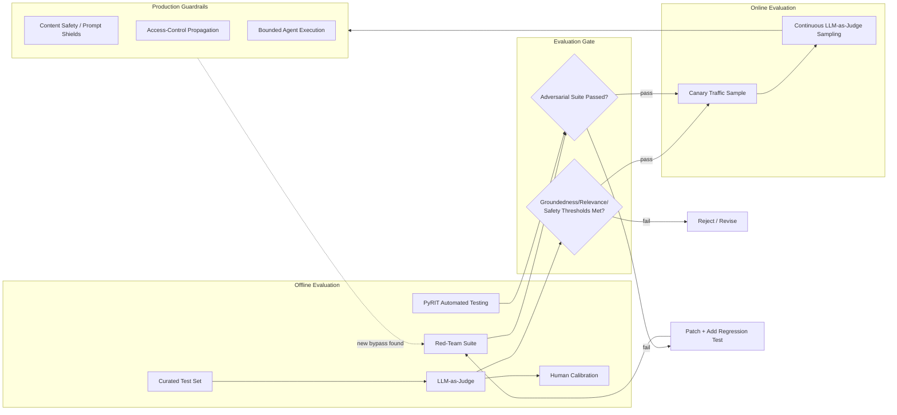
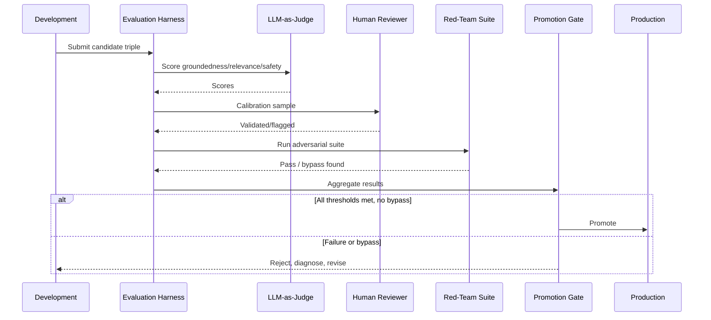
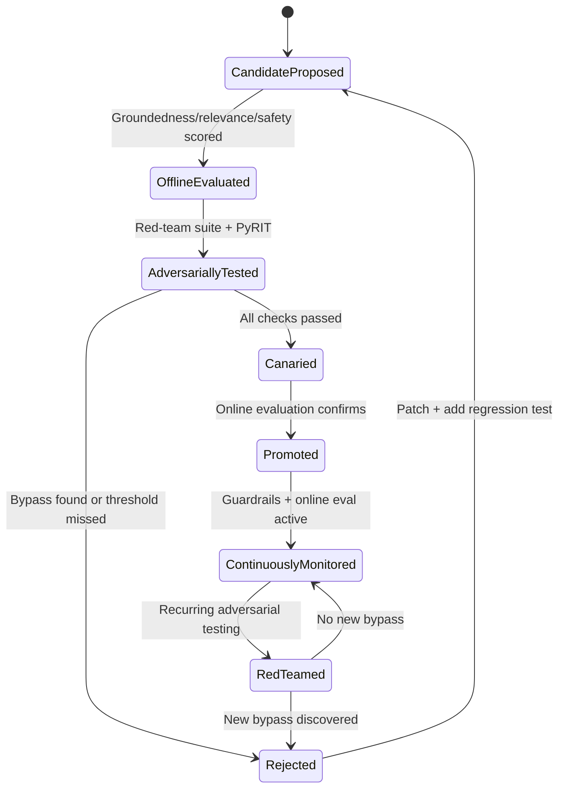

# Evaluation and Guardrails

> Part of the **Enterprise Data & AI Architecture Handbook** · Phase-12 — LLMOps & Agentic AI · Chapter 09.
> Estimated study time: **60 min reading + ~3h labs**.
> **Prerequisite:** read [LLMOps](04_LLMOps.md) first.

---

## Executive Summary

Every chapter in this handbook phase has deferred a specific evaluation or safety question to this final chapter: [LLMOps](04_LLMOps.md) §4.4 introduced the evaluation gate and LLM-as-judge concept without covering its methodology in depth; [Retrieval Augmented Generation](03_Retrieval_Augmented_Generation.md) §3.5 flagged citation faithfulness as necessary-but-not-sufficient without covering how faithfulness is actually measured; [Prompt Engineering](02_Prompt_Engineering.md) §2.5 established injection-defense principles without covering how those defenses are systematically tested; [Agentic AI Architecture](05_Agentic_AI_Architecture.md) §5.5 named non-determinism as a genuine evaluation challenge without resolving it; and [Azure OpenAI and AI Foundry](07_Azure_OpenAI_and_AI_Foundry.md) §7.2 previewed Azure AI Foundry's built-in evaluation metrics without explaining the methodology behind them. This chapter is that deferred content: the complete evaluation and guardrail discipline that determines whether "we ran an evaluation" and "we have guardrails" are defensible, evidence-based claims or merely reassuring words.

This chapter covers **offline and online evaluation** as the two structurally different, complementary evaluation modes every LLM system requires; **LLM-as-judge and human evaluation** as the two techniques for scoring open-ended natural-language output that classical ground-truth metrics cannot directly score; **groundedness, relevance, and safety metrics** as the specific, named dimensions a complete evaluation suite must cover, not merely accuracy alone; **guardrails and content filtering** as the runtime-enforced counterpart to offline evaluation, synthesizing the injection-defense, content-safety, and citation-faithfulness mechanisms introduced piecemeal throughout Chapters 02-07 into one coherent guardrail architecture; and **red-teaming and adversarial testing** as the discipline that validates those guardrails actually hold against a deliberately hostile, evolving adversary rather than merely a well-behaved test set.

As the final chapter of Phase-12, this chapter is explicitly the handbook phase's capstone on trustworthiness: every architectural capability the preceding eight chapters built — foundational model knowledge, prompting, retrieval, operational discipline, autonomous agency, standardized tool access, a concrete Azure platform, and orchestration frameworks — is only as trustworthy as the evaluation and guardrail discipline in this chapter actually validates it to be, and an enterprise that has built every one of those capabilities well but skipped this chapter's discipline has built a system it cannot actually defend as safe, accurate, or reliable under scrutiny.

The platform bias is **Azure-primary (~60%)** — Azure AI Foundry's native evaluation SDK and UI (groundedness, relevance, coherence, fluency, and safety evaluators, plus custom and LLM-as-judge evaluator support) and Azure AI Content Safety (including Prompt Shields) as the primary managed guardrail platform — **~30% enterprise open source** (MLflow's LLM-evaluation extensions, carried forward from [LLMOps](04_LLMOps.md#open-source-implementation); Ragas and DeepEval as the dominant open-source RAG- and LLM-evaluation libraries; Microsoft's PyRIT (Python Risk Identification Tool) as the reference open-source red-teaming framework) — **~10% AWS/GCP comparison-only** (Amazon Bedrock's model evaluation and Guardrails; Google Vertex AI's evaluation service and Model Armor).

**Bottom line:** "we evaluated it" and "we have guardrails" are claims that must be backed by a specific, named methodology, a specific set of measured dimensions, and evidence of adversarial testing against a maintained, evolving test suite — this chapter is where every evaluation and safety claim referenced but deferred throughout Phase-12 finally gets the concrete methodology that makes it a defensible, auditable fact rather than an unverified assertion.

---

## Learning Objectives

By the end of this chapter you will be able to:

1. **Design a complete offline and online evaluation strategy**, understanding what each mode can and cannot catch on its own.
2. **Apply LLM-as-judge evaluation correctly**, including its validation against human judgment and its known biases and limitations.
3. **Measure groundedness, relevance, and safety as distinct, named metrics**, not conflated into a single, uninterpretable quality score.
4. **Design and operate a layered guardrail architecture**, synthesizing the content-safety, injection-defense, and citation-faithfulness mechanisms established throughout this handbook phase.
5. **Design and execute a red-teaming and adversarial-testing program**, using both manual and automated (PyRIT-based) techniques.
6. **Apply Azure-native tooling** (Azure AI Foundry evaluation, Azure AI Content Safety) to implement a production-grade evaluation and guardrail pipeline.
7. **Defend evaluation and guardrail architecture decisions** in engineer, staff engineer, architect, and CTO review settings, including what "we evaluated this" should and should not be trusted to mean.

---

## Business Motivation

- **"We tested it" is not a defensible claim without a named methodology, and regulators, auditors, and customers increasingly expect the distinction.** An enterprise that cannot specify which offline metrics, which online monitoring, and which adversarial test suite a production LLM feature passed has no actual evidence to present when asked — this chapter's discipline converts "we tested it" from an assertion into an auditable fact.
- **Every case study across this handbook phase's nine chapters traces back to an evaluation or guardrail gap this chapter closes**: [Large Language Model Foundations](01_Large_Language_Model_Foundations.md)'s fine-tuning-instead-of-retrieval mistake, [Prompt Engineering](02_Prompt_Engineering.md)'s indirect-injection and overprivileged-tool incidents, [Retrieval Augmented Generation](03_Retrieval_Augmented_Generation.md)'s access-control leak and unfaithful citation, [LLMOps](04_LLMOps.md)'s silent model deprecation and stale cache, [Agentic AI Architecture](05_Agentic_AI_Architecture.md)'s runaway agent and poisoned tool observation, [Model Context Protocol (MCP)](06_Model_Context_Protocol_MCP.md)'s access-control bypass, [Azure OpenAI and AI Foundry](07_Azure_OpenAI_and_AI_Foundry.md)'s quota exhaustion and grounding-index gap, and [LangChain and LlamaIndex](08_LangChain_and_LlamaIndex.md)'s latency creep and unpinned-version regression — every one of these would have been caught earlier, or never happened at all, by a sufficiently rigorous instance of this chapter's evaluation and adversarial-testing discipline.
- **Guardrail bypass is a direct, quantifiable reputational and regulatory risk**, and demonstrating that guardrails were adversarially red-teamed (not merely designed with good intentions) is increasingly a required, not optional, part of an enterprise AI risk review.
- **LLM-as-judge evaluation, done carelessly, creates a false sense of rigor that is itself a business risk** — an unvalidated judge model can systematically mis-score exactly the failure modes an enterprise most needs to catch, and this chapter's discipline is what prevents "we have automated evaluation" from becoming its own unverified assertion.
- **Evaluation and guardrail investment has direct cost consequences on both sides of the ledger**: skipping it risks the compounding failures this handbook has documented repeatedly, while over-investing uniformly regardless of a feature's actual risk tier wastes engineering effort disproportionate to the risk — this chapter's risk-tiered approach is what makes the investment level a deliberate, defensible decision.

---

## History and Evolution

- **2020-2022 — classical ML evaluation practice** (per [Machine Learning Foundations](../Phase-11/01_Machine_Learning_Foundations.md#12-training-validation-and-evaluation-metrics) §1.2) establishes ground-truth-based accuracy metrics as the standard, a methodology that does not directly transfer to an LLM's open-ended natural-language output.
- **2022-2023 — early LLM evaluation practice largely relies on manual, ad hoc human review**, as the industry had not yet converged on a scalable automated methodology for the genuinely new problem of scoring open-ended generative output — the practical gap this chapter's §9.2 covers the resolution of.
- **2023 — LLM-as-judge evaluation emerges and rapidly gains adoption** (formalized empirically in Zheng et al.'s "Judging LLM-as-a-Judge with MT-Bench and Chatbot Arena," already referenced in [LLMOps](04_LLMOps.md#references)), giving the industry its first broadly-adopted, scalable alternative to purely manual evaluation for open-ended output.
- **2023 — RAG-specific evaluation frameworks emerge** (Ragas among the earliest and most widely adopted), formalizing groundedness, context relevance, and answer relevance as distinct, separately-measurable metrics — directly extending [Retrieval Augmented Generation](03_Retrieval_Augmented_Generation.md#31-rag-architecture-and-components) §3.1's principle that retrieval and generation quality are independently diagnosable into a concrete, named metric taxonomy.
- **2023 — OWASP publishes its "Top 10 for LLM Applications"** (already referenced in [Prompt Engineering](02_Prompt_Engineering.md#history-and-evolution)), formalizing prompt injection and related risks as named, catalogued vulnerability classes, giving red-teaming efforts a structured taxonomy to test against rather than an ad hoc, unstructured search for problems.
- **2024 — Microsoft releases PyRIT (Python Risk Identification Tool) as an open-source automated red-teaming framework**, giving practitioners a systematic, extensible tool for generating and running adversarial prompts against an LLM application at scale, rather than relying solely on manual red-team exercises.
- **2024 — Azure AI Foundry's evaluation SDK and UI mature to include native groundedness, relevance, coherence, fluency, and safety evaluators** (already previewed in [Azure OpenAI and AI Foundry](07_Azure_OpenAI_and_AI_Foundry.md#72-ai-foundry-agents-and-prompt-flow) §7.2), consolidating what had been a fragmented, custom-built evaluation-harness effort into managed, standardized platform tooling.
- **2024-present — agentic-system evaluation methodology matures to address the non-determinism and multi-step trajectory-evaluation challenges** [Agentic AI Architecture](05_Agentic_AI_Architecture.md#55-reliability-cost-and-failure-modes) §5.5 named, extending single-response evaluation techniques to evaluate an entire multi-step agent trajectory's correctness, not merely its final output.

---

## Why This Technology Exists

Evaluation and guardrail discipline exists because every capability this handbook phase has built — prompting, retrieval, agentic autonomy, tool access, a managed platform, orchestration frameworks — produces an artifact (a response, an agent trajectory, a tool invocation) whose correctness, groundedness, and safety cannot be verified by inspection alone at production scale, and whose failure modes (hallucination, injection, unauthorized action) are neither rare nor self-announcing. Offline and online evaluation exist because a system's behavior must be measured against defined, named criteria before and after deployment, not merely assumed acceptable because it "looks right" on a handful of manually-inspected examples. LLM-as-judge evaluation exists specifically because classical ground-truth accuracy metrics (per [Machine Learning Foundations](../Phase-11/01_Machine_Learning_Foundations.md#12-training-validation-and-evaluation-metrics) §1.2) do not directly apply to open-ended natural-language output, and a scalable substitute was needed that did not require exhaustive, cost-prohibitive human review of every response. Guardrails exist because evaluation alone is a point-in-time or sampled measurement, while a production system must have a continuously-enforced runtime control catching the specific requests evaluation cannot pre-emptively review one-by-one. And red-teaming exists because a guardrail or evaluation suite designed against only the failure modes its designers anticipated is, by construction, blind to whatever failure mode a genuinely adversarial actor discovers instead — a gap only deliberate, adversarial testing surfaces before an actual attacker does.

---

## Problems It Solves

- **Unverifiable claims of "we tested it" or "we have guardrails"** — a named evaluation methodology and a documented, adversarially-tested guardrail configuration convert these into auditable, evidence-backed facts.
- **The inability to score open-ended natural-language output against a single ground truth** — LLM-as-judge and human evaluation (§9.2) give a scalable, structured methodology for exactly this problem, one classical accuracy metrics cannot solve directly.
- **Conflating "the response looks fine" with "the response is actually grounded, relevant, and safe"** — groundedness, relevance, and safety as distinct, separately-measured metrics (§9.3) prevent a single, uninterpretable quality score from masking a specific, actionable failure dimension.
- **Guardrails designed only against anticipated failure modes** — red-teaming and adversarial testing (§9.5) systematically surface the failure modes a design-time review alone would miss, closing the gap between "we think this is safe" and "we have evidence this holds against deliberate attack."
- **Every specific evaluation and guardrail gap named across this handbook phase's eight prior case studies** — the complete methodology this chapter establishes is the direct, systematic fix generalizing every one of those individually-discovered incidents into a standing, repeatable practice rather than a one-off remediation.

---

## Problems It Cannot Solve

- **It cannot make an evaluation suite complete or guarantee coverage of every possible failure mode.** No evaluation suite, however comprehensive, can test every input the real world will eventually present — evaluation and red-teaming reduce, they do not eliminate, the risk of a genuinely novel failure mode surfacing in production, a limitation this chapter is explicit about rather than overselling evaluation as a guarantee.
- **It cannot substitute for good underlying architecture.** A well-designed evaluation suite measures whether a system is good; it does not make a poorly-designed prompt, retrieval pipeline, or agent architecture (Chapters 02, 03, 05) good merely by measuring it — evaluation is diagnostic, not curative.
- **It cannot make LLM-as-judge evaluation a perfect proxy for human judgment.** A judge model can itself be biased, can be gamed by a response optimized to satisfy the judge's specific scoring heuristics rather than genuine quality, and requires its own periodic validation (§9.2) — a limitation this chapter names directly rather than treating LLM-as-judge as a fully-solved substitute for human review.
- **It cannot eliminate the fundamental non-determinism of LLM and agentic-system output.** Repeated evaluation runs of the same input can produce different outputs or different agent trajectories (per [Agentic AI Architecture](05_Agentic_AI_Architecture.md#55-reliability-cost-and-failure-modes) §5.5) — evaluation methodology must account for this genuine variability, not assume a single deterministic pass/fail per test case.
- **It cannot make guardrails a substitute for the underlying architectural controls established throughout this handbook** — role separation, least-privilege tool scoping, and access-control propagation ([Prompt Engineering](02_Prompt_Engineering.md) ADR-0156, [Retrieval Augmented Generation](03_Retrieval_Augmented_Generation.md) ADR-0157, [Model Context Protocol (MCP)](06_Model_Context_Protocol_MCP.md) ADR-0160) remain necessary, independent controls; a guardrail is a runtime backstop layered atop those controls, not a replacement for them.

---

## Core Concepts

### 9.1 Offline and Online Evaluation

- **Offline evaluation** runs a candidate system (a new prompt version, model version, or retrieval-index version, per [LLMOps](04_LLMOps.md#41-llm-lifecycle-and-versioning) §4.1's versioned triple) against a fixed, curated test set before promotion, giving a controlled, repeatable measurement independent of live traffic — the concrete methodology behind the non-bypassable evaluation gate established in [LLMOps](04_LLMOps.md) ADR-0158 and [MLOps and MLflow](../Phase-11/03_MLOps_and_MLflow.md) ADR-0150.
- **Online evaluation** measures a system's behavior against live, real production traffic after deployment — via sampled human review, continuous LLM-as-judge scoring of a traffic sample, or implicit signals (user feedback, task-completion rate) — catching regressions and distributional shifts a fixed offline test set cannot anticipate, since real production traffic inevitably diverges from any pre-defined test set over time.
- **Offline and online evaluation are complementary, not substitutes for each other**: offline evaluation is the mandatory pre-promotion gate (per [LLMOps](04_LLMOps.md) ADR-0158), catching a regression before it reaches any user; online evaluation is the continuous, standing safety net catching whatever offline evaluation's necessarily-finite test set did not anticipate — a system with only one of the two has a real, specific blind spot the other exists to cover.
- **A/B testing and canary evaluation** (directly extending the canary-deployment pattern from [Model Serving and Ray](../Phase-11/04_Model_Serving_and_Ray.md) ADR-0151 and [ML Pipeline Architecture](../Phase-11/06_ML_Pipeline_Architecture.md)) let a candidate triple version be evaluated against a small slice of live traffic before full promotion, combining offline evaluation's controlled comparison with online evaluation's real-traffic representativeness.
- **The test set itself is a governed, versioned artifact requiring its own maintenance** — a stale evaluation set that no longer reflects the current production query distribution or the current adversarial-technique landscape gives a false sense of confidence, the exact "verification gap" pattern recurring throughout this handbook (per [LLMOps](04_LLMOps.md#44-evaluation-and-regression-testing) §4.4's own caution), meaning test-set currency itself must be periodically audited, not assumed to remain representative indefinitely.

### 9.2 LLM-as-Judge and Human Evaluation

- **LLM-as-judge evaluation** uses a separate, typically more capable model to score a candidate response against defined rubric criteria (correctness, relevance, groundedness, tone, per §9.3), giving a scalable, automatable evaluation methodology for open-ended natural-language output that a classical single-ground-truth accuracy metric (per [Machine Learning Foundations](../Phase-11/01_Machine_Learning_Foundations.md#12-training-validation-and-evaluation-metrics) §1.2) cannot directly score — the technique introduced conceptually in [LLMOps](04_LLMOps.md#44-evaluation-and-regression-testing) §4.4, covered here at full methodological depth.
- **A judge model must itself be validated, not trusted by default** — periodically sampling the judge's scores and comparing them against independent human review confirms the judge remains a reliable proxy; a judge model can drift, exhibit systematic biases (e.g., favoring longer or more confidently-worded responses regardless of actual correctness, a well-documented LLM-as-judge failure pattern), or be gamed by a response subtly optimized for the judge's specific scoring heuristics rather than genuine quality — this validation step is not optional, it is what makes "we used LLM-as-judge evaluation" a defensible claim rather than an unverified one.
- **Human evaluation remains necessary for dimensions an automated judge cannot yet reliably assess**: genuinely novel edge cases outside the judge model's own training distribution, subtle tone or cultural-sensitivity judgments, and periodic ground-truth calibration of the judge itself (per the point above) — human evaluation is a scaling-limited but irreplaceable complement to LLM-as-judge, not a legacy technique LLM-as-judge has fully superseded.
- **Inter-rater reliability discipline** (multiple independent human reviewers scoring the same sample, measuring agreement) applies to human evaluation exactly as it does in any other human-labeling process (per [Machine Learning Foundations](../Phase-11/01_Machine_Learning_Foundations.md#14-feature-engineering-fundamentals) §1.4's data-quality concerns) — a single reviewer's subjective judgment, uncalibrated against other reviewers, is a weaker evidentiary basis than a measured inter-rater agreement score.
- **A tiered evaluation strategy** — LLM-as-judge for scalable, continuous coverage; human review for a periodic calibration sample and for genuinely novel or high-stakes cases — is the practical resolution most enterprises converge on, rather than choosing one technique exclusively, directly paralleling the risk-tiered-rigor pattern established throughout [Responsible AI](../Phase-11/07_Responsible_AI.md#trade-offs).

### 9.3 Groundedness, Relevance, and Safety Metrics

- **Groundedness** measures whether a generated response is actually supported by its provided context (for a RAG system, per [Retrieval Augmented Generation](03_Retrieval_Augmented_Generation.md#35-grounding-citations-and-hallucination-control) §3.5), typically computed via an entailment-style check (does the cited or retrieved passage logically support the specific claim) — the concrete, named metric behind the "citation presence is necessary but not sufficient" caution [Retrieval Augmented Generation](03_Retrieval_Augmented_Generation.md) Case Study 2 established, and the specific gap Azure AI Foundry's native groundedness evaluator (per [Azure OpenAI and AI Foundry](07_Azure_OpenAI_and_AI_Foundry.md#74-content-safety-and-guardrails) §7.4) is built to measure.
- **Relevance** is measured at two distinct levels: **context relevance** (did retrieval surface passages actually relevant to the query, directly extending [Retrieval Augmented Generation](03_Retrieval_Augmented_Generation.md#33-vector-keyword-and-hybrid-retrieval) §3.3's recall/precision metrics) and **answer relevance** (does the final generated response actually address the user's specific question, as distinct from being merely grounded in irrelevant-but-technically-cited context) — conflating these two distinct relevance dimensions into one score obscures whether a failure originates in retrieval or in generation, the same diagnostic separation [Retrieval Augmented Generation](03_Retrieval_Augmented_Generation.md#31-rag-architecture-and-components) §3.1 established as essential.
- **Coherence and fluency** measure the response's internal logical consistency and linguistic quality respectively — generally the least differentiating metrics for a modern, well-aligned LLM (per [Large Language Model Foundations](01_Large_Language_Model_Foundations.md#13-pretraining-fine-tuning-and-rlhf) §1.3's RLHF discussion), but still worth tracking as a baseline-quality signal, particularly for a fine-tuned or self-hosted open-weight model where alignment quality may vary more than for a frontier proprietary model.
- **Safety metrics** cover the content-safety categories established in [Azure OpenAI and AI Foundry](07_Azure_OpenAI_and_AI_Foundry.md#74-content-safety-and-guardrails) §7.4 (hate/fairness, sexual, violence, self-harm) plus injection-susceptibility and jailbreak-resistance scores specifically — measured as pass/fail or severity-scored rates against a red-teamed test set (§9.5), not merely inferred from the absence of a customer complaint.
- **A complete evaluation suite reports these dimensions separately, never collapsed into one aggregate "quality score"** — an aggregate score can mask a specific, actionable failure (e.g., a response scoring well on fluency and answer relevance while being ungrounded and confidently hallucinated) that only a disaggregated report surfaces, directly extending the disaggregated-metric principle [Responsible AI](../Phase-11/07_Responsible_AI.md#71-fairness-and-bias-mitigation) §7.1 established for fairness evaluation to this chapter's quality and safety dimensions.

### 9.4 Guardrails and Content Filtering

- **A complete guardrail architecture synthesizes every safety mechanism introduced piecemeal across this handbook phase into one layered, defense-in-depth system**: role separation and least-privilege tool scoping ([Prompt Engineering](02_Prompt_Engineering.md) §2.2, ADR-0156), input/output content filtering and Prompt Shields ([Azure OpenAI and AI Foundry](07_Azure_OpenAI_and_AI_Foundry.md) §7.4), access-control propagation ([Retrieval Augmented Generation](03_Retrieval_Augmented_Generation.md) ADR-0157, [Model Context Protocol (MCP)](06_Model_Context_Protocol_MCP.md) ADR-0160), groundedness/citation validation (§9.3), and bounded agent execution ([Agentic AI Architecture](05_Agentic_AI_Architecture.md) ADR-0159) — this chapter's contribution is not introducing a new mechanism, it is establishing that these must operate together as one coherent, continuously-monitored system, not as disconnected, independently-maintained point solutions.
- **Guardrails must fail closed for safety-critical checks**, directly extending the fail-closed principle established in [LLMOps](04_LLMOps.md#fault-tolerance) and [Azure OpenAI and AI Foundry](07_Azure_OpenAI_and_AI_Foundry.md#fault-tolerance) — a guardrail service outage must block or degrade to a safe default, never silently pass an unfiltered request or response through.
- **Guardrail configuration (severity thresholds, filter categories enabled) must be tuned per feature's actual risk tier**, per the risk-tiered pattern established throughout [LLMOps](04_LLMOps.md#trade-offs) and [Azure OpenAI and AI Foundry](07_Azure_OpenAI_and_AI_Foundry.md#74-content-safety-and-guardrails) §7.4 — uniform maximal guardrail strictness applied regardless of risk tier both under-serves genuinely high-risk features (if the organization's default is calibrated to a lower bar) and unnecessarily degrades legitimate use for low-risk ones.
- **Guardrail-trigger monitoring must distinguish an active attack pattern from a false-positive-prone configuration**, exactly the diagnostic distinction [Prompt Engineering](02_Prompt_Engineering.md)'s and [LLMOps](04_LLMOps.md)'s Operational Response Playbooks both established — a rising trigger rate alone does not indicate which case applies, and treating every trigger-rate rise identically (either always escalating as an attack or always tuning down as a false positive) is a diagnostic shortcut this chapter warns against.
- **A guardrail's effectiveness is only as current as its last adversarial validation** (§9.5) — a guardrail configuration designed and tested once at launch, then left unreviewed as new injection and jailbreak techniques emerge, degrades in effectiveness over time without any code change of its own, the same "designed once, never re-validated" gap recurring throughout this handbook's case studies.

### 9.5 Red-Teaming and Adversarial Testing

- **Red-teaming is the deliberate, adversarial attempt to break a system's guardrails, extract unauthorized behavior, or cause unsafe output**, conducted either manually (a dedicated security/safety team probing the system with known and novel attack techniques) or via an automated framework (Microsoft's PyRIT, generating and iterating adversarial prompts systematically at a scale manual testing cannot match) — the concrete practice this chapter's Business Motivation and every prior chapter's "must be adversarially tested" caution have referenced without fully specifying the methodology.
- **A red-team test suite should be structured against a named vulnerability taxonomy** (OWASP's "Top 10 for LLM Applications," per [Prompt Engineering](02_Prompt_Engineering.md#history-and-evolution)'s reference) rather than an unstructured, ad hoc search for problems — testing systematically against direct and indirect prompt injection ([Prompt Engineering](02_Prompt_Engineering.md) §2.5), jailbreak attempts, data-exfiltration attempts (probing whether a RAG or agentic system can be induced to reveal unauthorized content, per [Retrieval Augmented Generation](03_Retrieval_Augmented_Generation.md) ADR-0157 and [Model Context Protocol (MCP)](06_Model_Context_Protocol_MCP.md) ADR-0160), and unauthorized tool-invocation attempts ([Agentic AI Architecture](05_Agentic_AI_Architecture.md) §5.2).
- **Automated adversarial testing (PyRIT and comparable frameworks) scales red-teaming coverage beyond what manual testing alone can achieve**, systematically generating and mutating adversarial prompts against a target system and scoring the results — a genuinely complementary technique to manual red-teaming's deeper, more creative probing of a specific system's particular architecture, not a full substitute for either technique alone.
- **Red-teaming must be a recurring, not one-time, practice** — per §9.4's point that guardrail effectiveness degrades as new attack techniques emerge, a red-team test suite must itself be a governed, periodically-expanded artifact (mirroring the evaluation-suite-currency discipline from §9.1), incorporating newly-discovered techniques and newly-reported incidents (including from this handbook's own documented case studies) rather than remaining static after its initial creation.
- **Red-team findings must feed back into both the guardrail configuration and the standing regression-evaluation suite** — a successfully-discovered bypass should be added as a permanent regression test case (per [LLMOps](04_LLMOps.md) ADR-0158's evaluation-gate principle), ensuring the same bypass technique is caught automatically on every future evaluation cycle, not merely patched once and left unverified against recurrence.

---

## Internal Working

**How a complete evaluation and guardrail cycle actually operates for a production LLM feature** (the mechanics underlying §9.1-§9.5, and the synthesis of every prior Phase-12 chapter's individually-introduced evaluation and safety mechanism):

1. **Offline evaluation on a candidate triple change**: a proposed model, prompt, or retrieval-index change (per [LLMOps](04_LLMOps.md#41-llm-lifecycle-and-versioning) §4.1) is run against the curated offline test set, scored across groundedness, relevance, coherence, fluency, and safety dimensions (§9.3) via LLM-as-judge, with a periodic human-calibration sample (§9.2).
2. **Adversarial regression check**: the same candidate is run against the maintained red-team test suite (§9.5), including every previously-discovered bypass technique from this handbook's case studies and any newly-added adversarial patterns.
3. **Evaluation-gate decision**: per [LLMOps](04_LLMOps.md) ADR-0158, the candidate is promoted only if it clears both the quality/groundedness/relevance thresholds and the adversarial-regression suite with no new bypass discovered.
4. **Canary/online evaluation**: the promoted candidate is exposed to a small slice of live traffic (§9.1), with continuous LLM-as-judge scoring and guardrail-trigger monitoring applied to this real-traffic sample before full rollout.
5. **Full production operation with continuous guardrail enforcement**: every live request passes through the layered guardrail architecture (§9.4) — content filtering, injection defense, access-control-propagating retrieval, bounded agent execution — with every guardrail decision logged.
6. **Ongoing red-teaming**: a recurring (not one-time) red-team exercise, manual and PyRIT-automated, probes the live system for new bypass techniques, feeding any discovery back into both the guardrail configuration and the regression suite (step 2).
7. **Continuous online-evaluation sampling**: a sample of live traffic is continuously scored via LLM-as-judge and periodically calibrated against human review, surfacing any distributional drift or regression the offline test set's necessarily-finite coverage did not anticipate.

This sequence is why this chapter is positioned as Phase-12's capstone on trustworthiness — every mechanism named individually throughout Chapters 02-08 (injection defense, access-control propagation, bounded execution, groundedness) is here operated as one continuously-validated, continuously-enforced system, rather than eight separately-maintained point solutions.

---

## Architecture

- **Offline evaluation layer**: the curated test set, LLM-as-judge scoring, and human-calibration process (§9.1-§9.2), gating every triple promotion per [LLMOps](04_LLMOps.md) ADR-0158.
- **Online evaluation layer**: continuous sampled scoring of live traffic and canary-deployment evaluation (§9.1), extending [Model Serving and Ray](../Phase-11/04_Model_Serving_and_Ray.md) ADR-0151's canary pattern to LLM-specific quality metrics.
- **Metric-computation layer**: groundedness, relevance, coherence, fluency, and safety evaluators (§9.3), implemented via Azure AI Foundry's native evaluators or Ragas/DeepEval for a self-hosted stack.
- **Guardrail layer**: the synthesized, layered defense architecture (§9.4) drawing on every prior chapter's individual controls.
- **Red-team layer**: the manual and PyRIT-automated adversarial-testing practice (§9.5), feeding both the guardrail configuration and the regression-evaluation suite.
- **Governance and audit layer**: the documented evidence trail (which evaluation, which red-team suite version, which guardrail configuration) that converts "we tested it" into an auditable claim, extending [Responsible AI](../Phase-11/07_Responsible_AI.md#73-model-cards-and-datasheets) §7.3's model-card documentation discipline to this chapter's specific evaluation-and-guardrail artifacts.

---

## Components

- **Curated offline test set** — the versioned, governed evaluation dataset (§9.1).
- **LLM-as-judge evaluator** — a separate model scoring candidate responses against a defined rubric (§9.2), periodically validated against human review.
- **Groundedness/relevance/safety metric evaluators** — Azure AI Foundry's native evaluators, or Ragas/DeepEval (§9.3).
- **Content Safety and Prompt Shields** — the runtime content-filtering and injection-defense guardrail service, per [Azure OpenAI and AI Foundry](07_Azure_OpenAI_and_AI_Foundry.md#74-content-safety-and-guardrails) §7.4.
- **Red-team test suite** — the versioned, growing collection of known and newly-discovered adversarial patterns (§9.5).
- **PyRIT (or equivalent) automated red-teaming harness** — the systematic, scaled adversarial-prompt-generation tool (§9.5).
- **Evaluation-and-guardrail evidence registry** — the documented, auditable record of every evaluation run, red-team exercise, and guardrail configuration.

---

## Metadata

- **Evaluation-run metadata**: test-set version, judge-model version, per-dimension scores (groundedness, relevance, coherence, fluency, safety), and pass/fail outcome — extending [LLMOps](04_LLMOps.md#metadata)'s triple-version metadata with this chapter's full evaluation-result detail.
- **Red-team run metadata**: test-suite version, specific attack patterns tested, and pass/fail/bypass-discovered outcome per pattern — the concrete evidence record behind an "adversarially tested" claim.
- **Guardrail-configuration metadata**: severity thresholds per category, per feature, and the date of last adversarial validation (§9.4-§9.5), needed to audit whether a feature's guardrail configuration is current or stale.
- **Human-calibration metadata**: which evaluation samples were human-reviewed, inter-rater agreement scores, and the resulting judge-model validation outcome (§9.2).

---

## Storage

- **Test sets, red-team suites, and evaluation/red-team run results** are stored as versioned, governed artifacts (per [LLMOps](04_LLMOps.md#storage) and [MLOps and MLflow](../Phase-11/03_MLOps_and_MLflow.md#storage)), retained for audit and for the regression-detection discipline that requires comparing a new run against prior baselines.
- **Guardrail-trigger logs and Content Safety decision records** are stored with the same PII-handling and retention discipline established throughout [LLMOps](04_LLMOps.md#storage) and [Data Privacy and PII Protection](../Phase-10/07_Data_Privacy_and_PII_Protection.md), since a logged flagged request can itself contain sensitive or adversarial content requiring careful handling.

---

## Compute

- **LLM-as-judge evaluation consumes real inference compute/cost against the judge model** (per [LLMOps](04_LLMOps.md#compute)'s original caution), a cost that scales with test-set size and evaluation frequency and must be explicitly budgeted, not treated as a free testing overhead.
- **PyRIT-based automated red-teaming consumes inference compute proportional to the number of adversarial prompt variations generated and tested**, a cost trade-off against manual red-teaming's more limited but more creatively-targeted coverage.

---

## Networking

- **No materially distinct networking requirements beyond the model-invocation and guardrail-service networking postures already established** throughout [Large Language Model Foundations](01_Large_Language_Model_Foundations.md#networking), [Azure OpenAI and AI Foundry](07_Azure_OpenAI_and_AI_Foundry.md#networking), and [LLMOps](04_LLMOps.md#networking).

---

## Security

- **Red-team test data and discovered bypass techniques are themselves sensitive artifacts** — a red-team suite documenting successful attack patterns against a production system is valuable, sensitive information that should be access-controlled with the same rigor as any other security-sensitive documentation (per [Security Foundations](../Phase-10/01_Security_Foundations.md)), never stored or shared without appropriate access review.
- **Guardrail configuration itself is a security-relevant artifact**, requiring the same change-review discipline as any other production security control — a guardrail-threshold change loosened without review is a direct, avoidable security regression, per [LLMOps](04_LLMOps.md#governance)'s guardrail-change-control requirement.
- **Automated red-teaming tools (PyRIT) must themselves be operated under appropriate access control**, since a tool designed to systematically probe for and generate successful attacks against a production system is, by its nature, a capability that must not be accessible to an unauthorized party.

---

## Performance

- **Offline evaluation and red-teaming run as batch processes**, not subject to the same production-latency constraints as live request handling — their performance concern is throughput (evaluating a large test/red-team suite in a reasonable turnaround time for the promotion pipeline), not per-request latency.
- **Online evaluation sampling and guardrail checks add a per-request latency and compute overhead**, consistent with the guardrail-latency-cost trade-off already established in [LLMOps](04_LLMOps.md#performance) and [Azure OpenAI and AI Foundry](07_Azure_OpenAI_and_AI_Foundry.md#performance).

---

## Scalability

- **The offline evaluation and red-team suites must scale with the number of actively-maintained model/prompt/retrieval-index triples across the organization**, the same portfolio-wide governance-capacity concern raised throughout [LLMOps](04_LLMOps.md#scalability), [Agentic AI Architecture](05_Agentic_AI_Architecture.md#scalability), and [Model Context Protocol (MCP)](06_Model_Context_Protocol_MCP.md#scalability), now applied specifically to this chapter's evaluation-and-red-team artifact set.
- **Automated red-teaming (PyRIT) scales adversarial-test coverage more readily than manual red-teaming**, a genuine scaling advantage for an organization operating many features, though at the cost of the deeper, more creative coverage a dedicated manual red-team exercise can provide for a specific, high-stakes system.

---

## Fault Tolerance

- **A guardrail-service outage must fail closed** (§9.4), directly extending the fail-closed principle established throughout [LLMOps](04_LLMOps.md#fault-tolerance) and [Azure OpenAI and AI Foundry](07_Azure_OpenAI_and_AI_Foundry.md#fault-tolerance).
- **An evaluation-pipeline failure (the offline test suite itself fails to run, or the judge model is unreachable) must block promotion**, never silently treated as an implicit pass — the same fail-closed principle applied to the evaluation gate itself, not only to the runtime guardrail layer.

---

## Cost Optimization (FinOps)

- **Right-sizing evaluation depth and frequency to a feature's actual risk tier** (per §9.4's risk-tiered guardrail principle, extended to evaluation) avoids applying maximal evaluation rigor uniformly regardless of risk, directly extending [Responsible AI](../Phase-11/07_Responsible_AI.md#cost-optimization-finops) §7's cost-optimization discipline to this chapter's evaluation cost specifically.
- **Sizing the judge model to the evaluation task's actual required confidence bar**, rather than reflexively using the most capable and expensive available model for every evaluation call, directly extends [Large Language Model Foundations](01_Large_Language_Model_Foundations.md#decision-matrix)'s model-tiering discipline to the evaluation layer.
- **Reusing previously-validated red-team and evaluation results where the underlying triple has not materially changed**, avoiding redundant re-evaluation cost, mirrors the caching-and-reuse discipline established in [Azure OpenAI and AI Foundry](07_Azure_OpenAI_and_AI_Foundry.md#cost-optimization-finops) — while still fully re-running the complete suite whenever any triple member has genuinely changed.

---

## Monitoring

- **Per-dimension evaluation scores (groundedness, relevance, coherence, fluency, safety) tracked over time**, segmented by triple version, giving the same version-attributable regression-detection capability [LLMOps](04_LLMOps.md#monitoring) established for cost and latency, now applied to quality and safety dimensions.
- **Guardrail-trigger rate and red-team-suite pass rate**, tracked as standing production KPIs, per §9.4-§9.5.
- **Judge-model/human-calibration agreement rate**, tracked over time to detect judge-model drift (§9.2) before it silently degrades evaluation reliability.

---

## Observability

- **A unified dashboard correlating triple version, per-dimension evaluation scores, guardrail-trigger rate, and red-team-suite currency** gives engineering, security, and governance stakeholders one authoritative source for "is this feature's trustworthiness evidence current and defensible," directly extending the unified cost/quality/safety dashboard pattern established throughout [LLMOps](04_LLMOps.md#observability) and [Azure OpenAI and AI Foundry](07_Azure_OpenAI_and_AI_Foundry.md#observability).

### Operational Response Playbook

| Signal | Detection Query/Check | Remediation |
|---|---|---|
| **A newly promoted triple version shows a disaggregated evaluation-dimension regression (e.g., groundedness drops while answer relevance and fluency remain stable)** | Per-dimension evaluation dashboard, comparing the newly promoted version against the immediately prior one across each of §9.3's separately-tracked dimensions | Investigate the specific pipeline stage (retrieval, generation, or guardrail configuration) responsible for the affected dimension specifically, rather than treating an aggregate quality drop as a single undifferentiated problem — the disaggregated signal directly points to where in the pipeline to look |
| **A red-team exercise discovers a new successful bypass technique against a production guardrail** | Red-team run result showing a bypass, or an actual incident later traced to a previously-untested attack pattern | Add the discovered pattern as a permanent regression test case in the standing red-team suite immediately (per §9.5's feedback-loop requirement), patch the specific guardrail gap, and re-run the full adversarial suite before re-promoting, never treating the discovery as a one-off patch without the corresponding permanent regression-test addition |

---

## Governance

- **Every production LLM feature must maintain a documented, current evaluation record and red-team-suite pass result as a condition of continued production operation**, not merely a one-time pre-launch artifact — extending the model-card and evaluation-currency discipline established throughout [Responsible AI](../Phase-11/07_Responsible_AI.md) ADR-0154 and [LLMOps](04_LLMOps.md) ADR-0158 to this chapter's complete evaluation-and-guardrail evidence trail.
- **A designated owner for each feature's evaluation-suite currency, guardrail-configuration appropriateness, and red-team-suite recency** should be established, extending the accountable-ownership pattern from [Responsible AI](../Phase-11/07_Responsible_AI.md#75-microsoft-responsible-ai-standard) §7.5.
- **Guardrail-configuration changes require the same review rigor as a prompt-template change** (per [Prompt Engineering](02_Prompt_Engineering.md#governance) and [LLMOps](04_LLMOps.md#governance)), since a loosened guardrail threshold is a security-relevant, behavior-changing decision.
- **A red-team exercise's findings must be reported through the same governance channel as any other security finding** (per [Security Foundations](../Phase-10/01_Security_Foundations.md)), ensuring a discovered vulnerability is tracked, remediated, and verified-closed rather than informally patched and forgotten.

---

## Trade-offs

- **Evaluation thoroughness vs. iteration velocity**: a more comprehensive offline test set and red-team suite catches more regressions and vulnerabilities but slows every promotion cycle — the risk-tiered depth already established throughout [Responsible AI](../Phase-11/07_Responsible_AI.md#trade-offs) and [LLMOps](04_LLMOps.md#trade-offs) resolves this tension identically here.
- **LLM-as-judge scalability vs. human-evaluation reliability**: LLM-as-judge scales far more cheaply than human review, at the cost of the judge-model-drift and gaming risks §9.2 named — the tiered strategy (judge for scale, human for calibration and novel cases) is the practical resolution, not an either/or choice.
- **Manual red-teaming's creative depth vs. automated red-teaming's (PyRIT) breadth**: manual red-teaming finds deeper, more system-specific vulnerabilities a generic automated tool might miss; automated red-teaming covers far more ground far more cheaply — both are typically necessary, neither alone is sufficient.
- **Guardrail strictness vs. legitimate-use friction**: a stricter guardrail configuration reduces risk further but increases the false-positive rate against legitimate requests — the risk-tiered approach established in §9.4 resolves this per feature rather than choosing one blanket policy.

---

## Decision Matrix

| Scenario | Recommended Approach | Rationale |
|---|---|---|
| Any triple change (model, prompt, or retrieval-index) before production promotion | Full offline evaluation (groundedness/relevance/safety) + adversarial regression suite, per [LLMOps](04_LLMOps.md) ADR-0158 | No change is exempt from the evaluation gate regardless of apparent triviality |
| High-stakes, regulated, or safety-critical feature | Full-depth evaluation, human-calibrated LLM-as-judge, both manual and automated red-teaming, strictest guardrail thresholds | Regulatory and liability exposure justifies maximal rigor |
| Low-stakes, experimental, internal-only feature | Lighter evaluation suite, automated red-teaming only, standard guardrail baseline | Full rigor is not proportionate; escalate if the feature progresses toward higher stakes |
| A newly-discovered vulnerability or bypass from any source (red-team, incident, external report) | Immediate addition to the permanent regression suite, patch, and full re-evaluation before re-promotion | Ensures the same bypass is caught automatically on every future cycle, not merely patched once |
| Judge-model score drift suspected | Immediate human-calibration sample against recent judge scores | Confirms whether the judge remains a reliable proxy before continuing to rely on its scores |

---

## Design Patterns

- **Layered, defense-in-depth guardrails**, synthesizing every prior chapter's individual control into one continuously-enforced system, never relying on any single mechanism alone (§9.4).
- **Tiered LLM-as-judge-plus-human-calibration evaluation**, using automated scoring for scale and periodic human review for validation and novel-case coverage (§9.2).
- **Disaggregated, named evaluation metrics**, never collapsing groundedness, relevance, coherence, fluency, and safety into one uninterpretable aggregate score (§9.3).
- **Red-team-finding-to-permanent-regression-test feedback loop**, ensuring every discovered vulnerability becomes a standing, automatically-checked test case rather than a one-off patch (§9.5).

---

## Anti-patterns

- **Treating "we ran an evaluation" or "we have guardrails" as sufficient without a named, specific methodology and evidence trail** — the precise assertion-without-evidence gap this entire chapter exists to close.
- **Trusting LLM-as-judge scores without periodic human-calibration validation**, risking an undetected judge-model drift or gaming vulnerability silently degrading evaluation reliability.
- **Collapsing groundedness, relevance, and safety into a single aggregate quality score**, masking a specific, actionable failure dimension a disaggregated report would have surfaced.
- **Red-teaming once at launch and never again**, allowing guardrail effectiveness to silently degrade as new attack techniques emerge without any corresponding code change of the guardrail itself.
- **Patching a discovered red-team bypass without adding it as a permanent regression test case**, risking the exact same bypass recurring undetected in a future release.

---

## Common Mistakes

- Assuming a fixed offline test set remains representative indefinitely, without periodically auditing it against the current production query distribution and current adversarial-technique landscape.
- Using the same, single evaluation dimension (or an aggregate score) to diagnose every type of regression, rather than the disaggregated per-dimension reporting that would correctly localize the actual failure.
- Under-resourcing manual red-teaming in favor of automated tooling alone (or vice versa), missing the complementary coverage each technique specifically provides.
- Treating a guardrail configuration as a "set once at launch" artifact rather than a living, periodically-reviewed and re-validated one.
- Failing to distinguish, in guardrail-trigger monitoring, between an active attack pattern and a legitimate-use false-positive spike, applying the same reflexive response to both.

---

## Best Practices

- Maintain both offline and online evaluation as complementary, continuously-operated practices, never relying on either alone.
- Validate LLM-as-judge scores against periodic human calibration, treating judge-model reliability as an ongoing, monitored property, not a one-time assumption.
- Report groundedness, relevance, coherence, fluency, and safety as separate, named metrics in every evaluation result, never as a single aggregate score.
- Conduct both manual and automated (PyRIT-based) red-teaming on a recurring cadence, feeding every discovered vulnerability into a permanent regression test case.
- Apply risk-tiered evaluation and guardrail depth, reserving maximal rigor for genuinely high-stakes features rather than applying it uniformly regardless of risk.

---

## Enterprise Recommendations

- Require a documented, named evaluation methodology and adversarial-testing record as a non-negotiable condition of production launch and continued operation for every LLM feature.
- Establish a centralized, shared red-team function and a continuously-maintained, organization-wide adversarial test suite, rather than each team independently and incompletely red-teaming its own features.
- Establish a standing judge-model-calibration process, sampling and human-reviewing a portion of LLM-as-judge scores on a recurring schedule across the organization's evaluation portfolio.
- Track per-dimension evaluation scores, guardrail-trigger rates, and red-team-suite currency as standing platform-wide KPIs, giving leadership a single, evidence-based view of the organization's actual AI trustworthiness posture.

---

## Azure Implementation

- **Azure AI Foundry's evaluation SDK and UI**, providing native groundedness, relevance, coherence, fluency, and safety evaluators, plus support for custom and LLM-as-judge evaluators, directly implementing §9.1-§9.3's methodology as managed platform tooling.
- **Azure AI Content Safety, including Prompt Shields**, as the runtime guardrail-enforcement layer (§9.4), per [Azure OpenAI and AI Foundry](07_Azure_OpenAI_and_AI_Foundry.md#74-content-safety-and-guardrails) §7.4.
- **Azure AI Foundry's Responsible AI dashboard and evaluation reporting**, giving the disaggregated, per-dimension metric reporting §9.3 establishes as mandatory, as native platform visualization rather than custom dashboard-building effort.
- **Azure Monitor and Application Insights**, extended with evaluation and red-team-run metrics, for the unified observability dashboard established in Observability.

---

## Open Source Implementation

- **MLflow's LLM-evaluation extensions**, carried forward from [LLMOps](04_LLMOps.md#open-source-implementation), as the open-source evaluation-tracking and experiment-management backbone.
- **Ragas and DeepEval** as the dominant open-source RAG- and LLM-evaluation libraries, providing pre-built groundedness, relevance, and answer-correctness evaluators directly implementing §9.3's metric taxonomy.
- **Microsoft's PyRIT (Python Risk Identification Tool)** as the reference open-source automated red-teaming framework (§9.5), for systematic, scaled adversarial-prompt generation and testing.
- **OWASP's published "Top 10 for LLM Applications" test-case references**, providing a structured, community-maintained vulnerability taxonomy to build a red-team suite against.

---

## AWS Equivalent (comparison only)

- **Amazon Bedrock's model evaluation and Guardrails capabilities** provide the direct equivalent evaluation and guardrail-enforcement stack.
- **Advantages**: tight integration for AWS-centric teams, consistent with the parallel comparisons throughout this handbook.
- **Disadvantages**: a distinct evaluation-metric and guardrail-configuration surface relative to Azure AI Foundry, requiring rework to migrate existing evaluation harnesses.
- **Migration strategy**: open-source evaluation libraries (Ragas, DeepEval, MLflow) and PyRIT-based red-teaming port with the least friction; platform-native evaluator and guardrail configuration requires the most rework.
- **Selection criteria**: choose Bedrock's evaluation/Guardrails stack when the broader cloud estate is AWS-centric; otherwise this chapter's Azure-primary recommendation applies.

---

## GCP Equivalent (comparison only)

- **Google Vertex AI's evaluation service and Model Armor** provide the equivalent evaluation and guardrail capability within the Vertex AI ecosystem.
- **Advantages**: strong integration for GCP-centric teams.
- **Disadvantages**: the same re-platforming cost pattern as the AWS case relative to Azure AI Foundry.
- **Migration strategy**: as with AWS, open-source-library-based implementations port more readily than platform-native evaluator/guardrail configuration.
- **Selection criteria**: choose the Vertex AI stack when the data/ML estate is GCP-centric; otherwise default to the Azure-primary recommendation.

---

## Migration Considerations

- **Open-source evaluation libraries (Ragas, DeepEval, MLflow) and PyRIT-based red-team suites are the most portable artifacts this chapter covers**, transferring across Azure, AWS, or GCP with minimal rework, since none depend on a single cloud provider's proprietary tooling.
- **Platform-native evaluator definitions and guardrail configurations (Azure AI Foundry's native evaluators, Content Safety thresholds) do not transfer as-is**, requiring reimplementation and, critically, full re-validation of guardrail effectiveness against the target platform rather than assuming equivalent protection transfers automatically.
- **Red-team suite results and evaluation baselines must be re-established against the target platform's specific model versions**, since even a "compatible" model on a different platform can behave subtly differently (per [Prompt Engineering](02_Prompt_Engineering.md#24-prompt-templates-and-versioning) §2.4's model/prompt-pairing sensitivity), meaning a prior platform's passing evaluation result does not automatically transfer as evidence for the new platform.

---

## Mermaid Architecture Diagrams

---

## End-to-End Data Flow

1. **Candidate proposal**: a new model, prompt, or retrieval-index version is proposed (per [LLMOps](04_LLMOps.md#41-llm-lifecycle-and-versioning) §4.1).
2. **Offline evaluation**: the candidate is scored against the curated test set across groundedness, relevance, coherence, fluency, and safety (§9.3), via LLM-as-judge with periodic human calibration (§9.2).
3. **Adversarial regression testing**: the candidate is run against the maintained red-team suite, manually and via PyRIT (§9.5).
4. **Gate decision**: promotion proceeds only if all thresholds are met and no new bypass is discovered (per [LLMOps](04_LLMOps.md) ADR-0158).
5. **Canary/online evaluation**: the promoted candidate is exposed to a live-traffic sample, continuously scored (§9.1).
6. **Full production operation**: the candidate operates under the complete layered guardrail architecture (§9.4).
7. **Recurring red-teaming and feedback**: ongoing adversarial testing feeds any new discovery back into the regression suite and guardrail configuration, closing the loop.

---

## Real-world Business Use Cases

- **A regulated-industry compliance assistant**, requiring full-depth, disaggregated evaluation and both manual and automated red-teaming as a direct audit and regulatory requirement.
- **A high-volume customer-facing chat assistant**, relying heavily on continuous online evaluation and guardrail-trigger monitoring to catch a distributional shift in real user queries an offline test set could not anticipate.
- **An enterprise-wide agentic-feature portfolio**, requiring a centralized, shared red-team function and evaluation-suite-currency tracking across every deployed agent, per this chapter's Enterprise Recommendations.

---

## Industry Examples

- **Financial services and healthcare organizations** are the most rigorous adopters of full-depth, disaggregated evaluation and recurring red-teaming, given direct regulatory and liability exposure.
- **Large technology companies operating public-facing LLM products at scale** invest heavily in both automated (PyRIT-style) and manual red-teaming, given the direct reputational and safety stakes of a discovered, publicly-exploited bypass.
- **Organizations maturing their internal LLMOps practice** (per [LLMOps](04_LLMOps.md)) increasingly centralize evaluation and red-teaming as a shared platform capability rather than leaving each team to build an incomplete version independently, directly mirroring this chapter's Enterprise Recommendations.

---

## Case Studies

**Case Study 1 — An LLM-as-judge that quietly rewarded confident-sounding hallucination.** A team relying exclusively on LLM-as-judge evaluation, with no periodic human-calibration sample, noticed over several release cycles that their evaluation scores steadily improved while actual user-reported accuracy complaints slowly increased — a direct contradiction the team did not initially reconcile. An investigation, prompted by the accumulating complaints, ran a delayed human-calibration sample against the judge's recent scores and discovered the judge model had a systematic bias toward confidently, fluently-worded responses regardless of whether those responses were actually grounded in the provided context — the judge was, in effect, rewarding a specific rhetorical style rather than genuine correctness, and successive prompt iterations had inadvertently been optimized (via the evaluation feedback loop) toward that style rather than toward genuine groundedness. The remediation instituted a mandatory, recurring human-calibration sample (per §9.2) and added groundedness as an explicit, separately-reported metric (per §9.3) rather than folding it into the judge's single aggregate score, which had been masking exactly this failure mode. The lesson: an unvalidated LLM-as-judge is not a neutral, ground-truth-equivalent evaluator — it has its own biases, and without periodic human calibration and disaggregated metric reporting, an evaluation process can silently optimize toward what the judge rewards rather than what actually matters.

**Case Study 2 — A red-teamed bypass patched but never added to the regression suite.** A manual red-team exercise discovered a specific indirect-prompt-injection technique (embedding an instruction within a specific, unusual document-formatting pattern) that successfully bypassed the production system's existing injection-defense guardrails for a RAG-grounded assistant. The finding was reported, and an engineer patched the specific guardrail gap the following week — but the patch was verified only by manually re-testing the exact discovered case, without adding it as a permanent, automated regression test case in the standing evaluation and red-team suite (per §9.5's feedback-loop requirement). Several months later, an unrelated refactor of the prompt-assembly logic inadvertently reintroduced the same vulnerability the original patch had fixed — because no automated regression test existed to catch the reintroduction, the exact same bypass succeeded again, discovered only when a second, independent red-team exercise happened to test a similar pattern. The remediation this time added the discovered pattern as a permanent, automatically-run regression test case, ensuring any future code change reintroducing the vulnerability would be caught immediately by the standing evaluation gate rather than requiring another independent red-team rediscovery. The lesson: a manually-verified patch without a corresponding permanent regression test is not actually closed — it is merely temporarily fixed, exactly as vulnerable to silent reintroduction as if the original bypass had never been discovered at all.

---

## Hands-on Labs

1. **Lab 1 — Build a disaggregated evaluation harness.** Using Ragas or Azure AI Foundry's native evaluators, score a set of candidate RAG responses across groundedness, context relevance, answer relevance, and safety separately, and identify a case where an aggregate score would have masked a specific dimension's failure.
2. **Lab 2 — Validate an LLM-as-judge against human calibration.** Score a sample of responses with an LLM-as-judge, then have the same sample independently human-reviewed, and compute agreement — directly reproducing the diagnostic that would have caught Case Study 1's judge-bias issue.
3. **Lab 3 — Run an automated red-team exercise with PyRIT.** Configure PyRIT against a sample LLM application, generate and run a batch of adversarial prompts targeting known OWASP LLM Top 10 categories, and document any successful bypass.
4. **Lab 4 — Build a red-team-finding-to-regression-test pipeline.** For any bypass discovered in Lab 3, add it as a permanent, automated regression test case in an evaluation harness, and verify that a subsequent, deliberately-reintroduced version of the vulnerability is caught automatically — directly implementing the fix for Case Study 2's failure mode.

---

## Exercises

1. Explain why an aggregate "quality score" can mask a specific, actionable evaluation failure, using the groundedness/fluency distinction from Case Study 1.
2. Given the Case Study 1 scenario, describe the specific human-calibration practice that would have caught the judge's confident-hallucination bias earlier, before it compounded across multiple release cycles.
3. Given the Case Study 2 scenario, explain why "the patch was manually verified" was insufficient, and describe the specific process change that prevents a silent reintroduction.
4. Design a risk-tiered evaluation-and-red-teaming depth policy distinguishing a high-stakes regulated feature from a low-stakes internal one, per this chapter's Decision Matrix.

---

## Mini Projects

1. **Build a judge-model-drift monitoring dashboard**: instrument an evaluation pipeline to log judge-vs-human agreement over time, alerting when agreement drops below a defined threshold — directly implementing the fix for Case Study 1's failure mode as a standing, proactive monitor rather than a reactive investigation.
2. **Build a living red-team suite**: assemble a growing collection of adversarial test cases (seeded from OWASP's LLM Top 10 and this handbook's own documented case studies across Chapters 02-08), with a required process step that any newly-discovered bypass must be added before the associated patch is considered complete — directly implementing the fix for Case Study 2's failure mode.

---

## Capstone Integration

This chapter is the deliberate close of Phase-12: it returns to and finally resolves the evaluation and safety concerns every prior chapter deferred to it. [Large Language Model Foundations](01_Large_Language_Model_Foundations.md)'s tokenization and cost-monitoring foundations, [Prompt Engineering](02_Prompt_Engineering.md)'s injection-defense principles, [Retrieval Augmented Generation](03_Retrieval_Augmented_Generation.md)'s groundedness and citation-faithfulness concepts, [LLMOps](04_LLMOps.md)'s evaluation-gate and LLM-as-judge introduction, [Agentic AI Architecture](05_Agentic_AI_Architecture.md)'s non-determinism and bounded-execution challenges, [Model Context Protocol (MCP)](06_Model_Context_Protocol_MCP.md)'s access-control-propagation requirement, [Azure OpenAI and AI Foundry](07_Azure_OpenAI_and_AI_Foundry.md)'s native evaluation and Content Safety tooling, and [LangChain and LlamaIndex](08_LangChain_and_LlamaIndex.md)'s production-hardening discipline all converge here into one complete, named methodology: offline and online evaluation, LLM-as-judge validated against human calibration, groundedness/relevance/safety measured as disaggregated metrics, a layered guardrail architecture synthesizing every prior control, and recurring red-teaming that feeds every discovery back into a permanent regression test. Every one of this handbook phase's eight prior case studies — spanning fine-tuning mistakes, injection incidents, access-control leaks, silent model deprecations, runaway agents, MCP access bypasses, quota exhaustion, and framework-version regressions — would have been caught earlier, or prevented entirely, by a sufficiently rigorous instance of this chapter's discipline, applied consistently and continuously rather than once at launch. **PHASE-12 IS NOW COMPLETE** (all 9 chapters, 01-09, generated): an architect who has worked through this phase in sequence has a complete, coherent reference for building, operating, and — critically, per this final chapter — actually trusting a modern LLM-powered and agentic platform at enterprise scale, from the statistical foundations of the transformer through prompting, retrieval, operational discipline, autonomous agency, standardized tooling, a concrete Azure platform, orchestration frameworks, and finally the evaluation and guardrail discipline that makes every claim about the resulting system's quality and safety a defensible, evidenced fact rather than an unverified assertion.

---

## Interview Questions

1. What is the difference between offline and online evaluation, and why does a production system need both?
2. Why must an LLM-as-judge be periodically validated against human review, rather than trusted by default?
3. Why should groundedness, relevance, and safety be reported as separate metrics rather than one aggregate quality score?
4. What is the difference between patching a discovered vulnerability and actually closing it, per this chapter's red-team-to-regression-test discipline?

## Staff Engineer Questions

1. How would you design a judge-model-calibration process that would have caught the confident-hallucination bias from Case Study 1 before it compounded across multiple releases?
2. Walk through your process for ensuring a red-team-discovered bypass, once patched, cannot silently recur — per Case Study 2's lesson.
3. How would you design a risk-tiered evaluation-and-red-teaming depth policy that balances rigor against delivery velocity across a large feature portfolio?
4. What is your strategy for keeping an offline test set and red-team suite representative as production traffic and adversarial techniques evolve over time?

## Architect Questions

1. Design a reference architecture for a centralized, shared evaluation-and-red-teaming platform serving many teams' LLM and agentic features.
2. How would you architect the feedback loop from a red-team discovery, through patching, to a permanent regression test, ensuring no step in that chain can be silently skipped?
3. What is your reference architecture for disaggregated, per-dimension evaluation reporting across a large, heterogeneous feature portfolio?
4. How would you structure an enterprise-wide evaluation-and-guardrail governance policy that gives leadership genuine, evidence-based confidence in the organization's AI trustworthiness posture?

## CTO Review Questions

1. For our highest-stakes production LLM features, can we produce, on request, the specific evaluation methodology, disaggregated scores, and red-team results that justify calling them "tested" and "safe"?
2. Do we have a standing judge-model-calibration process, or could a Case-Study-1-style silent evaluation-quality degradation currently be happening undetected?
3. Can we demonstrate that every red-team-discovered vulnerability in our history was converted into a permanent regression test, or could a Case-Study-2-style silent reintroduction be a live risk today?
4. What is our current evaluation and red-teaming depth across our feature portfolio, and is it appropriately risk-tiered, or uniformly under- or over-invested relative to actual risk?

---

### Architecture Decision Record (ADR-0163): Mandate That Every Red-Team-Discovered Vulnerability Be Converted to a Permanent, Automated Regression Test Before Its Remediation Is Considered Complete

**Context:** Case Study 2 documented a manually-discovered and manually-patched indirect-prompt-injection bypass that was verified only against the exact originally-discovered case, without being added as a permanent, automated regression test case in the standing evaluation suite — allowing an unrelated later refactor to silently reintroduce the identical vulnerability, undetected until an independent, second red-team exercise happened to rediscover it by chance. This is the same "verification gap" pattern recurring throughout this handbook (per [Data Security and Encryption](../Phase-10/03_Data_Security_and_Encryption.md) ADR-0143, [Secrets and Key Management](../Phase-10/05_Secrets_and_Key_Management.md) ADR-0145, [Responsible AI](../Phase-11/07_Responsible_AI.md) ADR-0154), now manifesting specifically in the red-team-to-remediation feedback loop this chapter's §9.5 establishes.

**Decision:** No red-team-discovered vulnerability's remediation may be considered complete based solely on manual re-verification of the original discovered case. Every discovered vulnerability must be converted into a permanent, automated regression test case within the standing evaluation and red-team suite (per [LLMOps](04_LLMOps.md) ADR-0158's evaluation-gate discipline) before the associated fix is closed out, ensuring the specific vulnerability is automatically re-checked on every subsequent evaluation cycle, not only verified once at patch time.

**Consequences:**
- *Positive:* directly closes the exact silent-reintroduction gap Case Study 2 exposed; ensures a red-team's investment in discovering a vulnerability compounds into permanent, ongoing protection rather than a one-time fix vulnerable to regression; extends the well-established "designed once, never re-verified" anti-pattern lesson from this handbook's ADR-0143/ADR-0145/ADR-0154 to the specific red-team-remediation workflow.
- *Negative:* adds a mandatory process step (regression-test authoring) to every vulnerability remediation, slightly extending the time from discovery to fully-closed remediation relative to a manual-verification-only approach; requires the evaluation/red-team suite's ongoing maintenance capacity to grow with the cumulative number of discovered-and-closed vulnerabilities over the system's lifetime, an ongoing operational responsibility rather than a one-time cost.
- *Alternatives considered:* relying on periodic, independent red-team re-exercises to eventually rediscover any silently-reintroduced vulnerability (rejected as the sole mechanism — this is precisely the reactive, chance-dependent discovery process that let Case Study 2's reintroduction persist for months before a second, independent red-team exercise happened to catch it); trusting code review alone to prevent a vulnerability's reintroduction during a later refactor (rejected as insufficient alone — the reintroducing refactor in Case Study 2 passed its own code review, since the reviewer had no specific knowledge of the earlier vulnerability without an automated test surfacing it directly).

---

## References

- Zheng, L. et al. (2023) — "Judging LLM-as-a-Judge with MT-Bench and Chatbot Arena," the foundational empirical study on LLM-as-judge reliability, already referenced in [LLMOps](04_LLMOps.md#references).
- Es, S. et al. (2023) — "Ragas: Automated Evaluation of Retrieval Augmented Generation," the foundational paper behind the Ragas evaluation framework and this chapter's §9.3 metric taxonomy.
- OWASP — "Top 10 for Large Language Model Applications," the vulnerability taxonomy this chapter's §9.5 red-team suite structure is built against.
- Microsoft — PyRIT (Python Risk Identification Tool) project documentation and research papers.
- Microsoft Learn — Azure AI Foundry evaluation SDK and Responsible AI dashboard documentation; Azure AI Content Safety documentation.

## Further Reading

- Ragas and DeepEval project documentation, for implementation depth beyond this chapter's introductory coverage of §9.3's metric taxonomy.
- PyRIT's published documentation and example adversarial-prompt libraries, for concrete, extensible red-teaming implementation patterns.
- [LLMOps](04_LLMOps.md) ADR-0158 and [Responsible AI](../Phase-11/07_Responsible_AI.md) ADR-0154, for the atomic-versioning and re-assessment-on-every-cycle principles this chapter's ADR-0163 directly extends to the red-team-remediation workflow specifically.
- OWASP's "Top 10 for Large Language Model Applications" full published guidance, for the complete, current vulnerability taxonomy referenced throughout this chapter.
