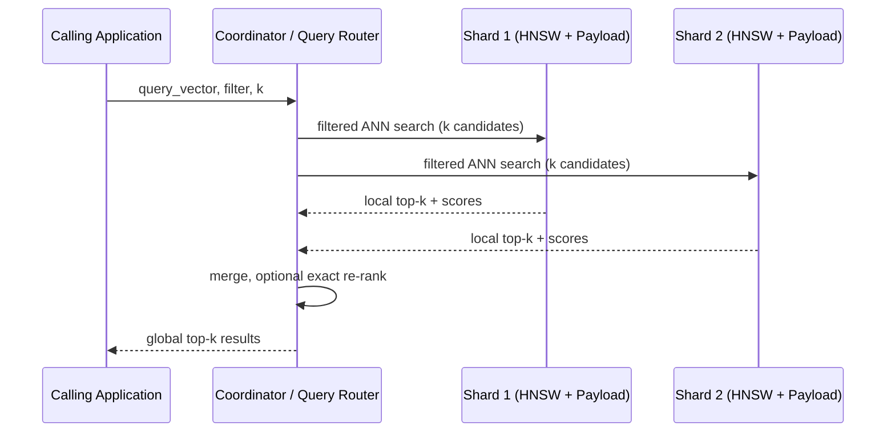
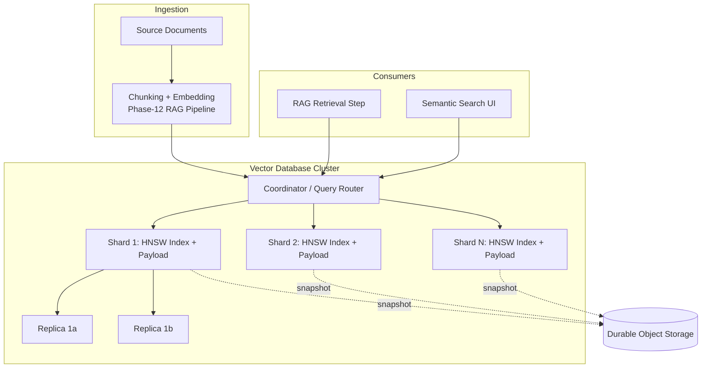
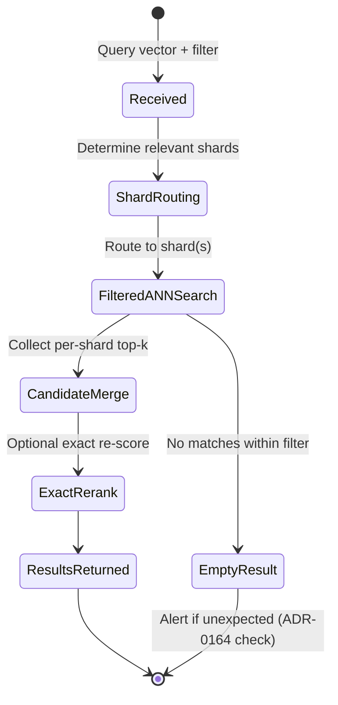

# Vector Databases: Qdrant and Milvus

> Part of the **Enterprise Data & AI Architecture Handbook** · Phase-13 — Knowledge Graphs & Vector Systems · Chapter 01.
> Estimated study time: **60 min reading + ~4h labs**.
> **Prerequisite:** read [Retrieval Augmented Generation](../Phase-12/03_Retrieval_Augmented_Generation.md) first.

---

## Executive Summary

[Retrieval Augmented Generation](../Phase-12/03_Retrieval_Augmented_Generation.md) established that a RAG system's accuracy is determined far more by chunking, embedding, and retrieval-strategy quality than by which LLM sits downstream of it, and named vector, keyword, and hybrid retrieval as the three retrieval strategies without fully specifying the infrastructure that makes vector retrieval possible at production scale. This chapter closes that gap: a **vector database** is the specialized infrastructure layer that stores high-dimensional embedding vectors and answers approximate-nearest-neighbor (ANN) similarity queries fast enough, at large enough scale, and with enough metadata-filtering precision to serve as the retrieval backbone for production RAG, recommendation, deduplication, and anomaly-detection systems.

This chapter covers **ANN algorithms** (HNSW, IVF, and Product Quantization) as the three families of index structures that trade off recall, latency, and memory in fundamentally different ways; **Qdrant, Milvus, and pgvector** as the three dominant open-source approaches spanning purpose-built-Rust, distributed-cloud-native, and extend-your-existing-Postgres philosophies respectively; **filtering and hybrid search** as the mechanism that makes vector retrieval usable against access-controlled, multi-tenant enterprise corpora rather than an unfiltered flat index; **sharding, replication, and scaling** as the operational disciplines that turn a single-node ANN index into a fault-tolerant, horizontally scalable service; and **Azure AI Search's vector store** as the managed alternative that already appeared in [Retrieval Augmented Generation](../Phase-12/03_Retrieval_Augmented_Generation.md) as this handbook's primary retrieval engine, now examined from the vector-database-internals side rather than the RAG-consumer side.

The platform bias is **Azure-primary (~60%)** — Azure AI Search's vector store as the primary managed ANN-search platform, with concrete index configuration, vector profiles, and hybrid-query syntax — **~30% enterprise open source** (Qdrant and Milvus as the two purpose-built vector databases this chapter's title names, plus pgvector as the "extend Postgres" alternative and Redis/RediSearch as a caching-adjacent option) — **~10% AWS/GCP comparison-only** (Amazon OpenSearch Service's k-NN plugin and Amazon Bedrock Knowledge Bases' native store; Google Vertex AI Vector Search, formerly Matching Engine).

**Bottom line:** choosing a vector database is a decision about operational ownership and data-platform consolidation at least as much as it is a decision about ANN algorithm quality — Qdrant, Milvus, pgvector, and Azure AI Search all deliver production-grade approximate nearest-neighbor search today, and the deciding factors in a real enterprise architecture review are almost always metadata-filtering fidelity, multi-tenancy/access-control propagation (the same access-control-propagation discipline established in [Retrieval Augmented Generation](../Phase-12/03_Retrieval_Augmented_Generation.md) ADR-0157), and whether the team wants a dedicated vector-database operational burden versus reusing infrastructure it already runs.

---

## Learning Objectives

By the end of this chapter you will be able to:

1. **Explain the three families of ANN index algorithms** (HNSW, IVF, PQ) and the recall/latency/memory trade-off each one makes.
2. **Compare Qdrant, Milvus, pgvector, and Azure AI Search** on architecture, operational model, and fit for a given enterprise scenario.
3. **Design metadata filtering and hybrid (vector + keyword) search** that remains fast and access-control-correct at scale.
4. **Design sharding and replication topologies** for a vector database that must serve billions of vectors with sub-100ms p99 latency.
5. **Apply Azure AI Search's vector store** with concrete index schemas, vector profiles, and hybrid-query configuration.
6. **Identify anti-patterns and common mistakes** in vector-database adoption, including the recurring access-control-propagation gap named across this handbook's Phase-10 and Phase-12 chapters.
7. **Defend a vector-database architecture decision** in engineer, staff engineer, architect, and CTO review settings, including build-vs-buy and consolidation trade-offs.

---

## Business Motivation

- **Every RAG, semantic-search, recommendation, and deduplication system this handbook has discussed depends on fast, accurate nearest-neighbor search over embeddings at production scale** — a capability no general-purpose relational or document database index structure (B-tree, hash index, inverted index) was designed to provide efficiently once vector counts reach millions or billions.
- **Retrieval latency is directly on the critical path of every LLM-backed feature's end-to-end response time.** [Retrieval Augmented Generation](../Phase-12/03_Retrieval_Augmented_Generation.md#17-performance) named retrieval latency as one axis of the RAG performance budget; the vector database is where that latency is actually spent, making ANN index choice a direct user-experience and cost lever, not an abstract infrastructure detail.
- **Metadata filtering is what makes vector search usable in a real multi-tenant enterprise**, where a query must never return a semantically-similar but access-forbidden document. A vector database that filters *after* the ANN search (post-filtering) rather than *during* it (pre-filtering/filtered search) can silently return too few — or the wrong — results, a subtle correctness bug this chapter's Common Mistakes section names directly.
- **Vector-database operational cost compounds quickly at enterprise scale.** A billion-vector index held entirely in memory can cost more in compute than the LLM inference it supports; Product Quantization and disk-based ANN indexes exist specifically to make this economically viable, and choosing the wrong index type for a corpus size is a recurring, expensive FinOps mistake.
- **Consolidation versus specialization is a genuine, recurring enterprise architecture decision**, not a settled question: adding a dedicated vector database (Qdrant/Milvus) is one more system to secure, monitor, back up, and staff, while extending an already-operated Postgres fleet with pgvector, or using an already-licensed Azure AI Search instance, avoids that operational multiplication at some ceiling on scale and specialization — this chapter's Decision Matrix makes that trade-off concrete rather than treating "just add a vector database" as a costless default.

---

## History and Evolution

- **1975 — k-d trees and early exact nearest-neighbor structures** are developed for low-dimensional spatial search; they degrade to near-linear-scan performance in high dimensions (the "curse of dimensionality"), motivating the eventual shift to *approximate* rather than exact nearest-neighbor search.
- **2000s — Locality-Sensitive Hashing (LSH)** becomes the first widely-adopted approximate approach for high-dimensional similarity search, trading exactness for tractable query times, though with recall/tuning characteristics later algorithms would improve on substantially.
- **2010 — Product Quantization (PQ)** is introduced (Jégou, Douze, Schmid), compressing high-dimensional vectors into compact codes and enabling billion-scale similarity search within memory budgets previously impossible, at the cost of some search accuracy — this chapter's §8.3 covers it in depth.
- **2011 — FAISS-precursor research and IVF (Inverted File Index) methods** mature at scale, partitioning the vector space into clusters (via k-means) and restricting search to a small number of relevant clusters — a very different trade-off from PQ's compression-based approach.
- **2016 — Hierarchical Navigable Small World (HNSW)** graphs (Malkov and Yashunin) are published, delivering markedly better recall/latency trade-offs than prior graph-based methods and rapidly becoming the default ANN algorithm embedded in nearly every purpose-built vector database that follows.
- **2017 — Facebook releases FAISS**, a library (not a database) implementing IVF, PQ, and HNSW variants, becoming the de facto reference implementation most vector databases build on or benchmark against internally.
- **2019 — Milvus is open-sourced** (Zilliz), one of the first purpose-built, horizontally-scalable vector database systems designed from the outset for distributed, cloud-native deployment rather than as a single-node library wrapper.
- **2021 — Qdrant is released**, a Rust-native vector database emphasizing single-binary operational simplicity, rich payload (metadata) filtering integrated directly into the HNSW graph traversal, and a deliberately smaller operational footprint than Milvus's distributed architecture.
- **2021 — pgvector is released** for PostgreSQL, extending an already-ubiquitous relational database with vector column types and ANN indexes (initially IVFFlat, later HNSW), giving teams a path to vector search without adopting new infrastructure — directly enabling this chapter's consolidation-versus-specialization framing.
- **2023 — the ChatGPT-driven RAG adoption wave** (per [Large Language Model Foundations](../Phase-12/01_Large_Language_Model_Foundations.md) and [Retrieval Augmented Generation](../Phase-12/03_Retrieval_Augmented_Generation.md)'s own History and Evolution sections) turns vector databases from a specialized research tool into mainstream enterprise infrastructure almost overnight, with Qdrant, Milvus, Weaviate, Pinecone, and Chroma all seeing order-of-magnitude adoption growth within roughly a year.
- **2023 — managed cloud platforms add native vector search**, most consequentially Azure AI Search adding vector fields, vector profiles, and hybrid semantic ranking alongside its pre-existing keyword-search capability, consolidating what previously required a separately-operated vector database alongside a separate keyword-search engine.
- **2024-present — DiskANN and other disk-resident ANN approaches mature** (Microsoft Research), targeting billion-scale corpora that exceed economical in-memory budgets, and hybrid retrieval (dense + sparse, fused via Reciprocal Rank Fusion, per [Retrieval Augmented Generation](../Phase-12/03_Retrieval_Augmented_Generation.md#43-vectorkeywordhybrid-retrieval) §4.3's RAG-level treatment) becomes the default expectation of a production-grade vector database rather than a differentiator.

---

## Why This Technology Exists

A relational database's B-tree index is built for exact-match and range queries on scalar values — it has no native notion of "the 10 rows whose 1536-dimensional embedding vector is closest to this query vector," and a brute-force linear scan comparing a query vector against every stored vector becomes computationally prohibitive well before a corpus reaches even a few million entries at interactive latency budgets. Vector databases exist to answer exactly this question — approximate nearest-neighbor search over high-dimensional vectors — at scale, with acceptable latency, and (critically, per this chapter's Business Motivation) with metadata filtering that keeps the search correct in an access-controlled, multi-tenant enterprise setting. They exist as a distinct infrastructure category, rather than as a generic database feature bolt-on, because the index structures that make ANN search fast (HNSW graphs, IVF cluster partitioning, PQ compression) have fundamentally different storage layouts, update semantics, and query-execution models than the B-tree/hash-index world relational and document databases were built around.

---

## Problems It Solves

- **Sub-second nearest-neighbor search over millions-to-billions of high-dimensional vectors**, the direct enabler of the retrieval step every RAG pipeline in [Retrieval Augmented Generation](../Phase-12/03_Retrieval_Augmented_Generation.md) depends on.
- **Combining semantic (vector) similarity with structured metadata filtering** in a single query — e.g., "documents semantically similar to this query, restricted to department = Finance and access-tier <= confidential" — without requiring a separate post-filtering pass that silently under-returns results.
- **Horizontal scaling of both vector storage and query throughput** via sharding and replication, so that corpus growth and query-volume growth can each be scaled independently.
- **Hybrid dense + sparse retrieval** in a single system, closing the gap [Retrieval Augmented Generation](../Phase-12/03_Retrieval_Augmented_Generation.md#43-vectorkeywordhybrid-retrieval) named between vector search's strength on paraphrased/conceptual queries and keyword search's strength on exact-match queries (product codes, proper nouns, acronyms).
- **Real-time (or near-real-time) upserts and deletes against a live ANN index**, supporting corpora that change continuously (new documents, updated policies, expiring records) rather than requiring periodic full index rebuilds.
- **Cost-effective storage of vectors at scale via quantization**, making billion-vector corpora economically viable within realistic memory and compute budgets rather than requiring proportionally unbounded RAM.

---

## Problems It Cannot Solve

- **A vector database does not decide what to embed, how to chunk, or which embedding model to use** — those decisions belong entirely to the ingestion pipeline design covered in [Retrieval Augmented Generation](../Phase-12/03_Retrieval_Augmented_Generation.md#32-chunkingembedding) §4.2, and a poorly-chunked corpus produces poor retrieval regardless of which vector database stores the resulting embeddings.
- **A vector database does not enforce access control on its own** — it enforces whatever filter predicate a calling application supplies at query time; if the calling application fails to propagate the querying user's actual entitlements into that filter (the exact failure mode of [Retrieval Augmented Generation](../Phase-12/03_Retrieval_Augmented_Generation.md) ADR-0157's case study), the vector database will correctly and efficiently return access-forbidden results.
- **Approximate nearest-neighbor search is, by design, approximate** — it trades a small, tunable amount of recall for large latency and memory gains; a use case genuinely requiring exact nearest-neighbor guarantees (rare, but occurring in some scientific and safety-critical matching scenarios) is not what any of the ANN algorithms in this chapter were built to provide.
- **A vector database does not perform generation, reasoning, or hallucination control** — it is the retrieval half of the RAG architecture in [Retrieval Augmented Generation](../Phase-12/03_Retrieval_Augmented_Generation.md), and grounding/citation discipline (§3.5 of that chapter) remains a separate, necessary concern layered on top of whatever the vector database returns.
- **Vector similarity is not the same as factual correctness or semantic entailment** — a highly similar retrieved passage can still fail to actually support a specific claim, the same "faithful-looking but unfaithful" gap [Retrieval Augmented Generation](../Phase-12/03_Retrieval_Augmented_Generation.md) Case Study 2 documented; the vector database's cosine-similarity score is a relevance signal, not a truth signal.
- **A vector database rarely eliminates the need for a keyword/lexical search capability alongside it** — hybrid retrieval (§8.4) exists precisely because pure vector search under-performs on exact-match query patterns no ANN index, however well-tuned, closes on its own.

---

## Core Concepts

### 1.1 Embeddings as the Unit of Storage

A vector database stores fixed-length numeric vectors (embeddings) produced upstream by an embedding model — the same embedding-model output [Retrieval Augmented Generation](../Phase-12/03_Retrieval_Augmented_Generation.md#32-chunkingembedding) §4.2 covered — typically alongside a **payload** (Qdrant's term) or **scalar fields** (Milvus's term): the metadata needed for filtering, plus enough of the original content (or a pointer to it) to reconstruct a usable result. The vector itself is opaque to the database; only its dimensionality and distance metric (cosine, dot product, or Euclidean/L2) matter for indexing and search.

### 1.2 Approximate Nearest Neighbor (ANN) Search

Exact nearest-neighbor search (brute-force linear scan comparing the query vector against every stored vector) is $O(n \cdot d)$ per query for $n$ vectors of dimension $d$ — computationally prohibitive at enterprise scale and query volume. ANN algorithms trade a small, controllable loss of recall (the fraction of the true top-k results actually returned) for orders-of-magnitude latency improvement, by restricting the search to a cleverly-constructed subset of candidates rather than every stored vector. Recall/latency/memory is the central three-way trade-off every ANN algorithm in this chapter navigates differently.

### 1.3 HNSW (Hierarchical Navigable Small World)

HNSW builds a multi-layer graph where each vector is a node, connected to its approximate nearest neighbors; upper layers are sparse "highway" layers enabling fast coarse navigation, and the search greedily descends from a sparse upper layer to the dense base layer, converging on the query's true nearest neighbors with high probability. HNSW delivers the best recall/latency trade-off of the three families covered here for in-memory, moderate-to-large corpora, at the cost of higher memory usage (graph edges plus the full vectors) and slower index-build/insert times than IVF. It is the default index type in Qdrant, Milvus, Azure AI Search's vector store, and pgvector's newer HNSW index type.

### 1.4 IVF (Inverted File Index)

IVF partitions the vector space into $k$ clusters via k-means at index-build time; a query is compared only against the vectors in the `nprobe` nearest clusters (a tunable parameter trading recall against latency), rather than the whole corpus. IVF's memory footprint is markedly lower than a full HNSW graph (no graph edges to store), and index builds are faster, but recall at a given latency budget is typically lower than HNSW's, and cluster imbalance (some clusters much larger than others) can create latency variance. IVF is frequently paired with PQ (IVF-PQ) to combine both a coarse cluster-restriction and a fine-grained compression step.

### 1.5 Product Quantization (PQ)

PQ compresses each high-dimensional vector by splitting it into sub-vectors and independently quantizing each sub-vector against a small codebook learned via k-means, replacing the original floating-point vector with a compact set of codebook indices — often a 10-30x memory reduction. This makes billion-scale corpora economically storable in memory, at the cost of approximation error in the reconstructed distances (a further, separate source of recall loss beyond the coarse-search approximation IVF or HNSW introduce). PQ is rarely used alone; it is typically layered on top of IVF (IVF-PQ) or as a re-ranking-friendly compression layer alongside HNSW (e.g., Qdrant's and Milvus's scalar/product quantization options for the base HNSW graph).

### 1.6 Distance Metrics

Cosine similarity (direction-only, magnitude-invariant — the standard choice for most text-embedding models), dot product (magnitude-sensitive, used when the embedding model's training objective assumes it, e.g., some retrieval-tuned models), and Euclidean/L2 distance (rarely the right default for normalized text embeddings, more common in image/audio embedding spaces) are the three metrics every vector database supports; the metric must match what the embedding model was trained/evaluated against, per [Retrieval Augmented Generation](../Phase-12/03_Retrieval_Augmented_Generation.md#43-vectorkeywordhybrid-retrieval)'s reminder that query and corpus must share the same embedding model — the same discipline extends to matching the correct distance metric.

### 1.7 Filtered (Pre-filtered) vs. Post-filtered Search

**Post-filtering** runs the ANN search first, then discards results that fail a metadata predicate — simple to implement, but can silently return fewer than `k` results (or none) if the true top-k happens to be entirely filtered out, and does not compose well with restrictive filters (e.g., a narrow tenant scope). **Pre-filtered (or "filtered") search** integrates the metadata predicate directly into the graph traversal or cluster selection, so the ANN algorithm only considers candidates that already satisfy the filter — Qdrant's payload-aware HNSW traversal and Azure AI Search's filterable vector fields both implement this correctly; this distinction is the single most consequential correctness detail in enterprise vector-database adoption, covered further in Common Mistakes.

### 1.8 Hybrid (Dense + Sparse) Retrieval

Hybrid retrieval runs a dense vector query and a sparse (BM25/keyword) query in parallel and fuses the two ranked result lists, typically via Reciprocal Rank Fusion (RRF) — the same fusion technique [Retrieval Augmented Generation](../Phase-12/03_Retrieval_Augmented_Generation.md#43-vectorkeywordhybrid-retrieval) named as the now-default enterprise recommendation at the RAG-architecture level. Milvus and Qdrant both added native sparse-vector support (BM25-style sparse embeddings stored and queried alongside dense vectors) so that hybrid fusion can happen inside the vector database itself rather than requiring a separately-operated keyword-search engine; Azure AI Search has supported this natively since its vector-search launch, unifying both index types in one service.

---

## Internal Working

A representative write path: (1) an upstream ingestion pipeline (per [Retrieval Augmented Generation](../Phase-12/03_Retrieval_Augmented_Generation.md#31-rag-architecture) §4.1's ingestion pipeline) produces an embedding vector plus payload/metadata for each chunk; (2) the vector database's write path appends the vector to its storage layer (a write-ahead log or segment file, depending on the engine) and asynchronously (Milvus, Qdrant) or synchronously (pgvector, within the same transaction as the row insert) updates the ANN index structure — HNSW graph-edge insertion, or IVF cluster assignment; (3) index updates are periodically compacted/merged (segment merging in Milvus and Qdrant, analogous to LSM-tree compaction) to keep the index efficient as inserts, updates, and deletes accumulate.

A representative read path: (1) the calling application (e.g., a RAG retrieval step) sends a query vector, an optional metadata filter predicate, and a `k` (top-k count); (2) the vector database's query planner decides which shard(s) must be searched based on the filter predicate and the sharding key (§18); (3) each relevant shard performs a filtered ANN search locally (HNSW graph traversal restricted to filter-matching nodes, or IVF cluster search restricted to filter-matching clusters) and returns its local top-k candidates; (4) a coordinator/aggregator node merges the per-shard candidate lists into a single global top-k, optionally re-scoring with an exact (unquantized) distance calculation over the small merged candidate set to correct for PQ approximation error — a common "approximate search, exact re-rank" refinement pattern.



---

## Architecture

A production vector-database deployment has four architectural layers: **(1) ingestion/write path** — the client SDK or REST/gRPC API accepting upsert/delete operations; **(2) index/storage layer** — the ANN index structure (HNSW graph, IVF clusters) plus the payload/metadata store, typically segmented into shards; **(3) query/coordination layer** — the component that fans a query out across relevant shards and merges results, present as a distinct architectural tier in distributed systems like Milvus and Azure AI Search, and collapsed into a simpler single-node or lightweight-cluster model in Qdrant's default deployment; **(4) persistence/durability layer** — write-ahead logs and periodic snapshotting to durable storage (object storage in Milvus's disaggregated-storage architecture, local disk with optional S3/Azure Blob snapshotting in Qdrant), ensuring the ANN index can be rebuilt or recovered after a node failure without requiring a full corpus re-embedding.

Milvus's architecture is the most distinctly disaggregated of the systems covered here: it separates compute (query nodes, index-building data nodes) from storage (object storage such as MinIO or Azure Blob Storage) and coordination (a dedicated coordinator service), allowing each tier to scale independently — a deliberate similarity to the disaggregated-storage-and-compute pattern this handbook covered for lakehouse architectures in [Lakehouse Architecture](../Phase-05/02_Lakehouse_Architecture.md). Qdrant's architecture is comparatively simpler and more tightly coupled — a single binary handling storage, indexing, and query serving per node, with clustering (sharding and replication) as an added capability rather than the foundational design assumption — trading some scale ceiling for markedly lower operational complexity, directly informing this chapter's Decision Matrix.

---

## Components

- **Collection (Qdrant) / Collection (Milvus) / Index (Azure AI Search) / Table (pgvector)** — the top-level namespace grouping vectors of the same dimensionality and schema; the unit at which sharding, replication, and access policy are typically configured.
- **Segment** — an immutable (or append-only-then-compacted) chunk of a collection's data and its associated index structure; segment merging is the mechanism by which continuous inserts/updates/deletes are periodically consolidated back into an efficient searchable structure.
- **Payload / Scalar fields / Metadata fields** — the structured, filterable attributes attached to each vector (tenant ID, access tier, document type, timestamps); indexed separately (often via conventional B-tree or bitmap indexes) from the vector itself to support efficient pre-filtering.
- **Query Coordinator / Proxy** — the component (explicit in Milvus, implicit in Qdrant's cluster mode, and abstracted away entirely in Azure AI Search's managed service) that routes a query to the relevant shard(s) and merges results.
- **Index Builder** — the background process constructing or updating the HNSW graph or IVF clusters as new data arrives; a frequent source of resource contention (index-build CPU/memory competing with query-serving resources) at high ingest rates, covered further in Performance.
- **Snapshot / Backup Manager** — the component responsible for periodic durable snapshots of both the vector data and the index structure, so a node failure or corruption event does not require a full re-embedding of the source corpus to recover (§19).

---

## Metadata

Metadata (payload/scalar fields) is what makes a vector database usable for filtered and access-controlled enterprise retrieval rather than an unfiltered flat similarity index. Design decisions that matter in practice: **(1) which fields need to support pre-filtering** (access tier, tenant ID, document type) versus which are purely informational (title, source URL) and can be denormalized into the result payload without a dedicated filter index; **(2) cardinality** — a low-cardinality field (access tier: 4 values) filters cheaply and predictably, while a high-cardinality field (a per-document unique ID used as a filter) can behave more like a point lookup than a filter and may warrant a different index structure entirely; **(3) filter-index type** — most vector databases build a separate scalar/bitmap index per filterable field, analogous to a conventional database's secondary index, and that index's own maintenance cost scales with cardinality and update frequency, not just corpus size. Access-tier and tenant-ID metadata fields are the concrete mechanism through which this handbook's recurring access-control-propagation requirement (per [Retrieval Augmented Generation](../Phase-12/03_Retrieval_Augmented_Generation.md) ADR-0157 and [Model Context Protocol (MCP)](../Phase-12/06_Model_Context_Protocol_MCP.md) ADR-0160) is actually enforced at the vector-database query layer.

---

## Storage

Vector storage has three components with materially different cost and performance characteristics: **(1) the raw or quantized vectors themselves** — full-precision float32 vectors offer the best accuracy but the largest memory footprint; scalar quantization (float32 to int8) and product quantization (§8.5) trade accuracy for 4x-30x memory reduction; **(2) the ANN index structure** — HNSW graph edges typically add 20-50% overhead on top of the raw vector size, while IVF's cluster-centroid metadata is comparatively small; **(3) the payload/metadata store** — often a simpler, more compressible structured store, but one that must be co-located or fast-joined with the vector index for pre-filtered search to remain efficient rather than requiring a slow cross-store join. Disk-resident ANN approaches (DiskANN and similar) exist specifically for corpora whose full in-memory footprint (vectors + index + payload) would be uneconomical, trading some latency for the ability to serve billion-scale corpora from SSD rather than requiring proportionally unbounded RAM — directly relevant to this chapter's Cost Optimization worked example.

---

## Compute

Vector-database compute has two distinct workload profiles that compete for the same node's resources if not deliberately isolated: **(1) index-build/insert compute** — CPU- and memory-intensive graph-construction (HNSW) or clustering (IVF k-means) work, spiking during bulk ingestion or re-indexing events; **(2) query-serving compute** — comparatively steady-state CPU (and, for GPU-accelerated configurations in Milvus, GPU) work proportional to query volume and `nprobe`/`ef_search` tuning (the HNSW search-breadth parameter trading recall against per-query latency). Milvus's disaggregated architecture explicitly separates these into distinct node pools (data nodes for indexing, query nodes for serving) that can be scaled and resourced independently; Qdrant's simpler single-binary-per-node model requires more careful capacity planning to avoid a bulk-ingestion job starving concurrent query latency on the same node, a concrete instance of the noisy-neighbor risk this handbook has named in other shared-infrastructure contexts (e.g., [Azure Compute and Containers](../Phase-03/05_Azure_Compute_and_Containers.md)).

---

## Networking

Vector database networking follows the same private-endpoint-only, default-deny-egress baseline this handbook established in [Network Security and Zero Trust](../Phase-10/04_Network_Security_and_Zero_Trust.md) ADR-0144: a self-hosted Qdrant or Milvus cluster deployed on AKS should sit behind a private Service/Ingress with no public IP, reachable only from the application VNet/subnet that hosts the RAG or agentic-AI service consuming it; Azure AI Search supports private endpoints natively, and enabling them (while disabling the still-default-on public network access, per that same ADR's documented gotcha) is a mandatory configuration step, not an optional hardening extra. Inter-shard and coordinator-to-shard traffic in a distributed Milvus deployment should be confined to an internal cluster network segment, never traversing a public network path even between trusted internal nodes.

---

## Security

- **Access-control propagation at query time** is the single most consequential security control for a vector database, per this chapter's Metadata section and the repeatedly-recurring lesson from [Retrieval Augmented Generation](../Phase-12/03_Retrieval_Augmented_Generation.md) ADR-0157, [Model Context Protocol (MCP)](../Phase-12/06_Model_Context_Protocol_MCP.md) ADR-0160, and [Agentic AI Architecture](../Phase-12/05_Agentic_AI_Architecture.md)'s memory-design section: the calling application must translate the actual querying identity's entitlements into a pre-filter predicate on every query, never relying on a privileged service account's broad access as a substitute.
- **Encryption at rest and in transit**, per [Data Security and Encryption](../Phase-10/03_Data_Security_and_Encryption.md), applies to vector databases exactly as to any other data store — Azure AI Search encrypts at rest by default with the option for customer-managed keys (CMK); self-hosted Qdrant/Milvus require the deploying team to configure disk-level encryption (Azure Disk Encryption or equivalent) and TLS for client and inter-node traffic explicitly, since neither ships it enabled by default.
- **Authentication and authorization to the vector database service itself** (API keys in Qdrant, RBAC in Milvus 2.x, Entra ID-integrated API keys or managed identity in Azure AI Search) is a separate control layer from query-level metadata filtering — both are required; API-key-only authentication with no query-level filtering leaves every authenticated caller able to retrieve every tenant's data.
- **Embedding-vector inversion risk** — research has shown that dense embeddings can, under some conditions, be partially inverted to recover fragments of the original text, meaning an embedding vector is not automatically a safe-to-share anonymized representation of sensitive source content; treat vector stores containing embeddings of confidential source material with the same access-control rigor as the source documents themselves, not as a lower-sensitivity derived artifact.
- **Multi-tenant isolation model** — collection-per-tenant (strongest isolation, highest operational overhead at high tenant counts), payload-filtered shared collection (lowest overhead, requires airtight pre-filtering per this chapter's §8.7), or a hybrid (shared collection with tenant-based sharding) are the three practical models; the choice should be made explicitly and documented in an ADR, not left as an emergent property of however the first integration happened to be built.

---

## Performance

- **`ef_search` (HNSW) / `nprobe` (IVF) tuning** is the primary latency/recall dial exposed to operators at query time — increasing either improves recall at the cost of higher per-query latency, and the correct setting is corpus- and use-case-specific, requiring empirical tuning against a labeled recall benchmark rather than a default left unexamined.
- **Batch size and concurrent query throughput** interact non-linearly with index-build background activity; a bulk-ingestion job running concurrently with production query traffic (per this chapter's Compute section) is a common, avoidable source of p99 latency spikes.
- **Quantization's recall-versus-latency trade-off** must be measured empirically against a representative query set and ground-truth top-k, not assumed from vendor-published aggregate benchmarks that may not reflect a specific corpus's embedding distribution.
- **Pre-filtering with a highly selective filter can, counter-intuitively, sometimes be slower than an unfiltered search** if the ANN index's filtered-traversal path must explore substantially more of the graph to satisfy both the similarity and filter constraints — a case worth profiling directly rather than assuming filters are always net-cheaper due to a smaller result set.
- **Network round-trip and serialization overhead** between the calling application and the vector database (especially for large `k` or large payload fields returned per result) is frequently a larger share of end-to-end retrieval latency than the ANN search computation itself — profile the full request path, not just server-side query execution time, before concluding an index-tuning change is the correct lever.

---

## Scalability

Scaling a vector database has two largely independent axes: **(1) data volume scaling** — sharding a collection across multiple nodes by a partition key (tenant ID being a common, access-control-aligned choice), so that no single node must hold the full corpus's vectors and index structure; **(2) query throughput scaling** — replication, adding read replicas of each shard so query load can be distributed across more nodes independently of how many shards the data itself is split into. Milvus's disaggregated architecture makes this distinction explicit and independently tunable (data nodes and query nodes scale separately); Qdrant's clustering model couples the two more tightly per node but remains horizontally scalable via its own sharding and replication configuration; Azure AI Search abstracts both behind "replicas" (query throughput and high availability) and "partitions" (data volume), configured as two independent dimensions of the service's pricing tier — directly mirroring the same two-axis model.

---

## Fault Tolerance

Replication (§18) is the primary fault-tolerance mechanism: each shard's data is copied across multiple replicas, and a replica failure is handled by routing queries to a surviving replica while the failed one is rebuilt from the write-ahead log or a recent snapshot. Milvus's disaggregated object-storage-backed persistence layer means a compute-node failure never risks data loss, since the durable copy of record lives in object storage independent of any single compute node's lifecycle — a direct architectural echo of the compute/storage-separation resilience pattern this handbook covered for Delta Lake and Spark in [Databricks Platform](../Phase-05/05_Databricks_Platform.md). Qdrant's self-hosted deployments require the operating team to configure replication and snapshot-to-object-storage explicitly; a single-node, non-replicated Qdrant deployment (a common default in early proof-of-concept work that then gets promoted to production without revisiting the decision) has zero fault tolerance and is a documented anti-pattern in §26. Azure AI Search's managed replicas provide fault tolerance transparently as part of the service tier, removing this operational burden entirely at the cost of the usual managed-service trade-off (less configuration control).

---

## Cost Optimization

- **Right-size vector precision and quantization to the corpus's actual accuracy requirements** rather than defaulting to full float32 precision; scalar quantization (int8) frequently recovers 95%+ of full-precision recall at roughly a quarter of the memory footprint, a favorable trade in most enterprise RAG scenarios.
- **Separate hot and cold data by access-recency tier** — recently-updated, frequently-queried collections justify premium in-memory HNSW indexing, while rarely-queried archival embeddings can move to a disk-resident index (DiskANN-style) or simply be excluded from the live index and re-embedded on demand if ever needed again.
- **Right-size replica and partition counts against actual measured query throughput and availability targets**, not a defensively over-provisioned guess — Azure AI Search's replica/partition pricing model makes over-provisioning a direct, visible, and easily-audited line-item cost.
- **Batch embedding generation and index builds during off-peak windows** where the embedding-model API (or self-hosted embedding inference) itself is a metered cost, avoiding redundant re-embedding of unchanged content on every ingestion run.
- **Worked FinOps example:** a team indexes 50 million document chunks at 1536-dimensional float32 embeddings (6 KB/vector before index overhead) entirely in-memory HNSW, consuming roughly 300 GB of raw vector data plus ~30-50% HNSW graph overhead (~420-450 GB total) — requiring a memory-optimized tier costing an estimated $8,000-$10,000/month at typical Azure managed-vector-search or equivalent self-hosted-VM pricing. Applying scalar quantization (int8, 4x compression) reduces the footprint to roughly 110 GB (~$2,500-$3,000/month), and moving the bottom 60% of chunks (by 90-day access recency) to a disk-resident index tier reduces the in-memory footprint further to roughly 45 GB (~$1,200-$1,500/month) — an approximately 85% cost reduction, at a measured recall drop from 98% to 95% (validated against a held-out labeled query set before the change was approved), an acceptable trade-off for this team's use case but one that must be explicitly measured and approved, not assumed, per this section's opening principle.

---

## Monitoring

- **Recall against a labeled ground-truth query set**, measured on a recurring schedule, not just once at initial index configuration — index tuning changes (quantization, `ef_search`/`nprobe` adjustments) and corpus drift can both silently erode recall over time without any query-time error signal.
- **p50/p95/p99 query latency**, segmented by whether a filter predicate was applied (filtered queries frequently have a different latency profile than unfiltered ones, per this chapter's Performance section) and by shard, to catch a single hot or degraded shard before it affects aggregate metrics.
- **Index-build queue depth and lag** — a growing gap between ingested-but-not-yet-indexed vectors and the searchable index is a leading indicator of an under-provisioned indexing tier before it becomes a stale-search-results incident.
- **Segment/shard size skew** — significant imbalance across shards (from a poorly-chosen or naturally skewed partition key) is a leading indicator of an eventual hot-shard performance problem.
- **Memory and disk utilization trends** relative to corpus growth rate, to forecast a capacity-planning need before an out-of-memory or disk-exhaustion incident rather than reacting to one.

---

## Observability

Full-pipeline tracing (per [LLMOps](../Phase-12/04_LLMOps.md)'s OpenTelemetry-span foundation) should extend into the vector-database query itself: a span capturing the query vector's source (which embedding model/version produced it), the filter predicate applied, the `k` requested, the actual result count and top result scores, and the query latency — not merely "retrieval step took N ms" as an opaque black box. This level of detail is what makes a retrieval-quality regression (a sudden drop in average top-1 similarity score, or a filter unexpectedly returning zero results) diagnosable from telemetry alone rather than requiring live reproduction, directly extending [Retrieval Augmented Generation](../Phase-12/03_Retrieval_Augmented_Generation.md#31-rag-architecture)'s retrieval-quality-as-an-independently-measurable-axis principle down to the vector-database layer specifically.

### Operational Response Playbook

| Signal | Detection Query/Method | Remediation |
|---|---|---|
| Recall regression: scheduled ground-truth eval shows top-k recall dropped below the agreed threshold (e.g., from 97% to 89%) week-over-week | Automated recall-eval job comparing current index results against a fixed labeled query/ground-truth set; alert on percentage-point drop exceeding a defined threshold | Check for a recent quantization, `ef_search`/`nprobe`, or index-type configuration change first (most common root cause); if none, check for corpus/embedding-model drift (has the embedding model version changed upstream without a full re-index); re-index with prior configuration as an immediate mitigation while root-causing |
| Filtered query returning zero or near-zero results for a filter predicate expected to match a non-trivial population | Query-log analysis flagging result-count == 0 (or below an expected floor) for filtered queries, segmented by filter predicate pattern | Verify the filter field's actual stored values match the query predicate's expected values/format (a common cause: an upstream metadata-schema change not propagated to the filter-construction code); verify pre-filtered (not post-filtered) search is in effect, since post-filtering against an overly narrow candidate set is a frequent silent cause |

---

## Governance

Vector-database governance extends this handbook's established data-governance discipline ([Data Governance Foundations](../Phase-08/01_Data_Governance_Foundations.md), [Data Catalog and Lineage](../Phase-08/02_Data_Catalog_and_Lineage.md)) to embeddings as a first-class governed artifact: every collection should be catalogued with its source corpus, embedding model and version, chunking strategy, last full re-index date, and owning team, so that a downstream consumer (or an auditor) can answer "what does this vector represent, and is it still current" without archaeology. Embedding-model version changes should be tracked with the same triple-versioning discipline [LLMOps](../Phase-12/04_LLMOps.md) ADR-0158 established for model+prompt+retrieval-index releases, since a re-embedded corpus under a new embedding model is not comparable to, and generally cannot be mixed with, vectors produced by the prior model version in the same similarity space. Right-to-be-forgotten obligations (per [Data Privacy and PII Protection](../Phase-10/07_Data_Privacy_and_PII_Protection.md) ADR-0147) apply to vector stores exactly as to any other data store containing personal data — a deleted source document's embedding must be actually deleted from the vector index (not merely soft-deleted or excluded from future queries) as part of the same verified-erasure workflow, extending that ADR's lesson to yet another storage layer.

---

## Trade-offs

- **HNSW vs. IVF-PQ:** HNSW generally wins on recall/latency for in-memory, moderate-scale corpora; IVF-PQ wins on memory footprint and index-build speed at very large scale where full-precision HNSW becomes uneconomical — this is a genuine trade-off with no universally correct default, requiring the corpus-size and latency-budget analysis this chapter's Decision Matrix formalizes.
- **Purpose-built vector database (Qdrant/Milvus) vs. extending Postgres (pgvector):** a dedicated vector database offers better ANN performance at large scale and richer native filtering/hybrid-search capability; pgvector avoids adding an entirely new operated system to an already-Postgres-heavy stack, at some ceiling of scale (typically hundreds of millions, not billions, of vectors) and feature completeness before it becomes the limiting factor.
- **Self-hosted (Qdrant/Milvus on AKS) vs. managed (Azure AI Search):** self-hosting offers more configuration control (custom quantization schemes, algorithm-level tuning) and can be cheaper at very large, steady-state scale; managed services remove operational burden (patching, scaling, HA configuration) and are usually the better default per this handbook's recurring "managed capability changes how much engineering effort a responsibility requires, not whether the responsibility still exists" principle from [Azure OpenAI and AI Foundry](../Phase-12/07_Azure_OpenAI_and_AI_Foundry.md).
- **Recall vs. latency vs. cost is an irreducible three-way trade-off**, not a problem to be engineered away entirely — every configuration decision in this chapter (index type, quantization, `ef_search`/`nprobe`, replica count) moves along this trade-off surface rather than escaping it.
- **Is a vector database still necessary given long-context LLMs?** Per [Retrieval Augmented Generation](../Phase-12/03_Retrieval_Augmented_Generation.md)'s own treatment of this question at the RAG-architecture level: a million-token context window does not eliminate the need for fast, filtered, access-controlled retrieval over a corpus far larger than any context window (an enterprise document corpus is typically orders of magnitude larger than even the largest available context window), nor does it eliminate the cost and latency advantage of retrieving only the relevant fraction of a corpus rather than passing all of it on every request — the vector database's role remains necessary, though its exact retrieval-depth tuning may shift as context windows grow.

---

## Decision Matrix

| Scenario | Recommended Choice | Rationale |
|---|---|---|
| Azure-native enterprise RAG, team wants minimal new operational surface | Azure AI Search vector store | Already the primary managed retrieval engine per [Retrieval Augmented Generation](../Phase-12/03_Retrieval_Augmented_Generation.md); native hybrid search, private endpoints, RBAC, no new system to operate |
| Team already runs a mature Postgres fleet; corpus under ~50-100M vectors | pgvector | Avoids adding a new database system; acceptable ANN performance at this scale; simplest consolidation story |
| Need for fine-grained payload-filtering performance and a lightweight, single-binary operational footprint | Qdrant | Rust-native performance, payload-aware HNSW filtering built in from the ground up, simpler operations than a fully distributed system |
| Billion-scale corpus, need for independent compute/storage scaling, GPU-accelerated indexing | Milvus | Disaggregated architecture purpose-built for this scale; independent data-node/query-node scaling |
| Multi-cloud or cloud-agnostic requirement, avoiding Azure-specific lock-in for the vector layer specifically | Qdrant or Milvus (self-hosted on Kubernetes, per [Kubernetes](../Phase-09/06_Kubernetes.md)) | Both run identically across clouds; portability is the deciding factor over any single-cloud managed convenience |
| Prototype/proof-of-concept, uncertain long-term scale requirements | Azure AI Search (smallest tier) or pgvector | Lowest time-to-first-result and lowest operational commitment; defer the specialized-vector-database decision until scale requirements are actually known |

---

## Design Patterns

- **Retrieve-then-exact-rerank:** run an approximate (quantized or coarse) search for a larger candidate set, then re-score the smaller candidate set with exact (unquantized) distance computation or a cross-encoder reranker (per [Retrieval Augmented Generation](../Phase-12/03_Retrieval_Augmented_Generation.md#44-rerankingcontext-assembly) §4.4), recovering most of the accuracy lost to quantization/approximation at a fraction of the cost of exact search over the full corpus.
- **Collection-per-tenant with shared infrastructure:** isolate tenants at the collection level for airtight access-control simplicity while still sharing the underlying cluster's compute and operational overhead — a common middle ground between fully-shared filtered collections and fully-separate infrastructure per tenant.
- **Dual-write during embedding-model migration:** when moving to a new embedding model version, write vectors under both the old and new model into separate collections/indexes during a transition window, allowing a gradual, measurable cutover (comparing recall/relevance between old and new) rather than an atomic all-at-once re-index with no rollback path.
- **Sparse-plus-dense hybrid collection:** store both a dense embedding and a sparse (BM25-style) representation per record in the same collection, enabling single-system hybrid retrieval (§8.4) without operating a separate keyword-search engine alongside the vector database.

---

## Anti-patterns

- **Post-filtering as the default, unexamined choice** — silently returning fewer (or zero) results under a restrictive filter, the single most common vector-database correctness bug named throughout this chapter.
- **Treating an embedding vector as inherently anonymized or low-sensitivity** — per this chapter's Security section, embedding-inversion research means vectors of confidential content deserve the same access-control rigor as the source content itself.
- **Promoting a proof-of-concept single-node, non-replicated deployment straight to production** without revisiting replication, backup, and fault-tolerance configuration — a direct instance of the "everything worked in the demo" trap this handbook has flagged in multiple other infrastructure contexts.
- **Mixing vectors from two different embedding-model versions in the same similarity space** without a deliberate migration plan (§26's dual-write pattern) — cosine similarity between a vector produced by embedding-model-version-1 and one produced by version-2 is not meaningful, even if both happen to have the same dimensionality.
- **Defaulting to full float32 precision at large scale without measuring whether quantization is acceptable** — an unexamined, expensive default per this chapter's Cost Optimization worked example.

---

## Common Mistakes

- **Assuming a vector database's default filter behavior is pre-filtered (exact) rather than checking the specific engine and index-type combination** — some index-type/filter-field combinations even within the same database product fall back to post-filtering under certain configurations; verify empirically for the specific deployment rather than assuming.
- **Tuning `ef_search`/`nprobe` once at initial deployment and never revisiting it as corpus size or query patterns change** — the correct setting for a 1-million-vector collection is not necessarily correct after it grows to 50 million.
- **Not measuring recall against a labeled ground-truth set at all**, relying instead on subjective "the results look reasonable" spot-checks that cannot detect a gradual, corpus-drift-driven recall regression.
- **Choosing a distance metric that does not match the embedding model's training assumptions** (e.g., defaulting to Euclidean/L2 for a model trained and evaluated under cosine similarity) — an easy-to-miss configuration mismatch that silently degrades every query's relevance ranking.
- **Under-provisioning the metadata/payload index for high-cardinality filter fields**, resulting in a filter that performs closer to a full scan than a genuine index-accelerated lookup.

---

## Best Practices

- Validate pre-filtered (not post-filtered) search behavior explicitly for the specific vector database and index-type combination in use, before relying on it for access-control enforcement.
- Establish a recurring, automated recall-versus-ground-truth evaluation job as a standing monitoring signal, not a one-time validation step (extends this handbook's evaluation discipline from [Evaluation and Guardrails](../Phase-12/09_Evaluation_and_Guardrails.md)).
- Catalog every collection's source corpus, embedding model/version, chunking strategy, and owning team in the enterprise data catalog (per [Data Catalog and Lineage](../Phase-08/02_Data_Catalog_and_Lineage.md)), treating embeddings as governed data assets rather than disposable derived artifacts.
- Plan embedding-model version migrations explicitly via a dual-write or blue-green collection strategy, never an in-place vector mutation that leaves no rollback path.
- Right-size quantization and replica/partition counts against measured (not assumed) recall requirements and query volume, revisiting the decision as corpus size and traffic evolve.
- Treat vector-database access-control propagation (payload-based pre-filtering keyed to the actual querying identity's entitlements) as a mandatory, audited control — not an optional hardening step layered on after initial functional delivery.

---

## Enterprise Recommendations

Default to **Azure AI Search's vector store** for Azure-native enterprise RAG and retrieval workloads unless a specific, documented requirement (extreme scale beyond the service's published limits, multi-cloud portability, or algorithm-level tuning control unavailable in the managed service) justifies operating a dedicated Qdrant or Milvus cluster instead. When a dedicated vector database is justified, prefer **Qdrant** for teams prioritizing operational simplicity and strong native payload filtering at moderate-to-large scale, and **Milvus** for teams with genuine billion-vector-scale requirements needing independently scalable compute and storage tiers. Reserve **pgvector** for teams with an already-mature Postgres operating model and a corpus scale comfortably within its performance envelope, explicitly re-evaluating the decision if corpus size or query-latency requirements grow beyond that envelope rather than persisting with an underperforming choice out of inertia. In every case, mandate the access-control-propagation, recall-monitoring, and embedding-version-governance practices established across this chapter as non-negotiable regardless of which specific vector database is chosen.

### Architecture Decision Record (ADR-0164): Mandatory Pre-Filtered (Not Post-Filtered) Search for Any Access-Controlled Collection

**Context:** A vector database can satisfy a metadata filter predicate either before the ANN search (pre-filtered/filtered search, integrated into the graph traversal or cluster selection) or after it (post-filtering, discarding non-matching results from an unfiltered top-k). Post-filtering is simpler to implement and is, in some engine/index-type combinations, the silent default. Against an access-controlled, multi-tenant collection, post-filtering can return fewer results than requested — or, in a narrow-tenant/high-restriction scenario, zero results — even when matching content genuinely exists, because the unfiltered top-k candidate set may not contain any records satisfying the access-control predicate at all.

**Decision:** Every collection storing access-controlled or multi-tenant content must use verified pre-filtered (filtered) search for every metadata predicate tied to access control, confirmed via an explicit test against a narrow, realistic filter (e.g., a single-tenant scope within a large shared collection) demonstrating that expected results are returned at the configured `k`. This verification must be re-run whenever the index type, quantization scheme, or vector-database version changes, not performed once at initial deployment and assumed to remain valid indefinitely.

**Consequences:** Adds a mandatory verification step to every new collection's deployment checklist and to every subsequent index-configuration change, marginally slowing initial rollout. In exchange, it closes the specific silent-under-return failure mode this ADR documents — directly analogous in spirit to [Retrieval Augmented Generation](../Phase-12/03_Retrieval_Augmented_Generation.md) ADR-0157's access-control-propagation requirement, now extended to the specific mechanical question of *how* that propagated filter is actually executed by the underlying ANN index.

**Alternatives Considered:** (1) *Rely on the vector database vendor's documentation alone to confirm pre-filtered behavior* — rejected, since documented behavior can vary across index types within the same product and can change across versions without being prominently flagged as a filtering-semantics change. (2) *Perform authorization filtering exclusively in the calling application after retrieval* — rejected as the sole control, since it reproduces the same under-return risk one layer higher in the stack and also means the vector database itself returns access-forbidden content to the calling layer, widening the blast radius of any bug in that application-layer filter.

---

## Azure Implementation

Azure AI Search's vector store is configured via an **index schema** defining one or more `vector` fields with a specified dimensionality, distance metric (cosine, dot product, or Euclidean), and a **vector profile** referencing an **HNSW** (currently the only ANN algorithm the service exposes) algorithm configuration with tunable `m` (graph connectivity), `efConstruction`, and `efSearch` parameters. A representative index definition (via the REST API/SDK, or equivalently Bicep-managed infrastructure-as-code per [Infrastructure as Code with Terraform](../Phase-09/04_Infrastructure_as_Code_with_Terraform.md)'s IaC discipline):

```json
{
  "name": "enterprise-docs-index",
  "fields": [
    { "name": "id", "type": "Edm.String", "key": true },
    { "name": "content", "type": "Edm.String", "searchable": true },
    { "name": "contentVector", "type": "Collection(Edm.Single)",
      "dimensions": 1536, "vectorSearchProfile": "default-profile" },
    { "name": "tenantId", "type": "Edm.String", "filterable": true },
    { "name": "accessTier", "type": "Edm.String", "filterable": true }
  ],
  "vectorSearch": {
    "algorithms": [
      { "name": "hnsw-config", "kind": "hnsw",
        "hnswParameters": { "m": 4, "efConstruction": 400, "efSearch": 500,
                             "metric": "cosine" } }
    ],
    "profiles": [
      { "name": "default-profile", "algorithm": "hnsw-config" }
    ]
  },
  "semantic": { "configurations": [ { "name": "default-semantic" } ] }
}
```

A hybrid query combining vector similarity, keyword search, the mandatory access-control filter (per ADR-0164), and semantic reranking:

```json
{
  "search": "quarterly compliance policy",
  "vectorQueries": [
    { "vector": [ /* query embedding */ ], "fields": "contentVector", "k": 20 }
  ],
  "filter": "tenantId eq 'finance' and accessTier le 2",
  "queryType": "semantic",
  "semanticConfiguration": "default-semantic",
  "top": 10
}
```

Provision private endpoints and disable public network access (per [Network Security and Zero Trust](../Phase-10/04_Network_Security_and_Zero_Trust.md) ADR-0144), enable customer-managed keys for encryption at rest where confidentiality requirements demand it (per [Data Security and Encryption](../Phase-10/03_Data_Security_and_Encryption.md)), and size replica/partition counts against measured query volume and corpus size respectively (per this chapter's Scalability section) rather than defaulting to the smallest or an arbitrarily large tier.

---

## Open Source Implementation

**Qdrant** (Rust, Apache 2.0) is deployed via Docker or its official Helm chart on AKS (per [Kubernetes](../Phase-09/06_Kubernetes.md)), configured with a `collection` specifying vector dimensionality, distance metric, and an HNSW `m`/`ef_construct` configuration, plus payload-field indexes for filterable metadata:

```python
from qdrant_client import QdrantClient
from qdrant_client.models import VectorParams, Distance, PayloadSchemaType

client = QdrantClient(url="https://qdrant.internal:6333")
client.create_collection(
    collection_name="enterprise_docs",
    vectors_config=VectorParams(size=1536, distance=Distance.COSINE),
)
client.create_payload_index(
    collection_name="enterprise_docs",
    field_name="tenant_id",
    field_schema=PayloadSchemaType.KEYWORD,
)
```

A pre-filtered query, explicitly verifying ADR-0164's requirement:

```python
from qdrant_client.models import Filter, FieldCondition, MatchValue

results = client.search(
    collection_name="enterprise_docs",
    query_vector=query_embedding,
    query_filter=Filter(must=[
        FieldCondition(key="tenant_id", match=MatchValue(value="finance")),
        FieldCondition(key="access_tier", match=MatchValue(value=2)),
    ]),
    limit=10,
)
```

**Milvus** (Go/C++, Apache 2.0) is deployed via its Helm chart on AKS with MinIO or Azure Blob Storage (via the S3-compatible gateway) as its object-storage layer, an `etcd` cluster for metadata coordination, and separate data-node/query-node pods per this chapter's disaggregated-architecture description — a collection is defined with an explicit schema and an IVF-PQ or HNSW index built via `create_index` after bulk insertion. **pgvector** requires only `CREATE EXTENSION vector;` on an existing PostgreSQL instance, a `vector(1536)` column type, and `CREATE INDEX ... USING hnsw (embedding vector_cosine_ops)`, making it the lowest-incremental-effort open-source option for a team already operating Postgres per this chapter's Decision Matrix.

---

## AWS Equivalent (comparison only)

**Amazon OpenSearch Service's k-NN plugin** adds HNSW- and IVF-based vector search to OpenSearch's existing document-store and keyword-search capability, closely mirroring Azure AI Search's own hybrid vector-plus-keyword unification, while **Amazon Bedrock Knowledge Bases** provides a more fully managed, RAG-oriented layer (comparable in scope to Azure AI Foundry's "On Your Data" capability per [Azure OpenAI and AI Foundry](../Phase-12/07_Azure_OpenAI_and_AI_Foundry.md)) that provisions and manages an underlying vector store (OpenSearch Serverless, Aurora pgvector, or Pinecone) on the caller's behalf. Advantages include tight integration with the broader AWS ecosystem and, for Bedrock Knowledge Bases, less operational configuration than assembling OpenSearch's k-NN plugin manually; disadvantages include OpenSearch's k-NN plugin generally trailing purpose-built vector databases on very large-scale ANN performance benchmarks, and Bedrock Knowledge Bases sharing the same underlying-access-control-is-still-the-deploying-team's-responsibility caveat this chapter's Problems It Cannot Solve section names for any managed grounding capability. Migration from Azure AI Search typically requires re-embedding (if switching embedding models) and re-implementing filter predicates in OpenSearch's query DSL; selection criteria center on existing cloud commitment and whether OpenSearch's broader observability-stack integration (per [Monitoring and Observability with Prometheus and Grafana](../Phase-09/06_Kubernetes.md), for teams already running OpenSearch for log analytics) offers a genuine consolidation advantage.

---

## GCP Equivalent (comparison only)

**Google Vertex AI Vector Search** (formerly Matching Engine) provides a fully managed ANN service built on Google's own ScaNN algorithm (a Google Research alternative to HNSW/IVF-PQ with strong published benchmark results), deeply integrated with Vertex AI's broader ML and generative-AI platform, comparable in managed-service positioning to Azure AI Search combined with Azure AI Foundry. Advantages include ScaNN's competitive performance characteristics and tight integration with Vertex AI's embedding and generative models; disadvantages include a less mature hybrid (keyword-plus-vector) search story than Azure AI Search's long-established keyword-search heritage, and, as with the AWS comparison, the same underlying access-control-remains-the-deploying-team's-responsibility caveat. Migration considerations mirror the AWS case: embedding-model compatibility and filter-predicate re-implementation are the two dominant migration-cost drivers regardless of source or destination platform, more so than any difference in the underlying ANN algorithm itself.

---

## Migration Considerations

Migrating between vector databases (or from a self-hosted option to a managed one, or vice versa) involves three largely independent migration concerns: **(1) embedding-model compatibility** — vectors are only migratable as-is if the destination platform's expected embedding model and dimensionality match the source; a genuine embedding-model change requires a full re-embedding, not merely a data-copy operation; **(2) filter-predicate and query-syntax translation** — each platform's filter DSL differs (Qdrant's `Filter`/`FieldCondition` objects, Milvus's boolean expression strings, Azure AI Search's OData filter syntax), requiring an explicit rewrite and re-verification of every pre-filtered-search guarantee (per ADR-0164) on the destination platform, not an assumption that filter semantics transfer unchanged; **(3) index-configuration re-tuning** — HNSW/IVF parameters tuned for one platform's specific implementation rarely transfer directly to another's default settings, and recall/latency benchmarking (per this chapter's Monitoring section) should be re-run against the destination platform before cutover, not assumed equivalent. A staged migration (dual-write to both source and destination, comparative recall/latency validation, then a monitored cutover with rollback capability) is the recommended pattern, directly analogous to this chapter's own dual-write embedding-model-migration design pattern (§26).

---

## Mermaid Architecture Diagrams





A third diagram (query-time filtered-search sequence) appears in the Internal Working section above.

---

## End-to-End Data Flow

1. **Ingestion:** source documents flow through the chunking and embedding pipeline established in [Retrieval Augmented Generation](../Phase-12/03_Retrieval_Augmented_Generation.md#31-rag-architecture) §4.1, producing (chunk text, embedding vector, metadata) tuples.
2. **Upsert:** the vector database's write path stores the vector, indexes it into the ANN structure (immediately for HNSW's incremental graph, or as part of the next index-build cycle for some IVF implementations), and indexes the metadata fields for filtering.
3. **Query construction:** the calling application (a RAG retrieval step, a semantic-search UI, or an agentic tool per [Agentic AI Architecture](../Phase-12/05_Agentic_AI_Architecture.md)) embeds the incoming query using the same embedding model version as the corpus, and constructs a metadata filter reflecting the requesting identity's actual entitlements (per ADR-0164 and [Retrieval Augmented Generation](../Phase-12/03_Retrieval_Augmented_Generation.md) ADR-0157).
4. **Filtered ANN search:** the query fans out to relevant shards, each performing a pre-filtered HNSW or IVF search, returning local top-k candidates with similarity scores.
5. **Merge and optional rerank:** a coordinator merges per-shard candidates into a global top-k, optionally applying exact re-scoring or a cross-encoder reranker (per [Retrieval Augmented Generation](../Phase-12/03_Retrieval_Augmented_Generation.md#44-rerankingcontext-assembly) §4.4).
6. **Consumption:** the calling application assembles the returned chunks into an LLM prompt context (per that same chapter's context-assembly discussion) or presents them directly as semantic-search results, with citation metadata preserved for grounding (§3.5 of that chapter).

---

## Real-world Business Use Cases

- **Enterprise policy and knowledge-base RAG assistants**, retrieving the specific, access-scoped passages needed to ground an internal chatbot's answer to an HR, IT, or compliance question, directly building on [Retrieval Augmented Generation](../Phase-12/03_Retrieval_Augmented_Generation.md)'s own worked examples.
- **Product and content recommendation**, retrieving items semantically similar to a user's browsing or purchase history embedding, a use case predating the current LLM/RAG wave but sharing identical ANN-infrastructure requirements.
- **Semantic deduplication and near-duplicate detection**, e.g., flagging near-identical support tickets or fraud-pattern records whose embeddings cluster tightly together, even when the underlying text differs lexically.
- **Anomaly and outlier detection**, identifying records whose embeddings lie unusually far from any dense cluster in the vector space, applied in fraud detection and quality-control scenarios.
- **Agentic AI long-term memory** (per [Agentic AI Architecture](../Phase-12/05_Agentic_AI_Architecture.md)'s explicit framing of agent memory as "literally a specialized application of RAG"), storing and retrieving an agent's prior interactions and learned facts via the same vector-database infrastructure this chapter covers.

---

## Industry Examples

Financial-services firms commonly deploy Qdrant or Azure AI Search for internal research-assistant and compliance-document RAG systems specifically because of strict per-desk or per-entity access-control requirements that make pre-filtered search (ADR-0164) a hard compliance requirement rather than a nice-to-have. E-commerce and media platforms are among the heaviest adopters of Milvus and Vertex AI Vector Search for large-scale product- and content-recommendation retrieval, where corpus sizes routinely exceed hundreds of millions of items and independent scaling of ingestion (constant catalog updates) from query serving (peak shopping-traffic bursts) is operationally essential. Healthcare and life-sciences organizations frequently choose pgvector specifically to keep embeddings co-located with the same Postgres-based clinical or research data platform already subject to HIPAA-aligned access controls and audit tooling, prioritizing consolidation and audit-surface minimization over marginal ANN-performance gains from a purpose-built alternative.

---

## Case Studies

**Case Study 1 — the silent post-filtering under-return.** A professional-services firm's internal RAG assistant, built on a self-hosted vector database configured with what the team believed was pre-filtered tenant-scoped search, began returning noticeably fewer (sometimes zero) results for smaller client engagements after the shared collection grew past roughly 10 million chunks across all clients. Investigation traced the cause to the specific index-type-and-filter-field combination in use silently falling back to post-filtering above a certain index-size threshold — the unfiltered top-k candidate set, dominated by the firm's largest clients' documents, frequently contained zero chunks belonging to a smaller client, so the tenant filter had nothing to keep. The fix required an index-configuration change plus, per ADR-0164, adding a standing automated test verifying non-zero, correct results for a narrow-tenant-scope query as part of every subsequent deployment — the incident is the direct motivating case for ADR-0164 and this chapter's repeated emphasis on empirically verifying filter behavior rather than trusting documentation or intuition.

**Case Study 2 — an embedding-model upgrade silently corrupting similarity rankings.** A retail organization upgraded its embedding model to a newer, higher-quality version as part of a routine model-refresh cycle, re-embedding newly ingested documents with the new model while leaving several months of already-indexed historical documents under the old model's vectors in the same collection, unaware that cosine similarity between vectors from two different embedding-model versions is not a meaningful comparison even at identical dimensionality. Search relevance degraded gradually and confusingly — new queries sometimes surfaced old-model documents that scored deceptively high not because they were genuinely more relevant, but because of an accidental numerical-range overlap between the two models' outputs — a defect that evaded detection for weeks because average relevance metrics only degraded gradually as the mixed-vintage collection grew, rather than failing obviously all at once. The remediation required a full re-embed of the historical corpus under the new model, and adopting this chapter's dual-write migration design pattern for all subsequent embedding-model version changes, going forward.

---

## Hands-on Labs

1. **Lab 1 — HNSW vs. IVF-PQ recall/latency benchmark.** Using a public embedding dataset (e.g., a subset of MS MARCO or a Wikipedia-passage embedding set), index the same 500K-vector corpus in both HNSW and IVF-PQ configurations (Qdrant or Milvus, self-hosted via Docker), and measure recall@10 and p95 latency across a range of `ef_search`/`nprobe` settings, plotting the resulting recall-latency curve for each algorithm.
2. **Lab 2 — pre-filtered vs. post-filtered correctness test.** Build a small multi-tenant collection (three synthetic tenants, uneven document counts mirroring Case Study 1's imbalance) in Qdrant, and empirically verify whether a narrow-tenant-scope query returns the expected non-zero result count at the configured `k`, first with default settings and then after explicitly configuring payload-index-backed pre-filtering — reproducing and resolving Case Study 1's failure mode hands-on.
3. **Lab 3 — Azure AI Search hybrid vector-plus-semantic query.** Provision an Azure AI Search index (via the Azure portal or Bicep), ingest a small document corpus with an Azure OpenAI embedding model, and construct a hybrid query combining vector similarity, an access-tier filter, and semantic reranking, comparing result quality against a vector-only query on the same corpus.
4. **Lab 4 — quantization cost/recall trade-off measurement.** Using this chapter's Cost Optimization worked example as a template, index the same corpus under full float32, scalar (int8) quantization, and product quantization in Milvus, measuring the actual memory footprint and recall@10 for each, and produce a one-page recommendation memo for a hypothetical stakeholder.

---

## Exercises

1. Explain, in terms a non-technical stakeholder would understand, why "the vector database returned zero results" can be a filtering-configuration bug rather than genuine absence of matching data.
2. A collection currently uses full float32 HNSW at 200 million vectors, costing more in memory than the team's monthly LLM inference spend. Propose and justify a concrete quantization and/or disk-tiering plan, including the validation step required before approving it.
3. Compare Qdrant, Milvus, pgvector, and Azure AI Search on exactly one axis: operational ownership burden. Rank them and justify the ranking.
4. Design a metadata schema (fields, types, cardinality notes) for a multi-tenant enterprise RAG collection serving five departments with three access tiers each.
5. Write the Context/Decision/Consequences/Alternatives structure for an ADR deciding whether your organization should adopt a dedicated vector database or extend an existing Postgres fleet with pgvector.

---

## Mini Projects

1. **Multi-tenant filtered-search benchmark harness:** build a reusable test harness (Python, using the Qdrant or Milvus SDK) that provisions a synthetic multi-tenant collection with configurable tenant-size imbalance, runs a battery of narrow-scope queries, and reports pass/fail against an expected-non-zero-result assertion — operationalizing ADR-0164's verification requirement as a reusable regression-test tool.
2. **Embedding-model migration toolkit:** implement the dual-write migration design pattern (§26) end to end — ingest into two parallel collections under two embedding-model versions, run a comparative recall/relevance evaluation across both, and produce a cutover-readiness report.
3. **Cost-optimization calculator:** build a small spreadsheet or script that, given corpus size, vector dimensionality, and a chosen quantization scheme, estimates memory footprint and approximate monthly cost across Azure AI Search, self-hosted Qdrant, and self-hosted Milvus, reproducing this chapter's Cost Optimization worked example as a reusable tool.

---

## Capstone Integration

This chapter is the concrete infrastructure answer to the retrieval half of [Retrieval Augmented Generation](../Phase-12/03_Retrieval_Augmented_Generation.md)'s architecture: every retrieval-quality principle that chapter established (chunking/embedding quality as the dominant lever, hybrid dense+sparse retrieval as the default, access-control propagation via ADR-0157) is now grounded in the specific ANN algorithms, index structures, and platform choices (Qdrant, Milvus, pgvector, Azure AI Search) that actually implement them at production scale. It also directly operationalizes [Agentic AI Architecture](../Phase-12/05_Agentic_AI_Architecture.md)'s framing of agent memory as "a specialized application of RAG" — the same vector-database infrastructure, metadata-filtering discipline, and ADR-0164 pre-filtered-search verification apply identically whether the consumer is a RAG-grounded chat assistant or an autonomous agent's long-term memory store. As the first chapter of Phase-13 — Knowledge Graphs & Vector Systems, it also sets up the phase's remaining chapters: knowledge graphs (Phase-13 Chapter 02) as a complementary, structurally different retrieval paradigm for relationship-heavy queries vector similarity alone handles poorly, embeddings and semantic search (Phase-13 Chapter 03) as a deeper look at the embedding-generation side this chapter treated as an upstream input, GraphRAG (Phase-13 Chapter 04) as the fusion of this chapter's vector retrieval with graph-structured retrieval, and ontologies and taxonomies (Phase-13 Chapter 05) as the structured-vocabulary layer that disciplines both.

---

## Interview Questions

1. What is approximate nearest-neighbor search, and why is exact nearest-neighbor search impractical at enterprise scale?
2. Explain the difference between HNSW and IVF at a conceptual level, including one scenario where each would be preferred.
3. What is Product Quantization, and what trade-off does it make?
4. Why does distance-metric choice (cosine vs. dot product vs. Euclidean) matter, and how do you determine the correct one for a given embedding model?
5. What is the difference between pre-filtered and post-filtered vector search, and why does it matter for access-controlled data?
6. Describe how hybrid (dense + sparse) retrieval works and why Reciprocal Rank Fusion is commonly used to combine the two result sets.

## Staff Engineer Questions

1. Design a sharding and replication topology for a 500-million-vector, multi-tenant collection with a 100ms p99 latency requirement. Justify your shard key choice.
2. A team reports gradually degrading search relevance over several months with no single deployment event correlated to the start of the degradation. Walk through your diagnostic approach, including the embedding-model-version-mismatch failure mode from Case Study 2.
3. How would you design an automated recall-monitoring pipeline that catches both a sudden regression (e.g., a bad configuration deploy) and a gradual one (e.g., corpus drift)?
4. Compare the operational cost of running Milvus's disaggregated architecture versus Qdrant's simpler clustering model at both 10 million and 1 billion vector scale. At what point does the trade-off flip?

## Architect Questions

1. Justify, for your organization's specific context, whether a dedicated vector database is warranted versus extending Azure AI Search or an existing Postgres fleet with pgvector. What measurable threshold would change your recommendation?
2. Design a multi-tenant isolation model (collection-per-tenant vs. shared-filtered-collection vs. hybrid) for an organization onboarding a new enterprise client roughly every month, and justify the choice against both security and operational-overhead axes.
3. How does your vector-database architecture decision interact with your organization's broader data-platform consolidation strategy (Phase-08 governance, Phase-09 platform engineering)? Where does specialization win over consolidation, and why?
4. Design an embedding-model version-migration governance process that would have prevented Case Study 2's silent relevance-corruption incident, tying it explicitly to the LLMOps triple-versioning discipline from [LLMOps](../Phase-12/04_LLMOps.md) ADR-0158.

## CTO Review Questions

1. What is our current per-month spend on vector-database infrastructure, and what would a quantization and tiering review (per this chapter's Cost Optimization worked example) realistically save?
2. Which of our RAG or agentic-AI systems currently store access-controlled or multi-tenant content in a vector database, and have we verified — not assumed — that filtering is pre-filtered rather than post-filtered for each one, per ADR-0164?
3. Do we have a documented, tested process for embedding-model version migrations, or are we exposed to the silent relevance-corruption risk Case Study 2 illustrates?
4. Is our vector-database estate (self-hosted and managed) covered by the same encryption-at-rest, private-endpoint, and access-control audit standards as our primary data platforms, or has it been treated as a lower-scrutiny secondary system?

---

## References

- Malkov, Y. A., & Yashunin, D. A. (2016). *Efficient and Robust Approximate Nearest Neighbor Search Using Hierarchical Navigable Small World Graphs.*
- Jégou, H., Douze, M., & Schmid, C. (2010). *Product Quantization for Nearest Neighbor Search.*
- Johnson, J., Douze, M., & Jégou, H. (2017). *Billion-scale similarity search with GPUs* (FAISS).
- Qdrant Documentation — Filtering, Payload Indexing, and Distributed Deployment.
- Milvus Documentation — Architecture, Index Types, and Kubernetes Operator.
- pgvector Documentation (PostgreSQL Global Development Group).
- Microsoft Learn — Azure AI Search: Vector Search, Vector Profiles, and Hybrid Query Syntax.
- [Retrieval Augmented Generation](../Phase-12/03_Retrieval_Augmented_Generation.md), [LLMOps](../Phase-12/04_LLMOps.md), [Agentic AI Architecture](../Phase-12/05_Agentic_AI_Architecture.md) — this handbook.

---

## Further Reading

- Microsoft Research — DiskANN and disk-resident approximate nearest-neighbor search for billion-scale corpora.
- Google Research — ScaNN: efficient vector similarity search.
- "Hidden Technical Debt in Machine Learning Systems" (Sculley et al.) — referenced in [ML Pipeline Architecture](../Phase-11/06_ML_Pipeline_Architecture.md), directly applicable to vector-database-as-a-pipeline-seam risk.
- Phase-13 Chapter 02 — Knowledge Graphs with Neo4j (relationship-structured retrieval as a complement to vector similarity).
- Phase-13 Chapter 03 — Embeddings and Semantic Search (a deeper treatment of the embedding-generation side this chapter treated as an upstream input).
- Phase-13 Chapter 04 — GraphRAG (fusing this chapter's vector retrieval with graph-structured retrieval).
- Phase-13 Chapter 05 — Ontologies and Taxonomies (the structured-vocabulary layer disciplining both retrieval paradigms).
