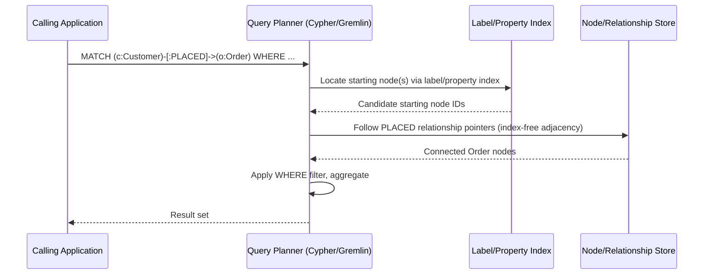
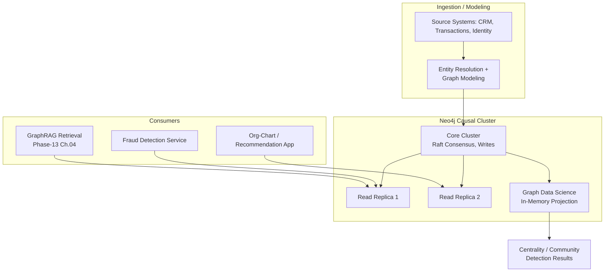
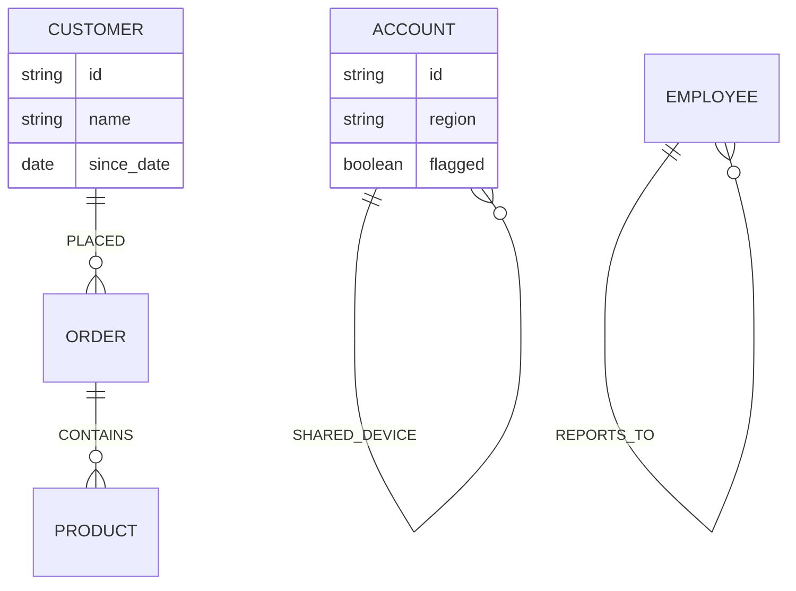

# Knowledge Graphs with Neo4j

> Part of the **Enterprise Data & AI Architecture Handbook** · Phase-13 — Knowledge Graphs & Vector Systems · Chapter 02.
> Estimated study time: **60 min reading + ~4h labs**.
> **Prerequisite:** read [Dimensional Modeling](../Phase-06/01_Dimensional_Modeling.md) first.

---

## Executive Summary

[Vector Databases: Qdrant and Milvus](01_Vector_Databases_Qdrant_and_Milvus.md) established approximate-nearest-neighbor search over embeddings as the retrieval backbone for RAG and agentic-AI systems, but also named a limitation it deliberately deferred: vector similarity captures "is this semantically alike," not "how is this specifically related to that" — a customer connected to an order connected to a shipment connected to a delayed carrier is a multi-hop relationship question no embedding's cosine similarity answers directly. [Dimensional Modeling](../Phase-06/01_Dimensional_Modeling.md) modeled exactly these kinds of relationships too, but as a fixed, schema-defined star of facts and dimensions optimized for aggregation queries known in advance. A **knowledge graph**, backed by a property-graph database such as Neo4j, is the third modeling paradigm this handbook covers: entities as nodes, relationships as explicit, typed, first-class edges (not foreign keys resolved via joins), queried through pattern-matching languages built specifically for multi-hop traversal rather than tabular aggregation.

This chapter covers **property graph versus RDF** as the two competing graph data models and why the property graph has become the pragmatic enterprise default; **Cypher and graph query languages** as the pattern-matching approach to querying connected data; **graph modeling patterns** for translating a real domain into nodes, relationships, and properties; **graph algorithms** (centrality and community detection) as the analytical layer unique to graph-native processing; and **Neo4j and Azure Cosmos DB's Gremlin API** as this chapter's primary open-source and Azure-managed implementations respectively.

The platform bias is **Azure-primary (~60%)** — Azure Cosmos DB for Apache Gremlin as the primary managed graph-database platform, with concrete API selection, partitioning, and RU-based cost guidance — **~30% enterprise open source** (Neo4j, this chapter's title technology, as the dominant purpose-built property-graph database and Cypher's origin; the openCypher and GQL standardization efforts) — **~10% AWS/GCP comparison-only** (Amazon Neptune's dual Gremlin/SPARQL support; Google's lack of a direct first-party managed graph database and its common substitutes).

**Bottom line:** a knowledge graph is not a replacement for the dimensional models or vector databases this handbook already covers — it is the right tool specifically when the business question *is* the relationship path itself (fraud rings, org hierarchies, supply-chain dependency chains, entity-resolution networks), and the recurring architectural mistake this chapter documents is reaching for a graph database to solve a problem that a well-indexed relational join or a vector similarity search would answer more cheaply and with far less operational overhead.

---

## Learning Objectives

By the end of this chapter you will be able to:

1. **Distinguish the property graph and RDF data models** and justify which is the appropriate default for a given enterprise scenario.
2. **Write and reason about Cypher queries**, including multi-hop pattern matching, variable-length paths, and aggregation over graph patterns.
3. **Apply graph modeling patterns** to translate a real domain (fraud detection, org hierarchy, product recommendation, supply chain) into nodes, relationships, and properties.
4. **Select and apply graph algorithms** (centrality, community detection) to answer analytical questions no query-language pattern match alone can answer.
5. **Compare Neo4j and Azure Cosmos DB for Apache Gremlin** on architecture, query model, operational ownership, and cost, and select the appropriate one for a given scenario.
6. **Identify when a knowledge graph is the wrong tool**, deferring instead to the relational and vector-database approaches covered elsewhere in this handbook.
7. **Defend a knowledge-graph architecture decision** in engineer, staff engineer, architect, and CTO review settings.

---

## Business Motivation

- **Some of the highest-value enterprise questions are inherently about relationship paths, not aggregates or similarity.** "Which accounts share a device, phone number, or address with a known fraudulent account, up to three hops away?" is a query a dimensional star schema answers only through an expensive, unbounded chain of self-joins, and a vector database cannot answer at all — a knowledge graph answers it as a single, readable pattern-match query.
- **Multi-hop relationship queries degrade catastrophically in relational databases as hop count grows**, because each additional hop is another join, and query planners handle deeply chained joins far worse than a graph-native engine handles graph traversal — this performance gap, not a stylistic preference, is the primary technical justification for adopting a dedicated graph database.
- **Entity resolution and network analysis (fraud rings, organizational influence, supply-chain single-points-of-failure) require graph algorithms** (centrality, community detection, per §8.4) that have no direct SQL or vector-similarity equivalent, and reimplementing them by hand on top of a non-graph-native store is a common, expensive anti-pattern this chapter's Anti-patterns section documents.
- **GraphRAG (Phase-13 Chapter 04, forthcoming) depends on this chapter's knowledge-graph foundation** to answer RAG queries that are fundamentally about entity relationships (e.g., "how are these two companies connected") rather than semantic similarity, directly extending the retrieval-paradigm gap [Vector Databases: Qdrant and Milvus](01_Vector_Databases_Qdrant_and_Milvus.md)'s Trade-offs section named without resolving.
- **Adopting a graph database is a genuine, non-trivial operational and skills investment** — Cypher, graph modeling, and graph-algorithm literacy are not the same skill set as SQL or vector-database operations, and an organization that adopts a knowledge graph without accounting for this learning curve risks the same "shiny new technology, unclear ownership" pattern this handbook has flagged for other specialized infrastructure (e.g., [Feature Stores with Feast](../Phase-11/02_Feature_Stores_with_Feast.md)'s registry-and-ownership caution).

---

## History and Evolution

- **1998-2001 — the Resource Description Framework (RDF) and Semantic Web vision** (Tim Berners-Lee) proposes a universal, subject-predicate-object triple model for representing and linking data across the web, aiming for machine-readable, globally-interlinked knowledge — an ambitious vision that saw real adoption in specific domains (life sciences, government linked-open-data) but never achieved the universal web-wide interlinking originally proposed.
- **2000s — triple stores mature** (Jena, Virtuoso, later Blazegraph) as the RDF-native database category, alongside **SPARQL** (2008 W3C recommendation) as RDF's standard query language, establishing the RDF/triple-store lineage this chapter contrasts with the property graph.
- **2007 — Neo4j's initial development begins**, introducing the **property graph model** — nodes and relationships each carrying arbitrary key-value properties directly, rather than requiring every fact to be decomposed into atomic subject-predicate-object triples — a deliberately more pragmatic, application-developer-friendly alternative to the RDF lineage.
- **2011 — Neo4j 1.4 introduces Cypher**, a declarative, pattern-matching query language reading like ASCII-art graph patterns (`(a)-[:KNOWS]->(b)`), rapidly becoming the property-graph world's de facto query-language standard, analogous to SQL's role for relational databases.
- **2010 — Apache TinkerPop and the Gremlin graph traversal language** emerge as a vendor-neutral, imperative graph-traversal API and execution engine, adopted by multiple graph databases (including, later, Azure Cosmos DB's Gremlin API and Amazon Neptune) as an alternative to both Cypher and SPARQL.
- **2015 — graph algorithm libraries mature as a distinct capability** (Neo4j Graph Data Science library's predecessors), formalizing centrality and community-detection algorithms as first-class, graph-native analytical operations rather than bespoke code built on top of raw traversal queries.
- **2016 — Azure Cosmos DB launches its Gremlin API**, bringing a globally-distributed, multi-model managed database's operational model (the same underlying Cosmos DB engine covered for document and key-value workloads in this handbook's data-platform chapters) to graph workloads specifically.
- **2019-2020 — openCypher is donated to open governance**, and multiple vendors (including some non-Neo4j engines) begin implementing Cypher-compatible query support, reducing the query-language lock-in concern that had been a common objection to Cypher's earlier Neo4j-proprietary status.
- **2023 — ISO/IEC formally publishes GQL (Graph Query Language)** as an international standard graph query language, drawing heavily on Cypher's syntax and semantics, giving the property-graph world an SQL-equivalent standardization milestone roughly analogous to SQL's own 1986 ANSI standardization.
- **2023-present — GraphRAG (Microsoft Research, 2024) and knowledge-graph-augmented retrieval** emerge as a direct response to pure-vector RAG's documented weaknesses on multi-hop and relationship-centric queries (per [Retrieval Augmented Generation](../Phase-12/03_Retrieval_Augmented_Generation.md) and this chapter's own Trade-offs section), cementing knowledge graphs as a mainstream complement to, rather than a competitor against, the vector-database-centric RAG architectures this handbook has already covered — the subject of Phase-13 Chapter 04.

---

## Why This Technology Exists

A relational database models relationships implicitly, through foreign keys resolved at query time via joins; a vector database models similarity, through distance in an embedding space. Neither natively models an explicit, typed, directly-traversable relationship as a first-class stored object with its own properties, and neither is built for a query pattern that says "follow this type of relationship, an unknown number of hops, until you find a node matching this condition." A knowledge graph exists specifically to make relationships themselves — not just the entities they connect — first-class, queryable, indexed data, and to make traversing chains of those relationships a native, efficient operation rather than a chain of increasingly expensive joins or an unanswerable question for a similarity-only index.

---

## Problems It Solves

- **Efficient multi-hop and variable-length-path traversal** ("find all paths of length 2-4 between these two nodes") that relational join-chains handle poorly as hop count grows, and vector search cannot answer at all.
- **Native representation of typed relationships with their own properties** (e.g., a `TRANSACTED_WITH` relationship carrying an amount and timestamp), avoiding the awkward associative-table-plus-join pattern relational modeling requires for the same fact.
- **Graph-native analytics** — centrality (which nodes are most structurally important), community detection (which nodes cluster together), and pathfinding (shortest or all paths between two nodes) — as first-class, optimized graph operations rather than hand-rolled recursive SQL or application-layer graph traversal.
- **Schema flexibility for evolving, heterogeneous relationship types**, letting new node labels and relationship types be added incrementally without the upfront, comprehensive schema design a dimensional model (per [Dimensional Modeling](../Phase-06/01_Dimensional_Modeling.md)) requires.
- **Entity resolution and network-based fraud/risk detection**, surfacing indirect connections (shared devices, addresses, or intermediary entities) across large, densely-interconnected datasets that tabular analysis would need extensive, bespoke self-join logic to approximate.

---

## Problems It Cannot Solve

- **A knowledge graph is not a general-purpose analytical or reporting database** — the aggregation-heavy, known-in-advance query patterns [Dimensional Modeling](../Phase-06/01_Dimensional_Modeling.md) and [OLAP and Cube Modeling](../Phase-06/04_OLAP_and_Cube_Modeling.md) are optimized for (sum revenue by region and quarter) are typically served far better, and far more cheaply, by a dimensional model or OLAP cube than by a graph traversal.
- **It does not natively perform semantic similarity search** — finding conceptually similar unstructured content is [Vector Databases: Qdrant and Milvus](01_Vector_Databases_Qdrant_and_Milvus.md)'s job, not a property graph's; a knowledge graph answers "how are these connected," not "what does this mean, semantically."
- **A graph database does not automatically resolve entity deduplication or disambiguation** — deciding that "J. Smith" in one source and "John Smith" in another are the same person is an upstream data-quality and entity-resolution problem (extending [Master Data Management](../Phase-08/05_Master_Data_Management.md)'s discipline), not something Cypher pattern-matching does for you.
- **It does not scale linearly-for-free with graph density** — a densely connected "supernode" (a node with millions of relationships, e.g., a popular product or a shared IP address in a fraud graph) can degrade traversal performance in ways schema design and query tuning must deliberately account for, not something the database eliminates automatically.
- **A knowledge graph does not eliminate the need for access control and governance design** — the same access-control-propagation discipline this handbook has repeated across [Retrieval Augmented Generation](../Phase-12/03_Retrieval_Augmented_Generation.md) ADR-0157 and [Vector Databases: Qdrant and Milvus](01_Vector_Databases_Qdrant_and_Milvus.md) ADR-0164 applies to graph traversal results exactly as it does to vector search results — a traversal can surface a relationship path into content the querying identity is not entitled to see.

---

## Core Concepts

### 2.1 Property Graph Model

A property graph consists of **nodes** (entities, each carrying one or more **labels** classifying its type, e.g., `:Customer`, `:Order`) and **relationships** (directed, typed edges connecting two nodes, e.g., `:PLACED`, `:SHIPPED_VIA`), where both nodes and relationships can carry arbitrary key-value **properties** directly (a `:Customer` node might have `name`, `since_date`; a `:PLACED` relationship might have `order_date`, `channel`). This is the model Neo4j, Azure Cosmos DB's Gremlin API, and most contemporary graph databases implement, and the one this chapter treats as the pragmatic enterprise default.

### 2.2 RDF and the Triple Store

RDF decomposes every fact into an atomic **subject-predicate-object triple** (e.g., `<Customer:123> <placed> <Order:456>`), with relationship "properties" requiring reification (an extra intermediate node representing the relationship-as-a-thing to attach properties to) rather than direct attachment. RDF's strength is formal semantic precision and interoperability with ontology/reasoning standards (RDFS, OWL — previewed here, covered in depth in Phase-13 Chapter 05, Ontologies and Taxonomies), making it the right choice for domains requiring formal ontological reasoning (life sciences, government linked data, some regulatory-taxonomy use cases) at the cost of a steeper modeling and query learning curve than the property graph for typical enterprise application development.

### 2.3 Property Graph vs. RDF: The Practical Decision

The property graph wins the default enterprise recommendation in this handbook (per Decision Matrix, §25) because most enterprise knowledge-graph use cases (fraud detection, recommendation, org hierarchies, supply chain) benefit far more from the property graph's direct relationship-property attachment and simpler mental model than from RDF's formal-reasoning rigor; RDF remains the right choice specifically when formal ontological reasoning, cross-organization semantic interoperability, or regulatory-taxonomy alignment (the subject of Phase-13 Chapter 05) is a genuine, first-order requirement rather than a nice-to-have.

### 2.4 Cypher: Declarative Pattern Matching

Cypher queries express what pattern to match, not how to traverse it, using an ASCII-art-like syntax directly mirroring the graph's visual structure:

```cypher
MATCH (c:Customer)-[:PLACED]->(o:Order)-[:CONTAINS]->(p:Product {category: 'Electronics'})
WHERE o.order_date >= date('2026-01-01')
RETURN c.name, count(o) AS order_count
ORDER BY order_count DESC
LIMIT 10
```

This declarative model is directly analogous to SQL's declarative philosophy (state the desired result shape, let the query planner determine execution) but built around graph patterns rather than tabular joins — the same "declare intent, not mechanism" philosophy this handbook has repeated for SQL (Phase-06), Terraform (Phase-09), and GitOps (Phase-09).

### 2.5 Variable-Length Path Traversal

Cypher's variable-length relationship syntax (`-[:CONNECTED_TO*1..4]->`) natively expresses "follow this relationship type between 1 and 4 hops," the exact multi-hop query pattern this chapter's Business Motivation named as prohibitively expensive to express as chained relational joins:

```cypher
MATCH path = (a:Account {id: 'A100'})-[:SHARED_DEVICE*1..3]-(b:Account)
WHERE b.flagged = true
RETURN path, length(path)
```

### 2.6 Gremlin: Imperative Graph Traversal

Gremlin, Apache TinkerPop's traversal language, expresses queries as an explicit, chained sequence of traversal steps rather than Cypher's declarative pattern:

```groovy
g.V().hasLabel('Customer').has('id', 'C100')
  .out('PLACED').out('CONTAINS')
  .has('category', 'Electronics')
  .dedup().limit(10)
```

Gremlin's imperative, step-by-step style is more verbose but also more explicit about execution order, and is the query language Azure Cosmos DB's Gremlin API and Amazon Neptune's Gremlin endpoint both implement, making Gremlin fluency directly relevant to this chapter's primary Azure-managed implementation path.

### 2.7 Graph Modeling Patterns

Translating a domain into a property graph is a distinct design discipline from relational normalization: **model verbs as relationships, nouns as nodes** (a customer *places* an order — `:PLACED` relationship, not a foreign-key column); **avoid over-normalizing into excessive intermediate nodes** for simple attributes that belong as node properties; **explicitly model the relationship type granularity needed for the actual queries** (a single generic `:RELATED_TO` relationship type defeats Cypher's type-based pattern matching — prefer specific types like `:MANAGES`, `:REPORTS_TO`); and **anticipate variable-length traversal needs at modeling time**, since a relationship type chosen too narrowly (splitting what should be one traversable relationship type into several unrelated ones) can make otherwise-simple path queries awkward.

### 2.8 Centrality Algorithms

Centrality algorithms quantify a node's structural importance within the graph: **degree centrality** (simple relationship count) identifies well-connected nodes cheaply; **betweenness centrality** identifies nodes that sit on the most shortest-paths between other node pairs (structurally critical "bridge" nodes, valuable for identifying single-points-of-failure in a supply-chain graph); **PageRank** (and its enterprise graph-analytics variants) identifies nodes that are important because they are connected to other important nodes, not merely because they have many connections — the algorithm class underlying both web-search ranking and, in an enterprise context, identifying influential entities in an organizational or citation network.

### 2.9 Community Detection Algorithms

Community detection (Louvain modularity, Label Propagation, Weakly/Strongly Connected Components) partitions a graph into densely-interconnected clusters, surfacing groups of entities more tightly connected to each other than to the rest of the graph — the direct algorithmic basis for fraud-ring detection (a cluster of accounts unusually densely connected via shared identifiers), customer-segmentation-by-behavior-network, and organizational-silo analysis.

---

## Internal Working

Neo4j's storage engine uses **index-free adjacency**: each node physically stores direct pointers to its relationship records, and each relationship record stores pointers to its start and end nodes plus pointers to the next/previous relationship in each connected node's relationship chain. This means traversing from a node to its neighbors is a constant-time pointer-following operation regardless of overall graph size — the structural reason graph-native traversal does not degrade the way an equivalent relational join-chain does as hop count grows, since a join-based approach must re-evaluate an index lookup at every hop while index-free adjacency requires none. Azure Cosmos DB's Gremlin API takes a materially different internal approach: it stores the graph on top of Cosmos DB's underlying partitioned, JSON-document storage engine, translating Gremlin traversal steps into the same underlying request-unit-costed operations the rest of the Cosmos DB platform uses (per [Cosmos DB best practices](../Phase-06/01_Dimensional_Modeling.md) partitioning discipline extended to the graph API) — trading some of index-free adjacency's traversal-locality advantage for Cosmos DB's global-distribution and multi-region operational model.



---

## Architecture

A production Neo4j deployment consists of a **core cluster** (a small number of nodes, typically 3 or 5, running the Raft consensus protocol for write availability and strong consistency — directly applying the consensus discipline this handbook covered in [Consensus and Coordination](../Phase-02/01_Consensus_and_Coordination.md)) and optionally a set of **read replicas** scaling read-query throughput independently of the write-serving core, mirroring the read/write scaling separation this handbook has repeated for other distributed data systems. Azure Cosmos DB for Apache Gremlin's architecture instead inherits Cosmos DB's own globally-distributed, multi-region, partition-based architecture wholesale — the graph API is a query-and-data-model layer on top of the same underlying globally-replicated partitioned store used by Cosmos DB's other APIs, meaning the operational model (partition-key design, RU provisioning, multi-region writes, consistency-level selection per [CAP and PACELC](../Phase-02/04_CAP_and_PACELC.md)) is shared with, not distinct from, the rest of the Cosmos DB platform this handbook has referenced elsewhere.

---

## Components

- **Node** — a graph entity instance, carrying one or more labels and properties.
- **Relationship** — a typed, directed edge connecting exactly two nodes, carrying its own properties, indexed for efficient traversal in both directions.
- **Label/Property Index** — a supporting index (analogous to a relational secondary index) accelerating the "find the starting node(s) matching this label and property" step that begins most traversal queries, since index-free adjacency accelerates traversal *from* a known node but does not eliminate the need to efficiently *locate* that starting node.
- **Graph Data Science (GDS) Library** — Neo4j's dedicated, in-memory graph-algorithm execution engine, projecting a subgraph into an optimized in-memory format for running centrality, community-detection, and pathfinding algorithms at scale without impacting the transactional store's performance.
- **Core Cluster / Causal Cluster** — the Raft-consensus-backed set of nodes serving writes and guaranteeing "causal consistency" (a read is guaranteed to reflect any write the same client previously made), Neo4j's specific consistency model.
- **Partition (Cosmos DB Gremlin)** — the unit of horizontal scaling and RU allocation in Azure Cosmos DB's Gremlin API, requiring the same careful partition-key selection discipline as any other Cosmos DB workload.

---

## Metadata

Knowledge-graph metadata parallels this handbook's established data-catalog discipline ([Data Catalog and Lineage](../Phase-08/02_Data_Catalog_and_Lineage.md)): every node label and relationship type should be documented with its meaning, the source system(s) it is derived from, and its expected cardinality (is this a rare, high-value relationship, or an extremely high-fan-out one requiring supernode-mitigation design, per §17); relationship and node properties used in access-control filtering must be catalogued with the same rigor [Vector Databases: Qdrant and Milvus](01_Vector_Databases_Qdrant_and_Milvus.md)'s Metadata section required for payload fields, since a graph-traversal access filter is exactly as security-critical as a vector-search metadata filter.

---

## Storage

Neo4j stores nodes, relationships, and properties in fixed-size records on disk (enabling the constant-time pointer arithmetic behind index-free adjacency), with a page cache holding the most frequently accessed portion of the graph in memory — sizing this page cache to comfortably hold the graph's "hot" working set (not necessarily the entire graph) is the single most consequential Neo4j capacity-planning decision, directly analogous to this handbook's repeated in-memory-versus-disk-tiering cost/performance trade-off from [Vector Databases: Qdrant and Milvus](01_Vector_Databases_Qdrant_and_Milvus.md)'s Storage section. Azure Cosmos DB for Apache Gremlin stores graph data as the same underlying JSON documents Cosmos DB's other APIs use, subject to the same 2 MB document-size and partition-size limits, meaning very large individual node or relationship property sets require the same document-modeling discipline as any other Cosmos DB workload.

---

## Compute

Query-serving compute in Neo4j is dominated by traversal-depth and result-set-size, not raw node count — a shallow query over a huge graph is typically cheap, while a deep or high-fan-out variable-length traversal can be expensive regardless of overall graph size, making query-pattern review (are variable-length bounds set appropriately, is a supernode likely to be traversed) a more useful capacity-planning lever than simply provisioning for total data volume. Graph algorithm execution (GDS library) is a separate, typically batch-oriented and CPU/memory-intensive compute workload run against an in-memory graph projection, and should be resourced and scheduled independently of transactional query-serving compute, mirroring this handbook's repeated indexing-versus-serving compute-isolation guidance from [Vector Databases: Qdrant and Milvus](01_Vector_Databases_Qdrant_and_Milvus.md)'s Compute section.

---

## Networking

Self-hosted Neo4j clusters on AKS, and Azure Cosmos DB for Apache Gremlin, follow the identical private-endpoint-only, default-deny-egress baseline this handbook established in [Network Security and Zero Trust](../Phase-10/04_Network_Security_and_Zero_Trust.md) ADR-0144: Neo4j's Bolt protocol port should never be exposed on a public IP, and Cosmos DB's Gremlin endpoint should be reached exclusively via private endpoint with public network access explicitly disabled — repeating the exact "added a private endpoint but forgot to disable public access" gotcha that chapter documented, since Cosmos DB's public endpoint remains reachable by default even after a private endpoint is added unless explicitly turned off.

---

## Security

- **Access-control propagation through traversal results** is this chapter's specific instance of the recurring handbook-wide principle: a Cypher or Gremlin query result can surface a path through, or a node belonging to, content the querying identity is not entitled to see, and the calling application (or, where supported, native role-based property/label-level security) must filter for this exactly as rigorously as [Vector Databases: Qdrant and Milvus](01_Vector_Databases_Qdrant_and_Milvus.md) ADR-0164 requires for vector search.
- **Neo4j's native RBAC** supports role-based restrictions down to the label and property level in Enterprise Edition, allowing some access-control enforcement to happen natively at the database layer rather than exclusively in application code — a stronger native security posture than most vector databases' payload-filter-only model, but one that still requires deliberate configuration, not a default-on guarantee.
- **Azure Cosmos DB for Apache Gremlin inherits Cosmos DB's own Entra ID-integrated RBAC, managed identity support, and encryption-at-rest-by-default posture** (per [Identity and Access Management with Entra](../Phase-10/02_Identity_and_Access_Management_with_Entra.md)), consistent with the rest of the Cosmos DB platform.
- **Sensitive relationship data (e.g., organizational reporting lines, financial-transaction graphs) deserves the same confidentiality classification and encryption discipline** as any other sensitive data store per [Data Security and Encryption](../Phase-10/03_Data_Security_and_Encryption.md) — a graph's relationships are frequently as sensitive as, or more sensitive than, the node properties themselves (who reports to whom, who transacted with whom), and access-control design must account for relationship-level, not just node-level, sensitivity.

---

## Performance

- **Supernode mitigation** — a node with an unusually large number of relationships of a given type (a popular product, a shared corporate address) can turn an otherwise-cheap traversal into an expensive one; mitigation patterns include intermediate "bucket" nodes splitting a supernode's relationships into manageable groups, or excluding known supernodes from variable-length traversal patterns via an explicit filter.
- **Variable-length path bound discipline** — an unbounded or overly wide variable-length traversal (`*1..10` where `*1..3` would answer the actual business question) can explore an exponentially larger candidate set than intended; always set the tightest bound the use case genuinely requires, profiling before widening it.
- **Index coverage for starting-node lookups** — since index-free adjacency accelerates traversal *from* a node but not the initial lookup *to* that node, missing label/property indexes on frequently-queried starting patterns is a common, easily-fixed performance mistake.
- **Query-plan review (`EXPLAIN`/`PROFILE` in Cypher)** — reviewing the actual execution plan before assuming a query is efficient, exactly analogous to reviewing a relational database's query plan (per this handbook's SQL Server chapter, [SQL Server and Azure SQL](../Phase-06/08_SQL_Server_and_Azure_SQL.md)) rather than trusting a query's declarative simplicity to guarantee an efficient execution.

---

## Scalability

Neo4j scales reads horizontally via read replicas (unlimited, independently addable) while writes remain funneled through the small Raft-consensus core cluster — a read-heavy-optimized scaling model appropriate for the read-dominant query patterns most knowledge-graph use cases exhibit. Sharding a single logical graph across multiple independent Neo4j clusters (graph partitioning) is possible but genuinely difficult, since a well-connected graph resists clean partitioning without either creating many cross-partition relationships (defeating the locality advantage of index-free adjacency) or requiring careful domain-specific partition-key design; this is a materially harder scaling problem than sharding a vector database or a relational table, and is the primary practical ceiling that leads very-large-scale graph workloads toward either Neo4j's higher-tier clustering options or Azure Cosmos DB for Apache Gremlin's partition-native architecture instead. Azure Cosmos DB for Apache Gremlin scales via the same partition-key-driven horizontal-partitioning model as the rest of Cosmos DB, at the cost of the cross-partition-traversal-cost complexity this section's Neo4j discussion also flags — a well-chosen graph partition key (grouping frequently-co-traversed nodes into the same partition) is essential, not optional, at scale.

---

## Fault Tolerance

Neo4j's core cluster replicates every write to a Raft-consensus-backed quorum of core members before acknowledging it, ensuring a single core-member failure does not lose committed data (directly applying the consensus and replication discipline from [Consensus and Coordination](../Phase-02/01_Consensus_and_Coordination.md) and [Replication and Consistency](../Phase-02/02_Replication_and_Consistency.md)); read-replica failures are transparently handled by routing to a surviving replica. Azure Cosmos DB for Apache Gremlin inherits Cosmos DB's multi-region-replication and configurable consistency-level fault tolerance wholesale, including automatic regional failover, the same managed-fault-tolerance trade-off (less configuration control, less operational burden) this handbook has repeated for every managed-versus-self-hosted comparison in this phase and the last.

---

## Cost Optimization

- **Right-size the Neo4j Graph Data Science in-memory graph projection to only the node/relationship types a given algorithm run actually needs**, rather than projecting the entire graph for every algorithm execution — a needlessly broad projection multiplies both memory cost and algorithm runtime for no analytical benefit.
- **Schedule graph-algorithm (GDS) batch runs during off-peak windows** on dedicated compute separate from transactional query-serving nodes, avoiding both resource contention and the need to permanently over-provision the transactional cluster for an intermittent analytical workload.
- **For Azure Cosmos DB for Apache Gremlin, monitor RU consumption per query pattern specifically** — a poorly-bounded variable-length traversal can consume dramatically more request units than a well-bounded equivalent, making query-pattern RU profiling (not just aggregate RU provisioning) the primary graph-specific FinOps lever on this platform.
- **Worked FinOps example:** a fraud-detection graph of 40 million account nodes and 300 million relationship edges initially runs on a Neo4j Enterprise cluster sized for worst-case unbounded traversal queries (5 core nodes plus 3 read replicas, all provisioned at a memory tier sized to hold the full graph in page cache), costing an estimated $14,000/month in compute. A query-pattern audit finds that 90% of production queries use variable-length bounds of 3 hops or fewer and never touch the graph-algorithm workload directly; right-sizing the transactional cluster to a smaller memory tier (holding the demonstrably "hot" 60% of the graph, informed by access-pattern telemetry) and moving the GDS algorithm runs to a separate, scheduled, larger-memory compute node used only during nightly batch windows reduces steady-state compute to roughly $6,500/month plus a scheduled nightly node estimated at $800/month — a combined ~48% reduction, validated by confirming p95 query latency remained within SLA after the resize (the same "measure before, measure after, don't assume" discipline this chapter's Performance section requires for any traversal-bound change).

---

## Monitoring

- **Query latency segmented by traversal depth and pattern shape**, since (per this chapter's Performance section) a shallow lookup and a deep variable-length traversal have fundamentally different latency profiles and must not be averaged together into one misleading aggregate metric.
- **Supernode detection** — a recurring scheduled query or GDS degree-centrality run flagging any node whose relationship count has grown past an agreed threshold, catching an emerging supernode-performance risk before it manifests as a production latency incident.
- **Page cache hit ratio (Neo4j)** — a declining hit ratio is a leading indicator that the graph's "hot" working set has outgrown the provisioned page cache, directly informing the capacity-planning decision in Cost Optimization.
- **RU consumption per query shape (Cosmos DB Gremlin)** — tracked per distinct query pattern, not just in aggregate, to attribute cost and catch a specific inefficient query pattern rather than only observing an unexplained aggregate RU increase.
- **Cluster consensus health (core-member availability, replication lag to read replicas)** — the same distributed-systems health signals this handbook has required for every Raft/consensus-backed system.

---

## Observability

Full-pipeline tracing (per [LLMOps](../Phase-12/04_LLMOps.md)'s OpenTelemetry-span foundation, already extended to the vector-database layer in [Vector Databases: Qdrant and Milvus](01_Vector_Databases_Qdrant_and_Milvus.md)'s Observability section) should extend to graph queries with equal specificity: a span capturing the Cypher/Gremlin query pattern (parameterized, not the literal query string with data values, to avoid leaking sensitive property values into trace storage), the actual traversal depth reached, node/relationship counts touched, and latency — enabling a performance regression (a query that used to touch thousands of nodes now touching millions because an upstream data-quality issue created an unexpected supernode) to be diagnosed from telemetry rather than requiring live reproduction against production data.

### Operational Response Playbook

| Signal | Detection Query/Method | Remediation |
|---|---|---|
| Sudden p99 latency spike on a previously-stable query pattern | Query-log analysis grouping by parameterized query shape, comparing current p99 against a rolling 7-day baseline per shape | Run `PROFILE`/`EXPLAIN` on the affected pattern against current production data; check specifically for a newly-formed supernode (a node whose relationship count has grown sharply) along the query's traversal path; apply supernode-mitigation (bucket nodes or a tighter variable-length bound) if confirmed |
| Cosmos DB Gremlin requests being rate-limited (HTTP 429 / RU exhaustion) | Cosmos DB diagnostic logs filtered for 429 responses, grouped by query pattern and partition key | Identify whether the 429s concentrate on one partition (a partition-key hot-spot, requiring a partition-key redesign) or are broad-based (requiring an RU/s provisioning increase); apply the narrower, cheaper fix first before scaling RU/s broadly |

---

## Governance

Knowledge-graph governance extends this handbook's established data-governance discipline ([Data Governance Foundations](../Phase-08/01_Data_Governance_Foundations.md)) to nodes and relationships as governed assets: every node label and relationship type should be catalogued (per this chapter's Metadata section) with an owning team, source-system lineage, and confidentiality classification, treating a fraud-detection graph's `:SHARED_DEVICE` relationship, for instance, with the same sensitivity classification rigor as the underlying PII it is derived from. Right-to-be-forgotten obligations (per [Data Privacy and PII Protection](../Phase-10/07_Data_Privacy_and_PII_Protection.md) ADR-0147) extend to knowledge graphs exactly as to vector stores (per [Vector Databases: Qdrant and Milvus](01_Vector_Databases_Qdrant_and_Milvus.md)'s Governance section): a deleted individual's node, and every relationship referencing it, must be actually and verifiably removed, including from any GDS in-memory graph projections or algorithm-result caches that might otherwise retain a derived trace of the deleted entity's structural influence (e.g., a previously computed centrality score attributable to relationships that have since been deleted).

---

## Trade-offs

- **Property graph (Neo4j) vs. RDF (triple store):** the property graph wins on pragmatic enterprise application development and relationship-property attachment simplicity; RDF wins when formal ontological reasoning and cross-organization semantic interoperability (Phase-13 Chapter 05's subject) is a genuine, first-order requirement.
- **Cypher vs. Gremlin:** Cypher's declarative pattern-matching is generally more readable and easier to reason about for typical enterprise queries; Gremlin's imperative, step-chained model offers finer execution-order control and is the required language for Azure Cosmos DB's Gremlin API and Amazon Neptune's Gremlin endpoint — the choice is frequently dictated by platform selection rather than an independent language preference.
- **Self-hosted Neo4j (AKS) vs. managed Azure Cosmos DB for Apache Gremlin:** self-hosted Neo4j offers native RBAC down to the label/property level, the mature Graph Data Science algorithm library, and generally simpler mental-model traversal performance (index-free adjacency); Cosmos DB Gremlin offers Cosmos DB's global-distribution, multi-region-write, and managed-operations model at the cost of partition-key-driven cross-partition traversal complexity and a materially smaller graph-algorithm ecosystem.
- **Knowledge graph vs. "just add a few more joins" on the existing relational model:** a graph database is justified when multi-hop, variable-depth traversal is a core, recurring query pattern; it is not justified merely because a domain "sounds relational and connected" if the actual query patterns remain shallow, aggregation-oriented, and well-served by [Dimensional Modeling](../Phase-06/01_Dimensional_Modeling.md)'s existing star-schema approach — this chapter's Anti-patterns section names this exact overreach directly.
- **Knowledge graph vs. vector database for RAG-style retrieval:** per [Vector Databases: Qdrant and Milvus](01_Vector_Databases_Qdrant_and_Milvus.md)'s Trade-offs section, these are complementary, not competing, retrieval paradigms — vector search answers "what is semantically similar," a knowledge graph answers "how is this specifically related," and GraphRAG (Phase-13 Chapter 04) is precisely the architecture that combines both rather than forcing a choice between them.

---

## Decision Matrix

| Scenario | Recommended Choice | Rationale |
|---|---|---|
| Azure-native enterprise graph workload, team wants Cosmos DB's global-distribution and managed-operations model | Azure Cosmos DB for Apache Gremlin | Consistent operational model with the rest of the organization's Cosmos DB estate; managed multi-region fault tolerance |
| Fraud-ring/network-analysis workload requiring the mature Graph Data Science algorithm library (centrality, community detection at scale) | Self-hosted Neo4j (Enterprise Edition, AKS) | GDS library depth and maturity exceeds Cosmos DB Gremlin's graph-algorithm ecosystem as of this writing |
| Domain requiring formal ontological reasoning or cross-organization semantic-web interoperability | RDF triple store (deferred to Phase-13 Chapter 05's ontology treatment) | Property graph's pragmatic model is the wrong fit when formal reasoning is a first-order requirement |
| Query patterns remain shallow (1-2 hop) and aggregation-oriented, known in advance | Relational/dimensional model ([Dimensional Modeling](../Phase-06/01_Dimensional_Modeling.md)) | A graph database's traversal advantage is irrelevant when queries don't need deep, variable-length traversal; avoid the added operational surface |
| Multi-cloud or cloud-agnostic requirement for the graph layer specifically | Self-hosted Neo4j (Kubernetes, per [Kubernetes](../Phase-09/06_Kubernetes.md)) | Portable across clouds; avoids Cosmos DB-specific lock-in |
| Prototype/proof-of-concept, uncertain long-term scale and algorithm-depth requirements | Neo4j Community Edition (single instance, Docker) or Cosmos DB Gremlin smallest tier | Lowest time-to-first-result and lowest commitment; defer the Enterprise-vs-Cosmos decision until real requirements are known |

---

## Design Patterns

- **Bucket/intermediate node for supernode mitigation:** split a high-fan-out relationship (e.g., "all customers who bought this popular product") into intermediate grouping nodes (by month, by region) so traversal touches a bounded subset rather than the full supernode fan-out.
- **Bitemporal relationship properties:** attach both a business-effective timestamp and a system-recorded timestamp to relationships (e.g., `:REPORTS_TO {since: date, recorded_at: datetime}`), enabling "what did the org chart look like as of this date" queries — directly analogous to [Slowly Changing Dimensions](../Phase-06/05_Slowly_Changing_Dimensions.md)'s temporal-tracking discipline, now applied to relationships rather than dimension rows.
- **Graph projection for algorithm isolation:** project only the specific node/relationship subset a given GDS algorithm run needs into an in-memory graph projection, isolating analytical compute from transactional query-serving load (per this chapter's Compute and Cost Optimization sections).
- **Hybrid relational-plus-graph architecture:** keep aggregation-heavy, known-query-pattern data in the existing dimensional model and route only the genuinely relationship-traversal-heavy subset of the domain (e.g., just the fraud-signal entities and their connections) into the knowledge graph, avoiding a wholesale, unjustified migration of the entire data estate into graph form.

---

## Anti-patterns

- **Migrating an entire relational data estate into a graph database "because graphs are more flexible,"** without a specific multi-hop traversal requirement driving the decision — the single most common and costly knowledge-graph adoption mistake, reproducing this chapter's Business Motivation and Trade-offs warnings in practice.
- **Using an unbounded variable-length traversal in production queries** (`*` with no upper bound) — a correctness and performance risk simultaneously, since an unbounded traversal can both return an unexpectedly large result set and consume unbounded compute.
- **Treating Cypher/Gremlin query results as automatically access-control-filtered** without explicit verification, reproducing the exact silent-under-return (or worse, over-return) risk [Vector Databases: Qdrant and Milvus](01_Vector_Databases_Qdrant_and_Milvus.md) ADR-0164 named for vector search, now in the graph-traversal context.
- **Reimplementing centrality or community-detection algorithms by hand in application code** on top of raw traversal queries, rather than using the purpose-built, optimized Graph Data Science library (or Cosmos DB's equivalent) — an expensive, error-prone reinvention of already-solved, well-optimized algorithmic infrastructure.
- **Ignoring supernode risk during initial data modeling**, only discovering it in production once a specific node's relationship count has already grown large enough to degrade traversal performance for every query touching it.

---

## Common Mistakes

- **Choosing overly generic relationship types** (a single catch-all `:RELATED_TO`) that defeat Cypher's type-based pattern matching and force every query to filter on a relationship property instead of the relationship type itself.
- **Missing label/property indexes on common query starting-points**, causing every query touching that pattern to fall back to a full label scan despite index-free adjacency's traversal-speed advantage once a starting node is found.
- **Not setting a tight variable-length traversal bound**, defaulting to a wide or unbounded range "just in case" rather than deriving the bound from the actual business question being asked.
- **Assuming Cypher and Gremlin (or two different graph databases generally) are interchangeable without a migration effort** — query-language and, frequently, underlying data-model translation is a genuine, non-trivial migration cost, covered further in Migration Considerations.
- **Neglecting to separate transactional and graph-algorithm (GDS) compute**, causing a scheduled analytical batch run to degrade production query latency — the same resource-contention mistake this handbook has flagged for shared compute in multiple other infrastructure contexts (e.g., [Vector Databases: Qdrant and Milvus](01_Vector_Databases_Qdrant_and_Milvus.md)'s Compute section).

---

## Best Practices

- Justify a knowledge-graph adoption decision with a specific, named multi-hop or network-analysis query requirement, not a general "graphs are more flexible" rationale.
- Model relationship types at the granularity the actual query patterns need, and set explicit, business-question-derived bounds on every variable-length traversal in production code.
- Catalog every node label and relationship type (per this chapter's Metadata and Governance sections) with ownership, source lineage, and confidentiality classification, treating relationships as sensitive data in their own right.
- Isolate transactional query-serving compute from graph-algorithm (GDS) batch compute, scheduling the latter during off-peak windows on separate infrastructure.
- Verify access-control propagation through traversal results empirically (mirroring [Vector Databases: Qdrant and Milvus](01_Vector_Databases_Qdrant_and_Milvus.md) ADR-0164's verification discipline), not by assumption.
- Monitor for emerging supernodes proactively via scheduled degree-centrality checks, rather than discovering them reactively through a production latency incident.

---

## Enterprise Recommendations

Default to **Azure Cosmos DB for Apache Gremlin** for Azure-native enterprise graph workloads where global distribution, managed operations, and consistency with an existing Cosmos DB estate are priorities, reserving **self-hosted Neo4j (Enterprise Edition, on AKS)** for workloads specifically requiring the mature Graph Data Science algorithm library at scale, native label/property-level RBAC, or graph-algorithm depth exceeding Cosmos DB Gremlin's current ecosystem. In every case, mandate an explicit, named multi-hop or network-analysis query justification before adopting a dedicated knowledge graph at all (per this chapter's Anti-patterns section), and require the same access-control-propagation verification, supernode-monitoring, and graph-algorithm-compute-isolation practices established across this chapter regardless of which specific graph database is chosen.

### Architecture Decision Record (ADR-0165): Mandatory Named Multi-Hop Query Justification Before Knowledge-Graph Adoption

**Context:** Knowledge graphs are a genuinely powerful fit for multi-hop, relationship-centric query patterns, but this chapter's History, Business Motivation, and Anti-patterns sections all document the same recurring organizational failure mode: a team adopts a dedicated graph database because the domain "feels connected" or graph technology is perceived as more modern or flexible, without a specific query pattern that a relational join-chain or vector search genuinely cannot serve adequately. This produces an added, non-trivial operational and skills-investment cost (per Business Motivation) with no corresponding query-performance or capability benefit to justify it.

**Decision:** Every proposal to adopt a dedicated knowledge-graph database (Neo4j or Azure Cosmos DB for Apache Gremlin) for a new workload must document at least one specific, named multi-hop (3+ hop) or graph-algorithm-dependent (centrality/community-detection) query requirement that a relational join-chain or vector-similarity search demonstrably cannot serve within an acceptable latency and complexity budget, verified via a benchmark comparison against the relational or vector-based alternative before final approval.

**Consequences:** Adds an upfront benchmarking and justification step to every knowledge-graph adoption proposal, slowing initial approval for genuinely justified cases by a modest amount. In exchange, it prevents the specific, costly "graph database for a shallow-query domain" anti-pattern this chapter documents, ensuring the organization's knowledge-graph investment concentrates on the workloads that actually need it rather than diffusing operational and skills investment across marginal use cases.

**Alternatives Considered:** (1) *Allow unrestricted graph-database adoption based on team preference* — rejected, since it directly reproduces the anti-pattern this ADR exists to prevent, with real, recurring operational cost. (2) *Mandate a single, organization-wide graph database with no case-by-case justification requirement at all* — rejected as overcorrecting; some workloads genuinely do not need graph-native traversal, and a blanket mandate would force graph adoption onto domains better served by the existing dimensional or vector-based approaches this handbook already established.

---

## Azure Implementation

Azure Cosmos DB for Apache Gremlin is provisioned (via the Azure portal, CLI, or Bicep, per [Infrastructure as Code with Terraform](../Phase-09/04_Infrastructure_as_Code_with_Terraform.md)'s IaC discipline) as a Gremlin-API Cosmos DB account, with a graph (equivalent to a "container" in Cosmos DB's other APIs) defined with an explicit partition key chosen to group frequently-co-traversed nodes together:

```bash
az cosmosdb create --name contoso-graph-db --resource-group rg-data-platform \
  --capabilities EnableGremlin --locations regionName=eastus2 \
  --default-consistency-level Session

az cosmosdb gremlin database create --account-name contoso-graph-db \
  --resource-group rg-data-platform --name FraudGraph

az cosmosdb gremlin graph create --account-name contoso-graph-db \
  --resource-group rg-data-platform --database-name FraudGraph \
  --name Accounts --partition-key-path /accountRegion --throughput 4000
```

A representative Gremlin traversal against this graph, applying the mandatory access-control filter discipline established in this chapter's Security section:

```groovy
g.V().has('Account', 'id', 'A100')
  .repeat(out('SHARED_DEVICE').simplePath()).times(3).emit()
  .has('flagged', true)
  .has('tenantId', within(callerEntitledTenants))
  .dedup().limit(25)
```

Disable public network access and provision private endpoints (per [Network Security and Zero Trust](../Phase-10/04_Network_Security_and_Zero_Trust.md) ADR-0144), enable customer-managed keys where confidentiality requirements demand it, and monitor RU consumption per query pattern (per this chapter's Cost Optimization and Monitoring sections) rather than sizing RU/s provisioning from an unvalidated worst-case guess.

---

## Open Source Implementation

**Neo4j** (Java, GPL/Commercial dual-licensed Community and Enterprise Editions) is deployed via Docker for development or its official Helm chart on AKS (per [Kubernetes](../Phase-09/06_Kubernetes.md)) for a causal cluster, configured with explicit page-cache and heap-memory sizing matched to the graph's expected hot working set (per this chapter's Storage section):

```cypher
CREATE CONSTRAINT account_id IF NOT EXISTS
FOR (a:Account) REQUIRE a.id IS UNIQUE;

CREATE (a1:Account {id: 'A100', region: 'EMEA', flagged: false})
CREATE (a2:Account {id: 'A200', region: 'EMEA', flagged: true})
CREATE (a1)-[:SHARED_DEVICE {device_id: 'D555', first_seen: date('2026-03-01')}]->(a2);
```

Running a centrality algorithm via the Graph Data Science library, isolated as its own projection per this chapter's Cost Optimization and Compute guidance:

```cypher
CALL gds.graph.project('fraudGraph', 'Account', 'SHARED_DEVICE')
YIELD graphName, nodeCount, relationshipCount;

CALL gds.betweenness.stream('fraudGraph')
YIELD nodeId, score
RETURN gds.util.asNode(nodeId).id AS accountId, score
ORDER BY score DESC LIMIT 10;
```

Neo4j clusters running on AKS should sit behind a private, internal-only Service/Ingress (per [Network Security and Zero Trust](../Phase-10/04_Network_Security_and_Zero_Trust.md) ADR-0144), with Bolt-protocol TLS enabled for both client and inter-cluster traffic, and native RBAC roles configured to restrict sensitive labels/properties at the database layer rather than relying solely on application-layer filtering.

---

## AWS Equivalent (comparison only)

**Amazon Neptune** is AWS's managed graph database, distinctively supporting both the property-graph model (via Gremlin and, more recently, openCypher) and RDF/SPARQL in a single managed service — a broader query-language span than Azure Cosmos DB for Apache Gremlin's Gremlin-only support, at the cost of Neptune lacking Cosmos DB's global multi-region active-active write model (Neptune's cross-region replication is read-replica-oriented, not the same multi-region-write architecture Cosmos DB offers). Advantages include Neptune's dual property-graph/RDF support in one service and deep integration with the broader AWS ecosystem; disadvantages include the absence of Neo4j's mature Graph Data Science algorithm library equivalent (Neptune offers its own, narrower set of built-in analytics) and less flexible global-write distribution than Cosmos DB. Migration from Cosmos DB Gremlin to Neptune's Gremlin endpoint is comparatively the most straightforward cross-cloud graph migration path covered in this chapter, since both speak the same TinkerPop Gremlin traversal language, though partition-key/property-graph schema and RU-versus-Neptune-capacity-unit cost-model translation still require deliberate remodeling; selection criteria center on existing cloud commitment and whether Neptune's RDF/SPARQL support is a genuine, first-order requirement.

---

## GCP Equivalent (comparison only)

Google Cloud has no direct first-party fully-managed graph database equivalent to Neo4j, Cosmos DB Gremlin, or Amazon Neptune as of this writing; common substitutes are **self-managed Neo4j or JanusGraph on Google Kubernetes Engine**, or, for graph-adjacent analytical workloads specifically, expressing recursive/graph-like traversal queries directly in **BigQuery** via recursive common table expressions — a materially weaker fit for genuine deep multi-hop traversal than a purpose-built graph engine, appropriate only for shallow graph-analytics use cases already comfortable living inside an existing BigQuery-centric analytics estate. Advantages of the GKE-hosted-Neo4j path include full architectural parity with this chapter's own self-hosted-Neo4j-on-AKS recommendation; disadvantages include the complete absence of a managed-service option, placing the full operational burden (backup, patching, scaling, HA configuration) on the deploying team. Migration considerations mirror the AWS case for the GKE-hosted-Neo4j path (essentially the same self-hosted architecture, different Kubernetes host); a BigQuery-recursive-CTE substitute is not a like-for-like migration target and should only be considered when the actual query patterns are shallow enough that this chapter's own Decision Matrix would have recommended against a dedicated graph database in the first place.

---

## Migration Considerations

Migrating between graph platforms (or from a relational/dimensional model into a graph, or vice versa) involves three largely independent concerns: **(1) query-language translation** — Cypher and Gremlin express equivalent traversals with materially different syntax and execution-order semantics, and a direct line-by-line translation frequently misses opportunities specific to the destination language's idioms (e.g., translating an imperative Gremlin traversal chain into Cypher's declarative pattern matching often benefits from a genuine query redesign, not a mechanical port); **(2) data-model translation** — moving from a relational/dimensional model into a property graph requires the verb-as-relationship, noun-as-node remodeling this chapter's Core Concepts section describes, not a mechanical table-to-node, foreign-key-to-relationship conversion, since the latter frequently reproduces relational modeling's join-heavy patterns inside a graph without capturing the traversal-native advantage a proper graph remodel would provide; **(3) operational-model translation** — self-hosted Neo4j's causal-cluster/page-cache tuning concerns and Cosmos DB Gremlin's partition-key/RU-provisioning concerns are sufficiently different that a lift-and-shift migration between them, without revisiting partitioning and indexing decisions from scratch, is a common source of post-migration performance regressions. A staged migration (dual-write during a validation window, comparative query-performance benchmarking against both platforms, then a monitored cutover) is the recommended pattern, directly mirroring [Vector Databases: Qdrant and Milvus](01_Vector_Databases_Qdrant_and_Milvus.md)'s own migration-pattern recommendation for the analogous vector-database migration scenario.

---

## Mermaid Architecture Diagrams





A third diagram (the internal query-execution sequence) appears in the Internal Working section above.

---

## End-to-End Data Flow

1. **Entity resolution and modeling:** source records (CRM, transaction, identity systems) are resolved to canonical entities and modeled as nodes and typed relationships per this chapter's §2.7 graph modeling patterns, extending [Master Data Management](../Phase-08/05_Master_Data_Management.md)'s deduplication discipline into graph form.
2. **Ingestion:** resolved entities and relationships are written into Neo4j or Azure Cosmos DB for Apache Gremlin via batch load (initial bulk import) or incremental upsert (ongoing change-data-capture from source systems, per [Batch Pipeline Design](../Phase-05/09_Batch_Pipeline_Design.md)'s CDC patterns).
3. **Query construction:** a calling application (fraud-detection service, org-chart UI, or a GraphRAG retrieval step per Phase-13 Chapter 04) constructs a Cypher or Gremlin query with an explicit, bounded variable-length traversal and an access-control filter reflecting the requesting identity's entitlements.
4. **Traversal execution:** the query planner locates starting node(s) via label/property index, then follows relationship pointers (index-free adjacency in Neo4j, partition-routed lookups in Cosmos DB Gremlin) to satisfy the pattern.
5. **Algorithmic analysis (where applicable):** a scheduled, isolated Graph Data Science projection runs centrality or community-detection algorithms against a relevant subgraph, producing derived scores or cluster assignments consumed by downstream fraud-scoring or segmentation systems.
6. **Consumption:** results (a traversal path, an aggregated count, or an algorithm-derived score) are returned to the calling application, logged with parameterized-query observability detail per this chapter's Observability section.

---

## Real-world Business Use Cases

- **Fraud-ring detection**, surfacing accounts connected via shared devices, addresses, or payment instruments up to several hops away, and applying community detection to identify densely-interconnected fraud clusters rather than isolated suspicious accounts.
- **Organizational hierarchy and influence analysis**, modeling reporting lines, project collaboration, and cross-functional relationships to answer questions (span of control, key-person dependency risk) a flat HR table cannot answer efficiently.
- **Supply-chain dependency and single-point-of-failure analysis**, using betweenness centrality to identify suppliers or logistics nodes whose failure would disproportionately disrupt the broader network.
- **Product recommendation via graph traversal**, following "customers who bought this also bought" relationship chains, a use case predating and complementary to the collaborative-filtering and embedding-based recommendation approaches [Vector Databases: Qdrant and Milvus](01_Vector_Databases_Qdrant_and_Milvus.md) covered.
- **Entity-relationship-aware retrieval for agentic AI and GraphRAG** (Phase-13 Chapter 04), answering "how are these two entities connected" questions a vector-similarity-only RAG pipeline structurally cannot answer.

---

## Industry Examples

Financial-services and payments organizations are among the heaviest adopters of Neo4j specifically for fraud-ring and anti-money-laundering network analysis, where the multi-hop, community-detection query pattern is a direct, measurable fit exactly matching this chapter's ADR-0165 justification bar. Large enterprises already standardized on Azure Cosmos DB for other multi-model workloads (document, key-value) commonly extend to Cosmos DB for Apache Gremlin specifically to keep graph workloads within the same operational, billing, and governance model as their existing Cosmos DB estate, prioritizing platform consolidation over marginal graph-algorithm-ecosystem depth. Social-network, recommendation, and knowledge-management platforms (and, increasingly, GraphRAG-enabled enterprise search and agentic-AI assistants) are the dominant adopters of graph-augmented retrieval specifically because their core value proposition is relationship-centric ("who do you know," "how are these documents connected") in a way pure keyword or vector similarity search cannot fully capture.

---

## Case Studies

**Case Study 1 — a graph-database migration undertaken without a query-pattern justification, later reversed.** A mid-sized retailer migrated its customer-order-product relational schema into a self-hosted Neo4j cluster, motivated primarily by a general belief that "graph databases are the modern approach to connected data," without first benchmarking whether its actual query patterns (predominantly aggregation: revenue by category, region, and quarter) genuinely required graph-native traversal. Eighteen months in, an internal review found the majority of production queries remained shallow, aggregation-oriented, and were now running measurably slower and at higher operational cost on Neo4j than the equivalent queries had run on the team's prior, well-indexed dimensional model, while the team had also taken on a genuine Cypher and graph-modeling skills-investment cost with no offsetting traversal-performance benefit to show for it. The remediation reverted the majority of the workload to the dimensional model, retaining only the small subset of genuinely relationship-traversal-heavy queries (a recommendation-adjacent feature) on Neo4j — directly motivating this chapter's ADR-0165 mandatory justification-and-benchmark requirement.

**Case Study 2 — an undetected supernode degrading fraud-detection query latency for months.** A payments company's fraud-detection knowledge graph included a `:SHARED_IP_ADDRESS` relationship type; a shared corporate NAT gateway IP address, legitimately used by thousands of unrelated employees at a large partner company, accumulated relationships to tens of thousands of unrelated accounts over time, becoming an undetected supernode. Fraud-analyst queries traversing `:SHARED_IP_ADDRESS` relationships gradually slowed as this supernode grew, eventually degrading p95 query latency by over 4x, but the degradation was gradual enough that no single deployment or configuration change was ever flagged as the root cause — until a routine query-plan review (per this chapter's Performance section) traced the slowdown to this one specific node's relationship count. The fix applied supernode-mitigation (excluding known-shared-infrastructure IP addresses from this relationship type via an explicit filter, and adding a scheduled degree-centrality monitoring job per this chapter's Monitoring section) to catch the next such case proactively rather than reactively.

---

## Hands-on Labs

1. **Lab 1 — Cypher multi-hop fraud-ring query.** Using a public or synthetic fraud-graph dataset, build a small Neo4j instance (Docker), model accounts, devices, and shared-attribute relationships, and write a bounded variable-length Cypher query surfacing accounts within 3 hops of a known-flagged account.
2. **Lab 2 — supernode detection and mitigation.** Reproducing Case Study 2's scenario on synthetic data, run a degree-centrality query to identify an artificially-injected supernode, measure query latency before and after applying a bucket-node mitigation pattern, and document the measured improvement.
3. **Lab 3 — Azure Cosmos DB for Apache Gremlin provisioning and query.** Provision a Cosmos DB Gremlin account and graph (via CLI or Bicep), load a small dataset, and write an equivalent Gremlin traversal to Lab 1's Cypher query, comparing syntax and result shape.
4. **Lab 4 — centrality and community detection with the Graph Data Science library.** Project a synthetic organizational or transaction graph into Neo4j's GDS library, run betweenness centrality and Louvain community detection, and interpret the results in a one-page business-facing summary.

---

## Exercises

1. Explain, for a non-technical stakeholder, why "find accounts connected to this flagged account within 3 hops" is expensive to express in SQL but natural in Cypher.
2. A domain expert proposes adopting Neo4j for a new customer-support ticketing system whose queries are entirely "tickets by status by month." Apply ADR-0165's justification test and write the recommendation memo.
3. Design a graph model (node labels, relationship types, key properties) for a supply-chain dependency-risk use case, and identify where a supernode risk might emerge.
4. Compare Cypher and Gremlin syntax for the same 2-hop traversal query, and explain one advantage each language has over the other.
5. Write the Context/Decision/Consequences/Alternatives structure for an ADR deciding between self-hosted Neo4j and Azure Cosmos DB for Apache Gremlin for a new fraud-detection initiative.

---

## Mini Projects

1. **Fraud-ring detection prototype:** build an end-to-end pipeline (synthetic data generator, Neo4j ingestion, bounded Cypher traversal query, Louvain community detection) that flags likely fraud rings and produces a ranked list with supporting evidence paths.
2. **Graph-vs-relational query-pattern benchmark harness:** implement the same multi-hop query against both a relational join-chain (in Postgres) and a Neo4j Cypher query, at increasing hop counts, and produce a benchmark report demonstrating the performance-divergence point — operationalizing ADR-0165's benchmark-before-adoption requirement as a reusable tool.
3. **Supernode monitoring job:** implement a scheduled job (using the GDS library's degree-centrality algorithm) that flags any node whose relationship count has grown past a configurable threshold, emailing or logging an alert — reproducing Case Study 2's remediation as a reusable, proactive monitoring tool.

---

## Capstone Integration

This chapter completes the third of this handbook's three complementary data-modeling and retrieval paradigms: [Dimensional Modeling](../Phase-06/01_Dimensional_Modeling.md)'s star-schema aggregation model, [Vector Databases: Qdrant and Milvus](01_Vector_Databases_Qdrant_and_Milvus.md)'s embedding-similarity retrieval model, and this chapter's relationship-traversal graph model — each answering a structurally different class of business question, and each with its own explicit "when NOT to use this" guidance (ADR-0165's justification requirement being this chapter's specific instance). Every access-control-propagation, supernode/hot-partition monitoring, and compute-isolation discipline this chapter established directly mirrors and extends the equivalent disciplines [Vector Databases: Qdrant and Milvus](01_Vector_Databases_Qdrant_and_Milvus.md) established one chapter earlier, reinforcing that these are handbook-wide architectural principles applied to a new storage paradigm, not a new set of concerns invented from scratch. As the second chapter of Phase-13, this chapter also directly sets up Phase-13 Chapter 04 (GraphRAG), which fuses this chapter's graph-traversal retrieval with Chapter 01's vector-similarity retrieval into a single hybrid architecture, and previews Phase-13 Chapter 05 (Ontologies and Taxonomies), which formalizes the RDF/ontological-reasoning alternative this chapter's §2.2-2.3 named but deliberately deferred. Phase-13 Chapter 03 (Embeddings and Semantic Search) remains the other adjacent chapter still to come, deepening the embedding-generation side both this chapter and Chapter 01 treated as an upstream input.

---

## Interview Questions

1. What is the difference between a property graph and an RDF triple store, and when would you choose each?
2. Explain index-free adjacency and why it makes graph traversal performance largely independent of overall graph size.
3. Write a Cypher query to find all products purchased by customers who also purchased a specific product, limited to the top 10 by frequency.
4. What is a supernode, and why can it degrade graph-traversal performance?
5. Explain the difference between centrality and community-detection algorithms, with one business use case for each.
6. Compare Cypher and Gremlin as query languages, including one scenario where platform choice dictates the language choice.

## Staff Engineer Questions

1. Design a graph model and query strategy for a fraud-ring detection system expected to scale to 100 million accounts, including a supernode-mitigation plan.
2. A team reports gradually degrading query latency on a previously-stable traversal pattern with no correlated deployment event. Walk through your diagnostic approach, including Case Study 2's supernode-detection method.
3. How would you design a migration plan from a self-hosted Neo4j cluster to Azure Cosmos DB for Apache Gremlin, including query-language, data-model, and partition-key translation concerns?
4. Design an automated monitoring pipeline that catches an emerging supernode before it causes a production incident, extending this chapter's Monitoring section into a concrete implementation.

## Architect Questions

1. Justify, for your organization's specific context, whether a dedicated knowledge graph is warranted for a proposed new workload, applying ADR-0165's benchmark-and-justification requirement explicitly.
2. Design a hybrid architecture combining dimensional modeling, vector-database retrieval, and knowledge-graph traversal for a single enterprise RAG/analytics platform, and justify which query types route to which system.
3. How does a knowledge-graph adoption decision interact with your organization's broader data-platform consolidation strategy (Phase-08 governance, Phase-09 platform engineering)? Where does a dedicated graph database's specialized value outweigh consolidation pressure?
4. Design an access-control-propagation architecture for a knowledge graph serving multiple business units with different data-entitlement scopes, extending the access-control-propagation pattern established across [Retrieval Augmented Generation](../Phase-12/03_Retrieval_Augmented_Generation.md), [Vector Databases: Qdrant and Milvus](01_Vector_Databases_Qdrant_and_Milvus.md), and this chapter.

## CTO Review Questions

1. Which of our current or proposed graph-database workloads have a documented, benchmarked multi-hop query justification per ADR-0165, and which were adopted without one?
2. What is our current knowledge-graph operational and skills-investment cost, and is it concentrated on workloads that genuinely need graph-native traversal?
3. Have we verified — not assumed — that access-control propagates correctly through every production graph-traversal query touching sensitive or multi-tenant data?
4. Do we have a proactive supernode-monitoring process in place across our graph workloads, or are we exposed to the same reactive-discovery risk Case Study 2 illustrates?

---

## References

- Malkov, Y. A. — referenced in [Vector Databases: Qdrant and Milvus](01_Vector_Databases_Qdrant_and_Milvus.md) for the complementary ANN-index perspective on connected/similarity data.
- Robinson, I., Webber, J., & Eifrem, E. — *Graph Databases* (O'Reilly), the standard property-graph and Cypher modeling reference.
- Neo4j Documentation — Cypher Manual, Graph Data Science Library, Causal Clustering.
- Apache TinkerPop Documentation — Gremlin traversal language reference.
- Microsoft Learn — Azure Cosmos DB for Apache Gremlin: partitioning, RU consumption, and query reference.
- ISO/IEC 39075:2024 — Graph Query Language (GQL) standard.
- [Dimensional Modeling](../Phase-06/01_Dimensional_Modeling.md), [Vector Databases: Qdrant and Milvus](01_Vector_Databases_Qdrant_and_Milvus.md), [Retrieval Augmented Generation](../Phase-12/03_Retrieval_Augmented_Generation.md) — this handbook.

---

## Further Reading

- Microsoft Research — GraphRAG: combining knowledge graphs with retrieval-augmented generation (directly previewing Phase-13 Chapter 04).
- W3C — RDF, RDFS, and OWL specifications (directly previewing Phase-13 Chapter 05, Ontologies and Taxonomies).
- Neo4j Graph Data Science Library documentation — full centrality, community-detection, and pathfinding algorithm catalog.
- Phase-13 Chapter 03 — Embeddings and Semantic Search (the embedding-generation depth this chapter and Chapter 01 both treated as an upstream input).
- Phase-13 Chapter 04 — GraphRAG (fusing this chapter's graph-traversal retrieval with Chapter 01's vector-similarity retrieval).
- Phase-13 Chapter 05 — Ontologies and Taxonomies (formalizing the RDF/ontological-reasoning alternative this chapter deferred).
