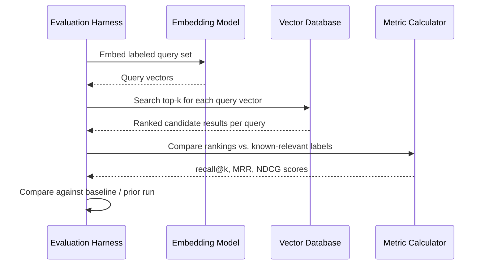
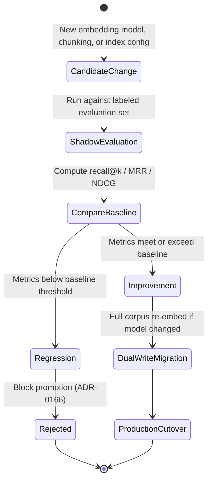

# Embeddings and Semantic Search

> Part of the **Enterprise Data & AI Architecture Handbook** · Phase-13 — Knowledge Graphs & Vector Systems · Chapter 03.
> Estimated study time: **45 min reading + ~3h labs**.
> **Prerequisite:** read [Vector Databases: Qdrant and Milvus](01_Vector_Databases_Qdrant_and_Milvus.md) first.

---

## Executive Summary

[Vector Databases: Qdrant and Milvus](01_Vector_Databases_Qdrant_and_Milvus.md) treated the embedding vector as an opaque, already-produced input — its dimensionality and distance metric mattered for indexing, but where the vector actually came from, how well it captured meaning, and how it should be evaluated were explicitly named as upstream concerns deferred to this chapter. This chapter is that deferred treatment: **embeddings** are the numeric representations that translate text, images, audio, or code into a geometric space where distance corresponds to semantic relatedness, and **semantic search** is the discipline of building a retrieval system on top of that space that actually returns what a user or an LLM needs — which, as this chapter argues throughout, is a measurement and evaluation discipline at least as much as it is a modeling one.

This chapter covers **embedding models and dimensions** as the foundational choice determining what a vector even represents and how expensive it is to store and search; **similarity metrics** as the precise mathematical operations (cosine, dot product, Euclidean) that turn "closeness in vector space" into a rankable score, revisited here in more mathematical depth than [Vector Databases: Qdrant and Milvus](01_Vector_Databases_Qdrant_and_Milvus.md#16-distance-metrics) §1.6's operational treatment; **chunking and multi-vector representations** as the practice of deciding what unit of content gets embedded and whether a single vector per document is even the right representation; **evaluation of retrieval quality** as this chapter's central, most consequential discipline — the concrete metrics (recall@k, MRR, NDCG) and methodology for measuring whether a semantic search system actually works, closing the "how do you know it's good" gap every prior RAG and vector-database chapter has assumed rather than answered; and **multimodal embeddings** as the extension of this entire framework beyond text into images, audio, and cross-modal search.

The platform bias is **Azure-primary (~60%)** — Azure OpenAI Service's `text-embedding-3-large`/`text-embedding-3-small` models as the primary managed embedding-generation platform, and Azure AI Search's built-in evaluation and vectorization pipelines — **~30% enterprise open source** (Hugging Face's `sentence-transformers` library and the MTEB (Massive Text Embedding Benchmark) leaderboard as the standard open-weight embedding-model ecosystem and evaluation reference respectively; `ir_measures`/`pytrec_eval`-style tooling for retrieval-quality evaluation; CLIP as the reference open multimodal embedding model) — **~10% AWS/GCP comparison-only** (Amazon Titan Embeddings via Bedrock; Google's Vertex AI embedding models and multimodal embedding API).

**Bottom line:** the single most consequential and most commonly skipped step in building a production semantic search or RAG retrieval system is establishing a labeled evaluation set and measuring recall/precision against it before and after every embedding-model, chunking, or index-configuration change — every other decision in this chapter (which model, what dimension, how to chunk, whether to go multimodal) is only meaningfully comparable once that measurement discipline exists, and its absence is the single most recurring root cause behind the "it seemed to work in the demo" failures this handbook has documented across [Retrieval Augmented Generation](../Phase-12/03_Retrieval_Augmented_Generation.md) and [Vector Databases: Qdrant and Milvus](01_Vector_Databases_Qdrant_and_Milvus.md).

---

## Learning Objectives

By the end of this chapter you will be able to:

1. **Select an embedding model and dimensionality** appropriate for a given corpus, latency budget, and cost constraint, using MTEB or an equivalent benchmark as an input, not the sole decision criterion.
2. **Choose the correct similarity metric** for a given embedding model's training objective, and explain the mathematical relationship between cosine similarity, dot product, and Euclidean distance for normalized vectors.
3. **Design a chunking strategy and, where warranted, a multi-vector representation** for a given document type and query pattern.
4. **Build and run a retrieval-quality evaluation pipeline** using recall@k, MRR, and NDCG against a labeled ground-truth set, and interpret the results to guide concrete configuration decisions.
5. **Evaluate whether multimodal embeddings** are warranted for a given use case, and implement a basic cross-modal (text-to-image) search pipeline.
6. **Apply Azure OpenAI Service's embedding models and Azure AI Search's evaluation tooling** in a production-grade pipeline.
7. **Defend an embedding and evaluation architecture decision** in engineer, staff engineer, architect, and CTO review settings.

---

## Business Motivation

- **An unmeasured semantic search system is a system whose actual quality is unknown**, and every business decision built on top of it (a support-deflection RAG assistant, a product-search feature, a compliance-research tool) inherits that unknown risk; this chapter's evaluation discipline (§4) exists specifically to convert "it seems to work" into a defensible, monitored, numeric claim.
- **Embedding-model and dimensionality choice directly drives both retrieval quality and infrastructure cost** — a larger-dimension, higher-quality embedding model can meaningfully improve recall, but per [Vector Databases: Qdrant and Milvus](01_Vector_Databases_Qdrant_and_Milvus.md#cost-optimization) Cost Optimization's worked example, it also directly multiplies storage and compute cost at scale; this is a quantifiable trade-off, not a "just use the best model" default.
- **Chunking strategy is, per [Retrieval Augmented Generation](../Phase-12/03_Retrieval_Augmented_Generation.md#32-chunkingembedding) §4.2's own claim, the single upstream decision most responsible for a RAG system's retrieval ceiling** — this chapter deepens that claim into concrete strategies and, critically, a way to measure whether a given chunking choice actually improved retrieval rather than merely feeling more principled.
- **Multimodal search unlocks genuine new product capability** (visual product search, audio-content discovery, cross-modal enterprise document search spanning scanned images and text) but is a real additional engineering and evaluation investment, not a drop-in extension of a text-only pipeline — deciding when that investment is justified is a concrete business trade-off this chapter's Decision Matrix addresses.
- **Retrieval-quality regressions are usually gradual and silent, not sudden and alarm-triggering** — the recurring "compounds silently" failure pattern this handbook has documented across [Vector Databases: Qdrant and Milvus](01_Vector_Databases_Qdrant_and_Milvus.md) Case Study 2 and multiple Phase-12 chapters — making a standing, automated evaluation pipeline (not a one-time launch-day check) a business-continuity requirement, not merely a nice-to-have engineering practice.

---

## History and Evolution

- **2013 — word2vec** (Mikolov et al.) demonstrates that words can be represented as dense vectors in a continuous space where geometric relationships (famously, "king - man + woman ≈ queen") capture semantic relationships, establishing the core embedding-space intuition this entire chapter builds on, though word2vec produces one fixed vector per word regardless of context.
- **2014 — GloVe** (Pennington et al.) offers a competing word-embedding approach based on global co-occurrence statistics, cementing dense-vector word representations as mainstream NLP infrastructure through the mid-2010s.
- **2018 — contextual embeddings arrive with ELMo and, more consequentially, BERT** (Devlin et al.), producing a different vector for the same word depending on its surrounding context (e.g., "bank" of a river versus a financial "bank") — a qualitative leap over word2vec/GloVe's fixed, context-free vectors, and the direct technical ancestor of every modern sentence/passage embedding model.
- **2019 — Sentence-BERT (SBERT)** (Reimers and Gurevych) adapts BERT specifically to produce meaningful whole-sentence and passage embeddings efficiently (BERT's native output was not designed for direct sentence-similarity comparison), establishing the sentence-transformers architecture family this chapter's Open Source Implementation section covers.
- **2020 — Dense Passage Retrieval (DPR)** (Karpukhin et al., also referenced in [Retrieval Augmented Generation](../Phase-12/03_Retrieval_Augmented_Generation.md)'s History) demonstrates that dual-encoder embedding models trained specifically for retrieval outperform classical sparse (BM25) retrieval on many benchmarks, directly motivating dedicated retrieval-oriented embedding-model training as its own specialization distinct from general-purpose sentence embeddings.
- **2021 — CLIP** (Radford et al., OpenAI) trains a joint text-image embedding space via contrastive learning on web-scale image-caption pairs, establishing the multimodal-embedding paradigm this chapter's §8.5 covers — text and images that are semantically related end up close together in the same vector space, enabling cross-modal search without any explicit image-captioning step.
- **2021-2022 — the Massive Text Embedding Benchmark (MTEB)** is established (Muennighoff et al., 2022), providing a standardized, multi-task benchmark suite for comparing embedding models across retrieval, classification, clustering, and semantic-similarity tasks — becoming the de facto reference leaderboard this chapter's model-selection guidance relies on.
- **2022-2023 — the ChatGPT-driven RAG adoption wave** (per this handbook's repeated History and Evolution treatment in Phase-12) makes embedding-model selection and retrieval evaluation suddenly mainstream, enterprise-critical decisions rather than a specialized NLP-research concern.
- **2023 — OpenAI's `text-embedding-3-large`/`text-embedding-3-small` family introduces native dimensionality reduction** (the ability to truncate an embedding to a smaller dimension count while retaining most of its semantic quality, via Matryoshka Representation Learning-style training), giving practitioners an explicit, supported cost/quality dial rather than requiring a full model change to adjust dimensionality.
- **2023-present — multi-vector and late-interaction retrieval models** (e.g., ColBERT-style approaches, storing multiple per-token vectors rather than one pooled vector per passage) gain enterprise attention as a higher-fidelity, higher-cost alternative to single-vector pooling, directly relevant to this chapter's §8.4 multi-vector treatment, alongside continued MTEB-leaderboard churn as new open-weight and proprietary embedding models are released at a rapid, ongoing cadence.

---

## Why This Technology Exists

Raw text, images, and audio have no native notion of "distance" a computer can compute directly — two sentences that mean nearly the same thing but share few or no exact words look completely different to any exact-match or keyword-based comparison. Embedding models exist to solve exactly this problem: they learn a function mapping raw content into a fixed-length numeric vector such that semantically similar inputs are mapped to nearby points in that vector space, making "how similar is this to that" a computable geometric operation (a distance or angle calculation) rather than an unanswerable question for anything other than exact or fuzzy lexical matching. Semantic search exists as the applied discipline built on top of this capability — using embedding-space proximity, at the scale and speed [Vector Databases: Qdrant and Milvus](01_Vector_Databases_Qdrant_and_Milvus.md) covers, to answer real retrieval queries a user or an LLM actually needs answered, which is only possible, and only trustworthy, once that embedding space is properly evaluated, not merely assumed to be good because the underlying model is well-known.

---

## Problems It Solves

- **Matching queries and documents that are semantically related but share little or no exact vocabulary** ("car" versus "automobile," or a paraphrased question versus a differently-worded policy document), the foundational capability every downstream RAG and semantic-search use case in this handbook depends on.
- **Providing a quantifiable, comparable representation of meaning** that can be indexed, searched, clustered, and classified using standard vector-space operations, rather than requiring bespoke natural-language-specific matching logic for every new use case.
- **Enabling cross-modal search** (text query against images, or vice versa) via a shared embedding space, a capability no keyword-matching or purely lexical system could offer at all.
- **Providing an objective, numeric methodology (§4's evaluation metrics) for measuring and comparing retrieval-system quality**, converting "does this feel better" into a defensible, repeatable, monitorable measurement — this chapter's single most emphasized contribution.
- **Supporting efficient multi-granularity representation** (via chunking and multi-vector strategies, §8.4) so that retrieval can operate at whatever level of granularity — sentence, passage, document — the actual query patterns require, rather than being locked into a single fixed unit of representation.

---

## Problems It Cannot Solve

- **Embeddings do not capture factual correctness or logical entailment** — two passages can be embedded close together because they discuss the same topic while one asserts something false about it; embedding similarity is a topical/semantic-relatedness signal, not a truth signal, the same caution [Retrieval Augmented Generation](../Phase-12/03_Retrieval_Augmented_Generation.md)'s grounding discussion and [Vector Databases: Qdrant and Milvus](01_Vector_Databases_Qdrant_and_Milvus.md)'s Problems It Cannot Solve section both raised, now given its precise mathematical grounding here.
- **An embedding model cannot fix a bad chunking strategy** — per this chapter's Business Motivation and [Retrieval Augmented Generation](../Phase-12/03_Retrieval_Augmented_Generation.md) §4.2's own claim, no embedding model, however strong, recovers information lost when a chunk boundary splits a fact from the context it depends on.
- **Embedding models do not inherently understand an enterprise's specific vocabulary, acronyms, or proprietary terminology** unless they were trained or fine-tuned on data reflecting it — a general-purpose embedding model can systematically under-perform on a domain-specific corpus (medical, legal, internal-product-name-heavy) without a domain-adapted model or fine-tuning step, a limitation §11's Trade-offs section returns to.
- **Embedding vectors are not a safe, automatically-anonymized substitute for the source content**, per [Vector Databases: Qdrant and Milvus](01_Vector_Databases_Qdrant_and_Milvus.md)'s Security section's embedding-inversion caution — this chapter's treatment of embeddings as the actual mechanism producing those vectors reinforces, not relaxes, that caution.
- **No evaluation metric in this chapter (recall@k, MRR, NDCG) tells you whether the retrieved content will actually produce a correct, ungrounded-free downstream LLM response** — retrieval-quality evaluation and generation-quality evaluation are distinct, both-necessary axes, exactly as [Retrieval Augmented Generation](../Phase-12/03_Retrieval_Augmented_Generation.md) §4.1 and [Evaluation and Guardrails](../Phase-12/09_Evaluation_and_Guardrails.md) established — this chapter closes the retrieval half specifically, not the generation half.

---

## Core Concepts

### 3.1 What an Embedding Model Actually Learns

An embedding model is trained (typically via contrastive learning — pulling semantically related pairs closer together and pushing unrelated pairs apart in vector space) to produce a fixed-length vector for a given input such that the geometric relationships between vectors reflect learned semantic relationships in the training data. This means an embedding model's quality and biases are entirely a function of what it was trained on and what the training objective optimized for — a model trained for general semantic similarity (paraphrase detection) is not automatically optimal for retrieval (query-to-passage matching is an asymmetric task, unlike symmetric paraphrase similarity), which is why retrieval-specific embedding models (following the DPR lineage) are typically preferred for RAG and search use cases over generic sentence-similarity models.

### 3.2 Dimensionality

Embedding dimensionality (the length of the output vector — 384, 768, 1536, and 3072 are common values across current models) is a direct trade-off between representational capacity, storage cost, and search latency, exactly as [Vector Databases: Qdrant and Milvus](01_Vector_Databases_Qdrant_and_Milvus.md)'s Storage section quantified. Higher dimensionality generally allows a model to encode finer-grained semantic distinctions, but with diminishing returns past a certain point for a given model architecture and training regime — MTEB benchmark results (§3.6) should always be consulted alongside a cost/latency budget rather than defaulting to "the largest available dimension."

### 3.3 Matryoshka Representation Learning and Native Dimensionality Reduction

Some modern embedding models (including Azure OpenAI's `text-embedding-3` family) are trained with Matryoshka Representation Learning, which structures the embedding such that its first $n$ dimensions (for various smaller $n$) remain a independently meaningful, if slightly lower-quality, embedding on their own — allowing a caller to truncate a 3072-dimension embedding down to, say, 512 dimensions and retain most of its retrieval quality, without needing to re-run inference through a smaller model. This gives practitioners an explicit, supported cost/quality dial (per this chapter's Cost Optimization section) that did not exist in earlier embedding-model generations, where changing dimensionality required switching to an entirely different model.

### 3.4 Similarity Metrics: The Mathematics

**Cosine similarity** measures the cosine of the angle between two vectors — $\cos(\theta) = \frac{\mathbf{a} \cdot \mathbf{b}}{\lVert \mathbf{a} \rVert \lVert \mathbf{b} \rVert}$ — capturing directional similarity while being invariant to vector magnitude, the standard default for most text-embedding models whose training objective (contrastive loss on normalized vectors) assumes it. **Dot product** — $\mathbf{a} \cdot \mathbf{b}$ — is mathematically equivalent to cosine similarity when both vectors are already normalized to unit length (which many embedding models' outputs are, or are expected to be, by convention), but sensitive to magnitude otherwise; some retrieval-tuned models are explicitly trained assuming raw (non-normalized) dot product, encoding useful magnitude information (e.g., passage informativeness) into vector length itself, so using cosine similarity against such a model discards that signal. **Euclidean (L2) distance** — $\lVert \mathbf{a} - \mathbf{b} \rVert$ — is the most common metric outside of normalized-text-embedding contexts (image and audio embeddings frequently use it), but is rarely the correct default for a modern normalized text-embedding model, since for unit-normalized vectors, L2 distance and cosine similarity are monotonically related and produce identical rankings — meaning the "choice" mostly matters when vectors are not normalized. **The practical rule** (restated and grounded here from [Vector Databases: Qdrant and Milvus](01_Vector_Databases_Qdrant_and_Milvus.md) §1.6): always use the exact metric the embedding model's own documentation or training paper specifies, never assume a default.

### 3.5 Bi-Encoders vs. Cross-Encoders

A **bi-encoder** (the standard embedding-model architecture) encodes the query and each candidate document independently into vectors, allowing documents to be pre-embedded and indexed once, with only the query needing encoding at query time — the architecture that makes ANN search over millions of documents feasible at all. A **cross-encoder** jointly encodes the query and a candidate document together in a single forward pass, producing a much more accurate relevance score by letting the model directly attend across both texts, but at a cost that scales with every query-document pair evaluated, making it computationally infeasible as a first-stage retriever over a large corpus — this is precisely why [Retrieval Augmented Generation](../Phase-12/03_Retrieval_Augmented_Generation.md) §4.4's reranking stage uses a cross-encoder only on the small candidate set a bi-encoder-based ANN search has already narrowed down, not as the primary retrieval mechanism.

### 3.6 MTEB and Embedding Model Selection

The Massive Text Embedding Benchmark (MTEB) evaluates embedding models across dozens of tasks and datasets spanning retrieval, classification, clustering, and semantic-textual-similarity, publishing a continuously-updated public leaderboard. MTEB is a valuable starting filter (narrowing a large field of candidate models to a handful of plausible ones matching a target dimensionality and license), but its aggregate scores are computed on public benchmark datasets that may not reflect a specific enterprise corpus's actual vocabulary, document structure, or query patterns — this chapter's central evaluation-discipline thesis (§4, expanded below) applies here directly: MTEB narrows the candidate list, but this chapter's own labeled-evaluation-set methodology is what actually validates a specific model choice for a specific corpus.

### 3.7 Chunking Revisited: Granularity as a Retrieval-Quality Lever

[Retrieval Augmented Generation](../Phase-12/03_Retrieval_Augmented_Generation.md) §4.2 established chunking as the dominant upstream lever on RAG retrieval quality; this chapter adds the mechanics: **fixed-size chunking** (simplest, risks splitting mid-sentence or mid-fact); **sentence/paragraph-boundary-aware chunking** (respects natural semantic units, at the cost of variable chunk sizes complicating batch processing); **semantic chunking** (using embedding-similarity shifts between adjacent sentences to detect natural topic boundaries, adapting chunk boundaries to actual content structure rather than a fixed character/token count); and **hierarchical/parent-child chunking** (embedding small chunks for precise retrieval matching, while returning a larger surrounding parent chunk as the actual context sent to the LLM, balancing retrieval precision against generation-context completeness) — each strategy's actual effect on retrieval quality is only knowable by measuring it against this chapter's evaluation methodology (§4), not by reasoning about which sounds most principled in the abstract.

### 3.8 Multi-Vector Representations

Rather than pooling an entire passage into one vector, multi-vector approaches (following the ColBERT "late interaction" lineage) store a vector per token (or per sub-passage segment) and compute a more granular, token-level maximum-similarity aggregation at query time — capturing fine-grained term-level relevance signals a single pooled vector can average away, at a materially higher storage and query-compute cost (many vectors per passage instead of one). This is a genuine precision/cost trade-off, not a strictly-better alternative to single-vector embeddings, and is typically reserved for retrieval scenarios where single-vector recall has been measured (via §4's methodology) to be insufficient, rather than adopted as a default.

### 3.9 Multimodal Embeddings

Multimodal embedding models (CLIP and its successors) train a shared vector space across two or more modalities (typically text and images) via contrastive learning on paired data (image-caption pairs), such that a text query embedding and a semantically matching image's embedding land close together in the same space — enabling text-to-image, image-to-image, and image-to-text search without a separate image-captioning or OCR step as an intermediate translation stage. Multimodal embeddings are a genuine capability extension (visual product search, scanned-document search, audio-content discovery via audio embeddings) but introduce their own evaluation burden (§4's methodology must be re-run per modality pairing, since cross-modal retrieval quality does not automatically track single-modality quality) and are not a drop-in replacement for a text-only pipeline's existing evaluation investment.

---

## Internal Working

A representative embedding-generation and evaluation pipeline: (1) a document or query string is passed through the embedding model's tokenizer and forward pass, producing either a single pooled vector (mean-pooling or a dedicated `[CLS]`-style aggregation token, depending on model architecture) or, for multi-vector models, a vector per token; (2) the resulting vector is optionally normalized to unit length (required for cosine-similarity-as-dot-product equivalence, per §3.4) and, where a Matryoshka-trained model is in use, optionally truncated to a smaller target dimension (per §3.3); (3) the vector is stored in the vector database (per [Vector Databases: Qdrant and Milvus](01_Vector_Databases_Qdrant_and_Milvus.md)); (4) at evaluation time, a held-out labeled query set (query, list of known-relevant document IDs) is run through the same pipeline, the resulting rankings are compared against the known-relevant labels using recall@k/MRR/NDCG (§4), and the resulting metrics are tracked over time as the embedding model, chunking strategy, or index configuration changes.



---

## Architecture

An enterprise embedding and semantic-search architecture has four layers, each independently versioned and evaluated: **(1) embedding generation** — a service (Azure OpenAI embeddings endpoint, or a self-hosted `sentence-transformers` model server) that turns raw content and queries into vectors, ideally behind a thin abstraction layer that makes swapping the underlying model (for a re-evaluation, per §4) a configuration change rather than a code change throughout every calling service; **(2) chunking/ingestion pipeline** — the upstream process (shared with, and extending, [Retrieval Augmented Generation](../Phase-12/03_Retrieval_Augmented_Generation.md) §4.1's ingestion pipeline) applying whichever chunking strategy (§3.7) has been selected and validated; **(3) vector storage and retrieval** — [Vector Databases: Qdrant and Milvus](01_Vector_Databases_Qdrant_and_Milvus.md)'s subject, consuming this chapter's output; **(4) evaluation harness** — a standing, versioned, automatable component (§4) run on every embedding-model, chunking, or index-configuration change, and on a recurring schedule against live traffic samples, not merely at initial launch.

---

## Components

- **Embedding Model Endpoint** — the deployed model (Azure OpenAI embeddings deployment, or a self-hosted `sentence-transformers` inference server) actually producing vectors from input text/images.
- **Tokenizer** — the model-specific component converting raw text into the token sequence the embedding model's forward pass consumes; a tokenizer mismatch between training and inference (using a different tokenizer version than the model was trained with) silently degrades embedding quality, a documented common mistake in §28.
- **Chunker** — the component implementing the selected chunking strategy (§3.7), ideally version-tracked alongside the embedding-model version per this chapter's Governance section.
- **Evaluation Harness** — the labeled-query-set-driven component computing recall@k/MRR/NDCG (§4), the component this chapter treats as non-optional production infrastructure, not a one-time launch script.
- **Ground-Truth/Labeled Query Set** — the curated (query, relevant-document-ID-list) dataset the evaluation harness depends on entirely; its own quality and representativeness of real production query patterns is itself a governed artifact (per Governance section) requiring periodic review and refresh.
- **Model/Chunking/Index Version Registry** — tracking which embedding-model version, chunking configuration, and index configuration were in effect for a given evaluation run or a given indexed corpus snapshot, extending [LLMOps](../Phase-12/04_LLMOps.md) ADR-0158's triple-versioning discipline to this chapter's specific artifacts.

---

## Metadata

Every embedding-model deployment should be catalogued (extending [Vector Databases: Qdrant and Milvus](01_Vector_Databases_Qdrant_and_Milvus.md)'s Governance requirement to catalogue collections by embedding model/version) with its exact model identifier and version, output dimensionality, whether native dimensionality reduction (§3.3) was applied and to what target dimension, the required similarity metric per §3.4, and the tokenizer version — this metadata is what makes a later "is this embedding still compatible with a newly re-embedded subset of the corpus" question answerable without re-deriving it from source-code archaeology. The labeled evaluation set itself should be catalogued with its creation date, source (synthetic, human-labeled, mined from real query logs), and last-refresh date, since a stale evaluation set that no longer reflects current production query patterns can itself become a source of false confidence.

---

## Storage

Embedding-vector storage cost and characteristics are [Vector Databases: Qdrant and Milvus](01_Vector_Databases_Qdrant_and_Milvus.md)'s Storage section's subject directly; this chapter's specific contribution is that dimensionality (§3.2-3.3) and multi-vector-versus-single-vector representation (§3.8) are the two upstream decisions made *before* any vector reaches the database that most determine that downstream storage cost — a decision to adopt multi-vector (ColBERT-style) representation, for instance, can multiply per-document storage by an order of magnitude (one vector per token instead of one per passage), a cost consequence that must be weighed against the measured (not assumed) retrieval-quality gain per this chapter's evaluation methodology before being adopted.

---

## Compute

Embedding-generation compute has a distinctly different profile from vector-search compute (already covered as a separate concern in [Vector Databases: Qdrant and Milvus](01_Vector_Databases_Qdrant_and_Milvus.md)'s Compute section): it is dominated by the embedding model's own inference cost (a forward pass through a transformer encoder), which for a managed API (Azure OpenAI embeddings) is billed per input token and requires no self-managed compute at all, while a self-hosted `sentence-transformers` deployment requires GPU (for high-throughput bulk re-embedding) or CPU (acceptable for lower-volume incremental embedding) capacity planning distinct from, and typically much smaller than, the compute footprint of embedding-model *training* (which this chapter's enterprise scope does not require, since virtually all production use cases consume a pretrained or lightly-fine-tuned embedding model rather than training one from scratch).

---

## Networking

Embedding-generation traffic (queries and documents sent to an Azure OpenAI embeddings endpoint or a self-hosted model server) should traverse the same private-endpoint-only, default-deny-egress network path this handbook has established repeatedly ([Network Security and Zero Trust](../Phase-10/04_Network_Security_and_Zero_Trust.md) ADR-0144, reapplied in [Vector Databases: Qdrant and Milvus](01_Vector_Databases_Qdrant_and_Milvus.md)'s Networking section) — an embedding call sends the actual content of potentially sensitive documents and queries to the model endpoint, meaning this traffic deserves identical network-isolation rigor to any other sensitive-data transmission path, not a lower bar because "it's just producing a vector."

---

## Security

- **Embedding calls transmit the actual source content**, not merely a reference to it — every access-control and data-classification consideration that applies to the source document applies equally to the embedding-generation request itself, including if a third-party or shared managed embedding endpoint is in use (verify data-residency and no-training-on-customer-data guarantees, exactly as this handbook's Azure OpenAI treatment in [Azure OpenAI and AI Foundry](../Phase-12/07_Azure_OpenAI_and_AI_Foundry.md) requires for generation calls).
- **Embedding-inversion risk** (introduced in [Vector Databases: Qdrant and Milvus](01_Vector_Databases_Qdrant_and_Milvus.md)'s Security section) is grounded here in why it is technically possible: because the embedding model's mapping is a learned, largely-invertible function for many architectures under certain attack conditions, partial reconstruction of the original text from its embedding has been demonstrated in research settings — meaning an embedding vector inherits confidentiality requirements from its source content, not a lower tier.
- **Evaluation datasets themselves can contain sensitive real customer queries or documents** if mined from production logs (§3.6/§4); the same PII-handling and access-control discipline from [Data Privacy and PII Protection](../Phase-10/07_Data_Privacy_and_PII_Protection.md) applies to constructing and storing a labeled evaluation set, not just to the production corpus it is drawn from.
- **A poisoned or manipulated evaluation set** (an insider or compromised process deliberately mislabeling relevant/irrelevant documents) could mask a genuine retrieval-quality regression or falsely justify a bad configuration change — access-control and change-review discipline on the evaluation harness and its labeled data is a governance control, not merely an engineering nicety.

---

## Performance

- **Embedding-generation latency** (the time to embed an incoming query, since documents are typically pre-embedded offline) is directly on the critical path of any real-time semantic search or RAG request, per [Retrieval Augmented Generation](../Phase-12/03_Retrieval_Augmented_Generation.md#17-performance)'s performance-budget framing — batching bulk document embedding jobs while keeping query embedding on a low-latency dedicated path is the standard architectural split.
- **Dimensionality directly trades off against both embedding-generation and search latency** — a truncated (Matryoshka-reduced) embedding is faster to generate, store, and search than the full-dimension original, and this trade-off should be measured (per §4) rather than assumed to be either negligible or prohibitive.
- **Tokenizer and truncation-limit mismatches** — every embedding model has a maximum input-token limit, and silently truncating an over-length chunk rather than catching and re-chunking it produces embeddings representing only a partial, possibly misleading, fraction of the intended content — a common, easily-missed performance-adjacent correctness bug.
- **Batch embedding throughput** (documents-per-second through a managed API or self-hosted model) is the dominant lever on how quickly a large re-embedding job (following an embedding-model version change, per Governance) can complete — a genuine operational-planning input for any migration, not merely an implementation detail.

---

## Scalability

Embedding-generation scales via the same two-axis model this handbook has applied elsewhere (throughput/QPS scaling for a managed API endpoint via provisioned throughput or additional deployment capacity; and self-hosted model-server horizontal scaling via additional GPU/CPU replicas behind a load balancer, per [Model Serving and Ray](../Phase-11/04_Model_Serving_and_Ray.md)'s batch-versus-online serving framework directly applicable here). Evaluation-harness scalability is a distinct concern from production embedding-generation scalability — a large labeled evaluation set run on every configuration change should complete within a practical CI/CD-pipeline time budget (per [DevOps and CI/CD](../Phase-09/03_DevOps_and_CI_CD.md)'s build/test/deploy stage framing), which may require a representative, sampled subset of the full evaluation set for fast iterative checks, reserving the full evaluation set for periodic, less-frequent comprehensive runs.

---

## Fault Tolerance

Embedding-generation fault tolerance follows the same managed-versus-self-hosted trade-off this handbook has repeated throughout: Azure OpenAI's embeddings endpoint provides managed retry/availability guarantees within its SLA; a self-hosted model-server deployment requires the deploying team to configure replica redundancy and health-check-based failover, per [Kubernetes](../Phase-09/06_Kubernetes.md)'s deployment/liveness-probe patterns. A more chapter-specific fault-tolerance concern: an embedding-generation outage or degradation during a scheduled bulk re-embedding job (following a model-version migration, per Governance) should fail safely — the ingestion pipeline must not silently skip failed-to-embed documents and leave gaps in the index, but instead retry, alert, and track completion state explicitly, since an incomplete re-embedding masquerading as complete is a subtle, hard-to-detect data-quality risk.

---

## Cost Optimization

- **Right-size embedding dimensionality against measured (not assumed) retrieval-quality requirements**, using Matryoshka-style native dimensionality reduction (§3.3) where the underlying model supports it, rather than defaulting to the largest available dimension.
- **Batch bulk document embedding during off-peak windows or via asynchronous batch APIs** (where the embedding-model provider offers a lower-cost batch tier, distinct from the real-time query-embedding path), avoiding paying real-time-tier pricing for work with no real-time latency requirement.
- **Avoid unnecessary re-embedding** — cache embeddings keyed by a content hash so that an unchanged document is never re-embedded on a subsequent ingestion run, a direct, easily-implemented cost lever this chapter's Business Motivation implicitly assumed but did not name outright.
- **Reserve multi-vector (ColBERT-style) representations for use cases where single-vector recall has been measurably shown insufficient**, since multi-vector's storage-and-compute cost multiplier (§8's Storage section) is only justified once evidence, not intuition, supports it.
- **Worked FinOps example:** a team embeds 20 million document chunks using Azure OpenAI's `text-embedding-3-large` at its full 3072-dimension output, costing an estimated $2,400 in one-time embedding-generation cost (at typical per-million-token embedding pricing for a chunk corpus averaging ~120 tokens each) plus the downstream vector-storage cost [Vector Databases: Qdrant and Milvus](01_Vector_Databases_Qdrant_and_Milvus.md)'s Cost Optimization worked example already quantified for a similarly-sized corpus at full dimensionality. Running this chapter's evaluation harness (§4) comparing full 3072-dimension output against a Matryoshka-truncated 1024-dimension output on the same labeled query set shows only a 1.2 percentage-point recall@10 drop (97.8% to 96.6%) — an acceptable trade-off for this team's use case — while reducing downstream vector storage by roughly two-thirds and proportionally reducing query latency; the one-time re-embedding cost to regenerate at the smaller dimension is avoided entirely since native dimensionality reduction requires no new inference call, only a stored-vector truncation, making this a case where the cost optimization was effectively free once the evaluation had already validated it.

---

## Monitoring

- **Recall@k, MRR, and NDCG tracked over time on a fixed labeled evaluation set**, run on every embedding-model, chunking, or index-configuration change and on a recurring schedule against a refreshed or sampled-from-production query set, per this chapter's central evaluation-discipline thesis.
- **Embedding-generation latency and error rate**, segmented by whether the call is a real-time query embedding (latency-sensitive) or a bulk document-embedding batch job (throughput-sensitive), mirroring the segmentation this handbook has applied to vector-search latency in [Vector Databases: Qdrant and Milvus](01_Vector_Databases_Qdrant_and_Milvus.md)'s Monitoring section.
- **Token-truncation rate** — the fraction of embedding calls hitting the model's maximum-input-token limit and being silently truncated, a leading indicator of a chunking-strategy misconfiguration (chunks too large for the embedding model in use) per this chapter's Performance section.
- **Content-hash cache hit rate** for the embedding-deduplication cost-optimization pattern (§20), a direct signal of whether that cost lever is functioning as intended.
- **Evaluation-set staleness** — time since the labeled query set was last reviewed or refreshed against real production query patterns, since (per this chapter's Metadata section) a stale evaluation set silently degrades the entire monitoring discipline's validity over time.

---

## Observability

Extending [Vector Databases: Qdrant and Milvus](01_Vector_Databases_Qdrant_and_Milvus.md)'s Observability section's per-query-span tracing one layer further upstream: a full observability trace should capture which embedding-model version and dimensionality produced the query vector, which chunking-strategy version produced each candidate document's stored vector, and the similarity metric applied — enabling a retrieval-quality regression investigation (per this chapter's Monitoring section) to immediately distinguish "the embedding model changed" from "the chunking changed" from "the index configuration changed" as the causal factor, rather than requiring separate manual correlation across disconnected logs.

### Operational Response Playbook

| Signal | Detection Query/Method | Remediation |
|---|---|---|
| Recall@k drops on the standing evaluation harness after a routine deployment | Automated evaluation-harness run triggered on every deployment (per CI/CD, [DevOps and CI/CD](../Phase-09/03_DevOps_and_CI_CD.md)), comparing current run's recall@k/MRR/NDCG against the immediately prior baseline | Check the version-registry (per this chapter's Components section) for what changed in this deployment — embedding-model version, chunking configuration, or index configuration — and roll back the specific changed component first rather than the full deployment, isolating the causal factor before a broader remediation |
| Rising token-truncation rate detected in embedding-call telemetry | Scheduled query against embedding-call logs, alerting when truncation rate exceeds an agreed threshold (e.g., >1% of calls) | Identify which chunking configuration or document source is producing over-length chunks; tighten the chunker's size bound or adjust chunk-boundary logic; re-run the evaluation harness after the fix to confirm recall improves, not merely that the truncation rate dropped |

---

## Governance

Embedding-model and evaluation-set governance extends [Vector Databases: Qdrant and Milvus](01_Vector_Databases_Qdrant_and_Milvus.md)'s Governance section's collection-cataloguing requirement one layer upstream: every embedding-model version, its dimensionality, its similarity-metric requirement, and its chunking-strategy pairing should be tracked as a single versioned unit (extending [LLMOps](../Phase-12/04_LLMOps.md) ADR-0158's triple-versioning discipline, since an embedding model, a chunking configuration, and an index are exactly as inseparable a "release unit" as the model+prompt+retrieval-index triple that ADR already established for LLM features generally). The labeled evaluation set itself deserves the same governance rigor as production data — an owning team, a documented creation/refresh methodology, and periodic review for staleness or bias (per this chapter's Monitoring section) — since an ungoverned, forgotten evaluation set is a silent single point of failure for the entire quality-measurement discipline this chapter argues is non-negotiable.

---

## Trade-offs

- **Larger embedding dimensionality vs. cost/latency:** higher dimensionality generally improves retrieval quality with diminishing returns past a model-specific point, and the correct operating point is only knowable via this chapter's evaluation methodology, not by defaulting to the largest available option.
- **General-purpose vs. retrieval-specific vs. domain-fine-tuned embedding models:** a retrieval-specific model (DPR-lineage, asymmetric query/passage training) generally outperforms a general-purpose sentence-similarity model for RAG/search use cases; a domain-fine-tuned model can further improve results on vocabulary-heavy specialized corpora (medical, legal, internal jargon) at the cost of a genuine fine-tuning investment and its own evaluation-and-maintenance burden — justified only when MTEB-narrowed general models measurably underperform on the specific corpus.
- **Single-vector vs. multi-vector representation:** multi-vector (ColBERT-style) can meaningfully improve fine-grained term-level retrieval precision at a materially higher storage and compute cost — a trade-off this chapter's Cost Optimization and Storage sections require measuring, not assuming.
- **Fixed-size vs. semantic vs. hierarchical chunking:** each strategy makes a different precision/completeness/complexity trade-off, and (as reinforced throughout this chapter) the only way to know which is actually better for a given corpus is to measure it against the same labeled evaluation set, not to reason about which sounds more sophisticated.
- **Unimodal vs. multimodal embeddings:** multimodal embeddings unlock genuine new capability (cross-modal search) but require separately validating cross-modal retrieval quality (§3.9) rather than assuming a strong text-only evaluation result generalizes to the multimodal case.

---

## Decision Matrix

| Scenario | Recommended Choice | Rationale |
|---|---|---|
| Azure-native enterprise RAG or semantic search, general-purpose text corpus | Azure OpenAI `text-embedding-3-large` (or `-small` for cost-sensitive workloads), truncated dimensionality per measured evaluation results | Strong MTEB standing, native Matryoshka dimensionality reduction, managed operational model consistent with the rest of this handbook's Azure OpenAI usage |
| Highly domain-specific vocabulary (medical, legal, internal product jargon) where general models measurably underperform | Domain-fine-tuned open-weight model (`sentence-transformers` base, fine-tuned on labeled in-domain pairs) | Justified only after evaluation (§4) shows a measurable general-model quality gap; avoids the fine-tuning investment when it is not actually needed |
| Cost-sensitive, high-volume corpus where a moderate quality trade-off is acceptable | Smaller open-weight `sentence-transformers` model, self-hosted | Avoids per-token managed-API cost at very large embedding volumes; requires self-hosted-inference operational investment in exchange |
| Visual product search, scanned-document search, or other genuine cross-modal requirement | CLIP-family multimodal embedding model (Azure AI Vision multimodal embeddings, or open-weight CLIP) | Only justified when a named cross-modal query pattern exists, per this chapter's Business Motivation; re-run the full evaluation methodology per modality pairing |
| Prototype/proof-of-concept, uncertain long-term quality/cost requirements | Azure OpenAI `text-embedding-3-small` at default dimensionality | Lowest time-to-first-result; defer dimensionality and domain-fine-tuning decisions until the evaluation harness has real data to work from |

---

## Design Patterns

- **Evaluation-gated configuration promotion:** treat every embedding-model, chunking, or index-configuration change as a candidate that must pass the evaluation harness (§4) before promotion to production, mirroring the champion/challenger evaluation-gate discipline [Machine Learning Foundations](../Phase-11/01_Machine_Learning_Foundations.md) ADR-0148 established for model promotions generally.
- **Content-hash-keyed embedding cache:** avoid redundant re-embedding of unchanged content by keying a cache on a hash of the source content plus the embedding-model version, invalidating only when either changes.
- **Parent-child (hierarchical) chunking:** embed small, precise child chunks for matching, but return the larger parent chunk as the actual context assembled for the downstream LLM, balancing retrieval precision against generation-context completeness (§3.7).
- **Shadow evaluation for a candidate embedding-model change:** run a candidate embedding model's outputs through the evaluation harness against the same labeled set as the current production model, in parallel, before committing to a costly full-corpus re-embedding — validating the investment is worthwhile before paying the migration cost, directly informing Migration Considerations below.

---

## Anti-patterns

- **Launching a semantic search or RAG retrieval feature without ever building a labeled evaluation set**, relying instead on subjective spot-checks — this chapter's single most emphasized anti-pattern, and the direct root cause this chapter's Case Studies document.
- **Choosing an embedding model based solely on aggregate MTEB leaderboard rank** without validating it against the specific enterprise corpus via this chapter's own evaluation methodology (§3.6's caution made concrete).
- **Assuming a higher-dimension or newer embedding model is automatically better for a specific corpus** without measuring it — a larger model can occasionally underperform a smaller, better-matched one on a specific domain's actual query patterns.
- **Re-embedding an entire corpus under a new embedding-model version without following [Vector Databases: Qdrant and Milvus](01_Vector_Databases_Qdrant_and_Milvus.md)'s dual-write migration design pattern**, risking exactly the mixed-vintage-vector relevance corruption that chapter's Case Study 2 documented.
- **Treating chunking-strategy selection as a one-time upfront decision** never revisited or re-evaluated as the corpus or query patterns evolve, rather than as a configuration subject to the same evaluation-gated promotion discipline as the embedding model itself.

---

## Common Mistakes

- **Using the wrong similarity metric for a given embedding model** (§3.4's cosine-versus-dot-product mismatch), silently degrading every query's ranking without an obvious error signal.
- **Tokenizer-version mismatches** between the version an embedding model was trained with and the version used at inference time, silently degrading embedding quality in a way that is easy to miss without explicit version pinning and monitoring.
- **Silently truncating over-length chunks** at the embedding model's token limit rather than catching and re-chunking, producing embeddings representing only a partial fraction of the intended content (per this chapter's Performance section).
- **Building an evaluation set once at launch and never refreshing it**, allowing it to silently drift out of alignment with actual production query patterns (per this chapter's Monitoring section) while still appearing to "pass."
- **Conflating a strong text-only evaluation result with an assumption of strong multimodal cross-modal quality**, without separately validating the cross-modal case per §3.9.

---

## Best Practices

- Build a labeled evaluation set (query, known-relevant-document-IDs) before launching any semantic search or RAG retrieval feature, and treat every subsequent embedding-model, chunking, or index-configuration change as gated by that evaluation harness.
- Always verify and use the exact similarity metric an embedding model's own documentation specifies, never a default assumption.
- Prefer retrieval-specific (asymmetric query/passage) embedding models over general-purpose sentence-similarity models for RAG and search use cases, narrowing candidates via MTEB but validating the final choice against the actual corpus.
- Use native dimensionality reduction (Matryoshka-style truncation) to right-size cost/latency against measured quality, rather than defaulting to a model's maximum output dimension.
- Cache embeddings by content hash to avoid redundant re-embedding cost, and follow the dual-write migration pattern for any embedding-model version change.
- Periodically refresh the labeled evaluation set against real production query patterns, treating evaluation-set staleness as a monitored signal in its own right.

---

## Enterprise Recommendations

Default to **Azure OpenAI's `text-embedding-3-large`** (with dimensionality truncated via Matryoshka reduction to the smallest size the evaluation harness confirms retains acceptable quality) as the primary embedding model for Azure-native enterprise semantic search and RAG use cases, reserving **domain-fine-tuned open-weight `sentence-transformers` models** for corpora with a measurably-demonstrated vocabulary gap that a general-purpose model cannot close, and **CLIP-family multimodal embeddings** only for use cases with a specific, named cross-modal query requirement per this chapter's Decision Matrix. In every case, mandate the construction and continuous operation of a labeled evaluation harness (§4) as a non-negotiable prerequisite to production launch, not an optional post-launch nicety — this chapter's ADR formalizes that requirement directly.

### Architecture Decision Record (ADR-0166): Mandatory Labeled Evaluation Harness Before Production Launch of Any Semantic Search or RAG Retrieval Feature

**Context:** This chapter, and every retrieval-related chapter preceding it in this handbook ([Retrieval Augmented Generation](../Phase-12/03_Retrieval_Augmented_Generation.md), [Vector Databases: Qdrant and Milvus](01_Vector_Databases_Qdrant_and_Milvus.md)), has documented the same recurring failure pattern: a retrieval system is launched based on subjective "the results look reasonable" review, and a genuine quality regression (from a bad chunking choice, an embedding-model mismatch, or a configuration change) goes undetected for weeks or months because no objective, repeatable measurement existed to catch it. This chapter's entire evaluation methodology (recall@k, MRR, NDCG against a labeled query set) exists specifically to close this gap, but is only effective if it is actually built and operated, not merely described as available.

**Decision:** No semantic search or RAG retrieval feature may be promoted to production without an accompanying labeled evaluation harness (a minimum-viable labeled query set of at least 50-100 representative queries with known-relevant document labels, scored via recall@k, MRR, and NDCG), run at minimum on every embedding-model, chunking, or index-configuration change, and on a recurring (at minimum monthly) schedule against production-representative query samples thereafter.

**Consequences:** Adds a genuine upfront investment (constructing and labeling the initial evaluation set) and an ongoing maintenance cost (periodic refresh, per this chapter's Governance section) to every retrieval-feature launch, which some teams will experience as friction against a faster, spot-check-based launch. In exchange, it converts every subsequent quality claim about the retrieval system from an assumption into a measured, monitorable, and defensible fact, and gives every future configuration change (embedding-model upgrade, chunking-strategy revision, dimensionality reduction) an objective basis for approval or rejection rather than reliance on subjective judgment alone.

**Alternatives Considered:** (1) *Rely on downstream generation-quality evaluation alone* (per [Evaluation and Guardrails](../Phase-12/09_Evaluation_and_Guardrails.md)) — rejected as insufficient on its own, since that chapter's own principle (retrieval-quality and generation-quality are independently measurable axes, per [Retrieval Augmented Generation](../Phase-12/03_Retrieval_Augmented_Generation.md) §4.1) means a downstream generation-quality regression could be caused by a retrieval-quality problem this chapter's harness would catch directly and specifically, while an aggregate end-to-end metric alone would leave the root cause ambiguous. (2) *Rely solely on aggregate public benchmark scores (MTEB) as a substitute for a corpus-specific evaluation set* — rejected, since §3.6 established that public-benchmark performance does not reliably predict performance on a specific enterprise corpus's actual vocabulary and query patterns.

---

## Azure Implementation

Azure OpenAI Service's embeddings endpoint is invoked via the standard REST API or SDK, with dimensionality explicitly specified where the model supports native reduction:

```python
from openai import AzureOpenAI

client = AzureOpenAI(
    azure_endpoint="https://contoso-aoai.openai.azure.com/",
    api_version="2024-10-21",
    azure_ad_token_provider=get_bearer_token_provider(  # managed identity, per ADR-0142
        DefaultAzureCredential(), "https://cognitiveservices.azure.com/.default"
    ),
)

response = client.embeddings.create(
    model="text-embedding-3-large",
    input=["What is our data-retention policy for financial records?"],
    dimensions=1024,  # Matryoshka-truncated per this chapter's §3.3
)
query_vector = response.data[0].embedding
```

A minimal evaluation-harness implementation computing recall@k against a labeled query set, run against an Azure AI Search index (per [Vector Databases: Qdrant and Milvus](01_Vector_Databases_Qdrant_and_Milvus.md)'s Azure Implementation):

```python
def recall_at_k(labeled_queries, search_client, embed_fn, k=10):
    hits = 0
    for query_text, relevant_ids in labeled_queries:
        vector = embed_fn(query_text)
        results = search_client.search(
            search_text=None,
            vector_queries=[{"vector": vector, "fields": "contentVector", "k": k}],
        )
        returned_ids = {r["id"] for r in results}
        if returned_ids & set(relevant_ids):
            hits += 1
    return hits / len(labeled_queries)
```

Wire this evaluation function into a CI/CD pipeline (per [DevOps and CI/CD](../Phase-09/03_DevOps_and_CI_CD.md)) as a required gate before any embedding-model, dimensionality, or chunking-configuration change is promoted to production, directly operationalizing ADR-0166.

---

## Open Source Implementation

**`sentence-transformers`** (Hugging Face, Apache 2.0) is the standard open-weight embedding-model library, with models selected via MTEB-informed narrowing (§3.6):

```python
from sentence_transformers import SentenceTransformer

model = SentenceTransformer("BAAI/bge-large-en-v1.5")  # a strong open MTEB-ranked model
embeddings = model.encode(
    ["query: What is our data-retention policy?"],
    normalize_embeddings=True,  # required for cosine-similarity-as-dot-product equivalence
)
```

Retrieval-quality evaluation using `ir_measures` (a standard open-source evaluation library implementing recall@k, MRR, and NDCG against TREC-style labeled relevance judgments):

```python
import ir_measures
from ir_measures import nDCG, RR, R

qrels = ir_measures.read_trec_qrels("labeled_relevance.qrels")
run = ir_measures.read_trec_run("retrieval_results.run")
metrics = ir_measures.calc_aggregate([nDCG@10, RR@10, R@10], qrels, run)
```

For self-hosted deployment, wrap the `sentence-transformers` model in a lightweight inference server (FastAPI or TorchServe) deployed on AKS (per [Kubernetes](../Phase-09/06_Kubernetes.md)), behind the same private-endpoint-only network configuration this chapter's Networking section requires, with horizontal pod autoscaling tied to inference-queue depth rather than raw CPU utilization alone, mirroring [Model Serving and Ray](../Phase-11/04_Model_Serving_and_Ray.md)'s serving-pattern guidance.

---

## AWS Equivalent (comparison only)

**Amazon Titan Embeddings**, available via Amazon Bedrock, provides a managed embedding-generation service comparable in operational positioning to Azure OpenAI's embeddings endpoint, with Amazon Bedrock Knowledge Bases (per [Vector Databases: Qdrant and Milvus](01_Vector_Databases_Qdrant_and_Milvus.md)'s AWS comparison) as the corresponding managed retrieval-pipeline layer. Advantages include tight integration with the broader Bedrock/AWS ecosystem and support for multiple embedding-model providers (including Cohere's embedding models) within the same managed service; disadvantages include a less mature native-dimensionality-reduction story than Azure OpenAI's Matryoshka-trained `text-embedding-3` family as of this writing, and a comparatively smaller published MTEB-benchmark presence for Titan specifically versus the broader open-weight and OpenAI-family ecosystem. Migration from Azure OpenAI embeddings to Titan requires re-embedding the full corpus (embeddings from different models are never directly comparable, per [Vector Databases: Qdrant and Milvus](01_Vector_Databases_Qdrant_and_Milvus.md) Case Study 2's caution) and re-running this chapter's evaluation harness against the new model before cutover; selection criteria center on existing cloud commitment and whether Bedrock's multi-provider embedding-model flexibility is a genuine requirement.

---

## GCP Equivalent (comparison only)

**Google Vertex AI's text-embedding and multimodal-embedding APIs** provide managed embedding generation comparable to Azure OpenAI's offering, with Vertex AI's multimodal embedding API notably providing native, first-party text-image-video joint embedding support directly comparable to this chapter's CLIP-family multimodal treatment (§3.9), arguably a more integrated multimodal story out of the box than assembling a separate CLIP deployment alongside a text-only Azure OpenAI pipeline. Advantages include this native multimodal integration and tight coupling with Vertex AI's broader ML platform; disadvantages include the same cross-cloud-migration re-embedding cost as any embedding-model change, and a comparatively smaller enterprise-Azure-ecosystem integration story for organizations otherwise standardized on Azure. Migration considerations mirror the AWS case: full re-embedding and evaluation-harness re-validation are the dominant cost drivers, more so than any specific difference in the underlying embedding-model quality itself.

---

## Migration Considerations

Migrating between embedding models (whether within Azure, or across clouds per the AWS/GCP comparisons above) always requires a full corpus re-embedding — embeddings from two different models (even at the same dimensionality) are never directly comparable, exactly as [Vector Databases: Qdrant and Milvus](01_Vector_Databases_Qdrant_and_Milvus.md) Case Study 2 demonstrated the cost of getting wrong. The recommended migration pattern, directly extending that chapter's dual-write design pattern with this chapter's evaluation discipline: (1) generate embeddings under the candidate new model for the existing labeled evaluation set and a representative corpus sample; (2) run the full evaluation harness (§4) comparing candidate-model recall@k/MRR/NDCG against the current production model's baseline on the identical labeled query set; (3) only if the candidate model shows a measured, acceptable improvement (or an acceptable trade-off against a genuine cost/latency benefit, per this chapter's Cost Optimization worked example) proceed to a full corpus re-embedding under the dual-write pattern; (4) cut over only after confirming the full re-embedded corpus's evaluation-harness results match the validated sample-based projection. Skipping directly to a full re-embedding without this staged validation risks discovering a quality regression only after the expensive re-embedding investment has already been spent.

---

## Mermaid Architecture Diagrams

```mermaid
graph TB
    subgraph "Ingestion / Embedding"
        A[Source Documents] --> B[Chunker<br/>Fixed/Semantic/Hierarchical]
        B --> C[Embedding Model<br/>Azure OpenAI / sentence-transformers]
        C --> D[(Vector Database<br/>Phase-13 Ch.01)]
    end
    subgraph "Evaluation Harness"
        E[Labeled Query Set] --> F[Embed Queries]
        F --> G[Search Top-k]
        D --> G
        G --> H[recall@k / MRR / NDCG]
        H --> I{Meets Baseline?}
        I -- No --> J[Block Promotion]
        I -- Yes --> K[Promote to Production]
    end
    subgraph Consumers
        K --> L[RAG Retrieval Step]
        K --> M[Semantic Search UI]
    end
```



A third diagram (the embedding-and-evaluation internal-working sequence) appears in the Internal Working section above.

---

## End-to-End Data Flow

1. **Model and chunking selection:** an embedding model (narrowed via MTEB, per §3.6) and chunking strategy (per §3.7) are selected as candidates.
2. **Candidate validation:** the candidates are run through this chapter's evaluation harness (§4) against the existing labeled query set, per ADR-0166's mandatory gate.
3. **Ingestion:** upon validated approval, the full document corpus is chunked and embedded, with resulting vectors stored in the vector database ([Vector Databases: Qdrant and Milvus](01_Vector_Databases_Qdrant_and_Milvus.md)).
4. **Query-time embedding:** an incoming query is embedded using the identical model, dimensionality, and normalization as the corpus, per §3.4's matching-metric discipline.
5. **Retrieval and evaluation feedback:** the vector database returns ranked results; the evaluation harness continues to run on a recurring schedule (per Monitoring) against production-representative query samples, feeding back into the version registry and governance process for the next candidate-change cycle.
6. **Consumption:** retrieved chunks are assembled into an LLM prompt context (per [Retrieval Augmented Generation](../Phase-12/03_Retrieval_Augmented_Generation.md)) or presented as direct semantic-search results.

---

## Real-world Business Use Cases

- **Enterprise document and policy search**, the same use case [Retrieval Augmented Generation](../Phase-12/03_Retrieval_Augmented_Generation.md) and [Vector Databases: Qdrant and Milvus](01_Vector_Databases_Qdrant_and_Milvus.md) have both covered, now grounded in this chapter's evaluation methodology to actually validate retrieval quality rather than assume it.
- **E-commerce visual product search**, using CLIP-family multimodal embeddings to let a customer search a catalog using an uploaded photo rather than typed keywords.
- **Support-ticket and customer-conversation semantic clustering**, using embeddings to group topically similar tickets for triage-pattern analysis and automated routing.
- **Code search and semantic code retrieval**, using code-specific embedding models to power an internal developer-tooling "find similar code" or documentation-search feature.
- **Audio and media content discovery**, using audio embeddings (a multimodal extension per §3.9) to power "find similar sounding" or topic-based audio-library search in media and entertainment applications.

---

## Industry Examples

E-commerce and retail organizations are the most visible adopters of CLIP-family multimodal embeddings for visual search, directly monetizing the cross-modal capability this chapter's §3.9 covers as a customer-facing product-discovery feature. Enterprise software and professional-services organizations building internal knowledge-search and RAG assistants are the most common adopters of this chapter's evaluation-harness discipline specifically, often after a first, unmeasured launch attempt revealed unpredictable retrieval quality — directly the pattern this chapter's Case Studies document. Search and recommendation-heavy consumer-technology companies are the most common source of the underlying open-weight embedding-model research (Sentence-BERT, DPR successors, and the MTEB benchmark itself), publishing much of the evaluation methodology this chapter draws on as production infrastructure practice.

---

## Case Studies

**Case Study 1 — an embedding-model upgrade approved on MTEB rank alone, later found to underperform on the actual corpus.** An enterprise legal-research team upgraded its RAG assistant's embedding model to a newer model ranking meaningfully higher on the public MTEB leaderboard, approving the change based on that leaderboard rank alone without running it against their own labeled evaluation set (a violation of ADR-0166's requirement, adopted only after this incident). Post-launch user complaints about missed, obviously-relevant case-law citations led to a retroactive evaluation-harness run, which revealed the new model actually scored measurably lower on recall@10 for their specific, jargon-heavy legal corpus than the prior model had — the newer model's aggregate MTEB strength came disproportionately from general-web-text and paraphrase-similarity tasks poorly correlated with this corpus's specific vocabulary and query patterns. The team reverted to the prior model, retroactively built the labeled evaluation set that should have gated the original decision, and adopted the mandatory-evaluation-harness discipline this chapter's ADR-0166 now formalizes going forward.

**Case Study 2 — a chunking-strategy change that "felt" more principled but measurably reduced retrieval quality.** A financial-services compliance-assistant team switched from simple fixed-size chunking to semantic chunking (§3.7), reasoning that respecting natural topic boundaries would improve retrieval quality — a reasonable-sounding hypothesis that the team did not validate against their evaluation harness before full production rollout (a lapse the team had, ironically, only inconsistently applied — the practice existed but was not yet a hard gate). The semantic chunker, tuned with default sensitivity settings, produced unusually large chunks for a subset of densely-related regulatory text, diluting the resulting embeddings' specificity and measurably reducing recall@10 for narrow, fact-specific compliance queries by several percentage points — a regression only caught two weeks later when the evaluation harness's next scheduled monthly run flagged the drop against its rolling baseline. The remediation retuned the semantic chunker's sensitivity threshold, re-validated against the evaluation harness before the next rollout, and the incident became a direct input into ADR-0166's requirement that every chunking change, not only embedding-model changes, be gated by the evaluation harness before promotion.

---

## Hands-on Labs

1. **Lab 1 — build a labeled evaluation harness.** Using a small public or synthetic document corpus, construct a labeled query set (30-50 queries with known-relevant document IDs), implement recall@k, MRR, and NDCG calculation (via `ir_measures` or a custom implementation), and run it against a baseline embedding model.
2. **Lab 2 — MTEB-informed model comparison, corpus-validated.** Select two candidate `sentence-transformers` models differing in MTEB rank, embed the same corpus with each, and compare their actual recall@k/MRR/NDCG on Lab 1's evaluation set — reproducing Case Study 1's lesson hands-on by directly observing whether MTEB rank predicts corpus-specific performance.
3. **Lab 3 — dimensionality reduction trade-off measurement.** Using Azure OpenAI's `text-embedding-3-large`, generate embeddings at full (3072) and truncated (1024, 512) dimensions for the same corpus, and measure the recall@k trade-off at each dimension against Lab 1's evaluation set, reproducing this chapter's Cost Optimization worked example.
4. **Lab 4 — chunking-strategy A/B evaluation.** Implement fixed-size and semantic chunking for the same source corpus, embed both, and compare recall@k/MRR/NDCG results — reproducing Case Study 2's evaluation-before-rollout discipline as a concrete, hands-on exercise.
5. **Lab 5 — basic multimodal (text-to-image) search.** Using an open CLIP model, embed a small set of images and a set of text queries, and implement a basic cross-modal search returning the most relevant images for a given text query.

---

## Exercises

1. Explain, for a non-technical stakeholder, why "the new embedding model scored higher on a public leaderboard" does not guarantee it will perform better on your organization's specific documents.
2. A team proposes adopting multi-vector (ColBERT-style) embeddings for a customer-support knowledge base. Using this chapter's evaluation-before-adoption principle, design the specific experiment that would justify or reject this proposal.
3. Compute, by hand, the cosine similarity between two simple 3-dimensional example vectors, and explain why the result would be identical to their dot product if both vectors were first normalized to unit length.
4. Design a labeled evaluation-set construction methodology for a new enterprise search feature with no existing query logs to mine from.
5. Write the Context/Decision/Consequences/Alternatives structure for an ADR deciding whether a proposed embedding-model migration is justified, using this chapter's evaluation-harness methodology as the decision input.

---

## Mini Projects

1. **Reusable evaluation-harness CLI tool:** build a command-line tool that accepts a labeled query set, an embedding-model configuration, and a vector-database connection, and outputs recall@k/MRR/NDCG plus a comparison against a stored prior baseline — operationalizing ADR-0166's mandatory gate as a reusable, pluggable tool usable across multiple projects.
2. **Chunking-strategy comparison dashboard:** build a small dashboard (using Grafana or a simple web app) visualizing recall@k/MRR/NDCG results across multiple chunking-strategy configurations on the same corpus and evaluation set, supporting the evaluation-gated promotion design pattern with a visual decision-support tool.
3. **Multimodal search prototype:** build an end-to-end small-scale text-to-image and image-to-image search prototype using CLIP, including a basic cross-modal evaluation harness measuring recall@k for a labeled set of (text query, relevant image) pairs.

---

## Capstone Integration

This chapter closes the upstream gap both [Retrieval Augmented Generation](../Phase-12/03_Retrieval_Augmented_Generation.md) and [Vector Databases: Qdrant and Milvus](01_Vector_Databases_Qdrant_and_Milvus.md) deliberately deferred: where the embedding vector actually comes from, how to choose and configure the model that produces it, and — its central, most emphasized contribution — how to objectively measure whether the resulting retrieval system actually works, via ADR-0166's mandatory evaluation-harness gate. Every embedding-model-version-mismatch caution this handbook has raised (in [Vector Databases: Qdrant and Milvus](01_Vector_Databases_Qdrant_and_Milvus.md) Case Study 2, and again in this chapter's own Anti-patterns and Common Mistakes) is now grounded in this chapter's precise mechanical explanation of why two different embedding models' vectors are never comparable. As the third chapter of Phase-13, this chapter's evaluation methodology becomes a required input to [Knowledge Graphs with Neo4j](02_Knowledge_Graphs_with_Neo4j.md) Chapter 04's forthcoming GraphRAG fusion architecture (which will need to evaluate both vector-retrieval and graph-traversal-retrieval quality, and their combination, using directly analogous metrics), and this chapter's multimodal treatment (§3.9) directly sets up any future extension of this handbook's retrieval architecture beyond text-only corpora. Phase-13 Chapter 05 (Ontologies and Taxonomies) remains the final chapter of this phase, formalizing the structured-vocabulary discipline that disciplines both this chapter's embedding-based retrieval and Chapter 02's graph-traversal retrieval.

---

## Interview Questions

1. Explain, mathematically, why cosine similarity and dot product produce identical rankings for unit-normalized vectors.
2. What is the difference between a bi-encoder and a cross-encoder, and why can't a cross-encoder serve as a first-stage retriever over a large corpus?
3. What is recall@k, and why is it usually a more appropriate primary metric for retrieval evaluation than raw accuracy?
4. Explain Matryoshka Representation Learning and the practical benefit it provides over needing a separate model per target dimensionality.
5. Why can't embeddings from two different embedding models (even at the same dimensionality) be directly compared or mixed in the same similarity search?
6. What is a multimodal embedding model, and how does CLIP enable text-to-image search without an explicit image-captioning step?

## Staff Engineer Questions

1. Design a labeled evaluation-set construction methodology for a new enterprise search feature with no existing production query logs, including how you would validate the set's representativeness.
2. A team reports a chunking-strategy change "feels" like it improved retrieval quality based on informal review, but wants to skip the formal evaluation-harness gate to move faster. How do you respond, and what would you propose instead?
3. Design an embedding-model migration plan that minimizes the risk of a Case-Study-2-style silent quality regression, incorporating both this chapter's evaluation methodology and [Vector Databases: Qdrant and Milvus](01_Vector_Databases_Qdrant_and_Milvus.md)'s dual-write migration pattern.
4. Compare the cost and quality trade-offs of single-vector versus multi-vector (ColBERT-style) representations for a 50-million-document corpus, and design the specific experiment you would run before recommending either.

## Architect Questions

1. Justify, for your organization's specific context, the minimum viable labeled evaluation set size and refresh cadence, applying ADR-0166's requirement to a concrete scenario.
2. Design an embedding-model and chunking-strategy governance process (versioning, evaluation gating, staleness monitoring) for an organization operating multiple RAG and semantic-search features across different business units.
3. How does this chapter's evaluation-harness discipline interact with your organization's broader MLOps evaluation-gate practices established in [MLOps and MLflow](../Phase-11/03_MLOps_and_MLflow.md) and [Evaluation and Guardrails](../Phase-12/09_Evaluation_and_Guardrails.md)? Where should retrieval-specific evaluation be integrated into an existing model-promotion pipeline versus operated as a separate gate?
4. Design a decision framework for when multimodal embeddings are justified for a new product feature, versus when a text-only or separate-per-modality approach remains preferable.

## CTO Review Questions

1. Which of our current semantic search or RAG features have a documented, operating labeled evaluation harness per ADR-0166, and which were launched without one?
2. What is our current process for validating an embedding-model or chunking-strategy change before production promotion, and does it match the evaluation-gated discipline this chapter requires?
3. Have we experienced a retrieval-quality regression similar to either of this chapter's case studies, and if so, how long did it take to detect, and what monitoring gap did that reveal?
4. Are we currently paying for embedding dimensionality or a multi-vector representation that our own evaluation data does not justify, and would a right-sizing review (per this chapter's Cost Optimization section) yield a measurable savings?

---

## References

- Mikolov, T., et al. (2013). *Efficient Estimation of Word Representations in Vector Space* (word2vec).
- Devlin, J., et al. (2018). *BERT: Pre-training of Deep Bidirectional Transformers for Language Understanding.*
- Reimers, N., & Gurevych, I. (2019). *Sentence-BERT: Sentence Embeddings using Siamese BERT-Networks.*
- Karpukhin, V., et al. (2020). *Dense Passage Retrieval for Open-Domain Question Answering.*
- Radford, A., et al. (2021). *Learning Transferable Visual Models From Natural Language Supervision* (CLIP).
- Muennighoff, N., et al. (2022). *MTEB: Massive Text Embedding Benchmark.*
- Microsoft Learn — Azure OpenAI Service: Embeddings, Dimensionality Reduction, and Azure AI Search Vectorization.
- Hugging Face — `sentence-transformers` documentation and MTEB leaderboard.
- [Retrieval Augmented Generation](../Phase-12/03_Retrieval_Augmented_Generation.md), [Vector Databases: Qdrant and Milvus](01_Vector_Databases_Qdrant_and_Milvus.md), [Evaluation and Guardrails](../Phase-12/09_Evaluation_and_Guardrails.md) — this handbook.

---

## Further Reading

- Khattab, O., & Zaharia, M. (2020). *ColBERT: Efficient and Effective Passage Search via Contextualized Late Interaction over BERT* — the multi-vector/late-interaction lineage referenced in §3.8.
- OpenAI — Matryoshka Representation Learning and native embedding-dimensionality reduction documentation.
- `ir_measures` / `pytrec_eval` documentation — the open-source retrieval-evaluation tooling referenced in this chapter's Open Source Implementation section.
- Phase-13 Chapter 04 — GraphRAG (combining this chapter's evaluation methodology with Chapter 02's graph-traversal retrieval).
- Phase-13 Chapter 05 — Ontologies and Taxonomies (the structured-vocabulary layer disciplining both embedding-based and graph-based retrieval).
