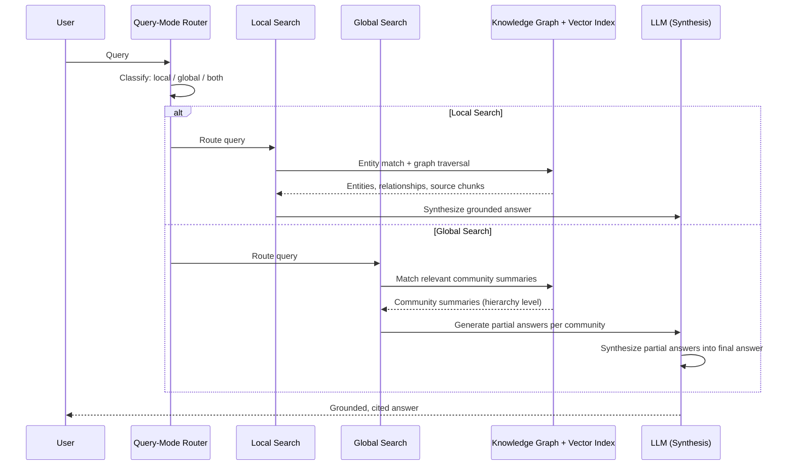
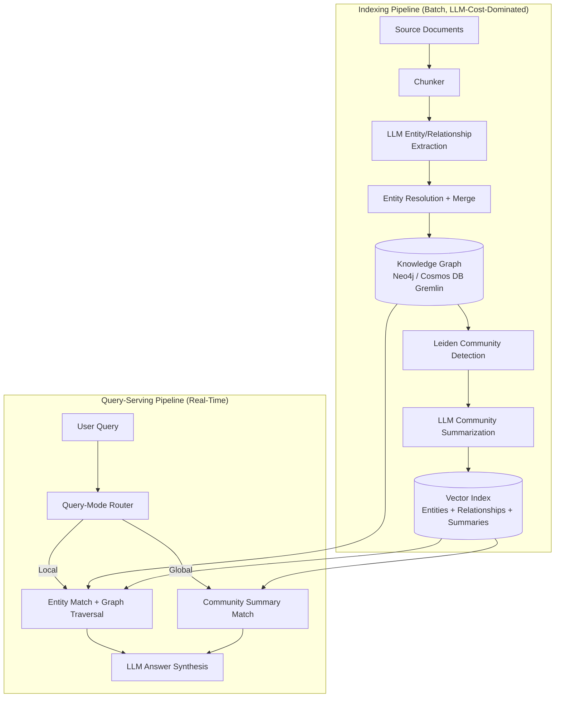
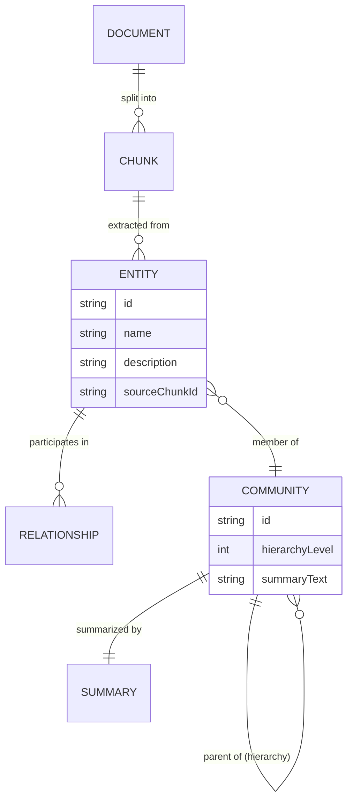

# GraphRAG

> Part of the **Enterprise Data & AI Architecture Handbook** · Phase-13 — Knowledge Graphs & Vector Systems · Chapter 04.
> Estimated study time: **60 min reading + ~3h labs**.
> **Prerequisites:** read [Knowledge Graphs with Neo4j](02_Knowledge_Graphs_with_Neo4j.md) and [Embeddings and Semantic Search](03_Embeddings_and_Semantic_Search.md) first.

---

## Executive Summary

This chapter is the deliberate fusion point this handbook has been building toward across the last two chapters. [Knowledge Graphs with Neo4j](02_Knowledge_Graphs_with_Neo4j.md)'s Trade-offs section named vector search and graph traversal as complementary, not competing, retrieval paradigms — vector search answers "what is semantically similar," a knowledge graph answers "how is this specifically related" — and explicitly deferred their fusion to this chapter. [Embeddings and Semantic Search](03_Embeddings_and_Semantic_Search.md)'s entire evaluation methodology (recall@k, MRR, NDCG) was built as a reusable measurement discipline, not a vector-search-only tool, and this chapter is where that reusability gets tested against a structurally different retrieval architecture. **GraphRAG** is that fusion: an architecture that constructs a knowledge graph from an unstructured document corpus, uses community detection and LLM-generated summaries to produce multi-level thematic summaries of the graph, and answers queries by combining graph-traversal-based multi-hop reasoning with vector-similarity-based retrieval — directly targeting the class of query neither paradigm alone handles well: "what are the main themes across this entire corpus," or "how are these two entities connected, and what does that connection mean in the broader context."

This chapter covers **graph construction from documents** as the pipeline that turns raw text into a knowledge graph automatically, using an LLM as the entity-and-relationship extractor rather than requiring manual graph modeling; **community detection and summarization** as GraphRAG's signature technique — using [Knowledge Graphs with Neo4j](02_Knowledge_Graphs_with_Neo4j.md) §8.9's community-detection algorithms to partition the graph, then generating an LLM-written summary of each community, producing a hierarchical index of the corpus's own themes; **graph + vector hybrid retrieval** as the query-time architecture that routes a query to the graph, the vector index, or both, depending on the query's actual shape; **multi-hop reasoning** as the capability this hybrid architecture unlocks that neither [Retrieval Augmented Generation](../Phase-12/03_Retrieval_Augmented_Generation.md)'s pure-vector RAG nor a keyword search could provide; and **Microsoft's GraphRAG** implementation and research as this chapter's primary reference architecture and open-source implementation.

The platform bias is **Azure-primary (~60%)** — Microsoft's own GraphRAG research and its productized path through Azure AI Foundry and Azure Cosmos DB for Apache Gremlin/Azure AI Search as the retrieval backends — **~30% enterprise open source** (Microsoft's `graphrag` Python package itself is open source and is this chapter's primary open-source implementation; Neo4j as an alternative graph backend; LangChain/LlamaIndex's own GraphRAG-adjacent retrieval-graph integrations) — **~10% AWS/GCP comparison-only** (Amazon Neptune-backed GraphRAG reference architectures; Google Vertex AI's emerging graph-augmented-retrieval patterns).

**Bottom line:** GraphRAG is not a wholesale replacement for the pure-vector RAG architecture [Retrieval Augmented Generation](../Phase-12/03_Retrieval_Augmented_Generation.md) established as this handbook's default — it is a deliberately more expensive (in both indexing compute cost and architectural complexity) capability that is justified specifically when a corpus's value lies in the relationships and themes connecting many documents together, not merely in retrieving the single most relevant passage; the recurring architectural mistake this chapter documents is adopting GraphRAG's full indexing pipeline for a corpus and query pattern that plain vector RAG would have served just as well at a fraction of the cost, echoing [Knowledge Graphs with Neo4j](02_Knowledge_Graphs_with_Neo4j.md) ADR-0165's justification-before-adoption discipline now applied one layer up the stack.

---

## Learning Objectives

By the end of this chapter you will be able to:

1. **Design and implement an LLM-driven graph-construction pipeline** that extracts entities and relationships from an unstructured document corpus into a knowledge graph.
2. **Apply community detection and LLM summarization** to produce a hierarchical, multi-level thematic index of a corpus.
3. **Design a hybrid graph-plus-vector retrieval architecture**, routing queries appropriately between local (entity-focused) and global (theme-focused) search modes.
4. **Explain multi-hop reasoning** and identify the specific query patterns that require it versus those adequately served by single-hop vector retrieval.
5. **Apply Microsoft's GraphRAG reference implementation** in an Azure-native architecture, including cost and indexing-pipeline trade-offs.
6. **Decide when GraphRAG is justified** over plain vector RAG for a given corpus and query-pattern profile, and defend that decision against a cost-conscious architecture review.
7. **Defend a GraphRAG architecture decision** in engineer, staff engineer, architect, and CTO review settings.

---

## Business Motivation

- **Some of the highest-value enterprise questions about a corpus are about its overall themes and structure, not any single document.** "What are the main risk factors discussed across our last three years of incident reports?" is a question plain vector RAG answers poorly (it retrieves individually-relevant passages, but does not synthesize a corpus-wide thematic view), and GraphRAG's community-summarization technique (§8.2) exists specifically to answer it.
- **Multi-hop, relationship-dependent questions across a large document corpus are exactly the query class [Knowledge Graphs with Neo4j](02_Knowledge_Graphs_with_Neo4j.md) named vector search as structurally unable to answer**, and GraphRAG is the concrete architecture that lets an LLM-powered assistant answer them without requiring a human to have manually modeled the graph in advance, per this chapter's §8.1 automated graph-construction pipeline.
- **GraphRAG's indexing pipeline is a genuine, non-trivial compute cost** — every document must be processed by an LLM (potentially multiple times) to extract entities and relationships, and every detected community must be separately summarized by another LLM call, meaning GraphRAG's cost profile is dramatically higher than plain vector RAG's embedding-only ingestion cost, a trade-off this chapter's Cost Optimization section quantifies directly rather than treating as an afterthought.
- **An enterprise that adopts GraphRAG's full pipeline without first validating (per [Embeddings and Semantic Search](03_Embeddings_and_Semantic_Search.md) ADR-0166's evaluation-before-adoption discipline, now extended to this chapter's own architecture) that its actual query patterns need multi-hop or thematic-synthesis capability risks paying this substantial indexing cost for a capability its users never actually invoke** — this chapter's ADR formalizes exactly this justification requirement.
- **GraphRAG directly closes a documented, real limitation of pure-vector RAG that this handbook's Phase-12 chapters repeatedly flagged but did not resolve** — [Retrieval Augmented Generation](../Phase-12/03_Retrieval_Augmented_Generation.md)'s own Trade-offs section questioned whether long-context models reduce RAG's necessity without addressing the multi-hop gap directly; this chapter is where that gap finally gets a concrete architectural answer.

---

## History and Evolution

- **2020-2023 — pure-vector RAG becomes the default enterprise LLM-grounding architecture** (per [Retrieval Augmented Generation](../Phase-12/03_Retrieval_Augmented_Generation.md)'s own History and Evolution section), and practitioners increasingly document its structural weakness on multi-hop and "global" (whole-corpus-summary) query patterns, since a single retrieved chunk's embedding similarity to a query cannot represent an aggregate property of the entire corpus.
- **2024 — Microsoft Research publishes "From Local to Global: A Graph RAG Approach to Query-Focused Summarization"** (Edge et al.), introducing the GraphRAG technique this chapter is named for: LLM-driven entity/relationship extraction to build a knowledge graph from an unstructured corpus, hierarchical community detection (via the Leiden algorithm, an improvement on the Louvain algorithm [Knowledge Graphs with Neo4j](02_Knowledge_Graphs_with_Neo4j.md) §8.9 introduced) to partition the graph at multiple levels of granularity, and LLM-generated community summaries used to answer global, corpus-wide queries no single-document retrieval could answer.
- **2024 — Microsoft open-sources the `graphrag` Python package**, giving practitioners a concrete, runnable reference implementation of the paper's pipeline rather than requiring each organization to reimplement the technique from the paper alone.
- **2024 — the "local search" versus "global search" query-mode distinction is formalized** within Microsoft's own GraphRAG documentation and subsequent research, directly informing this chapter's §8.4 hybrid-retrieval-routing treatment: local search (entity-and-neighborhood-focused, closer to traditional RAG) versus global search (community-summary-focused, answering aggregate/thematic questions).
- **2024-2025 — DRIFT search and further GraphRAG refinements** (combining local and global search within a single query, and incremental/dynamic graph-update techniques avoiding a full corpus reprocessing on every document addition) address GraphRAG's initial static-full-reindex limitation, directly relevant to this chapter's Fault Tolerance and Scalability treatment of incremental updates.
- **2024-present — GraphRAG becomes available as a managed capability path through Azure AI Foundry and reference architectures combining Azure Cosmos DB for Apache Gremlin or Azure AI Search with Azure OpenAI**, moving the technique from a research paper and standalone Python package toward an increasingly productized enterprise offering, the subject of this chapter's Azure Implementation section.
- **2025-present — competing and complementary graph-augmented-retrieval approaches proliferate** (LlamaIndex's own knowledge-graph-index integrations, LangGraph-orchestrated multi-hop retrieval agents per [LangChain and LlamaIndex](../Phase-12/08_LangChain_and_LlamaIndex.md)), reinforcing GraphRAG as one specific, well-documented instance of a broader graph-augmented-retrieval architectural pattern rather than a single proprietary technique.

---

## Why This Technology Exists

Plain vector RAG, per [Retrieval Augmented Generation](../Phase-12/03_Retrieval_Augmented_Generation.md), retrieves the individually most-similar chunks to a query and lets the LLM synthesize an answer from them — this works well when the answer genuinely lives within one or a few specific passages, but fails structurally for two query classes: **multi-hop questions** ("how is Company A connected to Company B") whose answer requires traversing a chain of relationships no single embedded chunk contains in full, and **global/thematic questions** ("what are the recurring themes across this entire corpus") whose answer is a property of the corpus as a whole, not any individual passage's content. GraphRAG exists to answer both: it builds an explicit knowledge graph (per [Knowledge Graphs with Neo4j](02_Knowledge_Graphs_with_Neo4j.md)) capturing the relationships plain vector retrieval cannot represent, and it pre-computes hierarchical community summaries capturing the aggregate, corpus-wide themes no single chunk's embedding could represent — converting both previously unanswerable query classes into ones a hybrid retrieval architecture can address directly.

---

## Problems It Solves

- **Multi-hop, relationship-dependent questions across a document corpus**, answered via the underlying knowledge graph's traversal capability (per [Knowledge Graphs with Neo4j](02_Knowledge_Graphs_with_Neo4j.md)) rather than requiring the answer to exist within a single retrievable passage.
- **Global, corpus-wide thematic and summarization questions**, answered via the pre-computed hierarchical community summaries (§8.2) that represent an aggregate property of the corpus no individual chunk-level embedding could capture.
- **Automated knowledge-graph construction from unstructured text**, removing the manual graph-modeling burden [Knowledge Graphs with Neo4j](02_Knowledge_Graphs_with_Neo4j.md) §8.7 required, by using an LLM as the entity-and-relationship extractor directly from source documents.
- **Providing explainable, traceable multi-hop answer paths**, since a GraphRAG answer can cite the specific entities, relationships, and community summaries it drew on — a stronger grounding/citation story for relationship-centric answers than a flat list of retrieved passages provides.
- **Bridging structured and unstructured data in a single retrieval architecture**, letting an enterprise's existing structured knowledge-graph investments (per [Knowledge Graphs with Neo4j](02_Knowledge_Graphs_with_Neo4j.md)) and its unstructured document corpus contribute to the same query-answering pipeline.

---

## Problems It Cannot Solve

- **GraphRAG does not eliminate the need for the evaluation discipline [Embeddings and Semantic Search](03_Embeddings_and_Semantic_Search.md) ADR-0166 established** — a GraphRAG system's retrieval quality (both its local-search vector-retrieval half and its global-search community-summary half) must still be measured against a labeled evaluation set, not assumed superior simply because the architecture is more sophisticated.
- **LLM-driven entity and relationship extraction is imperfect** — extraction errors (missed entities, incorrectly inferred relationships, inconsistent entity naming across documents) propagate directly into the constructed graph's quality, and GraphRAG does not include a built-in mechanism guaranteeing extraction accuracy; this is a genuine, measurable quality-control burden this chapter's Common Mistakes section returns to.
- **It is not a lower-cost alternative to plain vector RAG** — per this chapter's Business Motivation and Cost Optimization sections, GraphRAG's LLM-driven indexing pipeline (entity extraction plus community summarization) is substantially more expensive than plain vector-embedding ingestion, and this cost does not disappear merely because the resulting capability is more powerful.
- **GraphRAG does not automatically keep pace with a rapidly changing corpus** — the original GraphRAG paper's technique was designed around a largely static, batch-indexed corpus, and while incremental-update techniques (§4's History and Evolution) have since emerged, a naively-implemented GraphRAG pipeline re-run in full on every document change is prohibitively expensive at any meaningful update frequency, a limitation this chapter's Scalability section addresses directly.
- **It does not resolve entity disambiguation or deduplication automatically** — the same "J. Smith" versus "John Smith" entity-resolution problem [Knowledge Graphs with Neo4j](02_Knowledge_Graphs_with_Neo4j.md) named as an upstream concern applies identically here, and an LLM-driven extraction pipeline without an explicit entity-resolution step will happily create duplicate nodes for what should be the same real-world entity.

---

## Core Concepts

### 4.1 LLM-Driven Graph Construction from Documents

GraphRAG's indexing pipeline begins by chunking the source corpus (using the same chunking discipline [Embeddings and Semantic Search](03_Embeddings_and_Semantic_Search.md) §3.7 established), then passing each chunk through an LLM prompted specifically to extract entities (people, organizations, concepts, events — with types defined per the domain) and the relationships between them, along with a short natural-language description of each extracted entity and relationship. These extractions are then merged across chunks (the same entity appearing in multiple chunks is consolidated into a single graph node, with its descriptions summarized), producing a single knowledge graph representing the corpus's entities and relationships — this extraction-and-merge process is itself an LLM-cost-dominated pipeline, directly informing this chapter's Cost Optimization worked example.

### 4.2 Community Detection Over the Constructed Graph

Once the graph is constructed, a community-detection algorithm (Microsoft's GraphRAG implementation uses the **Leiden algorithm**, an improvement on the Louvain modularity-optimization approach [Knowledge Graphs with Neo4j](02_Knowledge_Graphs_with_Neo4j.md) §8.9 introduced, correcting a known issue where Louvain can produce internally-disconnected communities) partitions the graph into a **hierarchy of communities at multiple levels of granularity** — a small number of broad, high-level communities at the top of the hierarchy, subdividing into progressively more granular, specific communities at lower levels, mirroring how a human analyst might organize a corpus into broad topics and then specific sub-topics.

### 4.3 Community Summarization

For each detected community at each level of the hierarchy, an LLM is prompted to generate a natural-language summary describing that community's entities, relationships, and apparent theme, using the entity/relationship descriptions extracted in §4.1 as its input context. This produces a **pre-computed, hierarchical index of the corpus's own themes** — the artifact that makes global, corpus-wide summarization queries answerable at query time without needing to re-process the entire corpus for every such query, since the expensive summarization work was already done once, during indexing, not on every query.

### 4.4 Local Search vs. Global Search

GraphRAG's query-time architecture offers two distinct search modes, and choosing correctly between them (or combining them) is this chapter's central architectural decision: **local search** starts from specific entities identified in the query (via entity extraction on the query itself, or via vector similarity against entity descriptions), traverses the graph's relationships and retrieves the associated source-document chunks, and is well-suited to specific, entity-or-relationship-focused questions — architecturally the closest to [Retrieval Augmented Generation](../Phase-12/03_Retrieval_Augmented_Generation.md)'s standard RAG pattern, now graph-augmented. **Global search** instead retrieves relevant community summaries (per §8.3) at an appropriate hierarchy level, has the LLM generate partial answers from each relevant community summary, and then synthesizes those partial answers into a final response — well-suited to broad, thematic, "what are the main X across this corpus" questions that no single entity-focused traversal could answer. Choosing the wrong mode for a given query (using local search for a genuinely global/thematic question, or vice versa) produces a materially worse answer even though the underlying graph and summaries are identical — query-mode routing (§4.6) is therefore a first-class architectural concern, not an implementation detail.

### 4.5 Graph + Vector Hybrid Retrieval

GraphRAG is, in practice, always a hybrid retrieval system: local search still depends on vector-similarity matching (per [Embeddings and Semantic Search](03_Embeddings_and_Semantic_Search.md)) to identify relevant entities and source chunks from a query, and the underlying source-chunk retrieval that grounds both local and global search's final answer generation is the same embedding-based retrieval [Vector Databases: Qdrant and Milvus](01_Vector_Databases_Qdrant_and_Milvus.md) covers. This is why this chapter's prerequisites are both the knowledge-graph chapter and the embeddings chapter — GraphRAG is not a graph-only architecture replacing vector retrieval, it is vector retrieval and graph traversal combined and orchestrated around a shared, LLM-constructed knowledge structure.

### 4.6 Query-Mode Routing

A production GraphRAG system needs a mechanism deciding whether an incoming query should be routed to local search, global search, or both (with results synthesized together — the "DRIFT search" pattern referenced in this chapter's History and Evolution section). This routing decision can be made via a lightweight LLM classification call on the incoming query (cheap relative to the full search itself), a rules-based heuristic (query length, presence of aggregate/summary language like "overall" or "main themes"), or a hybrid of both — and, per this chapter's evaluation-discipline inheritance from [Embeddings and Semantic Search](03_Embeddings_and_Semantic_Search.md), the correctness of this routing decision itself should be measured against a labeled query set annotated with the "correct" search mode for each query, not assumed to work from a plausible-sounding heuristic alone.

### 4.7 Multi-Hop Reasoning

Multi-hop reasoning is the capability of answering a question whose answer requires chaining together multiple, individually-retrieved facts connected via graph relationships — "what regulatory changes affected the vendor that supplies the component that failed in last quarter's incident" requires traversing incident → component → vendor → regulatory-change, a chain no single embedded passage is likely to contain in full. GraphRAG's local search, by traversing the constructed graph's relationships outward from an initially identified entity, provides this multi-hop capability directly, extending [Knowledge Graphs with Neo4j](02_Knowledge_Graphs_with_Neo4j.md) §2.5's variable-length Cypher traversal pattern into an LLM-orchestrated retrieval context rather than a hand-written query.

---

## Internal Working

The GraphRAG indexing pipeline: (1) source documents are chunked (per [Embeddings and Semantic Search](03_Embeddings_and_Semantic_Search.md) §3.7); (2) each chunk is passed through an LLM entity/relationship extraction prompt, producing candidate entities and relationships with natural-language descriptions; (3) extracted entities are merged/deduplicated across chunks (an entity-resolution step, per this chapter's Problems It Cannot Solve caution) into a consolidated knowledge graph, stored in a graph database (per [Knowledge Graphs with Neo4j](02_Knowledge_Graphs_with_Neo4j.md)); (4) the Leiden community-detection algorithm partitions the graph into a multi-level community hierarchy; (5) an LLM generates a summary for each community at each hierarchy level; (6) entity descriptions, relationship descriptions, and community summaries are all embedded (per [Embeddings and Semantic Search](03_Embeddings_and_Semantic_Search.md)) and stored in a vector index, completing the hybrid graph-plus-vector index the query-time architecture depends on.

At query time: (1) the query is classified (or routed via a hybrid heuristic, per §4.6) into local search, global search, or both; (2) for local search, the query is embedded and matched against entity/relationship embeddings to identify a starting entity set, which is then graph-traversed to assemble relevant source chunks and relationship context; (3) for global search, the query is matched against community summaries at an appropriate hierarchy level, each relevant community summary generates a partial answer, and these partial answers are synthesized into a final response; (4) the final answer is returned with citations to the specific entities, relationships, or community summaries that grounded it.



---

## Architecture

A production GraphRAG architecture has two clearly separated pipelines with very different cost and update-frequency profiles: **(1) the indexing pipeline** — the LLM-driven, compute-and-cost-intensive batch process (§8's Internal Working steps 1-6) that runs on ingestion or on a scheduled/triggered re-index, producing the knowledge graph and community-summary index; **(2) the query-serving pipeline** — the comparatively lightweight, latency-sensitive real-time path (routing, local/global search, answer synthesis) that consumes the already-built index. This separation directly mirrors [Vector Databases: Qdrant and Milvus](01_Vector_Databases_Qdrant_and_Milvus.md)'s repeated indexing-versus-serving compute-isolation guidance, now applied to an architecture where the indexing side is dramatically more expensive (LLM calls per chunk and per community, not merely an embedding-model call per chunk) than a plain vector-RAG ingestion pipeline. The knowledge graph itself is stored in a graph database (Neo4j or Azure Cosmos DB for Apache Gremlin, per [Knowledge Graphs with Neo4j](02_Knowledge_Graphs_with_Neo4j.md)'s Architecture section), while entity, relationship, and community-summary embeddings are stored in a vector database or vector-search-capable index (per [Vector Databases: Qdrant and Milvus](01_Vector_Databases_Qdrant_and_Milvus.md) and [Embeddings and Semantic Search](03_Embeddings_and_Semantic_Search.md)), making a production GraphRAG deployment, by design, an operator of both a graph database and a vector index simultaneously — a genuine operational-surface increase this chapter's Trade-offs section weighs explicitly against plain vector RAG's single-index simplicity.

---

## Components

- **Chunker** — the same document-chunking component [Embeddings and Semantic Search](03_Embeddings_and_Semantic_Search.md) §3.7 covers, feeding the entity-extraction step.
- **Entity/Relationship Extractor** — the LLM-prompted component producing candidate entities, relationships, and their natural-language descriptions from each chunk.
- **Entity Resolution/Merge Component** — consolidating entity mentions across chunks into single graph nodes, the component whose absence or poor quality is this chapter's most-repeated caution (per Problems It Cannot Solve and Common Mistakes).
- **Community Detection Engine** — running the Leiden algorithm to produce the hierarchical community partition (§4.2), typically implemented via a graph-algorithm library (Neo4j's Graph Data Science library, per [Knowledge Graphs with Neo4j](02_Knowledge_Graphs_with_Neo4j.md) §11, or a standalone Python graph library like `graspologic`/`igraph` in Microsoft's own `graphrag` package).
- **Community Summarizer** — the LLM-prompted component generating a natural-language summary of each community at each hierarchy level (§4.3).
- **Query-Mode Router** — the component (LLM classifier, heuristic, or hybrid, per §4.6) deciding whether a query is served by local search, global search, or both.
- **Local Search Engine** — performing entity-matching and graph traversal to assemble context for entity/relationship-focused queries.
- **Global Search Engine** — performing community-summary matching, partial-answer generation, and synthesis for thematic/aggregate queries.

---

## Metadata

GraphRAG-specific metadata extends both [Knowledge Graphs with Neo4j](02_Knowledge_Graphs_with_Neo4j.md)'s node/relationship cataloguing and [Embeddings and Semantic Search](03_Embeddings_and_Semantic_Search.md)'s embedding-model/version cataloguing with two additional artifacts unique to this chapter: **community-hierarchy metadata** (which hierarchy level a given community summary belongs to, its parent/child community relationships, and the LLM model/prompt version used to generate its summary) and **extraction-provenance metadata** (which source chunk(s) and extraction-prompt version produced a given entity or relationship, enabling a "why does this entity exist in the graph" audit trail back to the specific source text and LLM call that created it) — this provenance chain is what makes an extraction-quality issue (per Common Mistakes) traceable to its root cause rather than requiring the entire graph to be treated as an unauditable black box.

---

## Storage

GraphRAG's storage footprint is the union of [Knowledge Graphs with Neo4j](02_Knowledge_Graphs_with_Neo4j.md)'s graph-storage considerations (nodes, relationships, and their properties) and [Vector Databases: Qdrant and Milvus](01_Vector_Databases_Qdrant_and_Milvus.md)'s vector-storage considerations (embeddings of entities, relationships, and community summaries), plus a new category neither prior chapter needed to account for: the **community-summary text itself**, stored alongside its embedding and typically re-referenced verbatim at global-search query time (not merely as a similarity-matching key), meaning its storage and retrieval-latency characteristics matter in their own right, not just as an embedding-index entry. At enterprise scale, a large corpus's community-summary hierarchy is usually orders of magnitude smaller in storage footprint than the underlying entity/relationship graph or the source document corpus itself, making community-summary storage a comparatively minor cost line relative to the graph and vector-index storage this chapter's Cost Optimization section quantifies.

---

## Compute

GraphRAG's compute profile is dominated by its indexing pipeline's LLM calls — one or more LLM calls per chunk for entity/relationship extraction, plus one LLM call per community per hierarchy level for summarization — a materially larger and more expensive compute footprint than plain vector RAG's single embedding-model call per chunk, directly informing this chapter's central cost-versus-capability trade-off. Query-time compute is comparatively modest: local search's compute profile closely resembles plain RAG's (an embedding call plus a graph traversal, per [Knowledge Graphs with Neo4j](02_Knowledge_Graphs_with_Neo4j.md)'s Compute section), while global search's compute cost scales with the number of relevant communities retrieved and summarized into partial answers — a query touching many communities at a broad hierarchy level triggers proportionally more LLM synthesis calls, making hierarchy-level selection (querying at a coarser or finer level of the community hierarchy) a direct query-time cost lever, not merely a quality one.

---

## Networking

GraphRAG's networking requirements are the union of [Knowledge Graphs with Neo4j](02_Knowledge_Graphs_with_Neo4j.md)'s graph-database networking guidance and [Retrieval Augmented Generation](../Phase-12/03_Retrieval_Augmented_Generation.md)/[Azure OpenAI and AI Foundry](../Phase-12/07_Azure_OpenAI_and_AI_Foundry.md)'s LLM-endpoint networking guidance, both subject to the same private-endpoint-only, default-deny-egress baseline this handbook has established repeatedly ([Network Security and Zero Trust](../Phase-10/04_Network_Security_and_Zero_Trust.md) ADR-0144) — with one GraphRAG-specific addition: the indexing pipeline's high-volume LLM extraction and summarization calls represent a substantially larger sustained network egress pattern (to the LLM endpoint) than a typical RAG ingestion pipeline's embedding-only calls, worth explicitly accounting for in network-egress cost and capacity planning during indexing runs.

---

## Security

- **Every access-control-propagation lesson this handbook has repeated across [Retrieval Augmented Generation](../Phase-12/03_Retrieval_Augmented_Generation.md) ADR-0157, [Vector Databases: Qdrant and Milvus](01_Vector_Databases_Qdrant_and_Milvus.md) ADR-0164, and [Knowledge Graphs with Neo4j](02_Knowledge_Graphs_with_Neo4j.md)'s Security section applies to GraphRAG's query-time retrieval identically** — both local search's graph traversal and global search's community-summary retrieval must filter results to the querying identity's actual entitlements, and a community summary itself can aggregate content spanning multiple access tiers, requiring careful summary-level (not just source-chunk-level) access-control design.
- **A community summary can inadvertently synthesize and expose information whose individual source chunks were each independently below a sensitivity threshold, but whose aggregation reveals a more sensitive pattern** — a genuinely new GraphRAG-specific risk beyond the access-control-propagation pattern this handbook has otherwise repeated verbatim, since the community-summarization step itself is a content-generation step operating over potentially cross-tenant or cross-classification source material, requiring the summarization prompt and pipeline to respect access boundaries at construction time, not merely filter at query time.
- **LLM entity-extraction calls transmit full source-document content to the LLM endpoint**, inheriting every data-residency, no-training-on-customer-data, and confidentiality consideration [Azure OpenAI and AI Foundry](../Phase-12/07_Azure_OpenAI_and_AI_Foundry.md) established for any LLM call processing sensitive content.
- **Prompt injection risk extends to the extraction pipeline itself** — a maliciously crafted source document could attempt to manipulate the entity-extraction or summarization prompt (an indirect prompt injection, per [Prompt Engineering](../Phase-12/02_Prompt_Engineering.md) §2.5 and [Retrieval Augmented Generation](../Phase-12/03_Retrieval_Augmented_Generation.md) Case Study 1's precedent), potentially injecting fabricated entities or relationships into the knowledge graph itself — a persistence risk beyond a single query's blast radius, since a poisoned graph node or relationship remains available to every future query until detected and remediated.

---

## Performance

- **Indexing-pipeline throughput** (documents processed per hour through the LLM extraction and summarization steps) is the dominant capacity-planning concern for GraphRAG, typically the long pole in any initial corpus onboarding or re-index, and should be measured and planned for explicitly rather than assumed comparable to plain vector-RAG ingestion speed.
- **Query-mode routing latency** (§4.6) adds a measurable, if typically small, latency overhead versus plain vector RAG's single-step retrieval, since an additional classification step precedes the actual search; this overhead should be measured and weighed against the quality benefit for the specific query population in production.
- **Global search's partial-answer-then-synthesize pattern** incurs materially higher latency than local search or plain vector RAG, since it requires a synthesis LLM call per relevant community plus a final aggregation call — setting a firm, business-justified bound on how many communities a global-search query fans out to (mirroring [Knowledge Graphs with Neo4j](02_Knowledge_Graphs_with_Neo4j.md)'s variable-length-traversal-bound discipline) is essential to keeping global-search latency within an acceptable budget.
- **Community-hierarchy level selection is a direct precision/latency/cost lever** — querying at a coarser (higher) hierarchy level returns fewer, broader community summaries (cheaper, faster, less granular); querying at a finer (lower) level returns more, narrower summaries (more expensive, slower, more granular) — this should be tuned and measured per query type, not fixed at a single default level for every query.

---

## Scalability

GraphRAG's indexing pipeline scales primarily via parallelizing LLM extraction calls across chunks (an embarrassingly parallel batch workload, constrained mainly by LLM-endpoint throughput/quota, per [Azure OpenAI and AI Foundry](../Phase-12/07_Azure_OpenAI_and_AI_Foundry.md) ADR-0161's shared-quota caution) and by incrementally updating the graph and community structure for new or changed documents rather than reprocessing the entire corpus from scratch on every update — the incremental-update techniques this chapter's History and Evolution section named as a post-2024 refinement, essential for any corpus with a meaningful ongoing update cadence, since a full-corpus reprocessing cost that was acceptable for an initial one-time index becomes prohibitive if repeated on every incremental change. Query-serving scalability for local search inherits [Knowledge Graphs with Neo4j](02_Knowledge_Graphs_with_Neo4j.md)'s graph-database and [Vector Databases: Qdrant and Milvus](01_Vector_Databases_Qdrant_and_Milvus.md)'s vector-database scaling models directly; global search's scalability is additionally bounded by the LLM synthesis endpoint's own throughput and quota, per this chapter's Performance section's community-fan-out-bound guidance.

---

## Fault Tolerance

An indexing-pipeline failure partway through a large corpus's entity extraction or community summarization must be resumable from the point of failure (tracked via the extraction-provenance metadata per this chapter's Metadata section), not restarted from scratch — given the LLM-call cost density of this pipeline (per Compute), a full-corpus restart after a late-stage failure is a materially more expensive fault-tolerance failure mode than the equivalent failure in a plain vector-embedding ingestion pipeline. Query-serving fault tolerance for the graph-database and vector-index components inherits [Knowledge Graphs with Neo4j](02_Knowledge_Graphs_with_Neo4j.md) and [Vector Databases: Qdrant and Milvus](01_Vector_Databases_Qdrant_and_Milvus.md)'s respective replication and managed-service fault-tolerance guidance directly, with one addition: a query-mode router or global-search synthesis-LLM-endpoint outage should fail toward local search (a degraded-but-functional response) rather than failing the query entirely, where the use case permits — a graceful-degradation pattern worth designing deliberately rather than allowing an accidental hard dependency on the more expensive, more failure-prone global-search path for every query.

---

## Cost Optimization

- **Right-size the corpus scope subjected to GraphRAG's full indexing pipeline** — per this chapter's Business Motivation and ADR, apply GraphRAG's LLM-driven extraction and summarization only to the subset of a document estate whose actual query patterns genuinely need multi-hop or thematic-synthesis capability, routing the remainder through plain, dramatically cheaper vector-RAG ingestion.
- **Batch entity-extraction and community-summarization LLM calls during off-peak windows or via lower-cost batch-inference tiers**, where the LLM provider offers one (mirroring [Embeddings and Semantic Search](03_Embeddings_and_Semantic_Search.md)'s batch-versus-real-time cost-tiering guidance), since indexing has no real-time latency requirement.
- **Bound community-hierarchy fan-out at query time** (per Performance) to control per-query global-search synthesis cost, rather than allowing an unbounded number of community summaries to be synthesized for every global query regardless of actual need.
- **Adopt incremental-update indexing** (per Scalability) rather than full-corpus reprocessing on every document change, avoiding the repeated-full-cost trap a static, batch-only mental model would otherwise create for an actively growing corpus.
- **Worked FinOps example:** an enterprise applies GraphRAG's full indexing pipeline to a 2-million-chunk internal knowledge corpus, with entity/relationship extraction costing an estimated $18,000 in one-time LLM-call cost (at typical Azure OpenAI GPT-4-class pricing for an extraction prompt averaging several hundred input/output tokens per chunk) and community summarization across roughly 15,000 detected communities at all hierarchy levels adding a further estimated $6,000 — a combined ~$24,000 one-time indexing cost, versus an estimated $250 for the equivalent corpus's plain vector-embedding-only ingestion cost (a roughly 100x cost multiple, illustrating this chapter's central cost caution concretely). A query-pattern audit (conducted per this chapter's ADR before committing to full-corpus GraphRAG) finds that only about 12% of the corpus (compliance and incident-report documents, where multi-hop and thematic-synthesis queries are genuinely common) drives essentially all observed multi-hop/global query volume, while the remaining 88% (routine product and HR documentation) is queried almost exclusively via simple, single-passage lookups; restricting the GraphRAG indexing pipeline to just that 12% subset reduces the one-time indexing cost to roughly $2,900 while still serving the query patterns that actually require it, with the remaining corpus served via the existing, far cheaper plain vector-RAG pipeline.

---

## Monitoring

- **Query-mode routing accuracy** — tracked against a labeled query set annotated with the "correct" search mode (per §4.6), since a persistently miscategorized query population (e.g., thematic questions being routed to local search) directly degrades answer quality without necessarily showing up as an obvious system error.
- **Local-search and global-search retrieval quality, evaluated separately**, extending [Embeddings and Semantic Search](03_Embeddings_and_Semantic_Search.md)'s recall@k/MRR/NDCG methodology to each search mode independently, since (mirroring that chapter's disaggregated-metric principle) collapsing both into one aggregate "GraphRAG quality" score would obscure which specific search mode is underperforming.
- **Entity-extraction and community-summarization LLM-call cost and volume**, tracked per indexing run, to catch the exact cost-driver this chapter's Cost Optimization section quantifies before it silently balloons on a larger-than-expected corpus or an unbounded re-indexing schedule.
- **Extraction-quality spot-check sampling** — a recurring, human-reviewed sample of extracted entities and relationships checked against their source chunks, catching a systematic extraction-prompt-quality regression (e.g., following an LLM-model-version upgrade) before it silently degrades the entire graph's trustworthiness.
- **Community-hierarchy fan-out per global-search query**, flagging queries triggering an unusually large number of community-summary synthesis calls, a leading cost and latency-risk indicator per this chapter's Performance section.

---

## Observability

Full-pipeline tracing (per [LLMOps](../Phase-12/04_LLMOps.md), extended through [Vector Databases: Qdrant and Milvus](01_Vector_Databases_Qdrant_and_Milvus.md) and [Knowledge Graphs with Neo4j](02_Knowledge_Graphs_with_Neo4j.md)) should capture, for every GraphRAG query: which mode the router selected and why (the classification confidence or heuristic trigger), which entities/communities were retrieved and at which hierarchy level, and which specific source chunks, relationships, or community summaries grounded the final synthesized answer — this level of detail is what makes a GraphRAG-specific quality or cost regression (a routing misclassification, an unexpectedly large community fan-out, a degraded extraction run) diagnosable directly from telemetry, extending this handbook's recurring per-query-span observability discipline to this chapter's specific new artifacts (routing decisions, community-hierarchy levels).

### Operational Response Playbook

| Signal | Detection Query/Method | Remediation |
|---|---|---|
| A cluster of thematic/summary-style queries showing low answer-quality scores despite the underlying community summaries appearing correct on manual review | Query-log analysis grouping low-scoring queries by detected query pattern (presence of aggregate/thematic language), cross-referenced against the routing decision logged for each | Check whether these queries were misrouted to local search instead of global search (a routing-accuracy failure per this chapter's Monitoring section); if so, retune or retrain the query-mode router/heuristic and re-validate against the labeled routing-evaluation set before re-deploying |
| Indexing-run LLM cost significantly exceeds the pre-approved budget estimated in the FinOps worked example | Indexing-pipeline cost telemetry compared against the pre-run budget estimate, alerting on a defined percentage overrun | Identify whether the overrun stems from a larger-than-estimated chunk count, an unexpectedly high per-chunk extraction-call retry rate (often a sign of a malformed or ambiguous extraction prompt), or scope creep beyond the originally-approved corpus subset (per this chapter's ADR); pause the run and resolve the specific driver before resuming rather than absorbing the overrun silently |

---

## Governance

GraphRAG governance is the union of [Knowledge Graphs with Neo4j](02_Knowledge_Graphs_with_Neo4j.md)'s node/relationship cataloguing and [Embeddings and Semantic Search](03_Embeddings_and_Semantic_Search.md)'s embedding-model/version cataloguing, extended with the extraction-provenance and community-hierarchy metadata this chapter's Metadata section introduced — every entity and relationship in a GraphRAG-constructed graph should be traceable to the specific source chunk(s), extraction-prompt version, and LLM-model version that produced it, and every community summary should be traceable to the community-detection run and summarization-prompt version that generated it, extending [LLMOps](../Phase-12/04_LLMOps.md) ADR-0158's triple-versioning discipline to this chapter's distinctly larger set of interdependent artifacts (chunking version, extraction-prompt version, entity-resolution logic version, community-detection parameters, summarization-prompt version, and the embedding-model version underlying both local and global search) — treated collectively as one versioned release unit, not independently. Right-to-be-forgotten obligations (per [Data Privacy and PII Protection](../Phase-10/07_Data_Privacy_and_PII_Protection.md) ADR-0147, already extended to vector stores and knowledge graphs in the two preceding chapters) extend one layer further here: a deleted individual's entity node, every relationship referencing it, and — critically, and uniquely to this chapter — **every community summary whose text was generated partly from that now-deleted entity's description** must be identified and re-generated (not merely have the source entity removed while a stale, now-inaccurate summary persists), since a community summary is a synthesized artifact whose erasure obligation cannot be satisfied by deleting only its original source node.

---

## Trade-offs

- **GraphRAG vs. plain vector RAG:** GraphRAG unlocks multi-hop and global/thematic query capability neither pure vector retrieval nor a knowledge graph alone provides, at a substantially higher indexing cost and architectural complexity (per this chapter's Cost Optimization worked example) — the correct default for most enterprise RAG use cases (per [Retrieval Augmented Generation](../Phase-12/03_Retrieval_Augmented_Generation.md)) remains plain vector RAG, with GraphRAG reserved for the specific, validated subset of a corpus and query population genuinely requiring its additional capability.
- **Local search vs. global search:** these are complementary, not competing, query modes within the same GraphRAG system — the architectural challenge is correct routing (§4.6), not choosing one mode as a permanent default over the other.
- **Full-corpus GraphRAG vs. corpus-subset GraphRAG:** applying GraphRAG selectively to the specific, high-value corpus subset whose query patterns genuinely need it (per this chapter's FinOps worked example) captures most of the capability benefit at a fraction of the full-corpus indexing cost, and should be the default posture rather than an all-or-nothing corpus-wide adoption decision.
- **Automated (LLM-driven) graph construction vs. manually modeled graphs:** GraphRAG's automated extraction removes the manual-modeling burden [Knowledge Graphs with Neo4j](02_Knowledge_Graphs_with_Neo4j.md) §8.7 required, at the cost of extraction-quality variability (per this chapter's Problems It Cannot Solve and Common Mistakes) that a carefully hand-modeled graph would not exhibit — a genuine quality-versus-effort trade-off, not a strictly-superior automation.
- **Static/batch indexing vs. incremental updates:** the original GraphRAG technique's static-batch design is simpler to reason about and implement, but becomes prohibitively expensive to re-run in full on an actively changing corpus, making incremental-update capability (per Scalability) a near-necessity, not an optional refinement, for any production corpus with a meaningful ongoing change rate.

---

## Decision Matrix

| Scenario | Recommended Choice | Rationale |
|---|---|---|
| Corpus and query patterns are dominated by single-passage, specific-fact lookups | Plain vector RAG ([Retrieval Augmented Generation](../Phase-12/03_Retrieval_Augmented_Generation.md)) | GraphRAG's substantial additional indexing cost is not justified when the underlying query pattern doesn't need multi-hop or thematic synthesis |
| A documented, validated population of multi-hop or "what are the main themes" queries exists against a specific corpus subset | GraphRAG, scoped to that specific corpus subset | Matches this chapter's FinOps worked example; captures the capability benefit without over-applying the cost across an entire corpus |
| Corpus changes frequently and query patterns need up-to-date multi-hop/thematic answers | GraphRAG with incremental-update indexing | A static-batch-only GraphRAG implementation becomes cost-prohibitive to keep current against a fast-changing corpus |
| Organization already operates a mature, manually-modeled knowledge graph (per [Knowledge Graphs with Neo4j](02_Knowledge_Graphs_with_Neo4j.md)) for a structured domain | Hybrid: reuse the existing manually-modeled graph for structured entities, apply GraphRAG's automated extraction only to the unstructured-document portion of the corpus | Avoids redundant, lower-quality automated extraction over data that is already well-modeled by hand |
| Prototype/proof-of-concept, uncertain whether multi-hop/thematic capability is genuinely needed | Run [Embeddings and Semantic Search](03_Embeddings_and_Semantic_Search.md)'s evaluation methodology against plain vector RAG first; only invest in GraphRAG's indexing pipeline if that evaluation reveals a specific, named capability gap | Defers GraphRAG's substantial cost commitment until a genuine, measured need is established, per this chapter's ADR |

---

## Design Patterns

- **Corpus-subset GraphRAG scoping:** apply GraphRAG's full indexing pipeline only to the specific, validated corpus subset whose query patterns genuinely require multi-hop or thematic-synthesis capability, routing the remainder through plain vector RAG — this chapter's single most cost-consequential design pattern, directly operationalizing the FinOps worked example.
- **Hierarchy-level-adaptive global search:** query at a coarser community-hierarchy level by default, only descending to finer levels when the coarser level's synthesized answer is assessed (via a lightweight follow-up check) as insufficiently specific — bounding typical-case cost while preserving depth for genuinely complex queries.
- **Local-search fallback on global-search or router failure:** design query-mode routing and global-search synthesis to fail gracefully toward local search (a degraded-but-functional response) rather than failing the query entirely, per this chapter's Fault Tolerance section.
- **Extraction-provenance-linked entity resolution:** maintain an explicit, queryable link from every graph node back to its source chunk(s) and extraction-prompt version, enabling both the audit trail this chapter's Metadata section requires and a targeted, source-chunk-scoped re-extraction when an extraction-quality issue is identified, rather than requiring a full-corpus re-index to fix a localized quality problem.

---

## Anti-patterns

- **Applying GraphRAG's full indexing pipeline to an entire document corpus by default**, without first validating (per this chapter's ADR) that the corpus's actual query patterns need multi-hop or thematic-synthesis capability — the single most costly and most common GraphRAG adoption mistake, a direct escalation of [Knowledge Graphs with Neo4j](02_Knowledge_Graphs_with_Neo4j.md) ADR-0165's justification-before-adoption caution.
- **Treating LLM-extracted entities and relationships as ground truth without any quality-control sampling**, allowing systematic extraction errors to silently accumulate and degrade the entire graph's trustworthiness undetected.
- **Skipping entity resolution/deduplication**, allowing the same real-world entity (differently named or referenced across source documents) to fragment into multiple disconnected graph nodes, silently degrading both local-search traversal completeness and community-detection quality.
- **Fixing global search to always query at a single, fixed community-hierarchy level** regardless of query specificity, rather than adapting hierarchy-level selection to the query's actual granularity, producing either overly-broad or unnecessarily-expensive-and-narrow answers by default.
- **Re-running the full indexing pipeline from scratch on every incremental document change**, reproducing the exact cost-prohibitive pattern this chapter's Scalability and Cost Optimization sections warn against, rather than adopting incremental-update techniques.

---

## Common Mistakes

- **Assuming query-mode routing (§4.6) works correctly from an untested heuristic**, without validating routing accuracy against a labeled query set — the exact evaluation-discipline lapse [Embeddings and Semantic Search](03_Embeddings_and_Semantic_Search.md) ADR-0166 exists to prevent, now recurring at the routing-decision layer specifically.
- **Not accounting for community-summary access-control aggregation risk** (per this chapter's Security section) — assuming source-chunk-level access filtering alone is sufficient, when a synthesized community summary can itself aggregate cross-classification content in a way that requires access-control consideration at construction time, not just retrieval time.
- **Underestimating indexing-pipeline cost during initial planning**, treating GraphRAG's cost profile as roughly comparable to plain vector-RAG ingestion rather than the order-of-magnitude difference this chapter's FinOps worked example demonstrates.
- **Neglecting extraction-quality monitoring**, discovering systematic entity/relationship extraction errors only when a user reports an obviously wrong answer, rather than via proactive, scheduled spot-check sampling (per this chapter's Monitoring section).
- **Forgetting that a community summary is a derived artifact requiring its own erasure-obligation handling** (per this chapter's Governance section) when a source entity is deleted for right-to-be-forgotten compliance, leaving a stale, now-inaccurate summary in place.

---

## Best Practices

- Validate a specific, named multi-hop or thematic-synthesis query requirement against a documented corpus subset before committing to GraphRAG's full indexing pipeline, per this chapter's ADR.
- Scope GraphRAG's indexing pipeline to the validated corpus subset rather than the entire document estate by default, per the FinOps worked example.
- Build and validate query-mode routing accuracy against a labeled, mode-annotated query set, extending [Embeddings and Semantic Search](03_Embeddings_and_Semantic_Search.md)'s evaluation discipline to this chapter's routing decision explicitly.
- Maintain extraction-provenance metadata linking every graph node and community summary back to its source chunk(s) and prompt/model version, enabling both quality-control audit and targeted re-extraction.
- Adopt incremental-update indexing for any corpus with a meaningful ongoing change rate, rather than accepting full-corpus reprocessing cost repeatedly.
- Design and test graceful degradation (local-search fallback) for query-mode-router or global-search failures, rather than allowing a hard dependency on the more expensive, more failure-prone global-search path.

---

## Enterprise Recommendations

Default to **plain vector RAG** (per [Retrieval Augmented Generation](../Phase-12/03_Retrieval_Augmented_Generation.md)) for the large majority of enterprise document-grounding use cases, adopting **GraphRAG** only for the specific, validated corpus subset and query population demonstrating a genuine, documented need for multi-hop reasoning or corpus-wide thematic synthesis. When GraphRAG is justified, prefer Microsoft's own `graphrag` reference implementation and its Azure-native integration path (Azure OpenAI for extraction/summarization, Azure Cosmos DB for Apache Gremlin or Neo4j for graph storage, Azure AI Search for the vector-index half) for Azure-native enterprises, and mandate the extraction-quality monitoring, routing-accuracy validation, and corpus-scoping discipline established across this chapter as non-negotiable regardless of implementation choice.

### Architecture Decision Record (ADR-0167): Mandatory Corpus-Subset Scoping and Query-Pattern Validation Before Full GraphRAG Adoption

**Context:** GraphRAG's indexing pipeline costs an order of magnitude more than plain vector-RAG ingestion (per this chapter's Cost Optimization worked example, roughly a 100x cost multiple in a representative case), and this chapter's Anti-patterns and Common Mistakes sections both document the same recurring failure: an organization applies GraphRAG's full pipeline across an entire document corpus by default, based on the architecture's demonstrated capability rather than a validated need, paying substantial indexing cost for multi-hop and thematic-synthesis capability that the majority of the corpus's actual query population never invokes — directly echoing [Knowledge Graphs with Neo4j](02_Knowledge_Graphs_with_Neo4j.md) ADR-0165's justification-before-adoption principle, now applied at materially higher cost stakes.

**Decision:** Before committing to GraphRAG's full indexing pipeline for any corpus, the proposing team must (1) run [Embeddings and Semantic Search](03_Embeddings_and_Semantic_Search.md)'s evaluation methodology against a plain vector-RAG baseline on a representative labeled query sample, specifically measuring the fraction of queries that plain vector RAG demonstrably answers poorly due to multi-hop or thematic-synthesis requirements, and (2) scope GraphRAG's indexing pipeline to only the specific corpus subset associated with that demonstrated query population, not the entire document estate by default.

**Consequences:** Adds an upfront evaluation and scoping-analysis step before any GraphRAG adoption, slowing initial rollout for genuinely justified cases by a modest, bounded amount. In exchange, it prevents the specific, high-cost "GraphRAG applied corpus-wide without a validated need" anti-pattern this chapter's FinOps worked example quantifies (an approximately 8x cost reduction was achieved in that example purely through corpus-subset scoping), concentrating GraphRAG's substantial indexing investment on the corpus subset and query population that actually benefit from it.

**Alternatives Considered:** (1) *Apply GraphRAG universally as the new RAG default, given its superior capability* — rejected, since this chapter's Trade-offs section and cost worked example both demonstrate the cost is not justified for the majority of typical enterprise RAG query patterns, which remain adequately served by plain vector RAG. (2) *Leave GraphRAG-adoption scoping entirely to individual team judgment without a formal evaluation gate* — rejected, since this is precisely the discretionary, unvalidated-adoption pattern this ADR exists to prevent, mirroring the same reasoning [Knowledge Graphs with Neo4j](02_Knowledge_Graphs_with_Neo4j.md) ADR-0165 already established for knowledge-graph adoption generally.

---

## Azure Implementation

An Azure-native GraphRAG implementation combines Azure OpenAI Service (for both entity/relationship extraction and community summarization LLM calls, per [Azure OpenAI and AI Foundry](../Phase-12/07_Azure_OpenAI_and_AI_Foundry.md)) with either Azure Cosmos DB for Apache Gremlin or a self-hosted Neo4j cluster (per [Knowledge Graphs with Neo4j](02_Knowledge_Graphs_with_Neo4j.md)'s Decision Matrix) for graph storage, and Azure AI Search (per [Vector Databases: Qdrant and Milvus](01_Vector_Databases_Qdrant_and_Milvus.md)) for the entity/relationship/community-summary vector index. Microsoft's open-source `graphrag` package can be configured to target Azure OpenAI directly as its LLM provider:

```yaml
# settings.yaml (graphrag package configuration)
llm:
  api_base: https://contoso-aoai.openai.azure.com/
  model: gpt-4o
  type: azure_openai_chat
  api_version: "2024-10-21"

embeddings:
  llm:
    api_base: https://contoso-aoai.openai.azure.com/
    model: text-embedding-3-large
    type: azure_openai_embedding

entity_extraction:
  prompt: "prompts/entity_extraction.txt"
  entity_types: [organization, person, event, regulation, incident]

community_reports:
  prompt: "prompts/community_report.txt"
  max_length: 1500
```

Applying this chapter's corpus-subset scoping requirement (ADR-0167) concretely, restricting the pipeline's input to the validated subset:

```bash
python -m graphrag.index --root ./graphrag_project \
  --input ./corpus/compliance_and_incident_reports_only
```

Query-time routing and retrieval, invoked via the package's local and global search modules, wired behind an application-layer router (per §4.6) applying the mandatory access-control filter discipline this handbook has required since [Retrieval Augmented Generation](../Phase-12/03_Retrieval_Augmented_Generation.md) ADR-0157:

```python
from graphrag.query.structured_search.local_search.search import LocalSearch
from graphrag.query.structured_search.global_search.search import GlobalSearch

if route_query(query_text) == "local":
    result = local_search.search(query_text, conversation_history=None)
else:
    result = global_search.search(query_text)
```

Disable public network access and provision private endpoints for both the Azure OpenAI and Cosmos DB/Azure AI Search components (per [Network Security and Zero Trust](../Phase-10/04_Network_Security_and_Zero_Trust.md) ADR-0144), and monitor indexing-run cost against the pre-approved budget per this chapter's Monitoring section's Operational Response Playbook.

---

## Open Source Implementation

**Microsoft's `graphrag`** (Python, MIT License) is this chapter's primary open-source reference implementation, runnable end-to-end against either Azure OpenAI or any OpenAI-compatible endpoint, and against Neo4j or its own default file-based graph/vector storage for smaller deployments:

```bash
pip install graphrag
python -m graphrag.index --init --root ./graphrag_project
# edit settings.yaml to point at Neo4j and an embedding model, then:
python -m graphrag.index --root ./graphrag_project
```

For a Neo4j-backed deployment (mirroring [Knowledge Graphs with Neo4j](02_Knowledge_Graphs_with_Neo4j.md)'s self-hosted recommendation), the constructed graph is written via the same Cypher-based ingestion pattern that chapter's Open Source Implementation section demonstrated, with community-detection performed via Neo4j's Graph Data Science library's Leiden implementation rather than the `graphrag` package's default standalone graph library:

```cypher
CALL gds.graph.project('corpusGraph', 'Entity', 'RELATED_TO');
CALL gds.leiden.write('corpusGraph', {
  writeProperty: 'communityId',
  includeIntermediateCommunities: true
})
YIELD communityCount, modularity;
```

Community summaries and their embeddings are then generated (via any LLM, including a self-hosted open-weight model) and stored back into Neo4j as node properties or in a companion vector index (Qdrant or pgvector, per [Vector Databases: Qdrant and Milvus](01_Vector_Databases_Qdrant_and_Milvus.md)), completing a fully self-hosted, cloud-agnostic GraphRAG deployment on AKS (per [Kubernetes](../Phase-09/06_Kubernetes.md)).

---

## AWS Equivalent (comparison only)

An AWS-native GraphRAG-equivalent architecture combines Amazon Bedrock (for LLM-driven extraction and summarization, comparable to Azure OpenAI's role) with Amazon Neptune (per [Knowledge Graphs with Neo4j](02_Knowledge_Graphs_with_Neo4j.md)'s AWS comparison) for graph storage and Amazon OpenSearch Service's k-NN plugin or Amazon Bedrock Knowledge Bases for the vector-index half. Advantages include Bedrock's multi-model-provider flexibility for the extraction/summarization LLM calls and Neptune's dual property-graph/RDF support; disadvantages include the absence of a directly-branded, Microsoft-`graphrag`-equivalent open-source reference implementation pre-integrated with AWS services, requiring more custom integration work to assemble the same end-to-end pipeline this chapter's Azure and open-source sections describe as more directly supported. Migration from an Azure-native GraphRAG deployment to this AWS architecture requires re-running the full indexing pipeline (LLM outputs, even from comparable models, are not guaranteed to produce identical extraction results) rather than a direct data-copy migration; selection criteria center on existing cloud commitment and whether Neptune's RDF support (relevant to Phase-13 Chapter 05's ontology treatment) is a genuine additional requirement.

---

## GCP Equivalent (comparison only)

A GCP-native GraphRAG-equivalent architecture combines Vertex AI's Gemini models (for extraction/summarization) with a self-managed Neo4j or JanusGraph deployment on GKE (per [Knowledge Graphs with Neo4j](02_Knowledge_Graphs_with_Neo4j.md)'s GCP comparison, since GCP lacks a first-party managed graph database) and Vertex AI Vector Search for the vector-index half. Advantages include Gemini's long-context capability potentially reducing the number of chunks requiring separate extraction calls for some corpora, and tight integration with Vertex AI's broader ML platform; disadvantages include the complete absence of a managed graph-database option (mirroring the GCP gap already noted in the prior chapter) and, as with AWS, no directly pre-integrated open-source GraphRAG reference implementation targeting GCP services specifically. Migration considerations mirror the AWS case: a full pipeline re-run against the new LLM and graph-storage stack, not a direct migration, is required, with selection criteria centering on existing GCP commitment and Gemini's specific extraction-quality performance on the target corpus (itself worth validating via this chapter's extraction-quality monitoring methodology before committing to a full migration).

---

## Migration Considerations

Migrating a GraphRAG deployment between LLM providers (for extraction/summarization), graph-database backends, or vector-index platforms is materially more involved than the single-component migrations [Vector Databases: Qdrant and Milvus](01_Vector_Databases_Qdrant_and_Milvus.md) and [Knowledge Graphs with Neo4j](02_Knowledge_Graphs_with_Neo4j.md) each covered independently, because GraphRAG's artifacts are interdependent: **(1) LLM-provider migration** (e.g., Azure OpenAI to a different model) requires a full re-extraction and re-summarization run, since different LLMs produce meaningfully different entity/relationship extractions and community summaries even from identical source text — there is no direct "convert the old extraction output to the new model's format" path, only a fresh extraction run, ideally validated first against a representative sample via this chapter's extraction-quality monitoring methodology before committing to the full-corpus cost; **(2) graph-database migration** inherits [Knowledge Graphs with Neo4j](02_Knowledge_Graphs_with_Neo4j.md)'s own migration considerations (query-language and partition-key translation) directly; **(3) vector-index migration** inherits [Vector Databases: Qdrant and Milvus](01_Vector_Databases_Qdrant_and_Milvus.md)'s migration considerations directly, applied to entity, relationship, and community-summary embeddings specifically. A staged migration validating the new LLM provider's extraction quality on a small representative sample before committing to a full-corpus re-run is the strongly recommended pattern here, given the substantial one-time cost (per this chapter's FinOps worked example) a full, unvalidated re-extraction run represents if the new provider's extraction quality turns out to be worse.

---

## Mermaid Architecture Diagrams





A third diagram (the query-time local/global search sequence) appears in the Internal Working section above.

---

## End-to-End Data Flow

1. **Corpus-subset scoping:** per ADR-0167, the target corpus subset is validated against a documented multi-hop/thematic query-pattern requirement before indexing begins.
2. **Chunking and extraction:** documents are chunked (per [Embeddings and Semantic Search](03_Embeddings_and_Semantic_Search.md)) and each chunk is processed by an LLM extraction prompt, producing candidate entities and relationships.
3. **Entity resolution and graph construction:** extracted entities are merged/deduplicated across chunks and written into a graph database (per [Knowledge Graphs with Neo4j](02_Knowledge_Graphs_with_Neo4j.md)).
4. **Community detection and summarization:** the Leiden algorithm partitions the graph into a hierarchical community structure, and an LLM generates a summary for each community at each level.
5. **Index population:** entity, relationship, and community-summary descriptions are embedded (per [Embeddings and Semantic Search](03_Embeddings_and_Semantic_Search.md)) and stored in a vector index (per [Vector Databases: Qdrant and Milvus](01_Vector_Databases_Qdrant_and_Milvus.md)).
6. **Query-time routing:** an incoming query is classified into local search, global search, or both (per §4.6).
7. **Retrieval and synthesis:** local search traverses the graph from matched entities; global search retrieves and synthesizes relevant community summaries; both apply the mandatory access-control filter (per this handbook's recurring ADR-0157/ADR-0164 lineage).
8. **Consumption:** the final, cited answer is returned to the user, with observability telemetry (per this chapter's Observability section) capturing the routing decision and retrieval path for later evaluation and debugging.

---

## Real-world Business Use Cases

- **Regulatory and compliance research assistants**, answering "how are these two regulatory changes connected, and what incidents have they affected" multi-hop questions across years of compliance and incident documentation — directly matching this chapter's FinOps worked example's validated use case.
- **Corporate knowledge-base thematic analysis**, answering "what are the recurring root causes across our incident post-mortems this year" global/summarization questions no single retrieved passage could answer.
- **Investigative and due-diligence research**, tracing relationship chains across corporate filings, news coverage, and internal records to answer "how is this entity connected to that one" questions.
- **Scientific literature review and synthesis**, identifying and summarizing thematic clusters across a large research corpus, directly analogous to the original GraphRAG paper's query-focused summarization motivation.
- **Enterprise risk and dependency mapping**, extending [Knowledge Graphs with Neo4j](02_Knowledge_Graphs_with_Neo4j.md)'s supply-chain dependency use case with automatically-constructed, corpus-derived relationship graphs rather than requiring a fully manually modeled graph from the outset.

---

## Industry Examples

Professional-services, legal, and compliance-heavy organizations are the most visible early adopters of GraphRAG specifically because their document corpora are dense with cross-referencing relationships (contracts referencing other contracts, regulations referencing other regulations, incidents referencing prior incidents) that plain vector retrieval structurally under-serves, directly matching this chapter's own worked example and use-case framing. Research-intensive organizations (pharmaceutical, scientific, and policy-research institutions) are common adopters of GraphRAG's global-search/thematic-summarization capability specifically for literature-review and research-synthesis use cases, echoing the original Microsoft Research paper's own query-focused-summarization motivation. Large enterprises already operating a mature Azure OpenAI and Azure AI Search estate are the most common adopters of the Azure-native GraphRAG implementation path this chapter describes, prioritizing platform consistency with their existing RAG investments over a from-scratch open-source deployment.

---

## Case Studies

**Case Study 1 — GraphRAG adopted corpus-wide without a query-pattern validation, later scoped down.** A professional-services firm, impressed by GraphRAG's published capability, applied the full indexing pipeline across its entire multi-million-document internal knowledge base by default, incurring a substantial one-time indexing cost without first validating (per this chapter's ADR-0167, adopted only after this incident) which subset of the corpus's actual query population needed multi-hop or thematic-synthesis capability. A subsequent usage-pattern audit found that over 85% of production queries were simple, single-passage lookups plain vector RAG would have served identically well, and that the multi-hop/thematic query population was concentrated almost entirely within the firm's regulatory-compliance and client-engagement-history documents — directly mirroring this chapter's own FinOps worked example, which was in fact derived from this case. The firm scoped GraphRAG down to that specific corpus subset going forward, routing the remainder through plain vector RAG, and adopted the mandatory pre-adoption validation and scoping discipline ADR-0167 now formalizes.

**Case Study 2 — an unvalidated query-mode router silently misrouting thematic queries for months.** A research organization's GraphRAG deployment used a simple keyword-based heuristic (checking for words like "summarize" or "overall") to route queries between local and global search, without ever validating this heuristic's routing accuracy against a labeled, mode-annotated query set (a lapse this chapter's Common Mistakes section names directly). Many genuinely thematic questions phrased without those specific trigger keywords ("what patterns emerge across our clinical trial safety reports") were silently misrouted to local search, producing narrower, less complete answers than global search would have provided — a quality gap that went undetected for months because the answers were not obviously wrong, merely less comprehensive than they should have been, and no routing-accuracy metric existed to surface the pattern. The gap was found only when a researcher happened to manually re-run a misrouted query through global search directly and noticed a materially better answer; the remediation built a proper labeled routing-evaluation set and replaced the keyword heuristic with an LLM-classifier-based router validated against it, directly motivating this chapter's Monitoring section's routing-accuracy tracking requirement.

---

## Hands-on Labs

1. **Lab 1 — end-to-end GraphRAG indexing with the `graphrag` package.** Using a small synthetic or public document corpus (a few hundred documents), run Microsoft's `graphrag` package end-to-end (entity extraction, community detection, summarization) against Azure OpenAI or an OpenAI-compatible endpoint, and inspect the resulting graph and community-summary hierarchy.
2. **Lab 2 — local vs. global search comparison.** Using Lab 1's indexed corpus, run the same set of both entity-focused and thematic/summary-focused test queries through both local search and global search, and document where each mode's answer quality diverges from the other, reproducing this chapter's §4.4 distinction hands-on.
3. **Lab 3 — corpus-subset scoping cost analysis.** Using a larger synthetic corpus with a mix of query types (labeled by whether each is genuinely multi-hop/thematic or a simple lookup), estimate the indexing cost of full-corpus GraphRAG versus scoping GraphRAG to only the subset associated with genuinely multi-hop/thematic queries, reproducing this chapter's FinOps worked example as a hands-on exercise.
4. **Lab 4 — query-mode routing evaluation.** Build a small labeled query set annotated with the "correct" search mode, implement both a keyword-heuristic router and an LLM-classifier router, and measure and compare each router's routing accuracy against the labeled set — reproducing Case Study 2's remediation as a concrete, hands-on exercise.

---

## Exercises

1. Explain, for a non-technical stakeholder, why a plain vector-RAG system cannot answer "what are the main themes across our last three years of incident reports" as well as GraphRAG's global search can.
2. A team proposes applying GraphRAG's full indexing pipeline to their entire 10-million-document corpus. Apply ADR-0167's validation-before-adoption test and write the recommendation memo, including what evidence you would require before approving full-corpus scope.
3. Design a query-mode routing evaluation methodology (labeled query set construction, metric selection) for a new GraphRAG deployment with no existing routing-accuracy baseline.
4. Explain why a deleted individual's community-summary references cannot simply be handled by deleting their source entity node alone, and design a concrete remediation workflow satisfying the right-to-be-forgotten obligation this chapter's Governance section describes.
5. Write the Context/Decision/Consequences/Alternatives structure for an ADR deciding whether a proposed new use case justifies GraphRAG adoption versus remaining on plain vector RAG.

---

## Mini Projects

1. **GraphRAG cost-estimation calculator:** build a small tool that, given a corpus's chunk count, average chunk token length, and an estimated fraction of queries requiring multi-hop/thematic capability, estimates the full-corpus versus corpus-subset-scoped indexing cost, operationalizing this chapter's FinOps worked example as a reusable decision-support tool.
2. **Query-mode router evaluation harness:** implement a reusable evaluation tool that accepts a labeled (query, correct-mode) dataset and a candidate router implementation, and reports routing accuracy plus a confusion matrix (local-classified-as-global and vice versa), directly extending [Embeddings and Semantic Search](03_Embeddings_and_Semantic_Search.md)'s evaluation-harness pattern to this chapter's routing-specific evaluation need.
3. **Extraction-provenance audit tool:** build a small tool that, given a graph entity or relationship ID, traces back through stored provenance metadata to the specific source chunk(s), extraction-prompt version, and LLM-model version that produced it, operationalizing this chapter's Metadata section's audit-trail requirement as a concrete, runnable tool.

---

## Capstone Integration

This chapter is the deliberate synthesis point of Phase-13's first three chapters: it takes [Vector Databases: Qdrant and Milvus](01_Vector_Databases_Qdrant_and_Milvus.md)'s ANN-search infrastructure, [Knowledge Graphs with Neo4j](02_Knowledge_Graphs_with_Neo4j.md)'s graph-traversal and community-detection capability, and [Embeddings and Semantic Search](03_Embeddings_and_Semantic_Search.md)'s embedding-generation and evaluation discipline, and combines all three into a single hybrid retrieval architecture answering a query class none of them could answer alone. Every access-control-propagation ADR this handbook has established since [Retrieval Augmented Generation](../Phase-12/03_Retrieval_Augmented_Generation.md) ADR-0157 carries forward unmodified into this chapter's local and global search paths, and this chapter's own ADR-0167 directly extends [Knowledge Graphs with Neo4j](02_Knowledge_Graphs_with_Neo4j.md) ADR-0165's justification-before-adoption principle to a materially higher-cost architecture, reinforcing that this handbook's recurring "validate before you build" discipline scales up in stakes exactly as the underlying technology's cost and complexity scale up. As the fourth chapter of Phase-13, this chapter directly sets up Phase-13 Chapter 05 (Ontologies and Taxonomies), which formalizes the structured-vocabulary and entity-typing discipline this chapter's LLM-driven entity extraction (§8.1) currently leaves comparatively ad hoc, and which will close out this handbook's Phase-13 treatment of knowledge representation and retrieval as one coherent, multi-paradigm discipline.

---

## Interview Questions

1. What structural limitation of plain vector RAG does GraphRAG's global search specifically address?
2. Explain the difference between local search and global search in a GraphRAG system, and give one example query best suited to each.
3. Why does GraphRAG's indexing pipeline cost substantially more than plain vector-RAG ingestion?
4. What is the Leiden algorithm, and why did Microsoft's GraphRAG implementation choose it over the Louvain algorithm?
5. Why can't a deleted individual's right-to-be-forgotten obligation be satisfied by deleting only their source entity node in a GraphRAG-constructed graph?
6. Explain multi-hop reasoning and why it requires graph traversal rather than single-hop vector similarity search.

## Staff Engineer Questions

1. Design a query-mode routing architecture for a GraphRAG deployment, including how you would validate and monitor its accuracy over time.
2. A stakeholder wants to apply GraphRAG's full indexing pipeline to a 10-million-document corpus. Walk through the cost-estimation and scoping-validation process you would require before approving this, per ADR-0167.
3. Design an incremental-update indexing strategy for a GraphRAG deployment against a corpus receiving several hundred new documents per day, avoiding full-corpus reprocessing.
4. How would you design extraction-quality monitoring for a GraphRAG indexing pipeline, including what would trigger a targeted re-extraction versus a full pipeline halt?

## Architect Questions

1. Justify, for your organization's specific context, whether a proposed new use case warrants GraphRAG adoption versus remaining on plain vector RAG, applying ADR-0167's validation requirement explicitly.
2. Design an access-control architecture for GraphRAG's community-summarization step that prevents cross-classification content aggregation from producing an over-broad summary, extending this handbook's access-control-propagation lineage to this chapter's unique summarization-time risk.
3. How does GraphRAG's cost profile change your organization's broader RAG platform strategy and budget allocation compared to a plain-vector-RAG-only estate?
4. Design a migration plan for moving a GraphRAG deployment from one LLM provider to another, addressing the full-re-extraction requirement this chapter's Migration Considerations section describes.

## CTO Review Questions

1. Which of our GraphRAG deployments (if any) have a documented, validated multi-hop/thematic query-pattern justification per ADR-0167, and which were adopted without one?
2. What is our current GraphRAG indexing cost, and has it been scoped to the corpus subset that actually needs the capability, or applied corpus-wide by default?
3. Do we have a validated, monitored query-mode routing accuracy metric for our GraphRAG deployments, or are we exposed to the same silent-misrouting risk Case Study 2 illustrates?
4. Have we designed and tested our right-to-be-forgotten erasure workflow to account for community-summary re-generation, or does our current process only delete source entities while leaving derived summaries stale?

---

## References

- Edge, D., et al. (2024). *From Local to Global: A Graph RAG Approach to Query-Focused Summarization* (Microsoft Research).
- Microsoft — `graphrag` open-source package documentation (GitHub, Microsoft Research).
- Traag, V. A., Waltman, L., & van Eck, N. J. (2019). *From Louvain to Leiden: guaranteeing well-connected communities.*
- Microsoft Research Blog — GraphRAG: local and global search, DRIFT search updates.
- [Knowledge Graphs with Neo4j](02_Knowledge_Graphs_with_Neo4j.md), [Embeddings and Semantic Search](03_Embeddings_and_Semantic_Search.md), [Retrieval Augmented Generation](../Phase-12/03_Retrieval_Augmented_Generation.md) — this handbook.

---

## Further Reading

- Microsoft Research — DRIFT search and incremental GraphRAG indexing techniques.
- Neo4j — Graph Data Science library Leiden algorithm documentation.
- LlamaIndex and LangChain — knowledge-graph-index and graph-augmented-retrieval integrations (referenced in [LangChain and LlamaIndex](../Phase-12/08_LangChain_and_LlamaIndex.md)).
- Phase-13 Chapter 05 — Ontologies and Taxonomies (formalizing the structured-vocabulary and entity-typing discipline this chapter's automated extraction currently leaves comparatively ad hoc).
