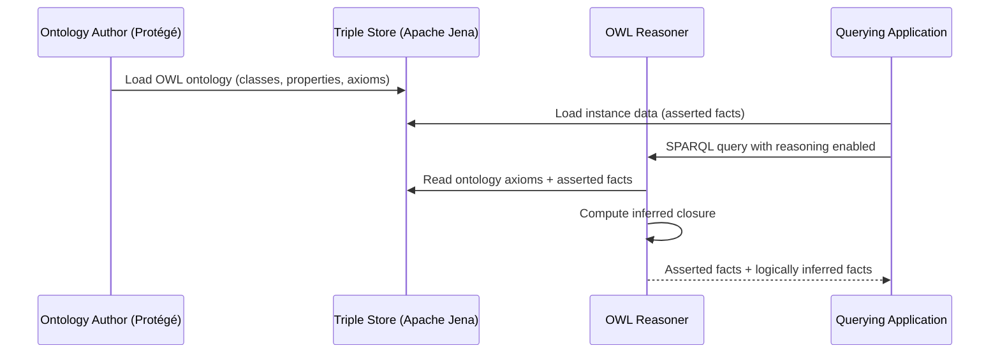
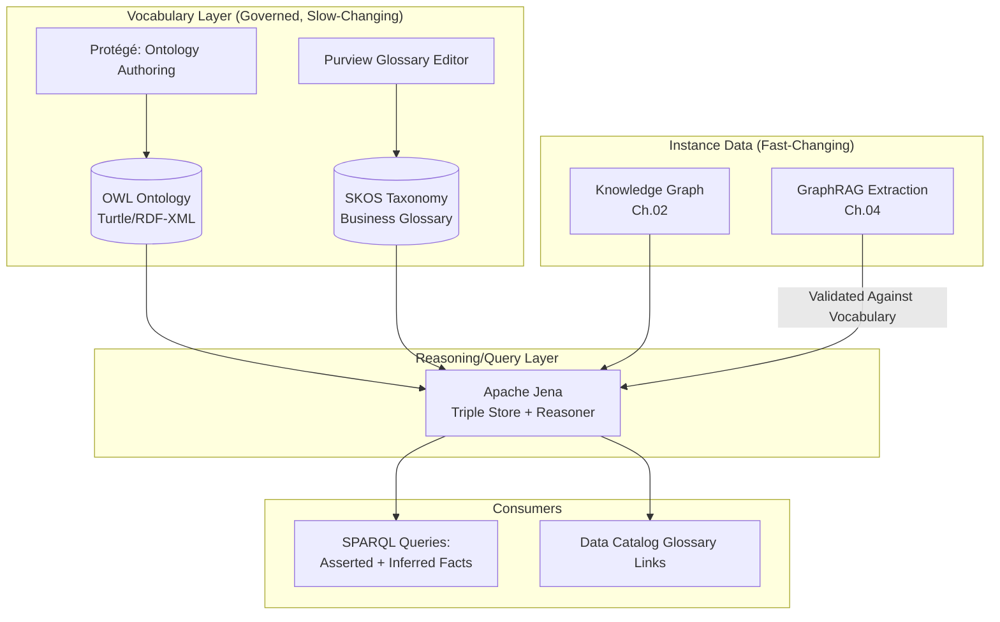

# Ontologies and Taxonomies

> Part of the **Enterprise Data & AI Architecture Handbook** · Phase-13 — Knowledge Graphs & Vector Systems · Chapter 05.
> Estimated study time: **45 min reading + ~2h labs**.
> **Prerequisite:** read [Knowledge Graphs with Neo4j](02_Knowledge_Graphs_with_Neo4j.md) first.

---

## Executive Summary

[Knowledge Graphs with Neo4j](02_Knowledge_Graphs_with_Neo4j.md) §2.2-2.3 introduced RDF and formal ontological reasoning as the property graph's more rigorous, more interoperable alternative, deliberately deferring both to this chapter with the explicit note that RDF's strength is formal semantic precision and cross-organization interoperability. [GraphRAG](04_GraphRAG.md) §8.1 then showed an LLM-driven entity-extraction pipeline producing graph entities and relationships largely ad hoc — whatever entity types and relationship names the extraction prompt happened to produce, with no formal vocabulary constraining or validating them. This chapter is where both threads resolve: **ontologies and taxonomies** are the formal, governed vocabulary layer that disciplines knowledge representation — defining, in advance and with logical rigor, what entity types and relationship types are even allowed to exist, what they mean, and what can be logically inferred from them, closing the "ad hoc vocabulary" gap both the property-graph and GraphRAG chapters left open.

This chapter covers **taxonomies versus ontologies** as two related but structurally different levels of formality — a taxonomy is a hierarchical classification (a controlled "is-a" tree), while an ontology additionally formalizes properties, relationships, and logical constraints between classes; **RDF, RDFS, OWL, and SKOS** as the W3C standard stack implementing this formal-semantics layer, from RDF's basic triple model through OWL's full description-logic reasoning capability and SKOS's lighter-weight vocabulary-and-taxonomy-specific standard; **enterprise knowledge organization** as the practical discipline of applying these standards to build a governed, shared vocabulary across an organization's data estate; **reasoning and inference** as the genuinely distinctive capability a formal ontology provides that neither a property graph nor GraphRAG's ad hoc extraction can — deriving new, logically-entailed facts from explicitly stated ones, automatically and verifiably; and **semantic interoperability** as the cross-organization, cross-system data-sharing capability that was RDF's original motivating vision, per [Knowledge Graphs with Neo4j](02_Knowledge_Graphs_with_Neo4j.md)'s History and Evolution section.

The platform bias is **Azure-primary (~60%)** — Azure Cosmos DB for Apache Gremlin's continued role as this handbook's managed graph backend, RDF-representable via a documented mapping and reasoning applied at the application/pipeline layer; Azure AI Search's semantic-configuration and synonym-map features as a lighter-weight, taxonomy-adjacent capability; and Microsoft Purview's business glossary and classification taxonomy as the enterprise-metadata-governance-facing implementation of this chapter's taxonomy concepts — **~30% enterprise open source** (Apache Jena, the standard open-source RDF/OWL triple-store and reasoning framework; SKOS-based vocabulary tools; Protégé, the standard ontology-authoring tool) — **~10% AWS/GCP comparison-only** (Amazon Neptune's native SPARQL/RDF support, directly comparable to this chapter's RDF treatment; Google's more limited first-party ontology-tooling story).

**Bottom line:** formal ontologies and OWL-based reasoning are a genuine, powerful capability for the specific enterprise scenarios that actually need cross-organization semantic interoperability or automated logical inference — but for the large majority of enterprise knowledge-organization needs, a well-governed **taxonomy** (a controlled vocabulary and classification hierarchy, per SKOS) delivers most of the practical business value (consistent terminology, discoverable classification, a shared business glossary) at a fraction of the modeling and tooling investment a full OWL ontology requires, and the recurring mistake this chapter documents is reaching for OWL's full formal-logic machinery when a taxonomy and a well-governed business glossary would have solved the actual problem.

---

## Learning Objectives

By the end of this chapter you will be able to:

1. **Distinguish taxonomies, thesauri, and ontologies** by their level of formality, and select the appropriate one for a given enterprise knowledge-organization need.
2. **Explain the RDF/RDFS/OWL/SKOS standards stack** and the specific capability each layer adds over the one beneath it.
3. **Design and implement a SKOS-based taxonomy** for an enterprise business-glossary or classification use case.
4. **Explain OWL-based reasoning and inference**, including at least one concrete example of a logically-entailed fact an ontology can derive automatically.
5. **Apply Microsoft Purview's business glossary and classification capabilities**, and Apache Jena's open-source RDF/OWL reasoning framework, in a production-grade enterprise knowledge-organization architecture.
6. **Decide when a full formal ontology is justified** over a lighter-weight taxonomy, and defend that decision against a cost-conscious architecture review.
7. **Defend an ontology or taxonomy architecture decision** in engineer, staff engineer, architect, and CTO review settings.

---

## Business Motivation

- **Inconsistent terminology across business units is a pervasive, expensive enterprise problem** — the same underlying concept referred to as "customer," "client," and "account holder" across three different systems makes cross-system reporting, search, and integration measurably harder; a governed taxonomy and business glossary (this chapter's core practical deliverable) directly resolves this at comparatively low cost.
- **Automated logical inference (§8.5) can derive genuinely new, correct facts from an ontology without requiring every fact to be explicitly stated or separately queried** — e.g., inferring that an entity classified as a "Regional Manager" is also, by subsumption, an "Employee," without a separate relationship needing to be independently maintained — reducing both data-modeling redundancy and the risk of inconsistency between explicitly and implicitly true facts.
- **Cross-organization data sharing and integration (mergers, supply-chain data exchange, regulatory reporting) benefits directly from adopting or aligning with an established, standardized ontology** rather than each organization inventing its own incompatible vocabulary — this was RDF's original Semantic Web motivation, and remains a genuine, if narrower than originally envisioned, practical benefit today.
- **Regulatory and compliance frameworks increasingly reference or require alignment with standardized taxonomies** (e.g., financial-reporting taxonomies, industry-classification standards), making taxonomy alignment a compliance-driven requirement in specific regulated domains, not merely an internal-consistency nicety.
- **Over-investing in a full OWL ontology and reasoning infrastructure when a taxonomy and business glossary would have sufficed is a genuine, recurring cost risk** — this chapter's Business Motivation deliberately mirrors [Knowledge Graphs with Neo4j](02_Knowledge_Graphs_with_Neo4j.md) ADR-0165 and [GraphRAG](04_GraphRAG.md) ADR-0167's justification-before-adoption discipline, since ontology/reasoning tooling and modeling expertise represent a comparable specialized-skills investment risk to the graph-database and GraphRAG adoption decisions this handbook has already scrutinized.

---

## History and Evolution

- **1990s — library and information science taxonomies and thesauri** (controlled vocabularies, subject-heading hierarchies) establish the practical, pre-digital foundation for hierarchical classification this chapter's taxonomy treatment builds on, long predating any computer-representable standard.
- **1998-2004 — RDF and RDFS are standardized by the W3C** (already covered in [Knowledge Graphs with Neo4j](02_Knowledge_Graphs_with_Neo4j.md)'s History section as the triple-store lineage), with RDFS (RDF Schema) adding basic class-hierarchy and property-hierarchy vocabulary on top of RDF's plain triples — the first standardized step toward this chapter's formal-ontology treatment.
- **2004 — OWL (Web Ontology Language) becomes a W3C recommendation**, adding description-logic-based formal semantics far beyond RDFS's basic hierarchy — class disjointness, property cardinality restrictions, equivalence and inverse relationships, and the logical foundation enabling automated reasoning and inference (§8.5) as a first-class, standards-based capability.
- **2009 — OWL 2** is published, refining and extending OWL's expressiveness while also formalizing **profiles** (OWL 2 EL, QL, RL) — restricted subsets of full OWL's expressiveness specifically designed to guarantee tractable (efficient, terminating) reasoning performance, directly informing this chapter's Performance section's reasoning-complexity trade-off.
- **2009 — SKOS (Simple Knowledge Organization System)** becomes a W3C recommendation, providing a deliberately lighter-weight RDF-based vocabulary specifically for representing taxonomies, thesauri, and classification schemes — explicitly not attempting OWL's full logical-reasoning expressiveness, and consequently far more widely and easily adopted for the practical business-glossary and classification use cases this chapter's Business Motivation names as the common case.
- **2001-2010s — the original Semantic Web vision** (per [Knowledge Graphs with Neo4j](02_Knowledge_Graphs_with_Neo4j.md)'s History section) of a universally-interlinked, machine-reasoned web of data sees real, if narrower-than-envisioned, adoption in specific domains (life sciences' extensive OWL-ontology ecosystem, government linked-open-data initiatives), while the broader "reason across the entire public web automatically" ambition remains largely unrealized.
- **2010s-2020s — enterprise data catalogs and business-glossary tooling mature** (Collibra, Alation, and eventually Microsoft Purview) as the pragmatic, taxonomy-and-glossary-focused productization of this chapter's concepts for mainstream enterprise data governance, largely without requiring end users to understand RDF/OWL's underlying formal semantics directly.
- **2020s — knowledge-graph and LLM convergence** (per [Knowledge Graphs with Neo4j](02_Knowledge_Graphs_with_Neo4j.md) and [GraphRAG](04_GraphRAG.md)'s own History sections) renews practical interest in ontologies specifically as a way to constrain and validate LLM-driven entity extraction against a formal, governed vocabulary rather than accepting whatever ad hoc entity types an extraction prompt happens to produce — directly motivating this chapter's Capstone Integration closing of the GraphRAG-extraction gap.

---

## Why This Technology Exists

A property graph (per [Knowledge Graphs with Neo4j](02_Knowledge_Graphs_with_Neo4j.md)) lets any node carry any label and any relationship carry any type, with no built-in mechanism validating that a given label or relationship type is even meaningful, consistently used, or logically consistent with the rest of the graph — two different teams can independently invent `:Customer` and `:Client` labels for what should be the same concept, or create a relationship that logically contradicts another already in the graph, with nothing in the property-graph model itself catching either problem. Ontologies and taxonomies exist to solve exactly this: they provide a formally defined, governed vocabulary — what classes and relationships are allowed to exist, what they mean, and (for a full OWL ontology) what logical constraints and inference rules apply to them — that a knowledge graph, a GraphRAG-constructed graph, or any other data system can be validated against and reasoned over, converting an unconstrained, potentially inconsistent set of labels and relationships into a governed, logically coherent, and machine-reasonable vocabulary.

---

## Problems It Solves

- **Terminology inconsistency across systems and business units**, resolved via a governed taxonomy and business glossary providing one authoritative definition and hierarchy per concept.
- **Automated logical inference of new facts from explicitly stated ones**, via OWL's description-logic reasoning capability (§8.5) — deriving, for example, that a specific data classification implies a specific regulatory obligation, without that implication needing to be separately and redundantly encoded everywhere it applies.
- **Validation of a knowledge graph's or GraphRAG-extracted graph's vocabulary against a formal schema**, catching inconsistent, duplicate, or logically contradictory entity types and relationships that an unconstrained property graph would silently accept.
- **Cross-organization and cross-system semantic interoperability**, letting two independently-built systems exchange data meaningfully when both align to (or map between) a shared, standardized ontology or taxonomy, rather than requiring bespoke, brittle point-to-point translation logic for every system pair.
- **A discoverable, browsable classification structure** for enterprise content and data assets (a business glossary's hierarchy, or a product/document classification taxonomy), directly supporting search, cataloguing, and governance use cases this handbook has covered in [Data Catalog and Lineage](../Phase-08/02_Data_Catalog_and_Lineage.md).

---

## Problems It Cannot Solve

- **An ontology does not automatically resolve entity deduplication or disambiguation** — the same "J. Smith"/"John Smith" entity-resolution problem [Knowledge Graphs with Neo4j](02_Knowledge_Graphs_with_Neo4j.md) and [GraphRAG](04_GraphRAG.md) both named remains an upstream data-quality concern a formal vocabulary does not resolve on its own; an ontology defines what a "Person" class means, not which specific mentions across source systems refer to the same individual person.
- **OWL's full reasoning capability does not scale to arbitrarily large or arbitrarily expressive ontologies while remaining computationally tractable** — full OWL DL reasoning is, in the worst case, computationally intractable, which is exactly why OWL 2's restricted profiles (EL, QL, RL, per this chapter's History section) exist as a deliberate expressiveness-versus-tractability trade-off, not an oversight to be worked around.
- **A taxonomy or ontology does not by itself guarantee organizational adoption or consistent use** — a beautifully modeled business glossary that no team actually references when naming new fields or classifying new content delivers none of this chapter's Business Motivation's promised benefit; governance and organizational buy-in (§23) are necessary complements, not automatic consequences, of a well-designed vocabulary.
- **It does not replace the need for the evaluation and quality-control discipline this handbook has established for retrieval systems** — an ontology constraining GraphRAG's entity extraction (per this chapter's Capstone Integration) still requires the extraction pipeline's actual output to be checked against that constraint, not merely assumed compliant because a formal schema exists somewhere in the architecture.
- **Formal ontological precision does not automatically translate into better retrieval or business outcomes** — per this chapter's central Trade-offs caution, adopting OWL's full formal machinery for a use case a simpler taxonomy would have served equally well is a net cost with no corresponding benefit, echoing this handbook's now-familiar "validate the actual need before adopting the more sophisticated tool" discipline.

---

## Core Concepts

### 5.1 Taxonomy: Hierarchical Classification

A **taxonomy** is a hierarchical classification scheme — a tree (or, more precisely, often a directed acyclic graph, since a concept can sometimes have more than one broader parent) of concepts related by "broader than"/"narrower than" (is-a) relationships, such as a product-category hierarchy or a document-classification scheme. Taxonomies are the most lightweight, most widely and easily adopted of this chapter's concepts, requiring no formal logical-reasoning capability to be useful — a taxonomy's value comes from consistent classification and discoverable hierarchy, not from automated inference.

### 5.2 Thesaurus: Adding Associative and Equivalence Relationships

A **thesaurus** extends a taxonomy with additional relationship types beyond pure hierarchy — **equivalence** ("preferred term" versus "used-for" synonyms, e.g., "automobile" as the preferred term with "car" marked as a synonym) and **associative** ("related term," a non-hierarchical but meaningful connection, e.g., "tire" related to "automobile" without either being broader/narrower than the other). This richer relationship vocabulary is exactly what SKOS (§5.4) was designed to represent formally.

### 5.3 Ontology: Formal Classes, Properties, and Logical Constraints

An **ontology** goes further still, formally defining not just a hierarchy of concepts but the **properties** each class can have, the **relationships** permitted between classes, and **logical constraints** (a class can be declared disjoint from another, meaning no individual can belong to both; a property can be declared functional, meaning an individual can have at most one value for it; cardinality restrictions can require a class's individuals to have at least or at most a specific number of a given relationship). This formal logical layer is precisely what distinguishes an ontology from a taxonomy or thesaurus, and it is precisely what enables §8.5's automated reasoning and inference capability — a taxonomy alone has no logical machinery to reason over.

### 5.4 RDF, RDFS, OWL, and SKOS: The Standards Stack

**RDF** (per [Knowledge Graphs with Neo4j](02_Knowledge_Graphs_with_Neo4j.md) §2.2) provides the base subject-predicate-object triple data model every layer above it builds on. **RDFS (RDF Schema)** adds basic vocabulary for defining classes (`rdfs:Class`) and properties, and simple class/property hierarchies (`rdfs:subClassOf`, `rdfs:subPropertyOf`) — enough for a basic taxonomy, but without OWL's richer logical constraints. **OWL** builds on RDFS with the full description-logic vocabulary (class disjointness, cardinality restrictions, property characteristics like transitivity and symmetry, equivalence classes) enabling genuine automated reasoning. **SKOS (Simple Knowledge Organization System)** is a deliberately restricted RDF vocabulary purpose-built for taxonomies and thesauri specifically (`skos:broader`, `skos:narrower`, `skos:related`, `skos:prefLabel`, `skos:altLabel`), explicitly avoiding OWL's full logical-reasoning machinery in favor of simplicity and ease of adoption for the classification-and-glossary use case that represents the majority of practical enterprise need, per this chapter's Business Motivation and Decision Matrix.

### 5.5 Reasoning and Inference

Given an OWL ontology's formally stated classes, properties, and logical axioms, a **reasoner** (a software component implementing description-logic inference) can automatically derive new facts that were never explicitly stated but are logically entailed by what was stated. A canonical example: if the ontology states that class `RegionalManager` is a subclass of `Employee` (`rdfs:subClassOf`), and a specific individual is asserted to be a `RegionalManager`, a reasoner automatically infers that individual is also an `Employee` — a fact never explicitly asserted, but logically guaranteed given the stated class hierarchy. More sophisticated inference follows from OWL's richer constructs: if `worksFor` is declared a transitive property, and A `worksFor` B and B `worksFor` C are both stated, a reasoner infers A `worksFor` C automatically. This inference capability is the concrete, measurable capability that justifies OWL's additional modeling investment over a plain taxonomy, per this chapter's Decision Matrix — when a use case genuinely benefits from this kind of automated derivation, OWL is justified; when it does not, a taxonomy suffices.

### 5.6 Open-World vs. Closed-World Assumption

RDF/OWL reasoning operates under the **open-world assumption**: the absence of a stated fact is not treated as evidence that the fact is false, merely that it is not (yet) known — a structurally different assumption from the closed-world assumption most relational databases and property-graph query languages (including Cypher, per [Knowledge Graphs with Neo4j](02_Knowledge_Graphs_with_Neo4j.md) §2.4) implicitly make, where an absent record is treated as evidence of absence. This distinction has real practical consequences: an OWL reasoner will not conclude two individuals are *different* entities merely because no `sameAs` relationship links them (an explicit `owl:differentFrom` assertion, or the Unique Name Assumption as an explicit modeling choice, is required for that), a frequent source of surprising reasoner behavior for engineers accustomed to closed-world relational or property-graph semantics.

### 5.7 Semantic Interoperability via Shared or Mapped Ontologies

Two organizations (or two systems within one organization) achieve semantic interoperability either by **adopting a shared, standardized ontology outright** (common in domains with an established standard, e.g., life sciences' Gene Ontology, or financial-reporting XBRL taxonomies) or by **mapping between their independently-developed ontologies** (using OWL's `owl:equivalentClass`/`owl:equivalentProperty` constructs, or SKOS's `skos:exactMatch`/`skos:closeMatch` for lighter-weight taxonomy alignment) — the latter being the more common real-world enterprise pattern, since requiring every organization to adopt an identical ontology from the outset is rarely practical, while mapping between independently-evolved vocabularies is a tractable, incremental integration strategy.

---

## Internal Working

A representative ontology-authoring and reasoning workflow: (1) domain experts and knowledge engineers define classes, properties, and logical axioms in an ontology-authoring tool (Protégé, per this chapter's Open Source Implementation section), producing an OWL ontology file (typically in RDF/XML, Turtle, or OWL/XML serialization); (2) this ontology is loaded into a triple store with reasoning capability (Apache Jena's reasoner, or a dedicated reasoner like HermiT/Pellet); (3) individual facts (instance data — specific entities and their asserted properties/relationships) are loaded into the same triple store, either directly authored or extracted from source systems (including, per this chapter's Capstone Integration, validated against the ontology as a constraint on GraphRAG's LLM-driven extraction output); (4) a SPARQL query against the resulting knowledge base can request either explicitly asserted facts alone, or facts including everything the reasoner can additionally infer (§8.5), depending on whether reasoning is enabled for that query; (5) the reasoner materializes (or computes on-demand) the inferred closure — every fact logically entailed by the explicit assertions plus the ontology's axioms — before or during query evaluation.



---

## Architecture

An enterprise ontology/taxonomy architecture has three layers with different authoring, update, and consumption patterns: **(1) the vocabulary layer** — the taxonomy or ontology itself (classes, properties, hierarchy, and, where applicable, logical axioms), authored deliberately and governed carefully (per §23) since it is shared, foundational infrastructure other systems depend on and is comparatively slow-changing relative to instance data; **(2) the instance-data layer** — the actual entities and facts conforming to (and validated against) the vocabulary layer, which may be sourced from a knowledge graph (per [Knowledge Graphs with Neo4j](02_Knowledge_Graphs_with_Neo4j.md)), a GraphRAG extraction pipeline (per [GraphRAG](04_GraphRAG.md)), or directly authored/ingested from source systems, and which changes far more frequently than the vocabulary layer; **(3) the reasoning/query layer** — the triple store and reasoner combination (or, for a taxonomy-only deployment with no reasoning requirement, a simpler SKOS-aware store) that answers queries against both explicit and inferred facts. This layered architecture mirrors, and is meant to explicitly parallel, [Knowledge Graphs with Neo4j](02_Knowledge_Graphs_with_Neo4j.md)'s property-graph architecture — the difference is the addition of a formally governed, logic-capable vocabulary layer disciplining what the instance-data layer is permitted to contain.

---

## Components

- **Ontology/Taxonomy Definition** — the authored OWL ontology or SKOS taxonomy artifact itself, typically version-controlled as source-of-truth documents (Turtle or RDF/XML files) rather than only living inside a runtime triple store.
- **Ontology-Authoring Tool** — Protégé (this chapter's Open Source Implementation reference) or a business-glossary UI (Microsoft Purview's glossary editor) providing a human-usable interface over the underlying RDF/OWL/SKOS serialization.
- **Triple Store** — the RDF-native storage and query engine (Apache Jena TDB, or any RDF-capable store) holding both the ontology/taxonomy and the instance data.
- **Reasoner** — the description-logic inference engine (Jena's built-in rule-based reasoner, or a dedicated OWL DL reasoner like HermiT or Pellet for full OWL expressiveness) computing the inferred closure over asserted facts and ontology axioms.
- **SPARQL Endpoint** — the standard RDF query-language interface (analogous to Cypher for property graphs, per [Knowledge Graphs with Neo4j](02_Knowledge_Graphs_with_Neo4j.md) §2.4) through which applications query the triple store, with or without reasoning enabled.
- **Business Glossary Service** — the enterprise-facing, typically SKOS-based (though not always explicitly branded as such) system (Microsoft Purview's glossary) making the taxonomy layer discoverable and browsable to non-RDF-expert business users and data stewards.
- **Ontology Mapping/Alignment Layer** — the component (using `owl:equivalentClass`/`skos:exactMatch` mappings) translating between an organization's internal vocabulary and an external, shared, or standardized vocabulary for semantic-interoperability use cases (§5.7).

---

## Metadata

An ontology or taxonomy's own metadata — its authoring history, version, scope/domain of applicability, and governance ownership — deserves the same cataloguing rigor this handbook has required for every other governed artifact ([Data Catalog and Lineage](../Phase-08/02_Data_Catalog_and_Lineage.md), and this chapter's own predecessors' Metadata sections in [Vector Databases: Qdrant and Milvus](01_Vector_Databases_Qdrant_and_Milvus.md) and [Knowledge Graphs with Neo4j](02_Knowledge_Graphs_with_Neo4j.md)). Additionally specific to this chapter: every class, property, and individual concept in a taxonomy or ontology should carry a formal, unique URI (per RDF's identification model) plus a human-readable preferred label and definition (SKOS's `skos:prefLabel`/`skos:definition`, or an OWL ontology's `rdfs:label`/`rdfs:comment`), since a formally identified but undocumented concept defeats the discoverability and consistent-terminology benefit this chapter's Business Motivation names as the primary practical payoff.

---

## Storage

Ontologies and taxonomies are typically stored as RDF triples in a dedicated **triple store** (Apache Jena TDB, or a commercial equivalent), a storage engine distinct from both the property-graph storage [Knowledge Graphs with Neo4j](02_Knowledge_Graphs_with_Neo4j.md)'s Storage section covered and the vector storage [Vector Databases: Qdrant and Milvus](01_Vector_Databases_Qdrant_and_Milvus.md) covered, optimized specifically for triple-pattern indexing (subject-predicate-object, and their permutations) rather than either index-free adjacency traversal or ANN similarity search. At enterprise scale, the ontology/taxonomy definition itself is typically small (thousands to low tens of thousands of classes and properties, even for a large enterprise vocabulary) relative to instance data, which can be far larger — meaning most of an ontology-backed system's storage footprint and scaling concern lies in the instance-data layer, not the vocabulary layer itself.

---

## Compute

OWL reasoning is the single most compute-distinctive concern in this chapter: full OWL DL reasoning has worst-case computational complexity that can become intractable as ontology size and axiom complexity grow, which is precisely why OWL 2's restricted profiles (EL, QL, RL, per this chapter's History section) exist — each profile deliberately sacrifices some logical expressiveness in exchange for a guaranteed, tractable reasoning-complexity bound, and selecting the appropriate profile for a given use case's actual reasoning needs (rather than defaulting to unrestricted full OWL) is a direct, consequential compute-planning decision. SKOS-only taxonomy deployments, by contrast, require no reasoning-engine compute at all beyond simple hierarchy traversal, making them dramatically cheaper computationally than any OWL-reasoning deployment — a direct, concrete input into this chapter's Decision Matrix and Cost Optimization sections.

---

## Networking

Enterprise ontology and taxonomy services (a SPARQL endpoint, or Microsoft Purview's glossary API) should follow the same private-endpoint-only, default-deny-egress networking baseline this handbook has established repeatedly across every prior Phase-13 chapter ([Network Security and Zero Trust](../Phase-10/04_Network_Security_and_Zero_Trust.md) ADR-0144) — a shared enterprise vocabulary service is frequently consumed by many downstream systems, and a compromised or unauthenticated public-facing endpoint would allow an attacker to observe (or, in a worst case, tamper with) foundational, widely-depended-upon vocabulary definitions, a governance-integrity risk beyond the confidentiality risk this handbook has more commonly emphasized for other data stores.

---

## Security

- **Ontology/taxonomy write access must be far more restricted than read access**, since the vocabulary layer is shared, foundational infrastructure many downstream systems depend on for consistent interpretation — an unauthorized or accidental modification to a widely-used class hierarchy or property definition can silently corrupt the semantics every dependent system relies on, a materially higher blast radius than an equivalent unauthorized write to typical instance data.
- **Instance-data access control** (which specific facts a querying identity may see) follows the same access-control-propagation discipline this handbook has repeated since [Retrieval Augmented Generation](../Phase-12/03_Retrieval_Augmented_Generation.md) ADR-0157 — a SPARQL query's reasoning-derived inferred facts must be filtered by the same entitlement rules as explicitly asserted facts, and a naive implementation that filters only asserted triples while leaving reasoner-inferred triples unfiltered can leak access-controlled information through logical inference rather than direct query.
- **Ontology provenance and change-history integrity** — since the vocabulary layer is comparatively slow-changing and foundational, every change should be attributable, reviewed, and version-controlled (mirroring [Governance](../Phase-08/01_Data_Governance_Foundations.md)'s change-management discipline), with the same rigor this handbook has required for infrastructure-as-code changes (per [Infrastructure as Code with Terraform](../Phase-09/04_Infrastructure_as_Code_with_Terraform.md)).
- **Cross-organization ontology sharing or mapping** (per §5.7) requires the same due diligence around a shared or third-party vocabulary's provenance and maintenance status as any other external dependency, since an organization's internal reasoning correctness becomes partially dependent on an externally-maintained ontology's continued logical consistency.

---

## Performance

- **Reasoning-complexity-versus-expressiveness is this chapter's central performance trade-off** (per Compute) — selecting an OWL 2 profile (EL/QL/RL) matched to the actual reasoning requirements, rather than defaulting to unrestricted full OWL DL, is the single most consequential performance lever available.
- **Materialized versus on-demand inference** — pre-computing (materializing) the full inferred closure ahead of query time trades storage and materialization-compute cost for fast query-time performance, while computing inference on-demand at query time trades slower per-query latency for lower storage overhead and immediate consistency with any ontology or instance-data change — the correct choice depends on query-versus-update frequency, mirroring general caching trade-off principles this handbook has applied elsewhere.
- **SKOS-based taxonomy traversal performance** is comparatively simple and fast, since it requires no reasoning-engine invocation, only straightforward hierarchical/associative-relationship traversal — directly informing this chapter's Decision Matrix recommendation to default to SKOS wherever full OWL reasoning is not genuinely required.
- **SPARQL query-plan review**, exactly analogous to Cypher's `EXPLAIN`/`PROFILE` (per [Knowledge Graphs with Neo4j](02_Knowledge_Graphs_with_Neo4j.md)'s Performance section) or a relational database's query-plan review, remains essential before assuming a SPARQL query's declarative simplicity guarantees efficient execution.

---

## Scalability

Taxonomy and business-glossary services scale comparatively easily, since their read-heavy, hierarchy-traversal-dominated workload resembles a straightforward, read-replicable lookup service with no reasoning-engine bottleneck. OWL-reasoning-backed services scale less straightforwardly: materialized-inference approaches shift scaling pressure toward the (potentially expensive, per Compute) materialization step, which must be re-run or incrementally updated as instance data or the ontology itself changes, while on-demand-inference approaches shift scaling pressure toward per-query reasoning-engine compute, meaning query-throughput scaling for an OWL-reasoning-backed system is fundamentally bounded by reasoning-engine capacity in a way a plain relational, property-graph, or SKOS-taxonomy query is not — a genuine architectural ceiling that should be sized and load-tested explicitly for any production OWL-reasoning deployment expecting meaningful query volume.

---

## Fault Tolerance

Triple-store fault tolerance (replication, backup, recovery) follows conventional database fault-tolerance patterns this handbook has covered repeatedly, with one ontology-specific consideration: since the vocabulary layer is foundational, shared infrastructure many systems depend on, an ontology-store outage has a broader organizational blast radius than an equivalent outage of a single application's own data store, warranting a correspondingly higher availability target and more conservative change-management discipline (per this chapter's Security and Governance sections) than a typical single-application data store might otherwise receive.

---

## Cost Optimization

- **Default to SKOS-based taxonomies over full OWL ontologies wherever the actual use case does not require automated logical inference**, per this chapter's central Trade-offs and Decision Matrix guidance — this single decision is the dominant cost-optimization lever in this chapter's domain, since it avoids the reasoning-engine compute and specialized-modeling-skills cost entirely for the majority of enterprise use cases.
- **Select the least expressive OWL 2 profile (EL, QL, or RL) that satisfies the actual reasoning requirement**, rather than defaulting to unrestricted full OWL DL's substantially higher worst-case reasoning cost.
- **Materialize inference only for query patterns with genuinely high read-to-update ratios**, avoiding unnecessary, recurring materialization compute for infrequently-queried or rapidly-changing instance data where on-demand inference is cheaper in aggregate.
- **Reuse or align with an established, standardized ontology or taxonomy** (per §5.7) rather than authoring a fully bespoke one from scratch, avoiding redundant modeling-expertise investment for concepts an existing, well-maintained standard already covers adequately.
- **Worked FinOps example:** a large enterprise proposes building a full OWL ontology (with automated reasoning) to formalize its internal product, customer, and organizational-hierarchy vocabulary, estimating an initial modeling-and-tooling investment of roughly $180,000 (specialized ontology-engineering consulting plus Protégé/Jena integration engineering) and an ongoing reasoning-infrastructure operating cost of approximately $3,500/month. A scoping review, applying this chapter's Decision Matrix, finds that of the proposed vocabulary's roughly 400 concepts, fewer than 15 have any identified use case genuinely requiring automated logical inference (mostly around regulatory-classification implication chains), while the remaining 385+ concepts need only consistent naming, hierarchy, and a browsable business glossary — exactly SKOS's use case. Restructuring the project as a SKOS-based enterprise taxonomy and business glossary (implemented via Microsoft Purview's native glossary capability) for the full vocabulary, with a small, separately-scoped OWL sub-ontology covering only the ~15 genuinely inference-requiring regulatory-classification concepts, reduces the initial investment to roughly $45,000 and the ongoing operating cost to under $400/month (Purview glossary hosting plus a small, narrowly-scoped Jena reasoning instance) — a combined reduction of over 75%, while still delivering the specific automated-inference capability the 15 genuinely-justified concepts required.

---

## Monitoring

- **Vocabulary consistency and orphan-concept detection** — a scheduled check flagging classes or properties defined in the ontology/taxonomy but never referenced by any instance data (a signal of either a modeling gap or an adoption failure per this chapter's Problems It Cannot Solve caution), and, conversely, instance data referencing an undefined class or property (a signal of drift between the vocabulary layer and actual system usage).
- **Reasoning-query latency and reasoner resource utilization**, tracked separately from plain (non-reasoning) SPARQL query latency, mirroring this chapter's Performance section's distinct cost profile for reasoning-enabled queries.
- **Ontology/taxonomy change frequency and review-approval turnaround**, a governance health signal indicating whether the vocabulary layer's change-management process (per Security and Governance) is functioning as a genuine, deliberate review gate or has become a rubber-stamp bottleneck.
- **Business-glossary adoption metrics** (how many data assets in the broader catalog, per [Data Catalog and Lineage](../Phase-08/02_Data_Catalog_and_Lineage.md), are actually linked to a governed glossary term versus left uncategorized) — a direct measure of whether this chapter's core practical taxonomy benefit is actually being realized in practice, not merely available in principle.

---

## Observability

Extending this handbook's recurring per-query-span observability discipline (per [Vector Databases: Qdrant and Milvus](01_Vector_Databases_Qdrant_and_Milvus.md) and [Knowledge Graphs with Neo4j](02_Knowledge_Graphs_with_Neo4j.md)) to this chapter's specific artifacts: a SPARQL query trace should capture whether reasoning was enabled for that query, which ontology/taxonomy version was in effect, and (where feasible) which specific inference rules contributed to the returned result set — enabling a "why did the reasoner return this fact" question to be answered from telemetry and provenance rather than requiring a live re-derivation, directly extending [GraphRAG](04_GraphRAG.md)'s extraction-provenance-metadata pattern to this chapter's logically-inferred, rather than LLM-extracted, derived facts.

### Operational Response Playbook

| Signal | Detection Query/Method | Remediation |
|---|---|---|
| A reasoning-enabled query unexpectedly returns no inferred facts, or an unexpectedly large/surprising inferred-fact set | Compare the query's result set (reasoning enabled) against the same query with reasoning disabled, isolating exactly which facts were reasoner-derived; cross-reference against the ontology's axioms active for the query's data | Verify the relevant class/property axioms (subclass, transitivity, disjointness) are correctly and currently defined in the active ontology version; check whether the open-world-assumption behavior (§8.6) is being mistaken for a closed-world absence-of-evidence expectation, a frequent root cause of "missing" or "surprising" inference results |
| Business-glossary adoption metrics show declining or stagnant linkage between catalogued data assets and governed glossary terms | Scheduled query against the data catalog comparing total cataloged assets against assets carrying a linked glossary-term reference, tracked over time | Investigate whether glossary-term linkage is a manual, unenforced step in the data-onboarding process (a governance-adoption gap, not a technical one) and consider making glossary-term assignment a required field in the cataloguing workflow rather than an optional one |

---

## Governance

Ontology and taxonomy governance is this chapter's most consequential practical discipline, extending this handbook's established governance framework ([Data Governance Foundations](../Phase-08/01_Data_Governance_Foundations.md)) to the vocabulary layer specifically: every class, property, and concept should have a documented, accountable owner (typically a business-domain steward, not solely a technical team), a formal change-review process (since, per this chapter's Security section, an unreviewed vocabulary change has a broad, foundational blast radius), and a published, versioned definition accessible to both technical and business consumers. Microsoft Purview's business-glossary workflow (approval chains, term stewardship assignment, term-status lifecycle) is the concrete productization of this governance discipline this chapter's Azure Implementation section covers. Critically, and directly closing the gap [GraphRAG](04_GraphRAG.md) §8.1 left open: an organization operating a GraphRAG pipeline should govern its LLM-extraction entity-type vocabulary against this chapter's formally defined taxonomy or ontology, validating (or constraining, via the extraction prompt itself) that extracted entities conform to governed classes rather than allowing the extraction pipeline to invent arbitrary, ungoverned entity-type labels — this is precisely the "ad hoc vocabulary" problem this chapter's Executive Summary named as its reason for existing.

---

## Trade-offs

- **Taxonomy/SKOS vs. full OWL ontology:** SKOS delivers most of the practical enterprise benefit (consistent terminology, discoverable classification, a shared glossary) at dramatically lower modeling and reasoning-infrastructure cost; OWL's additional automated-inference capability is only worth its substantially higher cost when a genuine, specific inference need exists — this chapter's central, most-repeated trade-off, formalized in this chapter's ADR.
- **Materialized vs. on-demand inference:** materialization trades upfront and recurring compute cost for fast query-time performance; on-demand inference trades slower per-query latency for lower storage overhead and immediate consistency — the correct choice is workload-dependent, not universally one or the other.
- **Bespoke ontology authoring vs. adopting/aligning with an established standard:** a bespoke ontology offers precise fit to an organization's specific vocabulary but requires the full modeling-expertise investment from scratch; adopting or mapping to an established standard (industry-classification taxonomies, domain-specific published ontologies) reduces that investment at the cost of some fit imprecision requiring a mapping/alignment layer (§5.7).
- **Full OWL DL vs. a restricted OWL 2 profile (EL/QL/RL):** full DL offers maximum logical expressiveness at the cost of potentially intractable reasoning complexity; a restricted profile guarantees tractable reasoning at the cost of some expressiveness — nearly every enterprise use case should default to the least expressive profile that satisfies its actual requirement, not full DL by default.
- **Open-world vs. closed-world semantics:** RDF/OWL's open-world assumption is the logically correct choice for genuinely incomplete, federated, or evolving knowledge (the Semantic Web's original motivating scenario), but is a frequent source of confusion and unexpected behavior for teams and use cases accustomed to (and sometimes genuinely better served by) a property graph's or relational database's closed-world semantics — this distinction should be made an explicit, deliberate design decision, not an accidental consequence of tooling choice.

---

## Decision Matrix

| Scenario | Recommended Choice | Rationale |
|---|---|---|
| Enterprise business glossary, consistent terminology, browsable classification for data catalog and search | SKOS-based taxonomy via Microsoft Purview's glossary | Delivers the large majority of practical enterprise vocabulary-governance benefit at low modeling and infrastructure cost |
| A specific, named use case requiring automated derivation of logically-implied facts (e.g., regulatory-classification implication chains) | A narrowly-scoped OWL ontology (restricted profile) covering only that specific concept subset | Matches this chapter's FinOps worked example; captures the inference benefit without over-applying OWL's cost across the entire vocabulary |
| Cross-organization data exchange requiring alignment with an established industry-standard ontology or taxonomy | Adopt or map to the existing standard (via `owl:equivalentClass`/`skos:exactMatch`) rather than authoring a bespoke vocabulary | Avoids redundant modeling investment and directly serves the semantic-interoperability goal that motivates adopting a standard in the first place |
| Constraining or validating a GraphRAG or knowledge-graph pipeline's entity-type vocabulary | A lightweight taxonomy/ontology defining permitted entity and relationship types, enforced at extraction or validation time | Directly closes the ad hoc-vocabulary gap this chapter's Governance section and Capstone Integration name as GraphRAG's and property-graph modeling's shared open issue |
| Prototype/proof-of-concept, uncertain whether formal ontological reasoning is genuinely needed | Start with a SKOS taxonomy; only invest in an OWL sub-ontology once a specific, validated inference need is identified | Defers OWL's substantially higher cost commitment until a genuine, measured need is established, mirroring this handbook's now-familiar validate-before-adopting-the-more-sophisticated-tool discipline |

---

## Design Patterns

- **Taxonomy-first, ontology-by-exception:** default every new vocabulary need to a SKOS taxonomy, escalating to a narrowly-scoped OWL sub-ontology only for the specific concept subset with a validated, named inference requirement — this chapter's single most cost-consequential design pattern, directly operationalizing the FinOps worked example.
- **Ontology-constrained entity extraction:** constrain a GraphRAG or LLM-driven entity-extraction pipeline's permitted entity and relationship types to a governed taxonomy or ontology, either via extraction-prompt engineering (per [Prompt Engineering](../Phase-12/02_Prompt_Engineering.md)'s structured-output discipline) or a post-extraction validation step rejecting or flagging out-of-vocabulary entity types — directly closing this chapter's Capstone Integration gap.
- **Standard alignment via SKOS mapping properties:** rather than authoring a bespoke internal taxonomy from scratch, map internal concepts to an established external standard via `skos:exactMatch`/`skos:closeMatch`, capturing most of a shared standard's interoperability benefit while preserving internal naming flexibility where a precise match does not exist.
- **Reasoning profile escalation on demand:** begin with RDFS-level (or SKOS-level) vocabulary richness, escalating to OWL and, specifically, the least expressive sufficient OWL 2 profile only when a concrete inference requirement is validated — mirroring the taxonomy-first pattern at a finer level of granularity within an already-justified ontology effort.

---

## Anti-patterns

- **Authoring a full OWL ontology with unrestricted DL expressiveness for a use case that only needed a taxonomy and business glossary** — this chapter's single most costly and most common adoption mistake, directly paralleling [Knowledge Graphs with Neo4j](02_Knowledge_Graphs_with_Neo4j.md) ADR-0165 and [GraphRAG](04_GraphRAG.md) ADR-0167's analogous justification-before-adoption cautions at this chapter's own level of the stack.
- **Publishing a vocabulary with no accountable business-domain owner**, leaving classes and properties to drift, duplicate, or become inconsistently defined over time with no clear escalation path for resolution.
- **Confusing open-world-assumption behavior for a bug**, spending debugging effort trying to make a reasoner "notice" an absence of evidence as a negative fact, rather than recognizing this as RDF/OWL's deliberate, correct semantic model and modeling the actual requirement (e.g., via explicit `owl:differentFrom` assertions or a closed-world-assumption-aware application layer) accordingly.
- **Allowing a GraphRAG or knowledge-graph pipeline's entity-extraction vocabulary to remain fully ungoverned**, never validating extracted entity/relationship types against any formal taxonomy or ontology, reproducing the exact ad hoc-vocabulary problem this chapter exists to resolve.
- **Treating a published, standardized ontology as a static, "install once and forget" artifact** rather than monitoring for the standard's own version updates and revising internal mappings accordingly, risking silent semantic drift between an organization's internal usage and the evolving external standard.

---

## Common Mistakes

- **Defaulting to full OWL DL reasoning without evaluating whether a restricted profile (EL/QL/RL) would satisfy the actual requirement**, incurring avoidable reasoning-complexity cost.
- **Not distinguishing a taxonomy's simple hierarchy from an ontology's formal logical constraints when scoping a project**, leading to either an over-built (unnecessarily OWL-based) or under-built (missing needed logical constraints) vocabulary relative to the actual requirement.
- **Materializing inference for infrequently-queried instance data**, paying recurring materialization compute cost for a query pattern that would have been cheaper served via on-demand inference.
- **Neglecting business-glossary adoption as an organizational, not merely technical, workstream** — building a technically sound taxonomy that data-onboarding teams never actually reference when classifying new assets, per this chapter's Monitoring section's adoption-metric caution.
- **Assuming a shared or mapped external ontology's semantics remain stable indefinitely**, without monitoring for the external standard's own revisions and re-validating internal mappings accordingly.

---

## Best Practices

- Default every new enterprise vocabulary need to a SKOS-based taxonomy, escalating to a narrowly-scoped OWL ontology only once a specific, validated inference requirement is identified, per this chapter's Decision Matrix and ADR.
- Assign an accountable business-domain owner to every governed class, property, and concept, with a formal, reviewed change-management process for vocabulary modifications.
- Select the least expressive OWL 2 profile (EL, QL, or RL) that satisfies an actual, validated reasoning requirement, rather than defaulting to unrestricted full OWL DL.
- Constrain GraphRAG and knowledge-graph entity-extraction pipelines against a governed taxonomy or ontology, closing the ad hoc-vocabulary gap this chapter's Capstone Integration names directly.
- Monitor business-glossary and taxonomy adoption metrics (linkage rate, orphan-concept detection) as a genuine governance health signal, not merely the taxonomy's technical existence.
- Prefer aligning with or mapping to an established, standardized ontology or taxonomy over authoring a fully bespoke vocabulary from scratch wherever a suitable standard exists.

---

## Enterprise Recommendations

Default to a **SKOS-based enterprise taxonomy and business glossary, implemented via Microsoft Purview's native glossary capability**, for the large majority of enterprise vocabulary-governance needs, reserving a **narrowly-scoped OWL ontology (using the least expressive sufficient OWL 2 profile), authored in Protégé and served via Apache Jena**, only for the specific, validated subset of concepts with a genuine, named automated-inference requirement. In every case, mandate an accountable business-domain owner and a formal change-review process for every governed vocabulary element, and require that any GraphRAG or knowledge-graph entity-extraction pipeline validate its output against this governed vocabulary rather than operating with an ungoverned, ad hoc entity-type schema.

### Architecture Decision Record (ADR-0168): SKOS-First, OWL-by-Validated-Exception for Enterprise Vocabulary Governance

**Context:** This chapter's History, Business Motivation, and Anti-patterns sections all document the same recurring pattern this handbook has now identified at three successive levels of this phase's technology stack ([Knowledge Graphs with Neo4j](02_Knowledge_Graphs_with_Neo4j.md) ADR-0165 for graph-database adoption, [GraphRAG](04_GraphRAG.md) ADR-0167 for GraphRAG's indexing pipeline, and now this chapter for formal ontology adoption): an organization invests in the more sophisticated, more expensive tool (here, a full OWL ontology with automated reasoning) without first validating that its actual use case requires the specific additional capability that tool provides, when a substantially cheaper, simpler tool (here, a SKOS taxonomy) would have delivered most of the practical benefit.

**Decision:** Every new enterprise vocabulary-governance initiative must default to a SKOS-based taxonomy and business glossary. A full OWL ontology (or an OWL sub-ontology covering a specific concept subset) may only be adopted for a documented, validated set of concepts with a specific, named automated-inference requirement that a SKOS taxonomy demonstrably cannot satisfy, verified before committing to the ontology-authoring and reasoning-infrastructure investment.

**Consequences:** Requires an upfront scoping exercise distinguishing which concepts genuinely need OWL's inference capability from those that only need consistent taxonomy and glossary treatment, adding a modest planning step before any ontology-authoring investment begins. In exchange, it prevents the specific, high-cost "full OWL ontology for a taxonomy-sufficient use case" anti-pattern this chapter's FinOps worked example quantifies (a roughly 75% cost reduction was achieved in that example purely through this scoping discipline), concentrating specialized ontology-engineering investment on the concepts that genuinely benefit from it.

**Alternatives Considered:** (1) *Adopt a full OWL ontology organization-wide as the single vocabulary standard, given its superior formal expressiveness* — rejected, since this chapter's Cost Optimization and Trade-offs sections both demonstrate the great majority of enterprise vocabulary-governance needs do not require OWL's inference capability, making organization-wide OWL adoption a substantial, largely unjustified cost multiplier. (2) *Leave the taxonomy-versus-ontology choice entirely to individual project teams without a formal scoping gate* — rejected as the same discretionary, unvalidated-adoption pattern this ADR (and its Phase-13 ADR predecessors) exist specifically to prevent.

---

## Azure Implementation

**Microsoft Purview's business glossary** is this chapter's primary Azure-native SKOS-taxonomy implementation, providing hierarchical term definitions, synonym/related-term relationships, and a stewardship-and-approval workflow directly mirroring §5.2's thesaurus and §23's governance requirements, configured via the Purview portal or its REST API/Terraform provider (per [Infrastructure as Code with Terraform](../Phase-09/04_Infrastructure_as_Code_with_Terraform.md)):

```bash
# Illustrative Purview glossary term creation via REST API
curl -X POST "https://contoso-purview.purview.azure.com/catalog/api/atlas/v2/glossary/term" \
  -H "Authorization: Bearer $TOKEN" -H "Content-Type: application/json" \
  -d '{
    "name": "RegionalManager",
    "shortDescription": "An employee accountable for a defined geographic sales region.",
    "anchor": { "glossaryGuid": "<contoso-enterprise-glossary-guid>" },
    "classifies": []
  }'
```

Purview's automated data-classification and catalog-scanning capability then links cataloged data assets to governed glossary terms, directly operationalizing this chapter's Monitoring section's adoption-metric requirement (tracking linkage rate between cataloged assets and glossary terms). For the narrowly-scoped OWL sub-ontology use case (per ADR-0168), Apache Jena (this chapter's Open Source Implementation reference) can be deployed on Azure Kubernetes Service (per [Kubernetes](../Phase-09/06_Kubernetes.md)) behind a private endpoint, with Azure Cosmos DB for Apache Gremlin (per [Knowledge Graphs with Neo4j](02_Knowledge_Graphs_with_Neo4j.md)) holding instance data that is validated at write time against the governed ontology's permitted classes and properties before being accepted into the graph.

---

## Open Source Implementation

**Apache Jena** (Java, Apache 2.0) is the standard open-source RDF/OWL framework, providing TDB (a native triple-store), a built-in rule-based reasoner, and SPARQL query support:

```java
OntModel model = ModelFactory.createOntologyModel(OntModelSpec.OWL_MEM_RULE_INF);
model.read("enterprise-ontology.ttl", "TTL");

OntClass employee = model.getOntClass(NS + "Employee");
OntClass regionalManager = model.getOntClass(NS + "RegionalManager");
regionalManager.addSuperClass(employee);  // RegionalManager subClassOf Employee

Individual jane = model.createIndividual(NS + "jane_doe", regionalManager);
// Reasoner automatically infers: jane_doe is also an Employee
boolean isEmployee = jane.hasOntClass(employee, false);  // true, via inference
```

A representative SPARQL query against the reasoning-enabled model, retrieving both asserted and inferred facts:

```sparql
PREFIX ex: <http://contoso.com/ontology#>
SELECT ?person ?role WHERE {
  ?person a ex:Employee .
  ?person ex:hasRole ?role .
}
```

**Protégé** (this chapter's standard ontology-authoring tool reference, free and open source, Stanford) provides the human-usable interface for defining classes, properties, and logical axioms that Jena or another OWL reasoner then consumes at runtime. For the SKOS-taxonomy path specifically, any RDF-capable store (including Jena TDB itself, or a lighter-weight SKOS-focused tool) suffices without requiring Protégé's full ontology-authoring complexity, per this chapter's SKOS-first default.

---

## AWS Equivalent (comparison only)

**Amazon Neptune** provides native RDF and SPARQL support alongside its property-graph/Gremlin capability (already covered as [Knowledge Graphs with Neo4j](02_Knowledge_Graphs_with_Neo4j.md)'s AWS comparison), making it directly comparable to this chapter's Apache Jena/OWL treatment for organizations preferring a single managed service spanning both the property-graph and RDF/ontology use cases this handbook has split across two chapters. Advantages include this dual-model support within one managed service and AWS's broader ecosystem integration; disadvantages include Neptune's built-in reasoning capability being comparatively less mature and less configurable than a dedicated OWL reasoner like Jena's or a commercial equivalent, and the absence of a directly Purview-equivalent, glossary-focused managed governance product within the same service (AWS's comparable governance tooling, e.g., AWS Glue Data Catalog's business-glossary-adjacent features, is a separate service from Neptune). Migration from an Azure Purview-glossary-plus-Jena architecture to Neptune requires exporting the RDF ontology and instance data (a comparatively standards-based, portable migration given RDF's own standardization, per this chapter's History section) but re-implementing the governance-workflow and glossary-stewardship layer Purview provides natively; selection criteria center on existing cloud commitment and whether Neptune's unified property-graph-plus-RDF model is a genuine architectural simplification for a given organization's specific mix of both technologies.

---

## GCP Equivalent (comparison only)

Google Cloud has no direct first-party managed RDF/OWL triple-store or ontology-reasoning service as of this writing, mirroring the same managed-graph-database gap [Knowledge Graphs with Neo4j](02_Knowledge_Graphs_with_Neo4j.md)'s GCP comparison already identified; the common substitute is **self-managed Apache Jena (or an equivalent open-source triple store) on Google Kubernetes Engine**, with Google Data Catalog (or its Dataplex successor) providing SKOS-taxonomy-adjacent business-glossary and classification-tagging capability, though again without Purview's specific glossary-and-ontology-integration depth. Advantages of the GKE-hosted-Jena path include full architectural parity with this chapter's own self-hosted recommendation; disadvantages include the complete absence of a managed OWL-reasoning service, placing the full operational burden on the deploying team, mirroring the identical GCP gap this handbook's prior chapter already flagged for graph databases generally. Migration considerations mirror the AWS case for the RDF/ontology portion (standards-based, portable RDF export/import) while the governance-workflow layer again requires reimplementation against Dataplex's differently-structured glossary and classification model rather than a direct Purview equivalent.

---

## Migration Considerations

Migrating an ontology or taxonomy between platforms is, in one respect, easier than the graph-database and vector-database migrations this handbook's preceding chapters covered: RDF, RDFS, OWL, and SKOS are all W3C standards with well-defined serialization formats (Turtle, RDF/XML, OWL/XML), meaning the vocabulary and instance-data content itself is portable across any standards-compliant triple store without the model-translation burden [Knowledge Graphs with Neo4j](02_Knowledge_Graphs_with_Neo4j.md)'s Cypher-versus-Gremlin migration concern required. The genuine migration cost instead concentrates in **governance-workflow and glossary-tooling re-implementation** (Microsoft Purview's stewardship, approval-chain, and term-status-lifecycle workflow has no directly portable equivalent in Apache Jena alone or in a competing platform's differently-structured glossary model) and **reasoner-behavior validation** (different OWL reasoner implementations, even when all standards-compliant, can exhibit subtly different performance characteristics and, in edge cases involving certain non-monotonic or partially-supported OWL constructs, different practical inference behavior, warranting explicit re-validation of key inference test cases against the destination reasoner before cutover). A staged migration validating both the imported RDF content's fidelity and the destination reasoner's inference behavior against a representative test-case set, before committing to a full cutover of the governance-workflow layer, is the recommended pattern here.

---

## Mermaid Architecture Diagrams



```mermaid
erDiagram
    CLASS ||--o{ CLASS : "subClassOf (hierarchy)"
    CLASS ||--o{ PROPERTY : "has property"
    CLASS ||--o{ INDIVIDUAL : "instance of"
    INDIVIDUAL ||--o{ INDIVIDUAL : "related via property"
    CONCEPT ||--o{ CONCEPT : "skos:broader / skos:narrower"
    CLASS {
        string uri
        string prefLabel
        string definition
    }
    CONCEPT {
        string uri
        string prefLabel
        string altLabel
    }
```

A third diagram (the ontology-authoring and reasoning internal-working sequence) appears in the Internal Working section above.

---

## End-to-End Data Flow

1. **Vocabulary scoping and authoring:** per ADR-0168, a new vocabulary need is scoped as either SKOS-taxonomy-sufficient or genuinely OWL-inference-requiring, and authored accordingly (Purview glossary editor or Protégé).
2. **Vocabulary publication and governance review:** the authored taxonomy or ontology is reviewed and approved by its accountable business-domain owner (per Governance) before publication.
3. **Instance-data validation:** entities and facts from a knowledge graph (per [Knowledge Graphs with Neo4j](02_Knowledge_Graphs_with_Neo4j.md)) or a GraphRAG extraction pipeline (per [GraphRAG](04_GraphRAG.md)) are validated against the published vocabulary before being accepted, closing this chapter's Capstone Integration gap.
4. **Loading into the triple store:** validated instance data and the governing ontology/taxonomy are loaded into Apache Jena (or an equivalent RDF store).
5. **Reasoning (where applicable):** for OWL-governed concepts, a reasoner computes the inferred closure, either materialized ahead of query time or on demand, per this chapter's Performance section's trade-off.
6. **Query and consumption:** applications query via SPARQL (with reasoning enabled where relevant), or browse the business glossary directly for taxonomy-only concepts, with results filtered by the same access-control-propagation discipline this handbook has required throughout Phase-12 and Phase-13.

---

## Real-world Business Use Cases

- **Enterprise business glossary and consistent terminology governance**, resolving the "customer/client/account holder" fragmentation problem this chapter's Business Motivation opened with.
- **Regulatory-classification implication chains**, using a narrowly-scoped OWL ontology to automatically infer which regulatory obligations apply to a given data classification, directly matching this chapter's FinOps worked example's validated use case.
- **Life-sciences and biomedical research ontologies** (Gene Ontology and similar), enabling automated cross-study data integration and inference across an entire research field via a shared, standardized ontology — the domain where full OWL adoption has historically seen the deepest, most justified investment.
- **Cross-organization supply-chain or regulatory-reporting data exchange**, using SKOS or OWL alignment mappings to a shared industry-standard taxonomy or ontology rather than bespoke point-to-point integration.
- **Constraining and validating GraphRAG or LLM-driven knowledge-extraction pipelines** against a governed vocabulary, directly closing the ad hoc-entity-type gap this chapter's Capstone Integration and Governance sections both name as its motivating closure.

---

## Industry Examples

Life-sciences and biomedical research organizations remain the deepest, most mature adopters of full OWL ontologies with genuine automated-reasoning use cases (the Gene Ontology and related biomedical-ontology ecosystems), reflecting a research domain where automated cross-study logical inference delivers substantial, measurable scientific value justifying the investment this chapter's ADR gates for the more common enterprise case. Financial-services and regulated industries are common adopters of standardized regulatory taxonomies (e.g., XBRL for financial reporting) specifically for the semantic-interoperability and regulatory-compliance benefits this chapter's Business Motivation named, typically via alignment/mapping to the established standard rather than full independent ontology authoring. Large enterprises operating a mature Microsoft data-governance estate are the most common adopters of Purview's business-glossary capability specifically, reflecting this chapter's SKOS-first default as the practical majority case across most non-specialized industries.

---

## Case Studies

**Case Study 1 — a full OWL ontology commissioned without validating the actual need, later rescoped.** A large enterprise commissioned a full OWL ontology-engineering effort (external ontology-engineering consultants, Protégé tooling, and a dedicated Jena reasoning infrastructure) to formalize its product, customer, and organizational vocabulary, motivated by a general belief that "ontologies are the more rigorous, more future-proof approach" without first validating (per this chapter's ADR-0168, adopted only after this incident) which specific concepts genuinely needed automated logical inference versus simple taxonomy treatment. A retrospective scoping review — the actual source of this chapter's FinOps worked example — found that of roughly 400 modeled concepts, fewer than 15 had any identified downstream use case actually invoking the reasoner's inference capability, while the remaining 385+ concepts were used purely for consistent naming and browsable classification, exactly the SKOS use case at a fraction of the cost already committed. The organization rescoped the effort, migrating the majority of the vocabulary to a Purview-based SKOS taxonomy and retaining only a small, purpose-built OWL sub-ontology for the validated regulatory-classification-inference concepts, adopting the SKOS-first, OWL-by-validated-exception discipline this chapter's ADR now formalizes.

**Case Study 2 — an unfiltered reasoning query leaking access-controlled information through logical inference.** A financial-services firm's ontology-backed compliance system correctly filtered explicitly asserted facts by the querying user's access entitlements at the application layer, but the reasoning-enabled SPARQL endpoint's inferred facts were not passed through the same filter — a gap directly matching this chapter's Security section's caution. A junior compliance analyst without clearance to view a specific classified regulatory-exposure fact was nonetheless able to derive its existence indirectly, because a separately-permitted, lower-sensitivity fact combined with the ontology's transitive-property axiom allowed the reasoner to infer the restricted fact as a logical consequence, and that inferred fact was returned to the query without an access-control check ever being applied to it specifically. The incident was caught during a routine access-control audit comparing what a test account with restricted entitlements could retrieve via reasoning-enabled queries against what it should have been able to see; the remediation applied access-control filtering to the full result set — asserted and reasoner-inferred facts alike — before returning any response, directly reinforcing this handbook's now-familiar access-control-propagation lesson at this chapter's reasoning-specific layer.

---

## Hands-on Labs

1. **Lab 1 — build a SKOS taxonomy for a business glossary.** Using a small enterprise domain (e.g., a fictional retail company's product-category and customer-segment vocabulary), author a SKOS taxonomy in Turtle syntax, load it into Apache Jena, and write SPARQL queries traversing the `skos:broader`/`skos:narrower` hierarchy.
2. **Lab 2 — author an OWL ontology and observe automated inference.** Using Protégé, define a small class hierarchy with at least one `subClassOf` relationship and one transitive property, load the resulting ontology into Jena with reasoning enabled, and write a SPARQL query demonstrating a fact the reasoner derives that was never explicitly asserted.
3. **Lab 3 — reasoning-profile performance comparison.** Using a moderately sized synthetic ontology, compare SPARQL query latency with reasoning disabled, reasoning enabled under a restricted OWL 2 profile, and reasoning enabled under unrestricted OWL DL, documenting the measured performance difference.
4. **Lab 4 — constrain a GraphRAG extraction pipeline against a governed taxonomy.** Using [GraphRAG](04_GraphRAG.md) Lab 1's indexed corpus, define a small governing taxonomy of permitted entity types, and modify the extraction prompt (or add a post-extraction validation step) to reject or flag entities whose extracted type falls outside the governed vocabulary, reproducing this chapter's Capstone Integration closure hands-on.
5. **Lab 5 — Microsoft Purview business-glossary setup.** Provision a Purview account, create a small business glossary with parent/child term hierarchy and synonym relationships, and link a sample cataloged data asset to a governed glossary term, measuring the resulting catalog-search discoverability improvement.

---

## Exercises

1. Explain, for a non-technical stakeholder, the practical difference between a taxonomy and a full ontology, using a concrete business example for each.
2. A team proposes building a full OWL ontology for their new customer-data vocabulary. Apply ADR-0168's validation test and write the recommendation memo, including what evidence you would require before approving the OWL investment.
3. Explain the open-world assumption using a concrete example where it produces different behavior than a closed-world-assumption system (e.g., a relational database or Cypher query) would.
4. Design a taxonomy-versus-ontology scoping methodology for a new enterprise vocabulary initiative with 200 candidate concepts and no existing usage data.
5. Write the Context/Decision/Consequences/Alternatives structure for an ADR deciding whether a proposed regulatory-compliance use case justifies a narrowly-scoped OWL ontology versus remaining on a taxonomy alone.

---

## Mini Projects

1. **Taxonomy-vs-ontology cost-scoping calculator:** build a small tool that, given a candidate concept list and, for each concept, whether it has an identified automated-inference use case, estimates the relative cost of a full-OWL-ontology approach versus a SKOS-taxonomy-with-OWL-exception approach, operationalizing this chapter's FinOps worked example as a reusable decision-support tool.
2. **Ontology-constrained extraction validator:** build a reusable tool that accepts a governed taxonomy/ontology and a set of LLM-extracted entities (from a GraphRAG pipeline or similar), and reports which extracted entity types conform to versus fall outside the governed vocabulary, directly operationalizing this chapter's Capstone Integration closure as a concrete tool.
3. **Reasoning access-control audit tool:** build a small tool comparing a test query's asserted-facts-only result set against its reasoning-enabled result set for a given restricted-access test identity, flagging any inferred fact that would not otherwise be independently visible to that identity — reproducing Case Study 2's remediation as a reusable, proactive audit tool.

---

## Capstone Integration

This chapter closes Phase-13 by resolving the two open threads its three preceding chapters each deliberately left unresolved: [Knowledge Graphs with Neo4j](02_Knowledge_Graphs_with_Neo4j.md) §2.2-2.3's deferred RDF/formal-ontology treatment, now fully addressed via RDF/RDFS/OWL/SKOS and automated reasoning; and [GraphRAG](04_GraphRAG.md) §8.1's ad hoc, unconstrained LLM-extraction entity vocabulary, now directly disciplined by this chapter's governed-taxonomy-constrained-extraction design pattern. Every justification-before-adoption ADR this handbook has established across Phase-13 ([Knowledge Graphs with Neo4j](02_Knowledge_Graphs_with_Neo4j.md) ADR-0165 for graph databases, [GraphRAG](04_GraphRAG.md) ADR-0167 for GraphRAG's indexing pipeline) reaches its natural conclusion in this chapter's own ADR-0168, applying the identical validate-the-actual-need-before-adopting-the-more-sophisticated-tool discipline to formal ontological reasoning — reinforcing that this is a genuine, recurring handbook-wide architectural principle, not a coincidence repeated three times by chance. **PHASE-13 (Knowledge Graphs & Vector Systems) IS NOW COMPLETE**, having covered, across its five chapters, the full spectrum of modern knowledge-representation and retrieval architecture: vector similarity search (Chapter 01), graph-native relationship traversal (Chapter 02), the embedding-generation and evaluation discipline underlying both (Chapter 03), their fusion into hybrid multi-hop and thematic-synthesis retrieval (Chapter 04), and, in this chapter, the formal-vocabulary layer disciplining and governing all of the above.

---

## Interview Questions

1. What is the difference between a taxonomy and an ontology, and what specific capability does an ontology add?
2. Explain RDFS, OWL, and SKOS, and describe one use case each is best suited for.
3. Give a concrete example of a fact an OWL reasoner can automatically infer that was never explicitly stated.
4. What is the open-world assumption, and how does it differ from the closed-world assumption most relational databases and property-graph query languages use?
5. Why do OWL 2's restricted profiles (EL, QL, RL) exist, and what trade-off do they make?
6. How does a governed taxonomy or ontology help constrain an LLM-driven entity-extraction pipeline like GraphRAG's?

## Staff Engineer Questions

1. Design a scoping methodology to determine which subset of a 300-concept enterprise vocabulary genuinely requires OWL-based automated reasoning versus a SKOS taxonomy, applying ADR-0168 explicitly.
2. A reasoning-enabled query is returning access-controlled information through logical inference that would not be independently visible to the querying identity. Walk through your diagnostic and remediation approach, referencing Case Study 2.
3. Design a validation pipeline constraining a GraphRAG extraction process's entity and relationship types against a governed ontology, including what happens when an extraction produces an out-of-vocabulary type.
4. Compare materialized versus on-demand inference for a specific workload profile you define, and justify your recommendation with a concrete cost/latency estimate.

## Architect Questions

1. Justify, for your organization's specific context, whether a proposed new vocabulary initiative warrants a full OWL ontology versus a SKOS taxonomy, applying ADR-0168's validation requirement explicitly.
2. Design an enterprise ontology/taxonomy governance process (ownership, change-review, versioning) for an organization with multiple business units each proposing overlapping vocabulary needs.
3. How does this chapter's taxonomy/ontology governance layer interact with your organization's broader data-catalog and business-glossary strategy established in [Data Catalog and Lineage](../Phase-08/02_Data_Catalog_and_Lineage.md)?
4. Design a semantic-interoperability strategy for exchanging data with an external partner organization, choosing between adopting a shared standard ontology and building a bespoke mapping layer, and justify the choice.

## CTO Review Questions

1. Which of our vocabulary-governance initiatives (if any) have validated a genuine OWL-reasoning need per ADR-0168, and which risk being over-built relative to their actual requirement?
2. What is our current business-glossary adoption rate (linkage between cataloged data assets and governed terms), and is it improving or stagnant?
3. Have we validated that our reasoning-enabled systems apply access control to inferred facts, not just explicitly asserted ones, per Case Study 2's caution?
4. Are our GraphRAG and knowledge-graph pipelines' entity-extraction vocabularies governed against a formal taxonomy or ontology, or are they still operating ad hoc?

---

## References

- W3C — RDF 1.1, RDF Schema 1.1, OWL 2 Web Ontology Language, and SKOS Simple Knowledge Organization System specifications.
- Baader, F., et al. (2003). *The Description Logic Handbook* — the formal logical foundation underlying OWL.
- Noy, N. F., & McGuinness, D. L. (2001). *Ontology Development 101: A Guide to Creating Your First Ontology* (Stanford, the standard Protégé-adjacent practitioner reference).
- Microsoft Learn — Microsoft Purview business glossary, classification, and data-catalog documentation.
- Apache Jena documentation — ontology API, reasoners, and TDB triple-store reference.
- [Knowledge Graphs with Neo4j](02_Knowledge_Graphs_with_Neo4j.md), [GraphRAG](04_GraphRAG.md), [Data Governance Foundations](../Phase-08/01_Data_Governance_Foundations.md) — this handbook.

---

## Further Reading

- Gene Ontology Consortium — a real-world, mature, large-scale OWL ontology reference ecosystem.
- Protégé documentation and tutorials (Stanford Center for Biomedical Informatics Research).
- XBRL (eXtensible Business Reporting Language) — the standardized financial-reporting taxonomy referenced in this chapter's Industry Examples.
- This concludes Phase-13 (Knowledge Graphs & Vector Systems); readers should proceed to the next phase in the handbook's overall curriculum sequence, per [ROADMAP.md](../../ROADMAP.md).
