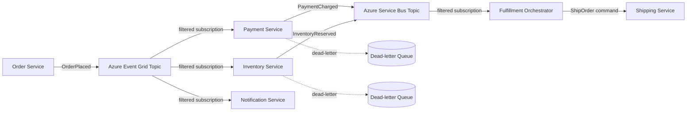
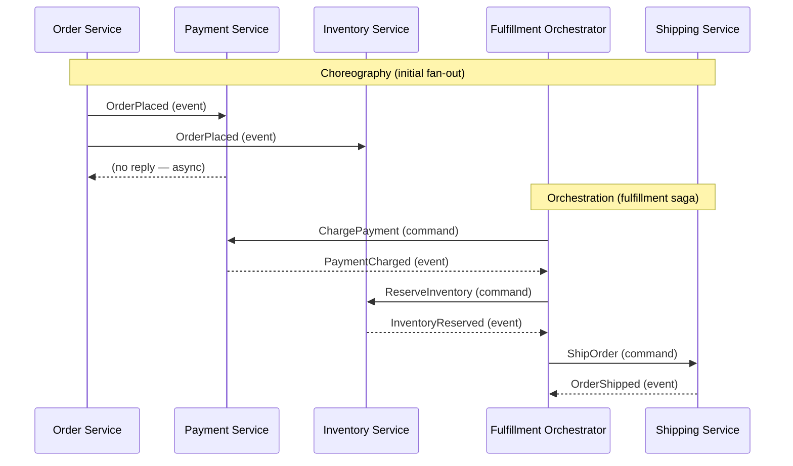
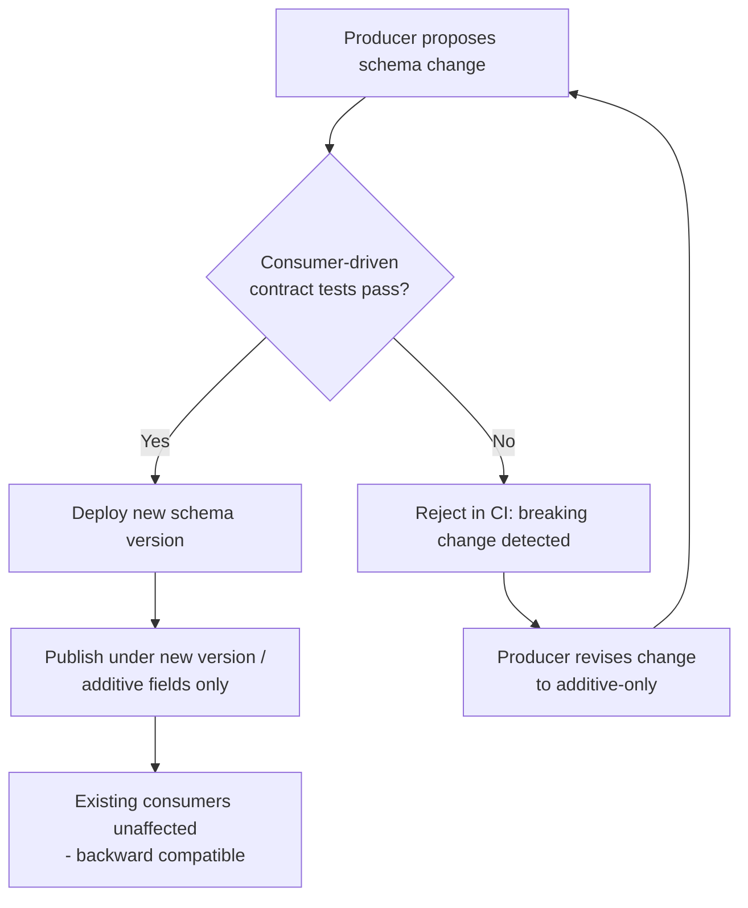
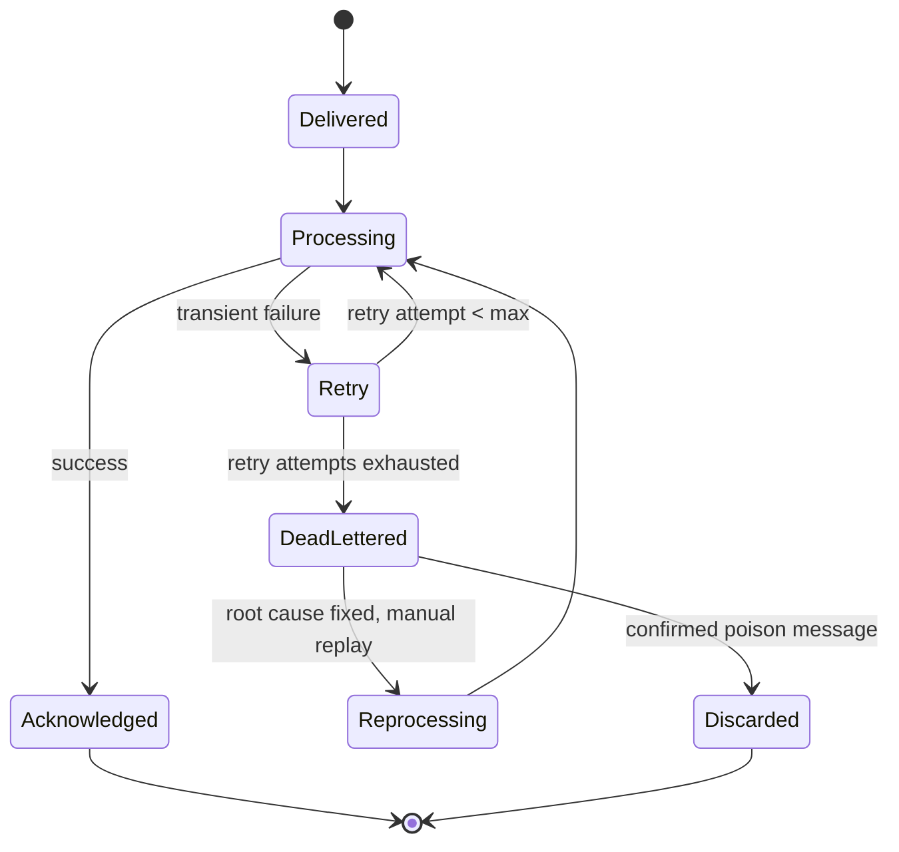

# Event-Driven Architecture

> Part of the **Enterprise Data & AI Architecture Handbook** · Phase-14 — Event-Driven Architecture & Integration · Chapter 01.
> Estimated study time: **60 min reading + ~4h labs**.
> **Prerequisite:** read [Apache Kafka](../Phase-07/02_Apache_Kafka.md) first.

---

## Executive Summary

[Apache Kafka](../Phase-07/02_Apache_Kafka.md) established the durable, partitioned, replicated log as this handbook's default backbone for high-throughput data movement — topics, partitions, consumer groups, and exactly-once semantics as mechanical building blocks. That chapter deliberately treated Kafka primarily as a **data-pipeline** substrate: producers and consumers moving records for analytics, CDC, and streaming-ETL workloads. This chapter reframes the same underlying mechanics — and the message brokers, in general, that provide them — from an **application-architecture** perspective: how do independently deployable services communicate, coordinate, and stay loosely coupled at enterprise scale, using events rather than direct synchronous calls as the primary integration mechanism?

**Event-driven architecture (EDA)** is a design style in which services communicate primarily by producing and consuming **events** — immutable facts about something that already happened — rather than by directly invoking one another's APIs. This chapter covers the foundational vocabulary distinction between **events, commands, and messages** (the single most consequential and most frequently blurred distinction in this space); **publish/subscribe, brokers, and topics** as the structural mechanism that decouples producers from consumers in both space (they don't need to know about each other) and time (they don't need to be online simultaneously); **choreography versus orchestration** as the two fundamentally different coordination strategies for a multi-step business process spanning several services; **event schemas and evolution** as the governance discipline that keeps a growing web of independently-deployed producers and consumers from breaking each other; and **Azure Event Grid and Service Bus** as the two purpose-built Azure messaging services that, alongside Event Hubs (already covered in [Apache Kafka](../Phase-07/02_Apache_Kafka.md) and [Azure Event Hubs and Stream Analytics](../Phase-07/03_Azure_Event_Hubs_and_Stream_Analytics.md)), form Azure's complete event-and-messaging service portfolio.

The platform bias is **Azure-primary (~60%)** — Event Grid as the managed pub/sub eventing backbone for reactive, discrete-event scenarios; Service Bus as the managed enterprise message broker for ordered, transactional, point-to-point and topic-based messaging; and Event Hubs (cross-referenced back to [Apache Kafka](../Phase-07/02_Apache_Kafka.md)) reused here specifically for its event-streaming role within a broader EDA — **~30% enterprise open source** (Kafka itself as the OSS broker of record, plus schema-registry tooling, CloudEvents as the vendor-neutral event-envelope standard, and Kubernetes/Dapr as the container-native pub/sub abstraction layer) — **~10% AWS/GCP comparison-only** (Amazon EventBridge and SNS/SQS; Google Cloud Pub/Sub and Eventarc).

**Bottom line:** event-driven architecture is a genuine, powerful decoupling mechanism for systems that must scale independently, tolerate partial failure gracefully, and evolve without lockstep deployment — but it trades away the simplicity of a synchronous call stack (a single, traceable, immediately-consistent request/response path) for eventual consistency, harder-to-trace distributed causality, and a schema-governance burden that a monolithic, synchronous system never has to solve. The recurring mistake this chapter documents, echoing this handbook's now-familiar "validate the actual need before adopting the more sophisticated tool" discipline from [Knowledge Graphs with Neo4j](../Phase-13/02_Knowledge_Graphs_with_Neo4j.md) ADR-0165 and [GraphRAG](../Phase-13/04_GraphRAG.md) ADR-0167, is reaching for full event-driven choreography across an entire domain when a much simpler synchronous call, or a narrowly-scoped orchestrated workflow, would have solved the actual problem with far less operational and cognitive overhead.

---

## Learning Objectives

By the end of this chapter you will be able to:

1. **Precisely distinguish events, commands, and messages**, and choose the correct one for a given inter-service communication need.
2. **Explain publish/subscribe mechanics** (topics, subscriptions, brokers, fan-out) and how they decouple producers from consumers in space and time.
3. **Compare choreography and orchestration** as coordination strategies for a multi-step business process, and select the appropriate one for a given workflow's complexity and observability requirements.
4. **Design an event schema and evolution strategy** that lets producers and consumers deploy independently without breaking one another.
5. **Apply Azure Event Grid and Service Bus** with concrete configuration for topics, subscriptions, dead-lettering, and delivery guarantees.
6. **Identify anti-patterns and common mistakes** in event-driven adoption, including the recurring over-decoupling and event-as-a-God-object failure modes.
7. **Defend an event-driven architecture decision** in engineer, staff engineer, architect, and CTO review settings, including build-vs-buy and choreography-vs-orchestration trade-offs.

---

## Business Motivation

- **Independent service deployability is the core business driver.** When Service A must call Service B synchronously to complete its own work, the two services are coupled at deploy time and at runtime availability — B's outage becomes A's outage. Event-driven integration lets A publish a fact and continue, deferring B's processing to whenever B is ready, directly enabling the independent-deployment cadence this handbook's [DevOps and CI/CD](../Phase-09/03_DevOps_and_CI_CD.md) and [GitOps and Environment Management](../Phase-09/08_GitOps_and_Environment_Management.md) chapters assume as a baseline capability.
- **Traffic spikes and load-leveling are a direct, measurable cost and reliability lever.** A message broker absorbs a burst of events and lets downstream consumers process at their own sustainable rate, rather than every producer needing to synchronously wait for (or overwhelm) a downstream service sized for average, not peak, load.
- **Multiple independent consumers of the same business fact is the normal case in a mature enterprise**, not an edge case — an "order placed" event is typically relevant to fulfillment, billing, fraud detection, analytics, and notifications simultaneously; a synchronous call model would require the order service to know about and call all five, growing more fragile with every new consumer added.
- **Audit, replay, and analytics value accrue directly from a durable event log**, extending [Apache Kafka](../Phase-07/02_Apache_Kafka.md)'s durable-log value proposition from a data-pipeline context into an application-architecture one: a full history of "what happened" is available for reconstructing state, debugging a production incident, or feeding a new consumer that didn't exist when the events were originally produced.
- **Over-adopting event-driven choreography where a simple synchronous call would suffice is a genuine, recurring architecture-review finding** — this chapter's Business Motivation deliberately mirrors the justification-before-adoption discipline established in [Knowledge Graphs with Neo4j](../Phase-13/02_Knowledge_Graphs_with_Neo4j.md) ADR-0165, [GraphRAG](../Phase-13/04_GraphRAG.md) ADR-0167, and [Ontologies and Taxonomies](../Phase-13/05_Ontologies_and_Taxonomies.md) ADR-0168: eventual consistency and distributed tracing complexity are real, ongoing costs that must be justified by a genuine decoupling or scaling need, not adopted by default because "microservices are supposed to be event-driven."

---

## History and Evolution

- **1987 — the Observer design pattern** is catalogued (later formalized in the 1994 "Gang of Four" book) as the object-oriented-programming-level ancestor of publish/subscribe: subjects notify registered observers of state changes, entirely in-process and single-machine — the conceptual seed every distributed pub/sub system since has scaled out.
- **1990s — enterprise message-oriented middleware (MOM)** emerges (IBM MQSeries, later IBM MQ; TIBCO Rendezvous) as the first widely-adopted distributed asynchronous-messaging infrastructure, initially built around point-to-point queues for reliable, ordered enterprise integration rather than broad pub/sub fan-out.
- **2001-2003 — the Enterprise Integration Patterns catalog** (Hohpe and Woolf, published 2003, patterns circulated earlier) formalizes a vendor-neutral vocabulary — message channel, message router, content-based router, dead letter channel, and dozens more — that remains the reference vocabulary this handbook uses throughout this chapter and revisits in depth in Phase-14 Chapter 06 (Enterprise Integration Patterns).
- **2004 — JMS (Java Message Service) 1.1** unifies point-to-point queue and publish/subscribe topic semantics under one Java API, cementing "queue for one consumer, topic for many" as the standard vocabulary distinction this chapter's Core Concepts section still uses today.
- **2005-2010 — service-oriented architecture (SOA) and the Enterprise Service Bus (ESB)** attempt centralized, orchestration-heavy integration (transformation, routing, and business logic concentrated in a central bus); the pattern's real-world cost — a single, heavily-customized ESB becoming a fragile, hard-to-change bottleneck every team depends on — directly motivates the following decade's shift toward decentralized, service-owned integration logic.
- **2011 — Apache Kafka is created at LinkedIn** (per [Apache Kafka](../Phase-07/02_Apache_Kafka.md)'s own History section) as a high-throughput distributed log, initially for internal activity-stream and metrics pipelines, but rapidly adopted as general-purpose event-streaming infrastructure once its durability and replay characteristics became apparent.
- **2014 — the microservices architectural style is popularized** (Fowler and Lewis's widely-cited article, building on practices already emerging at Netflix and Amazon), explicitly favoring smart endpoints and dumb pipes over the ESB's centralized-intelligence model — event-driven integration between independently-deployable services becomes the natural complement to this style, previewing Phase-14 Chapter 02 (Microservices Architecture)'s deeper treatment.
- **2017 — CloudEvents specification work begins** under the CNCF, aiming to standardize a vendor-neutral event envelope (source, type, id, time, data) so that event-driven tooling and consumers are not locked to any single cloud provider's proprietary event format.
- **2018 — Azure Event Grid launches**, Microsoft's first purpose-built managed pub/sub eventing service, distinct from the already-existing Service Bus (queues/topics, since 2011) and the newer Event Hubs (event streaming, since 2014) — establishing the three-service Azure messaging portfolio this chapter's Azure Implementation section maps in full.
- **2019 — CloudEvents 1.0 is ratified**, and Azure Event Grid adds native CloudEvents schema support alongside its original proprietary Event Grid schema, reflecting the broader industry convergence toward a standard event envelope this chapter's Event Schemas section covers.
- **2020s — event-driven architecture converges with serverless and Kubernetes-native eventing** (Azure Functions Event Grid triggers, KEDA scaling consumers based on queue/topic depth per [Kubernetes](../Phase-09/06_Kubernetes.md)'s own KEDA treatment, and Dapr's pub/sub building-block abstraction), making event-driven integration a default, low-friction capability rather than infrastructure a team must build from scratch.

---

## Why This Technology Exists

A synchronous call chain — Service A calls B, which calls C, which calls D, all within the lifetime of A's original request — couples every service in the chain to every other service's availability, latency, and deployment schedule: if D is slow or down, A's request fails or hangs, even though A's own work has nothing intrinsically to do with D. Event-driven architecture exists to break this coupling: A publishes the fact that something happened and returns immediately; B, C, and D each subscribe to that fact and process it independently, on their own schedule, with their own failure isolation. This trades the synchronous chain's simplicity (one traceable call stack, immediate consistency, an obvious place to look when something fails) for independent scalability, deployability, and fault isolation — a trade-off this chapter's Trade-offs section treats as a genuine, not automatically favorable, engineering decision.

---

## Problems It Solves

- **Tight temporal and deployment coupling between services**, resolved by letting producers and consumers operate asynchronously and deploy independently, each only needing to agree on an event schema (§8.4) rather than a synchronous API contract and uptime commitment.
- **Fan-out to multiple, evolving consumers of the same business fact**, resolved by publish/subscribe (§8.2): a producer publishes once, and any number of current or future subscribers can independently consume the same event without the producer needing to know they exist.
- **Load leveling under bursty traffic**, resolved by a durable broker or queue absorbing a spike and letting consumers drain it at their own sustainable rate, rather than requiring every downstream service to be provisioned for worst-case synchronous load.
- **Reliable delivery despite transient downstream failures**, resolved by a durable message store with retry and dead-lettering (§19), so a consumer's temporary outage does not lose the underlying business fact the way an unhandled synchronous call failure typically would.
- **Cross-team, cross-bounded-context integration without a shared database**, resolved by publishing events as the sanctioned integration surface between domains — directly complementing [Domain-Driven Design](../Phase-01/05_Domain_Driven_Design.md)'s bounded-context isolation principle, where an event is often the deliberate translation artifact crossing a context boundary.

---

## Problems It Cannot Solve

- **Event-driven architecture does not eliminate the CAP-theorem trade-offs this handbook established in [CAP and PACELC](../Phase-02/04_CAP_and_PACELC.md)** — an asynchronously-propagated event means every downstream consumer's view of the world is, by construction, eventually rather than immediately consistent with the producer's; a use case that genuinely requires strong, immediate consistency across services is not well served by choreography alone, and this chapter's Trade-offs section names when a synchronous call remains the correct choice.
- **It does not remove the need for distributed-transaction or saga-pattern thinking** established in [Distributed Transactions](../Phase-02/05_Distributed_Transactions.md) — a business process spanning multiple services and multiple events, where some steps must be compensated if a later step fails, still requires explicit saga/compensation design; events alone do not automatically provide atomicity across service boundaries.
- **It does not automatically solve schema compatibility or governance** — publishing an event is easy; ensuring every current and future consumer can still parse it after the producer changes its shape is a deliberate, ongoing discipline (§8.4, §26), not a property the messaging infrastructure provides for free.
- **It does not make a poorly-decomposed service boundary correct** — wrapping a synchronous call in an asynchronous event does not fix a service boundary that was drawn in the wrong place to begin with; Phase-14 Chapter 02 (Microservices Architecture) covers service-boundary design directly, and this chapter's Anti-patterns section names "distributed monolith" as the specific failure mode of event-driven messaging layered over a poorly-decomposed system.
- **It does not eliminate the need for end-to-end observability investment** — a request that fans out across a dozen asynchronously-triggered services is, if anything, harder to trace than a synchronous call stack unless correlation IDs and distributed tracing (§22) are deliberately engineered in from the start, not retrofitted after the first unreproducible production incident.

---

## Core Concepts

### 14.1 Events, commands, and messages

These three terms are frequently used interchangeably in casual conversation and inconsistently even in vendor documentation, but the distinction is the single most consequential modeling decision in this chapter, because it determines the correct coupling and failure-handling semantics for a given interaction:

- **A command** is an instruction directed at a specific, known recipient, requesting that a specific action be taken — `PlaceOrder`, `ChargeCard`, `CancelSubscription`. A command is imperative (named as a verb, present tense), has exactly one intended handler, and *can* fail or be rejected (the recipient may refuse to place the order). Commands are typically sent point-to-point, not broadcast, even when delivered via a broker's queue.
- **An event** is a statement of fact about something that has already, immutably, happened — `OrderPlaced`, `PaymentCharged`, `SubscriptionCancelled`. An event is named as a past-tense verb, has zero or any number of subscribers (the producer neither knows nor cares who, if anyone, is listening), and *cannot* be rejected — it already happened, so a consumer can only choose how to react, never whether the fact is true.
- **A message** is the generic envelope/transport-layer term encompassing both: any discrete unit of data sent through a broker, whether it happens to represent a command or an event. "Message broker" is correctly generic; "event" versus "command" is a semantic distinction about intent, not a distinction about the transport mechanism carrying it.
- **The most common real-world modeling mistake** is naming what is actually a command as if it were an event (e.g., publishing an `OrderCreation` topic that downstream services are implicitly expected to validate and potentially reject) — this conflation reintroduces synchronous-call-like coupling and failure semantics onto an asynchronous, fire-and-forget event channel, a specific instance of the "distributed monolith" anti-pattern (§26) this chapter returns to repeatedly.

### 14.2 Publish/subscribe, brokers, and topics

- **A broker** is the intermediary infrastructure (Kafka, Azure Service Bus, Azure Event Grid) that decouples producers from consumers: producers publish to the broker without knowing who, if anyone, will consume the message; consumers subscribe to the broker without knowing which producer(s) originated it.
- **A topic** (or, in queue-based systems, a **queue**) is the named channel a producer publishes to and a consumer subscribes from. The **queue-versus-topic distinction directly mirrors the command-versus-event distinction** in §14.1: a queue typically delivers each message to exactly one consumer (competing-consumers pattern, suited to commands, per Enterprise Integration Patterns — Phase-14 Chapter 06), while a topic with multiple **subscriptions** delivers a copy of each message to every subscription independently (suited to events with multiple interested consumers).
- **Fan-out** is the mechanism by which one published event reaches every current subscription without the publisher enumerating recipients — the structural property that makes adding a new consumer to an existing event stream a zero-touch change for the producer, directly enabling the "multiple independent consumers" business driver named in this chapter's Business Motivation.
- **Decoupling in space and time**: pub/sub decouples producers from consumers *in space* (neither needs to know the other's network address or even existence) and, when the broker durably persists messages (per [Apache Kafka](../Phase-07/02_Apache_Kafka.md)'s durable-log treatment, or Service Bus's persisted queue/topic), *in time* (a consumer that is temporarily offline does not lose messages published while it was down, unlike a synchronous call that simply fails).

### 14.3 Choreography versus orchestration

A multi-step business process spanning several services (e.g., order placement triggering payment, inventory reservation, and shipping) can be coordinated two structurally different ways:

- **Choreography**: each service reacts independently to events it observes, publishing its own resulting events in turn, with no central coordinator — the payment service reacts to `OrderPlaced`, publishes `PaymentCharged`; the inventory service reacts to `PaymentCharged`, publishes `InventoryReserved`; and so on. No single component holds the "recipe" for the whole process; it emerges from the sum of each service's independent reactions.
- **Orchestration**: a central orchestrator component explicitly holds and drives the process definition, issuing commands to each participating service in sequence and handling failures/compensation centrally (e.g., a saga orchestrator, or Azure Durable Functions/Logic Apps orchestrating a workflow).
- **The core trade-off**: choreography maximizes service independence and avoids a central point of coupling, but makes the *overall* business process implicit and hard to observe — no single place to look to answer "what is the current state of order #12345's fulfillment," since that answer is distributed across every participating service's own state. Orchestration makes the process explicit, observable, and centrally testable, at the cost of the orchestrator becoming a coupling point every participating service must integrate with and a potential single point of process-level failure (though not necessarily a single point of runtime availability failure, if the orchestrator itself is built resiliently).
- **This is not a binary, handbook-wide default choice** — mature enterprise architectures commonly use choreography for simple, two-or-three-step reactive flows with few failure/compensation branches, and orchestration for complex, many-step processes with significant conditional branching and compensation logic, exactly the trade-off this chapter's Decision Matrix formalizes. Phase-14 Chapter 04 (Event Sourcing) and Phase-14 Chapter 03 (CQRS) both build directly on this distinction when covering saga-based consistency across event-sourced aggregates.

### 14.4 Event schemas and evolution

- **An event schema** defines the structure (fields, types) of an event's payload, analogous to (and often literally implemented via) the same schema-registry and Avro/Protobuf/JSON Schema mechanisms [Apache Kafka](../Phase-07/02_Apache_Kafka.md) §8.7 already covers for Kafka specifically — this chapter applies the identical discipline to any broker's events, not just Kafka's.
- **Backward compatibility** (a new schema version can be read by code written against the old schema, typically achieved by only adding optional fields with defaults, never removing or renaming required fields) is the default target for most enterprise event evolution, since it lets consumers upgrade on their own schedule without a coordinated, simultaneous producer-and-every-consumer deployment.
- **The CloudEvents specification** (per this chapter's History section) standardizes the event *envelope* (a consistent `id`, `source`, `type`, `time`, `specversion`, and `data` structure) independent of the payload schema itself, letting heterogeneous tooling (routers, loggers, dead-letter processors) handle any CloudEvents-compliant event generically without understanding its specific payload — Azure Event Grid natively supports the CloudEvents schema alongside its own proprietary Event Grid schema.
- **Versioning strategy**: embed an explicit schema version in the event envelope or a dedicated field, and prefer *additive* changes (new optional fields) over breaking changes (removed/renamed/retyped fields); when a genuinely breaking change is unavoidable, publish it under a new event type or a new topic/subscription version rather than silently changing the meaning of an existing, already-depended-upon event type — directly paralleling the atomic-triple-versioning discipline [LLMOps](../Phase-12/04_LLMOps.md) ADR-0158 established for model+prompt+index releases, now applied to event contracts.
- **Consumer-driven contract testing** (each consumer publishes the specific schema shape it depends on, and a producer's CI pipeline validates proposed changes against every registered consumer contract before deployment) is the concrete engineering practice that operationalizes backward-compatibility as a verified, tested property rather than a hoped-for convention — this chapter's Common Mistakes section names skipping this verification as a frequent, expensive root cause of production breakage.

---

## Internal Working

### 15.1 How a publish actually reaches a subscriber

When a producer publishes an event to a topic, the broker (Event Grid, Service Bus Topic, or a Kafka topic per [Apache Kafka](../Phase-07/02_Apache_Kafka.md) §9.1) durably persists it (or, for Event Grid's push-based model, immediately attempts delivery with retry) and then evaluates every active subscription against the topic: each subscription independently receives its own copy of the matching event (filtered, per §15.2, if the subscription defines a filter), and each subscription tracks its own delivery/acknowledgment state independent of every other subscription on the same topic. This is what makes fan-out (§14.2) structurally free to the producer — adding subscription number fifty does not change anything about how the producer publishes.

### 15.2 Content-based filtering at the broker

Azure Event Grid and Service Bus both support **subscription-level filters** — a subscription can specify that it only wants events matching a specific event type, a specific field value, or a more general predicate — evaluated by the broker itself before delivery, so a consumer never receives (and never has to defensively code around) events it has no interest in. This is functionally the managed-service implementation of the **content-based router** pattern this handbook will cover formally in Phase-14 Chapter 06 (Enterprise Integration Patterns), applied at the broker layer rather than requiring a separately-built routing component.

### 15.3 At-least-once delivery and idempotent consumption

Nearly every production message broker (Event Grid, Service Bus, Kafka) guarantees **at-least-once** delivery by default under failure — a consumer that crashes after processing a message but before acknowledging it will receive that same message again on redelivery — which means **every consumer must be idempotent**: processing the same event twice must produce the same end state as processing it once (e.g., an idempotency key checked against already-processed IDs before applying a side effect). This is not an edge case to defensively code around occasionally; it is the normal, expected operating condition of any event-driven consumer and the single most common root cause of production data-correctness bugs in event-driven systems, per this chapter's Common Mistakes section.

### 15.4 Dead-lettering and poison-message handling

When a consumer repeatedly fails to process a specific message (a genuinely malformed payload, or a downstream dependency failure that retry cannot resolve), the broker moves that message to a **dead-letter queue** after a configured retry-count or time threshold, rather than blocking the rest of the queue or silently dropping the message — Service Bus provides this natively per queue/subscription; Event Grid provides it per subscription with a configured storage-account destination; Kafka requires an explicitly-built dead-letter-topic convention, since the log itself has no native poison-message concept. §19 (Fault Tolerance) covers the operational discipline around monitoring and reprocessing dead-lettered messages.

---

## Architecture

### 16.1 Reference architecture: event-driven order-fulfillment flow



### 16.2 Why the architecture works

The Order Service publishes one fact (`OrderPlaced`) to Event Grid and has zero knowledge of, or dependency on, how many or which services subscribe — Payment, Inventory, and Notification can each be added, removed, or scaled independently without an Order Service code change, directly realizing the fan-out and independent-deployability drivers named in this chapter's Business Motivation. The transition from Event Grid (reactive, discrete-event fan-out) to Service Bus (ordered, transactional topic delivery to a fulfillment orchestrator) reflects a deliberate architectural choice covered in this chapter's Decision Matrix: Event Grid for the initial widely-fanned-out reactive notification, Service Bus for the subsequent step requiring ordering and transactional guarantees feeding an explicit orchestrator (§14.3) that manages the more complex, multi-branch remainder of the fulfillment saga.

### 16.3 ADR example: choreography for initial fan-out, orchestration for the fulfillment saga

See this chapter's [Architecture Decision Record (ADR-0169)](#architecture-decision-record-adr-0169-hybrid-choreography-for-fan-out-orchestration-for-the-fulfillment-saga) under Enterprise Recommendations for the full Context/Decision/Consequences/Alternatives treatment of why this reference architecture deliberately mixes both coordination strategies rather than choosing one exclusively.

---

## Components

- **Producer** — the service that publishes an event or sends a command; owns the event schema it publishes and is responsible for that schema's backward-compatible evolution (§14.4).
- **Broker** — the durable or at-least-transiently-buffering intermediary (Event Grid, Service Bus, Kafka/Event Hubs) that decouples producers from consumers.
- **Topic / Queue** — the named channel; a topic supports multiple independent subscriptions (fan-out), a queue delivers each message to exactly one competing consumer.
- **Subscription** — a topic's named, independently-tracked delivery target, optionally filtered (§15.2) to a subset of the topic's events.
- **Consumer** — the service that subscribes to and processes events or commands; must be built idempotent (§15.3) given at-least-once delivery semantics.
- **Dead-letter queue (DLQ)** — the destination for messages that repeatedly fail processing, isolating poison messages from healthy message flow (§15.4).
- **Schema registry** — the shared, versioned store of event schemas producers publish against and consumers validate against (per [Apache Kafka](../Phase-07/02_Apache_Kafka.md) §8.7's Schema Registry treatment, reused here for any broker's events).
- **Orchestrator** (when orchestration, §14.3, is chosen) — the explicit process-state-holding component (Azure Durable Functions, Logic Apps, or a custom saga orchestrator) issuing commands to and tracking the state of a multi-step business process.

---

## Metadata

Every event should carry, at minimum, the CloudEvents-standard envelope fields (§14.4): a unique `id` (enabling idempotent-consumption deduplication, §15.3), `source` (the originating service, enabling lineage and debugging), `type` (the event schema/contract name and version), and `time` (the fact's occurrence timestamp — distinct from, and generally more meaningful than, the broker's delivery timestamp). Enterprise governance additionally expects a `correlationId` (tying every event and command in a single business transaction/saga together for distributed tracing, §22) and, where the event concerns regulated or classified data, a data-classification tag propagated from the source system — extending [Data Governance Foundations](../Phase-08/01_Data_Governance_Foundations.md)'s metadata-governance discipline to events as a first-class governed artifact, not an exempt, transient one.

---

## Storage

Message brokers occupy a spectrum of retention behavior: **Azure Event Grid** is fundamentally a push-based, at-most-transiently-buffered delivery service (retrying failed deliveries for a bounded window, then dead-lettering) rather than a long-term durable store — it is not designed for replay of arbitrary historical events. **Azure Service Bus** durably persists queued/topic messages until consumed and acknowledged (or expired via a configured time-to-live), providing genuine at-least-once durability across consumer downtime, but is not designed for indefinite retention or bulk historical replay either. **Kafka/Event Hubs** (per [Apache Kafka](../Phase-07/02_Apache_Kafka.md) §18) is the durable-log option purpose-built for extended or indefinite retention and full replay — the correct choice when an event-driven architecture's consumers need to reprocess historical events (a new consumer coming online needing the full history, or Event Sourcing — Phase-14 Chapter 04 — rebuilding aggregate state from its full event history). Choosing the storage/retention model to match the actual replay requirement, rather than defaulting to whichever broker is already in use, is a recurring Decision Matrix consideration in this chapter.

---

## Compute

Consumers are typically deployed as independently-scalable compute units — Azure Functions with an Event Grid or Service Bus trigger (serverless, scale-to-zero when idle, per [Model Serving and Ray](../Phase-11/04_Model_Serving_and_Ray.md)'s scale-to-zero cold-start trade-off applying equally here), containerized services on AKS scaled by **KEDA** based on queue/topic depth (per [Kubernetes](../Phase-09/06_Kubernetes.md) §6.4's KEDA treatment, directly reused here as the standard event-driven autoscaling mechanism), or Logic Apps/Durable Functions for orchestrator compute specifically. The key compute-design decision is matching consumer concurrency and scaling configuration to the actual downstream dependency's own capacity — a consumer that scales out aggressively based on queue depth but calls a downstream database or API with a fixed connection-pool ceiling merely relocates the bottleneck rather than resolving it, a variant of the "everything worked in the demo" trap this handbook has flagged in multiple other infrastructure contexts.

---

## Networking

Azure Event Grid, Service Bus, and Event Hubs all support **private endpoints** (per [Network Security and Zero Trust](../Phase-10/04_Network_Security_and_Zero_Trust.md) ADR-0144's private-endpoint-only baseline), removing the messaging plane from the public internet entirely for producers, consumers, and management operations alike. Cross-region event delivery (a producer in one Azure region publishing to consumers in another, for disaster-recovery or global-distribution scenarios) requires explicit topology decisions — Service Bus Geo-Disaster Recovery pairing, or Event Grid's multi-region topic replication — since neither service transparently replicates across regions by default the way some globally-distributed databases do; an unexamined single-region messaging topology is a common, easy-to-miss disaster-recovery gap this chapter's Fault Tolerance section returns to.

---

## Security

- **Managed identity and RBAC**, not shared connection strings or SAS tokens, should authenticate producers and consumers against Event Grid and Service Bus — directly extending [Identity and Access Management with Entra](../Phase-10/02_Identity_and_Access_Management_with_Entra.md)'s managed-identity-as-default principle from data-plane services to the messaging plane.
- **Least-privilege scoping per topic/queue/subscription** (send-only rights for producers, listen-only rights for consumers, no consumer granted management-plane rights it does not need) directly extends the tool-scoping discipline established across [Agentic AI Architecture](../Phase-12/05_Agentic_AI_Architecture.md) ADR-0159 and [Model Context Protocol (MCP)](../Phase-12/06_Model_Context_Protocol_MCP.md) ADR-0160 — the same "identity propagation, not a shared privileged credential" lesson recurring in yet another integration layer.
- **Event payload sensitivity is easy to underestimate** — an event carrying a customer ID, order details, or a derived business fact about a regulated entity is subject to the same encryption-at-rest/in-transit, data-classification, and right-to-be-forgotten obligations ([Data Privacy and PII Protection](../Phase-10/07_Data_Privacy_and_PII_Protection.md) ADR-0147) as any other store of personal data — a durable event log or dead-letter queue retaining PII long after the source record has been deleted is a documented anti-pattern in this chapter's Anti-patterns section.
- **Schema-level input validation at the consumer boundary** (rejecting or dead-lettering a malformed or unexpectedly-shaped event rather than deserializing it permissively) is the event-driven-architecture instance of the general defense-in-depth principle established in [Security Foundations](../Phase-10/01_Security_Foundations.md)'s OWASP-Top-10-for-data-platforms treatment — an untrusted or compromised upstream producer's malformed event should not be able to crash or corrupt a downstream consumer.

---

## Performance

- **Broker-added latency** (the time between a producer's publish call returning and a subscriber actually receiving the event) is a directly measurable, non-zero cost of choosing asynchronous over synchronous integration — typically single-digit to low-double-digit milliseconds for Event Grid/Service Bus under normal load, but a real budget line that must be accounted for in any end-to-end latency SLA spanning multiple event hops.
- **Batching** (publishing or consuming multiple events per broker round-trip) substantially improves throughput at some cost to per-event latency — the same throughput-versus-per-item-latency dial this handbook named for GPU-serving batching in [Model Serving and Ray](../Phase-11/04_Model_Serving_and_Ray.md), reappearing here at the messaging layer.
- **Consumer processing time, not broker throughput, is the typical end-to-end bottleneck** in a well-provisioned event-driven system — profiling the actual consumer logic (a slow downstream database call, an unbatched per-event external API call) before assuming the broker itself needs re-tuning is the correct diagnostic order, mirroring the "profile the full request path before concluding an index-tuning change is the correct lever" principle from [Vector Databases: Qdrant and Milvus](../Phase-13/01_Vector_Databases_Qdrant_and_Milvus.md) §17.
- **Filter evaluation cost at the broker** (Event Grid/Service Bus subscription filters, §15.2) is generally negligible relative to network and consumer-processing latency, but a very large number of complex per-subscription filters on a high-volume topic is worth profiling directly rather than assumed free at arbitrary scale.

---

## Scalability

Producers, the broker itself, and consumers each scale largely independently, which is precisely the point of the architecture: Event Grid and Service Bus scale their own partition/throughput-unit allocation (Service Bus Premium tier's messaging units, Event Grid's per-region throughput limits) largely transparently to the publishing application; consumers scale horizontally via KEDA-driven autoscaling (§20) keyed to queue/topic depth rather than a fixed replica count, so consumer capacity tracks actual backlog rather than a static provisioning guess. The one scaling dimension requiring deliberate design is **ordering under parallelism**: a topic or queue's competing-consumer scale-out generally sacrifices strict global ordering unless a session/partition key is used to route related messages (e.g., all events for a given order ID) to the same ordered sub-stream — directly analogous to [Apache Kafka](../Phase-07/02_Apache_Kafka.md) §8.1's partition-key-to-ordering relationship, reused here for Service Bus sessions and Event Grid's own partitioning behavior.

---

## Fault Tolerance

- **At-least-once delivery with idempotent consumption (§15.3)** is the primary fault-tolerance mechanism against transient consumer failure — a crashed consumer's in-flight message is redelivered, not lost.
- **Dead-lettering (§15.4)** isolates a genuinely unprocessable message so it does not block an entire queue or subscription's healthy throughput, at the cost of requiring an explicit, monitored dead-letter-reprocessing operational process (§21) — an unmonitored dead-letter queue silently accumulating unresolved messages is a documented anti-pattern.
- **Cross-region disaster recovery** requires an explicit topology (Service Bus Geo-DR pairing with a defined failover procedure, or Event Grid/Event Hubs multi-region replication) — per this chapter's Networking section, this is not a transparent, default property of a single-region deployment and must be deliberately designed and tested, not assumed.
- **Circuit breakers at the consumer's downstream call boundary** (per [Fault Tolerance and Resilience](../Phase-02/07_Fault_Tolerance_and_Resilience.md)'s general resilience-pattern treatment) prevent a struggling downstream dependency from being hammered by an aggressively-retrying, autoscaled consumer fleet — a specific instance of the general principle that asynchronous decoupling at the messaging layer does not, by itself, prevent cascading failure at a shared downstream dependency several hops away.

---

## Cost Optimization

- **Right-size the messaging tier to actual throughput, not a defensively over-provisioned guess** — Service Bus's Standard tier (shared, pay-per-operation) versus Premium tier (dedicated messaging units, predictable low latency) is a genuine cost/latency trade-off, and defaulting to Premium for a workload Standard would comfortably serve is a common, easily-audited over-provisioning mistake.
- **Consolidate low-volume, low-latency-sensitivity eventing onto Event Grid's consumption-based pricing** rather than provisioning dedicated Service Bus Premium capacity for traffic that does not need its stronger ordering/transactional guarantees — matching the broker's pricing model to the workload's actual requirements, not defaulting to the more capable (and more expensive) option everywhere.
- **Autoscale consumers to actual backlog (KEDA, §20) rather than a fixed always-on replica count** sized for peak load, directly reducing idle compute cost during normal, non-peak traffic.
- **Monitor and alert on dead-letter queue growth**, since an unaddressed, growing DLQ frequently represents wasted retry compute (repeatedly attempting and failing the same poison message) in addition to the correctness risk named in Fault Tolerance.
- **Worked FinOps example:** a team provisions Service Bus Premium (1 messaging unit, ~$677/month) for a workload later profiled at a sustained ~15 messages/second average with occasional bursts to ~80/second — well within Service Bus Standard's shared-tier throughput envelope, which prices per-operation (roughly $0.05 per million operations) rather than per dedicated messaging unit. At an estimated 40 million messages/month, Standard-tier cost comes to roughly $2/month in operation charges plus negligible base cost, versus Premium's flat ~$677/month — a greater than 99% cost reduction for this specific workload, since the team's actual throughput never approached the threshold that would justify Premium's dedicated-capacity/predictable-latency guarantees. The team retained Premium only for a separate, genuinely latency-sensitive payment-processing topic where Standard's shared-tier noisy-neighbor variability was measured (not assumed) to occasionally exceed the payment SLA's p99 latency budget — illustrating that the decision must be made per-workload against measured throughput and latency sensitivity, not applied as a blanket default in either direction.

---

## Monitoring

- **Publish rate, delivery success rate, and delivery latency per topic/subscription** — Azure Monitor metrics for Event Grid and Service Bus expose these natively; a sustained drop in delivery success rate is the primary leading indicator of a downstream consumer problem before it becomes a customer-visible incident.
- **Dead-letter queue depth and growth rate**, alerted on any sustained non-zero trend, not just an absolute threshold — a slowly-growing DLQ is as much a signal as a sudden spike.
- **Consumer lag / backlog depth** (queue or subscription message count awaiting processing) as the primary signal both for autoscaling (§20) and for detecting an under-provisioned or stuck consumer fleet.
- **Schema-validation failure rate at the consumer boundary** — a rising rate of rejected/dead-lettered malformed events is a leading indicator of an upstream producer's undetected breaking schema change (§26), catchable before every downstream consumer independently discovers the same break.
- **End-to-end saga/correlation completion rate and latency** (per §22's correlation-ID tracing) — for a multi-step choreographed or orchestrated process, the individual-service health metrics above do not answer "what fraction of orders actually complete fulfillment within the expected SLA," which requires this specifically stitched-together, correlation-ID-based view.

---

## Observability

Distributed tracing must propagate a **correlation ID** (per §12's Metadata treatment) through every event and command in a business transaction, from the originating producer through every choreographed or orchestrated hop, so that a single trace can reconstruct the full, cross-service path a business transaction took — directly extending [LLMOps](../Phase-12/04_LLMOps.md)'s full-pipeline OpenTelemetry-span foundation and [Vector Databases: Qdrant and Milvus](../Phase-13/01_Vector_Databases_Qdrant_and_Milvus.md) §22's per-query-span detail into the event-driven-integration domain specifically. Without this deliberate instrumentation, a choreographed process's emergent, no-single-owner nature (§14.3) makes "why did order #12345 never complete fulfillment" a genuinely difficult, multi-team archaeology exercise rather than a single trace lookup — the central observability risk this chapter's Trade-offs section attributes specifically to choreography over orchestration.

### Operational Response Playbook

| Signal | Detection Query/Method | Remediation |
|---|---|---|
| Dead-letter queue depth growing steadily over a sustained window (e.g., Service Bus DLQ count rising for 30+ minutes without plateauing) | Azure Monitor alert rule on `DeadletteredMessages` metric trend (not just absolute count); correlate with recent producer/consumer deployments | Inspect a sample of dead-lettered messages for a common root cause (schema mismatch, transient downstream outage now resolved, genuine malformed payload); if schema-related, check for a recent producer deployment that shipped a breaking change without consumer-contract verification (§26); reprocess the DLQ only after the root cause is fixed, never blindly replay before verifying |
| A specific business transaction (tracked by correlation ID) never reaches its expected terminal event within the SLA window | Correlation-ID-based trace query across the distributed tracing backend, filtering for transactions missing an expected terminal event type past the SLA threshold | Walk the trace to find the last successfully-processed hop; check that service's own health/backlog metrics for the relevant time window; if the missing hop is a specific consumer, check whether its subscription's messages are queued (backlog) versus dead-lettered (processing failure) versus never delivered (subscription/filter misconfiguration) |

---

## Governance

Event-driven architecture governance extends this handbook's established data-governance discipline ([Data Governance Foundations](../Phase-08/01_Data_Governance_Foundations.md), [Data Catalog and Lineage](../Phase-08/02_Data_Catalog_and_Lineage.md)) to events as first-class governed contracts: every published event type should be catalogued with its schema version, owning team, data-classification tag, and a list of known consumers (even though the whole point of pub/sub is that a producer need not synchronously know its consumers, a *catalogued* registry of who has subscribed remains essential for impact analysis before a breaking change). Schema changes should go through the same consumer-driven-contract-testing gate (§14.4) as a mandatory pre-deployment check, not an optional convention teams may skip under delivery pressure. Right-to-be-forgotten obligations ([Data Privacy and PII Protection](../Phase-10/07_Data_Privacy_and_PII_Protection.md) ADR-0147) extend to events exactly as to any other data store: an event log, dead-letter queue, or any durable event-sourced store (previewed in Phase-14 Chapter 04) containing personal data must support verified erasure, not merely future-exclusion, of a data subject's historical events — a governance obligation this chapter's Security section already names and this chapter's Capstone Integration ties explicitly back to.

---

## Trade-offs

- **Asynchronous decoupling vs. immediate consistency and traceability**: event-driven architecture trades away the synchronous call stack's single-trace simplicity and immediate consistency for independent scalability and deployability — a trade genuinely favorable for high-fan-out, independently-scaling domains, and genuinely unfavorable for a tightly-coupled, two-service interaction that needs an immediate, strongly-consistent answer (a simple synchronous REST or gRPC call, per Phase-14 Chapter 05, remains the better default there).
- **Choreography vs. orchestration** (§14.3): choreography maximizes independence at the cost of an implicit, hard-to-observe overall process; orchestration makes the process explicit and centrally testable at the cost of a coupling point every participant must integrate with. Neither is a universal default; this chapter's Decision Matrix formalizes the selection criteria.
- **Event Grid vs. Service Bus vs. Event Hubs/Kafka**: Event Grid optimizes for lightweight, widely-fanned-out reactive notification with minimal operational overhead; Service Bus optimizes for ordered, transactional, enterprise-grade queuing and topic delivery with strong delivery guarantees; Event Hubs/Kafka (per [Apache Kafka](../Phase-07/02_Apache_Kafka.md)) optimizes for high-throughput, durable, replayable event streaming — choosing among the three by their actual delivery-guarantee, ordering, and retention requirements, not by which is already familiar to the team, is this chapter's central Azure-portfolio decision.
- **Schema flexibility vs. governance overhead**: a permissive, loosely-typed event schema is faster to iterate on initially but accumulates undetected breaking changes across a growing consumer base; a strict, versioned, contract-tested schema costs more governance overhead upfront but avoids the "silent breakage discovered independently by every downstream consumer" failure mode named in Common Mistakes.
- **Is a message broker even necessary, or would a synchronous call suffice?** Per this chapter's recurring justification-before-adoption theme: a two-service interaction with a small number of known consumers, requiring an immediate response, and with no independent-scaling or fan-out need, is very often simpler, cheaper, and more debuggable as a direct synchronous call — event-driven architecture earns its complexity budget specifically through genuine decoupling, fan-out, or load-leveling needs, not by default.

---

## Decision Matrix

| Scenario | Recommended Choice | Rationale |
|---|---|---|
| Widely-fanned-out, lightweight reactive notification (e.g., "a blob was created," "a resource was provisioned") with many loosely-coupled subscribers | Azure Event Grid | Purpose-built for exactly this pattern; minimal operational overhead; native CloudEvents support; push-based low-latency delivery |
| Enterprise workflow requiring strict ordering, transactional send, and strong delivery guarantees (e.g., financial transaction processing) | Azure Service Bus (sessions for ordering, transactions for atomic multi-operation send) | Durable queue/topic semantics purpose-built for exactly this reliability bar; dead-lettering and duplicate detection built in |
| High-throughput event streaming requiring long retention and replay for multiple, possibly future, consumers | Azure Event Hubs / Kafka (per [Apache Kafka](../Phase-07/02_Apache_Kafka.md)) | Durable log with configurable long retention; genuine replay capability neither Event Grid nor Service Bus is designed to provide |
| Simple two-service interaction, small number of known consumers, immediate-response requirement, no independent-scaling need | Direct synchronous call (REST/gRPC, Phase-14 Chapter 05) | Event-driven complexity is unjustified when none of its core benefits (fan-out, decoupled scaling, load leveling) actually apply |
| Multi-step business process with few steps and simple, linear failure/compensation handling | Choreography | Lower coupling overhead is worth it when the process is simple enough to remain reasonably observable without a central orchestrator |
| Multi-step business process with many steps, significant conditional branching, or complex compensation logic | Orchestration (Durable Functions, Logic Apps, or a custom saga orchestrator) | Explicit, centrally-testable process state is worth the added coupling once branching complexity would otherwise be scattered implicitly across many services |

---

## Design Patterns

- **Competing consumers**: multiple instances of the same consumer service compete for messages from a single queue, each message processed by exactly one instance — the standard horizontal-scaling pattern for command-style, single-processing-intent messages.
- **Publish-subscribe with content-based filtering**: producers publish once; subscriptions filter (§15.2) to receive only relevant events — the standard pattern for event-style, multi-consumer fan-out.
- **Saga pattern (choreographed or orchestrated)**: a multi-step business transaction spanning services, coordinated via a sequence of local transactions each publishing an event/triggering the next step, with explicit compensating actions defined for partial-failure rollback — directly previewed here and covered in full architectural depth in Phase-14 Chapter 04 (Event Sourcing) and Phase-14 Chapter 03 (CQRS).
- **Claim-check pattern**: for large event payloads, publish a reference (a blob storage URL) rather than the full payload inline, keeping the message broker's per-message size limits and throughput unaffected by large attached data — directly analogous to this handbook's general separation-of-metadata-from-bulk-data principle established for object storage in [Object Storage and Data Lakes](../Phase-04/03_Object_Storage_and_Data_Lakes.md).
- **Transactional outbox**: a producer writes its business-state change and the corresponding outbound event to the same local database transaction, with a separate relay process publishing from that outbox table to the broker — resolving the classic "database commit succeeded but the event publish failed" (or vice versa) dual-write consistency gap, directly relevant to [Change Data Capture](../Phase-07/06_Change_Data_Capture.md)'s own treatment of reliably capturing state changes as events.

---

## Anti-patterns

- **Distributed monolith via events**: services publish and consume events but remain so tightly coupled to one another's exact schema and sequencing assumptions that they can no longer actually deploy independently — the messaging infrastructure changed, but the underlying coupling this chapter's Why This Technology Exists section describes did not, reproducing synchronous-call-like fragility with the added complexity and debugging difficulty of asynchronous messaging.
- **The event as a God object**: a single, ever-growing "OrderUpdated" event carrying dozens of optional fields for every conceivable downstream consumer's needs, rather than well-scoped, single-purpose event types — makes schema evolution (§14.4) and consumer-side reasoning about "which fields will actually be populated for this specific event" needlessly difficult.
- **Choreography for a process too complex to remain observable**: applying choreography (§14.3) to a process with many steps and significant branching, resulting in the "what is the current state of this order" question requiring a multi-team archaeology exercise across a dozen services' independent logs — this chapter's Decision Matrix names the orchestration threshold specifically to prevent this.
- **Commands disguised as events (or vice versa)**: publishing a fact-shaped event that downstream services are implicitly expected to validate and potentially reject (§14.1), reintroducing synchronous-call-like rejection semantics onto a channel whose entire value proposition assumes the fact cannot be rejected.
- **Unmonitored, silently-growing dead-letter queues**: treating dead-lettering purely as a fire-and-forget safety net rather than an actively monitored operational queue requiring root-cause investigation and reprocessing (§21) — a DLQ with months of unaddressed backlog is both a data-loss risk and, per Security, a potential unmanaged accumulation of retained personal data.

---

## Common Mistakes

- **Building a non-idempotent consumer**, assuming exactly-once delivery when the broker's actual guarantee is at-least-once (§15.3) — the single most common root cause of duplicate-processing data-correctness bugs in event-driven systems.
- **Skipping consumer-driven contract testing** before shipping a producer schema change, discovering the breaking change only when every downstream consumer independently fails in production, rather than catching it in the producer's own CI pipeline (§14.4).
- **Assuming ordering is preserved across a scaled-out, competing-consumer topic/subscription** without deliberately using a session or partition key to route related messages to the same ordered sub-stream (§20) — a frequent, subtle bug when a topic is scaled out after initially working correctly at low volume with a single consumer instance.
- **Choosing Event Grid for a workload that actually needs Service Bus's stronger ordering/transactional guarantees**, or vice versa provisioning Service Bus Premium for lightweight reactive notification that Event Grid would serve at a fraction of the cost and operational overhead (§21's worked example) — a broker-selection mismatch rather than a fundamental architecture flaw, but a costly and avoidable one.
- **Retrofitting correlation-ID-based distributed tracing after the first unreproducible production incident** rather than instrumenting it from the very first event published (§22) — by far the more expensive time to add this capability, and the reason this chapter treats it as a mandatory, not optional, day-one practice.

---

## Best Practices

- Model every inter-service interaction explicitly as a command or an event (§14.1) before choosing transport — the transport decision should follow from this semantic distinction, not the reverse.
- Build every consumer idempotent from the outset, assuming at-least-once delivery as the normal operating condition, not an edge case.
- Establish consumer-driven contract testing as a mandatory producer CI gate before any schema change ships, not an optional convention.
- Instrument correlation-ID-based distributed tracing from the first event published, not retrofitted after an incident.
- Choose choreography versus orchestration deliberately against this chapter's Decision Matrix criteria (step count, branching complexity, compensation logic), not by default architectural fashion.
- Monitor dead-letter queues as an actively-triaged operational queue with an alerting threshold on growth trend, not a fire-and-forget safety net.
- Catalog every event type's schema, owner, classification, and known-consumer list in the enterprise data catalog, treating events as governed contracts (§23) rather than disposable implementation details.

---

## Enterprise Recommendations

Default to **Azure Event Grid** for widely-fanned-out, lightweight reactive eventing with minimal operational overhead; default to **Azure Service Bus** for enterprise workflows requiring strict ordering, transactional guarantees, and strong delivery reliability; and reuse **Azure Event Hubs/Kafka** (per [Apache Kafka](../Phase-07/02_Apache_Kafka.md)) specifically when long retention and replay across current and future consumers is a genuine requirement, not a hedge against an unspecified future need. Choose choreography for simple, low-branching multi-step processes and orchestration for complex, many-step, heavily-compensated sagas, per this chapter's Decision Matrix — and, before adopting event-driven integration at all for a given interaction, validate against this chapter's Trade-offs section that a direct synchronous call genuinely would not suffice, applying the same justification-before-adoption discipline this handbook has now established across [Knowledge Graphs with Neo4j](../Phase-13/02_Knowledge_Graphs_with_Neo4j.md), [GraphRAG](../Phase-13/04_GraphRAG.md), and [Ontologies and Taxonomies](../Phase-13/05_Ontologies_and_Taxonomies.md).

### Architecture Decision Record (ADR-0169): Hybrid Choreography for Fan-out, Orchestration for the Fulfillment Saga

**Context:** The reference order-fulfillment architecture (§16.1) must both (a) notify several loosely-coupled, independently-owned services (payment, inventory, notification) that an order was placed, and (b) drive a more complex, multi-branch fulfillment process (payment capture, inventory reservation, shipping, with compensating actions if any step fails) that product and engineering leadership need to observe and reason about as a single, coherent business process during incident response and compliance review.

**Decision:** Use choreography (Event Grid fan-out from `OrderPlaced`) for the initial, simple, low-branching notification step, and introduce an explicit orchestrator (Service Bus feeding a Durable Functions/Logic Apps-based fulfillment orchestrator) for the subsequent, higher-branching-complexity fulfillment saga specifically. Do not attempt to model the entire end-to-end process as pure choreography, and do not route the initial simple fan-out through the orchestrator either.

**Consequences:** Payment, Inventory, and Notification services remain independently deployable and unaware of each other for the initial fan-out, preserving choreography's core benefit exactly where the process is simple enough not to need central observability. The fulfillment saga's state, branching, and compensation logic become explicit, centrally testable, and directly queryable (per §22's correlation-ID tracing) for incident response and audit, at the cost of the orchestrator becoming a coupling point every fulfillment-saga participant must integrate with and a component that itself requires the resilience engineering (§19) this chapter names for any single critical-path service.

**Alternatives Considered:** (1) *Pure choreography for the entire process* — rejected, since early prototyping showed the fulfillment saga's branching and compensation logic (partial payment failure after inventory was already reserved, for example) became genuinely difficult to reason about and debug with no single component holding the process state, directly reproducing the observability gap this chapter's Anti-patterns section names. (2) *Pure orchestration for the entire process, including the initial notification fan-out* — rejected, since routing every loosely-coupled notification consumer through a central orchestrator would have made Payment, Inventory, and Notification's simple "react to OrderPlaced" behavior needlessly dependent on the orchestrator's own availability and deployment schedule, for no corresponding observability benefit at that step's genuinely low complexity.

---

## Azure Implementation

### 31.1 Recommended Azure service map

| Need | Azure Service | Notes |
|---|---|---|
| Lightweight, widely-fanned-out reactive eventing | Event Grid (Topics, System Topics) | CloudEvents-native; push delivery with retry and dead-lettering |
| Ordered, transactional enterprise queuing/topics | Service Bus (Standard/Premium) | Sessions for ordering; transactions for atomic multi-operation send; duplicate detection |
| High-throughput durable event streaming with replay | Event Hubs / Kafka-compatible endpoint | Per [Apache Kafka](../Phase-07/02_Apache_Kafka.md) §31; reused here for event-sourcing/replay-dependent consumers |
| Serverless event-triggered compute | Azure Functions (Event Grid/Service Bus triggers) | Scale-to-zero; per-execution billing |
| Explicit saga/workflow orchestration | Durable Functions or Logic Apps | Centrally-testable process state; built-in retry/compensation primitives |
| Container-native, queue-depth-driven autoscaling | AKS + KEDA | Per [Kubernetes](../Phase-09/06_Kubernetes.md) §6.4; scales consumer replicas to Service Bus/Event Hubs backlog depth |

### 31.2 Example: an Event Grid custom topic and filtered subscription (Bicep)

```bicep
resource orderTopic 'Microsoft.EventGrid/topics@2023-12-15-preview' = {
  name: 'order-events-topic'
  location: resourceGroup().location
  properties: {
    inputSchema: 'CloudEventSchemaV1_0'
    publicNetworkAccess: 'Disabled'
  }
}

resource paymentSubscription 'Microsoft.EventGrid/topics/eventSubscriptions@2023-12-15-preview' = {
  parent: orderTopic
  name: 'payment-service-subscription'
  properties: {
    destination: {
      endpointType: 'ServiceBusQueue'
      properties: {
        resourceId: paymentQueue.id
      }
    }
    filter: {
      subjectBeginsWith: 'orders/'
      includedEventTypes: [ 'com.enterprise.orders.OrderPlaced' ]
    }
    deadLetterDestination: {
      endpointType: 'StorageBlob'
      properties: {
        resourceId: deadLetterStorage.id
        blobContainerName: 'eventgrid-deadletter'
      }
    }
    retryPolicy: {
      maxDeliveryAttempts: 10
      eventTimeToLiveInMinutes: 1440
    }
  }
}
```

### 31.3 Example: a Service Bus topic with a session-enabled, filtered subscription (Bicep)

```bicep
resource fulfillmentTopic 'Microsoft.ServiceBus/namespaces/topics@2022-10-01-preview' = {
  parent: sbNamespace
  name: 'fulfillment-events'
  properties: {
    requiresDuplicateDetection: true
    duplicateDetectionHistoryTimeWindow: 'PT10M'
  }
}

resource orchestratorSubscription 'Microsoft.ServiceBus/namespaces/topics/subscriptions@2022-10-01-preview' = {
  parent: fulfillmentTopic
  name: 'fulfillment-orchestrator-sub'
  properties: {
    requiresSession: true
    deadLetteringOnMessageExpiration: true
    maxDeliveryCount: 8
    defaultMessageTimeToLive: 'P1D'
  }
}
```

### 31.4 Example: idempotent event consumption (C#-style pseudocode)

```csharp
public async Task HandleOrderPlaced(CloudEvent evt, CancellationToken ct)
{
    // Idempotency check: the event id is the deduplication key (§15.3)
    if (await _processedEventStore.HasBeenProcessedAsync(evt.Id, ct))
    {
        return; // already handled — safe no-op under at-least-once redelivery
    }

    var order = evt.Data.Deserialize<OrderPlacedPayload>();
    await _paymentService.ReserveFundsAsync(order.CustomerId, order.Amount, ct);

    // Record processed-event id and business side effect atomically
    await _processedEventStore.MarkProcessedAsync(evt.Id, ct);
}
```

---

## Open Source Implementation

- **Apache Kafka** (per [Apache Kafka](../Phase-07/02_Apache_Kafka.md)) remains the OSS broker of record for event-driven architectures needing durable, replayable event streams, self-hosted or via Confluent/Aiven managed offerings when Azure-native Event Hubs is not the chosen path.
- **CloudEvents SDKs** (CNCF, per this chapter's History section) provide language-native libraries for producing and consuming the standardized event envelope across Java, .NET, Python, and Go, letting tooling built against CloudEvents work identically regardless of the underlying broker.
- **Dapr (Distributed Application Runtime)** provides a pub/sub building-block abstraction over multiple underlying brokers (Kafka, Redis Streams, Azure Service Bus, RabbitMQ) via a sidecar pattern on Kubernetes, letting application code target one consistent API regardless of the actual broker in use — a genuine portability and testability benefit at the cost of an additional sidecar-per-instance operational layer, evaluated the same way any abstraction-versus-direct-integration trade-off in this handbook has been.
- **RabbitMQ** remains a widely-deployed, mature OSS message broker (AMQP-based) commonly chosen for classic enterprise queuing scenarios with rich routing-topology support (exchanges, bindings) predating Kafka's log-based model — Phase-14 Chapter 07 (Message Brokers and Queues) covers RabbitMQ in dedicated depth alongside Kafka and the Azure-managed alternatives.
- **KEDA** (per [Kubernetes](../Phase-09/06_Kubernetes.md) §6.4) is the standard OSS Kubernetes autoscaler for queue/topic-depth-driven consumer scaling, working identically against Kafka, Service Bus, RabbitMQ, and most other broker back ends via its scaler-plugin model.

---

## AWS Equivalent (comparison only)

| Azure Service | AWS Equivalent | Advantages | Disadvantages | Migration Notes |
|---|---|---|---|---|
| Event Grid | Amazon EventBridge | Rich rule-based content filtering; native SaaS-partner event sources; schema registry built in | No native CloudEvents-schema-first support (proprietary event envelope, though a CloudEvents-shaped payload can be carried) | Re-map Event Grid subscriptions/filters to EventBridge rules; re-point CloudEvents-emitting producers to EventBridge's PutEvents API |
| Service Bus | Amazon SNS (topics/fan-out) + SQS (queues) | Two composable, independently well-understood primitives (SNS for fan-out, SQS for durable queuing) rather than one combined service | Requires composing two services to replicate Service Bus topic-plus-subscription semantics; no native session-based ordering equivalent to Service Bus sessions without additional design | Map Service Bus topics to SNS+SQS fan-out subscriptions; re-implement session-based ordering via SQS FIFO queues with message group IDs |
| Event Hubs / Kafka | Amazon MSK (Managed Streaming for Kafka) or Kinesis Data Streams | MSK is Kafka-API-compatible, easing migration of existing Kafka clients; Kinesis offers deep native AWS-service integration | MSK still requires more operational tuning than Event Hubs' fully-managed model; Kinesis uses a proprietary API distinct from Kafka's | Kafka-API-compatible workloads migrate most directly to MSK; Kinesis requires a genuine client-library rewrite |

**Selection criteria**: choose Azure's portfolio when already Azure-native and wanting the tightest first-party integration with Entra ID, private endpoints, and the rest of this handbook's Azure-primary services; choose AWS's when the surrounding platform is AWS-native, noting the SNS+SQS two-service composition model as a genuinely different mental model from Service Bus's single-service topic/subscription abstraction, not a like-for-like rename.

---

## GCP Equivalent (comparison only)

| Azure Service | GCP Equivalent | Advantages | Disadvantages | Migration Notes |
|---|---|---|---|---|
| Event Grid | Eventarc | Deep, low-friction integration with GCP's own service-emitted audit-log events; Cloud Run-native triggering | Narrower third-party/SaaS event-source ecosystem than Event Grid's partner integrations | Re-map Event Grid custom-topic publishing to Eventarc's Pub/Sub-backed custom event triggers |
| Service Bus | Google Cloud Pub/Sub (with ordering keys for session-like ordering) | Single unified service covering both fan-out and queue-like delivery patterns (via subscription type), simpler mental model than SNS+SQS's two-service split | No native duplicate-detection window equivalent to Service Bus's built-in dedup; ordering keys require explicit application-level use, not automatic | Map Service Bus topics/subscriptions directly to Pub/Sub topics/subscriptions; add ordering keys explicitly where Service Bus sessions were relied upon |
| Event Hubs / Kafka | Pub/Sub (for streaming ingestion) or self-managed/Confluent Kafka on GKE | Pub/Sub offers strong native autoscaling and simplicity for streaming ingestion without Kafka's operational model | Pub/Sub is not Kafka-API-compatible; a genuine client rewrite is required unless self-managed Kafka on GKE is chosen instead | Kafka-API-dependent workloads should target self-managed/Confluent Kafka on GKE; Pub/Sub-native rewrites suit greenfield GCP-first designs |

**Selection criteria**: GCP's Pub/Sub single-service model is architecturally closer to a unified topic/subscription abstraction than AWS's split SNS+SQS model, making it a comparatively closer conceptual match to Service Bus/Event Grid than AWS's equivalent split, though still not a drop-in API-compatible replacement for either.

---

## Migration Considerations

- **Schema-first migration, not transport-first**: before migrating brokers, formalize and validate every existing event's schema (§14.4) against every known consumer's actual contract — a broker migration is the natural forcing function to finally close any pre-existing schema-governance gap, not merely a transport swap.
- **Dual-publish during transition**: publish to both the old and new broker during a defined cutover window, letting consumers migrate on their own schedule and enabling a direct side-by-side comparison of delivery success rate and latency before fully decommissioning the old broker — directly analogous to [Vector Databases: Qdrant and Milvus](../Phase-13/01_Vector_Databases_Qdrant_and_Milvus.md) §26's dual-write embedding-model-migration pattern, reused here for broker migrations.
- **Re-validate ordering and delivery-guarantee assumptions explicitly** — a migration from Kafka's partition-key ordering to Service Bus sessions, or from Service Bus's at-least-once-with-duplicate-detection to a broker lacking a native dedup window, is not a transparent, assumption-preserving swap; each target broker's specific guarantees must be re-verified against what the existing consumers actually depend on.
- **Preserve dead-letter and audit history across the cutover**, either by migrating existing dead-lettered messages to the new broker's equivalent DLQ or by explicitly documenting an acceptable gap — silently losing in-flight dead-lettered messages during a broker migration is a common, avoidable data-loss incident.
- **Sequence consumer migration before producer migration where feasible**, so that by the time a producer cuts over fully to the new broker, every consumer is already capable of consuming from it — reducing the dual-publish window's duration and complexity.

---

## Mermaid Architecture Diagrams

### Diagram 1: Choreography vs. orchestration (sequence comparison)



### Diagram 2: Event schema evolution and consumer-contract testing



### Diagram 3: Dead-letter handling state machine



---

## End-to-End Data Flow

1. **Order Service** commits a new order to its own database and, via the transactional outbox pattern (§26), reliably publishes an `OrderPlaced` CloudEvent to an Event Grid custom topic.
2. **Event Grid** evaluates active subscriptions and delivers filtered copies to the Payment, Inventory, and Notification services' respective Service Bus queues (via Event Grid's Service-Bus-queue destination type).
3. Each subscriber **independently and idempotently processes** its copy: Payment reserves funds and publishes `PaymentCharged`; Inventory reserves stock and publishes `InventoryReserved`; Notification sends a confirmation email with no further downstream event.
4. `PaymentCharged` and `InventoryReserved` are published to a **Service Bus topic** feeding the **Fulfillment Orchestrator** (Durable Functions), which correlates both events (via the shared order/correlation ID) before issuing a `ShipOrder` command to the Shipping Service.
5. **Shipping Service** processes the command, publishes `OrderShipped`, and the orchestrator marks the saga complete — with every step's correlation ID enabling full end-to-end trace reconstruction (§22) regardless of whether a given hop was choreographed or orchestrated.
6. **Failure path**: if payment reservation fails, the orchestrator issues a compensating `ReleaseInventory` command (if inventory had already been reserved) and publishes an `OrderFulfillmentFailed` event, which Notification independently consumes to inform the customer — the saga's explicit compensation logic living entirely within the orchestrator, not scattered implicitly across the choreographed participants.

---

## Real-world Business Use Cases

- **E-commerce order fulfillment** (this chapter's running reference architecture): decoupling payment, inventory, shipping, and notification so each can scale, fail, and deploy independently of the others.
- **Financial transaction processing**: Service Bus's transactional, ordered, duplicate-detected delivery underpinning payment-authorization pipelines where a duplicate or out-of-order charge is a direct customer-facing and regulatory risk.
- **IoT telemetry reaction**: Event Grid or Event Hubs triggering downstream anomaly-detection or alerting services in near-real-time as device telemetry events arrive, without the telemetry-ingestion path needing to know which specific downstream services are currently subscribed.
- **Cross-department enterprise integration**: an HR system publishing `EmployeeOnboarded` events consumed independently by IT (provisioning accounts), Facilities (badge access), and Payroll (benefits enrollment) — each team owning its own consumer without HR's system needing direct integration code for each.
- **SaaS multi-tenant provisioning**: a tenant-provisioning event fanning out to billing, feature-flag, and welcome-email services, letting new downstream provisioning steps be added over time as pure new subscriptions with zero change to the original provisioning trigger.

---

## Industry Examples

- **Netflix's event-driven microservices architecture** uses Kafka extensively (per [Apache Kafka](../Phase-07/02_Apache_Kafka.md)'s own History section) as the backbone connecting hundreds of independently-deployed services, favoring choreography for most reactive integrations and explicit orchestration (via internal workflow-orchestration tooling) for genuinely complex, multi-step processes like content-encoding pipelines.
- **Uber's dispatch and trip-lifecycle system** relies heavily on event-driven state transitions (trip requested, driver matched, trip started, trip completed) propagated across dozens of downstream consumers (billing, safety, analytics, driver-incentive systems), a scale of fan-out this chapter's Business Motivation names as the normal enterprise case rather than an exceptional one.
- **Microsoft's own internal use of Event Grid and Service Bus** across Azure's own control-plane (resource-provisioning events, policy-compliance notifications) demonstrates the same portfolio decision this chapter's Decision Matrix formalizes, applied at hyperscale.
- **Capital One's shift from a monolithic mainframe-adjacent architecture to event-driven microservices**, publicly documented as part of its broader cloud-migration narrative, illustrates the transactional-outbox and choreography-plus-orchestration hybrid pattern (§16.3's ADR) applied to a regulated financial-services domain where duplicate or lost events carry direct compliance risk.

---

## Case Studies

**Case Study 1 — the "phantom order" duplicate-processing incident.** A retail platform's Payment Service was deployed as a competing-consumer fleet behind a Service Bus queue, correctly configured for horizontal scale-out, but the consumer's charge-processing logic checked only an in-memory, per-instance cache for already-processed order IDs rather than a shared, durable idempotency store. During a brief network partition, several messages were redelivered to a *different* consumer instance than the one that had originally (successfully, but slowly) processed them — that instance's in-memory cache had no record of the prior processing, and customers were charged twice for a handful of orders. Root cause: the idempotency check (§15.3) was implemented as a per-instance optimization, not the shared, durable, cross-instance guarantee at-least-once delivery genuinely requires. Remediation: idempotency state moved to a shared, durable store (a dedicated table keyed on event ID) checked atomically alongside the charge operation, and a recurring architecture-review checklist item was added specifically asking "is your idempotency check durable and shared across all consumer instances, or just in-process."

**Case Study 2 — the silently-diverging fulfillment SLA.** A logistics company's order-fulfillment process was built as pure choreography across six independently-owned services, each individually well-tested and monitored. Over several months, as each team independently added retry logic and small processing-time buffers to their own service in isolation, the *end-to-end* fulfillment SLA silently degraded from a median of 4 hours to over 14 hours — no single service's own metrics showed a problem, since each team's local retry/latency additions looked individually reasonable and stayed within that service's own SLA. The regression was only caught when a customer-escalation review manually reconstructed a specific order's full timeline across all six services' logs. Root cause: no end-to-end, correlation-ID-based saga-completion metric (§21) existed to catch the aggregate effect of six individually-small, individually-reasonable changes — precisely the observability gap choreography's emergent, no-single-owner nature (§14.3) creates by design. Remediation: correlation-ID-based distributed tracing and an end-to-end saga-completion-latency dashboard were retrofitted, and a threshold-based alert was added on end-to-end SLA percentiles specifically, independent of any individual service's own local metrics — directly motivating this chapter's emphasis on instrumenting correlation-ID tracing from day one rather than after an incident (§26).

---

## Hands-on Labs

1. **Lab 1 — Event Grid fan-out with filtered subscriptions.** Provision an Event Grid custom topic (per §31.2's Bicep example) and two independent Service-Bus-queue-backed subscriptions with different `includedEventTypes` filters; publish a mix of event types and verify each subscription receives only its filtered subset.
2. **Lab 2 — Idempotent consumer under forced redelivery.** Build a simple consumer against a Service Bus queue, deliberately force a message abandon (simulating a crash before acknowledgment) via the SDK, and verify the consumer's durable idempotency check (per §31.4's pattern) correctly no-ops on redelivery rather than double-processing.
3. **Lab 3 — Dead-letter monitoring and reprocessing.** Configure a subscription's max-delivery-count and deliberately publish a malformed payload to force dead-lettering; build a small reprocessing utility that reads from the DLQ, logs the failure reason, and either reprocesses or discards based on a root-cause classification.
4. **Lab 4 — Choreography-to-orchestration migration exercise.** Starting from a pure-choreography three-service flow, identify a branching/compensation requirement that motivates introducing an explicit orchestrator (per §16.3's ADR reasoning), and refactor the flow to the hybrid pattern this chapter's reference architecture uses.

---

## Exercises

1. Classify the following as a command, an event, or ambiguous requiring clarification: `SubmitPayment`, `PaymentSubmitted`, `InventoryLevelChanged`, `CancelOrder`. Justify each classification.
2. Given a topic with three subscriptions, each with a different content-based filter, trace what happens to an event matching two of the three filters but not the third.
3. Design a schema-evolution plan for an `OrderPlaced` event that must add a new required field six months from now, without breaking any currently-deployed consumer on launch day.
4. A team proposes choreography for an eight-step loan-approval process with five distinct compensation branches. Using this chapter's Decision Matrix, argue for or against that choice and propose an alternative if warranted.
5. Identify which of this chapter's five Common Mistakes would most likely explain a production incident where "the same refund was issued twice for one return," and describe the specific remediation.

---

## Mini Projects

1. **Build a three-service choreographed order-notification flow** (Order, Payment, Notification) using Azure Event Grid, complete with CloudEvents-schema payloads, a dead-letter destination, and a correlation-ID propagated through every event for end-to-end trace reconstruction.
2. **Build a Durable-Functions-based fulfillment orchestrator** consuming from a Service Bus topic, issuing commands to two downstream mock services, and implementing an explicit compensating action for a simulated payment failure.
3. **Implement consumer-driven contract tests** for a sample event schema using a schema-registry-backed validation library, and demonstrate a CI pipeline rejecting a deliberately-introduced breaking schema change before deployment.

---

## Capstone Integration

This chapter is the entry point for Phase-14 (Event-Driven Architecture & Integration), establishing the vocabulary and coordination patterns every subsequent Phase-14 chapter builds on directly: Phase-14 Chapter 02 (Microservices Architecture) covers the service-boundary-design discipline this chapter's Problems It Cannot Solve section explicitly deferred; Phase-14 Chapter 03 (CQRS) and Phase-14 Chapter 04 (Event Sourcing) both build directly on this chapter's event-versus-command distinction (§14.1) and the saga pattern (§26) to model read/write separation and full event-history-as-source-of-truth architectures respectively; Phase-14 Chapter 05 (API Design: REST, GraphQL, gRPC) covers the synchronous-call alternative this chapter's Trade-offs and Decision Matrix repeatedly name as the correct choice when event-driven decoupling is not actually justified; Phase-14 Chapter 06 (Enterprise Integration Patterns) formalizes the vocabulary this chapter's History section traced to Hohpe and Woolf's 2003 catalog, in full depth; and Phase-14 Chapter 07 (Message Brokers and Queues) deepens the broker-internals treatment this chapter kept at an architectural, not implementation, level. Every governance thread this chapter opened — schema-as-governed-contract (§23), correlation-ID-based observability (§22), and right-to-be-forgotten propagation into event stores (§23) — recurs and deepens across the rest of Phase-14, particularly once Event Sourcing (Phase-14 Chapter 04) makes the full event history itself the system of record.

---

## Interview Questions

1. What is the difference between an event, a command, and a message, and why does the distinction matter for how you design a messaging integration?
2. Explain publish/subscribe and how it decouples producers from consumers in both space and time.
3. Why must an event-driven consumer be idempotent, and what is the risk of assuming exactly-once delivery?
4. What is a dead-letter queue, and what operational discipline does it require beyond simply configuring one?
5. When would you choose Azure Event Grid over Azure Service Bus, or vice versa?

## Staff Engineer Questions

1. Design a schema-evolution and consumer-contract-testing strategy for a widely-consumed event type with a dozen independent downstream teams. What CI gate would you introduce?
2. How would you diagnose a suspected ordering-violation bug in a horizontally-scaled, competing-consumer Service Bus subscription?
3. Walk through the transactional outbox pattern and explain the specific dual-write failure mode it resolves.
4. What distributed-tracing instrumentation would you mandate across a choreographed, multi-service saga, and why is correlation-ID propagation insufficient on its own without deliberate day-one instrumentation?

## Architect Questions

1. Justify, with concrete criteria, when you would choose choreography versus orchestration for a new multi-step business process.
2. Design an Azure messaging portfolio (Event Grid, Service Bus, Event Hubs) for an enterprise with both lightweight reactive-notification needs and strict, ordered financial-transaction-processing needs. Where does each service fit, and why?
3. How would you structure a cross-region disaster-recovery topology for a Service-Bus-based critical business process, and what failure modes remain even after that topology is in place?
4. What governance process would you put in place to prevent the "distributed monolith via events" anti-pattern from emerging as a microservices estate grows past a few dozen services?

## CTO Review Questions

1. What is the actual, measured business justification for adopting event-driven architecture in this specific domain, versus a simpler synchronous integration?
2. What is our current exposure to the "phantom duplicate processing" failure mode (Case Study 1), and has every production consumer's idempotency guarantee been verified as durable and shared, not per-instance?
3. What is our end-to-end, correlation-ID-based observability coverage across our most business-critical choreographed processes, and could we currently answer "what is the state of a specific customer transaction" without a multi-team log-archaeology exercise?
4. What is our current dead-letter-queue monitoring and reprocessing SLA across all production topics/queues, and do any contain retained personal data past its lawful retention period?

---

## References

- Hohpe, G. and Woolf, B. *Enterprise Integration Patterns.* Addison-Wesley, 2003.
- Fowler, M. and Lewis, J. "Microservices." martinfowler.com, 2014.
- CNCF CloudEvents Specification, v1.0. <https://cloudevents.io/>
- Microsoft Learn — Azure Event Grid documentation.
- Microsoft Learn — Azure Service Bus documentation.
- Richardson, C. *Microservices Patterns.* Manning, 2018 (Saga pattern, transactional outbox).
- [Apache Kafka](../Phase-07/02_Apache_Kafka.md) (this handbook, Phase-07 Chapter 02).

---

## Further Reading

- Phase-14 Chapter 02 — Microservices Architecture (service-boundary design, deferred from this chapter's Problems It Cannot Solve).
- Phase-14 Chapter 03 — CQRS.
- Phase-14 Chapter 04 — Event Sourcing.
- Phase-14 Chapter 05 — API Design: REST, GraphQL, gRPC.
- Phase-14 Chapter 06 — Enterprise Integration Patterns.
- Phase-14 Chapter 07 — Message Brokers and Queues.
- [Apache Kafka](../Phase-07/02_Apache_Kafka.md) — this chapter's prerequisite, for the durable-log mechanics underlying Event Hubs/Kafka-based event streaming.
- [Fault Tolerance and Resilience](../Phase-02/07_Fault_Tolerance_and_Resilience.md) — circuit breakers and general resilience patterns referenced in this chapter's Fault Tolerance section.

---
