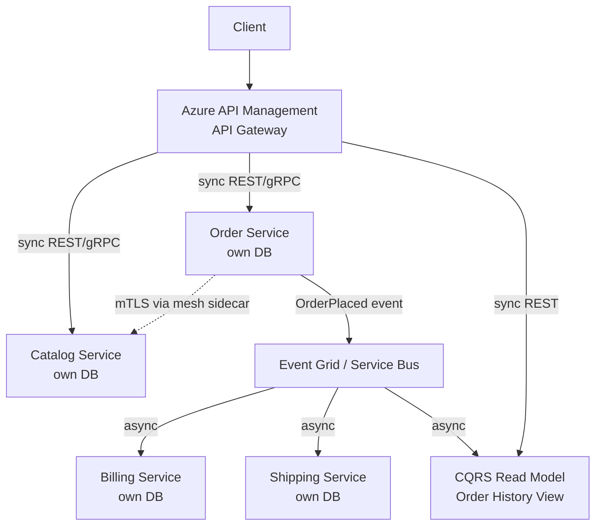
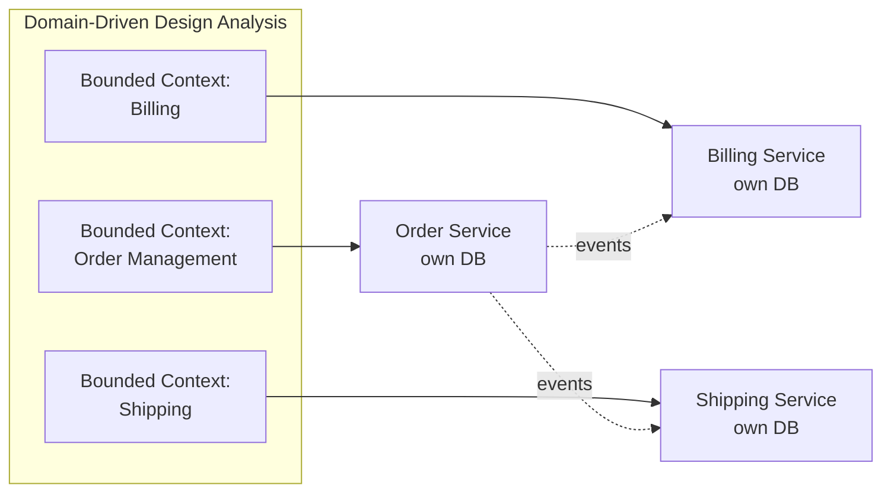
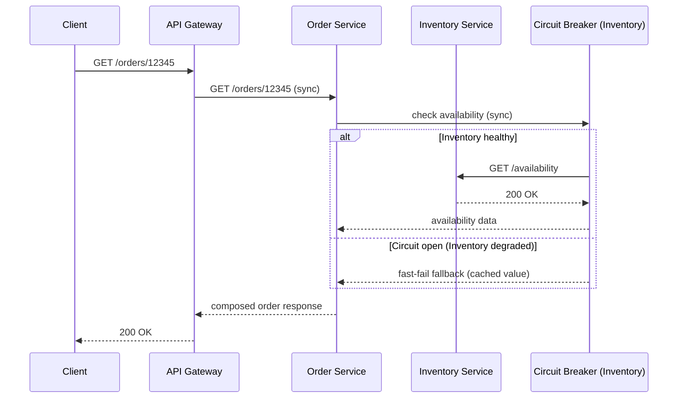
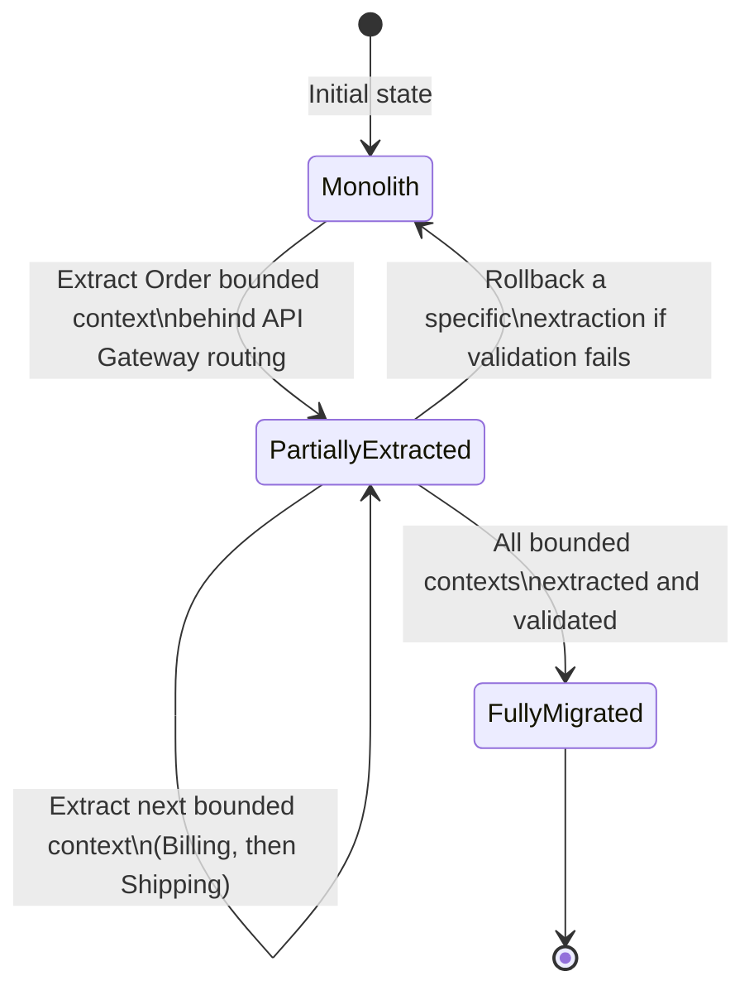

# Microservices Architecture

> Part of the **Enterprise Data & AI Architecture Handbook** · Phase-14 — Event-Driven Architecture & Integration · Chapter 02.
> Estimated study time: **60 min reading + ~4h labs**.
> **Prerequisite:** read [Domain-Driven Design](../Phase-01/05_Domain_Driven_Design.md) first.

---

## Executive Summary

[Event-Driven Architecture](01_Event_Driven_Architecture.md) established how independently-deployable services communicate — events, commands, pub/sub, choreography versus orchestration — while deliberately deferring the harder, prior question: *where do the service boundaries themselves come from, and what makes a service "independently deployable" in the first place?* This chapter answers that question. **Microservices architecture** is a style of structuring an application as a collection of small, independently deployable services, each owning a single, well-defined business capability and its own data, communicating over the network rather than through in-process calls or a shared database.

This chapter covers **service boundaries derived from Domain-Driven Design (DDD)** — [Domain-Driven Design](../Phase-01/05_Domain_Driven_Design.md)'s bounded contexts as the single most reliable source of correct microservice boundaries, and the single most common root cause of a poorly-decomposed "distributed monolith" when skipped; **synchronous versus asynchronous communication** as the concrete mechanism choice between a microservice and its collaborators, extending [Event-Driven Architecture](01_Event_Driven_Architecture.md)'s event/command distinction into a full request/response-versus-fire-and-forget decision framework; **database-per-service and data ownership** as the non-negotiable data-isolation discipline that makes independent deployability actually true rather than aspirational; **resilience patterns** (circuit breaker, bulkhead, retry with backoff, timeout) as the mandatory defenses against the partial-failure reality a distributed system introduces that a monolith's in-process call never has to consider; and, deliberately given equal weight, **when NOT to use microservices** — this chapter's single most consequential section, since premature microservice adoption is, per this handbook's now-familiar justification-before-adoption discipline, one of the most expensive and hardest-to-reverse architecture mistakes an enterprise can make.

The platform bias is **Azure-primary (~60%)** — Azure Kubernetes Service (AKS) as the primary microservices runtime, Azure API Management as the edge/gateway layer, Azure Container Apps as the lighter-weight managed alternative, and Azure Service Bus/Event Grid (per [Event-Driven Architecture](01_Event_Driven_Architecture.md) §31) reused here as the asynchronous-communication backbone — **~30% enterprise open source** (Kubernetes, Docker, Istio/Linkerd service mesh, Kafka for event-driven communication, PostgreSQL/Redis as the database-per-service defaults, OpenTelemetry for distributed tracing) — **~10% AWS/GCP comparison-only** (Amazon ECS/EKS and App Mesh; Google Kubernetes Engine and Anthos Service Mesh).

**Bottom line:** microservices architecture is a genuine, powerful answer to the specific problem of independent team scaling and independent service deployability at real organizational scale — but it is not a default, and it is not free: every microservice boundary correctly drawn from a DDD bounded context avoids the single most expensive mistake in this space (a distributed monolith with all of a monolith's coupling and none of its operational simplicity), and every team without the platform-engineering maturity ([Platform Engineering](../Phase-09/02_Platform_Engineering.md), [Kubernetes](../Phase-09/06_Kubernetes.md)) to operate a fleet of independently-deployed services should seriously consider a well-modularized monolith first, per this chapter's Decision Matrix and its dedicated "When NOT to Use Microservices" treatment.

---

## Learning Objectives

By the end of this chapter you will be able to:

1. **Derive microservice boundaries from DDD bounded contexts**, and explain why a boundary drawn any other way (by technical layer, by team org chart alone, or arbitrarily) is a common root cause of a distributed monolith.
2. **Choose between synchronous and asynchronous communication** for a given inter-service interaction, extending [Event-Driven Architecture](01_Event_Driven_Architecture.md)'s command/event framework into a concrete protocol decision.
3. **Design database-per-service data ownership**, including the patterns (API composition, CQRS-lite read models) needed to answer cross-service queries without a shared database.
4. **Apply resilience patterns** (circuit breaker, bulkhead, retry with backoff, timeout) to survive partial failure in a distributed system.
5. **Recognize when microservices are NOT the right architecture**, and defend a monolith-first or modular-monolith recommendation against organizational pressure to "do microservices."
6. **Identify anti-patterns and common mistakes** in microservices adoption, including the distributed monolith, shared database, and premature decomposition failure modes.
7. **Defend a microservices architecture decision** in engineer, staff engineer, architect, and CTO review settings, including build-vs-buy, boundary, and monolith-vs-microservices trade-offs.

---

## Business Motivation

- **Independent team scaling is the primary, durable business driver.** Once an engineering organization grows past the size where a single team can safely reason about and deploy an entire monolithic codebase, microservices let each team own, deploy, and scale its own service on its own schedule — directly enabling the same independent-deployment cadence [Event-Driven Architecture](01_Event_Driven_Architecture.md)'s Business Motivation named as its own core driver, now traced to its structural, team-topology root cause (Conway's Law: system architecture tends to mirror organizational communication structure, so deliberately designing team boundaries and service boundaries together is a first-class architecture decision, not an afterthought).
- **Heterogeneous scaling requirements across business capabilities** make a monolith's single deployable unit economically wasteful: a checkout service handling Black-Friday-scale traffic and a back-office reporting service with steady, low traffic have entirely different scaling profiles, and a monolith forces both to scale together.
- **Independent technology choice per service** (a recommendation service justifiably using Python/ML tooling, a payments service justifiably using a strongly-typed, heavily-tested language and runtime) is a genuine, if secondary, benefit — though this chapter's Anti-patterns section names "polyglot sprawl for its own sake" as a real cost when this flexibility is exercised without a corresponding platform-engineering investment to support it.
- **Fault isolation at the business-capability level** limits the blast radius of a failure — a degraded recommendation service should not be able to take down checkout, a property a monolith's single process and single failure domain cannot provide without deliberate internal bulkheading that is, in practice, rarely rigorously maintained inside a monolith's codebase.
- **Premature microservices adoption is a genuine, well-documented, expensive enterprise mistake**, not a hypothetical risk — this chapter's Business Motivation deliberately mirrors the justification-before-adoption discipline established across [Knowledge Graphs with Neo4j](../Phase-13/02_Knowledge_Graphs_with_Neo4j.md) ADR-0165, [GraphRAG](../Phase-13/04_GraphRAG.md) ADR-0167, and [Ontologies and Taxonomies](../Phase-13/05_Ontologies_and_Taxonomies.md) ADR-0168: the operational complexity of a distributed system (network calls, partial failure, eventual consistency, distributed tracing) is a real, ongoing cost that must be justified by a genuine team-scaling or independent-deployment need, not adopted because it is the industry's current architectural fashion.

---

## History and Evolution

- **1970s-1990s — monolithic and layered architectures** dominate enterprise software, with a single deployable unit (later, a single N-tier application) as the default, requiring no distributed-systems reasoning at the application-architecture level, only at the infrastructure level this handbook's [Distributed Systems Primer](../Phase-00/08_Distributed_Systems_Primer.md) already covers generically.
- **2000s — Service-Oriented Architecture (SOA)** attempts service decomposition at enterprise scale, but frequently centralizes integration logic in a heavyweight Enterprise Service Bus (per [Event-Driven Architecture](01_Event_Driven_Architecture.md)'s own History section) — SOA's real-world cost (a fragile, hard-to-change central bus every team depends on) directly motivates the following decade's shift toward decentralized, service-owned everything, including integration logic.
- **2011-2012 — Netflix's public migration to a microservices-style architecture** on AWS, driven by the company's own scaling and team-growth pressures following its 2008 database-corruption/monolith-fragility incident, becomes the most widely-cited real-world case study establishing many of this chapter's now-standard patterns (circuit breakers via Hystrix, service discovery via Eureka).
- **2014 — Fowler and Lewis's "Microservices" article** (also cited in [Event-Driven Architecture](01_Event_Driven_Architecture.md)'s History section) formalizes and names the pattern, explicitly contrasting it with SOA's ESB-centralized model and popularizing "smart endpoints, dumb pipes" as the guiding principle.
- **2014-2015 — Docker's rise** provides the lightweight, consistent packaging and deployment unit (a container) that makes running dozens or hundreds of independently-deployed services operationally tractable for the first time, directly enabling microservices' practical, not just conceptual, adoption at scale — per [Containers with Docker](../Phase-09/05_Containers_with_Docker.md)'s own treatment.
- **2015 — Kubernetes is open-sourced** (Google, per [Kubernetes](../Phase-09/06_Kubernetes.md)'s own History section), providing the orchestration layer (scheduling, service discovery, health-checking, rolling deployment) that turns a large fleet of independently-deployed containers into an operationally manageable system, rapidly becoming the de facto standard microservices runtime.
- **2017-2019 — service mesh (Istio, Linkerd) emerges** to extract cross-cutting communication concerns (mTLS, retries, circuit breaking, observability) out of application code and into a dedicated infrastructure layer, addressing the "every service reimplements the same resilience patterns" duplication problem this chapter's Design Patterns section names directly.
- **2018-2020 — the "microservices premium" backlash** — widely-cited engineering post-mortems and conference talks (including reversals from companies that had adopted microservices prematurely) establish "monolith first" as a credible, mainstream counter-recommendation, directly motivating this chapter's dedicated "When NOT to Use Microservices" emphasis rather than treating it as a footnote.
- **2020s — serverless and managed-container platforms** (Azure Container Apps, AWS Fargate, Google Cloud Run) lower the operational floor for running microservices without requiring full Kubernetes expertise, while DDD-driven bounded-context modeling (per [Domain-Driven Design](../Phase-01/05_Domain_Driven_Design.md)) becomes the broadly-accepted, mainstream best practice for deriving service boundaries correctly rather than by guesswork.

---

## Why This Technology Exists

A monolithic application's single deployable unit means every change — however small, however isolated its actual business impact — must be built, tested, and deployed as part of the same release, by (or coordinated across) every team touching the codebase, at the pace the slowest or most cautious team can sustain. Microservices architecture exists to break this coupling at the *deployment* level, the same way [Event-Driven Architecture](01_Event_Driven_Architecture.md) broke coupling at the *communication* level: by drawing a hard boundary — ideally aligned to a genuine business-capability seam a bounded context already identifies — around a piece of functionality, giving it its own codebase, its own data store, and its own deployment pipeline, so that a change within that boundary can ship without coordinating with, or waiting on, every other team in the organization.

---

## Problems It Solves

- **Deployment-pipeline coupling across unrelated business capabilities**, resolved by giving each bounded-context-aligned service its own independent build/test/deploy pipeline (per [DevOps and CI/CD](../Phase-09/03_DevOps_and_CI_CD.md)), so a checkout-team release does not require a recommendation-team's sign-off or vice versa.
- **Uniform, worst-case-sized scaling of an entire application**, resolved by letting each service scale independently to its own actual demand curve, rather than the whole monolith scaling (and being paid for) at whichever component's peak is highest.
- **Blast radius of a single component's failure or resource exhaustion**, resolved (when resilience patterns, §19, are correctly applied) by isolating a failing or overloaded service's impact to its own boundary rather than an in-process failure or memory leak taking down the entire application.
- **Organizational bottlenecks from a shared, monolithic codebase**, resolved by aligning service ownership to team ownership (Conway's Law, applied deliberately rather than accidentally), letting each team make independent technology, release-cadence, and internal-architecture decisions within its own service's boundary.
- **Incremental technology and architecture modernization**, resolved by letting one service be rewritten, re-platformed, or re-architected independently of the rest of the system — a monolith's "big bang" rewrite risk (per [Technical Strategy and Roadmaps](../Phase-01/07_Technical_Strategy_and_Roadmaps.md)'s own migration-risk treatment) is replaced by an incremental, service-at-a-time modernization path.

---

## Problems It Cannot Solve

- **Microservices do not eliminate the CAP-theorem and distributed-transaction realities** this handbook established in [CAP and PACELC](../Phase-02/04_CAP_and_PACELC.md) and [Distributed Transactions](../Phase-02/05_Distributed_Transactions.md) — splitting a monolith's single-database ACID transaction across several services' independently-owned databases (§13) does not make cross-service consistency free; it makes the trade-off explicit and requires deliberate saga-pattern design (per [Event-Driven Architecture](01_Event_Driven_Architecture.md) §26), a genuinely harder problem than the monolith's single-transaction default, not an automatically solved one.
- **It does not fix a poorly-modeled domain** — decomposing an already-confused, unclear business-domain model into a dozen independently-deployed services simply distributes the confusion across a network, with distributed-systems complexity now layered on top; [Domain-Driven Design](../Phase-01/05_Domain_Driven_Design.md)'s bounded-context modeling work must happen *before*, and independent of, the decision to physically split services, exactly as this chapter's Core Concepts section insists.
- **It does not reduce total system complexity** — it *relocates* complexity from within a single codebase (where a debugger and a single stack trace can reach it) to the network and to operational tooling (distributed tracing, service mesh, contract testing), a trade this chapter's Trade-offs section treats as a genuine cost, not a simplification.
- **It does not remove the need for strong platform-engineering and DevOps maturity** ([Platform Engineering](../Phase-09/02_Platform_Engineering.md), [DevOps and CI/CD](../Phase-09/03_DevOps_and_CI_CD.md), [GitOps and Environment Management](../Phase-09/08_GitOps_and_Environment_Management.md)) — a team without CI/CD automation, container orchestration expertise, and distributed observability tooling already in place will find operating even a modest microservices fleet substantially harder than operating one well-organized monolith, a reality this chapter's dedicated "When NOT to Use Microservices" section names directly.
- **It does not automatically improve development velocity** — the widely-cited assumption that "more services means faster shipping" is only true once team boundaries, service boundaries, and platform tooling are all correctly aligned; misaligned boundaries (a change that must touch three services to ship one feature) can make velocity measurably *worse* than a monolith's, a specific, named failure mode in this chapter's Anti-patterns section.

---

## Core Concepts

### 8.1 Service boundaries from Domain-Driven Design

The single most reliable source of a correct microservice boundary is a **bounded context**, per [Domain-Driven Design](../Phase-01/05_Domain_Driven_Design.md) — a boundary within which a specific domain model and its ubiquitous language apply consistently, and outside of which the same term (e.g., "Customer") may legitimately mean something different (a "Customer" in the Billing bounded context has a different set of relevant attributes and invariants than a "Customer" in the Support bounded context). Drawing a microservice boundary at a bounded-context boundary means the service's data model, its API, and its team's mental model of the domain all naturally align — the service is cohesive internally and loosely coupled externally, because the bounded-context analysis already did the hard work of finding that seam. Drawing a microservice boundary any other way — by technical layer (a "database service," a "business logic service"), by arbitrary size target ("split until each service is under 2000 lines"), or purely by existing team org chart without domain analysis — is the single most common root cause of the "distributed monolith" anti-pattern (§27) this chapter returns to repeatedly: technically separate deployables that remain so tightly coupled in their data and call dependencies that they cannot actually be deployed, tested, or reasoned about independently.

### 8.2 Synchronous vs. asynchronous communication

Extending [Event-Driven Architecture](01_Event_Driven_Architecture.md) §14.1's event-versus-command distinction into a concrete protocol decision for microservice-to-microservice communication:

- **Synchronous (request/response)** — a service calls another (typically REST or gRPC, covered in full in Phase-14 Chapter 05) and waits for an immediate response. Appropriate when the caller genuinely needs an immediate answer to proceed (checking current inventory availability before confirming a purchase) and when the two services' availability being coupled for the duration of that call is an acceptable, bounded risk.
- **Asynchronous (event/message-based)** — a service publishes an event or sends a command via a broker (per [Event-Driven Architecture](01_Event_Driven_Architecture.md) §14.2-14.4) and continues without waiting. Appropriate whenever the interaction is genuinely fire-and-forget, has multiple independent consumers, or must not couple the caller's availability to the callee's.
- **The recurring, costly mistake this chapter documents**: defaulting to synchronous calls for every interaction "because it's simpler to reason about," which silently recreates a tightly-coupled call-chain topology (§9.1) across service boundaries — the distributed monolith's most common cause, and the reason this chapter treats the sync/async decision as a first-class, per-interaction design choice, not a single architecture-wide default.
- **Hybrid is the normal, not exceptional, case**: a real microservices architecture typically uses synchronous calls for read-heavy, immediate-consistency-requiring interactions at the edge (an API Gateway calling a handful of backend services to compose a single page's response) and asynchronous events for cross-boundary business-fact propagation and multi-consumer fan-out — directly mirroring [Event-Driven Architecture](01_Event_Driven_Architecture.md) ADR-0169's own hybrid choreography-plus-orchestration reasoning.

### 8.3 Database-per-service and data ownership

- **Database-per-service** means each microservice owns its own database (or schema, at minimum enforced via strict access control), which no other service is permitted to query or write to directly — the data-isolation discipline that makes "independently deployable" actually true: a service's internal schema can change freely as long as its public API contract is preserved, because no other service has taken an undocumented dependency on its internal table structure.
- **The consequence this discipline forces**: a query that needs data from multiple services' domains (e.g., "show me this customer's order history alongside their support tickets") can no longer be a single cross-database join — it must be resolved via **API composition** (the calling service or an API Gateway calls each owning service's API and merges results) or a **CQRS-lite materialized read model** (a dedicated read-side store, populated asynchronously from each owning service's published events, purpose-built to answer exactly this cross-boundary query) — the latter previewed here and covered in full architectural depth in Phase-14 Chapter 03 (CQRS).
- **The single most common violation of this discipline** is a "shared database" anti-pattern (§27) — multiple services reading or writing the same physical database because it is faster to build initially — which silently reintroduces the exact deployment coupling (a schema change in one service's table breaking another service's queries) microservices exist to eliminate, while adding all of the network/distributed-tracing overhead with none of the actual decoupling benefit.
- **Polyglot persistence** (each service choosing the database technology best suited to its own access patterns — a graph database for a recommendation service per [Knowledge Graphs with Neo4j](../Phase-13/02_Knowledge_Graphs_with_Neo4j.md), a relational database for a transactional order service) is a genuine benefit of database-per-service, but is secondary to, and should never be adopted at the expense of, the boundary discipline itself.

### 8.4 Resilience patterns

A distributed system introduces **partial failure** as a normal, expected operating condition (a downstream service being slow, overloaded, or fully unavailable) that a monolith's in-process function call structurally cannot experience — a function call either returns or the whole process crashes, but it does not silently hang for 30 seconds under load the way a network call to an overloaded dependency can. The standard resilience patterns, per [Fault Tolerance and Resilience](../Phase-02/07_Fault_Tolerance_and_Resilience.md)'s general treatment, applied specifically at the service-to-service call boundary:

- **Timeout** — bound how long a caller will wait for a response, preventing an unbounded hang from a slow dependency.
- **Retry with exponential backoff and jitter** — re-attempt a failed call a bounded number of times with increasing delay, tolerating transient failures without hammering an already-struggling dependency (directly analogous to [Apache Kafka](../Phase-07/02_Apache_Kafka.md)'s own producer-retry treatment).
- **Circuit breaker** — after a threshold of consecutive failures, stop calling a struggling dependency entirely for a cooldown period, failing fast instead of continuing to pile up timeouts and retries against a dependency that is not going to recover mid-request — the single most emblematic resilience pattern this chapter's History section traces to Netflix's Hystrix library.
- **Bulkhead** — isolate the connection pool, thread pool, or resource allocation used to call one dependency from those used to call another, so that one overloaded, slow dependency cannot exhaust resources needed to call a healthy, unrelated dependency — the distributed-systems analogue of a ship's watertight compartments, the pattern's namesake.
- **Fallback** — define an explicit degraded-but-functional response (a cached or default value) for when a dependency's circuit breaker is open, rather than propagating the failure to the end user unconditionally.

---

## Internal Working

### 9.1 How a request actually traverses a microservices topology

A single user-facing request (e.g., "load my order history page") typically enters via an **API Gateway** (§10), which may call several backend services synchronously to compose the response, each of which may itself call further downstream services or read from its own database — this **fan-out call graph**, not a single call, is the actual unit of latency, failure-probability, and tracing complexity in a microservices system: a single slow or failing service several hops deep can degrade the entire user-facing request, which is exactly why resilience patterns (§8.4) must be applied at every hop, not just at the edge.

### 9.2 How service discovery resolves a call target

In a dynamically-scaled, frequently-redeployed fleet, a calling service cannot rely on a static IP address for its dependency — **service discovery** (Kubernetes' built-in DNS-based service discovery, per [Kubernetes](../Phase-09/06_Kubernetes.md) §6.2, or a dedicated registry) resolves a logical service name to a currently-healthy instance's actual network address at call time, transparently handling instances being added, removed, or replaced by rolling deployments without the calling service needing any awareness of the change.

### 9.3 How a service mesh intercepts and manages traffic

A service mesh (Istio, Linkerd) deploys a lightweight proxy (a "sidecar") alongside every service instance, transparently intercepting all inbound and outbound network traffic to and from that instance. This lets cross-cutting resilience patterns (§8.4: retries, timeouts, circuit breaking), mutual TLS encryption (§16), and distributed-tracing instrumentation (§22) be applied and centrally configured at the infrastructure layer, identically across every service, without each service's own application code needing to reimplement the same logic in whatever language or framework it happens to use — directly resolving the pattern-duplication cost named in this chapter's Design Patterns section.

### 9.4 How database-per-service data ownership is enforced

Enforcement is both organizational and technical: network-level isolation (a service's database is only reachable from its own service's network segment or Kubernetes namespace, per [Network Security and Zero Trust](../Phase-10/04_Network_Security_and_Zero_Trust.md)'s micro-segmentation treatment) prevents another service from even establishing a connection, while credential-level isolation (each service's own managed identity is the only identity granted access to its own database, per [Identity and Access Management with Entra](../Phase-10/02_Identity_and_Access_Management_with_Entra.md)) prevents access even if network isolation were somehow bypassed — a defense-in-depth pairing, not a single control relied on alone.

---

## Architecture

### 10.1 Reference architecture: bounded-context-aligned microservices with hybrid communication



### 10.2 Why the architecture works

Each service's boundary (Order, Catalog, Billing, Shipping) is aligned to a distinct bounded context per §8.1, meaning each team can change its own service's internals freely as long as its public API/event contract holds. The API Gateway (§10, Azure API Management) provides synchronous, immediate-consistency reads for the client-facing page composition, while the same `OrderPlaced` event (already established in [Event-Driven Architecture](01_Event_Driven_Architecture.md)'s own reference architecture) fans out asynchronously to Billing and Shipping — directly reusing, not duplicating, the prior chapter's messaging backbone — and to a dedicated CQRS-lite read model that resolves the cross-service "order history" query (§8.3) without any service querying another's database directly.

### 10.3 ADR example

See this chapter's [Architecture Decision Record (ADR-0170)](#architecture-decision-record-adr-0170-modular-monolith-first-microservices-only-after-a-validated-team-scaling-trigger) under Enterprise Recommendations for the Context/Decision/Consequences/Alternatives treatment of this chapter's central architectural recommendation: default to a modular monolith and migrate to microservices only after a validated, specific team-scaling trigger, rather than adopting microservices as day-one architecture.

---

## Components

- **Service** — an independently deployable unit owning a single bounded context's business capability and its own data store.
- **API Gateway** — the edge component (Azure API Management) that composes, authenticates, rate-limits, and routes client-facing requests to backend services, hiding the internal service topology from external callers.
- **Service registry / discovery mechanism** — resolves a logical service name to a currently-healthy instance's network address (§9.2), typically Kubernetes' built-in DNS-based discovery.
- **Service mesh sidecar** (optional, at scale) — a per-instance proxy transparently applying resilience, security, and observability policy (§9.3).
- **Message broker** (Event Grid/Service Bus/Kafka, reused directly from [Event-Driven Architecture](01_Event_Driven_Architecture.md) §Components) — the asynchronous-communication backbone between services.
- **Per-service database** — the isolated data store only its owning service may access directly (§8.3).
- **CQRS-lite read model / API composition layer** — the mechanism resolving cross-service queries without a shared database (§8.3), covered in full in Phase-14 Chapter 03 (CQRS).
- **Circuit breaker / resilience library or mesh policy** — the per-call-boundary defense against partial failure (§8.4).

---

## Metadata

Every service should be catalogued (extending [Data Catalog and Lineage](../Phase-08/02_Data_Catalog_and_Lineage.md)'s governance discipline to services, not just data assets) with its owning team, its bounded context, its published API/event contracts and their versions, its data-classification tier, and its declared dependencies (both synchronous calls it makes and events it consumes) — this service-level metadata catalog is what makes an impact-analysis question ("if we change this API, which services break") answerable without an all-hands archaeology exercise, directly analogous to [Event-Driven Architecture](01_Event_Driven_Architecture.md) §23's known-consumer-list requirement for event types.

---

## Storage

Database-per-service (§8.3) means storage technology choice is made independently per service against that service's own access patterns — a relational database (Azure SQL Database, PostgreSQL) for a transactional order service requiring strong consistency and joins within its own boundary; a document store (Cosmos DB) for a catalog service with a flexible, evolving product schema; a cache (Azure Cache for Redis) for a session or read-heavy lookup service. The one storage decision that is *not* made independently per service is the CQRS-lite read model (§8.3): its schema is deliberately denormalized and purpose-built for the specific cross-service query it serves, populated asynchronously from the owning services' published events, and explicitly not treated as any service's system of record.

---

## Compute

Microservices are typically deployed as containers (Docker, per [Containers with Docker](../Phase-09/05_Containers_with_Docker.md)) orchestrated by Kubernetes (AKS) for teams needing fine-grained control over scaling, networking, and deployment strategy, or on Azure Container Apps for teams wanting a lighter-weight, less operationally-demanding managed container platform without giving up horizontal autoscaling and revision-based traffic splitting. The key compute-design decision, extending [Event-Driven Architecture](01_Event_Driven_Architecture.md)'s Compute section's own caution, is ensuring each service's autoscaling configuration accounts for its actual downstream dependencies' capacity — a service that scales aggressively under its own load but calls a database or another service with a fixed capacity ceiling merely relocates the bottleneck one hop downstream.

---

## Networking

- **API Gateway (Azure API Management)** as the single, authenticated, rate-limited entry point for client-facing traffic, hiding internal service topology and providing a natural point for cross-cutting concerns (auth, throttling, request/response transformation) without every backend service reimplementing them.
- **Service-to-service traffic isolated within a private virtual network**, with private endpoints for managed dependencies (per [Network Security and Zero Trust](../Phase-10/04_Network_Security_and_Zero_Trust.md) ADR-0144's private-endpoint-only baseline, directly reused here), never traversing the public internet between internal services.
- **Mutual TLS (mTLS) between services**, either application-managed or transparently provided by a service mesh sidecar (§9.3), authenticating both ends of every internal call and encrypting traffic in transit — a mandatory control at any real enterprise scale, not an optional hardening step.
- **Network micro-segmentation per bounded context** (Kubernetes NetworkPolicies, or per-namespace network isolation) enforcing that a service can only initiate connections to the specific dependencies its architecture actually calls for, directly supporting the database-per-service isolation enforcement described in §9.4.

---

## Security

- **Managed identity per service**, never a shared service-principal credential across the fleet, extending [Identity and Access Management with Entra](../Phase-10/02_Identity_and_Access_Management_with_Entra.md)'s managed-identity-as-default principle and the least-privilege-scoping lineage this handbook has traced through [Model Context Protocol (MCP)](../Phase-12/06_Model_Context_Protocol_MCP.md) ADR-0160 and [Event-Driven Architecture](01_Event_Driven_Architecture.md)'s own Security section — each service authenticates and is authorized independently, so a single compromised service's credential cannot be used to impersonate another.
- **API Gateway as the enforcement point for external authentication and authorization**, validating tokens (OAuth2/OIDC, per [Identity and Access Management with Entra](../Phase-10/02_Identity_and_Access_Management_with_Entra.md)) once at the edge, then propagating a verified identity/claims context to internal services rather than requiring every internal service to independently re-validate external credentials.
- **Zero-trust internal networking** (§15's mTLS and micro-segmentation) treating the internal network as no more inherently trustworthy than the public internet — a foundational assumption of [Network Security and Zero Trust](../Phase-10/04_Network_Security_and_Zero_Trust.md)'s "assume breach" principle, directly relevant since a microservices topology has a substantially larger internal attack surface (many more network-reachable internal endpoints) than a monolith's single process.
- **Secrets management per service** (Key Vault references, per [Secrets and Key Management](../Phase-10/05_Secrets_and_Key_Management.md), never hardcoded or shared across services) scoped so that one service's compromised secret does not grant access to another service's resources.
- **Dependency and container image scanning** (per [Containers with Docker](../Phase-09/05_Containers_with_Docker.md)'s ACR image-security treatment) becomes a per-service, recurring obligation multiplied across the fleet — a vulnerability in one service's dependency tree does not require investigation of every other service's independently-maintained dependency tree, but does require the scanning discipline to actually be applied uniformly across all of them, a governance obligation (§23) easy to let lapse for a less-visible, less-frequently-deployed service.

---

## Performance

- **Network round-trip latency per hop is a real, additive cost** a monolith's in-process call never incurs — a user-facing request requiring five sequential synchronous service-to-service calls accumulates five times the network latency of one, making call-graph depth (§9.1) a direct performance lever, not just an architectural nicety.
- **Parallelizing independent downstream calls** (an API Gateway or composing service calling three independent backend services concurrently rather than sequentially) is the single highest-leverage latency optimization available once a call graph fans out, since the total latency becomes the slowest single call rather than the sum of all of them.
- **Serialization/deserialization overhead** (JSON over REST versus Protobuf over gRPC, covered in depth in Phase-14 Chapter 05) is a measurable, non-trivial cost at high call volumes between services, and a genuine reason some latency-sensitive internal service-to-service calls choose gRPC over REST even when the external-facing API remains REST.
- **N+1 call patterns** (a composing service calling a downstream service once per item in a list, rather than a single batched call) are the microservices-architecture analogue of the classic N+1 query problem, and a common, easily-overlooked performance regression once a previously-monolithic, single-process loop becomes a loop of network calls.
- **Caching at the API Gateway or within a service**, for data that does not require strict real-time consistency, substantially reduces both latency and the cascading-load risk of a popular downstream service being called on every single upstream request.

---

## Scalability

Each service scales independently to its own actual demand — horizontal pod autoscaling (Kubernetes HPA, per [Kubernetes](../Phase-09/06_Kubernetes.md) §6.4) keyed to CPU/memory or custom metrics for synchronously-called services, and KEDA-driven autoscaling keyed to queue/topic depth (per [Event-Driven Architecture](01_Event_Driven_Architecture.md) §Compute) for asynchronous, event-consuming services — letting a checkout service scale to Black-Friday peak while a back-office reporting service remains at steady-state capacity, directly realizing the heterogeneous-scaling business driver named in this chapter's Business Motivation. The scaling dimension requiring the most deliberate design is **downstream dependency capacity**: an aggressively autoscaled service calling a shared, fixed-capacity dependency (a shared database read replica, a third-party API with a rate limit) merely moves the bottleneck to that shared dependency, which is why bulkheading (§8.4) and dependency-aware capacity planning must scale alongside the service itself, not be assumed to scale automatically because Kubernetes made adding replicas easy.

---

## Fault Tolerance

- **Resilience patterns applied at every service-to-service call boundary (§8.4)** — timeout, retry with backoff, circuit breaker, bulkhead, fallback — are the primary defense against a single struggling dependency degrading or cascading failure across the fleet.
- **Health checks and readiness/liveness probes** (Kubernetes-native, per [Kubernetes](../Phase-09/06_Kubernetes.md) §6.2) let the orchestrator automatically stop routing traffic to, and eventually restart, an unhealthy instance without human intervention, directly reducing the blast radius and duration of a single-instance failure.
- **Graceful degradation** — a composing service (an API Gateway assembling a page from several backend calls) should be designed to return a partial, degraded response (omitting a non-critical widget) rather than failing the entire request when one non-critical downstream dependency is unavailable, distinguishing critical-path dependencies from optional, degradable ones as a deliberate architecture decision, not an afterthought.
- **Chaos engineering** (deliberately injecting failures — killing instances, adding latency, blocking network calls — in a controlled, monitored environment) is the practice that validates resilience patterns actually work as designed, rather than assuming a circuit breaker configuration is correct because it looks correct in code review; Netflix's Chaos Monkey (per this chapter's History section) is the canonical, publicly-documented example of this discipline.

---

## Cost Optimization

- **Right-size each service's compute allocation to its own measured demand**, rather than a uniform, defensively-large allocation applied identically across every service regardless of actual traffic — the entire point of independent scalability is wasted if every service is provisioned identically out of convenience.
- **Consolidate genuinely low-traffic, low-criticality services onto shared, smaller compute tiers** (a shared AKS node pool, or Azure Container Apps' consumption-based pricing) rather than dedicating an oversized, always-on node pool to a service receiving a handful of requests per hour.
- **Monitor and eliminate "zombie services"** — services that were once needed but no longer receive meaningful traffic yet continue consuming compute, storage, and operational/security-patching attention — a common, silent cost accumulation as a microservices fleet grows over years without a periodic service-inventory review.
- **Avoid unnecessary polyglot-persistence proliferation** (§8.3) — a distinct, separately-licensed and separately-operated database technology per service is a genuine operational and licensing cost multiplier; defaulting to a small, standardized set of approved database technologies (per this handbook's platform-engineering discipline) unless a service has a specific, validated need for something different keeps this cost in check.
- **Worked FinOps example:** an organization runs 40 microservices, each provisioned with its own dedicated AKS node pool sized for a defensively-estimated 3x average peak load "to be safe," totaling roughly $140,000/month in compute. A review consolidating the 28 lowest-traffic services onto 3 shared, right-sized node pools (based on 90 days of actual measured peak, not a defensive guess) while leaving the 12 genuinely high-traffic, latency-sensitive services on dedicated pools reduces total compute spend to roughly $58,000/month — a ~59% reduction — with no measured latency or availability regression for any service, since the consolidated services' actual combined peak was well within the shared pools' capacity even accounting for imperfect traffic-pattern correlation across services.

---

## Monitoring

- **Per-service golden signals** (latency, traffic, errors, saturation — the SRE "four golden signals") tracked independently per service, since a single fleet-wide aggregate metric cannot answer "which specific service is degraded."
- **Call-graph-level (not just per-service) latency and error-rate tracking**, using distributed tracing (§22) to answer "what fraction of end-to-end requests exceeded the SLA, and at which specific hop" — the same end-to-end, not just per-component, monitoring principle [Event-Driven Architecture](01_Event_Driven_Architecture.md) §21 established for choreographed sagas.
- **Circuit-breaker state transitions** (closed → open → half-open) monitored and alerted on directly, since a circuit breaker tripping open is itself a leading indicator of a downstream dependency's degradation, often observable before that dependency's own metrics fully reflect the problem.
- **Service-dependency graph drift** — a service's actual observed call pattern (from tracing data) diverging from its declared/catalogued dependencies (§Metadata) is a leading indicator of undocumented coupling accumulating, a common precursor to the distributed-monolith anti-pattern.
- **Deployment-frequency and change-failure-rate metrics per service** (DORA metrics, per [DevOps and CI/CD](../Phase-09/03_DevOps_and_CI_CD.md)) as the direct, measurable validation of whether the independent-deployability benefit this chapter's Business Motivation promised is actually being realized in practice, not just architecturally possible in theory.

---

## Observability

Distributed tracing (OpenTelemetry, per [LLMOps](../Phase-12/04_LLMOps.md)'s full-pipeline-span foundation and [Vector Databases: Qdrant and Milvus](../Phase-13/01_Vector_Databases_Qdrant_and_Milvus.md) §22's per-query-span treatment, both reused here) must propagate a trace context across every synchronous call and every asynchronous event/command (extending [Event-Driven Architecture](01_Event_Driven_Architecture.md) §22's correlation-ID discipline into the fully mixed sync/async topology this chapter's architecture actually has), so that a single end-to-end trace reconstructs the complete fan-out call graph (§9.1) a single user-facing request generated — without this, diagnosing "why is this specific request slow" in a topology with a dozen possible hops degrades into exactly the kind of multi-team log archaeology [Event-Driven Architecture](01_Event_Driven_Architecture.md)'s Case Study 2 already documented for pure choreography, now equally possible on the synchronous-call side of a hybrid topology if tracing is retrofitted rather than built in from day one.

### Operational Response Playbook

| Signal | Detection Query/Method | Remediation |
|---|---|---|
| A specific service's p99 latency spikes while its own CPU/memory/replica-count metrics look normal | Distributed trace query filtering for requests through the affected service, segmented by downstream call; compare against circuit-breaker state for each of its dependencies | Identify which specific downstream dependency's call latency is elevated within the trace; check that dependency's own health/saturation metrics; if the dependency itself is healthy, check for a connection-pool/bulkhead exhaustion (§8.4) at the calling service rather than assuming the dependency is at fault |
| Deployment-frequency for a specific service has dropped sharply and change-failure-rate has risen, despite no corresponding drop in that team's development activity | DORA-metrics dashboard trend per service, correlated with the service's declared-versus-observed dependency graph (§Metadata) | Investigate whether the service has accumulated undocumented, tightly-coupled dependencies on other services (a distributed-monolith symptom) requiring coordinated multi-service deployment despite being nominally "independent"; treat a sustained DORA-metric regression as a direct signal to re-examine the service's actual boundary alignment against its original bounded context |

---

## Governance

Microservices governance extends this handbook's established data- and event-governance discipline ([Data Governance Foundations](../Phase-08/01_Data_Governance_Foundations.md), [Event-Driven Architecture](01_Event_Driven_Architecture.md) §23) to services as first-class governed architectural artifacts: every service should be catalogued with its bounded context, owning team, published contracts and their versions, data-classification tier, and a service-dependency graph reconciled periodically against actual observed traffic (§21) to catch undocumented coupling before it hardens into a distributed monolith. API and event contract changes should go through the same consumer-driven contract-testing gate [Event-Driven Architecture](01_Event_Driven_Architecture.md) §14.4 established for event schemas, extended here to synchronous API contracts as well (via tools such as Pact or OpenAPI-diff-based breaking-change detection in CI). Right-to-be-forgotten obligations ([Data Privacy and PII Protection](../Phase-10/07_Data_Privacy_and_PII_Protection.md) ADR-0147) extend to every service's own database independently — a data-subject erasure request against a microservices architecture must be tracked and verified across every service that independently stores a copy or derived projection of that subject's data, a materially harder coordination problem than a monolith's single database, and a governance process (not just a technical capability) that must be explicitly designed, not assumed to compose correctly on its own.

---

## Trade-offs

- **Independent deployability and scaling vs. operational and cognitive complexity**: microservices trade a monolith's single-deployable simplicity for independently-scalable, independently-deployable services, at the direct cost of network latency, partial-failure handling, distributed tracing, and a materially larger platform-engineering investment — a trade genuinely favorable once team-scaling pressure is real, and genuinely unfavorable for a small team or an early-stage product where that pressure does not yet exist.
- **Synchronous simplicity vs. asynchronous decoupling** (§8.2, directly extending [Event-Driven Architecture](01_Event_Driven_Architecture.md)'s own Trade-offs): every interaction's sync-versus-async choice re-litigates this same trade-off at the individual-call level, not just at the whole-architecture level.
- **Database-per-service isolation vs. cross-service query convenience** (§8.3): strict data ownership makes independent deployability genuinely true, at the cost of needing API composition or a dedicated read model for any query spanning service boundaries — a real, ongoing engineering cost a monolith's single database and SQL joins never has to pay.
- **Service mesh's centralized cross-cutting policy vs. its own added operational layer**: a service mesh (§9.3) eliminates per-service resilience-pattern duplication, at the cost of an additional, non-trivial piece of infrastructure (sidecar proxies, mesh control plane) that itself must be operated, upgraded, and understood — appropriate once the fleet is large enough that pattern duplication is a genuine, measured cost, not a default for every microservices deployment regardless of scale.
- **Is a monolith still the right default?** Per this chapter's central, deliberately-emphasized caution: for a small team, an early-stage product with an unstable, still-evolving domain model, or an organization without existing platform-engineering maturity, a well-modularized monolith (internally organized along the same bounded-context boundaries a future microservices split would eventually use) very often delivers the same domain-clarity benefit with dramatically less operational overhead — and, critically, remains a substantially easier starting point to later split into microservices (once genuine team-scaling pressure materializes) than a poorly-decomposed microservices fleet is to consolidate back.

---

## Decision Matrix

| Scenario | Recommended Choice | Rationale |
|---|---|---|
| Small team (fewer than ~2 pizza-team-sized groups), early-stage or rapidly-evolving domain model | Modular monolith | Domain model is still changing too fast to have stable bounded-context boundaries; microservices' deployment/network overhead is unjustified without genuine team-scaling pressure yet |
| Growing organization with multiple teams each needing independent deploy cadence, and a domain model with clearly-identified stable bounded contexts | Microservices, boundaries aligned to DDD bounded contexts | This is the scenario microservices architecture exists to solve; team-scaling pressure and domain stability both genuinely justify the operational investment |
| Heterogeneous scaling requirements across business capabilities (e.g., checkout vs. back-office reporting) | Microservices, or at minimum a modularized deployable that can scale its hot components independently | Uniform scaling of a monolith becomes a direct, measurable cost once components' traffic profiles diverge significantly |
| Organization lacking existing CI/CD, container-orchestration, and distributed-observability maturity | Modular monolith first; invest in platform engineering (per [Platform Engineering](../Phase-09/02_Platform_Engineering.md)) before or alongside any microservices migration | Attempting microservices without this foundational tooling multiplies operational burden without the countervailing team-scaling benefit yet being realized |
| Cross-service query needs are frequent and complex, and the domain does not cleanly decompose into independent bounded contexts | Modular monolith, or a smaller number of coarser-grained "macroservices" | Excessive fragmentation into many fine-grained services when the domain itself is highly interconnected recreates the shared-database anti-pattern's coupling risk under a microservices label |
| Mature microservices fleet (dozens of services) experiencing per-service resilience-pattern duplication and inconsistent policy enforcement | Adopt a service mesh (Istio/Linkerd) | Centralizes cross-cutting resilience/security/observability policy once fleet size makes per-service duplication a measured, genuine cost |

---

## Design Patterns

- **Strangler fig migration**: incrementally route traffic for one bounded context at a time from a legacy monolith to a new microservice sitting behind the same API Gateway, allowing a gradual, low-risk migration rather than a high-risk "big bang" rewrite — the standard, well-documented pattern for migrating an existing monolith to microservices without a full-stop cutover.
- **API composition**: a composing service or the API Gateway calls multiple owning services' APIs and merges results in-memory for a cross-boundary read, appropriate for moderate fan-out and latency-tolerant queries (§8.3).
- **CQRS-lite materialized read model**: a dedicated, denormalized read store populated asynchronously from each owning service's published events, purpose-built for a specific cross-service query pattern that API composition would make too slow or too chatty — covered in full depth in Phase-14 Chapter 03 (CQRS).
- **Sidecar (service mesh)**: cross-cutting resilience, security, and observability concerns implemented once, in a per-instance proxy, rather than duplicated in every service's own application code (§9.3).
- **Backend-for-frontend (BFF)**: a dedicated, client-type-specific API Gateway variant (a separate BFF for a mobile app versus a web app) tailoring the composed response shape to each client's specific needs, avoiding a single, increasingly bloated general-purpose gateway trying to serve every client type identically.

---

## Anti-patterns

- **Distributed monolith**: services that are technically separate deployables but remain so tightly coupled (via a shared database, synchronous call chains that must all be deployed together, or undocumented data dependencies) that they cannot actually be deployed, tested, or scaled independently — all of microservices' operational cost, none of its benefit; the single most emblematic failure mode this chapter warns against, directly caused by skipping §8.1's DDD-boundary discipline.
- **Shared database across services**: multiple services reading or writing the same physical database or schema directly (§8.3), silently reintroducing deployment coupling while adding network and tracing overhead on top.
- **Premature decomposition**: splitting a system into many fine-grained services before the domain model has stabilized enough to draw correct bounded-context boundaries, forcing frequent, expensive cross-service boundary rework as the (still-evolving) domain understanding improves — this chapter's Decision Matrix names domain-model stability as a precondition, not an afterthought.
- **Chatty synchronous call chains**: a request requiring five or more sequential synchronous hops to compose a response, accumulating latency and coupling every intermediate service's availability into the critical path — a specific instance of the sync/async-default mistake named in §8.2.
- **Polyglot sprawl without platform investment**: adopting a different database, language, or framework per service purely because microservices architecture technically permits it, without a corresponding investment in the platform tooling (shared CI/CD templates, shared observability instrumentation libraries) needed to operate that diversity sustainably at scale — a real cost this chapter's Cost Optimization section names directly.

---

## Common Mistakes

- **Deriving service boundaries from the org chart or an arbitrary size target instead of DDD bounded-context analysis** (§8.1) — the single most consequential and most common root cause of a distributed monolith.
- **Defaulting to synchronous REST calls for every interaction "because it's simpler,"** silently recreating tight coupling across service boundaries without evaluating whether an asynchronous event would decouple the interaction more appropriately (§8.2).
- **Allowing a "temporary" cross-service database query** during initial development that is never removed once the pressure to ship subsides, becoming a permanent, undocumented shared-database dependency (§8.3, §27).
- **Applying resilience patterns (§8.4) inconsistently across the fleet** — some services rigorously implementing circuit breakers and bulkheads, others omitting them entirely — leaving the topology's actual fault-tolerance only as strong as its least-defended service, a gap a service mesh (§9.3) is specifically designed to close by centralizing the policy.
- **Adopting microservices before validating an actual team-scaling or independent-deployment need**, driven by architectural fashion rather than a specific, named organizational pressure — this chapter's single most consequential caution, repeated across Business Motivation, Problems It Cannot Solve, Trade-offs, and this chapter's dedicated ADR.

---

## Best Practices

- Derive every service boundary from a DDD bounded context (§8.1), validated with the domain experts who actually understand that context, not drawn unilaterally by engineering convenience.
- Decide sync versus async per interaction (§8.2) against the specific coupling and consistency requirements of that interaction, not as a single architecture-wide default.
- Enforce database-per-service isolation (§8.3) at both the network and credential level (§9.4) from day one, never permitting a "temporary" cross-service query exception.
- Apply the full resilience-pattern set (§8.4) consistently across every service-to-service call boundary, using a service mesh once fleet size makes per-service duplication a measured cost.
- Instrument end-to-end distributed tracing with propagated trace context across both synchronous and asynchronous hops from the very first service, not retrofitted after an incident.
- Default to a modular monolith for a small team or an unstable domain model, and migrate to microservices only after a validated, specific team-scaling or independent-deployment pressure materializes — never adopt microservices as an unconditional starting architecture.

---

## Enterprise Recommendations

Default to a **modular monolith**, internally organized along the same DDD bounded-context boundaries a future microservices split would eventually use, for any team without an already-validated, specific team-scaling or independent-deployment pressure. Migrate to **microservices on Azure Kubernetes Service** (or Azure Container Apps for teams wanting a lighter operational footprint) once that pressure is real and the platform-engineering foundation ([Platform Engineering](../Phase-09/02_Platform_Engineering.md), [DevOps and CI/CD](../Phase-09/03_DevOps_and_CI_CD.md)) already exists, deriving every new service boundary strictly from bounded-context analysis rather than convenience. Use **Azure API Management** as the client-facing gateway, hybrid synchronous/asynchronous communication chosen per interaction (§8.2), and mandate database-per-service isolation, resilience-pattern coverage, and end-to-end distributed tracing as non-negotiable, audited controls from the very first service split, not aspirational goals to be retrofitted later.

### Architecture Decision Record (ADR-0170): Modular Monolith First, Microservices Only After a Validated Team-Scaling Trigger

**Context:** A product engineering organization of three teams (roughly 20 engineers total) is beginning a new platform build and is under internal pressure — driven by industry conference talks and competitor architecture blog posts — to adopt a microservices architecture from day one, before any team-scaling pain has actually been experienced and while the domain model (an early-stage product) is still actively being discovered and revised on a near-weekly basis.

**Decision:** Build the platform as a modular monolith, internally structured into modules aligned to the best-currently-understood bounded contexts (§8.1), with strict internal module boundaries (no direct cross-module database access, communication only through defined internal module interfaces) enforced by code-review discipline and static-analysis tooling. Explicitly defer a microservices migration until a specific, named, and measured team-scaling trigger occurs (for example: a second organizationally-independent team needing to deploy on an independent schedule without coordinating with the first, or a specific module's traffic profile diverging enough from the rest to require independent scaling that materially affects cost or user experience).

**Consequences:** The team ships substantially faster during the domain-discovery phase, since a single deployable unit with in-process module boundaries can be refactored far more cheaply than a distributed system's already-drawn service boundaries as the domain model evolves weekly. When a genuine team-scaling trigger eventually occurs, the well-maintained internal module boundaries become the ready-made bounded-context boundaries for a strangler-fig migration (§26) to actual microservices, substantially de-risking that eventual split compared to either (a) having built microservices prematurely with boundaries that would need significant rework anyway as the domain model changed, or (b) having built an undisciplined "big ball of mud" monolith with no internal boundaries at all to build the eventual split from.

**Alternatives Considered:** (1) *Adopt microservices immediately, aligned to the current best-guess domain understanding* — rejected, since the domain model was explicitly expected to change significantly over the following months, and re-drawing already-deployed, already-network-separated service boundaries is a materially more expensive and higher-risk operation than refactoring in-process module boundaries within a single deployable. (2) *Build an undisciplined monolith with no internal module boundaries, deferring all boundary discipline to a future microservices migration* — rejected, since this defers the hardest, most valuable analytical work (finding the actual bounded contexts) rather than doing it now while the cost of getting it wrong and revising it is lowest, and risks the eventual migration inheriting a genuinely undifferentiated "big ball of mud" with no natural seams to split along at all.

---

## Azure Implementation

### 31.1 Recommended Azure service map

| Need | Azure Service | Notes |
|---|---|---|
| Client-facing API gateway, composition, auth enforcement | Azure API Management | Single entry point; OAuth2/OIDC validation; rate limiting; request/response transformation |
| Container orchestration for a mature microservices fleet | Azure Kubernetes Service (AKS) | Full control over scaling, networking, deployment strategy; KEDA and HPA autoscaling |
| Lighter-weight managed container platform | Azure Container Apps | Revision-based traffic splitting, scale-to-zero, less operational overhead than full AKS |
| Service mesh (at fleet scale) | Istio or Linkerd on AKS | Centralized mTLS, retries, circuit breaking, and tracing instrumentation via sidecar |
| Asynchronous communication backbone | Event Grid / Service Bus / Event Hubs | Reused directly from [Event-Driven Architecture](01_Event_Driven_Architecture.md) §31 |
| Distributed tracing and monitoring | Azure Monitor + Application Insights (OpenTelemetry-compatible) | Correlated, end-to-end trace reconstruction across sync and async hops |
| Per-service managed identity and secrets | Microsoft Entra ID managed identities + Key Vault | Per-service least-privilege access; no shared credentials across the fleet |

### 31.2 Example: an AKS-hosted service exposed through API Management (Bicep, abridged)

```bicep
resource orderService 'Microsoft.App/containerApps@2024-03-01' = {
  name: 'order-service'
  location: resourceGroup().location
  identity: {
    type: 'UserAssigned'
    userAssignedIdentities: {
      '${orderServiceIdentity.id}': {}
    }
  }
  properties: {
    managedEnvironmentId: containerAppEnvironment.id
    configuration: {
      ingress: {
        external: false // internal-only; reached via API Management, not direct public exposure
        targetPort: 8080
      }
    }
    template: {
      containers: [
        {
          name: 'order-service'
          image: '${registry.properties.loginServer}/order-service:${imageTag}'
          resources: { cpu: json('0.5'), memory: '1Gi' }
        }
      ]
      scale: {
        minReplicas: 2
        maxReplicas: 20
        rules: [
          { name: 'http-scale', http: { metadata: { concurrentRequests: '50' } } }
        ]
      }
    }
  }
}

resource apimBackend 'Microsoft.ApiManagement/service/backends@2023-09-01-preview' = {
  parent: apimService
  name: 'order-service-backend'
  properties: {
    url: 'https://${orderService.properties.configuration.ingress.fqdn}'
    protocol: 'http'
  }
}
```

### 31.3 Example: circuit breaker and retry policy (Polly-style C# pseudocode)

```csharp
var retryPolicy = Policy
    .Handle<HttpRequestException>()
    .WaitAndRetryAsync(3, attempt => TimeSpan.FromMilliseconds(200 * Math.Pow(2, attempt)));

var circuitBreakerPolicy = Policy
    .Handle<HttpRequestException>()
    .CircuitBreakerAsync(
        exceptionsAllowedBeforeBreaking: 5,
        durationOfBreak: TimeSpan.FromSeconds(30));

var resiliencePolicy = Policy.WrapAsync(retryPolicy, circuitBreakerPolicy);

var response = await resiliencePolicy.ExecuteAsync(() =>
    _httpClient.GetAsync("https://inventory-service/api/v1/availability"));
```

---

## Open Source Implementation

- **Kubernetes** (per [Kubernetes](../Phase-09/06_Kubernetes.md)) remains the OSS orchestration platform of record for self-managed microservices fleets, whether on AKS, another cloud's managed Kubernetes offering, or fully self-hosted.
- **Istio / Linkerd** provide the OSS service-mesh layer (§9.3) for centralizing mTLS, retries, circuit breaking, and traffic-shaping policy without per-service application-code duplication.
- **Kafka** (per [Apache Kafka](../Phase-07/02_Apache_Kafka.md)) or **RabbitMQ** (per Phase-14 Chapter 07) remain the OSS asynchronous-communication options for teams not using Azure's native Event Grid/Service Bus.
- **OpenTelemetry** is the vendor-neutral instrumentation standard for distributed tracing across a polyglot microservices fleet, exporting to Azure Monitor, Grafana/Prometheus, or any OTLP-compatible backend interchangeably.
- **Polly** (.NET) and equivalent libraries in other languages (resilience4j for Java) provide the application-level implementation of the resilience patterns (§8.4) when a service mesh is not yet justified at the fleet's current scale.

---

## AWS Equivalent (comparison only)

| Azure Service | AWS Equivalent | Advantages | Disadvantages | Migration Notes |
|---|---|---|---|---|
| Azure Kubernetes Service (AKS) | Amazon Elastic Kubernetes Service (EKS) | Both are managed, standards-conformant Kubernetes; workload manifests are largely portable | EKS control-plane and networking (VPC CNI) configuration differs meaningfully from AKS's; some managed add-ons are not directly equivalent | Kubernetes workload YAML/Helm charts migrate with minimal change; cluster-level networking, IAM/RBAC mapping, and ingress-controller configuration require rework |
| Azure API Management | Amazon API Gateway | Deep native integration with AWS Lambda and other AWS-native compute | Historically less full-featured API-lifecycle/policy tooling than APIM's built-in policy XML pipeline for complex transformation scenarios | API definitions (OpenAPI-based) migrate reasonably directly; APIM policy expressions require translation to API Gateway's request/response mapping templates |
| Azure Container Apps | AWS App Runner / Fargate | Fargate offers deep ECS/EKS integration for teams already on those platforms | App Runner has a narrower feature set than Container Apps' revision-based traffic splitting | Container images migrate directly; scaling and traffic-splitting configuration requires re-implementation against the target service's own model |

**Selection criteria**: choose Azure's portfolio when already Azure-native and wanting tight first-party integration with Entra ID, Event Grid/Service Bus, and API Management's policy pipeline; choose AWS's when the surrounding platform is AWS-native, noting that Kubernetes-based workloads (AKS/EKS) are the most portable layer of this comparison, while the gateway and serverless-container layers require more substantial re-implementation.

---

## GCP Equivalent (comparison only)

| Azure Service | GCP Equivalent | Advantages | Disadvantages | Migration Notes |
|---|---|---|---|---|
| Azure Kubernetes Service (AKS) | Google Kubernetes Engine (GKE) | GKE's Autopilot mode offers a genuinely lower-operational-overhead managed-Kubernetes option than AKS's comparable offerings | Autopilot's stricter workload constraints (no privileged containers, limited node customization) can require workload adjustments | Kubernetes manifests migrate with minimal change; Autopilot-specific constraints should be validated against existing workloads before cutover |
| Azure API Management | Google Cloud API Gateway / Apigee | Apigee offers a comparably deep, enterprise-grade API-lifecycle and policy platform to APIM at the higher tier | Cloud API Gateway (the lighter-weight option) has a narrower feature set than APIM's full policy pipeline | Apigee is the closer feature-for-feature match to APIM; Cloud API Gateway suits simpler gateway needs only |
| Azure Container Apps | Google Cloud Run | Cloud Run's request-based scale-to-zero model is very close conceptually to Container Apps' | Cloud Run's traffic-splitting and revision model differs in configuration mechanics, though conceptually similar | Container images migrate directly; traffic-splitting and scaling configuration requires re-implementation against Cloud Run's specific model |

**Selection criteria**: GCP's Anthos Service Mesh (built on Istio) is the closest conceptual match to an AKS-plus-Istio deployment for teams prioritizing a consistent, managed service-mesh experience; Cloud Run is frequently the simpler, closer-matching alternative to Azure Container Apps for teams not yet needing full Kubernetes.

---

## Migration Considerations

- **Migrate incrementally via the strangler-fig pattern (§26)**, one bounded context at a time, never attempting a full monolith-to-microservices cutover in a single release — each incrementally-extracted service should be validated in production (traffic-shadowed or canaried) before the legacy monolith's corresponding code path is retired.
- **Extract the database before or alongside the code**, not after — a service "extracted" into its own deployable while still reading/writing the monolith's original shared database has not actually achieved data ownership (§8.3) and remains, in practice, a distributed monolith until the data extraction is complete.
- **Re-validate every cross-cutting concern independently for the newly-extracted service** (authentication, authorization, logging, tracing) rather than assuming the monolith's centralized handling of these concerns transfers automatically — a common gap where an extracted service ships without the same security or observability coverage the monolith provided implicitly.
- **Establish the platform-engineering foundation (CI/CD, container orchestration, distributed tracing) before, or in the very first iteration of, the migration**, not as a parallel, lower-priority workstream — attempting a microservices migration without this foundation already in place is precisely the scenario this chapter's Decision Matrix flags as unfavorable.
- **Plan for a genuinely longer transition period than initially estimated** — most publicly-documented monolith-to-microservices migrations (including Netflix's own multi-year migration, per this chapter's History section) take considerably longer than initially projected, and a migration plan assuming a short, fixed timeline is itself a common source of organizational disappointment with the effort, independent of the architecture's eventual merits.

---

## Mermaid Architecture Diagrams

### Diagram 1: Bounded-context-to-microservice boundary derivation



### Diagram 2: Request fan-out and resilience-pattern application



### Diagram 3: Strangler-fig migration state progression



---

## End-to-End Data Flow

1. A client requests its order-history page; the request enters via **Azure API Management**, which validates the caller's OAuth2 token and routes the request to the **Order Service**.
2. The **Order Service** synchronously calls the **Inventory Service** (guarded by a circuit breaker, §8.4) to confirm current item availability for display, and independently queries its own database for the order's own transactional data.
3. The **Order Service** returns its composed response to the API Gateway, which returns it to the client — this entire path is synchronous and on the request's critical path.
4. Separately and asynchronously, when a new order was originally placed, the **Order Service** published an `OrderPlaced` event (per [Event-Driven Architecture](01_Event_Driven_Architecture.md)'s own end-to-end flow) that the **Billing Service** and **Shipping Service** each independently consumed, and that a **CQRS-lite read model** consumer also independently materialized into a denormalized "order history" view.
5. A subsequent request for a combined "order history with billing and shipping status" page is served directly from the **CQRS-lite read model** (§8.3) via a single, fast query — rather than the API Gateway or Order Service needing to synchronously call Billing and Shipping directly, avoiding both the added latency and the tighter availability coupling that direct synchronous composition would introduce for a read that does not require strict real-time consistency.
6. **Distributed tracing** (§22) propagates a single trace context across steps 1-3's synchronous hops and is correlated (via the shared order/correlation ID, per [Event-Driven Architecture](01_Event_Driven_Architecture.md) §22) with steps 4-5's asynchronous hops, letting an engineer reconstruct the complete, mixed sync/async path any specific order actually took end-to-end.

---

## Real-world Business Use Cases

- **E-commerce platforms** (this chapter's running reference architecture) decomposing order management, inventory, billing, shipping, and recommendations into independently-scalable, independently-deployable services aligned to each capability's own bounded context.
- **Streaming media platforms** (Netflix, per this chapter's History section) decomposing content encoding, recommendation, billing, and playback into hundreds of independently-deployed services, each owned by a distinct team with its own release cadence.
- **Ride-sharing and logistics platforms** (Uber, cross-referenced from [Event-Driven Architecture](01_Event_Driven_Architecture.md)'s own Industry Examples) decomposing dispatch, pricing, driver-incentive, and safety systems into independently-scaling services reacting to the same trip-lifecycle events.
- **Banking and financial-services core modernization**, incrementally extracting bounded contexts (accounts, payments, fraud detection) from a legacy mainframe-adjacent monolith via the strangler-fig pattern (§26), a materially higher-stakes, more heavily-governed version of the migration this chapter's Migration Considerations section describes generically.
- **SaaS multi-product platforms**, where each product line's core capability is its own service, letting product teams ship independently while sharing common platform services (identity, billing, notifications) as their own separately-owned microservices.

---

## Industry Examples

- **Netflix's Hystrix library** (per this chapter's History section) became the reference implementation and namesake for the circuit-breaker pattern industry-wide, publicly documented alongside Netflix's own multi-year monolith-to-microservices migration narrative and its Chaos Monkey resilience-validation practice (§19).
- **Amazon's internal "two-pizza team" and service-ownership model**, publicly referenced in numerous talks and the company's own engineering culture documentation, is frequently cited as the organizational (Conway's-Law-aligned) precedent motivating this chapter's team-boundary-alignment treatment in Business Motivation.
- **Monzo (UK digital bank)**, a widely-cited case study of a company built microservices-native from a very early stage specifically because its domain (banking, requiring strong regulatory audit boundaries and independent-team ownership of discrete banking capabilities) genuinely justified the investment from day one — a useful counterpoint to this chapter's generally cautious "monolith first" default, illustrating that the "genuine trigger already present at founding" case does exist, just less commonly than architecture-conference enthusiasm might suggest.
- **Segment's widely-read 2018 "Goodbye Microservices" engineering post-mortem**, publicly documenting a real case of consolidating over 100 microservices back into a smaller number of coarser-grained services after finding the fine-grained decomposition's operational overhead outweighed its benefit for their specific domain and team size at the time — directly supporting this chapter's "when NOT to use microservices" emphasis with a genuine, publicly-documented reversal, not a hypothetical caution.

---

## Case Studies

**Case Study 1 — the shared-database "temporary" exception that never got removed.** A retail platform extracted an Inventory Service from its monolith, but under launch-deadline pressure, the newly-extracted Pricing Service was allowed a "temporary" direct read-only connection to the Inventory Service's database to avoid building a proper API in time for a promotional launch. Eighteen months later, an Inventory Service schema migration (renaming a column as part of an unrelated internal refactor) silently broke Pricing Service's queries in production, with neither team aware the dependency still existed since it had never been catalogued (§Metadata) and the original "temporary" exception had simply been forgotten. Root cause: the shared-database anti-pattern (§27) was allowed as an explicit, deliberate shortcut without a tracked follow-up item or an enforced expiration, and no service-dependency-graph reconciliation process (§21) existed to catch the drift between declared and actual dependencies. Remediation: the Pricing Service was migrated to consume Inventory's data via a proper versioned API, and a recurring, automated service-dependency-graph audit (comparing network-traffic-observed dependencies against the declared catalog) was established specifically to catch this class of undocumented coupling going forward.

**Case Study 2 — premature microservices adoption stalling a startup's velocity.** An early-stage startup, with a single 12-person engineering team and a product still undergoing significant weekly pivots based on customer feedback, adopted a 15-service microservices architecture from its very first release, motivated primarily by engineering leadership's prior experience at a much larger company where microservices had worked well. Over the following year, the team found that nearly every significant product pivot required coordinated changes across four or five services simultaneously (since the original service boundaries, drawn before the domain was well understood, did not align with how the domain actually turned out to work), each requiring its own deployment pipeline run and integration testing, measurably slowing delivery compared to the team's own retrospective estimate of how a single modular monolith would have handled the same pivots. Root cause: microservices were adopted without a validated team-scaling trigger (§27's premature-decomposition anti-pattern) and before the domain model had stabilized enough for §8.1's bounded-context analysis to produce boundaries that would hold up under the actual, still-unknown future requirements. Remediation: the team consolidated the 15 services into 4 more coarsely-grained services aligned to the by-then-better-understood actual bounded contexts, directly informing this chapter's ADR-0170 recommendation to default to a modular monolith absent a validated, specific trigger.

---

## Hands-on Labs

1. **Lab 1 — Bounded-context boundary exercise.** Given a simplified e-commerce domain description, perform a DDD event-storming-style analysis (per [Domain-Driven Design](../Phase-01/05_Domain_Driven_Design.md)) to identify candidate bounded contexts, then draw proposed microservice boundaries directly from that analysis and justify each boundary against an alternative (e.g., a technical-layer-based) decomposition.
2. **Lab 2 — Build a hybrid sync/async two-service system.** Implement an Order Service and an Inventory Service on Azure Container Apps: a synchronous REST call from Order to Inventory for an availability check, and an asynchronous `OrderPlaced` event (via Event Grid, per [Event-Driven Architecture](01_Event_Driven_Architecture.md) §31.2) consumed by a separate Notification Service.
3. **Lab 3 — Implement and test a circuit breaker.** Using a resilience library (Polly or equivalent), implement a circuit breaker around a call to a deliberately-failing mock dependency, and validate the circuit correctly opens after the configured failure threshold and recovers after the cooldown window.
4. **Lab 4 — Strangler-fig migration exercise.** Starting from a small provided monolith, extract one bounded context into a standalone service behind an API Gateway route, validate it in parallel (shadow traffic) against the monolith's existing behavior, then cut over and retire the monolith's corresponding code path.

---

## Exercises

1. Given a described monolithic HR system (employee records, payroll, benefits, performance reviews), identify likely DDD bounded contexts and propose a microservice decomposition, explicitly justifying which capabilities should NOT be split into separate services yet.
2. A team's API Gateway composes a page via five sequential synchronous calls to five backend services. Redesign the call pattern to reduce end-to-end latency without changing any backend service's own logic.
3. Design a database-per-service data-ownership boundary for a scenario where a "customer 360" view genuinely needs data from four independently-owned services, including the specific mechanism (API composition vs. CQRS-lite read model) you would choose and why.
4. A production incident review reveals that a service's circuit breaker never actually opened despite its downstream dependency being unavailable for 20 minutes. List three possible root causes and how you would investigate each.
5. Using this chapter's Decision Matrix, argue for or against microservices adoption for a 6-person team building an internal tool with a stable, well-understood domain and low expected traffic growth.

---

## Mini Projects

1. **Build a 3-service reference architecture** (Order, Inventory, Notification) with hybrid sync/async communication, a service mesh sidecar or resilience library providing circuit breaking, and end-to-end distributed tracing via OpenTelemetry, deployed to AKS or Azure Container Apps.
2. **Implement a CQRS-lite read model** populated from two services' published events, demonstrating a cross-service query resolved without a direct database join, and measure its staleness window under realistic event-processing latency.
3. **Conduct a documented "monolith vs. microservices" architecture-decision exercise** for a specified hypothetical product scenario, producing a full ADR (Context/Decision/Consequences/Alternatives) defensible in a staff-engineer-level review.

---

## Capstone Integration

This chapter builds directly on [Event-Driven Architecture](01_Event_Driven_Architecture.md)'s communication mechanics and [Domain-Driven Design](../Phase-01/05_Domain_Driven_Design.md)'s bounded-context modeling, fusing both into the concrete question of how to structure and deploy a set of independently-owned services. Every subsequent Phase-14 chapter deepens a thread this chapter opened: Phase-14 Chapter 03 (CQRS) formalizes the read/write-separation and materialized-read-model pattern this chapter's §8.3 previewed as the answer to cross-service queries; Phase-14 Chapter 04 (Event Sourcing) extends this chapter's data-ownership discipline to a full event-history-as-source-of-truth model for a service's own internal state; Phase-14 Chapter 05 (API Design: REST, GraphQL, gRPC) covers the synchronous-communication protocols this chapter's §8.2 and Performance sections referenced but deliberately did not implement in depth; Phase-14 Chapter 06 (Enterprise Integration Patterns) formalizes the API-composition, strangler-fig, and sidecar patterns this chapter named at an architectural level; and Phase-14 Chapter 07 (Message Brokers and Queues) deepens the broker-selection treatment this chapter reused directly from [Event-Driven Architecture](01_Event_Driven_Architecture.md). The chapter's central, deliberately repeated caution — validate a genuine team-scaling or independent-deployment trigger before adopting microservices at all — is this handbook's Phase-14 instance of the same justification-before-adoption discipline established across Phase-13's three ADRs, now applied to the whole-architecture-style decision rather than a single technology adoption.

---

## Interview Questions

1. What is the difference between a microservice boundary derived from DDD bounded contexts and one derived from a technical layer or team org chart, and why does it matter?
2. Explain the database-per-service principle and what problem it actually solves that a shared database does not.
3. What is a circuit breaker, and what specific failure mode does it prevent that a simple retry does not?
4. When would you choose a synchronous call over an asynchronous event between two services?
5. What is a "distributed monolith," and how does it differ from a well-decomposed microservices architecture?

## Staff Engineer Questions

1. Design a data-ownership and query-resolution strategy for a cross-service "customer 360" view without violating database-per-service isolation.
2. How would you diagnose whether a struggling microservices fleet has actually become a distributed monolith, using only observable telemetry rather than a full architecture review?
3. Walk through the strangler-fig migration pattern and the specific risks of extracting a service's code without extracting its data at the same time.
4. What resilience patterns would you mandate at every service-to-service call boundary in a new microservices platform, and how would you verify they actually work under real failure conditions rather than just in code review?

## Architect Questions

1. Justify, with concrete organizational and technical criteria, when you would recommend a modular monolith over microservices for a specific team and product stage.
2. Design a hybrid synchronous/asynchronous communication topology for an e-commerce platform, explicitly identifying which interactions should be synchronous and which asynchronous, and why.
3. How would you structure service-dependency governance (cataloguing, drift detection between declared and observed dependencies) to prevent a distributed monolith from emerging as a fleet grows past a few dozen services?
4. What criteria would you use to decide when a service mesh becomes justified for a growing microservices fleet, versus continuing with per-service resilience-library implementations?

## CTO Review Questions

1. What is the specific, measured team-scaling or independent-deployment pressure that justifies our current or proposed microservices investment, versus a modular monolith?
2. What is our current exposure to the shared-database anti-pattern across our service fleet, and has every declared service boundary been reconciled against actual observed network traffic?
3. What is our end-to-end, cross-service distributed-tracing coverage, and could we currently reconstruct the complete path of a specific customer-impacting incident across both synchronous and asynchronous hops?
4. What would our actual, realistic timeline and platform-engineering investment be if we chose to migrate our current monolith to microservices, based on comparable publicly-documented migration timelines rather than an optimistic internal estimate?

---

## References

- Fowler, M. and Lewis, J. "Microservices." martinfowler.com, 2014.
- Evans, E. *Domain-Driven Design: Tackling Complexity in the Heart of Software.* Addison-Wesley, 2003.
- Newman, S. *Building Microservices* (2nd ed.). O'Reilly, 2021.
- Richardson, C. *Microservices Patterns.* Manning, 2018.
- Netflix Technology Blog — Hystrix and Chaos Monkey engineering posts.
- Segment Engineering — "Goodbye Microservices" (2018).
- Microsoft Learn — Azure Kubernetes Service, Azure Container Apps, and Azure API Management documentation.
- [Event-Driven Architecture](01_Event_Driven_Architecture.md) (this handbook, Phase-14 Chapter 01).
- [Domain-Driven Design](../Phase-01/05_Domain_Driven_Design.md) (this handbook, Phase-01 Chapter 05).

---

## Further Reading

- Phase-14 Chapter 03 — CQRS (formalizes this chapter's CQRS-lite read-model preview).
- Phase-14 Chapter 04 — Event Sourcing.
- Phase-14 Chapter 05 — API Design: REST, GraphQL, gRPC.
- Phase-14 Chapter 06 — Enterprise Integration Patterns.
- Phase-14 Chapter 07 — Message Brokers and Queues.
- [Event-Driven Architecture](01_Event_Driven_Architecture.md) — this chapter's prerequisite for communication mechanics.
- [Domain-Driven Design](../Phase-01/05_Domain_Driven_Design.md) — this chapter's prerequisite for bounded-context modeling.
- [Kubernetes](../Phase-09/06_Kubernetes.md) and [Platform Engineering](../Phase-09/02_Platform_Engineering.md) — the operational foundation this chapter assumes for a mature microservices fleet.

---
