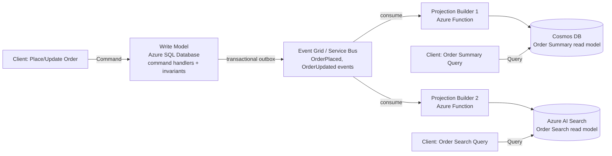
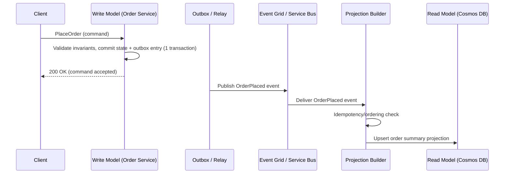
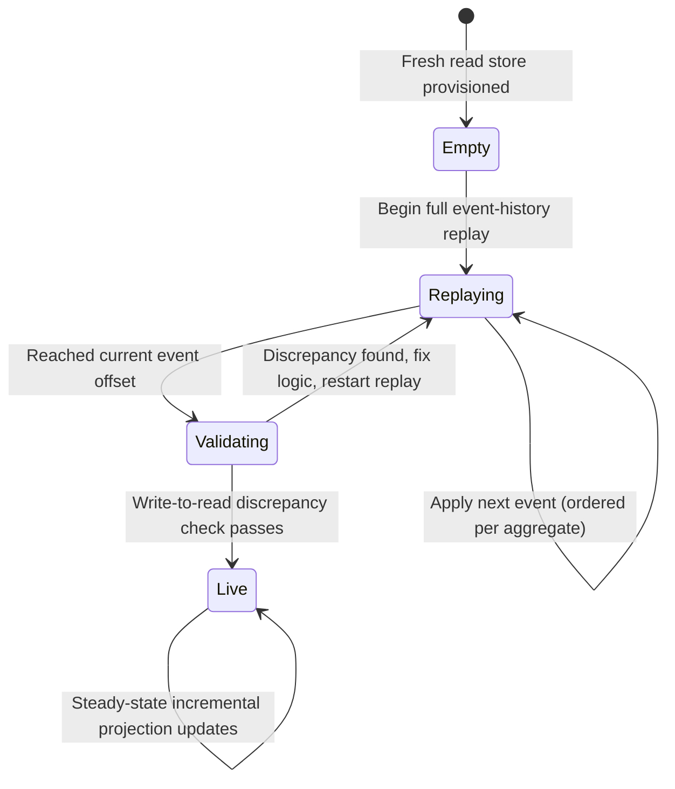
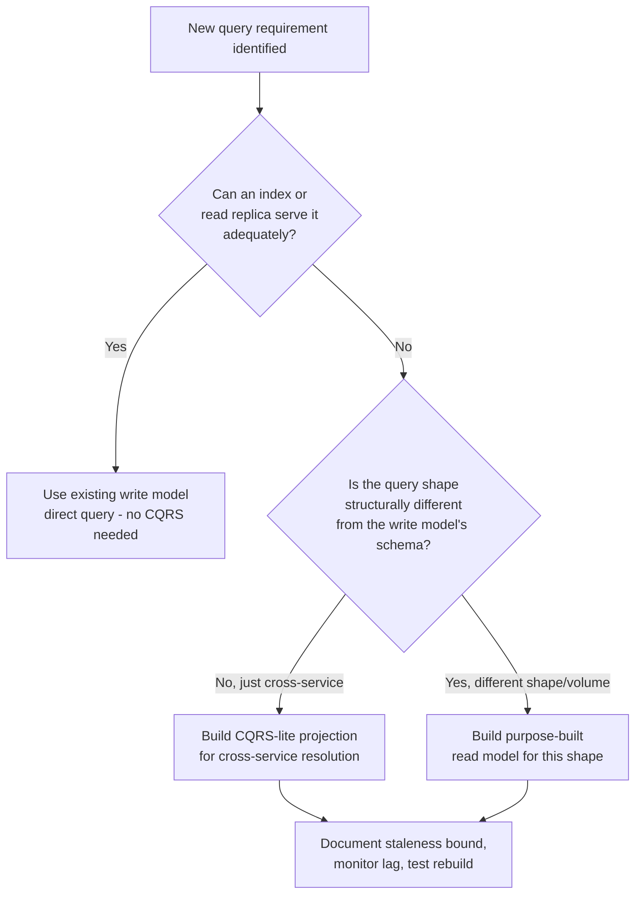

# CQRS

> Part of the **Enterprise Data & AI Architecture Handbook** · Phase-14 — Event-Driven Architecture & Integration · Chapter 03.
> Estimated study time: **45 min reading + ~3h labs**.
> **Prerequisite:** read [Microservices Architecture](02_Microservices_Architecture.md) first.

---

## Executive Summary

[Microservices Architecture](02_Microservices_Architecture.md) §8.3 established database-per-service data ownership as the discipline that makes independent deployability genuinely true, and named the consequence that discipline forces: a query spanning multiple services' data can no longer be a single cross-database join, and must instead be resolved via API composition or a dedicated, purpose-built read model — deliberately deferring the full design of that read model to this chapter. **CQRS (Command Query Responsibility Segregation)** is the pattern that formalizes this deferral: it separates a system's **write model** (which validates and applies commands, per [Event-Driven Architecture](01_Event_Driven_Architecture.md) §14.1's command definition) from its **read model** (which answers queries), as two structurally distinct models — potentially different schemas, different storage technologies, and different services entirely — kept in sync asynchronously via the events the write model emits.

This chapter covers **command versus query models** as the foundational split this pattern is named for, and the deliberately different design forces that shape each independently once they are no longer required to share one schema; **read model projections** as the mechanism — a subscriber to the write model's published events, incrementally building and maintaining a denormalized, query-optimized view purpose-built for a specific read pattern; **consistency and eventual sync** as the unavoidable trade-off CQRS introduces the moment read and write models are physically separated, and the concrete techniques (staleness bounds, read-your-writes patterns) that make that trade-off operationally manageable; **CQRS with event sourcing** as the natural, frequently-paired combination where the write model's event stream (previewed in [Event-Driven Architecture](01_Event_Driven_Architecture.md) §Storage) is itself the source of truth, formalized in full in Phase-14 Chapter 04; and, deliberately given the same weight this handbook's [Microservices Architecture](02_Microservices_Architecture.md) gave its own "when NOT to use microservices" section, **when CQRS adds versus removes complexity** — since CQRS is a pattern this chapter documents as being reached for far more often than its actual read/write asymmetry justifies.

The platform bias is **Azure-primary (~60%)** — Azure SQL Database or Cosmos DB for the write model, Cosmos DB or Azure AI Search for denormalized read projections, and Azure Functions/Service Bus/Event Grid (reused directly from [Event-Driven Architecture](01_Event_Driven_Architecture.md) §31) as the projection-building event-consumption pipeline — **~30% enterprise open source** (PostgreSQL for the write model, Redis or Elasticsearch for read projections, Kafka/Debezium for change-data-capture-driven projection building, reusing [Change Data Capture](../Phase-07/06_Change_Data_Capture.md)'s own mechanics) — **~10% AWS/GCP comparison-only** (DynamoDB/RDS plus ElastiCache; Cloud Spanner/Firestore plus Memorystore).

**Bottom line:** CQRS is a genuine, powerful answer to the specific problem of a read pattern and a write pattern with fundamentally incompatible scaling, schema, or query-shape requirements — but for the large majority of services, a single, well-indexed database serving both reads and writes is simpler, cheaper, and entirely adequate, and the recurring mistake this chapter documents, consistent with this handbook's now-established justification-before-adoption discipline, is adopting full CQRS (separate read and write stores, asynchronous projection pipelines, eventual consistency) for a service whose actual read/write asymmetry a few database indexes and a read replica would have solved with a fraction of the operational cost.

---

## Learning Objectives

By the end of this chapter you will be able to:

1. **Distinguish the command model from the query model**, and explain the specific asymmetries in scale, schema shape, or consistency requirements that justify separating them.
2. **Design a read model projection** that consumes published events and incrementally builds a denormalized, query-optimized view, resolving the cross-service query problem [Microservices Architecture](02_Microservices_Architecture.md) §8.3 raised.
3. **Reason precisely about eventual consistency** in a CQRS system, including staleness bounds and read-your-writes techniques for the specific user-experience problems asynchronous projection introduces.
4. **Explain the relationship between CQRS and event sourcing**, including why they are frequently paired but are, in fact, independently adoptable patterns.
5. **Apply Azure Cosmos DB, Azure SQL Database, and Azure Functions/Service Bus** to build a concrete CQRS read/write split with a monitored projection pipeline.
6. **Recognize when CQRS is NOT justified**, and defend a single-database recommendation against a team defaulting to CQRS out of architectural fashion.
7. **Defend a CQRS architecture decision** in engineer, staff engineer, architect, and CTO review settings, including the specific asymmetry-based justification a review should demand before approving it.

---

## Business Motivation

- **Read and write workloads frequently have genuinely incompatible scaling profiles.** A typical enterprise system reads far more often than it writes (a product catalog read thousands of times per write), and CQRS lets the read side scale independently — more replicas, a different, read-optimized storage technology — without over-provisioning the write side to match, directly extending the heterogeneous-scaling business driver [Microservices Architecture](02_Microservices_Architecture.md)'s own Business Motivation named at the service level, now applied within a single bounded context's own read/write split.
- **A single normalized write-side schema is frequently the wrong shape for the queries the business actually needs.** A write model correctly enforces the business's invariants and consistency rules in a normalized, transactionally-safe shape; a dashboard, search page, or cross-aggregate report typically wants a denormalized, pre-joined shape — forcing one schema to serve both well is a common, genuine source of either a compromised write model (denormalized for query convenience, harder to keep consistent) or a slow read path (normalized joins computed on every query).
- **Resolving [Microservices Architecture](02_Microservices_Architecture.md) §8.3's cross-service query problem without violating database-per-service isolation is CQRS's direct, concrete payoff** — a materialized read model populated from each owning service's published events answers a cross-boundary query without any service querying another's database directly, the specific mechanism this chapter formalizes.
- **Independent technology choice for reads versus writes** (a relational write store for transactional integrity, a search-optimized or graph-optimized read store for query flexibility, per [Vector Databases: Qdrant and Milvus](../Phase-13/01_Vector_Databases_Qdrant_and_Milvus.md) and [Knowledge Graphs with Neo4j](../Phase-13/02_Knowledge_Graphs_with_Neo4j.md) as concrete read-side technology options) is a genuine benefit once the read/write asymmetry is real, though — echoing [Microservices Architecture](02_Microservices_Architecture.md)'s own polyglot-persistence caution — never a justification on its own absent that asymmetry.
- **Adopting CQRS without a genuine read/write asymmetry is a real, recurring, expensive mistake**, not a hypothetical risk — this chapter's Business Motivation deliberately mirrors the justification-before-adoption discipline established across [Knowledge Graphs with Neo4j](../Phase-13/02_Knowledge_Graphs_with_Neo4j.md) ADR-0165, [GraphRAG](../Phase-13/04_GraphRAG.md) ADR-0167, [Ontologies and Taxonomies](../Phase-13/05_Ontologies_and_Taxonomies.md) ADR-0168, and [Microservices Architecture](02_Microservices_Architecture.md) ADR-0170: eventual consistency, a second data store, and an asynchronous projection pipeline to operate and monitor are real, ongoing costs that must be earned by a specific, measured read/write asymmetry, not adopted because a system already uses events and CQRS "naturally fits."

---

## History and Evolution

- **1970s-1980s — Bertrand Meyer's Command-Query Separation (CQS) principle** (formalized in Meyer's work on Eiffel and object-oriented design) establishes the foundational, method-level rule this chapter's pattern is named for and scales up from: any method should either be a command that performs an action and returns nothing, or a query that returns data and has no side effect, never both — CQRS is this same discipline applied at the architecture level rather than the individual-method level.
- **2000s — Greg Young formalizes CQRS** as a distinct architectural pattern (building on discussions within the DDD community, including work alongside [Domain-Driven Design](../Phase-01/05_Domain_Driven_Design.md)'s own Eric Evans), explicitly separating it from CQS by scaling the read/write separation up to the level of entire models, potentially entire services and data stores, rather than individual method signatures.
- **2010 — Young and Udi Dahan's conference talks and the "CQRS Journey" guidance (Microsoft patterns & practices)** popularize CQRS specifically paired with event sourcing (previewed here, formalized in Phase-14 Chapter 04) as a combined pattern for domains with complex business rules and a genuine need for a full audit trail — this pairing becomes, in practice, how most engineers first encounter CQRS, contributing to the common (and, per this chapter's Core Concepts section, incorrect) assumption that the two patterns are inseparable.
- **2011-2013 — Netflix and other high-scale consumer platforms publicly document read/write-store separation** for specific, extremely read-heavy services (a product catalog, a social-media feed) as a scaling necessity, independent of any DDD or event-sourcing framing — establishing that CQRS's core read/write-asymmetry motivation is a genuine, standalone scaling technique, not solely a DDD-community pattern.
- **2014 onward — CQRS becomes closely associated with the microservices architectural style** (per [Microservices Architecture](02_Microservices_Architecture.md)'s own History section) as the standard answer to that style's database-per-service cross-query problem, with the read-model-as-event-consumer mechanism becoming a standard, well-understood microservices integration pattern rather than a niche or academic technique.
- **2018-2020 — the "CQRS overuse" backlash** parallels [Microservices Architecture](02_Microservices_Architecture.md)'s own "microservices premium" backlash: widely-cited engineering retrospectives document teams adopting full CQRS-plus-event-sourcing for CRUD-simple domains with no genuine read/write asymmetry, incurring the eventual-consistency and dual-store operational cost for no corresponding benefit — directly motivating this chapter's dedicated "when CQRS adds versus removes complexity" emphasis.
- **2020s — managed cloud data platforms make read-model projection building substantially lower-friction** (Azure Functions with Event Grid/Service Bus triggers, Cosmos DB's change feed, per this chapter's Azure Implementation section), lowering CQRS's implementation cost relative to a decade earlier — though this chapter's Trade-offs section is explicit that lower implementation friction does not, by itself, change whether a given service's read/write asymmetry actually justifies adopting the pattern at all.

---

## Why This Technology Exists

A single, shared read/write model forces one schema, one storage technology, and one scaling profile to simultaneously serve two workloads — validating and applying business-rule-governed writes, and answering flexible, often denormalized, often much-higher-volume reads — whose actual design pressures frequently point in opposite directions: a write model wants normalization (avoiding update anomalies, enforcing invariants transactionally), while a read model wants denormalization (avoiding expensive joins, matching the exact shape a specific query needs). CQRS exists to relieve this tension by simply not requiring one model to do both jobs: the write model is optimized purely for correctly validating and applying commands, and one or more read models — each purpose-built for a specific query pattern, kept eventually consistent via the write model's published events (per [Event-Driven Architecture](01_Event_Driven_Architecture.md) §14.2's pub/sub mechanics) — are optimized purely for serving queries fast.

---

## Problems It Solves

- **Read/write scaling asymmetry**, resolved by letting the read side scale independently (more replicas, a different storage technology, aggressive caching) without over-provisioning the write side to match a read volume the write side never actually needs to serve.
- **Cross-service and cross-aggregate query resolution without violating database-per-service isolation**, resolved by a materialized read-model projection consuming published events from each contributing service or aggregate — the direct, concrete resolution of the problem [Microservices Architecture](02_Microservices_Architecture.md) §8.3 named and deferred to this chapter.
- **Schema tension between transactional-integrity needs and query-convenience needs**, resolved by letting the write model stay normalized and invariant-focused while one or more read models are freely denormalized to match specific query shapes, without either model compromising the other's design.
- **Multiple, structurally different read patterns against the same underlying data** (a search page, a reporting dashboard, a real-time operational view), resolved by building a distinct, purpose-built read model per pattern rather than forcing one general-purpose schema to serve all of them adequately but optimally for none.
- **Complex business-rule validation on the write side without that complexity leaking into every query**, resolved by isolating command-handling logic (validation, invariant enforcement) entirely within the write model, leaving read models as simple, unopinionated projections with no business-rule logic of their own to duplicate or drift out of sync.

---

## Problems It Cannot Solve

- **CQRS does not eliminate the CAP-theorem and eventual-consistency realities** this handbook established in [CAP and PACELC](../Phase-02/04_CAP_and_PACELC.md) — it makes the read/write consistency trade-off explicit and asymmetric (writes are immediately consistent within the write model; reads via a projection are, by construction, eventually consistent with it) rather than removing the trade-off; a use case requiring the read path to reflect a write with zero staleness is not well served by a projection-based CQRS read model without additional, deliberate read-your-writes engineering (§15.3).
- **It does not fix a poorly-designed write model or an unclear domain model** — CQRS separates the read and write sides of whatever model already exists; if the underlying domain model (per [Domain-Driven Design](../Phase-01/05_Domain_Driven_Design.md)) is unclear or incorrectly bounded, CQRS adds a second data store and an asynchronous pipeline on top of that same unclear model, compounding rather than resolving the underlying problem.
- **It does not automatically provide an audit trail or historical replay capability** — that capability specifically comes from event sourcing (Phase-14 Chapter 04), a genuinely separate, independently-adoptable pattern this chapter's Core Concepts section is explicit about not conflating with CQRS itself; a CQRS system built on a traditional (non-event-sourced) write model has no more historical audit capability than any other traditional database-backed service.
- **It does not remove the need for idempotent, correctly-ordered event consumption** — a read-model projection is itself an event consumer subject to exactly the same at-least-once-delivery and idempotency requirements [Event-Driven Architecture](01_Event_Driven_Architecture.md) §15.3 established for any consumer; a naively-built projection that double-applies a redelivered event produces a silently incorrect read model.
- **It does not reduce total system complexity** — precisely mirroring [Microservices Architecture](02_Microservices_Architecture.md)'s own caution about relocating rather than reducing complexity, CQRS relocates the complexity of "one schema serving two workloads" into "two schemas, an asynchronous synchronization pipeline, and an explicit staleness-management discipline," a trade this chapter's Trade-offs section treats as a genuine cost requiring justification, not a simplification.

---

## Core Concepts

### 8.1 Command model vs. query model

The **command model** (or write model) is responsible for accepting a command (per [Event-Driven Architecture](01_Event_Driven_Architecture.md) §14.1's imperative, single-handler, rejectable definition), validating it against the domain's business rules and invariants, applying the resulting state change, and — in a CQRS system — publishing an event representing the fact that just happened. It is typically modeled as a normalized, transactionally-consistent schema (or, when paired with event sourcing per §8.4, as an append-only event stream) optimized entirely for correctness and invariant enforcement, never for query convenience. The **query model** (or read model) is responsible only for answering queries, has no business-rule-validation responsibility of its own, and is free to be denormalized, duplicated across multiple purpose-built shapes, and physically separate from the write model entirely. The critical discipline this split enforces: **a query must never mutate state, and a command must never be relied upon to return richly-queryable data** — the same CQS discipline this chapter's History section traces to Meyer, now applied at the model level rather than the method level.

### 8.2 Read model projections

A **projection** is the mechanism that builds and maintains a read model: a dedicated consumer subscribes to the write model's published events (via the same pub/sub mechanics [Event-Driven Architecture](01_Event_Driven_Architecture.md) §14.2-15.1 already established) and, for each event received, updates its own denormalized store to reflect that change — incrementally, one event at a time, rather than recomputing the entire view from scratch on every update. A single write model can feed **any number of independent projections**, each purpose-built for a distinct query shape (a search-optimized projection in Azure AI Search, a dashboard-optimized aggregate projection in Cosmos DB, a full-text projection in Elasticsearch) — directly realizing the "multiple read patterns against the same underlying data" business driver named above, and directly extending [Event-Driven Architecture](01_Event_Driven_Architecture.md) §14.2's fan-out mechanism from independent *services* reacting to an event to independent *read models* doing the same. Rebuilding a projection from scratch (replaying the full event history against a fresh, empty read store) is a first-class, expected operation — not an exceptional recovery path — precisely because a projection is, by design, a derived, disposable artifact with no data that cannot be reconstructed from the write model's events; this is the direct mechanical reason a durable, replayable event log ([Apache Kafka](../Phase-07/02_Apache_Kafka.md), or the write model's own event stream under event sourcing, §8.4) is such a natural fit underneath a projection-building pipeline.

### 8.3 Consistency and eventual sync

Because a projection is updated asynchronously, after the corresponding command has already been committed and acknowledged in the write model, a query against the read model can return **stale data** for some bounded window after a write — the read model reflects the world as of the last event it has processed, not necessarily the world as of "right now." This chapter treats this staleness as a design parameter to be measured and bounded, not an incidental implementation detail to be ignored:

- **Staleness bound**: the maximum expected (and, ideally, monitored and alerted-on, per §21) delay between a command committing in the write model and the corresponding change being reflected in a given read model — typically low hundreds of milliseconds to a few seconds for a well-provisioned projection pipeline under normal load, but a real, measurable number that must be communicated to and accepted by the product/UX decision for that specific read path, not silently assumed to be "basically instant."
- **Read-your-writes**: for the common user-experience requirement that a user should immediately see the effect of their own action (submitting a form and immediately seeing the updated list), a system can either (a) read directly from the write model for that specific immediate-post-write view, bypassing the read model entirely for that one case, or (b) have the client optimistically apply its own known write locally while waiting for the projection to catch up, or (c) have the write path synchronously wait for the specific projection to catch up before returning (sacrificing some of CQRS's async-decoupling benefit for that specific interaction). None of these is universally correct; the choice is a per-interaction UX decision, directly analogous to [Microservices Architecture](02_Microservices_Architecture.md) §8.2's per-interaction sync-versus-async decision.
- **Eventual, not guaranteed, convergence**: a read model converges to consistency with the write model only once every relevant event has been processed — a stuck or lagging projection consumer (per [Event-Driven Architecture](01_Event_Driven_Architecture.md) §21's consumer-lag monitoring, directly reused here) means the read model's staleness grows unbounded until the underlying problem is fixed, which is why projection-lag monitoring (§21) is a mandatory, not optional, operational control for any production CQRS system.

### 8.4 CQRS with event sourcing

CQRS and event sourcing (formalized in full in Phase-14 Chapter 04) are **frequently paired but are independently adoptable patterns**, a distinction this chapter's History section already flagged as commonly, and incorrectly, conflated:

- **CQRS without event sourcing**: the write model is a traditional, current-state database (a normalized relational schema), and the write model publishes explicit domain events *in addition to* updating its own current-state tables (via the transactional outbox pattern, per [Event-Driven Architecture](01_Event_Driven_Architecture.md) §26) — read models are built from those published events exactly as described in §8.2, but the write model itself has no full historical replay capability of its own; only its current state is durable.
- **CQRS with event sourcing**: the write model's *only* durable state is its append-only event stream — current state is derived by replaying events, not stored directly — and that same event stream is naturally and directly the source projections consume from, with no separate outbox mechanism needed since the event stream already is the write model's system of record.
- **Why they are so often paired in practice**: event sourcing already produces exactly the event stream a read-model projection needs to consume, making the "publish an event for every state change" requirement CQRS depends on a natural, already-present byproduct rather than an additional mechanism to build — but a team can build a fully event-sourced write model with no CQRS read-model separation at all (querying the write model's current-state snapshot directly), and a team can build a fully CQRS-separated system with a traditional, non-event-sourced write model, exactly as described above. This chapter's Decision Matrix treats the two as two independent axes, not a single bundled decision.

### 8.5 When CQRS adds vs. removes complexity

Given equal weight to every other Core Concepts subsection, per this chapter's Executive Summary: CQRS **removes** complexity precisely when a genuine, measured read/write asymmetry exists — a read volume orders of magnitude higher than write volume, multiple structurally different query shapes against the same data, or a cross-service query [Microservices Architecture](02_Microservices_Architecture.md) §8.3 already established cannot be solved any other way without violating data ownership. CQRS **adds** complexity — a second data store to operate, monitor, and secure; an asynchronous projection pipeline that can lag, fail, or need replaying; an eventual-consistency user-experience discipline that a single-database CRUD service never has to design for — whenever that asymmetry is not actually present, or is present but modest enough that a read replica and a few well-chosen indexes on a single database would resolve it at a fraction of the operational cost. This chapter's Decision Matrix formalizes exactly where that line falls.

---

## Internal Working

### 9.1 How a command flows through a CQRS write path

A client issues a command (e.g., `UpdateShippingAddress`) to the write model's command handler, which loads the relevant aggregate's current state (either directly from a current-state store, or by replaying its event stream under event sourcing, §8.4), validates the command against the aggregate's invariants, applies the resulting state change, commits it durably (within a single transaction, if not event-sourced, or as a new appended event, if event-sourced), and publishes a corresponding domain event — using the transactional outbox pattern (per [Event-Driven Architecture](01_Event_Driven_Architecture.md) §26) to guarantee the state change and the event publish are atomic, never one without the other.

### 9.2 How a projection consumes and applies an event

A projection's event-consumer process receives the published domain event (subject to the same at-least-once, idempotent-consumption discipline [Event-Driven Architecture](01_Event_Driven_Architecture.md) §15.3 established generally), determines whether it has already applied this specific event (by tracking the last-processed event ID or offset, directly analogous to [Apache Kafka](../Phase-07/02_Apache_Kafka.md) §8.5's committed-offset semantics), and if not, applies the event's implied change to its own denormalized read store — typically an upsert against a single, pre-joined document or row representing the query shape that projection serves, rather than a normalized multi-table write.

### 9.3 How a query is served from the read side

A client's query is routed directly to the relevant read model (never through the write model, and never triggering any command-handling logic), which returns its current — possibly stale, per §8.3 — denormalized view directly, typically via a single, simple lookup rather than the joins or aggregations a normalized write-side schema would require for the same query, which is the entire performance payoff this chapter's pattern exists to deliver.

### 9.4 How a projection is rebuilt from scratch

When a projection's schema changes, a bug in its event-handling logic is fixed, or a genuinely new projection is added long after the write model has been running, the standard recovery mechanism is a **full rebuild**: create a fresh, empty read store, and replay the entire relevant event history (from the durable event log, per [Apache Kafka](../Phase-07/02_Apache_Kafka.md) §Storage's retention treatment, or the event-sourced write model's own full stream) through the same projection-application logic described in §9.2, from the very first event to the present — a first-class, expected, and, per §8.2, entirely routine operation rather than an emergency recovery procedure, precisely because the read model holds no information that cannot be reconstructed this way.

---

## Architecture

### 10.1 Reference architecture: order-management CQRS with two independent read models



### 10.2 Why the architecture works

The write model (Azure SQL Database) enforces order-placement invariants (valid customer, valid line items, inventory checks) within a single ACID transaction, entirely decoupled from how that data will eventually be queried. Two independent projections consume the same `OrderPlaced`/`OrderUpdated` events (reusing [Event-Driven Architecture](01_Event_Driven_Architecture.md)'s own reference-architecture event types) and build two structurally different read models — a fast, denormalized summary view in Cosmos DB for a customer's own order-history page, and a full-text-searchable view in Azure AI Search for customer-support agents searching across all orders — neither of which could be served efficiently by a single shared schema without either an over-denormalized write model or slow, join-heavy queries against a normalized one.

### 10.3 ADR example

See this chapter's [Architecture Decision Record (ADR-0171)](#architecture-decision-record-adr-0171-cqrs-scoped-to-the-order-search-and-summary-read-paths-only-not-the-entire-domain) under Enterprise Recommendations for the Context/Decision/Consequences/Alternatives treatment of why this reference architecture deliberately applies CQRS to only two specific, measured-asymmetry read paths rather than the entire order-management domain.

---

## Components

- **Command handler** — validates and applies a command against the write model's invariants, per §8.1 and §9.1.
- **Write model / aggregate store** — the durable, transactionally-consistent store of record for command-side state (a normalized relational schema, or an event stream under event sourcing, §8.4).
- **Domain event publisher** — the transactional-outbox-backed mechanism (reused from [Event-Driven Architecture](01_Event_Driven_Architecture.md) §26) guaranteeing every committed state change is reliably published as an event.
- **Projection builder** — the event-consuming process (an idempotent, offset-tracking consumer, §9.2) that incrementally updates one specific read model.
- **Read model store** — the denormalized, query-optimized store a projection maintains; there may be several, each purpose-built for a distinct query shape.
- **Query handler / read API** — the simple, business-rule-free API surface that serves queries directly from a read model, with no interaction with the write model at all.
- **Projection-lag monitor** — the operational component (§21) tracking each projection's consumer lag against the write model's event stream, the primary leading indicator of a staleness or availability problem.

---

## Metadata

Every read model should be catalogued (extending [Data Catalog and Lineage](../Phase-08/02_Data_Catalog_and_Lineage.md) and [Microservices Architecture](02_Microservices_Architecture.md) §Metadata's service-catalog discipline to projections specifically) with its source event types and owning write model, its specific query shape and intended consumer, its measured staleness bound (§8.3), and its rebuild procedure and estimated rebuild time (§9.4) — this last item in particular is operationally critical, since a read model with an unknown or unmeasured rebuild time is a read model whose recovery time objective, in an incident, is also unknown.

---

## Storage

The write model's storage choice is driven entirely by transactional-integrity and invariant-enforcement needs — Azure SQL Database or PostgreSQL for a relational, ACID-transactional write model, or an append-only event store (Cosmos DB with an append-optimized partition-key design, or a dedicated event-sourcing framework's own store) under event sourcing (§8.4). Read model storage choice is driven entirely by the specific query shape each projection serves, independent of the write model's own choice: Cosmos DB for fast, single-document lookups by a known key; Azure AI Search for full-text and faceted search; Azure Cache for Redis for extremely low-latency, simple key-value lookups; a relational store with denormalized, pre-joined tables when the read pattern is itself relational but the joins are expensive to compute per-query. Read model storage is explicitly **never** treated as a system of record — every read store must be fully reconstructable from the write model's events (§9.4), and this reconstructability, not the read store's own durability guarantees, is what actually protects the data.

---

## Compute

Command handlers are typically deployed as part of the owning microservice's own compute (per [Microservices Architecture](02_Microservices_Architecture.md) §Compute), since command handling is inseparable from that service's own domain logic and invariants. Projection builders are well suited to serverless, event-triggered compute (Azure Functions with an Event Grid or Service Bus trigger, reused directly from [Event-Driven Architecture](01_Event_Driven_Architecture.md) §Compute) specifically because their workload is naturally event-driven, bursty, and — since a projection holds no state that cannot be rebuilt — tolerant of the occasional cold start or restart a serverless platform's scale-to-zero behavior introduces. A full projection rebuild (§9.4), however, is a sustained, potentially long-running, high-throughput compute workload (replaying a large historical event volume as fast as possible) that may warrant a dedicated, higher-capacity compute allocation distinct from the projection's normal steady-state incremental-update workload — provisioning both identically is a common, avoidable source of an unnecessarily slow rebuild during an incident.

---

## Networking

Command handlers and their write-model database connections follow the same private-endpoint, zero-trust networking baseline [Microservices Architecture](02_Microservices_Architecture.md) §Networking and [Network Security and Zero Trust](../Phase-10/04_Network_Security_and_Zero_Trust.md) ADR-0144 already established. Projection builders require network access to both the event broker (to consume) and their own read store (to write), typically within the same private virtual network as the rest of the service fleet — with the specific added consideration that a full projection rebuild (§9.4) can generate a substantial, bursty spike in both broker-read and read-store-write network throughput, which should be accounted for in the read store's own provisioned throughput/bandwidth limits rather than assumed to be negligible relative to steady-state incremental-update traffic.

---

## Security

- **Read models must enforce the same access-control entitlements as the write model they were derived from**, not a looser or unexamined default — a read model is a full copy (denormalized, but complete) of whatever data it projects, and a read-model query bypassing the write model's own authorization logic is a documented, recurring class of access-control gap, directly extending the access-control-propagation lineage this handbook has traced through [Retrieval Augmented Generation](../Phase-12/03_Retrieval_Augmented_Generation.md) ADR-0157, [Vector Databases: Qdrant and Milvus](../Phase-13/01_Vector_Databases_Qdrant_and_Milvus.md) ADR-0164, and [Model Context Protocol (MCP)](../Phase-12/06_Model_Context_Protocol_MCP.md) ADR-0160 into the read-model layer specifically.
- **Managed identity per component** (command handler, each projection builder, each read model) rather than a single shared credential across the whole CQRS pipeline, per [Identity and Access Management with Entra](../Phase-10/02_Identity_and_Access_Management_with_Entra.md)'s managed-identity-as-default principle, reused directly from [Microservices Architecture](02_Microservices_Architecture.md) §Security.
- **Projection builders are a genuine, easy-to-overlook attack surface**: a compromised or buggy projection builder with overly broad write access to its own read store, or overly broad read access to the event broker beyond the specific event types it actually needs, expands the blast radius of any compromise beyond what least-privilege scoping (per [Prompt Engineering](../Phase-12/02_Prompt_Engineering.md) ADR-0156's least-privilege lineage) would otherwise permit.
- **Right-to-be-forgotten obligations (per [Data Privacy and PII Protection](../Phase-10/07_Data_Privacy_and_PII_Protection.md) ADR-0147) must propagate to every read model independently**, exactly as [Microservices Architecture](02_Microservices_Architecture.md) §Governance already named for every service's own database — a data-subject erasure event must be consumed and correctly applied by every projection, not just the write model, and a projection's ability to correctly process a deletion event (rather than only additive/update events) must be explicitly tested, not assumed.

---

## Performance

- **Query latency on the read side is the entire performance payoff this pattern exists to deliver** — a well-designed read model answers its target query via a single lookup or a small, pre-computed aggregation, avoiding the joins or cross-service calls a shared or normalized model would require, directly realizing [Microservices Architecture](02_Microservices_Architecture.md) §8.3's cross-service-query-resolution driver.
- **Projection-processing throughput**, not query latency, is typically the write-to-read pipeline's own bottleneck under sustained high write volume — a projection builder that cannot keep pace with the write model's event-publish rate accumulates lag (§8.3), directly degrading the staleness bound every consumer of that read model implicitly depends on.
- **Full-rebuild duration (§9.4)** is a distinct, separately-measured performance characteristic from steady-state incremental latency, and should be load-tested explicitly against the actual historical event volume a production rebuild would need to replay — a rebuild procedure validated only against a small test dataset can silently take hours or days longer than expected against real production event history.
- **Batch-applying multiple events per projection-store write** (rather than one round-trip per event) is a direct, high-leverage throughput optimization for a high-volume projection, the same batching-versus-per-item-latency dial this handbook has named repeatedly across [Model Serving and Ray](../Phase-11/04_Model_Serving_and_Ray.md) and [Event-Driven Architecture](01_Event_Driven_Architecture.md) §Performance.

---

## Scalability

The read side and write side scale entirely independently, which is the structural point of the pattern: read models scale horizontally via read replicas or a horizontally-partitioned store (Cosmos DB's own partition-key-based scaling) keyed purely to query volume, with zero coupling to the write model's own transaction throughput; the write model scales to its own, typically much lower, command-volume requirements, without ever needing to be provisioned to also serve the read side's volume. Projection-builder compute scales via the same event-driven autoscaling (KEDA, queue/topic-depth-keyed, per [Event-Driven Architecture](01_Event_Driven_Architecture.md) §Compute and [Microservices Architecture](02_Microservices_Architecture.md) §Scalability) reused throughout this handbook — with the specific added requirement that a projection's *ordering* guarantee (applying events for a given aggregate in the order they were published, since applying an update before its corresponding create would corrupt the projection) must be preserved even as consumer instances scale out horizontally, via the same partition-key/session-based ordering discipline [Apache Kafka](../Phase-07/02_Apache_Kafka.md) §8.1 and [Event-Driven Architecture](01_Event_Driven_Architecture.md) §Scalability already established.

---

## Fault Tolerance

- **A stalled or failed projection builder degrades read staleness, not write availability** — the write model continues accepting and committing commands normally even if every projection consumer is entirely down, since the write model's own durability and the projection's consumption of it are fully decoupled; this is a genuine resilience benefit of the pattern, directly analogous to the fault-isolation benefit [Microservices Architecture](02_Microservices_Architecture.md) §Fault Tolerance named at the service level.
- **Dead-lettering of a poison event within a projection's consumption pipeline** (per [Event-Driven Architecture](01_Event_Driven_Architecture.md) §15.4) prevents a single malformed or unexpected event from permanently blocking that projection's entire subsequent event stream, at the cost of that specific aggregate's projected state remaining stale until the dead-lettered event is investigated and reprocessed.
- **A read model's own outage (the read store itself being unavailable) does not affect write availability or other, independently-hosted read models** — a specific instance of the general fault-isolation benefit multiple independent read models provide, directly paralleling [Event-Driven Architecture](01_Event_Driven_Architecture.md) §14.2's fan-out-to-independent-subscribers isolation property.
- **Full projection rebuild (§9.4) as the ultimate recovery mechanism** for any read-model corruption, data loss, or unrecoverable schema mismatch — the guarantee that recovery is always possible, given the durable event history, is the pattern's single strongest fault-tolerance property, directly dependent on the underlying event broker's own retention and durability guarantees (per [Apache Kafka](../Phase-07/02_Apache_Kafka.md) §19) being sufficient to cover the full rebuild window.

---

## Cost Optimization

- **Right-size each read model's storage and compute independently to its own actual query volume**, rather than provisioning every read model identically regardless of its actual traffic — the entire cost-efficiency payoff of decoupled read/write scaling (§18) is lost if read models are still provisioned by a single, undifferentiated guess.
- **Avoid building a dedicated read model for a query pattern a single well-indexed query against an existing model would already serve adequately** — this chapter's central cost discipline (§8.5): every additional read model is an additional store to provision, monitor, and secure, and that cost must be earned by a genuine, measured query-pattern need, not incurred reflexively whenever a new query requirement appears.
- **Monitor and decommission unused or low-traffic read models** — a projection built for a feature that was later deprioritized or removed, but never decommissioned, continues consuming projection-builder compute and read-store capacity indefinitely for zero business value, a specific instance of the "zombie service" cost risk [Microservices Architecture](02_Microservices_Architecture.md) §Cost Optimization already named at the service level.
- **Batch and throttle full projection rebuilds to off-peak windows** where the underlying event broker's read throughput is a metered cost, avoiding both an unnecessary cost spike and contention with steady-state production event-consumption traffic.
- **Worked FinOps example:** a team builds four separate Cosmos DB read models for four distinct dashboard widgets on the same customer-account page, each independently provisioned at 1,000 RU/s (roughly $584/month per container at standard provisioned throughput, ~$2,336/month total), when a query-pattern analysis later shows three of the four widgets' actual query volume and latency requirements would be comfortably served by a single shared, moderately denormalized read model at 1,200 RU/s (~$700/month) — consolidating those three into one read model while retaining a genuinely distinct fourth read model (a full-text search widget with a structurally different query shape, correctly justified per §8.5's asymmetry criterion) reduces total read-model cost from ~$2,336/month to roughly $1,284/month, an ~45% reduction, achieved specifically by applying this chapter's "don't build a dedicated read model without a genuine, distinct query-shape justification" discipline retroactively.

---

## Monitoring

- **Projection lag** (the time or event-offset gap between the write model's most recently published event and the most recently applied event in each read model) as the single most important CQRS-specific monitoring signal, directly analogous to and extending [Event-Driven Architecture](01_Event_Driven_Architecture.md) §21's consumer-lag treatment to the read-model-freshness context specifically.
- **Per-read-model query latency and volume**, tracked independently per read model (not aggregated across all read models together), since the entire point of separate read models is that they serve structurally different query patterns with potentially very different latency profiles.
- **Projection dead-letter rate**, per [Event-Driven Architecture](01_Event_Driven_Architecture.md) §21's dead-letter-queue-growth monitoring, reused here with the added context that a dead-lettered event specifically means one or more aggregates' projected state is now stale in a way ordinary lag does not capture (it will not simply catch up once the consumer is healthy; the specific event needs remediation).
- **Rebuild duration and last-successful-rebuild timestamp per read model** — tracking not just whether a rebuild *can* be performed, but how long the most recent one actually took and how long ago it was last validated, directly informing the recovery-time-objective question named in this chapter's Metadata section.
- **Write-to-read discrepancy spot-checks** — a periodic, automated comparison of a sample of write-model records against their corresponding read-model projection, catching a systematic projection-logic bug (an incorrectly-applied event type, a silent off-by-one in an aggregation) that pure lag monitoring alone would not detect, since a projection can be perfectly "caught up" in lag terms while still being logically wrong.

---

## Observability

Distributed tracing must propagate a trace/correlation context from the original command through its published event(s) and into every projection's own event-processing span (directly extending [Event-Driven Architecture](01_Event_Driven_Architecture.md) §22's correlation-ID discipline and [Microservices Architecture](02_Microservices_Architecture.md) §22's mixed sync/async tracing treatment into the CQRS-specific write-to-read path), so that "why does this specific read model not yet reflect this specific command" is answerable via a single trace lookup — the write model's commit timestamp, the event's publish timestamp, and the projection's processing timestamp all correlated on one trace — rather than requiring separate, uncorrelated investigation of the write model's logs and the projection builder's logs independently.

### Operational Response Playbook

| Signal | Detection Query/Method | Remediation |
|---|---|---|
| A specific read model's projection lag grows steadily beyond its documented staleness bound (e.g., from a typical 2s to a sustained 5+ minutes) | Automated alert on the projection-lag metric (§21) exceeding a configured threshold for a sustained window, correlated with the projection builder's own compute/scaling metrics | Check whether the projection builder is under-scaled relative to current event volume (autoscaling configuration, §18) versus genuinely stuck/crashing (check for a dead-lettered poison event, §Fault Tolerance, blocking that specific aggregate's stream); scale out or fix the poison event as appropriate, and communicate the temporary staleness-bound breach to consumers of that specific read model if it is customer-visible |
| A write-to-read discrepancy spot-check (§21) flags a read model's projected value diverging from the write model's actual current state for records that are NOT within the normal staleness window | Automated periodic comparison job output, filtered to discrepancies older than the documented staleness bound | Treat as a projection-logic bug, not a lag issue — inspect the specific event type(s) associated with the diverging records for an incorrectly-implemented event handler; fix the handler, then trigger a full or partial rebuild (§9.4) for the affected read model rather than attempting to patch individual incorrect records by hand |

---

## Governance

CQRS governance extends [Microservices Architecture](02_Microservices_Architecture.md) §23's service-and-event-contract catalog discipline to read models as explicitly governed, first-class derived artifacts: every read model should be catalogued with its source event types, its owning team, its measured staleness bound, its data-classification tier (inherited from, and never lower than, its source write model's classification, since a read model is a full copy of the data it projects), and its documented rebuild procedure. Schema changes to a read model's own projection logic should be tested against the same event-history-replay validation this chapter's Hands-on Labs section exercises directly, catching a breaking projection-logic change before it corrupts a production read model rather than after. Right-to-be-forgotten obligations ([Data Privacy and PII Protection](../Phase-10/07_Data_Privacy_and_PII_Protection.md) ADR-0147) extend to every read model independently and are, in fact, a genuinely harder governance problem in a CQRS system than in a simple single-database service: an erasure event must be correctly consumed and applied by every projection (not merely the write model), and — since a projection can, in principle, be fully rebuilt from event history at any time — a data-subject's erasure must also be durably reflected in whatever mechanism governs future rebuilds (e.g., the erasure itself recorded as an event, or the source events themselves redacted/tombstoned), or a routine rebuild could silently resurrect erased data into a read model, directly paralleling the exact "verification gap" and event-store-erasure lesson [Event-Driven Architecture](01_Event_Driven_Architecture.md) §Governance already flagged for durable event stores generally.

---

## Trade-offs

- **Read/write scaling and schema independence vs. eventual consistency and dual-store operational cost**: CQRS trades a single, always-immediately-consistent model for independently-optimized read and write models, at the direct cost of designing for staleness (§8.3) and operating a second (or several) data store(s) and an asynchronous projection pipeline — a trade genuinely favorable once a real read/write asymmetry exists, and genuinely unfavorable for a service without one.
- **CQRS with vs. without event sourcing** (§8.4): pairing the two gives a natural, already-present event stream to project from and a full historical audit/replay capability, at the cost of the write model itself needing the more unusual event-sourced modeling discipline (formalized in Phase-14 Chapter 04); CQRS alone (without event sourcing) is simpler to introduce onto an existing, traditional write model, at the cost of needing an explicit transactional-outbox mechanism to reliably publish events a non-event-sourced write model does not produce as a natural byproduct.
- **Single shared read model vs. multiple purpose-built read models**: one read model serving several different query patterns is cheaper to operate but reintroduces some of the schema-tension problem CQRS exists to relieve; multiple purpose-built read models each serve their own query pattern optimally, at a proportionally higher operational and cost footprint (§21's worked example) that must be justified per additional read model, not assumed free.
- **Is CQRS even necessary, or would a read replica and better indexing suffice?** Per this chapter's central §8.5 caution, directly extending the same question [Vector Databases: Qdrant and Milvus](../Phase-13/01_Vector_Databases_Qdrant_and_Milvus.md) and [Event-Driven Architecture](01_Event_Driven_Architecture.md) each asked of their own more sophisticated default: a modest read/write asymmetry, or a handful of slow queries against an otherwise well-functioning single database, is very often better and more cheaply resolved with a read replica, materialized view, or additional indexes than with a full CQRS separation — CQRS earns its complexity specifically through a genuine, structurally different query-shape or cross-service-boundary need, not through read volume alone.

---

## Decision Matrix

| Scenario | Recommended Choice | Rationale |
|---|---|---|
| Single service, modest read/write asymmetry, all queries fit reasonably well against a normalized schema with good indexing | Single database, read replica if read volume alone is the concern | CQRS's dual-store and eventual-consistency cost is unjustified when indexing/replication already solves the actual measured problem |
| Cross-service query need spanning multiple bounded contexts (per [Microservices Architecture](02_Microservices_Architecture.md) §8.3) that cannot be resolved without violating database-per-service isolation | CQRS-lite: a dedicated read-model projection consuming each contributing service's published events | This is the scenario CQRS directly and uniquely resolves without compromising service data ownership |
| Multiple structurally different query shapes against the same aggregate (search, dashboard aggregation, operational lookup) with materially different latency/volume requirements each | CQRS with multiple purpose-built read models, one per query shape | Each read model can be independently optimized in storage technology and schema; a single shared model would compromise at least one query shape |
| Domain requiring a full, tamper-evident audit trail of every state change, alongside genuine read/write asymmetry | CQRS paired with event sourcing (Phase-14 Chapter 04) | Event sourcing's audit-trail capability and CQRS's read-model-projection mechanism reinforce each other naturally, per §8.4 |
| Domain requiring a full audit trail but with no genuine read/write asymmetry or cross-service query need | Event sourcing alone, without a separate CQRS read-model split | Query the event-sourced write model's own current-state projection directly; a separate CQRS read side adds cost without a corresponding benefit here |
| Team defaulting to CQRS because "the system is event-driven, so CQRS naturally fits" with no measured asymmetry actually identified | Single database (or, at most, a read replica) | The stated justification is architectural fashion, not a measured need — per §8.5 and this chapter's central caution |

---

## Design Patterns

- **Materialized view projection**: the standard read-model-building pattern this chapter formalizes — an event-consuming process incrementally upserting a denormalized view, directly analogous to a database materialized view but maintained by application-level event consumption rather than the database engine's own refresh mechanism.
- **Transactional outbox for reliable event publication**: reused directly from [Event-Driven Architecture](01_Event_Driven_Architecture.md) §26, ensuring a command's state change and its corresponding published event are never inconsistent with one another (§9.1).
- **Versioned read-model rebuild (blue-green projection)**: build a new version of a read model's schema or logic under a new name/container alongside the existing one, fully rebuilt from event history, then cut read traffic over once validated — avoiding any read-availability gap during a projection-logic change, directly analogous to [Vector Databases: Qdrant and Milvus](../Phase-13/01_Vector_Databases_Qdrant_and_Milvus.md) §26's dual-write embedding-migration pattern and [Event-Driven Architecture](01_Event_Driven_Architecture.md) §Migration Considerations' dual-publish broker-migration pattern.
- **Read-your-writes bypass**: for a specific interaction requiring immediate post-write consistency (§8.3), route that one query directly to the write model (or a synchronously-updated cache) rather than the asynchronous read model, deliberately scoped to only the specific interactions that need it.
- **CQRS-lite (read model without a fully separate write-side technology)**: the most common real-world variant — the write model remains a conventional service-owned database, and only the read side is separated into a dedicated projection, without the full architectural ceremony (separate command-handling infrastructure, potentially event sourcing) a "textbook" CQRS implementation might otherwise imply; this is the pattern [Microservices Architecture](02_Microservices_Architecture.md) §8.3 specifically previewed and this chapter's Decision Matrix recommends as the default starting point.

---

## Anti-patterns

- **CQRS adopted with no measured read/write asymmetry**, purely because the surrounding system is event-driven or because CQRS is the current architectural fashion — this chapter's single most emphasized anti-pattern, repeated across Business Motivation, Problems It Cannot Solve, Trade-offs, and this chapter's dedicated ADR.
- **A read model with business-rule validation logic of its own**, silently reintroducing command-like responsibility into what should be a purely derived, business-rule-free projection — a direct violation of the CQS discipline (§8.1) this pattern is named for, and a common source of divergence between what the write model considers valid and what a read model implicitly assumes.
- **No projection-lag monitoring in production**, discovering a silently-stalled projection only when a customer complains that their data appears wrong or missing — the CQRS-specific instance of [Event-Driven Architecture](01_Event_Driven_Architecture.md)'s own "unmonitored dead-letter queue" and "no end-to-end SLA metric" anti-patterns.
- **An unmeasured or untested projection-rebuild procedure**, discovering during an actual incident that a full rebuild takes far longer than assumed, or does not work correctly at all, because it was never validated against realistic production event volume (§17, §21).
- **Conflating CQRS and event sourcing as a single, inseparable decision** (§8.4) — adopting the full ceremony of both together by default, without independently evaluating whether the domain's audit-trail need and its read/write asymmetry need are each individually justified.

---

## Common Mistakes

- **Building a dedicated read model for a query a single additional database index would have served** (§8.5, §21's worked example) — the most common, most avoidable CQRS-adoption mistake this chapter documents.
- **Failing to make read-model staleness visible to the product/UX decision**, leaving engineers to unilaterally decide an acceptable staleness bound without the business stakeholders who actually need to accept that trade-off for a specific customer-facing feature being consulted (§8.3).
- **Building a non-idempotent, non-offset-tracking projection consumer**, assuming exactly-once event delivery when the broker's actual guarantee is at-least-once (per [Event-Driven Architecture](01_Event_Driven_Architecture.md) §15.3, directly reused here) — the CQRS-specific instance of that chapter's own most common consumer mistake, now producing a silently double-counted or corrupted read-model aggregate rather than a duplicate side effect.
- **Never testing a projection's handling of an erasure/deletion event**, having only ever tested and exercised the additive/update event paths, and discovering during an actual GDPR erasure request that the projection's event-handling logic has no defined behavior for a deletion event at all (§Governance).
- **Assuming event ordering is automatically preserved for a given aggregate as a projection consumer scales out**, without deliberately using a partition/session key to route that aggregate's events to the same ordered sub-stream (§18) — silently corrupting a projection by applying an update before its corresponding create.

---

## Best Practices

- Justify every CQRS adoption, and every additional read model within a CQRS system, against a specific, measured read/write asymmetry or cross-service query need — never adopt by default (§8.5).
- Design and document an explicit staleness bound per read model, accepted by the relevant product/UX stakeholders, not decided unilaterally by engineering.
- Build every projection consumer idempotent and offset-tracking from the outset, per [Event-Driven Architecture](01_Event_Driven_Architecture.md) §15.3's discipline reused directly here.
- Treat a full projection rebuild as a first-class, regularly load-tested operational procedure, with a measured rebuild-duration SLA, not an untested emergency-only fallback.
- Test every projection's handling of deletion/erasure events explicitly, not just its additive/update-event paths.
- Monitor projection lag, dead-letter rate, and write-to-read discrepancy as standing, alerted operational signals (§21), never assumed implicitly healthy.

---

## Enterprise Recommendations

Default to a **single, well-indexed database with a read replica** for any service without a specific, measured read/write asymmetry or cross-service query need. Adopt **CQRS-lite** (a dedicated read-model projection, without necessarily adopting event sourcing) specifically to resolve [Microservices Architecture](02_Microservices_Architecture.md) §8.3's cross-service query problem, or when a genuinely distinct query shape (search, dashboard aggregation) would otherwise force an unfavorable compromise on the write model's own schema. Reserve **full CQRS paired with event sourcing** (Phase-14 Chapter 04) for domains with both a genuine read/write asymmetry or cross-service query need *and* an independent, genuine requirement for a full, tamper-evident audit trail — never adopt the pairing as a single bundled default. In every case, mandate projection-lag monitoring, a tested and measured rebuild procedure, and read-model access-control parity with the source write model as non-negotiable, audited controls regardless of scale.

### Architecture Decision Record (ADR-0171): CQRS Scoped to the Order-Search and Order-Summary Read Paths Only, Not the Entire Domain

**Context:** Following the order-management microservice decomposition established in [Microservices Architecture](02_Microservices_Architecture.md), the Order Service's team is under pressure to adopt CQRS across the entire order-management domain (every read path, not just the two specific ones this chapter's reference architecture names), motivated by the perception that "the system already publishes events, so CQRS everywhere is basically free." A query-pattern analysis, however, shows only two read paths — a customer-support full-text order search, and a customer-facing order-summary/history page — have a genuinely distinct query shape and volume profile from the write model's own normalized schema; every other read path in the domain (an internal reconciliation job, an admin single-order lookup by ID) is already served adequately, with acceptable latency, by direct, well-indexed queries against the write model itself.

**Decision:** Apply CQRS-lite (dedicated read-model projections, without event sourcing) specifically and only to the order-search and order-summary read paths, keeping every other read path querying the write model directly via standard indexed queries. Do not build a dedicated read model for a query the write model's own schema, with appropriate indexing, already serves adequately.

**Consequences:** The team ships two purpose-built, well-optimized read models (Azure AI Search for full-text search, Cosmos DB for the summary view) exactly where a measured query-shape justification exists, while avoiding the ongoing operational cost — additional data stores, projection-lag monitoring, staleness-bound design — of building and maintaining read models for paths that gain no measurable benefit from one. Future read paths must be evaluated against the same asymmetry criterion (§8.5) before a new dedicated read model is approved, rather than assumed automatically justified because the pattern is already in use elsewhere in the service.

**Alternatives Considered:** (1) *Apply full CQRS across the entire domain, uniformly* — rejected, since the query-pattern analysis found no measurable benefit for the majority of the domain's read paths, and the additional operational cost (more data stores, more projection pipelines to monitor and secure) would be pure overhead with no corresponding payoff, directly the anti-pattern this chapter's Anti-patterns section names first. (2) *Avoid CQRS entirely, forcing the search and summary read paths to also query the normalized write model directly* — rejected, since a full-text search requirement against a normalized relational schema (via `LIKE`-based queries or an inadequate secondary index) was measured to be both meaningfully slower and structurally unable to support the faceted-search features the support team required, a genuine query-shape mismatch no amount of indexing on the write model's own schema could resolve.

---

## Azure Implementation

### 31.1 Recommended Azure service map

| Need | Azure Service | Notes |
|---|---|---|
| Write model, transactional command handling | Azure SQL Database or Azure Database for PostgreSQL | Normalized schema; ACID transactions; transactional-outbox table for reliable event publication |
| Event publication from write model | Event Grid or Service Bus (reused from [Event-Driven Architecture](01_Event_Driven_Architecture.md) §31) | Transactional-outbox relay publishes committed domain events |
| Projection-builder compute | Azure Functions (Event Grid/Service Bus trigger) | Scale-to-zero for steady-state; dedicated higher-capacity plan for full-rebuild runs |
| Denormalized read model, key-based lookup | Azure Cosmos DB | Partition-key design matched to the read pattern's own access key, not the write model's own key |
| Full-text / faceted search read model | Azure AI Search | Native indexer or push-API ingestion from projection builder; faceting/filtering for support-agent search UX |
| Projection-lag and staleness monitoring | Azure Monitor + Application Insights | Custom metric emitted by each projection builder tracking last-processed-event timestamp vs. write-model's latest published event |

### 31.2 Example: transactional outbox table and relay (SQL + C# pseudocode)

```sql
CREATE TABLE Outbox (
    Id UNIQUEIDENTIFIER PRIMARY KEY DEFAULT NEWID(),
    EventType NVARCHAR(200) NOT NULL,
    Payload NVARCHAR(MAX) NOT NULL,
    OccurredAtUtc DATETIME2 NOT NULL DEFAULT SYSUTCDATETIME(),
    PublishedAtUtc DATETIME2 NULL
);
```

```csharp
public async Task PlaceOrderAsync(PlaceOrderCommand cmd, SqlTransaction tx)
{
    // 1. Validate invariants and apply the write-model state change
    await _orderRepository.InsertOrderAsync(cmd, tx);

    // 2. Write the corresponding event to the SAME transaction (transactional outbox)
    var evt = new OrderPlacedEvent(cmd.OrderId, cmd.CustomerId, cmd.LineItems);
    await _outboxRepository.InsertAsync(evt, tx);

    await tx.CommitAsync(); // state change + outbox entry commit atomically
}

// Separate relay process (polls or uses CDC/change feed on the Outbox table)
public async Task RelayOutboxAsync()
{
    var pending = await _outboxRepository.GetUnpublishedAsync();
    foreach (var entry in pending)
    {
        await _eventGridClient.PublishAsync(entry.ToCloudEvent());
        await _outboxRepository.MarkPublishedAsync(entry.Id);
    }
}
```

### 31.3 Example: idempotent, offset-tracking projection builder (Azure Function, C#-style pseudocode)

```csharp
[Function("OrderSummaryProjection")]
public async Task Run([ServiceBusTrigger("order-events", "summary-projection-sub")] CloudEvent evt)
{
    // Idempotency / ordering check via last-processed event id per aggregate (§9.2)
    var lastProcessed = await _checkpointStore.GetLastProcessedEventIdAsync(evt.Subject);
    if (IsAlreadyProcessedOrOutOfOrder(evt.Id, lastProcessed))
    {
        return; // safe no-op under at-least-once redelivery or out-of-order retry
    }

    var summary = await _readModelStore.GetOrCreateAsync(evt.Subject); // Cosmos DB upsert target
    ApplyEventToSummary(summary, evt); // pure projection logic, no business-rule validation

    await _readModelStore.UpsertAsync(summary);
    await _checkpointStore.MarkProcessedAsync(evt.Subject, evt.Id);
}
```

---

## Open Source Implementation

- **PostgreSQL** as the OSS write-model database of record, paired with **Debezium** (Kafka Connect-based change-data-capture, per [Change Data Capture](../Phase-07/06_Change_Data_Capture.md)'s own treatment) as an alternative to the application-level transactional-outbox relay — Debezium tails the write model's own transaction log directly, publishing an event for every committed change without the write model needing to explicitly maintain its own outbox table.
- **Apache Kafka** (per [Apache Kafka](../Phase-07/02_Apache_Kafka.md)) as the OSS event-streaming backbone between the write model and projection builders, with its long-retention durability making full projection rebuilds (§9.4) straightforwardly possible against the complete historical event log.
- **Elasticsearch** as the OSS full-text-search read-model alternative to Azure AI Search, commonly paired with a Kafka Connect Elasticsearch sink connector as the projection-building mechanism.
- **Redis** as the OSS low-latency, simple key-value read-model option for read patterns needing sub-millisecond lookup latency at the cost of Cosmos DB's richer query and indexing capability.
- **Axon Framework** (Java) and **EventStoreDB** are dedicated OSS frameworks purpose-built for the combined CQRS-plus-event-sourcing pattern (§8.4), providing built-in aggregate-replay, projection-rebuild, and event-versioning tooling for teams adopting the full pairing rather than assembling the pattern from general-purpose messaging and database building blocks.

---

## AWS Equivalent (comparison only)

| Azure Service | AWS Equivalent | Advantages | Disadvantages | Migration Notes |
|---|---|---|---|---|
| Azure SQL Database (write model) | Amazon RDS / Aurora | Aurora's storage-compute separation offers strong write-throughput scaling headroom | Transactional-outbox relay pattern must be re-implemented against RDS/Aurora's own change-stream or polling mechanism | Schema and transactional logic migrate directly; outbox-relay/CDC mechanism needs re-implementation against AWS Database Migration Service or a custom poller |
| Cosmos DB (read model) | Amazon DynamoDB | DynamoDB Streams provide a comparable native change-feed mechanism for downstream fan-out from the read model itself if needed | Different partition-key and query-model mechanics (DynamoDB's single-table-design conventions differ meaningfully from Cosmos DB's own partitioning idioms) | Read-model schema requires redesign against DynamoDB's own access-pattern-first modeling approach, not a direct like-for-like migration |
| Azure AI Search (search read model) | Amazon OpenSearch Service | Mature, widely-adopted managed Elasticsearch-compatible service | Requires more manual cluster-sizing/management than AI Search's fully-managed tiering | Index mappings and query DSL require translation from AI Search's own query syntax to OpenSearch's Elasticsearch-derived DSL |

**Selection criteria**: choose Azure's portfolio for tight integration with Entra ID, Event Grid/Service Bus, and consistent tooling with the rest of this handbook's Azure-primary services; choose AWS's when the surrounding platform is AWS-native, noting that DynamoDB's single-table-design philosophy is a genuinely different read-model design approach from Cosmos DB's, not a drop-in replacement.

---

## GCP Equivalent (comparison only)

| Azure Service | GCP Equivalent | Advantages | Disadvantages | Migration Notes |
|---|---|---|---|---|
| Azure SQL Database (write model) | Cloud SQL / Cloud Spanner | Cloud Spanner offers globally-distributed strong consistency for a write model needing multi-region transactional integrity | Cloud Spanner's cost and operational model differ significantly from a conventional relational write model; likely over-provisioned for a single-region write model | Cloud SQL is the closer like-for-like match for a conventional single-region write model; Spanner should only be considered if genuine multi-region strong consistency is required |
| Cosmos DB (read model) | Firestore / Bigtable | Firestore's document model is a reasonably close conceptual match for a Cosmos-DB-style denormalized read model | Bigtable's wide-column model requires a different, access-pattern-first schema design | Firestore is the closer match for a document-shaped read model; Bigtable suits only very high-throughput, simple-key-based read models |
| Azure AI Search (search read model) | Vertex AI Search / self-managed Elasticsearch on GKE | Vertex AI Search adds native semantic-search capability beyond keyword search | Narrower enterprise-search feature parity (faceting, synonym maps) than AI Search's mature feature set | Self-managed Elasticsearch on GKE is the closer feature-for-feature migration path; Vertex AI Search suits a semantic-search-forward redesign rather than a like-for-like migration |

**Selection criteria**: GCP's Firestore is architecturally the closest single-document-read-model match to Cosmos DB among the three clouds' offerings; Cloud Spanner should be evaluated only when the write model itself has a genuine multi-region strong-consistency requirement, not adopted as a default write-model upgrade.

---

## Migration Considerations

- **Introduce CQRS incrementally, one read path at a time**, exactly as this chapter's own ADR-0171 scoped it — never migrate an entire domain's read side to CQRS in a single release; validate the very first read model's staleness bound and rebuild procedure against real production traffic before adding a second.
- **Build the transactional outbox (or CDC-based event publication) before building the first projection**, since a read model is only as reliable as the event stream it consumes — a projection built against an unreliable or non-atomic event-publication mechanism will silently diverge from the write model regardless of how correct the projection's own logic is.
- **Dual-run the old (direct-query) and new (projection-based) read path during a validation window**, comparing results for a representative query sample before fully cutting client traffic over — directly analogous to [Event-Driven Architecture](01_Event_Driven_Architecture.md)'s own dual-publish broker-migration pattern, applied here to a read-path migration instead.
- **Explicitly re-evaluate, rather than assume, every existing query's actual need for a dedicated read model** during a migration — a migration project is a natural forcing function to catch and correct any read models that were originally over-adopted (§8.5), not merely an opportunity to re-platform them as-is.
- **Plan for the full-rebuild procedure to be exercised at least once, under realistic load, before the read model is relied upon in production** — a migration's cutover plan should treat "can we successfully rebuild this read model from scratch within our documented RTO" as a go/no-go gate, not an assumption.

---

## Mermaid Architecture Diagrams

### Diagram 1: Command-to-projection event flow



### Diagram 2: Read model rebuild state machine



### Diagram 3: Read/write asymmetry decision flow



---

## End-to-End Data Flow

1. A client issues a `PlaceOrder` command to the Order Service's write model; the command handler validates invariants (valid customer, valid inventory) and commits the order plus a corresponding outbox entry within a single database transaction.
2. The **transactional outbox relay** (§31.2) publishes the resulting `OrderPlaced` event to Event Grid, exactly as established in [Event-Driven Architecture](01_Event_Driven_Architecture.md)'s own end-to-end flow.
3. Two independent **projection builders** consume the same event: one upserts a denormalized order-summary document into Cosmos DB; the other indexes the order's searchable fields into Azure AI Search.
4. A **customer** queries their order-history page; that query is served directly and exclusively from the **Cosmos DB read model** — never touching the write model or the search read model — returning within its documented staleness bound.
5. A **support agent** searches across all customers' orders by a partial product name; that query is served directly and exclusively from the **Azure AI Search read model**, using faceted/full-text capabilities the write model's own normalized schema was never designed to support efficiently.
6. If a **projection-lag alert** fires (§21) indicating one read model has fallen behind its staleness bound, the on-call engineer consults the **Operational Response Playbook** (§22) to distinguish an under-scaled consumer from a dead-lettered poison event, remediating the specific root cause rather than restarting the entire pipeline reflexively.

---

## Real-world Business Use Cases

- **E-commerce order management** (this chapter's running reference architecture): a normalized, invariant-enforcing write model paired with a fast order-summary read model and a full-text order-search read model, each serving a structurally different consumer (the customer versus support staff).
- **Financial account statements and transaction search**: a strongly-consistent, ACID-transactional write model for the ledger itself, paired with a denormalized statement-generation read model and a separate, search-optimized transaction-lookup read model for fraud investigation and customer support.
- **Content-management and publishing platforms**: a structured, validation-heavy write model for content authoring, paired with a heavily-cached, denormalized, CDN-friendly read model for the actual public-facing published content — the classic, very high read/write ratio scenario this chapter's Business Motivation names as the clearest justification.
- **Inventory and supply-chain systems**: a transactionally-consistent write model for stock-level adjustments, paired with a real-time operational-dashboard read model aggregating stock levels across warehouses in a shape no single warehouse's own write-model schema would efficiently support.
- **SaaS multi-tenant reporting**: per-tenant write models remaining fully isolated (per [Microservices Architecture](02_Microservices_Architecture.md)'s database-per-service discipline), each publishing events into a cross-tenant analytics read model that answers aggregate, cross-tenant reporting queries no single tenant's own write model could serve at all.

---

## Industry Examples

- **Netflix's internal catalog and personalization services** are widely cited (per [Microservices Architecture](02_Microservices_Architecture.md)'s own Industry Examples) as separating extremely read-heavy, denormalized serving views from their much lower-volume write/curation paths, a real-world instance of this chapter's core read/write-asymmetry justification at very large scale.
- **Uber's trip-lifecycle and driver-matching systems** (cross-referenced from [Event-Driven Architecture](01_Event_Driven_Architecture.md)'s own Industry Examples) maintain fast, denormalized dispatch-facing read views fed by the same trip-lifecycle events that also drive billing and analytics — a concrete instance of one write-side event stream feeding multiple independently-optimized read models.
- **Financial-services core banking modernization efforts** frequently pair CQRS with event sourcing specifically because the domain's regulatory audit-trail requirement (an independent, genuine need, per §8.4's decision criterion) coincides with genuine read/write asymmetry between ledger updates and statement/reporting queries — a domain where the full pairing is usually, unlike many other domains, genuinely justified on both axes simultaneously.
- **A widely-cited engineering retrospective from a mid-sized SaaS company** (echoing the pattern of [Microservices Architecture](02_Microservices_Architecture.md)'s Segment "Goodbye Microservices" citation) documented adopting full CQRS-plus-event-sourcing for a straightforward CRUD-style internal admin tool with no meaningful read/write asymmetry, later reverting to a single database once the team measured that the eventual-consistency UX complaints and dual-store operational burden had no offsetting performance or scalability benefit for that specific tool — a direct, publicly-documented instance of this chapter's central over-adoption caution.

---

## Case Studies

**Case Study 1 — the projection that silently diverged from the write model for months.** A retail company's order-summary read model (Cosmos DB, per this chapter's reference architecture) was built and shipped with thorough tests for `OrderPlaced` and `OrderUpdated` event handling, but no test ever exercised an `OrderCancelled` event — because cancellations were rare early on and no test data happened to include one. Once cancellation volume grew (a promotional refund policy change), the read model began silently showing cancelled orders as still active for months, discovered only when a customer complained about being unable to reorder an item the (stale) read model insisted they still had an active order for. Root cause: the write-to-read discrepancy spot-check (§21) this chapter recommends as a standing monitoring control did not yet exist, and unit-test coverage for the projection's event-handling logic was incomplete — lag monitoring alone (which was in place and reporting healthy) could not have caught this, since the projection was perfectly "caught up" in lag terms while being logically wrong. Remediation: a write-to-read discrepancy spot-check job was added specifically because lag monitoring proved structurally insufficient on its own, and 100% event-type test coverage (not just the common-case events) was made a mandatory projection-builder CI gate going forward.

**Case Study 2 — CQRS adopted for a query a single index would have solved.** An internal logistics team, inspired by a conference talk on CQRS at a much larger company, built a full CQRS read-model pipeline (Cosmos DB projection, dedicated Azure Functions consumer, full projection-lag monitoring infrastructure) to serve a single, moderately-complex "shipments by warehouse and status" dashboard query against their PostgreSQL-based write model. A subsequent architecture review found that the underlying query, once a composite index on `(warehouse_id, status, created_at)` was added to the existing write-model table, ran in under 50ms directly against the write model at the team's actual data volume — indistinguishable in practice from the read model's own latency, at zero additional operational cost. Root cause: the team adopted CQRS based on its perceived best-practice status rather than a measured read/write asymmetry (§8.5's central caution), and no one had checked whether a simpler fix (an index) would have sufficed before committing to the more sophisticated pattern. Remediation: the dedicated read-model pipeline was decommissioned, the composite index was added to the write model instead, and the team adopted a lightweight "propose an index or read-replica first" checklist step as a mandatory precondition before any future CQRS-adoption proposal — directly informing this chapter's own ADR-0171 and Decision Matrix.

---

## Hands-on Labs

1. **Lab 1 — Build a transactional outbox.** Implement a write model with an outbox table (per §31.2) and a relay process publishing to Azure Event Grid, and verify that a simulated relay-process crash between the state-commit and the event-publish does not lose the event (it should still be picked up on relay restart).
2. **Lab 2 — Build an idempotent projection with a deliberate poison-event test.** Implement a Cosmos-DB-backed order-summary projection consuming Event Grid events (per §31.3), then deliberately publish a malformed event and verify it is correctly dead-lettered rather than crashing the entire consumer or silently corrupting the projection.
3. **Lab 3 — Measure and load-test a full rebuild.** Populate a write model with a representative historical event volume, then time a full projection rebuild from scratch, documenting the measured rebuild duration as this chapter's Metadata section requires, and identify the rebuild's actual throughput bottleneck.
4. **Lab 4 — Write-to-read discrepancy spot-check.** Build a scheduled job comparing a random sample of write-model records against their corresponding read-model projections, and deliberately introduce a projection-logic bug (an unhandled event type) to verify the spot-check correctly flags the resulting discrepancy that lag monitoring alone would miss.

---

## Exercises

1. Given a described service with a 200:1 read-to-write ratio but where every query is already served in under 20ms by the existing indexed write model, argue for or against adopting CQRS using this chapter's Decision Matrix.
2. Design a staleness bound and a read-your-writes strategy for a "submit review, immediately see it in your own review history" user-facing feature, explicitly stating which of the three read-your-writes techniques (§8.3) you would choose and why.
3. A team proposes pairing CQRS with full event sourcing for a new internal tool with no audit-trail requirement and no measured read/write asymmetry. Using §8.4 and §8.5, write a one-paragraph architecture-review response.
4. Design a projection-rebuild procedure for a read model with 500 million historical events, including how you would validate correctness post-rebuild before cutting production read traffic over to it.
5. Identify which of this chapter's five Common Mistakes would most likely explain a production incident where "a customer's cancelled order still appears as active in their order history," and describe the specific remediation.

---

## Mini Projects

1. **Build a complete CQRS-lite order-management slice**: a write model (Azure SQL Database or PostgreSQL) with command validation and a transactional outbox, one Cosmos DB read model, and one Azure AI Search read model, each independently monitored for projection lag.
2. **Implement and load-test a full projection rebuild pipeline**, including a measured rebuild-duration SLA and a write-to-read discrepancy validation step run automatically after every rebuild before the rebuilt read model is marked "live."
3. **Conduct a documented "CQRS vs. index/read-replica" architecture-decision exercise** for a specified hypothetical query requirement, producing a full ADR (Context/Decision/Consequences/Alternatives) defensible in a staff-engineer-level review, explicitly modeled on this chapter's own ADR-0171.

---

## Capstone Integration

This chapter directly resolves the cross-service query problem [Microservices Architecture](02_Microservices_Architecture.md) §8.3 raised and deferred, formalizing the materialized-read-model mechanism that chapter's reference architecture already previewed. It builds on [Event-Driven Architecture](01_Event_Driven_Architecture.md)'s pub/sub mechanics (§14.2), transactional outbox pattern (§26), and idempotent-consumption discipline (§15.3) throughout, applying every one of them specifically to the read-model-projection use case. Phase-14 Chapter 04 (Event Sourcing) deepens the write-side half of this chapter's §8.4 pairing into a full architectural treatment of an event stream as the sole source of truth; Phase-14 Chapter 05 (API Design: REST, GraphQL, gRPC) covers the query-handler API surface this chapter's Components section named at an architectural level only; Phase-14 Chapter 06 (Enterprise Integration Patterns) formalizes the materialized-view and versioned-rebuild patterns this chapter used at a conceptual level; and Phase-14 Chapter 07 (Message Brokers and Queues) deepens the broker-selection treatment underlying every projection's event-consumption pipeline. This chapter's central, deliberately repeated caution — justify CQRS against a measured read/write asymmetry before adopting it, never by default — is this handbook's Phase-14 instance of the same justification-before-adoption discipline established across Phase-13's three ADRs and [Microservices Architecture](02_Microservices_Architecture.md) ADR-0170, now applied specifically to the read/write-model-separation decision.

---

## Interview Questions

1. What is the difference between the command model and the query model in CQRS, and what specific problem does separating them solve?
2. Explain what a read-model projection is and how it stays in sync with the write model.
3. Why must a projection consumer be idempotent, and what happens if it is not under at-least-once event delivery?
4. What is the relationship between CQRS and event sourcing — are they the same pattern?
5. When would you recommend against adopting CQRS for a given service?

## Staff Engineer Questions

1. Design a staleness-bound and read-your-writes strategy for a specific customer-facing feature, and justify your choice among the three read-your-writes techniques.
2. How would you diagnose whether a read model is stale due to consumer lag versus a genuine projection-logic bug, given only production telemetry?
3. Walk through the transactional outbox pattern's role in a CQRS write model, and explain what specific failure mode it prevents.
4. What criteria would you use to decide whether a new query requirement justifies a new dedicated read model, versus extending an existing one or adding an index to the write model?

## Architect Questions

1. Justify, with concrete measured criteria, when you would recommend CQRS-lite versus full CQRS with event sourcing versus no CQRS at all for a given domain.
2. Design a governance process ensuring right-to-be-forgotten erasure requests are correctly and durably propagated to every read model in a CQRS system, including the future-rebuild-resurrection risk this chapter's Governance section names.
3. How would you structure a phased migration of an existing monolithic read/write service to a CQRS-lite architecture, minimizing risk at each phase?
4. What operational SLAs (staleness bound, rebuild duration, dead-letter response time) would you mandate for every production read model, and how would you enforce them across a growing number of services adopting the pattern?

## CTO Review Questions

1. What is the specific, measured read/write asymmetry or cross-service query need that justifies our current or proposed CQRS investment, versus a read replica or additional indexing?
2. What is our current projection-lag monitoring and dead-letter-response coverage across every production read model, and could we detect a silently-diverging read model (per Case Study 1) before a customer does?
3. Have we validated, under realistic production load, that every read model's documented rebuild procedure actually works within its stated recovery-time objective?
4. What is our current exposure to unremediated right-to-be-forgotten erasure requests across read models specifically, including the risk that a future rebuild could resurrect already-erased data?

---

## References

- Young, G. "CQRS Documents" and related talks on CQRS and event sourcing.
- Fowler, M. "CQRS." martinfowler.com.
- Meyer, B. *Object-Oriented Software Construction* (Command-Query Separation principle). Prentice Hall, 1997 (2nd ed.).
- Microsoft patterns & practices — "CQRS Journey" guidance.
- Microsoft Learn — Azure Cosmos DB, Azure AI Search, and Azure Functions documentation.
- [Microservices Architecture](02_Microservices_Architecture.md) (this handbook, Phase-14 Chapter 02).
- [Event-Driven Architecture](01_Event_Driven_Architecture.md) (this handbook, Phase-14 Chapter 01).

---

## Further Reading

- Phase-14 Chapter 04 — Event Sourcing (deepens this chapter's §8.4 write-side pairing).
- Phase-14 Chapter 05 — API Design: REST, GraphQL, gRPC.
- Phase-14 Chapter 06 — Enterprise Integration Patterns.
- Phase-14 Chapter 07 — Message Brokers and Queues.
- [Microservices Architecture](02_Microservices_Architecture.md) — this chapter's prerequisite for the database-per-service and cross-service-query problem this chapter resolves.
- [Event-Driven Architecture](01_Event_Driven_Architecture.md) — the pub/sub, transactional-outbox, and idempotent-consumption mechanics this chapter reuses throughout.
- [Change Data Capture](../Phase-07/06_Change_Data_Capture.md) — the CDC-based alternative to an application-level transactional outbox for event publication.

---
