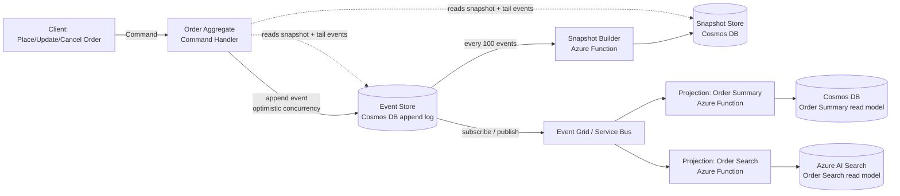
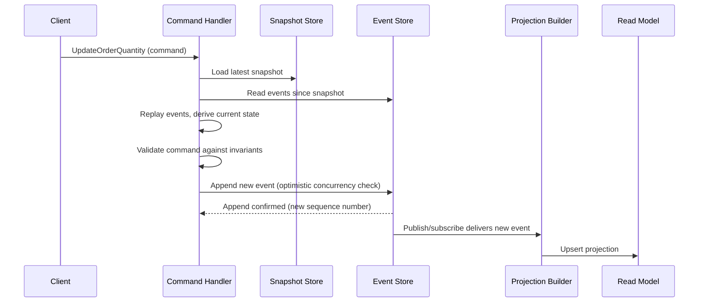
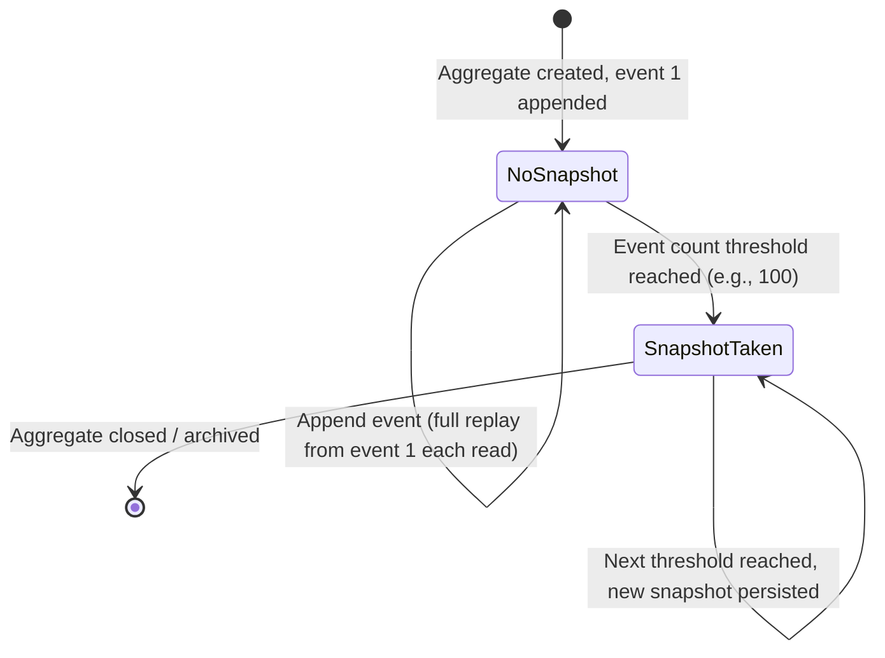
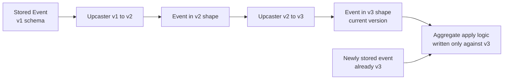

# Event Sourcing

> Part of the **Enterprise Data & AI Architecture Handbook** · Phase-14 — Event-Driven Architecture & Integration · Chapter 04.
> Estimated study time: **60 min reading + ~4h labs**.
> **Prerequisite:** read [CQRS](03_CQRS.md) first.

---

## Executive Summary

[CQRS](03_CQRS.md) §8.4 named event sourcing as a distinct, independently-adoptable pattern frequently paired with CQRS — one where the write model's *only* durable state is an append-only event stream, current state derived by replay rather than stored directly — and deliberately deferred that pattern's full architectural treatment to this chapter. **Event sourcing** is that pattern: instead of persisting only an entity's current state (the conventional "overwrite the row" model every relational or document database defaults to), an event-sourced system persists the complete, ordered sequence of every state-changing event that entity has ever experienced, and derives current state — whenever it is needed — by replaying that sequence from the beginning (or from a snapshot, §8.2).

This chapter covers the **event store and append-only log** as the foundational storage primitive — durable, ordered, and, critically, *never updated or deleted in place* — that makes this model possible; **rebuilding state and snapshots** as the mechanics of deriving current state from history efficiently, including the snapshot optimization that avoids replaying an unbounded event history on every read; **projections and read models** as this chapter's direct reuse of [CQRS](03_CQRS.md) §8.2's projection mechanism, now fed by a write model whose event stream is itself the source of truth rather than a byproduct published via a separate outbox; **schema evolution and upcasting** as the discipline that keeps an event stream, whose oldest events may be read and replayed years after being written, forward-compatible with code that has since evolved; and **auditability and temporal queries** as event sourcing's most distinctive capability — the ability to answer not just "what is true now" but "what was true at any point in the past, and exactly what sequence of facts led here" — a capability no current-state-only data model can provide without a bespoke, separately-built audit log.

The platform bias is **Azure-primary (~60%)** — Azure Cosmos DB (with an append-optimized partition-key design) or Azure Event Hubs/Table Storage as event-store options, Azure Functions as snapshot-building and projection-consuming compute, and Event Grid/Service Bus (reused directly from [Event-Driven Architecture](01_Event_Driven_Architecture.md) and [CQRS](03_CQRS.md)) as the event-publication backbone feeding external projections — **~30% enterprise open source** (Kafka as a durable-log-based event store per [Apache Kafka](../Phase-07/02_Apache_Kafka.md), EventStoreDB and Axon Framework as purpose-built event-sourcing frameworks, PostgreSQL as a relational event-store implementation) — **~10% AWS/GCP comparison-only** (DynamoDB Streams/Amazon QLDB; Cloud Spanner change streams/Firestore).

**Bottom line:** event sourcing is a genuine, powerful answer to the specific problem of needing a full, tamper-evident audit trail and the ability to reconstruct past state or replay history against new logic — but it is a materially more unusual data-modeling discipline than a conventional current-state database, with real costs (schema evolution across a long-lived event history, the snapshot/replay performance discipline, and a fundamentally different debugging and querying mental model) that a team must weigh against a specific, named business requirement for history, not adopt because it is the more sophisticated or more interesting pattern. The recurring mistake this chapter documents, continuing this handbook's justification-before-adoption discipline through [CQRS](03_CQRS.md) ADR-0171 and [Microservices Architecture](02_Microservices_Architecture.md) ADR-0170, is adopting event sourcing for a domain with no genuine audit, temporal-query, or replay-driven-reprocessing need, where a conventional current-state database with a separate, much simpler audit-log table would have delivered the same practical business value at a fraction of the modeling and operational cost.

---

## Learning Objectives

By the end of this chapter you will be able to:

1. **Explain the append-only event store** and why it is the foundational primitive that makes full audit history and state reconstruction possible.
2. **Design snapshotting** to avoid unbounded event-replay cost when deriving current state from a long-lived aggregate's history.
3. **Build projections from an event-sourced write model**, extending [CQRS](03_CQRS.md) §8.2's projection mechanism to a write model whose event stream is itself the source of truth.
4. **Design schema evolution and upcasting** for an event store, keeping old events forward-compatible with evolving application code across a multi-year event history.
5. **Apply event sourcing's temporal-query and auditability capability** to answer "what was true at any point in the past" queries no current-state-only model can answer.
6. **Recognize when event sourcing is NOT justified**, and defend a conventional current-state-database recommendation against a team adopting the pattern without a genuine audit or replay need.
7. **Defend an event-sourcing architecture decision** in engineer, staff engineer, architect, and CTO review settings, including the specific audit/temporal-query justification a review should demand before approving it.

---

## Business Motivation

- **Regulatory and compliance domains increasingly require a full, tamper-evident audit trail of every state change**, not merely the current state — financial ledgers, healthcare records, and regulated-industry transaction histories all have genuine, external (not merely engineering-preference-driven) requirements that a conventional "overwrite the row" model cannot satisfy without a separately-built, easy-to-forget-to-maintain audit log bolted on afterward.
- **"What was true as of last Tuesday" and "why does this record currently look the way it does" are business questions a current-state-only model structurally cannot answer**, since overwriting a row destroys the information needed to reconstruct any prior state — a support, compliance, or debugging need to reconstruct exact historical state (not just infer it from separate audit-log entries) is event sourcing's most distinctive, hardest-to-replicate-any-other-way payoff.
- **The ability to replay history against new business logic** — reprocessing an entire event history through a corrected calculation, a new fraud-detection rule, or a newly-added projection — lets an organization retroactively apply improved logic to historical data, a capability a current-state database (which has already discarded the inputs to any past calculation) cannot offer at all.
- **CQRS read-model projections (per [CQRS](03_CQRS.md) §8.2) require a reliable, replayable event stream to consume from** — event sourcing provides that stream as the write model's own natural byproduct, rather than requiring a separate transactional-outbox mechanism (per [Event-Driven Architecture](01_Event_Driven_Architecture.md) §26) to manufacture one from a conventional current-state write model, a genuine simplification specifically when CQRS is already independently justified.
- **Adopting event sourcing without a genuine audit, temporal-query, or replay-driven-reprocessing need is a real, recurring, and expensive enterprise mistake**, not a hypothetical risk — this chapter's Business Motivation deliberately continues the justification-before-adoption discipline established across [Knowledge Graphs with Neo4j](../Phase-13/02_Knowledge_Graphs_with_Neo4j.md) ADR-0165, [GraphRAG](../Phase-13/04_GraphRAG.md) ADR-0167, [Ontologies and Taxonomies](../Phase-13/05_Ontologies_and_Taxonomies.md) ADR-0168, [Microservices Architecture](02_Microservices_Architecture.md) ADR-0170, and [CQRS](03_CQRS.md) ADR-0171: the schema-evolution burden, the snapshot/replay performance discipline, and the unfamiliar debugging model event sourcing introduces are real, ongoing costs that must be earned by a specific, named requirement for history, not adopted because it is architecturally elegant or because a system already uses CQRS.

---

## History and Evolution

- **1980s-1990s — accounting and ledger systems' append-only, never-overwrite double-entry bookkeeping model** predates any software pattern by this name and establishes the domain-level precedent this chapter's pattern is directly modeled on: a financial ledger never overwrites a prior entry to "correct" it, it appends a new, offsetting entry — the conceptual ancestor of event sourcing's own append-only discipline.
- **1990s — version control systems (CVS, later Subversion and Git)** popularize the idea, at the software-artifact level, that a full history of changes (not just the current file state) is itself a valuable, queryable asset — Git's own object model (an immutable, content-addressed history of commits) is a widely-understood, if informally-drawn, parallel to an event store's own append-only, immutable design.
- **2005 — Martin Fowler's early writing on event sourcing** (building on and alongside the same DDD-community discussions [CQRS](03_CQRS.md)'s own History section credits to Greg Young) formalizes the pattern as a distinct architectural technique, explicitly distinguishing it from simply "logging" changes as a debugging aid.
- **2010 — Greg Young's "CQRS Journey" era work** (per [CQRS](03_CQRS.md)'s own History section) popularizes event sourcing specifically paired with CQRS for domains with both complex business invariants and a genuine audit-trail need, cementing the pairing's mainstream association even though, per [CQRS](03_CQRS.md) §8.4, the two remain independently adoptable.
- **2012 — EventStoreDB (originally "Event Store")** is released as the first widely-adopted, purpose-built database explicitly designed around the append-only event-stream model, providing native optimistic-concurrency, subscription, and projection capabilities rather than requiring a team to build these mechanics atop a general-purpose database.
- **2013-2014 — Axon Framework (Java)** and comparable frameworks mature, providing aggregate-replay, snapshotting, and event-versioning tooling as an application framework rather than requiring hand-rolled infrastructure, lowering the pattern's implementation cost for JVM-based enterprise teams specifically.
- **2015 onward — Kafka's durable, long-retention log** (per [Apache Kafka](../Phase-07/02_Apache_Kafka.md)'s own History section) becomes a widely-adopted general-purpose event-store substrate, since its core append-only, ordered, replayable-log properties are already exactly what an event store requires, without needing a dedicated event-sourcing-specific database — a substrate-reuse pattern this chapter's Storage section returns to directly.
- **2018-2020 — the same "pattern-overuse" backlash** that shaped [CQRS](03_CQRS.md)'s and [Microservices Architecture](02_Microservices_Architecture.md)'s own History sections extends to event sourcing specifically: widely-cited retrospectives document teams adopting full event sourcing for domains with no genuine audit or temporal-query need, discovering the schema-evolution and snapshot-management burden outweighed any realized benefit — directly motivating this chapter's own emphasis on a measured, named justification before adoption.
- **2020s — managed cloud data platforms and change-data-capture tooling** (Azure Cosmos DB's change feed, Debezium per [Change Data Capture](../Phase-07/06_Change_Data_Capture.md)) make building an event-sourced system's projection and downstream-consumption pipeline substantially lower-friction than a decade earlier, though — exactly as this chapter's Trade-offs section insists — lower implementation friction does not, on its own, change whether a given domain's audit or temporal-query need actually justifies the pattern.

---

## Why This Technology Exists

A conventional database's "update the row in place" model discards, on every write, the exact information needed to answer "what was this record before, and why did it change" — the prior value is simply gone, replaced, unless a separate audit mechanism was deliberately built to capture it beforehand. Event sourcing exists to make that information a first-class, permanent, and directly queryable part of the system's own data model, rather than an afterthought bolted on separately (and, in practice, frequently incomplete or inconsistent with the actual state changes it was meant to track): by persisting every state-changing event, in order, forever, an event-sourced system makes "how did we get here" and "what was true at any specific point in the past" answerable directly from the system's own primary data, with the exact same durability and correctness guarantees as its current-state view — because, in an event-sourced system, current state is not a separate thing from the event history; it is *derived from* it.

---

## Problems It Solves

- **Full, tamper-evident audit trail as a structural property of the data model itself**, rather than a separately-built, easy-to-drift-out-of-sync audit log — every state change is, by construction, an immutable event in the store, not an artifact a separate logging mechanism might miss or record inconsistently.
- **Temporal queries** ("what was this aggregate's state as of a specific past timestamp") answered by replaying events up to that point, a capability no current-state-only model can provide without having separately and deliberately captured historical snapshots in advance.
- **Retroactive reprocessing against corrected or new business logic** — replaying the full event history through an updated calculation, or building an entirely new projection against historical data that predates that projection's own existence, both directly enabled by the durable, replayable event history.
- **Debugging "how did the system get into this incorrect state"** — an event-sourced system's history is the literal, complete sequence of every decision and input that produced the current state, letting an engineer replay and inspect the exact sequence of events rather than reasoning backward from an opaque current-state snapshot alone.
- **A reliable, already-present event stream for CQRS projections** (per [CQRS](03_CQRS.md) §8.4), resolving that chapter's own transactional-outbox requirement as a natural byproduct of the write model's own persistence mechanism rather than an additional mechanism layered on top.

---

## Problems It Cannot Solve

- **Event sourcing does not eliminate the CAP-theorem and distributed-transaction realities** this handbook established in [CAP and PACELC](../Phase-02/04_CAP_and_PACELC.md) and [Distributed Transactions](../Phase-02/05_Distributed_Transactions.md) — an aggregate's own event stream can be made strongly consistent, but a business process spanning multiple event-sourced aggregates still requires the same saga/compensation design [Event-Driven Architecture](01_Event_Driven_Architecture.md) §26 established generally; event sourcing changes how a single aggregate's own state is persisted, not how multiple aggregates coordinate.
- **It does not fix a poorly-modeled domain or incorrectly-drawn aggregate boundary** — exactly as [Microservices Architecture](02_Microservices_Architecture.md) named for service boundaries, an event-sourced aggregate boundary drawn incorrectly (too large, mixing unrelated invariants; too small, requiring cross-aggregate transactions) produces an event stream that is just as confusing and hard to reason about as a poorly-modeled current-state schema would have been — event sourcing makes the *history* durable, not the *design* correct.
- **It does not remove the need for careful schema-evolution discipline** — it makes that discipline harder, not easier, than a conventional database's schema migration, since an event store's oldest events may need to remain readable and correctly interpretable by code written years after they were originally persisted (§8.4, §26's upcasting pattern), a materially longer-lived compatibility requirement than a typical database migration's.
- **It does not automatically make query performance fast** — deriving current state by replaying an unbounded event history is, without the snapshot optimization (§8.2), a genuinely slower operation than a conventional database's single-row read; event sourcing's performance characteristics must be actively engineered (snapshotting, projections for query-heavy access patterns), not assumed comparable to a conventional database by default.
- **It does not reduce total system complexity** — precisely continuing [Microservices Architecture](02_Microservices_Architecture.md)'s and [CQRS](03_CQRS.md)'s own recurring caution, event sourcing relocates the complexity of "track every change over time" into "an append-only store, a replay/snapshot mechanism, and a schema-evolution discipline spanning the system's entire operational lifetime" — a trade this chapter's Trade-offs section treats as a genuine, ongoing cost requiring a specific justification, not a simplification.

---

## Core Concepts

### 8.1 The event store and append-only log

An **event store** persists, for each aggregate (an entity or cluster of entities treated as a single consistency boundary, per [Domain-Driven Design](../Phase-01/05_Domain_Driven_Design.md)), an ordered, append-only sequence of every event that has ever changed that aggregate's state — a `BankAccountOpened`, followed by a sequence of `FundsDeposited` and `FundsWithdrawn` events, for example. The store's defining, non-negotiable property is that **events are never updated or deleted in place** — a mistake in a past event is corrected by appending a new, compensating event (directly mirroring this chapter's History section's double-entry-bookkeeping precedent), never by editing or removing the original. Each event carries, at minimum, the aggregate's identifier, a monotonically increasing sequence number (or version) scoped to that aggregate, the event type and payload, and a timestamp — and **optimistic concurrency control**, checked against the expected sequence number when appending a new event, is what prevents two concurrent commands against the same aggregate from silently corrupting its event order (an append is rejected, and the command retried against the now-current sequence number, if the expected version has moved since the command was issued).

### 8.2 Rebuilding state and snapshots

**Current state is derived, not stored** — to answer "what is this aggregate's current state," the system loads every event for that aggregate, in order, and replays them one at a time through the same event-handling logic the aggregate's command handlers use to apply state changes, arriving at current state as the cumulative result. For an aggregate with a short or bounded event history, this replay is fast and requires no special optimization. For a long-lived aggregate (a bank account open for a decade, with tens of thousands of transactions), replaying the *entire* history on every state derivation becomes a genuine, measurable performance cost — resolved by **snapshotting**: periodically (every N events, or on a time-based schedule) persisting a snapshot of the aggregate's fully-derived state at a specific event-sequence-number checkpoint, so that a subsequent state derivation only needs to load the most recent snapshot plus replay the (much smaller number of) events that have occurred since — never the full history from the beginning. A snapshot is explicitly **not** a second source of truth; it is a disposable, fully-reconstructable performance optimization, exactly as a [CQRS](03_CQRS.md) §8.2 read-model projection is a disposable, reconstructable derived artifact of the same underlying event history.

### 8.3 Projections and read models

Event sourcing's write-model event stream is consumed by projections using precisely the same mechanism [CQRS](03_CQRS.md) §8.2 already established — an idempotent, offset-tracking consumer incrementally building a denormalized read model — with one structural simplification: because the event-sourced write model's *only* durable state already is its event stream, there is no separate transactional-outbox mechanism (per [Event-Driven Architecture](01_Event_Driven_Architecture.md) §26) needed to reliably publish events; the write model's own persistence operation *is* the event publication, eliminating the dual-write consistency risk an outbox exists to solve for a conventional, non-event-sourced write model. This is the concrete mechanical reason [CQRS](03_CQRS.md) §8.4 named event sourcing and CQRS as such a natural pairing — but, as that chapter was explicit about, a service can be fully event-sourced with no separate CQRS read-model split at all, querying its own current-state derivation (§8.2) directly for the (typically much lower-volume) case where the write model's own aggregate-by-ID access pattern is the only query the domain actually needs.

### 8.4 Schema evolution and upcasting

Because an event store's oldest events may be read and replayed by code written years after they were originally persisted, event schema evolution here is a **materially longer-lived compatibility requirement** than [Event-Driven Architecture](01_Event_Driven_Architecture.md) §14.4's already-established event-schema-versioning discipline for in-flight, transient event streams — an event-sourced aggregate's event-handling logic must remain able to correctly interpret an event shape from five years ago, not merely from five minutes ago. **Upcasting** is the standard resolution: rather than requiring every piece of event-handling code to understand every historical version of every event type directly, a dedicated **upcaster** transforms an old-version event into the current version's shape at read time (or, less commonly, via a one-time, deliberate migration rewriting the stored events themselves — a materially riskier operation given the append-only, immutable-history principle, and one this chapter's Anti-patterns section names as generally disfavored). A well-designed upcasting pipeline lets aggregate logic always work against a single, current event shape, regardless of how many historical schema versions actually exist in the underlying store — directly extending [Event-Driven Architecture](01_Event_Driven_Architecture.md) §14.4's backward-compatibility principle from "the next deployed consumer" to "any consumer, at any point in the store's entire multi-year lifetime."

### 8.5 Auditability and temporal queries

The event store's complete, ordered, immutable history is what makes two distinctive query capabilities possible that no current-state-only model provides: **auditability** — proving, with the same durability guarantee as the system's primary data (not a separate, potentially-out-of-sync log), exactly what sequence of facts produced the current state, satisfying regulatory and compliance audit requirements (per [Compliance and Regulatory Frameworks](../Phase-10/06_Compliance_and_Regulatory_Frameworks.md)'s own audit-trail-as-evidence treatment) directly from the system's own data model rather than a bolted-on mechanism; and **temporal queries** — reconstructing an aggregate's exact state as of any specific past point in time, by replaying its event history only up to that point, answering "what was true as of last Tuesday" precisely and directly rather than approximately inferring it from a separate audit log's incomplete record.

---

## Internal Working

### 9.1 How a command is validated and appended as an event

A command handler loads the target aggregate's current state (via replay from the last snapshot plus subsequent events, §8.2), validates the incoming command against that state's business invariants, and — if valid — constructs the resulting domain event(s) and appends them to the aggregate's event stream with an optimistic-concurrency check against the expected current sequence number (§8.1); if the check fails (another command has appended events to this aggregate since the command handler loaded its state), the append is rejected and the command handler retries against the now-current state, exactly the same optimistic-concurrency pattern this handbook's [Distributed Transactions](../Phase-02/05_Distributed_Transactions.md) chapter established generically, applied here at the individual-aggregate level.

### 9.2 How current state is derived on read

To answer a query against the write model directly (as opposed to a [CQRS](03_CQRS.md) read-model projection), the system loads the aggregate's most recent snapshot (if one exists and is recent enough to be worth using) and every event appended since that snapshot's checkpoint, then replays each event in sequence through the aggregate's own event-handling (`apply`) logic — the exact same logic used when the event was originally appended in §9.1 — deterministically arriving at current state as the cumulative result of that replay.

### 9.3 How a projection subscribes to and consumes the event stream

A projection subscribes to the event store's stream (either the store's own native subscription mechanism, as EventStoreDB provides, or via publishing to a broker as events are appended, per [CQRS](03_CQRS.md) §9.1-9.2's idempotent, offset-tracking consumer pattern), applying each event to its own denormalized read-model store — mechanically identical to [CQRS](03_CQRS.md) §9.2's own treatment, with the event source being the write model's own primary persistence rather than a separately-relayed outbox entry.

### 9.4 How upcasting resolves a historical event version at read time

When an aggregate's event stream is replayed (§9.2) and an event of an older schema version is encountered, an **upcaster chain** — a sequence of small, version-to-version transformation functions (v1→v2, v2→v3, and so on) — is applied before the event reaches the aggregate's own `apply` logic, transforming it step-by-step into the current version's shape; this lets the aggregate's own event-handling code be written against only the current event schema, with the full historical-version-compatibility burden isolated entirely within the upcaster chain, a deliberate separation of concerns this chapter's Design Patterns section names directly.

---

## Architecture

### 10.1 Reference architecture: event-sourced order aggregate with snapshotting and dual projections



### 10.2 Why the architecture works

The Order aggregate's command handler is the *only* component that ever appends events, and it does so with optimistic concurrency control (§9.1) guaranteeing the event stream's order and integrity even under concurrent commands. Snapshots (§8.2) keep state derivation fast regardless of how long an individual order's event history eventually grows, while the same event stream feeds two independent [CQRS](03_CQRS.md)-style projections — reusing that chapter's own reference architecture's dual-read-model structure — without needing a separate transactional outbox, since the event store's append operation *is* the durable, already-published fact both projections consume.

### 10.3 ADR example

See this chapter's [Architecture Decision Record (ADR-0172)](#architecture-decision-record-adr-0172-event-sourcing-scoped-to-the-order-aggregate-only-justified-by-a-named-regulatory-audit-requirement) under Enterprise Recommendations for the Context/Decision/Consequences/Alternatives treatment of why event sourcing is applied specifically and only to the Order aggregate (which has a named regulatory audit requirement) rather than across the entire order-management domain.

---

## Components

- **Aggregate** — the consistency boundary (per [Domain-Driven Design](../Phase-01/05_Domain_Driven_Design.md)) whose full history is persisted as an ordered event stream; the unit at which optimistic concurrency (§9.1) is enforced.
- **Event store** — the durable, append-only, ordered persistence layer for every aggregate's event stream (§8.1).
- **Command handler** — loads current state (via replay/snapshot, §9.2), validates a command, and appends resulting events (§9.1).
- **Snapshot builder and snapshot store** — the performance-optimization component periodically persisting a derived-state checkpoint (§8.2), never treated as a second source of truth.
- **Upcaster chain** — the version-to-version event transformation pipeline resolving historical schema versions at read time (§8.4, §9.4).
- **Projection builder and read model store** — reused directly from [CQRS](03_CQRS.md) §Components, now consuming the write model's own event stream directly rather than a separately-relayed outbox entry.
- **Event-store subscription / publication mechanism** — the component (native store subscription, or a broker-publishing relay) delivering the event stream to downstream projections and other consumers.

---

## Metadata

Every event-sourced aggregate type should be catalogued (extending [CQRS](03_CQRS.md) §Metadata's read-model-cataloguing discipline to the write side specifically) with its current event schema version(s) and upcaster chain, its snapshotting frequency and last-validated snapshot-rebuild time, its owning team, its data-classification tier, and — since auditability (§8.5) is frequently the entire justification for adopting the pattern — an explicit note of which named regulatory or compliance requirement, if any, justifies retaining that aggregate's full history indefinitely rather than the shorter retention window a conventional current-state-plus-simple-audit-log design might otherwise use.

---

## Storage

The event store itself is the storage decision unique to this chapter: **Azure Cosmos DB**, with a partition key designed around the aggregate ID (all of one aggregate's events co-located in the same logical partition for efficient sequential reads) and an append-optimized write pattern (never updating an existing item, only inserting new ones with a monotonically increasing sequence number), is this handbook's primary Azure-native event-store implementation; **Azure Table Storage** offers a simpler, lower-cost alternative for less latency-sensitive event streams; and **Kafka** (per [Apache Kafka](../Phase-07/02_Apache_Kafka.md) §18's own durable, long-retention log treatment) is a fully viable general-purpose substrate for an event store, since its core append-only, ordered, replayable properties already match an event store's requirements exactly, at the cost of needing to build aggregate-level optimistic-concurrency and snapshot-management logic that a purpose-built event-sourcing database or framework (EventStoreDB, Axon) would otherwise provide natively. Snapshot storage is a separate, explicitly-disposable store (any fast key-value store keyed by aggregate ID and snapshot sequence number) that must never be treated as more authoritative than the event stream itself — a snapshot can always be safely deleted and rebuilt by replaying from the beginning, exactly as a [CQRS](03_CQRS.md) read model can.

---

## Compute

Command-handler compute is typically part of the owning microservice's own compute allocation (per [Microservices Architecture](02_Microservices_Architecture.md) §Compute), since command handling is inseparable from the aggregate's own domain logic. Snapshot-building is a periodic, event-count- or schedule-triggered background compute workload (Azure Functions on a timer trigger, or triggered directly off the event store's own change feed once a threshold event count is reached) that should be provisioned and monitored independently from the command-handling path's own latency-sensitive compute, since a slow or backlogged snapshot builder degrades read-derivation performance (§9.2) without necessarily affecting write availability at all — the same fault-isolation property [CQRS](03_CQRS.md) §Fault Tolerance already named for a stalled projection builder, applying equally here to a stalled snapshot builder.

---

## Networking

Event-store access follows the same private-endpoint, zero-trust baseline established throughout this handbook ([Network Security and Zero Trust](../Phase-10/04_Network_Security_and_Zero_Trust.md) ADR-0144, reused directly via [Microservices Architecture](02_Microservices_Architecture.md) §Networking and [CQRS](03_CQRS.md) §Networking). The one networking consideration specific to this chapter is that a full aggregate-history replay (§9.2, or a full projection rebuild consuming the entire event store, per [CQRS](03_CQRS.md) §9.4) can generate a substantial, bursty read-throughput demand against the event store itself — provisioned throughput on the event store (Cosmos DB RU/s, or Kafka broker bandwidth) must account for this replay-driven burst pattern, not just steady-state append-and-tail-read traffic, exactly the same provisioning caution [Event-Driven Architecture](01_Event_Driven_Architecture.md) §Networking already named for cross-region event delivery topology decisions generally.

---

## Security

- **Optimistic-concurrency-protected appends, enforced by managed identity per aggregate-owning service** (reused directly from [Microservices Architecture](02_Microservices_Architecture.md) §Security and [CQRS](03_CQRS.md) §Security's managed-identity-as-default principle) — no shared credential across the fleet, and no service other than the aggregate's own owning service permitted to append events to its stream.
- **Immutability as a security property, not just a data-modeling one**: because events are never updated or deleted in place (§8.1), an event store is inherently resistant to a specific class of data-tampering attack (retroactively altering a historical record to hide an unauthorized action) that a conventional, mutable current-state database is vulnerable to — a genuine, if secondary, security benefit directly supporting the auditability capability (§8.5) this chapter names as the pattern's primary justification.
- **Read-model projections built from an event-sourced write model must enforce the same access-control entitlements as the aggregate they derive from**, exactly as [CQRS](03_CQRS.md) §Security already established — a read model is a full, denormalized copy of whatever the write model's event stream contains, and a projection query bypassing the aggregate's own authorization logic reproduces the same access-control gap that chapter's Security section named.
- **Right-to-be-forgotten poses the single hardest security/governance tension in this entire chapter**: the append-only, immutable-history principle (§8.1) is, by design, in direct tension with a data subject's legal right to have their personal data actually erased ([Data Privacy and PII Protection](../Phase-10/07_Data_Privacy_and_PII_Protection.md) ADR-0147) — this chapter's Governance section treats this tension explicitly rather than glossing over it, since "the event store is immutable by design" is not an acceptable excuse for non-compliance with a legal erasure obligation.

---

## Performance

- **State-derivation latency (§9.2) is the primary performance metric unique to this pattern** — bounded and made fast by snapshotting (§8.2); an aggregate whose snapshot frequency has not been tuned against its actual event-accumulation rate can silently regress from fast, snapshot-plus-tail-replay reads to slow, near-full-history replays as the aggregate ages, a specific, measurable regression this chapter's Monitoring section names as a leading indicator to track directly.
- **Append throughput and optimistic-concurrency retry rate** — a hot aggregate receiving many concurrent commands will see a correspondingly higher optimistic-concurrency conflict rate (§9.1), each conflict requiring a reload-and-retry cycle; a sustained, high retry rate against a specific aggregate is a leading indicator that the aggregate boundary may be drawn too coarsely (too many logically-independent operations sharing one consistency boundary), directly informing a boundary-redesign conversation rather than merely a performance-tuning one.
- **Upcasting overhead (§8.4, §9.4)** is generally negligible per event but accumulates linearly with an aggregate's total historical event count during a full replay — a very long-lived aggregate with many historical schema versions can see a measurably slower full-history replay purely from upcaster-chain overhead, a specific reason to periodically "re-snapshot forward" (persisting a fresh snapshot using the current schema version) rather than relying indefinitely on ever-deeper upcaster chains.
- **Projection-consumption throughput** reuses [CQRS](03_CQRS.md) §17's own performance treatment directly, since the mechanism is identical once the event stream is being consumed.

---

## Scalability

Aggregates scale horizontally by partitioning the event store around aggregate ID (each aggregate's own event stream is independent of every other aggregate's, with no cross-aggregate ordering requirement to preserve, per [Apache Kafka](../Phase-07/02_Apache_Kafka.md) §8.1's own partition-key-to-ordering relationship, reused here at the aggregate-stream level), letting the store scale to an arbitrary number of independent aggregates without any single aggregate's own event volume constraining another's. The scaling dimension requiring the most deliberate design is **individual-aggregate event-history growth over time**: an aggregate with an unusually long lifetime and unusually high event-accumulation rate (an always-open, continuously-active account, as opposed to a typical order that closes after a bounded lifecycle) needs a correspondingly more aggressive snapshotting cadence (§8.2) to keep its own state-derivation latency bounded, independent of how well the overall store scales across aggregates — a per-aggregate-type tuning decision, not a single store-wide default.

---

## Fault Tolerance

- **Optimistic concurrency (§9.1) as the primary defense against concurrent-write corruption**, rejecting and retrying a conflicting append rather than silently allowing two concurrent commands to produce an inconsistent event order.
- **A stalled snapshot builder degrades read-derivation latency, not write availability or data correctness** — command handlers can always fall back to a full (slower) replay from the beginning if a snapshot is missing, stale, or unavailable, exactly as [CQRS](03_CQRS.md) §Fault Tolerance named for a stalled projection builder degrading read staleness without affecting write availability.
- **A stalled or failed projection builder degrades read-model freshness only**, reusing [CQRS](03_CQRS.md) §Fault Tolerance's own treatment directly, since the mechanism (an event consumer building a derived, disposable artifact) is identical.
- **Event-store durability and replication** (Cosmos DB's own multi-region replication configuration, or Kafka's own replication factor per [Apache Kafka](../Phase-07/02_Apache_Kafka.md) §9.2) is the single most critical fault-tolerance investment in this entire architecture, since — unlike a conventional current-state database where losing recent writes is bad but bounded — losing an event store's history is, in principle, an unrecoverable loss of the pattern's entire audit and reconstruction value proposition, not merely a bounded, recent-data-loss incident.
- **Full-aggregate-history replay as the ultimate recovery mechanism** for any snapshot corruption or read-model failure, directly analogous to [CQRS](03_CQRS.md) §9.4's own full-rebuild treatment, with the added property that — unlike a CQRS read model, which is derived from a *separately* published event stream — an event-sourced aggregate's replay source (its own event store) is the system's actual, sole source of truth, making this recovery mechanism even more foundational here than in a non-event-sourced CQRS system.

---

## Cost Optimization

- **Right-size snapshot frequency against actual replay-cost measurements**, not a defensively aggressive "snapshot every event" default that multiplies snapshot-storage cost and write amplification for no measurable read-latency benefit beyond a much less frequent cadence.
- **Apply event sourcing only to aggregates with a genuine, named audit or temporal-query need** (§8.5, this chapter's central cost-avoidance discipline) — every aggregate event-sourced without that justification incurs the ongoing snapshot-management and schema-evolution cost for no corresponding business payoff, the direct event-sourcing-specific instance of [CQRS](03_CQRS.md) §8.5's own "don't build a read model without a genuine asymmetry" discipline.
- **Tier event-store storage by access recency**, moving a long-closed aggregate's full event history to cooler, cheaper storage once its snapshot has been finalized and further mutation is no longer expected, while keeping active aggregates' recent event tail on hot, low-latency storage — directly analogous to [Vector Databases: Qdrant and Milvus](../Phase-13/01_Vector_Databases_Qdrant_and_Milvus.md) §21's hot/cold access-recency-tiering pattern, reused here for event-store retention.
- **Monitor and eliminate unused historical projections**, exactly as [CQRS](03_CQRS.md) §Cost Optimization already named for read models generally, with the added consideration that an event-sourced write model's own snapshot store is itself a form of derived, potentially-decommissionable artifact if a given projection or query pattern is retired.
- **Worked FinOps example:** a financial-services team event-sources a Payment aggregate with no snapshotting at all, deriving current state via full replay on every read; at an average of 8,000 events per long-lived aggregate and roughly 40,000 reads/day across the aggregate population, the resulting replay compute cost (measured against Azure Functions consumption pricing) comes to approximately $3,400/month. Introducing a snapshot every 200 events reduces average replay depth from 8,000 events to under 200 per read, cutting replay compute to roughly $180/month — a ~95% reduction — at the added cost of a snapshot store (~$45/month, Cosmos DB) and a modest snapshot-builder compute allocation (~$60/month), for a net reduction from $3,400/month to roughly $285/month, validated by re-measuring actual p99 state-derivation latency before and after (240ms average pre-snapshot down to 12ms average post-snapshot) to confirm the change delivered a genuine, not merely theoretical, improvement.

---

## Monitoring

- **Snapshot staleness (event count or time since the last snapshot per aggregate)** as the leading indicator directly correlated with read-derivation latency risk (§17) — an aggregate whose snapshot has fallen far behind its current event count is a leading indicator of a coming performance regression, catchable before it manifests as a customer-visible slow query.
- **Optimistic-concurrency conflict/retry rate per aggregate type**, per §17's own performance treatment, as a leading indicator of either genuine hot-aggregate contention or a boundary-design issue worth a dedicated architecture review.
- **Projection lag, dead-letter rate, and write-to-read discrepancy**, reused directly from [CQRS](03_CQRS.md) §21, since the projection-consumption mechanism is unchanged by the write model being event-sourced.
- **Event-store replication lag and durability-guarantee compliance** (cross-region replication status, backup/point-in-time-restore validation) tracked with the elevated priority this chapter's Fault Tolerance section named, given the store's role as the system's sole source of truth.
- **Upcaster-chain invocation counts by version**, tracked as a leading indicator of when a "re-snapshot forward" operation (§17) would meaningfully reduce ongoing upcasting overhead for a given aggregate type's oldest surviving event-schema versions.

---

## Observability

Distributed tracing must correlate a command's full lifecycle — the command's receipt, the state-derivation replay it triggered (including which snapshot, if any, was used and how many events were replayed since), the resulting event append, and every downstream projection's eventual consumption of that event — extending [CQRS](03_CQRS.md) §22's own write-to-projection tracing treatment with one event-sourcing-specific addition: a trace should also record *which snapshot version and event-count-since-snapshot* a given state derivation actually used, since "why was this specific read slow" in an event-sourced system is frequently answered by "the snapshot was stale and a much longer replay than expected occurred," a diagnosis this specific piece of trace detail makes directly visible rather than requiring separate log correlation.

### Operational Response Playbook

| Signal | Detection Query/Method | Remediation |
|---|---|---|
| A specific aggregate type's average state-derivation latency rises steadily without a corresponding rise in overall event-store load | Trace-based query filtering for state-derivation spans on the affected aggregate type, examining the recorded snapshot-age/events-replayed-since-snapshot detail (§22) | Check the snapshot builder's own health/lag first (a stalled snapshot builder is the most common root cause); if the snapshot builder is healthy, check whether the aggregate's actual event-accumulation rate has grown faster than its configured snapshotting frequency was tuned for, and adjust the cadence accordingly |
| A projection's write-to-read discrepancy spot-check (per [CQRS](03_CQRS.md) §21, reused directly here) flags divergence traced to a specific historical event-schema version | Discrepancy-job output correlated against the event's recorded schema version, cross-referenced with the upcaster-chain's own version-transition logic | Treat as an upcaster-logic bug for that specific historical version, not a projection-logic bug in isolation — inspect and fix the specific version-to-version upcaster transform, then trigger a full projection rebuild (per [CQRS](03_CQRS.md) §9.4) rather than patching individual read-model records directly |

---

## Governance

Event-sourcing governance extends [CQRS](03_CQRS.md) §Governance's read-model-cataloguing discipline to the write side, and confronts directly the tension §16 already named between immutability and right-to-be-forgotten obligations: every event-sourced aggregate type must have a documented, tested **erasure strategy** — since events cannot be deleted or edited in place without violating the pattern's core immutability guarantee, the standard resolution is **crypto-shredding** (encrypting each data subject's personal-data fields within events using a per-subject encryption key, and, upon an erasure request, permanently destroying that specific key — rendering the encrypted data permanently unrecoverable while leaving the event stream's structure, sequence, and non-personal-data content fully intact and un-mutated) or, for less stringent requirements, event-level **field redaction via a documented, audited exception to the immutability principle** applied only to the specific personal-data fields, never the event's existence or sequence position. This strategy must be decided and implemented *before* an event-sourced aggregate type goes into production carrying personal data, not retrofitted after the first erasure request arrives — directly extending, and making concrete for the hardest case yet encountered, the same "verification gap" pattern this handbook has traced through [Data Privacy and PII Protection](../Phase-10/07_Data_Privacy_and_PII_Protection.md) ADR-0147, [Vector Databases: Qdrant and Milvus](../Phase-13/01_Vector_Databases_Qdrant_and_Milvus.md) ADR-0164's governance note, and [Event-Driven Architecture](01_Event_Driven_Architecture.md) §Governance's event-store erasure treatment.

---

## Trade-offs

- **Full audit/temporal-query capability vs. schema-evolution and operational-modeling burden**: event sourcing trades a conventional database's simple "update in place" model for a durable, replayable, tamper-evident history, at the direct cost of a materially longer-lived schema-compatibility requirement (§8.4) and a genuinely unfamiliar debugging/querying mental model most engineering teams have less operational experience with than a conventional relational or document database.
- **Event sourcing with vs. without CQRS** (reused directly from [CQRS](03_CQRS.md) §8.4): pairing the two lets projections consume the write model's own natural event stream with no separate outbox mechanism; event sourcing alone (querying the write model's own current-state derivation directly) is simpler when the domain has no genuine cross-aggregate or structurally-different query-shape need CQRS exists to resolve.
- **Snapshot frequency: replay-cost reduction vs. snapshot-storage and write-amplification cost**: a more aggressive snapshotting cadence reduces state-derivation latency at the cost of more frequent snapshot writes and storage; a less aggressive cadence saves storage and write cost at the risk of slower replay for long-lived aggregates — this chapter's Cost Optimization worked example makes this trade-off's actual magnitude concrete rather than assumed.
- **Immutability's audit benefit vs. its right-to-be-forgotten tension** (§16, §23): the very property that makes event sourcing's audit trail trustworthy (nothing can be silently altered after the fact) is in direct, structural tension with a legal erasure obligation, requiring the deliberate crypto-shredding or documented-exception mechanisms this chapter's Governance section names — a genuine, irreducible design tension this pattern must confront explicitly, not a solvable-away inconvenience.
- **Is event sourcing even necessary, or would a conventional database with a separate audit-log table suffice?** Per this chapter's central, repeated caution, directly continuing [CQRS](03_CQRS.md) §8.5's and [Microservices Architecture](02_Microservices_Architecture.md)'s own justification-before-adoption question: for the majority of business domains with no genuine regulatory audit, temporal-query, or retroactive-reprocessing requirement, a conventional current-state database paired with a simple, separately-maintained audit-log table (recording who-changed-what-when as a secondary, non-authoritative record) delivers most of the practical audit value most stakeholders actually need, at a fraction of the schema-evolution and operational-modeling cost full event sourcing requires — event sourcing earns its complexity specifically through a genuine, named requirement for the primary data model itself to be the audit trail, not through a general sense that "having more history is probably good."

---

## Decision Matrix

| Scenario | Recommended Choice | Rationale |
|---|---|---|
| Domain with a named regulatory or compliance requirement for a full, tamper-evident audit trail (financial ledgers, healthcare records) | Event sourcing | This is the scenario event sourcing exists to solve; the audit trail is a structural property of the primary data model, not a bolted-on afterthought |
| Domain needing to answer "what was true as of a specific past date" precisely and directly, not merely approximately from a separate log | Event sourcing | Temporal queries (§8.5) require the full, replayable event history; a conventional database cannot answer this without having separately captured historical snapshots in advance |
| Domain needing to retroactively reprocess history against corrected or new business logic (a recalculation, a newly-added analytics capability) | Event sourcing | Only a durable, replayable event history preserves the original inputs needed to reprocess; a current-state-only model has already discarded them |
| Domain with a conventional CRUD-style read/write pattern and no named audit, temporal-query, or reprocessing requirement | Conventional current-state database, with a simple separate audit-log table if any change-tracking is needed at all | Event sourcing's schema-evolution and snapshot-management burden is unjustified without a genuine driving requirement — per this chapter's central caution |
| Domain already using CQRS (per [CQRS](03_CQRS.md)) with a genuine cross-service or cross-aggregate query need, but no independent audit/temporal-query requirement | CQRS-lite (read-model projection via transactional outbox) without event sourcing | The read/write asymmetry alone does not justify event sourcing's added schema-evolution and modeling cost; pair the two only when both a CQRS justification and an event-sourcing justification independently exist |
| Long-lived aggregate with rapidly-accumulating event history and measurable state-derivation-latency regression | Event sourcing with an actively-tuned snapshotting cadence (§8.2) | Snapshotting is the mandatory performance complement to event sourcing for any aggregate with substantial event-accumulation, not an optional afterthought |

---

## Design Patterns

- **Snapshotting (§8.2)**: the standard performance-optimization pattern, periodically persisting a derived-state checkpoint to bound replay cost — a disposable, fully-reconstructable artifact, never a second source of truth.
- **Upcasting chain (§8.4, §9.4)**: a sequence of small, version-to-version event transformation functions isolating historical-schema-compatibility logic away from an aggregate's own current-version event-handling code.
- **Crypto-shredding for right-to-be-forgotten (§Governance)**: per-subject encryption keys applied to personal-data fields within events, with key destruction (rather than event mutation) as the erasure mechanism — the standard resolution to the immutability-versus-erasure tension this chapter names as its hardest governance challenge.
- **Copy-and-transform migration (rather than in-place event rewriting)**: when a genuinely breaking event-schema change is unavoidable, write a new, corrected event stream to a new store or stream identifier by replaying and transforming the old stream, rather than mutating events in the original store in place — preserving the original, audited history intact while producing a corrected version for going-forward use, directly analogous to [Vector Databases: Qdrant and Milvus](../Phase-13/01_Vector_Databases_Qdrant_and_Milvus.md) §26's dual-write migration pattern and [CQRS](03_CQRS.md) §26's versioned-read-model-rebuild pattern.
- **Aggregate boundary sizing via optimistic-concurrency-conflict monitoring**: using the conflict/retry-rate signal named in this chapter's Performance and Monitoring sections as direct, empirical evidence for whether an aggregate's boundary is drawn correctly, rather than relying solely on upfront domain-modeling judgment — a concrete, measurable feedback loop into the aggregate-design process.

---

## Anti-patterns

- **Event sourcing adopted with no genuine audit, temporal-query, or reprocessing need**, purely because CQRS is already in use or because event sourcing is architecturally elegant — this chapter's single most emphasized anti-pattern, repeated across Business Motivation, Problems It Cannot Solve, Trade-offs, and this chapter's dedicated ADR, directly continuing [CQRS](03_CQRS.md)'s and [Microservices Architecture](02_Microservices_Architecture.md)'s own equivalent cautions.
- **Mutating or deleting events in place** to "fix" a mistake, violating the pattern's core immutability guarantee and destroying the exact audit-trail property (§8.5) that is usually the entire justification for adopting event sourcing in the first place — corrections belong as new, compensating events, never as edits to history.
- **No snapshotting strategy at all**, assuming full-history replay will remain acceptably fast indefinitely, then discovering a measurable performance regression only once a long-lived aggregate's event count has already grown large enough to be painful to retroactively address (§17, §21's worked example).
- **Treating a snapshot as a second source of truth**, allowing snapshot and event-stream data to silently diverge (e.g., a bug in snapshot-building logic producing an incorrect snapshot that is never cross-validated against a full replay) — a snapshot must always be treated as fully disposable and reconstructable, never authoritative in its own right.
- **Deferring the right-to-be-forgotten erasure strategy until an actual erasure request arrives**, discovering only then that the event store's immutability principle has no pre-built mechanism for compliant erasure — the single most consequential governance mistake this chapter documents, directly paralleling [Event-Driven Architecture](01_Event_Driven_Architecture.md)'s and [Vector Databases: Qdrant and Milvus](../Phase-13/01_Vector_Databases_Qdrant_and_Milvus.md)'s own recurring "verification gap" pattern, now at its most consequential instance yet given immutability's structural conflict with erasure.

---

## Common Mistakes

- **Adopting event sourcing for a domain with no measured audit or temporal-query requirement**, the event-sourcing-specific instance of the over-adoption mistake this handbook has now documented at every level of Phase-14 (services, read models, and now write models).
- **Building an upcaster chain only after a breaking schema change is already needed**, rather than designing the event-versioning discipline (explicit version numbers in every event from day one) before the first schema change is ever required — retrofitting version-awareness onto an already-large, already-unversioned event history is a materially harder migration than building it in from the start.
- **Not testing full-history replay against realistic historical event volume before relying on it in production**, discovering during an actual incident that a full replay (needed after a snapshot-store failure, per §19's ultimate-recovery-mechanism treatment) takes far longer than assumed.
- **Confusing "event sourcing" with "just publishing events" (per [Event-Driven Architecture](01_Event_Driven_Architecture.md) §14.4)** — a conventional current-state write model that also happens to publish domain events (via a transactional outbox) is not event-sourced; the defining, distinguishing property is that the event stream is the write model's *only* durable state, not merely an additional side effect of a conventional persistence operation.
- **Never validating the crypto-shredding or redaction erasure mechanism against a real test erasure request** before it is needed for an actual compliance obligation, discovering during a real, time-bound regulatory erasure request that the mechanism does not work as designed.

---

## Best Practices

- Justify every event-sourcing adoption against a specific, named audit, temporal-query, or retroactive-reprocessing requirement — never adopt because CQRS is already in use or because the pattern is architecturally elegant (§8.5, this chapter's central discipline).
- Design explicit event-schema versioning and an upcaster chain from an aggregate type's very first event, before any breaking change is actually needed.
- Establish and actively tune a snapshotting cadence per aggregate type against measured, not assumed, state-derivation latency.
- Decide and implement a compliant right-to-be-forgotten erasure strategy (crypto-shredding or documented field redaction) before an event-sourced aggregate type carrying personal data goes into production, and test it against a real erasure request before it is legally needed.
- Monitor optimistic-concurrency conflict rate as empirical feedback on aggregate-boundary correctness, not merely as a performance metric.
- Treat every snapshot and every projection as fully disposable and reconstructable from the event store, never as an independent source of truth.

---

## Enterprise Recommendations

Default to a **conventional current-state database with a simple, separately-maintained audit-log table** for any domain without a specific, named regulatory audit, temporal-query, or retroactive-reprocessing requirement. Adopt **event sourcing** — on Azure Cosmos DB with an aggregate-ID-partitioned append log, or Kafka for teams already standardized on it as a durable-log substrate — specifically and only for aggregates with that named requirement, applying an explicit event-versioning and upcasting discipline from day one and an actively-tuned snapshotting cadence rather than an unmeasured default. Pair event sourcing with [CQRS](03_CQRS.md) only when both patterns' own independent justifications hold simultaneously — a genuine audit/temporal-query need *and* a genuine read/write asymmetry or cross-service query need — never bundle them as a single default architectural choice. In every case, mandate a tested, pre-validated right-to-be-forgotten erasure mechanism as a non-negotiable precondition before any event-sourced aggregate carrying personal data reaches production.

### Architecture Decision Record (ADR-0172): Event Sourcing Scoped to the Order Aggregate Only, Justified by a Named Regulatory Audit Requirement

**Context:** Following the [Microservices Architecture](02_Microservices_Architecture.md)-decomposed, [CQRS](03_CQRS.md)-augmented order-management domain, the Order Service's team is evaluating whether to extend event sourcing across every aggregate in the domain (Order, Customer Profile, Shipping Preference), motivated by the perception that since Order is already event-sourced for a genuine regulatory reason (a named financial-audit requirement mandating a full, tamper-evident record of every price and quantity change on an order, including cancellations and corrections), the rest of the domain's aggregates should adopt the "more sophisticated," presumably-superior pattern too, for consistency.

**Decision:** Apply event sourcing specifically and only to the Order aggregate, whose regulatory audit requirement is explicit, named, and independently justified. Keep Customer Profile and Shipping Preference as conventional current-state aggregates (each with, if genuinely needed, a simple, separately-maintained audit-log table capturing who-changed-what-when as a non-authoritative secondary record), since neither has any named audit, temporal-query, or retroactive-reprocessing requirement of its own.

**Consequences:** The Order Service invests its schema-evolution, snapshotting, and crypto-shredding-erasure-mechanism engineering effort specifically where a genuine, named regulatory requirement earns that cost, while Customer Profile and Shipping Preference remain simple, conventional current-state models that are easier to build, easier to onboard new engineers onto, and require no upcaster-chain or snapshot-management discipline at all. Any future aggregate proposed for event sourcing within this domain must independently produce its own named audit/temporal-query justification, per this chapter's Decision Matrix, rather than inheriting Order's justification by association.

**Alternatives Considered:** (1) *Event-source the entire order-management domain uniformly, for architectural consistency* — rejected, since Customer Profile and Shipping Preference have no genuine audit or temporal-query requirement of their own, and event-sourcing them would incur the full schema-evolution and snapshot-management cost this chapter's Trade-offs section names, for no corresponding business payoff — precisely the anti-pattern this chapter's Anti-patterns section names first. (2) *Avoid event sourcing entirely, using a conventional current-state Order aggregate with a separate audit-log table* — rejected, since the named regulatory requirement specifically demanded that the audit trail be structurally inseparable from the primary data model itself (auditors required proof that the audit record could not have been altered independently of the actual order data, a guarantee a separately-maintained audit-log table — which could, in principle, drift out of sync with the actual order state — could not provide with equivalent assurance).

---

## Azure Implementation

### 31.1 Recommended Azure service map

| Need | Azure Service | Notes |
|---|---|---|
| Event store (append-only log per aggregate) | Azure Cosmos DB | Partition key = aggregate ID; append-only write pattern; optimistic concurrency via ETag/sequence-number check |
| Alternative lower-cost event store | Azure Table Storage | Simpler, lower-cost option for less latency-sensitive event streams |
| Snapshot store | Azure Cosmos DB (separate container) | Keyed by aggregate ID + snapshot sequence number; explicitly disposable/reconstructable |
| Snapshot-building and command-handler compute | Azure Functions / Azure Container Apps | Reused from [Microservices Architecture](02_Microservices_Architecture.md) §31 and [CQRS](03_CQRS.md) §31 |
| Event publication to downstream projections | Event Grid / Service Bus | No transactional outbox needed — the event store's own append operation is the durable, publishable fact |
| Crypto-shredding key management for erasure | Azure Key Vault (per-subject key hierarchy) | Per-data-subject encryption keys for personal-data event fields; key destruction implements erasure |

### 31.2 Example: append-only event store schema and optimistic-concurrency append (Cosmos DB, C#-style pseudocode)

```csharp
public class StoredEvent
{
    public string AggregateId { get; set; }   // partition key
    public int SequenceNumber { get; set; }   // unique per aggregate, monotonically increasing
    public string EventType { get; set; }
    public string EventSchemaVersion { get; set; }
    public string PayloadJson { get; set; }
    public DateTime OccurredAtUtc { get; set; }
}

public async Task AppendEventAsync(string aggregateId, int expectedVersion, DomainEvent evt)
{
    var newEvent = new StoredEvent
    {
        AggregateId = aggregateId,
        SequenceNumber = expectedVersion + 1,
        EventType = evt.GetType().Name,
        EventSchemaVersion = "v3",
        PayloadJson = JsonSerializer.Serialize(evt),
        OccurredAtUtc = DateTime.UtcNow
    };

    try
    {
        // Cosmos DB unique-key policy on (AggregateId, SequenceNumber) enforces
        // optimistic concurrency: a duplicate sequence number throws a conflict.
        await _container.CreateItemAsync(newEvent, new PartitionKey(aggregateId));
    }
    catch (CosmosException ex) when (ex.StatusCode == HttpStatusCode.Conflict)
    {
        throw new ConcurrencyConflictException(aggregateId, expectedVersion);
    }
}
```

### 31.3 Example: state derivation via snapshot-plus-replay (C#-style pseudocode)

```csharp
public async Task<OrderAggregate> LoadAsync(string orderId)
{
    var snapshot = await _snapshotStore.GetLatestAsync(orderId);
    var order = snapshot != null
        ? OrderAggregate.FromSnapshot(snapshot)
        : OrderAggregate.Empty(orderId);

    var startingSequence = snapshot?.SequenceNumber ?? 0;
    var eventsSinceSnapshot = await _eventStore.ReadStreamAsync(orderId, fromSequence: startingSequence + 1);

    foreach (var storedEvent in eventsSinceSnapshot)
    {
        var upcastedEvent = _upcasterChain.Upcast(storedEvent); // §9.4
        order.Apply(upcastedEvent);
    }

    return order; // fully-derived current state
}
```

### 31.4 Example: crypto-shredding erasure mechanism (conceptual, C#-style pseudocode)

```csharp
// On event creation: encrypt personal-data fields with a per-subject key
var subjectKey = await _keyVault.GetOrCreateSubjectKeyAsync(customerId);
storedEvent.PayloadJson = EncryptPersonalFields(evt, subjectKey);

// On a right-to-be-forgotten erasure request: destroy the subject's key.
// The event stream's structure, sequence, and non-personal fields remain intact;
// only the encrypted personal-data fields become permanently unrecoverable.
public async Task ErasePersonalDataAsync(string customerId)
{
    await _keyVault.DestroySubjectKeyAsync(customerId); // irreversible
    await _erasureAuditLog.RecordAsync(customerId, DateTime.UtcNow);
}
```

---

## Open Source Implementation

- **EventStoreDB** remains the OSS reference implementation purpose-built specifically for event sourcing — native optimistic concurrency, subscriptions, and projections without needing to assemble the pattern from general-purpose database primitives.
- **Axon Framework** (Java) provides application-level aggregate-replay, snapshotting, and event-upcasting tooling as a cohesive framework, commonly paired with Kafka or its own event store as the underlying persistence layer.
- **Apache Kafka** (per [Apache Kafka](../Phase-07/02_Apache_Kafka.md)) remains a fully viable general-purpose event-store substrate given its native append-only, ordered, long-retention log properties, at the cost of building aggregate-level optimistic concurrency and snapshot management independently.
- **PostgreSQL**, using a dedicated append-only events table with a unique constraint on `(aggregate_id, sequence_number)` enforcing optimistic concurrency at the database-constraint level, is a widely-used, lower-ceremony relational implementation for teams not adopting a purpose-built event-sourcing framework.
- **Marten** (.NET, PostgreSQL-backed) provides a lighter-weight, PostgreSQL-native event-sourcing and projection library as an alternative to a dedicated event-store product, for teams preferring to stay on a conventional relational database as the underlying substrate.

---

## AWS Equivalent (comparison only)

| Azure Service | AWS Equivalent | Advantages | Disadvantages | Migration Notes |
|---|---|---|---|---|
| Cosmos DB (event store) | Amazon DynamoDB (with DynamoDB Streams) | DynamoDB Streams provide a native, ordered change feed comparable to Cosmos DB's own change feed for driving projections | Requires the same aggregate-ID-partitioned, append-only single-table-design discipline DynamoDB generally requires, a genuinely different modeling approach from Cosmos DB's own idioms | Event schema and append logic require redesign against DynamoDB's own single-table-design conventions, not a direct like-for-like migration |
| Cosmos DB (event store), audit-focused variant | Amazon QLDB (Quantum Ledger Database) | QLDB provides a native, cryptographically-verifiable immutable ledger purpose-built for the audit-trail use case specifically | Narrower general-purpose query/projection tooling than a general document/key-value database; a more specialized, less flexible substrate | Suited specifically to the audit-trail-first use case; less suited as a general event-sourcing substrate for aggregates without a cryptographic-verification requirement |
| Azure Functions (snapshot/projection compute) | AWS Lambda | Comparable event-triggered serverless compute model | Different trigger/binding configuration syntax and cold-start characteristics | Function logic itself is largely portable; trigger configuration requires re-implementation against Lambda's event-source-mapping model |

**Selection criteria**: choose Azure's portfolio for tight integration with Entra ID and the rest of this handbook's Azure-primary services; choose Amazon QLDB specifically (over a general-purpose DynamoDB-based event store) when the cryptographic-verifiability of the ledger itself, not merely the append-only modeling discipline, is a named requirement.

---

## GCP Equivalent (comparison only)

| Azure Service | GCP Equivalent | Advantages | Disadvantages | Migration Notes |
|---|---|---|---|---|
| Cosmos DB (event store) | Cloud Spanner (with change streams) or Firestore | Cloud Spanner's strong consistency and change-stream capability suit a globally-distributed event store with strict ordering needs | Spanner's cost and operational model are substantial for a single-region event store; likely over-provisioned unless genuine multi-region strong consistency is required | Firestore is the closer, lower-cost match for a single-region event store; Spanner should be evaluated only for a genuine multi-region strong-consistency requirement |
| Azure Functions (snapshot/projection compute) | Google Cloud Functions / Cloud Run | Comparable event-triggered serverless compute model | Different trigger/binding configuration; Cloud Run better suits longer-running snapshot-rebuild workloads than Cloud Functions' shorter execution-time limits | Function logic is largely portable; longer-running snapshot/replay jobs should target Cloud Run rather than Cloud Functions specifically |

**Selection criteria**: Firestore is the closer conceptual match to Cosmos DB's document-oriented event-store design for most teams; Cloud Spanner should be reserved for a genuine, named multi-region strong-consistency requirement rather than adopted as a default event-store upgrade.

---

## Migration Considerations

- **Migrate incrementally, aggregate type by aggregate type**, exactly as this chapter's own ADR-0172 scoped it — never migrate an entire domain's write model to event sourcing in a single release; validate the very first event-sourced aggregate type's snapshot cadence, upcasting discipline, and erasure mechanism against real production traffic before extending the pattern further.
- **Build and validate the right-to-be-forgotten erasure mechanism (crypto-shredding or documented redaction) before migrating any aggregate type that carries personal data**, never after — this chapter's single most consequential migration precondition, given the immutability-versus-erasure tension named throughout.
- **Establish explicit event-schema versioning from the very first migrated event**, even if no schema change is anticipated soon — retrofitting version-awareness onto an already-growing, already-unversioned event history is a materially harder migration than building it in from day one.
- **Dual-run the legacy current-state model and the new event-sourced model during a validation window**, deriving state from both and comparing results for a representative sample of aggregates before fully cutting over — directly analogous to the dual-write and dual-publish migration patterns this handbook has used consistently across [Vector Databases: Qdrant and Milvus](../Phase-13/01_Vector_Databases_Qdrant_and_Milvus.md), [Event-Driven Architecture](01_Event_Driven_Architecture.md), and [CQRS](03_CQRS.md).
- **Backfill an initial event stream from existing current-state data only when genuinely necessary**, and clearly and permanently flag any such backfilled events as reconstructed rather than originally captured in real time — since a backfilled event stream cannot, by definition, provide the same real-time audit guarantee as events captured as they actually occurred, and conflating the two undermines the very auditability property (§8.5) that likely motivated the migration in the first place.

---

## Mermaid Architecture Diagrams

### Diagram 1: Command-to-event-append-to-projection flow



### Diagram 2: Snapshot lifecycle and replay-cost bound



### Diagram 3: Upcasting chain resolving a historical event version



---

## End-to-End Data Flow

1. A client issues an `UpdateOrderQuantity` command; the Order aggregate's command handler loads the latest snapshot and replays any events since (§9.2), validates the command against current state's invariants, and — if valid — appends a new `OrderQuantityUpdated` event to the event store with an optimistic-concurrency check (§9.1).
2. Every 100 events (per this chapter's snapshot cadence), a **snapshot builder** persists a fresh derived-state checkpoint to the snapshot store, bounding future replay cost for that aggregate.
3. The event store's append operation is itself published (via native subscription or a lightweight relay) to Event Grid, requiring no separate transactional outbox since the append *is* the durable, publishable fact (§8.3).
4. Two independent **projection builders** (reused directly from the [CQRS](03_CQRS.md) reference architecture) consume the same event, updating a Cosmos-DB-backed order-summary read model and an Azure-AI-Search-backed order-search read model.
5. A **query** against the order's current state can be served either directly from the write model (via snapshot-plus-replay, for the aggregate's own owning service) or from one of the read-model projections (for cross-service or search-oriented queries) — the same dual-path structure [CQRS](03_CQRS.md)'s own end-to-end flow already established, now with the write-model path itself being the event-sourced derivation this chapter formalizes.
6. If a **data-subject erasure request** is received for a customer whose orders include personal data within event payloads, the crypto-shredding mechanism (§31.4) destroys that customer's specific encryption key, rendering the encrypted fields within their historical events permanently unrecoverable while leaving the event stream's sequence, structure, and non-personal-data content fully intact for every other customer's own audit trail.

---

## Real-world Business Use Cases

- **Financial ledgers and payment processing** (this chapter's running reference architecture, and this handbook's most commonly-cited genuine event-sourcing justification): a full, tamper-evident record of every balance-affecting transaction, satisfying both internal reconciliation and external regulatory audit requirements directly from the primary data model.
- **Healthcare record systems**: a full audit trail of every change to a patient record, satisfying regulatory requirements (per [Compliance and Regulatory Frameworks](../Phase-10/06_Compliance_and_Regulatory_Frameworks.md)'s HIPAA treatment) that specifically demand provable, tamper-evident historical accuracy.
- **Insurance claims processing**: a complete history of every claim's status changes, adjuster decisions, and payout adjustments, supporting both dispute resolution (reconstructing exactly what was known and decided at each point) and regulatory audit.
- **Supply-chain and logistics chain-of-custody tracking**: an immutable event history of every custody transfer and condition-check event for a regulated or high-value shipment, directly supporting both compliance and dispute-resolution needs.
- **E-commerce order lifecycle with regulatory price-change audit requirements** (this chapter's own reference architecture and ADR-0172): a specific, named requirement that every price and quantity change on an order be provably, tamper-evidently recorded, scoped specifically to the aggregate that requirement actually applies to.

---

## Industry Examples

- **Banking core systems' double-entry ledger model** (per this chapter's own History section) is the original, pre-software conceptual ancestor of event sourcing, and remains the most frequently-cited real-world domain where the pattern's audit-trail justification is genuinely, structurally present rather than merely convenient.
- **Walmart's publicly-documented use of event sourcing** for specific high-value, high-audit-sensitivity domains within its e-commerce platform (inventory and order-lifecycle tracking) is a widely-cited real-world instance of the pattern applied deliberately and narrowly, rather than across an entire platform uniformly — directly consistent with this chapter's own ADR-0172 scoping discipline.
- **A widely-cited engineering retrospective from a logistics-technology company** documented adopting event sourcing platform-wide, including for aggregates (user-preference settings, UI-configuration state) with no audit or temporal-query need at all, later scoping the pattern back to only the handful of aggregates (shipment chain-of-custody, billing) with a genuine regulatory justification — directly paralleling [Microservices Architecture](02_Microservices_Architecture.md)'s Segment citation and [CQRS](03_CQRS.md)'s own equivalent industry example of pattern over-adoption followed by a measured, public reversal.
- **EventStoreDB's own publicly-documented case studies** (the framework's vendor, per this chapter's History section) span insurance-claims processing and financial-trading-platform audit trails as the two most frequently-recurring genuine-justification domain categories across its customer base, reinforcing this chapter's own Decision Matrix's named use cases as reflective of actual, not merely hypothetical, enterprise adoption patterns.

---

## Case Studies

**Case Study 1 — the un-plannable-for right-to-be-forgotten request.** An e-commerce platform event-sourced its Order aggregate (for the same regulatory price-audit reason this chapter's own reference architecture cites) but had never designed an erasure mechanism, assuming — incorrectly — that "orders are business records, not personal data, so GDPR erasure doesn't really apply here." When a customer submitted a valid erasure request, the compliance team discovered that order events contained the customer's shipping address and phone number directly within event payloads, with no mechanism to remove personal data from an immutable event stream without either violating the store's immutability guarantee or destroying the audit trail's integrity for that specific order's price-change history, which itself remained subject to the original regulatory retention requirement. Root cause: the crypto-shredding or field-redaction erasure strategy this chapter's Governance section mandates as a pre-production precondition was never designed at all, because the team had not recognized event sourcing's immutability principle as being in direct tension with erasure obligations until an actual request forced the issue. Remediation: a retroactive, one-time migration re-wrote the affected event streams (via the copy-and-transform pattern, §26) to move personal-data fields into per-subject-encrypted sub-payloads, and a crypto-shredding key-destruction mechanism was built and validated against a real test erasure request going forward — directly motivating this chapter's insistence that the erasure strategy be designed and tested *before*, not after, an event-sourced aggregate carrying personal data reaches production.

**Case Study 2 — event sourcing adopted for a settings service with no measured need.** A platform team, having successfully event-sourced their Order aggregate for its genuine regulatory justification, decided to apply the same pattern to an internal User-Preferences service (theme settings, notification preferences) "for architectural consistency," reasoning that since the team was already comfortable with event sourcing, reusing the same pattern everywhere would reduce cognitive overhead. Eighteen months later, a routine architecture review found the User-Preferences service had accumulated a nontrivial snapshot-management and event-schema-versioning maintenance burden (three schema versions and an upcaster chain, for a service whose actual business requirement was simply "store the user's current preferences") with zero instances, in that entire period, of anyone ever querying historical preference state or needing an audit trail of preference changes. Root cause: the "architectural consistency" justification named in this case study is precisely the over-adoption anti-pattern this chapter's Anti-patterns section names first — no genuine audit, temporal-query, or reprocessing need was ever actually identified for this specific service. Remediation: the User-Preferences service was migrated back to a conventional current-state database (its full historical event stream retained as a read-only archive rather than immediately discarded, in case any genuine future need emerged), and the team adopted a mandatory "name the specific audit/temporal-query/reprocessing requirement" step — modeled directly on this chapter's own Decision Matrix — as a precondition for any future event-sourcing proposal.

---

## Hands-on Labs

1. **Lab 1 — Build an append-only event store with optimistic concurrency.** Implement a Cosmos-DB-backed event store (per §31.2) for a simple aggregate, and verify that two concurrent, conflicting append attempts against the same aggregate correctly result in one success and one rejected-and-retried attempt.
2. **Lab 2 — Implement snapshotting and measure the performance difference.** Build a snapshot builder for your Lab 1 aggregate, populate it with several thousand synthetic events, and measure state-derivation latency both with and without an available snapshot, quantifying the actual improvement (per this chapter's Cost Optimization worked example's methodology).
3. **Lab 3 — Build and test an upcaster chain.** Introduce a deliberate breaking schema change to your aggregate's event type, implement a v1-to-v2 upcaster, and verify that replaying the aggregate's full history (a mix of v1 and v2 events) through the upcaster chain produces correct current state.
4. **Lab 4 — Implement and validate a crypto-shredding erasure mechanism.** Build the per-subject-key encryption pattern from §31.4, then simulate a right-to-be-forgotten request by destroying a specific subject's key, and verify both that the specific subject's personal-data fields become unrecoverable and that the event stream's structure and other subjects' data remain fully intact.

---

## Exercises

1. Given a described customer-support ticketing system with no regulatory audit requirement, argue for or against event sourcing using this chapter's Decision Matrix, and propose an alternative if warranted.
2. Design a snapshotting cadence for an aggregate type with a highly variable event-accumulation rate across instances (some aggregates receive 10 events/year, others receive 10,000/year), explaining whether a single fixed cadence is appropriate.
3. A team proposes event-sourcing a new aggregate specifically to gain CQRS's read-model-projection capability without a separate transactional outbox. Using [CQRS](03_CQRS.md) §8.4 and this chapter's own Decision Matrix, evaluate whether that justification alone is sufficient.
4. Design a right-to-be-forgotten erasure strategy for an event-sourced Patient-Records aggregate, explicitly weighing crypto-shredding against documented field redaction, and justify your choice against this domain's specific regulatory context.
5. Identify which of this chapter's five Common Mistakes would most likely explain a production incident where "an old order's replayed state is subtly wrong only for orders placed before a specific date," and describe the specific remediation.

---

## Mini Projects

1. **Build a complete event-sourced Order aggregate** with an append-only Cosmos DB event store, optimistic concurrency, snapshotting every 100 events, and a documented and tested crypto-shredding erasure mechanism.
2. **Build a versioned upcaster pipeline** handling three successive schema versions of the same event type, and validate correct current-state derivation when replaying a mixed-version event history end-to-end.
3. **Conduct a documented "event sourcing vs. conventional database with audit log" architecture-decision exercise** for a specified hypothetical domain, producing a full ADR (Context/Decision/Consequences/Alternatives) defensible in a staff-engineer-level review, explicitly modeled on this chapter's own ADR-0172.

---

## Capstone Integration

This chapter completes the write-side half of the pairing [CQRS](03_CQRS.md) §8.4 named and deliberately deferred, formalizing the append-only event store, snapshotting, and upcasting mechanics that make an event stream a viable, long-lived system of record rather than merely a transient message. It builds directly on [Event-Driven Architecture](01_Event_Driven_Architecture.md)'s pub/sub and schema-evolution foundations (§14.4, now extended to a materially longer-lived compatibility requirement via upcasting) and [Microservices Architecture](02_Microservices_Architecture.md)'s aggregate-and-bounded-context modeling discipline (reused directly for aggregate-boundary design, §9.1's optimistic-concurrency-as-boundary-feedback pattern). Phase-14 Chapter 05 (API Design: REST, GraphQL, gRPC) covers the query-handler API surface for both this chapter's write-model derivations and [CQRS](03_CQRS.md)'s own read-model queries; Phase-14 Chapter 06 (Enterprise Integration Patterns) formalizes the snapshotting, upcasting, and copy-and-transform migration patterns this chapter used at a conceptual level; and Phase-14 Chapter 07 (Message Brokers and Queues) deepens the broker-selection treatment underlying this chapter's projection-publication mechanism. This chapter's central, deliberately repeated caution — justify event sourcing against a specific, named audit, temporal-query, or reprocessing requirement before adopting it, never by default or for architectural consistency alone — completes this handbook's Phase-14 justification-before-adoption arc, now applied at every level from whole-architectural-style ([Microservices Architecture](02_Microservices_Architecture.md) ADR-0170) through read-model separation ([CQRS](03_CQRS.md) ADR-0171) to the write model's own persistence strategy (this chapter's ADR-0172).

---

## Interview Questions

1. What is the difference between event sourcing and simply publishing domain events from a conventional database (per [Event-Driven Architecture](01_Event_Driven_Architecture.md))?
2. Why is a snapshot never treated as a second source of truth, and what happens if a snapshot and the event stream diverge?
3. What is upcasting, and why does an event store's schema-compatibility requirement last longer than a typical database migration's?
4. Explain optimistic concurrency control in the context of appending events to an aggregate's event stream.
5. Why is right-to-be-forgotten a genuinely harder problem in an event-sourced system than in a conventional database?

## Staff Engineer Questions

1. Design a snapshotting strategy for an aggregate type with highly variable event-accumulation rates across instances, and justify your chosen cadence.
2. How would you diagnose whether a state-derivation-latency regression is caused by a stalled snapshot builder versus a genuine event-accumulation-rate increase, using only production telemetry?
3. Walk through the crypto-shredding erasure mechanism and explain specifically why it satisfies a right-to-be-forgotten obligation without violating the event store's immutability guarantee.
4. What criteria would you use to decide whether a new aggregate type justifies event sourcing, versus a conventional current-state database with a simple audit log?

## Architect Questions

1. Justify, with concrete, measured criteria, when you would recommend event sourcing versus a conventional database with an audit-log table for a given domain.
2. Design a governance process ensuring every event-sourced aggregate type carrying personal data has a validated, tested erasure mechanism before it reaches production.
3. How would you structure a phased migration of an existing conventional aggregate to event sourcing, including how you would validate correctness during a dual-run window?
4. What operational SLAs (snapshot staleness, replay-duration, erasure-mechanism validation) would you mandate for every production event-sourced aggregate, and how would you enforce them across a growing number of teams adopting the pattern?

## CTO Review Questions

1. What is the specific, named regulatory audit, temporal-query, or reprocessing requirement that justifies our current or proposed event-sourcing investment, versus a conventional database with a simple audit log?
2. Have we validated, against a real test erasure request, that every event-sourced aggregate type carrying personal data has a working crypto-shredding or redaction erasure mechanism?
3. What is our current snapshot-staleness monitoring coverage, and could we detect a silent state-derivation-latency regression before it becomes a customer-visible incident?
4. What is our actual, measured event-store durability and replication posture, given that — unlike a conventional database — losing this store's history is, in principle, an unrecoverable loss of the pattern's entire audit value proposition?

---

## References

- Fowler, M. "Event Sourcing." martinfowler.com.
- Young, G. "CQRS and Event Sourcing" talks and "CQRS Documents."
- Vernon, V. *Implementing Domain-Driven Design.* Addison-Wesley, 2013 (aggregate design and event sourcing).
- Microsoft patterns & practices — "CQRS Journey" guidance (event sourcing chapters).
- EventStoreDB and Axon Framework documentation.
- Microsoft Learn — Azure Cosmos DB change feed and event-sourcing reference architectures.
- [CQRS](03_CQRS.md) (this handbook, Phase-14 Chapter 03).
- [Event-Driven Architecture](01_Event_Driven_Architecture.md) (this handbook, Phase-14 Chapter 01).

---

## Further Reading

- Phase-14 Chapter 05 — API Design: REST, GraphQL, gRPC.
- Phase-14 Chapter 06 — Enterprise Integration Patterns (formalizes snapshotting/upcasting/migration patterns used here).
- Phase-14 Chapter 07 — Message Brokers and Queues.
- [CQRS](03_CQRS.md) — this chapter's prerequisite for the read-model-projection mechanism reused throughout.
- [Event-Driven Architecture](01_Event_Driven_Architecture.md) — the pub/sub and schema-evolution foundations this chapter extends to a longer-lived compatibility requirement.
- [Data Privacy and PII Protection](../Phase-10/07_Data_Privacy_and_PII_Protection.md) — the right-to-be-forgotten obligations this chapter's Governance section confronts directly against event-store immutability.

---
