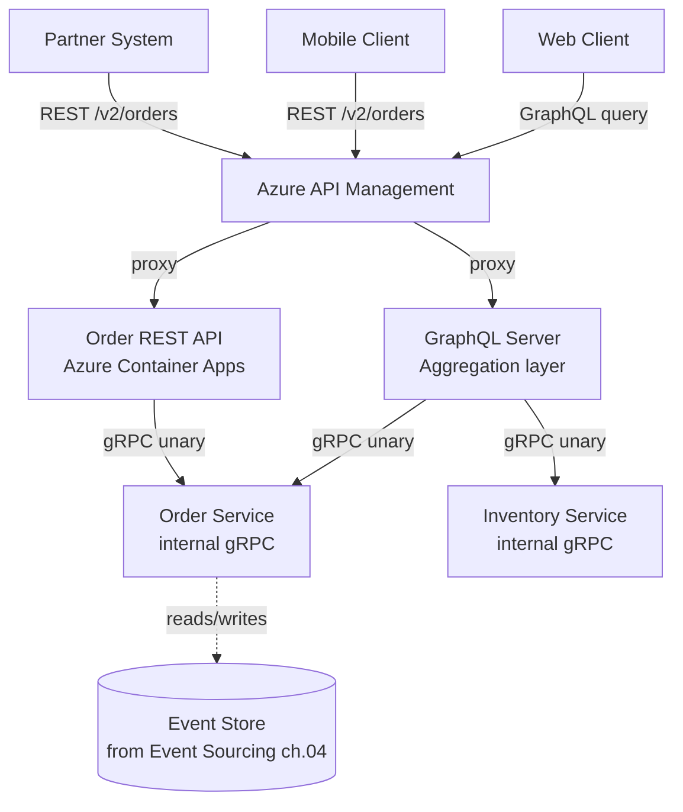
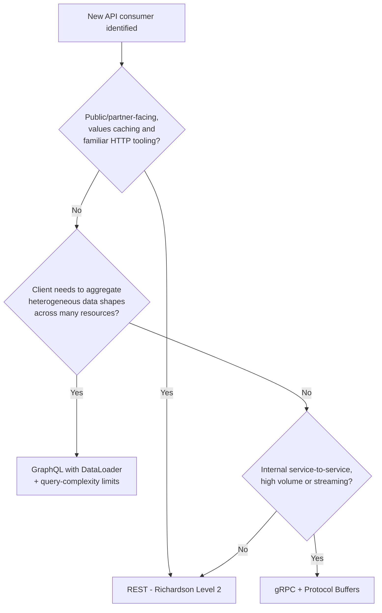
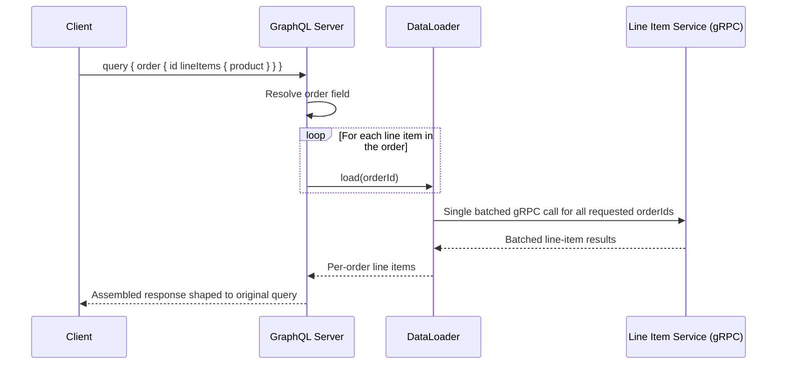
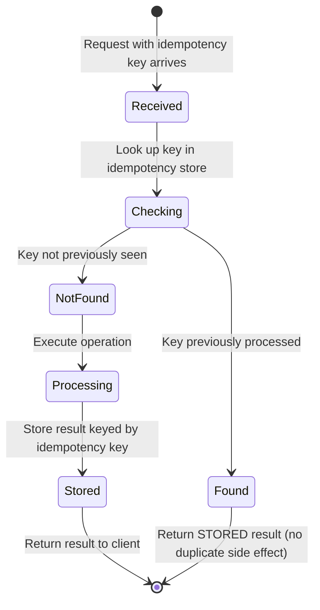

# API Design: REST, GraphQL, gRPC

> Part of the **Enterprise Data & AI Architecture Handbook** · Phase-14 — Event-Driven Architecture & Integration · Chapter 05.
> Estimated study time: **60 min reading + ~4h labs**.
> **Prerequisite:** read [Networking Fundamentals](../Phase-00/04_Networking_Fundamentals.md) first.

---

## Executive Summary

Every chapter in this phase so far has deliberately deferred one question: when a synchronous, request/response call is the right choice — [Microservices Architecture](02_Microservices_Architecture.md) §8.2 named the sync-versus-async decision per interaction but did not specify the protocol; [CQRS](03_CQRS.md) named a "query handler / read API" component without specifying its shape; and [Event Sourcing](04_Event_Sourcing.md) named a state-derivation query surface with the same gap. This chapter closes that gap: **API design** is the discipline of shaping a service's synchronous, request/response contract — its resource model, its schema, its versioning and evolution strategy — building on [Networking Fundamentals](../Phase-00/04_Networking_Fundamentals.md)'s transport-layer foundation (TCP, HTTP/1.1 versus HTTP/2, TLS) to answer the concrete, protocol-level question those chapters left open.

This chapter covers **REST maturity and resource design** — the Richardson Maturity Model as a practical yardstick for how much of REST's actual architectural value a given API realizes, and resource-oriented design as the discipline that keeps a REST API's shape stable as the underlying domain model evolves; **GraphQL schemas and resolvers** as the client-driven alternative that inverts REST's server-decides-the-response-shape default, at the cost of a materially different performance and caching model; **gRPC and Protocol Buffers** as the high-performance, strongly-typed, contract-first alternative purpose-built for internal service-to-service calls rather than public-facing APIs; **versioning, pagination, and idempotency** as the three cross-cutting disciplines every one of these protocols must solve, regardless of which is chosen; and **Azure API Management** as the managed gateway layer — already referenced throughout this phase's prior chapters — that fronts all three protocol choices with a single, consistent set of cross-cutting policies.

The platform bias is **Azure-primary (~60%)** — Azure API Management as the gateway and policy-enforcement layer for REST and GraphQL, Azure Functions/Container Apps/AKS as the compute hosting each protocol's handlers, and Azure API Management's native gRPC pass-through support for internal service meshes — **~30% enterprise open source** (OpenAPI/Swagger for REST contract definition, Apollo Server/GraphQL Yoga for GraphQL, Protocol Buffers and the gRPC framework itself, Kubernetes/Istio for internal gRPC service-mesh routing) — **~10% AWS/GCP comparison-only** (Amazon API Gateway/AppSync; Google Cloud Endpoints/Apigee).

**Bottom line:** REST, GraphQL, and gRPC are not competing, mutually-exclusive choices for an entire organization — they are three tools with genuinely different design centers (REST for broadly-cacheable, resource-oriented public and partner APIs; GraphQL for client-driven aggregation across many underlying resources; gRPC for low-latency, strongly-typed internal service-to-service calls), and a mature enterprise architecture typically uses more than one simultaneously, chosen per interaction against this chapter's Decision Matrix rather than standardized on a single protocol for its own sake. The recurring mistake this chapter documents, continuing this handbook's justification-before-adoption discipline, is choosing a protocol because it is fashionable or because a team is already comfortable with it, rather than because its specific design center matches the interaction's actual client, caching, and performance requirements.

---

## Learning Objectives

By the end of this chapter you will be able to:

1. **Apply the Richardson Maturity Model** to evaluate and design a resource-oriented REST API that realizes HTTP's actual architectural benefits (caching, uniform interface, statelessness).
2. **Design a GraphQL schema and resolver layer** that avoids the N+1 resolver problem and enforces query-complexity limits against abuse.
3. **Design a gRPC service contract with Protocol Buffers**, and explain the specific latency and type-safety benefits that justify it for internal service-to-service calls.
4. **Apply the three cross-cutting API disciplines** — versioning, pagination, and idempotency — consistently regardless of which protocol is chosen.
5. **Configure Azure API Management** as a unified gateway fronting REST, GraphQL, and gRPC backends with consistent authentication, rate limiting, and policy enforcement.
6. **Choose the correct protocol per interaction** using this chapter's Decision Matrix, rather than standardizing an entire organization on a single protocol by default.
7. **Defend an API design decision** in engineer, staff engineer, architect, and CTO review settings, including protocol choice, versioning strategy, and breaking-change governance.

---

## Business Motivation

- **Every synchronous interaction this phase's prior chapters named — a client querying [CQRS](03_CQRS.md)'s read model, an [Event Sourcing](04_Event_Sourcing.md) aggregate's state-derivation query, a [Microservices Architecture](02_Microservices_Architecture.md) service-to-service call — needs a concrete, stable, versionable contract**, and the choice of REST, GraphQL, or gRPC for that contract has direct, measurable consequences for client development velocity, caching effectiveness, and network cost, not merely an aesthetic or stylistic preference.
- **A public or partner-facing API is a long-lived, hard-to-change contract** — unlike an internal microservice, whose consumers a team can coordinate a breaking change with directly (per [Event-Driven Architecture](01_Event_Driven_Architecture.md) §14.4's consumer-driven contract-testing discipline), a public API's consumers are frequently unknown, uncountable, and unreachable, making versioning and backward-compatibility discipline (§8.4) a direct, first-order business risk rather than an engineering nicety.
- **Client-driven data-fetching flexibility (GraphQL's core value proposition) directly reduces mobile and low-bandwidth client cost and latency** by letting a client request exactly the fields it needs in a single round-trip, rather than either over-fetching a REST resource's full representation or making several round-trips to compose a view — a genuine, measurable business benefit for client applications with materially different data needs per screen or per platform.
- **Internal service-to-service call latency and serialization overhead compound directly into end-to-end user-facing latency and infrastructure cost** at the scale [Microservices Architecture](02_Microservices_Architecture.md) §17 already named — gRPC's binary Protocol Buffers serialization and HTTP/2 multiplexing deliver a measurable latency and CPU-cost reduction over JSON-over-REST for high-volume internal calls, a real, quantifiable FinOps and performance lever, not merely a technical preference.
- **Standardizing an entire organization on a single protocol regardless of interaction type is a genuine, recurring enterprise mistake** — this chapter's Business Motivation deliberately continues the justification-before-adoption discipline established across [Microservices Architecture](02_Microservices_Architecture.md) ADR-0170, [CQRS](03_CQRS.md) ADR-0171, and [Event Sourcing](04_Event_Sourcing.md) ADR-0172: REST, GraphQL, and gRPC each impose real, different costs (GraphQL's query-complexity and caching challenges, gRPC's reduced browser-native accessibility, REST's potential for either under- or over-fetching), and each must be justified per interaction against its actual client and performance profile, not adopted uniformly because one protocol is currently the team's most familiar or most fashionable default.

---

## History and Evolution

- **1999-2000 — Roy Fielding's doctoral dissertation formalizes REST (Representational State Transfer)** as an architectural style built directly on HTTP's own existing semantics (methods, status codes, caching headers, hypermedia links) rather than a new protocol — establishing the uniform-interface and statelessness principles this chapter's Core Concepts section still uses as the reference standard.
- **2000s — SOAP and WSDL-based web services** dominate early enterprise service-to-service integration, with XML-heavy, verbose contracts and a comparatively heavyweight tooling ecosystem — REST's simpler, HTTP-native alternative gains adoption throughout the decade specifically as a reaction against SOAP's perceived complexity, directly paralleling the SOA/ESB-versus-microservices reaction [Microservices Architecture](02_Microservices_Architecture.md)'s own History section documented in the same period.
- **2008 — Leonard Richardson's Maturity Model** (popularized by Martin Fowler) formalizes a practical, four-level yardstick (Level 0: a single RPC-style endpoint; Level 1: multiple resources; Level 2: proper use of HTTP verbs and status codes; Level 3: HATEOAS hypermedia) for how much of REST's actual architectural benefit a given "RESTful" API has genuinely realized — directly motivating this chapter's Core Concepts treatment of maturity as a spectrum, not a binary label.
- **2010 — Google develops Protocol Buffers internally** (open-sourced progressively from 2008 onward) as a compact, strongly-typed, backward-and-forward-compatible binary serialization format, initially for Google's own internal service-to-service communication at a scale where JSON's text-based overhead was a measurable cost.
- **2012 — Facebook develops GraphQL internally** for its own mobile-application data-fetching needs, specifically to resolve the REST over/under-fetching problem multiple, structurally different mobile client screens were creating against a shared set of REST endpoints — open-sourced in 2015.
- **2015 — Google open-sources gRPC**, built on HTTP/2 (multiplexed, binary framing) and Protocol Buffers, explicitly targeting the internal, high-performance, strongly-typed service-to-service communication use case rather than public-facing API design — directly complementing, rather than competing with, REST's own public-API-oriented design center.
- **2015-2016 — GraphQL's public release and rapid adoption** by GitHub, Shopify, and other API providers for public-facing APIs establishes it as a genuine, mainstream alternative to REST specifically for client-driven, aggregation-heavy consumption patterns, while gRPC's contemporaneous adoption establishes itself specifically for internal, machine-to-machine communication — the two patterns' design centers diverging from the outset rather than converging on a single "REST's successor."
- **2017-2019 — API gateway products mature to support all three protocols under one managed layer** (Azure API Management adding GraphQL and gRPC pass-through support alongside its original REST-and-SOAP-era capabilities), reflecting the industry's settling understanding that these are complementary tools for different interaction shapes, not a linear technology-replacement sequence.
- **2020s — schema-first, contract-driven API development matures across all three protocols** (OpenAPI 3.x for REST, GraphQL's own type system, Protocol Buffers' `.proto` files) as the default, expected discipline — directly extending [Event-Driven Architecture](01_Event_Driven_Architecture.md) §14.4's consumer-driven contract-testing principle from asynchronous event schemas to synchronous API contracts, now formalized in this chapter as a cross-protocol expectation rather than a protocol-specific practice.

---

## Why This Technology Exists

Every synchronous interaction this handbook has named — a client calling a [Microservices Architecture](02_Microservices_Architecture.md) service, a query against a [CQRS](03_CQRS.md) read model, an [Event Sourcing](04_Event_Sourcing.md) aggregate's state derivation — requires an explicit, stable, versionable contract at the point where a caller and a callee agree on how to communicate; without one, every client-callee pair would need bespoke, ad hoc agreement, unable to evolve independently or interoperate with tooling (client generators, gateways, documentation systems) built against a shared standard. API design disciplines exist to provide that shared standard at three different points on the trade-off spectrum between server-defined simplicity (REST), client-driven flexibility (GraphQL), and machine-to-machine performance (gRPC) — letting an architecture choose, per interaction, which point on that spectrum actually matches the interaction's real consumer and performance profile, rather than forcing every interaction through a single, one-size-fits-all contract style.

---

## Problems It Solves

- **A stable, cacheable, resource-oriented contract for public and partner-facing APIs**, resolved by REST's uniform interface and native use of HTTP caching semantics (§8.1), letting intermediary caches (CDNs, browser caches, API Management's own response caching) transparently improve performance without bespoke application-level caching logic.
- **Over-fetching and under-fetching across structurally different client needs against the same underlying data**, resolved by GraphQL's client-specified query shape (§8.2), letting a mobile client request a minimal field set and a web dashboard request a richer one from the same schema without either requiring a bespoke, per-client REST endpoint.
- **High-throughput, low-latency, strongly-typed internal service-to-service communication**, resolved by gRPC's binary Protocol Buffers serialization and HTTP/2 multiplexing (§8.3), directly reducing the per-call latency and CPU-serialization cost [Microservices Architecture](02_Microservices_Architecture.md) §17 named as a real, additive cost of a fan-out call graph.
- **Uncoordinated, independent client and server evolution**, resolved by explicit versioning strategies (§8.4) that let a server introduce new capabilities or fix a contract mistake without breaking every existing client simultaneously, directly extending [Event-Driven Architecture](01_Event_Driven_Architecture.md) §14.4's schema-evolution discipline from asynchronous events to synchronous API contracts.
- **Safe retry of a request whose original response was lost** (a network timeout where the server may or may not have actually processed the request), resolved by idempotency keys and idempotent HTTP-verb semantics (§8.4), preventing a client's safety-motivated retry from causing a duplicate side effect — directly analogous to [Event-Driven Architecture](01_Event_Driven_Architecture.md) §15.3's idempotent-consumer requirement, now applied to the synchronous request/response path specifically.

---

## Problems It Cannot Solve

- **API design does not eliminate the CAP-theorem and latency realities** this handbook established in [CAP and PACELC](../Phase-02/04_CAP_and_PACELC.md) — a synchronous API call remains, structurally, a synchronous call: it couples the caller's availability to the callee's for the call's duration, exactly the coupling [Microservices Architecture](02_Microservices_Architecture.md) §8.2 named as the reason to choose asynchronous communication instead whenever that coupling is undesirable; no protocol choice among REST, GraphQL, or gRPC changes this fundamental trade-off.
- **It does not fix a poorly-modeled domain** — a REST API's resource model, a GraphQL schema's type graph, and a gRPC service's message definitions are all still expressions of an underlying domain model; if that model (per [Domain-Driven Design](../Phase-01/05_Domain_Driven_Design.md)) is unclear or incorrectly bounded, no amount of protocol-level polish resolves the underlying confusion — it merely gives that confusion a well-documented, strongly-typed shape.
- **It does not remove the need for the resilience patterns** [Microservices Architecture](02_Microservices_Architecture.md) §8.4 established — a synchronous API call, regardless of protocol, still requires timeouts, retries with backoff, circuit breakers, and bulkheads at the calling side, none of which any of these three protocols provide automatically by default.
- **GraphQL's flexibility does not eliminate the N+1 resolver problem or query-cost governance need on its own** — a naively-implemented resolver layer can trivially generate a cascade of downstream calls per field per list item, and an ungoverned schema can let a single client query request arbitrarily deep or broad data, both requiring deliberate engineering (§26, §27) that the protocol itself does not enforce.
- **gRPC's performance benefits do not extend to public, browser-native, or partner-facing consumption without additional infrastructure** — gRPC-Web (a translation layer) is required for direct browser consumption, and gRPC's binary format is materially less human-debuggable and less broadly tooled for external partners than REST's JSON-over-HTTP, making it a poor default choice for any API whose primary consumers are external, human-inspecting developers rather than internal, machine-to-machine services.

---

## Core Concepts

### 8.1 REST maturity and resource design

REST (Representational State Transfer), per this chapter's History section, is an architectural style built on HTTP's own existing semantics rather than a separate protocol — its actual architectural value (statelessness, cacheability, a uniform interface) is realized in *degrees*, not as a binary "RESTful or not" label, which is exactly what the **Richardson Maturity Model** measures: **Level 0** (a single endpoint, HTTP used merely as a transport for an RPC-style call, gaining none of REST's actual benefits); **Level 1** (multiple, distinct resource URIs, but still typically using only HTTP POST regardless of the operation's actual semantics); **Level 2** (proper, semantically-correct use of HTTP verbs — GET for safe reads, POST for creation, PUT/PATCH for updates, DELETE for removal — and HTTP status codes, the level the large majority of production "REST APIs" actually operate at, and the level this chapter recommends as the practical target for most enterprise APIs); and **Level 3 (HATEOAS)** — responses include hypermedia links describing available next actions, letting a client navigate the API's state machine dynamically rather than hardcoding URI construction — genuinely valuable for a small number of long-lived, deeply state-machine-driven APIs, but rarely justified for the majority of enterprise CRUD-oriented APIs given its added client and server complexity. **Resource design** — modeling an API around nouns (resources: `/orders/{id}`, `/customers/{id}/orders`) rather than verbs (`/getOrderDetails`, `/placeNewOrder`) — is what makes HTTP's own verb semantics and caching headers actually meaningful; a resource model that does not align to the domain's actual bounded contexts and aggregates (per [Domain-Driven Design](../Phase-01/05_Domain_Driven_Design.md) and [Event Sourcing](04_Event_Sourcing.md) §9.1's aggregate-boundary treatment) tends to produce an API that is technically Level 2 but still awkward to evolve, since its resource boundaries do not match the domain's own natural consistency boundaries.

### 8.2 GraphQL schemas and resolvers

A **GraphQL schema** is a strongly-typed graph of the API's entire data model — types, fields, and the relationships between them — against which a client submits a single query specifying exactly the fields and nested relationships it needs, receiving back a response shaped precisely to that query, never more and never less. A **resolver** is the server-side function responsible for fetching the data for one specific field in the schema; the schema's graph structure means a single client query can traverse many resolvers (an `order` resolver, followed by a `lineItems` resolver, followed by a `product` resolver for each line item), which is the direct mechanical source of GraphQL's most notorious implementation pitfall: the **N+1 resolver problem** — naively resolving each line item's product via a separate downstream call produces N calls for N line items, rather than one batched call, unless the resolver layer deliberately batches and caches within a single query's execution (via the **DataLoader** pattern, §26) — a discipline the schema's own type system does not enforce automatically, precisely the gap this chapter's Problems It Cannot Solve section names. **Query-complexity limiting** (rejecting or cost-metering a query based on its estimated field count, nesting depth, or list-multiplication cost before execution) is the corresponding governance discipline preventing a single, deeply-nested or broadly-fanned-out client query from becoming an unbounded, resource-exhausting request — a mandatory production control, not an optional hardening step, given that GraphQL's entire value proposition is letting clients construct queries the server did not specifically anticipate in advance.

### 8.3 gRPC and Protocol Buffers

**gRPC** is a contract-first RPC framework built on HTTP/2, using **Protocol Buffers (protobuf)** as its interface-definition language and binary wire format: a `.proto` file defines a service's methods and message types with explicit, numbered fields, from which client and server stub code is generated in any supported language — eliminating an entire class of hand-written serialization/deserialization bugs and giving both ends of a call a compiler-checked, strongly-typed contract rather than a loosely-typed JSON document whose shape is only validated at runtime, if at all. gRPC supports four call patterns beyond REST's single request/single-response default: **unary** (one request, one response, REST's own default shape), **server streaming** (one request, a stream of responses — well suited to a long-running query returning results incrementally), **client streaming** (a stream of requests, one final response — well suited to uploading a large dataset incrementally), and **bidirectional streaming** (both sides stream independently and concurrently over one long-lived HTTP/2 connection — well suited to a real-time, continuously-updating interaction neither REST nor GraphQL's request/response model naturally expresses). Protobuf's own **field-numbering-based backward compatibility** (adding a new field with a new number is safe; reusing or renumbering an existing field's number is not) is the mechanical foundation of gRPC's own schema-evolution discipline, directly analogous to, though mechanically distinct from, [Event-Driven Architecture](01_Event_Driven_Architecture.md) §14.4's additive-fields-only event-schema-evolution principle.

### 8.4 Versioning, pagination, and idempotency

These three cross-cutting disciplines apply, in some protocol-specific form, regardless of which of the three protocols above is chosen:

- **Versioning**: a REST API typically versions via a URI segment (`/v2/orders`) or a request header, GraphQL typically evolves a single, continuously-versioned schema by adding new fields and deprecating (rather than removing) old ones — since a client query only requests the fields it actually uses, additive schema evolution is usually sufficient without a hard version boundary at all — and gRPC relies on protobuf's own field-numbering compatibility (§8.3) plus, for a genuinely breaking change, a new service or method name. In every case, the underlying principle is the same one [Event-Driven Architecture](01_Event_Driven_Architecture.md) §14.4 established for asynchronous events: prefer additive, backward-compatible changes, and reserve a genuinely breaking version bump for the rare case additive evolution cannot accommodate.
- **Pagination**: **offset-based pagination** (`?offset=100&limit=20`) is simple to implement but produces inconsistent results under concurrent inserts/deletes (a record can be skipped or duplicated across pages as the underlying data shifts between requests); **cursor-based (keyset) pagination** (`?after=<opaque_cursor>&limit=20`, where the cursor encodes the last-seen record's own sort key) avoids this inconsistency and scales better against very large datasets, since it does not require the database to count and skip an ever-growing offset — the standard recommendation for any API with high write concurrency or very large result sets, at the cost of not supporting arbitrary "jump to page N" navigation the way offset-based pagination does.
- **Idempotency**: HTTP's own verb semantics already define GET, PUT, and DELETE as idempotent (repeating the same request produces the same end state) while POST is not — for a non-idempotent operation that must nonetheless be safely retryable (a payment-charge POST, where a network timeout leaves the client unsure whether the original request was processed), an explicit **idempotency key** (a client-generated unique identifier included in the request, which the server checks against previously-processed keys before applying the operation a second time) is required, directly analogous to [Event-Driven Architecture](01_Event_Driven_Architecture.md) §15.3's idempotent-event-consumption discipline, now applied to the synchronous request path.

---

## Internal Working

### 9.1 How a REST request is routed and processed

A client issues an HTTP request (a specific verb against a specific resource URI) which Azure API Management (or another gateway) authenticates, rate-limits, and routes to the owning backend service; the service's own routing layer (typically a lightweight web framework's own URI-pattern matching) dispatches to the handler registered for that verb-and-resource-pattern combination, which reads or mutates the underlying resource (per [Microservices Architecture](02_Microservices_Architecture.md)'s own database-per-service data-ownership treatment) and returns a response with an HTTP status code reflecting the outcome (200/201/204 for success variants, 4xx for client error, 5xx for server error) — the status code and any caching headers (`Cache-Control`, `ETag`) present are what let an intermediary cache, without understanding the resource's specific semantics, correctly decide whether and how long to cache the response.

### 9.2 How a GraphQL query is parsed, validated, and resolved

A client submits a single GraphQL query (typically via HTTP POST to one single endpoint, regardless of how many different resources the query traverses); the GraphQL server parses the query against the schema, validates it (rejecting a query referencing a nonexistent field, or one exceeding a configured complexity/depth limit, §8.2), and then executes it by invoking, for each requested field, that field's registered resolver function — resolvers for nested or list fields are invoked once per parent object unless deliberately batched (§8.2's DataLoader pattern), and the server assembles the resolved field values into a single response shaped exactly to the original query's structure.

### 9.3 How a gRPC unary call is serialized and transmitted

A client's generated stub code serializes the request message into protobuf's compact binary wire format and transmits it as an HTTP/2 stream frame (multiplexed alongside any other concurrent calls over the same underlying TCP connection, avoiding HTTP/1.1's head-of-line-blocking limitation); the server's generated stub code deserializes the binary payload back into a strongly-typed message object, invokes the registered service-method implementation, and serializes the response message back over the same HTTP/2 stream — the entire serialization/deserialization path being compiler-generated, not hand-written, is what eliminates the runtime type-mismatch bugs a loosely-typed JSON payload can silently introduce.

### 9.4 How Azure API Management fronts all three protocols

Azure API Management terminates the client-facing connection (REST/HTTP, GraphQL/HTTP, or gRPC/HTTP2), applies its configured **policies** (authentication/token validation, rate limiting, request/response transformation, caching) uniformly regardless of the backend protocol, and then routes to the appropriate backend — for REST and GraphQL, typically proxying the HTTP request directly to the backend service; for gRPC, using API Management's native gRPC pass-through capability, preserving the HTTP/2 binary framing end-to-end rather than translating it, so gRPC's own performance characteristics are not degraded by the gateway hop.

---

## Architecture

### 10.1 Reference architecture: three protocols fronted by one gateway



### 10.2 Why the architecture works

External, human-facing and partner-facing consumers use REST (for the partner system's simple, cacheable, well-tooled integration) or GraphQL (for the web client's aggregation-heavy, per-screen data-shaping need), while every internal service-to-service call — regardless of which external protocol originated the request — uses gRPC, realizing its latency and type-safety benefits exactly where [Microservices Architecture](02_Microservices_Architecture.md) §17 named network round-trip cost as a real, additive concern, without exposing gRPC's binary format to less-gRPC-friendly external consumers. Azure API Management fronts both external protocols with one consistent authentication, rate-limiting, and monitoring layer, directly reusing this phase's own recurring "one managed gateway, multiple backend protocols" pattern.

### 10.3 ADR example

See this chapter's [Architecture Decision Record (ADR-0173)](#architecture-decision-record-adr-0173-rest-for-external-partner-integration-graphql-for-the-web-client-gateway-grpc-for-every-internal-service-to-service-call) under Enterprise Recommendations for the Context/Decision/Consequences/Alternatives treatment of this chapter's three-protocol, per-interaction-justified reference architecture.

---

## Components

- **API Gateway (Azure API Management)** — the single, consistently-policy-enforced entry point for external REST and GraphQL traffic, and the gRPC pass-through point for any externally-exposed gRPC (per [Microservices Architecture](02_Microservices_Architecture.md) §Components' own Gateway treatment, reused directly here).
- **REST resource handler** — the backend logic mapping HTTP verb-and-URI combinations to domain operations (§9.1).
- **GraphQL server (schema, resolvers, DataLoader batching layer)** — the aggregation and client-driven query-shaping layer (§9.2, §8.2).
- **gRPC service (protobuf contract, generated stubs)** — the strongly-typed, high-performance internal call surface (§9.3, §8.3).
- **Idempotency-key store** — the server-side record of previously-processed idempotency keys, checked before applying a non-idempotent operation a second time (§8.4).
- **API contract registry (OpenAPI specs, GraphQL schema, `.proto` files)** — the versioned, source-controlled record of every exposed contract, directly extending [Microservices Architecture](02_Microservices_Architecture.md) §Metadata's service-and-contract-catalog discipline.

---

## Metadata

Every API contract — an OpenAPI specification, a GraphQL schema, or a `.proto` file — should be catalogued (extending [Microservices Architecture](02_Microservices_Architecture.md) §Metadata and [Event-Driven Architecture](01_Event_Driven_Architecture.md) §23's known-consumer-list discipline to synchronous contracts specifically) with its current version, its owning team, its deprecation timeline for any fields or endpoints marked for removal, and — for a public or partner-facing contract specifically — a best-effort registry of known external consumers, since a public API's actual consumer population is frequently incomplete or unknowable, making this catalog's honesty about that uncertainty itself an important governance signal (§23).

---

## Storage

API design itself does not introduce a new storage layer — REST, GraphQL, and gRPC are all protocol/contract-layer concerns sitting in front of whatever storage the underlying service already owns (per [Microservices Architecture](02_Microservices_Architecture.md) §Storage's database-per-service treatment, [CQRS](03_CQRS.md) §Storage's read/write-model split, or [Event Sourcing](04_Event_Sourcing.md) §Storage's event store). The one storage-adjacent component this chapter introduces is the **idempotency-key store** (§8.4) — typically a fast, short-TTL key-value store (Azure Cache for Redis, or a dedicated table with a time-based expiry) recording each processed idempotency key only long enough to cover the realistic retry window a client might use, not indefinitely, since idempotency-key storage is a operational safety mechanism, not a permanent audit record (that role belongs to [Event Sourcing](04_Event_Sourcing.md)'s own event store, where applicable).

---

## Compute

REST and GraphQL handlers are typically deployed as part of the owning service's own compute (Azure Container Apps or AKS, per [Microservices Architecture](02_Microservices_Architecture.md) §Compute), with a GraphQL server specifically often deployed as its own dedicated aggregation-layer service (per this chapter's reference architecture) rather than embedded within any single underlying domain service, since its resolvers typically call across several backend services' own gRPC or REST surfaces. gRPC services, given their internal, machine-to-machine design center, are almost always deployed alongside the rest of a microservices fleet's own compute, frequently behind a service mesh (per [Microservices Architecture](02_Microservices_Architecture.md) §9.3) that transparently applies mTLS and resilience policy to gRPC calls exactly as it does to REST ones.

---

## Networking

Building directly on [Networking Fundamentals](../Phase-00/04_Networking_Fundamentals.md)'s transport-layer treatment: REST and GraphQL typically operate over HTTP/1.1 or HTTP/2 for external client traffic (with HTTP/2's multiplexing benefit realized transparently by modern browsers and API Management without any API-design-level change required), while gRPC *requires* HTTP/2 specifically to realize its multiplexing and streaming call patterns (§8.3) — a gRPC service exposed only over HTTP/1.1 loses these benefits entirely, making HTTP/2 support a hard networking prerequisite, not an optional performance tuning knob, for any gRPC deployment. Private endpoints and zero-trust internal networking (per [Network Security and Zero Trust](../Phase-10/04_Network_Security_and_Zero_Trust.md) ADR-0144, reused directly from every prior Phase-14 chapter's own Networking section) apply identically regardless of which protocol a given internal call uses.

---

## Security

- **OAuth2/OIDC token validation at the API Gateway** (per [Identity and Access Management with Entra](../Phase-10/02_Identity_and_Access_Management_with_Entra.md), reused directly from [Microservices Architecture](02_Microservices_Architecture.md) §Security) as the single enforcement point for external REST and GraphQL authentication, propagating a verified identity/claims context to backend services rather than requiring each backend to independently re-validate external tokens.
- **GraphQL-specific query-depth and complexity limits (§8.2, §26) as a mandatory security control, not merely a performance one** — an unbounded, deeply-nested, or broadly-fanned-out query is both a resource-exhaustion (denial-of-service) risk and, per the OWASP API Security guidance this chapter's Governance section references, a documented, named risk category specific to GraphQL APIs that REST's more constrained per-endpoint shape does not expose to the same degree.
- **Field-level and type-level authorization within a GraphQL schema** — because a single GraphQL query can traverse many underlying resources in one request, authorization must be checked per-field/per-resolver (not just once at the query's entry point), since a client with access to a top-level `order` field is not necessarily authorized to see every nested field the query graph could otherwise expose — a direct extension of the least-privilege-scoping lineage this handbook has traced through [Model Context Protocol (MCP)](../Phase-12/06_Model_Context_Protocol_MCP.md) ADR-0160 and every prior Phase-14 chapter's own Security section.
- **mTLS for internal gRPC calls**, either application-managed or transparently provided by a service mesh sidecar (per [Microservices Architecture](02_Microservices_Architecture.md) §9.3, reused directly here), authenticating both ends of every internal gRPC call.
- **Idempotency-key validation as a defense against both accidental duplicate submission and a specific replay-attack variant** — an idempotency key must be scoped to the authenticated caller's own identity (not globally unique across all callers), preventing one client from replaying another client's previously-submitted idempotency key to trigger an unauthorized duplicate operation.

---

## Performance

- **REST's native HTTP caching (via `Cache-Control`/`ETag` headers) is the single highest-leverage performance lever available to a well-designed REST API**, letting intermediary caches (CDN, API Management response cache, browser cache) serve a substantial fraction of read traffic without ever reaching the origin service — a benefit GraphQL's single-endpoint, query-shape-varies-per-request model makes structurally harder to realize with the same transparency, requiring deliberate, often more complex, application-level caching strategies (persisted queries, response-shape-aware caching) instead.
- **GraphQL's N+1 resolver problem (§8.2) is this protocol's single most common, most damaging performance mistake**, and the DataLoader batching pattern (§26) is the standard, near-mandatory mitigation for any resolver traversing a one-to-many or many-to-many relationship.
- **gRPC's binary serialization and HTTP/2 multiplexing deliver a measurable latency and CPU-cost reduction over JSON-over-HTTP/1.1** for high-volume internal calls, directly realizing the business driver named in this chapter's Business Motivation — the magnitude of this benefit should be measured against the specific workload's actual call volume and payload size, not assumed uniformly large regardless of scale.
- **Pagination strategy (§8.4) is a direct, first-order performance lever at scale**: offset-based pagination's `OFFSET N` database operation becomes measurably slower as N grows, since the database must still scan and discard the skipped rows, while cursor-based pagination's indexed `WHERE sort_key > cursor` predicate remains roughly constant-time regardless of how deep into the result set a client has paged.
- **Response payload shaping (sparse fieldsets in REST via a `fields` query parameter, or GraphQL's own native field selection)** reduces serialization cost and network payload size directly, particularly valuable for large, deeply-nested resources where a client typically needs only a small subset of the full representation.

---

## Scalability

REST and GraphQL endpoints scale horizontally behind the API Gateway exactly as any other stateless HTTP service does (per [Microservices Architecture](02_Microservices_Architecture.md) §Scalability's own treatment), with GraphQL's aggregation-layer deployment (§Compute) scaling independently of the underlying domain services it calls into — meaning a spike in client-facing GraphQL query volume does not, by itself, require scaling every backend gRPC service unless the actual resolved-field volume genuinely demands it. gRPC's HTTP/2 multiplexing lets a single connection carry many concurrent calls, reducing (though not eliminating) the connection-pool-exhaustion risk [Microservices Architecture](02_Microservices_Architecture.md) §8.4's bulkhead pattern already named as a general resilience concern — a gRPC client library's own connection-pool and concurrent-stream-limit configuration should still be sized deliberately against the calling service's own autoscaling profile, not assumed unlimited simply because HTTP/2 multiplexes.

---

## Fault Tolerance

- **The same resilience patterns [Microservices Architecture](02_Microservices_Architecture.md) §8.4 established** — timeout, retry with backoff, circuit breaker, bulkhead, fallback — apply identically to REST, GraphQL, and gRPC calls; gRPC's own client libraries typically provide first-class, built-in support for deadlines (a gRPC-native equivalent of a timeout) and retry policies configured declaratively per method, somewhat lowering the implementation burden compared to REST/GraphQL, where these patterns are more commonly layered on via an external resilience library or service mesh.
- **Idempotency keys (§8.4) are themselves a fault-tolerance mechanism**, not merely a data-correctness one — they are precisely what makes it *safe* for a client's own resilience layer to retry a non-idempotent operation after an ambiguous failure (a timeout where the original request's outcome is unknown), closing the loop between client-side retry logic and server-side duplicate-prevention.
- **A GraphQL query spanning multiple backend resolvers should support partial failure and partial response** — per the GraphQL specification's own error-handling model, a query can return both the successfully-resolved fields and an `errors` array describing which specific fields failed, rather than failing the entire response if one nested resolver's downstream call fails — directly analogous to [Microservices Architecture](02_Microservices_Architecture.md) §19's graceful-degradation principle for a page-composing API Gateway, now expressed as a first-class part of GraphQL's own response format.
- **gRPC status codes** provide a standardized, machine-checkable set of failure categories (`UNAVAILABLE`, `DEADLINE_EXCEEDED`, `RESOURCE_EXHAUSTED`, and others) that a calling service's resilience logic can branch on directly (e.g., only retrying `UNAVAILABLE`/`DEADLINE_EXCEEDED`, never retrying a `PERMISSION_DENIED`), a materially more structured signal than REST's comparatively coarser HTTP status-code vocabulary for driving automated retry-versus-fail-fast decisions.

---

## Cost Optimization

- **Maximize REST cacheability wherever the resource's staleness tolerance allows it** (§17), since a cache hit at the CDN or gateway layer avoids compute cost at the origin service entirely — the single highest-leverage cost lever available for any read-heavy REST API.
- **Enforce GraphQL query-complexity limits (§8.2, §26) as a direct cost-containment control**, not merely a security one — an unbounded query can trigger a cascade of downstream calls and compute cost proportional to the query's own complexity, which a client (not the server) effectively controls unless the server enforces a ceiling.
- **Right-size gRPC connection pooling and concurrent-stream limits against actual measured call volume** rather than a defensively large default, avoiding both under-utilization (paying for idle connection capacity) and the connection-pool-exhaustion risk named in this chapter's Scalability section.
- **Batch and paginate deliberately rather than defaulting to "return everything"** — an unpaginated REST endpoint or an unbounded GraphQL list field returning an entire, unbounded dataset on every call is a direct, avoidable compute and network-egress cost, particularly for a frequently-polled endpoint.
- **Worked FinOps example:** a team's internal order-to-inventory service-to-service call, originally implemented as JSON-over-REST, measures at approximately 45,000 requests/second at peak, each averaging 2.5ms of pure JSON serialization/deserialization CPU time across caller and callee combined — roughly 112.5 CPU-seconds/second of aggregate compute spent purely on serialization at peak, translating to an estimated $4,200/month in additional compute capacity provisioned specifically to absorb this overhead. Migrating this specific internal call to gRPC with Protocol Buffers reduces measured serialization time to approximately 0.4ms per call (an 84% reduction), reducing the aggregate serialization-driven compute need to roughly $670/month — a $3,530/month (~84%) reduction for this one high-volume internal call — while the team explicitly did not migrate its public partner-facing REST API to gRPC, since that API's actual call volume (roughly 200 requests/second) made the same optimization's absolute savings immaterial relative to the cost of asking partners to adopt an unfamiliar, less-tooled protocol.

---

## Monitoring

- **Per-endpoint/per-operation latency, error rate, and traffic volume** (the SRE "golden signals," reused directly from [Microservices Architecture](02_Microservices_Architecture.md) §21), tracked separately per protocol and per specific REST resource / GraphQL operation / gRPC method, since aggregating across a mixed-protocol gateway's traffic obscures which specific contract is actually degraded.
- **GraphQL query-complexity distribution and rejection rate** — tracking not just whether queries succeed, but how close the query population runs to the configured complexity ceiling (§8.2), as a leading indicator of whether that ceiling needs adjustment before it either blocks legitimate use cases or fails to catch a genuinely abusive query pattern.
- **Cache hit rate for REST endpoints** (at the CDN, gateway, and application layers) as the direct, measurable validation of whether this chapter's Cost Optimization and Performance sections' cacheability recommendations are actually being realized in production, not merely designed for.
- **gRPC deadline-exceeded and resource-exhausted rates per method**, as a direct, protocol-native leading indicator of either an under-provisioned downstream dependency or a client-side deadline configured too aggressively relative to the method's actual p99 latency.
- **API contract deprecation-window compliance** — tracking actual client traffic against a deprecated field, endpoint, or schema version as it approaches its announced removal date (§23), catching a consumer who has not yet migrated before the removal date arrives rather than discovering the gap only after a breaking change ships.

---

## Observability

Distributed tracing must propagate a trace/correlation context across every synchronous hop this chapter's protocols enable — from an external REST or GraphQL request, through the API Gateway, into a GraphQL aggregation layer's own resolver-driven fan-out, and into whatever internal gRPC calls those resolvers trigger — directly extending [Microservices Architecture](02_Microservices_Architecture.md) §22's mixed sync/async tracing treatment specifically to the multi-protocol case this chapter's reference architecture introduces, so that a single trace reconstructs a GraphQL query's full resolver-to-gRPC-call fan-out exactly as that chapter's own call-graph tracing already covers a purely REST-based fan-out.

### Operational Response Playbook

| Signal | Detection Query/Method | Remediation |
|---|---|---|
| A specific GraphQL query pattern's p99 latency and downstream call volume spike disproportionately relative to its client-visible field count | Distributed trace query filtering for the affected GraphQL operation, examining the resolver-level call count per query execution | Check for an N+1 resolver pattern (§8.2) on the specific field/relationship involved — a call count scaling linearly with a list field's item count is the diagnostic signature; introduce or fix DataLoader-style batching for that resolver |
| A public REST endpoint's cache hit rate unexpectedly drops after a recent deployment, with no corresponding traffic-pattern change | Cache-hit-rate metric trend correlated with recent deployment history for that endpoint | Check whether the recent deployment altered the endpoint's `Cache-Control`/`ETag` header logic, or introduced a previously-absent per-request-varying response field (e.g., an embedded timestamp) that defeats cache-key matching; revert or fix the specific header/response change rather than assuming the caching layer itself is misbehaving |

---

## Governance

API governance extends [Microservices Architecture](02_Microservices_Architecture.md) §23's contract-cataloguing discipline and [Event-Driven Architecture](01_Event_Driven_Architecture.md) §14.4's consumer-driven contract-testing to synchronous contracts specifically: every REST, GraphQL, or gRPC contract change should pass an automated breaking-change-detection gate in CI (OpenAPI-diff for REST, a GraphQL schema-diff tool, or protobuf's own backward-compatibility linting) before deployment, exactly as that chapter established for asynchronous event schemas. Public and partner-facing API changes require a published, honored deprecation window (a specific, communicated timeline before a deprecated field or version is actually removed, tracked per this chapter's Monitoring section) — a genuinely harder governance obligation than an internal microservice's own consumer-driven contract testing, since a public API's full consumer population is frequently unknowable. **OWASP API Security Top 10** guidance (broken object-level authorization, excessive data exposure, lack of resource/rate limiting, and — specific to GraphQL — unbounded query complexity) should be treated as the standard, non-negotiable security-review checklist for every newly-published or materially-changed public API contract, directly extending [Security Foundations](../Phase-10/01_Security_Foundations.md)'s OWASP-Top-10-for-data-platforms treatment to this chapter's own API-specific risk category.

---

## Trade-offs

- **REST's cacheability and broad tooling support vs. its potential for over/under-fetching**: REST's uniform, HTTP-native interface makes it the most broadly interoperable, most easily cached, and most externally-familiar choice, at the cost of either over-fetching (returning a resource's full representation when a client needs only a few fields) or under-fetching (requiring multiple round-trips to compose a view spanning several resources) for clients with structurally different data needs.
- **GraphQL's client-driven flexibility vs. its caching and query-governance complexity**: GraphQL resolves REST's over/under-fetching problem directly, at the cost of a materially harder caching story (a single endpoint serving arbitrarily-shaped responses is much harder to cache transparently than REST's per-resource URIs) and a mandatory query-complexity-governance investment REST's more constrained per-endpoint shape does not require to the same degree.
- **gRPC's performance and type-safety vs. its reduced external accessibility**: gRPC's binary format and generated-stub-code model deliver the strongest performance and type-safety guarantees among the three, at the cost of being materially less accessible to a human-inspecting external developer or a browser client without an additional gRPC-Web translation layer — making it a strong default for internal service-to-service calls and a poor default for public, partner-facing APIs.
- **Single-protocol organizational standardization vs. per-interaction protocol choice**: standardizing an entire organization on one protocol reduces tooling and training overhead, at the cost of forcing every interaction through a design center that does not actually match its real client and performance profile — this chapter's central caution, and the direct motivation for its own three-protocol reference architecture.
- **Is a new, dedicated protocol choice even necessary, or would extending an existing REST API's resource model suffice?** Per this chapter's justification-before-adoption discipline, continuing the theme established across every prior Phase-14 chapter: introducing GraphQL or gRPC into an architecture that already has a working, adequately-performing REST API is a genuine, ongoing cost (a new protocol's own tooling, monitoring, and team-training investment) that should be justified by a specific, measured client-aggregation or internal-performance need, not adopted because the protocol is newer or more architecturally interesting.

---

## Decision Matrix

| Scenario | Recommended Choice | Rationale |
|---|---|---|
| Public or partner-facing API with broadly cacheable, resource-oriented data and external developers who value familiar, well-tooled HTTP semantics | REST (Richardson Level 2) | Maximizes cacheability, external tooling compatibility, and developer familiarity; HATEOAS (Level 3) rarely justified given added complexity |
| Client application (web/mobile) aggregating data across many underlying resources with structurally different per-screen data needs | GraphQL | Directly resolves REST's over/under-fetching problem for genuinely heterogeneous client data-shaping needs |
| High-volume internal service-to-service call where latency and CPU-serialization cost are measured, material concerns | gRPC | Binary serialization and HTTP/2 multiplexing deliver a measurable, quantifiable latency/cost reduction at this specific interaction's actual scale |
| Long-running or continuously-updating interaction (streaming query results, real-time bidirectional updates) between internal services | gRPC (server/client/bidirectional streaming) | Neither REST's nor GraphQL's default request/response model naturally expresses a genuinely streaming interaction |
| Existing, adequately-performing REST API with no measured client-aggregation or internal-performance problem | Keep REST; do not introduce GraphQL or gRPC | Per this chapter's central caution — a new protocol's tooling/training cost is unjustified without a specific, measured need it resolves that REST does not already handle adequately |
| Internal call requiring the strongest external, human-facing accessibility (a partner needing to debug a request/response by hand, browser-native consumption without a translation layer) | REST, not gRPC | gRPC's binary format and lack of native browser support make it a poor fit whenever human-facing debuggability or direct browser access is a genuine requirement |

---

## Design Patterns

- **Resource-oriented design with proper HTTP-verb semantics (Richardson Level 2)**: the standard, recommended REST design target for the large majority of enterprise APIs, per §8.1.
- **DataLoader batching**: within a single GraphQL query's execution, deduplicate and batch multiple resolver calls for the same underlying data source into one downstream call, the standard, near-mandatory mitigation for the N+1 resolver problem (§8.2, §17).
- **Backend-for-frontend (BFF) as a GraphQL aggregation layer**: reused directly from [Microservices Architecture](02_Microservices_Architecture.md) §26's own BFF pattern, with GraphQL specifically well suited to implementing a BFF's client-tailored response shaping, since the BFF's entire purpose (tailoring the composed response to a specific client's needs) is exactly what GraphQL's query-shape-per-request model provides natively.
- **Idempotency-key middleware**: a reusable, protocol-agnostic middleware layer checking and recording idempotency keys (§8.4) before an operation reaches its actual business logic, rather than reimplementing the check inside every individual non-idempotent handler.
- **Contract-first development**: writing the OpenAPI specification, GraphQL schema, or `.proto` file *before* implementation, generating server stubs and client SDKs from that contract, and validating the actual implementation against it in CI — directly extending [Event-Driven Architecture](01_Event_Driven_Architecture.md) §14.4's consumer-driven contract-testing discipline to the synchronous-API design process itself.

---

## Anti-patterns

- **RPC-style REST (Richardson Level 0-1)**: an API using HTTP purely as an RPC transport (`POST /getOrderDetails`, `POST /updateOrderStatus`) regardless of the operation's actual semantics, gaining none of REST's caching, uniform-interface, or tooling benefits while still calling itself "REST."
- **The N+1 resolver problem left unaddressed in production** (§8.2, §17) — the single most common, most damaging GraphQL implementation mistake this chapter documents.
- **An unbounded, ungoverned GraphQL schema with no query-complexity limit** — a direct security and cost risk (§Security, §Cost Optimization), not merely a performance nicety to address "eventually."
- **Choosing gRPC for a public, partner-facing API without a validated need for its performance characteristics**, forcing external partners into a less-tooled, less-debuggable protocol for no corresponding benefit they can actually realize — the protocol-mismatch instance of this chapter's central over-adoption caution.
- **Offset-based pagination on a high-write-concurrency or very-large dataset** (§8.4, §17), producing silently inconsistent (skipped or duplicated) results as the underlying data shifts between paginated requests, and degrading in performance as the offset grows.

---

## Common Mistakes

- **Building a REST API without a genuine resource model**, defaulting to verb-shaped endpoints out of expedience and never revisiting the decision as the API grows, accumulating the Level 0-1 anti-pattern's full cost over time.
- **Implementing GraphQL resolvers naively, one downstream call per parent-per-field, without ever measuring or addressing the resulting N+1 call multiplication** until a production performance incident forces the issue.
- **Treating a non-idempotent POST as safely retryable without an explicit idempotency key**, causing a client's own well-intentioned retry logic to produce a duplicate side effect (a duplicate charge, a duplicate order) — the synchronous-API-specific instance of the same idempotent-consumption discipline this handbook has repeated across every Phase-14 chapter's asynchronous-event treatment.
- **Shipping a breaking API contract change without a published deprecation window**, discovering only after the fact how many external or internal consumers the change actually broke, because no contract-consumer catalog (§Metadata, §Governance) existed to check against beforehand.
- **Standardizing an entire organization on a single protocol (usually REST, sometimes GraphQL) for every interaction regardless of its actual client and performance profile**, forcing internal, high-volume service-to-service calls through a materially less efficient contract style than gRPC would provide, purely for the sake of organizational consistency — this chapter's single most emphasized caution, repeated across Business Motivation, Trade-offs, and this chapter's own ADR.

---

## Best Practices

- Target Richardson Maturity Model Level 2 for the large majority of REST APIs; reserve Level 3 (HATEOAS) for the narrow set of genuinely state-machine-driven, long-lived APIs where it earns its added complexity.
- Implement DataLoader-style batching for every GraphQL resolver traversing a one-to-many or many-to-many relationship from day one, not retrofitted after an N+1 performance incident.
- Enforce GraphQL query-complexity limits as a mandatory, non-optional production control before the schema is exposed to any external or broadly-internal consumer.
- Use gRPC specifically for internal, high-volume, or genuinely streaming service-to-service calls; keep public and partner-facing APIs on REST or GraphQL unless a validated, measured performance need justifies gRPC's reduced external accessibility.
- Require idempotency keys for every non-idempotent operation a client might reasonably need to retry after an ambiguous failure.
- Choose cursor-based pagination by default for any API with meaningful write concurrency or large result sets, reserving offset-based pagination for small, low-churn datasets where arbitrary page-jump navigation is a genuine requirement.
- Run automated breaking-change-detection in CI for every REST, GraphQL, and gRPC contract change, and publish an honored deprecation window before removing any field, endpoint, or version.

---

## Enterprise Recommendations

Default to **REST at Richardson Maturity Model Level 2** for public and partner-facing APIs, prioritizing broad cacheability and external-tooling compatibility. Adopt **GraphQL** specifically for client-aggregation layers (a BFF fronting several underlying services or resources) with a genuine, measured over/under-fetching problem REST's per-resource shape does not resolve adequately, always paired with DataLoader batching and enforced query-complexity limits from day one. Adopt **gRPC** for internal, high-volume, or genuinely streaming service-to-service calls where a validated, measured latency or serialization-cost benefit justifies its reduced external accessibility, fronted by **Azure API Management** for any externally-exposed surface across all three protocols with consistent authentication, rate limiting, and monitoring. In every case, mandate idempotency-key support for non-idempotent operations, cursor-based pagination for high-concurrency or large datasets, and automated contract-breaking-change detection in CI as non-negotiable, audited controls regardless of protocol choice.

### Architecture Decision Record (ADR-0173): REST for External Partner Integration, GraphQL for the Web-Client Gateway, gRPC for Every Internal Service-to-Service Call

**Context:** Following [Microservices Architecture](02_Microservices_Architecture.md)'s service decomposition and [CQRS](03_CQRS.md)/[Event Sourcing](04_Event_Sourcing.md)'s read/write-model split, the order-management platform team must choose API protocols for three distinct consumer categories: an external partner system integrating with the order platform, a web-client application aggregating order, inventory, and shipping data across several services for a single dashboard view, and the substantial internal service-to-service call volume between Order, Inventory, and Shipping services measured, per this chapter's own Cost Optimization worked example, at tens of thousands of requests/second at peak. A prior internal proposal favored standardizing on REST everywhere "for organizational simplicity," motivated by the team's existing REST familiarity rather than a per-interaction analysis of each consumer category's actual needs.

**Decision:** Use REST (Richardson Level 2) for the external partner integration, given the partner's own tooling and preference for familiar, well-documented HTTP semantics. Use GraphQL for the web-client-facing aggregation layer, given the dashboard's genuinely heterogeneous, per-screen data-shaping needs across multiple underlying services. Use gRPC for every internal service-to-service call, given the measured latency and serialization-cost benefit quantified in this chapter's own worked FinOps example. Do not standardize on a single protocol across all three consumer categories.

**Consequences:** Each consumer category receives a contract genuinely matched to its own client and performance profile, realizing REST's cacheability for the partner integration, GraphQL's aggregation flexibility for the dashboard, and gRPC's performance for the high-volume internal path — at the cost of the team needing to maintain tooling, monitoring, and on-call familiarity across three protocols rather than one, a real, accepted training and operational-surface cost this ADR explicitly weighs against the alternative's performance and developer-experience shortfalls for at least two of the three consumer categories.

**Alternatives Considered:** (1) *Standardize on REST for all three consumer categories* — rejected, since the web-client dashboard's aggregation needs would have required either significant over-fetching or many additional round-trips, and the internal service-to-service call volume would have retained the serialization overhead this chapter's worked FinOps example quantified as a genuine, material cost. (2) *Standardize on gRPC for all three consumer categories, including the external partner integration* — rejected, since the partner's own tooling and development team had no existing gRPC familiarity, and gRPC's binary format and lack of native browser support would have imposed a real, unjustified integration cost on an external party for a workload (roughly 200 requests/second) far below the scale at which gRPC's performance benefit would materially matter.

---

## Azure Implementation

### 31.1 Recommended Azure service map

| Need | Azure Service | Notes |
|---|---|---|
| Unified external gateway for REST and GraphQL | Azure API Management | OAuth2/OIDC validation, rate limiting, response caching, OpenAPI import |
| gRPC pass-through for internal or selectively-exposed gRPC | Azure API Management (gRPC pass-through) | Preserves HTTP/2 binary framing end-to-end without protocol translation |
| REST/GraphQL backend compute | Azure Container Apps or AKS | Reused from [Microservices Architecture](02_Microservices_Architecture.md) §31 |
| GraphQL aggregation-layer hosting | Azure Container Apps (dedicated BFF service) | Independently scaled from underlying domain services per this chapter's Scalability section |
| Idempotency-key store | Azure Cache for Redis | Short-TTL key-value store scoped to caller identity |
| Internal gRPC service mesh | AKS + Istio/Linkerd | mTLS and resilience policy applied transparently to gRPC calls, per [Microservices Architecture](02_Microservices_Architecture.md) §9.3 |

### 31.2 Example: OpenAPI-defined REST resource with cursor-based pagination (OpenAPI 3.x, abridged)

```yaml
paths:
  /v2/orders:
    get:
      summary: List orders (cursor-based pagination)
      parameters:
        - name: after
          in: query
          schema: { type: string }
          description: Opaque cursor from the previous page's nextCursor field
        - name: limit
          in: query
          schema: { type: integer, default: 20, maximum: 100 }
      responses:
        '200':
          content:
            application/json:
              schema:
                type: object
                properties:
                  items: { type: array, items: { $ref: '#/components/schemas/Order' } }
                  nextCursor: { type: string, nullable: true }
      headers:
        Cache-Control: { schema: { type: string, example: "max-age=30, private" } }
```

### 31.3 Example: GraphQL resolver with DataLoader batching (JavaScript-style pseudocode)

```javascript
const orderLineItemLoader = new DataLoader(async (orderIds) => {
  // Single batched downstream call for ALL requested order IDs,
  // instead of one call per order (the N+1 problem this pattern resolves)
  const lineItems = await lineItemService.getByOrderIds(orderIds);
  return orderIds.map(id => lineItems.filter(li => li.orderId === id));
});

const resolvers = {
  Order: {
    lineItems: (order, args, context) => orderLineItemLoader.load(order.id),
  },
};
```

### 31.4 Example: gRPC service contract and idempotent unary call (protobuf + C#-style pseudocode)

```protobuf
syntax = "proto3";

service OrderService {
  rpc PlaceOrder (PlaceOrderRequest) returns (PlaceOrderResponse);
}

message PlaceOrderRequest {
  string idempotency_key = 1;
  string customer_id = 2;
  repeated LineItem line_items = 3;
}

message PlaceOrderResponse {
  string order_id = 1;
  string status = 2;
}
```

```csharp
public override async Task<PlaceOrderResponse> PlaceOrder(
    PlaceOrderRequest request, ServerCallContext context)
{
    var existing = await _idempotencyStore.GetAsync(request.IdempotencyKey);
    if (existing != null)
    {
        return existing; // safe replay of a previous response, no duplicate side effect
    }

    var response = await _orderHandler.PlaceOrderAsync(request);
    await _idempotencyStore.SetAsync(request.IdempotencyKey, response, ttl: TimeSpan.FromHours(24));
    return response;
}
```

---

## Open Source Implementation

- **OpenAPI (Swagger)** remains the OSS-standard, vendor-neutral contract-definition format for REST APIs, with broad tooling support for client-SDK generation, mock-server generation, and breaking-change detection in CI.
- **Apollo Server** and **GraphQL Yoga** are the two most widely-adopted OSS GraphQL server implementations, both with native DataLoader integration and query-complexity-limiting plugin ecosystems.
- **Protocol Buffers and the gRPC framework** itself (Google-originated, CNCF-governed) are the OSS reference implementations underlying this chapter's entire gRPC treatment, with generated-stub support across essentially every mainstream language.
- **Istio/Linkerd** (reused from [Microservices Architecture](02_Microservices_Architecture.md) §9.3) provide the OSS service-mesh layer applying mTLS and resilience policy transparently to internal gRPC traffic without per-service application-code duplication.
- **Kong** and **Nginx** (with its gRPC-proxying module) are widely-used OSS API-gateway alternatives to a managed service, for teams preferring a self-hosted gateway layer over Azure API Management.

---

## AWS Equivalent (comparison only)

| Azure Service | AWS Equivalent | Advantages | Disadvantages | Migration Notes |
|---|---|---|---|---|
| Azure API Management (REST/GraphQL) | Amazon API Gateway + AWS AppSync | AppSync provides a purpose-built, managed GraphQL service with native resolver-to-DynamoDB/Lambda integration | Requires composing two separate services (API Gateway for REST, AppSync for GraphQL) rather than APIM's single unified surface | REST definitions migrate via OpenAPI import to API Gateway; GraphQL schemas migrate to AppSync with resolver logic re-implemented against its own resolver-mapping model |
| Azure API Management (gRPC pass-through) | Amazon API Gateway (HTTP APIs, limited gRPC support) or direct AWS App Mesh/ECS gRPC routing | App Mesh provides native gRPC-aware service-mesh routing for internal traffic | API Gateway's own gRPC support is comparatively limited versus APIM's native pass-through; internal gRPC is more commonly routed directly via the mesh rather than through the gateway | Internal gRPC traffic is more idiomatically migrated to App Mesh-routed service-to-service calls than through API Gateway itself |

**Selection criteria**: choose Azure's portfolio for a single, unified gateway surface across all three protocols; choose AWS's when AppSync's native DynamoDB/Lambda resolver integration specifically matches an already-AWS-native backend, accepting the two-service (API Gateway plus AppSync) composition as a genuinely different operational model from APIM's unified surface.

---

## GCP Equivalent (comparison only)

| Azure Service | GCP Equivalent | Advantages | Disadvantages | Migration Notes |
|---|---|---|---|---|
| Azure API Management (REST/GraphQL) | Google Cloud Endpoints / Apigee | Apigee offers a comparably deep, enterprise-grade API-lifecycle platform to APIM at its higher tier; Cloud Endpoints integrates natively with gRPC via its own Extensible Service Proxy | Cloud Endpoints has narrower native GraphQL support than APIM or AppSync | Apigee is the closer feature-for-feature match to APIM for REST/GraphQL; Cloud Endpoints suits gRPC-centric API surfaces specifically |
| Azure API Management (gRPC pass-through) | Google Cloud Endpoints (native gRPC support via ESP) | Google's own origin as gRPC's creator gives Cloud Endpoints particularly mature, first-party gRPC gateway support | Less unified with REST/GraphQL gateway capability than APIM's single surface | gRPC-heavy architectures may find Cloud Endpoints' gRPC-specific tooling more mature, at the cost of a less unified multi-protocol gateway experience |

**Selection criteria**: GCP's Cloud Endpoints, given Google's own origin as gRPC's creator, is frequently cited as having the most mature native gRPC gateway tooling among the three clouds; Apigee remains the closer match to APIM's broader REST/GraphQL API-lifecycle feature set.

---

## Migration Considerations

- **Introduce a new protocol incrementally, interaction by interaction**, exactly as this chapter's own ADR-0173 scoped it across three distinct consumer categories — never attempt a wholesale, single-release migration of an entire API surface from one protocol to another.
- **Run the new and existing protocol in parallel behind the same gateway during a validation window**, comparing latency, error rate, and consumer adoption before fully deprecating the original — directly analogous to the dual-run and dual-publish migration patterns this handbook has used consistently across [Vector Databases: Qdrant and Milvus](../Phase-13/01_Vector_Databases_Qdrant_and_Milvus.md), [Event-Driven Architecture](01_Event_Driven_Architecture.md), [CQRS](03_CQRS.md), and [Event Sourcing](04_Event_Sourcing.md).
- **Publish and honor an explicit deprecation window for any REST endpoint, GraphQL field, or gRPC method being retired**, tracked against actual observed consumer traffic (§21) before the removal date arrives, never removed the moment a replacement becomes available.
- **Re-validate every cross-cutting concern (authentication, rate limiting, monitoring) independently for a newly-introduced protocol at the gateway**, rather than assuming a policy configured for REST automatically and correctly applies to a new GraphQL or gRPC surface without its own explicit configuration and testing.
- **Generate client SDKs from the contract, not hand-write them, for both the old and new protocol during a migration window**, reducing the risk of a hand-written client silently drifting out of sync with either contract during the transition.

---

## Mermaid Architecture Diagrams

### Diagram 1: Protocol selection per consumer category



### Diagram 2: GraphQL query execution and DataLoader batching



### Diagram 3: Idempotency-key state machine for a retried request



---

## End-to-End Data Flow

1. A **web client** issues a single GraphQL query to the dashboard's aggregation layer (via Azure API Management), requesting order details, current inventory status, and shipping status in one round-trip.
2. The **GraphQL server** parses and validates the query against its schema (checking query complexity, §8.2), then resolves each requested field, using **DataLoader batching** to avoid an N+1 call pattern for any list-shaped relationship (e.g., an order's line items).
3. Each resolver's underlying data need is satisfied via an internal **gRPC unary call** to the owning service (Order, Inventory, or Shipping), realizing the latency and serialization-cost benefit this chapter's worked FinOps example quantified.
4. Separately, a **partner system** integrates via the same platform's **REST API** (`GET /v2/orders/{id}`), receiving a cacheable, resource-oriented representation with appropriate `Cache-Control` headers, entirely independent of the GraphQL/gRPC path the web client uses.
5. A **client retry** of a `PlaceOrder` operation (REST POST, GraphQL mutation, or gRPC unary call, following an ambiguous network timeout) includes the same **idempotency key** as the original attempt; the server's idempotency-key store recognizes the key as already-processed and returns the original result without applying a duplicate side effect.
6. **Distributed tracing** (§22) correlates the entire path — the external GraphQL query, its internal gRPC fan-out, and the partner's separate REST call — letting an engineer reconstruct any specific request's full, mixed-protocol path end-to-end.

---

## Real-world Business Use Cases

- **E-commerce order-management platforms** (this chapter's running reference architecture): REST for partner integrations, GraphQL for a web/mobile dashboard aggregating order/inventory/shipping data, and gRPC for the underlying high-volume internal service mesh.
- **Social media and content platforms**: GraphQL's original motivating use case (per this chapter's History section) — a single API schema serving structurally different mobile, web, and third-party-developer clients from one shared type graph.
- **Financial trading and market-data systems**: gRPC's bidirectional streaming pattern (§8.3) serving continuously-updating price feeds and order-book updates between internal services, a genuinely streaming interaction neither REST nor GraphQL's default request/response model naturally expresses.
- **Public government and open-data APIs**: REST at Richardson Level 2 (sometimes Level 3) as the standard, broadly-accessible, well-documented choice for public data consumption by an unknown, uncountable population of external developers.
- **Ride-sharing and logistics dispatch systems** (cross-referenced from [Event-Driven Architecture](01_Event_Driven_Architecture.md)'s own Industry Examples): high-volume internal gRPC calls between dispatch, pricing, and driver-matching services, fronted by REST/GraphQL APIs for the rider- and driver-facing mobile applications.

---

## Industry Examples

- **GitHub's public API** is a widely-cited, real-world instance of deliberately offering both REST (its original, long-standing API) and GraphQL (introduced later specifically for clients needing more flexible, aggregation-heavy queries) side by side, rather than replacing one with the other — a direct, publicly-documented precedent for this chapter's own "complementary, not competing" framing.
- **Shopify's early, public adoption of GraphQL** (per this chapter's History section) for its own partner and app-developer API is frequently cited as a canonical example of GraphQL resolving a genuine, measured over/under-fetching problem across a large, heterogeneous population of third-party app integrations.
- **Google's internal, near-universal use of Protocol Buffers and gRPC** for internal service-to-service communication (the environment gRPC was originally built for, per this chapter's History section) remains the reference example of this chapter's own internal-gRPC/external-REST-or-GraphQL split at the largest practical scale.
- **Netflix's public API history**, including a widely-documented internal debate and eventual move toward a GraphQL-based federated gateway for its own heterogeneous device and partner ecosystem, illustrates the same client-aggregation motivation this chapter's Business Motivation names, at a scale comparable to the other Netflix case studies already cited throughout this handbook's Phase-14 chapters.

---

## Case Studies

**Case Study 1 — the N+1 resolver incident.** A retail platform's newly-launched GraphQL dashboard performed well in staging (tested against a small, synthetic dataset of a handful of orders each with two or three line items) but degraded sharply in production, where a meaningful fraction of customers had order histories with dozens of orders, each with several line items. A single dashboard query resolving "my order history with product details" triggered one downstream product-lookup call per line item per order — for a customer with 40 orders averaging 4 line items each, this produced 160 individual downstream calls for a single client query, overwhelming the product-lookup service's own connection pool during peak traffic and producing a cascading latency spike across unrelated queries sharing that same downstream dependency. Root cause: the GraphQL resolver for the `product` field on each line item was implemented as a direct, per-item downstream call with no batching, and staging's small synthetic dataset never exposed the multiplication effect at realistic scale. Remediation: DataLoader-style batching (§26, §31.3) was retrofitted to the `product` resolver, collapsing the 160 individual calls into a single batched call per query; a load test against a production-representative dataset size was added as a mandatory pre-launch gate for any new GraphQL resolver traversing a one-to-many relationship, directly motivating this chapter's own emphasis on addressing the N+1 problem from day one rather than after an incident.

**Case Study 2 — the organization-wide REST standardization that cost more than it saved.** A mid-sized enterprise, motivated by a desire for "one protocol, one set of tooling, one team-training investment," standardized its entire internal microservices fleet on JSON-over-REST for every service-to-service call, including a small number of extremely high-volume internal paths (an inventory-availability check invoked on nearly every product-page view, at tens of thousands of requests/second at peak). A subsequent FinOps and performance review — directly modeled on this chapter's own worked example — measured that JSON serialization/deserialization overhead on this specific high-volume path alone accounted for a material, ongoing compute-cost line item that a targeted gRPC migration for just this one path would have resolved at a fraction of the cost the organization-wide "one protocol everywhere" policy was designed to avoid (in tooling and training overhead). Root cause: the organization's protocol-standardization decision was made once, organization-wide, without a per-interaction cost/benefit analysis distinguishing the small number of genuinely high-volume, latency-sensitive internal paths from the much larger number of low-volume, non-critical internal calls where REST's simplicity genuinely was the right trade-off. Remediation: the organization adopted a revised policy — REST as the sensible internal default for low-to-moderate-volume calls, with an explicit, measured exception process for migrating specific, identified high-volume paths to gRPC — directly informing this chapter's own ADR-0173 and Decision Matrix's per-interaction, not organization-wide, protocol-selection discipline.

---

## Hands-on Labs

1. **Lab 1 — Design and implement a Richardson Level 2 REST API.** Build a resource-oriented REST API for a simple order domain with proper HTTP-verb semantics, status codes, `ETag`-based caching, and cursor-based pagination, and validate its maturity level using a Richardson Maturity Model checklist.
2. **Lab 2 — Build a GraphQL schema with DataLoader batching, then deliberately break it.** Implement a GraphQL schema aggregating orders and line items, first without DataLoader (observing the N+1 call pattern directly via request logging), then with DataLoader (per §31.3), measuring the concrete difference in downstream call count.
3. **Lab 3 — Build a gRPC service with an idempotent unary method.** Define a `.proto` contract (per §31.4) for a `PlaceOrder` method, implement the idempotency-key check against a Redis-backed store, and verify that two identical requests with the same idempotency key produce only one actual side effect.
4. **Lab 4 — Configure Azure API Management fronting all three protocols.** Import an OpenAPI specification for the REST API, configure GraphQL pass-through for the GraphQL server, and configure gRPC pass-through for the gRPC service, applying one consistent OAuth2 authentication policy across all three.

---

## Exercises

1. Given a described API currently at Richardson Maturity Model Level 1, identify the specific changes needed to reach Level 2, and argue whether Level 3 (HATEOAS) would be justified for this specific API.
2. Design a GraphQL schema for a customer-order-shipment aggregation use case, explicitly identifying every field/relationship that would require DataLoader batching to avoid an N+1 pattern.
3. A team proposes migrating an existing REST API to gRPC for a public partner-facing use case, citing gRPC's performance benefits. Using this chapter's Decision Matrix, evaluate whether that justification alone is sufficient.
4. Design an idempotency-key strategy for a payment-processing API, including how the key should be scoped, how long it should be retained, and what should happen if a retried request's parameters differ from the original request bearing the same key.
5. Identify which of this chapter's five Common Mistakes would most likely explain a production incident where "a customer's dashboard load time degrades sharply only for customers with large order histories," and describe the specific remediation.

---

## Mini Projects

1. **Build a complete three-protocol reference architecture**: a REST API for external partner integration, a GraphQL aggregation layer with DataLoader batching and enforced query-complexity limits, and an internal gRPC service, all fronted by Azure API Management with consistent authentication and monitoring.
2. **Implement and load-test cursor-based versus offset-based pagination** against a large, high-write-concurrency dataset, measuring and documenting the concrete performance and consistency difference this chapter's Core Concepts section describes.
3. **Conduct a documented "protocol selection per interaction" architecture-decision exercise** for three specified hypothetical consumer categories, producing a full ADR (Context/Decision/Consequences/Alternatives) defensible in a staff-engineer-level review, explicitly modeled on this chapter's own ADR-0173.

---

## Capstone Integration

This chapter resolves the synchronous-call-protocol gap every prior Phase-14 chapter deliberately left open: [Microservices Architecture](02_Microservices_Architecture.md) §8.2's sync-versus-async decision now has a concrete protocol answer for the "sync" branch; [CQRS](03_CQRS.md)'s query-handler component and [Event Sourcing](04_Event_Sourcing.md)'s state-derivation query surface both now have a formalized REST/GraphQL/gRPC contract-design treatment. It builds directly on [Networking Fundamentals](../Phase-00/04_Networking_Fundamentals.md)'s transport-layer foundation and reuses [Event-Driven Architecture](01_Event_Driven_Architecture.md) §14.4's schema-evolution discipline, extended here to synchronous contracts specifically. Phase-14 Chapter 06 (Enterprise Integration Patterns) formalizes the BFF, contract-first, and content-based-routing patterns this chapter used at a protocol-specific level into their full, vendor-neutral integration-pattern treatment; and Phase-14 Chapter 07 (Message Brokers and Queues) returns to this phase's asynchronous side, completing Phase-14's full communication-style coverage (asynchronous events/commands, service decomposition, read/write separation, event-sourced history, and now synchronous request/response) as one coherent, per-interaction-justified integration architecture. This chapter's central, deliberately repeated caution — choose REST, GraphQL, or gRPC per interaction against its actual client and performance profile, never standardize an entire organization on one protocol by default — completes this handbook's Phase-14 justification-before-adoption arc at the protocol-selection level, directly continuing [Microservices Architecture](02_Microservices_Architecture.md) ADR-0170, [CQRS](03_CQRS.md) ADR-0171, and [Event Sourcing](04_Event_Sourcing.md) ADR-0172's own progressively narrower-scoped instances of the same discipline.

---

## Interview Questions

1. What is the Richardson Maturity Model, and what specific architectural benefit does each level add over the one below it?
2. Explain the N+1 resolver problem in GraphQL and how DataLoader batching resolves it.
3. Why does gRPC require HTTP/2, and what specific capability would be lost if a gRPC service were exposed only over HTTP/1.1?
4. What is an idempotency key, and what specific failure mode does it prevent that HTTP's own idempotent-verb semantics do not already cover?
5. When would you choose GraphQL over REST for a public-facing API, and what additional governance controls does that choice require?

## Staff Engineer Questions

1. Design a query-complexity-limiting strategy for a GraphQL schema serving both trusted internal clients and untrusted external partners.
2. How would you diagnose whether a GraphQL performance regression is caused by an N+1 resolver problem versus a genuine downstream-dependency slowdown, using only production telemetry?
3. Walk through the trade-offs between offset-based and cursor-based pagination, and identify the specific dataset and traffic characteristics that would justify each.
4. What criteria would you use to decide whether a specific internal service-to-service call justifies migrating from REST to gRPC?

## Architect Questions

1. Justify, with concrete measured criteria, when you would recommend REST, GraphQL, or gRPC for a given consumer category, and design a reference architecture combining all three where each is genuinely justified.
2. Design a governance process ensuring every public and partner-facing API contract change passes automated breaking-change detection and an honored deprecation window before removal.
3. How would you structure a phased migration of a high-volume internal REST call to gRPC, including how you would validate the migration's actual measured benefit before fully cutting over?
4. What security controls would you mandate specifically for a GraphQL API exposed to untrusted external clients, beyond what a comparable REST API would require?

## CTO Review Questions

1. What is the specific, measured client-aggregation or performance need that justifies our current or proposed use of GraphQL or gRPC, versus extending our existing REST APIs?
2. What is our current exposure to unbounded GraphQL query complexity across every externally-exposed GraphQL schema, and has query-complexity limiting been validated as actually enforced in production?
3. Have we measured, not assumed, the actual serialization/latency cost of our highest-volume internal service-to-service calls, and would a targeted gRPC migration for those specific paths deliver a material, quantified return?
4. What is our current breaking-change-detection and deprecation-window compliance across every public and partner-facing API contract, and could we identify every consumer still depending on a soon-to-be-removed field or endpoint before we remove it?

---

## References

- Fielding, R. *Architectural Styles and the Design of Network-based Software Architectures* (doctoral dissertation). UC Irvine, 2000.
- Richardson, L. and Ruby, S. *RESTful Web Services.* O'Reilly, 2007 (Richardson Maturity Model).
- Fowler, M. "Richardson Maturity Model." martinfowler.com.
- GraphQL Foundation — GraphQL Specification.
- Google — Protocol Buffers and gRPC documentation.
- OWASP API Security Top 10.
- Microsoft Learn — Azure API Management documentation (REST, GraphQL, and gRPC pass-through).
- [Microservices Architecture](02_Microservices_Architecture.md) (this handbook, Phase-14 Chapter 02).
- [Networking Fundamentals](../Phase-00/04_Networking_Fundamentals.md) (this handbook, Phase-00 Chapter 04).

---

## Further Reading

- Phase-14 Chapter 06 — Enterprise Integration Patterns (formalizes the BFF and contract-first patterns used here).
- Phase-14 Chapter 07 — Message Brokers and Queues (returns to this phase's asynchronous communication side).
- [Networking Fundamentals](../Phase-00/04_Networking_Fundamentals.md) — this chapter's prerequisite for the transport-layer foundation underlying all three protocols.
- [Microservices Architecture](02_Microservices_Architecture.md) — the sync-versus-async decision and service-decomposition context this chapter's protocol choices serve.
- [Event-Driven Architecture](01_Event_Driven_Architecture.md) — the schema-evolution and idempotent-consumption disciplines this chapter extends to synchronous contracts.

---
