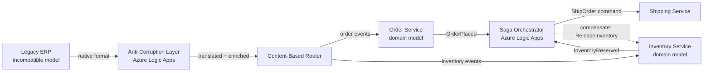
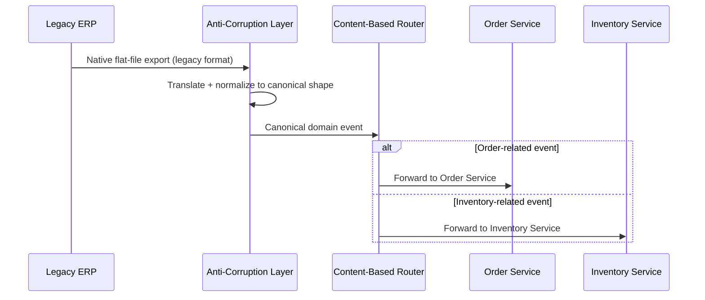
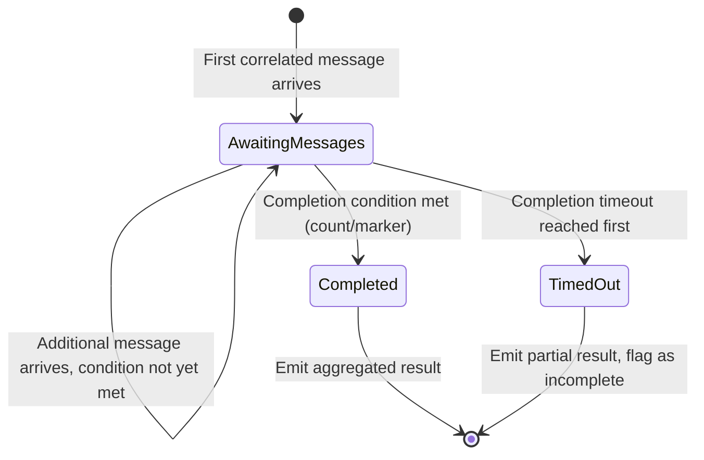
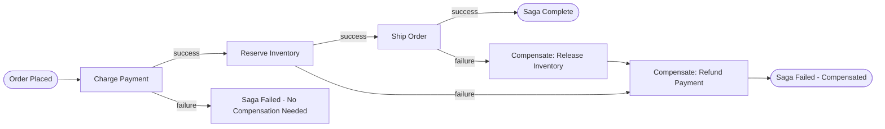

# Enterprise Integration Patterns

> Part of the **Enterprise Data & AI Architecture Handbook** · Phase-14 — Event-Driven Architecture & Integration · Chapter 06.
> Estimated study time: **45 min reading + ~3h labs**.
> **Prerequisite:** read [Event-Driven Architecture](01_Event_Driven_Architecture.md) first.

---

## Executive Summary

[Event-Driven Architecture](01_Event_Driven_Architecture.md)'s History section traced Hohpe and Woolf's 2003 *Enterprise Integration Patterns* catalog as the vendor-neutral vocabulary this handbook has used, at a conceptual level, throughout every chapter of this phase since — a content-based router in [Event-Driven Architecture](01_Event_Driven_Architecture.md) §15.2's subscription filtering, a materialized view in [CQRS](03_CQRS.md) §8.2's read-model projection, a dead-letter channel in every prior chapter's own Fault Tolerance section. This chapter is where that deferred, formal treatment finally arrives: **Enterprise Integration Patterns (EIP)** is the named catalog of solutions to the recurring problem of connecting heterogeneous systems — different protocols, different data formats, different owners, different release schedules — that predates, and remains the vocabulary underneath, every messaging and microservices pattern this handbook has used since.

This chapter covers **messaging channels and routers** — point-to-point and publish-subscribe channels as the foundational abstraction [Event-Driven Architecture](01_Event_Driven_Architecture.md) §14.2 already built on, and the content-based, dynamic, and recipient-list router patterns that decide where a message goes next; **transformation and enrichment** — the message translator and content enricher patterns that reconcile two systems' incompatible data shapes without either system needing to change its own native format; **aggregator, splitter, and saga** — the three patterns that manage a message's cardinality and a multi-step process's coordination, directly formalizing the saga pattern [Event-Driven Architecture](01_Event_Driven_Architecture.md) §26 and [Microservices Architecture](02_Microservices_Architecture.md)'s ADR-0169/§14.3 choreography-versus-orchestration treatment already used at a conceptual level; **iPaaS and Azure Logic Apps** as the low-code, managed integration-platform alternative to hand-building every pattern in this chapter from first principles; and **anti-corruption layers** — the [Domain-Driven Design](../Phase-01/05_Domain_Driven_Design.md)-originated pattern that protects a well-modeled service's domain model from a legacy or third-party system's incompatible, often lower-quality model, translating at the boundary rather than letting corruption leak inward.

The platform bias is **Azure-primary (~60%)** — Azure Logic Apps as the primary managed iPaaS and orchestration engine, Azure Service Bus/Event Grid (reused directly from every prior Phase-14 chapter) as the channel implementation, and Azure API Management as the transformation and routing layer at the API edge — **~30% enterprise open source** (Apache Camel as the reference open-source EIP implementation, purpose-built around this exact pattern catalog; Kafka Streams/ksqlDB for stream-based aggregation and enrichment; MuleSoft as a widely-adopted enterprise iPaaS alternative) — **~10% AWS/GCP comparison-only** (AWS Step Functions/EventBridge Pipes; Google Cloud Workflows/Application Integration).

**Bottom line:** Enterprise Integration Patterns are not a new technology to adopt — they are the vocabulary and solution catalog underneath every messaging, event-driven, and microservices pattern this handbook has already used, and this chapter's genuine, practical value is giving architects a precise, shared name for a recurring integration problem so a team reaches for a well-understood, previously-solved pattern rather than reinventing an ad hoc, undocumented variant of the same solution on every new integration project. The recurring mistake this chapter documents, continuing this handbook's justification-before-adoption discipline, is either reinventing a named pattern poorly from scratch when a mature implementation (Apache Camel, Azure Logic Apps) already exists, or, in the opposite direction, adopting a heavyweight iPaaS platform and its full pattern catalog for an integration simple enough that a direct point-to-point call would have sufficed.

---

## Learning Objectives

By the end of this chapter you will be able to:

1. **Name and apply the core messaging-channel and routing patterns** (point-to-point, publish-subscribe, content-based router, recipient list) to a given integration scenario, extending [Event-Driven Architecture](01_Event_Driven_Architecture.md)'s own pub/sub treatment.
2. **Design a transformation and enrichment layer** using the message translator and content enricher patterns to reconcile two systems' incompatible data shapes.
3. **Apply the aggregator, splitter, and saga patterns** to manage message cardinality and multi-step process coordination, formalizing [Microservices Architecture](02_Microservices_Architecture.md)'s choreography/orchestration treatment.
4. **Evaluate iPaaS platforms (Azure Logic Apps, Apache Camel, MuleSoft)** against hand-built integration code for a given integration's complexity and team maturity.
5. **Design an anti-corruption layer** protecting a well-modeled service's domain model from a legacy or third-party system's incompatible model.
6. **Recognize when a named EIP pattern is being reinvented poorly**, and recommend a mature implementation instead.
7. **Defend an integration-pattern architecture decision** in engineer, staff engineer, architect, and CTO review settings, including the specific pattern-versus-custom-code and iPaaS-versus-hand-built trade-offs a review should probe.

---

## Business Motivation

- **Every enterprise eventually needs to connect systems it did not design to work together** — an acquired company's legacy ERP, a third-party SaaS vendor's API, an on-premises mainframe — and reinventing a bespoke, undocumented integration solution for each one, without a shared vocabulary or a reusable pattern catalog, produces an integration estate that is expensive to maintain and nearly impossible for a new engineer to understand quickly.
- **A shared, named pattern vocabulary directly reduces onboarding and cross-team communication cost** — an architect who says "we need a content-based router here" communicates a precise, well-understood solution shape in three words, versus a paragraph of bespoke description a differently-trained engineer might interpret inconsistently.
- **Mature, purpose-built implementations of these patterns (Apache Camel, Azure Logic Apps) already exist and have already solved the hard edge cases** — retry semantics, error handling, monitoring hooks — that a hand-rolled, ad hoc integration script frequently gets wrong the first several times, making "use the mature implementation" a genuine cost-avoidance decision, not merely a preference.
- **Legacy and third-party system integration is where architectural discipline is hardest to maintain**, since a legacy system's data model or a third-party API's contract is, by definition, outside the team's own control — the anti-corruption layer pattern (§8.5) is this chapter's direct answer to the business risk of a well-modeled domain accumulating technical debt purely from absorbing an external system's incompatible model uncritically.
- **Adopting a full iPaaS platform's entire pattern catalog for an integration simple enough for a direct call is a genuine, recurring cost mistake** — this chapter's Business Motivation deliberately continues the justification-before-adoption discipline established across every prior Phase-14 chapter's own ADR: an integration platform's licensing, operational, and cognitive-overhead cost must be earned by genuine integration complexity (multiple heterogeneous systems, complex routing/transformation/aggregation needs), not adopted by default for a simple, single-system integration a direct API call would serve just as well.

---

## History and Evolution

- **1990s — enterprise message-oriented middleware (MOM)** (per [Event-Driven Architecture](01_Event_Driven_Architecture.md)'s own History section) establishes the first widely-adopted point-to-point and topic-based messaging infrastructure, but with no shared, named vocabulary yet for the recurring routing, transformation, and coordination problems teams solved independently and inconsistently on top of it.
- **2003 — Gregor Hohpe and Bobby Woolf publish *Enterprise Integration Patterns*** (patterns circulated in draft form from the late 1990s), cataloguing 65 named, vendor-neutral patterns — message channel, message router, message translator, content enricher, aggregator, splitter, and dozens more — giving the industry, for the first time, a shared vocabulary for problems every messaging-based integration project had been independently, inconsistently solving.
- **2000s — Service-Oriented Architecture (SOA) and the Enterprise Service Bus (ESB)** (per [Event-Driven Architecture](01_Event_Driven_Architecture.md) and [Microservices Architecture](02_Microservices_Architecture.md)'s own History sections) become the primary commercial productization of this pattern catalog, frequently implementing dozens of these patterns as built-in, configurable ESB capabilities — the ESB's own later fragility and centralization problems (already documented in both of those chapters' History sections) are a lesson about a specific *deployment topology* (centralized, heavily-customized), not an indictment of the underlying patterns themselves, a distinction this chapter is explicit about.
- **2007 — Apache Camel is released**, providing an open-source, embeddable implementation of the EIP catalog as a Java library/framework rather than a centralized ESB product, letting teams apply individual patterns (a router here, an aggregator there) within their own services' own codebases rather than routing everything through one centralized bus — directly addressing the ESB-centralization lesson while preserving the pattern catalog's genuine value.
- **2010s — cloud-native integration-Platform-as-a-Service (iPaaS) offerings emerge** (MuleSoft's Anypoint Platform, Dell Boomi, and eventually Azure Logic Apps in 2016), providing managed, low-code implementations of this same pattern catalog with visual workflow design, reducing the implementation burden for teams without deep EIP or messaging-infrastructure expertise.
- **2014 onward — the same microservices-and-choreography shift** (per [Microservices Architecture](02_Microservices_Architecture.md)'s own History section) that moved integration logic out of a centralized ESB and into individually-owned services re-applies these same named patterns at the service level — a content-based router or a saga orchestrator is now as likely to be a small piece of code within one microservice as a configured capability of a centralized platform.
- **2020s — iPaaS platforms converge with serverless and low-code/no-code tooling** (Azure Logic Apps' own serverless consumption tier, its deep integration with Azure Functions and Power Platform), lowering the barrier to applying these patterns further, while the underlying patterns themselves — named over two decades ago — remain almost entirely unchanged, a notable stability this chapter's Trade-offs section returns to directly: the vocabulary has proven durable even as the specific products implementing it have changed generations several times over.

---

## Why This Technology Exists

Every one of this handbook's prior chapters has, at some point, needed to solve "how does a message get from where it originates to where it needs to go, in the shape the destination expects, possibly combined with or split from other messages, possibly as part of a larger multi-step process" — and, absent a shared vocabulary and a catalog of proven solutions, every team independently reinvents its own answer, at varying levels of correctness and with varying, inconsistent terminology. Enterprise Integration Patterns exist to give architects a durable, vendor-neutral, technology-independent name and a proven solution shape for each of these recurring sub-problems, so that a new integration project starts from "which of these 65 well-understood patterns applies here" rather than from a blank page — precisely the same value a design-pattern catalog (per the Gang of Four's own object-oriented patterns) provides at the level of individual classes and objects, now applied at the level of message flows between systems.

---

## Problems It Solves

- **Inconsistent, ad hoc routing and transformation logic reinvented per integration project**, resolved by naming a small set of proven patterns (content-based router, message translator) that any trained architect or engineer immediately recognizes and can correctly implement or evaluate, without needing bespoke documentation to explain a custom solution's intent.
- **Combining or splitting messages across a cardinality mismatch** (many small events needing to become one aggregate view, or one large message needing to become many independently-processable pieces), resolved by the aggregator and splitter patterns (§8.3) as named, well-understood solutions rather than ad hoc, per-project accumulation logic.
- **Coordinating a multi-step business process spanning several systems or services**, resolved by the saga pattern (§8.3), directly formalizing the choreography-versus-orchestration treatment [Microservices Architecture](02_Microservices_Architecture.md) §14.3 and ADR-0169 already applied at a conceptual level.
- **Protecting a well-modeled domain from a legacy or third-party system's incompatible model**, resolved by the anti-corruption layer pattern (§8.5), letting a team integrate with an external system's data and behavior without that system's own modeling weaknesses leaking into and degrading the team's own carefully-designed domain model.
- **Lowering the implementation barrier for teams without deep messaging-infrastructure expertise**, resolved by managed iPaaS platforms (§8.4) providing visual, low-code implementations of this entire pattern catalog, letting a team apply a correct, well-understood pattern without needing to hand-build its retry, error-handling, and monitoring semantics from scratch.

---

## Problems It Cannot Solve

- **Enterprise Integration Patterns do not eliminate the CAP-theorem and distributed-transaction realities** this handbook established in [CAP and PACELC](../Phase-02/04_CAP_and_PACELC.md) and [Distributed Transactions](../Phase-02/05_Distributed_Transactions.md) — a saga pattern (§8.3) makes multi-step process coordination explicit and named, but it does not provide atomicity across the systems it coordinates; compensation logic must still be deliberately designed exactly as [Event-Driven Architecture](01_Event_Driven_Architecture.md) §26 and [Microservices Architecture](02_Microservices_Architecture.md) §14.3 already established.
- **It does not fix a poorly-modeled domain on either side of an integration** — a message translator (§8.2) reconciles two systems' *data shapes*, but if either system's own underlying domain model is unclear or incorrectly bounded (per [Domain-Driven Design](../Phase-01/05_Domain_Driven_Design.md)), the translator merely gives that confusion a well-documented, named place to live, not a resolution to the underlying modeling problem.
- **Choosing the correct named pattern for a given problem still requires genuine architectural judgment** — the catalog names solutions to recurring problems, but does not itself tell an architect which problem a specific integration actually has; misapplying a pattern (using an aggregator where a simple pass-through would suffice, or building a saga for a process with no genuine multi-step coordination need) produces the same over-engineering risk this chapter's own Anti-patterns section names directly.
- **It does not remove the need for the resilience and idempotency disciplines** [Event-Driven Architecture](01_Event_Driven_Architecture.md) §15.3 and [Microservices Architecture](02_Microservices_Architecture.md) §8.4 already established — a message router or aggregator implemented via Apache Camel or Azure Logic Apps still requires deliberate idempotent-consumption and retry-with-backoff design; the pattern catalog and the mature tooling implementing it do not make these concerns automatic.
- **An anti-corruption layer does not fix the legacy or third-party system it protects against** — it isolates the *consuming* domain from that system's own modeling weaknesses, but does nothing to improve the external system itself, which may still need to be replaced or modernized on its own timeline (per [Technical Strategy and Roadmaps](../Phase-01/07_Technical_Strategy_and_Roadmaps.md)'s own migration-planning treatment) rather than permanently insulated against indefinitely.

---

## Core Concepts

### 8.1 Messaging channels and routers

A **message channel** is the logical conduit a message travels through between producer and consumer — the same **point-to-point channel** (one producer, one consumer, competing-consumers scale-out) and **publish-subscribe channel** (one producer, many independent subscribers) [Event-Driven Architecture](01_Event_Driven_Architecture.md) §14.2 already established as queues and topics respectively, now given their formal EIP names. A **message router** inspects an incoming message and decides which of several possible downstream channels it should be forwarded to, without altering the message's own content — the **content-based router** (routing based on the message's payload or header content, the formal name for the subscription filtering [Event-Driven Architecture](01_Event_Driven_Architecture.md) §15.2 already implemented at the Event Grid/Service Bus layer), the **dynamic router** (whose routing rules are looked up or computed at runtime rather than statically configured, useful when the set of possible destinations changes frequently), and the **recipient list** (forwarding a copy of the message to an explicitly-computed, potentially per-message-varying set of recipients, distinct from a topic's static set of subscriptions).

### 8.2 Transformation and enrichment

A **message translator** converts a message from one system's native data shape into another's, resolving the format-incompatibility problem this chapter's Business Motivation named as endemic to connecting systems that were never designed to interoperate — directly analogous to, and frequently implemented using, the same upcasting mechanics [Event Sourcing](04_Event_Sourcing.md) §8.4 established for schema-version translation, now applied to cross-system format translation rather than cross-version compatibility specifically. A **content enricher** augments a message with additional data it did not originally contain, typically by calling out to a reference data source mid-flow (adding a customer's tier or region to an order event that only originally carried a customer ID) — the inverse pattern, a **content filter**, removes fields a downstream consumer should not see (directly supporting the least-privilege and data-classification propagation discipline [Event-Driven Architecture](01_Event_Driven_Architecture.md) §Security and every subsequent Phase-14 chapter's own Security section have established), and a **normalizer** converts several different incoming message formats representing the same logical event (e.g., three different partner systems' own "order placed" formats) into one canonical internal shape before further processing, isolating downstream consumers from every upstream partner's own format idiosyncrasies.

### 8.3 Aggregator, splitter, and saga

The **splitter** breaks one composite message into several individual messages, each processable independently downstream (a single batch file containing a thousand orders split into a thousand individually-processable `OrderPlaced` events); the **aggregator** performs the inverse operation, combining several related, individually-arriving messages into one composite result once a defined completion condition is met (a count, a timeout, or a specific correlating condition) — the formal name for the exact mechanism a [CQRS](03_CQRS.md) read-model projection uses when it must wait for multiple related events before a composite view is considered complete. The **saga** pattern coordinates a multi-step business process spanning several systems or services via a sequence of local transactions, each with an explicit compensating action defined for rollback if a later step fails — directly, formally naming the pattern [Event-Driven Architecture](01_Event_Driven_Architecture.md) §26 introduced and [Microservices Architecture](02_Microservices_Architecture.md) §14.3/ADR-0169 already applied concretely to the choreography-versus-orchestration decision, with this chapter adding no new mechanics but giving the pattern its full, formal EIP treatment and cross-referencing every prior instance this handbook has already built.

### 8.4 iPaaS and Azure Logic Apps

**Integration-Platform-as-a-Service (iPaaS)** products provide managed, typically low-code/visual implementations of this entire pattern catalog — pre-built connectors for common systems (Salesforce, SAP, SharePoint, databases), a visual workflow designer for composing routers, translators, aggregators, and sagas without hand-writing the underlying messaging and error-handling code, and built-in monitoring and retry semantics. **Azure Logic Apps** is this handbook's primary Azure-native iPaaS: a serverless, visually-designed workflow engine with a large connector ecosystem, natively integrating with Event Grid, Service Bus, and Azure Functions (letting a Logic App trigger, or be triggered by, any of this handbook's already-established messaging infrastructure) and supporting both the Consumption (serverless, pay-per-execution) and Standard (dedicated, stateful, higher-throughput) hosting models. iPaaS's genuine value proposition is lowering the implementation barrier for teams without deep messaging-infrastructure expertise and accelerating integration with common, well-supported third-party systems via pre-built connectors — its genuine cost, per this chapter's Trade-offs section, is a real licensing/consumption cost and, for very high-throughput or highly custom integration logic, less fine-grained control than a hand-built solution (Apache Camel embedded in a service's own codebase, or a purpose-built Azure Function) would provide.

### 8.5 Anti-corruption layers

An **anti-corruption layer (ACL)**, a pattern originating in [Domain-Driven Design](../Phase-01/05_Domain_Driven_Design.md) and directly reused here as this chapter's own integration-specific application of that chapter's bounded-context discipline, is a dedicated translation layer sitting at the boundary between a team's own well-modeled domain and an external system (a legacy application, an acquired company's system, a third-party SaaS vendor) whose own data model, terminology, or behavior is incompatible with, or of lower quality than, the team's own domain model. The ACL translates in both directions — converting the external system's model into the team's own domain concepts on the way in, and the reverse on the way out — ensuring that the external system's modeling weaknesses (inconsistent terminology, a poorly-normalized schema, business-rule quirks specific to that legacy system's own history) never leak directly into and degrade the team's own carefully-designed model. This is mechanically implemented using the same message-translator and normalizer patterns (§8.2) already established in this chapter, with the ACL's defining characteristic being architectural intent — a deliberate, permanent, and named boundary specifically protecting the internal model's integrity — rather than merely being one more translation step among many.

---

## Internal Working

### 9.1 How a content-based router evaluates and forwards a message

A content-based router receives an inbound message, evaluates one or more configured predicates against the message's headers or payload (in Azure Logic Apps, a `switch` or conditional action; in Apache Camel, a `choice()` DSL construct; at the Event Grid/Service Bus layer, a subscription filter per [Event-Driven Architecture](01_Event_Driven_Architecture.md) §15.2), and forwards the message unmodified to whichever downstream channel the first matching predicate identifies — the router's own logic never alters the message's content, preserving a clean separation between "deciding where a message goes" (the router's sole responsibility) and "changing what a message contains" (the translator's, §9.2).

### 9.2 How a message translator and content enricher operate mid-flow

A message translator receives an inbound message in the source system's native shape, applies a mapping (a declarative transform in Logic Apps' Data Mapper, or explicit code in a Camel route or Azure Function), and emits the message in the target system's expected shape — a content enricher operates similarly but additionally performs a synchronous lookup against a reference data source (a database query, an API call) mid-transformation, blocking that specific message's processing only long enough to retrieve the additional data needed, directly incurring the same per-hop latency cost [Microservices Architecture](02_Microservices_Architecture.md) §17 already named for any synchronous call inserted into a processing path.

### 9.3 How an aggregator determines completion

An aggregator maintains correlation state (typically keyed by a shared correlation identifier present in every message that should be combined) as related messages arrive one at a time, checking after each arrival whether its configured **completion condition** — a specific count of expected messages, a timeout since the first message arrived, or an explicit "this is the last one" marker — has been satisfied; once satisfied, the aggregator emits the combined result and discards its correlation state for that specific correlation ID, exactly the same idempotent, offset-tracking discipline [Event-Driven Architecture](01_Event_Driven_Architecture.md) §15.3 and [CQRS](03_CQRS.md) §9.2 already established for any stateful event consumer, now applied to cross-message correlation specifically.

### 9.4 How Azure Logic Apps executes a workflow definition

An Azure Logic Apps workflow is defined declaratively (a JSON workflow definition, or authored visually in the Azure portal's designer), with each step an **action** (a connector invocation, a control-flow construct like a condition or loop, or a built-in transform) executed in sequence or in parallel per the workflow's defined structure; the Logic Apps runtime persists the workflow's execution state between steps (particularly important for long-running or externally-triggered workflows awaiting an asynchronous callback), and automatically applies configured retry policies per action without requiring the workflow author to hand-write retry logic — directly realizing this chapter's own "lower implementation barrier" value proposition for iPaaS at the mechanical level.

---

## Architecture

### 10.1 Reference architecture: legacy ERP integration via ACL, router, and saga



### 10.2 Why the architecture works

The anti-corruption layer (§8.5) is the *only* component that understands the legacy ERP's native, incompatible format, translating and enriching every message into the domain's own canonical shape before it ever reaches a content-based router (§8.1) that forwards order-related and inventory-related messages to their respective owning services — neither Order Service nor Inventory Service's own domain model is ever exposed to the ERP's modeling idiosyncrasies directly. The saga orchestrator (§8.3), reusing this handbook's already-established choreography-versus-orchestration criteria from [Microservices Architecture](02_Microservices_Architecture.md) ADR-0169, coordinates the resulting multi-step fulfillment process with an explicit compensating action, exactly as every prior instance of this pattern in this handbook has been built.

### 10.3 ADR example

See this chapter's [Architecture Decision Record (ADR-0174)](#architecture-decision-record-adr-0174-managed-ipaas-azure-logic-apps-for-the-legacy-erp-integration-hand-built-services-for-the-core-domain) under Enterprise Recommendations for the Context/Decision/Consequences/Alternatives treatment of why this reference architecture deliberately uses Azure Logic Apps (an iPaaS) specifically for the legacy-integration boundary while keeping the core domain services hand-built.

---

## Components

- **Message channel** — the point-to-point or publish-subscribe conduit a message travels through, reused directly from [Event-Driven Architecture](01_Event_Driven_Architecture.md) §Components.
- **Router** — the content-based, dynamic, or recipient-list component deciding a message's next destination without altering its content (§8.1).
- **Translator / enricher / normalizer / filter** — the transformation components reconciling data-shape and content differences between systems (§8.2).
- **Aggregator / splitter** — the cardinality-management components combining or dividing messages (§8.3).
- **Saga orchestrator (or choreography participants)** — the multi-step process-coordination component, reused directly from [Event-Driven Architecture](01_Event_Driven_Architecture.md) §26 and [Microservices Architecture](02_Microservices_Architecture.md) §Components.
- **iPaaS runtime (Azure Logic Apps)** — the managed workflow-execution engine hosting a visually- or declaratively-defined composition of the above patterns (§8.4, §9.4).
- **Anti-corruption layer** — the dedicated, named translation boundary protecting a domain model from an external system's incompatible model (§8.5).

---

## Metadata

Every integration flow — whether hand-built or implemented as an Azure Logic Apps workflow — should be catalogued (extending [Event-Driven Architecture](01_Event_Driven_Architecture.md) §23's event-contract cataloguing and [Microservices Architecture](02_Microservices_Architecture.md) §Metadata's service-contract cataloguing to integration flows specifically) with its source and destination systems, which named EIP patterns it implements, its owning team, and — for any flow crossing an anti-corruption layer boundary (§8.5) — an explicit note of which external system's model it is translating from, since this is exactly the information a future team needs to assess blast radius when that external system eventually changes or is replaced.

---

## Storage

Most patterns in this chapter (routers, translators, enrichers, splitters) are stateless, in-flight transformations requiring no persistent storage of their own beyond the message itself. The **aggregator** (§8.3) is the one pattern requiring genuine, if typically short-lived, storage — correlation state tracking which messages have arrived for a given correlation ID, held only until the completion condition is met and the aggregated result is emitted, typically in a fast key-value store (Azure Cache for Redis, or Azure Logic Apps' own built-in stateful-workflow persistence) rather than a durable, long-term store, since this state is explicitly transient and disposable once aggregation completes — the same disposable-derived-artifact treatment [CQRS](03_CQRS.md) §8.2 and [Event Sourcing](04_Event_Sourcing.md) §8.2 already established for projections and snapshots respectively.

---

## Compute

Hand-built patterns (a router or translator implemented as application code within a microservice, per [Microservices Architecture](02_Microservices_Architecture.md) §Compute) run as part of that service's own compute allocation; Apache Camel routes typically run embedded within a JVM-based service's own process. Azure Logic Apps workflows run on their own dedicated compute model — the Consumption tier (serverless, scale-to-zero, pay-per-execution, well suited to lower-volume or bursty integration flows) or the Standard tier (dedicated App Service Plan-hosted compute, supporting stateful, higher-throughput, and more complex long-running workflows) — a genuine compute-tier decision distinct from, and requiring its own capacity planning separate from, the rest of a microservices fleet's own compute.

---

## Networking

Every pattern in this chapter that crosses a system boundary (an ACL calling a legacy ERP, a router forwarding to Event Grid/Service Bus, a saga orchestrator calling downstream services) follows the same private-endpoint, zero-trust networking baseline established throughout this handbook ([Network Security and Zero Trust](../Phase-10/04_Network_Security_and_Zero_Trust.md) ADR-0144). The one networking consideration specific to legacy-system integration (§8.5) is that a genuinely on-premises legacy ERP may require a hybrid-connectivity solution (Azure VPN Gateway or ExpressRoute, per [Azure Networking](../Phase-03/04_Azure_Networking.md)) rather than a purely cloud-native private endpoint, since the ACL's translation logic, however cleanly designed, still requires an actual network path to the legacy system it is translating for.

---

## Security

- **Managed identity and least-privilege scoping for every integration flow's own credentials** (per [Identity and Access Management with Entra](../Phase-10/02_Identity_and_Access_Management_with_Entra.md), reused directly from every prior Phase-14 chapter's own Security section) — an Azure Logic Apps workflow's connector credentials should be scoped specifically to the systems and operations that workflow actually needs, never a broad, shared credential reused across every integration flow in the tenant.
- **An anti-corruption layer is a natural, deliberate point to enforce access-control and data-classification propagation** (§8.2's content filter pattern) when translating from a legacy system that may not itself have a modern, fine-grained access-control model — the ACL can and should apply the access-control-propagation discipline this handbook has traced through [Retrieval Augmented Generation](../Phase-12/03_Retrieval_Augmented_Generation.md) ADR-0157 and every subsequent chapter's own equivalent, even when the legacy system on the other side of the boundary cannot.
- **iPaaS connector credentials (Azure Logic Apps' own connection references) must be stored in Key Vault and referenced, never embedded directly in a workflow definition** (per [Secrets and Key Management](../Phase-10/05_Secrets_and_Key_Management.md)'s reference-not-hardcode pattern, directly reused here) — a workflow definition is frequently exported, version-controlled, or shared for troubleshooting, making an embedded credential a significant, easily-overlooked exposure risk.
- **A saga orchestrator's compensating actions must be authorized with the same rigor as the original forward action**, since a compensation is itself a state-changing operation (a refund, a release-inventory command) that an attacker manipulating the saga's own state could potentially trigger illegitimately if the orchestrator's own authorization checks are weaker for compensating actions than for forward ones.

---

## Performance

- **Every synchronous content-enricher lookup (§8.2) adds a real, measurable per-message latency cost**, directly analogous to [Microservices Architecture](02_Microservices_Architecture.md) §17's own per-hop latency treatment — an enrichment step calling a slow or unreliable reference-data source becomes the critical-path bottleneck for every message passing through it, and should be cached or made asynchronous where the enrichment data's staleness tolerance allows.
- **Aggregator correlation-state lookups (§9.3) at high message volume require a fast, well-indexed correlation-state store** — a slow or unindexed lookup here directly bottlenecks the aggregator's own throughput, since every arriving message must check and update this state before being processed further.
- **iPaaS platforms (Azure Logic Apps) introduce their own execution-engine overhead per workflow run**, typically acceptable for moderate-volume integration flows but a real, measurable cost at very high message volumes — a genuinely high-throughput integration flow (per this chapter's Decision Matrix) may be better served by a hand-built, lower-overhead implementation than by a general-purpose iPaaS workflow engine.
- **Splitting a very large composite message (§8.3) into many individually-processable pieces trades one large processing unit's latency for many smaller units' aggregate overhead** — the correct split granularity is a measured, not assumed, decision, exactly the same batching-versus-per-item trade-off this handbook has named repeatedly across [Model Serving and Ray](../Phase-11/04_Model_Serving_and_Ray.md) and every prior Phase-14 chapter.

---

## Scalability

Stateless patterns (routers, translators, enrichers, splitters) scale horizontally exactly as any stateless service does, with no coordination required between instances. The aggregator (§8.3) is the pattern requiring the most deliberate scaling design, since its correlation state must be consistently reachable regardless of which instance processes a given correlation ID's messages — typically resolved via a partition/session key routing all of one correlation ID's messages to the same consumer instance (directly reusing [Event-Driven Architecture](01_Event_Driven_Architecture.md) §Scalability's own partition-key-to-ordering discipline) or via a shared, externally-consistent correlation-state store (Redis) reachable from any instance. Azure Logic Apps' Consumption tier scales transparently and automatically per the managed service's own model; the Standard tier requires explicit App Service Plan scaling configuration, a genuine capacity-planning decision distinct from the rest of a microservices fleet's own autoscaling.

---

## Fault Tolerance

- **Every pattern in this chapter inherits the resilience and idempotency disciplines** [Event-Driven Architecture](01_Event_Driven_Architecture.md) §15.3 and [Microservices Architecture](02_Microservices_Architecture.md) §8.4 already established — a router, translator, or aggregator implemented via Apache Camel or Azure Logic Apps must still be built idempotent, since the underlying messaging infrastructure's at-least-once delivery guarantee applies identically regardless of which pattern or platform processes a given message.
- **Azure Logic Apps provides built-in, declaratively-configured retry policies per action**, directly lowering the implementation burden for this discipline compared to a hand-built integration, though the configured retry count, backoff strategy, and dead-lettering destination still require the same deliberate tuning [Event-Driven Architecture](01_Event_Driven_Architecture.md) §15.4 named generally.
- **An aggregator's completion-timeout configuration is itself a fault-tolerance decision** — a timeout set too short can prematurely emit an incomplete aggregation as if it were complete (silently dropping late-arriving messages from the result); a timeout set too long delays legitimate results and holds correlation state longer than necessary — this specific trade-off should be tuned against measured, real-world message-arrival-time distributions, not an arbitrary default.
- **A saga's compensating actions must themselves be designed to tolerate failure** — a compensation that itself fails (a refund attempt that errors) requires its own retry and, in the worst case, an escalation to manual intervention, since an un-retryable, silently-failed compensation leaves the overall business process in a genuinely inconsistent state no automated mechanism can resolve alone.

---

## Cost Optimization

- **Right-size the iPaaS-versus-hand-built decision per integration flow against its actual complexity and volume**, per this chapter's Decision Matrix, rather than defaulting every integration through the iPaaS platform regardless of whether its execution-overhead and licensing cost is justified for that specific flow's volume.
- **Choose Azure Logic Apps' Consumption tier for low-to-moderate-volume, bursty integration flows and the Standard tier only once measured, sustained volume justifies dedicated compute** — provisioning Standard-tier capacity for a flow that would run comfortably (and more cheaply) on Consumption is a common, easily-audited over-provisioning mistake.
- **Cache content-enricher lookups (§17) wherever the enrichment data's staleness tolerance allows**, directly reducing both the latency cost and the reference-data-source call volume (and its own associated cost, if metered) that an uncached, per-message enrichment lookup incurs.
- **Monitor and decommission unused or superseded integration flows** — a legacy integration flow whose upstream or downstream system has since been replaced, but whose Logic App or Camel route was never decommissioned, continues incurring execution cost (Consumption-tier per-run charges) or standing compute cost (Standard-tier) for zero business value, a specific instance of the "zombie service" cost risk [Microservices Architecture](02_Microservices_Architecture.md) §Cost Optimization already named.
- **Worked FinOps example:** a team runs a legacy ERP integration flow on Azure Logic Apps' Standard tier (a dedicated App Service Plan, roughly $220/month) provisioned defensively "to be safe," but a usage review finds the flow actually executes only around 800 times/day with no sustained throughput requirement — well within Consumption tier's transparent, pay-per-execution scaling. Migrating to Consumption tier reduces cost to roughly $18/month at that actual execution volume (a ~92% reduction), with the team retaining Standard tier only for a separate, genuinely high-volume (50,000+ executions/day), latency-sensitive order-routing flow where Consumption tier's cold-start and per-execution pricing model was measured to be both slower and, at that volume, more expensive than Standard's dedicated capacity.

---

## Monitoring

- **Per-flow execution count, success rate, and latency** (Azure Logic Apps' own native run-history and Azure Monitor integration), tracked per individual workflow, not aggregated across the entire integration estate, since a single aggregate metric cannot answer "which specific legacy-ERP integration flow is degraded."
- **Aggregator completion-timeout-triggered (incomplete) emission rate** (§19) as a direct, measurable signal of whether the configured completion condition actually matches real-world message-arrival patterns, distinct from a genuine downstream failure.
- **Content-enricher lookup latency and cache-hit rate** (§17, §21) as the primary signal for whether an enrichment step has become the integration flow's own critical-path bottleneck.
- **Saga compensation-invocation rate and compensation-failure rate** — tracking not just how often the forward path succeeds, but how often compensations are triggered at all (a rising rate is itself a leading indicator of an upstream problem) and, separately, whether compensations themselves are succeeding reliably (per §19's own compensation-fault-tolerance treatment).
- **Dead-lettered message rate per integration flow**, reused directly from [Event-Driven Architecture](01_Event_Driven_Architecture.md) §21, since every pattern in this chapter remains subject to that same underlying messaging infrastructure's dead-lettering behavior.

---

## Observability

Distributed tracing must propagate a correlation context across every hop this chapter's patterns introduce — through a content-based router, across a message translator's transformation, through an aggregator's multi-message correlation, and across a saga's full multi-step compensation-capable process — directly extending [Event-Driven Architecture](01_Event_Driven_Architecture.md) §22's correlation-ID discipline and [Microservices Architecture](02_Microservices_Architecture.md) §22's mixed sync/async tracing treatment specifically to iPaaS-hosted workflows, where Azure Logic Apps' own native run-history view should be correlated with the same distributed-tracing backend the rest of the architecture uses, not treated as an isolated, separately-consulted monitoring silo.

### Operational Response Playbook

| Signal | Detection Query/Method | Remediation |
|---|---|---|
| A specific Azure Logic Apps workflow's failure rate rises sharply following a legacy ERP's own maintenance window or minor version update | Logic Apps run-history filtered to the affected workflow, correlated with the legacy system's own change/maintenance log | Inspect failed-run inputs/outputs for a specific field or format the legacy system's update silently changed; treat as an anti-corruption-layer translation-logic bug requiring an updated mapping, not a transient infrastructure failure — communicate to the legacy system's owning team that undocumented format changes broke a downstream integration |
| An aggregator's incomplete-emission rate (timeout-triggered, not completion-condition-triggered) rises above its historical baseline | Aggregator completion-type metric (timeout vs. condition-met) trend, correlated with upstream message-source health | Check whether an upstream source's message-arrival latency has genuinely increased (requiring a longer aggregator timeout) versus a specific upstream source failing to send its expected message at all (requiring investigation of that specific source, not a timeout adjustment) |

---

## Governance

Enterprise Integration Patterns governance extends [Event-Driven Architecture](01_Event_Driven_Architecture.md) §23's event-contract cataloguing and [Microservices Architecture](02_Microservices_Architecture.md) §23's service-contract cataloguing to integration flows and anti-corruption-layer boundaries specifically: every ACL should be explicitly documented as a deliberate, named architectural boundary (not merely one more translation step), with its owning team, the external system's own known modeling quirks it compensates for, and an explicit note of whether and when the external system itself is planned for replacement or modernization (§Problems It Cannot Solve) — since an ACL's own continued existence should be periodically re-justified against that roadmap, not assumed permanent by default. Every iPaaS workflow (Azure Logic Apps) should be version-controlled (exported and stored in source control, not managed only through the visual designer with no change history), with breaking changes to its own contract subject to the same consumer-impact-analysis discipline [Event-Driven Architecture](01_Event_Driven_Architecture.md) §14.4 established for asynchronous event schemas.

---

## Trade-offs

- **Named-pattern vocabulary and mature tooling vs. genuine architectural judgment still required**: this chapter's catalog gives a precise name and a proven solution shape to a recurring problem, but does not itself decide which pattern a given integration actually needs — misapplying a pattern (an unnecessary aggregator, an over-engineered saga for a simple two-step process) remains a genuine architect-level judgment call this catalog assists rather than replaces.
- **iPaaS (Azure Logic Apps) vs. hand-built implementation (Apache Camel embedded in a service, or custom code)**: iPaaS lowers the implementation barrier and provides built-in retry/monitoring/connector ecosystem at the cost of execution overhead, licensing/consumption cost, and, for very high-throughput or highly custom logic, less fine-grained control than a hand-built solution — a decision this chapter's own ADR-0174 and Decision Matrix treat as genuinely dependent on the specific flow's volume and complexity, not a uniform organizational default in either direction.
- **Anti-corruption layer investment vs. direct integration**: an ACL's translation-layer investment protects a domain model's integrity at the cost of an additional component to build, maintain, and keep synchronized with the external system's own evolution — justified specifically when the external system's modeling quality is genuinely incompatible with or lower than the team's own domain model, not applied reflexively to every external integration regardless of that system's actual quality.
- **Centralized (ESB-style) vs. decentralized (embedded-per-service) pattern application**: applying these patterns via one centralized platform simplifies cross-cutting policy enforcement and monitoring at the cost of the centralization fragility this chapter's History section already named as the ESB era's own hard-learned lesson; applying them in a decentralized, per-service, embedded fashion (Apache Camel within each service, per [Microservices Architecture](02_Microservices_Architecture.md)'s own decentralization principle) avoids that single point of coupling at the cost of less uniform, more per-team-variable policy enforcement.
- **Is a named EIP pattern even necessary here, or would a direct point-to-point call suffice?** Per this chapter's central caution, continuing every prior Phase-14 chapter's own justification-before-adoption theme: a simple, single-system, low-volume integration with no genuine routing, transformation-complexity, or multi-step-coordination need does not require reaching for this chapter's full pattern catalog or an iPaaS platform at all — a direct API call (per [API Design: REST, GraphQL, gRPC](05_API_Design_REST_GraphQL_gRPC.md)) remains the simplest, correct choice whenever the integration's actual complexity does not exceed what a direct call already handles adequately.

---

## Decision Matrix

| Scenario | Recommended Choice | Rationale |
|---|---|---|
| Simple, single-system, low-volume integration with no routing, transformation, or coordination complexity | Direct API call (per [API Design: REST, GraphQL, gRPC](05_API_Design_REST_GraphQL_gRPC.md)) | This chapter's full pattern catalog and any iPaaS platform are unjustified overhead for an integration this simple |
| Legacy or third-party system with an incompatible data model, low-to-moderate integration volume, team lacking deep messaging-infrastructure expertise | Azure Logic Apps (iPaaS) implementing an anti-corruption layer | Lowers implementation barrier via visual design and built-in connectors; retry/monitoring semantics provided out of the box |
| High-volume, latency-sensitive internal integration requiring fine-grained custom logic | Hand-built pattern implementation (Apache Camel embedded in a service, or custom code) | iPaaS execution overhead and licensing cost are unjustified at this volume; custom code provides the fine-grained control needed |
| Multi-step business process spanning several services requiring explicit, centrally-observable coordination and compensation | Saga orchestrator (Azure Logic Apps or a custom orchestrator, per [Microservices Architecture](02_Microservices_Architecture.md) ADR-0169's own orchestration criteria) | Directly reuses this handbook's already-established orchestration-versus-choreography decision criteria |
| Combining several related, independently-arriving messages into one composite result | Aggregator pattern, correlation-state store sized to actual measured message-arrival-time distribution | The named, well-understood solution to this specific cardinality-management problem, avoiding an ad hoc, reinvented equivalent |
| External system with a genuinely well-designed, compatible data model requiring only minor field-mapping differences | A lightweight message translator, without the full ceremony of a dedicated, named anti-corruption layer | An ACL's added architectural weight is unjustified when the external system's model is not genuinely incompatible or lower-quality — reserve the full ACL treatment for a genuine modeling-quality mismatch |

---

## Design Patterns

*(This entire chapter is itself a catalog of named design patterns per §8.1-8.5; this section highlights the specific composite patterns this chapter's reference architecture combines.)*

- **Anti-corruption layer as a composed router-plus-translator-plus-enricher** (§8.5): the ACL is not a single, atomic pattern but a deliberate composition of this chapter's other patterns, applied together with the specific architectural intent of protecting a domain model's integrity.
- **Content-based routing after normalization**: normalize several incoming formats into one canonical shape (§8.2) *before* content-based routing (§8.1), so routing logic only ever needs to reason about one canonical message shape rather than every upstream system's own idiosyncratic format.
- **Saga-with-compensating-aggregator**: a saga orchestrator (§8.3) whose individual steps are themselves aggregators waiting for multiple parallel sub-steps to complete before proceeding to the saga's next stage — a common composite pattern for a business process with genuine parallel-then-join structure (e.g., waiting for both payment confirmation and inventory reservation before proceeding to shipping).
- **iPaaS-fronted hand-built core**: exactly this chapter's own reference architecture and ADR-0174 — using a managed iPaaS specifically at a legacy-integration or partner-facing boundary while keeping the core, high-volume domain services hand-built, rather than choosing one approach uniformly for the entire architecture.

---

## Anti-patterns

- **Reinventing a named pattern poorly from scratch** when a mature implementation (Apache Camel, Azure Logic Apps) already exists and has already solved the hard edge cases — this chapter's single most emphasized anti-pattern on one side of its central caution.
- **Adopting a full iPaaS platform and its entire pattern catalog for a simple, single-system integration** a direct API call would serve just as well — the opposite-direction instance of the same central caution.
- **An anti-corruption layer that is not actually maintained as external systems evolve**, silently drifting out of sync with the legacy system's own current behavior and either failing outright or, worse, silently corrupting translated data — an ACL requires the same ongoing maintenance discipline as any other production component, not a "build once and forget" treatment.
- **A saga with no compensating actions defined for a subset of its steps**, assuming (incorrectly) that those specific steps "probably won't fail" — every step in a saga requires an explicit, tested compensating action, or the process risks an unresolvable, inconsistent partial-completion state exactly as [Microservices Architecture](02_Microservices_Architecture.md) §19 already named generally.
- **Centralizing every integration flow through one heavyweight platform reflexively**, recreating the exact ESB-centralization fragility this chapter's History section documented as a hard-learned, decades-old lesson, rather than deliberately choosing centralized-versus-decentralized pattern application per this chapter's own Trade-offs treatment.

---

## Common Mistakes

- **Building an ad hoc, undocumented integration solution without recognizing it as a variant of a well-known, named pattern**, missing the opportunity to reuse a mature implementation's already-solved retry, error-handling, and monitoring semantics.
- **Applying an aggregator or splitter where the message cardinality does not actually require one**, adding correlation-state management overhead (§13, §18) to a simple one-to-one message flow that never needed it.
- **Storing iPaaS connector credentials directly in a workflow definition rather than referencing Key Vault** (§Security), exposing credentials whenever that workflow definition is exported, version-controlled, or shared for troubleshooting.
- **Never re-evaluating an anti-corruption layer's continued necessity** as the external system it protects against is modernized or replaced, leaving an increasingly unnecessary translation layer in place indefinitely, accumulating maintenance cost for a mismatch that may no longer genuinely exist.
- **Choosing an iPaaS platform's Standard (dedicated) tier by default without measuring actual sustained volume**, incurring the always-on compute cost this chapter's Cost Optimization worked example quantified, when Consumption tier's transparent, pay-per-execution scaling would have served the actual measured workload more cheaply.

---

## Best Practices

- Recognize a recurring integration problem against this chapter's named pattern catalog before designing a bespoke solution, and prefer a mature implementation (Apache Camel, Azure Logic Apps) over hand-rolling a pattern's edge cases from scratch.
- Choose iPaaS versus hand-built implementation per integration flow against its actual measured volume and complexity, per this chapter's Decision Matrix — never adopt either uniformly across an entire integration estate by default.
- Build every anti-corruption layer with explicit, documented awareness of which specific external-system quirks it compensates for, and periodically re-justify its continued necessity as that external system evolves.
- Design and test every saga step's compensating action explicitly, never assuming a specific step "probably won't fail."
- Store every iPaaS connector credential in Key Vault, referenced by the workflow, never embedded directly in the workflow definition.
- Version-control every integration flow's definition (Logic Apps workflow JSON, Camel route code), subjecting contract changes to the same consumer-impact-analysis discipline this handbook has established for every other contract type.

---

## Enterprise Recommendations

Default to a **direct API call** for any integration simple enough that this chapter's full pattern catalog would add unjustified overhead. Adopt **Azure Logic Apps** specifically for legacy-system, partner, or third-party integrations with low-to-moderate volume and genuine transformation/routing complexity, implementing an explicit anti-corruption layer wherever the external system's own model is genuinely incompatible with the domain's own. Reserve **hand-built implementations** (Apache Camel embedded in a service, or custom code) for high-volume, latency-sensitive, or highly custom integration logic where iPaaS execution overhead and reduced control are not an acceptable trade. In every case, mandate idempotent, retry-aware pattern implementations, version-controlled integration-flow definitions, and Key-Vault-referenced credentials as non-negotiable, audited controls regardless of which specific implementation approach is chosen.

### Architecture Decision Record (ADR-0174): Managed iPaaS (Azure Logic Apps) for the Legacy ERP Integration, Hand-Built Services for the Core Domain

**Context:** The order-management platform (per [Microservices Architecture](02_Microservices_Architecture.md), [CQRS](03_CQRS.md), and [Event Sourcing](04_Event_Sourcing.md)) must integrate with a legacy on-premises ERP system for inventory-master-data synchronization — a system with an incompatible, decades-old data model, inconsistent field naming, and no modern API (requiring a flat-file export/import integration pattern). The engineering team, already comfortable hand-building services in its own microservices fleet, considered hand-building this integration as well, using the same tooling and deployment pipeline as the rest of the platform, for consistency.

**Decision:** Implement the legacy ERP integration as an Azure Logic Apps workflow, structured explicitly as an anti-corruption layer (§8.5) translating the ERP's flat-file export format into the domain's own canonical `InventoryMasterDataUpdated` event schema, published to Event Grid for the rest of the platform to consume via its already-established event-driven infrastructure. Keep every core domain service (Order, Inventory, Shipping) hand-built, exactly as [Microservices Architecture](02_Microservices_Architecture.md) already established.

**Consequences:** The team benefits from Logic Apps' built-in flat-file-parsing connectors, visual workflow design, and native retry/monitoring semantics for an integration outside the team's own core domain expertise, at a genuinely low integration volume (a nightly batch synchronization, not a high-throughput real-time path) where iPaaS execution overhead is immaterial. The core domain services remain hand-built, preserving fine-grained control and consistency with the rest of the platform's own tooling and deployment pipeline where that control genuinely matters (high-volume, latency-sensitive paths). Future changes to the ERP's own export format require updating only the Logic Apps workflow's translation logic, isolated entirely within the anti-corruption layer, with zero required changes to any core domain service.

**Alternatives Considered:** (1) *Hand-build the ERP integration using the same tooling as the core domain services, for consistency* — rejected, since the team had no existing flat-file-parsing tooling or expertise, and building it from scratch would have taken materially longer than Logic Apps' built-in connector, for a low-volume integration where the resulting custom code's fine-grained control benefit would never actually be exercised. (2) *Integrate the ERP directly into the Inventory Service's own codebase, without a separate anti-corruption layer* — rejected, since the ERP's inconsistent field naming and decades-old data-model quirks would have leaked directly into the Inventory Service's own domain model without a dedicated translation boundary, exactly the corruption risk this chapter's ACL pattern exists to prevent.

---

## Azure Implementation

### 31.1 Recommended Azure service map

| Need | Azure Service | Notes |
|---|---|---|
| Managed iPaaS, visual workflow design, low-code integration | Azure Logic Apps | Consumption tier for low/bursty volume, Standard tier for high-throughput/stateful workflows |
| Message channels (point-to-point, publish-subscribe) | Service Bus / Event Grid | Reused directly from [Event-Driven Architecture](01_Event_Driven_Architecture.md) §31 |
| Content-based routing and transformation at the API edge | Azure API Management (policies) | Request/response transformation, routing policies applied at the gateway layer |
| Aggregator correlation-state store | Azure Cache for Redis | Fast, short-lived correlation-state storage keyed by correlation ID |
| Hybrid connectivity to on-premises legacy systems | Azure VPN Gateway / ExpressRoute | Required when the legacy system itself is not cloud-reachable via a private endpoint alone |
| Connector credential management | Azure Key Vault (Logic Apps connection references) | Never embed credentials directly in a workflow definition |

### 31.2 Example: content-based router and message translator (Azure Logic Apps workflow definition, abridged JSON)

```json
{
  "actions": {
    "Switch_On_Message_Type": {
      "type": "Switch",
      "expression": "@triggerBody()?['messageType']",
      "cases": {
        "OrderEvent": {
          "actions": {
            "Translate_To_Canonical_Order_Shape": {
              "type": "Compose",
              "inputs": {
                "orderId": "@triggerBody()?['ERP_ORD_ID']",
                "customerId": "@triggerBody()?['ERP_CUST_REF']",
                "amount": "@triggerBody()?['ERP_AMT_TOTAL']"
              }
            },
            "Publish_To_Event_Grid": {
              "type": "ApiConnection",
              "inputs": { "host": { "connection": { "name": "@parameters('eventGridConnection')" } } }
            }
          }
        },
        "InventoryEvent": {
          "actions": { "Translate_To_Canonical_Inventory_Shape": { "type": "Compose" } }
        }
      }
    }
  }
}
```

### 31.3 Example: aggregator with completion timeout (Camel-style DSL pseudocode)

```java
from("service-bus:order-line-items")
    .aggregate(header("orderId"), new OrderLineItemAggregationStrategy())
    .completionSize(header("expectedLineItemCount"))
    .completionTimeout(30000) // fall back to timeout-based completion after 30s
    .to("service-bus:aggregated-orders");
```

### 31.4 Example: anti-corruption layer translation logic (C#-style pseudocode)

```csharp
public OrderPlacedEvent TranslateFromLegacyErp(LegacyErpOrderRecord legacyRecord)
{
    // Anti-corruption layer: legacy field names and quirks isolated entirely here,
    // never propagated into the domain's own OrderPlacedEvent shape.
    return new OrderPlacedEvent
    {
        OrderId = legacyRecord.ERP_ORD_ID.TrimStart('0'), // legacy zero-padding quirk
        CustomerId = MapLegacyCustomerRef(legacyRecord.ERP_CUST_REF),
        Amount = legacyRecord.ERP_AMT_TOTAL / 100m, // legacy stores amounts as integer cents
        OccurredAtUtc = ParseLegacyDateFormat(legacyRecord.ERP_DT_CREATED)
    };
}
```

---

## Open Source Implementation

- **Apache Camel** remains the OSS reference implementation of the full EIP catalog, providing a DSL (Java, XML, or YAML) for composing routers, translators, aggregators, and splitters embedded directly within a service's own codebase rather than a centralized platform.
- **Kafka Streams / ksqlDB** provide stream-native implementations of aggregation and enrichment specifically for high-throughput, Kafka-centric architectures (per [Apache Kafka](../Phase-07/02_Apache_Kafka.md)), well suited when the integration's source and destination are both already Kafka topics.
- **MuleSoft's Anypoint Platform** is a widely-adopted, mature enterprise iPaaS alternative to Azure Logic Apps, particularly common in organizations with an existing MuleSoft investment or a multi-cloud integration requirement.
- **n8n** and **Node-RED** are lighter-weight, open-source, low-code workflow-automation tools frequently used for simpler integration flows or by teams preferring a self-hosted alternative to a managed iPaaS.
- **Kubernetes + Knative Eventing** provide a container-native, open-source foundation for building custom, event-driven integration components when neither a managed iPaaS nor an embedded library like Camel fits a team's specific deployment model.

---

## AWS Equivalent (comparison only)

| Azure Service | AWS Equivalent | Advantages | Disadvantages | Migration Notes |
|---|---|---|---|---|
| Azure Logic Apps | AWS Step Functions + EventBridge Pipes | Step Functions offers a mature, well-integrated state-machine model for complex orchestration; EventBridge Pipes adds native transformation/filtering between event sources and targets | Requires composing two services (Step Functions for orchestration, EventBridge Pipes for routing/transformation) rather than Logic Apps' single unified workflow surface | Workflow logic migrates conceptually to Step Functions' state-machine definitions; routing/transformation logic migrates to EventBridge Pipes' own transform configuration |
| Azure Logic Apps connectors | AWS AppFlow (SaaS-focused) / native service integrations | AppFlow provides strong native SaaS-to-SaaS data-flow integration | Narrower general-purpose low-code workflow-design capability than Logic Apps' broader connector ecosystem | SaaS-to-SaaS flows may migrate more directly to AppFlow; general-purpose workflow logic requires Step Functions |

**Selection criteria**: choose Azure's portfolio for a single, unified low-code workflow-design surface; choose AWS's when Step Functions' state-machine model and EventBridge's native AWS-service integration specifically match an already-AWS-native architecture, accepting the two-service composition as a genuinely different operational model from Logic Apps' unified surface.

---

## GCP Equivalent (comparison only)

| Azure Service | GCP Equivalent | Advantages | Disadvantages | Migration Notes |
|---|---|---|---|---|
| Azure Logic Apps | Google Cloud Workflows + Application Integration | Cloud Workflows offers a lightweight, code-first orchestration model; Application Integration adds a more Logic-Apps-like low-code, connector-based experience | Application Integration's connector ecosystem and maturity are narrower than Logic Apps' at present | Simple orchestration migrates to Cloud Workflows; connector-heavy, low-code flows are the closer match for Application Integration, with some connector gaps to plan around |

**Selection criteria**: GCP's Application Integration is the closer conceptual match to Azure Logic Apps' low-code, connector-based model; Cloud Workflows suits a more code-first, developer-driven orchestration style closer to a hand-built implementation than a full iPaaS experience.

---

## Migration Considerations

- **Migrate one integration flow at a time**, exactly as this chapter's own ADR-0174 scoped the legacy ERP integration independently from the core domain services — never attempt a wholesale migration of an entire integration estate to a new platform or pattern in a single release.
- **Preserve the anti-corruption layer's translation logic as the single, most-carefully-migrated artifact** during any platform migration (e.g., moving from a hand-built integration to Azure Logic Apps, or vice versa) — this logic encodes hard-won knowledge of the external system's own quirks, and a re-implementation that silently drops or mistranslates one of those quirks reintroduces exactly the corruption risk the ACL exists to prevent.
- **Run the old and new integration implementation in parallel during a validation window**, comparing translated output for a representative sample of real messages before fully cutting over — directly analogous to the dual-run and dual-publish migration patterns this handbook has used consistently across every prior Phase-14 chapter.
- **Re-validate every retry, dead-lettering, and completion-timeout configuration explicitly when migrating between platforms**, since a hand-built implementation's and an iPaaS platform's own default behaviors for these concerns frequently differ and should not be assumed equivalent without explicit verification.
- **Treat a migration as an opportunity to re-justify whether a given pattern (or the iPaaS-versus-hand-built choice) is still the correct one**, per this chapter's Decision Matrix, rather than merely re-platforming an existing design decision without re-examining whether the original justification still holds.

---

## Mermaid Architecture Diagrams

### Diagram 1: Anti-corruption layer translation and routing flow



### Diagram 2: Aggregator completion-condition state machine



### Diagram 3: Saga with orchestrated compensation



---

## End-to-End Data Flow

1. The **legacy ERP** exports a nightly flat-file batch containing order and inventory master-data updates in its own native, decades-old format.
2. The **anti-corruption layer** (Azure Logic Apps) parses the flat file, translates each record into the domain's own canonical event shape (§31.4), and applies a **normalizer** (§8.2) to reconcile any format inconsistencies across different legacy record types.
3. A **content-based router** (§8.1, §31.2) inspects each translated event's type and forwards order-related events to the Order Service's own event stream and inventory-related events to the Inventory Service's own event stream, both published via Event Grid.
4. An **aggregator** (§8.3, §31.3), consuming a stream of related line-item events, waits until either the expected count of line items has arrived or a 30-second completion timeout elapses, then emits one consolidated order record.
5. The consolidated order triggers a **saga** (reusing [Event-Driven Architecture](01_Event_Driven_Architecture.md)'s and [Microservices Architecture](02_Microservices_Architecture.md)'s own already-established fulfillment saga) coordinating payment, inventory reservation, and shipping, with explicit compensating actions defined for each step's potential failure.
6. **Distributed tracing** (§22) correlates the entire path — from the legacy ERP's original flat-file record, through the ACL's translation, the router's forwarding decision, the aggregator's correlation window, and the saga's full multi-step execution — letting an engineer reconstruct any specific order's complete, cross-pattern journey end-to-end.

---

## Real-world Business Use Cases

- **Post-merger-and-acquisition system integration**: an acquired company's legacy systems integrated via anti-corruption layers, letting the acquiring organization's own well-modeled domain remain uncorrupted by the acquired systems' own, often inconsistent, data models — this chapter's own reference architecture's direct real-world analogue.
- **B2B partner and EDI integration**: content-based routing and message translation reconciling multiple trading partners' own, often subtly different, EDI or XML formats into one canonical internal shape before further processing.
- **Healthcare interoperability (HL7/FHIR integration)**: message translators and normalizers reconciling different healthcare systems' own HL7 v2, HL7 v3, or FHIR representations of the same clinical concept into a canonical internal model.
- **Financial-services core-banking modernization**: anti-corruption layers protecting a modern, cloud-native banking platform from a legacy mainframe core's own decades-old data model during an incremental, strangler-fig-style modernization (per [Microservices Architecture](02_Microservices_Architecture.md) §26).
- **Supply-chain and logistics multi-carrier integration**: aggregators combining multiple carriers' independently-arriving shipment-status updates into one consolidated, customer-facing tracking view.

---

## Industry Examples

- **Salesforce's MuleSoft acquisition and Anypoint Platform** is a widely-cited, large-scale commercial productization of this exact pattern catalog, directly competing with and comparable to Azure Logic Apps' own EIP-catalog implementation.
- **Major airlines' and logistics companies' EDI integration hubs**, publicly documented in numerous enterprise-integration case studies, rely heavily on message translators and content-based routers to reconcile dozens of trading partners' own subtly incompatible formats into one canonical internal representation.
- **A widely-cited financial-services modernization case study** (echoing [Microservices Architecture](02_Microservices_Architecture.md)'s own Capital One citation) documented using anti-corruption layers as the deliberate, incremental mechanism protecting a new, cloud-native banking platform's domain model from a legacy mainframe core throughout a multi-year strangler-fig migration, rather than attempting a single, high-risk "big bang" cutover.
- **Apache Camel's own publicly-documented adopter base** (per its Apache Software Foundation project page) spans telecommunications, financial services, and healthcare organizations specifically citing the value of applying named, well-understood EIP patterns embedded within their own services rather than routing through a centralized ESB — a direct, real-world validation of this chapter's own decentralized-application recommendation.

---

## Case Studies

**Case Study 1 — the reinvented, poorly-built content-based router.** A retail platform's engineering team, integrating a new partner feed, built a bespoke routing script that inspected each incoming message's payload and forwarded it to one of several downstream systems via a long chain of if/else conditionals directly embedded in application code, with no monitoring, no dead-lettering, and no documented rationale for its routing rules beyond the original author's own memory. Eighteen months later, after that engineer had left the team, a new partner integration required adding a new routing rule, and the team discovered the existing routing logic was undocumented, untested for its existing rules, and modifying it risked silently breaking an existing partner's flow with no test coverage to catch a regression. Root cause: the team never recognized this as a content-based router (§8.1) — a well-known, named pattern with mature, well-tested implementations already available — and instead reinvented an ad hoc, undocumented equivalent from scratch. Remediation: the routing logic was rebuilt using Azure Logic Apps' `switch` construct with each routing rule explicitly documented and individually testable, directly motivating this chapter's own "recognize the named pattern before building a bespoke solution" best practice.

**Case Study 2 — the over-engineered iPaaS adoption for a two-system integration.** A mid-sized company, following an enterprise architecture recommendation to "standardize on iPaaS for all integration," migrated a simple, low-volume, single-purpose integration (a nightly export of completed orders to a single downstream accounting system, via one straightforward field-mapping transformation) onto a full MuleSoft Anypoint Platform deployment, incurring the platform's own licensing cost and a multi-week implementation effort to configure a workflow that a single, fifty-line Azure Function performing the same field mapping and a direct API call would have accomplished in an afternoon. A subsequent architecture review found no genuine routing, aggregation, or multi-system coordination complexity in this specific integration that justified the iPaaS platform's own overhead. Root cause: the "standardize on iPaaS for everything" policy was applied without the per-integration complexity analysis this chapter's Decision Matrix requires, treating iPaaS adoption as a blanket organizational default rather than a per-flow justified decision. Remediation: the integration was migrated to a simple, hand-built Azure Function, and the organization's iPaaS-adoption policy was revised to require an explicit complexity justification (routing, transformation, or coordination need beyond a simple field mapping) before any new integration defaults to the iPaaS platform — directly informing this chapter's own ADR-0174 and Decision Matrix's per-flow, not organization-wide, protocol-selection discipline.

---

## Hands-on Labs

1. **Lab 1 — Build a content-based router and message translator in Azure Logic Apps.** Implement a workflow that inspects an incoming message's type, routes it to one of two downstream Service Bus queues, and translates its payload into a canonical shape before forwarding (per §31.2).
2. **Lab 2 — Build an aggregator with both count-based and timeout-based completion.** Implement an aggregator (via Camel or a custom Azure Function) that combines related line-item messages into one consolidated order, testing both the count-met and timeout-triggered completion paths explicitly.
3. **Lab 3 — Build an anti-corruption layer for a simulated legacy system.** Given a simulated legacy flat-file export with intentionally awkward field names and formats (per §31.4), build a translation layer producing a clean, canonical domain event, and write tests validating the translation against several legacy-format edge cases.
4. **Lab 4 — Implement a saga with a tested compensating action.** Build a three-step saga (payment, inventory, shipping) with an explicit, tested compensating action for a simulated inventory-reservation failure, verifying the payment is correctly refunded.

---

## Exercises

1. Given a described integration reinventing a routing and transformation solution from scratch, identify which named EIP pattern(s) it should be recognized as, and propose a mature-implementation alternative.
2. A team proposes adopting Azure Logic Apps for a high-volume (200,000 messages/day), latency-sensitive internal service-to-service integration. Using this chapter's Decision Matrix, evaluate whether that choice is justified.
3. Design an anti-corruption layer for a described legacy CRM system with inconsistent customer-ID formats across three different modules, explicitly identifying which quirks the ACL must isolate.
4. Design an aggregator's completion-condition strategy for a scenario where the expected message count is not known in advance, only discoverable from a separate "batch complete" marker message.
5. Identify which of this chapter's five Common Mistakes would most likely explain a production incident where "a new engineer cannot safely modify an existing integration flow without risking breaking an existing partner," and describe the specific remediation.

---

## Mini Projects

1. **Build a complete legacy-integration reference architecture**: an anti-corruption layer (Azure Logic Apps) translating a simulated legacy export, a content-based router forwarding to two downstream services, an aggregator consolidating related messages, and a saga orchestrator coordinating the resulting multi-step process with tested compensation.
2. **Conduct a documented iPaaS-versus-hand-built architecture-decision exercise** for three specified hypothetical integration scenarios of varying volume and complexity, producing a full ADR (Context/Decision/Consequences/Alternatives) defensible in a staff-engineer-level review, explicitly modeled on this chapter's own ADR-0174.
3. **Migrate an existing hand-built integration to Azure Logic Apps (or vice versa)**, running both in parallel during a validation window and documenting the measured differences in latency, cost, and operational overhead.

---

## Capstone Integration

This chapter formalizes, under one shared, named vocabulary, patterns every prior Phase-14 chapter has already used at a conceptual level: [Event-Driven Architecture](01_Event_Driven_Architecture.md)'s content-based subscription filtering (§8.1's content-based router), its saga/compensation pattern (§8.3's saga, directly reused rather than reintroduced), and its transactional outbox (a variant of this chapter's own message-translator/enricher discipline applied to reliable event publication); [Microservices Architecture](02_Microservices_Architecture.md)'s BFF pattern (a GraphQL-implemented composite of this chapter's aggregator and translator patterns, per [API Design: REST, GraphQL, gRPC](05_API_Design_REST_GraphQL_gRPC.md) §26) and its own choreography/orchestration ADR-0169 (directly formalized as this chapter's saga pattern); [CQRS](03_CQRS.md)'s materialized-view projection (a direct instance of this chapter's aggregator pattern); and [Event Sourcing](04_Event_Sourcing.md)'s upcasting chain (a direct instance of this chapter's message-translator pattern, applied to schema-version translation rather than cross-system format translation). This chapter's central, deliberately two-directional caution — neither reinvent a named pattern poorly from scratch nor adopt a full iPaaS platform where a direct call would suffice — completes this handbook's Phase-14 justification-before-adoption arc at the pattern-and-tooling-selection level, directly continuing [Microservices Architecture](02_Microservices_Architecture.md) ADR-0170, [CQRS](03_CQRS.md) ADR-0171, [Event Sourcing](04_Event_Sourcing.md) ADR-0172, and [API Design: REST, GraphQL, gRPC](05_API_Design_REST_GraphQL_gRPC.md) ADR-0173's own progressively-scoped instances of the same discipline. Phase-14 Chapter 07 (Message Brokers and Queues) returns to and deepens the broker-internals treatment underlying every messaging channel this chapter's patterns are built on top of, closing out this phase's full integration-architecture coverage.

---

## Interview Questions

1. What is a content-based router, and how does it differ from a topic's static subscription filtering?
2. Explain the aggregator pattern and the trade-off between count-based and timeout-based completion conditions.
3. What is an anti-corruption layer, and what specific risk does it protect against that a simple field-mapping translator does not fully address?
4. Why did the Enterprise Service Bus era's centralization approach to these patterns eventually fall out of favor, and what replaced it?
5. When would you choose Azure Logic Apps over a hand-built integration, and vice versa?

## Staff Engineer Questions

1. Design an aggregator's completion-timeout strategy for a scenario with highly variable upstream message-arrival latency, and justify your chosen timeout value.
2. How would you diagnose whether an integration flow's poor performance is caused by a content-enricher's synchronous lookup versus a genuine downstream-dependency slowdown?
3. Walk through the anti-corruption layer pattern and explain specifically how it prevents a legacy system's modeling weaknesses from degrading a well-designed domain model.
4. What criteria would you use to decide whether a specific integration flow justifies Azure Logic Apps versus a hand-built implementation?

## Architect Questions

1. Justify, with concrete measured criteria, when you would recommend a managed iPaaS platform versus a hand-built, embedded pattern implementation (Apache Camel) for a given integration.
2. Design a governance process ensuring every anti-corruption layer's continued necessity is periodically re-justified as the external systems it protects against evolve or are replaced.
3. How would you structure a phased, low-risk migration of a legacy system integration to a new platform, minimizing risk at each phase?
4. What criteria would distinguish a genuine need for centralized (ESB-style) pattern application from the decentralization principle this chapter recommends by default?

## CTO Review Questions

1. What is the actual, measured complexity (routing, transformation, coordination) justifying our current or proposed iPaaS platform investment, versus a direct API call or hand-built integration?
2. What is our current inventory of anti-corruption layers across the integration estate, and has each one's continued necessity been re-justified against the external system's own modernization roadmap?
3. Are our integration-flow definitions (Logic Apps workflows, Camel routes) version-controlled and subject to the same breaking-change governance as our other API and event contracts?
4. What is our current exposure to reinvented, undocumented, ad hoc integration logic that should instead be recognized as a named, well-understood pattern with a mature, available implementation?

---

## References

- Hohpe, G. and Woolf, B. *Enterprise Integration Patterns.* Addison-Wesley, 2003.
- Apache Camel documentation — Enterprise Integration Patterns reference implementation.
- Microsoft Learn — Azure Logic Apps documentation.
- Richardson, C. *Microservices Patterns.* Manning, 2018 (saga pattern, previously cited in [Event-Driven Architecture](01_Event_Driven_Architecture.md) and [Microservices Architecture](02_Microservices_Architecture.md)).
- Fowler, M. "Enterprise Integration Patterns" summary and commentary. martinfowler.com.
- [Event-Driven Architecture](01_Event_Driven_Architecture.md) (this handbook, Phase-14 Chapter 01).
- [Microservices Architecture](02_Microservices_Architecture.md) (this handbook, Phase-14 Chapter 02).

---

## Further Reading

- Phase-14 Chapter 07 — Message Brokers and Queues (deepens the broker-internals treatment underlying this chapter's messaging channels).
- [Event-Driven Architecture](01_Event_Driven_Architecture.md) — this chapter's prerequisite for pub/sub, saga, and schema-evolution foundations reused throughout.
- [Microservices Architecture](02_Microservices_Architecture.md) — the BFF pattern and choreography/orchestration ADR this chapter formalizes.
- [Domain-Driven Design](../Phase-01/05_Domain_Driven_Design.md) — the origin of the anti-corruption layer pattern this chapter's §8.5 reuses directly.

---
