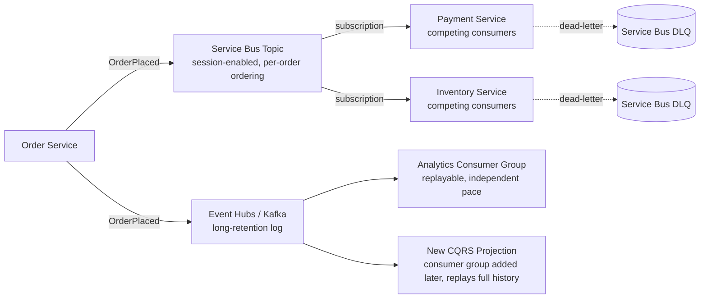
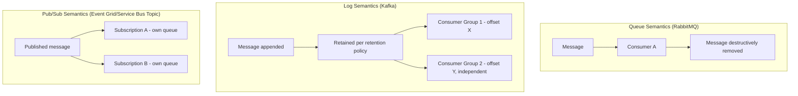
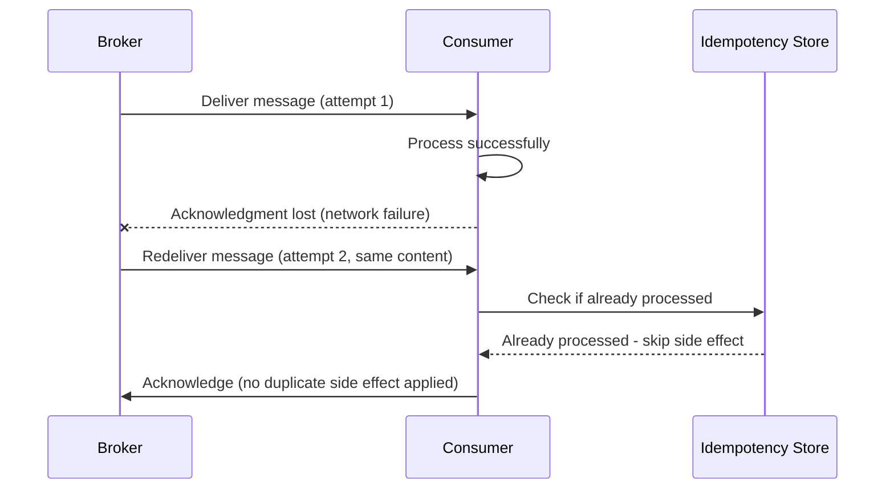
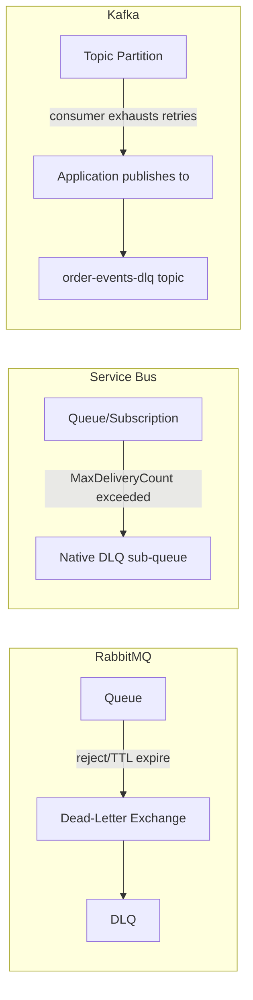

# Message Brokers and Queues

> Part of the **Enterprise Data & AI Architecture Handbook** · Phase-14 — Event-Driven Architecture & Integration · Chapter 07.
> Estimated study time: **45 min reading + ~3h labs**.
> **Prerequisite:** read [Event-Driven Architecture](01_Event_Driven_Architecture.md) first.

---

## Executive Summary

Every chapter in this phase has built directly on top of a message broker without examining the broker's own internal delivery, ordering, and throughput mechanics in depth: [Event-Driven Architecture](01_Event_Driven_Architecture.md) established the event-versus-command vocabulary and named Event Grid, Service Bus, and Event Hubs/Kafka at an architectural level; [CQRS](03_CQRS.md) and [Event Sourcing](04_Event_Sourcing.md) both depended on a broker's at-least-once delivery and ordering guarantees without examining how those guarantees are actually implemented; and [Enterprise Integration Patterns](06_Enterprise_Integration_Patterns.md) formalized channels and routers as abstractions sitting on top of whatever broker underlies them. This chapter is where that deferred, mechanical depth finally arrives: it examines **queue, log, and pub/sub semantics** as three structurally different broker models, **delivery guarantees and ordering** as the precise, formal vocabulary this handbook has used informally throughout, **dead-letter and poison-message handling** as a deep, comparative treatment across brokers, **RabbitMQ, Kafka, Service Bus, and SQS** as a concrete, decision-ready product comparison, and **backpressure and throughput** as the operational discipline that keeps a broker-based architecture stable under load rather than merely functional under a demo's light traffic.

This chapter covers **queue-versus-log-versus-pub/sub semantics** as the foundational architectural choice underlying every broker product's own design — a queue destructively consumes (a message is removed once processed), a log durably retains and allows replay (per [Apache Kafka](../Phase-07/02_Apache_Kafka.md)'s own treatment), and pub/sub fans a single message out to multiple independent subscriptions, with most modern broker products actually implementing some hybrid or superset of these three models rather than a single pure form; **delivery guarantees and ordering** as the precise at-most-once/at-least-once/exactly-once vocabulary this handbook has used informally since [Event-Driven Architecture](01_Event_Driven_Architecture.md) §15.3, now given its full formal and mechanical treatment; **dead-letter and poison messages** as a deep dive into exactly how and when a broker gives up on redelivering a message, compared concretely across products; **RabbitMQ, Kafka, Azure Service Bus, and Amazon SQS** as this chapter's core product comparison, chosen specifically because they represent four genuinely different points on the queue/log/pub/sub spectrum rather than four interchangeable options; and **backpressure and throughput** as the operational discipline preventing a fast producer from overwhelming a slower consumer or the broker itself.

The platform bias is **Azure-primary (~60%)** — Azure Service Bus and Event Hubs as this handbook's own primary managed broker implementations, examined here at a mechanical depth beyond [Event-Driven Architecture](01_Event_Driven_Architecture.md)'s architectural-level treatment — **~30% enterprise open source** (RabbitMQ as the classic AMQP-based broker and this chapter's primary queue-semantics reference implementation, Kafka as the log-semantics reference implementation reused throughout this handbook, and Redis Streams as a lightweight alternative for lower-durability-requirement use cases) — **~10% AWS/GCP comparison-only** (Amazon SQS/SNS/MSK; Google Cloud Pub/Sub).

**Bottom line:** every broker product examined in this chapter is production-grade and capable at real enterprise scale — the decision that actually matters is not "which broker is best" in the abstract, but which broker's underlying model (queue, log, or pub/sub) and specific delivery/ordering/retention guarantees genuinely match a given workload's requirements, a decision this chapter makes precise and mechanical rather than relying on the more general, architecture-level guidance [Event-Driven Architecture](01_Event_Driven_Architecture.md)'s own Decision Matrix already provided. As the final chapter of Phase-14, this chapter closes the phase's own recurring justification-before-adoption arc at its most granular level yet: choosing a specific broker product and its specific configuration (retention window, partition count, prefetch/backpressure settings) against measured, not assumed, delivery and throughput requirements.

---

## Learning Objectives

By the end of this chapter you will be able to:

1. **Distinguish queue, log, and pub/sub broker semantics**, and explain which underlying model each of RabbitMQ, Kafka, Azure Service Bus, and Amazon SQS actually implements.
2. **Precisely define at-most-once, at-least-once, and effectively-exactly-once delivery**, and explain the mechanical basis for each guarantee a specific broker actually provides.
3. **Design ordering guarantees** using partition/session keys, and explain the specific trade-off between strict ordering and horizontal consumer scale-out.
4. **Configure dead-letter handling** appropriately across RabbitMQ, Kafka, Service Bus, and SQS, understanding each product's specific poison-message mechanics.
5. **Choose the correct broker product** for a given workload using this chapter's Decision Matrix, based on its actual delivery, ordering, retention, and throughput requirements.
6. **Design backpressure handling** preventing a fast producer or a slow consumer from destabilizing the broker or the rest of the architecture.
7. **Defend a broker-selection and configuration decision** in engineer, staff engineer, architect, and CTO review settings, including the specific delivery-guarantee and ordering trade-offs a review should probe.

---

## Business Motivation

- **Every asynchronous interaction this entire phase has built on — events in [Event-Driven Architecture](01_Event_Driven_Architecture.md), projections in [CQRS](03_CQRS.md), the event store's own publication mechanism in [Event Sourcing](04_Event_Sourcing.md), and every messaging channel in [Enterprise Integration Patterns](06_Enterprise_Integration_Patterns.md) — ultimately depends on a specific broker product's specific delivery and ordering guarantees actually being correct**, making the broker-selection decision this chapter formalizes a foundational, not incidental, business risk: a broker chosen without matching its actual guarantees to the workload's real requirements can silently violate assumptions every layer built on top of it depends on.
- **Delivery-guarantee mismatches are a direct, measurable source of production incidents** — a workload assuming exactly-once delivery when the broker (and, in practice, nearly every real broker) only guarantees at-least-once will eventually produce a duplicate-processing incident exactly like [Event-Driven Architecture](01_Event_Driven_Architecture.md)'s own Case Study 1 documented, making this chapter's precise delivery-guarantee vocabulary a direct defense against a recurring, expensive class of production bug.
- **Broker throughput and backpressure handling directly determine an architecture's actual capacity under real, bursty enterprise traffic** — a broker or consumer configuration that works flawlessly in a demo's light load can destabilize entirely under a genuine traffic spike if backpressure was never deliberately designed for, a direct, measurable reliability and customer-experience risk.
- **Retention and replay capability (log-based brokers specifically) is a direct enabler of capabilities this entire phase has depended on** — [CQRS](03_CQRS.md)'s and [Event Sourcing](04_Event_Sourcing.md)'s own full-rebuild-from-history recovery mechanisms require the underlying broker to actually retain history long enough to replay it, making retention-window configuration a direct, measurable business-continuity decision, not an incidental storage setting.
- **Choosing a broker product based on team familiarity or industry fashion, rather than its actual guarantees matching the workload, is the final, most granular instance of this phase's recurring justification-before-adoption mistake** — continuing the discipline established across [Microservices Architecture](02_Microservices_Architecture.md) ADR-0170, [CQRS](03_CQRS.md) ADR-0171, [Event Sourcing](04_Event_Sourcing.md) ADR-0172, [API Design: REST, GraphQL, gRPC](05_API_Design_REST_GraphQL_gRPC.md) ADR-0173, and [Enterprise Integration Patterns](06_Enterprise_Integration_Patterns.md) ADR-0174: a broker's specific delivery guarantees, ordering model, and retention capability are real, measurable properties that must be matched to a workload's actual requirements, not chosen because a team already knows one product or because a specific broker is currently the most-discussed choice in the industry.

---

## History and Evolution

- **1980s-1990s — early enterprise message-oriented middleware** (IBM MQSeries, per [Event-Driven Architecture](01_Event_Driven_Architecture.md)'s own History section) establishes the queue as the foundational, point-to-point, destructive-consumption messaging primitive this chapter's own queue-semantics treatment still uses as its baseline model.
- **2004 — JMS 1.1** (per [Event-Driven Architecture](01_Event_Driven_Architecture.md)'s own History section) formalizes queue-versus-topic as the standard Java messaging vocabulary, cementing the point-to-point/pub-sub distinction this chapter's own Core Concepts section still uses.
- **2007 — RabbitMQ is released**, implementing the AMQP (Advanced Message Queuing Protocol) standard as an open, interoperable wire protocol rather than a proprietary one, with a rich exchange-and-binding routing model (direct, topic, fanout, headers exchanges) giving fine-grained control over message routing at the broker layer itself — establishing RabbitMQ as this chapter's primary reference implementation of pure queue-based messaging semantics.
- **2011 — Apache Kafka is created at LinkedIn** (per [Apache Kafka](../Phase-07/02_Apache_Kafka.md)'s own History section), introducing the durable, partitioned, replayable log as a structurally different broker model from RabbitMQ's destructive-consumption queue — not an incremental improvement on the queue model, but a genuinely different architectural approach optimized for high-throughput, replayable event streaming rather than per-message routing flexibility.
- **2004-2006 — Amazon SQS launches** as one of the earliest managed, cloud-native queuing services, establishing the "fully managed queue, no infrastructure to operate" value proposition that Azure Service Bus and Google Cloud Pub/Sub would later follow with their own managed offerings.
- **2011 — Azure Service Bus launches**, providing Microsoft's own managed, enterprise-grade queue-and-topic broker with features (sessions for ordering, duplicate detection, transactions) purpose-built for the reliable, ordered, transactional messaging use cases RabbitMQ's own AMQP model also targets, establishing Service Bus as this chapter's primary Azure-native queue/topic reference implementation.
- **2014 — Azure Event Hubs launches**, providing a managed, Kafka-adjacent log-based streaming service, giving Azure a managed counterpart to Kafka's own durable-log model alongside Service Bus's queue/topic model — the same two-model Azure portfolio [Event-Driven Architecture](01_Event_Driven_Architecture.md)'s own History section already documented.
- **2016-2018 — Kafka's Kafka-compatible-API ecosystem matures** (Confluent's commercial platform, Azure Event Hubs' own Kafka-compatible endpoint per [Apache Kafka](../Phase-07/02_Apache_Kafka.md) §31), letting teams choose a Kafka-API-compatible managed service without necessarily operating Kafka's own broker software directly.
- **2020s — the queue-versus-log distinction becomes a well-understood, standard architectural decision point** rather than a novel insight, with most enterprise architectures (including every reference architecture this handbook's Phase-14 chapters have used) deliberately combining both models — a queue/topic broker (Service Bus) for ordered, transactional, competing-consumer workloads, and a log-based broker (Event Hubs/Kafka) for high-throughput, replayable event streaming — rather than treating either model as a universal default, directly reflecting this chapter's own Decision Matrix.

---

## Why This Technology Exists

Every asynchronous integration this handbook's Phase-14 chapters have built — events, commands, sagas, projections, event-sourced state — ultimately depends on some concrete piece of infrastructure actually receiving, durably or transiently holding, and reliably delivering a message from a producer to one or more consumers; a message broker exists to provide that infrastructure so that individual application teams do not each need to independently solve the hard, easy-to-get-subtly-wrong problems of durable storage, ordered delivery, retry semantics, and consumer coordination from scratch. Different broker products exist, rather than one universal broker serving every use case equally well, because the underlying problem itself splits into genuinely different shapes — "deliver this specific task to exactly one of several competing workers" (a queue's problem), "retain this complete history so any number of current and future consumers can replay it" (a log's problem), and "notify every currently-interested party of this fact" (pub/sub's problem) are three structurally different requirements that no single data structure or delivery algorithm optimizes for equally well simultaneously.

---

## Problems It Solves

- **Reliable, durable message delivery despite transient producer, consumer, or network failures**, resolved by a broker's own persistence and retry mechanics, removing the need for every application team to independently build this reliability layer from scratch.
- **Ordered processing of related messages under horizontal consumer scale-out**, resolved by partition-key or session-key routing (§8.3), ensuring related messages are always processed by the same consumer instance in the order they were produced, even as the overall consumer fleet scales out.
- **Isolating and safely handling a genuinely unprocessable ("poison") message**, resolved by dead-letter mechanics (§8.4) specific to each broker product, preventing one malformed message from blocking an entire queue or partition's otherwise-healthy throughput.
- **Historical replay for a new or recovering consumer**, resolved specifically by log-based brokers' own durable, configurable-retention design (§8.1), directly enabling the full-rebuild recovery mechanisms [CQRS](03_CQRS.md) §9.4 and [Event Sourcing](04_Event_Sourcing.md) §9.4 both depend on.
- **Preventing a fast producer or slow consumer from destabilizing the overall system**, resolved by backpressure mechanisms (§8.5) — flow control, prefetch limits, consumer-lag-based autoscaling — that keep the system stable under load rather than allowing an unbounded backlog or a broker-side resource exhaustion incident.

---

## Problems It Cannot Solve

- **A message broker does not eliminate the CAP-theorem and distributed-transaction realities** this handbook established in [CAP and PACELC](../Phase-02/04_CAP_and_PACELC.md) and [Distributed Transactions](../Phase-02/05_Distributed_Transactions.md) — even a broker's own strongest delivery guarantee only concerns the broker's own internal consistency between producer-acknowledged-send and consumer-acknowledged-receive; it says nothing about atomicity across the broker and an entirely separate system a consumer's own side effect touches, the exact reason the transactional outbox pattern ([Event-Driven Architecture](01_Event_Driven_Architecture.md) §26) exists as a separate, additional concern.
- **It does not make "exactly-once" processing free or automatic** — as this chapter's Core Concepts section makes precise, no broker examined here provides true, unconditional exactly-once delivery across an arbitrary producer-broker-consumer path; what is achievable is *effectively*-exactly-once processing via idempotent consumption layered on top of at-least-once delivery, a distinction this chapter treats as non-negotiable precision, not a pedantic nitpick.
- **It does not fix a poorly-designed message schema or a poorly-drawn service/aggregate boundary** — a broker delivers whatever a producer sends, correctly and reliably, but has no opinion on whether that message's shape or the boundary it crosses is well-designed; those are the concerns [Event-Driven Architecture](01_Event_Driven_Architecture.md) §14.4 and [Microservices Architecture](02_Microservices_Architecture.md) §8.1 already addressed.
- **It does not remove the need for deliberate backpressure and capacity planning** — a broker with unlimited retention and generous throughput limits will happily accept far more messages than a downstream consumer fleet can actually process, silently building an ever-growing backlog rather than automatically applying backpressure unless a team deliberately configures prefetch limits, consumer autoscaling, or producer-side rate limiting.
- **It does not guarantee message ordering across an entire topic or queue by default** — only within a specific partition, session, or (for a simple, unpartitioned queue) the queue as a whole; a workload that requires cross-partition or cross-session global ordering is not well served by any of the brokers this chapter examines without abandoning horizontal consumer scale-out entirely, a genuine, hard limit this chapter's Trade-offs section names directly.

---

## Core Concepts

### 8.1 Queue vs. log vs. pub/sub semantics

- **Queue semantics**: a message is placed onto a queue and delivered to exactly one consumer among a competing pool (the competing-consumers pattern per [Enterprise Integration Patterns](06_Enterprise_Integration_Patterns.md) §8.1); once successfully processed and acknowledged, the message is **destructively removed** from the queue — it cannot be re-read by another consumer or replayed later. RabbitMQ is this chapter's primary reference implementation of pure queue semantics, with its exchange-and-binding model providing rich routing flexibility on top of this destructive-consumption foundation.
- **Log semantics**: a message (event) is appended to a durable, ordered, partitioned log and **retained for a configured period regardless of whether any consumer has yet read it** — multiple independent consumers (or consumer groups) can each read the same log at their own pace, and a consumer can replay from any earlier offset, including from the very beginning, as long as the message has not yet aged out of the configured retention window. Kafka (per [Apache Kafka](../Phase-07/02_Apache_Kafka.md)) is this chapter's primary reference implementation, and this log model is precisely what makes [CQRS](03_CQRS.md) and [Event Sourcing](04_Event_Sourcing.md)'s own full-rebuild recovery mechanisms possible.
- **Pub/sub semantics**: a single published message is fanned out to every current subscription independently, each subscription tracking its own delivery/acknowledgment state — the model [Event-Driven Architecture](01_Event_Driven_Architecture.md) §14.2 already established for Event Grid and Service Bus topics. Pub/sub is, structurally, an orthogonal concern to queue-versus-log: a *topic* implementing pub/sub semantics can itself be backed by either a destructive-consumption queue-per-subscription model (Service Bus topics: each subscription is internally its own queue) or a durable, replayable log-per-consumer-group model (Kafka topics: each consumer group tracks its own offset into the same durably-retained log).
- **Most production broker products actually implement a hybrid or superset of these three pure models**, not one in isolation — Service Bus provides queue semantics for its queues and topic-with-per-subscription-queue semantics for its topics; Kafka provides log semantics natively, with consumer-group offset tracking giving it a queue-like competing-consumers behavior *within* a single consumer group while still preserving full log-based replay capability *across* different consumer groups reading the same topic independently.

### 8.2 Delivery guarantees, precisely

This handbook has used "at-least-once" informally since [Event-Driven Architecture](01_Event_Driven_Architecture.md) §15.3; this chapter gives the full, precise vocabulary:

- **At-most-once**: a message is delivered zero or one times — if delivery fails after the broker has already marked it as sent (or a consumer crashes after receiving but before acknowledging), the message is simply lost, never redelivered. This guarantee arises from a producer or broker configuration prioritizing throughput over durability (e.g., fire-and-forget publish with no acknowledgment wait) and is rarely the correct choice for any workload where message loss has a genuine business cost.
- **At-least-once**: a message is delivered one or more times — the broker guarantees it will keep attempting delivery (and redelivering after a failure, timeout, or unacknowledged receipt) until a consumer successfully acknowledges it, but this mechanically means the *same* message can be delivered more than once under failure conditions (a consumer processes a message successfully but crashes before its acknowledgment reaches the broker, causing a redelivery of an already-processed message). This is the guarantee every broker examined in this chapter provides by default and, in practice, the guarantee this entire handbook has assumed since [Event-Driven Architecture](01_Event_Driven_Architecture.md) §15.3 first named the idempotent-consumption requirement it necessitates.
- **Effectively-exactly-once**: not a distinct delivery mechanism, but the *outcome* of layering idempotent consumption (§15.3's own discipline, checked via a durable, shared idempotency-key or offset-tracking store, per [CQRS](03_CQRS.md) §9.2 and [API Design: REST, GraphQL, gRPC](05_API_Design_REST_GraphQL_gRPC.md) §8.4) on top of at-least-once delivery — the message may still be *delivered* more than once, but its *processing side effect* is applied only once, achieving the practical outcome exactly-once semantics promise without requiring the broker itself to provide an impossible unconditional guarantee. Kafka's own transactional producer/consumer API (per [Apache Kafka](../Phase-07/02_Apache_Kafka.md) §8.6) provides a mechanically stronger, broker-assisted version of this same effectively-exactly-once outcome specifically within the Kafka ecosystem, still fundamentally built on the same idempotent-processing principle rather than a magically different guarantee.

### 8.3 Ordering

Strict message ordering and horizontal consumer scale-out are in direct, structural tension: guaranteeing that message B (which logically depends on message A) is always processed after message A requires routing both to the same consumer instance, processed sequentially — but routing *every* message to the same single instance eliminates horizontal scaling entirely. The standard resolution, used identically across every broker this chapter examines under different names, is **partition-key or session-key-based ordering**: messages sharing the same key (an order ID, a customer ID — any identifier for the specific entity whose message sequence must remain ordered) are always routed to the same partition (Kafka, per [Apache Kafka](../Phase-07/02_Apache_Kafka.md) §8.1) or session (Service Bus's own sessions feature), guaranteeing ordering *within* that key's own message sequence while still allowing horizontal scale-out *across* different keys' independent sequences processed in parallel by different consumer instances. This is precisely the mechanism [Event-Driven Architecture](01_Event_Driven_Architecture.md) §Scalability and [CQRS](03_CQRS.md) §18 already relied on without examining its full mechanics — this chapter makes explicit that ordering is never a broker-wide, unconditional property; it is always scoped to a specific partition or session key, and a workload requiring cross-key ordering has no solution within this model short of eliminating parallelism entirely.

### 8.4 Dead-letter and poison messages

A **poison message** is one that a consumer repeatedly fails to process successfully — a genuinely malformed payload, a bug in the consumer's own handling logic, or a downstream dependency failure no amount of retry can resolve — and every broker examined in this chapter provides some mechanism to isolate such a message after a configured retry threshold rather than blocking the rest of the queue, partition, or topic's healthy throughput indefinitely: **RabbitMQ** implements this via a configured **dead-letter exchange** that a queue routes a rejected or expired message to, itself just another exchange-and-queue pair like any other; **Service Bus** provides a **native, first-class dead-letter sub-queue** per queue or subscription, automatically moving a message there after its configured `MaxDeliveryCount` is exceeded, with no separate exchange configuration required; **SQS** requires configuring a separate **dead-letter queue** and a `maxReceiveCount` redrive policy linking the source queue to it, mechanically similar to RabbitMQ's own exchange-based approach but using SQS's own queue-to-queue redrive configuration; and **Kafka has no native dead-letter concept at all**, since a log has no notion of "giving up" on a message the way a queue does — a Kafka-based pipeline must build its own dead-letter-topic convention at the application layer (a consumer explicitly publishing a failed message to a separate `topic-name-dlq` topic after exhausting its own retry logic), a deliberate architectural choice, not an oversight, consistent with Kafka's own log-semantics design center where "has this message been dealt with" is a consumer-tracked concept, not a broker-tracked one.

### 8.5 Backpressure and throughput

**Backpressure** is the mechanism preventing a fast producer or an overloaded broker from overwhelming a consumer (or, in the reverse direction, preventing an overloaded consumer from being handed more work than it can currently process) — implemented differently across this chapter's four reference brokers: RabbitMQ's **consumer prefetch count** limits how many unacknowledged messages a given consumer can have outstanding at once, throttling delivery to match that consumer's actual processing rate; Kafka's own **consumer poll-based pull model** (a consumer explicitly requests the next batch of records, rather than the broker pushing them) is itself an inherent backpressure mechanism, since a slow consumer simply polls less frequently without the broker needing any separate throttling configuration; Service Bus's **prefetch count and max-concurrent-calls** settings provide RabbitMQ-like consumer-side throttling; and, at the infrastructure layer, **KEDA-driven consumer autoscaling keyed to queue/topic depth** (reused throughout this handbook since [Event-Driven Architecture](01_Event_Driven_Architecture.md) §Compute) is the standard cross-broker mechanism for scaling *consumer capacity* to match backlog, complementing rather than replacing each broker's own native, consumer-level backpressure controls.

---

## Internal Working

### 9.1 How a RabbitMQ message traverses exchanges and queues

A publisher sends a message to a named **exchange** (never directly to a queue), which evaluates its configured **bindings** (direct: exact routing-key match; topic: pattern-based routing-key match; fanout: broadcast to every bound queue regardless of routing key; headers: match on message header values instead of the routing key) to determine which bound queue(s) the message should be copied into; a consumer then reads from its own specific queue, and upon successful processing and acknowledgment, the message is permanently removed from that queue — directly realizing this chapter's own pure queue-semantics treatment (§8.1) with the exchange-and-binding layer providing the content-based-routing flexibility [Enterprise Integration Patterns](06_Enterprise_Integration_Patterns.md) §8.1 already named generically.

### 9.2 How a Kafka partition's offset mechanics enable both queue-like and log-like behavior simultaneously

Each Kafka partition is an ordered, immutable, append-only log; a **consumer group** tracks its own **committed offset** — the position up to which that specific group has successfully processed — independently of every other consumer group reading the same partition, which is precisely what lets one consumer group behave like a competing-consumers queue (multiple consumer instances *within* the same group split the partition's messages among themselves, each message processed by exactly one instance in that group) while an entirely separate consumer group can simultaneously and independently replay the same partition from an earlier offset for a completely different purpose (per [Apache Kafka](../Phase-07/02_Apache_Kafka.md) §8.4-8.5's own consumer-group mechanics, reused directly here).

### 9.3 How Azure Service Bus sessions enforce ordering under horizontal scale-out

A Service Bus queue or subscription with sessions enabled requires every message to carry a `SessionId`; the broker guarantees that all messages sharing the same `SessionId` are delivered to the same consumer instance, in the order they were sent, for the duration of that consumer's session lock — while different `SessionId` values are freely distributed across the consumer pool's other instances for parallel processing, mechanically realizing this chapter's own partition/session-key ordering treatment (§8.3) via a session-lock mechanism structurally analogous to, though implemented differently from, Kafka's own partition-assignment mechanics.

### 9.4 How Amazon SQS's visibility timeout and redrive policy implement at-least-once delivery and dead-lettering

When a consumer receives a message from an SQS queue, the message becomes temporarily invisible to other consumers for a configured **visibility timeout** rather than being immediately deleted; if the consumer successfully processes and explicitly deletes the message before that timeout expires, it is permanently removed, but if the timeout expires first (the consumer crashed, or processing took longer than expected), the message becomes visible again and is redelivered to another consumer — the mechanical basis of SQS's own at-least-once guarantee. A configured **redrive policy** (`maxReceiveCount`) tracks how many times a given message has been received without being deleted, automatically moving it to a linked dead-letter queue once that threshold is exceeded, mechanically similar in outcome to, though configured differently from, RabbitMQ's dead-letter-exchange and Service Bus's native dead-letter sub-queue.

---

## Architecture

### 10.1 Reference architecture: hybrid queue-and-log broker topology



### 10.2 Why the architecture works

The Order Service publishes the same logical event to two structurally different broker targets, each chosen for a genuinely different requirement: Service Bus (queue/topic semantics, §8.1) for Payment and Inventory's own ordered, competing-consumer, transactional processing needs (session-based ordering per order, §9.3, and native dead-lettering, §8.4), and Event Hubs/Kafka (log semantics) for Analytics and any future [CQRS](03_CQRS.md)-style projection needing full historical replay — a new consumer group can be added to the log-based side at any future point and immediately replay the entire retained history, exactly the capability [CQRS](03_CQRS.md) §9.4 and [Event Sourcing](04_Event_Sourcing.md) §9.4 both depend on, without that same replay capability being needed (or paid for) on the queue-based side serving Payment and Inventory's own immediate, non-replay-dependent processing needs.

### 10.3 ADR example

See this chapter's [Architecture Decision Record (ADR-0175)](#architecture-decision-record-adr-0175-service-bus-for-ordered-transactional-processing-event-hubskafka-for-replayable-analytics-and-future-projections) under Enterprise Recommendations for the Context/Decision/Consequences/Alternatives treatment of this chapter's own dual-broker reference architecture.

---

## Components

- **Exchange (RabbitMQ) / Topic (Service Bus, Kafka)** — the entry point a producer publishes to, per this chapter's own §8.1 and §9.1 treatment.
- **Queue / Partition / Subscription** — the specific channel a consumer reads from, whether destructively-consuming (queue/subscription) or durably-retained-and-replayable (partition).
- **Consumer group (Kafka) / Session (Service Bus) / Prefetch-limited consumer (RabbitMQ, SQS)** — the mechanism governing how messages are distributed among a competing-consumer pool and how ordering is preserved within a given key.
- **Dead-letter exchange/queue/sub-queue** — the broker-specific mechanism (§8.4) isolating a poison message after a configured retry threshold.
- **Visibility timeout / lock duration** — the mechanism (SQS's visibility timeout, Service Bus's message lock, RabbitMQ's unacknowledged-message tracking) governing how long a message remains claimed by a specific consumer before becoming eligible for redelivery.
- **Idempotency-key store** — reused directly from [Event-Driven Architecture](01_Event_Driven_Architecture.md) §15.3 and [API Design: REST, GraphQL, gRPC](05_API_Design_REST_GraphQL_gRPC.md) §8.4, the component that converts at-least-once delivery into effectively-exactly-once processing (§8.2).

---

## Metadata

Every broker-backed channel — a Service Bus queue/topic, a Kafka/Event Hubs topic, a RabbitMQ exchange/queue — should be catalogued (extending [Event-Driven Architecture](01_Event_Driven_Architecture.md) §23's event-contract cataloguing to the broker-configuration layer specifically) with its chosen delivery-guarantee model, its ordering scope (which partition/session key, if any, provides ordering), its retention window (for log-based channels), and its configured dead-letter destination and retry threshold — this last item in particular being exactly the information an on-call engineer needs during an incident, per this chapter's own Operational Response Playbook.

---

## Storage

Queue-based brokers (RabbitMQ, Service Bus, SQS) durably persist a message only until it is successfully consumed and acknowledged (or expires via a configured time-to-live) — storage requirements scale with the current, transient backlog depth, not with historical volume. Log-based brokers (Kafka, Event Hubs) durably persist every message for a configured retention window regardless of consumption status — storage requirements scale with the product of message volume and retention duration, a direct, first-order cost driver this chapter's Cost Optimization section quantifies, and the specific storage property that makes [CQRS](03_CQRS.md) and [Event Sourcing](04_Event_Sourcing.md)'s own full-rebuild recovery mechanisms possible in the first place.

---

## Compute

Broker compute is almost entirely provided as managed infrastructure for every Azure-native option this chapter examines (Service Bus, Event Hubs), with the operating team's own compute responsibility limited to producer and consumer application code, reused directly from [Event-Driven Architecture](01_Event_Driven_Architecture.md) §Compute and [Microservices Architecture](02_Microservices_Architecture.md) §Compute's own treatment. Self-hosted RabbitMQ or Kafka (on AKS, per [Kubernetes](../Phase-09/06_Kubernetes.md)) shifts broker-cluster compute and operational responsibility onto the operating team itself, a genuine additional cost this chapter's own Trade-offs and Decision Matrix weigh directly against a managed alternative's reduced operational burden.

---

## Networking

Every broker examined in this chapter supports private-endpoint connectivity (per [Network Security and Zero Trust](../Phase-10/04_Network_Security_and_Zero_Trust.md) ADR-0144, reused throughout this handbook), removing producer and consumer traffic from the public internet entirely. The one networking consideration specific to this chapter's own depth is that **Kafka's own client-broker protocol requires direct connectivity to every broker in the cluster** (a client first connects to any broker to discover the full cluster metadata, then connects directly to whichever specific broker leads the partition it needs), a materially different network-topology requirement from a queue-based broker's typically simpler single-endpoint connectivity model — a detail worth validating explicitly when self-hosting Kafka behind a load balancer or in a network topology that might otherwise obscure this direct-broker-connectivity requirement.

---

## Security

- **Managed identity and least-privilege scoping per producer/consumer**, reused directly from every prior Phase-14 chapter's own Security section — a specific consumer should be granted listen-only rights on the specific queue/topic/partition it actually needs, never broad send-and-receive rights across the entire namespace.
- **Message-level encryption for sensitive payloads**, since a broker's own transport-level encryption (TLS) protects data in transit but does not, by itself, protect against an over-privileged identity reading a message it should not have access to — content filtering (per [Enterprise Integration Patterns](06_Enterprise_Integration_Patterns.md) §8.2) or message-level field encryption should be layered on for genuinely sensitive payloads.
- **Dead-letter queues carry the same data-classification and retention obligations as their source queue/topic**, per [Event-Driven Architecture](01_Event_Driven_Architecture.md) §Security's own treatment — an unmonitored DLQ accumulating sensitive, unresolved messages indefinitely is both the fault-tolerance risk that chapter named and a genuine, easily-overlooked data-governance risk this chapter reiterates directly.
- **RabbitMQ's exchange-and-binding configuration should be access-controlled per virtual host (vhost)**, RabbitMQ's own tenant-isolation mechanism, preventing one team's exchange/queue configuration from being visible to or modifiable by another team sharing the same broker cluster.

---

## Performance

- **Kafka's log-append and sequential-read design generally delivers the highest raw throughput** among the brokers this chapter examines, at the cost of the ordering-scoped-to-partition-only limitation (§8.3) and the absence of a native dead-letter mechanism (§8.4) requiring application-layer implementation.
- **RabbitMQ's exchange-and-binding routing evaluation adds a small, generally-negligible per-message overhead** relative to Kafka's simpler append-only model, but its rich routing flexibility (direct/topic/fanout/headers exchanges) can eliminate the need for a separate content-based-router component ([Enterprise Integration Patterns](06_Enterprise_Integration_Patterns.md) §8.1) that a Kafka-based architecture would need to build at the application layer instead.
- **Consumer prefetch/session/visibility-timeout configuration is the primary performance lever available at the consumer side** (§8.5) — a prefetch count set too low under-utilizes available consumer throughput; set too high, it risks a large batch of messages being redelivered en masse if that specific consumer instance crashes mid-batch, a genuine trade-off requiring measured tuning rather than an arbitrary default.
- **Retention-window size directly trades storage cost against replay capability** for log-based brokers (§13) — a workload genuinely needing months of replayable history incurs a proportionally larger storage cost than one needing only a few hours' buffer for transient consumer-lag absorption, a decision this chapter's Cost Optimization section quantifies directly.

---

## Scalability

Queue-based brokers scale consumer throughput primarily via horizontal competing-consumer scale-out (more consumer instances processing the same queue or session pool in parallel), while log-based brokers additionally scale via **partition count** — more partitions allow more parallel consumer instances *within* a single consumer group, up to the partition count itself as the hard ceiling on that group's own parallelism (per [Apache Kafka](../Phase-07/02_Apache_Kafka.md) §8.1's own partition-count-to-parallelism relationship, reused here). KEDA-driven consumer autoscaling (§8.5, reused throughout this handbook) applies identically across every broker examined, scaling consumer replica count to actual measured backlog depth rather than a fixed, defensively-large default.

---

## Fault Tolerance

- **Broker-side replication** (RabbitMQ's mirrored/quorum queues, Kafka's own replication factor per [Apache Kafka](../Phase-07/02_Apache_Kafka.md) §9.2, Service Bus's and SQS's own managed-service durability guarantees) protects against a single broker-node failure without message loss — a self-hosted broker's replication configuration is a genuine, deliberate operational decision, not a default that can be assumed adequate without explicit verification.
- **Idempotent consumption (§8.2) as the universal defense against at-least-once redelivery's duplicate-processing risk**, reused directly from [Event-Driven Architecture](01_Event_Driven_Architecture.md) §15.3 and applied identically regardless of which specific broker in this chapter is in use.
- **Dead-letter handling (§8.4) as the universal defense against a poison message blocking healthy throughput**, with each broker's own specific mechanism (native sub-queue, configured exchange, or application-layer DLQ topic) chosen and monitored per this chapter's own Monitoring section.
- **Backpressure (§8.5) as a fault-tolerance mechanism, not merely a performance one** — an unbounded backlog accumulating because a consumer fleet cannot keep pace is itself a slow-motion incident (eventually exhausting broker storage, or breaching a retention window before a message is ever processed), which deliberate backpressure and autoscaling design directly prevents from ever developing into an outright failure.

---

## Cost Optimization

- **Right-size retention window against actual, measured replay requirements** (§13, §17) — a log-based broker's storage cost scales directly with retention duration, and an unexamined, defensively-long retention window (per this chapter's own worked example) is a direct, avoidable cost.
- **Choose queue-based brokers for workloads with no genuine replay requirement**, avoiding the storage-cost multiplication a log-based broker's retention model would otherwise incur for a workload that will never actually need to replay its own history.
- **Right-size partition/consumer count against actual measured throughput**, avoiding both under-provisioning (a partition-count ceiling artificially limiting achievable parallelism) and over-provisioning (paying for partition or consumer capacity the workload's actual volume never approaches).
- **Monitor and address a growing dead-letter queue promptly** (reused directly from [Event-Driven Architecture](01_Event_Driven_Architecture.md) §21) — beyond the correctness risk already named, a growing DLQ frequently represents wasted retry compute repeatedly attempting and failing the same poison message.
- **Worked FinOps example:** a team configures Event Hubs with a 90-day retention window "to be safe" for a topic whose only actual consumers (per a usage audit) are a real-time processing pipeline needing at most a 4-hour replay buffer for transient outage recovery, and a monthly batch analytics job that reads directly from a separately-maintained data lake copy rather than replaying the topic itself. At the topic's measured throughput (roughly 2 TB/day), 90-day retention requires provisioning for approximately 180 TB of retained data, versus roughly 8 TB for a 4-hour window — a storage-cost difference of an estimated $2,600/month at typical Event Hubs Capture/retention pricing tiers versus roughly $115/month, a ~95% reduction achieved simply by right-sizing retention against the topic's actual, verified consumer requirements rather than an unexamined defensive default.

---

## Monitoring

- **Queue/partition/subscription backlog depth**, the primary leading indicator across every broker examined, directly driving KEDA-based consumer autoscaling (§8.5, §18) and the primary signal for detecting an under-provisioned or stuck consumer fleet.
- **Dead-letter queue depth and growth rate**, reused directly from [Event-Driven Architecture](01_Event_Driven_Architecture.md) §21, applicable identically regardless of which broker's specific dead-lettering mechanism (§8.4) is in use.
- **Consumer-group lag (Kafka/Event Hubs specifically)** — the gap between the latest produced offset and a specific consumer group's own committed offset, the log-based-broker-specific instance of backlog-depth monitoring, tracked per consumer group independently since different groups may legitimately be at very different points in the same topic's history.
- **Redelivery/retry rate per queue or topic**, a direct, measurable signal of how often at-least-once delivery's redelivery mechanism is actually being exercised — a sustained, elevated redelivery rate is a leading indicator of either a struggling consumer or a message-processing bug causing repeated, non-terminal failures short of the dead-letter threshold.
- **Broker resource utilization** (RabbitMQ/Kafka cluster CPU, memory, disk; Service Bus/SQS's own throughput-unit or request-unit consumption relative to the provisioned tier's limits) as the standard infrastructure-health signal underlying every broker's own capacity-planning decision.

---

## Observability

Distributed tracing must propagate a correlation context through every broker hop this phase's architecture uses, directly reusing [Event-Driven Architecture](01_Event_Driven_Architecture.md) §22's correlation-ID discipline and [Enterprise Integration Patterns](06_Enterprise_Integration_Patterns.md) §22's own cross-pattern tracing treatment — with this chapter's own specific addition being that a trace should record which delivery-guarantee path a given message took (a fresh delivery versus a redelivery following an unacknowledged prior attempt), since "why was this message processed twice" is frequently answered directly by this specific piece of trace detail rather than requiring separate log correlation between a broker's own delivery-attempt log and the consumer's own processing log.

### Operational Response Playbook

| Signal | Detection Query/Method | Remediation |
|---|---|---|
| A Kafka consumer group's lag grows steadily on one specific partition while other partitions in the same topic remain healthy | Per-partition consumer-lag metric, correlated with that partition's own key distribution (is one specific key receiving disproportionate volume — a "hot partition") | Check whether the partition key's distribution has become skewed (a single high-volume entity, e.g., one extremely active customer ID, dominating one partition); if so, consider a compound or hashed partition key redesign rather than assuming the consumer itself is simply under-provisioned |
| A Service Bus queue's dead-letter count rises sharply following a recent consumer deployment | Dead-letter-queue depth trend correlated with recent consumer deployment history, cross-referenced with dead-lettered message payloads for a common pattern | Inspect dead-lettered message payloads for a schema mismatch or a specific field the new deployment's code no longer handles correctly; roll back or hotfix the consumer, then reprocess the dead-lettered messages only after the root cause is confirmed fixed |

---

## Governance

Message-broker governance extends every prior Phase-14 chapter's own contract- and event-cataloguing discipline to the broker-configuration layer specifically: every queue, topic, and partition's chosen delivery guarantee, ordering scope, retention window, and dead-letter configuration should be catalogued (per this chapter's own Metadata section) and subject to change-review before a production alteration — a retention-window reduction on a log-based broker, in particular, is a genuinely risky, potentially irreversible change (once historical data ages out past the new, shorter window, it cannot be recovered) that warrants the same deliberate change-governance rigor this handbook has applied to schema and contract changes throughout Phase-14.

---

## Trade-offs

- **Queue semantics' destructive consumption vs. log semantics' durable replay**: a queue-based broker is simpler to reason about (a message is either pending or done, with no separate replay concept to manage) and typically cheaper for workloads with no replay need, at the cost of offering no historical-replay capability at all — this chapter's own reference architecture deliberately uses both models side by side rather than choosing one exclusively, per §10.
- **Managed broker (Service Bus, Event Hubs, SQS) vs. self-hosted (RabbitMQ, Kafka on AKS)**: a managed service removes operational burden (patching, scaling, replication configuration) at the cost of less fine-grained configuration control and, for self-hosted alternatives specifically, generally lower unit cost at very large, steady-state scale — the same managed-versus-self-hosted trade-off this handbook has examined repeatedly across [Vector Databases: Qdrant and Milvus](../Phase-13/01_Vector_Databases_Qdrant_and_Milvus.md) and every prior Phase-14 chapter, now applied specifically to the broker layer.
- **Strict ordering vs. horizontal consumer scale-out**: per §8.3, these are in direct, structural tension — a workload requiring strict global ordering across an entire topic or queue must sacrifice horizontal consumer parallelism entirely, a genuine, hard limit no broker examined in this chapter resolves; the standard mitigation (partition/session-key-scoped ordering) preserves ordering only *within* a specific key, never across the whole channel.
- **Kafka's raw throughput and replay capability vs. its lack of native dead-lettering and its more complex operational model**: Kafka's log-based design delivers the highest throughput and the replay capability [CQRS](03_CQRS.md) and [Event Sourcing](04_Event_Sourcing.md) depend on, at the cost of needing an application-layer dead-letter-topic convention (§8.4) and a materially steeper self-hosted operational learning curve than a managed queue service.
- **Is a specific, more sophisticated broker feature (sessions, transactions, exactly-once semantics) even necessary here, or would a simpler configuration suffice?** Per this chapter's own justification-before-adoption discipline, continuing every prior Phase-14 chapter's own theme: enabling session-based ordering, transactional sends, or a Kafka transactional producer for a workload with no genuine ordering or exactly-once-outcome requirement adds real, measurable overhead and configuration complexity for no corresponding benefit — every one of this chapter's more advanced broker features should be enabled specifically because a measured requirement demands it, not defensively by default.

---

## Decision Matrix

| Scenario | Recommended Choice | Rationale |
|---|---|---|
| Ordered, transactional, competing-consumer processing with no replay requirement (payment processing, order fulfillment commands) | Azure Service Bus (queues/topics with sessions) | Native ordering via sessions, native dead-lettering, transactional send support — purpose-built for exactly this reliability bar |
| High-throughput event streaming requiring long retention and replay for current and future consumers | Azure Event Hubs / Kafka | Log semantics (§8.1) with configurable retention directly enable the replay capability [CQRS](03_CQRS.md)/[Event Sourcing](04_Event_Sourcing.md) require |
| Rich, content-based routing flexibility needed at the broker layer itself (multiple exchange types, complex binding logic) without a separate router component | RabbitMQ | Exchange-and-binding model provides this routing flexibility natively; well suited when a team already operates RabbitMQ or needs its specific routing model |
| Simple, fully-managed queue with minimal configuration overhead, already on AWS | Amazon SQS | Simplest managed queue option; lowest operational and conceptual overhead for straightforward point-to-point messaging |
| Workload assumed to need exactly-once delivery | Design for effectively-exactly-once via idempotent consumption (§8.2) on top of at-least-once delivery | True unconditional exactly-once delivery is not available from any broker examined here; idempotent consumption is the correct, achievable target |
| Workload requiring strict, global message ordering across an entire topic regardless of key | No broker in this chapter fully resolves this without sacrificing parallelism; use a single partition/session or reconsider whether the requirement is genuinely global or actually per-entity | Confirm whether the actual requirement is per-entity ordering (solvable via partition/session key, §8.3) before accepting the parallelism cost of true global ordering |

---

## Design Patterns

- **Dual-broker topology (queue-plus-log)**: this chapter's own reference architecture (§10) — using a queue/topic broker for ordered, transactional, non-replay-dependent processing and a log-based broker for replayable event streaming, side by side, rather than forcing one broker model to serve both needs.
- **Application-layer dead-letter topic (Kafka-specific)**: since Kafka has no native dead-letter concept (§8.4), a consumer explicitly publishing a failed message to a dedicated `-dlq` topic after exhausting its own retry logic is the standard, well-understood convention filling this gap.
- **Consumer-group-per-purpose (Kafka/Event Hubs)**: reusing one topic's retained history across multiple, independent consumer groups (a real-time processing group, a batch-analytics group, a newly-added CQRS projection group) each reading at its own pace, directly realizing the "add a new consumer with zero producer-side change" benefit this handbook has named since [Event-Driven Architecture](01_Event_Driven_Architecture.md) §14.2.
- **Hashed or compound partition keys to avoid hot partitions**: when a natural partition key's distribution is skewed (one dominant entity generating disproportionate volume, per this chapter's own Operational Response Playbook), combining that key with a secondary, more evenly-distributed attribute (or applying a deliberate hash) restores balanced partition distribution without sacrificing the ordering guarantee for any individual entity's own message sequence.

---

## Anti-patterns

- **Assuming exactly-once delivery from any broker examined in this chapter** without layering idempotent consumption on top — the single most consequential, most consistently recurring mistake this entire handbook has documented since [Event-Driven Architecture](01_Event_Driven_Architecture.md)'s own Case Study 1.
- **Choosing a broker product based on team familiarity or industry popularity rather than its actual delivery/ordering/retention model matching the workload** — this chapter's own final, most granular instance of the justification-before-adoption caution repeated across every prior Phase-14 chapter.
- **An unbounded, defensively-long retention window on a log-based broker with no measured replay requirement** (§13, §21's worked example) — a direct, avoidable cost this chapter's own Cost Optimization section quantifies.
- **No dead-letter handling configured at all**, treating a poison message's repeated redelivery as an acceptable, self-resolving condition rather than the blocked-throughput and eventual resource-exhaustion risk it actually represents.
- **Enabling session-based ordering, transactional sends, or exactly-once-semantics configuration by default across every queue/topic regardless of actual need**, incurring real configuration and performance overhead for workloads with no genuine ordering or exactly-once-outcome requirement.

---

## Common Mistakes

- **Building a consumer that is not idempotent**, assuming exactly-once delivery when the broker's actual guarantee is at-least-once (§8.2) — the single most common root cause of duplicate-processing bugs across every broker this chapter examines.
- **Choosing a partition or session key that produces a skewed, "hot" distribution**, silently degrading one specific partition's throughput while the rest of the topic remains healthy — a specific, measurable instance of the ordering-versus-scale-out trade-off (§8.3) manifesting as a real performance problem rather than a merely theoretical concern.
- **Never validating a self-hosted broker's replication configuration**, assuming durability guarantees that were never actually configured (a RabbitMQ classic queue with no mirroring, or a Kafka topic with a replication factor of 1), discovering the gap only during an actual node failure.
- **Configuring an aggressively short consumer visibility timeout or message lock duration relative to actual processing time**, causing a message to be redelivered to a second consumer while the first is still legitimately (if slowly) processing it — a specific, avoidable cause of duplicate processing distinct from a genuine at-least-once redelivery following an actual failure.
- **Leaving Kafka's application-layer dead-letter-topic convention unimplemented**, assuming (incorrectly, since Kafka provides no native dead-lettering, §8.4) that some broker-level mechanism will automatically isolate a poison message the way Service Bus or SQS would.

---

## Best Practices

- Build every consumer idempotent from the outset, regardless of which broker is in use, assuming at-least-once delivery as the normal operating condition.
- Choose the broker model (queue, log, or pub/sub) per workload against its actual, measured ordering, replay, and throughput requirements, per this chapter's own Decision Matrix — never by team familiarity or industry fashion alone.
- Design partition/session keys deliberately against actual key-distribution data, monitoring for and correcting a hot-key/hot-partition pattern before it becomes a production performance incident.
- Configure and actively monitor dead-letter handling for every queue/topic/partition, using each broker's own native mechanism where available and an explicit application-layer convention (Kafka) where not.
- Right-size retention windows against measured, verified replay requirements, not a defensive, unexamined default.
- Validate self-hosted broker replication and durability configuration explicitly, never assuming a default configuration provides adequate guarantees without confirming it.

---

## Enterprise Recommendations

Default to **Azure Service Bus** for ordered, transactional, competing-consumer workloads with no genuine replay requirement, and **Azure Event Hubs** (Kafka-compatible) for high-throughput event streaming requiring long retention and replay across current and future consumers — reusing this handbook's own established Azure-messaging portfolio from [Event-Driven Architecture](01_Event_Driven_Architecture.md) §31, now justified at this chapter's deeper, mechanical level. Reserve **RabbitMQ** for teams needing its specific rich exchange-and-binding routing flexibility or already operating it, and **self-hosted Kafka** for teams with genuine multi-cloud portability or algorithm-level tuning requirements a managed service does not provide. In every case, mandate idempotent consumption, deliberate partition/session-key design validated against real key-distribution data, actively-monitored dead-letter handling, and a measured (not defensive) retention-window decision as non-negotiable, audited controls regardless of which specific broker product is chosen.

### Architecture Decision Record (ADR-0175): Service Bus for Ordered, Transactional Processing; Event Hubs/Kafka for Replayable Analytics and Future Projections

**Context:** The order-management platform (per every prior Phase-14 chapter) must publish `OrderPlaced` and related events to both (a) Payment and Inventory services requiring ordered-per-order, transactional, competing-consumer processing with native dead-lettering, and (b) an analytics pipeline and a set of not-yet-built future [CQRS](03_CQRS.md) read-model projections, both requiring the ability to replay the complete historical event stream, potentially from its very beginning, at any future point. A prior proposal favored using a single broker (either Service Bus alone, or Kafka alone) for both needs, for operational simplicity.

**Decision:** Publish each event to both Azure Service Bus (session-enabled topics, one session per order ID, for Payment and Inventory's own ordered, transactional processing) and Azure Event Hubs (long-retention, Kafka-compatible, for analytics and future CQRS projections). Do not attempt to serve both needs from a single broker product.

**Consequences:** Payment and Inventory receive strictly-ordered, natively-dead-lettered, transactional delivery exactly matching their actual requirement, without paying for or needing to manage a long retention window they have no use for. Analytics and any future CQRS projection can independently replay the complete historical stream at any point, including a brand-new consumer group added years after the original events were produced, without that replay capability needing to be retrofitted onto Service Bus (which does not provide it). The cost of this decision is publishing each event twice (to two separate broker targets) rather than once, a genuine, accepted operational and minor cost overhead in exchange for each consumer category receiving a broker model genuinely matched to its own requirement.

**Alternatives Considered:** (1) *Use Service Bus alone for everything, including analytics/future projections* — rejected, since Service Bus provides no native, long-retention replay capability; a new analytics consumer or future CQRS projection added after the fact would have no way to access historical events it did not happen to be subscribed to receive in real time. (2) *Use Kafka/Event Hubs alone for everything, including Payment and Inventory* — rejected, since achieving Service Bus's session-based ordering and native dead-lettering on Kafka would require building substantial application-layer logic (a custom dead-letter-topic convention, per §8.4, and careful partition-key design in place of Service Bus's simpler session model) to replicate capabilities Service Bus already provides natively, adding unjustified implementation complexity for no corresponding benefit to this specific consumer category's actual requirement.

---

## Azure Implementation

### 31.1 Recommended Azure service map

| Need | Azure Service | Notes |
|---|---|---|
| Ordered, transactional, competing-consumer messaging with native dead-lettering | Azure Service Bus (queues/topics, sessions enabled) | Reused from [Event-Driven Architecture](01_Event_Driven_Architecture.md) §31, now examined at this chapter's mechanical depth |
| High-throughput, long-retention, replayable event streaming | Azure Event Hubs (Kafka-compatible endpoint) | Reused from [Apache Kafka](../Phase-07/02_Apache_Kafka.md) §31 |
| Self-hosted RabbitMQ or Kafka (multi-cloud/portability requirement) | AKS-hosted RabbitMQ or Kafka (Strimzi operator) | Reused from [Kubernetes](../Phase-09/06_Kubernetes.md) §31's own Strimzi treatment |
| Consumer autoscaling keyed to backlog depth | AKS + KEDA | Reused from [Kubernetes](../Phase-09/06_Kubernetes.md) §6.4 and every prior Phase-14 chapter's own Compute section |
| Broker monitoring and dead-letter alerting | Azure Monitor + Application Insights | Native Service Bus/Event Hubs metrics; custom consumer-lag metrics for Kafka-compatible workloads |

### 31.2 Example: Service Bus session-enabled queue with dead-letter configuration (Bicep, abridged)

```bicep
resource orderQueue 'Microsoft.ServiceBus/namespaces/queues@2022-10-01-preview' = {
  parent: sbNamespace
  name: 'order-processing-queue'
  properties: {
    requiresSession: true
    maxDeliveryCount: 8
    deadLetteringOnMessageExpiration: true
    lockDuration: 'PT1M' // 1-minute message lock; must exceed realistic processing time
  }
}
```

### 31.3 Example: idempotent Kafka consumer with an application-layer dead-letter topic (Python-style pseudocode)

```python
def process_message(msg, idempotency_store, dlq_producer):
    if idempotency_store.already_processed(msg.key, msg.offset):
        return  # safe no-op under at-least-once redelivery (§8.2)

    try:
        apply_business_logic(msg)
        idempotency_store.mark_processed(msg.key, msg.offset)
    except UnrecoverableError:
        # Kafka has no native dead-lettering (§8.4) — application layer implements it
        dlq_producer.send('order-events-dlq', key=msg.key, value=msg.value)
```

### 31.4 Example: RabbitMQ topic exchange with dead-letter routing (declarative config, abridged)

```yaml
exchanges:
  - name: order.events
    type: topic
queues:
  - name: payment.queue
    bindings:
      - exchange: order.events
        routing_key: "order.placed.*"
    arguments:
      x-dead-letter-exchange: order.events.dlx
      x-message-ttl: 300000
  - name: payment.queue.dlq
    bindings:
      - exchange: order.events.dlx
        routing_key: "#"
```

---

## Open Source Implementation

- **RabbitMQ** remains the OSS reference implementation of pure queue/AMQP semantics, with quorum queues as its modern, Raft-based replication mechanism for durability.
- **Apache Kafka** (per [Apache Kafka](../Phase-07/02_Apache_Kafka.md)) remains the OSS reference implementation of log semantics, reused throughout this handbook.
- **Redis Streams** provides a lightweight, lower-durability-guarantee alternative to Kafka for teams already operating Redis and needing a simpler, if less feature-rich, log-like structure for lower-stakes use cases.
- **Strimzi** provides the standard OSS Kubernetes operator for running Kafka on AKS or any Kubernetes cluster, reused directly from [Kubernetes](../Phase-09/06_Kubernetes.md) §31.
- **NATS (and NATS JetStream)** is a lightweight, high-performance messaging system increasingly used for its combined pub/sub-plus-persistent-streaming capability, offering a middle ground between RabbitMQ's queue focus and Kafka's log focus for teams wanting a single, simpler OSS system spanning both models.

---

## AWS Equivalent (comparison only)

| Azure Service | AWS Equivalent | Advantages | Disadvantages | Migration Notes |
|---|---|---|---|---|
| Azure Service Bus | Amazon SQS + SNS | Two composable, independently well-understood primitives; FIFO queues provide session-like ordering | No single service combining topic-plus-per-subscription-queue semantics as directly as Service Bus; composing SNS+SQS requires more setup for the same outcome | Session-based ordering maps to SQS FIFO queues with message-group IDs; native dead-lettering maps to SQS's own redrive-policy configuration |
| Azure Event Hubs | Amazon MSK (Managed Kafka) or Kinesis Data Streams | MSK is Kafka-API-compatible, easing migration; Kinesis offers deep native AWS-service integration | MSK requires more operational tuning than Event Hubs' fully-managed model; Kinesis uses a proprietary, non-Kafka-compatible API | Kafka-API-compatible workloads migrate most directly to MSK; Kinesis requires a genuine client-library rewrite |
| Self-hosted RabbitMQ on AKS | Amazon MQ (managed RabbitMQ) | Fully managed RabbitMQ, removing the self-hosted operational burden entirely | Less deep integration with the rest of an Azure-native architecture if adopted purely for this one broker | RabbitMQ configuration (exchanges, bindings, queues) migrates largely as-is to Amazon MQ, since it runs genuine RabbitMQ under the hood |

**Selection criteria**: choose Azure's portfolio for tight integration with the rest of this handbook's Azure-primary services; choose AWS's SQS+SNS composition when already AWS-native, accepting the two-service model as a genuinely different operational shape from Service Bus's unified topic/subscription abstraction.

---

## GCP Equivalent (comparison only)

| Azure Service | GCP Equivalent | Advantages | Disadvantages | Migration Notes |
|---|---|---|---|---|
| Azure Service Bus | Google Cloud Pub/Sub (with ordering keys) | Single, unified service covering both queue-like and topic-like delivery via subscription type, simpler mental model than SNS+SQS's split | No native duplicate-detection window equivalent to Service Bus's built-in dedup; ordering keys require explicit application-level use | Map Service Bus topics/subscriptions directly to Pub/Sub topics/subscriptions; add ordering keys explicitly where Service Bus sessions were relied upon |
| Azure Event Hubs | Google Cloud Pub/Sub (for streaming ingestion) or self-managed Kafka on GKE | Pub/Sub offers strong native autoscaling for streaming ingestion without Kafka's operational model | Pub/Sub is not Kafka-API-compatible, requiring a genuine client rewrite unless self-managed Kafka on GKE is chosen instead | Kafka-API-dependent workloads should target self-managed Kafka on GKE; Pub/Sub-native rewrites suit greenfield GCP-first designs |

**Selection criteria**: GCP's Pub/Sub single-service model is architecturally closer to a unified topic/subscription abstraction than AWS's split SNS+SQS model, making it a comparatively closer conceptual match to Service Bus/Event Grid, though still not API-compatible with Kafka for Event Hubs migrations specifically.

---

## Migration Considerations

- **Migrate broker platforms incrementally, one channel at a time**, exactly as [Event-Driven Architecture](01_Event_Driven_Architecture.md)'s own Migration Considerations established — never attempt a wholesale broker-platform migration across an entire architecture in a single release.
- **Dual-publish to both the old and new broker during a validation window**, comparing delivery success rate and latency before fully cutting consumers over — directly reusing the dual-publish pattern this handbook has applied consistently across every prior Phase-14 chapter.
- **Re-validate ordering and delivery-guarantee assumptions explicitly for the target broker**, since a migration between structurally different models (e.g., RabbitMQ's queue semantics to Kafka's log semantics) is not a transparent, assumption-preserving swap — every consumer's actual dependency on the source broker's specific guarantees must be re-confirmed against the target's own model.
- **Preserve dead-letter and audit history across the cutover**, either migrating existing dead-lettered messages to the new broker's equivalent mechanism or explicitly documenting an acceptable gap, avoiding a silent, avoidable data-loss incident during the migration itself.
- **Treat a retention-window change during migration as a one-way, carefully-reviewed decision** — reducing retention on the new broker relative to the old one risks losing replay capability for historical data that will never be recoverable once the transition window closes.

---

## Mermaid Architecture Diagrams

### Diagram 1: Queue vs. log vs. pub/sub semantics compared



### Diagram 2: At-least-once delivery and idempotent consumption



### Diagram 3: Dead-letter routing across three broker models



---

## End-to-End Data Flow

1. An **Order Service** publishes `OrderPlaced` to both an Azure Service Bus session-enabled topic (`SessionId` = order ID) and an Azure Event Hubs topic simultaneously, per this chapter's own dual-broker reference architecture (ADR-0175).
2. On the **Service Bus side**, the Payment and Inventory subscriptions each receive their own copy via native pub/sub semantics; within each subscription, competing consumer instances process messages for different order sessions in parallel while messages sharing the same session are strictly ordered.
3. A consumer processing a message crashes after successfully charging payment but before acknowledging the message; Service Bus's lock-duration expiry makes the message visible again, redelivering it to another consumer instance — the **idempotency-key check** (reusing [Event-Driven Architecture](01_Event_Driven_Architecture.md) §15.3's own pattern) recognizes the already-processed payment and safely no-ops rather than charging twice.
4. A message that repeatedly fails processing (a genuinely malformed payload) exceeds its configured `MaxDeliveryCount` and is automatically moved to Service Bus's **native dead-letter sub-queue**, where a monitored reprocessing job (per this chapter's own Operational Response Playbook) investigates and either fixes and replays or discards it.
5. On the **Event Hubs side**, the same `OrderPlaced` event is durably retained per the topic's configured retention window; an existing analytics consumer group processes it in near-real-time, while, months later, a newly-built [CQRS](03_CQRS.md) read-model projection is added as an entirely new consumer group and immediately replays the full retained history to build its initial materialized view — with zero changes required to the Order Service's own publishing logic.
6. **Distributed tracing** (§22) correlates the entire path across both broker targets, letting an engineer reconstruct a specific order's complete journey through both the ordered/transactional Service Bus path and the replayable Event Hubs path from one unified trace.

---

## Real-world Business Use Cases

- **E-commerce order fulfillment** (this chapter's running reference architecture): Service Bus for ordered, transactional payment/inventory processing; Event Hubs/Kafka for replayable analytics and future projection-building.
- **Financial trading systems**: RabbitMQ's rich routing flexibility (multiple exchange types) commonly used for complex, content-based order-routing logic between trading venues and internal risk-management systems.
- **IoT telemetry ingestion**: Kafka/Event Hubs' high-throughput log model as the standard ingestion backbone for device telemetry, with multiple independent consumer groups (real-time alerting, batch analytics, long-term archival) each reading the same retained stream independently.
- **Regulated, audit-heavy industries** (financial services, healthcare): log-based brokers' own durable retention directly supporting audit and replay requirements, complementing (not replacing) the full audit-trail capability [Event Sourcing](04_Event_Sourcing.md) provides at the application/domain-model layer.
- **B2B integration hubs**: RabbitMQ or Service Bus's own native dead-lettering and session-based ordering serving as the reliable, transactional backbone for partner-integration message flows described architecturally in [Enterprise Integration Patterns](06_Enterprise_Integration_Patterns.md).

---

## Industry Examples

- **LinkedIn's own creation and continued operation of Kafka** (per [Apache Kafka](../Phase-07/02_Apache_Kafka.md)'s own History section) remains the canonical, largest-scale real-world validation of log semantics' throughput and replay advantages for high-volume event streaming.
- **CERN's publicly-documented use of RabbitMQ** for its own scientific-computing message-routing infrastructure is a widely-cited example of RabbitMQ's rich exchange-and-binding model applied at genuinely large scale outside a typical enterprise-IT context.
- **Major financial exchanges' publicly-documented use of low-latency, ordered messaging infrastructure** (often built on or inspired by AMQP-family protocols) for order-routing and market-data distribution illustrates the strict-ordering-versus-throughput trade-off (§8.3, §Trade-offs) at its highest-stakes real-world instance.
- **Netflix's own well-documented, extensive use of both Kafka (for high-throughput event streaming) and SQS (for simpler, queue-based internal workflows)** — cross-referenced from this handbook's own repeated Netflix citations across [Event-Driven Architecture](01_Event_Driven_Architecture.md) and [Microservices Architecture](02_Microservices_Architecture.md) — is a direct, real-world precedent for this chapter's own dual-broker-topology reference architecture and ADR-0175, using genuinely different broker models side by side rather than standardizing on one.

---

## Case Studies

**Case Study 1 — the hot-partition throughput collapse.** A logistics platform partitioned its Kafka-based shipment-tracking topic by warehouse ID, reasoning that shipments naturally group by originating warehouse. This worked well until one regional distribution hub's volume grew to dominate the overall shipment count following a business expansion, causing that single warehouse's partition to accumulate a disproportionate share of all messages while every other partition remained comparatively idle — the consumer group's overall throughput became bottlenecked entirely by that one hot partition's own single-partition processing ceiling, since Kafka's own parallelism model caps at one active consumer per partition within a group. Root cause: the partition key (warehouse ID) was chosen based on an intuitive domain grouping without validating its actual key-distribution skew as the business itself evolved, exactly the "hot partition" risk this chapter's Common Mistakes and Operational Response Playbook name directly. Remediation: the partition key was redesigned as a compound key (warehouse ID plus a hashed shipment ID modulo N), redistributing load evenly across all partitions while still preserving per-shipment ordering (the actual business requirement, which had never genuinely required per-warehouse ordering in the first place) — directly motivating this chapter's own emphasis on validating key distribution against real, evolving data rather than an initially-reasonable-seeming domain grouping.

**Case Study 2 — the broker chosen for familiarity, not fit.** A team migrating from a monolithic architecture to the microservices/event-driven platform this handbook's Phase-14 chapters describe defaulted to RabbitMQ for every new messaging need across the entire platform, including a high-volume clickstream-analytics ingestion pipeline that several team members had previously operated at a prior employer and felt most comfortable with. As ingestion volume grew, the team found RabbitMQ's per-message exchange-and-binding routing evaluation and its destructive-consumption model (offering no native replay capability) increasingly mismatched to the analytics pipeline's actual need — multiple, independently-paced downstream consumers (a real-time dashboard, a nightly batch aggregation job, and, later, a machine-learning feature-extraction job) all needing to independently process the same clickstream history at their own pace, a requirement RabbitMQ's queue model does not natively support the way Kafka's log model does. Root cause: the broker was chosen based on the team's own prior familiarity rather than a deliberate evaluation of the workload's actual queue-versus-log requirement (§8.1), exactly the "team familiarity over fit" anti-pattern this chapter names directly. Remediation: the clickstream-analytics pipeline was migrated specifically to Event Hubs/Kafka, while RabbitMQ was retained for the platform's genuinely queue-appropriate, ordered-transactional workloads — directly informing this chapter's own ADR-0175's principle of matching broker model to actual workload requirement rather than a single, familiarity-driven default across the entire platform.

---

## Hands-on Labs

1. **Lab 1 — Build and compare queue-versus-log semantics hands-on.** Implement the same simple order-processing scenario twice: once against a RabbitMQ queue (observing destructive consumption directly) and once against a Kafka topic (observing that a second, independently-added consumer group can replay the full history), documenting the concrete behavioral difference.
2. **Lab 2 — Configure and test dead-lettering across three brokers.** Configure dead-letter handling on RabbitMQ (dead-letter exchange), Service Bus (native DLQ with `MaxDeliveryCount`), and Kafka (an application-layer DLQ topic), deliberately publishing a malformed message to each and verifying correct isolation.
3. **Lab 3 — Build an idempotent consumer and deliberately force a redelivery.** Implement an idempotency-key check against a Redis-backed store, then deliberately simulate a consumer crash after processing but before acknowledgment, verifying the redelivered message correctly no-ops.
4. **Lab 4 — Diagnose and fix a hot-partition scenario.** Given a Kafka topic partitioned by a deliberately skewed key, measure the resulting per-partition throughput imbalance, then redesign the partition key (per Case Study 1's remediation) and re-measure the corrected, balanced distribution.

---

## Exercises

1. Given a described workload needing both strict per-customer ordering and the ability for a new analytics consumer to replay six months of history, design a broker topology using this chapter's own dual-broker pattern, and justify each broker's role.
2. Explain precisely why "exactly-once delivery" is not achievable from any broker examined in this chapter, and describe the specific mechanism that achieves an equivalent practical outcome.
3. A team proposes using Kafka for a low-volume, strictly-ordered, transactional payment-processing workflow requiring native dead-lettering. Using this chapter's Decision Matrix, evaluate whether that choice is well-matched to the requirement.
4. Design a partition-key strategy for a multi-tenant SaaS platform's event stream, explicitly addressing how you would detect and remediate a hot-partition risk as tenant sizes grow unevenly over time.
5. Identify which of this chapter's five Common Mistakes would most likely explain a production incident where "messages are being processed twice, but only for a specific subset of orders processed right after a consumer restart," and describe the specific remediation.

---

## Mini Projects

1. **Build a complete dual-broker reference architecture**: a Service Bus session-enabled topic feeding ordered, idempotent payment/inventory processing with native dead-lettering, and an Event Hubs topic feeding an analytics consumer group and a second, independently-added consumer group that replays full history.
2. **Implement and load-test a hot-partition detection and remediation workflow**: instrument per-partition throughput monitoring, deliberately introduce a skewed key distribution, detect the resulting imbalance via monitoring, and redesign the key to correct it.
3. **Conduct a documented broker-selection architecture-decision exercise** for three specified hypothetical workloads with different ordering/replay/throughput requirements, producing a full ADR (Context/Decision/Consequences/Alternatives) defensible in a staff-engineer-level review, explicitly modeled on this chapter's own ADR-0175.

---

## Capstone Integration

This chapter closes Phase-14 by providing the mechanical depth every prior chapter deliberately deferred: [Event-Driven Architecture](01_Event_Driven_Architecture.md)'s own informal at-least-once and idempotency treatment (§15.3) now has its full, precise vocabulary (§8.2); [CQRS](03_CQRS.md) and [Event Sourcing](04_Event_Sourcing.md)'s own dependence on durable, replayable event history now has its underlying log-semantics mechanics made explicit (§8.1); [Microservices Architecture](02_Microservices_Architecture.md) and every subsequent chapter's own partition/session-key ordering treatment now has its full structural-tension-with-parallelism explanation (§8.3); and [Enterprise Integration Patterns](06_Enterprise_Integration_Patterns.md)'s own dead-letter-channel pattern now has its concrete, cross-broker mechanical comparison (§8.4). **PHASE-14 (Event-Driven Architecture & Integration) IS NOW COMPLETE** — all 7 chapters (01-07) generated, together forming one coherent integration-architecture stack: events and commands as the communication vocabulary (ch.01), service decomposition and boundaries (ch.02), read/write separation (ch.03), event-sourced history (ch.04), synchronous request/response protocols (ch.05), the named integration-pattern catalog (ch.06), and now the broker mechanics underlying all of it (ch.07). The phase's own recurring justification-before-adoption arc — validate a genuine need before adopting event-driven choreography (ch.01 ADR-0169), microservices (ch.02 ADR-0170), CQRS (ch.03 ADR-0171), event sourcing (ch.04 ADR-0172), a specific API protocol (ch.05 ADR-0173), an iPaaS platform (ch.06 ADR-0174), and now a specific broker product and its specific delivery/ordering/retention configuration (this chapter's ADR-0175) — is now complete at every level from whole-architectural-style down to individual broker configuration, directly continuing the same discipline this handbook established across Phase-13's own three ADRs.

---

## Interview Questions

1. What is the structural difference between queue, log, and pub/sub broker semantics, and which model does each of RabbitMQ, Kafka, and Service Bus primarily implement?
2. Precisely define at-least-once delivery, and explain why "exactly-once delivery" is not a guarantee any broker examined in this chapter unconditionally provides.
3. Why are strict message ordering and horizontal consumer scale-out in structural tension, and how do partition/session keys resolve this within a bounded scope?
4. How does Kafka's lack of native dead-lettering differ mechanically from Service Bus's native dead-letter sub-queue, and what does a Kafka-based pipeline need to build to compensate?
5. What is backpressure in the context of a message broker, and name two different mechanisms (across two different brokers) that implement it.

## Staff Engineer Questions

1. Design a partition-key strategy for a workload with a genuine risk of skewed key distribution, and describe how you would detect a hot-partition problem in production before it causes a customer-visible incident.
2. How would you diagnose whether a duplicate-processing incident was caused by a genuine at-least-once redelivery versus a message-lock/visibility-timeout misconfiguration?
3. Walk through the trade-offs between a managed broker (Service Bus, Event Hubs) and a self-hosted alternative (RabbitMQ, Kafka on AKS), and identify the specific criteria that would justify self-hosting.
4. Design a dual-broker topology for a workload needing both ordered, transactional processing and long-term replayable analytics, and justify each broker's specific role.

## Architect Questions

1. Justify, with concrete measured criteria, when you would recommend queue semantics versus log semantics for a given workload, independent of any specific product's branding or popularity.
2. Design a governance process for reviewing retention-window changes on a log-based broker, given the risk that a reduction is effectively irreversible for data that ages out.
3. How would you structure a phased migration from one broker product to a structurally different one (e.g., RabbitMQ to Kafka), given the differing delivery, ordering, and replay guarantees involved?
4. What criteria would you use to decide whether a workload's stated "exactly-once" requirement is genuinely achievable via idempotent consumption, or reflects a fundamental misunderstanding of what any broker can actually guarantee?

## CTO Review Questions

1. What is the actual, measured ordering, replay, and throughput requirement justifying our current or proposed broker selection for each major workload, versus a choice made by team familiarity alone?
2. What is our current exposure to the "assumed exactly-once delivery" mistake across our production consumers, and has idempotent consumption been verified, not merely assumed, for every one of them?
3. Are our retention-window configurations across every log-based broker topic justified against a measured, verified replay requirement, or are any defensively over-provisioned at unnecessary cost?
4. What is our current dead-letter-queue monitoring and reprocessing coverage across every broker product in our estate, and could we detect and remediate a poison-message incident before it silently accumulates for weeks?

---

## References

- Hohpe, G. and Woolf, B. *Enterprise Integration Patterns.* Addison-Wesley, 2003 (previously cited in [Enterprise Integration Patterns](06_Enterprise_Integration_Patterns.md)).
- Kleppmann, M. *Designing Data-Intensive Applications.* O'Reilly, 2017 (delivery guarantees, ordering, and log-based systems chapters).
- Apache Kafka documentation — consumer groups, offsets, and delivery semantics.
- RabbitMQ documentation — exchanges, bindings, and dead-letter exchanges.
- Microsoft Learn — Azure Service Bus sessions, dead-lettering, and Azure Event Hubs documentation.
- AWS documentation — Amazon SQS visibility timeout and dead-letter queue redrive policies.
- [Event-Driven Architecture](01_Event_Driven_Architecture.md) (this handbook, Phase-14 Chapter 01).
- [Apache Kafka](../Phase-07/02_Apache_Kafka.md) (this handbook, Phase-07 Chapter 02).

---

## Further Reading

- [Event-Driven Architecture](01_Event_Driven_Architecture.md) — this chapter's prerequisite, for the event/command vocabulary and pub/sub mechanics this chapter deepens.
- [CQRS](03_CQRS.md) and [Event Sourcing](04_Event_Sourcing.md) — the read-model-projection and event-store-replay mechanisms this chapter's log-semantics treatment directly underpins.
- [Enterprise Integration Patterns](06_Enterprise_Integration_Patterns.md) — the named pattern catalog (routers, aggregators, dead-letter channels) this chapter's broker mechanics implement concretely.
- [Apache Kafka](../Phase-07/02_Apache_Kafka.md) — this handbook's own deep-dive Kafka chapter, reused throughout this chapter's log-semantics treatment.
- This concludes Phase-14 (Event-Driven Architecture & Integration); readers should proceed to the next phase in the handbook's overall curriculum sequence, per [ROADMAP.md](../../ROADMAP.md).

---
