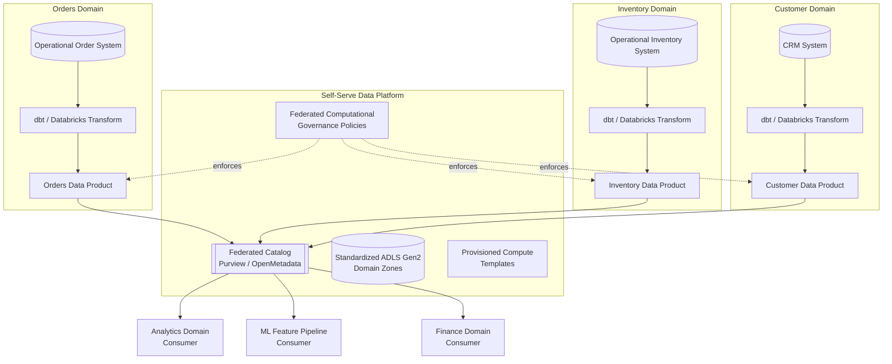
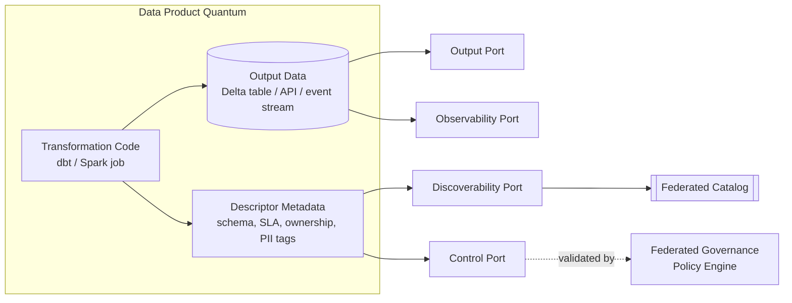
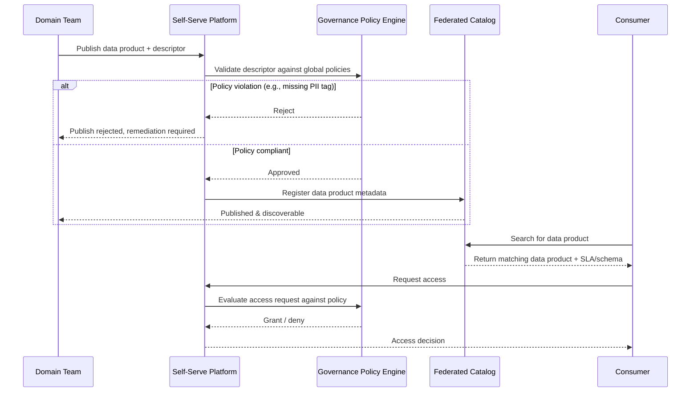

# Data Mesh Principles

> Part of the **Enterprise Data & AI Architecture Handbook** · Phase-15 — Data Mesh & Data Fabric · Chapter 01.
> Estimated study time: **60 min reading + ~3h labs**.
> **Prerequisites:** read [Domain-Driven Design](../Phase-01/05_Domain_Driven_Design.md) and [Data Governance Foundations](../Phase-08/01_Data_Governance_Foundations.md) first.

---

## Executive Summary

[Domain-Driven Design](../Phase-01/05_Domain_Driven_Design.md) established bounded contexts as the organizing principle for *service* ownership: each domain team owns a coherent slice of business capability, its own model, and its own deployment lifecycle. [Data Governance Foundations](../Phase-08/01_Data_Governance_Foundations.md) established a largely *centralized* governance model as the default: one governance function, one set of policies, one team ultimately accountable for data quality across the enterprise. **Data mesh** is what happens when those two ideas are forced to confront each other: it takes DDD's bounded-context ownership model and applies it to *data* rather than services, while insisting that governance stay a first-class, enforced discipline — just federated and computational rather than centralized and manual.

Coined by Zhamak Dehghani in 2019, data mesh rests on **four principles that only work together**: **domain ownership** (the team closest to a business domain owns and operates the analytical data derived from it, not a downstream central data team), **data as a product** (that domain-owned data is treated with the same rigor as a customer-facing product — discoverable, addressable, trustworthy, self-describing, secure, and interoperable — not as an afterthought byproduct of an operational system), **self-serve data platform** (a central platform team provides the paved-road infrastructure — storage, compute, catalog, pipeline templates, access control primitives — so that domain teams can build and operate data products without needing to become infrastructure specialists), and **federated computational governance** (global policies — PII handling, interoperability standards, compliance rules — are defined collaboratively by domain and platform representatives, then *enforced automatically* by the platform, rather than by a central team manually reviewing every dataset).

This chapter's central, repeated thesis, extending the justification-before-adoption discipline established in [Knowledge Graphs with Neo4j](../Phase-13/02_Knowledge_Graphs_with_Neo4j.md) ADR-0165, [GraphRAG](../Phase-13/04_GraphRAG.md) ADR-0167, [Ontologies and Taxonomies](../Phase-13/05_Ontologies_and_Taxonomies.md) ADR-0168, and directly paralleling [Microservices Architecture](../Phase-14/02_Microservices_Architecture.md) ADR-0170's "modular monolith first" caution: **data mesh redistributes complexity, it does not remove it.** A centralized data platform's single bottleneck becomes, if the four principles are only partially adopted, a dozen uncoordinated bottlenecks with none of the compensating governance or platform investment — the single most common and most expensive data mesh failure mode this chapter documents.

The platform bias is **Azure-primary (~60%)** — Microsoft Fabric's native **domain** construct and OneLake as a mesh-aware managed substrate, Azure Databricks Unity Catalog for cross-workspace data-product governance, Microsoft Purview for the federated catalog and policy-enforcement layer, and Azure API Management/ADLS Gen2 domain-aligned containers as data-product output ports — **~30% enterprise open source** (dbt for domain-owned transformation-as-a-product, OpenMetadata/Apache Atlas per [Metadata Management](../Phase-08/04_Metadata_Management_OpenMetadata_and_Atlas.md) as the federated catalog substrate, Great Expectations per [Data Quality with Great Expectations](../Phase-08/03_Data_Quality_with_Great_Expectations.md) for computationally-enforced quality contracts, and Kafka per [Apache Kafka](../Phase-07/02_Apache_Kafka.md) as a common data-product output-port transport) — **~10% AWS/GCP comparison-only** (AWS Lake Formation plus a domain-per-account pattern; Google Cloud Dataplex).

**Bottom line:** data mesh is an organizational-and-architectural response to a specific, measurable pain — a central data team and monolithic lake that cannot scale with the number of domains depending on it — not a default target state every organization should adopt. It requires genuine, sustained investment in exactly the platform and governance capabilities this chapter names; adopted as a terminology change alone ("we renamed the data team to 'domain teams'") it reliably makes things worse, not better, a lesson this chapter's Case Studies section documents in detail alongside a genuine success story.

---

## Learning Objectives

By the end of this chapter you will be able to:

1. **Explain and defend each of the four data mesh principles** (domain ownership, data as a product, self-serve platform, federated computational governance) and articulate why all four must be adopted together for the model to function.
2. **Apply Domain-Driven Design bounded-context analysis** (per [Domain-Driven Design](../Phase-01/05_Domain_Driven_Design.md)) to identify correct data-domain boundaries, and recognize the specific ways a poorly-drawn domain boundary undermines data mesh the same way it undermines microservice boundaries.
3. **Design a data product's output, control, discoverability, and observability ports** using a concrete metadata contract, and distinguish a genuine data product from a renamed database table.
4. **Contrast federated computational governance with the centralized governance model** established in [Data Governance Foundations](../Phase-08/01_Data_Governance_Foundations.md), and explain what "computational" (policy-as-code, automatically enforced) specifically adds beyond a federated committee alone.
5. **Evaluate an organization's actual readiness for data mesh** against a decision matrix, and recognize the "mesh in name only" anti-pattern before it is adopted, not after.
6. **Map the four principles to concrete Azure services** (Fabric domains, Unity Catalog, Purview, ADLS Gen2) and to the equivalent open-source and AWS/GCP building blocks.
7. **Defend a data mesh adoption or non-adoption decision** in engineer, staff engineer, architect, and CTO review settings, including the platform-investment cost this model requires before it pays off.

---

## Business Motivation

- **A single centralized data team becomes a hard organizational bottleneck as the number of dependent domains grows** — every new report, every schema change, every new source system routes through the same finite team, and request backlogs grow faster than the team can scale headcount, mirroring the exact "modular monolith first, then a measured trigger" scaling logic [Microservices Architecture](../Phase-14/02_Microservices_Architecture.md) ADR-0170 applied to services, now applied to data ownership.
- **Domain context is systematically lost when data ownership is separated from domain expertise.** A central data engineering team ingesting `orders` data from a sales domain does not have the sales domain's tacit knowledge of what a "cancelled" order actually means in every edge case; that knowledge erodes further with every hand-off, directly causing the data-quality and semantic-drift problems [Data Governance Foundations](../Phase-08/01_Data_Governance_Foundations.md) and [Data Contracts](../Phase-08/07_Data_Contracts.md) already treat as a governance problem — data mesh reframes it as also an *ownership placement* problem.
- **Time-to-insight for a new analytical use case is dominated by central-team queue time, not technical complexity.** A domain team that already understands its own source systems can often build a trustworthy data product in days once it has self-serve platform access; the same request routed through a central team's backlog commonly takes weeks to months for reasons unrelated to the work's actual difficulty.
- **Discoverability across siloed teams degrades as an organization grows past the point where everyone can informally know what data exists where** — extending [Data Catalog and Lineage](../Phase-08/02_Data_Catalog_and_Lineage.md)'s catalog discipline from "a shared centralized catalog" to "a federated catalog spanning independently-operated domain data products," a structurally harder discoverability problem this chapter's Metadata section addresses directly.
- **Over-adopting data mesh terminology without the compensating platform and governance investment is a genuine, recurring, and expensive architecture-review finding** — this chapter's Business Motivation deliberately mirrors the over-adoption cautions already established for knowledge graphs ([Knowledge Graphs with Neo4j](../Phase-13/02_Knowledge_Graphs_with_Neo4j.md) ADR-0165), GraphRAG ([GraphRAG](../Phase-13/04_GraphRAG.md) ADR-0167), ontologies ([Ontologies and Taxonomies](../Phase-13/05_Ontologies_and_Taxonomies.md) ADR-0168), and microservices ([Microservices Architecture](../Phase-14/02_Microservices_Architecture.md) ADR-0170): a sophisticated organizational model adopted for its own sake, without the specific, named pain it solves, reliably costs more than it returns.

---

## History and Evolution

- **2010s — the monolithic enterprise data lake becomes the default big-data architecture** (per [Lakehouse Architecture](../Phase-05/02_Lakehouse_Architecture.md)'s own history), typically owned and operated by one central data engineering team ingesting from every source system across the company — a scaling model that works well at moderate organizational size and increasingly strains as the number of source systems and downstream consumers grows.
- **2014 — the microservices architectural style is popularized** (per [Microservices Architecture](../Phase-14/02_Microservices_Architecture.md)'s history), decentralizing *application* ownership along domain lines years before an equivalent decentralization was proposed for *data* ownership — data mesh is frequently, and accurately, described by its own creator as "bringing the microservices lesson to data."
- **May 2019 — Zhamak Dehghani (then at ThoughtWorks) publishes "How to Move Beyond a Monolithic Data Lake to a Distributed Data Mesh"** on Martin Fowler's website, the founding article naming the pattern and the term "data mesh," directly diagnosing the centralized-lake-and-team bottleneck described in this chapter's Business Motivation as the root problem the pattern responds to.
- **2020 — the four principles are formalized and refined** through subsequent ThoughtWorks articles and conference talks, converging on the domain ownership / data-as-a-product / self-serve platform / federated computational governance framing this chapter uses.
- **2021-2022 — "Data Mesh: Delivering Data-Driven Value at Scale" (Dehghani, O'Reilly) is published**, becoming the canonical reference text and popularizing the "data product quantum" (§8.2, §11) as the concrete architectural unit implementing "data as a product."
- **2022 — the data contract pattern gains independent momentum** (notably via Andrew Jones's widely-cited GoCardless engineering blog series), providing the concrete, testable mechanism — schema, SLAs, semantics, ownership metadata, all machine-checkable — that operationalizes "data as a product" beyond the aspirational principle alone, later formalized in this handbook's own [Data Contracts](../Phase-08/07_Data_Contracts.md) chapter.
- **2022-2023 — Gartner and Forrester popularize the competing/complementary "data fabric" term**, describing an AI-and-metadata-driven *automation* layer across existing data estates rather than data mesh's *organizational decentralization* model — the two terms are frequently, and incorrectly, treated as synonyms in vendor marketing; this handbook resolves the distinction explicitly in Phase-15 Chapter 03 (Data Fabric).
- **2023-2024 — Microsoft Fabric ships a native `domain` construct and OneLake workspace model**, and Azure Databricks Unity Catalog matures cross-workspace catalog federation — the first widely-adopted Azure-native platform primitives explicitly designed around data-mesh-style domain decomposition, rather than requiring a team to hand-build the self-serve platform principle from unopinionated primitives alone.
- **2024-2026 — industry experience reports converge on a consistent lesson**: organizations that adopted all four principles together with real platform investment report durable gains; organizations that adopted domain-ownership terminology alone, without the self-serve platform or computational governance investment, report the "distributed data swamp" outcome this chapter's Case Studies section documents — the single most consistent finding across public post-mortems and the direct motivation for this chapter's decision-matrix-before-adoption framing.

---

## Why This Technology Exists

A monolithic centralized data lake, owned by one central team, works exactly as long as that team's capacity scales with the combined rate of change of every source system feeding it and every consumer depending on it — which, past a certain organizational size, it structurally cannot, for the same reason a monolithic application's release train cannot scale with an unbounded number of independently-changing feature teams. Data mesh exists to apply the same decentralization answer [Microservices Architecture](../Phase-14/02_Microservices_Architecture.md) already applied to application ownership — push ownership to the team with the most context, and make the boundaries between them explicit, contractual, and platform-supported — to analytical data specifically. It does not exist because centralized data platforms are inherently wrong; it exists because a *specific, measurable* organizational scale point makes the central-bottleneck cost exceed the decentralization-and-governance-overhead cost, and this chapter's Decision Matrix (§20) is built to help identify whether an organization has actually reached that point.

---

## Problems It Solves

- **The central-data-team bottleneck** named throughout this chapter's Business Motivation, resolved by moving data-product creation and ownership to the domain teams that already understand the source systems, removing the central team as a mandatory routing point for every change.
- **Domain-context loss and semantic drift**, resolved by keeping data ownership co-located with the team that has the tacit business knowledge to correctly define what a field or event actually means — directly extending [Domain-Driven Design](../Phase-01/05_Domain_Driven_Design.md)'s ubiquitous-language principle from application code into analytical data models.
- **Non-scaling discoverability**, resolved by a federated catalog (§11) that indexes every domain's published data products under one consistent, machine-readable metadata contract, so a consumer can find and evaluate a data product without knowing in advance which team built it.
- **Duplicate, inconsistent ad hoc data pipelines built by every consuming team independently** because no trustworthy, well-documented source existed, resolved by data-as-a-product's explicit quality, SLA, and discoverability guarantees making a domain's official data product the obviously-easier and more-trustworthy choice than a bespoke extract.
- **Inconsistent, team-by-team access-control and PII-handling implementations**, resolved by federated computational governance (§8.4) defining a single set of global policies enforced automatically and identically regardless of which domain team owns the underlying data.

---

## Problems It Cannot Solve

- **Data mesh does not remove the need for a genuine, sustained self-serve platform investment** — without it, "domain ownership" simply means every domain team independently re-solves storage, compute, security, and pipeline orchestration from scratch, which is *more* total organizational cost than one central team, not less; this is the single most common root cause of the "distributed data swamp" failure mode this chapter's Case Studies section documents.
- **It does not remove the need for master data management for genuinely enterprise-wide reference entities** — a customer, product, or account master record that must be consistent across every domain is exactly the scenario [Master Data Management](../Phase-08/05_Master_Data_Management.md) addresses, and data mesh does not replace that discipline; a domain-owned "customer" data product still needs to resolve against a canonical MDM golden record, not invent its own competing definition.
- **It does not fix an organization that has not done the underlying domain-boundary analysis.** Applying data mesh vocabulary on top of data domains drawn by database-table proximity, org-chart lines, or historical accident — rather than genuine bounded-context analysis per [Domain-Driven Design](../Phase-01/05_Domain_Driven_Design.md) — reproduces the exact "distributed monolith" failure [Microservices Architecture](../Phase-14/02_Microservices_Architecture.md) already documented for services, now for data.
- **It does not eliminate the need for centralized governance policy-setting** — federated computational governance still requires a real, cross-domain governance function (per [Data Governance Foundations](../Phase-08/01_Data_Governance_Foundations.md)) to define the global rules that get computationally enforced; "federated" changes who defines and how policy is enforced, not whether policy exists at all.
- **It does not automatically improve data quality** — a domain team publishing a data product with no genuine quality-contract discipline (per [Data Quality with Great Expectations](../Phase-08/03_Data_Quality_with_Great_Expectations.md)) has simply relocated a data-quality problem, not solved it; "data as a product" is a design obligation the platform can support but cannot enforce by itself without the domain team's genuine investment.

---

## Core Concepts

### 1.1 Domain ownership

- **Analytical data ownership moves to the domain team that generates or is closest to the operational source of that data**, mirroring [Domain-Driven Design](../Phase-01/05_Domain_Driven_Design.md)'s bounded-context ownership model applied to data rather than services: the Orders domain team owns the `orders` analytical data product, not a central data engineering team consuming an `orders` database export.
- **Domain boundaries for data mesh should be derived from the same bounded-context analysis as service boundaries**, not redrawn independently — a data domain that does not correspond to a genuine bounded context (e.g., a domain drawn around a single database table rather than a coherent business capability) reproduces the exact "distributed monolith" boundary-drawing mistake [Microservices Architecture](../Phase-14/02_Microservices_Architecture.md) already documented, now in data form.
- **Ownership includes lifecycle accountability, not just initial publication**: the owning domain team is responsible for schema evolution, quality SLAs, incident response, and deprecation of its data products — the same "you build it, you run it" accountability [Microservices Architecture](../Phase-14/02_Microservices_Architecture.md) established for services, extended to analytical data.
- **This is the principle most commonly adopted in name only.** Renaming a central team's sub-teams to "domain teams" without transferring genuine accountability, budget, and platform access reproduces the central bottleneck under new vocabulary — this chapter's Anti-patterns section (§25) names this specific failure mode explicitly.

### 1.2 Data as a product

- **A data product is analytical data treated with the same rigor as a customer-facing software product**: discoverable (indexed in a federated catalog), addressable (a stable, documented access point), trustworthy (a published, monitored quality SLA), self-describing (a schema and semantics a consumer can understand without asking the owning team), interoperable (consistent global identifiers and formats per federated governance), and secure (access control enforced consistently regardless of consumer).
- **The concrete implementing artifact is the data product quantum (§8.2, §11)** — code (transformation logic), data (the actual output), and metadata (schema, SLA, ownership, lineage) bundled and versioned together as one deployable unit, directly paralleling the "model + prompt + index as one versioned triple" discipline [LLMOps](../Phase-12/04_LLMOps.md) ADR-0158 established for a structurally similar three-artifact-coupling problem.
- **A data product's consumer is a first-class stakeholder, not an afterthought.** The owning domain team is expected to treat schema changes, deprecations, and quality regressions the way a product team treats breaking API changes for its external customers — with versioning, advance notice, and a support channel — a discipline [Data Contracts](../Phase-08/07_Data_Contracts.md) formalizes into machine-checkable form.
- **"Data as a product" is a design and operating obligation, not a label.** A table that is merely renamed with a "product owner" tag in a wiki, without a genuine schema contract, SLA, or discoverability metadata, is not a data product under this principle — it is the exact anti-pattern this chapter's Common Mistakes section (§27) names as "data product theater."

### 1.3 Self-serve data platform

- **A central platform team provides paved-road infrastructure so that domain teams can build and operate data products without each independently becoming infrastructure specialists**: standardized storage zones, compute templates, catalog registration APIs, access-control primitives, pipeline CI/CD templates, and observability tooling — directly extending [Platform Engineering](../Phase-09/02_Platform_Engineering.md)'s golden-path philosophy from application platforms to data platforms specifically.
- **The platform team's role inverts relative to a centralized data model**: instead of building and operating every pipeline itself, it builds and operates the *tools that let domain teams build and operate their own pipelines* — the same shift [Platform Engineering](../Phase-09/02_Platform_Engineering.md) already documented for application infrastructure, now applied to data infrastructure.
- **This is the principle most commonly under-invested in**, because its cost is visible and upfront (platform engineering headcount, tooling licenses, migration effort) while its benefit (avoided duplicated per-domain infrastructure work) is diffuse and easy to underestimate during a business case — this chapter's Cost Optimization section (§20) provides a concrete worked comparison.
- **Without a genuine self-serve platform, domain ownership does not reduce total organizational cost — it multiplies it**, since every domain team independently re-solves the same infrastructure problems a shared platform would have solved once; this is the direct mechanical cause of the "distributed data swamp" failure mode.

### 1.4 Federated computational governance

- **Global policies — PII classification and masking rules, interoperability standards (common identifiers, common date/time formats), regulatory-compliance requirements, and minimum quality-SLA baselines — are defined collaboratively** by a federation of domain representatives and the platform/governance team, not unilaterally by a central authority, extending but not replacing the governance function [Data Governance Foundations](../Phase-08/01_Data_Governance_Foundations.md) already established.
- **"Computational" is the load-bearing word**: policies are expressed as code (policy-as-code, e.g., Purview classification-and-labeling rules, Unity Catalog attribute-based access policies, or OPA-style policy engines) and *automatically enforced by the self-serve platform* at publish time and query time, not manually reviewed by a governance committee for every dataset — the mechanism that makes federated governance scale, in exactly the way manual review does not.
- **This principle is the direct answer to the objection "doesn't decentralization mean losing control?"** — control is retained, but its *implementation* moves from manual gatekeeping (which does not scale past a central team's bandwidth) to automated, platform-enforced policy, the same shift [Enterprise Integration Patterns](../Phase-14/06_Enterprise_Integration_Patterns.md)'s Azure Logic Apps discussion made from hand-built to managed pattern implementation, now applied to governance enforcement itself.
- **Federated governance without genuine computational enforcement degrades into either a rubber-stamp committee (policies exist on paper, are not actually checked) or a reinstated central bottleneck (every dataset routed through a governance review queue)** — this chapter's Anti-patterns section (§25) names both failure directions explicitly, mirroring the two-directional caution [Enterprise Integration Patterns](../Phase-14/06_Enterprise_Integration_Patterns.md) ADR-0174 already established for iPaaS adoption.

### 1.5 Socio-technical implications

- **Data mesh is explicitly a socio-technical model, not a purely technical architecture** — Dehghani's own framing places organizational design (team topology, incentive structures, funding models) on equal footing with the technical architecture; adopting the technical pattern (domain-aligned storage, federated catalog) without the organizational change (genuine ownership transfer, domain-team accountability, funding for platform investment) is architecturally incomplete by definition, not merely suboptimal.
- **Team topology must actually change**: domain teams need embedded or dedicated data-engineering capability (not a separate central team they still depend on for execution), and the platform team's success metric shifts from "pipelines we built" to "domain teams successfully self-served without our intervention" — a genuinely different accountability structure, not a relabeling.
- **Funding models must follow ownership.** If a domain team owns a data product but the central data platform budget still pays for all the compute and engineering effort behind it, accountability and budget are misaligned, and the domain team lacks the actual incentive and authority the ownership principle assumes exists.
- **This is why data mesh adoption is organizationally harder than most architectural pattern adoptions in this handbook** — it requires simultaneous, coordinated change to team structure, funding, incentives, and technology, rather than a technology swap a single engineering team can execute independently; this chapter's Decision Matrix (§20) treats organizational readiness as a first-class, not secondary, evaluation criterion.

---

## Internal Working

### 2.1 How a domain publishes a data product

A domain team's data engineers build a transformation pipeline (often using [dbt](../Phase-05/08_dbt_and_Analytics_Engineering.md) or a Spark/Databricks job per [Databricks Platform](../Phase-05/05_Databricks_Platform.md)) that reads from the domain's own operational source systems and writes to a domain-owned, platform-standardized output zone (§13). Alongside the data itself, the team publishes a **data product descriptor** (§10) — schema, SLA, ownership contact, semantic documentation, access-control policy tags — to the platform's federated catalog registration API. The self-serve platform validates the descriptor against global interoperability and governance standards (§8.4) before the data product becomes discoverable; a descriptor that fails validation (e.g., missing PII classification tags) is rejected at publish time, not silently accepted and discovered as a problem later by a downstream consumer.

### 2.2 How a consumer discovers and accesses a data product

A consumer (another domain team, a central analytics function, or an ML feature pipeline per [Feature Stores with Feast](../Phase-11/02_Feature_Stores_with_Feast.md)) searches the federated catalog (implemented via Purview or OpenMetadata, per §11) for a data product matching its need, evaluates its published SLA and schema without needing to contact the owning team directly, and requests access through the platform's standard access-control workflow. The platform evaluates the request against the federated governance policies (§8.4) automatically — a request for PII-classified data from a consumer without the required entitlement is denied computationally, not escalated to a manual reviewer, unless the policy itself specifies human approval for that data classification tier.

### 2.3 How computational governance is actually enforced

Global policies are compiled into machine-enforceable rules attached to the platform's access-control and cataloging layer: a PII-masking policy becomes a dynamic-data-masking rule applied automatically to any column tagged `PII` regardless of which domain owns the underlying table (directly reusing the mechanism [Data Security and Encryption](../Phase-10/03_Data_Security_and_Encryption.md) already established for row/column-level security); an interoperability standard (e.g., "customer identifiers must use the enterprise MDM golden-record ID") becomes an automated schema-validation check run at publish time, rejecting a data product descriptor that uses a non-standard customer identifier field. This is what "computational" adds beyond a governance committee's written policy document: the policy is executed by the platform on every publish and every access request, not interpreted and applied inconsistently by dozens of independent domain teams.

---

## Architecture



The reference architecture has three structural layers: **domain layer** (each domain team owns its own source-to-product pipeline, using whatever compute/transform tooling suits its needs, within platform-provided templates), **platform layer** (the shared, centrally-operated substrate — catalog, standardized storage zones, governance-policy enforcement, provisioned compute templates — that every domain consumes rather than rebuilds), and **consumption layer** (any domain, analytics function, or downstream system discovering and consuming published data products through the catalog, never through direct, undocumented access to another domain's internal source systems).

---

## Components

- **Data product quantum**: the deployable unit bundling transformation code, output data, and the descriptor metadata (§10) as one versioned artifact — the concrete implementation of "data as a product" (§1.2).
- **Output port**: the documented, stable interface through which a data product's data is consumed (a table, a view, an API, or an event stream per [Apache Kafka](../Phase-07/02_Apache_Kafka.md)) — analogous to a microservice's public API per [Microservices Architecture](../Phase-14/02_Microservices_Architecture.md) §8.1.
- **Control port**: the interface through which the platform's governance policies are applied to and validated against the data product (schema validation, PII tagging checks, SLA registration) at publish time.
- **Discoverability port**: the metadata registration interface connecting the data product to the federated catalog (§11), making it findable by consumers who have never interacted with the owning team.
- **Observability port**: the interface exposing the data product's operational health — freshness, quality-check pass rate, SLA compliance — to both the owning team and any consumer evaluating whether to depend on it (§21-22).
- **Self-serve platform services**: provisioning APIs/templates for storage, compute, catalog registration, and access control that domain teams consume rather than build (§1.3, §9).
- **Federated governance council**: the cross-domain body (platform team + domain representatives) that defines global policy, whose decisions are then compiled into computational enforcement rather than manual review (§1.4, §8.4).

---

## Metadata

- **Data product descriptor**: a machine-readable manifest (commonly YAML/JSON) capturing schema, semantic documentation, owning team and contact, SLA/SLO commitments (freshness, availability, quality thresholds), access-control and PII classification tags, and lineage pointers — the mesh-scale evolution of the single-pipeline data contract already formalized in [Data Contracts](../Phase-08/07_Data_Contracts.md).
- **Federated catalog entries**: every published data product is indexed centrally (Purview or OpenMetadata per [Metadata Management](../Phase-08/04_Metadata_Management_OpenMetadata_and_Atlas.md)) with consistent, cross-domain-comparable metadata fields — a consumer must be able to compare an Orders data product's SLA against a Customer data product's SLA using the same metadata schema, even though two entirely different domain teams built them.
- **Lineage across domain boundaries**: a data product that consumes another domain's data product as an upstream input must propagate that dependency into the catalog's lineage graph, extending [Data Catalog and Lineage](../Phase-08/02_Data_Catalog_and_Lineage.md)'s single-pipeline lineage tracking across an arbitrary number of independently-operated domains — this is structurally harder than single-team lineage because no single team has end-to-end visibility by default; the catalog is what restores that visibility.
- **Policy tags as first-class, portable metadata**: a PII classification or a data-sensitivity tier tag applied to a source field must survive every downstream transformation and re-publication as a new data product, so that federated computational governance (§8.4) can enforce the correct policy at every hop, not just at the original source.

---

## Storage

- **Domain-aligned storage zones, not domain-isolated storage silos.** Each domain owns a dedicated, platform-standardized zone (typically an ADLS Gen2 container or a Unity Catalog catalog/schema) for its data products, but the zone structure and medallion conventions ([Medallion Architecture](../Phase-05/03_Medallion_Architecture.md)) are platform-standardized so that a consumer navigating a second domain's zone finds a familiar structure, not a bespoke one.
- **Storage format standardization is a self-serve platform responsibility, not a per-domain choice** — the platform mandates (or strongly defaults to) a common table format such as [Delta Lake](../Phase-04/04_Delta_Lake.md) across every domain, so that cross-domain queries and a shared catalog can rely on consistent format semantics rather than a domain-by-domain compatibility matrix.
- **A domain publishing a data product does not imply physically copying data to a central location** — output ports are commonly exposed via views, shortcuts (Fabric OneLake shortcuts), or Unity Catalog Delta Sharing references directly into the owning domain's storage, avoiding the duplicated-copy sprawl a centralized-copy model would otherwise create.

---

## Compute

- **Domain teams choose their own compute engine within platform-provided guardrails** — one domain may use Databricks, another Microsoft Fabric, another Synapse, provided each integrates with the platform's standardized catalog registration and governance-enforcement APIs; compute-engine choice is a domain-team decision, catalog/governance integration is not optional.
- **The self-serve platform provisions compute via standardized, reusable templates** (Terraform/Bicep modules per [Infrastructure as Code with Terraform](../Phase-09/04_Infrastructure_as_Code_with_Terraform.md)), so a new domain team's onboarding time is measured in the time to instantiate a template, not the time to design compute infrastructure from scratch.
- **Federated policy enforcement (§8.4) must be engine-agnostic or engine-pluggable** — a masking policy enforced natively by Unity Catalog for a Databricks-based domain must produce an equivalent enforcement outcome for a Fabric-based domain using Purview policies, since consumers should not need to know or care which compute engine produced a given data product.

---

## Networking

- **Data product output ports are exposed through platform-standardized network patterns** — private endpoints into ADLS Gen2/OneLake, Delta Sharing endpoints, or an API Management-fronted REST API for data products exposed as APIs rather than tables — consistent with [Network Security and Zero Trust](../Phase-10/04_Network_Security_and_Zero_Trust.md)'s private-endpoint-only, default-deny-egress baseline applied uniformly across every domain, not negotiated per domain.
- **Cross-domain access does not imply cross-domain network flattening.** A consumer accessing another domain's data product goes through the platform's standardized, governed access path (catalog-mediated, policy-enforced) rather than direct network connectivity into the owning domain's operational systems — the mesh preserves the same operational/analytical boundary [Lakehouse Architecture](../Phase-05/02_Lakehouse_Architecture.md) already established, now per-domain rather than enterprise-wide.
- **API Management as a data-product output-port gateway** provides a consistent authentication, throttling, and versioning layer for data products exposed as APIs, so consumers integrate against one consistent gateway pattern regardless of which domain or which underlying compute engine produced the API.

---

## Security

- **Federated computational governance (§8.4) is the security enforcement mechanism, not a separate concern layered on top.** PII masking, row-level security, and access entitlements are defined once, globally, and enforced automatically at every domain's data product regardless of who owns it — directly reusing [Data Security and Encryption](../Phase-10/03_Data_Security_and_Encryption.md) and [Identity and Access Management with Entra](../Phase-10/02_Identity_and_Access_Management_with_Entra.md)'s mechanisms (dynamic data masking, RBAC/ABAC, Unity Catalog grants) at mesh scale.
- **Identity propagation through the catalog and access layer must resolve to the requesting consumer's actual identity**, not a shared platform service principal — the same access-control-propagation discipline established for RAG ([Retrieval Augmented Generation](../Phase-12/03_Retrieval_Augmented_Generation.md) ADR-0157), vector search ([Vector Databases: Qdrant and Milvus](../Phase-13/01_Vector_Databases_Qdrant_and_Milvus.md) ADR-0164), and MCP servers ([Model Context Protocol (MCP)](../Phase-12/06_Model_Context_Protocol_MCP.md) ADR-0160), now recurring for the fourth time in this handbook applied to federated data-product access.
- **A decentralized ownership model without centrally-enforced security policy is a genuine attack-surface expansion**, not a neutral trade-off — every additional domain team independently implementing (or forgetting to implement) access control multiplies the number of places a security gap can appear; computational enforcement (§8.4) is what keeps that risk bounded rather than compounding with every new domain.

---

## Performance

- **Federated query performance across domain-owned data products is bounded by the same physics as any cross-system join** — a query joining an Orders data product and a Customer data product, if each lives in a different storage account, workspace, or even compute engine, pays a network and serialization cost a single-warehouse query would not; the self-serve platform's storage-format and location standardization (§13) exists specifically to minimize this cost, not eliminate it.
- **Avoiding the "pull everything into one central copy" anti-pattern is a deliberate performance-versus-simplicity trade-off, not a free win** — Delta Sharing/OneLake-shortcut-style federated access avoids data duplication but can be slower for heavy, repeated cross-domain analytical workloads than a materialized, denormalized central copy would be; a genuinely high-frequency cross-domain analytical workload may justify a domain team publishing a purpose-built, pre-joined data product rather than forcing every consumer to pay a federated-join cost repeatedly.
- **Domain-local compute sizing decisions do not automatically account for mesh-wide consumption patterns** — a domain team sizing its own compute for its own internal needs may under-provision for a data product that becomes unexpectedly popular mesh-wide; the platform's observability layer (§22) must surface consumption growth back to the owning domain, not leave it to be discovered as a performance incident.

---

## Scalability

- **Data mesh's scalability claim is organizational, not purely computational**: it scales the *rate of change* an organization can sustain (new data products published, schemas evolved) roughly with the number of domain teams rather than with one central team's fixed capacity — the same scaling argument [Microservices Architecture](../Phase-14/02_Microservices_Architecture.md) made for deployment velocity, now applied to data-product publication velocity.
- **The self-serve platform, not the mesh model itself, must absorb the computational scaling burden** of a growing number of domains each registering, querying, and governing their own data products — a federated catalog and policy-enforcement layer that does not scale with domain count reintroduces a new bottleneck at the platform layer, merely relocated from "central data team" to "central platform team," unless the platform itself is engineered for that scale.
- **Mesh scalability degrades, not improves, past a certain domain-count-without-governance-maturity threshold** if federated governance (§8.4) is not genuinely computational — a federation of fifty domain teams each requiring manual governance sign-off scales worse than one central team ever did, since coordination cost among fifty peers exceeds coordination cost through one central chokepoint; this is the mechanical reason "computational" enforcement (not just federated policy-setting) is load-bearing, not optional.

---

## Fault Tolerance

- **Domain-level failure isolation is a genuine mesh benefit**: a data-quality incident or pipeline outage in the Orders domain's data product does not, by construction, take down the Inventory or Customer domain's data products, the same blast-radius containment [Microservices Architecture](../Phase-14/02_Microservices_Architecture.md) already established for service failures, now applied to data pipeline failures.
- **A shared self-serve platform component (the federated catalog, the governance-policy engine) is a genuine, and different, single point of failure** — if the catalog is down, discovery and access-control enforcement for every domain's data products may be degraded simultaneously, reintroducing at the platform layer exactly the concentrated-failure-impact risk domain-level decentralization was meant to avoid at the data layer; platform-layer high availability is therefore a non-negotiable design requirement, not an operational nice-to-have.
- **A downstream consumer's failure mode when an upstream domain's data product silently degrades in quality (not unavailable, just wrong) is structurally the same problem as any silently-corrupted upstream dependency** — the data-product SLA and quality-observability contract (§21-22) exists specifically to surface this before it propagates into every dependent domain's own outputs, the data-mesh-scale analogue of [Data Quality with Great Expectations](../Phase-08/03_Data_Quality_with_Great_Expectations.md)'s single-pipeline quality-gate discipline.

---

## Cost Optimization (FinOps)

- **Per-domain chargeback for compute and storage consumption** should follow domain ownership directly — a domain's data-product compute and storage costs should appear on that domain's own budget, both to correctly align accountability with the funding-follows-ownership principle (§1.5) and to give the domain team a direct incentive to right-size its own pipelines.
- **Shared self-serve platform costs (catalog infrastructure, governance-policy engine, shared networking) are a genuine centralized cost line** that should be tracked and justified separately from domain-level chargeback, since they are the one deliberately centralized component in an otherwise decentralized model.
- **Duplicated infrastructure across domains is the single largest quantifiable cost risk of a genuinely under-platformed mesh adoption** — without a shared self-serve platform, each domain team independently provisions its own storage account, catalog registration approach, and access-control implementation, multiplying platform-engineering labor cost by the number of domains rather than amortizing it once.
- **Worked FinOps example**: an organization with 8 domain teams evaluates two paths. Path A (no shared platform, each domain self-builds): 8 domains × an estimated 0.75 FTE-year of platform-equivalent engineering effort each (storage/catalog/access-control plumbing) at a fully-loaded cost of ~€130K/FTE-year ≈ **€780K/year** in duplicated platform-equivalent labor alone, before any domain-specific data-engineering work. Path B (shared self-serve platform team of 4 FTEs building and operating the paved-road platform for all 8 domains): ~4 × €130K ≈ **€520K/year**, plus each domain team's *marginal* onboarding effort drops to roughly 0.1 FTE-year (~€13K) per domain ≈ €104K/year, for a total of **≈ €624K/year**. The shared-platform path costs roughly **€156K/year less** even before counting the harder-to-quantify benefit of consistent governance enforcement and faster new-domain onboarding — the concrete number this chapter's Business Motivation and §1.3 assert qualitatively, now quantified, and the reason a self-serve platform business case should be built and approved *before*, not incidentally alongside, a domain-ownership rollout.

---

## Monitoring

- **Per-data-product SLA monitoring** (freshness against the descriptor's committed refresh interval, availability, and schema-conformance) is a mandatory output-port capability, not optional instrumentation, since consumers depend on the published SLA being genuinely and continuously verified, not merely stated at publish time.
- **Mesh-wide dashboards aggregating every domain's data-product health** are a platform responsibility, giving both the federated governance council and individual consumers a single place to check cross-domain data-product status rather than checking each domain's own, potentially inconsistent, monitoring setup.
- **Consumption monitoring per data product** (which consumers, how frequently, what query patterns) feeds back to the owning domain team, closing the loop the Performance section (§18) named as missing when a domain team sizes compute only for its own anticipated usage.

---

## Observability

- **Cross-domain lineage is the mesh-scale evolution of the observability discipline** [Data Catalog and Lineage](../Phase-08/02_Data_Catalog_and_Lineage.md) already established — a query-performance or data-quality incident in a downstream data product must be traceable back through every intermediate domain's data product to the original upstream source, even though no single domain team has end-to-end operational visibility by default; the federated catalog's lineage graph (§10) is what restores that end-to-end traceability.
- **Distributed tracing and correlation IDs across domain-owned pipelines**, extending [Event-Driven Architecture](../Phase-14/01_Event_Driven_Architecture.md) §22's observability treatment from application events to data-product publish/consume events, are necessary to diagnose an issue spanning multiple independently-operated domain pipelines without requiring a synchronous, coordinated debugging session across every owning team simultaneously.
- **Data product quality metrics must be disaggregated per data product, not aggregated into one mesh-wide quality score** — directly parallel to [Evaluation and Guardrails](../Phase-12/09_Evaluation_and_Guardrails.md) §9.3's disaggregated-metric principle: a mesh-wide average quality score can look healthy while one specific, heavily-depended-upon data product silently degrades, exactly the failure mode the next section's playbook addresses.

### Operational Response Playbook

| Signal | Detection Query / Check | Remediation |
|---|---|---|
| A domain's data product misses its published freshness SLA (e.g., data more than 2x the committed refresh interval old) | Scheduled freshness check comparing the data product's latest partition/watermark timestamp against the descriptor's committed SLA, alerting via the platform's mesh-wide monitoring dashboard (§21) | Page the owning domain team (not the platform team) per the data-product's registered on-call contact; if the root cause is an upstream operational-source outage, the platform team assists only with shared infrastructure (catalog, network); if a consumer depends on hard real-time freshness the domain product cannot guarantee, escalate to renegotiating the published SLA rather than silently tolerating repeated breaches |
| A consumer's query against a data product fails a schema-conformance or governance-policy check the catalog previously validated at publish time | Automated schema-and-policy re-validation run on every catalog read (not only at publish time), diffing the live data product's schema/tags against its registered descriptor | Block the non-conformant access at the platform layer (fail closed, per §8.4's computational-enforcement principle) and notify the owning domain team of the descriptor drift; treat an undetected drift between registered descriptor and actual output as a data-contract breach per [Data Contracts](../Phase-08/07_Data_Contracts.md)'s existing breach-response process, not a one-off platform bug |

---

## Governance

- **Federated computational governance (§1.4, §8.4) is the chapter's central governance mechanism**: global policy is defined collaboratively by domain representatives and the platform/governance team, then compiled into automated enforcement at the platform layer, extending rather than replacing the centralized governance function [Data Governance Foundations](../Phase-08/01_Data_Governance_Foundations.md) already established.
- **The federated governance council's membership and cadence must be genuinely representative and genuinely empowered** — a council that meets quarterly and has no binding authority over domain teams' actual publish-time behavior is a governance-theater risk identical in kind to [Compliance and Regulatory Frameworks](../Phase-10/06_Compliance_and_Regulatory_Frameworks.md)'s audit-scoping lesson: a policy that exists on paper but is not continuously, computationally verified is not actually operating.
- **Policy-as-code artifacts (Purview classification rules, Unity Catalog attribute-based access policies, or an OPA-style engine) are the durable, auditable record of what governance actually enforces**, and should be version-controlled and reviewed with the same rigor as application code, per [Infrastructure as Code with Terraform](../Phase-09/04_Infrastructure_as_Code_with_Terraform.md)'s policy-as-code treatment — this is what makes federated governance auditable at all, since a compliance review needs to inspect the enforced rule set, not just the meeting minutes that produced it.
- **Data mesh does not relax any existing regulatory obligation** — GDPR/CCPA/HIPAA/PCI-DSS obligations established in [Compliance and Regulatory Frameworks](../Phase-10/06_Compliance_and_Regulatory_Frameworks.md) and right-to-be-forgotten obligations from [Data Privacy and PII Protection](../Phase-10/07_Data_Privacy_and_PII_Protection.md) apply identically to a domain-owned data product as to a centrally-owned dataset; federated computational governance's job is specifically to make sure those obligations are still met *consistently* across every domain, not to loosen them in exchange for organizational decentralization.

---

## Trade-offs

| Dimension | Centralized Data Platform | Data Mesh |
|---|---|---|
| Domain context in transformations | Lower — central team lacks tacit domain knowledge | Higher — owned by the team with the most context |
| Time-to-publish for a new data product | Slower — routed through central team's backlog | Faster — domain team builds directly, once platform-onboarded |
| Consistency of governance enforcement | Higher by default (single team, single implementation) | Requires deliberate computational enforcement to match; genuinely harder to guarantee without it |
| Organizational and platform-investment cost | Lower — one team, one set of tooling | Higher — requires sustained self-serve platform engineering investment and organizational change |
| Discoverability at small scale | Easier — informally known within one team | Requires deliberate federated catalog investment even at small scale |
| Failure blast radius | Concentrated in one team/pipeline set | Isolated per domain, but a shared platform failure affects every domain simultaneously |
| Best organizational fit | Small-to-moderate organizations, or any organization pre-domain-ownership-maturity | Large organizations with many independently-scaling domains and genuine willingness to fund the platform investment |

---

## Decision Matrix

| Signal | Recommendation |
|---|---|
| A single central data team's backlog is the primary bottleneck for multiple, genuinely independent business domains | Data mesh is a strong candidate — proceed to a scoped pilot (per ADR-0176 below), not an org-wide rollout on day one |
| The organization has not yet done genuine bounded-context analysis (per [Domain-Driven Design](../Phase-01/05_Domain_Driven_Design.md)) for its data domains | Do the domain-boundary analysis first — adopting mesh vocabulary over undefined or org-chart-derived boundaries reproduces the distributed-monolith failure mode |
| Leadership will not fund a dedicated self-serve platform team/investment | Do not adopt data mesh yet — domain ownership without a self-serve platform multiplies cost per §20's worked example; strengthen the centralized platform instead |
| The organization has fewer than roughly 4-5 genuinely independent data domains | A centralized model, or a lightweight "data as a product" discipline applied within the centralized team, is very likely sufficient — the coordination overhead of federating governance across very few domains rarely pays for itself |
| Governance can only be defined manually (no policy-as-code / computational enforcement capability exists or is planned) | Invest in policy-as-code and catalog-driven enforcement capability first — federated governance without computational enforcement degrades into either a rubber-stamp or a reinstated bottleneck (§25) |
| A small number of clearly enterprise-wide reference entities (customer, product, account) need one authoritative source across every domain | Keep those specific entities under MDM (per [Master Data Management](../Phase-08/05_Master_Data_Management.md)) regardless of mesh adoption elsewhere — mesh and MDM are complementary, not substitutes |

---

## Design Patterns

- **Scoped pilot before org-wide rollout**: select 2-3 genuinely independent, high-value domains for an initial mesh pilot, fully investing in the self-serve platform and federated governance for those domains before expanding — directly mirroring [Microservices Architecture](../Phase-14/02_Microservices_Architecture.md) ADR-0170's "validated trigger before adoption" pattern, applied to data-domain rollout sequencing.
- **Data product as a versioned, contract-governed artifact**: bundle transformation code, output data, and descriptor metadata (§10) into one deployable unit with semantic versioning and a deprecation policy, directly reusing [Data Contracts](../Phase-08/07_Data_Contracts.md)'s consumer-driven contract-testing discipline at data-product publish time.
- **Golden-path platform templates**: provide domain teams with pre-built, opinionated infrastructure-as-code templates (storage zone provisioning, catalog registration, standard access-control roles) so that "self-serve" means genuinely fast and low-friction, not merely theoretically possible — extending [Platform Engineering](../Phase-09/02_Platform_Engineering.md)'s golden-path philosophy.
- **Federated governance as policy-as-code with automated publish-time and query-time enforcement**: express every global policy as a checkable rule compiled into the platform's catalog-registration and access-control pipeline, rather than a document a governance committee refers to during manual review.

---

## Anti-patterns

- **"Mesh in name only"**: renaming a central team's sub-teams to "domain teams" and calling existing datasets "data products" without any actual change to ownership accountability, platform investment, or governance enforcement — the single most common and most damaging data mesh failure mode, documented in this chapter's Case Studies section.
- **Distributed data swamp**: domain teams given genuine ownership but no self-serve platform investment, each independently reinventing storage layout, access control, and pipeline tooling — worse discoverability and worse governance consistency than the centralized model it replaced, because there is no longer even one consistent implementation to reason about.
- **Governance-by-rubber-stamp federation**: a federated governance council that meets and produces policy documents with no computational enforcement mechanism behind them — policies exist on paper, are inconsistently followed in practice, and a compliance audit discovers the gap (mirroring [Compliance and Regulatory Frameworks](../Phase-10/06_Compliance_and_Regulatory_Frameworks.md)'s audit-scoping case study, now at the governance-mechanism level rather than the control-operation level).
- **Reinstated central bottleneck via governance review queue**: the opposite-direction failure of the same principle — every data product publication routed through a mandatory manual governance sign-off, recreating the exact central-team bottleneck (§1.4's "Business Motivation") data mesh was adopted to remove, just relocated from the data-engineering function to the governance function.
- **Data-domain boundaries drawn by database-table proximity or org chart rather than bounded-context analysis**, reproducing [Microservices Architecture](../Phase-14/02_Microservices_Architecture.md)'s distributed-monolith anti-pattern in data form — high cross-domain coupling and coordinated-change requirements despite the mesh's decentralized appearance.

---

## Common Mistakes

- **Treating "data as a product" as a documentation exercise** (adding a description field to an existing table) rather than a genuine operating discipline including SLA commitments, schema-versioning policy, and a real support channel for consumers.
- **Underfunding the self-serve platform team relative to the number of domains it must support**, leading to slow onboarding, inconsistent enforcement, and domain teams bypassing the platform's paved road out of necessity — which then reintroduces exactly the inconsistency federated governance was meant to prevent.
- **Skipping bounded-context analysis and drawing data domains from existing database or team-organizational boundaries**, discovering only after significant migration effort that the chosen boundaries require constant cross-domain coordination for routine changes.
- **Building the federated catalog and governance-enforcement layer only after several domains have already independently published data products**, forcing a disruptive retrofit rather than establishing the platform's discoverability and governance contract before the first domain onboards.
- **Assuming data mesh removes the need for master data management**, then discovering multiple domains have independently and inconsistently modeled the same enterprise-wide entity (customer, product) with no reconciliation mechanism.

---

## Best Practices

- **Start with a scoped, well-resourced pilot on 2-3 domains before an org-wide rollout**, and require the self-serve platform and federated governance capability be genuinely operational for those domains before counting the pilot successful (ADR-0176).
- **Derive data-domain boundaries from the same bounded-context analysis used for service boundaries** (per [Domain-Driven Design](../Phase-01/05_Domain_Driven_Design.md)), not from existing database schemas or org charts.
- **Fund the self-serve platform team as a genuine, sustained investment, sized to the number of domains it must support** — treat platform-team headcount as a leading indicator to track alongside domain-onboarding velocity, not a one-time setup cost.
- **Express every federated governance policy as code with automated enforcement at publish time and query time**, and version-control the policy definitions with the same review discipline as application code.
- **Require every data product to publish a genuine SLA (freshness, quality, availability) and monitor conformance continuously**, treating an SLA breach with the same operational seriousness as an application incident.
- **Keep enterprise-wide reference entities under MDM regardless of mesh adoption**, and require domain-owned data products referencing those entities to resolve against the MDM golden record rather than defining a competing local definition.

---

## Enterprise Recommendations

- **For organizations under roughly 5 genuinely independent data domains**: do not adopt full data mesh; apply the "data as a product" discipline (SLAs, discoverability, quality contracts) within a centralized team instead, capturing much of the trust and discoverability benefit without the organizational-change cost.
- **For organizations already experiencing a measurable central-data-team bottleneck across many domains**: fund a self-serve platform team and a scoped 2-3-domain pilot before any broader rollout, with success criteria defined against §20's Decision Matrix, not adoption of mesh terminology alone.
- **For organizations already running Microsoft Fabric or Azure Databricks at scale**: evaluate Fabric's native domain construct or Unity Catalog's cross-workspace catalog federation as the platform foundation before building bespoke tooling — both provide meaningful self-serve-platform and federated-catalog primitives out of the box (§28).
- **For every organization, regardless of mesh adoption**: keep MDM for enterprise-wide reference entities, keep centralized policy-setting authority for regulatory-compliance obligations, and treat federated computational governance as an enforcement-mechanism change, not a governance-authority abdication.

---

## Azure Implementation

- **Microsoft Fabric domains**: Fabric's native `domain` construct lets an organization group workspaces by business domain, assign domain admins, and apply domain-scoped governance policies — the most direct Azure-native implementation of the domain-ownership principle (§1.1), with OneLake providing the underlying single, shared storage substrate every domain's workspace references without requiring physical data copies.
- **OneLake shortcuts** let a domain's data product be referenced (not copied) from another domain's or workspace's data, directly implementing the discoverable, addressable output-port principle (§8.2) without the storage duplication cost named in the Storage section (§13).
- **Azure Databricks Unity Catalog** provides cross-workspace catalog federation, attribute-based access control policies, and Delta Sharing for exposing data products to consumers outside the owning workspace — the primary self-serve-platform and federated-governance-enforcement substrate for organizations standardized on Databricks.
- **Microsoft Purview** serves as the federated catalog (§11) and policy-enforcement layer across both Fabric and Databricks estates, providing classification/labeling rules that implement PII-tagging enforcement (§8.4) consistently regardless of which domain or compute engine produced a given data product.
- **Azure API Management** fronts data products exposed as APIs (rather than tables) with consistent authentication, throttling, and versioning — the API-flavored implementation of a data product's output port for domains choosing to expose data as a service rather than a queryable table.
- **Concrete Bicep sketch** for provisioning a domain-aligned storage zone with the platform's standard container and RBAC pattern:

```bicep
resource domainContainer 'Microsoft.Storage/storageAccounts/blobServices/containers@2023-01-01' = {
  name: '${storageAccountName}/default/domain-${domainName}'
  properties: {
    metadata: {
      domainOwner: domainOwnerTeam
      dataProductTier: dataProductTier
    }
  }
}

resource domainRbac 'Microsoft.Authorization/roleAssignments@2022-04-01' = {
  name: guid(domainContainer.id, domainOwnerGroupId, 'StorageBlobDataContributor')
  scope: domainContainer
  properties: {
    roleDefinitionId: subscriptionResourceId('Microsoft.Authorization/roleDefinitions', 'ba92f5b4-2d11-453d-a403-e96b0029c9fe')
    principalId: domainOwnerGroupId
    principalType: 'Group'
  }
}
```

---

## Open Source Implementation

- **dbt** as the domain-owned transformation-as-a-product tool, with dbt's own model documentation, tests, and exposures used to populate a data product descriptor's schema and quality-contract metadata (§10), extending [dbt and Analytics Engineering](../Phase-05/08_dbt_and_Analytics_Engineering.md)'s existing per-model testing discipline to mesh-scale publication.
- **OpenMetadata or Apache Atlas** (per [Metadata Management](../Phase-08/04_Metadata_Management_OpenMetadata_and_Atlas.md)) as the open-source federated catalog substrate, providing the cross-domain discoverability and lineage-graph capability (§11) without a Purview dependency for organizations on a non-Azure-primary or hybrid catalog strategy.
- **Great Expectations** (per [Data Quality with Great Expectations](../Phase-08/03_Data_Quality_with_Great_Expectations.md)) as the computationally-enforced quality-contract mechanism underlying a data product's published SLA, run at publish time and continuously in production.
- **Apache Kafka** (per [Apache Kafka](../Phase-07/02_Apache_Kafka.md)) as a common data-product output-port transport for domains publishing data as an event stream rather than a queryable table, particularly for domains whose consumers need near-real-time freshness.
- **Open Policy Agent (OPA)** as an engine-agnostic policy-as-code substrate for federated computational governance (§8.4) in organizations wanting enforcement decoupled from any single vendor's catalog product.

---

## AWS Equivalent (comparison only)

| Azure | AWS | Notes |
|---|---|---|
| Microsoft Fabric domains / OneLake | AWS Lake Formation with a domain-per-account or domain-per-database pattern | AWS has no single native "domain" construct as opinionated as Fabric's; the domain-decomposition pattern is typically hand-built via multi-account/multi-database organization |
| Azure Databricks Unity Catalog | Databricks Unity Catalog on AWS (same product) | Directly equivalent since Databricks itself is the cross-cloud constant; migration between clouds preserves the catalog model |
| Microsoft Purview | AWS Glue Data Catalog + Lake Formation permissions, or a third-party catalog (e.g., Atlan) | AWS's native catalog/governance tooling is less unified than Purview's single-pane federated view; commonly supplemented with an open-source or third-party catalog for mesh-style federation |
| Azure API Management | Amazon API Gateway | Broadly equivalent for API-flavored data product output ports |

**Migration guidance**: a Databricks-on-Unity-Catalog mesh implementation migrates between Azure and AWS with comparatively low friction, since Unity Catalog's data-product and governance model is Databricks-native rather than cloud-native; a Fabric/Purview-centric implementation requires a more substantial catalog and governance re-platforming effort onto Lake Formation/Glue equivalents.

---

## GCP Equivalent (comparison only)

| Azure | GCP | Notes |
|---|---|---|
| Microsoft Fabric domains | Google Cloud Dataplex "lakes" and "zones" with attached domains/data products | Dataplex's explicit data-mesh-oriented lake/zone/asset model is the closest native GCP analogue to Fabric's domain construct |
| Microsoft Purview | Dataplex Catalog (formerly Data Catalog) | Dataplex natively frames catalog entries around data-mesh terminology (data products, domains), arguably the most mesh-purpose-built native catalog among the three clouds |
| Azure Databricks Unity Catalog | Databricks Unity Catalog on GCP (same product) | Same cross-cloud-constant equivalence as the AWS comparison |
| Azure API Management | Google Apigee / API Gateway | Broadly equivalent for API-flavored output ports |

**Selection criteria**: an organization already GCP-primary and evaluating data mesh should weigh Dataplex's native mesh-oriented vocabulary and tooling maturity directly against this chapter's Decision Matrix (§20) readiness criteria — native platform support for mesh concepts lowers implementation friction but does not substitute for the underlying organizational readiness the Decision Matrix evaluates.

---

## Migration Considerations

- **Migrating from a centralized data platform to a mesh model is a phased, multi-year organizational program, not a big-bang cutover** — begin with the scoped 2-3-domain pilot (ADR-0176), validate the self-serve platform and federated governance model against real domain teams' actual experience, and only then plan a broader, still-phased rollout.
- **Existing centralized pipelines should be migrated domain-by-domain, in dependency order**, starting with domains that have the fewest cross-domain dependencies, to avoid a partially-migrated state where some domains depend on now-decommissioned central-team pipelines that no longer have an owner.
- **The federated catalog must be populated with every domain's data products before domain teams are expected to rely on discoverability alone** — a transitional period where some data products are catalog-registered and others are still discovered informally (via the pre-existing central team's institutional knowledge) should be explicitly planned for and time-boxed, not left indefinite.
- **MDM golden-record migration is typically a prerequisite, not a parallel-track activity** — domains publishing data products that reference enterprise-wide entities should resolve against the MDM golden record from day one of the pilot, since retrofitting golden-record resolution into already-published, already-depended-upon data products is materially more disruptive later.

---

## Mermaid Architecture Diagrams

**Data product internal structure (the "data product quantum"):**



**Federated governance enforcement sequence:**



(A third diagram, the reference architecture in §9, is also part of this chapter's required minimum of three Mermaid diagrams.)

---

## End-to-End Data Flow

1. An operational system within a domain (e.g., the Orders domain's order-management system) generates raw transactional data.
2. The domain's own data engineers transform that data (via dbt or a Databricks/Spark job) into an analytics-ready form, applying the domain's tacit business knowledge to correctly model edge cases a central team would not have context for.
3. The domain team publishes the result as a data product: output data plus a descriptor manifest (schema, SLA, ownership, PII classification) registered through the self-serve platform's publish API.
4. The platform's governance policy engine validates the descriptor against global federated policies before allowing the publication to complete, rejecting non-conformant publications automatically.
5. On success, the data product is indexed in the federated catalog, making it discoverable to any consumer across the organization without requiring direct contact with the Orders domain team.
6. A consuming domain (e.g., Finance, building a revenue-recognition data product) discovers the Orders data product via the catalog, evaluates its published SLA and schema, and requests access.
7. The platform evaluates the access request against federated governance policy (e.g., checking the Finance domain's entitlement for any PII-tagged fields) and grants or denies access computationally.
8. The Finance domain consumes the Orders data product as an upstream input to its own data product, and the catalog's lineage graph records this cross-domain dependency automatically.
9. Ongoing observability (§21-22) continuously monitors the Orders data product's SLA conformance; a breach triggers the Operational Response Playbook (§23), routed to the Orders domain team, not the platform team.

---

## Real-world Business Use Cases

- **A retail organization's fulfillment, inventory, and customer domains each publish independently-owned data products**, letting a demand-forecasting team compose fulfillment and inventory data without waiting on a central team to build a bespoke joined extract.
- **A financial services organization's federated governance policy enforces consistent PII masking across every business unit's independently-owned customer-interaction data products**, satisfying a single, auditable compliance posture despite genuinely decentralized data ownership.
- **A logistics organization's self-serve platform lets a newly-onboarded regional operations domain publish its first data product within days**, using platform-provided templates, rather than waiting months in a central data-engineering team's backlog.
- **An insurance organization keeps its policyholder master record under MDM while allowing each product-line domain (auto, home, life) to independently publish claims data products that reference the shared MDM golden record**, combining domain autonomy with a single enterprise-wide customer identity.

---

## Industry Examples

- **Zalando** is among the most widely-cited early production adopters of data-mesh-style domain data ownership, driven by the same central-team-bottleneck pain this chapter's Business Motivation describes at genuinely large e-commerce scale, and has published detailed public engineering accounts of its self-serve platform investment.
- **Intuit** has publicly documented adopting data mesh principles across its financial-product domains, explicitly pairing domain ownership with a dedicated internal self-serve data platform investment — a frequently-cited example of the "principles adopted together, not selectively" pattern this chapter's Best Practices section recommends.
- **JPMorgan Chase** has publicly discussed data mesh adoption within specific business lines as a response to the scale and diversity of its internal data domains, illustrating a large regulated enterprise pairing mesh decentralization with the strict federated computational governance regulatory obligations (per [Compliance and Regulatory Frameworks](../Phase-10/06_Compliance_and_Regulatory_Frameworks.md)) require.
- **Netflix**, while not always using "data mesh" terminology explicitly, has long operated a domain-team-owned data-product culture (per its own widely-cited engineering blog on self-serve data platform tooling) that predates and closely parallels the formalized four-principle model this chapter describes — evidence that the underlying pattern existed in practice before Dehghani's 2019 formalization gave it a name.

---

## Case Studies

### Case Study 1 — "Mesh in name only": a distributed data swamp

A mid-size financial services company, facing exactly the central-data-team bottleneck this chapter's Business Motivation describes, announced a "data mesh transformation": the central data team was renamed into five "domain teams," and each was told to own and publish its own "data products." No new self-serve platform investment was funded — each domain team was expected to use whatever storage, access-control, and pipeline tooling it could assemble from existing shared infrastructure, and no federated governance policy engine was built; a lightweight governance committee was formed but had no computational enforcement mechanism, only a monthly review meeting. Within a year, discoverability was measurably worse than before the "transformation" (five inconsistent storage layouts and access-control implementations, no shared catalog), a PII-masking gap on one domain's newly "owned" data product went undetected for months (the governance committee's manual review cadence could not keep pace with publication frequency), and the five domain teams collectively spent more total engineering effort on infrastructure plumbing than the original central team had, because none of that work was being shared or reused. This is the canonical "mesh in name only" anti-pattern (§25): every visible mesh vocabulary term was adopted, and every underlying capability requirement (§1.3's self-serve platform, §1.4's computational governance) was skipped.

### Case Study 2 — A genuine, phased mesh pilot

A logistics organization facing the same central-bottleneck pain took a different path, directly informed by ADR-0176 below: it selected two genuinely independent domains (Warehouse Operations and Carrier Management) for an initial pilot, funded a 3-person self-serve platform team for the pilot's duration to build standardized storage-zone provisioning, catalog registration, and access-control templates, and implemented federated governance policy as code (Purview classification rules enforced at publish time) from the pilot's first data product onward rather than deferring governance tooling to "phase two." The pilot took roughly four months longer to show initial results than a "just rename the teams" approach would have, but by the one-year mark both pilot domains were publishing new data products in days rather than the weeks the central team's backlog previously required, discoverability was measurably better than the pre-mesh state (a shared catalog with consistent metadata across both domains), and a subsequent PII-classification gap was caught automatically at publish time rather than discovered months later in an audit. The organization used this validated pilot, not architectural conviction alone, as the basis for approving a further, still-phased rollout to additional domains.

### Architecture Decision Record (ADR-0176): Scoped Pilot Before Org-Wide Data Mesh Rollout

**Context:** The organization's central data engineering team has become a measurable bottleneck across a growing number of independent business domains, and data mesh has been proposed as the response. Leadership is under pressure to move quickly and is considering an org-wide domain-ownership rollout announced simultaneously across all ten identified business domains.

**Decision:** Adopt data mesh through a scoped, fully-resourced pilot on 2-3 genuinely independent, high-value domains first. The pilot must include: a dedicated, funded self-serve platform team building reusable provisioning templates and a federated catalog from day one; federated governance policy expressed as code with automated publish-time and query-time enforcement from the pilot's first published data product, not deferred to a later phase; and explicit, measurable success criteria (publication lead time, discoverability, governance-conformance rate) evaluated against the Decision Matrix (§20) before any broader rollout is approved.

**Consequences:** Initial time-to-first-value is slower than an org-wide "rename and announce" rollout would appear to be. In exchange, the organization validates the self-serve platform and computational governance model against real domain-team experience before committing the much larger, harder-to-reverse investment an org-wide rollout requires, and avoids the "mesh in name only" failure mode (Case Study 1) that a simultaneous ten-domain rollout with no platform investment would almost certainly reproduce at ten times the scale.

**Alternatives considered:**
- *Org-wide simultaneous rollout*: rejected — no validated evidence the self-serve platform or governance model works at the organization's actual scale before committing every domain to it simultaneously; directly risks reproducing Case Study 1 at full organizational scale.
- *No change (retain fully centralized model)*: rejected — does not address the measured, worsening central-team bottleneck that motivated evaluating data mesh in the first place; the Decision Matrix (§20) confirmed the organization has passed the domain-count and bottleneck-severity threshold that justifies evaluating mesh.
- *Adopt data-as-a-product discipline centrally without domain ownership transfer*: considered as a lighter-weight alternative; rejected for this organization specifically because the root bottleneck was determined to be team-capacity-bound (too few people for too many domains), which centralizing discipline alone does not resolve, though this alternative remains the correct recommendation for smaller organizations per the Enterprise Recommendations section (§21).

---

## Hands-on Labs

1. **Domain-boundary mapping lab**: given a sample retail organization's operational systems (order management, inventory, customer CRM, shipping), apply bounded-context analysis (per [Domain-Driven Design](../Phase-01/05_Domain_Driven_Design.md)) to propose data-domain boundaries, and justify why each boundary is or is not a genuine bounded context rather than a database-table-proximity grouping.
2. **Data product descriptor lab**: author a complete data product descriptor manifest (YAML) for a sample `orders` data product, including schema, SLA fields (freshness, availability, quality thresholds), ownership contact, and PII classification tags, then validate it against a sample policy-as-code rule set (e.g., an OPA policy requiring PII tags on any field matching common PII field-name patterns).
3. **Fabric domain provisioning lab**: in a Microsoft Fabric tenant, create two domains, assign domain admins, provision a workspace under each, and publish a OneLake shortcut from one domain's data into a second domain's workspace, verifying access-control enforcement behaves as expected.
4. **Federated governance policy lab**: implement a Purview (or OpenMetadata) classification-and-labeling rule that automatically tags a column named `email` or `ssn` as PII across two independently-registered sample data products, and verify a dynamic-data-masking policy is applied consistently to both without per-domain manual configuration.
5. **Cross-domain lineage lab**: build two dbt projects representing two domains (e.g., Orders and Finance, where Finance consumes an Orders data product as an upstream source), register both in OpenMetadata, and verify the resulting lineage graph correctly shows the cross-domain dependency.

---

## Exercises

1. Explain, in your own words, why domain ownership without a self-serve platform investment is claimed to *increase* total organizational cost rather than decrease it, and construct a numeric example different from §20's worked FinOps example that illustrates the same point.
2. A colleague proposes adopting data mesh terminology across the organization next quarter, citing "faster time to insight," without a self-serve platform budget request. Using the Decision Matrix (§20), write a one-paragraph response identifying the specific readiness gap.
3. Compare and contrast federated computational governance (§1.4) with the centralized governance model from [Data Governance Foundations](../Phase-08/01_Data_Governance_Foundations.md); identify exactly what changes and what stays the same.
4. Design a data product descriptor schema (field names and types only) that would let a federated catalog compare SLA commitments across data products built by two entirely different domain teams using two different compute engines.
5. Identify which of this chapter's two case studies your own organization (or a hypothetical one you specify) most closely resembles today, and name the single most important corrective action from the Best Practices section (§21) it should take next.

---

## Mini Projects

1. **Build a minimal data product publish pipeline**: implement a dbt model representing a sample domain's data product, generate a descriptor manifest from dbt's own model metadata (tests, documentation, exposures), and write a small validation script that rejects the descriptor if it is missing required SLA or PII-classification fields — a minimal, working implementation of the control port (§8.2) and computational governance enforcement (§8.4) principles.
2. **Federated catalog proof-of-concept**: stand up OpenMetadata locally, register two independent sample data products from two different simulated "domains," and configure a classification rule that automatically applies a PII tag and a corresponding access-control policy to both, demonstrating consistent cross-domain enforcement without per-domain manual configuration.
3. **Mesh readiness assessment**: using the Decision Matrix (§20) as a rubric, conduct (or simulate) a readiness assessment for a real or hypothetical organization, producing a short recommendation memo addressed to a CTO explicitly using this chapter's ADR-0176 "scoped pilot" pattern as the proposed path if the organization is deemed ready.

---

## Capstone Integration

This chapter's four principles are the organizational and architectural lens through which every prior handbook phase's technical capability gets *distributed* rather than centralized: [Domain-Driven Design](../Phase-01/05_Domain_Driven_Design.md)'s bounded contexts supply the domain-boundary analysis (§1.1); [Lakehouse Architecture](../Phase-05/02_Lakehouse_Architecture.md) and [Medallion Architecture](../Phase-05/03_Medallion_Architecture.md) supply the per-domain storage and transformation substrate (§13-14); [Data Governance Foundations](../Phase-08/01_Data_Governance_Foundations.md), [Data Catalog and Lineage](../Phase-08/02_Data_Catalog_and_Lineage.md), [Data Quality with Great Expectations](../Phase-08/03_Data_Quality_with_Great_Expectations.md), and [Data Contracts](../Phase-08/07_Data_Contracts.md) supply the governance, discoverability, quality, and contract mechanisms federated computational governance (§1.4) and data-as-a-product (§1.2) build directly on; [Platform Engineering](../Phase-09/02_Platform_Engineering.md) and [Infrastructure as Code with Terraform](../Phase-09/04_Infrastructure_as_Code_with_Terraform.md) supply the self-serve-platform paved-road philosophy and tooling (§1.3); and [Microservices Architecture](../Phase-14/02_Microservices_Architecture.md)'s justification-before-adoption discipline (ADR-0170) directly informed this chapter's own ADR-0176 scoped-pilot pattern. The remaining chapters of Phase-15 build on this foundation: Data Products (Phase-15 Chapter 02) deepens the data-product-quantum and contract mechanics this chapter introduced only at principle level; Data Fabric (Phase-15 Chapter 03) contrasts this chapter's organizational-decentralization model against the metadata-and-AI-driven-automation model Gartner/Forrester popularized under a confusingly similar name; Federated Governance (Phase-15 Chapter 04) deepens the policy-as-code and computational-enforcement mechanics this chapter covered only at the level needed to explain the four principles; and Self-Serve Data Platform (Phase-15 Chapter 05) deepens the concrete platform-engineering build-out this chapter's Cost Optimization worked example (§20) argued is the non-negotiable prerequisite for every other principle to actually function.

---

## Interview Questions

1. What are the four principles of data mesh, and why do practitioners insist all four must be adopted together?
2. What is the difference between a data product and a database table with a description added?
3. Explain "at-least-once" delivery's relevance, if any, to a mesh data product's output port. *(Trick question check: candidate should recognize this is testing whether they conflate data mesh with the unrelated event-delivery-semantics topic from [Message Brokers and Queues](../Phase-14/07_Message_Brokers_and_Queues.md), and correctly note a data product's freshness/SLA guarantee is a separate concern from a broker's delivery guarantee.)*
4. What does "computational" specifically add to federated governance, beyond a cross-domain committee defining shared policy?

## Staff Engineer Questions

1. How would you design a data product descriptor schema that lets a federated catalog meaningfully compare SLA commitments across data products built on entirely different compute engines (e.g., Databricks vs. Fabric)?
2. A domain team wants to expose its data product only as a REST API, not a queryable table. Walk through how that changes the output-port, discoverability, and governance-enforcement design compared to a table-based data product.
3. How would you detect, mechanically, whether a "federated governance council" is genuinely computationally enforcing policy versus merely rubber-stamping it?

## Architect Questions

1. Design the platform architecture for federated computational governance that must remain consistent across a Databricks-based domain and a Fabric-based domain simultaneously. What is the single hardest technical integration point?
2. How would you sequence a migration from a centralized lakehouse to a mesh model across ten business domains with significant existing cross-domain dependencies, without a disruptive big-bang cutover?
3. Under what conditions would you recommend an organization explicitly reject or reverse a data mesh adoption already underway, and what would the reversal plan look like?

## CTO Review Questions

1. What is the total, multi-year cost of the self-serve platform investment this transformation requires, and what specific, measurable outcome justifies it over strengthening the existing centralized team instead?
2. How do we know, with evidence rather than architectural conviction, that our organization has passed the domain-count and bottleneck-severity threshold where mesh's benefits exceed its organizational-change cost?
3. What is our rollback plan if the pilot (per ADR-0176) does not show the expected publication-lead-time and governance-conformance improvements within the pilot's evaluation window?

---

## References

- Dehghani, Z. (2019). *How to Move Beyond a Monolithic Data Lake to a Distributed Data Mesh.* martinfowler.com.
- Dehghani, Z. (2022). *Data Mesh: Delivering Data-Driven Value at Scale.* O'Reilly Media.
- Jones, A. (2022). *Data Contracts* (blog series). GoCardless Engineering.
- Microsoft Learn. *Microsoft Fabric domains and OneLake.*
- Microsoft Learn. *Azure Databricks Unity Catalog: cross-workspace governance and Delta Sharing.*
- Microsoft Learn. *Microsoft Purview: data governance and classification.*
- Google Cloud. *Dataplex: data mesh and data governance documentation.*

---

## Further Reading

- Phase-15 Chapter 02 — Data Products (deepens the data-product-quantum and contract mechanics introduced in §1.2 and §8.2 of this chapter).
- Phase-15 Chapter 03 — Data Fabric (contrasts this chapter's organizational-decentralization model against the metadata-and-AI-automation model).
- Phase-15 Chapter 04 — Federated Governance (deepens the policy-as-code and computational-enforcement mechanics introduced in §1.4 and §8.4 of this chapter).
- Phase-15 Chapter 05 — Self-Serve Data Platform (deepens the platform-engineering build-out this chapter's Cost Optimization section argues is the non-negotiable prerequisite).
- [Domain-Driven Design](../Phase-01/05_Domain_Driven_Design.md) — bounded-context analysis underlying every data-domain boundary decision in this chapter.
- [Data Governance Foundations](../Phase-08/01_Data_Governance_Foundations.md) and [Data Contracts](../Phase-08/07_Data_Contracts.md) — the governance and contract disciplines federated computational governance and data-as-a-product build directly on.
- [Microservices Architecture](../Phase-14/02_Microservices_Architecture.md) — the direct organizational-decentralization precedent this chapter's ADR-0176 scoped-pilot pattern is modeled on.
- [ROADMAP.md](../../ROADMAP.md) — track completion of Phase-15 and plan subsequent phases.
