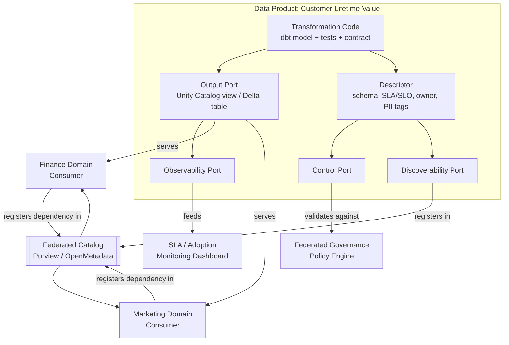
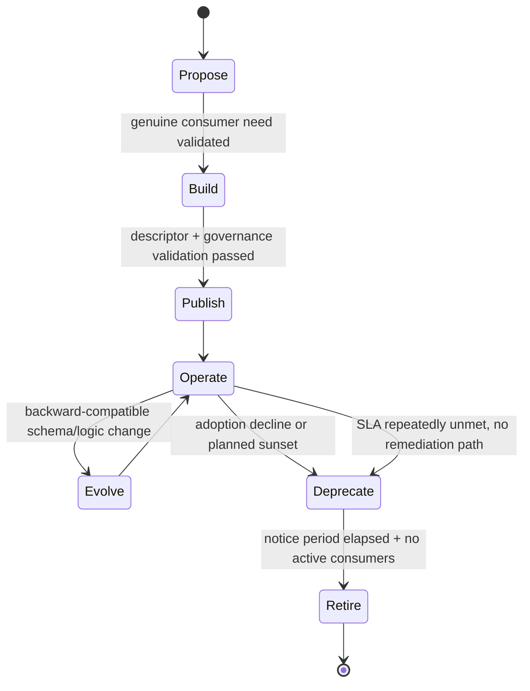
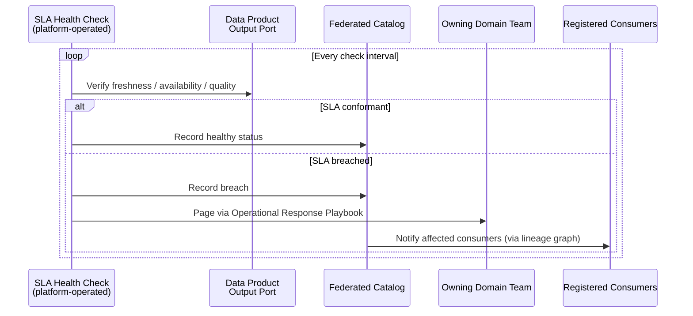

# Data Products

> Part of the **Enterprise Data & AI Architecture Handbook** · Phase-15 — Data Mesh & Data Fabric · Chapter 02.
> Estimated study time: **60 min reading + ~3h labs**.
> **Prerequisite:** read [Data Mesh Principles](01_Data_Mesh_Principles.md) first.

---

## Executive Summary

[Data Mesh Principles](01_Data_Mesh_Principles.md) introduced "data as a product" as one of four inseparable principles, and named the **data product quantum** — code, data, and metadata bundled and versioned as one deployable unit — as its concrete implementing artifact, but deliberately covered it only at the level needed to explain the mesh model as a whole (§1.2, §8.2, §11). This chapter is the direct deepening the prior chapter's Further Reading promised: it treats a data product as a real, engineerable thing with an anatomy, a set of ports, a lifecycle, a contract, and a measurable adoption curve — not a principle to be agreed with in a meeting.

A **data product** is the smallest independently deployable, independently versioned, independently ownable unit of analytical data in a mesh — analogous to a microservice ([Microservices Architecture](../Phase-14/02_Microservices_Architecture.md)) being the smallest independently deployable unit of application behavior. This chapter covers **data product anatomy and ports** (the four-port model — output, control, discoverability, observability — first introduced in Phase-15 Chapter 01 §8.2, §11, now given full mechanical treatment); **discoverability and addressability** as the two properties that let a consumer find and reliably reach a data product without ever contacting its owning team; **SLAs, SLOs, and contracts** as the trust mechanism that makes a data product's published promises verifiable rather than aspirational, extending [Data Contracts](../Phase-08/07_Data_Contracts.md)'s single-pipeline contract discipline to a mesh-published artifact; the **data product lifecycle** (propose → build → publish → operate → evolve → deprecate → retire) as the same disciplined release process a software product follows, applied to data; and **metrics and adoption** as the measurable evidence — not architectural conviction — that a data product is actually delivering the value Phase-15 Chapter 01's Business Motivation promised.

The platform bias is **Azure-primary (~60%)** — Azure Databricks Unity Catalog's data-product-oriented governed sharing (Delta Sharing, catalogs/schemas as product boundaries), Microsoft Fabric's OneLake shortcuts and domain-scoped items, Microsoft Purview for the discoverability/contract-registration layer, and Azure API Management for API-flavored output ports with built-in usage metering — **~30% enterprise open source** (dbt exposures and contracts as a concrete, already-tooled implementation of a data product descriptor; Great Expectations for SLA-backing quality gates; OpenMetadata/Apache Atlas for the open discoverability layer; Kafka for streaming output ports) — **~10% AWS/GCP comparison-only** (AWS Data Exchange/Lake Formation resource shares; Google Cloud Dataplex data products and Analytics Hub).

**Bottom line:** a data product is only a data product if a consumer can discover it, understand its contract, and trust its SLA *without ever talking to the owning team* — the single, non-negotiable bar this chapter returns to throughout. Every anti-pattern this chapter documents is, at root, some part of that bar being skipped: a table with a description but no SLA, an SLA that is published but never monitored, or a lifecycle with no deprecation process that leaves consumers stranded on a data product nobody maintains anymore.

---

## Learning Objectives

By the end of this chapter you will be able to:

1. **Design a data product's four ports** (output, control, discoverability, observability) with concrete, verifiable interfaces for a given business domain's data.
2. **Distinguish a genuine data product from a "data product in name only"** using a checklist of discoverability, addressability, contract, and SLA-monitoring criteria.
3. **Author a machine-readable data product descriptor** including schema, SLA/SLO commitments, ownership, and semantic documentation, and validate it against a policy-as-code rule set.
4. **Apply data-contract discipline** (per [Data Contracts](../Phase-08/07_Data_Contracts.md)) to a data product's output port, including consumer-driven contract testing and versioned breaking-change management.
5. **Manage a data product through its full lifecycle**, including a deliberate deprecation and retirement process that does not strand active consumers.
6. **Define and track adoption metrics** for a data product, and use them to justify continued investment, redesign, or retirement decisions.
7. **Defend a data product's design and SLA commitments** in engineer, staff engineer, architect, and CTO review settings.

---

## Business Motivation

- **A consumer's trust in a dataset is currently, in most organizations, tacit and relationship-based** — "ask the person who built it whether this table is still accurate" — which does not scale past a handful of teams and breaks entirely once the original builder leaves; a data product's published, monitored SLA (§17) replaces tacit trust with a verifiable, standing guarantee.
- **Duplicated, inconsistent ad hoc extracts are the default outcome when no trustworthy, discoverable official source exists** — every consuming team builds its own version of "customers who churned last quarter" from raw source tables, each with slightly different logic, because no data product with a clear contract and discoverability entry existed for them to reuse instead.
- **A data product's business value must be measurable, or it cannot be prioritized against other engineering work** — [Data Mesh Principles](01_Data_Mesh_Principles.md) §20's Cost Optimization worked example quantified platform investment; this chapter's Metrics and Adoption section (§37) is the mechanism for quantifying whether a *specific* data product is worth its ongoing maintenance cost at all.
- **Consumers need a genuine, no-surprises deprecation process**, not a table that silently stops being updated — a data product's lifecycle discipline (§23) is a direct business continuity concern: an unannounced deprecation breaks every downstream report or model built on top of it, often discovered only when a business-critical dashboard goes stale.
- **Over-investing in data-product tooling for low-value, low-reuse datasets is a genuine, recurring cost risk** — mirroring the over-adoption cautions this handbook has now established repeatedly ([Knowledge Graphs with Neo4j](../Phase-13/02_Knowledge_Graphs_with_Neo4j.md) ADR-0165, [GraphRAG](../Phase-13/04_GraphRAG.md) ADR-0167, [Data Mesh Principles](01_Data_Mesh_Principles.md) ADR-0176): not every internal dataset needs the full four-port, SLA-monitored, lifecycle-managed treatment, and this chapter's Decision Matrix (§25) names the reuse and criticality thresholds that justify the investment.

---

## History and Evolution

- **2019 — Zhamak Dehghani's founding data mesh article** (per [Data Mesh Principles](01_Data_Mesh_Principles.md) History) names "data as a product" as a principle but does not yet formalize a concrete anatomy; early practitioner discussion treats it primarily as a cultural/ownership mindset shift.
- **2020-2021 — the "data product quantum" concept and four-port model (output, control, discoverability, observability) are formalized**, notably in Dehghani's subsequent writing and the 2022 "Data Mesh" book, giving the principle a concrete, implementable architecture rather than an aspiration alone.
- **2021-2022 — API product management practices (versioning, deprecation policies, developer portals) are explicitly cross-pollinated into the data space** — the data-product-as-a-product framing borrows directly and deliberately from decades of mature software-product and API-product management discipline, rather than inventing a wholly new practice.
- **2022 — the data contract pattern matures independently** (Andrew Jones's GoCardless blog series, per [Data Mesh Principles](01_Data_Mesh_Principles.md) History and [Data Contracts](../Phase-08/07_Data_Contracts.md)), supplying the concrete, machine-checkable mechanism — schema, SLA, semantics — that a data product's control port needs to be more than a documentation page.
- **2023 — Azure Databricks Unity Catalog and Delta Sharing mature into a genuine cross-organization data-product distribution mechanism**, and Microsoft Fabric's OneLake shortcuts provide a comparable Azure-native addressability primitive without requiring physical data movement.
- **2023-2024 — dbt formalizes "exposures" and, later, native "contracts"** as first-class project constructs, giving one of the most widely-adopted open-source transformation tools built-in support for a large fraction of the data product descriptor concept (§10) without bespoke tooling.
- **2024-2026 — data product marketplaces and internal developer portals emerge** as the discoverability-layer maturation point — Microsoft Purview's data catalog "insights" and asset-marketplace-style browsing, and open-source internal-developer-portal patterns (Backstage-style catalogs) extended from software to data — reflecting the same platform-engineering-portal maturity [Platform Engineering](../Phase-09/02_Platform_Engineering.md) already documented for application golden paths.

---

## Why This Technology Exists

A dataset without a contract, an SLA, or a discoverability entry places the entire burden of trust-establishment on informal, person-to-person relationships — a burden that scales linearly with the number of consumer-producer pairs and collapses entirely under team turnover. The data product concept exists to replace that informal burden with an engineered, verifiable one: a consumer should be able to evaluate whether to depend on a dataset using only its published descriptor and monitored SLA, the same way a software engineer evaluates whether to depend on a third-party API using its published documentation and status page, never needing a conversation with the API's original author. This is the direct data-domain analogue of why software engineering moved from "ask Dave, he wrote that module" to versioned, documented, contract-tested APIs — and [Data Mesh Principles](01_Data_Mesh_Principles.md)'s domain-ownership principle (§1.1) is what makes doing this at data-mesh scale, across many independently-operated domains, necessary rather than optional.

---

## Problems It Solves

- **Trust that does not scale past informal relationships**, resolved by a published, continuously-monitored SLA (§17, §21) a consumer can evaluate without contacting the owning team.
- **Duplicated ad hoc extracts of the same underlying business concept**, resolved by discoverability (§9) making the official, contract-backed data product the obviously easier choice to depend on than rebuilding logic independently.
- **Silent, unannounced breaking changes that strand consumers**, resolved by a lifecycle (§23) with explicit versioning, deprecation notice periods, and a documented migration path — directly extending [Data Contracts](../Phase-08/07_Data_Contracts.md)'s consumer-driven contract-testing discipline to a mesh-published artifact.
- **No way to know whether a data product is worth the effort to maintain**, resolved by adoption metrics (§37) that make consumption, not architectural conviction, the basis for continued investment, redesign, or retirement decisions.
- **Inconsistent quality and semantics across datasets that describe overlapping concepts**, resolved by a machine-readable descriptor (§10) and control port (§8.2) that make schema, semantics, and quality guarantees explicit and comparable across data products, even those built by entirely different domain teams.

---

## Problems It Cannot Solve

- **A data product cannot fix a badly-drawn domain boundary.** If the domain boundary itself is wrong (per [Data Mesh Principles](01_Data_Mesh_Principles.md) §1.1's bounded-context requirement), no amount of port design, SLA rigor, or lifecycle discipline corrects the resulting coupling and coordination cost — the data product concept assumes the boundary question is already answered correctly.
- **It does not eliminate the need for genuine domain expertise in the underlying transformation logic.** A well-formed descriptor and a monitored SLA around a semantically wrong transformation is a confidently-wrong data product, not a trustworthy one — packaging discipline is not a substitute for correct business logic.
- **It does not remove the need for enterprise-wide reference-entity consistency.** A data product referencing "customer" must still resolve against the MDM golden record (per [Master Data Management](../Phase-08/05_Master_Data_Management.md)); wrapping an inconsistent local customer definition in a well-designed data product does not make it consistent.
- **It does not make discoverability free.** A data product with a perfect descriptor that is never registered in the federated catalog (per [Data Mesh Principles](01_Data_Mesh_Principles.md) §11) is exactly as undiscoverable as an unpackaged table — the descriptor and the catalog registration are two separate, both-required steps.
- **It does not automatically justify itself economically.** A data product built and monitored to full rigor for a dataset with one consumer and low business criticality may cost more to build and maintain than the ad hoc extract it was meant to replace — this chapter's Decision Matrix (§25) exists specifically to catch this before the investment is made, not after.

---

## Core Concepts

### 2.1 Data product anatomy and ports

- **The data product quantum** (introduced in [Data Mesh Principles](01_Data_Mesh_Principles.md) §1.2, §8.2) is the unit of packaging: transformation code, output data, and descriptor metadata versioned and deployed together, so that a change to any one of the three (a logic change, a schema change, an SLA change) is a single, coherent, reviewable release rather than three independently-drifting artifacts.
- **Output port**: the stable, documented interface through which the data product's actual data is consumed — a Delta table, a Unity Catalog view, a REST API fronted by API Management, or a Kafka topic (per [Apache Kafka](../Phase-07/02_Apache_Kafka.md)). The output port's *shape* (schema) is the thing versioned and contract-tested; the underlying storage or compute implementation behind it can change without breaking the port, provided the shape does not.
- **Control port**: the interface through which platform governance validates and enforces policy against the data product (schema validation, PII classification checks, SLA registration) — the mechanical enforcement point for [Data Mesh Principles](01_Data_Mesh_Principles.md) §1.4's federated computational governance, applied at this specific data product's publish and update events.
- **Discoverability port**: the metadata registration interface connecting the data product to the federated catalog (§9), the mechanism that makes "a consumer who has never spoken to the owning team can still find and evaluate this data product" actually true rather than aspirational.
- **Observability port**: the interface exposing the data product's operational health — freshness, SLA/SLO conformance, quality-check pass rate, consumption volume — to both the owning team and any consumer deciding whether to depend on it (§21-22, §37).
- **A genuine data product implements all four ports with real, verifiable behavior behind each — not a subset, and not a port that exists on paper but is not actually checked or enforced.** This is the single most reliable test for distinguishing a genuine data product from a renamed table, used throughout this chapter's Anti-patterns and Common Mistakes sections.

### 2.2 Discoverability and addressability

- **Discoverability** is the property that a consumer can *find* a data product without prior knowledge of its existence — implemented via registration in the federated catalog (Purview or OpenMetadata, per [Data Mesh Principles](01_Data_Mesh_Principles.md) §11) with consistent, searchable metadata (business glossary terms, domain, owning team, tags) regardless of which domain built it.
- **Addressability** is the property that, once found, a consumer can *reliably reach* the data product's output port using a stable, documented reference — a fully-qualified Unity Catalog three-level name, a OneLake shortcut path, or a versioned API endpoint — that does not silently change underneath an existing consumer.
- **Discoverability without addressability is a dead end** (a consumer finds a data product in the catalog but the referenced location has moved or no longer resolves); **addressability without discoverability is a hidden dependency** (a stable reference exists but no consumer who doesn't already know about it can find it) — both properties are jointly required, and this chapter's Common Mistakes section (§27) names each failure mode independently since they are frequently only partially solved.
- **A stable identifier for the data product itself (not just its output port location)** — a product ID or fully-qualified name that survives a storage migration, a compute-engine change, or a schema version bump — is what lets the catalog's lineage graph and a consumer's own dependency declarations remain valid across the data product's evolution (§23).

### 2.3 SLAs, SLOs, and contracts

- **A Service Level Agreement (SLA)** is the externally-published, business-facing commitment a data product makes to its consumers — for example, "99% of daily partitions available by 06:00 UTC, with 99.5% monthly uptime for the query endpoint." An **SLO (Service Level Objective)** is the internal, typically stricter operational target the owning team monitors itself against to stay comfortably ahead of SLA breach — directly reusing the SLA/SLO distinction already established for application reliability engineering, now applied to a data artifact.
- **A data contract** (per [Data Contracts](../Phase-08/07_Data_Contracts.md)) is the machine-checkable specification — schema, semantic documentation, quality expectations, SLA thresholds — that makes the SLA/SLO commitments *verifiable* rather than merely stated; the contract is validated at publish time (control port, §8.2) and continuously in production (observability port, §21-22), not just written once and trusted indefinitely.
- **Consumer-driven contract testing**, extended from [Data Contracts](../Phase-08/07_Data_Contracts.md)'s single-pipeline treatment to mesh scale: a consumer registers the specific schema fields and semantics it depends on, and the producing domain's CI pipeline validates any proposed change against every registered consumer's contract before deployment, catching a breaking change before it reaches production rather than after a consumer's downstream job fails.
- **An SLA that is published but never monitored is not a contract — it is a claim.** This chapter treats "published + continuously, automatically verified" as the non-negotiable minimum bar for calling something an SLA at all, directly extending the "verification gap" pattern this handbook has now documented repeatedly (from [Data Security and Encryption](../Phase-10/03_Data_Security_and_Encryption.md) ADR-0143's CMK-rotation-without-verification through [Evaluation and Guardrails](../Phase-12/09_Evaluation_and_Guardrails.md) ADR-0163's unregression-tested red-team findings) to data-product SLA governance specifically.

### 2.4 Data product lifecycle

- **Propose**: a candidate data product is scoped against a genuine, named consumer need (not built speculatively "in case someone needs it"), including an initial estimate of the SLA the owning domain can realistically commit to.
- **Build**: the domain team implements the transformation logic, output port, and descriptor, and validates the descriptor against platform governance policy (control port) before first publication.
- **Publish**: the data product is registered in the federated catalog (discoverability port) and becomes available to consumers; this is the first point at which the SLA commitment becomes a live, monitored obligation, not a draft.
- **Operate**: the owning team maintains SLA conformance, responds to the Operational Response Playbook's triggers (per [Data Mesh Principles](01_Data_Mesh_Principles.md) §23), and tracks adoption metrics (§37) to understand actual value delivered.
- **Evolve**: schema or logic changes are released as versioned updates, following the same backward-compatible-by-default discipline established in [Event-Driven Architecture](../Phase-14/01_Event_Driven_Architecture.md) §8.4 for event schemas, now applied to data product schemas; a genuinely breaking change requires a new major version published alongside (not instead of) the prior version for a defined overlap period.
- **Deprecate**: the owning team announces an end-of-life date with sufficient advance notice, identifies every known consumer via the catalog's lineage graph, and provides a documented migration path to the replacement or successor data product.
- **Retire**: after the deprecation notice period and confirmation that no active consumer remains dependent (verified via consumption metrics, §37, not assumed), the data product is formally removed from the catalog and its underlying infrastructure decommissioned.
- **Skipping the deprecate stage — silently stopping maintenance without a formal announcement or migration path — is this chapter's single most consequential lifecycle failure mode**, and is treated as a genuine SLA/contract breach (per [Data Contracts](../Phase-08/07_Data_Contracts.md)'s existing breach-response process), not a routine housekeeping decision.

### 2.5 Metrics and adoption

- **Consumption metrics** (distinct consumer count, query/read volume, freshness-check pass rate) are the primary evidence that a data product is delivering value, and should be tracked from first publication, not retrofitted once a redesign or retirement decision is already being debated.
- **Time-to-first-consumer** (how long after publication before the first genuine downstream dependency appears) is a leading indicator of whether the data product was built against a real, already-identified need (per the Propose stage, §23) versus built speculatively.
- **SLA-conformance rate over time** is both an operational health metric (§21-22) and an adoption-risk signal — a data product with a poor conformance history will, and should, see consumer trust and adoption decline, since a rational consumer weighs published SLA history when deciding whether to depend on a new data source.
- **Adoption metrics are the primary input to the lifecycle's Evolve/Deprecate decision** (§23) — a data product with declining or zero active consumers is a retirement candidate regardless of how technically well-built it is; a data product with rapidly growing, business-critical consumption is a candidate for additional SLA investment (e.g., tightening freshness commitments) rather than being left at its original, now-insufficient, service level.

---

## Internal Working

### 3.1 How a descriptor becomes an enforced contract

At build time, the owning team's transformation project (a dbt project, for example) defines the output schema, tests, and — where the tool supports it natively — a formal `contract` block; a code-generation or export step translates this project-native definition into the platform's data product descriptor format (§10), rather than maintaining the descriptor as a hand-written, easily-drifting duplicate. At publish time, the control port submits the descriptor to the platform's policy engine (per [Data Mesh Principles](01_Data_Mesh_Principles.md) §2.3), which validates it against global governance rules and any registered consumer contracts; a failing validation blocks publication rather than merely warning, the same fail-closed discipline established for prompt-injection defenses in [Prompt Engineering](../Phase-12/02_Prompt_Engineering.md) and for access-control filtering in [Vector Databases: Qdrant and Milvus](../Phase-13/01_Vector_Databases_Qdrant_and_Milvus.md) ADR-0164.

### 3.2 How SLA conformance is actually measured

A scheduled, platform-provided health check independently verifies each of the data product's published SLA dimensions against its actual behavior — comparing the latest partition's watermark timestamp against the committed freshness threshold, running a lightweight canary query against the output port to confirm availability, and re-running the contract's quality-expectation suite (per [Data Quality with Great Expectations](../Phase-08/03_Data_Quality_with_Great_Expectations.md)) against a recent sample. This check is independent of the owning team's own internal monitoring specifically so that a consumer's trust rests on platform-verified, not self-reported, conformance — directly analogous to why [Evaluation and Guardrails](../Phase-12/09_Evaluation_and_Guardrails.md) insists an LLM-as-judge be periodically validated against independent human calibration rather than trusted by default.

### 3.3 How deprecation actually reaches every consumer

When a domain team initiates deprecation, the platform queries the federated catalog's lineage graph (per [Data Mesh Principles](01_Data_Mesh_Principles.md) §10) to enumerate every registered downstream dependency, notifies each identified consumer's registered contact through the platform's standard notification channel, and — for data products exposed as APIs via API Management — can enforce a deprecation-warning response header on every request during the notice period, giving consuming systems a mechanical, not just documentary, signal. A consumer that is not discoverable through the lineage graph (an undeclared, informal dependency) will not receive this notification — the concrete operational reason this chapter's Best Practices section (§29) insists every consumer register its dependency in the catalog, not merely query the output port directly.

---

## Architecture



Every data product is architecturally identical at this level of abstraction regardless of its owning domain or underlying compute engine: transformation code produces both an output port and a descriptor; the descriptor feeds both governance validation (control port) and catalog registration (discoverability port); and the output port's runtime behavior feeds the observability port that both the owning team and every consumer rely on for trust.

---

## Components

- **Transformation project** (dbt model, Spark/Databricks notebook or job, or a Fabric pipeline) — the code half of the quantum, producing the output data and, where the tool supports it, a native schema/contract definition.
- **Descriptor generator/exporter** — the tooling that translates a transformation project's native schema and test definitions into the platform's standard data product descriptor format, avoiding a hand-maintained, drift-prone duplicate.
- **Policy engine** (Purview classification rules, Unity Catalog attribute-based access policies, or an OPA-style engine) — the control-port enforcement mechanism, shared platform infrastructure per [Data Mesh Principles](01_Data_Mesh_Principles.md) §8.3.
- **Federated catalog** (Purview or OpenMetadata) — the discoverability-port registration target and the source of truth for cross-domain lineage.
- **SLA health-check service** — the platform-operated, owning-team-independent job that continuously verifies each published SLA dimension against actual behavior (§3.2).
- **Notification/deprecation service** — the platform mechanism that enumerates registered consumers via the lineage graph and delivers lifecycle-stage notifications (publish, deprecate, retire) to them.
- **Adoption metrics pipeline** — the instrumentation (query logs, catalog access logs, consumer-registration records) aggregated into the per-data-product consumption and SLA-conformance metrics driving lifecycle decisions (§37).

---

## Metadata

- **The data product descriptor** is the canonical metadata artifact, minimally containing: a stable product identifier and version; the output port's schema (field names, types, semantic descriptions, nullability); SLA/SLO thresholds (freshness, availability, quality-pass-rate); ownership (team, on-call contact, escalation path); access-control and PII classification tags; and a lineage declaration of upstream data products consumed.
- **Schema metadata must be machine-comparable across data products built by different teams and different compute engines** — a consumer's contract-testing tooling needs to evaluate "did this field's type change in a breaking way" identically whether the upstream data product is a Databricks Delta table or a Fabric warehouse table, which is why the descriptor format, not the underlying storage technology, is the platform-standardized contract surface.
- **SLA metadata must be expressed in units a consumer can directly compare against its own downstream requirements** — "data available by 06:00 UTC daily" is directly actionable; "refreshed regularly" is not, and this chapter treats vague, non-quantified SLA language as equivalent to having no SLA at all.
- **Version metadata must distinguish backward-compatible (minor) from breaking (major) changes explicitly**, reusing the same additive-vs-breaking distinction [Event-Driven Architecture](../Phase-14/01_Event_Driven_Architecture.md) §8.4 established for event schemas, so that a consumer's automated contract-testing pipeline can safely auto-consume minor updates while flagging major updates for explicit review.

---

## Storage

- **A data product's output port is a logical interface, not necessarily a distinct physical storage location** — it is commonly implemented as a view or a Unity Catalog/OneLake reference over the owning domain's existing medallion-architecture gold layer (per [Medallion Architecture](../Phase-05/03_Medallion_Architecture.md)), rather than a separately duplicated copy built solely for external consumption.
- **Versioned outputs require either time-travel-capable storage or explicit version-suffixed artifacts** — [Delta Lake](../Phase-04/04_Delta_Lake.md)'s native versioning and time travel can serve a "give me the schema as of version N" need directly for some consumers, while a genuinely breaking major-version change is more commonly served as a distinctly-named or distinctly-pathed new output port existing alongside the prior version for the deprecation overlap period (§23).
- **Descriptor and contract artifacts should be version-controlled alongside the transformation code that produces them** (in the same Git repository, reviewed through the same pull-request process), not stored only inside a catalog UI, so that the descriptor's own change history is auditable through the same process as the code that implements it.

---

## Compute

- **A data product's SLA commitment directly constrains its compute provisioning, not the reverse** — a domain team publishing a "fresh by 06:00 UTC" freshness SLA must provision (or auto-scale) sufficient compute capacity to reliably finish its transformation pipeline well ahead of that deadline under realistic data-volume variance, not merely under the best-case volume observed during initial design.
- **SLA health checks (§3.2) run on platform-shared, owning-team-independent compute**, deliberately separate from the domain team's own transformation compute, so that a domain team's own pipeline outage does not also disable the very health check meant to detect and report that outage.
- **Compute-engine choice remains a domain-team decision** (per [Data Mesh Principles](01_Data_Mesh_Principles.md) §16) — a data product's compute is whatever engine (Databricks, Fabric, Synapse) the owning domain uses for its transformation pipeline; only the descriptor format and governance-enforcement integration are platform-standardized, not the compute engine itself.

---

## Networking

- **A data product's output port must be reachable through the platform's standardized, governed access path** (private endpoints, Delta Sharing, or an API Management-fronted gateway) — consistent with [Data Mesh Principles](01_Data_Mesh_Principles.md) §15's networking treatment, applied here at the level of one specific data product's addressability (§9).
- **API-flavored output ports gain built-in usage metering and throttling for free through API Management**, directly feeding the adoption-metrics pipeline (§37) without bespoke instrumentation — a concrete reason a domain team might choose an API output port over a raw table reference even for a mesh-internal consumer, purely for the metering benefit.
- **Cross-region or cross-cloud addressability (a consumer in a different Azure region, or a partner organization outside the tenant) requires the output port's addressing scheme to remain stable across that boundary** — Delta Sharing's cross-workspace/cross-account sharing model and OneLake's shortcut mechanism are both designed specifically to preserve addressability without requiring physical data replication across the boundary.

---

## Security

- **Every port inherits [Data Mesh Principles](01_Data_Mesh_Principles.md) §1.4's federated computational governance enforcement** — a PII-masking policy applies to a data product's output port automatically based on its descriptor's classification tags, regardless of which domain published it.
- **The control port is itself a security control, not only a quality gate** — a descriptor missing required PII classification tags must be rejected at publish time (fail closed), the same discipline [Access-control-propagation](../Phase-13/01_Vector_Databases_Qdrant_and_Milvus.md) ADR-0164 and [Model Context Protocol (MCP)](../Phase-12/06_Model_Context_Protocol_MCP.md) ADR-0160 established for their respective access-control-propagation points.
- **A consumer's registered dependency (declared in the catalog) should itself be subject to entitlement review** — a consumer registering a dependency on a PII-classified data product should trigger the same access-control evaluation as a first-time access request, not be treated as automatically pre-approved simply because the dependency was declared.
- **Deprecation and retirement must not create a security gap** — decommissioning a data product's underlying infrastructure must also revoke every associated access grant and API key; a "retired" data product whose old API endpoint still silently accepts authenticated requests is a dangling-access security risk, not merely a stale-documentation issue.

---

## Performance

- **A consumer depending on a data product's output port pays whatever query-performance characteristics the owning domain's underlying storage and compute choices produce** — a data product exposed as a view over a poorly-partitioned table performs poorly for every consumer, not just the owning team's own internal use; SLA commitments should include query-performance expectations for genuinely latency-sensitive consumers, not only freshness and availability.
- **High-fan-out data products (many consumers) justify materialization or caching investment the owning team would not need for its own internal use alone** — the same "measure actual consumption pattern before optimizing" discipline [Model Serving and Ray](../Phase-11/04_Model_Serving_and_Ray.md) established for inference-serving batching decisions, applied here to a data product's read-path optimization.
- **SLA health checks (§3.2) themselves must be lightweight enough not to materially degrade the data product's own performance for genuine consumers** — a poorly-designed canary query that scans the full output table on every health-check interval can itself become a measurable, avoidable performance and cost burden.

---

## Scalability

- **A data product's consumer count is the primary scalability axis, not data volume alone** — a data product architected for a handful of known internal consumers may need a materially different output-port and caching strategy once its actual consumer count grows into the dozens, a transition the adoption-metrics pipeline (§37) should surface as an explicit redesign trigger rather than allowing it to be discovered only through a performance incident.
- **The federated catalog and SLA health-check infrastructure must themselves scale with the total number of data products across the mesh**, not just the number of consumers of any single one — this is a shared-platform scalability concern [Data Mesh Principles](01_Data_Mesh_Principles.md) §17 already flagged, restated here at the level of "every data product adds one more thing the platform must continuously health-check."
- **Versioned-output-port overlap during deprecation (§23) is itself a scalability cost** — running two major versions of a data product's output simultaneously during a notice period doubles that data product's storage and compute footprint for the overlap duration, a cost that should be explicitly time-boxed rather than allowed to persist indefinitely "just in case."

---

## Fault Tolerance

- **A data product's SLA/SLO framing (§2.3) exists specifically to make partial failure a defined, bounded, and communicated condition rather than an undefined one** — an SLA breach should trigger the Operational Response Playbook (per [Data Mesh Principles](01_Data_Mesh_Principles.md) §23) and route to the owning domain team, not require a consumer to independently discover degraded quality through downstream symptoms.
- **A data product's failure should not silently propagate as *wrong data* rather than *visibly unavailable* data** — a stale or partially-corrupted partition served as if it were healthy is materially worse for a downstream consumer than an explicit unavailability signal, because a downstream consumer can design around a known unavailability (retry, fallback) but cannot design around undetected silent corruption; quality-gate enforcement at the control port (§8.1) is what prevents a known-bad publish from reaching consumers at all.
- **Deprecation without a functioning fallback or migration path is itself a fault-tolerance failure**, not merely a process gap — an abrupt retirement with no successor data product or documented migration leaves every dependent consumer in an unrecoverable state at retirement time, exactly the outcome the lifecycle's Deprecate stage (§23) exists to prevent.

---

## Cost Optimization (FinOps)

- **Every data product has an ongoing maintenance cost (compute, storage, SLA-monitoring overhead, and the owning team's engineering attention) that must be weighed against its measured adoption (§37), not assumed to be justified indefinitely once built.**
- **Materializing an output port for performance (§18) trades storage and refresh-compute cost against consumer query-time cost** — a data product with few, infrequent consumers is rarely worth materializing; one with many high-frequency consumers commonly is, and this decision should be revisited as adoption metrics change, not fixed permanently at initial design time.
- **Deprecation-period version overlap (§18, §23) has a real, time-boxed cost that should be explicitly budgeted for**, rather than treated as a free safety margin — an organization with many simultaneous deprecations running long overlap periods can accumulate meaningful duplicated infrastructure cost across its data product portfolio.
- **Worked FinOps example**: a domain team's `Customer_Lifetime_Value` data product costs approximately $850/month to maintain (scheduled compute for daily refresh, SLA health-check overhead, and a materialized output table for query performance). Adoption metrics show exactly one active consumer, querying it roughly twice a quarter, with no growth over the past two quarters. At $850/month (~$10,200/year) against that consumption pattern, the amortized cost per actual consumption event is over $1,000 — the concrete, quantified signal that triggers a Decision Matrix (§25) review: either the data product should be redesigned as a much cheaper on-demand (rather than continuously-scheduled) computation, or retired in favor of the single consumer building a one-off extract, since the current data-product overhead materially exceeds the value it is demonstrably delivering.

---

## Monitoring

- **Per-SLA-dimension monitoring** (freshness, availability, quality-pass-rate) run continuously by the platform-operated health check (§3.2), independent of the owning team's internal pipeline monitoring, feeding the same mesh-wide SLA dashboard [Data Mesh Principles](01_Data_Mesh_Principles.md) §21 established.
- **Consumption monitoring** (query volume, distinct consumer count, catalog view/search-hit count) feeding the adoption-metrics pipeline (§37), tracked from first publication rather than retrofitted later.
- **Contract-drift monitoring** — a scheduled re-validation of the live output port's actual schema against its registered descriptor, catching a case where the underlying implementation drifted from its published contract without a corresponding descriptor update (a genuine, if avoidable, failure mode when a transformation project's schema changes without the corresponding descriptor-export step being re-run).

---

## Observability

- **A consumer evaluating whether to depend on a data product should be able to see its full SLA-conformance history, not just current status** — a data product with a recent history of repeated freshness breaches is a materially different risk than one with a long track record of clean conformance, even if both currently show "healthy," and this history should be a first-class, catalog-surfaced observability artifact, not something only the owning team can see internally.
- **Lineage-aware observability**: when a data product's SLA is breached, the platform should be able to identify every downstream data product and consumer that depends on it (via the catalog's lineage graph, per [Data Mesh Principles](01_Data_Mesh_Principles.md) §10, §22) so that the owning team's incident response includes proactively notifying affected consumers, not waiting for them to notice degraded output independently.
- **Adoption and SLA metrics must be disaggregated per data product** — directly reusing the disaggregated-metric principle [Evaluation and Guardrails](../Phase-12/09_Evaluation_and_Guardrails.md) §9.3 and [Data Mesh Principles](01_Data_Mesh_Principles.md) §22 both established: a mesh-wide average SLA-conformance rate can look healthy while one specific, business-critical data product silently and repeatedly breaches, exactly the gap the next section's playbook addresses at the individual-data-product level.

### Operational Response Playbook

| Signal | Detection Query / Check | Remediation |
|---|---|---|
| A data product's live output-port schema drifts from its registered descriptor (contract drift) | Scheduled diff between the descriptor's registered schema and the output port's actual live schema, run independently of the owning team's own deployment pipeline | Automatically flag the data product as "descriptor out of date" in the catalog (visible to consumers evaluating it), notify the owning team, and require a corrected descriptor republication before the flag is cleared — treat as a data-contract breach per [Data Contracts](../Phase-08/07_Data_Contracts.md), not a cosmetic catalog-metadata issue |
| A data product shows zero or near-zero consumption for two consecutive review cycles despite being actively maintained | Adoption-metrics query aggregating distinct consumer count and query volume over the trailing 90 days, compared against the data product's maintenance cost (§20) | Route to a mandatory Decision Matrix (§25) review with the owning team: redesign to a cheaper on-demand model, formally deprecate (§23), or document a specific, named reason (e.g., a regulatory retention requirement) the low-adoption data product must nonetheless remain live |

---

## Governance

- **Every data product inherits [Data Mesh Principles](01_Data_Mesh_Principles.md) §1.4's federated computational governance wholesale** — this chapter does not introduce a separate governance model, it specifies exactly where and how that governance is mechanically attached to one specific artifact (the control port, §8.1).
- **A data product's descriptor is the auditable governance record for that specific artifact** — a compliance review inspecting whether PII handling policy was actually applied to a given dataset should be able to answer that question by inspecting the descriptor's classification tags and the control port's validation history, without needing to interview the owning team.
- **Lifecycle governance (propose → retire, §23) is itself a governance discipline, not only an engineering process** — an organization should be able to answer "how many data products currently exist, who owns each, and which are past their planned review date" as a standing governance report, the mesh-scale analogue of an application portfolio's ownership-and-lifecycle inventory.
- **Deprecation and retirement decisions affecting a data product with active consumers outside the owning domain should require the same cross-domain notice this handbook's federated governance model already assumes** — a domain team should not be able to unilaterally retire a data product with active external consumers without triggering the notification mechanism (§3.3) and the minimum notice period the platform's governance policy defines.

---

## Trade-offs

| Dimension | Ad hoc dataset / table | Genuine Data Product |
|---|---|---|
| Time to first availability | Faster — no descriptor, SLA, or catalog registration overhead | Slower — requires descriptor authoring, governance validation, catalog registration |
| Trustworthiness for a new, unknown consumer | Low — requires informal relationship/tacit knowledge | High — verifiable via published, monitored SLA and contract |
| Ongoing maintenance cost | Lower, but hidden/unmanaged | Higher, but visible and justified by adoption metrics |
| Breaking-change risk to consumers | High — no versioning or deprecation discipline by default | Low — versioned, with a managed deprecation lifecycle |
| Appropriate for | Low-reuse, single-consumer, exploratory, or short-lived analysis | Multi-consumer, business-critical, or long-lived analytical dependencies |

---

## Decision Matrix

| Signal | Recommendation |
|---|---|
| A dataset already has, or is expected to soon have, more than one independent consumer outside the owning team | Build it as a full data product (all four ports, SLA, catalog registration) from the outset |
| A dataset is exploratory, single-consumer, or expected to be short-lived (a one-off analysis) | Do not invest in full data-product tooling — a lightweight, undocumented extract is the correct, lower-cost choice; revisit if a second consumer appears |
| Adoption metrics (§37) show sustained zero or near-zero consumption for an existing data product | Trigger the Operational Response Playbook's low-adoption review (§21) — redesign, deprecate, or document a specific retention justification |
| A data product's SLA-conformance history shows repeated, unremediated breaches | Do not add new consumers until the underlying reliability issue is fixed — publishing a data product with a known-poor track record as newly-available invites consumers to depend on something already known to be unreliable |
| A dataset represents an enterprise-wide reference entity (customer, product, account) | Route through MDM (per [Master Data Management](../Phase-08/05_Master_Data_Management.md)) rather than, or in addition to, a domain-owned data product |
| The owning team cannot commit to any specific, quantified SLA at all | Do not publish it as a discoverable data product yet — an SLA-less "data product" is indistinguishable from the informal-trust model this pattern exists to replace |

---

## Design Patterns

- **Descriptor-generation-from-code**, not hand-maintained duplication: derive the data product descriptor directly from the transformation project's own native schema/test/contract definitions (e.g., dbt's `contract` block and exposures) to keep the descriptor from silently drifting out of sync with the actual implementation.
- **Versioned output ports with a time-boxed overlap window**: publish a breaking change as a new major-version output port existing alongside the prior version for a defined, budgeted (§20) deprecation notice period, rather than mutating the existing port in place.
- **Independent, platform-operated SLA verification**, separate from the owning team's own pipeline monitoring, so that a consumer's trust rests on independently-verified rather than self-reported conformance (§3.2).
- **Lineage-driven deprecation notification**: use the catalog's lineage graph to enumerate every registered consumer automatically at deprecation time, rather than relying on the owning team's own, likely incomplete, informal knowledge of who depends on it.
- **Adoption-metrics-gated lifecycle reviews**: schedule a recurring, mandatory Decision Matrix (§25) review for every data product based on its adoption-metrics trend, not only reactively when a problem is already visible.

---

## Anti-patterns

- **"Data product theater"**: a table with a description field and an "owner" tag in a wiki, with no actual SLA, no monitored contract, and no catalog registration beyond the description — indistinguishable in practice from an undocumented table, despite the vocabulary.
- **SLA-as-aspiration**: a published SLA that is never independently, continuously verified — the owning team asserts freshness and quality but no platform mechanism actually checks it, so a breach is discovered only when a consumer complains.
- **Undeclared, informal consumer dependency**: a consumer that queries a data product's output port directly without registering the dependency in the catalog — invisible to the lineage graph, and therefore invisible to the deprecation-notification mechanism (§3.3), guaranteeing that consumer will be blindsided by any future breaking change or retirement.
- **Silent deprecation**: the owning team simply stops maintaining a data product without a formal announcement, notice period, or migration path — the single most consequential lifecycle anti-pattern named in §23, treated as a contract breach rather than routine housekeeping.
- **Building full data-product tooling for a single-consumer, low-criticality dataset** — over-investment relative to actual need, mirroring this handbook's now-recurring justification-before-adoption caution, here applied at the level of one individual dataset's packaging decision rather than a whole architectural pattern.

---

## Common Mistakes

- **Treating the descriptor as a one-time document rather than a living, code-derived artifact** that must be regenerated and re-validated on every transformation-logic change, not only at initial publication.
- **Publishing vague, non-quantified SLA language** ("refreshed regularly," "high quality") that cannot be automatically verified or meaningfully compared against another data product's commitments.
- **Confusing discoverability with addressability**, or building one without the other (§9) — a catalog entry pointing at a stale location, or a stable location with no catalog entry.
- **Skipping the Propose stage's genuine-need validation** and building a data product speculatively, then discovering via adoption metrics (§37) months later that it has no actual consumers.
- **Retiring a data product's infrastructure without also revoking its access grants and API keys**, leaving a dangling, still-authenticatable endpoint behind after the data itself is gone.

---

## Best Practices

- **Generate the descriptor from the transformation project's own native schema and contract definitions**, never hand-maintain it as an independent document.
- **Quantify every SLA dimension with a specific, machine-checkable threshold**, and verify it continuously via platform-operated, owning-team-independent health checks.
- **Require every consumer to register its dependency in the federated catalog**, and treat an undeclared dependency discovered later as a process gap to close, not a tolerable norm.
- **Run a recurring, adoption-metrics-gated lifecycle review for every data product**, not only reactively when a problem is already visible.
- **Always publish a breaking change as a new version with a defined, budgeted overlap window, and always formally deprecate before retiring** — never silently stop maintaining a data product that has any registered consumer.
- **Revoke every access grant and credential as part of retirement**, not only the data itself.

---

## Enterprise Recommendations

- **Standardize the descriptor format and its code-generation tooling centrally** (via the self-serve platform, per [Data Mesh Principles](01_Data_Mesh_Principles.md) §1.3) so every domain team produces comparable, machine-checkable descriptors rather than each domain inventing its own format.
- **Fund a platform-operated, owning-team-independent SLA health-check service as core shared infrastructure**, not something each domain team is expected to build for itself — this is a direct extension of the self-serve platform investment [Data Mesh Principles](01_Data_Mesh_Principles.md) §20's FinOps worked example already justified.
- **Require an adoption-metrics review as a standing governance checkpoint** (quarterly or semi-annually) across the full data product portfolio, using the low-adoption signal (§21, §25) to actively retire low-value data products rather than letting portfolio sprawl accumulate indefinitely.
- **Treat data product lifecycle discipline (versioning, deprecation notice, retirement) with the same rigor as public API lifecycle management** — the same organizational discipline already applied to external-facing APIs, now applied internally.

---

## Azure Implementation

- **Azure Databricks Unity Catalog** as the primary data-product packaging and distribution mechanism: a catalog/schema boundary maps naturally to a data product's namespace, Delta Sharing provides the addressable, governed output port for cross-workspace or cross-organization consumers, and Unity Catalog's system tables provide native query-audit data feeding the adoption-metrics pipeline (§37) without bespoke instrumentation.
- **Microsoft Fabric OneLake shortcuts** provide addressability without physical data duplication for domains publishing data products within a Fabric-domain-scoped workspace (per [Data Mesh Principles](01_Data_Mesh_Principles.md) §28), and Fabric's item-level lineage view surfaces a lightweight, native discoverability and lineage capability.
- **Microsoft Purview** serves as the federated catalog and descriptor-registration target (discoverability port), with classification-and-labeling rules enforcing PII-tag validation at the control port, and Purview's data-quality and lineage features feeding the observability port.
- **Azure API Management** fronts API-flavored output ports with native versioning (API revisions/versions), usage metering (feeding adoption metrics directly), and deprecation-header support for the notification mechanism described in §3.3.
- **Concrete dbt `contract` + exposure sketch**, the descriptor-generation source-of-truth pattern (§26):

```yaml
# models/gold/customer_lifetime_value.yml
models:
  - name: customer_lifetime_value
    description: "Domain-owned data product: customer lifetime value, refreshed daily."
    config:
      contract:
        enforced: true
    columns:
      - name: customer_id
        data_type: string
        description: "MDM golden-record customer identifier."
        constraints:
          - type: not_null
      - name: lifetime_value_usd
        data_type: decimal(18,2)
        description: "Trailing-24-month realized lifetime value in USD."
    meta:
      owner: "customer-domain-team@company.com"
      sla_freshness_hours: 24
      sla_availability_pct: 99.5
      pii_classification: "none"

exposures:
  - name: clv_finance_dashboard
    type: dashboard
    owner:
      name: "Finance Domain"
      email: "finance-domain@company.com"
    depends_on:
      - ref('customer_lifetime_value')
```

---

## Open Source Implementation

- **dbt contracts and exposures** (per the sketch above) as the primary open-source descriptor-generation source of truth, extending [dbt and Analytics Engineering](../Phase-05/08_dbt_and_Analytics_Engineering.md)'s existing per-model testing discipline into an enforced, machine-checkable schema contract.
- **OpenMetadata or Apache Atlas** as the open-source federated catalog and discoverability-port registration target (per [Metadata Management](../Phase-08/04_Metadata_Management_OpenMetadata_and_Atlas.md)), including native support for data-product-style "domain" and "data product" entity types in recent OpenMetadata releases.
- **Great Expectations** as the SLA-backing quality-verification engine (per [Data Quality with Great Expectations](../Phase-08/03_Data_Quality_with_Great_Expectations.md)), run both at publish time (control port) and on a recurring schedule (observability port, §3.2).
- **Apache Kafka** as the streaming output-port transport for data products requiring near-real-time freshness SLAs, with consumer-group lag metrics feeding directly into freshness-SLA monitoring.

---

## AWS Equivalent (comparison only)

| Azure | AWS | Notes |
|---|---|---|
| Unity Catalog + Delta Sharing | AWS Lake Formation resource shares (via AWS RAM), or Databricks Unity Catalog on AWS (same product) | Native AWS resource-share tagging/metadata is less product-oriented than Unity Catalog's; Databricks-on-AWS preserves the same data-product model across clouds |
| Microsoft Purview | AWS Glue Data Catalog + a marketplace-style layer such as AWS Data Exchange for external distribution | AWS Data Exchange is the closer analogue for externally-distributed (partner-facing) data products specifically; internal cross-team discoverability more commonly relies on Glue Catalog plus a third-party catalog |
| Azure API Management | Amazon API Gateway | Broadly equivalent for API-flavored output ports, including usage plans for adoption-metrics-equivalent metering |

**Migration guidance**: a Unity-Catalog-based data product's descriptor and contract logic (dbt-native) migrates with low friction between Azure and AWS Databricks; the discoverability layer requires re-platforming onto Glue Catalog/a third-party catalog if not already using a cloud-agnostic option like OpenMetadata.

---

## GCP Equivalent (comparison only)

| Azure | GCP | Notes |
|---|---|---|
| Unity Catalog + Delta Sharing | BigQuery Analytics Hub (data exchange/listings) | Analytics Hub's "listing" concept is a close native analogue to a discoverable, addressable data product, purpose-built for cross-team/cross-org data sharing |
| Microsoft Purview | Dataplex Catalog | Dataplex's data-product-oriented terminology (per [Data Mesh Principles](01_Data_Mesh_Principles.md) §31) extends naturally to this chapter's descriptor/discoverability concepts |
| Azure API Management | Google Apigee / API Gateway | Broadly equivalent |

**Selection criteria**: an organization already GCP-primary should evaluate BigQuery Analytics Hub's listing model directly against this chapter's four-port requirement — Analytics Hub natively covers output and discoverability well, but SLA/observability and control-port governance enforcement typically still require supplementary tooling (Dataplex policies, custom health checks), the same gap this chapter's Azure and AWS sections both note.

---

## Migration Considerations

- **Migrating an existing, informally-shared table into a genuine data product is itself a phased mini-lifecycle**: author the descriptor from the existing transformation logic, define and begin monitoring an SLA (initially set conservatively against observed historical behavior, then tightened), register it in the catalog, and only then formally announce it as a supported data product — publishing before the SLA has actually been validated against real operational behavior risks an immediate, embarrassing breach.
- **Existing informal consumers must be identified and migrated to registered dependencies before the informal access path is deprecated** — this typically requires an access-log audit (who has actually been querying the underlying table) since the catalog's lineage graph cannot show dependencies that predate the data product's formal existence.
- **Migrating between compute engines (e.g., Synapse to Databricks) should be transparent to consumers if the output port's addressability is preserved** — a consumer referencing a stable Unity Catalog or catalog-registered name should not need to change anything, provided the migration preserves the same fully-qualified reference; this is the concrete payoff of addressability (§9) being decoupled from the underlying implementation.

---

## Mermaid Architecture Diagrams

**Data product lifecycle state diagram:**



**SLA verification and breach-response sequence:**



(A third diagram — the four-port architecture in §9 — is also part of this chapter's required minimum of three Mermaid diagrams.)

---

## End-to-End Data Flow

1. A domain team identifies a genuine, named consumer need (Propose) and scopes an achievable SLA before writing any transformation code.
2. The team builds the transformation logic (dbt/Spark) with native schema tests and a contract definition, and generates the data product descriptor directly from that project (Build).
3. The descriptor is submitted to the platform's control port, validated against federated governance policy (PII tags, interoperability standards); a failing validation blocks publication.
4. On success, the data product is registered in the federated catalog (discoverability port) and its output port becomes reachable by consumers (Publish).
5. A platform-operated SLA health check begins continuously verifying freshness, availability, and quality against the published thresholds, independent of the owning team's own pipeline monitoring.
6. A consumer discovers the data product via the catalog, evaluates its published SLA history, requests access (governed per [Data Mesh Principles](01_Data_Mesh_Principles.md) §1.4), and registers its dependency in the catalog's lineage graph.
7. Adoption metrics (consumption volume, distinct consumer count) accumulate continuously, feeding recurring Decision Matrix reviews (Operate).
8. A schema change is released as a versioned update (Evolve) — backward-compatible changes update the existing port; breaking changes publish a new major-version port alongside the prior one for a budgeted overlap window.
9. When adoption declines or a planned sunset date arrives, the owning team formally deprecates the data product, notifying every registered consumer via the lineage graph and providing a migration path (Deprecate).
10. After the notice period elapses and no active consumers remain (verified via metrics, not assumed), the data product and its access grants are retired (Retire).

---

## Real-world Business Use Cases

- **A marketing domain publishes a `Customer_Segments` data product with a documented weekly-refresh SLA**, letting a personalization team and a campaign-analytics team both depend on the same, consistently-defined segmentation logic instead of each building a divergent version.
- **A finance domain retires a legacy `Monthly_Revenue_Extract` data product after adoption metrics show it has been fully superseded by a newer, more granular `Daily_Revenue_by_Channel` data product**, using the formal deprecation lifecycle to migrate its last two remaining consumers before decommissioning.
- **A logistics domain tightens its `Shipment_ETA` data product's freshness SLA from hourly to 15-minute after adoption metrics show a new, latency-sensitive customer-notification consumer** now depends on it — an example of the Evolve stage responding to genuine, measured demand growth rather than speculative over-engineering at initial design time.

---

## Industry Examples

- **Netflix's internal data-platform blog has long described "data as a product" practices** — self-service dataset registration with documented ownership and quality expectations — closely paralleling this chapter's descriptor and discoverability treatment, predating and independently converging with the formalized mesh vocabulary.
- **Intuit's publicly documented data mesh implementation** (referenced in [Data Mesh Principles](01_Data_Mesh_Principles.md)'s Industry Examples) explicitly describes a data-product-catalog and SLA-monitoring capability as a core, dedicated platform investment, not an incidental feature.
- **Uber's publicly documented internal data-catalog and dataset-certification programs** (certifying "tier 1" business-critical datasets with stricter monitoring and ownership requirements) is a widely-cited real-world precedent for this chapter's SLA-tiering and adoption-driven lifecycle-review recommendations.

---

## Case Studies

### Case Study 1 — An SLA that was never actually verified

A retail analytics domain published a `Daily_Store_Performance` data product with a stated "refreshed by 05:00 UTC daily" SLA, prominently documented in its catalog entry. No independent health check was ever built — the SLA was based on the owning team's own pipeline's internal success-alerting, which only alerted on job *failure*, not on job *lateness*. For several weeks, the underlying pipeline was completing successfully but nearly two hours later than committed, due to an upstream source-system slowdown; because the internal alerting only checked for failure, not for SLA conformance, nobody on the owning team noticed. A downstream regional-operations dashboard consuming this data product silently displayed stale figures each morning until a regional manager escalated a visibly wrong number. The retrospective's core finding, directly motivating this chapter's Case Study 2 and its own Common Mistakes entry (§27) on SLA-as-aspiration: a *published* SLA with no *independent, continuous verification* is not meaningfully different from having no SLA at all — the team had built monitoring for its own operational health, not for the specific promise made to consumers.

### Case Study 2 — Adoption metrics driving a disciplined retirement

A supply-chain domain had, over several years, accumulated eleven published data products, several dating from early mesh-pilot experimentation. A quarterly adoption-metrics review (implementing this chapter's Enterprise Recommendation, §30) found that three of the eleven had zero registered consumers and no catalog search activity for the prior two quarters, while a fourth had exactly one low-frequency consumer at a maintenance cost, per §20's worked-example methodology, far exceeding its demonstrated value. Rather than leaving these running indefinitely "in case someone needs them," the domain team formally deprecated all four, using the catalog's lineage graph to confirm zero active dependencies (not merely assuming it based on team memory), and retired them after a short notice period with no consumer impact. The freed compute and engineering-attention budget was reallocated to tightening the SLA of the domain's two highest-adoption data products — a concrete illustration of adoption metrics (§37) driving portfolio-level investment decisions rather than every published data product being treated as permanent by default.

### Architecture Decision Record (ADR-0177): Mandatory Independent SLA Verification for Every Published Data Product

**Context:** Case Study 1 demonstrated that a data product's owning team's own internal pipeline monitoring is not a reliable proxy for verifying the specific, externally-published SLA commitment made to consumers — a pipeline can complete "successfully" by its own internal definition while still breaching a freshness SLA nobody was independently checking.

**Decision:** Every data product published to the federated catalog must have an independent, platform-operated SLA health check covering each quantified SLA dimension in its descriptor (freshness, availability, quality-pass-rate) before it is marked "published" and made discoverable to consumers. A descriptor lacking a corresponding, platform-verifiable SLA check is rejected at the control port, mirroring the fail-closed discipline this handbook has established repeatedly for access-control and safety gates (e.g., [Vector Databases: Qdrant and Milvus](../Phase-13/01_Vector_Databases_Qdrant_and_Milvus.md) ADR-0164, [Evaluation and Guardrails](../Phase-12/09_Evaluation_and_Guardrails.md) ADR-0163).

**Consequences:** Publishing a new data product requires slightly more upfront platform integration work (registering the SLA check alongside the descriptor), and a small number of existing, already-published data products required a one-time retrofit to add the missing independent verification. In exchange, every consumer-facing SLA in the catalog is now a genuinely verified, not merely asserted, commitment, and the specific failure mode in Case Study 1 (a silently-late pipeline the owning team's own alerting could not catch) cannot recur undetected.

**Alternatives considered:**
- *Rely on the owning team's self-reported SLA status alone*: rejected — directly reproduces Case Study 1's root cause; self-reported conformance is not independently verifiable and does not meet this chapter's minimum bar for calling something an SLA (§2.3).
- *Require independent verification only for data products above a defined consumer-count or criticality threshold*: considered as a lighter-weight alternative to reduce platform-integration overhead for low-stakes data products; rejected for the *published, discoverable, catalog-registered* tier specifically, since a consumer evaluating any catalog-listed SLA has no way to know in advance whether it falls above or below an internal criticality threshold — the ADR's scope is deliberately "every published data product," while genuinely low-stakes, single-consumer, non-catalog-registered datasets remain outside this requirement entirely per the Decision Matrix (§25).

---

## Hands-on Labs

1. **Descriptor generation lab**: extend the dbt model sketch in §31 with a second model, generate a data product descriptor from both, and write a validation script that rejects any descriptor missing a quantified SLA field or PII classification tag.
2. **Independent SLA health-check lab**: build a small, scheduled job (independent of the owning transformation pipeline) that checks a sample Delta table's latest partition timestamp against a configured freshness threshold and raises an alert on breach — a minimal working implementation of ADR-0177's mandatory independent verification.
3. **Lineage-driven deprecation lab**: using OpenMetadata (or a simulated lineage graph), register two data products with a declared upstream/downstream dependency, then simulate a deprecation event and verify the downstream consumer is correctly identified and notified.
4. **Adoption metrics dashboard lab**: instrument a sample data product's query access logs (or simulate them) and build a small dashboard showing distinct consumer count and query volume over time, then use it to make a retire/keep/redesign recommendation per the Decision Matrix (§25).
5. **Versioned breaking-change lab**: publish a v1 output port for a sample data product, introduce a breaking schema change, publish it as v2 alongside v1, and write a consumer-facing migration note documenting the deprecation timeline for v1.

---

## Exercises

1. Using the four-port model (§8.1), identify which port is missing or non-functional in each of this chapter's two case studies, and explain the specific consequence of that gap.
2. Write a quantified SLA (freshness, availability, quality-pass-rate) for a hypothetical `Weekly_Sales_Summary` data product, and specify exactly how each dimension would be independently, mechanically verified.
3. A data product has had zero registered consumers for three consecutive quarterly reviews but the owning team insists it "might be needed later." Using the Decision Matrix (§25) and §20's worked FinOps methodology, write the recommendation you would bring to a lifecycle review.
4. Explain why "discoverability without addressability" and "addressability without discoverability" are both, independently, incomplete — give a concrete example of each failure mode.
5. Design a deprecation notice-period policy (minimum notice length, notification channel, migration-path requirement) for your organization (real or hypothetical), and justify the notice length against a specific consumer-impact scenario.

---

## Mini Projects

1. **End-to-end data product publish pipeline**: implement a dbt project with a contract-enforced model, a descriptor-generation script, a control-port validation check (schema + PII-tag presence), and a minimal catalog registration (even a flat JSON "catalog" file for the exercise) — a working, minimal implementation of the full Propose-through-Publish lifecycle stages.
2. **SLA-conformance dashboard**: build a small dashboard (Grafana, or a notebook-based visualization) tracking a sample data product's freshness and availability conformance over simulated time, including a simulated breach and the resulting Operational Response Playbook trigger.
3. **Portfolio lifecycle review simulation**: given a spreadsheet of ten hypothetical data products with simulated adoption metrics and maintenance costs, apply the Decision Matrix (§25) and §20's worked FinOps methodology to produce keep/redesign/retire recommendations for each, and present the aggregate cost-savings case to a simulated CTO review.

---

## Capstone Integration

This chapter turns [Data Mesh Principles](01_Data_Mesh_Principles.md)'s "data as a product" principle from an aspiration into an engineerable, measurable artifact: the four-port model (§8.1) makes the principle mechanically real, the descriptor and contract discipline (§2.3, extending [Data Contracts](../Phase-08/07_Data_Contracts.md)) makes its promises verifiable, the lifecycle (§23) makes its evolution and eventual retirement disciplined rather than ad hoc, and adoption metrics (§37) make its ongoing value a measured fact rather than an assumption. Every mechanism in this chapter depends on shared platform infrastructure — the federated catalog, the policy engine, the independent SLA health-check service — that Phase-15 Chapter 05 (Self-Serve Data Platform) will cover as its own dedicated, deepened subject; and every governance mechanism referenced here (policy-as-code, computational enforcement) is the same federated computational governance model Phase-15 Chapter 04 (Federated Governance) deepens further. The next chapter, Phase-15 Chapter 03 (Data Fabric), pivots from this chapter's organizational/product-discipline lens to a metadata-and-automation lens, addressing a structurally different, complementary question: how does an organization automate discovery, classification, and integration *across* an estate of many such data products (and other, non-mesh data sources) at scale.

---

## Interview Questions

1. What are the four ports of a data product, and what specific consumer-facing capability does each one enable?
2. What is the difference between an SLA and an SLO in the context of a data product?
3. Why is "discoverability" alone insufficient to call something a data product?

## Staff Engineer Questions

1. Design a descriptor-validation control port that must work identically for data products built on both Databricks and Fabric. What is the hardest part of making SLA-dimension definitions comparable across the two?
2. How would you detect, mechanically rather than by self-report, that a data product's published SLA is being breached without the owning team's own monitoring catching it (per Case Study 1)?
3. A data product has ten registered consumers but the catalog's lineage graph shows only six. What does this discrepancy imply, and how would you close the gap?

## Architect Questions

1. Design the platform-wide SLA health-check service architecture that must remain owning-team-independent while scaling to hundreds of data products across a growing mesh. What is the single hardest scaling constraint?
2. How would you design a deprecation policy that balances giving consumers adequate migration time against the real, budgeted cost of running two versions of a data product simultaneously?
3. Under what specific, measurable conditions would you recommend an organization stop building new data products as full four-port artifacts and instead simplify to a lighter-weight model?

## CTO Review Questions

1. What fraction of our current data-product portfolio has an independently, continuously verified SLA versus a merely self-reported one, and what is our plan to close that gap given ADR-0177?
2. What is our current data-product portfolio's total maintenance cost versus its measured adoption, and how many candidates does this quarter's review identify for redesign or retirement?
3. What is our deprecation and retirement track record — have we ever silently stopped maintaining a data product with active consumers, and what process change prevents that recurring?

---

## References

- Dehghani, Z. (2022). *Data Mesh: Delivering Data-Driven Value at Scale.* O'Reilly Media. (Data product quantum and four-port model.)
- Jones, A. (2022). *Data Contracts* (blog series). GoCardless Engineering.
- dbt Labs. *dbt Model Contracts and Exposures* documentation.
- Microsoft Learn. *Azure Databricks Unity Catalog and Delta Sharing.*
- Microsoft Learn. *Microsoft Purview data catalog and data quality.*
- Google Cloud. *BigQuery Analytics Hub* documentation.

---

## Further Reading

- Phase-15 Chapter 03 — Data Fabric (contrasts this chapter's product-and-lifecycle discipline against a metadata-and-AI-automation lens across a broader data estate).
- Phase-15 Chapter 04 — Federated Governance (deepens the policy-as-code and computational-enforcement mechanics this chapter's control port relies on).
- Phase-15 Chapter 05 — Self-Serve Data Platform (deepens the shared platform infrastructure — catalog, policy engine, SLA health-check service — this chapter's every mechanism depends on).
- [Data Mesh Principles](01_Data_Mesh_Principles.md) — the four principles this chapter's data-product anatomy directly implements.
- [Data Contracts](../Phase-08/07_Data_Contracts.md) — the single-pipeline contract discipline this chapter extends to mesh-published, multi-consumer artifacts.
- [ROADMAP.md](../../ROADMAP.md) — track completion of Phase-15 and plan subsequent phases.
