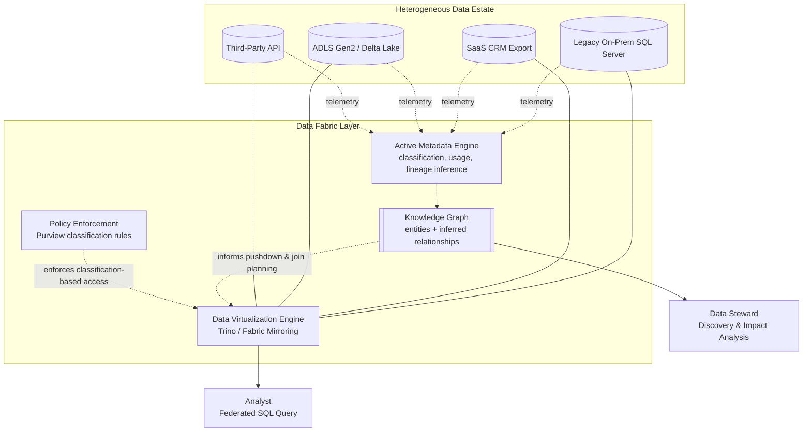
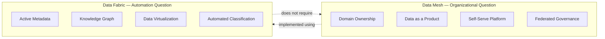
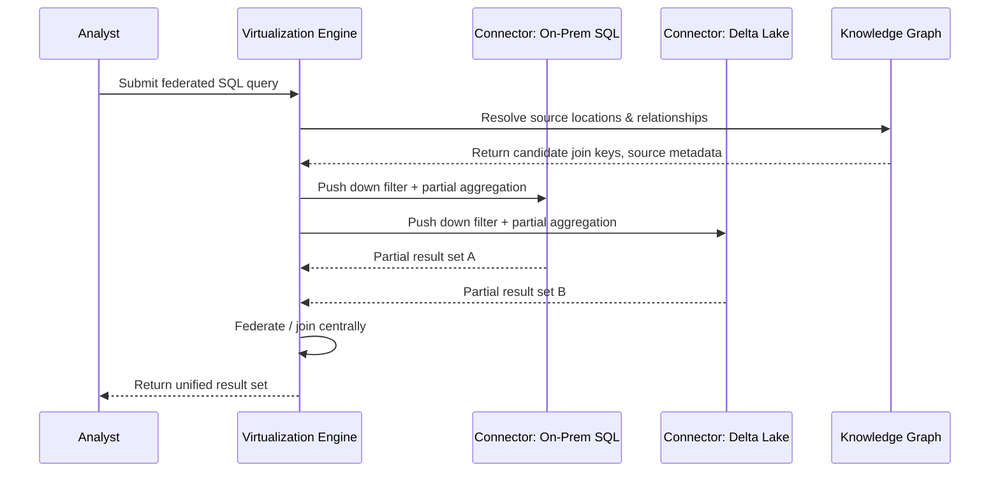

# Data Fabric

> Part of the **Enterprise Data & AI Architecture Handbook** · Phase-15 — Data Mesh & Data Fabric · Chapter 03.
> Estimated study time: **45 min reading + ~2h labs**.
> **Prerequisite:** read [Metadata Management: OpenMetadata and Atlas](../Phase-08/04_Metadata_Management_OpenMetadata_and_Atlas.md) first.

---

## Executive Summary

[Metadata Management: OpenMetadata and Atlas](../Phase-08/04_Metadata_Management_OpenMetadata_and_Atlas.md) established metadata as a governed, catalogued asset — schemas, lineage, glossary terms, and classification tags captured and searchable, largely through deliberate, human-and-pipeline-driven registration. **Data fabric** takes that same metadata substrate and asks a structurally different question than [Data Mesh Principles](01_Data_Mesh_Principles.md) and [Data Products](02_Data_Products.md) asked: instead of "how do we *organizationally decentralize* ownership of data across domain teams," data fabric asks "how do we use **active metadata** and automation to make an existing, often heterogeneous and only partially governed, data estate discoverable, integrated, and governed *without* requiring every source to be manually re-architected first."

This chapter is deliberately the point in Phase-15 where this handbook resolves a genuine, persistent industry confusion: **data mesh and data fabric are frequently marketed as synonyms or competitors, and they are neither** — they are answers to two different questions (organizational decentralization of ownership versus automated, metadata-driven integration across an existing estate) that are commonly, and correctly, adopted *together*. This chapter covers **data fabric versus data mesh** as the chapter's central disambiguation; **active metadata and the knowledge graph** as the technical mechanism that distinguishes a data fabric from a traditional, passive data catalog; **automated integration and virtualization** as the capability that lets a fabric connect and query heterogeneous sources without a mandatory physical-copy ETL step first; **data virtualization engines** as the concrete query-federation technology underneath that capability; and **Microsoft Fabric on Azure** as the platform whose very name reflects this architectural pattern, examined critically rather than assumed to be a complete implementation by naming alone.

The platform bias is **Azure-primary (~60%)** — Microsoft Fabric's OneLake, its unified compute experiences (Data Factory, Synapse Data Engineering, Power BI) atop one shared metadata and storage layer, and Microsoft Purview's active-metadata and AI-driven classification/lineage capabilities — **~30% enterprise open source** (Trino as the reference open-source data-virtualization/federated-query engine, OpenMetadata/Apache Atlas per [Metadata Management: OpenMetadata and Atlas](../Phase-08/04_Metadata_Management_OpenMetadata_and_Atlas.md) as the active-metadata substrate, and DuckDB for lightweight federated/embedded query scenarios) — **~10% AWS/GCP comparison-only** (AWS Glue Data Catalog plus Amazon Athena federated query; Google Cloud Dataplex, explicitly Gartner/Google's own most fabric-purpose-built native offering).

**Bottom line:** data fabric is a genuine, valuable answer to a genuine, different problem than data mesh — it does not require organizational restructuring the way mesh does, which is precisely why it is frequently adopted first, or adopted where mesh's organizational-change cost is not (yet, or ever) justified. But "we bought a data fabric product" is not automatically true just because a vendor's marketing uses the term, and this chapter's recurring caution — extending this handbook's now-established justification-before-adoption discipline — is that active metadata and automated virtualization still require genuine investment in connecting, classifying, and continuously curating metadata across real, messy, heterogeneous sources; a catalog with unpopulated or stale metadata calling itself a "data fabric" delivers none of the automation the term promises.

---

## Learning Objectives

By the end of this chapter you will be able to:

1. **Precisely distinguish data fabric from data mesh**, articulate why they answer different questions, and recognize the common combined "mesh-on-fabric" architecture.
2. **Explain active metadata** and how it differs mechanically from the passive, manually-curated metadata already covered in [Metadata Management: OpenMetadata and Atlas](../Phase-08/04_Metadata_Management_OpenMetadata_and_Atlas.md).
3. **Design a data virtualization layer** for federated query access across heterogeneous sources, and articulate its performance and consistency trade-offs against physical data movement.
4. **Evaluate Microsoft Fabric's OneLake and unified compute model** against the data fabric pattern's general requirements, distinguishing genuine automation from a unified UI over still-manual processes.
5. **Apply a decision matrix** to determine whether an organization's actual need is data fabric, data mesh, both, or neither.
6. **Identify the specific ways a nominal "data fabric" adoption can fail to deliver automation** if active metadata is not genuinely populated and continuously curated.
7. **Defend a data fabric or data-virtualization architecture decision** in engineer, staff engineer, architect, and CTO review settings.

---

## Business Motivation

- **Most enterprises have a large, heterogeneous, only partially catalogued data estate accumulated over years — acquisitions, shadow IT, legacy systems, and multiple cloud/on-prem platforms — that cannot realistically be re-architected under one organizational or physical model in any reasonable timeframe.** Data fabric exists specifically to make that existing estate more discoverable and integrable *as it is*, rather than requiring a mesh-style domain-ownership restructuring or a lakehouse-style physical consolidation first.
- **Manual data cataloguing and manual point-to-point integration do not scale with the number and rate of change of sources in a large estate** — the same scaling argument [Data Mesh Principles](01_Data_Mesh_Principles.md) made for organizational ownership now applies to the *technical* work of discovering, classifying, and connecting sources; active metadata (§8.2) exists to automate that work rather than requiring a growing team of manual catalogers.
- **Cross-source analytical queries currently require either a slow, bespoke point-to-point integration project or a full physical data-copy pipeline before the first query can run** — data virtualization (§8.3-8.4) exists to shorten that time-to-first-query by querying sources in place, deferring (or entirely avoiding) the cost of physical consolidation for use cases that do not need it.
- **Regulatory and governance requirements (per [Compliance and Regulatory Frameworks](../Phase-10/06_Compliance_and_Regulatory_Frameworks.md)) increasingly require organizations to demonstrate where sensitive data lives and how it flows across a genuinely heterogeneous estate** — active metadata's automated classification and lineage discovery (§8.2) is a direct, scalable answer to "we don't actually know where all our PII is" in a way manual documentation efforts consistently fail to keep current.
- **Adopting "data fabric" as a vendor-marketing label without the underlying active-metadata investment is a genuine, recurring risk** — mirroring every over-adoption caution this handbook has now established repeatedly ([Data Mesh Principles](01_Data_Mesh_Principles.md) ADR-0176, [Data Products](02_Data_Products.md) ADR-0177): a catalog UI purchased and deployed with no automated classification, no continuously-refreshed lineage, and no active-metadata-driven recommendation engine behind it is a traditional passive catalog wearing a fabric label, not a fabric.

---

## History and Evolution

- **2018-2019 — Gartner popularizes "data fabric" as a named architectural pattern**, explicitly framing it around AI/ML-driven automation over an organization's existing, heterogeneous data landscape — the framing is deliberately estate-wide and automation-first from its earliest formalization, distinct from data mesh's contemporaneous but organizationally-focused framing (per [Data Mesh Principles](01_Data_Mesh_Principles.md) History, both terms gain momentum in the same 2019-2022 window, contributing directly to their frequent conflation).
- **2020-2021 — Forrester and other analyst firms independently converge on similar "active metadata"-centric definitions**, with active metadata (continuously and automatically inferred, not only manually entered) becoming the technical distinguishing feature separating a "data fabric" claim from a traditional, passive enterprise data catalog.
- **2021 — Presto's successor project Trino matures as a leading open-source distributed SQL query engine explicitly designed for federated queries across heterogeneous sources** (per its own connector-based architecture), becoming a common reference implementation for the data-virtualization layer (§8.4) underlying many fabric architectures.
- **2022 — Microsoft rebrands and unifies several previously separate Azure analytics products (Synapse, Power BI, Data Factory, Data Activator) under the "Microsoft Fabric" name**, launching in preview in 2023 with OneLake as a single, shared, tenant-wide storage layer explicitly positioned as removing the physical-data-movement step between what were previously separate product silos — the platform whose branding most directly invokes this chapter's subject.
- **2023-2024 — Microsoft Purview adds AI-driven automated classification and lineage-inference capabilities**, moving from a largely-manual glossary-and-registration tool (per [Metadata Management: OpenMetadata and Atlas](../Phase-08/04_Metadata_Management_OpenMetadata_and_Atlas.md)'s treatment of earlier-generation catalog tooling) toward genuine active-metadata automation.
- **2024-2026 — industry usage increasingly treats data mesh and data fabric as complementary layers rather than competing choices**, with data-fabric-style active metadata and virtualization commonly cited as the automation substrate underneath a mesh's federated catalog and self-serve platform (per [Data Mesh Principles](01_Data_Mesh_Principles.md) §1.3-1.4) — the "mesh-on-fabric" pattern this chapter's Capstone Integration (§44) names explicitly, reflecting the mature, converged understanding this chapter adopts throughout rather than perpetuating the earlier either/or framing.

---

## Why This Technology Exists

An enterprise's real data estate is never as clean as an architecture diagram suggests — it accumulates heterogeneous sources across clouds, on-prem systems, SaaS applications, and legacy platforms faster than any manual cataloguing or point-to-point-integration effort can keep pace with, and re-architecting all of it under one physical or organizational model is rarely feasible on any realistic timeline. Data fabric exists to make that existing, heterogeneous estate more usable *in place*: active metadata automates the otherwise-manual work of discovering what exists and how it's classified and connected, and data virtualization lets a query reach across heterogeneous sources without first requiring every source to be physically consolidated. It is, in this specific sense, a pragmatic response to an estate an organization cannot fully control or re-architect — complementary to, not a replacement for, the deliberate organizational and physical restructuring [Data Mesh Principles](01_Data_Mesh_Principles.md) and [Lakehouse Architecture](../Phase-05/02_Lakehouse_Architecture.md) each separately describe.

---

## Problems It Solves

- **A large, heterogeneous data estate that cannot be manually catalogued or physically consolidated in any realistic timeframe**, resolved by active metadata (§8.2) automating discovery and classification across sources as they exist today, without requiring a re-architecture first.
- **Slow time-to-first-query for genuine cross-source analytical needs**, resolved by data virtualization (§8.3-8.4) enabling federated queries against sources in place, deferring or avoiding the cost of a full physical ETL pipeline for use cases that do not need one.
- **Undiscovered or unclassified sensitive data spread across a sprawling estate**, resolved by automated, AI-driven classification (§12) surfacing PII and sensitivity classifications at a scale manual review cannot sustain, directly supporting the regulatory obligations established in [Compliance and Regulatory Frameworks](../Phase-10/06_Compliance_and_Regulatory_Frameworks.md).
- **Metadata that goes stale the moment a manual catalog-population effort ends**, resolved by active metadata's continuous, automated re-inference as sources change, rather than metadata being accurate only as of its last manual update.
- **A unified query and discovery experience across previously siloed, separately-administered analytics products**, resolved (within Microsoft's own estate) by Fabric's OneLake removing the physical and administrative boundary between what were previously separate Synapse/Power BI/Data Factory workspaces.

---

## Problems It Cannot Solve

- **Data fabric does not decentralize data ownership, and does not by itself fix a central-team bottleneck** — that is data mesh's problem to solve (per [Data Mesh Principles](01_Data_Mesh_Principles.md) §1.1), and adopting a fabric platform without also addressing ownership and accountability leaves the same central-team-bottleneck root cause fully in place, merely with better tooling to query around it.
- **It does not eliminate the cost or latency of a genuinely poorly-performing underlying source** — data virtualization queries a source in place; if that source is a slow, unindexed legacy database, a federated query against it inherits that same slowness (§17), and virtualization is not a substitute for fixing or migrating a genuinely inadequate source.
- **It does not replace the need for genuine data quality investment at the source** — active metadata can surface *that* a source has quality issues (via automated profiling), but does not fix the underlying data itself; [Data Quality with Great Expectations](../Phase-08/03_Data_Quality_with_Great_Expectations.md)'s quality-gate discipline remains a separate, still-necessary investment.
- **It does not make governance automatic without policy definition** — active metadata's AI-driven classification still requires a defined taxonomy and policy rule set to classify *against*; automation accelerates enforcement, it does not invent the policy itself, the same "computational governance still requires defined global policy" distinction [Data Mesh Principles](01_Data_Mesh_Principles.md) §1.4 already established.
- **It does not make a vendor's product genuinely a "fabric" merely by having "fabric" in its name or marketing** — this chapter's Anti-patterns section (§27) names exactly this literal-naming trap, and the Decision Matrix (§25) provides concrete criteria for evaluating whether a platform's active-metadata capability is real versus a UI layer over an otherwise-manual catalog.

---

## Core Concepts

### 3.1 Data fabric versus data mesh

This is the chapter's central disambiguation, and the most consequential concept to get right before anything else in this chapter makes sense:

- **Data mesh (per [Data Mesh Principles](01_Data_Mesh_Principles.md)) answers an organizational-ownership question**: who owns and is accountable for a piece of analytical data, and how is that ownership decentralized without losing governance. Its core mechanisms are domain boundaries, data products, a self-serve platform, and federated computational governance — largely *human and organizational* design decisions, implemented with technology.
- **Data fabric answers a technical-automation question**: given an existing, heterogeneous, not-necessarily-reorganized data estate, how do we automatically discover, classify, connect, and query across it. Its core mechanisms are active metadata, a knowledge graph of relationships across the estate, and data virtualization — largely *automation and metadata-inference* capabilities, applicable regardless of who organizationally owns each source.
- **The two are complementary, not competing, and are commonly adopted together**: a mesh's federated catalog and self-serve platform (per [Data Mesh Principles](01_Data_Mesh_Principles.md) §1.3, §11) can be *implemented using* fabric-style active metadata and virtualization technology underneath; conversely, a fabric deployed over an estate with no ownership clarity at all still leaves the central-bottleneck and accountability problems data mesh exists to solve entirely unaddressed.
- **A simple test to tell them apart in a specific proposal**: if the primary claimed benefit is "domain teams will own and publish their own data," that is a mesh initiative; if the primary claimed benefit is "we will automatically discover, classify, and query across our existing systems without re-architecting them," that is a fabric initiative. Most real transformation programs, correctly scoped, contain elements of both and should name each explicitly rather than blending them into one undifferentiated "modernization" initiative.

### 3.2 Active metadata and the knowledge graph

- **Active metadata** is metadata that is continuously, automatically inferred and kept current by observing actual system behavior — query logs, access patterns, schema-change events, and usage statistics — rather than metadata that exists only because someone manually entered and periodically updated it, which is the passive-metadata model [Metadata Management: OpenMetadata and Atlas](../Phase-08/04_Metadata_Management_OpenMetadata_and_Atlas.md) primarily covered.
- **The knowledge graph** is the structural representation connecting active-metadata entities — tables, columns, dashboards, pipelines, business-glossary terms, and the people/teams associated with them — as nodes and typed relationships (per [Knowledge Graphs with Neo4j](../Phase-13/02_Knowledge_Graphs_with_Neo4j.md)'s property-graph modeling, now applied to metadata rather than business-domain entities), enabling queries like "what dashboards would be affected if this specific column were renamed" that a flat, unconnected catalog listing cannot answer.
- **Automated relationship inference** (which tables are frequently joined together, which columns semantically resemble a business-glossary term even without an exact name match, which pipelines are actually still in active use versus dormant) is what active metadata adds beyond simply automating individual-asset classification — it builds the *connections*, not only the labels.
- **Active metadata's automation is only as good as its inference signal quality** — a source with no query logs, no access-pattern telemetry, and no schema-change event stream to observe gives an active-metadata engine nothing to infer from, degrading it back toward the passive-metadata model regardless of the platform's marketing; this is the concrete, mechanical reason this chapter's Anti-patterns section (§27) treats "fabric in name only" as a real and common risk, not a hypothetical one.

### 3.3 Automated integration

- **Automated integration** in a data fabric context means the platform surfaces likely integration points (matching columns across sources, candidate join keys, semantically related entities across otherwise-unconnected systems) using the knowledge graph's inferred relationships, rather than requiring an integration engineer to manually discover every such relationship through tribal knowledge or trial and error.
- **This automation accelerates discovery of *candidate* integrations; it does not replace human review of whether a candidate integration is semantically and business-correct** — an automatically-suggested join between two similarly-named columns across two systems may be a coincidental name match rather than a genuine semantic relationship, and treating every automated suggestion as ground truth without validation is a direct extension of this chapter's Common Mistakes caution (§28) about trusting inference uncritically.
- **Automated integration commonly surfaces candidate MDM golden-record matches** — a fabric's entity-resolution capability can suggest that a "customer" record in one system and a "client" record in another likely refer to the same real-world entity, directly feeding (but not replacing) the deliberate, governed golden-record reconciliation process [Master Data Management](../Phase-08/05_Master_Data_Management.md) already established.

### 3.4 Data virtualization engines

- **Data virtualization** provides a unified, virtual query interface across heterogeneous, physically separate sources without requiring the underlying data to be copied or moved first — a query against the virtualization layer is decomposed, pushed down (where possible) to each underlying source, and the partial results are federated and returned as one logical result set.
- **Query pushdown** — executing as much of a query's filtering, aggregation, and join logic as possible within each source system itself, rather than pulling raw, unfiltered data across the network to be processed centrally — is the primary performance lever a virtualization engine has, and a source that does not support pushdown for a given operation forces that operation to run centrally against a potentially very large, un-filtered result set.
- **Trino** (the open-source successor to Presto) is the reference distributed-SQL federated-query engine, using a pluggable connector model (a distinct connector for each source type — a relational database, a Delta Lake table, a NoSQL store, an object store) to implement pushdown-aware federated querying against genuinely heterogeneous backends within one SQL interface.
- **Virtualization trades query-time cost and consistency guarantees against the elimination of physical-copy latency and storage duplication** — a virtualized query against a slow source is only as fast as that source allows, and a virtualized query spanning sources with different consistency models inherits the weakest consistency guarantee among them; this chapter's Trade-offs section (§24) treats this explicitly, since virtualization is frequently oversold as a free alternative to physical data movement rather than a genuine trade-off with its own cost profile.

### 3.5 Fabric on Azure

- **Microsoft Fabric's OneLake** is a single, tenant-wide, shared storage layer (built on ADLS Gen2/Delta Lake underneath) that every Fabric workload — Data Engineering, Data Factory, Synapse Data Warehouse, Power BI — reads from and writes to directly, removing the separate-copy-per-product friction that existed when these were administratively and physically separate Azure services.
- **Fabric's "one logical copy" promise is specifically a physical-consolidation claim, not automatically an active-metadata claim** — OneLake genuinely removes a large class of physical data-movement friction between Microsoft's own analytics products, but the active-metadata automation (automated classification, inferred relationships, usage-driven recommendations) this chapter's §8.2 describes is a separate capability, delivered primarily through Purview's integration with Fabric rather than through OneLake's storage-unification alone — a distinction this chapter's Azure Implementation section (§31) treats explicitly rather than conflating the two.
- **Fabric domains** (per [Data Mesh Principles](01_Data_Mesh_Principles.md) §28) are Fabric's mesh-oriented organizational construct, existing alongside and complementary to OneLake's fabric-oriented storage-unification — a concrete, single-product illustration of this chapter's §3.1 point that mesh and fabric concerns are complementary, not mutually exclusive, even within one platform's own feature set.

---

## Internal Working

### 4.1 How active metadata is actually inferred

An active-metadata engine ingests telemetry the underlying systems already produce as a byproduct of normal operation — query logs (which tables/columns are actually accessed, how frequently, by whom), schema-change events (DDL captured via CDC or a source's native audit log), and existing lineage hints (pipeline-orchestrator job definitions, BI-tool dataset definitions) — and continuously re-computes classification tags, usage statistics, and inferred relationships from that telemetry stream, rather than waiting for a human to manually register each fact. This is mechanically similar to how [Data Catalog and Lineage](../Phase-08/02_Data_Catalog_and_Lineage.md) already described automated lineage capture from pipeline metadata, generalized here to a continuously-running, estate-wide inference process covering classification and relationship discovery as well as lineage specifically.

### 4.2 How a virtualized query is executed

A query submitted to the virtualization engine's unified SQL interface is parsed and decomposed into per-source sub-queries by the engine's query planner, using each source's connector to determine what can be pushed down (a filter predicate a relational source can evaluate natively) versus what must be executed centrally by the engine itself (a cross-source join, since no single source can see both sides of it). Each connector executes its pushed-down portion against its native source, and the engine federates the partial results — performing the cross-source join or aggregation centrally — before returning one logical result set to the caller, who does not need to know which parts of the query ran where.

### 4.3 How automated integration suggestions surface

The knowledge graph's relationship-inference process (§3.2) continuously evaluates candidate relationships between metadata entities — column-name and column-value-distribution similarity across tables in different sources, co-occurrence in the same BI dashboards or pipeline definitions, and semantic-embedding similarity against business-glossary terms (directly reusing the embedding-similarity mechanics [Embeddings and Semantic Search](../Phase-13/03_Embeddings_and_Semantic_Search.md) established, now applied to metadata entities rather than document content) — and surfaces a ranked list of candidate integrations or MDM-match suggestions to a human reviewer through the catalog's UI, rather than automatically committing any inferred relationship as an authoritative fact.

---

## Architecture



The architecture has two structurally distinct but tightly-linked layers: the **active metadata and knowledge graph layer** (continuously observing and inferring facts about the estate) and the **virtualization/query layer** (executing federated queries against the estate as it physically exists) — the knowledge graph informs the virtualization engine's query planning (which sources hold which entities, what relationships likely exist), while the virtualization engine's own query telemetry feeds back into the active-metadata engine's usage-inference signal, a deliberate feedback loop rather than a one-directional pipeline.

---

## Components

- **Active metadata engine**: the automated classification, profiling, and lineage/relationship-inference service continuously processing telemetry from across the estate (§4.1).
- **Knowledge graph**: the structural store of metadata entities and inferred relationships (§3.2), queryable for discovery and impact-analysis use cases beyond a flat catalog listing.
- **Data virtualization / federated query engine** (Trino, or Fabric's mirroring/shortcut mechanisms): the component executing cross-source queries in place, using per-source connectors for pushdown (§3.4, §4.2).
- **Connectors**: source-specific adapters translating the virtualization engine's federated query plan into native queries against each heterogeneous source type.
- **Policy enforcement layer** (Purview classification/access rules, or an OPA-style engine): applies governance policy against the fabric's unified query surface based on the active-metadata engine's classification tags, directly reusing [Data Mesh Principles](01_Data_Mesh_Principles.md) §1.4's computational-governance mechanism at the fabric's query-execution point rather than only at a mesh data-product's publish point.
- **Discovery/impact-analysis UI**: the human-facing surface over the knowledge graph, used by data stewards and engineers to review automated integration suggestions (§3.3) and answer change-impact questions.

---

## Metadata

- **Active-metadata records are distinguished from passive catalog entries by an explicit "last automatically verified" timestamp and confidence score**, not just a "last manually updated" timestamp — a consumer or steward evaluating a classification tag should be able to tell whether it was recently and automatically re-confirmed or is aging, unverified, manually-entered information.
- **Inferred relationships in the knowledge graph carry a confidence score and an inference method (name-similarity, value-distribution-similarity, co-occurrence, semantic-embedding)**, rather than being presented with the same certainty as a manually-declared, human-verified relationship — this distinction is what lets a data steward correctly prioritize review effort toward lower-confidence, higher-impact suggestions.
- **Usage statistics (query frequency, distinct consumers, staleness of last access) are first-class active-metadata fields**, directly feeding the same kind of adoption-and-relevance signal [Data Products](02_Data_Products.md) §37 established for a mesh data product's adoption metrics, now generalized across an entire heterogeneous estate rather than only formally-published data products.
- **Metadata about the metadata pipeline itself** (which sources are actively telemetry-instrumented and contributing to active inference versus which sources still rely on manual, passive registration) should be tracked and surfaced, since it is the direct, measurable indicator of how much of "data fabric" a given estate actually has, versus how much remains a traditional passive catalog by necessity (§3.2's inference-signal-quality caveat).

---

## Storage

- **Data fabric, unlike data mesh or a lakehouse, does not mandate a specific storage architecture for the underlying sources it connects to** — its defining property is querying and cataloguing heterogeneous storage *as it exists*, not consolidating it onto one standardized format; a fabric happily connects a legacy on-prem SQL Server, a Delta Lake table, and a SaaS application's API export within the same federated query surface.
- **Microsoft Fabric's OneLake is the one significant exception within its own product boundary**: workloads native to Fabric itself (Data Engineering, Data Warehouse, Power BI) do standardize onto one shared Delta-Parquet-based storage layer, which is a genuine, deliberate architectural choice — but a fabric-pattern deployment spanning sources outside Fabric (an on-prem database, another cloud's data warehouse) does not require or impose that same standardization on those external sources.
- **Metadata itself (the active-metadata engine's own inferred classification, lineage, and knowledge-graph data) requires its own durable, queryable storage** — typically a graph database or a graph-capable extension of the catalog's storage tier (per [Knowledge Graphs with Neo4j](../Phase-13/02_Knowledge_Graphs_with_Neo4j.md)) — distinct from and layered on top of the storage of the actual source data it describes.

---

## Compute

- **Virtualized query execution consumes compute both at the virtualization engine layer (for cross-source joins/aggregations it must perform centrally) and, via pushdown, at each source's own compute** — a source with limited compute headroom for ad hoc analytical queries (a production OLTP database, for example) can be measurably impacted by a poorly-scoped virtualized query pushing significant filtering work down to it, a direct extension of the Performance section's (§17) caution about virtualization inheriting a source's own limitations.
- **Active-metadata inference is a continuously-running background compute workload**, distinct from and typically much lighter-weight than the virtualization engine's query-time compute — profiling and classification jobs run on a schedule or a streaming basis against telemetry, not on the critical path of any specific user-facing query.
- **Trino's compute is horizontally scalable independent of any single source's own compute**, letting the federation and cross-source-join workload scale to a query's actual complexity, while pushdown keeps each source's own compute burden limited to what that source would have needed to serve a native, well-scoped query.

---

## Networking

- **Federated queries traverse the network between the virtualization engine and every source touched by a given query** — a query spanning an on-prem source and a cloud source pays a cross-boundary network cost proportional to however much data pushdown could *not* eliminate before transfer, directly informing this chapter's Performance section's (§17) pushdown-effectiveness caution.
- **Private connectivity (private endpoints, ExpressRoute for on-prem-to-Azure connectivity, VNet-injected Trino coordinator/worker nodes) is required for any fabric deployment touching sensitive sources**, consistent with [Network Security and Zero Trust](../Phase-10/04_Network_Security_and_Zero_Trust.md)'s private-endpoint-only baseline — a data-virtualization layer is a genuine, additional network path to every source it connects to, and must be secured with the same rigor as any other cross-system integration point.
- **Fabric's OneLake, being a single Azure-native storage layer, avoids the cross-cloud/cross-boundary networking cost entirely for Fabric-native workloads**, a concrete networking-cost advantage specific to staying within one platform's storage-unification boundary versus a fabric pattern spanning genuinely heterogeneous, multi-location sources.

---

## Security

- **Governance policy must be enforced at the virtualization layer's query-execution point, not only at each individual source** — a consumer querying through the fabric's unified interface should be subject to the same classification-based access control regardless of which underlying source actually holds the data, directly extending [Data Mesh Principles](01_Data_Mesh_Principles.md) §1.4's computational-governance principle to a fabric's federated-query surface specifically.
- **A data virtualization layer that can reach a source implies the credentials or service identity it uses to reach that source carry real privilege** — the same identity-propagation discipline established for RAG ([Retrieval Augmented Generation](../Phase-12/03_Retrieval_Augmented_Generation.md) ADR-0157), vector search ([Vector Databases: Qdrant and Milvus](../Phase-13/01_Vector_Databases_Qdrant_and_Milvus.md) ADR-0164), and now data mesh access control ([Data Mesh Principles](01_Data_Mesh_Principles.md) §16) applies with equal force here: the virtualization engine must propagate the querying user's actual identity and entitlements down to each source's native access-control check, never substituting a single privileged service account for every query regardless of who submitted it.
- **Automated classification (§8.2) is itself a security-relevant capability that must be trusted carefully** — an active-metadata engine's automatically-inferred PII classification is a strong discovery signal but should feed a human-reviewable workflow for the highest-sensitivity classifications rather than being wired directly and unreviewed into an automatic masking/access-control decision, mirroring this chapter's own §3.3 caution about not treating every automated inference as unreviewed ground truth.
- **A federated query surface expands the effective blast radius of a single compromised credential** — a virtualization-layer identity with broad cross-source reach is a higher-value target than any single source's own narrower-scoped credential, making least-privilege scoping of the virtualization engine's own service identities a first-order, not secondary, security design decision.

---

## Performance

- **A virtualized query's performance ceiling is set by its slowest touched source, mitigated but not eliminated by pushdown** — the Trade-offs section (§24) and this chapter's Case Studies (§40) both return to this as the single most common and most consequential fabric-adoption surprise: virtualization does not make a genuinely slow source fast, it only avoids the separate cost of first copying that source's data elsewhere.
- **Pushdown effectiveness varies significantly by connector and operation type** — a well-supported relational connector may push down complex filters and aggregations efficiently, while a simpler REST-API-backed connector may only support pushing down the most basic filters, forcing far more data to be transferred and processed centrally for what looks, from the query author's perspective, like an equivalent query against a different source.
- **Active-metadata inference workloads should be isolated from the virtualization engine's query-serving compute** — a heavy classification/profiling batch job running concurrently with peak analytical query load can degrade both if they share compute resources without deliberate isolation or scheduling.
- **Repeated, high-frequency federated queries against the same cross-source join are a strong signal that the join should be materialized** (as a genuine data product, per [Data Products](02_Data_Products.md), or a lakehouse gold-layer table) **rather than continuing to pay the federation cost on every single query** — the concrete, measurable trigger this chapter's Decision Matrix (§25) uses to distinguish "virtualize" from "materialize" for a specific access pattern.

---

## Scalability

- **The virtualization engine's compute scales independently of any single source**, but the *aggregate* load a fabric places on many sources simultaneously (as query volume grows across the whole estate) is a genuine, often underestimated scalability concern for the sources themselves, not only for the fabric layer.
- **Active-metadata inference's scalability is primarily a telemetry-ingestion-volume problem** — an estate with thousands of sources each producing continuous query-log and schema-change telemetry requires an ingestion and inference pipeline engineered for that aggregate volume, structurally similar to (and often literally implemented via) the same streaming-ingestion patterns [Apache Kafka](../Phase-07/02_Apache_Kafka.md) already established for high-throughput data movement.
- **The knowledge graph's scalability follows the same considerations [Knowledge Graphs with Neo4j](../Phase-13/02_Knowledge_Graphs_with_Neo4j.md) already documented** — supernode risk (a small number of extremely highly-connected metadata entities, such as a frequently-joined central table, degrading traversal performance) applies to a metadata knowledge graph exactly as it does to a business-domain knowledge graph.

---

## Fault Tolerance

- **A source's unavailability degrades, rather than fails entirely, a federated query that also touches other, still-available sources** — a well-designed virtualization engine should return a clear partial-failure signal (which source failed, which succeeded) rather than either silently returning incomplete results or failing the entire query opaquely; this is a genuine fault-tolerance design decision the engine's configuration must make deliberately, not an emergent property.
- **Active-metadata inference's own failure (a broken telemetry pipeline for one source) degrades that source's metadata back toward stale/passive rather than causing an outage** — the practical consequence is quietly worse discovery and classification accuracy for that source, not a visible failure, making telemetry-pipeline health itself a metric worth monitoring explicitly (§21) rather than assuming silent success.
- **The knowledge graph and virtualization engine, as shared fabric-layer infrastructure, are single points of failure for the entire estate's federated-query and discovery capability** if not deployed with genuine high availability — the same shared-platform-failure-blast-radius concern [Data Mesh Principles](01_Data_Mesh_Principles.md) §19 already flagged for a mesh's federated catalog, now applying to a fabric's equivalent shared components.

---

## Cost Optimization (FinOps)

- **Virtualization avoids the storage-duplication cost of a full physical copy, but shifts cost toward repeated query-time compute and network egress** — a use case queried once a month benefits clearly from virtualization's avoided storage cost; a use case queried continuously by many consumers may, past a measurable threshold, cost more in repeated federation compute than a one-time materialization would.
- **Active-metadata inference's continuous background compute cost scales with estate size and telemetry volume**, and should be budgeted as a standing platform cost (analogous to [Data Mesh Principles](01_Data_Mesh_Principles.md) §20's self-serve-platform investment) rather than treated as a one-time setup cost.
- **Cross-region or cross-cloud federated queries incur network-egress cost proportional to whatever pushdown could not eliminate**, a cost that compounds with query frequency and can silently accumulate to a material FinOps line item if not monitored per-query-pattern.
- **Worked FinOps example**: a federated query joining a 500GB on-prem source table with a cloud-native fact table runs three times daily for a recurring executive dashboard. Each run's pushdown-limited transfer moves an estimated 40GB across the network at approximately $0.05/GB egress plus virtualization-engine compute, totaling roughly **$6/run × 3/day × 22 business days/month ≈ $396/month** in ongoing federation cost. A one-time materialization pipeline (a nightly incremental copy into a Delta table, refreshed once daily rather than queried live three times) reduces the recurring transfer to one daily incremental load of the same ~40GB delta, at a comparable per-run compute cost but only **one run/day instead of three**, cutting the ongoing cost to roughly **$132/month** — the concrete threshold calculation (query frequency × per-query transfer cost versus one-time materialization-refresh cost) that should drive the virtualize-versus-materialize decision this chapter's Decision Matrix (§25) formalizes, rather than defaulting to virtualization for every repeated access pattern simply because it required less upfront engineering effort.

---

## Monitoring

- **Telemetry-pipeline health per source** (is a given source's query-log/schema-change telemetry actually flowing and current) as a leading indicator of whether that source's active metadata is genuinely active or has quietly degraded to passive/stale.
- **Pushdown-effectiveness monitoring per connector and query pattern** (what fraction of a query's filtering/aggregation logic was actually pushed down versus executed centrally) as the primary performance-diagnosis signal for virtualized query slowness.
- **Per-source query-load monitoring from the virtualization engine's perspective**, feeding back into capacity-planning conversations with each source's own owning team, since a fabric-driven load increase against a source is easy for that source's own team to misattribute to their own workload growth if the fabric's contribution is not separately visible.

---

## Observability

- **Impact-analysis queries against the knowledge graph** ("what would be affected by renaming or removing this column") are this chapter's most distinctive observability capability beyond what a flat catalog can offer, directly enabled by the knowledge graph's typed-relationship structure (§3.2) rather than a simple metadata listing.
- **Confidence-score-aware observability**: any dashboard or report surfacing active-metadata-derived facts (a classification, an inferred relationship) should visibly distinguish high-confidence, recently-verified facts from low-confidence or aging inferences, directly extending the Metadata section's (§12) confidence-scoring discipline into the human-facing observability layer, not just the underlying data model.

### Operational Response Playbook

| Signal | Detection Query / Check | Remediation |
|---|---|---|
| A source's active-metadata telemetry pipeline silently stops flowing (no new query-log or schema-change events for an extended period) | Scheduled freshness check on the telemetry-ingestion timestamp per source, alerting when a source exceeds its expected telemetry-arrival interval | Flag that source's metadata as "stale / not actively verified" in the catalog UI (visible to consumers, per §12's confidence-scoring principle) rather than silently continuing to present it with the same confidence as actively-inferred metadata; investigate and restore the telemetry pipeline, prioritized by the source's consumption volume |
| A specific federated query pattern shows persistently poor pushdown effectiveness and repeated high-frequency execution | Query-log analysis joining pushdown-effectiveness metrics with execution-frequency metrics per query pattern, surfacing patterns exceeding a defined cost/frequency threshold | Route to the virtualize-versus-materialize Decision Matrix (§25) review; propose a materialized data product (per [Data Products](02_Data_Products.md)) or a lakehouse gold-layer table as a lower-cost, better-performing alternative to continued live federation |

---

## Governance

- **Data fabric's governance model is the same federated computational governance [Data Mesh Principles](01_Data_Mesh_Principles.md) §1.4 established**, applied at the fabric's query-execution and classification points rather than only at a mesh data product's publish point — active metadata's automated classification is the mechanism that makes that governance's policy-application step scale across a large, heterogeneous estate.
- **Automated classification confidence thresholds are themselves a governance policy decision**, not merely a technical tuning parameter — an organization must explicitly decide the minimum confidence score at which an automatically-inferred PII classification is trusted to drive an automatic access-control or masking decision versus requiring human confirmation first, and that threshold decision should be documented and auditable, per the same policy-as-code discipline [Data Mesh Principles](01_Data_Mesh_Principles.md) §23 established.
- **A fabric's discovery and impact-analysis capability directly supports regulatory data-mapping obligations** (per [Compliance and Regulatory Frameworks](../Phase-10/06_Compliance_and_Regulatory_Frameworks.md)) by making "where does this category of sensitive data live across our estate" an answerable, continuously-current query rather than a periodic, rapidly-stale manual survey.
- **Governance auditability requires the active-metadata engine's own inference history to be retained**, not only its current-state output — an auditor asking "was this specific field correctly classified as PII on the date of the incident under review" requires historical, not only current, classification records.

---

## Trade-offs

| Dimension | Physical Consolidation (ETL into a lakehouse) | Data Virtualization (fabric-style federation) |
|---|---|---|
| Time to first cross-source query | Slower — requires building and running an ingestion pipeline first | Faster — query sources in place immediately |
| Query performance for repeated, high-frequency access | Better — data is local, indexed, and optimized for the target workload | Worse, and bounded by the slowest touched source and pushdown effectiveness |
| Storage cost | Higher — data physically duplicated | Lower — no duplication, cost shifts to repeated query-time compute/network |
| Data freshness | As fresh as the last ingestion run | As fresh as the live source, by construction |
| Source-system load | Lower ongoing load (batch-extracted once) | Recurring load proportional to query frequency |
| Best fit | High-frequency, performance-sensitive, well-understood recurring analytical workloads | Exploratory, low-frequency, or genuinely cross-organizational queries where physical consolidation is infeasible or not yet justified |

---

## Decision Matrix

| Signal | Recommendation |
|---|---|
| The organization's core problem is "who owns this data and why does every change route through one bottlenecked team" | This is a data mesh problem (per [Data Mesh Principles](01_Data_Mesh_Principles.md)), not primarily a data fabric problem — evaluate mesh's Decision Matrix instead, or in addition |
| The organization's core problem is "we have a large, heterogeneous estate we cannot fully catalogue or re-architect, and need automated discovery/classification/integration across it" | Data fabric is directly applicable — proceed with an active-metadata and virtualization pilot scoped to a bounded, high-value subset of the estate first |
| A specific cross-source access pattern is queried frequently (daily or more) by multiple consumers | Materialize it (as a data product or a lakehouse table) rather than continuing to pay repeated federation cost — per §20's worked FinOps example |
| A specific cross-source access pattern is exploratory, low-frequency, or its long-term value is not yet established | Virtualize it — avoid the cost and lead time of a physical pipeline for a use case that may not persist |
| A source has no query-log, schema-change, or usage telemetry available to observe | Active-metadata automation cannot function for that source regardless of platform; budget for either instrumenting the source or accepting a passive-catalog-only treatment for it |
| A vendor's "data fabric" product shows no measurable automated classification/relationship-inference activity, only a manually-populated catalog UI | This is "fabric in name only" (§27) — evaluate it as a traditional passive catalog, not a fabric, and do not expect the automation benefits this chapter describes |

---

## Design Patterns

- **Virtualize first, materialize on demonstrated demand**: default new cross-source access patterns to virtualization, and use the concrete frequency/cost threshold from §20's worked example to decide when to promote a specific pattern to a materialized data product — avoiding both premature-materialization waste and prolonged-live-federation cost for genuinely high-frequency patterns.
- **Telemetry-instrumentation-before-automation-claims**: before onboarding a source into an active-metadata program, verify it can actually produce the query-log/schema-change/usage telemetry the inference engine depends on (§3.2's inference-signal-quality point) — do not onboard a source and assume automation will simply materialize without that telemetry foundation.
- **Confidence-scored, human-reviewed automated integration**: surface automatically-inferred relationships and classifications ranked by confidence for human steward review, rather than auto-committing high-impact inferences (access-control or MDM-merge decisions) without review, directly implementing §3.3 and §16's caution.
- **Mesh-on-fabric composition**: implement a data mesh's federated catalog and self-serve platform (per [Data Mesh Principles](01_Data_Mesh_Principles.md) §1.3, §11) using fabric-style active metadata and virtualization technology underneath, treating the two patterns as complementary layers rather than choosing one over the other.

---

## Anti-patterns

- **"Fabric in name only"**: a purchased or deployed catalog product marketed as a data fabric that in practice performs no automated classification, no continuously-refreshed lineage inference, and no relationship discovery — a passive catalog with fabric branding, delivering none of the automation benefit the term implies (§3.2, §25).
- **Treating every automated inference as unreviewed ground truth**: auto-committing a low-confidence, automatically-inferred PII classification or MDM-match suggestion directly into an access-control or golden-record-merge decision without human review, risking both false-positive over-restriction and false-negative governance gaps.
- **Defaulting to virtualization for high-frequency, well-understood recurring workloads purely to avoid upfront pipeline-building effort**, paying an ongoing, larger aggregate cost (§20) than a one-time materialization investment would have required.
- **Conflating data fabric with data mesh in program communications**, presenting one undifferentiated "modernization initiative" that blends organizational-ownership-decentralization goals with technical-automation goals, making it impossible to evaluate either against its own, distinct success criteria (§3.1).
- **Onboarding a source into an active-metadata program with no available telemetry**, then being surprised when that source's metadata never becomes genuinely "active" despite the platform's general capability — the direct anti-pattern counterpart of the Design Patterns section's (§26) "telemetry-instrumentation-before-automation-claims" recommendation.

---

## Common Mistakes

- **Assuming a fabric platform's active-metadata automation applies uniformly across every connected source**, when in practice automation quality varies enormously by source type and available telemetry — some sources will remain effectively passive-catalog entries regardless of the platform's general capability.
- **Ignoring pushdown-effectiveness variance across connectors** when estimating a federated query's expected performance, leading to a query design that performs acceptably against one source type and unacceptably against another superficially similar one.
- **Underestimating the aggregate load a fabric's federated queries place on source systems that were never sized or indexed for ad hoc analytical access**, particularly production OLTP systems.
- **Treating a fabric's discovery/impact-analysis capability as a substitute for, rather than a complement to, genuine data quality investment** — knowing precisely where a data-quality problem exists across the estate is valuable, but the fabric does not fix the problem itself.
- **Skipping the confidence-threshold governance decision (§23) entirely**, either trusting every automated classification unreviewed or, at the opposite extreme, requiring manual review of every single inference regardless of confidence, defeating the purpose of automation.

---

## Best Practices

- **Verify telemetry availability before onboarding a source into an active-metadata program**, and explicitly document sources that will remain passive-catalog-only due to telemetry limitations rather than silently under-delivering on the fabric's automation promise for them.
- **Set and document an explicit confidence threshold for auto-applying inferred classifications versus requiring human review**, treating this as an auditable governance policy decision (§23), not an implementation detail.
- **Use the frequency/cost threshold from §20's worked example consistently to decide virtualize-versus-materialize** for every recurring cross-source access pattern, rather than making that decision ad hoc per use case.
- **Communicate data mesh and data fabric initiatives separately, each against its own success criteria** (organizational-ownership metrics for mesh; automated-discovery/classification-coverage and query-federation-adoption metrics for fabric), even when both are being pursued as part of one broader program.
- **Monitor per-source telemetry-pipeline health explicitly**, since active metadata degrading silently to stale/passive is a quiet failure mode that will not otherwise surface until a classification or lineage answer turns out to be wrong.

---

## Enterprise Recommendations

- **For organizations with a large, heterogeneous, hard-to-re-architect estate and no immediate appetite for mesh's organizational change**: data fabric (active metadata plus virtualization) is a strong, lower-organizational-cost starting point that delivers real discovery and integration value independent of any ownership-model change.
- **For organizations already pursuing data mesh**: adopt fabric-style active metadata and virtualization technology as the implementation substrate for the mesh's federated catalog and self-serve platform (§26's mesh-on-fabric pattern), rather than building a mesh catalog and a separate fabric catalog independently.
- **For organizations already standardized on Microsoft Fabric**: recognize that OneLake's storage unification and Purview's active-metadata capability are two distinct, separately-evaluated capabilities (§3.5) — assess each against this chapter's criteria independently rather than assuming full data-fabric automation is delivered by OneLake adoption alone.
- **For every organization, regardless of fabric adoption**: apply the virtualize-versus-materialize frequency/cost threshold (§20, §25) consistently as a standing architectural decision discipline, not a one-time choice made per project in isolation.

---

## Azure Implementation

- **Microsoft Fabric OneLake** as the unified, tenant-wide storage layer for Fabric-native workloads, with OneLake shortcuts providing addressable, non-duplicative references to data across workspaces and domains (per [Data Mesh Principles](01_Data_Mesh_Principles.md) §28) and Mirroring providing near-real-time virtualized access to external sources (Azure SQL Database, Cosmos DB, Snowflake) without a separate ETL pipeline.
- **Microsoft Purview** as the active-metadata and knowledge-graph substrate: automated scanning and classification across Azure, on-prem (via the Purview self-hosted integration runtime), and multi-cloud sources, with its lineage and relationship graph directly implementing this chapter's §3.2 knowledge-graph concept, and its Data Estate Insights surfacing coverage/classification-confidence metrics per the Metadata section's (§12) confidence-scoring discipline.
- **Azure Synapse serverless SQL pools** and **Synapse Data Warehouse (Fabric)** support federated/external-table querying against ADLS Gen2, Delta Lake, and other sources as a lighter-weight, SQL-native virtualization option for teams not adopting a full Trino deployment.
- **Concrete Bicep sketch** for provisioning a Purview account with a self-hosted integration runtime target for on-prem source scanning (the telemetry/scanning foundation active metadata depends on, per §26's design pattern):

```bicep
resource purviewAccount 'Microsoft.Purview/accounts@2021-12-01' = {
  name: purviewAccountName
  location: location
  identity: {
    type: 'SystemAssigned'
  }
  properties: {
    managedResourceGroupName: '${purviewAccountName}-managed-rg'
    publicNetworkAccess: 'Disabled'
  }
}

resource purviewPrivateEndpoint 'Microsoft.Network/privateEndpoints@2023-04-01' = {
  name: '${purviewAccountName}-pe'
  location: location
  properties: {
    subnet: {
      id: subnetId
    }
    privateLinkServiceConnections: [
      {
        name: '${purviewAccountName}-plsc'
        properties: {
          privateLinkServiceId: purviewAccount.id
          groupIds: ['account']
        }
      }
    ]
  }
}
```

---

## Open Source Implementation

- **Trino** as the reference open-source distributed-SQL federated-query engine (§3.4), with connector plugins for relational databases, Delta Lake, Iceberg, object storage, and NoSQL sources, deployable on Kubernetes (per [Kubernetes](../Phase-09/06_Kubernetes.md)) for horizontally-scalable virtualization compute independent of any single source.
- **OpenMetadata or Apache Atlas** (per [Metadata Management: OpenMetadata and Atlas](../Phase-08/04_Metadata_Management_OpenMetadata_and_Atlas.md)) as the open-source active-metadata and knowledge-graph substrate, with OpenMetadata's automated profiling, classification, and usage-tracking features providing a genuinely open alternative to Purview's active-metadata capability.
- **DuckDB** as a lightweight, embeddable federated-query option for smaller-scale or exploratory virtualization needs (querying a handful of Parquet/Delta files and a local database without standing up a full Trino cluster), particularly useful for the exploratory-tier access patterns this chapter's Decision Matrix (§25) recommends virtualizing rather than materializing.
- **Apache Atlas's own native lineage and relationship graph** (built on a graph-database backend) is a directly applicable, already-existing open-source implementation of this chapter's §3.2 knowledge-graph concept for organizations standardized on the Hadoop/Atlas ecosystem.

---

## AWS Equivalent (comparison only)

| Azure | AWS | Notes |
|---|---|---|
| Microsoft Fabric OneLake / Mirroring | Amazon Athena federated query connectors, or AWS Lake Formation over S3 | AWS has no single unified "OneLake"-equivalent storage layer spanning multiple product silos as directly as Fabric; federated querying is typically composed from Athena connectors plus separate per-service catalogs |
| Microsoft Purview active metadata | AWS Glue Data Catalog plus Amazon DataZone for governed data-product/discovery experiences | DataZone is AWS's most fabric/mesh-adjacent offering, combining catalog, governance, and discovery, though its automated-classification/active-metadata maturity trails Purview's AI-driven feature set as of this writing |
| Trino (self-hosted or on Azure) | Amazon Athena (managed Trino-derived engine) | Athena is directly Trino-lineage-descended, making migration of federated-query logic between the two comparatively low-friction |

**Migration guidance**: Trino-based virtualization logic migrates with low friction to Athena given their shared lineage; a Purview-centric active-metadata deployment requires a more substantial re-platforming effort onto Glue Catalog plus DataZone (or a cloud-agnostic OpenMetadata deployment) to preserve equivalent automated-classification capability.

---

## GCP Equivalent (comparison only)

| Azure | GCP | Notes |
|---|---|---|
| Microsoft Fabric OneLake | Google Cloud Dataplex "lakes" spanning BigQuery, GCS, and external sources | Dataplex is explicitly positioned by Google as a data-fabric-pattern product, with a governance and discovery layer spanning heterogeneous storage similar in intent to OneLake's unification goal |
| Microsoft Purview active metadata | Dataplex's automated data discovery, classification, and data quality scanning | Dataplex's automated scanning and classification is arguably the most directly comparable native active-metadata capability among the three clouds, given Google's own early "data fabric" positioning of the product |
| Trino | BigQuery's native federated queries (BigQuery Omni, external tables) | BigQuery's federation is deeply integrated with its own compute engine rather than a general-purpose pluggable-connector model like Trino's, trading some source-type breadth for tighter native performance within GCP |

**Selection criteria**: an organization already GCP-primary evaluating data fabric should weigh Dataplex's native automated-discovery maturity directly against this chapter's §27 "fabric in name only" criteria — Dataplex's explicit fabric-pattern design intent lowers the risk of that anti-pattern relative to a generic catalog product, but the underlying telemetry-availability and confidence-threshold-governance requirements (§26, §29) still apply regardless of platform.

---

## Migration Considerations

- **Migrating from a purely passive catalog to genuine active metadata is an incremental, source-by-source telemetry-instrumentation program**, not a platform switch alone — budget for the work of enabling query-log/schema-change telemetry per source as the actual migration effort, since the catalog platform itself cannot generate active metadata from a source producing no observable signal.
- **Migrating a specific access pattern from virtualization to materialization** (once it crosses the §20 frequency/cost threshold) should preserve the same output-port addressability principle [Data Products](02_Data_Products.md) §9 established — a consumer's existing query reference should not need to change merely because the underlying implementation moved from a live federated view to a materialized table, provided the fabric or catalog layer can transparently redirect the reference.
- **Migrating between fabric-tooling vendors (or from a vendor's proprietary catalog to an open-source OpenMetadata/Atlas deployment) requires re-establishing telemetry ingestion and re-training or re-computing classification/relationship inference from scratch** in most cases, since active-metadata inference history and confidence scores are rarely portable between platforms — a genuine, often underestimated switching cost worth factoring into any fabric-platform vendor decision.

---

## Mermaid Architecture Diagrams

**Data mesh vs. data fabric conceptual comparison:**



**Federated query execution sequence:**



(A third diagram — the reference architecture in §9 — is also part of this chapter's required minimum of three Mermaid diagrams.)

---

## End-to-End Data Flow

1. An active-metadata engine continuously ingests telemetry (query logs, schema-change events, usage statistics) from every telemetry-instrumented source across the estate.
2. That telemetry drives automated classification, profiling, and relationship inference, populating the knowledge graph with confidence-scored entities and relationships.
3. A data steward reviews high-impact, lower-confidence automated suggestions (a candidate MDM match, a newly-inferred PII classification) through the discovery UI, confirming or rejecting each.
4. An analyst submits a federated query spanning two previously-unconnected sources; the virtualization engine consults the knowledge graph to resolve likely join keys and source locations.
5. The virtualization engine decomposes the query, pushing down as much filtering and aggregation as each source's connector supports, and executes any remaining cross-source join or aggregation centrally.
6. Governance policy (per [Data Mesh Principles](01_Data_Mesh_Principles.md) §1.4) is enforced at the virtualization layer based on the queried entities' active-metadata classification tags, propagating the analyst's actual identity down to each source's native access check.
7. The query's execution telemetry (frequency, latency, pushdown-effectiveness) feeds back into both the active-metadata engine's usage statistics and the Decision Matrix's (§25) virtualize-versus-materialize evaluation for that specific access pattern.
8. If the pattern crosses the frequency/cost threshold (§20), it is promoted to a materialized data product (per [Data Products](02_Data_Products.md)), and the fabric/catalog layer transparently redirects future references to the new materialized output.

---

## Real-world Business Use Cases

- **A financial-services organization uses active metadata to automatically discover and classify PII scattered across a decades-old estate of acquired systems**, producing a continuously-current regulatory data map that a manual documentation effort had failed to keep accurate for years.
- **A retail organization virtualizes a one-off, exploratory cross-source query joining a newly-acquired subsidiary's legacy inventory system with the parent company's existing sales data**, avoiding a multi-month ETL-build project for an analysis whose long-term recurring value was not yet established — and later, once the query proved recurringly valuable, promotes it to a materialized data product per the Decision Matrix's threshold.
- **A healthcare organization's knowledge graph impact-analysis capability lets a data engineer confirm, before renaming a widely-referenced patient-identifier column, exactly which dashboards and downstream pipelines would break** — a change that a flat catalog listing alone could not have safely informed.

---

## Industry Examples

- **Gartner's own analyst research**, having originated and popularized the "data fabric" term (per this chapter's History section), continues to publish market-maturity assessments distinguishing genuine active-metadata automation from vendors marketing a traditional catalog under the fabric label — directly corroborating this chapter's own §27 anti-pattern caution from an independent, non-vendor source.
- **Google Cloud's own Dataplex product documentation** explicitly frames itself using data-fabric terminology (lakes, zones, automated discovery) as a deliberate design choice, making it among the most directly fabric-pattern-aligned commercial products across the three major clouds, per this chapter's GCP Equivalent section (§34).
- **Multiple large financial-services and healthcare organizations have published case studies** (via Microsoft, Trino Software Foundation, and conference talks) describing federated-query virtualization specifically as a bridge strategy during multi-year merger-integration or legacy-modernization programs — using virtualization to deliver cross-source analytical value immediately, while a longer-term physical-consolidation or mesh-restructuring program proceeds in parallel.

---

## Case Studies

### Case Study 1 — "Fabric in name only"

A logistics organization licensed a commercial catalog product marketed heavily as a "data fabric" and deployed it across its estate, expecting automated classification and integration discovery to materialize with minimal additional effort. Twelve months later, an internal review found that fewer than 15% of connected sources had any automatically-inferred classification or relationship data at all — the vast majority of the catalog's content was manually entered during the initial rollout and had not been refreshed since, because most of the organization's legacy sources produced no query-log or schema-change telemetry the platform's active-metadata engine could observe, and no project had been funded to instrument that telemetry. The platform was, in practice, a passive catalog with a fabric label, delivering none of the automation the initial business case had assumed. The corrective action, directly informing this chapter's Design Patterns (§26) and Best Practices (§29), was a follow-up, explicitly-scoped telemetry-instrumentation program for the organization's highest-value sources, rather than continuing to assume the platform's general capability would eventually activate itself.

### Case Study 2 — Virtualization as a deliberate bridge strategy

A healthcare organization undergoing a multi-year merger integration needed cross-source analytical queries spanning the acquiring and acquired organizations' respective patient-record and billing systems within weeks, not the 12-18 months a full physical-consolidation ETL program would realistically require. The organization deployed a Trino-based virtualization layer connecting both estates' existing systems in place, explicitly scoped and communicated as a **bridge strategy** with a defined sunset date once the longer-term consolidation program completed. Query performance against the older, less-indexed acquired-system database was measurably slower than the primary system's queries — an accepted, explicitly-documented trade-off rather than a surprise, per this chapter's Performance section (§17) — but the organization achieved its needed cross-source reporting capability within the required timeframe, and the virtualization layer was cleanly decommissioned on schedule once the underlying consolidation completed, having never been mistaken for a permanent architecture.

### Architecture Decision Record (ADR-0178): Frequency/Cost-Threshold-Gated Promotion from Virtualization to Materialization

**Context:** Data virtualization's default appeal (§25 Decision Matrix, faster time-to-first-query, no storage duplication) creates a natural bias toward defaulting every new cross-source access pattern to virtualization indefinitely, even once a pattern's actual usage pattern would be served more cheaply and performantly by a one-time materialization, as quantified in §20's worked FinOps example.

**Decision:** Every recurring, federated-query access pattern must be reviewed against the frequency/cost threshold established in §20 (comparing aggregate ongoing federation cost against a one-time materialization-and-refresh cost) on a recurring basis (quarterly, or triggered automatically once query frequency crosses a defined threshold). Patterns crossing the threshold are promoted to a materialized data product (per [Data Products](02_Data_Products.md)) rather than continuing on live federation by default.

**Consequences:** Some short-term engineering effort is required to build the materialization pipeline for promoted patterns, and the fabric/catalog layer must support transparent reference-redirection (§35) so consumers are not disrupted by the promotion. In exchange, the organization avoids the compounding, easily-overlooked ongoing cost of high-frequency access patterns remaining on live federation indefinitely purely because virtualization required less upfront effort to stand up initially.

**Alternatives considered:**
- *Default every access pattern to virtualization permanently, never materialize*: rejected — directly produces the compounding federation cost §20's worked example quantifies for high-frequency patterns, and ignores the genuine performance ceiling virtualization has against a slow source.
- *Default every access pattern to materialization immediately, never virtualize*: rejected — reintroduces the slow time-to-first-query and storage-duplication cost virtualization exists specifically to avoid for exploratory or low-frequency patterns (per Case Study 2's bridge-strategy use case), and would have made the healthcare merger-integration case study's required timeline infeasible.
- *Leave the virtualize-versus-materialize decision to ad hoc, per-project engineering judgment with no formal threshold*: rejected — produces inconsistent outcomes across teams and does not surface the decision as a recurring, auditable governance checkpoint the way a defined threshold and scheduled review does.

---

## Hands-on Labs

1. **Trino federated query lab**: stand up Trino locally (or via Docker), configure connectors against a PostgreSQL instance and a set of local Parquet/Delta files, and run a federated query joining both sources, inspecting the query plan to identify which portions were pushed down versus executed centrally.
2. **Active-metadata telemetry simulation lab**: given a sample set of synthetic query logs and schema-change events, write a small script that computes basic active-metadata signals (most-queried tables, recently-changed schemas, candidate join-key columns based on name similarity) — a minimal, working illustration of §4.1's inference mechanics.
3. **Purview automated classification lab**: in a Microsoft Purview account, register and scan a sample Azure SQL Database and ADLS Gen2 container, review the automatically-generated classification suggestions, and practice the confidence-threshold review workflow (§23) by approving/rejecting a sample of suggestions.
4. **Virtualize-vs-materialize threshold lab**: given a synthetic query-frequency and per-query-cost dataset for three different access patterns, apply §20's worked FinOps methodology to recommend virtualize, materialize, or "monitor further" for each.
5. **Knowledge-graph impact-analysis lab**: using Neo4j or OpenMetadata's lineage graph, model a small set of tables, columns, and dashboards with dependency relationships, then write a query answering "what would be affected if column X were renamed" — a minimal implementation of §22's impact-analysis capability.

---

## Exercises

1. In your own words, explain why "we adopted data fabric" and "we adopted data mesh" are not interchangeable claims, and give a concrete example of an initiative that would correctly be described as one but not the other.
2. A colleague argues that virtualization is "strictly better" than materialization because it avoids storage duplication. Using §20's worked FinOps example, construct a counter-argument with a specific numeric threshold.
3. A vendor claims their catalog product is "a full data fabric." What three concrete, verifiable questions from this chapter would you ask to test that claim before believing it?
4. Design a confidence-threshold governance policy (specific score cutoffs and required review actions) for automated PII classification in a hypothetical regulated organization, and justify your chosen thresholds.
5. Explain the "mesh-on-fabric" composition pattern (§26) using a concrete example combining a data product's discoverability port (per [Data Products](02_Data_Products.md) §9) with a fabric's active-metadata engine.

---

## Mini Projects

1. **Minimal federated query service**: deploy Trino with at least two heterogeneous connectors, implement a small wrapper API that logs each query's pushdown-effectiveness and execution latency, and use that log to identify a candidate pattern for materialization promotion.
2. **Active-metadata confidence-review workflow**: build a small web UI (or notebook-based mock) presenting a queue of simulated automated classification/relationship suggestions with confidence scores, letting a "steward" approve or reject each, and persisting the decision history as an auditable record.
3. **Virtualize-to-materialize migration project**: implement a sample access pattern as a live Trino federated view, simulate its query frequency crossing the §20 threshold, then build the corresponding materialization pipeline and demonstrate a transparent reference redirect (the consumer's query reference stays the same before and after promotion).

---

## Capstone Integration

This chapter resolves the industry's most persistent data-mesh/data-fabric conflation by giving each pattern its own clearly-scoped question (§3.1) and showing, concretely, how they compose rather than compete: [Data Mesh Principles](01_Data_Mesh_Principles.md)'s federated catalog and self-serve platform (§1.3, §11) and [Data Products](02_Data_Products.md)'s discoverability port (§9) can all be implemented on top of this chapter's active-metadata and virtualization substrate, while this chapter's own governance enforcement (§23) reuses [Data Mesh Principles](01_Data_Mesh_Principles.md) §1.4's federated computational governance model wholesale rather than inventing a separate one. The remaining chapters of Phase-15 build on this composed understanding: Federated Governance (Phase-15 Chapter 04) deepens the policy-as-code and computational-enforcement mechanics both this chapter and Chapter 01 rely on but only partially detailed; and Self-Serve Data Platform (Phase-15 Chapter 05) deepens the shared platform infrastructure — of which a fabric's active-metadata engine and virtualization layer are one concrete, technology-driven implementation option — that every mesh principle ultimately depends on to function at scale.

---

## Interview Questions

1. What is the core difference between data mesh and data fabric, and why are they so often confused?
2. What makes metadata "active" rather than "passive"?
3. What is query pushdown, and why does its effectiveness vary between different source connectors?

## Staff Engineer Questions

1. Design a confidence-scoring scheme for automatically-inferred metadata relationships, and specify at what score threshold you would allow an inference to drive an automatic access-control decision without human review.
2. A federated query against an on-prem legacy database is consistently slow. Walk through how you would diagnose whether the bottleneck is pushdown ineffectiveness, network transfer, or the source's own compute limitations.
3. How would you design the frequency/cost threshold review process (per ADR-0178) to run automatically rather than requiring a manual quarterly audit?

## Architect Questions

1. Design a fabric architecture spanning both Azure-native sources (via Purview/OneLake) and an on-prem legacy estate, addressing networking, identity-propagation, and telemetry-instrumentation requirements explicitly.
2. Under what conditions would you recommend an organization pursue data fabric without data mesh, and under what conditions would you recommend the reverse?
3. How would you architect transparent reference redirection so that promoting an access pattern from virtualized to materialized (per ADR-0178) requires zero consumer-side changes?

## CTO Review Questions

1. What fraction of our connected data sources currently have genuine, telemetry-backed active metadata versus manually-entered, effectively-passive catalog entries — and what is our plan to close that gap?
2. What is our current aggregate federation cost across our highest-frequency virtualized access patterns, and how many are candidates for materialization promotion under ADR-0178 this quarter?
3. How do we know our "data fabric" investment is delivering genuine automation rather than a rebranded passive catalog, per this chapter's own §27 anti-pattern criteria?

---

## References

- Gartner. *Market Guide for Data Fabric* (analyst research originating and tracking the term).
- Forrester. *Active Metadata and the Modern Data Catalog* (analyst research).
- Trino Software Foundation. *Trino: Distributed SQL Query Engine* documentation.
- Microsoft Learn. *Microsoft Fabric OneLake and Mirroring* documentation.
- Microsoft Learn. *Microsoft Purview: automated data discovery, classification, and lineage.*
- Google Cloud. *Dataplex* documentation.

---

## Further Reading

- Phase-15 Chapter 04 — Federated Governance (deepens the policy-as-code and computational-enforcement mechanics both this chapter and Chapter 01 rely on).
- Phase-15 Chapter 05 — Self-Serve Data Platform (deepens the shared platform infrastructure this chapter's active-metadata engine and virtualization layer are one concrete implementation of).
- [Data Mesh Principles](01_Data_Mesh_Principles.md) — the organizational-decentralization pattern this chapter's technical-automation pattern complements rather than competes with.
- [Data Products](02_Data_Products.md) — the discoverability and SLA discipline a fabric's active metadata and materialization-promotion decisions (per ADR-0178) directly feed into.
- [Metadata Management: OpenMetadata and Atlas](../Phase-08/04_Metadata_Management_OpenMetadata_and_Atlas.md) — the passive-metadata substrate this chapter's active-metadata concept directly extends.
- [Knowledge Graphs with Neo4j](../Phase-13/02_Knowledge_Graphs_with_Neo4j.md) — the property-graph modeling this chapter's metadata knowledge graph reuses.
- [ROADMAP.md](../../ROADMAP.md) — track completion of Phase-15 and plan subsequent phases.
