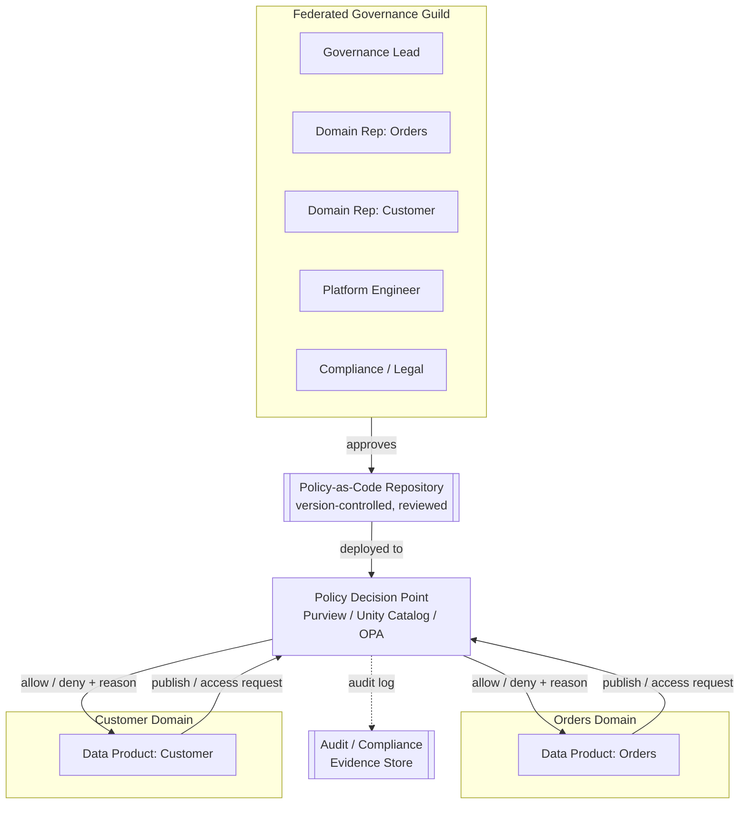
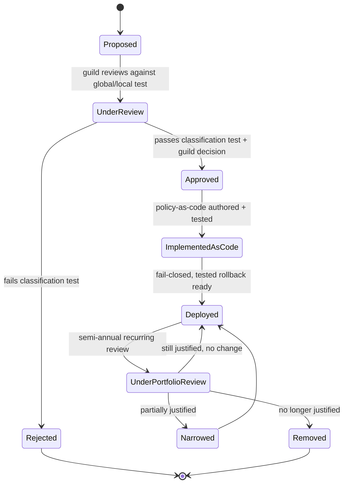
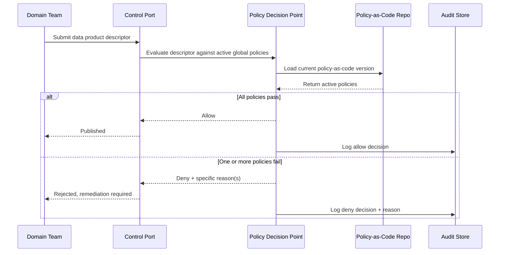

# Federated Governance

> Part of the **Enterprise Data & AI Architecture Handbook** · Phase-15 — Data Mesh & Data Fabric · Chapter 04.
> Estimated study time: **45 min reading + ~2h labs**.
> **Prerequisite:** read [Data Mesh Principles](01_Data_Mesh_Principles.md) first.

---

## Executive Summary

[Data Mesh Principles](01_Data_Mesh_Principles.md) introduced **federated computational governance** as the fourth of four inseparable principles (§1.4), and named the mechanism — global policy defined collaboratively, enforced automatically by the platform — only at the level needed to explain the mesh model as a whole. [Data Products](02_Data_Products.md) then showed exactly where that mechanism attaches to one specific artifact (a data product's control port, §8.1), and [Data Fabric](03_Data_Fabric.md) showed how active metadata and automated classification make that enforcement scale across a large, heterogeneous estate. This chapter is the direct deepening all three promised: it treats federated governance as a full discipline in its own right — who defines global policy, what "global" versus "local" actually means in practice, how policy becomes executable code, and how an organization keeps genuine domain autonomy without governance collapsing into either chaos or a reinstated bottleneck.

**Federated governance** resolves a tension every decentralized data architecture must resolve explicitly or fail implicitly: domain teams need real autonomy to move quickly (the entire point of [Data Mesh Principles](01_Data_Mesh_Principles.md) §1.1's domain ownership), and the enterprise needs consistent, auditable control over a small number of genuinely global concerns (PII handling, interoperability, regulatory compliance) that cannot be allowed to vary domain-by-domain. This chapter covers **global versus local policies** as the foundational classification exercise that must precede any governance-tooling decision; **policy as code and automation** as the mechanism that makes global policy enforcement scale without a manual review bottleneck; **interoperability standards** as the specific, narrow category of global policy that makes independently-built data products actually composable; **governance guild and roles** as the organizational structure (a federation of domain and platform representatives, not a top-down authority) that defines policy without becoming a bottleneck itself; and **balancing autonomy and control** as the recurring, never-fully-resolved tension this chapter treats as a design dial to tune deliberately, not a problem to be permanently solved once.

The platform bias is **Azure-primary (~60%)** — Microsoft Purview's policy and classification engine as the primary computational-enforcement substrate, Azure Policy for infrastructure-level governance-as-code, and Azure Databricks Unity Catalog's attribute-based access control for data-plane policy enforcement — **~30% enterprise open source** (Open Policy Agent (OPA) as the engine-agnostic policy-as-code reference implementation, Great Expectations for quality-standard enforcement, and OpenMetadata/Apache Atlas for policy-tag propagation) — **~10% AWS/GCP comparison-only** (AWS Organizations/SCPs plus Lake Formation permissions; Google Cloud Organization Policy plus Dataplex governance rules).

**Bottom line:** federated governance is not "a committee that writes policy documents" and it is not "no governance because domains are autonomous now" — it is a specific, narrow, and deliberately small set of genuinely global rules, defined by a representative federation, compiled into code, and enforced automatically at every domain's publish and access points, with everything outside that narrow set left to domain-team discretion. This chapter's recurring caution, extending the two-directional caution [Enterprise Integration Patterns](../Phase-14/06_Enterprise_Integration_Patterns.md) ADR-0174 first established in this handbook: governance can fail by being too loose (a rubber-stamp federation with no computational enforcement) or too tight (a global-policy scope creep that reinstates the exact central bottleneck data mesh exists to remove) — and getting the *scope* of "global" right is the single hardest and most consequential decision this chapter addresses.

---

## Learning Objectives

By the end of this chapter you will be able to:

1. **Classify a given governance concern as global or local**, using explicit criteria, and defend that classification against both over-centralization and under-governance objections.
2. **Translate a written governance policy into policy-as-code**, using an engine-agnostic model (OPA/Rego) and an Azure-native model (Purview/Unity Catalog), and explain the trade-offs between the two.
3. **Design interoperability standards** (common identifiers, schema conventions, semantic standards) that make independently-built data products composable without requiring central coordination for every new data product.
4. **Design a governance guild's membership, cadence, and decision rights** so that it defines policy effectively without becoming a bottleneck.
5. **Evaluate an organization's federated governance model against the autonomy-versus-control dial**, and recognize the specific symptoms of both directions of failure.
6. **Apply a decision matrix** to determine whether a specific policy proposal belongs in the "global, computationally enforced" tier or the "local, domain-team discretion" tier.
7. **Defend a federated governance design** in engineer, staff engineer, architect, and CTO review settings, including how it satisfies regulatory audit requirements without a manual, centralized review process.

---

## Business Motivation

- **A genuinely decentralized data mesh without any global governance produces inconsistent PII handling, incompatible identifiers, and unauditable compliance posture across domains** — the exact regulatory and security risk [Data Mesh Principles](01_Data_Mesh_Principles.md) §1.4 and §16 already named as unacceptable, restated here as the core business driver for this chapter's deeper treatment.
- **A governance model that routes every policy question through a central committee for manual review reintroduces the same central-team bottleneck data mesh was adopted to remove** — this is not a hypothetical risk; it is the single most common failure mode this chapter documents (§27), and it directly motivates treating "which policies are actually global" as a deliberately narrow, explicit scoping exercise rather than an open-ended list that grows by default.
- **Regulatory auditors and compliance reviewers need a single, coherent answer to "how is policy X enforced across every domain," not eleven different domain-by-domain answers** — federated governance's policy-as-code artifacts (§8.2) are what make that single coherent answer possible without requiring a central team to have hand-reviewed every domain's implementation.
- **Interoperability failures between independently-built data products (incompatible customer identifiers, inconsistent date formats, divergent currency-conversion conventions) directly undermine the composability data mesh's entire value proposition depends on** — a small, well-chosen set of interoperability standards (§8.3) is cheap to enforce and expensive to skip, since inconsistency compounds with every new data product built without them.
- **Governance-scope creep — steadily adding more concerns to the "global" tier over time — is a genuine, recurring organizational risk**, mirroring this handbook's now-repeated justification-before-adoption caution ([Data Mesh Principles](01_Data_Mesh_Principles.md) ADR-0176, [Data Products](02_Data_Products.md) ADR-0177, [Data Fabric](03_Data_Fabric.md) ADR-0178): every proposed addition to the global-policy tier must justify itself against the same bottleneck risk that motivated decentralization in the first place, not be added by default because "it seems important."

---

## History and Evolution

- **2019 — Zhamak Dehghani's founding data mesh article** (per [Data Mesh Principles](01_Data_Mesh_Principles.md) History) names federated computational governance as a principle but, consistent with the article's own scope, does not yet detail the guild structure or policy-as-code mechanics this chapter covers.
- **2020-2021 — the "federated governance" guild/council model is formalized** in subsequent ThoughtWorks writing and the 2022 "Data Mesh" book, explicitly borrowing organizational-design vocabulary from open-source project governance (a "steering committee" or "working group" with representative, not unilateral, authority) rather than inventing a wholly new governance archetype.
- **2018-2020 — Open Policy Agent (OPA) emerges from work at Styra**, becoming the CNCF's reference general-purpose, engine-agnostic policy-as-code framework — originally popularized for Kubernetes admission control (per [Kubernetes](../Phase-09/06_Kubernetes.md) §8.4's OPA/Gatekeeper coverage) and subsequently adopted well beyond Kubernetes as a general policy-decision engine, including for data-governance policy.
- **2021-2022 — data contract tooling (per [Data Mesh Principles](01_Data_Mesh_Principles.md) History, [Data Contracts](../Phase-08/07_Data_Contracts.md)) matures the specific mechanism** — machine-checkable schema and semantic validation — that a federated governance policy engine needs to enforce interoperability standards (§8.3) automatically rather than through manual schema review.
- **2022-2023 — cloud-native policy-as-code for infrastructure matures broadly** (Azure Policy, AWS Organizations Service Control Policies, GCP Organization Policy), giving federated data governance a directly-applicable, already-proven infrastructure-governance analogue to model data-policy enforcement on.
- **2023-2024 — Microsoft Purview and Azure Databricks Unity Catalog both mature attribute-based, tag-driven policy enforcement** (classification-tag-triggered masking and access rules), giving Azure-native federated governance a concrete, production-grade computational-enforcement substrate without requiring a bespoke OPA deployment for every enforcement point.
- **2024-2026 — industry practice converges on a consistently narrow "global policy" scope** (PII/sensitivity handling, a small set of interoperability standards, and regulatory-mandated controls) as the mature, working pattern — organizations that expanded the global-policy tier more broadly report the reinstated-bottleneck failure mode this chapter's Case Studies (§40) documents, while organizations that kept it narrow and genuinely automated report durable, low-friction governance — the direct empirical basis for this chapter's own scoping guidance (§25).

---

## Why This Technology Exists

A fully centralized governance model (one team reviews and approves everything) does not scale past a certain number of domains, for the same structural reason a fully centralized data platform team does not scale (per [Data Mesh Principles](01_Data_Mesh_Principles.md)'s Business Motivation). A fully decentralized governance model (every domain decides its own policy independently) does not satisfy the genuine, non-negotiable enterprise-wide obligations — regulatory compliance, PII handling consistency, interoperability — that must hold true regardless of which domain team is involved. Federated governance exists specifically to occupy the narrow, deliberately-scoped middle ground: a small set of policies that genuinely must be global are defined collaboratively and enforced automatically everywhere, while everything else is left to domain autonomy — the same "centralize only what genuinely must be centralized, decentralize everything else" logic this handbook has now applied to services ([Microservices Architecture](../Phase-14/02_Microservices_Architecture.md)), data ownership ([Data Mesh Principles](01_Data_Mesh_Principles.md)), and now governance policy itself.

---

## Problems It Solves

- **Inconsistent PII handling and access control across independently-operated domains**, resolved by a small set of globally-defined, computationally-enforced classification and masking policies applied identically regardless of domain (§8.1-8.2), directly extending [Data Mesh Principles](01_Data_Mesh_Principles.md) §16's security treatment.
- **Incompatible identifiers and formats between independently-built data products**, resolved by interoperability standards (§8.3) defined once and validated automatically at every data product's publish time (per [Data Products](02_Data_Products.md) §8.1's control port).
- **A governance function that cannot answer "how is policy X enforced across the organization" without manually surveying every domain**, resolved by policy-as-code (§8.2) providing one auditable, version-controlled artifact per global policy, applicable and inspectable across every domain uniformly.
- **The central-bottleneck risk of routing every policy question through a single reviewing authority**, resolved by the governance guild's federated, representative structure (§8.4) combined with automated enforcement — policy is *defined* collaboratively but *applied* without requiring per-instance manual sign-off.
- **Governance-scope ambiguity** ("is this a global or a local concern?") that, left unresolved, either creates inconsistent domain-by-domain interpretation or invites scope creep into an ever-growing global-policy list, resolved by the explicit global-versus-local classification criteria this chapter's Core Concepts (§8.1) and Decision Matrix (§25) provide.

---

## Problems It Cannot Solve

- **Federated governance does not eliminate the need for genuine domain expertise in correctly implementing local, non-global policy decisions** — a domain team still bears full responsibility for the quality and correctness of everything outside the narrow global-policy scope; federation defines the boundary, it does not do the domain's own governance work for it.
- **It does not automatically resolve genuine policy disagreement between domain representatives in the governance guild** — a federation with members who disagree about whether a specific concern belongs in the global tier still requires a real decision-rights mechanism (§8.4) to resolve that disagreement; federation changes *who* participates in the decision, not whether disagreement can occur.
- **It does not substitute for the underlying technical capability to enforce a policy computationally.** A globally-agreed policy with no platform mechanism capable of checking it automatically (per [Data Mesh Principles](01_Data_Mesh_Principles.md) §17's scalability caution) degrades to the same rubber-stamp risk regardless of how well the guild defined the policy on paper.
- **It does not remove the genuine, ongoing cost of maintaining policy-as-code artifacts as global requirements evolve** (a new regulation, a new interoperability need) — policy-as-code is more auditable and more scalable than manual review, but it is not maintenance-free, and this chapter's Cost Optimization section (§20) treats that ongoing cost explicitly.
- **It does not fix a governance guild with the wrong membership or no real decision authority** — a federation in name only, where domain representatives have no actual influence over the policies eventually enforced against their own domains, reproduces exactly the "consultation theater" version of the same governance-legitimacy problem this chapter's Anti-patterns section (§27) names directly.

---

## Core Concepts

### 4.1 Global versus local policies

- **A global policy is one that must hold true identically across every domain, regardless of which team owns the data, because varying it by domain creates a genuine enterprise-wide risk** — PII classification and masking rules, a small set of interoperability standards (§4.3), and regulatory-mandated controls (per [Compliance and Regulatory Frameworks](../Phase-10/06_Compliance_and_Regulatory_Frameworks.md)) are the canonical examples: an organization cannot tolerate one domain masking PII correctly and another not, or one domain using a customer identifier scheme incompatible with every other domain's.
- **A local policy is everything a domain team should be free to decide for itself without cross-domain coordination** — internal naming conventions beyond the interoperability minimum, a domain's own internal data-quality thresholds beyond the minimum required for its published data products' SLAs (per [Data Products](02_Data_Products.md) §2.3), and a domain's own choice of compute engine or transformation tooling (per [Data Mesh Principles](01_Data_Mesh_Principles.md) §16).
- **The classification test that separates the two**: ask "does varying this policy by domain create a risk or inconsistency that harms *other* domains or the enterprise as a whole, or does it only affect the domain making the choice?" — a policy that fails this test (harms only the deciding domain) should default to local; a policy that passes it (creates genuine cross-domain harm if inconsistent) is a global-policy candidate, subject to the further scope-creep discipline in §25.
- **The global-policy list should be small and should require active justification to grow**, not default-expand — this chapter's central, repeated caution (mirroring the Business Motivation's scope-creep risk): every additional item on the global list is one more thing every domain team must comply with regardless of context, and one more thing the platform must be able to computationally enforce; the list's size is itself a leading indicator of whether the organization is preserving genuine domain autonomy or quietly reinstating centralization under federated branding.

### 4.2 Policy as code and automation

- **Policy as code** expresses a governance rule as an executable artifact — a Rego policy (OPA), a Purview classification-and-labeling rule, or a Unity Catalog attribute-based access policy — that a platform component evaluates automatically at a defined enforcement point (a data product's publish-time control port, per [Data Products](02_Data_Products.md) §8.1, or a fabric's query-execution point, per [Data Fabric](03_Data_Fabric.md) §16), rather than a policy document a human reviewer consults manually.
- **A policy-as-code artifact must be version-controlled and reviewed with the same rigor as application code** (per [Infrastructure as Code with Terraform](../Phase-09/04_Infrastructure_as_Code_with_Terraform.md)'s policy-as-code precedent) — a change to a global policy is a pull request the governance guild reviews and approves, not an informal update to a wiki page, so that the enforced rule set and its change history are both auditable.
- **Fail-closed enforcement is the default for every global policy** — a descriptor or access request that cannot be validated against a global policy (because the policy engine is unavailable, or the policy check itself errors) should be rejected, not silently allowed through, the same fail-closed discipline this handbook has established repeatedly for access-control and safety gates (per [Vector Databases: Qdrant and Milvus](../Phase-13/01_Vector_Databases_Qdrant_and_Milvus.md) ADR-0164, [Evaluation and Guardrails](../Phase-12/09_Evaluation_and_Guardrails.md) ADR-0163).
- **Automation's role is to make the guild's *defined* policy scale to every domain without manual per-instance review — it does not decide what the policy should be.** The guild (§4.4) retains full authority over policy content; the policy engine only ensures that content is applied consistently and continuously once agreed.

### 4.3 Interoperability standards

- **Interoperability standards are the specific, narrow category of global policy that makes independently-built data products composable without requiring central coordination for every new integration** — a common customer-identifier scheme resolving against the MDM golden record (per [Master Data Management](../Phase-08/05_Master_Data_Management.md)), a common date/time and currency representation, and a common event-envelope standard (per [Event-Driven Architecture](../Phase-14/01_Event_Driven_Architecture.md) §8.4's CloudEvents treatment) are the canonical examples.
- **An interoperability standard's value compounds with the number of data products that adopt it, and its cost of retrofitting compounds with how long adoption is deferred** — the earlier a standard is defined and enforced (ideally before more than a handful of data products exist), the cheaper it is to apply uniformly; retrofitting a customer-identifier standard across fifty already-published, independently-evolved data products is a materially larger undertaking than enforcing it from each product's first publication.
- **Interoperability standards should be validated computationally at publish time** (per [Data Products](02_Data_Products.md) §8.1's control port) — a descriptor using a non-standard customer-identifier field, or a non-standard date format, should be rejected at publication, not discovered later when a consumer's cross-domain join silently produces wrong results.
- **Interoperability standards are deliberately narrower in scope than a full enterprise data model** — this chapter does not advocate for globally standardizing every field or schema convention across every domain (which would reproduce centralized-modeling's own coordination cost); it advocates for standardizing only the small number of fields and conventions that genuinely need to compose across domain boundaries.

### 4.4 Governance guild and roles

- **The governance guild (also called a federated governance council, per [Data Mesh Principles](01_Data_Mesh_Principles.md) §1.4) is a representative body of domain-team delegates plus the platform/governance function**, meeting on a defined cadence to propose, review, and approve changes to the global-policy list and its policy-as-code implementation — not a top-down authority imposing policy unilaterally, and not merely an advisory body with no actual decision rights.
- **Concrete roles**: a **data governance lead** (chairs the guild, owns the overall global-policy scope and its scope-creep discipline), **domain data-product owners** (represent their domain's interests and implementation constraints when a new global policy is proposed), **platform engineers** (implement and maintain the policy-as-code enforcement mechanism), and **compliance/legal representatives** (bring regulatory-mandated requirements into the guild's scope, per [Compliance and Regulatory Frameworks](../Phase-10/06_Compliance_and_Regulatory_Frameworks.md)).
- **Decision rights must be explicit, not assumed** — does the guild operate by consensus, by the governance lead's final authority after consultation, or by a defined voting mechanism? An unclear decision-rights model is a common, avoidable source of the "consultation theater" anti-pattern (§27), where domain representatives participate in discussion but have no actual influence over the outcome.
- **The guild's own cadence and process must not become a bottleneck** — a guild that only meets quarterly and requires full-guild sign-off for every minor policy clarification will, functionally, slow down exactly the kind of routine governance evolution this model exists to keep fast; a tiered approval model (minor/clarifying changes approved by the governance lead alone; genuinely new global-policy-scope additions requiring full-guild review) is a common, effective mitigation.

### 4.5 Balancing autonomy and control

- **Autonomy and control are not a one-time trade-off resolved at initial design time — they are a dial that must be deliberately re-tuned as the organization, its regulatory obligations, and its domain maturity change.** A newly-onboarded, less mature domain team may need more prescriptive local-policy guidance (even if not formally global) than a domain team with a long, demonstrated track record of sound local governance.
- **The symptoms of too much control** (autonomy eroded): domain teams routing routine decisions through the guild that should be local, slow time-to-publish for new data products, and domain teams building workarounds to bypass an over-broad global-policy check that impedes work the check was never intended to block.
- **The symptoms of too little control** (governance eroded): inconsistent PII handling discovered only during an audit, interoperability failures discovered only when a cross-domain join produces silently wrong results, and a compliance review that cannot produce a single, coherent answer for how a given regulatory requirement is enforced across the organization.
- **This chapter's Decision Matrix (§25) and Best Practices (§29) both treat "review the global-policy list's size and scope on a recurring cadence, and actively remove or narrow policies that have drifted beyond their original justification" as equally important to the more commonly-discussed discipline of adding new global policies when a genuine new need is identified** — the dial can drift in either direction, and correcting drift in the over-control direction is just as legitimate a governance action as adding a new global policy in the under-control direction.

---

## Internal Working

### 5.1 How a policy proposal becomes an enforced rule

A domain representative, compliance stakeholder, or platform engineer proposes a new global policy (or a change to an existing one) to the governance guild, explicitly justifying it against the global-versus-local classification test (§4.1) — the proposal must articulate the specific cross-domain harm that inconsistency would cause, not merely assert general importance. The guild reviews and, per its defined decision-rights model (§4.4), approves or rejects the proposal. On approval, a platform engineer implements the policy as a version-controlled policy-as-code artifact (Rego, a Purview classification rule, or a Unity Catalog access policy), which is tested against a representative sample of existing data products before being deployed to the enforcement point (a control port, per [Data Products](02_Data_Products.md) §8.1) in fail-closed mode.

### 5.2 How enforcement actually runs at scale

At a data product's publish time or a fabric query's execution time, the platform's policy-decision point evaluates the relevant descriptor or request against every currently-active global policy-as-code artifact, using the descriptor's or request's metadata (classification tags, schema fields, per [Data Mesh Principles](01_Data_Mesh_Principles.md) §10, [Data Fabric](03_Data_Fabric.md) §12) as input. A failing evaluation blocks the action (fail-closed, §4.2) and returns a specific, actionable reason (which policy failed and why) so the domain team can remediate without needing to contact the governance guild directly for routine, well-understood violations.

### 5.3 How the global-policy list is kept from growing unbounded

On a recurring cadence (commonly semi-annual), the governance guild reviews the full current global-policy list against its original justification — has the cross-domain harm the policy was meant to prevent actually materialized or remained a live risk, and is the policy still the narrowest effective intervention, or has a better-scoped local alternative since become available? A policy that no longer meets its original justification is a candidate for removal or narrowing, following the same discipline [Data Mesh Principles](01_Data_Mesh_Principles.md) §25 applied to individual data products' adoption-metrics-driven lifecycle review, now applied to the governance policy portfolio itself.

---

## Architecture



The architecture separates policy *authorship* (the guild, deliberately human and representative) from policy *enforcement* (the policy decision point, deliberately automated and applied identically regardless of domain) — the guild's output is a reviewed, version-controlled artifact, not a manual gate any specific request must pass through, and every enforcement decision is logged to an audit store that a compliance review can inspect directly rather than requiring a domain-by-domain manual survey.

---

## Components

- **Governance guild**: the representative body (§4.4) that proposes, reviews, and approves global-policy changes.
- **Policy-as-code repository**: the version-controlled source of truth for every enforced global policy, reviewed through the same pull-request process as application code.
- **Policy decision point (PDP)**: the platform component (Purview, Unity Catalog, or an OPA deployment) that evaluates a descriptor or access request against every active global policy at a defined enforcement point.
- **Enforcement points**: the specific integration points where the PDP is actually invoked — a data product's control port at publish time (per [Data Products](02_Data_Products.md) §8.1), and a fabric's query-execution point (per [Data Fabric](03_Data_Fabric.md) §16).
- **Audit/compliance evidence store**: the durable, queryable log of every policy-decision outcome, the artifact a compliance review inspects directly rather than requiring a manual domain-by-domain survey.
- **Interoperability-standard registry**: the specific, narrow subset of the policy-as-code repository defining the enterprise's small set of common identifiers, formats, and conventions (§4.3), validated at the same enforcement points.

---

## Metadata

- **Every policy-as-code artifact carries its own metadata**: the guild-approval record (date, decision, guild members present), its original justification (the specific cross-domain harm it addresses), its version history, and its next scheduled recurring-review date (per §5.3) — this metadata is itself what makes a semi-annual policy-portfolio review tractable rather than requiring the guild to reconstruct context from scratch each time.
- **Every enforcement decision logged to the audit store carries the specific policy version evaluated, the input descriptor/request metadata, and the outcome (allow/deny + reason)** — sufficient detail for a compliance reviewer to reconstruct, after the fact, exactly why a specific decision was made without needing to interview the platform team.
- **Interoperability-standard metadata (§4.3) must be machine-comparable across domains** — a customer-identifier standard's definition must be precise enough (field name, format, MDM-resolution requirement) that a control port's automated validation (per [Data Products](02_Data_Products.md) §8.1) can check conformance mechanically, not merely documented in prose a human must interpret.

---

## Storage

- **The policy-as-code repository is stored in the same version-control system as application and infrastructure code** (per [Infrastructure as Code with Terraform](../Phase-09/04_Infrastructure_as_Code_with_Terraform.md)'s policy-as-code precedent), not a separate, less-rigorously-managed location, so that its change history benefits from the same code-review, branch-protection, and audit trail as everything else under version control.
- **The audit/compliance evidence store requires durable, tamper-resistant, and long-retention storage** — consistent with [Compliance and Regulatory Frameworks](../Phase-10/06_Compliance_and_Regulatory_Frameworks.md)'s evidence-retention requirements, since a compliance audit may need to inspect enforcement decisions from well outside a typical operational-log retention window.
- **Policy decision outcomes should be append-only** at the audit-store layer — a policy decision, once made and logged, should never be silently edited or deleted, preserving the same immutable-audit-trail property [Event Sourcing](../Phase-14/04_Event_Sourcing.md) established for its append-only event store, applied here to governance-decision evidence specifically.

---

## Compute

- **Policy decision point evaluation must run on the critical, latency-sensitive path of a publish or query request** (per [Data Products](02_Data_Products.md) §8.1's control-port validation and [Data Fabric](03_Data_Fabric.md) §16's query-time enforcement) — this constrains the PDP's own compute to be fast and highly available, since a slow or unavailable PDP under fail-closed enforcement (§4.2) blocks legitimate publish and query activity across every domain simultaneously, a genuine shared-infrastructure availability requirement, not merely a performance nicety.
- **Policy-portfolio review compute (the semi-annual audit against original justification, per §5.3) is a lightweight, human-driven process supported by, but not primarily consuming, platform compute** — the compute cost here is concentrated in generating the supporting evidence (usage statistics, audit-log summaries per policy) rather than in the review process itself.

---

## Networking

- **The policy decision point must be reachable from every domain's publish and query paths across the mesh**, which — combined with [Data Mesh Principles](01_Data_Mesh_Principles.md) §15's networking treatment — means the PDP is genuinely shared, cross-domain infrastructure requiring the same private-endpoint, zero-trust network posture (per [Network Security and Zero Trust](../Phase-10/04_Network_Security_and_Zero_Trust.md)) as any other shared platform component.
- **A PDP deployed as a regional or per-cloud-region instance for latency reasons must keep its policy-as-code version synchronized across every instance** — a stale policy version enforced in one region while a newer version is enforced in another produces exactly the inconsistent-enforcement risk (§4.1) federated governance exists to prevent, now at an infrastructure-topology level rather than an organizational one.

---

## Security

- **The policy decision point is among the highest-value security targets in the entire mesh architecture** — a compromised or bypassed PDP means every domain's PII-masking and access-control enforcement is simultaneously at risk, not just one domain's; the PDP's own access control, deployment pipeline, and monitoring must be held to at least the same rigor as the most sensitive individual data product it protects.
- **Policy-as-code changes must go through the same secure software-development lifecycle as application code** (per [Security in the SDLC](../Phase-10/01_Security_Foundations.md)'s shift-left principles) — a malicious or erroneous policy change (e.g., silently weakening a PII-masking rule) is a genuine security incident, not merely a governance process error, and should be caught by the same code-review and testing discipline as any other security-relevant code change.
- **Fail-closed enforcement (§4.2) is itself the primary security property this chapter's model provides** — an unavailable or erroring PDP that fails open (allowing requests through unchecked) converts a shared-infrastructure availability problem into a shared-infrastructure security breach, which is exactly why this chapter treats fail-closed as non-negotiable rather than a configurable preference.

---

## Performance

- **PDP evaluation latency directly adds to every publish and query operation across the mesh** — a poorly-optimized policy evaluation (checking many policies with expensive individual checks) becomes a mesh-wide performance tax, not a localized one, making PDP performance engineering a genuinely cross-cutting concern rather than a per-domain optimization.
- **Caching policy-decision outcomes for identical, repeated requests (where the underlying descriptor/request and active policy version have not changed) is a common, effective PDP performance optimization** — provided cache invalidation is correctly tied to policy-version changes, so that a newly-approved policy update takes effect promptly rather than being masked by a stale cached "allow" decision.
- **The narrow global-policy-list discipline (§4.1, §25) is itself a performance lever, not only an autonomy lever** — every additional global policy is one more check the PDP must evaluate on every request; keeping the list deliberately small keeps the PDP's per-request latency bounded, an additional, concrete reason beyond autonomy preservation to resist global-policy scope creep.

---

## Scalability

- **The PDP's evaluation throughput must scale with the aggregate publish-and-query volume across every domain in the mesh simultaneously**, the same shared-platform-scalability concern [Data Mesh Principles](01_Data_Mesh_Principles.md) §17 and [Data Products](02_Data_Products.md) §18 already flagged for the catalog and SLA health-check services respectively, now applying to the policy-enforcement layer.
- **The governance guild's own capacity to review and approve policy proposals must scale with organizational growth, but need not scale linearly with domain count** — because the global-policy list is deliberately kept narrow (§4.1), the guild's workload grows primarily with the rate of *genuinely new* global-policy needs (new regulations, new interoperability requirements), not with the number of domains, which is precisely the scaling property that keeps the guild from becoming a bottleneck even as the mesh grows.

---

## Fault Tolerance

- **A PDP outage under fail-closed enforcement (§4.2) blocks legitimate publish and access activity mesh-wide** — a deliberate, accepted trade-off (safety over availability for governance-critical checks) that must be matched with genuine PDP high-availability engineering, not treated as an acceptable steady-state risk; this mirrors the fail-closed-versus-fail-open differentiated treatment [Evaluation and Guardrails](../Phase-12/09_Evaluation_and_Guardrails.md) and [LLMOps](../Phase-12/04_LLMOps.md) established for safety-critical versus precision-only checks, with global governance policy squarely in the safety-critical category.
- **A policy-as-code artifact with a bug (an overly-strict or overly-permissive rule) is a genuine incident class distinct from a PDP infrastructure outage** — the recurring-review discipline (§5.3) and mandatory testing-against-representative-samples before deployment (§5.1) are the primary mitigations, but a rapid rollback mechanism for a newly-deployed, misbehaving policy version is also a necessary fault-tolerance capability, directly paralleling this handbook's atomic-versioned-rollback precedent from [LLMOps](../Phase-12/04_LLMOps.md) ADR-0158.

---

## Cost Optimization (FinOps)

- **The PDP and audit-evidence-store infrastructure is a shared platform cost**, following the same centralized-cost-tracking discipline [Data Mesh Principles](01_Data_Mesh_Principles.md) §20 established for the self-serve platform generally, rather than being charged back per-domain in a way that might create a perverse incentive for domains to bypass governance checks to reduce their own cost allocation.
- **The governance guild's own time (a representative body meeting on a defined cadence) is a real, if often unaccounted-for, organizational cost**, and should be weighed against the narrow-global-policy-list discipline (§4.1): a guild spending most of its time debating whether a proposed policy genuinely belongs in the global tier, rather than actually defining well-scoped policy, signals that the classification criteria (§4.1) need to be made more concrete and less subjective.
- **Worked FinOps example**: an organization's governance guild meets bi-weekly, with eight members averaging 1.5 hours of guild-related time weekly (meeting plus prep), at a blended fully-loaded cost of ~$90/hour ≈ 8 × 1.5 × $90 ≈ **$1,080/week ≈ $56K/year** in guild-participation cost. A subsequent semi-annual portfolio review (§5.3) identifies that three of the eleven current global policies no longer meet their original justification (two were narrowly-scoped one-time regulatory requirements since superseded by an updated, broader rule; one had been proposed defensively "just in case" and had triggered zero enforcement denials in 18 months of production use). Removing those three reduces the PDP's per-request evaluation count by roughly 27%, and — more significantly — frees a proportional share of the guild's ongoing review and maintenance burden, illustrating that the FinOps case for a disciplined, narrow global-policy list is not only about PDP compute cost but about the guild's own, otherwise-easy-to-overlook time cost compounding with every policy that outlives its justification.

---

## Monitoring

- **Per-policy denial-rate monitoring**: tracking how frequently each global policy actually triggers a denial, both as an operational signal (a spiking denial rate for one policy may indicate a domain team's genuine misunderstanding worth proactive outreach) and as direct input to the semi-annual portfolio review's (§5.3) "has this policy meaningfully triggered in the review period" justification check.
- **PDP availability and latency monitoring** as core, shared-platform-infrastructure SLOs, given the fail-closed-enforcement consequence (§19) of any PDP degradation.
- **Guild cadence and throughput monitoring**: tracking proposal-to-decision turnaround time for policy proposals, as a leading indicator of whether the guild's own process (not the underlying policy content) has begun to function as a bottleneck.

---

## Observability

- **Every enforcement decision's audit record (§11) must be queryable by policy, by domain, and by time range**, so that both a routine compliance review and an ad hoc incident investigation ("was this specific access request correctly evaluated against policy X on this date") can be answered directly from the audit store without reconstructing context from scattered logs.
- **Policy-as-code version history must be correlated with enforcement-outcome history** — an observability view showing "this policy's enforcement outcomes shifted at this date" should make it straightforward to correlate that shift with a specific, identifiable policy-version change, rather than requiring a separate investigation to connect the two.

### Operational Response Playbook

| Signal | Detection Query / Check | Remediation |
|---|---|---|
| The Policy Decision Point becomes unavailable or its evaluation latency spikes materially above baseline | Health-check and latency monitoring on the PDP's evaluation endpoint, alerting on availability or p99-latency threshold breach | Page the platform team immediately (fail-closed enforcement means this is blocking legitimate mesh-wide activity, not merely degraded); if unresolved within a defined incident SLA, invoke a pre-approved, narrowly-scoped emergency break-glass procedure (logged and reviewed after the fact) rather than silently switching to fail-open |
| A newly-deployed policy version shows a denial-rate spike far exceeding its pre-deployment testing-against-representative-samples estimate | Automated comparison of a new policy version's actual production denial rate (first 24-48 hours) against its pre-deployment test-sample denial rate | Roll back to the prior policy version immediately (per §19's rapid-rollback requirement), notify the governance guild, and investigate whether the new policy has a genuine bug or whether it is correctly surfacing a real, previously-undetected compliance gap before re-deploying |

---

## Governance

- **This chapter's entire subject *is* the governance mechanism** [Data Mesh Principles](01_Data_Mesh_Principles.md) §23 referenced — this section therefore focuses specifically on governing the governance mechanism itself: the guild's own charter (membership, cadence, decision rights, per §4.4) should itself be a documented, version-controlled artifact, reviewed and updated with the same deliberateness as any individual policy.
- **The governance guild's decisions and their justifications are themselves part of the auditable record** — a regulator or internal audit function should be able to inspect not only what is currently enforced but why each policy was originally approved and whether it has been reviewed on schedule (per §5.3), giving a defensible answer to "how do we know our governance process itself is working" beyond simply pointing at the enforced rules.
- **Escalation paths for genuine policy disagreement must be defined in the guild's charter**, not improvised when a disagreement first occurs — whether that is a defined voting threshold, an appeal to a named executive sponsor, or another explicit mechanism, an undefined escalation path is a common, avoidable source of governance-process breakdown under real disagreement.

---

## Trade-offs

| Dimension | Fully Centralized Governance (manual review) | Federated Governance (guild + policy-as-code) | Fully Decentralized (no global policy) |
|---|---|---|---|
| Consistency across domains | High, by construction | High, if computationally enforced; degrades to low if not | Low — every domain decides independently |
| Scalability with domain count | Poor — central team becomes a bottleneck | Good — narrow global scope + automation scales | Excellent, but at the cost of consistency |
| Domain autonomy | Low | High for everything outside the narrow global scope | Maximal |
| Auditability | High (one team, one process) but slow to produce evidence at scale | High and fast — policy-as-code + audit log are directly inspectable | Low — no single, coherent enforcement story exists |
| Risk of scope creep in either direction | N/A (already maximally centralized) | Real, ongoing risk requiring deliberate management (§25, §5.3) | N/A (already maximally decentralized) |

---

## Decision Matrix

| Signal | Recommendation |
|---|---|
| A proposed policy's inconsistent application across domains would create a genuine cross-domain or regulatory risk | Global-policy candidate — bring to the guild with the specific cross-domain harm articulated (§4.1's classification test) |
| A proposed policy only affects the deciding domain's own internal quality or convention | Local — leave to domain-team discretion; do not bring to the guild |
| A global policy has triggered zero or near-zero enforcement denials over an extended production period, with no clear ongoing risk if removed | Candidate for removal or narrowing at the next semi-annual portfolio review (§5.3) |
| The organization has fewer than roughly 4-5 domains and no near-term regulatory complexity | A lightweight, even informally-federated governance approach may suffice — the full guild/policy-as-code apparatus may itself be disproportionate overhead at this scale (mirrors [Data Mesh Principles](01_Data_Mesh_Principles.md) §25's own small-organization guidance) |
| Domain teams are routinely routing routine, clearly-local decisions through the guild for sign-off | The autonomy-control dial (§4.5) has drifted toward too much control — clarify the global-versus-local classification criteria and push routine decisions back to domain discretion |
| A compliance audit cannot get a single, coherent, evidence-backed answer for how a regulatory requirement is enforced across domains | The autonomy-control dial has drifted toward too little control, or enforcement is not genuinely computational — treat as an urgent governance gap, not merely a reporting inconvenience |

---

## Design Patterns

- **Narrow-list discipline with active justification required to add**: treat every proposed addition to the global-policy list as requiring an explicit, articulated cross-domain-harm justification (§4.1), and default to rejecting or deferring proposals that cannot articulate one.
- **Fail-closed policy-as-code with tested rollback**: every policy-as-code deployment is tested against a representative sample before going live, deployed in fail-closed mode, and has a pre-validated rollback path ready before deployment, not designed reactively after an incident.
- **Tiered guild approval**: minor, clarifying policy changes approved by the governance lead alone; genuinely new global-policy-scope additions requiring full-guild review — preventing the guild's own process from becoming the bottleneck named in the Business Motivation.
- **Recurring, adoption-metrics-style policy-portfolio review**: apply the same "measure actual impact, don't assume permanent justification" discipline [Data Products](02_Data_Products.md) §37 established for individual data products to the governance policy portfolio as a whole (§5.3), on a defined recurring cadence.

---

## Anti-patterns

- **Governance-by-rubber-stamp federation**: a guild that meets and produces policy documents with no computational enforcement mechanism behind them — already named in [Data Mesh Principles](01_Data_Mesh_Principles.md) §25, restated here as this chapter's own primary anti-pattern since it is precisely this chapter's subject matter failing to deliver on its purpose.
- **Reinstated central bottleneck via global-policy scope creep**: the global-policy list grows, unreviewed, to cover an ever-broadening set of concerns, until nearly every domain decision requires guild involvement — the opposite-direction failure of the same principle, and this chapter's single most emphasized caution.
- **Consultation theater**: domain representatives participate in guild discussions but have no actual, defined decision-rights influence over the outcome — policy is effectively still decided unilaterally by the governance lead or platform team, with the guild's federated structure existing only in appearance.
- **Policy-as-code without version control or review rigor**: treating policy-as-code artifacts as informal scripts maintained ad hoc by whichever platform engineer last touched them, rather than under the same code-review discipline as application code — reintroducing exactly the unauditable-change risk policy-as-code was adopted to prevent.
- **Fail-open enforcement "temporarily" during an incident, left in place indefinitely**: a PDP outage handled by disabling enforcement rather than invoking a properly-scoped, logged break-glass procedure, with the fail-open state never formally reverted — converting an availability incident into a silent, ongoing security and compliance gap.

---

## Common Mistakes

- **Treating "federated" as synonymous with "informal" or "advisory-only"** — a guild without explicit, documented decision rights (§4.4) functions as consultation theater regardless of good intentions.
- **Adding a new global policy without articulating the specific cross-domain harm it prevents**, relying instead on general statements of importance — a proposal that cannot pass the §4.1 classification test should not be added to the global tier regardless of how well-intentioned it is.
- **Never revisiting the global-policy list once established**, allowing scope creep and stale, no-longer-justified policies to accumulate indefinitely rather than applying the recurring portfolio review (§5.3) as a standing discipline.
- **Deploying a new or changed policy-as-code artifact directly to production without testing against a representative sample first**, risking exactly the denial-rate-spike incident this chapter's Operational Response Playbook (§22) is designed to catch after the fact rather than prevent beforehand.
- **Confusing an interoperability standard (a narrow, specific technical convention, §4.3) with a full enterprise data model** — attempting to standardize far more than the minimum needed for cross-domain composability reproduces centralized-modeling's coordination cost under a federated-governance label.

---

## Best Practices

- **Keep the global-policy list deliberately small and require an explicit, articulated cross-domain-harm justification for every addition.**
- **Express every global policy as version-controlled, code-reviewed policy-as-code, deployed in fail-closed mode with a tested rollback path.**
- **Give the governance guild explicit, documented decision rights**, and use a tiered approval model so routine, minor policy clarifications do not require full-guild sign-off.
- **Run a recurring (semi-annual or annual) policy-portfolio review** applying the same adoption-metrics-driven discipline [Data Products](02_Data_Products.md) §37 established for individual data products, actively removing or narrowing policies that no longer meet their original justification.
- **Log every enforcement decision to a durable, queryable audit store**, and ensure a compliance reviewer can answer "how is policy X enforced across the organization" directly from that store without a manual domain-by-domain survey.
- **Never leave a fail-open state in place beyond a scoped, logged break-glass incident window** — restore fail-closed enforcement as soon as the underlying PDP issue is resolved, and review every break-glass invocation after the fact.

---

## Enterprise Recommendations

- **Charter the governance guild formally**, with documented membership, cadence, and explicit decision rights, before defining its first policy — an undefined charter is the direct root cause of both the consultation-theater and bottleneck anti-patterns (§27).
- **Invest in a genuine policy-as-code enforcement substrate (Purview/Unity Catalog for Azure-native estates, or OPA for engine-agnostic coverage) as core, funded platform infrastructure**, following the same self-serve-platform investment discipline [Data Mesh Principles](01_Data_Mesh_Principles.md) §20 already justified — a guild with no computational-enforcement capability behind it cannot deliver on this chapter's model regardless of how well it defines policy.
- **Schedule the semi-annual policy-portfolio review as a standing, calendared governance activity from the guild's first meeting**, not as an ad hoc activity added only once scope creep has already become a visible problem.
- **Treat the autonomy-control balance (§4.5) as a standing agenda item at every guild meeting**, explicitly asking whether recent domain-team feedback suggests the dial has drifted in either direction, rather than only discovering drift reactively through an incident or complaint.

---

## Azure Implementation

- **Microsoft Purview** as the primary policy-decision-point substrate for data-plane governance: classification-and-labeling rules implementing PII-handling global policy, and Purview's policy management capability extending access-control decisions across Azure Databricks, Azure SQL, and ADLS Gen2 uniformly from one managed control plane.
- **Azure Databricks Unity Catalog attribute-based access control (ABAC)** as the enforcement mechanism at the compute-and-query layer specifically, evaluating classification tags (fed from Purview or defined natively) against access requests in real time — the concrete Azure-native implementation of this chapter's §5.2 enforcement mechanics for Databricks-based domains.
- **Azure Policy** as the infrastructure-governance-as-code layer (distinct from, but philosophically identical to, the data-governance policy-as-code this chapter covers) — useful for enforcing platform-level guardrails (e.g., "every new storage account provisioned for a domain must have public network access disabled") that support, though do not themselves constitute, the data-policy enforcement this chapter's core concepts address.
- **Concrete Rego (OPA) policy sketch**, illustrating engine-agnostic policy-as-code for the interoperability-standard example (§4.3) — rejecting a data product descriptor that does not use the enterprise-standard customer-identifier field:

```rego
package data_product.interoperability

import future.keywords.in

# Deny if the descriptor references a "customer" entity without the
# enterprise-standard MDM-resolved identifier field.
deny[msg] {
    input.descriptor.entity_type == "customer"
    not "customer_mdm_id" in input.descriptor.schema_fields
    msg := sprintf(
        "Descriptor '%s' references a customer entity but does not include the standard 'customer_mdm_id' field required by interoperability standard INTEROP-002",
        [input.descriptor.product_name]
    )
}

# Deny if a PII-tagged field has no declared masking policy.
deny[msg] {
    some field in input.descriptor.schema_fields
    field.classification == "PII"
    not field.masking_policy
    msg := sprintf(
        "Field '%s' in descriptor '%s' is classified PII but declares no masking_policy",
        [field.name, input.descriptor.product_name]
    )
}
```

---

## Open Source Implementation

- **Open Policy Agent (OPA)** as the engine-agnostic reference policy-as-code framework (§31's Rego sketch), deployable as a sidecar or a shared decision-service endpoint invoked from any control port or fabric query path regardless of underlying compute engine — the primary open-source alternative to a Purview/Unity-Catalog-only enforcement model, and the natural choice for organizations needing consistent policy enforcement across genuinely heterogeneous, multi-cloud, or non-Azure-primary estates.
- **Great Expectations** (per [Data Quality with Great Expectations](../Phase-08/03_Data_Quality_with_Great_Expectations.md)) as the enforcement mechanism specifically for global data-quality-minimum policies, where such a policy exists (a global minimum quality-check-pass-rate threshold, distinct from a domain's own stricter internal SLO).
- **OpenMetadata or Apache Atlas** (per [Metadata Management: OpenMetadata and Atlas](../Phase-08/04_Metadata_Management_OpenMetadata_and_Atlas.md)) as the classification-tag propagation substrate feeding the PDP's policy evaluation input for organizations not using Purview.
- **Git plus a standard CI pipeline (GitHub Actions/Azure DevOps)** as the policy-as-code review-and-deployment mechanism — no bespoke tooling is required beyond what [Infrastructure as Code with Terraform](../Phase-09/04_Infrastructure_as_Code_with_Terraform.md) and [DevOps and CI/CD](../Phase-09/03_DevOps_and_CI_CD.md) already established for application and infrastructure code.

---

## AWS Equivalent (comparison only)

| Azure | AWS | Notes |
|---|---|---|
| Microsoft Purview policy management | AWS Lake Formation permissions plus AWS Organizations Service Control Policies (SCPs) | AWS splits data-plane (Lake Formation) and account/org-level (SCP) policy enforcement across two distinct services more explicitly than Purview's more unified data-governance control plane |
| Unity Catalog ABAC | Databricks Unity Catalog on AWS (same product) | Directly equivalent, since Databricks is the cross-cloud constant |
| OPA (self-hosted, cloud-agnostic) | OPA (self-hosted, identical) or AWS Verified Permissions (Cedar-policy-language-based) | AWS's native Verified Permissions uses Cedar rather than Rego; OPA remains directly portable and cloud-agnostic if avoiding a cloud-native policy-language lock-in is a priority |

**Migration guidance**: an OPA-based policy-as-code implementation migrates between Azure and AWS with minimal change, since OPA itself is cloud-agnostic; a Purview-centric implementation requires re-platforming its classification and policy rules onto Lake Formation permissions and SCPs, a materially larger effort given the less-unified AWS control-plane split.

---

## GCP Equivalent (comparison only)

| Azure | GCP | Notes |
|---|---|---|
| Microsoft Purview policy management | Dataplex governance rules plus Google Cloud Organization Policy | Dataplex's data-mesh/fabric-oriented governance rules (per [Data Fabric](03_Data_Fabric.md) §34) are the closer data-plane analogue; Organization Policy covers account/org-level guardrails analogous to Azure Policy |
| Unity Catalog ABAC | Databricks Unity Catalog on GCP (same product) | Same cross-cloud-constant equivalence |
| OPA | OPA (identical) | Fully portable |

**Selection criteria**: an organization already GCP-primary should evaluate Dataplex's native governance-rule engine directly against this chapter's global-versus-local classification discipline (§4.1) — Dataplex provides genuine data-plane policy enforcement comparable in intent to Purview, but the guild-charter, decision-rights, and scope-creep-management practices this chapter describes remain an organizational discipline no platform automates on its own.

---

## Migration Considerations

- **Migrating from an informal or purely-manual governance model to federated governance is itself a phased program**: charter the guild and agree the initial (deliberately small) global-policy list first, implement policy-as-code for that initial list, and only then expand incrementally through the guild's own proposal process — attempting to codify a large, pre-existing informal policy corpus all at once risks importing years of undocumented, possibly-inconsistent practice directly into the new model's initial global-policy list without the classification discipline (§4.1) ever being applied.
- **Migrating an existing global policy from one enforcement substrate to another (e.g., a hand-rolled script to OPA, or OPA to Purview)** should be validated by running both engines in parallel (shadow mode, logging but not yet enforcing the new engine's decisions) and comparing outcomes before cutting over enforcement authority, directly reusing the shadow-deployment validation pattern [Model Serving and Ray](../Phase-11/04_Model_Serving_and_Ray.md) and [ML Pipeline Architecture](../Phase-11/06_ML_Pipeline_Architecture.md) established for validating a new model version before promotion.
- **Merging two organizations' independently-evolved federated governance models** (a common post-acquisition scenario) requires explicitly reconciling each organization's global-policy list against the combined classification test (§4.1) — a policy global in one legacy organization may be local, redundant, or simply absent in the other, and the reconciliation process itself should go through the merged guild rather than one organization's policy list being unilaterally imposed on the other.

---

## Mermaid Architecture Diagrams

**Policy lifecycle from proposal to enforcement:**



**Enforcement decision sequence at data-product publish time:**



(A third diagram — the reference architecture in §9 — is also part of this chapter's required minimum of three Mermaid diagrams.)

---

## End-to-End Data Flow

1. A domain representative, compliance stakeholder, or platform engineer identifies a candidate global-policy need and proposes it to the governance guild, articulating the specific cross-domain harm it addresses (§4.1's classification test).
2. The guild reviews the proposal per its documented decision-rights model (§4.4), approving, rejecting, or requesting revision.
3. On approval, a platform engineer implements the policy as version-controlled, code-reviewed policy-as-code (Rego, Purview rule, or Unity Catalog policy), tested against a representative sample of existing data products.
4. The policy is deployed to the relevant enforcement point(s) — a data product control port, a fabric query-execution point — in fail-closed mode.
5. Every subsequent publish or access request at that enforcement point is evaluated against the deployed policy, alongside every other active global policy, by the policy decision point.
6. Each evaluation's outcome (allow/deny + reason) is logged to the durable audit/compliance evidence store.
7. Denial-rate and PDP-health monitoring (§21) run continuously, feeding the Operational Response Playbook (§22) for any anomalous spike or infrastructure degradation.
8. On the guild's recurring cadence (§5.3), the full policy portfolio is reviewed against original justification and current denial-rate evidence, with policies narrowed or removed where no longer justified — closing the loop back to step 1 for the next cycle of proposal, review, and refinement.

---

## Real-world Business Use Cases

- **A multinational retail organization's governance guild defines a single global policy requiring every customer-facing data product to resolve customer identity against the enterprise MDM golden record**, letting dozens of independently-built domain data products remain composable for cross-domain customer analytics without requiring central review of each one's internal implementation.
- **A financial-services organization's guild adds a new global policy in direct response to an updated regulatory requirement** (a specific new data-residency rule), demonstrating the guild's role as the mechanism translating an external regulatory change into consistently-enforced internal policy across every domain within a defined compliance deadline.
- **A logistics organization's semi-annual portfolio review removes a global policy originally added defensively during initial mesh rollout** ("just in case" data-freshness minimum that had never once triggered a denial in 18 months of production use), reducing both PDP evaluation overhead and the guild's own ongoing review burden.

---

## Industry Examples

- **Open Policy Agent's own governance model** (a CNCF project with a defined maintainer/contributor structure and public proposal process) is itself a widely-cited, publicly-observable real-world example of federated, code-reviewed policy evolution at open-source-project scale, directly informing this chapter's own guild-and-policy-as-code-repository pattern.
- **Multiple large financial-services and healthcare organizations have publicly discussed (via Databricks and Microsoft customer case studies) using Unity Catalog's attribute-based access control specifically to implement a narrow set of globally-enforced PII and regulatory policies across an otherwise domain-decentralized Databricks estate**, a direct real-world instance of this chapter's global-versus-local scoping discipline applied in production.
- **Zalando and Intuit's publicly-documented data mesh programs** (per [Data Mesh Principles](01_Data_Mesh_Principles.md) Industry Examples) both explicitly describe a federated governance function distinct from, and working alongside, their platform-engineering and domain-ownership investments — corroborating this chapter's own treatment of federated governance as a genuinely separate discipline from the self-serve platform itself.

---

## Case Studies

### Case Study 1 — Scope creep reinstating the bottleneck

A telecommunications organization's federated governance guild began with a disciplined, narrow global-policy list of four items (PII classification/masking, a customer-identifier standard, a currency-format standard, and one regulatory data-residency rule). Over eighteen months, in response to a series of individually well-intentioned incidents and requests, the list grew to seventeen items — including several that, on later review, were clearly local concerns (a specific internal naming convention, a domain-specific data-quality threshold that had been elevated to "global" after one visible incident in a single domain, and a dashboard-refresh-frequency rule that affected only the requesting domain's own consumers). Domain teams began routing increasingly routine decisions through the guild "to be safe," publish lead times for new data products lengthened measurably, and an internal survey found several domain teams had begun quietly building workarounds to bypass specific global checks they perceived (correctly, on later review) as scope creep rather than genuine cross-domain risk. The retrospective, directly motivating this chapter's recurring-review discipline (§5.3) and the Decision Matrix's (§25) drift-detection guidance, found that no proposal to the guild had ever been rejected using the classification test (§4.1) as an explicit, applied filter — every proposal had been approved on the strength of its stated importance alone, without anyone systematically asking whether the specific harm was genuinely cross-domain.

### Case Study 2 — A disciplined guild catching a genuine gap before an audit

A healthcare organization's governance guild, following the standing semi-annual portfolio review discipline from its charter's first version, discovered during a routine review that its PII-masking policy — while correctly and consistently enforced for every domain's *structured* data products — had never been extended to cover semi-structured data products (JSON-based event streams published by several domains per [Event-Driven Architecture](../Phase-14/01_Event_Driven_Architecture.md)). The gap had existed since the policy's original definition, which had implicitly assumed tabular schemas. Because the review process explicitly asked "does this policy's enforcement scope match its stated intent across every current data-product format, not just the formats that existed when it was written," the guild caught and closed the gap — extending the policy's enforcement to JSON schema fields via an updated OPA policy — several months before a scheduled external compliance audit that would otherwise have discovered the same gap externally, with materially worse consequences.

### Architecture Decision Record (ADR-0179): Mandatory Semi-Annual Global-Policy Portfolio Review with Explicit Removal Authority

**Context:** Case Study 1 demonstrated that a federated governance model with no recurring, disciplined review of its own global-policy list is structurally vulnerable to scope creep in the over-control direction, reinstating exactly the central-bottleneck risk data mesh and federated governance both exist to prevent. Case Study 2 demonstrated the complementary value of a recurring review in the *other* direction — catching an under-enforcement gap before an external audit rather than after.

**Decision:** Every organization adopting this chapter's federated governance model must charter its governance guild with an explicit, calendared semi-annual portfolio review with two equally-weighted mandates: (1) review every current global policy against its original cross-domain-harm justification and recent denial-rate evidence, with explicit authority to narrow or remove policies no longer justified; and (2) review whether each policy's enforcement scope still matches its stated intent across every current data-product format and pattern in active use, with explicit authority to extend a policy's enforcement scope where a gap is found. Both mandates are given equal standing in the guild's charter — this is deliberately not a review process biased only toward removal or only toward expansion.

**Consequences:** The guild incurs a real, recurring time cost (per §20's worked example) to conduct this review properly. In exchange, the organization gains an explicit, chartered mechanism for correcting drift in either direction before it compounds into either a reinstated bottleneck (Case Study 1) or an audit-discovered compliance gap (the counterfactual Case Study 2 was designed to avoid), rather than relying on drift being noticed only reactively through an incident or complaint.

**Alternatives considered:**
- *No formal recurring review, rely on ad hoc feedback to surface drift*: rejected — directly reproduces Case Study 1's root cause, where no single mechanism ever systematically re-applied the classification test to the accumulating policy list.
- *Recurring review with removal authority only, no expansion-scope-gap mandate*: considered as a lighter-weight alternative focused solely on preventing bottleneck-direction drift; rejected because it would have missed exactly the gap Case Study 2's review caught, leaving the organization vulnerable to under-governance drift with no corresponding chartered check.
- *Continuous, always-on automated policy-portfolio analysis instead of a periodic human review*: considered as a more automation-forward alternative; not rejected outright but treated as a valuable complement, not a substitute — denial-rate and enforcement-scope-coverage monitoring (§21-22) can and should feed the review, but the classification-test judgment itself (is this genuinely cross-domain harm, does this policy's stated intent still match its actual coverage) requires the guild's human, representative judgment the automation is designed to inform, not replace.

---

## Hands-on Labs

1. **Global-versus-local classification lab**: given a list of fifteen candidate policy proposals (a mix of genuinely global and genuinely local concerns, including a few deliberately ambiguous edge cases), apply the §4.1 classification test to each and justify your classification in writing.
2. **OPA policy-as-code lab**: extend the Rego sketch in §31 with a third rule enforcing a global date-format interoperability standard, write test cases (using OPA's native test framework) covering both a compliant and a non-compliant descriptor, and run them.
3. **Fail-closed rollback lab**: deploy a sample OPA policy bundle, simulate a bug in a new version (an overly-strict rule denying valid descriptors), detect the denial-rate spike via a simple monitoring script, and execute a rollback to the prior policy version.
4. **Guild charter design lab**: draft a governance guild charter (membership, cadence, decision-rights model, tiered approval structure) for a hypothetical eight-domain organization, explicitly addressing how it avoids both the consultation-theater and bottleneck anti-patterns (§27).
5. **Policy-portfolio review simulation lab**: given a spreadsheet of twelve hypothetical global policies with simulated denial-rate history and original-justification notes, conduct a simulated semi-annual review per ADR-0179's dual mandate, producing keep/narrow/remove/extend recommendations for each.

---

## Exercises

1. Explain, using the §4.1 classification test, why a domain's internal choice of compute engine is local while a customer-identifier standard is global, and construct one deliberately ambiguous example that requires judgment rather than a mechanical rule to classify correctly.
2. A colleague argues the governance guild should have final, unilateral authority over every policy decision to "move faster." Using this chapter's consultation-theater anti-pattern (§27) and decision-rights discussion (§4.4), write a response explaining the risk in that proposal.
3. Design a tiered guild-approval model (which changes require full-guild review versus governance-lead-alone approval) for a hypothetical organization, and justify the boundary you drew.
4. Using §20's worked FinOps example as a template, construct your own numeric example showing how a policy-portfolio review's removal decision reduces both PDP compute cost and guild time cost.
5. Explain why fail-closed enforcement is treated as non-negotiable in this chapter, and describe a specific scenario where a poorly-scoped break-glass fail-open exception could itself become a governance failure if not properly time-boxed and reviewed.

---

## Mini Projects

1. **End-to-end policy-as-code pipeline**: implement an OPA policy bundle with at least three rules (PII-masking-presence, a customer-identifier interoperability standard, and one quality-minimum rule), a CI pipeline (GitHub Actions) running automated tests against representative sample descriptors on every change, and a deployment step publishing the bundle to a policy-decision endpoint.
2. **Audit-evidence query tool**: build a small tool (script or notebook) that queries a simulated audit-log dataset and answers three realistic compliance-reviewer questions ("show every denial for policy X in the last quarter," "show every domain's enforcement outcome for the customer-identifier standard," "show the full history of policy Y's version changes and their approval dates").
3. **Governance guild simulation**: run a structured, role-played guild meeting (using this chapter's roles from §4.4) evaluating three real or hypothetical policy proposals, explicitly applying the classification test and a defined decision-rights model, and produce the resulting guild-meeting minutes as a governance artifact.

---

## Capstone Integration

This chapter completes the governance thread every prior Phase-15 chapter deliberately deferred to it: [Data Mesh Principles](01_Data_Mesh_Principles.md) §1.4 named federated computational governance as a principle; [Data Products](02_Data_Products.md) §8.1 showed exactly where it attaches (the control port); [Data Fabric](03_Data_Fabric.md) §16 showed how active metadata lets it scale across a large, heterogeneous estate. This chapter supplies the missing organizational and technical mechanics tying all three together: the global-versus-local classification discipline (§4.1) that determines *what* gets enforced, the guild structure (§4.4) that determines *who* decides, and the policy-as-code and fail-closed-enforcement mechanics (§4.2, §5.1-5.2) that determine *how* it is actually applied at scale — with the recurring portfolio review (§5.3, ADR-0179) as the discipline that keeps the whole system from drifting toward either of governance's two failure directions over time. The final chapter of Phase-15, Self-Serve Data Platform (Chapter 05), completes the picture from the opposite direction: where this chapter focused on *what* is governed and *by whom*, Chapter 05 focuses on the concrete platform-engineering investment — provisioning, catalog infrastructure, and the policy decision point's own operational substrate — that makes every mechanism this chapter and its two predecessors describe actually buildable and operable in practice.

---

## Interview Questions

1. What is the difference between a global policy and a local policy in a federated governance model, and what test would you apply to classify a new proposal?
2. Why is fail-closed enforcement treated as the default for global policy checks?
3. What does "policy as code" add beyond a written governance policy document?

## Staff Engineer Questions

1. Design the policy decision point's caching strategy so that repeated, identical requests are served quickly without risking a stale decision after a policy version update.
2. How would you detect, mechanically, that the governance guild has drifted into either the consultation-theater or the bottleneck anti-pattern, using observable metrics rather than only qualitative feedback?
3. Walk through how you would test a proposed policy-as-code change against a representative sample of existing data products before deployment, and what "representative" should mean in that context.

## Architect Questions

1. Design a federated governance architecture spanning both a Databricks-based (Unity Catalog) domain and an OPA-enforced non-Azure domain simultaneously, ensuring consistent enforcement outcomes across both.
2. How would you architect the audit/compliance evidence store so that a regulator's ad hoc, unplanned investigative query can be answered without requiring new instrumentation to be built reactively?
3. Design the guild charter's escalation path for resolving a genuine, unresolved disagreement between two domain representatives over whether a proposed policy belongs in the global tier.

## CTO Review Questions

1. How large is our current global-policy list, when was it last reviewed against original justification, and what is our evidence that it has not drifted into scope creep?
2. What is our PDP's availability track record, and what is our documented break-glass procedure if it becomes unavailable — has that procedure ever been invoked, and was it properly reviewed afterward?
3. Can we currently produce, on demand, a single coherent audit trail showing how a specific regulatory requirement is enforced across every domain — and if not, what is the gap and the plan to close it?

---

## References

- Dehghani, Z. (2022). *Data Mesh: Delivering Data-Driven Value at Scale.* O'Reilly Media. (Federated computational governance principle.)
- Open Policy Agent / CNCF. *OPA and Rego* documentation and governance model.
- Microsoft Learn. *Microsoft Purview policy management and Azure Databricks Unity Catalog attribute-based access control.*
- [Compliance and Regulatory Frameworks](../Phase-10/06_Compliance_and_Regulatory_Frameworks.md) — regulatory-mandated global-policy sources.

---

## Further Reading

- Phase-15 Chapter 05 — Self-Serve Data Platform (deepens the platform-engineering investment — provisioning, catalog infrastructure, PDP operational substrate — that makes this chapter's mechanisms buildable and operable).
- [Data Mesh Principles](01_Data_Mesh_Principles.md) — the originating principle this chapter deepens into a full governance discipline.
- [Data Products](02_Data_Products.md) — the control-port enforcement point this chapter's policy-as-code artifacts attach to.
- [Data Fabric](03_Data_Fabric.md) — the active-metadata substrate that lets this chapter's enforcement scale across a large, heterogeneous estate.
- [Infrastructure as Code with Terraform](../Phase-09/04_Infrastructure_as_Code_with_Terraform.md) — the policy-as-code and version-control discipline this chapter's policy repository directly reuses.
- [ROADMAP.md](../../ROADMAP.md) — track completion of Phase-15 and plan subsequent phases.
