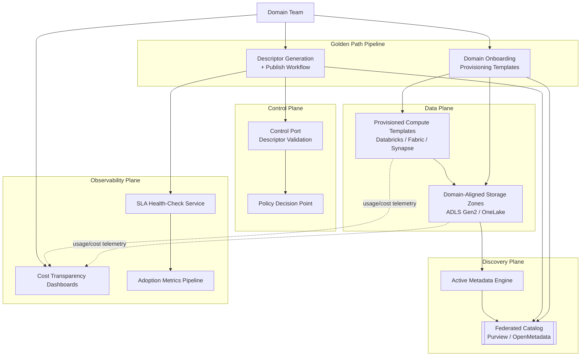
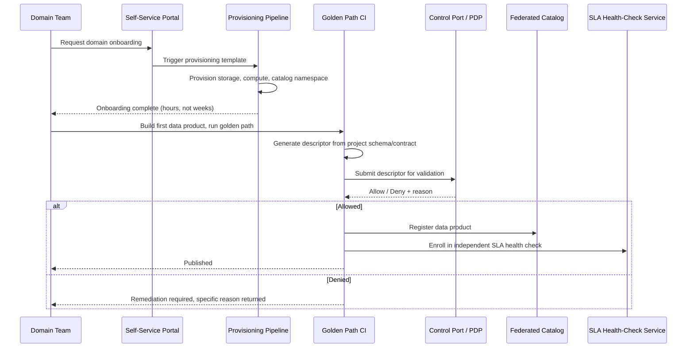
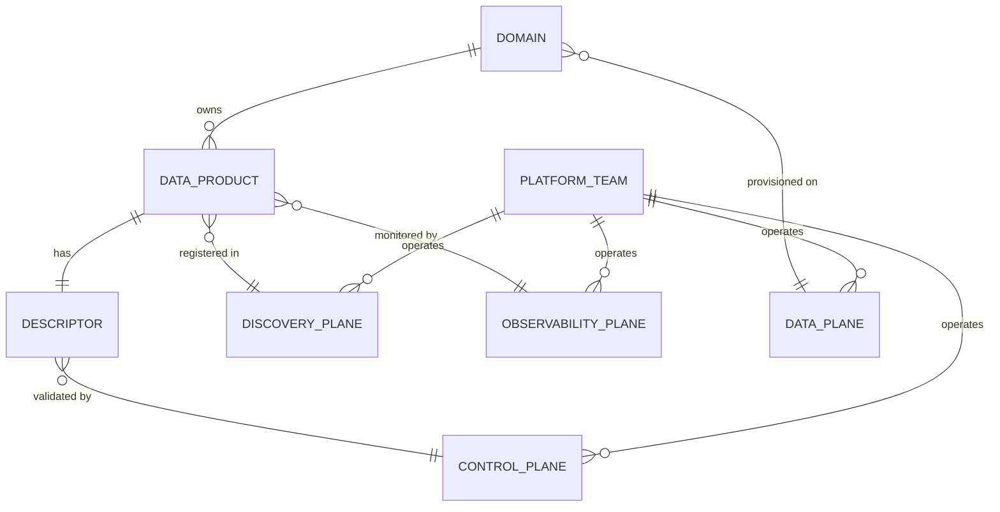

# Self-Serve Data Platform

> Part of the **Enterprise Data & AI Architecture Handbook** · Phase-15 — Data Mesh & Data Fabric · Chapter 05.
> Estimated study time: **60 min reading + ~3h labs**.
> **Prerequisites:** read [Platform Engineering](../Phase-09/02_Platform_Engineering.md) and [Data Products](02_Data_Products.md) first.

---

## Executive Summary

Every prior Phase-15 chapter has, at some point, deferred to "the self-serve platform" as the thing that makes its own mechanism actually work at scale: [Data Mesh Principles](01_Data_Mesh_Principles.md) §1.3 named it as one of four inseparable principles and quantified, in its FinOps worked example, what happens when it is under-funded; [Data Products](02_Data_Products.md) built an entire four-port model (§8.1) and lifecycle (§2.4) that all assume a platform-provided descriptor-validation control port, catalog registration, and independent SLA health-check service already exist; [Data Fabric](03_Data_Fabric.md) and [Federated Governance](04_Federated_Governance.md) both assumed a policy decision point and active-metadata engine are standing, shared infrastructure a domain team consumes rather than builds. This chapter is where that deferred platform finally gets built: it treats the self-serve data platform as a concrete engineering deliverable with its own architecture, capability planes, provisioning mechanics, golden paths, and cost-transparency model — the same shift [Platform Engineering](../Phase-09/02_Platform_Engineering.md) already made for application infrastructure, now applied specifically to data.

A **self-serve data platform** is the paved-road infrastructure that lets a domain team build, publish, and operate a data product (per [Data Products](02_Data_Products.md)) without each domain team independently becoming expert in storage provisioning, catalog integration, access-control plumbing, or SLA-monitoring infrastructure. This chapter covers **platform capability planes** as the structural decomposition (data plane, control plane, discovery plane, observability plane) that organizes what the platform must actually provide; **provisioning and templates** as the concrete infrastructure-as-code mechanism that makes "self-serve" mean genuinely fast, not merely theoretically possible; **golden paths for data products** as the opinionated, end-to-end paved road from "propose" to "publish" that [Platform Engineering](../Phase-09/02_Platform_Engineering.md) already established for application platforms, now instantiated for the specific data-product lifecycle [Data Products](02_Data_Products.md) §2.4 defined; **observability and cost transparency** as the platform's own accountability mechanism to the domain teams it serves; and **mesh on Azure/Databricks/Fabric** as the concrete, production-grade Azure-native implementation of every capability plane this chapter describes.

The platform bias is **Azure-primary (~60%)** — Azure Databricks Unity Catalog and Microsoft Fabric as the primary compute/catalog substrates, Azure API Management and Purview as shared discovery/governance infrastructure, and Terraform/Bicep-based provisioning templates as the golden-path mechanism — **~30% enterprise open source** (Backstage-style internal developer portals adapted for data-product golden paths, Terraform as the engine-agnostic provisioning layer, and OpenMetadata as an open discoverability substrate) — **~10% AWS/GCP comparison-only** (AWS Service Catalog/Control Tower plus Lake Formation blueprints; Google Cloud's Dataplex-based lake/zone provisioning templates).

**Bottom line:** this chapter is the capstone of Phase-15, and its central, recurring thesis is the one this handbook has now stated in four different forms across the phase: a self-serve platform is the single non-negotiable prerequisite every other data mesh principle depends on to function, and it is also the single most commonly under-funded component of a mesh adoption — every "mesh in name only" and "distributed data swamp" failure this phase's prior chapters documented traces back, mechanically, to this specific platform investment being skipped or under-resourced. This chapter treats the platform not as an abstraction to agree with in principle, but as a concrete, buildable, measurable engineering deliverable with its own budget, its own SLAs to its own internal customers (the domain teams), and its own adoption metrics — the same product discipline [Data Products](02_Data_Products.md) applied to a domain's data product, now applied reflexively to the platform team's own output.

---

## Learning Objectives

By the end of this chapter you will be able to:

1. **Decompose a self-serve data platform into its capability planes** (data, control, discovery, observability) and map each plane to concrete platform services and templates.
2. **Design provisioning templates** (Terraform/Bicep) that let a new domain onboard and publish its first data product within days, not weeks.
3. **Design a golden path for the full data-product lifecycle** (per [Data Products](02_Data_Products.md) §2.4), from initial domain onboarding through publish, operate, and eventual deprecation.
4. **Design a cost-transparency and chargeback model** that gives domain teams accurate, actionable visibility into their own platform consumption without perverse incentives to bypass the platform.
5. **Evaluate a self-serve platform's actual self-serve-ness** using measurable onboarding-time and golden-path-adherence metrics, distinguishing genuine self-service from a platform that still requires manual platform-team intervention for routine work.
6. **Apply a decision matrix** to determine the right level of platform investment relative to an organization's mesh maturity and domain count.
7. **Defend a self-serve platform's architecture, staffing, and budget** in engineer, staff engineer, architect, and CTO review settings.

---

## Business Motivation

- **Every prior chapter in this phase has already quantified the cost of skipping this investment**: [Data Mesh Principles](01_Data_Mesh_Principles.md) §20's worked FinOps example showed domains independently rebuilding platform-equivalent infrastructure at roughly €156K/year more than a shared, funded platform team; this chapter's business case is the direct, detailed follow-through on that already-established number.
- **A new domain team's time-to-first-published-data-product is the single most visible, most frequently cited success metric for a self-serve platform** — and it is directly, mechanically determined by how much of the [Data Products](02_Data_Products.md) §2.4 lifecycle (propose through publish) the platform automates via templates versus how much the domain team must hand-build itself.
- **Domain teams without accurate, self-service-visible cost data cannot make sound engineering trade-offs about their own data products** — a domain team that does not know its own data product's compute and storage cost cannot apply [Data Products](02_Data_Products.md) §20's cost-per-consumption-event discipline to its own portfolio, making platform-provided cost transparency a direct enabler of the data-product lifecycle discipline the prior chapter established.
- **Every governance and quality mechanism this phase has described — the control port (per [Data Products](02_Data_Products.md) §8.1), the policy decision point (per [Federated Governance](04_Federated_Governance.md) §4.2), the active-metadata engine (per [Data Fabric](03_Data_Fabric.md) §8.2) — is shared platform infrastructure that must be built once, well, and operated reliably**, or every mechanism built on top of it inherits its unreliability.
- **Under-investing in the self-serve platform is the single most consistent root cause named across this phase's case studies** (the "mesh in name only" distributed-data-swamp failure in [Data Mesh Principles](01_Data_Mesh_Principles.md), the SLA-never-independently-verified failure in [Data Products](02_Data_Products.md), the "fabric in name only" failure in [Data Fabric](03_Data_Fabric.md)) — this chapter exists specifically to give that recurring root cause a concrete, buildable remedy rather than leaving it as a recurring cautionary refrain.

---

## History and Evolution

- **2019-2020 — the platform engineering discipline formalizes for application infrastructure** (per [Platform Engineering](../Phase-09/02_Platform_Engineering.md) History), establishing the golden-path and internal-developer-portal vocabulary this chapter directly imports and applies to data infrastructure specifically.
- **2019 — Zhamak Dehghani's founding data mesh article** (per [Data Mesh Principles](01_Data_Mesh_Principles.md) History) names the self-serve platform as one of four principles but, consistent with an initial position-paper's scope, does not yet detail the capability-plane architecture or provisioning mechanics this chapter covers.
- **2020-2022 — the "data platform as a product" framing matures alongside the broader data-product framing** (per [Data Products](02_Data_Products.md) History) — the same product-management discipline (measurable adoption, SLAs, a defined roadmap) domain teams are asked to apply to their own data products is increasingly, and consistently, applied reflexively to the platform team's own output.
- **2021-2023 — infrastructure-as-code and internal-developer-portal tooling (Terraform modules, Backstage) mature to the point of directly supporting reusable, opinionated golden-path templates**, giving self-serve data platforms a concrete, already-proven technical foundation to build the provisioning layer (§9) on, rather than requiring bespoke tooling from scratch.
- **2023-2024 — Microsoft Fabric and Azure Databricks Unity Catalog both mature into genuinely opinionated, largely-pre-built self-serve substrates** for organizations willing to adopt them as their primary compute/catalog platform — meaningfully shortening the platform-build effort for Azure-native organizations relative to hand-assembling every capability plane from unopinionated primitives.
- **2024-2026 — industry practice converges on treating platform-team success metrics (onboarding time, golden-path adherence rate, domain-team-reported satisfaction) as first-class, publicly-tracked internal SLAs**, mirroring exactly the SLA-and-adoption-metrics discipline [Data Products](02_Data_Products.md) established for individual data products, now applied to the platform itself — the maturity point this chapter's own treatment reflects throughout.

---

## Why This Technology Exists

Every principle and mechanism the rest of Phase-15 describes — domain ownership, data as a product, federated governance — requires infrastructure to actually operate: storage that follows a consistent convention, a catalog that a descriptor can be registered against, a policy engine that can be invoked at a control port, and monitoring that can independently verify an SLA. If every domain team must build all of that infrastructure itself, the *total* organizational cost of "decentralized ownership" exceeds the cost of the centralized model it replaced — the exact mechanical finding [Data Mesh Principles](01_Data_Mesh_Principles.md) §20's worked example quantified. The self-serve data platform exists to be that infrastructure, built once by a dedicated team and consumed by every domain, so that domain autonomy (per [Data Mesh Principles](01_Data_Mesh_Principles.md) §1.1) is genuinely cheaper than the alternative it replaces, not merely organizationally fashionable.

---

## Problems It Solves

- **Every domain team independently rebuilding the same storage, catalog, and access-control plumbing**, resolved by shared, reusable provisioning templates (§9) that make onboarding a matter of instantiating a template, not designing infrastructure from scratch.
- **Inconsistent implementations of the [Data Products](02_Data_Products.md) four-port model across domains**, resolved by a golden path (§10) that bakes descriptor generation, control-port validation, and catalog registration into one opinionated, repeatable workflow every domain follows identically.
- **Domain teams with no visibility into their own data product's actual cost**, resolved by the observability and cost-transparency plane (§21, §20) surfacing per-data-product compute, storage, and platform-overhead cost directly to the owning team.
- **The federated governance policy decision point, active-metadata engine, and catalog existing only as abstract requirements with no operational owner**, resolved by this chapter's explicit treatment of each as a concrete, staffed, budgeted platform capability with its own SLAs.
- **A platform team that cannot demonstrate its own value**, resolved by treating the platform itself as a product (per [Data Products](02_Data_Products.md)'s own discipline applied reflexively) with measurable adoption metrics (onboarding time, golden-path adherence) that justify its continued investment the same way an individual data product's adoption metrics justify its own continued investment.

---

## Problems It Cannot Solve

- **A self-serve platform cannot fix a badly-drawn domain boundary or a central-bottleneck problem that was never really about infrastructure** — if an organization's core problem is accountability and ownership clarity, not technical tooling, building a better platform without also resolving [Data Mesh Principles](01_Data_Mesh_Principles.md) §1.1's ownership question does not solve the underlying problem.
- **It does not eliminate the need for genuine domain expertise in each data product's transformation logic** — the platform provides the paved road; it does not (and should not) write a domain's business logic for it.
- **It does not remove the federated governance guild's own organizational and decision-rights work** (per [Federated Governance](04_Federated_Governance.md) §4.4) — the platform implements and enforces policy the guild defines; it does not decide policy content itself.
- **It does not make active metadata automatically comprehensive** — as [Data Fabric](03_Data_Fabric.md) §3.2 already established, active-metadata quality is bounded by each source's available telemetry; the platform can provide the inference engine, but a source producing no telemetry still yields poor active metadata regardless of platform investment.
- **It does not remove the ongoing cost of platform operation** — a self-serve platform is cheaper than every domain independently rebuilding the same infrastructure, but it is not free; this chapter's Cost Optimization section (§20) treats the platform's own standing cost explicitly rather than implying self-service is a one-time investment with no ongoing overhead.

---

## Core Concepts

### 5.1 Platform capability planes

- **Data plane**: the storage and compute substrate domain teams actually build their transformation pipelines on — standardized, domain-aligned storage zones (per [Data Mesh Principles](01_Data_Mesh_Principles.md) §13) and provisioned, templated compute (per [Data Mesh Principles](01_Data_Mesh_Principles.md) §14) — the plane a domain team spends most of its own engineering effort interacting with directly.
- **Control plane**: the policy-enforcement and validation infrastructure — the control port's descriptor-validation logic (per [Data Products](02_Data_Products.md) §8.1) and the policy decision point (per [Federated Governance](04_Federated_Governance.md) §4.2) — the plane that enforces the "computational" half of federated computational governance.
- **Discovery plane**: the federated catalog and active-metadata engine (per [Data Mesh Principles](01_Data_Mesh_Principles.md) §11, [Data Fabric](03_Data_Fabric.md) §8.2) — the plane that makes a published data product findable and evaluable by a consumer who has never spoken to the owning team.
- **Observability plane**: the SLA health-check service (per [Data Products](02_Data_Products.md) §3.2), adoption-metrics pipeline (per [Data Products](02_Data_Products.md) §2.5), and cost-transparency dashboards (§21) — the plane that gives both domain teams and the platform team itself the operational and financial visibility every other plane's promises depend on being independently verifiable.
- **Every capability plane must be genuinely shared, multi-tenant infrastructure operated by the platform team — not a template a domain team copies and then independently operates.** A "template" that a domain team clones into its own infrastructure and then maintains itself is not self-serve *platform* infrastructure; it is documentation, and it reintroduces exactly the duplicated-maintenance-burden problem the self-serve principle exists to avoid, a distinction this chapter's Anti-patterns section (§27) returns to directly.

### 5.2 Provisioning and templates

- **A provisioning template is executable infrastructure-as-code** (a Terraform module or a Bicep template) that a domain team instantiates — with a small set of domain-specific parameters (domain name, owning team, initial data classification tier) — to stand up its own storage zone, initial access-control roles, and catalog-registration hooks, rather than designing that infrastructure from primitives.
- **Templates must be versioned and centrally maintained by the platform team**, with domain-facing consumers pulling the latest approved version rather than forking and diverging — a forked, domain-modified template reintroduces the same inconsistency-across-domains risk [Data Mesh Principles](01_Data_Mesh_Principles.md) §1.4 exists to prevent, now at the infrastructure layer rather than the policy layer.
- **A genuinely fast onboarding experience is the direct, measurable payoff of well-designed templates** — the difference between a multi-week manual infrastructure-provisioning project and a same-day, template-instantiation-driven onboarding is the concrete, quantifiable evidence (§21) that "self-serve" is real rather than aspirational.
- **Template design must balance opinionation against genuine domain-specific need** — a template so rigid it cannot accommodate a domain's legitimate specific requirement (per [Data Mesh Principles](01_Data_Mesh_Principles.md) §16's compute-engine-choice autonomy) forces a workaround that undermines the template's own consistency benefit; a template so flexible it accommodates everything provides little real paved-road value — this chapter's Design Patterns section (§26) treats this balance explicitly.

### 5.3 Golden paths for data products

- **A golden path is the platform's opinionated, end-to-end, tooling-supported implementation of the [Data Products](02_Data_Products.md) §2.4 lifecycle** — from initial domain onboarding (§5.2's templates) through descriptor generation, control-port validation, catalog registration, and independent SLA-monitoring enrollment — packaged as one coherent workflow a domain team follows, rather than a checklist of separately-documented steps the domain team must individually discover and execute.
- **A golden path's defining property is that the "supported" path is also the *easiest* path** — directly reusing [Platform Engineering](../Phase-09/02_Platform_Engineering.md)'s own golden-path philosophy: a domain team should not need extra effort to do the right thing (publish a properly-descriptored, governance-validated, catalog-registered data product); the extra effort should be required only to deliberately deviate from the golden path, and any such deviation should be visible to the platform team, not silent.
- **Golden-path adherence rate — the fraction of newly-published data products that followed the golden path end-to-end without a manual platform-team intervention or workaround** — is this chapter's primary measure of genuine self-service (§21), distinguishing a platform that domain teams actually use as intended from one that exists on paper but is routinely bypassed.
- **A golden path must evolve as [Data Products](02_Data_Products.md)'s own lifecycle and [Federated Governance](04_Federated_Governance.md)'s own policy portfolio evolve** — a golden path frozen at its initial design point drifts out of sync with the governance policies it is supposed to validate against, reintroducing exactly the contract-drift risk [Data Products](02_Data_Products.md) §22's Operational Response Playbook already named at the individual-data-product level, now at the platform-tooling level.

### 5.4 Observability and cost transparency

- **The platform must be observable to the domain teams it serves, not only to the platform team itself** — a domain team publishing a data product needs visibility into the shared discovery plane's and observability plane's own health (is the catalog registration service currently degraded, is the SLA health-check service running on schedule) since a domain team's own data product's apparent health depends on infrastructure it does not operate.
- **Cost transparency is the platform's accountability mechanism to its own internal customers**: every domain team should be able to see its own data products' actual compute, storage, and platform-overhead cost, attributed clearly enough to support the cost-per-consumption-event discipline [Data Products](02_Data_Products.md) §20 established, without needing to request a custom report from the platform team's finance function.
- **Cost transparency must distinguish domain-attributable cost from shared-platform-infrastructure cost** (per [Data Mesh Principles](01_Data_Mesh_Principles.md) §20's chargeback-versus-shared-cost distinction) — a domain team's dashboard should clearly separate what it is directly responsible for (its own compute/storage) from its proportional share of genuinely shared infrastructure (the catalog, the policy decision point), so that a domain team's optimization decisions target the cost actually within its control.
- **Cost transparency without actionable attribution creates a false sense of visibility** — a dashboard showing an aggregate number with no way to trace it to a specific data product, pipeline run, or query pattern does not actually enable the FinOps decision-making [Data Products](02_Data_Products.md) and [Data Fabric](03_Data_Fabric.md) both depend on domain teams being able to do for themselves.

### 5.5 Mesh on Azure/Databricks/Fabric

- **Azure Databricks Unity Catalog** provides a substantially pre-built implementation of the control and discovery planes for organizations standardizing on Databricks: catalog/schema-per-domain namespacing, attribute-based access control as the control-port enforcement mechanism (per [Federated Governance](04_Federated_Governance.md) §31), and Delta Sharing for cross-workspace/cross-organization addressability (per [Data Products](02_Data_Products.md) §9).
- **Microsoft Fabric's domain construct and OneLake** (per [Data Mesh Principles](01_Data_Mesh_Principles.md) §28) provide an alternative, similarly pre-built data-and-discovery-plane substrate, with Fabric's own workspace/item permission model implementing a large fraction of the control plane natively.
- **Neither platform delivers the full self-serve platform "out of the box" merely by being adopted** — this chapter's central caution, directly extending [Data Fabric](03_Data_Fabric.md) §3.5's OneLake-versus-Purview distinction: a domain team still needs a genuine golden-path workflow (§5.3), provisioning templates (§5.2), and cost-transparency tooling (§5.4) built *on top of* Unity Catalog or Fabric's primitives — adopting either platform substantially shortens the platform-build effort, but does not eliminate it.
- **A hybrid architecture — Databricks Unity Catalog for domains with Spark-heavy transformation needs, Fabric for domains preferring a lower-code, Power-BI-integrated experience, unified underneath by a shared Purview-based discovery and governance layer** — is an increasingly common, pragmatic pattern for large Azure-primary organizations rather than forcing every domain onto one single compute substrate.

---

## Internal Working

### 6.1 How a domain team actually onboards

A new domain team requests onboarding through the platform's self-service portal (or a lightweight, templated pull-request-based request), specifying its domain name, owning team, and initial data-classification tier. The platform's provisioning pipeline (§5.2's templates) automatically provisions the domain's storage zone, initial access-control roles, and catalog-namespace registration — typically completing within hours, not weeks — after which the domain team can begin building its first data product using the golden path (§5.3) without further platform-team manual intervention for this routine, well-supported case.

### 6.2 How the golden path actually executes end to end

A domain team's transformation project (dbt, Databricks notebook) integrates with the platform's golden-path CLI or CI pipeline template, which automatically generates the data product descriptor from the project's native schema/contract definitions (per [Data Products](02_Data_Products.md) §26's descriptor-generation design pattern), submits it to the control port for governance validation (per [Federated Governance](04_Federated_Governance.md) §5.2's enforcement mechanics), and — on success — registers the data product in the federated catalog and enrolls it in the platform-operated, owning-team-independent SLA health check (per [Data Products](02_Data_Products.md) §3.2), all as one coherent, single-command or single-pipeline-run workflow rather than a sequence of manually-executed, separately-documented steps.

### 6.3 How cost attribution actually flows

The platform's cost-transparency pipeline ingests native cloud billing/usage data (Azure Cost Management exports, Databricks system-table usage records) tagged by domain and data-product identifier at provisioning time (§6.1), aggregates it per data product and per domain, and separately tracks the shared-infrastructure cost (catalog, policy decision point, SLA health-check service) that is not attributable to any single domain — surfacing both views to domain teams through the observability plane's dashboards (§5.4) on the same cadence as the underlying billing data itself refreshes.

---

## Architecture



Every one of this phase's prior chapters' mechanisms attaches to exactly one of these four planes: [Data Products](02_Data_Products.md)'s four-port model spans the data plane (output port), control plane (control port), discovery plane (discoverability port), and observability plane (observability port) directly; [Federated Governance](04_Federated_Governance.md)'s policy decision point lives entirely in the control plane; and [Data Fabric](03_Data_Fabric.md)'s active-metadata engine lives entirely in the discovery plane — this architecture diagram is, in effect, the single consolidated picture every prior chapter's own architecture diagram was a partial view of.

---

## Components

- **Provisioning pipeline**: the infrastructure-as-code automation (Terraform/Bicep) executing domain onboarding (§6.1) and template instantiation.
- **Golden-path CLI/CI template**: the tooling integrated into a domain's own transformation project that drives descriptor generation, control-port submission, and catalog/SLA-health-check enrollment as one workflow (§6.2).
- **Policy decision point**: shared control-plane infrastructure, detailed fully in [Federated Governance](04_Federated_Governance.md) §11, consumed by this chapter's golden path rather than re-described here.
- **Federated catalog and active-metadata engine**: shared discovery-plane infrastructure, detailed fully in [Data Mesh Principles](01_Data_Mesh_Principles.md) §11 and [Data Fabric](03_Data_Fabric.md) §11.
- **SLA health-check service and adoption-metrics pipeline**: shared observability-plane infrastructure, detailed fully in [Data Products](02_Data_Products.md) §11.
- **Cost-transparency pipeline**: the billing/usage-telemetry ingestion and per-domain/per-data-product attribution service (§6.3), the one platform component this chapter introduces that prior chapters referenced only at the level of "someone must be tracking this."
- **Self-service portal / onboarding request mechanism**: the domain-facing entry point (a web portal or a templated pull-request workflow) that triggers the provisioning pipeline.

---

## Metadata

- **Every provisioned domain and data product carries a cost-attribution tag (domain identifier, data-product identifier)** applied automatically at provisioning time (§6.1) and template-instantiation time — the concrete metadata that makes the cost-transparency pipeline's per-domain/per-data-product attribution (§6.3) possible without requiring a separate, manually-maintained cost-mapping exercise.
- **Golden-path execution metadata (which template version was used, whether the full golden path completed without manual intervention, and if not, what specific step required one) is itself tracked** — the direct input to the golden-path-adherence-rate metric (§5.3) this chapter treats as the primary self-service-authenticity signal.
- **Platform capability-plane health metadata (is the catalog registration service currently healthy, is the SLA health-check service running on schedule) must be surfaced to domain teams**, not only retained internally by the platform team, per §5.4's platform-observability-to-domain-teams principle.

---

## Storage

- **The platform provisions, but does not itself own or duplicate, each domain's data — storage remains domain-aligned** (per [Data Mesh Principles](01_Data_Mesh_Principles.md) §13), with the platform's role limited to standardizing the zone structure and provisioning mechanism, not centralizing the data itself.
- **Platform-operated shared infrastructure (the catalog's own backing store, the policy-as-code repository, the audit/evidence store per [Federated Governance](04_Federated_Governance.md) §13) requires its own dedicated, platform-team-owned storage**, distinct from and not co-mingled with any individual domain's storage zone.
- **Provisioning templates themselves are stored as version-controlled infrastructure-as-code artifacts** (§5.2), following the same repository and review discipline [Infrastructure as Code with Terraform](../Phase-09/04_Infrastructure_as_Code_with_Terraform.md) established, with the platform team as the templates' code owner.

---

## Compute

- **The provisioning pipeline itself runs on lightweight, platform-team-operated CI/CD compute** (a GitHub Actions or Azure DevOps pipeline executing Terraform/Bicep applies), distinct from and much less resource-intensive than the domain-facing compute it provisions.
- **Golden-path descriptor-generation and control-port-submission steps run within the domain team's own CI pipeline** (integrated via the golden-path CLI template, §6.2), keeping that compute cost domain-attributable rather than shifting it onto shared platform infrastructure.
- **Shared capability-plane compute (the policy decision point, the SLA health-check service, the active-metadata inference engine) must be sized and scaled for aggregate, mesh-wide load**, per the scalability considerations [Data Mesh Principles](01_Data_Mesh_Principles.md) §17, [Data Products](02_Data_Products.md) §18, [Federated Governance](04_Federated_Governance.md) §18, and [Data Fabric](03_Data_Fabric.md) §18 each already established for their respective components — this chapter's contribution is ensuring that sizing and scaling work is a funded, staffed platform-team responsibility, not an afterthought.

---

## Networking

- **The self-service portal and golden-path tooling must be reachable by every domain team across the organization's network topology**, consistent with [Network Security and Zero Trust](../Phase-10/04_Network_Security_and_Zero_Trust.md)'s private-endpoint baseline — a platform that requires bespoke, manually-requested network access per domain undermines the "self-serve" property before a domain team even reaches the provisioning step.
- **Provisioning templates should include the correct private-endpoint and network-security configuration by default** (per [Network Security and Zero Trust](../Phase-10/04_Network_Security_and_Zero_Trust.md) ADR-0144's private-endpoint-only baseline) — a domain team using the golden path should not need networking expertise to end up with a correctly-secured storage zone; the template's defaults are what make secure-by-default achievable without requiring every domain team to independently learn and apply the organization's network-security standards.

---

## Security

- **Every capability plane's shared infrastructure (policy decision point, catalog, SLA health-check service) is high-value, cross-domain-blast-radius infrastructure**, per the security treatment already established in [Federated Governance](04_Federated_Governance.md) §16 and [Data Mesh Principles](01_Data_Mesh_Principles.md) §16 — this chapter's contribution is ensuring that infrastructure has a clearly accountable, adequately-resourced operational owner (the platform team) rather than existing as a shared responsibility nobody specifically owns.
- **Provisioning templates are a security control surface in their own right** — a template with an insecure default (an overly-permissive access-control role, a missing private-endpoint configuration) propagates that insecurity to every domain that instantiates it, making template security review a high-leverage, high-consequence platform-team responsibility.
- **Golden-path tooling that submits on a domain team's behalf to shared infrastructure (the control port, the catalog) must propagate the domain team's actual identity**, not a shared platform service principal — the same identity-propagation discipline this handbook has now established repeatedly ([Data Mesh Principles](01_Data_Mesh_Principles.md) §16, [Data Fabric](03_Data_Fabric.md) §16), applying here to the golden-path automation layer specifically.

---

## Performance

- **Golden-path pipeline execution time is a direct, measurable component of the "time to first published data product" metric** (§21) — a golden path with a slow descriptor-validation or catalog-registration step degrades the very onboarding-speed benefit the platform exists to deliver, making golden-path pipeline performance a first-order platform-engineering concern, not a secondary one.
- **The provisioning pipeline's own scaling must accommodate onboarding-burst scenarios** (a wave of new domains onboarding simultaneously during an organization-wide mesh rollout phase, per [Data Mesh Principles](01_Data_Mesh_Principles.md) ADR-0176's phased-pilot-then-broader-rollout pattern) without degrading to the multi-week manual-provisioning timeline the platform exists to avoid.

---

## Scalability

- **The platform's capability-plane infrastructure must scale with the aggregate mesh-wide load across every domain, not with any single domain's load** — restating, at the platform-implementation level, the shared-infrastructure scalability requirement each prior chapter already flagged for its own specific component.
- **The platform team's own staffing must scale sub-linearly with domain count** — because the platform's value proposition is precisely that each new domain's incremental onboarding cost is small (per [Data Mesh Principles](01_Data_Mesh_Principles.md) §20's worked example), a platform team whose headcount must grow linearly with domain count has, in effect, failed to deliver genuine economies of scale, and should be re-evaluated against this chapter's Decision Matrix (§25).
- **Golden-path template reuse is the direct scalability mechanism at the tooling level** — a single, well-maintained set of templates serving fifty domains scales far better than fifty domains each with a slightly bespoke provisioning approach, the same standardization-enables-scale argument [Data Mesh Principles](01_Data_Mesh_Principles.md) §13 already made for storage-zone structure, now applied to the provisioning mechanism itself.

---

## Fault Tolerance

- **A capability-plane outage (the catalog, the policy decision point, the SLA health-check service) affects every domain simultaneously**, the shared-infrastructure blast-radius concern this handbook has now named in [Data Mesh Principles](01_Data_Mesh_Principles.md) §19, [Data Products](02_Data_Products.md) §19, [Federated Governance](04_Federated_Governance.md) §19, and [Data Fabric](03_Data_Fabric.md) §19 — this chapter's contribution is treating high availability of every capability plane as a funded, staffed, and measured platform-team SLA (§21) rather than an implicit assumption.
- **The provisioning pipeline itself must be resilient to partial failure** (a Terraform apply that fails halfway through provisioning a new domain's resources) — provisioning templates should be designed idempotently, so a re-run after a partial failure completes cleanly rather than leaving a domain in an inconsistent, half-provisioned state.
- **A domain's own data-product pipeline failure must not cascade into the shared platform's own capability planes** — the same domain-level fault-isolation property [Data Mesh Principles](01_Data_Mesh_Principles.md) §19 already established for data pipeline failures generally, restated here specifically at the boundary between domain-owned compute and platform-owned shared infrastructure.

---

## Cost Optimization (FinOps)

- **The platform team's own cost is the one deliberately centralized cost line in an otherwise decentralized cost model**, per [Data Mesh Principles](01_Data_Mesh_Principles.md) §20's chargeback-versus-shared-cost distinction — this chapter's contribution is making that centralized cost concrete: platform-team headcount, shared capability-plane infrastructure cost, and provisioning/tooling maintenance cost, tracked and justified as its own budget line, not folded invisibly into individual domains' chargeback.
- **The cost-transparency pipeline (§5.4, §6.3) is itself a cost-optimization enabler for every domain**, not merely a reporting feature — a domain team that can see its own data product's actual cost-per-consumption-event can apply [Data Products](02_Data_Products.md) §20's decision discipline (redesign, retire, or justify) directly, without waiting for a platform-team-generated report.
- **Worked FinOps example**: continuing directly from [Data Mesh Principles](01_Data_Mesh_Principles.md) §20's original comparison (8 domains, ~€624K/year total cost under a shared-platform model versus ~€780K/year under independent per-domain rebuilding), this chapter quantifies the platform team's own internal cost breakdown at full operating maturity: of the ~€520K/year 4-FTE platform-team cost, roughly 40% (~€208K/year) is attributable to capability-plane *operation* (keeping the catalog, policy decision point, and SLA health-check service running reliably), 35% (~€182K/year) to golden-path and provisioning-template *engineering and maintenance* (including the recurring work of keeping golden paths in sync with [Federated Governance](04_Federated_Governance.md)'s evolving policy portfolio, per §5.3's drift caution), and 25% (~€130K/year) to domain-onboarding support and cost-transparency-tooling maintenance. This breakdown is the concrete basis for a CTO-level conversation about where additional platform investment (or, alternatively, targeted cost reduction) would have the most leverage — for example, showing that increased golden-path automation investment (reducing the 35% engineering-and-maintenance share's ongoing manual burden) is likely to shorten onboarding time more directly than adding headcount to onboarding-support alone.

---

## Monitoring

- **Time-to-first-published-data-product per newly-onboarded domain**, tracked from onboarding request through first successful golden-path publish, as the platform's single most visible success metric (§5.3).
- **Golden-path adherence rate**: the fraction of data-product publications completing the full golden path without a manual platform-team intervention, tracked continuously and reported as a standing platform-team SLA.
- **Per-capability-plane availability and latency**, feeding the same shared-infrastructure health monitoring already established per plane in each prior chapter, now consolidated into one platform-team-owned operational dashboard.
- **Cost-transparency-pipeline freshness**: the platform's own billing/usage-attribution data must itself be monitored for staleness, since a domain team making a cost decision based on stale attribution data is exposed to exactly the kind of decision-relevant-but-incorrect-data risk this handbook has repeatedly flagged (per [Data Products](02_Data_Products.md)'s SLA-verification discipline) — here applied reflexively to the platform's own reporting.

---

## Observability

- **The platform team should be able to answer, at any time, "which domains are currently blocked or degraded, and why" across every capability plane simultaneously** — a consolidated, cross-plane operational view, rather than requiring the platform team to separately check the catalog's health, the policy decision point's health, and the SLA health-check service's health independently during an incident.
- **Domain teams should have their own, self-service-accessible view into the specific capability-plane dependencies their own data products rely on** — a domain team debugging an unexpected publish failure should be able to see, without contacting the platform team, whether the failure originated in their own descriptor, a policy-decision-point denial, or a genuine platform-infrastructure degradation.

### Operational Response Playbook

| Signal | Detection Query / Check | Remediation |
|---|---|---|
| Time-to-first-published-data-product for newly-onboarded domains trends upward over consecutive onboarding cohorts | Trend analysis on the onboarding-to-first-publish duration metric, segmented by cohort/quarter, alerting on a sustained upward trend exceeding a defined threshold | Investigate whether the trend traces to template staleness/complexity growth, capability-plane latency degradation, or golden-path drift from evolving governance policy (per §5.3); prioritize the platform-team's next engineering cycle toward the specific identified root cause rather than adding onboarding-support headcount reflexively |
| Golden-path adherence rate drops below a defined threshold (an increasing fraction of publications require manual platform-team intervention) | Scheduled aggregation of golden-path execution telemetry (§12) segmented by which specific step most frequently required manual intervention | Treat as a golden-path design defect, not a domain-team competency issue by default; prioritize fixing the specific failing step (a template gap, an unclear validation-failure error message, a genuine policy-drift mismatch per [Federated Governance](04_Federated_Governance.md) §5.3) before assuming additional domain-team training is the correct remediation |

---

## Governance

- **The platform team itself is subject to the same federated computational governance model it implements for domain teams** — per [Federated Governance](04_Federated_Governance.md) §4.4's guild structure, the platform team is a standing member (not merely a policy-implementation contractor), representing the technical feasibility and enforcement-mechanism perspective when the guild evaluates a new global-policy proposal.
- **The platform's own roadmap and prioritization should be governed with the same product discipline** [Data Products](02_Data_Products.md) established for individual data products — a platform-team backlog driven by adoption metrics (§21) and domain-team-reported friction, reviewed on a recurring cadence, rather than by internal platform-team preference alone.
- **Platform-provided golden paths are themselves a governance-enforcement mechanism** — a well-designed golden path makes policy compliance the path of least resistance (per §5.3), which is a more durable and scalable governance outcome than relying on domain teams' individual diligence to remember and manually apply every current global policy.

---

## Trade-offs

| Dimension | No dedicated self-serve platform (domains self-build infrastructure) | Dedicated, funded self-serve platform |
|---|---|---|
| Per-domain onboarding cost | Higher, and repeated for every domain | Lower after initial platform build, amortized across all domains |
| Consistency of implementation across domains | Low — each domain's infrastructure and golden-path adherence varies independently | High — shared templates and golden paths enforce consistency |
| Time to first published data product | Slow — each domain designs infrastructure from scratch | Fast — template instantiation plus a pre-built golden path |
| Platform-team cost | None (no dedicated team) | A real, standing cost (§20's worked example) requiring its own budget justification |
| Total organizational cost at meaningful domain count | Higher (per [Data Mesh Principles](01_Data_Mesh_Principles.md) §20's original comparison) | Lower, provided domain count justifies the platform investment |
| Appropriate for | A very small number of domains, or a very early, pre-pilot mesh exploration | Any organization with enough domains, or a clear growth trajectory toward enough domains, to amortize the platform investment |

---

## Decision Matrix

| Signal | Recommendation |
|---|---|
| The organization has fewer than roughly 4-5 domains, consistent with [Data Mesh Principles](01_Data_Mesh_Principles.md) §25's own small-organization guidance | A full, dedicated platform team is likely disproportionate — apply lightweight, shared conventions and templates informally, revisit as domain count grows |
| The organization is in [Data Mesh Principles](01_Data_Mesh_Principles.md) ADR-0176's scoped 2-3-domain pilot phase | Fund a platform capability sufficient for the pilot's specific domains from day one — per ADR-0176, the pilot's platform investment is not optional or deferrable to a later phase |
| Time-to-first-published-data-product is trending upward across cohorts, or golden-path adherence is declining | Platform engineering investment is under-resourced relative to current domain count — prioritize per the Operational Response Playbook (§22) before onboarding additional domains |
| Platform-team headcount is growing linearly with domain count rather than sub-linearly | The platform is not delivering genuine economies of scale — investigate whether templates and golden paths are genuinely reusable or are being re-customized per domain, undermining the standardization the platform exists to provide |
| Domain teams report needing platform-team manual intervention for routine, well-understood publish workflows | Golden-path design defect — treat as a platform-engineering priority, not a domain-team training gap, per §22's playbook |

---

## Design Patterns

- **Golden path as the easiest path, not merely the sanctioned path**: design every capability so that following the golden path requires less domain-team effort than any workaround, making compliance the natural default rather than something requiring active domain-team discipline to maintain.
- **Idempotent, versioned provisioning templates**: design every template so a re-run after partial failure completes cleanly, and version every template change so domains on an older version are not silently and unexpectedly affected by a template update.
- **Reflexive product discipline**: apply [Data Products](02_Data_Products.md)'s own SLA, adoption-metrics, and lifecycle discipline to the platform's own capability planes and golden paths, treating the platform team's output with the same rigor it requires of every domain team's output.
- **Cost-transparency-as-a-first-class-feature, not an afterthought report**: build per-domain, per-data-product cost attribution into the provisioning pipeline from day one (§6.3), rather than retrofitting cost reporting once domain teams begin asking for it.

---

## Anti-patterns

- **"Template" that is actually just documentation a domain team copies and then independently maintains** — not genuine shared platform infrastructure, and reintroducing exactly the duplicated-maintenance-burden problem self-serve platforms exist to avoid (§5.1's explicit caution).
- **A golden path that is technically available but consistently bypassed** because it is slower, more restrictive, or less well-documented than an informal workaround — a platform that exists on paper but is not the domain teams' actual, preferred path is not genuinely delivering the self-serve benefit regardless of its technical capability.
- **Platform-team headcount growing linearly with domain count**, indicating the platform is not actually delivering the economies of scale that justify its existence as a shared, centralized investment (§18's scalability caution).
- **Cost-transparency dashboards with aggregate numbers and no actionable attribution**, giving domain teams the appearance of visibility without the actual ability to act on it (§5.4's caution).
- **A platform team that builds capability-plane infrastructure but never applies [Data Products](02_Data_Products.md)'s own lifecycle and adoption-metrics discipline to its own golden paths and templates**, leaving the platform's own value and health unmeasured relative to the rigor it demands of every domain team.

---

## Common Mistakes

- **Under-funding the platform team relative to actual domain count and growth trajectory**, then being surprised when domain teams route around slow or incomplete golden paths — directly reproducing the root cause named across every prior Phase-15 chapter's case studies.
- **Building the capability planes before validating them against a real pilot domain's actual needs** (violating [Data Mesh Principles](01_Data_Mesh_Principles.md) ADR-0176's scoped-pilot-first discipline), resulting in over-engineered infrastructure that does not actually match what domain teams need on the golden path.
- **Treating platform-team success as "infrastructure exists" rather than "infrastructure is actually, measurably used as intended"** — skipping the golden-path-adherence and onboarding-time metrics (§21) that would otherwise surface a platform that technically exists but is not delivering its intended benefit.
- **Letting golden paths drift out of sync with evolving federated governance policy** (§5.3's drift caution) — a golden path that still validates against last year's policy portfolio silently under-enforces this year's actual global-policy requirements.
- **Building cost-transparency tooling as a one-off report generated on request rather than a continuously-available, self-service dashboard** — reproducing the same reactive, request-driven bottleneck pattern the self-serve principle exists to eliminate elsewhere in the platform.

---

## Best Practices

- **Fund the platform team from the start of any mesh pilot, sized to the pilot's actual domain count**, per [Data Mesh Principles](01_Data_Mesh_Principles.md) ADR-0176.
- **Track time-to-first-published-data-product and golden-path adherence rate as standing, publicly-visible platform-team SLAs**, applying the same measured-not-assumed discipline [Data Products](02_Data_Products.md) established for individual data products.
- **Design every golden path to be the objectively easiest path**, and treat any sustained bypass or workaround pattern as a golden-path design defect requiring platform-engineering attention, not a domain-team compliance failure.
- **Build cost attribution into the provisioning pipeline from day one**, tagging every provisioned resource with domain and data-product identifiers automatically rather than retrofitting attribution later.
- **Review golden paths against the current federated governance policy portfolio on the same cadence as that portfolio's own semi-annual review** (per [Federated Governance](04_Federated_Governance.md) ADR-0179), closing the drift risk named in §5.3 before it silently under-enforces evolving policy.
- **Apply the platform's own product-lifecycle discipline to itself** — measure platform-team output the same way [Data Products](02_Data_Products.md) requires every domain team to measure its own.

---

## Enterprise Recommendations

- **Size the platform team's investment to the organization's actual and near-term-projected domain count**, per this chapter's Decision Matrix (§25) — neither under-funding relative to [Data Mesh Principles](01_Data_Mesh_Principles.md) §20's worked-example economics, nor over-building capability the pilot's actual domain count does not yet justify.
- **For organizations already standardized on Azure Databricks or Microsoft Fabric**, build the golden path and provisioning-template layer on top of Unity Catalog's or Fabric's existing capability-plane primitives (§5.5) rather than duplicating what those platforms already provide — but budget explicitly for the golden-path and cost-transparency engineering work neither platform delivers automatically.
- **Establish the platform-team's own SLAs (onboarding time, golden-path adherence, capability-plane availability) as visible, standing commitments to domain teams from the platform's first release**, not retrofitted once domain-team dissatisfaction has already surfaced.
- **Revisit the platform-versus-independent-domain-build cost comparison (per [Data Mesh Principles](01_Data_Mesh_Principles.md) §20 and this chapter's §20) on a recurring cadence as domain count grows**, since the threshold at which a dedicated platform team's investment is justified is itself a moving target as the organization's mesh matures.

---

## Azure Implementation

- **Azure Databricks Unity Catalog and Microsoft Fabric** as the primary compute/catalog substrates (§5.5), with the platform team's golden-path tooling built as a thin, opinionated automation layer over each platform's native APIs rather than a bespoke system built from unopinionated primitives.
- **Terraform or Bicep modules, version-controlled in a platform-team-owned repository**, as the provisioning-template mechanism (§5.2), triggered via a GitHub Actions or Azure DevOps pipeline from the self-service portal or a templated pull-request-based onboarding request.
- **Azure API Management** for the golden-path CLI/CI template's programmatic interaction with the control port and catalog registration APIs, providing built-in usage metering that directly feeds the cost-transparency pipeline's platform-overhead attribution (§6.3).
- **Azure Cost Management + Databricks/Fabric native usage system tables** as the billing/usage-telemetry source for the cost-transparency pipeline, joined against the domain/data-product tags applied at provisioning time.
- **Concrete Terraform sketch** for a domain-onboarding provisioning template, illustrating idempotent, tagged, template-driven provisioning (§5.2, §12):

```hcl
variable "domain_name" {
  type = string
}

variable "owning_team_email" {
  type = string
}

variable "data_classification_tier" {
  type    = string
  default = "internal"
}

resource "azurerm_storage_container" "domain_zone" {
  name                  = "domain-${var.domain_name}"
  storage_account_name  = azurerm_storage_account.mesh_platform.name
  container_access_type = "private"
}

resource "azurerm_role_assignment" "domain_owner_access" {
  scope                = azurerm_storage_container.domain_zone.resource_manager_id
  role_definition_name = "Storage Blob Data Contributor"
  principal_id         = data.azuread_group.domain_owner_group.object_id
}

resource "databricks_catalog" "domain_catalog" {
  name    = var.domain_name
  comment = "Domain-owned catalog for ${var.domain_name}, owner: ${var.owning_team_email}"

  properties = {
    domain               = var.domain_name
    owning_team          = var.owning_team_email
    data_classification  = var.data_classification_tier
    provisioned_by       = "self-serve-platform-golden-path"
  }
}
```

---

## Open Source Implementation

- **Backstage** (or a Backstage-derived internal developer portal), adapted from its original application-platform golden-path use case (per [Platform Engineering](../Phase-09/02_Platform_Engineering.md)'s own treatment) to serve as the domain-facing self-service portal and golden-path software-template mechanism for data-product onboarding specifically.
- **Terraform**, as the cloud-agnostic provisioning-template engine (§5.2), reused identically whether the domain team's target compute is Azure Databricks, a self-hosted Trino cluster (per [Data Fabric](03_Data_Fabric.md) §32), or another cloud entirely.
- **OpenMetadata**, as the open-source discovery-plane substrate for organizations not standardized on Purview, integrated with the golden path's catalog-registration step identically to how the golden path would integrate with Purview.
- **Great Expectations and OPA**, as the observability-plane and control-plane substrate respectively for organizations building a genuinely cloud-agnostic self-serve platform rather than one built primarily on Azure-native services.

---

## AWS Equivalent (comparison only)

| Azure | AWS | Notes |
|---|---|---|
| Terraform/Bicep provisioning templates via Azure DevOps/GitHub Actions | AWS Service Catalog (pre-approved product templates) plus AWS Control Tower (account-vending/landing-zone automation) | AWS's Service Catalog/Control Tower combination is a closer native analogue to a full self-serve *account and infrastructure* vending machine than Azure's more general-purpose Terraform/Bicep-plus-pipeline approach, though it requires more assembly to reach data-product-specific golden-path behavior |
| Unity Catalog / Fabric as pre-built capability-plane substrate | Databricks Unity Catalog on AWS (same product), or AWS Lake Formation blueprints | Databricks-on-AWS preserves the same golden-path and template logic across clouds with minimal change; a Lake-Formation-blueprint-based approach requires more custom golden-path tooling to match Unity Catalog's or Fabric's native opinionation |
| Azure Cost Management cost-transparency source | AWS Cost and Usage Reports (CUR) plus Cost Categories/tags | Broadly equivalent tag-based cost-attribution capability |

**Migration guidance**: a Terraform-and-Databricks-based self-serve platform migrates to AWS with comparatively low friction, since both the provisioning layer (Terraform) and the compute/catalog substrate (Unity Catalog) are cloud-portable; a Bicep-and-Fabric-based implementation requires substantially more re-platforming effort, since Bicep is Azure-exclusive and Fabric has no direct AWS equivalent.

---

## GCP Equivalent (comparison only)

| Azure | GCP | Notes |
|---|---|---|
| Terraform/Bicep provisioning templates | Terraform (identical) plus Google Cloud Deployment Manager | Terraform itself is directly portable; GCP's native Deployment Manager is a less commonly chosen alternative given Terraform's broader ecosystem adoption |
| Unity Catalog / Fabric as capability-plane substrate | Databricks Unity Catalog on GCP (same product), or Dataplex lake/zone provisioning | Same cross-cloud-constant equivalence for Databricks; Dataplex provides a comparably opinionated native substrate to Fabric's, per [Data Fabric](03_Data_Fabric.md) §34's own comparison |
| Azure Cost Management | Google Cloud Billing export to BigQuery plus labels | Broadly equivalent label/tag-based attribution capability, arguably even more directly queryable given BigQuery's native analytical capability over the exported billing data |

**Selection criteria**: an organization already GCP-primary should evaluate Dataplex's native lake/zone provisioning model directly against this chapter's capability-plane decomposition (§8.1) — Dataplex covers data-plane and discovery-plane provisioning natively, but golden-path workflow tooling and cost-transparency dashboards still require the same deliberate platform-engineering investment this chapter describes, regardless of the underlying cloud.

---

## Migration Considerations

- **Migrating from an ad hoc, pre-platform state to a genuine self-serve platform is itself a phased program**, directly following [Data Mesh Principles](01_Data_Mesh_Principles.md) ADR-0176's scoped-pilot sequencing: build the minimum capability-plane infrastructure and golden path sufficient for the pilot's 2-3 domains first, validate genuine self-service (via the onboarding-time and adherence metrics, §21) against real domain-team experience, and only then invest in broader template generalization for a wider rollout.
- **Migrating an already-onboarded domain from a bespoke, pre-platform infrastructure setup onto the platform's standardized templates** requires a deliberate reconciliation step — mapping the domain's existing storage/access-control configuration onto the template's expected structure — since retrofitting standardization onto already-divergent infrastructure is materially more effort than onboarding a genuinely new domain directly onto the golden path.
- **Migrating the platform itself between underlying substrates** (e.g., consolidating from a mixed Synapse/Databricks estate onto a single Unity-Catalog-centric substrate) should preserve golden-path and cost-attribution continuity for domain teams throughout the transition, using the same transparent-reference-redirection principle [Data Products](02_Data_Products.md) §35 established for individual data-product materialization changes, now applied at the platform-substrate level.

---

## Mermaid Architecture Diagrams

**Domain onboarding and golden-path sequence:**



**Platform capability-plane relationship (ER-style):**



(A third diagram — the reference architecture in §9 — is also part of this chapter's required minimum of three Mermaid diagrams.)

---

## End-to-End Data Flow

1. A new domain team requests onboarding through the self-service portal, specifying its domain name, owning team, and data-classification tier.
2. The provisioning pipeline instantiates the platform's standardized templates, provisioning a domain-aligned storage zone, initial access-control roles, and a catalog namespace — typically completing within hours.
3. The domain team builds its first transformation project and integrates the golden-path CI template, which generates a data product descriptor from the project's native schema/contract definitions.
4. The golden path submits the descriptor to the control port; the policy decision point evaluates it against every active global policy (per [Federated Governance](04_Federated_Governance.md) §5.2) and returns allow or deny with a specific reason.
5. On approval, the golden path registers the data product in the federated catalog and enrolls it in the platform-operated, owning-team-independent SLA health-check service.
6. The active-metadata engine (per [Data Fabric](03_Data_Fabric.md) §4.1) begins ingesting the new data product's telemetry, feeding classification and usage inference from first publication onward.
7. The cost-transparency pipeline begins attributing the data product's compute and storage usage to its domain and product identifiers, surfacing this through the domain team's self-service dashboard.
8. Ongoing adoption metrics, SLA-conformance data, and cost data accumulate continuously, available to the domain team for its own [Data Products](02_Data_Products.md) §2.5 lifecycle decisions without requiring any platform-team-generated report.
9. The platform team's own monitoring aggregates onboarding-time and golden-path-adherence metrics across every domain, feeding the Operational Response Playbook (§22) and the platform's own recurring investment-prioritization decisions.

---

## Real-world Business Use Cases

- **A financial-services organization's platform team reduces new-domain onboarding time from six weeks (under a pre-platform, manually-provisioned model) to under two days** after investing in a templated provisioning pipeline and golden path, directly enabling the organization's phased mesh rollout (per [Data Mesh Principles](01_Data_Mesh_Principles.md) ADR-0176) to proceed at the pace the pilot's success criteria required.
- **A retail organization's cost-transparency dashboard surfaces that three domains' data products collectively account for 40% of the mesh's total compute cost**, prompting a targeted [Data Products](02_Data_Products.md) §20-style cost-per-consumption-event review for those specific three domains rather than an undifferentiated, mesh-wide cost-cutting initiative.
- **A logistics organization's platform team identifies, via golden-path-adherence monitoring, that a specific validation step's error messages are too vague for domain teams to self-remediate**, prompting a targeted golden-path UX fix that measurably raises the adherence rate in the following quarter without requiring any additional onboarding-support headcount.

---

## Industry Examples

- **Netflix's internal data-platform tooling** (referenced across this phase's prior chapters' Industry Examples sections) has long applied the same self-service, templated-provisioning philosophy this chapter describes to its own internal dataset-registration and pipeline-scaffolding tooling, predating and independently converging with the formalized data-mesh self-serve-platform principle.
- **Spotify's publicly-documented Backstage project** (the origin of the Backstage internal-developer-portal tool this chapter's Open Source Implementation section names) is among the most widely-cited real-world precedents for golden-path-driven self-service, now adapted by many organizations from its original application-platform scope to data-product onboarding specifically.
- **Multiple large organizations' publicly-documented Databricks Unity Catalog adoption case studies** describe exactly this chapter's §5.5 pattern — building a thin, opinionated golden-path and provisioning layer atop Unity Catalog's native catalog/ABAC primitives rather than either hand-rolling a full self-serve platform from scratch or assuming Unity Catalog alone delivers full self-service automatically.

---

## Case Studies

### Case Study 1 — Under-funded platform, over-promised self-service

A media organization launched a mesh initiative with an explicit "self-serve platform" commitment but staffed the platform team with only one part-time engineer, expecting existing application-platform-engineering capacity to absorb the data-specific work incidentally. Provisioning templates were built but never made idempotent, causing repeated manual cleanup after partial-failure re-runs; the golden path's descriptor-validation error messages were terse and unhelpful, driving domain teams to contact the platform engineer directly for nearly every publish attempt rather than self-remediating. Within four months, golden-path adherence had fallen to under 30% (measured retroactively once the organization began tracking it, per this chapter's own §21 recommendation, in direct response to the visible strain), and the single platform engineer had become a de facto reinstated bottleneck — the exact "mesh in name only" outcome [Data Mesh Principles](01_Data_Mesh_Principles.md) Case Study 1 documented, now traced to its concrete, specific platform-engineering root cause rather than described only at the organizational level.

### Case Study 2 — Reflexive product discipline applied to the platform itself

A healthcare organization's platform team, having read and internalized [Data Products](02_Data_Products.md)'s own lifecycle and adoption-metrics discipline, applied it reflexively to its own golden path from the platform's first release: it tracked time-to-first-published-data-product and golden-path-adherence rate as standing, publicly-reported metrics from day one, treated a declining adherence trend as a golden-path design defect requiring immediate engineering attention (per this chapter's §22 playbook) rather than a domain-team competency gap, and ran a quarterly review of its own provisioning templates and golden-path steps against the current federated governance policy portfolio (closing the drift risk named in §5.3 before it ever caused a production incident). Eighteen months in, the platform maintained a golden-path adherence rate above 90% even as domain count grew from the initial 3-domain pilot to eleven domains, with onboarding time holding steady rather than degrading — direct, measured evidence that the reflexive product-discipline pattern this chapter recommends (§26) produces a platform that scales sub-linearly in the specific way §18's scalability caution named as the test of genuine platform economies of scale.

### Architecture Decision Record (ADR-0180): Reflexive Product Discipline for the Self-Serve Platform Itself

**Context:** Case Study 1 demonstrated that a self-serve platform built without applying the same measurement and lifecycle discipline it requires of domain teams can silently fail — appearing to exist as infrastructure while actually functioning as a bottleneck, discovered only once domain-team frustration became visible rather than through any earlier, platform-team-owned leading indicator.

**Decision:** The platform team must apply [Data Products](02_Data_Products.md)'s own SLA, adoption-metrics, and lifecycle discipline reflexively to its own capability planes and golden paths, from the platform's first release: publicly-tracked, standing SLAs for time-to-first-published-data-product and golden-path adherence rate; a declining-adherence trend treated as a mandatory golden-path engineering-priority trigger (per §22's playbook), not a domain-team training gap by default; and a recurring (at minimum quarterly) review of golden paths and provisioning templates against the current federated governance policy portfolio, closing drift before it causes a production denial or, worse, a silent under-enforcement gap.

**Consequences:** The platform team incurs real, ongoing measurement and review overhead beyond simply building and shipping capability-plane infrastructure. In exchange, platform health degradation becomes visible through leading indicators the platform team owns and monitors directly, rather than being discovered reactively through domain-team escalation after the underlying problem has already compounded, per Case Study 2's demonstrated 18-month sustained-adherence outcome.

**Alternatives considered:**
- *Measure platform health only through domain-team-reported satisfaction surveys*: rejected as the sole mechanism — surveys are valuable qualitative input but are lagging, infrequent, and would not have caught Case Study 1's adherence decline as early or as precisely as continuous golden-path-execution telemetry does.
- *Treat platform-team success as "capability planes are built and technically available," with no adherence or onboarding-time tracking*: rejected — this is precisely the measurement gap that allowed Case Study 1's bottleneck to go undetected for four months; "built" and "genuinely, measurably self-serve" are different claims, and this chapter's entire argument is that only the second one matters.
- *Defer golden-path-versus-governance-policy drift review to whenever a domain team's publish attempt fails unexpectedly*: rejected as reactive rather than preventive — Case Study 2's quarterly proactive review specifically prevented drift from ever reaching a domain-team-visible failure, the stronger and preferred outcome.

---

## Hands-on Labs

1. **Idempotent provisioning template lab**: extend the Terraform sketch in §31 with a simulated partial-failure scenario (interrupt the apply partway through), and modify the template to be genuinely idempotent, verifying a re-run completes cleanly without manual cleanup.
2. **Golden-path CLI lab**: build a minimal CLI tool that wraps descriptor generation, control-port submission (against a mock policy endpoint), and catalog registration (against a mock catalog API) as one command, and measure its end-to-end execution time as a proxy for onboarding-speed impact.
3. **Cost-attribution tagging lab**: given a sample set of synthetic cloud billing records tagged (and, deliberately, some intentionally left untagged) with domain/data-product identifiers, build a small aggregation script producing a per-domain cost breakdown, and identify the specific gap caused by the untagged records — a concrete illustration of §12's tagging-at-provisioning-time requirement.
4. **Golden-path adherence dashboard lab**: given a synthetic dataset of publish-attempt telemetry (some completing the full golden path, some requiring manual intervention at a specific step), build a small dashboard computing the adherence rate and identifying the most common failure step, per §22's Operational Response Playbook.
5. **Capability-plane decomposition lab**: given a description of an existing (real or hypothetical) organization's current data-platform tooling, map each existing tool or process onto this chapter's four capability planes (§8.1), explicitly identifying any plane with no current owner or implementation.

---

## Exercises

1. Using [Data Mesh Principles](01_Data_Mesh_Principles.md) §20's original 8-domain worked example and this chapter's own §20 platform-team cost breakdown, construct a similar breakdown for a hypothetical 15-domain organization, and identify at what domain count (if any) the platform-team's fixed cost would need to grow to remain proportionally justified.
2. Explain why a "template" that a domain team clones and then independently maintains does not satisfy this chapter's definition of self-serve platform infrastructure, using a concrete example of what breaks when ten domains have each independently forked and diverged from an originally-shared template.
3. A platform team reports "100% of our capability planes are built and operational" as evidence of self-serve platform success. Using this chapter's §21 metrics, explain what additional evidence you would require before agreeing with that claim.
4. Design a golden-path-adherence-rate alerting threshold and escalation policy for a hypothetical organization, and justify the specific threshold you chose.
5. Explain the relationship between this chapter's Case Study 1 and [Data Mesh Principles](01_Data_Mesh_Principles.md)'s own Case Study 1 (the "mesh in name only" distributed-data-swamp failure) — what specific, concrete platform-engineering root cause does this chapter's case study add to the organizational-level description the earlier chapter gave?

---

## Mini Projects

1. **End-to-end self-serve platform prototype**: implement a minimal version of every capability plane (a provisioning script standing up a storage container and access role, a mock control port validating a descriptor against one simple rule, a flat-file "catalog," and a scheduled freshness health check) wired together as one golden-path CLI command, and measure its end-to-end execution time.
2. **Platform-team SLA dashboard**: build a small dashboard tracking time-to-first-published-data-product and golden-path adherence rate across a simulated series of onboarding events, including at least one simulated adherence-decline incident and the corresponding Operational Response Playbook (§22) trigger.
3. **Reflexive product-review simulation**: given a simulated platform-team backlog and a set of domain-team-reported friction points, apply [Data Products](02_Data_Products.md)'s own lifecycle-review discipline to the platform's own golden paths and templates, producing a prioritized remediation plan per ADR-0180.

---

## Capstone Integration

This chapter is the concrete engineering payoff of every principle and mechanism Phase-15 has described: [Data Mesh Principles](01_Data_Mesh_Principles.md) named the self-serve platform as a principle and quantified the cost of skipping it; [Data Products](02_Data_Products.md) defined the four-port model and lifecycle every golden path in this chapter actually implements; [Data Fabric](03_Data_Fabric.md) supplied the active-metadata and virtualization technology this chapter's discovery plane commonly builds on; and [Federated Governance](04_Federated_Governance.md) defined the policy content this chapter's control plane enforces. Read together, the five chapters of Phase-15 answer one integrated question this chapter's own reflexive-product-discipline thesis (ADR-0180) makes explicit: a data mesh is not an organizational announcement, a catalog product, or a governance committee — it is domain ownership (Chapter 01), expressed through well-formed data products (Chapter 02), discoverable and integrable across a heterogeneous estate via active metadata and virtualization (Chapter 03), governed by a narrow, computationally-enforced set of global policies (Chapter 04), all running on a genuinely self-serve, continuously-measured platform (this chapter) — and every one of this phase's case studies has shown that skipping any single one of these five pieces, while keeping the vocabulary of the other four, reliably produces a "mesh in name only" outcome rather than the durable, scalable data architecture the pattern promises. PHASE-15 (DATA MESH & DATA FABRIC) IS NOW COMPLETE (all 5 chapters 01-05 generated).

---

## Interview Questions

1. What are the four platform capability planes, and which existing mesh/product/governance mechanism from earlier in this handbook maps to each?
2. What distinguishes a genuine self-serve platform template from "documentation a domain team copies and maintains independently"?
3. Why is golden-path adherence rate treated as a more meaningful self-service metric than "the capability planes exist and are technically available"?

## Staff Engineer Questions

1. Design an idempotent provisioning template for a new domain's onboarding, explicitly handling a partial-failure scenario (a Terraform apply interrupted midway through).
2. How would you diagnose whether a declining golden-path adherence rate traces to a specific validation step's poor UX versus a genuine governance-policy drift (per [Federated Governance](04_Federated_Governance.md) §5.3)?
3. Design the cost-attribution tagging scheme applied at provisioning time so that a domain team's dashboard can cleanly separate its own directly-attributable cost from its proportional share of shared platform infrastructure.

## Architect Questions

1. Design a self-serve platform architecture spanning both Azure Databricks Unity Catalog and Microsoft Fabric domains simultaneously, ensuring a consistent golden path and cost-transparency experience across both substrates.
2. Under what conditions would you recommend an organization's platform-team headcount grow, versus recommending they instead invest further in golden-path automation to keep headcount flat as domain count grows?
3. How would you architect the platform's own capability-plane high-availability requirements, given that a capability-plane outage under fail-closed governance enforcement (per [Federated Governance](04_Federated_Governance.md) §19) blocks legitimate activity mesh-wide?

## CTO Review Questions

1. What is our current time-to-first-published-data-product and golden-path adherence rate, and how have both trended over the past four quarters?
2. Is our platform-team headcount growing linearly or sub-linearly with domain count, and what does that tell us about whether our platform investment is delivering genuine economies of scale?
3. Given [Data Mesh Principles](01_Data_Mesh_Principles.md) §20's original cost comparison and this chapter's own platform-team cost breakdown, what is our current evidence that the self-serve platform investment remains justified at our current and near-term-projected domain count?

---

## References

- Dehghani, Z. (2022). *Data Mesh: Delivering Data-Driven Value at Scale.* O'Reilly Media. (Self-serve data platform principle.)
- [Platform Engineering](../Phase-09/02_Platform_Engineering.md) — the golden-path and internal-developer-portal philosophy this chapter directly applies to data infrastructure.
- Spotify Engineering. *Backstage* — origin and design philosophy of the internal-developer-portal golden-path model.
- Microsoft Learn. *Azure Databricks Unity Catalog* and *Microsoft Fabric domains and OneLake* documentation.
- HashiCorp. *Terraform* documentation — provisioning-template mechanics.

---

## Further Reading

- [Data Mesh Principles](01_Data_Mesh_Principles.md) — the originating principle and FinOps case this chapter's platform investment directly fulfills.
- [Data Products](02_Data_Products.md) — the four-port model and lifecycle this chapter's golden path implements end to end.
- [Data Fabric](03_Data_Fabric.md) — the active-metadata and virtualization technology this chapter's discovery plane commonly builds on.
- [Federated Governance](04_Federated_Governance.md) — the policy content this chapter's control plane enforces.
- [Platform Engineering](../Phase-09/02_Platform_Engineering.md) — the application-platform golden-path discipline this chapter's data-platform treatment directly extends.
- [ROADMAP.md](../../ROADMAP.md) — Phase-15 is now complete; track progress into subsequent phases.
