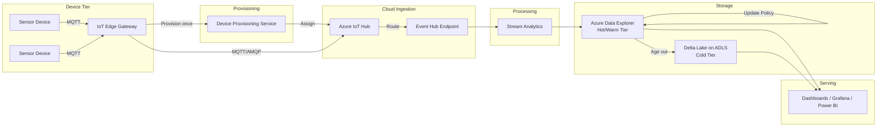
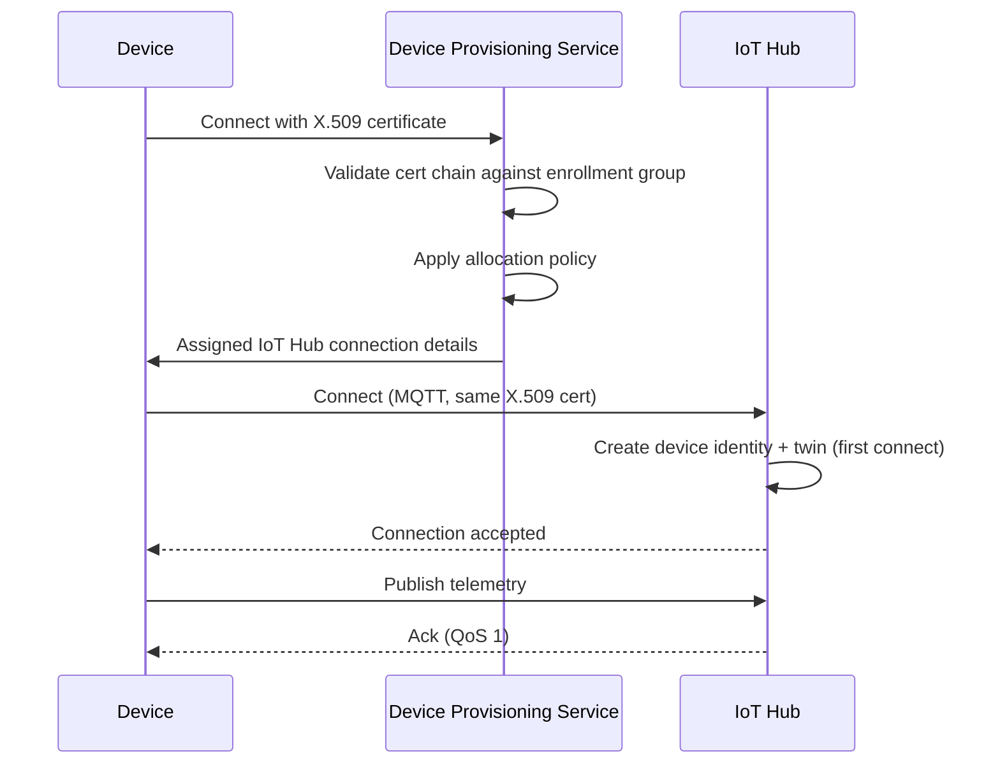
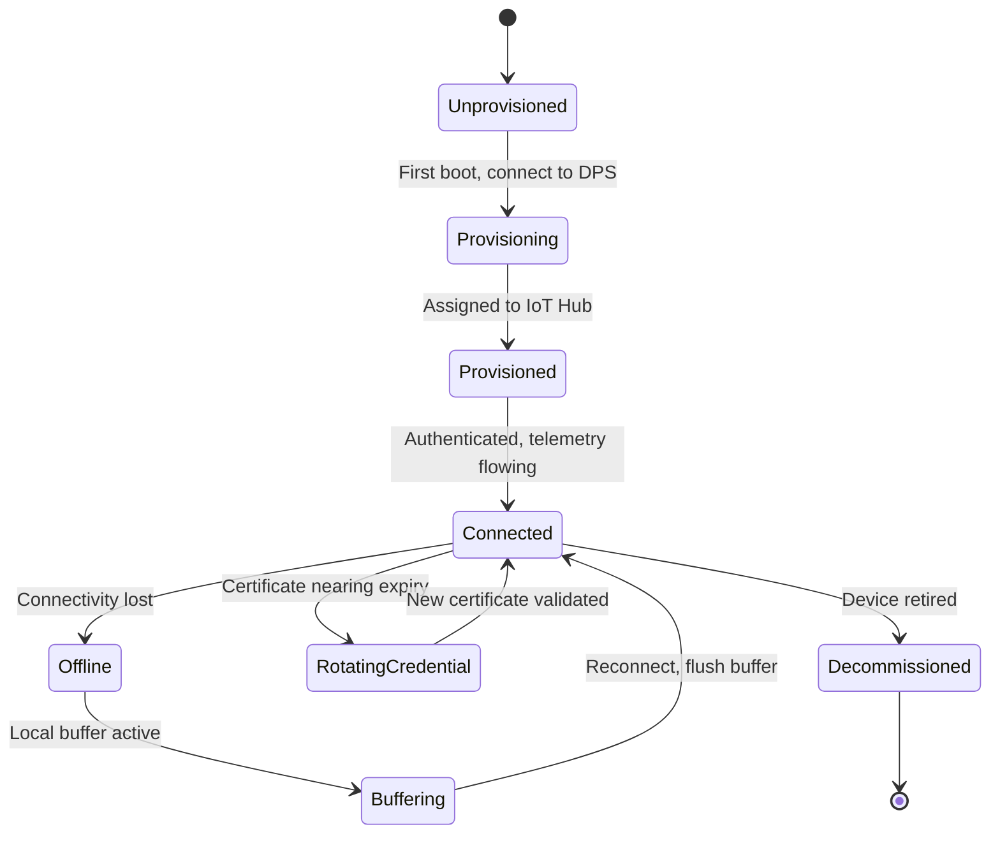

# IoT Data Platforms

> Part of the **Enterprise Data & AI Architecture Handbook** · Phase-16 — Domain-Specific & Frontier Data Platforms · Chapter 01.
> Estimated study time: **60 min reading + ~4h labs**.
> **Prerequisites:** read [Streaming Fundamentals](../Phase-07/01_Streaming_Fundamentals.md) first.

---

## Executive Summary

Every streaming architecture this handbook has described so far ([Streaming Fundamentals](../Phase-07/01_Streaming_Fundamentals.md), [Apache Kafka](../Phase-07/02_Apache_Kafka.md), [Azure Event Hubs and Stream Analytics](../Phase-07/03_Azure_Event_Hubs_and_Stream_Analytics.md)) implicitly assumes a producer that is a well-behaved application server: reliably powered, well-connected, running a full operating system, and trusted with broad network access. An IoT device satisfies none of those assumptions by default. It may run on battery or harvested power, communicate over an intermittent cellular or LPWAN link, execute on a microcontroller with kilobytes of RAM, and — if compromised — become part of a botnet rather than merely a source of bad data. This chapter is the first of Phase-16 (Domain-Specific & Frontier Data Platforms) and establishes the foundational architecture for **IoT data platforms**: the connectivity, ingestion, edge-processing, storage, and device-management stack that turns physical-world sensor and actuator data into governed, queryable enterprise data, while treating the two properties that make IoT structurally different from a generic streaming source — **device identity at scale** and **data volume reduction at the edge** — as first-class architectural decisions rather than afterthoughts.

This chapter covers **device connectivity protocols** (MQTT and AMQP, and why constrained devices need something lighter than the HTTP/REST APIs the rest of this handbook has assumed by default), **Azure IoT Hub and Event Hubs** as the cloud ingestion and device-management control plane, **edge versus cloud processing** as a genuine architectural decision with real latency, bandwidth, and connectivity-resilience trade-offs (not merely "do more at the edge if you can"), **time-series storage and downsampling** as the mechanism that keeps a fleet of thousands-to-millions of continuously-reporting devices from producing an unbounded, unaffordable storage bill, and **device management and security** as the identity, provisioning, and lifecycle discipline that determines whether a device fleet is a governed asset or an unmanaged attack surface.

The platform bias is **Azure-primary (~60%)** — Azure IoT Hub, Device Provisioning Service (DPS), Azure IoT Edge, Event Hubs, Azure Stream Analytics, and Azure Data Explorer (ADX/Kusto) as the primary ingestion-to-serving stack — **~30% enterprise open source** (Eclipse Mosquitto and EMQX as MQTT brokers, EdgeX Foundry and Eclipse Kura for edge-computing frameworks, Apache Kafka as the OSS alternative to the Event Hubs Kafka-compatible endpoint, InfluxDB/TimescaleDB as OSS time-series stores, Grafana/Telegraf for dashboards and edge-collection) — **~10% AWS/GCP comparison-only** (AWS IoT Core, IoT Greengrass, Timestream; and Google Cloud's post-Cloud-IoT-Core-retirement partner-ecosystem approach, a genuinely instructive real-world platform-deprecation case this chapter treats explicitly rather than glossing over).

**Bottom line:** an IoT data platform is not "streaming ingestion with more sensors." It is a distinct architectural discipline because the producer itself — the device — is untrusted-by-default, resource-constrained, frequently disconnected, and present in numbers that make per-device manual configuration operationally impossible. Every section in this chapter returns to the same underlying thesis: **treat device identity as a provisioned, auditable, individually-revocable asset (never a shared fleet-wide secret), and treat data-volume reduction (via edge aggregation and time-series downsampling) as a mandatory design decision made before a single device ships, not a cost-optimization retrofit applied after the storage bill arrives.**

---

## Learning Objectives

By the end of this chapter you will be able to:

1. **Select the correct device connectivity protocol** (MQTT, AMQP, or HTTP) for a given device-constraint profile, and explain the operational consequences of the choice.
2. **Design an Azure IoT Hub and Device Provisioning Service architecture** for zero-touch fleet provisioning, including device twins, direct methods, and message routing.
3. **Decide what processing belongs at the edge versus the cloud** for a given latency, bandwidth, and connectivity-resilience requirement, and justify the decision with a concrete decision matrix.
4. **Design a time-series storage and downsampling strategy** that keeps long-term storage cost bounded as device count and reporting frequency grow.
5. **Design a device identity and provisioning lifecycle** using X.509 certificates and DPS enrollment groups that avoids shared, fleet-wide credentials.
6. **Apply an Operational Response Playbook** to diagnose and remediate a mass device-disconnect event or an ingestion backlog.
7. **Defend an IoT platform architecture's connectivity, edge-processing, storage, and security decisions** in engineer, staff engineer, architect, and CTO review settings.

---

## Business Motivation

- **Physical-world visibility is the primary business driver**: a manufacturer cannot run predictive maintenance, a utility cannot bill on real usage, and a logistics operator cannot guarantee cold-chain compliance without a reliable, governed pipeline from a physical sensor to an analytics-ready dataset — the gap this chapter's architecture closes.
- **Device count, not application-server count, is now the dominant scale driver for many enterprises**: an organization that has spent years operating a few hundred application servers may deploy tens of thousands of sensors in a single facility rollout, and the operational model that worked for servers (manual provisioning, shared service accounts, ad hoc firmware updates) does not survive that scale change intact.
- **Connectivity is frequently the least reliable link in the entire data platform** — a device on a factory floor, a delivery vehicle, or a remote agricultural site cannot assume the always-on network connectivity every other chapter in this handbook has implicitly assumed for its producers; an architecture that does not design for intermittent connectivity from day one will lose data silently in production, not merely underperform.
- **An unmanaged device fleet is a direct, quantifiable security liability** — the 2016 Mirai botnet (§39) turned hundreds of thousands of IoT devices with unchanged default credentials into the source of one of the largest DDoS attacks recorded at the time, and remains the canonical, board-level-visible argument for why device identity and credential lifecycle management (§16) is a business risk decision, not merely an engineering preference.
- **Storage and ingestion cost scale directly with device count × reporting frequency × retention**, and without a deliberate downsampling and tiered-retention strategy (§13, worked FinOps example in §20), that cost grows unbounded and can silently dwarf the value of the insight the telemetry was collected to produce.

---

## History and Evolution

- **1999 — MQTT is invented at IBM** (Andy Stanford-Clark and Arlen Nipper) for monitoring oil pipeline SCADA telemetry over unreliable, low-bandwidth satellite links — the exact constrained-connectivity problem this chapter's protocol discussion (§1.1) still centers on a quarter-century later.
- **2003 — AMQP's origins at JPMorgan Chase** as a reliable, broker-agnostic, enterprise-messaging protocol, later standardized (OASIS, 2012) with the transactional and routing guarantees MQTT deliberately does not provide.
- **2010s — the "Internet of Things" term moves from research-lab framing to enterprise data-platform reality**, driven by falling sensor and connectivity cost, and by the same cloud-elasticity trends that produced the broader streaming ecosystem covered in [Streaming Fundamentals](../Phase-07/01_Streaming_Fundamentals.md).
- **2014-2016 — the major cloud providers launch dedicated IoT platforms**: Azure IoT Hub (2016 GA), AWS IoT Core (2015), and Google Cloud IoT Core (2018) — each providing device-registry, MQTT/AMQP ingestion, and (initially) device-management capability as a managed service rather than requiring a hand-built broker fleet.
- **2016 — the Mirai botnet DDoS attack** (§39) becomes the industry's defining IoT-security wake-up-call moment, directly motivating the DPS-based per-device-identity provisioning model (§1.5, ADR-0181) that is now the accepted enterprise baseline rather than an optional hardening step.
- **2017 — MQTT v5.0** standardizes richer error reporting, message expiry, and shared subscriptions, closing several of the gaps that had previously pushed some enterprise deployments toward AMQP by default.
- **2020-2022 — Azure IoT Edge and comparable edge-runtime platforms mature**, formalizing the edge-versus-cloud processing decision (§1.3) as a first-class architectural question with production-grade tooling (containerized edge modules, offline buffering, over-the-air module updates) rather than a bespoke gateway script.
- **2023 — Google Cloud IoT Core is retired** (shut down August 2023), a genuinely significant real-world event this chapter treats directly in Migration Considerations (§35) rather than omitting: Google exited the managed-device-registry business entirely in favor of a partner ecosystem (Litmus Automation, EMQX Cloud, and others) building on core GCP primitives (Pub/Sub, Bigtable, BigQuery) — a concrete lesson in platform-longevity risk that belongs in every IoT platform-selection decision.
- **2023-2026 — Azure Data Explorer (ADX/Kusto) and Delta Lake-based lakehouse patterns displace the earlier Azure Time Series Insights service** (retired 2024/2025) as the dominant enterprise time-series storage and query layer, reflecting the broader lakehouse convergence already covered in [Lakehouse Architecture](../Phase-05/02_Lakehouse_Architecture.md), now applied specifically to high-cardinality, high-frequency telemetry.

---

## Why This Technology Exists

Every prior chapter in this handbook assumed the data producer was a networked application: an API server, a database's change stream, a well-connected batch job. A physical sensor is a fundamentally different kind of producer — it may have no persistent power source, no full TCP/IP stack, no ability to hold an open HTTPS connection, and no operator physically present to intervene when something goes wrong. IoT data platforms exist because moving physical-world telemetry into the same governed, queryable, analytics-ready form the rest of this handbook assumes for enterprise data requires a purpose-built connectivity, provisioning, and edge-processing layer in front of it — one that assumes intermittent connectivity, constrained compute, and device counts three to five orders of magnitude larger than a typical application-server fleet, and that treats every device as an individually-identified, individually-revocable security principal rather than an anonymous data source.

---

## Problems It Solves

- **Reliable telemetry delivery over unreliable, low-bandwidth, or intermittently-connected networks**, resolved by publish/subscribe protocols (MQTT, §1.1) purpose-built for exactly this constraint, with configurable delivery guarantees (QoS 0/1/2) that let a device trade reliability against bandwidth and battery cost explicitly.
- **Provisioning and managing device identity at a scale where per-device manual configuration is operationally impossible**, resolved by the Device Provisioning Service's zero-touch, enrollment-group-based provisioning model (§1.5).
- **Bidirectional communication with a device that has no fixed IP address and may be behind NAT/firewalls it does not control**, resolved by the cloud-to-device messaging, direct methods, and device-twin desired-property mechanisms IoT Hub provides (§1.2), rather than requiring an inbound connection to the device.
- **Compressing a high-frequency sensor stream into a bandwidth- and cost-affordable cloud ingestion volume**, resolved by edge-based pre-aggregation and filtering (§1.3) before data ever leaves the site.
- **Answering time-windowed analytical questions ("what was the average temperature per hour, per site, over the last 90 days") over billions of individual readings without scanning raw data**, resolved by time-series-native storage engines with built-in downsampling and rollup (§1.4).
- **Detecting and responding to a compromised or misbehaving device without taking the entire fleet offline**, resolved by per-device identity and individually-revocable credentials (§1.5) — the direct structural fix for the Mirai-class failure mode named in Business Motivation.

---

## Problems It Cannot Solve

- **An IoT platform does not fix a poorly-instrumented physical asset** — if the sensor measuring the thing you actually care about was never installed, or measures the wrong proxy variable, no amount of connectivity or storage architecture recovers the missing signal; sensor selection and placement is a domain-engineering decision this chapter's data platform sits downstream of, not a substitute for it.
- **It does not eliminate the CAP-theorem and eventual-consistency realities** this handbook established in [CAP and PACELC](../Phase-02/04_CAP_and_PACELC.md) — a device buffering telemetry during a connectivity outage and later replaying it in bulk is exactly the same delayed-consistency trade-off every distributed system faces, now happening at the network edge rather than between data centers.
- **It does not remove the need for a genuine, resourced device-security program** — Device Provisioning Service and per-device X.509 identity (§1.5) provide the *mechanism* for strong device identity; an organization that provisions strong identities but never rotates certificates, never patches edge-module firmware, and never monitors for anomalous device behavior has built the mechanism without the operating discipline it requires, and remains exposed.
- **It does not make downsampling free of information loss** — every downsampling and rollup decision (§1.4) is a deliberate, irreversible trade of fidelity for storage cost; a downsampling policy chosen without validating that the retained resolution is sufficient for the actual analytical and regulatory use cases it must serve is a design defect, not a cost optimization.
- **It does not resolve the fundamentally different scale, protocol, and safety requirements of industrial control systems** (OT/SCADA networks, deterministic real-time control loops) — those require the dedicated treatment Phase-16 Chapter 02 (Industrial IoT / IIoT) gives them; this chapter's scope is consumer- and enterprise-facing IoT telemetry, not safety-critical industrial control.

---

## Core Concepts

### 1.1 Device connectivity and protocols (MQTT/AMQP)

- **MQTT (Message Queuing Telemetry Transport)** is a lightweight publish/subscribe protocol designed from the outset for constrained devices and unreliable networks (per History, §4): a small, fixed-size binary header (as little as 2 bytes), a persistent TCP (or WebSocket) connection with periodic keep-alive pings, and a topic-hierarchy-based pub/sub model (`site/{siteId}/device/{deviceId}/telemetry`) that lets a broker route messages without every subscriber needing a direct connection to every publisher.
- **MQTT Quality of Service (QoS) levels are the protocol's core reliability/cost trade-off**: QoS 0 (fire-and-forget, no acknowledgment, lowest bandwidth and battery cost, but silent message loss on a dropped connection), QoS 1 (at-least-once, acknowledged, possible duplicates — the enterprise-default choice for most telemetry, directly mirroring the at-least-once delivery semantics already established in [Streaming Patterns and Delivery Semantics](../Phase-07/08_Streaming_Patterns_and_Delivery_Semantics.md)), and QoS 2 (exactly-once via a four-part handshake, highest bandwidth/latency cost, reserved for commands and billing-relevant telemetry where a duplicate or lost message has real financial or safety consequence).
- **AMQP (Advanced Message Queuing Protocol)** provides a richer, broker-agnostic messaging model — flow control, transactions, and structured message properties — at a meaningfully higher connection and bandwidth cost than MQTT; it is the protocol IoT Hub uses internally for its own cloud-side Event Hubs-compatible endpoint (§1.2) and remains the right choice for gateway devices and industrial PLCs with sufficient compute and network budget to afford its overhead in exchange for AMQP's stronger delivery and transactional guarantees.
- **HTTP/REST remains viable only for very low-frequency, non-real-time device check-ins** (e.g., a device reporting once per hour) — its per-request connection-setup overhead makes it a poor fit for continuous telemetry at any meaningful frequency, and it provides no native server-initiated (cloud-to-device) push capability, unlike MQTT/AMQP's persistent connection model.
- **CoAP (Constrained Application Protocol)**, a UDP-based, RESTful protocol for the most severely constrained (battery/LPWAN) devices, is worth naming as the protocol of last resort for devices too constrained even for MQTT's minimal TCP overhead — Azure IoT Hub does not natively support CoAP, so CoAP-based fleets typically terminate at a protocol-translation gateway (§1.3) before reaching the cloud.

### 1.2 Azure IoT Hub and Event Hubs

- **IoT Hub is a per-device-identity-aware message broker and device-management control plane**, distinct from a generic Event Hub in one structural way: every message is associated with an authenticated, individually-provisioned device identity from the moment it is ingested, and IoT Hub natively supports bidirectional communication patterns (cloud-to-device messages, direct methods, device twins) that a generic Event Hub — a pure, identity-agnostic append log (per [Azure Event Hubs and Stream Analytics](../Phase-07/03_Azure_Event_Hubs_and_Stream_Analytics.md)) — does not provide.
- **Device twins** are a JSON document IoT Hub maintains per device, split into **tags** (backend-only device metadata, e.g., site/firmware-version, used for querying and grouping), **desired properties** (backend-set configuration intent, e.g., "target firmware version: 2.3.1"), and **reported properties** (device-set actual state, e.g., "current firmware version: 2.2.0") — the desired/reported split lets a backend declare intent even while the device is offline, with the device reconciling and reporting back once it reconnects, the same declarative-reconciliation pattern [Kubernetes](../Phase-09/06_Kubernetes.md) uses for container state.
- **Direct methods** provide synchronous, request-response, cloud-to-device invocation (e.g., "reboot now," "run diagnostic") when the device is online, distinct from the desired-property mechanism's asynchronous, eventually-reconciled model — the right choice depends on whether the command genuinely needs immediate execution and confirmation, or can tolerate eventual application whenever the device next connects.
- **Message routing** lets IoT Hub fan device-to-cloud telemetry out to multiple downstream endpoints (a built-in Event Hubs-compatible endpoint, a separate Event Hub, Service Bus, or Azure Storage) based on message properties or device-twin tags, without requiring every downstream consumer to connect directly to the device fleet — telemetry destined for real-time Stream Analytics processing and telemetry destined for cold storage can be routed independently from the same ingested stream.
- **IoT Hub's device-to-cloud endpoint is Event-Hubs-compatible by design**, meaning every downstream pattern already established for Event Hubs consumer groups, partitions, and checkpointing in [Azure Event Hubs and Stream Analytics](../Phase-07/03_Azure_Event_Hubs_and_Stream_Analytics.md) applies directly to consuming IoT Hub telemetry — IoT Hub is best understood as "Event Hubs plus a device registry, device twins, and bidirectional device-management," not as a wholly separate ingestion technology.

### 1.3 Edge vs. cloud processing

- **Edge processing exists to solve three problems a pure cloud-ingestion model cannot**: bandwidth cost and availability (aggregating or filtering high-frequency raw sensor data before it consumes limited or metered network capacity), latency (a local control-loop decision — e.g., an emergency stop — that cannot tolerate a round trip to a cloud region), and connectivity resilience (buffering telemetry locally during a network outage so no data is silently lost).
- **Azure IoT Edge** runs a containerized module runtime directly on gateway-class edge hardware, letting the same container-based deployment model established in [Containers with Docker](../Phase-09/05_Containers_with_Docker.md) and [Kubernetes](../Phase-09/06_Kubernetes.md) extend to the network edge: edge modules can run protocol-translation gateways (bridging CoAP/Modbus devices into MQTT), local stream-processing (windowed aggregation, anomaly filtering), and even local ML inference (a vision model flagging a defect on a production line without a round trip to the cloud).
- **The edge-versus-cloud decision is not "maximize edge processing"** — every computation moved to the edge is computation the organization must now deploy, monitor, patch, and secure on physically-distributed, often less-controlled hardware, extending the same edge-attack-surface caution already raised in [Security Foundations](../Phase-10/01_Security_Foundations.md); the correct decision is workload-specific, driven by the latency budget, bandwidth cost, and connectivity-resilience requirement of that specific workload, not a blanket architectural default in either direction.
- **A gateway pattern** — a single, better-provisioned edge device (an IoT Edge gateway) aggregating and forwarding telemetry on behalf of many smaller, more constrained downstream devices that cannot themselves run a full protocol stack or maintain a direct cloud connection — is the standard topology for sensor networks with a large fan-in of low-capability devices (§26).
- **Offline buffering is a mandatory edge capability, not an optional resilience feature**: an edge device or gateway must persist unsent telemetry locally (with a bounded, monitored buffer size) during a connectivity outage and resume transmission on reconnect, applying the same store-and-forward principle behind at-least-once delivery semantics (per [Streaming Patterns and Delivery Semantics](../Phase-07/08_Streaming_Patterns_and_Delivery_Semantics.md)) at the network edge rather than only within the broker.

### 1.4 Time-series storage and downsampling

- **Time-series data has three properties that make it structurally different from typical OLTP or dimensional data** (per [Dimensional Modeling](../Phase-06/01_Dimensional_Modeling.md)): append-mostly write patterns (a reading, once written, is rarely updated), overwhelmingly time-range-and-device-scoped query patterns (rather than arbitrary joins), and extreme write volume relative to the information density of any single point — a temperature sensor reporting once per second produces 86,400 points per day whose values typically change slowly and smoothly, making the raw resolution itself a compressible, and often analytically unnecessary, level of detail.
- **Downsampling and rollup** — pre-computing and storing lower-resolution aggregates (e.g., 1-minute or 1-hour min/max/average) alongside or instead of raw readings — is the primary mechanism that keeps long-term storage cost bounded as device count and retention window grow; a well-designed tiered-retention policy keeps only a short window (hours to days) of full-resolution raw data, a medium window (weeks to months) of minute-level rollups, and an indefinite window of hour- or day-level rollups, matching retained resolution to how far back a realistic query actually needs full detail.
- **Delta and delta-of-delta encoding, and specialized formats like Gorilla** (the compression scheme originally published by Facebook for its in-memory time-series store, and now widely reused across the time-series-database ecosystem), exploit the fact that consecutive timestamps and consecutive sensor values both typically change by small, similar amounts — directly extending the general compression and encoding principles from [Compression and Encoding](../Phase-04/08_Compression_and_Encoding.md) to the specific statistical structure of time-series data, routinely achieving 90%+ size reduction versus storing raw floating-point values and timestamps directly.
- **Azure Data Explorer (ADX/Kusto)** is the primary Azure-native engine for hot/warm time-series query at scale: its columnar storage, native time-series functions (`make-series`, `series_decompose`), and update-policy mechanism (automatically materializing a downsampled rollup table from every incoming raw batch) implement the tiered-retention pattern above as a first-class platform feature rather than requiring a hand-built batch job.
- **A cold tier in Delta Lake/Parquet on ADLS** (per [Delta Lake](../Phase-04/04_Delta_Lake.md)) is the standard destination for raw, full-resolution telemetry once it ages out of ADX's hot/warm retention window — kept for compliance, audit, and the rare deep-historical-analysis query, at a materially lower storage cost per byte than a hot query engine, following the same medallion-architecture cold-tier pattern established in [Medallion Architecture](../Phase-05/03_Medallion_Architecture.md).

### 1.5 Device management and security

- **Zero-touch provisioning via the Device Provisioning Service (DPS)** lets a device authenticate itself (via an X.509 certificate or a hardware-backed TPM-derived key) and be automatically assigned to the correct IoT Hub instance — without any human manually registering the device's identity in advance — the mechanism that makes provisioning tens of thousands of devices operationally tractable, directly analogous to the workload-identity-federation pattern already established for cloud workloads in [Identity and Access Management with Entra](../Phase-10/02_Identity_and_Access_Management_with_Entra.md).
- **Enrollment groups** let an entire batch of devices (e.g., every unit from one manufacturing run, sharing a common intermediate CA certificate) be provisioned under one policy, without every individual device requiring separate manual enrollment — but critically, each device within an enrollment group still receives its own **individual, leaf-level X.509 certificate**, preserving individual device identity and individual revocability even though the enrollment *policy* is shared.
- **Per-device X.509 identity — never a shared, fleet-wide symmetric key or shared SAS token — is this chapter's central, non-negotiable security requirement** (formalized in ADR-0181): a shared credential means a single compromised or reverse-engineered device (or a single leaked firmware image) compromises the entire fleet's ability to authenticate, with no way to revoke one device's access without revoking every device sharing that credential; individual per-device certificates, by contrast, let a single compromised device be revoked (via the DPS enrollment record and IoT Hub identity registry) with zero impact on every other device.
- **Symmetric-key (SAS token) authentication remains supported by IoT Hub and DPS** and is operationally simpler for prototyping or genuinely low-risk deployments, but shares the fleet-wide-blast-radius risk above whenever the same key is reused across devices — extending the same "reference, don't hardcode/reuse" secrets discipline from [Secrets and Key Management](../Phase-10/05_Secrets_and_Key_Management.md) to the device-identity layer specifically.
- **The device lifecycle — provision, operate, rotate credentials, decommission** — must be a designed, auditable workflow, not an assumption that a device provisioned once needs no further identity-lifecycle attention: certificate expiry and rotation (mirroring the CMK/secret rotation "verification gap" pattern already established in [Data Security and Encryption](../Phase-10/03_Data_Security_and_Encryption.md) and [Secrets and Key Management](../Phase-10/05_Secrets_and_Key_Management.md)) must be automated and monitored, and a decommissioned device's identity must be explicitly revoked in the IoT Hub identity registry and DPS enrollment record, not merely powered off and forgotten.

---

## Internal Working

### 2.1 How a device actually connects and authenticates

1. A newly-manufactured device, provisioned at the factory with a unique leaf X.509 certificate signed by an intermediate CA registered as a DPS enrollment group, powers on for the first time at its deployment site and initiates a TLS-secured connection to the DPS global endpoint.
2. DPS validates the device's certificate chain against the enrollment group's registered intermediate CA, applies the enrollment group's allocation policy (e.g., "assign to the lowest-latency IoT Hub instance," or "assign based on a custom Azure Function's logic keyed on device tags"), and returns the assigned IoT Hub's connection details to the device — all without any human having pre-registered that specific device's identity in IoT Hub.
3. IoT Hub, receiving the device's first connection, creates a device identity and an initial device twin automatically (if the enrollment group is configured to do so), and the device begins publishing telemetry over its persistent MQTT (or AMQP) connection using the same X.509 certificate as its ongoing per-message authentication credential.
4. Every subsequent reconnect re-authenticates using the same device-held certificate — no shared secret is transmitted or reused across devices at any point in this flow, directly satisfying ADR-0181's per-device-identity requirement.

### 2.2 How telemetry actually flows from device to downsampled query

1. A device (or an intermediate IoT Edge gateway aggregating many downstream devices, per §1.3) publishes an MQTT telemetry message to its device-specific topic; IoT Hub authenticates the connection against the device's registered identity and accepts the message onto its internal, Event-Hubs-compatible device-to-cloud endpoint.
2. IoT Hub's message routing evaluates configured routing rules (e.g., "route messages tagged `messageType=telemetry` to Endpoint A, route `messageType=alert` to Endpoint B") and fans the message out to one or more downstream endpoints without the device needing any awareness of those downstream destinations.
3. A Stream Analytics job (or a Databricks Structured Streaming job, per [Spark Structured Streaming](../Phase-05/04_Apache_Spark_Internals.md)) consumes the routed stream, applies windowed aggregation or anomaly detection, and writes both raw-passthrough and computed-aggregate records onward.
4. Azure Data Explorer ingests the incoming stream into a raw hot table, and an ADX update policy automatically triggers on each ingested batch, computing and appending the corresponding downsampled rollup into a separate materialized table — the downsampling described in §1.4 happening continuously and automatically as data lands, not as a separate nightly batch job.
5. A query against the rollup table (e.g., "hourly average temperature per site for the last 90 days") never scans the much larger raw table at all, and the raw table itself ages out into the Delta Lake cold tier once it exceeds ADX's configured hot-retention window.

### 2.3 How a device-twin desired-property update actually reaches an offline device

1. A backend operator (or an automated remediation workflow, per the Operational Response Playbook in §22) sets a desired property on a device twin (e.g., `firmwareVersion: "2.3.1"`) via the IoT Hub service API — this write succeeds immediately regardless of whether the target device is currently connected.
2. If the device is online, IoT Hub pushes the updated desired-properties document to the device over its existing MQTT connection in near-real-time; the device's firmware-update logic observes the change and begins the update.
3. If the device is offline, the desired-property change is simply held in the device twin's document; the moment the device next reconnects, it receives the full current desired-properties document as part of its connection handshake, and applies the pending change then — no message is lost and no separate retry logic is required, because desired properties are a *state* document, not a queued message.
4. Once the device firmware update completes, the device reports its new state back via a reported property (`firmwareVersion: "2.3.1"`); the backend's twin-query logic (`SELECT deviceId FROM devices WHERE properties.desired.firmwareVersion <> properties.reported.firmwareVersion`) can then continuously and cheaply identify exactly which devices have not yet converged, without polling any individual device directly.

---

## Architecture

A reference enterprise IoT data platform architecture, from device to serving layer:

1. **Device tier**: sensors and constrained devices, communicating over MQTT/AMQP (§1.1), optionally behind an IoT Edge gateway (§1.3) for protocol translation, local aggregation, and offline buffering.
2. **Provisioning and identity tier**: Device Provisioning Service, enrollment groups, and per-device X.509 certificates (§1.5), assigning each device to the correct IoT Hub instance at first connection.
3. **Ingestion and device-management tier**: Azure IoT Hub, providing device twins, direct methods, and message routing (§1.2) to downstream endpoints.
4. **Stream-processing tier**: Azure Stream Analytics or Databricks Structured Streaming, consuming the Event-Hubs-compatible routed stream for real-time windowed aggregation, anomaly detection, and enrichment.
5. **Storage tier**: Azure Data Explorer for hot/warm time-series query with automatic downsampling via update policies (§1.4), and Delta Lake on ADLS for cold, full-resolution, long-retention storage.
6. **Serving and consumption tier**: Power BI/Grafana dashboards, downstream ML models (feeding into the model-serving patterns established in [Model Serving and Ray](../Phase-11/04_Model_Serving_and_Ray.md)), and digital-twin visualization layers (previewed here, covered in full in Phase-16 Chapter 07, Digital Twins).

Every tier boundary above is also a trust boundary: device-to-gateway, gateway-to-cloud, and cloud-service-to-service, each requiring its own explicit authentication, extending the zero-trust "verify explicitly at every hop" principle from [Network Security and Zero Trust](../Phase-10/04_Network_Security_and_Zero_Trust.md) to a topology where the outermost hop is a physically-distributed, often physically-accessible device rather than a controlled data-center server.

---

## Components

- **Azure IoT Hub**: per-device-identity-aware ingestion, device-twin state management, and cloud-to-device command dispatch.
- **Device Provisioning Service (DPS)**: zero-touch, enrollment-group-based device-to-IoT-Hub assignment.
- **Azure IoT Edge**: containerized edge-module runtime for protocol translation, local aggregation, offline buffering, and edge ML inference.
- **Azure Event Hubs**: the underlying Event-Hubs-compatible telemetry stream IoT Hub routes into, and the direct ingestion target for any telemetry source not itself device-identity-aware (e.g., a legacy gateway already emitting Kafka-protocol messages).
- **Azure Stream Analytics / Databricks Structured Streaming**: windowed aggregation, anomaly detection, and enrichment of the routed telemetry stream.
- **Azure Data Explorer (ADX/Kusto)**: hot/warm time-series storage, native time-series query functions, and automatic downsampling via update policies.
- **Delta Lake on ADLS**: cold, full-resolution, long-retention time-series storage.
- **Azure Digital Twins**: the graph-based twin-modeling service for representing physical assets and their relationships (previewed here; full treatment in Phase-16 Chapter 07, Digital Twins).
- **Eclipse Mosquitto / EMQX**: open-source MQTT brokers, used either as a fully self-hosted alternative ingestion layer or as a local, on-premises broker in front of an IoT Hub-based cloud tier.

---

## Metadata

- **Device twin tags and reported/desired properties** (§1.2) are the primary per-device metadata store: firmware version, site/location, hardware model, and any backend-set configuration intent, all queryable via IoT Hub's twin-query language without needing a separate metadata database for basic device attributes.
- **DPS enrollment-group metadata** (the registered intermediate CA, the allocation policy, and any custom-allocation-function configuration) governs how new devices are classified and assigned, and must itself be treated as governed configuration (versioned, change-reviewed) rather than an ad hoc one-time setup step.
- **Time-series schema metadata** — the specific measurement names, units, and expected value ranges a given device model reports — should be registered centrally (e.g., in a data-contract-style descriptor per [Data Contracts](../Phase-08/07_Data_Contracts.md)) so that a downstream consumer can validate an unexpected unit change (Celsius versus Fahrenheit, a classic real-world IoT data-quality incident) at ingestion time rather than discovering it in a corrupted downstream aggregate.
- **Device digital-twin models (DTDL — Digital Twins Definition Language)**, used by Azure Digital Twins to formally describe a device's properties, telemetry, and relationships to other twins, are the metadata layer Phase-16 Chapter 07 (Digital Twins) builds on directly; this chapter's device-twin (IoT Hub) and digital-twin (Azure Digital Twins) concepts are related but distinct — IoT Hub's twin is a flat device-state document, while Azure Digital Twins models a graph of typed entities and their relationships.

---

## Storage

- **Hot tier (ADX, hours to days of raw retention)**: full-resolution raw telemetry, optimized for low-latency dashboard and alerting queries against the most recent data.
- **Warm tier (ADX, weeks to months, minute-level rollups)**: downsampled aggregates materialized automatically via ADX update policies (§1.4), serving the large majority of operational and trend-analysis queries at a fraction of the hot tier's storage cost.
- **Cold tier (Delta Lake on ADLS, indefinite retention, raw + hour/day-level rollups)**: full-fidelity historical archive for compliance, audit, and deep-historical or ML-training queries, exploiting Delta Lake's columnar compression and the general storage-cost advantage of object storage over a hot query engine.
- **Edge-local buffer storage**: a bounded, monitored local disk or flash buffer on gateway devices, holding telemetry generated during a connectivity outage until it can be forwarded — sized deliberately against the device's realistic maximum outage duration, not left unbounded (an unbounded buffer on a resource-constrained device is itself an availability risk, per §19).

---

## Compute

- **Edge compute**: IoT Edge modules performing protocol translation, local windowed aggregation, anomaly filtering, and (increasingly) local ML inference on gateway-class hardware — trading a real, ongoing edge-device-fleet operational burden for reduced bandwidth cost and lower control-loop latency (§1.3).
- **Stream-processing compute**: Azure Stream Analytics streaming units (or Databricks cluster compute, per [Apache Spark Internals](../Phase-05/04_Apache_Spark_Internals.md)) for cloud-side windowed aggregation and enrichment, scaled to the ingested message rate.
- **Query compute**: ADX cluster compute for hot/warm time-series queries, and Databricks/Spark compute for cold-tier historical or ML-training queries against the Delta Lake archive.
- **Provisioning compute**: DPS's managed allocation-policy evaluation (including any custom allocation Azure Function) at device first-connect time — a low, per-connection-event compute cost, but one that must scale to the burst of simultaneous first-connections a large fleet rollout or firmware-triggered mass reprovisioning event can produce.

---

## Networking

- **MQTT/AMQP over TLS 1.2+** is the default, non-negotiable transport for device-to-cloud connectivity, extending the encryption-in-transit baseline from [Data Security and Encryption](../Phase-10/03_Data_Security_and_Encryption.md) to the device layer.
- **MQTT over WebSockets** provides an important fallback for devices or networks that only permit outbound HTTPS (port 443) traffic — common in corporate or campus networks with restrictive egress firewalls — trading a small protocol-overhead cost for connectivity in environments where a raw MQTT TCP port would be blocked.
- **Private endpoints for IoT Hub and DPS** keep device-to-cloud traffic off the public internet path where the network topology allows it (e.g., a gateway on a private WAN with ExpressRoute connectivity back to the Azure region), extending [Network Security and Zero Trust](../Phase-10/04_Network_Security_and_Zero_Trust.md)'s private-endpoint-by-default baseline; most individual field devices, by contrast, necessarily connect over the public internet or cellular/LPWAN, making TLS and per-device identity (rather than network-perimeter isolation) the primary control for that leg of the path.
- **NAT and firewall traversal**: because devices are almost always the ones initiating the connection (outbound to IoT Hub/DPS), and IoT Hub's cloud-to-device messaging rides that same already-open connection rather than requiring an inbound connection to the device, IoT-scale fleets avoid the inbound-NAT-traversal problem a naive "expose every device on the internet" design would otherwise create.
- **LPWAN and cellular connectivity** (LoRaWAN, NB-IoT, Cat-M1) for devices too power- or bandwidth-constrained even for a persistent MQTT session commonly terminate at a network operator's or LoRaWAN network server's gateway, which then bridges into IoT Hub via a standard MQTT/HTTPS connection on the device fleet's behalf — the gateway pattern (§1.3, §26) applied at the network-operator layer rather than the customer-site layer.

---

## Security

- **Per-device X.509 identity, provisioned via DPS enrollment groups, with individual leaf certificates per device, is the mandatory baseline** (§1.5, ADR-0181) — no shared fleet-wide symmetric key or SAS token in production.
- **The OWASP IoT Top 10** provides a structured checklist directly complementary to the OWASP LLM/API treatments already covered elsewhere in this handbook: weak/default/hardcoded credentials (the exact Mirai-class failure, §39), insecure network services, insecure ecosystem interfaces (an unauthenticated device-management API), lack of secure update mechanism, and insufficient privacy protection are the categories most directly addressed by this chapter's provisioning (§1.5) and edge-module-update (§1.3) architecture.
- **Firmware and edge-module update integrity**: over-the-air updates must be signed and verified before installation, extending the artifact-signing discipline from [DevOps and CI/CD](../Phase-09/03_DevOps_and_CI_CD.md) to device firmware specifically — an unsigned or unverified update mechanism is itself a remote-code-execution attack surface across the entire fleet.
- **Least-privilege device authorization**: a device's IoT Hub identity should be scoped only to the specific operations it genuinely needs (typically: publish telemetry, receive its own device-twin updates) — a device credential with broader IoT Hub service-level permissions than it needs increases the blast radius of that specific device's compromise, mirroring the least-privilege-tool-scoping principle from [Agentic AI Architecture](../Phase-12/05_Agentic_AI_Architecture.md) applied to a physical rather than an AI-agent principal.
- **Device-twin tampering and the DPS enrollment record itself are governed assets**: write access to device twins and to DPS enrollment-group configuration should be scoped via Entra ID RBAC (per [Identity and Access Management with Entra](../Phase-10/02_Identity_and_Access_Management_with_Entra.md)) to the specific backend services and operators that genuinely need it, not left as a broadly-shared administrative capability.

---

## Performance

- **IoT Hub tiers (Free, S1/S2/S3, and dedicated) determine the message-throughput ceiling** — each paid tier unit provides a fixed daily message quota and a per-unit peak-throughput allowance (typically in the range of a few hundred messages per second per unit at time of writing), meaning a fleet's peak (not average) message rate is the correct capacity-planning input, not its average.
- **End-to-end latency budget** (device publish → cloud-side actionable insight) must be explicitly decomposed across each hop: device-to-broker network latency, IoT Hub ingestion and routing, stream-processing windowing delay (a 1-minute tumbling window inherently adds up to 1 minute of latency by design), and query/dashboard refresh latency — the same systematic per-segment bottleneck-isolation discipline established in [Model Serving and Ray](../Phase-11/04_Model_Serving_and_Ray.md) §4.5, applied to an IoT pipeline's segments instead of an inference pipeline's.
- **Edge pre-aggregation directly improves both bandwidth and cloud-side query performance simultaneously** — fewer, denser messages reaching the cloud reduce both ingestion cost and the volume a downstream query engine must scan, a rare case where a single design decision improves cost and performance together rather than trading one against the other.
- **ADX query performance on the hot/warm tier is materially better than querying raw, non-downsampled data directly** for any time-windowed aggregate query — precisely because the update-policy-materialized rollup table (§1.4) is what the query actually scans, not the much larger raw table.

---

## Scalability

- **IoT Hub scales via provisioned units within a tier, and via multiple IoT Hub instances behind a shared DPS allocation policy** for fleets exceeding a single hub's practical device-count or throughput ceiling — DPS's allocation-policy mechanism (§1.2) is specifically designed to let new devices be distributed across multiple hub instances transparently, without any device-side awareness of the multi-hub topology.
- **Event Hubs partition count** (behind IoT Hub's routing, or for a directly-ingested Event Hub) determines the maximum parallel consumer throughput, following the same partitioning principles already established in [Azure Event Hubs and Stream Analytics](../Phase-07/03_Azure_Event_Hubs_and_Stream_Analytics.md) — a device-ID-derived partition key gives natural, even distribution across a large, diverse fleet.
- **ADX cluster scaling (adding nodes, or scaling up SKU)** handles growing ingest and query volume on the hot/warm tier; the update-policy-based downsampling pipeline (§1.4) scales roughly linearly with raw ingest volume, making ingest-side scaling the primary lever for a growing fleet rather than needing separate scaling logic for the downsampling step itself.
- **Device-count growth is a fundamentally different scaling axis than message-throughput growth** — a fleet can grow from 10,000 to 1,000,000 devices while each device's individual reporting frequency stays constant (a device-count-driven scaling problem, addressed primarily through DPS multi-hub allocation and IoT Hub unit scaling) or a fixed device count can each begin reporting far more frequently (a throughput-driven scaling problem, addressed primarily through Event Hubs partitioning and stream-processing compute scaling) — a capacity plan that only accounts for one axis will be caught by surprise by growth on the other.

---

## Fault Tolerance

- **Device-side offline buffering** (§1.3, §13) is the primary fault-tolerance mechanism against connectivity outages — a device or gateway that drops data during an outage rather than buffering it has designed away its own resilience, not merely accepted an unavoidable limitation.
- **At-least-once delivery with idempotent, timestamp-keyed downstream processing** (extending the idempotent-consumption discipline from [Event-Driven Architecture](../Phase-14/01_Event_Driven_Architecture.md)) tolerates the duplicate messages MQTT QoS 1 and buffered-replay-after-reconnect both can produce, without requiring the more expensive QoS 2 exactly-once handshake for the large majority of telemetry.
- **Geo-redundant IoT Hub failover** (paired-region deployment, per the general geo-redundancy principles in [Fault Tolerance and Resilience](../Phase-02/07_Fault_Tolerance_and_Resilience.md)) protects against a full regional outage, though it requires devices to be provisioned (via DPS, which itself supports multi-region allocation policies) with awareness of a fallback hub, not merely relying on DNS failover alone.
- **DPS's own high availability** matters disproportionately at *fleet-provisioning* time — a DPS outage during a mass-provisioning event (a large firmware-triggered reprovisioning rollout, for example) blocks new-device onboarding fleet-wide, even if the existing already-provisioned fleet's ongoing telemetry flow is entirely unaffected; provisioning-time and steady-state availability are genuinely different concerns requiring separate monitoring (§21).

---

## Cost Optimization (FinOps)

- **Downsampling and tiered retention (§1.4) is the single highest-leverage IoT cost lever** — the difference between retaining raw per-second telemetry indefinitely versus retaining only a short hot window of raw data plus indefinite hour-level rollups is typically a storage-cost reduction of 90% or more, at a fidelity loss that is immaterial for the overwhelming majority of trend, alerting, and compliance use cases.
- **Edge pre-aggregation reduces cloud ingestion cost directly**, since IoT Hub and Event Hubs pricing scales with message volume and size — a gateway that locally aggregates 100 raw readings per minute into a single enriched message reduces cloud-side message count by two orders of magnitude, at the cost of the edge compute and edge-fleet operational overhead required to run that aggregation reliably.
- **IoT Hub tier selection should match actual peak (not average) message-rate and device-count requirements** — over-provisioning a higher tier "for headroom" without a measured peak-rate justification is a common, avoidable IoT cost leak, mirroring the general over-provisioning anti-pattern already flagged in [DataOps Foundations](../Phase-09/01_DataOps_Foundations.md).
- **Worked FinOps example**: a mid-size fleet of 50,000 devices, each reporting one reading per second (raw), produces roughly 4.32 billion messages/day. Ingesting and storing that volume as raw, full-resolution data indefinitely in a hot query engine is prohibitively expensive at any realistic enterprise budget. Applying this chapter's tiered strategy — edge-gateway pre-aggregation reducing cloud-bound messages to one per device per 10 seconds (a ~10x reduction to ~432 million messages/day), a 7-day ADX hot/raw retention window, ADX update-policy-materialized 1-minute rollups retained for 13 months, and Delta Lake cold-tier archival of hour-level rollups retained indefinitely — reduces the ADX hot-tier storage footprint by roughly 95% relative to naively retaining raw, unaggregated, ungated data indefinitely in the same engine, while preserving full audit-relevant historical trend data in the materially cheaper Delta Lake cold tier. The concrete lesson for a CTO-level cost review: the FinOps decision that matters most for an IoT platform is made once, at design time, in the retention-and-downsampling policy — not later, as an incremental optimization applied against an already-accumulated, already-expensive dataset.

---

## Monitoring

- **Connected-device count and connection-churn rate**, tracked continuously against the fleet's expected baseline — a sudden drop in connected-device count is the primary leading indicator of a mass-disconnect event (§22's Operational Response Playbook).
- **IoT Hub and DPS diagnostic logs** (device connection/disconnection events, DPS registration attempts and failures, message-routing dead-letter counts) as the primary operational telemetry for the platform's own control plane, distinct from the business telemetry the devices themselves report.
- **Message-routing dead-letter rate**: messages that fail every configured routing rule (e.g., a malformed message missing an expected property) should be routed to a dedicated dead-letter endpoint and monitored, not silently dropped — the same dead-letter-queue discipline already established in [Message Brokers and Queues](../Phase-14/07_Message_Brokers_and_Queues.md).
- **Edge-gateway health**: connectivity status, local buffer-utilization percentage, and edge-module container health, reported back to the cloud via the device twin's reported properties — an edge gateway's own health must be observable from the cloud side, since an operator cannot assume physical access to remotely diagnose it.

---

## Observability

- **End-to-end tracing from device publish through cloud-side processing to stored, queryable result** should be possible for at least a sampled subset of messages, extending the OpenTelemetry-based, full-pipeline tracing principle already established in [LLMOps](../Phase-12/04_LLMOps.md) §4.2 to an IoT pipeline's device-edge-cloud hops.
- **Device-twin desired/reported property drift** (§2.3) — the count of devices whose reported properties do not yet match their desired properties, and how long that gap has persisted — is the primary observability signal for fleet-wide configuration and firmware-rollout health; a drift count that fails to shrink over time indicates a stuck rollout, not merely a normally-eventually-consistent in-progress one.
- **Ingestion-to-storage lag** (the delay between a message's IoT Hub ingestion timestamp and its landing in the ADX hot tier or Delta Lake cold tier) must be monitored directly, since a growing lag is the earliest observable signal of the ingestion-backlog failure mode this chapter's Operational Response Playbook below addresses.

### Operational Response Playbook

| Signal | Detection Query / Check | Remediation |
|---|---|---|
| A sharp, fleet-wide drop in connected-device count | IoT Hub connectivity diagnostic logs, alerting on connected-device count falling below a defined percentage of the expected baseline within a short window; cross-check DPS registration-failure rate for a concurrent spike | Check whether a recent certificate-rotation batch or edge-module update is the common factor across the affected devices before assuming a network-wide outage; if certificate expiry is the cause, expedite the rotation rollout for the remaining affected devices and treat the rotation-scheduling process itself as the root-cause fix, not a one-time manual re-provisioning |
| Ingestion-to-storage lag grows steadily rather than holding steady | Scheduled comparison of IoT Hub ingestion timestamps against ADX/Delta Lake landing timestamps, alerting on a sustained upward trend rather than a single transient spike | Scale out Stream Analytics streaming units or the consuming Event Hubs consumer group's parallelism first (the most common root cause is under-provisioned stream-processing compute relative to a genuine, sustained increase in device count or reporting frequency); if lag persists after scaling, check for a downstream ADX update-policy or ingestion-pipeline error causing silent retries rather than assuming capacity alone is the issue |

---

## Governance

- **Device telemetry frequently carries the same data-classification and residency obligations as any other enterprise data** (per [Data Governance Foundations](../Phase-08/01_Data_Governance_Foundations.md)) — a fleet of building-occupancy sensors or fitness/wearable devices can produce data that is legally personal data under GDPR (per [Data Privacy and PII Protection](../Phase-10/07_Data_Privacy_and_PII_Protection.md)) even though it originates from a "thing" rather than a form field, and must be classified, access-controlled, and (where applicable) subject to the same right-to-be-forgotten erasure workflow already established for other personal data.
- **Device and firmware inventory must be a governed, queryable asset**, not tribal knowledge — the device-twin tag mechanism (§1.2, §12) is the natural place to record and govern exactly which firmware version, hardware model, and security-patch level every device in the fleet is currently running, supporting both security-compliance reporting and the drift-detection observability signal above.
- **Data residency for IoT telemetry** is frequently constrained by where the physical device itself is located (a factory in one jurisdiction, a fleet vehicle crossing several) rather than by where the analyzing organization is headquartered — the same data-residency-versus-sovereignty distinction from [Compliance and Regulatory Frameworks](../Phase-10/06_Compliance_and_Regulatory_Frameworks.md) applies, now anchored to physical device location rather than a data center's region.

---

## Trade-offs

| Dimension | MQTT | AMQP |
|---|---|---|
| Protocol overhead | Very low (2-byte minimum header) | Higher (richer framing, flow control) |
| Delivery guarantees | QoS 0/1/2, broker-defined | Native transactions, more granular routing |
| Best fit | Constrained devices, high fan-out | Gateway devices, enterprise-to-enterprise messaging, IoT Hub's own internal cloud-side transport |

| Dimension | Edge-heavy processing | Cloud-heavy processing |
|---|---|---|
| Latency for local decisions | Low (no round trip) | Higher (network round trip) |
| Bandwidth/ingestion cost | Lower (pre-aggregated before transmission) | Higher (more raw data transmitted) |
| Operational complexity | Higher (distributed fleet of edge compute to patch/monitor/secure) | Lower (centralized, cloud-managed compute) |
| Best fit | Latency-critical control loops, bandwidth-constrained sites | Complex, cross-device analytics; sites with reliable, cheap connectivity |

---

## Decision Matrix

| Signal | Recommendation |
|---|---|
| Devices are severely power/compute-constrained (battery, microcontroller-class) | MQTT (or CoAP behind a protocol-translation gateway); avoid AMQP's higher overhead on the device itself |
| A gateway or industrial PLC device has ample compute and needs transactional, richer routing guarantees | AMQP is a reasonable choice at the gateway tier, even while devices behind it use MQTT |
| A control decision must happen within milliseconds and cannot tolerate a cloud round trip | Process at the edge (IoT Edge module); do not route that decision through the cloud tier at all |
| Site connectivity is reliable and cheap, and the workload benefits from centralized, cross-device correlation | Favor cloud-side processing; edge pre-aggregation is optional rather than mandatory |
| Fleet size exceeds a few hundred devices, or provisioning cadence is ongoing (new devices added regularly) | Use DPS with enrollment groups; manual per-device registration does not scale operationally past this point |
| A downstream query pattern is overwhelmingly time-windowed aggregates over a fixed retention horizon | Design the downsampling/rollup tiering (§1.4) before launch, not as a later retrofit — retrofitting downsampling onto an already-accumulated raw dataset requires a costly backfill migration |

---

## Design Patterns

- **Gateway pattern**: a single, better-provisioned edge device aggregates and forwards telemetry on behalf of many smaller downstream devices lacking the compute or connectivity to reach the cloud directly (§1.3) — the standard topology for large fan-in sensor networks.
- **Command-and-control pattern**: cloud-to-device direct methods (§1.2) for synchronous, immediate-execution commands, paired with device-twin desired properties for asynchronous, eventually-reconciled configuration intent — choosing the right one of the two per command, rather than defaulting to one exclusively.
- **Digital-twin-as-cache pattern**: using the device twin's reported properties as a queryable, always-available cache of a device's last-known state, letting a dashboard or backend service answer "what is this device's current state" without needing to query the physical device directly (which may be offline) — the direct precursor to the fuller digital-twin modeling Phase-16 Chapter 07 covers.
- **Tiered downsampling pattern**: hot raw → warm minute-rollup → cold hour/day-rollup, materialized automatically via a query engine's update-policy mechanism rather than a hand-scheduled batch job (§1.4).

---

## Anti-patterns

- **Sending raw, full-frequency telemetry directly to the cloud with no edge aggregation** — works fine in a small pilot, then produces an unaffordable ingestion and storage bill (§20) the moment the fleet scales past a few hundred devices, and is the single most common root cause of an IoT platform's cost blowing past its budget.
- **Shared, fleet-wide SAS tokens or symmetric keys used across every device "for provisioning simplicity"** — the exact anti-pattern this chapter's ADR-0181 and Case Study 1 (§40) exist to prevent; it eliminates per-device revocability and turns a single compromised device into a fleet-wide compromise.
- **No downsampling or tiered retention policy defined before launch** — storing raw telemetry indefinitely in a hot query engine "because storage is cheap" ignores that ingestion, indexing, and query-compute cost against a hot engine scale with data volume far more steeply than raw storage cost alone.
- **Unbounded edge-device local buffers** — a gateway configured to buffer "everything" during an outage, with no bounded retention or backpressure policy, can exhaust local disk/flash storage during a prolonged outage, itself becoming an availability failure rather than the resilience mechanism it was intended to be.

---

## Common Mistakes

- **Device clock drift causing inconsistent or out-of-order timestamps** — a device with an inaccurate or unsynchronized clock produces telemetry timestamped incorrectly relative to the cloud's ingestion time, corrupting time-windowed aggregation unless the pipeline explicitly reconciles device-reported timestamp against cloud-ingestion timestamp and flags large discrepancies.
- **Ignoring device-twin size limits** — IoT Hub enforces a maximum device-twin document size (a few KB); a design that tries to store large, growing history inside twin properties (rather than in the time-series storage tier where it belongs) will eventually fail writes once the limit is hit.
- **Treating provisioning as a one-time manual task rather than an ongoing, automated workflow** — a design that works for the first 50 pilot devices via manual IoT Hub registration frequently breaks down, or requires a costly re-architecture, the moment the deployment scales to thousands of devices without DPS in place from the start.
- **Assuming QoS 1 (at-least-once) delivery means "no duplicates downstream"** — QoS 1 explicitly permits duplicates; a downstream pipeline that does not deduplicate on a natural key (device ID + timestamp, or an explicit message ID) will silently double-count telemetry during any reconnect-and-resend event.

---

## Best Practices

- **Provision every device with an individual X.509 identity via DPS enrollment groups from day one**, even for a small pilot — retrofitting individual identity onto an already-deployed fleet that started with shared credentials is materially more disruptive than establishing it correctly from the start.
- **Design the tiered downsampling and retention policy before the first production device ships**, validated against the actual analytical, compliance, and audit use cases the retained data must serve — not merely against "storage is cheap so keep everything."
- **Aggregate at the edge wherever the latency and bandwidth trade-off justifies it**, but treat every edge module as a fleet asset requiring the same patch, monitoring, and update-integrity discipline as any other production compute — an edge module is not exempt from the operational rigor applied to cloud compute simply because it is physically remote.
- **Automate certificate rotation and monitor rotation-batch health explicitly** — a rotation process that is manual, or that has no monitored success/failure signal per device, is the direct cause of the mass-disconnect failure mode this chapter's Operational Response Playbook addresses.
- **Treat device-twin drift and ingestion-to-storage lag as standing, continuously-monitored SLAs**, not metrics checked only during an incident.

---

## Enterprise Recommendations

- **Default to Azure IoT Hub + DPS + IoT Edge + ADX + Delta Lake** as the reference architecture for a new, Azure-primary enterprise IoT deployment — it provides device identity, provisioning, edge processing, and tiered time-series storage as a coherent, largely-managed stack rather than requiring separate best-of-breed integration.
- **For an organization with an existing, mature Kafka-based streaming platform** (per [Apache Kafka](../Phase-07/02_Apache_Kafka.md)), integrate via IoT Hub's Event-Hubs-compatible endpoint (or Event Hubs' own Kafka-compatible endpoint directly) rather than standing up a parallel, disconnected ingestion stack — device identity and provisioning remain IoT Hub/DPS's job; downstream stream processing can remain on the organization's existing Kafka-consumer tooling.
- **Never adopt a platform whose device-management capability has an unclear or already-signaled long-term roadmap** without an explicit migration contingency plan — Google Cloud IoT Core's 2023 retirement (§4, §35) is the concrete, real-world cautionary precedent every platform-selection decision in this space should explicitly weigh.
- **Mandate per-device X.509 identity and DPS-based provisioning as a non-negotiable platform standard** (ADR-0181), independent of individual project timelines or "we'll harden it later" pressure — every deferred-security-hardening case study in this handbook's Phase-10 chapters, and this chapter's own Case Study 1, point to the same lesson: retrofitting device identity after a fleet is already deployed at scale is dramatically more expensive and disruptive than establishing it correctly from day one.

---

## Azure Implementation

- **IoT Hub tiers**: Free (development/testing only), S1 (up to ~400,000 messages/unit/day), S2 (up to ~6 million messages/unit/day), S3 (up to ~300 million messages/unit/day) — tier and unit count selected against the fleet's measured *peak* message rate (§17), with multiple units within a tier scaling throughput linearly.
- **DPS enrollment group (Bicep sketch)**:

```bicep
resource dps 'Microsoft.Devices/provisioningServices@2023-03-01-preview' = {
  name: 'dps-iot-platform-prod'
  location: location
  sku: {
    name: 'S1'
    capacity: 1
  }
  properties: {
    iotHubs: [
      {
        connectionString: iotHubConnectionString
        location: location
      }
    ]
  }
}
```

  Enrollment groups themselves (the intermediate CA registration and allocation policy) are configured via the DPS data-plane API or CLI (`az iot dps enrollment-group create`) rather than as a Bicep sub-resource, since the enrollment group's CA-certificate material is provisioned as part of the device-manufacturing/PKI workflow, not the infrastructure-deployment workflow.
- **IoT Hub message routing rule (CLI sketch)**:

```bash
az iot hub message-route create \
  --hub-name iothub-platform-prod \
  --route-name telemetry-to-eventhub \
  --source devicemessages \
  --endpoint-name eventhub-telemetry \
  --condition "messageType='telemetry'"
```

- **ADX update policy (KQL sketch)** materializing a 1-minute rollup from raw ingested telemetry:

```kql
.create function RollupTelemetry() {
    RawTelemetry
    | summarize avgValue=avg(value), minValue=min(value), maxValue=max(value)
        by deviceId, bin(timestamp, 1m)
}
.alter table TelemetryRollup1m policy update
@'[{"IsEnabled": true, "Source": "RawTelemetry", "Query": "RollupTelemetry()", "IsTransactional": true}]'
```

- **Azure IoT Edge deployment manifest** defines the set of containerized modules (a protocol-translation module, a local-aggregation module, and the built-in `edgeAgent`/`edgeHub` runtime modules) deployed to a gateway device, versioned and rolled out via IoT Hub's automatic-deployment mechanism the same way a Kubernetes deployment manages container rollout (per [Kubernetes](../Phase-09/06_Kubernetes.md)).

---

## Open Source Implementation

- **Eclipse Mosquitto**: a lightweight, widely-deployed open-source MQTT broker, commonly used either as a fully self-hosted alternative to a managed cloud broker, or as a local, on-premises MQTT broker sitting in front of a cloud-based IoT Hub tier (bridging local devices to the cloud via a bridge configuration).
- **EMQX**: a horizontally-scalable, clustered open-source MQTT broker with native rule-engine and bridge support to Kafka, Pulsar, and cloud endpoints — the OSS choice for organizations needing MQTT-broker scale and clustering beyond what a single Mosquitto instance provides.
- **EdgeX Foundry / Eclipse Kura**: open-source edge-computing frameworks providing device-abstraction, protocol-translation, and local-processing capability comparable to Azure IoT Edge's module model, for organizations standardizing on a vendor-neutral edge runtime.
- **Apache Kafka**: the OSS alternative ingestion backbone (per [Apache Kafka](../Phase-07/02_Apache_Kafka.md)), reachable directly via Event Hubs' Kafka-compatible endpoint for organizations with existing Kafka-consumer tooling that should not need to be rewritten against a different API merely because the producer side is IoT-specific.
- **InfluxDB / TimescaleDB**: OSS time-series databases providing downsampling (InfluxDB's continuous queries/tasks, TimescaleDB's continuous aggregates on top of PostgreSQL) directly comparable to ADX's update-policy mechanism (§1.4), for organizations preferring a self-hosted or non-Azure time-series engine.
- **Grafana / Telegraf**: the standard OSS dashboarding and metrics-collection pairing for IoT observability, frequently deployed alongside either the Azure-native stack or a fully OSS InfluxDB/TimescaleDB-based stack.

---

## AWS Equivalent (comparison only)

| Azure | AWS | Notes |
|---|---|---|
| IoT Hub | AWS IoT Core | Both provide device registry, MQTT ingestion, and device-shadow/twin-equivalent state; IoT Core's "device shadow" is functionally similar to IoT Hub's device twin. |
| Device Provisioning Service | AWS IoT Core Fleet Provisioning | Both support certificate-based, enrollment-template zero-touch provisioning; migration requires re-mapping enrollment-group policy logic to Fleet Provisioning templates. |
| Azure IoT Edge | AWS IoT Greengrass | Both provide a containerized/Lambda-based edge-module runtime; Greengrass leans more heavily on AWS Lambda-style function packaging versus IoT Edge's Docker-container model. |
| Azure Data Explorer time-series storage | Amazon Timestream | Both provide purpose-built time-series storage with automatic tiering; Timestream's tiering model (memory store to magnetic store) is conceptually similar to ADX's hot/cold tiering. |

**Migration strategy**: device-side MQTT client code is largely portable (both platforms support standard MQTT 3.1.1/5.0); the primary migration effort is in re-implementing provisioning-enrollment logic and device-twin/shadow-dependent backend code, since the twin/shadow document structure and update semantics differ in the specifics even though the concept is shared.

---

## GCP Equivalent (comparison only)

Google Cloud retired its native managed IoT device-registry service (Cloud IoT Core) in August 2023 — a genuinely important, real fact for any platform-selection decision, not a hypothetical comparison gap. Google's current guidance directs customers toward a partner ecosystem (e.g., Litmus Automation, EMQX Cloud, ClearBlade) built on top of core GCP primitives:

| Azure | GCP (post-Cloud-IoT-Core) | Notes |
|---|---|---|
| IoT Hub device registry + ingestion | A third-party partner device-management platform, publishing into Cloud Pub/Sub | GCP itself no longer offers a first-party managed device registry; the device-identity and provisioning layer is now a partner responsibility. |
| Azure Data Explorer / Delta Lake time-series storage | Cloud Bigtable (hot) + BigQuery (warm/cold analytics) | A comparable hot/analytical split exists, but without ADX's native time-series-specific functions and update-policy downsampling — that logic must be built explicitly (e.g., via Dataflow) rather than provided natively. |

**Migration strategy and selection criteria**: an organization already committed to GCP for other workloads should evaluate a specific partner platform's device-provisioning and identity model directly against this chapter's ADR-0181 requirement (individual per-device revocable identity) before adopting it, since partner-platform capability varies; an organization not yet committed to a specific cloud for IoT should weigh Cloud IoT Core's retirement itself as a data point about platform-longevity risk in this specific product category.

---

## Migration Considerations

- **Migrating from a legacy on-premises SCADA/protocol gateway to a cloud IoT platform**: typically staged behind an IoT Edge (or equivalent) gateway performing protocol translation (Modbus/OPC-UA to MQTT) at the boundary, allowing the legacy device fleet to remain unmodified while the cloud-facing side of the gateway adopts the identity and telemetry model this chapter describes — deep protocol-translation and OT-network specifics are covered fully in Phase-16 Chapter 02 (Industrial IoT / IIoT).
- **Migrating from AWS IoT Core to Azure IoT Hub (or vice versa)**: device-side MQTT client code is largely reusable; the device-shadow/twin data model and provisioning-template logic require an explicit re-implementation, not a drop-in swap, per the AWS Equivalent comparison above.
- **Migrating off a retiring platform (the concrete Google Cloud IoT Core precedent, §4)**: requires re-provisioning every device's identity against the new platform's registry — the single most disruptive part of any such migration, and the strongest practical argument for choosing, from the outset, a platform whose device-identity model (this chapter's DPS/X.509 approach) is portable in principle even if a full switch is never actually exercised.
- **Migrating from a fleet-wide shared-credential model to per-device X.509 identity** (the remediation for the anti-pattern in §27 and Case Study 1, §40): must be staged as a rolling re-provisioning campaign, not a single cutover — each device needs its new individual certificate delivered and validated before its shared credential is revoked, requiring the same phased, verified-before-cutover discipline as the credential-rotation "verification gap" lesson from [Secrets and Key Management](../Phase-10/05_Secrets_and_Key_Management.md).

---

## Mermaid Architecture Diagrams







---

## End-to-End Data Flow

1. A sensor device (or an IoT Edge gateway aggregating several downstream devices) publishes an MQTT telemetry message over its TLS-secured, per-device-authenticated connection.
2. IoT Hub accepts the message, associates it with the authenticated device identity, and applies configured message-routing rules to fan it out to the Event-Hubs-compatible endpoint.
3. A Stream Analytics job consumes the routed stream, applying windowed aggregation and anomaly-detection logic, and writes both a raw-passthrough record and any computed alert onward.
4. Azure Data Explorer ingests the incoming stream into its hot raw table; an update policy triggers automatically, computing and appending the corresponding downsampled rollup into a separate materialized table.
5. Data older than the configured hot-retention window ages out into the Delta Lake cold tier on ADLS, retaining full fidelity for compliance and deep-historical analysis at a materially lower storage cost.
6. Dashboards (Power BI, Grafana) and downstream ML models query the appropriate tier (warm rollups for routine trend queries, cold archive for deep-historical or training queries) depending on the specific analytical need.
7. In parallel, a backend operator or automated remediation workflow can push a device-twin desired-property update or invoke a direct method, reaching the device immediately if connected or upon its next reconnect if not — closing the loop from insight back to physical-world action.

---

## Real-world Business Use Cases

- **Predictive maintenance**: vibration, temperature, and acoustic sensors on industrial equipment feeding a time-series pipeline and downstream ML model that flags a developing failure before it causes unplanned downtime.
- **Smart building management**: occupancy, HVAC, and energy-metering sensors feeding real-time dashboards and automated building-control responses, with device-twin desired properties driving setpoint changes.
- **Cold-chain monitoring**: temperature and location sensors on refrigerated shipping containers, with edge buffering handling connectivity gaps during ocean transit and alerting immediately on a temperature-excursion event once reconnected.
- **Smart metering and utilities**: electricity/water/gas meters reporting consumption telemetry at scale, feeding both real-time demand-response systems and downstream billing pipelines, with downsampling (§1.4) keeping decades of historical usage data affordable to retain for regulatory purposes.
- **Connected fleet telemetry** (distinct from the autonomous-vehicle-specific sensor and safety-data focus of Phase-16 Chapter 04): vehicle location, fuel/battery consumption, and driver-behavior telemetry feeding fleet-management dashboards and route-optimization systems.

---

## Industry Examples

- **Rolls-Royce and GE Aviation's jet-engine predictive-maintenance programs** are among the most frequently cited real-world examples of IoT-driven predictive maintenance at industrial scale, using continuous engine-sensor telemetry to schedule maintenance based on actual measured wear rather than a fixed calendar interval.
- **Maersk's reefer-container cold-chain monitoring** (already introduced as a business domain example earlier in this handbook) extends directly into this chapter's edge-buffering and time-series-storage architecture: a shipping container crossing an ocean with no connectivity for days is a textbook case for the offline-buffering pattern (§1.3, §19).
- **Daimler and Volvo's connected-truck telemetry programs** illustrate the fleet-telemetry use case above at production scale, feeding both real-time fleet-management dashboards and long-term, downsampled historical datasets used for route and maintenance-schedule optimization.

---

## Case Studies

### Case Study 1 — Shared device credentials and the Mirai-class blast radius

A consumer-IoT device manufacturer shipped an entire product line using a single, hardcoded, shared symmetric key embedded in firmware for cloud authentication, reasoning that per-device certificate provisioning would add manufacturing cost and complexity. Once that shared key was extracted from a single purchased unit's firmware (a routine, publicly-documented reverse-engineering technique), it provided authenticated cloud access for every device of that model ever shipped — precisely the failure mode that made the 2016 Mirai botnet possible at internet scale, where hundreds of thousands of devices sharing unchanged default credentials were compromised and weaponized into one of the largest DDoS attacks recorded at the time. The manufacturer's own incident required revoking and reissuing credentials for its *entire* product line simultaneously — a costly, customer-visible, and reputationally damaging remediation that individual per-device revocation (had it been the original design) would have made a non-event affecting only the specific compromised devices. This case study is the direct motivation for ADR-0181.

### Case Study 2 — Retention policy skipped, storage cost discovered too late

A logistics company deployed 20,000 GPS and temperature sensors across its trailer fleet, reporting once every 10 seconds, and stored every raw reading indefinitely in a single hot analytical database "to be safe" with no downsampling or tiered-retention policy designed at launch. Eight months in, the database's storage and compute cost had grown to consume a disproportionate share of the entire data-platform budget, discovered only during a routine quarterly FinOps review rather than through any earlier, deliberate cost-projection exercise at design time. A retroactive downsampling migration — computing and backfilling the rollup tables this chapter's §1.4 pattern would have produced automatically from day one — took a dedicated engineering team six weeks and required a temporary compute-cost spike of its own to backfill the historical aggregates, before the ongoing monthly cost finally dropped to a sustainable level. The concrete lesson, reinforced in this chapter's Cost Optimization section (§20): the downsampling and retention-tiering decision is dramatically cheaper to make correctly at design time than to retrofit after months of unbounded raw accumulation.

### Architecture Decision Record (ADR-0181): Mandatory Per-Device X.509 Identity via DPS — No Shared Fleet-Wide Credentials

**Context:** Case Study 1 demonstrated that a shared, fleet-wide device credential converts a single device's compromise (via firmware extraction or reverse engineering) into a fleet-wide authentication compromise, with no way to revoke the affected device's access without revoking every other device sharing that same credential — the exact structural failure mode behind the 2016 Mirai botnet and behind this chapter's own Business Motivation.

**Decision:** Every device provisioned on this platform must authenticate using an individually-issued X.509 certificate, provisioned through DPS enrollment groups (permitting shared enrollment *policy* across a batch of devices while preserving individual, leaf-level certificate identity per device, per §1.5). Shared symmetric keys or SAS tokens reused across more than one device are prohibited in production. Certificate rotation must be automated and its per-device success/failure status monitored (feeding this chapter's Operational Response Playbook, §22) rather than assumed to succeed silently.

**Consequences:** Manufacturing and provisioning workflows require a PKI process (issuing and loading a unique certificate per device) that is more complex than embedding one shared key across an entire production run, and certificate-expiry management becomes an ongoing operational responsibility rather than a one-time setup step. In exchange, a single compromised device's blast radius is contained to that device alone — its identity can be individually revoked in the IoT Hub identity registry and DPS enrollment record with zero impact on the rest of the fleet, directly closing the failure mode Case Study 1 describes.

**Alternatives considered:**
- *Shared symmetric key per product line, rotated periodically*: rejected — rotation reduces but does not eliminate the blast-radius problem, since every device still shares the same credential between rotations, and a compromise discovered mid-cycle still requires a fleet-wide, customer-visible re-provisioning event.
- *Per-device symmetric key (SAS token), individually issued and revocable*: a genuine improvement over a shared key, and acceptable for low-risk prototyping (per §1.5), but rejected as the production standard because it still relies on a secret transmitted and stored on the device rather than a certificate-based, hardware-TPM-backable identity, and does not benefit from DPS enrollment-group-based batch provisioning as cleanly as X.509 does.
- *Deferring strong device identity until after initial product launch, "to hit the ship date"*: rejected — Case Study 1's own remediation cost (a fleet-wide, reputationally damaging re-provisioning event) is dramatically higher than the incremental manufacturing cost of provisioning correct identity from day one, the same "retrofit is more expensive than doing it right the first time" lesson this handbook has now established repeatedly across its security-focused chapters.

---

## Hands-on Labs

1. **MQTT telemetry simulation lab**: provision a test IoT Hub and simulate a device publishing telemetry over MQTT using an X.509 self-signed certificate, observing message arrival in the Event-Hubs-compatible endpoint via a simple consumer script.
2. **DPS enrollment-group lab**: create a DPS instance with an enrollment group backed by a test intermediate CA, provision two simulated devices under that group, and verify each receives its own distinct device identity and can be individually revoked without affecting the other.
3. **Edge module lab**: deploy an Azure IoT Edge runtime (or a local Docker-based simulation) with a simple aggregation module that batches and averages incoming simulated sensor readings before forwarding, comparing message count before and after aggregation.
4. **ADX downsampling lab**: ingest a synthetic time-series dataset into an ADX table, configure an update policy computing a 1-minute rollup, and compare query latency and data-scanned volume between querying the raw table directly and querying the rollup table for an identical time-windowed aggregate.
5. **Operational Response Playbook drill**: simulate a mass-disconnect event (e.g., by revoking a batch of test device certificates simultaneously) and walk through this chapter's §22 playbook to identify the common factor and remediate.

---

## Exercises

1. Explain why MQTT QoS 1 is the correct enterprise default for most telemetry, and identify a specific message type in a hypothetical fleet where QoS 2 would be justified despite its added cost.
2. A team proposes provisioning all devices with a single shared SAS token "to simplify manufacturing." Using this chapter's ADR-0181 and Case Study 1, write the specific objection you would raise, in terms a manufacturing-operations stakeholder (not just a security engineer) would find persuasive.
3. Design a tiered retention policy (hot/warm/cold windows and downsampling resolutions) for a fleet of 10,000 devices reporting once every 5 seconds, given a requirement to retain queryable hourly trend data for 7 years for regulatory purposes.
4. Explain the difference between an IoT Hub device twin and an Azure Digital Twins model, and why this chapter treats them as related but distinct concepts.
5. A fleet's connected-device count drops by 40% within a 10-minute window. Using this chapter's §22 playbook, list the first three checks you would run before concluding it is a network-wide outage.

---

## Mini Projects

1. **End-to-end simulated IoT pipeline**: build a simulated device fleet (a script generating synthetic telemetry for 100 virtual devices), provision them via DPS with individual test certificates, route their telemetry through IoT Hub and a Stream Analytics job, and land the result in an ADX table with a working downsampling update policy.
2. **Device-twin-driven configuration rollout**: implement a small backend service that sets a desired-property firmware-version target across a batch of simulated devices, and a device-side simulator that reports back its reconciled state, including a dashboard showing convergence (or drift) across the batch over time.
3. **Cost-comparison report**: given a hypothetical fleet's device count, reporting frequency, and retention requirements, produce a written cost comparison between a naive "store everything raw indefinitely" design and this chapter's tiered downsampling design, quantifying the estimated storage-cost reduction.

---

## Capstone Integration

This chapter establishes the foundational IoT data-platform architecture — device connectivity, provisioning and identity, edge-versus-cloud processing, and time-series storage with downsampling — that every subsequent chapter in Phase-16 (Domain-Specific & Frontier Data Platforms) builds on for its own specific domain: Industrial IoT/IIoT (Phase-16 Chapter 02) deepens this chapter's edge and security treatment for OT/SCADA-specific protocols and safety requirements; Robotics and ROS2 (Phase-16 Chapter 03) and Autonomous Vehicles Data (Phase-16 Chapter 04) both build on this chapter's edge-processing and time-series concepts for higher-frequency, lower-latency sensor fusion; Space Data Platforms (Phase-16 Chapter 05) and Earth Observation and Geospatial Analytics (Phase-16 Chapter 06) apply this chapter's ingestion-and-storage patterns to satellite and remote-sensing telemetry at a different scale and latency profile; and Digital Twins (Phase-16 Chapter 07) formalizes the device-twin-as-cache pattern (§26) this chapter introduces at the individual-device level into a full graph-based model of physical assets and their relationships. This chapter's two central, recurring theses — per-device, individually-revocable identity (ADR-0181) and deliberate, design-time data-volume reduction via edge processing and downsampling — are the load-bearing architectural decisions every later Phase-16 chapter assumes are already in place.

---

## Interview Questions

1. What is the difference between MQTT QoS 0, 1, and 2, and when would you choose each?
2. What is an IoT Hub device twin, and how do desired and reported properties differ?
3. Why does downsampling matter for time-series data, and what is a rollup table?

## Staff Engineer Questions

1. Design a device-provisioning architecture for a fleet of 500,000 devices across three manufacturing runs, using DPS enrollment groups, ensuring each device retains an individually-revocable identity.
2. How would you diagnose whether a growing ingestion-to-storage lag is caused by under-provisioned stream-processing compute versus a downstream storage-engine ingestion defect?
3. Design a tiered time-series retention policy balancing query performance, storage cost, and a 7-year regulatory retention requirement.

## Architect Questions

1. Design an edge-versus-cloud processing split for a factory-floor deployment with a latency-critical safety stop and a separate, latency-tolerant trend-analytics requirement, justifying which specific workloads run at the edge.
2. Under what conditions would you recommend a multi-region, geo-redundant IoT Hub deployment, and what device-side provisioning changes does that require?
3. How would you architect a migration path off a managed IoT platform whose long-term product roadmap has become uncertain, using Google Cloud IoT Core's 2023 retirement as the concrete precedent to plan against?

## CTO Review Questions

1. What is our current device-identity model, and can we individually revoke a single compromised device without affecting the rest of the fleet?
2. What is our current time-series retention and downsampling policy, and what would our storage cost look like in 24 months without a policy change, given our current device-count and reporting-frequency growth trajectory?
3. What is our current certificate-rotation success rate across the fleet, and how would we detect a rotation-related mass-disconnect event before it appears as a customer-visible outage?

---

## References

- OASIS. *MQTT Version 5.0* and *AMQP 1.0* specifications.
- Microsoft Learn. *Azure IoT Hub*, *Device Provisioning Service*, *Azure IoT Edge*, and *Azure Data Explorer* documentation.
- Antonakakis, M. et al. (2017). *Understanding the Mirai Botnet.* USENIX Security Symposium. (The canonical technical analysis of the 2016 Mirai attack referenced in §4 and Case Study 1.)
- OWASP. *OWASP Internet of Things Top 10.*
- [Streaming Fundamentals](../Phase-07/01_Streaming_Fundamentals.md), [Azure Event Hubs and Stream Analytics](../Phase-07/03_Azure_Event_Hubs_and_Stream_Analytics.md), and [Compression and Encoding](../Phase-04/08_Compression_and_Encoding.md) — the prerequisite chapters this chapter's ingestion and storage sections build on directly.

---

## Further Reading

- Google Cloud. *Cloud IoT Core discontinuation* announcement and migration guidance — the real-world platform-retirement precedent discussed in §4 and §35.
- Eclipse Foundation. *Mosquitto* and *EdgeX Foundry* project documentation.
- InfluxData and Timescale. *Continuous queries/tasks* and *continuous aggregates* documentation — the OSS downsampling mechanisms compared against ADX's update-policy approach in §32.
- Phase-16 Chapter 02 (Industrial IoT / IIoT), Chapter 03 (Robotics and ROS2), Chapter 04 (Autonomous Vehicles Data), Chapter 05 (Space Data Platforms), Chapter 06 (Earth Observation and Geospatial Analytics), and Chapter 07 (Digital Twins) — the remaining chapters of Phase-16, each building on this chapter's foundational architecture.
- [ROADMAP.md](../../ROADMAP.md) for the full handbook learning path.
