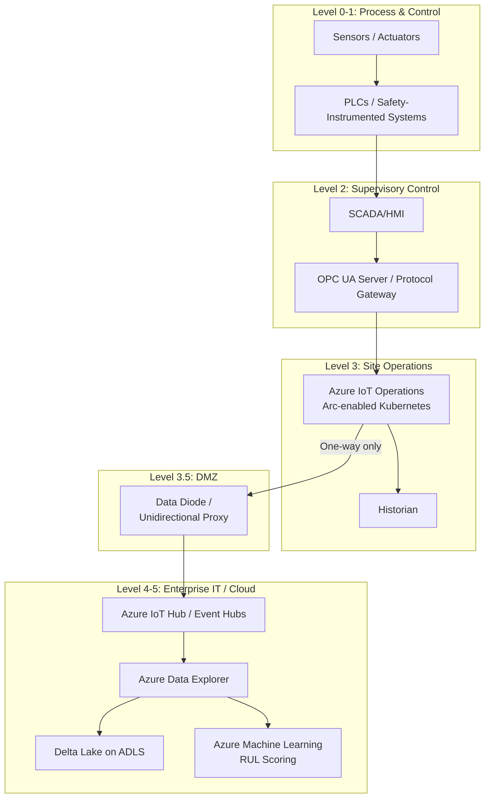
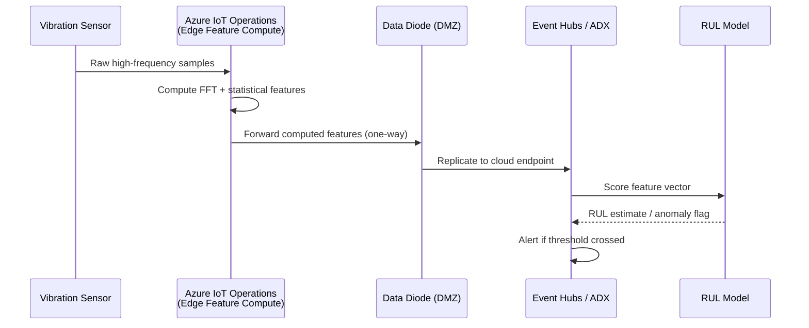
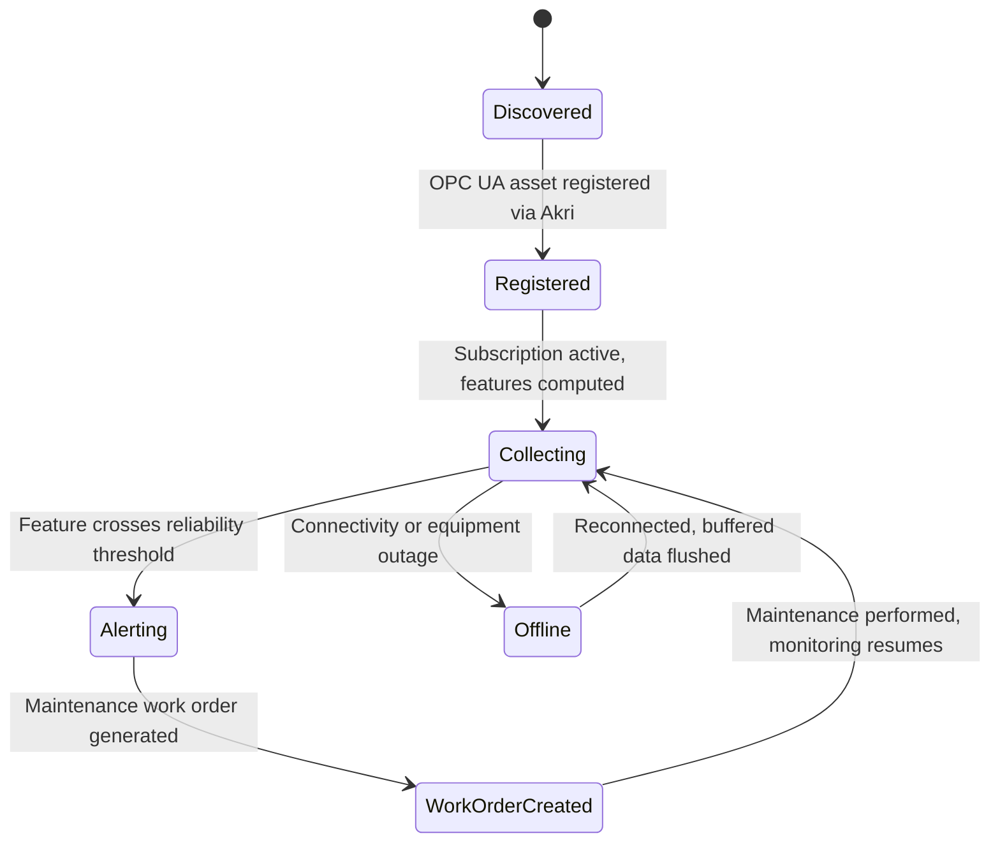

# Industrial IoT (IIoT)

> Part of the **Enterprise Data & AI Architecture Handbook** · Phase-16 — Domain-Specific & Frontier Data Platforms · Chapter 02.
> Estimated study time: **60 min reading + ~4h labs**.
> **Prerequisites:** read [IoT Data Platforms](01_IoT_Data_Platforms.md) first.

---

## Executive Summary

[IoT Data Platforms](01_IoT_Data_Platforms.md) established the connectivity, provisioning, and time-series storage architecture for enterprise and consumer-facing device fleets — devices whose worst-case failure mode is bad data or a lost message. Industrial IoT (IIoT) is a structurally different problem: the "devices" are programmable logic controllers (PLCs), sensors, and actuators embedded in a factory floor, a power substation, or a petrochemical plant's safety-instrumented system, where a worst-case failure mode is a halted production line, an environmental release, or physical harm to a human operator. This chapter covers the discipline that exists specifically to bridge that gap: **Operational Technology (OT) and Information Technology (IT) convergence** — connecting decades-old, safety-certified, deterministic control-system networks to the cloud-native data platforms this handbook has built everywhere else, without compromising the safety and availability guarantees those control systems were engineered to provide.

This chapter covers the **Purdue model** as the reference architecture for segmenting OT and IT networks into layered, access-controlled zones; **OPC UA and legacy industrial protocols** (Modbus, PROFINET, DNP3) as the semantic and transport layer that lets heterogeneous, often decades-old field equipment be understood by a modern data platform; **Azure IoT Operations** as Microsoft's Arc-enabled, Kubernetes-based edge platform purpose-built for this OT/IT boundary; **predictive maintenance pipelines** as the dominant, highest-ROI IIoT analytics use case, extending [IoT Data Platforms](01_IoT_Data_Platforms.md)'s time-series and edge-processing foundations with feature engineering specific to vibration, thermal, and acoustic sensor data; and **safety, reliability, and standards** (IEC 62443, ISA/IEC 61508 Safety Integrity Levels) as the non-negotiable regulatory and engineering discipline every other decision in this chapter is subordinate to.

The platform bias is **Azure-primary (~60%)** — Azure IoT Operations, Azure Arc-enabled Kubernetes, Azure IoT Hub, Azure Event Hubs, Azure Data Explorer, and Microsoft Fabric as the OT-to-cloud data path — **~30% enterprise open source** (Eclipse Milo and open62541 as OPC UA SDKs, Kubernetes/K3s as the Arc-enabled edge substrate, Kafka/MQTT for OT-to-IT event transport, Grafana for OT dashboards) — **~10% AWS/GCP comparison-only** (AWS IoT SiteWise and IoT Greengrass; Google Cloud's partner-based OT-integration approach, consistent with [IoT Data Platforms](01_IoT_Data_Platforms.md) §35's Cloud IoT Core retirement precedent).

**Bottom line:** every decision this chapter makes is downstream of one non-negotiable constraint that has no equivalent anywhere else in this handbook: **an OT network's availability and safety guarantees take precedence over data-platform convenience, always** — and this chapter's central, recurring thesis, formalized in its ADR, is that OT-to-IT data must flow through explicitly zoned, unidirectional-by-default conduits (per IEC 62443 and the Purdue model), never through a direct, bidirectional connection from a control-system network to the cloud, regardless of how much simpler a direct connection would be to build.

---

## Learning Objectives

By the end of this chapter you will be able to:

1. **Explain the Purdue model's zone structure** (Levels 0-5) and correctly classify a given piece of industrial equipment or system into its appropriate level.
2. **Select the correct industrial protocol** (Modbus, PROFINET, DNP3, or OPC UA) for a given legacy or greenfield integration, and explain OPC UA's role as a semantic unifying layer.
3. **Design an Azure IoT Operations deployment** on Arc-enabled Kubernetes for OT-to-cloud data flow, including OPC UA connectors and edge data-flow processing.
4. **Design a predictive maintenance pipeline** from raw vibration/thermal sensor data through feature engineering to a remaining-useful-life (RUL) model, extending [IoT Data Platforms](01_IoT_Data_Platforms.md)'s time-series architecture.
5. **Apply IEC 62443 zone-and-conduit segmentation** to design a secure, unidirectional-by-default OT-to-IT data path.
6. **Evaluate an OT/IT convergence architecture** against safety-integrity, availability, and regulatory requirements, and identify when a proposed data-platform capability is incompatible with an OT system's certified safety envelope.
7. **Defend an IIoT platform's segmentation, protocol, and predictive-maintenance architecture** in engineer, staff engineer, architect, and CTO review settings.

---

## Business Motivation

- **Unplanned downtime is the single largest quantifiable cost driver in industrial operations** — a predictive maintenance program that shifts even a small fraction of unplanned failures to scheduled maintenance windows routinely pays for its entire data-platform investment within one or two prevented incidents, the direct business case for this chapter's predictive maintenance pipeline (§2.4).
- **OT networks were engineered for availability and safety, not for internet connectivity or data extraction** — a plant that already trusts a PLC's control loop with human safety cannot casually extend that same network's trust boundary to a cloud data platform without a deliberate, engineered convergence architecture; getting this wrong is a safety incident risk, not merely a data-quality risk.
- **Regulatory and insurance requirements increasingly assume a specific security posture** — IEC 62443 conformance (§16, §23) is now a common contractual and insurance-underwriting requirement for industrial operators, making this chapter's segmentation architecture a compliance necessity as much as an engineering best practice.
- **Legacy protocol heterogeneity is a real, current-state constraint, not a temporary migration inconvenience** — a typical industrial site runs equipment spanning three to four decades of installation dates, each generation speaking a different protocol (Modbus RTU on a 1990s PLC, PROFINET on a 2010s drive, OPC UA on newer equipment); a platform that assumes protocol homogeneity will not survive contact with a real brownfield site.
- **The Stuxnet (2010), Industroyer/CrashOverride (2016), and TRITON/TRISIS (2017) incidents** (§39) are not abstract, textbook-only case studies — they are the concrete, board-level-visible reasons OT/IT convergence architecture decisions now receive C-suite and regulatory scrutiny that a typical IT data-platform project does not.

---

## History and Evolution

- **1968 — the first programmable logic controller (PLC)**, developed for General Motors to replace hard-wired relay logic, establishes the deterministic, ladder-logic-programmed control paradigm that still underlies most industrial control systems today.
- **1979 — Modbus** is published by Modicon as a simple, master/slave serial protocol for PLC communication — still in widespread use on legacy equipment more than four decades later, precisely because replacing already-certified, still-functioning field equipment has a much higher bar than replacing IT software.
- **1990s — the Purdue Enterprise Reference Architecture** (the "Purdue model," §2.1) is developed at Purdue University and later adopted into the ISA-95 standard, formalizing the layered zone structure separating physical process control (Level 0) from enterprise IT (Level 5) that remains the reference architecture this chapter builds on.
- **2006 — the OPC Foundation publishes OPC UA (Unified Architecture)**, a platform-independent, service-oriented successor to the earlier, Windows-DCOM-dependent OPC Classic, explicitly designed to unify semantic data modeling across heterogeneous industrial equipment (§2.2).
- **2010 — Stuxnet** is discovered, the first publicly documented malware specifically engineered to manipulate PLC logic (targeting Siemens S7 controllers at Iranian uranium-enrichment centrifuges) and cause physical equipment damage — the defining moment that made OT-specific cybersecurity a distinct discipline from IT security rather than an assumed subset of it.
- **2013 — the IEC 62443 series** begins publication, formalizing zone-and-conduit segmentation, security levels, and a lifecycle security-management framework specifically for industrial automation and control systems (§16, §23).
- **2016 — the Industroyer/CrashOverride malware** causes a power outage in Ukraine by directly manipulating grid-control-system protocols, demonstrating that OT-targeted attacks were no longer isolated incidents but a recurring, evolving threat category.
- **2017 — the TRITON/TRISIS malware** targets a petrochemical plant's Schneider Electric Triconex safety-instrumented system directly — the first publicly documented malware built specifically to attack a safety system (§2.5) rather than a control system, elevating OT security from an availability concern to an explicit safety concern.
- **2020-2023 — the Azure IoT Edge-based OT integration pattern matures**, with Azure IoT Edge modules and Azure Arc-enabled Kubernetes increasingly used as the standard bridge between OT protocol gateways and cloud ingestion (directly extending [IoT Data Platforms](01_IoT_Data_Platforms.md) §1.3's edge-processing architecture into the OT domain).
- **2024 — Azure IoT Operations reaches general availability**, consolidating Microsoft's OT/IT convergence tooling (an MQTT broker, OPC UA connectors, edge data-flow processing, and device discovery via Akri) into a single Arc-enabled Kubernetes-based product (§2.3) — the current-generation Azure-native reference architecture this chapter builds on.

---

## Why This Technology Exists

Every other chapter in this handbook assumes the systems producing data are, at worst, misconfigured or compromised in ways that corrupt or leak information. An industrial control system's failure mode is different in kind: a compromised or overloaded PLC does not just produce bad data — it can physically overspeed a turbine, overpressurize a vessel, or disable a safety interlock. Industrial IoT platforms exist because extracting analytics value from that equipment (predictive maintenance, production-efficiency analytics, quality-control correlation) is genuinely valuable, but must be architected in a way that the analytics pipeline can fail, be compromised, or be entirely unavailable without that failure ever propagating back into the control loop it is observing. This chapter's entire architecture — the Purdue model's layered zones, OPC UA's read-oriented semantic modeling, and IEC 62443's unidirectional-conduit discipline — exists to make "observe the process" and "control the process" two structurally separate concerns that a data-platform failure cannot conflate.

---

## Problems It Solves

- **Extracting analytics-ready telemetry from decades-old, protocol-heterogeneous field equipment**, resolved by OPC UA gateways and protocol-translation connectors (§2.2) that normalize Modbus/PROFINET/DNP3 data into one consistent semantic model before it reaches the cloud-facing side of the architecture.
- **Preventing unplanned downtime through early failure detection**, resolved by predictive maintenance pipelines (§2.4) applying the vibration/thermal/acoustic feature-engineering techniques and time-series infrastructure from [IoT Data Platforms](01_IoT_Data_Platforms.md) to equipment-specific failure-mode detection.
- **Connecting an OT network to cloud analytics without exposing the control-system network to internet-originated compromise**, resolved by Purdue-model zone segmentation and IEC 62443 unidirectional conduits (§16, §23, ADR-0182).
- **Managing edge compute at industrial sites with intermittent or metered connectivity and no on-site cloud expertise**, resolved by Azure IoT Operations' Arc-enabled Kubernetes model (§2.3), which lets a centrally-managed platform team deploy and update OT-facing edge workloads without requiring on-site staff to operate Kubernetes directly.
- **Demonstrating and auditing regulatory/insurance security-posture compliance**, resolved by IEC 62443's structured security-level and zone-conduit framework (§23) providing an auditable, standards-based artifact rather than an ad hoc internal security review.

---

## Problems It Cannot Solve

- **This architecture does not replace the control system's own certified safety functions** — a safety-instrumented system's interlock logic (§2.5) must continue to function correctly even if every piece of this chapter's analytics architecture is entirely offline; treating a cloud-connected analytics platform as a substitute for, rather than an observer of, a certified safety function is itself a safety violation, not an engineering shortcut.
- **It does not eliminate the operational burden of legacy protocol support** — a Modbus RTU device from 1995 still requires a protocol gateway to participate in this architecture at all, and that gateway itself becomes a piece of infrastructure someone must own, patch, and monitor for the remaining operational life of the underlying equipment (frequently measured in decades, not years).
- **It does not make an under-resourced OT security program adequate merely by adopting IEC 62443 vocabulary** — Stuxnet, Industroyer, and TRITON were all discovered in networks that had *some* security controls in place; the standard names the right structure, but real conformance requires the same sustained, resourced operating discipline this handbook has repeatedly emphasized for every other security-relevant chapter (per [Security Foundations](../Phase-10/01_Security_Foundations.md)).
- **It does not resolve the fundamental tension between OT patch cycles and IT patch cycles** — a control system running certified firmware may legally and contractually be unable to accept a patch without costly recertification, meaning network segmentation and compensating controls (§16) must substitute for patching in a way IT security rarely has to accept as a permanent, not temporary, posture.
- **It does not remove the need for domain-specific engineering expertise** — interpreting whether a given vibration signature or thermal trend genuinely indicates developing equipment failure requires reliability-engineering and equipment-specific domain knowledge this data platform delivers signal to, but does not itself possess.

---

## Core Concepts

### 2.1 OT/IT convergence and the Purdue model

- **The Purdue Enterprise Reference Architecture** segments an industrial enterprise into six hierarchical levels: **Level 0** (the physical process itself — sensors and actuators directly touching the equipment), **Level 1** (basic control — PLCs and safety-instrumented systems executing the control loop), **Level 2** (area supervisory control — SCADA/HMI systems operators use to monitor and adjust Level 1), **Level 3** (site operations — manufacturing execution systems, historians, and site-wide OT data aggregation), **Level 3.5/DMZ** (a dedicated demilitarized zone separating OT from IT, per IEC 62443), and **Levels 4-5** (site business planning and enterprise IT — the ERP, cloud data platforms, and analytics systems the rest of this handbook has assumed as its baseline environment).
- **The core convergence principle: data flows upward, commands flow downward, and every level boundary is an explicit, access-controlled zone crossing** — a cloud analytics platform (Level 4-5) may consume telemetry that has flowed up from Level 0-3 through the DMZ, but should never be able to issue a command that flows directly back down into Level 0-1 without passing through the same operator-supervised, access-controlled path any other Level 2-3 control change would require.
- **The Level 3.5 DMZ is the architectural embodiment of this chapter's central thesis**: it is where OT-originated data is replicated, filtered, or protocol-translated for IT consumption, using infrastructure (data diodes, application-layer proxies, or a one-way replication service) that makes a direct, bidirectional OT-to-cloud connection structurally impossible rather than merely discouraged by policy.
- **Purdue-model classification failures are a common, consequential real-world mistake**: a site that connects a Level 1 PLC directly to a cloud dashboard "for convenience," skipping the Level 2-3 supervisory and Level 3.5 DMZ layers entirely, has collapsed the very segmentation the model exists to enforce — precisely the anti-pattern (§27) this chapter's ADR-0182 exists to prohibit.

### 2.2 OPC UA and industrial protocols

- **Modbus** (1979, §4) is a simple, widely-deployed serial (RTU) or Ethernet (TCP) master/slave protocol with no native security (authentication or encryption) — still common on legacy Level 0-1 equipment, and typically bridged into a modern architecture only via a protocol gateway that adds the authentication and network-segmentation controls Modbus itself does not provide.
- **PROFINET** and **DNP3** are, respectively, the dominant real-time industrial-Ethernet protocol for European/manufacturing automation and the dominant protocol for North American utility/SCADA telemetry — each with its own device-discovery, addressing, and (for DNP3) point-mapping conventions that a converged data platform must translate rather than assume away.
- **OPC UA (Unified Architecture)** is the semantic unifying layer this chapter treats as the preferred target protocol for any new or upgraded integration: it defines a platform-independent, strongly-typed information model (an OPC UA "Companion Specification" can formally describe, for example, exactly what a specific class of pump's telemetry and configuration properties mean) on top of either a client-server (request/subscribe) or a newer pub/sub (MQTT- or UDP-based) transport binding.
- **OPC UA's built-in security model** (X.509-certificate-based endpoint authentication and message signing/encryption) is a deliberate, structural improvement over Modbus/DNP3's historical lack of native security — directly extending the per-device-identity discipline [IoT Data Platforms](01_IoT_Data_Platforms.md) §1.5 established for consumer/enterprise IoT devices to the OT protocol layer itself, rather than relying solely on network segmentation to compensate for a protocol with no identity model of its own.
- **The pragmatic integration pattern for a real brownfield site**: a protocol gateway (commonly an OPC UA server acting as a translation layer) sits in front of legacy Modbus/DNP3/PROFINET equipment, exposing a single, consistent OPC UA information model upward toward the Level 3.5 DMZ and cloud-facing tiers, so that every downstream system (Azure IoT Operations connectors, historians, analytics pipelines) speaks one protocol regardless of how many legacy protocols exist behind that gateway.

### 2.3 Azure IoT Operations and Edge

- **Azure IoT Operations** is Microsoft's Arc-enabled Kubernetes-based platform purpose-built for the OT/IT boundary, consolidating what previously required several separately-assembled Azure IoT Edge modules into one coherent product: an MQTT broker (for local, OT-side pub/sub messaging), OPC UA connectors and a device-discovery service (Akri) for automatically finding and onboarding OPC UA-speaking equipment on the local network, and edge Data Flows for local filtering, enrichment, and protocol translation before data is forwarded to the cloud.
- **Running on Azure Arc-enabled Kubernetes** means the same declarative, GitOps-managed deployment model already established in [Kubernetes](../Phase-09/06_Kubernetes.md) and [GitOps and Environment Management](../Phase-09/08_GitOps_and_Environment_Management.md) extends directly to industrial edge sites — a central platform team can deploy, update, and roll back Azure IoT Operations components across dozens or hundreds of sites through the same Git-commit-as-audit-log workflow used for any other Kubernetes fleet, without requiring on-site staff with Kubernetes expertise.
- **Edge Data Flows perform the local aggregation, filtering, and downsampling** this chapter inherits directly from [IoT Data Platforms](01_IoT_Data_Platforms.md) §1.3-§1.4, applied specifically to OT data volumes that are frequently far higher-frequency (millisecond-scale control-loop telemetry) than typical enterprise IoT sensor reporting — making edge-side data reduction an even sharper cost and bandwidth necessity here than in the general IoT case.
- **Azure IoT Operations explicitly does not replace the control system** — it observes and forwards OT data; the actual PLC/SCADA control loop and any safety-instrumented system logic (§2.5) continue running entirely independently of whether Azure IoT Operations, its underlying Kubernetes cluster, or its cloud connectivity are healthy, satisfying this chapter's non-negotiable Problems-It-Cannot-Solve constraint by architecture, not merely by operating discipline.

### 2.4 Predictive maintenance pipelines

- **Predictive maintenance's central data-engineering task is feature engineering from raw vibration, thermal, and acoustic sensor time series** — directly extending [Machine Learning Foundations](../Phase-11/01_Machine_Learning_Foundations.md)'s feature-engineering treatment with domain-specific transforms: frequency-domain features (FFT-derived spectral peaks corresponding to known bearing or gear-mesh failure frequencies), statistical features (RMS, kurtosis, crest factor over a rolling window), and thermal-trend features (rate-of-change rather than absolute temperature, since a slowly rising trend is frequently more diagnostic than any single reading).
- **Remaining Useful Life (RUL) estimation** is the typical predictive-maintenance modeling target — a regression or survival-analysis model predicting how much operating time remains before a component is expected to fail, letting maintenance be scheduled proactively rather than either reactively (after failure) or on a fixed calendar interval regardless of actual equipment condition.
- **The feature-engineering pipeline should run at the edge wherever the raw sampling rate makes cloud transmission of raw data impractical** — a vibration sensor sampling at several kHz produces a data volume that must typically be reduced (via edge-computed FFT/statistical features, per [IoT Data Platforms](01_IoT_Data_Platforms.md) §1.3's edge-aggregation principle) before it is bandwidth-affordable to transmit continuously to the cloud; only the computed features, alarms, and periodic raw-data samples for model retraining typically need to reach the cloud tier.
- **A predictive-maintenance model's false-positive and false-negative costs are asymmetric and safety-relevant, not merely a standard classification-threshold tuning exercise** — a missed failure (false negative) can cause unplanned downtime or a safety incident, while an excessive false-positive rate erodes operator trust in the system and leads to alerts being ignored entirely (an "alarm fatigue" failure mode directly analogous to the LLM-as-judge over-trust caution in [Evaluation and Guardrails](../Phase-12/09_Evaluation_and_Guardrails.md)) — threshold selection is a deliberate, reliability-engineering-informed decision, not a default 0.5 cutoff.

### 2.5 Safety, reliability, and standards

- **IEC 62443** is the industrial-automation-and-control-systems security standard series this chapter's segmentation architecture is built against, defining **zones** (groups of assets sharing a common security requirement) and **conduits** (the communication paths between zones, each requiring an explicit security control) as the formal vocabulary for the Purdue-model boundaries described in §2.1.
- **ISA/IEC 61508 and 61511 Safety Integrity Levels (SIL 1-4)** classify a safety-instrumented function by its required probability of failing to act when needed — a SIL 3 emergency-shutdown system has dramatically more stringent independence, redundancy, and certification requirements than a SIL 1 alarm, and any data-platform component that could plausibly influence a SIL-rated function's behavior must itself be evaluated against that same safety-certification bar, which this chapter's read-only, unidirectional data-flow architecture (§2.1, ADR-0182) is specifically designed to avoid triggering.
- **The 2017 TRITON/TRISIS incident** (§4, §39) is the concrete, real-world demonstration of why safety-instrumented systems require this dedicated, higher-bar treatment: the malware specifically targeted a Schneider Electric Triconex safety controller, not merely the surrounding control or IT network, showing that "OT security" and "safety-system security" are related but distinct concerns requiring their own dedicated controls.
- **Standards compliance is a lifecycle discipline, not a one-time certification event** — IEC 62443 explicitly requires ongoing security-level maintenance (patch management, monitoring, and periodic reassessment) across the full operational life of the equipment, which for industrial assets frequently spans decades, requiring a governance model (§23) built for multi-decade sustained operation rather than the multi-year software-lifecycle assumptions common elsewhere in this handbook.

---

## Internal Working

### 3.1 How an OPC UA client-server session actually works

1. An OPC UA client (a cloud-facing gateway, or an Azure IoT Operations connector) initiates a secure channel to an OPC UA server (running on, or in front of, the field equipment) using X.509 certificate-based mutual authentication, negotiating a message-security mode (sign, or sign-and-encrypt).
2. The client browses the server's address space — a hierarchical, strongly-typed information model describing exactly what variables, methods, and events the underlying equipment exposes — and creates a **subscription** for the specific data points it needs (e.g., a pump's vibration RMS value, sampled every 100ms).
3. The OPC UA server evaluates the subscription's configured sampling and publishing intervals and pushes only *changed* values (per a configured deadband, avoiding transmission of statistically insignificant noise) to the client at the negotiated publishing interval, rather than the client having to poll continuously.
4. The client (or, in the newer pub/sub binding, an OPC UA publisher writing directly to an MQTT broker) forwards the received values into the next stage of the pipeline — an Azure IoT Operations Data Flow, in this chapter's reference architecture — for local aggregation before cloud transmission.

### 3.2 How data actually crosses the Level 3.5 DMZ

1. OT-side data (already aggregated and protocol-normalized via OPC UA, per §3.1) arrives at a Level 3 site-operations system (a historian or an Azure IoT Operations Data Flow endpoint).
2. A one-way replication mechanism — commonly a data diode (a hardware device physically capable of transmitting in only one direction) or an application-layer proxy explicitly configured to accept only outbound-from-OT connections — forwards the data into the Level 3.5 DMZ.
3. A DMZ-resident service (which may itself be an Azure IoT Operations cloud-connector component, or a dedicated replication service) authenticates to the cloud-facing IoT Hub/Event Hubs endpoint and forwards the data onward, completing the OT-to-IT crossing without ever establishing a connection *from* the IT/cloud side back *into* the OT network.
4. Any legitimate need to send a configuration change or command back toward OT (e.g., updating an OPC UA subscription's sampling rate) is handled through a separate, explicitly-provisioned, operator-supervised control path — never by simply reversing the data-diode's one-way flow, which is a physical, not merely a configured, constraint by design.

### 3.3 How a predictive-maintenance pipeline actually executes end to end

1. A vibration sensor, sampling at several kHz, streams raw data to a local Azure IoT Operations edge module, which computes rolling-window FFT and statistical features (§2.4) on-device, reducing the outbound data volume by one to two orders of magnitude relative to raw transmission.
2. Computed features (not raw vibration data, except for periodic training-data samples) are forwarded through the DMZ (per §3.2) into Azure Event Hubs, then into Azure Data Explorer for hot-tier storage and Delta Lake for cold-tier archival, following [IoT Data Platforms](01_IoT_Data_Platforms.md)'s tiered storage architecture directly.
3. A scheduled or streaming inference job (Databricks Structured Streaming, or an Azure Machine Learning batch endpoint per [Azure Machine Learning](../Phase-11/05_Azure_Machine_Learning.md)) scores the incoming feature stream against a trained RUL/anomaly model, writing a predicted remaining-useful-life estimate or anomaly flag back into the same time-series store.
4. An alert crossing a reliability-engineering-defined threshold (§2.4) triggers a maintenance work order in the site's maintenance-management system — a Level 3-4 boundary crossing in the *opposite* direction from telemetry (an insight flowing toward business process, not a command flowing back into the control loop), which is exactly the kind of IT-to-business-process action this architecture is designed to support without ever touching the Level 0-1 control path itself.

---

## Architecture

A reference IIoT platform architecture, layered against the Purdue model:

1. **Level 0-1 (process and basic control)**: sensors, actuators, PLCs, and safety-instrumented systems — entirely out of scope for direct data-platform connectivity; observed only through Level 1-2 instrumentation, never controlled by this architecture.
2. **Level 2 (supervisory control)**: SCADA/HMI systems and OPC UA servers exposing a normalized information model (§2.2) for the equipment they supervise.
3. **Level 3 (site operations)**: historians, manufacturing execution systems, and Azure IoT Operations (running on Arc-enabled Kubernetes at the site) performing OPC UA data collection and edge Data Flow aggregation (§2.3).
4. **Level 3.5 (DMZ)**: a data diode or application-layer proxy enforcing unidirectional OT-to-IT data flow (§3.2), the architectural embodiment of ADR-0182.
5. **Level 4-5 (enterprise IT/cloud)**: Azure IoT Hub/Event Hubs ingestion, Azure Data Explorer and Delta Lake tiered storage, predictive-maintenance model scoring, and Microsoft Fabric/Power BI reporting — the same cloud-side architecture [IoT Data Platforms](01_IoT_Data_Platforms.md) already established, now receiving OT-originated data through the DMZ rather than directly from field devices.

---

## Components

- **OPC UA servers/gateways** (Eclipse Milo, open62541, or vendor-supplied): the protocol-translation and semantic-normalization layer in front of legacy Modbus/PROFINET/DNP3 equipment.
- **Azure IoT Operations** (MQTT broker, Akri device discovery, edge Data Flows, OPC UA connectors) on **Azure Arc-enabled Kubernetes**: the Level 3 site-operations data-collection and edge-processing platform.
- **Data diode / unidirectional gateway**: the physical or strictly-configured Level 3.5 DMZ boundary enforcing one-way OT-to-IT data flow.
- **Historian** (a legacy OSIsoft PI System or AVEVA Historian, where already deployed): the traditional Level 3 time-series store this architecture typically integrates alongside, rather than replaces outright, given the multi-decade operational commitments many sites have to their existing historian.
- **Azure IoT Hub / Event Hubs, Azure Data Explorer, Delta Lake on ADLS**: the cloud-side ingestion and tiered storage stack, reused directly from [IoT Data Platforms](01_IoT_Data_Platforms.md).
- **Azure Machine Learning / Databricks**: predictive-maintenance model training and scoring, per [Azure Machine Learning](../Phase-11/05_Azure_Machine_Learning.md) and [MLOps and MLflow](../Phase-11/03_MLOps_and_MLflow.md).

---

## Metadata

- **OPC UA information models (Companion Specifications)** are this chapter's primary equipment-semantic metadata layer — a formally-typed description of exactly what a piece of equipment's exposed variables mean, letting a downstream consumer interpret a value correctly (units, valid ranges, and relationships to other variables) without needing an out-of-band data dictionary.
- **Purdue-level and IEC 62443 zone/conduit classification** should be recorded as governed metadata per asset and per data flow (which zone does this device belong to, which conduit does its data traverse, what security level is required) — the metadata backbone the security architecture (§16, §23) is audited against.
- **Equipment maintenance history and failure-mode metadata**, correlated against the feature-engineered sensor data (§2.4), is what turns a raw predictive-maintenance model into a genuinely actionable one — a model trained without linkage to actual historical failure events cannot be validated against real outcomes, only against proxy signal quality.

---

## Storage

- **Level 3 local/edge storage**: short-term buffering within Azure IoT Operations or the historian for connectivity-outage resilience, mirroring [IoT Data Platforms](01_IoT_Data_Platforms.md) §1.3's offline-buffering discipline, sized against the site's realistic worst-case connectivity-outage duration.
- **Cloud hot/warm tier (Azure Data Explorer)**: computed features, alarms, and downsampled telemetry — reusing [IoT Data Platforms](01_IoT_Data_Platforms.md) §1.4's tiered-retention and update-policy-based downsampling pattern directly, now applied to OT-originated feature streams rather than raw enterprise-IoT telemetry.
- **Cloud cold tier (Delta Lake on ADLS)**: long-term archival of computed features and periodic raw-data training samples, supporting both regulatory retention and future model-retraining needs.
- **Historian retention**: many sites retain years of raw process-historian data on-premises independent of any cloud tier, both for regulatory reasons and because on-site engineers frequently need immediate, cloud-connectivity-independent access to recent process history.

---

## Compute

- **Edge compute (Azure IoT Operations on Arc-enabled Kubernetes)**: OPC UA data collection, feature-engineering (FFT/statistical transforms), and local alerting — the highest-value compute placement for this chapter's high-frequency sensor data, per §2.4's data-reduction argument.
- **Cloud stream-processing compute**: Databricks Structured Streaming or Azure Stream Analytics for cross-site aggregation and model scoring at the enterprise (Level 4-5) tier.
- **Model training compute**: Azure Machine Learning or Databricks compute clusters for periodic RUL/anomaly-model retraining, following the CI/CD/CT lifecycle already established in [MLOps and MLflow](../Phase-11/03_MLOps_and_MLflow.md).

---

## Networking

- **OT network segmentation follows the Purdue model's layered zones** (§2.1), with firewalls and, at the Level 3.5 boundary specifically, a data diode or strictly outbound-only proxy (§3.2) — not merely a standard IT firewall ruleset, since a stateful firewall alone remains a bidirectionally-capable device that a sufficiently sophisticated attacker can potentially traverse.
- **No direct internet exposure of Level 0-2 equipment**, ever — this is the specific, structural lesson every major publicly-documented ICS attack (§4, §39) shares: each involved a control-system network that was reachable, directly or through an insufficiently segmented intermediary, from a less-trusted network.
- **Azure Arc-enabled Kubernetes' outbound-only connectivity model** (the Arc agent initiates outbound connections to Azure; Azure never initiates an inbound connection to the edge cluster) is a deliberate design choice that aligns naturally with this chapter's unidirectional-conduit principle, extending the same "device always initiates" pattern [IoT Data Platforms](01_IoT_Data_Platforms.md) §15 established for consumer/enterprise IoT devices to the OT edge-cluster layer.

---

## Security

- **IEC 62443 zone-and-conduit segmentation with unidirectional-by-default OT-to-IT conduits** is this chapter's mandatory security baseline (§2.1, §2.5, ADR-0182) — every data flow crossing from a lower to a higher Purdue level must traverse an explicitly-designed, access-controlled conduit, never an ad hoc direct connection.
- **OPC UA's certificate-based authentication and message security** (§2.2) should be enabled and enforced for every new integration — running OPC UA in its unsecured "None" security mode (a mode the specification permits for backward compatibility, but that provides no authentication or encryption) reintroduces exactly the lack-of-identity risk this chapter's protocol upgrade is meant to close.
- **Compensating controls for unpatchable, certified legacy equipment** (network segmentation, application-layer allow-listing, and dedicated monitoring for anomalous protocol traffic) are the accepted, standards-recognized substitute for direct patching where recertification cost or safety-certification constraints make patching impractical — treated as a deliberate, documented risk-acceptance decision (per IEC 62443's lifecycle process), not an unmanaged gap.
- **Safety-instrumented systems (SIL-rated, §2.5) require independence from the data platform**, not merely additional security controls on top of a shared architecture — a SIL 3 emergency-shutdown system's logic must remain verifiably independent of any component (including this chapter's own analytics pipeline) that has not itself been certified to that same safety-integrity level.

---

## Performance

- **OPC UA subscription publishing intervals and deadbands** (§3.1) are the primary tuning lever balancing data freshness against network and processing load — a subscription configured with an unnecessarily short publishing interval or zero deadband generates load disproportionate to any genuine analytical need.
- **Edge feature-engineering latency** (the time from raw sensor sample to a computed feature value) must stay well within the reliability-engineering-defined detection window for the specific failure mode being monitored — a bearing failure that develops over hours tolerates a feature-computation pipeline with minutes of latency; a control-loop-adjacent anomaly-detection use case may not.
- **DMZ replication throughput** (§3.2) must be sized against the aggregate feature and alarm volume from every connected site, not just a single site's volume — an enterprise-wide predictive-maintenance rollout across dozens of sites can produce DMZ-crossing traffic that scales faster than any single site's own local performance testing would suggest.

---

## Scalability

- **Azure Arc-enabled Kubernetes' fleet-management model** (GitOps-driven deployment across many site clusters, per [GitOps and Environment Management](../Phase-09/08_GitOps_and_Environment_Management.md)) is what makes onboarding the tenth, fiftieth, or five-hundredth site operationally tractable — the same declarative-configuration-as-the-scaling-mechanism principle already established for cloud-native Kubernetes fleets, now applied to physically-distributed OT edge clusters.
- **OPC UA information-model reuse across equipment of the same class** (a standardized Companion Specification applied uniformly to every pump of a given model, rather than a bespoke per-device integration) is the protocol-layer analog of the templated-provisioning scalability lever [IoT Data Platforms](01_IoT_Data_Platforms.md) §18 established via DPS enrollment groups.
- **Cloud-side scaling** (Event Hubs partitioning, ADX cluster scaling, Databricks autoscaling) follows the same principles already established in [IoT Data Platforms](01_IoT_Data_Platforms.md) §18 — the genuinely new scaling axis this chapter introduces is *site count*, not merely per-site device count or message throughput.

---

## Fault Tolerance

- **The control loop's fault tolerance is entirely independent of this chapter's data platform, by design** (§7, §10) — Azure IoT Operations, the DMZ replication path, or the cloud tier being unavailable must never degrade Level 0-2 control-system operation; this is the chapter's most fundamental fault-tolerance requirement, stronger than any availability target this handbook has stated elsewhere.
- **Edge-side local buffering** during a DMZ or cloud-connectivity outage (mirroring [IoT Data Platforms](01_IoT_Data_Platforms.md) §19's offline-buffering pattern) preserves analytics continuity once connectivity resumes, without requiring any change to how the control system itself continues operating during the same outage.
- **Data-diode hardware failure** (the unidirectional gateway itself becoming unavailable) should fail closed with respect to any potential reverse-direction path — an outage of the DMZ replication path should simply mean "no OT data reaches the cloud until restored," never "the diode's failure mode accidentally permits bidirectional traffic."

---

## Cost Optimization (FinOps)

- **Edge feature-engineering is the dominant IIoT cost lever**, for the same reason established in [IoT Data Platforms](01_IoT_Data_Platforms.md) §20, now amplified: raw vibration/high-frequency sensor data volumes are typically one to two orders of magnitude larger than typical enterprise IoT telemetry, making the cost difference between transmitting raw data and transmitting edge-computed features correspondingly larger.
- **Predictive maintenance's cost justification should be measured against prevented-downtime value, not merely platform infrastructure cost** — the business case (§3) is strongest when a specific, quantified downtime-cost figure is compared directly against the platform's total cost of ownership, rather than justifying the platform on data-volume or infrastructure-efficiency grounds alone.
- **Worked FinOps example**: a mid-size manufacturing site instruments 200 critical rotating-equipment assets with vibration sensors sampling at 5 kHz (producing roughly 432 million raw samples per asset per day). Transmitting raw data from all 200 assets continuously to the cloud is both technically impractical (site network bandwidth) and needlessly expensive. Applying edge feature-engineering (computing a rolling 1-second FFT-derived feature vector plus RMS/kurtosis statistics, reducing outbound volume to roughly 1 feature-vector-message per asset per second — a reduction of several orders of magnitude) cuts cloud ingestion and hot-tier storage cost to a small fraction of the naive raw-transmission design, while preserving the diagnostic signal the predictive-maintenance model actually needs. Against this reduced platform cost, even a single prevented unplanned-downtime event on one critical asset — commonly costing tens to hundreds of thousands of dollars in lost production for a mid-size manufacturing line — typically exceeds the platform's entire annual operating cost, the concrete numeric basis for this chapter's Business Motivation claim that predictive maintenance is the highest-ROI IIoT use case.

---

## Monitoring

- **OPC UA connection and subscription health** (per-server connection status, subscription publish-rate against configured interval) as the primary Level 2-3 data-collection health signal.
- **DMZ replication throughput and latency**, monitored explicitly for the same ingestion-to-storage-lag signal [IoT Data Platforms](01_IoT_Data_Platforms.md) §22 already established, now specifically at the Level 3.5 boundary.
- **Azure Arc-enabled Kubernetes fleet health** (per-site cluster connectivity, edge-module/pod health) across every connected site, using the same fleet-wide operational-dashboard principle established for the self-serve platform's own capability-plane monitoring in [Self-Serve Data Platform](../Phase-15/05_Self_Serve_Data_Platform.md).
- **Predictive-maintenance model prediction drift and alert-to-work-order conversion rate**: a model whose alerts are increasingly overridden or ignored by maintenance staff (an early alarm-fatigue signal, per §2.4) should trigger a threshold-recalibration review before staff trust in the system erodes further.

---

## Observability

- **End-to-end tracing from a raw sensor reading through edge feature computation, DMZ crossing, and cloud-side model scoring** should be possible for at least a sampled subset of readings, extending this handbook's recurring OpenTelemetry-based full-pipeline tracing principle (per [LLMOps](../Phase-12/04_LLMOps.md) §4.2) across an OT-to-IT boundary specifically.
- **Zone-and-conduit traffic visibility**: security operations should be able to observe, at the Level 3.5 DMZ, exactly what data is crossing and confirm it matches the expected, approved conduit definition — any traffic pattern inconsistent with the documented conduit design is itself a security-relevant anomaly worth alerting on, independent of whether it is malicious or simply an undocumented configuration drift.

### Operational Response Playbook

| Signal | Detection Query / Check | Remediation |
|---|---|---|
| DMZ replication throughput drops sharply or halts for one or more sites | Scheduled check comparing expected versus actual per-site message volume crossing the Level 3.5 boundary, alerting on a sustained drop below a defined baseline | Verify the data diode/unidirectional gateway's own health first (a hardware fault should fail closed, per §19); check the Azure IoT Operations edge cluster's connectivity status before assuming a cloud-side ingestion issue; do not attempt to work around a suspected diode fault by temporarily opening a bidirectional path |
| Predictive-maintenance alert-to-work-order conversion rate declines over consecutive weeks | Scheduled aggregation of alerts raised versus work orders actually created/acted on by maintenance staff, segmented by asset class | Treat as an alarm-fatigue signal (§2.4) requiring a threshold and feature-quality review with reliability engineering, not a staff-compliance issue; correlate against recent false-positive rate to determine whether the model itself, not merely the threshold, needs retraining |

---

## Governance

- **Zone-and-conduit definitions and IEC 62443 security-level assignments** (§2.5, §16) must be maintained as governed, versioned configuration — not informal network-diagram knowledge held only by a small number of long-tenured OT engineers, a common real-world governance gap this chapter explicitly calls out.
- **Predictive-maintenance model changes affecting alert thresholds** should go through the same evaluation-gate discipline established in [MLOps and MLflow](../Phase-11/03_MLOps_and_MLflow.md) and [ML Pipeline Architecture](../Phase-11/06_ML_Pipeline_Architecture.md) — an alert threshold silently drifted or manually adjusted without a tracked, reviewed change is exactly the kind of ungoverned model-behavior change those chapters warn against, now with a safety-adjacent consequence if it suppresses a genuine failure signal.
- **Multi-decade equipment lifecycle governance**: because industrial equipment and its safety certifications frequently outlive typical software-platform lifecycles by a decade or more, this chapter's governance model must explicitly plan for platform and protocol-gateway replacement cycles that do not require replacing the underlying, still-certified field equipment itself.

---

## Trade-offs

| Dimension | Direct OT-to-cloud connection (no DMZ) | Purdue-model DMZ with unidirectional conduit |
|---|---|---|
| Implementation simplicity | Higher (fewer components) | Lower (data diode/proxy, additional zone) |
| Attack surface exposed to OT network | High — any cloud-side compromise is a potential path back into OT | Low — architecturally prevents a reverse path |
| Regulatory/insurance conformance | Frequently non-conformant with IEC 62443 | Aligned with IEC 62443 zone-and-conduit requirements |
| Recommended for | Never, for any production industrial network | The mandatory default (ADR-0182) |

| Dimension | Legacy protocol gateway (Modbus/PROFINET/DNP3 preserved) | Full protocol migration to OPC UA at the field-device level |
|---|---|---|
| Field-equipment disruption | None — legacy equipment stays as-is | Requires equipment replacement or firmware upgrade, often infeasible for certified/legacy assets |
| Semantic consistency | Achieved at the gateway layer | Achieved natively, with stronger built-in security |
| Cost | Lower, incremental | Higher, often impractical for brownfield sites |
| Recommended for | The default for existing (brownfield) sites | New (greenfield) equipment purchases and site builds |

---

## Decision Matrix

| Signal | Recommendation |
|---|---|
| Any new OT-to-IT data flow is being designed, at any site | Route it through a Level 3.5 DMZ with a unidirectional conduit (ADR-0182) — never a direct OT-to-cloud connection, regardless of project timeline pressure |
| Equipment communicates via legacy Modbus/PROFINET/DNP3 and cannot be replaced | Deploy a protocol gateway exposing an OPC UA information model upward; do not attempt to expose the legacy protocol directly to cloud-facing systems |
| New equipment is being purchased for a greenfield site or major retrofit | Specify native OPC UA support (with certificate-based security enabled) as a procurement requirement |
| A data-platform component could plausibly influence a SIL-rated safety function's behavior | Redesign to remove that influence entirely — do not seek safety certification for the data platform as an alternative, unless that certification is genuinely pursued and achieved |
| A vibration/thermal sensor's raw sampling rate exceeds what the site's network can affordably transmit continuously | Compute features at the edge (Azure IoT Operations) before transmission; do not attempt to negotiate a network-bandwidth upgrade as the first response |

---

## Design Patterns

- **Protocol gateway pattern**: a single OPC UA-speaking gateway normalizing multiple legacy protocols upward, the OT-specific instance of [IoT Data Platforms](01_IoT_Data_Platforms.md) §26's general gateway pattern.
- **Unidirectional conduit pattern**: a data diode or strictly outbound-only proxy at every Purdue-level boundary crossing from a lower to a higher trust level — the architectural embodiment of ADR-0182.
- **Edge feature-computation pattern**: computing domain-specific features (FFT, statistical, thermal-trend) at the edge before transmission, extending the general edge-aggregation pattern with predictive-maintenance-specific transforms.
- **Independent-safety-layer pattern**: designing any analytics or data-platform component to be architecturally incapable of influencing a SIL-rated safety function, rather than relying on procedural policy alone to keep the two separated.

---

## Anti-patterns

- **Connecting a Level 1-2 control-system device directly to a cloud dashboard "for convenience," bypassing the Level 3.5 DMZ entirely** — the single most consequential anti-pattern this chapter addresses, and the direct precondition for the class of attack Stuxnet/Industroyer/TRITON all exploited.
- **Running OPC UA in unsecured "None" security mode** in a production integration, treating it as equivalent to a fully-authenticated, encrypted connection because "it's already inside our network" — network segmentation and protocol-level security are complementary, not substitutable.
- **Treating an analytics platform's predictive-maintenance alert as authoritative enough to skip a required manual inspection or certified maintenance procedure** — an alert is a prioritization input for reliability engineers, not a replacement for whatever inspection regime equipment certification or regulation requires.
- **Assuming a data diode's presence alone constitutes IEC 62443 conformance** without the accompanying documented zone/conduit design, security-level assignment, and lifecycle security-management process the standard actually requires.

---

## Common Mistakes

- **Underestimating legacy-protocol heterogeneity during initial site assessment** — a project scoped assuming "the site uses OPC UA" without a physical audit of actual installed equipment frequently discovers, mid-implementation, a much larger population of Modbus/PROFINET/DNP3 devices requiring gateway infrastructure that was never budgeted.
- **Configuring an OPC UA subscription with an unnecessarily short publishing interval "to be safe," without checking the actual analytical need**, generating avoidable network and processing load (§17).
- **Treating a predictive-maintenance model's initial deployment as a one-time project rather than an ongoing MLOps lifecycle** — a model deployed without the retraining, drift-monitoring, and evaluation-gate discipline from [MLOps and MLflow](../Phase-11/03_MLOps_and_MLflow.md) degrades silently as equipment ages and operating conditions shift.
- **Assuming an on-site OT team has the same cloud/Kubernetes operational fluency an IT platform team does** — a design that assumes on-site staff will directly manage Azure IoT Operations' Kubernetes layer, rather than leveraging Arc's centrally-managed GitOps model (§18), creates an operational burden the site is often not staffed to absorb.

---

## Best Practices

- **Mandate the Purdue-model DMZ and unidirectional conduit for every OT-to-IT data flow, without exception, from the first pilot integration onward** (ADR-0182) — establishing this correctly from day one avoids the costly, disruptive re-architecture a later retrofit would require.
- **Prefer OPC UA with certificate-based security for every new integration, and use a protocol gateway (not a direct legacy-protocol cloud connection) for every brownfield legacy device.**
- **Compute predictive-maintenance features at the edge**, transmitting only computed features, alarms, and periodic raw-data training samples to the cloud tier.
- **Treat IEC 62443 zone/conduit design and security-level assignment as governed, versioned configuration**, reviewed on a recurring cadence, not a one-time network-diagram exercise.
- **Apply the same MLOps evaluation-gate and drift-monitoring discipline to predictive-maintenance models that [MLOps and MLflow](../Phase-11/03_MLOps_and_MLflow.md) established for every other production model** — a predictive-maintenance model is a production model with a safety-adjacent consequence if it silently degrades, not an exception to that discipline.

---

## Enterprise Recommendations

- **Default to Azure IoT Operations on Azure Arc-enabled Kubernetes** as the reference Level 3 site-operations platform for a new or modernizing Azure-primary industrial deployment, paired with an explicit data-diode-based Level 3.5 DMZ design reviewed against IEC 62443 before the first production data flow is enabled.
- **Budget for legacy protocol-gateway infrastructure explicitly**, rather than assuming a greenfield-equivalent OPC UA-native environment, for any brownfield site assessment.
- **Never treat predictive-maintenance model output as a substitute for certified safety or required inspection procedures** — position it explicitly as a prioritization and early-warning input to the existing reliability-engineering and maintenance process, not a replacement for it.
- **Escalate any proposed data-platform capability that could plausibly influence a SIL-rated safety function to a dedicated safety-engineering review before proceeding**, independent of how compelling the proposed capability's data-platform justification is.

---

## Azure Implementation

- **Azure IoT Operations deployment (high-level)**: an Arc-enabled Kubernetes cluster (K3s or AKS Edge Essentials on-site hardware) is registered with Azure Arc, then Azure IoT Operations is deployed onto it via its Arc extension, provisioning the MQTT broker, OPC UA connector, Akri device-discovery, and Data Flow components declaratively.

```bash
az iot ops init --cluster <cluster-name> --resource-group <rg-name>
az iot ops create --cluster <cluster-name> --resource-group <rg-name> --name <instance-name>
```

- **OPC UA asset registration (CLI sketch)**, registering a discovered OPC UA server endpoint as a managed Azure IoT Operations asset:

```bash
az iot ops asset create \
  --name pump-station-3 \
  --cluster <cluster-name> --resource-group <rg-name> \
  --endpoint "opc.tcp://192.168.10.15:4840" \
  --dataset-name vibration-features
```

- **Edge Data Flow (conceptual configuration)** filtering and forwarding only computed feature values (not raw high-frequency samples) to the cloud-facing Event Hubs endpoint — configured declaratively as part of the Azure IoT Operations instance, versioned in the same GitOps repository already used for the cluster's other Kubernetes manifests (per [GitOps and Environment Management](../Phase-09/08_GitOps_and_Environment_Management.md)).
- **ADX ingestion and downsampling** for the resulting feature stream reuses the identical update-policy pattern already given in full in [IoT Data Platforms](01_IoT_Data_Platforms.md) §31, applied to a `PredictiveMaintenanceFeatures` table rather than raw device telemetry.
- **Azure Machine Learning batch endpoint** scoring the incoming feature stream against a registered RUL model, following the managed-endpoint deployment pattern from [Azure Machine Learning](../Phase-11/05_Azure_Machine_Learning.md).

---

## Open Source Implementation

- **Eclipse Milo (Java) and open62541 (C)**: the two dominant open-source OPC UA SDKs, used both for building custom OPC UA servers/gateways in front of legacy equipment and for building OPC UA clients where a vendor-supplied SDK is unavailable or unsuitable.
- **K3s**: the lightweight Kubernetes distribution most commonly used as the on-site cluster substrate for Azure Arc-enabled edge deployments, chosen specifically for its reduced resource footprint relative to full upstream Kubernetes on constrained edge hardware.
- **Apache Kafka / Eclipse Mosquitto**: OSS alternatives to Azure IoT Operations' built-in MQTT broker for organizations preferring a self-managed, vendor-neutral OT messaging layer, following the same OSS-alternative pattern already established in [IoT Data Platforms](01_IoT_Data_Platforms.md) §32.
- **Grafana / Prometheus**: the standard OSS pairing for OT-side operational dashboards and edge-cluster health monitoring, deployed alongside Azure IoT Operations' own management tooling.

---

## AWS Equivalent (comparison only)

| Azure | AWS | Notes |
|---|---|---|
| Azure IoT Operations (Arc-enabled Kubernetes) | AWS IoT Greengrass + AWS IoT SiteWise | IoT SiteWise provides a comparable industrial-asset-modeling and data-collection capability, though its OPC UA support and edge-Kubernetes integration model differ meaningfully from Azure IoT Operations' Arc-native approach. |
| Azure Arc-enabled Kubernetes fleet management | AWS IoT Greengrass fleet deployment groups | Both support centrally-managed, GitOps-adjacent deployment across many edge sites; the underlying edge-runtime model (Kubernetes versus Greengrass's Lambda/component model) differs. |
| Azure Data Explorer time-series storage | Amazon Timestream / AWS IoT SiteWise's own time-series store | SiteWise provides purpose-built industrial time-series storage with asset-hierarchy modeling closer in spirit to an OPC UA information model than a general-purpose time-series database. |

**Migration strategy**: OPC UA-based field-integration code is largely portable between the two platforms since OPC UA itself is vendor-neutral; the primary migration effort is in re-implementing the edge-orchestration and cloud-ingestion glue (Azure IoT Operations Data Flows versus Greengrass components/SiteWise asset models), which differ in the specifics even where the underlying OPC UA data model is shared.

---

## GCP Equivalent (comparison only)

Consistent with [IoT Data Platforms](01_IoT_Data_Platforms.md) §34's finding, Google Cloud has no direct first-party equivalent to Azure IoT Operations or AWS IoT SiteWise following Cloud IoT Core's 2023 retirement; industrial OT integration on GCP is typically achieved through partner platforms (e.g., Litmus Automation, ClearBlade) publishing normalized OPC UA/Modbus data into Cloud Pub/Sub, with Bigtable/BigQuery serving the equivalent hot/cold time-series role this chapter assigns to Azure Data Explorer and Delta Lake. An organization already committed to GCP should evaluate a specific partner's OPC UA support and DMZ/segmentation architecture directly against this chapter's IEC 62443 requirements (§16, ADR-0182) before adoption, since — as with the general IoT case — GCP itself does not provide a first-party, purpose-built OT-convergence product to evaluate against.

---

## Migration Considerations

- **Migrating a brownfield site from direct, unsegmented OT-to-IT connectivity to this chapter's DMZ architecture**: must be staged as a planned cutover with explicit safety-engineering sign-off, since removing a direct connection an operations team has relied on (even an insecure one) without a validated replacement path risks disrupting a currently-functioning process — never executed as an unplanned or purely IT-driven change.
- **Migrating from legacy protocol-direct integrations to OPC UA-normalized gateways**: can typically be introduced incrementally, one equipment class at a time, without disrupting the underlying legacy protocol traffic itself, since the gateway sits alongside rather than replaces the field-level communication.
- **Migrating between cloud providers' OT-convergence platforms** (Azure IoT Operations to AWS IoT SiteWise/Greengrass, or vice versa): the OPC UA information-model layer is the most portable asset; expect a substantial re-implementation of the edge-orchestration and DMZ-crossing glue regardless of which direction the migration runs.

---

## Mermaid Architecture Diagrams







---

## End-to-End Data Flow

1. A vibration sensor on a piece of rotating equipment streams raw high-frequency data to an OPC UA server (or a protocol gateway normalizing a legacy Modbus/PROFINET signal into OPC UA).
2. Azure IoT Operations, running on an Arc-enabled Kubernetes cluster at the site, subscribes to the OPC UA server's exposed variables and runs an edge Data Flow computing FFT-derived and statistical features on a rolling window.
3. Computed features (not raw samples) are forwarded through the Level 3.5 DMZ via a data diode, which permits only outbound-from-OT traffic.
4. The features land in Azure Event Hubs, are stored in Azure Data Explorer's hot/warm tier with downsampling applied, and archived to Delta Lake on ADLS for the cold tier.
5. A scored RUL/anomaly model, running on Azure Machine Learning or Databricks, evaluates the incoming feature stream and writes a prediction back into the same time-series store.
6. A prediction crossing a defined threshold triggers a maintenance work order in the site's maintenance-management system, closing the loop from raw sensor signal to a scheduled, proactive maintenance action — without the analytics pipeline at any point having established a path back into the Level 0-1 control loop itself.

---

## Real-world Business Use Cases

- **Rotating-equipment predictive maintenance** (pumps, motors, compressors, turbines): the primary use case this chapter's architecture is built around, directly reusing the Rolls-Royce/GE Aviation precedent already introduced in [IoT Data Platforms](01_IoT_Data_Platforms.md) §39, now with the OT-specific protocol and segmentation architecture this chapter adds.
- **Production-line quality-control correlation**: correlating process-parameter telemetry (temperature, pressure, cycle time) against downstream quality-inspection results to identify which upstream process conditions predict a downstream quality defect.
- **Energy and utility grid monitoring**: DNP3-based substation telemetry, normalized through an OPC UA gateway, feeding both real-time grid-stability dashboards and longer-term asset-health analytics — a domain where the Purdue-model segmentation and IEC 62443 conformance requirements (§16) are frequently mandated by utility regulators directly, not merely recommended.
- **Batch-process optimization in chemical/pharmaceutical manufacturing**: correlating batch-level process telemetry against yield and quality outcomes to identify optimization opportunities, an especially safety-sensitive domain given the SIL-rated safety systems (§2.5) frequently present in these environments.

---

## Industry Examples

- **Siemens and Schneider Electric's own industrial IoT platform offerings** (MindSphere, EcoStruxure) illustrate the OT-vendor-native alternative to a cloud-hyperscaler-primary architecture like this chapter's Azure-based reference — frequently deployed alongside, rather than instead of, a hyperscaler's cloud analytics tier in large industrial enterprises.
- **The 2010 Stuxnet, 2016 Industroyer/CrashOverride, and 2017 TRITON/TRISIS incidents** (§4, §40) remain the most frequently cited, board-level-visible real-world examples used across the industry to justify OT/IT segmentation investment, and are referenced directly in this chapter's Case Studies (§40) and ADR-0182.
- **Major automotive manufacturers' predictive-maintenance programs on stamping-press and robotic-welding lines** are widely cited (though frequently under NDA in specific detail) examples of production-line predictive maintenance preventing costly unplanned downtime on high-value manufacturing equipment, the same use-case pattern this chapter's Worked FinOps example (§20) quantifies.

---

## Case Studies

### Case Study 1 — Collapsed segmentation and the ICS-attack precedent

A manufacturing site, under pressure to deliver a real-time production dashboard quickly, connected a Level 2 SCADA system's OPC server directly to a cloud-hosted dashboard over the general corporate network, bypassing the planned Level 3.5 DMZ "temporarily, until the proper architecture is built." The connection remained in place for over a year. A subsequent third-party security assessment found the SCADA network was, as a direct consequence, reachable from the general corporate IT network with no dedicated segmentation control in between — structurally the same collapsed-boundary condition present in every major publicly-documented ICS attack this chapter has referenced (Stuxnet's centrifuge-control network, Industroyer's grid-control network, TRITON's safety-system network), though in this case discovered and remediated before any actual compromise occurred. The remediation required a planned, safety-engineering-supervised cutover to properly re-segment the network — work that had been scoped and budgeted from the start, but deferred under the same "we'll harden it later" pressure this handbook has now documented as a recurring root cause across multiple security-focused chapters (per [Security Foundations](../Phase-10/01_Security_Foundations.md)). This case study is the direct motivation for ADR-0182.

### Case Study 2 — Alarm fatigue in an under-tuned predictive-maintenance rollout

A plant rolled out vibration-based predictive maintenance across 150 assets using a single, uniformly-applied anomaly-detection threshold, without adjusting for each asset class's genuinely different normal-operating vibration signature. Within weeks, the alert rate on several asset classes far exceeded what maintenance staff could realistically triage, and — following the same alarm-fatigue mechanism named in §2.4 — staff began systematically deprioritizing and eventually ignoring alerts from those specific asset classes entirely, including, on one documented occasion, a genuine developing bearing failure that had in fact been correctly flagged days in advance. A subsequent reliability-engineering-led threshold recalibration, tuned per asset class rather than uniformly, restored a sustainable alert rate and, critically, restored staff trust in the system — the concrete lesson behind this chapter's §22 Operational Response Playbook entry on alert-to-work-order conversion-rate monitoring.

### Architecture Decision Record (ADR-0182): Mandatory Purdue-Model DMZ with Unidirectional OT-to-IT Conduit

**Context:** Case Study 1 demonstrated that even a "temporary" direct connection between a Level 2 OT network and cloud-facing IT infrastructure recreates the exact collapsed-segmentation condition present in every major publicly-documented ICS attack referenced in this chapter (Stuxnet, Industroyer/CrashOverride, TRITON/TRISIS), regardless of whether the connection was established with malicious intent or simply project-timeline convenience.

**Decision:** Every OT-to-IT data flow, at every site, must cross a Level 3.5 DMZ via an explicitly-designed, unidirectional-by-default conduit (a data diode or an application-layer proxy strictly configured to permit only outbound-from-OT connections), per IEC 62443's zone-and-conduit model. No direct, bidirectional connection between a Level 0-2 OT network and cloud-facing or general corporate IT infrastructure is permitted in production, including for "temporary" or "pilot" purposes — a pilot's data flow must use the same DMZ architecture as the eventual production design, even at smaller scale.

**Consequences:** Every new OT integration incurs the additional design, procurement, and implementation cost of a data-diode or unidirectional-proxy component and an explicit DMZ zone, and any legitimate need to send configuration or commands back toward OT must be routed through a separate, explicitly-provisioned, operator-supervised path rather than a general-purpose bidirectional connection. In exchange, a cloud-side or general-IT-side compromise is architecturally incapable of reaching back into the OT network through this specific data path — directly closing the exposure Case Study 1 identified before it resulted in an actual incident.

**Alternatives considered:**
- *Firewall-based segmentation without a dedicated unidirectional device*: rejected as the sole control for any new production integration — a stateful firewall remains a bidirectionally-capable device in principle, and depends entirely on correct, continuously-maintained rule configuration rather than a structural, physical guarantee.
- *"Temporary" direct connections permitted for pilots with a committed remediation timeline*: rejected — Case Study 1's own "temporary, until properly architected" connection remained in place for over a year, demonstrating that a permitted exception routinely outlives its intended temporary status once a project's original urgency fades.
- *Relying on IT-side monitoring and detection alone, without unidirectional segmentation*: rejected as an insufficient substitute — detection-based controls identify a compromise after network traversal has already occurred; this chapter's requirement is to make that traversal structurally impossible in the first place, a materially stronger guarantee than detection alone provides.

---

## Hands-on Labs

1. **OPC UA server/client lab**: stand up a simple OPC UA server (using open62541 or Eclipse Milo) exposing a few simulated variables, connect a client, create a subscription with a configured publishing interval and deadband, and observe how deadband filtering reduces message volume for a slowly-changing simulated signal.
2. **Purdue-model classification exercise lab**: given a description of a hypothetical site's equipment and systems, classify each into its correct Purdue level and identify where a Level 3.5 DMZ boundary should sit.
3. **Azure IoT Operations deployment lab**: deploy Azure IoT Operations onto a local K3s cluster (or Arc-enabled test cluster), register a simulated OPC UA asset via Akri, and configure a simple edge Data Flow forwarding a filtered subset of its data to a cloud endpoint.
4. **Feature-engineering lab**: given a synthetic vibration time-series dataset, compute rolling-window FFT and statistical (RMS, kurtosis) features, and compare the resulting data volume against the raw input volume.
5. **Operational Response Playbook drill**: simulate a DMZ replication-throughput drop and walk through this chapter's §22 playbook to determine the correct diagnostic order (diode health before cloud ingestion) before remediating.

---

## Exercises

1. Explain why OPC UA's pub/sub transport binding is a meaningful improvement over its original client-server-only model for certain IIoT topologies, and identify a specific scenario where client-server remains the better choice.
2. A project team proposes a "temporary" direct connection from a Level 2 SCADA system to a cloud dashboard to hit a demo deadline, citing this chapter's Case Study 1 as "an extreme edge case unlikely to recur." Write the specific technical and risk-based objection you would raise, referencing ADR-0182 directly.
3. Design a Purdue-model zone-and-conduit diagram for a hypothetical mid-size manufacturing site with three production lines, a shared historian, and a planned cloud-connected predictive-maintenance rollout.
4. Explain the difference between a predictive-maintenance model's false-positive cost and false-negative cost in a safety-adjacent industrial context, and how that asymmetry should influence threshold selection.
5. A safety-instrumented system engineer objects to a proposed data-platform feature that would let the cloud analytics pipeline adjust a safety-interlock setpoint remotely "for efficiency." Explain, using this chapter's Problems It Cannot Solve section, why this objection should be treated as a hard architectural constraint rather than a negotiable trade-off.

---

## Mini Projects

1. **End-to-end simulated IIoT pipeline**: build a simulated OPC UA server emitting synthetic vibration data, an edge feature-computation script, a simulated one-way DMZ forwarding step, and a downstream ADX (or local database) ingestion with a working downsampling policy, demonstrating the full architecture at small scale.
2. **Predictive-maintenance threshold-tuning report**: given a synthetic dataset of vibration features and labeled historical failure events across several equipment classes, tune and document per-asset-class alert thresholds, explicitly quantifying the false-positive/false-negative trade-off for each class.
3. **Zone-and-conduit audit exercise**: given a description of an existing (real or hypothetical) site's current OT/IT connectivity, produce a written IEC 62443-style zone-and-conduit audit identifying any collapsed-segmentation risks analogous to this chapter's Case Study 1.

---

## Capstone Integration

This chapter takes [IoT Data Platforms](01_IoT_Data_Platforms.md)'s foundational connectivity, edge-processing, and time-series architecture and adds the one discipline that IoT chapter deliberately deferred to this one: the OT-specific segmentation, protocol, and safety-integrity requirements that apply whenever the "things" being connected are industrial control systems rather than general-purpose sensors. The Purdue model and IEC 62443 zone-and-conduit architecture (§2.1, §2.5, ADR-0182) are this chapter's load-bearing contribution, and every remaining Phase-16 chapter that touches physical, safety-relevant equipment — Robotics and ROS2 (Phase-16 Chapter 03) and Autonomous Vehicles Data (Phase-16 Chapter 04) in particular — inherits the same underlying principle this chapter establishes: an analytics or data platform observing a physical, safety-relevant system must be architecturally incapable of degrading that system's safety guarantees, never merely policy-restricted from doing so.

---

## Interview Questions

1. What is the Purdue model, and what is the purpose of the Level 3.5 DMZ specifically?
2. What is OPC UA, and how does it differ from legacy protocols like Modbus in terms of security?
3. Why is edge feature computation especially important for high-frequency sensor data like vibration monitoring?

## Staff Engineer Questions

1. Design a protocol-gateway architecture normalizing a brownfield site's mixed Modbus/PROFINET/DNP3 equipment into a single OPC UA information model, and explain how you would sequence the migration without disrupting existing operations.
2. How would you diagnose whether a declining predictive-maintenance alert-to-work-order conversion rate is caused by threshold miscalibration versus genuine model degradation?
3. Design the Level 3.5 DMZ architecture for a multi-site rollout, ensuring a consistent, auditable conduit design is enforced across every site rather than allowed to vary informally site-by-site.

## Architect Questions

1. Design an Azure Arc-enabled Kubernetes fleet architecture for onboarding 50 industrial sites over 18 months, addressing both the technical rollout and the governance of zone/conduit definitions across the fleet.
2. Under what specific, narrow conditions (if any) would you consider a data-platform component justified in influencing a SIL-rated safety function's behavior, and what certification path would that require?
3. How would you architect this chapter's predictive-maintenance pipeline to remain fully functional for on-site maintenance staff during an extended cloud-connectivity outage?

## CTO Review Questions

1. Can we demonstrate, with an auditable zone-and-conduit diagram, that every current OT-to-IT data flow across our sites is unidirectional and passes through a Level 3.5 DMZ?
2. What is our current IEC 62443 conformance posture, and is it sufficient for our current regulatory and insurance-underwriting requirements?
3. What is our current predictive-maintenance program's measured prevented-downtime value relative to its total platform cost, and is that ratio trending favorably as the program scales across more sites and asset classes?

---

## References

- ISA-95 / Purdue Enterprise Reference Architecture documentation.
- IEC 62443 series. *Security for industrial automation and control systems.*
- ISA/IEC 61508 and 61511. *Functional safety* and *Safety Integrity Level* standards.
- OPC Foundation. *OPC Unified Architecture (OPC UA)* specification.
- Langner, R. (2011). *Stuxnet: Dissecting a Cyberwarfare Weapon.* IEEE Security & Privacy. (Technical analysis of the 2010 Stuxnet attack referenced in §4 and §39.)
- Dragos, Inc. and FireEye/Mandiant public incident analyses of the 2016 Industroyer/CrashOverride and 2017 TRITON/TRISIS incidents.
- Microsoft Learn. *Azure IoT Operations* and *Azure Arc-enabled Kubernetes* documentation.
- [IoT Data Platforms](01_IoT_Data_Platforms.md) — the prerequisite chapter this chapter's connectivity, edge-processing, and time-series storage sections build on directly.

---

## Further Reading

- Eclipse Foundation. *Eclipse Milo* and *open62541* project documentation.
- Dragos, Inc. *ICS/OT Threat Landscape* annual reports.
- Phase-16 Chapter 03 (Robotics and ROS2), Chapter 04 (Autonomous Vehicles Data), Chapter 05 (Space Data Platforms), Chapter 06 (Earth Observation and Geospatial Analytics), and Chapter 07 (Digital Twins) — the remaining chapters of Phase-16, several of which build on this chapter's safety-integrity and physical-system-observation principles.
- [ROADMAP.md](../../ROADMAP.md) for the full handbook learning path.
