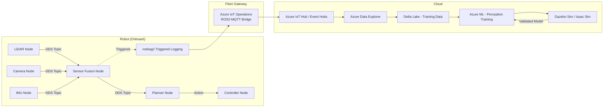
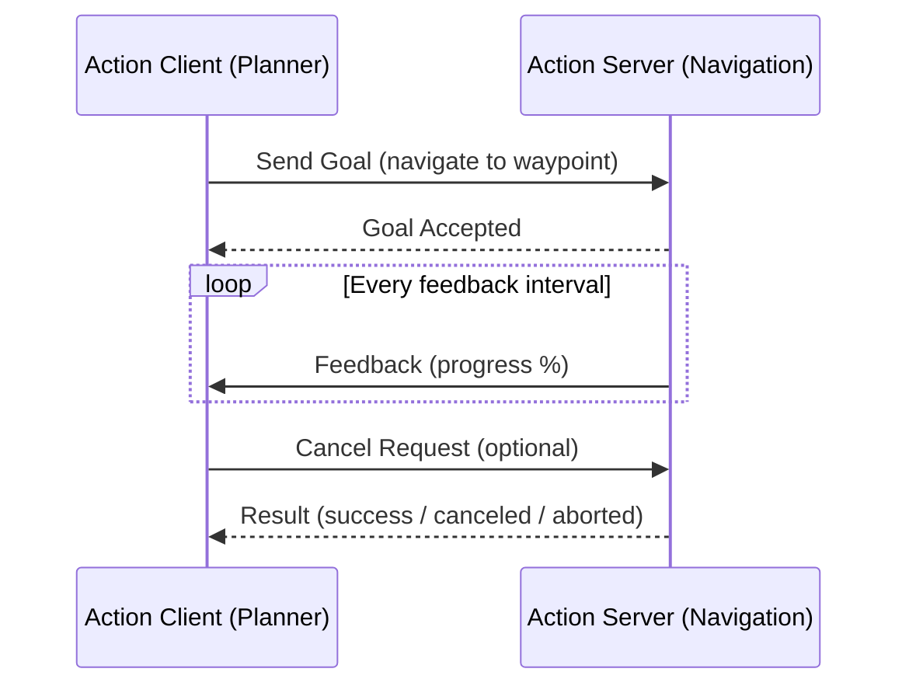
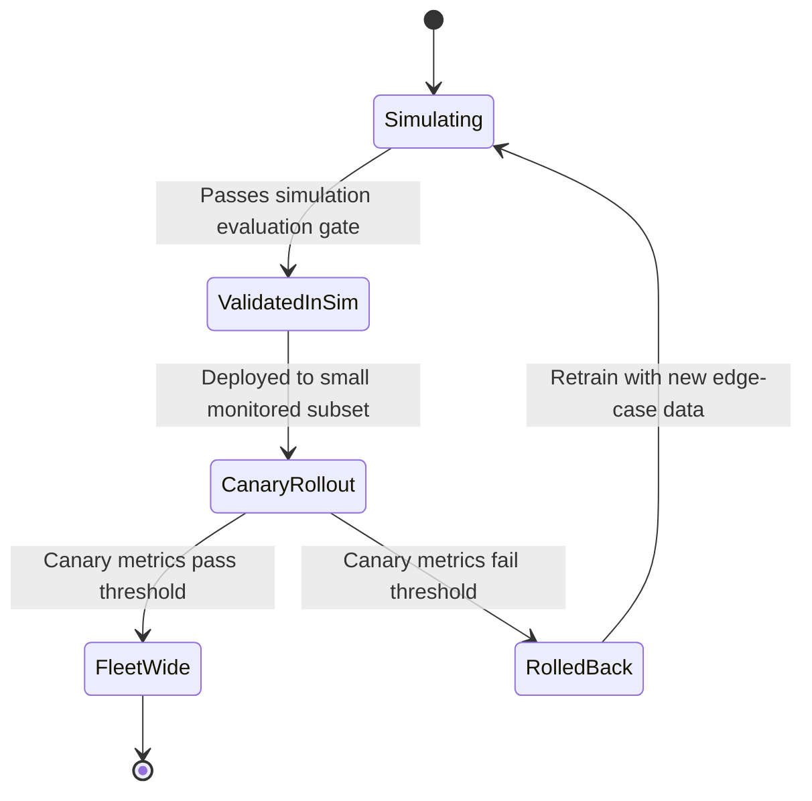

# Robotics and ROS2

> Part of the **Enterprise Data & AI Architecture Handbook** · Phase-16 — Domain-Specific & Frontier Data Platforms · Chapter 03.
> Estimated study time: **60 min reading + ~4h labs**.
> **Prerequisites:** read [Event-Driven Architecture](../Phase-14/01_Event_Driven_Architecture.md) first.

---

## Executive Summary

[Event-Driven Architecture](../Phase-14/01_Event_Driven_Architecture.md) established pub/sub messaging as a broker-mediated pattern: a producer publishes to a topic, a broker (Event Grid, Service Bus, Kafka) durably holds and routes the message, and consumers subscribe independently of the producer's own lifecycle. Robotics middleware inverts this assumption entirely. **ROS2 (Robot Operating System 2)**, the de facto standard robotics framework, runs on top of **DDS (Data Distribution Service)** — a fully decentralized, brokerless pub/sub protocol where nodes discover and communicate with each other directly over the network, with no central broker to mediate, and where **Quality of Service (QoS) policies**, not a shared broker's configuration, govern reliability, durability, and real-time deadlines per topic. This chapter is the third in Phase-16 (Domain-Specific & Frontier Data Platforms) and covers the data architecture underneath a robot or robot fleet: the ROS2 communication primitives, the DDS middleware and its real-time guarantees, the sensor-fusion pipelines that turn raw multi-sensor streams into a coherent world model, the simulation environments that let a robot be trained and tested before it ever touches a real environment, and the fleet-scale data-collection and MLOps loop that turns a deployed robot fleet's operational experience back into improved perception and control models.

This chapter covers **ROS2 nodes, topics, services, and actions** as the four communication primitives every robotics data pipeline is built from; **DDS and real-time communication** as the decentralized, QoS-governed transport layer that makes ROS2 fundamentally different from every broker-centric architecture this handbook has covered so far; **sensor fusion data pipelines** as the time-synchronization and multi-sensor-alignment discipline that turns LiDAR, camera, IMU, and GPS streams into one consistent robot state estimate; **simulation and digital twins** as the sim-to-real methodology that de-risks training and testing a robot's perception and control stack before physical deployment; and **fleet data collection and MLOps** as the operational discipline that manages the genuinely enormous data volumes a sensor-rich robot fleet produces, and turns a selectively-logged subset of that data into a continuously-improving perception-model training pipeline.

The platform bias is **Azure-primary (~60%)** — Azure IoT Operations and Azure IoT Hub (extending [IoT Data Platforms](01_IoT_Data_Platforms.md) and [Industrial IoT (IIoT)](02_Industrial_IoT_IIoT.md) directly) for fleet connectivity and management, Azure Data Explorer and Delta Lake for fleet telemetry and training-data storage, and Azure Machine Learning for perception-model training — **~30% enterprise open source** (ROS2 and its DDS implementations Eclipse Cyclone DDS and Fast DDS as the core robotics middleware, Gazebo and NVIDIA Isaac Sim for simulation, MLflow for model tracking, Kafka/MinIO for fleet-scale data lake ingestion) — **~10% AWS/GCP comparison-only** (AWS RoboMaker's discontinuation as a real, instructive platform-longevity precedent, and AWS IoT Greengrass/Google Cloud's robotics-adjacent offerings).

**Bottom line:** a robot is not merely another IoT device with more sensors — it is a real-time, safety-relevant control system (inheriting every constraint [Industrial IoT (IIoT)](02_Industrial_IoT_IIoT.md) established for OT systems) that also happens to be mobile, sensor-dense, and frequently network-disconnected from any fleet-management backend for extended periods. This chapter's central, recurring thesis, formalized in its ADR: **ROS2's DDS middleware ships with no security enabled by default, and a robot fleet exposed to any network beyond an isolated lab must have DDS-Security (SROS2) explicitly enabled — this is not an optional hardening step, it is a documented, actively-exploited real-world exposure class.**

---

## Learning Objectives

By the end of this chapter you will be able to:

1. **Explain ROS2's four communication primitives** (nodes, topics, services, actions) and select the correct one for a given robotics communication pattern.
2. **Explain DDS's decentralized discovery and QoS model**, and configure QoS policies (reliability, durability, deadline) appropriate to a given real-time data stream.
3. **Design a sensor-fusion pipeline** that time-synchronizes and aligns multi-sensor data (LiDAR, camera, IMU, GPS) into a coherent robot state estimate.
4. **Design a simulation-to-real (sim-to-real) workflow** using domain randomization to reduce the gap between simulated training and real-world deployment.
5. **Design a fleet-scale data-collection and MLOps pipeline** that manages onboard storage constraints, selective/triggered logging, and cloud-side perception-model retraining.
6. **Secure a ROS2/DDS deployment** using SROS2/DDS-Security, and explain why default-configuration ROS2 is not safe to expose beyond an isolated network.
7. **Defend a robotics data platform's communication, sensor-fusion, and fleet-MLOps architecture** in engineer, staff engineer, architect, and CTO review settings.

---

## Business Motivation

- **Robot fleets generate data at a volume and velocity that dwarfs typical enterprise IoT telemetry** — a single autonomous mobile robot with a multi-beam LiDAR and several cameras can produce hundreds of megabytes to several gigabytes per minute, making unmanaged fleet-wide data collection a direct, immediate cost and bandwidth problem rather than a future scaling concern.
- **Perception and control model quality directly determines robot uptime and safety incident rate** — a warehouse or delivery robot's obstacle-detection false-negative rate is both an operational-efficiency metric and a safety metric, making the fleet-MLOps retraining loop (§3.5) a business-critical, not merely a nice-to-have, capability.
- **Simulation reduces the cost and risk of physical-world testing** — validating a new perception or control model change in simulation before a real-world fleet rollout avoids the cost, safety risk, and slow iteration cycle of testing exclusively on physical hardware, directly analogous to the shadow-deployment validation pattern already established in [ML Pipeline Architecture](../Phase-11/06_ML_Pipeline_Architecture.md).
- **An insecure robotics deployment is a physical-safety and liability exposure, not merely a data-confidentiality one** — published security research (§39) has repeatedly found ROS2/DDS deployments reachable and controllable over the open internet with no authentication at all, a risk category with direct, board-level relevance given that a compromised robot can cause physical harm, not just a data breach.
- **Fleet-wide operational data is a genuine competitive asset** — a fleet operator that systematically captures and learns from real-world edge cases (near-misses, unusual environments, sensor failures) improves its perception models faster than a competitor relying on simulation or a smaller fleet's data alone, making the data-collection architecture in this chapter a direct driver of competitive model quality.

---

## History and Evolution

- **2007 — ROS (Robot Operating System) 1** is released from Willow Garage, establishing the node/topic/service communication vocabulary this chapter still uses, built on a custom, centralized `roscore` master process for discovery — a single point of failure and, notably, an architecture with no built-in security whatsoever.
- **2014-2017 — ROS2's design and initial releases** deliberately replace ROS1's centralized `roscore` master with DDS as the underlying transport and discovery mechanism specifically to remove the single point of failure and add real-time-capable QoS control (§3.2) — a foundational architectural shift, not an incremental version bump.
- **2017 — the OMG DDS-Security specification** is published, defining the authentication, access-control, and encryption plugin architecture that ROS2's SROS2 security layer (§16) is built on — arriving after ROS2's initial design, which is part of why DDS-Security remains an opt-in layer rather than an always-on default even in current ROS2 distributions.
- **2019-2021 — published security research (Alias Robotics, Cisco Talos, and academic groups) repeatedly documents ROS2/DDS deployments reachable and controllable over open networks with no authentication enabled** (§39) — the concrete, real-world evidence base behind this chapter's ADR-0183.
- **2020s — Gazebo (now Gazebo Sim, formerly "Ignition Gazebo") and NVIDIA Isaac Sim mature into production-grade simulation environments** with physically-accurate sensor models, enabling the sim-to-real training methodology (§3.4) at a fidelity level that made it a mainstream, not experimental, part of the robotics-ML development lifecycle.
- **2021 — AWS RoboMaker, a managed cloud robotics-simulation service, is announced for discontinuation** (fully shut down September 2025) — a directly relevant platform-longevity precedent this chapter treats explicitly in Migration Considerations (§35), following the same evidence-based treatment [IoT Data Platforms](01_IoT_Data_Platforms.md) §35 gave Google Cloud IoT Core's 2023 retirement.
- **2022-2024 — ROS2 becomes the standard robotics middleware across logistics, agriculture, and service-robotics industries**, with fleet-management and cloud-connectivity patterns increasingly converging on the same IoT Hub/IoT Edge/IoT Operations architecture [IoT Data Platforms](01_IoT_Data_Platforms.md) and [Industrial IoT (IIoT)](02_Industrial_IoT_IIoT.md) already established for other physical-device fleets, rather than robotics-bespoke cloud tooling.
- **2024-2026 — foundation-model-based robot perception and control (vision-language-action models) begin entering production fleets**, adding a genuinely new, much larger training-data and compute-cost dimension to the fleet-MLOps loop (§3.5) this chapter's Cost Optimization section quantifies.

---

## Why This Technology Exists

A robot's software stack must simultaneously satisfy two requirements no prior chapter's architecture combined in one system: hard real-time responsiveness (a control loop stabilizing a legged robot, or an obstacle-avoidance reaction, cannot tolerate the latency or occasional unbounded delay a broker-mediated, at-least-once-delivery messaging system like Kafka or Service Bus can introduce) and extreme sensor-data volume (a robot's perception stack consumes raw sensor streams at a rate that would overwhelm a general-purpose IoT ingestion pipeline designed for periodic telemetry). ROS2, built on DDS, exists specifically to provide a decentralized, per-topic-configurable-QoS communication layer that can simultaneously carry a hard-real-time control-loop message and a best-effort, high-volume camera stream on the same robot, without one workload's requirements compromising the other's — a combination no general enterprise messaging platform covered elsewhere in this handbook was designed to provide.

---

## Problems It Solves

- **Real-time, deterministic communication between a robot's onboard software components**, resolved by DDS's per-topic QoS configuration (§3.2), letting a safety-critical control topic demand strict reliability and bounded latency while a high-volume sensor topic uses best-effort delivery to avoid backpressure.
- **Decentralized communication with no single point of failure**, resolved by DDS's peer-to-peer discovery protocol — unlike ROS1's centralized master, a ROS2 system continues operating even if any individual node (other than the ones directly involved in a given communication) fails.
- **Turning raw, individually-noisy multi-sensor streams into one coherent, trustworthy state estimate**, resolved by sensor-fusion pipelines (§3.3) applying time synchronization and probabilistic fusion (Kalman/particle filtering) across LiDAR, camera, IMU, and GPS data.
- **Validating perception and control changes without physical-world risk or cost**, resolved by simulation environments (§3.4) providing a physically-accurate, repeatable, and safely-iterable testing environment before real-world deployment.
- **Managing fleet-scale sensor-data volume against realistic bandwidth and storage budgets**, resolved by selective/triggered onboard logging and a structured cloud upload and retraining pipeline (§3.5), directly extending the edge-data-reduction discipline [IoT Data Platforms](01_IoT_Data_Platforms.md) §1.3 established for general IoT telemetry to robotics' substantially larger data volumes.

---

## Problems It Cannot Solve

- **ROS2/DDS does not provide security by default** — as History (§4) and this chapter's ADR-0183 establish directly, a stock ROS2 installation with no SROS2/DDS-Security configuration has no authentication, access control, or encryption at all; adopting ROS2 does not itself close this gap, it merely provides the mechanism (SROS2) an operator must explicitly enable.
- **Simulation does not eliminate the sim-to-real gap** — a model trained and validated exclusively in simulation, however physically accurate the simulator, will encounter real-world sensor noise, lighting, and environmental variation the simulator did not model; domain randomization (§3.4) narrows this gap but does not close it entirely, and real-world validation (via the fleet-MLOps loop, §3.5) remains a required step before full-scale deployment.
- **This architecture does not resolve the fundamental physics and safety-certification requirements of the robot's mechanical and control-system design** — a data platform observing and improving a robot's perception model does not substitute for correct actuator sizing, structural safety margins, or the same SIL-rated safety-instrumented-system discipline [Industrial IoT (IIoT)](02_Industrial_IoT_IIoT.md) §2.5 established for industrial control systems; a robot's own safety-critical control loop must remain independently correct regardless of whether this chapter's data and ML pipeline is healthy.
- **It does not remove the operational burden of onboard compute and storage constraints** — a robot's onboard compute is size, weight, and power (SWaP)-constrained in a way a data-center server is not, meaning every sensor-fusion and logging decision in this chapter is made under a genuinely tighter resource budget than the general edge-computing treatment in [IoT Data Platforms](01_IoT_Data_Platforms.md) assumed.
- **It does not eliminate the need for domain-specific robotics and controls engineering expertise** — interpreting a sensor-fusion pipeline's output correctly, or diagnosing why a control loop is unstable, requires robotics-specific expertise this data platform delivers signal to, but does not itself possess.

---

## Core Concepts

### 3.1 ROS2 nodes, topics, services, and actions

- **Nodes** are the unit of computation in ROS2 — an independent process (e.g., a LiDAR driver, a path planner, a motor controller) that communicates with other nodes exclusively through the primitives below, never through direct in-process function calls across node boundaries, the same process-isolation principle [Microservices Architecture](../Phase-14/02_Microservices_Architecture.md) established for service boundaries, now applied at the level of a single robot's internal software components.
- **Topics** implement ROS2's publish/subscribe pattern — a node publishes a typed message to a named topic (e.g., `/lidar/points`), and any number of subscriber nodes receive it, with no publisher-side awareness of who (if anyone) is subscribed — structurally the same decoupling principle as [Event-Driven Architecture](../Phase-14/01_Event_Driven_Architecture.md)'s event/pub-sub pattern, but transported over DDS rather than a broker (§3.2), and typically carrying continuous sensor or state streams rather than discrete business events.
- **Services** implement synchronous request/response communication — a client node sends a request and blocks (or uses a callback) until the server node returns a response, the ROS2 equivalent of [Event-Driven Architecture](../Phase-14/01_Event_Driven_Architecture.md)'s command pattern, appropriate for a single, quick, well-defined operation (e.g., "compute a path between these two points") rather than a continuous stream.
- **Actions** implement asynchronous, long-running, cancellable, and progress-reporting operations (e.g., "navigate to this waypoint," which may take minutes and should report intermediate feedback) — built internally on top of topics and services (§4.2), and the correct primitive whenever a request's execution time is long, variable, or needs interruption, unlike a service's simple, short-lived request/response.
- **Choosing the correct primitive is this chapter's first architectural decision, mirroring [Event-Driven Architecture](../Phase-14/01_Event_Driven_Architecture.md)'s events-vs-commands distinction**: a continuous sensor stream is a topic, a quick deterministic computation is a service, and a long-running, interruptible, goal-directed behavior is an action — using a service where an action belongs (blocking a client for a multi-minute navigation task) or a topic where a service belongs (publishing a one-off command with no delivery confirmation) are both common, avoidable design mistakes (§28).

### 3.2 DDS and real-time communication

- **DDS (Data Distribution Service)** is an OMG-standardized, fully decentralized publish/subscribe middleware: participants discover each other directly over the network (typically via multicast, or a discovery server in constrained network environments) with **no central broker** — a structural departure from every broker-mediated messaging pattern this handbook has covered (Kafka, Event Hubs, Service Bus, per [Message Brokers and Queues](../Phase-14/07_Message_Brokers_and_Queues.md)), and the reason a ROS2 system has no single point of failure at the messaging layer.
- **Quality of Service (QoS) policies are configured per-topic, not globally**, letting different data streams on the same robot have entirely different delivery guarantees: **Reliability** (best-effort, allowing silent message loss for a high-rate sensor stream where the latest value matters more than every historical value, versus reliable, guaranteeing delivery with retransmission for a critical command), **Durability** (volatile, keeping no history for late-joining subscribers, versus transient-local, replaying the most recent message(s) to a subscriber that joins after publication), and **Deadline/Liveliness** (declaring the maximum acceptable interval between messages, and detecting when a publisher has stopped meeting that interval — a real-time-specific capability with no direct analog in the at-least-once/idempotent-consumption vocabulary [Streaming Patterns and Delivery Semantics](../Phase-07/08_Streaming_Patterns_and_Delivery_Semantics.md) established for enterprise streaming).
- **QoS compatibility between a publisher and subscriber is a strict, checked contract** — a subscriber requesting "reliable" delivery cannot successfully connect to a publisher offering only "best-effort" (the subscriber's requirement is stricter than what the publisher offers); a common, confusing real-world failure mode is two nodes that appear correctly configured individually but silently fail to communicate because their QoS policies are mismatched, discoverable only by explicitly comparing each side's QoS profile.
- **DDS's decentralization has a direct security consequence** (§16, ADR-0183): because there is no central broker to gatekeep who can discover and publish/subscribe to a topic, any DDS participant on a reachable network can, by default, discover and interact with every topic in the system — the structural root cause behind the published exposure research cited in §4 and §39.
- **Real-time performance depends on the underlying DDS implementation and its configuration**, not merely on ROS2 itself — Eclipse Cyclone DDS and eProsima Fast DDS (the two most widely used open-source DDS implementations, §32) differ in their discovery-protocol tuning, memory-allocation behavior, and real-time-determinism characteristics, making DDS-implementation choice itself a real architectural decision for a latency-sensitive control application, not an interchangeable implementation detail.

### 3.3 Sensor fusion data pipelines

- **Sensor fusion combines multiple, individually-imperfect sensor streams (LiDAR, camera, IMU, GPS/GNSS, wheel odometry) into one coherent, lower-uncertainty estimate of the robot's state and surrounding environment** — the foundational data-engineering problem every downstream perception and planning component depends on being solved correctly.
- **Time synchronization is the prerequisite every fusion algorithm depends on** — sensors sampling at different, independent rates (a LiDAR at 10Hz, a camera at 30Hz, an IMU at 200Hz) must be aligned to a common time base (commonly via a hardware trigger or PTP-based clock synchronization) before their data can be meaningfully fused; ROS2's `message_filters` library provides approximate-time synchronization policies specifically to handle sensors that cannot be perfectly hardware-synchronized.
- **The transform tree (`tf2`)** maintains the time-varying geometric relationships between every sensor's and every robot component's coordinate frame (e.g., "where is the LiDAR mounted relative to the robot's base frame, and how has that relationship changed as the robot's arm moved") — every sensor-fusion computation depends on querying this transform tree at the correct timestamp, making `tf2` a foundational, load-bearing data structure rather than a peripheral utility.
- **Kalman filtering (and its nonlinear variants, the Extended and Unscented Kalman Filter) and particle filtering** are the standard probabilistic-fusion algorithms — a Kalman filter's core value is optimally weighting each sensor's contribution to the fused estimate by that sensor's own known uncertainty (its covariance), so a noisy sensor is trusted less, and a precise one trusted more, automatically and continuously rather than through a fixed, manually-tuned weighting.
- **Sensor-fusion output quality is only as good as the weakest correctly-synchronized input** — a subtle time-synchronization error (a LiDAR scan fused against a slightly-stale robot-pose estimate) produces a plausible-looking but silently incorrect fused result, a failure mode with no obvious error signal unless the pipeline explicitly monitors synchronization latency (§21).

### 3.4 Simulation and digital twins

- **Simulation environments (Gazebo Sim, NVIDIA Isaac Sim) provide physically-accurate models of a robot's dynamics, sensors, and environment**, letting a perception or control model be trained and validated against millions of simulated episodes at a speed, cost, and safety profile physical-world testing cannot match.
- **The sim-to-real gap — the measurable performance difference between a model's simulated and real-world performance — is this chapter's central simulation caution**, directly analogous to [Model Serving and Ray](../Phase-11/04_Model_Serving_and_Ray.md)'s training-serving-skew concern, now applied to physics and sensor fidelity rather than feature computation.
- **Domain randomization** (systematically varying simulated lighting, textures, sensor noise, and physical parameters across training episodes, rather than training against one fixed, idealized simulated environment) is the standard technique for narrowing the sim-to-real gap — a model trained only against one clean, deterministic simulated environment learns to exploit simulation-specific artifacts rather than genuinely robust perception, the same overfitting-to-a-narrow-distribution risk [Machine Learning Foundations](../Phase-11/01_Machine_Learning_Foundations.md) already established generally, now with a physics-specific manifestation.
- **A robot digital twin is the simulation-side analog of the device-twin-as-cache pattern already introduced in [IoT Data Platforms](01_IoT_Data_Platforms.md) §26**, extended here to a physically-simulated model of the robot itself (not merely its last-known reported state) — letting an operator or an automated test suite validate a proposed software change against a high-fidelity simulated robot before deploying it to physical fleet hardware; full graph-based digital-twin modeling of physical assets and their relationships is covered in depth in Phase-16 Chapter 07 (Digital Twins).
- **Simulation and real-world data collection are complementary, not substitutable** — simulation provides safe, cheap, high-volume coverage of scenarios (including deliberately dangerous or rare ones) that would be impractical or unsafe to collect physically, while real-world fleet data (§3.5) provides the ground-truth validation and edge-case discovery simulation's own fidelity limits cannot fully replace.

### 3.5 Fleet data collection and MLOps

- **`rosbag2` (ROS2's native recording/playback format) captures a time-synchronized log of every topic's messages during a robot's operation** — the foundational data-capture mechanism for both post-incident debugging and training-data collection, directly analogous to the append-only event-log concept in [Event Sourcing](../Phase-14/04_Event_Sourcing.md), now applied to a robot's full sensor and internal-state history rather than a business aggregate's event history.
- **Selective and triggered logging is a mandatory data-volume-reduction discipline, not an optional optimization** — given the sensor-data volumes named in Business Motivation, continuously recording every topic at full resolution on every robot in a fleet is rarely bandwidth- or storage-affordable; a well-designed fleet instead defines specific trigger conditions (a near-miss event, a perception-model low-confidence flag, an operator-flagged anomaly) that promote a bounded time window of full-fidelity data for upload, while routine operation is logged only at a reduced, downsampled resolution — directly extending [IoT Data Platforms](01_IoT_Data_Platforms.md) §1.4's downsampling discipline to robotics' substantially higher-volume sensor streams.
- **The fleet-MLOps loop closes from deployed-robot experience back to an improved model**: triggered/selectively-logged data uploads to a cloud data lake, is curated and labeled (frequently requiring human-in-the-loop annotation for genuinely novel edge cases simulation did not anticipate), feeds a retraining pipeline following the same MLOps lifecycle (experiment tracking, evaluation gate, staged promotion) established in [MLOps and MLflow](../Phase-11/03_MLOps_and_MLflow.md), and — critically — is validated first in simulation (§3.4) and via a staged, monitored fleet rollout before being promoted fleet-wide, mirroring the champion/challenger and canary-before-fleet-wide discipline [Model Serving and Ray](../Phase-11/04_Model_Serving_and_Ray.md) established generally.
- **Fleet management and connectivity should reuse, not reinvent, the device-provisioning and edge-orchestration architecture already established in [IoT Data Platforms](01_IoT_Data_Platforms.md) and [Industrial IoT (IIoT)](02_Industrial_IoT_IIoT.md)** — a mobile robot is, from a fleet-connectivity perspective, an IoT Edge device with intermittent connectivity and a device identity that should be provisioned via DPS (per [IoT Data Platforms](01_IoT_Data_Platforms.md) §1.5) exactly as any other fleet device, rather than requiring a robotics-bespoke provisioning and identity mechanism.

---

## Internal Working

### 4.1 How DDS discovery and pub/sub actually work

1. A ROS2 node starting up creates a DDS participant, which broadcasts (typically via UDP multicast on the local network, or contacts a configured discovery server in networks where multicast is unavailable or undesirable) its presence and the topics it intends to publish or subscribe to.
2. Every other DDS participant on the reachable network receives this discovery announcement and, if it has a matching topic name, type, and *compatible* QoS profile (§3.2), establishes a direct peer-to-peer data connection with the newly-discovered participant — no broker is ever involved in this matching or in the subsequent data exchange.
3. Data is transported using RTPS (Real-Time Publish-Subscribe protocol), DDS's underlying wire protocol, typically over UDP for lowest latency, with the specific reliability and retransmission behavior of that transport governed entirely by the topic's configured QoS policy (best-effort simply drops on loss; reliable retransmits until acknowledged or a configured history depth is exceeded).
4. Because discovery is broadcast-based and connections are direct peer-to-peer, any additional DDS participant joining the same network segment can, without SROS2/DDS-Security (§16) enabled, discover and interact with every existing topic — the mechanical, protocol-level explanation for why an unsecured ROS2 system is trivially discoverable and controllable by any other participant reachable on the same network.

### 4.2 How a ROS2 action actually executes under the hood

1. An action client sends a **goal** request to an action server over a dedicated "send goal" service — the server can accept or reject the goal (e.g., rejecting a navigation goal to an already-occupied location).
2. Once accepted, the action server begins executing the long-running behavior and publishes periodic **feedback** messages on a dedicated feedback topic (e.g., "60% of the way to the waypoint") — this is why an action is built on both a service (for the initial goal handshake) and a topic (for ongoing feedback), rather than being a single new primitive.
3. The action client may, at any point, send a **cancel** request over another dedicated service, which the server should honor by halting execution and reporting the goal's final status as canceled rather than succeeded.
4. Once the behavior completes (successfully, by failure, or by cancellation), the action server returns a final **result** via yet another service call, completing the goal's lifecycle — giving the client both continuous progress visibility (via feedback) and a definitive completion signal (via result), the combination a plain topic or plain service alone cannot provide.

### 4.3 How a sensor-fusion pipeline actually synchronizes and fuses multi-sensor data end to end

1. Each sensor driver node publishes its raw data on its own topic, each message carrying a timestamp reflecting when that specific measurement was actually captured (not when it was published, which may be slightly later due to processing or transmission delay).
2. A synchronization node subscribes to all relevant sensor topics using `message_filters`' approximate-time synchronization policy, which buffers incoming messages briefly and emits a synchronized tuple once it has found messages from every subscribed topic that fall within a configured time tolerance of each other.
3. For each synchronized tuple, the fusion node queries the `tf2` transform tree at the tuple's common timestamp to obtain the correct geometric relationship between each sensor's frame and the robot's reference frame, transforming each sensor's data into one consistent coordinate frame.
4. A Kalman (or particle) filter combines the transformed, time-aligned measurements, weighting each by its sensor's known uncertainty, and outputs one fused state estimate — published on its own topic for every downstream planning and control node to consume, closing the loop from raw, individually-noisy sensor data to one trustworthy robot-state estimate.

---

## Architecture

A reference robotics data-platform architecture, from onboard robot to fleet-cloud training loop:

1. **Onboard compute tier**: ROS2 nodes running on the robot's onboard compute (an SWaP-constrained embedded computer, per §7), communicating via DDS with topic-specific QoS policies (§3.1-§3.2).
2. **Sensor and fusion tier**: sensor-driver nodes and the sensor-fusion pipeline (§3.3), producing the fused state estimate every planning/control node depends on.
3. **Onboard logging tier**: `rosbag2` recording with selective/triggered-upload logic (§3.5), reducing outbound data volume before it ever reaches the network.
4. **Fleet connectivity tier**: an Azure IoT Operations or IoT Edge-based gateway (reusing [IoT Data Platforms](01_IoT_Data_Platforms.md)'s device-provisioning and edge-processing architecture directly) bridging the robot's onboard network to the cloud.
5. **Cloud data and training tier**: Azure Data Explorer/Delta Lake for fleet telemetry, and Azure Machine Learning for perception-model retraining, following the same MLOps lifecycle established in [MLOps and MLflow](../Phase-11/03_MLOps_and_MLflow.md).
6. **Simulation tier**: Gazebo Sim or NVIDIA Isaac Sim, used both for pre-deployment validation of new model versions (§3.4) and as a scalable source of synthetic training data via domain randomization.

---

## Components

- **ROS2** (nodes, topics, services, actions, `tf2`, `message_filters`): the core robotics middleware and communication framework.
- **DDS implementation** (Eclipse Cyclone DDS or eProsima Fast DDS): the underlying real-time pub/sub transport.
- **SROS2**: the ROS2 security tooling layer for provisioning DDS-Security certificates and access-control policies (§16, ADR-0183).
- **Gazebo Sim / NVIDIA Isaac Sim**: physically-accurate simulation environments for sim-to-real training and pre-deployment validation.
- **Azure IoT Operations / IoT Edge** (reused from [IoT Data Platforms](01_IoT_Data_Platforms.md) and [Industrial IoT (IIoT)](02_Industrial_IoT_IIoT.md)): the fleet-connectivity and edge-orchestration bridge between onboard ROS2 systems and the cloud.
- **Azure Data Explorer / Delta Lake on ADLS**: fleet telemetry and training-data storage, reusing the tiered hot/warm/cold architecture already established in [IoT Data Platforms](01_IoT_Data_Platforms.md) §1.4.
- **Azure Machine Learning / MLflow**: perception and control-model training, evaluation-gating, and registry, per [MLOps and MLflow](../Phase-11/03_MLOps_and_MLflow.md) and [Azure Machine Learning](../Phase-11/05_Azure_Machine_Learning.md).

---

## Metadata

- **ROS2 message type definitions (`.msg`/`.srv`/`.action` files)** are the schema-metadata layer for every topic, service, and action — analogous to the data-contract schemas already established in [Data Contracts](../Phase-08/07_Data_Contracts.md), and equally subject to backward-compatibility discipline when a message type changes across a robot fleet running mixed software versions.
- **`tf2` transform-tree metadata** (the full set of coordinate-frame relationships and their time-varying history) is itself queryable, governed metadata every downstream sensor-fusion and planning computation depends on being correct and current.
- **Per-robot and per-fleet software/firmware version metadata**, recorded via the same device-twin-tag mechanism [IoT Data Platforms](01_IoT_Data_Platforms.md) §12 established, is essential for correlating a fleet-wide anomaly or model-performance regression against a specific software rollout.
- **Rosbag recording metadata** (which trigger condition caused a given bag to be uploaded, what topics and time window it covers) must be captured alongside the raw data itself, or the uploaded data loses the context needed to prioritize and label it correctly during the fleet-MLOps curation step (§3.5).

---

## Storage

- **Onboard storage**: bounded, SWaP-constrained local storage for `rosbag2` recordings, requiring the same bounded-buffer discipline [IoT Data Platforms](01_IoT_Data_Platforms.md) §19 established for edge-device offline buffering, now against a substantially higher data-rate input.
- **Cloud hot/warm tier (Azure Data Explorer)**: fleet telemetry, health signals, and model-performance metrics, using the same tiered downsampling architecture as [IoT Data Platforms](01_IoT_Data_Platforms.md) §1.4.
- **Cloud cold/training tier (Delta Lake on ADLS)**: curated, labeled training datasets assembled from selectively-uploaded rosbag data — this tier's data quality and labeling discipline directly determines downstream perception-model quality, making it the highest-leverage storage tier in this chapter's architecture.
- **Simulation-generated synthetic data**: frequently generated and consumed entirely within the simulation/training environment without ever needing durable long-term storage at the same tier as real-world fleet data, though enough simulation configuration (the domain-randomization parameters used) should be versioned to make a given training run's synthetic-data generation reproducible.

---

## Compute

- **Onboard compute**: SWaP-constrained embedded compute (frequently including a GPU or dedicated inference accelerator for real-time perception) running the ROS2 node graph, sensor fusion, and any onboard model inference.
- **Simulation compute**: GPU-accelerated cloud or on-premises compute running Gazebo Sim/Isaac Sim at the scale needed for domain-randomized training-data generation — frequently the single largest compute-cost line item in a robotics ML program (§20).
- **Training compute**: Azure Machine Learning or Databricks GPU clusters for perception/control-model training, following the same compute patterns already established in [Model Serving and Ray](../Phase-11/04_Model_Serving_and_Ray.md).
- **Fleet-management compute**: Azure IoT Operations/Edge compute at any intermediate gateway tier, reused directly from [IoT Data Platforms](01_IoT_Data_Platforms.md) and [Industrial IoT (IIoT)](02_Industrial_IoT_IIoT.md).

---

## Networking

- **Onboard DDS communication** typically runs over a local, trusted network segment within the robot itself (or, for multi-robot coordination, a local wireless mesh) — the network boundary where SROS2/DDS-Security (§16) matters most, since this is exactly the segment published exposure research (§39) has found reachable and unauthenticated in real deployments.
- **Fleet connectivity** to the cloud follows the same MQTT/AMQP-over-TLS, device-initiated-outbound-connection pattern already established in [IoT Data Platforms](01_IoT_Data_Platforms.md) §15 — a mobile robot's connectivity is frequently more intermittent than a fixed IoT device's, making offline buffering (§13) a near-universal requirement rather than an edge case.
- **Multi-robot coordination networking** (robots communicating directly with each other, not only with a fleet-management backend) introduces its own discovery and QoS-compatibility considerations (§3.2) at potentially larger scale (tens to hundreds of DDS participants on one network segment), requiring deliberate discovery-server configuration rather than relying on unbounded multicast discovery to scale cleanly.

---

## Security

- **SROS2/DDS-Security (authentication, access control, and encryption) must be explicitly enabled for any ROS2 deployment reachable beyond an isolated, physically-controlled lab network** — this chapter's mandatory baseline (ADR-0183), directly motivated by the published research findings (§4, §39) documenting real, unauthenticated, internet-reachable ROS2/DDS deployments.
- **DDS-Security's plugin architecture** (Authentication, Access Control, Cryptographic, and Logging plugins) lets SROS2 issue per-node X.509 identities and define fine-grained, per-topic publish/subscribe permissions — directly analogous to the per-device-identity discipline [IoT Data Platforms](01_IoT_Data_Platforms.md) §1.5 established for IoT devices, now applied at the granularity of individual ROS2 nodes and topics within a single robot.
- **A robot's onboard compute is a physical-access attack surface in a way a data-center server rarely is** — an attacker with brief physical access to a deployed robot may be able to extract credentials or firmware directly, meaning the same firmware-signing and secure-boot discipline established in [Data Security and Encryption](../Phase-10/03_Data_Security_and_Encryption.md) and [Industrial IoT (IIoT)](02_Industrial_IoT_IIoT.md) §16 applies with added urgency to fleet robots operating in publicly-accessible or unsupervised environments.
- **Fleet-level identity and provisioning should reuse DPS-based per-device (per-robot) X.509 identity** (per [IoT Data Platforms](01_IoT_Data_Platforms.md) §1.5, ADR-0181) for the robot's fleet-connectivity layer, layered on top of — not as a substitute for — SROS2's own onboard DDS-Security identity, since the two secure different boundaries (robot-to-cloud versus node-to-node within the robot).

---

## Performance

- **DDS QoS deadline and liveliness policies (§3.2) are the primary real-time performance-guarantee mechanism** — a control-loop topic's deadline policy makes a missed publish interval an explicitly detectable event, rather than a silent latency degradation discoverable only through downstream control instability.
- **Sensor-fusion pipeline latency** (from raw sensor capture to fused state-estimate availability) directly bounds how fast a robot's control loop can react to a changing environment — a fusion pipeline with unbounded or highly variable latency undermines every downstream real-time guarantee regardless of how well-tuned the control loop itself is.
- **DDS implementation choice and discovery-protocol tuning** (§3.2) materially affect achievable real-time performance at scale — a large multi-robot deployment with unbounded multicast discovery traffic can itself become a performance bottleneck, motivating discovery-server-based configuration for larger fleets.

---

## Scalability

- **Multi-robot fleet scaling introduces a DDS-discovery scaling concern distinct from cloud-side scaling** — as the number of DDS participants sharing a network segment grows, unbounded multicast discovery traffic grows correspondingly; a discovery server (a lightweight, non-broker-like participant that centralizes discovery announcements without becoming a data-plane broker) is the standard mitigation for large multi-robot deployments.
- **Cloud-side scaling** (Event Hubs/IoT Hub throughput, ADX/Delta Lake storage, training compute) follows the same scaling principles already established in [IoT Data Platforms](01_IoT_Data_Platforms.md) §18, with the genuinely larger per-device data volume (§3) as this chapter's distinguishing scaling pressure.
- **Simulation-side scaling** (running many parallel domain-randomized simulation episodes for training-data generation) is typically the most straightforwardly horizontally-scalable tier in this architecture, since simulation episodes are usually independent of each other and can be distributed across a GPU cluster without the coordination overhead multi-robot physical fleets require.

---

## Fault Tolerance

- **A robot's safety-critical control loop must remain correct and independent of the sensor-fusion, logging, or cloud-connectivity pipeline's health** (§7, §10) — the same non-negotiable independence principle [Industrial IoT (IIoT)](02_Industrial_IoT_IIoT.md) §19 established for OT control loops, now applied to a mobile robot's own control stack.
- **DDS's decentralized architecture provides natural fault isolation** — the failure of one node (e.g., a logging node) does not, by itself, take down the DDS communication layer other nodes depend on, unlike a broker-mediated architecture where a broker outage can affect every dependent consumer simultaneously.
- **Onboard connectivity-outage buffering** (§13, reusing [IoT Data Platforms](01_IoT_Data_Platforms.md) §19's offline-buffering pattern) preserves fleet-telemetry and training-data continuity once connectivity resumes, without requiring any change to how the robot's own control loop continues operating during the same outage.
- **Sensor-fusion pipelines should detect and gracefully degrade on individual sensor failure** — a fusion algorithm that silently continues producing a state estimate using only remaining healthy sensors (with appropriately increased uncertainty) is materially safer than one that fails outright or, worse, silently produces an overconfident estimate from degraded input.

---

## Cost Optimization (FinOps)

- **Selective/triggered onboard logging (§3.5) is the single highest-leverage robotics data cost lever**, for the same reason established in [IoT Data Platforms](01_IoT_Data_Platforms.md) §20 and [Industrial IoT (IIoT)](02_Industrial_IoT_IIoT.md) §20, now amplified further given robotics' substantially larger raw sensor-data volumes.
- **Simulation compute (GPU-hours for domain-randomized training-data generation) is frequently the single largest recurring cost line item in a robotics ML program**, and should be tracked and budgeted explicitly against measured model-quality improvement, not treated as an unlimited, "more simulation is always better" resource.
- **Worked FinOps example**: a delivery-robot fleet of 500 units, each producing roughly 2 GB/hour of raw sensor data during active operation, would generate on the order of several petabytes per month if every robot uploaded raw sensor data continuously — both bandwidth-infeasible over typical cellular/Wi-Fi fleet connectivity and needlessly expensive to store. Applying this chapter's triggered-logging strategy — uploading only a bounded time window (e.g., 30 seconds before and after a triggering event: a near-miss, a perception low-confidence flag, or an operator-flagged anomaly) at full resolution, plus a continuously-uploaded, heavily downsampled telemetry stream for fleet health monitoring — reduces uploaded data volume by roughly two to three orders of magnitude relative to continuous raw upload, while still capturing the specific edge cases (§3.5) that matter most for perception-model improvement. The concrete lesson for a CTO-level cost review, directly parallel to [IoT Data Platforms](01_IoT_Data_Platforms.md) §20's own finding: the triggered-logging policy design, made once at the fleet-software level, determines almost the entire data-platform cost trajectory as the fleet scales — not a later, incremental optimization.

---

## Monitoring

- **Sensor-fusion synchronization latency and time-alignment error**, tracked continuously as the earliest leading indicator of the silent fusion-degradation failure mode named in §3.3.
- **DDS QoS deadline-miss and liveliness-lost events**, surfaced as explicit, monitorable signals rather than only manifesting indirectly as downstream control instability.
- **Triggered-logging event rate and trigger-condition breakdown**, tracked per robot and fleet-wide, both as a fleet-health signal (a robot generating an unusually high near-miss rate warrants investigation) and as a data-pipeline capacity-planning input.
- **Perception-model performance metrics in production** (detection accuracy proxies, operator-override/intervention rate), the fleet-scale equivalent of the model-drift monitoring already established in [ML Pipeline Architecture](../Phase-11/06_ML_Pipeline_Architecture.md).

---

## Observability

- **End-to-end tracing from raw sensor capture through fusion, planning, and control-command issuance** should be reconstructable, at minimum for triggered/uploaded rosbag segments, extending the OpenTelemetry-based full-pipeline tracing principle already established in [LLMOps](../Phase-12/04_LLMOps.md) §4.2 to a robot's internal ROS2 node graph.
- **Fleet-wide DDS-Security posture visibility**: an operator should be able to confirm, across every robot in the fleet, that SROS2/DDS-Security is actually enabled and correctly configured — not merely assumed to be enabled because it was configured once during initial deployment (mirroring the recurring "verification gap" pattern this handbook has flagged repeatedly, e.g., in [Secrets and Key Management](../Phase-10/05_Secrets_and_Key_Management.md)).

### Operational Response Playbook

| Signal | Detection Query / Check | Remediation |
|---|---|---|
| Sensor-fusion time-synchronization error exceeds a defined tolerance for a specific robot | Continuous monitoring of `message_filters` synchronization latency/miss rate per robot, alerting on a sustained increase | Check for a specific sensor's clock drift or a recent firmware/driver change on the affected robot before assuming a fleet-wide issue; if isolated to one robot, quarantine it from autonomous operation pending inspection rather than allowing degraded fusion output to continue driving control decisions |
| A robot (or a batch of robots) reports SROS2/DDS-Security as disabled or using an expired/invalid identity certificate | Scheduled fleet-wide audit querying each robot's reported security configuration via its device twin (per [IoT Data Platforms](01_IoT_Data_Platforms.md) §1.2), alerting on any robot reporting non-compliant configuration | Treat as a mandatory-baseline violation (ADR-0183), not an informational finding — restrict the affected robot's network reachability and prioritize re-provisioning its DDS-Security identity before returning it to unrestricted fleet operation |

---

## Governance

- **Message-type schema changes must follow the same backward-compatibility discipline as any other data contract** (per [Data Contracts](../Phase-08/07_Data_Contracts.md)) — a fleet running mixed software versions during a staged rollout depends on older and newer nodes continuing to interoperate on shared topics until the rollout completes.
- **Perception-model changes affecting safety-relevant behavior (obstacle detection thresholds, for example) should go through the same evaluation-gate and staged-promotion discipline established in [MLOps and MLflow](../Phase-11/03_MLOps_and_MLflow.md) and [ML Pipeline Architecture](../Phase-11/06_ML_Pipeline_Architecture.md)** — never promoted fleet-wide based on simulation results alone, without a staged, monitored real-world rollout first.
- **Fleet-wide SROS2/DDS-Security configuration and per-robot identity provisioning must be governed, auditable configuration** (§16, §22's playbook), not informal per-deployment setup left to individual field-technician discretion.
- **Rosbag-derived training data frequently captures identifiable people or private property (a delivery robot's camera footage, for example) and must be classified and governed accordingly** under the same personal-data and privacy discipline established in [Data Privacy and PII Protection](../Phase-10/07_Data_Privacy_and_PII_Protection.md), including access controls on the curated training-data lake tier (§13) and retention limits consistent with the specific consent or legal basis under which the data was collected.

---

## Trade-offs

| Dimension | ROS1 (centralized `roscore` master) | ROS2 (decentralized DDS) |
|---|---|---|
| Single point of failure | Yes (the master process) | No (peer-to-peer discovery) |
| Real-time QoS control | Minimal | Fine-grained, per-topic (§3.2) |
| Built-in security | None | Optional (SROS2/DDS-Security), off by default |
| Best fit | Legacy systems, research prototypes on already-migrated codebases | Any new production robotics deployment |

| Dimension | Best-effort QoS | Reliable QoS |
|---|---|---|
| Latency | Lower, more predictable | Higher, variable under packet loss (retransmission) |
| Guarantee | May silently drop messages | Guaranteed delivery (within configured history) |
| Best fit | High-rate sensor streams where the latest value matters most | Commands and safety-relevant messages where every message matters |

---

## Decision Matrix

| Signal | Recommendation |
|---|---|
| A robotics system will be reachable on any network beyond a fully isolated, physically-controlled lab | Enable SROS2/DDS-Security before deployment (ADR-0183) — never treat this as a later hardening step |
| A communication need is a continuous, high-rate stream (sensor data, state estimates) | Use a topic with best-effort QoS unless every individual message's delivery is safety-critical |
| A communication need is a quick, deterministic, one-off computation | Use a service |
| A communication need is long-running, cancellable, and needs progress feedback | Use an action, not a service |
| A perception/control model has only been validated in simulation | Require a staged, monitored real-world canary rollout (per [Model Serving and Ray](../Phase-11/04_Model_Serving_and_Ray.md)) before fleet-wide promotion — simulation validation alone is insufficient |
| Fleet size and network density are large enough that unbounded multicast discovery is becoming a measurable network burden | Configure a DDS discovery server rather than relying on default multicast discovery |

---

## Design Patterns

- **QoS-per-topic pattern**: matching each topic's reliability/durability/deadline configuration to its actual real-time and safety requirements, rather than applying one uniform QoS profile fleet-wide (§3.2).
- **Triggered-logging pattern**: promoting a bounded time window of full-fidelity sensor data for upload only when a defined trigger condition fires, with routine operation logged only at reduced resolution (§3.5) — the robotics-specific instance of the general edge-data-reduction pattern established in [IoT Data Platforms](01_IoT_Data_Platforms.md) §26.
- **Sim-then-canary-then-fleet-wide pattern**: validating a model change in simulation first, then a small, monitored real-world canary subset of the fleet, then full fleet-wide promotion only after both gates pass — directly extending [Model Serving and Ray](../Phase-11/04_Model_Serving_and_Ray.md)'s canary-deployment pattern with a simulation gate ahead of it.
- **Graceful sensor-degradation pattern**: a fusion pipeline that continues operating with appropriately-increased uncertainty when an individual sensor fails, rather than failing outright (§19).

---

## Anti-patterns

- **Deploying a fleet with SROS2/DDS-Security left disabled "because it adds setup complexity," on any network reachable beyond an isolated lab** — the direct anti-pattern this chapter's ADR-0183 and published-research citations (§39) exist to prevent.
- **Using a service where a long-running behavior belongs, blocking a client for minutes with no progress feedback and no clean cancellation path** — the wrong-primitive mistake §3.1 and §28 both flag.
- **Promoting a perception-model change fleet-wide based on simulation results alone, with no staged real-world canary** — reintroduces exactly the sim-to-real-gap risk §3.4 names, at full fleet scale rather than a contained subset.
- **Continuously uploading raw, full-resolution sensor data from every robot in a fleet "to be safe," with no triggered-logging policy** — the direct robotics-scale instance of the storage-cost-explosion anti-pattern already flagged in [IoT Data Platforms](01_IoT_Data_Platforms.md) §27.

---

## Common Mistakes

- **Assuming QoS policies configured correctly on one side of a pub/sub connection are sufficient** — a mismatched QoS profile between publisher and subscriber silently prevents communication entirely, with no obvious error unless both sides' profiles are explicitly compared (§3.2).
- **Ignoring `tf2` transform-tree timestamp alignment**, fusing a sensor reading against a stale or incorrect transform and producing a plausible-looking but silently wrong fused result (§3.3).
- **Training a perception model exclusively in one fixed, idealized simulated environment**, producing a model that performs well in simulation but poorly in the real world because it learned to exploit simulation-specific artifacts rather than genuinely robust features (§3.4).
- **Treating rosbag storage as unbounded "because storage is cheap," without a triggered-logging policy**, until fleet-wide data volume becomes an unaffordable bandwidth and storage cost (§20).

---

## Best Practices

- **Enable SROS2/DDS-Security by default for every deployment beyond an isolated lab, from the first field deployment onward** — retrofitting security onto an already-deployed fleet is dramatically more disruptive than establishing it correctly from day one, the same lesson [IoT Data Platforms](01_IoT_Data_Platforms.md) §29 and [Industrial IoT (IIoT)](02_Industrial_IoT_IIoT.md) §29 both established for their own respective device-identity and segmentation baselines.
- **Design the triggered-logging policy before the first fleet deployment**, validated against the specific edge cases the fleet-MLOps retraining loop actually needs to capture.
- **Validate every perception/control-model change through simulation, then a monitored real-world canary, before fleet-wide promotion.**
- **Treat DDS QoS configuration as a deliberate, per-topic engineering decision, documented and reviewed, not a copy-pasted default.**
- **Reuse the existing IoT device-identity and edge-orchestration architecture ([IoT Data Platforms](01_IoT_Data_Platforms.md), [Industrial IoT (IIoT)](02_Industrial_IoT_IIoT.md)) for fleet connectivity rather than building a robotics-bespoke provisioning stack.**

---

## Enterprise Recommendations

- **Default to ROS2 with SROS2/DDS-Security enabled, Azure IoT Operations/Edge for fleet connectivity, and Azure Machine Learning for the perception-model retraining loop** as the reference architecture for a new, Azure-primary robotics fleet deployment.
- **Budget simulation GPU compute explicitly and track its cost against measured model-quality improvement** — an unbounded, unmeasured simulation-compute budget is a common, avoidable robotics-ML cost leak.
- **Mandate SROS2/DDS-Security as a non-negotiable platform standard (ADR-0183), independent of individual project timelines** — every published exposure-research finding cited in this chapter's History and Case Studies is evidence that "we'll secure it before the real production rollout" is a commitment that has repeatedly failed to hold in practice across the industry.
- **Never adopt a managed robotics-simulation or fleet platform without an explicit migration contingency plan**, following the same platform-longevity-risk discipline [IoT Data Platforms](01_IoT_Data_Platforms.md) §30 established — AWS RoboMaker's 2025 discontinuation (§4, §35) is this chapter's concrete precedent.

---

## Azure Implementation

- **Azure IoT Operations deployment for a fleet gateway** reuses the identical Arc-enabled Kubernetes deployment pattern already given in full in [Industrial IoT (IIoT)](02_Industrial_IoT_IIoT.md) §31, with a ROS2-to-MQTT bridge node (a standard open-source ROS2 package) publishing selected topics into the Azure IoT Operations MQTT broker for cloud-bound forwarding.
- **DPS-based per-robot identity provisioning** reuses the identical enrollment-group Bicep and CLI pattern from [IoT Data Platforms](01_IoT_Data_Platforms.md) §31, treating each robot as a DPS-provisioned device with its own individually-revocable X.509 identity at the fleet-connectivity layer.
- **SROS2 keystore generation (CLI sketch)** provisioning per-node DDS-Security identities within a robot:

```bash
ros2 security create_keystore ./fleet_keystore
ros2 security create_key ./fleet_keystore /lidar_node
ros2 security create_key ./fleet_keystore /planner_node
ros2 security create_permission ./fleet_keystore /planner_node planner_policy.xml
```

- **Azure Machine Learning training pipeline** consuming curated rosbag-derived training data from Delta Lake on ADLS, following the same managed-training and evaluation-gate pattern given in [Azure Machine Learning](../Phase-11/05_Azure_Machine_Learning.md), with a required simulation-validation step (against Gazebo Sim or Isaac Sim scenarios) as a promotion gate ahead of any real-world canary rollout.
- **Azure Data Explorer update policy** for fleet telemetry downsampling reuses the identical KQL update-policy pattern given in full in [IoT Data Platforms](01_IoT_Data_Platforms.md) §31, applied to a `RobotFleetTelemetry` table.

---

## Open Source Implementation

- **ROS2** (Humble/Jazzy and later distributions), **Eclipse Cyclone DDS** and **eProsima Fast DDS**: the core open-source robotics middleware and DDS implementations this entire chapter is built on.
- **SROS2**: the open-source ROS2 security tooling implementing DDS-Security key/certificate generation and access-control-policy authoring.
- **Gazebo Sim**: the primary open-source robotics simulation environment, commonly used alongside or instead of the proprietary NVIDIA Isaac Sim depending on an organization's GPU/tooling preferences.
- **MLflow**: experiment tracking and model registry for the fleet-MLOps retraining loop, per [MLOps and MLflow](../Phase-11/03_MLOps_and_MLflow.md).
- **Kafka / MinIO**: OSS alternatives for fleet-scale data-lake ingestion and object storage, for organizations preferring a self-managed, vendor-neutral data layer beneath the cloud-native Azure tier.

---

## AWS Equivalent (comparison only)

| Azure | AWS | Notes |
|---|---|---|
| Azure IoT Operations / IoT Edge (fleet connectivity) | AWS IoT Greengrass | Both provide edge-orchestration and cloud-connectivity for robot fleets; ROS2-specific tooling integration is more mature and directly documented on the AWS side historically, via RoboMaker's legacy ROS2 tooling (now discontinued, §35). |
| Simulation (Gazebo Sim / Isaac Sim, run on Azure compute) | AWS RoboMaker (discontinued September 2025) | RoboMaker was a managed, AWS-native robotics-simulation service; its discontinuation is a direct, real precedent for evaluating any managed robotics-simulation platform's longevity before committing to it, following [IoT Data Platforms](01_IoT_Data_Platforms.md) §35's Cloud IoT Core precedent. |
| Azure Machine Learning (perception-model training) | Amazon SageMaker | Comparable managed-training capability; migration effort concentrates in re-implementing training-pipeline orchestration and model-registry integration, not in the underlying ROS2/simulation data itself. |

**Migration strategy**: ROS2 node and DDS-layer code is fully cloud-provider-portable, since it runs onboard the robot and has no direct AWS/Azure dependency; the primary migration effort is in the fleet-connectivity gateway and cloud-side training/simulation infrastructure, and — following AWS RoboMaker's discontinuation specifically — any organization that had built simulation workflows directly against RoboMaker now needs a migration plan to Gazebo Sim/Isaac Sim running on general-purpose cloud GPU compute regardless of which cloud provider it ultimately targets.

---

## GCP Equivalent (comparison only)

Google Cloud has no direct first-party managed robotics-simulation or ROS2-fleet-management product comparable to Azure IoT Operations or (the now-discontinued) AWS RoboMaker; robotics workloads on GCP typically run ROS2 directly on Google Kubernetes Engine (GKE) for fleet-gateway compute, with Cloud Pub/Sub and Bigtable/BigQuery serving the equivalent fleet-telemetry and training-data role this chapter assigns to Azure Event Hubs/IoT Hub and Azure Data Explorer/Delta Lake, consistent with the general pattern already established in [IoT Data Platforms](01_IoT_Data_Platforms.md) §34 and [Industrial IoT (IIoT)](02_Industrial_IoT_IIoT.md) §34. An organization already committed to GCP should evaluate the resulting build-it-yourself integration effort directly against this chapter's fleet-connectivity and simulation requirements before assuming GCP offers an equivalent managed capability.

---

## Migration Considerations

- **Migrating from ROS1 to ROS2**: requires re-architecting around DDS's decentralized discovery and QoS model rather than a drop-in protocol swap, and is the ideal point at which to introduce SROS2/DDS-Security from the outset rather than deferring it, given ROS1 had no comparable security layer to migrate forward from at all.
- **Migrating off AWS RoboMaker following its 2025 discontinuation**: requires re-implementing simulation workflows against Gazebo Sim or NVIDIA Isaac Sim running on general-purpose cloud GPU compute; the underlying ROS2/robot-model assets are typically portable, but the simulation-orchestration and scenario-management tooling is not, and must be rebuilt.
- **Migrating a fleet from unsecured to SROS2/DDS-Security-enabled DDS**: should be staged as a rolling per-robot re-provisioning campaign (mirroring the credential-rotation staging discipline already established in [IoT Data Platforms](01_IoT_Data_Platforms.md) §35), verifying each robot's new security configuration is genuinely functioning correctly before considering that robot's migration complete.

---

## Mermaid Architecture Diagrams







---

## End-to-End Data Flow

1. Onboard sensor-driver nodes publish raw LiDAR, camera, and IMU data on their respective DDS topics, each with a QoS profile matched to its data-rate and criticality (§3.2).
2. A sensor-fusion node time-synchronizes and geometrically aligns the incoming streams (via `message_filters` and `tf2`, §3.3), producing a fused state estimate consumed by planning and control nodes.
3. A triggered-logging policy (§3.5) monitors for defined trigger conditions and, when one fires, promotes a bounded time window of full-fidelity `rosbag2` data for upload; routine telemetry is logged and uploaded only at reduced resolution.
4. The Azure IoT Operations fleet gateway (reusing [IoT Data Platforms](01_IoT_Data_Platforms.md)'s architecture) forwards the triggered upload and routine telemetry to Azure IoT Hub, landing in Azure Data Explorer's hot/warm tier and Delta Lake's cold/training tier.
5. Curated, labeled training data feeds an Azure Machine Learning retraining pipeline, and any candidate model is first validated in simulation, then via a monitored real-world canary rollout, before fleet-wide promotion.
6. Fleet-wide telemetry and model-performance metrics feed back into the Monitoring and Observability sections' continuous signals, closing the loop from deployed-robot experience to platform-wide operational visibility.

---

## Real-world Business Use Cases

- **Warehouse and logistics autonomous mobile robots (AMRs)**: obstacle detection, path planning, and fleet coordination in dynamic, human-shared warehouse environments — the dominant commercial ROS2 deployment domain at present.
- **Last-mile delivery robots**: navigating unstructured public sidewalks and roads, with a substantially higher sim-to-real gap and edge-case diversity than a controlled warehouse environment, making the fleet-MLOps loop (§3.5) especially important.
- **Agricultural robotics**: crop monitoring and targeted intervention (weeding, spraying) robots operating in highly variable outdoor lighting and terrain conditions, a domain where domain randomization (§3.4) is particularly load-bearing given how much simulated-versus-real environmental variation exists.
- **Service and hospitality robots**: reception, delivery, and cleaning robots operating in public-facing indoor environments, where the privacy governance concerns named in §23 (camera data capturing identifiable people) are especially prominent.

---

## Industry Examples

- **Amazon's warehouse robotics fleet** (spanning both its own internal robotics programs and its historical RoboMaker offering to external robotics developers, §4) is among the most frequently cited large-scale commercial deployments of the AMR use case above.
- **Multiple published academic and industry security-research groups (Alias Robotics, Cisco Talos)** have repeatedly and publicly documented internet-reachable, unauthenticated ROS2/DDS deployments (§4, §39) — real, citable evidence directly underpinning this chapter's ADR-0183, not a hypothetical risk scenario.
- **Agricultural-robotics and last-mile-delivery robotics startups** have published (in varying detail, frequently at industry conferences) sim-to-real domain-randomization case studies illustrating the training-data-generation approach described in §3.4 at production scale.

---

## Case Studies

### Case Study 1 — An exposed, unauthenticated fleet found by external researchers

A logistics-robotics operator deployed a fleet of warehouse AMRs with ROS2's default DDS configuration — no SROS2/DDS-Security enabled — reasoning that the warehouse's own network was "already segmented" from the general internet, following the same "the network perimeter alone is sufficient" assumption this handbook has flagged as insufficient in multiple prior chapters (per [Network Security and Zero Trust](../Phase-10/04_Network_Security_and_Zero_Trust.md)). An external security researcher, running a routine internet-wide scan for exposed DDS discovery traffic — the same class of published research already cited in §4 and §39 for other organizations — found the fleet's DDS discovery traffic reachable through a misconfigured warehouse Wi-Fi access point that had inadvertently bridged the robot network onto a more broadly reachable VLAN. The researcher was able to enumerate every topic in the fleet, including the robots' navigation-command topics, and responsibly disclosed the finding before any actual malicious exploitation occurred. The remediation — enabling SROS2/DDS-Security fleet-wide and correcting the VLAN misconfiguration — took several weeks and required a rolling, robot-by-robot re-provisioning campaign (per Migration Considerations, §35), work that would have been dramatically cheaper to do correctly from the initial deployment. This case study is the direct motivation for ADR-0183.

### Case Study 2 — Sim-to-real gap causing a real-world perception regression

A delivery-robot fleet operator trained a new obstacle-detection model exclusively against one fixed, idealized simulated environment (clean lighting, no simulated sensor noise, a narrow set of simulated obstacle types) and deployed it fleet-wide immediately after it exceeded the prior model's accuracy in simulation, skipping a real-world canary rollout "because the simulation results were clearly better." Within days, the fleet's real-world false-negative rate on a specific obstacle type (small, low-contrast objects in low-light conditions — a scenario the simulation environment had never modeled) increased measurably, discovered only through a spike in operator-reported near-misses rather than through any earlier, simulation-based leading indicator. A subsequent retraining incorporating domain-randomized lighting and sensor-noise conditions (§3.4), validated through a proper simulation-then-canary-then-fleet-wide rollout (per this chapter's Design Patterns, §26), resolved the regression before it caused an actual safety incident, and the fleet operator adopted the sim-then-canary gate as a mandatory, non-skippable rollout step going forward.

### Architecture Decision Record (ADR-0183): Mandatory SROS2/DDS-Security for Any Fleet Reachable Beyond an Isolated Lab

**Context:** Case Study 1, together with multiple independent published security-research findings (§4, §39), demonstrated that ROS2's default DDS configuration provides no authentication, access control, or encryption, and that this gap has repeatedly resulted in real, externally-discoverable, unauthenticated robotics deployments — a risk category with direct physical-safety consequences given that discoverable topics can include navigation-command and control-relevant data, not merely telemetry.

**Decision:** Every ROS2/DDS deployment reachable on any network beyond a fully isolated, physically-controlled lab environment must have SROS2/DDS-Security explicitly enabled — per-node X.509 authentication, access-control policies restricting which nodes may publish/subscribe to which topics, and message encryption — before that deployment is connected to any production or field network. This requirement applies from the very first field pilot, not only at full-scale production rollout.

**Consequences:** Every deployment incurs the additional setup and ongoing certificate-lifecycle-management overhead of provisioning and maintaining per-node DDS-Security identities (mirroring the certificate-rotation operational discipline already established in [IoT Data Platforms](01_IoT_Data_Platforms.md) §16, ADR-0181), and access-control policies must be authored and kept current as the robot's software architecture evolves. In exchange, a network misconfiguration or unexpected reachability event — precisely the scenario Case Study 1 describes — no longer results in an unauthenticated, fully-discoverable and controllable robotics deployment; the DDS-Security layer provides a structural, protocol-level control independent of whatever network-segmentation assumptions may or may not hold at any given time.

**Alternatives considered:**
- *Rely on network segmentation alone (VLANs, firewalls), without DDS-Security*: rejected as insufficient on its own — Case Study 1's own incident occurred specifically because a network-segmentation assumption failed (a misconfigured access point), and network-layer controls provide no defense once that assumption breaks, unlike a protocol-level authentication and encryption control.
- *Enable DDS-Security only for safety-critical topics, leaving other topics unauthenticated "for simplicity"*: rejected — a partially-secured system still permits an unauthenticated participant to discover and interact with every non-secured topic, and reasoning about which topics are "safe" to leave open has repeatedly proven difficult to get right in practice (the exposure research cited in §39 found command-relevant topics exposed in systems that likely did not intend to expose them).
- *Defer DDS-Security to a later hardening phase after initial field pilots prove the robotics concept*: rejected — the same "we'll harden it later" deferred-security pattern this handbook has now documented failing repeatedly across multiple chapters (per [Security Foundations](../Phase-10/01_Security_Foundations.md), [IoT Data Platforms](01_IoT_Data_Platforms.md) Case Study 1, and [Industrial IoT (IIoT)](02_Industrial_IoT_IIoT.md) Case Study 1); a field pilot is still a real deployment on a real network, and Case Study 1's incident occurred in exactly that kind of "not yet full production" deployment.

---

## Hands-on Labs

1. **ROS2 topic/service/action lab**: implement a simple publisher/subscriber pair on a topic, a request/response pair using a service, and a simple long-running, cancellable behavior using an action, observing the mechanical differences described in §4.2.
2. **QoS mismatch lab**: deliberately configure a publisher and subscriber with incompatible QoS profiles (e.g., best-effort publisher, reliable-requesting subscriber) and observe the resulting silent connection failure, then correct it.
3. **Sensor-fusion synchronization lab**: given two simulated sensor streams publishing at different rates with injected timestamp jitter, implement an approximate-time-synchronized fusion node using `message_filters`, and measure the resulting synchronization error.
4. **SROS2 keystore lab**: generate a keystore and per-node identities using the CLI sketch in §31, apply an access-control policy restricting one node's publish permissions, and verify an unauthorized node is correctly denied.
5. **Sim-then-canary drill**: given a simulated "candidate model" with deliberately degraded performance on a specific held-out scenario class, walk through this chapter's sim-then-canary-then-fleet-wide design pattern (§26) to determine at which stage the regression should be caught.

---

## Exercises

1. Explain why an action, rather than a service, is the correct primitive for a "navigate to waypoint" behavior, and describe the specific failure mode that would result from implementing it as a service instead.
2. A robotics engineer argues that enabling SROS2/DDS-Security is unnecessary for "our warehouse's private network." Using this chapter's Case Study 1 and ADR-0183, write the specific objection you would raise.
3. Design a triggered-logging policy for a delivery-robot fleet, specifying at least three concrete trigger conditions and the bounded time window each should promote for full-fidelity upload.
4. Explain the difference between simulation validation and real-world canary validation for a perception-model change, and why this chapter treats both as required, non-substitutable gates.
5. A sensor-fusion pipeline's output looks plausible but is later found to have been silently fusing a LiDAR scan against a stale robot-pose transform. Using this chapter's §3.3 and §28, explain what specific monitoring would have caught this earlier.

---

## Mini Projects

1. **End-to-end simulated robotics pipeline**: build a simple simulated robot in Gazebo Sim with a LiDAR and camera, implement a sensor-fusion node, a triggered-logging node, and a simulated cloud-upload step landing data in a local database with a working downsampling policy.
2. **DDS-Security fleet audit tool**: build a small script that queries a set of simulated robots' reported security configuration (via a mock device-twin API) and produces a compliance report flagging any robot not meeting this chapter's ADR-0183 baseline.
3. **Sim-to-real gap measurement project**: train a simple perception model against a narrow, non-randomized simulated dataset and a domain-randomized one, evaluate both against a held-out "real-world-like" test set with injected noise, and quantify the sim-to-real gap reduction domain randomization provides.

---

## Capstone Integration

This chapter extends [IoT Data Platforms](01_IoT_Data_Platforms.md)'s device-identity and edge-processing foundations and [Industrial IoT (IIoT)](02_Industrial_IoT_IIoT.md)'s safety-integrity and OT-segmentation discipline into the robotics domain specifically, adding the DDS/ROS2 real-time communication layer, sensor-fusion, simulation, and fleet-MLOps concepts unique to mobile, sensor-dense, physically-acting systems. Its central thesis — that a robotics platform's real-time communication layer ships insecure by default and must be explicitly hardened (ADR-0183) — is the same recurring "verification gap" and "secure by design, not by retrofit" lesson this handbook has now established across [IoT Data Platforms](01_IoT_Data_Platforms.md) ADR-0181 and [Industrial IoT (IIoT)](02_Industrial_IoT_IIoT.md) ADR-0182, now applied to a robot's own internal node-to-node communication rather than its external network boundary. Phase-16 Chapter 04 (Autonomous Vehicles Data) directly extends this chapter's sensor-fusion, simulation, and fleet-MLOps architecture to a higher-speed, higher-consequence physical domain, and Phase-16 Chapter 07 (Digital Twins) formalizes this chapter's robot-digital-twin preview (§3.4) into a full graph-based asset model.

---

## Interview Questions

1. What are the four ROS2 communication primitives, and how do you choose which one to use for a given communication need?
2. What is DDS, and how does its decentralized discovery model differ from a broker-mediated messaging system like Kafka?
3. Why is SROS2/DDS-Security not enabled by default in ROS2, and what risk does that create?

## Staff Engineer Questions

1. Design a QoS configuration strategy for a robot with a safety-critical control-loop topic, a high-rate camera topic, and a periodic health-status topic, justifying each topic's reliability/durability/deadline settings.
2. How would you diagnose a sensor-fusion pipeline producing plausible-looking but subtly incorrect state estimates, given the failure mode described in §3.3?
3. Design a triggered-logging policy and its supporting fleet-connectivity architecture for a 1,000-robot delivery fleet with constrained cellular bandwidth.

## Architect Questions

1. Design a fleet-wide SROS2/DDS-Security provisioning and certificate-lifecycle-management architecture for a 500-robot warehouse deployment, reusing existing IoT device-identity infrastructure where possible.
2. Under what conditions would you approve a perception-model change for fleet-wide promotion based on simulation results alone, if any, and how would you justify that exception against this chapter's default sim-then-canary requirement?
3. How would you architect multi-robot DDS discovery for a 200-robot warehouse to avoid the discovery-scaling concern named in §18?

## CTO Review Questions

1. Can we demonstrate, fleet-wide, that SROS2/DDS-Security is actually enabled and correctly configured on every deployed robot, not merely assumed to be from initial setup?
2. What is our current triggered-logging policy's data volume relative to a naive continuous-upload baseline, and how has that ratio trended as our fleet has scaled?
3. What is our current sim-to-real validation gate's track record — how many perception-model regressions has the real-world canary stage caught before fleet-wide promotion, versus how many reached fleet-wide deployment based on simulation results alone?

---

## References

- Quigley, M. et al. (2009). *ROS: an open-source Robot Operating System.* ICRA Workshop on Open Source Software. (Original ROS design paper.)
- Object Management Group (OMG). *Data Distribution Service (DDS)* and *DDS-Security* specifications.
- Alias Robotics and Cisco Talos published security research on exposed/unauthenticated ROS2 and DDS deployments (§4, §39).
- Amazon Web Services. *AWS RoboMaker end-of-life* announcement and migration guidance.
- [IoT Data Platforms](01_IoT_Data_Platforms.md) and [Industrial IoT (IIoT)](02_Industrial_IoT_IIoT.md) — the prerequisite chapters this chapter's fleet-connectivity, edge-processing, and safety-integrity sections build on directly.

---

## Further Reading

- Open Robotics. *ROS2 Design* documentation and *SROS2* security tutorials.
- Open Source Robotics Foundation. *Gazebo Sim* documentation; NVIDIA. *Isaac Sim* documentation.
- Phase-16 Chapter 04 (Autonomous Vehicles Data), Chapter 05 (Space Data Platforms), Chapter 06 (Earth Observation and Geospatial Analytics), and Chapter 07 (Digital Twins) — the remaining chapters of Phase-16, with Chapter 04 in particular building directly on this chapter's sensor-fusion and fleet-MLOps architecture.
- [ROADMAP.md](../../ROADMAP.md) for the full handbook learning path.
