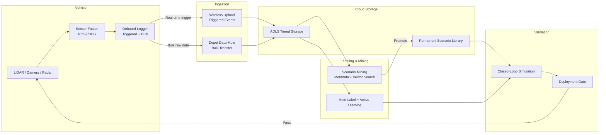
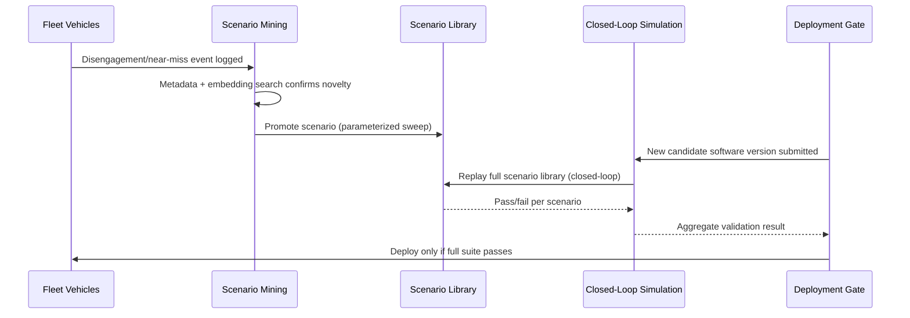
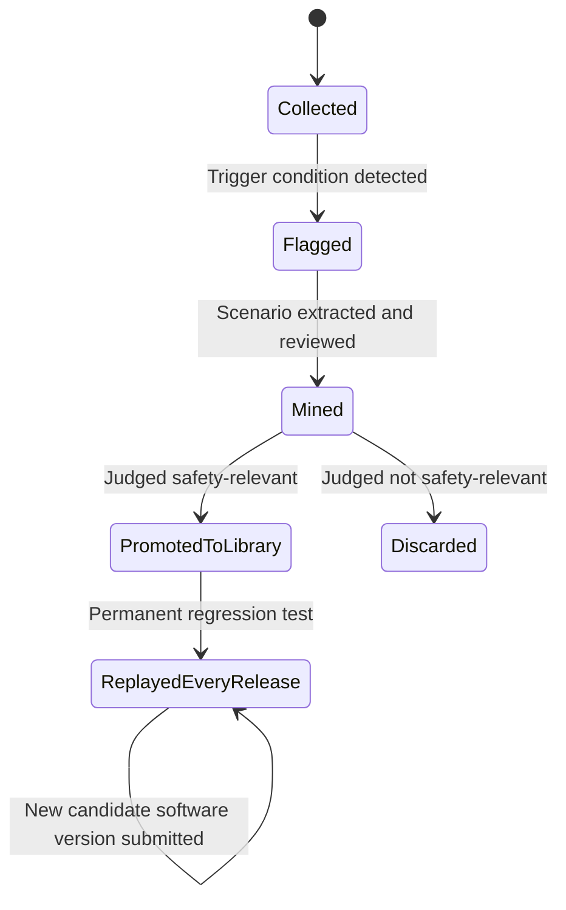

# Autonomous Vehicles Data

> Part of the **Enterprise Data & AI Architecture Handbook** · Phase-16 — Domain-Specific & Frontier Data Platforms · Chapter 04.
> Estimated study time: **60 min reading + ~4h labs**.
> **Prerequisites:** read [Robotics and ROS2](03_Robotics_and_ROS2.md) first.

---

## Executive Summary

[Robotics and ROS2](03_Robotics_and_ROS2.md) established sensor fusion, simulation, and fleet-MLOps at the scale of a warehouse or delivery-robot fleet — meaningful data volumes, real but bounded safety consequences, and operating speeds measured in walking pace. Autonomous vehicles (AVs) take every one of those dimensions to its most extreme point in this handbook: vehicles operating at highway speed in dense, unpredictable human traffic, sensor suites producing single-digit terabytes of raw data *per vehicle per day*, and a validation bar where a software defect's worst-case consequence is a fatality, not a halted production line or a damaged package. This chapter is the fourth in Phase-16 (Domain-Specific & Frontier Data Platforms) and covers the data architecture that makes AV development possible at all: the multi-modal sensor suites that give a vehicle redundant, complementary perception of its environment, the ingestion and labeling pipelines that turn petabytes of raw sensor data into usable training signal, the scenario-mining and replay discipline that finds the rare, safety-relevant events buried in that data, the simulation and validation methodology that proves a software change is safe before it ever reaches a public road, and the storage economics that make operating at this scale financially sustainable.

This chapter covers **LiDAR, camera, and radar sensor suites** as complementary, redundant perception modalities, each with a distinct and well-understood failure mode the others compensate for; **data ingestion and labeling at scale** as the pipeline that turns raw sensor logs into a usable, quality-controlled training corpus via a combination of automated pre-labeling and human-in-the-loop review; **scenario mining and replay** as the discipline that extracts specific, safety-relevant driving scenarios (a cut-in, a disengagement, a near-miss) from petabytes of largely-uninteresting driving data, and replays them against a candidate software version to validate behavior; **simulation and validation** as the closed-loop testing methodology that must prove a software change's safety across millions of simulated miles and every mined real-world scenario before any fleet deployment; and **storage and cost at petabyte scale** as the tiered-retention and compression discipline that makes an AV data platform's economics sustainable rather than unbounded.

The platform bias is **Azure-primary (~60%)** — Azure Data Lake Storage and Azure Data Explorer for petabyte-scale sensor and telemetry storage, Azure Databricks for large-scale label-pipeline and scenario-mining compute, Azure Machine Learning for perception-model training, and Azure Batch/HPC for simulation-fleet compute — **~30% enterprise open source** (Apache Kafka and Delta Lake for ingestion and lakehouse storage, Apache Spark for distributed labeling/mining pipelines, a vector database — Qdrant or Milvus — for embedding-based scenario search, and Grafana/Prometheus for fleet observability) — **~10% AWS/GCP comparison-only** (AWS's own AV-adjacent data-lake and simulation tooling, and Google/Waymo's internally-built, largely proprietary simulation infrastructure as the industry's own reference point).

**Bottom line:** every architectural decision in this chapter is subordinate to one non-negotiable constraint that has no equivalent anywhere else in this handbook except the industrial-safety treatment in [Industrial IoT (IIoT)](02_Industrial_IoT_IIoT.md): **a software change to the driving stack must never reach a public road without first passing a validation regression suite built from real, mined safety-relevant scenarios, not simulation alone**. This chapter's central thesis, formalized in its ADR and grounded in the real, NTSB-documented 2018 Uber ATG fatal collision (§40), is that the sim-then-canary discipline [Robotics and ROS2](03_Robotics_and_ROS2.md) established generally is necessary but insufficient for AVs specifically — it must be extended with a systematically-maintained, continuously-growing library of mined real-world scenarios (particularly disengagements and near-misses) that every software change is replayed against before deployment.

---

## Learning Objectives

By the end of this chapter you will be able to:

1. **Explain the complementary failure modes of LiDAR, camera, and radar**, and design a sensor-suite architecture with appropriate redundancy for a given operating domain.
2. **Design a data ingestion and labeling pipeline** combining automated pre-labeling, active learning, and human-in-the-loop review at petabyte scale.
3. **Design a scenario-mining architecture** that extracts and indexes safety-relevant driving scenarios from raw fleet logs for later replay and validation.
4. **Design a closed-loop simulation and validation methodology** that a software change must pass before fleet deployment, incorporating both synthetic and mined real-world scenarios.
5. **Design a tiered storage and cost strategy** for petabyte-to-exabyte-scale AV sensor data, balancing retention requirements against storage economics.
6. **Evaluate an AV software-release process against automotive functional-safety standards** (ISO 26262, ISO/PAS 21448 SOTIF) and identify validation gaps.
7. **Defend an AV data platform's sensor, labeling, scenario-mining, and validation architecture** in engineer, staff engineer, architect, and CTO review settings.

---

## Business Motivation

- **Validation rigor, not perception-model accuracy alone, is the primary gating factor on AV deployment scale** — a company that cannot demonstrate, with mined real-world scenario coverage, that a software change is safe cannot expand its operating domain or vehicle count regardless of how accurate its perception models test in isolation, making this chapter's scenario-mining and replay architecture (§4.3) a direct business-scaling constraint, not merely an engineering nicety.
- **Sensor and compute cost scale directly with fleet size and data-retention policy**, and at the data volumes this domain produces (§3), an unmanaged storage and compute cost trajectory can become the dominant line item in an AV program's entire budget — the direct motivation for this chapter's Cost Optimization section (§20) and worked FinOps example.
- **The 2018 Uber ATG fatal collision in Tempe, Arizona** (§4, §40) remains the industry's defining, NTSB-documented case demonstrating that insufficient scenario-based validation of a driving-stack software decision can have fatal consequences — a board-level-visible, legally and reputationally consequential risk category no AV program can treat as hypothetical.
- **Labeling quality directly determines perception-model quality, and labeling at fleet scale cannot be done by human review alone** — an AV program's competitive position depends heavily on how efficiently it can combine automated pre-labeling, active learning, and targeted human review (§4.2) to produce a large, high-quality training corpus without an unsustainable human-labeling cost.
- **Regulatory and public trust are directly tied to demonstrable safety-validation rigor** — several jurisdictions have suspended or revoked AV operating permits following safety incidents (§39), making a rigorous, auditable validation architecture a licensing and continued-operation prerequisite, not merely an internal engineering best practice.

---

## History and Evolution

- **2004-2007 — the DARPA Grand Challenge and Urban Challenge** establish the foundational sensor-fusion and planning architecture (LiDAR-camera-radar fusion, real-time path planning) that modern AV stacks still build on, and produce the first generation of AV engineers who went on to found or lead most major current AV programs.
- **2009 — Google's self-driving car project (later Waymo) begins**, pioneering the large-scale, real-world-miles-plus-simulation validation methodology this chapter's Simulation and Validation section (§4.4) describes, and the scenario-library concept that became an industry standard practice.
- **2015-2016 — automotive radar and solid-state LiDAR mature into cost-effective, production-viable sensors**, moving AV sensor suites from expensive, spinning research-grade LiDAR toward the more diverse, cost-differentiated sensor options (§4.1) available today.
- **2016 — ISO 26262 (2nd edition) and the first drafts of what became ISO/PAS 21448 (SOTIF)** extend automotive functional-safety standardization specifically to address the AV-relevant question of a system correctly performing its intended function under real-world operational variation, not merely avoiding hardware/software faults — a critical, AV-specific safety dimension IEC 62443's industrial-focused treatment (per [Industrial IoT (IIoT)](02_Industrial_IoT_IIoT.md) §16) does not directly address.
- **2018 — the fatal collision involving an Uber Advanced Technologies Group (ATG) test vehicle and a pedestrian in Tempe, Arizona** (§39, §40) becomes the industry's defining safety case study, with the subsequent NTSB investigation publicly documenting the specific software-validation gap (an emergency-braking suppression logic path that had not been adequately tested against this scenario class) that contributed to the fatality — the direct motivation for this chapter's ADR-0184.
- **2019-2022 — the scenario-based testing taxonomy (concrete, logical, and abstract scenarios, per emerging standards work that became ISO 34502) formalizes** how the industry categorizes and systematically covers driving scenarios for validation, moving scenario testing from an ad hoc practice toward a structured, auditable discipline.
- **2020 — UL 4600, "Standard for Safety for the Evaluation of Autonomous Products,"** is published, providing a safety-case-based framework (an explicit, evidence-backed argument for why a system is acceptably safe) specifically designed for the AV domain, where traditional ISO 26262-style functional-safety-fault analysis alone does not fully address the "correct behavior under intended, non-faulty operation in an unpredictable environment" question SOTIF and this standard both target.
- **2023 — a widely-reported incident involving a Cruise AV in San Francisco** (a pedestrian struck by another vehicle and then dragged by the Cruise AV, which had not been designed to detect and respond to that specific post-collision scenario) leads to the California DMV suspending Cruise's operating permit — a second, more recent real-world demonstration that scenario-coverage gaps remain an active, evolving risk even years after the Uber ATG incident, reinforcing rather than replacing this chapter's core validation-rigor thesis.
- **2023-2026 — foundation-model-based, end-to-end learned driving-policy approaches (as opposed to purely modular perception-planning-control pipelines) begin entering production AV stacks**, adding new validation-methodology questions this chapter's scenario-mining and replay architecture (§4.3-§4.4) must extend to cover, since an end-to-end learned policy's failure modes are frequently less directly interpretable than a modular pipeline's.

---

## Why This Technology Exists

No other data platform in this handbook must simultaneously handle the data volume of a petabyte-scale sensor stream, the real-time constraints of a safety-critical control system (per [Industrial IoT (IIoT)](02_Industrial_IoT_IIoT.md) and [Robotics and ROS2](03_Robotics_and_ROS2.md)), and a validation bar where the cost of an undetected defect is measured in human lives rather than downtime or dollars. AV data platforms exist because none of the general-purpose architectures this handbook has built elsewhere — enterprise streaming, IoT fleet management, or even general robotics fleet-MLOps — were designed against that specific combination of constraints. This chapter's scenario-mining, replay, and closed-loop simulation architecture exists specifically to make an otherwise operationally impossible validation problem (proving software behaves safely across the near-infinite space of real-world driving scenarios) tractable, by systematically finding and replaying the specific scenarios that matter most, rather than relying on either exhaustive real-world testing (impractically slow and risky) or simulation alone (insufficient, per the sim-to-real gap already established in [Robotics and ROS2](03_Robotics_and_ROS2.md) §3.4).

---

## Problems It Solves

- **Redundant, complementary environmental perception under sensor-specific failure conditions**, resolved by a multi-modal LiDAR/camera/radar sensor suite (§4.1) where no single sensor's failure mode (radar's poor object classification, camera's poor low-light/glare performance, LiDAR's poor performance in heavy precipitation) is shared by the others.
- **Producing a large, high-quality training corpus from petabytes of largely-redundant raw driving data without unsustainable human-labeling cost**, resolved by automated pre-labeling combined with active-learning-prioritized human review (§4.2).
- **Finding the rare, safety-relevant scenarios that actually matter for validation, buried within petabytes of otherwise-uninteresting routine driving data**, resolved by scenario mining (§4.3) — metadata- and embedding-based search over fleet logs that surfaces cut-ins, disengagements, near-misses, and other tagged event classes.
- **Proving a software change's safety before it reaches a public road**, resolved by closed-loop simulation and replay against both synthetic scenario libraries and mined real-world scenarios (§4.4, ADR-0184).
- **Keeping petabyte-to-exabyte-scale sensor-data storage cost sustainable**, resolved by the tiered-retention, compression, and selective-full-fidelity-retention strategy in §4.5 and §20.

---

## Problems It Cannot Solve

- **This architecture does not eliminate the sim-to-real gap** — extending [Robotics and ROS2](03_Robotics_and_ROS2.md) §3.4's caution, even a mined-scenario-augmented simulation suite cannot capture every possible real-world variation; this is precisely why real-world validation miles, disengagement monitoring, and staged operational-domain expansion remain required alongside, not instead of, simulation.
- **It does not remove the fundamental sensor physics limitations of any individual sensor modality** — no amount of data-platform engineering makes camera perform well in complete darkness without supplemental illumination, or makes LiDAR perform well in heavy fog; sensor-suite redundancy (§4.1) mitigates but does not eliminate each modality's physical limitations.
- **It does not resolve the genuinely unbounded long-tail nature of real-world driving scenarios** — a scenario library, however large and well-curated, is necessarily a finite sample of an effectively infinite space of possible real-world situations; this chapter's validation methodology reduces, but by construction cannot eliminate, residual risk from scenarios not yet encountered or mined.
- **It does not substitute for a genuine, resourced safety culture and organizational accountability structure** — the NTSB's own findings on the 2018 Uber ATG incident (§40) explicitly cited organizational and safety-culture factors, not purely technical ones; a technically excellent scenario-mining and simulation architecture deployed within an organization that does not act on its own safety findings does not solve the underlying problem.
- **It does not remove the need for genuine automotive functional-safety and controls engineering expertise** — ISO 26262 and SOTIF compliance (§16, §23) require dedicated safety-engineering discipline this data platform delivers evidence and tooling to, but does not itself possess or replace.

---

## Core Concepts

### 4.1 Sensor suites: LiDAR, camera, radar

- **LiDAR (Light Detection and Ranging)** emits pulsed laser light and measures return time to construct a dense, precise 3D point cloud of the environment — its principal strength is accurate, direct distance measurement independent of ambient lighting; its principal weakness is degraded performance in heavy precipitation, fog, or airborne dust (light scattering), and a comparatively high cost per unit, though solid-state LiDAR (§4, History) has substantially closed this cost gap relative to earlier mechanically-spinning designs.
- **Cameras** provide dense, high-resolution, semantically-rich visual data — the primary modality for object classification (distinguishing a pedestrian from a cyclist from a traffic sign) and for reading traffic-control information (signs, signals, lane markings) that neither LiDAR nor radar can directly perceive; their principal weakness is sensitivity to lighting extremes (direct sun glare, complete darkness without active illumination) and the absence of direct, active distance measurement (depth must be inferred, typically via stereo pairs or learned monocular-depth estimation, both less directly reliable than LiDAR's or radar's active ranging).
- **Radar** emits radio-frequency waves and measures both distance and, critically, **relative velocity directly via the Doppler effect** — its principal strength is genuinely all-weather robustness (largely unaffected by rain, fog, or darkness) and direct velocity measurement without requiring frame-to-frame tracking; its principal weakness is comparatively low angular resolution, making fine-grained object shape and classification difficult without fusion against camera or LiDAR data.
- **Sensor-suite design is fundamentally a complementary-redundancy exercise, not a single-best-sensor selection**: the table below (§24) makes explicit which modality compensates for which other modality's known weakness — the central engineering argument for why virtually every production AV sensor suite uses all three modalities together (fused via the same sensor-fusion pipeline architecture already established in [Robotics and ROS2](03_Robotics_and_ROS2.md) §3.3, now at higher sensor count, higher data rate, and higher safety stakes) rather than betting the entire perception stack on any one modality, including camera-primary approaches that rely heavily on learned depth estimation as a substitute for LiDAR's direct ranging.
- **The 2018 Uber ATG incident (§39, §40) is a direct, cautionary illustration of sensor-suite and software-integration failure, not a sensor-hardware failure** — the vehicle's LiDAR and radar had, per the NTSB's public findings, detected the pedestrian with sufficient lead time; the failure was in the software's object-classification consistency and the emergency-braking suppression logic built on top of that classification, not in any individual sensor's raw detection capability — reinforcing this chapter's central thesis that validation of the *software* built on top of a capable sensor suite is the harder, more consequential problem.

### 4.2 Data ingestion and labeling at scale

- **A single AV can produce single-digit terabytes of raw sensor data per day of operation**, and a fleet of even a few hundred vehicles operating continuously produces a data volume that makes exhaustive human labeling of every frame both financially and operationally infeasible — the foundational scale constraint every technique in this section exists to address.
- **Automated pre-labeling** uses an existing, previously-trained perception model to generate an initial label for every frame (a bounding box and class for every detected object), which is materially cheaper than starting from a fully blank frame, even though the pre-labeling model's own errors must still be caught and corrected downstream.
- **Active learning** prioritizes which frames actually receive human review, based on model uncertainty or disagreement between an ensemble of models — a frame where the pre-labeling model is highly confident and likely correct contributes comparatively little additional training value from human review, while a frame where the model is uncertain, or where multiple models disagree, is disproportionately likely to contain a genuinely informative edge case, making it the far higher-value use of scarce human-labeling capacity.
- **Human-in-the-loop review remains mandatory for the frames active learning prioritizes**, and the resulting human-corrected labels themselves become new training data for the next iteration of the pre-labeling model — a continuously-improving loop directly analogous to the fleet-MLOps retraining loop already established in [Robotics and ROS2](03_Robotics_and_ROS2.md) §3.5, now applied to labeling-model quality specifically rather than only perception/control-model quality.
- **Labeling quality is a governed, auditable data-quality concern, not merely a throughput metric** — an auto-labeling pipeline with an undetected systematic bias (consistently mis-classifying a specific object class under a specific condition, per this chapter's Case Study 2, §40) silently degrades every downstream model trained on its output, making periodic, statistically-sound labeling-quality audits (§21-§22) a mandatory, not optional, part of this pipeline.

### 4.3 Scenario mining and replay

- **Scenario mining is the process of searching petabytes of largely-routine fleet driving logs to find and extract the specific, comparatively rare scenarios that matter most for safety validation**: disengagements (a human safety driver or an automated system handing control back due to detected uncertainty), near-misses, unusual object encounters, or any event a fleet-monitoring system flags as noteworthy.
- **Metadata-based mining** relies on structured tags already attached at logging time (a disengagement event, a hard-braking event, a specific geofenced intersection) and is fast and precise for known, already-anticipated event categories, but cannot surface scenarios nobody thought to tag in advance.
- **Embedding-based semantic mining** extends metadata-based mining to genuinely novel or hard-to-pre-specify scenarios: encoding a time window of sensor and perception-state data into a vector embedding (using the same embedding techniques already established in [Embeddings and Semantic Search](../Phase-13/03_Embeddings_and_Semantic_Search.md)) and indexing it in a vector database (per [Vector Databases: Qdrant and Milvus](../Phase-13/01_Vector_Databases_Qdrant_and_Milvus.md)) lets an engineer search for "scenarios similar to this specific known-difficult one" even when no metadata tag anticipated the exact search criteria — directly extending this handbook's vector-search infrastructure to a fleet-log-mining use case rather than a document-retrieval one.
- **Replay re-runs a mined scenario's recorded sensor data through a candidate software version**, in either **open-loop** mode (feeding recorded sensor data through the perception/planning stack and comparing its output against the recorded ground-truth outcome, without the replayed decisions actually affecting anything) or **closed-loop** mode (feeding the candidate software's decisions back into a simulated vehicle-and-environment model that reacts dynamically, letting the replay diverge from the original recorded outcome based on the candidate software's different decisions) — closed-loop replay is the higher-fidelity, higher-cost validation mode, and the one this chapter's ADR-0184 specifically requires for safety-relevant scenario classes.
- **A continuously-growing scenario library, fed by every newly-mined disengagement or near-miss, is this chapter's core defense against the residual-risk limitation named in Problems It Cannot Solve** — a scenario encountered once in the real world and successfully mined becomes a permanent, automatically-replayed regression test for every future software change, directly mirroring the "convert every red-team finding into a permanent regression test" discipline already established in [Evaluation and Guardrails](../Phase-12/09_Evaluation_and_Guardrails.md) §9.5, now applied to driving scenarios rather than LLM security findings.

### 4.4 Simulation and validation

- **Closed-loop simulation** (extending [Robotics and ROS2](03_Robotics_and_ROS2.md) §3.4's simulation architecture with sensor-realistic rendering and dynamic-agent behavior models for other vehicles, pedestrians, and cyclists) lets a candidate software version be evaluated across millions of simulated miles, at a speed, cost, and safety profile no real-world testing program could match.
- **The scenario taxonomy** commonly distinguishes **concrete scenarios** (a fully-specified, single instance — this exact intersection, this exact pedestrian trajectory, at this exact speed), **logical scenarios** (a parameterized family — any pedestrian crossing this intersection within some speed and timing range), and **abstract scenarios** (a high-level category — "unprotected left turn with oncoming traffic") — a mature validation program tests systematically across all three levels, using logical-scenario parameter sweeps to generate broad coverage from each concrete, mined real-world scenario (§4.3) rather than testing only the single exact recorded instance.
- **Validation must combine mined real-world scenarios, systematically-parameterized logical-scenario sweeps, and broad synthetic/randomized coverage** (extending [Robotics and ROS2](03_Robotics_and_ROS2.md) §3.4's domain-randomization technique) — relying on any one category alone leaves a specific, exploitable gap: mined scenarios alone only cover what has already been encountered; synthetic coverage alone risks the sim-to-real-gap limitation named in Problems It Cannot Solve.
- **A software change's validation gate should require passing the full, continuously-growing scenario-replay regression suite (§4.3) before any fleet deployment, at any scale** — this chapter's ADR-0184, directly motivated by the 2018 Uber ATG incident (§40), in which the specific emergency-braking suppression behavior had not been adequately validated against this scenario class before deployment.
- **Real-world validation miles remain a necessary complement, not a redundant afterthought, to simulation** — a staged, monitored operational-domain expansion (a direct extension of the sim-then-canary-then-fleet-wide pattern from [Robotics and ROS2](03_Robotics_and_ROS2.md) §26) is still required after simulation passes, since simulation's own fidelity limitations mean it cannot, by itself, provide complete assurance.

### 4.5 Storage and cost at petabyte scale

- **Raw sensor-data volume at fleet scale routinely reaches petabytes per month and, for larger fleets, exabytes over a program's lifetime**, an order of magnitude or more beyond the volumes [IoT Data Platforms](01_IoT_Data_Platforms.md) and [Robotics and ROS2](03_Robotics_and_ROS2.md) addressed, making this chapter's storage-tiering discipline (§13, §20) the single highest-leverage cost decision in the entire AV data platform.
- **Not every raw frame needs full-fidelity, indefinite retention** — a tiered strategy retaining full-fidelity raw sensor data only for a bounded recent window (supporting near-term debugging and scenario mining) and for scenarios explicitly promoted into the permanent scenario library (§4.3), while routine, non-flagged historical data is either aggressively compressed, downsampled to a lower-fidelity summary, or (after a defined retention period) deleted entirely, is the standard, sustainable pattern.
- **Physical, non-network data transfer ("data mules") is a real, common ingestion pattern at this scale** — the bandwidth required to upload petabytes per day per fleet over cellular or even fixed connectivity is frequently impractical, and many AV programs physically transport removable storage from vehicles (at a depot, during routine charging/maintenance) to a wired, high-bandwidth ingestion point rather than relying on wireless upload for bulk raw-data transfer, reserving wireless connectivity for smaller, higher-priority data (flagged scenarios, fleet health telemetry) that genuinely benefits from real-time upload.
- **Cost-per-mile-of-data (or cost-per-vehicle-day) is the standard AV-specific FinOps unit metric**, letting a program compare its actual storage-and-compute cost trajectory against its validation-miles-driven business value, the same unit-economics discipline this handbook has applied elsewhere (per [Data Products](../Phase-15/02_Data_Products.md) §20's cost-per-consumption-event), now specific to this domain's dominant cost driver.

---

## Internal Working

### 5.1 How raw sensor data actually gets from vehicle to cloud at petabyte scale

1. Onboard data loggers continuously record raw sensor streams (LiDAR point clouds, camera frames, radar returns) and internal perception/planning state to onboard storage, following the same `rosbag2`-style recording architecture already established in [Robotics and ROS2](03_Robotics_and_ROS2.md) §3.5, now at substantially higher data rate.
2. A fleet-monitoring layer applies real-time trigger detection (disengagements, hard-braking events, low-confidence perception flags) and immediately, wirelessly uploads only the bounded time window around each triggered event — mirroring [Robotics and ROS2](03_Robotics_and_ROS2.md) §3.5's triggered-logging pattern, now the dominant, not merely dominant, ingestion path for anything time-sensitive.
3. Bulk raw sensor data not associated with a real-time trigger is retained on removable onboard storage and physically transported ("data-mule" transfer, §4.5) to a wired ingestion point at a depot, avoiding the wireless-bandwidth cost and infeasibility of uploading the full raw volume continuously.
4. At the ingestion point, raw data is validated (checksummed, checked for corruption or gaps), landed into the cold/bulk tier of the storage architecture (Delta Lake on ADLS, §13), and its associated metadata (vehicle ID, time range, software version, geofence/location) is indexed for later scenario mining (§4.3).

### 5.2 How scenario mining actually finds a rare event in petabytes of logs

1. A scenario-mining query begins with either a metadata filter (e.g., "all disengagements in the last 30 days within this geofence") or an embedding-based semantic query (e.g., "scenarios similar to this specific known-difficult unprotected-left-turn encounter").
2. For a metadata query, the indexed event tags (attached at logging time or during ingestion validation, §5.1) are queried directly against a structured index (an Azure Data Explorer table, per the pattern already established in [IoT Data Platforms](01_IoT_Data_Platforms.md) §1.4), returning matching time-window references immediately.
3. For an embedding-based query, the query time window's sensor/perception-state data is first encoded into a vector embedding (using the same encoding models already established in [Embeddings and Semantic Search](../Phase-13/03_Embeddings_and_Semantic_Search.md)), then compared against a vector database (per [Vector Databases: Qdrant and Milvus](../Phase-13/01_Vector_Databases_Qdrant_and_Milvus.md)) indexing every previously-encoded fleet-log time window, returning the nearest matches by similarity.
4. Each returned match's specific raw-data time window is retrieved from the cold-storage tier (potentially requiring rehydration from a deep-archive tier if the match is old enough, per §13) and staged for scenario extraction, review, and — where the mined scenario is judged safety-relevant — promotion into the permanent, continuously-replayed scenario library (§4.3).

### 5.3 How closed-loop simulation replay actually validates a software update

1. A candidate software version (a new perception model, or a planning/control logic change) is deployed into a closed-loop simulation environment alongside the full current scenario library (mined real-world scenarios plus systematically-parameterized logical-scenario sweeps, §4.4).
2. For each scenario, the simulation environment generates sensor-realistic synthetic input (or replays the mined scenario's recorded sensor data where available) and feeds it to the candidate software's perception and planning stack exactly as it would receive it in the real vehicle.
3. The candidate software's resulting driving decisions are fed back into the simulated vehicle-and-environment dynamics model, which reacts accordingly — allowing the simulated outcome to diverge from history if the candidate software's decisions differ from what was originally recorded, the defining property of closed-loop (as opposed to open-loop) replay.
4. Each scenario's outcome is scored against defined safety and behavioral criteria (collision avoidance, appropriate following distance, correct traffic-rule compliance), and the candidate software version is blocked from any fleet deployment — per ADR-0184 — unless it passes the full regression suite; any newly-discovered failure is itself promoted into the permanent scenario library, closing the loop from a discovered gap to a permanent regression test exactly as [Evaluation and Guardrails](../Phase-12/09_Evaluation_and_Guardrails.md) §9.5 established for red-team findings generally.

---

## Architecture

A reference AV data-platform architecture, from vehicle to validated software release:

1. **Vehicle tier**: LiDAR/camera/radar sensor suite (§4.1) and onboard sensor-fusion, perception, planning, and control stack, running on the ROS2/DDS architecture established in [Robotics and ROS2](03_Robotics_and_ROS2.md).
2. **Onboard logging tier**: continuous raw-data recording, real-time trigger detection for immediate wireless upload, and bulk removable storage for depot-based data-mule transfer (§5.1).
3. **Ingestion tier**: depot wired ingestion and validation, landing raw data into tiered cloud storage and indexing metadata for scenario mining.
4. **Labeling tier**: automated pre-labeling, active-learning-prioritized human review, and continuous label-quality auditing (§4.2).
5. **Scenario-mining tier**: metadata- and embedding-based search over indexed fleet logs (§4.3, §5.2), promoting mined scenarios into the permanent scenario library.
6. **Simulation and validation tier**: closed-loop simulation against the full scenario library (§4.4, §5.3), gating every candidate software version before deployment.
7. **Fleet-deployment tier**: staged, monitored operational-domain expansion (extending [Robotics and ROS2](03_Robotics_and_ROS2.md)'s sim-then-canary-then-fleet-wide pattern) following successful validation.

---

## Components

- **LiDAR, camera, and radar sensors and their driver stack**: the multi-modal perception hardware layer.
- **Onboard data logger**: continuous, triggered, and removable-storage-based raw-data capture, extending `rosbag2` (per [Robotics and ROS2](03_Robotics_and_ROS2.md)).
- **Azure Data Lake Storage (ADLS) with tiered lifecycle policies**: petabyte-scale raw and processed sensor-data storage.
- **Azure Data Explorer (ADX)**: metadata indexing and structured scenario-mining queries.
- **Vector database (Qdrant/Milvus, or Azure AI Search's vector store)**: embedding-based semantic scenario mining.
- **Azure Databricks / Apache Spark**: distributed labeling-pipeline and scenario-extraction compute at petabyte scale.
- **Azure Machine Learning**: perception-model training and the active-learning-prioritized labeling loop.
- **Simulation infrastructure** (a closed-loop simulator, extending Gazebo Sim/Isaac Sim from [Robotics and ROS2](03_Robotics_and_ROS2.md) with sensor-realistic rendering and traffic-agent behavior models): the validation-gate compute layer.

---

## Metadata

- **Per-frame and per-scenario labeling metadata** (object classes, bounding boxes, provenance — auto-labeled versus human-reviewed, and which model/reviewer version produced it) is essential both for training-data quality auditing and for the labeling-quality audits named in §4.2.
- **Scenario-classification metadata** (concrete/logical/abstract category, per §4.4; safety-relevance tag; source — mined-real-world versus synthetic) governs how a given scenario is used in the validation regression suite and how systematically its logical-scenario parameter space has been swept.
- **Software-version-to-validation-run linkage** must be recorded as governed, auditable metadata — for any deployed software version, it must be possible to produce the complete record of exactly which scenario-library version it was validated against and the resulting pass/fail outcome, the auditable evidence base ADR-0184's mandatory gate depends on.
- **Vehicle and sensor calibration metadata** (per-vehicle sensor mounting/calibration parameters, firmware versions) must be tracked per vehicle, since a sensor-fusion computation (per [Robotics and ROS2](03_Robotics_and_ROS2.md) §3.3) depends on accurate calibration metadata to produce a correct fused result.

---

## Storage

- **Vehicle-local storage**: bounded, high-throughput removable storage for the data-mule transfer pattern (§4.5, §5.1), sized against realistic depot-visit frequency.
- **Cloud hot/warm tier (Azure Data Explorer)**: structured telemetry, fleet health signals, and scenario-mining metadata indexes, following the same tiered-downsampling architecture already established in [IoT Data Platforms](01_IoT_Data_Platforms.md) §1.4.
- **Cloud bulk/cold tier (Delta Lake on ADLS, with deep-archive lifecycle policies)**: the majority of raw sensor data, following a defined retention window before either compression/downsampling or deletion, per §4.5's tiering strategy.
- **Permanent scenario-library tier**: full-fidelity retention for every promoted safety-relevant scenario, indefinitely, since these specific, comparatively small time windows are this chapter's highest-value data and are replayed repeatedly against every future software validation run.
- **Vector index storage**: the embedding index supporting semantic scenario mining (§4.3, §5.2), which must itself scale alongside the fleet's growing raw-data volume, following the same scaling considerations already established in [Vector Databases: Qdrant and Milvus](../Phase-13/01_Vector_Databases_Qdrant_and_Milvus.md).

---

## Compute

- **Onboard compute**: the vehicle's real-time perception, planning, and control compute, inheriting every real-time and safety-independence constraint already established in [Robotics and ROS2](03_Robotics_and_ROS2.md) §14.
- **Labeling-pipeline compute**: distributed Spark/Databricks compute for automated pre-labeling and active-learning scoring at fleet scale.
- **Scenario-mining compute**: ADX query compute for metadata-based mining, and vector-database query compute for embedding-based semantic mining.
- **Simulation compute**: GPU-heavy compute for sensor-realistic rendering and closed-loop dynamics simulation across the full scenario library for every candidate software validation run — frequently the single largest compute-cost line item in the entire program (§20), extending the same cost pattern already flagged in [Robotics and ROS2](03_Robotics_and_ROS2.md) §20.
- **Perception-model training compute**: Azure Machine Learning GPU clusters, following the same MLOps lifecycle established in [MLOps and MLflow](../Phase-11/03_MLOps_and_MLflow.md).

---

## Networking

- **Wireless fleet connectivity** is reserved for time-sensitive, comparatively low-volume data (triggered event uploads, fleet health telemetry, software updates) — reusing the device-initiated, TLS-secured connectivity pattern already established in [IoT Data Platforms](01_IoT_Data_Platforms.md) §15, not the primary channel for bulk raw sensor-data transfer.
- **Depot wired ingestion networking** must be provisioned for high-throughput, high-volume data-mule offload (§4.5, §5.1), a genuinely different networking requirement (high burst bandwidth at a physical location) than either typical enterprise IoT or industrial OT networking patterns.
- **Simulation-cluster networking** must support high-throughput data movement between the scenario-library storage tier and the GPU simulation compute fleet, since a large-scale validation run reads the full scenario library repeatedly.

---

## Security

- **Sensor and perception data frequently captures identifiable people, license plates, and private property**, requiring the same personal-data governance and access-control discipline established in [Data Privacy and PII Protection](../Phase-10/07_Data_Privacy_and_PII_Protection.md), applied at a data volume and retention duration that makes manual, per-record review infeasible — automated detection and redaction/blurring of identifiable elements in non-safety-relevant retained data is a common, necessary mitigation.
- **Onboard vehicle compute and connectivity inherits every device-identity and network-security requirement already established in [IoT Data Platforms](01_IoT_Data_Platforms.md) §1.5 and [Robotics and ROS2](03_Robotics_and_ROS2.md) §16** — per-vehicle X.509 identity via DPS, and SROS2/DDS-Security for the onboard ROS2/DDS communication layer, both apply directly and without exception.
- **Software-update delivery to the fleet must be signed and verified**, extending the firmware-integrity discipline already established in [Industrial IoT (IIoT)](02_Industrial_IoT_IIoT.md) §16 — an unsigned or unverified software-update mechanism reaching a vehicle's driving stack is among the highest-consequence attack surfaces in this entire handbook.
- **Access to the permanent scenario library and validation-run records must be tightly governed and auditable** (§12, §23) — this data is both the program's most safety-critical evidence base and a sensitive record of the program's own historical failure modes, warranting access controls at least as strict as any other safety-critical artifact in this handbook.

---

## Performance

- **Onboard perception and planning latency budgets are the tightest real-time constraint in this handbook** — a highway-speed vehicle's obstacle-detection-to-braking-decision latency budget is measured in tens of milliseconds, tighter than any other chapter's real-time requirement, making the DDS QoS deadline/liveliness discipline from [Robotics and ROS2](03_Robotics_and_ROS2.md) §3.2 especially load-bearing here.
- **Scenario-mining query performance** (both metadata-based and embedding-based, §5.2) directly determines how quickly a newly-discovered real-world edge case can be promoted into the validation regression suite — a slow mining pipeline delays exactly the feedback loop this chapter's safety architecture depends on operating quickly.
- **Simulation throughput** (scenarios validated per unit of GPU-compute-time) is the primary lever determining how quickly a candidate software version can complete the full validation gate — a validation suite that takes days to run for every candidate change creates real pressure to skip or shortcut it, making simulation-throughput engineering a safety-relevant performance concern, not merely a cost or convenience one.

---

## Scalability

- **Fleet-size scaling multiplies raw-data volume roughly linearly, but scenario-library growth (and therefore validation-suite runtime) grows with genuine driving-scenario diversity encountered, not fleet size alone** — a larger fleet operating in a narrow, well-understood geofence may mine relatively few genuinely new scenarios per vehicle-mile, while a smaller fleet expanding into new operational domains (new cities, new weather conditions) can mine disproportionately many new scenarios relative to its size.
- **Labeling-pipeline throughput scales via active-learning-driven human-review prioritization** (§4.2), not merely via adding more distributed compute — the genuine scaling bottleneck is human-review capacity, and active learning is specifically the mechanism that lets a fixed human-review budget scale to cover a growing raw-data volume.
- **Simulation-cluster scaling** (adding GPU compute) scales validation throughput roughly linearly, making it the most straightforwardly horizontally-scalable tier in this architecture, similar to the simulation-scaling characteristic already noted in [Robotics and ROS2](03_Robotics_and_ROS2.md) §18.

---

## Fault Tolerance

- **A vehicle's real-time safety-critical control loop must remain correct and independent of the data-logging, labeling, or scenario-mining pipeline's health** (§7, §10) — the same non-negotiable independence principle established in [Industrial IoT (IIoT)](02_Industrial_IoT_IIoT.md) §19 and [Robotics and ROS2](03_Robotics_and_ROS2.md) §19, at this chapter's higher stakes.
- **Onboard storage-capacity exhaustion during an extended depot-transfer delay** must be handled gracefully — a logger that silently drops or overwrites unflushed data when local storage fills is losing exactly the data this chapter's entire scenario-mining architecture depends on capturing; a well-designed logger prioritizes retaining triggered/flagged event data over routine, lower-priority data if storage pressure forces a choice.
- **Simulation-cluster or scenario-mining-pipeline outages must fail closed with respect to the deployment gate** — if the validation infrastructure itself is unavailable, no candidate software version should be able to bypass the gate and deploy anyway; an "allow deployment if validation infrastructure is unreachable" fallback would directly undermine ADR-0184's entire purpose.

---

## Cost Optimization (FinOps)

- **The tiered raw-data retention and data-mule transfer strategy (§4.5) is the single highest-leverage AV data cost lever**, for the same reason established in [IoT Data Platforms](01_IoT_Data_Platforms.md) §20 and [Robotics and ROS2](03_Robotics_and_ROS2.md) §20, now amplified to petabyte scale.
- **Simulation compute cost should be tracked per validated scenario and per software-release cycle**, not merely as an aggregate GPU-hours bill, letting the program identify whether growing simulation cost is driven by genuine, justified scenario-library growth or by an inefficient, unoptimized simulation pipeline.
- **Active-learning-driven labeling prioritization directly reduces human-labeling cost** relative to either exhaustive human review or an under-invested labeling program that risks the label-quality gap named in Case Study 2 (§40).
- **Worked FinOps example**: an AV fleet of 200 vehicles, each producing roughly 4 TB of raw sensor data per operating day, generates on the order of 800 TB/day, or roughly 24 PB/month, at the raw-data level — a volume that would be prohibitively expensive to retain indefinitely at full fidelity in any cloud storage tier. Applying this chapter's tiered strategy — real-time wireless upload only for triggered events (a small fraction of total volume), depot-based data-mule transfer for bulk raw data, a 90-day full-fidelity retention window in the bulk/cold tier before aggressive downsampling or deletion of non-flagged data, and indefinite full-fidelity retention only for the comparatively small (typically well under 1% of total volume) set of scenarios promoted into the permanent scenario library — reduces the platform's steady-state storage footprint by roughly two orders of magnitude relative to naive indefinite full-fidelity retention of everything, while preserving exactly the safety-relevant data this chapter's validation architecture actually depends on. The concrete lesson for a CTO-level cost review, directly extending the pattern already established in [IoT Data Platforms](01_IoT_Data_Platforms.md) §20 and [Robotics and ROS2](03_Robotics_and_ROS2.md) §20: at this data platform's scale, the retention-tiering decision is not merely the highest-leverage cost lever — it is the difference between a financially sustainable program and one whose data-storage cost alone could exceed its entire remaining budget within a matter of months.

---

## Monitoring

- **Fleet-wide disengagement and near-miss rate**, tracked continuously as the primary leading indicator of both safety-validation-suite completeness gaps and genuine software-quality regressions.
- **Labeling-pipeline auto-label accuracy versus human-review correction rate**, monitored per object class and per condition (lighting, weather), the direct operational signal behind the labeling-quality audit discipline named in §4.2.
- **Scenario-mining pipeline latency** (time from a real-world event occurring to that event being available for replay/promotion consideration), a direct measure of how quickly this chapter's core safety feedback loop actually operates.
- **Validation-suite pass/fail history per software version**, providing the auditable record ADR-0184's mandatory gate depends on being complete and tamper-evident.

---

## Observability

- **End-to-end traceability from a real-world mined scenario through its promotion into the permanent library, through every subsequent software version's validation run against it**, should be fully reconstructable — an auditor or safety engineer must be able to answer "which software versions have been validated against this specific known scenario, and did any fail" without ambiguity.
- **Simulation-fidelity monitoring**: periodically comparing simulated-scenario outcomes against the corresponding real-world outcome (where a mined scenario's real recorded outcome is known) provides an ongoing measure of how well the simulation environment's fidelity is tracking reality, a direct, continuously-updated signal on the sim-to-real gap named in §7.

### Operational Response Playbook

| Signal | Detection Query / Check | Remediation |
|---|---|---|
| Fleet-wide disengagement or near-miss rate rises sharply following a recent software deployment | Continuous per-version disengagement-rate monitoring, alerting on a statistically significant increase correlated with a specific software-version rollout | Immediately halt further rollout of the implicated version pending investigation; mine the specific disengagement events for common scenario characteristics and promote any newly-identified gap into the permanent scenario library before any remediated version is considered for redeployment |
| Auto-labeling accuracy for a specific object class or condition (e.g., low-light pedestrian detection) declines in routine quality audits | Scheduled statistical audit comparing auto-label output against a held-out, independently-verified human-labeled sample, segmented by object class and condition | Treat as a labeling-pipeline defect requiring retraining of the pre-labeling model on the specific weak condition, per the fleet-MLOps retraining loop (§4.2); do not resume unaudited full-scale reliance on the affected label category until a remediation audit confirms recovery |

---

## Governance

- **Every software-version deployment decision must be traceable to a complete, auditable validation-run record** (§12, §22) — this is both an internal engineering-governance requirement and, in most operating jurisdictions, an increasingly explicit regulatory expectation following incidents like the ones named in History (§4) and Case Studies (§40).
- **Scenario-library curation and promotion decisions should go through a defined, accountable review process**, not be left to individual engineer discretion — a scenario judged "probably not safety-relevant" and never promoted, if that judgment later proves wrong, is a governance failure with the same severity profile as the labeling-quality gap in Case Study 2.
- **Personal-data governance for sensor data capturing identifiable people** (§16) must be applied consistently across the full retention pipeline, including the permanent scenario-library tier, which by its nature retains data indefinitely and therefore requires an especially deliberate privacy-versus-safety-value trade-off review.
- **Regulatory and permit-compliance reporting** (operating-domain limits, incident-reporting obligations) should be generated directly from this chapter's governed metadata and validation-run records, rather than reconstructed ad hoc after an incident — the 2023 Cruise permit suspension (§4, §39) is a direct, real-world illustration of the regulatory consequence of an undetected scenario-coverage gap becoming publicly visible only after an incident rather than through proactive, transparent reporting.

---

## Trade-offs

| Dimension | Camera-primary perception (minimal LiDAR reliance) | Full LiDAR/camera/radar fusion |
|---|---|---|
| Cost per vehicle | Lower (fewer/cheaper sensors) | Higher (full multi-modal sensor suite) |
| Low-light/adverse-weather robustness | Lower (camera's known weakness, partially mitigated by learned depth estimation) | Higher (radar and LiDAR compensate directly) |
| Direct distance/velocity measurement | Indirect (inferred depth, frame-to-frame velocity estimation) | Direct (LiDAR ranging, radar Doppler velocity) |
| Best fit | Cost-sensitive deployments in favorable, well-mapped operating domains | Safety-critical, all-weather, broad-operating-domain deployments |

| Dimension | Simulation-only validation | Mined-scenario-augmented validation (ADR-0184) |
|---|---|---|
| Coverage of known real-world edge cases | Limited to whatever engineers anticipated designing into synthetic scenarios | Directly incorporates actual encountered real-world scenarios |
| Residual sim-to-real gap risk | Higher | Lower, but not eliminated |
| Validation-suite maintenance cost | Lower (fixed, hand-authored scenario set) | Higher (continuously growing, requires scenario-mining infrastructure) |
| Recommended for | Never, as the sole validation gate for a safety-critical driving stack | The mandatory default (ADR-0184) |

---

## Decision Matrix

| Signal | Recommendation |
|---|---|
| Any change to the driving-stack software, at any scale of intended deployment | Require passing the full mined-scenario-augmented closed-loop validation suite before deployment (ADR-0184) — no exception for "minor" or "low-risk" changes without an explicit, documented risk assessment |
| A newly-mined real-world scenario is judged potentially safety-relevant | Promote it into the permanent scenario library and systematically sweep its logical-scenario parameter space, not just replay the single concrete instance |
| Raw sensor data is older than the defined full-fidelity retention window and was never flagged as safety-relevant | Downsample, compress, or delete per the tiered-retention policy (§4.5) rather than retaining indefinitely by default |
| Labeling-pipeline quality audits reveal a systematic weakness in a specific object class or condition | Prioritize retraining the pre-labeling model on that specific weakness via the active-learning loop before continuing to rely on unaudited auto-labels for that category |
| An operating-domain expansion (new city, new weather condition, new road type) is planned | Treat it as requiring dedicated new scenario-mining and validation-suite coverage for that specific domain, not an automatic extension of validation already performed for a different domain |

---

## Design Patterns

- **Sensor-modality-complementary-redundancy pattern**: designing the sensor suite so no single modality's known failure mode is shared by another (§4.1, §24) — the AV-specific instance of general fault-tolerance-through-redundancy design.
- **Active-learning-prioritized labeling pattern**: directing scarce human-review capacity toward the frames most likely to be informative, rather than uniform or purely-random sampling (§4.2).
- **Mined-scenario-as-permanent-regression-test pattern**: promoting every newly-discovered safety-relevant real-world scenario into a permanently-replayed validation-suite entry (§4.3-§4.4), directly extending the red-team-finding-to-regression-test pattern from [Evaluation and Guardrails](../Phase-12/09_Evaluation_and_Guardrails.md).
- **Tiered-retention-with-permanent-scenario-exception pattern**: aggressively tiering/deleting routine raw data while retaining flagged safety-relevant scenarios indefinitely (§4.5) — the AV-scale instance of the general downsampling/tiering pattern established in [IoT Data Platforms](01_IoT_Data_Platforms.md) §26.

---

## Anti-patterns

- **Deploying any driving-stack software change without passing the full mined-scenario validation suite, "because the change is small and low-risk"** — the direct anti-pattern this chapter's ADR-0184 and the 2018 Uber ATG case study (§40) exist to prevent; a change's apparent simplicity is not itself evidence of safety across the scenario space.
- **Relying on simulation alone, with no mined real-world scenario coverage, as the sole validation gate** — reintroduces exactly the sim-to-real-gap risk named in Problems It Cannot Solve and in [Robotics and ROS2](03_Robotics_and_ROS2.md) §3.4, at AV-scale consequences.
- **Retaining every byte of raw sensor data indefinitely at full fidelity "to be safe," with no tiered-retention policy** — the AV-scale instance of the storage-cost-explosion anti-pattern already flagged in [IoT Data Platforms](01_IoT_Data_Platforms.md) §27 and [Robotics and ROS2](03_Robotics_and_ROS2.md) §27, at a magnitude that can threaten an entire program's financial sustainability.
- **Treating auto-labeled data as ground truth with no ongoing human-review audit**, allowing a systematic labeling bias to silently propagate into every downstream perception model trained on it (§4.2, Case Study 2).

---

## Common Mistakes

- **Assuming a single sensor modality's strong performance in testing conditions generalizes to all real-world conditions** — a camera-heavy perception stack validated primarily in clear daylight conditions can silently underperform in exactly the low-light or adverse-weather conditions radar and LiDAR were included specifically to cover.
- **Under-resourcing scenario-mining pipeline latency**, allowing a real, newly-encountered safety-relevant scenario to sit unmined and unpromoted for an extended period, during which additional vehicles may encounter the same unaddressed gap.
- **Treating a passed simulation run as sufficient evidence for immediate full-fleet deployment**, skipping the staged, monitored real-world canary rollout this chapter's Design Patterns section (and [Robotics and ROS2](03_Robotics_and_ROS2.md) §26) both require.
- **Failing to distinguish concrete-scenario replay from systematic logical-scenario parameter sweeps**, mistakenly believing that successfully replaying one exact recorded instance of a scenario provides coverage across that scenario's full realistic parameter range (§4.4).

---

## Best Practices

- **Mandate the full mined-scenario-augmented closed-loop validation suite as a non-negotiable gate for every driving-stack software change, at every deployment scale, from the very first field pilot onward** (ADR-0184).
- **Design the tiered raw-data retention and data-mule transfer strategy before fleet-scale data collection begins**, validated against realistic depot-visit frequency and bandwidth constraints.
- **Invest in active-learning-driven labeling prioritization and recurring, statistically-sound label-quality audits from the program's earliest stages**, rather than treating labeling-pipeline quality as a concern to revisit only once a downstream model-quality problem surfaces.
- **Treat every newly-mined safety-relevant scenario as a mandatory, permanent addition to the validation-suite regression set**, closing the loop from discovery to permanent protection every time, without exception.
- **Report validation-suite coverage and pass/fail history transparently to regulators and internal safety-governance bodies**, rather than only after an incident forces disclosure — directly informed by the real-world regulatory consequence in the 2023 Cruise permit-suspension precedent (§4, §39).

---

## Enterprise Recommendations

- **Default to a full LiDAR/camera/radar sensor suite** for any safety-critical, broad-operating-domain AV deployment, reserving camera-primary architectures for narrowly-scoped, favorable-condition deployments with an explicit, documented risk assessment justifying the reduced sensor redundancy.
- **Budget simulation and scenario-mining infrastructure as a first-class, ongoing program cost**, not a one-time setup expense — this chapter's Cost Optimization section (§20) demonstrates it is frequently the single largest recurring compute-cost line item in the entire program.
- **Mandate ADR-0184's validation gate as an organizational, board-level-endorsed policy**, independent of individual project timelines — the 2018 Uber ATG NTSB findings explicitly cited organizational safety-culture factors, not purely technical ones, reinforcing that this policy's durability depends on genuine organizational commitment, not merely engineering-team discipline.
- **Never treat a regulatory operating permit as a one-time approval** — maintain the same continuously-updated validation-evidence and incident-reporting discipline this chapter establishes as an ongoing operating requirement, given the real precedent of permit suspension following a scenario-coverage gap becoming publicly visible (§4, §39).

---

## Azure Implementation

- **ADLS lifecycle-management policy (Bicep sketch)** implementing the tiered raw-data retention strategy from §4.5 — moving raw sensor data from the hot tier to cool, then archive, based on age, while excluding blobs tagged as permanent-scenario-library members from the lifecycle policy entirely:

```bicep
resource lifecyclePolicy 'Microsoft.Storage/storageAccounts/managementPolicies@2023-01-01' = {
  name: 'default'
  parent: storageAccount
  properties: {
    policy: {
      rules: [
        {
          name: 'RawSensorDataTiering'
          enabled: true
          type: 'Lifecycle'
          definition: {
            filters: {
              blobTypes: [ 'blockBlob' ]
              prefixMatch: [ 'raw-sensor-data/' ]
              blobIndexMatch: [
                { name: 'scenarioLibrary', op: '==', value: 'false' }
              ]
            }
            actions: {
              baseBlob: {
                tierToCool: { daysAfterModificationGreaterThan: 30 }
                tierToArchive: { daysAfterModificationGreaterThan: 90 }
                delete: { daysAfterModificationGreaterThan: 365 }
              }
            }
          }
        }
      ]
    }
  }
}
```

- **ADX ingestion and metadata indexing** for scenario mining reuses the identical update-policy and table-design pattern given in full in [IoT Data Platforms](01_IoT_Data_Platforms.md) §31, applied to a `ScenarioMetadata` table indexed by vehicle ID, geofence, event tag, and software version.
- **Azure Databricks pipeline** for distributed pre-labeling and active-learning scoring, writing labeled output to Delta Lake with full label-provenance metadata (§12).
- **Azure Machine Learning pipeline** for perception-model retraining and closed-loop validation-run orchestration, gating any promotion via the evaluation-gate pattern established in [MLOps and MLflow](../Phase-11/03_MLOps_and_MLflow.md) and [ML Pipeline Architecture](../Phase-11/06_ML_Pipeline_Architecture.md).

---

## Open Source Implementation

- **Apache Spark / Delta Lake**: the OSS distributed-compute and lakehouse-storage layer for petabyte-scale labeling and scenario-extraction pipelines.
- **Qdrant / Milvus**: OSS vector databases for embedding-based semantic scenario mining, per [Vector Databases: Qdrant and Milvus](../Phase-13/01_Vector_Databases_Qdrant_and_Milvus.md).
- **ROS2 `rosbag2`** (extended, per [Robotics and ROS2](03_Robotics_and_ROS2.md) §32): the onboard raw-data recording format this chapter's ingestion pipeline builds on.
- **CARLA and other open-source driving simulators**: OSS alternatives to proprietary AV-specific simulation platforms for closed-loop validation and synthetic-scenario generation, commonly used alongside Gazebo Sim/Isaac Sim (per [Robotics and ROS2](03_Robotics_and_ROS2.md) §32) depending on an organization's specific fidelity and tooling needs.
- **MLflow**: experiment tracking and model registry for the perception-model and labeling-model retraining loops.

---

## AWS Equivalent (comparison only)

| Azure | AWS | Notes |
|---|---|---|
| ADLS tiered storage | Amazon S3 with Intelligent-Tiering/Glacier | Comparable tiered-retention capability; migration effort concentrates in re-implementing lifecycle-policy logic and blob-index-based exclusion for the permanent scenario library. |
| Azure Databricks (labeling/mining pipelines) | Amazon EMR / Databricks on AWS | Databricks itself runs natively on AWS as well as Azure, making this one of the more directly portable components of this chapter's architecture. |
| Azure Machine Learning | Amazon SageMaker Ground Truth (labeling) + SageMaker (training) | SageMaker Ground Truth provides comparable managed active-learning-assisted labeling; migration effort concentrates in re-implementing the labeling-workflow orchestration and provenance-metadata capture. |

**Migration strategy**: the onboard vehicle software stack (ROS2/DDS-based, per [Robotics and ROS2](03_Robotics_and_ROS2.md)) is fully cloud-provider-portable; the primary migration effort is in the cloud-side storage-tiering, labeling-orchestration, and simulation-infrastructure integration, none of which is a drop-in swap given each provider's differing native tooling for exactly these AV-specific workflows.

---

## GCP Equivalent (comparison only)

Google Cloud does not offer a first-party, AV-industry-specific managed labeling or scenario-mining product comparable to this chapter's Azure-native architecture; Waymo (an Alphabet subsidiary) has instead built substantially bespoke, internal simulation and data infrastructure atop general-purpose GCP primitives (Cloud Storage tiering, BigQuery for metadata indexing, and Google's own internally-developed simulation platform) rather than relying on an off-the-shelf managed AV-data-platform product — a genuinely instructive real-world data point: even the industry's most mature, well-resourced AV program has found it necessary to build substantial custom infrastructure rather than assembling this chapter's architecture entirely from managed, off-the-shelf components. An organization already committed to GCP should plan for a comparable build effort rather than assuming an equivalent managed capability exists to adopt directly.

---

## Migration Considerations

- **Migrating from a camera-primary to a full multi-modal sensor suite**: requires re-architecting the onboard sensor-fusion pipeline (per [Robotics and ROS2](03_Robotics_and_ROS2.md) §3.3) to incorporate the new modalities' data, and re-running the full validation suite against the updated sensor configuration before any deployment, since a sensor-suite change is itself a driving-stack change subject to ADR-0184's gate.
- **Migrating scenario-mining infrastructure to incorporate embedding-based semantic search where only metadata-based mining previously existed**: can be introduced incrementally, running alongside the existing metadata-based pipeline, since the two approaches are complementary rather than mutually exclusive (§4.3).
- **Migrating between cloud providers' storage-tiering and labeling-pipeline tooling**: the underlying raw sensor data and scenario-library content is portable; the lifecycle-policy, labeling-orchestration, and simulation-integration glue requires substantial re-implementation regardless of migration direction, consistent with the general pattern already established in [IoT Data Platforms](01_IoT_Data_Platforms.md) §35 and [Robotics and ROS2](03_Robotics_and_ROS2.md) §35.

---

## Mermaid Architecture Diagrams







---

## End-to-End Data Flow

1. The vehicle's LiDAR, camera, and radar sensors stream raw data into the onboard sensor-fusion pipeline (per [Robotics and ROS2](03_Robotics_and_ROS2.md)), which produces a fused state estimate for planning and control.
2. The onboard logger continuously records raw and fused data; a real-time trigger-detection layer immediately uploads bounded windows around flagged events (disengagements, hard-braking, low-confidence perception) wirelessly, while bulk routine data is retained for depot-based transfer.
3. At ingestion, raw data lands in tiered ADLS storage, with metadata indexed in Azure Data Explorer and embeddings indexed in a vector database for later mining.
4. Automated pre-labeling and active-learning-prioritized human review produce a growing, quality-audited training corpus in Delta Lake.
5. Scenario mining continuously searches indexed fleet logs for safety-relevant events, promoting confirmed matches into the permanent scenario library.
6. Every candidate software version is validated via closed-loop simulation against the full scenario library before passing the deployment gate (ADR-0184), and any newly-discovered failure is itself mined back into the permanent library.
7. Deployment proceeds via a staged, monitored operational-domain expansion, with fleet-wide disengagement and near-miss monitoring feeding continuously back into scenario mining, closing the loop.

---

## Real-world Business Use Cases

- **Robotaxi and ride-hailing autonomous fleets**: the highest-profile, highest-stakes AV use case, operating in dense, unpredictable urban traffic with continuous public exposure, making this chapter's validation-rigor architecture especially load-bearing.
- **Autonomous long-haul trucking**: highway-primary operating domains with comparatively more predictable traffic patterns than urban robotaxi operation, but at higher vehicle mass and correspondingly higher collision-consequence severity, shifting the sensor-suite and validation emphasis toward highway-specific scenario coverage (high-speed merges, adverse-weather highway driving).
- **Automated last-mile delivery vehicles**: a lower-speed, often geofenced use case with a correspondingly narrower initial scenario-coverage requirement, frequently used as an earlier-stage operating-domain expansion step before broader deployment.
- **Advanced Driver Assistance Systems (ADAS) in consumer vehicles**: a partial-autonomy use case where this chapter's sensor-fusion and validation architecture applies directly, but with a human driver retaining ultimate control — a materially different, though related, risk and validation profile than full autonomy.

---

## Industry Examples

- **Waymo's (Alphabet) large-scale simulation and real-world-miles validation program** is the industry's most frequently cited reference implementation of the mined-scenario-and-simulation validation methodology this chapter describes, having publicly discussed running billions of simulated miles alongside millions of real-world validation miles.
- **The 2018 Uber Advanced Technologies Group (ATG) fatal collision in Tempe, Arizona**, investigated and publicly documented by the NTSB, remains the industry's defining case study for the consequences of insufficient scenario-based validation of driving-stack software (§40).
- **The 2023 Cruise incident in San Francisco and the subsequent California DMV permit suspension** is a more recent, publicly documented illustration that scenario-coverage gaps remain an active operational risk even for programs with substantial safety infrastructure already in place, and directly informs this chapter's governance and regulatory-reporting recommendations (§23, §29).
- **Tesla's camera-primary perception approach (relative to competitors' full LiDAR/camera/radar suites)** is a widely-discussed, real, industry-visible illustration of the sensor-suite trade-off named in §24 — a deliberate, publicly-defended architectural bet on learned depth estimation and camera redundancy over LiDAR's direct ranging, illustrating that this chapter's sensor-suite decision matrix is a genuine, actively-debated industry choice rather than a settled consensus.

---

## Case Studies

### Case Study 1 — The 2018 Uber ATG fatal collision and the validation gap it exposed

On March 18, 2018, an Uber ATG test vehicle operating in autonomous mode struck and fatally injured a pedestrian crossing a road in Tempe, Arizona. The subsequent NTSB investigation publicly documented that the vehicle's sensors (radar and LiDAR) had detected the pedestrian with approximately six seconds of lead time before impact, but the perception software repeatedly reclassified the detected object (alternating between "unknown object," "vehicle," and "bicycle" classifications) rather than converging on a stable "pedestrian" classification. Critically, the NTSB found that the software had been deliberately designed to suppress emergency braking for a short period following an object reclassification, specifically to reduce false-positive, uncomfortably abrupt braking events — a design decision that had not, per the NTSB's findings, been adequately validated against a systematically-mined scenario set covering exactly this kind of reclassification-driven suppression behavior. The vehicle's safety driver, who might otherwise have intervened, was not alerted by the system and did not brake in time. The NTSB's report cited both this specific software-validation gap and broader organizational safety-culture factors. This incident is the direct, real-world motivation for ADR-0184.

### Case Study 2 — An undetected auto-labeling bias silently degrading pedestrian detection

An AV program's automated pre-labeling pipeline, trained on a training corpus with limited representation of pedestrians in low-light, high-glare urban conditions, developed a systematic tendency to under-label pedestrians under exactly those specific conditions — human reviewers, following the active-learning prioritization scheme, were shown comparatively few frames from this specific condition, since the pre-labeling model reported high confidence (albeit incorrect) results for them, precisely the failure mode this chapter's §4.2 active-learning caution names: a confidently-wrong model is not flagged for review by a confidence-based active-learning scheme in the same way a genuinely uncertain one is. The bias went undetected for several months, silently degrading every downstream perception-model version trained on this corpus, until a scheduled, statistically-independent labeling-quality audit (comparing a held-out, independently-verified human-labeled sample against the pipeline's routine output, per this chapter's §21-§22) specifically segmented by lighting condition and finally surfaced the gap. The remediation required targeted re-labeling and retraining specifically for the affected condition, and the program subsequently adopted mandatory, condition-segmented (not only aggregate) labeling-quality audits as a standing practice — directly motivating this chapter's Operational Response Playbook entry on labeling-accuracy-by-condition monitoring.

### Architecture Decision Record (ADR-0184): Mandatory Mined-Scenario-Augmented Closed-Loop Validation Before Any Driving-Stack Software Deployment

**Context:** Case Study 1 — the real, NTSB-documented 2018 Uber ATG fatal collision — demonstrated that a specific driving-stack software behavior (emergency-braking suppression following object-classification changes) reached fleet deployment without having been adequately validated against a systematically-mined scenario set covering that exact behavior, with fatal consequences. Simulation and validation practices that rely primarily on hand-authored synthetic scenarios, without a continuously-growing library of scenarios mined from real fleet operation (including disengagements and near-misses), leave exactly this kind of gap open.

**Decision:** Every change to the driving-stack software — perception, planning, or control — must pass a closed-loop validation suite incorporating the full, continuously-growing mined-scenario library (real-world disengagements, near-misses, and other flagged events, systematically swept across their logical-scenario parameter space per §4.4) before any fleet deployment, at any scale, with no exception for changes judged "minor" or "low-risk" without an explicit, documented, and independently-reviewed risk assessment. Any newly-discovered validation failure, whether found in simulation or in real-world operation, must be promoted into the permanent scenario library before the implicated software version is considered for redeployment.

**Consequences:** Every software release incurs the ongoing cost and latency of running the full validation suite, which grows over time as the scenario library grows — a deliberate, accepted trade-off given the demonstrated cost of the alternative. Development velocity for driving-stack changes is bounded by validation-suite throughput, making simulation-infrastructure investment (§14, §20) a direct lever on both safety and release velocity simultaneously. In exchange, the specific validation gap that contributed to Case Study 1's fatal outcome — a software behavior change reaching deployment without validation against the scenario class it most needed to be tested against — is structurally prevented for any future change, provided the scenario-mining pipeline itself continues to reliably surface and promote genuinely novel real-world scenarios.

**Alternatives considered:**
- *Simulation-only validation using hand-authored synthetic scenarios, without mined real-world scenario augmentation*: rejected — this was, per the available public record, close to the validation posture in place at the time of Case Study 1's incident, and the incident itself is the direct evidence that hand-authored scenario sets alone do not reliably anticipate every real-world failure mode.
- *Validate only "high-risk" software changes against the full scenario suite, with a lighter-weight gate for changes judged lower-risk*: rejected — determining a change's risk level in advance, before validation, is exactly the kind of judgment call the Case Study 1 incident's own emergency-braking suppression logic likely appeared to satisfy at the time it was deployed, without in fact being adequately validated; a uniform, no-exception gate removes this specific judgment-call failure point.
- *Rely on staged real-world canary rollout alone, without a systematic mined-scenario validation gate beforehand*: rejected as insufficient on its own — a canary rollout exposes real vehicles and real people to a change's risk before it is caught, whereas a validation-suite failure caught in simulation carries no such exposure; canary rollout remains a required complement (per §4.4) but not a substitute for the pre-deployment validation gate.

---

## Hands-on Labs

1. **Sensor-complementarity lab**: given a synthetic dataset simulating LiDAR, camera, and radar readings under varying lighting and weather conditions, identify which modality's data becomes unreliable under which condition, and design a fusion weighting scheme that appropriately down-weights an unreliable sensor.
2. **Active-learning labeling lab**: given a set of auto-labeled frames with associated model-confidence scores, implement an active-learning selection function prioritizing low-confidence and high-disagreement frames for simulated "human review," and compare resulting labeling efficiency against random sampling.
3. **Scenario-mining lab**: given a synthetic fleet-log dataset with both structured event tags and embeddable time-window features, implement both a metadata-based query and an embedding-based semantic search (using a local vector database) to find scenarios matching a specified criterion.
4. **Closed-loop replay lab**: implement a simple closed-loop replay harness that feeds a mined scenario's recorded sensor data into a simplified candidate planning policy and lets the resulting simulated outcome diverge from the original recording based on the candidate policy's decisions.
5. **Validation-gate audit drill**: given a simulated software-release history and a scenario-library pass/fail record, produce an ADR-0184-compliant audit report identifying which software versions were deployed without complete validation-suite coverage, if any.

---

## Exercises

1. Explain why radar's direct Doppler-based velocity measurement is a capability neither camera nor LiDAR directly provides, and describe a specific driving scenario where this capability is safety-relevant.
2. A team proposes skipping the full validation suite for "a one-line logging change with no behavioral impact." Using this chapter's ADR-0184 and Case Study 1, write the specific objection you would raise, and describe what evidence would be needed to justify treating a change as genuinely validation-suite-exempt.
3. Design a labeling-quality audit methodology that would have caught the systematic bias described in Case Study 2 earlier than it was actually caught, and explain what specifically made the original active-learning scheme blind to this bias.
4. Explain the difference between open-loop and closed-loop scenario replay, and identify a specific validation question closed-loop replay can answer that open-loop replay cannot.
5. Using this chapter's worked FinOps example (§20), explain why depot-based data-mule transfer is a necessary, not merely convenient, part of this chapter's ingestion architecture at the stated fleet scale.

---

## Mini Projects

1. **End-to-end simulated AV validation pipeline**: build a simplified simulated vehicle with synthetic LiDAR/camera/radar streams, a basic sensor-fusion node, a triggered-logging mechanism, a mock scenario-mining query interface, and a closed-loop replay harness demonstrating the full validation-gate concept at small scale.
2. **Labeling-pipeline quality-audit tool**: given a synthetic labeled dataset with an injected systematic bias (mirroring Case Study 2), build an audit tool that segments accuracy by condition and flags the specific condition where the bias is concentrated.
3. **Cost-tiering simulation project**: given a hypothetical fleet's size, per-vehicle daily data volume, and retention requirements, model the storage-cost trajectory under both a naive "retain everything" policy and this chapter's tiered strategy, quantifying the projected cost difference over a 24-month horizon.

---

## Capstone Integration

This chapter takes [Robotics and ROS2](03_Robotics_and_ROS2.md)'s sensor-fusion, simulation, and fleet-MLOps architecture and extends it to autonomous vehicles' distinguishing combination of extreme data volume, hard real-time constraints, and the highest safety stakes in this handbook outside of [Industrial IoT (IIoT)](02_Industrial_IoT_IIoT.md)'s safety-instrumented-systems treatment. Its central, load-bearing contribution — mandatory mined-scenario-augmented closed-loop validation before any driving-stack deployment (ADR-0184), grounded directly in the real, NTSB-documented 2018 Uber ATG incident — is this chapter's answer to the same recurring "verification gap" and "secure/validate by design, not by retrofit" lesson this handbook has now established across [IoT Data Platforms](01_IoT_Data_Platforms.md) ADR-0181, [Industrial IoT (IIoT)](02_Industrial_IoT_IIoT.md) ADR-0182, and [Robotics and ROS2](03_Robotics_and_ROS2.md) ADR-0183 — now applied to software-behavior validation rather than network security. Phase-16 Chapter 05 (Space Data Platforms) and Chapter 06 (Earth Observation and Geospatial Analytics) shift this handbook's physical-systems focus toward a different scale and latency regime, while Chapter 07 (Digital Twins) formalizes the robot- and vehicle-digital-twin previews from this chapter and [Robotics and ROS2](03_Robotics_and_ROS2.md) into a full graph-based asset model.

---

## Interview Questions

1. What are the complementary strengths and weaknesses of LiDAR, camera, and radar, and why do most production AV sensor suites use all three?
2. What is the difference between open-loop and closed-loop scenario replay?
3. Why is active learning used to prioritize which frames receive human labeling review, rather than labeling every frame or a purely random sample?

## Staff Engineer Questions

1. Design a scenario-mining architecture combining metadata-based and embedding-based search over a petabyte-scale fleet log corpus, and justify your choice of vector database and indexing strategy.
2. How would you diagnose whether a rising disengagement rate following a software deployment is caused by a genuine safety regression versus a change in operating-domain conditions unrelated to the software itself?
3. Design a tiered raw-sensor-data retention and data-mule transfer architecture for a 500-vehicle fleet, justifying your retention-window and promotion-to-permanent-library criteria.

## Architect Questions

1. Design the full validation-gate architecture (ADR-0184) for an organization scaling from a 50-vehicle pilot to a 5,000-vehicle production fleet, addressing how validation-suite runtime scales with scenario-library growth.
2. Under what conditions, if any, would you approve an exception to the mandatory validation-suite gate for a specific software change, and what evidence and review process would that exception require?
3. How would you architect the personal-data governance and retention policy for sensor data in the permanent scenario library, balancing indefinite safety-relevant retention against privacy obligations?

## CTO Review Questions

1. Can we produce, for any currently-deployed software version, a complete and auditable record of the validation-suite run it passed before deployment?
2. What is our current disengagement and near-miss rate trend, and how quickly does a newly-encountered safety-relevant scenario typically get mined, reviewed, and promoted into our permanent scenario library?
3. What is our current storage-cost trajectory relative to fleet growth, and does our tiered-retention policy's actual cost curve match what was projected when the policy was designed?

---

## References

- National Transportation Safety Board (NTSB). *Highway Accident Report: Collision Between Vehicle Controlled by Developmental Automated Driving System and Pedestrian, Tempe, Arizona, March 18, 2018.* (The public investigation report referenced in §4 and §40.)
- ISO 26262. *Road vehicles — Functional safety.*
- ISO/PAS 21448 (SOTIF). *Road vehicles — Safety of the intended functionality.*
- UL 4600. *Standard for Safety for the Evaluation of Autonomous Products.*
- California DMV. Public records regarding the 2023 Cruise autonomous vehicle permit suspension (§4, §39).
- [Robotics and ROS2](03_Robotics_and_ROS2.md) — the prerequisite chapter this chapter's sensor-fusion, simulation, and fleet-MLOps sections build on directly.
- [Vector Databases: Qdrant and Milvus](../Phase-13/01_Vector_Databases_Qdrant_and_Milvus.md) and [Embeddings and Semantic Search](../Phase-13/03_Embeddings_and_Semantic_Search.md) — the prerequisite chapters this chapter's embedding-based scenario-mining section builds on directly.

---

## Further Reading

- Open source driving-simulation projects (CARLA) and their published scenario-based testing methodology documentation.
- Waymo Safety Report and other publicly-published AV industry safety-methodology reports.
- Phase-16 Chapter 05 (Space Data Platforms), Chapter 06 (Earth Observation and Geospatial Analytics), and Chapter 07 (Digital Twins) — the remaining chapters of Phase-16.
- [ROADMAP.md](../../ROADMAP.md) for the full handbook learning path.
