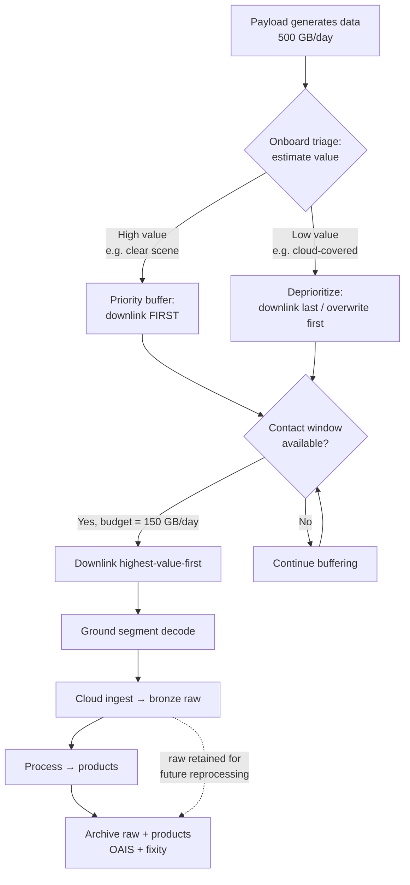
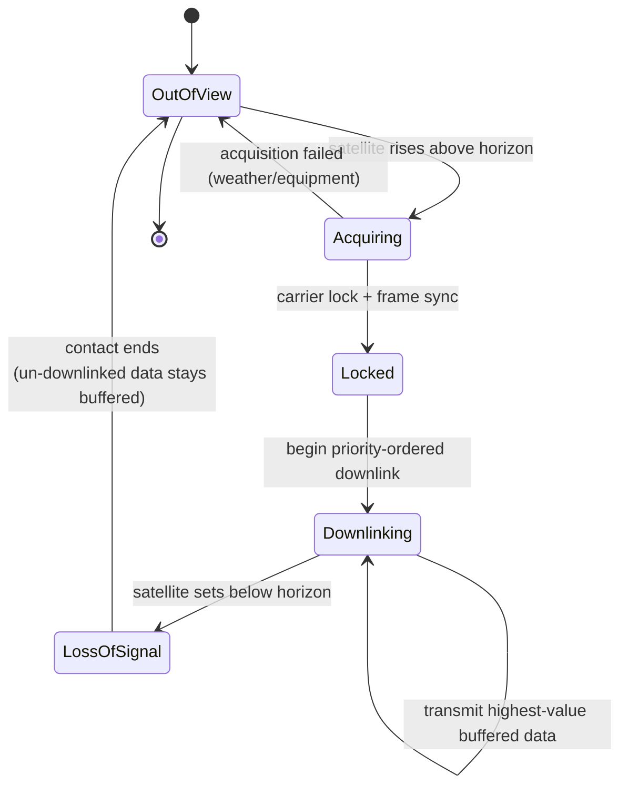

# Space Data Platforms

> Part of the **Enterprise Data & AI Architecture Handbook** · Phase-16 — Domain-Specific & Frontier Data Platforms · Chapter 05.
> Estimated study time: **60 min reading + ~3h labs**.
> **Prerequisites:** read [IoT Data Platforms](01_IoT_Data_Platforms.md) first.

---

## Executive Summary

[IoT Data Platforms](01_IoT_Data_Platforms.md) established the foundational pattern this chapter takes to its physical extreme: a fleet of physically-distributed, intermittently-connected, resource-constrained devices that must buffer data locally, transmit it over a constrained link when connectivity is available, and stream it into a cloud data platform for processing, storage, and analysis. A satellite is that same architecture pushed to the hardest possible operating envelope — a device travelling at roughly 7.5 km/s in low Earth orbit (LEO), reachable from any given ground antenna for only a few minutes per orbit, powered by a fixed solar-and-battery budget, running radiation-tolerant compute, and generating far more data than its downlink can ever carry to the ground. This chapter is the fifth in Phase-16 (Domain-Specific & Frontier Data Platforms) and covers the space-to-ground data architecture that makes satellite missions possible: how telemetry and mission data are generated and buffered onboard, how they are downlinked through ground stations (including ground-station-as-a-service offerings), how the onboard-versus-ground processing boundary is decided, how scarce downlink capacity is prioritized so the most valuable data reaches the ground first, and how mission data is preserved in long-lived archives that must remain readable and scientifically usable for decades.

This chapter covers **satellite telemetry and downlink** as a store-and-forward pipeline operating under hard contact-window and bandwidth constraints, using the standardized space data protocols (CCSDS) that make ground segments interoperable; **ground station as a service (Azure Orbital and its commercial peers)** as the managed alternative to owning and operating physical antennas, and its associated platform-longevity considerations; **onboard versus ground processing** as a deliberate, workload-specific boundary decision — the same edge-versus-cloud trade-off from [IoT Data Platforms](01_IoT_Data_Platforms.md) §5.4, now with power, thermal, radiation, and mass as first-class constraints; **data prioritization over constrained links** as the discipline of scoring and triaging data onboard so that the most valuable bytes are downlinked first, rather than naively in capture order; and **mission data archives** as the long-term, standards-based (OAIS / ISO 14721) preservation layer that keeps decades of irreplaceable mission data findable, readable, and reprocessable.

The platform bias is **Azure-primary (~60%)** — Azure Data Lake Storage and Azure Data Explorer for petabyte-scale telemetry and mission-data storage, Azure Databricks and Spark for downlinked-data processing and reprocessing pipelines, Event Hubs for ground-segment ingestion, and the Azure Space partnerships and Azure Orbital tooling for the ground-segment-to-cloud path — **~30% enterprise open source** (CCSDS-compliant open ground-segment stacks, Apache Kafka and Delta Lake for ingestion and lakehouse storage, Apache Spark for distributed reprocessing, and Grafana/Prometheus for ground-segment and mission observability) — **~10% AWS/GCP comparison-only** (AWS Ground Station as the primary managed-GSaaS comparison point, and GCP's partner-dependent, no-first-party-ground-station position).

**Bottom line:** every architectural decision in this chapter is subordinate to one physical constraint that dominates the entire space-data value chain: **the space-to-ground downlink is the scarcest, most expensive, and most physically-bounded resource in the architecture, and it cannot be scaled on demand the way cloud bandwidth can.** This chapter's central thesis, formalized in its ADR (§40) and grounded in the real, operational practice of onboard data triage on modern Earth-observation missions (§8, §40), is that **for any mission whose onboard data generation exceeds its downlink capacity — which is essentially every Earth-observation mission — data must be prioritized and triaged onboard, by value, before downlink, rather than transmitted naively in capture order.** Downlinking chronologically wastes a fixed, irreplaceable contact budget on low-value data (cloud-covered scenes, redundant housekeeping telemetry) at the direct expense of the high-value data the mission exists to collect.

---

## Learning Objectives

By the end of this chapter you will be able to:

1. **Explain the satellite telemetry and downlink pipeline** — housekeeping telemetry versus payload/mission data, store-and-forward buffering, contact windows, and the CCSDS protocol stack that standardizes it.
2. **Evaluate ground-station-as-a-service (GSaaS) offerings** (Azure Orbital, AWS Ground Station, and commercial operators) against owning physical antennas, including platform-longevity and vendor-continuity risk.
3. **Design the onboard-versus-ground processing boundary** for a given payload, accounting for power, thermal, radiation, mass, and downlink-cost constraints.
4. **Design an onboard data-prioritization strategy** that scores and triages data by value before downlink, so a fixed contact budget is spent on the most valuable data first.
5. **Design a mission data archive** using the OAIS (ISO 14721) reference model, ensuring long-term findability, readability, and reprocessability of irreplaceable mission data.
6. **Architect the ground-segment-to-cloud ingestion and processing pipeline** on Azure, from antenna/modem output through a lakehouse to a served, queryable mission-data product.
7. **Defend a space-data platform's telemetry, downlink, prioritization, and archival architecture** in engineer, staff engineer, architect, and CTO review settings.

---

## Business Motivation

- **Downlink capacity — not onboard sensor capability — is the primary constraint on mission data yield.** A satellite can almost always capture far more data than it can transmit to the ground, so the architecture's ability to prioritize and triage data onboard (§8, §40) directly determines how much *useful* data a fixed, capital-intensive mission actually delivers. This makes downlink economics a board-level constraint on mission ROI, not an engineering detail.
- **Ground-segment cost and vendor continuity are strategic decisions.** Owning physical antennas is a large capital and operational commitment; ground-station-as-a-service shifts that to a pay-per-contact operating expense but introduces vendor-continuity risk — a risk this chapter treats as concrete and current, given Microsoft's 2024 announcement that it would retire the managed Azure Orbital Ground Station service (§4, §31).
- **Mission data is frequently irreplaceable and must remain usable for decades.** A specific observation of a transient event, a particular orbit's coverage, or a planetary flyby cannot be re-collected. The long-term archival discipline in this chapter (§8, §12, §13) is therefore a direct scientific and financial-preservation requirement — data that becomes unreadable through format obsolescence or lost processing context (§40, Case Study 2) is a permanent loss of a capital-intensive investment.
- **Command uplink security is a safety- and mission-critical concern with no tolerance for compromise.** Unlike the largely-inbound telemetry path, the command uplink can physically maneuver, reconfigure, or disable a spacecraft — making the authentication and integrity of the command path (§16) a mission-loss-grade security requirement, extending the least-privilege and zero-trust disciplines from [Security Foundations](../Phase-10/01_Security_Foundations.md) to a principal that cannot be physically recovered if compromised.
- **The commercial space sector's growth has made space data an enterprise, not just a government/agency, data-platform concern.** Earth-observation constellations, commercial communications, and in-orbit services now produce data at volumes and cadences that require the same lakehouse, governance, and FinOps disciplines the rest of this handbook establishes — this chapter connects those disciplines to the space domain's distinctive constraints.

---

## History and Evolution

- **1957-1960s — the first satellite telemetry and tracking networks.** Early missions established the fundamental ground-segment pattern still in use: a network of geographically-distributed antennas tracking a spacecraft across the sky, receiving telemetry during brief passes. NASA's Deep Space Network (established 1963) and the tracking networks of the era defined the "contact window" as the organizing constraint of all space data operations.
- **1960s — early mission data recorded on magnetic tape.** Mission data of the era was archived on analog and early digital tape — a decision whose long-term consequences (format and hardware obsolescence) became a defining archival cautionary tale decades later (§40, Case Study 2; the Lunar Orbiter Image Recovery Project).
- **1982-onward — CCSDS standardization.** The Consultative Committee for Space Data Systems (CCSDS), founded in 1982 by the world's major space agencies, began publishing the standards that made ground segments interoperable across agencies and vendors: the Space Packet Protocol, the Space Data Link protocols (TM/TC/AOS), and later the CCSDS File Delivery Protocol (CFDP). These are the space-domain equivalent of the internet's standardized protocol stack, and remain foundational to virtually every modern mission's ground segment.
- **1990s-2000s — the OAIS reference model.** CCSDS also developed the Open Archival Information System (OAIS) reference model, published as ISO 14721 (first edition 2003, revised 2012). Though born in the space domain, OAIS became *the* foundational conceptual model for long-term digital preservation across libraries, archives, and data centers worldwide — and is the conceptual backbone of this chapter's mission-archive treatment (§8, §12, §13).
- **2000s-2010s — the CubeSat and small-satellite revolution.** Standardized small-satellite form factors dramatically lowered the cost of orbital access, moving satellite operations from a handful of national agencies to universities, startups, and commercial constellations — and creating the enterprise-scale, high-cadence space-data problem this chapter addresses.
- **2019 — AWS Ground Station launches.** Amazon introduced the first major cloud-provider ground-station-as-a-service, offering pay-per-minute antenna access integrated directly with cloud storage and compute — collapsing the traditional gap between the physical ground segment and the data platform.
- **2020 — ESA's Φ-sat-1 demonstrates onboard AI.** The European Space Agency's Φ-sat-1 mission flew an onboard neural-network accelerator that detected and discarded cloud-covered imagery *before downlink* — a landmark, real-world validation of this chapter's central onboard-prioritization thesis (§8, §40): roughly two-thirds of Earth is cloud-covered at any given time, so downlinking cloudy scenes wastes a large fraction of a fixed downlink budget.
- **2020-2022 — Azure Orbital Ground Station.** Microsoft entered the GSaaS market, integrating managed and partner-operated (KSAT, Viasat, US Electrodynamics) antennas with the Azure data platform, positioning the ground segment as a front-end to Azure storage and analytics.
- **2024 — Microsoft announces retirement of Azure Orbital Ground Station.** Microsoft announced it would wind down the managed Azure Orbital Ground Station service, pivoting its space strategy toward partnerships and the downstream data platform rather than operating antennas itself — a real, current platform-longevity signal this chapter treats honestly (§4, §31, §33, §35), consistent with the Phase-16 pattern of cloud-provider domain services being retired (Google Cloud IoT Core in 2023 per [IoT Data Platforms](01_IoT_Data_Platforms.md); AWS RoboMaker in 2025 per Robotics and ROS2, Phase-16 Chapter 03).
- **2020s-2026 — onboard edge compute and delay-tolerant networking mature.** Commercial onboard processors (including experiments running commodity cloud-edge hardware on the ISS, and radiation-tolerant AI accelerators on commercial satellites) and Delay/Disruption-Tolerant Networking (DTN, Bundle Protocol, RFC 9171) push more processing and smarter store-and-forward into the space segment itself, directly extending the edge-computing trajectory established in [IoT Data Platforms](01_IoT_Data_Platforms.md).

---

## Why This Technology Exists

A space data platform exists to solve a problem no terrestrial data platform faces: the data source is physically unreachable for all but a few minutes at a time, cannot be scaled or repaired once launched, operates under a fixed and unrenewable power and mass budget, and generates far more data than it can ever transmit to the ground. Every design choice — store-and-forward buffering, standardized CCSDS framing, onboard triage, ground-station scheduling, and multi-decade archival — is a direct response to some facet of that irreducible reality. The technology exists to extract the maximum scientific and operational value from a capital-intensive, physically-inaccessible, bandwidth-starved data source, and to preserve the resulting data — often irreplaceable — for as long as it retains value, which for scientific missions can be indefinitely.

It also exists because the space domain, uniquely, standardized its data protocols early and deliberately (CCSDS, OAIS) so that ground segments, cross-support agreements, and archives could interoperate across agencies, vendors, and decades. That standardization is what makes ground-station-as-a-service commercially viable at all: a managed antenna can receive a compliant spacecraft's downlink without bespoke, per-mission integration.

---

## Problems It Solves

- **Extracting maximum value from a bandwidth-starved link** — onboard prioritization and compression ensure the fixed, irreplaceable downlink budget is spent on the highest-value data (§8, §40).
- **Operating a physically-unreachable, intermittently-visible data source** — store-and-forward buffering and contact-window scheduling turn a device visible only minutes per orbit into a reliable data producer (§6, §8).
- **Interoperability across agencies, vendors, and decades** — CCSDS protocol standardization lets any compliant spacecraft be received by any compliant ground segment, including commercial GSaaS (§8, §11).
- **Avoiding the capital cost of a global antenna network** — ground-station-as-a-service converts a large capital and operational commitment into pay-per-contact operating expense (§4, §31).
- **Preserving irreplaceable data for decades** — OAIS-based archival keeps mission data findable, readable, and reprocessable long after the original mission, hardware, and software are gone (§8, §12, §13, §40).
- **Deciding where computation should physically happen** — the onboard-versus-ground boundary framework (§8) turns "should we process this in space?" from an intuition into a constraint-driven decision.

---

## Problems It Cannot Solve

- **It cannot manufacture downlink capacity.** No amount of cloud elasticity on the ground can increase the number of bits a spacecraft can physically transmit through a given aperture, power budget, and contact window. The link is a hard ceiling; the platform can only make the best use of it.
- **It cannot recover uncaptured or unprioritized data.** If onboard triage discards or overwrites data before downlink, or if a contact window is missed, that specific observation is permanently lost — there is no re-request from an unreachable, overwritten source.
- **It cannot fix a compromised command uplink after the fact.** Unlike a terrestrial device, a spacecraft whose command path is compromised or whose flight software is corrupted may be physically unrecoverable — the security controls (§16) must prevent, not merely detect, compromise.
- **It cannot overcome the physics of latency for deep-space missions.** Light-speed delay to distant spacecraft (minutes to hours) makes interactive, low-latency operation impossible; the architecture can only accommodate it (via DTN and autonomous onboard operation), not eliminate it.
- **It does not, by itself, perform the geospatial/scientific analytics on downlinked data.** This chapter delivers usable, archived mission data to the ground; the geospatial and Earth-observation analytics that turn it into insight are the subject of Phase-16 Chapter 06 (Earth Observation and Geospatial Analytics).
- **It cannot guarantee archival usability without active preservation.** Simply writing bytes to storage does not preserve data — without OAIS-style format management, metadata, and periodic readability verification, archived data silently rots into unusability (§40, Case Study 2).

---

## Core Concepts

### 5.1 Telemetry, tracking, and command (TT&C) versus payload/mission data

A spacecraft's data divides into two fundamentally different streams with different volumes, priorities, and handling:

- **Housekeeping telemetry (TT&C / bus telemetry)** — the spacecraft's own health and status: battery voltage, temperatures, attitude, reaction-wheel speeds, subsystem states. This is *low-volume, high-priority, continuously-generated* data whose job is to keep the spacecraft alive and operable. It is the direct analog of the device-health telemetry from [IoT Data Platforms](01_IoT_Data_Platforms.md) §5.1, but with mission-loss stakes: a missed thermal-anomaly signal can end a mission.
- **Payload / mission data** — the data the mission exists to collect: imagery from an Earth-observation sensor, radio-frequency captures, scientific-instrument readings. This is *high-volume, value-variable* data that dominates the downlink budget and is the primary subject of the prioritization discipline (§8, §40).
- **Command uplink (the "C" in TT&C)** — the *outbound* path from ground to spacecraft: commands to maneuver, reconfigure, or task the payload. Low-volume but the highest-integrity requirement in the entire architecture (§16), because it can physically alter or disable the spacecraft.

The critical architectural consequence: these streams have opposite priority-versus-volume profiles. Housekeeping telemetry is small but must *always* get through; payload data is enormous but is triageable. Conflating them — treating all downlinked data with one priority — is a foundational design error.

### 5.2 Contact windows and store-and-forward

A LEO satellite is visible to any given ground antenna for only a few minutes per pass — typically **5-12 minutes**, a handful of times per day for a single ground station. Outside those windows, the spacecraft is unreachable. This forces a store-and-forward architecture identical in principle to the offline-buffering requirement from [IoT Data Platforms](01_IoT_Data_Platforms.md) §5.4, but with a far more severe duty cycle: the spacecraft continuously generates data, buffers it in onboard mass storage, and downlinks the highest-priority contents during each brief contact.

The organizing constraint is the **contact budget**: total downlink time available per day = (number of accessible ground stations) × (passes per day) × (usable minutes per pass) × (achievable data rate). This budget is *fixed and irreplaceable* — an unused or wasted contact window is gone forever. Expanding it means adding ground stations (capital/GSaaS cost, §4) or increasing the achievable data rate (higher frequency band, better modulation, more onboard power) — both bounded, expensive levers. This is precisely why onboard prioritization (§8) is not optional: you cannot simply "add bandwidth."

### 5.3 The CCSDS protocol stack

The Consultative Committee for Space Data Systems (CCSDS) defines the standardized protocol stack that makes space data interoperable across agencies, vendors, and commercial ground stations. The layers most relevant to a data platform:

- **Space Packet Protocol** — the application-layer packet structure (identified by an Application Process Identifier, APID) that segregates data by source/type — the mechanism by which housekeeping telemetry and different payload streams are distinguished (§5.1).
- **Space Data Link protocols (TM / TC / AOS)** — the framing, error-correction, and channel-multiplexing layer for the physical link. TM (Telemetry) and AOS (Advanced Orbiting Systems) frame the downlink; TC (Telecommand) frames the command uplink.
- **CCSDS File Delivery Protocol (CFDP)** — a store-and-forward file-transfer protocol designed for intermittent, high-latency space links, providing reliable delivery with automatic retransmission of only the missing segments across multiple contact windows — the space-domain analog of a resumable, gap-filling file transfer.

For a data-platform architect, the key point is that CCSDS is *why* a managed ground station (GSaaS) can receive an arbitrary compliant spacecraft: the framing, error correction, and packet structure are standardized, so the ground segment's job — demodulate, decode frames, extract packets, deliver to the cloud — is mission-agnostic up to the payload semantics.

### 5.4 The onboard-versus-ground processing boundary

Where should a given computation physically happen — on the spacecraft, or on the ground after downlink? This is the same edge-versus-cloud decision from [IoT Data Platforms](01_IoT_Data_Platforms.md) §5.4, but with a harsher constraint set. Moving computation onboard costs **power** (from a fixed solar/battery budget), **thermal dissipation** (hard in vacuum), **mass** (every kilogram has a launch cost), and **radiation tolerance** (commodity chips fail or corrupt in orbit), and it must be done on hardware that cannot be patched or replaced. Against those costs, onboard processing buys the single most valuable thing in the architecture: **downlink reduction**. Every byte discarded, compressed, or summarized onboard is a byte that no longer competes for the scarce link.

The decision is workload-specific, exactly as in the IoT case:

- **Process onboard when** the computation dramatically reduces downlink volume (cloud detection, feature extraction, compression), enables autonomy under latency (deep-space operations), or must act faster than a downlink-command round trip allows.
- **Process on the ground when** the computation is downlink-neutral, benefits from unconstrained compute and full context, needs algorithms that will be refined post-launch, or requires data the spacecraft cannot hold in memory.

The anti-pattern is symmetric to the IoT one: *neither* "maximize onboard processing" nor "downlink everything and process on the ground" is a valid default. ESA's Φ-sat-1 (§4) is the canonical positive example of getting this boundary right — onboard cloud detection discards worthless data before it ever consumes downlink.

### 5.5 Value-based data prioritization

Because the contact budget is fixed (§5.2) and onboard generation exceeds it, the spacecraft must decide *which* buffered data to downlink first. Naive strategies — chronological (FIFO), or newest-first (LIFO) — spend the budget without regard to value. Value-based prioritization instead scores buffered data by expected value and downlinks highest-value first:

- **Content-based scoring** — e.g., cloud-fraction estimation to deprioritize obscured imagery (the Φ-sat-1 approach), change detection to prioritize scenes that differ from a baseline, or event detection (a wildfire, a ship, a flood) to prioritize actionable observations.
- **Tasking/priority tags** — data collected in response to a specific high-priority tasking request is flagged for expedited downlink.
- **Housekeeping-always-first** — the low-volume, mission-critical health stream (§5.1) is never starved by payload data; it rides a reserved, prioritized channel.

This is the conceptual core of the chapter and the subject of its ADR (§40). The discipline is directly analogous to a priority queue with a value function, implemented under space constraints — and getting the value function wrong (or omitting it) is the difference between a mission that downlinks mostly cloud and one that downlinks mostly signal.

---

## Internal Working

### 6.1 The end-to-end space-to-ground data path

The full lifecycle of a mission-data byte:

1. **Onboard generation** — a payload sensor produces data; the flight software packetizes it into CCSDS Space Packets tagged by APID (§5.3).
2. **Onboard triage and storage** — the data is optionally processed onboard (compression, cloud detection, feature extraction, §5.4), scored for value (§5.5), and buffered in onboard mass storage with its priority.
3. **Contact acquisition** — as the spacecraft enters a ground station's visibility window, the station acquires the signal, locks onto the carrier, and begins receiving the modulated downlink.
4. **Ground-segment reception** — the ground station's antenna, low-noise amplifier, and modem demodulate the RF signal; a front-end processor performs frame synchronization, error correction (Reed-Solomon/LDPC/turbo decoding), and extracts CCSDS frames and packets.
5. **Delivery to the cloud** — the extracted data (often as CFDP-delivered files or a packet stream) is handed to the cloud ingestion tier — this is the boundary where the space-specific ground segment meets the general-purpose data platform this handbook has built throughout.
6. **Cloud ingestion and processing** — the data lands in an ingestion service (Event Hubs / Kafka), is written to a bronze lakehouse layer, and flows through medallion-style processing (per [Medallion Architecture](../Phase-05/03_Medallion_Architecture.md)) into calibrated, usable mission-data products.
7. **Archival** — processed and (critically) *raw* data is written to a long-term OAIS-compliant archive (§8, §12, §13) for indefinite preservation and future reprocessing.

Boundary 4→5 is the conceptual heart of a space *data platform*: everything before it is space-domain-specific RF and protocol engineering; everything after it is the lakehouse, governance, and FinOps discipline the rest of this handbook establishes, applied to a distinctive data source.

### 6.2 How a ground station becomes a service (GSaaS)

A ground-station-as-a-service offering (Azure Orbital, AWS Ground Station, or a commercial operator) works by decoupling the physical antenna from the mission operator:

1. The operator **registers a spacecraft** (orbital parameters, RF characteristics, CCSDS configuration) with the service.
2. The service computes **contact windows** from the orbit and its available antennas, and the operator **schedules contacts** (reserving antenna time, often pay-per-minute).
3. During a scheduled contact, the service's antenna, modem, and digitizer **receive and demodulate** the downlink, producing either raw digitized IF, or decoded frames/packets, depending on the tier of managed processing.
4. The output is **delivered directly into the operator's cloud tenancy** — the defining advantage of cloud-provider GSaaS: the data lands in cloud storage/ingestion with no operator-owned intermediary infrastructure.

The economic model converts a large capital and operational commitment (antennas, sites, staff, maintenance) into a pay-per-contact operating expense. The risk it introduces — vendor continuity — is real and current: Microsoft's 2024 decision to retire the managed Azure Orbital Ground Station service (§4, §31) means an operator who built exclusively on that managed antenna service must migrate its ground-segment path, exactly the platform-longevity risk this Phase-16 series has repeatedly flagged for cloud-provider domain services.

### 6.3 How onboard prioritization is implemented under constraints

Onboard value-based prioritization (§5.5) is implemented as a bounded, deterministic, resource-aware pipeline, because it runs on radiation-tolerant, power-limited, non-patchable hardware:

- **Bounded, verifiable scoring logic** — the value function must run within a known power/time budget and produce deterministic, testable results; an onboard model that could hang, thrash, or behave unpredictably is a flight-safety risk, so onboard inference is typically a small, fixed, extensively-validated model (e.g., a compact CNN on a radiation-tolerant accelerator, as in Φ-sat-1).
- **Conservative discard policy** — because discarded data is unrecoverable (§Problems It Cannot Solve), onboard triage that *deletes* rather than merely *deprioritizes* must be held to a high validation bar; the safer default is to deprioritize (downlink last) rather than delete, unless storage pressure forces overwrite.
- **Priority-aware buffer management** — onboard mass storage is a bounded ring/priority buffer; when full, the lowest-value data is overwritten first, so the prioritization decision governs both downlink order *and* retention under storage pressure.
- **Housekeeping reservation** — a fixed fraction of the link and buffer is reserved for the mission-critical health stream so payload volume can never starve it (§5.1).

The verification discipline here mirrors, at the highest stakes, the "validate before you can't recover it" pattern seen throughout Phase-16 — but a spacecraft cannot be recalled, so the onboard logic must be right the first time.

---

## Architecture

The reference architecture separates the **space segment**, the **ground segment**, and the **cloud data platform**, with the ground-segment-to-cloud boundary (§6.1, step 4→5) as the key integration seam:

- **Space segment** — payload sensors → onboard packetization (CCSDS) → onboard processing/triage/prioritization (§5.4, §5.5) → onboard mass storage → RF downlink transmitter (and command-uplink receiver).
- **Ground segment** — antenna + LNA + modem → front-end processor (frame sync, FEC decode, packet extract) → CFDP/packet delivery. Either operator-owned or GSaaS (§6.2).
- **Cloud data platform** — ingestion (Event Hubs / Kafka) → bronze/raw lakehouse → medallion processing (calibration, geolocation, product generation) → served mission-data products → long-term OAIS archive.
- **Command-and-control plane** — mission planning, tasking, and command generation → secured command uplink (§16) — architecturally isolated from the data-ingestion plane, because it has mission-loss integrity requirements the data plane does not.

Every segment boundary is a trust boundary (extending the zero-trust "verify at every hop" principle from [Network Security and Zero Trust](../Phase-10/04_Network_Security_and_Zero_Trust.md)), and the command-uplink path is the highest-integrity boundary in the entire handbook: a compromise there can physically destroy an unrecoverable asset.

---

## Components

- **Payload sensor(s)** — the data source (optical imager, SAR, RF sensor, scientific instrument).
- **Onboard data-handling computer** — packetizes (CCSDS), runs triage/prioritization, manages mass storage; radiation-tolerant.
- **Onboard mass storage** — the store-and-forward buffer; a bounded priority buffer (§6.3).
- **RF transceiver** — downlink transmitter (S/X/Ka-band) and command-uplink receiver.
- **Ground antenna + modem + front-end processor** — receives, demodulates, decodes CCSDS frames, extracts packets (operator-owned or GSaaS).
- **Ground-segment-to-cloud delivery** — CFDP/packet delivery into a cloud ingestion endpoint.
- **Cloud ingestion tier** — Event Hubs / Kafka, buffering the delivered stream.
- **Lakehouse (bronze/silver/gold)** — raw capture, calibrated/geolocated data, and finished products, on ADLS + Delta Lake.
- **Processing/reprocessing compute** — Databricks/Spark for calibration, product generation, and (critically) *re*processing archived raw data with improved algorithms.
- **Mission data archive** — OAIS-compliant long-term storage with preservation metadata (§12, §13).
- **Mission planning & command generation** — the tasking and command plane feeding the secured uplink.
- **Catalog & metadata layer** — makes archived data findable (§12), integrating with the governance catalog per [Data Catalog and Lineage](../Phase-08/02_Data_Catalog_and_Lineage.md).

---

## Metadata

Metadata in a space data platform is not a convenience — for a multi-decade archive it is the difference between usable and lost data (§40, Case Study 2). The OAIS model formalizes the categories:

- **Representation information** — everything needed to *interpret the bits*: the data format, structure, encoding, and the CCSDS/instrument specifications required to decode a raw packet stream into meaningful values. Without it, archived bytes are unintelligible.
- **Provenance / processing context** — instrument calibration parameters, processing-software versions, and the full lineage from raw downlink to finished product (extending [Data Catalog and Lineage](../Phase-08/02_Data_Catalog_and_Lineage.md) to the space domain), so that a product can be reproduced or reprocessed years later with a known baseline.
- **Reference / descriptive metadata** — what/where/when the observation covers (time, orbit, geolocation, target, instrument mode), enabling discovery and spatial/temporal search — the primary access path for a mission archive.
- **Fixity / integrity** — checksums and integrity records that let the archive *verify* stored data has not silently corrupted over decades of storage (§13, §21).
- **Packaging metadata** — the OAIS SIP/AIP/DIP information-package structures (§12) that bind data and all the above metadata into self-describing units.

The space-specific lesson: raw, un-productized data must be archived *with enough representation information to reprocess it independently of the original ground system* — because the original processing software will not run in twenty years, but a well-documented raw archive can be reprocessed by whatever tooling exists then. Time-series schema and instrument-descriptor metadata should be registered as data contracts (per [Data Contracts](../Phase-08/07_Data_Contracts.md)) at the mission level.

---

## Storage

- **Onboard storage** — bounded, radiation-tolerant mass storage acting as a priority store-and-forward buffer (§6.3); measured in the low terabytes, dwarfed by what the payload can generate over a mission lifetime.
- **Cloud bronze/raw tier** — every downlinked byte lands first in an immutable raw layer on ADLS + Delta Lake (per [Delta Lake](../Phase-04/04_Delta_Lake.md)), following the medallion bronze pattern from [Medallion Architecture](../Phase-05/03_Medallion_Architecture.md). Raw downlink data is *never* discarded after processing, because algorithm improvements routinely make old raw data newly valuable via reprocessing.
- **Silver/gold product tiers** — calibrated, geolocated, and finished mission-data products, partitioned for the spatial/temporal query patterns that dominate access.
- **Long-term OAIS archive** — the authoritative multi-decade preservation copy, on the lowest-cost durable storage tier (Azure Archive / cool storage), with fixity verification (§13, §21) and full preservation metadata (§12). For agency-scale missions this is the tier that must remain readable for the indefinite scientific lifetime of the data.
- **Compression is a first-class storage and downlink concern** — lossless (and, where scientifically acceptable, lossy) compression applied onboard directly reduces downlink volume, and on the ground reduces storage cost; the general principles from [Compression and Encoding](../Phase-04/08_Compression_and_Encoding.md) apply, with the crucial caveat that lossy compression of scientific data is a *scientific* decision, not merely a storage one — irreversibly discarding signal that a future analysis might have needed.

The tiering follows the same hot/warm/cold pattern established for telemetry in [IoT Data Platforms](01_IoT_Data_Platforms.md) §5.5, extended with a distinct, standards-governed archival tier that terrestrial IoT rarely requires.

---

## Compute

- **Onboard compute** — radiation-tolerant, power- and thermal-bounded processors and accelerators running deterministic, pre-validated triage/prioritization logic (§6.3). The scarcest, least-flexible compute in the architecture.
- **Ground-segment compute** — real-time demodulation and FEC decoding at the antenna/modem/front-end; latency-sensitive and often FPGA/DSP-based.
- **Cloud ingestion/processing compute** — Databricks/Spark clusters (per [Apache Spark Internals](../Phase-05/04_Apache_Spark_Internals.md)) for calibration, product generation, and large-scale *reprocessing* — the latter being a distinctive, bursty, embarrassingly-parallel workload: reprocessing an entire mission's raw archive with an improved algorithm is a periodic, massive batch job well suited to elastic, spot/low-priority cloud compute.
- **Onboard ML inference** — where onboard triage uses a model (§5.5), it runs on a fixed, radiation-tolerant accelerator; the model is trained on the ground (potentially on previously-downlinked data) and uploaded, following the train-on-ground/infer-on-edge split from [Model Serving and Ray](../Phase-11/04_Model_Serving_and_Ray.md), under far tighter validation constraints because the inference target is unrecoverable.

---

## Networking

- **The space-to-ground RF link** — the defining, non-elastic network segment: S-band (lower rate, robust, common for TT&C), X-band (the workhorse for EO payload downlink), and Ka-band (highest rate, weather-sensitive) trade data rate against link robustness and hardware complexity. This is the "constrained link" the entire chapter is organized around.
- **The command uplink** — low-rate, highest-integrity (§16).
- **Ground-segment-to-cloud** — a conventional terrestrial network path from the ground station into the cloud region, ideally private/dedicated connectivity (extending the private-endpoint baseline from [Network Security and Zero Trust](../Phase-10/04_Network_Security_and_Zero_Trust.md)) for a GSaaS delivering into a cloud tenancy.
- **Inter-satellite links (ISL)** — in modern constellations, satellites relay data to each other and to a satellite with a current ground contact, effectively pooling the constellation's contact budget — an architecture that softens (but does not remove) the contact-window constraint.
- **Delay/Disruption-Tolerant Networking (DTN, Bundle Protocol, RFC 9171)** — for deep-space and highly-intermittent links, DTN provides store-and-forward at the network layer, tolerating minutes-to-hours latency and long disconnections that break conventional TCP/IP assumptions entirely.

---

## Security

The command uplink is the highest-integrity path in this handbook, and the security posture reflects a principal that cannot be physically recovered if compromised:

- **Command authentication and integrity** — every command must be cryptographically authenticated and integrity-protected (CCSDS defines the Space Data Link Security protocol for this) so that no unauthorized party can maneuver, reconfigure, or disable the spacecraft. This is a mission-loss-grade control, extending the zero-trust and least-privilege disciplines from [Security Foundations](../Phase-10/01_Security_Foundations.md) and [Identity and Access Management with Entra](../Phase-10/02_Identity_and_Access_Management_with_Entra.md) to a physical asset.
- **Downlink encryption** — payload and telemetry downlink is encrypted where the data is sensitive (commercial-competitive, defense, or personal-data-bearing imagery), extending encryption-in-transit (per [Data Security and Encryption](../Phase-10/03_Data_Security_and_Encryption.md)) to the RF link.
- **Ground-segment and GSaaS trust** — when using a shared, multi-tenant ground station, the operator must ensure cryptographic separation and that the GSaaS provider cannot access decrypted payload — the ground station demodulates and delivers, but end-to-end payload encryption keeps plaintext out of the shared segment.
- **Key management for space assets** — cryptographic keys for command authentication and downlink encryption are managed with the same rigor as any high-value secret (per [Secrets and Key Management](../Phase-10/05_Secrets_and_Key_Management.md)), with the added, distinctive constraint that onboard key rotation is difficult and irreversible-if-botched — a failed key update can lock out legitimate command access permanently.
- **Cloud-platform security** — the downstream lakehouse, archive, and catalog inherit the full security baseline the rest of the handbook establishes (private endpoints, managed identity, RBAC, encryption at rest with CMK).

The distinctive lesson: unlike a terrestrial device (per [IoT Data Platforms](01_IoT_Data_Platforms.md) §16) that can be physically reclaimed or re-flashed, a spacecraft whose command path or flight software is compromised may be permanently lost — so the command-plane controls must *prevent*, not merely detect and remediate.

---

## Performance

- **Downlink data rate** is the dominant performance metric — bits per contact, governed by frequency band, modulation/coding, antenna gain, and onboard transmit power. Improving it is a hardware/physics problem, not a software-scaling one.
- **Contact-budget utilization** — the fraction of available contact time actually spent transmitting useful (high-value) data; the metric the ADR (§40) is designed to maximize. Low utilization from wasted windows or low-value downlink is the primary performance failure mode.
- **Ground-segment demodulation throughput** — the front-end must decode frames in real time at the incoming data rate; a bottleneck here drops data irrecoverably during the fleeting contact.
- **Cloud reprocessing throughput** — for the periodic full-archive reprocessing workload, throughput (and its cost, §20) is governed by elastic Spark parallelism against a partitioned raw archive.
- **End-to-end latency** (observation → usable ground product) — decomposed across onboard buffering time (waiting for the next contact — often the dominant term for a non-urgent observation), downlink and ground processing, and cloud product generation; the same per-segment decomposition discipline from [Model Serving and Ray](../Phase-11/04_Model_Serving_and_Ray.md) §4.5, where the "next contact window" delay is a term with no terrestrial analog.

---

## Scalability

- **Ground-segment scaling** — adding ground stations (or adopting GSaaS with a large antenna network) linearly increases the contact budget; a constellation with inter-satellite links pools contacts across satellites for super-linear effective scaling.
- **Constellation scaling** — as satellite count grows, the ground-segment and cloud ingestion must scale with aggregate downlink volume; GSaaS's elasticity is a direct advantage here versus a fixed owned-antenna network.
- **Cloud-platform scaling** — ingestion (Event Hubs/Kafka partitions per [Azure Event Hubs and Stream Analytics](../Phase-07/03_Azure_Event_Hubs_and_Stream_Analytics.md)), lakehouse storage, and Spark reprocessing all scale with standard cloud elasticity — the "easy" half of the architecture.
- **The unscalable dimension** — the per-satellite space-to-ground link itself does not scale on demand; you scale the *number* of links (satellites, ground stations, ISLs), never the physics of an individual aperture. This asymmetry — infinitely scalable ground platform, hard-capped space link — is the defining scalability characteristic of the domain.

---

## Fault Tolerance

- **Onboard store-and-forward as fault tolerance** — buffering data until a successful contact tolerates missed or failed passes; CFDP's gap-filling retransmission (§5.3) recovers only the missing segments across multiple contacts rather than restarting.
- **Multi-ground-station redundancy** — scheduling contacts with multiple geographically-diverse stations tolerates a single station's weather or equipment outage (Ka-band's rain sensitivity makes site diversity a real availability lever).
- **Onboard fault management** — the spacecraft's own fault-detection-isolation-recovery (FDIR) and "safe mode" protect the asset when anomalies occur; the housekeeping telemetry stream (§5.1) is what lets the ground detect and respond to these.
- **Idempotent, gap-tolerant cloud ingestion** — the ground-to-cloud pipeline must tolerate duplicate and out-of-order delivery (CFDP retransmissions, multi-station reception of the same pass), using the same at-least-once + idempotent-consumption discipline from [Event-Driven Architecture](../Phase-14/01_Event_Driven_Architecture.md) and [Streaming Patterns and Delivery Semantics](../Phase-07/08_Streaming_Patterns_and_Delivery_Semantics.md).
- **The irrecoverable-loss boundary** — fault tolerance has a hard limit: data not captured, or discarded onboard before downlink, or lost to a missed final contact, is permanently gone. This is why the archival tier keeps *raw* data indefinitely (§13) — the raw archive is the last line of defense against a downstream processing error, but nothing defends against never capturing or never downlinking the data at all.

---

## Cost Optimization (FinOps)

- **Downlink cost is the dominant marginal cost** — whether measured as GSaaS pay-per-minute charges or the amortized capital of an owned antenna network, each downlinked byte has a real cost; onboard prioritization (§8, §40) is therefore simultaneously a *value* optimization and a *cost* optimization — discarding cloud-covered imagery onboard avoids paying to downlink and store worthless data.
- **GSaaS versus owned antennas** — the classic capex-versus-opex decision: GSaaS (pay-per-contact) wins for variable, growing, or uncertain contact demand and avoids capital lock-in; owned antennas win at high, stable, sustained contact volume where amortized capital undercuts per-minute pricing — with the vendor-continuity risk (§4, §31) as a qualitative factor weighing against sole-sourcing a managed service.
- **Storage tiering** — raw archive on the lowest-cost durable tier (Azure Archive), hot products on performant tiers, with lifecycle policies migrating data down as it ages — the same tiering discipline from [IoT Data Platforms](01_IoT_Data_Platforms.md) §20 extended with a multi-decade archival tier.
- **Elastic/spot reprocessing** — the periodic full-archive reprocessing job is a perfect fit for spot/low-priority Spark compute, cutting the cost of this bursty workload substantially versus on-demand clusters.
- **Compression** — onboard compression saves *both* downlink and storage cost simultaneously; on-ground compression of the archive saves multi-decade storage cost (per [Compression and Encoding](../Phase-04/08_Compression_and_Encoding.md)).

**Worked FinOps example.** Consider an EO satellite whose payload generates 500 GB/day but whose contact budget allows downlinking only 150 GB/day. Roughly two-thirds of captured scenes are cloud-obscured and scientifically worthless. *Without* onboard triage, downlinking chronologically (FIFO), an average ~66% of the 150 GB/day downlink budget — about 99 GB/day — is spent on cloud-covered scenes, at both GSaaS contact cost and cloud storage cost, while high-value clear scenes sit un-downlinked in the onboard buffer and are eventually overwritten. Assume a blended cost of ~$0.05/GB across contact-time and bronze-tier storage: the wasted spend is ~99 GB/day × $0.05 × 365 ≈ **$1,807/year of pure waste per satellite**, *and* — far more importantly — roughly two-thirds of the mission's downlink capacity is delivering no scientific value. *With* onboard cloud detection (the Φ-sat-1 approach, §4) deprioritizing cloudy scenes, nearly the entire 150 GB/day budget carries clear, high-value imagery: the direct cost waste is largely eliminated, but the real return is a **~3× increase in useful data yield from the same fixed, capital-intensive downlink budget** — which for a constellation of dozens of satellites is the difference between the mission meeting or missing its coverage commitments. This asymmetry — small direct-cost saving, enormous value-yield gain — is exactly why the ADR (§40) frames prioritization as a mission-value decision, not merely a cost play.

---

## Monitoring

- **Contact-budget utilization** — per-satellite and per-station: scheduled contacts, successful acquisitions, minutes actually spent transmitting, and the high-value fraction of downlinked data (the ADR's success metric, §40).
- **Downlink success/failure per pass** — failed acquisitions, aborted contacts, and per-pass data volume, alerting on missed windows (irrecoverable loss).
- **Onboard buffer fill level** — approaching-full buffers signal impending overwrite of un-downlinked data — a leading indicator of data loss that must trigger contact-scheduling or prioritization response.
- **Housekeeping telemetry health** — spacecraft bus health (power, thermal, attitude); anomalies here are mission-critical (§5.1).
- **Ground-to-cloud ingestion health** — delivery lag, dead-letter/undecodable-frame rate (the space analog of the malformed-message dead-letter discipline from [Message Brokers and Queues](../Phase-14/07_Message_Brokers_and_Queues.md)), and duplicate-delivery rate.
- **Archive fixity status** — periodic integrity-verification results across the long-term archive (§13, §21).

---

## Observability

- **End-to-end lineage from onboard packet to archived product** — the ability to trace a given ground product back through processing, downlink pass, and onboard capture, extending the full-pipeline tracing principle from [LLMOps](../Phase-12/04_LLMOps.md) §4.2 to the space-to-ground pipeline, and integrating with the catalog/lineage layer per [Data Catalog and Lineage](../Phase-08/02_Data_Catalog_and_Lineage.md).
- **Correlating a data gap to its root cause** — was a missing observation never captured, discarded by onboard triage, lost to a failed contact, or dropped in ground processing? Observability must distinguish these, because the remediation differs entirely.
- **Prioritization-decision observability** — the onboard value-scoring decisions (what was downlinked-first, deprioritized, or overwritten, and why) should be reconstructable on the ground so the value function itself can be evaluated and improved — you cannot improve a triage policy you cannot observe.

### Operational Response Playbook

**Playbook 1 — Onboard buffer approaching full / data-loss risk.**
- *Signal:* onboard mass-storage fill level exceeds a high-water threshold (e.g., >85%) with un-downlinked high-value data at risk of overwrite.
- *Detection:* buffer-fill telemetry monitored in the housekeeping stream; alert on threshold breach and on downlink-throughput-below-generation-rate trend.
- *Remediation:*
  | Situation | Action |
  |---|---|
  | Contact budget available but unused | Schedule additional contacts (add GSaaS antennas/passes) to drain buffer |
  | Contact budget saturated | Verify onboard prioritization is active and tuned so overwrite sacrifices only genuinely low-value data; escalate to increase compression/triage aggressiveness |
  | Prioritization misconfigured (high-value data being overwritten) | Uplink corrected prioritization parameters; treat as an incident — high-value loss is occurring |
  | Payload generating above plan | Reduce payload duty cycle / collection rate to match sustainable downlink |

**Playbook 2 — Archive fixity-check failure (silent corruption detected).**
- *Signal:* a periodic integrity/fixity verification (§13, §21) reports a checksum mismatch on archived data.
- *Detection:* scheduled archive-wide fixity sweep; alert on any mismatch.
- *Remediation:*
  | Situation | Action |
  |---|---|
  | Redundant/replica copy passes fixity | Restore the corrupted object from the good replica; re-verify |
  | No good replica, but raw downlink retained | Reprocess the affected product from retained raw data |
  | Neither replica nor raw available | Escalate as permanent data-loss incident; assess scientific impact and document in the archive's provenance record |
  | Corruption pattern recurring across objects | Investigate storage-media/tier health; suspect systemic media degradation, not a one-off |

---

## Governance

- **Data classification and licensing** — mission data ranges from open scientific data (agency archives are frequently public) to commercially-licensed or export-controlled imagery; classification and access policy (per [Data Governance Foundations](../Phase-08/01_Data_Governance_Foundations.md)) must be applied at the product level, and export-control (e.g., regimes governing high-resolution imagery) is a distinctive space-domain governance obligation.
- **Provenance and reproducibility as a governance requirement** — for scientific data, the ability to reproduce a product from raw data with a documented processing baseline is a *scientific-integrity* governance requirement, not merely an engineering convenience — this is why processing-context metadata (§12) is mandatory, not optional.
- **Long-term stewardship** — a mission archive has a designated steward responsible for its multi-decade preservation, format migration, and continued readability (the OAIS "management" role) — governance that must outlive the mission, the original team, and often the original technology.
- **Personal-data considerations** — high-resolution EO imagery can raise privacy questions in some jurisdictions; where applicable, the privacy disciplines from the security phase apply to imagery as they would to any personal-data-bearing dataset.
- **Cross-agency / cross-border data sharing** — space data is frequently shared across agencies and borders under specific agreements (CCSDS cross-support, international data-sharing frameworks); residency and sovereignty considerations apply as they would to any regulated cross-border data.

---

## Trade-offs

- **Onboard processing vs. ground processing** — downlink reduction and autonomy vs. power/thermal/mass/radiation cost and the impossibility of post-launch fixes (§5.4). Getting more onboard reduces downlink but freezes the algorithm at launch.
- **Discard vs. deprioritize onboard** — deleting low-value data onboard maximizes buffer/downlink efficiency but risks irrecoverable loss of data later found valuable; deprioritizing is safer but consumes buffer. The conservative default is deprioritize-not-delete (§6.3).
- **GSaaS vs. owned antennas** — opex flexibility and elasticity vs. capex efficiency at scale and vendor-continuity control; the 2024 Azure Orbital retirement (§4) is a concrete data point that managed-GSaaS continuity is a real risk factor.
- **Higher frequency band (Ka) vs. lower (S/X)** — Ka-band offers far higher data rates but is weather-sensitive and hardware-complex; S/X are more robust but lower-rate.
- **Lossy compression vs. scientific fidelity** — lossy compression multiplies effective downlink/storage capacity but irreversibly discards signal a future analysis might have needed — a scientific decision, not just a storage one (§13).
- **Real-time downlink urgency vs. contact-budget efficiency** — expediting an urgent observation (a disaster, a time-critical event) may mean scheduling a costly out-of-plan contact, trading efficiency for latency.

**When NOT to build a bespoke space data platform:** if you are a *consumer* of already-downlinked, already-archived EO or scientific data (e.g., building geospatial analytics on public agency archives), you do not need this chapter's space-segment and ground-segment architecture at all — you need the geospatial analytics stack of Phase-16 Chapter 06 (Earth Observation and Geospatial Analytics). This chapter is for organizations that *operate* spacecraft or ground segments; downstream data consumers should start at the archive boundary, not the antenna.

---

## Decision Matrix

| Decision | Choose A when… | Choose B when… |
|---|---|---|
| **Onboard vs. ground processing** | Computation sharply reduces downlink, enables autonomy, or must beat a downlink round-trip | Downlink-neutral, needs unconstrained compute/context, or will be refined post-launch |
| **Discard vs. deprioritize onboard** | Storage pressure forces overwrite *and* data is validated-worthless (e.g., fully cloud-covered) | Any doubt about future value — default to deprioritize, keep raw |
| **GSaaS vs. owned antennas** | Variable/growing/uncertain contact demand; avoid capital lock-in; small operator | High, stable, sustained volume; want continuity control; agency-scale |
| **Downlink band (S/X vs. Ka)** | Need robustness, lower rate acceptable, simpler hardware (TT&C, small payloads) | Need maximum data rate, can tolerate weather sensitivity and complexity (high-volume EO) |
| **Lossless vs. lossy compression** | Scientific data whose full fidelity may matter for unforeseen future analysis | Downlink budget is the hard constraint and the fidelity loss is scientifically bounded/acceptable |
| **Archive raw vs. products-only** | Always retain raw — reprocessing with improved algorithms is routine and valuable | (Effectively never products-only for scientific missions; raw is the reprocessing insurance) |

---

## Design Patterns

- **Store-and-forward with priority buffer** — buffer onboard, downlink highest-value-first, overwrite lowest-value under pressure (§5.2, §6.3).
- **Onboard triage / value-scoring gate** — score data by value before it competes for downlink; discard-or-deprioritize the worthless (Φ-sat-1 cloud detection, §5.5).
- **Ground-segment-as-a-front-end** — treat the (owned or GSaaS) ground segment as a mission-agnostic CCSDS-decoding front end that delivers packets into a general-purpose cloud data platform (§6.1).
- **Raw-immutable-bronze + reprocessing** — never discard raw downlink; reprocess the archive as algorithms improve (§13, §Compute).
- **OAIS information packages (SIP/AIP/DIP)** — package data with all representation, provenance, and fixity metadata into self-describing archival units (§12).
- **Housekeeping-reserved channel** — guarantee the mission-critical health stream a reserved slice of link and buffer so payload volume can never starve it (§5.1).
- **Multi-station diversity** — schedule geographically-diverse contacts for weather/outage resilience and contact-budget expansion (§Fault Tolerance).
- **Constellation contact pooling via ISL** — relay data across satellites to whichever has a current ground contact, pooling the constellation's downlink budget (§Networking).

---

## Anti-patterns

- **Chronological (FIFO) downlink of value-variable data** — spending a fixed contact budget in capture order, wasting it on low-value data while high-value data sits un-downlinked (the exact failure the ADR prevents, §40).
- **Downlink everything, process on the ground** — treating downlink as if it were elastic cloud bandwidth; it is the hardest-capped resource in the architecture.
- **Discard-heavy onboard triage without validation** — aggressively deleting data onboard on an under-validated value function, causing irrecoverable loss of data later found valuable.
- **Products-only archival** — archiving only finished products and discarding raw downlink, forfeiting the ability to reprocess with improved algorithms — and losing everything if a processing bug is later found.
- **Write-and-forget archival** — writing bytes to storage and assuming they are "preserved" without representation metadata, fixity verification, or format management — the silent-data-rot anti-pattern (§40, Case Study 2).
- **Sole-sourcing a managed GSaaS with no migration plan** — building exclusively on one provider's managed ground-station service with no fallback, ignoring vendor-continuity risk (the Azure Orbital retirement, §4, made this concrete).
- **Conflating housekeeping and payload priorities** — treating all downlinked data with one priority, letting high-volume payload data starve the mission-critical health stream (§5.1).
- **Under-securing the command uplink** — applying data-plane-grade (rather than mission-loss-grade) security to a path that can physically destroy an unrecoverable asset (§16).

---

## Common Mistakes

- Assuming downlink can be "scaled up" like cloud bandwidth when the buffer fills, rather than designing prioritization in from the start.
- Deleting raw data after product generation to "save storage," then being unable to reprocess when the calibration or algorithm is later improved.
- Building a mission archive without representation/provenance metadata, discovering years later that the data is unreadable or unreproducible (§40, Case Study 2).
- Skipping periodic fixity verification, so silent corruption is discovered only when someone tries to use the data (often too late to recover).
- Validating onboard triage logic to terrestrial-software standards rather than to "cannot-be-patched, cannot-be-recovered" standards.
- Treating a shared GSaaS antenna as a fully trusted segment and downlinking sensitive payload in the clear through it.
- Ignoring the housekeeping-versus-payload priority split and letting a payload data surge delay critical health telemetry.

---

## Best Practices

- **Design onboard prioritization from day one** for any mission where generation exceeds downlink — retrofitting it after launch is impossible (§40, ADR-0185).
- **Default to deprioritize-not-delete onboard**; only delete data validated as genuinely worthless, and only under storage pressure (§6.3).
- **Never discard raw downlink** — archive it immutably and treat reprocessing as a routine, expected workload (§13).
- **Archive with full OAIS metadata** (representation, provenance, fixity) so data remains readable and reproducible for its full scientific lifetime (§12).
- **Run periodic archive fixity verification** and hold redundant copies so corruption is caught and recoverable (§21, Playbook 2).
- **Reserve a channel for housekeeping telemetry** so mission-critical health data is never starved (§5.1).
- **Secure the command uplink to mission-loss standards** — prevention, not just detection (§16).
- **Keep a ground-segment migration path** — do not sole-source a managed GSaaS without a fallback, given demonstrated vendor-continuity risk (§4, §31).
- **Schedule multi-station, geographically-diverse contacts** for resilience and contact-budget expansion.
- **Instrument contact-budget utilization and the high-value downlink fraction** as first-class KPIs (§21) — they are the direct measures of mission-data ROI.

---

## Enterprise Recommendations

- **For a commercial EO or small-satellite operator:** adopt GSaaS (Azure Orbital's partner network, AWS Ground Station, or a commercial operator like KSAT/Viasat) rather than building antennas, but maintain a documented migration path across at least two providers given the 2024 Azure Orbital managed-service retirement (§4). Invest early in onboard prioritization — it is the single highest-leverage architectural decision for mission-data ROI.
- **For an agency-scale mission with sustained, high-volume contact needs:** owned antennas plus GSaaS overflow is often the right hybrid; the OAIS archive is a first-class, separately-funded, separately-stewarded system with a multi-decade mandate, not an afterthought bolted onto the mission's operational storage.
- **For any operator:** treat the raw downlink archive as the mission's crown-jewel asset — immutable, redundant, fixity-verified, and richly documented — because it is the only thing that makes future reprocessing (and recovery from processing errors) possible.
- **For the cloud data platform:** reuse the handbook's established lakehouse, governance, catalog, and FinOps disciplines wholesale from the ground-segment boundary onward — the space-specific engineering ends at CCSDS decoding; everything downstream is the platform you already know how to build.
- **Cross-reference Phase-16 Chapter 06 (Earth Observation and Geospatial Analytics)** for the analytics layer that consumes this chapter's archived products, and Phase-16 Chapter 07 (Digital Twins) for spacecraft/constellation digital-twin modeling.

---

## Azure Implementation

> **Platform-longevity note (read first):** Microsoft announced in 2024 the retirement of the managed **Azure Orbital Ground Station** service. As a result, the Azure-primary architecture below centers on the **downstream data platform** — where Azure's strengths are durable and central to this handbook — and treats the ground-segment antenna layer as **partner-operated** (KSAT, Viasat, and commercial GSaaS) delivering into Azure, rather than depending on a Microsoft-operated managed antenna service. This is the honest, current-state Azure architecture and mirrors the platform-longevity caution this Phase-16 series has repeatedly raised.

- **Ground-segment ingestion.** Partner/GSaaS ground stations deliver decoded CCSDS data (via CFDP or a packet/file stream) into **Azure Event Hubs** (per [Azure Event Hubs and Stream Analytics](../Phase-07/03_Azure_Event_Hubs_and_Stream_Analytics.md)) or directly into **Azure Data Lake Storage Gen2** landing containers. Event Hubs' partitioning and Event-Hubs-compatible consumer model give the same downstream ingestion pattern used for IoT telemetry in [IoT Data Platforms](01_IoT_Data_Platforms.md).
- **Bronze/raw lakehouse.** All downlinked data lands immutably in **ADLS Gen2 + Delta Lake** (per [Delta Lake](../Phase-04/04_Delta_Lake.md)) following the medallion bronze pattern (per [Medallion Architecture](../Phase-05/03_Medallion_Architecture.md)). Raw is never deleted post-processing.
- **Processing and reprocessing.** **Azure Databricks** (Spark, per [Apache Spark Internals](../Phase-05/04_Apache_Spark_Internals.md)) performs calibration, geolocation, and product generation, and — using **spot/low-priority clusters** — the periodic full-archive reprocessing workload cost-effectively (§20).
- **Telemetry/time-series.** Housekeeping telemetry lands in **Azure Data Explorer (ADX/Kusto)** for high-cardinality, high-frequency spacecraft-health querying, exactly as ADX serves IoT telemetry in [IoT Data Platforms](01_IoT_Data_Platforms.md) §13, with a Delta cold tier for long-term retention.
- **Long-term archive.** Finished products and raw data are tiered to **Azure Archive / cool storage** via lifecycle-management policies, with fixity verification jobs and OAIS preservation metadata (§12) held alongside.
- **Catalog and governance.** **Microsoft Purview** provides the catalog, lineage, and classification layer (per [Data Catalog and Lineage](../Phase-08/02_Data_Catalog_and_Lineage.md) and [Data Governance Foundations](../Phase-08/01_Data_Governance_Foundations.md)), making a multi-decade archive findable and its provenance auditable.
- **Security.** Command-plane and downlink keys in **Azure Key Vault / Managed HSM** (per [Secrets and Key Management](../Phase-10/05_Secrets_and_Key_Management.md)); private endpoints and managed identity across the platform (per [Network Security and Zero Trust](../Phase-10/04_Network_Security_and_Zero_Trust.md) and [Identity and Access Management with Entra](../Phase-10/02_Identity_and_Access_Management_with_Entra.md)); CMK encryption at rest (per [Data Security and Encryption](../Phase-10/03_Data_Security_and_Encryption.md)).
- **Onboard-model training.** **Azure Machine Learning** trains the compact onboard triage/cloud-detection models (§5.5) on previously-downlinked data, following the train-on-ground/infer-onboard split from [Model Serving and Ray](../Phase-11/04_Model_Serving_and_Ray.md); the validated model artifact is packaged for uplink to the spacecraft.

Illustrative lifecycle policy tiering raw downlink to archive after a hot window (conceptual Azure CLI):

```bash
# Move raw downlink data to the Archive tier after 90 days, retaining indefinitely.
az storage account management-policy create \
  --account-name missiondatalake \
  --resource-group rg-space-platform \
  --policy @- <<'JSON'
{
  "rules": [{
    "name": "raw-downlink-to-archive",
    "enabled": true,
    "type": "Lifecycle",
    "definition": {
      "filters": { "blobTypes": ["blockBlob"], "prefixMatch": ["bronze/raw-downlink/"] },
      "actions": { "baseBlob": {
        "tierToCool":    { "daysAfterModificationGreaterThan": 30 },
        "tierToArchive": { "daysAfterModificationGreaterThan": 90 }
      }}
    }
  }]
}
JSON
```

---

## Open Source Implementation

- **CCSDS ground-segment stacks** — open-source implementations of the CCSDS protocols (frame synchronization, TM/TC handling, CFDP) and open mission-control software (e.g., the open-source ground-software ecosystem used by many CubeSat and university missions) provide a vendor-neutral ground segment that delivers decoded packets into the cloud.
- **Apache Kafka** — the vendor-neutral ingestion backbone (per [Apache Kafka](../Phase-07/02_Apache_Kafka.md)), reachable via Event Hubs' Kafka-compatible endpoint, for organizations standardizing on Kafka-consumer tooling for the ground-to-cloud stream.
- **Delta Lake + Apache Spark** — the open lakehouse and processing/reprocessing engine, portable across clouds and on-prem, for the bronze-raw archive and the medallion product pipeline.
- **DTN / Bundle Protocol implementations** — open-source DTN stacks (e.g., NASA's ION and other Bundle Protocol implementations) for delay-tolerant store-and-forward on highly-intermittent or deep-space links (§Networking).
- **Grafana + Prometheus** — ground-segment and mission observability dashboards (contact-budget utilization, pass success, buffer fill), the same OSS observability stack used throughout the handbook.
- **Open archival tooling** — OAIS-aligned open-source preservation systems provide SIP/AIP/DIP packaging, fixity verification, and format management for the long-term archive (§12).

---

## AWS Equivalent (comparison only)

| Capability | Azure | AWS |
|---|---|---|
| **Ground station as a service** | Azure Orbital Ground Station — **managed service retired (2024)**; partner-operated antennas + Azure Space partnerships | **AWS Ground Station** — first-mover (2019), pay-per-minute antenna network, still an active first-party service |
| **Ingestion** | Event Hubs | Kinesis / MSK |
| **Object storage / archive** | ADLS Gen2; Archive tier | S3; S3 Glacier / Deep Archive |
| **Processing** | Azure Databricks / Synapse Spark | EMR / Glue |
| **Telemetry store** | Azure Data Explorer | Timestream / OpenSearch |

- **Advantages of AWS here:** AWS Ground Station remains an actively-offered first-party managed GSaaS, whereas Microsoft has retired its managed antenna service — for an organization that specifically wants a *cloud-provider-operated* ground station, AWS is currently the stronger first-party option.
- **Disadvantages of AWS:** the same cloud-provider-domain-service continuity risk applies in principle to any provider (this Phase-16 series documents Google Cloud IoT Core's 2023 retirement and AWS RoboMaker's 2025 shutdown as precedents), so sole-sourcing any managed GSaaS warrants a migration plan.
- **Migration strategy:** because the ground segment is CCSDS-standardized (§5.3), the antenna/GSaaS layer is the most portable part of the architecture — a compliant spacecraft can be received by a different provider's compliant ground station with configuration, not re-engineering. The downstream lakehouse is the part with real switching cost; keeping it on open formats (Delta/Parquet) preserves portability.
- **Selection criteria:** choose based on where the downstream data platform already lives (data gravity), the current first-party-GSaaS availability, and whether a partner/commercial GSaaS (KSAT, Viasat, Atlas) is preferable to any single cloud provider's antenna network for continuity.

---

## GCP Equivalent (comparison only)

| Capability | Azure | GCP |
|---|---|---|
| **Ground station as a service** | Partner-operated + Azure Space partnerships (managed service retired) | **No first-party ground-station service**; relies on partner/commercial GSaaS |
| **Ingestion** | Event Hubs | Pub/Sub |
| **Object storage / archive** | ADLS Gen2; Archive tier | Cloud Storage; Archive class |
| **Processing** | Azure Databricks | Dataproc / Dataflow |
| **Telemetry store** | Azure Data Explorer | BigQuery |

- **Advantages of GCP here:** BigQuery and Cloud Storage are strong, mature downstream analytics/archival services; for an operator whose analytics gravity is on GCP, ingesting partner-GSaaS-delivered data into GCP is straightforward.
- **Disadvantages of GCP:** GCP has **no first-party ground-station-as-a-service** — consistent with the pattern this Phase-16 series has documented (no first-party GCP IoT product after Cloud IoT Core's retirement, no first-party GCP robotics product) — so the ground segment is entirely partner/commercial-operated regardless.
- **Migration strategy & selection:** identical logic to the AWS comparison — the CCSDS-standardized ground segment is portable; choose the downstream cloud by data gravity and existing analytics investment, and select the GSaaS provider (cloud-first-party where available, or commercial operator) on continuity and antenna-network coverage grounds independently of the analytics cloud.

---

## Migration Considerations

- **Migrating off a retired managed GSaaS** (the concrete Azure Orbital case, §4): because the ground segment is CCSDS-standardized, migrating to a partner or alternative-provider ground station is primarily a *configuration and scheduling* migration, not a data-format re-engineering — the spacecraft is unchanged, and a compliant alternative station can receive the same downlink. Re-point the ground-to-cloud delivery at the new station's output and validate end-to-end before decommissioning the old path.
- **Migrating a mission archive across storage/format generations** — the OAIS "format migration" obligation: as storage media and file formats age, the archive steward must periodically migrate data to current formats/media *while preserving representation and provenance metadata*, verifying fixity before and after each migration (§21). This is a perpetual, funded obligation, not a one-time project.
- **Adopting onboard prioritization on an existing mission** — largely impossible to retrofit onto already-launched hardware; the lesson is to design it in from the start (§40, ADR-0185). For a *constellation* being incrementally deployed, newer satellites can add onboard triage while older ones cannot — a heterogeneous fleet the ground platform must accommodate.
- **Keeping the downstream lakehouse portable** — hold the archive and product tiers in open formats (Delta/Parquet) so that a future migration of the downstream cloud is a data-copy, not a re-engineering, exercise.

---

## Mermaid Architecture Diagrams

**Diagram 1 — Space-to-ground reference architecture (space segment → ground segment → cloud platform).**

```mermaid
flowchart LR
  subgraph Space["🛰️ Space Segment"]
    S1[Payload Sensor]
    S2[CCSDS Packetization]
    S3[Onboard Triage &<br/>Value Scoring]
    S4[Priority Store-and-<br/>Forward Buffer]
    S5[RF Transmitter]
    S1 --> S2 --> S3 --> S4 --> S5
  end
  subgraph Ground["📡 Ground Segment (owned / GSaaS)"]
    G1[Antenna + Modem]
    G2[Front-End Processor<br/>frame sync / FEC / packet extract]
    G3[CFDP / Packet Delivery]
    G1 --> G2 --> G3
  end
  subgraph Cloud["☁️ Cloud Data Platform (Azure-primary)"]
    C1[Event Hubs Ingestion]
    C2[Bronze / Raw<br/>ADLS + Delta]
    C3[Databricks Processing<br/>& Reprocessing]
    C4[Silver/Gold Products]
    C5[OAIS Long-Term Archive]
    C6[ADX Housekeeping<br/>Telemetry]
    C1 --> C2 --> C3 --> C4 --> C5
    C1 --> C6
  end
  S5 -. "constrained RF downlink<br/>(the hard-capped resource)" .-> G1
  G3 --> C1
  CMD[Mission Planning &<br/>Command Generation] -. "secured command uplink<br/>(mission-loss integrity)" .-> S1
```



**Diagram 2 — End-to-end data flow with onboard prioritization decision.**



**Diagram 3 — Contact-window state machine (a single satellite over one ground station).**



---

## End-to-End Data Flow

1. **Capture** — a payload sensor generates data; flight software packetizes it into CCSDS Space Packets tagged by APID (§5.3).
2. **Onboard triage** — a value function scores the data (e.g., cloud fraction); high-value data is queued for priority downlink, low-value data is deprioritized or (under storage pressure) overwritten first (§5.5, §6.3).
3. **Buffer** — data is held in the onboard priority store-and-forward buffer until a contact window (§5.2).
4. **Contact** — the satellite rises into a ground station's view; the station acquires and locks the signal (§Diagram 3).
5. **Downlink** — the highest-value buffered data is transmitted first, within the fixed contact budget (§5.5).
6. **Ground decode** — the ground segment demodulates, error-corrects, and extracts CCSDS packets (§6.1).
7. **Cloud ingest** — decoded data is delivered into Event Hubs and written immutably to the bronze/raw Delta lakehouse (§Storage).
8. **Process** — Databricks/Spark calibrates, geolocates, and generates finished products (silver/gold); housekeeping telemetry branches to ADX (§Compute).
9. **Archive** — raw *and* products are written to the OAIS long-term archive with representation, provenance, and fixity metadata (§12, §13).
10. **Preserve & reprocess** — periodic fixity verification protects the archive (§21); when algorithms improve, the retained raw archive is reprocessed into better products (§Compute) — the loop that makes raw-retention the mission's most valuable asset.

---

## Real-world Business Use Cases

- **Commercial Earth-observation constellations** — imaging companies operating dozens of satellites depend entirely on onboard prioritization to meet coverage commitments within a fixed downlink budget; the difference between FIFO and value-based downlink is the difference between meeting or missing customer tasking SLAs.
- **Disaster response and monitoring** — expedited, prioritized downlink of imagery over a flood, wildfire, or earthquake zone, where latency (observation → usable product) is the critical metric and out-of-plan contacts are worth their premium.
- **Maritime and asset monitoring (RF/AIS)** — detecting and prioritizing downlink of vessel or asset signals from RF payloads, where the valuable signal is a tiny fraction of the captured spectrum.
- **Scientific and planetary missions** — where mission data is irreplaceable and must be archived to OAIS standards for indefinite scientific reuse, and deep-space latency mandates DTN and onboard autonomy.
- **Government and defense EO** — high-resolution imagery under export-control and classification governance, with mission-loss-grade command-uplink security.

---

## Industry Examples

- **ESA Φ-sat-1 (2020)** — flew an onboard AI accelerator performing cloud detection to discard cloud-covered imagery before downlink; the canonical real-world validation of this chapter's onboard-prioritization thesis (§4, §40).
- **AWS Ground Station (2019-present)** — the first major cloud-provider GSaaS, defining the pay-per-minute, deliver-into-cloud-tenancy model (§33).
- **Commercial GSaaS operators (KSAT, Viasat Real-Time Earth, Atlas Space Operations)** — antenna-network operators providing GSaaS independent of any single cloud, the continuity-diversification option this chapter recommends (§30).
- **Microsoft Azure Orbital (2022-2024)** — entered and then retired its managed ground-station service, a real, current platform-longevity data point (§4, §31).
- **NASA's Deep Space Network, PDS, and EOSDIS/DAAC archives; ESA Earth Online** — long-running examples of standards-based (CCSDS/OAIS) mission archives preserving decades of scientific data.
- **The Lunar Orbiter Image Recovery Project (LOIRP)** — a real, cautionary example of mission-data preservation (§40, Case Study 2).

---

## Case Studies

**Case Study 1 — The FIFO-downlink cloud-imagery waste (motivates ADR-0185).**
An early-stage commercial EO operator launched a small constellation with straightforward flight software that downlinked buffered imagery in capture order (FIFO), reasoning that "we'll figure out prioritization later, on the ground." In operation, because roughly two-thirds of Earth is cloud-covered at any moment, the majority of each satellite's fixed daily downlink budget was consumed transmitting cloud-obscured, scientifically-worthless scenes. Meanwhile, clear high-value scenes captured later in an orbit sat un-downlinked in the buffer and were eventually overwritten by newer data before a contact window could transmit them. The operator's customers began reporting missed tasking — scenes they had ordered over specific, cloud-free target areas were simply never delivered, not because the satellite failed to capture them, but because the downlink budget had been spent on cloud before reaching them. A ground-side analysis of contact-budget utilization revealed that ~66% of downlink capacity was carrying cloud. The fix — an onboard cloud-detection value function (the Φ-sat-1 approach, §4) deprioritizing cloudy scenes — could only be partially deployed via a flight-software update to the satellites whose hardware could support onboard inference; the earliest satellites could not run it at all and had to be operated with reduced effective yield for their remaining life. The lesson, formalized in ADR-0185: onboard prioritization is not a feature to add later — it is a launch-time architectural requirement for any mission whose generation exceeds its downlink, because it cannot be fully retrofitted onto hardware already in orbit.

**Case Study 2 — The unreadable archive (supports the Operational Response Playbook, §22).**
A space organization discovered, years after a mission ended, that a body of irreplaceable archived mission data had become effectively unusable. The bytes were still on storage media, but the *representation information* needed to interpret them — the specific format documentation, the instrument-calibration context, and the original processing-software environment — had never been formally captured and preserved alongside the data (§12). When a new research team attempted to reprocess the raw data with modern algorithms, they found they could not reliably decode it: the original processing software no longer ran on any available system, and the documentation of the raw format was incomplete and scattered across departed engineers' notes. This is not a hypothetical: it directly parallels the real **Lunar Orbiter Image Recovery Project**, in which 1960s lunar imagery preserved on analog tape could only be recovered decades later by locating and painstakingly restoring obsolete FR-900 tape drives — an expensive, heroic effort that succeeded only because the physical media happened to survive. The lesson is that *writing bytes to storage is not preservation*. An archive is only preserved if it carries — and periodically verifies (§21, Playbook 2) — the representation, provenance, and fixity metadata that keep it readable and reproducible independent of the original mission's people, software, and hardware. This is precisely the discipline OAIS (ISO 14721) exists to enforce, and why format migration and fixity verification are perpetual, funded obligations of a mission archive's steward, not one-time tasks.

### Architecture Decision Record (ADR-0185): Mandatory Onboard Value-Based Data Prioritization Before Downlink

- **Context.** For essentially every Earth-observation and high-rate payload mission, onboard data generation exceeds the fixed, physically-bounded downlink budget (§5.2). The space-to-ground link cannot be scaled on demand (§Problems It Cannot Solve, §Scalability). Data not downlinked before it is overwritten, and data not captured, is permanently unrecoverable. Case Study 1 demonstrated that naive chronological (FIFO) downlink spends the majority of a fixed contact budget on low-value data (cloud-covered scenes), causing missed customer tasking despite the data having been captured — a mission-value failure that could not be fully remediated after launch.
- **Decision.** For any mission whose onboard data generation can exceed its downlink capacity, **onboard value-based data prioritization is a mandatory launch-time requirement, not a post-launch enhancement.** Buffered payload data MUST be scored by expected value onboard and downlinked highest-value-first; low-value data MUST be deprioritized (downlinked last, and overwritten first under storage pressure) rather than allowed to consume contact budget ahead of high-value data. A reserved channel MUST guarantee the mission-critical housekeeping telemetry stream is never starved by payload volume (§5.1). The default triage policy is **deprioritize-not-delete** — data is only physically discarded onboard when validated as genuinely worthless (e.g., fully cloud-obscured) *and* storage pressure forces overwrite (§6.3), because discard is irreversible. The onboard value function MUST be deterministic, bounded, and validated to unrecoverable-asset standards before flight.
- **Consequences.** *Positive:* the fixed downlink budget delivers maximum mission value (Case Study 1's ~3× useful-yield improvement, §20); contact-budget waste is largely eliminated; the mission meets coverage/tasking commitments within its hard link constraint. *Negative:* onboard triage adds power, thermal, mass, radiation-tolerance, and validation cost to the space segment (§5.4), and freezes the value function's logic at launch (only partially updatable via flight-software uplink, and only on capable hardware). The prioritization decisions must be observable on the ground (§22) so the value function can be evaluated and improved.
- **Alternatives considered.** *(1) FIFO/chronological downlink* — rejected: the direct cause of Case Study 1's failure; wastes the budget on low-value data. *(2) Downlink everything, prioritize on the ground* — rejected: physically impossible when generation exceeds downlink; treats the link as elastic when it is the hardest-capped resource. *(3) Aggressive onboard discard of low-value data* — rejected as the default: maximizes efficiency but risks irrecoverable loss of data later found valuable; retained only as a constrained, validated last resort under storage pressure. *(4) Add more ground stations to expand the budget instead of prioritizing* — rejected as a substitute (though valid as a complement): expensive, bounded, and does not change the fact that *some* prioritization is always needed once generation exceeds even an expanded budget.

---

## Hands-on Labs

1. **Simulate contact-budget utilization.** Model a satellite generating 500 GB/day with a 150 GB/day downlink budget and a 66% cloud fraction. Simulate FIFO versus value-based (cloud-deprioritizing) downlink and quantify the useful-data yield difference. Reproduce the §20 worked example.
2. **Build a ground-to-cloud ingestion pipeline.** Ingest a simulated CCSDS packet stream (or a public sample dataset) into Event Hubs, land it in a bronze Delta table on ADLS, and process it into a silver product with Databricks — implementing the boundary-4→5 pattern (§6.1).
3. **Implement an OAIS-style archival package.** Take a raw data file and package it with representation, provenance, and fixity (checksum) metadata into a self-describing AIP; then write a fixity-verification job that detects a deliberately-corrupted copy (Playbook 2, §22).
4. **Train an onboard-triage model on the ground.** Train a compact cloud-detection classifier (per [Model Serving and Ray](../Phase-11/04_Model_Serving_and_Ray.md)) on a labeled imagery dataset, measure its size/latency against a notional onboard power/time budget, and reason about whether it is flyable.
5. **Design a lifecycle-tiering policy.** Author an ADLS lifecycle policy tiering raw downlink to Archive after a hot window (per §31) and estimate the multi-decade storage cost under different retention assumptions.

---

## Exercises

1. Explain why downlink cannot be "scaled up" the way cloud bandwidth can, and what levers *do* expand the contact budget.
2. Given a mission generating 3× its downlink capacity with a 50% low-value fraction, compute the useful-yield difference between FIFO and value-based downlink.
3. Contrast housekeeping telemetry and payload data across volume, priority, and handling; explain why conflating their priorities is a design error.
4. Describe the OAIS SIP/AIP/DIP model and explain why "writing bytes to storage" is not preservation.
5. Justify a discard-vs-deprioritize onboard policy for a specific payload, and state the validation bar for onboard discard.
6. Explain why the command uplink requires mission-loss-grade (prevention-first) security while the data plane does not.

---

## Mini Projects

1. **End-to-end space-data pipeline (simulated).** Build a simulated pipeline: a producer generates value-tagged "payload" data, an onboard-triage stage prioritizes it against a fixed "contact budget," a ground stage decodes it, and a cloud stage ingests it into a Delta lakehouse and archives it with fixity metadata. Instrument contact-budget utilization and useful-yield KPIs.
2. **Mission archive with format migration.** Build an OAIS-style archive with AIP packaging and fixity verification, then execute a simulated format migration (v1 → v2 format) that preserves provenance metadata and re-verifies fixity before and after — demonstrating the perpetual-preservation obligation (§Migration Considerations).
3. **GSaaS-portability design.** Given two GSaaS providers, design a ground-to-cloud delivery layer that can switch providers with configuration only (exploiting CCSDS portability, §33/§35), and document the migration runbook.

---

## Capstone Integration

This chapter integrates the full handbook stack into the space domain: the store-and-forward, edge-vs-cloud, and time-series-telemetry disciplines from [IoT Data Platforms](01_IoT_Data_Platforms.md) (its direct prerequisite) taken to their physical extreme; the ingestion and delivery-semantics patterns from [Streaming Fundamentals](../Phase-07/01_Streaming_Fundamentals.md), [Azure Event Hubs and Stream Analytics](../Phase-07/03_Azure_Event_Hubs_and_Stream_Analytics.md), and [Streaming Patterns and Delivery Semantics](../Phase-07/08_Streaming_Patterns_and_Delivery_Semantics.md); the lakehouse and medallion storage/processing from [Delta Lake](../Phase-04/04_Delta_Lake.md), [Lakehouse Architecture](../Phase-05/02_Lakehouse_Architecture.md), [Medallion Architecture](../Phase-05/03_Medallion_Architecture.md), and [Apache Spark Internals](../Phase-05/04_Apache_Spark_Internals.md); the compression discipline from [Compression and Encoding](../Phase-04/08_Compression_and_Encoding.md) elevated to a downlink-budget and scientific-fidelity decision; the governance, catalog, lineage, and contract disciplines from [Data Governance Foundations](../Phase-08/01_Data_Governance_Foundations.md), [Data Catalog and Lineage](../Phase-08/02_Data_Catalog_and_Lineage.md), and [Data Contracts](../Phase-08/07_Data_Contracts.md) extended to a multi-decade OAIS archive; the full security baseline from [Security Foundations](../Phase-10/01_Security_Foundations.md), [Identity and Access Management with Entra](../Phase-10/02_Identity_and_Access_Management_with_Entra.md), [Data Security and Encryption](../Phase-10/03_Data_Security_and_Encryption.md), [Network Security and Zero Trust](../Phase-10/04_Network_Security_and_Zero_Trust.md), and [Secrets and Key Management](../Phase-10/05_Secrets_and_Key_Management.md) raised to mission-loss stakes on the command uplink; the idempotent, gap-tolerant ingestion from [Event-Driven Architecture](../Phase-14/01_Event_Driven_Architecture.md) and [Message Brokers and Queues](../Phase-14/07_Message_Brokers_and_Queues.md); and the train-on-ground/infer-on-edge model split from [Model Serving and Ray](../Phase-11/04_Model_Serving_and_Ray.md) with full-pipeline tracing from [LLMOps](../Phase-12/04_LLMOps.md). The chapter's distinctive contribution is the reframing of *bandwidth as the primary architectural constraint* and *onboard prioritization as a mission-value decision* — a lens the next chapters extend: Phase-16 Chapter 06 (Earth Observation and Geospatial Analytics) consumes this chapter's archived products for geospatial analysis, and Phase-16 Chapter 07 (Digital Twins) models the spacecraft and constellation themselves.

---

## Interview Questions

1. Why can't downlink capacity be scaled on demand like cloud bandwidth, and what actually expands a mission's contact budget?
2. What is store-and-forward in a satellite context, and how do contact windows drive it?
3. Distinguish housekeeping telemetry from payload data across volume, priority, and handling.
4. What does CCSDS standardize, and why does that make ground-station-as-a-service possible?
5. What is the onboard-versus-ground processing decision, and what constraints make it harder than the terrestrial edge-vs-cloud choice?
6. Why is raw downlink data never discarded after product generation?

## Staff Engineer Questions

1. Design an onboard prioritization scheme for a value-variable payload under a fixed contact budget; how do you choose the value function and set the discard-vs-deprioritize policy?
2. How would you architect the ground-segment-to-cloud boundary so it is portable across GSaaS providers?
3. How do you make a ground-to-cloud ingestion pipeline tolerant of the duplicate and out-of-order delivery that CFDP retransmission and multi-station reception produce?
4. What monitoring and observability would you put in place to distinguish "never captured" from "discarded onboard" from "lost in a failed contact" from "dropped in ground processing"?
5. Design an OAIS-compliant archive and its perpetual preservation obligations (fixity, format migration, provenance).

## Architect Questions

1. Make the GSaaS-versus-owned-antenna decision for a growing commercial EO operator, incorporating the 2024 Azure Orbital managed-service retirement as a continuity data point.
2. How do you weigh onboard processing's downlink savings against its power/thermal/mass/radiation cost and its unpatchable-after-launch risk?
3. Architect the command-uplink security for a mission where compromise means permanent asset loss; how does this differ from data-plane security?
4. Design the storage tiering and FinOps model for a petabyte-scale, multi-decade mission archive with routine reprocessing.
5. How do you keep the downstream data platform portable while accepting space-segment lock-in?

## CTO Review Questions

1. What is our exposure if our GSaaS provider retires its managed service, and what is our migration plan?
2. Can we prove that our fixed downlink budget is being spent on our highest-value data, and what is the business cost if it is not?
3. Is our irreplaceable mission data genuinely *preserved* — readable and reproducible for its full scientific lifetime — or merely stored?
4. Is our command-uplink security commensurate with the fact that a compromise means permanent, unrecoverable asset loss?
5. Where does our space-data investment lock us in, and where have we preserved optionality?

---

## References

- Consultative Committee for Space Data Systems (CCSDS) — Space Packet Protocol, Space Data Link protocols (TM/TC/AOS), CCSDS File Delivery Protocol (CFDP), and Space Data Link Security. https://public.ccsds.org
- OAIS Reference Model — ISO 14721:2012, *Space data and information transfer systems — Open archival information system (OAIS) — Reference model*.
- Microsoft Azure Orbital / Azure Space documentation and the 2024 retirement announcement for the managed Azure Orbital Ground Station service. https://learn.microsoft.com/azure/orbital/
- AWS Ground Station documentation. https://aws.amazon.com/ground-station/
- ESA Φ-sat-1 onboard-AI mission (onboard cloud detection). https://www.esa.int/
- DTN / Bundle Protocol — RFC 9171.
- Lunar Orbiter Image Recovery Project (LOIRP) — recovery of 1960s lunar imagery from obsolete analog tape.
- [IoT Data Platforms](01_IoT_Data_Platforms.md) — the prerequisite chapter this chapter's store-and-forward, edge-processing, and time-series-telemetry sections build on directly.

## Further Reading

- [Streaming Fundamentals](../Phase-07/01_Streaming_Fundamentals.md), [Azure Event Hubs and Stream Analytics](../Phase-07/03_Azure_Event_Hubs_and_Stream_Analytics.md), and [Compression and Encoding](../Phase-04/08_Compression_and_Encoding.md) — the ingestion, delivery-semantics, and compression foundations underlying this chapter's ground-to-cloud and downlink treatments.
- [Medallion Architecture](../Phase-05/03_Medallion_Architecture.md), [Delta Lake](../Phase-04/04_Delta_Lake.md), and [Apache Spark Internals](../Phase-05/04_Apache_Spark_Internals.md) — the lakehouse and processing/reprocessing patterns for downlinked mission data.
- [Data Governance Foundations](../Phase-08/01_Data_Governance_Foundations.md), [Data Catalog and Lineage](../Phase-08/02_Data_Catalog_and_Lineage.md), and [Data Contracts](../Phase-08/07_Data_Contracts.md) — the governance, catalog, and contract disciplines applied to a multi-decade mission archive.
- [Security Foundations](../Phase-10/01_Security_Foundations.md) and [Secrets and Key Management](../Phase-10/05_Secrets_and_Key_Management.md) — the security baseline extended to mission-loss-grade command-uplink protection.
- **Phase-16 Chapter 06 — Earth Observation and Geospatial Analytics** (next): the analytics layer that consumes this chapter's archived mission-data products.
- **Phase-16 Chapter 07 — Digital Twins**: modeling the spacecraft and constellation themselves.
- [ROADMAP.md](../../ROADMAP.md) — the full handbook roadmap and phase sequence.
