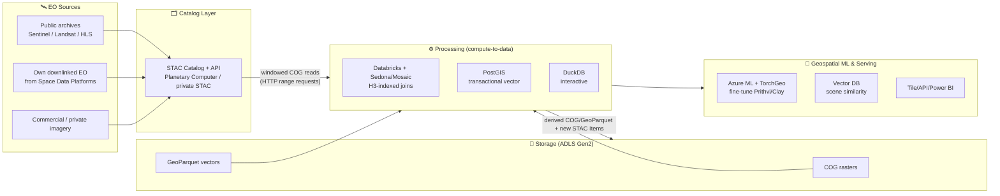
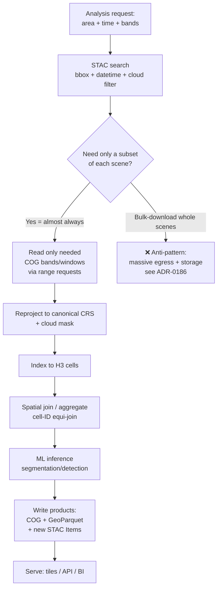
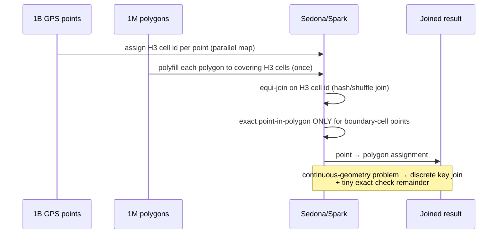

# Earth Observation and Geospatial Analytics

> Part of the **Enterprise Data & AI Architecture Handbook** · Phase-16 — Domain-Specific & Frontier Data Platforms · Chapter 06.
> Estimated study time: **60 min reading + ~4h labs**.
> **Prerequisites:** read [Space Data Platforms](05_Space_Data_Platforms.md) first.

---

## Executive Summary

[Space Data Platforms](05_Space_Data_Platforms.md) ended at the archive boundary: raw and processed satellite mission data, downlinked through a constrained link, prioritized onboard, and preserved in a long-term archive. This chapter picks up exactly where that one stopped — it is about turning that archived Earth-observation (EO) data, plus the vast public EO archives (Sentinel, Landsat, and their derivatives), into geospatial insight at scale. This is the fifth-to-last chapter of Phase-16 (Domain-Specific & Frontier Data Platforms) and covers the data architecture of modern, cloud-native geospatial analytics: the raster and vector data models and the cloud-optimized formats (COG, GeoParquet) and catalogs (STAC) that make petabyte-scale imagery queryable without moving it; the hierarchical spatial indexing systems (H3, S2, geohash) that make spatial joins and aggregations tractable at scale; the managed EO data platforms (Microsoft Planetary Computer and Planetary Computer Pro) and the processing engines (Apache Sedona, PostGIS, GDAL, DuckDB) that execute spatial SQL and raster processing; and the geospatial machine learning — segmentation, object detection, change detection, and the new geospatial foundation models — that extracts structured insight from imagery.

This chapter covers **raster versus vector data models, and the cloud-optimized formats and catalogs (COG, STAC, GeoParquet)** that enable reading only the bytes you need over HTTP rather than bulk-downloading whole scenes; **geospatial indexing (H3, S2, geohash)** as the discretization systems that turn expensive continuous-geometry operations into cheap discrete-cell joins and aggregations; **the Microsoft Planetary Computer and EO pipelines** as the managed, STAC-driven data-and-compute platform for petabyte-scale EO analytics on Azure; **spatial SQL and processing engines** as the query and transformation layer (distributed via Sedona on Spark, transactional via PostGIS, embedded via DuckDB) over both raster and vector data; and **geospatial ML** as the discipline of training and serving models on chipped imagery, including the emerging geospatial foundation models (Prithvi, Clay) that are reshaping how EO analytics is built.

The platform bias is **Azure-primary (~60%)** — the Microsoft Planetary Computer and Planetary Computer Pro, Azure Data Lake Storage for COG/GeoParquet, Azure Databricks with Apache Sedona and the Mosaic library for distributed geospatial compute, Azure Database for PostgreSQL (PostGIS) for transactional vector workloads, and Azure Machine Learning for geospatial-ML training and serving — **~30% enterprise open source** (STAC, COG, and GeoParquet as the foundational open standards; GDAL, rasterio, Shapely, and GeoPandas as the core libraries; Apache Sedona and DuckDB's spatial extension as processing engines; PostGIS as the reference spatial database; and TorchGeo for geospatial ML) — **~10% AWS/GCP comparison-only** (AWS's Registry of Open Data and SageMaker geospatial capabilities, and Google Earth Engine as the incumbent, distinctive planetary-scale EO platform).

**Bottom line:** the defining architectural shift this chapter teaches is **cloud-native geospatial** — the move from the legacy "download whole scenes to local disk, reproject, then process" model to a model where **data stays in object storage as cloud-optimized formats (COG/GeoParquet), is discovered via a STAC catalog, and is read in place by spatial or spectral window over HTTP range requests, with compute brought to the data.** This chapter's central thesis, formalized in its ADR (§40) and grounded in a real, extremely common cost-and-latency failure (§40, Case Study 1), is that **for petabyte-scale EO analytics, bulk-downloading full scenes to process a small spatial/temporal/spectral subset is the dominant, avoidable source of cost and slowness** — the cloud-native COG+STAC access pattern reads only the pixels you actually need, and is the difference between a pipeline that scales and one that bankrupts its egress budget.

---

## Learning Objectives

By the end of this chapter you will be able to:

1. **Distinguish raster and vector geospatial data models** and select the right cloud-optimized format (COG for raster, GeoParquet for vector) and access pattern for a given workload.
2. **Explain STAC** (SpatioTemporal Asset Catalog) and design a STAC-driven discovery-and-access pipeline that reads only the data a query needs.
3. **Choose and apply a geospatial index** (H3, S2, or geohash) for spatial joins, aggregations, and partitioning, understanding each system's geometry and trade-offs.
4. **Architect an EO processing pipeline** on the Microsoft Planetary Computer / Planetary Computer Pro and Azure, from STAC query through distributed raster/vector processing to a served product.
5. **Write spatial SQL and select a processing engine** (Sedona, PostGIS, DuckDB) appropriate to the scale, transactionality, and distribution needs of a workload.
6. **Design a geospatial ML pipeline** — chipping, training, and serving segmentation/detection/change-detection models, including when to leverage a geospatial foundation model.
7. **Defend a cloud-native geospatial platform's format, indexing, processing, and ML architecture** in engineer, staff engineer, architect, and CTO review settings.

---

## Business Motivation

- **Cloud-native access economics are the primary determinant of whether EO analytics is affordable at scale.** The difference between bulk-downloading scenes and reading COG windows over a STAC catalog (§8, §40) is frequently one to two orders of magnitude in egress and compute cost — making this chapter's access-pattern discipline a direct, board-visible cost driver, not an implementation detail.
- **EO analytics unlocks measurable value across many industries** — agriculture (crop health, yield forecasting), insurance (property risk, catastrophe response), finance (economic activity from imagery), environmental monitoring (deforestation, methane), and defense/intelligence — and the value depends on being able to process large areas over long time series affordably and quickly.
- **Spatial indexing is what makes cross-dataset geospatial analytics tractable.** Joining billions of points to millions of polygons, or aggregating imagery-derived features to administrative regions, is prohibitively expensive with naive geometry operations; discrete indexing (H3/S2, §8) is the enabling technology that turns these from intractable to routine.
- **Geospatial foundation models are lowering the cost and skill barrier to EO ML.** The emergence of pretrained geospatial foundation models (Prithvi, Clay, §8) means organizations can fine-tune on modest labeled datasets rather than training from scratch — a shift that changes the build-versus-buy calculus for EO-derived products.
- **CRS/projection correctness is a silent, high-consequence risk.** Coordinate-reference-system mismatches (§40, Case Study 2) produce results that look plausible but are geometrically wrong — misaligned features, nonsensical area calculations — a class of error that can invalidate an entire analysis and any decision made on it, making CRS discipline a data-quality governance requirement.

---

## History and Evolution

- **1972 — Landsat 1 launches**, beginning the continuous, open, multi-decade Landsat archive that remains the backbone of long-time-series EO analysis and established the multispectral-imagery data model still in use.
- **1980s-1990s — desktop GIS and the traditional geospatial stack.** ESRI's ArcGIS and the early GIS era established the vector (points/lines/polygons) and raster data models, the shapefile and GeoTIFF formats, and the coordinate-reference-system machinery — but on a "download and process locally" model that does not scale to the cloud-EO era.
- **2000 — PostGIS** brings spatial types and operations into PostgreSQL, making transactional spatial SQL mainstream and remaining the reference open-source spatial database.
- **2008 — geohash** popularizes a simple, string-prefix-based geospatial index; the same year, GDAL matures into the universal geospatial-format translation library underpinning nearly all downstream tooling.
- **2014-2015 — Google Earth Engine** launches, pioneering the planetary-scale "bring compute to the data" EO analytics model — the conceptual ancestor of every cloud-native EO platform, and still a distinctive incumbent (§34).
- **2015-2018 — the Sentinel era.** ESA's Copernicus program (Sentinel-1 SAR, Sentinel-2 optical) begins delivering free, frequent, global imagery, dramatically increasing EO data volume and cementing the need for cloud-native processing rather than local download.
- **2016-2018 — Cloud-Optimized GeoTIFF (COG) and the cloud-native geospatial movement.** COG's internal tiling and overviews enable HTTP range requests — reading a spatial window without downloading the whole file — the format foundation of everything in this chapter. Uber open-sources **H3** (2018), bringing hierarchical hexagonal indexing to mainstream data engineering.
- **2019-2021 — STAC (SpatioTemporal Asset Catalog) standardizes EO metadata and discovery.** STAC gives the fragmented EO world a common, JSON-based, API-queryable catalog model, making cross-provider discovery and access uniform — the "index" half of cloud-native geospatial, complementing COG's "storage" half.
- **2021 — Microsoft Planetary Computer** launches, combining a petabyte-scale STAC-cataloged EO data lake with hosted compute, making cloud-native EO analytics accessible on Azure.
- **2021-2023 — GeoParquet** emerges as the open columnar format for *vector* geospatial data, bringing the same cloud-native, columnar, predicate-pushdown benefits to vector that COG brought to raster, and integrating geospatial into the broader lakehouse (Parquet/Delta/Iceberg) ecosystem covered in [Columnar Storage Internals](../Phase-04/02_Columnar_Storage_Internals.md).
- **2023-2024 — geospatial foundation models.** NASA and IBM release **Prithvi**, a geospatial foundation model pretrained on Harmonized Landsat-Sentinel (HLS) data; **Clay** and others follow — shifting EO ML from train-from-scratch toward fine-tune-a-foundation-model, mirroring the foundation-model shift in NLP.
- **2024-2026 — enterprise productization: Planetary Computer Pro.** Microsoft introduces Planetary Computer Pro as an Azure-native service letting enterprises ingest, catalog (STAC), and analyze their *own* geospatial data with the same cloud-native patterns — moving the Planetary Computer's research-oriented model into a governed enterprise offering, while the free hosted-compute model of the original public Planetary Computer evolved toward this productized path (a platform-evolution signal consistent with the cloud-provider-domain-service shifts this Phase-16 series has repeatedly flagged).

---

## Why This Technology Exists

Cloud-native geospatial exists because the legacy GIS model — download whole scenes to local disk, reproject everything to a common grid, then process — collapses under the volume, velocity, and global scope of modern EO data. A single Sentinel-2 tile is hundreds of megabytes; a global, multi-year, multi-band analysis touches petabytes. You cannot download that, and you should not: any given analysis needs only a small spatial window, a few spectral bands, and a specific time range out of that petabyte. The technology exists to invert the legacy model — keep the data in object storage in a format (COG/GeoParquet) that supports partial reads, catalog it (STAC) so a query can find exactly the relevant assets, and bring elastic compute to the data — so that the cost and time of an analysis scale with the size of the *answer*, not the size of the *archive*.

Spatial indexing (H3/S2/geohash) exists for a parallel reason: exact geometric operations (point-in-polygon, polygon intersection, nearest-neighbor) are computationally expensive and scale poorly across billions of features. Discretizing space into a hierarchical grid of cells turns those continuous-geometry problems into discrete-key joins and aggregations that distributed engines handle efficiently — trading a bounded, controllable amount of spatial precision for enormous scalability. And geospatial ML exists because the volume of imagery vastly exceeds human interpretation capacity: models are the only way to extract structured insight (land cover, objects, changes) from petabytes of pixels at the cadence EO now delivers.

---

## Problems It Solves

- **Querying petabyte archives without moving them** — STAC discovery + COG/GeoParquet partial reads let an analysis touch only the assets and pixels it needs (§8, §40).
- **Making large-scale spatial joins and aggregations tractable** — H3/S2/geohash discretization turns expensive continuous-geometry operations into cheap discrete-key joins (§8).
- **Uniform cross-provider EO discovery** — STAC gives a common catalog model across Sentinel, Landsat, commercial, and private data (§8, §12).
- **Distributed raster and vector processing** — Sedona/Spark, DuckDB, and PostGIS execute spatial SQL and raster processing at the scale each workload requires (§8, §14).
- **Extracting structured insight from imagery at scale** — geospatial ML (segmentation, detection, change detection) and foundation models turn pixels into features (§8).
- **Integrating geospatial into the lakehouse** — GeoParquet brings vector data into the columnar/lakehouse ecosystem, unifying geospatial with the rest of the enterprise data platform (§13).

---

## Problems It Cannot Solve

- **It cannot make bad data or bad labels good.** Cloud, shadow, atmospheric effects, sensor artifacts, and mislabeled training chips all propagate into results; the platform makes processing efficient, not the underlying observations correct.
- **It cannot eliminate the precision-versus-scale trade-off of discrete indexing.** H3/S2 cells approximate geometry; for workloads requiring exact geometric truth (precise cadastral/legal boundaries, sub-meter measurement), discrete indexing is an accelerator, not a replacement, for exact geometry.
- **It cannot resolve coordinate-reference-system errors for you.** CRS mismatches (§40, Case Study 2) are silent and must be prevented by discipline and validation; no format or index automatically reconciles inconsistent projections.
- **It does not remove the need for domain and physical understanding.** Correctly interpreting spectral bands, indices (NDVI and the like), SAR backscatter, and atmospheric correction requires EO domain expertise the platform does not supply.
- **It cannot make analysis cheap if you ignore the access pattern.** The same platform used with a bulk-download pattern is expensive and slow; the cost benefits are conditional on cloud-native access (§40, ADR-0186).
- **It does not, by itself, produce the operational/physical data source.** This chapter analyzes downlinked EO data; the space-to-ground pipeline that produces it is the prerequisite [Space Data Platforms](05_Space_Data_Platforms.md), and modeling the physical assets themselves is Phase-16 Chapter 07 (Digital Twins).

---

## Core Concepts

### 6.1 Raster versus vector, and cloud-optimized formats

Geospatial data comes in two fundamental models:

- **Raster** — a grid of pixels, each with one or more band values, tied to a geographic extent and CRS. Satellite imagery, elevation models, and continuous surfaces (temperature, NDVI) are rasters. The cloud-native raster format is the **Cloud-Optimized GeoTIFF (COG)**: a valid GeoTIFF whose internal layout — tiled pixel blocks plus precomputed lower-resolution overviews, with the metadata header at the front — lets a client issue **HTTP range requests** to read just the tiles covering a spatial window (or a coarse overview for a zoomed-out view) without downloading the whole file. This is the single most important format concept in the chapter.
- **Vector** — discrete geometries (points, lines, polygons) with attributes: field boundaries, roads, building footprints, administrative regions. The cloud-native vector format is **GeoParquet** — geometries encoded in columnar Parquet, gaining predicate/column pushdown, compression, and native integration with the lakehouse ecosystem ([Columnar Storage Internals](../Phase-04/02_Columnar_Storage_Internals.md), [Delta Lake](../Phase-04/04_Delta_Lake.md), [Apache Iceberg](../Phase-04/05_Apache_Iceberg.md)). Legacy vector formats (shapefile, GeoJSON) remain common for interchange but are not cloud-optimized for scale.

The unifying principle: both COG and GeoParquet are designed so that a query reads only the relevant bytes from object storage, extending the columnar, pushdown-oriented storage discipline from [Compression and Encoding](../Phase-04/08_Compression_and_Encoding.md) to the geospatial domain.

### 6.2 STAC — the SpatioTemporal Asset Catalog

COG solves "read only the pixels I need from one file"; **STAC** solves "find which files I need in the first place." STAC is an open specification for cataloging spatiotemporal assets as JSON:

- A **STAC Item** describes a single spatiotemporal asset (e.g., one Sentinel-2 scene): its footprint geometry, datetime, CRS, and links to the actual asset files (the COGs, one per band) plus properties (cloud cover, platform, processing level).
- A **STAC Collection** groups related Items (e.g., all Sentinel-2 L2A scenes) with shared metadata and extent.
- A **STAC Catalog** organizes Collections.
- A **STAC API** exposes search over Items — filter by bounding box, time range, collection, and property (e.g., cloud-cover < 10%) — returning the matching Items and the URLs of exactly the COG assets to read.

The cloud-native EO access pattern is therefore: **STAC-search to find the relevant Items → read only the needed COG bands/windows over HTTP → process.** This is the pattern the chapter's ADR (§40) mandates, and it is what makes petabyte-scale EO analytics affordable. STAC is also, functionally, a domain-specific data catalog — the same catalog/discovery role played generally by [Data Catalog and Lineage](../Phase-08/02_Data_Catalog_and_Lineage.md), specialized for spatiotemporal assets.

### 6.3 Geospatial indexing — H3, S2, geohash

Exact geometric operations scale poorly. Discrete global grid systems discretize the Earth's surface into hierarchical cells, each with an integer/string ID, so spatial operations become key operations:

- **H3 (Uber)** — a hierarchical **hexagonal** grid. Hexagons have uniform adjacency (every neighbor shares an edge and is equidistant, unlike squares whose diagonal neighbors are farther), which makes H3 excellent for flow/movement, aggregation, and gradient analyses. 16 resolutions from continental to sub-meter. The dominant choice in modern data-engineering geospatial (and the basis of Databricks Mosaic's indexing).
- **S2 (Google)** — a hierarchical **quadrilateral** grid projecting the sphere onto a cube and using a Hilbert space-filling curve for cell IDs, giving excellent spatial locality (nearby cells have nearby IDs — good for range-based indexing). Strong for coverings and point indexing; used heavily in Google's own systems.
- **Geohash** — a **base-32 string** encoding where each character adds precision and shared prefixes imply spatial proximity. Simple, human-readable, works as a string prefix index in any database — but its rectangular cells distort with latitude and it has edge-adjacency quirks. Good for simple proximity/bucketing, less so for rigorous spatial analytics.

The core value in all three: a spatial join (which points fall in which polygons?) or aggregation (sum imagery-derived values per region) becomes a **join on cell IDs** — cheap, distributable, and shuffle-friendly in engines like Spark/Sedona. The trade-off is bounded precision: cells approximate geometry, so the resolution must be chosen to match the required precision, and boundary cells need care.

### 6.4 Spatial SQL and processing engines

Spatial operations are expressed in **spatial SQL** (the OGC Simple Features standard: `ST_Intersects`, `ST_Contains`, `ST_Distance`, `ST_Area`, etc.), executed by an engine sized to the workload:

- **PostGIS** (PostgreSQL extension) — the reference **transactional** spatial database: rich functions, spatial (GiST) indexes, strong for operational vector workloads and moderate data volumes. Available as **Azure Database for PostgreSQL**.
- **Apache Sedona** (formerly GeoSpark) — **distributed** spatial processing on Spark: spatial SQL, spatial RDDs/DataFrames, spatial partitioning and indexing across a cluster — the engine for petabyte vector/raster workloads, runnable on **Azure Databricks** and Synapse Spark ([Apache Spark Internals](../Phase-05/04_Apache_Spark_Internals.md)).
- **DuckDB (spatial extension)** — **embedded/single-node** analytical spatial SQL, superb for interactive analysis over GeoParquet without a cluster; the geospatial analog of DuckDB's broader "local lakehouse query" role.
- **Databricks Mosaic** — a Databricks Labs library layering H3-based indexing and raster/vector functions on top of Spark/Sedona, integrating geospatial into the Databricks lakehouse.
- **GDAL/OGR, rasterio, Shapely, GeoPandas** — the foundational libraries under nearly all of the above for format I/O, raster processing, and geometry operations.

The selection principle mirrors the rest of the handbook: PostGIS for transactional/operational vector, Sedona/Mosaic for distributed scale, DuckDB for embedded interactive analysis — sized to scale and transactionality, not chosen by default.

### 6.5 Geospatial ML

Geospatial ML applies computer-vision and ML techniques to imagery to extract structured insight:

- **Semantic segmentation** — classify every pixel (land cover, crop type, water/flood extent).
- **Object detection** — locate discrete objects (buildings, ships, vehicles, solar panels).
- **Change detection** — identify what changed between two dates (deforestation, construction, damage).
- **Regression** — estimate continuous quantities (biomass, yield, population).

The distinctive pipeline mechanics: imagery is **chipped** (tiled into fixed-size patches) for training and inference, because a full scene is far too large for a model input; chips must be handled with correct CRS, band ordering, and normalization. Libraries like **TorchGeo** and **Raster Vision** handle the geospatial-specific chipping, sampling, and CRS-aware data loading that generic vision frameworks do not. The major recent shift is **geospatial foundation models** — **Prithvi** (NASA/IBM, pretrained on HLS), **Clay**, and peers — pretrained on large unlabeled EO corpora and fine-tuned on modest labeled datasets, mirroring the foundation-model shift covered in the LLM chapters and building on the ML-pipeline discipline from [ML Pipeline Architecture](../Phase-11/06_ML_Pipeline_Architecture.md) and [Machine Learning Foundations](../Phase-11/01_Machine_Learning_Foundations.md). Embedding-based scene similarity search (finding scenes similar to a query scene) reuses the vector-database machinery from [Vector Databases (Qdrant and Milvus)](../Phase-13/01_Vector_Databases_Qdrant_and_Milvus.md) and [Embeddings and Semantic Search](../Phase-13/03_Embeddings_and_Semantic_Search.md).

---

## Internal Working

### 7.1 How a COG range-read actually works

A COG read that fetches only a spatial window works because of the file's deliberate internal layout:

1. The client reads the **COG header** (a small range at the front of the file) containing the tile-offset index, band structure, CRS, and overview descriptions — one small range request.
2. From the requested spatial window and desired resolution, the client computes **which internal tiles** (at the full resolution, or from a lower-resolution overview if zoomed out) intersect the window, and their byte offsets/lengths from the header index.
3. The client issues **HTTP range requests** (`Range: bytes=...`) for exactly those tiles' byte ranges — object stores (Azure Blob/ADLS, S3, GCS) all support range requests natively.
4. The client decompresses and assembles just those tiles into the output window.

The result: reading a 1 km² window from a 100 km² scene transfers roughly the bytes of that window plus the header, not the whole scene. This is the mechanical foundation of cloud-native raster, and why COG (not plain GeoTIFF) is mandatory for scalable EO.

### 7.2 How a STAC-driven pipeline executes

1. **Search**: the pipeline issues a STAC API query (bbox + datetime + collection + property filters like cloud-cover threshold) and receives matching STAC Items with asset URLs.
2. **Plan**: it selects the specific assets (bands) and, from each Item's footprint, the spatial windows needed — building a work list of (COG URL, window, band) reads.
3. **Read + process**: distributed workers (Sedona/Spark, or a Dask/rasterio cluster) each read their assigned COG windows via range requests (§7.1) and process them (index computation, masking, mosaicking, ML inference).
4. **Index + aggregate**: results are tagged with an H3/S2 cell (§6.3) and aggregated or spatially joined to vector regions via cell-ID joins.
5. **Write**: outputs land in the lakehouse as COG (derived rasters) and/or GeoParquet (derived vectors/features), cataloged with new STAC Items, following the medallion pattern from [Medallion Architecture](../Phase-05/03_Medallion_Architecture.md).

The key property: at no point is the full archive downloaded — the query's cost scales with the area/time/bands it actually touches.

### 7.3 How spatial indexing accelerates a join

Consider joining 1 billion GPS points to 1 million administrative polygons (which region is each point in?). Naive point-in-polygon is a spatial predicate against a spatial index — workable on one machine, painful distributed. The H3 approach:

1. **Index the points**: compute each point's H3 cell ID at a chosen resolution — a cheap, embarrassingly-parallel per-row function.
2. **Index the polygons**: compute the set of H3 cells covering each polygon (a "polyfill") once.
3. **Join on cell ID**: the spatial join becomes an equi-join on H3 cell ID — a standard, shuffle-friendly, distributable hash join, with an exact point-in-polygon check only for the small set of points in boundary cells that straddle a polygon edge.

The billion-row spatial problem becomes a billion-row equi-join plus a tiny exact-check remainder — the transformation that makes planetary-scale spatial analytics tractable in a distributed engine.

---

## Architecture

The reference cloud-native geospatial architecture has four layers:

- **Storage layer** — EO data as COG (raster) and GeoParquet (vector) in object storage (ADLS Gen2), with public archives (Sentinel/Landsat via Planetary Computer) accessed in place and derived products written to the lakehouse.
- **Catalog layer** — STAC catalog/API for discovery of both public and private assets, integrated with the enterprise catalog (per [Data Catalog and Lineage](../Phase-08/02_Data_Catalog_and_Lineage.md)).
- **Processing layer** — distributed (Sedona/Mosaic on Databricks), embedded (DuckDB), and transactional (PostGIS) engines executing spatial SQL and raster processing, with H3/S2 indexing for joins/aggregation, following the medallion bronze/silver/gold pattern.
- **ML and serving layer** — geospatial ML training/serving (Azure ML, TorchGeo, foundation models) and product serving (tile services, APIs, BI), with vector-embedding similarity search reusing the vector-DB layer.

The organizing principle across all layers is **compute-to-data**: data stays in object storage in cloud-optimized formats; every layer reads only what it needs and brings elastic compute to the data rather than moving data to compute.

---

## Components

- **EO data sources** — public archives (Sentinel via Copernicus, Landsat via USGS, HLS) and private/commercial imagery, plus this chapter's prerequisite: an organization's own downlinked, archived EO products from [Space Data Platforms](05_Space_Data_Platforms.md).
- **Object storage (COG/GeoParquet on ADLS Gen2)** — the storage substrate for cloud-native access.
- **STAC catalog + API** — discovery and access metadata (Planetary Computer's STAC, or a private STAC for your own data).
- **Distributed processing (Apache Sedona / Databricks Mosaic on Spark)** — petabyte-scale raster/vector processing and spatial joins.
- **Transactional spatial DB (PostGIS / Azure Database for PostgreSQL)** — operational vector workloads.
- **Embedded engine (DuckDB spatial)** — interactive single-node GeoParquet analysis.
- **Core libraries (GDAL, rasterio, Shapely, GeoPandas)** — format I/O and geometry operations.
- **Spatial index (H3/S2/geohash)** — discrete indexing for joins/aggregation/partitioning.
- **Geospatial ML (Azure ML, TorchGeo, Prithvi/Clay foundation models)** — imagery-to-insight modeling.
- **Vector DB (Qdrant/Milvus/Azure AI Search)** — scene/embedding similarity search (per [Vector Databases (Qdrant and Milvus)](../Phase-13/01_Vector_Databases_Qdrant_and_Milvus.md)).
- **Serving layer** — tile services, feature/product APIs, and BI (Power BI with mapping).

---

## Metadata

- **STAC metadata** is the primary metadata layer — footprint geometry, datetime, CRS, cloud cover, platform/instrument, processing level, and band descriptions per Item — and it is both the discovery mechanism (§6.2) and the provenance record for derived products.
- **CRS/projection metadata is first-class and safety-critical** — every raster and vector asset carries its coordinate reference system (an EPSG code such as 4326 for WGS84 lat/lon, 3857 for Web Mercator, or a UTM zone), and mismatches are the silent-error class of §40 Case Study 2. CRS must be explicit, validated at ingestion, and never assumed.
- **Band and spectral metadata** — which band is which wavelength, scaling factors, and no-data values — is required to interpret raster pixels correctly (computing NDVI with the wrong bands yields plausible-looking nonsense).
- **Processing lineage** — the chain from source Items through processing steps to derived product, extending [Data Catalog and Lineage](../Phase-08/02_Data_Catalog_and_Lineage.md) so a derived product's inputs and transformations are reproducible.
- **Data contracts for imagery inputs** — expected bands, CRS, resolution, and value ranges registered as contracts (per [Data Contracts](../Phase-08/07_Data_Contracts.md)) so a downstream pipeline validates an unexpected format/CRS change at ingestion rather than corrupting a downstream analysis.

---

## Storage

- **COG for raster** — cloud-optimized, tiled, overview-bearing GeoTIFF as the raster storage format on ADLS Gen2; derived rasters are written back as COG so they too support partial reads (§6.1, §7.1).
- **GeoParquet for vector** — columnar vector storage integrating with the lakehouse (Delta/Iceberg), gaining pushdown/compression and unifying geospatial with the rest of the data platform ([Delta Lake](../Phase-04/04_Delta_Lake.md), [Apache Iceberg](../Phase-04/05_Apache_Iceberg.md)).
- **Medallion tiering** — bronze (raw/ingested imagery and vectors), silver (cleaned, reprojected-to-common-CRS, cloud-masked, indexed), gold (analysis-ready products and features), per [Medallion Architecture](../Phase-05/03_Medallion_Architecture.md).
- **Spatial partitioning** — partition large vector/feature datasets by H3/S2 cell (or geohash prefix) so spatially-selective queries prune partitions, the geospatial application of the partitioning principles from the columnar/lakehouse chapters.
- **Access-in-place for public archives** — public EO (Sentinel/Landsat via Planetary Computer) is read in place from its hosted COGs rather than copied, so the "storage" for those datasets is someone else's object store plus your STAC queries — a major cost and freshness advantage (§40).
- **Compression** — COG and GeoParquet both compress; the general principles from [Compression and Encoding](../Phase-04/08_Compression_and_Encoding.md) apply, with the caveat that lossy raster compression is an analytical decision (it can perturb pixel values that feed indices/ML), not merely a storage one.

---

## Compute

- **Distributed (Databricks + Sedona/Mosaic)** — the workhorse for petabyte raster/vector processing, large spatial joins, and batch ML inference; elastic Spark clusters (per [Apache Spark Internals](../Phase-05/04_Apache_Spark_Internals.md)) with spot/low-priority nodes for cost-efficient large batch jobs.
- **Embedded (DuckDB)** — single-node interactive analysis over GeoParquet; ideal for exploration and moderate-scale work without a cluster.
- **Transactional (PostGIS)** — operational vector queries and updates at moderate scale.
- **GPU compute (Azure ML)** — geospatial-ML training and inference, including fine-tuning foundation models; chip-based training pipelines (§6.5).
- **The compute-to-data principle** — compute is provisioned in the same region as the data to avoid egress, and reads only the COG windows/GeoParquet columns a job needs — the architectural discipline that keeps compute cost proportional to the answer, not the archive (§40).

---

## Networking

- **HTTP range requests to object storage** — the fundamental network pattern (§7.1); COG/GeoParquet reads are many small ranged GETs against Blob/ADLS.
- **Region co-location to avoid egress** — the single most important networking-cost discipline: keep compute in the same Azure region as the data. Cross-region or cross-cloud reads of large imagery incur egress that can dwarf compute cost, and are a primary reason the bulk-download anti-pattern (§40) is so expensive.
- **Private endpoints** — for private imagery and derived products, ADLS and services behind private endpoints per [Network Security and Zero Trust](../Phase-10/04_Network_Security_and_Zero_Trust.md).
- **CDN/tile caching** — served map tiles benefit from CDN caching for interactive visualization workloads.

---

## Security

- **Data classification and access control** — imagery ranges from open (public archives) to commercially licensed, export-controlled, or sensitive (high-resolution imagery of specific areas); classification and RBAC (per [Data Governance Foundations](../Phase-08/01_Data_Governance_Foundations.md) and [Identity and Access Management with Entra](../Phase-10/02_Identity_and_Access_Management_with_Entra.md)) must be applied at the asset/collection level.
- **STAC-level access control** — a private STAC catalog over a differentiated-access corpus must enforce access at discovery *and* asset-read time, so a user cannot discover or read imagery they are not entitled to — the same access-control-propagation discipline established for RAG/retrieval indexes throughout the handbook, now applied to a spatiotemporal catalog.
- **Encryption** — imagery and derived products encrypted at rest (CMK per [Data Security and Encryption](../Phase-10/03_Data_Security_and_Encryption.md)) and in transit (TLS on all range requests).
- **Licensing enforcement** — commercial imagery licenses frequently restrict redistribution and derived-product sharing; the platform must track and enforce these as a governance control, not just a legal footnote.
- **Privacy** — very-high-resolution imagery can raise privacy considerations in some jurisdictions; where applicable, the privacy disciplines from the security phase apply to imagery as to any sensitive dataset.

---

## Performance

- **Read amplification is the key raster performance metric** — the ratio of bytes read to bytes needed. COG with correct tiling/overviews keeps it near 1; plain GeoTIFF or a bad access pattern inflates it enormously (§7.1). Choosing the right overview level for the zoom/resolution is essential.
- **Spatial-join performance** — dominated by the indexing strategy (§7.3); an H3/S2 cell-ID equi-join vastly outperforms naive geometry predicates at scale, but the resolution must match the data density (too coarse → skew and over-large boundary-check sets; too fine → excessive cells).
- **Partition pruning** — spatially-partitioned GeoParquet lets selective queries skip most data; unpartitioned large vector datasets force full scans.
- **CRS reprojection cost** — reprojecting on the fly per query is expensive; reprojecting once to a common CRS in the silver layer (and storing it) amortizes the cost.
- **ML inference throughput** — chip size, batch size, and GPU utilization govern imagery-inference throughput, following the batching/utilization discipline from [Model Serving and Ray](../Phase-11/04_Model_Serving_and_Ray.md).

---

## Scalability

- **Storage scales with the archive** — object storage (ADLS) scales effectively without limit; the cost, not capacity, is the constraint, managed by access-in-place and tiering.
- **Processing scales horizontally** — Sedona/Spark scales spatial processing and joins across a cluster via spatial partitioning; the H3/S2 cell-ID join (§7.3) is the mechanism that makes spatial joins shuffle-friendly and thus scalable.
- **STAC scales discovery** — a STAC API over a well-indexed metadata store scales discovery across billions of Items independently of the underlying pixel volume.
- **The scalability-limiting choices are architectural, not physical** — bulk-download patterns, unpartitioned data, on-the-fly reprojection, and mismatched index resolution are what limit scale; the cloud-native patterns in this chapter are precisely the ones that scale.

---

## Fault Tolerance

- **Idempotent, re-runnable pipelines** — because processing reads immutable source assets (public archives and immutable bronze), pipeline steps are naturally idempotent and re-runnable — a failed batch simply re-reads and reprocesses, following the lakehouse re-runnability discipline.
- **Partial-failure tolerance in distributed jobs** — Spark/Sedona reschedule failed tasks; a failed COG read (transient object-store error) is retried at the task level.
- **Source-archive availability** — access-in-place depends on the hosting archive's availability; for critical pipelines, caching or mirroring the specific assets a recurring workload needs guards against upstream outages (a trade-off against storage cost and freshness).
- **Reproducibility as resilience** — because derived products are reproducible from cataloged source Items and versioned processing code (§Metadata), a corrupted or lost derived product can be regenerated — the raw/source archive plus lineage is the recovery path, echoing the raw-retention resilience principle from [Space Data Platforms](05_Space_Data_Platforms.md).

---

## Cost Optimization (FinOps)

- **Cloud-native access is the dominant cost lever** — reading only needed COG windows/bands and GeoParquet columns, and accessing public archives in place rather than copying them, is frequently one to two orders of magnitude cheaper than bulk-download-and-process (§40). This is the single highest-leverage FinOps decision in the chapter.
- **Region co-location to avoid egress** — keep compute and data in the same region; cross-region/cross-cloud egress on imagery is a major, avoidable cost (§Networking).
- **Spot/low-priority compute for large batch** — big reprocessing and inference jobs suit spot Spark clusters, cutting compute cost substantially.
- **Storage tiering** — derived products and infrequently-accessed imagery to cool/archive tiers; keep only hot analysis-ready products on performant tiers.
- **Index-resolution and partition tuning** — right-sized H3 resolution and spatial partitioning reduce both compute (less shuffle/skew) and scan cost.
- **Access public data in place** — not copying Sentinel/Landsat (petabytes) into your own storage is both a storage-cost and a freshness win.

**Worked FinOps example.** A team needs monthly NDVI over 10,000 agricultural fields (a few km² each) across a country, from Sentinel-2, for one year. **Bulk-download approach:** downloading all Sentinel-2 scenes covering the country for 12 months — easily tens of terabytes — to local/owned storage, then processing, incurs large egress + storage + compute even though each field needs only a tiny window and 4 bands (red, NIR, and masking bands) per scene. Assume ~30 TB transferred and stored: at illustrative egress+storage rates this is thousands of dollars per run before any compute, and hours-to-days of transfer time. **Cloud-native STAC+COG approach:** a STAC search filters to scenes intersecting the fields with cloud-cover < 20%, and workers read only the ~4 bands' windows over each field via range requests, in-region, with no bulk copy — transferring on the order of tens of gigabytes (the actual pixels over the fields), not tens of terabytes. The data-movement cost falls by roughly **100-1000×**, the pipeline runs in minutes-to-an-hour instead of days, and no petabyte of imagery is copied or stored. This asymmetry — same result, ~2-3 orders of magnitude less data moved — is exactly why the ADR (§40) mandates cloud-native access, and why the bulk-download pattern is the chapter's central anti-pattern.

---

## Monitoring

- **Read amplification / bytes-read-per-query** — the leading indicator of COG/access-pattern health (§Performance); a spike signals a bad access pattern or missing overviews.
- **Egress volume and cross-region reads** — monitored as a direct cost signal; unexpected egress is frequently a co-location regression.
- **Pipeline cost per run and per unit area** — track cost normalized to area/time processed, so a regression toward bulk-download economics is visible.
- **STAC query latency and result counts** — discovery-layer health.
- **Spatial-join skew** — monitor partition/cell skew in Sedona jobs (a few dense H3 cells can dominate runtime), the geospatial analog of hot-partition monitoring.
- **ML data/label quality and drift** — segmentation/detection accuracy and input drift (new sensor, atmospheric conditions), per the ML monitoring discipline from [ML Pipeline Architecture](../Phase-11/06_ML_Pipeline_Architecture.md).

---

## Observability

- **End-to-end lineage from source STAC Items to derived product** — trace any output back to the exact source scenes, bands, windows, and processing code, extending [Data Catalog and Lineage](../Phase-08/02_Data_Catalog_and_Lineage.md) and the full-pipeline tracing principle from [LLMOps](../Phase-12/04_LLMOps.md) §4.2 to geospatial pipelines.
- **CRS/projection observability** — the ability to inspect and assert the CRS at every stage, so a mismatch (§40, Case Study 2) is caught by validation, not discovered in a wrong result.
- **Reconstructing why a result looks wrong** — distinguishing a data problem (cloud, sensor artifact, wrong band), a CRS problem, an index-resolution problem, and a genuine change on the ground — observability must let an analyst tell these apart.

### Operational Response Playbook

**Playbook 1 — CRS/projection mismatch detected (silent geometric error).**
- *Signal:* features misaligned across layers, implausible area/distance results (e.g., areas computed in degrees), or a validation check finding an unexpected EPSG code.
- *Detection:* automated CRS-assertion checks at ingestion and between pipeline stages; area/geometry sanity bounds; visual overlay QA on a sample.
- *Remediation:*
  | Situation | Action |
  |---|---|
  | Input arrived in an unexpected CRS | Reproject to the pipeline's canonical CRS at ingestion; reject/quarantine until validated |
  | Area/length computed in a geographic (degree) CRS | Recompute using a projected/equal-area CRS appropriate to the region |
  | Two layers in different CRS joined directly | Reproject to a common CRS before the spatial operation; re-run affected outputs |
  | CRS metadata missing/ambiguous | Halt; do not assume a default — determine the true CRS from the source before proceeding |

**Playbook 2 — Pipeline cost/latency regression toward bulk-download economics.**
- *Signal:* a sharp rise in egress volume, bytes-read-per-query, or cost-per-unit-area for a previously-efficient pipeline.
- *Detection:* FinOps monitoring on egress and cost-per-run; read-amplification alerts.
- *Remediation:*
  | Situation | Action |
  |---|---|
  | Compute moved to a different region than the data | Restore region co-location; investigate the deployment change |
  | A step began downloading full scenes | Restore STAC-filtered, windowed COG reads; review the code change (ADR-0186 violation) |
  | COGs missing overviews / bad tiling | Regenerate assets as valid COGs with overviews; read amplification will drop |
  | Reading all bands when few are needed | Restrict reads to required bands only |

---

## Governance

- **Licensing and redistribution governance** — commercial imagery licenses constrain redistribution and derived-product sharing; the platform must track provenance and enforce license terms on outputs, a distinctive geospatial governance obligation.
- **Export control and sensitivity** — high-resolution imagery of certain areas is export-controlled or sensitive; classification and access policy apply per [Data Governance Foundations](../Phase-08/01_Data_Governance_Foundations.md).
- **CRS and data-quality governance** — CRS correctness, band correctness, and cloud/atmospheric handling are data-quality governance requirements (Case Study 2), enforced by validation and contracts, because their violation silently invalidates results.
- **Reproducibility and provenance** — for decisions with regulatory, financial, or legal weight (insurance claims, environmental compliance, land disputes), the derived product must be reproducible from cataloged sources and versioned code — provenance is a governance, not just engineering, requirement.
- **Model governance for geospatial ML** — segmentation/detection models carry the full model-governance discipline (evaluation gates, versioning, fairness where humans are affected) from [MLOps and MLflow](../Phase-11/03_MLOps_and_MLflow.md) and [ML Pipeline Architecture](../Phase-11/06_ML_Pipeline_Architecture.md).

---

## Trade-offs

- **Cloud-native access vs. local processing familiarity** — cloud-native (COG/STAC) is dramatically more scalable and cheaper but requires new patterns and tooling; the legacy download-and-process model is familiar but does not scale (§40).
- **Discrete indexing precision vs. scale** — H3/S2 cells accelerate joins enormously but approximate geometry; exact-geometry workloads need the precise operation, with indexing as a pre-filter (§6.3).
- **H3 vs. S2 vs. geohash** — hexagonal uniform adjacency (H3) vs. quadrilateral locality-preserving IDs (S2) vs. simple string prefixes (geohash); choose by workload (flow/aggregation → H3; range-indexed point locality → S2; simple bucketing → geohash).
- **Access-in-place vs. mirror** — reading public archives in place saves storage and stays fresh but depends on upstream availability and network; mirroring critical assets adds resilience at storage cost.
- **Reproject-once vs. reproject-on-read** — reprojecting to a common CRS in silver amortizes cost but adds a processing stage and storage; on-read is flexible but repeatedly expensive.
- **Foundation model vs. train-from-scratch** — fine-tuning a geospatial foundation model (Prithvi/Clay) needs far less labeled data and compute, but couples you to the model's pretraining domain and license; from-scratch is fully controlled but data- and compute-hungry.

**When NOT to build a large cloud-native geospatial platform:** if your geospatial needs are a handful of static vector layers and small-area analyses, PostGIS (or even DuckDB over GeoParquet) alone is sufficient — the STAC/COG/Sedona/foundation-model stack is justified by *scale* (large areas, long time series, petabyte imagery, frequent reprocessing), not by the mere presence of geospatial data. Over-adopting the full platform for small workloads is the geospatial instance of the over-engineering caution recurring throughout this handbook.

---

## Decision Matrix

| Decision | Choose A when… | Choose B when… |
|---|---|---|
| **Access pattern** | *Cloud-native (STAC+COG windows):* any scale beyond a few small scenes; large area/time/reprocessing | *Bulk download:* effectively never at scale — only for a one-off tiny fixed set with no repetition |
| **Raster format** | *COG:* always for scalable/cloud raster (tiling + overviews + range reads) | *Plain GeoTIFF:* legacy interchange only; convert to COG for processing |
| **Vector format** | *GeoParquet:* scale, lakehouse integration, columnar pushdown | *GeoJSON/shapefile:* small interchange, tooling compatibility only |
| **Spatial index** | *H3:* flow, aggregation, uniform adjacency, data-eng default | *S2:* range-indexed point locality; *geohash:* simple string-prefix bucketing |
| **Processing engine** | *Sedona/Mosaic (Databricks):* petabyte scale, distributed joins | *PostGIS:* transactional/operational vector; *DuckDB:* embedded interactive over GeoParquet |
| **Geospatial ML** | *Fine-tune foundation model (Prithvi/Clay):* limited labels, standard tasks | *Train from scratch:* unique domain, ample labels, full control needed |
| **Public data** | *Access in place (Planetary Computer STAC):* freshness, no storage cost | *Mirror:* critical pipeline needing upstream-outage resilience |

---

## Design Patterns

- **STAC-driven windowed access** — search STAC → read only needed COG bands/windows over HTTP → process (§6.2, §7.2). The core cloud-native pattern.
- **Reproject-to-common-CRS in silver** — normalize all data to one CRS early, once, and validate it (§Metadata, §40 Case Study 2).
- **H3/S2 cell-ID spatial join** — index both sides to cells, equi-join on cell ID, exact-check only boundary cells (§7.3).
- **Spatial partitioning by cell/geohash** — partition large datasets spatially for pruning (§Storage).
- **Access-in-place for public archives** — never copy Sentinel/Landsat; query and read in place (§Storage, §Cost).
- **Chip-based ML with CRS-aware loaders** — tile imagery into chips with correct CRS/band/normalization via TorchGeo/Raster Vision (§6.5).
- **Fine-tune a geospatial foundation model** — start from Prithvi/Clay, fine-tune on modest labels (§6.5).
- **Medallion for geospatial** — bronze (raw) → silver (reprojected, masked, indexed) → gold (analysis-ready products/features), cataloged with derived STAC Items.

---

## Anti-patterns

- **Bulk-download-then-process** — downloading whole scenes/archives to process a small subset; the chapter's central, expensive anti-pattern (§40, ADR-0186).
- **Plain GeoTIFF at scale** — using non-COG rasters, forcing whole-file reads and destroying the partial-read benefit.
- **Assuming or ignoring CRS** — proceeding without explicit, validated CRS, producing silent geometric errors (§40, Case Study 2); computing area/length in a geographic (degree) CRS.
- **Cross-region/cross-cloud imagery reads** — processing in a different region than the data, incurring massive egress (§Networking, §Cost).
- **Mismatched index resolution** — H3/S2 resolution too coarse (skew, huge boundary-check sets) or too fine (cell explosion) for the data density.
- **Reprojecting on every read** — repeatedly reprojecting the same data instead of normalizing once in silver.
- **Copying petabytes of public data** — mirroring Sentinel/Landsat into your own storage without a resilience justification, paying storage cost and losing freshness.
- **Generic vision tooling for geospatial ML** — ignoring CRS/band/geospatial-sampling specifics that TorchGeo/Raster Vision handle, corrupting training data.

---

## Common Mistakes

- Treating cloud-native access as optional and defaulting to download-and-process, then being surprised by egress bills and slow pipelines.
- Not validating CRS at ingestion, discovering a projection mismatch only after a wrong result reaches a decision-maker.
- Computing areas or distances in EPSG:4326 (degrees) and getting meaningless numbers.
- Using the wrong bands for a spectral index (e.g., NDVI) and getting plausible-but-wrong output.
- Choosing an H3 resolution without regard to data density, causing join skew or cell explosion.
- Running compute in a different region than the imagery, quietly paying egress.
- Building the full Sedona/foundation-model stack for a workload PostGIS or DuckDB would serve.
- Ignoring cloud/shadow masking, letting clouds contaminate indices and ML inputs.

---

## Best Practices

- **Default to cloud-native, STAC-driven, windowed COG access** for any workload beyond a trivial fixed set (§40, ADR-0186).
- **Make CRS explicit and validated at every stage**; reproject to a canonical CRS once in silver; compute area/distance in an appropriate projected CRS (§Metadata, §40).
- **Store raster as COG (with overviews) and vector as GeoParquet**; convert legacy formats on ingestion.
- **Co-locate compute with data** in the same region to avoid egress (§Networking, §Cost).
- **Index with H3 (default) at a resolution matched to data density**; partition large datasets spatially.
- **Access public archives in place** via the Planetary Computer STAC unless a resilience need justifies mirroring.
- **Use geospatial-aware ML tooling** (TorchGeo/Raster Vision) and consider fine-tuning a foundation model before training from scratch.
- **Register imagery data contracts** (bands, CRS, resolution, value ranges) so format/CRS drift is caught at ingestion (§Metadata).
- **Instrument read amplification, egress, and cost-per-unit-area** as first-class KPIs (§Monitoring).
- **Mask clouds/shadows** before computing indices or feeding ML.

---

## Enterprise Recommendations

- **For an organization starting EO analytics on Azure:** build on the **Microsoft Planetary Computer** (public data, STAC, access-in-place) and **Planetary Computer Pro** (your own geospatial data, governed, Azure-native), with **Azure Databricks + Sedona/Mosaic** for scale — adopt cloud-native access from day one; retrofitting it after a bulk-download architecture is entrenched is costly.
- **For operational vector workloads:** **Azure Database for PostgreSQL (PostGIS)** is the right transactional engine; reserve Sedona for genuinely distributed scale, and DuckDB for interactive analysis — size the engine to the workload.
- **For geospatial ML:** start from a **geospatial foundation model (Prithvi/Clay)** and fine-tune; use **Azure ML** with **TorchGeo** for CRS-aware chipping and training; apply the full MLOps evaluation-gate and lineage discipline from Phase-11.
- **Treat CRS correctness and licensing as governance controls**, not engineering afterthoughts — both silently invalidate or legally jeopardize outputs.
- **Cross-reference the prerequisite [Space Data Platforms](05_Space_Data_Platforms.md)** for the archive this chapter consumes, and Phase-16 Chapter 07 (Digital Twins) for modeling the physical assets and environments these analytics inform.

---

## Azure Implementation

- **Data and catalog.** The **Microsoft Planetary Computer** provides a petabyte-scale, STAC-cataloged public EO data lake (Sentinel, Landsat, HLS, and many more) with access-in-place COG assets. **Planetary Computer Pro** is the Azure-native service for ingesting, STAC-cataloging, and analyzing an organization's *own* geospatial data with the same cloud-native patterns and Azure governance (Entra ID, RBAC, private networking). Private and derived assets live as **COG/GeoParquet on ADLS Gen2**.
- **Processing.** **Azure Databricks** with **Apache Sedona** and the **Mosaic** library performs distributed raster/vector processing, H3-indexed spatial joins, and batch ML inference (per [Apache Spark Internals](../Phase-05/04_Apache_Spark_Internals.md)), following the medallion pattern (per [Medallion Architecture](../Phase-05/03_Medallion_Architecture.md)). **Azure Synapse Spark** is an alternative Spark host. For transactional vector, **Azure Database for PostgreSQL** with PostGIS.
- **Geospatial ML.** **Azure Machine Learning** trains and serves geospatial models — chipping via **TorchGeo**, fine-tuning **Prithvi/Clay** foundation models — with the MLOps discipline (registry, evaluation gates, lineage) from [MLOps and MLflow](../Phase-11/03_MLOps_and_MLflow.md); serving via managed endpoints (per [Model Serving and Ray](../Phase-11/04_Model_Serving_and_Ray.md)).
- **Similarity search.** Scene/embedding similarity via **Azure AI Search** vector store or Qdrant/Milvus (per [Vector Databases (Qdrant and Milvus)](../Phase-13/01_Vector_Databases_Qdrant_and_Milvus.md)).
- **Governance and security.** **Microsoft Purview** for catalog/lineage/classification (per [Data Catalog and Lineage](../Phase-08/02_Data_Catalog_and_Lineage.md)); **Entra ID** RBAC on STAC collections and ADLS; private endpoints (per [Network Security and Zero Trust](../Phase-10/04_Network_Security_and_Zero_Trust.md)); CMK encryption (per [Data Security and Encryption](../Phase-10/03_Data_Security_and_Encryption.md)).
- **Serving/BI.** **Power BI** (with mapping/Azure Maps) and custom tile/feature APIs.

Illustrative cloud-native STAC + COG windowed read (Python, using the Planetary Computer STAC and rasterio — reads only the field's window, not the scene):

```python
import planetary_computer, pystac_client, rasterio
from rasterio.windows import from_bounds

# 1) STAC search: only scenes intersecting the field, low cloud, in a time range.
catalog = pystac_client.Client.open(
    "https://planetarycomputer.microsoft.com/api/stac/v1",
    modifier=planetary_computer.sign_inplace,
)
search = catalog.search(
    collections=["sentinel-2-l2a"],
    bbox=field_bbox,                    # [minlon, minlat, maxlon, maxlat]
    datetime="2026-06-01/2026-06-30",
    query={"eo:cloud_cover": {"lt": 20}},
)
items = list(search.items())

# 2) Read ONLY the red and NIR band windows over the field (range requests, no full download).
for item in items:
    for band in ("B04", "B08"):         # red, NIR for NDVI
        href = item.assets[band].href   # a signed COG URL
        with rasterio.open(href) as src:
            window = from_bounds(*field_bbox, transform=src.transform)
            data = src.read(1, window=window)   # only the field's pixels are transferred
            # ... compute NDVI, mask clouds, aggregate to H3 cells ...
```

---

## Open Source Implementation

- **Open standards** — **STAC** (catalog/API), **COG** (raster), and **GeoParquet** (vector) are the vendor-neutral foundations; every platform above builds on them, which is what preserves portability.
- **Core libraries** — **GDAL/OGR** (universal format I/O), **rasterio** (raster), **Shapely** (geometry), **GeoPandas** (vector dataframes), **pyproj** (CRS/reprojection).
- **Processing engines** — **Apache Sedona** (distributed spatial on Spark), **DuckDB spatial** (embedded), **PostGIS** (transactional). **Databricks Mosaic** is open (Databricks Labs) but Databricks-oriented.
- **Indexing** — **H3** (Uber), **S2** (Google) libraries with bindings for most languages and native functions in Sedona/Mosaic/PostGIS.
- **Geospatial ML** — **TorchGeo** and **Raster Vision** for CRS-aware chipping/training; **Prithvi** and **Clay** as open geospatial foundation models.
- **Orchestration/observability** — Airflow for pipeline orchestration; Grafana/Prometheus for platform observability, consistent with the rest of the handbook.
- **STAC tooling** — **stac-fastapi**, **pgstac**, and **stackstac**/**odc-stac** for building and consuming STAC catalogs and turning STAC search results into analysis-ready arrays.

A portable OSS stack: STAC (pgstac/stac-fastapi) + COG/GeoParquet on MinIO or ADLS + Sedona on Spark (or DuckDB) + TorchGeo — runnable on-prem, on Azure, or across clouds, with the open formats keeping data portable.

---

## AWS Equivalent (comparison only)

| Capability | Azure | AWS |
|---|---|---|
| **EO data platform** | Microsoft Planetary Computer / Planetary Computer Pro | Registry of Open Data (Sentinel/Landsat on S3) + Open Data program |
| **Object storage** | ADLS Gen2 (COG/GeoParquet) | S3 (COG/GeoParquet) |
| **Distributed processing** | Databricks + Sedona/Mosaic | EMR + Sedona; Athena (spatial) |
| **Geospatial ML** | Azure ML + TorchGeo | SageMaker (geospatial capabilities) |
| **Spatial DB** | Azure Database for PostgreSQL (PostGIS) | RDS/Aurora PostgreSQL (PostGIS) |

- **Advantages of AWS here:** the AWS Registry of Open Data hosts Sentinel/Landsat on S3 with broad ecosystem tooling and a large community; SageMaker added geospatial capabilities for EO ML pipelines.
- **Disadvantages of AWS:** no single integrated STAC-cataloged data-and-governance product equivalent to the Planetary Computer's curated experience; more assembly required. The same cloud-provider-domain-service continuity caution this Phase-16 series documents applies to any managed offering.
- **Migration strategy:** because STAC, COG, and GeoParquet are open standards, EO pipelines are highly portable — the data and catalog layers move with configuration, and Sedona/PostGIS/TorchGeo run on both clouds. Keep processing in open engines and formats to preserve portability; the main switching cost is any platform-specific catalog/governance integration.
- **Selection criteria:** choose by where your data gravity and enterprise governance already live; both clouds host the same open public archives.

---

## GCP Equivalent (comparison only)

| Capability | Azure | GCP |
|---|---|---|
| **EO data platform** | Microsoft Planetary Computer / Planetary Computer Pro | **Google Earth Engine** (distinctive planetary-scale EO platform) + public datasets |
| **Object storage** | ADLS Gen2 | Cloud Storage (COG/GeoParquet) |
| **Distributed processing** | Databricks + Sedona/Mosaic | Dataproc + Sedona; BigQuery GIS (spatial SQL) |
| **Geospatial ML** | Azure ML + TorchGeo | Vertex AI |
| **Spatial DB** | Azure Database for PostgreSQL (PostGIS) | Cloud SQL (PostGIS); BigQuery GIS |

- **Advantages of GCP here:** **Google Earth Engine** is the incumbent, distinctive planetary-scale EO analytics platform — a huge curated catalog with a unique server-side, compute-to-data programming model that many researchers and organizations are deeply invested in; **BigQuery GIS** brings capable spatial SQL to a serverless warehouse.
- **Disadvantages of GCP:** Earth Engine's distinctive programming model is powerful but comparatively proprietary and less directly integrated with a general-purpose enterprise lakehouse/governance stack; moving off it can require rework. It is less of a general "bring your open COG/STAC lakehouse" model than a platform in its own right.
- **Migration strategy & selection:** for open-format cloud-native pipelines (STAC/COG/GeoParquet + Sedona), Azure and GCP are both viable and portable; for organizations already built on Earth Engine's model, migration is a genuine re-architecture, so weigh existing Earth Engine investment heavily. Choose by data gravity, existing platform investment, and whether Earth Engine's specific model is a requirement.

---

## Migration Considerations

- **From legacy download-and-process to cloud-native** — the highest-value migration: re-point pipelines at STAC discovery + windowed COG reads, convert stored rasters to COG and vectors to GeoParquet, and co-locate compute with data. This is a pattern and tooling change more than a data-format re-engineering, and it typically pays for itself quickly in egress/compute savings (§40).
- **From shapefile/GeoTIFF to GeoParquet/COG** — convert on ingestion via GDAL; validate CRS and geometry during conversion (a good point to enforce a canonical CRS).
- **Across clouds** — open standards (STAC/COG/GeoParquet) and open engines (Sedona/PostGIS/DuckDB/TorchGeo) make EO pipelines portable; the switching cost lives in platform-specific catalog/governance integration and any Earth-Engine-specific code.
- **Adopting foundation models** — migrating from bespoke from-scratch models to fine-tuned Prithvi/Clay reduces labeling/compute but requires re-validating accuracy on your domain and checking model licenses.
- **CRS normalization as a migration step** — a migration is the natural moment to enforce a single canonical CRS and eliminate the mixed-CRS technical debt behind §40 Case Study 2.

---

## Mermaid Architecture Diagrams

**Diagram 1 — Cloud-native geospatial reference architecture (compute-to-data).**



**Diagram 2 — End-to-end data flow with cloud-native access decision.**



**Diagram 3 — Spatial-join-via-H3 sequence (how a billion-point join is made tractable).**



---

## End-to-End Data Flow

1. **Request** — an analysis defines an area of interest, a time range, and the bands/products needed.
2. **Discover (STAC)** — a STAC search filters to the matching Items (bbox, datetime, cloud-cover threshold), returning the exact COG asset URLs (§6.2, §7.2).
3. **Read (windowed COG)** — distributed workers read only the needed bands and spatial windows via HTTP range requests — no bulk download (§7.1, §40).
4. **Normalize** — reproject to the canonical CRS (validated), apply cloud/shadow masking, and compute indices (NDVI, etc.) — the silver layer.
5. **Index** — tag features/pixels with H3 cells for downstream joins and aggregation (§6.3, §7.3).
6. **Join/aggregate** — spatial joins and aggregations via cell-ID equi-joins (points→regions, imagery→fields).
7. **ML** — run segmentation/detection/change-detection (or fine-tuned foundation-model inference) on chips (§6.5).
8. **Write + catalog** — write derived products as COG/GeoParquet to gold, cataloged with new STAC Items and full lineage (§Metadata).
9. **Serve** — expose via tile services, feature/product APIs, and BI (Power BI), with similarity search over embeddings where useful.
10. **Monitor** — track read amplification, egress, cost-per-unit-area, CRS validity, and ML accuracy/drift (§Monitoring), with the CRS and cost-regression playbooks (§22) on standby.

---

## Real-world Business Use Cases

- **Agriculture** — field-level crop health (NDVI/EVI time series), crop-type classification, and yield forecasting over large regions, the canonical cloud-native EO workload (§40 FinOps example).
- **Insurance and catastrophe response** — pre/post-event imagery for damage assessment (flood, wildfire, hurricane), property risk from building footprints and land cover, and rapid claims triage.
- **Environmental monitoring** — deforestation and land-use change detection, methane/emissions monitoring, water-body and glacier change, and biodiversity/habitat analysis.
- **Finance and economic activity** — activity proxies from imagery (construction, shipping, parking-lot fill, nighttime lights) for alternative-data signals.
- **Infrastructure and urban planning** — building/road extraction, solar-panel and asset detection, and change over time for planning and asset management.
- **Defense and intelligence** — object detection and change detection over areas of interest, under export-control and sensitivity governance (§Security, §Governance).

---

## Industry Examples

- **Microsoft Planetary Computer / Planetary Computer Pro** — the Azure-native, STAC-cataloged EO data-and-compute platform this chapter treats as primary (§31).
- **ESA Copernicus / Sentinel and the Copernicus Data Space Ecosystem** — the free, global, frequent imagery archive underpinning most EO analytics.
- **USGS/NASA Landsat and Harmonized Landsat-Sentinel (HLS)** — the multi-decade open archive and the harmonized product Prithvi was pretrained on.
- **Google Earth Engine** — the incumbent planetary-scale EO platform and distinctive compute-to-data model (§34).
- **Uber H3 and Google S2** — the open indexing systems now standard across the data-engineering and geospatial ecosystems.
- **NASA/IBM Prithvi and Clay** — real, open geospatial foundation models reshaping EO ML (§6.5).
- **Apache Sedona and Databricks Mosaic** — the distributed spatial engines used for petabyte-scale EO in the lakehouse.

---

## Case Studies

**Case Study 1 — The bulk-download egress blowout (motivates ADR-0186).**
An analytics team building a national crop-monitoring product started, reasonably by legacy GIS habit, by downloading full Sentinel-2 scenes covering the country for each processing run and storing them in the team's own storage before computing field-level indices. Each scene is hundreds of megabytes across a dozen-plus bands; a country over a growing season is tens of terabytes per run. In production the pipeline was slow (hours-to-days of transfer per run) and the cloud bill was dominated by egress and storage — for data that was ~99% discarded, because each field needed only a few bands over a tiny window, and a large fraction of scenes were too cloudy to use at all. A FinOps review traced the cost almost entirely to moving imagery the pipeline never actually used. The fix was a full switch to the cloud-native pattern: a STAC search filtered to scenes intersecting the fields with cloud-cover below a threshold, and workers reading only the required bands' windows over HTTP range requests, in the same region as the data, with no bulk copy. Data moved fell by roughly two to three orders of magnitude, run time dropped from days to under an hour, and the storage line item nearly vanished (public data was read in place). The lesson, formalized in ADR-0186: at EO scale, the access pattern — not the processing algorithm — is the dominant cost and latency factor, and bulk-download-then-process is the anti-pattern to eliminate.

**Case Study 2 — The silent CRS mismatch (supports the Operational Response Playbook, §22).**
A team combined imagery-derived features (in a UTM projected CRS) with an administrative-boundary vector layer that had been loaded in EPSG:4326 (geographic lat/lon degrees), and a field-area calculation that computed polygon areas without reprojecting to an equal-area projected CRS. Nothing errored. The maps rendered. But the results were quietly, seriously wrong: features were spatially misaligned by the offset between the two CRSs, and the "areas" were computed in square degrees — a unit that is not a consistent physical area and varies with latitude — producing field sizes that were off by large, non-uniform factors. The error surfaced only when a downstream consumer noticed that reported field areas disagreed with known ground truth by implausible margins; by then, several derived reports had already been circulated. Root cause: no CRS was asserted or validated at ingestion or between stages, and area was computed in a geographic CRS. The remediation (§22, Playbook 1) — reproject all layers to a validated canonical projected CRS at ingestion, compute area/length only in an appropriate equal-area/projected CRS, and add automated CRS-assertion and area-sanity checks — turned a silent, decision-corrupting failure into a caught-at-ingestion validation error. The lesson: CRS correctness is a data-quality governance requirement (§Governance), because CRS errors don't crash — they silently produce confident, wrong answers.

### Architecture Decision Record (ADR-0186): Mandatory Cloud-Native (STAC + Windowed COG) Access; No Bulk-Download of Full Scenes at Scale

- **Context.** EO analytics operates over petabyte archives, but any given analysis needs only a small spatial window, a few spectral bands, and a specific time range out of each scene (§6.1, §6.2). The legacy pattern of bulk-downloading whole scenes to local/owned storage before processing moves one to three orders of magnitude more data than the analysis uses, dominating cost (egress + storage) and latency, as demonstrated in Case Study 1. Public archives (Sentinel/Landsat) are available in place as STAC-cataloged COGs and need not be copied at all.
- **Decision.** For any EO workload beyond a trivial, one-off, fixed small set, access MUST be cloud-native: **discover assets via a STAC search (filtered by bbox, datetime, and properties such as cloud cover), then read only the required bands and spatial windows via HTTP range requests from COG assets, with compute co-located in the same region as the data.** Public archives MUST be accessed in place (not copied) unless a specific, documented resilience requirement justifies mirroring a bounded asset set. Raster MUST be stored/produced as valid COG (with overviews) and vector as GeoParquet, so derived data also supports partial reads. Bulk-downloading full scenes to process a subset is prohibited as a default access pattern.
- **Consequences.** *Positive:* data movement, cost, and latency scale with the size of the answer, not the archive (Case Study 1's ~100-1000× data-movement reduction, §20); no petabytes of public data are copied; pipelines are faster and cheaper by one to three orders of magnitude. *Negative:* requires cloud-native tooling and patterns (STAC clients, COG-aware readers, spatial-windowing logic) that differ from legacy GIS habits, and a modest learning curve; access-in-place introduces a dependency on the hosting archive's availability (mitigated by bounded mirroring for critical pipelines). Read amplification and egress must be monitored (§21, §22) to catch regressions back toward bulk-download economics.
- **Alternatives considered.** *(1) Bulk-download-then-process* — rejected: the direct cause of Case Study 1's cost/latency blowout; moves data the analysis never uses. *(2) Mirror all public archives locally* — rejected as a default: pays petabyte storage cost, loses freshness, and is unnecessary given access-in-place; retained only as bounded, justified resilience mirroring. *(3) Plain GeoTIFF storage* — rejected: forces whole-file reads, defeating windowed access; COG is required. *(4) Cross-region processing for compute convenience* — rejected: incurs egress that undermines the entire cost benefit; region co-location is mandatory.

---

## Hands-on Labs

1. **Cloud-native NDVI over fields.** Use the Planetary Computer STAC to find low-cloud Sentinel-2 scenes over a set of field bounding boxes, read only the red/NIR band windows via range requests, compute NDVI, and aggregate to H3 cells. Compare data-transferred and runtime against a (small-scale) bulk-download baseline to reproduce the §20 FinOps asymmetry.
2. **H3 spatial join at scale.** Load a large point dataset and a polygon layer into Sedona (or DuckDB spatial), index both to H3, perform a cell-ID equi-join with a boundary-cell exact check, and compare performance to a naive geometry join (§7.3).
3. **COG vs. plain GeoTIFF read amplification.** Convert a GeoTIFF to a valid COG with overviews (GDAL), then measure bytes transferred for a windowed read from each; quantify the read-amplification difference (§7.1).
4. **CRS validation harness.** Build an ingestion check that asserts CRS, reprojects to a canonical projected CRS, and validates polygon areas against expected bounds — reproducing and catching the §40 Case Study 2 failure (Playbook 1, §22).
5. **Fine-tune a geospatial foundation model.** Use TorchGeo to chip a labeled dataset and fine-tune Prithvi (or Clay) for a land-cover segmentation task; evaluate against a from-scratch baseline (§6.5).

---

## Exercises

1. Explain why COG enables reading a spatial window without downloading the whole file, and what the header/tiles/overviews each contribute (§7.1).
2. Describe the STAC Item/Collection/Catalog/API model and how a STAC-driven pipeline avoids bulk download (§6.2, §7.2).
3. Compare H3, S2, and geohash by cell geometry, ID scheme, and best-fit workload (§6.3).
4. Walk through how an H3 cell-ID join makes a billion-point-to-million-polygon join tractable, and where the exact geometry check is still needed (§7.3).
5. Explain why computing area in EPSG:4326 is wrong and what CRS you would use instead (§40, Case Study 2).
6. Given a workload, choose between Sedona, PostGIS, and DuckDB and justify the choice (§6.4).

## Mini Projects

1. **End-to-end cloud-native EO pipeline.** Build a STAC → windowed-COG → reproject/mask → H3-index → aggregate → GeoParquet-product pipeline for a chosen area/time, cataloged with derived STAC Items and instrumented for read-amplification and cost-per-unit-area.
2. **Multi-engine geospatial benchmark.** Implement the same spatial join in Sedona, PostGIS, and DuckDB; measure and explain the performance/scaling differences and the right operating range for each.
3. **Geospatial ML change-detection service.** Fine-tune a foundation model for change detection between two dates, chip via TorchGeo, serve via an Azure ML endpoint, and apply MLOps evaluation gates and lineage from Phase-11.

---

## Capstone Integration

This chapter is the analytics layer over the prerequisite [Space Data Platforms](05_Space_Data_Platforms.md): it consumes the archived EO products that chapter's space-to-ground pipeline delivers, plus the public archives, and turns them into insight. It integrates the columnar/lakehouse storage discipline from [Columnar Storage Internals](../Phase-04/02_Columnar_Storage_Internals.md), [Delta Lake](../Phase-04/04_Delta_Lake.md), [Apache Iceberg](../Phase-04/05_Apache_Iceberg.md), and [Compression and Encoding](../Phase-04/08_Compression_and_Encoding.md) — specialized as COG (raster) and GeoParquet (vector); the distributed-processing and medallion patterns from [Apache Spark Internals](../Phase-05/04_Apache_Spark_Internals.md) and [Medallion Architecture](../Phase-05/03_Medallion_Architecture.md) — specialized via Sedona/Mosaic and H3 indexing; the catalog, lineage, contract, and governance disciplines from [Data Governance Foundations](../Phase-08/01_Data_Governance_Foundations.md), [Data Catalog and Lineage](../Phase-08/02_Data_Catalog_and_Lineage.md), and [Data Contracts](../Phase-08/07_Data_Contracts.md) — specialized via STAC and CRS/band data-quality governance; the ML lifecycle from [Machine Learning Foundations](../Phase-11/01_Machine_Learning_Foundations.md), [MLOps and MLflow](../Phase-11/03_MLOps_and_MLflow.md), [Model Serving and Ray](../Phase-11/04_Model_Serving_and_Ray.md), and [ML Pipeline Architecture](../Phase-11/06_ML_Pipeline_Architecture.md) — specialized via chipping, TorchGeo, and geospatial foundation models; the vector-search machinery from [Vector Databases (Qdrant and Milvus)](../Phase-13/01_Vector_Databases_Qdrant_and_Milvus.md) and [Embeddings and Semantic Search](../Phase-13/03_Embeddings_and_Semantic_Search.md) — specialized for scene similarity; and the security baseline from [Data Governance Foundations](../Phase-08/01_Data_Governance_Foundations.md), [Identity and Access Management with Entra](../Phase-10/02_Identity_and_Access_Management_with_Entra.md), [Data Security and Encryption](../Phase-10/03_Data_Security_and_Encryption.md), and [Network Security and Zero Trust](../Phase-10/04_Network_Security_and_Zero_Trust.md). The chapter's distinctive contribution is the **cloud-native access discipline** (compute-to-data, STAC+COG, region co-location) and **discrete spatial indexing** as the two enabling techniques that make planetary-scale geospatial analytics affordable and tractable. The final chapter — Phase-16 Chapter 07 (Digital Twins) — closes the phase by modeling the physical assets and environments that IoT, industrial, robotics, AV, space, and EO data all describe.

---

## Interview Questions

1. What is a Cloud-Optimized GeoTIFF, and how does it let you read a spatial window without downloading the whole file?
2. What is STAC, and how does a STAC-driven pipeline avoid bulk-downloading imagery?
3. Compare raster and vector data models and their cloud-optimized formats (COG, GeoParquet).
4. Compare H3, S2, and geohash — geometry, ID scheme, and when you'd use each.
5. Why is bulk-download-then-process an anti-pattern at EO scale, and what replaces it?
6. What is a CRS, and why is computing area in EPSG:4326 wrong?

## Staff Engineer Questions

1. Design a cloud-native EO pipeline for country-scale monthly NDVI over 10,000 fields; justify every access-pattern and cost decision.
2. How does an H3/S2 cell-ID join make a billion-point spatial join tractable, and how do you choose the resolution?
3. When would you use Sedona vs. PostGIS vs. DuckDB, and why?
4. How do you prevent and detect CRS mismatches across a multi-source geospatial pipeline?
5. Design a geospatial ML pipeline including chipping, CRS-aware loading, and a foundation-model-fine-tune-vs-from-scratch decision.

## Architect Questions

1. Make the build-vs-adopt decision between the Microsoft Planetary Computer / Planetary Computer Pro and a self-assembled STAC+COG+Sedona stack.
2. How do you weigh access-in-place vs. mirroring public archives for a business-critical pipeline?
3. Design the governance for imagery licensing, export control, CRS/data-quality, and reproducibility.
4. How do you keep an EO platform portable across clouds given open standards vs. platform-specific services (e.g., Earth Engine)?
5. Architect the cost controls (egress, region co-location, tiering, spot) for a petabyte-scale EO platform.

## CTO Review Questions

1. Is our EO platform's cost scaling with the size of our answers or the size of the archive — and how do we know?
2. What is our exposure to CRS/data-quality errors that silently produce wrong, decision-driving results?
3. Where are we locked in (e.g., Earth Engine or a managed platform) and where have we preserved open-format portability?
4. Are we building geospatial ML from scratch where a fine-tuned foundation model would be faster and cheaper?
5. Do our imagery licensing and export-control obligations have enforced technical controls, or only legal policy?

---

## References

- STAC (SpatioTemporal Asset Catalog) specification. https://stacspec.org
- Cloud-Optimized GeoTIFF (COG). https://www.cogeo.org
- GeoParquet specification. https://geoparquet.org
- Uber H3 hierarchical hexagonal geospatial index. https://h3geo.org
- Google S2 Geometry. https://s2geometry.io
- Microsoft Planetary Computer and Planetary Computer Pro. https://planetarycomputer.microsoft.com and https://learn.microsoft.com/azure/planetary-computer/
- Apache Sedona (distributed geospatial on Spark). https://sedona.apache.org
- PostGIS (spatial extension for PostgreSQL). https://postgis.net
- GDAL/OGR. https://gdal.org
- TorchGeo (geospatial deep learning). https://torchgeo.readthedocs.io
- NASA/IBM Prithvi and the Clay geospatial foundation models.
- ESA Copernicus / Sentinel and the Copernicus Data Space Ecosystem; USGS/NASA Landsat and HLS.
- [Space Data Platforms](05_Space_Data_Platforms.md) — the prerequisite chapter whose archived EO products this chapter consumes.

## Further Reading

- [Columnar Storage Internals](../Phase-04/02_Columnar_Storage_Internals.md), [Delta Lake](../Phase-04/04_Delta_Lake.md), [Apache Iceberg](../Phase-04/05_Apache_Iceberg.md), and [Compression and Encoding](../Phase-04/08_Compression_and_Encoding.md) — the storage and format foundations COG and GeoParquet build on.
- [Apache Spark Internals](../Phase-05/04_Apache_Spark_Internals.md) and [Medallion Architecture](../Phase-05/03_Medallion_Architecture.md) — the distributed-processing and lakehouse patterns Sedona/Mosaic specialize.
- [Machine Learning Foundations](../Phase-11/01_Machine_Learning_Foundations.md), [MLOps and MLflow](../Phase-11/03_MLOps_and_MLflow.md), [Model Serving and Ray](../Phase-11/04_Model_Serving_and_Ray.md), and [ML Pipeline Architecture](../Phase-11/06_ML_Pipeline_Architecture.md) — the ML lifecycle geospatial ML applies.
- [Vector Databases (Qdrant and Milvus)](../Phase-13/01_Vector_Databases_Qdrant_and_Milvus.md) and [Embeddings and Semantic Search](../Phase-13/03_Embeddings_and_Semantic_Search.md) — the vector-search machinery for scene similarity.
- [Data Catalog and Lineage](../Phase-08/02_Data_Catalog_and_Lineage.md) and [Data Contracts](../Phase-08/07_Data_Contracts.md) — the catalog and contract disciplines STAC and imagery data contracts specialize.
- **Phase-16 Chapter 07 — Digital Twins** (next and final in the phase): modeling the physical assets and environments that IoT, industrial, robotics, AV, space, and EO data describe.
- [ROADMAP.md](../../ROADMAP.md) — the full handbook roadmap and phase sequence.
