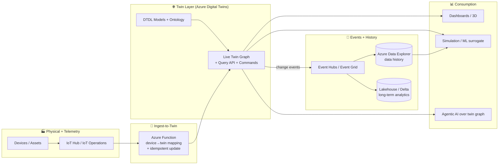
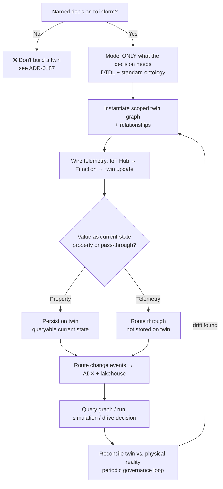
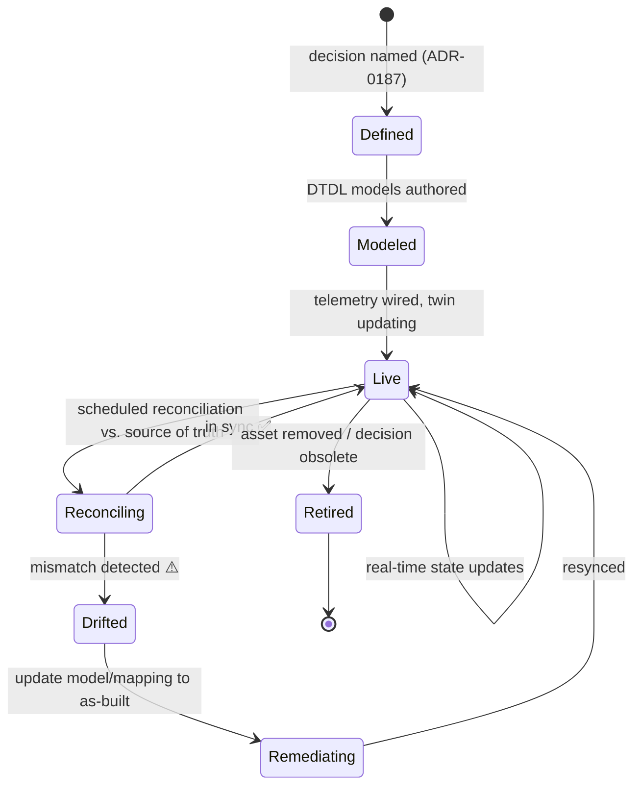

# Digital Twins

> Part of the **Enterprise Data & AI Architecture Handbook** · Phase-16 — Domain-Specific & Frontier Data Platforms · Chapter 07 (final chapter of the phase).
> Estimated study time: **60 min reading + ~3h labs**.
> **Prerequisites:** read [Industrial IoT (IIoT)](02_Industrial_IoT_IIoT.md) first.

---

## Executive Summary

Every chapter in Phase-16 so far has been about a *stream of data from a physical thing* — IoT telemetry ([IoT Data Platforms](01_IoT_Data_Platforms.md)), industrial sensor and OPC UA data ([Industrial IoT (IIoT)](02_Industrial_IoT_IIoT.md)), robot state (Robotics and ROS2, Phase-16 Chapter 03), vehicle sensor logs (Autonomous Vehicles Data, Phase-16 Chapter 04), spacecraft downlink ([Space Data Platforms](05_Space_Data_Platforms.md)), and Earth imagery ([Earth Observation and Geospatial Analytics](06_Earth_Observation_and_Geospatial_Analytics.md)). This final chapter of the phase is about the layer that gives all of that data *meaning*: a digital twin is a live, queryable, continuously-updated digital representation of a physical entity or system — a pump, a building, a factory, a power grid, a satellite constellation — that models not just the thing's current state but its structure, its relationships to other things, and its expected behavior. Where the prior chapters delivered contextless telemetry (a temperature reading, a vibration spectrum, a GPS point), a digital twin is the semantic model that says *which* asset that reading belongs to, *what* that asset is connected to, and *what* the reading means for a decision.

This chapter covers **the Digital Twins Definition Language (DTDL)** as the JSON-LD schema language for defining twin models — interfaces, properties, telemetry, relationships, components, and commands; **Azure Digital Twins (ADT)** as the primary Azure platform-as-a-service for building live twin graphs, querying them, and routing their change events into the broader data platform; **real-time state and simulation** as the two complementary uses of a twin — reflecting current reality versus running what-if scenarios (physics-based or ML-surrogate) against it; **twin graphs and relationships** as the defining structural feature that distinguishes a digital twin from a mere per-device state store — a graph of typed relationships modeling how the real system is actually composed; and **use cases across industries** — smart buildings, manufacturing, energy, supply chain, healthcare, and the frontier domains of this very phase.

The platform bias is **Azure-primary (~60%)** — Azure Digital Twins and DTDL as the core modeling and runtime platform, Azure IoT Hub as the telemetry source (per [IoT Data Platforms](01_IoT_Data_Platforms.md)), Azure Functions for the ingest-to-twin translation layer, Azure Data Explorer for twin data history/time-series, Event Hubs/Event Grid for twin event routing, and the emerging Microsoft Fabric Real-Time Intelligence digital-twin capabilities — **~30% enterprise open source** (the open-sourced DTDL specification and its published ontologies such as RealEstateCore; Neo4j and graph concepts from [Knowledge Graphs with Neo4j](../Phase-13/02_Knowledge_Graphs_with_Neo4j.md); Kafka, Spark, and Delta Lake for the analytics backbone; and Grafana/Prometheus for observability) — **~10% AWS/GCP comparison-only** (AWS IoT TwinMaker and GCP's narrow Supply Chain Twin, contrasted as the other clouds' positions).

**Bottom line:** the defining risk of digital-twin programs — and the reason a large fraction of them fail or are abandoned — is not technical; it is that they are built *model-first* instead of *decision-first*. This chapter's central thesis, formalized in its ADR (§40) and grounded in a real, well-documented industry failure pattern (§40, Case Study 1), is that **a digital twin must be scoped to a specific, named decision or use case it exists to inform — you start from the question, not the model.** An all-encompassing "digital twin of everything" that models every asset down to the bolt, without a decision it drives, is expensive, unmaintainable, and valueless; and a twin that is not actively kept in sync with physical reality (§40, Case Study 2) silently diverges into a confidently-wrong model that is worse than no twin at all.

---

## Learning Objectives

By the end of this chapter you will be able to:

1. **Define a digital twin precisely** and distinguish it from a digital model, a digital shadow, a 3D CAD model, and a simulation — including the descriptive→informational→predictive→prescriptive maturity spectrum.
2. **Model a physical system in DTDL** — interfaces, properties, telemetry, relationships, components, and commands — and instantiate a twin graph from those models.
3. **Architect an Azure Digital Twins solution** end to end: telemetry ingest → twin-state update → twin-graph query → event routing → data history and analytics.
4. **Design the twin graph and its relationships** to model how a real system is actually composed, reusing graph and ontology concepts from prior chapters.
5. **Distinguish and combine real-time state and simulation** — using a twin to reflect current reality and to run what-if/predictive scenarios (physics-based or ML-surrogate).
6. **Scope a digital twin to a specific decision** and design the twin-reality reconciliation process that prevents model drift.
7. **Defend a digital-twin platform's modeling, synchronization, and integration architecture** in engineer, staff engineer, architect, and CTO review settings.

---

## Business Motivation

- **A digital twin turns contextless telemetry into decision-ready insight.** The prior Phase-16 chapters produce raw signals; a twin supplies the structural and relational context (which asset, connected to what, meaning what) that makes those signals actionable — the direct business reason a twin exists on top of an IoT platform.
- **Digital-twin programs have a high, well-documented failure/abandonment rate**, almost always for the same reason: they are built model-first without a decision to inform (§40, Case Study 1). Scoping to a decision (§40, ADR-0187) is therefore the single most consequential business decision in a twin program, not a technical detail.
- **Twins enable simulation and what-if analysis against a live model of reality**, letting organizations test interventions (an HVAC setpoint change, a production-line reconfiguration, a grid-load rebalancing) against a data-grounded model before acting physically — a distinct, high-value capability the raw data streams alone cannot provide.
- **Model drift is a silent, high-consequence business risk.** A twin that has diverged from the physical asset it represents (§40, Case Study 2) produces confident, wrong answers that drive wrong decisions — potentially with safety and financial consequences in industrial contexts, making twin-reality reconciliation a governance and risk requirement.
- **Twins are the integration and contextualization layer across the whole physical-data estate** — the same twin-graph pattern models a building, a factory, a fleet, or a satellite constellation, making it the unifying capstone concept for Phase-16's otherwise-diverse domains.

---

## History and Evolution

- **1960s-1970s — NASA's "living models" and paired-vehicle practice.** During the Apollo program, NASA maintained detailed ground-based models and duplicate systems mirroring spacecraft in flight — famously used to work the Apollo 13 crisis — the conceptual ancestor of the digital twin: a continuously-updated model of a remote physical system used to reason about it.
- **2002-2003 — Michael Grieves formalizes the concept** in a product-lifecycle-management (PLM) context, articulating the "physical space / virtual space / linking data" structure that defines a digital twin. The term and framing were later developed jointly with **John Vickers (NASA)**.
- **2010 — NASA's technology roadmap** explicitly names and defines the "digital twin" for aerospace vehicles, bringing the term into mainstream engineering vocabulary.
- **2010s — the industrial IoT and Industry 4.0 wave.** As IIoT (per [Industrial IoT (IIoT)](02_Industrial_IoT_IIoT.md)) made continuous asset telemetry cheap and pervasive, digital twins moved from an aerospace/PLM niche toward a general industrial pattern. Vendors including GE (Predix), Siemens, PTC, Dassault, and Bentley (iTwin) built twin platforms — with mixed results: **GE Digital's Predix**, in particular, is a widely-studied case of an overambitious industrial-IoT/twin platform that was substantially scaled back, an early, concrete signal of the model-first / boil-the-ocean failure mode this chapter's ADR addresses.
- **2018-2020 — DTDL and Azure Digital Twins.** Microsoft introduced the **Digital Twins Definition Language (DTDL)** — a JSON-LD-based, open-sourced modeling language — and the **Azure Digital Twins** PaaS, reaching general availability with a twin-graph-centric model (v2) in 2020. This shifted the twin from a monolithic vendor application toward a composable, model-driven, graph-based cloud service integrated with the broader Azure data platform.
- **2020-2023 — domain ontologies mature.** Published DTDL ontologies — notably **RealEstateCore** for smart buildings, plus energy-grid and manufacturing ontologies — gave twins standardized, reusable vocabularies (connecting directly to the ontology discipline in [Ontologies and Taxonomies](../Phase-13/05_Ontologies_and_Taxonomies.md)), reducing the "everyone models buildings differently" fragmentation.
- **2023-2026 — convergence with the lakehouse, simulation, and AI.** Twins increasingly integrate with the lakehouse (twin data history to ADX/Delta), with high-fidelity simulation and visualization platforms (physics engines, 3D/USD-based environments), and with AI — including ML surrogate models replacing expensive physics simulation, and, most recently, agentic-AI reasoning *over* twin graphs (per [Agentic AI Architecture](../Phase-12/05_Agentic_AI_Architecture.md)). Microsoft's **Fabric Real-Time Intelligence** introduced digital-twin-builder capabilities, signalling an evolution of the Azure twin story toward the unified-analytics Fabric platform alongside the standalone Azure Digital Twins service — a platform-evolution the Enterprise Recommendations (§30) and Migration Considerations (§35) treat explicitly.

---

## Why This Technology Exists

Digital twins exist to close the gap between *data about a physical system* and *decisions about that physical system*. An IoT platform (per [IoT Data Platforms](01_IoT_Data_Platforms.md)) delivers a firehose of readings, each tagged with a device ID and a timestamp — but a device ID is not a *thing you make decisions about*. A decision-maker doesn't care about "device 7A3F reported 82°C"; they care about "the primary chiller serving the east wing is overheating, and it feeds three air handlers that serve a data hall with SLA-bound equipment." The twin is the model that carries that structure — the identity of assets, their properties, their relationships, and their expected behavior — so that raw telemetry can be interpreted, queried, and reasoned about in the terms the business actually uses.

It also exists to make *simulation against reality* possible. A physics model or an ML model is only as useful as the state it is initialized from; a live twin provides a continuously-current, data-grounded starting point, so what-if analysis, predictive maintenance, and optimization run against what the system *actually is right now*, not a stale design-time assumption. And it exists as an *integration layer*: the twin graph is a single, coherent, queryable semantic model over a heterogeneous physical estate, replacing a tangle of per-system point integrations with one contextual model that many applications can share.

---

## Problems It Solves

- **Contextualizing raw telemetry** — the twin graph gives each reading an asset identity, properties, and relationships, turning signals into decision-ready information (§7.1, §7.5).
- **Modeling how a system is actually composed** — typed relationships in the twin graph capture containment, connection, and dependency that flat per-device stores cannot (§7.3).
- **Grounding simulation in live reality** — a current twin state is the initialization for what-if, predictive, and optimization analysis (§7.4).
- **Providing a shared semantic integration layer** — one queryable model over a heterogeneous physical estate, replacing brittle point integrations (§7.5).
- **Enabling cross-asset and cross-system reasoning** — graph queries answer questions spanning many assets ("which rooms are affected if this riser fails?") that single-asset views cannot (§8.2).
- **Standardizing domain models** — DTDL ontologies (RealEstateCore, etc.) give reusable, interoperable vocabularies (§7.2, §12).

---

## Problems It Cannot Solve

- **It cannot inform a decision no one defined.** A twin built without a specific decision to serve produces an impressive model and no value — the central failure mode (§40, Case Study 1, ADR-0187).
- **It cannot stay correct without active reconciliation.** A twin diverges from physical reality as the real system changes; without a synchronization process, model drift silently makes it wrong (§40, Case Study 2).
- **It is not a substitute for a high-fidelity physics simulation or a 3D visualization** — a DTDL twin is a state-and-relationship model; detailed physics or photorealistic rendering come from integrated simulation/visualization engines, not the twin itself.
- **It does not fix bad source data.** Garbage telemetry, wrong sensor mappings, and unmodeled assets propagate into the twin; the twin makes data *usable*, not *correct*.
- **It cannot replace the IoT/ingestion platform beneath it.** The twin sits *on top of* the IoT platform (per [IoT Data Platforms](01_IoT_Data_Platforms.md), [Industrial IoT (IIoT)](02_Industrial_IoT_IIoT.md)); it is a contextualization layer, not an ingestion or historian replacement.
- **It cannot guarantee safety-critical control.** As established in [Industrial IoT (IIoT)](02_Industrial_IoT_IIoT.md) §16, the data/twin platform must not be in the safety-instrumented control loop; a twin informs and predicts, it does not replace SIL-rated safety systems.

---

## Core Concepts

### 7.1 What a digital twin is — and is not

A **digital twin** is a live, continuously-updated, queryable digital representation of a physical entity or system, comprising its identity, current state (properties), relationships to other entities, and — at higher maturity — its expected/predicted behavior. Three distinctions are essential:

- **Digital model** — a design-time representation (e.g., a CAD/BIM model or a static asset record) with **no live data link**. Useful, but not a twin.
- **Digital shadow** — a **one-way** live link: the digital representation is updated from the physical thing, but changes to the digital side do not flow back. Most "twins" in practice are actually shadows, and that is often correct.
- **Digital twin (full)** — a **bidirectional** link: the digital side reflects the physical, *and* can drive changes back (commands, setpoints) to the physical. Powerful but higher-stakes (a bidirectional twin can act on the real world, raising the security and safety bar of [Industrial IoT (IIoT)](02_Industrial_IoT_IIoT.md) §16).

Twins also sit on a **maturity spectrum**: *descriptive* (what is happening now) → *informational/diagnostic* (why) → *predictive* (what will happen) → *prescriptive* (what to do). Most value is captured at the descriptive/predictive levels; prescriptive/bidirectional is where the stakes and complexity rise sharply. Critically, a twin is **not** a 3D visualization (that is a *view* of a twin) and **not** a physics simulation (that is something you *run against* a twin).

### 7.2 DTDL — the Digital Twins Definition Language

**DTDL** is a JSON-LD-based language for defining twin models. A model is an **Interface** describing a type of thing, containing:

- **Properties** — state that changes relatively slowly and is stored on the twin (e.g., a room's `setpointTemperature`, an asset's `serialNumber`).
- **Telemetry** — streaming measurements that flow through but are not necessarily stored on the twin (e.g., a sensor's `temperature` events).
- **Relationships** — typed, directed links to other twins (e.g., a `Floor` *contains* `Room`s), the feature that makes the twin a *graph* (§7.3).
- **Components** — reusable sub-interfaces composed into a model (e.g., a `thermostat` component reused across device models).
- **Commands** — callable operations a twin exposes (e.g., `reboot`, `setSetpoint`), the mechanism for a bidirectional twin.

Models define the **schema**; **twins** are the runtime **instances** of those models. DTDL is open-sourced (the specification and reference ontologies are on GitHub), and published **ontologies** — RealEstateCore for buildings being the canonical example — provide standardized, reusable model libraries, directly applying the ontology discipline from [Ontologies and Taxonomies](../Phase-13/05_Ontologies_and_Taxonomies.md) to the physical-asset domain.

A minimal DTDL interface:

```json
{
  "@context": "dtmi:dtdl:context;3",
  "@id": "dtmi:com:example:Room;1",
  "@type": "Interface",
  "displayName": "Room",
  "contents": [
    { "@type": "Property",  "name": "setpointTemperature", "schema": "double" },
    { "@type": "Telemetry", "name": "temperature",         "schema": "double" },
    { "@type": "Relationship", "name": "contains", "target": "dtmi:com:example:Device;1" }
  ]
}
```

### 7.3 The twin graph and relationships

The **twin graph** is what distinguishes a digital twin from a per-device state store. Twins are nodes; DTDL **relationships** are typed, directed edges; together they form a **property graph** modeling how the real system is actually composed — a `Building` *contains* `Floor`s, a `Floor` *contains* `Room`s, a `Room` *contains* `Device`s, a `Device` *feeds* an `AirHandler`. This is the same property-graph model established in [Knowledge Graphs with Neo4j](../Phase-13/02_Knowledge_Graphs_with_Neo4j.md), specialized to physical assets and kept *live* from telemetry.

The graph is the source of the twin's distinctive power: you can traverse it to answer questions no single-asset view can — "which rooms lose cooling if this chiller fails?" (traverse `feeds`/`contains` edges), "what is the average temperature across all rooms on floor 3?" (query the subgraph). Modeling the relationships correctly — matching the real physical/logical topology — is the core modeling skill, and getting them *wrong or stale* is the model-drift failure of §40 Case Study 2.

> **A note on terminology vs. IoT "device twins":** the *device twin* introduced in [IoT Data Platforms](01_IoT_Data_Platforms.md) (an IoT Hub JSON document of a single device's desired/reported state) is a related but narrower concept — a per-device state document, not a graph. The Azure Digital Twins twin graph is the higher-level, multi-asset, relationship-rich model; it *consumes* device-twin/telemetry data but models the whole system, not one device.

### 7.4 Real-time state versus simulation

A twin serves two complementary purposes:

- **Real-time state** — the twin reflects the *current* condition of the physical system, updated continuously from telemetry. This is the descriptive/diagnostic use: dashboards, alerts, live queries.
- **Simulation** — running *what-if* scenarios against the twin's model: physics-based simulation (a thermal or fluid-dynamics model), or increasingly an **ML surrogate** model (a learned approximation that runs far faster/cheaper than full physics, per [Model Serving and Ray](../Phase-11/04_Model_Serving_and_Ray.md) and [ML Pipeline Architecture](../Phase-11/06_ML_Pipeline_Architecture.md)). Simulation is the predictive/prescriptive use: "if we raise this setpoint, what happens to energy and comfort?"; "how long until this bearing fails at the current vibration trend?"

The key architectural point: **simulation is grounded in the live twin state** — the current, data-derived condition is the initialization for the what-if run, which is exactly why a live twin is more valuable than a standalone offline model. The two uses reinforce each other: real-time state keeps the twin honest; simulation extracts forward-looking value from it.

### 7.5 The twin as a contextualization and integration layer

Stepping back: a digital twin is fundamentally a **semantic contextualization layer** over the raw telemetry the rest of Phase-16 produces. IoT/IIoT platforms answer "what did device X report?"; the twin answers "what *is* the asset that device is attached to, what is it part of, what does it connect to, and therefore what does this reading *mean*?" It is the same role a data catalog/semantic layer plays for analytical data (per [Data Catalog and Lineage](../Phase-08/02_Data_Catalog_and_Lineage.md)), applied to the physical estate — which is why a twin is also an **integration layer**: one shared, queryable model that many applications consume, replacing a proliferation of per-system point integrations. This framing is what makes the scope-to-decision discipline (§40, ADR-0187) so important: because a twin *can* model everything, the temptation to model everything (and deliver nothing) is the program's central risk.

---

## Internal Working

### 8.1 How a twin's state is updated from telemetry

Azure Digital Twins is **not** itself a telemetry ingestion endpoint — a crucial and commonly-misunderstood point. Telemetry flows in via a translation layer:

1. Devices send telemetry to **IoT Hub** (per [IoT Data Platforms](01_IoT_Data_Platforms.md)).
2. IoT Hub routes messages to an **Azure Function** (or Stream Analytics job).
3. The Function **maps** each message to the correct twin and **updates** that twin's properties via the ADT API (a JSON-Patch update), and/or **publishes** telemetry onward.
4. The twin graph now reflects the new state and can be queried.

The mapping in step 3 — device-to-twin resolution — is where correctness lives: the Function must know which twin a given device's telemetry belongs to, and a wrong or stale mapping is precisely the drift failure of §40 Case Study 2. This translation layer is compute you must build, deploy, monitor, and secure — the twin platform does not ingest for free.

### 8.2 How the twin graph is queried and traversed

Azure Digital Twins exposes a **SQL-like query language** over the twin graph:

```sql
-- All rooms on floor 3 whose temperature exceeds their setpoint,
-- by traversing the CONTAINS relationships from the floor.
SELECT room
FROM DIGITALTWINS floor
JOIN room RELATED floor.contains
WHERE floor.$dtId = 'floor-3'
  AND IS_OF_MODEL(room, 'dtmi:com:example:Room;1')
  AND room.temperature > room.setpointTemperature
```

The engine resolves `RELATED` clauses by traversing the relationship edges of the graph, the same traversal model as a property-graph database (per [Knowledge Graphs with Neo4j](../Phase-13/02_Knowledge_Graphs_with_Neo4j.md)), so multi-hop questions ("what does this asset ultimately feed?") become graph traversals rather than application-side joins. Query performance is governed by graph size, traversal depth, and modeling quality (§17).

### 8.3 Event routing and data history

A twin graph is a *current-state* store, not a historian. To feed analytics, alerting, and downstream systems, ADT **routes change events**:

1. Any twin property/relationship change emits an **event**.
2. ADT **event routes** deliver these to **Event Grid / Event Hubs / Service Bus** (per [Azure Event Hubs and Stream Analytics](../Phase-07/03_Azure_Event_Hubs_and_Stream_Analytics.md) and [Event-Driven Architecture](../Phase-14/01_Event_Driven_Architecture.md)).
3. From there, **data history** is written to **Azure Data Explorer (ADX)** for time-series storage and analytics, and/or to the **lakehouse** (Delta on ADLS, per [Medallion Architecture](../Phase-05/03_Medallion_Architecture.md)) for long-term, cross-domain analytics.
4. Downstream apps (dashboards, ML training, other twins) consume these events.

This event-routing spine is what integrates the twin with the rest of the data platform: the twin holds *now*, ADX/lakehouse holds *history*, and the event stream connects them — the same current-state-vs-durable-history split established for IoT telemetry in [IoT Data Platforms](01_IoT_Data_Platforms.md) §13.

---

## Architecture

The reference architecture has five layers:

- **Physical + telemetry layer** — devices/assets and their telemetry via IoT Hub / IoT Operations (per [IoT Data Platforms](01_IoT_Data_Platforms.md), [Industrial IoT (IIoT)](02_Industrial_IoT_IIoT.md)).
- **Ingest-to-twin layer** — Azure Functions/Stream Analytics mapping telemetry to twin updates (§8.1).
- **Twin layer** — Azure Digital Twins: DTDL models + the live twin graph + query API + commands (§7, §8.2).
- **Event + history layer** — ADT event routes → Event Hubs/Event Grid → ADX (data history) and lakehouse (Delta), plus downstream apps (§8.3).
- **Consumption layer** — dashboards/3D visualization, simulation and ML (physics/surrogate), alerting, and — at the frontier — agentic-AI reasoning over the twin graph (per [Agentic AI Architecture](../Phase-12/05_Agentic_AI_Architecture.md)).

The organizing principle: the **twin graph is the semantic hub**, but it is deliberately *thin* — a current-state contextual model — with ingestion beneath it, durable history and analytics beside it, and applications above it. The twin does not try to be the historian, the ingestion engine, or the simulation engine; it is the contextual model that ties them together.

---

## Components

- **DTDL models + ontologies** — the schema (interfaces, properties, telemetry, relationships, components, commands) and reusable model libraries (RealEstateCore, etc.).
- **Azure Digital Twins instance** — the runtime twin graph, query engine, and event-routing control plane.
- **IoT Hub / IoT Operations** — the telemetry source (per [IoT Data Platforms](01_IoT_Data_Platforms.md), [Industrial IoT (IIoT)](02_Industrial_IoT_IIoT.md)).
- **Ingest-to-twin compute (Azure Functions / Stream Analytics)** — the telemetry-to-twin-update translation layer (§8.1).
- **Event routing (Event Grid / Event Hubs / Service Bus)** — the twin-change event spine (§8.3).
- **Data history (Azure Data Explorer)** — time-series storage of twin state history.
- **Lakehouse (Delta on ADLS)** — long-term, cross-domain analytics on twin + telemetry data.
- **Simulation / ML layer** — physics engines and ML surrogate models run against twin state (per [Model Serving and Ray](../Phase-11/04_Model_Serving_and_Ray.md)).
- **Visualization** — 3D/BIM viewers, dashboards (Power BI, Grafana), and operator UIs.
- **Governance/catalog** — Purview for model and data governance (per [Data Catalog and Lineage](../Phase-08/02_Data_Catalog_and_Lineage.md)).

---

## Metadata

- **DTDL models are the primary metadata** — they *are* the schema of the physical estate: what types of things exist, their properties, telemetry, and relationships. Model versioning (DTDL `;N` version suffixes) is first-class and must be managed like any schema (§35).
- **Ontology alignment** — using a published ontology (RealEstateCore, energy, manufacturing) rather than a bespoke model gives interoperability and reuse, applying [Ontologies and Taxonomies](../Phase-13/05_Ontologies_and_Taxonomies.md)'s SKOS/OWL-style discipline to twins; a bespoke ontology is justified only by a specific gap, mirroring that chapter's justification-before-adoption stance.
- **As-built vs. as-modeled provenance** — the twin graph must carry provenance for *how it was constructed and last reconciled* against physical reality, because the gap between as-modeled and as-built is exactly the drift risk (§40, Case Study 2, §23).
- **Twin-to-source lineage** — which device/telemetry source feeds which twin property, extending [Data Catalog and Lineage](../Phase-08/02_Data_Catalog_and_Lineage.md) so a wrong twin value can be traced to its source and mapping.
- **Data contracts for telemetry inputs** — the expected telemetry schema feeding twin updates registered as contracts (per [Data Contracts](../Phase-08/07_Data_Contracts.md)), so a source schema change is caught at the ingest-to-twin boundary rather than silently corrupting twin state.

---

## Storage

- **The twin graph (current state)** — stored and managed by Azure Digital Twins itself; it is a *current-state* store optimized for graph query, not a historian, and is deliberately kept lean (§Architecture).
- **Data history (time-series)** — twin state changes over time in **Azure Data Explorer**, the same high-cardinality time-series role ADX plays for IoT telemetry in [IoT Data Platforms](01_IoT_Data_Platforms.md) §13.
- **Lakehouse (long-term/analytical)** — twin + telemetry data in Delta on ADLS for cross-domain analytics, ML training, and long retention (per [Medallion Architecture](../Phase-05/03_Medallion_Architecture.md), [Delta Lake](../Phase-04/04_Delta_Lake.md)).
- **Model store** — DTDL models versioned in source control and deployed to the ADT instance, treated as code (§35).
- **The separation is deliberate** — twin = now, ADX = recent-history/time-series, lakehouse = durable/analytical; conflating them (e.g., trying to store full history *in* the twin graph) bloats the graph and degrades query performance, a common anti-pattern (§27).

---

## Compute

- **Ingest-to-twin compute** — Azure Functions/Stream Analytics translating telemetry to twin updates (§8.1); scales with telemetry rate and is the compute you most directly own and must right-size.
- **Twin query compute** — served by the ADT instance; governed by graph size and query complexity (§17).
- **Simulation compute** — physics simulation (potentially HPC/GPU) or ML-surrogate inference (per [Model Serving and Ray](../Phase-11/04_Model_Serving_and_Ray.md)); the ML-surrogate path trades a one-time training cost for drastically cheaper/faster repeated what-if runs versus full physics.
- **Analytics compute** — Spark/Databricks over the lakehouse history for cross-asset analysis and model training (per [Apache Spark Internals](../Phase-05/04_Apache_Spark_Internals.md)).
- **The compute-sizing discipline** — the twin graph should stay lean; heavy computation (simulation, analytics, ML) runs *beside* the twin against its state and history, not *inside* it.

---

## Networking

- **Private endpoints** for Azure Digital Twins, IoT Hub, Event Hubs, and ADX keep twin traffic off the public internet where topology allows (per [Network Security and Zero Trust](../Phase-10/04_Network_Security_and_Zero_Trust.md)).
- **Event-routing throughput** — the twin-change event spine (Event Hubs/Event Grid) must be sized for the twin-update rate; a high-frequency-property design can generate large event volumes (§17, §20).
- **Region and data-residency** — the twin's region should align with its telemetry sources and residency obligations, the same residency-follows-physical-location consideration raised for IoT in [IoT Data Platforms](01_IoT_Data_Platforms.md) §23.

---

## Security

- **Access control on the twin graph** — Entra ID RBAC on the ADT instance and data-plane operations (per [Identity and Access Management with Entra](../Phase-10/02_Identity_and_Access_Management_with_Entra.md)); who can read/update twins, invoke commands, and change models must be least-privilege-scoped.
- **Commands are the high-stakes surface** — a bidirectional twin's **commands** (§7.2) can act on the physical world; command invocation must be authenticated, authorized, audited, and — for anything touching industrial control — bound by the safety constraint from [Industrial IoT (IIoT)](02_Industrial_IoT_IIoT.md) §16 that the data/twin platform must not be in a safety-instrumented control loop. Least-privilege command scoping mirrors the agentic-tool-scoping discipline from [Agentic AI Architecture](../Phase-12/05_Agentic_AI_Architecture.md).
- **Managed identity** between the ingest Function, IoT Hub, ADT, and event routes — no shared secrets (per [Secrets and Key Management](../Phase-10/05_Secrets_and_Key_Management.md)).
- **Model-change governance** — changing a DTDL model reshapes the semantic model of the estate; write access to models is a governed, RBAC-scoped capability, not broadly granted (§23).
- **Encryption** at rest and in transit across the twin, event, and history layers (CMK per [Data Security and Encryption](../Phase-10/03_Data_Security_and_Encryption.md)).
- **Agentic access to twins** — as agentic AI begins to query and act on twins, the twin's commands/updates are exactly the "tools" that must be least-privilege-scoped per [Agentic AI Architecture](../Phase-12/05_Agentic_AI_Architecture.md) ADR-0159, since an agent acting on a bidirectional twin can affect the physical world.

---

## Performance

- **Query performance** scales with graph size, traversal depth, and modeling quality — deep, unbounded traversals over a large graph are the main performance risk; well-scoped models and queries (a consequence of decision-scoping, §40) keep it tractable.
- **Update throughput** — the ingest-to-twin layer's ability to apply telemetry-driven updates at the incoming rate; batching and property-vs-telemetry design (not every high-frequency reading needs to be a stored property) govern this.
- **Property-vs-telemetry modeling** — storing a fast-changing value as a twin *property* (persisted, generating change events) versus routing it as *telemetry* (passed through) is a key performance/cost decision; over-persisting high-frequency data bloats the graph and floods event routes (§27).
- **Simulation latency** — ML surrogates dramatically cut what-if latency versus full physics, the enabling trade-off for interactive/real-time simulation (§7.4).

---

## Scalability

- **Twin count and relationship density** — ADT scales to large graphs, but graphs grow with modeled scope; scope-to-decision (§40) is also a scalability discipline, because an unbounded "model everything" graph is where scale problems begin.
- **Event volume** — a large, high-frequency twin estate generates large change-event volumes; the Event Hubs/routing layer scales horizontally (per [Azure Event Hubs and Stream Analytics](../Phase-07/03_Azure_Event_Hubs_and_Stream_Analytics.md)) but property-vs-telemetry modeling (§17) is the primary lever to keep volume sane.
- **Hierarchical/federated twins** — very large estates (a portfolio of buildings, a fleet of factories) are often modeled as *federated* twins — many scoped twin graphs with a higher-level graph relating them — rather than one monolithic graph, mirroring the modular-not-monolithic principle recurring throughout the handbook.
- **The scalability-limiting choices are modeling choices** — over-broad scope, over-persisted telemetry, and over-deep traversals limit scale far more than platform limits do.

---

## Fault Tolerance

- **Idempotent twin updates** — the ingest-to-twin layer must apply updates idempotently (same telemetry-driven update applied twice yields the same twin state), tolerating the at-least-once delivery of IoT Hub and event routes (per [Streaming Patterns and Delivery Semantics](../Phase-07/08_Streaming_Patterns_and_Delivery_Semantics.md), [Event-Driven Architecture](../Phase-14/01_Event_Driven_Architecture.md)).
- **Twin state is reconstructable** — because durable history lives in ADX/lakehouse (§8.3), a twin's state can be rebuilt/reconciled from history plus source telemetry after a corruption or model change — the same current-state-derivable-from-durable-log resilience pattern as event sourcing.
- **Graceful degradation** — if the twin layer is unavailable, telemetry and history ingestion should continue (the twin is a contextual overlay, not the ingestion path), so no raw data is lost — a direct consequence of keeping the twin thin and off the ingestion critical path.
- **Reconciliation as resilience** — the twin-reality reconciliation process (§23) is itself a fault-tolerance mechanism against the slow "fault" of model drift (§40, Case Study 2).

---

## Cost Optimization (FinOps)

- **Scope-to-decision is the dominant cost lever** — an all-encompassing twin costs far more to build, run, and maintain than a decision-scoped one, and (per §40 Case Study 1) frequently returns nothing; scoping is simultaneously the value *and* cost discipline (§40, ADR-0187).
- **Property-vs-telemetry design** — over-persisting high-frequency telemetry as twin properties inflates twin operations, event volume, and downstream ADX/routing cost; routing fast-changing data as telemetry (or downsampling before it becomes a property) is a major cost lever (§17).
- **Twin lean, history elsewhere** — keeping the twin graph as current-state-only and pushing history to lower-cost ADX/lakehouse tiers avoids paying premium graph-store economics for time-series data.
- **ML surrogates over repeated physics simulation** — for frequently-run what-if scenarios, a trained surrogate (one-time training cost) is far cheaper per run than repeated full physics (§7.4, §14).
- **Federate rather than monolith** — federated scoped twins avoid the compounding cost of one ever-growing monolithic graph (§18).

**Worked FinOps example.** Consider a smart-building program across a 40-building portfolio. **Boil-the-ocean approach:** an enterprise team models every building down to individual valves, ducts, and fixtures — hundreds of thousands of twins with high-frequency telemetry persisted as twin properties — and after 18 months and a seven-figure spend, the twin drives no operational decision (the operators still use their existing BMS), so it is quietly shelved. The cost is the entire program plus opportunity cost, for zero return — the real, common pattern behind digital-twin abandonment statistics. **Decision-scoped approach:** the program instead starts from one named decision — "reduce HVAC energy cost across the portfolio while holding comfort SLAs" — and models only what that decision needs: buildings, zones, HVAC units, setpoints, and the temperature/occupancy telemetry relevant to energy, with fast-changing sensor data routed as telemetry (not persisted per-reading). The twin is perhaps a tenth the size, costs a fraction to build and run, and — because it targets a real decision — delivers a measurable energy reduction that pays for it. The lesson quantified: the decisive cost variable is not the platform's per-twin price but **whether the twin's scope is bounded by a decision** — an unbounded twin's cost is unbounded and its return is frequently zero, which is exactly why ADR-0187 gates scope on a named decision.

---

## Monitoring

- **Ingest-to-twin health** — telemetry-to-twin update lag, failed updates, and dead-lettered messages (the mapping layer is where silent breakage occurs); the same dead-letter discipline as [Message Brokers and Queues](../Phase-14/07_Message_Brokers_and_Queues.md).
- **Twin freshness / staleness** — per-twin "last updated" age; a twin whose telemetry stopped is a stale twin that will mislead (a leading indicator of a broken mapping or a dead source).
- **Twin-reality drift indicators** — reconciliation-check results and unmatched-telemetry rates (telemetry from a device that maps to no twin, or a twin receiving no telemetry) — the leading signals of model drift (§40, Case Study 2, §22).
- **Event-route throughput and backlog** — the change-event spine's health.
- **Query performance and depth** — slow/deep queries signalling modeling or scope problems.
- **Command invocation audit** — every command (bidirectional action) logged and monitored (§16, §23).

---

## Observability

- **Twin-to-source lineage** — trace any twin property value back to its source device, telemetry message, and mapping logic (§12), so a wrong value is diagnosable rather than mysterious, extending the full-pipeline tracing principle from [LLMOps](../Phase-12/04_LLMOps.md) §4.2.
- **Reconstructing why a twin is wrong** — distinguishing a *data* problem (bad telemetry), a *mapping* problem (device→twin misresolution), and a *model-drift* problem (the twin's structure no longer matches reality) — observability must tell these apart, because their remediations differ entirely.
- **Model-version observability** — which DTDL model version each twin is on, so a model change's effects are traceable (§35).

### Operational Response Playbook

**Playbook 1 — Twin-reality drift detected (twin diverged from the physical asset).**
- *Signal:* reconciliation check fails; telemetry arrives for a device that maps to no twin (or the wrong twin); predictions/queries disagree with ground truth; an asset was physically changed without a corresponding twin update.
- *Detection:* scheduled twin-reality reconciliation audits; unmatched-telemetry and orphaned-twin monitors; drift alerts comparing modeled topology to a source of truth (BMS/CMMS/asset register).
- *Remediation:*
  | Situation | Action |
  |---|---|
  | Physical asset changed, twin not updated | Update the twin graph (properties/relationships) to match as-built; back-date the change in history |
  | Device→twin mapping wrong | Correct the ingest-to-twin mapping; re-validate against the asset register |
  | New physical asset not modeled | Add the twin and its relationships; connect its telemetry source |
  | Asset removed, twin orphaned | Retire/archive the twin; stop expecting its telemetry |
  | Drift is systemic (many mismatches) | Halt decisions relying on the affected subgraph; run a full reconciliation before trusting it again |

**Playbook 2 — Ingest-to-twin update failures / stale twins.**
- *Signal:* twin freshness age exceeds threshold; ingest Function error/dead-letter rate rises; twins not reflecting known-live devices.
- *Detection:* per-twin freshness monitoring; Function failure and dead-letter alerts.
- *Remediation:*
  | Situation | Action |
  |---|---|
  | Source telemetry schema changed | Fix the mapping to the new schema; the data contract (§12) should have caught this upstream |
  | Ingest Function failing/throttled | Scale/fix the Function; drain the dead-letter queue after remediation |
  | Device offline | Confirm at the device/IoT-Hub layer (per IoT Data Platforms); mark the twin stale, don't act on stale state |
  | Mapping lookup broken | Restore the device→twin resolution; re-validate against the asset register |

---

## Governance

- **Twin-reality reconciliation is a governance requirement, not just an ops task** — because model drift silently invalidates every decision made on the twin (§40, Case Study 2), a defined, owned, periodic reconciliation process against a source of truth (asset register/BMS/CMMS) is a governance control with an accountable owner.
- **Model governance** — DTDL models are the semantic schema of the physical estate; changes are versioned, reviewed, and RBAC-scoped, treated with the same rigor as any shared data contract (§16, §35).
- **Decision-scope governance** — per ADR-0187, a twin's charter names the decision(s) it serves; scope-creep (the boil-the-ocean drift) is governed against, mirroring the global-policy-scope-creep discipline from [Federated Governance](../Phase-15/04_Federated_Governance.md).
- **Command and bidirectional-action governance** — actions that affect the physical world are audited, authorized, and safety-bounded (§16), never a broadly-granted capability.
- **Data classification and residency** — twin data inherits the classification and residency obligations of its underlying telemetry (per [Data Governance Foundations](../Phase-08/01_Data_Governance_Foundations.md)).
- **Ontology governance** — where a twin uses or extends a shared ontology (RealEstateCore), changes are governed as shared vocabulary (per [Ontologies and Taxonomies](../Phase-13/05_Ontologies_and_Taxonomies.md)).

---

## Trade-offs

- **Decision-scoped vs. comprehensive twin** — a scoped twin delivers value fast and stays maintainable but models only its decision's slice; a comprehensive twin promises reuse but risks the boil-the-ocean failure (§40). The chapter's strong default: scope to a decision, federate later.
- **Digital shadow (one-way) vs. full twin (bidirectional)** — a shadow is simpler and safer and covers most value; a bidirectional twin enables control but raises the security/safety bar sharply (§7.1, §16). Default to a shadow unless bidirectional action is a required, justified capability.
- **Property vs. telemetry** — persisting a value as a property makes it queryable/current-state but costs storage/events; routing as telemetry is cheap but not stored on the twin (§17).
- **Physics simulation vs. ML surrogate** — physics is accurate and explainable but slow/expensive; a surrogate is fast/cheap but approximate and needs validation and retraining (§7.4).
- **Monolithic vs. federated twin graph** — monolithic is simpler to query holistically but scales and maintains poorly; federated scales and isolates but adds cross-twin integration (§18).
- **Standard ontology vs. bespoke model** — a standard ontology gives interoperability and reuse but may not fit exactly; bespoke fits but fragments and forfeits reuse (§12).

**When NOT to build a digital twin:** if there is no decision a twin would inform that existing dashboards/analytics don't already serve, or if the physical estate changes so fast that reconciliation cost would exceed the twin's value, don't build one — a twin's value is conditional on a real decision and a maintainable sync process, not on the mere availability of IoT data. Building a twin because "we have the data and twins are strategic" is the exact anti-pattern behind most abandoned programs (§40, Case Study 1).

---

## Decision Matrix

| Decision | Choose A when… | Choose B when… |
|---|---|---|
| **Build a twin at all?** | A specific named decision needs contextual/relational modeling existing analytics can't serve | No decision needs it, or reconciliation cost > value — don't build (§40) |
| **Scope** | *Decision-scoped:* model only what the named decision needs (default) | *Comprehensive:* only with a proven multi-decision reuse case and federation plan |
| **Directionality** | *Digital shadow (one-way):* observation/prediction (default, safer) | *Full bidirectional twin:* control/action is a required, safety-bounded capability |
| **Value as property vs. telemetry** | *Property:* slow-changing, must be queryable current-state | *Telemetry:* fast-changing, pass-through, not stored on the twin |
| **Simulation** | *ML surrogate:* frequent/interactive what-if, speed/cost matters | *Physics:* accuracy/explainability essential, runs infrequent |
| **Graph topology** | *Federated scoped twins:* large estate, many domains | *Single graph:* small, bounded, single-domain scope |
| **Model** | *Standard ontology (RealEstateCore, etc.):* interoperability/reuse | *Bespoke:* a specific, justified gap the standard can't cover |

---

## Design Patterns

- **Decision-first scoping** — start from the named decision, model only what it needs (§40, ADR-0187).
- **Thin twin, history beside it** — twin = current state; ADX/lakehouse = history; event routing connects them (§8.3, §13).
- **Ingest-to-twin translation layer** — a Function/Stream Analytics job maps telemetry to twin updates, idempotently (§8.1).
- **Property-vs-telemetry discipline** — persist only what must be queryable state; route the rest as telemetry (§17).
- **Federated twins** — many scoped graphs related by a higher-level graph, for large estates (§18).
- **Ontology-based modeling** — build on RealEstateCore/standard ontologies where they fit (§12).
- **Twin-reality reconciliation loop** — a periodic, owned process syncing the twin to a source of truth (§23).
- **ML surrogate simulation** — a trained surrogate for fast, frequent what-if against live twin state (§7.4).
- **Digital shadow first** — one-way by default; add bidirectional commands only when justified and safety-bounded (§7.1, §16).

---

## Anti-patterns

- **Boil-the-ocean / model-first** — modeling everything without a decision to serve; the central failure (§40, Case Study 1, ADR-0187).
- **No reconciliation process** — letting the twin drift from physical reality until it silently misleads (§40, Case Study 2).
- **Twin as historian** — storing full time-series history *in* the twin graph, bloating it and degrading query performance (§13).
- **Over-persisting telemetry as properties** — turning every high-frequency reading into a stored property, flooding events and inflating cost (§17).
- **Treating ADT as an ingestion endpoint** — expecting the twin platform to ingest telemetry directly instead of building the translation layer (§8.1).
- **Bidirectional-by-default** — enabling commands/control without the security and safety rigor they demand (§16).
- **Monolithic graph for a huge estate** — one ever-growing graph instead of federation (§18).
- **Bespoke ontology by default** — reinventing a building/energy model instead of using RealEstateCore, forfeiting interoperability (§12).
- **3D-model-as-twin** — mistaking a visualization for a twin (no live data link = a model, not a twin) (§7.1).

---

## Common Mistakes

- Building the twin before defining the decision it serves, then finding it drives nothing.
- Skipping the reconciliation process, discovering drift only when a decision goes wrong.
- Trying to store history in the twin graph and hitting performance/cost walls.
- Assuming ADT ingests telemetry directly and being surprised there's a translation layer to build.
- Persisting high-frequency telemetry as properties and flooding the event routes.
- Enabling bidirectional commands without command-level authz, audit, and safety bounds.
- Modeling one giant monolithic graph for a portfolio that should be federated.
- Hand-rolling a bespoke ontology when RealEstateCore (or a domain standard) already fits.
- Confusing IoT Hub *device twins* (per-device state docs) with the ADT *twin graph* (multi-asset model).

---

## Best Practices

- **Scope every twin to a named decision** and govern against scope creep (§40, ADR-0187).
- **Keep the twin thin** (current state) and push history to ADX/lakehouse via event routing (§8.3, §13).
- **Build an idempotent ingest-to-twin layer** and register telemetry data contracts so source changes are caught early (§8.1, §12).
- **Apply property-vs-telemetry discipline** to control graph size, event volume, and cost (§17, §20).
- **Run an owned, periodic twin-reality reconciliation process** against an asset-register/BMS source of truth (§23, §22).
- **Default to a digital shadow**; add bidirectional commands only when justified and safety-bounded (§7.1, §16).
- **Build on standard ontologies** (RealEstateCore, etc.) unless a specific gap justifies bespoke (§12).
- **Federate large estates** rather than growing one monolithic graph (§18).
- **Use ML surrogates** for frequent what-if simulation, with validation and retraining (§7.4).
- **Version DTDL models as code**, with RBAC-scoped model-change governance (§16, §35).

---

## Enterprise Recommendations

- **Start with one high-value decision and a scoped twin** (e.g., HVAC energy optimization, predictive maintenance of a critical asset class), prove value, then federate outward — never start with an enterprise-wide "twin of everything" (§40).
- **On Azure**, build on **Azure Digital Twins + DTDL** with **IoT Hub** telemetry, an **Azure Functions** ingest-to-twin layer, **ADX** data history, and **Event Hubs/Event Grid** routing; adopt **RealEstateCore** or the relevant domain ontology. Track the **Microsoft Fabric Real-Time Intelligence** digital-twin capabilities as the evolving unified-analytics path and factor it into new-build platform choices (§35), while Azure Digital Twins remains the mature graph-centric service.
- **Institutionalize twin-reality reconciliation** as an owned, funded, recurring governance process from day one — it is the difference between a twin that stays valuable and one that silently rots (§40, Case Study 2).
- **Default to digital shadows**; treat bidirectional/command capabilities as a separate, higher-scrutiny project with the security and safety rigor of [Industrial IoT (IIoT)](02_Industrial_IoT_IIoT.md) §16.
- **Cross-reference the prerequisite [Industrial IoT (IIoT)](02_Industrial_IoT_IIoT.md)** for the OT/IT and predictive-maintenance data this chapter's twins contextualize, and the earlier Phase-16 chapters for the domain-specific twins (robot, vehicle, spacecraft, building) this chapter generalizes.

---

## Azure Implementation

- **Modeling.** Author **DTDL** models (interfaces, properties, telemetry, relationships, components, commands), building on published ontologies (**RealEstateCore** for buildings). Version models in source control and deploy to the **Azure Digital Twins** instance via CLI/SDK/Bicep.
- **Twin runtime.** **Azure Digital Twins** hosts the live twin graph, the SQL-like query API, event routing, and command endpoints. Provision with Bicep and secure with **Entra ID** RBAC and **managed identity** (per [Identity and Access Management with Entra](../Phase-10/02_Identity_and_Access_Management_with_Entra.md)).
- **Telemetry ingest.** **Azure IoT Hub** (or Azure IoT Operations for IIoT, per [Industrial IoT (IIoT)](02_Industrial_IoT_IIoT.md)) receives device telemetry; an **Azure Function** (event-triggered from IoT Hub) maps and applies twin property updates via the ADT API (§8.1).
- **Event + history.** ADT **event routes** publish twin-change events to **Event Hubs/Event Grid** (per [Azure Event Hubs and Stream Analytics](../Phase-07/03_Azure_Event_Hubs_and_Stream_Analytics.md)); the ADT **data history** connection lands time-series into **Azure Data Explorer**; a Spark/Databricks path lands long-term data into **Delta on ADLS** (per [Medallion Architecture](../Phase-05/03_Medallion_Architecture.md)).
- **Simulation/ML.** **Azure Machine Learning** trains and serves ML surrogate/predictive models against twin state and history (per [Model Serving and Ray](../Phase-11/04_Model_Serving_and_Ray.md), [ML Pipeline Architecture](../Phase-11/06_ML_Pipeline_Architecture.md)).
- **Governance.** **Microsoft Purview** catalogs models and twin data lineage (per [Data Catalog and Lineage](../Phase-08/02_Data_Catalog_and_Lineage.md)); private endpoints (per [Network Security and Zero Trust](../Phase-10/04_Network_Security_and_Zero_Trust.md)); CMK encryption (per [Data Security and Encryption](../Phase-10/03_Data_Security_and_Encryption.md)).
- **Emerging.** **Microsoft Fabric Real-Time Intelligence** digital-twin-builder capabilities as the evolving, lakehouse-integrated path (§30, §35).

Illustrative ingest-to-twin update (Python Azure Function sketch — maps a device telemetry message to a twin property update):

```python
from azure.identity import DefaultAzureCredential
from azure.digitaltwins.core import DigitalTwinsClient

adt = DigitalTwinsClient(ADT_URL, DefaultAzureCredential())

def handle_telemetry(msg):
    device_id = msg["systemProperties"]["connectionDeviceId"]
    twin_id   = resolve_twin_for_device(device_id)   # device→twin mapping (the correctness-critical step)
    temperature = msg["body"]["temperature"]
    # JSON-Patch update of the twin's current-state property
    adt.update_digital_twin(twin_id, [
        {"op": "replace", "path": "/temperature", "value": temperature}
    ])
    # (History/analytics flow separately via ADT event routes → Event Hubs → ADX)
```

---

## Open Source Implementation

- **DTDL** — the Digital Twins Definition Language spec and its reference ontologies (including **RealEstateCore**) are open-sourced (Azure/opendigitaltwins-* on GitHub); the *language* is usable independently of the Azure runtime.
- **Graph backends** — **Neo4j** (per [Knowledge Graphs with Neo4j](../Phase-13/02_Knowledge_Graphs_with_Neo4j.md)) or PostgreSQL can implement a self-managed twin graph where a managed twin runtime is not desired, at the cost of building query/event/ingest layers yourself.
- **Ingestion/eventing** — **Kafka** (per [Apache Kafka](../Phase-07/02_Apache_Kafka.md)) as the telemetry/event backbone; **Flink**/**Spark Structured Streaming** for the ingest-to-twin translation and stream processing.
- **History/analytics** — **Delta Lake** on object storage (per [Delta Lake](../Phase-04/04_Delta_Lake.md)) and **ClickHouse**/Druid for time-series history as OSS alternatives to ADX.
- **Standards** — **NGSI-LD** (an ETSI context-information standard used in smart-city/twin contexts) and **Brick Schema** (buildings) as open modeling standards alongside DTDL/RealEstateCore.
- **Simulation/visualization** — physics engines and USD/3D-based environments for high-fidelity simulation and rendering, integrated as the compute/visualization layer beside the twin.
- **Observability** — **Grafana/Prometheus/OpenTelemetry** for twin-platform and ingest observability, consistent with the rest of the handbook.

A portable OSS twin: DTDL/NGSI-LD models + Neo4j twin graph + Kafka/Flink ingest-to-twin + Delta/ClickHouse history + Grafana — runnable on Kubernetes on-prem or any cloud, with the open modeling standards preserving portability.

---

## AWS Equivalent (comparison only)

| Capability | Azure | AWS |
|---|---|---|
| **Digital twin platform** | Azure Digital Twins + DTDL | **AWS IoT TwinMaker** (twin graph, entity/component model) |
| **Telemetry ingest** | IoT Hub / IoT Operations | AWS IoT Core |
| **Twin history/time-series** | Azure Data Explorer | Amazon Timestream |
| **Eventing** | Event Hubs / Event Grid | Kinesis / EventBridge |
| **ML/simulation** | Azure ML | SageMaker |

- **Advantages of AWS here:** IoT TwinMaker integrates natively with AWS IoT and includes built-in connectors and a 3D scene composer; for an AWS-centric estate it is the natural fit.
- **Disadvantages of AWS:** TwinMaker uses its own entity/component model rather than the open, JSON-LD, independently-specified DTDL, and its ontology/standard-model ecosystem (vs. RealEstateCore) is less established; both clouds carry the general managed-domain-service continuity caution this Phase-16 series documents (Cloud IoT Core, RoboMaker, Azure Orbital retirements).
- **Migration strategy:** the model layer is the main switching cost — DTDL and TwinMaker's model differ, so twin *models* must be re-expressed, while the telemetry, history, and event layers map cleanly across clouds. Keeping models aligned to an open standard (DTDL/NGSI-LD/Brick) and history in open formats (Delta) preserves portability.
- **Selection criteria:** choose by cloud data gravity and IoT-platform incumbency; both are viable, and neither should be sole-sourced without a model-portability plan.

---

## GCP Equivalent (comparison only)

| Capability | Azure | GCP |
|---|---|---|
| **General digital twin platform** | Azure Digital Twins + DTDL | **No general-purpose first-party digital-twin platform** (partner/build-your-own) |
| **Niche twin product** | — | **Supply Chain Twin** (a specific, supply-chain-only offering) |
| **Telemetry ingest** | IoT Hub | Pub/Sub (no first-party IoT device-management service after Cloud IoT Core's 2023 retirement) |
| **History/analytics** | Azure Data Explorer / Delta | BigQuery |
| **ML** | Azure ML | Vertex AI |

- **Advantages of GCP here:** BigQuery and Vertex AI are strong for the analytics/ML *beside* a twin, and the narrow **Supply Chain Twin** is a capable turnkey product for that specific use case.
- **Disadvantages of GCP:** GCP has **no general-purpose first-party digital-twin platform** and, following the **2023 retirement of Google Cloud IoT Core** (documented in [IoT Data Platforms](01_IoT_Data_Platforms.md)), no first-party IoT device-management service either — so a general twin on GCP is build-your-own on Pub/Sub + a graph store + BigQuery, consistent with the recurring no-first-party-GCP-domain-product pattern this Phase-16 series has documented across IoT, robotics, and space.
- **Migration strategy & selection:** for a general twin, Azure (or AWS TwinMaker) offers a first-party platform GCP lacks; on GCP you assemble one from open components (a graph store + Pub/Sub + BigQuery), which is portable but more engineering. Choose GCP's Supply Chain Twin only for that specific supply-chain use case; otherwise weigh the build-your-own cost against a first-party platform.

---

## Migration Considerations

- **From a legacy/vendor twin (GE Predix, Siemens, bespoke) to Azure Digital Twins** — the model layer is the migration: re-express the vendor's model in DTDL (ideally aligned to a standard ontology), re-point telemetry ingest at the IoT-Hub→Function→ADT path, and re-establish event/history routing. The GE Predix experience (§4) is a cautionary reminder to re-scope to decisions during migration rather than porting an overambitious model wholesale.
- **From standalone Azure Digital Twins toward Fabric Real-Time Intelligence** — as Microsoft's digital-twin story evolves toward Fabric's unified analytics, new builds should evaluate the Fabric digital-twin-builder path versus standalone ADT; existing ADT solutions should track the capability and integration roadmap. Keep models in DTDL and history in open formats to keep this option open (§30).
- **From per-device state to a twin graph** — organizations with IoT-Hub *device twins* (per-device docs) migrating to an ADT *twin graph* must design the relationship model (the graph) that the flat device-twin model lacks — the value-add is precisely the relationships, so this is a modeling exercise, not a lift-and-shift.
- **Model versioning across migration** — DTDL model versions must be managed as code through any migration; a model change reshapes the estate's semantics and must be governed (§16, §23).
- **Reconciliation as a migration gate** — a migration is the moment to establish the twin-reality reconciliation process (§23) so the new twin starts synchronized and stays that way.

---

## Mermaid Architecture Diagrams

**Diagram 1 — Digital twin reference architecture (telemetry → twin → events/history → consumption).**



**Diagram 2 — End-to-end data flow with the scope-to-decision gate.**



**Diagram 3 — Twin lifecycle & reconciliation state machine (guarding against drift).**



---

## End-to-End Data Flow

1. **Decide** — name the decision the twin must inform; if none, stop (§40, ADR-0187).
2. **Model** — author DTDL models (on a standard ontology) covering only what the decision needs (§7.2).
3. **Instantiate** — create the twin graph: twins + typed relationships matching the real topology (§7.3).
4. **Wire telemetry** — devices → IoT Hub → Azure Function → idempotent twin property updates (§8.1).
5. **Design property vs. telemetry** — persist queryable current-state as properties; route fast-changing data as telemetry (§17).
6. **Route events + history** — twin changes → Event Hubs/Event Grid → ADX (history) and lakehouse (analytics) (§8.3).
7. **Query + simulate** — query the graph for decisions; run ML-surrogate/physics what-if against live state (§7.4, §8.2).
8. **Act (optionally)** — for a bidirectional twin, invoke safety-bounded, audited commands (§7.1, §16).
9. **Reconcile** — periodically sync the twin to a source-of-truth asset register; remediate drift (§23, §22).
10. **Govern + monitor** — model versioning, freshness/drift monitoring, command audit, and decision-scope governance (§21, §22, §23).

---

## Real-world Business Use Cases

- **Smart buildings / real estate** — energy optimization, occupancy/comfort management, and predictive maintenance across building portfolios, modeled on RealEstateCore; the canonical DTDL/ADT use case (§40 FinOps example).
- **Manufacturing** — production-line and equipment twins for OEE optimization, predictive maintenance (building on [Industrial IoT (IIoT)](02_Industrial_IoT_IIoT.md)), and what-if line-reconfiguration simulation.
- **Energy and utilities** — grid, substation, and asset twins for load balancing, outage-impact analysis (graph traversal of the grid topology), and renewable integration.
- **Supply chain and logistics** — network twins for disruption-impact analysis and optimization (the specific use case Google's Supply Chain Twin targets, §34).
- **Healthcare and hospitals** — facility and equipment twins for capacity, asset tracking, and operational flow.
- **Frontier domains (this phase)** — robot fleet twins (previewed in Robotics and ROS2, Phase-16 Chapter 03), vehicle twins (Autonomous Vehicles Data, Phase-16 Chapter 04), and satellite/constellation twins ([Space Data Platforms](05_Space_Data_Platforms.md)) — each a domain-specific application of this chapter's general twin-graph pattern.

---

## Industry Examples

- **Azure Digital Twins + DTDL + RealEstateCore** — the Azure-native, ontology-driven smart-building twin stack this chapter treats as primary (§31).
- **NASA (Apollo living models; 2010 digital-twin roadmap)** — the origin of the concept (§4).
- **Michael Grieves and John Vickers** — who formalized and named the modern digital twin (§4).
- **GE Digital / Predix** — the widely-studied cautionary example of an overambitious industrial-twin platform substantially scaled back — real-world evidence for the boil-the-ocean failure mode (§40, Case Study 1).
- **Bentley iTwin, Siemens, Dassault 3DEXPERIENCE, PTC** — established engineering/PLM twin platforms in the infrastructure and manufacturing domains.
- **AWS IoT TwinMaker and Google Cloud Supply Chain Twin** — the other clouds' positions (§33, §34).
- **RealEstateCore, Brick Schema, NGSI-LD** — open modeling standards/ontologies for the twin domain (§32).

---

## Case Studies

**Case Study 1 — The boil-the-ocean twin that drove no decision (motivates ADR-0187).**
A large enterprise launched an ambitious program to build a comprehensive digital twin of its entire facilities estate — every building, floor, room, HVAC unit, valve, duct, sensor, and fixture, modeled in exhaustive DTDL detail with high-frequency telemetry persisted as twin properties. The program consumed 18 months and a seven-figure budget and produced a genuinely impressive, richly-connected twin graph. It also drove **zero operational decisions**: the facilities operators continued to run the buildings from their existing building-management systems, because no one had started from a decision the twin needed to inform — the twin modeled *everything* and *changed nothing*. When a cost review asked "what decision does this twin improve?", there was no answer, and the program was quietly shelved. This is not a hypothetical; it matches a widely-observed industry pattern (and the well-documented **GE Predix** scale-back, §4, §39) in which model-first digital-twin programs are abandoned at high rates precisely because they are built without a decision to serve. The lesson, formalized in ADR-0187: **a digital twin must be scoped to a specific, named decision — you start from the question, not the model.** A twin's value is not in its comprehensiveness; it is in the decision it improves, and an all-encompassing twin with no decision is expensive, unmaintainable, and worthless.

**Case Study 2 — The silent twin-reality drift (supports the Operational Response Playbook, §22).**
A manufacturer built a well-scoped, genuinely useful digital twin for predictive maintenance of a critical class of pumps — modeling each pump, its sensors, and its relationships to the process lines it served, with vibration and temperature telemetry driving a predictive model. It delivered real value for a year. Then, over several months, the plant floor was physically reconfigured during maintenance windows: some pumps were replaced with different models, sensors were re-cabled, and piping was rerouted — **but the twin graph was never updated** to match. The device-to-twin mappings and the relationship topology silently diverged from as-built reality. The consequences were insidious: telemetry from a replaced sensor was still mapped to the old twin, so the predictive model was reasoning about the wrong asset with the wrong baseline; one relationship that no longer existed caused an impact analysis to reassure operators that a failure was contained when it was not. A near-miss (an unpredicted bearing failure the twin *should* have caught) triggered an investigation that finally traced the root cause to model drift: no reconciliation process existed to sync the twin to the physical plant. The remediation (§22, Playbook 1) — a scheduled, owned reconciliation process comparing the twin graph to the asset register/CMMS, with unmatched-telemetry and orphaned-twin monitoring — turned an invisible, decision-corrupting divergence into a caught-and-remediated drift alert. The lesson: **a digital twin is only as valuable as its fidelity to physical reality, and that fidelity decays without an active, governed reconciliation process** — a twin that has silently drifted is worse than no twin, because it produces confident, wrong answers. This is the same "verification gap / silent divergence" pattern that recurs across the handbook, now applied to the twin-versus-reality relationship.

### Architecture Decision Record (ADR-0187): Scope Every Digital Twin to a Named Decision; No Boil-the-Ocean Twin

- **Context.** Digital-twin programs have a high, well-documented failure/abandonment rate, and the dominant root cause is building model-first — modeling the physical estate comprehensively without a decision the twin exists to inform (§7.5, §40 Case Study 1; the GE Predix scale-back, §4). Because a twin *can* model anything, the temptation to model everything produces expensive, unmaintainable graphs that drive no decision and are shelved. Separately, even a well-scoped twin silently loses value if it is not reconciled with physical reality (§40, Case Study 2).
- **Decision.** Every digital twin MUST be chartered against one or more **specific, named decisions** it exists to inform, and MUST model **only what those decisions require** — you start from the question, not the model. A comprehensive/all-encompassing twin is prohibited as a starting point; scope expands only by adding new named decisions, and large estates are **federated** (many decision-scoped twins) rather than modeled as one monolith. Additionally, every production twin MUST have an owned, periodic **twin-reality reconciliation process** against a source-of-truth asset register, because a decision-scoped twin that drifts is as valueless as an unscoped one (§23). Default to a **digital shadow** (one-way); bidirectional/command capability is a separate, safety-bounded decision (§7.1, §16).
- **Consequences.** *Positive:* twins deliver value fast, stay maintainable and affordable (§20 FinOps example), and avoid the abandonment trap; federation keeps large estates tractable; reconciliation keeps twins trustworthy. *Negative:* a decision-scoped twin models only its slice, so cross-decision reuse requires deliberate federation and may re-model some shared assets; the reconciliation process is an ongoing, funded governance commitment, not a one-time build. Scope must be actively governed against creep (§23).
- **Alternatives considered.** *(1) Comprehensive "twin of everything" first* — rejected: the direct cause of Case Study 1's abandonment and the industry's high failure rate; models everything, drives nothing. *(2) Decision-scoped but no reconciliation* — rejected: Case Study 2 shows a scoped twin still rots into confident wrongness without sync. *(3) Bidirectional-by-default* — rejected: enables control but raises security/safety stakes (§16) without a justifying requirement; digital shadow is the safer default. *(4) One monolithic graph for a large estate* — rejected in favor of federation for scale and maintainability (§18).

---

## Hands-on Labs

1. **Model and instantiate a twin graph.** Author DTDL for `Building`/`Floor`/`Room`/`Device` (on RealEstateCore where possible), deploy to an Azure Digital Twins instance, and create a small twin graph with `contains`/`feeds` relationships. Query it with the ADT query language (§8.2).
2. **Wire telemetry to twin state.** Build an Azure Function that maps IoT Hub telemetry to twin property updates idempotently (§8.1), and verify the twin reflects live device data.
3. **Route events to history.** Configure ADT event routes → Event Hubs → ADX data history, and query the time-series of a twin property's changes (§8.3).
4. **Build a reconciliation check.** Given a twin graph and a mock asset register, write a job that detects drift (orphaned twins, unmatched telemetry, topology mismatches) and emits a Playbook-1 alert (§22, §40 Case Study 2).
5. **Run a what-if simulation.** Train a simple ML surrogate against twin history and run a what-if scenario (e.g., a setpoint change's energy impact) initialized from live twin state (§7.4).

---

## Exercises

1. Distinguish a digital model, a digital shadow, and a full (bidirectional) digital twin, with an example of each (§7.1).
2. Explain the DTDL contents (property, telemetry, relationship, component, command) and when to use each (§7.2).
3. Why is the twin *graph* (relationships) the defining feature, versus a per-device state store? (§7.3)
4. Explain why Azure Digital Twins is not a telemetry ingestion endpoint and what the ingest-to-twin layer does (§8.1).
5. Explain the property-vs-telemetry decision and its cost/performance implications (§17, §20).
6. Why must a twin have a reconciliation process, and what does drift cause? (§40, Case Study 2)

## Mini Projects

1. **Decision-scoped building-energy twin.** Build a scoped Azure Digital Twins solution for HVAC energy optimization across a small multi-building model: DTDL on RealEstateCore, IoT-Hub→Function ingest, ADT→Event Hubs→ADX history, and a query/dashboard that surfaces the target decision — explicitly documenting the named decision per ADR-0187 and the property-vs-telemetry choices.
2. **Twin-reality reconciliation system.** Build a reconciliation service that continuously compares a twin graph to a mock asset register/CMMS, detects drift (orphaned twins, unmatched telemetry, topology mismatches), raises Playbook-1 alerts, and produces a remediation worklist — reproducing and catching the §40 Case Study 2 failure.
3. **What-if simulation with an ML surrogate.** Train an ML surrogate against twin history for a chosen intervention (setpoint change, load shift), serve it via an Azure ML endpoint, and run interactive what-if scenarios initialized from live twin state; compare its speed/cost to a physics baseline and validate its accuracy.

---

## Capstone Integration

This is the final chapter of **Phase-16 (Domain-Specific & Frontier Data Platforms)**, and it is deliberately the phase's capstone: a digital twin is the *contextualization and integration layer* over every physical-data domain the phase covered. It consumes the telemetry platforms of [IoT Data Platforms](01_IoT_Data_Platforms.md) and its prerequisite [Industrial IoT (IIoT)](02_Industrial_IoT_IIoT.md), and it generalizes the domain-specific twins those later chapters previewed — the robot twin (Robotics and ROS2, Phase-16 Chapter 03), the vehicle twin (Autonomous Vehicles Data, Phase-16 Chapter 04), the spacecraft/constellation twin ([Space Data Platforms](05_Space_Data_Platforms.md)), and the building/asset twins contextualizing [Earth Observation and Geospatial Analytics](06_Earth_Observation_and_Geospatial_Analytics.md) outputs — into one general twin-graph pattern. It integrates the property-graph and ontology disciplines from [Knowledge Graphs with Neo4j](../Phase-13/02_Knowledge_Graphs_with_Neo4j.md) and [Ontologies and Taxonomies](../Phase-13/05_Ontologies_and_Taxonomies.md) (the twin graph and DTDL/RealEstateCore); the event-routing and history/lakehouse spine from [Azure Event Hubs and Stream Analytics](../Phase-07/03_Azure_Event_Hubs_and_Stream_Analytics.md), [Event-Driven Architecture](../Phase-14/01_Event_Driven_Architecture.md), and [Medallion Architecture](../Phase-05/03_Medallion_Architecture.md); the ML lifecycle from [Model Serving and Ray](../Phase-11/04_Model_Serving_and_Ray.md) and [ML Pipeline Architecture](../Phase-11/06_ML_Pipeline_Architecture.md) (surrogate simulation); the governance, catalog, and contract disciplines from [Data Governance Foundations](../Phase-08/01_Data_Governance_Foundations.md), [Data Catalog and Lineage](../Phase-08/02_Data_Catalog_and_Lineage.md), and [Data Contracts](../Phase-08/07_Data_Contracts.md); the security baseline from [Identity and Access Management with Entra](../Phase-10/02_Identity_and_Access_Management_with_Entra.md), [Data Security and Encryption](../Phase-10/03_Data_Security_and_Encryption.md), and [Network Security and Zero Trust](../Phase-10/04_Network_Security_and_Zero_Trust.md); and the agentic frontier from [Agentic AI Architecture](../Phase-12/05_Agentic_AI_Architecture.md) (agents reasoning over and safely acting on twins). The chapter's distinctive contribution — **decision-first scoping and twin-reality reconciliation** (ADR-0187) — is also Phase-16's closing lesson: these frontier data platforms deliver value only when scoped to real decisions and kept honest against physical reality, not when built comprehensively for their own sake. **PHASE-16 (Domain-Specific & Frontier Data Platforms) IS NOW COMPLETE** — all seven chapters (IoT, IIoT, Robotics/ROS2, Autonomous Vehicles, Space, Earth Observation, and Digital Twins) form one coherent arc from raw physical telemetry through domain-specific processing to a contextual, decision-serving digital-twin layer.

---

## Interview Questions

1. What is a digital twin, and how does it differ from a 3D model and a simulation?
2. What are the DTDL contents (property, telemetry, relationship, component, command)?
3. Why is the twin graph (relationships) the defining feature of a digital twin?
4. Why isn't Azure Digital Twins a telemetry ingestion endpoint, and what sits between IoT Hub and the twin?
5. What is twin-reality drift, and why is a reconciliation process required?
6. When would you build a digital shadow rather than a full bidirectional twin?

## Staff Engineer Questions

1. Design an end-to-end Azure Digital Twins solution for building-energy optimization; justify the scope, the property-vs-telemetry choices, and the event/history topology.
2. How do you keep a twin graph performant and affordable as the estate grows — property design, federation, and thin-twin discipline?
3. Design an idempotent ingest-to-twin layer tolerant of at-least-once telemetry delivery.
4. Design a twin-reality reconciliation process and its drift-detection signals.
5. When would you use an ML surrogate vs. physics simulation against a twin, and how do you validate the surrogate?

## Architect Questions

1. Make the decision-scoped-vs-comprehensive call for an enterprise twin program, and defend it against a "twin of everything" mandate.
2. When is a bidirectional twin justified over a digital shadow, and what security/safety rigor does it require?
3. Choose between Azure Digital Twins and the emerging Fabric Real-Time Intelligence path for a new build, and justify it.
4. Design the governance for model versioning, decision-scope creep, and twin-reality reconciliation.
5. How do you federate twins across a large multi-domain physical estate?

## CTO Review Questions

1. For each digital twin we're funding, what specific decision does it improve — and if there isn't one, why are we building it?
2. What is our exposure to twin-reality drift, and do we have an owned reconciliation process for every production twin?
3. Are our twins digital shadows or bidirectional — and for any bidirectional twin, is the security and safety rigor commensurate with acting on the physical world?
4. Where are we locked into a twin platform, and have we kept our models portable (open DTDL/ontology, open-format history)?
5. Are we repeating the industry's boil-the-ocean pattern, or scoping to decisions and federating?

---

## References

- Digital Twins Definition Language (DTDL) specification and reference ontologies. https://github.com/Azure/opendigitaltwins-dtdl
- Azure Digital Twins documentation. https://learn.microsoft.com/azure/digital-twins/
- RealEstateCore ontology for smart buildings. https://www.realestatecore.io
- Michael Grieves and John Vickers — foundational digital-twin concept and framing (PLM / NASA).
- NASA technology roadmap (2010) — digital twin definition for aerospace vehicles.
- Brick Schema (buildings) and ETSI NGSI-LD (context information) — open modeling standards.
- AWS IoT TwinMaker documentation. https://aws.amazon.com/iot-twinmaker/
- Google Cloud Supply Chain Twin. https://cloud.google.com/solutions/supply-chain-twin
- Microsoft Fabric Real-Time Intelligence (digital twin builder). https://learn.microsoft.com/fabric/real-time-intelligence/
- [Industrial IoT (IIoT)](02_Industrial_IoT_IIoT.md) — the prerequisite chapter whose OT/IT and predictive-maintenance data this chapter's twins contextualize.

## Further Reading

- [IoT Data Platforms](01_IoT_Data_Platforms.md) and [Industrial IoT (IIoT)](02_Industrial_IoT_IIoT.md) — the telemetry platforms a twin sits on top of (note the device-twin vs. twin-graph distinction, §7.3).
- [Knowledge Graphs with Neo4j](../Phase-13/02_Knowledge_Graphs_with_Neo4j.md) and [Ontologies and Taxonomies](../Phase-13/05_Ontologies_and_Taxonomies.md) — the property-graph and ontology foundations the twin graph and DTDL specialize.
- [Azure Event Hubs and Stream Analytics](../Phase-07/03_Azure_Event_Hubs_and_Stream_Analytics.md), [Event-Driven Architecture](../Phase-14/01_Event_Driven_Architecture.md), and [Medallion Architecture](../Phase-05/03_Medallion_Architecture.md) — the event-routing and history/analytics spine beside the twin.
- [Model Serving and Ray](../Phase-11/04_Model_Serving_and_Ray.md) and [ML Pipeline Architecture](../Phase-11/06_ML_Pipeline_Architecture.md) — the ML-surrogate/predictive modeling run against twin state.
- [Agentic AI Architecture](../Phase-12/05_Agentic_AI_Architecture.md) — the frontier of agentic reasoning over, and safety-bounded action on, twin graphs.
- [ROADMAP.md](../../ROADMAP.md) — the full handbook roadmap; Phase-16 is now complete, and the roadmap points to the phases beyond it.
