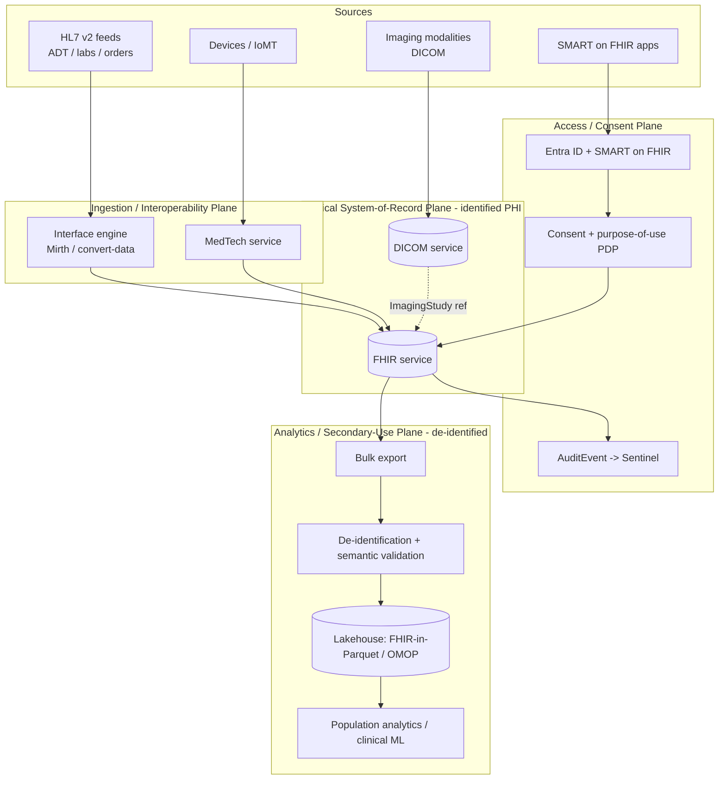
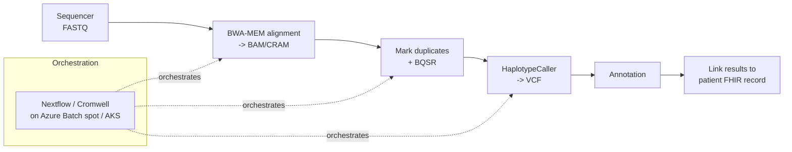
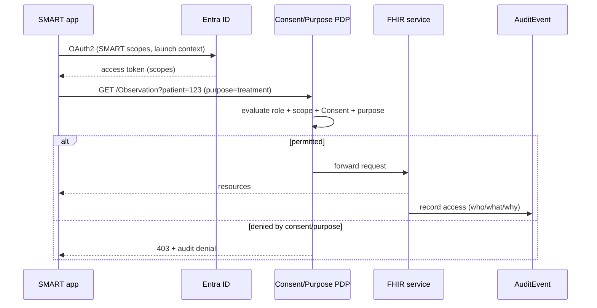

# Healthcare Data Platforms

> Part of the **Enterprise Data & AI Architecture Handbook** · Phase-17 — Industry Vertical Platforms · Chapter 01 (first chapter of the phase).
> Estimated study time: **60 min reading + ~3h labs**.
> **Prerequisites:** read [Compliance and Regulatory Frameworks](../Phase-10/06_Compliance_and_Regulatory_Frameworks.md) first.

---

## Executive Summary

Every prior phase of this handbook has treated regulation, security, and privacy as *cross-cutting* concerns layered onto a general-purpose data platform. In healthcare, the relationship inverts: the regulatory and safety constraints are not a layer on top of the architecture — they *are* the architecture. A healthcare data platform is defined less by the technologies it uses (it uses the same lakehouse, streaming, and ML stack the rest of this handbook describes) than by three non-negotiable properties that shape every design decision: the data is **protected health information (PHI)** whose mishandling carries statutory penalties and real patient harm; the data must **interoperate** across organizational and vendor boundaries using purpose-built healthcare standards (HL7, FHIR, DICOM) rather than ad hoc schemas; and access to it is governed not only by role but by **consent and purpose-of-use** — *why* you are accessing a record is as legally material as *whether* you are permitted to.

This chapter is the first of Phase-17 (Industry Vertical Platforms) and establishes the reference architecture for **healthcare data platforms**. It covers the **HL7 and FHIR interoperability standards** (why healthcare needed its own data-exchange standards, how HL7 v2 messaging, CDA documents, and the modern FHIR resource model differ, and where each is used); **Azure Health Data Services** as the primary managed platform (the FHIR service, DICOM service, and MedTech service, and how they compose into a compliant clinical data estate); **PHI protection and HIPAA** as the regulatory and security spine (the Privacy, Security, and Breach Notification Rules, de-identification via Safe Harbor and Expert Determination, and how they map onto the technical controls from [Data Security and Encryption](../Phase-10/03_Data_Security_and_Encryption.md) and [Data Privacy and PII Protection](../Phase-10/07_Data_Privacy_and_PII_Protection.md)); **clinical and genomics pipelines** (real-time HL7/FHIR ingestion, DICOM imaging, and the very different high-throughput batch world of genomic sequencing — FASTQ/BAM/CRAM/VCF, GATK, and secondary analysis at scale); and **interoperability and consent** (SMART on FHIR, bulk FHIR export, the US information-blocking rules, TEFCA, and the FHIR Consent resource as the machine-enforceable expression of patient permission).

The platform bias is **Azure-primary (~60%)** — Azure Health Data Services (FHIR service, DICOM service, MedTech service), Azure API for FHIR's successor workspace model, the de-identification service, Azure Data Lake Storage Gen2 and Databricks/Fabric for analytics, Azure Batch and AKS for genomics pipelines, and Microsoft Entra ID with SMART on FHIR for consent-aware access — **~30% enterprise open source** (the HL7 FHIR specification itself and the HAPI FHIR reference server, Mirth Connect / NextGen Connect for HL7 v2 integration, the OHDSI OMOP Common Data Model and its tooling, GATK / nf-core / Nextflow / Cromwell-WDL for genomics, and Delta Lake / Spark for the analytics backbone) — **~10% AWS/GCP comparison-only** (AWS HealthLake and GCP Cloud Healthcare API, both of which are genuinely capable managed FHIR/HL7/DICOM platforms, contrasted honestly on capability, lock-in, and migration).

**Bottom line:** a healthcare data platform is not "a data platform that happens to hold medical records." It is an architecture in which **interoperability is achieved through domain standards you do not get to invent (FHIR/HL7/DICOM), and access is governed by consent and purpose-of-use, not role alone.** This chapter's central thesis, formalized in its ADR (§40), is that **secondary use of clinical data — analytics, research, ML — must flow through a governed, de-identified, consent-and-purpose-enforced projection, never through direct query access to the identified clinical store.** The two case studies (§40) show what happens when that boundary is skipped (an over-broad research-access PHI exposure) and when interoperability is treated as a plumbing problem rather than a clinical-safety problem (a silent unit-mapping error in an HL7-to-FHIR pipeline).

---

## Learning Objectives

By the end of this chapter you will be able to:

1. **Explain the HL7 v2, CDA, and FHIR standards** — what problem each solves, how they differ structurally, and where each is still used in a modern healthcare estate.
2. **Model clinical data as FHIR resources** and design a FHIR-based interoperability layer, including SMART on FHIR access and bulk FHIR (`$export`) for population-scale extraction.
3. **Architect an Azure Health Data Services solution** end to end: HL7/FHIR/DICOM ingestion (MedTech + FHIR + DICOM services) → storage → de-identified analytics projection.
4. **Apply HIPAA's Privacy, Security, and Breach Notification Rules** to concrete platform controls, and choose between Safe Harbor and Expert Determination de-identification for a given secondary-use case.
5. **Design clinical and genomics pipelines** — real-time HL7/FHIR ingestion and high-throughput genomic secondary analysis (FASTQ→BAM→VCF) — and explain why they demand fundamentally different architectures.
6. **Enforce consent and purpose-of-use** as first-class access controls using the FHIR Consent resource, and design a de-identified secondary-use projection.
7. **Defend a healthcare platform's interoperability, PHI-protection, and consent architecture** in engineer, staff engineer, architect, and CTO review settings.

---

## Business Motivation

- **PHI mishandling is a statutory and clinical liability, not merely a reputational one.** HIPAA civil penalties reach into the millions per violation category per year, and — unlike most data breaches — a healthcare data error can directly harm a patient (a wrong allergy, a mis-mapped lab unit, a missing consent). The platform's PHI-protection and interoperability correctness are therefore board-level risk decisions, not engineering preferences.
- **Interoperability is now a legal mandate, not an optional integration nicety.** The US 21st Century Cures Act and the ONC information-blocking rule make it *unlawful* for most actors to unreasonably block electronic health information exchange, and CMS rules require payers and providers to expose FHIR APIs — turning FHIR interoperability from a "nice to have" into a compliance requirement with enforcement teeth.
- **The economic value of clinical data is concentrated in secondary use** — population health, quality measurement, research, and clinical-AI — all of which require *analytics-ready, de-identified, consent-governed* data, which is precisely the hardest thing to produce safely from a system of record designed for point-of-care transactions.
- **Fragmentation is the default state of healthcare data.** A single patient's data is scattered across EHRs (Epic, Oracle Health/Cerner, MEDITECH), imaging systems (PACS), lab systems, pharmacy systems, and devices — each with its own format and vocabulary. The platform's core business job is to *reconcile* that fragmentation into a coherent, longitudinal record without losing clinical fidelity.
- **A single breach can be existential.** Real, recent events — the 2015 Anthem breach (~78.8M records) and the 2024 Change Healthcare ransomware attack (a months-long disruption to US healthcare payments and one of the largest healthcare data incidents on record) — demonstrate that PHI security posture is a direct determinant of organizational survival, making the security architecture (§16) a first-order business concern.

---

## History and Evolution

- **1987 — HL7 v2 is first published.** Health Level Seven International releases the HL7 v2.x messaging standard — a pipe-and-hat-delimited (`|` and `^`) message format for exchanging admissions, orders, results, and other clinical events between hospital systems. Deliberately flexible (with abundant optional fields and "Z-segments" for local extensions), v2 became — and remains, four decades later — the most widely deployed healthcare interoperability standard in the world, the workhorse behind most hospital interface engines.
- **Late 1990s-2000s — HL7 v3 and CDA.** HL7 attempted a rigorous, model-driven successor (HL7 v3, based on the Reference Information Model), which proved too complex to adopt broadly. Its most successful artifact was the **Clinical Document Architecture (CDA)** — an XML standard for clinical documents (discharge summaries, care records), used heavily in national programs and the US Meaningful Use era.
- **1996 — HIPAA is enacted.** The Health Insurance Portability and Accountability Act establishes the framework for protecting health information; its **Privacy Rule** (2003) and **Security Rule** (2005) — added via later rulemaking — become the defining US regulatory constraints on health data platforms.
- **2009 — the HITECH Act** strengthens HIPAA enforcement, introduces the **Breach Notification Rule**, extends direct liability to **business associates** (including cloud vendors and analytics providers), and drives EHR adoption through Meaningful Use incentives.
- **2011-2014 — FHIR is born.** Grahame Grieve and the HL7 community create **Fast Healthcare Interoperability Resources (FHIR)** — a RESTful, resource-oriented standard (Patient, Observation, Encounter, MedicationRequest, etc.) using modern web technologies (HTTP, JSON/XML, OAuth2) instead of custom message grammars. FHIR deliberately borrows the pragmatism of the web: an 80/20 core plus extensibility.
- **2014-2018 — SMART on FHIR and the app ecosystem.** The SMART Health IT project defines **SMART on FHIR** — an OAuth2/OpenID-Connect profile that lets third-party clinical apps launch against any compliant EHR — turning FHIR from a data format into an app platform, and directly informing the OAuth2/OIDC patterns from [Identity and Access Management with Microsoft Entra](../Phase-10/02_Identity_and_Access_Management_with_Entra.md).
- **2019 — FHIR R4** is released as the first *normative* version of key resources, giving the industry a stable target to build against — the version most enterprise implementations still standardize on (alongside the newer R4B and R5, 2022-2023).
- **2020 — the CMS Interoperability and Patient Access rule** and the ONC information-blocking rule take effect, mandating FHIR APIs (including **Bulk FHIR / "Flat FHIR" `$export`** for population-scale data) and making information blocking unlawful — the regulatory events that made FHIR non-optional in the US market.
- **2019-2022 — cloud-managed FHIR platforms arrive.** Microsoft ships the **Azure API for FHIR** (2019), then consolidates FHIR, DICOM, and IoMT device ingestion into **Azure Health Data Services** (GA 2022) as a workspace-based managed offering; AWS ships **HealthLake** and GCP its **Cloud Healthcare API** in the same window. (Note the platform-longevity signal covered in §35: the standalone Azure API for FHIR is being consolidated into Azure Health Data Services, which is the current strategic surface.)
- **2022-2026 — TEFCA, bulk data, and clinical AI.** The **Trusted Exchange Framework and Common Agreement (TEFCA)** and its **Qualified Health Information Networks (QHINs)** operationalize nationwide exchange in the US; FHIR Bulk Data and the OHDSI **OMOP Common Data Model** become the dominant substrate for population analytics and clinical AI, and generative/agentic AI over clinical text (per Phase-12) raises fresh de-identification and grounding questions this chapter addresses in Governance (§23).

---

## Why This Technology Exists

Healthcare data platforms exist because clinical data has two properties that no general-purpose data platform is built to handle natively: it must **interoperate across fiercely heterogeneous systems using semantics that are clinically precise** (a lab value without its unit, reference range, and specimen context is not just incomplete — it is dangerous), and it is **legally and ethically bound by consent and purpose** in a way that ordinary enterprise data is not (the same blood-pressure reading may be freely usable for the patient's own care, permitted for de-identified research only with appropriate governance, and forbidden for marketing entirely). Standards like HL7 and FHIR exist because, absent a shared clinical data model, every hospital-to-lab or EHR-to-app connection would be a bespoke integration — an N×M explosion of fragile interfaces (the same interoperability motivation as [Enterprise Integration Patterns](../Phase-14/06_Enterprise_Integration_Patterns.md) and [Model Context Protocol (MCP)](../Phase-12/06_Model_Context_Protocol_MCP.md), here applied to clinical semantics). Managed platforms like Azure Health Data Services exist because implementing a compliant, high-availability, FHIR-conformant store with DICOM imaging and device ingestion — plus the audit, encryption, and de-identification controls HIPAA demands — is an enormous undertaking that few organizations should build from scratch.

---

## Problems It Solves

- **Cross-system clinical interoperability without N×M bespoke integrations**, resolved by shared standards (HL7 v2 for messaging, FHIR for RESTful resource exchange, DICOM for imaging) so any conformant system can exchange data with any other (§8.1).
- **A coherent, longitudinal patient record assembled from fragmented sources** (EHR, lab, pharmacy, imaging, devices), resolved by normalizing disparate feeds into a common FHIR resource model keyed to a reconciled patient identity (§8.2, §12).
- **Legally-compliant PHI storage and exchange**, resolved by managed platforms that provide HIPAA-aligned encryption, audit logging, access control, and a signed Business Associate Agreement (BAA) as a baseline (§16), rather than requiring each organization to build and certify these controls itself.
- **Safe secondary use of clinical data for analytics and research**, resolved by de-identification (Safe Harbor or Expert Determination, §8.4) and a governed de-identified projection (§40, ADR-0188) that decouples analytics workloads from the identified system of record.
- **Consent- and purpose-aware access**, resolved by SMART on FHIR scopes and the FHIR Consent resource (§8.5), so that access decisions incorporate *why* the data is being accessed, not merely *who* is asking.
- **Population-scale data extraction for public health and analytics**, resolved by Bulk FHIR (`$export`) and OMOP-CDM transformation (§13, §8.1), which turn a transactional FHIR store into an analytics-ready cohort dataset.

---

## Problems It Cannot Solve

- **It cannot fix upstream clinical-data quality.** FHIR standardizes *structure and exchange*, not *correctness*. A wrong medication dose, a mis-entered allergy, or a swapped patient identity at the source propagates faithfully through the platform — standardization can even *amplify* a bad value by making it easier to consume (§40, Case Study 2). Data-quality governance ([Data Quality with Great Expectations](../Phase-08/03_Data_Quality_with_Great_Expectations.md)) remains a separate, mandatory discipline.
- **It cannot resolve patient identity for you.** Matching records across systems without a universal patient identifier (the US has none by statute) is an inherently probabilistic problem (an Enterprise Master Patient Index / EMPI concern, per [Master Data Management](../Phase-08/05_Master_Data_Management.md)); FHIR gives you a `Patient.identifier` slot but not the matching logic, and false merges/splits carry direct clinical risk.
- **De-identification is not a guarantee of non-re-identification.** Safe Harbor removes 18 identifier types, but high-dimensional clinical data can still be re-identified by linkage — the same fundamental limit covered in [Data Privacy and PII Protection](../Phase-10/07_Data_Privacy_and_PII_Protection.md); de-identification reduces risk, it does not eliminate it, and Expert Determination exists precisely because "remove these 18 fields" is sometimes insufficient.
- **It cannot make interoperability *semantic* on its own.** Two systems can both be FHIR-conformant and still disagree on terminology (one codes a diagnosis in ICD-10, another in SNOMED CT); FHIR carries codes but does not perform terminology mapping — that requires a terminology service and value-set governance the platform must add.
- **It cannot substitute for consent governance.** The FHIR Consent resource can *represent* a consent decision, but the organizational policy, legal basis, and enforcement discipline behind it are human/governance responsibilities the technology only *expresses*, not *creates* (§23).
- **It does not make PHI safe to feed to arbitrary external AI services.** Sending identified clinical text to an ungoverned external LLM is a HIPAA disclosure; the platform can enable safe clinical AI only through de-identification and BAA-covered, access-controlled AI services (§23, and the grounding/safety disciplines of [Evaluation and Guardrails](../Phase-12/09_Evaluation_and_Guardrails.md)).

---

## Core Concepts

### 1.1 HL7 v2, CDA, and FHIR — the three interoperability generations

Healthcare interoperability is best understood as three overlapping generations that *coexist* in every real estate, rather than a clean succession:

- **HL7 v2 (messaging).** Event-driven, delimited text messages (`MSH|^~\&|...`) exchanged over MLLP (Minimal Lower Layer Protocol) between systems. A message has segments (`PID` patient identification, `OBR` order, `OBX` observation/result, etc.). Its strength is ubiquity and simplicity; its weakness is looseness — heavy optionality and local "Z-segments" mean two v2 interfaces are rarely identical, so an **interface engine** (Mirth/NextGen Connect, Rhapsody, Cloverleaf) that transforms and routes messages is a permanent fixture. Most hospital lab results and ADT (admit/discharge/transfer) feeds still flow as v2 in 2026.
- **CDA (documents).** XML clinical *documents* — a discharge summary or a Continuity of Care Document is a single, human-readable, signed artifact with structured entries. Document-centric rather than event- or resource-centric; still common in cross-organization document exchange (IHE XDS, national programs).
- **FHIR (resources + REST).** The modern standard: discrete **resources** (`Patient`, `Observation`, `Encounter`, `Condition`, `MedicationRequest`, `DiagnosticReport`, ~150 resource types) exchanged over a RESTful HTTP API with JSON/XML payloads, OAuth2 security, and a defined search grammar (`GET /Observation?patient=123&code=...`). FHIR is simultaneously a data model, an API, and — via SMART on FHIR — an app platform. **US Core** is the US-specific profile constraining base FHIR to the mandated USCDI data elements.

The practical architecture consequence: a healthcare platform ingests v2/CDA at the edges (from legacy systems), **normalizes to FHIR** as the canonical internal model, and exposes FHIR APIs outward. Azure Health Data Services provides an HL7v2/FHIR conversion capability (`$convert-data`, using Liquid templates) for exactly this normalization step.

### 1.2 The FHIR resource model and references

FHIR resources are small, composable, and *linked by reference* rather than nested — a graph, not a document tree. An `Observation` (a blood-pressure reading) carries `subject → Patient/123`, `encounter → Encounter/456`, `performer → Practitioner/789`, and a coded `code` (LOINC) plus a `valueQuantity` with a **unit** (UCUM). This referential model is powerful (you assemble a longitudinal record by traversing references) and dangerous (a broken reference or a mis-mapped unit silently corrupts meaning — the root of §40 Case Study 2). Every clinical value in FHIR is meant to travel with its coding system, unit, and context; stripping any of these is a data-integrity defect, not a simplification.

### 1.3 DICOM and medical imaging

Imaging is a world of its own. **DICOM (Digital Imaging and Communications in Medicine)** is the standard for medical images (CT, MRI, X-ray, ultrasound) and their metadata — an image is a "SOP Instance" within a "Series" within a "Study," tagged with patient, modality, and acquisition metadata. Images are large (a CT study can be hundreds of MB to GB) and are stored in a **PACS (Picture Archiving and Communication System)**. **DICOMweb** (QIDO-RS/WADO-RS/STOW-RS) is the RESTful modernization. Azure Health Data Services includes a **DICOM service** that stores imaging alongside the FHIR service, letting an `ImagingStudy` FHIR resource reference the DICOM study — unifying structured clinical data and imaging in one governed estate.

### 1.4 De-identification: Safe Harbor vs Expert Determination

HIPAA defines two paths to render PHI no longer "protected" so it can be used for secondary purposes:

- **Safe Harbor** — remove 18 enumerated identifier types (names, geographic subdivisions smaller than a state, all date elements more specific than year, phone/fax, email, SSN, MRN, device identifiers, biometric identifiers, full-face photos, etc.) *and* have no actual knowledge the residual could re-identify. Deterministic and auditable, but coarse — it destroys analytic value (e.g., you lose exact dates and fine geography).
- **Expert Determination** — a qualified statistician determines and documents that the re-identification risk is "very small," permitting a more nuanced release (e.g., date-shifting instead of date-removal, retaining some structure). Higher analytic value, higher governance burden.

The platform must support *both*, because the right choice is use-case-dependent (§25). Azure provides a **de-identification service** (and Text Analytics for health for unstructured notes) that detects and redacts/surrogates PHI entities in text — but de-identification of free-text clinical notes is probabilistic and must be validated, never trusted blindly (§23).

### 1.5 Consent and purpose-of-use

The concept that most distinguishes healthcare from general enterprise access control: authorization depends on **purpose-of-use**. The same clinician-role principal may be permitted to read a record for *treatment* but not for *research*; a patient may consent to data sharing for care coordination but opt out of research or of sharing sensitive categories (behavioral health, HIV, reproductive care — often under stricter law, e.g., US 42 CFR Part 2 for substance-use records). FHIR expresses this with the **`Consent` resource** (who, what data category, what purpose, permit/deny, time-bounded) and **SMART on FHIR scopes** (`patient/Observation.read`, `user/*.read`, granular v2 scopes). A mature platform evaluates *identity (Entra) + role/attribute (RBAC/ABAC) + consent + purpose-of-use* on every access — the direct extension of the ABAC and access-control-propagation lineage from [Identity and Access Management with Microsoft Entra](../Phase-10/02_Identity_and_Access_Management_with_Entra.md) and [Retrieval Augmented Generation](../Phase-12/03_Retrieval_Augmented_Generation.md) ADR-0157, now with purpose as a mandatory dimension.

---

## Internal Working

### 2.1 HL7 v2 → FHIR normalization pipeline

A message arrives at an interface engine over MLLP. The engine parses the segmented message, applies a transformation (a Liquid or channel-specific template) mapping `PID` → `Patient`, `OBX` → `Observation`, etc., resolves/reconciles the patient identity against the EMPI, and writes FHIR resources into the FHIR service via a transaction bundle (`POST` a `Bundle` of type `transaction`, so all-or-nothing referential integrity holds). The correctness-critical steps are **terminology mapping** (source local codes → standard LOINC/SNOMED/ICD) and **unit preservation** (the `OBX-6` units field → FHIR `valueQuantity.unit`/`code` in UCUM). A dropped or mis-mapped unit here is not caught by structural validation — the resource is still *valid FHIR* — which is exactly why §40 Case Study 2 requires semantic validation on top of schema validation.

### 2.2 The FHIR server: storage, search, and versioning

A FHIR server (Azure FHIR service, or HAPI FHIR in OSS) stores each resource with a logical id and a **version id** — every update creates a new version, and prior versions are retained (`_history`), giving an immutable clinical audit trail by construction. Search is served by indexing designated **search parameters** (patient, code, date, category) — the server maintains inverted indexes over these so `GET /Observation?patient=123&code=http://loinc.org|8867-4` is efficient. Referential integrity, conditional create/update (to avoid duplicates on retry — the idempotency discipline from [Message Brokers and Queues](../Phase-14/07_Message_Brokers_and_Queues.md)), and `$validate` against profiles are the server's core mechanics. Bulk export (`$export`) runs as an asynchronous job producing newline-delimited JSON (NDJSON) files in blob storage — the bridge from the transactional FHIR world to the analytics lakehouse.

### 2.3 Genomics secondary analysis pipeline

Genomics is architecturally the *opposite* of clinical messaging: not many small real-time events, but a few enormous batch files through a compute-heavy pipeline. A sequencer emits **FASTQ** (raw reads, tens to hundreds of GB per sample). Secondary analysis aligns reads to a reference genome producing **BAM/CRAM** (aligned reads; CRAM is the compressed columnar-ish successor), then calls variants producing **VCF** (Variant Call Format — the per-position variants). The canonical toolchain is **GATK best practices** (BWA-MEM alignment → mark duplicates → base recalibration → HaplotypeCaller), orchestrated by a workflow engine (**Nextflow**/nf-core, **Cromwell**/WDL, or **Snakemake**) over a scalable compute fabric (Azure Batch or AKS, per [Kubernetes](../Phase-09/06_Kubernetes.md)). The platform concerns are throughput, cost per genome, reproducibility (pin the reference genome build and tool versions — the same reproducibility discipline as [MLOps and MLflow](../Phase-11/03_MLOps_and_MLflow.md)), and the fact that genomic data is *inherently identifying* and cannot be truly de-identified — it is the ultimate biometric.

---

## Architecture

The reference architecture has four planes:

1. **Ingestion / interoperability plane** — interface engines (Mirth/NextGen Connect) terminating HL7 v2 MLLP feeds; the MedTech service ingesting device/IoMT data (per [IoT Data Platforms](../Phase-16/01_IoT_Data_Platforms.md)); FHIR API endpoints receiving SMART-on-FHIR app traffic and inbound bulk data; DICOMweb endpoints for imaging. Everything normalizes toward FHIR.
2. **Clinical system-of-record plane** — the Azure Health Data Services workspace: the **FHIR service** (canonical structured clinical record, versioned, audited), the **DICOM service** (imaging), and cross-linkage between them. This is the identified PHI zone, maximally locked down (private endpoints, CMK, purpose-of-use access).
3. **Analytics / secondary-use plane** — a *separate*, de-identified projection: Bulk FHIR `$export` → ADLS Gen2 → transform to a lakehouse analytics model (FHIR-in-Parquet or OMOP-CDM) in Databricks/Fabric, de-identified and consent-filtered at the boundary. This is where population analytics, quality measures, and clinical-AI training happen — never against plane 2 directly (§40, ADR-0188).
4. **Access / consent plane** — Microsoft Entra ID for identity, SMART on FHIR for app authorization, the FHIR Consent resource + a policy decision point evaluating role + attribute + consent + purpose-of-use, and comprehensive audit logging feeding the security monitoring stack (§21).

The genomics pipeline hangs off this as a specialized batch subsystem: sequencer output → ADLS → Nextflow/Cromwell on Azure Batch/AKS → VCF results linked back to the patient's FHIR record (as `MolecularSequence`/observations) inside plane 2, with the raw identifying genomic files under the strictest access tier.

---

## Components

- **Interface engine** (Mirth/NextGen Connect, Rhapsody) — HL7 v2 ingestion, transformation, routing.
- **FHIR service** (Azure Health Data Services) — canonical clinical resource store, REST API, search, `_history`, `$export`, `$convert-data`, `$validate`.
- **DICOM service** — imaging store with DICOMweb (QIDO/WADO/STOW), linked to FHIR `ImagingStudy`.
- **MedTech service** — ingests device/IoMT streams (via Event Hubs), maps them to FHIR Observations.
- **De-identification service** / **Text Analytics for health** — structured and free-text PHI detection and redaction/surrogation.
- **EMPI** (Enterprise Master Patient Index) — probabilistic patient identity resolution across source systems.
- **Terminology service** — value sets and code-system mappings (LOINC, SNOMED CT, ICD-10, RxNorm, UCUM) for `$validate`, `$expand`, `$translate`.
- **Consent + policy decision point** — evaluates FHIR Consent, SMART scopes, and purpose-of-use.
- **Analytics lakehouse** — ADLS Gen2 + Databricks/Fabric, FHIR-in-Parquet and/or OMOP-CDM.
- **Genomics workflow engine + compute** — Nextflow/Cromwell over Azure Batch/AKS; GATK toolchain.
- **Identity provider** — Microsoft Entra ID (OAuth2/OIDC, SMART on FHIR).

---

## Metadata

Healthcare metadata is unusually rich and clinically load-bearing:

- **Terminology/vocabulary metadata** — LOINC (labs/observations), SNOMED CT (clinical findings/procedures), ICD-10-CM/PCS (diagnoses/procedures, billing), RxNorm (medications), CPT (procedures), UCUM (units). Value-set and code-system versioning is governance-critical: a code that means one thing in one SNOMED release can be inactivated or refined in another.
- **FHIR profiles and conformance** — `StructureDefinition`, `ValueSet`, `CapabilityStatement`, `ImplementationGuide` (US Core, IPS) declare what the server supports and how resources are constrained; these *are* the machine-readable contract, the healthcare analogue of the data contracts in [Data Contracts](../Phase-08/07_Data_Contracts.md).
- **Provenance** — the FHIR `Provenance` and `AuditEvent` resources record who created/changed/accessed what and why (purpose-of-use), which is both a clinical-trust and a HIPAA-audit requirement.
- **Consent metadata** — the `Consent` resource is itself metadata governing access to other resources.
- **Catalog + lineage** — Microsoft Purview (per [Microsoft Purview](../Phase-08/06_Microsoft_Purview.md)) catalogs the de-identified analytics estate; lineage from source system → FHIR → de-identified projection is essential for demonstrating that PHI did not leak into analytics.

---

## Storage

- **FHIR service** — managed transactional store optimized for resource CRUD, search, and versioned history; encrypted at rest (Microsoft-managed keys by default, **customer-managed keys / CMK** for regulated deployments, per [Data Security and Encryption](../Phase-10/03_Data_Security_and_Encryption.md)).
- **DICOM service** — blob-backed imaging store; large binary objects, tiered.
- **ADLS Gen2** — the de-identified analytics landing zone; FHIR `$export` NDJSON → curated Parquet/Delta. Medallion structure (per [Medallion Architecture](../Phase-05/03_Medallion_Architecture.md)): bronze (raw NDJSON), silver (validated, de-identified FHIR-in-Parquet), gold (OMOP-CDM / analytics marts).
- **Genomics storage** — FASTQ/BAM/CRAM/VCF are huge; use tiered blob storage (hot for active analysis, cool/archive for completed samples), CRAM over BAM for ~30-60% space savings, and reference-genome caching. Genomic raw files sit in the strictest-access tier — they are inherently identifying.
- **Retention** — clinical records carry long, legally-mandated retention (often years to decades, jurisdiction-dependent), demanding a deliberate lifecycle policy rather than the "keep everything hot" default.

---

## Compute

- **Real-time / interactive** — FHIR API serving, SMART app queries, DICOMweb retrieval: latency-sensitive, served by the managed services' own compute.
- **Micro-batch / streaming** — MedTech device ingestion via Event Hubs + Stream Analytics/Functions mapping to FHIR Observations (per [Azure Event Hubs and Stream Analytics](../Phase-07/03_Azure_Event_Hubs_and_Stream_Analytics.md)).
- **Batch analytics** — Databricks/Spark or Fabric over the de-identified lakehouse for population health, quality measures, cohort building, and clinical-ML feature engineering (per [Apache Spark Internals](../Phase-05/04_Apache_Spark_Internals.md)).
- **Genomics HPC-style batch** — the most compute-intensive workload: GATK pipelines are CPU- and memory-heavy and embarrassingly parallel across samples; Azure Batch (spot/low-priority VMs for cost) or AKS with a workflow engine. Cost-per-genome is the governing FinOps metric (§20).

---

## Networking

- **Private-endpoint-only** for the FHIR/DICOM services, ADLS, and Key Vault — no public data-plane exposure, per the zero-trust baseline of [Network Security and Zero Trust](../Phase-10/04_Network_Security_and_Zero_Trust.md) ADR-0144. SMART-on-FHIR app traffic terminates at a controlled, WAF-protected gateway (Azure API Management / Front Door) that enforces OAuth2 before reaching the FHIR endpoint.
- **MLLP over VPN/ExpressRoute** — legacy HL7 v2 feeds from on-prem hospital systems arrive over private connectivity into the interface engine, never the public internet.
- **Segmented zones** — identified PHI plane and de-identified analytics plane are network-segmented; the only path between them is the governed de-identification export job, not ad hoc connectivity.
- **Egress control** — default-deny egress prevents PHI (or an LLM prompt containing PHI) from leaving to an unapproved external endpoint — the exfiltration-prevention concern of [Network Security and Zero Trust](../Phase-10/04_Network_Security_and_Zero_Trust.md), acutely important where an ungoverned outbound call to an external AI API would be a reportable HIPAA disclosure.

---

## Security

Security *is* the healthcare platform. The HIPAA Security Rule maps directly onto technical controls:

- **Access control (least privilege + purpose-of-use)** — Entra ID, SMART on FHIR scopes, RBAC/ABAC, consent enforcement (§1.5). Purpose-of-use is the healthcare-specific addition to the standard model.
- **Encryption** — at rest (CMK for regulated deployments) and in transit (TLS 1.2+), envelope-encryption key hierarchy per [Data Security and Encryption](../Phase-10/03_Data_Security_and_Encryption.md).
- **Audit** — comprehensive, tamper-evident audit of every PHI access (who, what, when, why) via FHIR `AuditEvent` + platform diagnostic logs → SIEM (Microsoft Sentinel). The HIPAA "minimum necessary" and accounting-of-disclosures requirements make audit non-optional.
- **Business Associate Agreement (BAA)** — a legal prerequisite: any cloud/analytics/AI service touching PHI must be covered by a signed BAA. Azure, AWS, and GCP all sign BAAs for their in-scope services — but *only in-scope services*, and it is the architect's responsibility to keep PHI within BAA-covered services (a common failure is routing PHI through a non-BAA-covered tool).
- **Break-glass access** — emergency clinical access must be *possible* (a clinician must reach a record to save a life even if normal consent checks would deny) but *heavily audited and reviewed after the fact* — a distinctive healthcare requirement that ordinary least-privilege models don't anticipate.
- **De-identification as a security control** — the strongest protection for secondary-use data is that it isn't PHI at all (§1.4, §40 ADR-0188).

---

## Performance

- **FHIR search performance** hinges on which **search parameters are indexed**; an unindexed search parameter forces expensive scans. Model the actual query patterns (patient-centric reads, code+date filters) and ensure those parameters are indexed — the same "index for your access pattern" discipline as any database.
- **Bulk export at population scale** is throughput-bound, not latency-bound; run `$export` asynchronously, scoped by `_type` and `_since` (incremental export) to avoid re-extracting the whole store nightly.
- **DICOM retrieval** of large studies benefits from WADO-RS frame-level retrieval and progressive loading rather than whole-study downloads.
- **Genomics throughput** is the extreme case: measured in genomes/day and cost/genome; parallelize across samples, use CRAM, and right-size compute per pipeline stage (alignment is CPU-heavy, variant calling memory-heavy).
- **Terminology `$expand`/`$validate`** can be a hidden hotspot; cache expanded value sets rather than expanding on every validation.

---

## Scalability

- **FHIR service** scales as a managed service, but the *design* determines cost/behavior at scale: high-cardinality search, deep `_history`, and huge transaction bundles stress it. Partition thinking is patient-centric (most access is scoped to one patient).
- **Analytics plane** scales independently on the lakehouse — decoupling secondary use from the transactional store (§40 ADR-0188) is itself the key scalability move: research/ML load never contends with point-of-care serving.
- **Genomics** scales horizontally across samples trivially (each genome is independent) but each sample is a heavy pipeline; the constraint is cost and compute quota, not coordination.
- **Device ingestion (MedTech)** scales via Event Hubs partitioning (per [Message Brokers and Queues](../Phase-14/07_Message_Brokers_and_Queues.md)) — a hospital's monitored-bed fleet is an IoT-scale problem (per [IoT Data Platforms](../Phase-16/01_IoT_Data_Platforms.md)).

---

## Fault Tolerance

- **Idempotent ingestion** — HL7 v2 and device feeds must tolerate redelivery; use FHIR conditional create/update (or a natural-key dedup) so a replayed message doesn't create a duplicate clinical record (the idempotency discipline from [Event-Driven Architecture](../Phase-14/01_Event_Driven_Architecture.md)).
- **Transaction bundles** give all-or-nothing referential integrity: a partially-applied bundle that created an `Observation` referencing a `Patient` that failed to write would be a dangling clinical fact.
- **Interface-engine buffering** — if the FHIR store is unavailable, the interface engine must durably queue inbound v2 messages (never drop clinical data) and replay on recovery.
- **Dead-letter for unmappable messages** — a v2 message that fails transformation must go to a monitored dead-letter queue for clinical-informatics review, never be silently discarded (a dropped lab result is a patient-safety event).
- **Multi-region / DR** — clinical systems are life-critical; RPO/RTO targets are strict, and DR must preserve the audit trail and referential integrity, not just the data.

---

## Cost Optimization

- **Decouple secondary use from the FHIR store** — running analytics/ML against the transactional FHIR service is both a governance violation (§40) and a cost anti-pattern; the de-identified lakehouse serves those workloads far more cheaply.
- **Incremental `$export`** (`_since`) instead of full nightly exports.
- **Tiered storage** for DICOM and genomics — hot for active studies/samples, cool/archive for completed ones; CRAM over BAM.
- **Spot / low-priority compute** for genomics batch (checkpoint-tolerant pipelines can absorb preemption).
- **Cache terminology expansions** to avoid repeated `$expand` compute.
- **Right-size retention** — long legal retention doesn't mean *hot* retention; archive tiers for old-but-legally-required records.

**Worked FinOps example.** A genomics program processes 1,000 whole genomes/month. On on-demand D-series VMs, GATK secondary analysis runs roughly $40-60/genome of compute (illustrative), i.e. ~$40K-60K/month. Moving the embarrassingly-parallel, checkpoint-tolerant pipeline to Azure Batch **spot** VMs at ~70% discount and switching BAM→CRAM (cutting storage and I/O ~40%) brings compute to ~$15-20/genome (~$15K-20K/month) plus materially lower storage — roughly a **60-65% reduction** (~$25K-40K/month saved) with no change to results, because the workload tolerates preemption and CRAM is losslessly convertible. The break-even for the (small) engineering effort to make the pipeline preemption-safe is well under one month at this volume.

---

## Monitoring

- **Ingestion health** — v2 message throughput, transformation success/failure rate, dead-letter depth, MedTech device-message lag. A rising v2 transformation-failure rate is a clinical-data-loss signal.
- **FHIR API metrics** — request latency, error rates (esp. 4xx from malformed SMART requests, 429 throttling), search latency by parameter.
- **Consent/authorization denials** — spikes may indicate misconfigured scopes *or* an attempted over-broad access.
- **Export/pipeline job status** — `$export` completion, de-identification job success, lakehouse freshness.
- **Genomics pipeline** — genomes/day, cost/genome, stage failure rates, spot-preemption/retry rates.
- **Security signals** — anomalous PHI access volume per principal, break-glass invocations (every one reviewed), off-hours bulk access.

## Operational Response Playbook

| Signal | Detection | Remediation |
|---|---|---|
| **HL7 v2 transformation-failure rate spikes** (lab results not landing in FHIR) | Interface-engine dashboard shows failed-channel rate above baseline; dead-letter depth rising | Freeze the affected channel's downstream consumers; inspect a dead-lettered message for the mapping break (new source Z-segment? changed code system?); patch the transform template; **replay** the dead-lettered messages (idempotent create prevents duplicates); add a semantic assertion (§40 CS2) so the specific failure is caught structurally next time. Treat as a patient-safety incident — missing lab results have clinical consequences. |
| **Anomalous PHI access by a principal** (volume/pattern outside baseline, or access without a matching purpose-of-use/consent) | Sentinel analytics rule on `AuditEvent` volume + purpose-of-use mismatch; break-glass invoked outside an emergency context | Immediately review the principal's active sessions and scopes; if unauthorized, revoke tokens (Entra) and disable the principal; determine whether a **reportable breach** occurred (HITECH Breach Notification Rule has hard timelines); preserve audit evidence; if it was an over-broad *research* grant against the identified store, that is the exact §40 ADR-0188 failure — migrate that consumer to the de-identified projection. |

---

## Observability

- **End-to-end clinical lineage** — trace a single clinical fact from the source HL7 v2 message → FHIR resource version → de-identified projection row, with correlation IDs, so you can answer "where did this value come from and where did it go" for both clinical trust and audit.
- **FHIR `AuditEvent` + `Provenance`** as first-class observability, not just security logs — they answer *who accessed what, why, and how a record came to be*.
- **Distributed tracing** across the ingestion → transformation → FHIR write path (OpenTelemetry, per [Observability](../Phase-09/01_DataOps_Foundations.md) practices) so a latency or failure spike is attributable to a specific stage.
- **Data-quality observability** — continuous assertions on clinical semantics (units present, codes in expected value sets, references resolvable) surfaced as metrics, so a §40-CS2-style silent corruption shows up as a dashboard signal, not a clinician's complaint.

---

## Governance

- **Consent and purpose-of-use governance** — the policy, legal basis, and enforcement behind the FHIR Consent resource; who may access what data category for what purpose, including stricter regimes for sensitive categories (behavioral health, substance-use per 42 CFR Part 2, reproductive, genetic).
- **De-identification governance** — which method (Safe Harbor vs Expert Determination) applies to which release; validation that free-text de-identification actually removed PHI (probabilistic detectors miss things — validate on a sampled, human-reviewed set before trusting a pipeline); documented Expert Determinations.
- **Terminology governance** — value-set ownership, code-system version management, mapping maintenance.
- **BAA and vendor governance** — an inventory of every service touching PHI and its BAA status; a gate preventing PHI from reaching a non-BAA-covered tool (including external AI services — sending identified notes to an ungoverned LLM is a disclosure).
- **Minimum necessary** — HIPAA's principle that access/use be limited to the minimum needed for the purpose; operationalized via scoped SMART grants and de-identified projections.
- **Clinical AI governance** — models trained on clinical data inherit fairness, drift, and safety obligations (per [Responsible AI](../Phase-11/07_Responsible_AI.md) and [Evaluation and Guardrails](../Phase-12/09_Evaluation_and_Guardrails.md)); clinical decision support may be regulated as a medical device (FDA SaMD) — a governance boundary the platform must respect.

---

## Trade-offs

- **FHIR-in-Parquet vs OMOP-CDM for analytics.** FHIR-in-Parquet preserves fidelity and is a mechanical transform from `$export`, but its deeply-nested, reference-linked shape is awkward for analysts. OMOP-CDM is a purpose-built relational analytics model with a huge tooling ecosystem (OHDSI), but the ETL from FHIR→OMOP is lossy and effortful. Many estates keep both (FHIR-in-Parquet as the faithful silver layer, OMOP as a gold analytics mart).
- **Safe Harbor vs Expert Determination.** Safe Harbor is auditable and cheap but destroys analytic value (no exact dates/geography); Expert Determination retains value but needs a qualified statistician and ongoing governance. Choose per use case (§25).
- **Managed platform vs self-hosted (HAPI FHIR).** Managed Azure Health Data Services gives compliance-aligned controls and a BAA out of the box but less low-level control and some lock-in; self-hosted HAPI FHIR is open and portable but you own all the compliance engineering.
- **Real-time FHIR write vs batch normalization.** Writing every v2 message to FHIR in real time gives an always-current record but couples ingestion tightly to FHIR availability; batching improves resilience/throughput at the cost of freshness.
- **Central FHIR store vs federated exchange (TEFCA).** Centralizing gives one queryable longitudinal record but concentrates PHI risk; federated exchange keeps data at source but makes cross-org queries slower and governance more complex.

---

## Decision Matrix

| Decision | Choose A | Choose B | Deciding factor |
|---|---|---|---|
| Interoperability standard for a new interface | **FHIR REST** | **HL7 v2 messaging** | New app/API integration & external mandate → FHIR; legacy hospital system that only speaks v2 → v2 + interface engine normalizing to FHIR |
| De-identification method | **Safe Harbor** | **Expert Determination** | Simple, auditable release, analytic value loss acceptable → Safe Harbor; need dates/structure retained, have statistician + governance → Expert Determination |
| Analytics data model | **FHIR-in-Parquet** | **OMOP-CDM** | Faithful, low-transform, developer-oriented → FHIR-in-Parquet; standardized epidemiology/research tooling (OHDSI) → OMOP |
| FHIR hosting | **Azure Health Data Services** | **HAPI FHIR (self-host)** | Compliance-aligned + BAA + low ops → managed; full control/portability, own the compliance work → HAPI |
| Secondary-use access | **De-identified projection** (default) | **Governed identified access** (exception) | Analytics/research/ML → de-identified projection always; a *specific, consented, minimum-necessary, audited* identified need (e.g., care coordination) → narrow identified access, never bulk |
| Genomics compute | **Azure Batch spot** | **AKS on-demand** | Preemption-tolerant, cost-driven, embarrassingly parallel → spot Batch; need long-lived services/interactive → AKS |

---

## Design Patterns

- **Canonical FHIR core** — normalize every source (v2, CDA, device, imaging metadata) to FHIR as the single internal canonical model; expose FHIR outward. Avoids N×M integrations.
- **De-identified secondary-use projection** — a governed, one-way export → de-identify → lakehouse pipeline that is the *only* path from identified PHI to analytics (§40, ADR-0188).
- **Purpose-of-use-aware authorization** — evaluate identity + role/attribute + consent + purpose on every access; deny by default.
- **Transaction-bundle ingestion** — write related resources atomically to preserve referential integrity.
- **Terminology service as a shared capability** — centralize LOINC/SNOMED/ICD/RxNorm/UCUM mapping and validation rather than duplicating it per pipeline.
- **Break-glass with mandatory review** — allow emergency override of consent checks, but log and post-review every invocation.
- **Semantic validation on top of schema validation** — assert clinical meaning (units present, codes in value sets, references resolvable), not just FHIR structural validity (§40, CS2).

## Anti-patterns

- **Analytics against the identified FHIR store** — using the transactional PHI system of record as the query surface for research/BI/ML (governance violation *and* performance/cost anti-pattern; the exact failure the ADR prevents).
- **"It's valid FHIR, so it's correct."** Structural validity ≠ clinical correctness; a mis-mapped unit is valid FHIR and clinically dangerous.
- **PHI to a non-BAA-covered service** — routing identified data through an analytics or AI tool without a BAA (a HIPAA disclosure).
- **Trusting free-text de-identification blindly** — assuming a probabilistic PHI-redaction model caught everything without validation.
- **Silent discard of unmappable messages** — dropping a v2 message that failed transformation instead of dead-lettering it for review (patient-safety event).
- **Role-only access control** — treating a healthcare platform like a generic app where role alone authorizes, ignoring consent and purpose-of-use.
- **Treating genomic data as de-identifiable** — genomes are inherently identifying; "removing the name" does not de-identify a genome.

## Common Mistakes

- Indexing the wrong FHIR search parameters (or none), then wondering why searches are slow/expensive.
- Full nightly `$export` instead of incremental (`_since`), multiplying cost.
- Losing units, reference ranges, or code systems in v2→FHIR mapping.
- No EMPI / naive patient matching, producing duplicate or wrongly-merged patients.
- Forgetting break-glass, so clinicians are blocked in emergencies — or implementing break-glass with no review, so it becomes a silent bypass.
- Storing genomics BAM (not CRAM) and on hot storage indefinitely.
- Assuming Safe Harbor de-identified data has zero re-identification risk.

## Best Practices

- Normalize to a canonical FHIR core; keep v2/CDA at the edges.
- Make the de-identified projection the *only* secondary-use path; enforce it architecturally, not by convention.
- Enforce purpose-of-use + consent on every access; deny by default; audit everything.
- Validate clinical semantics continuously, not just FHIR schema.
- Keep a live inventory of PHI-touching services and their BAA status; gate PHI egress.
- Dead-letter and review every unmappable message; never drop clinical data.
- Pin reference genomes and tool versions for reproducible genomics; use spot + CRAM for cost.
- Validate free-text de-identification on human-reviewed samples before trusting it in production.

---

## Enterprise Recommendations

- **Standardize on FHIR R4 (US Core where applicable) as the canonical internal model**, with an interface-engine tier normalizing legacy v2/CDA into it. Do not let each integration invent its own schema.
- **Adopt Azure Health Data Services** (FHIR + DICOM + MedTech) as the managed clinical plane for Azure-primary estates; ensure a BAA is in place and CMK is configured for regulated data.
- **Make the de-identified lakehouse projection the default — and enforced — analytics surface** (ADR-0188). Grant identified access only as a narrow, consented, audited exception.
- **Invest in a terminology service and EMPI early** — they are the two capabilities that most determine whether interoperability is real or nominal.
- **Treat de-identification (especially of free text) as a validated, governed pipeline**, not a one-off script; document Expert Determinations.
- **For genomics, standardize on a workflow engine (Nextflow/Cromwell) + spot compute + CRAM**, and treat raw genomic data as maximally sensitive.
- **Govern clinical AI explicitly** — de-identify training data, keep PHI within BAA-covered services, and apply the Responsible-AI and evaluation disciplines from Phase-11/12; understand where clinical decision support crosses into regulated medical-device territory.

---

## Azure Implementation

**Azure Health Data Services** is the strategic surface (the standalone Azure API for FHIR is being consolidated into it — see §35). Core building blocks:

- **Workspace** — the top-level container providing a compliance and networking boundary; hosts FHIR, DICOM, and MedTech services.
- **FHIR service** — managed FHIR R4 API. Enable CMK, private endpoint, and diagnostic logging (AuditEvents → Log Analytics/Sentinel). Use `$convert-data` (Liquid templates) for HL7 v2/CDA → FHIR, `$export` (to a linked ADLS Gen2 account) for bulk, and `$validate` against US Core profiles.
- **DICOM service** — DICOMweb (STOW/WADO/QIDO); link imaging to FHIR `ImagingStudy`.
- **MedTech service** — ingest device telemetry from Event Hubs, map to FHIR Observations via a device+FHIR mapping.
- **De-identification** — the Azure Health Data Services de-identification capability / **Language service (Text Analytics for health)** for detecting and redacting PHI in unstructured notes.
- **Identity & access** — Microsoft Entra ID with SMART on FHIR; scoped app registrations; RBAC on the FHIR service; a policy layer for consent/purpose-of-use (e.g., via APIM policies or a custom PDP in front of the FHIR endpoint).
- **Analytics** — `$export` → ADLS Gen2 → **Azure Databricks** or **Microsoft Fabric** (per [Microsoft Fabric](../Phase-05/07_Microsoft_Fabric.md)); the FHIR-to-Synapse/analytics tooling transforms NDJSON to Parquet; build OMOP-CDM on top for OHDSI tooling.
- **Genomics** — **Azure Batch** (spot pools) or **AKS** running **Nextflow/nf-core** or **Cromwell/WDL**; GATK containers from a governed ACR; results linked back to FHIR. (Note: the earlier standalone *Microsoft Genomics* service was retired; the current pattern is workflow-engine-on-Batch/AKS, not a first-party managed genomics API — a platform-longevity fact to design around, §35.)
- **Governance** — **Microsoft Purview** catalogs the de-identified estate and proves PHI lineage isolation; **Microsoft Sentinel** for security monitoring of PHI access.

Illustrative bulk-export call (async), then downstream de-identification:

```http
GET https://<workspace>-<fhir>.fhir.azurehealthcareapis.com/Patient/$export?_type=Patient,Observation,Condition&_since=2026-07-01T00:00:00Z
Accept: application/fhir+json
Prefer: respond-async
Authorization: Bearer <entra-token with system/*.read>
```

The job writes NDJSON to the linked ADLS container; a Databricks/Fabric job then de-identifies (Safe Harbor field removal / date-shift), validates clinical semantics, and lands FHIR-in-Parquet (silver) and OMOP (gold) — the only surface analysts and ML training touch.

---

## Open Source Implementation

- **HAPI FHIR** — the reference Java FHIR server (R4/R5), widely used for self-hosted FHIR APIs, testing, and profile validation; full control and portability at the cost of owning the compliance engineering.
- **Mirth Connect / NextGen Connect** — the de facto open-source HL7 v2 interface engine for parsing, transforming, and routing messages; the OSS analogue of the Azure `$convert-data` normalization tier.
- **OHDSI / OMOP-CDM** — the open Common Data Model plus a rich analytics ecosystem (ATLAS for cohort definition, Achilles for data characterization, methods libraries for observational research); the dominant open substrate for population analytics.
- **Genomics OSS** — **GATK** (Broad Institute best-practices variant calling), **BWA-MEM** (alignment), **samtools/bcftools** (BAM/CRAM/VCF manipulation), orchestrated by **Nextflow** (nf-core/sarek is a production-grade germline/somatic pipeline), **Cromwell/WDL**, or **Snakemake** — over Kubernetes ([Kubernetes](../Phase-09/06_Kubernetes.md)) or a batch scheduler.
- **Lakehouse backbone** — Spark, Delta Lake, and the medallion pattern (Phase-05) for the de-identified analytics estate; Great Expectations ([Data Quality with Great Expectations](../Phase-08/03_Data_Quality_with_Great_Expectations.md)) for the clinical-semantic assertions.
- **Terminology** — open value sets and tools; national terminology servers (e.g., Ontoserver) for SNOMED CT/LOINC.

A common hybrid: HAPI FHIR or Azure FHIR as the store, Mirth for v2 ingestion, OMOP + OHDSI on a Databricks/Delta lakehouse for analytics, and nf-core/Nextflow for genomics — mixing managed and OSS by plane.

---

## AWS Equivalent (comparison only)

- **AWS HealthLake** — a managed FHIR R4 data store with built-in integrated medical NLP (it automatically extracts and structures entities from unstructured clinical text using Amazon Comprehend Medical), FHIR REST APIs, and `$export` to S3 for analytics. Strong on NLP-enrichment out of the box.
- **AWS HealthImaging** — managed DICOM imaging store (the imaging analogue of the Azure DICOM service).
- **AWS HealthOmics** — a managed genomics service (storage + workflow runners for WDL/Nextflow/CWL + variant/annotation stores) — notably a *first-party managed genomics offering*, which Azure currently lacks (Azure uses Batch/AKS + OSS engines).
- **De-identification / NLP** — Amazon Comprehend Medical for PHI detection (`DetectPHI`).
- **Migration/selection** — HealthLake is a genuinely capable managed FHIR platform; the primary difference from Azure is the tighter native NLP integration and the presence of first-party HealthOmics for genomics. Advantages: integrated NLP, managed genomics. Disadvantages: AWS-ecosystem lock-in, and de-identification/consent enforcement are still your responsibility. Migration is eased by FHIR being the portable interchange (export NDJSON, re-import) — the standard itself is the portability guarantee.

## GCP Equivalent (comparison only)

- **Cloud Healthcare API** — Google's managed platform with **FHIR**, **HL7v2**, and **DICOM** stores as first-class, unified data-store types under one API, plus streaming/export to **BigQuery** and Pub/Sub notifications on data changes. Historically one of the most complete single-API healthcare interoperability offerings (native HL7v2 *and* FHIR *and* DICOM together).
- **De-identification** — a built-in Cloud Healthcare **de-identification** operation for FHIR, DICOM (including pixel/burned-in redaction), and text (via Cloud DLP).
- **Analytics/AI** — tight BigQuery integration (stream FHIR to BigQuery for SQL analytics) and Vertex AI for clinical ML; Google's genomics story leans on partner pipelines + Batch/Life Sciences-style compute + BigQuery.
- **Migration/selection** — Cloud Healthcare API's native trio (HL7v2/FHIR/DICOM) + BigQuery de-identification-and-analytics path is a genuine strength for BigQuery-centric estates. Advantages: unified multi-standard API, strong built-in de-id + BigQuery analytics. Disadvantages: GCP-ecosystem lock-in, less enterprise/hybrid footprint than Azure in many healthcare organizations. As with AWS, FHIR/DICOM/HL7v2 standardization keeps the data portable, so the switching cost is in pipelines and access-control re-implementation, not the clinical data format itself.

---

## Migration Considerations

- **Azure API for FHIR → Azure Health Data Services.** The standalone Azure API for FHIR is being consolidated into Azure Health Data Services (workspace-based). Plan migration to the workspace model; the migration is eased by FHIR portability (export/import), but re-implement access policies, private networking, and CMK in the new workspace rather than assuming they carry over.
- **Retired first-party services.** The earlier **Microsoft Genomics** managed service was retired — migrate genomics to a workflow-engine-on-Batch/AKS pattern (Nextflow/Cromwell + GATK). This is the same platform-longevity lesson recurring across Phase-16/17: design so the *standard/pipeline* is the durable asset and the *managed service* is replaceable (Cloud IoT Core 2023, AWS RoboMaker 2025 in Phase-16 were the analogues).
- **Legacy v2 estate.** You rarely rip out HL7 v2 — you *wrap* it. Keep the interface engine, normalize v2→FHIR, and migrate consumers to the FHIR API incrementally (strangler-fig pattern), rather than a big-bang cutover of life-critical interfaces.
- **Cross-cloud portability.** FHIR/DICOM/HL7v2 are open standards, so the *data* is portable via `$export`/import; the switching cost is in de-identification pipelines, consent/purpose-of-use enforcement, and access control, which are platform-specific — budget for re-implementing those, not for reformatting data.
- **On-prem → cloud.** Move analytics/secondary-use workloads to the cloud lakehouse first (lower risk, de-identified), and migrate the transactional clinical plane more cautiously, preserving DR, audit continuity, and referential integrity.

---

## Mermaid Architecture Diagrams

**Reference architecture — four planes:**



**Genomics secondary-analysis pipeline:**



**Consent + purpose-of-use authorization (sequence):**



---

## End-to-End Data Flow

1. **Capture.** A lab result is generated in a hospital lab system and emitted as an HL7 v2 `ORU^R01` message over MLLP; a monitored device streams vitals to the MedTech service; a CT scan lands in the imaging modality as DICOM.
2. **Normalize.** The interface engine transforms the v2 message to a FHIR `Observation` (mapping the local test code → LOINC, preserving the value, unit in UCUM, and reference range), resolves the patient via EMPI, and writes a transaction bundle to the FHIR service. MedTech maps device data to Observations; the DICOM service stores imaging and an `ImagingStudy` links it into FHIR.
3. **Serve at point of care.** A clinician's SMART-on-FHIR app requests the patient's data; Entra authenticates, the PDP evaluates scope + consent + purpose-of-use (treatment), the FHIR service returns the resources, and an `AuditEvent` records the access.
4. **Project for secondary use.** An incremental `$export` (`_since`) writes new/changed resources as NDJSON to ADLS; a Databricks/Fabric job de-identifies (Safe Harbor or Expert Determination), runs clinical-semantic validation, and lands FHIR-in-Parquet (silver) and OMOP-CDM (gold).
5. **Analyze / train.** Population-health, quality-measure, and clinical-ML workloads run *only* against the de-identified lakehouse — never the identified FHIR store — with lineage in Purview proving PHI isolation.
6. **Genomics (parallel track).** A sequenced sample flows FASTQ → BAM/CRAM → VCF through a Nextflow pipeline on spot Batch; results link back to the patient's FHIR record, with raw genomic files in the strictest-access tier.

---

## Real-world Business Use Cases

- **Longitudinal patient record / health information exchange** — reconciling data from many source systems into one FHIR-based longitudinal record for care coordination and cross-organization exchange (TEFCA/QHIN).
- **Payer-provider data exchange (CMS mandate)** — payers exposing member data via FHIR Patient Access and Provider Directory APIs to comply with the CMS Interoperability rule.
- **Population health & quality measurement** — computing HEDIS/quality measures and risk stratification over the de-identified OMOP lakehouse.
- **Clinical research & observational studies** — OHDSI-style network studies on OMOP-CDM; cohort discovery for trials.
- **Clinical AI / decision support** — training and deploying models (readmission risk, sepsis early warning, imaging triage) on de-identified data, with Responsible-AI governance.
- **Precision medicine / genomics** — linking genomic variants (VCF) to clinical phenotype for pharmacogenomics and oncology decision support.
- **Remote patient monitoring** — device/IoMT streams via MedTech into FHIR for chronic-disease management.

---

## Industry Examples

- **Epic and Oracle Health (Cerner)** — the dominant EHR vendors; both expose FHIR APIs (driven by the ONC/CMS mandates) and are the primary source systems a platform integrates with.
- **US information-blocking + CMS rules** — the regulatory forcing function that made FHIR APIs ubiquitous across US providers and payers by the early 2020s.
- **TEFCA / QHINs** — the operational nationwide exchange framework going live in the mid-2020s.
- **NHS (UK)** — large-scale national FHIR adoption and data platform initiatives.
- **OHDSI** — a global open-science network running federated observational studies on OMOP-CDM across hundreds of databases and hundreds of millions of patient records.
- **Change Healthcare 2024 ransomware attack** — a real, severe incident (a months-long disruption to US healthcare claims/payments and a massive PHI exposure) that made healthcare cybersecurity a board- and government-level priority — the defining recent argument for the security posture in §16.
- **Anthem 2015 breach (~78.8M records)** — a canonical over-broad-access / lateral-movement breach that informs the least-privilege and de-identified-projection thesis of this chapter.

---

## Case Studies

**Case Study 1 — the "temporary" research grant against the identified FHIR store (motivates ADR-0188).**
A health system's data-science team needed a cohort for a readmission-risk model. Rather than wait for the de-identified projection to be built, an administrator granted the team a "temporary" broad `system/*.read` scope directly against the production **identified** FHIR service, with an informal agreement to remove it after the study. The grant was never removed. Over the following months, the team's exploratory notebooks — running on developer laptops and a shared workspace not covered by the same controls — pulled identified patient data (names, MRNs, exact dates) far beyond the minimum necessary for the model, and a subset was copied into an analytics tool that, it later emerged, was **not covered by a BAA**. A routine access review flagged the still-active broad grant; the investigation found the un-BAA'd copy constituted a reportable disclosure under the HITECH Breach Notification Rule, triggering notification obligations, an OCR-facing corrective action plan, and significant remediation cost — all for data the model never needed in identified form. The root cause was architectural: there was no *enforced* boundary forcing secondary use through a de-identified, purpose-governed projection; the identified system of record was directly reachable for analytics as a matter of convenience. This is the exact failure the chapter's ADR exists to prevent, and it directly parallels the over-broad-access lineage from [Retrieval Augmented Generation](../Phase-12/03_Retrieval_Augmented_Generation.md) ADR-0157 and the leaked-credential/lateral-movement pattern from [Security Foundations](../Phase-10/01_Security_Foundations.md).

**Case Study 2 — the silent unit-mapping error (supports the Operational Response Playbook, §21).**
A hospital replaced a legacy lab-system interface. The new HL7 v2 feed reported serum creatinine, but the source system expressed the value in **µmol/L** (SI units) while the downstream FHIR mapping — copied from an older interface — assumed **mg/dL** and hard-coded the unit string accordingly, without reading the `OBX-6` units field. Structurally, every resulting `Observation` was **valid FHIR** — well-formed, referenced correctly, schema-valid — so nothing errored. Semantically, every creatinine value was off by a factor of ~88 (the µmol/L↔mg/dL conversion), which flowed into an eGFR (kidney-function) calculation used by a clinical decision-support rule. For several weeks the rule mis-flagged kidney function until a nephrologist noticed a pattern of implausible values and escalated. The remediation was not just correcting the mapping and reprocessing the affected `Observation` versions, but adding **semantic validation** to the ingestion pipeline: assert that the `OBX-6` unit is actually read and mapped to a UCUM code, and add a Great-Expectations-style range/plausibility check on creatinine and eGFR so an out-of-physiological-range value raises a data-quality alert rather than silently reaching a clinician. The lesson — *structural validity is not clinical correctness* — is the same silent-divergence, verification-gap pattern that recurs across this handbook (the CRS/projection bug in [Earth Observation and Geospatial Analytics](../Phase-16/06_Earth_Observation_and_Geospatial_Analytics.md), the twin-reality drift in [Digital Twins](../Phase-16/07_Digital_Twins.md)), here with direct patient-safety stakes.

### Architecture Decision Record (ADR-0188): De-identified, consent-and-purpose-governed projection as the mandatory path for all secondary use

- **Context.** Clinical data in the identified FHIR system of record is the highest-value and highest-risk data in the enterprise. Secondary-use demand (analytics, quality measurement, research, clinical-ML training) is large and constant. The path of least resistance — granting analytics/research consumers direct read access to the identified store — is both a HIPAA "minimum necessary"/purpose-of-use violation and an operational and cost anti-pattern (Case Study 1), and it removes the natural chokepoint where de-identification and consent filtering should occur.
- **Decision.** All secondary use of clinical data MUST flow through a **governed, de-identified, consent-and-purpose-filtered projection** (Bulk FHIR `$export` → de-identification [Safe Harbor or documented Expert Determination] → semantic validation → lakehouse: FHIR-in-Parquet / OMOP-CDM). Direct query access to the identified FHIR system of record is reserved exclusively for **point-of-care / operational purposes** under an explicit purpose-of-use with consent evaluated per request, and is NEVER granted for analytics, research, or ML — no "temporary" exceptions. The projection boundary is enforced *architecturally* (network segmentation + access policy + BAA-covered services only), not by convention or good intentions. Every PHI-touching service must be on a maintained BAA inventory; PHI egress to non-BAA-covered services (including external AI) is blocked by default.
- **Consequences.** *Positive:* secondary-use consumers cannot access identified PHI even if misconfigured; the de-identification and consent chokepoint is unavoidable; analytics load is decoupled from point-of-care serving (performance + cost win); breach blast radius for the analytics estate is bounded because it holds no PHI; audit and lineage cleanly demonstrate PHI isolation. *Negative:* a projection pipeline must be built and operated (latency between clinical event and analytics availability; engineering cost); some high-value analyses that genuinely need finer dates/geography require a governed Expert-Determination release rather than the default Safe-Harbor projection, adding governance overhead. *Alternatives rejected:* (a) *direct governed access to the identified store for secondary use* — rejected because purpose-of-use enforcement at query time is fragile, easily over-scoped (Case Study 1), and leaves PHI reachable by analytics tooling; (b) *de-identify in place within the FHIR store* — rejected because it either destroys the operational record or creates a fragile dual-representation; a separate projection is cleaner and safer; (c) *rely on policy/training alone without architectural enforcement* — rejected because Case Study 1 is precisely what "rely on good intentions" produces.

---

## Hands-on Labs

1. **Stand up a FHIR service and load data.** Deploy an Azure Health Data Services workspace + FHIR service (or run HAPI FHIR locally). Load the FHIR R4 synthetic dataset (Synthea-generated). Run patient-centric searches (`GET /Observation?patient=X&code=...`) and inspect `_history` versioning.
2. **HL7 v2 → FHIR normalization.** Take a sample `ORU^R01` lab message; use `$convert-data` (Liquid template) or Mirth to transform it to a FHIR `Observation` bundle. Deliberately introduce a unit-mapping error and confirm the resource is still schema-valid — then add a semantic assertion that catches it (reproduce Case Study 2).
3. **Bulk export + de-identify.** Run `$export`, land NDJSON in ADLS, and build a Spark/Databricks notebook that applies Safe Harbor de-identification and writes FHIR-in-Parquet. Validate that no Safe Harbor identifier survives.
4. **SMART on FHIR + consent.** Register a SMART app in Entra ID, obtain a scoped token, and enforce a simple purpose-of-use/consent check in front of the FHIR endpoint (permit treatment, deny research). Confirm denials are audited.
5. **Genomics mini-pipeline.** Run nf-core/sarek (or a minimal BWA→GATK→VCF pipeline) on a small sample via Nextflow on an Azure Batch spot pool; convert BAM→CRAM and measure the storage delta.

## Exercises

1. Explain, with an example, why a FHIR `Observation` can be structurally valid yet clinically wrong.
2. Given a secondary-use request for a research cohort, decide between Safe Harbor and Expert Determination and justify it.
3. Design the search-parameter indexing strategy for a patient-timeline app; identify the queries that would scan without indexing.
4. Write the consent + purpose-of-use evaluation logic (pseudocode) for a request, including break-glass.
5. Identify every place PHI could leak into a non-BAA-covered service in the reference architecture and the control that prevents each.
6. Contrast the architectural profiles of real-time HL7/FHIR ingestion vs genomics batch analysis on five axes (latency, data size, compute shape, identifiability, cost driver).

## Mini Projects

1. **Interoperability normalizer.** Build a v2→FHIR pipeline (Mirth or `$convert-data`) for ADT + ORU messages, with semantic validation (units, code value-sets, resolvable references) and a dead-letter queue for unmappable messages.
2. **De-identified analytics projection.** Build the full `$export` → de-identify → FHIR-in-Parquet + OMOP-CDM pipeline with lineage in Purview, and demonstrate that analytics run only against the projection.
3. **Consent-aware FHIR gateway.** Implement a policy decision point in front of a FHIR server that evaluates role + SMART scope + FHIR Consent + purpose-of-use, with full audit and a reviewed break-glass path.
4. **Genomics cost-optimized pipeline.** Build a Nextflow germline pipeline on spot Batch with CRAM output and a FinOps dashboard showing cost/genome vs an on-demand baseline.

## Capstone Integration

Assemble a complete healthcare data platform: an **ingestion/interoperability plane** (Mirth/`$convert-data` normalizing v2 + MedTech device ingestion + DICOM imaging, all → canonical FHIR) with semantic validation and dead-lettering; a **clinical system-of-record plane** (Azure Health Data Services FHIR + DICOM, CMK, private endpoints, versioned audit); an **access/consent plane** (Entra + SMART on FHIR + a purpose-of-use/consent PDP + break-glass + Sentinel audit); and a **de-identified analytics plane** (`$export` → de-identify → FHIR-in-Parquet/OMOP lakehouse → population analytics + clinical ML), enforced by ADR-0188 so no secondary-use workload ever touches identified PHI. Hang the **genomics subsystem** off it (Nextflow on spot Batch, CRAM, results linked to FHIR, raw files in the strictest tier). This capstone integrates nearly the whole handbook: standards-based interoperability ([Enterprise Integration Patterns](../Phase-14/06_Enterprise_Integration_Patterns.md)), the medallion lakehouse (Phase-05), MDM/EMPI ([Master Data Management](../Phase-08/05_Master_Data_Management.md)), data quality ([Data Quality with Great Expectations](../Phase-08/03_Data_Quality_with_Great_Expectations.md)), the full security/compliance stack (Phase-10), MLOps and Responsible AI (Phase-11), and — as Phase-17 Chapter 01 — it sets the template every subsequent industry-vertical chapter follows: *the vertical's regulation and domain standards are the architecture, not a layer on top of it.*

---

## Interview Questions

1. What problem do HL7 v2, CDA, and FHIR each solve, and why do all three still coexist in a modern healthcare estate?
2. How is a FHIR resource structured, and why is the reference-based (graph) model both powerful and risky?
3. What is the difference between Safe Harbor and Expert Determination de-identification, and when would you choose each?
4. What is SMART on FHIR and what does it enable?
5. Why is "it's valid FHIR" not the same as "it's clinically correct"? Give an example.
6. What is a BAA and why does it matter architecturally?
7. What is purpose-of-use and how does it change access control compared to a typical enterprise app?

## Staff Engineer Questions

1. Design the v2→FHIR normalization tier so a unit-mapping error (Case Study 2) is caught before it reaches a clinician. What validation runs, and where?
2. How do you make ingestion idempotent so replayed HL7 messages don't create duplicate clinical records?
3. Design the incremental bulk-export + de-identification pipeline. How do you keep analytics fresh without full nightly re-exports, and how do you prove no PHI leaked?
4. How do you index a FHIR server for a patient-timeline application's real query patterns, and what searches would be pathological without it?
5. Genomics vs clinical messaging demand opposite architectures — walk through why, and how you'd operate both on one platform.

## Architect Questions

1. Justify ADR-0188 to a skeptical stakeholder who wants to give the data-science team direct FHIR access "just for this study."
2. How do you architecturally enforce (not merely document) the boundary between the identified clinical plane and the de-identified analytics plane?
3. Choose between a central FHIR store and TEFCA-style federated exchange for a multi-hospital system, and defend the PHI-risk vs query-capability trade-off.
4. FHIR-in-Parquet vs OMOP-CDM vs both — decide for a research-heavy organization and justify the ETL cost.
5. Where does clinical AI cross into regulated medical-device (SaMD) territory, and how does that boundary shape the platform's governance?

## CTO Review Questions

1. What is our total PHI exposure surface, and can we prove — via lineage and audit — that no identified PHI reaches analytics or external AI services?
2. What is our platform-longevity risk given retired first-party services (Microsoft Genomics, the Azure API for FHIR consolidation), and how portable is our data if we must switch clouds?
3. What is our breach-readiness posture in light of the 2024 Change Healthcare incident — detection time, blast radius, and notification readiness?
4. What is the cost-per-genome and cost-per-analytics-workload trend, and are secondary-use workloads correctly decoupled from point-of-care serving?
5. Are we meeting the CMS/ONC interoperability and information-blocking mandates, and what is our exposure if we are not?

---

## References

- HL7 International — FHIR specification (R4 / R4B / R5), US Core Implementation Guide.
- HL7 v2.x messaging standard; Clinical Document Architecture (CDA).
- SMART on FHIR (SMART Health IT) — OAuth2/OIDC app-launch profile; CDS Hooks.
- DICOM standard and DICOMweb (QIDO-RS / WADO-RS / STOW-RS).
- HIPAA Privacy, Security, and Breach Notification Rules; HITECH Act; 42 CFR Part 2.
- ONC 21st Century Cures Act information-blocking rule; CMS Interoperability and Patient Access rule; TEFCA / Common Agreement.
- Microsoft Learn — Azure Health Data Services (FHIR service, DICOM service, MedTech service, de-identification).
- OHDSI — OMOP Common Data Model; ATLAS; Book of OHDSI.
- Broad Institute — GATK Best Practices; nf-core/sarek; Nextflow; Cromwell/WDL.
- GA4GH (Global Alliance for Genomics and Health) standards; FASTQ/BAM/CRAM/VCF format specifications.

## Further Reading

- [Compliance and Regulatory Frameworks](../Phase-10/06_Compliance_and_Regulatory_Frameworks.md) — the regulatory foundation (HIPAA among GDPR/PCI-DSS/SOC 2) this chapter builds on.
- [Data Privacy and PII Protection](../Phase-10/07_Data_Privacy_and_PII_Protection.md) — de-identification, re-identification risk, and right-to-be-forgotten, applied here to PHI.
- [Data Security and Encryption](../Phase-10/03_Data_Security_and_Encryption.md) — CMK/envelope encryption and tokenization for the PHI plane.
- [Identity and Access Management with Microsoft Entra](../Phase-10/02_Identity_and_Access_Management_with_Entra.md) — the OAuth2/OIDC and ABAC basis for SMART on FHIR and purpose-of-use.
- [Master Data Management](../Phase-08/05_Master_Data_Management.md) — the EMPI patient-matching problem.
- [Medallion Architecture](../Phase-05/03_Medallion_Architecture.md) and [Microsoft Fabric](../Phase-05/07_Microsoft_Fabric.md) — the de-identified analytics lakehouse.
- [Responsible AI](../Phase-11/07_Responsible_AI.md) and [Evaluation and Guardrails](../Phase-12/09_Evaluation_and_Guardrails.md) — governing clinical AI on this data.
- Phase-17 continues with **Financial Data Platforms** (Chapter 02), **Aviation Data Platforms** (Chapter 03), **Smart Cities** (Chapter 04), and **Retail and E-Commerce Data** (Chapter 05) — each applying the same "the vertical's regulation is the architecture" thesis to a different regulated domain.
- [ROADMAP.md](../../ROADMAP.md) — the full handbook roadmap and phase sequence.
