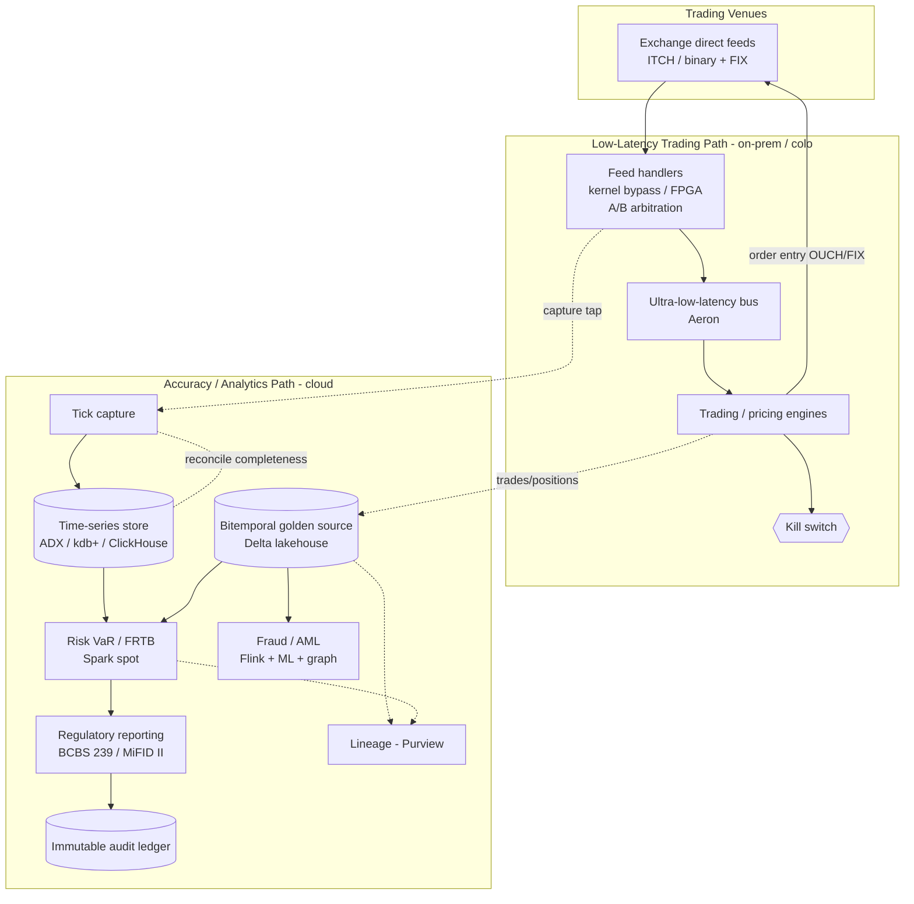
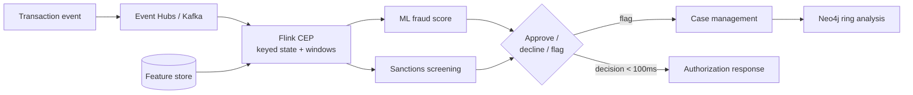
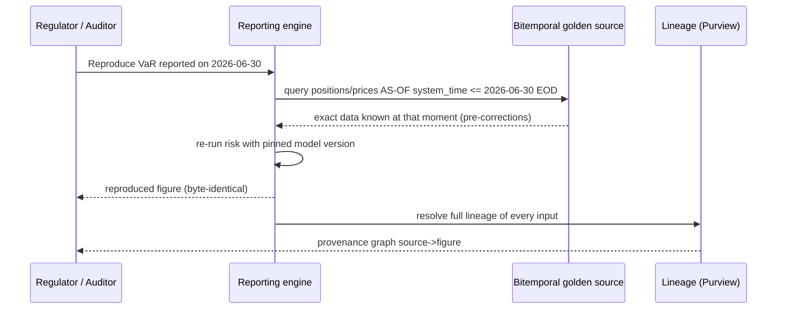

# Financial Data Platforms

> Part of the **Enterprise Data & AI Architecture Handbook** · Phase-17 — Industry Vertical Platforms · Chapter 02.
> Estimated study time: **60 min reading + ~3h labs**.
> **Prerequisites:** read [Compliance and Regulatory Frameworks](../Phase-10/06_Compliance_and_Regulatory_Frameworks.md) first.

---

## Executive Summary

The previous chapter ([Healthcare Data Platforms](01_Healthcare_Data_Platforms.md)) established Phase-17's central thesis: in a regulated vertical, the regulation and domain constraints *are* the architecture, not a layer on top of it. Financial data platforms are the sharpest possible illustration of that thesis, because they must satisfy two constraints that are in direct, structural tension. On one side, the **trading fast path** demands the lowest achievable latency — nanoseconds matter, a microsecond of delay is a measurable P&L difference, and the entire engineering culture of the front office is organized around shaving latency. On the other side, the **risk, audit, and regulatory-reporting path** demands perfect, reproducible, auditable *accuracy* — a regulator asking "how did you arrive at this capital number?" must be answerable to the exact source tick, three years later, byte-for-byte. A platform that optimizes only for speed produces numbers no regulator will accept; a platform that optimizes only for auditable accuracy is too slow to trade on. The defining architectural discipline of financial data platforms is *separating and correctly serving both paths.*

This chapter is Phase-17 Chapter 02 and covers **market data and tick pipelines** (the feed protocols — FIX, ITCH/OUCH, SBE — the order book, consolidated vs direct feeds, and the extreme-throughput time-series storage that tick data demands); **risk, fraud, and AML analytics** (real-time and end-of-day risk such as VaR/FRTB, transaction monitoring and sanctions screening, and graph analytics for fraud rings); **auditability and lineage** (immutable, tamper-evident, bitemporal "golden source" data and the ability to reproduce any figure as-of any point in time); **regulatory reporting and BCBS 239** (the Basel Committee's 14 principles for risk-data aggregation and reporting, alongside MiFID II, Dodd-Frank, and FRTB); and the **low-latency vs accuracy trade-off** that threads through every section.

The platform bias is **Azure-primary (~60%)** — Azure Data Explorer (ADX/Kusto) as the tick and time-series analytics store, Event Hubs for high-throughput ingestion, Azure Databricks and Delta Lake for risk analytics and the bitemporal golden source, Microsoft Purview for lineage (a BCBS 239 requirement), Azure Confidential Ledger for tamper-evident audit, Azure Managed HSM and confidential computing for cryptographic and data-in-use protection — **~30% enterprise open source** (Apache Kafka and Aeron for messaging, Apache Flink for complex-event fraud processing, ClickHouse and Apache Pinot/Druid as OSS real-time OLAP for tick/market data, Neo4j for fraud-ring graphs, Spark/Delta for the analytics backbone, and Great Expectations for reconciliation controls; kdb+/q is noted throughout as the ubiquitous — though proprietary — front-office time-series standard) — **~10% AWS/GCP comparison-only** (AWS FinSpace / Managed kdb, Kinesis, and the now-deprecating QLDB; GCP BigQuery + Pub/Sub + Dataflow), contrasted honestly on capability, lock-in, and platform longevity.

**Bottom line:** a financial data platform is not "a fast data platform." It is an architecture in which **the low-latency trading path and the auditable regulatory/risk path are deliberately separated and each served on its own terms**, and in which — because the numbers drive capital, trading, and regulatory obligations — every reported figure must be **reproducible to its exact source inputs, as-of the point in time it was computed.** This chapter's ADR (§40) formalizes that: regulatory and risk figures must be derived from a **bitemporal, immutable, lineage-complete golden source**, never reconstructed from the mutable operational store or the latency-optimized feed. The two case studies (§40) show what happens when a figure cannot be reproduced for a regulator (a costly restatement) and when the fast path is changed without operational discipline (the real 2012 Knight Capital $440M incident).

---

## Learning Objectives

By the end of this chapter you will be able to:

1. **Design a market-data / tick pipeline** — choosing feed protocols (FIX, ITCH/OUCH, SBE), handling the order book, and selecting an extreme-throughput time-series store.
2. **Explain the low-latency techniques** (colocation, kernel-bypass networking, multicast, columnar time-series stores, hardware acceleration, PTP time sync) and their cost/complexity trade-offs.
3. **Architect real-time and batch risk, fraud, and AML analytics** — VaR/FRTB risk, complex-event fraud detection, transaction monitoring, sanctions screening, and fraud-ring graph analytics.
4. **Design an auditable, bitemporal, lineage-complete golden source** and explain why reproducibility "as-of" a point in time is a hard regulatory requirement.
5. **Apply BCBS 239 and adjacent regulations** (MiFID II, Dodd-Frank, FRTB, SR 11-7) to concrete platform controls for accuracy, completeness, timeliness, and adaptability.
6. **Reason explicitly about the low-latency vs accuracy trade-off** and design a dual-path architecture that serves both without compromising either.
7. **Defend a financial platform's market-data, risk, audit, and reporting architecture** in engineer, staff engineer, architect, and CTO review settings.

---

## Business Motivation

- **Latency is directly monetizable and directly costly.** In electronic trading, being microseconds faster than a competitor is the difference between capturing and missing a price; latency is not an engineering nicety but a P&L line item, which is why firms spend heavily on colocation, kernel bypass, and FPGAs (§2.2). Equally, an outage or a mis-priced feed is an immediate, quantifiable loss.
- **Regulatory reporting is a licence-to-operate requirement, and non-compliance is existential.** BCBS 239, MiFID II, and Dodd-Frank are not optional; a G-SIB (globally systemically important bank) that cannot aggregate its risk data accurately and on time faces supervisory action, capital add-ons, and reputational damage. More than a decade after BCBS 239 was published, supervisors still report many banks as only partially compliant — evidence of how genuinely hard risk-data aggregation is.
- **The cost of an unreproducible number is a restatement.** When a reported figure cannot be traced to its source and reproduced (§40, Case Study 1), the result is regulatory findings, remediation programmes costing tens of millions, and — in the worst case — financial restatements that move share price. Reproducibility is therefore a first-order business requirement, not an audit checkbox.
- **Fraud and financial crime are direct losses and direct legal liability.** Card fraud, payment fraud, market abuse, and money laundering cost the industry enormously; and AML failures carry personal and corporate liability (regulators have levied multi-billion-dollar AML penalties). The platform's fraud/AML analytics (§2.3) are a loss-prevention and liability-management function, not a reporting afterthought.
- **A single fast-path defect can destroy a firm.** The 2012 Knight Capital incident (§39, §40 Case Study 2) — a ~$440M loss in about 45 minutes from a botched deployment to the trading path — is the industry's canonical proof that operational discipline on the low-latency path is a survival-level business concern.

---

## History and Evolution

- **1970s-1980s — electronic quotation and the first market-data feeds.** NASDAQ (1971) and electronic quote systems begin replacing the trading floor's open outcry, creating the first machine-readable market-data streams and the need to store and distribute them.
- **1992 — the FIX protocol is created.** The Financial Information eXchange protocol standardizes electronic order and trade messaging between buy-side, sell-side, and venues, becoming the lingua franca of trading connectivity (still ubiquitous in 2026, with binary variants like FIX/FAST and SBE for latency-sensitive paths).
- **2000s — the rise of electronic and algorithmic trading.** Decimalization, Reg NMS (US, 2005), and MiFID (EU, 2007) fragment liquidity across many venues, making low-latency direct market-data feeds (Nasdaq ITCH/OUCH, exchange binary protocols) and consolidated tapes central. **kdb+/q** (KX) emerges as the dominant columnar time-series database for tick data in the front office.
- **2007-2010 — high-frequency trading and the latency arms race.** Colocation, kernel-bypass networking (Solarflare/Onload, later DPDK), multicast market data, and FPGA acceleration push latency into the microsecond and then nanosecond regime. The **May 6, 2010 Flash Crash** exposes how fast, interconnected, and fragile electronic markets had become — a systemic-risk wake-up call.
- **2008 financial crisis → BCBS 239 (2013).** The crisis revealed that many large banks *could not aggregate their own risk exposures* quickly or accurately across silos. The Basel Committee responds with **BCBS 239 — "Principles for effective risk data aggregation and risk reporting"** (14 principles), the single most important regulation shaping bank data architecture, with a 2016 compliance deadline for G-SIBs that many missed.
- **2010-2018 — post-crisis regulation reshapes data platforms.** **Dodd-Frank** (US, 2010) mandates swap reporting to trade repositories; **MiFID II** (EU, 2018) imposes transaction reporting, best-execution evidence, and — via RTS 25 — **microsecond-or-better clock synchronization** (traceable to UTC), making precision time (PTP, §2.2) a compliance requirement, not just a performance one. **SR 11-7** (US, 2011) formalizes model-risk management, and **FRTB** (Fundamental Review of the Trading Book) overhauls market-risk capital with far heavier data demands.
- **2012 — Knight Capital.** A deployment error on the trading fast path activates dormant code, generating millions of erroneous orders and a ~$440M loss in ~45 minutes — the defining lesson in fast-path operational discipline (§40, Case Study 2).
- **2015-2022 — cloud, lakehouse, and confidential computing arrive in finance.** Initially cautious (latency, data residency, regulatory scrutiny of cloud concentration risk), banks move risk analytics, regulatory reporting, and increasingly market-data analytics to the cloud. **Azure Data Explorer**, **Delta Lake** lakehouses, **confidential computing**, and tamper-evident ledgers (**Azure Confidential Ledger**, and AWS QLDB — see §35 for QLDB's deprecation) make the auditable, high-throughput cloud platform viable for regulated workloads.
- **2022-2026 — AI, FRTB implementation, and real-time everything.** FRTB implementation intensifies risk-data demands; ML/graph analytics become standard in fraud and AML; and generative/agentic AI (per Phase-12) enters trade-surveillance, research, and reconciliation — under the model-risk (SR 11-7) and explainability constraints the sector requires.

---

## Why This Technology Exists

Financial data platforms exist because financial markets impose two requirements that no single general-purpose data system satisfies simultaneously: **extreme low latency on the trading path** and **perfect, reproducible, auditable accuracy on the risk-and-reporting path.** A generic analytics platform is far too slow for market making; a latency-optimized feed handler discards the versioning, lineage, and immutability that regulators require. Purpose-built market-data infrastructure (binary feed protocols, columnar tick stores, kernel-bypass networking) exists to meet the first requirement; purpose-built bitemporal, immutable, lineage-complete golden-source architecture exists to meet the second; and the discipline of *separating* the two — serving the hot trading path and the cold audit path each on its own terms while reconciling them — is the reason a "financial data platform" is a distinct architecture rather than a fast database plus a compliance report. Regulation (BCBS 239, MiFID II, Dodd-Frank) does not sit on top of this architecture; it dictates its shape.

---

## Problems It Solves

- **Ingesting and storing market data at millions-of-messages-per-second throughput**, resolved by binary feed protocols (ITCH/SBE), multicast distribution, and columnar time-series stores (kdb+, ADX, ClickHouse) built for append-heavy, time-ordered data (§2.1, §13).
- **Trading and pricing at microsecond-to-nanosecond latency**, resolved by colocation, kernel-bypass networking, and hardware acceleration (§2.2) — the fast path.
- **Aggregating risk accurately and on time across silos** (the BCBS 239 problem), resolved by a governed golden source with complete lineage and reproducibility (§2.4, §2.5, §40 ADR).
- **Detecting fraud, market abuse, and money laundering in real time and in batch**, resolved by complex-event processing (Flink), transaction monitoring, sanctions screening, and graph analytics for connected-entity detection (§2.3).
- **Proving to a regulator exactly how any reported figure was derived**, resolved by bitemporal, immutable, lineage-complete data that supports "as-of" reconstruction (§40 ADR-0189).
- **Reconciling numbers across systems and time (T+1 and intraday)**, resolved by golden-source reconciliation controls and data-quality assertions (§21, [Data Quality with Great Expectations](../Phase-08/03_Data_Quality_with_Great_Expectations.md)).

---

## Problems It Cannot Solve

- **It cannot make the low-latency path and the audit path the same system.** The techniques that make trading fast (discarding history, minimizing serialization, kernel bypass) are the opposite of what auditability requires (immutable versioned history, complete lineage). The platform *separates* them; it does not unify them (§40 ADR). Anyone promising one system that is both nanosecond-fast and fully audit-reproducible is selling a fantasy.
- **It cannot fix bad reference or market data upstream.** A wrong security master, a mis-mapped instrument identifier, or a corrupt vendor price propagates into every downstream risk and reporting figure; standardization and lineage help you *find and reproduce* the error, but data-quality governance ([Data Quality with Great Expectations](../Phase-08/03_Data_Quality_with_Great_Expectations.md)) remains a separate, mandatory discipline.
- **It cannot eliminate fraud/AML false positives.** Transaction monitoring and sanctions screening are inherently precision/recall trade-offs; tightening to catch more crime raises false positives (and investigation cost), loosening raises missed-crime risk. The platform manages this trade-off; it does not remove it (§24).
- **It does not by itself satisfy model-risk governance.** ML fraud and risk models fall under SR 11-7 model-risk management — validation, monitoring, explainability — which is a governance discipline ([Responsible AI](../Phase-11/07_Responsible_AI.md), [Evaluation and Guardrails](../Phase-12/09_Evaluation_and_Guardrails.md)) the technology enables but does not replace.
- **It cannot remove market and systemic risk.** No data platform prevents a flash crash or a market dislocation; it can measure, monitor, and provide circuit breakers and kill switches (§19), but the underlying market risk is irreducible.
- **It cannot guarantee correctness under a fast-path deployment defect without operational discipline.** As Knight Capital showed (§40, CS2), the technology is only as safe as the deployment, canary, and kill-switch discipline operating it.

---

## Core Concepts

### 2.1 Market data, feeds, and tick pipelines

**Market data** is the stream of quotes, trades, and order-book updates from trading venues. It arrives in several forms and protocols:

- **FIX** (Financial Information eXchange) — the tag-value session protocol for orders and executions; ubiquitous but relatively verbose. **FIX/FAST** and **SBE (Simple Binary Encoding)** are binary encodings for latency-sensitive paths.
- **Exchange binary feeds** — e.g. Nasdaq **ITCH** (market data / order book) and **OUCH** (order entry); each venue often has its own binary protocol delivered via **multicast** for fan-out to many subscribers with minimal latency.
- **Order book** — the live set of resting bids/asks; a market-data handler reconstructs the book from incremental updates (add/modify/delete). **Level 1** (top of book), **Level 2** (aggregated depth), **Level 3** (full order-by-order) differ hugely in volume.
- **Consolidated vs direct feeds** — a consolidated tape (e.g. the US SIP) is simpler but slower; direct exchange feeds are faster but require handling each venue's protocol and are far higher volume.
- **Tick data** — every quote and trade, timestamped to nanoseconds, is the highest-volume dataset in the enterprise (tens of billions of events/day for a broad-market feed), demanding purpose-built columnar time-series storage (§13).

### 2.2 Low-latency architecture

The fast path is engineered end to end for minimal latency:

- **Colocation** — placing your servers in the same data centre as the exchange matching engine, so signal propagation is measured in metres, not kilometres.
- **Kernel-bypass networking** — user-space networking stacks (Solarflare/Onload, DPDK) that avoid the OS kernel's network stack, cutting microseconds; sometimes RDMA.
- **Multicast market data** and ultra-low-latency messaging (Aeron, LBM, Chronicle Queue) for fan-out without per-subscriber cost.
- **Hardware acceleration** — FPGAs (and occasionally ASICs) for feed handling, order-book building, and even risk checks in the nanosecond regime.
- **Columnar in-memory time-series** — kdb+/q is the front-office standard for storing and querying ticks at speed; ADX/ClickHouse are the analytics-tier equivalents.
- **Precision time** — **PTP (IEEE 1588)** for sub-microsecond clock synchronization, required both for latency measurement and, under **MiFID II RTS 25**, for regulatory clock-sync traceable to UTC. Every event carries a high-precision timestamp; disagreeing clocks make cross-venue analysis and compliance impossible.

The cost of all of this is high (specialized hardware, colocation fees, scarce expertise), so it is applied *only* to the genuinely latency-critical path — not to risk or reporting, which live on the accuracy path.

### 2.3 Risk, fraud, and AML analytics

Three distinct analytical workloads, each with its own latency and accuracy profile:

- **Market/credit risk** — **VaR (Value at Risk)**, expected shortfall, sensitivities (Greeks), **XVA**, and — under **FRTB** — far more granular, data-hungry capital calculations. Some risk is intraday/real-time (pre-trade limit checks, live exposure); much is heavy end-of-day batch (Monte Carlo simulations across scenarios). Reproducibility and lineage are mandatory (§2.4).
- **Fraud detection** — real-time scoring of card/payment transactions using **complex-event processing (CEP)** (Apache Flink), rules + ML, with hard latency budgets (a card authorization must return in tens of milliseconds). The precision/recall trade-off (false positives = declined legitimate transactions and customer friction) is central.
- **AML / financial crime** — **KYC**, transaction monitoring, **sanctions screening** (OFAC and other lists), and **SAR** (Suspicious Activity Report) filing. **Graph analytics** (Neo4j, GraphRAG per [GraphRAG](../Phase-13/04_GraphRAG.md)) detect fraud rings and layering by finding connected entities that per-transaction rules miss — the same graph techniques as [Knowledge Graphs with Neo4j](../Phase-13/02_Knowledge_Graphs_with_Neo4j.md), applied to money movement.

### 2.4 Auditability, lineage, and bitemporality

The accuracy path's defining properties:

- **Immutability / tamper-evidence** — audit and regulatory data must be **WORM (write-once-read-many)** or cryptographically tamper-evident (a hash-chained ledger such as Azure Confidential Ledger) so no one can silently alter history.
- **Lineage** — complete, traceable provenance from a reported figure back to its exact source inputs; BCBS 239 Principle 2 (data architecture) and Principle 3 (accuracy) effectively mandate it. Microsoft Purview (per [Microsoft Purview](../Phase-08/06_Microsoft_Purview.md)) and [Data Catalog and Lineage](../Phase-08/02_Data_Catalog_and_Lineage.md) provide this capability.
- **Bitemporality** — every fact carries *two* time dimensions: **valid time** (when it was true in the world) and **transaction/system time** (when the system recorded it). This lets you reconstruct "what did we believe the P&L was, as-of the reporting date, using the data we had *at that moment*" — even after later corrections arrive. A late trade correction must not silently rewrite yesterday's already-reported number; bitemporality preserves both the original and the corrected view.
- **Golden source** — a single, governed, authoritative source of a given data element (prices, positions, reference data), so downstream consumers reconcile to one truth rather than diverging (the MDM discipline of [Master Data Management](../Phase-08/05_Master_Data_Management.md) applied to financial data).

### 2.5 Regulatory reporting and BCBS 239

**BCBS 239** ("Principles for effective risk data aggregation and risk reporting") is the anchor. Its 14 principles cluster into: **governance and infrastructure** (Principles 1-2), **risk-data aggregation capabilities** (Principles 3-6: accuracy/integrity, completeness, timeliness, adaptability), **risk-reporting practices** (Principles 7-11), and **supervisory review** (12-14). The practical architectural demands are: a governed data architecture with lineage, the ability to aggregate risk accurately and completely across the whole group, timeliness (including under stress), and adaptability (ad-hoc requests answerable quickly). Alongside it sit **MiFID II** (transaction reporting, best execution, clock sync), **Dodd-Frank** (swap reporting), **FRTB** (market-risk capital), **CCAR/stress testing**, and **SR 11-7** (model risk). The common thread — and the reason this chapter's ADR exists — is that every regulatory figure must be **accurate, complete, timely, and reproducible from a governed source with full lineage.**

---

## Internal Working

### 3.1 Tick ingestion and time-series storage internals

A feed handler receives multicast market-data packets, decodes the venue's binary protocol (ITCH/SBE), reconstructs the order book from incremental add/modify/delete messages, and publishes normalized events onto an ultra-low-latency bus (Aeron) for the trading engines. In parallel, a **capture** process writes every tick — with its nanosecond PTP timestamp and sequence number — to a columnar time-series store (kdb+ intraday, ADX/ClickHouse/Delta for analytics). The store is optimized for append-only, time-ordered writes and time-range + symbol queries; data is partitioned by date and often by symbol, with intraday data in memory and historical data on disk/columnar files. Gap detection (sequence-number continuity) and A/B line arbitration (exchanges publish redundant feed lines; you take whichever packet arrives first and dedup by sequence) are the correctness-critical mechanics — a missed or duplicated tick corrupts the book.

### 3.2 Real-time fraud / CEP pipeline internals

A payment/transaction event enters a streaming pipeline (Event Hubs/Kafka → Flink). Flink maintains **keyed state** per account/card, computes features over sliding/tumbling windows (velocity, geo-distance since last transaction, amount vs baseline), evaluates rules and an ML model (served per [Model Serving and Ray](../Phase-11/04_Model_Serving_and_Ray.md)), and emits an approve/decline/flag decision within a hard latency budget (often <100ms end to end for card authorization). Sanctions screening matches names/entities against watchlists (fuzzy matching for spelling variants). Flagged items create cases; graph analytics run in near-real-time or batch to surface rings. The idempotency and exactly-once-effect concerns from [Message Brokers and Queues](../Phase-14/07_Message_Brokers_and_Queues.md) matter acutely — you must not double-score or drop a transaction.

### 3.3 Bitemporal golden-source and lineage internals

Positions, prices, and trades land in a bitemporal store (Delta Lake with valid-time and system-time columns, or a bitemporal-modeled warehouse). An update never overwrites in place: a correction appends a new version with a new system-time, and the prior version remains queryable. An "as-of" query filters `system_time <= reporting_moment` to reconstruct exactly what was known then. Lineage is captured at every transform (source feed → normalized → enriched → aggregated → reported), emitted to Purview/OpenLineage, so any reported number resolves to a graph of its inputs and the exact code/version that produced it — the same reproducibility discipline as [MLOps and MLflow](../Phase-11/03_MLOps_and_MLflow.md), here applied to regulatory figures. Immutable/tamper-evident storage (Confidential Ledger hash-chaining, or WORM blob immutability policies) protects the audit record itself.

---

## Architecture

The reference architecture has two primary paths plus shared services:

1. **Low-latency trading path (hot path).** Exchange direct feeds → feed handlers (often colocated, kernel-bypass, FPGA-assisted) → order-book construction → ultra-low-latency bus (Aeron) → trading/pricing engines → order entry (OUCH/FIX) back to venues. Optimized purely for latency; typically on-prem/colo, not cloud, for the most latency-critical firms. Every event PTP-timestamped.
2. **Accuracy / analytics path (cold path).** A capture tap off the feed writes ticks to the time-series store (ADX/kdb+/ClickHouse); trades, positions, and reference data flow into the **bitemporal golden source** (Delta lakehouse); risk (VaR/FRTB), fraud/AML, and regulatory reporting run here, with full lineage (Purview) and immutable audit (Confidential Ledger). This path lives increasingly in the cloud.
3. **Shared services.** Security master / reference data (golden source), identity (Entra), lineage/catalog (Purview), data-quality/reconciliation (Great Expectations), monitoring (Sentinel/Grafana), and time distribution (PTP grandmaster traceable to UTC for RTS 25).

The two paths are **reconciled** (the cold path's captured ticks are checked for completeness against the hot path; end-of-day positions reconcile to the trading systems), but they are never merged — that separation is the architecture's core discipline (§40, ADR-0189).

---

## Components

- **Feed handlers** — decode venue binary protocols (ITCH/SBE), build order books, handle A/B line arbitration and gap detection.
- **Low-latency bus** — Aeron / Chronicle Queue / LBM for intra-firm fan-out.
- **Time-series store** — kdb+/q (front office), Azure Data Explorer / ClickHouse / Apache Pinot (analytics tier).
- **Bitemporal golden source** — Delta Lake lakehouse (valid-time + system-time), or a bitemporal warehouse.
- **Streaming / CEP engine** — Apache Flink (fraud, real-time risk), Event Hubs/Kafka ingestion.
- **Risk engines** — VaR/FRTB/Monte Carlo compute (Spark/Databricks, HPC grids).
- **Fraud/AML** — rules + ML scoring, sanctions-screening engine, Neo4j fraud-ring graph, case management.
- **Reference/security master** — golden source of instruments, entities, prices (MDM).
- **Lineage & catalog** — Microsoft Purview / OpenLineage.
- **Immutable audit** — Azure Confidential Ledger / WORM immutable blob storage.
- **Time distribution** — PTP grandmaster clock (GPS-disciplined, UTC-traceable).
- **Reconciliation & data quality** — Great Expectations, reconciliation controls.

---

## Metadata

- **Security master / reference data** — instrument identifiers (ISIN, CUSIP, SEDOL, FIGI), corporate actions, calendars, currency and holiday data; the reference metadata that gives ticks and trades meaning. A mis-mapped identifier is a silent, high-impact error (the financial analogue of the unit-mapping error in [Healthcare Data Platforms](01_Healthcare_Data_Platforms.md) §40 CS2).
- **Lineage metadata** — the provenance graph from source feed to reported figure; mandated in effect by BCBS 239 and central to reproducibility (§40).
- **Bitemporal metadata** — valid-time and system-time on every fact.
- **Data-quality / reconciliation metadata** — completeness (sequence-gap) checks, reconciliation breaks, control results.
- **Regulatory metadata** — report definitions, submission timestamps, versions, and the mapping from internal data elements to regulatory taxonomies (e.g. for MiFID II transaction reporting fields).
- **Model metadata** — for SR 11-7: model versions, validation status, inputs, and the lineage tying a risk number to the model that produced it.
- **Time metadata** — clock-sync traceability evidence (RTS 25).

---

## Storage

- **Tick / time-series** — columnar, time-partitioned, append-optimized: kdb+ (intraday, in-memory + on-disk splayed tables), ADX/ClickHouse/Pinot (analytics), Delta for the lakehouse tier. Tick data is the largest dataset in the enterprise; compression (per [Compression and Encoding](../Phase-04/08_Compression_and_Encoding.md)) and tiering are essential.
- **Bitemporal golden source** — Delta Lake with valid-time + system-time; time-travel/versioning supports as-of reconstruction natively (per [Delta Lake](../Phase-04/04_Delta_Lake.md)).
- **Immutable audit** — tamper-evident (Confidential Ledger, hash-chained) or WORM blob with an immutability policy and legal hold; long regulatory retention (often 5-7+ years, jurisdiction-dependent).
- **Reference data** — governed golden-source store (MDM).
- **Retention & tiering** — hot (intraday ticks, live positions), warm (recent history for risk/backtesting), cold/archive (regulatory retention); tiering is a major cost lever (§20) given tick-data volumes.

---

## Compute

- **Ultra-low-latency (hot path)** — colocated servers, kernel bypass, FPGA; not cloud, for the most latency-critical firms.
- **Real-time streaming (fraud/real-time risk)** — Flink on Kafka/Event Hubs, with hard latency budgets.
- **Heavy batch (risk)** — end-of-day VaR/FRTB Monte Carlo is embarrassingly parallel across scenarios/trades; Databricks/Spark or an HPC grid, often with a large overnight compute burst (a natural fit for elastic cloud and spot compute, §20).
- **Interactive analytics** — ADX/kdb+ queries for research, backtesting, and ad-hoc regulatory requests (BCBS 239 adaptability).
- **Graph compute** — Neo4j / graph algorithms for fraud rings and AML network analysis.

---

## Networking

- **Colocation and cross-connects** — the hot path lives in exchange data centres; low-latency cross-connects, precision-timed, are the physical substrate.
- **Multicast** for market-data fan-out on the hot path; **kernel-bypass** NICs.
- **Private connectivity to cloud** — ExpressRoute for the cold path; the analytics/audit estate is private-endpoint-only (per [Network Security and Zero Trust](../Phase-10/04_Network_Security_and_Zero_Trust.md) ADR-0144), no public data-plane exposure.
- **Segmentation** — trading, risk, and audit zones are segmented; production trading networks are especially locked down.
- **Egress control** — default-deny egress prevents exfiltration of positions, orders, or client data — market-sensitive and regulated.
- **Time network** — a dedicated PTP distribution network (GPS grandmaster → boundary/transparent clocks) for UTC-traceable timestamps (RTS 25).

---

## Security

- **Data classification and access** — positions, orders, and client data are market-sensitive (front-running / insider-trading risk) and often PII; least-privilege, RBAC/ABAC, and strict separation between trading, research, and client-facing functions (information barriers / "Chinese walls" are a regulatory access-control requirement, not just policy).
- **Encryption** — at rest (CMK/Managed HSM per [Data Security and Encryption](../Phase-10/03_Data_Security_and_Encryption.md)), in transit (TLS), and increasingly **in use** (confidential computing / TEEs) for sensitive risk and client data.
- **Tamper-evident audit** — the audit record itself must be provably unaltered (Confidential Ledger / WORM); this is both a security and a regulatory control.
- **Fraud/market-abuse surveillance** — trade surveillance for insider dealing and manipulation (spoofing, layering) is itself a security/compliance function the platform hosts.
- **Segregation of duties and change control** — deployment to the trading path must have segregation of duties, approvals, and a **kill switch** — the direct lesson of Knight Capital (§40, CS2).
- **Sanctions & KYC** — screening against sanctions lists is a legal security control with severe penalties for failure.

---

## Performance

- **Hot-path latency** is measured in nanoseconds-to-microseconds and engineered end to end (§2.2); tail latency (p99/p99.9) matters more than mean — a single slow event can miss a market.
- **Feed-handler throughput** must absorb market-open and volatility bursts (message rates spike enormously during volatility — capacity must be sized for the burst, not the average, or you drop ticks exactly when they matter most).
- **Time-series query performance** hinges on time+symbol partitioning and columnar layout; kdb+/ADX are built for this.
- **Risk-batch performance** — the overnight VaR/FRTB window is a hard deadline (numbers must be ready before the next trading day); parallelism and compute elasticity determine whether you make it.
- **Fraud-scoring latency** — a hard budget (tens of ms) for card authorization; feature retrieval (feature store, per [Feature Stores with Feast](../Phase-11/02_Feature_Stores_with_Feast.md)) and model inference must fit inside it.

---

## Scalability

- **Tick capture** scales with market volume and venue count; partition by date/symbol; the analytics tier scales horizontally (ADX/ClickHouse clusters, Delta).
- **Risk batch** scales horizontally across trades/scenarios — the classic embarrassingly-parallel Monte Carlo; the constraint is the overnight window and compute budget.
- **Fraud streaming** scales via Kafka/Event Hubs partitioning and Flink parallelism (keyed by account/card).
- **Decoupling hot and cold paths** is itself the key scalability move (§40 ADR): risk and reporting load never contends with the trading path.
- **Graph analytics** scale is bounded by graph size and query depth; partition/federate large entity graphs.

---

## Fault Tolerance

- **Feed redundancy** — exchanges provide A/B feed lines; handle both and arbitrate by sequence number so a dropped packet on one line is recovered from the other. Gap detection triggers a recovery/retransmission request.
- **Idempotent, exactly-once-effect processing** on the fraud/transaction path — never double-score or drop a payment ([Message Brokers and Queues](../Phase-14/07_Message_Brokers_and_Queues.md)).
- **Kill switch / circuit breakers** — the trading path must be able to halt instantly (firm-level kill switch, plus exchange-level circuit breakers introduced after the 2010 Flash Crash). Knight Capital's absence of an effective, fast kill switch turned a bug into a $440M loss.
- **Bitemporal correction, not overwrite** — late corrections append versions; the already-reported number is preserved, so fault recovery never silently rewrites history (§2.4).
- **DR and business continuity** — trading and settlement are systemically critical; strict RPO/RTO, tested failover, and preservation of the audit trail and reconciliation state.

---

## Cost Optimization

- **Apply low-latency spend only where it pays.** Colocation, FPGAs, and kernel bypass are expensive; restrict them to the genuinely latency-critical path and serve everything else on the cheaper accuracy path.
- **Elastic / spot compute for the overnight risk burst** — VaR/FRTB Monte Carlo is bursty and checkpoint-tolerant; spot/low-priority VMs cut a large share of risk-compute cost.
- **Tier tick data aggressively** — hot intraday, warm recent, cold/archive for regulatory retention; tick volumes make untiered hot storage ruinously expensive.
- **Compression and columnar encoding** for tick/time-series (per [Compression and Encoding](../Phase-04/08_Compression_and_Encoding.md)).
- **Right-size fraud/AML false positives** — false positives are a direct operational cost (investigators' time); a better model that cuts false positives has a large, quantifiable FinOps benefit beyond infrastructure.

**Worked FinOps example.** A bank runs end-of-day FRTB/VaR Monte Carlo — roughly 200,000 core-hours/night on on-demand compute at (illustratively) ~$0.10/core-hour ≈ $20,000/night ≈ $600K/month. The workload is embarrassingly parallel and checkpoint-tolerant, so moving it to **spot** compute at ~70% discount brings it to ~$180K/month, and tiering the several-PB tick archive from hot to cool/archive storage saves a further large fraction of storage cost. Combined, a **~65-70% reduction** on the risk-and-storage line (~$400K+/month) with no change to the numbers produced — because the risk batch tolerates preemption and old ticks don't need hot storage. The low-latency trading path is deliberately *excluded* from this optimization: you do not run market making on spot VMs.

---

## Monitoring

- **Feed health** — message rates vs expected, sequence-gap counts, A/B line divergence, feed-handler latency; a gap or a latency spike is a data-integrity and trading-risk signal.
- **Clock sync** — PTP offset/drift vs the grandmaster (RTS 25 evidence); a clock out of tolerance is a compliance breach.
- **Fraud/AML** — transaction-scoring latency, decline rates, false-positive/alert volumes, sanctions-screening hit rates.
- **Risk batch** — job completion vs the overnight deadline, scenario failures, reconciliation breaks.
- **Reconciliation** — hot-vs-cold tick completeness, position reconciliation breaks between trading and risk systems.
- **Trading-path safety** — order rates, self-match/erroneous-order detection, kill-switch readiness.

## Operational Response Playbook

| Signal | Detection | Remediation |
|---|---|---|
| **Runaway / erroneous order flow on the trading path** (order rate far above baseline, self-matches, or orders against stale prices — the Knight Capital signature) | Real-time order-rate and erroneous-order monitors; risk pre-trade-limit breaches; venue drop-copy divergence | **Trigger the kill switch immediately** — halt the order flow first, diagnose second (Knight's fatal error was hesitating). Cancel outstanding erroneous orders; notify venues; quantify exposure. Post-incident: confirm the deployment/config change that caused it, and treat the absence of a fast, tested kill switch and canary/staged deployment on the fast path as the root cause to remediate (§40, CS2). |
| **Regulatory/risk figure cannot be reproduced or reconciled** (a reported number doesn't tie back to source, or an as-of query can't reconstruct it) | Reconciliation break between report and golden source; lineage query returns incomplete provenance; auditor/regulator query | Freeze the affected report version; use bitemporal as-of reconstruction to determine what was known at reporting time; trace lineage to the divergent input; if the source was mutated in place with no version history, that is the exact §40 ADR-0189 failure — the figure is unreproducible and may require restatement. Remediate by moving the source onto the bitemporal, lineage-complete golden source. |

---

## Observability

- **End-to-end lineage** from source feed → normalized → risk/report figure, so any number resolves to its inputs and the code/model version that produced it (BCBS 239 + reproducibility).
- **Bitemporal "as-of" observability** — the ability to ask "what did we believe, as-of this date, with the data we had then," is an observability capability unique to this domain.
- **Distributed tracing** across the fraud/transaction pipeline (OpenTelemetry) so a latency breach in card authorization is attributable to a stage (feature retrieval vs inference vs sanctions screening).
- **Data-quality observability** — completeness (no dropped ticks), reconciliation breaks, and reference-data integrity surfaced as continuous metrics, so a silent divergence shows up on a dashboard, not in a regulator's finding.
- **Latency observability** — hot-path latency histograms (p99/p99.9), because tail latency is the metric that matters for trading.

---

## Governance

- **BCBS 239 governance** — board-level accountability for risk-data aggregation (Principle 1), a documented data architecture and IT infrastructure (Principle 2), and demonstrable accuracy/completeness/timeliness/adaptability (Principles 3-6). This is the single largest governance driver of bank data architecture.
- **Model risk (SR 11-7)** — validation, ongoing monitoring, and explainability for every risk/fraud/AML model; ML models inherit the Responsible-AI and evaluation disciplines of [Responsible AI](../Phase-11/07_Responsible_AI.md) and [Evaluation and Guardrails](../Phase-12/09_Evaluation_and_Guardrails.md), plus formal independent validation.
- **Data ownership and golden source** — clear ownership of each authoritative data element (MDM per [Master Data Management](../Phase-08/05_Master_Data_Management.md)); reconciliation to one truth.
- **Records retention and immutability** — WORM/legal-hold governance for regulatory records; tamper-evidence for audit.
- **Information barriers** — access governance enforcing separation between functions (research vs trading vs client) as a regulatory requirement.
- **Transaction/trade reporting governance** — accuracy and timeliness of MiFID II/Dodd-Frank submissions; controls and reconciliation on regulatory reports themselves.
- **Data residency and cloud concentration** — regulators scrutinize where regulated data lives and concentration risk in a single cloud provider (per [Compliance and Regulatory Frameworks](../Phase-10/06_Compliance_and_Regulatory_Frameworks.md)).

---

## Trade-offs

- **Latency vs accuracy/auditability** — the defining trade-off; resolved by *separating* the hot and cold paths rather than compromising either (§40 ADR).
- **Direct feeds vs consolidated tape** — direct feeds are faster and richer but higher volume, higher cost, and per-venue complexity; consolidated is simpler but slower.
- **kdb+ vs open-source time-series (ClickHouse/ADX/Pinot)** — kdb+ is the fastest, most battle-tested front-office standard but proprietary and expensive with scarce q talent; OSS/cloud alternatives are cheaper and more accessible but may not match the extreme low-latency regime.
- **Real-time vs batch risk** — real-time risk enables intraday limit management but is far costlier and harder; much risk remains end-of-day batch for good reasons (accuracy, full-book consistency).
- **Fraud sensitivity (precision vs recall)** — tighter detection catches more crime but raises false positives (cost, customer friction); a business-calibrated trade-off, not a technical optimum.
- **On-prem/colo vs cloud** — the hot path stays on-prem/colo for latency and control; the cold path moves to cloud for elasticity and cost — but under regulatory scrutiny of residency and concentration.
- **Bitemporal complexity vs simplicity** — bitemporality is essential for reproducibility but adds real modeling and query complexity; apply it where reproducibility is required (risk/reporting), not everywhere.

---

## Decision Matrix

| Decision | Choose A | Choose B | Deciding factor |
|---|---|---|---|
| Market-data feed | **Direct exchange feed** | **Consolidated tape / SIP** | Latency-critical trading, can absorb volume/complexity → direct; cost-sensitive, latency-tolerant analytics → consolidated |
| Time-series store | **kdb+/q** | **ADX / ClickHouse / Pinot** | Extreme front-office low latency, have q expertise → kdb+; analytics tier, cost/accessibility, cloud-native → ADX/OSS |
| Risk computation | **Real-time / intraday** | **End-of-day batch** | Intraday limit management, live exposure → real-time (costly); regulatory capital, full-book consistency → batch |
| Fraud engine | **CEP (Flink) + ML** | **Rules only** | Evolving fraud patterns, scale, need for ML → Flink+ML; simple, explainable, low-volume → rules |
| Audit store | **Tamper-evident ledger** (Confidential Ledger) | **WORM immutable blob** | Need cryptographic proof of non-alteration / multi-party trust → ledger; regulatory retention + immutability sufficient → WORM |
| Trading-path hosting | **On-prem / colocation** | **Cloud** | Nanosecond-critical market making → colo; risk/reporting/analytics → cloud |
| Reporting source | **Bitemporal golden source** (always for regulatory) | **Operational store** (never for regulatory) | Any regulatory/risk figure → bitemporal golden source (§40 ADR); transient operational view → operational store |

---

## Design Patterns

- **Dual-path (hot/cold) separation** — a latency-optimized trading path and an accuracy-optimized audit/risk path, reconciled but never merged (§40, ADR-0189).
- **Bitemporal golden source** — valid-time + system-time, append-only corrections, as-of reconstruction for reproducibility.
- **Lineage-complete reporting** — every reported figure traceable to source inputs and producing code/model version.
- **Feed A/B arbitration + gap detection** — redundant feed lines, sequence-number continuity, dedup by sequence.
- **Kill switch + staged/canary deployment on the trading path** — instant halt capability and safe rollout discipline (the Knight Capital lesson).
- **Graph-based financial-crime detection** — connected-entity analysis for rings/layering that per-transaction rules miss.
- **Tamper-evident audit ledger** — hash-chained/WORM audit as the immutable record of what was reported.

## Anti-patterns

- **Reconstructing regulatory numbers from the mutable operational store or the latency feed** — the exact failure ADR-0189 prevents.
- **Overwriting data in place when corrections arrive** — destroys reproducibility; yesterday's reported number can no longer be reconstructed.
- **Running risk/reporting load on the trading path** — contends with latency-critical work and couples failure domains.
- **Deploying to the trading path without canary, segregation of duties, or a kill switch** — Knight Capital.
- **Applying low-latency spend everywhere** — colocating and FPGA-accelerating workloads that don't need it wastes money.
- **Sizing feed handlers for average, not burst, message rates** — drops ticks precisely during volatility.
- **Treating fraud thresholds as a technical optimum** rather than a business-calibrated precision/recall decision.

## Common Mistakes

- No bitemporality, so late trade corrections silently rewrite already-reported figures.
- Incomplete lineage, so a regulator's "how did you get this number?" is unanswerable.
- Clock sync out of RTS 25 tolerance (a compliance breach hiding as a "minor ops issue").
- Ignoring A/B line arbitration, so a single dropped packet corrupts the order book.
- Untiered tick storage, producing a ruinous hot-storage bill.
- Fraud models tuned to maximize recall in testing, flooding investigators with false positives in production.
- Forgetting the kill switch — or having one that's too slow or untested to matter.

## Best Practices

- Separate hot and cold paths; reconcile them; never merge them.
- Make every regulatory/risk figure reproducible from a bitemporal, lineage-complete golden source (ADR-0189).
- Apply corrections as appended versions, never in-place overwrites.
- Handle A/B feeds with sequence arbitration and gap detection; size for burst rates.
- Enforce PTP clock sync in RTS 25 tolerance and keep traceability evidence.
- Deploy to the trading path only with canary/staged rollout, segregation of duties, and a fast, tested kill switch.
- Calibrate fraud thresholds to the business precision/recall trade-off; monitor false-positive cost.
- Tier and compress tick data; run the risk burst on elastic/spot compute.
- Govern models under SR 11-7 (validation, monitoring, explainability).

---

## Enterprise Recommendations

- **Adopt a deliberate dual-path architecture.** Keep the nanosecond-critical trading path on-prem/colo and engineered for latency; put risk, fraud/AML, audit, and regulatory reporting on an elastic cloud accuracy path (ADX + Delta lakehouse + Purview + Confidential Ledger). Reconcile the two; do not merge them.
- **Make the bitemporal, lineage-complete golden source non-negotiable for all regulatory/risk figures** (ADR-0189). Enforce it architecturally; forbid reporting off mutable operational stores.
- **Treat BCBS 239 as an architecture mandate, not a reporting project** — invest in lineage (Purview), golden-source MDM, reconciliation controls, and demonstrable accuracy/completeness/timeliness/adaptability.
- **Instrument fast-path safety** — kill switch, canary deployment, segregation of duties, erroneous-order monitors — as a survival requirement (Knight Capital).
- **Use ADX/kdb+ appropriately** — kdb+ where extreme front-office latency justifies it; ADX/ClickHouse for the analytics tier and cost/accessibility.
- **Run risk compute elastically** (spot for the overnight burst) and tier tick storage aggressively.
- **Govern models under SR 11-7** and apply the Responsible-AI/evaluation disciplines to fraud and risk ML.
- **Design for regulatory scrutiny of cloud** — data residency, concentration risk, and exit/portability plans (see §35 and the QLDB deprecation lesson).

---

## Azure Implementation

The **accuracy/cold path** is the Azure-primary surface (the hot trading path typically stays on-prem/colo):

- **Ingestion** — **Azure Event Hubs** (Kafka-compatible) for high-throughput market and transaction ingestion; **Azure Stream Analytics** or **Flink** for real-time processing.
- **Tick / time-series** — **Azure Data Explorer (ADX/Kusto)** is the primary managed store for ticks and telemetry: columnar, time-series-optimized, KQL query, hot/cold caching, and update policies for downsampling. It is the cloud analog of kdb+ for the analytics tier.
- **Bitemporal golden source & risk** — **Azure Databricks** + **Delta Lake** (valid-time + system-time columns, time-travel for as-of reconstruction) as the medallion lakehouse (per [Medallion Architecture](../Phase-05/03_Medallion_Architecture.md)); Spark for VaR/FRTB Monte Carlo (spot pools for the overnight burst); **Microsoft Fabric** as the unified analytics option (per [Microsoft Fabric](../Phase-05/07_Microsoft_Fabric.md)).
- **Fraud / AML** — Flink or Stream Analytics for CEP; **Azure Machine Learning** (per [Azure Machine Learning](../Phase-11/05_Azure_Machine_Learning.md)) for model training/serving with a feature store; graph analytics on **Azure Cosmos DB for Apache Gremlin** or Neo4j on AKS.
- **Lineage & catalog** — **Microsoft Purview** for the BCBS 239-mandated lineage and catalog.
- **Immutable audit** — **Azure Confidential Ledger** (hash-chained, tamper-evident, backed by confidential computing/TEEs) for the regulatory audit record, or **immutable (WORM) blob storage** with time-based retention and legal hold.
- **Security** — **Azure Managed HSM** / Key Vault for CMK, **confidential computing** for data-in-use protection of sensitive risk/client data, Entra ID for identity and information-barrier access control, **Microsoft Sentinel** for surveillance/security monitoring.
- **Time** — PTP for RTS 25 clock sync (typically an on-prem/colo grandmaster; the accuracy path consumes traceable timestamps).

Illustrative ADX ingestion + downsampling pattern (KQL update policy turning raw ticks into 1-minute bars for the analytics tier, while raw ticks tier to cold storage):

```kusto
// Raw ticks land in Ticks; an update policy materializes 1-min OHLCV bars
.create table Ticks (Symbol:string, Ts:datetime, Price:real, Size:long, Seq:long)
.create table Bars1m (Symbol:string, Bucket:datetime, Open:real, High:real, Low:real, Close:real, Volume:long)
// Bars1m is populated by an update policy over Ticks (time+symbol partitioned);
// raw Ticks age out to cold cache while Bars1m stays hot for analytics.
```

---

## Open Source Implementation

- **Messaging / low latency** — **Apache Kafka** (durable, replayable market/transaction log), **Aeron** and **Chronicle Queue** (ultra-low-latency intra-firm transport), the OSS analogues of a low-latency bus.
- **Stream processing / CEP** — **Apache Flink** for real-time fraud and risk (keyed state, event-time windows, exactly-once); **Kafka Streams** for lighter cases.
- **Time-series / OLAP** — **ClickHouse**, **Apache Pinot**, and **Apache Druid** as OSS real-time columnar stores for tick and market data (the cost-accessible alternatives to kdb+/ADX). **kdb+/q** remains the ubiquitous — though proprietary — front-office standard.
- **Lakehouse** — **Spark + Delta Lake** (bitemporal golden source, risk batch), medallion architecture (Phase-05); **Great Expectations** for reconciliation/data-quality controls ([Data Quality with Great Expectations](../Phase-08/03_Data_Quality_with_Great_Expectations.md)).
- **Graph** — **Neo4j** for fraud-ring and AML network analysis (per [Knowledge Graphs with Neo4j](../Phase-13/02_Knowledge_Graphs_with_Neo4j.md)).
- **Lineage** — **OpenLineage / Marquez** for the lineage graph where Purview isn't used.
- **Connectivity** — **QuickFIX** and open FIX engines for order/trade messaging.

A common hybrid: Kafka/Aeron transport, Flink for fraud CEP, ClickHouse or ADX for ticks, Spark/Delta for the bitemporal golden source and risk, Neo4j for financial-crime graphs, and Great Expectations + OpenLineage for controls and lineage.

---

## AWS Equivalent (comparison only)

- **AWS FinSpace (with Managed kdb Insights)** — a managed analytics service for capital markets, notably offering **managed kdb+** — a genuine differentiator, since kdb+ is the front-office standard and running it managed removes significant operational burden.
- **Amazon Kinesis / MSK** — streaming ingestion (Kinesis Data Streams / managed Kafka), the Event Hubs analogue.
- **Amazon QLDB (Quantum Ledger Database)** — an immutable, cryptographically verifiable ledger, the direct analogue of Azure Confidential Ledger — **but AWS announced QLDB's deprecation, with end of support on July 31, 2025**, steering customers to Aurora PostgreSQL. This is a concrete platform-longevity lesson (see §35) directly parallel to the retired-service pattern documented across Phase-16/17 (Google Cloud IoT Core 2023, Microsoft Genomics, the Azure API for FHIR consolidation): design so the *audit/immutability requirement* is the durable asset and the specific managed ledger is replaceable.
- **Risk / analytics** — EMR/Spark, Redshift, SageMaker for models.
- **Selection** — FinSpace + managed kdb is a real strength for kdb-centric shops; the QLDB deprecation is a real caution for anyone who standardized on it. Advantages: managed kdb, mature capital-markets tooling. Disadvantages: AWS lock-in, and the QLDB sunset. Migration is eased by the analytics-tier data being standard (Parquet/Delta) and FIX/market-data being standardized protocols.

## GCP Equivalent (comparison only)

- **BigQuery + Pub/Sub + Dataflow** — GCP's approach is to compose its general-purpose analytics stack (BigQuery for large-scale SQL analytics including tick/market data, Pub/Sub for ingestion, Dataflow/Beam for processing) rather than offer a dedicated capital-markets platform. BigQuery is genuinely strong for large-scale historical market-data analytics and backtesting.
- **Bigtable** — low-latency wide-column store used for time-series/tick storage at scale.
- **Vertex AI** — model training/serving for fraud and risk.
- **No first-party managed kdb or dedicated tamper-evident ledger** — consistent with the pattern (across Phase-16/17) that GCP tends not to offer narrow first-party domain products, instead providing strong general primitives.
- **Selection** — attractive for BigQuery-centric organizations doing heavy historical/quant analytics; less of a turnkey capital-markets or low-latency trading story than the specialized offerings. Advantages: BigQuery analytics power, strong data science. Disadvantages: GCP lock-in, more assembly-required for market-data-specific and audit-ledger needs. As always, standardized formats/protocols keep the *data* portable; the switching cost is in pipelines and audit-ledger re-implementation.

---

## Migration Considerations

- **Retired/deprecating ledger services.** **AWS QLDB's end of support (July 2025)** is the sharpest recent example: organizations that built their immutable audit on QLDB must migrate (AWS's guidance is Aurora PostgreSQL with a ledger-style schema). The durable lesson — recurring across Phase-16/17 — is to treat the *immutability/tamper-evidence requirement* as the architecture and the specific managed service (QLDB, Confidential Ledger) as replaceable; keep the audit data in a portable form.
- **On-prem trading path → cloud is the exception, not the rule.** Migrate the *accuracy path* (risk, reporting, audit, market-data analytics) to cloud for elasticity and cost; keep the nanosecond-critical trading path on-prem/colo. Don't let a "cloud-first" mandate push latency-critical trading into a higher-latency environment.
- **Regulatory scrutiny of cloud migration.** Regulators examine data residency, operational resilience, exit strategy, and cloud-concentration risk; a financial cloud migration needs a documented exit/portability plan (multi-region, and often multi-provider portability of the data layer).
- **Legacy market-data and reference systems.** Wrap and incrementally migrate (strangler-fig) rather than big-bang cutover of live trading connectivity; FIX and standardized feeds make the interfaces portable even when internals aren't.
- **Bitemporal re-modeling.** Migrating a system that overwrote in place onto a bitemporal golden source is a data-modeling migration, not just a lift-and-shift — budget for it, because it is what makes future figures reproducible (§40).

---

## Mermaid Architecture Diagrams

**Dual-path reference architecture (hot vs cold):**



**Real-time fraud / transaction pipeline (data flow):**



**Bitemporal as-of reconstruction (sequence):**



---

## End-to-End Data Flow

1. **Capture.** Exchange direct feeds (ITCH/binary) arrive at colocated feed handlers; A/B lines are arbitrated by sequence, the order book is reconstructed, and normalized events publish to the Aeron bus for trading engines — every event PTP-timestamped to UTC-traceable nanoseconds.
2. **Trade.** Trading/pricing engines act on the book and send orders (OUCH/FIX) back to venues; erroneous-order monitors and a kill switch guard the path.
3. **Persist (cold path).** A capture tap writes every tick to the time-series store (ADX/kdb+); trades and positions flow into the bitemporal golden source (Delta), appended, never overwritten.
4. **Risk & fraud.** Overnight VaR/FRTB Monte Carlo runs on elastic/spot Spark against the golden source; real-time fraud/AML scores transactions via Flink + ML + sanctions screening, with graph analysis for rings.
5. **Report & audit.** Regulatory reports (BCBS 239 aggregation, MiFID II transaction reporting) are produced from the golden source with complete lineage (Purview) and written to the tamper-evident audit ledger.
6. **Reconcile & reproduce.** Cold-path ticks reconcile for completeness against the hot path; positions reconcile between trading and risk; any figure is reproducible "as-of" its reporting moment via bitemporal reconstruction (§40, ADR-0189).

---

## Real-world Business Use Cases

- **Electronic market making / algorithmic trading** — low-latency market data and order entry (the hot path).
- **Real-time and end-of-day risk** — pre-trade limit checks, live exposure, and overnight VaR/FRTB capital.
- **Fraud detection** — real-time card/payment fraud scoring within tens of milliseconds.
- **AML / financial crime** — transaction monitoring, sanctions screening, SAR filing, fraud-ring detection.
- **Regulatory reporting** — BCBS 239 risk aggregation, MiFID II transaction/best-execution reporting, Dodd-Frank swap reporting.
- **Trade surveillance** — detecting insider dealing and market manipulation (spoofing/layering).
- **Backtesting & quant research** — historical tick analytics for strategy development.
- **Reconciliation & finance** — T+1 and intraday reconciliation to a golden source.

---

## Industry Examples

- **FIX Protocol** — the industry-standard order/trade messaging protocol, ubiquitous across buy-side, sell-side, and venues since 1992.
- **kdb+/q (KX)** — the de facto front-office tick database; its ubiquity is why AWS FinSpace offers managed kdb.
- **BCBS 239** — the Basel Committee standard that reshaped bank data architecture after the 2008 crisis; supervisory reviews have repeatedly found many G-SIBs only partially compliant, illustrating the genuine difficulty of risk-data aggregation.
- **MiFID II RTS 25** — made microsecond-traceable clock synchronization a legal requirement, a rare case of regulation dictating a hardware/time-infrastructure choice.
- **May 6, 2010 Flash Crash** — the systemic-fragility event that led to market-wide circuit breakers.
- **Knight Capital (2012)** — the canonical fast-path deployment-failure case (§40, CS2): ~$440M lost in ~45 minutes, the firm effectively destroyed within days.
- **Large AML penalties** — multiple banks have paid billion-dollar-scale AML fines, making financial-crime analytics a board-level liability concern.

---

## Case Studies

**Case Study 1 — the unreproducible capital number (motivates ADR-0189).**
A bank's market-risk reporting pulled end-of-day prices and positions from an operational store that applied corrections **in place**: when a late trade amendment or a vendor price correction arrived, the record was simply overwritten, with no version history and only partial lineage into the risk-aggregation layer. For routine periods this was invisible. Then a supervisor, reviewing a quarter with unusual volatility, asked the bank to **reproduce a specific VaR figure exactly as it had been reported** and to demonstrate the lineage of its inputs. The bank could not: the prices and positions underlying that figure had since been corrected in place, the pre-correction state was gone, and the lineage was incomplete, so the reported number could not be reconstructed from source. What followed was a classic BCBS 239 finding: the bank could not demonstrate accuracy (Principle 3) or the data architecture and lineage (Principle 2) required to reproduce and explain its own risk numbers. Remediation was a multi-year, multi-million-cost programme to move risk and reporting onto a **bitemporal, immutable, lineage-complete golden source** — exactly the architecture this chapter's ADR mandates from the outset. The root cause was architectural: reporting was allowed to derive from a mutable operational store rather than a versioned golden source, and corrections destroyed the very history reproducibility depends on. This is the same silent-verification-gap pattern that recurs across the handbook (the healthcare unit-mapping error in [Healthcare Data Platforms](01_Healthcare_Data_Platforms.md) §40 CS2, the geospatial CRS bug in [Earth Observation and Geospatial Analytics](../Phase-16/06_Earth_Observation_and_Geospatial_Analytics.md)), here with regulatory-capital stakes.

**Case Study 2 — Knight Capital's 45-minute fast-path failure (supports the Operational Response Playbook, §21).**
On August 1, 2012, Knight Capital deployed new trading software to its production order-routing system. The deployment was applied to seven of eight servers, and a **repurposed feature flag** re-activated dormant, years-old code path ("Power Peg") on the servers where the new code was not correctly present. When the market opened, the system began sending a torrent of unintended orders into the market — buying high and selling low across hundreds of stocks — at a rate no human could match. Crucially, there was **no fast, effective kill switch and no clear runbook** to halt the flow; staff spent agonizing minutes trying to diagnose *which* system was misbehaving while the losses mounted. In roughly **45 minutes the firm lost about $440 million**, more than its capital, and Knight — a major market maker — was effectively destroyed, forced into a rescue acquisition within days. The lessons are pure operational discipline on the low-latency path: **staged/canary deployment** (never a partial, inconsistent rollout to a live trading system), **no repurposing of flags/identifiers** that could re-activate dormant code, **erroneous-order monitors** that detect a runaway pattern automatically, and above all a **fast, tested kill switch with a rehearsed runbook** — halt first, diagnose second. This case is why the Operational Response Playbook's first entry says to trigger the kill switch *before* diagnosing: Knight's fatal error was doing it in the other order.

### Architecture Decision Record (ADR-0189): Bitemporal, immutable, lineage-complete golden source as the mandatory basis for all regulatory and risk reporting

- **Context.** Regulatory and risk figures (VaR, FRTB capital, BCBS 239 aggregations, MiFID II reports) drive capital, trading limits, and legal obligations, and must be **reproducible and explainable to a regulator as-of the moment they were reported**, potentially years later. The path of least resistance — deriving these figures from the mutable operational store or the latency-optimized market-data feed — cannot satisfy this, because those sources overwrite history and lack complete lineage (Case Study 1). The low-latency trading path is deliberately *not* built for auditability, and must not be made the reporting source.
- **Decision.** All regulatory and risk reporting figures MUST be derived from a **bitemporal (valid-time + system-time), immutable/tamper-evident, lineage-complete golden source**. Corrections are applied as **appended versions**, never in-place overwrites, so any prior reported state remains reconstructable via an "as-of" query. Complete lineage (source feed → transforms → figure) and the producing code/model version MUST be captured for every reported number. Regulatory/risk figures MUST NEVER be reconstructed from the mutable operational store or the low-latency trading feed. The hot trading path and the cold accuracy path are physically separated and reconciled, never merged.
- **Consequences.** *Positive:* any reported figure is reproducible byte-for-byte as-of its reporting moment; BCBS 239 accuracy/completeness/lineage principles are satisfiable; corrections never silently rewrite already-reported numbers; the trading path stays free to optimize for latency without carrying audit burden; audit records are tamper-evident. *Negative:* bitemporal modeling and lineage capture add real complexity and storage; a separate golden-source pipeline must be built and reconciled against the operational/trading systems (engineering cost and some reporting latency vs the operational store). *Alternatives rejected:* (a) *report directly from the operational store* — rejected because in-place corrections destroy reproducibility (Case Study 1); (b) *report from the latency feed / trading path* — rejected because that path discards history and lineage by design and coupling it to reporting compromises latency; (c) *snapshot-only (system-time) without valid-time* — rejected because it cannot correctly represent late corrections to past valid dates, which bitemporality handles; (d) *rely on process discipline to "not overwrite"* — rejected because Case Study 1 is exactly what relying on discipline without architectural enforcement produces.

---

## Hands-on Labs

1. **Tick pipeline in ADX/ClickHouse.** Ingest a sample market-data feed (or a synthetic tick generator) into ADX or ClickHouse; build a KQL/SQL update policy that materializes 1-minute OHLCV bars; query by symbol + time range and measure performance vs an un-partitioned baseline.
2. **Order-book reconstruction.** From a stream of add/modify/delete messages, reconstruct a Level 2 order book in code; inject a dropped message and implement sequence-gap detection and A/B arbitration to recover.
3. **Real-time fraud with Flink.** Build a Flink job that scores transactions with velocity/geo-distance features over keyed windows and a simple model; enforce a <100ms budget; add exactly-once-effect handling so a replayed transaction isn't double-scored.
4. **Bitemporal golden source in Delta.** Model positions with valid-time + system-time in Delta Lake; apply a late correction as an appended version; write an "as-of" query that reproduces the pre-correction reported figure (reproduce Case Study 1's fix).
5. **Immutable audit + lineage.** Write a reporting run's outputs to Azure Confidential Ledger (or WORM blob) and capture lineage (Purview/OpenLineage) from source to figure; then answer a mock regulator query by reproducing a number and showing its provenance.

## Exercises

1. Explain why the low-latency path and the audit path cannot be the same system, with a concrete example of a technique that helps one and harms the other.
2. Given a late trade correction to a prior reporting date, show how bitemporality preserves both the original and corrected views.
3. Map five BCBS 239 principles to specific platform controls in this architecture.
4. Design the kill-switch and deployment discipline that would have prevented Knight Capital.
5. For a card-authorization fraud model, reason about where to set the decision threshold given the cost of a false positive vs a missed fraud.
6. Identify every point in the reference architecture where a silent data error could make a reported figure wrong-but-plausible, and the control that catches each.

## Mini Projects

1. **Dual-path market-data platform.** Build a capture path (feed → ADX ticks + Delta golden source) with completeness reconciliation against the source, plus 1-minute bar materialization and a backtesting query surface.
2. **Reproducible risk reporting.** Build a bitemporal Delta golden source + a VaR calculation with pinned model version + full lineage, and demonstrate as-of reproduction of a past figure after corrections have arrived.
3. **Real-time fraud + graph.** Build a Flink fraud-scoring pipeline feeding flagged cases into a Neo4j graph, and implement a ring-detection query that per-transaction rules would miss.
4. **Tamper-evident regulatory audit.** Build a reporting run that writes to Confidential Ledger/WORM with lineage, and a verifier that proves the audit record was not altered.

## Capstone Integration

Assemble a complete financial data platform demonstrating the dual-path discipline: a **low-latency trading path** (feed handlers with A/B arbitration and gap detection → Aeron bus → trading engine → kill switch and erroneous-order monitors), and a physically separated **accuracy path** (tick capture → ADX/ClickHouse; bitemporal Delta golden source; elastic/spot VaR/FRTB risk; Flink + ML + Neo4j fraud/AML; BCBS 239 and MiFID II reporting with Purview lineage and Confidential Ledger audit), reconciled but never merged, and governed by ADR-0189 so every regulatory/risk figure is reproducible as-of its reporting moment. This capstone integrates much of the handbook: streaming and message-broker semantics (Phase-07, [Message Brokers and Queues](../Phase-14/07_Message_Brokers_and_Queues.md)), the medallion lakehouse and Delta time-travel (Phase-04/05), MDM golden source and lineage ([Master Data Management](../Phase-08/05_Master_Data_Management.md), [Data Catalog and Lineage](../Phase-08/02_Data_Catalog_and_Lineage.md)), data quality ([Data Quality with Great Expectations](../Phase-08/03_Data_Quality_with_Great_Expectations.md)), graph analytics (Phase-13), the security/compliance stack (Phase-10), and MLOps/model-risk governance (Phase-11). As Phase-17 Chapter 02, it reinforces the phase thesis established in [Healthcare Data Platforms](01_Healthcare_Data_Platforms.md): *the vertical's regulation is the architecture* — here, BCBS 239 and MiFID II literally dictate the golden-source, lineage, bitemporal, and clock-sync design.

---

## Interview Questions

1. What is the fundamental tension between the trading path and the risk/audit path, and how does the architecture resolve it?
2. What is tick data, and why does it need a purpose-built store rather than a general-purpose database?
3. What is BCBS 239 and what does it demand of a data platform?
4. What does bitemporality mean, and why does regulatory reporting need it?
5. What happened at Knight Capital and what are the engineering lessons?
6. Why is clock synchronization (PTP / MiFID II RTS 25) a compliance requirement, not just a performance one?
7. What is the precision/recall trade-off in fraud detection, and why is it a business decision?

## Staff Engineer Questions

1. Design the bitemporal golden source so a VaR figure can be reproduced exactly as-of a past reporting date after corrections have arrived. What does the "as-of" query look like?
2. How do you reconcile the captured cold-path ticks against the hot trading path for completeness, and what do you do on a break?
3. Design the fraud pipeline to hit a <100ms budget while retrieving features and scoring a model — where are the latency risks?
4. How do you handle exchange A/B feed lines and sequence gaps so a dropped packet doesn't corrupt the order book?
5. Where do you apply spot/elastic compute and tiering to cut cost without touching the latency-critical path?

## Architect Questions

1. Justify ADR-0189 to a stakeholder who wants to "just report off the trading system to save building a golden source."
2. How do you architecturally enforce (not merely document) the separation between the hot and cold paths?
3. Choose between Azure Confidential Ledger and WORM blob for the audit record, and defend it — and address the AWS QLDB deprecation as a longevity lesson.
4. Design the fast-path deployment and kill-switch discipline that satisfies segregation of duties and would prevent a Knight Capital.
5. How do you meet regulatory scrutiny of cloud migration (residency, resilience, concentration, exit) for the accuracy path?

## CTO Review Questions

1. Can we reproduce and explain any regulatory/risk figure, as-of its reporting date, to a supervisor — and prove its lineage? Where are we exposed?
2. What is our BCBS 239 compliance posture (accuracy, completeness, timeliness, adaptability), and what is the remediation cost of the gaps?
3. What is our fast-path operational-safety posture — kill switch, canary deployment, erroneous-order controls — measured against the Knight Capital failure modes?
4. What is our platform-longevity and cloud-exit risk (e.g., a deprecated audit-ledger service like QLDB), and how portable is our regulated data layer?
5. What is the total cost and effectiveness of our fraud/AML program, including the false-positive investigation burden, and how is model risk (SR 11-7) governed?

---

## References

- FIX Trading Community — FIX protocol; FIX/FAST and SBE (Simple Binary Encoding).
- Nasdaq — ITCH / OUCH protocol specifications.
- Basel Committee on Banking Supervision — **BCBS 239**, "Principles for effective risk data aggregation and risk reporting" (2013).
- Basel Committee — **FRTB** (Fundamental Review of the Trading Book / Minimum capital requirements for market risk).
- ESMA — **MiFID II** and **RTS 25** (clock synchronization).
- US CFTC/SEC — **Dodd-Frank** swap reporting; SEC report on the May 6, 2010 Flash Crash.
- US Federal Reserve / OCC — **SR 11-7** guidance on model risk management.
- SEC — order/report on the Knight Capital Group August 1, 2012 trading incident.
- Microsoft Learn — Azure Data Explorer, Azure Confidential Ledger, immutable blob storage, Microsoft Purview, confidential computing.
- KX — kdb+/q documentation; ClickHouse, Apache Pinot, Apache Flink, and Aeron project documentation.

## Further Reading

- [Compliance and Regulatory Frameworks](../Phase-10/06_Compliance_and_Regulatory_Frameworks.md) — the regulatory foundation this chapter builds on.
- [Healthcare Data Platforms](01_Healthcare_Data_Platforms.md) — the prior Phase-17 chapter; the same "regulation is the architecture" thesis in a different vertical.
- [Master Data Management](../Phase-08/05_Master_Data_Management.md) and [Data Catalog and Lineage](../Phase-08/02_Data_Catalog_and_Lineage.md) — golden source and the lineage BCBS 239 demands.
- [Delta Lake](../Phase-04/04_Delta_Lake.md) and [Medallion Architecture](../Phase-05/03_Medallion_Architecture.md) — the bitemporal lakehouse and time-travel.
- [Message Brokers and Queues](../Phase-14/07_Message_Brokers_and_Queues.md) — delivery semantics and idempotency for the transaction/fraud path.
- [Knowledge Graphs with Neo4j](../Phase-13/02_Knowledge_Graphs_with_Neo4j.md) and [GraphRAG](../Phase-13/04_GraphRAG.md) — graph analytics for fraud rings and AML networks.
- [Responsible AI](../Phase-11/07_Responsible_AI.md) and [Evaluation and Guardrails](../Phase-12/09_Evaluation_and_Guardrails.md) — governing risk/fraud ML under SR 11-7.
- Phase-17 continues with **Aviation Data Platforms** (Chapter 03), **Smart Cities** (Chapter 04), and **Retail and E-Commerce Data** (Chapter 05).
- [ROADMAP.md](../../ROADMAP.md) — the full handbook roadmap and phase sequence.
