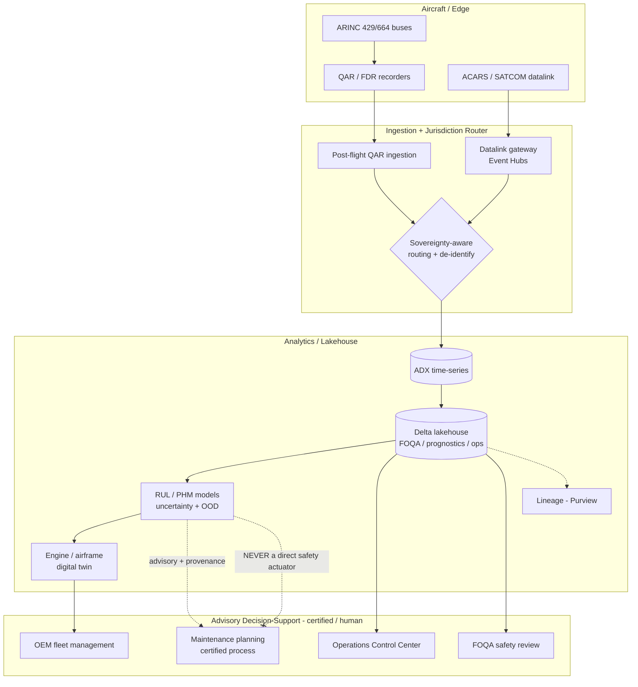
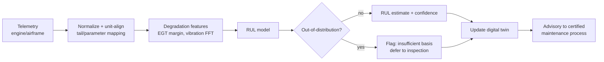
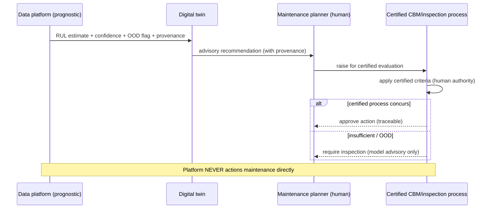

# Aviation Data Platforms

> Part of the **Enterprise Data & AI Architecture Handbook** · Phase-17 — Industry Vertical Platforms · Chapter 03.
> Estimated study time: **60 min reading + ~3h labs**.
> **Prerequisites:** read [IoT Data Platforms](../Phase-16/01_IoT_Data_Platforms.md) first.

---

## Executive Summary

The two prior Phase-17 chapters established the phase's thesis in regulated verticals where the constraint is *privacy* ([Healthcare Data Platforms](01_Healthcare_Data_Platforms.md)) and *auditable accuracy* ([Financial Data Platforms](02_Financial_Data_Platforms.md)). Aviation adds a third, distinct constraint: **safety criticality combined with extreme physical and jurisdictional distribution.** An aircraft is a flying fleet of thousands of sensors (an engine alone streams hundreds to thousands of parameters), it generates data across dozens of legal jurisdictions in a single flight, and the decisions its data informs — dispatch a flight, defer a maintenance action, load this much fuel — are directly safety-relevant. Yet the ground-based data platform that ingests and analyzes all of this is emphatically **not** a certified airborne safety system: airborne avionics software is developed and certified under DO-178C to a rigor no analytics lakehouse meets, and confusing the two — letting a machine-learning prognostic quietly *become* the authority for a safety-relevant action — is the single most dangerous error in this domain. This chapter's discipline, therefore, is to build a powerful ground analytics platform whose outputs are **advisory decision-support feeding a certified, human-in-the-loop process with full traceability**, never an automated safety actuator.

This chapter is Phase-17 Chapter 03 and covers **flight and engine telemetry** (the avionics data buses and recorders — ARINC 429, ACARS, QAR/FDR, engine health streams — and how they reach the ground); **predictive maintenance and prognostics** (condition-based maintenance, Remaining Useful Life / RUL, Prognostics and Health Management / PHM, and the NASA C-MAPSS benchmark lineage); **operations and network optimization** (operations control, crew and fleet scheduling, turnaround, ETA and fuel optimization, and irregular-operations recovery); **safety-critical data standards** (DO-178C/DO-254/ARP4754A, FOQA/FDM flight-data-monitoring programs, and the crucial boundary between certified airborne software and ground decision-support); and **data sovereignty across regions** (a single aircraft's data crossing FAA/EASA/national jurisdictions, crew and passenger PII, FOQA de-identification protections, and export-control constraints).

The platform bias is **Azure-primary (~60%)** — Azure IoT Hub and Event Hubs for telemetry ingestion, Azure Data Explorer (ADX/Kusto) for high-cardinality time-series flight/engine data, Azure Databricks and Delta Lake for prognostics and operations analytics, Azure Machine Learning for RUL/PHM models, Azure Digital Twins for engine/asset twins (building directly on [Digital Twins](../Phase-16/07_Digital_Twins.md)), Microsoft Purview for lineage, and Azure's regional/sovereign-cloud footprint for data residency — **~30% enterprise open source** (Apache Kafka and Flink for streaming, Spark/Delta for the analytics backbone, ClickHouse as an OSS time-series alternative, MLflow for prognostics model lifecycle, Kubernetes for compute, and the OpenSky Network / ADS-B ecosystem for open flight-tracking data) — **~10% AWS/GCP comparison-only** (AWS IoT/SageMaker and GE's historical Predix aviation heritage; GCP BigQuery/Vertex; and Airbus **Skywise** on Palantir Foundry as the reference industry platform), contrasted honestly on capability, lock-in, and sovereignty.

**Bottom line:** an aviation data platform is not "IoT with planes." It is a **safety-adjacent, globally-distributed, sovereignty-constrained decision-support system** in which — echoing the Industrial IoT constraint from [Industrial IoT (IIoT)](../Phase-16/02_Industrial_IoT_IIoT.md) that "the data platform must be architecturally incapable of influencing a safety-rated function" — the platform's analytics **advise** certified processes but never **replace** them. This chapter's ADR (§40) formalizes that: prognostic and analytics outputs are advisory inputs to the certified, human-in-the-loop maintenance and dispatch process, with complete traceability, and the platform must be architecturally incapable of directly triggering a safety-relevant action. The two case studies (§40) show what happens when a model's prediction is treated as authority (a near-miss where a certified inspection process was almost bypassed) and when jurisdictional data movement is treated as an afterthought (a data-sovereignty breach from aggregating cross-border telemetry).

---

## Learning Objectives

By the end of this chapter you will be able to:

1. **Explain flight and engine telemetry sources** — ARINC 429/ACARS/QAR/FDR and engine-health streams — and how data reaches the ground (real-time datalink vs post-flight download).
2. **Design a predictive-maintenance / prognostics pipeline** — condition-based maintenance, RUL estimation, PHM — and reason about out-of-distribution failure and model assurance.
3. **Architect operations and network-optimization analytics** — ETA/turnaround/fuel optimization and irregular-operations recovery — on a telemetry-and-operations data platform.
4. **Distinguish certified airborne software (DO-178C) from ground decision-support**, and design the platform so analytics advise rather than replace certified safety processes.
5. **Apply FOQA/FDM flight-data-monitoring practices**, including the de-identification and non-punitive-use protections that make those programs work.
6. **Design for data sovereignty across regions** — jurisdiction-aware routing/residency, crew/passenger PII protection, and export-control constraints.
7. **Defend an aviation platform's telemetry, prognostics, safety-boundary, and sovereignty architecture** in engineer, staff engineer, architect, and CTO review settings.

---

## Business Motivation

- **Unplanned maintenance and delays are enormous, quantifiable costs.** An aircraft-on-ground (AOG) event or a mis-timed part failure grounds a multi-hundred-million-dollar asset and cascades delays across a network; predictive maintenance (§3.2) that converts unscheduled failures into planned interventions is one of the highest-ROI use cases in the industry.
- **Engines are increasingly sold as a service, making data the product.** Power-by-the-hour models (e.g. Rolls-Royce TotalCare) mean OEMs are paid for engine *availability*, not the hardware — so continuous engine-health telemetry and prognostics (§3.1, §3.2) are the core of the commercial model, not an add-on.
- **Fuel and network efficiency move the P&L at scale.** Fuel is one of an airline's largest costs; even single-digit-percent optimization of routes, weight, and operations (§3.3) is worth hundreds of millions across a fleet, and requires integrating flight telemetry with operations data.
- **Safety is the industry's licence to operate — and its analytics must not undermine it.** Flight-data-monitoring (FOQA/FDM) programs use telemetry to find safety trends *before* they cause accidents; but any analytics that influence dispatch or maintenance decisions carry safety weight, which is exactly why the platform must advise, not replace, certified processes (§40, ADR-0190).
- **Data sovereignty is a legal precondition, not a preference.** A single long-haul flight generates data across many jurisdictions with conflicting privacy, residency, and export-control rules; getting sovereignty wrong (§40, Case Study 2) is a regulatory breach with fines and operational-restriction consequences, making jurisdiction-aware architecture a business requirement.

---

## History and Evolution

- **1950s-1960s — flight data recorders.** The mandated "black box" (FDR) and cockpit voice recorder (CVR) establish the principle that aircraft record parameters for post-incident analysis — the ancestor of all flight-data programs.
- **1970s-1980s — ARINC data buses and ACARS.** **ARINC 429** standardizes the avionics serial data bus; **ACARS** (Aircraft Communications Addressing and Reporting System, ~1978) introduces datalink messaging between aircraft and ground over VHF (later SATCOM), enabling the first operational air-ground data exchange.
- **1990s — QAR and FOQA/FDM.** The **Quick Access Recorder** makes routine flight data easy to download (originally physical media), enabling **Flight Operational Quality Assurance (FOQA) / Flight Data Monitoring (FDM)** — proactive, de-identified analysis of routine flights to spot safety trends. Pilot-union agreements establish the **non-punitive, de-identified** basis that makes crews willing to participate.
- **2000s — engine health monitoring and power-by-the-hour.** OEMs (Rolls-Royce, GE Aviation, Pratt & Whitney) build **engine health monitoring (EHM)** and availability-based commercial models; engines stream health snapshots (initially low-bandwidth ACARS messages) to OEM operations centres.
- **2000s-2010s — safety-critical software certification matures.** **DO-178C** (2011, superseding DO-178B) for airborne software, **DO-254** for airborne hardware, and **ARP4754A** for system development formalize the assurance rigor for anything that flies — a rigor deliberately distinct from ground analytics.
- **2014 — MH370 and global tracking.** The loss of MH370 drives ICAO's **GADSS** (Global Aeronautical Distress and Safety System) and normal-tracking requirements (position reporting at least every 15 minutes), accelerating real-time datalink and satellite tracking over post-flight download.
- **2010s — ADS-B and open flight data.** **ADS-B (Automatic Dependent Surveillance-Broadcast)** mandates make aircraft broadcast position/velocity; open networks (**OpenSky**, Flightradar24) create a rich public flight-tracking dataset.
- **2017-2022 — the aviation big-data platforms.** **Airbus Skywise** (built on Palantir Foundry) and **Boeing AnalytX** consolidate fleet-wide telemetry, maintenance, and operations data into cloud analytics platforms; airlines and OEMs move EHM, FOQA, and operations analytics to cloud lakehouses. Increasing sensor bandwidth (full-flight QAR data, high-rate engine parameters) turns aviation into a genuine big-data domain.
- **2020-2026 — cloud, digital twins, and ML prognostics at scale.** Delta lakehouses, **Azure Digital Twins** engine/asset twins (per [Digital Twins](../Phase-16/07_Digital_Twins.md)), and ML-based RUL prognostics (benchmarked historically against NASA's **C-MAPSS** turbofan dataset) become standard — under a sharpening focus on data sovereignty (regional/sovereign clouds) and on the model-assurance boundary between advisory analytics and certified safety systems.

---

## Why This Technology Exists

Aviation data platforms exist because aircraft produce enormous volumes of safety-relevant telemetry across extreme physical and jurisdictional distribution, and because turning that telemetry into value — predicting failures, optimizing operations, monitoring safety — requires a ground-based analytics capability that avionics themselves are not designed to provide. Airborne systems are optimized (and certified) for real-time flight control under DO-178C, not for fleet-wide historical analytics; a separate ground platform exists to aggregate, store, and analyze data across the whole fleet over time. But that platform sits in a delicate position: its outputs influence safety-relevant decisions (maintenance, dispatch, fuel) without carrying the certification of the systems that actually fly. The reason a distinct "aviation data platform" architecture exists — rather than a generic IoT platform (per [IoT Data Platforms](../Phase-16/01_IoT_Data_Platforms.md)) with planes attached — is that it must simultaneously handle safety-adjacency (advisory-not-authoritative outputs, full traceability), physical distribution (intermittent high-latency datalink, post-flight bulk download), and jurisdictional distribution (sovereignty-aware routing and residency) as first-class design constraints.

---

## Problems It Solves

- **Converting unplanned failures into planned maintenance**, resolved by engine/airframe telemetry + prognostics (RUL/PHM, §3.2) that flag degradation before failure — the core predictive-maintenance value.
- **Fleet-wide safety-trend detection**, resolved by FOQA/FDM analysis of routine flight data (§3.4) to find exceedances and risky trends proactively rather than after an incident.
- **Operational efficiency at network scale**, resolved by integrating telemetry with operations data for ETA prediction, turnaround optimization, fuel efficiency, and irregular-operations recovery (§3.3).
- **Availability-based commercial models**, resolved by continuous engine-health data streams that let OEMs sell availability (power-by-the-hour) and manage fleets remotely.
- **Getting data off a moving, intermittently-connected aircraft**, resolved by the datalink + post-flight-download hybrid (§4.1) that balances real-time needs against bandwidth cost and connectivity.
- **Operating legally across jurisdictions**, resolved by sovereignty-aware routing, residency, and de-identification (§3.5, §40 ADR/Case Study 2).

---

## Problems It Cannot Solve

- **It cannot make analytics a substitute for certified airworthiness processes.** A prognostic model is advisory input to a certified maintenance decision, not the decision itself; the platform cannot confer airworthiness authority on an ML prediction (§40, ADR-0190). This is the domain's hardest and most important limit.
- **It cannot predict failure modes it has never seen.** RUL/PHM models are trained on historical degradation patterns; a novel or rare out-of-distribution failure mode (§40, Case Study 1) may be missed entirely — which is precisely why the certified inspection/maintenance process must remain in the loop.
- **It cannot resolve conflicting jurisdictional requirements for you.** When one country mandates data localization and another mandates disclosure, the platform can route and partition data, but the legal conflict is a governance/legal problem the technology only helps manage (§3.5, §23).
- **It cannot fix bad sensor data or configuration.** A miscalibrated sensor, a wrong tail-number mapping, or a units error propagates into every prognostic and safety analysis (the same silent-data-error risk as [Financial Data Platforms](02_Financial_Data_Platforms.md) §40 CS1 and [Healthcare Data Platforms](01_Healthcare_Data_Platforms.md) §40 CS2); data-quality governance remains mandatory.
- **It cannot guarantee real-time analysis of everything.** Datalink bandwidth and cost mean most high-rate telemetry is analyzed post-flight; the platform cannot make an intermittently-connected aircraft behave like a wired sensor (§4.1).
- **It does not by itself protect FOQA/FDM data from misuse.** The de-identification and non-punitive-use protections that make flight-data-monitoring work are governance and legal commitments (§3.4, §23) the platform enforces technically but does not create.

---

## Core Concepts

### 3.1 Flight and engine telemetry

An aircraft is a distributed sensor system feeding several recording and telemetry paths:

- **Avionics data buses** — **ARINC 429** (the classic point-to-point avionics serial bus), and newer **ARINC 664 / AFDX** (switched Ethernet for modern aircraft like the A380/787) carry parameters between avionics units.
- **Recorders** — the mandated **FDR** ("black box," crash-survivable, limited parameter set) and **CVR**; the **QAR (Quick Access Recorder)** captures a much richer parameter set for routine download and is the workhorse of FOQA/FDM.
- **Datalink** — **ACARS** carries short operational and engine-health messages air-to-ground over VHF/SATCOM in near-real-time; higher-bandwidth connectivity (satellite broadband) increasingly enables richer in-flight streaming.
- **Engine health** — modern engines expose hundreds to thousands of parameters (EGT, vibration, oil pressure/temperature, fuel flow, spool speeds); OEMs collect "snapshots" (cruise, takeoff) via ACARS plus full-rate data on landing. Engine telemetry is the highest-value stream for prognostics.

The key architectural fact: telemetry arrives via **two modes** — small, near-real-time datalink messages, and large, post-flight bulk downloads — and the platform must ingest and reconcile both (§4.1).

### 3.2 Predictive maintenance and prognostics (PHM)

The goal is to move from **scheduled** maintenance (fixed intervals, conservative, wasteful) and **reactive** maintenance (fix on failure, costly and disruptive) toward **condition-based** and **predictive** maintenance:

- **Condition-based maintenance (CBM)** — act on observed condition (measured degradation) rather than a fixed calendar/cycle schedule.
- **Prognostics and Health Management (PHM)** — detect degradation, diagnose the failing component, and **estimate Remaining Useful Life (RUL)** — how many cycles/hours until intervention is needed.
- **RUL modeling** — physics-based models, data-driven ML (regression/sequence models over sensor trajectories), or hybrid; NASA's **C-MAPSS** turbofan degradation dataset is the canonical public RUL benchmark. The hard problems are **out-of-distribution failure modes** (a degradation pattern not in training data — §40 CS1) and **prediction uncertainty** (an RUL point estimate without a confidence interval is dangerous input to a maintenance decision).
- **The assurance boundary** — a prognostic is *advisory input* to the certified maintenance planning process, not an automated authority to defer or skip a required inspection (§40, ADR-0190). This mirrors the [Industrial IoT (IIoT)](../Phase-16/02_Industrial_IoT_IIoT.md) constraint that analytics must not influence a safety-rated function directly.

### 3.3 Operations and network optimization

Beyond maintenance, the platform integrates telemetry with operations data (schedules, crew, weather, ATC, airport) for:

- **ETA / trajectory prediction** — using position (ADS-B) and flight-plan data to predict arrival and manage connections.
- **Turnaround optimization** — minimizing ground time by orchestrating the many parallel ground processes.
- **Fuel efficiency** — analyzing actual burn vs plan, weight/balance, and route/altitude optimization; single-digit-percent gains are worth a fortune at fleet scale.
- **Irregular operations (IROPS) recovery** — when weather or disruption cascades, re-optimizing aircraft, crew, and passenger routing across the network — a large-scale constrained-optimization problem fed by real-time state.
- **Operations Control Center (OCC)** — the human decision hub the analytics support; again, decision-support, not automated control.

### 3.4 Safety-critical data standards and FOQA/FDM

Two distinct worlds that must not be conflated:

- **Certified airborne systems** — **DO-178C** (airborne software), **DO-254** (airborne electronic hardware), **ARP4754A** (aircraft/system development), **DO-330** (tool qualification). These impose exhaustive requirements-traceability, verification, and configuration control on anything that flies. A ground analytics lakehouse does **not** meet this bar and must not be positioned as if it does.
- **FOQA / FDM** — the safety-management program that analyzes routine flight data (QAR) to detect exceedances (unstable approaches, hard landings, exceedance of limits) and safety trends. Its effectiveness depends on **de-identification** (removing crew identity) and a **non-punitive** framework (data used for safety improvement, not enforcement/discipline) — a governance/legal commitment codified in pilot-union agreements and regulator programs. Breaking that protection destroys crew trust and the program's value. FOQA de-identification is a hard technical + governance requirement (§23), directly related to the PII/de-identification disciplines of [Data Privacy and PII Protection](../Phase-10/07_Data_Privacy_and_PII_Protection.md).

### 3.5 Data sovereignty across regions

A single flight generates data across many jurisdictions, and the parties (airline, OEM, lessor, regulators in origin/destination/overflight countries) sit in different legal regimes:

- **Residency / localization** — some jurisdictions require certain data to be stored in-country; the platform must route and store telemetry accordingly (jurisdiction-aware, per [Compliance and Regulatory Frameworks](../Phase-10/06_Compliance_and_Regulatory_Frameworks.md)).
- **Privacy** — crew and passenger data is PII (GDPR and equivalents); FOQA crew data has additional protections.
- **Export control** — some aircraft/engine performance data (especially military/dual-use or ITAR/EAR-controlled technology) is subject to export restrictions; cross-border movement can be legally restricted.
- **Multi-party access** — airline, engine OEM, and airframe OEM each get scoped access to *their* data, across organizational and national boundaries — an access-control-propagation problem (the lineage from [Retrieval Augmented Generation](../Phase-12/03_Retrieval_Augmented_Generation.md) ADR-0157) at global scale.

The architectural consequence: data must be **routed, partitioned, and de-identified in a jurisdiction-aware way**, not aggregated blindly into one global store (§40, Case Study 2).

---

## Internal Working

### 4.1 Telemetry ingestion: datalink + post-flight download

Two ingestion modes reconcile into one dataset. **Near-real-time**: ACARS/datalink messages (engine snapshots, position reports, OOOI events — Out/Off/On/In) flow over VHF/SATCOM to a ground gateway, then into the streaming platform (Event Hubs/Kafka → ADX). **Post-flight bulk**: on landing (or at gate Wi-Fi/cellular), the QAR's full-rate parameter set is downloaded and ingested as large batch files (the same edge-vs-cloud, connectivity-constrained pattern as [IoT Data Platforms](../Phase-16/01_IoT_Data_Platforms.md) §1.3, here with an aircraft as the edge). The platform keys both by aircraft (tail number), flight, and time, reconciles them (the real-time snapshots should be consistent with the full download), and detects gaps. Correctness hinges on accurate **tail-number/flight association** and consistent **parameter definitions** across aircraft types (a wrong mapping is a silent, high-impact error).

### 4.2 Prognostics pipeline internals

Downloaded telemetry lands in the lakehouse (bronze: raw parameters; silver: cleaned, unit-normalized, aligned time-series per component; gold: features for prognostics), per [Medallion Architecture](../Phase-05/03_Medallion_Architecture.md). Feature engineering extracts degradation indicators (trends in EGT margin, vibration signatures via FFT, oil-debris trends). An RUL model (trained and versioned per [MLOps and MLflow](../Phase-11/03_MLOps_and_MLflow.md), served per [Model Serving and Ray](../Phase-11/04_Model_Serving_and_Ray.md)) produces an RUL estimate **with an uncertainty band** and an out-of-distribution flag (if current sensor patterns fall outside the training distribution, the model must say "I don't know," not emit a confident wrong number). The output is written to the asset's **digital twin** (per [Digital Twins](../Phase-16/07_Digital_Twins.md)) and surfaced to maintenance planning as an *advisory* recommendation with full provenance (which model version, which data, what confidence) — never as an automated maintenance action (§40, ADR-0190).

### 4.3 Sovereignty-aware routing internals

At ingestion, each telemetry stream is tagged with jurisdiction-relevant metadata (origin/destination, data category, controlling party). A routing/partitioning layer directs data to the correct regional store per residency rules, applies de-identification to crew/PII fields before any cross-border analytics, and enforces multi-party access scoping (airline vs OEM vs lessor) via attribute-based access control (per [Identity and Access Management with Microsoft Entra](../Phase-10/02_Identity_and_Access_Management_with_Entra.md)). Lineage (Purview) records where each dataset physically resides and how it moved — the evidence needed to demonstrate sovereignty compliance (and to detect the §40 Case Study 2 failure).

---

## Architecture

The reference architecture has four layers:

1. **Aircraft / edge layer** — avionics buses (ARINC 429/664), recorders (FDR/QAR), and datalink (ACARS/SATCOM). The aircraft is the connectivity-constrained edge; onboard processing is minimal and certified-domain, not analytics.
2. **Ingestion layer** — datalink gateways (near-real-time messages → Event Hubs/Kafka) and post-flight bulk ingestion (QAR downloads → landing zone), with jurisdiction-aware routing (§4.3) at the front door.
3. **Analytics / lakehouse layer** — ADX for time-series telemetry; Delta lakehouse (medallion) for prognostics, FOQA/FDM, and operations analytics; Azure ML for RUL/PHM models; Azure Digital Twins for engine/asset twins; Purview for lineage.
4. **Decision-support layer** — advisory outputs delivered to certified/human processes: maintenance planning, the Operations Control Center, FOQA safety review, and OEM fleet-management centres — with the hard boundary that these are advisory inputs, not automated safety actuators (§40, ADR-0190).

Multi-party and multi-region: the platform is federated by jurisdiction (regional stores per residency rules) and by party (scoped access for airline/OEM/lessor), reconciled through governed sharing rather than a single global aggregate.

---

## Components

- **Datalink gateway** — ACARS/SATCOM message ingestion.
- **QAR ingestion** — post-flight bulk download and parsing (per-type parameter frames).
- **Streaming ingestion** — Event Hubs / Kafka for near-real-time telemetry and position (ADS-B).
- **Time-series store** — Azure Data Explorer (ADX) / ClickHouse for flight and engine parameters.
- **Lakehouse** — Delta Lake (medallion) for prognostics, FOQA/FDM, operations analytics.
- **Prognostics / ML** — Azure ML / MLflow for RUL/PHM model lifecycle; model serving for scoring.
- **Digital twin** — Azure Digital Twins engine/airframe twins (per [Digital Twins](../Phase-16/07_Digital_Twins.md)).
- **Jurisdiction router** — sovereignty-aware routing/partitioning + de-identification.
- **Lineage & catalog** — Microsoft Purview (residency evidence, multi-party lineage).
- **Access control** — Entra ID + ABAC for multi-party, multi-region scoping.
- **Decision-support surfaces** — maintenance planning, OCC dashboards, FOQA review tools, OEM fleet centres.

---

## Metadata

- **Aircraft/asset reference data** — tail number ↔ aircraft type ↔ engine serials ↔ component genealogy (which part is installed where, since when); a mis-mapping corrupts every prognostic and maintenance record (the aviation analogue of the security-master error in [Financial Data Platforms](02_Financial_Data_Platforms.md) §12).
- **Parameter dictionaries** — the definition, unit, and sampling rate of each telemetry parameter, which vary by aircraft type and recorder configuration; the correctness-critical metadata for interpreting raw frames.
- **Flight/operational context** — flight number, route, phase-of-flight, weather, crew (de-identified for FOQA).
- **Model metadata** — RUL/PHM model versions, training data, validation status, and the uncertainty/OOD characteristics — essential for the advisory-provenance requirement (§40).
- **Jurisdiction metadata** — data category, controlling party, residency zone, export-control status — the metadata that drives sovereignty routing (§4.3).
- **Lineage** — provenance from raw frame → normalized parameter → prognostic → advisory recommendation, plus physical-residency lineage.

---

## Storage

- **Time-series** — ADX/ClickHouse for high-cardinality, high-rate flight/engine parameters (columnar, time-partitioned, downsampled snapshots hot, full-rate tiered).
- **Lakehouse** — Delta (medallion) for prognostics features, FOQA/FDM, and operations analytics (per [Delta Lake](../Phase-04/04_Delta_Lake.md), [Medallion Architecture](../Phase-05/03_Medallion_Architecture.md)).
- **Regional partitioning** — storage is partitioned/replicated by jurisdiction per residency rules; there is not necessarily one global store.
- **Compression & tiering** — full-rate QAR data is large; compression (per [Compression and Encoding](../Phase-04/08_Compression_and_Encoding.md)) and hot/warm/cold tiering (recent flights hot for FOQA/prognostics, historical archived) are essential cost levers.
- **Retention** — safety and maintenance records carry long, regulator-mandated retention; FDR/CVR and incident-related data have specific handling.

---

## Compute

- **Streaming** — near-real-time processing of datalink/ADS-B (Flink/Stream Analytics) for tracking, OOOI events, and live operations.
- **Batch analytics** — post-flight prognostics, FOQA exceedance detection, and operations analytics on Spark/Databricks; naturally batch (per-flight, per-fleet).
- **ML training/scoring** — RUL/PHM model training (periodic, GPU where deep sequence models are used) and scoring per flight/component (Azure ML).
- **Optimization compute** — network/crew/IROPS optimization (constraint solvers) for operations.
- **Elastic/spot** — batch prognostics and training are checkpoint-tolerant and bursty — a fit for spot compute (§20).

---

## Networking

- **Air-ground datalink** — VHF/SATCOM (ACARS) is low-bandwidth, high-latency, intermittent; increasingly supplemented by satellite broadband. The network layer must tolerate disconnection (store-and-forward on the aircraft, reconcile on landing).
- **Ground connectivity** — gate Wi-Fi/cellular for QAR bulk download; private connectivity (ExpressRoute) from airline/OEM data centres to cloud.
- **Regional / sovereign networking** — data routed to regional endpoints per residency; private endpoints and default-deny egress (per [Network Security and Zero Trust](../Phase-10/04_Network_Security_and_Zero_Trust.md)) prevent cross-border leakage of restricted data.
- **Multi-party segmentation** — airline, OEM, and lessor networks/access are segmented; data sharing is governed, not open.

---

## Security

- **Multi-party access control** — airline, engine OEM, airframe OEM, and lessor each access only their scoped data, across organizational and national boundaries; ABAC (per [Identity and Access Management with Microsoft Entra](../Phase-10/02_Identity_and_Access_Management_with_Entra.md)).
- **Crew/passenger PII protection** — GDPR-grade handling; FOQA crew de-identification is both a privacy and a program-integrity control.
- **Export-control enforcement** — technically enforce restrictions on cross-border movement of controlled performance/technology data.
- **Encryption** — at rest (CMK) and in transit; datalink message integrity.
- **Safety-boundary integrity** — the platform must be architecturally prevented from issuing a direct safety-relevant command; its outputs are advisory (§40, ADR-0190) — a security/safety design constraint, not just a policy.
- **Tamper-evidence for safety-relevant records** — maintenance and safety records need integrity/immutability (WORM), akin to the audit discipline in [Financial Data Platforms](02_Financial_Data_Platforms.md) §16.

---

## Performance

- **Ingestion throughput** — full-rate QAR downloads across a large fleet produce big post-flight bursts; size ingestion for the fleet's landing pattern, not the average.
- **Time-series query** — FOQA and prognostics queries are per-tail, per-parameter, time-range — served efficiently by ADX/ClickHouse partitioning.
- **Prognostics latency** — mostly not real-time (post-flight is acceptable), so throughput and cost matter more than latency; real-time needs (live tracking, live engine alerts over ACARS) are the exception with tight budgets.
- **Optimization latency** — IROPS recovery has genuine time pressure (decisions during a disruption), so operations optimization has real latency requirements.

---

## Scalability

- **Fleet-scale telemetry** — scales with fleet size × flights/day × parameters × rate; partition by tail/flight/date; ADX/Delta scale horizontally.
- **Multi-region federation** — the platform scales as a federation of regional stores (sovereignty), not one monolith — which is also the key sovereignty-compliance move.
- **Prognostics** — embarrassingly parallel across aircraft/components; scales horizontally on batch compute.
- **Multi-party** — scales by scoped, governed data sharing rather than replicating everything to every party.

---

## Fault Tolerance

- **Disconnection tolerance** — the aircraft is intermittently connected; store-and-forward onboard and reconcile-on-landing means no data is lost to a datalink gap.
- **Datalink/QAR reconciliation** — near-real-time snapshots are cross-checked against the full post-flight download; discrepancies flag data-integrity issues.
- **Idempotent ingestion** — re-downloaded or re-sent telemetry must not duplicate records (idempotency per [Message Brokers and Queues](../Phase-14/07_Message_Brokers_and_Queues.md)).
- **Advisory-not-actuator failure containment** — because prognostics are advisory (§40 ADR), a model failure degrades decision-support quality but cannot *directly* cause an unsafe action — the certified process is the backstop. This is the core fault-tolerance property.
- **DR and regional resilience** — regional stores need DR that respects residency (you cannot fail over restricted data to a non-compliant region).

---

## Cost Optimization

- **Tier and compress full-rate telemetry** — QAR/engine data is large; hot recent flights, cold historical archive; compression (per [Compression and Encoding](../Phase-04/08_Compression_and_Encoding.md)).
- **Downsample for streaming, keep full-rate for post-flight** — don't pay to stream full-rate data over expensive SATCOM; send snapshots real-time and full data on landing.
- **Elastic/spot compute** for batch prognostics and model training (checkpoint-tolerant, bursty).
- **Right-size real-time** — reserve real-time processing for genuinely time-critical streams (tracking, live alerts, IROPS); everything else is batch.
- **Federated storage vs blind replication** — sovereignty federation also avoids the cost of replicating everything everywhere.

**Worked FinOps example.** An airline downloads full-rate QAR data for ~1,500 flights/day, ~2-4 GB/flight, i.e. several TB/day and multiple PB/year. Keeping all of it on hot storage for ad-hoc analytics is ruinous; tiering to a "recent-flights-hot (last ~90 days for FOQA/prognostics), everything-else-archive" policy plus columnar compression cuts storage cost by a large fraction (often **60-75%** of the storage line) with negligible impact, since the vast majority of analytics touch recent flights and archived data is retrieved rarely (incident investigation, longitudinal studies). Running the nightly fleet-wide prognostics batch on spot compute cuts that compute line a further ~60-70%. Neither optimization touches the near-real-time tracking/alert path, which stays on reserved capacity.

---

## Monitoring

- **Ingestion health** — datalink message rates, QAR download success/latency, per-fleet completeness; a missing QAR download is a lost-safety-data signal.
- **Data quality** — parameter-range plausibility, tail-number/parameter-mapping validation, datalink-vs-QAR reconciliation breaks.
- **Prognostics health** — RUL prediction distributions, out-of-distribution flag rates, model drift (per [ML Pipeline Architecture](../Phase-11/06_ML_Pipeline_Architecture.md)).
- **FOQA** — exceedance detection rates, de-identification integrity.
- **Sovereignty** — data-residency conformance (is data landing where it should?), cross-border transfer monitoring.
- **Operations** — tracking coverage (GADSS), ETA accuracy, optimization solve times.

## Operational Response Playbook

| Signal | Detection | Remediation |
|---|---|---|
| **Prognostic being used as authority** (a maintenance deferral or interval extension proposed on a model output alone, bypassing the certified process) | Governance review flags a maintenance decision whose sole justification is an ML RUL output; provenance shows no certified-process sign-off | Halt the deferral; require the certified condition-based-maintenance/inspection process to make the call with the prognostic as *advisory input only*; confirm the model output carried an uncertainty band and OOD flag; if it didn't, that's a model-assurance gap. This is the §40 ADR-0190 failure — the platform output must be advisory, and the certified human-in-the-loop process is the authority. |
| **Data-sovereignty / residency breach** (restricted or crew-PII telemetry found in a non-compliant region, or moved cross-border against export-control rules) | Purview residency lineage shows data in the wrong region; cross-border transfer monitor alerts; audit finds re-identifiable FOQA crew data | Contain: stop the offending pipeline, quarantine the mis-located data, and assess breach-notification obligations (GDPR/national timelines). Root-cause the jurisdiction-router/de-identification gap (§4.3) that let data aggregate without sovereignty tagging — the §40 Case Study 2 failure. Remediate by enforcing jurisdiction-aware routing + de-identification as a mandatory front-door step, not a downstream cleanup. |

---

## Observability

- **End-to-end lineage** — raw frame → normalized parameter → prognostic → advisory recommendation, plus physical-residency lineage (where data lives and how it moved), for both safety traceability and sovereignty evidence.
- **Model provenance** — every prognostic output carries which model version, which input data, and what confidence/OOD status — the advisory-provenance requirement (§40).
- **Data-quality observability** — parameter plausibility, mapping integrity, and reconciliation surfaced as metrics so a silent sensor/mapping error shows on a dashboard, not in a missed failure.
- **Distributed tracing** across ingestion → analytics for latency/failure attribution.
- **Sovereignty observability** — continuous residency-conformance signals.

---

## Governance

- **Safety-boundary governance** — the documented, enforced principle that platform analytics are advisory to certified processes (DO-178C-certified airborne systems and certified maintenance processes), never a replacement — the domain's central governance rule (§40, ADR-0190), directly paralleling the [Industrial IoT (IIoT)](../Phase-16/02_Industrial_IoT_IIoT.md) safety-function-isolation constraint.
- **FOQA/FDM governance** — de-identification and the non-punitive-use commitment (data used for safety improvement, not crew discipline); breaking it destroys the program.
- **Model-assurance governance** — RUL/PHM models under a validation/monitoring regime (analogous to model-risk management, and the Responsible-AI/evaluation disciplines of [Responsible AI](../Phase-11/07_Responsible_AI.md) and [Evaluation and Guardrails](../Phase-12/09_Evaluation_and_Guardrails.md)); uncertainty and OOD handling are governance requirements, not optional.
- **Data sovereignty & multi-party governance** — residency, export control, and scoped multi-party access as enforced policy (per [Compliance and Regulatory Frameworks](../Phase-10/06_Compliance_and_Regulatory_Frameworks.md)); clear ownership of who may access which party's data across borders.
- **Records integrity** — tamper-evident retention of safety/maintenance records.
- **Data quality & reference data** — governed asset/parameter reference data (the mapping that everything depends on).

---

## Trade-offs

- **Real-time datalink vs post-flight download** — real-time enables live alerts/tracking but is bandwidth-limited and expensive (SATCOM); post-flight gives full-rate data cheaply but with latency. Hybrid is standard.
- **Physics-based vs data-driven prognostics** — physics models are interpretable and generalize to unseen conditions but are costly to build per component; data-driven ML is powerful where data is rich but fails on out-of-distribution modes. Hybrid is increasingly preferred.
- **Predictive vs scheduled maintenance** — predictive cuts waste and unplanned failures but shifts assurance burden onto models; scheduled is conservative and certified-simple. The advisory-boundary (§40 ADR) lets you gain predictive value without ceding safety authority.
- **Centralized vs sovereignty-federated data** — one global store is simpler for analytics but often illegal; federation is compliant but adds complexity and cost. Regulation forces federation for restricted data.
- **Multi-party sharing vs data protection** — OEMs want fleet-wide data to improve prognostics; airlines and jurisdictions restrict what leaves. Governed, scoped sharing balances the two.

---

## Decision Matrix

| Decision | Choose A | Choose B | Deciding factor |
|---|---|---|---|
| Telemetry mode | **Real-time datalink** | **Post-flight download** | Time-critical (tracking, live engine alert, IROPS) → datalink; full-rate analytics (FOQA, prognostics) → post-flight bulk |
| Prognostics approach | **Physics-based / hybrid** | **Data-driven ML** | Safety-critical, need generalization to unseen conditions → physics/hybrid; rich data, well-characterized failure modes → ML (with OOD handling) |
| Time-series store | **ADX** | **ClickHouse (OSS)** | Azure-native, managed → ADX; OSS/cost/portability → ClickHouse |
| Data topology | **Sovereignty-federated** | **Centralized** | Restricted/PII/export-controlled data → federated by jurisdiction (§3.5); unrestricted operational data → centralized ok |
| Maintenance-decision authority | **Certified process (advisory model input)** | *(never model-only)* | Always the certified human-in-the-loop process; the model is advisory input with provenance (§40 ADR-0190) |
| Compute for batch prognostics | **Spot/elastic** | **Reserved** | Checkpoint-tolerant batch → spot; time-critical real-time (tracking/IROPS) → reserved |

---

## Design Patterns

- **Advisory decision-support, not safety actuator** — analytics feed certified/human processes with provenance; the platform cannot directly trigger a safety-relevant action (§40, ADR-0190).
- **Datalink + post-flight hybrid ingestion** — small real-time messages plus large post-flight bulk, reconciled.
- **Sovereignty-aware routing** — jurisdiction-tagged data routed/partitioned/de-identified at the front door (§4.3).
- **Uncertainty-aware prognostics with OOD detection** — RUL as a distribution + an explicit "I don't know" for out-of-distribution inputs.
- **Digital-twin-backed asset state** — engine/airframe twins (per [Digital Twins](../Phase-16/07_Digital_Twins.md)) as the contextual state prognostics write to.
- **FOQA de-identification-by-design** — crew identity removed at ingestion, non-punitive framework enforced.
- **Governed multi-party sharing** — scoped, lineage-tracked sharing across airline/OEM/lessor rather than a common pool.

## Anti-patterns

- **Treating an ML prognostic as maintenance authority** — bypassing the certified process on a model output (§40, CS1).
- **Confusing the ground platform with certified airborne software** — implying DO-178C-grade assurance the analytics don't have.
- **Blind global aggregation** — dumping all telemetry into one region regardless of residency/export rules (§40, CS2).
- **Point-estimate RUL with no uncertainty/OOD handling** — a confident number for a failure mode the model never saw.
- **Re-identifiable FOQA data** — weak de-identification that lets crew be re-linked, destroying the program.
- **Streaming full-rate data over SATCOM** — paying premium bandwidth for data that could go post-flight.
- **Ignoring parameter-dictionary/tail-mapping integrity** — silent, high-impact data errors.

## Common Mistakes

- Aggregating cross-jurisdiction data without sovereignty tagging.
- RUL models with no confidence interval or OOD flag.
- Weak or reversible FOQA de-identification.
- No datalink-vs-QAR reconciliation, so a corrupt download goes unnoticed.
- Untiered full-rate telemetry storage (ruinous cost).
- Wrong tail-number/parameter mapping corrupting prognostics silently.
- Assuming a "cloud-first" mandate lets you centralize restricted data.

## Best Practices

- Keep analytics advisory; the certified human-in-the-loop process holds authority (ADR-0190).
- Emit RUL as a distribution with explicit OOD handling; carry full model provenance.
- Route/partition/de-identify by jurisdiction at ingestion; federate restricted data.
- Enforce FOQA de-identification and the non-punitive framework technically and contractually.
- Reconcile datalink and post-flight data; validate tail/parameter mappings.
- Hybrid ingestion: snapshots real-time, full-rate post-flight.
- Tier and compress telemetry; run batch prognostics on spot compute.
- Back asset state with digital twins; keep lineage for safety and sovereignty evidence.

---

## Enterprise Recommendations

- **Adopt the advisory-boundary as a hard architectural constraint** (ADR-0190): the platform advises certified maintenance/dispatch processes and is architecturally incapable of directly triggering a safety-relevant action — explicitly echoing the [Industrial IoT (IIoT)](../Phase-16/02_Industrial_IoT_IIoT.md) safety-function-isolation rule.
- **Federate by sovereignty, not centralize.** Route, partition, and de-identify telemetry by jurisdiction at the front door; keep residency lineage (Purview) as compliance evidence.
- **Build uncertainty-aware, OOD-aware prognostics** and govern them under a validation/monitoring regime; never ship a point-estimate RUL without confidence and OOD handling.
- **Protect FOQA/FDM rigorously** — de-identification by design and a non-punitive framework, because the program's value depends entirely on crew trust.
- **Use the datalink + post-flight hybrid** and reserve expensive real-time bandwidth/compute for genuinely time-critical needs (tracking, live alerts, IROPS).
- **Back asset state with digital twins** (per [Digital Twins](../Phase-16/07_Digital_Twins.md)) and keep rigorous asset/parameter reference data.
- **Govern multi-party sharing** with scoped, lineage-tracked access across airline/OEM/lessor and jurisdictions.

---

## Azure Implementation

- **Ingestion** — **Azure IoT Hub** / **Event Hubs** for datalink and ADS-B streams; a landing zone (ADLS Gen2) for post-flight QAR bulk downloads; **Azure Stream Analytics** or Flink for real-time tracking/OOOI/alerts. A jurisdiction-router (Functions/Logic Apps + policy) tags and routes at the front door (§4.3).
- **Time-series** — **Azure Data Explorer (ADX/Kusto)** for high-rate flight/engine parameters, with update policies for downsampled snapshots and hot/cold caching.
- **Lakehouse & prognostics** — **Azure Databricks** + **Delta Lake** (medallion) for FOQA/FDM, prognostics features, and operations analytics; **Azure Machine Learning** (per [Azure Machine Learning](../Phase-11/05_Azure_Machine_Learning.md)) for RUL/PHM training and scoring with model registry and uncertainty/OOD checks in the evaluation gate; **Microsoft Fabric** as the unified option.
- **Digital twin** — **Azure Digital Twins** for engine/airframe twins (per [Digital Twins](../Phase-16/07_Digital_Twins.md)); prognostic outputs update twin state.
- **Sovereignty** — deploy regional/**sovereign cloud** footprints per residency; **Microsoft Purview** for residency and multi-party lineage; **Entra ID** + ABAC for multi-party, multi-region access scoping; private endpoints + default-deny egress for cross-border containment.
- **Security** — CMK/Key Vault, WORM immutable storage for safety/maintenance records, **Microsoft Sentinel** for monitoring.

Illustrative ADX pattern for engine-parameter snapshots + reconciliation flag:

```kusto
.create table EngineSnap (Tail:string, FlightId:string, Ts:datetime, Param:string, Value:real, Source:string)  // Source in {"ACARS","QAR"}
// A reconciliation query flags flights where ACARS snapshots and QAR full-rate disagree beyond tolerance
EngineSnap
| where Ts > ago(7d)
| summarize acars=avgif(Value, Source=="ACARS"), qar=avgif(Value, Source=="QAR") by Tail, FlightId, Param
| where abs(acars - qar) > 0.05 * abs(qar)   // >5% divergence -> data-integrity review
```

---

## Open Source Implementation

- **Streaming** — **Apache Kafka** (durable telemetry/position log), **Apache Flink** (real-time tracking, OOOI, alerting).
- **Time-series / OLAP** — **ClickHouse** (or Apache Pinot/Druid) as the OSS alternative to ADX for flight/engine parameters.
- **Lakehouse** — **Spark + Delta Lake** (medallion) for prognostics, FOQA, operations analytics; **Great Expectations** for parameter/mapping data-quality assertions ([Data Quality with Great Expectations](../Phase-08/03_Data_Quality_with_Great_Expectations.md)).
- **ML / prognostics** — **MLflow** for RUL/PHM model lifecycle; PyTorch/scikit-learn for models; the NASA **C-MAPSS** dataset for benchmarking RUL approaches.
- **Compute** — **Kubernetes** for batch prognostics and training.
- **Open flight data** — the **OpenSky Network** and ADS-B ecosystem for open position data (research, ETA models, coverage validation).
- **Lineage** — **OpenLineage/Marquez** where Purview isn't used.

A common hybrid: Kafka + Flink for real-time, ClickHouse/ADX for telemetry, Spark/Delta for prognostics/FOQA, MLflow for models, Kubernetes for compute, and Great Expectations + OpenLineage for quality and lineage — federated by region for sovereignty.

---

## AWS Equivalent (comparison only)

- **AWS IoT Core / Greengrass** — device connectivity and edge (the IoT Hub analogue); **Kinesis / MSK** for streaming.
- **Amazon Timestream** — managed time-series store for telemetry.
- **SageMaker** — model training/serving for prognostics.
- **GE Predix heritage** — GE Aviation's Predix was an early, influential industrial/aviation IoT platform (a widely-studied case of both ambition and over-reach, per [Digital Twins](../Phase-16/07_Digital_Twins.md) §History); its lineage informs much aviation-analytics thinking.
- **Selection** — AWS is a strong, widely-used platform for airline/OEM analytics (many airlines run on AWS). Advantages: mature IoT + ML stack, broad adoption. Disadvantages: AWS lock-in; sovereignty still your design responsibility. Migration is eased by telemetry being standard formats and ADS-B/ARINC being open standards; the switching cost is pipelines and sovereignty routing.

## GCP Equivalent (comparison only)

- **BigQuery + Pub/Sub + Dataflow** — GCP composes general-purpose analytics (BigQuery for large-scale flight/telemetry analytics, Pub/Sub ingestion, Dataflow processing) rather than an aviation-specific platform; **Bigtable** for time-series at scale.
- **Vertex AI** — prognostics model training/serving.
- **No first-party aviation platform** — consistent with the pattern (across Phase-16/17) that GCP provides strong general primitives rather than narrow domain products.
- **Reference industry platform** — the most prominent *industry* aviation data platform, **Airbus Skywise**, is built on **Palantir Foundry** (not a hyperscaler-native product), consolidating fleet-wide OEM and airline data — a useful reference for what a mature aviation platform delivers, independent of cloud choice.
- **Selection** — attractive for BigQuery-centric analytics/ML; more assembly-required for aviation-specific ingestion and sovereignty. Advantages: BigQuery/Vertex strength. Disadvantages: GCP lock-in, no domain product. Standard formats keep data portable; sovereignty routing is the re-implementation cost.

---

## Migration Considerations

- **On-prem/legacy FOQA and EHM → cloud lakehouse.** Migrate FOQA/FDM and engine-health analytics to a Delta lakehouse incrementally (strangler-fig), preserving de-identification and non-punitive protections through the migration — a governance-sensitive move, not just a data lift.
- **Sovereignty-first migration.** You cannot centralize restricted/PII/export-controlled telemetry into one region "to simplify"; design the target as a jurisdiction-federated topology from the start (§3.5), or a migration will create the exact §40 Case Study 2 breach.
- **Model-assurance re-baselining.** Migrating prognostics models must preserve (or establish) their validation, uncertainty, and OOD handling; don't let a platform migration quietly promote an unassured model to authority (§40, ADR-0190).
- **Platform-longevity awareness.** As across Phase-16/17 (Cloud IoT Core 2023 retirement, AWS QLDB 2025 deprecation, Azure Orbital Ground Station retirement per [Space Data Platforms](../Phase-16/05_Space_Data_Platforms.md)), treat the *standards/data* (ARINC, ADS-B, Delta, C-MAPSS-style benchmarks) as the durable asset and any managed service as replaceable; keep telemetry in portable form.
- **Multi-party contracts.** Migrations change who can access what; re-establish scoped multi-party (airline/OEM/lessor) access and its lineage in the target.

---

## Mermaid Architecture Diagrams

**Reference architecture (edge → ingestion → analytics → advisory decision-support):**



**Predictive-maintenance data flow:**



**Advisory-boundary decision (sequence):**



---

## End-to-End Data Flow

1. **Generate.** Onboard, avionics buses (ARINC 429/664) feed recorders (QAR/FDR); engine sensors produce health parameters; datalink (ACARS/SATCOM) sends snapshots and OOOI/position events near-real-time.
2. **Ingest.** Real-time messages flow via Event Hubs; on landing, the full-rate QAR download is ingested as bulk. Both pass the jurisdiction router, which tags, routes to the correct regional store, and de-identifies crew/PII (§4.3).
3. **Normalize & store.** Telemetry lands in ADX (time-series) and the Delta lakehouse (medallion), keyed by tail/flight/time, with datalink-vs-QAR reconciliation and mapping validation.
4. **Analyze.** FOQA exceedance detection, RUL/PHM prognostics (with uncertainty + OOD), and operations/network optimization run on the lakehouse; prognostic outputs update the engine/airframe digital twin.
5. **Advise.** Outputs are delivered as *advisory* recommendations — with model/data provenance — to certified maintenance planning, the OCC, FOQA review, and OEM fleet centres. The certified human-in-the-loop process holds authority (§40, ADR-0190).
6. **Govern.** Lineage (Purview) records provenance and physical residency for safety traceability and sovereignty evidence; multi-party access stays scoped.

---

## Real-world Business Use Cases

- **Predictive engine/airframe maintenance** — RUL/PHM to convert unplanned failures into planned interventions.
- **Engine availability (power-by-the-hour)** — OEMs managing fleets and selling availability on continuous health data.
- **FOQA/FDM safety programs** — proactive safety-trend detection from routine flight data.
- **Operations & network optimization** — ETA, turnaround, fuel efficiency, IROPS recovery.
- **Fuel and emissions management** — burn analysis and route/weight optimization (also ESG-driven).
- **Fleet tracking & GADSS compliance** — position reporting and global tracking.
- **Airworthiness & fleet health reporting** — aggregate health for regulators and management.

---

## Industry Examples

- **Airbus Skywise (on Palantir Foundry)** — the reference fleet-wide aviation data platform, consolidating OEM and airline data.
- **Boeing AnalytX** — Boeing's analytics/services portfolio for fleet and operations data.
- **Rolls-Royce TotalCare / GE Aviation / Pratt & Whitney EHM** — engine-health monitoring and availability-based (power-by-the-hour) models built on continuous telemetry.
- **NASA C-MAPSS** — the canonical public turbofan-degradation dataset that benchmarked a generation of RUL/PHM research.
- **FOQA/FDM programs** — regulator- and union-supported de-identified flight-data-monitoring, the model for non-punitive safety analytics.
- **ADS-B / OpenSky / Flightradar24** — mandated position broadcast and the open flight-tracking ecosystem it created.
- **GADSS (post-MH370)** — global tracking requirements driving real-time datalink adoption.

---

## Case Studies

**Case Study 1 — the prognostic that almost became authority (motivates ADR-0190).**
An airline's engine-health program had matured to the point where its data-driven RUL model was accurate and trusted for common wear patterns. A cost-improvement initiative proposed using the model's "healthy, long RUL" outputs to **extend a maintenance interval** for a fleet of engines — deferring a scheduled boroscope inspection on the strength of the prognostic alone. On one engine, the model's inputs had quietly drifted into a region it had never been trained on: a specific combination of operating environment (a dusty, hot route network) and a component variant produced a degradation signature outside the model's training distribution. The model, lacking an out-of-distribution flag and emitting only a **point estimate with no uncertainty band**, confidently reported a long remaining life. Because the proposed process would have used that output to defer the certified inspection, a genuine failure mode could have gone undetected until it became serious. The near-miss was caught only because the airworthiness team insisted — over the cost-initiative's objection — that the **certified condition-based-maintenance process remain the authority**, treating the model as advisory input. The subsequent inspection found early-stage distress the model had missed. The lessons: RUL outputs must carry uncertainty and an explicit OOD "insufficient basis" signal; and, decisively, **a prognostic is advisory input to the certified maintenance process, never a replacement for it.** This is exactly the boundary the chapter's ADR mandates, and it directly parallels the [Industrial IoT (IIoT)](../Phase-16/02_Industrial_IoT_IIoT.md) rule that a data platform must be architecturally incapable of influencing a safety-rated function — and the "advisory not authoritative" family of failures seen across the handbook.

**Case Study 2 — the cross-border telemetry aggregation breach (supports the Operational Response Playbook, §21).**
An airline consolidating its analytics onto a single cloud region built a fleet-wide FOQA and prognostics lakehouse and, for simplicity, ingested **all** telemetry — from flights across many countries — into that one region. Two problems surfaced in a later audit. First, telemetry from flights operating in and out of a jurisdiction with a **data-localization** requirement had been stored outside that jurisdiction, a residency breach. Second, the FOQA **crew de-identification** had been applied only at the reporting layer, while the raw ingested data (in the central region) still contained re-identifiable crew and PII fields, and some engine-performance data was subject to **export-control** restrictions that its cross-border movement violated. None of this was malicious — it was the natural result of treating sovereignty as a downstream concern rather than a front-door routing decision. The remediation was to introduce **jurisdiction-aware routing and de-identification at ingestion** (§4.3): tag every stream with residency/export/party metadata, route to the correct regional store, de-identify crew/PII before any cross-border analytics, and keep residency lineage (Purview) as continuous evidence. The lesson — sovereignty is an architectural front-door constraint, not a cleanup step — is why the Operational Response Playbook treats a residency breach as a contain-and-root-cause-the-router event, and why the Enterprise Recommendations put sovereignty federation ahead of centralization.

### Architecture Decision Record (ADR-0190): Analytics as advisory decision-support, never a direct safety actuator

- **Context.** The platform's prognostics and analytics inform safety-relevant decisions (defer maintenance, dispatch, fuel), but the platform is a ground-based analytics system, **not** a DO-178C-certified airborne or a certified maintenance system. ML prognostics can be accurate for known patterns yet fail silently on out-of-distribution failure modes (Case Study 1). Treating a model output as authority — letting it defer a certified inspection or trigger a safety-relevant action directly — removes the certified human-in-the-loop backstop precisely where it is most needed.
- **Decision.** Platform analytics MUST be **advisory input to certified, human-in-the-loop processes** (maintenance planning, dispatch, the OCC), never a direct safety actuator. The platform MUST be **architecturally incapable of directly triggering a safety-relevant action** (echoing the [Industrial IoT (IIoT)](../Phase-16/02_Industrial_IoT_IIoT.md) safety-function-isolation constraint). Every advisory output MUST carry **full provenance** (model version, input data, confidence/uncertainty, and an explicit out-of-distribution "insufficient basis" flag), and RUL/PHM outputs MUST NOT be point estimates without uncertainty and OOD handling. The certified process retains sole authority for safety-relevant decisions, with the model output recorded as one traceable input.
- **Consequences.** *Positive:* a model failure (including OOD) degrades decision-support quality but cannot directly cause an unsafe action — the certified process is the backstop; the platform captures predictive value without assuming certification authority it doesn't have; provenance makes every advisory auditable. *Negative:* the organization cannot fully automate maintenance/dispatch decisions off the platform (by design), forgoing some efficiency; building uncertainty/OOD-aware prognostics and provenance is more effort than a bare point-estimate model. *Alternatives rejected:* (a) *let a trusted model directly defer/trigger maintenance actions* — rejected because OOD failures (Case Study 1) make this unsafe and the platform lacks certification authority; (b) *point-estimate RUL without uncertainty/OOD* — rejected because a confident wrong number is worse than an explicit "insufficient basis"; (c) *rely on process discipline alone to keep humans in the loop* — rejected because Case Study 1 shows cost pressure will erode undocumented discipline; the constraint must be architectural and governed.

---

## Hands-on Labs

1. **Telemetry ingestion + reconciliation.** Ingest a synthetic ACARS-style snapshot stream (Event Hubs/Kafka → ADX) and a "post-flight" bulk file; key both by tail/flight/time and implement a datalink-vs-QAR reconciliation check that flags divergence.
2. **RUL prognostics on C-MAPSS.** Train a Remaining-Useful-Life model on the NASA C-MAPSS turbofan dataset; add an uncertainty estimate and an out-of-distribution detector; show it flagging "insufficient basis" on a held-out unseen regime (reproduce Case Study 1's fix).
3. **FOQA de-identification-by-design.** Build an ingestion step that removes/tokenizes crew identity before storage; verify the raw store contains no re-identifiable crew data.
4. **Sovereignty router.** Implement a jurisdiction-aware routing function that tags telemetry by origin/data-category and routes it to the correct regional store, de-identifying PII before any cross-region copy (reproduce Case Study 2's fix); capture residency lineage.
5. **Advisory decision-support surface.** Build a maintenance-advisory output that carries model version, confidence, and OOD status as provenance, and demonstrate that it cannot directly action a maintenance task (advisory-only).

## Exercises

1. Explain why a ground analytics platform must not be treated as a DO-178C-certified system, with a concrete consequence of getting it wrong.
2. Given an RUL point estimate, describe what additional outputs make it safe input to a maintenance decision.
3. Design the jurisdiction-aware routing rules for a long-haul flight crossing three regulatory regimes.
4. Why does FOQA depend on de-identification and a non-punitive framework? What breaks if either fails?
5. Contrast real-time datalink and post-flight download on latency, bandwidth cost, and data completeness; decide what to send by which mode.
6. Identify every point where a silent data error (mapping, calibration, units) could corrupt a prognostic, and the control that catches each.

## Mini Projects

1. **Fleet prognostics platform.** Build telemetry ingestion (real-time + post-flight) → ADX/Delta → RUL model with uncertainty/OOD → digital-twin update → advisory maintenance surface with provenance.
2. **Sovereignty-federated telemetry store.** Build a jurisdiction-router + regional partitioning + de-identification pipeline with Purview residency lineage, and demonstrate residency conformance across three regions.
3. **FOQA exceedance analytics.** Build a de-identified FOQA pipeline that detects exceedances (e.g., unstable approach) and produces safety-trend reports, with de-identification integrity checks.
4. **Operations optimization.** Build an ETA/turnaround analytics pipeline integrating ADS-B and operations data, with an IROPS-recovery re-optimization demo.

## Capstone Integration

Assemble an aviation data platform demonstrating the domain's discipline: **hybrid telemetry ingestion** (real-time datalink + post-flight QAR, reconciled) behind a **sovereignty-aware jurisdiction router** (residency partitioning + FOQA/PII de-identification at the front door); an **analytics lakehouse** (ADX time-series + Delta medallion) running **uncertainty- and OOD-aware RUL/PHM prognostics**, FOQA exceedance detection, and operations optimization; **digital twins** (per [Digital Twins](../Phase-16/07_Digital_Twins.md)) holding asset state; and an **advisory decision-support layer** feeding certified maintenance planning, the OCC, FOQA review, and OEM fleet centres — governed by ADR-0190 so the platform advises certified processes and is architecturally incapable of directly triggering a safety-relevant action. This capstone builds directly on [IoT Data Platforms](../Phase-16/01_IoT_Data_Platforms.md) (the connectivity-constrained edge), [Industrial IoT (IIoT)](../Phase-16/02_Industrial_IoT_IIoT.md) (predictive maintenance + the safety-isolation constraint), and [Digital Twins](../Phase-16/07_Digital_Twins.md) (asset state), and integrates the lakehouse (Phase-04/05), MLOps and model assurance (Phase-11), evaluation for OOD ([Evaluation and Guardrails](../Phase-12/09_Evaluation_and_Guardrails.md)), and the sovereignty/privacy stack (Phase-10). As Phase-17 Chapter 03, it reinforces the phase thesis from [Healthcare Data Platforms](01_Healthcare_Data_Platforms.md) and [Financial Data Platforms](02_Financial_Data_Platforms.md): *the vertical's regulation and safety constraints are the architecture* — here, DO-178C's certification boundary and cross-jurisdiction sovereignty literally dictate the advisory-boundary and federated-topology design.

---

## Interview Questions

1. What is the difference between certified airborne software (DO-178C) and a ground analytics platform, and why does it matter?
2. What are the two telemetry ingestion modes (datalink vs post-flight) and how do you decide what goes by which?
3. What is RUL/PHM, and why must a prognostic carry uncertainty and out-of-distribution handling?
4. What is FOQA/FDM, and why does it depend on de-identification and a non-punitive framework?
5. Why does aviation face acute data-sovereignty challenges, and what does the architecture do about it?
6. What does "advisory decision-support, not safety actuator" mean in practice?

## Staff Engineer Questions

1. Design the datalink + post-flight ingestion so the two sources are reconciled and a corrupt download is detected.
2. How do you build an RUL model that says "I don't know" on out-of-distribution inputs, and how does that flow to the maintenance process?
3. Design the jurisdiction-aware routing + de-identification so restricted/PII data never lands in the wrong region.
4. How do you enforce the advisory boundary architecturally so the platform cannot directly action a maintenance task?
5. Where do you apply spot compute and tiering without touching time-critical tracking/alerting?

## Architect Questions

1. Justify ADR-0190 to a stakeholder pushing to "let the model auto-defer maintenance to cut cost."
2. Design a sovereignty-federated topology for a global airline/OEM, and defend federation over centralization.
3. How do you govern multi-party (airline/OEM/lessor) data sharing across jurisdictions with scoped access and lineage?
4. How do you preserve FOQA de-identification and non-punitive protections through a cloud migration?
5. Where is the platform safety-adjacent but not safety-certified, and how do you make that boundary explicit and enforced?

## CTO Review Questions

1. Can we prove that no platform analytic directly triggers a safety-relevant action, and that every advisory output is traceable? Where are we exposed?
2. What is our data-sovereignty posture across the jurisdictions we operate in, and can we prove residency and export-control conformance?
3. How assured are our prognostics models (validation, uncertainty, OOD), and what is the risk of one being over-trusted?
4. What is our FOQA/FDM program integrity — de-identification and non-punitive protection — and crew trust in it?
5. What is our platform-longevity and portability risk given retired domain services across the industry, and is our telemetry in portable form?

---

## References

- ARINC standards — ARINC 429 (avionics data bus), ARINC 664/AFDX, ARINC 717 (FDR), and ACARS specifications.
- RTCA/EUROCAE — **DO-178C** (airborne software), **DO-254** (airborne hardware), **DO-330** (tool qualification); SAE **ARP4754A** (system development).
- ICAO — **GADSS** (Global Aeronautical Distress and Safety System) and normal aircraft tracking requirements.
- FAA — FOQA (Flight Operational Quality Assurance) Advisory Circular; EASA — Flight Data Monitoring (FDM) guidance.
- NASA — **C-MAPSS** turbofan engine degradation dataset (Prognostics Center of Excellence).
- Airbus **Skywise** (Palantir Foundry) and Boeing **AnalytX** platform overviews.
- Rolls-Royce **TotalCare** / engine health monitoring; GE Aviation and Pratt & Whitney EHM.
- The **OpenSky Network** and ADS-B / Mode S references.
- Microsoft Learn — Azure Data Explorer, IoT Hub/Event Hubs, Azure Digital Twins, Microsoft Purview, sovereign cloud.

## Further Reading

- [IoT Data Platforms](../Phase-16/01_IoT_Data_Platforms.md) — the connectivity-constrained-edge foundation this chapter builds on.
- [Industrial IoT (IIoT)](../Phase-16/02_Industrial_IoT_IIoT.md) — predictive maintenance and the safety-function-isolation constraint reused here.
- [Digital Twins](../Phase-16/07_Digital_Twins.md) — engine/airframe twins as asset state for prognostics.
- [Healthcare Data Platforms](01_Healthcare_Data_Platforms.md) and [Financial Data Platforms](02_Financial_Data_Platforms.md) — the prior Phase-17 chapters; the same "regulation is the architecture" thesis.
- [Data Privacy and PII Protection](../Phase-10/07_Data_Privacy_and_PII_Protection.md) and [Compliance and Regulatory Frameworks](../Phase-10/06_Compliance_and_Regulatory_Frameworks.md) — de-identification and sovereignty.
- [Azure Machine Learning](../Phase-11/05_Azure_Machine_Learning.md), [ML Pipeline Architecture](../Phase-11/06_ML_Pipeline_Architecture.md), and [Evaluation and Guardrails](../Phase-12/09_Evaluation_and_Guardrails.md) — prognostics model lifecycle, drift, and OOD/evaluation.
- Phase-17 continues with **Smart Cities** (Chapter 04) and **Retail and E-Commerce Data** (Chapter 05).
- [ROADMAP.md](../../ROADMAP.md) — the full handbook roadmap and phase sequence.
