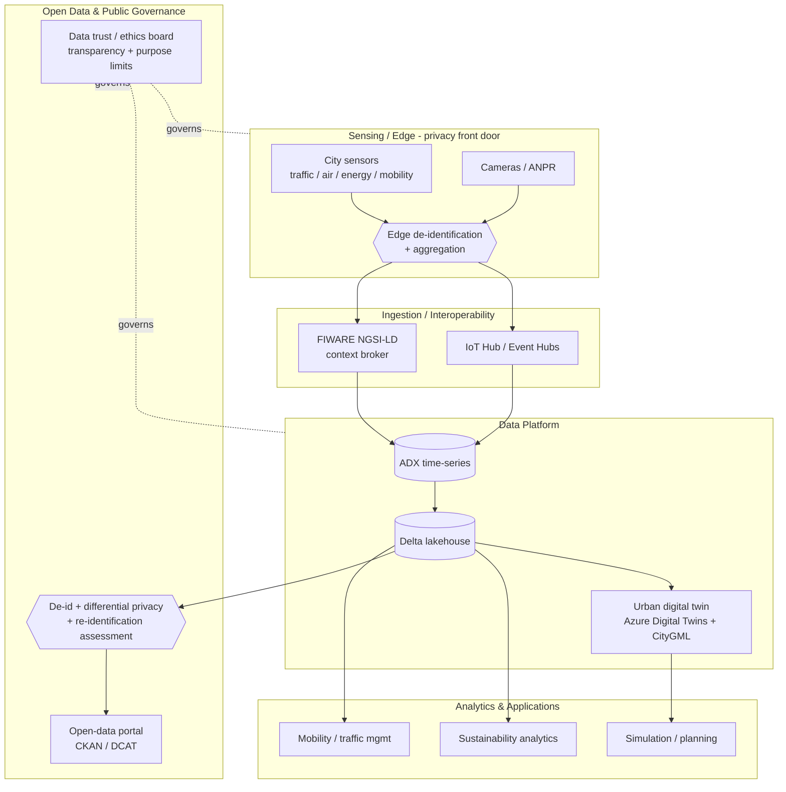
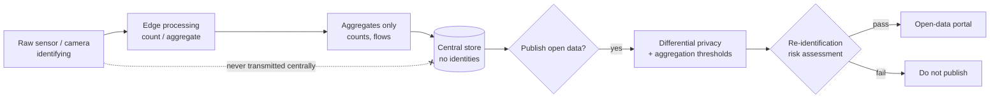
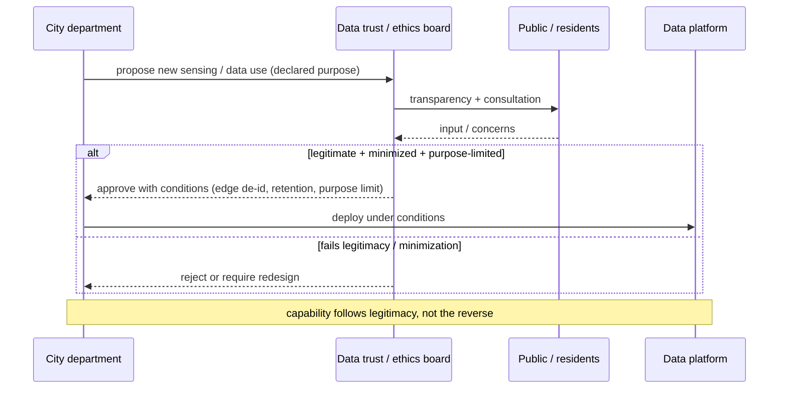

# Smart Cities

> Part of the **Enterprise Data & AI Architecture Handbook** · Phase-17 — Industry Vertical Platforms · Chapter 04.
> Estimated study time: **60 min reading + ~3h labs**.
> **Prerequisites:** read [IoT Data Platforms](../Phase-16/01_IoT_Data_Platforms.md) and [Digital Twins](../Phase-16/07_Digital_Twins.md) first.

---

## Executive Summary

The three prior Phase-17 chapters covered verticals whose defining constraint is an external regulator: privacy law in [Healthcare Data Platforms](01_Healthcare_Data_Platforms.md), financial supervision in [Financial Data Platforms](02_Financial_Data_Platforms.md), and safety certification in [Aviation Data Platforms](03_Aviation_Data_Platforms.md). A smart-city data platform has a different, and in some ways harder, defining constraint: **public legitimacy and citizen trust.** Its subjects are people who did not opt in and cannot easily opt out — you cannot avoid the sensors on your street, the cameras at the intersection, or the mobility data your transit card generates. A bank's customer can close their account; a city's resident cannot decline the city. That asymmetry makes privacy-by-design, data minimization, transparency, and democratic data governance not merely compliance obligations but the **precondition for the platform to exist at all.** The most important lesson in this domain is written in a real failure: Sidewalk Labs' Toronto Quayside project — a technically ambitious, well-funded smart-city data platform — collapsed in 2020, with unresolved questions about who would own and govern the urban data, and about consent in public space, at the centre of the controversy. Technical capability without resolved public data governance does not produce a smart city; it produces a cancelled project.

This chapter is Phase-17 Chapter 04 and covers **mobility and traffic data** (transit feeds like GTFS/GTFS-Realtime, the Mobility Data Specification for shared micromobility, traffic sensors, ANPR/camera data, and floating-car data); **urban digital twins** (city-scale 3D twins built on CityGML and the [Digital Twins](../Phase-16/07_Digital_Twins.md) discipline, from Virtual Singapore to Helsinki's Kalasatama); **citizen privacy and ethics** (the surveillance and consent problem, data minimization and differential privacy, and the governance mechanisms — data trusts, ethics boards, transparency — that confer legitimacy); **open data and interoperability** (open-data portals, DCAT catalogs, and the standards — NGSI-LD/FIWARE, OGC SensorThings, DATEX II — that let siloed city systems interoperate); and **sustainability analytics** (energy, emissions, air quality, water, waste, and the ESG/net-zero reporting cities increasingly must produce).

The platform bias is **Azure-primary (~60%)** — Azure IoT Hub and Event Hubs for city-scale sensor ingestion, Azure Data Explorer (ADX/Kusto) for time-series, Azure Digital Twins for the urban twin (built directly on [Digital Twins](../Phase-16/07_Digital_Twins.md)), Azure Maps for geospatial, Azure Databricks and Microsoft Fabric for analytics, Microsoft Purview for catalog/lineage, and Azure Data Share for open-data publishing — **~30% enterprise open source** (the **FIWARE** context-broker ecosystem and **NGSI-LD** standard, **CKAN** for open-data portals, Apache Kafka/Flink for streaming, Spark/Delta for the backbone, PostGIS and Kepler.gl for geospatial, and Grafana for dashboards) — **~10% AWS/GCP comparison-only** (AWS IoT and Location Service; Google Maps Platform, BigQuery, and the GTFS lineage Google originated — plus the honest note that Google/Alphabet's own Sidewalk Labs is the field's cautionary tale), contrasted on capability, openness, and lock-in.

**Bottom line:** a smart-city data platform is not "municipal IoT." It is a **civic, multi-stakeholder, trust-dependent** platform whose subjects cannot opt out, which means its architecture must put **data minimization and privacy-by-design at the edge, open interoperability at the core, and transparent public governance around the whole thing** — or it will fail on legitimacy regardless of its technical merit. This chapter's ADR (§40) formalizes the first of those: sensors observing public space must default to **aggregated/de-identified collection at or near the edge**, retaining raw identifiable data only under a specific, justified, publicly-governed purpose — never "collect everything centrally and decide later." The two case studies (§40) show what happens when public data governance is unresolved (Sidewalk Labs Toronto) and when "anonymized" open data is naively published (a re-identification incident grounded in the real 2014 NYC taxi-data de-anonymization).

---

## Learning Objectives

By the end of this chapter you will be able to:

1. **Design a mobility and traffic data pipeline** using open standards (GTFS/GTFS-RT, MDS, DATEX II) and sensor/camera feeds, with privacy built in.
2. **Architect a city-scale urban digital twin** on CityGML/3D models and the [Digital Twins](../Phase-16/07_Digital_Twins.md) pattern, scoped to real municipal decisions.
3. **Apply data minimization, privacy-by-design, and differential privacy** to citizen data, and reason about the ethics and legitimacy of public-space sensing.
4. **Build open-data and interoperability capability** using context brokers (NGSI-LD/FIWARE), open-data portals (CKAN/DCAT), and cross-domain standards.
5. **Design sustainability analytics** (energy, emissions, air quality) and connect them to city net-zero and ESG reporting.
6. **Establish public data governance** — data trusts, ethics boards, transparency — as the legitimacy layer a smart-city platform cannot exist without.
7. **Defend a smart-city platform's mobility, twin, privacy, interoperability, and governance architecture** in engineer, staff engineer, architect, and CTO/public-official review settings.

---

## Business Motivation

- **Cities face compounding pressure — congestion, emissions, aging infrastructure, growing populations — that data can measurably relieve.** Traffic optimization, transit efficiency, and infrastructure prognostics (per [Industrial IoT (IIoT)](../Phase-16/02_Industrial_IoT_IIoT.md)) produce quantifiable improvements in mobility, cost, and quality of life — the core value proposition.
- **Public money demands public accountability.** A city platform is funded by taxpayers and serves residents who cannot opt out; its value must be demonstrable *and* its data practices must be trustworthy, or it loses both political support and legitimacy (§40, Case Study 1).
- **Legitimacy is the binding constraint, and it is easily lost.** The Sidewalk Labs Toronto cancellation (§40, CS1) and facial-recognition bans in several US cities show that public trust — not technology — is the scarce resource; a platform that mishandles it is stopped regardless of its capability.
- **Sustainability and net-zero commitments are increasingly mandated.** Cities have binding climate targets and ESG reporting obligations; sustainability analytics (§4.5) turn sensor and consumption data into the emissions and efficiency evidence those commitments require.
- **Interoperability unlocks value that silos trap.** Transport, energy, water, waste, and public-safety data are historically siloed by department and vendor; open standards and cross-domain interoperability (§4.4) are what let a city reason about itself as a system rather than a collection of disconnected utilities — the same fragmentation-to-coherence motivation as [Data Mesh Principles](../Phase-15/01_Data_Mesh_Principles.md), here across municipal domains.

---

## History and Evolution

- **2000s — e-government and open data begin.** Cities digitize services and, influenced by the open-government movement, start publishing **open data** on portals (later standardized via **CKAN**, Socrata, and the **DCAT** catalog vocabulary). Transparency, not sensing, is the first driver.
- **2005-2010 — the "smart city" concept and early sensor deployments.** IBM's "Smarter Cities" and Cisco's urban initiatives popularize the term; early deployments focus on traffic, utilities, and centralized operations centres (e.g. Rio de Janeiro's IBM-built city operations centre, 2010).
- **2006 — GTFS.** Google (with Portland's TriMet) creates the **General Transit Feed Specification**, standardizing public-transit schedule data; **GTFS-Realtime** later adds live vehicle positions and arrival predictions — the single most successful open mobility data standard, now global.
- **2010s — IoT, LPWAN, and city sensing at scale.** Cheap sensors, LoRaWAN/NB-IoT connectivity (per [IoT Data Platforms](../Phase-16/01_IoT_Data_Platforms.md)), and smartphone-derived mobility data make dense urban sensing feasible. **FIWARE** (an EU-backed open-source smart-city platform) and the **NGSI-LD** context-information standard (ETSI) emerge as vendor-neutral interoperability foundations.
- **2016-2019 — micromobility and MDS.** The explosion of shared e-scooters/bikes leads Los Angeles and the **Open Mobility Foundation** to create the **Mobility Data Specification (MDS)**, a standard for cities to receive and regulate operator data — itself a flashpoint for privacy debate (fine-grained trip data on individuals).
- **2019-2020 — the privacy reckoning.** San Francisco (2019) becomes the first major US city to **ban municipal facial recognition**; and **Sidewalk Labs' Toronto Quayside** project is cancelled in 2020 amid unresolved data-governance and privacy controversy (§40, CS1) — the two events that crystallized citizen privacy and consent as the central smart-city constraint.
- **2018-2023 — urban digital twins mature.** **Virtual Singapore**, Helsinki's **Kalasatama** twin, and city twins in Europe and Asia move 3D city models (**CityGML**, later 3D Tiles/CesiumJS and gaming/USD engines) from planning artifacts toward live, sensor-fed decision tools — applying the [Digital Twins](../Phase-16/07_Digital_Twins.md) discipline at urban scale.
- **2020-2026 — sustainability, cloud, and privacy-preserving analytics.** Net-zero commitments make **sustainability analytics** (air quality, emissions, energy) a first-class workload; cloud lakehouses and Azure Digital Twins host city platforms; and **differential privacy** and edge de-identification become the accepted techniques for reconciling useful analytics with the impossibility of individual consent in public space (§4.3, §40 ADR-0191).

---

## Why This Technology Exists

Smart-city data platforms exist because a city is a vast, heterogeneous, real-time system — mobility, energy, water, waste, environment, public safety — whose data is trapped in departmental and vendor silos, and because turning that data into better urban outcomes requires integrating it across domains while respecting a constraint no commercial platform faces so acutely: **the subjects of the data are the public, sensed in public space, without individual consent and without the ability to opt out.** A generic IoT platform (per [IoT Data Platforms](../Phase-16/01_IoT_Data_Platforms.md)) can ingest the sensors; a generic analytics platform can crunch the data; but neither is built for the civic-legitimacy problem at the centre of the smart city. The reason a distinct "smart-city data platform" architecture exists is that it must simultaneously deliver cross-domain interoperability (open standards, not proprietary silos), privacy-by-design for non-consenting subjects (minimization and de-identification at the edge), and transparent public governance (data trusts, ethics oversight) — with the twin capability, from [Digital Twins](../Phase-16/07_Digital_Twins.md), that lets a city model and simulate itself. Take away the governance and privacy layer and the technology, however capable, loses its licence to operate (§40, CS1).

---

## Problems It Solves

- **Cross-domain urban integration**, resolved by open interoperability standards (NGSI-LD/FIWARE context brokers, OGC SensorThings, DATEX II, GTFS) that let siloed departments and vendors exchange data (§4.4).
- **Real-time mobility and traffic management**, resolved by streaming sensor/transit feeds (GTFS-RT, MDS, traffic sensors) into analytics and control-room decision support (§4.1).
- **City-scale modeling and scenario simulation**, resolved by urban digital twins (§4.2) that let planners test interventions (a new transit line, a low-emission zone, flood response) against a data-grounded model.
- **Useful analytics without individual consent**, resolved by data minimization, edge de-identification, and differential privacy (§4.3, §40 ADR-0191) — collecting aggregate insight rather than tracking individuals.
- **Public transparency and reuse**, resolved by open-data portals (CKAN/DCAT) that publish city data for citizens, researchers, and businesses (§4.4).
- **Sustainability measurement and reporting**, resolved by environmental and consumption analytics (§4.5) feeding net-zero and ESG obligations.
- **Legitimacy and accountability**, resolved by public data-governance mechanisms (data trusts, ethics boards, transparency) that the technology enables (§23).

---

## Problems It Cannot Solve

- **It cannot manufacture public trust.** Legitimacy is earned through transparent governance and demonstrable restraint, not delivered by a platform feature; a technically excellent platform with unresolved governance fails (Sidewalk Labs, §40 CS1). The technology is necessary but nowhere near sufficient.
- **It cannot make "anonymized" data un-re-identifiable by assertion.** Fine-grained mobility and location data is notoriously re-identifiable by linkage (§40, Case Study 2, grounded in the real NYC taxi de-anonymization); calling data "anonymized" does not make it so, as the disciplines of [Data Privacy and PII Protection](../Phase-10/07_Data_Privacy_and_PII_Protection.md) make clear.
- **It cannot resolve the consent problem for public-space sensing.** People in public space cannot individually opt in or out; the platform can minimize, aggregate, and govern, but the fundamental ethical tension is a societal/political question technology only helps manage (§4.3, §23).
- **It cannot overcome departmental politics and vendor lock-in by itself.** Interoperability standards enable integration, but the organizational silos, procurement incentives, and proprietary systems that fragment city data are governance and political problems (the same socio-technical reality as [Data Mesh Principles](../Phase-15/01_Data_Mesh_Principles.md)).
- **It cannot fix bad or biased sensor coverage.** If sensors are concentrated in wealthier districts, the analytics inherit and amplify that bias; equitable coverage and fairness ([Responsible AI](../Phase-11/07_Responsible_AI.md)) are design responsibilities the platform does not solve automatically.
- **It cannot guarantee a twin reflects reality.** As in [Digital Twins](../Phase-16/07_Digital_Twins.md), an urban twin that drifts from the physical city (unrecorded construction, changed road layouts) produces confident wrong answers; reconciliation is a continuing obligation.

---

## Core Concepts

### 4.1 Mobility and traffic data

Mobility is the highest-volume and most privacy-sensitive smart-city domain:

- **Transit feeds** — **GTFS** (static schedules) and **GTFS-Realtime** (live vehicle positions, trip updates, service alerts) are the global open standards for public-transit data; almost every transit agency publishes them.
- **Shared micromobility** — the **Mobility Data Specification (MDS)** lets cities receive operator data (scooter/bike trips, vehicle status) for regulation and planning — powerful for policy, contentious for privacy (individual trip traces).
- **Traffic sensors** — inductive loops, radar, cameras, and **ANPR/LPR** (automatic number-plate recognition) produce flow, occupancy, and (with cameras) potentially identifying data. **DATEX II** is the European standard for exchanging traffic and travel information.
- **Floating-car / probe data** — aggregated GPS from vehicles/phones for real-time traffic (the basis of consumer navigation traffic layers).

The architectural tension: mobility data is most useful when fine-grained (individual trips reveal demand patterns) and most dangerous when fine-grained (individual trips reveal individuals). Data minimization and edge aggregation (§4.3, §40 ADR-0191) are the resolution.

### 4.2 Urban digital twins

An urban digital twin applies the [Digital Twins](../Phase-16/07_Digital_Twins.md) discipline at city scale: a live, queryable model of the physical city — buildings, roads, utilities, sensors — fed by real-time data and used for planning and operations.

- **3D city models** — **CityGML** (OGC standard for semantic 3D city models, with levels of detail LOD0-LOD4), rendered via **3D Tiles/CesiumJS** or game/USD engines (Unreal, NVIDIA Omniverse). A CAD/3D model alone is not a twin — the twin adds live state and relationships (per [Digital Twins](../Phase-16/07_Digital_Twins.md) §7.1's model-vs-shadow-vs-twin distinction).
- **The twin graph** — buildings, road segments, utilities, and their relationships modeled as a graph (reusing [Knowledge Graphs with Neo4j](../Phase-13/02_Knowledge_Graphs_with_Neo4j.md) property-graph concepts and DTDL/ontologies from [Ontologies and Taxonomies](../Phase-13/05_Ontologies_and_Taxonomies.md)).
- **Uses** — scenario simulation (traffic under a new transit line, flood inundation, heat mapping, evacuation planning), operations (real-time incident response), and stakeholder communication (a shared, legible model of the city).
- **The scope-to-a-decision rule** (from [Digital Twins](../Phase-16/07_Digital_Twins.md) ADR-0187) applies acutely: a "twin of the whole city down to the bolt" with no decision it drives is the classic boil-the-ocean failure; scope to named municipal decisions.

### 4.3 Citizen privacy and ethics

The domain's defining concern. Because subjects cannot consent or opt out, the ethical burden shifts entirely onto the platform's design:

- **Data minimization** — collect the minimum necessary; prefer counts and aggregates over identifying records. Don't store a face when a count will do.
- **Edge de-identification / aggregation** — de-identify or aggregate at or near the sensor, *before* centralization, so identifiable raw data never accumulates in a central honeypot (§40, ADR-0191). A camera that emits "3 pedestrians crossed" is categorically safer than one that streams video centrally.
- **Differential privacy** — for published aggregates and open data, add calibrated noise so individuals cannot be re-identified from released statistics (per [Data Privacy and PII Protection](../Phase-10/07_Data_Privacy_and_PII_Protection.md)).
- **Purpose limitation and transparency** — data collected for traffic management should not silently become a policing tool; purpose must be declared, limited, and transparent to the public.
- **Ethics and legitimacy** — surveillance concerns (facial recognition bans), equity (sensor-coverage bias), and the democratic question of *whether* to sense at all are ethical, not just technical, and require public governance (§23).

### 4.4 Open data and interoperability

- **Context brokers** — **NGSI-LD** (ETSI standard) and its **FIWARE** open-source implementation (Orion context broker) provide a vendor-neutral, standardized way to publish and query real-time context ("what is the state of this entity now"), the interoperability backbone of many EU smart cities. NGSI-LD is graph/linked-data based, connecting to [Ontologies and Taxonomies](../Phase-13/05_Ontologies_and_Taxonomies.md).
- **Sensor standards** — OGC **SensorThings API** for IoT sensor data; **DATEX II** for traffic; **GTFS** for transit; domain standards prevent per-vendor silos.
- **Open-data portals** — **CKAN** (open source) and Socrata publish datasets with **DCAT** (Data Catalog Vocabulary) metadata for discoverability; the civic analogue of a data catalog (per [Data Catalog and Lineage](../Phase-08/02_Data_Catalog_and_Lineage.md)).
- **City-as-data-mesh** — treating each department (transport, energy, water) as a domain publishing governed **data products** (per [Data Products](../Phase-15/02_Data_Products.md)) — open data being the ultimate multi-consumer data product — is an increasingly natural framing for city data architecture.

### 4.5 Sustainability analytics

- **Air quality** — dense low-cost sensor networks (PM2.5, NO₂, O₃) plus reference stations; calibration is a real data-quality challenge (low-cost sensors drift).
- **Energy & emissions** — building energy, street lighting, EV charging, and grid data feeding emissions accounting and efficiency programs; smart-grid integration (per [Industrial IoT (IIoT)](../Phase-16/02_Industrial_IoT_IIoT.md)).
- **Water & waste** — leak detection, consumption analytics, smart-bin/collection optimization.
- **Urban environment** — heat-island mapping, green-space and flood analytics (often twin-integrated, §4.2).
- **ESG / net-zero reporting** — turning the above into the auditable emissions and efficiency evidence cities' binding climate commitments require — with the lineage and reproducibility discipline that regulatory reporting always demands (echoing [Financial Data Platforms](02_Financial_Data_Platforms.md) §2.5).

---

## Internal Working

### 5.1 City-scale sensor ingestion

Heterogeneous sensors (traffic, air quality, energy, mobility) connect over diverse networks (LoRaWAN/NB-IoT for low-power, cellular, wired) into an ingestion layer (IoT Hub/Event Hubs, or a FIWARE context broker), per the connectivity-constrained patterns of [IoT Data Platforms](../Phase-16/01_IoT_Data_Platforms.md). Critically, **privacy-preserving processing happens as early as possible**: an edge gateway or the camera itself computes aggregates (counts, flow) and discards or never transmits raw identifying data (§40, ADR-0191). Standardized context (NGSI-LD entities, SensorThings observations) normalizes the heterogeneity so downstream consumers see a consistent model regardless of sensor vendor. Data lands in a time-series store (ADX) and a lakehouse (Delta medallion) for analytics.

### 5.2 Urban twin construction and update

A base 3D model (CityGML, from planning/GIS sources) defines the static structure; a twin graph (DTDL/NGSI-LD entities + relationships) represents buildings, road segments, and sensors and their connections. An ingest-to-twin layer (as in [Digital Twins](../Phase-16/07_Digital_Twins.md) §8.1 — the twin is *not* a raw telemetry endpoint) translates sensor observations into twin-property updates. Simulation runs (traffic microsimulation, flood/inundation models, heat) execute against the twin state, and results feed planning decisions. The correctness-critical concern is **twin-reality reconciliation** (per [Digital Twins](../Phase-16/07_Digital_Twins.md) §40 CS2): the physical city changes constantly (construction, road changes), and a twin not kept in sync silently drifts.

### 5.3 Open-data publishing with re-identification control

Producing open data is not a simple export. A publishing pipeline takes internal data, applies **de-identification and aggregation** (and, for statistical releases, **differential privacy**), runs a **re-identification risk assessment** (could this be linked with other public data to re-identify individuals? — the mosaic-effect check that the NYC taxi release failed, §40 CS2), and only then publishes with DCAT metadata to the open-data portal (CKAN). Lineage (Purview) records what was released and how it was de-identified — the evidence that a release was governed, not naive. Aggregation thresholds (suppress small cells) and noise calibration are the mechanical controls.

---

## Architecture

The reference architecture has five layers:

1. **Sensing / edge layer** — heterogeneous city sensors (traffic, air quality, energy, mobility) over LoRaWAN/NB-IoT/cellular, with **edge de-identification/aggregation** as the privacy front door (§40, ADR-0191).
2. **Ingestion / interoperability layer** — IoT Hub/Event Hubs and/or a **FIWARE NGSI-LD context broker**; standardized context (NGSI-LD, SensorThings, GTFS-RT, DATEX II) normalizing vendor heterogeneity.
3. **Data platform layer** — ADX time-series + Delta lakehouse (medallion) for analytics; Azure Maps/PostGIS for geospatial; the **urban digital twin** (Azure Digital Twins) for city-scale modeling.
4. **Analytics & applications layer** — mobility/traffic management, sustainability analytics, simulation, and control-room decision support.
5. **Open-data & governance layer** — the open-data portal (CKAN/DCAT) with re-identification-controlled publishing; and the **public data-governance mechanism** (data trust/ethics board, transparency, purpose limitation) that wraps the whole platform and confers legitimacy.

The city-as-mesh framing (per [Data Mesh Principles](../Phase-15/01_Data_Mesh_Principles.md)) often maps departments to domains publishing governed data products, federated by a city-wide governance function.

---

## Components

- **Edge gateways / smart sensors** — with on-device aggregation/de-identification.
- **Context broker** — FIWARE Orion (NGSI-LD) for real-time standardized context.
- **Ingestion** — Azure IoT Hub / Event Hubs; OGC SensorThings endpoints.
- **Time-series store** — Azure Data Explorer (ADX) / ClickHouse.
- **Lakehouse** — Delta Lake (medallion) for analytics.
- **Geospatial** — Azure Maps / PostGIS / Kepler.gl.
- **Urban digital twin** — Azure Digital Twins + CityGML/3D Tiles; simulation engines.
- **Open-data portal** — CKAN + DCAT metadata; Azure Data Share for governed sharing.
- **Privacy engine** — de-identification, aggregation, differential privacy, re-identification risk assessment.
- **Catalog & lineage** — Microsoft Purview.
- **Public governance** — data trust / ethics board tooling, transparency registers, purpose-limitation policy enforcement.

---

## Metadata

- **Sensor/asset metadata** — sensor type, location, calibration state, owning department; calibration metadata is critical for air-quality data quality (low-cost sensors drift).
- **Standardized context models** — NGSI-LD entity types, SensorThings observation schemas, GTFS/DATEX II definitions — the interoperability contracts.
- **DCAT catalog metadata** — for open-data discoverability (title, description, license, update frequency, provenance).
- **Privacy metadata** — data classification (identifying vs aggregate), de-identification method applied, purpose declaration, retention, re-identification-risk assessment results.
- **Twin metadata** — CityGML/DTDL models, twin-graph relationships, reconciliation status.
- **Lineage** — provenance from sensor → processed → published open dataset, and physical/legal handling — evidence for governance and transparency.
- **Ontologies** — shared vocabularies (SAREF for smart appliances, RealEstateCore/Brick for buildings) connecting to [Ontologies and Taxonomies](../Phase-13/05_Ontologies_and_Taxonomies.md).

---

## Storage

- **Time-series** — ADX/ClickHouse for high-cardinality sensor observations (traffic, air quality, energy), time-partitioned, downsampled + tiered.
- **Lakehouse** — Delta (medallion) for cross-domain analytics and open-data source (per [Medallion Architecture](../Phase-05/03_Medallion_Architecture.md), [Delta Lake](../Phase-04/04_Delta_Lake.md)).
- **Geospatial** — 3D city models (CityGML/3D Tiles) and vector data (PostGIS); large, tiled.
- **Open-data store** — published, de-identified datasets on the portal.
- **Minimization-first** — the strongest storage-privacy control is *not storing* identifying data: aggregate at the edge so the central store holds counts, not identities (§40, ADR-0191).
- **Retention** — purpose-limited; identifying data (where unavoidable) has short, justified retention; aggregates can persist longer.

---

## Compute

- **Streaming** — real-time traffic/mobility processing (Flink/Stream Analytics) for live management and alerts.
- **Batch analytics** — cross-domain analytics, sustainability accounting, and mobility-demand analysis on Spark/Databricks.
- **Simulation** — traffic microsimulation, flood/heat modeling against the twin (compute-intensive, periodic).
- **Edge compute** — on-sensor/gateway aggregation and de-identification (the privacy-critical compute).
- **ML** — demand prediction, anomaly detection, air-quality calibration models (per Phase-11), with fairness attention to coverage bias.

---

## Networking

- **LPWAN & cellular** — LoRaWAN/NB-IoT for low-power city sensors; cellular for higher-bandwidth; wired for fixed infrastructure — the connectivity heterogeneity of [IoT Data Platforms](../Phase-16/01_IoT_Data_Platforms.md).
- **Edge-to-cloud** — private/secure connectivity; edge does privacy-preserving processing before transmission.
- **Segmentation** — critical infrastructure (traffic control, utilities) is segmented from analytics/open-data networks; public-safety systems especially isolated.
- **Open-data delivery** — public-facing portal endpoints, WAF-protected, serving de-identified data only.
- **Egress control** — prevent identifying data from leaving the secured zone (per [Network Security and Zero Trust](../Phase-10/04_Network_Security_and_Zero_Trust.md)).

---

## Security

- **Privacy as the primary security objective** — because the data concerns non-consenting citizens, minimization and de-identification are the core controls; the biggest security win is not collecting identifying data at all (§40, ADR-0191).
- **Critical-infrastructure protection** — traffic control, utilities, and public safety are operational-technology targets; the IIoT/OT security disciplines of [Industrial IoT (IIoT)](../Phase-16/02_Industrial_IoT_IIoT.md) (segmentation, safety isolation) apply — a compromised traffic-control system is a public-safety risk.
- **Access control** — scoped access across departments and to external researchers/operators (ABAC per [Identity and Access Management with Microsoft Entra](../Phase-10/02_Identity_and_Access_Management_with_Entra.md)); purpose-of-use enforcement (traffic data not silently reused for policing).
- **Encryption** — at rest and in transit; camera/ANPR feeds especially protected.
- **Open-data safety** — the publishing pipeline is a security boundary: it must guarantee only de-identified, re-identification-assessed data leaves (§5.3, §40 CS2).
- **Transparency as accountability** — public registers of what is sensed and why are a trust (and de facto security-governance) mechanism.

---

## Performance

- **Ingestion scale** — city-wide sensor fleets produce high, steady volumes; ADX/Event Hubs handle the throughput; edge aggregation reduces central load.
- **Real-time responsiveness** — traffic management and incident response have genuine latency needs; most analytics (planning, sustainability) are batch-tolerant.
- **Twin/simulation performance** — city-scale simulation is compute-heavy; scope and level-of-detail (CityGML LOD) trade fidelity against tractability.
- **Open-data query** — portal performance for public consumption; cache and pre-aggregate popular datasets.
- **Geospatial performance** — spatial indexing (per the H3/PostGIS techniques in [Earth Observation and Geospatial Analytics](../Phase-16/06_Earth_Observation_and_Geospatial_Analytics.md)) for map queries.

---

## Scalability

- **Sensor scale** — scales with city size × sensor density; partition by domain/geography; edge aggregation keeps central volume bounded.
- **Multi-domain federation** — the city-as-mesh model scales by federating departmental domains rather than one monolith (per [Data Mesh Principles](../Phase-15/01_Data_Mesh_Principles.md)).
- **Open-data consumption** — scales via CDN/caching for public access.
- **Twin scale** — federate large cities into district/domain twins rather than one monolithic twin (the federation lesson from [Digital Twins](../Phase-16/07_Digital_Twins.md)).
- **Multi-city / regional** — shared standards (NGSI-LD, GTFS) enable regional and cross-city interoperability.

---

## Fault Tolerance

- **Sensor unreliability** — city sensors fail, drift, and vandalize; the platform must tolerate gaps, flag calibration drift (air quality especially), and not treat a dead sensor's last value as current.
- **Graceful degradation** — traffic management must degrade safely if data is lost (fall back to fixed timing plans), never fail unsafe.
- **Idempotent ingestion** — tolerate sensor re-transmission (per [Message Brokers and Queues](../Phase-14/07_Message_Brokers_and_Queues.md)).
- **Twin-reality drift detection** — monitor for divergence between twin and physical city (per [Digital Twins](../Phase-16/07_Digital_Twins.md)).
- **Critical-infrastructure resilience** — traffic/utility control systems need high-availability and safe-failure design (OT reliability per [Industrial IoT (IIoT)](../Phase-16/02_Industrial_IoT_IIoT.md)).

---

## Cost Optimization

- **Minimize collection (privacy *and* cost win)** — aggregating at the edge reduces both privacy risk and central storage/bandwidth cost — a rare case where the privacy-optimal and cost-optimal choices align (§40, ADR-0191).
- **Tier and downsample sensor data** — hot recent, cold historical; downsample high-rate streams.
- **Elastic/spot compute** for batch analytics and simulation.
- **Open-source where sovereignty/budget demands** — FIWARE/CKAN/PostGIS are strong OSS options for budget- and openness-conscious municipalities.
- **Right-size the twin** — scope to decisions and appropriate LOD; a boil-the-ocean city twin is the biggest cost sink (per [Digital Twins](../Phase-16/07_Digital_Twins.md)).

**Worked FinOps example.** A city deploys 5,000 intersection/mobility sensors. Streaming full raw camera video centrally for analytics would cost enormously in bandwidth and hot storage (and create a privacy honeypot). Doing detection/counting **at the edge** and transmitting only aggregate counts cuts transmitted data volume by orders of magnitude (video → a few numbers per interval), reducing bandwidth and storage cost by well over **90%** on the mobility-sensing line — *and* eliminates the central store of identifiable footage, so the privacy-optimal design is also the cost-optimal one. The saved budget funds broader, more equitable sensor coverage rather than a smaller, richer-neighborhood-only deployment.

---

## Monitoring

- **Sensor health & calibration** — uptime, drift (air-quality calibration especially), coverage gaps and their equity implications.
- **Data quality** — plausibility, cross-sensor consistency, GTFS/NGSI-LD conformance.
- **Privacy controls** — verification that edge de-identification/aggregation is actually happening; that no identifying data is reaching the central store.
- **Open-data pipeline** — re-identification-assessment pass/fail before any publish.
- **Twin reconciliation** — drift between twin and physical city.
- **Sustainability metrics** — the actual environmental KPIs (emissions, air quality) the platform exists to improve.

## Operational Response Playbook

| Signal | Detection | Remediation |
|---|---|---|
| **Identifying data reaching the central store** (raw video/plates/individual trip traces found centrally where only aggregates should be) | Privacy monitor / audit detects raw PII in the central lakehouse; classification scan flags identifying fields | Stop the offending ingestion path; quarantine the identifying data; confirm whether it constitutes a privacy breach (GDPR/local law timelines) and whether public disclosure is warranted (transparency); root-cause the edge de-identification/aggregation gap — the §40 ADR-0191 failure — and fix so de-identification happens at the edge, not centrally. |
| **Published "anonymized" open dataset is re-identifiable** (external researcher or audit shows individuals/vehicles can be re-identified by linkage) | Re-identification demonstrated post-publication; mosaic-effect linkage to other public data | Withdraw or restrict the dataset immediately; assess who may already have downloaded it; re-publish only after aggregation/differential-privacy and a passed re-identification risk assessment (§5.3); this is the §40 Case Study 2 failure — make the risk assessment a mandatory pre-publish gate, not an afterthought. Communicate transparently (trust depends on it). |

---

## Observability

- **End-to-end lineage** — sensor → processed → published dataset, plus privacy-handling lineage (what was de-identified, how), for both governance evidence and public transparency.
- **Privacy observability** — continuous verification that minimization/de-identification is in force; classification scans that would catch identifying data where it shouldn't be.
- **Twin observability** — reconciliation status and drift signals (per [Digital Twins](../Phase-16/07_Digital_Twins.md)).
- **Data-quality observability** — sensor calibration and cross-domain consistency surfaced as metrics.
- **Public-facing transparency** — dashboards/registers that make the city's data practices legible to residents (an observability capability aimed at citizens, not just operators).

---

## Governance

- **Public data governance is the defining layer.** Unlike commercial verticals, a smart city needs a *legitimacy* mechanism: a **data trust** or civic-data steward, an **ethics board**, transparent purpose declarations, and public accountability for what is sensed and why. Sidewalk Labs' failure (§40, CS1) was fundamentally a governance failure — the proposed governance did not satisfy the public. This is the chapter's central governance point.
- **Privacy-by-design and data minimization** — codified as policy and enforced technically (edge de-identification, §40 ADR-0191); purpose limitation preventing function creep (traffic data → surveillance).
- **Open-data governance** — licensing, quality, and — critically — re-identification-risk assessment before publication (§5.3, §40 CS2).
- **Equity and fairness** — sensor-coverage equity and algorithmic-fairness oversight (per [Responsible AI](../Phase-11/07_Responsible_AI.md)); the platform must not entrench bias.
- **Interoperability & standards governance** — mandating open standards (NGSI-LD, GTFS, SensorThings) to avoid vendor lock-in and enable the city-as-mesh model.
- **Regulatory** — GDPR and local privacy law, facial-recognition restrictions, and public-records/transparency obligations (per [Compliance and Regulatory Frameworks](../Phase-10/06_Compliance_and_Regulatory_Frameworks.md)).

---

## Trade-offs

- **Utility vs privacy of mobility data** — fine-grained data is most useful and most dangerous; aggregation/differential privacy trades some analytic precision for the privacy that makes collection legitimate.
- **Centralized city platform vs federated departmental mesh** — a central platform is simpler to govern uniformly but concentrates risk and politics; a federated mesh (per [Data Mesh Principles](../Phase-15/01_Data_Mesh_Principles.md)) respects departmental ownership but needs strong federated governance.
- **Open data value vs re-identification risk** — publishing openly creates civic/economic value but risks re-identification; the risk assessment (§5.3) is the balancing mechanism.
- **Proprietary vs open standards** — proprietary vendor platforms are turnkey but lock the city in; open standards (FIWARE/NGSI-LD) preserve sovereignty and interoperability at higher integration effort.
- **Twin fidelity vs cost/tractability** — higher LOD and finer simulation cost more and drift faster; scope to decisions (per [Digital Twins](../Phase-16/07_Digital_Twins.md)).
- **Real-time control vs batch analytics** — traffic/incident management needs real-time; planning and sustainability are batch-tolerant.

---

## Decision Matrix

| Decision | Choose A | Choose B | Deciding factor |
|---|---|---|---|
| Mobility data granularity | **Aggregate / edge-de-identified** | **Individual-level (governed exception)** | Default → aggregate at edge (§40 ADR-0191); a specific, publicly-justified, governed need → individual-level under strict controls |
| Interoperability | **Open standards (NGSI-LD/FIWARE, GTFS)** | **Proprietary vendor platform** | Sovereignty, interoperability, avoid lock-in → open standards; rapid turnkey with accepted lock-in → proprietary |
| Data topology | **Federated departmental mesh** | **Central city platform** | Strong departmental ownership + federated governance → mesh; small city / uniform central governance → central |
| Open-data publishing | **Aggregated + DP + risk-assessed** | *(never raw individual)* | Always de-identify, apply differential privacy for statistics, pass re-identification assessment (§5.3) before publish |
| Urban twin scope | **Decision-scoped / district-federated** | *(never boil-the-ocean)* | Scope to named municipal decisions and federate large cities (per Digital Twins ADR-0187) |
| Sensor privacy | **On-edge processing** | **Central raw collection** | Public-space sensing → process at edge, transmit aggregates; only a governed exception justifies central raw |

---

## Design Patterns

- **Edge de-identification / minimization-first** — process and aggregate at the sensor; central store holds counts, not identities (§40, ADR-0191).
- **Open-standard context broker** — NGSI-LD/FIWARE (or SensorThings) as the vendor-neutral interoperability layer.
- **City-as-data-mesh** — departments as domains publishing governed data products (per [Data Products](../Phase-15/02_Data_Products.md)); open data as the ultimate multi-consumer product.
- **Re-identification-controlled open-data publishing** — de-identify + differential privacy + risk assessment as a mandatory pre-publish gate (§5.3).
- **Decision-scoped urban twin** — scope to municipal decisions, district-federated (per [Digital Twins](../Phase-16/07_Digital_Twins.md)).
- **Public data trust / civic governance** — an accountable, transparent governance mechanism as the legitimacy layer.
- **Purpose limitation enforcement** — technical controls preventing function creep (traffic → surveillance).

## Anti-patterns

- **Collect-everything-centrally-and-decide-later** — the surveillance-honeypot anti-pattern the ADR forbids.
- **Publishing "anonymized" data without a re-identification assessment** — the NYC-taxi-style failure (§40, CS2).
- **Technology-first, governance-later** — building capability before resolving public data governance (Sidewalk Labs, §40 CS1).
- **Proprietary silos** — vendor lock-in that fragments city data and blocks interoperability.
- **Boil-the-ocean city twin** — a twin of everything with no decision it drives.
- **Function creep** — quietly reusing data collected for one purpose for another (especially surveillance).
- **Ignoring sensor-coverage equity** — concentrating sensing in wealthy districts, biasing every downstream analysis.

## Common Mistakes

- De-identifying at the reporting layer while raw identifying data sits centrally.
- No differential privacy / aggregation thresholds on published statistics.
- Treating a 3D CAD model as a "digital twin" (no live state, no reconciliation).
- Vendor lock-in that blocks GTFS/NGSI-LD interoperability.
- Uncalibrated low-cost air-quality sensors treated as ground truth.
- No public transparency mechanism, eroding trust.
- Building the twin of everything with no decision.

## Best Practices

- Minimize and de-identify at the edge; keep only aggregates centrally (ADR-0191).
- Mandate open standards (NGSI-LD/FIWARE, GTFS, SensorThings) for interoperability and sovereignty.
- Gate open-data publishing on de-identification + differential privacy + a passed re-identification assessment.
- Establish a public data trust / ethics board and transparent purpose declarations before scaling.
- Scope the urban twin to municipal decisions; district-federate; reconcile against reality.
- Attend to sensor-coverage equity and algorithmic fairness.
- Calibrate and monitor sensors (air quality especially); tolerate gaps gracefully.
- Frame the city as a federated mesh of departmental data products with strong federated governance.

---

## Enterprise Recommendations

- **Put governance and privacy before technology.** Establish the public data-governance mechanism (data trust/ethics board, transparency, purpose limitation) and the minimization-first design (ADR-0191) *before* scaling sensing — the direct lesson of Sidewalk Labs (§40, CS1).
- **De-identify and aggregate at the edge.** Make the central store hold counts, not identities; it is the privacy-optimal *and* cost-optimal choice (§20).
- **Mandate open standards.** NGSI-LD/FIWARE, GTFS, SensorThings, DCAT — for interoperability, sovereignty, and to avoid vendor lock-in; frame the city as a federated mesh of departmental data products.
- **Gate open-data publishing** on de-identification, differential privacy, and a mandatory re-identification risk assessment (§5.3, §40 CS2).
- **Scope urban twins to decisions** and district-federate (per [Digital Twins](../Phase-16/07_Digital_Twins.md)); avoid the boil-the-ocean twin.
- **Design for equity** — sensor-coverage equity and algorithmic fairness as first-class requirements.
- **Make sustainability analytics auditable** — treat emissions/ESG reporting with the lineage/reproducibility rigor of regulated reporting.

---

## Azure Implementation

- **Ingestion & interoperability** — **Azure IoT Hub** / **Event Hubs** for sensor ingestion; a **FIWARE Orion context broker** (on AKS) or Azure-native services for NGSI-LD; OGC SensorThings endpoints. Edge de-identification via **Azure IoT Edge** modules (the privacy front door, §40 ADR-0191).
- **Time-series & lakehouse** — **Azure Data Explorer (ADX)** for sensor time-series; **Azure Databricks** + **Delta Lake** (medallion) and **Microsoft Fabric** for cross-domain analytics and sustainability accounting.
- **Geospatial & twin** — **Azure Maps** for mapping/routing; **Azure Digital Twins** for the urban twin (CityGML/3D-Tiles-backed, per [Digital Twins](../Phase-16/07_Digital_Twins.md)); simulation via integrated engines.
- **Privacy** — de-identification and **differential privacy** (e.g. SmartNoise/OpenDP) in the publishing pipeline; **Microsoft Purview** for classification, catalog, and privacy lineage.
- **Open data** — **Azure Data Share** for governed sharing; CKAN (on AKS) or a portal for public open data with DCAT metadata.
- **Access & security** — **Entra ID** + ABAC for cross-department and external access with purpose limitation; private endpoints and segmentation for critical infrastructure; **Microsoft Sentinel** for monitoring.
- **Sustainability** — **Microsoft Sustainability Manager** / emissions analytics on the lakehouse for ESG/net-zero reporting.

Illustrative edge-aggregation pattern (an IoT Edge module emits counts, never raw video, so identifying data never reaches the cloud):

```text
Camera (raw video, stays on edge)
  -> IoT Edge module: object detection + counting (on device)
  -> emit only: {intersection_id, ts, pedestrian_count, vehicle_count}
  -> Event Hubs -> ADX   // central store holds AGGREGATES, not identities
```

---

## Open Source Implementation

- **FIWARE** — the EU-backed open-source smart-city platform: the **Orion** context broker implementing **NGSI-LD**, plus data-management and connector components; the reference OSS interoperability backbone for many European cities.
- **CKAN** — the leading open-source open-data portal (with **DCAT** metadata), used by national and city open-data sites worldwide.
- **Streaming & lakehouse** — **Apache Kafka** and **Flink** for real-time sensor/mobility processing; **Spark + Delta Lake** (medallion) for analytics; **Great Expectations** for sensor data-quality assertions ([Data Quality with Great Expectations](../Phase-08/03_Data_Quality_with_Great_Expectations.md)).
- **Geospatial** — **PostGIS**, **Kepler.gl** (large-scale geospatial visualization), and the H3 indexing / spatial techniques from [Earth Observation and Geospatial Analytics](../Phase-16/06_Earth_Observation_and_Geospatial_Analytics.md).
- **Privacy** — **OpenDP / SmartNoise** for differential privacy; open de-identification toolkits.
- **Standards tooling** — GTFS/GTFS-RT libraries, OGC SensorThings implementations (e.g. FROST-Server), MDS tooling.
- **Twin/3D** — **CesiumJS / 3D Tiles** for open 3D city rendering; CityGML tooling.

A common OSS-heavy municipal stack: FIWARE Orion for context, Kafka/Flink for streaming, PostGIS/Kepler.gl for geospatial, Spark/Delta for analytics, CKAN for open data, OpenDP for privacy, and CesiumJS for the twin — attractive for cities prioritizing sovereignty and budget.

---

## AWS Equivalent (comparison only)

- **AWS IoT Core / Greengrass** — device connectivity and edge (with edge de-identification), the IoT Hub analogue; **Kinesis** for streaming.
- **Amazon Location Service** — maps, geofencing, routing (the Azure Maps analogue).
- **AWS "Smart City" solutions & Data Exchange** — reference architectures and a data marketplace; **Redshift/EMR** for analytics; **SageMaker** for ML.
- **Selection** — AWS is a capable, widely-used municipal platform. Advantages: mature IoT + analytics, broad partner ecosystem. Disadvantages: AWS lock-in; privacy/governance remain the city's design responsibility, and open-standard (NGSI-LD/FIWARE) integration is the city's to build. Open standards (GTFS, NGSI-LD, DCAT) keep the data portable; the switching cost is integration and privacy pipelines.

## GCP Equivalent (comparison only)

- **Google Maps Platform** — best-in-class mapping/routing/traffic (Google originated **GTFS**), a genuine strength for mobility.
- **BigQuery + Pub/Sub + Dataflow** — general-purpose analytics/ingestion for city data; **Vertex AI** for ML.
- **The Sidewalk Labs cautionary note** — Alphabet's own **Sidewalk Labs** (Toronto Quayside) is the field's defining *governance* failure (§40, CS1): a reminder that even a technically formidable, well-resourced actor fails without resolved public data governance. This is a comparison worth making honestly — the lesson is organizational and civic, not a knock on GCP's technology.
- **Selection** — attractive for mapping/mobility-heavy and BigQuery-centric cities. Advantages: Maps/GTFS heritage, BigQuery power. Disadvantages: GCP lock-in; and the Sidewalk Labs history makes public-trust framing especially important. Standard formats keep data portable; privacy and governance are the city's to own regardless of cloud.

---

## Migration Considerations

- **Escape vendor lock-in via open standards.** Many cities start with a proprietary vendor platform and later need interoperability; migrating toward NGSI-LD/FIWARE, GTFS, and SensorThings is the path to sovereignty and a federated mesh — plan the target around open standards from the start.
- **Governance-first migration.** Do not migrate/expand sensing capability ahead of the public data-governance mechanism; the Sidewalk Labs lesson (§40, CS1) is that capability without legitimacy is stopped. Establish the data trust/ethics oversight as part of the migration, not after.
- **Privacy re-architecture.** If an existing platform collects raw identifying data centrally, migration is an opportunity to move de-identification to the edge (§40, ADR-0191) — a privacy re-architecture, not just a lift-and-shift.
- **Open-data re-assessment.** Migrating open-data publishing is the moment to introduce a mandatory re-identification risk assessment (§5.3) if one didn't exist — retrofitting the §40 CS2 control.
- **Platform-longevity awareness.** As across Phase-16/17 (Cloud IoT Core 2023, AWS QLDB 2025, Azure Orbital retirements), treat the *open standards and data* (NGSI-LD, GTFS, CityGML, DCAT) as the durable asset and any managed service as replaceable; keep city data in portable, standardized form.

---

## Mermaid Architecture Diagrams

**Reference architecture (five layers):**



**Privacy-preserving mobility data flow:**



**Public data-governance decision (sequence):**



---

## End-to-End Data Flow

1. **Sense.** City sensors (traffic, air quality, energy, mobility) and cameras capture data at the edge; **edge processing de-identifies/aggregates** — cameras emit counts, not video; mobility emits aggregate flows, not individual traces (§40, ADR-0191).
2. **Ingest & normalize.** Aggregates flow via IoT Hub/Event Hubs and/or a FIWARE NGSI-LD context broker; standardized context (NGSI-LD, SensorThings, GTFS-RT) normalizes vendor heterogeneity.
3. **Store & model.** Data lands in ADX (time-series) and the Delta lakehouse; the urban digital twin (Azure Digital Twins) maintains city state, kept reconciled with the physical city.
4. **Analyze.** Mobility/traffic management, sustainability analytics, and simulation run on the platform; real-time for control, batch for planning.
5. **Publish (governed).** Open data passes de-identification + differential privacy + a **re-identification risk assessment** before publication to the portal (CKAN/DCAT) — never raw individual data (§5.3, §40 CS2).
6. **Govern.** The public data trust/ethics board oversees purpose limitation and transparency; lineage (Purview) provides governance evidence and public legibility. Capability follows legitimacy.

---

## Real-world Business Use Cases

- **Traffic & mobility optimization** — adaptive signals, congestion management, multimodal trip planning.
- **Public-transit efficiency** — GTFS-RT-driven real-time arrivals, demand planning, service optimization.
- **Micromobility regulation** — MDS-based oversight of shared scooters/bikes (with privacy controls).
- **Urban planning & simulation** — twin-based scenario testing (transit lines, zoning, flood/heat resilience).
- **Air quality & environmental health** — dense sensing informing policy and public alerts.
- **Energy & sustainability** — building efficiency, street lighting, emissions accounting, net-zero reporting.
- **Public safety & emergency response** — coordinated, privacy-respecting incident response.
- **Open data & civic innovation** — published datasets enabling researchers, businesses, and civic apps.

---

## Industry Examples

- **GTFS / GTFS-Realtime** — the global open transit-data standard (Google + TriMet, 2006); the most successful open mobility standard.
- **FIWARE / NGSI-LD** — the EU open-source smart-city interoperability platform and ETSI context standard.
- **Virtual Singapore** — a national-scale urban digital twin for planning and simulation.
- **Helsinki Kalasatama** — a widely-cited district-scale urban twin.
- **Mobility Data Specification (MDS)** — Los Angeles / Open Mobility Foundation standard for city-operator mobility data (and a privacy flashpoint).
- **Sidewalk Labs Toronto (Quayside)** — the field's defining cautionary tale: a well-resourced smart-city project cancelled in 2020 with data governance and privacy at the centre of the controversy (§40, CS1).
- **San Francisco facial-recognition ban (2019)** — a landmark limit on municipal surveillance.
- **NYC taxi data de-anonymization (2014)** — the canonical open-data re-identification failure (§40, CS2).

---

## Case Studies

**Case Study 1 — Sidewalk Labs Toronto, or capability without legitimacy (motivates ADR-0191).**
Sidewalk Labs (an Alphabet subsidiary) partnered with Waterfront Toronto on **Quayside**, an ambitious plan to build a sensor-rich, data-driven neighborhood from the ground up — a genuine flagship smart-city data platform with formidable technical and financial resources behind it. From early on, the central controversy was not whether the technology could work, but **who would own and govern the data generated by people living in and passing through public space, for what purposes, and with what consent.** Sidewalk proposed a "civic data trust" to hold the data, but critics — including privacy experts and members of the project's own advisory panel, some of whom resigned — found the governance proposals insufficient and the consent model unworkable for public-space sensing where residents cannot opt out. Public trust eroded through 2019, and in **2020 the project was cancelled.** (Sidewalk publicly cited pandemic-era economic uncertainty, but the years of unresolved data-governance and privacy controversy were inseparable from the outcome.) The lesson is the chapter's thesis: in a smart city, **legitimacy — resolved public data governance, genuine minimization, and consent-appropriate design — is the precondition for the platform to exist**, and no amount of technical capability substitutes for it. It is exactly why the ADR mandates minimization-and-de-identification-first and why governance must precede capability. It also parallels the broader handbook lesson that a powerful capability without the governing discipline around it (the de-identified projection in [Healthcare Data Platforms](01_Healthcare_Data_Platforms.md), the advisory boundary in [Aviation Data Platforms](03_Aviation_Data_Platforms.md)) fails on the constraint the vertical actually cares about.

**Case Study 2 — the re-identifiable "anonymized" taxi data (supports the Operational Response Playbook, §21).**
In 2014, New York City released, via a public-records request, a large dataset of taxi trips — pickup/dropoff locations and times, fares, and (intended to be anonymized) medallion and license numbers. The anonymization was fatally weak: the medallion/license identifiers had been hashed with a simple, unsalted **MD5** of a known, small, structured input space, so researchers trivially **reversed the hashes** and re-identified individual drivers — and, by combining trip records with time-stamped paparazzi photos and other public data (the **mosaic effect**), third parties demonstrated they could trace specific individuals' trips, including celebrities, and infer sensitive information (visits to specific addresses). No malice was involved in the release; it was a naive belief that "we hashed the IDs, so it's anonymized." The lesson is the one [Data Privacy and PII Protection](../Phase-10/07_Data_Privacy_and_PII_Protection.md) makes repeatedly: **fine-grained mobility data is re-identifiable by linkage, and de-identification must be designed and risk-assessed, not asserted.** The remediation pattern — and why the Operational Response Playbook treats a re-identifiable release as a withdraw-and-re-gate event — is a mandatory pre-publish pipeline of aggregation, differential privacy for statistics, and a formal **re-identification risk assessment** (§5.3) that considers linkage to other public data before anything is released. This is the same silent-verification-gap family as the handbook's recurring cases, here in the specific and highly consequential form of open-data publishing.

### Architecture Decision Record (ADR-0191): Data-minimization and edge de-identification as the default for public-space sensing

- **Context.** A smart-city platform senses people in public space who cannot individually consent or opt out, which places the ethical and legitimacy burden entirely on the platform's design (Case Study 1). Centralizing raw identifying data (video, plates, individual mobility traces) creates a surveillance honeypot, a re-identification risk (Case Study 2), and a legitimacy liability — and it is also more expensive (§20). The temptation is to "collect everything centrally and decide later" because it is operationally simplest and preserves future analytic flexibility.
- **Decision.** Sensors observing public space MUST default to **aggregated / de-identified collection at or near the edge** — the central store holds counts, flows, and aggregates, NOT raw identities. Raw identifying data (e.g. video, plate reads, individual trip traces) may be retained centrally ONLY under a **specific, justified, publicly-governed purpose** with minimized retention, approved through the public data-governance mechanism (data trust/ethics board), never as a default "collect-and-decide-later." Open-data publishing MUST pass de-identification, differential privacy (for statistics), and a formal **re-identification risk assessment** before release. Purpose limitation MUST be enforced to prevent function creep (e.g. traffic data silently reused for surveillance).
- **Consequences.** *Positive:* no central identifiable-data honeypot; re-identification and surveillance risk are minimized structurally; legitimacy and public trust are protected (the binding constraint, Case Study 1); and, notably, the privacy-optimal design is also the cost-optimal one (§20). *Negative:* some analyses that would benefit from raw individual data are constrained (by design); building edge de-identification and a governed exception process is more effort than central raw collection; differential privacy trades some statistical precision. *Alternatives rejected:* (a) *collect raw centrally, apply privacy downstream* — rejected because it creates the honeypot and the Case Study 2 / Sidewalk-Labs risks the moment data lands; (b) *rely on "anonymization" of published data without risk assessment* — rejected because Case Study 2 shows assertion is not de-identification; (c) *rely on policy/governance without technical minimization* — rejected because Case Study 1 shows that unenforced governance does not earn public trust; minimization must be architecturally default, with governance around the exceptions.

---

## Hands-on Labs

1. **Edge-aggregation mobility pipeline.** Build a simulated camera/sensor that performs counting at the "edge" and transmits only aggregates; verify the central store (ADX) contains no identifying data (reproduce the §40 ADR-0191 default).
2. **GTFS-RT transit analytics.** Ingest a GTFS static feed + GTFS-Realtime vehicle positions; compute real-time arrival predictions and service-reliability metrics.
3. **NGSI-LD context broker.** Stand up FIWARE Orion (or an NGSI-LD implementation); model city entities (sensors, road segments) and query real-time context; publish to a CKAN portal with DCAT metadata.
4. **Re-identification-controlled open data.** Take a fine-grained mobility dataset; apply aggregation + differential privacy (OpenDP/SmartNoise); run a re-identification risk assessment (attempt a linkage attack) and only publish on pass (reproduce Case Study 2's fix).
5. **Urban twin slice.** Build a small Azure Digital Twins model of a district (buildings, road segments, sensors) from CityGML, feed it live sensor state, and run a simple scenario query — scoped to one decision (per [Digital Twins](../Phase-16/07_Digital_Twins.md)).

## Exercises

1. Explain why public-space sensing makes individual consent infeasible and what the architecture does instead.
2. Why is edge de-identification both the privacy-optimal and cost-optimal choice? Give the mechanism.
3. Design the re-identification risk assessment for a proposed open mobility dataset.
4. What made the Sidewalk Labs project fail, and what would you have done differently as its data architect?
5. Map three city departments to data-mesh domains and describe their data products and shared governance.
6. Identify where sensor-coverage bias could distort a smart-city analysis and how you'd mitigate it.

## Mini Projects

1. **Privacy-first mobility platform.** Edge-aggregation ingestion → NGSI-LD/ADX → traffic analytics, with a verifiable "no identities centrally" guarantee and a governed exception workflow.
2. **Open-data publishing pipeline.** De-identification + differential privacy + re-identification risk assessment + DCAT/CKAN publishing, with privacy lineage in Purview.
3. **Decision-scoped urban twin.** A district twin (Azure Digital Twins + CityGML) driving one named decision (e.g., a low-emission-zone simulation), with reconciliation monitoring.
4. **Sustainability dashboard.** Air-quality + energy analytics feeding an auditable emissions/ESG report with calibration handling and lineage.

## Capstone Integration

Assemble a smart-city data platform that leads with legitimacy: an **edge sensing layer** that de-identifies/aggregates before transmission (§40, ADR-0191); an **open-standard interoperability layer** (FIWARE NGSI-LD context broker, GTFS-RT, SensorThings) normalizing heterogeneous departmental sources; a **data platform** (ADX + Delta lakehouse + Azure Digital Twins urban twin scoped to municipal decisions per [Digital Twins](../Phase-16/07_Digital_Twins.md)); **analytics** for mobility, sustainability, and simulation; a **re-identification-controlled open-data portal** (CKAN/DCAT with differential privacy); and a **public data-governance layer** (data trust/ethics board, transparency, purpose limitation) that governs the whole platform and is established *before* sensing scales. This capstone builds directly on [IoT Data Platforms](../Phase-16/01_IoT_Data_Platforms.md) (the sensing edge) and [Digital Twins](../Phase-16/07_Digital_Twins.md) (the urban twin), frames the city as a federated mesh of departmental data products (per [Data Mesh Principles](../Phase-15/01_Data_Mesh_Principles.md) and [Data Products](../Phase-15/02_Data_Products.md)), and integrates the privacy/compliance stack (Phase-10, especially [Data Privacy and PII Protection](../Phase-10/07_Data_Privacy_and_PII_Protection.md)), geospatial techniques (Phase-16/06), and responsible-AI fairness (Phase-11). As Phase-17 Chapter 04, it reframes the phase thesis for a civic setting: where [Healthcare Data Platforms](01_Healthcare_Data_Platforms.md), [Financial Data Platforms](02_Financial_Data_Platforms.md), and [Aviation Data Platforms](03_Aviation_Data_Platforms.md) are shaped by an external regulator, the smart city is shaped by **public legitimacy itself** — the architecture's job is to earn and keep the trust of subjects who cannot opt out.

---

## Interview Questions

1. Why is a smart-city platform's defining constraint public legitimacy rather than a specific regulation?
2. Why can't residents consent to public-space sensing, and what does the platform do about it?
3. What is edge de-identification and why is it both privacy- and cost-optimal?
4. What are GTFS and NGSI-LD/FIWARE, and what interoperability problem do they solve?
5. What made the NYC taxi "anonymized" data re-identifiable, and how would you prevent it?
6. What is an urban digital twin, and how does it differ from a 3D city model?

## Staff Engineer Questions

1. Design the edge pipeline so identifying data provably never reaches the central store, with a governed exception path.
2. Design the open-data publishing gate (aggregation + differential privacy + re-identification assessment) so a Case-Study-2 failure can't happen.
3. How do you build interoperability across heterogeneous vendor sensors using NGSI-LD/SensorThings?
4. How do you keep an urban twin reconciled with a physically changing city?
5. Where do you apply edge compute and tiering to cut cost and privacy risk together?

## Architect Questions

1. Justify ADR-0191 to a department that wants to "collect all the raw data centrally now and decide uses later."
2. Design the public data-governance mechanism (data trust/ethics board, transparency, purpose limitation) that would have satisfied the Sidewalk Labs critics.
3. Argue for open standards over a turnkey proprietary vendor platform for a mid-sized city.
4. How do you frame the city as a federated data mesh, and what federated governance does it need?
5. How do you ensure sensor-coverage equity and algorithmic fairness across the platform?

## CTO Review Questions

1. Can we demonstrate to residents that we minimize collection and hold no unnecessary identifying data centrally? Where are we exposed?
2. What is our public data-governance and legitimacy posture, and would it survive a Sidewalk-Labs-level scrutiny?
3. Can every open dataset we publish pass a re-identification risk assessment, and do we have a gate that enforces it?
4. Are we locked into proprietary vendors, or do we control our data via open standards?
5. Are our sustainability/ESG analytics auditable to the standard our climate commitments require?

---

## References

- **GTFS** and **GTFS-Realtime** specifications (General/MobilityData).
- **NGSI-LD** (ETSI GS CIM 009) and the **FIWARE** platform (Orion context broker).
- **OGC SensorThings API**; **CityGML**; **DATEX II** (European traffic data exchange).
- **Mobility Data Specification (MDS)** — Open Mobility Foundation.
- **DCAT** (W3C Data Catalog Vocabulary) and **CKAN** open-data portal.
- **OpenDP / SmartNoise** — differential privacy libraries.
- Waterfront Toronto / Sidewalk Labs — Quayside project records and the 2020 cancellation.
- Reports on the 2014 NYC taxi dataset de-anonymization (medallion-hash reversal and mosaic-effect re-identification).
- **Virtual Singapore** and Helsinki **Kalasatama** urban digital-twin programs.
- Microsoft Learn — Azure IoT Hub, Azure Data Explorer, Azure Digital Twins, Azure Maps, Microsoft Purview, Microsoft Sustainability Manager.

## Further Reading

- [IoT Data Platforms](../Phase-16/01_IoT_Data_Platforms.md) and [Digital Twins](../Phase-16/07_Digital_Twins.md) — the sensing-edge and urban-twin foundations this chapter builds on.
- [Data Privacy and PII Protection](../Phase-10/07_Data_Privacy_and_PII_Protection.md) — de-identification, differential privacy, and re-identification risk.
- [Data Mesh Principles](../Phase-15/01_Data_Mesh_Principles.md) and [Data Products](../Phase-15/02_Data_Products.md) — the city-as-mesh framing and open data as data products.
- [Ontologies and Taxonomies](../Phase-13/05_Ontologies_and_Taxonomies.md) and [Knowledge Graphs with Neo4j](../Phase-13/02_Knowledge_Graphs_with_Neo4j.md) — NGSI-LD and the twin graph.
- [Industrial IoT (IIoT)](../Phase-16/02_Industrial_IoT_IIoT.md) — critical-infrastructure/OT security for traffic and utilities.
- [Responsible AI](../Phase-11/07_Responsible_AI.md) — fairness and equity for sensor coverage and algorithms.
- [Healthcare Data Platforms](01_Healthcare_Data_Platforms.md), [Financial Data Platforms](02_Financial_Data_Platforms.md), and [Aviation Data Platforms](03_Aviation_Data_Platforms.md) — the prior Phase-17 chapters.
- Phase-17 concludes with **Retail and E-Commerce Data** (Chapter 05).
- [ROADMAP.md](../../ROADMAP.md) — the full handbook roadmap and phase sequence.
