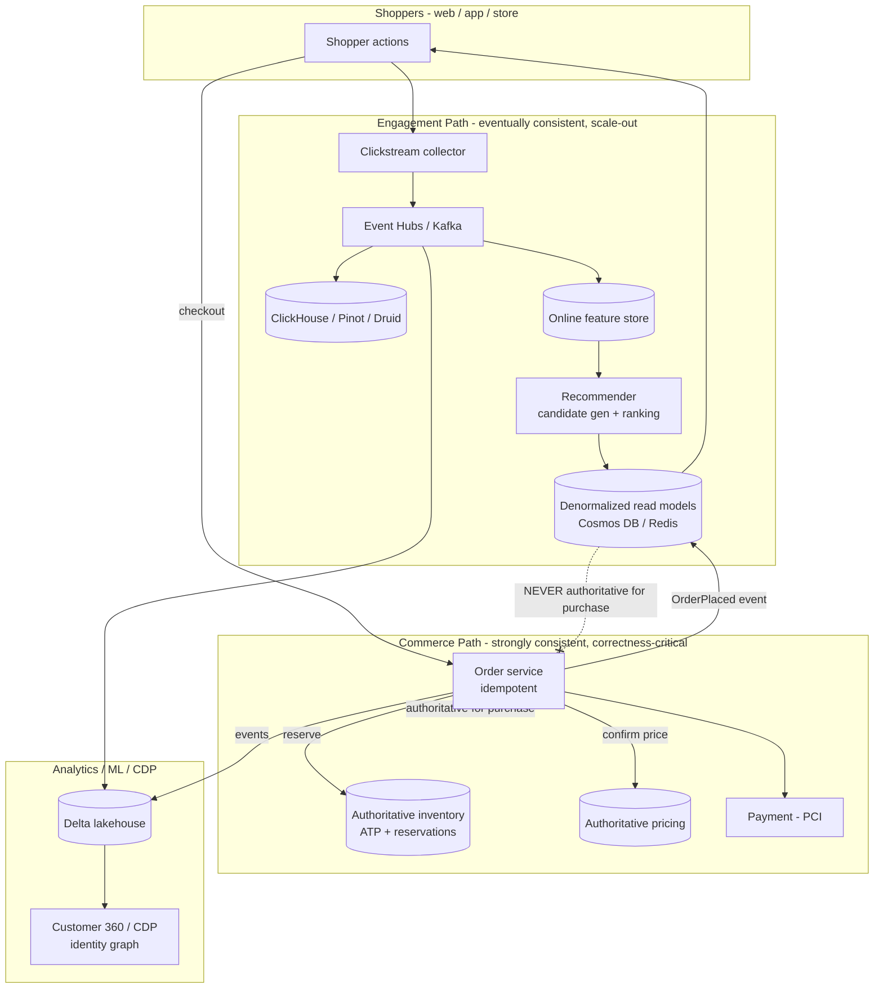
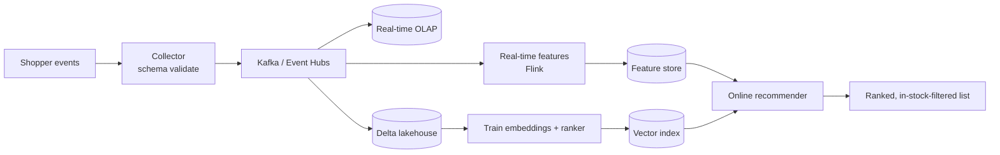
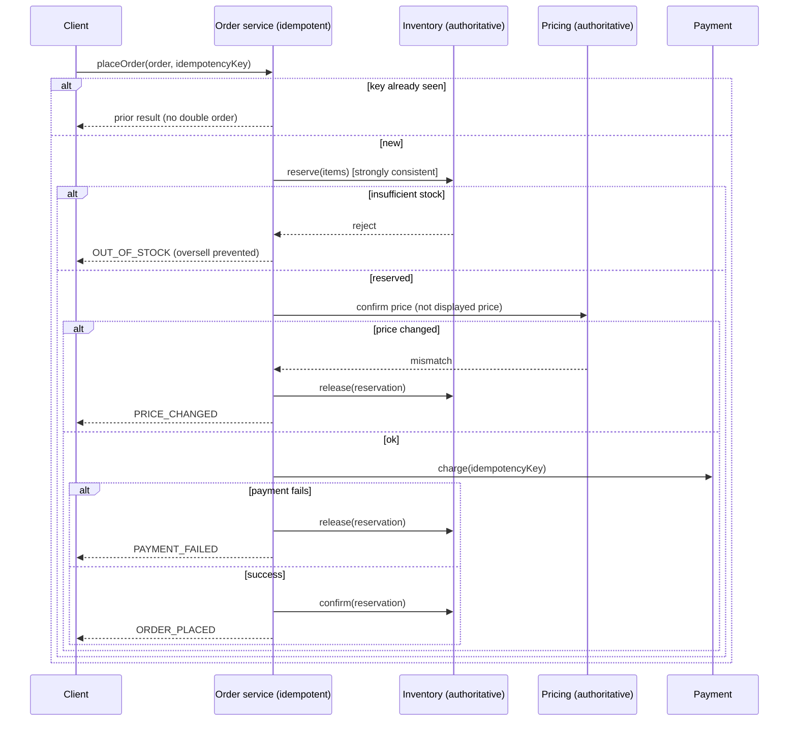

# Retail and E-Commerce Data

> Part of the **Enterprise Data & AI Architecture Handbook** · Phase-17 — Industry Vertical Platforms · Chapter 05 (final chapter of the phase).
> Estimated study time: **60 min reading + ~3h labs**.
> **Prerequisites:** read [Real-Time Analytics (ClickHouse and Druid)](../Phase-07/07_Real_Time_Analytics_ClickHouse_and_Druid.md) and [ML Pipeline Architecture](../Phase-11/06_ML_Pipeline_Architecture.md) first.

---

## Executive Summary

The four prior Phase-17 chapters each defined a regulated or civic vertical by an external constraint: privacy law ([Healthcare Data Platforms](01_Healthcare_Data_Platforms.md)), financial supervision ([Financial Data Platforms](02_Financial_Data_Platforms.md)), safety certification ([Aviation Data Platforms](03_Aviation_Data_Platforms.md)), and public legitimacy ([Smart Cities](04_Smart_Cities.md)). Retail and e-commerce is the phase's fifth and final vertical, and its defining constraint is different again: **extreme, spiky scale where data freshness converts directly into revenue — and where two workloads with opposite consistency needs must coexist on the same platform.** On one side is the **engagement path**: clickstream capture, personalization, and recommendations, where the goal is sub-second, high-throughput, eventually-consistent responsiveness to millions of concurrent shoppers, and where a slightly stale recommendation costs nothing. On the other side is the **commerce path**: inventory, pricing, cart, orders, and payment, where the goal is transactional correctness — you must not oversell the last unit, honor a wrong price, or double-charge a card. A platform that serves personalization off the commerce system of record will not scale; a platform that lets shoppers *buy* against an eventually-consistent personalization read model will oversell and mis-price. The defining discipline of retail data platforms is **separating the eventually-consistent engagement path from the strongly-consistent commerce path**, and — on the single busiest day of the year — shedding the former to protect the latter.

This chapter is Phase-17 Chapter 05 and covers **clickstream and event pipelines** (capturing shopper behavior at scale via event streaming, per [Real-Time Analytics (ClickHouse and Druid)](../Phase-07/07_Real_Time_Analytics_ClickHouse_and_Druid.md)); **recommendation systems** (collaborative filtering, two-tower candidate-generation-plus-ranking, and real-time vs batch recommenders, building on [ML Pipeline Architecture](../Phase-11/06_ML_Pipeline_Architecture.md)); **real-time inventory and pricing** (the correctness-critical commerce path — available-to-promise, reservations, oversell avoidance, and dynamic pricing); **Customer 360 and the CDP** (identity resolution, the unified customer profile, and activation); and **peak-scale (Black Friday) design** (surviving 10-100x load spikes through load leveling, caching, bulkheads, graceful degradation, and idempotency).

The platform bias is **Azure-primary (~60%)** — Azure Event Hubs for clickstream ingestion, Azure Data Explorer (ADX/Kusto) for real-time behavioral analytics, Azure Cosmos DB for low-latency global catalog/cart/inventory read models, Azure Cache for Redis for hot data, Azure Databricks and Microsoft Fabric for the lakehouse and recommender training, Azure Machine Learning for model serving, Microsoft Dynamics 365 Customer Insights as the CDP, and Azure Front Door/CDN plus AKS for scale — **~30% enterprise open source** (Apache Kafka and Flink for event streaming, **Snowplow** for clickstream, ClickHouse/Apache Pinot/Druid for real-time analytics per the prerequisite, Redis and Cassandra/ScyllaDB for low-latency serving, Feast for the feature store, and TensorFlow Recommenders/PyTorch for models) — **~10% AWS/GCP comparison-only** (AWS Kinesis/DynamoDB/Personalize; GCP BigQuery/Pub-Sub/Vertex AI Search for commerce), contrasted honestly on capability and lock-in, including the platform-longevity note that Azure's own managed **Personalizer** service was announced for retirement.

**Bottom line:** a retail data platform is not "a web analytics stack." It is a **dual-path, peak-scale, revenue-in-real-time** platform in which — echoing the dual-path discipline of [Financial Data Platforms](02_Financial_Data_Platforms.md), here driven by scale-and-consistency rather than latency-and-audit — the **eventually-consistent engagement path and the strongly-consistent commerce path are deliberately separated, and the engagement path is shed first under overload.** This chapter's ADR (§40) formalizes it: the commerce path (inventory, pricing, orders, payments) must be transactionally correct and idempotent against an authoritative system of record, and the engagement path's denormalized read models must never be treated as authoritative for a purchase decision — availability and price must be re-confirmed/reserved against the authoritative service at checkout. The two case studies (§40) show what happens when a purchase trusts the fast read model (a flash-sale oversell) and when peak load has no path prioritization (a Black Friday cascade where personalization took down checkout).

---

## Learning Objectives

By the end of this chapter you will be able to:

1. **Design a clickstream / event pipeline** at retail scale — capture, schema, streaming, and real-time behavioral analytics.
2. **Architect a recommendation system** — candidate generation + ranking, collaborative filtering, two-tower models, and the real-time vs batch decision — building on [ML Pipeline Architecture](../Phase-11/06_ML_Pipeline_Architecture.md).
3. **Design a correctness-critical inventory and pricing path** — available-to-promise, reservations, oversell avoidance, idempotent orders, and dynamic pricing.
4. **Build a Customer 360 / CDP** — identity resolution, the unified profile, segmentation, and activation.
5. **Design for peak scale (Black Friday)** — load leveling, caching, bulkheads, graceful degradation, load shedding, and autoscaling.
6. **Separate the eventually-consistent engagement path from the strongly-consistent commerce path**, and prioritize the latter under overload.
7. **Defend a retail platform's clickstream, recommendation, commerce-correctness, CDP, and peak-scale architecture** in engineer, staff engineer, architect, and CTO review settings.

---

## Business Motivation

- **Freshness and relevance convert directly to revenue.** A relevant recommendation, an accurate "in stock" signal, and a fast page directly raise conversion; latency and staleness directly lose sales. Unlike a compliance report, the retail platform's output *is* the revenue mechanism, so its responsiveness is a top-line concern.
- **Peak days concentrate a disproportionate share of annual revenue.** Black Friday/Cyber Monday, Amazon Prime Day, and Alibaba's Singles' Day (11.11) drive load 10-100x above baseline and a large fraction of yearly sales; an outage on those days is a direct, large, and highly visible revenue loss (§4.5, §40 Case Study 2).
- **Overselling and mis-pricing are direct financial and trust losses.** Selling stock you don't have forces cancellations, refunds, and reputational damage; honoring a wrong price can be a large direct loss. Commerce-path correctness (§4.3, §40 ADR-0192) is a bottom-line requirement.
- **Personalization is a proven margin lever.** Recommendation systems drive a substantial share of discovery and revenue for large retailers; a good recommender is one of the highest-ROI investments in the stack (§4.2).
- **The unified customer view unlocks retention and lifetime value.** A Customer 360 / CDP (§4.4) that resolves identity across web, app, and store enables consistent experience, segmentation, and activation — the foundation of retention and CLV programs, and increasingly of privacy-respectful marketing as third-party cookies decline.

---

## History and Evolution

- **1990s — e-commerce and web analytics begin.** Amazon (1994) and the first online stores create the need to capture and analyze web behavior; early web-log analytics (later Google Analytics, Adobe/Omniture) turn page logs into funnels.
- **1998-2003 — collaborative filtering and the modern recommender.** Amazon's **item-to-item collaborative filtering** (published 2003) scales recommendations to millions of users/items and becomes the template for "customers who bought this also bought"; recommendations move from novelty to core revenue driver.
- **2006-2009 — the Netflix Prize.** The $1M competition to improve movie recommendations popularizes **matrix factorization** and drives a generation of recommender research (and, cautionarily, the dataset's re-identification — a privacy lesson echoed in [Data Privacy and PII Protection](../Phase-10/07_Data_Privacy_and_PII_Protection.md)).
- **2010s — big data, streaming, and real-time.** Hadoop then Kafka/streaming (per Phase-07) make clickstream capture and processing at scale routine; **Snowplow** (open-source behavioral data) and event-based analytics replace page-log parsing. Real-time OLAP stores (**Apache Druid** at Metamarkets, **Apache Pinot** at LinkedIn/Uber, ClickHouse at Yandex — the subjects of [Real-Time Analytics (ClickHouse and Druid)](../Phase-07/07_Real_Time_Analytics_ClickHouse_and_Druid.md)) enable sub-second behavioral analytics.
- **2012-2016 — omnichannel and real-time inventory.** BOPIS (buy-online-pickup-in-store), ship-from-store, and unified commerce make **distributed inventory** and available-to-promise a hard, correctness-critical data problem across channels.
- **2015-2020 — deep-learning recommenders and the CDP.** Two-tower/embedding models and deep recommenders (YouTube's candidate-generation-plus-ranking, DLRM) become standard; the **Customer Data Platform (CDP)** category emerges (Segment, Tealium, then Adobe Real-Time CDP, Salesforce Data Cloud, Microsoft Dynamics 365 Customer Insights) to unify customer data and identity.
- **2018-2023 — peak-scale engineering matures.** Alibaba's **Singles' Day**, Amazon **Prime Day**, and ever-larger Black Fridays push peak-scale engineering (queue-based load leveling, aggressive caching, chaos engineering, cell-based architecture) into the mainstream, and public outages on peak days become cautionary tales (§40, CS2).
- **2020-2026 — cookieless, real-time personalization, and generative commerce.** Third-party-cookie deprecation shifts weight to first-party data and the CDP; real-time feature stores (per [Feature Stores with Feast](../Phase-11/02_Feature_Stores_with_Feast.md)) power real-time personalization; and generative/agentic AI (per Phase-12) enters product discovery, search, and conversational commerce — while managed personalization services churn (Azure's **Personalizer** was announced for retirement, §35), reinforcing that the durable asset is the data and the recommender discipline, not any single managed service.

---

## Why This Technology Exists

Retail data platforms exist because commerce at internet scale demands two things that pull architecture in opposite directions: **respond to millions of concurrent shoppers in real time** (capture their behavior, personalize their experience, recommend the next item — all with sub-second latency and enormous throughput) and **execute purchases correctly** (never oversell, never mis-price, never double-charge — with transactional integrity across a distributed inventory). A generic real-time analytics platform (per [Real-Time Analytics (ClickHouse and Druid)](../Phase-07/07_Real_Time_Analytics_ClickHouse_and_Druid.md)) can serve the first; a generic transactional system can serve the second; but a retail platform must do both at once, at peak loads 10-100x its baseline, on the days that matter most. The reason a distinct "retail data platform" architecture exists is that it must *separate* these two paths — an eventually-consistent, horizontally-scalable engagement path and a strongly-consistent, correctness-critical commerce path — connect them safely (personalize freely, but confirm the purchase against the source of truth), and survive the peak by degrading the former to protect the latter. Take away that separation and the platform either cannot scale or cannot be trusted to take money correctly (§40, ADR-0192).

---

## Problems It Solves

- **Capturing and analyzing shopper behavior at scale**, resolved by clickstream event pipelines (Kafka/Event Hubs → ClickHouse/Pinot/Druid, §4.1) that turn billions of events into real-time funnels, segments, and features.
- **Relevant discovery and personalization**, resolved by recommendation systems (candidate generation + ranking, §4.2) that surface the right products and drive conversion.
- **Correct, real-time inventory and pricing across channels**, resolved by an authoritative inventory/pricing service with available-to-promise and reservations (§4.3, §40 ADR-0192) that avoids overselling and mis-pricing.
- **A unified view of the customer**, resolved by identity resolution and a CDP (§4.4) that stitches web/app/store behavior into one profile for consistent experience and activation.
- **Surviving extreme, spiky peak load**, resolved by load leveling, caching, bulkheads, and graceful degradation (§4.5) that keep the site up and taking orders on Black Friday.
- **Real-time features for personalization and fraud**, resolved by a feature store (per [Feature Stores with Feast](../Phase-11/02_Feature_Stores_with_Feast.md)) serving fresh features to online models.

---

## Problems It Cannot Solve

- **It cannot make an eventually-consistent read model safe to purchase against.** The fast, denormalized engagement store is *for engagement*; treating it as authoritative for availability/price at checkout causes oversell and mis-pricing (§40, Case Study 1). Only the authoritative commerce service can be trusted for a purchase — the technology cannot paper over that with caching.
- **It cannot eliminate the CAP trade-off for distributed inventory.** Global, multi-channel inventory is a distributed-consistency problem (per [CAP and PACELC](../Phase-02/04_CAP_and_PACELC.md)); the platform can choose reservations and strong consistency for the last units and looser consistency for abundant stock, but it cannot have unbounded availability *and* perfect global consistency *and* low latency simultaneously.
- **It cannot make recommendations fair, unbiased, or manipulation-free by default.** Recommenders reflect and amplify popularity and historical bias, and can raise dark-pattern and personalized-pricing ethics questions ([Responsible AI](../Phase-11/07_Responsible_AI.md)); these are governance concerns the technology surfaces, not solves.
- **It cannot resolve identity perfectly.** Customer 360 identity resolution is probabilistic across devices/channels; false merges/splits degrade experience and can create privacy problems (the MDM/EMPI-style limit from [Master Data Management](../Phase-08/05_Master_Data_Management.md)).
- **It cannot make peak scale free of capacity planning.** Autoscaling has limits (cold starts, downstream bottlenecks, quota); surviving Black Friday requires deliberate load leveling, pre-warming, and load-shedding design (§4.5, §40 CS2), not just "the cloud will scale."
- **It cannot ignore privacy.** Behavioral and customer data is PII under GDPR/CCPA; personalization and CDP activation operate under consent and the cookieless shift (§23), which are governance requirements the platform must respect.

---

## Core Concepts

### 5.1 Clickstream and event pipelines

Every shopper action — page view, search, product view, add-to-cart, checkout step, purchase — is an **event**. At retail scale this is billions of events/day. The pipeline:

- **Capture** — a client SDK or tag (Snowplow, GA4, a first-party collector) emits structured events with a schema (event type, user/session id, product, timestamp, context).
- **Stream** — events flow into Kafka/Event Hubs, partitioned by user/session for ordering (per [Message Brokers and Queues](../Phase-14/07_Message_Brokers_and_Queues.md)).
- **Serve real-time analytics** — a real-time OLAP store (**ClickHouse / Apache Pinot / Apache Druid**, the subjects of [Real-Time Analytics (ClickHouse and Druid)](../Phase-07/07_Real_Time_Analytics_ClickHouse_and_Druid.md)) powers sub-second funnels, live dashboards, and behavioral segments.
- **Land in the lakehouse** — events also land in Delta (medallion) for model training, attribution, and historical analysis.
- **Schema governance** — clickstream schemas evolve constantly; a schema registry / data contract (per [Data Contracts](../Phase-08/07_Data_Contracts.md)) prevents a client change from silently breaking downstream analytics.

Clickstream is the raw material for personalization, real-time features, funnel analysis, and attribution.

### 5.2 Recommendation systems

Modern recommenders are a **two-stage** architecture (the YouTube/industry pattern):

- **Candidate generation** — from millions of items, cheaply retrieve hundreds of plausible candidates. Techniques: **collaborative filtering** (item-to-item, Amazon's 2003 approach; matrix factorization, Netflix-Prize-era), **two-tower embedding models** (user tower + item tower, nearest-neighbor retrieval via a vector index per [Vector Databases (Qdrant and Milvus)](../Phase-13/01_Vector_Databases_Qdrant_and_Milvus.md)), and content-based/session-based methods.
- **Ranking** — a heavier model scores the candidates with rich features (user history, context, real-time signals) to produce the final ordered list.
- **Real-time vs batch** — batch recommenders precompute recommendations (simple, cheap, stale); real-time recommenders react to the current session (a shopper who just viewed hiking boots) using online features from a feature store (per [Feature Stores with Feast](../Phase-11/02_Feature_Stores_with_Feast.md)) and low-latency serving (per [Model Serving and Ray](../Phase-11/04_Model_Serving_and_Ray.md)). The decision follows [ML Pipeline Architecture](../Phase-11/06_ML_Pipeline_Architecture.md)'s freshness/latency framing.
- **Cold start** — new users/items have no interaction history; content features and popularity fallbacks bridge the gap.
- **Evaluation** — offline (recall@k, NDCG) plus online A/B testing on business metrics (conversion, revenue), never offline alone (per [ML Pipeline Architecture](../Phase-11/06_ML_Pipeline_Architecture.md) and [Evaluation and Guardrails](../Phase-12/09_Evaluation_and_Guardrails.md)).

### 5.3 Real-time inventory and pricing

This is the **correctness-critical commerce path**, and it is where retail's hardest data-consistency problems live:

- **Available-to-promise (ATP)** — the real, sellable quantity, accounting for on-hand stock, reservations, in-transit, and channel allocation. In omnichannel retail (BOPIS, ship-from-store), inventory is *distributed* across stores and warehouses — a genuine distributed-consistency problem (per [CAP and PACELC](../Phase-02/04_CAP_and_PACELC.md)).
- **Reservations** — to avoid overselling a scarce item, add-to-cart or checkout **reserves** stock against the authoritative inventory service (a soft hold with a TTL), rather than trusting a cached availability read. The last units especially demand strong consistency.
- **Oversell avoidance** — the central failure mode (§40, Case Study 1): showing "in stock" from a fast, eventually-consistent read model and letting purchases proceed without an authoritative reservation.
- **Dynamic pricing** — price optimization (demand, competitor prices, inventory levels, promotions). The critical rule: the price *shown* (from the denormalized catalog, for speed) must be **re-confirmed against the authoritative pricing service at checkout**, so a stale/wrong displayed price is never silently charged. Personalized pricing raises real ethics/legal concerns (§23).
- **Idempotent orders and payments** — order submission and payment must be idempotent (an idempotency key per order attempt) so a retry or double-click never double-charges or double-decrements inventory — the exactly-once-effect discipline from [Message Brokers and Queues](../Phase-14/07_Message_Brokers_and_Queues.md).

### 5.4 Customer 360 and the CDP

A **Customer Data Platform (CDP)** builds a unified, activatable customer profile:

- **Identity resolution** — stitching events across web, app, and store into one customer via deterministic (login, email, loyalty id) and probabilistic (device, behavior) matching — an **identity graph** (the MDM/EMPI discipline of [Master Data Management](../Phase-08/05_Master_Data_Management.md) applied to customers). False merges/splits are the key risk.
- **Unified profile** — attributes, behavior, purchase history, computed traits (CLV, segments, propensities).
- **Segmentation & activation** — building audiences and pushing them to marketing/personalization channels ("activation").
- **Privacy & consent** — the CDP is a concentration of PII; consent management, GDPR/CCPA rights (including deletion propagation, per [Data Privacy and PII Protection](../Phase-10/07_Data_Privacy_and_PII_Protection.md)), and the cookieless/first-party-data shift are central governance concerns (§23).
- **Real vendors** — Microsoft Dynamics 365 Customer Insights, Adobe Real-Time CDP, Salesforce Data Cloud, Segment; or a "composable CDP" built on the lakehouse (per [Lakehouse Architecture](../Phase-05/02_Lakehouse_Architecture.md)).

### 5.5 Peak-scale (Black Friday) design

The single most distinctive retail engineering challenge: surviving **10-100x baseline load** on predictable peak days:

- **Load leveling** — queue-based load leveling (per [Enterprise Integration Patterns](../Phase-14/06_Enterprise_Integration_Patterns.md)) absorbs spikes: accept orders into a durable queue and process at a sustainable rate rather than synchronously overloading the backend.
- **Caching everywhere** — CDN for static/catalog, edge caching, Redis for hot data (cart, session, catalog reads); the denormalized read model (§4.3) exists partly for this.
- **Bulkheads and graceful degradation** — isolate the engagement path from the commerce path so a recommendation-service overload cannot take down checkout (§40, Case Study 2); the resilience patterns of [Microservices Architecture](../Phase-14/02_Microservices_Architecture.md) (bulkhead, circuit breaker, timeout, fallback).
- **Load shedding with priority** — under overload, shed non-critical work first: turn off heavy personalization/recommendations before you ever compromise checkout. **Protect the ability to take money.**
- **Autoscaling + pre-warming** — scale ahead of the spike (predictable date), pre-warm caches and connection pools, and plan for downstream bottlenecks (a database or payment gateway that doesn't autoscale).
- **Chaos and game-day testing** — deliberately test failure and peak scenarios before the real peak.

---

## Internal Working

### 6.1 Clickstream ingestion and real-time serving

A client emits an event; a collector validates it against the schema (rejecting/quarantining malformed events rather than corrupting analytics) and publishes to Kafka/Event Hubs partitioned by session. A stream processor (Flink/Stream Analytics) enriches and computes real-time aggregates and features; the enriched stream feeds a real-time OLAP store (ClickHouse/Pinot/Druid) for sub-second queries and lands in Delta for batch. Real-time features (session activity, recent views) are written to the online feature store for the recommender. The correctness concerns are ordering (per-session partitioning), idempotency (dedup on event id — a double-fired tag must not double-count), and schema evolution (a contract so a new client field doesn't break the pipeline).

### 6.2 Recommendation serving internals

Offline, embeddings and candidate models train on clickstream/purchase history (per [ML Pipeline Architecture](../Phase-11/06_ML_Pipeline_Architecture.md)) and item embeddings are indexed in a vector store (per [Vector Databases (Qdrant and Milvus)](../Phase-13/01_Vector_Databases_Qdrant_and_Milvus.md)). Online, a request arrives with a user/session context; the user embedding is computed (or looked up), **candidate generation** retrieves nearest-neighbor items from the vector index, real-time features are fetched from the feature store, the **ranking** model scores candidates, and business rules (in-stock filter, diversity, merchandising) post-process the list — all within a tight latency budget. Critically, the recommender may *rank* an item, but availability/price is confirmed on the commerce path before purchase (§40, ADR-0192). Online evaluation runs via A/B test infrastructure.

### 6.3 Order placement with inventory reservation (the commerce path)

At checkout, the flow is strongly consistent and idempotent: the client submits an order with an **idempotency key**; the order service checks the key (a retry returns the same result, never a second order); it **reserves** inventory against the authoritative inventory service (an atomic decrement/hold, strongly consistent for scarce items — rejecting if insufficient, the oversell guard); it **re-confirms price** against the authoritative pricing service (not the displayed catalog price); it authorizes payment idempotently; and on success commits the order and confirms the reservation, emitting an `OrderPlaced` event (per [Event-Driven Architecture](../Phase-14/01_Event_Driven_Architecture.md)) that asynchronously updates the read models, CDP, and analytics. Compensation/saga logic (per [Event Sourcing](../Phase-14/04_Event_Sourcing.md) and [Microservices Architecture](../Phase-14/02_Microservices_Architecture.md)) handles partial failures (payment fails after reservation → release the hold). This path is the system of record; the engagement read models are downstream, eventually-consistent projections.

---

## Architecture

The reference architecture separates two paths sharing common data infrastructure:

1. **Engagement path (eventually consistent, scale-out).** Clickstream capture → Kafka/Event Hubs → stream processing → real-time OLAP (ClickHouse/Pinot/Druid) + online feature store; recommendation serving (candidate generation + ranking); denormalized catalog/cart read models (Cosmos DB/Redis) for fast reads. Optimized for throughput and latency; a stale read is acceptable.
2. **Commerce path (strongly consistent, correctness-critical).** The authoritative inventory, pricing, order, and payment services; reservations, idempotent orders, ATP. Optimized for correctness; the system of record for anything involving money or stock (§40, ADR-0192).
3. **Analytics & ML backbone.** Delta lakehouse (medallion) for training data, attribution, and reporting; recommender and forecasting model training (Databricks/Fabric + Azure ML).
4. **Customer 360 / CDP.** Identity resolution + unified profile + segmentation/activation, fed by both paths.
5. **Edge & scale layer.** CDN/Front Door, edge caching, autoscaling (AKS), queue-based load leveling — the peak-scale infrastructure that keeps both paths up, shedding engagement before commerce under overload (§4.5).

The two paths are connected by events: the commerce path emits authoritative events (`OrderPlaced`, `InventoryChanged`, `PriceChanged`) that update the engagement read models and analytics — a one-way flow from source of truth to projections.

---

## Components

- **Clickstream collector** — Snowplow / first-party tag / GA4.
- **Event streaming** — Kafka / Azure Event Hubs.
- **Stream processing** — Flink / Azure Stream Analytics.
- **Real-time OLAP** — ClickHouse / Apache Pinot / Apache Druid (per [Real-Time Analytics (ClickHouse and Druid)](../Phase-07/07_Real_Time_Analytics_ClickHouse_and_Druid.md)).
- **Feature store** — Feast / Databricks Feature Store (per [Feature Stores with Feast](../Phase-11/02_Feature_Stores_with_Feast.md)).
- **Recommender** — candidate generation (vector index) + ranking model; model serving.
- **Vector index** — for embedding retrieval (per [Vector Databases (Qdrant and Milvus)](../Phase-13/01_Vector_Databases_Qdrant_and_Milvus.md)).
- **Commerce services** — authoritative inventory (ATP/reservations), pricing, order, payment.
- **Low-latency read stores** — Cosmos DB / Cassandra/ScyllaDB / Redis for catalog, cart, session, read models.
- **Lakehouse** — Delta (medallion) for training/attribution/reporting.
- **CDP** — Dynamics 365 Customer Insights / composable CDP; identity graph.
- **Edge/scale** — CDN/Front Door, AKS, queue-based load leveling.

---

## Metadata

- **Product catalog / PIM** — the product master (attributes, categories, variants); the reference data every path depends on (the retail analogue of a security master).
- **Event schemas / data contracts** — clickstream event definitions and their evolution (per [Data Contracts](../Phase-08/07_Data_Contracts.md)); the interoperability contract between clients and analytics.
- **Identity graph** — the customer identity resolution metadata (deterministic + probabilistic links).
- **Feature metadata** — feature definitions, freshness, and lineage (per [Feature Stores with Feast](../Phase-11/02_Feature_Stores_with_Feast.md)).
- **Inventory/pricing reference** — store/warehouse topology, channel allocation, price/promotion rules.
- **Consent metadata** — per-customer consent and preferences driving CDP activation and personalization (GDPR/CCPA).
- **Model metadata** — recommender/forecast model versions, A/B assignments, and online metrics (per [MLOps and MLflow](../Phase-11/03_MLOps_and_MLflow.md)).

---

## Storage

- **Real-time OLAP** — ClickHouse/Pinot/Druid for behavioral analytics (columnar, high-ingest, sub-second query).
- **Low-latency operational stores** — Cosmos DB (global, low-latency) for catalog/cart/read models; Redis for hot session/cart/cache; Cassandra/ScyllaDB for high-write cart/inventory-event stores.
- **Authoritative commerce store** — a strongly-consistent store (relational or Cosmos DB with strong consistency) for inventory/orders/payments — the system of record.
- **Lakehouse** — Delta (medallion) for clickstream history, training data, attribution, reporting (per [Delta Lake](../Phase-04/04_Delta_Lake.md), [Medallion Architecture](../Phase-05/03_Medallion_Architecture.md)).
- **Vector store** — item/user embeddings for candidate generation.
- **Tiering** — hot recent behavior for real-time/features; historical clickstream tiered/compressed (clickstream is huge, per [Compression and Encoding](../Phase-04/08_Compression_and_Encoding.md)).

---

## Compute

- **Streaming** — clickstream enrichment, real-time features, and real-time inventory events (Flink/Stream Analytics).
- **Real-time serving** — recommendation inference, feature retrieval, and read-model queries under tight latency budgets (per [Model Serving and Ray](../Phase-11/04_Model_Serving_and_Ray.md)).
- **Batch/ML** — recommender training, demand forecasting, CLV, attribution on Spark/Databricks.
- **Transactional** — the commerce path's order/inventory/payment processing (strongly consistent).
- **Elastic autoscaling** — everything must scale for peak; the commerce path especially must be protected and provisioned (autoscale + headroom), while the engagement path can be shed (§4.5).

---

## Networking

- **CDN / edge** — Front Door/CDN for static, catalog, and cached content; the first line of peak-scale defense.
- **Global low-latency** — multi-region read models (Cosmos DB) for global shoppers.
- **Segmentation** — the commerce/payment path is segmented and PCI-scoped (per [Compliance and Regulatory Frameworks](../Phase-10/06_Compliance_and_Regulatory_Frameworks.md)); payment handling is a tightly controlled zone.
- **Private connectivity & egress control** — customer PII protected (per [Network Security and Zero Trust](../Phase-10/04_Network_Security_and_Zero_Trust.md)).
- **Rate limiting / WAF** — at the edge, both for security (bot/scraper/fraud) and for load shedding under peak.

---

## Security

- **PCI-DSS for payments** — cardholder data is tightly regulated; tokenization and scope minimization keep most of the platform out of PCI scope (per [Data Security and Encryption](../Phase-10/03_Data_Security_and_Encryption.md)).
- **PII protection** — behavioral and customer data is PII (GDPR/CCPA); consent, minimization, and deletion propagation (per [Data Privacy and PII Protection](../Phase-10/07_Data_Privacy_and_PII_Protection.md)), acute for the CDP.
- **Fraud** — payment fraud, account takeover, promo/coupon abuse, scalping/bots on scarce items — real-time fraud scoring (echoing [Financial Data Platforms](02_Financial_Data_Platforms.md) §2.3) and bot management.
- **Access control** — scoped access to customer/commerce data (ABAC per [Identity and Access Management with Microsoft Entra](../Phase-10/02_Identity_and_Access_Management_with_Entra.md)).
- **Commerce-path integrity** — idempotency and reservation logic are security-relevant (prevent oversell exploitation, price manipulation, duplicate-order abuse).
- **Bot defense at peak** — scarce-item drops attract bots; edge rate-limiting and bot management protect both inventory fairness and infrastructure.

---

## Performance

- **Page/API latency** — directly tied to conversion; every 100ms matters. Caching, read models, and edge delivery are the levers.
- **Recommendation latency** — must fit inside the page-render budget (tens of ms); candidate generation + ranking optimized, features pre-fetched.
- **Real-time analytics** — sub-second funnels/segments from ClickHouse/Pinot/Druid (the prerequisite's core capability).
- **Commerce-path latency** — checkout must be fast *and* correct; the reservation/confirm adds latency but is non-negotiable — optimize it, don't skip it.
- **Peak tail latency** — p99 under 10-100x load is the real test; the architecture is designed around the peak, not the average.

---

## Scalability

- **Engagement path scales horizontally** — clickstream, real-time OLAP, recommendation serving, and read models all scale out; this is the "easy" path (eventual consistency permits it).
- **Commerce path scales with more care** — strong consistency and inventory correctness limit naive horizontal scaling; partition by product/store, use reservations, and keep the authoritative store's hot paths tight. The scarce-item contention (everyone buying the one hot item) is the hardest scale problem.
- **Decoupling the paths** is itself the key scalability move — the engagement path's massive read volume never contends with the commerce path's correctness-critical writes (§40, ADR-0192).
- **Cell-based architecture** — large retailers partition into independent cells to bound blast radius and scale linearly.
- **Queue-based load leveling** absorbs write spikes into the commerce path.

---

## Fault Tolerance

- **Idempotency everywhere on the commerce path** — idempotency keys for orders/payments, dedup on events, so retries never double-charge or double-decrement (per [Message Brokers and Queues](../Phase-14/07_Message_Brokers_and_Queues.md)).
- **Reservation TTLs and compensation** — held stock expires if the order doesn't complete; sagas release reservations on downstream failure (per [Microservices Architecture](../Phase-14/02_Microservices_Architecture.md), [Event Sourcing](../Phase-14/04_Event_Sourcing.md)).
- **Graceful degradation** — if recommendations/personalization fail, fall back to popularity/merchandised defaults; the site stays up and sells (the engagement path is *degradable*).
- **Protect the commerce path** — bulkheads ensure an engagement-path failure cannot cascade into checkout (§40, Case Study 2).
- **Read-model rebuildability** — eventually-consistent read models can be rebuilt from the authoritative events; they are projections, not truth.
- **Multi-region resilience** — global retailers need regional failover for both availability and data-residency.

---

## Cost Optimization

- **Tier clickstream aggressively** — hot recent for real-time/features, historical tiered/compressed; clickstream volume is enormous.
- **Right-size real-time vs batch recommendations** — real-time serving is costlier; use it where session-freshness drives conversion, batch precompute where it doesn't (per [ML Pipeline Architecture](../Phase-11/06_ML_Pipeline_Architecture.md)).
- **Cache to cut compute and cost** — caching reduces both latency and backend cost; the read model is a cost as well as a scale lever.
- **Scale for peak, but scale back down** — autoscale up for Black Friday and *back down* after; don't run peak capacity year-round. Reserved capacity for the steady baseline, elastic/spot for the burst and for batch training.
- **Load-shed to control cost under overload** — shedding expensive personalization under peak protects both the commerce path and the compute bill.

**Worked FinOps example.** A retailer provisions for Black Friday at ~30x baseline. Running that capacity year-round would be ruinous. Instead: reserved capacity covers the steady baseline; **autoscaling** handles daily variation; and for the predictable peak, capacity is scaled up ahead of the event and scaled back down within days after — so the 30x capacity is paid for a handful of days, not 365. Combined with **spot** compute for recommender training and batch analytics (~60-70% off) and aggressive clickstream tiering (hot-recent vs archived, ~70% storage saving), the platform runs at a fraction of a naively-peak-provisioned cost. The commerce path keeps modest headroom year-round (correctness and availability are non-negotiable), but the elastic, sheddable engagement path is where the peak cost is concentrated and controlled.

---

## Monitoring

- **Business metrics in real time** — conversion, revenue, cart abandonment, add-to-cart rate; a drop is the earliest signal something is wrong (a broken checkout shows as conversion collapse before infra alarms).
- **Commerce-path integrity** — oversell incidents, reservation failures, price-mismatch-at-checkout events, duplicate orders — the correctness signals (§40, CS1).
- **Recommendation quality** — online CTR/conversion, A/B metrics, model drift (per [ML Pipeline Architecture](../Phase-11/06_ML_Pipeline_Architecture.md)).
- **Latency & throughput** — p99 page/API/recommendation/checkout latency, especially at peak.
- **Peak-scale health** — queue depth (load leveling), autoscaling status, cache hit rates, downstream saturation, bulkhead/circuit-breaker state.
- **Fraud/bots** — fraud scores, bot traffic, scalper detection on scarce items.

## Operational Response Playbook

| Signal | Detection | Remediation |
|---|---|---|
| **Oversell / price-mismatch at checkout** (orders placed for out-of-stock items, or displayed price ≠ charged price) | Commerce-path integrity monitor: reservation-vs-fulfillment mismatch, negative ATP, price-mismatch events; customer cancellations spike | Immediately switch the affected item(s) to **reserve-and-confirm against the authoritative service** at add-to-cart/checkout (stop trusting the cached read model); reconcile oversold orders (honor/cancel per policy); root-cause the path that let a purchase proceed on eventually-consistent data — the §40 ADR-0192 failure. For price mismatch, enforce authoritative-price re-confirmation at checkout. |
| **Peak-load cascade** (checkout degrading because a non-critical service — recommendations/personalization — is saturating shared resources) | Rising checkout latency/errors correlated with engagement-path saturation; circuit breakers tripping; queue depth climbing | **Shed the engagement path first**: disable heavy personalization/recommendations (fall back to defaults), trip circuit breakers to isolate the failing service, and protect checkout capacity. Verify bulkheads are isolating the commerce path; scale the commerce path and its bottlenecks (DB/payment). This is the §40 Case Study 2 failure — remediate by enforcing bulkheads + priority load-shedding so engagement can never starve commerce. |

---

## Observability

- **Funnel & conversion observability** — real-time funnels (view → cart → checkout → purchase) as the primary business-health signal.
- **Commerce-path traceability** — end-to-end order/reservation/payment tracing with idempotency-key correlation, so an oversell or double-charge is diagnosable (per [Message Brokers and Queues](../Phase-14/07_Message_Brokers_and_Queues.md) delivery semantics).
- **Recommendation observability** — feature freshness, model version, A/B assignment, and online metrics per request.
- **Distributed tracing** across the many services (per [Microservices Architecture](../Phase-14/02_Microservices_Architecture.md)) for latency attribution at peak.
- **Read-model lag observability** — how stale is the engagement read model vs the authoritative source (acceptable for engagement, must be bounded).
- **Data-quality observability** — clickstream schema conformance, event dedup, catalog integrity.

---

## Governance

- **Consumer-privacy governance** — GDPR/CCPA consent, data-subject rights (deletion propagation across clickstream, CDP, and derived models, per [Data Privacy and PII Protection](../Phase-10/07_Data_Privacy_and_PII_Protection.md)), and the cookieless/first-party-data shift — acute for the CDP.
- **PCI-DSS governance** — payment-data scope minimization, tokenization, and controls.
- **Recommendation & pricing ethics** — dark-pattern avoidance, personalized-pricing fairness/legality, and recommender fairness/bias (per [Responsible AI](../Phase-11/07_Responsible_AI.md)); an area of growing regulatory attention.
- **Model governance** — recommender/forecast model validation, A/B rigor, and drift monitoring (per [MLOps and MLflow](../Phase-11/03_MLOps_and_MLflow.md), [ML Pipeline Architecture](../Phase-11/06_ML_Pipeline_Architecture.md)).
- **Data quality & contracts** — clickstream and catalog data contracts (per [Data Contracts](../Phase-08/07_Data_Contracts.md)) preventing silent breakage.
- **Commerce-correctness governance** — the ADR-0192 discipline as an enforced standard, not a convention.

---

## Trade-offs

- **Eventual consistency (engagement) vs strong consistency (commerce)** — the defining trade-off; resolved by *separating* the paths, using eventual consistency for reads and strong consistency for the purchase (§40, ADR-0192).
- **Real-time vs batch recommendations** — real-time reacts to the session (higher conversion) but costs more and is more complex; batch is cheap and simple but stale.
- **Personalization value vs privacy** — richer personalization needs more data; consent and the cookieless shift constrain it — a governance-balanced trade-off.
- **Inventory availability vs consistency (CAP)** — showing generous availability (looser consistency, better UX) vs guaranteeing no oversell (stronger consistency, occasional "unavailable"); differentiate by scarcity (strong for last units).
- **Peak capacity cost vs risk** — over-provisioning wastes money; under-provisioning risks the biggest revenue day; load leveling + shedding + autoscaling balance it.
- **Build vs buy the CDP** — a managed CDP is fast to value but adds cost/lock-in; a composable CDP on the lakehouse is flexible but more engineering.

---

## Decision Matrix

| Decision | Choose A | Choose B | Deciding factor |
|---|---|---|---|
| Purchase-time availability/price | **Authoritative service (reserve/confirm)** | *(never the cached read model)* | Always confirm/reserve against the source of truth at checkout (§40 ADR-0192); the read model is for display only |
| Recommendations | **Real-time (session-aware)** | **Batch precomputed** | Session freshness drives conversion → real-time; low-freshness-sensitivity or cost-constrained → batch |
| Real-time analytics store | **ClickHouse / Pinot / Druid** | **Warehouse (batch)** | Sub-second behavioral queries → real-time OLAP (per prereq); periodic reporting → warehouse |
| Inventory consistency | **Strong (reservations)** | **Eventual (cached availability)** | Scarce/high-contention items → strong; abundant stock, UX-first → eventual with periodic reconciliation |
| CDP | **Managed (D365 Customer Insights)** | **Composable (lakehouse)** | Fast time-to-value, accepted lock-in → managed; flexibility/control, engineering capacity → composable |
| Peak strategy | **Load-level + shed engagement + autoscale** | *(never synchronous peak processing)* | Always: queue-level writes, shed engagement before commerce, pre-warm and autoscale (§4.5) |

---

## Design Patterns

- **Dual-path separation** — eventually-consistent engagement path vs strongly-consistent commerce path, connected by authoritative events (§40, ADR-0192).
- **Reserve-and-confirm at checkout** — reserve inventory and re-confirm price against the source of truth before taking money.
- **Idempotent commerce** — idempotency keys for orders/payments; exactly-once effect.
- **Candidate generation + ranking** — the two-stage recommender.
- **Queue-based load leveling** — absorb peak write spikes into a durable queue.
- **Bulkhead + priority load-shedding** — isolate engagement from commerce; shed engagement first under overload (§40, CS2).
- **CQRS-style read models** — denormalized engagement projections off the authoritative commerce events (per [CQRS](../Phase-14/03_CQRS.md)).
- **Composable/managed CDP with identity graph** — unified profile from deterministic + probabilistic identity resolution.

## Anti-patterns

- **Purchasing against the eventually-consistent read model** — the oversell/mis-price failure (§40, CS1).
- **No idempotency on orders/payments** — double-charges and double-decrements on retry.
- **No path isolation at peak** — recommendations taking down checkout (§40, CS2).
- **Synchronous peak processing** — no load leveling, so a spike overloads the backend directly.
- **Offline-only recommender evaluation** — shipping on offline metrics without online A/B.
- **Treating identity resolution as certain** — false merges creating wrong profiles / privacy issues.
- **Peak capacity year-round** — paying for 30x capacity 365 days a year.

## Common Mistakes

- Showing "in stock" from a cache and letting checkout proceed without reservation.
- Charging the displayed (stale) price instead of re-confirming the authoritative price.
- No idempotency key, so a double-click creates two orders.
- Personalization overload starving checkout at peak (no bulkhead).
- Unbounded read-model staleness with no lag monitoring.
- Clickstream schema changes silently breaking analytics (no contract).
- Ignoring deletion propagation across CDP/clickstream/models for GDPR.

## Best Practices

- Separate engagement and commerce paths; connect via authoritative events; reserve-and-confirm at checkout (ADR-0192).
- Make orders/payments idempotent; use reservation TTLs and compensation sagas.
- Two-stage recommenders; evaluate online (A/B), not offline alone.
- Serve behavioral analytics from a real-time OLAP store (per the prerequisite).
- Design for peak: load leveling, caching, bulkheads, priority load-shedding, autoscale + pre-warm, game-days.
- Govern clickstream/catalog with data contracts; propagate deletions for privacy.
- Right-size real-time vs batch recommendations; scale peak capacity up and back down.
- Treat the CDP as a PII concentration: consent, minimization, rights.

---

## Enterprise Recommendations

- **Enforce the dual-path discipline** (ADR-0192): the commerce path is the transactionally-correct, idempotent system of record; the engagement path's read models are display-only and never authoritative for a purchase. Reserve inventory and re-confirm price against the source of truth at checkout.
- **Engineer for the peak deliberately** — load leveling, caching, bulkheads, priority load-shedding (shed engagement before commerce), autoscale-and-pre-warm, and game-day testing; provision the commerce path with protected headroom.
- **Adopt two-stage real-time recommenders** where session freshness drives conversion, batch where it doesn't; evaluate online.
- **Serve real-time behavioral analytics** from ClickHouse/Pinot/Druid (per [Real-Time Analytics (ClickHouse and Druid)](../Phase-07/07_Real_Time_Analytics_ClickHouse_and_Druid.md)); land everything in the lakehouse for training/attribution.
- **Build the CDP with privacy first** — consent, minimization, deletion propagation, and readiness for the cookieless/first-party-data world.
- **Right-size cost** — reserved baseline, elastic/spot for burst and training, aggressive clickstream tiering, scale peak up-and-down.
- **Treat managed personalization services as replaceable** (Azure Personalizer's retirement, §35) — own the data and the recommender discipline.

---

## Azure Implementation

- **Clickstream & streaming** — **Azure Event Hubs** (Kafka-compatible) for event ingestion; **Azure Stream Analytics** or Flink for enrichment and real-time features.
- **Real-time analytics** — **Azure Data Explorer (ADX/Kusto)** for sub-second behavioral analytics (the managed real-time OLAP, alongside ClickHouse/Pinot/Druid per [Real-Time Analytics (ClickHouse and Druid)](../Phase-07/07_Real_Time_Analytics_ClickHouse_and_Druid.md)).
- **Low-latency serving** — **Azure Cosmos DB** (global, low-latency, tunable consistency — strong for the commerce read paths that need it, session/eventual for engagement) for catalog/cart/read models; **Azure Cache for Redis** for hot session/cart/cache.
- **Lakehouse & ML** — **Azure Databricks** + **Delta Lake** (medallion) and **Microsoft Fabric** for clickstream history, recommender/forecast training, and attribution; **Databricks Feature Store** / Feast (per [Feature Stores with Feast](../Phase-11/02_Feature_Stores_with_Feast.md)); **Azure Machine Learning** for model serving (per [Model Serving and Ray](../Phase-11/04_Model_Serving_and_Ray.md)); vector search (Azure AI Search / Cosmos DB) for candidate generation.
- **CDP** — **Microsoft Dynamics 365 Customer Insights** as the managed CDP (identity resolution, unified profile, segmentation/activation), or a composable CDP on the lakehouse.
- **Commerce services** — strongly-consistent Cosmos DB / Azure SQL for inventory/orders/payments; **Azure Service Bus** for queue-based load leveling and idempotent order processing (per [Message Brokers and Queues](../Phase-14/07_Message_Brokers_and_Queues.md)).
- **Scale & edge** — **Azure Front Door / CDN**, **AKS** with autoscaling (HPA/KEDA per [Kubernetes](../Phase-09/06_Kubernetes.md)), and pre-warming for peak.
- **Security** — PCI-scoped payment zone, Key Vault, Entra ID + ABAC, **Microsoft Sentinel**; bot management/WAF at the edge.

(Platform-longevity note, §35: Azure's managed **Personalizer** service was announced for retirement — build recommenders on the durable Databricks/Azure ML + feature-store stack rather than a single managed personalization API.)

Illustrative idempotent reserve-and-confirm at checkout (pseudocode — the commerce path never trusts the cached availability/price):

```text
placeOrder(order, idempotencyKey):
  if seen(idempotencyKey): return priorResult(idempotencyKey)      # idempotent retry
  reservation = inventoryService.reserve(order.items)              # authoritative, strongly consistent
  if not reservation.ok: return OUT_OF_STOCK                       # oversell guard
  price = pricingService.confirm(order.items)                      # authoritative, NOT the displayed catalog price
  if price != order.displayedPrice: return PRICE_CHANGED           # never charge a stale price
  payment = paymentService.charge(order, idempotencyKey)           # idempotent
  if not payment.ok: inventoryService.release(reservation); return PAYMENT_FAILED   # compensation
  commit(order); inventoryService.confirm(reservation)
  emit OrderPlaced                                                 # async updates read models / CDP / analytics
  record(idempotencyKey, result); return result
```

---

## Open Source Implementation

- **Clickstream** — **Snowplow** (behavioral data pipeline with strong schema governance), the OSS standard for first-party clickstream.
- **Streaming** — **Apache Kafka** and **Apache Flink** for event streaming and real-time features.
- **Real-time OLAP** — **ClickHouse**, **Apache Pinot**, **Apache Druid** (the subjects of [Real-Time Analytics (ClickHouse and Druid)](../Phase-07/07_Real_Time_Analytics_ClickHouse_and_Druid.md)) for behavioral analytics.
- **Low-latency stores** — **Redis** (cache/session/cart), **Cassandra/ScyllaDB** (high-write cart/inventory events).
- **Feature store** — **Feast** (per [Feature Stores with Feast](../Phase-11/02_Feature_Stores_with_Feast.md)).
- **Recommenders** — **TensorFlow Recommenders**, **PyTorch**, and vector indexes (per [Vector Databases (Qdrant and Milvus)](../Phase-13/01_Vector_Databases_Qdrant_and_Milvus.md)) for candidate generation.
- **Lakehouse** — **Spark + Delta Lake** (medallion) for training/attribution; **Great Expectations** for clickstream/catalog data quality ([Data Quality with Great Expectations](../Phase-08/03_Data_Quality_with_Great_Expectations.md)).
- **Composable CDP** — identity resolution + segmentation on the lakehouse; RudderStack/Snowplow for collection.

A common OSS stack: Snowplow → Kafka → Flink → ClickHouse/Pinot (real-time) + Delta (batch), Feast + TensorFlow Recommenders for recommendations, Redis/ScyllaDB for serving, and a composable CDP on the lakehouse — with the commerce path on a strongly-consistent store and queue-based load leveling.

---

## AWS Equivalent (comparison only)

- **Amazon Kinesis / MSK** — streaming ingestion (Event Hubs analogue).
- **Amazon DynamoDB** — low-latency, massively-scalable store for cart/catalog/read models (famously the backbone of Amazon's own peak-scale retail); **ElastiCache** for hot data.
- **Amazon Personalize** — a managed recommendation service (still active, unlike Azure Personalizer) — a genuine turnkey recommender differentiator.
- **Redshift / EMR / SageMaker** — analytics and ML; **OpenSearch** for search/vector.
- **Selection** — AWS is exceptionally strong for retail scale (Amazon runs on it), with DynamoDB and Personalize as standout services. Advantages: proven peak-scale primitives, managed recommender. Disadvantages: AWS lock-in. Data portability via standard formats (Delta/Parquet, event streams) is good; the switching cost is serving stores and recommender re-implementation.

## GCP Equivalent (comparison only)

- **BigQuery + Pub/Sub + Dataflow** — large-scale clickstream analytics and ingestion; **Bigtable / Memorystore** for low-latency serving.
- **Vertex AI Search for Commerce** (formerly Recommendations AI / Retail API) — a managed, retail-specific recommendation and search product — a genuine differentiator for GCP in this vertical.
- **Vertex AI** — model training/serving; **Spanner** for globally-consistent commerce data (a strong option for the strongly-consistent commerce path).
- **Selection** — attractive for BigQuery-centric retailers and for Vertex AI Search for Commerce's turnkey retail recommendations; **Spanner** is a notable strength for global strongly-consistent inventory/orders. Advantages: BigQuery, retail-specific AI, Spanner consistency. Disadvantages: GCP lock-in. Standard formats keep data portable; serving/recommender/commerce-store are the re-implementation cost.

---

## Migration Considerations

- **Retiring managed personalization.** Azure's **Personalizer** retirement is the sharp example (continuing the Phase-16/17 pattern — Cloud IoT Core 2023, AWS QLDB 2025, Azure Orbital, Microsoft Genomics): treat the *data and recommender discipline* as durable and any single managed personalization API as replaceable; build on the feature-store + model-serving stack so a service sunset is a swap, not a rebuild.
- **Monolith → dual-path.** Legacy retail platforms often mix engagement and commerce in one system; migrating is fundamentally about *separating* them (ADR-0192) — introducing the authoritative commerce services and the eventually-consistent read models — a re-architecture, not a lift-and-shift.
- **Batch → real-time incrementally.** Move to real-time clickstream and recommendations by strangler-fig, starting with the highest-conversion surfaces, rather than a big-bang cutover.
- **CDP consolidation.** Migrating to a CDP is an identity-resolution and consent-migration project; preserve consent state and deletion obligations through the move.
- **Peak-readiness as a migration gate.** Never migrate a critical path close to a peak event; validate peak-scale (load leveling, bulkheads, shedding) with game-days before the season.

---

## Mermaid Architecture Diagrams

**Dual-path reference architecture (engagement vs commerce):**



**Clickstream-to-recommendation data flow:**



**Idempotent checkout with reservation (sequence):**



---

## End-to-End Data Flow

1. **Capture.** Shopper actions emit clickstream events; a collector validates schema and publishes to Event Hubs/Kafka (partitioned by session).
2. **Engage.** Real-time features (Flink → feature store) and real-time analytics (ClickHouse/Pinot/Druid) power the recommender (candidate generation + ranking), served through denormalized read models (Cosmos DB/Redis) — fast, eventually consistent, display-only.
3. **Purchase (commerce path).** At checkout, the order service (idempotent) **reserves** inventory against the authoritative service, **re-confirms price** against authoritative pricing, and **charges** payment idempotently — never trusting the cached read model (§40, ADR-0192). On success it emits `OrderPlaced`.
4. **Project.** Authoritative events (`OrderPlaced`, `InventoryChanged`, `PriceChanged`) asynchronously update the read models, CDP, and analytics — a one-way flow from source of truth to eventually-consistent projections.
5. **Learn.** Clickstream + orders land in the Delta lakehouse for recommender/forecast training, attribution, and CLV; models are A/B-tested online.
6. **Survive peak.** Under 10-100x load, queue-based load leveling absorbs write spikes, caching and CDN absorb reads, bulkheads isolate the paths, and priority load-shedding sheds engagement before commerce (§4.5, §40 CS2).

---

## Real-world Business Use Cases

- **Personalized discovery & recommendations** — "recommended for you," "customers also bought," session-based recommendations.
- **Real-time search & merchandising** — relevance ranking, in-stock filtering, promotions.
- **Dynamic pricing & promotions** — demand/competitor/inventory-based pricing (within ethics/legal limits).
- **Omnichannel inventory** — BOPIS, ship-from-store, unified available-to-promise.
- **Customer 360 & retention** — unified profiles, segmentation, CLV, churn, and activation.
- **Real-time fraud & bot defense** — payment fraud, account takeover, scalper/bot mitigation on drops.
- **Peak-event operations** — Black Friday/Prime Day/Singles' Day readiness and live operations.
- **Attribution & marketing analytics** — multi-touch attribution across channels.

---

## Industry Examples

- **Amazon** — item-to-item collaborative filtering (2003), DynamoDB-backed peak scale, recommendations as a core revenue driver.
- **Netflix** — the Netflix Prize (2006-09) and a recommendation-centric product (and the dataset re-identification privacy lesson).
- **Alibaba Singles' Day (11.11)** — the world's largest peak-scale commerce event, the reference point for extreme-scale engineering.
- **Snowplow / GA4** — behavioral data collection standards.
- **Apache Pinot (LinkedIn/Uber) / Druid / ClickHouse** — the real-time OLAP stores born from exactly these behavioral-analytics needs (per [Real-Time Analytics (ClickHouse and Druid)](../Phase-07/07_Real_Time_Analytics_ClickHouse_and_Druid.md)).
- **CDP vendors** — Microsoft Dynamics 365 Customer Insights, Adobe Real-Time CDP, Salesforce Data Cloud, Segment.
- **Peak-day outages** — publicly reported Black Friday/Prime Day slowdowns and outages across the industry are the recurring cautionary tale behind peak-scale engineering (§40, CS2).

---

## Case Studies

**Case Study 1 — the flash-sale oversell (motivates ADR-0192).**
A retailer ran a limited-stock flash sale on a highly anticipated item. To keep product pages fast under the surge, availability was served from a **denormalized, eventually-consistent read model** (Cosmos DB/Redis), refreshed asynchronously from the inventory system — a sound choice *for display*. The mistake was that add-to-cart and checkout **also** trusted that cached availability and did **not** reserve stock atomically against the authoritative inventory service before completing the purchase. When the sale opened, thousands of shoppers hit "buy" within seconds; the read model still showed "in stock" for far longer than the real stock lasted (asynchronous refresh lag), and the checkout path happily accepted orders well beyond the actual quantity. The result was a large **oversell**: thousands of confirmed orders for stock that didn't exist, forcing mass cancellations, refunds, angry customers, and public embarrassment — the opposite of the goodwill the sale was meant to build. The root cause was architectural: the **eventually-consistent engagement read model was treated as authoritative for a purchase decision.** The fix is the chapter's ADR: reserve inventory (and re-confirm price) against the **authoritative service at checkout**, using the fast read model only for display. This is the retail instance of the handbook's recurring lesson — the fast/denormalized/eventually-consistent artifact is for reads, never for the decision that must be correct (paralleling the golden-source discipline in [Financial Data Platforms](02_Financial_Data_Platforms.md) and the advisory-boundary in [Aviation Data Platforms](03_Aviation_Data_Platforms.md)).

**Case Study 2 — the Black Friday cascade (supports the Operational Response Playbook, §21).**
A retailer entered Black Friday with a shared services layer: the recommendation/personalization service and the checkout service drew on some common downstream resources (a shared cache cluster and a shared database connection pool), with **no bulkhead isolation and no priority load-shedding.** As traffic climbed past 20x baseline, the recommendation service — computing expensive personalized rankings for every page view — saturated the shared cache and exhausted the connection pool. Because nothing isolated the paths, **checkout latency and error rates climbed in lockstep**, and shoppers who were ready to *buy* couldn't complete orders — the personalization feature, which is entirely *degradable*, was starving the commerce path, which is *not*. Conversion collapsed at the worst possible moment. The incident was resolved by emergency load-shedding (disabling personalization, falling back to popularity-based defaults) which immediately relieved the shared resources and restored checkout. The durable remediation is the peak-scale discipline: **bulkheads** isolating engagement from commerce, **priority load-shedding** that sheds engagement first, dedicated (not shared) critical-path resources, and game-day testing that would have surfaced the coupling before the real peak. The lesson — under overload, protect the ability to take money; degrade everything else first — is why the Operational Response Playbook's peak entry shed the engagement path before touching commerce, and why bulkheads and priority load-shedding are non-negotiable in [Microservices Architecture](../Phase-14/02_Microservices_Architecture.md) terms.

### Architecture Decision Record (ADR-0192): Dual-path separation — strongly-consistent commerce, eventually-consistent engagement

- **Context.** A retail platform must serve millions of concurrent shoppers with sub-second, high-throughput personalization (which demands eventually-consistent, horizontally-scalable read models) *and* execute purchases correctly — no oversell, no mis-price, no double-charge (which demands strong consistency and idempotency). Serving personalization off the commerce system of record does not scale; letting purchases proceed against the eventually-consistent engagement read model causes oversell and mis-pricing (Case Study 1). At peak (10-100x load), the two paths contend for resources unless isolated (Case Study 2).
- **Decision.** The platform MUST separate an **eventually-consistent engagement path** (clickstream, real-time analytics, recommendations, denormalized read models) from a **strongly-consistent, idempotent commerce path** (authoritative inventory with reservations/ATP, authoritative pricing, orders, payments). The engagement read models are **display-only and MUST NEVER be treated as authoritative for a purchase decision**: at checkout, availability MUST be reserved and price MUST be re-confirmed against the authoritative services, and orders/payments MUST be idempotent. The paths are connected one-way by authoritative events (source of truth → projections). Under overload, the engagement path MUST be shed before the commerce path (bulkheads + priority load-shedding); the commerce path MUST have protected, non-shared critical resources.
- **Consequences.** *Positive:* no oversell or mis-price (purchases are always confirmed against the source of truth); the engagement path scales freely without endangering correctness; peak overload degrades personalization, not the ability to take orders; read models are rebuildable projections. *Negative:* two paths and an eventing layer are more complex than one system; the reserve-and-confirm step adds checkout latency (accepted, because correctness is non-negotiable); read-model staleness must be monitored and bounded. *Alternatives rejected:* (a) *single strongly-consistent system for everything* — rejected because it cannot serve personalization at scale/latency; (b) *purchase against the eventually-consistent read model with periodic reconciliation* — rejected because Case Study 1 shows it oversells at exactly the high-contention moments that matter; (c) *shared resources without bulkheads, relying on autoscaling* — rejected because Case Study 2 shows engagement starves commerce under peak before autoscaling can save it.

---

## Hands-on Labs

1. **Clickstream to real-time analytics.** Generate synthetic clickstream, stream through Event Hubs/Kafka → ClickHouse/ADX, and build a real-time conversion funnel with sub-second queries (apply [Real-Time Analytics (ClickHouse and Druid)](../Phase-07/07_Real_Time_Analytics_ClickHouse_and_Druid.md)).
2. **Two-stage recommender.** Train item embeddings on interaction data, index them in a vector store for candidate generation, add a ranking model with real-time features from a feature store, and serve within a latency budget (apply [ML Pipeline Architecture](../Phase-11/06_ML_Pipeline_Architecture.md)).
3. **Idempotent reserve-and-confirm checkout.** Implement the commerce-path order flow with an idempotency key, atomic inventory reservation, authoritative price confirmation, and compensation on payment failure; prove it prevents oversell and double-charge (reproduce Case Study 1's fix).
4. **Peak-scale resilience.** Build an engagement service and a commerce service with a shared resource; demonstrate the cascade (Case Study 2), then add bulkheads + priority load-shedding + queue-based load leveling and show checkout survives an engagement overload.
5. **Composable CDP slice.** Build identity resolution over multi-channel events into a unified profile with a consent flag, and demonstrate a deletion propagating across clickstream, profile, and a derived segment.

## Exercises

1. Explain why the engagement path can be eventually consistent but the commerce path cannot, with a concrete failure of getting it wrong.
2. Describe the reserve-and-confirm checkout flow and why each step is required.
3. Design a two-stage recommender and justify real-time vs batch for a given surface.
4. Under peak overload, what do you shed first and why? Design the priority load-shedding.
5. How does identity resolution work in a CDP, and what are the risks of false merges?
6. Identify every point where an eventually-consistent read could corrupt a purchase, and the control that prevents each.

## Mini Projects

1. **Dual-path commerce platform.** Engagement path (clickstream → real-time OLAP + recommender + read models) and commerce path (idempotent reserve-and-confirm), connected by authoritative events, with a proven no-oversell guarantee.
2. **Peak-scale game-day.** A load-tested platform with queue-based load leveling, bulkheads, priority load-shedding, and autoscaling; run a simulated Black Friday and show commerce survives an engagement overload.
3. **Real-time personalization.** Session-aware recommendations using an online feature store, with online A/B evaluation on conversion.
4. **Privacy-first CDP.** Identity resolution + unified profile + consent + deletion propagation across clickstream/profile/models (GDPR/CCPA-ready).

## Capstone Integration

Assemble a retail data platform demonstrating the dual-path discipline: an **engagement path** (clickstream → Event Hubs/Kafka → ClickHouse/Pinot/Druid real-time analytics + online feature store → two-stage recommender → denormalized read models) and a physically separated **strongly-consistent commerce path** (authoritative inventory with reservations/ATP, authoritative pricing, idempotent orders, PCI payments), connected one-way by authoritative events, with a **Customer 360/CDP** fed by both and a **peak-scale layer** (CDN, queue-based load leveling, bulkheads, priority load-shedding, autoscaling) — governed by ADR-0192 so purchases are always confirmed against the source of truth and the engagement path is shed before commerce under overload. This capstone builds directly on the prerequisites — [Real-Time Analytics (ClickHouse and Druid)](../Phase-07/07_Real_Time_Analytics_ClickHouse_and_Druid.md) for behavioral analytics and [ML Pipeline Architecture](../Phase-11/06_ML_Pipeline_Architecture.md) for the recommender — and integrates streaming (Phase-07), the lakehouse (Phase-04/05), feature stores and model serving (Phase-11), vector search (Phase-13), event-driven/microservices/CQRS resilience (Phase-14), and the privacy/security stack (Phase-10).

**Phase-17 complete.** This is the final chapter of Phase-17 (Industry Vertical Platforms), and it closes a deliberate arc: every chapter took a vertical whose defining constraint forced the platform to **separate two concerns in tension**, and made that separation the architecture. [Healthcare Data Platforms](01_Healthcare_Data_Platforms.md) separated the identified clinical system of record from the de-identified secondary-use projection (privacy). [Financial Data Platforms](02_Financial_Data_Platforms.md) separated the low-latency trading path from the auditable bitemporal golden source (audit/accuracy). [Aviation Data Platforms](03_Aviation_Data_Platforms.md) separated advisory analytics from certified authority (safety). [Smart Cities](04_Smart_Cities.md) separated sensing capability from public-legitimacy governance (trust). And this chapter separated the eventually-consistent engagement path from the strongly-consistent commerce path (scale + correctness). The unifying lesson of Phase-17: **in a vertical platform, the domain's binding constraint is not a feature you add — it is the seam along which you divide the architecture, and the fast/convenient path must never be allowed to make the decision that the correct/governed path exists to make.**

---

## Interview Questions

1. Why must a retail platform separate an engagement path from a commerce path? What breaks if it doesn't?
2. What is a clickstream pipeline, and why serve it from a real-time OLAP store?
3. Describe a two-stage recommender (candidate generation + ranking).
4. What is available-to-promise, and how do reservations prevent overselling?
5. Why must orders/payments be idempotent? Give a failure without it.
6. What is a CDP and what problem does identity resolution solve?
7. How do you design for Black Friday? What do you shed first under overload?

## Staff Engineer Questions

1. Design the reserve-and-confirm checkout so oversell and price-mismatch are impossible even under a flash sale (reproduce Case Study 1's fix).
2. Design bulkheads and priority load-shedding so an engagement overload cannot take down checkout (Case Study 2).
3. When do you serve real-time vs batch recommendations, and how do you keep real-time features fresh and cheap?
4. How do you keep the eventually-consistent read models bounded-stale and rebuildable from authoritative events?
5. Design queue-based load leveling for order writes at 30x peak without overloading the commerce store.

## Architect Questions

1. Justify ADR-0192 to someone who wants to "just serve availability from the fast cache to keep checkout simple."
2. Choose the consistency model for omnichannel inventory (CAP trade-off) and defend it for scarce vs abundant stock.
3. Build vs buy the CDP — decide and justify for a mid-sized omnichannel retailer.
4. How do you design peak-scale cost so you don't pay for 30x capacity year-round?
5. How do you govern recommendation/pricing ethics and consumer privacy (cookieless, GDPR/CCPA)?

## CTO Review Questions

1. Can we guarantee no oversell and no mis-price at checkout, and prove purchases are confirmed against the source of truth?
2. Is our platform Black-Friday-ready — load leveling, bulkheads, priority load-shedding, game-day-tested — and can we protect checkout under 30x load?
3. What is our peak-scale cost efficiency (scale up-and-down, spot for training), and where is it concentrated?
4. What is our consumer-privacy and CDP-governance posture (consent, deletion, cookieless readiness)?
5. What is our platform-longevity risk (e.g., a retired managed personalization service), and do we own the data and recommender discipline?

---

## References

- Linden, Smith, York — "Amazon.com Recommendations: Item-to-Item Collaborative Filtering" (IEEE Internet Computing, 2003).
- Covington, Adams, Sargin — "Deep Neural Networks for YouTube Recommendations" (RecSys 2016) — candidate generation + ranking.
- The Netflix Prize (2006-2009) and matrix-factorization literature.
- **Snowplow**, **GA4** behavioral-data documentation; **RudderStack**.
- **Apache Pinot**, **Apache Druid**, **ClickHouse** documentation (per [Real-Time Analytics (ClickHouse and Druid)](../Phase-07/07_Real_Time_Analytics_ClickHouse_and_Druid.md)).
- **Feast** / Databricks Feature Store; **TensorFlow Recommenders**.
- **PCI-DSS** standard; GDPR/CCPA for consumer data.
- Microsoft Learn — Azure Event Hubs, Azure Data Explorer, Azure Cosmos DB, Azure Cache for Redis, Dynamics 365 Customer Insights, Azure Front Door; and the Azure AI Personalizer retirement notice.
- CDP references — Adobe Real-Time CDP, Salesforce Data Cloud, Segment; the "composable CDP" pattern on the lakehouse.

## Further Reading

- [Real-Time Analytics (ClickHouse and Druid)](../Phase-07/07_Real_Time_Analytics_ClickHouse_and_Druid.md) and [ML Pipeline Architecture](../Phase-11/06_ML_Pipeline_Architecture.md) — the prerequisites this chapter builds on.
- [Feature Stores with Feast](../Phase-11/02_Feature_Stores_with_Feast.md), [Model Serving and Ray](../Phase-11/04_Model_Serving_and_Ray.md), and [Vector Databases (Qdrant and Milvus)](../Phase-13/01_Vector_Databases_Qdrant_and_Milvus.md) — real-time features, serving, and candidate generation.
- [Microservices Architecture](../Phase-14/02_Microservices_Architecture.md), [CQRS](../Phase-14/03_CQRS.md), [Event-Driven Architecture](../Phase-14/01_Event_Driven_Architecture.md), and [Message Brokers and Queues](../Phase-14/07_Message_Brokers_and_Queues.md) — resilience, read models, events, and idempotency.
- [CAP and PACELC](../Phase-02/04_CAP_and_PACELC.md) — the consistency trade-offs behind distributed inventory.
- [Data Privacy and PII Protection](../Phase-10/07_Data_Privacy_and_PII_Protection.md) and [Master Data Management](../Phase-08/05_Master_Data_Management.md) — CDP privacy and identity resolution.
- The prior Phase-17 chapters — [Healthcare](01_Healthcare_Data_Platforms.md), [Financial](02_Financial_Data_Platforms.md), [Aviation](03_Aviation_Data_Platforms.md), [Smart Cities](04_Smart_Cities.md) — completing the phase's "regulation/constraint is the architecture" arc.
- [ROADMAP.md](../../ROADMAP.md) — the full handbook roadmap and phase sequence. **Phase-17 (Industry Vertical Platforms) is now complete.**
