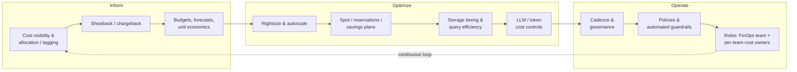
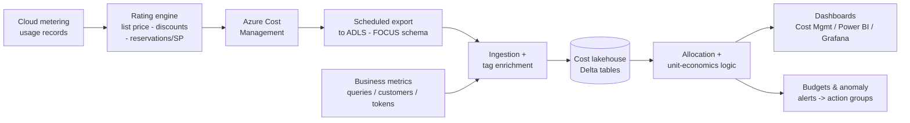
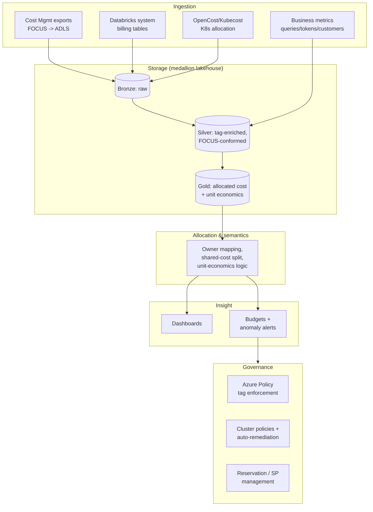
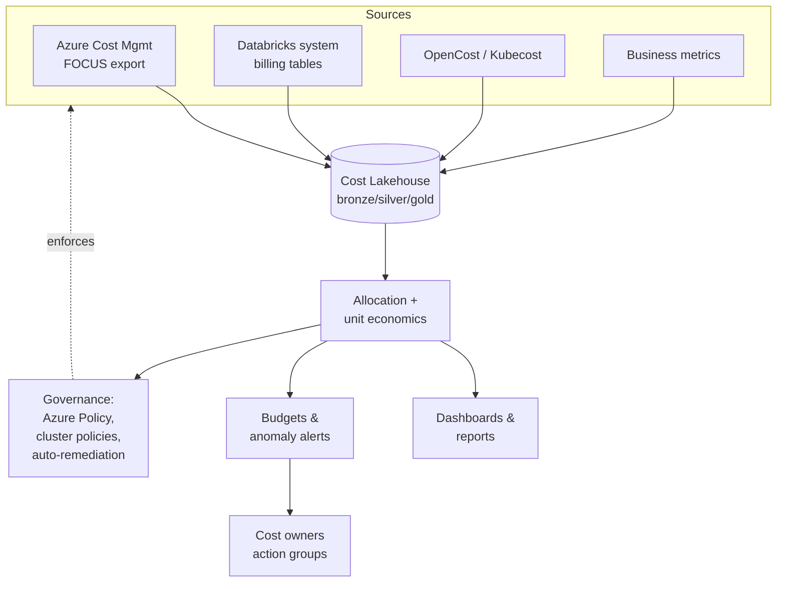
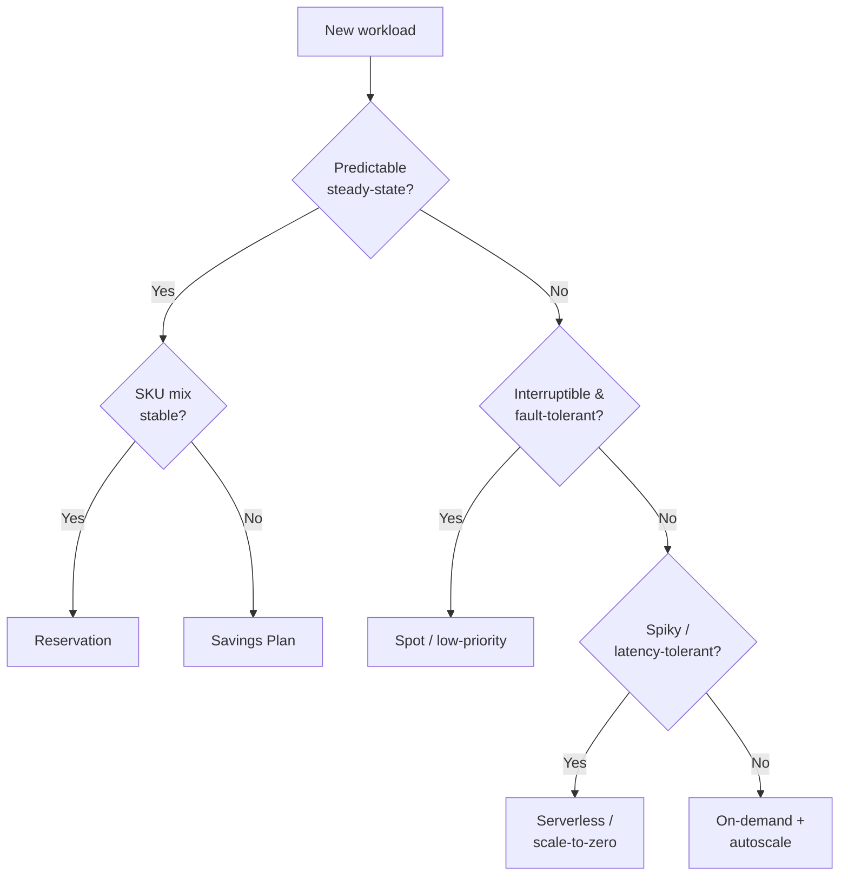
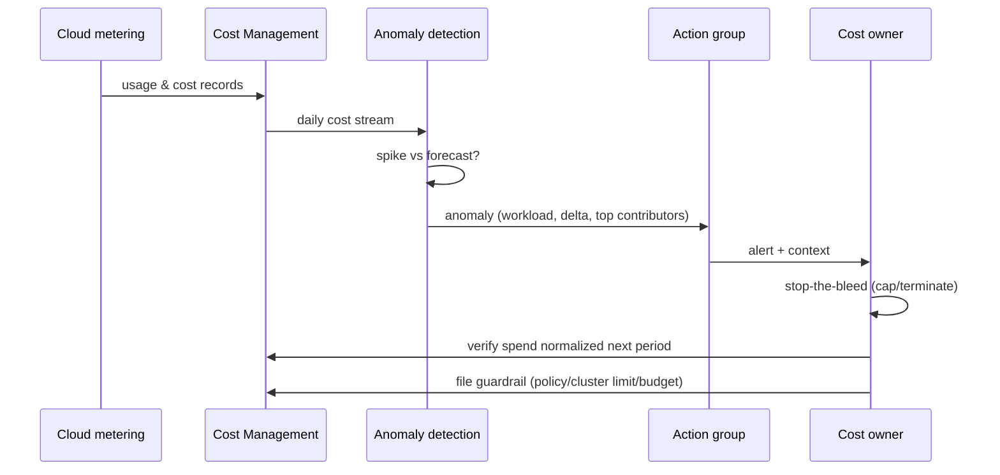

# FinOps and Cost Optimization

> Part of the **Enterprise Data & AI Architecture Handbook** · Phase-18 — FinOps, Observability & Reliability · Chapter 01 (first chapter of the phase).
> Estimated study time: **60 min reading + ~3h labs**.
> **Prerequisites:** read [Well-Architected Framework](../Phase-03/07_Well_Architected_Framework.md) first (this chapter deepens its Cost Optimization pillar into an operating discipline).

---

## Executive Summary

Every prior phase of this handbook produced a worked FinOps example — a spot-versus-on-demand break-even for genomics pipelines, a virtualize-versus-materialize threshold for data fabric, a boil-the-ocean-versus-decision-scoped digital twin, a bulk-download-versus-cloud-native access pattern for Earth observation. Those were not decorations. They were the recurring evidence that **cost is an architectural property, decided at design time and paid every month**, not a bill you receive and lament afterward. This chapter is where that recurring thread becomes a named discipline: **FinOps — the operational practice of bringing financial accountability to the variable-spend, self-service model of cloud, so that engineering teams make continuous, data-driven trade-offs between speed, cost, quality, and reliability.**

FinOps is deliberately **not** "cost cutting." A finance team can cut costs with a spreadsheet and a hiring freeze; that is not FinOps and it usually destroys value. FinOps is a **cultural and operating model** in which engineers, finance, and product share a single, real-time view of cloud spend and its business value, and in which the unit of measure is not the total bill but the **unit economics** — cost per query, cost per pipeline run, cost per model inference, cost per 1,000 tokens, cost per customer served. The FinOps Foundation frames this as a continuous lifecycle of three phases — **Inform, Optimize, Operate** — and this chapter is organized around them. The defining failure mode this chapter exists to prevent is the one every senior data engineer has seen: a platform whose bill grew silently, month over month, with no single owner, no allocation, and no unit metric — until a finance escalation forced a reactive, value-destroying cleanup that a small standing discipline would have prevented.

Data and AI platforms are the sharp end of this problem. A Databricks all-purpose cluster left running overnight, an autoscaling Spark job with a too-generous max, an ungoverned Azure OpenAI deployment whose prompt length crept upward, a Kubernetes cluster running at 15% utilization because every pod requested 4x what it uses — these are the characteristic ways data and AI spend leaks. The levers are equally characteristic: **rightsizing and autoscaling** (pay for what you use), **spot/reservations/savings plans** (pay less for the same thing), **storage tiering and lifecycle** (pay less for cold data), **query and compute efficiency** (do less work), and — new to the AI era — **token and inference cost management** (cache, route, tier, and batch model calls).

The platform bias is **Azure-primary (~60%)** — Azure Cost Management + Billing, Azure Advisor, Azure Reservations, Azure Savings Plans for compute, Azure Spot VMs, Azure Hybrid Benefit, budgets and action groups, tag-based cost allocation, Cost Management exports and the FOCUS billing schema, Databricks system billing tables and cluster policies, and Azure OpenAI PTU-versus-consumption economics — **~30% enterprise open source** (OpenCost/Kubecost for Kubernetes allocation, KEDA for scale-to-zero, Prometheus/Grafana for cost dashboards, Apache Spark and Delta Lake tuning, dbt and Airflow cost-aware scheduling, and the vendor-neutral **FOCUS** specification) — and **~10% AWS/GCP comparison-only** (AWS Cost Explorer/Savings Plans/Compute Optimizer; GCP Billing/Recommender/CUDs), contrasted honestly on capability and lock-in.

**Bottom line:** FinOps is the practice that makes every other cost decision in this handbook *stick*. Its ADR (§40) formalizes the non-negotiable precondition: **before any new data or AI workload reaches production it must carry a cost owner, a cost-allocation tag, and at least one unit-economics metric**, and its recurring spend must be reviewed against that metric on a standing cadence — because the dominant failure mode is not a single expensive mistake but **untagged, unowned, unmeasured spend that compounds silently**, exactly the "silent divergence" pattern this handbook has traced from Earth-observation projection bugs to digital-twin drift, now applied to the monthly invoice.

---

## Learning Objectives

By the end of this chapter you will be able to:

1. **Explain the FinOps operating model** — its Inform → Optimize → Operate lifecycle, its principles, and why it is a cultural discipline rather than a cost-cutting project.
2. **Design a cost allocation strategy** — tagging taxonomy, showback versus chargeback, shared-cost splitting, and allocation of "unallocable" spend.
3. **Apply the core optimization levers** for compute and storage — rightsizing, autoscaling, scale-to-zero, storage tiering/lifecycle, and query/compute efficiency.
4. **Choose correctly among on-demand, spot, reservations, and savings plans**, and compute the break-even and interruption trade-offs.
5. **Manage LLM and token cost** — prompt/semantic caching, model routing and tiering, batch APIs, and the PTU-versus-consumption decision for Azure OpenAI.
6. **Stand up a FinOps practice** on Azure — Cost Management, budgets and anomaly alerts, FOCUS exports, unit-economics dashboards, and a governance cadence — and know when *not* to optimize.

---

## Business Motivation

Cloud changed the economics of IT from a **capital expense you provision once and depreciate** to an **operating expense you incur continuously and variably**. That shift is the entire reason FinOps exists. In the datacenter era, cost was decided by a procurement committee months ahead of use, was fixed once hardware landed, and was invisible to engineers day to day. In the cloud, every engineer with deploy rights can spin up a GPU cluster, a global Cosmos DB, or an Azure OpenAI deployment in minutes — and each of those decisions is a spending decision, made hundreds of times a day, by people who historically never saw a bill. **The spend is decentralized and continuous; the accountability, unless deliberately engineered, is neither.** That gap is what FinOps closes.

For a data and AI platform the stakes are unusually high because the spend is unusually elastic and unusually easy to waste:

- **Compute dominates and is bursty.** A single mis-configured Spark job or an all-purpose cluster left running over a weekend can cost more than a small team's monthly salary. GPU inference and training amplify this by an order of magnitude.
- **The cost-to-value link is opaque.** A $200,000/month lakehouse bill is neither good nor bad in isolation — it depends entirely on what it produces. Without unit economics, no one can say whether the platform is efficient or wasteful, and so every cost conversation degenerates into a political argument instead of a data-driven one.
- **AI has broken the old cost intuitions.** Token-metered LLM APIs mean a feature's cost scales with *usage and prompt length*, not with provisioned capacity — a fundamentally new cost shape that classic infrastructure FinOps did not anticipate (this is the direct extension of the LLM cost-review discipline established in the LLMOps chapters, now generalized).

The business consequence of getting this wrong is not just an oversized bill. It is **eroded trust between engineering and finance**, budget escalations that trigger reactive freezes and cancelled-but-valuable projects, and — most insidiously — a culture in which cost is someone else's problem, which guarantees waste. The business consequence of getting it *right* is the ability to say, in a board review, "this platform costs $X, serves Y business outcomes, and its unit cost fell 30% year over year while volume tripled" — a sentence that turns cost from a liability into a demonstrated competency.

---

## History and Evolution

- **Pre-cloud (before ~2006): capacity planning.** Cost was capital, provisioned in advance, managed by IT finance and procurement. Utilization of 20–30% was normal and accepted because the hardware was already paid for. There was no continuous cost decision to make.
- **Early cloud (2006–2014): the bill shock era.** AWS EC2 (2006) and Azure (2010) made compute variable and self-service. Organizations discovered, often via a shocking invoice, that "pay for what you use" also means "pay for what you forget to turn off." The first responses were crude: monthly bill reviews, manual tagging, and a lot of finger-pointing.
- **Cost management tooling (2014–2018).** Cloud providers and third parties (Cloudability, CloudHealth, later acquired by Apptio and VMware respectively) built cost-visibility and rightsizing tools. Reserved Instances (AWS, 2009; Azure Reservations, 2017) introduced commitment-based discounts, creating a new discipline: forecasting steady-state usage to commit against it.
- **FinOps as a named practice (2019–present).** The term "FinOps" crystallized, and the **FinOps Foundation** was established (joining the Linux Foundation in 2020) to codify a vendor-neutral framework, a capability model, and a certification. FinOps became a recognized job function and, importantly, a *cross-functional operating model* rather than a tool category.
- **Savings Plans and flexibility (2019–2021).** AWS Savings Plans (2019) and Azure Savings Plans for compute (2022) added commitment discounts that were not tied to a specific SKU/region, trading a slightly smaller discount for far more flexibility — a direct response to the operational pain of managing rigid reservations.
- **FOCUS and the unification era (2023–present).** The **FinOps Open Cost and Usage Specification (FOCUS)** launched (v1.0 in 2024) to standardize billing data across clouds and SaaS, so a single set of allocation and reporting logic works everywhere instead of being rewritten per-provider. In parallel, **AI/LLM cost management** emerged as a distinct sub-discipline as token-metered inference broke the provisioned-capacity mental model, and **cloud sustainability/carbon accounting** (Azure Carbon Optimization, the Cloud Carbon Footprint project) began to be managed alongside cost as a joint optimization.

The through-line: cost management evolved from a *periodic, centralized, capital* activity into a *continuous, federated, operational* one — which is precisely the shift FinOps names and organizes.

---

## Why This Technology Exists

FinOps exists because **the cloud decoupled the act of spending from the act of accounting for it**, and no amount of after-the-fact reporting can close a gap that is created continuously at the point of engineering decisions. The only durable fix is to push cost visibility and accountability *to the teams making the decisions, in near-real-time, in units they understand*.

More precisely, FinOps exists to resolve three structural tensions that the cloud created and that neither pure finance nor pure engineering can resolve alone:

1. **Speed versus accountability.** The cloud's core value is that engineers can move fast without procurement gates. Reintroducing a central approval gate for every spend would destroy that value. FinOps resolves this by replacing *ex-ante approval* with *ex-post visibility and ownership* — teams stay fast but become accountable for the cost of their choices.
2. **Variable spend versus fixed budgets.** Finance operates on annual budgets and forecasts; the cloud generates variable, usage-driven spend that a static budget cannot model. FinOps resolves this with **forecasting, budgets-with-alerts, and unit economics** that make variable spend predictable and explainable in business terms.
3. **Decentralized decisions versus centralized standards.** Every team optimizing locally can still produce a globally wasteful and inconsistent estate (fifty different tagging schemes, no shared reservations). FinOps resolves this with a **federated model**: a central FinOps function sets standards, tooling, and shared commitments; teams execute within them — the same federated-computational-governance shape established for data mesh, applied to cost.

Without FinOps, an organization is left with the two failure modes it explicitly rejects: **ungoverned autonomy** (every team spends freely, the bill balloons, no one is accountable) or **reimposed central control** (a spend-approval bottleneck that negates the cloud's speed advantage). FinOps is the deliberate third path.

---

## Problems It Solves

- **Cost invisibility.** Turns an opaque monthly invoice into a real-time, allocated, per-team, per-service, per-workload view — so engineers see the cost consequence of their choices while they can still act on it.
- **Unaccountable spend.** Assigns every dollar an owner via tagging and allocation, eliminating the "unowned spend that compounds silently" failure mode.
- **The cost-value disconnect.** Replaces "is $X a lot?" with **unit economics** — cost per query/run/inference/customer — so cost can be judged against value and tracked as efficiency over time.
- **Waste from idle and oversized resources.** Systematizes rightsizing, autoscaling, scale-to-zero, and idle-resource detection so you stop paying for capacity you don't use.
- **Overpaying for steady-state usage.** Uses reservations and savings plans to cut the rate on predictable baseline load, and spot to cut the rate on interruptible load.
- **Storage cost creep.** Applies tiering and lifecycle policies so cold and archival data doesn't sit on hot storage indefinitely.
- **AI cost unpredictability.** Brings caching, routing, tiering, batching, and capacity-versus-consumption decisions to token-metered inference, taming a cost shape classic FinOps never anticipated.
- **Reactive budget crises.** Replaces the annual bill-shock escalation with a standing cadence of forecasting, anomaly detection, and continuous optimization.

---

## Problems It Cannot Solve

FinOps is a discipline for making cost *visible, allocated, and continuously optimized* — it is not a substitute for the following, and treating it as one is a category error:

- **It cannot fix a fundamentally wrong architecture.** If a workload is on the wrong service (a real-time endpoint where a batch job would do, GraphRAG where plain vector RAG suffices, a knowledge graph with no multi-hop justification), FinOps can only make the waste *visible*. The fix is an architecture decision, made in the design ADR — which is exactly why so many prior chapters gate adoption on justification, not just on cost reporting.
- **It cannot decide business value.** FinOps quantifies cost and can attribute it, but whether a $50,000/month feature is *worth it* is a product/business judgment. FinOps informs that judgment; it does not make it.
- **It cannot eliminate the speed-cost-quality trade-off.** It makes the trade-off explicit and data-driven, but there is still a trade-off. Optimizing cost too aggressively can harm reliability and developer velocity (over-tight autoscaling causing SLA breaches, spot on a latency-critical path). The right answer is often *not* the cheapest.
- **It cannot succeed as a tool purchase or a lone team.** FinOps is a cross-functional operating model. Buying a cost dashboard and assigning one analyst, with no engineering ownership and no cultural change, produces reports nobody acts on — the "FinOps in name only" failure, structurally identical to the "mesh in name only" and "fabric in name only" failures earlier in this handbook.
- **It cannot retroactively allocate untagged spend perfectly.** If resources were never tagged, allocation degrades to heuristics and proportional splits. Allocation quality is a function of *upstream tagging discipline*, which must be enforced at provisioning time, not reconstructed later.

---

## Core Concepts

### 1.1 The FinOps Lifecycle: Inform, Optimize, Operate

The FinOps Foundation framework organizes the practice as a continuous, iterative loop of three phases. A mature organization runs all three simultaneously across different workloads, not sequentially.

- **Inform.** Achieve visibility and allocation. You cannot optimize what you cannot see. This phase delivers real-time cost dashboards, allocation via tagging, showback/chargeback, budgets, forecasts, and **unit economics**. Its output is a shared, trusted source of truth that engineering, finance, and product all read from.
- **Optimize.** Act on the visibility. This phase applies the levers — rightsizing, autoscaling, spot, reservations/savings plans, storage tiering, query efficiency, LLM cost controls — and prioritizes them by effort-versus-savings. Its output is realized savings and improved unit economics.
- **Operate.** Institutionalize the practice. This phase establishes the cadence (weekly/monthly reviews), the governance (policies, guardrails, automated enforcement), the roles (FinOps team, cost owners per team), and continuous improvement. Its output is a durable culture where cost is a first-class, continuously managed engineering metric — not a periodic fire drill.

### 1.2 The FinOps Principles

The Foundation codifies a set of principles; the load-bearing ones for a data/AI platform are:

- **Teams need to collaborate.** Engineering, finance, product, and leadership share one view and one vocabulary. Cost is not "thrown over the wall" to finance.
- **Everyone takes ownership of their cloud usage.** Decentralized accountability: the team that spends owns the cost, sees it in near-real-time, and is measured on efficiency — not just a central team.
- **A centralized team drives FinOps.** Standards, tooling, shared commitments (reservations/savings plans), and rate negotiation are centralized to avoid fragmentation and to capture economies of scale — the federated model.
- **Decisions are driven by the business value of cloud.** The metric is value-per-dollar (unit economics), not absolute spend. Sometimes the right decision is to spend *more* because the value is higher.
- **Take advantage of the variable cost model.** Treat elasticity as a feature: scale down and to zero, use spot, right-time workloads — don't run cloud like a static datacenter.
- **Reports should be timely and accessible.** Near-real-time, self-serve visibility beats a perfect monthly report that arrives too late to act on.

### 1.3 Cost Allocation, Tagging, and Unit Economics

**Allocation** answers "who/what is this spend for?" Its mechanism is **tagging** (Azure resource tags, Databricks cluster/job tags, Kubernetes labels) plus hierarchy (Azure Management Groups → Subscriptions → Resource Groups). A disciplined **tagging taxonomy** — typically `CostCenter`, `Environment`, `Team/Owner`, `Application/Workload`, `Project`, `DataClassification` — is the single most important prerequisite for everything else. Untagged resources become "unallocable" spend, the enemy of accountability.

**Unit economics** is the concept that separates FinOps from cost reporting. Instead of tracking total spend, you track **cost per unit of business value**: cost per query, per pipeline run, per model inference, per 1,000 tokens, per active customer, per order processed. Unit economics normalizes for growth — a bill that doubled while volume tripled means unit cost *fell*, which is success, not failure. It is the only honest way to answer "are we getting more efficient?"

### 1.4 Showback versus Chargeback

- **Showback** reports each team/product its allocated cost for visibility and accountability, but does not move money. It is lower-friction, faster to adopt, and drives behavior through transparency and social pressure.
- **Chargeback** actually bills the cost back to the team's or business unit's budget. It creates the strongest accountability (real money) but requires mature, trusted allocation and organizational readiness — premature chargeback on shaky allocation data produces disputes and gaming.

The pragmatic path is **showback first**, building trust in allocation accuracy, then chargeback where the organization is ready. **Shared costs** (a shared Databricks workspace, a shared AKS cluster, networking, support) must be split by an agreed, transparent rule (usage-proportional, even split, or a fixed key) — how shared cost is handled is one of the most contentious and important allocation decisions.

### 1.5 Commitment Discounts and the Utilization Spectrum

Cloud pricing offers a spectrum of rate-versus-flexibility trade-offs:

- **On-demand / pay-as-you-go** — highest rate, maximum flexibility, no commitment. Correct for spiky, unpredictable, or short-lived workloads.
- **Spot / low-priority** — deepest discount (often 60–90% off), but the provider can reclaim capacity with little notice. Correct for **interruptible, fault-tolerant, stateless** workloads — batch Spark, model training with checkpointing, CI, dev/test.
- **Reservations (1-yr / 3-yr)** — significant discount for committing to a specific instance family/region for a term. Correct for **predictable, steady-state** baseline capacity.
- **Savings Plans (1-yr / 3-yr)** — commit to a *dollar-per-hour spend* level rather than a specific SKU; slightly smaller discount than reservations but far more flexible across families/regions. Correct for steady-state spend where the exact SKU mix may evolve.

The core skill is **layering**: cover the predictable baseline with reservations/savings plans, cover interruptible burst with spot, and leave only the truly unpredictable spike on on-demand — matching each portion of the load curve to the cheapest instrument that fits its risk profile.

---

## Internal Working

### 2.1 How Cloud Billing Data Flows Into a FinOps System

Cost data originates in the provider's metering pipeline: every resource emits usage records (compute-seconds, GB-months, request counts, tokens) that are rated against the account's price sheet (list price minus negotiated discounts, reservations, and savings-plan coverage) to produce **cost and usage records**. In Azure this surfaces through **Cost Management**, and — critically for a mature practice — can be **exported on a schedule to ADLS/Blob storage** in a detailed, row-level format (increasingly the **FOCUS** schema). That export is the raw material a FinOps data platform ingests, enriches with the tagging taxonomy, joins to business metrics (query counts, customer counts, model-call counts) to compute unit economics, and serves via dashboards.

The key internal insight: **a FinOps platform is itself a data platform** — an ingestion pipeline (billing exports + usage telemetry), a lakehouse (Delta tables of enriched cost and usage), a semantic layer (allocation and unit-economics logic), and a serving/BI layer (Cost Management views, Power BI, or Grafana). Everything you learned about medallion architecture, data contracts, and metadata applies directly to building it.

### 2.2 How Commitment Discounts Are Applied

Reservations and savings plans are applied by the billing engine *after* usage is metered, by matching eligible usage to the commitment. Reservations match specific instance families/sizes in a scope (a subscription or shared across an enrollment); savings plans match any eligible compute usage up to the committed hourly dollar amount, applying the discounted rate first to the highest-list-price eligible usage to maximize the customer's benefit. **Utilization** (how much of your commitment you actually consumed) and **coverage** (how much of your eligible usage was covered by a commitment) are the two KPIs that tell you whether your commitment portfolio is well-sized: low utilization means you over-committed (paying for unused commitment), low coverage means you under-committed (paying on-demand rates for predictable load).

### 2.3 How Autoscaling and Scale-to-Zero Realize Elasticity

Elasticity is realized by controllers that add/remove capacity in response to a signal. In a data platform these are: **Spark autoscaling** (Databricks adds/removes executors based on pending tasks), **Kubernetes autoscaling** (HPA on metrics, Cluster Autoscaler on unschedulable pods, KEDA on event/queue depth including **scale-to-zero**), and **serverless** (the platform scales compute to exactly the request and to zero between requests, so idle cost is zero). Scale-to-zero is the highest-leverage lever for spiky workloads because the largest single source of waste in data platforms is **idle provisioned capacity** — a cluster kept warm "just in case." The trade-off is **cold-start latency**: scaling from zero incurs a startup penalty, so scale-to-zero is correct where the latency budget tolerates it and wrong on a hot, latency-critical path — the same batch-versus-online decision made throughout the model-serving chapters, now framed as a cost lever.

---

## Architecture

A production FinOps capability is a layered platform, not a dashboard. The reference architecture has five planes:

1. **Ingestion plane** — scheduled Azure Cost Management exports (row-level, FOCUS-formatted) to ADLS; Databricks **system billing tables** (`system.billing.usage`) for DBU-level detail; Kubernetes cost telemetry from **OpenCost/Kubecost**; and business-metric feeds (query logs, request counts, token counts) that make unit economics possible.
2. **Storage plane** — a medallion lakehouse: bronze (raw billing/usage exports), silver (cleaned, tag-enriched, currency-normalized cost records conformed to a FOCUS-aligned schema), gold (allocated cost by team/product/workload joined to business metrics for unit economics).
3. **Allocation & semantics plane** — the logic that maps every cost record to an owner via the tagging taxonomy, splits shared costs by the agreed rule, handles untagged spend, and computes unit-economics metrics. This is where the "one version of the truth" is defined.
4. **Insight & alerting plane** — dashboards (Cost Management views, Power BI, Grafana), **budgets with threshold alerts**, and **anomaly detection** that flags spend spikes and routes them to owners via action groups.
5. **Governance & automation plane** — Azure Policy for tag enforcement, cluster policies for compute guardrails, automated remediation (shut down idle resources, enforce lifecycle tiering), and the reservation/savings-plan management process.

---

## Components

- **Azure Cost Management + Billing** — the primary cost-visibility, budgeting, and export engine for Azure spend; cost analysis views, budgets, anomaly detection, and scheduled exports.
- **Azure Advisor (Cost pillar)** — automated rightsizing and idle-resource recommendations, reservation/savings-plan purchase recommendations, and their estimated savings.
- **Tagging and hierarchy** — resource tags plus Management Group → Subscription → Resource Group hierarchy, the backbone of allocation.
- **Azure Reservations & Savings Plans** — commitment-discount instruments and their utilization/coverage reporting.
- **Azure Policy** — enforces tagging (deny or append tags at creation), SKU restrictions, and region/service guardrails.
- **Databricks cluster policies, system billing tables, and tags** — govern compute shapes, attribute DBU spend, and feed cost dashboards.
- **OpenCost / Kubecost** — CNCF-standard Kubernetes cost allocation (per-namespace/workload/label), the Kubernetes analog of cloud tagging.
- **KEDA** — event-driven autoscaling including scale-to-zero for Kubernetes workloads.
- **FOCUS** — the vendor-neutral billing schema that makes allocation logic portable across Azure/AWS/GCP/SaaS.
- **Budgets, action groups, and anomaly alerts** — the mechanism that turns visibility into timely notification.
- **BI/dashboards** — Cost Management views, Power BI, and Grafana as the human-facing serving layer.

---

## Metadata

Cost data is only useful when it is **enriched with metadata** that answers who, what, why, and for whom. The critical metadata dimensions are:

- **Ownership metadata** — `Team`, `Owner`, `CostCenter`: who is accountable and whose budget the cost belongs to.
- **Workload metadata** — `Application`, `Workload`, `Project`, `Pipeline`: what the spend produces, enabling per-product unit economics.
- **Environment metadata** — `Environment` (prod/staging/dev): a huge driver of "should this even be running?" — non-prod idle spend is a classic waste source.
- **Classification metadata** — `DataClassification`: cost of handling sensitive data (encryption, isolation) and the compliance context, tying cost to the governance lineage from the security and governance phases.
- **Business-metric metadata** — the join keys (customer ID, query ID, model/endpoint ID, token counts) that connect cost records to value, without which unit economics is impossible.

The enforcement point matters more than the schema: **tags must be applied at provisioning time** (via Azure Policy, Bicep/Terraform modules with required-tag variables, or landing-zone guardrails), because retroactive tagging is lossy and unreliable — the same "instrument at ingestion, not cleanup" lesson that recurs across this handbook.

---

## Storage

Storage cost is often underestimated because per-GB rates are small, but at data-platform scale (PB-class lakehouses, exabyte-class telemetry) it becomes a major line item, and it is one of the easiest to optimize because it rarely trades off against latency for cold data. The levers:

- **Access tiering.** Azure Blob/ADLS tiers — **Hot** (frequent access, higher storage rate, lowest access rate), **Cool** (30+ day, lower storage, higher access), **Cold** (90+ day), **Archive** (180+ day, cheapest storage, hours-long rehydration). Match tier to access frequency.
- **Lifecycle management.** Automated policies that transition blobs down tiers by age/last-access and delete expired data — the mechanism that keeps cold data from silently accumulating on hot storage.
- **Format and compression efficiency.** Columnar formats (Parquet/Delta) with effective compression and encoding shrink both storage and the scanned bytes on every query — a rare lever that cuts storage *and* compute simultaneously, connecting directly to the compression/encoding and columnar-storage material earlier in the handbook.
- **Delta/table maintenance.** `OPTIMIZE`/compaction reduces small-file overhead; **`VACUUM` and snapshot expiration** remove obsolete files — but note the governance tension established in the event-sourcing and privacy chapters: retention windows for time-travel and erasure obligations bound how aggressively you can vacuum.
- **Redundancy right-sizing.** LRS/ZRS/GRS/RA-GRS trade cost for durability/availability geography — don't pay for geo-redundancy on reproducible intermediate data.
- **Deleting the truly unused.** Orphaned snapshots, abandoned dev datasets, and duplicate copies are pure waste; discovery-and-delete is unglamorous but high-return.

---

## Compute

Compute is where most data/AI spend goes and where the largest, fastest wins live:

- **Rightsizing.** Match instance family/size to the actual CPU/memory/GPU profile; over-provisioned VMs and clusters are the single most common waste. Azure Advisor and Databricks metrics expose the mismatch.
- **Autoscaling.** Let cluster size follow load (Spark executor autoscaling, AKS autoscaling) rather than provisioning for peak and paying for peak 24/7.
- **Scale-to-zero and serverless.** Eliminate idle cost entirely for spiky workloads (KEDA scale-to-zero, Databricks serverless, Azure Functions/Container Apps), accepting cold-start latency where the budget allows.
- **Job clusters over all-purpose clusters (Databricks).** Ephemeral job clusters spin up for a job and terminate on completion; all-purpose (interactive) clusters left running are a top waste source. **Auto-termination** on idle interactive clusters is mandatory.
- **Photon and query efficiency.** Faster execution engines (Databricks Photon, vectorized readers) reduce compute-seconds per unit of work — efficiency multiplies with commitment discounts.
- **Spot for interruptible compute.** Batch ETL, model training with checkpointing, and CI on spot/low-priority VMs cut the rate 60–90% (see §Cost Optimization for the break-even math).
- **Commitment coverage of the baseline.** Cover the steady-state floor with reservations/savings plans; layer spot and on-demand above it.
- **GPU discipline.** GPUs are the most expensive compute; batching, quantization, right-sizing the GPU SKU, and scale-to-zero on inference endpoints are disproportionately valuable (the model-serving chapters' GPU-utilization case studies are FinOps case studies).

---

## Networking

Networking cost is subtle, easy to miss, and — because it is usage-driven and often cross-cutting — hard to allocate:

- **Egress (data transfer out).** Data leaving Azure to the internet, and often *cross-region* transfer, is billed per GB and can be a surprising line item for data platforms that move large volumes. Ingress is typically free; egress is not.
- **Cross-region and cross-zone transfer.** Replicating or querying data across regions/availability zones incurs transfer cost — a hidden cost of naive multi-region designs and of co-locating compute far from data (the "compute-to-data" principle from the geospatial chapter is also a networking-cost principle).
- **Private endpoints and NAT.** Private Link endpoints and NAT Gateway carry per-hour and per-GB charges; necessary for the zero-trust posture from the security phase, but a cost to account for.
- **Inter-service chatter.** Chatty microservice and cross-cluster traffic accumulates; keeping data and compute co-located and minimizing cross-boundary transfer is both a performance and a cost lever.
- **Allocation difficulty.** Networking is frequently a **shared cost** that resists clean per-team attribution, making it one of the harder inputs to the allocation model — usually split by a proportional or agreed key.

---

## Security

Cost and security intersect in both directions, and neither should be sacrificed for the other:

- **Security controls have a cost.** Private endpoints, NAT, dedicated HSMs (Managed HSM), confidential computing, log retention for compliance, and isolated environments all add spend. This is *justified* spend tied to the `DataClassification` metadata, and FinOps must account for it rather than flag it as waste to be cut.
- **Cost tooling must respect least privilege.** Access to billing data is sensitive (it reveals architecture, scale, and business signals) — Cost Management and export storage must be RBAC-scoped and the exports treated as confidential, consistent with the identity and data-security phases.
- **Cost anomalies can signal security incidents.** A sudden spend spike — cryptomining on compromised compute, data exfiltration egress, a runaway agentic loop — is often the *first* visible signal of a breach. FinOps anomaly detection is a security tripwire, and cost owners should treat unexplained spikes as potential incidents, not just billing errors.
- **Don't let cost optimization weaken security.** Turning off logging to save money, disabling geo-redundancy on data with a recovery obligation, or running sensitive workloads on shared spot capacity are false economies. The ADR discipline (design-time trade-off with the security owner in the room) prevents cost from silently eroding the security posture.
- **Tag governance is security governance.** Enforcing tags via Azure Policy is the same control plane that enforces security guardrails — a well-run landing zone does both at once.

---

## Performance

Performance and cost are deeply coupled, and the relationship is not monotonic:

- **Efficiency is the shared win.** Doing the same work with fewer compute-seconds (better query plans, Photon, columnar pruning, caching, avoiding full scans) reduces *both* latency and cost. Most of the best FinOps levers are performance-engineering levers, which is why the two disciplines are paired in this phase (performance engineering is deepened in Phase-18 Chapter 05).
- **But over-optimizing cost harms performance.** Autoscaling limits set too tight, clusters undersized, or scale-to-zero on a latency-critical path all trade cost for missed SLAs. The correct target is not minimum cost but **minimum cost that meets the reliability and latency objectives**.
- **Unit cost is the honest performance-cost metric.** Cost-per-query and cost-per-inference at a given latency SLA is the metric that captures both dimensions — falling unit cost at constant SLA is unambiguous improvement; falling cost with rising latency is a trade-off requiring a decision.
- **Right-timing is a free lever.** Shifting non-urgent batch work to off-peak windows, or to when spot capacity is cheapest/most available, cuts cost with zero performance impact on the work that actually has a deadline.

---

## Scalability

FinOps must scale along two axes, and both are frequently underestimated:

- **Scaling the cost of the platform.** As workloads grow, the aim is **sub-linear cost growth** — unit cost should *fall* as volume rises (economies of scale from commitment discounts, better bin-packing, amortized platform overhead). A platform whose unit cost is flat or rising with scale has a structural efficiency problem the total-cost view would hide.
- **Scaling the FinOps practice itself.** A FinOps function that relies on a central analyst manually chasing untagged resources does not scale past a few teams. It scales through **federation and automation**: self-serve dashboards every team reads, tag enforcement in the landing zone, cluster policies as guardrails, automated anomaly routing to owners, and reservation management as a standing central function. The practice scales the same way data governance scales — global standards, local execution, computational enforcement.
- **The cost data platform scales like any data platform.** Billing exports at enterprise scale are large; the medallion lakehouse, incremental processing, and partitioning discipline from the data-engineering phases apply directly to keeping the FinOps platform itself cheap and fast.

---

## Fault Tolerance

The cost dimension of fault tolerance is a genuine trade-off, not a free good:

- **Redundancy costs money; match it to the recovery objective.** Geo-redundant storage, multi-region active-active, hot standby, and cross-region replicas all multiply cost. Provision redundancy to the **RTO/RPO the business actually requires**, not reflexively — reproducible intermediate data needs no geo-redundancy; the golden source of regulatory data (per the financial platforms chapter) does.
- **Spot interruption is a fault-tolerance design input.** Using spot means designing for reclamation: checkpointing (training), idempotent retryable tasks (batch), and never putting non-interruptible or stateful-critical work on spot. The spot discount is only real if the workload tolerates the interruption — otherwise the "savings" are paid back in failed runs and re-work.
- **Cost tooling must itself be resilient.** Budgets and anomaly alerts are a control; if the export pipeline silently breaks, cost visibility goes dark exactly when you most need it. Monitor the FinOps pipeline's own freshness — a stale cost dashboard is a failed control (the same "verification gap" lesson applied to the cost platform).
- **Don't optimize away the safety margin.** Autoscaling headroom, buffer capacity, and reserved burst room are reliability investments; shaving them to the bone to cut cost is how a FinOps initiative causes an outage — and an outage almost always costs more than the capacity it "saved."

---

## Cost Optimization

This is the chapter's own subject, so this section states the disciplined optimization method and works a concrete example.

**The method — prioritize by savings-per-effort, act, and verify:**

1. **Eliminate waste first (highest ROI, lowest risk).** Idle/orphaned resources, un-terminated interactive clusters, over-provisioned VMs, untiered cold storage, forgotten dev/test environments. These are pure waste — no trade-off, just savings.
2. **Rightsize and autoscale.** Match capacity to actual usage; enable autoscaling and auto-termination everywhere it fits.
3. **Apply the right pricing instrument.** Spot for interruptible; reservations/savings plans for the steady-state baseline; on-demand only for the truly unpredictable spike.
4. **Improve efficiency.** Query tuning, Photon, columnar pruning, caching, compression — do less work per unit of value.
5. **Optimize AI/token spend.** Caching, routing, tiering, batching (see §LLM/token below in Design Patterns and the Azure section).
6. **Verify realized savings.** Every optimization must be confirmed in the cost data — an assumed saving that never materialized (an unattached reservation, a cluster policy that was overridden) is the FinOps version of the "verification gap." Track it as a unit-economics improvement, not just a total-dollar dip.

**Worked FinOps example — spot vs. on-demand for a nightly Spark ETL job.** A nightly batch pipeline runs ~4 hours on a Databricks job cluster of 20 workers. On-demand list price for the chosen VM is ~$0.50/hr/worker plus DBU. On-demand compute: 20 × 4 × $0.50 = **$40/night ≈ $1,200/month** (VM portion). **Spot** at ~75% discount = ~$0.125/hr/worker → 20 × 4 × $0.125 = **$10/night ≈ $300/month** — a ~$900/month saving on the VM portion. The workload is a checkpointed, idempotent, non-latency-critical batch job, so spot interruption (rare overnight for this SKU) only forces a partial re-run, not a failure. **Layering it further:** if this job's baseline is truly steady, a 1-year savings plan covering the DBU portion adds another ~30% off that component. **Decision:** run the workers on spot with a small on-demand fallback pool (so a mass reclaim can't stall the pipeline), cover the DBU baseline with a savings plan, and *verify* in `system.billing.usage` next month that realized spot coverage matched the plan — because an "optimization" that isn't confirmed in the billing data didn't happen. The reverse decision holds for a **latency-critical online inference endpoint**: never put it on spot; instead cut its cost via GPU batching, quantization, and scale-to-zero within its latency budget.

---

## Monitoring

Monitoring, in the FinOps sense, means keeping cost *continuously observable and alertable* rather than discovered monthly:

- **Real-time / near-real-time cost dashboards** — Cost Management analysis views, Power BI, or Grafana, sliced by the tagging taxonomy (team, workload, environment), refreshed daily or better.
- **Budgets with threshold alerts** — Azure budgets at management-group/subscription/resource-group scope, alerting at (say) 50/80/100% of forecast to the owning team's action group *before* the month closes.
- **Anomaly detection** — Cost Management's built-in anomaly detection plus custom detectors on the cost lakehouse, flagging unexpected spikes and routing them to owners with enough context to act.
- **Commitment KPIs** — reservation/savings-plan **utilization and coverage** tracked continuously; drift means the commitment portfolio needs resizing.
- **Unit-economics trends** — the headline metric: cost-per-query/run/inference/customer plotted over time, so efficiency (or regression) is visible at a glance.
- **Forecasting** — projected month-end and quarter spend versus budget, so surprises are caught while they can still be acted on.

The Prometheus/Grafana mechanics for building these dashboards are deepened in Phase-18 Chapter 03 (Monitoring with Prometheus and Grafana); the point here is *what* to monitor and *why*.

---

## Observability

Cost monitoring tells you *that* spend changed; cost **observability** lets you ask *why* without shipping new instrumentation. It is the difference between a dashboard that shows the bill rose 20% and the ability to decompose that rise — which team, which workload, which resource, which change, correlated with which deployment or usage shift — from the already-collected data.

Cost observability is built on the same three-pillar thinking as system observability (deepened in Phase-18 Chapter 02, Observability with OpenTelemetry): **high-cardinality, well-tagged cost and usage records** (the "traces" of spend), **usage and unit metrics** (the "metrics"), and **change/deploy events** correlated to cost (the "logs/events"). The load-bearing requirement is **high-cardinality tagging** — if every cost record carries team, workload, environment, and business-metric join keys, you can slice and root-cause any spend change interactively. If tagging is coarse or missing, cost is observable only in aggregate, and every "why did it go up?" becomes a manual investigation. This is the direct cost-domain application of the observability principle: **you cannot debug what you did not instrument** — and in FinOps the instrumentation is disciplined tagging plus the business-metric joins that enable unit economics.

---

## Operational Response Playbook

Two representative cost incidents, each as signal → detection → remediation. These are the FinOps analog of an on-call runbook: the point is that a cost anomaly is an *operational event with an owner and a response*, not a line item to discuss next month.

**Playbook 1 — Sudden spend spike (runaway compute / possible incident).**
- **Signal:** anomaly alert fires — daily spend for a subscription or workload jumps well above forecast (e.g., a 3x day-over-day jump in a compute resource group).
- **Detection query:** in the cost lakehouse / Cost Management, group the last 48h of cost by resource, tag, and meter; identify the top contributors to the delta. Cross-check against deploy events and against unusual patterns (a cluster that never scaled down, a training run that never terminated, an agentic job with no cost ceiling, or unexpected egress that could indicate exfiltration).
- **Remediation:** page the tagged **cost owner** (untagged spike → escalate to platform team and treat tagging as the first fix). If it's runaway compute (un-terminated cluster, autoscale-max blown out, unbounded agent loop) **stop the bleed first** — terminate/cap the resource — then root-cause. If the pattern matches a security signature (cryptomining, exfiltration egress) escalate to security as a potential incident, not just a billing error. File the fix as a guardrail (auto-termination, cluster policy max, agent cost budget) so it can't silently recur.

**Playbook 2 — Commitment utilization drop (wasted reservation/savings-plan spend).**
- **Signal:** reservation/savings-plan **utilization** falls below target (e.g., a reserved instance family is now <70% utilized after a workload was refactored off that SKU), meaning you're paying for commitment you no longer consume.
- **Detection query:** pull utilization and coverage by commitment from Cost Management; identify which commitments are under-utilized and which eligible usage is now uncovered (paying on-demand while a commitment sits idle elsewhere).
- **Remediation:** where the platform allows, **exchange or re-scope** the reservation to a family that matches current usage, or convert rigid reservations to a **savings plan** for flexibility; adjust the commitment portfolio to current steady-state; and feed the lesson back into the purchase process (commit to savings plans over narrow reservations when the SKU mix is likely to evolve). Record the corrected utilization the following period to *verify* the fix landed.

---

## Governance

FinOps governance is the **Operate** phase made concrete — the policies, roles, and cadence that keep the practice alive rather than a one-off cleanup:

- **Roles and RACI.** A central **FinOps team** owns standards, tooling, shared commitments, and rate negotiation; **per-team cost owners** own their allocated spend and unit metrics; **finance** owns budgets and forecasts; **leadership** owns value trade-offs. Every dollar has an owner (the ADR precondition).
- **Policies as guardrails, enforced computationally.** Azure Policy for **mandatory tagging** (deny or auto-append at creation), SKU/region restrictions, and **cluster policies** (max autoscale, mandatory auto-termination, allowed instance families). Governance that relies on people remembering to tag or terminate fails; governance enforced at provisioning succeeds — the federated-computational-governance principle from the data-mesh phase, applied to cost.
- **Cadence.** A standing rhythm: weekly team-level cost reviews, monthly cross-team FinOps reviews (anomalies, optimization backlog, commitment portfolio, unit-economics trends), and quarterly commitment and budget re-planning.
- **The optimization backlog.** Treat cost optimizations like any engineering backlog — prioritized by savings-per-effort, owned, and tracked to *verified* realization, not just proposed.
- **Guardrails, not gates.** Governance should make the cheap/right path the easy/default path (golden-path cluster policies, pre-tagged landing-zone modules) rather than inserting approval bottlenecks — preserving the cloud's speed while keeping accountability.
- **Sustainability alongside cost.** Carbon (Azure Carbon Optimization) is increasingly governed jointly with cost — often the same levers (rightsizing, off-peak scheduling, efficient regions) optimize both.

---

## Trade-offs

- **Cost vs. reliability/performance.** The central tension. Cheaper (spot, tight autoscaling, less redundancy, scale-to-zero) can mean less reliable or slower. The right target is minimum cost *subject to* meeting SLOs — not minimum cost.
- **Optimization effort vs. savings.** Every optimization costs engineering time. Chasing a $50/month saving with a week of work is itself waste. Prioritize ruthlessly by savings-per-effort; ignore the long tail.
- **Commitment discount vs. flexibility.** Reservations/savings plans cut the rate but lock you in; over-committing on a workload that later moves or shrinks wastes the commitment. Balance coverage against the risk of change (favor flexible savings plans when architecture is evolving).
- **Showback vs. chargeback.** Chargeback drives the strongest accountability but requires mature, trusted allocation and adds organizational friction and dispute risk; showback is lower-friction but softer.
- **Centralization vs. autonomy.** Centralized standards and shared commitments capture economies of scale but can slow teams; too much team autonomy fragments the estate. Federation is the balance.
- **Cost visibility effort vs. value.** Building perfect, high-cardinality allocation is itself a project with a cost; pursue the level of allocation granularity the decisions actually require, not perfection for its own sake.
- **Spend less vs. spend well.** The subtlest trade-off: the goal is not the smallest bill but the best value-per-dollar. Sometimes spending *more* (a bigger cluster that finishes a critical job in time, a premium tier that meets an SLA) is the correct FinOps decision.

---

## Decision Matrix

| Situation | Recommended instrument / lever | Rationale |
|---|---|---|
| Predictable steady-state baseline compute | **Reservations or Savings Plans (1–3 yr)** | Biggest rate cut on load you'll run anyway; savings plan if SKU mix may change |
| Interruptible, fault-tolerant batch / training | **Spot / low-priority VMs** | 60–90% discount; workload tolerates reclamation with checkpointing/idempotency |
| Spiky, unpredictable, short-lived workload | **On-demand + autoscale / serverless / scale-to-zero** | No commitment; pay only for actual burst; zero idle cost |
| Latency-critical online inference | **On-demand + GPU batching + quantization + scale-to-zero-within-budget** | Never spot; cut cost via efficiency, not interruption risk |
| Cold / archival data | **Cool/Cold/Archive tier + lifecycle policy** | Cheapest storage for rarely-accessed data; automated transition |
| Idle interactive/dev clusters | **Auto-termination + cluster policy** | Eliminate the #1 waste source computationally |
| Untagged / unallocable spend | **Azure Policy tag enforcement at creation** | Fix at provisioning; retroactive tagging is lossy |
| High-volume LLM calls, repeated/similar prompts | **Prompt + semantic caching, model routing/tiering, batch API** | Avoid paying per token for work already done or over-powered |
| Steady, high-volume Azure OpenAI usage | **Provisioned Throughput (PTU)** | Predictable capacity/cost at scale beats per-token consumption |
| Low/spiky LLM usage | **Consumption (pay-per-token)** | No idle PTU cost; matches variable demand |
| Shared platform cost (workspace, cluster, network) | **Agreed proportional/keyed split + showback** | Transparent shared-cost allocation avoids disputes |

---

## Design Patterns

- **Tag-at-provisioning (policy-enforced allocation).** Enforce the tagging taxonomy via Azure Policy and IaC modules so nothing is created untagged — allocation quality is a provisioning-time property.
- **Unit-economics-first reporting.** Lead every cost dashboard with cost-per-unit, not total spend, so growth and efficiency are distinguishable.
- **Layered commitment portfolio.** Reservations/savings plans for the baseline, spot for interruptible burst, on-demand for the unpredictable spike — match each slice of the load curve to the cheapest fitting instrument.
- **Scale-to-zero-by-default for spiky workloads.** Make zero-idle-cost the default (serverless, KEDA, auto-termination) and justify always-on as the exception.
- **Storage lifecycle automation.** Automated tiering and expiration so cold data never lingers on hot storage.
- **Anomaly-to-owner routing.** Wire anomaly detection directly to the tagged owner's action group so spend spikes are operational events, not month-end surprises.
- **LLM cost stack: cache → route → tier → batch.** For token-metered inference: serve repeated/similar requests from a **semantic cache**; **route** each request to the cheapest model that can handle it (small model first, escalate only when needed); **tier** by task complexity; and use **batch APIs** for non-latency-critical bulk work. This is the direct FinOps operationalization of the model-tiering and caching discipline from the LLMOps chapters.
- **FinOps-as-a-data-platform.** Build cost visibility as a medallion lakehouse with billing exports (FOCUS) + business metrics, so allocation and unit economics are queryable, versioned, and portable.
- **Guardrails-not-gates golden paths.** Ship pre-tagged, policy-compliant, cost-efficient defaults (cluster policies, landing-zone modules) so the cheap path is the easy path.

---

## Anti-patterns

- **FinOps in name only.** Buying a cost dashboard and assigning one analyst with no engineering ownership and no cultural change — reports nobody acts on. (The direct analog of "mesh in name only.")
- **Cost cutting disguised as FinOps.** Blanket freezes and value-destroying cuts driven by finance in isolation, ignoring unit economics and business value.
- **Optimize-the-total-bill blindness.** Chasing total-dollar reductions without unit economics, so you can't tell efficiency from mere volume changes and you punish healthy growth.
- **Retroactive tagging.** Leaving tagging to a periodic cleanup instead of enforcing it at provisioning — permanent unallocable spend.
- **Reservation over-commitment.** Locking in long commitments on volatile or soon-to-be-refactored workloads, then paying for unused commitment.
- **Spot on the wrong workload.** Putting latency-critical or non-idempotent stateful work on spot, then paying back the "savings" in failures and re-work.
- **Un-terminated interactive clusters / always-on for spiky load.** The single most common concrete waste source.
- **Premature chargeback.** Forcing chargeback on immature allocation data — disputes, gaming, and loss of trust.
- **Optimizing away reliability/security.** Turning off logging, redundancy, or isolation to save money — a false economy that costs more when it fails.
- **Ungoverned LLM spend.** No token budgets, no caching, no routing, creeping prompt length — the AI-era version of the un-terminated cluster.

---

## Common Mistakes

- Treating the monthly bill as the metric instead of unit economics.
- Never tagging, or tagging inconsistently across teams, so allocation is impossible.
- Assuming an optimization landed without **verifying** it in the billing data (unattached reservation, overridden cluster policy).
- Leaving non-prod environments running 24/7.
- Provisioning for peak and paying for peak around the clock instead of autoscaling.
- Buying reservations for the exact SKU right before an architecture change moves off it.
- Ignoring egress and cross-region transfer until it's a surprise line item.
- Letting cold data accumulate on hot storage with no lifecycle policy.
- Running latency-critical inference on over-powered, unbatched, FP32 GPUs at low utilization for months (a recurring model-serving case study).
- Making FinOps a finance-only or a tooling-only initiative instead of a cross-functional operating model.
- Optimizing the long tail of trivial savings while ignoring the few large levers.

---

## Best Practices

- **Instrument allocation at provisioning, not after.** Enforce the tagging taxonomy via Azure Policy and IaC modules so every resource is allocable by construction.
- **Lead with unit economics.** Make cost-per-unit the headline metric on every dashboard so growth and efficiency are always distinguishable from total spend.
- **Eliminate waste before optimizing rates.** Idle/orphaned resources, un-terminated clusters, and untiered cold storage are pure, no-trade-off savings — do them first.
- **Layer commitments to the load curve.** Savings plans (favor flexibility) for the steady baseline, spot for interruptible burst, on-demand/serverless for the unpredictable spike.
- **Default to scale-to-zero for spiky workloads** and justify always-on as the exception; make auto-termination mandatory on interactive clusters.
- **Automate storage lifecycle** so cold data transitions down tiers and expires without manual intervention.
- **Wire anomalies to owners.** Route spend spikes to the tagged cost owner's action group so they are operational events, not month-end surprises.
- **Bring LLM spend under the same rigor** — token budgets, semantic caching, model routing/tiering, batch APIs, and a deliberate PTU-vs-consumption decision.
- **Verify every optimization in the billing data.** An assumed saving that never materializes (unattached reservation, overridden policy) is a defect, not a win.
- **Run a standing cadence with an owned backlog**, and track commitment utilization/coverage as first-class KPIs.
- **Optimize for value, not the smallest bill** — meet SLOs and security requirements first; be willing to spend more where value is higher.
- **Govern with guardrails, not gates** — make the cheap, compliant path the default so speed and accountability coexist.

---

## Enterprise Recommendations

1. **Start with Inform.** Get visibility and allocation right before optimizing — enforce the tagging taxonomy at provisioning, stand up Cost Management dashboards and FOCUS exports, and define unit-economics metrics per platform/product.
2. **Establish a federated operating model.** A small central FinOps team owning standards, tooling, and shared commitments; per-team cost owners accountable for their spend and unit metrics; finance and product in the loop. Not a lone analyst.
3. **Make governance computational.** Enforce tags and cluster policies via Azure Policy and landing-zone guardrails so the compliant, cost-efficient path is the default — guardrails, not approval gates.
4. **Adopt the ADR precondition (§40).** No new data/AI workload reaches production without a cost owner, an allocation tag, and at least one unit-economics metric.
5. **Layer commitments deliberately.** Cover the measured steady-state baseline with savings plans (favor flexibility), spot for interruptible batch/training, on-demand for the unpredictable — and review utilization/coverage every quarter.
6. **Bring LLM spend under the same discipline.** Token budgets, semantic caching, model routing/tiering, batch APIs, and a deliberate PTU-vs-consumption decision — the AI cost shape needs its own controls.
7. **Run a standing cadence.** Weekly team reviews, monthly cross-team FinOps reviews, quarterly commitment/budget re-planning — with an owned, prioritized optimization backlog tracked to *verified* savings.
8. **Optimize for value, not the smallest bill.** Judge by unit economics and business value; be willing to spend more where value is higher; never sacrifice SLOs or security for a marginal saving.

---

## Azure Implementation

Azure provides a first-party FinOps stack; the following maps the levers to concrete services and configuration.

**Visibility and allocation.**
- **Azure Cost Management + Billing** — cost analysis (group/filter by tag, resource group, subscription, service), budgets, anomaly detection, and **scheduled exports** to ADLS/Blob (enable the **FOCUS** export format for a portable, row-level dataset).
- **Tagging + hierarchy** — enforce a taxonomy (`CostCenter`, `Environment`, `Team`, `Workload`, `Project`, `DataClassification`) via **Azure Policy** (`Require a tag on resources` / `Append tag`), and organize with **Management Groups → Subscriptions → Resource Groups** for hierarchical allocation.
- **Databricks system tables** — `system.billing.usage` and `system.billing.list_prices` for DBU-level attribution; tag clusters/jobs and join to the taxonomy.

**Optimization.**
- **Azure Advisor (Cost)** — automated rightsizing, idle-resource, and reservation/savings-plan recommendations with estimated savings.
- **Azure Reservations** and **Azure Savings Plans for compute** — commitment discounts; monitor utilization/coverage in Cost Management.
- **Azure Spot VMs** and **Databricks spot/`on-demand` mix** with **auto-termination** and **cluster policies** (max workers, mandatory termination, allowed SKUs) for compute; **job clusters** over all-purpose.
- **Azure Hybrid Benefit** — reuse existing Windows/SQL Server licenses to cut VM/SQL cost.
- **Storage lifecycle management** — blob lifecycle rules to transition Hot → Cool → Cold → Archive and expire data; choose LRS/ZRS/GRS per durability need.
- **Serverless / scale-to-zero** — Databricks serverless, Azure Functions/Container Apps, and AKS + **KEDA** for zero-idle spiky workloads.

**Budgets, alerts, and enforcement.**
- **Budgets + action groups** at management-group/subscription/RG scope with 50/80/100% alerts; **Cost Management anomaly alerts** routed to owners.
- **Azure Policy** as the enforcement plane for tags, SKUs, and regions.

**LLM / token cost (Azure OpenAI / Azure AI Foundry).**
- **Provisioned Throughput Units (PTU)** for steady, high-volume usage (predictable capacity and cost) versus **consumption (pay-per-token)** for spiky/low volume — the central capacity-vs-consumption decision from the Azure OpenAI chapter, now framed as a FinOps lever.
- **Prompt caching** (where supported), an application-level **semantic cache** (e.g., backed by Azure Cache for Redis or a vector store), **model routing/tiering** (route to the smallest capable model — e.g., a mini/small model first, escalating to a larger model only when needed), and the **Batch API** for non-latency-critical bulk inference at a discount.
- Token budgets and per-feature cost monitoring via the LLMOps tracing established earlier.

**Sustainability.** **Azure Carbon Optimization** surfaces emissions alongside cost so the two are optimized jointly (rightsizing and off-peak scheduling cut both).

*Note:* because this chapter's Azure depth lives throughout the sections above, this section is a consolidated map rather than a re-explanation.

---

## Open Source Implementation

The ~30% open-source stack for FinOps, especially where Azure-native tooling stops (Kubernetes, multi-cloud, custom unit economics):

- **FOCUS (FinOps Open Cost and Usage Specification)** — the vendor-neutral billing schema; conform Azure/AWS/GCP exports to it so allocation and reporting logic is written once and runs anywhere. The single most important open standard in modern FinOps.
- **OpenCost (CNCF)** — the open standard for **Kubernetes cost allocation**: per-namespace/workload/label cost from resource requests/usage and cloud pricing. The Kubernetes analog of cloud tagging, essential for AKS-heavy data platforms. **Kubecost** is the commercial superset.
- **KEDA** — event-driven autoscaling and **scale-to-zero** for Kubernetes workloads (queue depth, event rate), the OSS mechanism for eliminating idle pod cost.
- **Prometheus + Grafana** — build cost/usage dashboards and unit-economics panels (often fed by OpenCost and custom exporters); the mechanics are deepened in Phase-18 Chapter 03.
- **Apache Spark + Delta Lake tuning** — adaptive query execution, partition pruning, `OPTIMIZE`/`VACUUM`, and Photon-equivalent vectorization to cut compute-seconds; the compute-efficiency lever in OSS form.
- **dbt + Airflow** — cost-aware modeling and orchestration: incremental models, right-timed schedules, and avoiding needless full refreshes reduce warehouse/compute spend.
- **Cloud Custodian / OPA** — policy-as-code to enforce tagging, shut down idle resources, and apply cost guardrails across the estate (the OSS analog of Azure Policy).
- **Cloud Carbon Footprint** — open-source estimation of cloud emissions to govern carbon alongside cost.

A common enterprise pattern: **FOCUS-conformed billing data in a Delta lakehouse, OpenCost for Kubernetes granularity, Prometheus/Grafana for dashboards, and OPA/Cloud Custodian for enforcement** — a fully portable FinOps platform that complements (or, in multi-cloud shops, subsumes) provider-native tooling.

---

## AWS Equivalent (comparison only)

| Capability | Azure | AWS | Notes |
|---|---|---|---|
| Cost visibility & analysis | Cost Management + Billing | **Cost Explorer**, Cost and Usage Report (CUR) | CUR is AWS's detailed export (FOCUS export also available) |
| Recommendations | Azure Advisor (Cost) | **AWS Compute Optimizer**, Trusted Advisor | Rightsizing + commitment recommendations |
| Commitment discounts | Reservations, Savings Plans | **Reserved Instances**, **Savings Plans** | AWS pioneered both; very similar model |
| Interruptible compute | Spot VMs | **EC2 Spot** | AWS Spot is the most mature spot market |
| Budgets & anomalies | Budgets, anomaly alerts | **AWS Budgets**, Cost Anomaly Detection | Comparable |
| Tag enforcement | Azure Policy | **AWS Organizations SCPs**, Tag Policies, Config | Comparable governance |
| K8s cost | OpenCost/Kubecost | OpenCost/Kubecost (same OSS) | Provider-neutral |

**Advantages of AWS:** the most mature spot market and the longest-running Savings Plans/RI ecosystem; deep third-party tooling. **Disadvantages/migration:** the concepts map almost one-to-one, so the migration cost is re-implementing allocation and commitment logic against CUR instead of Cost Management — **FOCUS eliminates most of this** by giving both a common schema. **Selection criteria:** if the organization is already Azure-primary, Azure's native stack plus FOCUS is the path; multi-cloud shops should standardize allocation on FOCUS and use each provider's native optimizer.

---

## GCP Equivalent (comparison only)

| Capability | Azure | GCP | Notes |
|---|---|---|---|
| Cost visibility | Cost Management | **Cloud Billing** reports, BigQuery billing export | GCP's BigQuery export is a strong analytics primitive |
| Recommendations | Azure Advisor | **Recommender** (rightsizing, idle, commitment) | Comparable |
| Commitment discounts | Reservations, Savings Plans | **Committed Use Discounts (CUDs)** — resource-based & spend-based | Spend-based CUDs ≈ savings plans |
| Interruptible compute | Spot VMs | **Spot VMs / Preemptible** | Comparable |
| Budgets & anomalies | Budgets, anomaly alerts | **Budgets & alerts**, anomaly detection | Comparable |
| Tag/label enforcement | Azure Policy | **Organization Policy**, labels | Comparable |
| K8s cost | OpenCost/Kubecost | OpenCost/Kubecost + GKE cost breakdown | Provider-neutral |

**Advantages of GCP:** the native **BigQuery billing export** makes custom, SQL-driven allocation and unit economics especially natural; sustained-use discounts apply automatically. **Disadvantages/migration:** CUDs and label semantics differ from Azure's reservations and tags, so allocation logic must be re-expressed — again, **FOCUS is the leveling layer**. **Selection criteria:** GCP's BigQuery-centric billing analytics is attractive for teams that want to build FinOps as pure SQL; Azure-primary organizations get equivalent power through FOCUS exports into a Databricks/Fabric lakehouse.

---

## Migration Considerations

- **From no FinOps to FinOps.** Sequence it: **tag first** (enforce at provisioning, backfill critical resources), then **visibility** (dashboards, exports), then **optimization**, then **operate** (cadence, governance). Skipping straight to optimization without allocation produces savings you can't attribute or sustain.
- **Adopt FOCUS early.** Conform billing data to FOCUS from the start so allocation logic is portable and future multi-cloud or provider changes don't force a rewrite. Retrofitting FOCUS later means re-plumbing every report.
- **From reservations to savings plans.** Where architecture is evolving, migrate rigid reservations toward flexible savings plans as terms expire, trading a slightly smaller discount for resilience against SKU change.
- **From showback to chargeback.** Only after allocation is demonstrably trusted; premature migration causes disputes.
- **Cross-cloud allocation.** In multi-cloud estates, standardize on FOCUS and a single allocation semantic layer rather than maintaining per-provider logic — the whole point of the standard.
- **Beware platform-longevity risk in cost tooling.** As this handbook has repeatedly noted (Cloud IoT Core 2023, AWS QLDB 2025, Azure Orbital Ground Station, Microsoft Genomics, Azure Personalizer), managed services get retired. Prefer the **open standard (FOCUS) and portable lakehouse** as the durable core of the FinOps platform, treating any specific managed cost tool as replaceable.

---

## Mermaid Architecture Diagrams

**Diagram 1 — FinOps reference architecture (the five planes).**

**Diagram 2 — Commitment-layering decision flow.**

**Diagram 3 — Anomaly-to-remediation sequence.**

---

## End-to-End Data Flow

Following one month of spend through the FinOps platform:

1. **Metering.** Every resource (VMs, Databricks DBUs, ADLS GB-months, Azure OpenAI tokens, egress GB) emits usage records, rated against the account price sheet minus reservations/savings-plan coverage.
2. **Export.** Azure Cost Management writes a scheduled, row-level **FOCUS-formatted** export to ADLS; Databricks `system.billing.usage` and OpenCost provide finer compute granularity; business systems emit query/customer/token counts.
3. **Ingest (bronze).** The FinOps pipeline lands all sources raw in a Delta bronze layer.
4. **Enrich (silver).** Records are cleaned, currency-normalized, conformed to the FOCUS schema, and **joined to the tagging taxonomy** to assign every cost an owner; untagged spend is flagged for remediation.
5. **Allocate & compute unit economics (gold).** Shared costs are split by the agreed rule; cost is allocated by team/workload/environment; and cost is joined to business metrics to produce **cost-per-query/run/inference/customer**.
6. **Serve.** Dashboards (Cost Management/Power BI/Grafana) present allocated cost and unit trends; budgets and anomaly detection watch the stream and route alerts to owners.
7. **Act & govern.** Owners review, optimize (rightsize, tier, commit, cache), and the FinOps cadence tracks the optimization backlog to **verified** realization; policies enforce tagging and guardrails so next month starts cleaner.
8. **Loop.** The verified savings and refreshed unit economics feed the next Inform cycle — the continuous FinOps loop.

---

## Real-world Business Use Cases

- **Runaway Databricks bill brought under unit economics.** A data platform's monthly Databricks spend grew 40% in a quarter with no obvious cause. Introducing `system.billing.usage` attribution + cluster tags revealed a handful of un-terminated all-purpose clusters and one autoscaling job with a runaway max. Auto-termination policies and a right-sized max cut spend ~25%, and cost-per-pipeline-run became a tracked metric.
- **Retail peak-season commitment planning.** An e-commerce platform (per the retail chapter) covers its steady baseline with savings plans, its predictable seasonal ramp with short reservations, and its Black-Friday burst with on-demand + autoscale — layering instruments to the load curve rather than over-provisioning for peak year-round.
- **LLM feature cost creep caught by unit metrics.** A customer-support assistant's cost-per-conversation crept up as prompt/context length grew unnoticed. Semantic caching, model routing to a smaller model for routine queries, and a token budget cut cost-per-conversation ~60% — the LLMOps cost-review discipline realized as a standing FinOps control.
- **Non-prod always-on eliminated.** Automated shutdown of dev/test environments outside working hours (a scheduled policy) removed a persistent, unglamorous waste line across dozens of teams.

---

## Industry Examples

- **The FinOps Foundation and State of FinOps.** The Foundation's annual practitioner survey consistently ranks *reducing waste/managing commitment* and *forecasting* among the top priorities, and — increasingly — *managing AI/ML cost* as a fast-rising concern, evidence that the token-cost problem this chapter emphasizes is an industry-wide inflection, not a niche.
- **Hyperscaler-scale FinOps.** Large technology companies run FinOps as a first-class engineering discipline with dedicated platforms, per-team unit-economics scorecards, and automated guardrails — the federated model at scale, and the origin of much of the open tooling (OpenCost came out of Kubernetes-native cost practice).
- **FOCUS adoption.** Major providers (Microsoft, AWS, Google) and SaaS vendors have committed to the FOCUS specification, making cross-provider cost normalization a realistic default rather than a bespoke integration — a direct response to the multi-cloud allocation pain.
- **AI cost as a board topic.** As generative-AI features moved to production, token cost became a line item large enough to reach executive and board attention, pulling LLM cost management from an engineering nicety to a governed FinOps concern in a single product cycle.

---

## Case Studies

**Case Study 1 — The unowned, untagged spend that compounded silently (motivates the ADR).**
A mid-size analytics platform grew organically across a dozen teams on a shared set of subscriptions. Nobody enforced tagging; clusters, storage accounts, and a growing set of Azure OpenAI deployments were created ad hoc. The monthly bill rose steadily — roughly 8–10% month over month — and each increase was small enough that no single review flagged it. There was no allocation, so no team saw "their" cost, and no unit metric, so no one could say whether the platform was efficient or wasteful. The rise was invisible in exactly the way the handbook's recurring "silent divergence" pattern predicts: no single expensive event, just steady, unattributed accumulation. It surfaced only when finance escalated a year-end budget overrun, forcing a reactive, weeks-long cleanup: a scramble to tag resources retroactively (lossy and disputed), hunt down idle clusters, and cancel deployments no one could confirm were still needed — some of which turned out to be in use, causing incidents. The root cause was not a technical failure but the **absence of the FinOps preconditions**: no cost owner, no allocation tag, no unit metric on any workload. A small standing discipline — enforced tagging at provisioning, per-team showback, and one unit-economics metric per platform — would have made every increment visible to an accountable owner while it was still cheap to act on. This case is the direct motivation for the chapter's ADR.

**Case Study 2 — The reservation that outlived its workload (supports the Operational Response Playbook).**
An organization, doing the right thing by committing to discounts, purchased a large 3-year reservation for a specific GPU VM family that powered its model-training fleet. Eighteen months later, a platform modernization migrated training to a different, newer GPU SKU and increasingly to serverless spot capacity. The reservation kept billing at full commitment against a family the organization now barely used — **utilization quietly fell below 40%** — while the new training workload ran partly on-demand and uncovered. Because no one tracked commitment *utilization* as a standing KPI, the waste (paying for an idle commitment *and* on-demand rates on the uncovered new usage simultaneously) went unnoticed for months. It was caught only during an annual commitment review. The remediation matched the Operational Response Playbook: track utilization/coverage continuously, exchange/re-scope the reservation toward current usage where the platform allows, and — the durable lesson — **favor flexible savings plans over narrow, long-dated reservations whenever the architecture is likely to evolve**, so a future refactor doesn't strand the commitment. The verification step (confirming utilization recovered the following period) closed the loop.

### Architecture Decision Record (ADR-0193): Cost owner, allocation tag, and a unit-economics metric are preconditions for production

- **Context.** Data and AI platforms accumulate variable, self-service spend across many teams. The dominant, most expensive failure mode is not a single costly mistake but **untagged, unowned, unmeasured spend that compounds silently** (Case Study 1) — invisible until a budget escalation forces a reactive, value-destroying cleanup. Reactive allocation is lossy and disputed; retroactive tagging cannot reliably reconstruct ownership. Cost accountability, like security and data quality elsewhere in this handbook, must be engineered at the point of creation, not reconstructed after the fact.
- **Decision.** **No new data or AI workload may reach production unless it carries (1) an accountable cost owner, (2) a cost-allocation tag conforming to the enterprise tagging taxonomy, enforced at provisioning via Azure Policy / IaC modules, and (3) at least one unit-economics metric (cost per query / run / inference / token / customer, as appropriate).** Its recurring spend must be reviewed against that unit metric on the standing FinOps cadence, and reservation/savings-plan **utilization and coverage** must be tracked as standing KPIs (Case Study 2). Tagging enforcement is computational (deny/append at creation), not advisory. Untagged spend is treated as a defect with an owner (the platform team) and a remediation, not as an accepted background cost.
- **Consequences.** *Positive:* every dollar is attributable to an accountable owner in near-real-time; efficiency is measurable and trackable (unit economics) rather than confounded by growth; spend increments are visible to owners while still cheap to act on; commitment waste is caught by KPI, not by annual surprise; the estate stays allocable by construction. *Negative:* upfront effort to define the taxonomy, wire policy enforcement into the landing zone, and instrument business-metric joins for unit economics; mild friction at provisioning (a required tag); the FinOps cadence is a standing time commitment. These costs are small and one-time relative to the recurring, compounding waste they prevent.
- **Alternatives considered.** *(a) Periodic central cost review only* — rejected: it detects compounding spend too late and cannot allocate untagged resources. *(b) Retroactive tagging campaigns* — rejected: lossy, disputed, and never durable. *(c) Chargeback from day one* — rejected as premature: chargeback requires trusted allocation first; start with showback. *(d) Track total spend, not unit economics* — rejected: total spend cannot distinguish efficiency from volume and punishes healthy growth. The chosen decision is the minimum standing discipline that makes all subsequent optimization attributable, verifiable, and sustainable.

---

## Hands-on Labs

1. **Stand up cost visibility.** Enable an Azure Cost Management **FOCUS export** to an ADLS container. Ingest it into a Delta table and build a cost-analysis notebook grouped by resource group and tag.
2. **Enforce tagging.** Author an Azure Policy that **requires** a `CostCenter` and `Team` tag on resource creation (deny or append). Verify that creating an untagged resource is blocked/tagged.
3. **Build a unit-economics dashboard.** Join Databricks `system.billing.usage` to a pipeline-run count table and compute **cost-per-pipeline-run** over time in Power BI or Grafana.
4. **Configure budgets and anomaly alerts.** Create an Azure Budget at 50/80/100% with an action group emailing the owning team; enable Cost Management anomaly detection.
5. **Spot vs. on-demand experiment.** Run the same Databricks batch job on an on-demand cluster and a spot cluster; compare cost in `system.billing.usage` and measure any interruption impact.
6. **Storage lifecycle.** Apply a blob lifecycle policy transitioning data Hot → Cool → Archive by age; verify the transition and estimate the saving.
7. **Kubernetes allocation.** Deploy **OpenCost** on an AKS cluster and view per-namespace/label cost; identify the most expensive workload.
8. **Scale-to-zero.** Configure **KEDA** to scale a queue-driven workload to zero when idle; confirm zero cost between events and measure cold-start latency.

---

## Exercises

1. Explain, in your own words, why FinOps is *not* cost cutting, and give an example where the correct FinOps decision is to spend *more*.
2. Design a tagging taxonomy for a multi-team data platform. Which tags are mandatory and why? How would you enforce them?
3. A workload runs steadily 24/7 at a fixed size for the foreseeable future. Which pricing instrument fits, and how would you decide between a reservation and a savings plan?
4. Compute the break-even for a reservation: on-demand is $1.00/hr, a 1-yr reservation is $0.65/hr paid upfront-equivalent. At what utilization does the reservation win?
5. Your monthly bill doubled while transaction volume tripled. Is the platform more or less efficient? What single metric proves it, and how would you present it to finance?
6. Give three concrete reasons *not* to put a workload on spot instances.
7. Describe the cache → route → tier → batch pattern for LLM cost and give an example request that each stage would handle differently.
8. Your reservation utilization dropped to 45%. Walk through the Operational Response Playbook to diagnose and remediate.

---

## Mini Projects

1. **FinOps lakehouse.** Build a medallion pipeline: ingest FOCUS-format Cost Management exports (bronze), enrich with a tagging taxonomy and currency normalization (silver), and produce allocated cost + one unit-economics metric (gold). Serve it in a dashboard.
2. **Commitment optimizer.** Analyze a subscription's usage history, identify the steady-state baseline, and recommend a reservation/savings-plan portfolio; model utilization/coverage and estimated savings.
3. **Idle-resource reaper.** Write a policy-as-code (Cloud Custodian or an Azure Function) job that detects and shuts down un-terminated interactive clusters and idle dev VMs outside working hours, tagging exceptions.
4. **LLM cost control.** Implement a semantic cache + model router in front of an Azure OpenAI endpoint; measure cost-per-request before and after, and enforce a per-feature token budget.

---

## Capstone Integration

This chapter opens Phase-18 and, more broadly, closes a loop that has run through the entire handbook. Every prior phase produced a **worked FinOps example** — spot break-evens, virtualize-vs-materialize thresholds, decision-scoped twins, cloud-native access patterns — and every one was an instance of the same claim: **cost is an architectural property, and its recurring waste is a silent-divergence problem.** This chapter names the discipline that makes those individual decisions durable: the FinOps operating model (Inform → Optimize → Operate), allocation and unit economics, the optimization levers, commitment layering, and AI/token cost management, all held together by a standing cadence and computational governance.

It integrates directly with the rest of Phase-18: cost **observability** depends on the same instrumentation discipline as system observability (Phase-18 Chapter 02, OpenTelemetry); cost **monitoring** dashboards are built with the same tooling as reliability dashboards (Phase-18 Chapter 03, Prometheus and Grafana); the cost-vs-reliability trade-off is the flip side of the SLO discipline (Phase-18 Chapter 04, Reliability and SRE); and most FinOps levers are also **performance-engineering** levers (Phase-18 Chapter 05, Performance Engineering) — doing less work is both cheaper and faster. It also completes the governance arc: FinOps is the **federated computational governance** model from the data-mesh phase applied to money — global standards and shared commitments centrally, spend ownership locally, enforcement computationally. The unifying lesson, consistent with the whole handbook: **the fast, convenient default must not be allowed to make the decision the governed, accountable path exists to make** — here, the default of frictionless self-service spend must not be allowed to escape the accountability that keeps a data and AI platform economically sustainable.

---

## Interview Questions

1. What is FinOps, and how does it differ from traditional IT cost management and from cost cutting?
2. Walk through the FinOps lifecycle (Inform, Optimize, Operate). What is the output of each phase?
3. What are unit economics, and why are they more useful than total spend? Give a data-platform example.
4. Explain the difference between showback and chargeback. Which would you adopt first and why?
5. Compare on-demand, spot, reservations, and savings plans. When is each correct for a data/AI workload?
6. How would you enforce cost allocation so that no spend is unattributable?
7. What are the main levers for optimizing Databricks/Spark compute cost?
8. How does LLM/token cost management differ from classic infrastructure cost management?

## Staff Engineer Questions

1. Design a FinOps platform for a multi-team, multi-subscription Azure data estate. What are the ingestion, allocation, and serving components, and how do you enforce tagging?
2. How do you decide the reservation/savings-plan/spot/on-demand mix for a workload whose load curve has a steady baseline, a predictable seasonal ramp, and unpredictable spikes?
3. A team's cost doubled overnight. Walk through your diagnosis end-to-end, including how you'd tell waste from a security incident.
4. How would you handle shared-cost allocation (a shared cluster, networking) fairly, and what disputes would you anticipate?
5. Design the LLM cost stack (cache/route/tier/batch) for a high-volume generative feature, and justify the PTU-vs-consumption decision.
6. What are the failure modes of aggressive cost optimization, and how do you prevent FinOps from causing an outage?

## Architect Questions

1. How does FinOps fit into the Well-Architected Framework's Cost Optimization pillar, and where does it extend beyond it?
2. Design the operating model (roles, RACI, cadence, governance) for FinOps across an organization with a central platform team and many product teams. How do you keep it federated rather than a bottleneck?
3. Argue for or against chargeback for a specific organization, given its allocation maturity and culture.
4. How do you make cost governance computational (guardrails not gates) without slowing engineering velocity?
5. How would you standardize FinOps across a multi-cloud estate, and what role does FOCUS play?
6. How do you integrate carbon/sustainability optimization with cost optimization, and where do they conflict?

## CTO Review Questions

1. How do I know our data and AI platform spend is *efficient*, not just large? What single metric would you put in front of the board?
2. What is our exposure to AI/token cost as generative features scale, and how is it governed?
3. If finance asked for a 20% cloud cost reduction next quarter, how would you achieve it *without* destroying value or reliability?
4. How resilient is our FinOps capability to the retirement of any single managed cost tool or even a change of cloud provider?
5. What is the ROI of standing up a formal FinOps practice versus continuing with periodic bill reviews?
6. How do we ensure cost optimization never quietly weakens our security or reliability posture?

---

## References

- FinOps Foundation — *FinOps Framework* (Principles, Capabilities, Lifecycle: Inform/Optimize/Operate). https://www.finops.org/framework/
- FinOps Foundation — *State of FinOps* annual report. https://www.finops.org/
- FinOps Open Cost and Usage Specification (**FOCUS**). https://focus.finops.org/
- Microsoft Learn — *Azure Cost Management + Billing documentation*. https://learn.microsoft.com/azure/cost-management-billing/
- Microsoft Learn — *Azure Reservations* and *Azure Savings Plans for compute*. https://learn.microsoft.com/azure/cost-management-billing/reservations/ · https://learn.microsoft.com/azure/cost-management-billing/savings-plan/
- Microsoft Learn — *Azure Advisor cost recommendations* and *Well-Architected Framework: Cost Optimization pillar*. https://learn.microsoft.com/azure/well-architected/cost-optimization/
- Microsoft Learn — *Azure Spot Virtual Machines*, *Blob storage access tiers and lifecycle management*, *Azure Hybrid Benefit*.
- Databricks — *System tables (billing)* and *Cluster policies / best practices for cost*. https://docs.databricks.com/
- **OpenCost** (CNCF) documentation. https://www.opencost.io/
- **KEDA** — Kubernetes Event-Driven Autoscaling. https://keda.sh/
- Microsoft Learn — *Azure OpenAI Provisioned Throughput (PTU)* and *quota/consumption*. https://learn.microsoft.com/azure/ai-services/openai/

## Further Reading

- J.R. Storment & Mike Fuller — *Cloud FinOps* (O'Reilly), 2nd ed. — the standard practitioner text.
- FinOps Foundation — *FinOps Certified Practitioner* curriculum and capability model.
- Microsoft — *Azure Well-Architected Framework* (full pillar set) — for how cost trades off against reliability, performance, security, and operational excellence: [Well-Architected Framework](../Phase-03/07_Well_Architected_Framework.md).
- Prometheus and Grafana documentation — for building cost/usage dashboards (deepened in Phase-18 Chapter 03).
- Cloud Carbon Footprint project and Azure Carbon Optimization — for joint cost/sustainability optimization.
- Next in this phase: **Observability with OpenTelemetry** (Phase-18 Chapter 02), which supplies the instrumentation discipline underpinning cost observability. See the [Roadmap](../../ROADMAP.md) for the full Phase-18 sequence.
