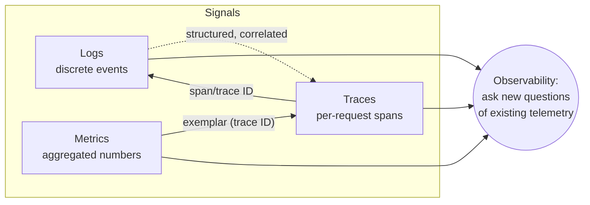
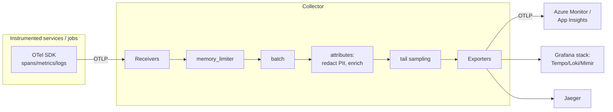
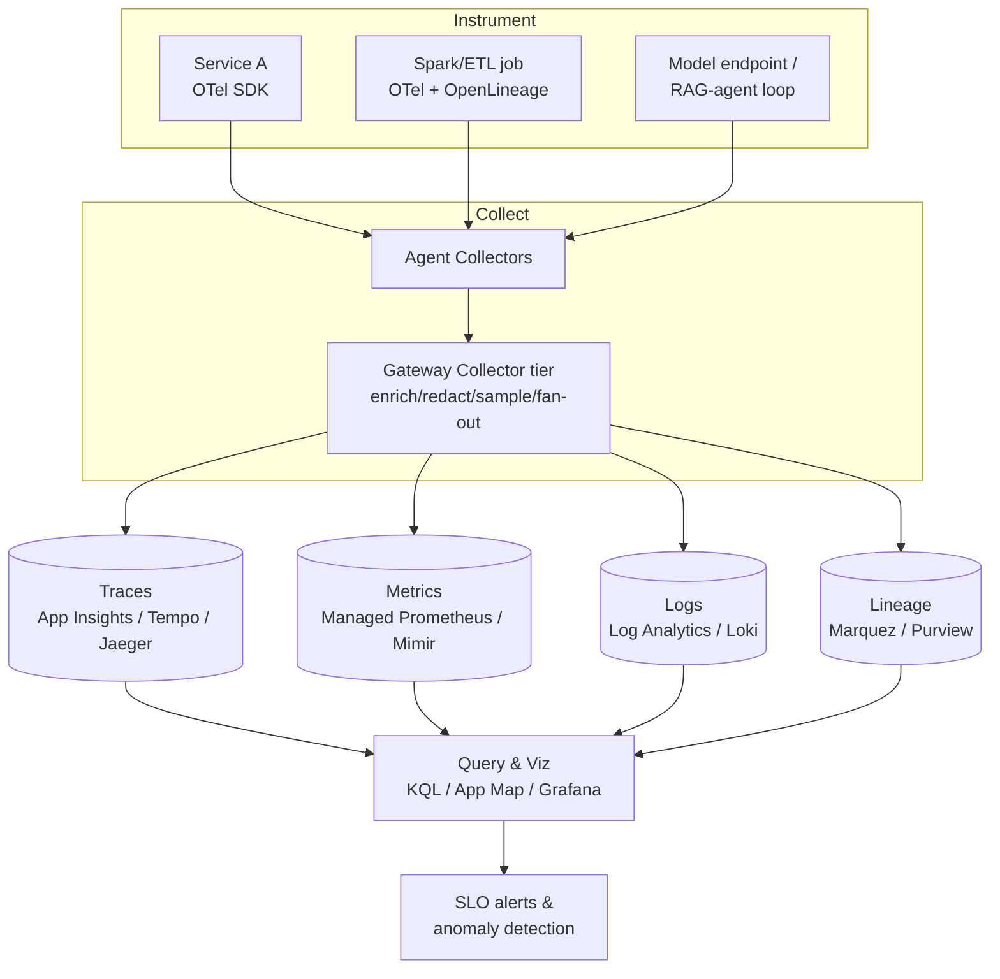
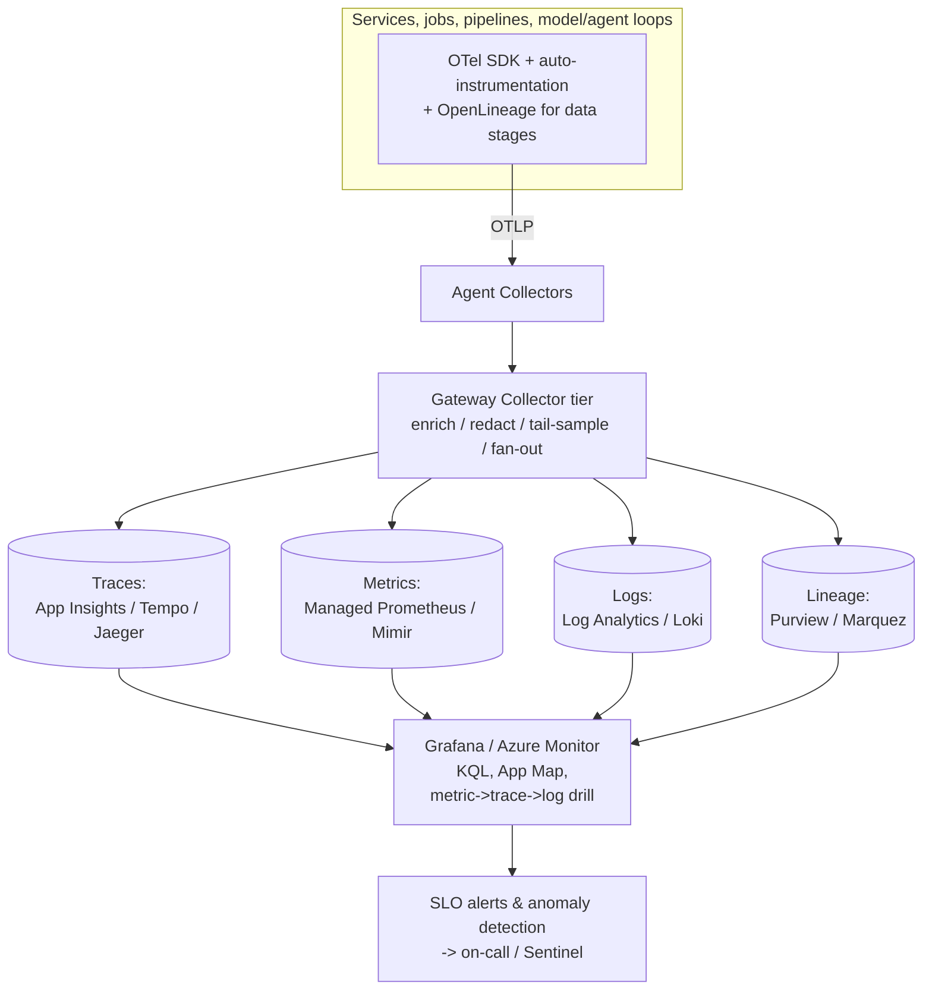
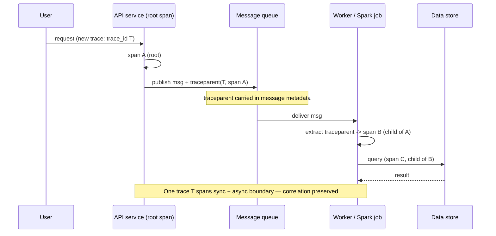
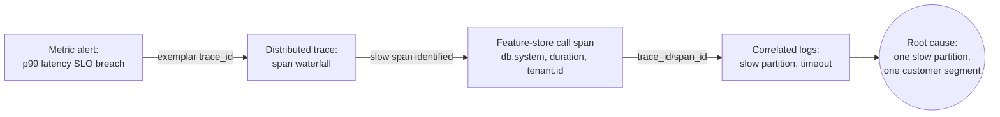

# Observability with OpenTelemetry

> Part of the **Enterprise Data & AI Architecture Handbook** · Phase-18 — FinOps, Observability & Reliability · Chapter 02.
> Estimated study time: **60 min reading + ~4h labs**.
> **Prerequisites:** read [DataOps Foundations](../Phase-09/01_DataOps_Foundations.md) first (this chapter deepens its monitoring/observability treatment into a unified instrumentation discipline).

---

## Executive Summary

The previous chapter, [FinOps and Cost Optimization](01_FinOps_and_Cost_Optimization.md), made a claim it then deferred: **cost observability depends on the same instrumentation discipline as system observability** — you cannot debug (or attribute cost to) what you did not instrument. This chapter supplies that discipline. **Observability is the property of a system that lets you ask arbitrary new questions about its behavior — including questions you never anticipated — from telemetry it already emits, without shipping new code to answer them.** It is the difference between a dashboard that tells you *the checkout latency rose* (monitoring a known-unknown) and the ability to drill from that symptom, through an already-captured distributed trace, to *the one downstream feature-store call that timed out for one customer segment because of one slow partition* (observing an unknown-unknown). Monitoring answers questions you knew to ask; observability lets you ask the ones you didn't.

The industry has converged on a three-signal model — **logs, metrics, and traces** (the "three pillars," sometimes extended with events and profiles into "MELT") — and, critically, on a **single vendor-neutral standard for producing and moving them: OpenTelemetry (OTel)**. OpenTelemetry is a CNCF project (formed in 2019 from the merger of OpenTracing and OpenCensus, now the second-most-active CNCF project after Kubernetes itself) that provides a consistent API, per-language SDKs, a wire protocol (**OTLP**), a vendor-neutral **Collector**, and **semantic conventions** so that instrumentation is written *once* and exported *anywhere* — Azure Monitor, Grafana, Jaeger, or a proprietary APM — without re-instrumenting the code. Before OpenTelemetry, every observability vendor shipped its own proprietary agents and SDKs; instrumenting for one vendor locked you to it, and switching meant re-instrumenting every service. OpenTelemetry broke that lock-in, which is why it has become the default.

For data and AI platforms the stakes are distinctive. A request no longer flows through a handful of synchronous microservices; it fans out across **asynchronous message queues, Spark jobs, orchestrated DAGs, model-serving endpoints, and RAG/agent loops** — and the single hardest observability problem is **maintaining correlation (context propagation) across those asynchronous and batch boundaries**, exactly where naive instrumentation loses the thread and every component's own metrics look healthy while the end-to-end experience degrades. This chapter also treats **data observability** as a first-class, distinct concern: system observability tells you the pipeline *ran*; data observability (freshness, volume, schema, distribution, lineage — via OpenLineage and quality frameworks) tells you the pipeline produced *correct* data, which is a different and equally important question.

The platform bias is **Azure-primary (~60%)** — the **Azure Monitor OpenTelemetry Distro**, Application Insights (distributed tracing, Application Map, Live Metrics), Log Analytics workspaces and **KQL**, Azure Managed Grafana, and Managed Prometheus — **~30% enterprise open source** (the OpenTelemetry Collector and SDKs, **Jaeger** for traces, **Prometheus** for metrics, the **Grafana stack** — Tempo/Loki/Mimir — and **OpenLineage/Marquez** for data lineage) — and **~10% AWS/GCP comparison-only** (AWS X-Ray/CloudWatch/ADOT; GCP Cloud Trace/Monitoring/Logging), contrasted honestly on capability and lock-in.

**Bottom line:** observability is not a dashboard you buy; it is an **instrumentation discipline you engineer into every service and pipeline stage**. This chapter's ADR (§40) formalizes it: **OpenTelemetry with OTLP is the single vendor-neutral instrumentation standard, and W3C Trace Context must be propagated across every boundary — synchronous, asynchronous, and data-pipeline — so that end-to-end correlation is never silently lost.** The dominant failure mode is not the absence of dashboards but **broken correlation across an async or batch seam**, the same "compounds silently, every component looks healthy" pattern this handbook has traced from event-driven SLA drift to digital-twin divergence, now applied to the telemetry that is supposed to catch all the others.

---

## Learning Objectives

By the end of this chapter you will be able to:

1. **Distinguish monitoring from observability**, and explain the three signals (logs, metrics, traces) — what each is for, and what each cannot do alone.
2. **Explain the OpenTelemetry architecture** — API, SDKs, OTLP, the Collector (receivers/processors/exporters), and semantic conventions — and why vendor-neutral instrumentation matters.
3. **Implement distributed tracing with correct context propagation**, including across asynchronous and data-pipeline boundaries using W3C Trace Context.
4. **Design data-pipeline observability** distinct from system observability — freshness, volume, schema, distribution, and lineage (OpenLineage) — building on [DataOps Foundations](../Phase-09/01_DataOps_Foundations.md).
5. **Deploy the OpenTelemetry Collector** in agent and gateway topologies, and apply sampling (head vs tail) and cardinality controls to manage cost.
6. **Integrate with Azure Monitor / Application Insights** and know when to route to the Grafana stack instead — and how to avoid vendor lock-in either way.

---

## Business Motivation

Distributed systems fail in ways that a single service's logs can never explain. When a data platform spans dozens of microservices, streaming jobs, orchestrated pipelines, and model endpoints, a user-visible problem — a slow dashboard, a stale report, a wrong recommendation — is almost never caused where it is *observed*. It is caused three hops upstream, in a service whose own metrics are green, by an interaction the designers never anticipated. **The cost of not being able to answer "why did this happen?" is measured in mean-time-to-resolution (MTTR)** — the hours or days engineers spend correlating logs by hand across systems, during which the incident continues, trust erodes, and the on-call burns out.

The business case for observability rests on a few hard realities:

- **You cannot debug what you did not instrument.** Once an incident is happening, it is too late to add the telemetry that would explain it. Observability must be engineered *before* the incident, into every service — which is why it is an architectural discipline, not a reactive purchase.
- **MTTR dominates the cost of incidents.** For a revenue-critical platform (the retail commerce path, the financial reporting golden source, the healthcare clinical feed), every extra hour of unresolved incident has a direct cost. Observability's ROI is measured in MTTR reduction — from "days of manual log correlation" to "minutes of trace drill-down."
- **Vendor lock-in is a strategic cost.** Instrumenting an entire estate against one APM vendor's proprietary agents historically meant that renegotiating the contract, or switching vendors, required re-instrumenting every service — a multi-quarter tax. OpenTelemetry converts instrumentation into a portable asset, decoupling the *production* of telemetry from the *analysis* of it.
- **Data platforms have a second failure axis.** A pipeline can run perfectly (green system metrics) and still produce wrong data (a schema drift, a freshness lag, a distribution shift). Without **data observability**, this class of failure is invisible until a downstream consumer — or a regulator, or a customer — catches it, which is the most expensive place to catch it (the recurring "silent divergence" pattern).

The business consequence of getting observability right is an organization that resolves incidents in minutes instead of days, ships faster because it can see the effect of its changes, and catches data-correctness failures before they reach consumers. The consequence of getting it wrong is a platform that is a black box under load — precisely when visibility matters most.

---

## History and Evolution

- **Logs first (1960s–2000s).** The original telemetry: applications wrote text logs; operators grepped them. `syslog` (1980s) standardized transport. Logs are still foundational but do not, alone, answer "how does one request flow through many services?"
- **Metrics and time-series (2000s).** Systems like RRDtool, Graphite, and later **Prometheus** (2012, the second CNCF project) made numeric time-series (counters, gauges, histograms) cheap to collect and alert on — excellent for aggregate health, poor for per-request debugging.
- **Distributed tracing (2010).** Google's **Dapper** paper (2010) described tracing a single request across many services via propagated context and spans — the intellectual foundation of everything since. **Zipkin** (Twitter, 2012) and **Jaeger** (Uber, 2015) were the open-source implementations.
- **The standards wars (2016–2019).** Two competing open standards emerged: **OpenTracing** (tracing API) and **OpenCensus** (Google's metrics+tracing libraries). Both aimed at vendor-neutral instrumentation; their coexistence fragmented the ecosystem.
- **OpenTelemetry (2019).** OpenTracing and OpenCensus **merged into OpenTelemetry** under the CNCF, unifying the API, SDKs, and — crucially — adding **OTLP** (a single wire protocol), the **Collector**, and **semantic conventions**. This ended the fragmentation and gave the industry one standard for producing telemetry. OTel is now the second-most-active CNCF project.
- **W3C Trace Context (2020).** The **W3C Trace Context** recommendation standardized the `traceparent`/`tracestate` HTTP headers, so context propagates across services and vendors interoperably — the interoperability backbone of distributed tracing.
- **Data observability (2019–present).** A parallel movement (Monte Carlo, Bigeye, and the open **OpenLineage** standard) recognized that *data* pipelines need their own observability — freshness, volume, schema, distribution, lineage — distinct from system telemetry. OpenLineage brought lineage into the observability conversation.
- **Convergence and profiling (2022–present).** OpenTelemetry stabilized logs (the last of the three signals to reach maturity), added **profiling** as a fourth signal, and vendors (including Azure Monitor via its OpenTelemetry Distro) adopted OTLP ingestion natively. eBPF-based auto-instrumentation (Grafana Beyla, Pixie) began reducing the manual instrumentation burden.

The through-line: telemetry evolved from siloed, vendor-specific signals into a **unified, vendor-neutral, correlated model** — and OpenTelemetry is the standard that made "instrument once, export anywhere" real.

---

## Why This Technology Exists

OpenTelemetry exists to resolve a structural problem the observability market created: **the tight coupling of instrumentation to a specific analysis vendor.** Before OTel, to get telemetry into a vendor's backend you used that vendor's proprietary agent and SDK. That coupling had three bad consequences that no single vendor could fix (because fixing it was against their interest):

1. **Lock-in.** Instrumenting an estate for one vendor made switching prohibitively expensive — you'd re-instrument everything. This suppressed competition and let vendors raise prices against a captive base.
2. **Fragmentation.** Polyglot organizations ran different agents per language and per vendor, with inconsistent data models, so correlating a trace across a Java service, a Python job, and a Go gateway was painful or impossible.
3. **Wasted effort.** Every vendor and every team re-solved the same instrumentation problems (how to trace HTTP, how to propagate context) incompatibly.

OpenTelemetry resolves all three by **standardizing the production and transport of telemetry, and deliberately stopping there** — it does *not* provide storage, dashboards, or analysis. That boundary is the whole point: by owning only the instrumentation and the wire protocol (OTLP), OTel decouples "how you produce telemetry" from "who analyzes it," turning instrumentation into a portable asset and turning the backend into a competitive, swappable choice. You instrument once with OTel and can send the same telemetry to Azure Monitor today and Grafana tomorrow — or both at once — by changing Collector configuration, not code.

Distributed tracing specifically exists because **metrics and logs cannot answer causal, per-request questions across service boundaries.** A metric tells you *p99 latency rose*; it cannot tell you *which requests* were slow or *where* in the call graph. Logs record what each service did in isolation but carry no shared identifier to stitch one request's journey together. Tracing exists to supply that missing dimension: a propagated **trace context** that ties every span of a single request's fan-out into one causal tree — the only signal that answers "where, in this distributed system, did *this* request spend its time and *why*?"

---

## Problems It Solves

- **Vendor lock-in of instrumentation.** One standard (OTel/OTLP) means instrument once, export anywhere; switching backends is a config change, not a re-instrumentation project.
- **The "why did this request fail/slow?" question.** Distributed tracing reconstructs a single request's path across all services, pinpointing where latency or errors originated.
- **Cross-language inconsistency.** A consistent API, SDKs, and semantic conventions make telemetry uniform across a polyglot estate, so correlation actually works.
- **Signal silos.** Unifying logs, metrics, and traces under one model (with shared trace/span IDs and exemplars) lets you pivot from an aggregate metric spike to the exact traces and logs behind it.
- **Lost correlation across boundaries.** W3C Trace Context propagation carries the trace across HTTP, gRPC, message queues, and pipeline stages so end-to-end visibility survives asynchronous and batch seams.
- **High MTTR.** By making the system observable, it collapses incident resolution from manual multi-system log correlation to interactive trace/metric/log drill-down.
- **Data-correctness blindness.** Data observability (freshness/volume/schema/distribution/lineage via OpenLineage) surfaces the class of failure where the pipeline runs but the data is wrong.
- **Cost-visibility instrumentation.** The same disciplined, high-cardinality telemetry that powers debugging also powers the cost observability that FinOps (Chapter 01) depends on.

---

## Problems It Cannot Solve

- **It is not analysis, storage, or alerting.** OpenTelemetry produces and moves telemetry; it deliberately does not store, visualize, or alert. You still need a backend (Azure Monitor, Grafana stack, Jaeger + Prometheus, a vendor APM). Confusing "we adopted OTel" with "we have observability" is a category error — OTel is the *plumbing*, not the destination.
- **It cannot make an uninstrumented system observable.** Auto-instrumentation covers common libraries, but the domain-specific spans, attributes, and business context that make telemetry *useful* must still be added deliberately. Garbage-in-garbage-out: poor instrumentation yields poor observability regardless of the backend.
- **It cannot overcome bad data hygiene.** Inconsistent span names, missing semantic-convention attributes, or unbounded cardinality produce telemetry that is expensive to store and hard to query. Observability quality is a function of instrumentation discipline.
- **It does not replace data quality testing.** Data observability *detects* freshness/volume/schema anomalies; it does not *validate* business rules — you still need contract tests and quality frameworks (Great Expectations, dbt tests) for correctness assertions. Observability and testing are complementary.
- **It cannot fix a system you can't reason about.** Observability makes behavior visible, but a system so complex that no human can interpret its telemetry is still unmanageable. Observability supports good architecture; it does not substitute for it.
- **It has a cost, and infinite telemetry is infinitely expensive.** Collecting everything at full fidelity is financially and operationally unsustainable. Sampling and cardinality control are mandatory — you must decide what *not* to keep, which means observability can never be perfectly complete.

---

## Core Concepts

### 2.1 Monitoring versus Observability

**Monitoring** watches predefined signals against predefined thresholds to answer **known-unknowns**: "is CPU above 80%?", "is error rate above 1%?". It is essential and cheap, but it can only tell you about failure modes you anticipated and instrumented a dashboard/alert for. **Observability** is the broader property: enough high-quality, correlated telemetry that you can ask **unknown-unknowns** — arbitrary new questions about *why* the system behaves as it does — *after* the fact, without shipping new instrumentation. Monitoring is a subset of what observability enables. The practical test: if a novel incident happens and you can root-cause it from telemetry you already collect, you are observable; if you have to add logging and redeploy to understand it, you were only monitoring.

### 2.2 The Three Signals (Pillars)

- **Logs** — timestamped records of discrete events, structured (key-value/JSON, strongly preferred) or unstructured (text). Best for detailed, high-context event records and forensic detail. Weakness: high volume, and without a shared correlation ID they don't stitch into a request's journey.
- **Metrics** — numeric measurements aggregated over time: **counters** (monotonic, e.g. requests served), **gauges** (point-in-time, e.g. queue depth), **histograms** (distributions, e.g. latency buckets), and **up-down counters**. Cheap to store, ideal for aggregate health, dashboards, and alerting. Weakness: aggregation loses per-request detail, and **cardinality** (labels × values) can explode cost.
- **Traces** — the record of a single request's path across services as a tree of **spans** (each a timed unit of work with a start/end, attributes, and events), tied together by a shared **trace ID** and parent/child **span IDs**. The only signal that answers "where did this request spend its time, across the whole system?" Weakness: at scale you must **sample**, so not every request is traced.

The power is in **correlation**: a metric spike links (via exemplars) to representative traces; a trace links (via trace ID) to the exact logs its spans emitted. The three signals together — not any one alone — deliver observability.

### 2.3 Distributed Tracing and Context Propagation

A trace begins when a request enters the system; the entry service creates a **root span** and a **trace context** (trace ID + span ID + flags). As the request calls downstream services, the context is **propagated** — injected into outgoing requests and extracted by receivers — so each downstream span records itself as a **child** of the caller's span. The standard for this propagation is **W3C Trace Context** (`traceparent` and `tracestate` headers). The result is a single causal tree spanning every service the request touched.

**Context propagation is the load-bearing mechanism and the most common point of failure.** Across a synchronous HTTP/gRPC call it is usually automatic. Across an **asynchronous boundary** — a message on Kafka/Service Bus, a row landing in a table a Spark job later reads, a task an orchestrator schedules — the context must be **explicitly carried** (e.g., in message headers, in metadata) and re-extracted by the consumer, or the trace **breaks** and the downstream work appears as an unrelated, orphaned trace. This is exactly where data-platform tracing is hard and where the chapter's ADR focuses: **every boundary, including async and batch, must propagate context.**

**Baggage** is a related mechanism: key-value pairs propagated alongside trace context (e.g., a tenant ID or experiment flag) so downstream services can act on or record cross-cutting request attributes.

### 2.4 OpenTelemetry: API, SDK, OTLP, Collector, Semantic Conventions

- **API** — the language-specific interface application code calls to create spans, record metrics, and emit logs. Stable and decoupled from any implementation.
- **SDK** — the implementation behind the API: sampling, batching, and export. Configurable per language.
- **OTLP (OpenTelemetry Protocol)** — the single, vendor-neutral wire protocol (gRPC/HTTP) for transmitting all three signals. The lingua franca that makes "export anywhere" possible.
- **Collector** — a standalone, vendor-neutral service that **receives** telemetry (OTLP and many other formats), **processes** it (batching, filtering, sampling, redaction, enrichment), and **exports** it to one or many backends. Runs as an **agent** (near the workload — sidecar/DaemonSet) or a **gateway** (a central pipeline). The Collector is what lets you change backends, add processing, or fan out to multiple destinations without touching application code.
- **Semantic conventions** — a standardized vocabulary of attribute names (`http.request.method`, `db.system`, `messaging.destination.name`, `gen_ai.*` for LLM calls) so telemetry is consistent and queryable across services and vendors. Following them is what makes cross-service correlation and portable dashboards actually work.

### 2.5 Data Observability (a distinct discipline)

System observability tells you the pipeline *executed*; **data observability** tells you it produced *correct, timely, well-formed* data. Its canonical dimensions (popularized as the "five pillars"):

- **Freshness** — is the data up to date, or is it lagging its SLA?
- **Volume** — did the expected number of rows/records arrive (not a silent 10% drop)?
- **Schema** — did the structure change unexpectedly (a dropped/renamed/retyped column)?
- **Distribution** — are values within expected ranges (nulls, min/max, category proportions), or has the data drifted?
- **Lineage** — what upstream sources and transformations produced this dataset, and what downstream consumers depend on it? (Captured via **OpenLineage**, the open standard, and served by tools like Marquez.)

Data observability is complementary to — not a replacement for — the data-quality testing and contracts from [DataOps Foundations](../Phase-09/01_DataOps_Foundations.md): observability *detects anomalies* in production; contracts and tests *assert rules* before promotion. Both are needed, and both extend the "instrument at the source" principle to the data itself.

---

## Internal Working

### 3.1 How a Span Is Created, Propagated, and Exported

When instrumented code enters a unit of work, the SDK **starts a span**: it records a start timestamp, generates a span ID, and links it to the active trace context (creating a root span and trace ID if none exists, else attaching as a child). The span accumulates **attributes** (semantic-convention key-values), **events** (timestamped annotations), and a **status**. On completion the SDK records the end timestamp and hands the span to the **processor** (typically a batch processor that buffers spans for efficient export). The **exporter** serializes batched spans as **OTLP** and ships them to the Collector or directly to a backend. Meanwhile, at every outbound call, the **propagator** injects the current context into the carrier (HTTP headers, message metadata); at every inbound call the receiver's propagator extracts it, so the downstream span attaches to the correct parent. The trace tree is thus assembled from spans emitted independently by many services, stitched together at query time by shared trace ID and parent references.

### 3.2 How the Collector Pipeline Works

The Collector is a configurable pipeline of three stages: **receivers** accept telemetry (OTLP, Prometheus scrape, Jaeger, Zipkin, host metrics, and dozens more); **processors** transform it in order — `memory_limiter` (backpressure/OOM protection), `batch` (efficient export), attribute processors (redact PII, add resource metadata like `cloud.region`/`service.name`), and **tail-sampling** (decide which traces to keep after seeing the whole trace); **exporters** send the result to one or more backends. Because receivers, processors, and exporters are independent and composable, one Collector can ingest many formats, apply consistent enrichment/redaction/sampling centrally, and fan out to Azure Monitor *and* a Grafana stack simultaneously — the mechanism behind vendor-neutrality and centralized telemetry governance.

### 3.3 How Sampling and Cardinality Control Manage Cost

Tracing every request at scale is prohibitively expensive to store and query, so **sampling** decides which traces to keep. **Head-based sampling** decides at the trace's start (e.g., keep 5% randomly, or always keep if a debug flag is set) — cheap and simple but blind to whether the trace turned out interesting. **Tail-based sampling** buffers all spans of a trace and decides *after* seeing the whole thing (e.g., keep every trace that had an error or exceeded a latency threshold, plus a baseline sample of the rest) — far more valuable but requires the Collector to hold complete traces in memory, which is more complex and resource-intensive. **Cardinality** is the parallel cost driver for **metrics**: every unique combination of label values is a distinct time series, so putting a high-cardinality attribute (user ID, request ID, full URL) on a metric label can explode the time-series count and cost, potentially destabilizing the metrics backend. The rule: **high-cardinality identifiers belong on traces and logs (or metric exemplars), never on metric labels** — a discipline that, when violated, turns the observability system itself into the incident (see Case Study 2).

---

## Architecture

A production observability architecture for a data/AI platform has five layers:

1. **Instrumentation layer** — OTel API/SDK in every service and job (auto-instrumentation for common libraries + manual spans/attributes for domain logic), emitting logs, metrics, and traces via OTLP. Data pipeline stages additionally emit **OpenLineage** events.
2. **Collection layer** — OpenTelemetry Collectors, typically **agents** near each workload (sidecar/DaemonSet) forwarding to a central **gateway** Collector tier that applies consistent enrichment, PII redaction, tail sampling, and fan-out.
3. **Storage/backend layer** — signal-appropriate stores: a **traces** backend (Application Insights, Grafana Tempo, or Jaeger), a **metrics** backend (Azure Managed Prometheus/Monitor metrics or Mimir), and a **logs** backend (Log Analytics or Grafana Loki). Data lineage lands in a lineage store (Marquez/Purview).
4. **Query/visualization layer** — dashboards and exploration: Azure Monitor + **KQL** and Application Map, or Grafana with correlated panels linking metrics → traces → logs.
5. **Alerting/action layer** — SLO-based alerts (deepened in Phase-18 Chapter 04, Reliability and SRE) routed to action groups/on-call, and anomaly detection on both system and data signals.

---

## Components

- **OpenTelemetry API** — the stable, implementation-agnostic instrumentation interface application code targets.
- **OpenTelemetry SDK** — per-language implementation (sampling, batching, export).
- **OTLP** — the vendor-neutral wire protocol for all three signals.
- **OpenTelemetry Collector** — receiver/processor/exporter pipeline; agent and gateway modes; the vendor-neutrality and telemetry-governance chokepoint.
- **Semantic conventions** — the standardized attribute vocabulary (including `gen_ai.*` for LLM telemetry).
- **Propagators** — inject/extract W3C Trace Context (and baggage) across boundaries.
- **Auto-instrumentation** — zero/low-code instrumentation for common frameworks (and eBPF-based options like Grafana Beyla).
- **Azure Monitor OpenTelemetry Distro** — Microsoft's supported OTel distribution wiring SDKs to Application Insights.
- **Application Insights / Log Analytics** — Azure's traces/metrics/logs backend, queried with **KQL**, with Application Map and Live Metrics.
- **Jaeger / Prometheus / Grafana (Tempo, Loki, Mimir)** — the open-source backend stack for traces/metrics/logs.
- **OpenLineage / Marquez** — the open standard and reference server for data lineage events.
- **Data-quality frameworks (Great Expectations, dbt tests)** — complementary correctness assertions feeding data observability.

---

## Metadata

Telemetry is only observable if it carries the metadata that lets you slice and correlate it. The critical dimensions:

- **Resource attributes** — `service.name`, `service.version`, `deployment.environment`, `cloud.region`, `k8s.pod.name`: *what* emitted the telemetry. These make it possible to filter by service, version, and environment, and to correlate a regression with a specific deployment.
- **Trace/span identifiers** — `trace_id`, `span_id`, `parent_span_id`: the correlation backbone that stitches signals together and reconstructs the request tree.
- **Semantic-convention attributes** — standardized keys (`http.*`, `db.*`, `messaging.*`, `gen_ai.*`) that make telemetry queryable uniformly across services and portable across backends.
- **Business/domain attributes** — `tenant.id`, `customer.segment`, `pipeline.name`, `model.name` (with cardinality discipline): the context that turns generic telemetry into answers to *business* questions ("which customer segment was affected?").
- **Cost-allocation join keys** — the same tags the FinOps chapter requires, so telemetry and cost data can be correlated (a slow, expensive query is both a performance and a cost observation).
- **Lineage metadata** — the OpenLineage job/run/dataset facets tying data outputs to their inputs and transformations.

As everywhere in this handbook, the enforcement point matters: attributes must be applied **consistently at instrumentation time via semantic conventions**, because inconsistent naming across teams makes cross-service correlation impossible after the fact.

---

## Storage

Each signal has a different storage profile, and matching the store to the signal is what keeps observability affordable:

- **Traces** are high-volume, write-once, queried by trace ID or by attribute filters, and short-lived in value (you rarely query a trace from six months ago). Stored in trace-optimized backends (Tempo on object storage, Jaeger on Cassandra/Elasticsearch, Application Insights) with **short retention** (days to weeks) and **sampling** to control volume.
- **Metrics** are compact numeric time series, queried over long ranges for trends and alerting. Stored in TSDBs (Prometheus/Mimir, Azure Monitor metrics) with **longer retention** (months to years for capacity trends) — cheap per series but expensive at high **cardinality**, which is the storage cost lever to control.
- **Logs** are the highest-volume, highest-cost signal, queried for forensic detail. Stored in Log Analytics/Loki with **tiered retention** (hot/searchable for weeks, archived cheaply thereafter) and aggressive filtering/structuring at the Collector to avoid storing noise.
- **Lineage** is comparatively low-volume metadata, stored in a lineage store (Marquez, Purview) and retained long for audit and impact analysis.

The cross-cutting discipline (directly reusing the FinOps chapter's storage-tiering levers): **filter and sample at the Collector before storage, structure logs so they're queryable not just greppable, tier retention by signal value, and control metric cardinality** — because the observability platform is itself a data platform whose bill can rival the systems it observes.

---

## Compute

The compute cost of observability lives in three places, each with its own controls:

- **In-process instrumentation overhead.** SDKs add small CPU/memory cost per span/metric/log. Well-designed SDKs (batching, async export, sampling) keep this to low single-digit percentages; the failure mode is over-instrumentation (a span per trivial function) or synchronous export blocking the request path. Instrument meaningful units of work, export asynchronously.
- **Collector compute.** The gateway Collector tier does real work — batching, enrichment, redaction, and especially **tail sampling** (which holds whole traces in memory). Size it for peak telemetry volume, use `memory_limiter` to protect against overload, and scale it horizontally (it is stateless except for in-flight tail-sampling buffers).
- **Backend query/ingest compute.** Ingesting and indexing telemetry, and running dashboard/alert queries, is the largest compute cost. Sampling, cardinality control, retention tiering, and efficient queries (bounded time ranges, avoiding unbounded high-cardinality group-bys) are the levers — the same efficiency-equals-cost principle as the rest of the platform.

The recurring caution from FinOps applies directly: **the observability system must not cost more than the value of the incidents it helps resolve.** Sampling and cardinality discipline are not optional optimizations; they are what make observability sustainable at data-platform scale.

---

## Networking

- **Telemetry egress.** Shipping traces/metrics/logs to a SaaS backend (or across regions to a central Collector) is network traffic billed per GB — at high volume this is a real line item, and a reason to sample/filter *before* egress at the agent Collector.
- **Collector topology and locality.** Agent Collectors co-located with workloads (sidecar/DaemonSet) minimize cross-network telemetry hops and let you batch/compress before forwarding to the gateway — the "process near the source" principle applied to telemetry, cutting both latency and egress cost.
- **Protocol and compression.** OTLP over gRPC with compression is efficient; the Collector's `batch` processor amortizes network overhead. For cross-region or hybrid setups, private connectivity (Private Link to Azure Monitor) keeps telemetry off the public internet, consistent with the zero-trust posture from the security phase.
- **Context-propagation headers.** Trace context travels *in* the request path (headers/message metadata), adding negligible bytes but requiring that intermediaries (proxies, gateways, message brokers) **preserve** the `traceparent`/`tracestate` and any baggage headers — a stripped header is a broken trace.

---

## Security

Telemetry is sensitive, and observability introduces its own attack surface:

- **PII and secrets in telemetry.** Logs, span attributes, and even URLs routinely capture personal data, tokens, or query contents. **Redact/scrub at the Collector** (attribute processors) before storage, and follow semantic conventions that discourage capturing sensitive fields. This ties directly to the data-privacy and data-security phases — telemetry is in-scope for GDPR/PII handling, not exempt from it.
- **Access control on telemetry.** Traces and logs reveal architecture, data flows, customer identifiers, and business signals; the observability backend must be RBAC-scoped (Log Analytics/Grafana permissions), and telemetry treated with a classification appropriate to what it contains.
- **Telemetry as a security signal.** Observability is a security asset: anomalous traces (unexpected calls, privilege escalations), log patterns, and metric spikes are often the first detectable signal of an incident — the same "cost spike as breach signal" point from FinOps, generalized. Feed security-relevant telemetry to the SIEM (Microsoft Sentinel).
- **Integrity and tamper-evidence.** For audit-relevant telemetry (who accessed what), the pipeline and store must resist tampering — append-only, access-controlled, retained per compliance obligation.
- **Supply-chain and Collector security.** The Collector is a privileged network component receiving from everywhere and exporting outward; secure its configuration, restrict its receivers/exporters, and keep its (and the SDKs') versions patched.

---

## Performance

- **Observability serves performance engineering.** Distributed traces are *the* tool for diagnosing latency: the span waterfall shows exactly where a request spends time, turning "the API is slow" into "the p99 is dominated by a serialized N+1 call to the feature store." Performance engineering (Phase-18 Chapter 05) depends on this visibility.
- **Instrumentation must not degrade what it measures.** Synchronous/blocking export, excessive span creation, or lock contention in the SDK can add latency to the very path being observed. Use async batched export, sample intelligently, and instrument at meaningful granularity — the observer effect is real and must be bounded.
- **Latency percentiles, not averages.** As throughout the handbook, the SLO metric is **p95/p99**, not the mean — histograms (an OTel metric instrument) capture the distribution; a trace explains the tail. An average hides the slow tail that users actually feel.
- **Exemplars link the two views.** Metric exemplars attach a sample trace ID to a histogram bucket, so a latency-spike alert links directly to a representative slow trace — collapsing the metric→trace investigation to one click.

---

## Scalability

Observability must scale with the system it watches, along two axes:

- **Telemetry volume scales super-linearly with the system.** More services, more requests, and especially more fan-out (microservices, RAG/agent loops that make many model calls per request) multiply span and log volume faster than traffic grows. The scaling levers are **sampling** (head/tail), **cardinality control**, **filtering at the Collector**, and a **horizontally scalable gateway tier** and backend. A common failure is an observability platform that scales its cost linearly (or worse) with traffic and becomes unaffordable — the FinOps unit-economics discipline (cost per telemetry GB, cost per traced request) applies to observability itself.
- **The practice scales through standards and automation.** Consistent semantic conventions, shared auto-instrumentation, a governed Collector configuration, and self-serve dashboards let observability scale across many teams without each reinventing instrumentation — the federated model again. A platform team owns the Collector tier, conventions, and backends; product teams instrument within them.
- **Backends scale per signal.** Traces (object-storage-backed like Tempo), metrics (horizontally sharded TSDB like Mimir), and logs (Loki/Log Analytics) each scale independently — matching each signal's store to its volume and query pattern is what keeps the whole platform scalable and affordable.

---

## Fault Tolerance

- **The observability system must survive the incidents it observes.** If the monitoring platform goes down (or is overwhelmed by the very traffic spike causing the incident), you are blind exactly when it matters most. The Collector's `memory_limiter`, backpressure, buffering/retry on export, and a resilient (often multi-replica, HA) backend are what keep telemetry flowing under stress. A stale or missing dashboard during an incident is a failed control.
- **Graceful degradation of telemetry.** Under overload, shed the least valuable telemetry first (drop verbose debug logs, increase head-sampling aggressiveness) to preserve the critical signals (errors, SLO metrics) — the priority-load-shedding principle from the retail chapter, applied to telemetry.
- **Don't create a hard dependency on the telemetry path.** Application code must **fail open** if the telemetry backend is unreachable — a Collector outage must never block or crash the business request. Export is best-effort and asynchronous; the app degrades observability, not availability.
- **Monitor the monitors.** The observability pipeline needs its own health checks (telemetry freshness, Collector queue depth, export error rate). The recurring "verification gap" lesson applies: assume the pipeline can silently break, and alert on its own liveness — otherwise you discover it's broken only when you reach for it mid-incident.

---

## Cost Optimization

Observability is one of the largest and most silently-growing line items on a data platform's bill, so it is a first-class FinOps target (directly extending [FinOps and Cost Optimization](01_FinOps_and_Cost_Optimization.md)). The levers:

- **Sample traces** — head sampling to cap baseline volume, **tail sampling** to keep the *interesting* traces (errors, slow requests) at high fidelity while discarding the boring majority. Keeping 100% of traces is almost never worth the cost.
- **Control metric cardinality** — the single biggest metrics cost driver; keep high-cardinality identifiers off metric labels (put them on traces/exemplars). Audit and cap label cardinality.
- **Filter and structure logs at the Collector** — drop noise before it's stored, structure logs so they're queryable (avoiding expensive full-text scans), and don't log at debug level in production by default.
- **Tier retention by signal value** — short retention for traces/verbose logs, longer only for the metrics and audit logs that have long-term value; archive cheaply rather than keeping everything hot.
- **Right-size the Collector and backends** — autoscale the gateway tier, use managed backends where they're cheaper than self-hosting at your scale, and track observability's own unit economics.

**Worked FinOps example — sampling a high-volume trace stream.** A platform generates 500M traced requests/day. Storing 100% of traces at ~$X/GB is (illustratively) ~$50,000/month and the trace backend is straining. Switching to **tail sampling** — keep 100% of traces with errors or p99+ latency (say ~2% of traffic) plus a 3% baseline random sample of the rest — retains ~5% of trace volume, cutting trace storage to ~$2,500/month, a ~$47,500/month (95%) reduction, **while keeping virtually every trace an engineer would actually want** (the errors and slow tails are kept in full; only redundant healthy traces are dropped). The complementary metrics lever: an audit finds a `request_id` label on three histograms driving 20M active series; moving it to exemplars collapses those to a few thousand series and removes the largest single metrics cost. **Decision:** tail-sample traces, exemplar-link the interesting ones to metrics, cap metric label cardinality by policy at the Collector — and **verify** the realized storage drop in the next billing cycle (an unverified "optimization" that a mis-configured sampler quietly reverted is the observability version of the FinOps verification gap).

---

## Monitoring

Monitoring — the known-unknowns subset of observability — is built *on top of* the instrumented signals:

- **RED metrics for services** — **R**ate, **E**rrors, **D**uration (latency) per service/endpoint: the minimal dashboard for request-driven components.
- **USE metrics for resources** — **U**tilization, **S**aturation, **E**rrors for CPU/memory/disk/queues: the minimal view of resource health.
- **Data pipeline monitoring** — freshness lag, row-count deltas, job success/failure, and SLA adherence per pipeline (the data-observability signals surfaced as monitored thresholds).
- **SLO-based alerting** — alert on **symptoms users feel** (SLO burn: error-budget consumption, latency-SLO breach) rather than on every low-level cause, to reduce alert fatigue (developed fully in Phase-18 Chapter 04, Reliability and SRE).
- **Dashboards** — Azure Monitor workbooks / Application Map or Grafana, sliced by service/version/environment, with metric→trace→log drill-through.

The mechanics of building these dashboards and metric queries in **Prometheus and Grafana** are deepened in Phase-18 Chapter 03; the point here is that monitoring is the *thresholded, anticipated* layer resting on the *broader, exploratory* observability foundation this chapter establishes.

---

## Observability

This is the chapter's own subject, so this section states the maturity model that separates real observability from telemetry collection:

1. **Level 0 — Siloed signals.** Logs, metrics, and traces exist but are disconnected (different tools, no shared IDs). You can see *that* something is wrong but must manually correlate across systems — high MTTR.
2. **Level 1 — Collected and centralized.** Signals flow through OpenTelemetry into a common backend, but instrumentation is shallow (auto-instrumentation only, no domain attributes). You can answer common questions but not domain-specific ones.
3. **Level 2 — Correlated.** Trace/span IDs stitch metrics→traces→logs; exemplars link aggregate spikes to representative traces; context propagates across sync boundaries. You can drill from symptom to cause for most incidents.
4. **Level 3 — Complete correlation, including async/data boundaries.** Context propagates across *every* seam — message queues, Spark jobs, orchestrated DAGs, model/agent loops — and **data observability** (freshness/volume/schema/distribution/lineage) sits alongside system observability. You can root-cause novel, cross-boundary, and data-correctness incidents from existing telemetry. This is the target the ADR mandates.
5. **Level 4 — Actionable and economical.** Observability is tied to SLOs and error budgets, its own cost is governed (sampling/cardinality), and it feeds automated responses. Observability is a sustained capability, not a cost center.

The load-bearing insight, repeated because it is the whole point: **observability is a property you engineer via disciplined, correlated, boundary-crossing instrumentation — not a tool you install.** The dominant real-world gap is Level 2→3: correlation that silently breaks at the asynchronous and data-pipeline seams where data platforms live.

---

## Operational Response Playbook

Two representative observability incidents as signal → detection → remediation. The meta-point: the observability platform is itself operated, and its failures are operational events.

**Playbook 1 — Broken trace correlation across an async boundary.**
- **Signal:** an end-to-end latency or error regression is visible in aggregate metrics, but traces "end" at a message-queue producer or a pipeline stage — downstream work appears as orphaned, parentless traces, so no single trace shows the full path and root-causing stalls.
- **Detection query:** in the trace backend, search for the affected operation and inspect trace completeness — do traces terminate at a known async boundary (Service Bus/Kafka publish, ADF/Spark handoff)? Check whether the consumer's spans have a `parent_span_id` linking upstream, and whether `traceparent` is present in the message metadata / pipeline context.
- **Remediation:** restore context propagation across the boundary — inject `traceparent` (and baggage) into message headers / pipeline metadata at the producer, extract and continue the trace at the consumer. Add a **span link** where a strict parent-child relationship doesn't fit (fan-in/batch). Add a standing check that traces for critical end-to-end flows are *complete* (no orphaned downstream spans), so a future propagation regression is caught by the observability platform itself. This is the exact failure the ADR exists to prevent.

**Playbook 2 — Cardinality explosion destabilizing the metrics backend (the observability system becomes the incident).**
- **Signal:** the metrics backend (Prometheus/Mimir/Azure Monitor) shows surging active-series count, rising ingest latency/cost, dropped samples, or dashboards timing out — often right after a deploy that added a new metric label.
- **Detection query:** identify the top metrics by active series and the labels driving cardinality (e.g., a `user_id`/`request_id`/full-`url` label producing millions of series); correlate the onset with a recent deployment.
- **Remediation:** stop the bleed — drop or relabel the offending high-cardinality label at the **Collector** (attribute/metric-relabel processor) so the backend recovers; move the identifier to **trace attributes / exemplars / logs** where high cardinality belongs. Add a **cardinality guardrail** (a Collector policy or CI check on metric definitions) so a high-cardinality label can't reach production again. Verify active-series count and ingest cost return to baseline next period.

---

## Governance

Observability governance keeps the practice consistent, affordable, and privacy-safe across teams:

- **Semantic-convention standards, enforced.** A governed set of attribute names, span-naming conventions, and required resource attributes (`service.name`, `deployment.environment`, cost-allocation tags), enforced via shared instrumentation libraries and CI checks — because inconsistent naming makes cross-team correlation impossible.
- **Cardinality and sampling policy.** Central policy (applied at the Collector) on metric label cardinality, log verbosity, and trace sampling rates — computational guardrails, not guidelines, so the observability bill and backend stability are protected by construction (the FinOps guardrails-not-gates principle).
- **PII/redaction policy.** Mandatory scrubbing of sensitive fields at the Collector, aligned with the data-privacy phase; telemetry is in-scope for classification and retention rules.
- **Ownership and RACI.** A platform team owns the Collector tier, conventions, backends, and shared dashboards; product teams own their services' instrumentation quality and SLOs — federated ownership.
- **Telemetry retention and cost governance.** Retention tiers per signal, and observability's own unit economics (cost per traced request, cost per GB) tracked on the FinOps cadence.
- **Lineage as governance.** OpenLineage lineage feeds the data-governance catalog (Purview/OpenMetadata from the governance phase), so observability and governance share one lineage source of truth.

---

## Trade-offs

- **Fidelity vs. cost.** More telemetry (100% traces, high-cardinality metrics, debug logs) means better observability but higher cost and operational load. Sampling and cardinality control trade some completeness for sustainability — the central tension.
- **Head vs. tail sampling.** Head sampling is cheap and simple but may discard the rare interesting trace; tail sampling keeps the interesting ones but costs more Collector memory/complexity. Choose per signal value.
- **Auto- vs. manual instrumentation.** Auto-instrumentation is fast to adopt and consistent for common libraries but shallow; manual instrumentation adds the domain/business context that makes telemetry truly useful but costs engineering effort. You need both.
- **Vendor backend vs. open-source stack.** Managed backends (Azure Monitor) reduce operational burden and integrate natively; the OSS Grafana stack offers control, cost efficiency at scale, and portability but requires you to run it. OTel makes this a swappable, non-locked-in decision.
- **Observability vs. the observer effect.** Instrumentation consumes resources and can perturb the system it measures; the value must exceed the overhead, and instrumentation must be bounded.
- **Centralized standards vs. team autonomy.** Enforced conventions enable correlation but constrain teams; too much freedom fragments telemetry. Federation is the balance.
- **Detection (observability) vs. assertion (testing).** Data observability detects anomalies broadly but proves nothing; contracts/tests assert specific rules narrowly. Neither replaces the other.

---

## Decision Matrix

| Situation | Recommended approach | Rationale |
|---|---|---|
| New instrumentation, any language | **OpenTelemetry SDK + OTLP** | Vendor-neutral; instrument once, export anywhere |
| Common frameworks, fast coverage | **Auto-instrumentation (+ eBPF where apt)** | Broad coverage with minimal code; add manual spans for domain logic |
| Azure-primary, low operational appetite | **Azure Monitor OpenTelemetry Distro → App Insights** | Native integration, KQL, Application Map, managed |
| Multi-cloud / cost-sensitive at scale / control | **OSS: Collector → Tempo/Mimir/Loki + Grafana** | Portable, cost-efficient at scale, full control |
| High trace volume | **Tail sampling (keep errors + slow, sample rest)** | Retains interesting traces at a fraction of the cost |
| Need per-request identifier analysis | **Trace attributes / exemplars / logs — NOT metric labels** | Avoids cardinality explosion |
| Async / message-queue / pipeline boundary | **Explicit W3C Trace Context propagation (headers/metadata) + span links** | Preserves end-to-end correlation across the seam |
| Data correctness concern | **Data observability (OpenLineage + freshness/volume/schema/distribution) + tests** | System telemetry can't catch wrong-but-ran data |
| Sensitive fields in telemetry | **Collector-side redaction/scrubbing** | Keeps PII/secrets out of the telemetry store |
| Central enrichment / multi-backend / sampling | **Gateway Collector tier** | One place for governance, redaction, sampling, fan-out |

---

## Design Patterns

- **Instrument once, export anywhere (OTel + Collector).** Standardize on OTel/OTLP and route through a Collector so backends are a configuration choice, never a re-instrumentation project.
- **Agent + gateway Collector topology.** Lightweight agents near workloads (batch/compress/local context) forwarding to a central gateway tier that owns enrichment, redaction, sampling, and fan-out.
- **Correlate the three signals.** Propagate trace/span IDs into logs and attach exemplars to metrics so you can pivot metric→trace→log in one flow.
- **Propagate context across every boundary.** Carry W3C Trace Context through HTTP/gRPC *and* message headers, pipeline metadata, and orchestration — use **span links** for fan-in/batch where strict parent-child doesn't fit. (The ADR pattern.)
- **Tail-sample for value.** Keep every error/slow trace in full plus a baseline sample of the rest — high value at low cost.
- **Cardinality budget.** Treat metric label cardinality as a governed budget; identifiers go on traces/exemplars/logs.
- **Data observability alongside system observability.** Emit OpenLineage and monitor freshness/volume/schema/distribution so "ran successfully" and "produced correct data" are both observable.
- **Redact at the edge.** Scrub PII/secrets at the Collector before storage.
- **SLO-driven alerting on symptoms.** Alert on user-facing SLO burn, not every low-level cause (see Phase-18 Chapter 04).
- **LLM/agent tracing with `gen_ai` conventions.** Trace prompt→retrieval→model→tool spans as one tree with token/cost attributes — the observability foundation the LLMOps chapters assumed.

---

## Anti-patterns

- **"We adopted OpenTelemetry, so we have observability."** OTel is instrumentation plumbing; without correlation, domain attributes, and a queryable backend, you have telemetry, not observability.
- **Three disconnected tools.** Separate, uncorrelated logging, metrics, and tracing systems with no shared IDs — high MTTR by construction.
- **High-cardinality metric labels.** Putting user/request/URL identifiers on metric labels — the classic self-inflicted outage of the observability system itself.
- **Logging everything at debug in production.** Massive cost, noisy queries, and PII exposure for little marginal value.
- **Ignoring async/pipeline boundaries.** Instrumenting only synchronous HTTP and leaving traces to break at the queue or Spark job — the dominant real-world observability gap.
- **Synchronous/blocking telemetry export.** Making the business request wait on (or fail with) the telemetry backend — a self-inflicted availability dependency.
- **No sampling at scale.** Storing 100% of traces because "we might need them" — unsustainable cost for near-zero marginal value.
- **PII in telemetry.** Capturing personal data or secrets in spans/logs with no redaction — a compliance breach hiding in the observability store.
- **Vendor-proprietary agents everywhere.** Re-creating the lock-in OTel exists to prevent.
- **System observability only.** Watching that pipelines run while never observing whether their data is correct.

---

## Common Mistakes

- Treating OpenTelemetry as a complete observability solution rather than the instrumentation layer.
- Relying on auto-instrumentation alone and never adding domain/business spans and attributes.
- Losing trace context at the first asynchronous or data-pipeline boundary.
- Blowing up metrics cost with a high-cardinality label added in an innocent-looking deploy.
- Storing all signals hot forever instead of tiering retention by signal value.
- Inconsistent span/attribute naming across teams, defeating cross-service correlation.
- Alerting on causes (every CPU blip) instead of user-facing symptoms (SLO burn) — alert fatigue.
- Never verifying that a sampling/cardinality change actually landed in the bill (the verification gap).
- Capturing PII/secrets in telemetry with no Collector-side redaction.
- Building system observability but no data observability, so wrong-but-ran data reaches consumers.
- Making the telemetry path a hard dependency that can take down the application.

---

## Best Practices

- **Standardize on OpenTelemetry + OTLP** and route everything through a Collector so backends stay swappable.
- **Deploy an agent + gateway Collector topology** and centralize enrichment, redaction, sampling, and fan-out in the gateway.
- **Follow semantic conventions rigorously** (including `gen_ai.*` for LLM telemetry) and enforce required resource attributes via shared libraries and CI.
- **Propagate W3C Trace Context across every boundary** — sync, async, and data-pipeline — using span links where parent-child doesn't fit.
- **Correlate all three signals** via trace/span IDs and metric exemplars so metric→trace→log drill-through is one click.
- **Tail-sample traces and budget metric cardinality** to keep observability affordable while retaining the interesting traces.
- **Add data observability** (OpenLineage + freshness/volume/schema/distribution) beside system observability, complemented by contracts/tests.
- **Redact PII/secrets at the Collector** and treat telemetry as classified data with governed retention.
- **Export asynchronously and fail open** so telemetry never degrades application availability.
- **Monitor the observability pipeline itself** (freshness, queue depth, export errors) — assume it can silently break.
- **Alert on SLO/symptom, not cause**, and track observability's own unit economics on the FinOps cadence.

---

## Enterprise Recommendations

1. **Adopt OpenTelemetry as the mandated, vendor-neutral instrumentation standard** (the ADR), so instrumentation is a portable asset and backends are a competitive, swappable choice.
2. **Stand up a platform-owned Collector tier and convention library.** Centralize enrichment, redaction, sampling, cardinality control, and fan-out; give teams shared, convention-compliant instrumentation to consume.
3. **Make context propagation across async and data-pipeline boundaries a first-class requirement**, with standing checks that critical end-to-end flows produce complete traces.
4. **Instrument both system and data observability.** Emit OpenLineage and monitor the five data-observability pillars alongside RED/USE system metrics; pair with contracts/tests for correctness.
5. **Govern cost from day one.** Tail sampling, a metric-cardinality budget, log filtering, and retention tiering — enforced at the Collector — with observability's unit economics on the FinOps dashboard.
6. **Integrate with Azure natively where it fits** (Azure Monitor OpenTelemetry Distro, App Insights, KQL, Managed Grafana/Prometheus) while keeping the OTel standard that lets you leave if economics change.
7. **Redact and classify telemetry** per the data-privacy/security phases; feed security-relevant telemetry to Sentinel.
8. **Tie observability to SLOs and error budgets** (Phase-18 Chapter 04) so telemetry drives action, not just dashboards, and resolve the metric-dashboard mechanics in Phase-18 Chapter 03.

---

## Azure Implementation

**Instrumentation.**
- **Azure Monitor OpenTelemetry Distro** — Microsoft's supported OpenTelemetry distribution (available for .NET, Java, Node.js, Python) that wires the OTel SDK to **Application Insights** with minimal setup, while keeping standard OTel APIs (so instrumentation stays portable). Prefer it over the legacy proprietary Application Insights SDK precisely because it is OTel-based.
- **Auto-instrumentation** for supported runtimes (including codeless enablement for some App Service/AKS scenarios) plus manual spans/attributes for domain logic.

**Collection.**
- The **OpenTelemetry Collector** deployed on AKS (DaemonSet agents + a gateway Deployment) exporting via OTLP to Azure Monitor and/or a Grafana stack. Use the Collector for redaction, tail sampling, and multi-backend fan-out.

**Backends and query.**
- **Application Insights / Log Analytics workspace** — the traces/metrics/logs store, queried with **KQL** (`traces`, `requests`, `dependencies`, `customMetrics` tables), with **Application Map** (auto-discovered service topology) and **Live Metrics** for real-time views. Distributed tracing across services shows the end-to-end request tree.
- **Azure Monitor Managed Service for Prometheus** and **Azure Managed Grafana** — managed metrics and dashboards for teams standardizing on the Prometheus/Grafana model without operating it themselves.
- **Azure Monitor metrics, alerts, and action groups** — SLO/threshold alerting routed to on-call (developed in Phase-18 Chapter 04).

**Data observability.**
- **Microsoft Purview** for lineage/catalog (fed by OpenLineage where applicable), plus data-quality checks (Great Expectations / dbt tests / Databricks) surfaced as freshness/volume/schema/distribution signals — bridging system telemetry and data correctness per [DataOps Foundations](../Phase-09/01_DataOps_Foundations.md).

**Security & networking.**
- Collector-side **PII redaction**, **Private Link** to Azure Monitor to keep telemetry off the public internet, RBAC on Log Analytics/Grafana, and export of security-relevant telemetry to **Microsoft Sentinel**.

*Note:* because much of this chapter's Azure depth lives in the sections above, this section is a consolidated map rather than a re-explanation.

---

## Open Source Implementation

The ~30% OSS stack, which is also the portable core that OpenTelemetry makes swappable with the Azure backends:

- **OpenTelemetry Collector + SDKs** — the vendor-neutral instrumentation and pipeline foundation; the single most important OSS component here, and the one that guarantees portability regardless of backend.
- **Jaeger** — CNCF distributed-tracing backend (from Uber); OTLP-native, a common self-hosted trace store and UI.
- **Prometheus** — the de-facto metrics TSDB and query language (PromQL); OTel exports metrics to it via OTLP/Prometheus receiver. Deepened in Phase-18 Chapter 03.
- **Grafana stack** — **Grafana** (dashboards/exploration with metric→trace→log correlation), **Tempo** (object-storage-backed traces, cheap at scale), **Loki** (log aggregation, label-indexed), **Mimir** (horizontally scalable long-term Prometheus). A fully OSS, portable observability backend.
- **OpenLineage + Marquez** — the open standard and reference server for **data lineage** events, integrating with Airflow, Spark, and dbt to bring data observability's lineage pillar into the stack.
- **Great Expectations / dbt tests** — data-quality assertions feeding the correctness side of data observability.
- **Fluent Bit / Fluentd** — lightweight log collection/forwarding, often paired with the Collector.
- **eBPF auto-instrumentation (Grafana Beyla, Pixie)** — zero-code, kernel-level instrumentation for services you can't or won't modify.

A common enterprise pattern: **OTel Collector → Tempo (traces) + Mimir/Prometheus (metrics) + Loki (logs), visualized in Grafana, with OpenLineage → Marquez for data lineage** — a completely portable observability platform that can run alongside, or instead of, Azure Monitor, with the switch being Collector configuration rather than code.

---

## AWS Equivalent (comparison only)

| Capability | Azure | AWS | Notes |
|---|---|---|---|
| OTel distribution | Azure Monitor OpenTelemetry Distro | **AWS Distro for OpenTelemetry (ADOT)** | Both are supported OTel distros — portable by design |
| Tracing backend | Application Insights (distributed tracing) | **AWS X-Ray** | X-Ray is AWS-native; OTel exports to it |
| Metrics | Azure Monitor / Managed Prometheus | **CloudWatch / Amazon Managed Prometheus** | Comparable |
| Logs | Log Analytics (KQL) | **CloudWatch Logs (Logs Insights)** | Different query languages |
| Dashboards | Azure Managed Grafana / Workbooks | **Amazon Managed Grafana / CloudWatch dashboards** | Managed Grafana on both |
| Data lineage | Purview + OpenLineage | Glue/DataZone + OpenLineage | OpenLineage is provider-neutral |

**Advantages of AWS:** ADOT + X-Ray + CloudWatch is a mature, tightly integrated native stack, and Amazon Managed Grafana/Prometheus mirror the OSS model. **Disadvantages/migration:** X-Ray's data model and CloudWatch's query language differ from Azure's, so dashboards/queries must be re-expressed — but because both sides standardize on **OpenTelemetry/OTLP**, the *instrumentation* is portable, and migration is largely a matter of re-pointing exporters and rebuilding queries/dashboards. **Selection criteria:** Azure-primary shops use the Azure Monitor Distro; multi-cloud shops standardize on the OSS Grafana stack (or OTel + per-cloud managed backends) so instrumentation is written once.

---

## GCP Equivalent (comparison only)

| Capability | Azure | GCP | Notes |
|---|---|---|---|
| OTel support | Azure Monitor OpenTelemetry Distro | **OpenTelemetry + Google Cloud exporters** | Google co-created OpenCensus (an OTel ancestor) |
| Tracing | Application Insights | **Cloud Trace** | Dapper's commercial descendant — GCP's tracing heritage |
| Metrics | Azure Monitor / Managed Prometheus | **Cloud Monitoring / Managed Prometheus** | Comparable |
| Logs | Log Analytics (KQL) | **Cloud Logging (Logging query language)** | Comparable |
| Ops suite | Azure Monitor | **Google Cloud Operations (ex-Stackdriver)** | Unified suite |
| Data lineage | Purview + OpenLineage | Dataplex lineage + OpenLineage | OpenLineage neutral |

**Advantages of GCP:** deep tracing heritage (Dapper originated distributed tracing; Cloud Trace is its lineage), Google Managed Prometheus, and native OTel exporters. **Disadvantages/migration:** Cloud Trace/Monitoring/Logging have their own data models and query languages, so analysis must be re-expressed — but again, **OTel instrumentation is portable**, so the migration cost is backend/query rework, not re-instrumentation. **Selection criteria:** as with AWS, standardize instrumentation on OpenTelemetry and choose the backend per cloud and per operational appetite; the OSS Grafana stack is the neutral option across all three.

---

## Migration Considerations

- **From proprietary APM agents to OpenTelemetry.** Migrate incrementally: OTel can often run alongside an existing agent during transition. Prioritize new services on OTel and backfill high-value existing ones; the payoff is portability and the end of re-instrumentation tax.
- **From "three tools" to correlated signals.** The hard part is not collection but **correlation** — introduce consistent trace/span IDs and semantic conventions so signals stitch together; retrofitting correlation onto un-instrumented services is the real work.
- **Closing the async/pipeline gap.** The highest-value migration for data platforms is instrumenting the boundaries current tracing misses — message headers, Spark/orchestration metadata, model/agent loops. Do this deliberately; it is where most latent observability debt lives.
- **Adopt semantic conventions early.** Retrofitting attribute naming across a large estate is costly; standardize conventions (and the `gen_ai.*` conventions for AI workloads) from the start.
- **Backend portability is the point.** Because OTel decouples instrumentation from backend, changing backends (vendor→OSS, or between clouds) is a Collector-config change — but plan the query/dashboard rebuild, which is *not* portable.
- **Platform-longevity discipline.** Consistent with this handbook's recurring caution (Cloud IoT Core 2023, AWS QLDB 2025, Azure Orbital, Azure Personalizer): keep the **open standard (OpenTelemetry/OTLP, OpenLineage) and a portable OSS backend option** as the durable core, treating any specific managed observability backend as replaceable.

---

## Mermaid Architecture Diagrams

**Diagram 1 — End-to-end observability reference architecture.**

**Diagram 2 — Distributed trace with context propagation across an async boundary.**

**Diagram 3 — Signal correlation and the observability question.**

---

## End-to-End Data Flow

Following one user request and one pipeline run through the observability platform:

1. **Request enters.** A user hits the API; the OTel SDK creates a **root span** and trace ID, records RED metrics, and emits structured logs carrying the trace/span IDs.
2. **Fan-out with propagation.** The API calls downstream services (context injected into HTTP/gRPC headers) and publishes to a queue (context injected into **message metadata**). Each downstream service extracts context and creates **child spans** — the trace tree grows across sync and async boundaries.
3. **Pipeline stage.** A Spark/orchestrated job consumes the message, **extracts the trace context** (continuing the trace via a span link), processes data, and emits an **OpenLineage** event recording inputs/outputs and a data-observability check (freshness/volume/schema/distribution).
4. **Collection.** All spans, metrics, and logs flow as **OTLP** to agent Collectors, which batch/compress and forward to the **gateway** tier.
5. **Processing.** The gateway redacts PII, enriches with resource attributes, **tail-samples** (keeps errors/slow traces + a baseline), controls cardinality, and **fans out** to the trace, metric, log, and lineage backends.
6. **Storage.** Each signal lands in its signal-appropriate store with its retention tier; lineage lands in the catalog.
7. **Query & correlate.** An engineer (or an alert) starts from a metric spike, jumps via **exemplar** to a representative trace, reads the **span waterfall** to find the slow/erroring span, and pivots via trace ID to the **exact logs** — root-causing in minutes what manual log correlation would take hours.
8. **Act.** SLO alerts route to on-call; data-observability anomalies route to the data owner; security-relevant telemetry flows to Sentinel; and observability's own cost/health are tracked and governed.

---

## Real-world Business Use Cases

- **Collapsing MTTR on a microservices platform.** An order-processing platform with a dozen services reduced incident resolution from hours of manual log correlation to minutes by adopting OTel distributed tracing with correlated logs — engineers drill from the symptom to the offending span directly.
- **Finding the async blind spot.** A data platform whose end-to-end latency regressed intermittently discovered, after instrumenting message-queue and Spark boundaries, that a single downstream consumer's slow partition was the cause — invisible for weeks because each service's own metrics were green (the case that motivates the ADR).
- **Taming observability cost.** A high-traffic service cut trace storage ~95% via tail sampling while *keeping* every error/slow trace, and removed its largest metrics bill by moving a `request_id` label off metrics onto exemplars — observability made both better and cheaper.
- **Data-correctness caught before consumers.** A reporting pipeline that "ran successfully" nightly began producing a silent 15% row-count drop after an upstream schema change; a data-observability volume/schema check caught it the same morning instead of a finance team catching it a week later.
- **LLM/agent cost and latency visibility.** A RAG assistant traced with `gen_ai` conventions surfaced that one reranking step and an over-long context were driving both latency and token cost — the observability foundation the LLMOps chapters assumed.

---

## Industry Examples

- **Google Dapper** — the 2010 paper that defined distributed tracing (propagated context, spans, sampling) and seeded Zipkin, Jaeger, and ultimately OpenTelemetry; Cloud Trace is its commercial descendant.
- **Uber (Jaeger) and Twitter (Zipkin)** — the open-source tracing systems built at scale that proved the model and became CNCF/community standards.
- **The OpenTracing/OpenCensus merger into OpenTelemetry (2019)** — a landmark of industry cooperation: competing standards (including Google's OpenCensus) merged under the CNCF to end fragmentation, producing what is now the second-most-active CNCF project.
- **Grafana Labs' LGTM stack (Loki/Grafana/Tempo/Mimir)** — the reference open-source, OTel-native observability backend adopted widely as the portable alternative to proprietary APM.
- **OpenLineage / Monte Carlo and the "data observability" category (2019–present)** — the recognition, now industry-standard, that data pipelines need their own observability distinct from system telemetry.
- **Azure Monitor's pivot to OpenTelemetry** — Microsoft replacing its proprietary Application Insights SDK with the OTel-based Distro, evidence that even the hyperscalers' native tooling has converged on the open standard.

---

## Case Studies

**Case Study 1 — The trace that broke at the queue (motivates the ADR).**
A data platform for an e-commerce order pipeline was well instrumented for synchronous HTTP: every microservice emitted spans, and the API tier's traces looked complete. Over several weeks, end-to-end order-confirmation latency regressed intermittently — customers occasionally waited far too long — but **every service's own dashboards were green**, and no single trace showed the problem. The reason: the pipeline handed off from the synchronous services to an **asynchronous** stage — a message on Azure Service Bus consumed by a Spark enrichment job — and the team had never propagated trace context across that boundary. The `traceparent` was not injected into the message, so the consumer started a **brand-new, orphaned trace**. The end-to-end journey was therefore split into two unrelated traces, and the slow segment (a Spark job hitting one skewed partition under certain loads) lived entirely in the orphaned half that nothing tied back to the user request. Root-causing stalled for weeks precisely because the observability platform had a **silent correlation gap at the async seam** — the same "compounds silently, every component looks healthy" pattern this handbook has traced from event-driven SLA drift to digital-twin divergence. The fix was to **inject W3C Trace Context into the Service Bus message metadata at the producer and extract it in the Spark job** (using a span link for the batch fan-in), reuniting the trace; the regression was then found and fixed in a single afternoon. The lesson — that context must propagate across *every* boundary, not just the synchronous ones — is the direct motivation for the chapter's ADR.

**Case Study 2 — The label that took down monitoring (supports the Operational Response Playbook).**
A platform team, wanting finer-grained dashboards, added a `request_id` label to a handful of Prometheus histograms in an otherwise routine deploy. `request_id` is effectively unique per request, so each new value created a new time series. Within hours the metrics backend's **active-series count exploded** from a few hundred thousand into the tens of millions; ingest latency climbed, samples were dropped, dashboards timed out, and — the irony central to the case — **the observability system itself became the incident**, blinding the team during the very window they needed it. Because no cardinality guardrail existed, nothing had stopped the change from reaching production. The remediation followed the Operational Response Playbook: **drop/relabel the offending high-cardinality label at the Collector** so the backend recovered, then **move the identifier to trace attributes and metric exemplars** where per-request granularity belongs at manageable cost, and finally add a **cardinality guardrail** (a Collector policy plus a CI check on metric definitions) so a high-cardinality metric label can never reach production again. The durable lesson — high-cardinality identifiers belong on traces/logs/exemplars, never on metric labels, and the observability platform needs the same computational guardrails (FinOps guardrails-not-gates) as everything else — is why cardinality policy is part of this chapter's governance.

### Architecture Decision Record (ADR-0194): OpenTelemetry (OTLP + W3C Trace Context across every boundary) is the mandated instrumentation standard

- **Context.** Data and AI platforms fan requests across synchronous services, asynchronous message queues, batch/Spark jobs, orchestrated DAGs, and model/agent loops. The dominant, most expensive observability failure is not the absence of dashboards but **silently broken end-to-end correlation at the async and data-pipeline seams** (Case Study 1), where each component's own telemetry looks healthy while the user-visible experience degrades — the handbook's recurring silent-divergence pattern applied to telemetry. Separately, instrumenting against a proprietary APM vendor's agents creates strategic lock-in and a re-instrumentation tax whenever backends change.
- **Decision.** **OpenTelemetry with OTLP is the single, mandated, vendor-neutral instrumentation standard for all services and data-pipeline stages.** Telemetry is produced via OTel SDKs/API, follows governed **semantic conventions** (including `gen_ai.*` for AI workloads), and flows through a platform-owned **Collector** tier (agent + gateway) that owns enrichment, PII redaction, sampling, and multi-backend fan-out. **W3C Trace Context MUST be propagated across every boundary — synchronous, asynchronous (message headers/metadata), and batch/orchestration — using span links where strict parent-child does not fit**, so end-to-end correlation is never silently lost. A **metric-cardinality budget** and **trace-sampling policy** are enforced computationally at the Collector (Case Study 2). Backends (Azure Monitor, Grafana stack, Jaeger) are a swappable configuration choice, never a re-instrumentation project.
- **Consequences.** *Positive:* end-to-end traces survive every seam, collapsing MTTR; instrumentation is a portable asset, ending vendor lock-in and re-instrumentation tax; consistent conventions make cross-service and cross-team correlation actually work; centralized Collector governance enforces redaction, sampling, and cardinality by construction; the platform is observable at Level 3+ (including async and data boundaries). *Negative:* upfront effort to standardize conventions, build the Collector tier, and instrument boundaries current tools miss; ongoing discipline to maintain propagation across new async paths; sampling/cardinality policy constrains teams. These costs are small relative to the multi-day incidents and lock-in they prevent.
- **Alternatives considered.** *(a) Proprietary single-vendor APM with its agents* — rejected: fast to start but re-creates lock-in and the re-instrumentation tax the standard exists to prevent. *(b) Three independent tools (separate logging/metrics/tracing) with no shared correlation* — rejected: high MTTR by construction; the correlation gap is the whole problem. *(c) Instrument only synchronous HTTP and accept broken traces at async boundaries* — rejected: that is precisely the dominant failure mode (Case Study 1). *(d) No sampling/cardinality policy ("keep everything")* — rejected: financially unsustainable and destabilizes the backend (Case Study 2). The chosen decision is the minimum standard that makes the platform genuinely observable, affordable, and portable.

---

## Hands-on Labs

1. **Instrument a service with OpenTelemetry.** Add the OTel SDK to a sample API, create manual spans with semantic-convention attributes, and export via OTLP. Verify traces appear in the backend.
2. **Deploy the Collector.** Run an OpenTelemetry Collector (agent + gateway) with `memory_limiter`, `batch`, an attribute-redaction processor, and dual exporters (Azure Monitor + Jaeger). Confirm the same telemetry lands in both.
3. **Propagate context across an async boundary.** Send a message through a queue (Service Bus/Kafka), inject `traceparent` into the message, extract it in the consumer, and verify a *single* trace spans producer and consumer.
4. **Correlate the three signals.** Configure logs to include trace/span IDs and metrics to emit exemplars; drill from a metric spike to a trace to the exact logs.
5. **Tail sampling.** Configure the Collector's tail-sampling processor to keep all error/slow traces plus a 5% baseline; measure the volume reduction.
6. **Cardinality guardrail.** Introduce a high-cardinality metric label, observe the series explosion, then relabel it away at the Collector and confirm recovery.
7. **Data observability.** Emit OpenLineage events from an Airflow/Spark/dbt job to Marquez and add a freshness/volume check; simulate a schema drift and confirm detection.
8. **Azure Monitor + KQL.** Wire the Azure Monitor OpenTelemetry Distro to Application Insights, explore the Application Map, and write KQL to find the slowest dependencies for a given operation.

---

## Exercises

1. Explain the difference between monitoring and observability with a concrete example of a question only observability can answer.
2. For each of the three signals, give a debugging question it answers well and one it cannot answer alone.
3. Why does context propagation across an asynchronous boundary require explicit work, and what breaks if you skip it?
4. Compare head-based and tail-based sampling. When would you choose each, and what does tail sampling cost you?
5. Why do high-cardinality identifiers belong on traces/exemplars rather than metric labels? What happens if you ignore this?
6. Describe how you would make the same request's metric, trace, and logs correlatable.
7. What is data observability, how does it differ from system observability, and why is it not a substitute for data contracts/tests?
8. Walk through the Operational Response Playbook for a broken trace at a Spark handoff.

---

## Mini Projects

1. **Portable observability stack.** Stand up OTel Collector → Tempo + Prometheus + Loki + Grafana, instrument a two-service app with an async hop, and demonstrate metric→trace→log correlation across the hop. Then re-point the exporter to Azure Monitor with no code change.
2. **Data-pipeline observability.** Instrument an Airflow/Spark pipeline with OTel tracing *and* OpenLineage; add freshness/volume/schema checks; build a dashboard that shows both "did it run" and "is the data correct."
3. **Cost-governed telemetry.** Configure tail sampling and a cardinality-relabel policy at the Collector; measure and report the before/after telemetry volume and cost, verifying the saving.
4. **LLM/agent tracing.** Instrument a RAG/agent flow with `gen_ai` semantic conventions capturing prompt→retrieval→model→tool spans with token/cost attributes; identify the latency and cost hot spots.

---

## Capstone Integration

This chapter supplies the instrumentation discipline that the rest of Phase-18 — and much of the handbook — assumed. It pays off the debt from [FinOps and Cost Optimization](01_FinOps_and_Cost_Optimization.md): **cost observability is the same disciplined, high-cardinality, correlated telemetry applied to spend**, and the FinOps platform is itself an observability data platform. It sets up **Monitoring with Prometheus and Grafana** (Phase-18 Chapter 03), which is the thresholded, dashboarded layer built on these signals; **Reliability and SRE** (Phase-18 Chapter 04), whose SLOs, error budgets, and symptom-based alerting are defined *on* the metrics and traces established here; and **Performance Engineering** (Phase-18 Chapter 05), whose latency diagnosis depends on the distributed traces this chapter produces. It extends [DataOps Foundations](../Phase-09/01_DataOps_Foundations.md) by adding data observability (OpenLineage + the five pillars) as a first-class peer to system observability, and it completes the governance arc — observability is the **federated computational governance** model applied to telemetry: platform-owned conventions, Collector tier, and cardinality/sampling policy centrally; per-team instrumentation and SLOs locally.

The unifying lesson, consistent with the whole handbook: **you cannot debug, cost-attribute, or govern what you did not instrument — and the instrumentation must survive every boundary the system crosses.** The fast, convenient default (instrument only the easy synchronous paths, keep everything at full fidelity, use whatever vendor agent is handy) must not be allowed to leave the platform blind at the async seams, bankrupt on telemetry cost, or locked to a single vendor — which is exactly what ADR-0194 exists to prevent.

---

## Interview Questions

1. What is the difference between monitoring and observability?
2. Describe the three signals (logs, metrics, traces). What is each best and worst at?
3. What is OpenTelemetry, and which parts of the observability problem does it solve — and deliberately not solve?
4. How does distributed tracing work? What is context propagation and why does it matter?
5. What is the OpenTelemetry Collector and why would you deploy one instead of exporting directly?
6. Explain head-based vs tail-based sampling and the trade-offs.
7. Why is high metric cardinality dangerous, and where should high-cardinality data live?
8. What is data observability and how is it different from system observability?

## Staff Engineer Questions

1. Design an end-to-end observability architecture for a data platform spanning microservices, streaming, and Spark. How do you keep traces correlated across async boundaries?
2. How would you control the cost of observability at high scale without losing debuggability?
3. A latency regression is invisible in per-service dashboards but real end-to-end. Walk through your diagnosis.
4. How do you prevent a cardinality explosion from taking down your metrics backend, structurally?
5. Design the Collector topology (agent/gateway), processing (redaction/sampling/enrichment), and multi-backend strategy for a large org.
6. How do you instrument an LLM/agent pipeline so cost and latency hot spots are observable?

## Architect Questions

1. Argue for OpenTelemetry as an organization-wide standard versus a single-vendor APM. What are the strategic trade-offs?
2. How do you govern observability (conventions, cardinality, sampling, PII) across many teams without becoming a bottleneck?
3. How do system observability and data observability fit together, and how do both relate to data contracts and quality testing?
4. How would you keep observability portable across Azure and a second cloud while still using native managed backends?
5. How do you tie observability to SLOs, error budgets, and cost so it drives action rather than just dashboards?
6. How do you ensure the observability platform itself is reliable, secure, and privacy-compliant?

## CTO Review Questions

1. How quickly can we root-cause a production incident today, and what would it take to make it minutes instead of days?
2. Are we locked into an observability vendor, and what is our exposure if their pricing changes?
3. How much do we spend on observability, is it proportional to the value it delivers, and how is that cost governed?
4. Can we detect when a pipeline runs successfully but produces *wrong* data, before our customers or regulators do?
5. Is sensitive data leaking into our telemetry, and how do we know?
6. Does our observability survive the large-scale incidents when we need it most?

---

## References

- **OpenTelemetry** documentation (concepts, Collector, semantic conventions, OTLP). https://opentelemetry.io/docs/
- **W3C Trace Context** recommendation. https://www.w3.org/TR/trace-context/
- Sigelman et al. — *Dapper, a Large-Scale Distributed Systems Tracing Infrastructure* (Google, 2010). https://research.google/pubs/pub36356/
- CNCF — **OpenTelemetry** project. https://www.cncf.io/projects/opentelemetry/
- Microsoft Learn — *Azure Monitor OpenTelemetry Distro* and *Application Insights distributed tracing*. https://learn.microsoft.com/azure/azure-monitor/app/opentelemetry-overview
- Microsoft Learn — *Log Analytics / KQL* and *Application Map*. https://learn.microsoft.com/azure/azure-monitor/logs/
- **Prometheus** documentation. https://prometheus.io/docs/ · **Jaeger**. https://www.jaegertracing.io/ · **Grafana / Tempo / Loki / Mimir**. https://grafana.com/docs/
- **OpenLineage** specification and **Marquez**. https://openlineage.io/ · https://marquezproject.ai/
- Charity Majors, Liz Fong-Jones, George Miranda — *Observability Engineering* (O'Reilly).

## Further Reading

- *Observability Engineering* (O'Reilly) — the definitive treatment of observability as a discipline (unknown-unknowns, high-cardinality, events).
- Google — *Site Reliability Engineering* (SRE book), chapters on monitoring and the four golden signals — bridges to Phase-18 Chapter 04.
- Prometheus and Grafana documentation — the metrics/dashboards mechanics deepened in Phase-18 Chapter 03 (Monitoring with Prometheus and Grafana).
- Barr Moses et al. — writings on **data observability** and its five pillars, complementing OpenLineage.
- OpenTelemetry `gen_ai` semantic conventions — for instrumenting LLM and agent workloads, tying back to the LLMOps chapters.
- Next in this phase: **Monitoring with Prometheus and Grafana** (Phase-18 Chapter 03), then **Reliability and SRE** (Chapter 04) and **Performance Engineering** (Chapter 05). See the [Roadmap](../../ROADMAP.md) for the full Phase-18 sequence.
