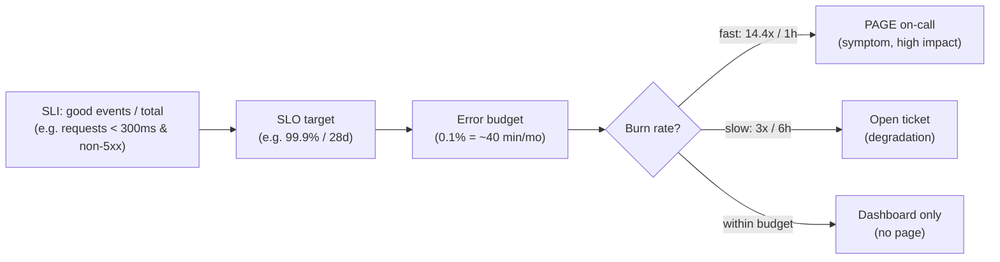
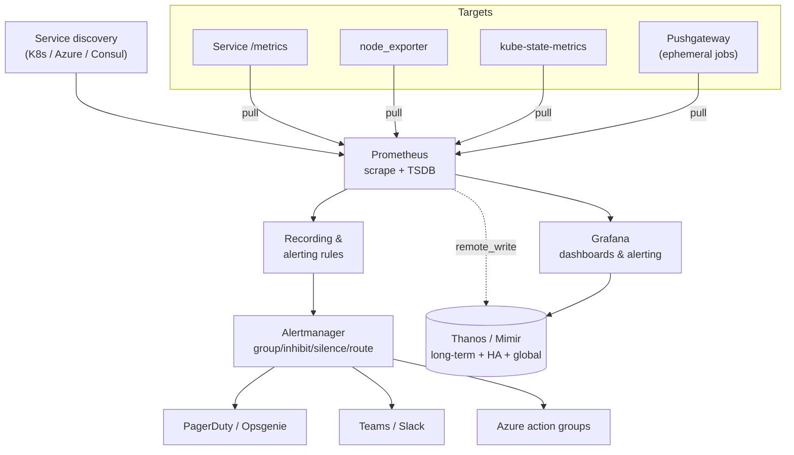
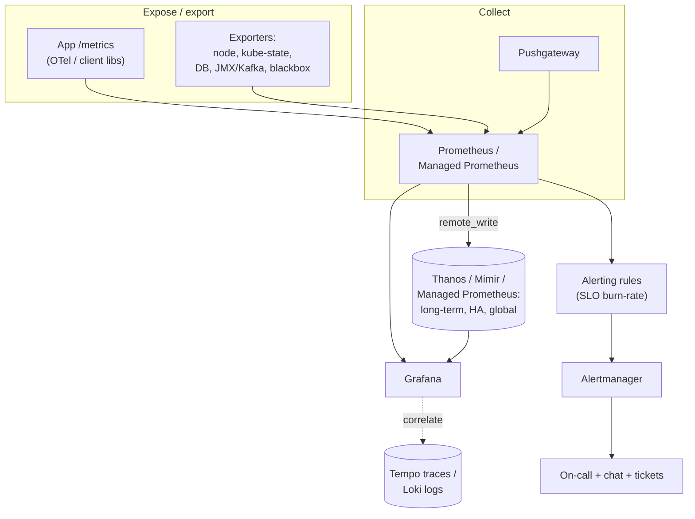
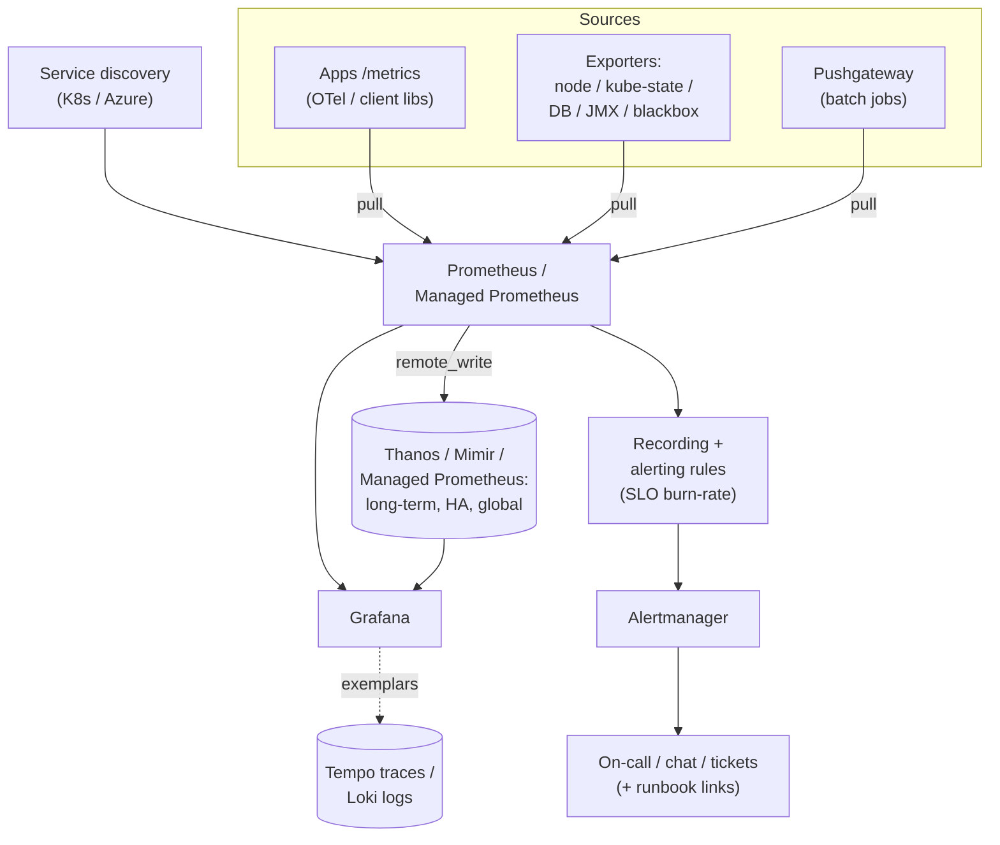
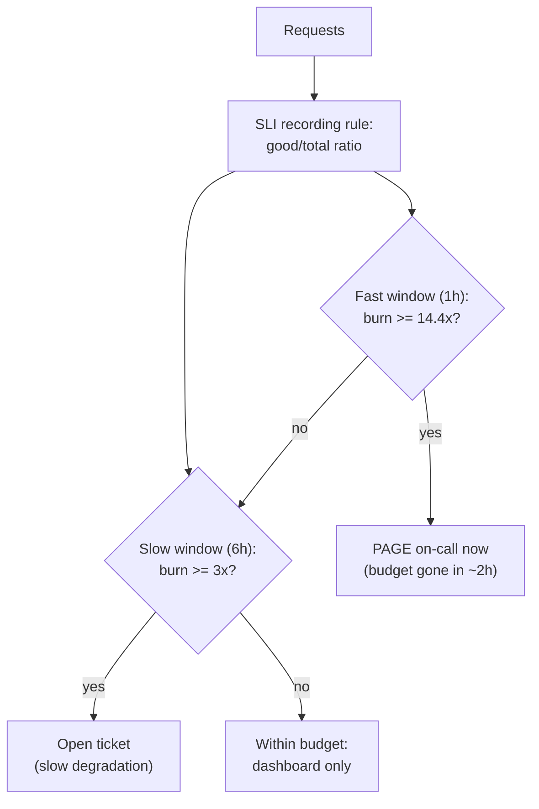
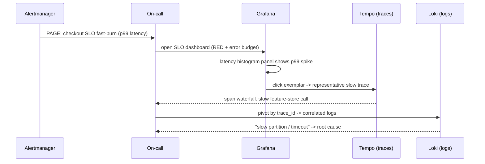

# Monitoring with Prometheus and Grafana

> Part of the **Enterprise Data & AI Architecture Handbook** · Phase-18 — FinOps, Observability & Reliability · Chapter 03.
> Estimated study time: **60 min reading + ~3h labs**.
> **Prerequisites:** read [Observability with OpenTelemetry](02_Observability_with_OpenTelemetry.md) first (this chapter is the metrics-and-alerting layer built on the signals that chapter establishes).

---

## Executive Summary

The previous chapter, [Observability with OpenTelemetry](02_Observability_with_OpenTelemetry.md), drew a deliberate line: OpenTelemetry produces and moves telemetry but does **not** store, visualize, or alert on it — that is the backend's job, and it left the *monitoring* layer (dashboards, thresholds, alerts) for this chapter. It also planted a promise it deferred twice — "alert on SLO burn, not every cause" — and pointed here for the mechanics. This chapter delivers both. **Monitoring is the thresholded, dashboarded, alertable layer that turns a stream of metrics into human-actionable signals: it answers the known-unknowns ("is the system healthy right now, and if not, who needs to be paged?") that sit on top of the broader observability foundation.** The two most important open-source tools for it — and the de-facto industry standard for metrics and dashboards — are **Prometheus** (metrics collection, storage, and alerting) and **Grafana** (visualization and unified alerting across data sources).

Prometheus is a CNCF project (created at SoundCloud in 2012, inspired by Google's internal **Borgmon**, and the **second project ever to graduate from the CNCF**, after Kubernetes). Its defining design choices are a **pull-based scrape model** (Prometheus periodically fetches a `/metrics` HTTP endpoint from each target it discovers), a **dimensional data model** (every time series is a metric name plus a set of key-value **labels**), and a powerful, purpose-built query language, **PromQL**, for slicing and aggregating those time series. Grafana is the visualization and alerting front end — data-source-agnostic, so the same dashboards can query Prometheus for metrics, Loki for logs, and Tempo for traces, with drill-through between them.

But the single most consequential topic in this chapter is not the tooling — it is **alerting strategy**. A monitoring system is worthless if no one acts on it, and the dominant real-world failure of monitoring is **alert fatigue**: hundreds of low-level, cause-based, static-threshold alerts (CPU > 80%, disk > 90%, one node down) that fire constantly, train the on-call to ignore them, and bury the one alert that actually matters. The discipline that fixes this — imported from Google's SRE practice — is **SLO-based, symptom-oriented, multi-window multi-burn-rate alerting**: page a human only when a user-facing objective (latency, error rate) is being burned through fast enough to matter, and route everything else to dashboards and tickets. This chapter's ADR (§40) formalizes exactly that, and it is the through-line that connects Prometheus's mechanics to the reliability culture developed next in Phase-18 Chapter 04 (Reliability and SRE).

The platform bias is **Azure-primary (~60%)** — **Azure Monitor managed service for Prometheus** and **Azure Managed Grafana** (fully managed, AKS-integrated, so you get the open ecosystem without operating it), plus Container Insights and Azure Monitor alerting/action groups — **~30% enterprise open source** (self-hosted **Prometheus**, **Alertmanager**, **Grafana**, the exporter ecosystem, and **Thanos/Cortex/Mimir** for long-term/HA scale) — and **~10% AWS/GCP comparison-only** (Amazon Managed Service for Prometheus/Grafana + CloudWatch; Google Cloud Managed Service for Prometheus + Cloud Monitoring), contrasted honestly on capability and lock-in.

**Bottom line:** Prometheus and Grafana give you world-class, portable metrics and dashboards — but the value is realized only through **disciplined alerting**. This chapter's ADR mandates **SLO-based, symptom-oriented, multi-window multi-burn-rate alerting as the standard for anything that pages a human**, because the dominant failure mode is not the absence of metrics but **alert fatigue that causes real incidents to be missed** — the "signal lost in the noise" variant of the silent-failure pattern this handbook keeps returning to, now applied to the alerts that are supposed to catch everything else.

---

## Learning Objectives

By the end of this chapter you will be able to:

1. **Explain the Prometheus data model** — metric names, labels, samples, and the four metric types (counter, gauge, histogram, summary) — and why the pull model works the way it does.
2. **Write effective PromQL** — instant vs range vectors, `rate()`/`increase()`, aggregation with `sum by`, and `histogram_quantile()` for latency percentiles.
3. **Configure exporters and service discovery** — node/kube-state/blackbox and database exporters, Kubernetes/Azure service discovery, and the Pushgateway for ephemeral jobs.
4. **Build Grafana dashboards and alerts** — panels, template variables, unified alerting, and dashboards-as-code — and correlate metrics with traces/logs.
5. **Design SLO-based alerting** — SLI/SLO/error budgets, the golden signals, and **multi-window multi-burn-rate** alerts that page on symptoms, not causes.
6. **Deploy managed Prometheus/Grafana on Azure** and know when to run the OSS stack yourself, and how to scale metrics with Thanos/Mimir.

---

## Business Motivation

An unmonitored production system is a liability the size of its blast radius. When something breaks — a pipeline stalls, an API's latency spikes, a cluster runs out of memory — the questions that decide the cost of the incident are: *did we detect it before customers did? did the right person get paged? did they have the dashboard to diagnose it fast?* Monitoring is the capability that answers all three, and its business value is measured directly in **detection time and MTTR**, which the observability chapter already established as the dominant cost of incidents.

The business case rests on a few realities specific to *monitoring* (as opposed to the broader observability discipline):

- **Detection precedes everything.** You cannot resolve an incident you haven't noticed. Monitoring's first job is to catch problems — ideally before users do — via alerts on the signals that predict or reflect user pain.
- **Alerting quality is the whole game.** An alert that fires too often (false positives) trains people to ignore it; an alert that fires too rarely (false negatives) misses real incidents. Both failures cost the same thing: **a real outage that goes unactioned.** The economic value of monitoring is destroyed by bad alerting even when the metrics are perfect — which is why this chapter treats alerting strategy, not tooling, as the crux.
- **On-call is a human system with a burnout budget.** Every page has a human cost. A team drowning in noisy alerts burns out, attrites, and — critically — becomes *less* reliable, because they stop trusting the pager. Reducing alert volume to only the actionable is a reliability *and* a retention investment.
- **Portability and cost.** Standardizing on the open Prometheus/Grafana ecosystem (even via managed Azure services) avoids per-metric-priced vendor lock-in and gives a consistent monitoring language across the whole estate — the same "instrument once, own the standard" argument from the observability chapter, applied to metrics and dashboards.

The consequence of getting monitoring right is fast detection, actionable pages, and dashboards that make diagnosis a matter of minutes. The consequence of getting it wrong is the worst of both worlds: a wall of dashboards nobody trusts and a pager nobody believes — so the one incident that matters is missed.

---

## History and Evolution

- **Borgmon at Google (2000s).** Google built **Borgmon** to monitor its Borg cluster manager, pioneering the model of scraping numeric time series identified by labels and evaluating rules over them. It was never open-sourced, but it defined the paradigm.
- **Graphite and StatsD (2008–2011).** Early open-source metrics: Graphite stored time series and rendered graphs; StatsD aggregated pushed metrics. Powerful for their time but limited in dimensionality and query expressiveness.
- **Prometheus (2012).** Ex-Google engineers at **SoundCloud** built **Prometheus** as an open-source Borgmon: pull-based scraping, a dimensional (labeled) data model, PromQL, and an integrated alerting path. It solved the dimensionality and query limits of Graphite and fit the emerging cloud-native/Kubernetes world perfectly.
- **CNCF and graduation (2016–2018).** Prometheus joined the CNCF in 2016 and **graduated in 2018 — the second project to do so after Kubernetes** — cementing it as the cloud-native metrics standard.
- **Grafana (2014).** **Grafana** emerged as a data-source-agnostic visualization layer (originally for Graphite/InfluxDB, quickly the standard front end for Prometheus), decoupling dashboards from any single metrics backend.
- **Scaling out: Thanos, Cortex, Mimir (2017–2022).** Prometheus's single-node local storage limited long-term retention and global views. **Thanos** (2017) and **Cortex** added long-term storage, HA, and global query; **Grafana Mimir** (2022) packaged a horizontally scalable, multi-tenant Prometheus backend. These made Prometheus viable at enterprise/global scale.
- **OpenMetrics and exemplars (2018–present).** The Prometheus exposition format was standardized as **OpenMetrics**, and **exemplars** were added to link a metric sample to a representative trace ID — the concrete bridge to the distributed tracing from the observability chapter.
- **Managed services and OTel convergence (2020–present).** Cloud providers launched managed Prometheus (Azure Monitor managed Prometheus, Amazon and Google Managed Prometheus) and managed Grafana, giving the open ecosystem without the operational burden. In parallel, OpenTelemetry adopted a compatible metrics model and Prometheus added native OTLP ingestion — so the observability and monitoring standards converged.

The through-line: metrics monitoring evolved from siloed, low-dimensional graphing tools into a **dimensional, query-rich, horizontally scalable, standardized ecosystem** — with Prometheus's data model and PromQL as the lingua franca and Grafana as the universal front end.

---

## Why This Technology Exists

Prometheus exists because the systems that most need monitoring — dynamic, ephemeral, cloud-native fleets where instances come and go constantly — broke the assumptions of the previous generation of monitoring tools. Three design decisions define why it exists and why it won:

1. **The pull model fits dynamic infrastructure.** Rather than each of thousands of short-lived instances pushing metrics to a central collector (which must then track who exists), Prometheus **discovers** targets via service discovery (Kubernetes, Azure, Consul) and **pulls** their `/metrics` endpoints on a schedule. This makes "is this target up?" a first-class, trivially-monitored fact (the `up` metric), makes onboarding a new service automatic, and avoids the central collector becoming a push bottleneck. (The trade-off — ephemeral batch jobs that finish before they can be scraped — is exactly what the Pushgateway and Case Study 2 address.)
2. **The dimensional data model makes metrics queryable, not just graphable.** A metric is not a single line; it is a family of time series distinguished by **labels** (`method`, `status`, `instance`, `pipeline`). PromQL can then slice and aggregate across those dimensions (`sum by (status) (rate(http_requests_total[5m]))`) to answer questions the metric's author never pre-computed — the metrics analog of the observability chapter's "ask new questions of existing telemetry."
3. **Integrated, code-reviewed alerting.** Alerting rules are PromQL expressions living in version-controlled config, evaluated by Prometheus, and routed by **Alertmanager** (grouping, deduplication, inhibition, silencing, routing). Alerting is thus a first-class, testable, reviewable artifact — not a GUI afterthought.

Grafana exists to solve a complementary problem: **visualization and alerting should not be coupled to a single data source.** By being data-source-agnostic, Grafana lets one dashboard correlate Prometheus metrics, Loki logs, and Tempo traces (and Azure Monitor, and databases) — realizing the *correlation* the observability chapter demanded, at the human-facing layer. Together they exist to turn raw, dimensional metrics into detection, diagnosis, and action.

---

## Problems It Solves

- **Detecting problems before users do.** Alerting on golden-signal and SLO metrics catches degradations early, minimizing detection time and MTTR.
- **Monitoring dynamic, ephemeral fleets.** The pull model + service discovery handles constantly-changing cloud-native infrastructure where targets appear and disappear.
- **Answering arbitrary aggregate questions.** PromQL's dimensional model lets you slice metrics by any label combination without pre-defining every view.
- **Latency percentiles done right.** Histogram metrics + `histogram_quantile()` compute p95/p99 across a fleet — the SLO-relevant statistic, not the misleading average.
- **Correlated visualization.** Grafana unifies metrics, logs, and traces in one pane with drill-through, collapsing multi-tool investigations.
- **Actionable, reviewable alerting.** Alert rules as version-controlled PromQL + Alertmanager routing make alerting testable and governable.
- **Alert fatigue (via SLO/symptom alerting).** Multi-window multi-burn-rate SLO alerts replace hundreds of noisy cause-based alerts with a handful of actionable, symptom-based pages.
- **Portability and no per-metric lock-in.** The open Prometheus/Grafana standard (even managed) avoids proprietary, per-metric-priced monitoring lock-in.
- **Long-term, global-scale metrics.** Thanos/Cortex/Mimir extend Prometheus to long retention, HA, and cross-cluster global views.

---

## Problems It Cannot Solve

- **Prometheus is metrics, not traces or logs.** It excels at aggregatable numeric time series; it is *not* a tracing or log system. For per-request causality you need traces (observability chapter); for forensic detail you need logs. Trying to force high-cardinality per-request data into Prometheus labels is the classic self-inflicted outage (covered as an anti-pattern and in the prior chapter's case study).
- **It cannot make bad alerting good.** The tooling faithfully fires whatever rules you write. Noisy, cause-based, static-threshold alerting produces alert fatigue no matter how good Prometheus and Grafana are. The fix is alerting *strategy* (the ADR), not more tooling.
- **Dashboards are not observability.** A wall of Grafana dashboards showing knowns is monitoring, not observability; it cannot answer the unanticipated question. Monitoring and observability are complementary layers, not substitutes (the prior chapter's distinction).
- **Single-node Prometheus does not scale or survive alone.** Vanilla Prometheus has local storage, limited retention, and no built-in HA/global view; enterprise scale requires Thanos/Cortex/Mimir or a managed service. Treating a single Prometheus as an enterprise-wide, durable metrics store is a mistake.
- **The pull model has a batch/ephemeral blind spot.** Short-lived jobs that finish between scrapes are invisible to pull scraping unless you use the Pushgateway (or push-based emission) — a real gap for data pipelines (Case Study 2).
- **It does not define your SLOs.** Prometheus computes SLIs; deciding *what* objective matters and *what* budget is acceptable is a product/reliability decision (developed in Phase-18 Chapter 04). Good metrics on the wrong objective still mislead.

---

## Core Concepts

### 3.1 The Prometheus Data Model

Every **time series** in Prometheus is uniquely identified by a **metric name** plus a set of **labels** (key-value pairs). For example, `http_requests_total{method="POST", status="500", service="checkout"}` is a distinct series from the same metric with `status="200"`. Each series is a stream of **samples**: a `float64` value at a millisecond timestamp. This **dimensional model** — one metric name fanning out into many labeled series — is the source of Prometheus's query power and, if misused (high-cardinality labels), its cost risk. The **four metric types** are:

- **Counter** — a monotonically increasing value (resets to zero on restart): total requests, total errors, total bytes. You almost never read a counter raw; you apply `rate()` to get per-second change.
- **Gauge** — a value that can go up or down: current memory usage, queue depth, in-flight requests, temperature.
- **Histogram** — samples observations into configurable **buckets** (plus a sum and count), enabling server-side percentile estimation via `histogram_quantile()`. The right tool for latency/size distributions.
- **Summary** — like a histogram but computes configurable quantiles **client-side**; cheaper to query but not aggregatable across instances (you cannot average pre-computed quantiles), so histograms are usually preferred for fleet-wide percentiles.

### 3.2 The Pull Model, Scraping, and Service Discovery

Prometheus **pulls** metrics: on a configured interval it makes an HTTP GET to each target's `/metrics` endpoint (the OpenMetrics/Prometheus exposition format) and stores the returned samples. Targets are found via **service discovery** — `kubernetes_sd` (auto-discover pods/services/endpoints via the K8s API), `azure_sd` (VMs/scale sets), `consul_sd`, `file_sd`, or `static_configs`. The scrape itself yields the invaluable **`up`** metric (1 if the target was reachable and returned metrics, 0 otherwise), which makes "is this thing alive?" a trivially-alertable fact. For workloads that **cannot be scraped** — short-lived batch/cron jobs that exit before the next scrape — the **Pushgateway** is a small intermediary they push their final metrics to and Prometheus scrapes; it is a deliberate, narrow exception to the pull model (and, misused as a general push funnel, an anti-pattern).

### 3.3 PromQL

**PromQL** is the query language that turns stored series into answers. Its core concepts:

- **Instant vector** — the value of each matching series at a single instant (`http_requests_total`).
- **Range vector** — a window of samples per series over a duration (`http_requests_total[5m]`), the input to rate functions.
- **`rate()` / `irate()` / `increase()`** — per-second average rate, instantaneous rate, and total increase of a counter over a window: `rate(http_requests_total[5m])`.
- **Aggregation** — `sum`, `avg`, `max`, `count`, `quantile`, with `by (label)` / `without (label)` to group: `sum by (status) (rate(http_requests_total[5m]))`.
- **`histogram_quantile()`** — estimate a percentile from histogram buckets: `histogram_quantile(0.99, sum by (le) (rate(http_request_duration_seconds_bucket[5m])))` gives fleet-wide p99 latency.
- **Recording rules** — precompute expensive/frequently-used expressions into new series on a schedule, so dashboards and alerts query cheap pre-aggregates instead of recomputing.

PromQL is what makes the dimensional model useful: it is how you express golden signals, SLIs, and alert conditions.

### 3.4 Alerting: Rules, Alertmanager, and the Golden Signals

**Alerting rules** are PromQL expressions that, when true for a `for:` duration, produce an **alert** with labels and annotations. Prometheus evaluates them and hands firing alerts to **Alertmanager**, which does the operational heavy lifting: **grouping** (collapse many related alerts into one notification), **deduplication**, **inhibition** (suppress lower-priority alerts when a higher-priority one is firing — e.g., don't page for pod alerts when the whole cluster is down), **silencing** (mute known/maintenance conditions), and **routing** to receivers (PagerDuty, Opsgenie, Teams/Slack, email, webhook, Azure action groups). *What* to alert on is guided by well-known signal sets: **the four golden signals** (latency, traffic, errors, saturation — Google SRE), **RED** (Rate, Errors, Duration — for request-driven services), and **USE** (Utilization, Saturation, Errors — for resources).

### 3.5 SLI, SLO, Error Budgets, and Burn-Rate Alerting

This is the concept that separates mature monitoring from noise. An **SLI** (Service Level Indicator) is a measured proportion of good events (e.g., fraction of requests served under 300 ms with a non-5xx status). An **SLO** (Service Level Objective) is the target for that SLI over a window (e.g., 99.9% over 28 days). The **error budget** is the allowed shortfall (0.1% = ~40 minutes/month of "bad"). **Burn-rate alerting** pages based on *how fast you are consuming the error budget*, using **multiple windows and multiple burn rates**: a **fast-burn** alert (e.g., burning 14.4× budget over 1 hour → the month's budget gone in ~2 hours) pages immediately; a **slow-burn** alert (e.g., 3× over 6 hours) opens a ticket. This **multi-window multi-burn-rate** approach (from Google's SRE workbook) is the state of the art: it pages on **user-facing symptoms proportional to real impact**, catches both sudden outages and slow degradations, and produces *far fewer, far more actionable* alerts than static thresholds — the direct answer to alert fatigue, and the subject of this chapter's ADR. (The broader SRE culture around SLOs and error budgets is developed in Phase-18 Chapter 04, Reliability and SRE.)

---

## Internal Working

### 4.1 How Scraping and the TSDB Work

On each scrape interval, Prometheus's scrape loop resolves targets from service discovery, issues concurrent HTTP GETs to their `/metrics` endpoints, parses the OpenMetrics-format response, attaches target labels (and any relabeling), and appends samples to the **TSDB**. The local TSDB writes incoming samples first to a **write-ahead log (WAL)** for crash recovery, holds recent data in an in-memory **head block**, and periodically compacts it into immutable on-disk **blocks** (typically 2-hour blocks, further compacted into larger ones), each with its own index. Queries merge the head block and on-disk blocks. Retention is time- and/or size-bounded; older blocks are deleted (or shipped to object storage by Thanos/Mimir for long-term retention). This design makes ingestion cheap and append-only, and makes **cardinality** — the number of distinct active series in the head — the primary memory and cost driver, exactly as the observability chapter warned.

### 4.2 How Rule Evaluation and Alertmanager Work

Separately from scraping, Prometheus runs a **rule evaluation loop** on its own interval: it executes each **recording rule** (storing the result as a new series) and each **alerting rule** (a PromQL expression). When an alerting expression returns results, those become **pending** alerts; once the condition holds continuously for the rule's `for:` duration, they become **firing** and are pushed to **Alertmanager**. Alertmanager maintains its own state: it **groups** firing alerts by configured labels, applies **inhibition** and **silences**, deduplicates across HA Prometheus replicas, and dispatches notifications to **receivers** according to a routing tree, with repeat intervals and resolve notifications. The separation is deliberate: Prometheus decides *what is wrong*; Alertmanager decides *how and whom to notify*, and it is where most alert-noise problems are actually fixed (grouping/inhibition/routing).

### 4.3 How Grafana Queries and Alerts

Grafana holds no metrics of its own; it is a **query and visualization** layer configured with **data sources** (Prometheus, Mimir, Loki, Tempo, Azure Monitor, SQL databases, etc.). A dashboard **panel** issues a query (PromQL for Prometheus) on a time range and renders the result; **template variables** parameterize dashboards (a `$service`/`$namespace` dropdown that rewrites the queries), making one dashboard reusable across many targets. **Grafana unified alerting** evaluates alert rules against any data source on a schedule and routes notifications (its own Alertmanager-compatible notification policies), so alerting can live in Grafana, in Prometheus/Alertmanager, or both. Because Grafana is data-source-agnostic, a single panel or dashboard can correlate a metric spike (Prometheus) with the exemplar **trace** (Tempo) and the correlated **logs** (Loki) — the concrete realization of the observability chapter's three-signal correlation at the human layer. Dashboards and alerts can be managed **as code** (JSON models, provisioning, Grafonnet/Terraform) so they are version-controlled and reproducible, not click-ops artifacts.

---

## Architecture

A production metrics-monitoring architecture for a data/AI platform has these layers:

1. **Instrumentation/exposition layer** — applications expose `/metrics` (via OTel metrics or Prometheus client libraries) and **exporters** translate third-party systems (nodes, Kubernetes, databases, Kafka, Spark) into Prometheus format.
2. **Collection layer** — Prometheus servers (or a managed Prometheus) scrape targets discovered via service discovery; Pushgateway handles ephemeral jobs; the OTel Collector can also feed metrics via remote write.
3. **Storage/scale layer** — local TSDB for recent data plus **remote_write to Thanos/Cortex/Mimir** (or managed Prometheus) for long-term retention, HA (deduplicated replicas), and a **global query** view across clusters/regions.
4. **Alerting layer** — Prometheus alerting rules (SLO burn-rate + a small set of critical infra alerts) → **Alertmanager** grouping/inhibition/routing → on-call (PagerDuty/Opsgenie) and chat/ticketing.
5. **Visualization layer** — **Grafana** dashboards (RED/USE/golden-signal + SLO/error-budget dashboards), templated and version-controlled, correlating metrics with traces (Tempo) and logs (Loki) from the observability chapter.

---

## Components

- **Prometheus server** — scrape, TSDB, rule evaluation, PromQL query API.
- **Exporters** — `node_exporter` (host metrics), `kube-state-metrics` (K8s object state), `cAdvisor` (container metrics), `blackbox_exporter` (probe endpoints/ICMP/HTTP), database exporters (`postgres_exporter`, etc.), **JMX exporter** (Kafka/JVM), and app **client libraries** (Go/Java/Python/.NET).
- **Pushgateway** — accepts pushed metrics from short-lived batch jobs for Prometheus to scrape.
- **Service discovery** — Kubernetes, Azure, Consul, file, static target discovery mechanisms.
- **Alertmanager** — grouping, deduplication, inhibition, silencing, and routing of alerts to receivers.
- **Grafana** — data-source-agnostic dashboards, template variables, unified alerting, and dashboards-as-code.
- **PromQL** — the query language for metrics.
- **Recording & alerting rules** — version-controlled PromQL for pre-aggregation and alert conditions.
- **Thanos / Cortex / Grafana Mimir** — long-term storage, HA, multi-tenancy, and global query for Prometheus.
- **Exemplars** — sample trace IDs attached to metrics, linking a metric spike to a representative trace (Tempo).
- **Managed services** — Azure Monitor managed Prometheus and Azure Managed Grafana (and their AWS/GCP equivalents).

---

## Metadata

Metrics are only useful if their labels carry the right dimensions — and only affordable if they don't carry the wrong ones. The critical label metadata:

- **Target/resource labels** — `instance`, `job`, `service`, `namespace`, `cluster`, `region`, `deployment.environment`: *what* emitted the series, enabling per-service/per-environment slicing and correlation with a specific deployment or cluster.
- **Semantic dimensions** — bounded, low-cardinality labels that matter for aggregation: `method`, `status` (grouped, e.g. `2xx`/`5xx`), `pipeline`, `operation`. These are the dimensions PromQL groups by.
- **SLO labels** — labels marking which series feed an SLI (`slo="checkout-latency"`), so error-budget queries and dashboards can be defined declaratively.
- **Cost-allocation join keys** — the same team/workload tags from the FinOps chapter, so monitoring and cost can be correlated (a saturated, alerting service is often also an expensive one).
- **Exemplar trace IDs** — the metadata that links a metric bucket to a trace, bridging to the observability chapter's tracing.

The governing rule, inherited directly from the observability chapter's hardest lesson: **labels must be bounded and low-cardinality.** High-cardinality identifiers (user ID, request ID, full URL) must **never** become metric labels — they belong on traces/logs/exemplars. Cardinality is the primary cost and stability driver of the whole metrics platform, and controlling it is a metadata-discipline decision made at instrumentation and relabeling time.

---

## Storage

- **Local TSDB.** Prometheus stores recent samples in a WAL + head block + compacted on-disk blocks. It is optimized for high-throughput append and time-range queries. **Retention** is bounded (default ~15 days); local storage is *not* a durable, long-term store.
- **Compression.** The TSDB compresses samples aggressively (delta-of-delta timestamps, XOR-encoded values), so millions of series are stored compactly — but **active-series cardinality**, not sample volume, dominates memory and cost.
- **Long-term & global: remote_write.** For retention beyond local limits, HA, and cross-cluster global views, Prometheus **remote_writes** to **Thanos**, **Cortex**, or **Grafana Mimir** (or a managed Prometheus), which persist blocks to cheap **object storage** and provide a scalable, multi-tenant query layer. This is the metrics analog of the storage-tiering discipline from the FinOps chapter: keep hot/recent data local and fast, ship older data to cheap durable storage.
- **Retention tiering.** Downsample and retain aggregates (via recording rules or Mimir/Thanos downsampling) for long-term trend/capacity analysis while expiring raw high-resolution data — long-range dashboards rarely need per-second granularity from a year ago.
- **Cardinality governance is storage governance.** Because active series drive cost, controlling label cardinality (relabeling to drop noisy labels at scrape time) is the single most important storage-cost lever — the same point the observability chapter made, here operationalized in scrape/relabel config.

---

## Compute

- **Scrape and ingest compute.** Scraping thousands of targets and appending millions of samples is CPU/memory work dominated by **active-series count** (head-block size). Size Prometheus for peak cardinality, not just sample rate.
- **Query compute.** Expensive PromQL — wide `group by` over high-cardinality series, long range windows, unbounded regex label matches — can overload the server and slow dashboards. **Recording rules** pre-compute heavy expressions so dashboards and alerts read cheap pre-aggregates; this is the primary query-performance lever.
- **Rule-evaluation compute.** Every recording/alerting rule runs on its interval; hundreds of poorly-written rules add steady load. Keep rules efficient and use recording rules to avoid recomputing the same sub-expression in many alerts.
- **Scaling out.** A single Prometheus is vertically bounded; horizontal scale comes from **functional sharding** (Prometheus per team/cluster) plus a global layer (Thanos/Mimir) — not from one giant server. Managed Prometheus offloads this compute entirely.
- **Grafana compute.** Dashboard queries hit the metrics backend; heavy, auto-refreshing, high-cardinality dashboards can themselves be a load source — templated, bounded queries and sensible refresh intervals keep it in check.

The recurring FinOps caution applies: the monitoring stack's own compute cost must stay proportional to the value it delivers; cardinality control and recording rules are what keep it so.

---

## Networking

- **Scrape traffic.** Pull scraping generates periodic inbound HTTP to each target's `/metrics`; at fleet scale this is real east-west traffic, kept efficient by reasonable scrape intervals and by scraping within the cluster/region (agents local to workloads) rather than across regions.
- **remote_write egress.** Shipping samples to Thanos/Mimir/managed Prometheus is continuous outbound traffic (batched, compressed); cross-region remote_write incurs egress cost, so co-locate the long-term backend with the writers where possible.
- **Service-discovery API load.** Kubernetes/Azure service discovery polls the platform API; at very large scale this must be tuned to avoid hammering the control plane.
- **Private connectivity.** In an Azure deployment, scrape and remote_write over the VNet (and **Private Link** to managed Prometheus/Grafana) keeps metrics off the public internet, consistent with the zero-trust posture from the security phase.
- **Alert/notification egress.** Alertmanager/Grafana reach external receivers (PagerDuty, Teams) over the network; this path must itself be reliable (its failure means silent alerts) and secured (webhook secrets).

---

## Security

- **Metrics can leak sensitive data.** Poorly designed metrics or labels can expose internal topology, customer identifiers, or (via high-cardinality labels) PII. Relabel/drop sensitive labels at scrape time, and never encode secrets or personal data in metric names/labels.
- **Access control.** The Prometheus API, Alertmanager, and especially **Grafana** must be authenticated and RBAC-scoped (Grafana org/folder/dashboard permissions, Entra ID SSO). Dashboards reveal architecture and business signals; treat access accordingly.
- **Scrape and endpoint security.** `/metrics` endpoints and the scrape path should be network-restricted (not publicly exposed) and, where needed, use TLS/auth; the `blackbox_exporter` and exporters expand the surface and must be secured.
- **Monitoring as a security signal.** Saturation spikes, unusual error patterns, and anomalous request rates are often early breach indicators; route security-relevant metrics/alerts to **Microsoft Sentinel** (the "monitoring is a security tripwire" theme from the FinOps and observability chapters).
- **Notification-path integrity.** Alert routing to external receivers carries webhook tokens/secrets — store them in Key Vault, and protect Alertmanager/Grafana config, since tampering could silence real alerts.
- **Supply chain.** Exporters and Grafana plugins are third-party code with network access; pin and patch versions and restrict which plugins/exporters run.

---

## Performance

- **Monitoring is the primary tool of performance engineering.** RED/USE dashboards and latency histograms are how you *see* performance; `histogram_quantile()` on request-duration histograms gives the p95/p99 that define user-perceived performance (deepened in Phase-18 Chapter 05, Performance Engineering).
- **Percentiles, never averages.** As throughout the handbook, the SLO metric is p95/p99 from histograms — an average hides the slow tail users actually feel. Alert and dashboard on percentiles.
- **Exemplars connect the aggregate to the specific.** A latency-histogram exemplar links a slow bucket directly to a representative trace, collapsing the "which requests were slow, and why?" investigation to one click (the observability chapter's correlation, realized in Grafana).
- **Keep monitoring fast so it's usable in an incident.** Slow dashboards during an outage are worse than useless. Recording rules, bounded queries, and a scaled backend keep query latency low exactly when engineers are under pressure.
- **The observer's own overhead.** Scrape frequency and exporter cost add load to the monitored systems; balance resolution against overhead (per-second granularity is rarely worth its cost for most metrics).

---

## Scalability

- **Metrics volume scales with fleet and cardinality.** More services, instances, and labels multiply active series. The scaling levers are **functional sharding** (Prometheus per cluster/team), **cardinality control** (relabel/drop), **recording rules** (pre-aggregate), and a **global/long-term layer** (Thanos/Cortex/Mimir or managed Prometheus) — not one ever-larger server.
- **HA via replicas.** Run paired Prometheus replicas scraping the same targets; Thanos/Mimir/Alertmanager **deduplicate** so you get redundancy without double-paging. Managed Prometheus provides this out of the box.
- **Global query.** Thanos Query/Mimir presents a single query view across many Prometheus instances/regions, so one Grafana dashboard can span the whole estate.
- **The practice scales through standards.** Shared dashboard libraries (as code), a common label taxonomy, standard exporters, and a governed alerting policy let monitoring scale across many teams without each reinventing it — the federated model again, with a platform team owning the backend and conventions and product teams owning their SLOs and service dashboards.
- **Grafana scales horizontally** and, via provisioning/as-code, across hundreds of dashboards and teams without click-ops sprawl.

---

## Fault Tolerance

- **The monitoring system must outlive the incidents it watches.** If Prometheus/Alertmanager/Grafana go down during an outage, you are blind and silent when it matters most. Run **HA replicas** (paired Prometheus, clustered Alertmanager, HA Grafana), and prefer a **managed service** where operating HA yourself is a burden.
- **The dead-man's switch.** A deliberately always-firing "watchdog" alert that must arrive on a schedule; if the notification *stops* arriving, the monitoring pipeline itself is broken. This is the concrete defense against the "verification gap" — assume monitoring can silently fail and alert on its *absence* (Case Study 2's lesson).
- **Alertmanager HA and dedup.** Clustered Alertmanager gossips state so paired Prometheus replicas don't double-notify and a single Alertmanager failure doesn't drop alerts.
- **Graceful degradation.** Under overload, protect the critical path: prioritize scraping/evaluating SLO and critical-infra targets over verbose, low-value metrics; shed cardinality before you shed the pager.
- **Don't couple the app to monitoring.** Exposing `/metrics` and being scraped must never be able to degrade the application; scraping is read-only and out-of-band by design, which is one advantage of the pull model.
- **Monitor the monitors.** Track Prometheus TSDB health, scrape success (`up`), rule-evaluation errors, remote_write lag, and Alertmanager notification failures — the monitoring pipeline needs its own SLIs.

---

## Cost Optimization

Monitoring is a classic silently-growing cost (a first-class FinOps target per [FinOps and Cost Optimization](01_FinOps_and_Cost_Optimization.md)); the levers are specific:

- **Control cardinality — the dominant lever.** Every active series costs memory/storage/query. **Relabel and drop** unnecessary/high-cardinality labels at scrape time; audit top-cardinality metrics regularly. This is the single biggest cost control (and stability control) for Prometheus.
- **Right-size scrape frequency and retention.** Not everything needs 15-second resolution or a year of raw retention. Scrape less-critical targets less often; keep short raw retention locally and downsample/tier for long-term.
- **Recording rules to cut query cost.** Pre-aggregate heavy dashboard/alert expressions once rather than recomputing them on every refresh and every rule evaluation.
- **Right-size the backend.** Use managed Prometheus/Grafana where it's cheaper than operating HA Thanos/Mimir yourself at your scale (and vice versa at very large scale); track the metrics platform's own unit economics (cost per active series, cost per GB).
- **Prune dead dashboards and alerts.** Unused dashboards and never-firing (or always-firing-and-ignored) alerts are pure waste and noise; garbage-collect them.

**Worked FinOps example — cardinality cleanup on a managed metrics bill.** Managed Prometheus (Azure) and self-hosted Mimir both price effectively on **active time series** and samples ingested. Suppose a platform ingests **12 million active series** at an illustrative blended ~$0.10 per 1,000 series/month → **~$1,200/month**, and the metrics backend is memory-pressured. A cardinality audit finds that three metrics carry a `pod_name` label (which churns on every deploy/restart, creating a new series each time) and one carries a full `url` path label — together responsible for **~8 million of the 12 million series**. Dropping `pod_name` via scrape-time relabeling (keeping the stable `deployment`/`service` labels) and bucketing `url` into a bounded `route` label collapses those to **~500K series**, taking total active series to **~4.5M** → **~$450/month**, a **~$750/month (≈62%) reduction** *and* a materially more stable, faster backend. **Decision:** enforce a **cardinality budget** and scrape-time relabel rules as policy, add a CI check that flags new high-cardinality labels before merge (the same guardrail the observability chapter's Case Study 2 demanded), and **verify** the active-series drop in the next billing cycle — an unverified relabel that a later config change quietly reverted is the monitoring version of the FinOps verification gap.

---

## Monitoring

This is the chapter's own subject, so this section states *what* to monitor — the standard signal frameworks that make a monitoring practice coherent rather than ad hoc:

- **The four golden signals (Google SRE)** — **Latency** (and its p95/p99, split by success/error), **Traffic** (demand/throughput), **Errors** (rate of failed requests), **Saturation** (how full the most-constrained resource is). The minimal, universal set for any user-facing service.
- **RED (request-driven services)** — **R**ate, **E**rrors, **D**uration per endpoint/service; the pragmatic per-service dashboard.
- **USE (resources)** — **U**tilization, **S**aturation, **E**rrors for CPU/memory/disk/network/queues; the resource-health view.
- **Data-platform SLIs** — pipeline freshness lag, job success/failure, throughput, and backlog/consumer-lag (Kafka), plus the data-observability signals (freshness/volume/schema) from the observability chapter surfaced as monitored series and alerts.
- **SLO/error-budget dashboards** — the burn-down of each SLO's error budget over its window, the primary reliability view that ties monitoring to the ADR and to Phase-18 Chapter 04.

The organizing principle: **build dashboards top-down from user-facing SLOs and golden signals, and reserve pages for symptoms; push cause-level metrics (individual CPU, disk, node) to dashboards and diagnosis, not to the pager.**

---

## Observability

Monitoring (this chapter) and observability (the [prior chapter](02_Observability_with_OpenTelemetry.md)) are complementary layers, and Prometheus/Grafana are where they meet at the human-facing surface. Monitoring answers the **known-unknowns** — the thresholded, dashboarded, alertable questions this chapter is about; observability is the broader property that lets you ask the **unknown-unknowns** from telemetry you already collect. A wall of Grafana dashboards showing pre-decided metrics is *monitoring*; genuine observability requires that when a novel incident fires an SLO alert, you can pivot from that aggregate metric to the specific cause without shipping new instrumentation.

Prometheus and Grafana contribute to observability precisely by **not standing alone**:

- **Metrics are one of three signals.** Prometheus supplies the metrics pillar; the observability chapter's traces (Tempo/Application Insights) and logs (Loki/Log Analytics) supply the other two. Observability emerges from their **correlation**, not from metrics alone.
- **Exemplars are the concrete bridge.** A latency-histogram **exemplar** attaches a representative `trace_id` to a metric bucket, so a metric spike links in one click to the exact distributed trace — the mechanism that turns "p99 rose" (monitoring) into "this request was slow because of that downstream call" (observability).
- **Grafana is the correlation surface.** Because Grafana is data-source-agnostic, one pane pivots metric → trace → log (Prometheus → Tempo → Loki), realizing at the human layer the three-signal correlation the observability chapter demanded.
- **Cardinality is the shared discipline.** The same rule governs both: high-cardinality identifiers belong on traces/logs/exemplars, **never** on metric labels — the constraint that keeps Prometheus the *metrics* backend and lets traces carry the per-request detail.

The practical stance: **use monitoring (SLO alerts, golden-signal dashboards) to detect and page, and observability (correlated traces/logs via exemplars) to diagnose** — the alert tells you *that* users are hurting; the trace tells you *why*.

---

## Operational Response Playbook

Two representative monitoring incidents as signal → detection → remediation. The meta-point: the monitoring platform is itself operated, and *its* failures (too many alerts, or too few) are operational events.

**Playbook 1 — Alert storm / notification flood (too much signal).**
- **Signal:** on-call is flooded — dozens/hundreds of notifications in minutes (often from one underlying cause fanning out into many low-level alerts: a node failure firing pod, container, and probe alerts simultaneously), or a flapping alert repeatedly firing/resolving.
- **Detection query:** inspect Alertmanager for the firing-alert groups and their common labels; identify whether many alerts share a root cause (same node/cluster) and whether **grouping/inhibition** is missing; check for a threshold set too tight (a `for:` duration too short causing flapping).
- **Remediation:** stop the flood — apply an Alertmanager **silence** for the known root cause, then fix structurally: add **inhibition rules** (suppress pod/container alerts when the node/cluster alert is firing), tune **grouping** (collapse related alerts into one notification), lengthen `for:` durations to stop flapping, and — the durable fix — **migrate the noisy cause-based alerts to a small set of SLO burn-rate symptom alerts** (the ADR). Verify alert volume drops to an actionable level.

**Playbook 2 — Silent blind spot: a target/job stopped being monitored (too little signal).**
- **Signal:** an incident (a failed nightly pipeline, a downed service) was **not** alerted on; discovered late by a human or a downstream consumer. Or the metrics for a job/target simply vanished.
- **Detection query:** check the **`up`** metric for the target (`up{job="..."} == 0` means scrape failing) and use **`absent()`** (`absent(up{job="nightly-etl"})`) to detect a target that isn't being scraped at all. For ephemeral batch jobs, check whether they push to the **Pushgateway** and whether that push is happening (a job that exits before a scrape is invisible to pull — Case Study 2).
- **Remediation:** for a down scrape target, fix service discovery/network/endpoint and add an **`up == 0`** alert if missing. For an **ephemeral batch/Spark job**, route its completion/success metrics through the **Pushgateway** (or push-based emission) and add a **freshness/heartbeat alert** (`time() - last_success_timestamp > threshold`) plus a **dead-man's-switch** watchdog so the *absence* of a success is itself alertable. Verify by simulating a failure and confirming the page fires.

---

## Governance

- **Alerting policy, enforced.** A governed standard that **anything paging a human is SLO/symptom-based** (the ADR), with cause-based metrics routed to dashboards/tickets — reviewed so alert sprawl doesn't creep back. Alert rules live in version control and are code-reviewed.
- **Label/cardinality standards.** A governed label taxonomy and a **cardinality budget** enforced via scrape-time relabeling and CI checks on new metrics — computational guardrails, protecting cost and stability by construction (the FinOps guardrails-not-gates principle).
- **Dashboards as code.** Dashboards and alerts provisioned from version-controlled definitions (JSON/Grafonnet/Terraform), not click-ops, so they're reviewable, reproducible, and consistent across teams.
- **Ownership and RACI.** A platform team owns the Prometheus/Grafana backend, exporters, conventions, and shared dashboard libraries; product teams own their services' SLOs, service dashboards, and on-call — federated ownership.
- **Runbooks linked to alerts.** Every paging alert links to a runbook (what it means, how to diagnose, how to remediate) so a page is actionable by whoever is on-call, not just its author.
- **Notification/on-call governance.** Escalation policies, on-call rotations, and receiver secrets managed centrally; alert routing and silences audited.
- **Cost governance.** The metrics platform's own unit economics (active series, ingest, query cost) tracked on the FinOps cadence.

---

## Trade-offs

- **Pull vs push.** Pull fits dynamic fleets and gives free liveness (`up`), but has an ephemeral-job blind spot (needs Pushgateway); push suits short-lived jobs but reintroduces a collector bottleneck and loses easy liveness. Prometheus is pull-first with a narrow push exception.
- **Cardinality (detail) vs cost/stability.** More labels mean richer slicing but multiply series, cost, and instability. The cardinality budget is where you draw the line — high-cardinality data belongs on traces/logs.
- **Alert sensitivity vs alert fatigue.** More/tighter alerts catch more but page more (false positives → fatigue); fewer/looser alerts are quiet but risk missing incidents (false negatives). SLO burn-rate alerting is the principled balance.
- **Symptom vs cause alerting.** Symptom (SLO) alerts are actionable and few but need good SLIs; cause alerts are precise but numerous and noisy. Page on symptoms, diagnose with causes.
- **Self-hosted vs managed.** Self-hosted Prometheus/Grafana/Thanos gives control and can be cheaper at very large scale but is real operational work (HA, scaling, upgrades); managed removes the burden at a price. OTel/PromQL portability keeps this swappable.
- **Resolution/retention vs cost.** High scrape frequency and long raw retention improve fidelity but cost more; downsample and tier by value.
- **Histogram vs summary.** Histograms are aggregatable across instances (fleet percentiles) but need bucket choices; summaries are cheaper per-instance but not aggregatable. Prefer histograms for SLOs.

---

## Decision Matrix

| Situation | Recommended approach | Rationale |
|---|---|---|
| Dynamic K8s/cloud fleet | **Prometheus pull + service discovery** | Auto-discovers targets, free liveness via `up` |
| Short-lived batch/cron/Spark job | **Pushgateway (or push) + freshness/heartbeat alert** | Pull misses jobs that exit between scrapes |
| Fleet-wide latency percentiles | **Histogram metric + `histogram_quantile()`** | Aggregatable p95/p99 across instances |
| Per-instance quantiles, cheap query | **Summary** (accept non-aggregatable) | Client-side quantiles when fleet aggregation isn't needed |
| Anything that pages a human | **SLO multi-window multi-burn-rate alert** | Symptom-based, proportional to impact, low fatigue |
| Cause-level metric (single CPU/disk/node) | **Dashboard/ticket, not a page** | Diagnosis aid, not a symptom worth waking someone |
| Long-term retention / HA / global view | **Thanos / Cortex / Mimir or managed Prometheus** | Single Prometheus doesn't retain/scale/HA alone |
| High-cardinality identifier needed | **Traces/logs/exemplars — NOT metric labels** | Prevents series explosion (see FinOps example) |
| Azure-primary, low ops appetite | **Azure Monitor managed Prometheus + Managed Grafana** | Open ecosystem, managed HA/scale, AKS-native |
| Expensive/repeated PromQL in dashboards/alerts | **Recording rules** | Pre-aggregate once instead of recomputing |
| Correlate a metric spike to root cause | **Grafana + exemplars → Tempo trace + Loki logs** | Metric→trace→log drill-through |

---

## Design Patterns

- **SLO burn-rate alerting (multi-window multi-burn-rate).** Fast-burn pages, slow-burn tickets; the ADR pattern that replaces noisy cause alerts.
- **Golden-signal / RED / USE dashboards.** Standard, templated dashboards per service and per resource, built top-down from user-facing signals.
- **Recording rules for SLIs.** Pre-compute each SLI (good/total ratio) as a recording rule so dashboards and burn-rate alerts read a cheap, consistent series.
- **Cardinality budget + relabel-at-scrape.** Drop/aggregate high-cardinality labels at ingestion; enforce a budget via CI — the cost/stability pattern.
- **Pushgateway + freshness alert for batch.** Ephemeral jobs push completion metrics; a `time() - last_success` freshness alert catches silent failures.
- **Dead-man's switch (watchdog).** An always-firing alert whose *absence* signals a broken monitoring pipeline.
- **Dashboards & alerts as code.** Version-controlled, provisioned, reviewable — no click-ops.
- **Exemplar-linked panels.** Latency panels carry exemplars linking to traces, realizing metric→trace correlation.
- **HA pairs + dedup.** Paired Prometheus replicas with Thanos/Mimir/Alertmanager deduplication for redundancy without double-paging.
- **Functional sharding + global query.** Prometheus per cluster/team, unified by Thanos/Mimir for a single global view.
- **Runbook-linked alerts.** Every page links to its runbook.

---

## Anti-patterns

- **Cause-based static-threshold alerting everywhere.** Hundreds of `CPU>80%`/`disk>90%`/`node down` pages → alert fatigue → missed real incidents (the ADR's target; Case Study 1).
- **High-cardinality metric labels.** User/request/URL IDs as labels → series explosion, cost blowup, unstable backend (the cross-chapter cardinality sin).
- **Treating a single Prometheus as a durable enterprise store.** No HA, short retention, no global view — data loss and blind spots at scale.
- **Pushing everything through the Pushgateway.** Using it as a general push funnel (instead of narrowly for ephemeral jobs) breaks liveness semantics and creates a stale-metrics trap.
- **Dashboards nobody looks at / alerts nobody actions.** Sprawl of unused dashboards and ignored alerts — pure noise and waste.
- **No dead-man's switch.** Assuming the monitoring pipeline is always up; discovering it's broken only when you reach for it.
- **Alerting on averages, not percentiles.** Hiding the slow tail users feel.
- **Click-ops dashboards/alerts.** Unversioned, irreproducible, inconsistent monitoring config.
- **Flapping alerts / missing grouping-inhibition.** Notification storms from one root cause; on-call learns to mute the pager.
- **Monitoring without SLOs.** Great metrics on undefined objectives — you can't tell "healthy" from "unhealthy" in user terms.

---

## Common Mistakes

- Paging on causes (individual resource thresholds) instead of user-facing symptoms.
- Adding a high-cardinality label that explodes the series count (and the bill).
- Running one Prometheus with no HA/long-term backend and calling it enterprise monitoring.
- Forgetting the pull-model blind spot for ephemeral jobs (no Pushgateway/heartbeat) — silent pipeline failures.
- Using summaries and then trying to average their quantiles across instances (mathematically invalid).
- Building dashboards without recording rules, so they're slow and expensive under load.
- Never pruning dead dashboards/alerts, so noise accumulates.
- No dead-man's switch, so a broken monitoring pipeline goes unnoticed.
- Managing dashboards/alerts by click-ops instead of as code.
- Missing Alertmanager grouping/inhibition, so one incident becomes a notification storm.
- Not linking alerts to runbooks, so pages aren't actionable by whoever is on-call.
- Not verifying that a cardinality/relabel change actually reduced series (the verification gap).

---

## Best Practices

- **Page only on SLO/symptom** via multi-window multi-burn-rate alerts; route cause metrics to dashboards/tickets (the ADR).
- **Build dashboards top-down** from golden signals / RED / USE and SLO error budgets, templated and as code.
- **Define SLIs as recording rules** so alerts and dashboards share one cheap, consistent definition.
- **Enforce a cardinality budget** with scrape-time relabeling and CI checks; keep high-cardinality data on traces/logs/exemplars.
- **Use histograms for latency** and `histogram_quantile()` for fleet-wide p95/p99.
- **Cover ephemeral jobs** with the Pushgateway plus freshness/heartbeat alerts, and add `up`/`absent()` alerts for scrape targets.
- **Run HA** (paired Prometheus, clustered Alertmanager, HA Grafana) or use a managed service, and add a **dead-man's-switch** watchdog.
- **Scale with Thanos/Mimir** (long-term, HA, global) via remote_write; tier and downsample retention.
- **Tune Alertmanager** grouping/inhibition/silencing to prevent notification storms, and **link every page to a runbook**.
- **Correlate in Grafana** via exemplars → Tempo traces and Loki logs (the observability three-signal bridge).
- **Manage everything as code** and track the monitoring platform's own unit economics on the FinOps cadence.

---

## Enterprise Recommendations

1. **Adopt SLO-based, symptom-oriented, multi-window multi-burn-rate alerting as the paging standard** (the ADR), and aggressively retire cause-based static-threshold pages.
2. **Standardize on the Prometheus/Grafana ecosystem** (managed on Azure where operational burden isn't worth it), keeping the open PromQL/OTel standard for portability.
3. **Stand up a platform-owned backend and dashboard library.** HA Prometheus/managed Prometheus + Thanos/Mimir + Grafana, shared golden-signal/RED/USE/SLO dashboards as code, standard exporters, and a governed label taxonomy.
4. **Enforce a cardinality budget** with relabeling and CI checks from day one — it protects both cost and stability.
5. **Close the pull-model blind spot** for every batch/streaming job with Pushgateway + freshness/heartbeat alerts and a dead-man's switch.
6. **Define SLIs and SLOs per service** (with product), implement them as recording rules and error-budget dashboards, and tie them to the reliability practice in Phase-18 Chapter 04.
7. **Link every paging alert to a runbook** and govern on-call rotations/escalation centrally.
8. **Integrate with Azure natively** (managed Prometheus, Managed Grafana, action groups, Container Insights, Sentinel for security-relevant alerts) while retaining portability, and track the monitoring platform's own cost.

---

## Azure Implementation

**Managed metrics and dashboards.**
- **Azure Monitor managed service for Prometheus** — a fully managed, Prometheus-compatible metrics service (built on the Azure Monitor metrics platform), scraping AKS and other targets, storing at scale with HA and long retention, and queryable with **PromQL**. It removes the burden of operating HA Prometheus/Thanos yourself while keeping the open query language and ecosystem. Data collection is configured via **Data Collection Rules**; the metrics add-on for AKS auto-deploys scraping.
- **Azure Managed Grafana** — a managed Grafana service with Entra ID SSO, integrated as a data source with managed Prometheus and **Azure Monitor**, and supporting dashboards-as-code. The standard visualization layer for Azure-hosted Prometheus.

**Alerting.**
- **Prometheus alerting rules** (evaluated by managed Prometheus) and/or **Grafana unified alerting**, routed via **Azure Monitor action groups** (and/or Alertmanager) to PagerDuty/Opsgenie/Teams/email — with SLO burn-rate rules as the paging standard.

**Kubernetes and platform monitoring.**
- **Container Insights** and the managed Prometheus AKS add-on scrape `kube-state-metrics`, `cAdvisor`, and `node_exporter`-equivalent host metrics; Databricks, Kafka (JMX), and databases are scraped via their exporters.

**Integration with the observability stack.**
- Managed Grafana correlates managed-Prometheus metrics with **traces** (Tempo/Application Insights) and **logs** (Loki/Log Analytics) from [Observability with OpenTelemetry](02_Observability_with_OpenTelemetry.md); exemplars link metric spikes to traces.

**Security & networking.**
- **Private Link** to managed Prometheus/Grafana, **Entra ID RBAC** on Grafana, Key Vault for receiver secrets, and routing of security-relevant alerts to **Microsoft Sentinel**.

*Note:* much of this chapter's Azure depth lives in the sections above; this section is a consolidated map rather than a re-explanation.

---

## Open Source Implementation

The ~30% OSS stack — which is also the portable core the Azure managed services are compatible with:

- **Prometheus** — the metrics server: scrape, TSDB, PromQL, rule evaluation. The foundation everything else builds on.
- **Alertmanager** — grouping, deduplication, inhibition, silencing, and routing of alerts to receivers; clustered for HA.
- **Grafana** — data-source-agnostic dashboards and unified alerting; dashboards-as-code via provisioning/Grafonnet/Terraform.
- **Exporters** — `node_exporter`, `kube-state-metrics`, `cAdvisor`, `blackbox_exporter`, database exporters (`postgres_exporter`, `mysqld_exporter`), the **JMX exporter** (Kafka/JVM/Spark), and language client libraries.
- **Pushgateway** — completion metrics for ephemeral batch jobs.
- **Thanos / Cortex / Grafana Mimir** — long-term object-storage-backed retention, HA, multi-tenancy, and **global query** across Prometheus instances/regions.
- **Grafana Loki / Tempo** — logs and traces, correlated with Prometheus metrics in Grafana (the LGTM stack from the observability chapter).
- **kube-prometheus-stack (Helm) / Prometheus Operator** — the standard Kubernetes-native deployment packaging Prometheus, Alertmanager, Grafana, exporters, and CRDs (`ServiceMonitor`, `PrometheusRule`) for declarative, as-code monitoring.
- **OpenMetrics** — the standardized exposition format Prometheus scraping is built on.

A common enterprise pattern: **kube-prometheus-stack on AKS (Prometheus Operator + Alertmanager + Grafana + exporters) with remote_write to Mimir for long-term/global metrics, LGTM for full three-signal correlation** — a completely portable monitoring platform that can run instead of, or alongside, the Azure managed services, with the choice being deployment/config rather than a re-instrumentation.

---

## AWS Equivalent (comparison only)

| Capability | Azure | AWS | Notes |
|---|---|---|---|
| Managed Prometheus | Azure Monitor managed Prometheus | **Amazon Managed Service for Prometheus (AMP)** | Both PromQL-compatible, managed |
| Managed Grafana | Azure Managed Grafana | **Amazon Managed Grafana (AMG)** | Managed Grafana on both |
| Native metrics/alerting | Azure Monitor + action groups | **CloudWatch** metrics/alarms | Different data model/query |
| K8s metrics | managed Prometheus AKS add-on | AMP + CloudWatch Container Insights | Comparable |
| Long-term/global | Managed Prometheus / Mimir | AMP (managed) / Cortex heritage | AMP built on Cortex |

**Advantages of AWS:** AMP (built on the Cortex lineage) + AMG is a mature managed Prometheus/Grafana pair; CloudWatch is deeply integrated with AWS services. **Disadvantages/migration:** CloudWatch's model/query differs, but because both sides speak **PromQL and OpenMetrics**, the *instrumentation and dashboards* are portable — migration is re-pointing remote_write/data sources and re-hosting the same dashboards. **Selection criteria:** Azure-primary shops use Azure managed Prometheus/Grafana; multi-cloud shops standardize on the OSS Prometheus/Grafana (or per-cloud managed Prometheus) so PromQL and dashboards are written once.

---

## GCP Equivalent (comparison only)

| Capability | Azure | GCP | Notes |
|---|---|---|---|
| Managed Prometheus | Azure Monitor managed Prometheus | **Google Cloud Managed Service for Prometheus** | GCP's is notably deep (Monarch-backed) |
| Dashboards | Azure Managed Grafana | **Cloud Monitoring dashboards / Managed Grafana** | Grafana available |
| Native metrics/alerting | Azure Monitor | **Cloud Monitoring (ex-Stackdriver)** | Unified ops suite |
| Query | PromQL | **PromQL + MQL** | GCP supports PromQL natively |
| K8s metrics | managed Prometheus add-on | GKE + Managed Prometheus | Comparable |

**Advantages of GCP:** Google Cloud Managed Service for Prometheus is backed by **Monarch** (Google's planet-scale in-memory time-series system, the successor to Borgmon), giving very high scalability, and GCP supports PromQL natively — fitting, given Prometheus's Borgmon heritage. **Disadvantages/migration:** Cloud Monitoring has its own model and MQL alongside PromQL, so native dashboards differ, but PromQL/OpenMetrics keep instrumentation portable. **Selection criteria:** as with AWS, standardize on Prometheus/PromQL and choose the backend per cloud and operational appetite; the OSS stack is the neutral option across all three.

---

## Migration Considerations

- **From legacy/proprietary monitoring to Prometheus/Grafana.** Migrate incrementally — run both during transition, port dashboards to Grafana, and re-express alerts as PromQL. The payoff is the open standard and the end of per-metric lock-in.
- **From cause-based to SLO alerting (the highest-value migration).** Define SLIs/SLOs, implement burn-rate alerts, and *retire* the cause-based static-threshold pages — the single change that most improves on-call life and detection quality. Do it deliberately; it is where the reliability payoff is.
- **From single Prometheus to scaled/managed.** Introduce remote_write to Thanos/Mimir or move to managed Prometheus for HA, retention, and global query before scale forces the issue.
- **Close the batch blind spot.** Instrument ephemeral jobs with Pushgateway + freshness alerts as part of the migration — a common latent gap.
- **Adopt dashboards/alerts as code** during migration so the new setup is reproducible and reviewable from the start.
- **Platform-longevity discipline.** Consistent with the handbook's recurring caution (Cloud IoT Core 2023, AWS QLDB 2025, Azure Orbital, Azure Personalizer): keep the **open standard (Prometheus/PromQL/OpenMetrics, OSS Grafana)** as the durable core and treat any specific managed backend as replaceable — PromQL portability is what makes that true.

---

## Mermaid Architecture Diagrams

**Diagram 1 — Prometheus + Grafana monitoring reference architecture.**

**Diagram 2 — Multi-window multi-burn-rate SLO alerting decision.**

**Diagram 3 — From metric spike to root cause (correlation).**

---

## End-to-End Data Flow

Following one metric from emission to action:

1. **Expose.** A checkout service records `http_request_duration_seconds` (a histogram) and `http_requests_total` (a counter) with bounded labels, exposed on `/metrics` (via OTel or a client library); exporters expose node/K8s/DB metrics similarly.
2. **Discover & scrape.** Prometheus discovers the service via Kubernetes service discovery and **pulls** `/metrics` each interval, appending samples to its TSDB and setting `up=1`.
3. **Pre-aggregate.** A **recording rule** computes the checkout **SLI** (fraction of requests fast-and-successful) as a new series each evaluation.
4. **Evaluate alerts.** **Multi-window multi-burn-rate** alerting rules read the SLI; when the 1-hour fast-burn condition holds for its `for:` duration, a **firing** alert is pushed to Alertmanager.
5. **Route.** **Alertmanager** groups/dedups/inhibits and routes the page to on-call (with a runbook link); slow-burn opens a ticket instead.
6. **Long-term.** Prometheus **remote_writes** samples to Mimir/managed Prometheus for retention, HA dedup, and global query.
7. **Diagnose.** On-call opens the **Grafana** SLO/RED dashboard, sees the p99 latency spike via `histogram_quantile()`, clicks an **exemplar** to the representative **Tempo trace**, and pivots by trace ID to the **Loki logs** — root-causing in minutes.
8. **Resolve & govern.** The fix is deployed; the burn rate recovers and the alert resolves; the incident feeds back into runbooks and, if it was a monitoring gap, into new alerts/dashboards. The monitoring platform's own health (`up`, rule errors, remote_write lag, dead-man's switch) and cost (active series) are themselves monitored and governed.

---

## Real-world Business Use Cases

- **Cutting alert noise 90% with SLO alerting.** A platform team drowning in hundreds of cause-based static-threshold pages migrated to a handful of SLO burn-rate alerts; page volume collapsed, on-call trust returned, and the alerts that *do* fire are actionable — while detection of real user impact *improved* (the case that motivates the ADR).
- **Closing a silent pipeline-failure gap.** A nightly ETL job failed silently for days because the pull-based scraper never caught the short-lived job's metrics; adding Pushgateway completion metrics plus a freshness/heartbeat alert made the next failure page within minutes (Case Study 2).
- **Cardinality cleanup halving the metrics bill.** A `pod_name`/`url` label audit and scrape-time relabel dropped active series ~60%, cutting a managed-Prometheus bill and stabilizing a memory-pressured backend (the worked FinOps example).
- **One dashboard across a global fleet.** Thanos/Mimir global query let one Grafana SLO dashboard span multiple AKS clusters and regions, replacing per-cluster dashboards no one could reconcile during a cross-region incident.
- **Kafka/Spark lag as a leading indicator.** JMX-exporter consumer-lag and Spark metrics, alerted via SLO-style thresholds, caught a backlog building before it breached the downstream freshness SLA.

---

## Industry Examples

- **Google Borgmon → Monarch.** The internal lineage that defined labeled-time-series monitoring and burn-rate alerting; Borgmon inspired Prometheus, and Monarch now backs Google Cloud Managed Prometheus — a direct line from Google's practice to the open standard.
- **SoundCloud & the CNCF.** Prometheus, built at SoundCloud and donated to the CNCF, became the **second CNCF project to graduate** (after Kubernetes) — the cloud-native metrics standard.
- **Google SRE workbook — burn-rate alerting.** The multi-window multi-burn-rate alerting method this chapter's ADR mandates is drawn directly from Google's published SRE practice, now industry-standard.
- **Grafana Labs & the LGTM stack.** Grafana's evolution into a data-source-agnostic front end and the Loki/Grafana/Tempo/Mimir stack made portable, correlated, open observability/monitoring mainstream.
- **Hyperscaler convergence on managed Prometheus.** Azure, AWS, and GCP all shipping managed Prometheus + managed Grafana is strong evidence the open standard won; even the clouds' native tools now speak PromQL.

---

## Case Studies

**Case Study 1 — Death by a thousand alerts (motivates the ADR).**
A data platform team had, over two years, accumulated **hundreds of alerting rules** — one for nearly every metric they could think of: CPU > 80%, memory > 85%, disk > 90%, individual node-down, per-pod restart, queue-depth thresholds, and dozens of service-specific static thresholds. Each was individually reasonable; collectively they produced a **constant drizzle of pages**, most of them non-actionable (a transient CPU spike that self-resolved, a node the autoscaler was already replacing). The on-call rotation adapted the way humans always do: they **stopped trusting the pager**, muted noisy alerts wholesale, and skimmed notifications instead of reading them. Then a real, customer-facing outage happened — checkout error rate climbed steeply — and its alert arrived **in the same channel, in the same format, buried among a dozen simultaneous infrastructure alerts** triggered by the same underlying node failure. Because grouping/inhibition weren't configured and the signal wasn't distinguishable from the noise, the real incident went **unactioned for nearly an hour** while customers failed to check out — not because it wasn't detected, but because detection was indistinguishable from the background noise. This is the **"signal lost in the noise" variant of the silent-failure pattern** this handbook keeps returning to: the monitoring was technically working and still failed at its one job. The remediation was strategic, not tooling: define an SLI/SLO for checkout, implement a **multi-window multi-burn-rate** alert that pages *only* on user-facing symptom, add Alertmanager **inhibition** (node/cluster alerts suppress the pod/container fan-out), and **demote the hundreds of cause-based thresholds to dashboards and tickets**. Page volume fell ~90%; the pages that remained were trusted and actionable; and mean time to *detect user impact* improved. This case is the direct motivation for the chapter's ADR.

**Case Study 2 — The nightly job that failed in silence (supports the Operational Response Playbook).**
A critical nightly data pipeline ran as a short-lived Kubernetes **Job** — it started, ran for a few minutes, wrote its output, and exited. The team had "monitoring": Prometheus scraped the cluster, dashboards were green, no alerts fired. But one night the job began **failing partway through and exiting non-zero**, and *nothing paged*. The reason was structural: Prometheus's **pull model scrapes on an interval**, and the Job **finished (or died) between scrapes**, so its metrics were never collected — the failure was invisible to a monitoring system designed around long-lived, continuously-scrapable targets. The gap persisted for **three nights**, producing stale downstream data, until a business consumer noticed the numbers hadn't updated. The remediation followed the Operational Response Playbook: route the job's **completion and success metrics through the Pushgateway** (so a short-lived job's final state is captured), add a **freshness/heartbeat alert** (`time() - last_successful_run_timestamp > 26h` pages if a nightly run is overdue), and add a **dead-man's-switch** watchdog so the *absence* of an expected success is itself an alert. The durable lesson — that the pull model has a real ephemeral-job blind spot, and that for batch/data workloads you must alert on the **absence** of success, not just the presence of failure — is why this chapter treats the Pushgateway and freshness/heartbeat alerting as first-class patterns, not footnotes.

### Architecture Decision Record (ADR-0195): SLO-based, symptom-oriented, multi-window multi-burn-rate alerting is the standard for anything that pages a human

- **Context.** Monitoring is worthless if no one acts on it, and the dominant real-world failure of monitoring is **alert fatigue**: large numbers of low-level, cause-based, static-threshold alerts that fire constantly, train on-call to distrust the pager, and cause real, user-facing incidents to be missed in the noise (Case Study 1) — the "signal lost in the noise" variant of the silent-failure pattern recurring throughout this handbook. Conversely, the pull model can create silent blind spots where an incident is *not* alerted at all (Case Study 2). Both failures cost the same thing: a real outage that goes unactioned.
- **Decision.** **Anything that pages a human MUST be an SLO-based, symptom-oriented alert**, implemented as **multi-window multi-burn-rate** rules over an explicitly-defined SLI/SLO (per Google's SRE practice): a fast-burn window pages immediately for high-impact degradation, a slow-burn window opens a ticket for gradual erosion. **Cause-level metrics (individual CPU/disk/node/pod thresholds) are routed to dashboards and tickets for diagnosis, NOT to the pager.** Alertmanager **grouping and inhibition** must collapse root-cause fan-out into a single notification. Every batch/ephemeral job and every scrape target MUST have **absence/freshness alerting** (`up`/`absent()`/heartbeat via Pushgateway) plus a **dead-man's-switch** watchdog, so silent blind spots are structurally impossible. Alert rules live in version control, are code-reviewed, and **link to a runbook**. A **cardinality budget** is enforced so the metrics feeding these alerts stay affordable and stable.
- **Consequences.** *Positive:* far fewer, far more actionable pages; restored trust in the pager; real user impact detected reliably instead of drowned in noise; both sudden outages and slow degradations caught by the dual windows; silent batch/target failures made impossible by absence alerting; on-call burnout reduced (a reliability *and* retention win). *Negative:* upfront work to define SLIs/SLOs per service (a product+engineering effort), implement burn-rate rules and recording rules, and tune Alertmanager grouping/inhibition; ongoing discipline to keep cause-based pages from creeping back. These costs are small relative to a single missed customer-facing outage.
- **Alternatives considered.** *(a) Comprehensive cause-based static-threshold alerting ("alert on everything")* — rejected: it *is* the alert-fatigue failure mode (Case Study 1). *(b) Simple single-threshold SLO alerting (one window)* — rejected: a single burn window either pages too eagerly on brief blips or too slowly on gradual erosion; multi-window multi-burn-rate is the established fix. *(c) Rely on dashboards, page rarely/manually* — rejected: humans don't watch dashboards 24/7; you need automated symptom paging. *(d) Pull-only monitoring with no absence alerting* — rejected: it leaves the ephemeral-job blind spot (Case Study 2). The chosen decision is the minimum alerting discipline that makes monitoring reliably actionable without fatigue.

---

## Hands-on Labs

1. **Stand up the stack.** Deploy `kube-prometheus-stack` (Prometheus Operator + Alertmanager + Grafana + exporters) on a local/AKS cluster. Confirm `node_exporter`/`kube-state-metrics` targets are `up`.
2. **PromQL basics.** Write queries for request rate (`rate(...[5m])`), error ratio (`sum by (status)`), and p99 latency (`histogram_quantile(0.99, ...)`); graph them in Grafana.
3. **Instrument a service.** Add a histogram and counter to a sample app (OTel or client library), expose `/metrics`, and scrape it via a `ServiceMonitor`.
4. **Recording rule + SLI.** Define a recording rule computing an SLI (good/total ratio) and build an error-budget dashboard from it.
5. **Burn-rate alert.** Implement a multi-window multi-burn-rate alert (fast-burn page, slow-burn ticket) and trigger it with a load/error injection.
6. **Alertmanager routing.** Configure grouping, an inhibition rule (node alert suppresses pod alerts), a silence, and routing to a chat webhook.
7. **Ephemeral job.** Run a short-lived Job that pushes completion metrics to the Pushgateway; add a freshness/heartbeat alert and a dead-man's switch; simulate a failure.
8. **Cardinality audit.** Find the highest-cardinality metrics (`topk` on series counts), drop a noisy label via scrape-time relabeling, and confirm the active-series reduction.
9. **Azure managed.** Enable Azure Monitor managed Prometheus on AKS and connect Azure Managed Grafana; reproduce a dashboard against the managed backend.

---

## Exercises

1. Explain the pull model and one concrete advantage and one disadvantage versus push.
2. When would you use a histogram vs a summary, and why can't you average summary quantiles across instances?
3. Write PromQL for the fraction of requests served under 300 ms with a non-5xx status over 5 minutes.
4. What is an error budget, and how does a multi-window multi-burn-rate alert use it?
5. Give three cause-based alerts you would demote from pages to dashboards, and one symptom-based alert you would keep.
6. Why is high metric cardinality dangerous, and how do you control it at scrape time?
7. How would you monitor a short-lived nightly batch job so its failure pages you?
8. Walk through the Operational Response Playbook for an alert storm caused by a single node failure.

---

## Mini Projects

1. **SLO alerting from scratch.** Instrument a two-service app, define SLIs/SLOs, implement recording rules and multi-window burn-rate alerts, and build an error-budget dashboard — then demonstrate that a brief blip does *not* page but a sustained degradation does.
2. **Portable monitoring platform.** Deploy kube-prometheus-stack + remote_write to Mimir + Grafana with Tempo/Loki, and demonstrate metric→trace→log correlation via exemplars; then re-point to Azure managed Prometheus/Grafana with no app change.
3. **Cardinality governance.** Build a report of top-cardinality metrics, implement relabel rules and a CI check that fails a PR introducing a high-cardinality label, and quantify the series/cost reduction.
4. **Batch observability.** Instrument a set of ephemeral pipeline jobs with Pushgateway completion metrics, freshness/heartbeat alerts, and a dead-man's switch; prove that a silent failure now pages.

---

## Capstone Integration

This chapter is the metrics-and-alerting layer that the rest of Phase-18 stands on. It builds directly on [Observability with OpenTelemetry](02_Observability_with_OpenTelemetry.md) — Prometheus is a *backend* for the metrics signal that chapter produces, Grafana realizes its three-signal correlation at the human layer (metric→trace→log via exemplars), and this chapter delivers the "alert on SLO burn, not cause" mechanics that chapter twice deferred here. It sets up **Reliability and SRE** (Phase-18 Chapter 04), which develops the *culture* around the SLIs/SLOs/error budgets this chapter *implements* — the ADR here (burn-rate alerting) is the alerting mechanism; Chapter 04 is the operating model (error-budget policy, on-call, incident management, blameless postmortems) it serves. It feeds **Performance Engineering** (Phase-18 Chapter 05), whose latency work lives on the histograms and percentiles built here. And it extends [FinOps and Cost Optimization](01_FinOps_and_Cost_Optimization.md): the monitoring platform is itself a governed cost (cardinality budget, unit economics), and the same guardrails-not-gates and verify-the-saving discipline applies.

The unifying lesson, consistent with the whole handbook: **a monitoring system that produces perfect metrics but pages on the wrong things fails at its one job — the value is realized only through disciplined, symptom-based, actionable alerting.** The fast, convenient default (alert on every threshold, scrape only long-lived targets, click-ops dashboards) must not be allowed to bury the one signal that matters or leave a silent blind spot — which is exactly what ADR-0195 exists to prevent.

---

## Interview Questions

1. Explain the Prometheus data model: metric names, labels, samples, and the four metric types.
2. Why is Prometheus pull-based, and what problem does the Pushgateway solve?
3. What does `rate()` do, and why don't you read a counter's raw value?
4. How do you compute a fleet-wide p99 latency in PromQL, and why a histogram not a summary?
5. What is service discovery in Prometheus and why does it matter for cloud-native systems?
6. What is the difference between a recording rule and an alerting rule?
7. What are SLIs, SLOs, and error budgets, and what is burn-rate alerting?
8. Why is high metric cardinality dangerous, and where should high-cardinality data live instead?

## Staff Engineer Questions

1. Design a monitoring architecture for a multi-cluster, multi-region data platform with HA, long-term retention, and a global view.
2. How would you convert a noisy, hundreds-of-alerts setup into an SLO-based alerting strategy? What do you keep, demote, and delete?
3. Design multi-window multi-burn-rate alerts for a 99.9% latency SLO. What windows and burn rates, and why?
4. How do you monitor short-lived batch/streaming jobs so silent failures always page?
5. How do you keep the metrics platform's cost and cardinality under control at scale, structurally?
6. How do Prometheus, Grafana, Tempo, and Loki fit together to give metric→trace→log correlation?

## Architect Questions

1. Argue for the open Prometheus/Grafana ecosystem (managed or self-hosted) versus a proprietary per-metric-priced monitoring product.
2. How do you govern alerting, dashboards, and cardinality across many teams without becoming a bottleneck?
3. How does this chapter's alerting mechanism relate to the SRE/error-budget operating model (Phase-18 Chapter 04)?
4. When do you choose self-hosted Prometheus/Thanos/Mimir vs managed Prometheus, and how do you keep it portable?
5. How do you ensure the monitoring platform is itself reliable, secure, and cost-governed?
6. How do you integrate metrics monitoring with the observability (traces/logs) and FinOps disciplines?

## CTO Review Questions

1. When a customer-facing incident happens, are we confident the right person is paged quickly — and that the page isn't lost in noise?
2. How much alert fatigue does our on-call carry, and what is it costing us in reliability and retention?
3. Could a critical batch pipeline fail silently today without anyone being paged?
4. Are we locked into a monitoring vendor, and what is our exposure if their per-metric pricing changes?
5. How much do we spend on monitoring, is it proportional to its value, and is its cardinality governed?
6. Does our monitoring survive the large-scale incidents when we need it most (HA, dead-man's switch)?

---

## References

- **Prometheus** documentation (data model, PromQL, alerting, storage, federation). https://prometheus.io/docs/
- **OpenMetrics** specification. https://openmetrics.io/
- **Alertmanager** documentation. https://prometheus.io/docs/alerting/latest/alertmanager/
- **Grafana** documentation (dashboards, unified alerting, provisioning). https://grafana.com/docs/grafana/latest/
- **Grafana Mimir / Thanos / Cortex** documentation (long-term, HA, global Prometheus). https://grafana.com/docs/mimir/ · https://thanos.io/
- Google — *Site Reliability Engineering* and *The Site Reliability Workbook* (the four golden signals; multi-window multi-burn-rate alerting). https://sre.google/books/
- Microsoft Learn — *Azure Monitor managed service for Prometheus* and *Azure Managed Grafana*. https://learn.microsoft.com/azure/azure-monitor/essentials/prometheus-metrics-overview · https://learn.microsoft.com/azure/managed-grafana/
- Microsoft Learn — *Azure Monitor alerts and action groups*, *Container Insights*. https://learn.microsoft.com/azure/azure-monitor/
- **kube-prometheus-stack** / **Prometheus Operator**. https://github.com/prometheus-operator/kube-prometheus

## Further Reading

- *The Site Reliability Workbook*, "Alerting on SLOs" chapter — the definitive treatment of multi-window multi-burn-rate alerting behind this chapter's ADR.
- Google — *Site Reliability Engineering*, "Monitoring Distributed Systems" (the four golden signals) — bridges to Phase-18 Chapter 04.
- Brian Brazil — *Prometheus: Up & Running* (O'Reilly) — the standard practitioner text.
- Grafana Labs — LGTM stack docs (Loki/Grafana/Tempo/Mimir) — the portable, correlated observability/monitoring backend.
- OpenTelemetry metrics and exemplars — the bridge from [Observability with OpenTelemetry](02_Observability_with_OpenTelemetry.md) to this chapter.
- Next in this phase: **Reliability and SRE** (Phase-18 Chapter 04), which develops the SLO/error-budget operating model this chapter's alerting implements, then **Performance Engineering** (Chapter 05). See the [Roadmap](../../ROADMAP.md) for the full Phase-18 sequence.
