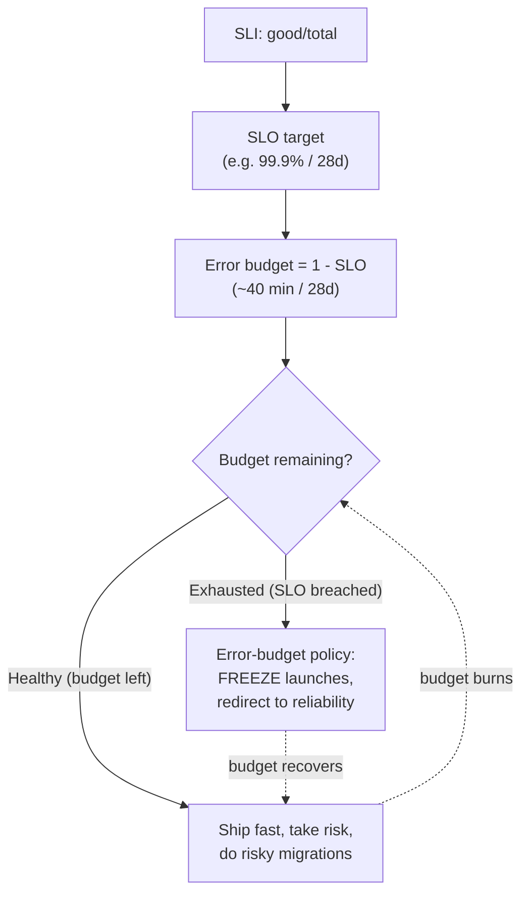
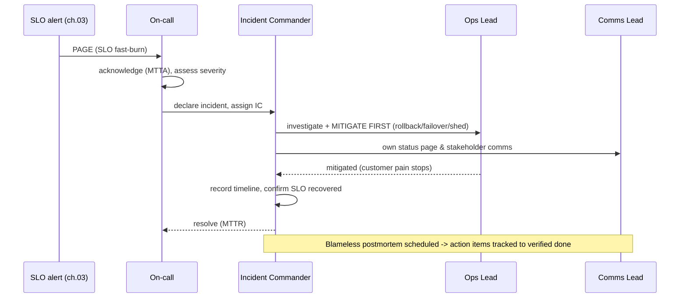
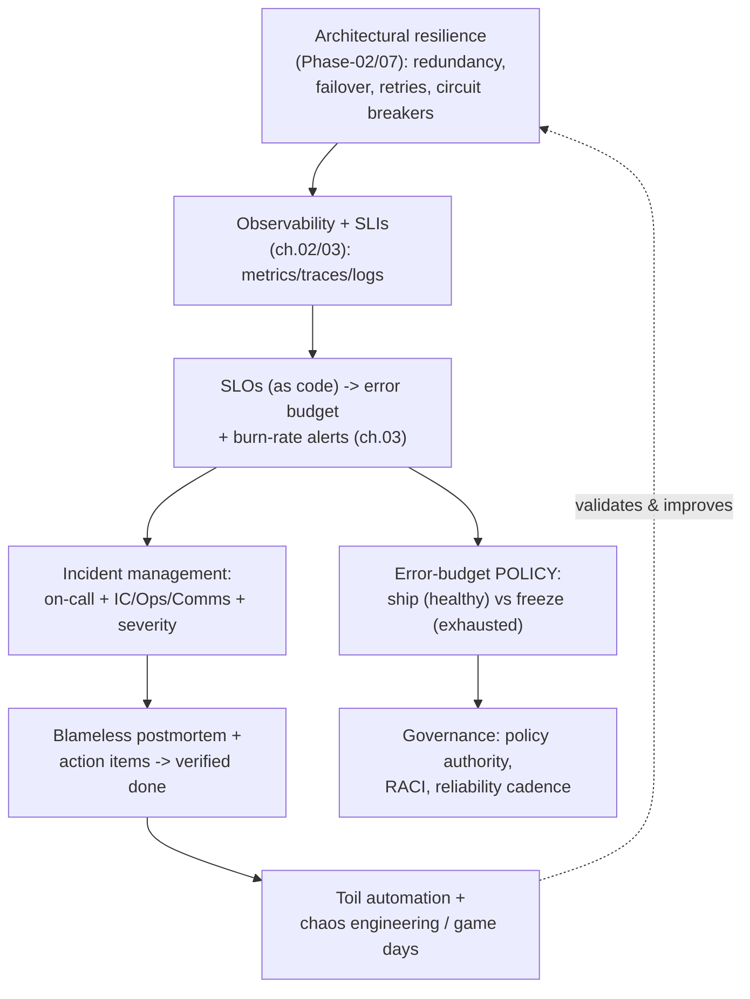
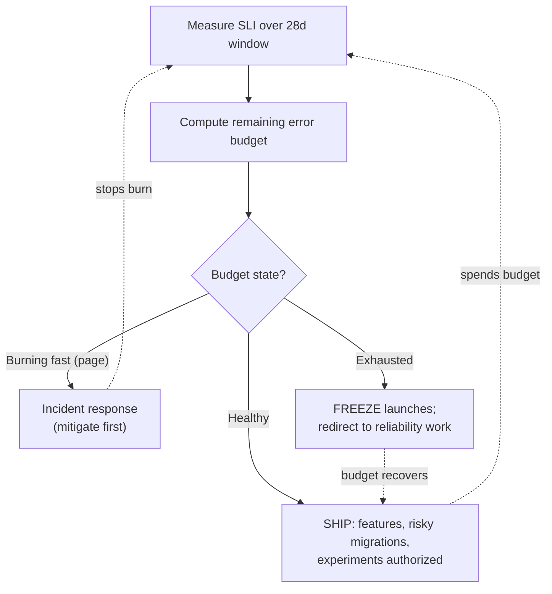

# Reliability and SRE

> Part of the **Enterprise Data & AI Architecture Handbook** · Phase-18 — FinOps, Observability & Reliability · Chapter 04.
> Estimated study time: **60 min reading + ~3h labs**.
> **Prerequisites:** read [Fault Tolerance and Resilience](../Phase-02/07_Fault_Tolerance_and_Resilience.md) first (this chapter is the organizational/operating-model layer built on the architectural resilience mechanisms that chapter establishes).

---

## Executive Summary

The previous three Phase-18 chapters built the machinery of a well-run platform: [FinOps and Cost Optimization](01_FinOps_and_Cost_Optimization.md) made spend accountable, [Observability with OpenTelemetry](02_Observability_with_OpenTelemetry.md) made behavior visible, and [Monitoring with Prometheus and Grafana](03_Monitoring_with_Prometheus_and_Grafana.md) turned signals into SLO-based, symptom-oriented alerts — and repeatedly deferred one thing to this chapter: the *operating model* that decides how reliable the platform should be, who responds when it isn't, and how the organization learns. That operating model is **Site Reliability Engineering (SRE)** — the discipline, born at Google, that treats operations as a software problem and manages reliability as an explicit, measured, negotiated engineering property rather than an aspiration ("keep it up") or a heroic afterthought. Where the [Fault Tolerance and Resilience](../Phase-02/07_Fault_Tolerance_and_Resilience.md) chapter gave you the *architectural* mechanisms of reliability (redundancy, retries, circuit breakers, failover), this chapter gives you the *human and organizational* system that operates them: **SLIs, SLOs, and error budgets; toil reduction; incident response; blameless postmortems; on-call and runbooks; and data reliability engineering.**

The single most important idea in SRE — and the one this chapter's ADR (§40) formalizes — is the **error budget**. Reliability is *not* something to maximize. 100% reliability is the wrong target: it is astronomically expensive, and beyond a certain point users literally cannot tell the difference (their ISP, browser, and phone are less reliable than your 99.99% service). So you set an explicit **Service Level Objective** — say, 99.9% of requests succeed within latency budget over 28 days — and the **error budget** is the *allowed unreliability*: 0.1%, or roughly 43 minutes a month. That budget is the crux, because it is the **shared currency that resolves the perpetual tension between feature velocity and reliability.** When the budget is healthy, teams ship fast and take risks — they have room to spend. When the budget is exhausted, an **error-budget policy** automatically redirects effort from features to reliability until it recovers. The fight between "product wants to ship" and "ops wants stability" — which otherwise plays out politically after every incident — becomes a **pre-agreed, data-driven, automatic decision.** That is the intellectual core of SRE, and it is what this chapter is really about.

Around that core sit the practices that make reliability sustainable: **toil reduction** (cap manual, repetitive operational work — famously at ~50% of an SRE's time — and automate the rest away, because operations is a software problem); **incident response** with a defined command structure (Incident Commander, Communications Lead, Operations Lead) so a crisis is coordinated rather than chaotic; **blameless postmortems** that fix *systemic* causes instead of punishing individuals (because blame guarantees the cause recurs and the good engineers leave); **on-call and runbooks** that make being paged survivable and actionable; and **data reliability engineering** — applying every one of these ideas to *data* (freshness, completeness, correctness SLOs; "data downtime"; data incidents), the natural home of SRE on a data and AI platform.

The platform bias is **Azure-primary (~60%)** — the **Azure Well-Architected Reliability pillar**, availability zones/regions and Azure Site Recovery, **Azure Chaos Studio** for fault injection, Application Insights availability tests and Azure Monitor for SLO/error-budget dashboards and alerting (the ch.03 mechanics), Azure Load Testing, and the emerging agentic **Azure SRE Agent** — **~30% enterprise open source** (Prometheus/Grafana with **Sloth/Pyrra** for SLO-as-code, the **OpenSLO** spec, **Chaos Mesh/LitmusChaos** for chaos engineering, **Backstage** as the service catalog, and **Grafana OnCall**) — and **~10% AWS/GCP comparison-only** (AWS Well-Architected/FIS/Resilience Hub/Incident Manager; GCP Cloud Monitoring's native SLO features — a genuine differentiator given SRE's Google origin), contrasted honestly.

**Bottom line:** reliability is an engineering property you set deliberately, measure honestly, and *govern with an error budget* — not a number to push toward 100%. This chapter's ADR mandates an **explicit error-budget policy** as the mechanism that turns reliability from a political argument into a data-driven decision, because the dominant failure mode is not a lack of resilience mechanisms but the **absence of an agreed rule for trading velocity against reliability** — so reliability debt accumulates silently until a major outage forces a reactive, painful correction, the same silent-accumulation pattern this handbook keeps returning to, now applied to reliability itself.

---

## Learning Objectives

By the end of this chapter you will be able to:

1. **Define SLIs, SLOs, and SLAs precisely**, choose good SLIs for a service or data product, and reason about "how reliable is reliable enough" (the nines, and why 100% is wrong).
2. **Design and operate an error budget and error-budget policy** — computing the budget, tracking burn, and using it to govern the velocity-vs-reliability trade-off.
3. **Identify and eliminate toil** — recognize it, cap it, and automate it away, treating operations as a software problem.
4. **Run an incident** — incident command roles, severity levels, coordination, communication, and the metrics (MTTD/MTTA/MTTR) that measure response.
5. **Write and act on blameless postmortems** — systemic root-cause analysis, action items tracked to verified completion, and the culture that makes them work.
6. **Apply SRE to data (Data Reliability Engineering)** — data SLOs, data downtime, and data incidents — and stand up on-call, runbooks, and chaos engineering on Azure and open source.

---

## Business Motivation

Reliability is a feature — arguably the most important one, because every other feature is worthless when the system is down. But reliability is also expensive, and beyond a point invisible, so the business question is never "how do we maximize uptime?" It is **"how reliable do we need to be, what does that cost, and how do we spend our reliability effort where it matters?"** SRE exists to answer exactly those questions with data instead of politics.

The business case rests on several hard realities:

- **Downtime has a direct, often quantifiable cost.** For a revenue-critical platform — the retail commerce path, the financial reporting golden source, a customer-facing API — every minute of outage is lost revenue, SLA penalties, and eroded trust. Reliability is a direct P&L line, which is why it deserves an engineering discipline, not ad-hoc heroics.
- **But over-reliability is also a cost — a hidden one.** Chasing 99.999% when the business needs 99.9% means enormous engineering effort and infrastructure spend on nines nobody can perceive, *and* it slows feature delivery to a crawl. Gold-plating reliability is as much a business failure as under-investing; it is just harder to see. The error budget is the tool that makes "just reliable enough" an explicit, defensible target.
- **The velocity-reliability conflict is structural and perpetual.** Product teams are incentivized to ship; operations teams are incentivized to keep things stable. Without a shared, objective mechanism, this conflict is re-litigated after every incident, politically and painfully, and whichever side has more organizational power "wins" — producing either chronic outages or feature paralysis. The error-budget policy converts this into an automatic, pre-agreed decision, which is a *governance* and a *culture* win as much as a technical one.
- **Toil is a silent tax that scales you into a wall.** Manual operational work grows linearly (or worse) with the size of the system. A team that doesn't cap and automate toil eventually spends all its time firefighting, ships nothing, and burns out — a business failure disguised as "we're too busy." SRE's toil discipline is what lets a small team operate a large, growing platform.
- **On-call sustainability is a retention issue.** A noisy, blame-heavy, runbook-less on-call burns out and attrites your best engineers. Sustainable on-call (bounded toil, actionable alerts, blameless culture) is a reliability *and* a talent-retention investment.

The consequence of SRE done well is a platform that is reliable exactly where it needs to be, ships fast because the error budget authorizes risk, responds to incidents calmly and quickly, and gets *more* reliable over time because it learns from every failure. The consequence of getting it wrong is the worst of all worlds: outages the business feels, features that never ship, and an on-call rotation that quits.

---

## History and Evolution

- **Traditional ops / sysadmin era (pre-2003).** Operations and development were separate worlds: developers wrote code and "threw it over the wall" to operations, who kept it running manually. Reliability was heroics and pager duty; the incentives of the two groups were misaligned (dev wanted change, ops wanted stability), producing the classic dysfunctional standoff.
- **SRE is born at Google (~2003).** **Ben Treynor Sloss** was asked to run a production team at Google and, being a software engineer, built it the way a software engineer would — hiring engineers to do operations and having them **automate their way out of manual work**. His one-line definition: *"SRE is what happens when you ask a software engineer to design an operations team."* The error budget, SLO discipline, and toil concepts emerged from running Google's services at scale.
- **DevOps movement (2009+).** In parallel, the broader **DevOps** movement (the term crystallized around 2009) attacked the same dev/ops divide from a cultural-and-tooling angle (CI/CD, "you build it, you run it"). SRE is often described as a **specific, prescriptive implementation of DevOps principles** — "class SRE implements interface DevOps."
- **Netflix and chaos engineering (2010–2011).** Netflix, moving to the cloud, built **Chaos Monkey** (2011) and the **Simian Army** to *deliberately inject failure* into production, forcing engineers to build systems that survive it. This became **chaos engineering** — proactive reliability testing — and the *Principles of Chaos* were later codified.
- **The Google SRE books (2016, 2018).** Google published **Site Reliability Engineering** (2016) and **The Site Reliability Workbook** (2018), open-sourcing the discipline: SLIs/SLOs/error budgets, toil, incident management, blameless postmortems, and the four golden signals. These made SRE an industry-wide practice, not a Google secret.
- **Data reliability engineering (2019–present).** As data pipelines became business-critical, the SRE model was applied to data: **Monte Carlo** coined **"data downtime"** (~2019), and **Data Reliability Engineering (DRE)** emerged — data SLOs (freshness, volume, correctness), data incidents, and data postmortems — the natural convergence of SRE with the data-observability and data-contract disciplines from earlier phases.
- **SLO-as-code and standardization (2020–present).** Tools like **Sloth** and **Pyrra** (generate Prometheus burn-rate rules from SLO definitions), the **OpenSLO** open specification, and commercial platforms (**Nobl9**) made SLOs declarative and version-controlled. Cloud providers added native SLO monitoring (notably **Google Cloud Monitoring**, unsurprising given SRE's origin) and, most recently, **agentic incident response** (e.g., the preview **Azure SRE Agent**, 2025) began automating parts of the on-call/diagnosis loop.

The through-line: reliability evolved from misaligned, manual, heroic operations into a **measured, budgeted, automated, blameless engineering discipline** — with the error budget as its defining invention.

---

## Why This Technology Exists

SRE exists to resolve a set of structural problems that traditional operations could not, because they are not *technical* problems — they are problems of *incentives, measurement, and organizational decision-making*:

1. **The velocity-reliability conflict had no objective referee.** Development wants to change the system; operations wants to keep it stable; change is the enemy of stability. Without a shared, measured currency, this is an unwinnable political argument decided by org-chart power, producing either recklessness or paralysis. **The error budget is that referee** — it turns "should we ship?" into "do we have budget?", a fact both sides accept in advance.
2. **"Reliable enough" was never defined, so effort was misallocated.** Teams either under-invested (constant outages) or over-invested (chasing invisible nines at huge cost and velocity loss), because there was no explicit target. **SLOs make "reliable enough" an explicit, negotiated number**, so reliability effort goes exactly where the business needs it and nowhere it doesn't.
3. **Manual operations doesn't scale.** Toil grows with the system; a team doing operations by hand hits a wall where all its time is firefighting. **SRE reframes operations as a software problem** — automate the toil away — which is the only way a fixed-size team can run an ever-growing platform.
4. **Failure was treated as a person's fault, so systems never improved.** When incidents lead to blame, people hide information, the real systemic cause is never found, it recurs, and the best engineers leave. **Blameless postmortems** exist to extract systemic learning from failure, treating incidents as inevitable and as the richest source of reliability improvement.
5. **Incidents were chaotic.** Without a command structure, an outage becomes many people debugging in parallel with no coordination, no clear decision-maker, and confused communication. **Incident management (the Incident Commander model, borrowed from emergency services)** exists to make crisis response calm, coordinated, and fast.

SRE exists, in short, because reliability at scale is an **organizational and software-engineering problem, not a heroics problem** — and it provides the specific mechanisms (error budgets, SLOs, toil caps, incident command, blameless postmortems) that make reliability a managed, improving, sustainable property.

---

## Problems It Solves

- **The velocity-vs-reliability standoff.** The error-budget policy replaces a perpetual political fight with a pre-agreed, data-driven, automatic decision.
- **Undefined reliability targets.** SLIs/SLOs make "reliable enough" explicit and negotiated, so effort is allocated to the nines that matter and not wasted on those that don't.
- **Over- and under-investment in reliability.** The SLO/error-budget framing prevents both gold-plating (chasing invisible nines) and neglect (chronic outages).
- **Operational work that doesn't scale.** Toil identification and automation let a fixed team run a growing platform without drowning in manual work.
- **Chaotic incident response.** The Incident Commander model and severity framework make crises coordinated, fast, and well-communicated.
- **Recurring failures and blame culture.** Blameless postmortems extract systemic learning, fix root causes, and preserve psychological safety (and talent).
- **Unsustainable on-call.** Bounded toil, actionable SLO-based alerts (ch.03), and runbooks make on-call survivable and effective.
- **Silent data unreliability.** Data Reliability Engineering brings SLOs, error budgets, and incident discipline to freshness/completeness/correctness — the "data downtime" problem.
- **Untested resilience.** Chaos engineering proactively verifies that the architectural fault-tolerance mechanisms from Phase-02 actually work under real failure.

---

## Problems It Cannot Solve

- **It cannot make an architecturally fragile system reliable.** SRE operates and improves reliability, but it cannot compensate for missing fundamentals — no redundancy, no failover, a single point of failure. The *architectural* resilience mechanisms from [Fault Tolerance and Resilience](../Phase-02/07_Fault_Tolerance_and_Resilience.md) are a prerequisite; SRE is the operating model on top, not a substitute for good design.
- **It cannot deliver 100% reliability — nor should it try.** SRE explicitly rejects 100% as a target: it is infeasible, ruinously expensive, and imperceptible to users. Anyone expecting SRE to guarantee zero downtime has misunderstood the discipline.
- **It cannot succeed as a rename or a tool purchase.** Relabeling the ops team "SRE," or buying an SLO dashboard, without the error-budget *policy*, blameless *culture*, and toil-automation *mandate*, produces "SRE in name only" — the same hollow-adoption failure as "mesh in name only" and "FinOps in name only" earlier in the handbook.
- **It cannot work without organizational buy-in to the error-budget policy.** If leadership won't honor a launch freeze when the budget is exhausted, the error budget is theater. The policy requires real, pre-agreed authority — a governance decision, not just an engineering one.
- **It cannot eliminate all toil or all incidents.** Some toil is irreducible; incidents are inevitable. SRE *caps and reduces* toil and *responds to and learns from* incidents; it does not promise their absence.
- **It cannot fix a blame culture by decree.** Blameless postmortems require genuine psychological safety; mandating the template while punishing people in practice destroys the honesty the process depends on. Culture cannot be faked into existence.

---

## Core Concepts

### 4.1 SLI, SLO, SLA — and "How Reliable Is Reliable Enough?"

- **SLI (Service Level Indicator)** — a *measured* quantitative indicator of service health, expressed as a **ratio of good events to total events**: fraction of requests served successfully under a latency threshold, fraction of data deliveries that were fresh and complete. Good SLIs measure what users actually experience.
- **SLO (Service Level Objective)** — the *target* for an SLI over a window: "99.9% of requests succeed within 300 ms over 28 days." The SLO is an internal engineering commitment and the number the error budget is derived from.
- **SLA (Service Level Agreement)** — a *contractual* commitment to customers with financial/legal consequences for breach. SLAs are typically **looser than SLOs** (you alert and act on the tighter internal SLO long before you'd breach the external SLA — the SLO is your early-warning margin).

The foundational insight is **"how reliable is reliable enough?"** More nines cost exponentially more and deliver diminishing, eventually-imperceptible returns:

| SLO | Allowed downtime / year | Allowed / 28-day window |
|---|---|---|
| 99% ("two nines") | ~3.65 days | ~6.7 hours |
| 99.9% ("three nines") | ~8.77 hours | ~40 minutes |
| 99.99% ("four nines") | ~52.6 minutes | ~4 minutes |
| 99.999% ("five nines") | ~5.26 minutes | ~24 seconds |

The right SLO is set by **user needs and the cost of unreliability**, not by ambition — and it is deliberately *below* 100%, because 100% is infeasible, ruinously expensive, and imperceptible (users are gated by their own less-reliable devices and networks).

### 4.2 Error Budgets and the Error-Budget Policy — the Core of SRE

The **error budget** is simply `1 − SLO`: the allowed amount of unreliability over the window. A 99.9% SLO gives a 0.1% error budget (~40 minutes per 28 days). Its genius is that it is the **shared currency that resolves the velocity-vs-reliability tension**:

- **When the budget is healthy** (plenty remaining), the team is *authorized to spend it*: ship faster, take more risk, do riskier migrations — reliability is comfortably within target, so velocity is the right priority.
- **When the budget is exhausted** (SLO breached or about to be), the **error-budget policy** kicks in: **feature launches freeze, and engineering effort redirects to reliability** until the budget recovers.

This turns the perpetual political fight into a **pre-agreed, automatic, data-driven decision** — the single most important governance mechanism in SRE, and the subject of this chapter's ADR. Burn is tracked via the **multi-window multi-burn-rate alerting** implemented in [Monitoring with Prometheus and Grafana](03_Monitoring_with_Prometheus_and_Grafana.md) §3.5: a fast burn pages, a slow burn tickets, and cumulative burn drives the policy. The error budget is thus the concept that *connects* the alerting mechanics of ch.03 to the organizational decisions of this chapter.



### 4.3 Toil and Its Elimination

**Toil** is operational work that is **manual, repetitive, automatable, tactical (interrupt-driven), devoid of enduring value, and scales linearly with service size.** Restarting a stuck job by hand, manually provisioning access, copy-pasting a runbook's commands — that's toil. It is not "all operational work" (genuine engineering, design, and judgment are not toil), and some toil is irreducible. SRE's prescription:

- **Measure it**, and **cap it** — Google's guideline is that SREs spend **no more than ~50% of their time on toil**, reserving the rest for engineering that *reduces future toil*.
- **Automate it away** — because operations is a software problem, the response to recurring toil is to write software that eliminates it (auto-remediation, self-service provisioning, automated runbooks). This is the flywheel that lets a small team scale to a large platform: every automated toil item frees capacity to automate the next.
- **Beware the toil trap** — a team that spends 100% of its time on toil can never build the automation to escape it; capping toil is what protects the capacity to improve.

### 4.4 Incident Response, On-call, and Runbooks

An **incident** is an event that requires an urgent, coordinated response (typically an SLO breach or imminent breach). SRE borrows a command structure from emergency services (the Incident Command System):

- **Incident Commander (IC)** — the single decision-maker who coordinates the response; owns the incident, not necessarily the fix. Prevents the "everyone debugging in parallel, no one deciding" chaos.
- **Operations/Ops Lead** — executes the technical investigation and mitigation under the IC's coordination.
- **Communications Lead** — owns stakeholder/customer/status-page communication so the IC and Ops Lead aren't distracted by "what do I tell people?"
- **Severity levels** (SEV1–SEV3/4) — calibrate the response to the impact.

**On-call** is the rotation that receives pages (from the SLO-based alerts of ch.03) and initiates response; it must be **sustainable** — bounded page load, actionable alerts, fair rotation, and compensation. **Runbooks** (linked from every alert, per the ch.03 ADR) document what an alert means and how to diagnose/remediate it, so a page is actionable by whoever is on-call, not just its author. Response is measured by **MTTD** (detect), **MTTA** (acknowledge), and **MTTR** (resolve).

### 4.5 Blameless Postmortems and Data Reliability Engineering

A **postmortem** is the written, structured analysis after a significant incident: timeline, impact, **root cause(s)**, what went well/badly, and **action items** to prevent recurrence. It must be **blameless** — focused on *systemic* and *process* causes ("the deploy pipeline allowed an untested config to reach production"), never on individuals ("Alice pushed a bad config"). Blamelessness is not politeness; it is *epistemically necessary*: only in a blame-free environment do people share the full, honest information needed to find the real cause. Blame makes people hide facts, so the true systemic cause is never fixed and the incident recurs — and your best engineers, unwilling to be scapegoated, leave. Action items must be **owned and tracked to verified completion** (an unimplemented action item is why the same incident happens twice — the recurring "verification gap").

**Data Reliability Engineering (DRE)** applies all of the above to *data*: **data SLOs** (freshness — is it on time?; completeness/volume — did all the rows arrive?; correctness — is it right?), the concept of **data downtime** (periods when data is missing, wrong, or late), **data incidents** with the same command/postmortem discipline, and error budgets for data quality. It is the convergence of SRE with the data-observability signals from [Observability with OpenTelemetry](02_Observability_with_OpenTelemetry.md) and the contracts/quality discipline from the governance phases — and it is where SRE lives most naturally on a data and AI platform.

---

## Internal Working

### 5.1 How an Error Budget Is Computed and Burned

Over a rolling window (commonly 28 days), the SLI is measured as `good_events / total_events`. The error budget is the allowed bad fraction: `budget = 1 − SLO`. The **consumed** budget is the actual bad fraction so far; the **remaining** budget is what's left. Concretely, for a 99.9% availability SLO over 28 days on a service handling 100M requests, the budget is 0.1% = 100,000 allowed failures (~40 minutes of total outage). Each failed request or minute of downtime *burns* budget. The **burn rate** is how fast you're consuming relative to the sustainable pace: a burn rate of 1 exactly exhausts the budget over the window; a burn rate of 14.4 exhausts it in ~2 hours. The **multi-window multi-burn-rate alerts** from ch.03 evaluate this continuously (fast window → page, slow window → ticket), and the *cumulative* remaining budget drives the **error-budget policy** decision (freeze vs. ship). The mechanics are pure PromQL over recording-rule SLIs — which is exactly why ch.03 (implementation) and ch.04 (policy) are two halves of one system.

### 5.2 How Incident Management Works Operationally

When an SLO-based alert pages (ch.03), the on-call **acknowledges** (MTTA) and assesses severity. If it warrants coordinated response, an **incident is declared** and an **Incident Commander** is assigned (for a SEV1, often a dedicated rotation). The IC opens a coordination channel (a "war room"/bridge), assigns an **Ops Lead** to investigate/mitigate and a **Comms Lead** to handle stakeholders and the status page, and drives toward **mitigation first, root cause later** (stop the customer pain — roll back, fail over, shed load — before diagnosing why). Throughout, a **timeline** is recorded (for the postmortem). When the SLO recovers and impact ends, the incident is **resolved** (MTTR), and a postmortem is scheduled for anything above a severity threshold. The IC's job is *coordination and decision-making*, deliberately separated from hands-on debugging, because the failure mode SRE is preventing is exactly the leaderless, uncoordinated scramble.



### 5.3 How the Postmortem → Action-Item → Verification Loop Closes

After resolution, the incident's owner drafts a **blameless postmortem**: a factual timeline, quantified impact (budget burned, users/revenue affected), **contributing systemic causes** (usually several — "5 whys"/contributing-factors analysis, not a single scapegoat), what detection/response went well and badly, and **action items** each with an **owner and a due date**. The postmortem is reviewed openly (so the whole org learns), and — the load-bearing step — the **action items are tracked in the normal engineering backlog to verified completion.** The loop only closes when the fixes ship; a postmortem whose action items are never implemented is why the same incident recurs (Case Study 2). This closing-the-loop discipline is the same "convert the finding into a permanent, verified fix" pattern this handbook established for red-team findings, CMK-rotation verification, and erasure verification — here applied to incident learning.

---

## Architecture

Reliability is an organizational architecture as much as a technical one. The reference "reliability stack" for a data/AI platform has these layers, each mapping to a Phase-18 chapter or an SRE practice:

1. **Architectural resilience foundation** — redundancy, failover, retries, circuit breakers, bulkheads, multi-AZ/region from [Fault Tolerance and Resilience](../Phase-02/07_Fault_Tolerance_and_Resilience.md). SRE operates this; it does not replace it.
2. **Observability & SLI measurement** — traces/metrics/logs (ch.02) and Prometheus/Grafana (ch.03) produce the SLIs that reliability is measured on.
3. **SLO & error-budget layer** — SLOs defined (ideally as code: OpenSLO/Sloth/Pyrra), error budgets computed, burn-rate alerts firing (ch.03), and the **error-budget policy** governing launches.
4. **Incident management layer** — on-call rotations, paging, the IC/Ops/Comms command structure, severity framework, and coordination tooling.
5. **Learning & automation layer** — blameless postmortems, action-item tracking, **toil measurement and automation**, and **chaos engineering** to proactively validate resilience.
6. **Governance layer** — the error-budget policy authority, reliability roles/RACI, and the cadence tying it all together.

```mermaid
flowchart TB
    subgraph Foundation["Architectural resilience (Phase-02/07)"]
        F[Redundancy, failover, retries,<br/>circuit breakers, multi-AZ/region]
    end
    subgraph Measure["Observability & SLIs (ch.02/03)"]
        M[Traces/metrics/logs -> SLIs<br/>Prometheus/Grafana]
    end
    subgraph SLO["SLO & error budget"]
        S[SLOs as code -> error budget<br/>burn-rate alerts (ch.03)]
        POL[Error-budget POLICY<br/>ship vs freeze]
    end
    subgraph Incident["Incident management"]
        I[On-call + paging<br/>IC / Ops / Comms + severity]
    end
    subgraph Learn["Learning & automation"]
        L[Blameless postmortems +<br/>action items -> verified done]
        T[Toil measurement + automation]
        C[Chaos engineering]
    end
    F --> M --> S --> POL
    S --> I
    I --> L
    L --> T
    L -. proactive validation .-> C
    C --> F
    POL --> GOV[Governance:<br/>policy authority, RACI, cadence]
```

---

## Components

- **SLIs / SLOs / SLAs** — the measured indicators, internal targets, and external contracts.
- **Error budget & error-budget policy** — `1 − SLO` and the pre-agreed rule governing velocity-vs-reliability.
- **SLO-as-code tooling** — **OpenSLO** (spec), **Sloth**/**Pyrra** (generate Prometheus burn-rate rules), **Nobl9** (commercial SLO platform).
- **Burn-rate alerting** — the multi-window multi-burn-rate rules from ch.03 (Prometheus/Grafana/Azure Monitor).
- **On-call & paging** — PagerDuty/Opsgenie/Grafana OnCall, rotations, escalation policies.
- **Incident command roles** — Incident Commander, Ops Lead, Comms Lead; severity framework; war-room/bridge tooling.
- **Runbooks** — per-alert diagnosis/remediation docs, linked from alerts (ch.03 ADR).
- **Postmortem process & tracker** — blameless template, review forum, and action-item backlog tracking.
- **Toil register & automation** — measurement of manual work and the automation that eliminates it.
- **Chaos engineering** — Azure Chaos Studio, Chaos Mesh/LitmusChaos, AWS FIS — proactive fault injection.
- **Service catalog** — Backstage (or Azure/Fabric equivalents) recording each service's SLOs, owners, on-call, and runbooks.
- **DRE tooling** — data-observability signals (ch.02) and data-quality checks surfaced as data SLOs and data incidents.

---

## Metadata

Reliability engineering runs on metadata that ties services, SLOs, incidents, and ownership together:

- **Service metadata** — for each service/data product: its **owner/team**, **on-call rotation**, **SLOs**, **runbook links**, **dependencies**, and **tier/criticality**. This is the service-catalog (Backstage) record that makes "who owns this and how reliable must it be?" answerable.
- **SLO metadata** — the SLI definition, target, window, and error-budget policy per SLO, ideally version-controlled as code (OpenSLO) so it's reviewable and reproducible.
- **Incident metadata** — severity, timeline, affected SLOs/services, budget burned, IC/roles, and links to the postmortem and action items — the record that makes incident trends analyzable.
- **Dependency metadata** — the service dependency graph, essential for understanding blast radius and for the inhibition/grouping logic that keeps a root-cause failure from paging every downstream team (ch.03).
- **Criticality/tier metadata** — which services are tier-1 (revenue/safety-critical) vs. tier-3, driving how tight their SLOs and how urgent their on-call must be — the reliability analog of data classification.

The governing point: reliability metadata must be **maintained as a living record** (in a service catalog, not a stale wiki), because an out-of-date owner/on-call/runbook mapping is discovered at the worst possible moment — mid-incident.

---

## Storage

Reliability engineering is metadata- and telemetry-heavy rather than data-heavy, but its stored artifacts matter:

- **SLI/SLO time-series and error-budget history** — stored in the metrics backend (Prometheus/Mimir/Azure Monitor from ch.03) with **long retention**, because error-budget trends and SLO compliance are reviewed over months/quarters and reported to leadership.
- **Incident and postmortem records** — durable, searchable storage (an incident-management tool, wiki, or repo) retained long for trend analysis, audit, and organizational learning; postmortems are a knowledge asset, not a disposable artifact.
- **Runbooks and the service catalog** — version-controlled (as code / in a catalog like Backstage) so they're reviewable, current, and reproducible — not click-ops wiki pages that rot.
- **Chaos experiment definitions and results** — stored as code and history so experiments are repeatable and their findings tracked.
- **Retention tiering** — like everything in Phase-18, tier by value: high-resolution SLI data short-term, downsampled error-budget aggregates long-term (the FinOps storage-tiering discipline, applied to reliability telemetry).

---

## Compute

- **SLO/error-budget computation** is lightweight — recording-rule evaluation over SLIs in the metrics backend (ch.03); its cost is part of the monitoring platform's, governed by the same cardinality discipline.
- **Chaos engineering consumes real compute** — running fault-injection experiments (and especially game days) in staging or (carefully) production uses resources and, deliberately, causes controlled failures; budget for it as an investment in validated resilience.
- **Automation (toil elimination) is a compute investment that pays back.** Building auto-remediation, self-service provisioning, and automated runbooks costs engineering and run-time compute up front but eliminates recurring manual work — the flywheel that scales the team.
- **Load and resilience testing** — Azure Load Testing / k6 / Locust consume compute to validate that capacity and autoscaling meet SLOs under stress; a reliability cost with direct SLO payoff.
- **The efficiency-reliability balance** — over-provisioning "for safety" wastes money (a FinOps concern); under-provisioning breaches SLOs. SRE sizes to **meet the SLO with appropriate headroom**, not to minimize cost or maximize uptime in isolation — the explicit trade-off the error budget helps make.

---

## Networking

- **Multi-region/multi-AZ reliability is a network-topology decision.** Failover, active-active, and traffic management (Azure Front Door / Traffic Manager) route around regional failure to meet availability SLOs — mechanisms from the Phase-02 resilience chapter, operated here to a numeric target.
- **Health checks and probes** drive automated failover and load-balancer decisions; their correctness *is* a reliability control (a mis-configured health check that reports "healthy" during failure is a classic silent SRE failure).
- **The notification/paging path must itself be reliable.** If Alertmanager/PagerDuty can't reach the on-call over the network, the page is silent — the reliability of the reliability tooling matters (the dead-man's-switch from ch.03 guards this).
- **Network partitions are a core failure mode** to design and test for (chaos engineering explicitly injects them), tying back to the CAP/partition-tolerance material from the distributed-systems phase.
- **Cross-region coordination cost** (latency, egress) is a reliability-vs-cost-vs-consistency trade-off — active-active improves availability but adds network cost and consistency complexity.

---

## Security

- **Availability is one leg of the CIA triad** — reliability and security overlap directly: a DDoS or ransomware event is both a security incident and a reliability incident, and the incident-command structure serves both.
- **Incident management spans reliability and security.** The IC model, severity framework, and blameless postmortem apply equally to security incidents; mature orgs run one incident-management discipline for both (with security-specific escalation to the SOC/Sentinel).
- **Reliability signals are security signals.** A saturation spike, an anomalous error pattern, or a sudden traffic surge may be an attack; the same golden-signal monitoring feeds both reliability alerting and security detection (the recurring "monitoring is a tripwire" theme).
- **Chaos/resilience testing must be scoped and authorized** — injecting failure in production is powerful but must be governed (blast-radius limits, authorization) so a reliability experiment doesn't become a self-inflicted security/availability incident.
- **On-call access and runbook actions must respect least privilege.** The elevated access on-call needs to remediate must be governed (just-in-time/PIM from the identity phase), audited, and time-bounded — a compromised on-call account is high-blast-radius.
- **Postmortems can contain sensitive detail** (attack vectors, customer impact) and should be access-controlled appropriately while still being broadly shared for learning.

---

## Performance

- **Latency is usually a first-class SLI.** Performance and reliability meet at the latency SLO — "reliable" for many services means "fast enough," measured as p95/p99 (from the histograms of ch.03), not just "up." Performance Engineering (Phase-18 Chapter 05) is, in SRE terms, the discipline of meeting and improving latency SLOs.
- **Performance regressions burn the error budget.** A deploy that doubles p99 latency consumes budget just as an outage does; the error budget is the common currency for availability *and* latency degradation.
- **Load testing validates performance against SLOs** before production, and chaos/soak testing validates that performance holds under failure and over time.
- **Capacity planning is a reliability practice.** Ensuring capacity (and autoscaling headroom) to meet SLOs under peak and failure is core SRE work — under-capacity is an SLO breach waiting for a traffic spike (the retail peak-scale lesson, in SRE terms).
- **The observer must not degrade the observed** — reliability/monitoring overhead itself must not push the service past its latency SLO (the observability chapter's observer-effect caution).

---

## Scalability

- **SRE scales a platform via automation, not headcount.** The defining scalability property of SRE is **sub-linear operational cost as the system grows** — achieved by capping toil and automating it away, so a fixed team runs an ever-larger platform. A reliability practice whose operational load grows linearly with the service has failed the core SRE test.
- **SLOs and error budgets scale governance across many services.** Rather than bespoke reliability arguments per service, a standard SLO framework and error-budget policy scales the *decision-making* across hundreds of services and teams — the federated model applied to reliability (platform team owns the framework/tooling; product teams own their SLOs and on-call).
- **The service catalog scales knowledge.** Backstage (or equivalent) makes "who owns this, what are its SLOs, where's the runbook, who's on-call?" answerable across a large estate without tribal knowledge.
- **Incident management scales via structure.** The IC model and severity framework let the organization respond to incidents of any scale consistently, and let responders drop into any incident knowing the roles.
- **Reliability itself scales with architecture.** Meeting SLOs at scale relies on the horizontally-scalable, redundant patterns from Phase-02 and the autoscaling from the compute chapters — SRE operates those to a target.

---

## Fault Tolerance

This section is where this chapter meets its prerequisite most directly: [Fault Tolerance and Resilience](../Phase-02/07_Fault_Tolerance_and_Resilience.md) provides the *mechanisms*; SRE provides the *operating discipline* that ensures they work and are used to hit a target.

- **SRE operationalizes the resilience mechanisms.** Redundancy, retries, circuit breakers, bulkheads, graceful degradation, and failover (Phase-02) are the tools; SLOs define how much fault tolerance is *needed*, and error budgets decide how much to *invest*.
- **Chaos engineering verifies fault tolerance actually works.** The dangerous assumption is that failover, retries, and redundancy work *because they're configured*; chaos engineering (Chaos Monkey's legacy) **injects real failure** — kill a node, sever a dependency, inject latency, partition the network — to prove the mechanisms fire before a real outage tests them for you. Untested resilience is assumed resilience, and assumed resilience fails (the recurring verification-gap pattern, applied to failover).
- **Graceful degradation is an SLO decision.** *Which* functionality to shed under partial failure (the retail "shed engagement, protect commerce" pattern) is chosen to protect the most important SLOs.
- **Game days** — scheduled, organization-wide failure-injection exercises — validate both the technical mechanisms *and* the human incident-response process (does the IC model work? are runbooks current? does paging reach people?), the combined test of the whole reliability stack.
- **Blast-radius containment** (bulkheads, cells, regional isolation) limits how far a failure spreads — an architectural choice SRE validates and operates.

---

## Cost Optimization

Reliability and cost are in explicit, quantifiable tension, and SRE's frameworks are what make the trade-off rational (directly extending [FinOps and Cost Optimization](01_FinOps_and_Cost_Optimization.md)):

- **Reliability costs money; the SLO decides how much is worth it.** Each additional nine costs exponentially more (more redundancy, more regions, more headroom, more on-call). The SLO — "reliable enough, no more" — is precisely the mechanism that prevents over-spending on imperceptible reliability.
- **Over-reliability is a FinOps problem.** Chasing 99.999% when 99.9% suffices wastes infrastructure *and* velocity; the error budget is the tool that makes "don't gold-plate" an explicit, defensible decision.
- **Under-reliability is also a cost** — outages, SLA penalties, lost revenue, and reactive firefighting. The SLO balances the two: it's the point where the marginal cost of more reliability equals the marginal cost of the unreliability it prevents.
- **Toil automation is a cost lever.** Eliminating manual toil reduces the human cost of operations and frees capacity — a direct efficiency gain.
- **Right-size redundancy to the SLO.** Don't run geo-redundant, multi-region active-active for a tier-3 internal tool; do for the tier-1 revenue path. Match reliability investment to criticality (the reliability analog of tiering).

**Worked FinOps example — the cost of an extra nine.** A tier-1 API runs single-region active-passive at 99.9% ($base infra, say ~$40K/month). Moving to 99.99% requires **multi-region active-active** (roughly 2× compute + cross-region networking/replication + a dedicated 24×7 on-call), taking it to ~$95K/month — an extra **~$55K/month for one nine** (from ~40 min/month of allowed downtime to ~4 min). Is it worth it? *Only if the business impact of that extra ~36 min/month of downtime exceeds ~$55K/month.* For a payment path processing millions/hour, easily yes. For an internal analytics dashboard, obviously no — 99.9% is right and the extra nine is pure waste. **Decision:** set each service's SLO from the *quantified cost of its unreliability*, invest in nines only up to that point, and record the SLO (and its cost justification) as the explicit, reviewable target — so "how reliable?" is a data-driven FinOps decision, not an engineer's ambition or a fear-driven over-build. Verify the realized reliability matches the SLO (an over-built service quietly running at 99.999% while paying for it, unnoticed, is the reliability version of the FinOps verification gap).

---

## Monitoring

Monitoring *for reliability* (built on ch.03) centers on the SLO, not raw resource metrics:

- **SLO / error-budget dashboards** — the primary reliability view: each SLO's current compliance, remaining error budget, and burn rate over the window. This is what leadership and teams look at to answer "are we reliable enough, and can we keep shipping?"
- **Burn-rate alerts (ch.03)** — multi-window multi-burn-rate alerting pages on fast budget consumption and tickets on slow, the mechanism that turns SLOs into action.
- **Golden-signal / RED / USE dashboards** — the diagnostic layer beneath the SLO view (ch.03).
- **Incident metrics** — MTTD/MTTA/MTTR and incident frequency/severity trends, to measure and improve the *response*, not just the system.
- **Toil metrics** — the proportion of team time on toil, tracked to keep it under the cap.
- **Data SLOs (DRE)** — freshness/completeness/correctness dashboards and alerts for data products, the data-reliability equivalent of service SLOs.

The organizing principle from ch.03 holds: **monitor and page on user-facing SLO/symptom, diagnose with cause-level signals** — the SLO dashboard is the reliability cockpit; everything else is instrumentation beneath it.

---

## Observability

Reliability engineering is a heavy *consumer* of the observability from [Observability with OpenTelemetry](02_Observability_with_OpenTelemetry.md): you cannot set, measure, or defend an SLO without the telemetry that defines the SLI, and you cannot resolve an incident quickly without the correlated traces/logs that root-cause it. The relationship is specific:

- **SLIs are derived from observability signals.** An availability/latency SLI is computed from the metrics (ch.03) that OpenTelemetry produces; a data SLO's freshness/completeness SLI is computed from the data-observability signals (ch.02). No observability, no SLO.
- **Incident diagnosis *is* observability in action.** When an SLO alert fires, the on-call's speed to root cause depends entirely on the metric→trace→log correlation (exemplars, ch.03) the observability chapter established — MTTR is largely a function of observability quality.
- **Postmortems consume observability history.** Reconstructing an incident's timeline and root cause draws on retained traces, logs, and metrics; poor observability produces shallow postmortems that miss the systemic cause.
- **Observability of the reliability process itself** — tracking incident trends, error-budget history, and toil — is what lets SRE *improve* rather than just react.

The practical stance: **observability makes reliability measurable and debuggable; SRE makes reliability governed and improving.** They are two halves of the same operational competence — which is why they sit adjacent in this phase.

---

## Operational Response Playbook

Two representative reliability incidents as signal → detection → remediation. The meta-point: SRE *is* the discipline of operational response, so these playbooks are its core craft.

**Playbook 1 — SLO fast-burn: a live customer-facing incident.**
- **Signal:** a multi-window multi-burn-rate alert (ch.03) pages — a tier-1 service is burning its error budget fast (e.g., 14.4× over 1 hour → the month's budget gone in ~2 hours); customers are being impacted now.
- **Detection query:** open the SLO/error-budget dashboard to confirm scope (which SLO, how much budget burned, which endpoints/segments); pivot via **exemplars → traces → logs** (ch.03) to localize the failing component; correlate with recent **deploys/config changes** (the most common trigger).
- **Remediation:** **declare an incident, assign an Incident Commander**, and **mitigate before diagnosing** — if a recent deploy correlates, **roll back first**; if a dependency/region is failing, **fail over**; if overloaded, **shed load** (protect the critical path, per the retail pattern). Comms Lead updates the status page; Ops Lead executes under the IC. Once the SLO recovers and impact ends, **resolve**, then schedule a **blameless postmortem**. Verify the budget stops burning and the fix holds.

**Playbook 2 — The incident that recurred because the postmortem blamed a person (process failure).**
- **Signal:** the *same* class of incident happens a second (or third) time; or a postmortem's action items are months overdue; or a severe incident was "handled" but nothing changed.
- **Detection query:** review incident history for **repeat root causes**; check the postmortem's **action-item tracker** for un-implemented, un-owned, or overdue items; check whether past postmortems named *individuals* rather than *systemic causes* (a signal the real cause was never addressed).
- **Remediation:** re-open the systemic analysis **blamelessly** — find the process/system cause the blame-focused postmortem missed (e.g., "the pipeline allowed an untested config to reach prod," not "someone pushed a bad config"); create **owned action items with due dates** and **track them in the normal backlog to verified completion**; institute a **postmortem-action-item review** in the reliability cadence so items can't silently lapse. The durable fix is cultural + procedural: **blameless analysis + verified action-item closure**, so an incident becomes a permanent improvement, not a recurring event (Case Study 2).

---

## Governance

- **The error-budget policy is the central governance artifact.** A written, leadership-endorsed policy specifying *what happens when the budget is exhausted* (launch freeze, reliability focus) and *who has authority* to enforce it — pre-agreed, so it isn't re-litigated per incident (the ADR). Without leadership buy-in, the error budget is theater.
- **Reliability roles and RACI.** A platform/SRE team owns the SLO framework, tooling, incident-command training, and shared reliability infrastructure; product teams own their services' SLOs, on-call, and runbooks — federated ownership. Incident Commander is a trained, rostered role.
- **SLOs as code, reviewed.** SLO definitions version-controlled (OpenSLO/Sloth/Pyrra), code-reviewed, and consistent across teams — not per-team spreadsheets.
- **Blameless-postmortem mandate.** A required, blameless postmortem for incidents above a severity threshold, openly reviewed, with action items tracked to completion — and a genuine no-blame culture that makes it honest.
- **Toil governance.** Measuring and capping toil, with the freed capacity mandated for automation — enforced as a team-health metric, not left to chance.
- **On-call governance.** Fair rotations, sustainable page load, compensation, and escalation policies managed centrally; on-call health is a governed metric.
- **Reliability cadence.** A standing rhythm: SLO/error-budget reviews, incident reviews (trends, repeat causes, action-item status), and periodic game days.

---

## Trade-offs

- **Velocity vs. reliability.** The central SRE trade-off, and the one the error budget exists to arbitrate — spend budget on velocity when healthy, protect reliability when exhausted.
- **Reliability vs. cost.** More nines cost exponentially more; the SLO is the point where more reliability isn't worth it. Over- and under-investment are both failures.
- **Automation investment vs. immediate delivery.** Automating toil costs time now to save time later; the ~50% toil cap protects the capacity to make that investment.
- **Mitigate-first vs. diagnose-first.** In an incident, stopping customer pain (rollback/failover) usually beats understanding the root cause first — but reflexive rollback can occasionally destroy evidence or worsen things; the IC judges.
- **Tight SLO (early warning) vs. alert fatigue.** A tighter internal SLO than the external SLA gives margin but risks more alerts; multi-window burn-rate alerting (ch.03) balances it.
- **Chaos in production (realism) vs. risk.** Production chaos is the most realistic test but the most dangerous; scope, authorize, and blast-radius-limit it.
- **Blameless culture vs. accountability.** Blameless doesn't mean no accountability for *systems and follow-through*; it means no punishment for honest human error. The balance is accountability for fixing systemic causes, not for making mistakes.

---

## Decision Matrix

| Situation | Recommended approach | Rationale |
|---|---|---|
| Setting a reliability target | **Define an SLO from user needs + cost of unreliability** (not 100%) | "Reliable enough," no gold-plating |
| Velocity vs. reliability conflict | **Error-budget policy (freeze on exhaustion)** | Pre-agreed, data-driven, automatic decision |
| Deciding whether to add a nine | **Quantify cost of the extra downtime vs. cost of the nine** | Invest in nines only where the business impact justifies it |
| Recurring manual operational work | **Measure as toil, cap at ~50%, automate away** | Operations is a software problem; scales the team |
| A live SLO breach | **Declare incident, assign IC, mitigate first** | Coordinated, fast response; stop pain before diagnosing |
| After any significant incident | **Blameless postmortem + tracked action items** | Systemic learning; prevents recurrence |
| Validating resilience mechanisms | **Chaos engineering / game days** | Untested failover is assumed failover; prove it fires |
| A tier-1 revenue/safety service | **Tight SLO, multi-region, dedicated on-call** | Criticality justifies the reliability investment |
| A tier-3 internal tool | **Loose SLO, single-region, best-effort** | Don't over-invest in imperceptible reliability |
| Data pipeline/product reliability | **Data SLOs (freshness/completeness/correctness) + DRE** | "Ran" ≠ "correct data"; treat data downtime as an incident |
| SLO definition management | **SLO-as-code (OpenSLO/Sloth/Pyrra), reviewed** | Versioned, consistent, reproducible |

---

## Design Patterns

- **Error-budget policy (ship-vs-freeze).** The pre-agreed rule tying launch velocity to remaining budget — the defining SRE pattern (the ADR).
- **SLO-as-code.** Declarative, version-controlled SLOs (OpenSLO) generating burn-rate alerts (Sloth/Pyrra) — reliability config as reviewable code.
- **Multi-window multi-burn-rate alerting.** Fast-burn pages, slow-burn tickets (from ch.03) — the alerting that serves the error budget.
- **Incident Commander model.** Single coordinator + Ops Lead + Comms Lead + severity framework — coordinated crisis response.
- **Mitigate-first.** Stop customer pain (rollback/failover/shed) before root-causing.
- **Blameless postmortem + verified action items.** Systemic analysis with owned, tracked-to-done follow-ups — learning that sticks.
- **Toil cap + automate.** Bound manual work and reinvest the freed capacity in automation — the scaling flywheel.
- **Runbook-per-alert.** Every page links to an actionable runbook (ch.03 ADR).
- **Chaos engineering / game days.** Proactive failure injection to validate resilience *and* the human response.
- **Data Reliability Engineering.** Data SLOs, data downtime, and data incidents — SRE applied to data products.
- **Service catalog.** Backstage-style registry of owners, SLOs, on-call, runbooks, and dependencies.
- **Tiered reliability.** Match SLO tightness and redundancy to service criticality.

---

## Anti-patterns

- **Chasing 100% reliability.** Infeasible, ruinously expensive, imperceptible — the target SRE explicitly rejects.
- **"SRE in name only."** Renaming ops to SRE without error-budget policy, blameless culture, or toil automation — hollow adoption.
- **No error-budget policy (or one leadership ignores).** The budget is theater; the velocity-reliability fight stays political.
- **Blameful postmortems.** Naming individuals → hidden information, unfixed systemic causes, recurrence, and attrition (Case Study 2).
- **Unimplemented action items.** Postmortems whose fixes never ship — the same incident twice.
- **Toil trap.** 100% of time on manual work, no capacity to automate out of it — a team firefighting forever.
- **Leaderless incident response.** Everyone debugging in parallel, no IC, chaotic comms — slow, confused resolution.
- **Cause-based alerting / alert fatigue.** (From ch.03) noisy pages that bury the real incident.
- **Assumed (untested) resilience.** Failover/retries configured but never chaos-tested — they fail when first needed.
- **Reliability without observability.** Can't measure SLIs or root-cause incidents — flying blind.
- **Ignoring data reliability.** Monitoring services but not data freshness/correctness — silent data downtime.
- **One-size-fits-all reliability.** Same SLO/redundancy for tier-1 and tier-3 — over-invest here, under-invest there.

---

## Common Mistakes

- Setting SLOs by ambition (or copying "four nines") instead of from user needs and the cost of unreliability.
- Having no error-budget policy, or one leadership won't honor.
- Confusing SLO (internal target) with SLA (external contract) and alerting only at the SLA.
- Letting toil grow unbounded until the team can't ship.
- Running incidents without an Incident Commander or severity framework.
- Writing postmortems that blame people, then wondering why incidents recur.
- Never tracking postmortem action items to completion.
- Assuming failover/retries work without ever chaos-testing them.
- Alerting on causes not SLO symptoms (the ch.03 mistake).
- Monitoring service uptime but not data freshness/completeness/correctness.
- Over-investing in reliability for low-criticality services and under-investing for critical ones.
- Treating SRE as a tool/rename rather than a culture and operating model.

---

## Best Practices

- **Set SLOs from user needs and the cost of unreliability**, deliberately below 100%, and record them as code.
- **Adopt and enforce an error-budget policy** with real leadership authority (the ADR) — freeze on exhaustion, ship when healthy.
- **Alert on SLO burn** with multi-window multi-burn-rate rules (ch.03); link every page to a runbook.
- **Measure and cap toil (~50%)**, and reinvest the freed capacity in automation.
- **Run incidents with the IC model** (IC/Ops/Comms + severity), **mitigate first**, and record a timeline.
- **Write blameless postmortems** and **track action items to verified completion**; review them in a standing cadence.
- **Chaos-test resilience** (Azure Chaos Studio / Chaos Mesh) and run **game days** that exercise the human process too.
- **Apply SRE to data** — data SLOs (freshness/completeness/correctness), data downtime, data incidents (DRE).
- **Maintain a living service catalog** (owners, SLOs, on-call, runbooks, dependencies).
- **Tier reliability to criticality** — invest nines where the business impact justifies them.
- **Keep on-call sustainable** — bounded pages, fair rotations, compensation — as a reliability and retention investment.
- **Consume observability fully** (ch.02/03) so SLIs are measurable and incidents are quickly root-caused.

---

## Enterprise Recommendations

1. **Adopt an explicit, leadership-endorsed error-budget policy** (the ADR) as the mechanism governing velocity vs. reliability — the single highest-leverage SRE decision.
2. **Define SLOs (as code) for every tier-1/2 service and critical data product**, from user needs and the quantified cost of unreliability, deliberately below 100%.
3. **Stand up incident management** — IC model, severity framework, on-call rotations, runbook-per-alert, and coordination tooling — and train Incident Commanders.
4. **Mandate blameless postmortems** for incidents above a severity threshold, with action items tracked to verified completion and reviewed in a standing cadence — backed by a genuine no-blame culture.
5. **Measure, cap, and automate toil** as a team-health metric, protecting the capacity to engineer reliability rather than firefight it.
6. **Institute chaos engineering and game days** to validate that the Phase-02 resilience mechanisms *and* the human response actually work before real incidents test them.
7. **Extend SRE to data (DRE)** — data SLOs, data downtime, and data incidents — integrating the data-observability and data-contract disciplines.
8. **Use Azure-native reliability tooling** (Well-Architected Reliability pillar, Chaos Studio, availability tests, Azure Monitor SLO dashboards, emerging SRE Agent) while keeping SLO definitions portable (OpenSLO), and govern reliability cost via FinOps (right-size nines to criticality).

---

## Azure Implementation

**Reliability design and validation.**
- **Azure Well-Architected Framework — Reliability pillar** — the design guidance (redundancy, availability zones/regions, failover, health modeling, recovery targets RTO/RPO) that this chapter operates to a numeric SLO.
- **Availability Zones & regions, Azure Site Recovery, zone/geo-redundant services** — the resilience primitives; **Azure Front Door / Traffic Manager** for multi-region failover and traffic management.
- **Azure Chaos Studio** — managed **chaos engineering**: inject faults (VM shutdown, AKS pod failures, network latency/blackhole, dependency failures) as controlled, authorized experiments to validate resilience and run game days.
- **Azure Load Testing** — validate that capacity/autoscaling meet SLOs under stress.

**SLIs, SLOs, and alerting.**
- **Application Insights availability tests** and **Azure Monitor** metrics produce SLIs; **Azure Monitor / Managed Grafana** dashboards render SLO compliance and error-budget burn-down; **multi-window multi-burn-rate alerts** (ch.03) via Azure Monitor / managed Prometheus and **action groups** route pages.
- SLO definitions kept portable via **OpenSLO / Sloth / Pyrra** where using managed Prometheus.

**Incident response & automation.**
- **Azure Monitor alerts → action groups → on-call** (PagerDuty/Opsgenie/Teams); **Azure DevOps / GitHub Issues** for postmortems and action-item tracking; **Logic Apps / Azure Automation / Functions** for auto-remediation and toil elimination.
- **Azure SRE Agent** (preview, 2025) — an emerging **agentic** capability for automated incident diagnosis/response; treat as a maturing assist to (not a replacement for) the IC-led human process, and govern its actions with least privilege (the agentic-AI cautions from the LLMOps phase apply).

**Data Reliability Engineering.**
- Data SLOs from data-observability signals (ch.02) + data-quality checks (Great Expectations / dbt / Databricks) surfaced as freshness/completeness/correctness SLOs and **data incidents**, integrated with **Purview** lineage for blast-radius/impact analysis.

*Note:* much of this chapter's Azure depth builds on ch.02/03; this section is a consolidated map rather than a re-explanation.

---

## Open Source Implementation

The ~30% OSS stack for SRE, much of it the portable core beneath the Azure services:

- **Prometheus + Grafana** — SLI measurement, SLO/error-budget dashboards, and burn-rate alerting (ch.03) — the metrics foundation of SLOs.
- **Sloth** and **Pyrra** — **SLO-as-code**: generate Prometheus recording + multi-window burn-rate alerting rules from a concise SLO spec, making error budgets declarative.
- **OpenSLO** — the vendor-neutral **specification** for defining SLOs as code, portable across backends.
- **Chaos Mesh** and **LitmusChaos** (CNCF) — Kubernetes-native **chaos engineering** (pod/network/IO/stress fault injection); **Chaos Toolkit** for provider-agnostic experiments. (Netflix's **Chaos Monkey**/Simian Army is the historical origin.)
- **Grafana OnCall** — open-source on-call scheduling, escalation, and paging.
- **Backstage** (CNCF, from Spotify) — the **service catalog / developer portal** recording each service's owners, SLOs, on-call, runbooks, and dependencies — the living reliability metadata store.
- **Runbook automation** — **Rundeck**, **Ansible**, or Kubernetes operators to automate remediation and eliminate toil.
- **Incident tooling** — open status-page and incident-management options for coordination and communication.

A common enterprise pattern: **Prometheus/Grafana + Sloth/Pyrra (SLOs as code) + Chaos Mesh (resilience validation) + Backstage (service catalog) + Grafana OnCall (paging)** — a fully open reliability platform that can run alongside or instead of the Azure-native services, with SLO definitions (OpenSLO) portable across both.

---

## AWS Equivalent (comparison only)

| Capability | Azure | AWS | Notes |
|---|---|---|---|
| Reliability design guidance | Well-Architected Reliability pillar | **AWS Well-Architected Reliability pillar** | Near-identical framing |
| Resilience assessment | Advisor / WAF review | **AWS Resilience Hub** | AWS has a dedicated resilience-scoring service |
| Chaos engineering | Azure Chaos Studio | **AWS Fault Injection Simulator (FIS)** | Comparable managed chaos |
| Incident management | Action groups + partners | **AWS Systems Manager Incident Manager** | AWS has a first-party incident manager |
| Anomaly/ops insight | Azure Monitor | **Amazon DevOps Guru** | ML-driven operational insights |
| SLO monitoring | Azure Monitor + OSS (Sloth/Pyrra) | CloudWatch + OSS | Neither as native as GCP's SLO feature |

**Advantages of AWS:** dedicated **Resilience Hub** (resilience scoring against RTO/RPO), first-party **Incident Manager**, and mature **FIS** for chaos. **Disadvantages/migration:** the SRE *practices* (SLOs, error budgets, blameless postmortems) are provider-neutral; only the tooling differs, so migration is re-implementing dashboards/alerts/chaos experiments, not the discipline. **Selection criteria:** Azure-primary shops use Chaos Studio + Azure Monitor + OSS SLO tooling; the practice and OpenSLO definitions are what stay constant across clouds.

---

## GCP Equivalent (comparison only)

| Capability | Azure | GCP | Notes |
|---|---|---|---|
| SLO/error-budget monitoring | Azure Monitor + OSS | **Cloud Monitoring native SLOs & error budgets** | GCP's is first-class native — the standout |
| Reliability guidance | Well-Architected Reliability | **Google Cloud Architecture Framework (reliability)** | Google literally wrote the SRE books |
| Chaos engineering | Azure Chaos Studio | fault injection (less first-party) / OSS | GCP leans on OSS (Chaos Mesh) more |
| Incident/ops | Azure Monitor | **Cloud Operations + Personalized Service Health** | Comparable |
| On-call | partners / Grafana OnCall | partners / OSS | Comparable |

**Advantages of GCP:** **Cloud Monitoring has native, first-class SLO and error-budget monitoring** — unsurprising, since **SRE originated at Google** and Google authored the definitive SRE books; the reliability guidance is drawn straight from that practice. **Disadvantages/migration:** GCP's chaos tooling is less first-party (more OSS-dependent). **Selection criteria:** GCP's native SLO features are attractive if you're GCP-primary; on Azure, OpenSLO + Sloth/Pyrra + Azure Monitor achieves the same discipline. As always, the **SRE practice is the durable asset**; the tooling is portable.

---

## Migration Considerations

- **From heroics to SRE.** Sequence it: start by **defining SLOs and error budgets** for the most critical services (Inform), stand up SLO-based alerting (ch.03), then introduce the **error-budget policy**, **incident management**, **blameless postmortems**, and **toil automation**. Trying to adopt everything at once fails; the error-budget policy is the highest-leverage first move once SLOs exist.
- **The cultural migration is the hard part.** Blameless postmortems and an honored error-budget policy require genuine leadership buy-in and cultural change — harder than any tooling. Without it, you get "SRE in name only."
- **From reactive to proactive.** Introduce chaos engineering and game days *after* incident response and observability are solid — you must be able to observe and respond before you deliberately break things.
- **Adopt SLO-as-code early** (OpenSLO/Sloth/Pyrra) so SLO definitions are portable and reviewable from the start, not retrofitted.
- **Extend to data deliberately.** DRE is often the last piece; migrate data pipelines onto data SLOs and data-incident discipline once service SRE is established.
- **Platform-longevity discipline.** Consistent with the handbook's recurring caution (Cloud IoT Core 2023, AWS QLDB 2025, Azure Orbital, Azure Personalizer): keep the **SRE practice and open standards (OpenSLO, OSS chaos/paging)** as the durable core and treat any specific managed reliability tool (including emerging agentic SRE agents) as replaceable — the discipline, not the tool, is the asset.

---

## Mermaid Architecture Diagrams

**Diagram 1 — The SRE reliability stack (organizational + technical).**



**Diagram 2 — Error-budget policy decision loop.**



**Diagram 3 — Incident lifecycle with the IC model.**

```mermaid
stateDiagram-v2
    [*] --> Detected: SLO burn-rate alert (ch.03)
    Detected --> Triaged: on-call ack (MTTA), assess severity
    Triaged --> Declared: assign Incident Commander
    Declared --> Mitigating: IC coordinates; Ops mitigates FIRST; Comms updates status
    Mitigating --> Resolved: customer impact ends, SLO recovers (MTTR)
    Resolved --> Postmortem: blameless analysis, systemic causes
    Postmortem --> ActionItems: owned + due-dated
    ActionItems --> Verified: tracked in backlog to done
    Verified --> [*]: recurrence prevented
```



---

## End-to-End Data Flow

Following one reliability incident from objective to organizational learning:

1. **Objective set.** A tier-1 checkout API has an SLO (99.9% of requests fast-and-successful over 28 days), defined as code; its error budget (~40 min/28d) and burn-rate alerts are generated (Sloth/Pyrra → Prometheus, ch.03).
2. **Measure & spend.** The SLI is measured continuously from OpenTelemetry metrics (ch.02/03); with the budget healthy, the team ships features freely (error-budget policy authorizes it).
3. **Burn detected.** A deploy regresses latency; the **fast-burn** multi-window alert fires (14.4× over 1h) and pages on-call.
4. **Respond.** On-call **acknowledges** (MTTA), **declares an incident**, and an **Incident Commander** coordinates: Ops Lead **rolls back the deploy** (mitigate first), Comms Lead updates the status page. Burn stops; SLO recovers; incident **resolved** (MTTR).
5. **Learn.** A **blameless postmortem** finds the systemic cause ("the deploy pipeline lacked a latency gate that would have caught this in staging"), quantifies budget burned, and creates **owned, due-dated action items** (add the latency gate; improve the canary).
6. **Close the loop.** Action items are **tracked in the backlog to verified completion** — the latency gate ships, and a chaos/load test validates it.
7. **Govern.** The incident feeds the **reliability cadence** (trend review, action-item status); if the budget was heavily burned, the **error-budget policy** may freeze new launches until it recovers.
8. **Improve.** Toil observed during the incident (manual rollback steps) is automated away; the runbook is updated; the service catalog reflects the changes — the platform is now measurably more reliable, and the loop repeats.

---

## Real-world Business Use Cases

- **Ending the ship-vs-stability war with an error budget.** A product and platform org in perpetual conflict adopted an error-budget policy; the fight became an automatic, data-driven decision (ship when healthy, freeze when exhausted), and both reliability *and* release cadence improved because the argument stopped consuming energy (the case that motivates the ADR).
- **Automating a team out of the toil trap.** An SRE team spending ~90% of its time on manual restarts and provisioning capped toil and automated the top items; within two quarters they were spending the majority of their time on engineering that further reduced toil — a fixed team now operating a much larger platform.
- **A postmortem that stopped a recurrence.** After a repeat outage, a genuinely blameless postmortem found the systemic cause (an ungated config path) that earlier blame-focused reviews had missed; the tracked action item (a config-validation gate) shipped, and that class of incident stopped (Case Study 2).
- **Data downtime treated as an incident.** A data platform adopted DRE: a nightly dataset's freshness SLO breach now pages, gets an IC and a postmortem, and drives a fix — instead of a business user discovering stale numbers days later.
- **Chaos engineering catching a false failover.** A game day revealed that a "configured" regional failover didn't actually work (a health check reported healthy during failure); it was fixed *before* a real regional outage tested it.

---

## Industry Examples

- **Google — the origin of SRE.** Ben Treynor Sloss's team, the *Site Reliability Engineering* (2016) and *Site Reliability Workbook* (2018) books, and the error-budget/SLO/toil/blameless-postmortem canon that the whole industry adopted; GCP's native SLO monitoring reflects this heritage.
- **Netflix — chaos engineering.** Chaos Monkey and the Simian Army (2011) pioneered deliberate production failure injection; the *Principles of Chaos Engineering* codified it as a discipline.
- **The DevOps movement.** The broader cultural shift SRE prescriptively implements ("class SRE implements interface DevOps"), including "you build it, you run it."
- **Monte Carlo & Data Reliability Engineering.** The "data downtime" framing (~2019) and the DRE movement extending SRE to data — now standard practice on modern data platforms.
- **The OpenSLO / Nobl9 / Sloth ecosystem.** The standardization of SLOs-as-code that made error budgets declarative and portable across the industry.
- **Cloud-provider native SRE tooling.** GCP's native SLO monitoring, AWS Resilience Hub/FIS/Incident Manager, and Azure Chaos Studio/SRE Agent — evidence that SRE practices are now first-class cloud capabilities.

---

## Case Studies

**Case Study 1 — The ship-vs-stability war, ended by an error budget (motivates the ADR).**
A fast-growing platform had two groups locked in a chronic, escalating conflict. The **product organization** was measured on feature delivery and pushed relentlessly to ship; the **platform/ops team** was measured on stability and pushed back on every risky change. There was no shared, objective mechanism to adjudicate, so the conflict played out **politically after every incident**: a bad outage would swing the pendulum to "freeze everything, stability first" (and feature delivery would grind to a halt, frustrating the business); then, as memory faded and pressure to ship mounted, it would swing back to "ship at all costs" (and reliability debt would silently re-accumulate until the next major outage). Reliability was effectively decided by **whoever had more organizational power that quarter**, and the result was the worst of both worlds — *both* painful outages *and* stalled delivery, plus corrosive interpersonal friction. Critically, the reliability debt accumulated **silently** between the pendulum swings: no one was tracking *how much* unreliability the platform was actually accumulating, so it was invisible until it manifested as a customer-facing outage — the same silent-accumulation pattern this handbook keeps surfacing, here applied to reliability. After a particularly severe outage, the organization adopted an **error-budget policy**: an explicit SLO per critical service, a computed error budget, and a **pre-agreed, leadership-endorsed rule** — when a service exhausts its budget, feature launches on that service freeze and effort redirects to reliability until it recovers; when the budget is healthy, the team ships freely and is *encouraged* to take risks. The conflict didn't need to be *won* anymore; it was **arbitrated automatically by data both sides had agreed to in advance.** Feature velocity actually *increased* on average (healthy budgets explicitly authorized risk that had previously been contested), reliability stabilized (exhausted budgets forced investment *before* catastrophe), and the political friction largely evaporated. This case is the direct motivation for the chapter's ADR: the error-budget policy is not a technical control but a **governance mechanism that converts a perpetual political fight into a pre-agreed, data-driven decision.**

**Case Study 2 — The incident that recurred because the postmortem blamed a person (supports the Operational Response Playbook).**
A data platform suffered a serious outage when a bad configuration change reached production and took down a critical pipeline. The post-incident review — conducted in a **blame-oriented** culture — concluded that an engineer, "Sam," had "pushed a bad config," and the "action item" was essentially *be more careful* (and, informally, Sam was quietly blamed). No systemic cause was identified; no process changed. Predictably, **months later the same class of incident recurred** — a different engineer, a different bad config, the same undefended path to production. Only then, in a genuinely **blameless** re-analysis, did the real **systemic** cause surface: **the deployment pipeline had no validation gate that would have caught the malformed config before it reached production** — *any* engineer could have made the same mistake, because the *system* permitted it. The blame-focused first postmortem had not only failed to fix the problem; it had actively *prevented* the fix by stopping the analysis at "human error" and by teaching people that surfacing mistakes was dangerous (so information was withheld). The blameless re-analysis produced a real, **owned, due-dated action item** — add a config-validation gate to the pipeline — which was **tracked in the engineering backlog to verified completion**, after which that class of incident stopped entirely. Two durable lessons: **blamelessness is epistemically necessary** (blame hides the systemic cause and drives away the people who understand it — attrition of good engineers is a common sequel), and **an action item only counts when it ships** (the verification-gap pattern — the same "convert the finding into a permanent, verified fix" discipline this handbook established for red-team findings, key-rotation, and erasure, now applied to incident learning). This case supports the chapter's Operational Response Playbook.

### Architecture Decision Record (ADR-0196): An explicit, leadership-endorsed error-budget policy governs the velocity-versus-reliability trade-off

- **Context.** The tension between feature velocity and reliability is structural and perpetual: product is incentivized to ship, operations to keep things stable, and change is the enemy of stability. Without a shared, objective mechanism, this conflict is re-litigated politically after every incident, decided by org-chart power, and produces either chronic outages or feature paralysis — and reliability debt accumulates **silently** between the swings, invisible until a major outage forces a reactive correction (Case Study 1). Meanwhile, chasing 100% reliability is infeasible, ruinously expensive, and imperceptible to users, so "how reliable?" must be an explicit, bounded decision.
- **Decision.** **Every tier-1/2 service and critical data product MUST have an explicit SLO (defined as code, set from user needs and the quantified cost of unreliability, and deliberately below 100%), a computed error budget (`1 − SLO`), and a written, leadership-endorsed error-budget policy.** The policy specifies, in advance: **when the error budget is exhausted, feature launches on that service freeze and engineering effort redirects to reliability until the budget recovers; when the budget is healthy, the team is authorized to ship fast and take risk.** Budget burn is tracked via multi-window multi-burn-rate alerting ([Monitoring with Prometheus and Grafana](03_Monitoring_with_Prometheus_and_Grafana.md) §3.5). The policy has **real, pre-agreed enforcement authority** — leadership commits to honoring the freeze — because an error budget leadership ignores is theater. Incidents above a severity threshold get a **blameless postmortem with action items tracked to verified completion** (Case Study 2), and **toil is capped and automated** so reliability engineering is sustainable.
- **Consequences.** *Positive:* the velocity-vs-reliability decision becomes automatic, data-driven, and pre-agreed — no per-incident political fight; reliability effort is allocated exactly where the business needs it (no gold-plating, no neglect); reliability debt is visible (budget burn) instead of silently accumulating; velocity often *increases* because healthy budgets explicitly authorize risk; incident learning is systemic and verified. *Negative:* requires genuine leadership buy-in and cultural change (the hard part — without it, "SRE in name only"); upfront work to define SLOs-as-code, wire burn-rate alerting, and stand up incident/postmortem discipline; a freeze is organizationally uncomfortable when it triggers. These costs are small relative to the perpetual conflict and silent reliability debt the policy eliminates.
- **Alternatives considered.** *(a) No formal policy — decide reliability vs. velocity case by case* — rejected: that *is* the perpetual political fight and silent-debt failure mode (Case Study 1). *(b) Maximize reliability / chase 100%* — rejected: infeasible, ruinously expensive, imperceptible, and velocity-destroying. *(c) Maximize velocity / "move fast and break things"* — rejected: accumulates reliability debt to catastrophe. *(d) An error-budget policy on paper that leadership won't enforce* — rejected: theater; the policy must have real authority. The chosen decision is the minimum governance mechanism that makes reliability an explicit, bounded, data-driven, sustainable engineering property.

---

## Hands-on Labs

1. **Define an SLO as code.** Write an SLO spec (OpenSLO / Sloth) for a sample service's availability and latency; generate the Prometheus recording + multi-window burn-rate alerting rules.
2. **Build an error-budget dashboard.** In Grafana/Azure Monitor, show SLO compliance, remaining error budget, and burn rate over a 28-day window.
3. **Trigger a burn-rate alert.** Inject errors/latency to consume budget and confirm the fast-burn alert pages and the slow-burn opens a ticket.
4. **Run an incident simulation.** Practice the IC model: declare an incident, assign IC/Ops/Comms, mitigate-first (rollback), and record a timeline; measure MTTA/MTTR.
5. **Write a blameless postmortem.** For the simulated incident, document timeline, systemic root cause, and owned action items; track them to completion.
6. **Chaos experiment.** Use Azure Chaos Studio or Chaos Mesh to kill pods / inject latency / blackhole a dependency; verify failover/retries actually fire and the SLO holds (or find that they don't).
7. **Toil audit.** Measure a week of operational work, classify toil, and prototype an automation (a Function/Logic App) that eliminates the top item.
8. **Data SLO.** Define a freshness/completeness SLO for a data pipeline, alert on breach, and run a data-incident postmortem for a simulated stale-data event.

---

## Exercises

1. Explain the difference between an SLI, an SLO, and an SLA, and why the SLO is usually tighter than the SLA.
2. Why is 100% reliability the wrong target? Give two concrete reasons.
3. What is an error budget, and how does an error-budget policy resolve the velocity-vs-reliability tension?
4. Compute the error budget (allowed downtime per 28 days) for a 99.95% SLO.
5. Define toil. Give three examples and explain why capping it matters.
6. What are the incident-command roles, and why separate the Incident Commander from the person doing the fix?
7. Why must postmortems be blameless? What fails if they aren't?
8. What is Data Reliability Engineering, and how does a data SLO differ from a service SLO?

## Mini Projects

1. **SLO platform from scratch.** Instrument a two-service app, define SLOs as code (OpenSLO/Sloth), generate burn-rate alerts, build an error-budget dashboard, and demonstrate the error-budget policy (a healthy budget authorizes a risky change; an exhausted one triggers a "freeze").
2. **Incident-response drill kit.** Build a runbook-linked alert, an IC/Ops/Comms role guide, and a severity matrix; run a simulated SEV1 (inject a failure), practice mitigate-first, and produce a blameless postmortem with tracked action items — measuring MTTA/MTTR.
3. **Chaos game day.** Design and run a game day against a resilient service using Azure Chaos Studio or Chaos Mesh (kill a node, inject latency, blackhole a dependency); verify failover/retries fire and the SLO holds, and capture at least one finding that improves resilience.
4. **Data Reliability Engineering.** Define freshness/completeness/correctness SLOs for a data pipeline, wire data-observability signals to alert on data downtime, and run a data-incident postmortem for a simulated stale/missing-data event — integrating with lineage for blast-radius analysis.

## Capstone Integration

This chapter is the operating model that ties the whole of Phase-18 together and gives it purpose. It **consumes** everything the prior chapters built: the architectural resilience mechanisms of [Fault Tolerance and Resilience](../Phase-02/07_Fault_Tolerance_and_Resilience.md) (which SRE operates to a target and validates with chaos engineering), the telemetry of [Observability with OpenTelemetry](02_Observability_with_OpenTelemetry.md) (from which SLIs are derived and by which incidents are root-caused), and the SLO-based, multi-window multi-burn-rate alerting of [Monitoring with Prometheus and Grafana](03_Monitoring_with_Prometheus_and_Grafana.md) (which this chapter's error budgets *use* — ch.03 is the alerting *implementation*, this chapter is the error-budget *policy and culture* it serves). It also closes a loop with [FinOps and Cost Optimization](01_FinOps_and_Cost_Optimization.md): reliability and cost are the same trade-off viewed from two sides — the SLO is precisely the mechanism that prevents both over-spending on imperceptible nines and under-investing into outages, and "how reliable?" is a quantified FinOps decision (the worked example). It sets up Performance Engineering (Phase-18 Chapter 05), which is, in SRE terms, the discipline of meeting and improving **latency SLOs** — a performance regression burns the error budget exactly as an outage does.

The unifying idea, and the reason SRE is the capstone of this operations phase: **reliability is an explicit, measured, bounded, governed engineering property — not a number to maximize.** The error budget converts the perpetual, political velocity-vs-reliability conflict into a pre-agreed, data-driven, automatic decision; blameless postmortems convert failures into systemic, verified improvements; toil automation lets a fixed team scale a growing platform; and Data Reliability Engineering extends all of it to data. Consistent with the whole handbook, the recurring lesson recurs once more: the fast, convenient default — "ship at all costs" or "chase 100%," decided by whoever has power that quarter — must not be allowed to let reliability debt accumulate silently until an outage forces a reactive correction, which is exactly what ADR-0196's error-budget policy exists to prevent.

## Interview Questions

1. What is Site Reliability Engineering, and how does it relate to DevOps and to traditional operations?
2. Explain SLI, SLO, and SLA with an example, and why 100% is the wrong reliability target.
3. What is an error budget, and how does it resolve the velocity-vs-reliability tension?
4. What is toil, and why does SRE cap and automate it?
5. Describe the incident-command roles and why the Incident Commander is separate from the fixer.
6. Why are postmortems blameless, and what is the role of action items?
7. What is chaos engineering and why inject failure deliberately?
8. What is Data Reliability Engineering / "data downtime," and how does it differ from service reliability?

## Staff Engineer Questions

1. Design an error-budget policy for a platform with tier-1, tier-2, and tier-3 services. What SLOs, and what happens on exhaustion for each?
2. How would you introduce SRE into an organization with a chronic ship-vs-stability conflict? What's the first move and why?
3. Design an incident-management process (roles, severities, tooling) for a data platform, including data incidents.
4. How do you identify, measure, and systematically eliminate toil so a fixed team scales with a growing platform?
5. Design a chaos-engineering program that validates resilience without causing self-inflicted outages.
6. How do observability (ch.02), monitoring (ch.03), and SRE (this chapter) fit together into one operational competence?

## Architect Questions

1. How do you decide the right SLO for a service, and how do you defend "not 100%" to a business stakeholder?
2. How does the error-budget policy function as a governance mechanism, and what does it require from leadership?
3. How do you extend SRE to data (DRE), and how does it integrate with data contracts and data observability?
4. How do you balance reliability investment against cost (FinOps) across a portfolio of services of different criticality?
5. What organizational and cultural preconditions must exist for blameless postmortems and error budgets to actually work?
6. How do you keep the SRE practice and its SLO definitions portable across clouds and resilient to tool retirement?

## CTO Review Questions

1. Do we know how reliable each critical service and data product needs to be, and are we investing accordingly — no more, no less?
2. Do we have an error-budget policy, and does leadership actually honor it when a freeze is triggered?
3. When a major incident happens, are we confident our response is coordinated and fast — and that we learn from it so it doesn't recur?
4. Is our on-call sustainable, or are we burning out and losing our best engineers?
5. How much of our engineering capacity is consumed by toil, and what's our plan to automate it down?
6. Have we actually tested that our failover and resilience mechanisms work, or are we assuming they do?

---

## References

- Betsy Beyer, Chris Jones, Jennifer Petoff, Niall Richard Murphy (eds.) — *Site Reliability Engineering* (Google, O'Reilly, 2016). https://sre.google/sre-book/
- Betsy Beyer et al. — *The Site Reliability Workbook* (Google, O'Reilly, 2018) — SLOs, error budgets, alerting, and implementation. https://sre.google/workbook/
- Ben Treynor Sloss — "What is Site Reliability Engineering?" (Google). https://sre.google/
- *Principles of Chaos Engineering*. https://principlesofchaos.org/
- **OpenSLO** specification. https://openslo.com/ · **Sloth**. https://sloth.dev/ · **Pyrra**. https://github.com/pyrra-dev/pyrra
- CNCF — **Chaos Mesh** and **LitmusChaos**. https://chaos-mesh.org/ · https://litmuschaos.io/
- **Backstage** (service catalog / developer portal). https://backstage.io/
- Microsoft Learn — *Azure Well-Architected Framework: Reliability pillar*. https://learn.microsoft.com/azure/well-architected/reliability/
- Microsoft Learn — *Azure Chaos Studio*, *Application Insights availability tests*, *Azure Load Testing*, *Azure SRE Agent (preview)*. https://learn.microsoft.com/azure/chaos-studio/
- Barr Moses et al. — writings on **data downtime** and Data Reliability Engineering.

## Further Reading

- Google — *Site Reliability Engineering* and *The Site Reliability Workbook* (the canonical texts) — the source of nearly every concept in this chapter.
- *Seeking SRE* (O'Reilly, David Blank-Edelman, ed.) — perspectives on operating SRE across organizations.
- John Allspaw — writings on **blameless postmortems** and learning from incidents (the resilience-engineering/Learning-from-Incidents movement).
- *Chaos Engineering* (O'Reilly, Rosenthal & Jones) — the discipline of proactively validating resilience.
- OpenSLO / Nobl9 resources — SLOs-as-code in practice.
- Previous in this phase: [Monitoring with Prometheus and Grafana](03_Monitoring_with_Prometheus_and_Grafana.md) (the alerting mechanics this chapter's error budgets use). Next: **Performance Engineering** (Phase-18 Chapter 05), which is, in SRE terms, the discipline of meeting and improving latency SLOs. See the [Roadmap](../../ROADMAP.md) for the full Phase-18 sequence.
