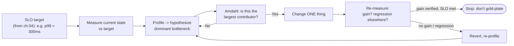
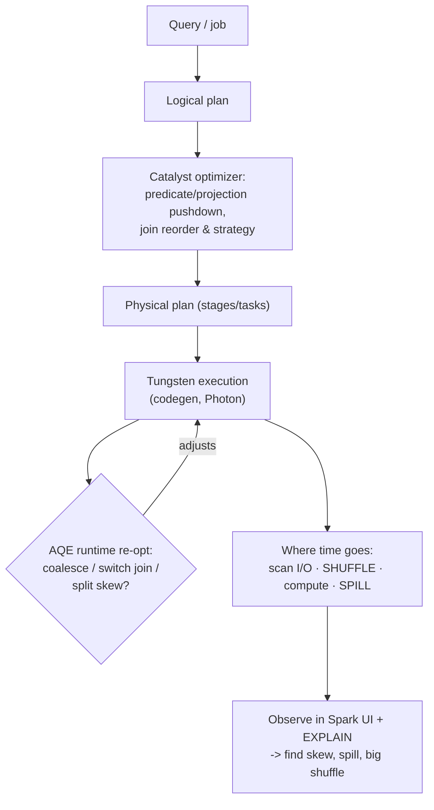
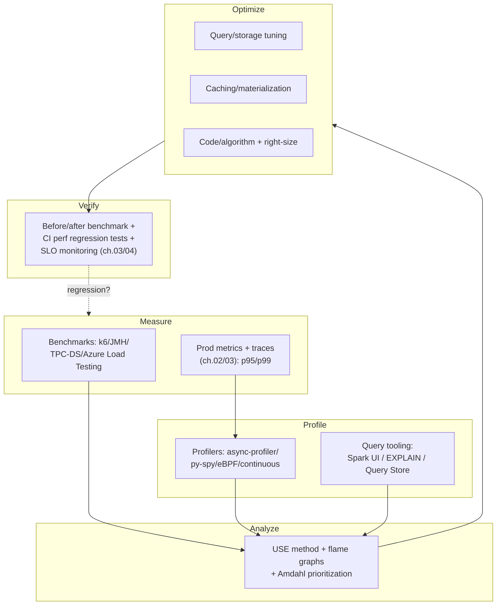
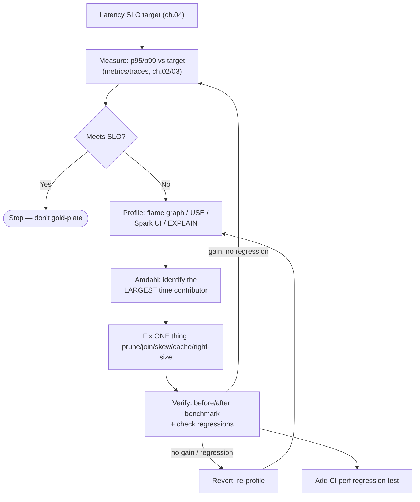
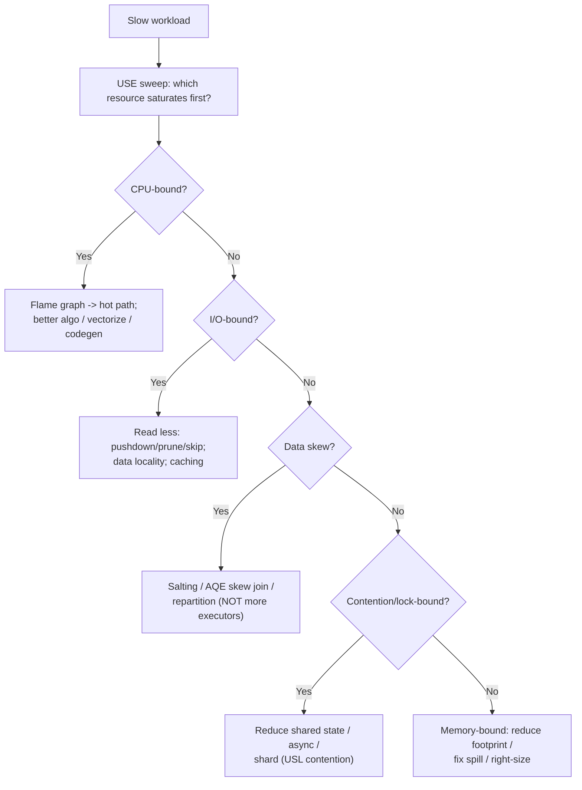
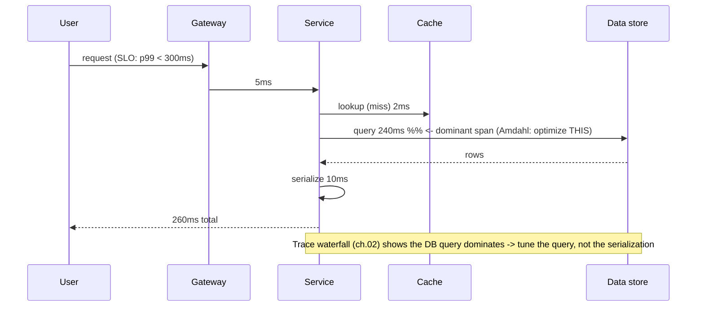

# Performance Engineering

> Part of the **Enterprise Data & AI Architecture Handbook** · Phase-18 — FinOps, Observability & Reliability · Chapter 05 (final chapter of the phase).
> Estimated study time: **60 min reading + ~4h labs**.
> **Prerequisites:** read [Apache Spark Internals](../Phase-05/04_Apache_Spark_Internals.md) first (this chapter applies systematic performance method to the distributed-execution machinery that chapter explains).

---

## Executive Summary

The four prior Phase-18 chapters built the discipline of running a platform well: [FinOps and Cost Optimization](01_FinOps_and_Cost_Optimization.md) made spend accountable, [Observability with OpenTelemetry](02_Observability_with_OpenTelemetry.md) made behavior visible, [Monitoring with Prometheus and Grafana](03_Monitoring_with_Prometheus_and_Grafana.md) turned signals into SLO-based alerts, and [Reliability and SRE](04_Reliability_and_SRE.md) made reliability an explicit, budgeted, governed property — and noted, at its close, that **Performance Engineering is, in SRE terms, the discipline of meeting and improving latency SLOs.** This final chapter delivers it. **Performance engineering is the systematic, measurement-driven practice of understanding where a system spends its time and resources, and changing the parts that actually matter — no more, no less — to meet an explicit performance objective at an acceptable cost.**

The single most important idea in this chapter — and the one its ADR (§40) formalizes — is that **performance work must be driven by measurement, never by intuition.** The dominant, recurring failure of performance engineering is **speculative (premature) optimization**: an engineer optimizes the part of the system that *feels* slow, or that is intellectually interesting, or that they happen to understand — rewriting it, adding caching, adding complexity — *without profiling first*, while the real bottleneck (almost always something unglamorous: an I/O-bound full scan, a data-skewed shuffle, a missing partition prune, an N+1 query) goes untouched. The result is wasted effort, added complexity, often a *worse* system, and a barely-moved end-to-end metric. Two laws explain why. **Amdahl's Law** says the speedup from optimizing any component is bounded by the fraction of total time that component consumes — optimize a part that's 5% of runtime and the best possible improvement is ~5%, no matter how brilliant the optimization. And **Knuth's** dictum — "premature optimization is the root of all evil" — warns that guessing wastes effort on the 97% that doesn't matter while missing the critical 3% that does. The entire discipline exists to answer *"what is actually slow?"* with data before touching anything, and to *verify* the change actually helped afterward.

Around that core sit the concrete practices this chapter covers: **benchmarking methodology** (representative, steady-state, statistically honest measurement — and the classic traps like *coordinated omission* that make a benchmark lie); **profiling and bottleneck analysis** (flame graphs, the USE method, and finding the one resource that saturates first); **query and storage tuning** (predicate pushdown, partition pruning, join strategy, the small-file problem, and — the distributed-data killer this chapter's Spark prerequisite prepares you for — **data skew**); **caching and materialization** (trading storage and staleness for latency, and the invalidation problem that makes it hard); and **capacity planning** (Little's Law, the Universal Scalability Law, and finding the load at which throughput stops scaling).

The platform bias is **Azure-primary (~60%)** — **Azure Load Testing**, Application Insights Profiler and distributed tracing, **Databricks/Spark** performance tooling (the Spark UI, Photon, Adaptive Query Execution, Delta caching, liquid clustering/Z-order), Azure SQL/Synapse Query Store and Intelligent Query Processing, **Azure Cache for Redis** and Front Door/CDN caching, and Cosmos DB RU/partition tuning — **~30% enterprise open source** (flame graphs and profilers like **async-profiler / py-spy / perf / eBPF**, benchmark harnesses **JMH / k6 / Locust / TPC-DS**, **HdrHistogram/wrk2** for honest tail measurement, and query engines **Spark / Trino / DuckDB / ClickHouse**) — and **~10% AWS/GCP comparison-only** (CloudWatch/X-Ray/CodeGuru; Cloud Profiler/Trace/BigQuery BI Engine), contrasted honestly.

**Bottom line:** performance is not an act of cleverness; it is an act of **measurement**. This chapter's ADR mandates **measurement-driven performance engineering** — every optimization justified by a profile/benchmark that identifies the *actual* bottleneck, tied to an explicit SLO target (from [Reliability and SRE](04_Reliability_and_SRE.md)), and *verified* by a before/after measurement that confirms the gain and checks for regressions — because the dominant failure mode is not a lack of tuning knobs but **optimizing the wrong thing on a guess**, the performance-domain instance of the "acting without verifying" pattern this handbook has traced from the first chapter to the last.

---

## Learning Objectives

By the end of this chapter you will be able to:

1. **Apply the measurement-driven performance method** — profile before optimizing, use Amdahl's Law to prioritize, and avoid premature optimization.
2. **Design honest benchmarks** — representative workloads, steady state, statistical rigor, tail-latency measurement, and avoiding coordinated omission.
3. **Profile and localize bottlenecks** — flame graphs, the USE method, CPU vs off-CPU vs I/O vs lock contention, and (for Spark) reading query plans and the Spark UI to find skew and spill.
4. **Tune queries and storage** — predicate pushdown, partition pruning, join strategy, file sizing/compaction, data skipping, and data-skew mitigation, building on [Apache Spark Internals](../Phase-05/04_Apache_Spark_Internals.md).
5. **Apply caching and materialization** — choose cache layers, materialized views, and precomputation, and reason about invalidation and staleness.
6. **Do capacity planning** — use Little's Law and the Universal Scalability Law, find the scaling "knee," and size for SLOs with headroom — on Azure and open source.

---

## Business Motivation

Performance is directly, measurably tied to money and to user experience, which is why it deserves a systematic engineering discipline rather than ad-hoc heroics. The business case has several distinct edges:

- **Latency is revenue.** The well-documented industry finding — that every additional 100 ms of latency measurably reduces conversion and engagement (the lineage of Amazon's and Google's own published studies) — makes performance a direct revenue lever for any user-facing platform. Slow is a feature nobody wants and everybody leaves.
- **Performance is cost.** This is the tightest link to [FinOps and Cost Optimization](01_FinOps_and_Cost_Optimization.md): doing the *same work with fewer resources* (a better query plan, a fixed skew, a cache hit) cuts both latency *and* the bill. Most of the best FinOps levers are performance levers, and vice versa — efficiency is the shared win. Conversely, throwing hardware at a performance problem (scaling up to mask a bad plan) is the expensive anti-pattern that performance engineering exists to prevent.
- **Performance is reliability.** A performance regression burns the error budget exactly as an outage does ([Reliability and SRE](04_Reliability_and_SRE.md)); a system that can't meet its latency SLO under load is, from the user's perspective, unreliable. Capacity planning is a reliability practice — under-capacity is an SLO breach waiting for a traffic spike.
- **Wasted optimization effort is a hidden cost.** Engineers guessing at performance — rewriting components that were never the bottleneck — burn expensive engineering time and add complexity (which itself costs future velocity and reliability) for near-zero end-to-end gain. The measurement-first discipline is as much about *not* wasting effort as about improving speed.
- **AI/data workloads have amplified the stakes.** GPU inference, large-scale Spark jobs, and vector search are so expensive and so sensitive to skew, batching, and data layout that a single unprofiled inefficiency (an unbatched GPU endpoint, a skewed shuffle, a full-scan retrieval) can dominate a platform's cost — the recurring case studies from the model-serving and lakehouse chapters are all, at root, performance-engineering failures.

The consequence of performance engineering done well is a platform that is fast where it matters, efficient (low cost per unit of work), and reliable under load — with engineering effort spent on the bottlenecks that actually move the numbers. The consequence of getting it wrong is slow systems, oversized bills, burned error budgets, and engineers optimizing the wrong things forever.

---

## History and Evolution

- **Early performance analysis (1960s–1970s).** Performance was studied through **queueing theory** (Little's Law, 1954/1961) and analytical modeling; mainframe capacity planning was a rigorous, math-driven discipline because compute was scarce and expensive.
- **Knuth's warning (1974).** Donald Knuth's *"premature optimization is the root of all evil"* (from *Structured Programming with go to Statements*) crystallized the enduring principle — with the fuller, often-forgotten context: "we should forget about small efficiencies, say about 97% of the time; yet we should not pass up our opportunities in that critical 3%." Measure to find the 3%.
- **Amdahl's Law (1967).** Gene Amdahl's argument about the limits of parallel speedup became the foundational law of optimization prioritization: your gain is bounded by the fraction you improve.
- **The profiling era (1980s–2000s).** Tools like `prof`/`gprof`, then sampling profilers, made it possible to *find* hot code instead of guessing. Database query optimizers (cost-based optimization, `EXPLAIN`) and standardized benchmarks (**TPC-C** 1992, **TPC-H**, **TPC-DS**) brought rigor to data-system performance.
- **Web-scale and the tail (2000s–2010s).** As services fanned out across many machines, **tail latency** (p99/p999) became the dominant concern — a request touching 100 services is as slow as the slowest of them. Jeff Dean & Luiz Barroso's **"The Tail at Scale"** (2013) named the problem; **Gil Tene**'s work on **coordinated omission** and **HdrHistogram** exposed how naive benchmarks systematically hide the tail.
- **Systems performance methodology (2010s).** **Brendan Gregg** codified modern systems performance — the **USE method** (Utilization, Saturation, Errors), **flame graphs**, and off-CPU analysis — and later **eBPF** made low-overhead, production-safe, kernel-level profiling mainstream.
- **Big-data and lakehouse performance (2010s–present).** Spark's **Catalyst** optimizer and **Tungsten** execution engine, **Adaptive Query Execution (AQE)**, and Delta/Iceberg **data skipping**, **Z-ordering**, and **liquid clustering** turned query and storage tuning into a first-class discipline — with **data skew** emerging as the signature distributed-performance failure (the direct concern of this chapter's Spark prerequisite).
- **Observability-driven and AI-era performance (2020s).** Distributed tracing ([Observability with OpenTelemetry](02_Observability_with_OpenTelemetry.md)) made *production* latency profiling possible (the span waterfall shows where a real request spends time), continuous profiling (CodeGuru, Cloud Profiler, Parca/Pyroscope) brought always-on production profiling, and **GPU/LLM inference performance** (batching, quantization, KV-cache) became a dominant cost-and-latency frontier.

The through-line: performance engineering evolved from analytical queueing math into a **measurement-driven, profile-first, production-observable discipline** — but Knuth's and Amdahl's foundational lessons (measure, prioritize the dominant fraction) are as true as ever, and are exactly what this chapter's ADR enforces.

---

## Why This Technology Exists

Performance engineering exists as a *disciplined method* because human intuition about performance is reliably, demonstrably wrong, and acting on that wrong intuition is expensive. Three structural reasons:

1. **Intuition mislocates bottlenecks.** Engineers guess that the slow part is the code they wrote, or the algorithm they find interesting, or the component they understand — when the real bottleneck is usually elsewhere and unglamorous (I/O waits, a bad join, data skew, lock contention, network round-trips). Only **profiling** reveals where time actually goes. Performance engineering exists to replace guessing with measurement.
2. **Amdahl's Law makes most optimizations worthless.** Because your gain is bounded by the fraction you optimize, effort spent on anything but the dominant contributor is largely wasted. Without measurement you cannot know the dominant contributor, so you cannot prioritize — and you will predictably optimize the wrong thing. Performance engineering exists to *prioritize* by data.
3. **The cheap fix (buy more hardware) is often the wrong and expensive fix.** Faced with a slow system, the reflexive response is to scale up — more executors, bigger instances, more replicas. Sometimes that's right; often it *masks* an inefficiency (a skewed job where one task does all the work gains nothing from more executors — Amdahl again) while multiplying cost. Performance engineering exists to find and fix the *root inefficiency*, which is usually cheaper and more effective than scaling around it — the direct tie to FinOps.

The discipline also exists because **the alternative — no method — produces a specific, recurring pathology**: speculative optimization that adds complexity, wastes effort, and doesn't move the metric, alongside performance problems that are only discovered in production because the benchmark that "proved" performance was methodologically broken (coordinated omission, unrepresentative data, warm caches). Performance engineering exists to make performance work **empirical, prioritized, honest, and verified** — which is precisely the content of this chapter's ADR.

---

## Problems It Solves

- **Optimizing the wrong thing.** Profiling + Amdahl's Law localize the *actual* dominant bottleneck, so effort goes where it moves the end-to-end number.
- **Wasted engineering effort and added complexity.** The measure-first discipline prevents speculative rewrites of components that were never the bottleneck.
- **Masking problems with hardware.** Finding the root inefficiency (skew, bad plan, N+1) fixes the problem more cheaply than scaling around it — the FinOps tie.
- **Dishonest benchmarks.** Rigorous methodology (representative data, steady state, tail measurement, avoiding coordinated omission) produces numbers that predict production instead of a fantasy.
- **Tail latency.** Percentile-based measurement and tail-aware techniques address the p99/p999 that users actually feel and that fan-out amplifies.
- **Slow queries and bad data layout.** Query and storage tuning (pushdown, pruning, join strategy, file sizing, data skipping) attacks the largest source of data-platform latency and cost.
- **Data skew.** The signature distributed-performance killer gets named, detected, and mitigated (salting, AQE skew join).
- **Repeated expensive computation.** Caching and materialization trade storage/staleness for latency where the access pattern justifies it.
- **Capacity surprises.** Little's Law, the USL, and load testing find the scaling knee and size for SLOs before a traffic spike breaches them.
- **Unverified "improvements."** The before/after measurement discipline confirms a change actually helped and didn't regress something else.

---

## Problems It Cannot Solve

- **It cannot fix a fundamentally wrong architecture or algorithm.** Tuning makes a given design faster; it cannot rescue an O(n²) algorithm that needs to be O(n log n), or a design that does inherently too much work. Sometimes the answer is a different algorithm/architecture, not a faster version of the wrong one — which measurement *reveals* but redesign *fixes*.
- **It cannot define the target.** Performance engineering meets a *goal*; deciding *how fast is fast enough* is an SLO decision ([Reliability and SRE](04_Reliability_and_SRE.md)) driven by user needs and cost. Optimizing with no target is as wasteful as not optimizing — "faster forever" is gold-plating.
- **It cannot eliminate all trade-offs.** Speed usually trades against cost, complexity, memory, freshness (caching), or consistency. The right answer is the best trade-off for the SLO, not maximum speed at any price.
- **It cannot beat physics or Amdahl's Law.** There is an irreducible serial fraction, a speed-of-light latency floor across regions, and a point of diminishing returns. Performance engineering finds that floor; it doesn't repeal it.
- **It cannot succeed on bad measurement.** Garbage-in: a broken benchmark (coordinated omission, unrepresentative load) or missing profiling produces confident, wrong conclusions. The discipline is only as good as the honesty of its measurement — which is why methodology is half the chapter.
- **It is not a one-time project.** Systems, data volumes, and workloads change; performance regresses. It is a continuous practice (regression testing, continuous profiling), not a one-off tuning pass.

---

## Core Concepts

### 5.1 The Measurement-Driven Method (Amdahl, Knuth, and the Scientific Method)

Performance engineering is the **scientific method applied to system speed**: (1) **measure** the current state against a target; (2) **profile** to form a hypothesis about the dominant bottleneck; (3) **change one thing**; (4) **re-measure** to confirm the hypothesis and quantify the gain; (5) check for regressions elsewhere; repeat. The two governing laws:

- **Amdahl's Law** — the maximum speedup from optimizing a component is bounded by the fraction of total time it consumes: if a part is 20% of runtime, eliminating it *entirely* yields at most a 1.25× speedup. **Corollary:** always optimize the *largest* contributor first, and know when you've hit diminishing returns. This is why you must measure the breakdown before choosing what to optimize.
- **Knuth's principle** — "premature optimization is the root of all evil": don't optimize on a guess, and don't micro-optimize the 97% that doesn't matter; measure to find the critical 3% and optimize *that*.

The unifying discipline: **never optimize without a measurement that identifies the bottleneck, and never declare victory without a measurement that verifies the gain.** And always measure with **percentiles (p50/p95/p99/p999), not averages** — an average hides the tail that users actually feel (the ch.03/ch.04 lesson), especially at fan-out scale ("The Tail at Scale").

### 5.2 Benchmarking Methodology

A benchmark is worthless — worse, actively misleading — unless it is methodologically sound. The essentials:

- **Representative workload and data.** Benchmark the *real* query mix at *real* data volume and distribution. A benchmark on 1 GB predicts nothing about 1 TB (especially where skew or spill kicks in only at scale), and synthetic uniform data hides the skew real data has.
- **Steady state, warm vs cold.** Distinguish cold-cache (first run) from warm steady-state performance; measure the state you actually care about, and discard warm-up runs. JIT warm-up, cache filling, and connection-pool ramp all distort early measurements.
- **Statistical rigor.** Run multiple iterations, report the *distribution* (percentiles + variance), not a single number or a mean. One run is an anecdote.
- **Avoid coordinated omission (the classic trap).** If your load generator waits for a response before sending the next request, then when the system stalls the generator *also* stalls and simply doesn't send the requests that would have seen the worst latency — so the benchmark systematically *omits* the tail and reports a fantasy p99. Use tools that model open-loop arrival and correct for it (**wrk2**, **HdrHistogram**, k6's constant-arrival-rate) — this is the single most common way a benchmark lies (Case Study 2).
- **Isolate the variable.** Change one thing per run; hold everything else constant (same data, same hardware, same concurrency).
- **Micro vs macro benchmarks.** Micro-benchmarks (JMH for a function) isolate a component; macro/end-to-end benchmarks (a full query, a full request path) measure what users experience. You need both, and micro-benchmark wins that don't show up end-to-end are Amdahl's Law reminding you the component wasn't the bottleneck.
- **Standard benchmarks** (**TPC-H/TPC-DS** for analytics, **TPC-C** for OLTP) give comparable, repeatable baselines for data systems.

### 5.3 Profiling and Bottleneck Analysis

Profiling answers *where does the time/resource actually go?* — the empirical foundation the whole discipline rests on.

- **The USE method (Brendan Gregg)** — for every resource (CPU, memory, disk I/O, network, and for data systems: executors, shuffle, connection pools), check **U**tilization, **S**aturation, and **E**rrors. The bottleneck is the first resource that saturates. This systematic sweep prevents the "I assumed it was CPU" guess.
- **The four bounds.** A workload is **CPU-bound**, **memory-bound**, **I/O-bound** (disk or network), or **contention-bound** (locks/coordination). The fix is entirely different for each — and you cannot know which without measuring (a job that's I/O-bound gains nothing from more CPU).
- **CPU profiling and flame graphs.** Sampling profilers (async-profiler, py-spy, `perf`) produce **flame graphs** — a visual of where CPU time is spent by call stack, where the widest frames are the hot paths. The fastest way to see what's actually consuming CPU.
- **Off-CPU / wall-clock analysis.** Much latency is *not* CPU time — it's time spent *waiting* (on I/O, locks, network). Off-CPU analysis and distributed traces (ch.02) reveal wait time that CPU profilers miss; for many data workloads the answer is "waiting on I/O," not "computing."
- **Distributed-trace waterfalls.** For a request across services (ch.02), the span waterfall shows exactly which hop dominates — production profiling for latency.
- **Spark-specific bottleneck analysis** (per the prerequisite): the **Spark UI** and **query plan** reveal **skew** (one task far longer than the rest), **spill** (memory pressure forcing disk writes), **shuffle** volume, and stage-level time — the primary tools for tuning distributed data jobs.

### 5.4 Query and Storage Tuning

For data platforms, this is where most latency and cost live — and where the biggest wins are, building directly on [Apache Spark Internals](../Phase-05/04_Apache_Spark_Internals.md):

- **Do less work (the meta-principle).** The fastest query is the one that reads and processes the least data. Every lever below is a way to read/compute less.
- **Predicate pushdown & partition pruning.** Push filters down to the storage/scan layer so only relevant partitions/files/row-groups are read; partition pruning on a well-chosen partition column can turn a full-table scan into reading 1% of the data — often the single largest win (Case Study 1's cousin).
- **Projection (column) pruning.** Read only the needed columns — columnar formats (Parquet/Delta) make this cheap; `SELECT *` is a performance anti-pattern.
- **Join strategy.** **Broadcast** the small side of a join (avoiding a shuffle) when it fits in memory; **shuffle/sort-merge** for two large sides. Choosing the wrong strategy (or letting a "small" side grow past the broadcast threshold) is a common cliff. Spark's **AQE** picks strategies at runtime from actual statistics.
- **Data skew — the distributed killer.** When one key holds a disproportionate share of the data, one task does most of the work while others idle — the job is as slow as that one task (Amdahl in distributed form), and adding executors doesn't help. Mitigate with **salting**, **AQE skew join**, or repartitioning (Case Study 1).
- **File layout & the small-file problem.** Too many tiny files (metadata/scheduling overhead) or too few huge files (no parallelism) both hurt; **compaction/`OPTIMIZE`** and right-sized files matter. **Data skipping** (min/max stats), **Z-ordering / liquid clustering** (Delta), and **bloom filters** let the engine skip files that can't match — reading less.
- **Statistics & the optimizer.** Cost-based optimizers need up-to-date **statistics** to choose good plans; stale stats produce bad plans. `EXPLAIN`/`EXPLAIN ANALYZE` and the Spark query plan are how you *see* what the optimizer chose and why it's slow.
- **Indexes (OLTP) & avoiding N+1.** For transactional/serving stores, the right index turns a scan into a seek; the **N+1 query** anti-pattern (one query per row in a loop) is a classic, profiler-obvious latency killer.

### 5.5 Caching, Materialization, and Capacity Planning

- **Caching** trades **memory/storage and staleness** for latency: **result caches**, **Delta/disk caches**, application caches (**Redis**), and edge/CDN caches (Front Door) serve repeated reads without recomputation. The hard part is **invalidation** — a stale cache serves wrong data; a cache stampede (many misses at once after a flush) can overload the backend. Cache where the access pattern is read-heavy and the staleness is tolerable.
- **Materialization / precomputation** trades **storage and freshness** for query speed by computing results ahead of time: **materialized views**, denormalized read models (the CQRS pattern from Phase-14/03), and the *virtualize-vs-materialize* threshold from data fabric (Phase-15/03). Materialize when a query is expensive and run repeatedly; the cost is storage and keeping it fresh.
- **Capacity planning** answers *how much capacity to meet the SLO under expected (and peak) load*, using two laws:
  - **Little's Law** (`L = λ × W`): the average number of in-flight requests equals arrival rate × average latency. It links throughput, concurrency, and latency — e.g., to sustain 1,000 req/s at 200 ms latency you need ~200 concurrent slots. Foundational for sizing thread pools, connection pools, and executor counts.
  - **The Universal Scalability Law (USL, Neil Gunther)**: throughput doesn't scale linearly — **contention** (serialization) and **coherency** (cross-node coordination) penalties mean throughput plateaus and can even *decline* past a "knee." The USL explains why adding nodes eventually stops helping (and why the fix is reducing contention/coordination, not adding hardware).
- **Find the knee empirically** via load testing (ramp load until latency/throughput degrades) and size with **headroom** for spikes and failures (the retail peak-scale and SRE capacity lessons). Autoscaling (ch.01/compute chapters) then tracks the load curve within that envelope.

---

## Internal Working

### 6.1 How Profiling Works

A **sampling profiler** periodically (e.g., 100–1000 Hz) captures the call stack of every running thread; aggregating thousands of samples reveals where CPU time is spent statistically, at low overhead (safe for production). An **instrumenting profiler** injects timing into every function entry/exit — precise but high-overhead and perturbing (the observer effect). A **flame graph** aggregates sampled stacks into a hierarchical picture: x-axis is proportion of samples (width = time), y-axis is stack depth; the widest frames are the hot paths. **Off-CPU profiling** instead samples *blocked* threads (via scheduler tracing / eBPF) to show where time is spent *waiting* — essential because for many data/service workloads the dominant "cost" is I/O and lock wait, invisible to a CPU profiler. **Distributed tracing** (ch.02) is profiling across process boundaries: each span is a timed unit, and the trace waterfall is a flame graph of a request's journey across services. Modern **continuous profiling** (Parca/Pyroscope, CodeGuru, Cloud Profiler) runs sampling profiling always-on in production at low overhead, so you can profile a past incident after the fact.

### 6.2 How a Query Engine Optimizes, and Where Time Goes

Using Spark (the prerequisite) as the reference: a query is parsed into a logical plan, which **Catalyst** (the cost-based optimizer) rewrites — pushing predicates and projections down, reordering joins, choosing join strategies — into a physical plan, which **Tungsten** executes with whole-stage code generation and cache-friendly memory layout. The physical plan is a DAG of **stages** separated by **shuffles** (wide dependencies); each stage runs as parallel **tasks** (one per partition). Time is dominated by: **scan/I/O** (reduced by pushdown/pruning/skipping), **shuffle** (network + disk, the expensive boundary — reduced by broadcast joins and less data movement), **compute** (reduced by codegen/Photon), and **spill** (memory pressure forcing partitions to disk — a red flag for under-memory or skew). **AQE** re-optimizes *at runtime* using actual partition statistics — coalescing small partitions, switching join strategies, and splitting skewed partitions — which is why enabling AQE is one of the highest-leverage, lowest-effort Spark tunings. Reading the **query plan** (`EXPLAIN`) and the **Spark UI** (stage/task timelines, shuffle sizes, spill, skew) is how you see all of this — profiling for query engines.

### 6.3 How Caching and Capacity Models Work

A **cache** sits between a consumer and an expensive source, keyed by request; a **hit** returns the stored result (fast), a **miss** computes and stores it (slow, plus a write). Effectiveness is the **hit rate** × the cost saved per hit, minus invalidation complexity. **Invalidation** strategies — TTL (accept bounded staleness), write-through/write-behind (update cache on write), or event-driven invalidation (the CQRS/data-fabric pattern) — trade freshness against complexity; the failure modes are **stale reads** (served wrong data) and **cache stampede** (a flush causes a thundering herd of misses that overloads the source, a latency cliff — Case Study 2's cousin). **Capacity models** apply Little's Law to translate an SLO into required concurrency (`L = λW`), and the USL to predict where added capacity stops helping: real throughput `X(N) = λN / (1 + α(N−1) + βN(N−1))`, where α is the contention (serialization) penalty and β the coherency (coordination) penalty — β is why throughput can *decline* past the knee. Load testing measures α and β empirically by ramping concurrency and watching where latency degrades, giving the real capacity envelope to size against with headroom.

---

## Architecture

Performance engineering is a *practice* woven through the platform rather than a component, but it has an architecture — a toolchain and a workflow:

1. **Measurement layer** — benchmarks (JMH/k6/TPC-DS/Azure Load Testing), production metrics (histograms/percentiles from ch.03), and distributed traces (ch.02) that quantify current performance against SLOs.
2. **Profiling layer** — CPU/off-CPU profilers (async-profiler/py-spy/perf/eBPF), continuous profiling (Pyroscope/Application Insights Profiler), and query-engine tooling (Spark UI, `EXPLAIN`, Query Store) that localize bottlenecks.
3. **Analysis layer** — USE-method resource analysis, flame graphs, and Amdahl-based prioritization to decide what to optimize.
4. **Optimization layer** — the levers: query/storage tuning (pushdown/pruning/join/skew/layout), caching/materialization, code/algorithm fixes, and right-sizing.
5. **Verification & regression layer** — before/after benchmarks, **performance regression tests in CI** (catch regressions before production), and production SLO monitoring (ch.03/04) to confirm gains hold and detect drift.
6. **Capacity layer** — load testing, Little's-Law/USL modeling, and autoscaling configuration to size for SLOs under load.

---

## Components

- **Benchmark harnesses** — **JMH** (JVM micro-benchmarks), **k6/Locust/JMeter** (load testing), **Azure Load Testing** (managed), **TPC-H/TPC-DS** (standard data benchmarks), **wrk2/HdrHistogram** (honest tail measurement).
- **Profilers** — **async-profiler** (JVM), **py-spy** (Python), **`perf`/eBPF (bpftrace/BCC)** (system/kernel), **Java Flight Recorder**, and **continuous profilers** (Pyroscope/Parca, Application Insights Profiler).
- **Flame graphs** — the visualization of sampled stacks (Brendan Gregg).
- **Query-engine tooling** — **Spark UI** + `EXPLAIN` (+ AQE, Photon), **Azure SQL/Synapse Query Store** + execution plans + Intelligent Query Processing, Trino/DuckDB/ClickHouse `EXPLAIN`.
- **Storage-layout tools** — Delta `OPTIMIZE`/Z-order/liquid clustering, data skipping, compaction, partitioning.
- **Caching layers** — **Azure Cache for Redis**/Memcached, Delta/disk cache, materialized views, Front Door/CDN.
- **Distributed tracing** — OpenTelemetry/Tempo/Application Insights (ch.02) for production latency waterfalls.
- **Metrics/dashboards** — Prometheus/Grafana/Azure Monitor histograms and percentile panels (ch.03).
- **Capacity/modeling** — load-test tooling + Little's-Law/USL analysis; autoscalers (KEDA/HPA/Databricks/Spark AQE).
- **CI performance-regression harness** — automated before/after perf tests gating merges.

---

## Metadata

Performance work depends on metadata that makes measurements comparable and bottlenecks attributable:

- **Benchmark/run metadata** — workload definition, data volume/distribution, hardware/SKU, concurrency, warm/cold state, and software versions, recorded with every result so runs are **comparable** and reproducible (a benchmark number without its conditions is meaningless).
- **Percentile/distribution metadata** — always p50/p95/p99/p999 + variance, never a bare average — the metadata that captures the tail.
- **Profile metadata** — the resource dimension (CPU/off-CPU/memory/I/O), the flame-graph, and the code/query version, so a hot path is attributable to a specific build.
- **Query-plan metadata** — the chosen physical plan, statistics freshness, partition/skew info, and shuffle/spill sizes — the "why is this query slow" record.
- **SLO linkage** — the performance target (from ch.04) each measurement is judged against, so "fast enough" is defined and gold-plating is avoided.
- **Cost-per-unit linkage** — the FinOps join (cost per query/inference) so performance and efficiency are optimized together (ch.01).

The governing point: **a measurement is only meaningful with its conditions attached.** Un-annotated benchmark numbers (which data? which scale? warm or cold? which version?) are the source of endless false comparisons and irreproducible "wins."

---

## Storage

Storage layout *is* one of the biggest performance levers for data platforms (the tie to the file-format and columnar-storage phases), so this section is substantive:

- **Columnar formats + compression** (Parquet/Delta) enable projection pruning and reduce bytes scanned — cutting latency *and* cost simultaneously (the shared FinOps/perf win).
- **Partitioning** on a well-chosen column enables partition pruning (read 1% instead of 100%) — but *over*-partitioning creates the small-file problem, so partition granularity is a tuning decision.
- **Data skipping & clustering** — min/max statistics, **Z-ordering** / **liquid clustering** (Delta), and bloom filters let the engine skip files that can't match a predicate, reading far less.
- **File sizing & compaction.** The **small-file problem** (too many tiny files → metadata/scheduling overhead, poor scan throughput) and the opposite (too few huge files → no parallelism) are both fixed by **`OPTIMIZE`/compaction** to right-sized files (commonly ~128 MB–1 GB).
- **Caching tiers** — Delta/disk cache keeps hot data on fast local storage; the storage-tiering discipline from FinOps (hot/cool/cold) is also a performance decision (cold-tier data is slow to read).
- **Storage medium** — NVMe SSD vs HDD vs object storage have order-of-magnitude different latency/throughput; match the medium to the access pattern and the SLO.
- **The meta-principle restated:** most storage tuning is about **reading less data** — pruning, skipping, and projection are all instances of it, and they cut cost and latency together.

---

## Compute

- **Right-size to the actual bound.** Profiling tells you whether a workload is CPU/memory/I/O/contention-bound; add the resource that's actually saturated (adding CPU to an I/O-bound job wastes money — the FinOps/perf tie).
- **Parallelism and Amdahl's Law.** More cores/executors help only up to the serial fraction and only if work is evenly distributed — **data skew** defeats parallelism entirely (one task does everything), which is why scaling out a skewed Spark job gains nothing (Case Study 1).
- **Execution efficiency.** Vectorized/columnar engines (Photon, DuckDB, ClickHouse), whole-stage codegen (Tungsten), and SIMD do the same work in fewer cycles — efficiency multiplied across the fleet.
- **GPU performance for AI.** GPU inference/training is the most expensive compute; **batching** (the highest-leverage GPU lever), **quantization**, and right-sizing the GPU SKU dominate cost/latency — the model-serving case studies are compute-performance case studies.
- **Concurrency and Little's Law.** Size thread/connection/executor pools from `L = λW`; too little concurrency underutilizes and queues, too much causes contention (the USL penalty).
- **Don't scale to mask inefficiency.** The recurring anti-pattern: throwing compute at a bad plan/skew/N+1. Fix the root inefficiency first; scale second.

---

## Networking

- **Network round-trips are latency.** Each hop (service call, DB query, cross-region read) adds round-trip time; **N+1** patterns and chatty microservice calls multiply it. Batching, request coalescing, and co-locating compute with data (the "compute-to-data" principle from the geospatial chapter) cut it.
- **Data locality.** Reading data from the same region/zone/rack as the compute avoids cross-network transfer latency *and* egress cost (the FinOps tie); a shuffle that crosses the network is Spark's most expensive operation.
- **Speed-of-light floor.** Cross-region round-trips have an irreducible latency (physics); multi-region architectures must design around it (edge caching, regional read replicas) rather than tune it away.
- **Serialization overhead.** Wire formats matter — Protobuf/columnar Arrow are far cheaper to serialize than verbose JSON at high volume (the gRPC-vs-REST FinOps example from Phase-14/05 is a performance decision).
- **Tail amplification.** A request fanning out to many backends is as slow as the slowest ("The Tail at Scale"); techniques like hedged requests and tail-tolerant design address the p99/p999 that fan-out amplifies.

---

## Security

- **Security controls have a performance cost — budget for it, don't remove it.** Encryption in transit (TLS), at rest, tokenization, and private-endpoint hops add latency/CPU; these are justified costs (the security phases), measured and planned for, never disabled for speed. The right response to "TLS is slow" is hardware offload / session reuse, not plaintext.
- **Don't let performance work weaken security.** A cache that stores sensitive data must respect its classification and access control; a "fast path" that skips authorization is a vulnerability. Performance optimizations must preserve the security posture.
- **Performance is a DoS-resilience concern.** A system with no capacity headroom or an algorithmic-complexity vulnerability (a query whose cost explodes on crafted input — a "ReDoS" or a pathological join) can be tipped over by load; capacity planning and complexity awareness are security-relevant.
- **Profiling/benchmark data can be sensitive.** Production profiles and query plans can reveal data shapes and business logic; treat them with appropriate access control.
- **Side-channels.** At the extreme, timing differences are a security side-channel (constant-time crypto); performance and security occasionally trade off in subtle ways where *predictable* timing beats *fast* timing.

---

## Performance

This is the chapter's own subject, so this section states the operating principles that summarize the discipline:

- **Measure, don't guess.** Every optimization starts with a profile/benchmark that localizes the bottleneck (the ADR). Intuition about performance is reliably wrong.
- **Prioritize by Amdahl's Law.** Optimize the largest contributor to end-to-end time; ignore the rest until it becomes the largest.
- **Optimize to a target, then stop.** Performance work is bounded by the SLO (ch.04); "faster forever" is gold-plating and wasted effort.
- **Percentiles, not averages.** The tail (p99/p999) is what users feel and what fan-out amplifies; measure and optimize the distribution.
- **Do less work.** The fastest operation is the one avoided — pruning, skipping, caching, batching, and better algorithms all reduce work rather than doing the same work faster.
- **Efficiency = performance = cost.** Most performance wins are FinOps wins and vice versa; treat them as one optimization.
- **Verify every change.** Before/after measurement confirms the gain and catches regressions — an unverified optimization is a guess (the ADR).
- **Make it continuous.** Performance regresses as data and workloads grow; regression testing and continuous profiling keep it from silently drifting.

---

## Scalability

- **Scaling is a performance strategy with limits (the USL).** Adding capacity helps until contention and coherency penalties flatten (and then reverse) the throughput curve; past the knee, the fix is **reducing contention/coordination** (sharding, less shared state, async), not more hardware.
- **Vertical vs horizontal.** Scale up (bigger instance) is simple but bounded and eventually expensive; scale out (more nodes) is unbounded in principle but incurs coordination/shuffle cost and only helps if work distributes evenly (**skew defeats it**).
- **Data skew is the scalability killer.** Uneven data distribution means horizontal scaling doesn't help — the fix is data-distribution work (salting, better partition keys), not more nodes (Case Study 1).
- **Little's Law sizes concurrency.** Translate throughput and latency SLOs into required parallelism to scale correctly (not by guesswork).
- **Autoscaling tracks the curve within the envelope.** Capacity planning finds the envelope (the knee, the headroom); autoscaling (ch.01/compute) then follows the load within it — but autoscaling can't fix a design that doesn't scale (a skewed job, a contended lock).
- **Performance regression testing must scale with data.** A design that's fast at today's volume may hit a cliff at 10×; test at projected scale, not just current.

---

## Fault Tolerance

- **Performance under failure is a distinct requirement.** A system must meet its SLO not just in the happy path but during partial failure (a lost replica, a slow dependency, a failed AZ) — degraded-mode performance is part of the reliability contract (ch.04).
- **Retries and timeouts interact with performance.** Aggressive retries can amplify load and cause a **retry storm** (a metastable failure where the system can't recover); timeouts must be set from the latency distribution (p99), and patterns like circuit breakers and load shedding (from the resilience prerequisite) protect performance under stress.
- **Tail-tolerant techniques.** Hedged/backup requests, adaptive timeouts, and load balancing away from slow nodes address tail latency caused by transient slowness ("The Tail at Scale") — performance techniques that are also resilience techniques.
- **Capacity headroom is fault tolerance.** Sizing with headroom (not to 100% utilization) is what lets the system absorb a spike or a lost node without an SLO breach — the tie between capacity planning and reliability.
- **Cache failure modes.** A cache is a performance optimization that can become a reliability liability: a cold cache after a flush/restart (stampede) can cause a latency cliff and cascading overload — design for cache-miss load, not just cache-hit performance.
- **Verify performance survives chaos.** Chaos/load testing (ch.04) should confirm the system meets its performance SLO under injected failure, not just in ideal conditions.

---

## Cost Optimization

Performance and cost are the same optimization viewed from two angles — this is the tightest tie in the phase, directly extending [FinOps and Cost Optimization](01_FinOps_and_Cost_Optimization.md):

- **Efficiency cuts both latency and cost.** A better query plan, a fixed skew, a cache hit, projection pruning — each does *less work*, which is simultaneously faster and cheaper. Most performance wins are FinOps wins.
- **Don't scale to mask inefficiency.** The most expensive anti-pattern: throwing compute (more/bigger executors, more replicas) at a bad plan, skew, or N+1 to brute-force acceptable latency, multiplying cost while leaving the root inefficiency in place. Profile and fix the root first.
- **Optimize to the SLO, not to infinity.** Over-optimizing (or over-provisioning "for safety") past the SLO wastes both engineering effort and infrastructure — the performance analog of gold-plating reliability.
- **Right-size to the actual bound.** Adding the resource that isn't saturated (CPU to an I/O-bound job) is pure waste; profiling tells you which resource to buy.
- **GPU/AI efficiency is the frontier.** Batching, quantization, and right-sizing GPU inference are the highest-leverage cost-and-performance levers on an AI platform.

**Worked FinOps example — profile-first vs. scale-first on a skewed Spark job.** A nightly Spark aggregation misses its SLO (runs ~4 hours, target 90 min). The scale-first reflex: double the cluster from 20 to 40 workers — cost roughly **doubles** to ~$2,400/month, and runtime barely improves (still ~3.5 hours), because the job is **skewed** — one key holds ~70% of the data, so one task does most of the work and extra executors sit idle (Amdahl in distributed form). The profile-first approach: the **Spark UI** shows one task running 10× longer than the rest (obvious skew) and heavy **spill**; enabling **AQE skew join** + **salting** the hot key + right-sizing files via `OPTIMIZE` cuts runtime to ~70 minutes **on the original 20 workers** — meeting the SLO at ~**half the cost of the scale-first "fix," and a quarter of the cost per run** ($1,200/month, ~70 min vs. $2,400/month, ~3.5 h). **Decision:** profile before scaling; a ~one-hour investigation and a config change beat a permanent doubling of spend that didn't even work — and **verify** the fix in the Spark UI (skew gone, no spill) and the next billing cycle. This is the worked case for the chapter's ADR: measurement-first is not just faster, it is dramatically cheaper.

---

## Monitoring

Monitoring *for performance* (built on ch.03) centers on latency distributions and resource saturation:

- **Latency percentile dashboards** — p50/p95/p99/p999 per service/endpoint/query, from histograms (ch.03) — the primary performance view, tied to the latency SLO (ch.04).
- **RED / USE dashboards** — request Rate/Errors/Duration and resource Utilization/Saturation/Errors, to see throughput and the saturating resource at a glance.
- **Query-performance monitoring** — slow-query logs, Query Store, Spark job/stage durations, and shuffle/spill metrics to catch regressions in data workloads.
- **Continuous profiling** — always-on production profiling (Pyroscope/Application Insights Profiler) so a past latency incident can be profiled after the fact.
- **Capacity/saturation trends** — utilization vs. the known knee, so you see capacity being consumed before it breaches the SLO.
- **Performance regression alerts** — alert on a latency-SLO burn (ch.03/04) and on benchmark regressions in CI, so drift is caught early.

The organizing principle from ch.03/04 holds: **monitor and alert on the user-facing latency SLO (symptom); diagnose with profiles, query plans, and resource metrics (cause).**

---

## Observability

Performance engineering is a heavy *consumer* of observability ([Observability with OpenTelemetry](02_Observability_with_OpenTelemetry.md)) and, in production, is largely *done through* it:

- **Distributed traces are production profiling.** The span waterfall shows exactly where a real request spends time across services — the only way to profile latency in a distributed production system, and the fastest path from "the API is slow" to "the feature-store call dominates" (ch.02's exemplar→trace flow).
- **Percentile metrics quantify performance.** The histograms/exemplars of ch.03 are the SLI the SLO (ch.04) is measured on; observability supplies the numbers performance engineering acts on.
- **Continuous profiling is observability for CPU.** Always-on production profiling extends the three signals with a fourth (profiles), so you can answer "what was consuming CPU during that spike?" retroactively.
- **Correlation localizes the bottleneck.** Metric→trace→log→profile correlation (ch.02/03) is exactly the "find where the time goes" workflow — performance engineering is observability applied to speed.

The practical stance: **you cannot performance-engineer what you cannot observe** — the same "you cannot debug/cost-attribute/govern what you didn't instrument" lesson from every prior Phase-18 chapter, now applied to speed. Production performance work *is* observability work.

---

## Operational Response Playbook

Two representative performance incidents as signal → detection → remediation. The meta-point: performance regressions are operational events with SLO consequences (ch.04), and the response is the measurement-driven method under time pressure.

**Playbook 1 — Latency regression after a deploy/data-growth (SLO burn).**
- **Signal:** a latency-SLO burn-rate alert (ch.03/04) — p99 has jumped past target; often correlated with a recent deploy, a data-volume milestone, or a plan change.
- **Detection query:** open the latency percentile dashboard to scope it (which endpoint/query/segment, since when); **pivot via traces (ch.02)** to the dominant span; for a data job, open the **Spark UI / `EXPLAIN`** to inspect the plan for a new **shuffle**, **skew**, **spill**, or a lost **broadcast join** (a "small" side that grew past the threshold); check whether **statistics** went stale or a **partition prune** stopped firing.
- **Remediation:** if a deploy correlates and it's an incident, **mitigate first** (roll back — ch.04). Then apply the measurement-identified fix: restore the broadcast join / partition prune, refresh statistics, enable/tune AQE, fix the skew (salting), or right-size files. **Verify** p99 returns below SLO in production and add a **performance regression test** so the same regression can't recur silently (the verification-gap fix). Do **not** scale to mask it before understanding the cause.

**Playbook 2 — "It was fast in the load test but slow in production" (benchmark methodology failure).**
- **Signal:** production p99 is far worse than the pre-launch benchmark predicted; the system "passed" load testing but users experience slowness.
- **Detection query:** compare the benchmark's conditions to production reality — **data volume/distribution** (did the test use 1 GB when prod is 1 TB? uniform synthetic data with no skew?), **cache state** (warm test vs. cold prod), **concurrency model** (closed-loop generator with **coordinated omission** hiding the tail?), and **query mix** (did the test exercise the real, expensive queries?).
- **Remediation:** rebuild the benchmark to be honest — **representative data at production scale and distribution**, **open-loop load generation** (wrk2/k6 constant-arrival-rate + **HdrHistogram** to defeat coordinated omission), **cold-and-warm** measurement, and the **real query mix** — then re-measure to find the true bottleneck (which the fantasy benchmark hid) and fix it. The durable fix is **methodology**: make representative, coordinated-omission-free benchmarking a pre-launch gate so a benchmark can't lie again (Case Study 2).

---

## Governance

- **Measurement-first as policy (the ADR).** Performance optimizations must be justified by a profile/benchmark identifying the actual bottleneck, tied to an SLO target, and verified by a before/after measurement — enforced in design/code review, not left to individual discretion. "I optimized it because it felt slow" is not an acceptable justification.
- **Performance regression testing in CI.** Benchmark-based regression gates in the pipeline (with honest methodology) so performance regressions are caught before production — the shift-left of performance (ties to the CI/CD and DataOps phases).
- **Benchmarking standards.** A governed methodology (representative data, steady state, percentiles, no coordinated omission) so benchmark results across teams are honest and comparable — a benchmark without its conditions is not a valid artifact.
- **SLO linkage.** Every performance target ties to a service/data SLO (ch.04), so "fast enough" is defined and gold-plating is prevented.
- **Cost-performance joint governance.** Performance and FinOps reviewed together (efficiency = cost = performance), so optimizations are judged on cost-per-unit, not raw speed (ch.01).
- **Capacity governance.** Capacity plans (Little's Law/USL, headroom) reviewed on a cadence and before major launches, so capacity surprises don't cause SLO breaches (the retail peak-scale lesson).
- **Continuous-profiling and query-plan review** as standing practices, so drift is caught and the biggest bottlenecks are known.

---

## Trade-offs

- **Speed vs. cost.** Usually aligned (efficiency wins both) but not always — the last increments of latency can cost disproportionately (more replicas, premium hardware, caching complexity); optimize to the SLO, not beyond.
- **Speed vs. complexity.** Caches, materialized views, hand-tuned code, and denormalization add complexity (invalidation, maintenance, bugs) — justified only when the profile shows the bottleneck warrants it; premature complexity is the anti-pattern.
- **Latency vs. throughput.** Batching improves throughput but adds latency; the right batch size is an explicit SLA dial (the GPU-batching decision), not a maximize-blindly choice.
- **Freshness vs. speed (caching/materialization).** Caching/precomputation buy latency with staleness; the tolerable staleness is a business decision (CQRS/data-fabric threshold).
- **Optimization effort vs. gain.** Amdahl bounds the gain; chasing a component that's 3% of runtime is wasted effort. Prioritize by measured contribution.
- **Vertical vs. horizontal scaling.** Scale-up is simple but bounded/expensive; scale-out is unbounded but adds coordination cost and needs even data distribution.
- **Micro vs. macro optimization.** Micro-benchmark wins that don't show up end-to-end are Amdahl reminding you the component wasn't the bottleneck — measure end-to-end.
- **Predictable vs. fast (tail).** Sometimes consistent p99 matters more than a great p50; tail-tolerant design trades average speed for predictability.

---

## Decision Matrix

| Situation | Recommended approach | Rationale |
|---|---|---|
| Something is "slow" | **Profile first — never optimize on a guess** | Intuition mislocates bottlenecks; the ADR |
| Deciding what to optimize | **Amdahl's Law: the largest time contributor** | Gain is bounded by the fraction optimized |
| Measuring performance | **Percentiles (p95/p99/p999), multiple runs** | Averages hide the tail users feel |
| Load testing | **Open-loop arrival (wrk2/k6) + HdrHistogram** | Defeats coordinated omission; honest tail |
| Spark job slow, adding executors doesn't help | **Check the Spark UI for data skew / spill** | Skew defeats parallelism (Amdahl); scaling won't help |
| Full-table scan on a filtered query | **Predicate pushdown + partition pruning** | Read 1% not 100% — usually the biggest win |
| Joining a large and a small table | **Broadcast the small side** (if it fits) | Avoids the expensive shuffle |
| Repeated expensive read, tolerable staleness | **Cache (Redis / result / disk cache)** | Trade memory + staleness for latency |
| Expensive query run repeatedly | **Materialized view / precomputation** | Trade storage + freshness for query speed |
| Small-file problem / many tiny files | **`OPTIMIZE` / compaction + right-sized files** | Reduce metadata/scheduling overhead |
| Sizing for load | **Little's Law (L=λW) + load-test to the knee (USL)** | Size concurrency/capacity from data, with headroom |
| "Fast in test, slow in prod" | **Fix benchmark: representative data/scale, no coord. omission** | The benchmark was lying (Case Study 2) |
| Claimed optimization | **Verify with before/after measurement + regression test** | Unverified optimization is a guess |

---

## Design Patterns

- **Measure-profile-optimize-verify loop.** The scientific method applied to performance — the core pattern (the ADR).
- **Amdahl-prioritized optimization.** Always attack the largest measured contributor first.
- **Honest benchmarking.** Representative data at scale, steady state, percentiles, open-loop load, HdrHistogram — no coordinated omission.
- **Read less data.** Predicate pushdown, partition pruning, projection pruning, data skipping/clustering — the storage/query meta-pattern.
- **Right join strategy.** Broadcast small sides, shuffle large-large; let AQE decide at runtime.
- **Skew mitigation.** Salting, AQE skew join, better partition keys — the distributed-performance fix.
- **Compaction / right-sized files.** `OPTIMIZE` to solve the small-file problem.
- **Cache-aside / write-through with invalidation.** Cache read-heavy, staleness-tolerant paths with a deliberate invalidation strategy.
- **Materialized read models.** Precompute expensive, frequently-run results (CQRS/materialized views).
- **Capacity from Little's Law + USL.** Size concurrency and find the scaling knee empirically.
- **Performance regression tests in CI.** Shift performance left; catch regressions before production.
- **Continuous production profiling.** Always-on low-overhead profiling for retroactive diagnosis.
- **Tail-tolerant design.** Hedged requests, adaptive timeouts — for p99/p999 at fan-out scale.

---

## Anti-patterns

- **Premature/speculative optimization.** Optimizing without profiling — the central anti-pattern the ADR targets (Case Study 1).
- **Optimizing the non-bottleneck.** Effort on a small time fraction (Amdahl) — brilliant work, negligible gain.
- **Scaling to mask inefficiency.** Throwing compute at skew/bad plans/N+1 — expensive and often ineffective.
- **Averages instead of percentiles.** Hiding the tail users actually feel.
- **Coordinated omission / fantasy benchmarks.** Closed-loop load generators, warm caches, unrepresentative data — benchmarks that lie (Case Study 2).
- **`SELECT *` / no projection pruning.** Reading columns you don't need.
- **Full scans where a prune/index would serve.** Missing partition pruning or indexes.
- **N+1 queries.** One query per row in a loop — profiler-obvious latency killer.
- **Ignoring data skew.** Assuming even distribution; scaling out a skewed job.
- **The small-file problem.** Millions of tiny files with no compaction.
- **Premature caching/complexity.** Adding a cache or hand-tuned code before profiling shows the bottleneck warrants it.
- **Optimizing past the SLO.** Gold-plating performance nobody needs.
- **Unverified optimization.** Declaring a win with no before/after measurement.
- **One-and-done.** Treating performance as a one-time project, not a continuous practice.

---

## Common Mistakes

- Optimizing based on a hunch instead of a profile.
- Optimizing a component that isn't the dominant contributor (ignoring Amdahl).
- Reporting/optimizing averages instead of p99/p999.
- Benchmarking with a closed-loop generator (coordinated omission) and trusting the tail.
- Benchmarking at the wrong scale or with unrepresentative/uniform data.
- Adding executors/hardware to a skewed or I/O-bound job (wrong bound).
- Leaving statistics stale so the optimizer picks bad plans.
- `SELECT *` and no predicate/partition pushdown.
- Ignoring the small-file problem (no `OPTIMIZE`).
- Adding a cache without an invalidation strategy (stale reads) or without planning for cold-cache load (stampede).
- Sizing capacity by guesswork instead of Little's Law / load testing.
- Not verifying the optimization worked, and not adding a regression test.
- Treating performance as a one-off rather than continuous.

---

## Best Practices

- **Profile before optimizing; measure before and after** — the measurement-driven method (the ADR).
- **Prioritize by Amdahl's Law** — attack the largest measured contributor.
- **Optimize to an SLO, then stop** — no gold-plating.
- **Measure percentiles (p95/p99/p999), not averages**, with multiple runs and reported variance.
- **Benchmark honestly** — representative data at scale, steady state, open-loop load, HdrHistogram (no coordinated omission).
- **Read less data** — pushdown, partition/projection pruning, data skipping/clustering.
- **Choose the right join strategy and enable AQE**; detect and fix **data skew** (salting/skew join).
- **Solve the small-file problem** with `OPTIMIZE`/compaction and right-sized files.
- **Cache/materialize read-heavy, staleness-tolerant paths** with a deliberate invalidation strategy and cold-cache plan.
- **Size capacity with Little's Law and load-test to the knee** (USL), with headroom.
- **Add performance regression tests to CI** and use **continuous production profiling**.
- **Treat performance and cost as one optimization** (efficiency wins both) and make it a **continuous** practice.

---

## Enterprise Recommendations

1. **Mandate measurement-driven performance engineering** (the ADR): no optimization without a profile identifying the bottleneck, an SLO target, and a verified before/after measurement.
2. **Build honest benchmarking into the SDLC** — representative, coordinated-omission-free load tests and **performance regression gates in CI**, so regressions are caught pre-production.
3. **Standardize profiling and query-analysis tooling** — continuous profiling in production, and Spark UI / `EXPLAIN` / Query Store as the required first step for any data-performance work.
4. **Make data-layout and query tuning a first-class discipline** — pushdown/pruning, AQE, skew mitigation, and `OPTIMIZE`/clustering as standard practice on the lakehouse (building on Spark internals).
5. **Apply caching/materialization deliberately** — only where the profile justifies it, with explicit invalidation and cold-cache/stampede planning.
6. **Do real capacity planning** — Little's Law / USL modeling and load-testing to the knee before major launches, sizing for SLOs with headroom (the peak-scale lesson).
7. **Govern performance and cost together** — efficiency is the shared win; judge optimizations on cost-per-unit, and never scale to mask an inefficiency.
8. **Tie performance to SLOs and make it continuous** — optimize to the target not beyond, and treat performance as an ongoing practice (regression testing, continuous profiling) because it drifts as data and workloads grow.

---

## Azure Implementation

**Load testing & benchmarking.**
- **Azure Load Testing** — a managed load-testing service (JMeter/Locust-compatible) for representative, high-scale, open-loop load tests; integrate into CI as a **performance regression gate**, and use it to find the capacity knee.

**Profiling & tracing.**
- **Application Insights Profiler** and **Snapshot Debugger** — production CPU profiling and exception snapshots; **distributed tracing** (ch.02) for latency waterfalls across services; **Azure Monitor / Managed Grafana** percentile dashboards (ch.03).

**Data & query performance (Databricks / Spark — the prerequisite in practice).**
- **Spark UI + `EXPLAIN`**, **Adaptive Query Execution (AQE)** (skew join, coalescing, dynamic strategy), **Photon** (vectorized engine), **Delta caching**, and storage-layout tuning — **`OPTIMIZE`/compaction**, **Z-ordering / liquid clustering**, **data skipping** — plus the **Databricks Query Profile** to localize skew/spill/shuffle.

**Relational & serving stores.**
- **Azure SQL / Synapse** — **Query Store** (regressed-query detection), execution plans, **Intelligent Query Processing**, columnstore indexes, and DTU/vCore right-sizing; **Cosmos DB** — RU tuning, **partition-key design** (avoiding hot partitions — the skew analog), and indexing-policy tuning; **Azure Database for PostgreSQL/MySQL** — `EXPLAIN ANALYZE` and index tuning.

**Caching.**
- **Azure Cache for Redis** (application/result caching), **Front Door / Azure CDN** (edge caching), and Delta/disk cache for hot lakehouse data — with deliberate invalidation and cold-cache planning.

**Advisory & capacity.**
- **Azure Advisor** performance recommendations; autoscaling (AKS/KEDA, Databricks, Spark AQE) to track load within a capacity envelope sized by Little's-Law/USL analysis.

*Note:* much of this chapter's Azure depth builds on ch.02/03; this section is a consolidated map.

---

## Open Source Implementation

The ~30% OSS stack — the portable core of performance tooling:

- **Profilers** — **async-profiler** (JVM, low-overhead sampling + flame graphs), **py-spy** (Python), **`perf`** and **eBPF (bpftrace/BCC)** (system/kernel), **Java Flight Recorder**; **Pyroscope/Parca** for continuous production profiling.
- **Flame graphs** — Brendan Gregg's visualization, generated from any of the above.
- **Benchmark harnesses** — **JMH** (JVM micro-benchmarks), **k6** and **Locust** and **JMeter** (load testing), **wrk2** and **HdrHistogram** (coordinated-omission-free tail measurement — essential for honest benchmarks), **TPC-H/TPC-DS** (standard analytics benchmarks), **sysbench**, **hyperfine**.
- **Query engines & their tooling** — **Spark** (Catalyst/Tungsten/AQE/Photon-equivalent, Spark UI, `EXPLAIN`), **Trino**, **DuckDB**, **ClickHouse** — all with `EXPLAIN`/query-profile tooling and strong data-layout/vectorization performance.
- **Storage-layout** — Delta/Iceberg/Hudi `OPTIMIZE`/compaction, Z-order/clustering, data skipping.
- **Caching** — **Redis**, **Memcached**.
- **Metrics & tracing** — **Prometheus/Grafana** (percentile dashboards, ch.03) and **OpenTelemetry/Tempo/Jaeger** (production latency waterfalls, ch.02).

A common enterprise pattern: **async-profiler/py-spy + flame graphs for CPU, eBPF for off-CPU/system, k6+HdrHistogram for honest load testing, Spark UI/`EXPLAIN` for query tuning, and Prometheus/Grafana + OpenTelemetry for production performance observability** — a fully portable performance-engineering toolkit that runs alongside or instead of the Azure-native tools.

---

## AWS Equivalent (comparison only)

| Capability | Azure | AWS | Notes |
|---|---|---|---|
| Load testing | Azure Load Testing | **Distributed Load Testing on AWS** / partner | Managed/reference load testing |
| Continuous profiling | App Insights Profiler | **Amazon CodeGuru Profiler** | Production CPU profiling |
| Distributed tracing | App Insights / OTel | **AWS X-Ray** | Latency waterfalls |
| Right-sizing advice | Azure Advisor | **AWS Compute Optimizer** | Resource-bound recommendations |
| Data-warehouse tuning | Synapse / Databricks | **Redshift / Athena / EMR** | Query-plan + layout tuning |
| Caching | Azure Cache for Redis / CDN | **ElastiCache / CloudFront** | App + edge caching |

**Advantages of AWS:** **CodeGuru Profiler** (with ML-driven recommendations) and mature X-Ray/Compute Optimizer; Redshift/Athena have rich query-plan tooling. **Disadvantages/migration:** the *method* (profile-first, Amdahl, honest benchmarking, skew/pushdown/pruning) is entirely portable — only the tooling differs, so migration is re-pointing profilers/load tests, not re-learning the discipline. **Selection criteria:** Azure-primary shops use Azure Load Testing + App Insights Profiler + Databricks tooling; the OSS profilers/benchmarks (async-profiler, k6, HdrHistogram) are the neutral, portable core across clouds.

---

## GCP Equivalent (comparison only)

| Capability | Azure | GCP | Notes |
|---|---|---|---|
| Continuous profiling | App Insights Profiler | **Cloud Profiler** | Always-on production profiling |
| Distributed tracing | App Insights / OTel | **Cloud Trace** | Latency waterfalls (Dapper heritage) |
| Load testing | Azure Load Testing | partner / OSS (k6/Locust) | GCP leans on OSS more |
| Data-warehouse perf | Synapse / Databricks | **BigQuery (+ BI Engine)** | BigQuery query plan; BI Engine in-memory acceleration |
| Right-sizing | Azure Advisor | **Recommender** | Resource recommendations |
| Caching | Redis / CDN | **Memorystore / Cloud CDN** | App + edge caching |

**Advantages of GCP:** **Cloud Profiler** is a mature always-on production profiler, **Cloud Trace** has deep Dapper heritage (ch.02), and **BigQuery** with **BI Engine** offers strong analytics performance with rich query-plan explainability. **Disadvantages/migration:** BigQuery's serverless model tunes differently (slots, partitioning/clustering) than Spark, but the underlying principles (read less, prune, cluster, avoid skew) are identical. **Selection criteria:** as always, the **performance-engineering method is the durable asset** — profile-first, Amdahl-prioritized, honestly benchmarked — and the OSS toolkit is portable across all three clouds.

---

## Migration Considerations

- **Adopt the method before the tools.** The highest-value change is cultural: **profile-first, measure-before-and-after, honest benchmarking** — this works with any toolchain and prevents the wasted-effort/speculative-optimization failure regardless of platform.
- **Fix benchmarking methodology first.** Many "performance migrations" fail because the benchmark used to validate the target platform was dishonest (coordinated omission, unrepresentative data); fix the methodology before trusting any comparison.
- **Re-tune for the target engine.** Query/storage tuning is engine-specific — a plan tuned for one engine (Spark) doesn't transfer directly to another (BigQuery/Trino/Redshift); re-profile and re-tune on the target, but the *principles* (prune, skip, cluster, avoid skew, right join) transfer.
- **Watch for scale cliffs.** A workload that performs fine at migration-test scale may hit skew/spill/small-file cliffs at production scale; test at projected scale, not just current.
- **Bring performance regression tests along.** Migrate (or build) the CI performance-regression harness so the new platform doesn't silently regress.
- **Platform-longevity discipline.** Consistent with the handbook's recurring caution (Cloud IoT Core 2023, AWS QLDB 2025, Azure Orbital, Azure Personalizer): keep the **method and open-source tooling (flame graphs, HdrHistogram, k6, OpenTelemetry, standard benchmarks)** as the durable core and treat any managed profiler/load-tester as replaceable — the discipline, not the tool, is the asset.

---

## Mermaid Architecture Diagrams

**Diagram 1 — The measurement-driven performance workflow.**

**Diagram 2 — Bottleneck localization (which bound?).**

**Diagram 3 — Where a request spends its time (latency waterfall).**

---

## End-to-End Data Flow

Following one performance investigation from SLO to verified fix:

1. **Target.** A dashboard query has a latency SLO (p99 < 2 s, from ch.04); monitoring (ch.03) shows p99 at 9 s — an SLO burn.
2. **Measure.** The percentile dashboard confirms the regression and scopes it (this query, since a data-volume milestone last week).
3. **Profile.** A distributed trace (ch.02) shows the time is in the data layer; the **Spark UI / `EXPLAIN`** reveals a **full-table scan** (partition pruning stopped firing after a query change) and one **skewed** stage with **spill**.
4. **Prioritize (Amdahl).** The scan + skew dominate ~90% of runtime; serialization and network are negligible — optimize the scan and skew, ignore the rest.
5. **Optimize one thing at a time.** Restore **partition pruning** (rewrite the predicate to be pushdown-eligible) → p99 drops to ~3 s; then fix **skew** (enable AQE skew join + salt the hot key) and `OPTIMIZE` file sizes → p99 drops to ~1.4 s, under SLO.
6. **Verify.** Before/after benchmark confirms the ~6× improvement; the Spark UI shows the scan pruned and skew gone with no spill; no regression elsewhere.
7. **Lock it in.** A **performance regression test** (representative data at scale, honest methodology) is added to CI so the pruning/skew regression can't silently recur; the fix and its measurements are recorded.
8. **Govern.** The win is also a **FinOps** win (far less data scanned = lower cost per run, verified in the bill); capacity is re-checked; and the SLO returns to healthy (ch.04) — closing the loop across all of Phase-18.

---

## Real-world Business Use Cases

- **Profile-first beats scale-first on a skewed job.** A nightly Spark job missing its SLO was "fixed" by doubling the cluster with no benefit (data skew); profiling found the skew, and salting + AQE met the SLO on the original cluster at half the cost — the worked example and Case Study 1.
- **The benchmark that lied.** A service passed load testing but was slow in production because the benchmark suffered coordinated omission and used unrepresentative data; honest re-benchmarking (open-loop, HdrHistogram, production-scale data) revealed the real bottleneck (Case Study 2).
- **Partition pruning turning a full scan into a seek.** A dashboard query scanning an entire table was made ~50× faster (and ~50× cheaper) by a predicate rewrite that restored partition pruning — reading 2% of the data instead of 100%.
- **GPU batching cutting inference cost and latency.** An unbatched, FP32 GPU inference endpoint (found by a routine profile) was batched and quantized, cutting p99 latency and >60% of cost — a model-serving case that is, at root, a performance-engineering win.
- **Caching a hot read path.** A read-heavy, staleness-tolerant lookup was moved to Redis, cutting p99 from 200 ms to 5 ms and offloading the database — with a deliberate TTL and cold-cache plan to avoid stampede.

---

## Industry Examples

- **Amdahl's Law and Knuth's dictum.** The foundational principles (1967, 1974) still govern every optimization decision — measure, prioritize the dominant fraction, don't guess.
- **"The Tail at Scale" (Dean & Barroso, 2013).** Google's articulation of why tail latency (p99/p999) dominates at fan-out scale, and the tail-tolerant techniques (hedged requests) that address it.
- **Gil Tene / coordinated omission / HdrHistogram.** The exposure of how naive benchmarks systematically hide the tail, and the tools (wrk2, HdrHistogram) that measure honestly — the reason this chapter treats benchmarking methodology as half the discipline.
- **Brendan Gregg / Netflix — systems performance.** The USE method, flame graphs, and eBPF-based production profiling that define modern performance analysis.
- **Databricks/Spark — AQE, Photon, liquid clustering.** The lakehouse performance frontier: runtime adaptive optimization, vectorized execution, and data-layout tuning that make skew and data layout first-class tuning targets.
- **Jeff Dean's "latency numbers every programmer should know."** The internalized intuition for the relative cost of cache/memory/disk/network operations that grounds bottleneck reasoning.

---

## Case Studies

**Case Study 1 — Doubling the cluster to fix a skew (motivates the ADR).**
A data team owned a nightly Spark aggregation that had crept over its SLO — it now ran ~4 hours against a 90-minute target, and downstream reports were late. The team's diagnosis was intuitive and, it turned out, wrong: "the job is compute-bound; we need more executors." They **doubled the cluster from 20 to 40 workers** — doubling the compute cost — and were baffled when runtime barely moved (from ~4 hours to ~3.5). They doubled it again; still almost no improvement. Cost had **quadrupled** for a ~15% runtime gain. Only then did someone open the **Spark UI** and look at the actual stage — and the problem was immediately, visually obvious: in the aggregation's shuffle stage, **one task ran 10× longer than all the others**, which sat idle waiting for it. The data was **skewed** — a single key (a default/null value that ~70% of records shared) landed all its rows in one partition, so **one task did most of the work while the other 39 (or 79) executors idled.** This is **Amdahl's Law in distributed form**: the runtime was bounded by the one serial hot task, and no amount of *horizontal* scaling could help, because the bottleneck wasn't total compute — it was one un-parallelizable task. The fix, once measured, was cheap: enable **AQE skew join**, **salt** the hot key to spread it across partitions, and `OPTIMIZE` the file sizes. Runtime dropped to **~70 minutes on the original 20-worker cluster** — under SLO, at **a quarter of the cost the team had escalated to.** The entire multi-week, quadruple-the-cost ordeal would have been a one-hour investigation and a config change *if anyone had profiled before scaling.* This is the archetypal motivation for the chapter's ADR: **the reflexive, intuitive fix (scale up) was both wrong and expensive; the measurement (Spark UI) pointed straight at the real bottleneck; and the measured fix was cheaper and actually worked.** It is the performance-domain instance of the "acting without verifying" pattern recurring throughout this handbook — here, optimizing (scaling) without first measuring what was actually slow.

**Case Study 2 — The benchmark that lied (supports the Operational Response Playbook).**
Ahead of a major launch, a team load-tested a new API and got excellent results — a comfortable **p99 of 45 ms** at the target throughput, well within the 200 ms SLO. They shipped with confidence. In production, **real p99 was over 900 ms** — a catastrophic, launch-threatening gap between the benchmark and reality. The post-incident analysis found **three compounding methodology failures**, each of which independently made the benchmark lie. First, **coordinated omission**: the load generator was **closed-loop** (it waited for each response before sending the next request), so whenever the system slowed, the generator *also* slowed and simply *didn't send* the requests that would have experienced the worst latency — the benchmark **systematically omitted the tail** it was supposed to measure, reporting a fantasy p99. Second, **unrepresentative data**: the test ran against a small, uniformly-distributed synthetic dataset, so it never hit the **data skew** and the larger working set that production data caused. Third, **a warm cache**: the benchmark measured warm steady-state against a fully-populated cache, while production regularly saw cold-cache traffic. Each failure alone would have understated the tail; together they produced a number that was off by 20×. The remediation followed the Operational Response Playbook: **rebuild the benchmark honestly** — **open-loop, constant-arrival-rate load generation with HdrHistogram** (k6/wrk2) to defeat coordinated omission, **representative production-scale data with real skew**, and **cold-and-warm measurement of the real query mix** — which immediately reproduced the ~900 ms tail *in the lab*, exposed the true bottleneck (an un-pruned query path that only appeared at production data scale), and let the team fix it and re-verify before re-launch. The durable lesson — and why this chapter treats benchmarking methodology as half the discipline — is that **a benchmark is only as trustworthy as its methodology; a dishonest benchmark is worse than none, because it produces confident, wrong decisions.** Coordinated omission specifically is the single most common way a performance benchmark lies, and defending against it (open-loop load, HdrHistogram) is now a required pre-launch gate.

### Architecture Decision Record (ADR-0197): Performance optimization must be measurement-driven — profile the bottleneck, target an SLO, and verify the result

- **Context.** Human intuition about performance is reliably wrong: engineers optimize what *feels* slow or is intellectually interesting, not what is actually the bottleneck. **Amdahl's Law** means effort on anything but the dominant time contributor yields negligible end-to-end gain, and the reflexive "throw hardware at it" fix often *masks* an inefficiency (data skew, a bad plan, an N+1) while multiplying cost — sometimes without even working (Case Study 1). Compounding this, a **methodologically broken benchmark** (coordinated omission, unrepresentative data, warm caches) produces confident but wrong conclusions, so performance problems are "proven" absent and then discovered in production (Case Study 2). The result is wasted engineering effort, added complexity, oversized bills, and burned error budgets — the performance-domain instance of the "acting without verifying" failure recurring throughout this handbook.
- **Decision.** **Every performance optimization MUST be measurement-driven:** (1) **profile/measure first** to identify the *actual* dominant bottleneck (flame graph, USE method, Spark UI/`EXPLAIN`, distributed trace) — never optimize on intuition; (2) **prioritize by Amdahl's Law** — optimize the largest measured time contributor; (3) **tie the work to an explicit SLO target** (from [Reliability and SRE](04_Reliability_and_SRE.md)) so "fast enough" is defined and gold-plating is prevented; (4) **benchmark honestly** — representative data at production scale, steady state, percentiles (p95/p99/p999), and **open-loop, coordinated-omission-free** load generation (wrk2/HdrHistogram); and (5) **verify with a before/after measurement** that confirms the gain and checks for regressions, and **add a performance regression test** to CI so it can't silently recur. **Do not scale hardware to mask an unprofiled inefficiency.** These requirements are enforced in design/code review and CI, not left to individual discretion.
- **Consequences.** *Positive:* engineering effort goes to the bottlenecks that actually move end-to-end performance; speculative optimization and its wasted effort/complexity are prevented; the cheaper root-cause fix beats the expensive scale-around (FinOps win); benchmarks predict production instead of a fantasy; gains are verified and regressions caught; performance is tied to SLOs (no gold-plating) and stays honest continuously. *Negative:* profiling/honest-benchmarking is more upfront work than "just try something"; requires tooling (profilers, load-test harness, CI perf gates) and the discipline to measure before acting; occasionally the measurement shows the problem is architectural and needs redesign, not tuning. These costs are trivial relative to the multi-week, quadruple-cost ordeals that unmeasured optimization produces (Case Study 1).
- **Alternatives considered.** *(a) Optimize by intuition/experience* — rejected: intuition mislocates bottlenecks; this *is* the premature-optimization failure. *(b) Scale hardware to hit latency targets* — rejected: expensive, often ineffective (skew/Amdahl), and masks the root cause. *(c) Trust a single benchmark number / a convenient closed-loop load test* — rejected: coordinated omission and unrepresentative data make it lie (Case Study 2). *(d) Optimize everything for maximum speed* — rejected: Amdahl makes most of it worthless, and it gold-plates past the SLO. The chosen decision is the minimum discipline that makes performance work empirical, prioritized, honest, verified, and cost-effective.

---

## Hands-on Labs

1. **Flame-graph profiling.** Profile a CPU-bound sample app with async-profiler or py-spy, generate a flame graph, identify the hot path, fix it, and re-profile to confirm.
2. **Honest load test.** Load-test a service two ways — a closed-loop generator and an open-loop constant-arrival-rate generator with HdrHistogram (k6/wrk2) — and compare the reported p99. Observe coordinated omission.
3. **Spark skew.** Run a deliberately skewed Spark aggregation; find the skew in the Spark UI; fix it with AQE skew join + salting; measure the runtime improvement on the *same* cluster.
4. **Query tuning.** Take a slow query with a full-table scan; use `EXPLAIN` to see the plan; add partition pruning / a broadcast join / column pruning; measure the before/after data-scanned and latency.
5. **Small-file problem.** Create a table with thousands of tiny files; measure scan time; run `OPTIMIZE`/compaction; re-measure.
6. **Caching.** Add a Redis cache-aside layer to a read-heavy path; measure the latency and backend-load improvement; then simulate a cache flush and observe the stampede; add a mitigation.
7. **Capacity planning.** Apply Little's Law to size concurrency for a throughput/latency SLO; load-test to find the knee (USL) and confirm the model.
8. **CI perf gate.** Add a benchmark-based performance regression test to a CI pipeline; introduce a regression and confirm the gate catches it.

---

## Exercises

1. State Amdahl's Law and use it to explain why optimizing a component that's 10% of runtime is rarely worthwhile.
2. What is premature optimization, and why is profiling the antidote?
3. Explain coordinated omission and how it makes a benchmark understate the tail. How do you avoid it?
4. Why is p99 more meaningful than the average for a user-facing service, especially at fan-out scale?
5. A Spark job is slow and adding executors doesn't help. What is the most likely cause and how would you confirm it?
6. Give three ways to make a query "read less data," and explain why that helps both latency and cost.
7. When would you cache vs. materialize, and what is the hard problem each introduces?
8. Use Little's Law to compute the concurrency needed to sustain 500 req/s at 100 ms latency.

## Mini Projects

1. **Profile-driven optimization.** Take a slow real workload, profile it end-to-end, identify the Amdahl-dominant bottleneck, fix one thing, and produce a before/after report with percentiles proving the gain (and no regression).
2. **Honest benchmarking harness.** Build a reusable load-testing harness (k6/wrk2 + HdrHistogram) with representative data generation and open-loop arrival; demonstrate the difference vs. a naive closed-loop test on the same service.
3. **Lakehouse tuning.** Take an untuned Delta table + query; apply partition pruning, Z-order/liquid clustering, compaction, broadcast joins, and skew mitigation; document the data-scanned, latency, and cost improvement at each step.
4. **Capacity model.** Build a Little's-Law + USL capacity model for a service, validate it against load-test data (find the knee), and produce a sizing recommendation with headroom for a target SLO.

## Capstone Integration

This is the final chapter of Phase-18, and it closes the phase's arc by turning its measurement infrastructure into action. Performance engineering **consumes** everything the phase built: it is measured on the metrics and percentiles of [Monitoring with Prometheus and Grafana](03_Monitoring_with_Prometheus_and_Grafana.md), profiled through the distributed traces of [Observability with OpenTelemetry](02_Observability_with_OpenTelemetry.md), targeted at the latency SLOs of [Reliability and SRE](04_Reliability_and_SRE.md), and judged by the cost-per-unit economics of [FinOps and Cost Optimization](01_FinOps_and_Cost_Optimization.md) — indeed, **performance and cost are the same optimization**, because doing less work is both faster and cheaper (the worked example proves it). It applies systematic method to the distributed-execution machinery of its prerequisite, [Apache Spark Internals](../Phase-05/04_Apache_Spark_Internals.md), where data skew, shuffle, and spill are the concrete bottlenecks.

**Phase-18 is now complete.** The five chapters form one coherent operational discipline for running data and AI platforms in production: **FinOps** (spend accountably) → **Observability** (see behavior) → **Monitoring** (alert on SLO symptoms) → **Reliability/SRE** (govern reliability with error budgets) → **Performance Engineering** (meet latency SLOs efficiently). The unifying thread across all five — and across the whole handbook — is the discipline of **acting on measurement, not intuition, and verifying the result**: FinOps verifies the saving, observability makes behavior measurable, monitoring alerts only on measured symptoms, SRE governs by measured error budgets and verified postmortems, and performance engineering optimizes by measured bottlenecks and verified gains. The recurring lesson lands one final time: the fast, convenient default — optimize what feels slow, trust a convenient benchmark, scale hardware to mask a problem — must not be allowed to substitute for measurement, which is exactly what ADR-0197 exists to prevent. A platform that is cost-accountable, observable, monitored, reliable, and performant — each property engineered and *verified*, not assumed — is the production-grade outcome this entire phase, and much of this handbook, has been building toward.

## Interview Questions

1. What is performance engineering, and why is it measurement-driven?
2. State Amdahl's Law and explain how it guides what to optimize.
3. What is premature optimization, and what is the antidote?
4. Why measure percentiles instead of averages? What is tail latency?
5. What is coordinated omission and how do you avoid it in a benchmark?
6. How do you find a bottleneck — what tools and what method (USE, flame graphs)?
7. What is data skew, why does it defeat horizontal scaling, and how do you fix it in Spark?
8. When do you cache vs. materialize, and what problem does each introduce?

## Staff Engineer Questions

1. Walk through your method for a "the platform is slow" report, end to end, from SLO to verified fix.
2. Design an honest benchmarking harness for a data service. How do you defeat coordinated omission and ensure representativeness?
3. A Spark job misses its SLO and scaling doesn't help. Diagnose it and lay out the fix.
4. How do you do capacity planning for a service with a throughput and latency SLO? What laws do you use?
5. How do you prevent performance regressions from reaching production, structurally?
6. How do performance and cost optimization relate, and when do they diverge?

## Architect Questions

1. How do you institutionalize measurement-driven performance engineering across many teams (the ADR)?
2. How does performance engineering relate to SLOs, error budgets, and FinOps across the platform?
3. When is the right answer to a performance problem a re-architecture rather than tuning, and how do you tell?
4. How do you govern benchmarking methodology so results across teams are honest and comparable?
5. How do you balance performance against cost, complexity, freshness, and consistency in a design?
6. How do you keep the performance-engineering method and tooling portable across clouds and durable to tool retirement?

## CTO Review Questions

1. Are our engineers optimizing the things that actually matter, or guessing — and how would we know?
2. Do our benchmarks predict production, or are we discovering performance problems after launch?
3. Are we scaling hardware to mask inefficiencies we could fix more cheaply?
4. Do our critical services meet their latency SLOs under real load, with capacity headroom for spikes?
5. Do we catch performance regressions before customers do?
6. Are we treating performance and cost as one optimization, and is that discipline continuous?

---

## References

- Gene Amdahl — "Validity of the single processor approach to achieving large scale computing capabilities" (1967) — Amdahl's Law.
- Donald Knuth — "Structured Programming with go to Statements" (1974) — "premature optimization is the root of all evil."
- Jeffrey Dean & Luiz André Barroso — "The Tail at Scale," *CACM* (2013). https://research.google/pubs/pub40801/
- Gil Tene — *How NOT to Measure Latency* (coordinated omission) and **HdrHistogram**. http://hdrhistogram.org/
- Brendan Gregg — *Systems Performance* (2nd ed.), the **USE method**, and **Flame Graphs**. https://www.brendangregg.com/
- Neil Gunther — *Guerrilla Capacity Planning* (the **Universal Scalability Law**).
- Little's Law — J.D.C. Little (1961).
- Apache Spark documentation — Catalyst, Tungsten, **Adaptive Query Execution**, and performance tuning. https://spark.apache.org/docs/latest/sql-performance-tuning.html
- Microsoft Learn — *Azure Load Testing*, *Application Insights Profiler*, *Azure SQL Query Store*, *Databricks/Spark performance*. https://learn.microsoft.com/azure/load-testing/
- **k6**, **wrk2**, **async-profiler**, **py-spy**, **Pyroscope/Parca** — open-source performance tooling.
- **TPC** benchmarks (TPC-H, TPC-DS, TPC-C). https://www.tpc.org/

## Further Reading

- Brendan Gregg — *Systems Performance* (O'Reilly) — the definitive text on systems performance methodology, USE method, and flame graphs.
- Gil Tene — talks on latency measurement and coordinated omission — essential for honest benchmarking.
- Martin Kleppmann — *Designing Data-Intensive Applications* — performance implications of storage engines, indexing, and query execution.
- Apache Spark performance-tuning guide and the *Spark: The Definitive Guide* performance chapters — for the lakehouse tuning that builds on [Apache Spark Internals](../Phase-05/04_Apache_Spark_Internals.md).
- Neil Gunther — *Guerrilla Capacity Planning* — the Universal Scalability Law in practice.
- This completes **Phase-18 — FinOps, Observability & Reliability**: [FinOps and Cost Optimization](01_FinOps_and_Cost_Optimization.md) · [Observability with OpenTelemetry](02_Observability_with_OpenTelemetry.md) · [Monitoring with Prometheus and Grafana](03_Monitoring_with_Prometheus_and_Grafana.md) · [Reliability and SRE](04_Reliability_and_SRE.md) · Performance Engineering. See the [Roadmap](../../ROADMAP.md) for the next phase.
