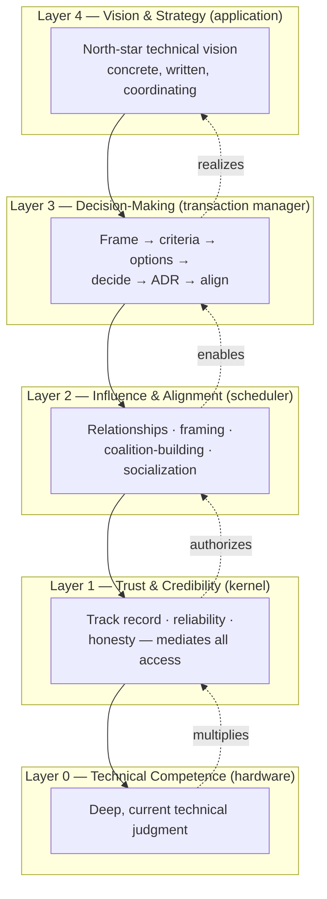
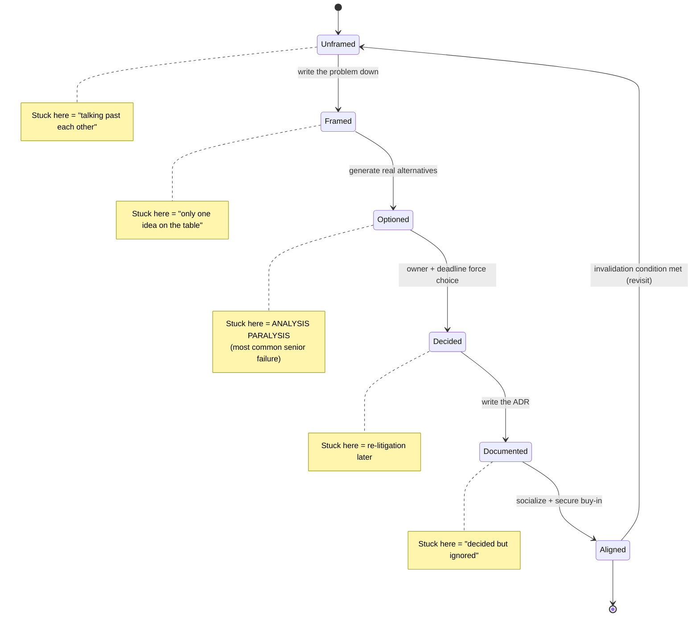
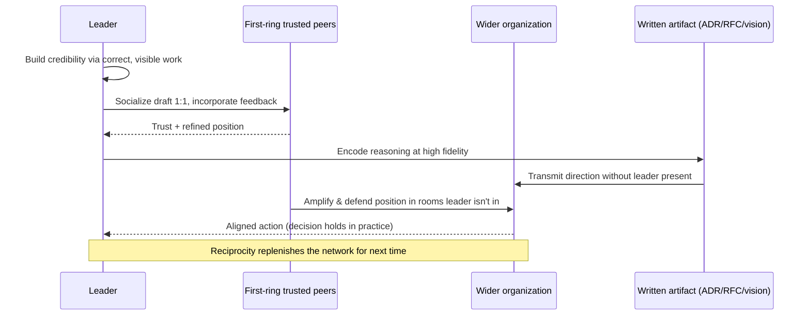

# Technical Leadership

> Part of the **Enterprise Data & AI Architecture Handbook** — Phase-19 (Leadership & Technical Strategy), Chapter 01.
> Prerequisite: [Technical Strategy and Roadmaps](../Phase-01/07_Technical_Strategy_and_Roadmaps.md).

---

## Executive Summary

Technical leadership is the discipline of producing outsized engineering impact through people, decisions, and systems rather than through your own keystrokes. At the Staff+ level, the job stops being "write the hardest code" and becomes "make sure the right hard problems get solved correctly by an organization that mostly does not report to you." This chapter treats technical leadership as an operating system: a set of durable practices for influence without authority, high-quality technical decision-making under uncertainty, and the construction and communication of a technical vision that survives contact with reality.

The central and repeatedly-earned lesson of this chapter is that **leverage, not output, is the currency of senior technical roles**. An individual contributor is measured by what they personally build; a Staff engineer or architect is measured by what the surrounding system builds *because they exist*. That shift is not a promotion of degree but of kind, and the most common failure mode — the one this chapter is largely organized around preventing — is a talented senior engineer who continues to optimize personal output while the organization around them accumulates unmade decisions, ambiguous ownership, and a vision no one can articulate. This is the leadership-domain instance of a pattern seen throughout this handbook: a locally-optimal action (ship more code myself) that silently degrades the global system (the org's decision-making capacity).

Technical leadership at this level is fundamentally about **converting ambiguity into clarity and clarity into aligned action**. You are given problems that are under-specified, politically contested, and technically open-ended, and your value is the reduction of that entropy: a crisp problem statement, a defensible decision, a documented rationale (an [Architecture Decision Record](../Phase-01/03_Architecture_Decision_Records.md) is the canonical artifact), and enough organizational buy-in that the decision actually holds. Everything in this chapter — archetypes, influence, decision-driving, ambiguity management, vision — is machinery in service of that conversion.

This chapter is Azure- and enterprise-data-platform-flavored because that is this handbook's domain: the worked examples, tooling, and case studies are drawn from leading data and AI platform organizations. But the practices generalize. A Staff data engineer driving a lakehouse-vs-warehouse decision, a Principal architect setting a multi-year Azure landing-zone strategy, and a CDO shaping an enterprise AI operating model are running the same operating system at different scopes.

---

## Learning Objectives

After working through this chapter you will be able to:

- **Distinguish the Staff+ archetypes** (Tech Lead, Architect, Solver, Right Hand) and identify which archetype a given problem or role actually needs — and which one *you* default to.
- **Lead through influence** in a matrixed organization where most of the people whose work you must shape do not report to you, using trust, reciprocity, and demonstrated competence rather than positional authority.
- **Drive a technical decision to closure**: frame the problem, generate and evaluate options against explicit criteria, force a decision, document it as an ADR, and secure durable buy-in.
- **Operate productively in ambiguity**: recognize the difference between a problem that is unclear because it is genuinely open and one that is unclear because no one has done the work to clarify it, and know which kind you are holding.
- **Build and communicate a technical vision** that is concrete enough to guide daily decisions, ambitious enough to be worth pursuing, and honest enough to survive a Principal-level review.
- **Recognize and avoid the dominant failure modes** of newly-senior engineers: hero-mode output addiction, decision paralysis disguised as thoroughness, influence-by-authority in a no-authority context, and vision-as-slideware.
- **Apply an explicit governance discipline** to your own leadership: track the decisions you own, the influence commitments you have made, and the health of the technical vision you are steward of.

---

## Business Motivation

Organizations do not pay Staff+ engineers and architects premium compensation for premium code output; a strong senior IC could produce that. They pay for **decision quality at scale** and **risk reduction on expensive, hard-to-reverse commitments**. A single well-made platform decision — choosing a lakehouse table format, committing to an Azure landing-zone topology, deciding to build versus buy a feature store — can be worth more than a year of any one engineer's implementation work, because it determines the *slope* of everything built afterward. Conversely, a badly-made or un-made version of that same decision compounds cost silently for years. This is the economic reason technical leadership exists as a distinct discipline.

The business case sharpens in data and AI platform organizations specifically, for three reasons. First, the decisions are unusually **long-lived and coupled**: a storage-format or governance-model choice touches every downstream pipeline, model, and consumer, so the blast radius of a wrong call is enormous. Second, the field moves fast enough that decisions carry genuine **technology-longevity risk** (this handbook has documented a long list of retired managed services — Google Cloud IoT Core, AWS QLDB, Azure Personalizer, Microsoft Genomics — each of which was once a defensible platform bet). Someone senior must own the judgment about what is durable versus fashionable. Third, data and AI work is **cross-functional by nature** — it spans domain teams, platform teams, governance, security, and business stakeholders — which means the coordinating, aligning, influence-heavy work is not overhead on top of the technical work; it *is* a large fraction of the technical work.

The cost of *absent* technical leadership is measurable and predictable: decisions that never get made (analysis paralysis), decisions made implicitly by whoever wrote code first (accidental architecture), rework from misalignment discovered late, and talented engineers leaving because no one is setting a direction worth following. The FinOps and reliability disciplines of [Phase-18](../Phase-18/04_Reliability_and_SRE.md) quantify the cost of technical debt and unreliability; technical leadership is the discipline that prevents the *decision debt* that produces both.

---

## History and Evolution

The idea that senior technical people should lead without becoming managers is not new, but its formalization is recent. For most of the software industry's history there were exactly two career destinations for a strong engineer: stay an individual contributor (with a low ceiling) or become a manager (and stop doing technical work). The "dual-track" or "IC ladder" — a technical career path reaching parity with senior management — emerged at scale in the late 2000s and 2010s as large technology companies discovered they were losing their best engineers to management roles those engineers neither wanted nor were good at.

- **1970s–1990s: the architect emerges.** Fred Brooks' *The Mythical Man-Month* (1975) articulated conceptual integrity and the role of a chief architect; the term "software architect" gained currency through the 1990s as systems grew too large for any one person to hold in their head. This established *architecture* as a distinct senior technical function.
- **2000s: agile flattens, then re-verticalizes.** The Agile movement (Manifesto, 2001) de-emphasized big-design-up-front architecture and heavyweight roles, pushing decisions to teams. This corrected real waterfall pathologies but created a gap: who owns cross-team technical coherence when every team is autonomous? The "Tech Lead" role filled part of it.
- **2010s: the Staff+ ladder is formalized.** Companies like Google codified Staff, Senior Staff, and Principal levels with explicit expectations centered on scope and impact rather than output. The community vocabulary was crystallized by Will Larson's *Staff Engineer* (2021) and the archetype framing (Tech Lead / Architect / Solver / Right Hand) that this chapter uses. Camille Fournier's *The Manager's Path* (2017) and Tanya Reilly's *The Staff Engineer's Path* (2022) matured the discipline into teachable practice.
- **2020s: the discipline meets the AI platform era.** The rise of data platforms, MLOps, and agentic AI (Phases 11–13 of this handbook) raised the stakes on cross-cutting technical judgment: decisions about governance, model risk, and platform strategy now carry regulatory and existential-risk weight, and the influence surface spans data, ML, security, and executive stakeholders simultaneously.

The through-line of this history is a slow professional recognition that **coordinating and directing technical work is itself a first-class technical skill**, not a soft consolation prize, and that it can be practiced by people who remain hands-on technologists.

---

## Why This Technology Exists

"This technology" — technical leadership as a formalized role — exists to solve a specific organizational problem: **as engineering organizations scale, the number of consequential technical decisions grows faster than the number of people qualified and positioned to make them well, and management alone cannot fill the gap** because managers are (rightly) selected and rewarded for people-and-delivery outcomes, not deep technical judgment.

Without a technical leadership track, an organization faces an ugly choice. It can route all significant technical decisions through engineering managers — who are often one or two steps removed from the current technical detail and are structurally incentivized toward short-term delivery — or it can let decisions emerge implicitly from whoever writes the code, which produces accidental architecture with no coherence across teams. Both paths degrade decision quality precisely as the cost of bad decisions rises with scale.

The Staff+ IC track exists as the third path: **people with deep, current technical judgment, given explicit organizational scope and legitimacy to make and shepherd decisions across team boundaries, without the people-management responsibilities that would pull them away from the technical work.** Technical leadership is therefore best understood as a *decision-making and alignment subsystem* that an organization installs when its technical-decision volume and blast radius exceed what its management layer can handle alone. It exists for the same reason a database has a query planner: someone has to decide *how* the work gets done, globally and well, and that role benefits from being specialized and expert.

---

## Problems It Solves

- **Cross-team technical coherence.** When ten autonomous teams each make locally-reasonable choices, the result is a globally-incoherent platform. Technical leadership provides the connective judgment — shared standards, deliberate interfaces, a single vision — that keeps autonomy from degenerating into fragmentation.
- **High-stakes, hard-to-reverse decisions.** Someone must own the build-vs-buy, the table format, the cloud topology, the governance model — decisions too consequential to leave to whoever codes first and too technical to leave to management alone.
- **Ambiguity resolution.** Senior technical leaders convert under-specified, politically contested problems into crisp problem statements, evaluated options, and documented decisions. This is often the single most valuable thing they do.
- **Institutional technical memory.** Through ADRs, design docs, and vision documents, technical leaders create durable rationale so that future teams inherit *why* and not just *what* — preventing the endless re-litigation of settled questions.
- **Talent development and retention.** A credible technical direction and visible senior mentorship keep strong engineers engaged and growing; their absence is a leading cause of senior attrition.
- **Bridging the business–technical gap.** Technical leaders translate business intent into technical strategy and technical constraints into business-legible trade-offs, so that neither side makes decisions blind to the other's reality.

---

## Problems It Cannot Solve

- **It cannot substitute for organizational authority you genuinely need.** Influence has limits. Some decisions require a budget owner, a VP mandate, or a formal governance body to *enforce*. A technical leader who tries to influence their way past a hard authority boundary (e.g., forcing a security control an accountable executive has vetoed) will fail and burn credibility. Know when to escalate rather than persuade.
- **It cannot fix a broken incentive structure.** If the organization rewards short-term delivery and punishes anyone who slows down for reliability or governance, no amount of technical vision will hold; the error-budget-policy problem from [Reliability and SRE](../Phase-18/04_Reliability_and_SRE.md) is fundamentally a leadership-and-incentives problem, and technical leadership can name it but not unilaterally repair it.
- **It cannot compensate for absent technical competence.** Influence built on demonstrated expertise collapses if the expertise is not real. Technical leadership is a *multiplier* on genuine technical judgment, not a replacement for it.
- **It cannot make genuinely irreducible ambiguity disappear.** Some problems are open because the information does not yet exist (an unproven market, an unbenchmarked technology). Leadership can *structure* the uncertainty (run the spike, buy the option, set a decision checkpoint) but cannot manufacture certainty that reality has not yet provided.
- **It cannot scale linearly.** One person's influence, attention, and trust are finite. Beyond a certain scope, technical leadership must *reproduce itself* — grow other leaders — because a single Staff engineer cannot personally shepherd every decision in a 500-person org. Failing to delegate leadership is itself a leadership failure.

---

## Core Concepts

### 1.1 The Staff+ Archetypes

Will Larson's four archetypes are the most useful vocabulary for understanding what "Staff+" actually means, because the level is not one job but a family of jobs. Most real roles blend archetypes, but one usually dominates.

- **Tech Lead.** Guides the execution of one team (or a small cluster) — owns the technical direction of the roadmap, breaks down ambiguous work, and is the technical point of accountability for delivery. This is the most common and most execution-adjacent archetype; the scope is a team's problem space.
- **Architect.** Owns the technical direction of a broad, critical area (e.g., the data platform's storage layer, the ML serving stack) across many teams and over a long horizon. Depth of domain expertise and quality of long-lived decisions define this archetype. Most of this handbook's technical phases are the *material* an Architect reasons over.
- **Solver.** Parachutes into the hardest, most ambiguous problem the organization currently faces — a failing migration, a mysterious reliability crisis, a stuck strategic decision — and drives it to resolution, then moves on. Defined by problem difficulty rather than fixed scope.
- **Right Hand.** Operates as a senior leader's technical extension, carrying their context and authority into rooms they cannot be in, running large cross-cutting initiatives on their behalf. The rarest archetype; defined by organizational leverage and trust.

The practical value of the framing is diagnostic: **most struggling senior engineers are running the wrong archetype for their situation** — a natural Solver stuck in a role that needs an Architect's patient long-horizon stewardship, or a Tech Lead trying to do Architect-scope work without the cross-team mandate. Knowing your default and the role's actual need is the first step to being effective.

### 1.2 Scope, Impact, and Leverage

The defining transition from senior IC to Staff+ is the shift from **output** to **leverage**. Output is what you personally produce; leverage is the multiplier your existence applies to everyone else's output. The three primary leverage mechanisms are:

- **Decisions** — making one high-quality call that improves the slope of all downstream work.
- **Influence** — shaping the choices of many people you do not manage.
- **Systems** — building durable machinery (standards, templates, ADR practices, review processes, golden paths from [Platform Engineering](../Phase-09/02_Platform_Engineering.md)) that keeps producing value without your continued attention.

A useful self-audit: at the end of a week, ask "did the organization's future output increase because of what I did, or did only *this week's* output increase?" The former is leverage; the latter is (valuable but non-scaling) IC work. The senior trap is that IC work feels more concrete and satisfying — you can see the merged PR — while leverage work is diffuse and slow to pay off, so under stress senior engineers regress to output.

### 1.3 Leading Through Influence (Without Authority)

In a matrixed organization, the people whose work a Staff engineer must shape overwhelmingly do not report to them. Authority is therefore not available as a primary tool; **influence is the operating mechanism**. Influence is built from a small number of durable sources:

- **Demonstrated competence** — the foundational currency. People follow technical direction from someone whose technical judgment has repeatedly proven correct. This is why influence cannot be faked; it is collateralized by a track record.
- **Trust and reliability** — doing what you said you would, representing others' positions fairly, being honest about uncertainty and about your own mistakes. Trust is slow to build and fast to destroy, and it is the single most important influence asset.
- **Reciprocity and relationships** — helping others succeed builds a network of people who will engage with your ideas. Influence flows through relationships that predate the moment you need them.
- **Framing and communication** — the ability to state a problem so clearly that the right answer becomes obvious, to meet each audience in their own language, and to make the case for a direction compellingly. A correct idea, badly communicated, loses to a worse idea well communicated.

The critical mental shift is from *convincing* (I am right, let me prove it) to *aligning* (let us reach a shared, correct understanding). Influence is not winning arguments; it is producing genuine agreement that holds after you leave the room.

### 1.4 Driving Technical Decisions

Senior technical leadership is, more than anything else, **the art of driving decisions to closure well.** The failure modes are symmetric: deciding too fast (on intuition, without options or evidence, creating rework) and deciding too slow (endless analysis, deferring commitment, letting the decision be made implicitly by delay). A disciplined decision process navigates between them:

1. **Frame the problem.** State precisely what is being decided, why now, what is in and out of scope, and what "good" looks like. A large fraction of bad decisions are actually bad *framings* — the group answers the wrong question well.
2. **Establish decision criteria** *before* generating options, so the choice is not retrofitted to a favored answer. Criteria come from the business context and the quality attributes (cost, reliability, security, time-to-market, reversibility).
3. **Generate genuine options**, including the "do nothing" and "buy instead of build" options. A decision with only one real option is not a decision.
4. **Evaluate against criteria**, honestly surfacing trade-offs. A [decision matrix](../Phase-01/03_Architecture_Decision_Records.md) makes the reasoning legible and reviewable.
5. **Force the decision.** Name a decision-maker and a deadline. Consensus is desirable but not always achievable; when it is not, the process is *decide, disagree-and-commit, document*. A decision deferred indefinitely is a decision to accept the status quo by default.
6. **Document as an ADR** — context, decision, consequences, alternatives — so the rationale survives and the decision is not silently re-litigated.
7. **Secure buy-in and communicate**, so the decision actually holds in practice rather than only on paper.

A key distinction, borrowed from Amazon's leadership vocabulary, is **one-way versus two-way doors**. Two-way-door decisions (easily reversed) should be made fast, by whoever is closest, to preserve velocity. One-way-door decisions (hard or impossible to reverse — a data model, a table format, a governance model) warrant the full rigor above. Applying heavyweight process to two-way doors is as much a failure as applying no process to one-way doors.

### 1.5 Managing Ambiguity and Building Technical Vision

**Managing ambiguity** is the daily texture of senior technical work. The essential skill is diagnosing *what kind* of ambiguity you hold: (a) ambiguity that exists because no one has done the clarifying work yet — resolvable by effort (writing the problem down, talking to stakeholders, running a spike); versus (b) ambiguity that is irreducible right now because reality has not produced the information — manageable only by structuring the uncertainty (time-boxed experiments, reversible bets, explicit decision checkpoints, and buying optionality). Confusing the two wastes enormous energy: teams either thrash on genuinely-open questions demanding certainty, or accept as "unknowable" things that a day of investigation would settle. The leader's job is to name which kind is in the room and set the appropriate response.

**Building technical vision** is the constructive counterpart. A technical vision is a concrete, opinionated picture of a good future state — specific enough to guide a daily decision ("does this choice move us toward or away from the vision?"), ambitious enough to be worth the journey, and honest enough to survive scrutiny. A vision is not a slogan or a slide; it is a *document* (often a "north star" architecture or a written strategy, per [Technical Strategy and Roadmaps](../Phase-01/07_Technical_Strategy_and_Roadmaps.md)) that people can read, argue with, align to, and use. Its function is coordination at a distance: a good vision lets a hundred people make locally-aligned decisions without a central controller, because they share the same picture of where the platform is going. The test of a vision is behavioral — if it does not change what people actually decide on a Tuesday, it is decoration, not a vision.

---

## Internal Working

### 2.1 How Influence Actually Propagates

Influence is not applied to a person; it propagates through a *network*. Understanding the mechanism prevents naive one-to-one persuasion attempts. The internal working has a recognizable shape:

1. **Credibility is established** through visible, correct technical work and reliable follow-through, creating a baseline of trust with a first ring of people.
2. **That first ring amplifies.** People who trust your judgment repeat and defend your positions in rooms you are not in. Influence at scale is always *mediated* — you cannot personally be in every conversation, so your ideas must be carried by others who believe them.
3. **Framing determines transmission fidelity.** An idea that is crisply framed and audience-appropriate survives repetition intact; a muddled idea mutates or dies in transit. This is why written artifacts (docs, ADRs, vision statements) are influence *infrastructure*: they transmit your reasoning at high fidelity without you present.
4. **Reciprocity replenishes the network.** Every time you help someone succeed, represent their view fairly, or give credit generously, you deposit into a relationship you may later draw on. Influence networks that are only ever *drawn on* deplete.

The practical implication: to move a large decision, you do not schedule one big meeting and win it. You do the pre-work — individual conversations, sharing a draft, incorporating feedback, building a coalition — so that by the time the decision is "made" in the room, it is already aligned. This is often called "socializing" a decision, and skipping it is the most common reason technically-correct proposals fail.

### 2.2 The Decision Lifecycle as a State Machine

A well-run decision moves through discrete states, and stalls are diagnosable by *which state* it is stuck in:

- **Unframed → Framed:** the problem is written down clearly. Stuck here = "we keep talking past each other" (nobody has stated the actual question).
- **Framed → Optioned:** genuine alternatives with trade-offs exist. Stuck here = "there's only one idea on the table" (no real choice, high risk of the one idea being wrong).
- **Optioned → Decided:** a decision-maker and criteria force a choice. Stuck here = analysis paralysis (the classic senior failure — endless refinement of options to avoid the discomfort of committing).
- **Decided → Documented:** an ADR captures rationale. Stuck here = "why did we do this?" re-litigation six months later.
- **Documented → Aligned:** the org actually behaves according to the decision. Stuck here = "we decided that but everyone ignores it" (buy-in was never secured; the decision exists only on paper).

Naming the stuck state is the intervention. A decision that has been "in discussion for three weeks" is almost always stuck at Optioned→Decided, and the fix is not more analysis but a forcing function: a named owner and a deadline.

### 2.3 Vision as a Coordination Protocol

A technical vision works internally the way a shared protocol works in a distributed system: it lets independent actors coordinate without a central coordinator. The mechanism is that each engineer, holding the same clear picture of the target state, can locally evaluate "does my choice move us toward the north star?" and make an aligned decision autonomously. This is why vagueness is fatal: an ambiguous vision produces *divergent* local interpretations, which is worse than no vision because it creates the *illusion* of alignment while people actually build toward different targets. The internal quality metric for a vision is therefore **interpretation variance** — hand it to ten engineers, ask each what it implies for a concrete upcoming decision, and measure how much their answers diverge. Low variance means the vision is doing its coordinating job.

---

## Architecture

Technical leadership can be modeled as a layered architecture — an "operating system" running on top of an organization — with each layer depending on the ones below it:

- **Layer 0 — Technical Competence (the hardware).** Deep, current technical judgment. Everything above is a multiplier on this; if it is absent, the whole stack is hollow.
- **Layer 1 — Trust and Credibility (the kernel).** The trust relationships and track record that grant legitimacy. This layer mediates all access to the layers above; without it, influence calls fail.
- **Layer 2 — Influence and Alignment (the process scheduler).** The mechanisms that turn one person's judgment into many people's aligned action: relationships, framing, coalition-building, communication.
- **Layer 3 — Decision-Making (the transaction manager).** The disciplined process that converts ambiguity into committed, documented decisions with buy-in.
- **Layer 4 — Vision and Strategy (the application).** The concrete direction that gives all the lower layers something to coordinate *toward*.

The architecture makes the dependencies explicit and diagnostic: a leader failing at Layer 3 (decisions don't stick) very often has a deficiency at Layer 1 (insufficient trust) or Layer 2 (skipped socialization), not at Layer 3 itself. You cannot patch a vision problem by writing a better slide if the underlying trust kernel is corrupted.

---

## Components

The concrete, nameable components a technical leader operates:

- **The problem statement.** A written, precise articulation of what is being solved and why — the input to every decision.
- **The Architecture Decision Record (ADR).** The durable unit of decision memory: context, decision, consequences, alternatives. (See [Architecture Decision Records](../Phase-01/03_Architecture_Decision_Records.md).)
- **The design document / RFC.** A longer-form proposal circulated for feedback before a decision, the primary vehicle for socializing a direction and building a coalition.
- **The technical vision / north-star document.** The concrete picture of the target state that coordinates distributed decisions.
- **The decision matrix.** A structured comparison of options against explicit weighted criteria, making evaluation legible.
- **The review forum** (architecture review board, design review) — the governance venue where cross-cutting decisions are examined; developed fully in Phase-19 Chapter 02 (Architecture Reviews).
- **The 1:1 and the coalition conversation.** The relationship-level components through which influence is actually built and socialization happens.
- **The escalation.** The deliberate act of routing a decision to someone with the authority to make or enforce it when influence has reached its limit.

---

## Metadata

In systems, metadata is the data about the data that makes it findable, trustworthy, and governable; in technical leadership the analogue is **the context around a decision** that makes it legible and durable. Every consequential decision should carry its metadata: *who* decided, *when*, *why* (the driving context and constraints), *what alternatives* were considered and rejected, *what assumptions* it rests on, and *what would invalidate it* (the conditions under which it should be revisited). This is exactly the ADR schema, and it functions as decision metadata: without it, a decision is an opaque fact ("we use Delta Lake") that future teams cannot evaluate or safely change. The most valuable and most frequently-missing piece of decision metadata is the **invalidation condition** — the explicit statement of what would make this decision wrong — because it converts a decision from a permanent monument into a reviewable, time-bounded commitment, which is what prevents the silent obsolescence that plagues long-lived platform choices.

---

## Storage

The "storage layer" of technical leadership is **institutional technical memory** — where decisions, rationale, and direction persist so they outlive the individuals who created them and the meetings in which they were made. Poorly-stored leadership evaporates: decisions live only in the heads of a few senior people, and when those people leave (or simply forget), the organization re-litigates settled questions and loses its accumulated judgment. The storage mechanisms are concrete: an ADR repository (version-controlled alongside the code it governs), a design-doc archive, a durable vision document, and a decision log. The engineering discipline here mirrors data governance: memory must be *findable* (indexed, searchable), *trustworthy* (dated, attributed, versioned), and *maintained* (obsolete decisions marked superseded, not silently left to mislead). An ADR that has been quietly invalidated by events but never marked as such is the leadership equivalent of stale, un-governed data — actively harmful because people still trust it. Treat leadership memory with the same rigor [Phase-08](../Phase-08/01_Data_Governance_Foundations.md) applies to data.

---

## Compute

The scarce compute resource of technical leadership is **attention** — yours and the organization's. A Staff+ leader has a finite, non-scalable budget of focus, and the central resource-allocation decision is *which* problems get that focus. The failure mode is attention fragmentation: spreading thinly across every problem, applying senior judgment nowhere deeply enough to matter. The discipline is deliberate prioritization — spend the scarce senior compute on the highest-leverage, highest-blast-radius, most-ambiguous problems (the ones only you can move) and *deliberately under-invest* in problems the team can handle without you, even when you could do them faster yourself. This is the same rightsizing logic as [Performance Engineering](../Phase-18/05_Performance_Engineering.md): optimize the actual bottleneck (the decisions and directions only senior judgment can supply), not the work that merely feels satisfying. The organization's collective attention is likewise a resource a leader manages: every initiative, standard, and priority you introduce consumes shared cognitive bandwidth, and a leader who launches ten priorities has effectively set none.

---

## Networking

If attention is the compute, **relationships are the network** — the connective fabric through which influence actually travels. A technical leader's effective reach is bounded by the quality and breadth of their relationship network, exactly as a distributed system's throughput is bounded by its interconnect. The network must be built *before* it is needed: the time to establish a trusted relationship with the security lead, the platform team, and the key domain stakeholders is *before* you need their support for a contentious decision, not in the meeting where you need it. Networking in this sense is not politicking; it is the deliberate, ongoing investment in cross-team relationships, reciprocal help, and shared context that makes later alignment possible. The topology matters: a leader with a *broad* network (weak ties across many teams) can move cross-cutting decisions that a leader with only a *deep* network (strong ties within one team) cannot, because cross-cutting decisions require reach into the many teams they touch. Deliberately cultivating weak ties across organizational boundaries is a specific, high-return leadership activity.

---

## Security

The "security" of technical leadership is the **integrity of trust and the guarding against its abuse or loss**. Trust is the credential that authorizes influence; compromising it is the equivalent of a leaked key. The threat model has two sides. First, *protecting your own trust*: it is destroyed by dishonesty (misrepresenting facts or others' positions), by unreliability (not doing what you said), by taking credit or assigning blame unfairly, and by being wrong loudly and often. Trust is slow to accumulate and near-instant to lose, so it must be defended deliberately — honesty about uncertainty and about your own mistakes is not just ethics, it is trust-integrity maintenance. Second, *guarding against the misuse of influence*: a leader with strong influence can push a bad decision through precisely *because* people trust them, bypassing the healthy scrutiny that would have caught the error. The defense is intellectual honesty — actively inviting dissent, making your reasoning legible and challengeable, and treating your own strongly-held positions as hypotheses. The most dangerous decision in an organization is a wrong one advocated by a highly-trusted leader who has stopped inviting challenge, because the very trust that makes them effective disables the system's error-checking. This is a direct analogue to the privileged-credential risk throughout this handbook: the more authority a credential carries, the more scrutiny its use must attract, not less.

---

## Performance

The performance metrics of technical leadership are not lines of code or tickets closed — using those metrics on a senior leader actively rewards the wrong behavior (regression to IC output). The meaningful measures are:

- **Decision throughput and quality** — are consequential decisions getting made, at appropriate speed for their reversibility, and holding up over time?
- **Alignment latency** — how long from "we should decide X" to "the org is coherently acting on X"? Long latency signals broken socialization or trust.
- **Leverage ratio** — how much of the organization's output improvement traces to this leader's decisions, systems, and influence versus their personal keystrokes?
- **Blast-radius reduction** — how many expensive, hard-to-reverse mistakes were *prevented*? (Hard to measure, since prevented disasters are invisible, but real.)
- **Leader reproduction** — is the leader growing *other* leaders and decision-makers, raising the organization's total decision capacity?

The measurement problem is genuine and important: senior technical leadership's highest-value outputs (a disaster averted, a decision that ages well, a vision that quietly coordinates a hundred people) are the hardest to see and quantify, while the low-value output (personal code) is the most visible. Organizations that manage senior ICs by visible-output metrics systematically punish exactly the behavior they are paying for.

---

## Scalability

Technical leadership scales through **reproduction, not personal effort**. A single leader's attention, trust, and influence are hard-capped; beyond a certain organizational scope, trying to personally shepherd every decision becomes the bottleneck — the leader is the single-threaded coordinator that the whole org blocks on. The architectural fix is the same as in distributed systems: eliminate the central bottleneck. A leader scales by:

- **Building systems, not making calls** — encoding good judgment into standards, golden paths, review processes, and ADR practices that let teams decide well *without* the leader in the loop.
- **Growing other leaders** — mentoring and delegating decision authority so decision-making capacity grows with the org (developed further in Phase-19 Chapter 06, Mentoring and Team Building).
- **Deciding what *not* to touch** — deliberately leaving many decisions to the teams closest to them, reserving senior attention for the genuinely high-leverage few.

The anti-pattern is the "indispensable" senior engineer through whom every decision must flow: they feel maximally valuable and are in fact a scalability ceiling on the entire organization, a bus-factor risk, and — usually — the reason the next tier of leaders never developed. A leader whose absence would halt decision-making has failed to scale their leadership, however brilliant their individual judgment.

---

## Fault Tolerance

Leadership must be resilient to the inevitable: **decisions will sometimes be wrong, and disagreements will sometimes be unresolvable.** Fault-tolerant leadership builds in mechanisms to detect and recover from bad decisions rather than assuming infallibility:

- **Reversibility awareness** — preferring two-way-door decisions and reversible bets where the stakes are uncertain, so a wrong call is cheap to unwind. Deliberately buying optionality is fault tolerance for decisions.
- **Explicit invalidation conditions** — stating up front what would prove a decision wrong, so the failure is *detected* rather than silently endured.
- **Disagree and commit** — a protocol for making progress despite unresolved disagreement: air the dissent fully, decide, and have even the dissenters commit to executing — while *recording* the dissent so that if the decision proves wrong, the org knows to revisit it rather than re-argue from scratch.
- **Blameless correction** — treating a wrong decision as a systems-and-information problem to learn from (the blameless-postmortem discipline of [Reliability and SRE](../Phase-18/04_Reliability_and_SRE.md)), not a person to punish, because a culture that punishes wrong calls teaches senior people to avoid making consequential calls at all — the worst possible failure mode.

The single most important fault-tolerance property is a leader's own willingness to say "I was wrong, here is the new information, here is the corrected direction" — publicly and without defensiveness. It both models the behavior and repairs the specific decision, and paradoxically it *strengthens* trust rather than eroding it.

---

## Cost Optimization

The costs of technical leadership are real and denominated in scarce resources: **senior attention, organizational focus, meeting time, and decision latency.** Optimizing them means matching the *weight* of the leadership process to the *stakes* of the decision — the direct analogue of rightsizing compute.

- **Don't over-process two-way doors.** Applying a full ADR, review board, and coalition-building exercise to an easily-reversible decision is waste; decide fast and move on. The cost of the process exceeds the cost of occasionally being wrong.
- **Do invest heavily in one-way doors.** Under-investing rigor in an irreversible, high-blast-radius decision is a catastrophic false economy — the classic penny-wise, pound-foolish error.
- **Ration meetings and initiatives.** Every standing meeting and every new priority consumes organizational focus; a leader who calls fewer, higher-quality decisions and launches fewer, better-chosen priorities gets more done than one who floods the org with both.
- **Reduce decision latency deliberately.** Slow decisions have a carrying cost — blocked teams, delayed work, opportunity cost — that is usually invisible and frequently larger than the risk of deciding a little too soon.

**Worked FinOps-style example.** Consider a platform-standards decision (e.g., mandating a table format across a data platform) that sits unmade. Suppose eight teams are each spending ~20% of one engineer's time (roughly €30–40K/year fully-loaded per team) working around the absence of a standard — building bespoke integrations, reconciling incompatible choices, and re-deciding locally. That is on the order of €250–320K/year of dispersed, invisible cost, plus the compounding rework when the eventual standard forces migrations. A single well-run decision — perhaps two weeks of a Staff engineer's time to frame, socialize, decide, and document — costs a few thousand euros of that engineer's time and retires most of the recurring drag. The lesson is the general one: **the cost of a *missing* decision is real, recurring, and usually far larger than the cost of the process to make it**, but it is diffuse and unbilled, so it hides. Naming and quantifying decision debt is itself a high-leverage leadership act.

---

## Monitoring

Monitoring, in the leadership context, is watching the **leading indicators of decision and alignment health** so problems surface before they become crises. Concrete signals a technical leader should actively track:

- **Decision cycle time** — how long consequential decisions sit in each state (framed, optioned, decided). Rising cycle time is the earliest sign of paralysis or broken forcing functions.
- **Decision re-litigation rate** — how often supposedly-settled questions get reopened. High re-litigation means decisions aren't being documented, or buy-in was never real.
- **Alignment drift** — the gap between the stated direction and what teams are actually building. Detected through code review, architecture reviews, and simply talking to teams.
- **Escalation frequency and pattern** — a spike in escalations to you (or to management) can indicate that decision authority is unclear or that the team lacks the framework to decide autonomously.
- **Vision interpretation variance** — periodically sampling whether engineers interpret the vision consistently (the coordination-protocol health check from §2.3).

The point of monitoring these is the same as monitoring a production system: to distinguish "everything is fine" from "something is degrading" *before* it becomes an outage — here, before a misaligned platform, a decision vacuum, or an unmade high-stakes call turns into expensive rework or a stalled organization.

---

## Observability

Where monitoring watches known indicators, **observability is the ability to ask unanticipated questions about *why* the organization is behaving as it is** — to root-cause a leadership problem you did not have a pre-built dashboard for. When teams are misaligned, decisions aren't sticking, or a direction isn't being followed, observability is the practice of *investigating the actual cause* rather than assuming it. The instruments are qualitative and human: skip-level conversations, listening in design reviews, reading the actual code and ADRs to see what's really being built, and asking open questions ("what's blocking this decision?", "what would make you disagree with this direction?"). The recurring insight — the leadership version of a pattern seen across this handbook — is that **the surface symptom is usually not the cause**: "the team won't adopt the standard" is a symptom whose real cause might be that the standard was never socialized (a Layer-2 influence failure), or that it conflicts with an incentive the team is measured on (a structural failure outside technical leadership's reach), or that the standard is simply wrong for their context (a Layer-3 decision-quality failure). Each root cause demands a completely different response, and acting on the symptom without the diagnosis — the "acting without verifying" anti-pattern — is how leaders burn effort pushing on the wrong lever.

---

## Operational Response Playbook

Concrete, repeatable responses to the two most common acute leadership failures. Each follows a signal → diagnosis → response structure.

### Playbook 1: A high-stakes decision has stalled (analysis paralysis)

| Step | Action |
|------|--------|
| **Signal** | A consequential (often one-way-door) decision has been "in discussion" for weeks; meetings recur without resolution; teams are blocked or, worse, quietly making the decision implicitly by building around the vacuum. |
| **Diagnose the stuck state** | Locate which state the decision is stuck in (§2.2). Almost always it is Optioned→Decided: options are endlessly refined to avoid committing. Confirm it is not actually stuck at Framed (people are answering different questions) or at Aligned (a decision *was* made but nobody bought in). |
| **Immediate mitigation** | Install a forcing function: name a single decision-maker (not a committee) and a hard deadline. Reframe the decision as reversible if it genuinely is (two-way door → decide today, revisit if wrong). If genuinely one-way, time-box the *remaining* analysis explicitly ("we decide Friday with what we know"). |
| **Break the tie** | If consensus is unreachable, invoke *disagree-and-commit*: air every objection fully, record the dissent, decide, and get commitment to execute from dissenters. Do not mistake unanimity for the goal. |
| **Durable fix** | Document the decision as an ADR (including the recorded dissent and invalidation conditions). Establish, going forward, that decisions get an explicit owner and deadline at the moment they are raised, so paralysis is prevented rather than repeatedly rescued. |

### Playbook 2: A decision was made but the organization is ignoring it

| Step | Action |
|------|--------|
| **Signal** | A direction or standard was formally decided, but teams are visibly not following it — building alternatives, quietly opting out, or openly pushing back after the fact. |
| **Diagnose (don't assume defiance)** | Investigate the real cause before reacting (Observability discipline). The usual causes: (a) buy-in was never secured — the decision was announced, not socialized; (b) the decision conflicts with an incentive teams are measured on; (c) the decision is genuinely wrong or ill-fitting for some contexts and the resistance is *information*. |
| **Immediate response by cause** | (a) Restart socialization: individual conversations, surface and address the real objections, rebuild the coalition. (b) Escalate the incentive conflict to whoever owns the incentives — this is beyond influence's reach and requires authority. (c) If the resistance is valid, *revise the decision* — being wrong and correcting fast preserves far more credibility than defending a bad call. |
| **Do not** | Do not simply re-assert the decision louder or invoke authority you don't have; both accelerate credibility loss and entrench the resistance. |
| **Durable fix** | Treat "decided but ignored" as a socialization/trust failure by default. Build the pre-decision socialization step (draft circulated, feedback incorporated, coalition built) into the standard decision process so buy-in is manufactured *before* the decision, not chased after it. |

---

## Governance

Governance applies to a leader's *own* practice, not only to the systems they oversee. A disciplined technical leader maintains explicit accountability for:

- **The decisions they own** — a tracked list of open and closed decisions, their owners, their state, and their invalidation conditions, so nothing consequential falls through the cracks or ages silently into wrongness.
- **The influence commitments they've made** — the promises and represented positions that underpin their trust; failing to honor these is the fastest way to corrupt the trust kernel.
- **The vision they steward** — periodically re-examined against reality and explicitly updated or retired when conditions change, rather than left to drift into irrelevance while people still nominally align to it.
- **Their own decision-quality track record** — honestly reviewed: which calls aged well, which didn't, and what that reveals about systematic biases in their judgment.

At the organizational level, technical leadership *is* a governance function — it is the human judgment layer that makes the architecture-governance, decision-record, and review disciplines of [Phase-01](../Phase-01/02_Architecture_Governance.md) actually work in practice. Governance mechanisms (review boards, ADR requirements, standards) are inert without technical leaders exercising judgment within them; and technical leaders without governance mechanisms produce judgment that doesn't durably bind. The two are complementary: process without judgment is bureaucracy, judgment without process doesn't scale or persist. ADR-0198 below makes the personal-governance discipline concrete.

---

## Trade-offs

- **Speed vs. buy-in.** Deciding fast preserves velocity but risks a decision that doesn't hold; building consensus produces durable alignment but is slow. The reversibility of the decision (one-way vs. two-way door) is the primary dial for choosing.
- **Influence vs. authority.** Influence scales across boundaries and produces genuine agreement but is slow and has hard limits; authority is fast and enforceable but doesn't reach across the org chart and breeds compliance rather than commitment. Senior technical leaders operate mostly on influence and must know precisely when a problem has crossed into needing authority (escalate) rather than more persuasion.
- **Depth vs. breadth.** Going deep on one area builds Architect-grade expertise and strong ties but limits cross-cutting reach; going broad enables cross-team influence but sacrifices depth. Different archetypes and different problems demand different points on this spectrum.
- **Personal output vs. leverage.** Doing the work yourself is faster *this week* and more visibly satisfying; investing in decisions, systems, and other people pays off far more but slowly and invisibly. The senior trap is over-weighting the former.
- **Conviction vs. openness.** Strong opinions drive decisions to closure and give people something to align to; excessive conviction disables the error-checking that catches wrong calls. The resolution is "strong opinions, loosely held" — advocate forcefully, but genuinely invite and integrate dissent.
- **Consistency vs. autonomy.** Enforcing standards produces coherence but constrains teams; maximizing team autonomy empowers but fragments. This is the same federated-governance tension as [Data Mesh](../Phase-15/04_Federated_Governance.md), applied to technical direction.

---

## Decision Matrix

*When should you rely on which leadership mechanism? A guide for choosing the response to a given situation.*

| Situation | Primary mechanism | Why | When NOT to use it |
|-----------|-------------------|-----|--------------------|
| Reversible, low-stakes technical choice | Delegate / decide fast (two-way door) | Process cost exceeds error cost; preserve velocity and team autonomy | When the choice is secretly one-way (creates lock-in) |
| Irreversible, high-blast-radius choice | Full decision rigor + ADR + socialization | Error cost is enormous and permanent; warrants heavyweight process | When speed genuinely matters more than getting it perfectly right |
| Cross-team direction others must adopt | Influence + coalition-building | You lack authority over them; only genuine alignment holds | When you actually have (or need) authority — then just decide/mandate |
| Decision blocked by a real authority/budget/veto boundary | Escalate | Influence cannot move a hard authority boundary; persisting burns credibility | When you haven't actually tried influence yet (escalating too early erodes trust) |
| Genuinely open problem (info doesn't exist yet) | Structure the uncertainty (spike, reversible bet, checkpoint) | Certainty can't be manufactured; buy optionality and decide later | When the ambiguity is actually resolvable by an afternoon of clarifying work |
| Ambiguity from nobody-did-the-work | Do the clarifying work (write it down, ask stakeholders) | The uncertainty is an effort gap, not an information gap | When you treat resolvable ambiguity as irreducible and thrash |
| Unresolvable disagreement, decision needed | Disagree and commit | Progress requires a decision; record dissent for later review | When more time would genuinely produce consensus on a cheap-to-defer call |
| Setting long-horizon direction | Technical vision document | Coordinates distributed decisions without a central controller | When the situation needs a specific decision now, not a direction |

---

## Design Patterns

- **Socialize before deciding.** Circulate a draft, gather feedback, and build a coalition *before* the formal decision, so the meeting ratifies an already-aligned position rather than attempting to forge alignment live. The single highest-return leadership pattern.
- **Write it down.** Convert every consequential decision, direction, and problem framing into a durable written artifact (ADR, design doc, vision statement). Writing forces clarity, transmits reasoning at high fidelity, and creates institutional memory.
- **Strong opinions, loosely held.** Advocate a clear position forcefully enough to drive closure, while genuinely inviting dissent and updating on new information — capturing the benefit of conviction without disabling error-checking.
- **Disagree and commit.** A protocol for progressing past unresolvable disagreement: air it fully, decide, record the dissent, and secure execution-commitment from dissenters.
- **One-way vs. two-way doors.** Explicitly classify each decision's reversibility and match process weight to it — fast for reversible, rigorous for irreversible.
- **Make the right thing the easy thing.** Rather than mandating good behavior, build golden paths and systems (per [Platform Engineering](../Phase-09/02_Platform_Engineering.md)) that make the desired choice the path of least resistance. Influence encoded into infrastructure scales without ongoing effort.
- **Grow your replacement.** Deliberately delegate decision authority and mentor other leaders, raising the org's total decision capacity and removing yourself as a bottleneck.
- **Name the ambiguity type.** Explicitly distinguish resolvable-by-effort from irreducible-right-now ambiguity, and set the appropriate response, so teams neither thrash on open questions nor accept solvable ones as fate.

---

## Anti-patterns

- **Hero mode / output addiction.** Continuing to optimize personal code output after the role demands leverage — the dominant failure of newly-senior engineers. Feels productive, silently starves the org of decisions and direction.
- **The indispensable bottleneck.** Routing every decision through yourself. Feels maximally valuable; is actually a scalability ceiling, a bus-factor risk, and the reason no other leaders develop.
- **Influence-by-authority in a no-authority context.** Trying to *mandate* cross-team behavior you have no authority over. Produces resentment and compliance-not-commitment, and fails the moment you look away.
- **Analysis paralysis as thoroughness.** Endlessly refining options to avoid the discomfort of committing, rebranded as rigor. The decision gets made anyway — by delay, in the worst possible way.
- **Vision as slideware.** A "vision" so vague or so disconnected from daily decisions that it changes no one's behavior. Decorative, not coordinating; often worse than none because it creates false confidence in alignment.
- **Deciding without socializing.** Making a technically-correct decision and announcing it, then being baffled when it doesn't stick. Buy-in cannot be retrofitted as easily as it can be built up front.
- **Consensus addiction.** Requiring unanimous agreement for every decision, giving any single objector a veto and grinding progress to a halt. Consensus is desirable, not always achievable or necessary.
- **The un-revisited decision.** Making a good call and treating it as permanent, so it silently ages into wrongness as conditions change — no invalidation condition, no review. The leadership version of stale, un-governed state.
- **Punishing wrong calls.** Creating a culture where a wrong decision is a career hazard, which teaches senior people to avoid making consequential decisions at all — the single most corrosive failure a leadership culture can have.

---

## Common Mistakes

- **Confusing being senior with being right.** Seniority grants a bigger platform, not infallibility; the more your position amplifies your voice, the *more* you must invite challenge, not less.
- **Underinvesting in relationships until you need them.** Trying to build the coalition in the meeting where you need it, rather than having cultivated the network for months prior.
- **Treating all ambiguity as the same.** Applying "run a spike" to genuinely-irreducible uncertainty, or "buy optionality" to a question a stakeholder conversation would settle in an hour.
- **Optimizing for visible over valuable.** Chasing the legible, satisfying IC work because leverage work is diffuse and slow to show results.
- **Skipping the write-up.** Making decisions in conversation and never documenting them, guaranteeing re-litigation and lost rationale.
- **Escalating too early or too late.** Reaching for authority before genuinely attempting influence (erodes trust), or persisting with influence long past a hard authority boundary (wastes effort and momentum).
- **Mistaking activity for leadership.** Running many meetings and launching many initiatives while making few actual decisions and setting no clear direction.
- **Neglecting to grow other leaders.** Solving every problem personally, and being surprised when the org has no next tier of decision-makers and cannot function in your absence.

---

## Best Practices

- **Audit your leverage weekly.** Ask whether the org's *future* output grew because of your week, or only this week's output did. Correct toward leverage under stress, when the pull back to IC work is strongest.
- **Match process weight to decision reversibility.** Fast for two-way doors, rigorous for one-way doors. Classify every consequential decision on this axis explicitly.
- **Socialize every significant decision before the room.** Draft, circulate, incorporate, coalition-build. Make the formal decision a ratification, not a forging.
- **Document decisions as ADRs with invalidation conditions.** Capture context, decision, consequences, alternatives, *and* what would make this wrong. Mark superseded decisions explicitly.
- **Build and maintain your relationship network deliberately**, especially weak ties across organizational boundaries, before you need them.
- **Diagnose before acting on leadership symptoms.** "The team won't adopt X" has multiple possible root causes demanding opposite responses; investigate, don't assume.
- **Practice strong opinions, loosely held.** Drive to closure with conviction; genuinely invite and integrate dissent; update publicly when wrong.
- **Invest in a concrete, written technical vision** and test it by interpretation variance — hand it to several engineers and check that they derive consistent implications.
- **Reproduce your leadership.** Delegate decision authority, mentor other leaders, and make yourself progressively less indispensable.
- **Model blameless correction.** Say "I was wrong, here's the new direction" publicly and without defensiveness; it strengthens trust and fixes the decision.

---

## Enterprise Recommendations

For an enterprise data and AI platform organization specifically:

- **Establish a real Staff+ IC ladder** with expectations centered on scope, impact, and decision quality — not output — and manage those roles by leverage metrics, not ticket counts. Measuring senior ICs by visible output systematically punishes the behavior you're paying for.
- **Institutionalize decision memory.** Mandate ADRs for one-way-door decisions, store them version-controlled alongside the platform, and require invalidation conditions. This is the highest-ROI, lowest-cost governance investment available and directly prevents decision re-litigation.
- **Create lightweight architecture-review forums** (developed in Phase-19 Chapter 02) that examine cross-cutting decisions without becoming heavyweight gatekeeping bottlenecks — the balance point is the whole art.
- **Explicitly fund socialization and alignment time.** Cross-cutting decisions in a matrixed data org require significant relationship and coalition work; if leaders are measured purely on delivery, they will skip it and decisions won't hold.
- **Match the archetype to the need.** Staff the failing migration with a Solver, the long-lived platform layer with an Architect, the team's roadmap with a Tech Lead — and don't force a natural Solver into patient Architect stewardship or vice versa.
- **Protect the trust kernel.** Reward honesty about uncertainty and mistakes; make it psychologically safe to be wrong and correct fast. A culture that punishes wrong calls will have senior people who avoid making calls — the worst outcome.
- **Grow the next tier deliberately.** Treat leader-reproduction as an explicit expectation of senior ICs, not a nice-to-have. The org's decision capacity, not any individual's brilliance, is the real asset.

---

## Azure Implementation

Technical leadership is a human discipline, but in an Azure-centric enterprise it is *practiced through* concrete platform tooling that stores decision memory, socializes direction, and encodes influence into systems. The Azure and Microsoft-ecosystem implementation of the leadership operating system:

- **Decision memory (Storage layer):** ADRs and design docs stored as Markdown in **Azure Repos** (or GitHub, under **GitHub Enterprise**), version-controlled alongside the platform code they govern, with pull-request review providing the socialization and challenge mechanism. **Azure DevOps Wiki** or a **SharePoint / Microsoft Loop** workspace holds longer-form vision and strategy documents.
- **Socialization and alignment (Influence layer):** **Microsoft Teams** channels and **Loop** components for circulating drafts and gathering asynchronous feedback; **Microsoft Whiteboard** for collaborative option-mapping; **Viva Engage** for broad direction-setting communication across a large org.
- **Decision tracking and governance:** **Azure Boards** work items (or a dedicated ADR board) to track open decisions, owners, states, and invalidation review dates — making the personal-governance discipline of ADR-0198 operationally real. **Azure DevOps** dashboards surface decision cycle time and re-litigation as leading indicators (the Monitoring layer).
- **Encoding influence into systems (Scalability layer):** the highest-leverage Azure implementation is making the right thing the easy thing via **golden paths** — reusable **Bicep/Terraform** landing-zone templates, **Azure Policy** guardrails, and **Azure Deployment Environments** that encode architectural decisions into self-service infrastructure so teams comply by default without the leader in the loop. This is influence made durable and scalable in code (see [Infrastructure as Code](../Phase-09/04_Infrastructure_as_Code_with_Terraform.md) and [Platform Engineering](../Phase-09/02_Platform_Engineering.md)).
- **Vision made concrete:** a north-star reference architecture expressed as **Azure Architecture Center**-style diagrams and a documented target-state landing zone, giving distributed teams a shared, specific picture to align to.

The depth of the *technical* decisions a leader reasons over lives in this handbook's platform phases; this section maps the *leadership practice* onto the Microsoft tooling that makes it operational. Note the platform-longevity discipline threaded through this handbook applies here too: keep the *artifacts* (Markdown ADRs, IaC, diagrams) in open, portable formats so the leadership memory survives any single tool's retirement.

---

## Open Source Implementation

The leadership operating system is equally well-supported by an open, vendor-neutral toolchain, which many organizations prefer for portability and to avoid lock-in of their institutional memory:

- **Decision memory:** ADRs as Markdown in **Git** (GitHub/GitLab/Gitea), managed with lightweight OSS tooling such as **adr-tools** (Nygard's original convention) or **Log4brains** for a browsable ADR web UI. The **MADR** (Markdown Any Decision Records) template is a widely-adopted open standard for ADR structure.
- **Design docs / RFCs:** the open **RFC process** pattern (popularized by the IETF and adopted by many engineering orgs) — proposals as Markdown in a Git repo, reviewed via pull request, providing a fully open socialization-and-challenge mechanism.
- **Vision and strategy:** documentation-as-code with **MkDocs**, **Docusaurus**, or **Backstage** (CNCF/Spotify) — the latter doubling as a service catalog and "software templates" (golden paths) engine, directly implementing the encode-influence-into-systems pattern in an open stack.
- **Golden paths and guardrails:** **Terraform** + **OPA/Conftest** (policy-as-code) + **Backstage** software templates, encoding architectural decisions into self-service scaffolding — the OSS equivalent of the Azure Policy / Deployment Environments pattern.
- **Async collaboration and decision tracking:** **GitLab issues/epics** or **GitHub Projects** for tracking open decisions and their states, keeping the entire leadership-governance workflow inside the same version-controlled, open, portable system as the code.

The strategic advantage of the OSS path is that it keeps institutional decision memory in **fully portable, open formats** (Markdown, Git), immune to the retirement of any managed product — the same durability principle this handbook applies to data and platform choices. The primary trade-off is more assembly and self-hosting effort versus the integrated Microsoft experience.

---

## AWS Equivalent (comparison only)

Technical leadership is provider-agnostic as a discipline, but its *tooling* and some of its vocabulary map across clouds. On AWS the leadership operating system would be practiced through **AWS CodeCommit** (or GitHub) for ADR/design-doc storage, **Amazon Chime / Slack** integrations for socialization, and **Service Catalog** + **CloudFormation/CDK** + **Control Tower** landing zones + **Config/SCPs** for the encode-influence-into-golden-paths pattern.

- **Advantages of the AWS path:** Amazon's own operating culture is unusually decision-discipline-heavy and has contributed durable leadership vocabulary to the industry — the **"working backwards" / PR-FAQ** document format, the **six-page narrative memo** (replacing slide decks with written argument, which strongly reinforces this chapter's "write it down" pattern), and the **one-way vs. two-way door** framing all originate from Amazon's practice. These *cultural artifacts* are the more valuable export than the tooling.
- **Disadvantages:** the tooling is AWS-specific for the golden-path layer (Service Catalog, Control Tower), creating the same lock-in-of-memory concern that argues for keeping the *artifacts* portable.
- **Migration/selection criteria:** an organization already standardized on AWS gains from adopting the PR-FAQ and narrative-memo *practices* regardless of tooling; the tooling choice follows the org's existing cloud standard. The leadership *discipline* transfers unchanged — only the golden-path implementation layer is cloud-specific.

---

## GCP Equivalent (comparison only)

On Google Cloud the leadership operating system maps to **Cloud Source Repositories** (or GitHub) for decision memory, **Google Workspace** (Docs/Chat) for socialization and the doc-centric culture, and **Service Catalog** + **Terraform/Config Controller** + **Organization Policy** + landing-zone blueprints for golden paths.

- **Advantages of the GCP path:** Google is the *origin* of much of the discipline this entire handbook operationalizes — the **SRE practice** and its error-budget governance ([Reliability and SRE](../Phase-18/04_Reliability_and_SRE.md)), the **design-doc culture** (Google's engineering culture is famously document-heavy, reinforcing "write it down"), and the **Staff+ ladder** formalization itself. As with AWS, the more valuable export is *cultural* — Google's mature written-design-review and blameless-postmortem practices are directly this chapter's patterns, battle-tested at extreme scale.
- **Disadvantages:** the golden-path tooling is GCP-specific (Config Controller, Organization Policy), the same portability concern as the other clouds.
- **Selection criteria:** the decision is driven by the organization's existing cloud and collaboration standard, not by leadership needs per se. Google's *cultural* practices (design docs, SRE, blameless postmortems, dual-track ladder) are worth adopting on any cloud; the tooling follows the platform.

Across all three clouds the pattern is identical: **the leadership discipline and its cultural artifacts (ADRs, design docs, PR-FAQs, one-way/two-way doors, blameless postmortems) are the durable, portable asset; the golden-path tooling is the cloud-specific implementation layer.** Keep the former in open formats and let the latter follow your cloud standard.

---

## Migration Considerations

The "migration" relevant to technical leadership is a *career and organizational* transition, not a data movement — but it has the same risk profile as any migration and benefits from the same discipline:

- **The IC → Staff+ transition is the hardest migration.** The old system (personal output) still works and is comfortable; the new system (leverage) is unfamiliar and slow to show results. The dominant failure is a partial migration — nominally in a leadership role, still operating on IC muscle memory. The mitigation is the same as any migration: an explicit cutover plan (deliberately hand off IC work), leading indicators (the weekly leverage audit), and the willingness to sit in the discomfort of reduced visible output during the transition.
- **Introducing leadership discipline into an org that lacks it** is a migration too: moving from implicit, code-first decision-making to explicit, documented, socialized decisions. Do it incrementally — start with ADRs for the highest-stakes decisions, demonstrate value, expand — rather than imposing heavyweight process overnight (which triggers the same resistance as any big-bang migration).
- **Succession is a migration with a hard deadline.** When a key technical leader departs, their un-documented judgment and un-reproduced leadership leave with them. The mitigation is *continuous*: institutional decision memory (ADRs) and deliberate leader-reproduction mean the org has already "migrated" the leadership off any single person before they leave. An org that only thinks about this when someone resigns has left the migration too late.
- **Preserve the portable asset.** Just as data migrations should keep data in open formats, leadership migrations should keep decision memory in portable formats (Markdown/Git) so it survives tooling, cloud, and personnel changes.

---

## Mermaid Architecture Diagrams

**Diagram 1 — The technical leadership operating system (layered architecture):**

**Diagram 2 — Decision lifecycle as a state machine (with stall diagnoses):**

**Diagram 3 — How influence propagates through the organization (data flow):**

---

## End-to-End Data Flow

Tracing a single high-stakes technical decision end to end — say, *"which table format should the enterprise lakehouse standardize on?"* — through the leadership operating system:

1. **Trigger / ingestion.** A signal arrives: teams are making divergent table-format choices, integration friction is rising, someone escalates or the leader notices the drift (Monitoring layer detects alignment drift).
2. **Framing.** The leader converts the vague pain ("our lakehouse is fragmented") into a precise decision statement: what is being decided, why now, scope, and what "good" looks like — grounded in the technical material of [Table Format Comparison](../Phase-04/07_Table_Format_Comparison.md).
3. **Criteria.** Decision criteria are set *before* options are evaluated — cost, ecosystem maturity, governance integration, reversibility, team familiarity — derived from business context.
4. **Options.** Genuine alternatives are generated (Delta Lake, Iceberg, Hudi, plus "allow multiple" and "defer") with honest trade-offs.
5. **Socialization (the influence sub-flow).** The leader circulates a draft design doc, holds 1:1s with the platform team, security, and key domain stakeholders, incorporates feedback, and builds a coalition — so alignment exists *before* the formal decision.
6. **Decision.** A named decision-maker, with a deadline, makes the call; where consensus is incomplete, disagree-and-commit is invoked and dissent recorded.
7. **Documentation.** An ADR captures context, decision, consequences, alternatives, and invalidation conditions (e.g., "revisit if Iceberg's Azure ecosystem support materially surpasses Delta's").
8. **Alignment / enforcement.** The decision is encoded into golden-path IaC templates and platform guardrails so teams adopt it by default (influence made durable in systems).
9. **Monitoring / feedback.** Adoption and drift are watched; the invalidation condition is periodically checked; if reality shifts, the state machine loops back to re-framing.

The flow makes visible that the *technical* content (steps 2–4, 7) is inseparable from the *leadership* content (steps 5, 6, 8) — a technically-perfect answer that skips socialization stalls at "decided but ignored," and a well-socialized decision on a poorly-framed problem aligns everyone on the wrong thing.

---

## Real-world Business Use Cases

- **Standardizing a fragmented data platform.** A Staff data engineer drives the lakehouse-standardization decision above, converting years of dispersed integration cost (the FinOps example) into a single documented, adopted standard.
- **A stalled build-vs-buy on a feature store.** A Solver parachutes into a decision that has been deadlocked for months, frames it crisply, forces closure with a deadline and disagree-and-commit, and unblocks the ML platform roadmap (relevant material: [Feature Stores with Feast](../Phase-11/02_Feature_Stores_with_Feast.md)).
- **Setting multi-year Azure landing-zone strategy.** An Architect authors the north-star target-state topology and encodes it into golden-path templates, coordinating dozens of teams' infrastructure decisions without personally reviewing each one ([Azure Landing Zones](../Phase-03/03_Azure_Landing_Zones.md)).
- **Aligning security, governance, and delivery on an AI platform.** A technical leader in a matrixed org builds the cross-functional coalition needed to adopt a model-governance standard that no single team has authority to mandate ([Responsible AI](../Phase-11/07_Responsible_AI.md)).
- **Rescuing a failing cloud migration.** A Solver diagnoses that the migration is stalled not on technology but on an unmade decision and an unaligned set of teams, and applies the decision-and-influence machinery to restart it.

---

## Industry Examples

- **Amazon** institutionalized decision discipline at scale: the six-page narrative memo (banning slide decks in favor of written argument), the PR-FAQ "working backwards" format, and the one-way/two-way-door framing are all real, widely-copied practices that operationalize this chapter's "write it down" and "match process to reversibility" patterns.
- **Google** formalized the modern Staff+ IC ladder and a famously document-heavy design-review culture, and originated the SRE discipline whose error-budget *policy* is fundamentally a leadership-and-incentives mechanism ([Reliability and SRE](../Phase-18/04_Reliability_and_SRE.md)). Google's blameless-postmortem practice is this chapter's fault-tolerance pattern, battle-tested.
- **Netflix** built a culture explicitly organized around "highly aligned, loosely coupled" — a direct real-world instance of vision-as-coordination-protocol (§2.3): a strong shared context lets autonomous teams make aligned decisions without central control. Netflix's "context, not control" leadership principle is precisely the influence-over-authority thesis.
- **Stripe, Uber, and other scaled engineering orgs** adopted RFC/design-doc processes as the standard mechanism for socializing and documenting cross-cutting technical decisions — the industry-standard implementation of this chapter's socialize-and-write-it-down patterns.
- **The published literature** — Will Larson's *Staff Engineer*, Tanya Reilly's *The Staff Engineer's Path*, Camille Fournier's *The Manager's Path* — codified these practices from the observed behavior of effective technical leaders across many of these companies, and is the direct source of the archetype and leverage vocabulary used here.

---

## Case Studies

### Case Study 1: The senior engineer who never migrated to leverage

A highly-respected senior engineer was promoted to Staff at a data-platform organization on the strength of exceptional individual output — they had personally built several of the platform's most critical pipelines. In the Staff role, they continued to operate exactly as before: taking the hardest implementation tasks, out-coding everyone, and being the person who personally fixed every serious incident. By every *visible* measure they were the most productive engineer on the team.

Meanwhile, the organization around them quietly degraded. Because every hard decision routed to them and they preferred to just *build the answer* rather than frame a decision and align the org, the team accumulated a backlog of unmade cross-cutting decisions. Newer engineers didn't grow, because the interesting problems were always taken. Two adjacent teams built incompatible approaches to the same problem because no one had done the socialization to align them — the Staff engineer had been too busy coding to notice the drift. When that engineer eventually went on an extended leave, decision-making across their area simply *stopped*; there was no documented rationale for past choices and no other person positioned to make new ones. The area's velocity collapsed in their absence — the clearest possible proof that their leadership had never scaled.

The failure was not technical; it was a partial, never-completed migration from output to leverage (the Migration Considerations pattern). The engineer optimized the visible, satisfying IC work and never built the diffuse, slow-paying leverage — decisions, documented rationale, other leaders — that the role actually required. This is the leadership-domain instance of the handbook's recurring pattern: a locally-optimal action (ship more myself) that silently degrades the global system (the org's decision capacity), invisible on any output dashboard until a discontinuity (the leave) exposes it. It directly motivates ADR-0198.

### Case Study 2: The technically-correct decision that nobody followed

A Principal architect at a large enterprise identified — correctly — that the organization should standardize on a single streaming platform to end years of fragmentation. They did the technical analysis thoroughly, wrote an excellent decision document, presented it in an architecture review, and got it formally approved. The decision was, by every technical measure, right.

Six months later, three teams were still building on their preferred alternatives, one team was actively working around the standard, and the "decision" existed only on paper. The architect's instinct was to re-assert it more forcefully and invoke the architecture board's authority. That made things worse — the resistant teams dug in, and the architect's credibility eroded.

What had actually gone wrong was diagnosable with the Observability discipline: the architect had *announced* the decision, not *socialized* it. There had been no pre-decision 1:1s, no draft circulated for the affected teams to shape, no coalition built — so the affected teams had no ownership of a decision imposed on them, and, it turned out, two of them had genuine context-specific constraints the analysis had never surfaced (their workloads had a real requirement the chosen platform handled poorly). The resistance was partly a socialization failure (Layer-2) and partly *information* the leader had missed by skipping the socialization that would have revealed it.

The recovery followed Operational Response Playbook 2: the architect restarted socialization, held the individual conversations they had skipped, surfaced and addressed the two teams' real constraints (revising the decision to carve out a documented exception for one genuine edge case), and rebuilt the coalition. Within a quarter the standard was genuinely adopted. The durable lesson — that buy-in must be *manufactured before the decision, not chased after it*, and that resistance is often information rather than defiance — reinforces the socialize-before-deciding pattern and the "diagnose before acting on symptoms" discipline. A technically-correct decision, badly socialized, loses to no decision at all.

### Architecture Decision Record (ADR-0198): Every consequential technical decision must have a named owner, be documented with invalidation conditions, and be socialized before it is finalized

**Context.** Senior technical leaders in a matrixed data and AI platform organization drive decisions across teams they do not manage. Two recurring, expensive failures were observed (Case Studies 1 and 2): consequential decisions that were never made or never documented (leaving decision debt, lost rationale, and re-litigation), and technically-correct decisions that were announced rather than socialized (and therefore did not hold in practice). Both are silent failures — invisible on delivery and output dashboards — that surface only as later rework, fragmentation, or a stalled organization. The organization needs an explicit, enforceable discipline for *how consequential technical decisions are owned, recorded, and aligned*, not merely for their technical content.

**Decision.** Establish as a governed standard that **every consequential technical decision (any one-way-door decision, or any decision spanning more than one team) must**: (1) have a single **named decision owner** (not a committee) accountable for driving it to closure by an explicit deadline; (2) be **documented as an ADR** capturing context, decision, consequences, alternatives, *and an explicit invalidation condition* stating what future information or change would require revisiting it; and (3) be **socialized before finalization** — a draft circulated to affected teams, their feedback genuinely incorporated, and a coalition built — with any unresolved disagreement handled via disagree-and-commit and recorded in the ADR. Decisions that fail to meet these three conditions are not considered made. Personal leadership governance (per the Governance section) requires each senior leader to maintain a tracked list of the decisions they own, their states, and their invalidation-review dates.

**Consequences.** *Positive:* decision debt and re-litigation drop sharply because rationale is durable and findable; decisions actually hold because buy-in is built up front; invalidation conditions prevent decisions from silently aging into wrongness; the org's decision memory survives personnel changes (mitigating the Case Study 1 succession risk); resistance-as-information is surfaced during socialization rather than discovered as post-hoc non-adoption (mitigating Case Study 2). *Negative / costs:* the discipline adds up-front time (framing, documenting, socializing) that pressures delivery timelines and can feel like bureaucracy — mitigated by strictly *scoping it to consequential/one-way-door decisions only* (two-way doors stay fast and lightweight, per the reversibility trade-off) so the process weight matches the stakes. There is also an enforcement cost: without leadership modeling and light governance (the tracked decision list), the discipline decays into a rubber-stamp, which is worse than nothing because it produces the false appearance of rigor.

**Alternatives considered.** (a) *Rely on individual senior judgment without process* — rejected: this is the status quo that produced both case studies; it does not scale, does not survive personnel change, and makes decision quality invisible and unmanageable. (b) *Route all consequential decisions through management authority* — rejected: managers are structurally removed from current technical detail and incentivized toward short-term delivery, and authority produces compliance rather than the durable commitment cross-team decisions require. (c) *Require full consensus for every decision* — rejected: gives any single objector a veto, produces analysis paralysis, and confuses unanimity with alignment; disagree-and-commit is the correct progress mechanism. (d) *Document decisions but skip mandatory socialization* — rejected: Case Study 2 shows documentation without buy-in produces decisions that exist only on paper; socialization is not optional overhead but the mechanism by which decisions actually hold.

---

## Hands-on Labs

> These labs are practice exercises for the leadership operating system. They require no special infrastructure — a Git repository and a Markdown editor suffice — but they are best done against *real* decisions in your actual context.

- **Lab 1 — Write an ADR for a real decision.** Take a consequential technical decision your team recently made (or should make). Write a complete ADR: context, decision, consequences, alternatives, and — critically — an explicit invalidation condition. Circulate it for review and observe how the *writing* forced clarity you didn't have in conversation.
- **Lab 2 — Classify ten decisions.** List ten decisions currently open or recently made in your area. Classify each as one-way vs. two-way door, and note whether the *process weight* actually applied matched the classification. Identify at least one over-processed two-way door and one under-processed one-way door.
- **Lab 3 — Socialize before deciding.** For a genuine upcoming cross-team decision, deliberately do the pre-work: draft a proposal, hold at least three 1:1 conversations with affected stakeholders *before* any group meeting, incorporate their feedback, and note how the group discussion differs from one where you skipped this.
- **Lab 4 — Encode a decision into a golden path.** Take an architectural decision your teams are supposed to follow and encode it into a reusable template or policy (Bicep/Terraform + Azure Policy, or Backstage template + OPA) so compliance becomes the default. Observe influence becoming durable in a system.
- **Lab 5 — Diagnose a stuck decision.** Find a decision that has been "in discussion" for weeks. Identify which state of the decision state machine (§2.2) it is stuck in, and apply the corresponding intervention from Operational Response Playbook 1.

---

## Exercises

1. Identify your *default* Staff+ archetype (Tech Lead, Architect, Solver, Right Hand) and the archetype your current role actually needs. Where they differ, name one concrete behavior you'd change.
2. Perform a one-week leverage audit: at the end of each day, record whether your highest-effort activity increased the org's *future* output or only that day's output. Total the two categories.
3. Take a decision you feel certain about and write down the explicit invalidation condition — what would prove you wrong. If you can't name one, examine whether your certainty is justified.
4. Map your relationship network: which cross-team relationships would you need for a major upcoming decision, and which of those do *not* yet exist? Pick one weak tie to invest in this month.
5. Rewrite a recent decision you *announced* as one you would *socialize*: list the specific people you'd talk to first and the objections you'd expect from each.
6. For a piece of ambiguity you're currently holding, classify it as resolvable-by-effort or irreducible-right-now, and name the appropriate response for that type.
7. Find a technical vision (yours or your org's) and test it: ask three colleagues what it implies for a specific upcoming decision. Measure the interpretation variance.

---

## Mini Projects

- **Project A — Institute an ADR practice.** For your team or area, stand up an ADR repository (Git + MADR template + optionally Log4brains), retroactively document the three most consequential past decisions whose rationale is currently only in people's heads, and establish a lightweight norm that new one-way-door decisions get an ADR. Measure re-litigation before and after.
- **Project B — Author a north-star vision.** Write a concrete, one-to-two-page technical vision for your area's target state (e.g., a north-star data-platform architecture). Test it for interpretation variance with several engineers, revise until their derived implications converge, and use it to evaluate the next real decision that comes up.
- **Project C — Run a socialized cross-team decision end to end.** Pick a genuine cross-team decision, run it through the full flow (frame → criteria → options → socialize → decide → ADR → encode into a golden path → monitor adoption), and write a short retrospective on where the *leadership* work (not the technical work) made the difference.
- **Project D — Build one golden path.** Encode a single architectural decision into a self-service template + policy guardrail so teams comply by default, and measure adoption over a month as a demonstration of influence-encoded-in-systems.

---

## Capstone Integration

This chapter is the opening of Phase-19 and the *human* capstone of the entire handbook. Every prior phase supplied the **technical material** a leader reasons over — the distributed-systems, cloud, data-platform, MLOps, security, event-driven, mesh, domain, and operations knowledge of Phases 00–18 is the *substance* of the decisions this chapter teaches you to *make and align*. Technical leadership is the meta-discipline that turns all of that knowledge into organizational outcomes: without it, a team full of experts still produces fragmentation, unmade decisions, and no shared direction.

The chapter connects directly to its prerequisite, [Technical Strategy and Roadmaps](../Phase-01/07_Technical_Strategy_and_Roadmaps.md) (the *what* and *when* of technical direction, which technical leadership provides the *how* of driving and aligning), and to [Architecture Decision Records](../Phase-01/03_Architecture_Decision_Records.md) and [Architecture Governance](../Phase-01/02_Architecture_Governance.md) (the artifacts and forums through which leadership operates). It draws its fault-tolerance and culture patterns from [Reliability and SRE](../Phase-18/04_Reliability_and_SRE.md) (blameless correction, error-budget *policy* as a leadership-and-incentives mechanism), its scalability pattern from [Platform Engineering](../Phase-09/02_Platform_Engineering.md) (encode influence into golden paths), and its federated-governance tension from [Data Mesh Federated Governance](../Phase-15/04_Federated_Governance.md) (consistency vs. autonomy, now applied to technical direction).

The rest of Phase-19 develops the specific practices this chapter frames: Architecture Reviews (Phase-19 Chapter 02) is the governance forum where cross-cutting decisions are examined; Stakeholder Management (Chapter 03) deepens the influence-and-alignment layer toward business and executive audiences; Technical Writing (Chapter 04) is the "write it down" pattern made a craft; Hiring and Interviewing (Chapter 05) and Mentoring and Team Building (Chapter 06) are how leadership *reproduces itself* and how the organization's decision capacity is grown; Roadmap and Portfolio Planning (Chapter 07) is strategy execution at scale; and the CDO and CAIO Playbook (Chapter 08) is this operating system run at the executive scope. The unifying thread of the phase — and the single most important idea in this chapter — is that **senior technical impact is produced through leverage: decisions, influence, and systems that multiply everyone else's work, not through personal output.** Everything else is machinery in service of that conversion.

---

## Interview Questions

*Engineer / senior-engineer level (understanding the fundamentals):*

1. What is the difference between output and leverage, and why does it define the IC-to-Staff transition?
2. Explain the difference between a one-way-door and a two-way-door decision, and how each should change your process.
3. Why can't a Staff engineer in a matrixed org rely on authority to get cross-team work done? What do they use instead?
4. What is an ADR, and what does the *invalidation condition* add that the rest of the ADR doesn't?
5. Give an example of a decision stuck in "analysis paralysis." How would you unstick it?

---

## Staff Engineer Questions

1. Describe a time you had to align multiple teams you didn't manage on a technical direction. Walk through *how* you built the alignment, not just what you decided.
2. You've made a technically-correct decision that teams are ignoring. Walk me through your diagnosis and response. (Listen for: investigating cause before re-asserting; recognizing socialization failure; treating resistance as possible information.)
3. How do you decide which problems deserve your personal attention versus which you delegate, given finite senior attention?
4. Tell me about a decision you drove that turned out to be wrong. How did you handle it, and what did the *recovery* look like?
5. How do you distinguish ambiguity that you should resolve by doing the work from ambiguity that is genuinely irreducible right now? Give an example of each.
6. What does it mean to "grow your replacement," and why is it a Staff-level responsibility rather than a nice-to-have?

---

## Architect Questions

1. How do you build and maintain a technical vision that actually coordinates distributed teams, rather than one that lives only on a slide? How would you test whether it's working?
2. Walk me through how you'd take a high-blast-radius, irreversible platform decision (e.g., a governance model or a table format) from ambiguity to a durable, adopted standard.
3. How do you encode an architectural decision so that it scales beyond your personal attention — so teams comply by default without you in the loop?
4. Describe how you balance enforcing consistency (standards) against preserving team autonomy. When have you gotten this balance wrong?
5. How do you maintain institutional decision memory so that rationale survives personnel changes and settled questions don't get re-litigated?
6. When is influence the wrong tool, and how do you recognize the moment to escalate to authority instead?

---

## CTO Review Questions

1. How would you assess whether your organization has a *decision-making* problem versus a *technical-skill* problem? What are the leading indicators of decision debt?
2. What does a healthy Staff+ IC ladder look like, and how do you avoid the trap of managing senior ICs by visible output (and thereby punishing the leverage work you're paying for)?
3. How do you build an organizational culture where being wrong and correcting fast is safe — and why is punishing wrong decisions the most corrosive thing you can do to your senior technical bench?
4. How does your organization ensure technical leadership *reproduces itself*, so decision capacity grows with scale rather than bottlenecking on a few indispensable individuals?
5. How do you quantify the (largely invisible) cost of missing or delayed high-stakes technical decisions, and make the case for investing in decision discipline?
6. Given the platform-longevity risks documented throughout this handbook (retired managed services, shifting technology bets), how do you institutionalize the *judgment* to distinguish durable choices from fashionable ones — and keep that judgment portable across the people who hold it?

---

## References

- Will Larson, *Staff Engineer: Leadership Beyond the Management Track* (2021) — the archetype and leverage vocabulary used throughout this chapter.
- Tanya Reilly, *The Staff Engineer's Path* (2022) — influence, decision-making, and technical-leadership practice at the Staff+ level.
- Camille Fournier, *The Manager's Path* (2017) — the management/leadership ladder and the IC-vs-management distinction.
- Fred Brooks, *The Mythical Man-Month* (1975) — conceptual integrity and the architect role.
- Michael Nygard, "Documenting Architecture Decisions" (2011) — the original ADR convention; see also the MADR (Markdown Any Decision Records) template.
- Google, *Site Reliability Engineering* (2016) and *The Site Reliability Workbook* (2018) — error-budget policy, blameless postmortems, and the leadership-and-incentives framing.
- [Technical Strategy and Roadmaps](../Phase-01/07_Technical_Strategy_and_Roadmaps.md) — prerequisite; the strategy this chapter provides the leadership *how* for.
- [Architecture Decision Records](../Phase-01/03_Architecture_Decision_Records.md) and [Architecture Governance](../Phase-01/02_Architecture_Governance.md) — the artifacts and forums of technical leadership.

---

## Further Reading

- Netflix's "Freedom and Responsibility" / "context, not control" culture materials — vision-as-coordination-protocol in practice.
- Amazon's "working backwards" (PR-FAQ) and six-page narrative-memo practices — the "write it down" and one-way/two-way-door patterns institutionalized.
- The RFC / design-doc process as practiced at Stripe, Uber, Google, and others — the socialize-and-document pattern as an engineering standard.
- Backstage (backstage.io) — golden paths / software templates as encoded influence, in an open-source implementation.
- **Phase-19 continues:** Architecture Reviews (Chapter 02, the governance forum), Stakeholder Management (Chapter 03, influence toward business/executive audiences), Technical Writing (Chapter 04, the write-it-down craft), Hiring and Interviewing (Chapter 05) and Mentoring and Team Building (Chapter 06, reproducing leadership), Roadmap and Portfolio Planning (Chapter 07), and the CDO and CAIO Playbook (Chapter 08, this operating system at executive scope).
- [Roadmap](../../ROADMAP.md) · [Handbook README](../../README.md) — for the full phase sequence and where this chapter sits.
