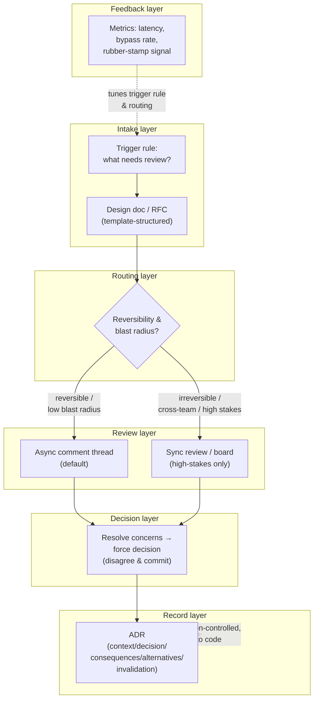
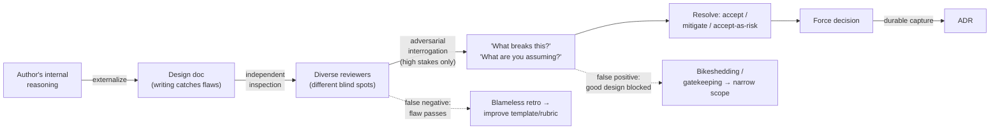
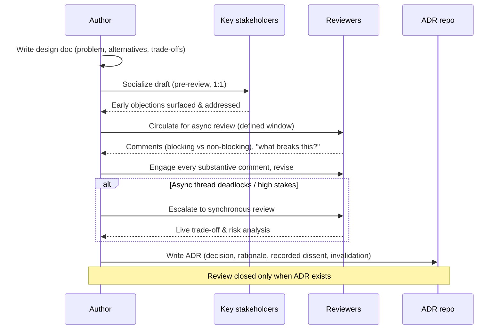

# Architecture Reviews

> Part of the **Enterprise Data & AI Architecture Handbook** — Phase-19 (Leadership & Technical Strategy), Chapter 02.
> Prerequisite: [Architecture Governance](../Phase-01/02_Architecture_Governance.md). Builds directly on [Technical Leadership](01_Technical_Leadership.md).

---

## Executive Summary

An architecture review is the deliberate practice of subjecting a consequential technical decision to structured scrutiny *before* it is committed — surfacing risks, testing trade-offs, and building alignment while change is still cheap. It is the operational forum where the technical-leadership discipline of [Chapter 01](01_Technical_Leadership.md) meets the governance machinery of [Architecture Governance](../Phase-01/02_Architecture_Governance.md): the place where decisions get made well, documented durably, and aligned across teams.

The central thesis of this chapter is that **the review's job is to improve the decision and the decision-maker, not to gatekeep**. A review done well catches a $2M mistake for the cost of a two-hour meeting and a well-written design doc; a review done badly becomes a bureaucratic toll booth that slows everything, rubber-stamps everything, or — worst — teaches good engineers to route *around* it. The difference between the two is almost entirely about *how* the review is run: whether it is right-sized to the decision's stakes, whether feedback is delivered as collaborative problem-solving rather than status combat, and whether it produces a durable, documented decision instead of an ephemeral verbal "looks good."

The single most important design principle — the one this chapter returns to repeatedly — is **match the review weight to the decision's reversibility and blast radius.** A two-way-door decision (easily reversed) deserves a lightweight async doc comment or nothing at all; a one-way-door decision (a data model, a table format, a security boundary, a multi-year platform commitment) deserves the full ceremony: a written design doc, pre-read, a live review with the right people, explicit trade-off analysis, and an [Architecture Decision Record](../Phase-01/03_Architecture_Decision_Records.md). Applying heavyweight process to reversible decisions is the most common way architecture-review programs become hated and bypassed; applying no process to irreversible ones is how organizations accumulate expensive, silent architectural debt.

This chapter is written for the person who runs reviews (the reviewer, the review-board chair, the design-doc author defending a proposal) and treats the review as a *system* with inputs (the design doc/RFC), a process (the review itself), outputs (a documented decision), and quality attributes (throughput, latency, false-positive/false-negative rates, and — critically — its effect on the culture of technical decision-making). Get the system right and it becomes one of the highest-leverage forums in the engineering organization; get it wrong and it becomes the thing everyone dreads and evades.

---

## Learning Objectives

After working through this chapter you will be able to:

- **Choose the right review format and cadence** for a given decision — from an async design-doc comment thread to a synchronous review board — matching process weight to the decision's stakes and reversibility.
- **Write and evaluate a design doc / RFC** that makes a proposal reviewable: clear problem statement, explicit trade-offs, considered alternatives, and a recommendation.
- **Conduct rigorous trade-off and risk analysis** in a review, distinguishing genuine risks from bikeshedding and surfacing the unstated assumptions where most bad decisions hide.
- **Give feedback that improves the decision without damaging the person or the relationship**, and **receive feedback** (as an author) without defensiveness — the two skills that most determine whether a review culture is healthy.
- **Produce durable decision documentation** (ADRs) so that review outcomes survive, rationale is preserved, and settled questions are not re-litigated.
- **Recognize and prevent the dominant failure modes** of architecture-review programs: gatekeeping bottlenecks, rubber-stamping, bikeshedding, HiPPO-driven decisions, and reviews that people route around.
- **Design an architecture-review program** for an enterprise data/AI platform organization that is fast enough to not impede delivery and rigorous enough to catch expensive mistakes.

---

## Business Motivation

The economic case for architecture reviews rests on a single well-established fact: **the cost of fixing a design flaw grows by orders of magnitude the later it is caught.** A flawed assumption caught in a design review costs a conversation; the same flaw caught after the system is built, integrated, and in production costs a re-architecture, a migration, and often an incident. Boehm's software-engineering cost data (and every subsequent replication) shows defect-fix cost rising roughly exponentially across the lifecycle. An architecture review is a mechanism for moving the catch-point as far left as possible — to before the expensive commitment is made.

In data and AI platform organizations the case is sharper still, for the same reasons that make technical leadership high-stakes there: the decisions are **long-lived, deeply coupled, and hard to reverse.** A storage-format choice, a governance model, a data-contract standard, or a landing-zone topology touches every downstream pipeline, model, and consumer — so a flaw that escapes review compounds across the entire platform for years. This handbook has documented a long list of once-defensible platform bets that aged badly (retired managed services, superseded table formats); a review forum is precisely where the durability judgment — "is this a fashionable choice or a durable one?" — gets stress-tested by people other than the enthusiastic author.

The second, subtler business value is **alignment and knowledge diffusion.** A review is where a cross-team decision gets socialized (the [Chapter 01](01_Technical_Leadership.md) pattern), where junior engineers learn how senior engineers reason, and where the organization's accumulated architectural judgment is applied to a new problem. A review program is therefore also a *teaching* and *culture* mechanism, not only a risk control.

The cost of *absent* review is predictable: expensive mistakes discovered late, incompatible designs built in parallel because no forum aligned them, accidental architecture emerging decision-by-decision with no coherence, and — because there was no documented rationale — the endless re-litigation of settled questions. The cost of *badly-run* review is equally real but different: delivery velocity throttled by a gatekeeping bottleneck, and a culture that either fears or evades the forum. The business goal is the narrow, valuable middle: reviews that are fast, rigorous, and genuinely improve decisions.

---

## History and Evolution

The practice of reviewing designs before building is old, but its modern, lightweight, decision-focused form is a recent synthesis of several traditions.

- **1970s–1980s: formal design reviews and inspections.** The earliest formalization came from Michael Fagan at IBM, whose "Fagan inspections" (1976) applied rigorous, checklist-driven peer review to designs and code. This tradition — heavyweight, gate-oriented, quality-assurance-driven — dominated large-systems and safety-critical engineering (and still does in aerospace and defense, per the certified-review processes referenced in [Aviation Data Platforms](../Phase-17/03_Aviation_Data_Platforms.md)).
- **1990s: architecture-evaluation methods.** As "software architecture" matured as a discipline, the Software Engineering Institute (SEI) developed structured architecture-evaluation methods — most notably **ATAM** (Architecture Tradeoff Analysis Method, ~1998) and its predecessor SAAM. ATAM formalized the idea that architecture reviews should be *trade-off-centric*: identifying how a design serves (or fails) its quality attributes and where the attributes conflict. This is the direct intellectual ancestor of the "trade-off analysis" at the heart of this chapter.
- **2000s: Enterprise Architecture governance.** Frameworks like **TOGAF** embedded architecture review into formal governance — the Architecture Board, compliance reviews, and the Architecture Contract (see [Architecture Governance](../Phase-01/02_Architecture_Governance.md)). This gave reviews organizational teeth but also, in many enterprises, made them heavyweight, gate-driven, and slow — the bureaucratic pathology this chapter warns against.
- **2010s: the design-doc / RFC renaissance.** The scaled internet companies (Google's design-doc culture, and the "RFC" process adopted at Amazon, Stripe, Uber, Oxide, Rust, and others) reinvented the practice in a lighter, faster, more distributed form: a written proposal circulated for asynchronous comment, with a synchronous review reserved for genuinely contentious or high-stakes decisions. This decoupled *documentation and socialization* (async, always) from *live review* (sync, only when needed) and is the model most modern engineering organizations aspire to.
- **2020s: reviews meet data, AI, and risk.** The rise of data platforms, MLOps, and agentic AI added new review dimensions — model risk, data governance, fairness, and privacy — and new stakeholders (security, legal, ethics). The Responsible-AI review board ([Responsible AI](../Phase-11/07_Responsible_AI.md)) and the data-contract review are recent, domain-specific descendants of the general architecture review.

The through-line is a slow oscillation between **rigor and speed**: heavyweight formal reviews catch more but cost more and get bypassed; lightweight async reviews are fast but can miss the high-stakes decision that needed real scrutiny. The modern synthesis — right-size the weight to the stakes — is the resolution this chapter teaches.

---

## Why This Technology Exists

Architecture reviews exist to solve a specific, structural problem: **the person closest to a decision is systematically the worst-positioned to see its flaws.** The author of a design has invested in it, is anchored on their chosen approach, holds unstated assumptions they can no longer see, and is motivated (consciously or not) to defend rather than interrogate it. This is not a character flaw; it is a cognitive universal — confirmation bias, the sunk-cost effect, and the curse of knowledge all pull the author toward their own conclusion. No amount of individual diligence fully corrects for it, because the blind spot is *structural*: you cannot see what you cannot see.

The review exists as the organizational answer to that structural blind spot: **a set of fresh, competent, differently-positioned eyes applied to the decision before it is committed.** A reviewer who did not author the design carries different assumptions, has different scars from different past failures, and is not anchored on the proposed approach — so they can ask the question the author never thought to ask ("what happens when this partition key gets hot?", "who can read this data after the join?", "how do you roll this back?"). This is the same reason distributed systems use independent replicas and the same reason [Reliability and SRE](../Phase-18/04_Reliability_and_SRE.md) uses blameless postmortems with people who weren't in the incident: independent perspective catches what the involved party structurally cannot.

The review also exists to **create the artifacts and alignment that a decision needs to be durable.** Forcing a decision through a review forces it to be *written down* (the design doc), forces its *rationale to be made explicit* (so it survives), and forces the *right people to be in the room* (so it aligns rather than surprises). A decision made in someone's head and implemented in a PR has none of these properties; the same decision run through a review acquires all of them. The review is therefore both an error-detection mechanism and a decision-durability mechanism — and the two functions reinforce each other.

---

## Problems It Solves

- **Structural author blind spots.** Fresh, independent reviewers catch the flaws, unstated assumptions, and missing considerations that the invested author structurally cannot see.
- **Expensive-mistake prevention.** By moving the catch-point left — before the irreversible commitment — reviews convert would-be re-architectures and production incidents into cheap pre-build conversations.
- **Cross-team alignment.** The review is the forum where a decision spanning multiple teams gets socialized and aligned, preventing the parallel construction of incompatible designs.
- **Decision durability.** Reviews force proposals to be written down and their rationale made explicit (design doc → ADR), so decisions survive personnel changes and settled questions aren't re-litigated.
- **Knowledge diffusion and mentorship.** Reviews are where junior engineers learn how senior engineers reason, and where the organization's accumulated architectural judgment is applied to new problems — a teaching forum as much as a control.
- **Consistency and standards enforcement.** Reviews are where cross-cutting standards (security baselines, data contracts, governance models) actually get applied to concrete designs rather than living only in a wiki nobody reads.
- **Risk surfacing.** Structured trade-off and risk analysis makes explicit the security, cost, reliability, and compliance risks that an unreviewed design would carry silently into production.

---

## Problems It Cannot Solve

- **It cannot fix a bad decision-making culture.** If leadership overrides reviews on a whim (the HiPPO problem), punishes reviewers for raising uncomfortable risks, or treats reviews as theater, no review *process* will produce good decisions. The review is a mechanism; the culture that runs it determines whether it works.
- **It cannot substitute for competence.** A review is only as good as its reviewers. A room full of people without the relevant expertise will miss the real risks and bikeshed the trivial ones. Reviews multiply existing judgment; they don't manufacture it.
- **It cannot catch what it cannot see.** A review of a design doc that omits the hard part (glosses over the failure mode, hides the assumption, understates the cost) will bless a flawed design. Reviews depend on honest, complete inputs; a dishonest or incomplete doc defeats them — which is why the quality of the *design doc* is as important as the review itself.
- **It cannot make irreducibly uncertain decisions certain.** Some designs rest on genuinely unknown information (an unproven scale requirement, an unbenchmarked technology). A review can *structure* that uncertainty (require a spike, demand a reversible first step, set a re-review checkpoint) but cannot manufacture the missing information.
- **It cannot scale by adding more ceremony.** Beyond a point, making reviews heavier makes them *worse*, not better — slower, more bypassed, more rubber-stamped. The failure mode of a struggling review program is almost never "not enough process."
- **It should not review everything.** Trying to route every decision through review is itself the primary anti-pattern: it creates a bottleneck, trains people to bypass the forum, and dilutes attention away from the decisions that actually warrant scrutiny.

---

## Core Concepts

### 2.1 Review Formats and Cadence

There is no single "architecture review" — there is a *spectrum* of formats, and choosing the right one for the decision is the foundational skill. From lightest to heaviest:

- **Asynchronous design-doc / RFC comment thread.** The author writes a proposal; reviewers comment asynchronously over a defined window (e.g., one week). No meeting unless the async thread reveals genuine contention. This is the *default* for most decisions in a mature review culture — it is fast, creates a written record, respects everyone's time, and reserves synchronous time for cases that need it. Google, Stripe, and Oxide run most decisions this way.
- **Lightweight synchronous review (pairing / small huddle).** A short, informal live discussion among a few people for a decision that benefits from real-time back-and-forth but doesn't warrant a formal board. Often triggered when an async thread stalls or gets contentious.
- **Formal architecture review board (ARB).** A standing forum with designated reviewers that examines high-stakes, cross-cutting decisions on a regular cadence. This is the TOGAF-style Architecture Board ([Architecture Governance](../Phase-01/02_Architecture_Governance.md)) — appropriate for genuinely consequential one-way-door decisions, and dangerous if it becomes the mandatory gate for *everything*.
- **Ad-hoc deep review / "architecture spike review."** A one-off, intensive review (sometimes multi-session, ATAM-style) for a single very large decision — a platform re-architecture, a major migration.

**Cadence** is the temporal dimension. A healthy program typically runs async reviews continuously (any time, any decision), a lightweight sync review on demand, and the formal board on a *predictable but not-too-frequent* cadence (e.g., weekly or biweekly office-hours slots that teams book into). The cadence anti-patterns are symmetric: too infrequent (the board becomes a bottleneck; decisions queue for weeks) and too frequent/mandatory (the board becomes a toll booth that reviews trivia and trains people to bypass it).

The governing rule, stated once and applied everywhere: **match the format weight to the decision's reversibility and blast radius.** Two-way door → async comment or nothing. One-way door with wide blast radius → formal review with the right people. Getting this mapping right is most of what separates a loved review program from a hated one.

### 2.2 Design Docs and RFCs

The design doc (or RFC — Request For Comments) is the *input artifact* that makes a decision reviewable. Its function is to externalize the author's thinking into a form that fresh eyes can interrogate. A good design doc is not a specification of *what* will be built; it is an *argument for why this approach is the right one*, structured so a reviewer can find the weak points. The canonical structure:

- **Problem statement / context.** What are we solving, why now, for whom, and what constraints apply? A large fraction of bad reviews are actually reviews of a badly-framed problem — the doc answers the wrong question well.
- **Goals and non-goals.** Explicitly scoping *out* is as important as scoping in; non-goals prevent the review from sprawling into everything.
- **Proposed design.** The recommended approach, in enough detail to evaluate — but not more.
- **Alternatives considered.** The genuinely-considered options that were rejected, *with the reasons*. This section is the single strongest signal of design-doc quality: a doc with no real alternatives is either a decision with no real choice (suspicious) or an author who didn't do the work (a review red flag).
- **Trade-offs and risks.** Honest statement of what this design gives up, what could go wrong, and the mitigations.
- **Cross-cutting concerns.** Security, privacy, cost, reliability, operability, data governance — the dimensions a narrow "does it work?" review misses.
- **Rollout / migration / rollback plan.** How it gets deployed, and — critically — how it gets *undone* if wrong.

The RFC *process* wraps the doc: the author circulates it, reviewers comment over a window, the author responds and revises, and the decision is recorded. The discipline that makes it work is that **the author must engage every substantive comment** — not necessarily accept it, but acknowledge and reason about it — so reviewers know their input mattered (the reciprocity that keeps people reviewing).

### 2.3 Trade-off and Risk Analysis

The intellectual core of an architecture review is trade-off analysis: **every non-trivial design decision trades some quality attributes against others, and the review's job is to make those trades explicit and check that they're the right ones for this context.** A design that "has no trade-offs" is a design whose trade-offs haven't been found yet — which is exactly the dangerous state a review exists to correct.

The ATAM tradition provides the discipline: identify the architecturally-significant quality attributes (latency, throughput, cost, security, reliability, operability, evolvability), identify the *sensitivity points* (decisions that strongly affect one attribute) and *trade-off points* (decisions that improve one attribute at another's expense), and examine whether the chosen point serves the *business's actual priorities*. A design optimized for latency at the cost of operability may be exactly right for a trading system and exactly wrong for a back-office batch pipeline — the review's job is to check the fit, not to declare one "better" in the abstract.

Risk analysis is the forward-looking companion: for each significant risk, name it, estimate its likelihood and impact, and identify the mitigation or the explicit acceptance. The most valuable review skill here is **surfacing the unstated assumption** — the "this will never get more than 10K records," the "we'll only ever have one region," the "the upstream team will never change this schema" — because unstated assumptions are where most architectural disasters are seeded. A reviewer's highest-value question is often simply "what are you assuming that, if false, breaks this?"

### 2.4 Giving and Receiving Feedback

The technical rigor of a review is worthless if the *human dynamics* are wrong. The two skills that most determine whether a review culture is healthy — more than any process detail — are giving feedback well and receiving it well.

**Giving feedback** in a review means attacking the design, never the designer; framing critique as collaborative problem-solving ("what happens to this design if X?") rather than status combat ("this is wrong"); distinguishing *blocking concerns* (real risks that must be resolved) from *non-blocking suggestions* (preferences, nice-to-haves) so the author knows what actually matters; and — critically — *justifying* critique with reasoning rather than authority ("I'm worried about this because..." not "I wouldn't do it that way"). The best reviewers ask questions more than they issue verdicts, because a question invites the author to reason rather than defend, and often reveals context the reviewer lacked.

**Receiving feedback** as an author means treating critique as a gift of free error-detection rather than an attack; separating your ego from your design (the design being flawed does not mean *you* are); engaging every substantive concern honestly; and being genuinely willing to change your mind — while also being willing to *defend* a decision with reasoning when a reviewer is wrong. The author who cannot receive feedback poisons the review (reviewers stop bothering); the author who accepts every comment uncritically also poisons it (the review becomes design-by-committee with no coherent owner).

The cultural stakes are high and fragile: a single senior person who humiliates an author in a review, or a single author who reacts to every critique with defensiveness, can teach an entire organization that reviews are dangerous — and people will quietly route around them. Psychological safety ([Reliability and SRE](../Phase-18/04_Reliability_and_SRE.md)'s blameless principle, applied to design) is the precondition for reviews to work at all.

### 2.5 Decision Documentation

A review that produces a verbal "looks good, ship it" and no artifact has failed at half its job. The *output* of a review must be a **durable, documented decision** — the [Architecture Decision Record](../Phase-01/03_Architecture_Decision_Records.md): context, decision, consequences, alternatives, and (per [Chapter 01](01_Technical_Leadership.md)'s ADR-0198) an explicit invalidation condition. The design doc captures the *proposal and the reasoning*; the ADR captures the *decision and its rationale* as a first-class, findable, version-controlled record.

This matters because the review's value decays to zero if its outcome isn't preserved. Six months later, when someone asks "why did we choose this?", the answer must be a document, not "ask Priya, she was in the meeting" (and Priya has left). Undocumented review outcomes guarantee re-litigation, lost rationale, and the silent erosion of decisions that everyone forgot the reasons for. The discipline is simple and non-negotiable: **every consequential review produces an ADR before it is considered closed**, and the ADR is stored where the next engineer will find it — version-controlled alongside the platform it governs.

---

## Internal Working

### 3.1 The Review as an Error-Detection Pipeline

Mechanically, an architecture review functions as a multi-stage error-detection pipeline, and understanding the stages explains where reviews succeed and fail:

1. **Externalization** (design doc): the author's internal reasoning is forced into written form. This stage alone catches a surprising fraction of flaws — *writing forces clarity*, and authors routinely discover their own design's problems in the act of documenting it. A review program that produces good design docs gets error-detection value even before any reviewer reads them.
2. **Independent inspection** (async comments): fresh eyes, each carrying different assumptions and different scar tissue, scan the externalized design. The detection power here is roughly proportional to the *diversity* of the reviewers — five people with identical backgrounds catch less than three with different ones, because they share the same blind spots.
3. **Adversarial interrogation** (live review, when needed): the highest-value questions ("what breaks this?", "what are you assuming?") stress the design against scenarios the author didn't consider. This stage is expensive (synchronous time) and is why it's reserved for high-stakes decisions.
4. **Resolution and decision**: concerns are resolved (accepted, mitigated, or explicitly accepted-as-risk), and a decision is forced (with disagree-and-commit where consensus fails, per [Chapter 01](01_Technical_Leadership.md)).
5. **Durable capture** (ADR): the decision and rationale are recorded.

The pipeline framing makes the failure modes precise: a review that skips stage 1 (no written doc) has nothing to inspect; one that lacks diversity in stage 2 shares the author's blind spots; one that never reaches stage 3 for a high-stakes decision misses the adversarial catch; one that skips stage 5 loses the outcome.

### 3.2 The False-Positive / False-Negative Trade-off

Like any detector, a review has two error types, and they trade off against each other:

- **False negatives** (a bad design passes review): the review missed a real flaw. Caused by insufficient rigor, missing expertise, an incomplete doc, or rubber-stamping.
- **False positives** (a good design is blocked or delayed): the review raised a concern that wasn't real, or bikeshedded a trivial point into a blocker, or gatekept a reversible decision that didn't need scrutiny.

A review program tuned for *zero false negatives* (catch everything) drifts toward heavyweight, slow, everything-must-be-reviewed gatekeeping — which maximizes false positives (blocking/delaying good work) and drives bypass. A program tuned for *zero false positives* (never slow anyone down) drifts toward rubber-stamping — which maximizes false negatives (bad designs ship). The art is setting the operating point *per decision*: high-stakes irreversible decisions warrant a low false-negative tolerance (accept some friction to catch the flaw); low-stakes reversible ones warrant a low false-positive tolerance (accept some risk to preserve velocity). This is, again, the reversibility-and-blast-radius principle, now expressed as detector tuning.

### 3.3 Socialization Coupling

A subtle but critical internal dynamic: the *formal* review and the *informal* socialization (from [Chapter 01](01_Technical_Leadership.md)) are coupled, and a review that relies solely on the formal forum to build alignment will usually fail. In a healthy process, the author has already socialized the proposal — shared the draft, gathered feedback, addressed the big objections — *before* the formal review, so the review *ratifies* an already-aligned decision rather than attempting to forge alignment live under time pressure. A review where a major stakeholder sees the proposal for the first time, in the room, and raises a fundamental objection has failed at socialization, not at review; the fix is upstream (socialize first), not more review time. The formal review is the visible tip; the invisible pre-work is where alignment is actually built.

---

## Architecture

An architecture-review *program* can itself be modeled as a layered architecture:

- **Intake layer.** How decisions enter the review system: a trigger rule (what requires review), a design-doc template, and a lightweight submission mechanism (a PR to a docs repo, a form, a queue). The intake layer's design determines whether the program catches the right decisions (not too many, not too few).
- **Routing layer.** How a submitted decision is matched to the right *format* and the right *reviewers*: async-only vs. needs-a-meeting, and which specific experts (security, data governance, the domain team) must be involved. Bad routing is a top cause of both bottlenecks (everything to the board) and misses (no security reviewer on a security-relevant design).
- **Review layer.** The actual inspection — async threads, sync discussions, the board — where trade-off and risk analysis happens.
- **Decision layer.** Where concerns are resolved and the decision is forced, with a named decision-maker and disagree-and-commit for unresolved dissent.
- **Record layer.** The ADR repository and design-doc archive — the durable memory (the [Chapter 01](01_Technical_Leadership.md) Storage discipline).
- **Feedback layer.** How the program observes and improves *itself*: metrics on throughput, latency, bypass rate, and post-hoc "did we catch/miss the right things?"

The architecture makes the design decisions explicit: a program is only as good as its intake and routing layers, because those determine whether the *right* decisions get the *right* scrutiny — and most struggling review programs have a broken intake (reviews everything or nothing) or broken routing (wrong people, wrong format) rather than a broken review layer.

---

## Components

The concrete, nameable components of an architecture-review system:

- **The design doc / RFC.** The reviewable input artifact (§2.2).
- **The design-doc template.** The standard structure that ensures docs are complete and reviewable — problem, goals/non-goals, proposal, alternatives, trade-offs, cross-cutting concerns, rollout/rollback.
- **The reviewers.** The people applying scrutiny — ideally diverse in expertise and perspective, and including the specific experts a decision requires (security, data governance, SRE, the affected domain teams).
- **The review forum / board.** The venue (async thread, sync meeting, standing ARB) where review happens.
- **The trigger rule / review policy.** The explicit statement of *what requires review* (e.g., "any one-way-door decision, any cross-team interface, any new data classification, any security-boundary change") — the intake layer's core logic.
- **The reviewer checklist / rubric.** A standard set of questions reviewers apply (security, cost, reliability, data governance, operability, reversibility) so reviews are consistent and don't miss whole dimensions.
- **The decision record (ADR).** The durable output (§2.5).
- **The decision-maker / chair.** The named person accountable for forcing the decision to closure (not a diffuse committee).
- **The metrics dashboard.** Throughput, latency, bypass rate, re-review rate — the feedback layer's instruments.

---

## Metadata

The metadata of an architecture review is the *contextual information that makes a review and its outcome legible and traceable*. Each reviewed decision should carry: *what* was decided, *who* decided and who reviewed, *when*, *what stakes/reversibility class* it was assigned (which justifies the review weight applied), *what concerns were raised and how each was resolved*, *what alternatives were rejected and why*, and *what would invalidate the decision*. Most of this is captured by a well-structured design doc plus its ADR, and the linkage between them — design doc ↔ review thread ↔ ADR ↔ the code/infrastructure it governs — is the metadata that lets a future engineer reconstruct not just *what* was decided but *how well it was scrutinized* and *whether the scrutiny still holds*. The most frequently-missing and most valuable piece is the record of *concerns raised and resolved*: a decision that shows "these three risks were raised, here's how each was addressed" is far more trustworthy (and far more safely changeable) than a bare "approved," because the next engineer can see what the reviewers were worried about and check whether those worries have since materialized.

---

## Storage

The storage layer of an architecture-review program is the **durable archive of design docs and decision records** — the institutional memory of *what was decided and why it was scrutinized the way it was.* This is the same discipline as [Chapter 01](01_Technical_Leadership.md)'s leadership-memory Storage section, specialized to review outputs. Poorly-stored review outcomes evaporate exactly like poorly-stored decisions: the design doc lives in someone's personal drive, the ADR was never written, and six months later the rationale is gone. The storage mechanisms are concrete and should be treated with data-governance rigor ([Phase-08](../Phase-08/01_Data_Governance_Foundations.md)): design docs and ADRs stored version-controlled (Git) alongside the platform code they govern, *findable* (indexed, searchable, linked from the code), *trustworthy* (dated, attributed, versioned, with superseded decisions explicitly marked), and *maintained* (an ADR invalidated by events but never marked superseded is actively harmful, because people still trust it). A specific, high-value storage practice: link every ADR back to the design doc and review thread that produced it, so the *depth of scrutiny* is recoverable, not just the conclusion — this is what lets a future team safely revisit a decision rather than blindly re-deciding or blindly trusting.

---

## Compute

The scarce "compute" of an architecture-review program is **reviewer attention** — specifically the attention of the small number of senior people qualified to review the hardest decisions. This is the review-program instance of [Chapter 01](01_Technical_Leadership.md)'s attention-as-scarce-resource principle. Senior reviewer time is the binding constraint: there are never enough qualified reviewers to give every decision a deep review, so the program *must* triage — spend the scarce senior attention on the high-stakes, high-blast-radius decisions and deliberately *not* review the reversible trivia. A program that routes everything to its best reviewers burns them out, creates a bottleneck, and paradoxically *lowers* overall review quality (exhausted reviewers rubber-stamp). The compute-optimization discipline is therefore exactly the intake/routing design: a good trigger rule and routing layer protect scarce reviewer attention by ensuring it's spent only where it earns its cost. Two concrete techniques mirror distributed-systems load management: *async-first* (most reviews consume no synchronous senior time at all — comments are given when convenient), and *reviewer rotation / broadening the bench* (deliberately growing more people capable of reviewing, so the load isn't single-threaded through two overloaded principals — the [Chapter 01](01_Technical_Leadership.md) reproduce-leadership pattern applied to reviewing).

---

## Networking

If reviewer attention is the compute, then **the relationships and communication channels among authors, reviewers, and stakeholders are the network** through which a review actually functions. A review is fundamentally a *communication* event, and its effectiveness is bounded by the quality of the channels: the async comment thread (the primary "network protocol" of a modern review program), the pre-read distribution, the socialization conversations that precede the formal review (§3.3), and the relationships that determine whether feedback is received as help or as attack. A review between people who trust each other and have a working relationship is enormously more productive than one between strangers or adversaries — the same critique lands as collaborative problem-solving in the first case and as a threat in the second. This is why cross-team relationship investment ([Chapter 01](01_Technical_Leadership.md)'s Networking section) directly determines review quality: the security reviewer who already has a good relationship with the platform team will get an honest, complete design doc and will give feedback that gets genuinely integrated; the one who is a feared external gatekeeper will get a doc that hides the hard parts and feedback that gets worked around. The *topology* matters too: a program where reviews flow through established cross-team channels (a shared docs repo, a known review forum) diffuses knowledge broadly, whereas one where reviews happen in private DMs between two people creates neither the record nor the diffusion that give reviews their secondary value.

---

## Security

Security has two meanings for an architecture-review program, both important. First, **security *as a review dimension*: the review is one of the most effective points to catch security and privacy flaws before they ship** — a design-time threat model ([Security Foundations](../Phase-10/01_Security_Foundations.md)'s STRIDE) is far cheaper than a post-incident forensic one. A mature review program makes security a *first-class, non-optional review dimension* (on the rubric, with a security reviewer in the loop for security-relevant designs), because security flaws are precisely the kind of expensive, hard-to-reverse mistake that reviews exist to catch, and precisely the kind that an enthusiastic feature-focused author is prone to miss. The access-control-propagation and least-privilege questions that recur throughout this handbook ("who can read this data after this join?", "does this tool have more privilege than it needs?") belong on every data/AI design review.

Second, **the *integrity of the review process itself*: reviews handle sensitive information (architectural weaknesses, unshipped security designs, data-classification decisions) and confer influence, so the process must be governed.** A review board that can be captured (a HiPPO who overrides risk findings), bypassed (decisions that skip review because the author has clout), or gamed (a doc that hides the hard part to sail through) is a corrupted control. The defenses mirror the [Chapter 01](01_Technical_Leadership.md) trust-integrity discipline: the process must apply *equally regardless of the author's seniority* (the most senior person's design gets the same scrutiny — arguably more, since their designs have wider blast radius and their reviewers are more reluctant to challenge them), risk findings must be recorded even when overruled (so an overruled-and-later-realized risk is traceable), and the review must actively invite dissent rather than reward the confident-and-unchallenged proposal — the same "most dangerous decision is a wrong one advocated by a highly-trusted, unchallenged leader" risk from [Chapter 01](01_Technical_Leadership.md), now applied to the review room.

---

## Performance

The performance of a review *program* is measured not in the abstract quality of any one review but in system-level throughput and latency:

- **Review latency** — how long from "design doc submitted" to "decision recorded." High latency is the primary driver of the most damaging outcome: teams routing *around* the review to hit deadlines. A program whose reviews take three weeks will be bypassed by anyone under delivery pressure, which is everyone.
- **Review throughput** — how many decisions the program can process per unit time without the senior-reviewer bottleneck saturating. Governed by the async-first ratio and the size of the reviewer bench.
- **Catch rate (recall)** — of the flawed designs that entered review, what fraction were caught? Hard to measure directly (you don't see the counterfactual) but approximable via post-incident review ("was this a design flaw that a review should have caught?").
- **False-positive rate** — how often does the review block or delay a decision that was actually fine? High false positives erode trust in the program and drive bypass just as latency does.

The key performance insight is that **latency and rigor are in tension, and the resolution is not to compromise on both but to *separate* them**: run most decisions through fast async review (low latency, adequate rigor for their stakes) and reserve the slow, rigorous, high-latency full review for the few decisions that warrant it. A program with a single one-size-fits-all review process is forced to choose one operating point for all decisions and will be either too slow for the trivial ones or too shallow for the critical ones. Right-sizing is a *performance* optimization as much as a quality one.

---

## Scalability

A review program scales the same way technical leadership scales ([Chapter 01](01_Technical_Leadership.md)): by **reducing the load that must flow through the scarce central resource, not by heroically increasing that resource's throughput.** The naive scaling failure is routing an ever-growing organization's every significant decision through a single central architecture board staffed by two principals — the board becomes a hard throughput ceiling on the entire organization's decision-making, a weeks-long queue, and a bus-factor risk. The scalable alternatives:

- **Push reviews to the edge (federated review).** Most decisions are reviewed *within* the team or domain by local senior engineers, with only genuinely cross-cutting or high-blast-radius decisions escalating to a central forum. This is the [Data Mesh](../Phase-15/04_Federated_Governance.md) federated-governance model applied to reviews: global standards, local enforcement, escalation only for the genuinely global.
- **Encode standards so they don't need per-instance review.** The highest-leverage scaling move: turn a recurring review concern into an automated check or a golden-path template (a security baseline enforced by [Azure Policy](../Phase-09/04_Infrastructure_as_Code_with_Terraform.md), a data-contract check in CI) so the hundredth instance of the same decision is verified automatically instead of re-reviewed manually. Every recurring manual review finding is a candidate for automation.
- **Grow the reviewer bench.** Deliberately develop more people capable of reviewing (the reproduce-leadership pattern), so review capacity grows with the organization rather than bottlenecking on a fixed few.

The anti-pattern — the central board as the mandatory gate for everything — feels like rigor and is actually a scalability ceiling that guarantees either a bottleneck or a bypass. A review program that hasn't federated and automated will hit a wall as the organization grows.

---

## Fault Tolerance

Reviews are fallible — they miss flaws (false negatives) and block good designs (false positives) — so a mature review program builds in tolerance for its own errors rather than assuming reviews are infallible gates:

- **Reversibility-first design.** The strongest fault tolerance is preferring reversible decisions and reversible rollouts (feature flags, canaries, staged migrations) so that a flaw the review *missed* is caught cheaply in a limited production blast radius rather than catastrophically. A review is a filter, not a guarantee; the deployment discipline behind it ([Reliability and SRE](../Phase-18/04_Reliability_and_SRE.md)) is the backstop.
- **Re-review checkpoints.** For decisions made under genuine uncertainty, the review can *decide to decide later* — approve a reversible first step and set an explicit checkpoint to re-review once real information exists, rather than forcing false certainty now.
- **Recorded dissent.** When a review overrules a raised concern (or a decision-maker overrules the review), the dissent is *recorded* in the ADR, so if the risk materializes, the organization knows exactly which decision to revisit rather than re-arguing from scratch. This is the disagree-and-commit fault-tolerance mechanism from [Chapter 01](01_Technical_Leadership.md), applied to review outcomes.
- **Blameless review retrospectives.** When a bad design *does* ship despite review (a false negative that caused an incident), the response is a blameless examination of *why the review missed it* (missing reviewer expertise? incomplete doc? rubber-stamping under time pressure?) that improves the *program*, not a hunt for who to blame — because a review culture that punishes reviewers for misses teaches them to block everything defensively (maximizing false positives), the worst failure mode.

The most important fault-tolerance property is the program's willingness to admit its own misses and improve, rather than either defending every review as correct or abandoning review after a miss.

---

## Cost Optimization

The costs of an architecture-review program are denominated in the organization's scarcest resources: **senior reviewer time, author time (writing docs, revising), and decision latency (blocked or delayed work).** Optimizing them is, once again, the reversibility-matching principle expressed as cost control:

- **Don't over-review two-way doors.** The dominant waste in review programs is applying full ceremony — design doc, board slot, multi-reviewer scrutiny — to easily-reversible decisions whose expected cost-of-being-wrong is far below the cost of the review. Decide those fast, async or not at all.
- **Do invest in one-way doors.** Under-reviewing an irreversible, wide-blast-radius decision to "save time" is the catastrophic false economy: the review costs hours; the missed flaw costs a re-architecture and an incident.
- **Automate recurring findings.** Every review concern that recurs (the same security check, the same tagging requirement, the same data-contract validation) should be converted from manual review labor into an automated gate — paying the automation cost once instead of the review cost every time.
- **Async-first to minimize synchronous cost.** Synchronous review time is the most expensive form (N senior people, same hour); reserve it for genuine contention and run everything else async.

**Worked FinOps-style example.** Consider a mid-size platform org running a mandatory weekly architecture board that reviews *every* significant change — say 15 decisions per week, each consuming a 1-hour slot with 5 senior reviewers present. That is 75 senior-engineer-hours per week (~€150–225K/year fully loaded) spent largely on decisions that didn't need a board, *plus* the latency cost: teams wait up to a week for a slot, and under deadline pressure some route around the board entirely (creating the unreviewed-high-stakes-decision risk the board existed to prevent). Re-architecting the program — async-first for the ~12 reversible decisions (near-zero synchronous cost), reserving the board for the ~3 genuinely high-stakes ones, and automating two recurring findings (a security-baseline check and a tagging check) into CI — cuts synchronous reviewer time by ~75% (to ~15–20 hours/week), collapses review latency for most decisions from days to hours, *and* increases the depth of scrutiny on the decisions that actually matter (the board now has time for real trade-off analysis on 3 decisions instead of rushing 15). The lesson is the general one: **a review program's cost is dominated by mis-routing — spending scarce scrutiny on decisions that don't need it — and right-sizing simultaneously cuts cost, cuts latency, and raises quality where it counts.** Cheaper, faster, *and* better is achievable here precisely because the default state is so badly mis-tuned.

---

## Monitoring

Monitoring a review program means tracking the **leading indicators of program health** so its degradation is caught before it becomes a crisis (a bottleneck that stalls delivery, or a rubber-stamp that ships flaws):

- **Review latency distribution** — time from doc-submitted to decision-recorded, watched at p50 and p95. Rising latency is the earliest signal of a bottleneck and a leading indicator of bypass.
- **Bypass rate** — how many consequential decisions shipped *without* going through review. The single most important and most under-measured metric; a rising bypass rate means the program is too slow, too painful, or too gatekeeping, and people are routing around it. Detectable by sampling shipped changes against the review record.
- **Approval rate / rubber-stamp signal** — a review program that approves ~100% of what it sees with few substantive concerns is likely rubber-stamping (or reviewing only trivia). Healthy reviews change designs.
- **Re-review / re-litigation rate** — how often supposedly-decided questions come back. High rates signal decisions weren't documented (no ADR) or weren't really aligned.
- **Reviewer load distribution** — is review work concentrated on two overloaded principals (a scaling/bus-factor risk) or spread across a healthy bench?
- **Post-incident "should-have-caught" rate** — of production incidents rooted in design flaws, how many went through a review that missed them (false negatives)?

The point mirrors production monitoring: distinguish "the program is healthy" from "the program is degrading" *before* it fails — before the bottleneck stalls the org or the rubber-stamp ships the disaster.

---

## Observability

Where monitoring watches known indicators, **observability is the ability to ask *why* the review program is behaving as it is** — to root-cause a problem you didn't have a pre-built metric for. When bypass rate rises, or reviews feel useless, or a bad design slipped through, observability is the practice of investigating the *actual* cause rather than assuming it. The instruments are qualitative: reading the actual review threads (are reviewers engaging substantively or rubber-stamping?), talking to authors (do they experience review as help or as a toll booth?), talking to bypassers (why did they route around it — too slow? felt pointless? feared the gatekeeper?), and examining the misses (what specifically did the review fail to see, and why?). The recurring insight — the review-program instance of the handbook's pervasive pattern — is that **the surface symptom is rarely the root cause**: "engineers are bypassing review" is a symptom whose real cause might be latency (the review is too slow for their deadlines), or culture (a specific reviewer humiliates authors, so people avoid them), or scope (the review is mandatory for reversible trivia that doesn't warrant it), or value (reviews produce no useful feedback, so why bother). Each root cause demands a completely different fix — speed it up, address the reviewer's behavior, narrow the trigger rule, or improve reviewer quality — and acting on the symptom without the diagnosis (e.g., responding to bypass by making review *mandatory and enforced*, when the real cause was that it was too slow) predictably makes it worse. Diagnose before you intervene.

---

## Operational Response Playbook

Concrete, repeatable responses to the two most common acute failures of a review program. Each follows a signal → diagnosis → response structure.

### Playbook 1: The review board has become a bottleneck (or is being bypassed)

| Step | Action |
|------|--------|
| **Signal** | Review latency (p95) is climbing into weeks; teams complain the board blocks delivery; sampling shows consequential decisions shipping *without* review (rising bypass rate). |
| **Diagnose the real cause** | Investigate rather than assume defiance (Observability discipline). Usual causes: (a) the trigger rule is too broad — the board reviews reversible trivia it shouldn't; (b) it's a single-queue bottleneck — everything routes through two overloaded principals; (c) latency — teams route around it to hit deadlines; (d) low value — reviews produce no useful feedback. |
| **Immediate mitigation** | Narrow the trigger rule to *only* one-way-door / cross-team / high-blast-radius decisions; move everything else to async-only or no review. Add async-first as the default so most decisions never consume a board slot. Publish a fast-path SLA (e.g., async decisions get feedback within 2 business days). |
| **Structural fix** | Federate: push local-scope reviews to team/domain senior engineers, reserve the central board for genuinely global decisions. Automate recurring findings into CI gates so they stop consuming manual review. Broaden the reviewer bench so review isn't single-threaded. |
| **Do NOT** | Do not respond to bypass by making review *more* mandatory and *more* enforced without fixing the underlying latency/scope problem — that accelerates the bypass and poisons the program's reputation. Enforcement without speed/value is counterproductive. |

### Playbook 2: Reviews are rubber-stamping (a bad design shipped that review should have caught)

| Step | Action |
|------|--------|
| **Signal** | Approval rate is ~100% with few substantive concerns; a production incident traces to a design flaw that went *through* review; authors and reviewers both treat the review as a formality. |
| **Diagnose (blamelessly)** | Examine *why* the review missed it, not *who* to blame. Usual causes: (a) missing expertise — no reviewer qualified in the relevant dimension (e.g., no security reviewer on a security-relevant design); (b) incomplete doc — the design doc hid or glossed the hard part; (c) reviewer overload — exhausted reviewers rubber-stamp; (d) HiPPO/seniority — the author was senior enough that reviewers were reluctant to challenge; (e) no real trade-off analysis — the review checked "does it work?" not "what does it trade off and risk?". |
| **Immediate response** | Fix the specific miss: strengthen the doc template to force the omitted dimension; ensure the right expert reviewers are routed to relevant designs (a reviewer-routing rule by decision type); add the missed dimension to the reviewer rubric/checklist. |
| **Structural fix** | Make substantive engagement the norm: reviewers ask "what breaks this?" and "what are you assuming?" as standing questions; require every review to explicitly address the cross-cutting dimensions (security, cost, reliability, data governance, reversibility) via the rubric; apply the *same scrutiny regardless of author seniority* (record the rule explicitly); protect reviewer capacity so scrutiny isn't rushed. Run a blameless retrospective on the miss and feed the lesson back into the template/rubric. |
| **Do NOT** | Do not overcorrect into defensive blocking (rejecting/delaying everything to avoid another miss) — that trades the rubber-stamp failure for the bottleneck failure. The target is *substantive* review, not *slow* review. |

---

## Governance

Architecture review *is* a governance function — it is the operational point where the abstract governance framework of [Architecture Governance](../Phase-01/02_Architecture_Governance.md) touches concrete decisions. But the review program *itself* also requires governance, and the two must be distinguished:

- **Review as the enactment of governance.** The review is where architecture principles, standards, security baselines, data-governance policies, and the target-state architecture actually get *applied* to real designs rather than living inertly in a wiki. A governance framework without a review forum to enact it is aspirational; a review forum without a governance framework to apply is inconsistent and personality-driven. The two are complementary — framework provides the *what*, review provides the *how it gets applied to this decision*.
- **Governance of the review program.** The program needs its own explicit rules: a *trigger policy* (what requires review, at what weight), a *reviewer-routing policy* (who must review what), a *decision-authority policy* (who can approve, who can overrule, and how overrules are recorded), an *escalation path* (what happens when a review deadlocks), and a *self-improvement mechanism* (metrics + retrospectives). Without these, the program drifts into either bureaucracy (everything reviewed, slowly) or capture (senior people's designs skip scrutiny).
- **The critical governance rule** — echoing the [Chapter 01](01_Technical_Leadership.md) and Security sections: **the process applies equally regardless of author seniority, and overruled risk findings are always recorded.** A governance function that the powerful can bypass or capture is not a control; it is theater with a control's costume. ADR-0199 below makes the right-sizing and equal-application discipline concrete.

The federated-governance tension from [Data Mesh](../Phase-15/04_Federated_Governance.md) applies directly: too centralized (everything to the board) creates a bottleneck; too decentralized (every team reviews only itself) loses cross-cutting coherence. The resolution is the same — global standards and high-blast-radius decisions reviewed centrally, local decisions reviewed locally.

---

## Trade-offs

- **Rigor vs. speed.** More thorough reviews catch more flaws but take longer and risk becoming bottlenecks; faster reviews preserve velocity but risk missing the flaw. The resolution is not a compromise on both but *separation* — fast for reversible, rigorous for irreversible.
- **Centralized vs. federated review.** A central board gives consistency and cross-cutting coherence but bottlenecks and doesn't scale; federated team-level review scales and is fast but risks inconsistency and missed cross-cutting concerns. Match by blast radius: global decisions central, local decisions local.
- **Synchronous vs. asynchronous.** Sync reviews enable rich real-time trade-off discussion but are expensive (N people, same hour) and hard to schedule; async reviews are cheap, respect time, and create a written record but can miss the nuance that live back-and-forth surfaces. Async-first, sync-when-contentious.
- **Formal gate vs. advisory forum.** A review with blocking authority has teeth but breeds gatekeeping, bypass, and adversarial dynamics; a purely advisory review preserves autonomy and goodwill but can be ignored on the decisions that most needed it. The balance depends on the decision's stakes and the organization's culture.
- **Thoroughness vs. bikeshedding.** Deep scrutiny catches real risks but, undisciplined, degenerates into arguing about trivia (the "bikeshed" — endless debate on the easy, visible, low-stakes detail while the hard, important one goes unexamined). Distinguishing blocking from non-blocking, and focusing on trade-offs and assumptions, is the defense.
- **Documentation cost vs. durability.** Writing thorough design docs and ADRs costs author time; skipping them saves time now but guarantees lost rationale and re-litigation later. Worth it for consequential decisions, wasteful for trivial ones.

---

## Decision Matrix

*Which review format for which decision? A guide for the intake/routing layer.*

| Decision characteristics | Recommended format | Why | When NOT to use it |
|--------------------------|--------------------|-----|--------------------|
| Reversible, low blast radius (two-way door) | No review, or async comment | Cost-of-being-wrong is below review cost; preserve velocity | When it's secretly a one-way door (creates lock-in / data model / interface) |
| Moderate stakes, single-team scope | Async design-doc review within the team | Adequate rigor, low latency, written record, no central bottleneck | When it has cross-team impact the team can't see |
| High stakes OR cross-team OR irreversible | Formal review with the right experts | Warrants deep trade-off/risk analysis and broad alignment | When speed genuinely dominates and the decision is actually reversible |
| Security / privacy / data-classification relevant | Review with a required security/governance reviewer | These are the expensive, hard-to-reverse flaws reviews exist to catch | Never skip the security dimension on data/AI designs |
| Very large (platform re-architecture, major migration) | Ad-hoc deep / multi-session (ATAM-style) review | Complexity warrants intensive, structured trade-off analysis | For anything smaller — the ceremony is wasteful |
| Contentious (async thread deadlocked) | Escalate async → synchronous review | Live back-and-forth resolves what async can't | When one more async round would resolve it |
| Recurring, standardized decision | Automated gate / golden-path template, not review | Encode the standard once; stop re-reviewing the same thing | When each instance genuinely differs and needs judgment |

---

## Design Patterns

- **Right-size the review to the decision.** Match format weight to reversibility and blast radius — the foundational pattern from which most others follow.
- **Async-first, sync-when-contentious.** Default to asynchronous design-doc review; reserve expensive synchronous time for genuine contention or high stakes.
- **Design doc as the reviewable artifact.** Force decisions into a written, structured doc (problem, goals/non-goals, proposal, *alternatives with reasons*, trade-offs, cross-cutting concerns, rollback) before review — the writing itself catches flaws.
- **Socialize before the formal review.** Build alignment through pre-review conversations so the formal review ratifies an already-aligned decision rather than forging alignment live ([Chapter 01](01_Technical_Leadership.md), §3.3).
- **Reviewer rubric / checklist.** Apply a standard set of cross-cutting questions (security, cost, reliability, data governance, operability, reversibility) so reviews are consistent and don't miss whole dimensions.
- **Blocking vs. non-blocking feedback.** Explicitly distinguish real risks that must be resolved from preferences and nice-to-haves, so authors know what actually matters.
- **Ask questions, don't issue verdicts.** Frame critique as "what happens when X?" rather than "this is wrong" — invites reasoning, surfaces missing context, and keeps the dynamic collaborative.
- **Federate and automate.** Push local decisions to local reviewers, escalate only cross-cutting ones, and turn every recurring review finding into an automated gate or golden-path template.
- **Every review produces an ADR.** The decision and rationale are recorded before the review is considered closed — durable output, no exceptions for consequential decisions.
- **Equal scrutiny regardless of seniority.** The most senior person's design gets the same (or more) scrutiny — record this as an explicit rule to resist HiPPO capture.

---

## Anti-patterns

- **The gatekeeping toll booth.** A mandatory central review for *everything*, which bottlenecks delivery, reviews trivia, and trains people to route around it. The dominant review-program failure.
- **The rubber stamp.** A review that approves ~100% of what it sees with no substantive engagement — the appearance of a control with none of the value, worse than no review because it creates false confidence.
- **Bikeshedding.** Endless debate over the trivial, visible, low-stakes detail (the color of the bike shed) while the hard, important, high-stakes decision goes unexamined because it's harder to reason about.
- **HiPPO-driven decisions.** The Highest-Paid Person's Opinion overrides the analysis; risk findings are dismissed by authority rather than reasoning, and the review becomes a ritual around a predetermined outcome.
- **Design-by-committee.** So many reviewers with so much veto power that the design is ground into an incoherent compromise with no clear owner — the opposite failure from HiPPO, equally destructive.
- **The ambush review.** A stakeholder sees a major proposal for the first time in the review and raises a fundamental objection — a socialization failure masquerading as a review problem.
- **Review as status combat.** Reviewers use the forum to demonstrate superiority or score points rather than improve the design; authors defend rather than reason; the culture learns that reviews are dangerous.
- **The doc that hides the hard part.** A design doc that glosses the failure mode, omits the real alternative, or understates the cost — defeating the review by feeding it a dishonest input.
- **Review with no output.** A verbal "looks good" and no ADR, guaranteeing lost rationale and re-litigation.
- **Reviewing everything at the same weight.** One-size-fits-all process applied to reversible trivia and irreversible platform bets alike — too slow for the former, too shallow for the latter.

---

## Common Mistakes

- **Confusing review with approval authority.** Treating the review as a gate to pass rather than a mechanism to improve the decision — which produces adversarial dynamics and doc-that-hides-the-hard-part behavior.
- **Reviewing too late.** Bringing a design to review after it's already built and integrated, when the feedback can no longer be cheaply acted on — the review becomes a formality over a fait accompli.
- **No design doc, or a bad one.** Reviewing a verbal proposal or a doc with no alternatives and no trade-offs — there's nothing substantive to interrogate.
- **Wrong reviewers.** Reviewing a security-relevant design with no security reviewer, or a data-governance decision with no governance stakeholder — the review can't catch what its reviewers can't see.
- **Bikeshedding the easy stuff.** Spending the review's energy on the trivial-but-visible while the hard-but-important goes unexamined.
- **Delivering feedback as attack.** Critiquing the person, issuing verdicts without reasoning, or humiliating the author — poisoning the culture and driving bypass.
- **Accepting all feedback uncritically.** An author who changes the design in response to every comment produces design-by-committee; the author must own the decision and defend it with reasoning where reviewers are wrong.
- **Skipping the ADR.** Making the decision and never recording it — guaranteeing re-litigation and lost rationale.
- **Making the review mandatory to fix bypass.** Responding to a bypass problem by adding enforcement without fixing the underlying latency/scope/value cause — accelerating the bypass.

---

## Best Practices

- **Right-size every review** to the decision's reversibility and blast radius; publish an explicit trigger rule so authors know what needs what.
- **Default to async design-doc review**; reserve synchronous time for genuine contention or high stakes.
- **Require a structured design doc** with a real "alternatives considered, with reasons" section — treat its absence as a review red flag.
- **Socialize before the formal review** so it ratifies alignment rather than forging it live.
- **Apply a cross-cutting reviewer rubric** (security, cost, reliability, data governance, operability, reversibility) so no dimension is silently skipped.
- **Ask "what breaks this?" and "what are you assuming?"** as standing questions — the highest-value review moves.
- **Distinguish blocking from non-blocking feedback** explicitly, and justify every critique with reasoning, not authority.
- **Give feedback to the design, never the designer**; protect psychological safety as the precondition for reviews to work.
- **Produce an ADR for every consequential review** (with invalidation conditions), stored version-controlled and linked to the design doc.
- **Apply equal scrutiny regardless of author seniority**, and record overruled risk findings.
- **Federate and automate**: push local reviews local, escalate cross-cutting, and convert recurring findings into automated gates.
- **Measure the program** (latency, bypass rate, rubber-stamp signal) and run blameless retrospectives on both misses and bottlenecks.

---

## Enterprise Recommendations

For an enterprise data and AI platform organization specifically:

- **Establish a tiered review model, not a single board.** Publish an explicit trigger rule mapping decision types to review weight: async doc review as the default, a lightweight sync huddle for contested single-team decisions, and a formal architecture review board reserved *only* for high-blast-radius, cross-cutting, or irreversible platform decisions. Resist the pressure to make one board review everything.
- **Standardize the design-doc template** across the organization, with mandatory sections for alternatives-with-reasons, trade-offs, and — for data/AI specifically — security, privacy, data classification/governance, and (where relevant) model risk and fairness. Store templates and completed docs in a version-controlled repo alongside the platform.
- **Route the right expert reviewers by decision type.** Security-relevant designs get a security reviewer; data-classification decisions get a governance stakeholder; model-deployment decisions get the Responsible-AI review ([Responsible AI](../Phase-11/07_Responsible_AI.md)). Encode this routing so it doesn't depend on the author remembering.
- **Automate recurring findings ruthlessly.** Every review concern that recurs — a security baseline, a tagging requirement, a data-contract check — should become an automated CI/Policy gate so the review forum spends its scarce attention on genuine judgment, not repetitive checking.
- **Federate for scale.** As the org grows, push local-scope reviews to domain-level senior engineers and reserve the central forum for genuinely global decisions ([Data Mesh](../Phase-15/04_Federated_Governance.md) model).
- **Protect the review culture.** Make it explicit that reviews critique designs not people, that the most senior person's design gets equal scrutiny, and that raising an uncomfortable risk is rewarded not punished. A single humiliating senior reviewer or a single HiPPO override can destroy a program's credibility.
- **Measure and improve the program.** Track latency, bypass rate, and rubber-stamp signal; run blameless retrospectives when a bad design ships through review or when the board becomes a bottleneck; treat the review program as a system to be tuned, not a fixed ritual.

---

## Azure Implementation

Architecture review is a human practice, but in an Azure-centric enterprise it is *operated through* concrete tooling that stores the reviewable artifacts, routes the reviews, enforces the standards, and records the decisions:

- **Design docs and ADRs (Storage/Record layers):** authored as Markdown in **Azure Repos** (or **GitHub Enterprise**), reviewed via **pull request** — which provides the async comment thread, the required-reviewer routing (branch policies with required reviewers by path/CODEOWNERS), and the durable version-controlled record in one mechanism. A `/docs/adr/` and `/docs/rfc/` tree in the platform repo makes decision memory live *with* the code it governs.
- **Review routing and workflow (Routing/Review layers):** **Azure DevOps branch policies** and **GitHub CODEOWNERS** enforce that security-relevant paths require a security reviewer, data-contract changes require a governance reviewer, etc. — encoding the reviewer-routing policy so it doesn't depend on memory. **Azure Boards** work items track the decision through its states and the concerns raised/resolved.
- **Standards enforcement / automating recurring findings (Scalability):** the highest-leverage Azure implementation is turning recurring review findings into automated gates — **Azure Policy** (and **Azure Landing Zone** guardrails) for infrastructure and security baselines, **Microsoft Defender for Cloud** regulatory-compliance and secure-score checks surfaced in CI, and **GitHub Actions / Azure Pipelines** checks for data-contract validation, IaC linting, and cost-estimation (e.g., Infracost) — so the hundredth instance of a standard decision is verified automatically instead of re-reviewed (see [Infrastructure as Code](../Phase-09/04_Infrastructure_as_Code_with_Terraform.md)).
- **Governance framing:** **Microsoft Purview** for the data-governance and classification decisions that data-platform reviews must apply, and the **Azure Well-Architected Framework** review ([Well-Architected Framework](../Phase-03/07_Well_Architected_Framework.md)) as a ready-made, structured rubric for the cross-cutting dimensions (reliability, security, cost, operational excellence, performance) — a concrete, Microsoft-published version of the reviewer checklist this chapter recommends.
- **Synchronous review and socialization:** **Microsoft Teams** (with Loop components for collaborative doc annotation) for the sync reviews and pre-read socialization; **Azure DevOps Wiki** or **SharePoint** for longer-form target-state architecture documents the reviews align to.

Keep the *artifacts* (Markdown design docs and ADRs) in open, portable formats so the review memory survives any single tool's retirement — the platform-longevity discipline threaded throughout this handbook.

---

## Open Source Implementation

The review program is equally well-supported by an open, vendor-neutral toolchain, preferred by many organizations for portability and to keep institutional decision memory lock-in-free:

- **Design docs / RFCs and ADRs:** Markdown in **Git** (GitHub / GitLab / Gitea), reviewed via **pull/merge request** — the async thread, required-reviewer routing (GitLab CODEOWNERS / GitHub CODEOWNERS), and version-controlled record. **adr-tools** (Nygard's convention) or **Log4brains** for a browsable ADR web UI; the **MADR** template as the open ADR standard; a `docs/rfc/` tree following the widely-copied public RFC processes (Rust, Oxide, Python PEP).
- **Standards enforcement / automated gates:** **Terraform** + **OPA / Conftest** (policy-as-code) and **Checkov / tfsec** for IaC security baselines, **Great Expectations** or **dbt tests** for data-contract validation, and **GitHub Actions / GitLab CI** to run these as the automated equivalent of recurring manual review findings. **Infracost** for cost-impact estimation in the PR.
- **Review workflow and knowledge base:** **Backstage** (CNCF/Spotify) as a developer portal that can host design docs / TechDocs, catalog services, and provide software templates (golden paths) — directly implementing the encode-standards-so-they-don't-need-review pattern; **MkDocs** or **Docusaurus** for the architecture documentation and target-state docs reviews align to.
- **Governance / catalog:** **OpenMetadata** or **Apache Atlas** for the data-governance and lineage context that data-platform reviews apply.

The strategic advantage is that the entire review workflow — docs, threads, decisions, automated gates — lives in **portable, open formats (Markdown, Git, standard CI)**, immune to any managed product's retirement. The trade-off is more assembly and self-hosting versus the integrated Azure DevOps / GitHub Enterprise experience.

---

## AWS Equivalent (comparison only)

The review *discipline* is provider-agnostic; only the enforcement/tooling layer is cloud-specific. On AWS a review program would use **CodeCommit** (or GitHub) for design-doc/ADR storage and PR review, **Service Catalog** + **CloudFormation/CDK** + **Control Tower** guardrails + **Config rules / Security Hub** for the automate-recurring-findings layer, and the **AWS Well-Architected Framework** + **Well-Architected Tool** as a structured review rubric (the direct AWS analogue of Azure's WAF review).

- **Advantages of the AWS path:** the **Well-Architected Tool** is a mature, tooled implementation of the reviewer-rubric pattern (six pillars, guided questions, tracked findings and remediation) — arguably the most turnkey structured-review artifact of the three clouds. Amazon's own decision culture also contributes the strongest *cultural* review artifacts to the industry: the **six-page narrative memo** (the design-doc-as-written-argument taken to its logical end, banning slides) and the **PR-FAQ / working-backwards** format — both directly reinforce this chapter's "design doc as reviewable written argument" pattern and are worth adopting regardless of cloud.
- **Disadvantages:** the enforcement tooling (Service Catalog, Control Tower, Config) is AWS-specific, the same lock-in-of-enforcement concern as any cloud.
- **Selection criteria:** the *cultural practices* (narrative memo, PR-FAQ, Well-Architected review) transfer to any organization; the enforcement tooling follows the org's existing cloud standard. The review discipline itself is unchanged.

---

## GCP Equivalent (comparison only)

On Google Cloud a review program would use **Cloud Source Repositories** (or GitHub) for docs/ADRs and PR review, **Service Catalog** + **Config Controller / Terraform** + **Organization Policy** + **Security Command Center** for the automated-standards layer, and the **Google Cloud Architecture Framework** as the structured review rubric.

- **Advantages of the GCP path:** Google is the *origin* of the modern lightweight design-doc culture that this chapter's whole "design doc / RFC" model descends from — Google's engineering practice of a written design doc reviewed before building is the canonical reference implementation, and its influence (via ex-Googlers) seeded the RFC processes at Stripe, Uber, and elsewhere. As with AWS, the more valuable export is *cultural*: Google's mature design-review and (from [Reliability and SRE](../Phase-18/04_Reliability_and_SRE.md)) blameless-postmortem practices are battle-tested at extreme scale and are precisely this chapter's patterns.
- **Disadvantages:** enforcement tooling (Config Controller, Organization Policy, SCC) is GCP-specific.
- **Selection criteria:** driven by the organization's existing cloud and collaboration standard, not by review needs per se. Google's *cultural* practices (design docs, blameless retros) are worth adopting on any cloud; the enforcement tooling follows the platform.

Across all three clouds the pattern is identical: **the review discipline and its cultural artifacts (design docs / RFCs, structured Well-Architected-style rubrics, ADRs, blameless retrospectives) are the durable, portable asset; the standards-enforcement tooling is the cloud-specific implementation layer.** Keep the former in open formats and let the latter follow your cloud standard.

---

## Migration Considerations

The "migration" relevant to architecture reviews is *introducing or reforming a review program* — an organizational change with the same risk profile as any migration:

- **Introducing review where there was none.** Do it incrementally, not big-bang. Start with async design docs + ADRs for the highest-stakes decisions only, demonstrate value (a caught mistake, a preserved rationale), and expand the trigger rule as the culture accepts it. Imposing a mandatory heavyweight board overnight triggers the same resistance and bypass as any forced big-bang migration — and worse, teaches the organization that reviews are an obstacle before they've seen the benefit.
- **Reforming a broken (bottlenecked or rubber-stamping) program.** Diagnose the actual failure (Observability discipline) before reforming — a bottleneck and a rubber-stamp need opposite fixes. Migrate the bottlenecked program toward async-first + federation + narrower scope; migrate the rubber-stamp toward substantive rubrics + right expert routing + protected reviewer capacity. Change the *most painful* thing first to rebuild credibility.
- **Migrating review memory to durable formats.** If design docs and decisions live in a proprietary wiki, a chat tool, or people's heads, migrate them to version-controlled Markdown (ADRs/RFCs in Git) so the institutional memory survives tooling and personnel changes — the same open-format-preservation principle as any data migration.
- **Cultural migration is the hard part.** The tooling change is trivial; changing how people *feel* about reviews (from feared toll booth to valued help, or from meaningless ritual to substantive scrutiny) is the real migration, and it is driven by *behavior* (senior people modeling good feedback, visibly acting on review input, protecting psychological safety) far more than by process documents.

---

## Mermaid Architecture Diagrams

**Diagram 1 — The architecture-review program (layered architecture):**

**Diagram 2 — The review as an error-detection pipeline (data flow):**

**Diagram 3 — Design-doc review lifecycle (sequence):**

---

## End-to-End Data Flow

Tracing a single consequential decision — *"should the platform adopt a data-contract standard for all bronze→silver handoffs?"* — end to end through the review system:

1. **Trigger / intake.** The decision meets the trigger rule (cross-team interface + platform-wide + hard to reverse), so it requires a formal review. The author opens a design doc from the standard template in the platform repo.
2. **Externalization.** The author writes the doc — problem (silent schema drift breaking downstream pipelines), goals/non-goals, proposed approach (a contract format + CI enforcement per [Data Contracts](../Phase-08/07_Data_Contracts.md)), *alternatives considered with reasons* (do nothing; informal convention; full schema registry), trade-offs (author friction vs. downstream stability), cross-cutting concerns (governance, cost of enforcement), and rollout/rollback. The act of writing surfaces a flaw the author hadn't considered — how to handle contract *evolution* — which they address before anyone reviews.
3. **Routing.** Because it's data-governance-relevant, the routing policy attaches a required governance reviewer alongside the platform and domain-team reviewers.
4. **Socialization.** The author shares the draft with the two most-affected domain teams *before* the formal review, surfacing and addressing their concern about migration effort — so the formal review won't be an ambush.
5. **Async review.** Reviewers comment over a one-week window. The governance reviewer asks the highest-value question — "what are you assuming about upstream teams' willingness to maintain contracts?" — surfacing an unstated assumption that becomes a rollout risk with an explicit mitigation.
6. **Escalation to sync.** One genuine disagreement (enforce-in-CI-hard-fail vs. warn-only initially) doesn't resolve async, so it escalates to a short synchronous review where the trade-off (velocity vs. stability) is worked through live; the group lands on warn-first-then-enforce with disagree-and-commit from the dissenter, recorded.
7. **Decision and record.** An ADR captures the decision, the rejected alternatives, the recorded dissent, and the invalidation condition ("revisit if warn-mode contract-violation rate doesn't fall below X% within two quarters").
8. **Enforcement / scaling.** The decision is encoded into a CI check (the automate-recurring-findings pattern), so the standard is applied to every future handoff automatically rather than re-reviewed.
9. **Feedback.** The program's metrics record the review's latency and outcome; a later retrospective checks whether the warn-then-enforce bet paid off, closing the loop.

The flow shows the *review* work (steps 3, 5, 6) and the *leadership* work (step 4 socialization, step 6 disagree-and-commit) and the *durability* work (step 7 ADR, step 8 automation) as inseparable parts of one system — a technically-correct proposal that skipped socialization would have been ambushed at step 6, and one that skipped the ADR would be re-litigated within a year.

---

## Real-world Business Use Cases

- **Platform standard adoption.** The data-contract decision above — a cross-team, hard-to-reverse standard driven through review to catch the rollout risks and align the affected teams before enforcement.
- **Build-vs-buy on a major component.** A feature-store or catalog build-vs-buy decision ([Feature Stores](../Phase-11/02_Feature_Stores_with_Feast.md)) run through a formal review with explicit trade-off analysis (control vs. lock-in vs. time-to-value) and a documented ADR.
- **Security-boundary change.** A proposed change to network segmentation or data-access model reviewed with a required security reviewer, catching an access-control-propagation flaw ([Network Security and Zero Trust](../Phase-10/04_Network_Security_and_Zero_Trust.md)) before it ships.
- **Model-deployment review.** A production model deployment run through a Responsible-AI review ([Responsible AI](../Phase-11/07_Responsible_AI.md)) that checks fairness, explainability, and out-of-scope-use risks the feature-focused author under-weighted.
- **Major migration.** A monolith-to-microservices or on-prem-to-Azure migration subjected to an intensive multi-session ATAM-style review because its blast radius and irreversibility warrant the heaviest format.
- **Landing-zone / topology decision.** A multi-year [Azure Landing Zone](../Phase-03/03_Azure_Landing_Zones.md) topology reviewed by the architecture board as a genuine one-way-door decision with an ADR that future teams inherit.

---

## Industry Examples

- **Google** pioneered the modern lightweight design-doc culture: a written design doc, reviewed by peers and relevant experts before building, is a deeply embedded engineering norm and the canonical reference for the RFC/design-doc model this chapter teaches. Google also contributes the blameless-retrospective discipline ([Reliability and SRE](../Phase-18/04_Reliability_and_SRE.md)) that healthy reviews depend on.
- **Amazon** took the design-doc idea to its logical conclusion with the **six-page narrative memo** (banning slide decks in favor of written argument read silently at the start of the meeting) and the **PR-FAQ / working-backwards** format — the strongest institutionalization of "the reviewable artifact is a written argument" and a direct real-world instance of this chapter's design-doc pattern.
- **Oxide Computer, the Rust project, and Python (PEPs)** run fully public RFC processes — design proposals as version-controlled documents with open asynchronous comment and a recorded decision — the reference implementation of async-first, written-record review at the open-source scale.
- **Stripe and Uber** (among many scaled engineering orgs seeded by ex-Googlers) adopted internal RFC processes as the standard mechanism for socializing and documenting cross-cutting technical decisions — the enterprise-internal version of the same pattern.
- **The SEI's ATAM** remains the reference method for intensive, trade-off-centric evaluation of large architectures, and its vocabulary (quality attributes, sensitivity points, trade-off points) underlies the risk-and-trade-off analysis at the core of any serious review.
- **TOGAF's Architecture Board** ([Architecture Governance](../Phase-01/02_Architecture_Governance.md)) is the reference for the formal, governance-embedded review board — powerful for high-stakes decisions and, in many enterprises, the cautionary example of how a review board becomes a heavyweight bottleneck when it's made the mandatory gate for everything.

---

## Case Studies

### Case Study 1: The review board that became a bottleneck everyone routed around

A large enterprise data organization, having been burned by a few uncoordinated architectural decisions, established a mandatory central Architecture Review Board: every significant technical change had to be presented to a weekly board of five senior architects and approved before implementation. The intent was sound — catch expensive mistakes, ensure coherence.

Within a year the program had failed, but in a way that looked like success from the board's own vantage point. The board met weekly, reviewed a full slate of decisions, and approved most of them — by its own metrics it was busy and productive. But the *organization's* experience was different. The board's slate was full, so teams waited two to three weeks for a slot; under delivery pressure, that was intolerable. So teams adapted: they either scoped their work to fall *just under* the threshold that triggered board review (making a series of small "un-reviewable" changes instead of one honest large one), or they simply built first and presented to the board as a fait accompli, treating the review as a rubber-stamp formality on an already-built system. The genuinely high-stakes decisions — the ones the board most needed to see early — were precisely the ones most likely to be routed around, because they were the ones under the most delivery pressure. Meanwhile the board spent its scarce senior-architect attention reviewing reversible, low-stakes changes that didn't need it, bikeshedding details while the real risks shipped unexamined elsewhere.

The diagnosis (via the Observability discipline — talking to the bypassers) was that the root cause was not defiance but **latency and mis-scoping**: the board reviewed everything at the same heavy weight, which made it too slow for reversible decisions and simultaneously starved the high-stakes ones of early attention. The fix followed Operational Response Playbook 1: narrow the trigger rule to *only* one-way-door / cross-team / high-blast-radius decisions; make async design-doc review the default for everything else (feedback within two business days); federate local-scope reviews to domain senior engineers; and automate two recurring findings (a security baseline and a tagging standard) into CI. Synchronous board time dropped ~75%, most reviews went from weeks to hours, bypass collapsed (because there was no longer anything painful to bypass for reversible work), and — the crucial win — the board finally had time to do *real* trade-off analysis on the few decisions that genuinely warranted it. The durable lesson: **a review program's failure is almost never solved by more process; it is solved by routing the right scrutiny to the right decisions and getting out of the way of the rest.** This directly motivates ADR-0199.

### Case Study 2: The rubber-stamp that shipped a $-expensive data-privacy flaw

A platform team at a consumer-data company ran design reviews, but as a formality: docs were thin, reviews were brief, approval was near-automatic, and the reviewers were whoever happened to be available — rarely including anyone with deep security or privacy expertise. The culture treated review as a box to check on the way to shipping.

A team proposed a new analytics data mart that joined several source datasets to produce a rich customer-behavior view. The design doc was competent on the *engineering* (schema, pipeline, performance) and completely silent on the *privacy* dimension — it never asked who would be able to query the joined view, or whether combining these particular datasets created a re-identification or access-control-propagation risk that none of the source datasets carried alone. No reviewer with privacy expertise was in the loop, no rubric forced the privacy question, and the review approved it in ten minutes. The mart shipped. Months later, an internal audit discovered that the joined view had made a set of individually-access-controlled attributes jointly queryable by a broad analyst population who should not have had the combined view — a real access-control-propagation failure of exactly the kind that recurs throughout this handbook (the community-summary aggregation risk in [GraphRAG](../Phase-13/04_GraphRAG.md), the de-identification-projection discipline in [Healthcare Data Platforms](../Phase-17/01_Healthcare_Data_Platforms.md)). Remediation — re-architecting the access model, purging derived copies, and a regulatory disclosure assessment — cost vastly more than the review that should have caught it.

The blameless diagnosis (Operational Response Playbook 2) found no single villain: the doc was incomplete (it hid the hard part by omission, not malice), the *wrong reviewers* were in the loop (no privacy expertise), no *rubric* forced the cross-cutting dimensions, and the *culture* treated review as a formality so no one dug. The fix addressed all four: the design-doc template gained a mandatory data-classification / privacy / access-propagation section; a routing rule required a security/governance reviewer for any design joining datasets across classification boundaries; a reviewer rubric made the cross-cutting dimensions non-optional; and leadership visibly reframed review from formality to substantive scrutiny. The durable lesson — that **a rubber-stamp review is worse than no review because it manufactures false confidence, and that reviews catch only what their reviewers, template, and rubric force them to look at** — reinforces the right-expert-routing and cross-cutting-rubric practices, and shows the symmetric failure to Case Study 1: one program failed by reviewing everything too heavily, the other by reviewing the critical thing too lightly. Both are cured by the same principle — right-size and right-route the scrutiny — captured in ADR-0199.

### Architecture Decision Record (ADR-0199): Architecture reviews must be right-sized to decision reversibility, route the required expert reviewers, and produce a durable ADR — and must not become a universal gate

**Context.** The organization needs a review discipline that catches expensive, hard-to-reverse architectural mistakes without throttling delivery. Two symmetric failures were observed (Case Studies 1 and 2): a mandatory central board that reviewed *everything* at heavy weight, becoming a bottleneck that teams routed around (so the high-stakes decisions it most needed to see were the ones most likely to bypass it), and a formality review that scrutinized a critical privacy-relevant decision too lightly (wrong reviewers, no rubric, incomplete doc) and shipped an expensive access-control flaw. Both stem from the same root: review weight and reviewer routing were *not matched to the decision's stakes.* The organization needs an explicit, enforceable policy for *how reviews are triggered, weighted, routed, and recorded* — not merely for their technical content.

**Decision.** Establish a **tiered, right-sized architecture-review policy**: (1) an explicit **trigger rule** classifies each decision by reversibility and blast radius, and only one-way-door / cross-team / high-blast-radius / security-or-governance-relevant decisions receive a formal review — reversible, local decisions get async doc review or none; (2) a **reviewer-routing rule** attaches the *required expert reviewers* by decision type (security reviewer for security-relevant designs, governance reviewer for data-classification/cross-boundary joins, Responsible-AI review for model deployments) so a review cannot approve a design whose critical dimension no reviewer was qualified to examine; (3) a **standard design-doc template** forces the cross-cutting dimensions (security, privacy/data-classification, cost, reliability, operability, *alternatives-with-reasons*, rollback) so the doc cannot silently omit the hard part; (4) **every consequential review produces an ADR** (with invalidation conditions and recorded dissent) before it is closed; and (5) the **same scrutiny applies regardless of author seniority**, with any overruled risk finding recorded. Recurring review findings are converted to automated CI/Policy gates rather than re-reviewed. Explicitly, **the review program must not be the mandatory gate for all decisions** — universality is the failure mode, not the goal.

**Consequences.** *Positive:* scarce reviewer attention is concentrated on the decisions that warrant it, so both bottlenecking (Case Study 1) and rubber-stamping the critical decision (Case Study 2) are structurally prevented; review latency for the common (reversible) case collapses, removing the incentive to bypass; required-expert routing plus a forcing template make the whole-dimension miss (privacy, security) far harder; ADRs preserve rationale and prevent re-litigation; equal-scrutiny-regardless-of-seniority resists HiPPO capture. *Negative / costs:* the tiering, routing rules, and template add up-front design and some author friction, and require ongoing governance to keep the trigger rule correctly calibrated (too broad → bottleneck returns; too narrow → high-stakes decisions escape). The policy also depends on an honest reversibility/blast-radius classification, which authors under delivery pressure may be tempted to game (classifying a one-way door as reversible to skip review) — mitigated by making the classification itself reviewable and by spot-auditing shipped changes against the review record (the bypass-rate metric).

**Alternatives considered.** (a) *A single mandatory review board for all significant decisions* — rejected: this is Case Study 1's exact failure; it bottlenecks, gets bypassed by the highest-stakes decisions under the most pressure, and wastes scarce scrutiny on trivia. (b) *Purely advisory, no-blocking reviews everywhere* — rejected: preserves velocity but lets the genuinely high-stakes, irreversible decision skip real scrutiny (Case Study 2's under-review, generalized), which is precisely where blocking authority earns its cost. (c) *Rely on individual author diligence with no structured review* — rejected: fails to correct the structural author blind spot that reviews exist for, and produces neither the durable record nor the cross-team alignment. (d) *Uniform medium-weight review for everything* — rejected: a single operating point is simultaneously too slow for reversible trivia and too shallow for irreversible platform bets; the whole point is to *vary* the weight by stakes.

---

## Hands-on Labs

> These labs practice the review discipline. They need only a Git repository and a Markdown editor, but are best done against *real* decisions in your context.

- **Lab 1 — Write a reviewable design doc.** Take a real upcoming decision and write a design doc from the standard template: problem, goals/non-goals, proposal, *alternatives considered with reasons*, trade-offs, cross-cutting concerns (security, privacy, cost, reliability, operability), and rollback. Note which flaws you discovered in your own design *while writing*.
- **Lab 2 — Run an async review.** Circulate a design doc as a pull request to a docs repo, invite reviewers, and run a one-week async review. Practice engaging every substantive comment (accept, reason about, or push back with justification) rather than defending or silently ignoring.
- **Lab 3 — Build a reviewer rubric.** Draft a cross-cutting reviewer checklist for your platform (security, privacy/data-classification, cost, reliability, operability, reversibility, data governance). Apply it to a recent design and find at least one dimension the original review missed.
- **Lab 4 — Classify and route ten decisions.** Take ten recent or upcoming decisions; classify each by reversibility and blast radius; assign each the right review format and the required expert reviewers. Identify one that was over-reviewed and one that was under-reviewed.
- **Lab 5 — Give and receive feedback deliberately.** In a real review, practice framing every critique as a question ("what happens when X?") and distinguishing blocking from non-blocking. As an author on another review, practice separating your ego from the design and engaging the hardest critique first.
- **Lab 6 — Automate a recurring finding.** Take a review concern that recurs (a security baseline, a tagging rule, a data-contract check) and encode it as an automated CI or Azure Policy gate so it stops needing manual review.

---

## Exercises

1. For a recent decision in your area, classify it as one-way vs. two-way door and state whether the review weight it actually received matched that classification.
2. Take a design doc (yours or a colleague's) and evaluate its "alternatives considered" section — are the alternatives real, and are the rejection reasons sound? If there are none, what does that tell you?
3. Rewrite a piece of harsh review feedback ("this is wrong, don't do it this way") as collaborative, question-framed, reasoning-justified feedback.
4. Draft a trigger rule for your organization: precisely what should require a formal review vs. async vs. nothing?
5. Identify a recurring manual review finding in your context and describe how you'd convert it into an automated gate.
6. For a design you're reviewing, write down the single highest-value question — the unstated assumption that, if false, breaks the design.
7. Audit your team's last five review outcomes: how many produced a durable ADR? For those that didn't, what rationale has already been lost?

---

## Mini Projects

- **Project A — Stand up a design-doc / RFC process.** For your team, create a design-doc template, a `docs/rfc/` and `docs/adr/` tree in the repo, a trigger rule, and an async-review workflow via pull request. Run three real decisions through it and write a short retrospective on what the process caught.
- **Project B — Build a tiered review program.** Design (on paper, then pilot) a right-sized review program for your organization: the trigger rule, the format tiers, the reviewer-routing rules, the standard template with cross-cutting sections, and the metrics you'll track (latency, bypass rate, rubber-stamp signal).
- **Project C — Instrument and diagnose an existing program.** Take your organization's current review process, measure its latency and bypass rate for a month, interview authors and bypassers, and produce a diagnosis (bottleneck? rubber-stamp? both?) with a concrete reform plan mapped to the Operational Response Playbooks.
- **Project D — Automate three recurring findings.** Identify the three most frequently-raised recurring review concerns and encode them as automated CI/Policy gates, measuring the reduction in manual review load.

---

## Capstone Integration

This chapter is the operational forum where the entire handbook's technical judgment gets *applied and defended.* Every prior phase supplied the **substance** that reviews scrutinize — a review of a lakehouse design draws on [Phase-04](../Phase-04/07_Table_Format_Comparison.md)/[Phase-05](../Phase-05/02_Lakehouse_Architecture.md), a review of a security boundary on [Phase-10](../Phase-10/01_Security_Foundations.md), a review of a model deployment on [Phase-11](../Phase-11/07_Responsible_AI.md), a review of an event-driven design on [Phase-14](../Phase-14/01_Event_Driven_Architecture.md). Architecture review is the meta-discipline that puts all of that knowledge *to work* on concrete decisions, under scrutiny, before commitment.

It builds most directly on [Technical Leadership](01_Technical_Leadership.md) (Chapter 01) — the review is where the decision-driving, socialization, disagree-and-commit, and decision-documentation practices of that chapter are enacted in a formal forum — and on its prerequisite [Architecture Governance](../Phase-01/02_Architecture_Governance.md), which provides the framework (principles, standards, the Architecture Board) that reviews *enact*. It depends on [Architecture Decision Records](../Phase-01/03_Architecture_Decision_Records.md) for its durable output, draws its blameless-retrospective and reversibility disciplines from [Reliability and SRE](../Phase-18/04_Reliability_and_SRE.md), its federate-and-automate scaling model from [Platform Engineering](../Phase-09/02_Platform_Engineering.md) and [Data Mesh Federated Governance](../Phase-15/04_Federated_Governance.md), and its cross-cutting rubric from the [Well-Architected Framework](../Phase-03/07_Well_Architected_Framework.md).

The rest of Phase-19 surrounds this chapter: Stakeholder Management (Phase-19 Chapter 03) deepens the socialization and cross-audience alignment that make reviews land; Technical Writing (Chapter 04) is the design-doc craft that makes decisions reviewable in the first place; Mentoring and Team Building (Chapter 06) is how the reviewer bench is grown and review culture is transmitted; and Roadmap and Portfolio Planning (Chapter 07) and the CDO/CAIO Playbook (Chapter 08) are where review discipline operates at portfolio and executive scope. The unifying thread — and the single most important idea in this chapter — is that **a review's job is to improve the decision and the decision-maker, right-sized to the stakes; it is a mechanism for applying independent judgment to catch what the invested author structurally cannot see, not a gate to pass or a toll to pay.**

---

## Interview Questions

*Engineer / senior-engineer level (understanding the fundamentals):*

1. Why is the author of a design systematically the worst-positioned person to see its flaws? What does a review add that individual diligence can't?
2. What are the essential sections of a good design doc, and why is "alternatives considered" the strongest signal of doc quality?
3. What's the difference between blocking and non-blocking review feedback, and why does distinguishing them matter?
4. When should a decision get a lightweight async review versus a formal review board? What determines the difference?
5. Why must a review produce a durable artifact (an ADR), and what goes wrong if it produces only a verbal "looks good"?

---

## Staff Engineer Questions

1. Walk me through how you'd give hard critical feedback in a review without damaging the author or the relationship. Give a concrete before/after rephrasing.
2. A review you're in is bikeshedding a trivial detail while ignoring a real risk. How do you redirect it?
3. Describe a time you received review feedback you initially disagreed with. How did you handle it, and how did you decide whether to change the design?
4. How do you surface the *unstated assumption* in a design under review? What's your highest-value question?
5. Your team's reviews have become a formality — near-100% approval, no substantive engagement. How do you diagnose why, and what do you change?
6. How do you decide which recurring review findings to automate versus keep as human judgment?

---

## Architect Questions

1. Design a right-sized architecture-review program for a 300-engineer data platform org. What's the trigger rule, the format tiers, the reviewer routing, and how do you keep it from becoming a bottleneck?
2. How do you balance a central architecture board (coherence) against federated team-level review (scale and speed)? Where's the escalation boundary?
3. How do you ensure security, privacy, and data-governance dimensions are never silently skipped in a data-platform review?
4. Your architecture board has become a bottleneck that teams route around. Walk me through your diagnosis and reform. (Listen for: narrow scope, async-first, federate, automate — not "make it more mandatory.")
5. How do you resist HiPPO capture and ensure the most senior person's design gets equal or greater scrutiny?
6. How do you connect the abstract governance framework (principles, standards, target-state architecture) to the concrete decisions that flow through review?

---

## CTO Review Questions

1. How would you assess whether your organization's architecture-review program is adding value or destroying it? What are the leading indicators of each failure mode (bottleneck vs. rubber-stamp)?
2. How do you quantify the ROI of architecture reviews — the expensive mistakes prevented versus the delivery friction imposed — and how do you tune the balance?
3. What does a healthy review *culture* look like, and how do you build psychological safety so that raising an uncomfortable risk is rewarded rather than punished?
4. How do you keep a review program fast enough to not impede delivery and rigorous enough to catch the expensive irreversible mistakes, as the organization scales from 50 to 500 engineers?
5. Given the platform-longevity risks throughout this handbook (retired services, superseded technologies), how does your review program stress-test the *durability* of a technology bet, not just its immediate fit?
6. How do you ensure review decisions and their rationale survive personnel changes and don't get silently re-litigated or forgotten?

---

## References

- Michael Fagan, "Design and Code Inspections to Reduce Errors in Program Development" (IBM Systems Journal, 1976) — the origin of formal peer inspection.
- Software Engineering Institute, *ATAM: Method for Architecture Evaluation* (Kazman, Klein, Clements, 2000) — the trade-off-centric architecture-evaluation method underlying this chapter's risk-and-trade-off analysis.
- Barry Boehm, *Software Engineering Economics* (1981) — the cost-of-defect-by-lifecycle-stage data that grounds the "catch it left" economic case.
- The Open Group, *TOGAF Standard* — Architecture Governance and the Architecture Board (see [Architecture Governance](../Phase-01/02_Architecture_Governance.md)).
- Google engineering practices documentation and *Software Engineering at Google* (Winters, Manshreck, Wright, 2020) — design-doc culture and code/design review at scale.
- Michael Nygard, "Documenting Architecture Decisions" (2011) — the ADR convention; MADR template for the review's durable output.
- Amazon's six-page narrative memo and PR-FAQ / working-backwards practices — the design-doc-as-written-argument taken to its conclusion.
- [Technical Leadership](01_Technical_Leadership.md), [Architecture Governance](../Phase-01/02_Architecture_Governance.md), and [Architecture Decision Records](../Phase-01/03_Architecture_Decision_Records.md) — the leadership, governance, and decision-record foundations this chapter enacts.

---

## Further Reading

- *The Staff Engineer's Path* (Tanya Reilly, 2022) and *Staff Engineer* (Will Larson, 2021) — the technical-leadership context in which reviews operate.
- Public RFC processes — Rust RFCs, Oxide RFDs, Python PEPs — as reference implementations of async-first, written-record, open review.
- The Google Cloud, AWS, and Azure Well-Architected / Architecture Frameworks — structured, published reviewer rubrics for the cross-cutting quality dimensions.
- Backstage (backstage.io) — developer portal, TechDocs, and software templates as the encode-standards-so-they-don't-need-review mechanism.
- **Phase-19 continues:** Stakeholder Management (Chapter 03, the socialization and cross-audience alignment that make reviews land), Technical Writing (Chapter 04, the design-doc craft), Hiring and Interviewing (Chapter 05), Mentoring and Team Building (Chapter 06, growing the reviewer bench and review culture), Roadmap and Portfolio Planning (Chapter 07), and the CDO and CAIO Playbook (Chapter 08, review discipline at executive scope).
- [Roadmap](../../ROADMAP.md) · [Handbook README](../../README.md) — for the full phase sequence and where this chapter sits.
