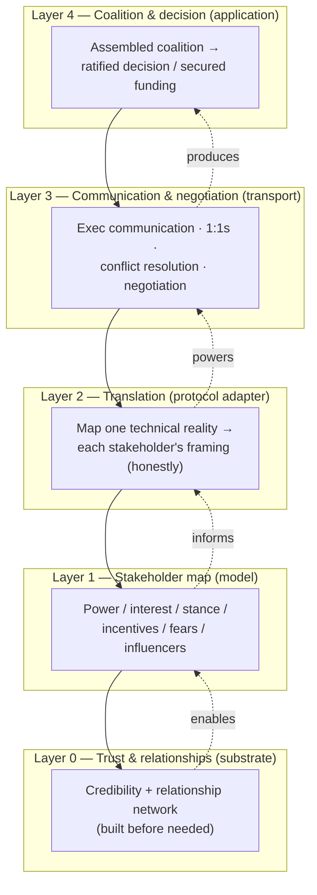
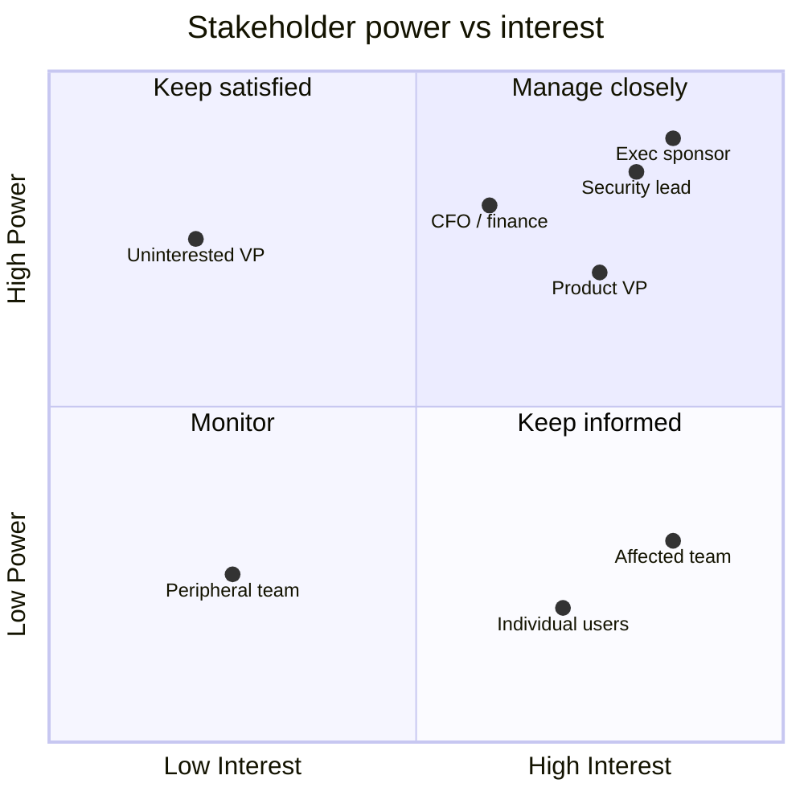
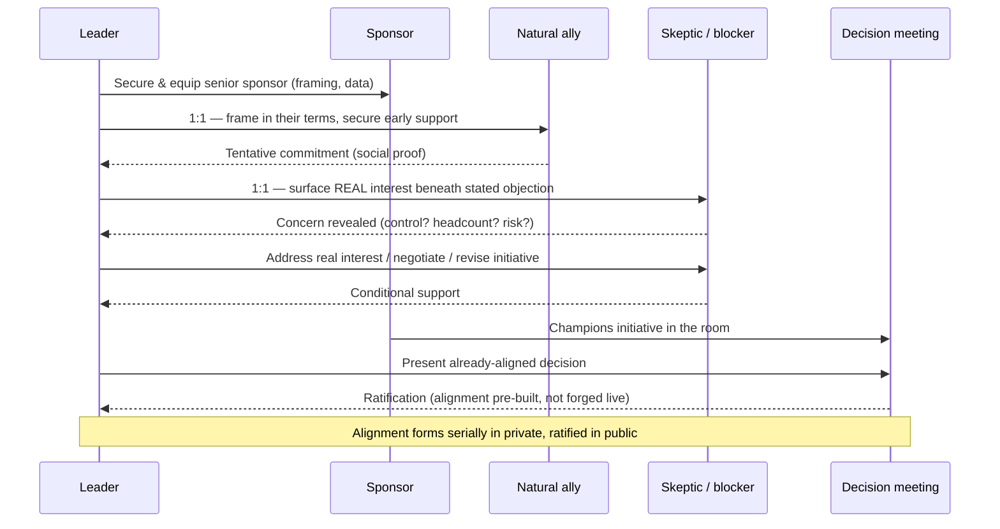

# Stakeholder Management

> Part of the **Enterprise Data & AI Architecture Handbook** — Phase-19 (Leadership & Technical Strategy), Chapter 03.
> Prerequisite: [Technical Leadership](01_Technical_Leadership.md). Builds on [Architecture Reviews](02_Architecture_Reviews.md).

---

## Executive Summary

Stakeholder management is the discipline of aligning the people whose support, resources, or agreement a technical initiative needs — executives, product leaders, peer engineering teams, security, finance, legal, and business owners — around a shared understanding and a shared decision. It is the outward-facing, business-and-executive-oriented expansion of the influence-without-authority machinery introduced in [Technical Leadership](01_Technical_Leadership.md): where that chapter taught how to move a decision across engineering teams, this chapter teaches how to move it across the *organization*, up to the executive suite and out to the business functions that fund, constrain, and depend on technical work.

The central thesis of this chapter is that **technical merit does not sell itself, and the failure to align stakeholders is the single most common reason good technical work fails to get funded, adopted, or sustained.** A platform re-architecture that is technically correct but never framed in terms the CFO cares about will lose its funding to a flashier feature. A data-governance investment that engineers know is essential but never translated into risk the board understands will be perpetually deferred. The gap between "technically right" and "organizationally supported" is bridged by stakeholder management, and closing it is one of the highest-leverage skills a Staff+ engineer, architect, or data/AI leader can develop.

The recurring discipline the chapter returns to is **translation**: every stakeholder holds a different mental model, speaks a different language, and is measured on different outcomes, and the leader's job is to translate one technical reality into the several different framings that each stakeholder needs to say yes. The CFO needs cost, risk, and ROI; the product VP needs velocity and customer impact; the CISO needs threat reduction and compliance; the peer engineering team needs to know it won't be disrupted. The *same* investment must be honestly framed in each of these languages — not spun, but translated — and a leader who can only speak "engineer" will be systematically out-competed for resources and support by those who can speak all of them.

This chapter treats stakeholder management as a system with a map (who the stakeholders are and what moves them), a set of communication protocols (executive communication, coalition-building, selling investments), and a set of failure modes (surprising stakeholders, speaking only engineer, over-promising, managing up while neglecting sideways). It is written for the person who must secure the funding, alignment, and durable support that turn a good technical idea into a shipped, adopted, sustained reality — and who has learned, often painfully, that the quality of the idea is necessary but nowhere near sufficient.

---

## Learning Objectives

After working through this chapter you will be able to:

- **Map stakeholders** systematically — identify who has power, who has interest, who is affected, and who can block — and choose the right engagement strategy for each quadrant.
- **Communicate with executives** in their language: leading with the answer, framing in business terms (cost, risk, revenue, strategic fit), and respecting the severe constraints on executive attention.
- **Manage conflict and trade-offs** among stakeholders with genuinely competing interests, finding the shared underlying goal and negotiating durable resolutions rather than papering over disagreement.
- **Build coalitions** — assemble the set of supporters an initiative needs *before* the decision moment, through one-on-one alignment, reciprocity, and addressing each stakeholder's specific concerns.
- **Sell a technical investment** (a platform, a migration, a governance program, a reliability effort) by translating its technical value into a business case that the people controlling resources will fund.
- **Recognize and avoid the dominant failure modes**: ambushing stakeholders, speaking only in technical terms, over-promising to win approval, managing up while neglecting peers, and confusing being right with being persuasive.
- **Sustain stakeholder relationships** over time, so that trust and alignment are available *before* they are urgently needed, not manufactured in a crisis.

---

## Business Motivation

Every consequential technical initiative competes for scarce organizational resources — funding, headcount, executive attention, and the goodwill of the teams it depends on — against every other initiative in the company. The decision about which initiatives win that competition is made overwhelmingly by *non-engineers* or by engineers wearing a business hat, on the basis of *business* considerations. A technical leader who cannot make their initiative's case in business terms is not competing on a level field; they are systematically disadvantaged relative to peers who can, regardless of the relative technical merit of the underlying work. This is the blunt economic reason stakeholder management matters: **resource allocation is a persuasion contest, and the technically-best initiative frequently loses to the best-communicated one.**

In data and AI platform organizations the motivation is amplified by the nature of the work. Platform, governance, reliability, and technical-debt investments are precisely the initiatives whose value is *least legible* to business stakeholders — they produce no visible feature, their benefit is a cost or risk *avoided* rather than a revenue *gained*, and their payoff is diffuse and delayed. A new customer-facing feature sells itself; a data-contract standard, a lineage system, or a lakehouse migration must be actively *sold*, because its value is invisible until it is absent. This is the same legibility problem that makes [FinOps](../Phase-18/01_FinOps_and_Cost_Optimization.md) and [Reliability](../Phase-18/04_Reliability_and_SRE.md) hard to fund: the cost of *not* doing them is real, recurring, and diffuse, so it hides — and someone must make it visible to the people who control the budget.

The second business driver is **cross-functional dependency.** Data and AI initiatives touch security, legal, compliance, finance, product, and multiple engineering teams by their nature ([Data Mesh](../Phase-15/04_Federated_Governance.md), [Compliance](../Phase-10/06_Compliance_and_Regulatory_Frameworks.md)). None of these functions reports to the technical leader, yet all of them can block, delay, or undermine the initiative. Their alignment is not optional overhead on top of the technical work; it is a precondition for the technical work to succeed at all. An initiative that is technically complete but has an un-aligned security team or an un-consulted legal function is not "done" — it is stuck.

The cost of *absent* stakeholder management is predictable and expensive: good initiatives that never get funded, funded initiatives that get killed mid-flight when a stakeholder who was never aligned finally notices and objects, and delivered initiatives that never get adopted because the teams meant to use them were never brought along. The cost of *good* stakeholder management is the difference between a technical leader whose ideas consistently get resourced and adopted and one whose equally-good ideas consistently die in the funding round or the rollout.

---

## History and Evolution

The practice of managing stakeholders is far older than software, drawn from project management, organizational theory, and political science, and progressively adapted to technical leadership.

- **1960s–1980s: stakeholder theory and project management.** The word "stakeholder" entered management vocabulary at the Stanford Research Institute in the 1960s and was formalized by R. Edward Freeman's *Strategic Management: A Stakeholder Approach* (1984), which argued that organizations must manage the web of parties with a stake in their decisions, not just shareholders. In parallel, the project-management discipline (later codified in the PMI's PMBOK) made stakeholder identification and management a formal project phase.
- **1990s: influence and negotiation as teachable skills.** Robert Cialdini's *Influence* (1984) systematized the psychology of persuasion (reciprocity, commitment, social proof, authority, liking, scarcity); the Harvard Negotiation Project's *Getting to Yes* (Fisher & Ury, 1981) reframed negotiation from positional bargaining to interest-based problem-solving — "separate the people from the problem, focus on interests not positions." Both became foundational to how technical leaders think about aligning others.
- **2000s: the technical-leadership gap.** As the Staff+ IC track emerged (see [Technical Leadership](01_Technical_Leadership.md)'s history), organizations discovered that their best engineers routinely failed at exactly this: brilliant technically, unable to secure funding or align executives. The realization that stakeholder management is a *core technical-leadership competency*, not a soft add-on, dates to this period and is central to the modern Staff-engineer literature (Larson, Reilly).
- **2010s: the rise of the business-fluent engineer.** The scaled cloud and data era made technical decisions increasingly consequential to the business (a cloud-architecture choice is now a multi-million-dollar commitment), which raised the stakes on technical leaders' ability to communicate with and align executives. The "architect who can talk to the CFO" became a distinct and highly-valued profile.
- **2020s: data/AI raises the stakeholder stakes further.** AI and data initiatives now carry board-level, regulatory, and reputational weight ([Responsible AI](../Phase-11/07_Responsible_AI.md), [Compliance](../Phase-10/06_Compliance_and_Regulatory_Frameworks.md)), pulling in an even wider and more senior set of stakeholders — the board, the regulator, the ethics function, the general public — and making the CDO/CAIO role (Phase-19 Chapter 08) fundamentally a stakeholder-management role at the executive scope.

The through-line is a steady recognition that **aligning people is as much a part of engineering leadership as designing systems**, and that the skills — mapping, translation, negotiation, coalition-building — are learnable disciplines drawn from decades of management and negotiation science, not innate charisma.

---

## Why This Technology Exists

Stakeholder management exists to solve a structural problem created by two facts that hold in every organization: **(1) the people who control the resources and permissions a technical initiative needs are different from, and think differently than, the people who do the technical work; and (2) they do not automatically understand, agree with, or prioritize what the technical people know to be important.** The gap between "an engineer knows this is the right thing to do" and "the organization decides to fund and support it" is not automatically closed by the rightness of the thing — it must be actively bridged, and stakeholder management is the discipline of bridging it.

Without this discipline, the default outcome is systematically bad in a specific way: technical value that is *illegible* to business stakeholders gets under-invested, while technical value that happens to be legible (visible features) gets over-invested, regardless of true importance. Platform, governance, reliability, and debt work — the foundation everything else stands on — is exactly the illegible category, so the default organizational tendency is to starve the foundation and over-feed the visible surface. Stakeholder management exists as the corrective: the mechanism by which the invisible-but-essential is made visible and legible to the people who decide where resources go.

The discipline also exists because **the alternative mechanisms fail.** Relying on authority doesn't work — the technical leader has no authority over the CFO, the CISO, or the product VP. Relying on the idea's self-evident merit doesn't work — merit is not self-evident to someone with a different mental model and different priorities. Relying on a single big presentation doesn't work — alignment built in one meeting is brittle and easily reversed. What *does* work is the patient, relationship-based, translation-heavy, coalition-building practice this chapter describes, because it is matched to the actual structure of the problem: many independent, differently-motivated parties who must each, in their own terms, choose to support the initiative. Stakeholder management exists because that structure demands it and nothing simpler suffices.

---

## Problems It Solves

- **Illegible-value under-investment.** It makes the invisible-but-essential (platform, governance, reliability, debt) legible to resource-controllers, correcting the default tendency to starve the foundation.
- **Funding and prioritization competition.** It lets a technically-strong initiative compete on a level field for scarce resources by making its case in the business terms the decision-makers actually use.
- **Cross-functional blocking.** It aligns the security, legal, compliance, finance, and peer-engineering functions whose agreement is a precondition for the work, preventing the "technically done but organizationally stuck" outcome.
- **Executive misalignment.** It gives executives the accurate, business-framed understanding they need to make good decisions about technical initiatives, rather than deciding blind or on the basis of whoever communicated best.
- **Adoption failure.** It brings along the teams and users meant to adopt an initiative, so delivered work actually gets used rather than shipped and ignored.
- **Late-stage surprises.** By aligning stakeholders early and continuously, it prevents the expensive mid-flight cancellation that happens when a never-consulted stakeholder finally notices and objects.
- **Conflict paralysis.** It provides mechanisms (interest-based negotiation, finding the shared goal) to resolve genuine stakeholder conflicts rather than letting them deadlock the initiative.

---

## Problems It Cannot Solve

- **It cannot rescue a genuinely bad idea — and shouldn't try.** Stakeholder management is translation and alignment, not spin. Used to sell a bad initiative, it becomes manipulation, it eventually destroys the leader's credibility (the trust-integrity failure from [Technical Leadership](01_Technical_Leadership.md)), and it should not be attempted. The discipline serves good technical judgment; it does not substitute for it.
- **It cannot overcome a fundamental strategic misalignment.** If an initiative genuinely conflicts with the organization's actual strategy or a stakeholder's legitimate core interest, no amount of communication will (or should) align them. Sometimes the right answer is that the initiative shouldn't happen, or must change — and mistaking a real strategic conflict for a mere communication gap wastes enormous effort.
- **It cannot substitute for delivery.** Alignment secured by promises must eventually be validated by results. A leader who is brilliant at selling and poor at delivering burns their credibility faster than one who never sold at all — the over-promising failure mode. Stakeholder management writes checks that delivery must cash.
- **It cannot manufacture trust in a crisis.** The relationships and credibility that stakeholder management relies on are built slowly, over time, before they are needed. A leader who neglects relationships until a crisis and then tries to build alignment under pressure will find the account empty.
- **It cannot make irreconcilable trade-offs disappear.** When stakeholders have genuinely zero-sum conflicting interests, the leader can find the best available resolution and make the trade-off explicit and fair, but cannot make everyone win. Pretending a real trade-off is a win-win is a failure mode, not a success.
- **It cannot scale by the leader alone.** Beyond a certain scope, one person cannot personally manage every stakeholder relationship; the leader must build a broader coalition and empower others to carry alignment — or become the bottleneck.

---

## Core Concepts

### 3.1 Stakeholder Mapping and Influence

You cannot manage stakeholders you haven't identified, and the first discipline is systematic **stakeholder mapping**: enumerating everyone with a stake in the initiative and understanding what moves each of them. The canonical tool is the **power/interest grid** (Mendelow's matrix): plot each stakeholder by how much *power* they have over the initiative (can they fund it, block it, redirect it?) and how much *interest* they have in it (do they care, and which way?). The quadrants imply distinct strategies:

- **High power, high interest — manage closely.** The executive sponsor, the funding owner, the security lead who must approve. These are your primary relationships; they need active, continuous engagement and are where most of your stakeholder attention goes.
- **High power, low interest — keep satisfied.** A senior executive who could block but currently doesn't care. Keep them adequately informed so they don't become a surprised blocker, but don't over-consume their attention.
- **Low power, high interest — keep informed.** Affected teams and individual contributors who care deeply but can't unilaterally decide. Their support builds grassroots momentum and their early feedback improves the initiative; neglecting them breeds resentment and quiet resistance.
- **Low power, low interest — monitor.** Peripheral parties; a light touch suffices, but re-check periodically since power and interest shift.

Beyond the grid, effective mapping identifies for each key stakeholder: **what they are measured on** (their incentives and success metrics — the single most predictive fact about how they'll react), **what they fear** (the risks and failures they're trying to avoid), **their current stance** (supporter, neutral, skeptic, blocker), and **who influences them** (their trusted advisors, since influence is mediated per [Technical Leadership](01_Technical_Leadership.md) §2.1). A stakeholder map is not a one-time artifact; power, interest, and stance shift as the initiative and the organization evolve, so the map is maintained, not filed.

### 3.2 Executive Communication

Communicating with executives is a distinct skill because executives operate under a distinct constraint: **severe scarcity of attention and a demand for decision-relevant information framed in business terms.** The engineer's instinct — build up context, walk through the reasoning, arrive at the conclusion — is exactly backwards for an executive audience, who need the conclusion first and the supporting detail only on demand. The core techniques:

- **Lead with the answer (BLUF — Bottom Line Up Front).** State the recommendation, the ask, or the headline *first*, then provide supporting detail in decreasing order of importance (the "inverted pyramid" of journalism, and the structure behind Amazon's narrative memos and the McKinsey pyramid principle). An executive should be able to stop reading after the first paragraph and still have the essential decision.
- **Frame in business terms.** Translate the technical reality into cost, risk, revenue, strategic fit, competitive position, and time — the dimensions an executive is accountable for. "We need to migrate to a lakehouse" is engineer-language; "we can cut analytics infrastructure cost 40% and unblock the real-time use cases the CEO committed to, with a one-quarter migration risk we can bound" is executive-language for the *same* decision.
- **Respect the attention budget.** Be concise, come with a specific ask, and don't make an executive do the work of extracting the decision from a wall of technical detail. Bring the one-page version; have the ten-page version ready if asked.
- **Quantify honestly, including uncertainty.** Executives make risk-adjusted decisions; give them ranges and confidence levels, not false precision, and never hide the downside — a leader who surfaces the risk themselves is far more trusted than one whose risks are discovered later.
- **Know the decision you're driving.** Every executive communication should have a clear purpose: are you informing, seeking a decision, requesting resources, or escalating? Muddy purpose wastes the scarcest resource in the building.

### 3.3 Managing Conflict and Trade-offs

Stakeholders have genuinely different, often conflicting, interests — product wants velocity, security wants control, finance wants cost reduction, the platform team wants standardization — and a technical leader is perpetually mediating these conflicts. The foundational move, drawn from *Getting to Yes*, is to **separate positions from interests**: a *position* is what someone says they want ("we can't slow down for a governance review"); an *interest* is the underlying need driving it ("we're measured on delivery velocity and can't miss our quarter"). Conflicts that are irresolvable at the level of positions are frequently resolvable at the level of interests, because the underlying interests are often compatible even when the stated positions clash — the governance review can be made fast enough to not threaten the quarter, satisfying both the security interest and the velocity interest.

The techniques that follow:

- **Find the shared higher-level goal.** Almost all stakeholders share *some* higher objective (the company's success, the product's health); reframing a conflict in terms of that shared goal converts adversaries into collaborators solving a common problem.
- **Make trade-offs explicit and honest.** When interests genuinely conflict and something must be given up, name the trade-off clearly, quantify it where possible, and let the accountable decision-maker choose with full information — rather than hiding the trade-off or pretending it doesn't exist. Explicit trade-offs are the [Architecture Reviews](02_Architecture_Reviews.md) discipline applied to stakeholder conflict.
- **Escalate constructively when needed.** Some conflicts genuinely require a higher authority to arbitrate (the disagree-and-commit and escalation mechanisms from [Technical Leadership](01_Technical_Leadership.md)). Escalating is not failure; escalating *badly* (as a complaint, without framing the decision) is. Present the escalation as a clear decision the arbiter must make, with the options and trade-offs, not as a plea to be rescued.
- **Preserve the relationship through the conflict.** The stakeholder you conflict with today you will need tomorrow; conflict handled respectfully (attacking the problem, not the person) leaves the relationship intact and even strengthened, while conflict handled as combat poisons future collaboration.

### 3.4 Building Coalitions

A coalition is the set of aligned supporters an initiative needs to succeed, assembled *before* the decision moment. The single most important insight — the direct extension of [Technical Leadership](01_Technical_Leadership.md)'s socialize-before-deciding pattern to the organizational scale — is that **alignment is built in the one-on-one conversations that precede the group decision, not in the decision meeting itself.** A leader who walks into a funding review or an alignment meeting having already spoken individually with each key stakeholder, understood and addressed their specific concerns, and secured their tentative support, walks into a ratification; a leader who walks in cold, hoping to win the room live, is gambling.

Coalition-building mechanics:

- **Start with the natural allies.** Identify the stakeholders who already share your interest and secure them first; their visible support makes it easier to bring along the neutrals (social proof).
- **Address each stakeholder's specific concern.** Coalition members join for their *own* reasons, not yours; understand what each needs from the initiative and show them how it serves their interest. The security lead joins because it reduces risk they're accountable for; the product VP joins because it unblocks velocity they need.
- **Neutralize or convert blockers early.** A stakeholder who will oppose the initiative is far cheaper to engage before the decision (understand their objection, address it or negotiate) than to fight during it. Sometimes the objection is *information* (the [Architecture Reviews](02_Architecture_Reviews.md) resistance-as-information lesson) that improves the initiative; sometimes it's a genuine conflict requiring negotiation; either way, early engagement beats a public confrontation.
- **Find and equip a sponsor.** A senior sponsor who champions the initiative in rooms you're not in is the highest-leverage coalition member — the mediated-influence amplifier from [Technical Leadership](01_Technical_Leadership.md) §2.1. Securing and continuously equipping an executive sponsor (with the framing, the data, the talking points) is often the difference between an initiative that survives and one that dies when attention wanders.
- **Use reciprocity.** Coalitions run on the relationship network built over time (the [Technical Leadership](01_Technical_Leadership.md) Networking discipline); the support you can call on for your initiative is a function of the support you've given others.

### 3.5 Selling Technical Investments

The hardest and most valuable application is selling an investment whose value is illegible to business stakeholders — a platform, a migration, a governance program, a reliability effort, a technical-debt paydown. The discipline is to **build a business case in the decision-makers' language**, which means:

- **Translate technical value into business value.** Not "we'll refactor the pipeline architecture" but "we'll cut the time-to-add-a-new-data-source from six weeks to three days, letting us onboard the twelve partner integrations sales has committed to." The technical work is the *means*; the business outcome is what you sell.
- **Quantify the cost of inaction.** Illegible-value investments are best sold by making the *cost of not doing them* visible and concrete — the recurring drag, the accumulating risk, the incident waiting to happen (the decision-debt and reliability-debt framing from [Technical Leadership](01_Technical_Leadership.md) and [Reliability and SRE](../Phase-18/04_Reliability_and_SRE.md)). "Doing nothing" is never free, and quantifying its true cost is often the strongest argument.
- **Speak to ROI and risk, honestly.** Frame the investment as a return (cost avoided, revenue enabled, risk reduced) with honest numbers and ranges, and an honest statement of the risk and cost of the investment itself. Inflated ROI wins the first round and loses all subsequent ones when it fails to materialize.
- **Right-size the ask and de-risk it.** A smaller, reversible first step (a pilot, a phased rollout) is far easier to fund than a big-bang all-or-nothing commitment, because it bounds the decision-maker's risk. Structuring the investment as a series of fundable, value-demonstrating increments — each earning the right to the next — is often the difference between a fundable and an unfundable proposal.
- **Connect to a strategic priority.** An investment tied to something the executives have already committed to (a stated strategic goal, a board commitment, a competitive threat) is far easier to fund than a free-standing "good idea." Find the strategic hook and hang the investment on it.

---

## Internal Working

### 4.1 How Alignment Actually Forms

Stakeholder alignment is not a state that a presentation creates; it is an *aggregate* that forms through many individual updates, and understanding the mechanism explains why the naive "big meeting" approach fails. Each stakeholder holds a mental model and a set of interests, and they update toward support only when the initiative is credibly connected, *in their own terms*, to something they care about. The internal process:

1. **Individual framing.** Each stakeholder is engaged (ideally one-on-one, before any group setting) with a framing translated into *their* language and interests. This is where the update actually happens — a stakeholder rarely moves in a group meeting where they'd have to publicly change position; they move in the private conversation where they can reason and ask questions without status cost.
2. **Concern resolution.** The stakeholder's specific objection or fear is surfaced and addressed — either the initiative changes to accommodate it (the objection was information), or the concern is negotiated and a trade-off accepted. Un-surfaced concerns don't disappear; they resurface as late-stage blocking.
3. **Tentative commitment.** The stakeholder gives conditional support, contingent on their concern being handled and on other key stakeholders coming along (few will be the lone supporter).
4. **Aggregation and social proof.** As individual commitments accumulate, each becomes easier to secure — a stakeholder who sees the sponsor and two peers already aligned faces much lower risk in joining. Coalition-building has positive feedback: the first supporters are the hardest, the last are the easiest.
5. **Ratification.** The group decision meeting confirms an alignment that already exists, rather than attempting to create it live. If the meeting is where alignment is *first* attempted, the process has skipped steps 1–4 and is likely to fail.

The key mechanical insight: **alignment forms serially in private and is ratified in public**, which is why the invisible pre-work (one-on-ones, concern resolution, coalition assembly) is where the real work happens and the visible decision meeting is the tip of the iceberg.

### 4.2 The Translation Function

At the heart of stakeholder management is a *translation function* that maps one technical reality onto N different stakeholder framings, and its internal working is worth making precise because it is the most misunderstood part of the discipline. Translation is *not* changing the facts for different audiences (that is spin, and it destroys trust when the audiences compare notes); it is presenting the *same* facts through the *dimension each stakeholder is accountable for*. A lakehouse migration is simultaneously, and truthfully, a cost reduction (CFO), a velocity unblock (product), a risk during the transition (security/SRE), and a capability enabler (data science) — these are not four different pitches, they are four true projections of one reality onto four different axes. The skill is knowing which axis each stakeholder measures on (the stakeholder-mapping "what are they measured on" fact) and projecting the reality onto that axis honestly. The failure mode is either speaking only in the engineer's native axis (technically correct, organizationally illegible) or changing the underlying claims per audience (organizationally effective short-term, trust-destroying long-term when the inconsistency surfaces).

### 4.3 Trust as the Substrate

Every mechanism in this chapter runs on trust as its substrate, and its internal dynamics are those of the trust kernel from [Technical Leadership](01_Technical_Leadership.md): slow to build, fast to destroy, and the precondition for influence to function at all. Stakeholder management has a specific trust vulnerability — because it involves *persuasion* and *framing*, it is one mis-step away from being perceived as *manipulation*, and once a stakeholder believes they were manipulated (sold an inflated ROI, told a different story than a peer, surprised by a hidden downside), the trust collapses and every future communication is discounted. The internal defense is rigorous honesty: translate but never spin, surface your own downsides before others find them, keep the story consistent across audiences, and let delivery validate your promises. A leader's stakeholder-management capacity is ultimately bounded by their accumulated trust, and trust is maintained by never spending it on a claim that delivery won't cash.

---

## Architecture

The stakeholder-management "system" can be modeled as a layered architecture, each layer depending on the ones below:

- **Layer 0 — Trust and relationships (the substrate).** The accumulated credibility and relationship network that all influence runs on ([Technical Leadership](01_Technical_Leadership.md)'s trust kernel and network). Without it, nothing above functions.
- **Layer 1 — The stakeholder map (the model).** The current understanding of who the stakeholders are, their power/interest/stance, what they're measured on, and who influences them. The data model the rest of the system operates on.
- **Layer 2 — Translation (the protocol adapter).** The function that maps one technical reality onto each stakeholder's framing and language.
- **Layer 3 — Communication and negotiation (the transport).** The actual mechanisms — executive communication, one-on-ones, conflict resolution, negotiation — through which alignment is built and maintained.
- **Layer 4 — Coalition and decision (the application).** The assembled coalition and the ratified decision that the lower layers exist to produce.

The architecture is diagnostic in the same way as [Technical Leadership](01_Technical_Leadership.md)'s: a failure at Layer 4 (couldn't get the decision funded) usually traces to a deficiency lower down — an incomplete stakeholder map (Layer 1, a blocker you didn't see), a translation failure (Layer 2, you spoke only engineer), or an empty trust account (Layer 0, no relationship to draw on). You cannot fix a coalition failure by giving a better presentation if the underlying map is wrong or the trust substrate is missing.

---

## Components

The concrete, nameable components of stakeholder management:

- **The stakeholder map.** The maintained model of stakeholders, their power/interest, stance, incentives, fears, and influencers (§3.1) — often literally a power/interest grid plus notes.
- **The executive brief / one-pager.** The BLUF-structured, business-framed artifact that carries a decision or ask to an executive audience.
- **The business case.** The structured argument for an investment: problem, cost of inaction, proposed investment, ROI/risk, phased plan (§3.5).
- **The sponsor.** The senior champion who advocates the initiative in rooms the leader isn't in — the highest-leverage coalition component.
- **The coalition.** The assembled set of aligned supporters, each engaged for their own reasons.
- **The one-on-one.** The private conversation where alignment actually forms (§4.1) — the primary "component" of coalition-building.
- **The RACI / decision-rights model.** The explicit statement of who is Responsible, Accountable, Consulted, and Informed for a decision — a tool for clarifying stakeholder roles and preventing the "who actually decides?" ambiguity.
- **The escalation.** The deliberate, well-framed routing of an unresolvable conflict to an arbiter with the authority to decide (§3.3).
- **The regular update / cadence.** The standing communication (a monthly stakeholder update, a steering-committee report) that keeps stakeholders informed and prevents surprises.

---

## Metadata

The metadata of stakeholder management is the *contextual information about each stakeholder and each engagement that makes the alignment work legible and maintainable*. For each stakeholder, the essential metadata is: their power and interest, what they're measured on, their current stance, their key concerns and whether each has been addressed, who influences them, and the history of your engagements with them. For each initiative, the metadata is the coalition state (who's aligned, who's neutral, who's blocking), the open concerns, and the commitments made. This is exactly what a well-maintained stakeholder map holds, and its value is the same as any metadata: it makes the system *legible* (you can see the alignment state at a glance), *maintainable* (a new team member or your successor can pick up the relationships), and *safe to act on* (you won't blunder into a meeting having forgotten a key stakeholder's unaddressed concern). The most frequently-missing and most valuable piece of metadata is the record of *concerns raised and whether they were resolved* — because an un-tracked, un-resolved concern is precisely what resurfaces as a late-stage blocker, and a stakeholder-management practice that doesn't track concern-resolution is flying blind toward exactly the surprises it exists to prevent.

---

## Storage

The "storage" layer of stakeholder management is where the **stakeholder map, engagement history, and commitments are durably kept** so that alignment survives the leader's memory, personnel changes, and the passage of time. Stakeholder relationships and the alignment state around an initiative are institutional assets, and storing them only in one leader's head is the relationship-equivalent of storing critical data on one un-backed-up laptop — when that person is unavailable or leaves, the accumulated understanding of who cares about what, who was promised what, and whose concern is still open evaporates, and the initiative is exposed to exactly the surprises the mapping was meant to prevent. The storage mechanisms are pragmatic: a maintained stakeholder map (a document, a grid, a lightweight CRM-style tracker for large programs), a record of key commitments and decisions (the [Architecture Reviews](02_Architecture_Reviews.md) ADR discipline extends here — decisions that stakeholders agreed to should be documented so the agreement is durable and not re-litigated), and an engagement log for major initiatives. The discipline mirrors data governance: the stored stakeholder information is sensitive (it contains candid assessments of people's stances and concerns), so it must be handled with appropriate discretion and access control — a stakeholder map that leaks and reveals you've privately classified an executive as a "skeptic to be neutralized" is a trust catastrophe. Store what's needed to maintain alignment; be judicious about candid assessments; treat the whole thing as confidential.

---

## Compute

The scarce "compute" of stakeholder management is **the leader's own relationship-and-communication bandwidth, and — even more scarce — the attention of senior stakeholders.** A leader can actively manage only a bounded number of relationships well; spread across too many, each gets too little attention to stay aligned, and the map degrades. More acutely, *executive attention is the single scarcest resource in the organization* (the [Technical Leadership](01_Technical_Leadership.md) attention-as-scarce-resource principle, now applied to the people above you): an executive can engage deeply with only a few initiatives, and every minute you consume of their attention is a minute unavailable to every other claimant. This has direct implications for the discipline: **spend executive attention deliberately and sparingly** — come with a crisp ask, don't over-escalate, don't cry wolf, and reserve the high-cost synchronous executive engagement for the decisions that genuinely need it (the reversibility/blast-radius triage from [Architecture Reviews](02_Architecture_Reviews.md), applied to stakeholder engagement). A leader who floods an executive with low-stakes updates and un-triaged escalations exhausts the attention budget and finds it empty when a genuinely high-stakes decision needs it. The compute-optimization discipline is to make each unit of stakeholder attention — yours and theirs — count, by triaging ruthlessly what deserves active management and what needs only a light informational touch.

---

## Networking

If relationship bandwidth is the compute, then **the relationship network itself is the fabric** through which all stakeholder management flows — and this is the most literal application of [Technical Leadership](01_Technical_Leadership.md)'s Networking discipline in the entire handbook. Stakeholder management *is* the operation of a relationship network: the alignment you can build for an initiative is bounded by the network you've cultivated, and — the recurring, non-negotiable lesson — **the network must be built before it is needed.** The time to establish a trusted relationship with the CFO's finance-partner, the CISO, and the product VP is during the calm, in the course of helping them and being helped, *not* in the funding meeting where you suddenly need their support. A leader who invests in cross-functional relationships continuously has a network to draw on when an initiative needs alignment; one who neglects relationships until a crisis finds the network absent exactly when it's most needed. The *topology* matters as much as in the technical-leadership case: broad weak ties across many functions (finance, security, legal, product, peer engineering) enable the cross-functional coalitions that data/AI initiatives require, whereas a network that is deep only within engineering leaves the leader unable to reach the very stakeholders who control the resources. Deliberately cultivating relationships *outside* engineering — with the business and executive functions — is the specific, high-return networking investment that most technical leaders under-make.

---

## Security

Security has two meanings for stakeholder management. First, **the integrity of the leader's trust and the guarding against its erosion or abuse** — the [Technical Leadership](01_Technical_Leadership.md) trust-integrity discipline, with a stakeholder-specific threat model. The primary threat is the *perception of manipulation*: because the discipline involves persuasion and framing, a single instance of spin (an inflated ROI, a different story told to different stakeholders, a hidden downside) can convert "trusted translator" into "manipulator" in a stakeholder's mind, after which every communication is discounted. The defenses are honesty-based: translate but never spin; keep the story consistent across audiences (assume they compare notes — they do); surface your own downsides first; never over-promise. Second, **the security of sensitive stakeholder information**: the stakeholder map contains candid, politically-sensitive assessments (who is a blocker, who is a skeptic, who influences whom), and its exposure is a serious trust breach — so it must be stored with discretion and appropriate access control, and candid assessments should be handled with the awareness that they could leak. The related organizational-integrity threat is *stakeholder capture or coercion*: a leader must not let a powerful stakeholder pressure them into misrepresenting technical reality to other stakeholders (e.g., understating a risk to the board because a senior sponsor wants the initiative approved) — the same "most dangerous decision is a wrong one advocated by a trusted, unchallenged leader" risk, here with the leader as the potential conduit for a distortion. The defense is the same intellectual honesty that protects the technical-review process: the leader's credibility depends on representing reality accurately to *all* stakeholders, and trading that for one powerful stakeholder's short-term approval is a catastrophic, credibility-destroying bargain.

---

## Performance

The performance of stakeholder management is measured not in any single meeting's outcome but in system-level results over time:

- **Alignment latency** — how long from "we need to move on X" to "the stakeholders are aligned and the decision is made." Long latency signals a weak map, missing relationships, or poor translation.
- **Funding/approval hit rate** — of the initiatives the leader brings forward, what fraction secure the resources and support they need? A low hit rate for technically-strong initiatives points to a translation or coalition-building deficiency, not a technical one.
- **Surprise rate** — how often a never-aligned stakeholder blocks or derails an initiative late. High surprise rate is the clearest signal of incomplete mapping and insufficient early engagement — the single most diagnostic negative metric.
- **Adoption rate** — of delivered initiatives, how many are actually adopted by the teams meant to use them? Low adoption points to bringing-along failure (the affected stakeholders were never in the coalition).
- **Relationship durability** — do the leader's stakeholder relationships survive conflicts and persist over time, so the network is available when needed? Relationships that don't survive conflict indicate the conflicts were handled as combat.
- **Sponsor engagement** — is there an active, well-equipped senior sponsor for each major initiative, or is the leader carrying every initiative alone?

The key performance insight mirrors the rest of the discipline: **the highest-value stakeholder work is invisible and preventive** (the surprise that didn't happen, the blocker aligned before the meeting, the relationship that was there when needed), and is therefore the hardest to see and measure — while the low-value work (the heroic live save in the meeting where alignment was first attempted) is the most visible. An organization that celebrates the dramatic save over the quiet prevention is rewarding exactly the wrong stakeholder-management behavior.

---

## Scalability

Stakeholder management scales the way all leadership scales ([Technical Leadership](01_Technical_Leadership.md)): by **reducing the load that must flow through the single leader, not by heroically increasing that one person's relationship bandwidth.** A leader who personally manages every stakeholder relationship for every initiative becomes the bottleneck and the bus-factor risk; the scalable alternatives:

- **Cultivate sponsors and champions who carry alignment for you.** A senior sponsor who advocates in rooms you're not in, and champions embedded in each stakeholder function who represent the initiative internally, multiply your reach far beyond your personal bandwidth — the mediated-influence amplifier at organizational scale.
- **Build durable coalitions, not per-decision alignment.** A standing coalition (a steering committee, an aligned cross-functional group) that persists across many decisions is far more scalable than re-building alignment from scratch for each one.
- **Institutionalize the communication.** Standing cadences (regular stakeholder updates, steering reviews) keep many stakeholders informed with bounded per-stakeholder effort, replacing N individual ad-hoc updates with one efficient broadcast (reserving the expensive one-on-ones for the high-stakes moments).
- **Grow other leaders who can manage stakeholders.** The reproduce-leadership pattern: developing team members who can carry their own stakeholder relationships distributes the load and grows the organization's total alignment capacity.

The anti-pattern is the "indispensable relationship-holder" — the single leader through whom all stakeholder alignment flows, who feels maximally valuable and is in fact a scalability ceiling and a single point of failure. When that person is unavailable, every initiative's stakeholder alignment stalls. As with technical leadership, a stakeholder-management practice that hasn't distributed itself across sponsors, coalitions, cadences, and other leaders will hit a wall as the scope grows.

---

## Fault Tolerance

Stakeholder management operates in an environment where things reliably go wrong — a key sponsor leaves, a stakeholder reverses position, a conflict deadlocks, a promise can't be kept — so a mature practice builds in tolerance for these faults rather than assuming smooth alignment:

- **Redundant sponsorship.** Relying on a single executive sponsor is a single point of failure — when they leave, get reorganized, or lose interest, the initiative loses its champion. Cultivating more than one senior supporter, and a broader coalition, means the initiative survives the loss of any one backer (the redundant-replica pattern applied to sponsorship).
- **Early and continuous engagement.** The strongest fault tolerance against the "surprised blocker" is engaging stakeholders early and keeping them continuously informed, so a shifting stance is detected and addressed while it's cheap, not discovered as a late-stage veto.
- **Honest expectation-setting.** Under-promising and over-delivering builds a credibility buffer that tolerates the occasional miss; over-promising creates a brittle position where a single unmet commitment cascades into lost trust. Setting expectations with honest ranges and surfaced risks is fault tolerance for the inevitable imperfect outcome.
- **Constructive escalation paths.** When a conflict deadlocks, a pre-understood escalation path to an arbiter (with the disagree-and-commit discipline) resolves it without the initiative stalling indefinitely or the relationship rupturing.
- **Relationship repair.** When a conflict or a broken promise damages a relationship, the willingness to acknowledge it directly, own the miss, and repair — rather than avoiding the stakeholder — restores the trust the practice depends on. The [Technical Leadership](01_Technical_Leadership.md) "I was wrong, here's the correction" move, applied to stakeholder relationships, both fixes the specific rupture and strengthens the relationship's resilience.

The most important fault-tolerance property is the leader's willingness to surface a problem to stakeholders *early and honestly* — a slipping timeline, a risk that materialized, a commitment that can't be met — because a problem disclosed early is a manageable adjustment, while the same problem discovered late by a surprised stakeholder is a trust rupture.

---

## Cost Optimization

The costs of stakeholder management are denominated in the scarcest resources: **the leader's relationship bandwidth, senior stakeholders' attention, and the time consumed by meetings, briefs, and coalition-building.** Optimizing them is the triage discipline applied to alignment:

- **Match engagement intensity to stakeholder power/interest.** The dominant waste is treating all stakeholders equally — over-investing attention in low-power/low-interest parties while under-investing in the high-power/high-interest few who actually determine the outcome. The power/interest grid *is* the cost-optimization tool: manage the critical few closely, keep the rest appropriately informed with minimal effort.
- **Don't over-consume executive attention.** Executive attention is the highest-cost resource; spend it only on decisions that genuinely need it, come with a crisp ask, and use async briefs and standing cadences for everything that doesn't require synchronous senior engagement.
- **Institutionalize routine communication.** Replace N ad-hoc individual updates with efficient standing cadences (one broadcast update, a steering review), reserving expensive one-on-ones for high-stakes alignment moments.
- **Build durable coalitions to avoid re-alignment cost.** Re-building stakeholder alignment from scratch for each decision is expensive; a standing aligned coalition amortizes that cost across many decisions.

**Worked FinOps-style example.** Consider a technical leader driving a data-platform modernization who needs sustained alignment from eight cross-functional stakeholders over a two-year program. The naive approach — a monthly one-hour one-on-one with each of the eight, plus ad-hoc alignment before every major decision — consumes roughly 8 hours/month of the leader's time *plus* 8 hours/month of senior stakeholder attention (~€X of loaded senior time), much of it spent re-explaining context to stakeholders who only needed a light touch. Re-optimizing with the power/interest grid: the two high-power/high-interest stakeholders (the exec sponsor and the security lead) keep their monthly one-on-ones (genuinely needed), the three high-power/low-interest ones move to a concise monthly written brief plus a quarterly check-in (kept satisfied, not over-consumed), and the three low-power/high-interest ones join a standing monthly group update (kept informed efficiently). Total leader time drops from ~8 to ~3 hours/month, senior stakeholder attention consumed drops by more than half, *and* the alignment is actually better — because the critical two get deeper engagement while the peripheral ones stop being annoyed by over-communication. The lesson is the general one: **stakeholder-management cost is dominated by mis-matched engagement intensity — over-managing the peripheral and (often simultaneously) under-managing the critical — and the power/interest grid is the tool that right-sizes engagement to cut cost while improving alignment.** As with the review-program example in [Architecture Reviews](02_Architecture_Reviews.md), cheaper and better are achievable together because the default is so badly mis-tuned.

---

## Monitoring

Monitoring stakeholder management means tracking the **leading indicators of alignment health** so that misalignment is caught before it becomes a crisis (a surprised blocker, a killed initiative, a failed rollout):

- **Stakeholder stance tracking** — the current supporter/neutral/skeptic/blocker status of each key stakeholder, watched for shifts. A stakeholder drifting from supporter toward skeptic is the earliest, cheapest-to-address signal of trouble.
- **Open-concern count** — how many raised stakeholder concerns remain unaddressed. Unresolved concerns are the fuel for late-stage blocking; a rising or stale open-concern count is a leading indicator of a coming surprise.
- **Sponsor engagement level** — is the executive sponsor actively engaged, or drifting toward disengagement? A disengaging sponsor is a leading indicator of an initiative losing its air cover.
- **Coalition breadth** — is the initiative supported by a broad coalition or resting on a single relationship (a fault-tolerance risk)?
- **Communication cadence adherence** — are stakeholders actually being kept informed on the intended cadence, or has communication lapsed (the precondition for surprises)?
- **Escalation frequency and pattern** — a rising rate of conflicts requiring escalation may signal a structural misalignment that needs addressing at a higher level.

The purpose mirrors production monitoring: distinguish "alignment is healthy" from "alignment is degrading" *before* it fails — before the drifting stakeholder becomes a blocker, before the disengaging sponsor becomes an absent one, before the stale concern becomes a late-stage veto.

---

## Observability

Where monitoring watches known indicators, **observability is the ability to ask *why* a stakeholder is behaving as they are** — to root-cause a misalignment you didn't have a pre-built metric for. When a stakeholder unexpectedly opposes an initiative, cools on it, or blocks it, observability is the practice of investigating the *actual* underlying reason rather than assuming it. The instruments are relational: direct honest conversation ("help me understand your concern"), listening for the interest beneath the stated position (§3.3), talking to the people who influence that stakeholder, and reading the organizational context (has this stakeholder's incentives changed? is there a political dynamic you're missing?). The recurring insight — the stakeholder-management instance of the handbook's pervasive pattern — is that **the stated objection is often not the real one**: a stakeholder who says "the timeline is too aggressive" may actually be worried about losing control of a system their team owns, or about a headcount implication, or about a past initiative that burned them. The stated position is the *symptom*; the underlying interest or fear is the *cause*, and they require completely different responses — you cannot address a control concern by adjusting the timeline. Acting on the stated objection without diagnosing the real interest is the stakeholder-management version of the "acting on the symptom" anti-pattern that recurs throughout this handbook, and it predictably fails: you concede on the stated point, and the stakeholder — whose real concern is untouched — finds a new objection. Diagnose the real interest before you respond.

---

## Operational Response Playbook

Concrete, repeatable responses to the two most common acute stakeholder-management failures. Each follows a signal → diagnosis → response structure.

### Playbook 1: A never-aligned stakeholder surfaces late and blocks the initiative

| Step | Action |
|------|--------|
| **Signal** | Late in an initiative — often at a funding gate, a launch review, or a go/no-go — a stakeholder who was never engaged raises a fundamental objection that stalls or threatens to kill the work. |
| **Diagnose the real interest** | Do NOT react to the stated objection at face value (Observability discipline). Engage the stakeholder directly and privately to find the *underlying* interest or fear beneath the stated position — control, headcount, risk-accountability, a past bad experience, an incentive you didn't map. The stated objection ("timeline," "cost," "not the right approach") is frequently a proxy for a different real concern. |
| **Assess: information or conflict?** | Determine whether the objection is *information* (a genuine flaw or risk you missed — in which case the initiative should change, per the [Architecture Reviews](02_Architecture_Reviews.md) resistance-as-information lesson) or a *genuine conflict of interest* (requiring negotiation) or a *misunderstanding* (requiring translation into their terms). Each needs a different response. |
| **Immediate response** | Address the real interest: revise the initiative if the objection was valid; negotiate an interest-based resolution (§3.3, separate positions from interests, find the shared higher goal) if it's a genuine conflict; re-frame in their language if it's a misunderstanding. Bring a sponsor or ally if the stakeholder's power requires it. |
| **Do NOT** | Do not try to overpower the objection in the public meeting, dismiss it, or go around the stakeholder — all escalate the conflict and damage the relationship. Do not concede on the stated point without confirming it's the real one. |
| **Durable fix** | This surprise is a *mapping failure*: this stakeholder should have been identified and engaged early. Update the stakeholder map, and institute the practice of comprehensive early mapping + engagement (the coalition-before-the-decision discipline) so future initiatives don't reach a late gate with an un-aligned stakeholder. Root-cause *why* they were missed (not on the map? on the map but deprioritized? stance shifted un-noticed?) and fix that gap. |

### Playbook 2: An executive investment ask was rejected (or is failing to land)

| Step | Action |
|------|--------|
| **Signal** | A technically-strong, genuinely-valuable investment (platform, migration, governance, reliability) was pitched to the funding decision-makers and rejected, deprioritized, or met with visible disengagement — despite the leader's conviction that it's the right thing. |
| **Diagnose the framing gap** | Investigate *why* it didn't land rather than concluding the decision-makers "don't get it." Usual causes: (a) pitched in engineer-language, not translated into the business terms (cost/risk/revenue/strategy) the decision-makers are accountable for; (b) the cost of *inaction* was never made visible, so "do nothing" looked free; (c) no strategic hook — the ask was a free-standing "good idea" not tied to a committed priority; (d) the ask was too big/all-or-nothing, so the risk looked unfundable; (e) no coalition or sponsor — the ask arrived cold with no pre-built support; (f) it genuinely conflicts with strategy (in which case the answer may be correct). |
| **Immediate response by cause** | (a) Re-frame in business terms via the translation function (§4.2, §3.5). (b) Quantify the cost of inaction concretely (recurring drag, accumulating risk, the incident waiting to happen). (c) Connect to a strategic priority the executives already committed to. (d) Right-size to a smaller, reversible, value-demonstrating first increment. (e) Build the coalition and secure a sponsor *before* re-pitching. (f) If it genuinely conflicts with strategy, accept it or change the initiative — don't keep pushing. |
| **Do NOT** | Do not re-pitch the identical framing louder, do not conclude the executives are foolish, and do not inflate the ROI to make it land (a trust catastrophe when it fails to materialize). Do not skip the diagnosis and assume you know which cause applies. |
| **Durable fix** | Treat the rejection as a framing/coalition failure by default (not a merit failure). Build the pre-pitch discipline into every future investment ask: translate to business terms, quantify the cost of inaction, find the strategic hook, right-size the ask, and build the coalition + sponsor *before* the funding moment — so the funding meeting ratifies pre-built support rather than attempting a cold win. |

---

## Governance

Stakeholder management intersects governance in two directions. First, **it is the human mechanism that makes cross-functional governance actually work.** The governance frameworks throughout this handbook — [Architecture Governance](../Phase-01/02_Architecture_Governance.md), [Data Governance](../Phase-08/01_Data_Governance_Foundations.md), [Federated Governance](../Phase-15/04_Federated_Governance.md), [Compliance](../Phase-10/06_Compliance_and_Regulatory_Frameworks.md) — all depend on aligning multiple stakeholder functions (security, legal, finance, domain teams, the business), and that alignment is stakeholder management. A governance body (a steering committee, an architecture board, a data-governance council) is a *standing stakeholder coalition*, and running it well is the coalition-building and conflict-resolution discipline of this chapter applied to a formal structure. Governance without stakeholder management is a paper framework that the un-aligned functions ignore or resist.

Second, **the stakeholder-management practice itself requires governance**, particularly to keep it honest and prevent it from degenerating into politics or manipulation:

- **Decision-rights clarity (RACI).** Explicitly defining who is Accountable, Responsible, Consulted, and Informed for each decision prevents the "who actually decides?" ambiguity that stalls initiatives and lets stakeholders relitigate settled decisions. This is the governance backbone that stakeholder management operates within.
- **Transparency and consistency.** The integrity rule — consistent story across all stakeholders, honest framing, surfaced downsides — is a governance discipline that protects both the stakeholders and the leader's own credibility. A leader who tells different stories to different stakeholders is violating a governance norm, not just risking their reputation.
- **Documented commitments.** Stakeholder agreements and decisions should be documented (the ADR discipline from [Architecture Reviews](02_Architecture_Reviews.md) and [Technical Leadership](01_Technical_Leadership.md)) so that alignment is durable, commitments are traceable, and the agreement isn't silently re-litigated.
- **Ethical boundary.** Governance of the practice includes the explicit boundary that stakeholder management serves good technical judgment and honest alignment — it is not a license to manipulate, to sell bad ideas well, or to distort reality for a powerful stakeholder's benefit. ADR-0200 below makes the honest-translation and early-engagement disciplines concrete.

---

## Trade-offs

- **Depth vs. breadth of engagement.** Deeply engaging every stakeholder builds strong alignment but doesn't scale and over-consumes attention; a light touch scales but risks missing a stakeholder's real concern. The power/interest grid resolves this by varying depth with stakeholder importance.
- **Speed vs. thoroughness of alignment.** Moving fast (deciding with the aligned few) preserves velocity but risks a surprised blocker later; thorough alignment (bringing everyone along) is durable but slow. The reversibility and stakes of the decision set the balance — the same one-way/two-way-door logic from [Architecture Reviews](02_Architecture_Reviews.md).
- **Managing up vs. managing sideways vs. managing down.** Attention spent aligning executives is attention not spent aligning peers or bringing along the team; over-indexing on any one direction is a classic failure. Effective leaders balance all three, since neglecting peers (sideways) or the adopting team (down) undermines even perfectly-managed-up initiatives.
- **Candor vs. diplomacy.** Full candor builds trust and surfaces real issues but can create conflict and political friction; excessive diplomacy preserves harmony but can obscure real problems and enable bad decisions. The resolution is honest-but-respectful — candid about substance, careful about delivery.
- **Building consensus vs. driving decisions.** Broad consensus produces durable alignment but is slow and can dilute into lowest-common-denominator compromise; driving a decision with a coalition is faster but risks leaving stakeholders behind. The disagree-and-commit and escalation mechanisms navigate between them.
- **Short-term win vs. long-term trust.** Spin, over-promising, or steamrolling a stakeholder can win the immediate decision at the cost of the trust the practice runs on. The discipline always favors long-term trust, because the leader will need these stakeholders again and again.

---

## Decision Matrix

*Which stakeholder-engagement strategy for which situation?*

| Situation | Recommended strategy | Why | When NOT to use it |
|-----------|---------------------|-----|--------------------|
| High-power, high-interest stakeholder | Manage closely — active, continuous engagement | They determine the outcome; alignment here is essential | Over-managing wastes attention if they're actually low-interest |
| High-power, low-interest stakeholder | Keep satisfied — periodic informational touch | Prevent them becoming a surprised blocker without over-consuming attention | Don't ignore entirely — they can still block if surprised |
| Low-power, high-interest (affected teams) | Keep informed — build grassroots support | Their adoption and feedback matter; neglect breeds quiet resistance | Don't over-escalate their concerns to executives |
| Conflicting stakeholder interests | Interest-based negotiation — separate positions from interests, find shared goal | Position-level conflicts are often interest-level compatible | When interests are genuinely zero-sum — then make the trade-off explicit and escalate |
| Selling an illegible-value investment | Business-case translation + cost-of-inaction + strategic hook + phased ask | Illegible value must be actively made legible in decision-makers' terms | When the investment genuinely doesn't serve the business — then don't sell it |
| Deadlocked conflict | Constructive escalation to an arbiter | Some conflicts genuinely need higher authority to resolve | When one more interest-based round would resolve it (escalating too early erodes goodwill) |
| Executive audience | BLUF + business framing + crisp ask | Executive attention is scarce and business-oriented | Never bury the ask in technical build-up for an executive |
| Major cross-functional initiative | Build a durable coalition + secure a redundant sponsor before the decision | Alignment forms in private and is ratified in public; single sponsor is a SPOF | When the decision is genuinely low-stakes and reversible — don't over-invest |

---

## Design Patterns

- **Map before you engage.** Systematically identify stakeholders, their power/interest, incentives, fears, and stance before acting — you can't manage who you haven't mapped.
- **Translate, don't spin.** Present the same true reality through the dimension each stakeholder is accountable for; keep the story consistent across audiences.
- **Lead with the answer (BLUF).** For executive audiences, state the conclusion and the ask first, detail on demand.
- **Build the coalition before the decision.** Align stakeholders one-on-one, address each one's concern, and secure tentative support *before* the group decision meeting — which then ratifies rather than forges alignment.
- **Separate positions from interests.** Resolve conflicts at the level of underlying interests, where compatible solutions usually exist, not at the level of clashing stated positions.
- **Find the shared higher goal.** Reframe conflicts in terms of the objective all stakeholders share, converting adversaries into collaborators.
- **Quantify the cost of inaction.** Sell illegible-value investments by making the recurring, accumulating cost of *not* doing them visible and concrete.
- **Right-size and phase the ask.** Structure investments as smaller, reversible, value-demonstrating increments that each earn the right to the next.
- **Secure and equip a (redundant) sponsor.** Cultivate senior champions who advocate in rooms you're not in — and more than one, so the initiative survives losing any single backer.
- **Engage early and continuously.** Bring stakeholders along from the start and keep them informed, so shifting stances are caught early and surprises are prevented.
- **Surface your own downsides first.** Disclose risks and problems before others find them — it builds the trust the whole practice runs on.

---

## Anti-patterns

- **Speaking only engineer.** Communicating a technical initiative purely in technical terms to a business audience, leaving its value illegible — the single most common reason good technical work fails to get funded.
- **The ambush / surprised stakeholder.** Bringing a decision to a group without having engaged the affected stakeholders first, so a key party sees it for the first time in the room and blocks it — a mapping-and-coalition failure.
- **Over-promising to win approval.** Inflating ROI or committing to unrealistic timelines to secure a yes, creating a brittle position that collapses when delivery falls short — winning the first round and losing all subsequent trust.
- **Spin and inconsistent stories.** Telling different (not just differently-framed but differently-*fact* ) stories to different stakeholders — a trust catastrophe when they compare notes, which they do.
- **Managing up, neglecting sideways and down.** Lavishing attention on executives while ignoring peer teams and the adopting team, so the initiative is perfectly funded and then blocked by an un-aligned peer or ignored by un-consulted users.
- **Treating all stakeholders equally.** Spreading engagement uniformly instead of by power/interest, over-managing the peripheral and under-managing the critical.
- **Confusing being right with being persuasive.** Assuming technical correctness is self-evidently convincing and doing no translation or alignment work — the engineer's characteristic blind spot.
- **Conflict as combat.** Handling stakeholder disagreement as a fight to win rather than a problem to solve, poisoning relationships you'll need again.
- **The single point of sponsorship failure.** Resting an initiative on one executive sponsor, which collapses when they leave, reorganize, or disengage.
- **Manipulation.** Using the discipline's techniques to sell a bad idea, distort reality, or serve a powerful stakeholder against the truth — the ethical line whose crossing eventually destroys the leader's credibility.

---

## Common Mistakes

- **No stakeholder map.** Engaging ad hoc without a systematic understanding of who matters, what moves them, and where they stand — guaranteeing missed stakeholders and late surprises.
- **Pitching cold.** Bringing an investment ask or a decision to the group without pre-built one-on-one alignment, gambling on a live win.
- **Ignoring the cost of inaction.** Selling an investment on its benefits alone while leaving "do nothing" looking free, when quantifying inaction's cost is often the strongest argument.
- **Burying the ask.** Making an executive extract the decision from a wall of technical build-up instead of leading with it.
- **Addressing the stated objection, not the real interest.** Conceding on the stated point (timeline, cost) while the stakeholder's actual concern (control, headcount, risk) goes untouched — so they simply find a new objection.
- **Neglecting relationships until needed.** Trying to build alignment in a crisis with stakeholders you've never invested in, finding the account empty.
- **Over-consuming executive attention.** Flooding executives with low-stakes updates and un-triaged escalations, exhausting the attention budget before the high-stakes moment.
- **One sponsor, no redundancy.** Betting the initiative on a single champion.
- **Winning the argument, losing the relationship.** Prevailing in a conflict in a way that damages a relationship you'll depend on later.

---

## Best Practices

- **Maintain a living stakeholder map** — power, interest, incentives, fears, stance, influencers — and update it as the initiative and organization evolve.
- **Match engagement intensity to power/interest**: manage the critical few closely, keep the powerful-but-uninterested satisfied, keep the affected informed, monitor the rest.
- **Translate every technical reality into each stakeholder's business language** honestly, keeping the story consistent across audiences.
- **Lead with the answer and a crisp ask** for executive audiences; respect the attention budget.
- **Build the coalition before the decision** through one-on-ones that address each stakeholder's specific concern; make the decision meeting a ratification.
- **Resolve conflict at the level of interests**, find the shared higher goal, and make genuine trade-offs explicit and fair.
- **Sell investments by quantifying the cost of inaction**, connecting to a strategic priority, and right-sizing to a phased, reversible ask.
- **Secure redundant senior sponsorship** and equip sponsors continuously with framing and data.
- **Engage early and continuously; surface your own risks and problems first**, before stakeholders discover them.
- **Invest in cross-functional relationships continuously**, before they're needed — especially outside engineering.
- **Never spin, never over-promise, never manipulate** — the trust these practices run on is the leader's most valuable and most fragile asset.
- **Document stakeholder commitments and decisions** so alignment is durable and not re-litigated.

---

## Enterprise Recommendations

For an enterprise data and AI platform organization specifically:

- **Treat stakeholder management as a core, evaluated technical-leadership competency**, not a soft add-on. Staff+ engineers, architects, and data/AI leaders should be developed and assessed on their ability to align stakeholders and secure resources, because in a cross-functional data/AI org this ability determines which good technical work actually happens.
- **Institutionalize cross-functional governance bodies** (a data-governance council, an architecture steering committee, a Responsible-AI board) as standing stakeholder coalitions — and staff them as such, with the coalition-building and conflict-resolution discipline of this chapter, not as rubber-stamp forums.
- **Build a shared business-case template** for technical investments that forces the translation: business problem, cost of inaction, proposed investment, ROI/risk with honest ranges, strategic-priority linkage, and a phased/reversible plan. This raises the funding hit rate for illegible-value platform/governance/reliability work across the organization.
- **Establish clear decision-rights (RACI) for cross-functional decisions** so the "who actually decides?" ambiguity that stalls data/AI initiatives (which span so many functions) is resolved structurally.
- **Cultivate business-fluent technical leaders and technically-fluent business partners** — the "architect who can talk to the CFO" and the "finance partner who understands the platform" — as the connective tissue that makes cross-functional alignment tractable.
- **Protect the integrity of the practice.** Make it an explicit cultural norm that technical leaders represent reality honestly to all stakeholders, that ROI claims are honest, and that stakeholder management serves good judgment, not politics. A culture that rewards the persuasive-but-dishonest over the honest-but-less-polished corrupts the entire resource-allocation process.
- **Invest in the relationship network deliberately** — cross-functional rotations, shared forums, and time for relationship-building — recognizing that the network is infrastructure that must exist before the crisis that needs it.

---

## Azure Implementation

Stakeholder management is a human discipline, but in an enterprise Microsoft environment it is *operated through* concrete tooling that holds the map, carries the communication, and documents the commitments:

- **Stakeholder map and engagement tracking (Storage/Metadata):** a maintained stakeholder map in **Microsoft Loop** or a **SharePoint list** (power/interest, stance, concerns, engagement history), or — for large multi-year programs — **Dynamics 365** used lightly as a relationship/stakeholder CRM. Sensitive candid assessments protected with **Microsoft Purview Information Protection** sensitivity labels and appropriate access control (the Security-section discretion requirement made operational).
- **Executive communication (Translation/Transport):** **PowerPoint** and **Word** for the BLUF-structured executive brief and business case; **Power BI** dashboards to make the cost-of-inaction and ROI quantification *visible and interactive* to executives (a data-platform leader selling a platform investment should show the recurring cost and risk trends in Power BI, not assert them in bullet points); **Microsoft Teams** for the one-on-one and coalition conversations where alignment actually forms.
- **Business case and ROI quantification:** **Azure Pricing Calculator** and **Azure Cost Management + Billing** ([FinOps](../Phase-18/01_FinOps_and_Cost_Optimization.md)) to ground the cost and ROI claims in real, defensible numbers — the honest-quantification discipline requires real cost data, and Azure's cost tooling provides it. **Microsoft Cost Management** exports feed the "cost of inaction" (current spend trajectory) and the projected-savings business case.
- **Commitment and decision documentation (Governance):** **Azure DevOps Boards / Azure Repos** or **SharePoint** for documenting stakeholder-agreed decisions and commitments (the ADR discipline extended to stakeholder agreements), and **Microsoft Planner / Project** for tracking the commitments a program has made to stakeholders.
- **Standing communication cadence:** **Teams channels**, **Viva Engage** for broad organizational communication, and recurring **Teams meetings** with **Loop**-based living agendas for steering committees and stakeholder updates — institutionalizing the routine communication that keeps many stakeholders informed at bounded per-stakeholder cost.

The tooling serves the discipline, not vice versa — the map, the translation, and the relationships are the substance; Microsoft 365 and Azure cost tooling are where they're operationalized and made durable.

---

## Open Source Implementation

The discipline is equally supportable with an open, vendor-neutral toolchain, preferred by organizations avoiding lock-in of their program and relationship data:

- **Stakeholder map and tracking:** a maintained Markdown stakeholder map in **Git** (a power/interest grid + per-stakeholder notes), or a lightweight open-source CRM (**SuiteCRM**, **EspoCRM**) for large programs; **Nextcloud** for shared, access-controlled documents.
- **Business case, quantification, and dashboards:** **Metabase**, **Apache Superset**, or **Grafana** to build the cost-of-inaction and ROI dashboards from real data (**Infracost** for cloud-cost quantification of the business case, **Prometheus/Grafana** for the reliability/incident trends that quantify the cost of *not* investing in reliability). The principle is identical to the Azure path — ground the ROI and cost-of-inaction claims in real, visible data — using open tooling.
- **Communication and documentation:** **Markdown design docs / decision records in Git** (adr-tools / MADR) for documented stakeholder commitments; **MkDocs / Docusaurus / Backstage** for the shared business-case templates and the target-state narratives stakeholders align to; **Mattermost** or **Rocket.Chat** for the coalition and one-on-one conversations; **Nextcloud / Collabora** for the executive briefs.
- **Decision-rights and program tracking:** **GitLab issues/epics** or **OpenProject** for RACI, commitment tracking, and steering-committee cadence.

The strategic advantage is that the program's stakeholder data, business cases, and decision records live in **portable, open formats**, surviving any tool's retirement — and the ROI/cost-of-inaction quantification, which is the crux of selling illegible-value investments, is fully achievable with open BI tooling grounded in real cost and reliability data. The trade-off is more assembly versus the integrated Microsoft 365 experience.

---

## AWS Equivalent (comparison only)

Stakeholder management is provider-agnostic; only the *quantification tooling* for the business case is cloud-specific. On AWS the ROI and cost-of-inaction grounding would use **AWS Cost Explorer**, **AWS Budgets**, and the **Cost and Usage Report** (with **QuickSight** for executive dashboards), and **AWS Pricing Calculator** for the projected business case.

- **Advantages of the AWS path:** Amazon's own decision and communication culture contributes the strongest relevant artifacts — the **six-page narrative memo** (the ultimate "lead with a coherent written argument, no slides" executive-communication discipline) and the **PR-FAQ / working-backwards** format (which forces framing an initiative in *customer/business* terms from the start — literally the translation discipline institutionalized). These *cultural practices* are the valuable export, directly reinforcing this chapter's BLUF and business-framing patterns, and are worth adopting regardless of cloud.
- **Disadvantages:** the cost-quantification tooling is AWS-specific, and (unlike Azure's tight Microsoft 365 integration) the relationship/communication tooling is typically third-party (the org's separate collaboration suite).
- **Selection criteria:** the *cultural artifacts* (narrative memo, PR-FAQ, working-backwards) transfer to any organization and are arguably the most valuable stakeholder-communication practices any of the three clouds' cultures produced; the cost-quantification tooling follows the org's cloud standard.

---

## GCP Equivalent (comparison only)

On Google Cloud the business-case quantification would use **Cloud Billing** with **BigQuery billing export** and **Looker / Looker Studio** for executive-facing ROI and cost-of-inaction dashboards, and the **Google Cloud Pricing Calculator** for projections.

- **Advantages of the GCP path:** Google's engineering culture contributes the **design-doc discipline** (a written, reviewed, business-and-technical argument — the document-centric communication this chapter's executive-communication and business-case sections build on) and, via its SRE origin ([Reliability and SRE](../Phase-18/04_Reliability_and_SRE.md)), the **error-budget and SLO vocabulary** that is one of the most effective *translations* of reliability-investment value into a business-legible currency (an error budget is a business-framed way to sell reliability work — the translation discipline made concrete). BigQuery's analytical power makes quantifying cost-of-inaction from historical data straightforward.
- **Disadvantages:** cost-quantification tooling is GCP-specific; relationship/communication tooling is Google Workspace or third-party.
- **Selection criteria:** driven by the org's existing cloud and collaboration standard. Google's *cultural* contributions (design docs, SLO-as-business-translation) are worth adopting on any cloud; the tooling follows the platform.

Across all three clouds the pattern holds: **the stakeholder-management discipline and its cultural artifacts (narrative memos, PR-FAQs, design docs, SLO-as-business-translation, BLUF communication) are the durable, portable asset; the cost-quantification tooling that grounds the business case is the cloud-specific implementation layer.** Keep the discipline and artifacts portable; let the quantification tooling follow your cloud.

---

## Migration Considerations

The "migration" relevant to stakeholder management is an *organizational and personal* transition, with the same risk profile as any migration:

- **The engineer → technical-leader transition** requires migrating from "the work speaks for itself" to "I must actively align stakeholders and sell the work." This is one of the hardest personal migrations (the [Technical Leadership](01_Technical_Leadership.md) output→leverage migration, in its stakeholder dimension): the old model (do good work, expect recognition) still partly works and is comfortable, and the new model (map, translate, coalition-build, sell) feels alien and even distasteful to many engineers ("politics"). The mitigation is reframing: stakeholder management done honestly is not politics, it's the necessary work of turning good ideas into funded, adopted reality — and refusing to do it is not integrity, it's a choice to let worse-but-better-communicated ideas win.
- **Introducing stakeholder discipline into an org that lacks it** (where technical initiatives routinely die in funding rounds or get blocked by un-aligned functions) is a migration: start by instituting stakeholder mapping and coalition-building for the highest-stakes initiatives, demonstrate the improved hit rate, and expand. Don't impose heavyweight stakeholder ceremony everywhere at once.
- **Succession and relationship transfer** is a migration with a hard deadline: a leader's stakeholder relationships and map are institutional assets that leave with them unless deliberately transferred. Documenting the map (discreetly), introducing successors to key stakeholders before departure, and building coalitions broader than any one relationship migrate the alignment off the individual before they leave — the same continuous-succession discipline as [Technical Leadership](01_Technical_Leadership.md).
- **Preserve the portable assets.** Keep stakeholder maps, business-case templates, and documented commitments in durable, portable formats so the institutional relationship knowledge survives tooling and personnel changes.

---

## Mermaid Architecture Diagrams

**Diagram 1 — The stakeholder-management system (layered architecture):**

**Diagram 2 — The power/interest grid (stakeholder mapping):**

**Diagram 3 — How alignment forms and is ratified (sequence):**

---

## End-to-End Data Flow

Tracing a single initiative — *"secure funding and cross-functional alignment for a two-year data-governance and lineage program"* — end to end through the stakeholder-management system:

1. **Mapping.** The leader enumerates stakeholders: the CDO (sponsor candidate), the CFO (funds it), the CISO (cares deeply — governance reduces risk they're accountable for), the product VPs (fear it slows delivery), the domain data teams (must adopt it), legal/compliance (a natural ally — it aids [Compliance](../Phase-10/06_Compliance_and_Regulatory_Frameworks.md)). Each is placed on the power/interest grid with their incentives, fears, and stance.
2. **Translation.** One reality — a governance/lineage program — is projected onto each stakeholder's axis: risk-and-compliance reduction (CISO, legal), regulatory-and-audit readiness (CFO's risk lens), a *bounded, non-blocking* process (product VPs' velocity fear), and self-serve discoverability (domain teams' benefit). Same program, honestly framed on four axes.
3. **Coalition-building (the private phase).** The leader secures the CDO as sponsor first, then the natural allies (legal/compliance, CISO) whose visible support provides social proof, then engages the skeptical product VPs one-on-one — discovering via the Observability discipline that their *real* interest isn't the timeline but fear of a governance gate slowing their releases, which is addressed by designing the governance as automated, fast, non-blocking checks (the objection was information that improved the design).
4. **Business case.** The leader builds the funding case in the CFO's language: the cost of *inaction* (a quantified regulatory/audit risk and the recurring cost of un-governed data — a data incident waiting to happen), the investment as a phased, reversible plan (pilot in two domains first, earning the right to expand), and a strategic hook (a board-level compliance commitment the program directly serves).
5. **Ratification (the public phase).** The funding decision meeting confirms an alignment that already exists — the sponsor champions it, the allies are visibly on board, the product VPs' concern is pre-addressed, the CFO has the business case. The meeting ratifies rather than forges.
6. **Documentation.** The decision and the stakeholder commitments are documented (the ADR discipline) so the alignment is durable and not re-litigated when attention shifts.
7. **Sustained engagement.** Over the two-year program, a standing steering cadence keeps stakeholders informed, stances are monitored for drift, a second senior supporter is cultivated (sponsor redundancy) against the risk the CDO reorganizes, and each phase's demonstrated value is used to sustain support for the next.
8. **Feedback.** The program's stakeholder-health metrics (stance tracking, open-concern count, sponsor engagement) are watched, closing the loop and catching drift before it becomes a surprise.

The flow shows the invisible private work (steps 1–4) as where alignment is actually built, the visible meeting (step 5) as a ratification, and the sustained engagement (step 7) as what keeps a two-year program from dying when attention wanders — a program pitched cold at step 5 without steps 1–4, or abandoned after step 5 without step 7, would predictably fail.

---

## Real-world Business Use Cases

- **Funding a platform modernization.** Securing multi-year funding for a lakehouse or platform re-architecture by translating it into the CFO's cost/risk language, quantifying the cost of inaction, and phasing the ask ([Lakehouse Architecture](../Phase-05/02_Lakehouse_Architecture.md)).
- **Selling a governance/lineage program.** The end-to-end example above — aligning security, legal, finance, product, and domain teams around illegible-value governance work ([Data Governance](../Phase-08/01_Data_Governance_Foundations.md)).
- **Getting a reliability investment funded.** Translating an SRE/reliability effort into business-legible error-budget and cost-of-downtime terms to secure the investment that visible-feature work would otherwise crowd out ([Reliability and SRE](../Phase-18/04_Reliability_and_SRE.md)).
- **Aligning on a Responsible-AI operating model.** Bringing the board, legal, ethics, product, and data-science functions around an AI-governance framework that carries regulatory and reputational weight ([Responsible AI](../Phase-11/07_Responsible_AI.md)).
- **Driving a data-mesh reorganization.** Aligning the many domain and platform stakeholders a [Data Mesh](../Phase-15/04_Federated_Governance.md) transition requires — a fundamentally stakeholder-management-heavy organizational change.
- **Winning cross-team adoption of a standard.** Selling a data-contract or table-format standard to the peer teams that must adopt it — managing sideways, not just up ([Data Contracts](../Phase-08/07_Data_Contracts.md)).

---

## Industry Examples

- **Amazon** institutionalized the strongest stakeholder-communication artifacts in the industry: the **six-page narrative memo** (banning slides, forcing a coherent written argument read silently at the start of a meeting) and the **PR-FAQ / working-backwards** process (which forces an initiative to be framed in customer/business terms *from inception* — the translation discipline built into the process). These are the reference implementations of executive communication and business framing.
- **Google** contributes the design-doc culture ([Architecture Reviews](02_Architecture_Reviews.md)) and, critically for stakeholder management, the **SRE error-budget** framing — one of the most successful *translations* of an illegible technical value (reliability) into a business-legible currency that product and engineering leaders can negotiate over. The error budget is stakeholder management encoded into a metric.
- **McKinsey and the consulting tradition** contribute the **pyramid principle** (Barbara Minto) — lead with the answer, group and structure supporting arguments — the canonical executive-communication method that BLUF descends from.
- **The Harvard Negotiation Project** (*Getting to Yes*, Fisher & Ury) provides the interest-based-negotiation framework (separate positions from interests, focus on the shared problem) that underlies this chapter's conflict-resolution discipline, used across every industry.
- **The CDO/CAIO role** (Phase-19 Chapter 08) as it has emerged across enterprises is fundamentally a stakeholder-management role at executive scope — the person whose primary job is aligning the board, the business, the regulator, and the technical functions around a data/AI strategy, demonstrating that at the top the technical-leadership job *becomes* stakeholder management.
- **Enterprise cloud migrations** (widely documented across Microsoft, AWS, and Google customer cases) consistently show that the migrations that succeed are the ones with strong executive sponsorship and cross-functional alignment, and the ones that stall are technically-sound efforts that lost their sponsor or never aligned a key function — the recurring real-world confirmation of this chapter's thesis.

---

## Case Studies

### Case Study 1: The technically-perfect platform investment that died in the funding round — twice

A Staff engineer at a mid-size enterprise had identified, correctly, that the company's aging data infrastructure was imposing a large and growing hidden cost: every new data source took six weeks to onboard, analytics costs were climbing, and the fragility was causing recurring incidents. The engineer built a meticulous, technically-excellent proposal for a platform modernization — detailed architecture, migration plan, technology choices, the works — and presented it to the executive funding committee. It was rejected. Undeterred, the engineer added *more* technical detail, tightened the architecture, and re-presented the following quarter. Rejected again. The engineer concluded the executives "didn't understand technology" and grew cynical about the organization's ability to make good decisions.

The diagnosis (via the Observability discipline — the engineer eventually asked a sympathetic finance partner *why* it kept failing) was that nothing was wrong with the *technical* proposal and everything was wrong with the *stakeholder* work. The proposal was pitched entirely in engineer-language — architecture diagrams and technology names — to an audience accountable for cost, risk, and strategic outcomes, who could not see the business value through the technical detail. The cost of *inaction* was never quantified, so "do nothing" looked free next to a large, risky-sounding investment. There was no strategic hook connecting it to anything the executives had committed to. The ask was big and all-or-nothing, so it looked unfundable and risky. And it arrived cold — no sponsor, no coalition, no pre-alignment — so it had to win the room live, twice, against better-communicated competitors.

The fix followed Operational Response Playbook 2. The engineer re-built the *same* initiative as a stakeholder effort: translated it into business terms (six-weeks-to-three-days onboarding, 40% analytics-cost reduction, quantified incident risk), made the cost of inaction concrete and visible (a Power BI trend of the rising hidden cost), connected it to a board-committed data-strategy goal, right-sized it to a funded pilot in two domains that would *demonstrate* value before the larger ask, secured the CDO as a sponsor, and built a coalition by aligning the CFO's finance partner and the affected domain leads one-on-one *before* the committee meeting. The third presentation — of the *same technical work* — was funded in fifteen minutes, because it arrived as a ratification of pre-built alignment framed in the decision-makers' language. The durable lesson: **the technical merit was never the problem; the identical initiative failed twice and succeeded once purely on the quality of the stakeholder work, which is the whole point of the discipline.** This directly motivates ADR-0200.

### Case Study 2: The surprised stakeholder who killed a launch at the go/no-go

A platform team had spent two quarters building a new self-service data-access capability, with strong engagement from the product and engineering stakeholders who wanted it. The initiative had a sponsor, an aligned product coalition, and demonstrated technical success. At the final go/no-go review before launch, the CISO's security architect — who had *never been engaged* throughout the two quarters — reviewed the design for the first time and raised a fundamental objection: the self-service access model, as designed, would let users combine datasets in ways that bypassed the access-control-propagation controls the security team was accountable for (the recurring access-control-propagation risk from [Architecture Reviews](02_Architecture_Reviews.md), [GraphRAG](../Phase-13/04_GraphRAG.md), and [Healthcare Data Platforms](../Phase-17/01_Healthcare_Data_Platforms.md)). The objection was valid and serious, the launch was blocked, and two quarters of work had to be partially re-architected — at large cost and with significant damage to the team's credibility and morale.

The blameless diagnosis (Operational Response Playbook 1) found no villain but a clear failure: **the security stakeholder was a high-power, high-interest party who was never on the stakeholder map and never engaged.** The team had managed the stakeholders who *wanted* the initiative (product, engineering — managing "up" and "toward the enthusiastic") and completely neglected the one who could *block* it (security — a party whose interest was risk, not the feature). Had the security architect been mapped and engaged in the first weeks, the access-control concern would have surfaced as *design input* (cheap to incorporate early) rather than a *launch veto* (enormously expensive late) — the exact left-shift economics from [Architecture Reviews](02_Architecture_Reviews.md), here at the stakeholder level. The objection wasn't defiance; it was information the team had structurally excluded itself from receiving by not engaging the stakeholder who held it.

The fix addressed the mapping gap: the team instituted comprehensive early stakeholder mapping (explicitly including the parties who could *block*, not just those who *wanted* the work) and mandatory early engagement of security/governance stakeholders on any data-access initiative — the same required-expert-routing lesson from [Architecture Reviews](02_Architecture_Reviews.md), applied to stakeholders rather than reviewers. The durable lesson — that **the stakeholders most dangerous to neglect are precisely the ones who don't want your initiative but can block it, and that mapping must include blockers, not just supporters** — reinforces the map-before-you-engage and engage-early disciplines, and shows the symmetry with Case Study 1: one initiative failed by neglecting the funders (managing up badly), the other by neglecting a blocker (managing sideways badly). Both are cured by the same principle — comprehensive early mapping and engagement of *all* the power-holders, supporters and blockers alike — captured in ADR-0200.

### Architecture Decision Record (ADR-0200): Consequential technical initiatives must comprehensively map and engage all high-power stakeholders early, with honest business-framed translation and a pre-built coalition — not a cold pitch to supporters alone

**Context.** The organization repeatedly saw technically-strong initiatives fail for non-technical reasons (Case Studies 1 and 2): a platform investment rejected twice because it was pitched cold, in engineer-language, with no coalition and no cost-of-inaction framing; and a launch blocked at the final gate by a high-power security stakeholder who was never mapped or engaged. Both stem from the same root: stakeholder alignment was treated as an afterthought or restricted to the enthusiastic supporters, rather than a comprehensive, early, honest discipline covering *all* the power-holders — including funders and potential blockers. The organization needs an explicit standard for how consequential initiatives handle stakeholders, so that good technical work stops dying in funding rounds and getting ambushed at launch gates.

**Decision.** Establish as a standard that every consequential technical initiative (any significant funding ask, cross-functional dependency, or high-blast-radius change) must, *before* the decision/funding/launch gate: (1) produce a **comprehensive stakeholder map** that explicitly includes high-power *blockers* (security, legal, compliance, finance) and affected adopters, not only enthusiastic supporters — with each stakeholder's power, interest, incentives, fears, and stance; (2) **engage every high-power stakeholder early**, one-on-one, surfacing and addressing their real interest (not just their stated objection) while change is still cheap; (3) **translate the initiative into each stakeholder's business language honestly** — same reality, different axes, consistent story, never spin — and for investment asks specifically, quantify the **cost of inaction**, connect to a **strategic priority**, and **right-size to a phased, reversible ask**; (4) **secure at least one (preferably redundant) senior sponsor** and **build the coalition before the decision meeting**, so the meeting ratifies pre-built alignment; and (5) **document stakeholder commitments** so alignment is durable. The discipline scales to the initiative's stakes (reversible, low-blast-radius work needs only light engagement).

**Consequences.** *Positive:* good technical initiatives stop failing for stakeholder reasons — funding hit rate rises, late-stage surprise blocks (the expensive kind) drop sharply because blockers are engaged early when their concerns are cheap design input, and adoption improves because adopters are in the coalition; the honest-translation and consistent-story rules protect the leader's and organization's trust; sponsor redundancy makes initiatives resilient to losing a champion. *Negative / costs:* comprehensive early mapping and engagement add up-front time and relationship effort, and require the leader to develop business-translation and coalition-building skills many engineers find unnatural or distasteful ("politics"); the discipline can be mis-applied as heavyweight ceremony on low-stakes work (mitigated by scaling engagement to stakes) or, worse, corrupted into manipulation (mitigated by the explicit honesty/anti-spin boundary — the discipline serves honest alignment of good work, never the selling of bad work or the distortion of reality). There is also a real risk that mapping a stakeholder as a "blocker to neutralize" leaks and damages trust — mitigated by discretion in how the map is stored and framed.

**Alternatives considered.** (a) *Rely on technical merit to win support on its own* — rejected: Case Study 1 shows an identical, technically-excellent initiative failing twice on merit alone and succeeding only with stakeholder work; merit is necessary but demonstrably insufficient. (b) *Engage only the supportive/funding stakeholders* — rejected: Case Study 2 shows that neglecting a high-power blocker produces the most expensive failure mode (a late-stage veto after the work is built); the map must include blockers. (c) *Do all alignment in the decision meeting itself* — rejected: alignment forms serially in private and is only ratified in public (§4.1); a cold pitch attempting to forge alignment live systematically fails. (d) *Use persuasion techniques to sell the initiative regardless of framing honesty* — rejected on both ethical and practical grounds: spin and over-promising win the first round and destroy the trust the entire practice depends on, making every subsequent initiative harder; the discipline must be bounded by rigorous honesty.

---

## Hands-on Labs

> These labs practice the stakeholder-management discipline against real situations. They need only a document editor and, ideally, real initiatives in your context.

- **Lab 1 — Build a stakeholder map.** For a real initiative, enumerate every stakeholder, place each on a power/interest grid, and for each record: what they're measured on, what they fear, their current stance, and who influences them. Identify at least one high-power stakeholder you'd previously overlooked — especially a potential *blocker*.
- **Lab 2 — Write a BLUF executive brief.** Take a technical proposal and write a one-page executive brief that leads with the answer and the ask, framed entirely in business terms (cost, risk, revenue, strategic fit). Then have someone non-technical read only the first paragraph and tell you the decision — if they can't, revise.
- **Lab 3 — Translate one reality four ways.** Take a single technical initiative and write four honest framings — for the CFO, the product VP, the security lead, and the adopting team — each projecting the *same* reality onto that stakeholder's axis. Verify the underlying facts are identical across all four (translation, not spin).
- **Lab 4 — Quantify the cost of inaction.** For an illegible-value investment (platform, governance, reliability), build a concrete, defensible quantification of the recurring/accumulating cost of *not* doing it, ideally as a visible trend (Power BI / Grafana / a chart).
- **Lab 5 — Practice interest-based conflict resolution.** Take a real stakeholder conflict, write down each party's stated *position*, then dig to each party's underlying *interest*, and find a resolution that serves both interests. Identify the shared higher-level goal.
- **Lab 6 — Plan a coalition.** For an upcoming decision, map the coalition you need: the sponsor, the natural allies to secure first, the blockers to engage early, and the specific concern you'd address for each — the one-on-one sequence *before* the decision meeting.

---

## Exercises

1. For a recent initiative that succeeded or failed, do a retrospective stakeholder analysis: who were the key stakeholders, were they mapped and engaged, and did stakeholder work help or hurt the outcome?
2. Take a technical proposal you'd pitch to engineers and rewrite its opening for an executive audience using BLUF and business framing.
3. Identify an illegible-value investment in your area and write the single strongest sentence quantifying the cost of *not* doing it.
4. For a stakeholder you find difficult, write down their stated position on a current issue and hypothesize their real underlying interest — then plan how you'd verify it.
5. Map your own relationship network across functions (finance, security, legal, product, peer engineering). Where are the gaps you'd need to fill *before* your next big initiative?
6. Draft a RACI for a real cross-functional decision: who is Accountable, Responsible, Consulted, Informed? Note where the current ambiguity is.
7. Identify a current initiative resting on a single sponsor and plan how you'd build sponsor redundancy.

---

## Mini Projects

- **Project A — Run a real initiative through the full discipline.** Take a genuine upcoming funding ask or cross-functional initiative and execute the whole flow: comprehensive map, per-stakeholder translation, cost-of-inaction quantification, coalition-building one-on-ones, a BLUF business case, and a ratification meeting. Write a retrospective on where the stakeholder work made the difference.
- **Project B — Build a business-case template.** Create a reusable business-case template for technical investments in your organization (business problem, cost of inaction, investment, ROI/risk with honest ranges, strategic hook, phased plan) and pilot it on two real asks, measuring the funding outcome.
- **Project C — Instrument stakeholder health for a program.** For a multi-stakeholder program, stand up lightweight stakeholder-health tracking (stance per stakeholder, open-concern count, sponsor engagement) and use it to catch and address at least one drifting stakeholder before it becomes a block.
- **Project D — Quantify an illegible-value investment as a dashboard.** Build a Power BI / Grafana / Metabase dashboard that makes the cost of inaction for a platform/governance/reliability investment visible and defensible, and use it in a real stakeholder conversation.

---

## Capstone Integration

This chapter extends the influence discipline of [Technical Leadership](01_Technical_Leadership.md) outward and upward — from aligning engineering peers to aligning the executives, business functions, and cross-functional stakeholders whose support turns good technical work into funded, adopted, sustained reality. Where [Architecture Reviews](02_Architecture_Reviews.md) is the forum for making a decision *well*, stakeholder management is the discipline for getting that decision *supported and resourced* across an organization none of which reports to the technical leader.

It draws directly on the prior Phase-19 chapters: the socialize-before-deciding pattern from [Technical Leadership](01_Technical_Leadership.md) (§4.1, alignment forms in private and is ratified in public), the trust kernel and relationship network (the substrate all stakeholder management runs on), the disagree-and-commit and escalation mechanisms (§3.3), and the resistance-as-information lesson from [Architecture Reviews](02_Architecture_Reviews.md) (a blocker's objection is often design input). It provides the human machinery that makes the governance disciplines throughout the handbook actually function — [Architecture Governance](../Phase-01/02_Architecture_Governance.md), [Data Governance](../Phase-08/01_Data_Governance_Foundations.md), [Federated Governance](../Phase-15/04_Federated_Governance.md), and [Compliance](../Phase-10/06_Compliance_and_Regulatory_Frameworks.md) are all standing stakeholder coalitions — and the mechanism for funding the illegible-value work of [FinOps](../Phase-18/01_FinOps_and_Cost_Optimization.md) and [Reliability](../Phase-18/04_Reliability_and_SRE.md).

The rest of Phase-19 surrounds it: Technical Writing (Phase-19 Chapter 04) is the craft that produces the BLUF briefs and business cases stakeholder management depends on; Roadmap and Portfolio Planning (Chapter 07) is where stakeholder alignment operates at portfolio scale; and the CDO and CAIO Playbook (Chapter 08) is stakeholder management as the *primary* job at executive scope — aligning the board, the business, and the regulator around a data/AI strategy. The unifying thread — and the single most important idea in this chapter — is that **technical merit does not sell itself; turning good technical judgment into organizational reality requires honestly translating it into each stakeholder's language and building the coalition before the decision, because the best-communicated initiative, not the technically-best one, is the one that gets funded, adopted, and sustained.**

---

## Interview Questions

*Engineer / senior-engineer level (understanding the fundamentals):*

1. What is a stakeholder map, and why do you need one before engaging?
2. What does BLUF mean, and why is the engineer's natural "build up to the conclusion" style wrong for an executive audience?
3. What's the difference between a stakeholder's *position* and their *interest*, and why does it matter for resolving conflict?
4. Why is it usually a mistake to try to win alignment for the first time in the group decision meeting?
5. When selling an investment whose value is hard for the business to see, why is quantifying the *cost of inaction* often the strongest argument?

---

## Staff Engineer Questions

1. Describe a time you had to get funding or support for a technical initiative from non-engineering stakeholders. How did you frame it, and what did you learn?
2. A stakeholder objects to your initiative on the timeline, but you suspect the real concern is something else. How do you find out, and why not just address the stated objection?
3. Walk me through how you'd build a coalition for a cross-functional initiative — who do you engage, in what order, and how?
4. How do you translate a technical investment (say, a reliability effort) into terms a CFO will fund, without spinning or over-promising?
5. Tell me about a stakeholder conflict you mediated. How did you find a resolution, and did the relationships survive?
6. How do you decide how much of your limited attention to spend on each stakeholder?

---

## Architect Questions

1. How do you systematically ensure that the stakeholders who could *block* an initiative — not just those who want it — are identified and engaged early?
2. Design a stakeholder-engagement plan for a major cross-functional data/AI initiative (say, a governance program or a platform migration). What's the mapping, the translation, the coalition, and the cadence?
3. How do you sell an illegible-value platform or governance investment to a funding committee that's inclined toward visible features?
4. Your technically-strong initiative was rejected by the executive committee. Walk me through your diagnosis and your revised approach. (Listen for: business translation, cost of inaction, strategic hook, right-sized ask, coalition — not "re-pitch louder.")
5. How do you maintain honesty and trust while translating the same initiative into different stakeholders' languages?
6. How do you build sponsor redundancy and durable coalitions so an initiative survives the loss of a single champion?

---

## CTO Review Questions

1. How would you assess whether your organization systematically under-funds illegible-value work (platform, governance, reliability) because your technical leaders can't sell it — and how would you fix it?
2. What does it mean to develop "business-fluent technical leaders," and why is that capability a competitive advantage in a data/AI organization?
3. How do you keep the stakeholder-management practice honest — ensuring translation doesn't become spin and persuasion doesn't become manipulation — as an organizational norm?
4. How do you structure cross-functional governance so that the alignment it requires is actually built and maintained, rather than assumed?
5. How do you ensure that stakeholder relationships and alignment are institutional assets (that survive personnel changes), not private assets locked in individuals' heads?
6. Given how many functions data/AI initiatives touch (security, legal, finance, product, the board, regulators), how do you make cross-functional alignment tractable rather than a source of perpetual gridlock?

---

## References

- R. Edward Freeman, *Strategic Management: A Stakeholder Approach* (1984) — the foundational stakeholder theory.
- Roger Fisher & William Ury, *Getting to Yes: Negotiating Agreement Without Giving In* (Harvard Negotiation Project, 1981) — interest-based negotiation (separate positions from interests).
- Robert Cialdini, *Influence: The Psychology of Persuasion* (1984) — the psychology of persuasion (reciprocity, social proof, etc.).
- Barbara Minto, *The Pyramid Principle* (1987) — lead-with-the-answer executive communication, the basis of BLUF.
- Aubrey Mendelow, "Environmental Scanning" (1981) — the power/interest grid for stakeholder mapping.
- Will Larson, *Staff Engineer* (2021), and Tanya Reilly, *The Staff Engineer's Path* (2022) — stakeholder management as a core technical-leadership competency.
- Amazon's six-page narrative memo and PR-FAQ / working-backwards practices — executive communication and business framing institutionalized.
- [Technical Leadership](01_Technical_Leadership.md) and [Architecture Reviews](02_Architecture_Reviews.md) — the influence, trust, socialization, and decision disciplines this chapter extends.

---

## Further Reading

- *Crucial Conversations* (Patterson, Grenny, McMillan, Switzler) and *Never Split the Difference* (Chris Voss) — practical conflict and negotiation craft complementing the interest-based framework.
- *The Manager's Path* (Camille Fournier, 2017) — managing up, down, and sideways from the leadership perspective.
- The Google SRE error-budget model ([Reliability and SRE](../Phase-18/04_Reliability_and_SRE.md)) as a worked example of translating illegible technical value into a business-legible currency.
- **Phase-19 continues:** Technical Writing (Chapter 04, the craft behind the briefs and business cases), Hiring and Interviewing (Chapter 05), Mentoring and Team Building (Chapter 06), Roadmap and Portfolio Planning (Chapter 07, stakeholder alignment at portfolio scale), and the CDO and CAIO Playbook (Chapter 08, stakeholder management as the executive-scope job).
- [Roadmap](../../ROADMAP.md) · [Handbook README](../../README.md) — for the full phase sequence and where this chapter sits.
