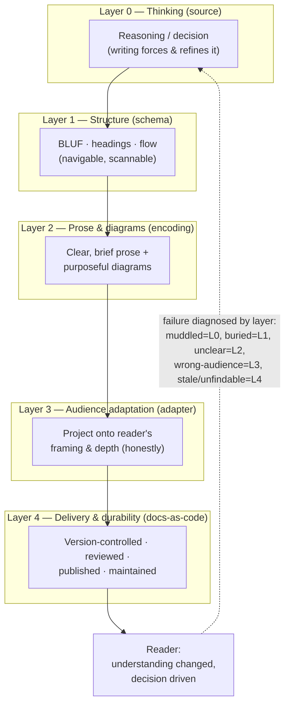
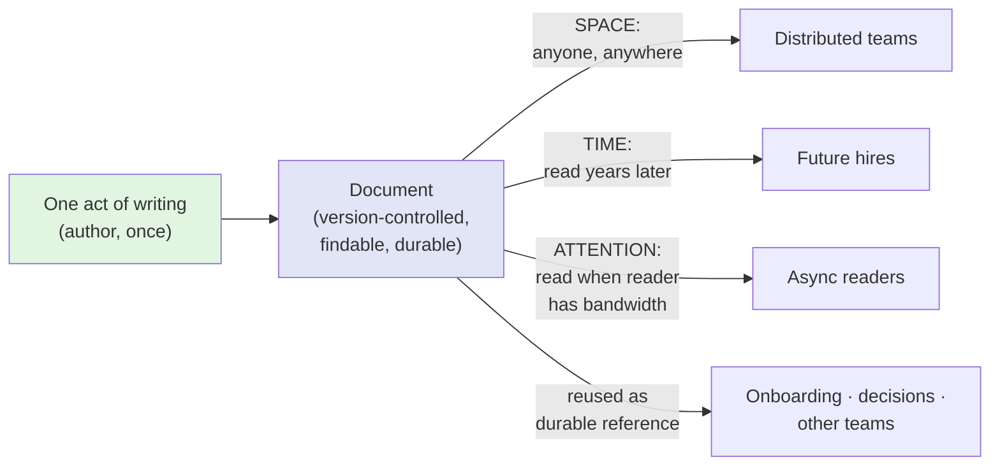
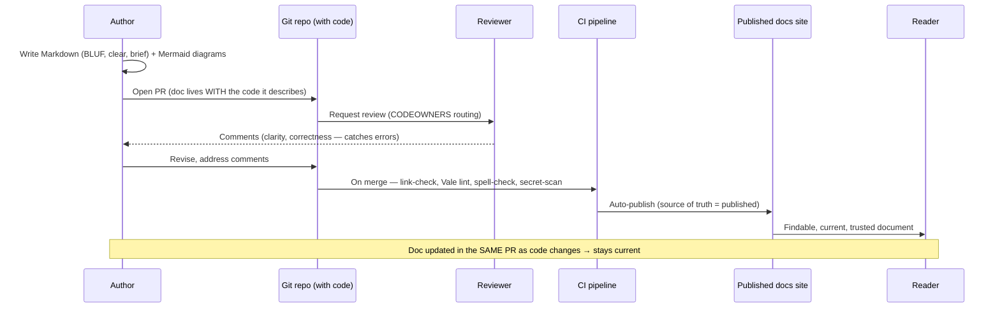

# Technical Writing

> Part of the **Enterprise Data & AI Architecture Handbook** — Phase-19 (Leadership & Technical Strategy), Chapter 04.
> Prerequisite: [Architecture Decision Records](../Phase-01/03_Architecture_Decision_Records.md). Builds on [Architecture Reviews](02_Architecture_Reviews.md) and [Stakeholder Management](03_Stakeholder_Management.md).

---

## Executive Summary

Technical writing, in the sense this chapter means it, is not documentation-as-afterthought — it is the discipline of using written artifacts (design docs, one-pagers, ADRs, RFCs, strategy documents) as the primary mechanism by which technical decisions are made, scaled, and preserved. It is the craft that produces the inputs to [Architecture Reviews](02_Architecture_Reviews.md) (the design doc that gets reviewed), the outputs of [Technical Leadership](01_Technical_Leadership.md) (the ADR that records a decision), and the currency of [Stakeholder Management](03_Stakeholder_Management.md) (the BLUF brief that secures funding). Writing is the connective tissue of every prior chapter in this phase, and doing it well is one of the highest-leverage skills a technical leader possesses.

The central thesis of this chapter — the claim that reframes writing from a chore into a core competency — is that **writing is thinking, and a document is a scaling mechanism for a decision.** The act of writing forces a clarity that verbal reasoning never demands: you cannot write a muddled thought precisely, so the attempt to write it exposes the muddle and forces its resolution (the "writing catches flaws" effect from [Architecture Reviews](02_Architecture_Reviews.md) §3.1). And once written, a document scales the decision it contains across space (people who weren't in the room), time (people who come later), and attention (people who read it when *they* have bandwidth, not when you do) — in a way that a meeting, a Slack thread, or a conversation fundamentally cannot. A leader who can only communicate synchronously is bounded by their own presence; a leader who writes well multiplies their reach and durability enormously.

The recurring discipline the chapter returns to is **writing for the reader, not the writer.** The dominant failure of technical writing is that engineers write the way they *think* — building context up to a conclusion, including everything they know, optimizing for completeness and their own comfort — when they should write the way the *reader needs to consume* — leading with the conclusion, including only what the reader needs, optimizing for the reader's time and comprehension. Every technique in this chapter (BLUF structure, audience adaptation, ruthless brevity, diagrams-as-communication) is an application of this single principle: the document exists to change what is in the reader's head, and it must be shaped by the reader's needs, not the writer's.

This chapter treats technical writing as an engineering discipline with a purpose (change the reader's understanding or drive a decision), a set of techniques (structure, clarity, brevity, audience adaptation, visual communication), a delivery mechanism (docs-as-code), and measurable quality attributes (is it read? is it understood? does it drive the decision? does it survive?). It is written for the technical leader who has learned that the quality of their writing directly bounds the reach of their ideas — and that a brilliant idea in an unreadable document is, organizationally, no idea at all.

---

## Learning Objectives

After working through this chapter you will be able to:

- **Write a design doc and a one-pager** that make a decision reviewable and a recommendation actionable — with the structure, framing, and completeness the artifact's purpose demands.
- **Adapt writing for different audiences** — engineers, staff/principal peers, executives, cross-functional stakeholders — projecting the same technical reality into the framing and depth each audience needs.
- **Apply the core craft of structure, clarity, and brevity**: lead with the conclusion, structure for scannability, write plainly, and ruthlessly cut everything the reader doesn't need.
- **Use diagrams as first-class communication** — choosing the right diagram type, keeping them clear and purposeful, and treating them as arguments rather than decoration.
- **Practice docs-as-code**: author, review, version, and publish documentation using the same tooling and discipline as source code, so docs stay current, reviewed, and durable.
- **Recognize and avoid the dominant failure modes**: writing for the writer, burying the point, the wall of text, the undefined-jargon barrier, the stale doc, and the diagram that obscures rather than clarifies.
- **Understand writing as a thinking and scaling tool** — using the act of writing to sharpen decisions and the resulting document to scale them across space, time, and attention.

---

## Business Motivation

The business case for technical writing rests on a leverage argument: **a well-written document is one of the highest-return artifacts a technical leader can produce, because it scales a decision or an idea across an entire organization at near-zero marginal cost per reader.** A one-hour meeting aligns the six people in the room, once; a one-page document that took the same hour to write aligns everyone who reads it, forever, on their own schedule, including people who join the organization years later. The asymmetry is enormous, and it compounds: every hour a senior person spends re-explaining the same decision verbally is an hour they didn't have to spend if they'd written it down once. Poor technical writing is therefore a silent, recurring tax on the whole organization's time — the same diffuse, invisible cost as the decision-debt and reliability-debt patterns from earlier chapters.

In data and AI platform organizations the case sharpens for three reasons. First, the decisions are **long-lived and consequential** ([Architecture Reviews](02_Architecture_Reviews.md), [Technical Leadership](01_Technical_Leadership.md)), so the durability that writing provides — the ADR that preserves *why* a table format was chosen, readable years later — is worth more than in a fast-churning consumer app. Second, the work is **deeply cross-functional**, so the ability to write for many different audiences (the CFO, the security lead, the domain team, the data scientist — the [Stakeholder Management](03_Stakeholder_Management.md) translation discipline) is not a nice-to-have but a precondition for getting anything cross-cutting done. Third, these organizations are increasingly **distributed and asynchronous**, and async collaboration runs almost entirely on the quality of written communication — a distributed team that writes badly is a team that mis-coordinates, duplicates work, and re-litigates settled questions.

There is also a career and organizational-influence dimension the business must recognize: **the reach of a technical leader's ideas is bounded by the quality of their writing.** Two engineers with equally good ideas will have wildly different organizational impact if one writes clearly and one doesn't, because the clear writer's ideas travel — into decisions, into other teams, into executive attention — while the poor writer's ideas stay trapped in their head or die in an unreadable doc. Organizations that under-value and under-develop technical writing systematically under-utilize their best technical thinkers.

The cost of *absent* or *poor* technical writing is predictable: decisions made verbally and then lost, re-litigated, or mis-remembered; cross-functional initiatives that stall because they were never legibly documented for the stakeholders who had to agree; distributed teams that mis-coordinate; onboarding that takes months because nothing is written down; and good ideas that never spread because they were never well-expressed. The cost of *good* technical writing is the difference between an organization whose knowledge and decisions compound in durable, reusable artifacts and one that perpetually re-derives what it already knew.

---

## History and Evolution

Technical writing as a distinct discipline is old, but its role in engineering *decision-making* — as opposed to end-user documentation — is a more recent and still-under-appreciated development.

- **Pre-software: technical documentation as a trade.** Technical writing began as the craft of documenting machines, procedures, and products for users and operators — manuals, specifications, procedures. This "technical communication" tradition (professionalized through the 20th century, with bodies like the Society for Technical Communication) established the core principles of clarity, audience awareness, and structure that still underpin the discipline.
- **1970s–1980s: writing and thinking.** The recognition that *writing is a tool for thinking*, not just recording, was crystallized outside software — in composition theory and in business communication. Barbara Minto's *The Pyramid Principle* (1987), developed at McKinsey, formalized the "lead with the answer, structure supporting arguments hierarchically" approach that underlies modern executive and technical communication (and the BLUF discipline from [Stakeholder Management](03_Stakeholder_Management.md)).
- **1990s–2000s: the design doc emerges in engineering culture.** As software systems grew too complex to hold in one head, the *design document* became a load-bearing artifact in serious engineering organizations — most influentially at Google, whose internal design-doc culture (a written proposal reviewed before building) became the reference model. This shifted technical writing from "document the finished thing for users" to "write the proposal that drives the decision," the sense this chapter emphasizes.
- **2000s–2010s: docs-as-code and the RFC renaissance.** Two parallel movements matured the practice. **Docs-as-code** — treating documentation with the same tooling and rigor as source code (plain-text markup, version control, review, automated publishing) — emerged from the developer-documentation and open-source worlds (the "Docs Like Code" movement, tools like Sphinx, MkDocs, and later Docusaurus). In parallel, the **RFC / design-doc process** (Amazon, Stripe, Oxide, Rust, etc.) made written proposals the standard unit of technical decision-making ([Architecture Reviews](02_Architecture_Reviews.md)). The ADR (Michael Nygard, 2011) gave decisions a durable, lightweight written form ([Architecture Decision Records](../Phase-01/03_Architecture_Decision_Records.md)).
- **2010s–2020s: writing as a remote/async superpower, and AI as a writing tool.** The rise of distributed and remote-first engineering (accelerated dramatically around 2020) made *written* communication the primary coordination mechanism for a huge fraction of the industry — companies like GitLab and Automattic built explicitly "handbook-first" / async-written cultures. Most recently, generative AI has become a genuine writing *assistant* (drafting, editing, restructuring) — a tool that lowers the mechanical cost of producing prose while, critically, *not* removing the need for the human to do the thinking, structuring, and judgment that make a document good (a point this chapter returns to, since AI can produce fluent text that is confidently wrong or unfocused).

The through-line is a steady elevation of writing from a documentation chore to a **core engineering-leadership competency** — the recognition that in a complex, distributed, decision-heavy technical organization, the written word is the primary substrate of thought, decision, and coordination.

---

## Why This Technology Exists

Technical writing exists to solve a fundamental limitation of the alternatives — verbal communication and unwritten knowledge — against the demands of complex, durable, distributed technical work. The limitation is threefold, and each part is a reason the discipline exists:

**It exists because verbal reasoning is imprecise and un-scrutinizable.** A thought held in the head or spoken aloud can be muddled without the muddle being visible — the speaker fills gaps with intuition, the listener fills gaps with assumption, and neither notices. Writing forces the thought into an explicit, complete, inspectable form; the gaps and contradictions that verbal reasoning glosses over become visible on the page. This is why "writing is thinking" is not a slogan but a mechanism: the discipline of writing *is* the discipline of thinking clearly, and the document exists partly to force that clarity on its own author before anyone else reads it.

**It exists because knowledge that isn't written down doesn't scale or survive.** A decision made in a meeting is available only to the people in the meeting, only for as long as they remember it. The organization needs that decision available to people who weren't there, who join later, and who need it when the original participants are unavailable or gone. Writing is the mechanism that scales a decision across space (distributed teams), time (future readers), and attention (async consumption) — none of which synchronous communication can do. Without written artifacts, an organization's knowledge is trapped in individuals' heads, evaporating with every departure and re-derived at enormous cost.

**It exists because complex, cross-functional decisions require legible, reviewable, aligned-upon artifacts.** A significant technical decision must be reviewed ([Architecture Reviews](02_Architecture_Reviews.md)), aligned across stakeholders ([Stakeholder Management](03_Stakeholder_Management.md)), and preserved with its rationale ([Architecture Decision Records](../Phase-01/03_Architecture_Decision_Records.md)) — and all three require the decision to exist as a *document* that people can read, comment on, and refer back to. The document is the shared object that makes collective reasoning about a decision possible.

The discipline exists, in short, because the written word is the only medium that simultaneously forces clarity of thought, scales across space/time/attention, and provides the durable, legible, reviewable artifact that complex technical decision-making requires. No verbal or informal alternative provides all three, and serious technical work needs all three.

---

## Problems It Solves

- **Muddled thinking.** The act of writing forces latent confusion, gaps, and contradictions into visibility, sharpening the underlying decision before anyone else reads it — writing as a thinking tool.
- **Knowledge evaporation.** Written artifacts preserve decisions, rationale, and context durably, so knowledge survives personnel changes and settled questions aren't re-litigated (the [Architecture Decision Records](../Phase-01/03_Architecture_Decision_Records.md) memory function).
- **Coordination at a distance.** Documents scale a decision or an idea across distributed teams and asynchronous work, letting people who weren't in the room align on their own schedule.
- **The re-explanation tax.** Writing a decision or design down once eliminates the recurring cost of a senior person re-explaining it verbally to each new person who needs it.
- **Reviewability.** A written design doc is the artifact that makes a decision reviewable ([Architecture Reviews](02_Architecture_Reviews.md)); without it, there is nothing substantive to scrutinize.
- **Cross-functional alignment.** Writing for different audiences translates one technical reality into the framings different stakeholders need, making cross-functional agreement tractable ([Stakeholder Management](03_Stakeholder_Management.md)).
- **Onboarding and knowledge transfer.** Well-written documentation lets new team members and successors absorb context that would otherwise require months of osmosis or a departed person's memory.
- **Idea propagation.** Clear writing lets a good idea travel — into decisions, other teams, and executive attention — rather than staying trapped in its originator's head.

---

## Problems It Cannot Solve

- **It cannot rescue a bad idea or bad thinking.** Clear writing makes a bad idea's flaws *more* visible, not less — which is a feature, not a bug, but it means writing is not a way to make a weak decision look strong. (Fluent writing that dresses up weak thinking is a specific danger, amplified by AI writing tools that produce confident, polished prose regardless of the quality of the underlying reasoning.)
- **It cannot substitute for the thinking.** Writing *forces* thinking but does not *replace* it; a document produced without genuine reasoning (or generated by an AI without human judgment applied) can be fluent and empty. The value is in the thinking the writing forces and captures, not in the prose itself.
- **It cannot make an unread document effective.** A brilliant document nobody reads has zero impact. Writing must be paired with the discipline of making documents *readable* (structure, brevity) and *read* (the right length for the audience, socialization) — a perfectly-reasoned wall of text that no one finishes is a failure.
- **It cannot replace synchronous communication entirely.** Some interactions — a contentious real-time negotiation, a high-bandwidth brainstorm, an emotionally-charged conversation — are better done live. Writing is the default and the durable record, but insisting on writing for everything is its own failure mode; the skill includes knowing when a conversation is the right medium.
- **It cannot stay current on its own.** A document is a snapshot; without the docs-as-code discipline of reviewing and updating it, it drifts from reality and becomes actively harmful (the stale-doc problem — a confidently-wrong document is worse than no document, because people trust it).
- **It cannot manufacture writing skill instantly.** Good technical writing is a learnable but *practiced* skill; it improves through deliberate effort and feedback over time, not through reading a chapter once. This chapter provides the principles; competence comes from applying them repeatedly.

---

## Core Concepts

### 4.1 Design Docs and One-Pagers

The two workhorse artifacts of technical decision-making are the **design doc** and the **one-pager**, and choosing between them (and structuring each well) is the foundational skill.

The **design doc** is the fuller artifact — the reviewable proposal for a consequential technical decision, covered in [Architecture Reviews](02_Architecture_Reviews.md) §2.2. Its canonical structure: **context/problem** (what and why, the framing), **goals and non-goals** (scope, explicitly bounded), **proposed design** (the recommendation in evaluable detail), **alternatives considered with reasons** (the single strongest quality signal — a doc with no real alternatives is suspect), **trade-offs and risks**, **cross-cutting concerns** (security, privacy, cost, reliability, operability), and **rollout/rollback**. The design doc is written to be *reviewed and reasoned about*, so it must be complete enough to interrogate but not so long that no one reads it.

The **one-pager** is the compression — a single page (genuinely one page) that carries a recommendation, a decision request, or a status to an audience with limited time, most often executives ([Stakeholder Management](03_Stakeholder_Management.md)'s executive brief). Its discipline is BLUF (Bottom Line Up Front): the answer, the ask, or the headline *first*, then supporting detail in decreasing order of importance, so a reader can stop after the first paragraph and still have the essential decision. The one-pager is not a shortened design doc; it is a differently-purposed artifact — the design doc is for deciding *well* (completeness for reviewers), the one-pager is for deciding *fast* (compression for the time-constrained).

The key judgment is matching the artifact to the purpose and audience: a one-way-door platform decision that a review board will scrutinize needs a design doc; a funding ask to a busy executive needs a one-pager (possibly backed by a design doc available on request). Using a design doc where a one-pager is needed buries the decision; using a one-pager where a design doc is needed omits the detail the decision requires. Many real situations need *both* — the one-pager for the executive, the design doc for the reviewers — projecting the same decision at two levels of detail.

### 4.2 Writing for Different Audiences

The most important and most violated principle in technical writing is **write for the reader, not the writer** — and since different readers need different things, this means consciously adapting the writing to the audience. The same technical reality must be written differently for:

- **Engineers / implementers** — need technical depth, precision, the *how*, and enough detail to build or evaluate the design. They can handle (and want) the technical specifics.
- **Staff / principal / architect peers** — need the trade-offs, the alternatives, the *why*, the cross-cutting implications, and the reasoning — they're evaluating the decision, not implementing it, so they need the argument more than the mechanics.
- **Executives** — need the business framing (cost, risk, revenue, strategy), the bottom line first, and minimal technical detail — the BLUF and business-translation discipline from [Stakeholder Management](03_Stakeholder_Management.md). An executive should not have to extract the decision from technical build-up.
- **Cross-functional partners** (security, legal, finance, product) — need the initiative framed in *their* domain's terms and concerns, projecting the technical reality onto the axis they're accountable for (the translation function from [Stakeholder Management](03_Stakeholder_Management.md) §4.2).

The critical discipline — and the boundary against manipulation — is that adapting for audience means changing the *framing, depth, and emphasis*, never the *facts*. The same underlying reality is projected honestly onto each audience's needs; it is not a different story per audience (that's spin, and it destroys trust when audiences compare notes). A single document sometimes serves multiple audiences through layering: a BLUF executive summary at the top for the skimmers, progressively more technical detail below for those who need it, so each reader consumes to the depth they require and stops.

A practical technique: **explicitly identify the audience before writing** ("this doc is for the architecture review board"; "this one-pager is for the CFO"), because a document written for "everyone" is written for no one — it's too detailed for the executive and too shallow for the implementer. Knowing the reader is the precondition for every other writing choice.

### 4.3 Structure, Clarity, and Brevity

These three are the mechanical core of the craft, and each is an application of writing-for-the-reader:

**Structure** — organize for how the reader *consumes*, not how you *thought*. The dominant structural technique is **lead with the conclusion** (BLUF / the pyramid principle / the inverted pyramid): state the main point first, then support it, so a reader gets the essential message immediately and reads further only for detail. This is the opposite of the narrative build-up engineers naturally write ("here's the context, here's the analysis, therefore the conclusion") and it is almost always right for technical and business readers, who are busy and want the point. Beyond that: use **descriptive headings** so the doc is scannable (a reader should be able to navigate by headings and read only the relevant sections), **short paragraphs** (one idea each), **lists and tables** for structured information, and a **logical flow** where each section follows from the last.

**Clarity** — write to be understood on the first read. Use **plain language** (short words over long, concrete over abstract), **short sentences** (one idea each; break up the compound), **active voice** ("the pipeline validates the schema," not "the schema is validated by the pipeline" — clearer and shorter), and **define jargon** (or avoid it) — undefined acronyms and domain terms are a barrier that excludes exactly the cross-functional readers you often most need. Clarity is not dumbing down; it is respecting the reader's time by doing the work of being understood, so they don't have to do the work of decoding.

**Brevity** — ruthlessly cut everything the reader doesn't need. The discipline is that **every word the reader must read is a cost**, and a document should impose only the cost that delivers value. Cut redundancy, throat-clearing preambles, hedging, and detail that serves the writer's completeness-anxiety rather than the reader's need. The famous injunctions apply: "omit needless words" (Strunk & White); "I would have written a shorter letter, but I did not have the time" (the point being that brevity is *harder* than length and worth the effort). Brevity is not the enemy of completeness — it's the discipline of including everything necessary and nothing more. A long document is not more thorough; it is more expensive to read and more likely to go unread.

The tension among the three is real — completeness (for the design doc's reviewers) versus brevity (for the reader's time) — and it's resolved by *layering* and *purpose*: include what the artifact's purpose requires, structure it so readers can consume to their needed depth and stop, and cut everything beyond that.

### 4.4 Diagrams as Communication

A diagram is not decoration; it is a **communication tool that can convey structural and relational information faster and more clearly than prose can** — and treating diagrams as first-class writing is a distinguishing mark of strong technical communication. Some information is inherently spatial or relational (a system architecture, a data flow, a state machine, a sequence of interactions, an entity relationship) and is genuinely clearer as a diagram than as paragraphs; forcing it into prose is as much a failure as forcing prose information into a diagram.

The disciplines of good technical diagrams:

- **One diagram, one purpose.** A diagram should make *one* thing clear (the component structure, or the data flow, or the sequence — not all at once). A diagram trying to show everything shows nothing; better to have three focused diagrams than one that's an unreadable tangle.
- **Choose the right type for the information.** A *flowchart/component diagram* for structure and architecture; a *sequence diagram* for time-ordered interactions between actors; a *state diagram* for lifecycle and state transitions; an *ER diagram* for data relationships. Using the wrong type (a flowchart for what is really a sequence) obscures rather than clarifies.
- **Clarity over completeness.** As with prose, a diagram should include what serves its purpose and omit the rest; a diagram cluttered with every detail is worse than one that shows the essential structure cleanly. Label clearly, use consistent notation, and keep the visual complexity manageable.
- **Diagram as argument.** The best technical diagrams don't just depict — they make a *point* (this is where the bottleneck is; this is the boundary the data must not cross; this is the sequence that guarantees correctness). A diagram with a thesis is more valuable than a neutral depiction.

The docs-as-code corollary (below) applies especially to diagrams: **prefer text-based, version-controlled diagrams** (Mermaid, PlantUML, Graphviz) over binary image files, because they can be diffed, reviewed, and kept in sync with the doc as code changes — a binary diagram in a doc is a stale-diagram-waiting-to-happen, drifting from the reality it depicts. This handbook's own extensive use of Mermaid diagrams is a deliberate demonstration of the principle: every architecture, data-flow, and sequence diagram is text, versioned alongside the prose.

### 4.5 Docs-as-Code

Docs-as-code is the practice of **treating documentation with the same tooling, workflow, and rigor as source code** — and it is the delivery mechanism that keeps technical writing current, reviewed, versioned, and durable rather than stale, unreviewed, and lost. The core practices:

- **Plain-text markup in version control.** Write docs in Markdown (or reStructuredText/AsciiDoc) stored in **Git**, alongside or near the code they describe. This makes docs diffable, versioned, branchable, and history-preserving — you can see what changed, when, by whom, and why.
- **Review via pull request.** Documentation changes go through the same PR review as code, so docs get the same scrutiny (and the same catch-the-error benefit) and the review is where a doc's clarity and correctness are checked — the [Architecture Reviews](02_Architecture_Reviews.md) discipline applied to docs.
- **Automated publishing.** A static-site generator (MkDocs, Docusaurus, Sphinx, Hugo) builds and publishes the docs automatically from the source on merge, so the published docs are always in sync with the source of truth.
- **Docs live with code.** Keeping documentation in the same repository as the code it describes means the docs are *right there* when an engineer changes the code, maximizing the chance they're updated together — the single best defense against staleness. Docs in a separate wiki that nobody touches when the code changes are the ones that rot.
- **Treat docs as a build artifact and a tested thing.** Link-checking, spell-checking, style-linting (Vale), and even executable-example testing can run in CI, so documentation quality is enforced automatically like code quality.

The deeper point of docs-as-code is cultural: it makes documentation a *first-class, maintained engineering artifact* rather than a neglected afterthought, and it directly attacks the stale-doc problem (the [Architecture Decision Records](../Phase-01/03_Architecture_Decision_Records.md) and [Architecture Reviews](02_Architecture_Reviews.md) Storage-section concern) by putting docs in the workflow where they get updated. A doc in the same PR as the code change it describes gets updated with the change; a doc in a separate system doesn't.

---

## Internal Working

### 5.1 How Writing Forces Thinking

The "writing is thinking" claim has a precise internal mechanism worth making explicit, because it explains why writing catches errors that review-of-a-verbal-idea doesn't. When you hold a design in your head, your brain uses *chunking* and *implicit gap-filling*: complex sub-parts are compressed into single mental tokens ("the caching layer handles it") and gaps between steps are silently bridged by intuition, so the design *feels* complete and coherent even where it isn't. Writing defeats both mechanisms. To write "the caching layer handles it" precisely, you must *decompress* the chunk — spell out *how* it handles it — and in the decompression, the gaps and hand-waves that the chunk was hiding become visible ("wait, how *does* it handle invalidation?"). The act of linearizing a thought into explicit, sequential, complete prose forces every compressed chunk to be expanded and every implicit gap to be either filled or exposed. This is why authors routinely discover their own design's flaws *while writing the doc*, before any reviewer sees it — the writing is doing error-detection on the thinking. The corollary is that a document written *without* this decompression (dashed off, or generated by an AI that fluently papers over the gaps rather than exposing them) loses most of the value, because the gap-exposure — not the prose — is the point.

### 5.2 How a Document Scales a Decision

A document's scaling power has a mechanism too: it *decouples the production of a communication from its consumption* across three dimensions. **Space**: the document can be read by anyone, anywhere, without the author present — decoupling the communication from the author's physical/organizational location. **Time**: the document persists, so it can be read long after it was written, by people who join later — decoupling consumption from the moment of production. **Attention**: the document is consumed when the *reader* has bandwidth, not when the author is available — decoupling the communication from synchronized attention, which is the scarcest resource ([Stakeholder Management](03_Stakeholder_Management.md), [Technical Leadership](01_Technical_Leadership.md)). Synchronous communication (a meeting) couples all three — everyone must be in the same place, at the same time, giving attention simultaneously — which is why it doesn't scale. The document's power is precisely this decoupling: one act of writing serves an unbounded number of reading events, distributed arbitrarily across space, time, and attention. This is the mechanical basis of the leverage argument, and it explains why the highest-leverage communication in a distributed, async, long-lived organization is almost always written.

### 5.3 The Reader's Cognitive Budget

The internal working of *reading* explains the structure/clarity/brevity disciplines. A reader has a bounded cognitive budget per document — attention, working memory, and willingness-to-continue — and every element of the document *spends* from that budget: every word to read, every sentence to parse, every undefined term to decode, every paragraph to hold in working memory. Good technical writing is *cognitive-budget optimization*: it delivers the needed understanding for the minimum expenditure of the reader's budget. BLUF spends the budget efficiently by delivering the main point while the reader's attention and willingness are highest (at the start), rather than making them spend most of their budget on build-up before the payoff. Brevity reduces total expenditure. Clarity reduces per-element cost (a plain sentence costs less to parse than a convoluted one; a defined term costs less than an undefined one). Structure and scannability let the reader *allocate* their budget (skip sections they don't need). A document that ignores the reader's budget — buries the point, sprawls, uses undefined jargon, walls of text — *overspends* it, and the reader's willingness-to-continue runs out before they reach the value, so the document goes unread or un-understood. The whole craft, mechanically, is spending the reader's finite cognitive budget wisely.

---

## Architecture

Technical writing as a system can be modeled as a layered architecture — a pipeline from thought to durable, consumed artifact:

- **Layer 0 — Thinking (the source).** The actual reasoning and decision the document exists to express. Writing forces and refines this layer (§5.1); without genuine thinking here, everything above is fluent emptiness.
- **Layer 1 — Structure (the schema).** The organization of the content — BLUF, headings, sections, flow — that determines whether the reader can navigate and consume it. The document's information architecture.
- **Layer 2 — Prose and diagrams (the encoding).** The actual words and visuals that encode the thinking for a reader — clarity, brevity, the right diagram for the right information.
- **Layer 3 — Audience adaptation (the protocol adapter).** The projection of the content onto the specific audience's needs, framing, and depth (the translation function).
- **Layer 4 — Delivery and durability (docs-as-code).** The version-controlled, reviewed, published, maintained delivery mechanism that gets the document to readers and keeps it current.

The architecture is diagnostic: a document that fails to land can fail at any layer, and the fix differs by layer. Fluent prose expressing muddled thinking is a Layer-0 failure (fix the thinking, not the wording). Clear prose that buries the point is a Layer-1 failure (restructure — BLUF). Good structure rendered in convoluted jargon is a Layer-2 failure (simplify the prose). A well-written doc that's wrong for its reader is a Layer-3 failure (re-adapt to the audience). A great doc that's stale or unfindable is a Layer-4 failure (fix the delivery/maintenance). You cannot fix a Layer-0 thinking problem by polishing the Layer-2 prose — a common and futile mistake.

---

## Components

The concrete, nameable components of technical writing:

- **The design doc.** The full reviewable proposal for a consequential decision (§4.1).
- **The one-pager / executive brief.** The BLUF-structured single-page artifact for time-constrained (often executive) audiences (§4.1).
- **The ADR.** The durable decision record — context, decision, consequences, alternatives ([Architecture Decision Records](../Phase-01/03_Architecture_Decision_Records.md)).
- **The RFC.** The circulated proposal for asynchronous comment ([Architecture Reviews](02_Architecture_Reviews.md)).
- **The strategy / vision document.** The longer-form articulation of technical direction ([Technical Leadership](01_Technical_Leadership.md), [Technical Strategy and Roadmaps](../Phase-01/07_Technical_Strategy_and_Roadmaps.md)).
- **The runbook / operational doc.** The procedural documentation for operating a system ([Reliability and SRE](../Phase-18/04_Reliability_and_SRE.md)).
- **The diagram.** The text-based, version-controlled visual (Mermaid/PlantUML) that communicates structure, flow, or sequence (§4.4).
- **The template.** The standard structure for each doc type (design-doc template, ADR template, one-pager template) that ensures completeness and consistency.
- **The style guide.** The organizational conventions for terminology, tone, and formatting that keep writing consistent across authors.
- **The docs-as-code toolchain.** Git + Markdown + static-site generator + CI checks — the delivery and maintenance mechanism (§4.5).

---

## Metadata

The metadata of a technical document is the *contextual information that makes it findable, trustworthy, and maintainable*. Essential document metadata includes: the **author(s)** and **reviewers** (attribution and accountability), the **date and version** (is this current?), the **status** (draft / under review / accepted / superseded — the same lifecycle as an ADR), the **intended audience** (so readers know if it's for them), and the **relationships** to other documents (what it supersedes, what it depends on, what implements it). This metadata is what makes a document *safe to rely on*: a reader who sees "status: superseded by [newer doc], 2024" knows not to trust the content, whereas the same content with no status metadata is a trap. The most frequently-missing and most valuable piece is the **status and currency metadata** — because a document that has been silently invalidated by events but carries no indication of it is actively harmful (the stale-doc-that-people-still-trust problem, exactly parallel to the stale-ADR concern from [Architecture Reviews](02_Architecture_Reviews.md) and the stale-data concern from [Data Governance](../Phase-08/01_Data_Governance_Foundations.md)). Docs-as-code operationalizes much of this metadata automatically — Git provides author, date, and version history for free — which is one of its underappreciated benefits: the delivery mechanism supplies the trust-critical metadata as a side effect.

---

## Storage

The storage of technical writing is where documents are **durably kept, versioned, and made findable** — and it is the difference between an organization whose written knowledge compounds and one whose documents scatter and rot. The docs-as-code answer is **version control (Git)**, ideally with the documents stored *near the code they describe* so they stay in sync and are found where they're needed. The storage discipline mirrors data governance ([Data Governance](../Phase-08/01_Data_Governance_Foundations.md)) applied to documents: they must be **findable** (indexed, searchable, discoverable — a great document nobody can find has no value), **trustworthy** (versioned, dated, attributed, with status/currency clear), and **maintained** (superseded docs marked, not silently left to mislead). The dominant storage failure is *fragmentation and rot*: documents scattered across wikis, personal drives, chat attachments, and slide decks, with no single findable source of truth, no version history, and no currency signal — so no one can find the right doc, no one knows if what they found is current, and the organization's written knowledge is effectively lost even though it was "written down." The consolidation of documentation into a single, version-controlled, searchable, docs-as-code home (a documentation site built from a Git repo, a developer portal like Backstage) is one of the highest-value and most-neglected knowledge-infrastructure investments an organization can make. As with data, the value of a document is realized only if it can be found and trusted when needed.

---

## Compute

The scarce "compute" of technical writing is **the author's thinking-and-writing effort and — even more scarce — the reader's attention.** Writing well is genuinely effortful (the "I would have written a shorter letter but lacked the time" truth — brevity and clarity cost *more* author effort than sprawl, because compression requires thinking), so an author's writing capacity is a real, bounded resource to spend deliberately: invest the effort in the high-leverage documents (the decision that will be read by hundreds, the strategy that guides a year of work) and don't gold-plate the ephemeral ones. But the far scarcer resource is the *reader's* attention (the [Stakeholder Management](03_Stakeholder_Management.md) and [Technical Leadership](01_Technical_Leadership.md) attention-as-scarce-resource principle, applied to reading): a document consumes reader attention, and reader attention aggregated across all readers is a large organizational cost. This asymmetry drives the core economic logic of good writing: **it is worth spending more of the scarce-but-singular author effort to save the scarcer-and-multiplied reader attention.** An hour more of the author's editing that saves each of two hundred readers five minutes is an overwhelmingly good trade — the author spends one hour to save the organization ~17 hours. This is why brevity and clarity, which cost author effort, are economically correct: they trade cheap (single-author) effort for expensive (multiplied-reader) attention. An author who writes a sprawling first draft and ships it is optimizing their own compute at the expense of every reader's — exactly backwards.

---

## Networking

The "networking" dimension of technical writing is **how documents connect — to each other, to the code they describe, and to the readers who need them.** A document is rarely a standalone island; it lives in a web of relationships: an ADR references the design doc that produced it and the code that implements it; a design doc links to the prior decisions it builds on; a strategy doc connects to the roadmap that executes it. These links are the "network" that lets a reader navigate from one artifact to the related context they need — and this handbook itself is a deliberate demonstration, with every chapter cross-linking to its prerequisites and related chapters so a reader can traverse the knowledge graph. The docs-as-code discipline strengthens this network: version-controlled Markdown links can be checked automatically (CI link-checking catches broken references), and docs stored together form a navigable, searchable web rather than scattered fragments. The other "networking" sense is **connecting documents to their readers** — discoverability, so the person who needs a document can find it (a developer portal, a searchable docs site, links from the code). A document disconnected from the network — not linked to related context, not findable by the people who need it, not connected to the code it describes — loses much of its value, because a reader who can't get from where they are to the document, or from the document to the related context, can't use it. Deliberate cross-linking and discoverability are the writing-domain equivalent of the relationship-network investment: the connections must exist for the value to flow.

---

## Security

Security in technical writing has two dimensions. First, **the confidentiality and appropriate access control of sensitive documents.** Technical documents routinely contain sensitive information — architectural details that reveal attack surface, security designs, credentials or secrets (which must *never* be in docs), business-sensitive strategy, personal data in examples. The discipline: classify documents by sensitivity, apply appropriate access control (not everything should be world-readable, even internally), and rigorously **never commit secrets to documentation** (the same discipline as [Secrets and Key Management](../Phase-10/05_Secrets_and_Key_Management.md) — a credential in a design doc in a Git repo is a leaked credential, permanently, in the history). The docs-as-code storage in Git makes this concrete: a secret committed to a docs repo is exposed in the immutable history exactly like a secret committed to a code repo, so the same secret-scanning (Gitleaks, TruffleHog) that guards code must guard docs. Second, **accuracy as a security property**: a security runbook or an architecture doc that is *wrong* (stale, incorrect) can cause a security incident — an operator following a stale runbook during an incident, a team relying on an out-of-date security architecture. This makes the docs-as-code maintenance discipline (keeping docs current and reviewed) a security concern, not just a quality one, for operationally-critical documentation. The third, subtler point: **documentation of security-sensitive systems is a disclosure decision** — how much architectural detail to publish, and to whom, is a real security trade-off (transparency and reviewability versus attack-surface disclosure), and it should be made deliberately, not by default.

---

## Performance

The performance of technical writing is measured not in words produced but in reader outcomes:

- **Read rate** — is the document actually read, or abandoned? A document nobody finishes has zero performance regardless of its quality; length and structure are the primary levers (a buried point or a wall of text kills read rate).
- **Comprehension rate** — do readers understand it correctly on the first read, or do they misread, get confused, or need to ask? Clarity is the primary lever; a document that requires a follow-up conversation to understand has partly failed at its job.
- **Decision/action rate** — does the document drive the decision or action it exists to produce? A design doc that doesn't get a decision made, a one-pager that doesn't secure the funding, has underperformed regardless of its craft.
- **Time-to-understanding** — how long does a reader take to extract what they need? BLUF and scannability minimize this; a reader who can get the essential point in thirty seconds and the full detail in ten minutes is being served well.
- **Durability / staleness** — does the document remain accurate and useful over time, or rot? The docs-as-code maintenance discipline is the lever.
- **Reuse** — is the document referenced and relied upon repeatedly (high leverage) or read once and forgotten? Documents that become durable references (the ADR everyone cites, the design doc that onboards every new hire) are the highest-performing.

The key performance insight: **the goal is not good prose, it's changed reader understanding and driven decisions** — and it is entirely possible to write beautiful prose that no one reads (too long) or that doesn't drive its decision (buried point, wrong audience). Performance is measured at the reader, not at the page. The best-performing technical document is often not the most elegantly written; it's the one that most efficiently changes what its readers understand and do.

---

## Scalability

Technical writing *is* a scaling mechanism (§5.2) — its whole value is scaling a decision or an idea across space, time, and attention — but the *practice* of technical writing across an organization also has to scale, and it does so through:

- **Templates.** Standard structures for each doc type (design doc, ADR, one-pager) mean every author starts from a proven structure rather than reinventing it, and every reader knows where to find what they need — scaling *consistency* and *quality* across many authors. A design-doc template that forces the cross-cutting sections ([Architecture Reviews](02_Architecture_Reviews.md)) scales good practice to authors who wouldn't have thought of it.
- **Style guides.** Shared conventions (terminology, tone, formatting) keep writing consistent as the number of authors grows, so the organization's documentation reads coherently rather than as a patchwork.
- **Docs-as-code infrastructure.** The version-control + review + auto-publish pipeline scales the *production and maintenance* of documentation across a large organization, with the same workflow everyone already uses for code.
- **A documentation culture and skill development.** The most important scaling factor: an organization where writing is valued, taught, and expected produces good documentation at scale, while one where it's neglected produces scattered rot regardless of tooling. Developing writing skill broadly (through feedback, examples, and expectation) scales the *capability*.
- **Discoverability infrastructure.** A searchable docs site or developer portal (Backstage) scales *consumption* — as the document corpus grows, findability becomes the binding constraint, and search/navigation infrastructure is what keeps a large corpus usable.

The anti-pattern is scaling *volume* without scaling *quality, maintenance, or findability* — an organization that produces mountains of documents with no templates, no consistency, no maintenance, and no search has scaled its documentation into an unusable, untrustworthy swamp, which is worse than less documentation done well. Scaling technical writing means scaling the *quality and usability* of the corpus, not just its size.

---

## Fault Tolerance

Documents fail in predictable ways, and a mature documentation practice tolerates these faults:

- **Staleness (the dominant fault).** Documents drift from reality over time. The tolerance is the docs-as-code discipline: docs living with the code (updated in the same PR), status/currency metadata (so a reader can tell if it's current), explicit supersession (marking outdated docs rather than deleting or silently leaving them), and periodic review. A stale doc with a clear "last reviewed" date and status is far safer than a stale doc that looks current — the fault is tolerated by making it *visible* rather than pretending it won't happen.
- **The unread document.** A document might not be read (too long, not discoverable). Tolerance: BLUF structure means even a partial read delivers the main point; layering means different readers get value at their depth; and discoverability infrastructure means the document can be found.
- **Misunderstanding.** A reader might misread. Tolerance: clarity minimizes it, and the review process (docs-as-code PR review) catches ambiguities before publication — a reviewer who misreads the draft reveals the ambiguity while it's still cheap to fix.
- **Single-author knowledge.** A document might encode knowledge only its author fully understands. Tolerance: review by others forces the doc to be comprehensible to non-authors (if a reviewer can't understand it, it's not done), and the doc itself is the mechanism that *transfers* the knowledge off the single author — writing is fault tolerance for bus-factor.
- **Loss.** Documents in personal drives or chat get lost. Tolerance: version-controlled storage in a durable, backed-up, findable system means documents survive personnel and tooling changes.

The most important fault-tolerance property is treating staleness as *inevitable and to-be-made-visible* rather than *preventable and to-be-ignored*: since documents *will* drift, the practice that marks currency, reviews periodically, and lives with the code tolerates the drift, while the practice that writes-once-and-forgets is guaranteed to accumulate a corpus of confidently-wrong, still-trusted documents — the worst outcome.

---

## Cost Optimization

The costs of technical writing are **author effort (writing and maintaining) and — dominant — aggregate reader attention.** Optimizing them:

- **Match writing investment to document leverage.** Invest heavy craft in high-leverage documents (the decision read by hundreds, the strategy that guides a year, the doc that onboards every hire) and keep ephemeral documents light. Gold-plating a throwaway status update wastes author effort; under-investing in a load-bearing design doc is a false economy.
- **Optimize for reader attention, not author convenience.** The core trade (from the Compute section): spend more author effort on brevity and clarity to save the far larger aggregate reader attention. This is almost always the right trade for anything read by more than a handful of people.
- **Reuse through templates and references.** Don't rewrite what's already written — reference existing docs (the networking discipline), reuse templates, and build a corpus where each piece of knowledge is written once and linked to, rather than re-explained repeatedly.
- **Automate maintenance cost.** Docs-as-code CI (link-checking, style-linting, staleness flags) reduces the manual cost of keeping docs correct and current.
- **Don't over-document.** Writing everything at maximum depth is its own cost — both author effort and a corpus so large it's unnavigable. Document what needs documenting at the depth its purpose requires; not every decision needs a full design doc (the reversibility-matching discipline from [Architecture Reviews](02_Architecture_Reviews.md), applied to documentation weight).

**Worked cost example.** Consider a design doc for a platform decision that will be read by ~50 engineers now and every new hire for the next two years (~100 more readers). Suppose the author ships a sprawling 12-page first draft that takes each reader ~25 minutes to get through and leaves many confused (needing follow-up conversations). That's ~150 readers × 25 min = ~62 reader-hours, plus the follow-up conversations. Now suppose the author instead spends 3 extra hours editing it down to a tight 5-page doc with a one-paragraph BLUF summary, clear structure, and two focused diagrams — now most readers get the essential point in ~3 minutes and the full detail in ~10, and confusion drops sharply. Reader time falls to roughly 150 × 8 min average = ~20 reader-hours, plus far fewer follow-ups. The author spent 3 hours to save the organization ~40+ reader-hours *and* improve comprehension and decision speed. The lesson is the general one: **for any document read by more than a handful of people, author effort spent on brevity and clarity pays back many times over in saved reader attention and improved outcomes — the single-author cost is small and the multiplied-reader benefit is large, so the trade is almost always overwhelmingly positive.** As with the [Architecture Reviews](02_Architecture_Reviews.md) and [Stakeholder Management](03_Stakeholder_Management.md) cost examples, better and cheaper (in total organizational cost) are achievable together, because the default (ship the sprawling first draft) is so mis-tuned toward author convenience.

---

## Monitoring

Monitoring technical writing means tracking the **leading indicators of documentation health** so that the corpus's degradation is caught before it becomes an unusable, untrustworthy swamp:

- **Staleness signals** — how many documents haven't been reviewed/updated past their currency threshold? A rising count of stale, unreviewed docs is the leading indicator of a rotting corpus. Docs-as-code can automate this (flag docs not touched in N months, or whose described code has changed).
- **Findability / search-success** — can people find the documents they need? Failed searches, repeated questions whose answers *are* documented (but unfindable), and "is there a doc for X?" queries signal a discoverability problem.
- **Read and engagement signals** — for published docs, are they being read? A load-bearing doc with near-zero reads signals either poor discoverability or poor quality (too long, wrong audience).
- **Broken links** — the network-integrity signal; broken cross-references (caught by CI link-checking) indicate a fragmenting, unmaintained corpus.
- **Doc-review adherence** — are documentation changes actually going through review (docs-as-code), or being committed unreviewed (a quality leak)?
- **The "tribal knowledge" signal** — recurring questions in chat whose answers live only in people's heads (not written down) indicate a documentation *gap* — knowledge that should be written but isn't.

The purpose mirrors production monitoring: distinguish "the documentation is healthy and trusted" from "it's degrading toward a swamp" *before* the corpus becomes something people no longer trust or use — because once a documentation corpus loses the organization's trust (too stale, too unfindable), people stop consulting it and revert to tribal knowledge, and the investment is lost.

---

## Observability

Where monitoring watches known indicators, **observability is the ability to ask *why* a document or the documentation practice is failing** — to root-cause a problem you didn't have a pre-built metric for. When a document isn't landing (not read, not understood, not driving its decision), or the corpus isn't being trusted or used, observability is the practice of investigating the *actual* cause rather than assuming it. The instruments are direct: asking readers ("did you read it? where did you stop? what was unclear?"), watching how documents are actually used (do people cite the doc or re-ask the question it answers?), and reading the failing document *as its intended reader* (is the point buried? is it too long? is the jargon undefined? is it wrong for this audience?). The recurring insight — the writing-domain instance of the handbook's pervasive pattern — is that **the surface complaint is often not the root cause**: "no one reads our docs" is a symptom whose real cause might be that the docs are too long (structure/brevity failure), or unfindable (storage/discoverability failure), or stale-and-distrusted (maintenance failure), or written for the wrong audience (adaptation failure) — each demanding a completely different fix. Responding to "no one reads our docs" by *writing more docs* (the intuitive but wrong response) makes it worse if the real cause was that the existing docs were too long or unfindable. The corresponding writing-level diagnosis — when a *specific* document fails — uses the layered architecture: is it a thinking failure (Layer 0), a structure failure (Layer 1), a prose failure (Layer 2), an audience failure (Layer 3), or a delivery failure (Layer 4)? Diagnosing which layer failed is the prerequisite to fixing it, and fixing the wrong layer (polishing prose when the thinking is muddled, or the structure buries the point) predictably fails.

---

## Operational Response Playbook

Concrete, repeatable responses to the two most common acute technical-writing failures. Each follows a signal → diagnosis → response structure.

### Playbook 1: An important document isn't landing (not read, not understood, or not driving its decision)

| Step | Action |
|------|--------|
| **Signal** | A document that matters — a design doc that isn't getting a decision made, a one-pager an executive didn't act on, a proposal that isn't building alignment — is failing to produce its intended outcome. |
| **Diagnose by layer** | Don't assume the cause (Observability discipline). Read the doc *as its intended reader* and locate the failure in the layered architecture: (0) is the underlying *thinking* muddled — fluent prose over a weak argument? (1) is the point *buried* — no BLUF, reader gives up before the payoff? (2) is the *prose* convoluted or jargon-laden — hard to parse? (3) is it written for the *wrong audience* — too technical for the exec, too shallow for the implementer? (4) is it a *delivery* problem — too long to finish, not findable? Confirm by asking a real reader where they stopped and what was unclear. |
| **Immediate response by layer** | (0) Fix the thinking first — no amount of polish rescues a muddled argument. (1) Restructure to lead with the conclusion/ask (BLUF). (2) Simplify — shorter sentences, plainer words, define or cut jargon, active voice. (3) Re-adapt to the actual audience's framing and depth (translate per [Stakeholder Management](03_Stakeholder_Management.md)). (4) Cut length ruthlessly, add a BLUF summary so a partial read still delivers the point, and fix discoverability. |
| **Do NOT** | Do not just make the document *longer* or add more detail (the instinctive response, usually wrong — length is often the problem, not the cure). Do not polish the prose (Layer 2) when the failure is buried-point (Layer 1) or muddled-thinking (Layer 0). |
| **Durable fix** | Adopt a template that forces BLUF + audience identification + the right structure for the doc type, so future docs start from a landing-optimized structure. Get a pre-publication read from a representative reader for high-stakes docs (the docs-as-code review discipline). |

### Playbook 2: The documentation corpus has become a stale, distrusted, unfindable swamp

| Step | Action |
|------|--------|
| **Signal** | People no longer trust or consult the docs — they ask in chat instead of searching, complain docs are wrong or outdated, can't find what they need, or say "the docs are useless." The corpus has lost the organization's trust. |
| **Diagnose the root cause** | Investigate *why* (Observability). Usual causes: (a) staleness — docs drifted from reality and are now wrong, so people learned not to trust them; (b) fragmentation — docs scattered across wikis/drives/chat with no single findable source of truth; (c) no maintenance workflow — docs written once and never updated because they don't live with the code and nothing prompts an update; (d) discoverability — docs exist and are current but can't be found (no search, no navigation). |
| **Immediate response by cause** | (a) Triage: identify the load-bearing docs, verify/update or explicitly mark-superseded the stale ones (a doc marked "outdated" is safer than one that looks current); delete or archive genuine cruft. (b) Consolidate into a single docs-as-code source of truth (a docs site from a Git repo). (c) Move docs to live *with* the code so updates happen in the same PR, and add periodic-review + currency-metadata discipline. (d) Add search/navigation (a docs site, a developer portal like Backstage). |
| **Do NOT** | Do not respond by mandating "write more documentation" — adding volume to a swamp deepens it. Do not try to boil the ocean (rewrite everything at once); triage to the load-bearing docs first and rebuild trust incrementally. |
| **Durable fix** | Institute docs-as-code as the standard: version-controlled Markdown living with the code, PR review for docs, automated publishing + link-checking + staleness flags, currency/status metadata on every doc, and a single searchable home. This attacks staleness (docs update with code), fragmentation (single source of truth), and findability (search) structurally, rebuilding the corpus into something trustworthy and used. |

---

## Governance

Governance of technical writing operates in two directions, mirroring the pattern of the prior Phase-19 chapters. First, **writing is the medium through which much technical governance is enacted.** ADRs *are* the durable governance record of decisions ([Architecture Decision Records](../Phase-01/03_Architecture_Decision_Records.md)); design docs are the reviewable artifacts governance forums scrutinize ([Architecture Reviews](02_Architecture_Reviews.md)); strategy documents are how technical direction is set and communicated ([Technical Leadership](01_Technical_Leadership.md)). Governance without good writing is governance without legible, durable artifacts — a framework with nothing written down to review, record, or refer to. Good technical writing is therefore infrastructure for governance.

Second, **the technical-writing practice itself benefits from lightweight governance:**

- **Standards and templates.** Organizational templates (design doc, ADR, one-pager) and a style guide are the governance backbone that ensures documents across many authors are complete, consistent, and reviewable — the same standardization role that a design-doc template plays in [Architecture Reviews](02_Architecture_Reviews.md).
- **Docs-as-code as a governance mechanism.** Requiring documentation changes to go through review, keeping docs version-controlled with attribution and history, and enforcing currency (status metadata, periodic review) are governance disciplines that keep the corpus trustworthy — and they're enforced through the same PR-review governance as code.
- **Sensitivity classification and access control.** Governing which documents are confidential, who can access them, and the never-commit-secrets rule (the Security section) is a governance requirement, especially for a corpus stored in Git where history is permanent.
- **Currency and lifecycle governance.** The status/supersession lifecycle (draft → accepted → superseded) governed consistently across the corpus is what keeps documents trustworthy — a governed lifecycle prevents the stale-doc-that-looks-current trap. ADR-0201 below makes the docs-as-code and BLUF-for-the-reader disciplines concrete.

The connection to the whole handbook: technical writing is the *substrate* on which the governance disciplines of [Architecture Governance](../Phase-01/02_Architecture_Governance.md), [Data Governance](../Phase-08/01_Data_Governance_Foundations.md), and the decision/review disciplines of this phase are recorded and enacted. A governance program that doesn't write well produces frameworks no one can read and decisions no one can find.

---

## Trade-offs

- **Completeness vs. brevity.** A complete document serves reviewers who need the detail but costs reader attention and risks going unread; a brief document is read but may omit needed detail. Resolved by layering (BLUF summary + detail below) and by matching depth to the artifact's purpose.
- **Writing time vs. speed of communication.** Writing well takes time (a good doc is slower than a quick message); a conversation is faster for the moment but doesn't scale or persist. The trade favors writing for anything durable, consequential, or multi-reader; favors conversation for the ephemeral, contentious, or high-bandwidth.
- **Precision vs. accessibility.** Precise technical language serves expert readers but excludes cross-functional ones; accessible plain language reaches everyone but may lose necessary precision. Resolved by audience adaptation and by defining rather than avoiding necessary terms.
- **Documentation coverage vs. maintenance burden.** More documentation captures more knowledge but creates more to keep current (more staleness risk); less documentation is easier to maintain but leaves gaps. Resolved by documenting what's load-bearing at the depth it needs, and by docs-as-code that reduces maintenance cost.
- **Standardization vs. author flexibility.** Templates and style guides ensure consistency and quality but constrain authors; total flexibility empowers authors but produces an inconsistent, harder-to-navigate corpus. The balance favors light standardization (templates for structure, style guide for consistency) with author latitude within it.
- **Synchronous vs. written communication.** Writing scales, persists, and forces clarity but is slower and can feel impersonal; synchronous communication is fast, high-bandwidth, and relational but ephemeral and non-scaling. The mature practice defaults to written for durability and uses synchronous deliberately where it's genuinely better.

---

## Decision Matrix

*Which written artifact (or medium) for which situation?*

| Situation | Recommended artifact | Why | When NOT to use it |
|-----------|---------------------|-----|--------------------|
| Consequential, reviewable technical decision | Design doc | Needs completeness for reviewers, alternatives, trade-offs, rollback | For a trivial/reversible decision — overkill |
| Decision request to a time-constrained executive | One-pager (BLUF) | Executive attention is scarce; needs the answer/ask first | Never bury the ask in a long design doc for an exec |
| Recording a decision durably | ADR | Preserves context/decision/consequences/alternatives, findable later | For an ephemeral, easily-reversed choice |
| Proposal for async cross-team comment | RFC | Enables distributed, written, reviewable feedback | For a same-team decision a quick conversation resolves |
| Setting/communicating technical direction | Strategy / vision doc | Coordinates distributed decisions over a long horizon | For a tactical, short-term choice |
| Structural/relational information (architecture, flow, sequence) | Diagram (text-based) | Conveys structure faster and clearer than prose | For information that's inherently narrative or nuanced |
| Contentious real-time negotiation or high-bandwidth brainstorm | Synchronous conversation (then write it down) | Some interactions are genuinely better live | When a durable record or wide async alignment is needed — then write |
| Any multi-reader, durable, or consequential communication | Written, version-controlled doc | Scales across space/time/attention; persists; forces clarity | For the truly ephemeral or the emotionally-charged |

---

## Design Patterns

- **BLUF — lead with the conclusion.** State the main point, ask, or answer first; supporting detail after, in decreasing importance. The single highest-leverage structural pattern.
- **Write for the reader, not the writer.** Shape every choice (structure, depth, framing, jargon) around what the reader needs to consume, not how the author thought.
- **Identify the audience explicitly before writing.** A doc for "everyone" serves no one; name the reader and write for them.
- **Layer for multiple audiences.** BLUF summary for skimmers, progressive detail below for those who need it — one document serving different readers at their depth.
- **Omit needless words.** Ruthless brevity; every word is a reader cost; cut redundancy, throat-clearing, and completeness-anxiety detail.
- **Structure for scannability.** Descriptive headings, short paragraphs, lists and tables, logical flow — so readers navigate and read only what they need.
- **Diagrams as first-class communication.** Use the right diagram type for structural/relational information; one diagram, one purpose; text-based and version-controlled.
- **Docs-as-code.** Plain-text markup in version control, reviewed via PR, auto-published, living with the code — keeping docs current, reviewed, and durable.
- **Templates for consistency and completeness.** Standard structures per doc type that scale good practice across authors and readers.
- **Currency metadata and explicit supersession.** Date, status, and version on every doc; mark superseded docs rather than leaving them to mislead.
- **Writing as thinking.** Use the act of writing to sharpen the decision — write to find the flaws, not just to record the conclusion.

---

## Anti-patterns

- **Writing for the writer.** Building context up to the conclusion, including everything the author knows, optimizing for completeness and author comfort — the root anti-pattern that most others descend from.
- **Burying the point.** Making the reader wade through build-up to reach the conclusion (the opposite of BLUF) — the reader gives up before the payoff.
- **The wall of text.** A long, unstructured, un-scannable block with no headings, no lists, no visual structure — exhausting the reader's cognitive budget before they extract value.
- **Undefined jargon.** Acronyms and domain terms used without definition, excluding exactly the cross-functional readers you often most need to reach.
- **The stale doc that looks current.** A document drifted from reality with no currency signal, actively misleading readers who trust it — worse than no doc.
- **Documentation as afterthought.** Writing docs perfunctorily after the fact, divorced from the thinking, producing fluent-but-empty or inaccurate artifacts nobody maintains.
- **The diagram that obscures.** A diagram trying to show everything, or the wrong type for the information, adding confusion rather than clarity.
- **Docs in a swamp.** Scattered across wikis, drives, and chat with no single source of truth, no version control, and no findability — written down but effectively lost.
- **Fluent emptiness.** Polished prose (increasingly, AI-generated) over muddled or absent thinking — the writing looks good and says nothing, or says something confidently wrong.
- **Writing everything at maximum depth.** Over-documenting, producing a corpus so large and undifferentiated it's unnavigable and unmaintainable.

---

## Common Mistakes

- **Not knowing the audience.** Writing before deciding who it's for, producing a doc that's wrong for everyone.
- **Skipping the structure.** Diving into prose without a BLUF and an outline, producing a doc that buries its point.
- **Confusing length with thoroughness.** Assuming a longer document is more complete or more impressive, when it's usually just more expensive to read and less likely to be finished.
- **Not editing.** Shipping the first draft — which is always longer, less clear, and less structured than the edited version. The editing *is* the craft; the first draft is raw material.
- **Jargon and acronyms without definition.** Excluding readers who don't share the author's vocabulary.
- **Treating diagrams as decoration.** Adding a diagram that doesn't make a clear point, or forcing structural information into prose.
- **Docs divorced from code.** Keeping documentation in a separate system that doesn't get updated when the code changes, guaranteeing staleness.
- **Committing secrets to docs.** Putting credentials or sensitive data in a document in version control, where the history preserves them permanently.
- **Never revisiting.** Writing a doc and never updating it, so it silently rots into a confidently-wrong trap.
- **Outsourcing the thinking to an AI.** Using an AI writing tool to produce fluent prose without doing (or checking) the underlying reasoning — getting a document that reads well and is empty or wrong.

---

## Best Practices

- **Lead with the conclusion (BLUF)** and structure the rest in decreasing order of importance.
- **Identify your audience explicitly** and write for their needs, framing, and depth; layer for multiple audiences.
- **Write plainly and briefly** — short sentences, plain words, active voice, define jargon, and cut everything the reader doesn't need.
- **Structure for scannability** — descriptive headings, short paragraphs, lists and tables, logical flow.
- **Use diagrams for structural/relational information**, one purpose per diagram, the right type, text-based and version-controlled.
- **Edit ruthlessly.** The first draft is raw material; the editing — cutting, restructuring, clarifying — is where the document becomes good.
- **Practice docs-as-code** — Markdown in version control, reviewed via PR, auto-published, living with the code, with CI checks.
- **Add currency metadata** (author, date, status, audience) and mark superseded docs explicitly.
- **Consolidate into a single findable source of truth** — a searchable docs site, not scattered fragments.
- **Never commit secrets to documentation**; classify and access-control sensitive docs.
- **Use writing to sharpen thinking** — write to expose the flaws in a design, not just to record a conclusion; treat the discomfort of writing something clearly as the signal that the thinking needs work.
- **Get a pre-publication read** from a representative reader for high-stakes documents — the docs-as-code review that catches what the author can't see.

---

## Enterprise Recommendations

For an enterprise data and AI platform organization specifically:

- **Adopt docs-as-code as the organizational standard** for technical documentation: Markdown in Git, reviewed via PR, auto-published to a searchable docs site, living with the code. This is the single highest-leverage documentation investment — it attacks staleness, fragmentation, and findability structurally, and it's the same workflow engineers already use.
- **Provide organizational templates and a style guide** for the core doc types (design doc, ADR, one-pager, RFC, runbook), so quality and consistency scale across authors and every reader knows where to find what they need. The design-doc template should force the cross-cutting sections ([Architecture Reviews](02_Architecture_Reviews.md)).
- **Treat technical writing as a core, developed, evaluated competency** for technical leaders — not a soft skill. Give feedback on writing, share exemplary docs as models, and recognize that a leader's writing quality bounds their organizational impact. In a distributed, cross-functional data/AI org, writing ability is a force multiplier on technical judgment.
- **Consolidate documentation into a single findable home** (a docs site from a Git repo, a developer portal like Backstage) and invest in search/discoverability — as the corpus grows, findability becomes the binding constraint on whether the documentation is actually used.
- **Standardize on text-based, version-controlled diagrams** (Mermaid, PlantUML) so diagrams are diffable, reviewable, and kept in sync — never binary images that silently go stale.
- **Enforce documentation currency** through docs-living-with-code, status metadata, periodic review, and CI staleness/link checks, so the corpus stays trustworthy — a distrusted corpus is a wasted investment.
- **Establish the never-commit-secrets rule and secret-scanning for docs repos**, treating documentation with the same secret-hygiene as code, since Git history is permanent.
- **Use AI writing tools as assistants, not authors** — leverage them to draft and edit, but require the human to own the thinking, the accuracy, and the judgment, because fluent-but-wrong AI prose is a real and growing risk in technical documentation.

---

## Azure Implementation

Technical writing is a human craft, but in an enterprise Microsoft environment it is *operationalized* through concrete tooling for authoring, reviewing, publishing, and maintaining documentation:

- **Docs-as-code authoring and version control:** Markdown documents in **Azure Repos** (Git) or **GitHub Enterprise**, reviewed via **pull request** with **branch policies / CODEOWNERS** routing docs to the right reviewers — the same PR workflow as code, so docs get the same review discipline and living-with-code currency.
- **Publishing:** **Azure Static Web Apps** or **GitHub Pages** hosting a static-site-generated docs site (built with **MkDocs**, **Docusaurus**, or **DocFx** — Microsoft's own .NET-ecosystem docs generator), published automatically via **Azure Pipelines** or **GitHub Actions** on merge, so the published docs always match the source.
- **Diagrams as code:** **Mermaid** (natively rendered in Azure DevOps wikis, GitHub, and most static-site generators) and **PlantUML** for text-based, version-controlled diagrams — diffable and reviewable alongside the prose (this handbook's Mermaid diagrams are the pattern).
- **Executive briefs and business docs:** **Word** and **PowerPoint** for BLUF one-pagers and executive briefs (where the audience expects those formats), **Microsoft Loop** for collaborative living documents, and **SharePoint** for the broader business-document home — with **Microsoft Purview Information Protection** sensitivity labels enforcing the classification/access-control discipline.
- **Collaboration and knowledge base:** **Azure DevOps Wiki** for team-level docs (Markdown, Git-backed), **Microsoft Teams** + **Loop** for the collaborative drafting where documents take shape, and **Microsoft Search** / **Viva Topics** for discoverability across the corpus.
- **Quality automation and secret hygiene:** **Azure Pipelines / GitHub Actions** running link-checkers, **Vale** (prose style-linting), spell-check, and **secret-scanning** (GitHub Advanced Security / Defender) on docs repos — enforcing documentation quality and the never-commit-secrets rule automatically.
- **AI-assisted authoring:** **Microsoft 365 Copilot** and **GitHub Copilot** as drafting/editing *assistants* — used to accelerate the mechanical writing while the human retains ownership of thinking, accuracy, and judgment (per the enterprise recommendation).

The tooling serves the craft: the structure, clarity, audience adaptation, and thinking are the substance; the Azure/Microsoft stack is where docs are authored, reviewed, published, kept current, and made findable.

---

## Open Source Implementation

The docs-as-code discipline is native to the open-source world and fully supportable with a vendor-neutral toolchain — indeed most of the docs-as-code movement originated there:

- **Authoring and version control:** Markdown / reStructuredText / AsciiDoc in **Git** (GitHub / GitLab / Gitea), reviewed via **pull/merge request** with **CODEOWNERS** routing — the reference docs-as-code workflow.
- **Static-site generators:** **MkDocs** (with Material for MkDocs), **Docusaurus**, **Sphinx** (the Python-ecosystem standard, reStructuredText), **Hugo**, or **Antora** (for large multi-repo docs) — building and publishing the docs site from source; **Read the Docs** as a hosting/build platform.
- **Diagrams as code:** **Mermaid**, **PlantUML**, **Graphviz**, and **D2** — text-based, version-controlled diagrams rendered at build time.
- **Developer portal and discoverability:** **Backstage** (CNCF/Spotify) with **TechDocs** — a docs-as-code developer portal that unifies documentation, service catalog, and search, directly solving the findability-at-scale problem; **MkDocs/Docusaurus** search plugins for smaller corpora.
- **Quality automation:** **Vale** (prose linting), **markdownlint**, **lychee** / **markdown-link-check** (link-checking), **cspell** (spell-check), and **Gitleaks** / **TruffleHog** (secret-scanning for docs repos) — run in **GitHub Actions** / **GitLab CI**, enforcing documentation quality and secret hygiene as CI gates.
- **ADRs and structured docs:** **adr-tools** / **Log4brains** / **MADR** for architecture decision records ([Architecture Decision Records](../Phase-01/03_Architecture_Decision_Records.md)) as version-controlled Markdown.

The strategic advantage is a fully portable, open, tool-agnostic documentation corpus in plain-text Markdown under version control — immune to any product's retirement, diffable, reviewable, and durable. This is the reference implementation of docs-as-code, and the Azure path above is largely a matter of hosting the same open tools (MkDocs, Mermaid, Vale) on Microsoft infrastructure. The trade-off is more assembly and self-hosting versus the integrated Microsoft 365 experience — but the *documents themselves* are identical plain-text Markdown in either case, which is the point: the corpus is portable regardless of hosting.

---

## AWS Equivalent (comparison only)

Technical writing is provider-agnostic, and the docs-as-code toolchain (Git, Markdown, static-site generators, Mermaid) is *identical* across clouds — the only cloud-specific elements are hosting and CI. On AWS: docs in **CodeCommit** (or GitHub), built via **CodeBuild/CodePipeline**, hosted on **S3 + CloudFront** (static site) or **Amplify**, with the same MkDocs/Docusaurus/Mermaid/Vale open tooling.

- **Advantages of the AWS path:** the strongest relevant contribution is *cultural*, not tooling — Amazon's **six-page narrative memo** (the ultimate discipline of forcing thinking into a tight, structured written argument, no slides, read silently at the start of a meeting) and the **PR-FAQ / working-backwards** format are the most influential technical-writing-for-decisions practices in the industry, directly embodying this chapter's "writing is thinking" and "lead with the reader's outcome" theses. These practices transfer to any organization and are arguably the single most valuable technical-writing artifacts any cloud's culture produced.
- **Disadvantages:** hosting/CI is AWS-specific, but the docs and tooling are portable (identical Markdown/Mermaid/generators).
- **Selection criteria:** the *cultural practices* (narrative memo, PR-FAQ) are worth adopting regardless of cloud; the hosting follows the org's cloud standard. The docs-as-code tooling is cloud-agnostic.

---

## GCP Equivalent (comparison only)

On Google Cloud: docs in **Cloud Source Repositories** (or GitHub), built via **Cloud Build**, hosted on **Cloud Storage + Cloud CDN** or **Firebase Hosting**, with the same open docs-as-code tooling (MkDocs/Docusaurus/Sphinx/Mermaid/Vale).

- **Advantages of the GCP path:** Google is the *origin* of the modern engineering **design-doc culture** — the written, reviewed design doc as the standard unit of technical decision-making is a deeply embedded Google practice and the reference model this chapter's design-doc section descends from (via *Software Engineering at Google* and the many ex-Googlers who spread it). Google's documentation-heavy engineering culture is one of the strongest real-world demonstrations of the "writing scales decisions" thesis. As with AWS, the valuable export is *cultural* — the design-doc discipline — more than the hosting tooling.
- **Disadvantages:** hosting/CI is GCP-specific; docs and tooling are portable.
- **Selection criteria:** driven by the org's cloud standard; Google's design-doc *culture* is worth adopting on any cloud.

Across all three clouds the pattern is the clearest of any chapter in this phase: **the docs-as-code tooling (Git, Markdown, static-site generators, Mermaid, Vale) and the cultural practices (design docs, narrative memos, PR-FAQs) are fully portable and cloud-agnostic; only the hosting and CI are cloud-specific — and even those run the same open tools.** The documents themselves are identical plain-text Markdown regardless of cloud, which is the entire point of docs-as-code: the corpus is portable by construction.

---

## Migration Considerations

The "migrations" relevant to technical writing are moving *to* a docs-as-code practice and moving a documentation corpus between systems — both with the standard migration risk profile:

- **Migrating to docs-as-code** from a wiki/drive/chat-scattered documentation practice is the most common and most valuable migration. Do it incrementally: start by moving the load-bearing, high-value docs into version-controlled Markdown with a published site, demonstrate the currency and findability benefits, and expand — rather than a big-bang "move everything at once" that overwhelms and stalls. Establish the workflow (PR review, auto-publish, living-with-code) on a pilot set first. The cultural migration (getting engineers to write in Markdown and review docs like code) is harder than the tooling migration and is driven by making the new way easier and visibly better, not by mandate.
- **Migrating a corpus between documentation systems** (wiki to docs-site, one generator to another) benefits from the plain-text portability of Markdown — a corpus already in docs-as-code Markdown migrates far more easily than one locked in a proprietary wiki's format, which is itself an argument for docs-as-code (portability by construction). When migrating, preserve history, fix links (the network integrity), and triage — migrate the load-bearing docs, archive or drop the cruft, rather than faithfully migrating a swamp into a new home.
- **Migrating away from stale-corpus debt.** An organization drowning in stale, scattered, distrusted docs is doing a *trust* migration as much as a tooling one (Operational Response Playbook 2): the goal is to rebuild the organization's trust in its documentation, which requires triaging to accurate load-bearing docs, consolidating to a findable source of truth, and instituting the maintenance discipline — a phased trust-rebuild, not a one-shot rewrite.
- **Preserve portability.** Keep documents in open, plain-text formats (Markdown) so future migrations — inevitable as tooling evolves — are cheap. The docs-as-code corpus is portable by construction; a proprietary-format corpus is a future migration cost waiting to happen.

---

## Mermaid Architecture Diagrams

**Diagram 1 — The technical-writing pipeline (layered architecture, from thought to consumed artifact):**

**Diagram 2 — How a document scales a decision (data flow: decouples production from consumption):**

**Diagram 3 — The docs-as-code lifecycle (sequence):**

---

## End-to-End Data Flow

Tracing a single artifact — *a design doc for a consequential platform decision* — end to end through the technical-writing system, from thought to durable, consumed, decision-driving document:

1. **Thinking (Layer 0).** The author begins to write the design doc for, say, adopting a data-contract standard ([Data Contracts](../Phase-08/07_Data_Contracts.md)). In the act of writing the "proposed design" section, they must decompress their mental chunks — spelling out *how* contract evolution is handled — and discover a gap in their own thinking (§5.1) they resolve before anyone reviews. The writing has already done error-detection on the decision.
2. **Structure (Layer 1).** The author structures the doc BLUF: a one-paragraph summary of the recommendation and ask at the top (for skimmers and the reviewers deciding whether to engage deeply), then problem/goals/proposal/alternatives/trade-offs/rollout in scannable sections with descriptive headings.
3. **Prose and diagrams (Layer 2).** The author writes clearly and briefly — short sentences, defined terms, active voice — and adds two focused Mermaid diagrams (a component diagram of where contract-checking sits, a sequence diagram of the validation flow), each making one point, text-based and version-controlled.
4. **Audience adaptation (Layer 3).** Recognizing the doc serves both the review board (needs full technical detail) and, via its summary, the eng leads who'll fund the effort, the author layers it — the BLUF summary carries the decision for the skimmers, the detailed sections serve the reviewers.
5. **Delivery (Layer 4 — docs-as-code).** The author commits the Markdown to the platform repo (living with the code it governs) and opens a PR. Reviewers comment (the [Architecture Reviews](02_Architecture_Reviews.md) async review), the author revises, CI runs link-checking and secret-scanning, and on merge the doc auto-publishes to the searchable docs site.
6. **Decision and record.** The review reaches a decision; the *decision* (distinct from the design doc's proposal) is recorded as an ADR ([Architecture Decision Records](../Phase-01/03_Architecture_Decision_Records.md)) with status and invalidation conditions, linked to the design doc (the network) — so the design doc captures the *reasoning* and the ADR captures the *decision*, both findable and durable.
7. **Consumption and scaling.** Over the following two years the doc and ADR are read by the implementers, by every new hire onboarding to the platform, and by future engineers asking "why do we have data contracts?" — the single act of writing scaling the decision across space, time, and attention (§5.2).
8. **Maintenance.** When the contract standard evolves, the doc is updated *in the same PR* as the code change (docs-as-code currency), or explicitly marked superseded — so it stays trustworthy rather than rotting into a confidently-wrong trap.

The flow shows the writing (steps 1–4) as inseparable from the thinking it forces (step 1) and the delivery that makes it durable and current (steps 5, 8) — a doc that skipped the structuring (step 2) would bury its decision, one that skipped docs-as-code (steps 5, 8) would go stale, and one where the author skipped the thinking-forced-by-writing (step 1) would ship a fluent-but-flawed proposal.

---

## Real-world Business Use Cases

- **Design doc driving a platform decision.** The end-to-end example — a written, reviewed design doc that makes a consequential decision well and preserves its reasoning ([Architecture Reviews](02_Architecture_Reviews.md)).
- **One-pager securing executive funding.** A BLUF executive brief that wins funding for a platform or governance investment by leading with the business outcome ([Stakeholder Management](03_Stakeholder_Management.md)).
- **ADR preserving decision rationale.** A durable record of *why* a table format or governance model was chosen, readable years later, preventing re-litigation ([Architecture Decision Records](../Phase-01/03_Architecture_Decision_Records.md), [Table Format Comparison](../Phase-04/07_Table_Format_Comparison.md)).
- **Runbook enabling reliable operations.** Clear operational documentation that lets an on-call engineer resolve an incident correctly under pressure ([Reliability and SRE](../Phase-18/04_Reliability_and_SRE.md)).
- **Handbook enabling async/distributed work.** A comprehensive, docs-as-code, searchable knowledge base (like this handbook itself, or GitLab's public handbook) that scales knowledge across a distributed organization.
- **Strategy document aligning a year of work.** A written technical vision/strategy that coordinates many teams' decisions toward a shared direction ([Technical Leadership](01_Technical_Leadership.md), [Technical Strategy and Roadmaps](../Phase-01/07_Technical_Strategy_and_Roadmaps.md)).

---

## Industry Examples

- **Amazon** institutionalized the strongest writing-for-decisions culture in the industry: the **six-page narrative memo** (banning PowerPoint in favor of a tightly-structured written argument, read silently at the start of a meeting — the ultimate "writing forces thinking, and prose beats bullets for reasoning" discipline) and the **PR-FAQ / working-backwards** document. These are the reference practices for using writing as the medium of serious decision-making.
- **Google** built a deeply-embedded **design-doc culture** — the written, peer-reviewed design doc as the standard unit of technical decision-making — documented in *Software Engineering at Google* and spread across the industry by ex-Googlers. Google is the canonical demonstration that a documentation-heavy engineering culture scales decision-making.
- **GitLab and Automattic** built explicitly **handbook-first, async-written cultures** — GitLab's entire company handbook is public, version-controlled, and docs-as-code, and is one of the most complete real-world demonstrations that written documentation can be the primary coordination mechanism for a large distributed organization.
- **The docs-as-code movement** (Write the Docs community, tools like Sphinx/MkDocs/Docusaurus, the "Docs Like Code" book by Anne Gentle) established the treating-docs-like-code practice now standard in serious engineering organizations, originating largely in the open-source and developer-documentation worlds.
- **Stripe, Oxide, Rust, and Python** run public/semi-public **RFC processes** — written proposals as the unit of technical decision-making, reviewed asynchronously — the reference implementation of written-decision culture at the open-source scale.
- **Barbara Minto / McKinsey** contributed the **pyramid principle** (lead with the answer, structure supporting arguments hierarchically) — the canonical business-and-technical-writing structure that BLUF descends from, used across every consulting and corporate-communication context.

---

## Case Studies

### Case Study 1: The brilliant analysis nobody read

A principal engineer at a data-platform organization did a genuinely excellent piece of analysis: a thorough evaluation of three candidate streaming architectures, with deep benchmarking, careful trade-off reasoning, and a well-justified recommendation. The work was, technically, outstanding — the *thinking* was first-rate. The engineer wrote it up in a 22-page document that walked methodically through the full context, then all the background, then the detailed benchmarking methodology, then each option in exhaustive depth, and finally — on page 19 — the recommendation.

The document failed. The decision it was meant to drive stalled for weeks. The reviewers who most needed to engage skimmed the first few pages, saw a wall of context with no clear point, and put it aside "to read properly later" — which never happened. The eng director who controlled the decision opened it, couldn't find the recommendation or the ask in the time she had, and moved on. The engineer, frustrated, concluded that the organization "didn't value rigorous analysis."

The diagnosis (via the Observability discipline — the engineer eventually asked a reviewer why it hadn't landed) was a pure Layer-1 structure failure sitting on top of excellent Layer-0 thinking. Nothing was wrong with the analysis; everything was wrong with the *structure and length*. The recommendation was buried on page 19 (no BLUF), the document was three times longer than it needed to be (no brevity), and it was written for the writer (methodical build-up from context to conclusion) rather than the reader (who needed the answer first). The fix was purely a rewrite: a one-paragraph BLUF summary at the top stating the recommendation and the ask, the 22 pages cut to 6 with the detailed benchmarking moved to an appendix for those who wanted it, and descriptive headings so reviewers could navigate to the section they cared about. The *same analysis*, restructured, got a decision made in one review cycle. The durable lesson: **the quality of the thinking was never the problem — an outstanding analysis failed purely on structure and length, and the identical content succeeded once it was written for the reader instead of the writer.** This is the writing-domain twin of [Stakeholder Management](03_Stakeholder_Management.md)'s Case Study 1 (the technically-perfect investment that failed on framing), and it directly motivates ADR-0201.

### Case Study 2: The documentation swamp that everyone stopped trusting

A fast-growing data organization had, over several years, accumulated documentation across four different systems: a Confluence wiki, a shared Google Drive, design docs attached to chat messages, and a scattering of README files. Nominally, a lot was "documented." In practice, the corpus had become a swamp: nobody knew which of the three overlapping pages about the ingestion pipeline was current, half the runbooks referenced systems that had been decommissioned, search returned outdated results alongside current ones with no way to tell them apart, and the design docs in chat were effectively unfindable. Engineers had learned, rationally, *not to trust the docs* — so they asked in chat instead, the same questions were answered repeatedly by the same few senior people (the re-explanation tax), and critical knowledge lived only in those people's heads. During one incident, an on-call engineer followed a runbook that turned out to be stale, and the wrong remediation steps extended the outage.

The blameless diagnosis (Operational Response Playbook 2) found the root causes: fragmentation (four systems, no source of truth), no maintenance workflow (docs didn't live with the code, so nothing prompted an update when the code changed), no currency signal (no way to tell a current doc from a stale one), and no findability (search across the fragments was useless). The team wasn't lazy — the *structure* of their documentation practice guaranteed rot. The fix was a migration to docs-as-code (Operational Response Playbook 2's durable fix): they triaged to the load-bearing docs (verifying/updating the current ones, explicitly archiving the stale ones rather than leaving them to mislead), consolidated everything into a single version-controlled Markdown corpus published as a searchable docs site (Backstage TechDocs), moved docs to live *with the code* so updates happened in the same PR as code changes, and added CI link-checking and currency metadata. Within a quarter, engineers began trusting and consulting the docs again, the repeated-question tax fell, and the stale-runbook incident class was structurally prevented (runbooks now updated with the code they described). The durable lesson — that **a documentation corpus rots by default without the docs-as-code disciplines of living-with-code, single-source-of-truth, currency signals, and findability; and that a distrusted corpus is worse than no corpus because it actively misleads (the stale runbook) and wastes the re-explanation it was meant to prevent** — reinforces docs-as-code as structural (not optional) and shows the symmetry with Case Study 1: one failure was a single document written for the writer, the other a whole corpus maintained (or not) by default; both are cured by treating writing as a first-class, reader-oriented, maintained engineering discipline, captured in ADR-0201.

### Architecture Decision Record (ADR-0201): Technical documentation must be reader-first (BLUF, clear, brief, audience-adapted) and docs-as-code (version-controlled, reviewed, living with the code, current and findable)

**Context.** The organization repeatedly saw documentation fail in two ways (Case Studies 1 and 2): individual documents that failed to land despite excellent underlying content (buried point, excessive length, written for the writer not the reader), and a whole documentation corpus that rotted into a stale, fragmented, distrusted, unfindable swamp that actively misled (a stale runbook extended an outage) and perpetuated the re-explanation tax it was meant to eliminate. Both stem from treating writing as an afterthought rather than a first-class, reader-oriented, maintained engineering discipline. The organization needs an explicit standard for how technical documents are written and how the documentation corpus is delivered and maintained, so that good thinking actually reaches and persists for its readers.

**Decision.** Establish two standards. First, **documents are written reader-first**: every consequential document leads with the conclusion/ask (BLUF), identifies its audience and adapts framing/depth to it (layering for multiple audiences), is structured for scannability (descriptive headings, short paragraphs, lists/tables), is written clearly (plain language, short sentences, defined jargon, active voice) and briefly (ruthlessly edited — the first draft is raw material), and uses text-based diagrams for structural/relational information. Second, **the documentation corpus is docs-as-code**: documents are version-controlled Markdown living *with the code they describe*, reviewed via pull request, auto-published to a single searchable source of truth, carry currency/status metadata (with explicit supersession), and are kept current (docs updated in the same PR as the code, CI link/style/secret checks, periodic review). Templates for the core doc types (design doc, ADR, one-pager, RFC, runbook) scale these standards across authors. Documentation weight is matched to the artifact's stakes (not everything needs a full design doc).

**Consequences.** *Positive:* documents actually land — read, understood, and driving their decisions — because they're reader-first (fixing the Case Study 1 failure class); the corpus stays trustworthy, current, and findable because it's docs-as-code living with the code (fixing the Case Study 2 swamp and structurally preventing the stale-runbook incident class); knowledge scales across space/time/attention and the re-explanation tax falls; documentation memory survives personnel changes; and the writing-forces-thinking benefit sharpens the underlying decisions. *Negative / costs:* reader-first writing requires more *author* effort (brevity and clarity are harder than sprawl — the "shorter letter takes more time" cost), which pressures authors under delivery pressure; docs-as-code requires tooling investment (repo, static-site generator, CI, discoverability) and a cultural shift to writing in Markdown and reviewing docs like code (harder than the tooling); and the discipline can be mis-applied as heavyweight documentation ceremony on ephemeral content (mitigated by matching weight to stakes). There is also a real emerging risk that AI writing assistants produce fluent prose that *looks* reader-first but papers over muddled or absent thinking (mitigated by requiring the human to own the thinking and accuracy, and by review catching fluent-emptiness).

**Alternatives considered.** (a) *Treat documentation as an informal afterthought (status quo)* — rejected: this is exactly what produced both case studies; it does not scale, rots by default, and wastes the organization's best thinking by trapping it in unread or unfindable artifacts. (b) *Mandate more documentation without the reader-first and docs-as-code disciplines* — rejected: adding volume to a swamp deepens it (Case Study 2); the problem is quality, currency, and findability, not quantity. (c) *Centralize all docs in a wiki managed by a documentation team* — rejected: a separate wiki divorced from the code is the fragmentation-and-staleness pattern (docs don't get updated when code changes because they don't live with it); docs-as-code living with the code is what keeps them current. (d) *Rely on synchronous communication and tribal knowledge* — rejected: doesn't scale across distributed/async teams, doesn't persist, evaporates with personnel changes, and perpetuates the re-explanation tax — the exact failure the discipline exists to prevent.

---

## Hands-on Labs

> These labs practice the craft against real writing. They need only a Markdown editor and a Git repository.

- **Lab 1 — Rewrite for the reader (BLUF).** Take a document you (or someone) wrote that builds up to its conclusion, and rewrite it to lead with the conclusion and the ask. Then cut its length by at least a third without losing necessary content. Compare how fast a reader gets the point in each version.
- **Lab 2 — Write a design doc from a template.** Take a real decision and write a design doc: context, goals/non-goals, proposal, *alternatives with reasons*, trade-offs, cross-cutting concerns, rollout/rollback. Notice which flaws in your own thinking the writing exposes (§5.1).
- **Lab 3 — Write one thing for three audiences.** Take one technical initiative and write three versions: a one-pager for an executive (BLUF, business terms), a design-doc section for implementers (technical depth), and a brief for a cross-functional partner (their domain's framing). Verify the facts are identical across all three.
- **Lab 4 — Diagram as communication.** Take a piece of prose describing a system's structure, flow, or a sequence of interactions, and replace it with the right text-based (Mermaid) diagram. Then critique your diagram: does it make one clear point? Is it the right type?
- **Lab 5 — Set up docs-as-code.** For a real project, set up a docs-as-code pipeline: Markdown in Git, a static-site generator (MkDocs/Docusaurus), a PR review workflow, and CI link-checking. Publish a small docs site and update a doc via PR.
- **Lab 6 — Edit ruthlessly.** Take a first draft (yours) and edit it hard: cut every needless word, break up every long sentence, define or remove every undefined term, and add structure. Measure the before/after word count and read-time.

---

## Exercises

1. Take a recent important document and identify where its main point is. If it's not in the first paragraph, rewrite the opening to lead with it.
2. Find a document with undefined jargon or acronyms and rewrite a paragraph to be accessible to a cross-functional reader.
3. For a document you need to write soon, write down its intended audience explicitly and list what that audience needs (framing, depth) versus what you'd naturally include.
4. Take a wall-of-text paragraph and restructure it with headings, short paragraphs, and a list or table where appropriate.
5. Identify a piece of information in a doc that's currently prose but would be clearer as a diagram; sketch the diagram and pick its type.
6. Audit your team's documentation: is it docs-as-code? Where does it live? Can you find things? How would you tell if a doc is current? Identify the biggest gap.
7. Take an AI-drafted paragraph and critically review it: is the thinking sound, the claims accurate, the point clear — or is it fluent emptiness?

---

## Mini Projects

- **Project A — Establish docs-as-code for a team.** Set up the full docs-as-code pipeline (Git + Markdown + static-site generator + PR review + CI checks + a searchable published site) for a real team, migrate its load-bearing docs into it, and write a retrospective on the currency and findability improvement.
- **Project B — Build a doc-template library.** Create organizational templates for the core doc types (design doc, ADR, one-pager, RFC, runbook) with a short style guide, and pilot them on real documents, gathering author and reader feedback.
- **Project C — Rescue a documentation swamp.** Take a real fragmented/stale documentation situation, run Operational Response Playbook 2: triage the load-bearing docs, consolidate to a single source of truth, add currency signals and findability, and measure the recovery in trust/usage.
- **Project D — Rewrite a load-bearing document.** Take a real, important, poorly-landing document and rewrite it reader-first (BLUF, clear, brief, right diagrams, right audience), then measure the change in read-through and decision speed.

---

## Capstone Integration

This chapter is the craft that produces the artifacts every other Phase-19 chapter depends on. [Technical Leadership](01_Technical_Leadership.md) makes decisions durable through *written* ADRs and coordinates through *written* vision documents; [Architecture Reviews](02_Architecture_Reviews.md) reviews *written* design docs; [Stakeholder Management](03_Stakeholder_Management.md) aligns and secures funding through *written* one-pagers and business cases. Technical writing is the connective substrate of the entire leadership phase — the medium through which technical judgment becomes durable, scalable, reviewable, aligned-upon organizational reality.

It builds directly on its prerequisite, [Architecture Decision Records](../Phase-01/03_Architecture_Decision_Records.md) (the ADR as the canonical durable-decision document), and connects the writing craft to the review discipline of [Architecture Reviews](02_Architecture_Reviews.md) (the design doc as reviewable artifact, docs-as-code as the review-and-currency mechanism) and the translation/BLUF discipline of [Stakeholder Management](03_Stakeholder_Management.md) (writing for the audience). Its docs-as-code delivery mechanism draws on [Platform Engineering](../Phase-09/02_Platform_Engineering.md) and [Infrastructure as Code](../Phase-09/04_Infrastructure_as_Code_with_Terraform.md) (the same version-control-and-CI discipline applied to docs), its storage/currency discipline mirrors [Data Governance](../Phase-08/01_Data_Governance_Foundations.md) (findable, trustworthy, maintained), and its secret-hygiene requirement extends [Secrets and Key Management](../Phase-10/05_Secrets_and_Key_Management.md) to documentation.

The rest of Phase-19 continues to depend on it: Hiring and Interviewing (Phase-19 Chapter 05) and Mentoring and Team Building (Chapter 06) rely on written role definitions, feedback, and growth plans; Roadmap and Portfolio Planning (Chapter 07) is executed through written strategy and roadmap documents; and the CDO and CAIO Playbook (Chapter 08) operates at executive scope through the written strategy, board memos, and one-pagers this chapter's craft produces. The unifying thread — and the single most important idea in this chapter — is that **writing is thinking, and a document is a scaling mechanism for a decision: the act of writing sharpens the underlying judgment, and the resulting reader-first, docs-as-code artifact scales that judgment across space, time, and attention — so a technical leader's writing quality directly bounds the reach, durability, and impact of their ideas.**

---

## Interview Questions

*Engineer / senior-engineer level (understanding the fundamentals):*

1. What does "writing is thinking" mean, and why do authors often discover flaws in their own designs while writing them up?
2. What is BLUF, and why should a document lead with its conclusion instead of building up to it?
3. What is docs-as-code, and what problem does keeping docs in version control with the code solve?
4. Why is a stale document that looks current worse than no document at all?
5. When is a diagram a better choice than prose, and how do you pick the right diagram type?

---

## Staff Engineer Questions

1. Describe a document you wrote that failed to land. What was wrong — the thinking, the structure, the prose, the audience, or the delivery — and how did you fix it?
2. How do you write one technical reality for multiple audiences (engineers, executives, cross-functional partners) without changing the facts?
3. Walk me through how you'd structure a design doc for a consequential decision. What sections, and why does "alternatives considered" matter?
4. How do you edit your own writing? What do you cut, and how do you decide what the reader actually needs?
5. Your team's docs are stale and distrusted. Walk me through your diagnosis and fix. (Listen for: docs-as-code, living-with-code, single source of truth, currency signals, findability — not "write more docs.")
6. How do you use AI writing tools without producing fluent-but-empty documents?

---

## Architect Questions

1. How would you establish a docs-as-code practice across an engineering organization, and what would you standardize (templates, style, tooling, review)?
2. How do you keep a large documentation corpus trustworthy, current, and findable as it grows — and what breaks first at scale?
3. How do you use written artifacts (design docs, ADRs, strategy docs) as the mechanism for scaling technical decisions across a distributed organization?
4. A brilliant analysis in a 22-page document isn't getting a decision made. Walk me through your diagnosis and revision. (Listen for: Layer-1 structure/BLUF and Layer-4 length, not more analysis.)
5. How do you balance documentation completeness against brevity and maintenance burden?
6. How do you treat diagrams as first-class, version-controlled, maintainable communication rather than stale decoration?

---

## CTO Review Questions

1. How would you assess whether your organization's technical writing is a competitive advantage or a hidden tax — and how would you develop it as a core competency?
2. How do you quantify the cost of poor documentation (the re-explanation tax, lost knowledge, stalled decisions, extended incidents from stale runbooks) to justify investing in it?
3. What does a healthy, docs-as-code, trustworthy documentation culture look like, and how do you build one in a distributed organization?
4. How do you ensure critical technical knowledge lives in durable, findable written artifacts rather than in a few senior people's heads (the bus-factor and re-explanation risks)?
5. As AI writing tools proliferate, how do you capture their productivity benefit while ensuring documents reflect real thinking and accurate content rather than fluent emptiness?
6. How does the quality of your technical leaders' writing affect the reach and impact of their ideas, and how do you develop and reward that capability?

---

## References

- Barbara Minto, *The Pyramid Principle* (1987) — lead-with-the-answer structured communication, the basis of BLUF.
- William Strunk & E.B. White, *The Elements of Style* — "omit needless words" and the foundations of clear, brief prose.
- Anne Gentle, *Docs Like Code* (2017) — the docs-as-code practice.
- Michael Nygard, "Documenting Architecture Decisions" (2011) — ADRs (see [Architecture Decision Records](../Phase-01/03_Architecture_Decision_Records.md)).
- Winters, Manshreck & Wright, *Software Engineering at Google* (2020) — Google's design-doc and documentation culture.
- The Write the Docs community and *Docs for Developers* (Bhatti et al., 2021) — modern developer-documentation practice.
- Amazon's six-page narrative memo and PR-FAQ / working-backwards practices — writing as the medium of decision-making.
- [Architecture Reviews](02_Architecture_Reviews.md), [Stakeholder Management](03_Stakeholder_Management.md), and [Technical Leadership](01_Technical_Leadership.md) — the review, translation, and decision disciplines this chapter's artifacts serve.

---

## Further Reading

- *On Writing Well* (William Zinsser) — the classic on clear, concise nonfiction writing, directly applicable to technical writing.
- GitLab's public company handbook (handbook.gitlab.com) — a complete real-world demonstration of a handbook-first, docs-as-code, async-written culture at scale.
- Material for MkDocs, Docusaurus, and Backstage TechDocs — reference docs-as-code toolchains for building searchable documentation sites.
- The Google Technical Writing courses (developers.google.com/tech-writing) — practical, free technical-writing training.
- **Phase-19 continues:** Hiring and Interviewing (Chapter 05), Mentoring and Team Building (Chapter 06), Roadmap and Portfolio Planning (Chapter 07, executed through written strategy/roadmap docs), and the CDO and CAIO Playbook (Chapter 08, executive-scope writing — board memos and strategy).
- [Roadmap](../../ROADMAP.md) · [Handbook README](../../README.md) — for the full phase sequence and where this chapter sits.
