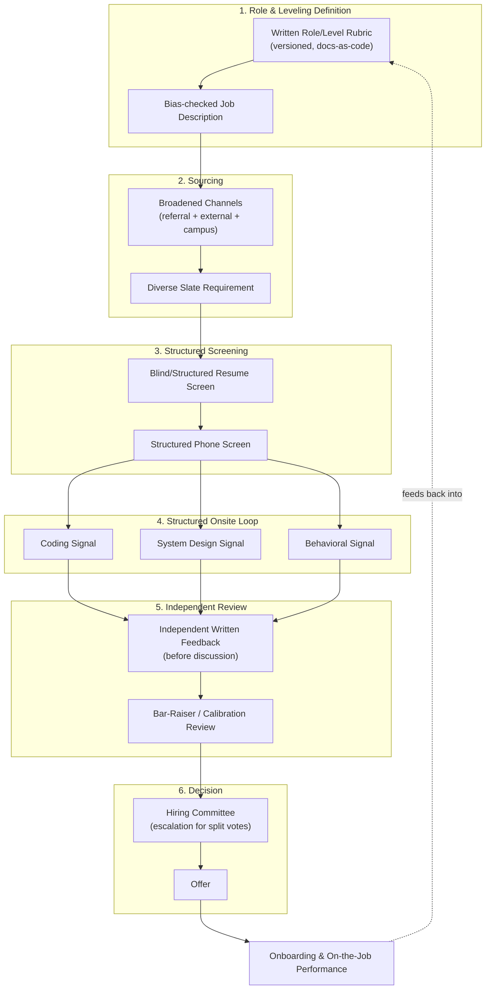
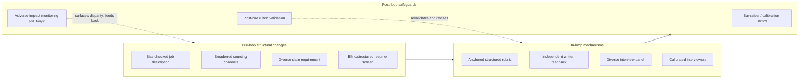
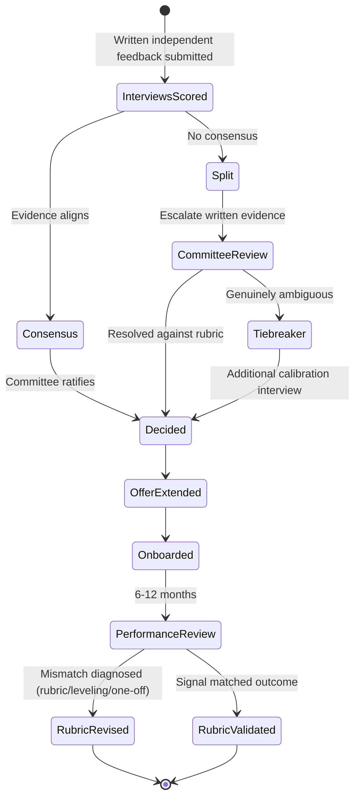

# Hiring and Interviewing

> Part of the **Enterprise Data & AI Architecture Handbook** — Phase-19 (Leadership & Technical Strategy), Chapter 05.
> Prerequisite: [Technical Leadership](01_Technical_Leadership.md). Builds on [Architecture Reviews](02_Architecture_Reviews.md), [Stakeholder Management](03_Stakeholder_Management.md), and [Technical Writing](04_Technical_Writing.md).

---

## Executive Summary

Hiring is the highest-leverage and least-reversible decision most technical leaders make, and it is routinely made with less rigor than a mid-sized architecture decision. A single hire compounds for years — in output, in the team's culture, in who else the team is subsequently able to attract and retain — while a rejected candidate's cost is invisible almost by construction: a strong engineer wrongly rejected shows up nowhere in an organization's metrics, they simply appear on a competitor's team and succeed there. This chapter treats hiring as what it actually is: **a measurement problem.** An interview loop is an attempt to estimate an unobservable quantity — a candidate's future on-the-job performance — from a few hours of noisy, high-stakes, adversarially-gameable observation. Like any measurement instrument, it can be poorly calibrated (unstructured, "gut feel," vibes-based) or well calibrated (structured, rubric-anchored, calibrated across raters) — and the difference between the two is not a matter of taste but is empirically, substantially measurable in predictive validity.

The central thesis of this chapter is that **structure is what separates a hiring process that measures signal from one that measures noise and bias, and the rubric — a written, calibrated definition of what "good" looks like for a specific role and level — is the artifact that makes structure possible.** This directly extends [Technical Writing](04_Technical_Writing.md)'s craft (the rubric is a document, reviewed and versioned like any other) and [Architecture Reviews](02_Architecture_Reviews.md)'s discipline (independent written evaluation before group discussion, escalation for disagreement, a durable decision record) into the hiring domain. It also extends [Technical Leadership](01_Technical_Leadership.md)'s leveling framework: a hiring loop cannot assess "is this person Senior" if the organization has never written down what Senior means.

The chapter's second recurring thread is **bias reduction through structure, not through good intentions alone.** Decades of research on personnel selection (starting with the foundational meta-analytic work of Schmidt and Hunter) show that structured interviews substantially out-predict unstructured ones, and that the mechanisms which improve predictive validity — anchored rubrics, independent written scoring, blind screening where feasible, calibrated panels — are largely the *same* mechanisms that reduce the influence of affinity bias, halo effects, and groupthole anchoring in group debriefs. Fairness and accuracy are not in tension here; the same discipline that makes the measurement better also makes it fairer. This chapter covers role and leveling calibration, structured interviews and rubrics, system design and coding signals (including the emerging challenge of AI-assisted interview integrity), bias-reduction techniques grounded in real research and real failures (including a well-documented case of biased automation this domain must not repeat), and what it actually takes to build — and retain — a genuinely diverse team.

---

## Learning Objectives

After working through this chapter you will be able to:

- **Write a role/level rubric** that defines, concretely and in advance of sourcing, what a specific role and level requires — closing the gap between [Technical Leadership](01_Technical_Leadership.md)'s leveling framework and an actual hiring bar.
- **Design a structured interview loop** with anchored, competency-mapped rubrics, independent written feedback, and a calibration mechanism that reduces both noise and bias.
- **Choose the right coding and system-design signal** for a given role, understand each format's blind spots, and adapt for the emerging challenge of AI-assisted interview integrity.
- **Apply evidence-based bias-reduction techniques** — structured rubrics, blind screening, diverse slates, calibration training — and explain why standalone unconscious-bias training alone is not sufficient.
- **Diagnose a split or no-consensus hiring decision**, and a post-hire performance mismatch, without defaulting to the loudest voice, the most senior title, or blaming the candidate.
- **Build and monitor a hiring funnel** with adverse-impact tracking by stage, and close the loop by validating rubrics against actual on-the-job performance.
- **Recognize the legal, governance, and privacy dimensions** of hiring data and automated hiring tools, and avoid the well-documented failure modes of biased automation.

---

## Business Motivation

The business case for rigorous hiring rests on an asymmetry: **the cost of a bad hire, and the cost of a wrongly-rejected strong candidate, both vastly exceed the incremental cost of a more rigorous process** — yet both costs are largely invisible in ordinary business reporting, which is exactly why organizations under-invest in the process that determines them. A bad senior technical hire costs far more than their salary: recruiting fees, months of onboarding and ramp time, the productivity drag on the team members who compensate for or manage around them, the eventual performance-management cycle, and the cost of re-hiring for the same seat. A wrongly-rejected strong candidate costs nothing on the balance sheet — they simply go build something excellent somewhere else — which is precisely why this cost is so persistently under-weighted relative to the more visible cost of "we interviewed too long" or "we lost them to a faster-moving competitor."

In data and AI platform organizations the stakes are sharper for three reasons. First, technical leverage is extreme: one exceptional data/AI architect or platform engineer can be worth several average ones in a domain where a single design decision (a table format, a serving architecture, a hiring bar for the next ten engineers) compounds for years — so the tails of the hiring distribution matter enormously ([Technical Leadership](01_Technical_Leadership.md)'s leverage argument applied to headcount itself). Second, the field is in a period of unusually fast skill-definition churn (data engineering, MLOps, LLMOps, agentic AI are all relatively young disciplines), so role and level definitions go stale quickly and a rubric that isn't actively maintained will systematically mis-measure candidates against yesterday's job. Third, hiring for data and AI roles increasingly touches regulated and reputationally sensitive ground — candidate data privacy, algorithmic screening tools, and (per [Responsible AI](../Phase-11/07_Responsible_AI.md)) an increasingly regulated landscape for any AI system used *in* the hiring process itself.

The cost of an under-invested hiring process is predictable and compounding: mis-leveled hires who are either quietly under-challenged or set up to fail; teams that homogenize around whoever conducted the loudest debrief; a hiring bar that drifts inconsistently across teams doing the same job title; legal and reputational exposure from adverse impact nobody was monitoring; and a slow, invisible loss of the strong candidates the process silently filtered out. The cost of a well-invested process is a hiring bar that is consistent, defensible, improving over time, and — because the mechanisms that improve accuracy and reduce bias are largely the same mechanisms — fairer almost as a byproduct of being *better measured*.

---

## History and Evolution

- **1970s: the legal and psychometric foundations.** The U.S. Equal Employment Opportunity Commission's *Uniform Guidelines on Employee Selection Procedures* (1978) formalized adverse-impact analysis for employment selection, introducing the "four-fifths rule" (a selection rate for any group below four-fifths of the rate for the highest-selected group signals adverse impact requiring justification) — the foundational legal/governance concept this chapter's Governance section returns to.
- **1970s–1990s: blind evaluation reduces bias, empirically.** Major U.S. orchestras progressively adopted "blind" auditions (candidates performing behind a screen). Economists Claudia Goldin and Cecilia Rouse's later empirical study (2000) found that blind auditions substantially increased the probability of women advancing and being hired — one of the most cited real-world demonstrations that structurally removing irrelevant information from an evaluation, rather than merely asking evaluators to try harder to be unbiased, measurably changes outcomes.
- **1998: the meta-analytic case for structure.** Frank Schmidt and John Hunter's landmark meta-analysis of personnel-selection research (*Psychological Bulletin*, 1998) synthesized decades of validity studies and found that **structured interviews** (fixed questions, anchored scoring) predict job performance meaningfully better than **unstructured interviews**, and that combining a structured interview with a general-mental-ability or work-sample measure produces some of the highest predictive validity of any practical selection method. This is the empirical bedrock under this chapter's central thesis.
- **1999: Amazon formalizes an independent quality gate.** Amazon introduced the **Bar Raiser** program — an interviewer independent of the immediate hiring team, present in the loop specifically to protect the long-term hiring bar rather than to fill the open seat quickly, with authority to object to a hire the rest of the panel wants to make. This is the earliest widely-known formalization of an *independent calibration reviewer* in a tech-industry hiring loop.
- **2000s–2013: Google's data-driven hiring reforms.** Google ran extensive internal analysis of its own hiring data and, as later documented by SVP of People Operations Laszlo Bock in *Work Rules!* (2015), found that brainteaser-style puzzle questions ("how many golf balls fit in a school bus") had essentially no correlation with job performance and were phased out publicly around 2013; Google's research also found that interview-signal quality plateaus after roughly four structured interviews, motivating a hiring-committee model (an independent committee reviews written interview packets rather than trusting any one interviewer's gut call).
- **2009–2010s: technical-assessment platforms industrialize the coding signal.** Platforms such as HackerRank, Codility, and later interviewing.io and Karat industrialized structured technical screening and live-coding interviews at scale, standardizing (for better and worse) the "coding interview" as a distinct, portable industry artifact — and, alongside it, a well-documented critique that narrow algorithmic-puzzle interviewing (divorced from the actual job) measures interview-prep access more than engineering competence.
- **2018: a cautionary case in hiring automation.** Amazon built and then scrapped an experimental machine-learning recruiting tool after discovering it had taught itself to penalize resumes containing the word "women's" (e.g., "women's chess club captain") and downgrade graduates of women's colleges — because it was trained on ten years of historical resumes from a male-dominated industry and had learned to reproduce that historical pattern (publicly reported by Reuters in 2018). This is one of the most concrete, well-documented real-world instances of the disparate-impact-through-historical-training-data failure mode [Responsible AI](../Phase-11/07_Responsible_AI.md) §7.1 describes in general — now squarely inside the hiring domain.
- **2020s: remote hiring, regulatory attention on hiring AI, and AI-assisted interview integrity.** The rapid shift to remote/distributed hiring accelerated the industrialization of remote technical screening; regulators began directly addressing algorithmic hiring tools (New York City's Local Law 144, effective 2023, requires independent bias audits of "automated employment decision tools" used in hiring; the EU AI Act classifies employment/recruitment AI systems as high-risk, per [Responsible AI](../Phase-11/07_Responsible_AI.md) §7.4's risk-tier discussion). Most recently, the proliferation of capable generative-AI assistants has created a genuinely new integrity problem for remote technical interviews — candidates using an AI assistant live during a screen to generate answers — which is reshaping interview formats (more emphasis on live reasoning, follow-up probing, and proctored or in-person final rounds for senior/specialized roles) in real time as this chapter is being written.

The through-line: hiring has moved, unevenly and still incompletely, from an intuition-driven craft toward a **measured, structured, calibrated discipline** — pulled forward by legal exposure, by empirical validity research, and, more recently, by the recognition that automating the *old* unstructured process with AI reproduces its biases faster and at greater scale rather than fixing them.

---

## Why This Technology Exists

Hiring process rigor exists to solve a measurement problem that has no easy substitute: an organization must estimate, from a small number of hours of adversarial, high-stakes, coachable observation, whether a candidate will perform well in a role for years — and every simpler alternative to structured, rubric-based evaluation fails for a specific, identifiable reason.

**It exists because unstructured judgment is unreliable and low-validity.** An interviewer's unaided impression of "how did they do" is exactly what Schmidt and Hunter's meta-analysis (and decades of subsequent research) shows to be a comparatively weak predictor of job performance — not because interviewers are unintelligent, but because an unstructured evaluation lets irrelevant factors (rapport, confidence, similarity to the interviewer, the order candidates were seen) dominate a genuinely noisy signal. Structure exists to anchor the measurement to the construct that actually matters (the competencies the job requires) rather than to whatever happens to be salient to one interviewer in one hour.

**It exists because a single evaluator's judgment is a single point of failure.** One interviewer's affinity bias, bad day, or idiosyncratic pet question can — unstructured — either torpedo a strong candidate or wave through a weak one, with no independent check. Structured, multi-rater, independently-scored loops with a calibration mechanism exist because they turn a single noisy measurement into several independent ones that can be compared and reconciled, the same statistical logic that makes replicated measurement more reliable than a single reading anywhere else in engineering.

**It exists because "the right level" and "the right bar" are not self-evident and drift without a written anchor.** Without a written role/level rubric produced *before* the loop, "is this candidate Senior" silently becomes "does this candidate feel like the Senior engineers I already know" — a definition that drifts, is inconsistent across teams, and systematically favors whoever resembles the existing population. A written rubric exists to make the bar an explicit, calibrated, auditable artifact rather than an implicit, personality-dependent one.

**It exists because leaving hiring accuracy and hiring fairness to individual goodwill has repeatedly, demonstrably failed** — from the blind-audition research showing structural removal of irrelevant cues changes outcomes, to Amazon's scrapped recruiting tool showing that even automating the process without addressing its structural biases reproduces (and scales) them. Structure is not a compliance overlay bolted onto hiring; it is the only mechanism that has been shown, empirically, to move both accuracy and fairness in the same direction at once.

---

## Problems It Solves

- **Low predictive validity of interview signal.** Structured, rubric-anchored interviews substantially out-predict unstructured "gut feel" loops (Schmidt & Hunter, 1998), directly improving the odds that a hire actually performs at the level assessed.
- **Single-interviewer veto power.** Independent, multi-rater, written-feedback-before-discussion loops prevent one interviewer's idiosyncratic reaction from unilaterally deciding an outcome.
- **Groupthink and anchoring in debriefs.** Requiring written scores *before* group discussion prevents the most senior or most vocal voice in the room from anchoring everyone else's assessment.
- **Leveling drift and inconsistency.** A written role/level rubric, calibrated across teams, makes "Senior Data Engineer" mean the same thing organization-wide rather than whatever the last hiring manager decided.
- **Affinity and halo bias.** Blind/structured resume screening, standardized questions, and anchored rubrics reduce the influence of irrelevant similarity, pedigree, and first-impression effects.
- **Undetected adverse impact.** Stage-by-stage funnel monitoring against the four-fifths rule surfaces disparate outcomes early enough to investigate and correct, rather than discovering them in a lawsuit or an audit.
- **The false-negative blind spot.** Calibration and post-hire performance feedback surface — and let the organization correct — rubrics that are systematically rejecting strong candidates for the wrong reasons.
- **Non-representative teams.** Diverse-slate sourcing requirements and broadened sourcing channels counteract the tendency of referral-only pipelines to reproduce the demographics of the existing team.

---

## Problems It Cannot Solve

- **It cannot make a fundamentally under-resourced hiring process fast and rigorous simultaneously.** Structure adds real interviewer-time and coordination cost; an organization that wants both speed and rigor without investing in either will get neither reliably — the [Trade-offs](#trade-offs) section returns to this directly.
- **It cannot substitute for a genuinely inclusive culture after the hire.** A perfectly structured, unbiased hiring process that lands a diverse slate of hires into a team with no inclusive onboarding, mentoring, or equitable growth path will simply see those hires leave — hiring and retention are different problems, and this chapter's sibling, Mentoring and Team Building (Phase-19 Chapter 06), covers the retention side.
- **It cannot fully eliminate bias, only substantially reduce it.** Structured rubrics, blind screening, and calibration reduce bias meaningfully but do not make an interview loop a perfectly objective instrument; residual bias, and the judgment calls embedded in *which* competencies a rubric weights, remain real and require ongoing monitoring, not a one-time fix.
- **It cannot make a rigid rubric automatically correct.** An over-specified rubric that rewards surface-level vocabulary matching over genuine competency is its own failure mode (this chapter's Case Study 2) — structure without periodic revalidation against real job performance can ossify into its own kind of unfairness.
- **It cannot resolve the legal and ethical uncertainty around AI-assisted hiring tools on its own.** Automated screening and AI-hiring-tool governance is a genuinely evolving regulatory area (Local Law 144, the EU AI Act); this chapter provides principles, but specific compliance obligations require legal review and vary by jurisdiction.
- **It cannot make hiring immune to a tight or lopsided labor market.** No amount of rigor changes the reality that in a highly competitive market for a scarce skill, a slow or heavyweight process will lose strong candidates to a faster one — process weight must be matched to the market reality for a given role, not applied uniformly regardless of context.

---

## Core Concepts

### 5.1 Role and Leveling Calibration

Before a single interview is scheduled, a hiring process needs a **written role/level rubric**: a concrete definition of the scope, autonomy, and impact expected at a specific level for a specific role, produced *before* sourcing begins and calibrated against the organization's leveling framework — directly extending [Technical Leadership](01_Technical_Leadership.md) §1.1's Staff+ archetypes and leveling concepts into an operational hiring artifact. Without this written anchor, "is this candidate Senior" silently collapses into "does this candidate feel like the Senior engineers I already know" — a definition that drifts across teams, resists audit, and systematically favors candidates who resemble the existing population.

Leveling mis-calibration is a distinct, common failure independent of the interviewers' individual accuracy: a team can run an excellent, well-calibrated *interview* and still make a bad *leveling* decision — hiring a "Senior" who is genuinely being assessed against an inflated bar (and is then set up to fail against expectations they were never actually evaluated for) or rejecting a genuinely senior candidate against a bar the interviewers privately hold higher than the written definition. Calibrating levels *across* teams doing similar work — so "Senior Data Engineer" means approximately the same scope everywhere in the organization — is itself a discipline, requiring periodic cross-team calibration sessions, not a one-time document.

The job description is the first, and most overlooked, bias-reduction lever in this process: language that skews toward stereotypically masculine-coded terms, unnecessarily long "nice to have" lists that discourage qualified candidates (particularly women, per widely cited industry surveys) from applying, and requirements inflated beyond what the rubric actually needs, all narrow and skew the applicant pool before a single interview happens. Tools like Textio operationalize this check by flagging biased or exclusionary language in job postings — a lightweight, high-leverage intervention that happens entirely upstream of interviewing.

### 5.2 Structured Interviews and Rubrics

A **structured interview** fixes, in advance, both *what* is being measured (a specific set of competencies mapped to the role/level rubric) and *how* it is scored (an anchored rating scale with concrete behavioral descriptions of what a 1, 3, and 5 look like for that competency) — and applies the same core prompts across candidates for comparability. This is the single most empirically validated lever available: Schmidt and Hunter's meta-analysis found structured interviews meaningfully out-predict unstructured ones, and combining a structured interview with a work-sample or general-mental-ability measure yields some of the strongest predictive validity of any practical selection method studied.

The critical mechanical discipline, directly reused from [Architecture Reviews](02_Architecture_Reviews.md) §2.2's review-before-discussion pattern: **every interviewer writes their score and evidence independently, before any group discussion.** This is not a formality — it is what prevents the debrief from becoming an anchoring exercise where the first, most senior, or most confident voice in the room silently overwrites everyone else's independent read. The written record is also the evidentiary basis for calibration and for [Architecture Reviews](02_Architecture_Reviews.md)-style escalation when a loop is split (§5.4's Operational Response Playbook).

The rubric itself is a document — versioned, reviewed, and improved over time using exactly the [Technical Writing](04_Technical_Writing.md) docs-as-code discipline: it lives in a version-controlled repository, changes to it go through review, and it is periodically revalidated against real job-performance outcomes (§6.3) rather than being written once and left static.

### 5.3 System Design and Coding Signals

Different interview formats capture different signals and have different blind spots, and choosing the wrong format for a role is a common, correctable mistake:

- **Coding interviews** (live, collaborative) test correctness, debugging approach, and communication under mild time pressure — but risk measuring interview-prep access and algorithmic-puzzle memorization rather than the actual day-to-day work of most data and platform engineering roles, a well-documented industry critique.
- **System design interviews** test architectural trade-off reasoning and breadth — but risk penalizing candidates who reason soundly in practical, plain language without reciting the "expected" buzzword vocabulary, which is precisely the failure mode in this chapter's Case Study 2.
- **Take-home / practical exercises** test realistic, less time-pressured work — but raise equity concerns (they assume free time candidates with caregiving or multiple-job obligations may not have) and, increasingly, integrity concerns as AI coding assistants make an unsupervised take-home a weaker signal of the individual candidate's own ability.
- **Data- and ML-specific formats** deserve deliberate design rather than reusing a generic software-engineering loop wholesale: SQL and data-modeling exercises, debugging a broken pipeline or query (a strong practical-judgment signal), and ML-system-design prompts (feature-serving, monitoring, and retraining trade-offs, drawing on [ML Pipeline Architecture](../Phase-11/06_ML_Pipeline_Architecture.md)) test competencies a generic algorithms interview does not.

**AI-assisted interview integrity** is a genuinely new and still-evolving problem: candidates using a generative-AI assistant live during a remote screen to produce answers they did not generate themselves. There is no single settled fix; the emerging industry response combines several partial mitigations — emphasizing live reasoning and unscripted follow-up probing (which an AI-generated answer alone does not survive well), requiring candidates to talk through their thinking continuously rather than submit a final answer, and reserving proctored or in-person final rounds for senior or highly specialized roles where the stakes justify the added friction. This is squarely analogous to [Evaluation and Guardrails](../Phase-12/09_Evaluation_and_Guardrails.md)'s "an evaluation gate is only as good as its resistance to the thing it's evaluating gaming it" lesson, now applied to human hiring.

### 5.4 Bias Reduction

Bias in hiring is not a single failure mode but a family of well-documented cognitive patterns: **affinity bias** (favoring candidates who resemble the interviewer), the **halo/horn effect** (one strong or weak signal coloring the whole assessment), **confirmation bias** (interviewers searching for evidence supporting an early impression), and **groupthink/anchoring** in the debrief itself. The evidence-based mitigations, largely the same mechanisms that improve predictive validity (§5.2), are: anchored structured rubrics, independent written scoring before discussion, blind or structured resume/portfolio screening (redacting name, school, and prior employer where feasible reduces affinity and pedigree bias — directly analogous to the empirically validated blind-audition result), calibration training using sample transcripts scored by experienced raters, and diverse interview panels.

Two pieces of real evidence anchor this section's caution against easy answers. First, **Goldin and Rouse's (2000) study of blind orchestra auditions** found that a purely structural change — a screen removing visual information irrelevant to the audition's actual purpose — measurably increased the rate at which women advanced, without any change in evaluators' stated intentions. Second, **Frank Dobbin and Alexandra Kalev's research** (summarized in *Harvard Business Review*, 2016) found that standalone, mandatory unconscious-bias training programs have limited, and in some studied cases even negative, effects on actual diversity outcomes when not paired with structural changes to the hiring and promotion process — a direct caution against treating a training session as a complete fix in place of the structural interventions this section actually recommends.

The bias-reduction discipline extends to automation itself: **Amazon's 2018 scrapped experimental AI recruiting tool**, which taught itself to penalize resumes containing terms like "women's" because it was trained on ten years of a male-dominated industry's historical hiring data, is the concrete, well-documented instance of the general disparate-impact-through-historical-training-data failure mode [Responsible AI](../Phase-11/07_Responsible_AI.md) §7.1 describes — a direct warning that automating an unexamined historical process reproduces its bias faster and at greater scale rather than removing it.

### 5.5 Building Diverse Teams

Building a genuinely diverse team requires intervention at multiple points, because relying on any single lever tends to fail: **broadened sourcing** (referral-only pipelines are well documented to reproduce the demographics of the existing team, since people tend to refer people like themselves — networking, per §5.5's Networking analogue below), **diverse-slate requirements** (requiring that the candidate slate under consideration include qualified candidates from underrepresented groups before a hiring decision is finalized — the hiring-industry adaptation of the NFL's 2003 Rooney Rule, which required teams to interview minority candidates for head-coaching vacancies), **bias-checked job descriptions** (§5.1), and the full structured-interview-and-calibration discipline (§5.2–5.4) as the *prerequisite* that makes a diverse slate translate into diverse hires rather than a diverse slate rejected by the same biased process that narrowed the pipeline in the first place.

Diversity efforts that skip the structural-process work and rely only on sourcing or training tend to fail for exactly the reason Dobbin and Kalev's research identifies: adding diverse candidates to the top of an unstructured, unbiased-in-name-only pipeline does not change what happens to them once they're in it. And hiring diversity without a genuinely inclusive culture, equitable leveling, and real growth paths after the hire — the subject of Mentoring and Team Building (Phase-19 Chapter 06) — produces attrition, not a durably diverse team; hiring and retention must be treated as one continuous problem, not two unrelated ones.

The legal and policy landscape around workforce diversity practices is genuinely evolving and varies materially by jurisdiction (including recent shifts in the U.S. legal environment around group-conscious practices in adjacent domains like university admissions); this chapter deliberately frames its recommendations around **structural fairness, broadened sourcing, and bias removal in the evaluation process** rather than prescribing specific numerical targets, and organizations should have their specific practices reviewed by legal/compliance counsel, consistent with the caution [Compliance and Regulatory Frameworks](../Phase-10/06_Compliance_and_Regulatory_Frameworks.md) applies to every other regulated domain in this handbook.

---

## Internal Working

### 6.1 The Interview as a Measurement Instrument

An interview loop is, mechanically, an attempt to estimate an unobservable quantity — a candidate's future job performance — from a small number of hours of noisy, adversarial, coachable observation. Psychometrics gives this problem a precise vocabulary that maps directly onto hiring practice: **reliability** (would repeated measurement of the same candidate, by different raters, produce a consistent result?) and **validity** (does the measurement actually predict the real-world outcome it claims to predict — job performance?). Unstructured interviews score poorly on both: reliability is low because different interviewers, unaided by a shared rubric, effectively measure different things; validity is low because what an unaided interviewer's gut reacts to (rapport, confidence, similarity) is only weakly related to the actual competencies the job requires. A written rubric directly improves both: it fixes *what* is being measured (the construct), and an anchored scoring scale fixes *how consistently* it is measured across raters.

Because any single interview is a noisy sample of a few hours against a job that will run for years, **multiple independent structured samples reduce variance the same way replicated measurement reduces error anywhere else in engineering** — which is the statistical justification for a multi-interviewer loop with independent scoring rather than trusting any single conversation, however strong.

### 6.2 Calibration Mechanics

The calibration/bar-raiser mechanism (§1999 Amazon origin, §5.2) works because of two structural properties, both directly reused from prior Phase-19 chapters. First, **independence from the immediate hiring team**, which removes the incentive — visible in this chapter's Case Study 1 — for the people most motivated to fill an open seat quickly to also be the people deciding whether the evidence actually supports the bar; this is the same independent-reviewer-avoiding-capture logic [Architecture Reviews](02_Architecture_Reviews.md) §2.2 applies to consequential technical decisions. Second, **written feedback collected before any group discussion**, which guarantees genuine independence of the individual measurements before they are compared — the calibration discussion then reconciles *evidence against the rubric*, not impressions against each other.

Calibrating the interviewers themselves — training them against sample transcripts or recordings pre-scored by experienced raters, and periodically checking their scoring against that calibration set — is directly analogous to [Evaluation and Guardrails](../Phase-12/09_Evaluation_and_Guardrails.md) §9.2's requirement that an LLM-as-judge be periodically validated against human calibration rather than trusted indefinitely by default: an interviewer's judgment, like an automated judge's, can drift from the intended standard without a periodic calibration check, and neither should be assumed reliable simply because it was once trained.

### 6.3 The Hiring Funnel as a Pipeline with Loss at Each Stage

The hiring funnel — sourcing → resume screen → phone screen → onsite loop → calibration/committee → offer → accept → onboard — is usefully modeled as a data pipeline with a conversion (and drop) rate at every stage, and the same handbook-wide lesson applies: **small, individually-defensible losses or biases at each stage can compound into a large aggregate effect that no single stage's own metrics reveal.** This is why adverse-impact monitoring (the four-fifths rule, §Governance) must be measured *per stage*, not only at the funnel's final output — a resume screen, a phone screen, and an onsite loop can each individually clear a naive fairness check while their compounded effect produces a materially skewed outcome, the same "every component's own dashboard is green while the end-to-end outcome silently degrades" pattern this handbook has documented repeatedly, from event-driven SLA drift ([Event-Driven Architecture](../Phase-14/01_Event_Driven_Architecture.md)) to reliability debt ([Reliability and SRE](../Phase-18/04_Reliability_and_SRE.md)).

---

## Architecture

The reference hiring-process architecture connects six stages into one governed pipeline: **(1) role & leveling definition** (§5.1, produced before sourcing) → **(2) sourcing** (broadened channels, diverse slate, bias-checked job description) → **(3) structured screening** (blind/structured resume review, phone screen against the rubric) → **(4) structured onsite loop** (coding, system design, behavioral — each interview mapped to specific rubric competencies) → **(5) independent written feedback and calibration/bar-raiser review** (§6.2) → **(6) hiring-committee decision** (with an explicit escalation path for split/no-consensus outcomes) → **offer → onboarding → a feedback loop from on-the-job performance back into rubric and leveling validation**, closing the pipeline the same way a monitored ML system closes the loop from serving back to retraining ([ML Pipeline Architecture](../Phase-11/06_ML_Pipeline_Architecture.md)). No stage is authoritative in isolation: the rubric constrains what the onsite loop measures, the written feedback constrains what calibration can review, and the committee's decision is reviewable *because* it rests on a documented evidentiary chain back to the rubric, not on an unrecorded impression.

---

## Components

- **Role/Level Rubric** — the versioned, docs-as-code definition of competencies and anchored scoring for a specific role and level (§5.1, §5.2).
- **Bias-checked Job Description** — the sourcing-stage artifact, reviewed for exclusionary or skewed language.
- **Applicant Tracking System (ATS)** — the system of record for candidate data, stage, and status.
- **Structured Interview Kit** — the question bank and per-competency scoring rubric issued to interviewers (confidential, access-controlled — §Security).
- **Independent Written Feedback Records** — each interviewer's score and evidence, submitted before discussion (§6.2).
- **Calibration / Bar-Raiser Role** — the independent reviewer or panel with authority to check the loop's evidence against the bar.
- **Hiring Committee** — the escalation and decision body for split or high-stakes outcomes.
- **Hiring-Funnel Analytics Dashboard** — stage-by-stage conversion and adverse-impact monitoring (§Monitoring).
- **Onboarding Performance Feedback Loop** — the mechanism that feeds actual on-the-job outcomes back into rubric and leveling validation.
- **Candidate Data Retention & Privacy Policy** — governs how long candidate PII (including rejected candidates') is retained and how it is deleted (§Storage, §Governance).

---

## Metadata

The hiring pipeline's metadata is what makes it auditable: rubric version and competency tags on every interview kit; interviewer identity, score, and written justification tied to a specific rubric version and timestamp; role/level classification and decision status per candidate; consent and retention metadata for candidate PII; and adverse-impact aggregation tags used **only in anonymized, aggregate form for funnel monitoring — never as an input to any individual candidate's score or decision**, a deliberate boundary that avoids reproducing the Amazon 2018 failure mode of building automation that scores individuals on proxies for protected characteristics.

---

## Storage

Candidate data (ATS records, resumes, interview feedback) is regulated personal data and must be governed accordingly: retention periods for rejected-candidate data should be explicit, time-bounded, and deletable, and — per [Data Privacy and PII Protection](../Phase-10/07_Data_Privacy_and_PII_Protection.md)'s right-to-erasure discipline — a rejected candidate's data-subject rights apply just as much as an active customer's. The **rubric and question bank** is stored separately, as a version-controlled, access-restricted docs-as-code repository ([Technical Writing](04_Technical_Writing.md)): access-controlling it is not bureaucratic overhead but a direct integrity control, since a leaked question bank (a well-known real problem — interview questions circulating on public forums) invalidates the very signal the structured interview exists to produce.

---

## Compute

The scarcest resource in a hiring process is not infrastructure — it is **senior interviewer and bar-raiser time**, a direct instance of the "attention as a non-scalable resource" pattern from [Technical Leadership](01_Technical_Leadership.md) §1.2. Process rigor must be triaged against this scarcity: not every requisition needs the same weight of senior-reviewer involvement (§Decision Matrix), and over-allocating scarce senior time to low-stakes loops starves the high-stakes ones that most need it.

---

## Networking

The sourcing pipeline's "network" is the set of channels through which candidates enter it — referral networks, external sourcing, campus programs, and open applications — and, as §5.5 establishes, a network that leans too heavily on referrals structurally reproduces the demographics of the team already doing the referring. Deliberately broadening this network is itself an architectural decision, not an afterthought. Distributed, remote hiring loops also require real coordination overhead across time zones for panel scheduling and calibration sessions, a genuine operational cost of a geographically distributed interviewer bench.

---

## Security

Hiring data carries real confidentiality obligations at three levels: **candidate PII** (resumes, background-check data, contact information) requires the same access-control and encryption discipline as any other sensitive personal data ([Data Security and Encryption](../Phase-10/03_Data_Security_and_Encryption.md)); **interview feedback confidentiality** protects individual interviewers from retaliation and protects the integrity of the calibration process (candidates and other interviewers should not see "who said what" before or during a loop); and **interview-kit integrity** requires actively protecting the question bank and rubric from leaking, since a leaked kit converts a competency measurement into a memorization test. A newer security dimension is **interview-session integrity** in remote loops — detecting or discouraging undisclosed AI-assistance and candidate impersonation — an evolving, imperfectly-solved problem (§5.3) rather than a settled control.

---

## Performance

The funnel's health is measured across several distinct signals, deliberately not collapsed into one aggregate "hiring is going well" score (echoing [Evaluation and Guardrails](../Phase-12/09_Evaluation_and_Guardrails.md) §9.3's disaggregated-metrics discipline): **time-to-fill**, **interviewer-hours per hire**, **stage-by-stage conversion/pass-through rate**, **offer-accept rate**, **inter-rater reliability** (how consistently different interviewers score the same signal), and — critically — **quality-of-hire measured against actual on-the-job performance at 6–12 months**, correlated back against the interview rubric scores to validate (or invalidate) the rubric itself. A funnel optimized only for speed or only for a low false-negative rate, without also measuring the false-positive rate (bad hires who passed) and the false-negative rate (strong candidates rejected, sometimes discovered only when they succeed elsewhere — this chapter's Case Study 2), is measuring an incomplete picture.

---

## Scalability

Scaling a hiring bar across many interviewers and many open requisitions **without diluting it** is the same scaling problem [Technical Writing](04_Technical_Writing.md) solves for decisions generally: the rubric and calibration training are the scaling mechanism, letting many interviewers apply a consistent standard without each independently re-deriving it. The specific failure to avoid — directly analogous to [Architecture Reviews](02_Architecture_Reviews.md)'s central caution — is over-centralizing calibration/bar-raiser review into one or two individuals, which turns the very mechanism meant to protect quality into a hiring-throughput bottleneck; the fix is the same one that chapter recommends: **federate and train a broader calibrated reviewer bench** rather than routing all senior review through a single person.

---

## Fault Tolerance

A resilient hiring process has several redundancy and reversibility mechanisms: **multiple independent interviewers per competency** so no single interviewer's off day or idiosyncratic reaction is a single point of failure (directly preventing this chapter's Case Study 1); an **appeals or re-interview path** for genuinely ambiguous or contested outcomes; and graceful handling of interviewer cancellations or no-shows without silently dropping rubric coverage. Hiring decisions are also usefully framed, per [Technical Leadership](01_Technical_Leadership.md) §1.3's one-way/two-way door distinction, as **closer to a one-way door than a two-way one**: reversing a bad hire has real organizational, legal, and human cost, which is precisely why the rigor invested before the decision (structure, calibration, independent review) matters more here than for a genuinely low-stakes, easily-reversible choice.

---

## Cost Optimization

**Worked example.** A senior data engineer role carries a fully-loaded annual cost of roughly $180,000. Industry rules of thumb (and this organization's own retrospective analysis of prior mis-hires) put the all-in cost of a bad senior technical hire — recruiting fees, months of ramp time that never reached productive output, the team's drag compensating for gaps, the eventual performance-management cycle, and the cost of re-hiring the same seat — at roughly 100% of first-year fully-loaded cost or more, i.e., on the order of **$150,000–$200,000** for this role. Against that, the incremental cost of adding one more structured interview round plus a bar-raiser and a calibration session is roughly 4–6 additional interviewer-hours at a loaded senior-engineer rate — on the order of **$1,000–$2,000** per loop. The asymmetry is stark: a single prevented bad hire pays for well over a hundred additional structured-process loops. The same logic runs in the other direction and is harder to see: a strong candidate wrongly rejected by an over-rigid or biased loop costs the organization nothing visible on this quarter's ledger, which is exactly why that failure mode (this chapter's Case Study 2) persists far longer than a visible bad-hire cost would.

---

## Monitoring

A hiring-funnel dashboard should track, per stage and over time: conversion/pass-through rate, time-in-stage, interviewer load and calibration consistency (inter-rater agreement against the calibration set), offer-accept rate, and — critically — **adverse-impact ratio by stage and by demographic category**, checked against the four-fifths rule threshold (§Governance) so a disparity is caught early enough to investigate rather than discovered in an audit or a legal complaint.

---

## Observability

Monitoring answers known questions against known thresholds (is time-to-fill within SLA? is the pass-through rate stable?). **Observability** is the ability to ask unforeseen questions of the same underlying data — "why have our last five senior data-engineer hires sourced from channel X underperformed against their interview scores?" or "did a specific rubric revision change which candidates advance?" — the same monitoring-versus-observability distinction [Observability with OpenTelemetry](../Phase-18/02_Observability_with_OpenTelemetry.md) §2.1 draws for production systems, now applied to the hiring pipeline's own instrumentation. A hiring process instrumented only for its known dashboards will miss the drift and blind spots that only a genuinely exploratory, ad hoc query against the underlying data can surface.

---

## Operational Response Playbook

**Playbook 1 — A hiring panel is split or reaches no consensus.** Do not default to the most senior title in the room or a simple majority vote deciding informally in the hallway. Convene the calibration/hiring-committee review of the **written, independent feedback** collected before discussion, evaluated explicitly against the role/level rubric — not against which interviewer argued most persuasively in the room. If the written evidence is genuinely ambiguous even under this review, use a structured tie-breaker (an additional calibration interview with a bar-raiser present) rather than letting the decision default to organizational power or fatigue ("we've spent enough time on this, let's just decide"). Record the resolution and its rationale, the same way a split architecture-review decision is recorded per [Architecture Reviews](02_Architecture_Reviews.md).

**Playbook 2 — Post-hire performance doesn't match the interview signal (in either direction).** Do not simply conclude "the candidate turned out differently" or "the hiring manager made a bad call" without first auditing the *process*. Diagnose which of three distinct causes is at work: **(a) a rubric-validity problem** — the rubric is measuring competencies that don't actually predict performance in this role (the fix is rubric revision, validated against a broader sample of outcomes, not blaming any individual hire); **(b) a leveling-calibration problem** — the candidate was assessed accurately against a level definition that doesn't match the actual job (the fix is recalibrating the written level definition, per §5.1); or **(c) a genuine one-off assessment error** — the process was sound but this specific evaluation missed something (the fix is targeted, not systemic). Feed whichever diagnosis is correct back into the rubric or leveling document, closing the loop the same way a blameless postmortem feeds a systemic fix back into the system rather than into an individual's future vigilance ([Reliability and SRE](../Phase-18/04_Reliability_and_SRE.md) §4.4).

---

## Governance

Hiring governance rests on three pillars. **Legal/adverse-impact governance**: stage-by-stage monitoring against the EEOC four-fifths rule (§History, 1978), with routine review of any disparity found and documented remediation, rather than only reviewing the funnel's final output. **Candidate data governance**: retention and deletion policy for candidate PII (including rejected candidates, whose data-subject rights under regimes like GDPR apply just as they do for any other individual — [Data Privacy and PII Protection](../Phase-10/07_Data_Privacy_and_PII_Protection.md)), and access controls consistent with the organization's general data-governance framework ([Data Governance Foundations](../Phase-08/01_Data_Governance_Foundations.md)). **AI/automated-tool governance**: any automated screening or scoring tool used in the hiring pipeline is squarely in scope for the bias-audit obligations several jurisdictions now impose (New York City's Local Law 144) and for the high-risk classification the EU AI Act applies to recruitment AI systems ([Responsible AI](../Phase-11/07_Responsible_AI.md) §7.4) — a tool's convenience does not exempt it from these obligations, and Amazon's 2018 experience is the standing warning against deploying one without independent bias validation. Every consequential hire/reject decision should also produce a durable, documented rationale, the hiring-domain analogue of an ADR.

---

## Trade-offs

- **Rigor and consistency vs. speed and candidate experience.** A fully structured, multi-round, calibrated loop takes longer and asks more of a candidate's time than an informal process — in a tight labor market for a scarce skill, over-weighting process can lose strong candidates to a faster competitor; process weight must be matched to the role's actual stakes (§Decision Matrix), not applied uniformly.
- **Standardized rubrics vs. adapting to non-traditional backgrounds.** A rubric precise enough to be consistent can become rigid enough to penalize candidates who demonstrate the same underlying competency through unfamiliar vocabulary or an unconventional path — this chapter's Case Study 2 is the concrete instance, and the mitigation is periodic revalidation against actual outcomes, not abandoning structure.
- **Panel size vs. cost.** More independent interviewers reduce variance and individual bias but cost proportionally more scarce senior-interviewer time (§Compute); very large panels have diminishing returns past the signal-plateau point Google's own internal research identified (roughly four structured interviews).
- **Take-home exercises vs. live formats.** Take-homes reduce time pressure and test more realistic work but raise both equity concerns (assuming available free time) and, increasingly, AI-assistance integrity concerns (§5.3) that live, probed formats are more resistant to.
- **Centralizing vs. federating calibration expertise.** Concentrating bar-raiser authority in a few highly calibrated people improves consistency but risks becoming the exact bottleneck [Architecture Reviews](02_Architecture_Reviews.md) warns against; federating and training more calibrated reviewers scales better but requires ongoing investment to keep their calibration consistent.

---

## Decision Matrix

| Role Criticality / Level | Interview Rounds | Bar-Raiser Required? | Committee Escalation | Coding/Design Signal |
|---|---|---|---|---|
| Intern / early-career | 2–3, streamlined | No | Only if split | Practical exercise, generous guidance |
| Mid-level IC | 3–4, structured | Optional | On split | Live coding + focused system design |
| Senior IC / Staff | 4–5, structured, calibrated | Yes | Mandatory on split | Full loop: coding + system design + behavioral |
| Architect / Principal | 5+, structured, calibrated | Yes, 2 bar-raisers | Mandatory | Extended system design + cross-functional behavioral + leadership signal |
| Executive (CDO/CAIO-adjacent) | Extended, board-adjacent | Yes | Board-level review | Strategy/vision assessment (see Phase-19 Chapter 08) |

For **coding/design format choice specifically**: prefer live, probed formats over unsupervised take-homes for remote screens where AI-assistance integrity is a genuine concern (§5.3); reserve unsupervised take-homes for contexts where realistic, less time-pressured signal outweighs that risk (e.g., an on-site practical pairing session as a substitute where feasible).

---

## Design Patterns

- **Written-rubric-before-sourcing** — define the role/level bar before a single interview is scheduled (§5.1).
- **Independent-written-feedback-before-discussion** — every interviewer scores and justifies independently before the group debrief (§5.2, §6.2).
- **Bar-raiser / independent calibration reviewer** — an evaluator independent of the immediate hiring team's incentive to fill the seat (§6.2).
- **Hiring-committee escalation for split decisions** — a documented, evidence-based resolution path rather than a hallway decision (§Operational Response Playbook).
- **Blind / structured resume screening** — redact irrelevant identity signals where feasible, screen against explicit criteria (§5.4).
- **Diverse-slate sourcing** — require a qualified, diverse candidate slate before a hiring decision is finalized (§5.5).
- **Calibration training with sample transcripts** — periodically validate interviewer scoring against a pre-scored reference set (§6.2).
- **Closed-loop rubric validation** — feed actual post-hire performance back into rubric and leveling revision on a standing cadence (§6.3, §Operational Response Playbook).

---

## Anti-patterns

- **Unstructured "vibe check" hiring** — deciding on unaided impression with no rubric (this chapter's Case Study 1).
- **Brainteasers and trivia divorced from the job** — puzzle questions with no demonstrated correlation to performance (Google's own internal finding, §History).
- **Single-interviewer veto power** — one interviewer's reaction unilaterally deciding an outcome with no independent check.
- **Groupthink anchoring in the debrief** — the most senior or first-speaking voice silently overwriting everyone else's independent read.
- **"Culture fit" as an unexamined proxy for affinity bias** — rejecting candidates for vague, unstructured "fit" reasons that correlate with similarity to the existing team rather than any defined competency.
- **A rubric that rewards surface vocabulary over genuine competency** — this chapter's Case Study 2, and a specific risk of over-rigid structure.
- **Over-reliance on unsupervised take-homes** — disadvantaging candidates with less discretionary time and, increasingly, providing a weak signal against undisclosed AI assistance.
- **Standalone unconscious-bias training treated as a complete fix** — per Dobbin and Kalev's research, with no accompanying structural process change.
- **Fully automated, black-box screening with no bias audit** — Amazon's 2018 scrapped recruiting tool is the standing cautionary case.
- **Leveling decided after the loop to fit a liked candidate** — retroactively inflating or deflating the level definition rather than assessing against a rubric fixed in advance.

---

## Common Mistakes

- Starting to interview before a written rubric exists.
- Interviewers writing feedback *after* the group discussion instead of before it.
- No calibration across interviewers or across teams hiring for the "same" role.
- Ignoring stage-level adverse-impact data because the aggregate funnel output looks acceptable.
- A hiring manager unilaterally overriding a panel or committee decision.
- Leaving the interview kit and question bank unprotected, letting it leak and lose its signal value.
- No retention or deletion policy for rejected-candidate PII.
- Never revisiting rubric validity against actual on-the-job outcomes, letting it silently drift out of alignment with the real job.

---

## Best Practices

- Write the role/level rubric before sourcing begins, and calibrate it across teams doing the same role.
- Require independent written feedback from every interviewer before any group discussion.
- Include an independent calibration/bar-raiser reviewer for senior and above roles.
- Escalate split or no-consensus decisions to a committee reviewing the written evidence, not a hallway vote.
- Use blind or structured resume screening and require a diverse qualified slate before deciding.
- Monitor adverse impact by stage, not only in the funnel's aggregate output.
- Treat rubrics and interview kits as confidential, versioned, access-controlled docs-as-code artifacts.
- Feed post-hire performance back into rubric and leveling validation on a standing cadence.
- Match process weight to role criticality and market reality — not every requisition needs the heaviest loop.
- Have legal/compliance review any automated screening tool before it goes live, per the evolving regulatory landscape.

---

## Enterprise Recommendations

Tier process rigor explicitly by role criticality and level (§Decision Matrix); invest deliberately in a broad, calibrated bar-raiser bench rather than concentrating it in one or two people (§Scalability); build a hiring-funnel analytics dashboard with stage-level adverse-impact monitoring as a standing operational artifact, not an ad hoc audit exercise; adopt structured, blind-where-feasible resume screening and diverse-slate sourcing requirements organization-wide; establish an explicit governance process — including legal review — for any automated or AI-assisted hiring tool before deployment; adapt interview formats deliberately for the AI-assisted-interview-integrity risk on remote screens; and institutionalize the closed feedback loop from post-hire performance back into rubric and leveling revision as a recurring, owned process rather than a one-time rollout.

---

## Azure Implementation

Because hiring process design is an organizational discipline rather than a cloud service, the Azure implementation centers on the tooling that operationalizes it. **LinkedIn Talent Insights and LinkedIn Recruiter** (Microsoft-owned) support structured sourcing and diverse-slate pipeline analysis; **Microsoft Viva Glint** (Microsoft's people-analytics product) supports organization-wide hiring and engagement analytics; **Microsoft Teams** (with Teams Premium recording/transcription) standardizes structured remote interview panels and creates a durable, reviewable record of the loop; **SharePoint and Microsoft Loop**, with **Purview** sensitivity labels applied, host the rubric and interview-kit repository and protect candidate feedback confidentiality; **Azure DevOps Boards** can track a hiring pipeline's stages and decisions with the same rigor as an engineering backlog; and **Power BI** builds the hiring-funnel and adverse-impact dashboards (§Monitoring) from the underlying ATS and interview-feedback data, with **Entra ID** conditional access controlling who can view sensitive candidate data and interview kits. Microsoft's own internal engineering hiring practice — structured, level-calibrated interview loops feeding into its internal performance-calibration culture — is a directly applicable real-world reference.

---

## Open Source Implementation

An open-source hiring stack can implement the same discipline without proprietary tooling: **OpenCATS** as an open-source applicant tracking system; the interview kit and rubric stored as versioned **Markdown in Git**, with **CODEOWNERS**-gated pull-request review before any change to a live rubric ([Technical Writing](04_Technical_Writing.md)'s docs-as-code discipline applied directly); **Metabase or Apache Superset** built against a **PostgreSQL** candidate-data warehouse for hiring-funnel and adverse-impact dashboards; simple open-source **redaction scripts** (regex-based stripping of names, schools, and prior employers from resumes) as a lightweight blind-screening implementation; and **GitHub Classroom**-style repositories for structured, version-controlled take-home exercise templates.

---

## AWS Equivalent (comparison only)

Rather than a cloud service, the most relevant AWS-ecosystem comparison is **Amazon's own real internal hiring practice** — the **Bar Raiser program** (§History, 1999): an interviewer deliberately drawn from outside the immediate hiring team, with explicit authority to object to a hire the rest of the panel wants to make, tied to Amazon's Leadership-Principles-based structured interview loop. This is a genuine, well-documented, independently-verifiable organizational cultural export — the earliest formalized instance of this chapter's calibration/bar-raiser pattern (§6.2) — rather than an AWS product to adopt.

## GCP Equivalent (comparison only)

Similarly, the relevant comparison from the Google/GCP ecosystem is **Google's hiring-committee model**, as documented by Laszlo Bock in *Work Rules!* (2015): structured interviews scored independently, reviewed by a **hiring committee** independent of the hiring manager rather than trusting any one interviewer's impression, the public phase-out of brainteaser questions once internal data showed they didn't predict performance (§History, ~2013), and Google's own internal finding that interview-signal quality plateaus after roughly four structured interviews — directly informing this chapter's Decision Matrix guidance against unbounded panel size.

---

## Migration Considerations

Moving an organization from an unstructured, manager's-discretion hiring process to a structured, calibrated one is itself a change-management effort, not a policy memo: pilot the new process on a small number of requisitions before an org-wide mandate (the same pilot-before-rollout discipline [Data Mesh Principles](../Phase-15/01_Data_Mesh_Principles.md) applies to organizational change generally), invest in interviewer retraining and calibration sessions before expecting consistent results, and expect — and plan for — legacy leveling inconsistency from before the change, which will need its own reconciliation rather than being silently absorbed into the new rubric. Watch explicitly for the process becoming a hiring-throughput bottleneck as it scales (§Scalability) — the same failure [Architecture Reviews](02_Architecture_Reviews.md) documents for over-centralized review boards.

---

## Mermaid Architecture Diagrams

---

## End-to-End Data Flow

A candidate's journey generates and consumes data at every stage: sourcing produces a candidate record tagged to a specific rubric-defined requisition; the resume screen produces a structured pass/fail decision against explicit criteria (with identity-signal redaction applied where feasible); each onsite interview produces an independently-authored, rubric-anchored, timestamped feedback record before any discussion occurs; the calibration/bar-raiser review consumes those records (never the interviewers' verbal impressions alone) and produces its own written assessment; the hiring committee consumes the full evidentiary chain to reach and document a decision; and — closing the loop — the new hire's on-the-job performance data, reviewed at 6–12 months, flows back to validate or revise the rubric and leveling definition that started the process, the same closed-loop discipline that runs throughout this handbook's treatment of any measured, governed system.

---

## Real-world Business Use Cases

- **Hiring a senior data engineer** into an existing platform team, requiring level calibration against peers already on the team and a data/pipeline-specific practical signal (§5.3).
- **Rapidly scaling an AI/ML platform team** from a handful of engineers to a full function, where rubric consistency across many parallel loops and a broad calibrated interviewer bench (§Scalability) matter more than any single hire.
- **Hiring an architect or principal engineer**, where the extended loop, multiple bar-raisers, and leadership-signal assessment (§Decision Matrix) reflect the outsized, long-lived impact of the role.
- **Campus and early-career hiring at volume**, where a streamlined but still structured process (§Decision Matrix) balances throughput against maintaining a real, if lighter-weight, bar.

---

## Industry Examples

- **Google's hiring-committee model and the 2013 phase-out of brainteaser questions**, driven by Google's own internal data showing puzzle questions did not correlate with job performance (§History, §GCP Equivalent).
- **Amazon's Bar Raiser program** as the earliest widely-known formalization of an independent calibration reviewer in tech hiring (§History, §AWS Equivalent).
- **Goldin and Rouse's blind-orchestra-audition research (2000)**, the frequently-cited real-world demonstration that structural bias removal changes outcomes.
- **Amazon's 2018 scrapped AI recruiting tool**, the standing cautionary case for biased automation in hiring, publicly reported by Reuters.
- **New York City's Local Law 144 (2023)**, requiring independent bias audits of automated employment decision tools, and the EU AI Act's high-risk classification of recruitment AI ([Responsible AI](../Phase-11/07_Responsible_AI.md) §7.4) — the concrete regulatory response to this failure mode.
- **The industry's real-time adaptation to AI-assisted interview cheating** in remote technical screens, driving a shift toward live, probed reasoning and, for senior/specialized roles, proctored or in-person final rounds.

---

## Case Studies

### Case Study 1: The "vibe check" hiring loop with no rubric

A fast-growing data platform team hired for eighteen months using an entirely unstructured process: each interviewer asked whatever questions felt relevant, formed an impression, and the panel discussed candidates informally in a room afterward with no written rubric and no independent scoring. Decisions frequently hinged on whichever interviewer spoke first or most forcefully, and on at least several documented occasions a single dismissive interviewer's strong negative reaction was enough to reject a candidate the rest of the panel had liked, with no mechanism to weigh that reaction against the others' independent judgment (because there was no independent judgment on record — only the group conversation).

Eighteen months in, a retrospective analysis correlated the panel's original interview impressions (reconstructed from sparse notes) against actual on-the-job performance ratings for everyone hired in that period. The correlation was close to zero. Several hires who had "interviewed well" — largely because they shared technical background and communication style with the panel, a textbook affinity-bias pattern — performed only middlingly. Separately, hiring-manager anecdotes surfaced several candidates rejected on one interviewer's strong reaction whom other panel members privately felt were strong; without independent written records, there was no way to reconstruct how close those decisions actually were. The diagnosis: an interview process measuring rapport and similarity, not competency, with no independent record to catch either the veto-power problem or the affinity-bias problem after the fact. This motivated ADR-0202: without a written rubric and independent scoring *before* discussion, the "signal" the panel believed it was reading was, empirically, close to noise.

### Case Study 2: The rubric that rewarded vocabulary over judgment

A separate hiring effort, for a senior data-platform architect role, used a detailed system-design interview rubric — a genuine improvement over Case Study 1's approach — but the rubric had been written by copying the specific technical vocabulary and reference-architecture patterns the existing senior team happened to favor, and scored candidates on how closely their answer matched that specific pattern language rather than on the underlying reasoning quality.

One candidate, with a decade of hands-on distributed-systems experience gained in a less "buzzword-forward" environment, reasoned pragmatically and correctly through the trade-offs of the design prompt — correctly identifying the relevant consistency/availability tension, correctly reasoning about partitioning trade-offs, correctly flagging the operational cost of the more elaborate option — but did not use the specific reference-architecture vocabulary the rubric was implicitly anchored to. The interview panel, scoring against the rubric as written, rated the answer as "vague" and "lacking depth," and the candidate was rejected. Roughly a year later, that candidate was hired by a competitor into an equivalent architect role and, by every account the original hiring team later heard, performed exceptionally.

A subsequent audit of the rubric — triggered by this specific, painful, second-hand data point, and reviewed as part of Operational Response Playbook 2 — found the root cause: the rubric conflated "matches the reviewers' own mental model and vocabulary" with "demonstrates sound engineering judgment," a subtle but consequential difference that a rigid, well-intentioned structured rubric had encoded rather than eliminated. The fix was to redesign the rubric around the *underlying competency signals* — trade-off reasoning, the ability to articulate and defend a design choice, debugging and diagnostic approach, communication clarity — scored independently of whether the candidate used any particular vocabulary, and to recalibrate the interview panel against sample transcripts illustrating strong reasoning expressed in different vocabularies. The durable lesson, and the direct complement to Case Study 1: **structure reduces variance and bias, but a rigid rubric that measures the wrong thing — surface pattern-matching to the evaluators' own background rather than the actual underlying competency — reintroduces a subtler form of the same affinity bias structure was meant to remove.** This is why §6.3's closed-loop rubric validation against real outcomes is not optional maintenance but a structural requirement, and it motivates the periodic-revalidation clause of ADR-0202 alongside the initial-structure clause Case Study 1 motivates.

### Architecture Decision Record (ADR-0202): Structured, rubric-based, calibrated interview loops — with independent bar-raiser review and periodic rubric revalidation — are mandatory for every hiring decision

**Context.** Case Study 1 showed that an unstructured hiring process — no written rubric, no independent scoring, single-interviewer veto power, group-discussion anchoring — produced interview outcomes with close to zero correlation to actual job performance. Case Study 2 showed the complementary risk: a structured rubric written without periodic validation against real outcomes can encode the evaluators' own vocabulary and mental model as the measured construct, silently reproducing affinity bias in a subtler form and rejecting strong candidates for the wrong reasons. The organization needs a hiring process standard that captures the substantial, empirically-supported gains of structure (Schmidt & Hunter, 1998) while explicitly guarding against structure's own over-rigidity failure mode.

**Decision.** Establish the following as mandatory for every hiring decision, scaled by role criticality per the Decision Matrix: **(1)** every open role has a written role/level rubric, produced before sourcing begins, calibrated against the organization's leveling framework; **(2)** every interview in the loop maps to specific competencies scored on an anchored rating scale, not a free-form impression; **(3)** every interviewer submits independent written feedback and a score *before* any group discussion; **(4)** roles at Senior level and above include an independent calibration/bar-raiser reviewer, drawn from outside the immediate hiring team, with authority to flag when the loop's evidence does not support the bar; **(5)** split or no-consensus outcomes escalate to a hiring committee reviewing the written evidence against the rubric, never a hallway vote or the most senior title in the room; **(6)** resume and portfolio screening uses structured, criteria-based evaluation, with identity-signal redaction where feasible; **(7)** adverse-impact ratios are monitored by funnel stage against the four-fifths rule on a standing cadence; and **(8)** every rubric is periodically revalidated against actual post-hire performance outcomes, with a named owner responsible for reconciling mismatches (§Operational Response Playbook 2) rather than letting the rubric silently ossify around the evaluators' own patterns.

**Consequences.** *Positive:* the process substantially reduces both measurement noise (Case Study 1) and bias, while clause 8's periodic revalidation directly guards against the over-rigidity failure Case Study 2 exposed; adverse-impact monitoring by stage catches disparities early; the written evidentiary chain makes every hiring decision defensible under audit; and leveling consistency improves across teams. *Negative / costs:* the process requires real, recurring interviewer and bar-raiser time investment (§Cost Optimization shows this is a strongly favorable trade against bad-hire cost, but it is a real, visible cost against an invisible benefit, which creates ongoing pressure to skip steps under delivery pressure); calibration training and rubric-maintenance require an owned, standing process rather than a one-time rollout; and clause 4's bar-raiser requirement can become a throughput bottleneck if not deliberately federated across a broad, trained reviewer bench (§Scalability).

**Alternatives considered.** *(a) Leave hiring loops to manager discretion (status quo)* — rejected: directly produced Case Study 1's near-zero-correlation outcome. *(b) Fully automated, algorithmic resume screening and scoring with no human judgment in the loop* — rejected: Amazon's 2018 scrapped recruiting tool is the standing, well-documented demonstration that automating an unexamined historical process reproduces its bias faster and at greater scale, and current regulatory obligations (NYC Local Law 144, EU AI Act) require independent bias auditing of any such tool regardless. *(c) Rely on unsupervised take-home exercises as the primary or sole signal* — rejected: raises real equity concerns around candidates' available discretionary time and, increasingly, provides weak assurance against undisclosed AI assistance. *(d) Standalone mandatory unconscious-bias training with no accompanying structural process change* — rejected per Dobbin and Kalev's research finding limited or even negative standalone effect; the structural mechanisms in this decision (clauses 1–3, 6) have stronger direct evidence of improving fairness outcomes.

---

## Hands-on Labs

> These labs require only a text editor, a spreadsheet or lightweight database, and (optionally) a dashboarding tool such as Metabase or Superset for the funnel-analytics lab.

- **Lab 1 — Write a role/level rubric.** Pick a real role (e.g., Senior Data Engineer) and write a rubric: 4-6 competencies, an anchored 1-5 scale for each with concrete behavioral descriptions, mapped to a specific interview format for each competency.
- **Lab 2 — Design a structured interview kit.** For one competency from Lab 1, write the interview prompt, the follow-up probes, and the anchored scoring guide an interviewer would use — independent of any specific candidate.
- **Lab 3 — Run a mock structured loop with independent feedback.** With two or more collaborators, run a mock interview against your Lab 2 kit; have every observer submit written, independent scores *before* discussing; compare inter-rater agreement.
- **Lab 4 — Build a hiring-funnel adverse-impact dashboard.** Using a small synthetic dataset (stage, demographic category, pass/fail), build a dashboard computing pass-through rate per stage and the four-fifths-rule ratio; identify which stage, if any, would trigger review.
- **Lab 5 — Diagnose and fix a rigid rubric.** Given a sample rubric that scores for specific vocabulary/pattern-matching (deliberately modeled on Case Study 2), rewrite it to score for the underlying competency instead, and write two sample answers — one "textbook," one "practical" — that should both score well under your revised rubric.
- **Lab 6 — Audit a job description for biased language.** Take a real job posting and identify exclusionary or gendered language and inflated "nice to have" requirements; rewrite it and compare the likely change in applicant pool breadth.

---

## Exercises

1. For a role you know well, list the competencies an unstructured interview would likely conflate with rapport or similarity, and how a rubric would separate them.
2. Explain, in your own words, why independent written feedback before discussion is not a formality but a bias-reduction mechanism.
3. Design a tie-breaker mechanism for a genuinely split hiring-committee decision that doesn't default to seniority or a simple majority.
4. Identify one interview format (coding, system design, take-home, behavioral) whose blind spot you've personally observed, and propose a mitigation.
5. Sketch how you would monitor adverse impact at each stage of a real hiring funnel, and what threshold would trigger investigation.
6. Describe how you would design the periodic rubric-revalidation process (§6.3) so it happens on a standing cadence rather than only after a painful case like Case Study 2.
7. Propose two mitigations for AI-assisted interview integrity in a remote screen, and identify a trade-off each introduces.

---

## Mini Projects

- **Project A — Build a complete structured hiring kit.** For a specific role and level, produce the full artifact set: role/level rubric, job description reviewed for biased language, structured interview kit per competency, and a scoring/calibration guide.
- **Project B — Build a hiring-funnel analytics dashboard.** Using real or synthetic ATS-style data, build a dashboard tracking stage-by-stage conversion, time-to-fill, and adverse-impact ratio, with an alerting threshold for the four-fifths rule.
- **Project C — Run a calibration session and measure agreement.** Assemble a small panel, have them independently score a set of sample interview transcripts against a shared rubric, and measure inter-rater agreement before and after a calibration discussion.
- **Project D — Redesign a job description and sourcing plan.** Take a real or representative job posting, identify and correct biased/exclusionary language, and propose a broadened, diverse-slate-compliant sourcing plan.

---

## Capstone Integration

This chapter operationalizes [Technical Leadership](01_Technical_Leadership.md)'s leveling framework into an actual hiring bar, applies [Architecture Reviews](02_Architecture_Reviews.md)'s independent-evaluation-and-escalation discipline to interview panels, uses [Stakeholder Management](03_Stakeholder_Management.md)'s translation and coalition-building skills to secure headcount and sell a rigorous process to stakeholders who might prefer speed, and treats the rubric and interview kit as the [Technical Writing](04_Technical_Writing.md)-disciplined, docs-as-code artifacts that make the whole process consistent and auditable. The recurring handbook lesson this chapter contributes its own instance of — that individually-defensible local decisions compound into large, often invisible, aggregate effects (§6.3) — applies here as directly as it does to reliability debt or event-driven SLA drift: an under-invested hiring process doesn't fail visibly in a single incident, it fails quietly, hire by hire, for years.

Hiring is also explicitly the entry point to the rest of this handbook's human-capital arc: the people this chapter's process brings in are the ones Mentoring and Team Building (Phase-19 Chapter 06) must retain and grow; the headcount plan this chapter executes against is itself an input to Roadmap and Portfolio Planning (Phase-19 Chapter 07); and hiring at organizational scale — building an entire data/AI leadership bench — is a core instrument of the CDO and CAIO Playbook (Phase-19 Chapter 08). The unifying thread across this chapter: **hiring is a measurement problem, not a matter of taste, and the same structural discipline that makes the measurement more accurate also makes it fairer — while a structure applied once and never revalidated against real outcomes can quietly reintroduce the very bias it was built to remove.**

---

## Interview Questions

*Engineer / senior-engineer level (understanding the fundamentals):*

1. Why do structured interviews predict job performance better than unstructured ones?
2. What is the purpose of writing your interview feedback independently before any group discussion?
3. What is the four-fifths rule, and what does it measure?
4. Why can a "culture fit" rejection be a red flag rather than a legitimate reason?
5. What are the trade-offs between a take-home exercise and a live coding interview?

---

## Staff Engineer Questions

1. Describe a hiring loop you were part of where the debrief anchored on one voice. What would independent written feedback have changed?
2. How would you design a rubric for a role that avoids rewarding vocabulary/pattern-matching over genuine competency (Case Study 2)?
3. Walk me through how you'd escalate and resolve a genuinely split hiring-committee decision.
4. How do you calibrate interview standards across multiple teams hiring for nominally the same level?
5. What's your view on take-home exercises in an era of readily available AI coding assistants, and how would you adapt?
6. How would you diagnose whether a post-hire performance mismatch is a rubric problem, a leveling problem, or a one-off error?

---

## Architect Questions

1. How would you design a hiring-process architecture — from role definition through onboarding feedback — for an organization scaling its data/AI platform team rapidly?
2. How do you prevent a bar-raiser/calibration function from becoming a hiring-throughput bottleneck as the organization scales?
3. How would you build and govern a hiring-funnel analytics system, including adverse-impact monitoring, without creating a system that itself risks disparate impact?
4. What governance would you put in place before adopting any AI-assisted screening or scoring tool, given the current regulatory landscape?
5. How do you balance rigor and consistency against candidate experience and speed in a competitive labor market?
6. How would you close the loop between post-hire performance data and rubric/leveling revision as a standing, owned process?

---

## CTO Review Questions

1. How confident are you that your organization's hiring process measures what it claims to measure, and how would you validate that?
2. What is your organization's actual, quantified cost of a bad senior technical hire, and how does that compare to the incremental cost of a more rigorous process?
3. How do you know whether your hiring process is producing adverse impact, and at which stage, before it becomes a legal or reputational problem?
4. What governance exists over any automated or AI-assisted tool used anywhere in your hiring pipeline?
5. How do you ensure hiring rigor doesn't calcify into rigidity that silently rejects strong, non-traditional candidates?
6. How does your organization's hiring process connect to its retention, leveling, and leadership-development practices as one continuous system rather than a series of disconnected programs?

---

## References

- Frank L. Schmidt & John E. Hunter, "The Validity and Utility of Selection Methods in Personnel Psychology," *Psychological Bulletin* (1998) — the meta-analytic foundation for structured-interview validity.
- Claudia Goldin & Cecilia Rouse, "Orchestrating Impartiality: The Impact of 'Blind' Auditions on Female Musicians," *American Economic Review* (2000).
- Laszlo Bock, *Work Rules!* (2015) — Google's data-driven hiring reforms, the hiring-committee model, and the phase-out of brainteaser questions.
- Frank Dobbin & Alexandra Kalev, "Why Diversity Programs Fail," *Harvard Business Review* (2016).
- U.S. EEOC, *Uniform Guidelines on Employee Selection Procedures* (1978) — the four-fifths rule.
- Jeffrey Dastin, "Amazon scraps secret AI recruiting tool that showed bias against women," Reuters (2018).
- New York City Local Law 144 (2023) — bias-audit requirements for automated employment decision tools.
- [Responsible AI](../Phase-11/07_Responsible_AI.md), [Technical Leadership](01_Technical_Leadership.md), [Architecture Reviews](02_Architecture_Reviews.md), [Stakeholder Management](03_Stakeholder_Management.md), and [Technical Writing](04_Technical_Writing.md) — the leveling, review, translation, and writing disciplines this chapter's process depends on.

---

## Further Reading

- Will Larson, *Staff Engineer* (2021) and Tanya Reilly, *The Staff Engineer's Path* (2022) — leveling and hiring considerations for Staff+ roles.
- Camille Fournier, *The Manager's Path* (2017) — hiring and leveling from a people-management perspective.
- The EU AI Act's provisions on high-risk employment/recruitment AI systems, and New York City's Local Law 144 — for organizations deploying any automated hiring tool, consult current legal guidance directly rather than relying solely on this chapter.
- **Phase-19 continues:** Mentoring and Team Building (Chapter 06, the retention and growth counterpart to this chapter's hiring discipline), Roadmap and Portfolio Planning (Chapter 07, where headcount plans become portfolio commitments), and the CDO and CAIO Playbook (Chapter 08, hiring and leadership-bench-building at executive scope).
- [Roadmap](../../ROADMAP.md) · [Handbook README](../../README.md) — for the full phase sequence and where this chapter sits.
