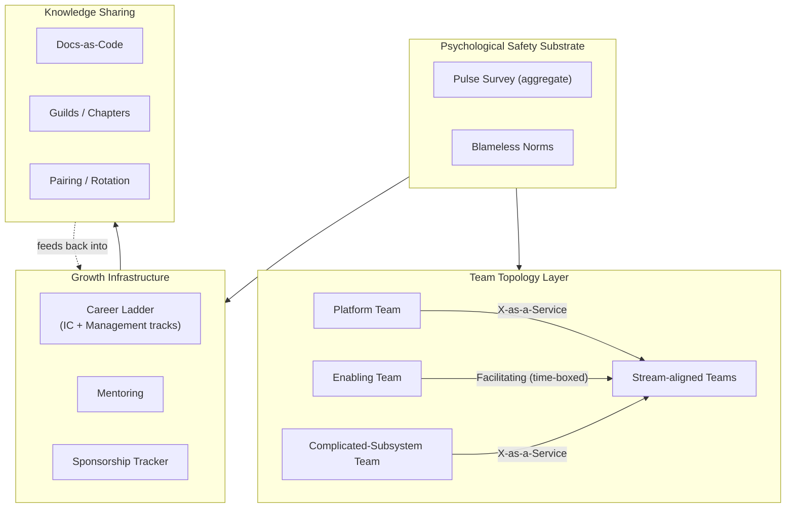
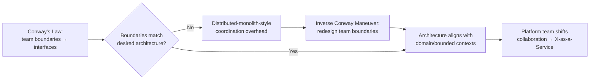
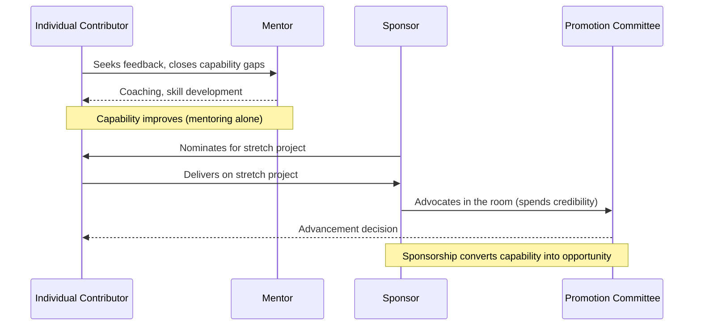

# Mentoring and Team Building

> Part of the **Enterprise Data & AI Architecture Handbook** — Phase-19 (Leadership & Technical Strategy), Chapter 06.
> Prerequisite: [Technical Leadership](01_Technical_Leadership.md). Builds on [Architecture Reviews](02_Architecture_Reviews.md), [Stakeholder Management](03_Stakeholder_Management.md), [Technical Writing](04_Technical_Writing.md), and [Hiring and Interviewing](05_Hiring_and_Interviewing.md).

---

## Executive Summary

[Hiring and Interviewing](05_Hiring_and_Interviewing.md) gets the right people in the door. This chapter is about everything that determines whether they stay, grow, and become the next generation of leaders — and it argues that this is an *architecture* problem as much as a "soft skills" one. The central, unifying claim is Conway's Law made literal: **the structure of your teams becomes the structure of your system, whether you design it deliberately or let it happen by accident.** Three teams organized by technical layer will produce a system that requires three-way coordination for every feature, regardless of how talented the individual engineers are — this is not a culture problem to solve with better collaboration tools, it is a structural mismatch between team boundaries and the architecture the organization actually wants, and it is fixed the same way any other architecture mismatch is fixed: by deliberately redesigning the boundary.

The second thread this chapter develops is that **psychological safety is not a soft nicety sitting alongside the handbook's technical disciplines — it is the substrate every one of them depends on.** [Reliability and SRE](../Phase-18/04_Reliability_and_SRE.md)'s blameless postmortems only surface the real systemic cause if someone is willing to say "I made this mistake" without fear; [Architecture Reviews](02_Architecture_Reviews.md)'s dissent-and-escalation mechanism only works if a junior reviewer is willing to disagree with a principal engineer in the room; [Hiring and Interviewing](05_Hiring_and_Interviewing.md)'s independent-written-feedback discipline only produces real signal if an interviewer is willing to write down a view the rest of the panel might not share. Every mechanism this Phase-19 arc has built assumes people will actually voice the dissenting, uncomfortable, or vulnerable thing — and psychological safety, per Amy Edmondson's foundational research and Google's own internal Project Aristotle study, is the single largest predictor of whether they actually will.

The third thread is a distinction the industry conflates far more often than it should: **mentoring is advice, sponsorship is advocacy, and only sponsorship reliably converts capability into advancement.** A brilliant engineer with an excellent mentor and no sponsor — no one spending their own political capital to nominate them for the promotion, the stretch project, the visible room — plateaus while a less exceptional, better-sponsored peer advances faster. This chapter treats mentoring, sponsorship, career-ladder design, team topology, psychological safety, and knowledge sharing as one connected system for growing engineers and shaping a durable engineering culture — not a collection of unrelated HR initiatives.

---

## Learning Objectives

After working through this chapter you will be able to:

- **Distinguish mentoring from sponsorship** and design a growth system that provides both, rather than assuming advice alone produces advancement.
- **Design team boundaries deliberately using Conway's Law and the Inverse Conway Maneuver**, so team structure produces the architecture you actually want rather than one that emerges by organizational accident.
- **Apply Team Topologies' four fundamental team types and three interaction modes** to diagnose and fix a team-structure/architecture mismatch.
- **Measure and structurally reinforce psychological safety**, understanding why it is the substrate every other leadership mechanism in this handbook depends on.
- **Design a dual-track career ladder** (IC and management) with real parity, avoiding forcing growth-oriented engineers into management.
- **Build durable knowledge-sharing mechanisms** — extending [Technical Writing](04_Technical_Writing.md)'s docs-as-code discipline with guilds, pairing, and rotation — that survive individual departures.
- **Diagnose team dysfunction and unwanted attrition** without defaulting to "this person just wasn't a good fit" as the explanation.

---

## Business Motivation

The business case for deliberate team building rests on a compounding-asset argument: **an engineering organization's structure, culture, and growth mechanisms determine its long-run output and quality far more than the sum of its individual engineers' talent** — and unlike a single hiring decision, these structural properties compound silently over years, in ways that rarely show up on a quarterly dashboard until they produce a visible failure. A team whose boundaries don't match its architecture pays a permanent coordination tax on every feature, invisible in any single sprint's velocity but devastating in aggregate over a year. An organization with no sponsorship mechanism systematically under-promotes its most capable people relative to its best-connected ones, and loses the former to competitors who do sponsor them (this chapter's direct continuation of [Hiring and Interviewing](05_Hiring_and_Interviewing.md)'s "the cost of a wrongly-lost strong contributor is invisible on the balance sheet" argument, now applied to retention instead of acquisition). A team without psychological safety hides its problems instead of surfacing them, and the accumulated undiscovered risk eventually surfaces as an incident, an audit finding, or a resignation — never as a line item that could have been budgeted against.

In data and AI platform organizations specifically, the stakes are sharper for reasons this handbook has already established. First, [Team Topologies](#63-team-topologies-and-conways-law)'s "your architecture mirrors your org chart" dynamic collides directly with the domain-ownership principles of [Domain-Driven Design](../Phase-01/05_Domain_Driven_Design.md) and [Data Mesh Principles](../Phase-15/01_Data_Mesh_Principles.md) — a data platform reorganized around bounded contexts that the team structure doesn't match will simply reproduce a monolith with mesh vocabulary layered on top (a direct instance of [Data Mesh Principles](../Phase-15/01_Data_Mesh_Principles.md)'s "mesh in name only" failure mode, now traced to its team-structural root cause). Second, the field's rapid skill churn (LLMOps, agentic AI, platform engineering are all young disciplines) means growth paths and knowledge-sharing mechanisms must actively work against knowledge concentrating in the few people who happened to learn a new discipline first. Third, this is a domain where a single senior architect's departure can genuinely stall a multi-year platform initiative — making succession, sponsorship, and durable (not person-dependent) institutional knowledge a direct business-continuity concern, not only a people-development one.

The cost of under-investing here is predictable: attrition of exactly the people the organization most needs to keep (the strong-but-unsponsored and the safety-starved-but-conscientious), architecture that silently ossifies around historical team boundaries long after those boundaries stopped making sense, and a culture where problems are discovered in an incident rather than raised in a stand-up. The return on investing well is a culture that compounds in the other direction: teams that ship coherently because their boundaries match the system, people who grow and stay because their growth is sponsored not just advised, and a culture where the truth surfaces early because surfacing it doesn't cost anything.

---

## History and Evolution

- **1967: Conway's Law.** Melvin Conway's paper "How Do Committees Invent?" observed that organizations design systems that mirror their own communication structure — the earliest, and still the sharpest, statement of the structural link this entire chapter is built around.
- **1960s: the dual career ladder emerges.** Large technology and engineering firms (IBM is the commonly cited early example) began formalizing a parallel individual-contributor track alongside the management track specifically to retain senior technical talent without forcing a move into people management as the only path to advancement and pay growth — the origin of the dual-ladder concept [Technical Leadership](01_Technical_Leadership.md) and [Hiring and Interviewing](05_Hiring_and_Interviewing.md) both assume.
- **1975: conceptual integrity and team-size limits.** Fred Brooks' *The Mythical Man-Month* argued that a system's conceptual integrity depends on a small number of minds designing it, and that adding people to a late project makes it later — an early, influential statement of the team-structure-shapes-system-quality link, cited already in [Technical Leadership](01_Technical_Leadership.md) §1.1.
- **1999: psychological safety formalized.** Amy Edmondson's Harvard Business School research, "Psychological Safety and Learning Behavior in Work Teams" (1999), gave the concept a rigorous empirical definition and measurement instrument — a team climate where members believe they will not be punished for speaking up with mistakes, questions, or dissenting views.
- **2000s: the sponsorship-vs-mentoring distinction sharpens.** Research by scholars including Herminia Ibarra distinguished *mentoring* (advice, feedback, coaching) from *sponsorship* (a senior person actively using their own influence and credibility to advocate for someone's advancement) as functionally different interventions with different effects — a distinction Sylvia Ann Hewlett's *Forget a Mentor, Find a Sponsor* (Harvard Business Review Press, 2013) popularized industry-wide, with research specifically finding that sponsorship (not mentoring alone) closes measurable advancement and pay gaps, particularly for historically underrepresented groups.
- **2012–2015: Google's Project Aristotle.** Google's own multi-year internal study of what made its highest-performing teams effective (published via its re:Work initiative in 2015) found that psychological safety was the single strongest predictor of team effectiveness — stronger than who was on the team, more than any individual skill composition — becoming one of the most cited pieces of applied organizational research in the tech industry.
- **2012: the "Spotify model" whitepaper.** Henrik Kniberg and Anders Ivarsson's widely circulated internal whitepaper described Spotify's squads/tribes/chapters/guilds structure, popularizing "chapters" and "guilds" as knowledge-sharing mechanisms across autonomous teams. Notably — and this chapter treats it as an honest caution rather than a template to copy wholesale — Spotify itself has since publicly acknowledged the model was a snapshot of a particular moment, not a prescriptive framework, and that the company's actual structure evolved substantially afterward; treating it as a fixed methodology to import is a documented anti-pattern in its own right (§Anti-patterns).
- **2019: Team Topologies formalizes team-design as an architecture discipline.** Matthew Skelton and Manuel Pais' *Team Topologies* synthesized Conway's Law, cognitive-load theory, and DevOps practice into four fundamental team types (stream-aligned, platform, enabling, complicated-subsystem) and three team interaction modes (collaboration, X-as-a-Service, facilitating), and coined broader currency for the **Inverse Conway Maneuver** — deliberately shaping team structure to produce a desired architecture, rather than discovering the architecture your existing team structure already produced.
- **2020s: remote/hybrid work and AI-assisted knowledge work reshape team building.** Distributed and hybrid work made deliberate psychological-safety and knowledge-sharing practices load-bearing rather than optional (informal hallway osmosis, a major historical knowledge-transfer channel, largely stopped working); most recently, AI coding and knowledge assistants are changing what "pairing" and "mentoring" look like day to day, without removing the need for the human relationship, sponsorship, and judgment-transfer this chapter covers.

The through-line: team building has moved from an implicit, emergent byproduct of "just hire good people and get out of the way" toward a **deliberately designed discipline** — with its own empirical research base (Edmondson, Google's Project Aristotle, Hewlett's sponsorship research) and its own architectural framework (Team Topologies) — that this chapter treats with the same rigor the rest of the handbook applies to system design.

---

## Why This Technology Exists

Deliberate team building exists to solve problems that "hire well and let culture emerge" reliably fails to solve, for three specific, well-evidenced reasons.

**It exists because team communication structure inevitably becomes system structure, whether or not anyone intends it.** Conway's Law is not a metaphor — it is a structural consequence of where coordination is cheap (within a team) versus expensive (across a team boundary): interfaces get built wherever coordination is cheapest, so a system's module boundaries silently accrete along existing team boundaries unless someone deliberately intervenes. An organization that doesn't design its team structure gets whatever architecture its historical org chart happened to produce — and that architecture is only accidentally the right one.

**It exists because psychological safety does not occur by default, and every other mechanism in this handbook's leadership arc silently depends on it existing.** A blameless postmortem process, an architecture-review dissent norm, and a hiring-calibration disagreement all *assume* someone will actually speak the uncomfortable truth; without psychological safety, people rationally protect themselves instead, and every one of those mechanisms degrades into rubber-stamping without anyone announcing that it has. Deliberately building and measuring psychological safety exists because it is the precondition, not a parallel initiative, for the rest of the leadership toolkit to function as designed.

**It exists because advice alone does not reliably convert into advancement, and leaving advancement to organic visibility reproduces existing advantage.** Mentoring — coaching, feedback, advice — genuinely helps someone get better at their job, but Hewlett's and Ibarra's research is specific and consistent: it is *sponsorship* — someone spending their own credibility to nominate a person for the room, the stretch assignment, the promotion case — that reliably moves advancement, and sponsorship happens disproportionately for people who already resemble those in power unless an organization deliberately builds a mechanism to distribute it more broadly. Deliberate team building exists because leaving growth to organic mentoring and organic visibility systematically under-serves exactly the people the organization can least afford to lose.

---

## Problems It Solves

- **Team-structure/architecture mismatch.** Deliberately designing team boundaries around desired system boundaries (the Inverse Conway Maneuver) prevents a system from silently ossifying around historical, accidental org-chart shape.
- **Coordination overhead from misaligned team boundaries.** Team Topologies' four team types and three interaction modes give a vocabulary for diagnosing why a specific cross-team collaboration is slow, and what interaction mode it actually needs.
- **Hidden problems and unsurfaced dissent.** A measured, structurally reinforced psychological-safety baseline is the precondition that makes every other "speak up" mechanism in this handbook (blameless postmortems, review dissent, hiring calibration disagreement) actually function.
- **Growth stalling despite genuine capability.** Explicit sponsorship (not just mentoring) closes the gap between being good at the job and being recognized/advanced for it.
- **Forced management-track promotion as the only growth path.** A real, level-parity dual career ladder lets strong ICs grow without becoming reluctant, mediocre managers.
- **Knowledge concentrated in a few people (bus-factor risk).** Guilds, chapters, pairing, rotation, and docs-as-code (extending [Technical Writing](04_Technical_Writing.md)) distribute knowledge so it survives any single person's departure.
- **Attrition of strong-but-unsponsored or safety-starved contributors** — the invisible-cost pattern this chapter shares directly with [Hiring and Interviewing](05_Hiring_and_Interviewing.md)'s wrongly-rejected-candidate problem, now applied after the hire rather than before it.

---

## Problems It Cannot Solve

- **It cannot fix a fundamentally wrong business strategy or product-market fit with better team structure.** Team Topologies optimizes the delivery of a strategy; it cannot substitute for having the right strategy in the first place.
- **It cannot make reorganization free.** Redesigning team boundaries around a desired architecture has a genuine short-term productivity cost (new teams re-forming working relationships, per the well-documented forming-storming-norming-performing dynamic) — the Inverse Conway Maneuver is a real intervention with a real transition cost, not a costless toggle.
- **It cannot substitute sponsorship for actual capability.** Sponsorship accelerates the advancement of genuine capability; using it to advance someone who isn't actually ready damages the sponsor's credibility and the sponsee's standing, and is a misuse of the mechanism this chapter recommends, not an application of it.
- **It cannot manufacture psychological safety through a values poster or a single workshop.** Per Edmondson's research, safety is built (and destroyed) through repeated, consistent lived experience — particularly how leadership responds the first few times someone actually takes the risk of speaking up — not through a stated value that isn't backed by consistent behavior.
- **It cannot import another company's culture wholesale and expect the same result.** The "Spotify model" caution (§History) applies generally: team structures and cultural practices are shaped by a specific context, and copying the artifact (squads, chapters, guilds) without the underlying conditions that produced it is a documented anti-pattern (§Anti-patterns).
- **It cannot retain someone the organization has genuinely outgrown or who has genuinely outgrown the organization.** Some attrition is healthy and not a sign of a broken system; the goal is to eliminate the *unintended*, structurally-caused loss of people the organization wanted to keep, not to eliminate all attrition.

---

## Core Concepts

### 6.1 Mentoring and Sponsorship

**Mentoring** is advice: a more experienced person providing feedback, coaching, and guidance to help someone improve their skills and judgment. **Sponsorship** is advocacy: a senior person actively spending their own credibility and political capital — nominating someone for a stretch project, advocating for their promotion case in a room they aren't in, connecting them to visible work — to advance someone else's opportunity. The distinction, established by research including Herminia Ibarra's and popularized by Sylvia Ann Hewlett's *Forget a Mentor, Find a Sponsor* (2013), matters because the two interventions are not substitutes: mentoring reliably improves capability, but Hewlett's research specifically finds it is sponsorship that reliably moves advancement and closes measurable gaps in promotion and pay, particularly for people from groups historically under-sponsored by an organization's existing leadership.

The practical implication is that a mentoring program alone — however well-run — is an incomplete growth system if it isn't paired with an explicit sponsorship mechanism: a lead or manager who not only gives feedback in a 1:1 but actively nominates their report for the visible project, brings their name into the promotion-committee room, and puts their own credibility behind that advocacy. Because sponsorship is an active, accountable behavior rather than a passive availability, it should be tracked and expected of leads and managers as a real responsibility — not assumed to happen organically, which (per the same research) tends to reproduce existing patterns of who already gets sponsored.

### 6.2 Career Ladders and Growth

A career ladder is the written, calibrated definition of what each level requires — the same rubric discipline [Hiring and Interviewing](05_Hiring_and_Interviewing.md) §5.1 establishes for external candidates, now applied continuously to the people already on the team, and grounded in [Technical Leadership](01_Technical_Leadership.md) §1.1's Staff+ archetype framework. A healthy ladder has three properties: it is **written and concrete** (scope, autonomy, and impact expectations at each level, not a vague sense of "seniority"), it offers a **genuine dual track** (an individual-contributor path with real level and compensation parity to the management path, per the dual-ladder history in §History, so growth doesn't force a move into management as the only way up), and it is **actively used in growth conversations**, not filed away and consulted only at promotion time.

Growth itself is usefully modeled on the Center for Creative Leadership's widely cited **70-20-10 framework**: roughly 70% of development happens through challenging on-the-job experience (stretch projects — the output of sponsorship), 20% through social learning (mentoring, coaching, peer feedback), and 10% through formal training. The practical lesson is that a growth system investing only in the 10% (training budgets, courses) while neglecting the 70% (who gets the stretch project) and the 20% (who has a mentor and, more importantly, a sponsor) is investing in the smallest lever and neglecting the largest ones.

### 6.3 Team Topologies and Conway's Law

**Conway's Law** (Melvin Conway, 1967) observes that organizations design systems that mirror their own communication structure, because interfaces form wherever coordination is cheapest — inside a team — while cross-team interfaces require deliberate, costly coordination and so tend to be avoided or handled clumsily unless someone designs for them explicitly. Left undesigned, this produces exactly the "distributed monolith" failure [Microservices Architecture](../Phase-14/02_Microservices_Architecture.md) §8.1 already documents: services drawn along technical-layer or org-chart boundaries rather than domain/bounded-context boundaries ([Domain-Driven Design](../Phase-01/05_Domain_Driven_Design.md)) end up requiring cross-team coordination for nearly every feature, because the team structure and the desired architecture don't match.

**Team Topologies** (Skelton & Pais, 2019) gives this problem a concrete vocabulary: four fundamental team types — **stream-aligned** (aligned to a single, continuous flow of business/domain value, the default team type), **platform** (providing a compelling internal product — self-service capabilities — that reduces cognitive load for stream-aligned teams, directly the [Platform Engineering](../Phase-09/02_Platform_Engineering.md) and [Self-Serve Data Platform](../Phase-15/05_Self_Serve_Data_Platform.md) team shape), **enabling** (temporarily helping a stream-aligned team acquire a new capability, then stepping back), and **complicated-subsystem** (owning a component requiring deep specialist knowledge few teams need to hold themselves) — and three interaction modes — **collaboration** (working closely together, appropriate temporarily), **X-as-a-Service** (one team consumes another's capability with minimal collaboration overhead, the target steady state for a platform team per [Self-Serve Data Platform](../Phase-15/05_Self_Serve_Data_Platform.md)'s golden-path model), and **facilitating** (an enabling team coaching another).

The **Inverse Conway Maneuver** is the deliberate application of this insight: instead of discovering the architecture your existing team structure already produced, decide the architecture you want and then design (or redesign) team boundaries and interaction modes to produce it. This directly operationalizes [Domain-Driven Design](../Phase-01/05_Domain_Driven_Design.md)'s bounded-context boundaries and [Microservices Architecture](../Phase-14/02_Microservices_Architecture.md) ADR-0170's boundary guidance as an organizational-design decision, not only a technical one — this chapter's Case Study 1 is the direct, costly consequence of skipping it.

### 6.4 Psychological Safety

Amy Edmondson's research (1999) defines psychological safety as a shared team belief that it is safe to take interpersonal risks — to admit a mistake, ask a question that might seem obvious, propose an idea that might be wrong, or disagree with someone more senior — without being punished or humiliated for it. Google's internal Project Aristotle study (2012–2015) found it to be the single strongest predictor of team effectiveness among everything the study measured, more predictive than who was on the team or what skills they individually possessed.

The reason this chapter treats psychological safety as **infrastructure rather than culture-as-decoration** is that it is the literal precondition every other Phase-19 leadership mechanism assumes: [Reliability and SRE](../Phase-18/04_Reliability_and_SRE.md) §4.4's blameless postmortems only find the real systemic cause if the person who made the mistake is willing to describe it accurately; [Architecture Reviews](02_Architecture_Reviews.md) §2.4's dissent-and-escalation path only produces a real second opinion if a junior reviewer is willing to disagree with a principal engineer; [Hiring and Interviewing](05_Hiring_and_Interviewing.md) §5.2's independent written feedback only captures real signal if an interviewer is willing to write down a view that might contradict the room. None of these mechanisms enforce the courage they require — they only work if the underlying psychological-safety substrate is actually present, which is why this chapter treats measuring and reinforcing it (§Monitoring, §Operational Response Playbook) as a first-class, structural responsibility rather than an assumed byproduct of "hiring nice people."

### 6.5 Knowledge Sharing

Knowledge sharing distributes what would otherwise live in a few individuals' heads across the team, directly extending [Technical Writing](04_Technical_Writing.md)'s docs-as-code discipline (the durable, written form) with the human, synchronous mechanisms writing alone doesn't replace: **pairing and mob programming** (real-time judgment transfer, particularly valuable for the tacit, hard-to-write-down parts of expertise), **guilds/chapters** (cross-team communities of practice around a shared discipline — the mechanism the "Spotify model" popularized, useful when applied to a genuine cross-team need rather than imported as a structural template wholesale), **brown-bag sessions and internal tech talks** (lightweight, recurring, low-ceremony sharing), and **deliberate rotation** (spreading ownership of a complicated subsystem or on-call responsibility so it isn't permanently concentrated in one person). The common failure this section returns to repeatedly: treating any of these as "extra" activity squeezed into leftover time, rather than resourced, scheduled time that competes fairly with delivery work — an unresourced knowledge-sharing practice reliably gets crowded out by the next deadline (§Common Mistakes).

---

## Internal Working

### 7.1 Conway's Law as a Structural Force

The mechanism behind Conway's Law is simple and load-bearing: building and maintaining an interface has a real, ongoing coordination cost, and that cost is far lower within a team (shared context, shared stand-ups, low-friction communication) than across a team boundary (scheduling, translation, ownership ambiguity). Left to its own devices, a system's actual module boundaries will accrete wherever that coordination cost is lowest — which is to say, along existing team boundaries — regardless of whether those boundaries correspond to good architectural seams. This is why Conway's Law is not advice to heed or ignore; it is closer to a physical constraint that will express itself one way or another, making the only real choice **whether an organization designs its team boundaries deliberately (the Inverse Conway Maneuver) or has its architecture designed for it by whatever team structure history happened to produce.**

### 7.2 Psychological Safety as the Substrate of Every Other Practice

Psychological safety functions as an *enabling condition* rather than a mechanism in its own right: it does not itself produce a blameless postmortem, a dissenting architecture review, or an honest interview-panel disagreement — it removes the social cost that would otherwise make a person rationally choose silence over voicing any of those things. This is why a team can have every mechanism in this handbook's leadership toolkit formally in place (a documented blameless-postmortem process, a review-escalation path, a structured hiring rubric) and still have all of them silently degrade into rubber-stamping if the underlying safety isn't there — the mechanisms specify *what should happen*, and psychological safety is what determines whether people actually do the vulnerable thing each mechanism requires of them.

### 7.3 The Mentoring–Sponsorship–Ladder Pipeline

Growth functions as a three-stage pipeline, and it stalls wherever the weakest stage is: **mentoring** builds the underlying capability (feedback closes the gap between current and needed skill), **sponsorship** converts that capability into visible opportunity (a stretch project, a promotion case, access to a room), and the **career ladder** defines, concretely, what "ready for the next level" actually means so that sponsorship has a real, defensible target rather than an arbitrary one. A person with excellent mentoring and no sponsorship has the capability but never gets the opportunity to demonstrate it at the next level (this chapter's Case Study 2); a person with strong sponsorship but a vague or absent ladder gets opportunity without a clear bar to be assessed against, producing exactly the leveling-inconsistency problem [Hiring and Interviewing](05_Hiring_and_Interviewing.md) §5.1 documents for external hiring, now internally.

---

## Architecture

The reference architecture connects four systems into one: **team topology design** (stream-aligned/platform/enabling/complicated-subsystem team types and their interaction modes, deliberately chosen via the Inverse Conway Maneuver to match the desired system architecture) provides the structural container; **growth infrastructure** (career ladder, mentoring relationships, and tracked sponsorship commitments) operates within and across those team boundaries; **psychological-safety measurement and reinforcement** (surveys, blameless norms, leadership modeling) is the substrate underneath both; and **knowledge-sharing mechanisms** (docs-as-code per [Technical Writing](04_Technical_Writing.md), guilds, pairing, rotation) distribute what each team and each growing individual learns back across the whole organization, closing the loop the same way [Hiring and Interviewing](05_Hiring_and_Interviewing.md)'s post-hire performance data closes back into rubric validation.

---

## Components

- **Team Charter** — a team's written mission, boundaries, and interaction modes (stream-aligned/platform/enabling/complicated-subsystem), the team-level analogue of a role rubric.
- **Career Ladder Document** — the versioned, docs-as-code level definitions per track (IC and management).
- **Mentoring Program** — structured pairing of mentors and mentees, with regular cadence.
- **Sponsorship Tracker** — an explicit, accountable record of who is sponsoring whom for what opportunity (not left informal).
- **Psychological-Safety Pulse Survey** — a periodic, anonymized, team-level (never individual-level) measurement instrument.
- **Knowledge-Sharing Programs** — guilds/chapters, brown-bag sessions, pairing rotations, on-call rotation.
- **Team-Topology Map / Software Catalog** — a visual, maintained record of team ownership and interaction modes (e.g., a Backstage catalog).
- **Growth-Conversation Records** — 1:1 and growth-plan notes, docs-as-code per [Technical Writing](04_Technical_Writing.md).

---

## Metadata

Team charters carry team type, owned domains/services, and interaction mode with each neighboring team; career-ladder documents carry level, track, and version; sponsorship-tracker entries carry sponsor, sponsee, opportunity, and status; psychological-safety survey results carry only **team-level aggregates**, never individual-level scores tied to a name — a deliberate governance boundary, directly analogous to [Hiring and Interviewing](05_Hiring_and_Interviewing.md) §Metadata's rule that adverse-impact data is used only in anonymized aggregate form, never as an input to an individual decision.

---

## Storage

Career ladders, team charters, and growth-conversation templates are stored as version-controlled, docs-as-code artifacts ([Technical Writing](04_Technical_Writing.md)), reviewed and updated like any other living document rather than written once and left to go stale. Psychological-safety survey responses and individual growth/performance notes are sensitive personal data requiring the same access-control and retention discipline [Data Privacy and PII Protection](../Phase-10/07_Data_Privacy_and_PII_Protection.md) applies to any other personal data, including a clear retention and deletion policy.

---

## Compute

The scarcest resource in this domain, continuing the pattern from [Technical Leadership](01_Technical_Leadership.md) §1.2 and [Hiring and Interviewing](05_Hiring_and_Interviewing.md) §Compute, is **senior leaders' sponsorship and mentoring time** — a genuinely non-scalable resource that must be deliberately allocated (§Scalability) rather than left to whoever happens to build a relationship with a senior leader informally, which reproduces exactly the unequal-sponsorship pattern §6.1 warns against.

---

## Networking

A team's "network" is both its formal interaction modes with neighboring teams (collaboration/X-as-a-Service/facilitating, per Team Topologies) and its informal cross-team relationships (guilds, chapters, alumni of rotations) that carry knowledge and trust across team boundaries that the org chart alone would otherwise wall off. A team with no cross-team network beyond its formal interfaces is fragile: it cannot borrow expertise quickly, and its members are less visible for sponsorship opportunities outside their immediate reporting line.

---

## Security

Psychological safety has a direct security-adjacent framing: it is fundamentally about **protecting people from retaliation** for raising a concern, admitting an error, or disagreeing — the human analogue of the integrity properties this handbook applies to systems. Mentoring, sponsorship, and growth-conversation records are sensitive and require confidentiality (a candid growth-plan note or a sponsorship discussion should not be broadly readable), and psychological-safety survey data must be protected at the aggregate level specifically to prevent it from being used, even inadvertently, to identify or penalize an individual who spoke honestly — a misuse that would itself destroy the safety the survey exists to measure.

---

## Performance

Team-health signals worth tracking, kept disaggregated rather than collapsed into one score (the same discipline [Evaluation and Guardrails](../Phase-12/09_Evaluation_and_Guardrails.md) §9.3 applies to LLM evaluation): **regretted attrition rate** (losing people the organization wanted to keep), **internal promotion rate and time-in-level**, **psychological-safety survey trend**, **sponsorship-tracker coverage** (what fraction of the team has an active sponsor, not just a mentor), **knowledge bus-factor** (how many people could cover a given critical responsibility), and **cross-team coordination overhead** (a proxy for team-topology mismatch, per §6.3).

---

## Scalability

Scaling healthy culture and growth practices across a growing organization — without diluting them — depends on the same mechanism [Technical Writing](04_Technical_Writing.md) and [Hiring and Interviewing](05_Hiring_and_Interviewing.md) rely on for their own scaling problems: **written, calibrated artifacts (the ladder, the team charter) plus a deliberately broadened bench of people who carry the practice (more trained mentors and sponsors, more guild leads) rather than concentrating culture-carrying in one founder or one senior leader.** A single "culture carrier" who personally embodies psychological safety or sponsorship for the whole organization is a scalability bottleneck and a fault-tolerance risk (§Fault Tolerance) at once.

---

## Fault Tolerance

A resilient growth system has redundancy at its weakest points: **no single point of sponsorship failure** — a growing engineer should ideally have more than one person willing to advocate for them, so one sponsor's departure or reassignment doesn't strand their growth; **succession planning** for complicated-subsystem and specialist knowledge, so a single person's departure doesn't halt a critical capability; and **blameless recovery norms** for interpersonal and team conflict, mirroring [Reliability and SRE](../Phase-18/04_Reliability_and_SRE.md) §4.4's blameless-postmortem discipline applied to team dynamics rather than only technical incidents.

---

## Cost Optimization

**Worked example.** A senior data platform engineer with a fully-loaded cost of roughly $180,000/year — the same role modeled in [Hiring and Interviewing](05_Hiring_and_Interviewing.md) §Cost Optimization — who is strong but unsponsored and plateaus for two years before leaving, then gets promoted within a year at a competitor who did sponsor them, represents a cost the organization never sees on a P&L: the sunk hiring and onboarding investment, the cost of re-hiring and re-onboarding a replacement at the same level (using the same ~100%-of-first-year-cost bad-hire-equivalent estimate from [Hiring and Interviewing](05_Hiring_and_Interviewing.md), roughly **$150,000–$200,000** all-in), and the two years of under-leveraged output from someone the organization was, in effect, quietly under-utilizing. Against that, an explicit sponsorship program costs a small, recurring amount of senior-leader time — the same order of magnitude as the additional interview round in the hiring chapter's own worked example, a few hours a month per sponsor-sponsee pair — making deliberate sponsorship one of the highest-leverage, lowest-cost retention investments available, precisely because its absence is so invisible until the departure happens.

---

## Monitoring

Track sponsorship-tracker coverage and activity, internal promotion rate and time-in-level by track and by demographic category (mirroring [Hiring and Interviewing](05_Hiring_and_Interviewing.md)'s stage-level adverse-impact monitoring, now applied to internal advancement), regretted-attrition rate and its stated/exit-interview causes, psychological-safety pulse-survey trend at the team level, and knowledge bus-factor for critical systems.

---

## Observability

Monitoring answers known questions against known thresholds (is attrition within the expected range this quarter?). **Observability** is the ability to ask an unforeseen question of the same underlying data — "why has advancement on this specific team lagged the rest of the organization for three consecutive cycles?" or "did a specific reorganization change who gets sponsored?" — the same monitoring-versus-observability distinction [Observability with OpenTelemetry](../Phase-18/02_Observability_with_OpenTelemetry.md) §2.1 and [Hiring and Interviewing](05_Hiring_and_Interviewing.md) §Observability both apply to their own domains, now applied to team and culture health.

---

## Operational Response Playbook

**Playbook 1 — Persistent cross-team coordination overhead traces to a team-topology mismatch.** Do not respond by adding more meetings, a coordination committee, or a "communication improvement" initiative layered on top of the existing structure. Diagnose using Team Topologies' vocabulary: is the friction between two teams that should be in **X-as-a-Service** mode but are stuck in ad hoc **collaboration** mode because no self-service interface exists (the fix is investing in the platform team's product, per [Self-Serve Data Platform](../Phase-15/05_Self_Serve_Data_Platform.md))? Or is it a genuine **Conway's Law mismatch** — team boundaries drawn along technical layers rather than the business/domain boundaries the system actually needs (the fix is the Inverse Conway Maneuver: redesign team boundaries around the desired architecture, accepting the real short-term reorganization cost, §Problems It Cannot Solve)? Respond by the actual cause, not by adding process on top of a structural mismatch.

**Playbook 2 — A strong contributor is plateauing, or a team is quietly hiding a problem.** Do not conclude "they just aren't ready" or "the team is fine, no one's raised anything." For plateauing: audit whether the person has an active *mentor*, an active *sponsor*, both, or neither — per §7.3's pipeline model, a capability gap needs mentoring, an opportunity gap needs sponsorship, and treating an opportunity gap as a capability gap (more training, more feedback) will not fix it. For a hidden problem: treat the silence itself as a psychological-safety signal, not a sign that nothing is wrong — investigate whether a prior blame incident (per [Reliability and SRE](../Phase-18/04_Reliability_and_SRE.md) §4.4's own diagnosis pattern) taught the team that raising this class of issue previously cost the messenger, and repair the underlying safety rather than only addressing the specific surfaced problem.

---

## Governance

Governance in this domain centers on three areas. **Advancement equity**: monitor internal promotion rate, time-in-level, and sponsorship-tracker coverage by demographic category in aggregate (never at the individual level, §Metadata) to catch systemic advancement gaps the way [Hiring and Interviewing](05_Hiring_and_Interviewing.md) §Governance monitors external-hiring adverse impact. **Psychological-safety data protection**: survey data must be aggregated, anonymized, and never used punitively, or the mechanism destroys the safety it exists to measure. **Reorganization governance**: a decision to redesign team boundaries (the Inverse Conway Maneuver) is consequential and should go through the same structured, documented decision process [Architecture Reviews](02_Architecture_Reviews.md) applies to any one-way-door, cross-team decision — including an explicit accounting of the transition cost, not only the target-state benefit.

---

## Trade-offs

- **Deliberate reorganization vs. stability.** Redesigning team boundaries to fix a genuine Conway's Law mismatch has a real short-term productivity cost (re-forming working relationships); reorganizing too frequently, or for a marginal architectural gain, can itself become the disruption that damages psychological safety and knowledge continuity.
- **Sponsorship investment vs. scarce senior time.** Sponsorship requires real, recurring senior-leader time (§Compute); spreading it too thin dilutes its effectiveness, concentrating it in too few sponsors recreates the single-point-of-failure risk (§Fault Tolerance).
- **Dual-ladder parity vs. organizational simplicity.** A genuine dual ladder with real parity requires more calibration work (two ladders to keep consistent and credible) than a single unified ladder, but a single ladder risks forcing capable ICs into management.
- **Guild/chapter investment vs. delivery pressure.** Resourced knowledge-sharing time competes directly and visibly with delivery velocity in the short term, even though it reduces bus-factor risk and coordination cost in the long term.
- **Measuring psychological safety vs. the risk of misusing the measurement.** A survey that isn't rigorously kept aggregate and non-punitive can itself damage the safety it's meant to track.

---

## Decision Matrix

| Situation | Team-Topology Response | Growth Response |
|---|---|---|
| Persistent 3-way coordination for every feature | Redesign team boundaries around domain, not technical layer (Inverse Conway Maneuver) | — |
| Platform team drowning in ad hoc requests | Shift interaction mode from collaboration to X-as-a-Service; invest in self-service product | — |
| New capability needed temporarily on a stream-aligned team | Deploy an enabling team, time-boxed, then withdraw | — |
| Rare, deep specialist knowledge (e.g., a core storage engine) | Complicated-subsystem team, deliberately small and clearly bounded | — |
| Strong contributor plateauing despite good feedback | — | Audit for a sponsorship gap, not a capability gap |
| Team stays quiet about known risks | — | Investigate psychological safety and any prior blame incident before adding process |
| Rapid organizational growth | Federate mentoring/sponsorship bench and guild leadership (avoid single culture-carrier bottleneck) | Formalize ladder and sponsorship tracker before informal practice breaks down |

---

## Design Patterns

- **Inverse Conway Maneuver** — deliberately design team boundaries to produce the desired system architecture (§6.3).
- **Explicit sponsorship tracking** — treat sponsorship as an accountable, tracked responsibility, not an assumed byproduct of mentoring (§6.1).
- **Dual-track career ladder with real parity** — IC and management tracks calibrated to genuinely equivalent levels and compensation (§6.2).
- **X-as-a-Service platform interaction** — reduce cross-team collaboration overhead via a self-service product rather than ad hoc coordination (§6.3, [Self-Serve Data Platform](../Phase-15/05_Self_Serve_Data_Platform.md)).
- **Blameless team-conflict recovery** — apply the same blameless-postmortem discipline to interpersonal/team dysfunction as to technical incidents ([Reliability and SRE](../Phase-18/04_Reliability_and_SRE.md)).
- **Federated knowledge-sharing (guilds/chapters)** — cross-team communities of practice resourced with real time, applied to a genuine cross-team need.
- **Periodic, aggregate-only psychological-safety measurement** — a standing pulse survey, never individually attributable.

---

## Anti-patterns

- **Ignoring Conway's Law and hoping better collaboration tools fix a structural mismatch.**
- **Mentoring without sponsorship** — assuming advice alone produces advancement (§6.1, Case Study 2).
- **A single unified career ladder** that forces capable ICs into management to grow.
- **Importing another company's team-structure whitepaper (e.g., the "Spotify model") as a literal template**, rather than applying the underlying principles to your own context — Spotify's own later acknowledgment that the model was a snapshot, not a prescription, is the direct caution.
- **Treating psychological safety as a values statement or a single workshop** rather than a consistently reinforced, measured norm.
- **Reorganizing teams frequently for marginal gains**, incurring repeated transition costs without letting any structure stabilize long enough to pay off.
- **Unresourced knowledge-sharing** — guilds/brown-bags/pairing time that exists on paper but is always the first thing cut under delivery pressure.
- **Individually-attributable psychological-safety survey data**, which converts a safety-measurement tool into a surveillance tool and destroys the safety it measures.
- **Concentrating sponsorship or "culture carrying" in one person**, creating a single point of failure for both growth and culture.

---

## Common Mistakes

- Treating a coordination problem between teams as a communication-skills problem rather than a topology/interaction-mode mismatch.
- Assuming a mentor is enough and never explicitly asking who is sponsoring a given person.
- Letting the career ladder go stale, unreviewed against how the actual job has evolved.
- Running a psychological-safety survey once, without a repeated cadence or visible follow-through on what it surfaces.
- Scheduling guild/knowledge-sharing time that gets silently deprioritized whenever a deadline looms.
- Reorganizing without accounting for or communicating the real short-term productivity cost.
- Not distinguishing regretted from unregretted attrition when reviewing team-health metrics.

---

## Best Practices

- Design team boundaries deliberately against the desired architecture (Inverse Conway Maneuver), not by historical accident.
- Track sponsorship explicitly and require it of leads/managers, not just mentoring.
- Maintain a written, dual-track career ladder with genuine parity, reviewed and recalibrated regularly.
- Measure psychological safety at the team-aggregate level on a standing cadence, and follow through visibly on what it surfaces.
- Resource knowledge-sharing time as real, protected time, not leftover capacity.
- Apply the same blameless-recovery discipline to team/interpersonal conflict as to technical incidents.
- Federate sponsorship, mentoring, and guild leadership across a broad bench rather than concentrating it in one or two people.
- Account for and communicate the real transition cost before any team reorganization.

---

## Enterprise Recommendations

Establish an explicit sponsorship-tracking mechanism alongside any mentoring program; periodically audit team topology against the organization's actual desired architecture and apply the Inverse Conway Maneuver deliberately rather than reactively; run a standing, aggregate-only psychological-safety pulse survey and treat its trend as a leading indicator worth executive attention; maintain a genuinely dual-track, level-parity career ladder as a living, docs-as-code artifact; resource knowledge-sharing programs (guilds, pairing, rotation) with real, protected time; and monitor internal-advancement and regretted-attrition data with the same rigor [Hiring and Interviewing](05_Hiring_and_Interviewing.md) applies to external hiring's adverse-impact data.

---

## Azure Implementation

The Microsoft 365 **Viva** suite is the most directly applicable Azure-ecosystem tooling for this chapter's practices: **Viva Learning** centralizes knowledge-sharing content and internal courses; **Viva Engage** (the evolution of Yammer) supports cross-team guilds and communities of practice; **Viva Goals** tracks growth and OKR-style objectives feeding career-ladder conversations; and **Viva Insights** surfaces collaboration-pattern analytics (at the aggregate, privacy-respecting level) useful for spotting team-topology friction such as excessive cross-team meeting load. **Microsoft Teams and Loop** host 1:1 growth conversations and guild discussions; **SharePoint/Loop with Purview sensitivity labels** store the career-ladder documents, team charters, and sponsorship-tracker records with appropriate confidentiality; **Backstage** (deployable on Azure/AKS) serves as the team/software catalog visualizing team ownership and interaction modes, directly operationalizing the Team Topologies map (§Components); and **Azure DevOps Boards** can track sponsorship commitments and stretch-project assignments alongside delivery work. Microsoft's own internal engineering practice — a formal dual-track ladder and structured growth ("Connect") conversations, referenced already in [Technical Leadership](01_Technical_Leadership.md) — is a directly applicable real-world reference.

---

## Open Source Implementation

**Backstage** (CNCF, originated at Spotify) is the standout open-source tool for this domain: its software/team catalog directly models Team Topologies' team types and ownership boundaries, and its TechDocs integration reuses [Technical Writing](04_Technical_Writing.md)'s docs-as-code discipline for team charters and growth documentation. Career-ladder documents, team charters, and growth-plan templates live as versioned **Markdown in Git**, reviewed via pull request. Guilds and chapters can be coordinated via open community platforms (**Mattermost, Rocket.Chat, Discourse**); lightweight, self-hosted, anonymized pulse-survey tools (or a simple internally-built form backed by aggregated-only reporting) support the psychological-safety measurement discipline without relying on a commercial HR platform.

---

## AWS Equivalent (comparison only)

The relevant AWS-ecosystem comparison, again a cultural practice rather than a cloud product, is Amazon's **"two-pizza team"** principle (small, autonomous, stream-aligned teams sized so two pizzas can feed the team) paired with the **"single-threaded owner"** and "you build it, you run it" ownership model — a genuine, well-documented real-world application of small, clearly-bounded, stream-aligned team design with strong ownership, directly comparable to Team Topologies' stream-aligned team type and a useful concrete counterpart to this chapter's Inverse Conway Maneuver guidance.

## GCP Equivalent (comparison only)

The relevant Google/GCP-ecosystem comparison is Google's own internally-produced research base this chapter draws on directly: **Project Aristotle** (§History, 2012–2015), Google's multi-year internal study establishing psychological safety as the top predictor of team effectiveness, and the historical, honestly-caveated **"20% time"** practice (innovation and cross-team knowledge-sharing time, scaled back significantly over the years since its most-cited era) as an early, imperfect example of formally resourcing knowledge-sharing and exploration time rather than treating it as leftover capacity.

---

## Migration Considerations

Moving from an accidental, historically-accreted team structure to a deliberately designed one (the Inverse Conway Maneuver) should be piloted on a bounded part of the organization before a wholesale reorganization, with the transition cost explicitly planned for and communicated (the same pilot-before-rollout discipline [Data Mesh Principles](../Phase-15/01_Data_Mesh_Principles.md) applies to organizational change generally); similarly, introducing a formal sponsorship-tracking mechanism or a psychological-safety survey where neither previously existed should be rolled out with clear communication about how the data will (and will never) be used, given how easily a mismeasured or misused version of either can damage the trust it's meant to build.

---

## Mermaid Architecture Diagrams

---

## End-to-End Data Flow

A new hire's growth journey generates data across this chapter's systems: onboarding assigns them to a team whose charter (team type, interaction modes) is a matter of record; a mentor is assigned and 1:1 growth notes accumulate as docs-as-code; a sponsor, distinct from the mentor, is explicitly logged in the sponsorship tracker alongside a specific opportunity; periodic aggregate psychological-safety survey data reflects the team's evolving climate; and, at promotion time, the career-ladder rubric, the sponsor's advocacy, and the accumulated growth record together form the evidentiary basis for the committee's decision — the same evidentiary-chain discipline [Hiring and Interviewing](05_Hiring_and_Interviewing.md) applies to external hiring decisions, now applied internally to advancement.

---

## Real-world Business Use Cases

- **Reorganizing a data platform from technical-layer teams to domain-aligned stream-aligned teams**, applying the Inverse Conway Maneuver to fix a chronic three-way-coordination bottleneck.
- **Standing up a platform team** to shift a struggling ad hoc-collaboration relationship with multiple stream-aligned teams into a self-service, X-as-a-Service model.
- **Launching a formal sponsorship program** alongside an existing mentoring program to close a measured internal-advancement gap.
- **Running a psychological-safety pulse survey program** across a rapidly growing engineering organization, with a standing follow-through process.

---

## Industry Examples

- **Melvin Conway's 1967 paper** and its direct, ongoing relevance to distributed-systems and microservices architecture ([Microservices Architecture](../Phase-14/02_Microservices_Architecture.md)).
- **Google's Project Aristotle (2012–2015)**, the widely cited internal study establishing psychological safety as the top predictor of team effectiveness.
- **Amazon's two-pizza teams and single-threaded ownership model** as a real, durable application of small, stream-aligned, strongly-owned teams.
- **The "Spotify model" whitepaper (2012)** and Spotify's own later, honest acknowledgment that it was a snapshot rather than a template — a widely cited cautionary lesson in importing team structures wholesale.
- **Team Topologies (Skelton & Pais, 2019)** and its rapid, broad industry adoption as the standard vocabulary for team-design-as-architecture.

---

## Case Studies

### Case Study 1: Three teams organized by technical layer

A data platform organization split its engineering function into three teams along technical layers: an Ingestion team, a Storage team, and a Serving team — a structure that looked clean on an org chart and matched how the underlying technology stack was conceptually layered. In practice, nearly every business-facing feature (a new data product, a new reporting capability) required a change that touched all three layers, meaning nearly every feature required three-way cross-team coordination: a request queued with Ingestion, which handed off to Storage, which handed off to Serving, with a translation and scheduling cost at every handoff. No single team owned an end-to-end capability; ownership of a customer-facing outcome was diffused across all three, and delivery timelines stretched from what should have been days into weeks, with each team's own velocity metrics looking individually reasonable throughout.

The diagnosis, once someone applied Team Topologies' vocabulary explicitly: this was a textbook Conway's Law mismatch — the team boundaries were drawn along technical layers, but the actual unit of independent business value (a data product, end to end) crossed all three. No amount of "better communication" between the three teams was going to fix a structural mismatch between team boundaries and the value stream. The fix, implemented as an Inverse Conway Maneuver, was to reorganize around domain-aligned, stream-aligned teams — each owning an end-to-end data product/domain vertically through ingestion, storage, and serving — with the prior three layer-specialist teams' expertise redistributed as a smaller, genuinely stream-aligned platform team providing shared ingestion/storage/serving capabilities as a self-service, X-as-a-Service product rather than a per-feature coordination dependency. The reorganization had a real, acknowledged short-term cost (teams re-forming, some initial capability gaps as engineers built cross-layer competence), but within two quarters, feature lead time fell substantially and cross-team coordination overhead — previously invisible in any single team's own metrics — became visibly, measurably lower. The durable lesson, and the direct motivation for ADR-0203's first clause: **a persistent coordination problem that survives repeated "communication improvement" efforts is very often not a communication problem at all, but a team-boundary/architecture mismatch that only a deliberate Inverse Conway Maneuver actually fixes.**

### Case Study 2: The sponsorship gap and the silence that outlived a blame incident

A senior data engineer on a different team had, by every account, an excellent mentor: a principal engineer who met with them regularly, gave thoughtful, specific feedback, and helped them substantially improve their system-design judgment over two years. Despite this, the engineer's level didn't change, and they were not staffed on any of the organization's more visible, higher-impact initiatives — those consistently went to a peer who was, by most technical assessments, comparably capable but who had an active, vocal sponsor: a director who nominated them for stretch projects and specifically advocated for their case in promotion-committee discussions the engineer with the mentor was never present for. The mentor gave excellent advice; no one was spending credibility on the engineer's behalf.

Separately, and on the same team, a data-quality risk in a shared pipeline had been known to a junior engineer for months before it caused a customer-facing incident. When asked afterward why it hadn't been raised earlier, the junior engineer described a specific incident roughly a year prior where a different engineer had raised a similar concern and been publicly, sharply criticized by a senior team member for "wasting the team's time on something that wasn't even confirmed yet" — an incident the team had never revisited or repaired. The lesson the team had collectively (if unintentionally) absorbed was that raising an unconfirmed concern carried real social cost, and the junior engineer had rationally, if unfortunately, stayed quiet rather than repeat that experience.

Both problems surfaced together during a routine org-health review that examined internal-promotion data (revealing the sponsorship gap as a pattern, not an isolated case) alongside psychological-safety survey trend data (which had been quietly declining on this specific team for over a year without triggering any response, because no one was reviewing the trend). The senior engineer with the mentor but no sponsor eventually left; at their next role, a new manager sponsored them aggressively from the first quarter, and they were promoted within a year — the same "hired by a competitor and excelled" pattern this chapter's sibling, [Hiring and Interviewing](05_Hiring_and_Interviewing.md) Case Study 2, documents on the acquisition side, now shown on the retention side. The durable lesson, motivating ADR-0203's sponsorship and psychological-safety clauses together: **mentoring without sponsorship stalls capable people, and psychological safety, once damaged by an unrepaired blame incident, doesn't recover on its own — both require deliberate, tracked, and monitored intervention, not an assumption that good intentions and a caring mentor are enough.**

### Architecture Decision Record (ADR-0203): Team structure must be deliberately designed around desired architecture (Inverse Conway Maneuver), paired with tracked sponsorship (not mentoring alone) and a measured psychological-safety baseline, as the standing operating model for team health

**Context.** Case Study 1 showed that team boundaries drawn along technical layers rather than the actual business/domain value stream produce a Conway's-Law-driven coordination tax that no amount of communication-improvement effort fixes, because the failure is structural, not interpersonal. Case Study 2 showed that a well-mentored engineer can still stall without an active sponsor, and that a psychological-safety decline can persist undetected and unrepaired for over a year without a monitored trend to surface it — and that both failures compound the same way this handbook's other domains show individually-reasonable local behavior compounding into a large, silent, aggregate cost. The organization needs an explicit operating model that treats team topology, sponsorship, and psychological safety as designed, monitored infrastructure rather than emergent culture.

**Decision.** Establish the following as the standing operating model, scaled to the organization's size: **(1)** team boundaries are deliberately designed against the desired system architecture using the Inverse Conway Maneuver, and a persistent cross-team coordination problem triggers an explicit topology diagnosis (per the Operational Response Playbook) before any process-layering response; **(2)** every manager/lead is explicitly responsible for actively sponsoring — not only mentoring — their reports for advancement, tracked via a sponsorship record rather than assumed to happen informally; **(3)** the organization maintains a genuine dual-track (IC and management) career ladder with real level and compensation parity, reviewed and recalibrated on a standing cadence; **(4)** psychological safety is measured via a periodic, strictly aggregate/anonymized pulse survey, reviewed as a leading indicator with an owned follow-through process, not filed away; and **(5)** knowledge-sharing mechanisms (guilds, pairing, rotation, docs-as-code) are resourced with protected time, not left to compete unprotected against delivery pressure.

**Consequences.** *Positive:* team structure stays aligned to the architecture the organization actually wants rather than drifting along historical org-chart accident; sponsorship gaps that would otherwise silently cost the organization its strongest, least-sponsored people become visible and addressable; psychological-safety decline is caught as a trend rather than only after an incident; and knowledge survives individual departures. *Negative / costs:* deliberate reorganization has a real, non-trivial short-term productivity cost that must be planned for and communicated, not glossed over; sponsorship tracking requires genuine, recurring senior-leader time investment (§Cost Optimization shows this is strongly favorable against the cost of losing a strong contributor, but it is a real and visible cost against an invisible benefit, creating ongoing pressure to skip it under delivery pressure); and a mismanaged or non-anonymized psychological-safety survey can itself damage the trust it is meant to measure, requiring real governance discipline (§Governance) to avoid.

**Alternatives considered.** *(a) Let team structure emerge organically without deliberate design* — rejected: directly produced Case Study 1's persistent, expensive coordination tax. *(b) Rely on mentoring programs alone, assuming they produce equitable advancement* — rejected per Hewlett's and Ibarra's research and Case Study 2's direct demonstration that mentoring without sponsorship stalls capable people. *(c) Treat psychological safety as a stated value without measurement or structural reinforcement* — rejected: Case Study 2 shows a safety decline can persist undetected and unrepaired for over a year without a monitored trend. *(d) Adopt another company's team-structure whitepaper (e.g., the "Spotify model") as a fixed template* — rejected: the model's own originators have acknowledged it was context-specific, not a portable prescription, and importing the artifact without the underlying conditions risks solving the wrong problem.

---

## Hands-on Labs

> These labs require only a text editor and, optionally, a simple survey or spreadsheet tool for the pulse-survey lab.

- **Lab 1 — Map your current team topology.** For a real (or realistic hypothetical) engineering organization, classify each team as stream-aligned, platform, enabling, or complicated-subsystem, and identify the interaction mode with each neighboring team. Flag any team stuck in collaboration mode that should be X-as-a-Service.
- **Lab 2 — Diagnose a Conway's Law mismatch.** Given a description of a system with persistent cross-team coordination overhead, identify whether the team boundaries match the domain/value-stream boundaries, and propose a reorganization using the Inverse Conway Maneuver.
- **Lab 3 — Design a sponsorship tracker.** Create a simple tracking artifact (spreadsheet or lightweight tool) recording sponsor, sponsee, specific opportunity, and status for a small team, and identify any team member with a mentor but no sponsor.
- **Lab 4 — Write a dual-track career ladder excerpt.** For one level (e.g., Senior), write concrete, parallel IC-track and management-track definitions with genuinely equivalent scope/impact.
- **Lab 5 — Design a psychological-safety pulse survey.** Write 5-8 questions grounded in Edmondson's research, and design the aggregation/anonymization rule that ensures no individual response is ever attributable.
- **Lab 6 — Run a blameless team-conflict retrospective.** Using a hypothetical (or real, anonymized) interpersonal conflict, apply the same blameless-postmortem structure from [Reliability and SRE](../Phase-18/04_Reliability_and_SRE.md) to find the systemic cause rather than assign blame.

---

## Exercises

1. Identify a recurring cross-team coordination pain point you've observed and classify it using Team Topologies' vocabulary.
2. Distinguish, for someone you know professionally, whether they have a mentor, a sponsor, both, or neither, and what evidence tells you.
3. Sketch a career ladder's IC and management tracks for one level, and check whether they have genuine parity.
4. List three concrete behaviors a leader could exhibit that would measurably improve psychological safety on a team, and three that would damage it.
5. Design a lightweight knowledge-sharing mechanism (guild, brown-bag, pairing rotation) for a specific cross-team need, and identify what protected time it requires.
6. Describe how you would detect a "Spotify model" anti-pattern (importing a structure without the underlying conditions) in your own organization.

---

## Mini Projects

- **Project A — Redesign a real team topology.** Take a real or realistic organization suffering from cross-team coordination overhead, diagnose the Conway's Law mismatch, and propose a full Inverse Conway Maneuver reorganization with an explicit transition-cost estimate.
- **Project B — Build a sponsorship program.** Design a full sponsorship-tracking system (template, cadence, review process) and pilot it with a small group, measuring stretch-project and advancement outcomes over a defined period.
- **Project C — Stand up a psychological-safety measurement program.** Design and pilot a recurring, aggregate-only pulse survey, including the governance rules that keep it non-punitive, and a follow-through process for what it surfaces.
- **Project D — Design a knowledge-sharing guild.** Establish a cross-team guild for a genuine shared need (e.g., data-quality practices), with resourced time, a charter, and a measurable knowledge-distribution goal (e.g., reducing bus-factor on a specific system).

---

## Capstone Integration

This chapter is the retention and growth counterpart to [Hiring and Interviewing](05_Hiring_and_Interviewing.md)'s acquisition discipline — the people that chapter's rigor brings in are the people this chapter's sponsorship, ladder, topology, and safety practices must keep and grow. It draws directly on [Technical Leadership](01_Technical_Leadership.md)'s leveling framework (career ladders), [Architecture Reviews](02_Architecture_Reviews.md)'s dissent-and-escalation mechanism (which psychological safety is the precondition for), [Stakeholder Management](03_Stakeholder_Management.md)'s coalition-building (sponsorship is a specific, powerful form of internal coalition-building on an individual's behalf), and [Technical Writing](04_Technical_Writing.md)'s docs-as-code discipline (career ladders, team charters, and growth records as living documents). It also draws structural lineage from [Domain-Driven Design](../Phase-01/05_Domain_Driven_Design.md) and [Microservices Architecture](../Phase-14/02_Microservices_Architecture.md) (Conway's Law and bounded contexts) and operational lineage from [Reliability and SRE](../Phase-18/04_Reliability_and_SRE.md) (blameless postmortems as the technical-incident instance of the psychological safety this chapter treats as infrastructure).

The rest of Phase-19 continues to depend on it: Roadmap and Portfolio Planning (Phase-19 Chapter 07) allocates the very people and teams this chapter's practices grow and retain across a portfolio of initiatives; and the CDO and CAIO Playbook (Chapter 08) operates the mentoring, sponsorship, team-topology, and safety disciplines at full organizational and executive-bench-building scale. The unifying thread across this chapter: **team structure, psychological safety, and growth mechanisms are load-bearing architecture, not soft-skill decoration — Conway's Law will shape your system whether or not you design your teams deliberately, every mechanism in this handbook's leadership toolkit silently depends on psychological safety to function as designed, and mentoring without sponsorship reliably stalls exactly the capable people an organization can least afford to lose.**

---

## Interview Questions

*Engineer / senior-engineer level (understanding the fundamentals):*

1. What does Conway's Law state, and why does it matter for how you'd design a system's team ownership?
2. What is the difference between mentoring and sponsorship?
3. What is psychological safety, and what did Google's Project Aristotle find about it?
4. What is the Inverse Conway Maneuver?
5. Why might a career ladder with only one track (no IC/management split) be a problem?

---

## Staff Engineer Questions

1. Describe a time you experienced or observed a Conway's Law mismatch. How did it manifest, and how was (or wasn't) it fixed?
2. How would you tell whether someone on your team has a sponsor, not just a mentor — and what would you do about it if they didn't?
3. Walk me through how you'd diagnose whether a team's silence about a known risk is a psychological-safety problem versus something else.
4. How do you keep a dual-track career ladder from becoming, in practice, a second-class track?
5. How would you design a knowledge-sharing mechanism that survives delivery pressure rather than being the first thing cut?
6. What would make you consider a team reorganization, and how would you account for its transition cost?

---

## Architect Questions

1. How would you apply the Inverse Conway Maneuver to design team boundaries for a new data platform initiative from scratch?
2. How do you decide when a cross-team relationship should be collaboration mode versus X-as-a-Service versus facilitating?
3. How would you build an organization-wide sponsorship program that avoids concentrating sponsorship in a few senior leaders?
4. How do you measure and govern psychological-safety data so it improves trust rather than becoming a surveillance mechanism?
5. How would you scale mentoring, sponsorship, and knowledge-sharing practices across a rapidly growing organization without diluting them?
6. What's your view on adopting a well-known team-structure framework (e.g., the "Spotify model") wholesale, and how would you adapt it instead?

---

## CTO Review Questions

1. How confident are you that your organization's team structure actually matches the architecture you want, versus one your org chart produced by accident?
2. What data do you have on internal-advancement equity, and how does it compare to your external-hiring adverse-impact data?
3. How do you know whether your organization's psychological safety is improving, declining, or stagnant — and what would you do differently if it were declining?
4. What is your organization's actual sponsorship coverage — what fraction of your talent has an active sponsor, not just a mentor?
5. How do you evaluate the true cost of a reorganization before undertaking one, and how do you communicate that cost honestly?
6. How does your organization ensure critical knowledge and capability don't concentrate in a small number of people who could leave at any time?

---

## References

- Melvin Conway, "How Do Committees Invent?" (1968, based on 1967 work) — the origin of Conway's Law.
- Fred Brooks, *The Mythical Man-Month* (1975) — conceptual integrity and team-size effects.
- Amy Edmondson, "Psychological Safety and Learning Behavior in Work Teams," *Administrative Science Quarterly* (1999); *The Fearless Organization* (2018).
- Google re:Work, "Project Aristotle" findings (2012–2015).
- Sylvia Ann Hewlett, *Forget a Mentor, Find a Sponsor* (Harvard Business Review Press, 2013).
- Matthew Skelton & Manuel Pais, *Team Topologies* (2019).
- Henrik Kniberg & Anders Ivarsson, "Scaling Agile @ Spotify" whitepaper (2012), and Spotify's later public commentary that the model was context-specific rather than prescriptive.
- Center for Creative Leadership — the 70-20-10 development framework.
- [Technical Leadership](01_Technical_Leadership.md), [Architecture Reviews](02_Architecture_Reviews.md), [Hiring and Interviewing](05_Hiring_and_Interviewing.md), and [Reliability and SRE](../Phase-18/04_Reliability_and_SRE.md) — the leveling, review, hiring, and blameless-postmortem disciplines this chapter's practices depend on and extend.

---

## Further Reading

- Will Larson, *Staff Engineer* (2021) and Tanya Reilly, *The Staff Engineer's Path* (2022) — growth and sponsorship from a Staff+ IC perspective.
- Camille Fournier, *The Manager's Path* (2017) — team building and growth from a people-management perspective.
- Kim Scott, *Radical Candor* (2017) — a practical feedback and growth-conversation framework complementing this chapter's mentoring/sponsorship distinction.
- Team Topologies' companion resources (teamtopologies.com) for applying the framework to a specific organization.
- **Phase-19 continues:** Roadmap and Portfolio Planning (Chapter 07, allocating the teams and people this chapter grows across a portfolio), and the CDO and CAIO Playbook (Chapter 08, these disciplines at executive and organization-wide scale).
- [Roadmap](../../ROADMAP.md) · [Handbook README](../../README.md) — for the full phase sequence and where this chapter sits.
