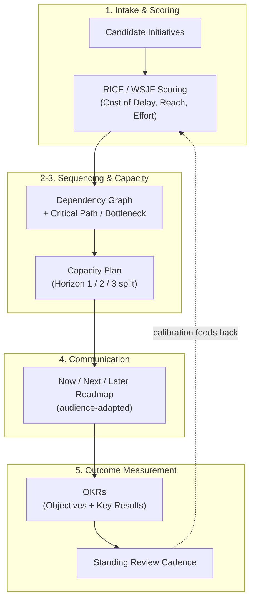
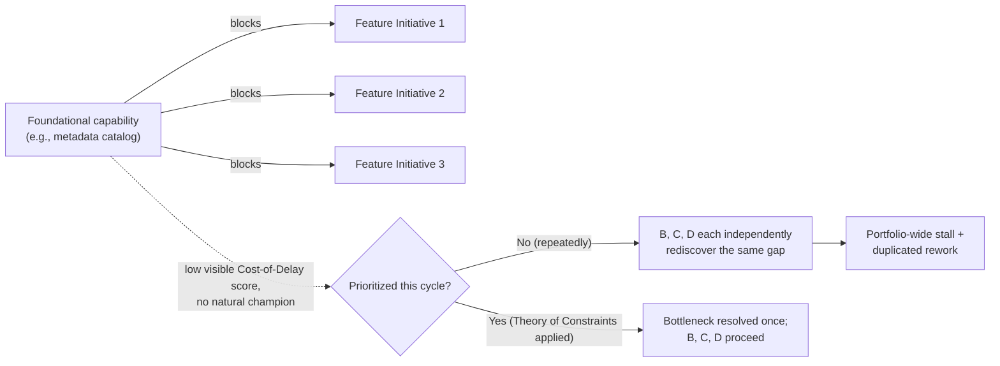
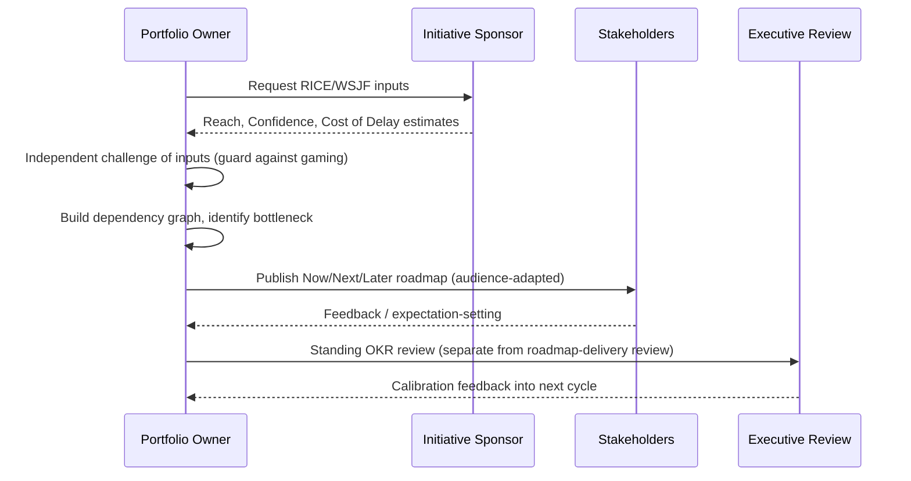

# Roadmap and Portfolio Planning

> Part of the **Enterprise Data & AI Architecture Handbook** — Phase-19 (Leadership & Technical Strategy), Chapter 07.
> Prerequisite: [Technical Strategy and Roadmaps](../Phase-01/07_Technical_Strategy_and_Roadmaps.md). Builds on [Technical Leadership](01_Technical_Leadership.md), [Architecture Reviews](02_Architecture_Reviews.md), [Stakeholder Management](03_Stakeholder_Management.md), [Technical Writing](04_Technical_Writing.md), [Hiring and Interviewing](05_Hiring_and_Interviewing.md), and [Mentoring and Team Building](06_Mentoring_and_Team_Building.md).

---

## Executive Summary

Every prior chapter in this phase produces an input this chapter must allocate: [Hiring and Interviewing](05_Hiring_and_Interviewing.md) and [Mentoring and Team Building](06_Mentoring_and_Team_Building.md) produce capacity (people and teams); [Architecture Reviews](02_Architecture_Reviews.md) and [Technical Leadership](01_Technical_Leadership.md) produce consequential decisions that need sequencing; [Stakeholder Management](03_Stakeholder_Management.md) produces commitments that need to be honored; and [Technical Writing](04_Technical_Writing.md) provides the discipline for writing the roadmap document itself. This chapter is where all of it becomes a **portfolio**: a finite set of engineering bets, competing for a genuinely finite amount of capacity, that must be prioritized, sequenced, and measured — not as a list of features with dates attached, but as an explicit resource-allocation problem under real uncertainty.

The chapter's first central thesis is that **prioritization without an explicit, defensible framework is not prioritization at all — it is whoever complained most recently or holds the most positional power, wearing prioritization's vocabulary.** Frameworks like RICE, ICE, and Weighted Shortest Job First (WSJF, grounded in Don Reinertsen's Cost-of-Delay economics) exist to make the question "why this, and why now" answerable and comparable across very different kinds of work — a customer feature, a reliability investment, a foundational platform capability — rather than an implicit contest of who shouted last. Sequencing compounds this: a dependency silently skipped in prioritization doesn't disappear, it resurfaces later as rework, and the discipline this chapter borrows from project management (critical path) and operations research (Goldratt's Theory of Constraints) is that optimizing anything other than the actual bottleneck produces the illusion of progress without the substance of it.

The chapter's second central thesis is a distinction as consequential as [Mentoring and Team Building](06_Mentoring_and_Team_Building.md)'s mentoring-versus-sponsorship split: **a roadmap is a sequenced plan of bets (output); an OKR is a measured outcome.** Conflating the two produces what product-strategy literature calls the "feature factory" — a team rewarded for shipping roadmap items on schedule regardless of whether those items moved anything that mattered. This chapter treats portfolio prioritization frameworks, dependency and capacity management, OKR-based outcome measurement, and audience-adapted roadmap communication as one connected system for deciding, sequencing, funding, measuring, and communicating a multi-year technical portfolio under real constraints and real uncertainty.

---

## Learning Objectives

After working through this chapter you will be able to:

- **Apply an explicit portfolio-prioritization framework** (RICE, ICE, or Cost-of-Delay-weighted WSJF) to compare fundamentally different kinds of engineering work on a common, defensible basis.
- **Build and use a dependency graph** to sequence a portfolio, applying critical-path and Theory-of-Constraints reasoning to find the actual bottleneck rather than optimizing a non-bottleneck stage.
- **Design a capacity and investment plan** that reserves explicit, protected room for unplanned work, technical debt, and foundational/platform investment — not just visible feature output.
- **Separate roadmap (output) from OKRs (outcome)**, and design a measurement system that rewards impact rather than shipped-on-schedule output.
- **Communicate a roadmap using a confidence-decaying format** (Now/Next/Later) suited to genuine multi-year uncertainty, and adapt that communication per audience per [Stakeholder Management](03_Stakeholder_Management.md).
- **Diagnose a roadmap that has become a broken promise**, or a portfolio decision driven by the loudest stakeholder rather than a defensible framework, and correct the underlying process rather than the symptom.
- **Reconcile a capacity plan against real team topology and growth constraints** from [Mentoring and Team Building](06_Mentoring_and_Team_Building.md), rather than treating capacity as an abstract, infinitely fungible number.

---

## Business Motivation

The business case for disciplined portfolio planning rests on a scarcity argument that is easy to state and consistently under-respected in practice: **engineering capacity is finite and fungible only within real limits, while the number of plausible, defensible things an organization could build is effectively unbounded** — which means every portfolio decision is, whether acknowledged or not, a decision to *not* fund everything else. An organization that prioritizes by HiPPO (highest-paid person's opinion) or by whoever escalated most recently is not avoiding this trade-off; it is making it implicitly, inconsistently, and without a record anyone can later audit or learn from — the same problem [Technical Leadership](01_Technical_Leadership.md) §1.3 identifies for undocumented ad hoc decisions, now applied at portfolio scale.

In data and AI platform organizations specifically, the stakes sharpen for reasons this handbook has already established piece by piece. First, foundational and platform work — a shared metadata catalog ([Data Catalog and Lineage](../Phase-08/02_Data_Catalog_and_Lineage.md)), a self-serve platform capability ([Self-Serve Data Platform](../Phase-15/05_Self_Serve_Data_Platform.md)), a governance guardrail — has diffuse, delayed payoff and no natural champion the way a customer-visible feature does, and is therefore the work most reliably starved by an undisciplined prioritization process, exactly the failure this chapter's Case Study 2 documents. Second, [Mentoring and Team Building](06_Mentoring_and_Team_Building.md)'s team-topology work means capacity isn't an abstract number but is bound to specific teams with specific domains, so a portfolio plan that ignores real team boundaries and dependency structure will produce the same cross-team coordination tax that chapter's Case Study 1 traces to a topology mismatch. Third, roadmaps in this domain are frequently used to justify multi-year infrastructure and platform investment to executives who reasonably want to know both what they're funding and whether it worked — which is exactly the gap between roadmap (the plan) and OKRs (the proof) this chapter insists on keeping distinct.

The cost of undisciplined portfolio planning is predictable: foundational work perpetually deprioritized until its absence causes a portfolio-wide stall (Case Study 2); roadmaps published as if they were contracts, later broken by reality, that quietly erode the exact stakeholder trust [Stakeholder Management](03_Stakeholder_Management.md) works to build (Case Study 1); and a portfolio that ships prodigiously by its own roadmap metric while a "feature factory" measurement gap hides whether any of it actually moved the business. The return on disciplined prioritization, sequencing, capacity planning, and outcome measurement is a portfolio that ships the *right* things in the *right* order, funded at a *sustainable* rate, with a record of whether it actually worked.

---

## History and Evolution

- **1957: the critical path method.** DuPont and Remington Rand jointly developed the Critical Path Method (CPM) for project scheduling — the origin of formally modeling task dependencies to find the sequence of activities that actually determines a project's minimum duration, still the conceptual root of this chapter's dependency-graph discipline.
- **1970s: Andy Grove and Objectives and Key Results.** Andy Grove, then at Intel, developed the Objectives and Key Results (OKR) system — pairing a qualitative, inspirational Objective with a small set of quantitative, verifiable Key Results — as a management technique for aligning effort to measurable outcomes rather than activity.
- **1984: the Theory of Constraints.** Eliyahu Goldratt's business novel *The Goal* popularized the Theory of Constraints: any system has, at any moment, exactly one binding bottleneck, and improving anything other than that bottleneck does not improve the system's overall throughput — a direct, still-load-bearing lesson for portfolio sequencing (§8.2).
- **1984: the Kano model.** Noriaki Kano's model of customer satisfaction distinguished basic (expected, dissatisfying if absent), performance (satisfaction scales with investment), and delighter (unexpected, disproportionately satisfying) features — a durable framework for prioritizing *what kind* of value a given initiative provides, still cited in modern prioritization practice.
- **1999: OKRs arrive at Google.** John Doerr, who had learned OKRs directly from Andy Grove at Intel, introduced the framework to Google in 1999, shortly after its founding — Google's subsequent decades-long, well-documented use of OKRs (detailed in Doerr's *Measure What Matters*, 2018) made it the framework's most-cited industry adoption case (§GCP Equivalent).
- **2000s: Amazon formalizes annual portfolio planning.** Amazon developed its internal **OP1/OP2** planning cycle — an intensive fall "Operating Plan 1" process producing the next year's detailed plan, followed by a lighter "OP2" review and adjustment in the spring — a real, well-documented (via Colin Bryar and Bill Carr's *Working Backwards*, 2021) enterprise-scale portfolio-planning cadence (§AWS Equivalent).
- **2009: Cost of Delay formalized.** Don Reinertsen's *The Principles of Product Development Flow* (2009) gave "cost of delay" — the quantified cost of *not* shipping something sooner — rigorous economic grounding, becoming the intellectual basis for Weighted Shortest Job First (WSJF), later adopted by the Scaled Agile Framework (SAFe) as its default prioritization formula (Cost of Delay ÷ Job Duration).
- **2010s: Now-Next-Later reframes roadmap communication.** Janna Bastow (co-founder of ProdPad) popularized the **Now/Next/Later** roadmap format specifically as an alternative to date-committed Gantt-style roadmaps, explicitly encoding the idea that certainty decays the further out the time horizon — a format this chapter recommends as the default (§7.5).
- **2018: the "feature factory" critique.** Melissa Perri's *Escaping the Build Trap* named and popularized the "feature factory" anti-pattern — an organization measuring and rewarding itself on features shipped rather than outcomes achieved — giving the roadmap-versus-OKR distinction this chapter builds around a durable, widely recognized industry vocabulary.
- **2020s: portfolio planning meets platform engineering and AI investment.** The rise of internal platform teams ([Platform Engineering](../Phase-09/02_Platform_Engineering.md), [Self-Serve Data Platform](../Phase-15/05_Self_Serve_Data_Platform.md)) made "foundational, diffuse-payoff work competing against visible features" a named, structural portfolio-planning problem rather than an occasional oversight; more recently, the scale and volatility of generative-AI and agentic-AI investment has put unusual pressure on portfolio discipline, as organizations balance fast-moving, high-uncertainty AI bets against steadier core-platform commitments using the same Cost-of-Delay and Now/Next/Later tools this chapter describes.

The through-line: portfolio planning has moved from an implicit byproduct of whoever has budget authority toward a **measured, sequenced, outcome-accountable discipline**, borrowing its dependency logic from 1950s project management, its economic grounding from Reinertsen's Cost of Delay, its outcome-measurement layer from Grove's and Google's OKRs, and its honest communication format from the Now/Next/Later reframing of what a roadmap can actually promise.

---

## Why This Technology Exists

Disciplined portfolio planning exists to solve a resource-allocation problem under uncertainty that ad hoc prioritization reliably gets wrong, for three specific, well-evidenced reasons.

**It exists because capacity is finite and every "yes" is an implicit "no" to something else — and that trade-off deserves an explicit, comparable basis.** Without a shared scoring framework, prioritization collapses into comparing incommensurable things (a reliability investment against a customer feature against a platform capability) using whatever heuristic is most available — usually recency (whoever asked last) or power (whoever asked loudest from the highest level). An explicit framework like WSJF or RICE forces the same question — what is the cost of delay, and what does it cost to deliver — onto every candidate, making the comparison at least principled and auditable.

**It exists because dependencies don't disappear when they're not accounted for — they resurface later as rework, at a worse time and a higher cost.** A foundational capability skipped in sequencing because it had no immediate visible champion doesn't stay skipped; every downstream initiative that silently depended on it eventually discovers the gap, usually mid-delivery, at the least convenient moment. Building and reviewing the dependency graph before committing to a sequence exists specifically to surface this cost *before* commitment rather than after.

**It exists because a roadmap that is treated as a promise, rather than a plan that updates as the organization learns, breaks the exact trust [Stakeholder Management](03_Stakeholder_Management.md) works to build.** A date-committed roadmap presented as fact, in a genuinely uncertain multi-year technical portfolio, will eventually collide with reality; when it does, the organization faces an unpleasant choice between breaking the promise (damaging trust) or protecting the date by cutting quality or scope (damaging the work). A confidence-decaying communication format, and a measurement system based on outcomes rather than shipped-on-schedule output, exist specifically to avoid manufacturing a false certainty the future cannot actually honor.

---

## Problems It Solves

- **Prioritization by whoever shouted loudest.** An explicit, written scoring framework (RICE/WSJF) makes trade-offs comparable and auditable across fundamentally different kinds of work.
- **Foundational/platform work perpetually deprioritized.** Reserved capacity categories (§7.3, the Three Horizons taxonomy) and dependency-graph review surface diffuse-payoff work before its absence stalls the portfolio.
- **Silent rework from unaccounted dependencies.** Building and reviewing a dependency graph before sequencing surfaces hidden prerequisites before commitment, not after.
- **Roadmaps that break trust when reality diverges from a committed date.** A confidence-decaying Now/Next/Later format communicates genuine uncertainty honestly rather than manufacturing false certainty.
- **The "feature factory" measurement gap.** Decoupling OKRs (outcomes) from the roadmap (a sequenced output plan) rewards impact rather than shipped-on-schedule output.
- **Misallocated capacity with no room for unplanned work.** Explicit, protected reserved capacity for reliability, technical debt, and foundational investment prevents 100% allocation to visible feature work from silently accumulating debt.
- **Cross-team coordination surprises.** Reconciling the portfolio plan against real team topology ([Mentoring and Team Building](06_Mentoring_and_Team_Building.md)) rather than treating capacity as an abstract, team-agnostic number.

---

## Problems It Cannot Solve

- **It cannot make a fundamentally wrong strategic bet succeed through better sequencing.** Portfolio discipline optimizes the execution of a strategy; it cannot substitute for having chosen the right strategic direction in the first place.
- **It cannot eliminate genuine uncertainty, only communicate it honestly.** A confidence-decaying roadmap format is honest about uncertainty; it does not reduce the actual uncertainty in a multi-year technical bet, particularly in fast-moving areas like generative AI.
- **It cannot make a scoring framework objective if its inputs are gamed or poorly estimated.** A WSJF or RICE score is only as good as its Cost-of-Delay, Reach, or Confidence inputs; a framework applied with dishonest or low-quality inputs produces a false sense of rigor rather than genuine rigor (§Governance).
- **It cannot substitute for the underlying capacity actually existing.** No prioritization framework manufactures more engineering time than [Mentoring and Team Building](06_Mentoring_and_Team_Building.md)'s team-topology and hiring pipeline actually produce; a portfolio plan that ignores real capacity constraints is a wish list, not a plan.
- **It cannot fully resolve the tension between stakeholders who want a firm date and a genuinely uncertain multi-year technical bet.** The Now/Next/Later format is more honest, but some stakeholders will still push for a date, and managing that expectation is a real, ongoing [Stakeholder Management](03_Stakeholder_Management.md) exercise, not a one-time framework adoption.
- **It cannot make re-prioritization costless.** Even disciplined, well-communicated re-sequencing has a real cost in switching, partially-completed work, and stakeholder confidence — the goal is to make re-prioritization routine and well-governed, not free.

---

## Core Concepts

### 7.1 Portfolio Prioritization Frameworks

Prioritization frameworks exist to make trade-offs among fundamentally different kinds of work explicit and comparable. **RICE** (Reach × Impact × Confidence ÷ Effort, popularized by Intercom) scores each candidate initiative on how many people it affects, how much it affects them, how confident the estimate is, and how much effort it costs — producing a single comparable number across a diverse backlog. **ICE** (Impact, Confidence, Ease) is a lighter-weight variant from growth-hacking practice, useful when speed of triage matters more than RICE's finer granularity. **Weighted Shortest Job First (WSJF)**, adopted by the Scaled Agile Framework and grounded in Don Reinertsen's Cost-of-Delay economics (§History, 2009), scores an initiative as Cost of Delay ÷ Job Duration — explicitly favoring work that is both high-cost-to-delay and fast-to-deliver, and making the "waiting to start this has a real, quantifiable cost" question central rather than implicit. The **Kano model** (1984) adds a complementary lens distinguishing *basic* (expected, dissatisfying if absent — most platform reliability work), *performance* (satisfaction scales linearly with investment), and *delighter* (disproportionately satisfying, unexpected) features, useful for recognizing that not all high-value work looks the same on a linear scoring scale.

No single framework is universally correct (§Decision Matrix); the discipline that matters is **choosing one, documenting it, and applying it consistently and auditably** — the same principle [Hiring and Interviewing](05_Hiring_and_Interviewing.md) §5.2 applies to interview rubrics: an explicit, written, consistently-applied scoring mechanism beats an implicit, ad hoc one even when the specific framework chosen is imperfect.

### 7.2 Sequencing and Dependency Management

A prioritized list is not yet a sequence: initiatives depend on each other, and a dependency ignored during prioritization doesn't vanish — it resurfaces mid-delivery as rework, at a worse time and higher cost than if it had been surfaced up front. The discipline borrows directly from 1950s project management: build an explicit **dependency graph** of the portfolio's candidate initiatives (which initiatives require which others to be complete or partially complete first) and apply **critical path** reasoning to identify the sequence of dependencies that actually determines the portfolio's minimum achievable timeline — work off the critical path can slip with limited overall impact; work on it cannot.

Eliyahu Goldratt's **Theory of Constraints** (1984) sharpens this further: at any given moment, a portfolio (like any system) has exactly one binding bottleneck, and improving throughput anywhere else produces the *appearance* of progress without moving the system's actual output. In portfolio-planning terms: if platform/foundational capacity is the real bottleneck constraining a dozen downstream initiatives, funding more visible feature work without addressing that bottleneck first will not increase the portfolio's real throughput — it will simply produce more finished-looking work stuck waiting on the same unaddressed constraint. This is the exact mechanism behind this chapter's Case Study 2.

### 7.3 Capacity and Investment Planning

Capacity is the literal, finite resource every prioritization and sequencing decision is ultimately allocating — and treating it as an abstract, infinitely fungible number rather than a hard constraint bound to specific teams (per [Mentoring and Team Building](06_Mentoring_and_Team_Building.md)'s team-topology work) is a common, costly modeling error. A useful allocation taxonomy, adapted from McKinsey's **Three Horizons** framework (Baghai, Coley & White, 1999): **Horizon 1 / run-the-business** (keeping current systems reliable and operating — reactive, non-optional), **Horizon 2 / grow-the-business** (extending current capabilities — most visible feature work lives here), and **Horizon 3 / transform-the-business** (foundational, longer-payoff bets — new platform capabilities, new architectural directions). A healthy portfolio makes the split across these three explicit and defensible rather than accidental — and specifically **protects a reserved percentage of capacity for Horizon 1 (reliability/technical debt) and Horizon 3 (foundational/platform) work**, because both are the kinds of investment most reliably starved when 100% of capacity defaults to Horizon 2's more visible, more immediately champion-able work (§Cost Optimization).

A caution worth stating explicitly: capacity estimates (story points, T-shirt sizes, engineer-months) are a rough planning proxy, not a precise unit of value — treating a capacity estimate as more precise than it is produces false confidence in a downstream roadmap date, the exact failure this chapter's Case Study 1 documents.

### 7.4 Measuring Outcomes (OKRs)

**Objectives and Key Results (OKRs)**, developed by Andy Grove at Intel and brought to Google by John Doerr in 1999 (§History), pair a qualitative, ambitious **Objective** (what you want to be true) with a small number of quantitative, verifiable **Key Results** (how you'll know you got there) — and their entire value depends on Key Results measuring *outcomes* (a metric that moved) rather than *outputs* (a feature that shipped). This is the direct operational form of the roadmap-versus-OKR distinction this chapter is built around: the roadmap says *what we plan to build and roughly when*; the OKR says *what we're actually trying to move, and whether it moved*. A roadmap item that ships late but achieves its Key Result is, by this measure, a success; a roadmap item that ships exactly on schedule but doesn't move its Key Result is not — a distinction Melissa Perri's "feature factory" critique (2018) names directly as the failure mode of conflating the two.

Practically, this means every major portfolio initiative should be traceable to a specific Key Result it is expected to move, and the organization should review OKR attainment on a standing cadence *separately* from roadmap-delivery status, so that "we shipped what we said we would" and "it worked" remain two distinct, both-necessary questions rather than one conflated metric.

### 7.5 Communicating Roadmaps

The central communication discipline — extending [Stakeholder Management](03_Stakeholder_Management.md)'s audience-translation principle and [Technical Writing](04_Technical_Writing.md)'s reader-first discipline directly into the roadmap artifact itself — is **matching the roadmap's stated certainty to its actual, genuine certainty.** The **Now/Next/Later** format (Janna Bastow, ProdPad, §History) operationalizes this: *Now* work is committed and well-understood; *Next* work is a strong intention with real but lower certainty; *Later* work is a directional bet, explicitly *not* a commitment. This is a deliberate alternative to a date-committed Gantt-style roadmap, which — by presenting a specific date for eighteen-month-out work with the same visual authority as next week's work — manufactures a false certainty the future cannot honor, and sets up the exact trust-breaking dynamic this chapter's Case Study 1 documents.

The same underlying roadmap should also be presented differently per audience, exactly as [Stakeholder Management](03_Stakeholder_Management.md) §3.2 recommends for any consequential communication: engineers need dependency and sequencing detail; executives need the Now/Next/Later headline and the OKRs it's expected to move; a customer-facing roadmap (where one exists) needs even less certainty commitment than the internal *Later* column implies. The facts stay identical across all three; only the framing, depth, and stated certainty adapt.

---

## Internal Working

### 8.1 Portfolio Prioritization as Resource Allocation Under Uncertainty

A scoring framework like WSJF works by forcing an estimate of the *cost of not acting now* (Cost of Delay) into the same comparison as the *cost of acting* (Job Duration/Effort) — converting an implicit, political "why should this go first" argument into an explicit, if imperfect, economic one. The mechanism's real value isn't that the resulting number is precisely correct (it rarely is, since Cost of Delay and Effort are both estimates); it's that **the act of estimating forces the same underlying question onto every candidate initiative**, the same "writing forces thinking" mechanism [Technical Writing](04_Technical_Writing.md) §5.1 describes, now applied to portfolio comparison rather than prose.

### 8.2 Dependency Graphs and the Critical Path

The reason dependency-graph review must happen *before* sequencing commitment, not after, is structural: a dependency is a hard, physical prerequisite (initiative B cannot genuinely proceed until initiative A provides some capability), and no amount of prioritization scoring changes that fact — it only determines *which* initiative gets attempted first among candidates *without* a blocking dependency. Applying Theory of Constraints reasoning (§7.2) to the resulting graph identifies the one bottleneck actually limiting the portfolio's throughput at any given moment; funding or accelerating any other stage produces visible activity without moving the system's real output, which is precisely how Case Study 2's flashy-feature-over-foundational-catalog pattern persisted for as long as it did — the portfolio *looked* productive by its own shipped-feature count while its actual constraint went unaddressed.

### 8.3 The Roadmap–OKR Decoupling

Keeping the roadmap (a sequenced plan of bets) and OKRs (measured outcomes) as two separate, explicitly reconciled artifacts — rather than one conflated "did we ship what we said" metric — matters because a roadmap's own delivery-on-schedule metric is trivially satisfiable by cutting scope or quality to hit a date, while an OKR's outcome metric cannot be gamed the same way (the underlying number either moved or it didn't). This is the direct portfolio-scale analogue of [Reliability and SRE](../Phase-18/04_Reliability_and_SRE.md) §4.1's own distinction between a measured, real property (an SLO) and a target that can be hit through means that don't reflect genuine improvement — and it is why this chapter insists the two be tracked, and reviewed, separately.

---

## Architecture

The reference portfolio-planning architecture connects five stages: **(1) candidate intake and scoring** (RICE/WSJF applied consistently to every candidate initiative, §7.1) → **(2) dependency-graph construction and bottleneck identification** (§7.2, Theory of Constraints) → **(3) capacity-constrained sequencing** (reconciled against real team topology and reserved Horizon-1/3 capacity, §7.3) → **(4) confidence-decaying roadmap communication** (Now/Next/Later, adapted per audience, §7.5) → **(5) OKR-based outcome measurement**, reviewed on a standing cadence and explicitly reconciled — not conflated — with roadmap-delivery status (§7.4, §8.3). A feedback loop runs from stage 5 back to stage 1: OKR attainment (or its absence) directly informs the next planning cycle's Cost-of-Delay and Confidence estimates, the same closed-loop discipline [Hiring and Interviewing](05_Hiring_and_Interviewing.md) applies to rubric validation.

---

## Components

- **Prioritization Scoring Model** — the documented RICE/WSJF framework and its inputs (§7.1).
- **Dependency Graph** — the explicit, maintained map of which initiatives block which others (§7.2).
- **Capacity Plan** — the Horizon 1/2/3 allocation, reconciled against real team topology (§7.3).
- **Roadmap Document** — the Now/Next/Later artifact, versioned docs-as-code ([Technical Writing](04_Technical_Writing.md)), with audience-specific views.
- **OKR Set** — Objectives and measurable Key Results, tied explicitly to specific portfolio initiatives.
- **Planning Cadence** — the standing rhythm (e.g., quarterly) at which prioritization, sequencing, and OKR review recur.
- **Portfolio Health Dashboard** — the monitoring artifact tracking OKR attainment, dependency-related rework, and capacity-plan adherence (§Monitoring).

---

## Metadata

Each portfolio initiative carries: its RICE/WSJF score and inputs, its dependency links (upstream/downstream), its Horizon classification (1/2/3), its owning team (per [Mentoring and Team Building](06_Mentoring_and_Team_Building.md)'s team charter), its Now/Next/Later status and stated confidence level, and its linked OKR/Key Result. Confidence levels are explicit metadata, not an implicit property of a date — the same discipline that lets the roadmap communicate honestly (§7.5) depends on this metadata being tracked and visible, not buried in a single "target date" field that flattens genuine uncertainty into false precision.

---

## Storage

The roadmap document, dependency graph, capacity plan, and OKR set are stored as versioned, docs-as-code artifacts ([Technical Writing](04_Technical_Writing.md)), reviewed on the standing planning cadence rather than written once per year and left static. Historical roadmap versions and OKR-attainment records should be retained and queryable — the input to §8.1's calibration discipline, checking whether past confidence estimates matched actual outcomes.

---

## Compute

This is the most literal application of "Compute" in this handbook's leadership arc: **engineering capacity itself — team-months, not CPU-hours — is the scarce resource every prioritization and sequencing decision allocates.** Treating it as anything other than a hard, team-topology-bound constraint (§7.3) is the single most common modeling error in portfolio planning, producing a roadmap that looks achievable on paper but silently assumes capacity that doesn't actually exist.

---

## Networking

Dependencies between initiatives owned by different teams route through the same team-interaction-mode structure [Mentoring and Team Building](06_Mentoring_and_Team_Building.md) §6.3 establishes: a dependency on a platform team's capability should ideally be an X-as-a-Service consumption (low coordination overhead) rather than an ad hoc collaboration (high coordination overhead); a portfolio plan that ignores this and assumes uniform, frictionless cross-team coordination will underestimate the real cost of every cross-team dependency in its sequencing.

---

## Security

Competitive-sensitive roadmap information (unreleased strategic direction, unannounced capabilities) requires the same confidentiality discipline as any other sensitive business artifact, with access scoped per audience. A subtler integrity concern is **protecting the scoring process from being gamed** — an initiative's owner inflating its Reach or Confidence inputs, or lowballing its Effort estimate, to win prioritization is a real, recurring risk (a portfolio-planning instance of Goodhart's Law: once a score becomes the target, people optimize the score rather than the underlying reality it's meant to measure), and it is why the scoring framework's inputs should be reviewed and challenged, not accepted at face value from the initiative's own sponsor.

---

## Performance

Portfolio-health signals worth tracking, kept disaggregated rather than collapsed into one score: **OKR attainment rate** (the outcome metric), **roadmap-delivery rate** (the separate output metric, per §8.3's deliberate decoupling), **dependency-related rework rate** (a proxy for how well sequencing accounted for real dependencies), **capacity-plan adherence** (actual Horizon 1/2/3 spend versus planned), and **confidence-calibration** (did Now-column initiatives actually land with the certainty implied, and did Later-column initiatives' eventual outcomes match their originally stated low confidence) — the portfolio-planning analogue of the periodic-calibration discipline [Hiring and Interviewing](05_Hiring_and_Interviewing.md) §6.2 and [Evaluation and Guardrails](../Phase-12/09_Evaluation_and_Guardrails.md) §9.2 both apply to their own measurement instruments.

---

## Scalability

Scaling portfolio planning across a growing number of teams and initiatives without the process itself becoming a bottleneck — echoing [Architecture Reviews](02_Architecture_Reviews.md)'s central caution about over-centralized review — depends on federating prioritization scoring and dependency-graph maintenance to team and domain-portfolio owners, reconciled at a lighter-weight, less frequent organization-wide planning event (the Scaled Agile Framework's Program Increment planning, or Amazon's own OP1/OP2 cadence, §AWS Equivalent, are both real examples of this two-tier — frequent-local, periodic-global — scaling pattern).

---

## Fault Tolerance

A resilient portfolio plan has explicit slack: reserved capacity for unplanned work (§7.3) so a single urgent, unplanned initiative doesn't require silently cannibalizing every other commitment; no single point of ownership for a critical cross-team dependency (mirroring [Mentoring and Team Building](06_Mentoring_and_Team_Building.md) §Fault Tolerance's redundant-sponsorship principle); and a graceful, pre-planned re-sequencing process for when a Now-column commitment slips, rather than an ad hoc scramble that damages every other item's schedule and the roadmap's overall credibility.

---

## Cost Optimization

**Worked example.** A data platform organization with roughly 40 engineers (a fully-loaded cost on the order of $7.5M/year) initially allocated capacity almost entirely to Horizon 2 (visible feature work), with no explicit reserved percentage for Horizon 1 (reliability/technical debt) or Horizon 3 (foundational/platform capability). Over 18 months, un-reserved technical debt and a perpetually-deprioritized shared metadata-catalog capability (this chapter's Case Study 2) accumulated until a portfolio-wide slowdown forced an emergency, disruptive reallocation — several Horizon-2 initiatives were paused mid-flight to fund the now-urgent Horizon-1/3 work, at a real cost in switching overhead and partially-wasted effort estimated at roughly **15-20% of the affected initiatives' invested capacity** (a rough but defensible estimate based on the team's own retrospective). Reserving an explicit **15% for Horizon 1 and 10% for Horizon 3** from the outset — a modest, visible reduction in Horizon-2 throughput of roughly 25% — would have cost far less than the emergency reallocation it would have prevented, illustrating the same asymmetry [Hiring and Interviewing](05_Hiring_and_Interviewing.md) and [Mentoring and Team Building](06_Mentoring_and_Team_Building.md) document in their own domains: **a small, visible, continuously-paid cost (reserved capacity) is cheaper than a large, invisible-until-it-isn't cost (emergency reallocation after debt compounds).**

---

## Monitoring

Track OKR attainment rate and roadmap-delivery rate as two separate lines (never one blended score, §8.3), dependency-related rework incidence, capacity-plan adherence by Horizon, and confidence-calibration accuracy (Now/Next/Later commitments checked against what actually happened) on the standing planning cadence.

---

## Observability

Monitoring answers known questions against known thresholds (is OKR attainment within the expected range this quarter?). **Observability** is the ability to ask an unforeseen question of the same underlying portfolio data — "why has every Horizon-3 initiative on this specific team consistently slipped for the last three planning cycles?" or "did last quarter's reprioritization systematically favor initiatives from one particular stakeholder?" — the same monitoring-versus-observability distinction [Hiring and Interviewing](05_Hiring_and_Interviewing.md) §Observability and [Observability with OpenTelemetry](../Phase-18/02_Observability_with_OpenTelemetry.md) §2.1 both apply to their own domains, now applied to portfolio health.

---

## Operational Response Playbook

**Playbook 1 — A committed roadmap date is at real risk of slipping.** Do not silently cut quality or scope to protect the date without disclosure, and do not simply announce a slip with no context. Diagnose first whether the *Now*-column commitment itself was over-stated in certainty at the time it was made (a calibration failure, feeding back into §7.5's confidence discipline for future cycles) or whether a genuinely new, unforeseeable dependency or capacity loss emerged since. Communicate the revised timeline and its cause honestly and as early as possible — per [Stakeholder Management](03_Stakeholder_Management.md) §3.2's translation discipline, framed for each audience — rather than protecting the original date past the point it's still true, which is precisely how this chapter's Case Study 1 compounded into a larger trust failure than an earlier, honest disclosure would have caused.

**Playbook 2 — Foundational/platform work keeps losing to visible features in every prioritization cycle.** Do not simply mandate that the foundational work "must" be prioritized this time by executive fiat, which fixes one cycle without fixing the process. Diagnose whether the scoring framework itself is structurally biased against diffuse, delayed-payoff work — a Cost-of-Delay estimate is much easier to make for a customer-facing feature with an obvious revenue link than for a metadata catalog whose payoff is "every future initiative ships faster," and if the framework isn't explicitly accounting for that asymmetry, it will systematically underscore foundational work every cycle. The durable fix is either a protected, reserved capacity category (§7.3) that removes foundational work from head-to-head competition with features entirely, or an explicit, documented method for estimating diffuse Cost of Delay (e.g., modeling the aggregate rework cost across every initiative the foundational capability would have unblocked) — not a one-time executive override.

---

## Governance

Portfolio governance centers on three disciplines. **Scoring integrity**: prioritization inputs (Reach, Confidence, Cost of Delay) should be reviewed and challenged by someone other than the initiative's own sponsor, guarding against the gaming risk §Security identifies. **Capacity-plan transparency**: the Horizon 1/2/3 split and its rationale should be documented and visible to stakeholders, not an invisible internal allocation decision, so the trade-off between visible feature velocity and reserved foundational/reliability investment is a known, defensible choice rather than a silent one. **Roadmap-communication honesty**: published roadmaps should carry explicit confidence levels (Now/Next/Later, §7.5) rather than implying a false certainty a date-committed format manufactures, and any material change in confidence or sequencing should be documented with its cause, the portfolio-planning analogue of an ADR.

---

## Trade-offs

- **Explicit scoring rigor vs. speed of prioritization.** A fully worked RICE/WSJF score for every candidate takes real time to produce well; a lighter ICE-style triage is faster but less discriminating — match the rigor to the decision's stakes (§Decision Matrix).
- **Reserved capacity vs. visible feature velocity.** Protecting Horizon 1/3 capacity is a real, visible reduction in Horizon-2 throughput that must be actively defended to stakeholders who see only the feature roadmap.
- **Honest confidence-decaying communication vs. stakeholders who want a firm date.** A Now/Next/Later format is more honest about genuine multi-year uncertainty, but some audiences will keep pushing for a specific date, and managing that expectation is an ongoing [Stakeholder Management](03_Stakeholder_Management.md) exercise, not a solved problem.
- **Frequent re-prioritization vs. delivery stability.** Reviewing and adjusting the portfolio on every new piece of information keeps it current but can itself become disruptive if done too often; a standing cadence (not continuous reactive reshuffling) balances the two.
- **Federated vs. centralized portfolio decision-making.** Federating prioritization to team/domain owners scales better (§Scalability) but risks losing a coherent, organization-wide view; a lightweight periodic reconciliation event (Amazon's OP1/OP2, SAFe's PI planning) is the usual resolution.

---

## Decision Matrix

| Situation | Recommended Framework / Format |
|---|---|
| Large, diverse backlog needing fine-grained comparison | RICE (Reach × Impact × Confidence ÷ Effort) |
| Fast triage of a smaller, less formal backlog | ICE (Impact, Confidence, Ease) |
| Portfolio dominated by time-sensitive, economically comparable initiatives | WSJF (Cost of Delay ÷ Job Duration) |
| Deciding what KIND of value an initiative provides (expected vs. delighter) | Kano model, as a complement to a numeric score |
| Multi-year technical portfolio communicated to varied stakeholders | Now/Next/Later, audience-adapted per [Stakeholder Management](03_Stakeholder_Management.md) |
| Foundational/platform work repeatedly losing to visible features | Reserved Horizon-3 capacity category, removed from head-to-head scoring |
| Growing number of teams/initiatives straining central planning capacity | Federated team-level scoring + periodic org-wide reconciliation (OP1/OP2 or PI-planning style) |

---

## Design Patterns

- **Explicit, documented scoring framework** applied consistently across a diverse backlog (§7.1).
- **Dependency-graph-before-commitment** — surfacing hidden prerequisites before sequencing is finalized (§7.2).
- **Reserved Horizon 1/3 capacity** — protecting reliability and foundational investment from head-to-head competition with visible features (§7.3).
- **Roadmap/OKR decoupling** — a sequenced-output plan and a measured-outcome set tracked and reconciled separately, never conflated (§7.4, §8.3).
- **Confidence-decaying roadmap communication (Now/Next/Later)** — honest about genuine uncertainty rather than manufacturing false precision (§7.5).
- **Federated scoring with periodic reconciliation** — scaling portfolio planning without recreating an over-centralized bottleneck (§Scalability).
- **Independent challenge of scoring inputs** — guarding scoring integrity against sponsor-side gaming (§Security, §Governance).

---

## Anti-patterns

- **Prioritization by HiPPO or whoever escalated most recently** — no explicit, comparable, auditable basis.
- **Sequencing without a dependency graph** — foundational prerequisites silently skipped, resurfacing later as rework (this chapter's Case Study 2).
- **A date-committed Gantt-style roadmap presented as a promise** — manufacturing false certainty a genuinely uncertain multi-year plan cannot honor (this chapter's Case Study 1).
- **Conflating roadmap delivery with OKR success** — the "feature factory" pattern, rewarding shipped output regardless of impact.
- **100% capacity allocated to visible feature work**, with no reserved room for reliability, technical debt, or foundational investment.
- **Accepting scoring inputs at face value from an initiative's own sponsor**, without independent challenge.
- **Reorganizing the roadmap reactively on every new request**, rather than on a disciplined standing cadence.
- **Publishing one universal roadmap document** for every audience, rather than adapting depth, framing, and stated certainty per [Stakeholder Management](03_Stakeholder_Management.md).

---

## Common Mistakes

- Treating a capacity estimate (story points, T-shirt sizes) as a precise unit rather than a rough planning proxy.
- Building the roadmap before building the dependency graph, rather than the other way around.
- Announcing a slipped date without diagnosing whether it was an original over-commitment or a genuinely new dependency.
- Letting foundational/platform work compete head-to-head against features in the same scoring pool without accounting for its harder-to-quantify Cost of Delay.
- Reviewing roadmap-delivery status but never separately reviewing OKR attainment.
- Publishing a single roadmap document for all audiences rather than adapting it.

---

## Best Practices

- Apply an explicit, documented, consistently-used prioritization framework across the full backlog.
- Build and review the dependency graph before committing to a sequence; apply Theory-of-Constraints reasoning to find the real bottleneck.
- Reserve explicit, protected capacity for Horizon 1 (reliability/debt) and Horizon 3 (foundational/platform) work.
- Communicate roadmaps as Now/Next/Later with explicit confidence levels, adapted per audience.
- Track OKR attainment and roadmap-delivery status as two separate, reconciled metrics — never one blended score.
- Have someone other than an initiative's sponsor challenge its scoring inputs.
- Treat re-prioritization as a routine, disciplined, standing-cadence event, not a failure or a rare emergency.

---

## Enterprise Recommendations

Adopt a single, documented, organization-wide prioritization framework (RICE or WSJF) rather than letting each team invent its own; mandate a dependency-graph review as a formal gate before any portfolio sequence is finalized; institutionalize a Three-Horizons capacity split with explicit, defended reserved percentages for reliability and foundational work; publish roadmaps in a Now/Next/Later (or equivalent confidence-decaying) format as organizational policy, not an individual team's preference; run OKR review as a standing cadence entirely separate from roadmap-delivery review; and periodically calibrate portfolio confidence estimates against actual outcomes, feeding the result back into the next cycle's estimation discipline.

---

## Azure Implementation

**Azure DevOps Boards** (Epics → Features → Backlog Items) and its **Delivery Plans** extension provide portfolio-level backlog management and cross-team dependency visualization directly usable for the dependency-graph discipline (§7.2). **Microsoft Viva Goals** — the same Microsoft 365 Viva product referenced in [Mentoring and Team Building](06_Mentoring_and_Team_Building.md) §Azure Implementation — is the direct, purpose-built tool for OKR tracking (§7.4), keeping Objectives and Key Results visible and reviewable on a standing cadence separate from Azure Boards' roadmap/delivery tracking. **Power BI** builds the portfolio-health dashboard (§Monitoring) — OKR attainment, roadmap-delivery rate, capacity-plan adherence — from the underlying Azure DevOps and Viva Goals data. **SharePoint/Loop with Purview sensitivity labels** host the Now/Next/Later roadmap document and capacity plan as docs-as-code artifacts with appropriate confidentiality (§Security). **Microsoft Project/Project for the Web** can model capacity and dependencies for larger programs, with the explicit caution that its Gantt-chart visual can itself reintroduce the date-committed-contract anti-pattern (§Anti-patterns) if presented externally without a Now/Next/Later reframing on top of it.

---

## Open Source Implementation

**GitHub Projects** (Epics/roadmap views atop issues) and **OpenProject** (a full open-source project/portfolio management tool) provide backlog, dependency, and roadmap tracking without proprietary tooling. Roadmap documents, capacity plans, and OKR sets are stored as versioned **Markdown in Git**, reviewed via pull request — the same docs-as-code discipline [Technical Writing](04_Technical_Writing.md) applies elsewhere. **Metabase or Apache Superset**, built against a **PostgreSQL** portfolio-data warehouse, produce the OKR-attainment and portfolio-health dashboards. **Backstage** (reused from earlier Phase-19 chapters) can extend its software/team catalog to show which initiatives map to which owned systems, connecting the portfolio plan directly to the team-topology map [Mentoring and Team Building](06_Mentoring_and_Team_Building.md) establishes.

---

## AWS Equivalent (comparison only)

The most directly relevant AWS-ecosystem comparison is Amazon's own real internal **OP1/OP2 planning cycle** (§History): an intensive fall "Operating Plan 1" process producing a detailed next-year plan, followed by a lighter "OP2" spring review and adjustment — a genuine, well-documented (via *Working Backwards*, Bryar & Carr, 2021) enterprise-scale example of a two-tier, federated-then-reconciled planning cadence, directly comparable to this chapter's federated-scoring-with-periodic-reconciliation pattern (§Scalability). Amazon's Working-Backwards/PR-FAQ process (already referenced in [Technical Leadership](01_Technical_Leadership.md), [Stakeholder Management](03_Stakeholder_Management.md), and [Technical Writing](04_Technical_Writing.md)) is the natural complement — the PR-FAQ is frequently the artifact that justifies a portfolio initiative's inclusion in OP1.

## GCP Equivalent (comparison only)

The relevant Google/GCP-ecosystem comparison is Google's own decades-long OKR practice — the framework's single most cited industry adoption case (§History, 1999–present, documented extensively in John Doerr's *Measure What Matters*, 2018) — a genuine, sustained example of running quarterly OKR cycles across a very large, fast-growing engineering organization, directly informing this chapter's recommendation to run OKR review as its own standing cadence, decoupled from roadmap-delivery tracking (§7.4, §8.3).

---

## Migration Considerations

Moving an organization from ad hoc, HiPPO-driven prioritization to a documented, framework-based one should be piloted on one team or domain-portfolio before an organization-wide mandate, with an explicit period for calibrating the chosen framework's inputs (Cost of Delay, Reach, Confidence) against real outcomes before trusting its scores fully; similarly, introducing a Now/Next/Later roadmap format where a date-committed one previously existed requires deliberate stakeholder communication about why the format is changing, since stakeholders accustomed to specific dates may initially read reduced date-certainty as reduced planning rigor rather than increased honesty.

---

## Mermaid Architecture Diagrams

---

## End-to-End Data Flow

A candidate initiative's journey generates data across this chapter's systems: it enters intake with RICE/WSJF scoring inputs, subject to independent challenge; it is placed in the dependency graph, which determines whether it can be sequenced now or waits on a prerequisite; it draws against a specific Horizon (1/2/3) capacity allocation; it appears in the published roadmap with an explicit Now/Next/Later confidence level, adapted per audience; and, once delivered (or not), its linked OKR's Key Result is measured and reviewed on the standing cadence — feeding calibration data back into the next cycle's Cost-of-Delay and Confidence estimates, closing the loop the same way [Hiring and Interviewing](05_Hiring_and_Interviewing.md) closes its own rubric-validation loop.

---

## Real-world Business Use Cases

- **Sequencing a multi-year data-platform migration** (e.g., a lakehouse modernization) against a live, still-operating legacy system, using dependency-graph and critical-path analysis to avoid stalling either.
- **Balancing a fast-moving generative-AI investment portfolio** against steadier core-platform commitments, using Cost-of-Delay-weighted WSJF to compare fundamentally different risk/payoff profiles.
- **Justifying a reserved Horizon-3 capacity allocation** for a shared metadata/governance capability to executives who primarily see feature-roadmap output.
- **Running a quarterly OKR review** decoupled from a roadmap-delivery review, surfacing initiatives that shipped on schedule but didn't move their intended metric.

---

## Industry Examples

- **Andy Grove's OKR system and Google's decades-long adoption** (John Doerr, *Measure What Matters*, 2018) — the framework's most cited industry case.
- **Amazon's OP1/OP2 planning cycle** (Bryar & Carr, *Working Backwards*, 2021) — a genuine, well-documented enterprise-scale federated-then-reconciled planning cadence.
- **The Scaled Agile Framework's adoption of WSJF**, operationalizing Reinertsen's Cost-of-Delay economics at multi-team "Program Increment" scale.
- **Melissa Perri's "feature factory" critique** (*Escaping the Build Trap*, 2018) — the widely cited industry vocabulary for the roadmap/OKR conflation this chapter warns against.
- **ProdPad's Now/Next/Later format** (Janna Bastow) — the widely adopted alternative to date-committed roadmap communication.

---

## Case Studies

### Case Study 1: The roadmap that became a contract

A data platform team, under pressure to reassure a skeptical executive sponsor, published a detailed, date-stamped twelve-month roadmap — specific features against specific months, presented in a polished Gantt-style chart. The executive sponsor, reasonably, treated the document as a commitment, and referenced specific dates from it in external and board-level communications within weeks of its publication.

By month four, two things had changed: a dependency on an external vendor's API turned out to be materially less mature than assumed, and a foundational security requirement (unanticipated at planning time) added real, unavoidable scope to month six's initiative. Neither was a planning failure exactly — both were genuinely difficult to foresee twelve months out — but because the roadmap had been presented and referenced as a firm commitment rather than a confidence-decaying plan, the team faced an unpalatable choice: disclose the slip and damage the executive sponsor's own external credibility (since they had repeated the original dates), or quietly cut corners — reduced testing, skipped edge cases, deferred documentation — to protect the original dates. The team chose the latter for several months, and the accumulated quality debt eventually surfaced as a cluster of production incidents traced directly back to the corners cut to hit dates that, by that point, had lost their original justification.

The retrospective diagnosis: the underlying planning and sequencing work had actually been reasonably sound; the failure was entirely in **how the roadmap was communicated** — a date-committed format that manufactured a certainty the underlying multi-year technical bet never actually had, at month twelve just as much as at month one. The fix, adopted going forward, was a **Now/Next/Later** format with explicit stated confidence per column, socialized with the executive sponsor specifically so *they* understood — and could accurately represent externally — that "Next" and "Later" items were directional intentions, not commitments. The durable lesson, motivating ADR-0204's communication clause: **a roadmap presented with more certainty than the underlying work actually has doesn't create certainty — it creates a debt that gets paid later, either as a broken promise or as quietly cut corners to avoid breaking it.**

### Case Study 2: The catalog nobody prioritized

A growing data organization's portfolio planning process scored every candidate initiative — features and platform work alike — through the same RICE framework, compared head-to-head in one prioritized backlog. A shared metadata catalog capability (providing lineage, discoverability, and access-control metadata that several other teams' initiatives implicitly depended on) was proposed repeatedly across four consecutive planning cycles, and lost every time: its Reach and Impact were genuinely hard to estimate (its value was "every future initiative that touches shared data ships faster and safer," diffuse and hard to attach a number to), while the competing feature initiatives each had a specific, easy-to-articulate customer or revenue story with an obvious champion in the room.

Over those same four cycles, three separate feature initiatives — each scored and sequenced independently, each looking individually reasonable — each discovered, mid-delivery, that they needed some version of the same metadata capability the catalog proposal would have provided: one needed lineage data to satisfy a compliance requirement discovered late; one needed a shared access-control model to avoid duplicating security work; one needed a discoverability layer to avoid re-implementing search. Each team, discovering the gap independently, built its own narrow, single-purpose version of the missing capability, at a combined cost that — once a portfolio retrospective added it up — substantially exceeded what the originally-proposed shared catalog would have cost, while producing three inconsistent, non-reusable implementations instead of one shared one.

The diagnosis, once someone applied Theory of Constraints reasoning explicitly: the catalog was the portfolio's actual bottleneck, and every cycle's "successful" feature delivery was, in Goldratt's terms, the illusion of throughput — busy, visible activity that didn't address the real constraint, and that in fact multiplied the eventual cost of addressing it. The scoring framework itself wasn't broken; it was structurally biased against exactly this kind of diffuse-payoff, hard-to-champion foundational work, because Reach and Impact are far easier to estimate for a feature with one obvious beneficiary than for infrastructure that helps everyone a little. The fix, per Operational Response Playbook 2, was to remove foundational/platform work from head-to-head RICE competition entirely via a reserved Horizon-3 capacity category (§7.3), funded independently of the feature-comparison process. The durable lesson, motivating ADR-0204's dependency-graph and reserved-capacity clauses: **a prioritization framework that treats a foundational dependency as just another line item in the same comparison as a feature will systematically starve it, because the framework's own inputs are structurally easier to estimate for visible, champion-able work — the fix is not a better estimate, but recognizing the dependency for what it is before scoring, and funding it outside the competition it will otherwise reliably lose.**

### Architecture Decision Record (ADR-0204): Portfolio prioritization uses an explicit Cost-of-Delay-weighted framework with dependency-graph-based sequencing before commitment, capacity reserved by investment horizon, and Now/Next/Later roadmap communication decoupled from OKR-based outcome measurement

**Context.** Case Study 1 showed that a date-committed roadmap, presented with more certainty than a genuinely uncertain multi-year technical portfolio actually has, produces a debt eventually paid either as a broken promise or as quietly cut quality to protect an unjustified date. Case Study 2 showed that even a documented, consistently-applied scoring framework (RICE) will systematically starve foundational, diffuse-payoff work if that work is compared head-to-head against easier-to-estimate, more champion-able feature work — the failure was structural to the comparison, not a one-time misjudgment, and the resulting rework across three independent teams cost substantially more than the originally-proposed shared solution. The organization needs a portfolio operating model that prices trade-offs explicitly, surfaces dependencies before commitment, protects foundational investment from a comparison it will structurally lose, and communicates genuine uncertainty honestly.

**Decision.** Establish the following as the standing portfolio-planning operating model: **(1)** every candidate initiative is scored through a documented, consistently-applied framework (RICE or Cost-of-Delay-weighted WSJF), with inputs independently challenged by someone other than the initiative's sponsor; **(2)** a dependency graph is built and reviewed before any sequence is committed, with Theory-of-Constraints reasoning applied to identify the portfolio's actual bottleneck rather than optimizing a non-bottleneck stage; **(3)** capacity is explicitly split across Horizon 1 (run-the-business/reliability), Horizon 2 (grow-the-business/features), and Horizon 3 (transform-the-business/foundational) investment, with Horizon 1 and 3 work funded from a protected, reserved allocation rather than competing head-to-head against Horizon-2 features in the same scoring pool; **(4)** roadmaps are published in a Now/Next/Later (or equivalent confidence-decaying) format, adapted per audience, never presented with more certainty than the underlying work actually has; and **(5)** OKRs measure outcomes and are reviewed on a standing cadence entirely separate from roadmap-delivery status, so shipped-on-schedule output and achieved impact remain two distinct, both-necessary questions.

**Consequences.** *Positive:* trade-offs become explicit and auditable rather than driven by positional power or recency; foundational work is protected from a comparison that structurally disadvantages it, preventing the multiplied rework cost Case Study 2 documents; roadmap communication stops manufacturing false certainty, preventing the broken-promise-or-cut-corners dilemma of Case Study 1; and separating outcome measurement from output measurement prevents the "feature factory" pattern. *Negative / costs:* reserved Horizon 1/3 capacity is a real, visible reduction in Horizon-2 feature throughput that must be actively defended to stakeholders who primarily see the feature roadmap; honest confidence-decaying communication will continue to face pressure from stakeholders who want a firm date, requiring ongoing [Stakeholder Management](03_Stakeholder_Management.md) work rather than a one-time framework adoption; and a documented scoring framework still depends on honestly estimated inputs, requiring real, sometimes-uncomfortable independent challenge to avoid becoming a false rigor over gamed numbers.

**Alternatives considered.** *(a) Prioritize by executive request order or informal negotiation (status quo)* — rejected: provides no defensible, auditable basis and directly enabled both case studies. *(b) Score all work, including foundational/platform investment, in one unified RICE/WSJF pool with no reserved category* — rejected: Case Study 2 directly demonstrates that diffuse-payoff foundational work will structurally lose this comparison regardless of the framework's rigor. *(c) Continue date-committed Gantt-chart roadmap communication, but manage expectations more carefully* — rejected: Case Study 1 shows the format itself, not merely its framing, manufactures unjustified certainty; better framing on top of the same format does not remove the underlying problem. *(d) Track only roadmap-delivery rate as the portfolio's success metric, with no separate OKR layer* — rejected: this is precisely the "feature factory" conflation of output and outcome the chapter's second central thesis warns against.

---

## Hands-on Labs

> These labs require only a spreadsheet or lightweight project-tracking tool.

- **Lab 1 — Score a backlog with RICE and WSJF.** Take 8-10 realistic candidate initiatives (mix of features and foundational work) and score them with both RICE and WSJF; compare the resulting rank order and discuss where they diverge and why.
- **Lab 2 — Build a dependency graph and find the bottleneck.** For the same backlog, map dependencies between initiatives and apply Theory-of-Constraints reasoning to identify the actual bottleneck; check whether it was ranked highly by either scoring framework alone.
- **Lab 3 — Design a Three-Horizons capacity plan.** For a hypothetical 20-engineer organization, propose an explicit Horizon 1/2/3 capacity split with a written rationale, and defend it against a simulated executive pushback for "more feature velocity."
- **Lab 4 — Write a Now/Next/Later roadmap.** Convert a date-committed roadmap into a Now/Next/Later format with explicit stated confidence per column, and write two audience-adapted versions (executive one-pager, engineering-detail version).
- **Lab 5 — Design an OKR set decoupled from the roadmap.** For one roadmap initiative, write a candidate Objective and 2-3 measurable Key Results, and verify none of them simply restate "ship the feature."
- **Lab 6 — Diagnose a slipped date.** Given a case where a Now-column commitment slipped, write the diagnosis distinguishing an original over-commitment (calibration failure) from a genuinely new dependency, and draft the stakeholder communication.

---

## Exercises

1. Identify an initiative you've seen deprioritized repeatedly despite seeming clearly valuable, and analyze whether its Cost of Delay or Reach was simply harder to estimate than competing work.
2. Sketch a dependency graph for a real or hypothetical multi-team data platform initiative and identify its critical path.
3. Propose a reserved-capacity percentage for reliability/technical-debt work for a team you know, and justify it with a concrete cost-of-not-doing-it estimate.
4. Rewrite a date-committed project plan you've seen into a Now/Next/Later format.
5. For a roadmap item you're familiar with, write the OKR it should be judged against, distinct from whether it shipped on schedule.
6. Describe a time a scoring framework's inputs were (intentionally or not) optimistic, and how you would design an independent-challenge step to catch it.

---

## Mini Projects

- **Project A — Build a full portfolio-planning artifact set.** For a real or realistic team, produce a scored backlog (RICE or WSJF), a dependency graph with identified bottleneck, a Three-Horizons capacity plan, and a Now/Next/Later roadmap.
- **Project B — Design and pilot an OKR review cadence.** Establish a standing OKR review process, decoupled from roadmap-delivery review, for a small team or portfolio, and run it for at least one full cycle.
- **Project C — Rescue a starved foundational initiative.** Take a real or hypothetical foundational capability that has repeatedly lost prioritization, apply Theory-of-Constraints reasoning to quantify its true aggregate Cost of Delay, and make the case for a reserved-capacity allocation.
- **Project D — Convert a date-committed roadmap to Now/Next/Later.** Take a real roadmap document, convert its format, and write the stakeholder communication explaining the change.

---

## Capstone Integration

This chapter is where every prior Phase-19 chapter's output becomes an allocated, sequenced, measured commitment: [Hiring and Interviewing](05_Hiring_and_Interviewing.md) and [Mentoring and Team Building](06_Mentoring_and_Team_Building.md) produce the capacity this chapter's Compute section treats as the literal scarce resource being allocated; [Architecture Reviews](02_Architecture_Reviews.md) and [Technical Leadership](01_Technical_Leadership.md) produce the consequential decisions this chapter must sequence against real dependencies; [Stakeholder Management](03_Stakeholder_Management.md) provides the translation discipline this chapter's Now/Next/Later communication depends on; and [Technical Writing](04_Technical_Writing.md) provides the docs-as-code discipline for the roadmap, capacity plan, and OKR artifacts themselves.

Roadmap and Portfolio Planning is also the direct operational mechanism through which the CDO and CAIO Playbook (Phase-19 Chapter 08) executes an organization-wide data/AI strategy — a strategy is only as real as the portfolio decisions, capacity allocations, and OKRs that operationalize it. The unifying thread across this chapter: **a portfolio is a finite set of bets under genuine uncertainty, and the discipline that matters is making the trade-offs explicit (scoring), the dependencies visible (the graph), the investment mix defensible (Horizons), the communication honest (Now/Next/Later), and the measurement of whether any of it actually worked entirely separate from whether it shipped on schedule (OKRs) — conflate any of these, and the portfolio either starves the work that matters most or breaks a promise it never should have made.**

---

## Interview Questions

*Engineer / senior-engineer level (understanding the fundamentals):*

1. What is the difference between a roadmap and an OKR?
2. What does Cost of Delay measure, and how does WSJF use it?
3. Why does a dependency need to be identified before sequencing, not after?
4. What is the "feature factory" anti-pattern?
5. Why might a Now/Next/Later roadmap be more honest than a date-committed one?

---

## Staff Engineer Questions

1. Describe a time a foundational or platform initiative lost repeatedly to feature work in a prioritization process. How would you have diagnosed and fixed it?
2. Walk me through how you would build and use a dependency graph for a real multi-team portfolio.
3. How do you defend a reserved capacity allocation for reliability/technical debt against pressure for more visible feature velocity?
4. How would you diagnose whether a slipped roadmap date was an original over-commitment or a genuinely new dependency?
5. How do you keep OKR review meaningfully separate from roadmap-delivery review, in practice, on a standing cadence?
6. What would make you choose RICE over WSJF, or vice versa, for a given backlog?

---

## Architect Questions

1. How would you design an organization-wide portfolio-planning process that scales across many teams without becoming a central bottleneck?
2. How do you guard a prioritization scoring framework's integrity against gamed inputs from initiative sponsors?
3. How would you reconcile a portfolio's capacity plan against real team topology and growth constraints from an org-design perspective?
4. Design a Now/Next/Later roadmap communication strategy for a genuinely fast-moving, high-uncertainty area (e.g., generative-AI investment) versus a stable core-platform area.
5. How do you calibrate portfolio confidence estimates over time, and what would you do if calibration consistently showed overconfidence?
6. How do you structurally protect diffuse-payoff foundational work from being starved by a scoring framework that's easier to satisfy with visible features?

---

## CTO Review Questions

1. How confident are you that your organization's portfolio prioritization reflects a defensible framework rather than positional power or recency?
2. What is your organization's actual OKR attainment rate, and how does it compare to your roadmap-delivery rate — and what does the gap between them tell you?
3. How much of your capacity is explicitly reserved for reliability and foundational investment, and how do you defend that allocation to the business?
4. How honestly does your published roadmap communicate genuine uncertainty, and how would you know if it had become a broken-promise risk?
5. How do you know whether foundational/platform work is being systematically starved by your prioritization process?
6. How does your portfolio-planning process connect to the hiring, team-topology, and growth investments the rest of your organization is making?

---

## References

- Melvin Conway, "How Do Committees Invent?" (1968) — cited via [Mentoring and Team Building](06_Mentoring_and_Team_Building.md), foundational to capacity/team-topology reconciliation.
- Eliyahu Goldratt, *The Goal* (1984) — the Theory of Constraints.
- Noriaki Kano, the Kano model of customer satisfaction (1984).
- Don Reinertsen, *The Principles of Product Development Flow* (2009) — Cost of Delay and WSJF's economic basis.
- John Doerr, *Measure What Matters* (2018) — OKRs at Intel and Google.
- Colin Bryar & Bill Carr, *Working Backwards* (2021) — Amazon's OP1/OP2 planning cycle and PR-FAQ process.
- Melissa Perri, *Escaping the Build Trap* (2018) — the "feature factory" critique.
- Janna Bastow / ProdPad — the Now/Next/Later roadmap format.
- [Technical Strategy and Roadmaps](../Phase-01/07_Technical_Strategy_and_Roadmaps.md), [Technical Leadership](01_Technical_Leadership.md), [Stakeholder Management](03_Stakeholder_Management.md), [Technical Writing](04_Technical_Writing.md), [Hiring and Interviewing](05_Hiring_and_Interviewing.md), and [Mentoring and Team Building](06_Mentoring_and_Team_Building.md) — the strategy, leadership, translation, writing, hiring, and team-building disciplines this chapter's portfolio depends on.

---

## Further Reading

- Melissa Perri, *Escaping the Build Trap* (2018) — a full treatment of the roadmap/outcome distinction this chapter builds around.
- Marty Cagan, *Inspired* and *Empowered* — product-strategy literature complementary to this chapter's portfolio-prioritization discipline.
- The Scaled Agile Framework's documentation on WSJF and Program Increment planning, for organizations operating at multi-team scale.
- **Phase-19 continues:** the CDO and CAIO Playbook (Chapter 08), where the portfolio-planning discipline this chapter establishes operates at full organizational and executive scope.
- [Roadmap](../../ROADMAP.md) · [Handbook README](../../README.md) — for the full phase sequence and where this chapter sits.
