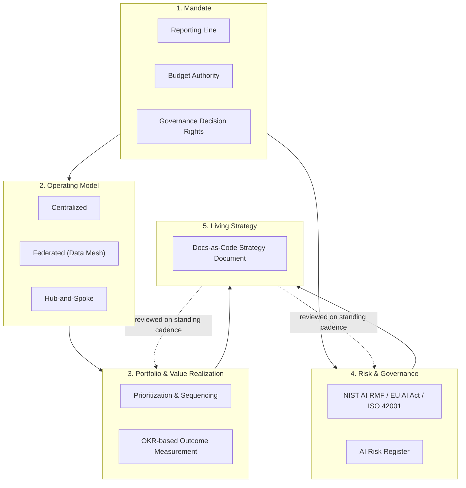
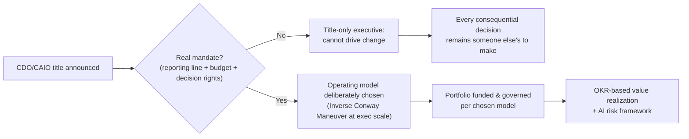
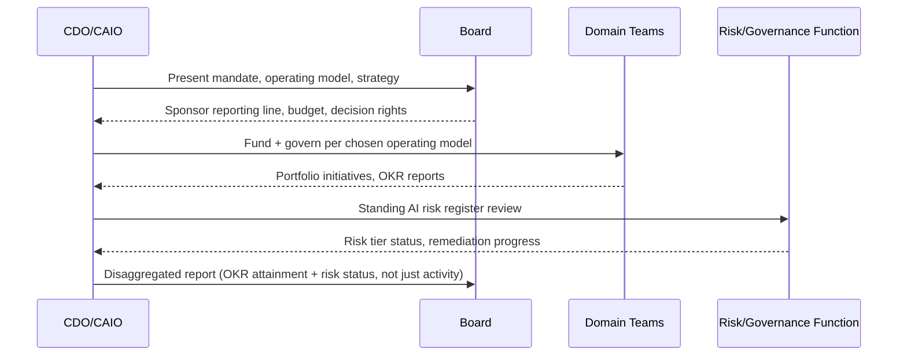

# CDO and CAIO Playbook

> Part of the **Enterprise Data & AI Architecture Handbook** — Phase-19 (Leadership & Technical Strategy), Chapter 08 — the final chapter of Phase-19 and of this handbook.
> Prerequisites: [Roadmap and Portfolio Planning](07_Roadmap_and_Portfolio_Planning.md) and [Technical Strategy and Roadmaps](../Phase-01/07_Technical_Strategy_and_Roadmaps.md). Builds on every chapter of Phase-19: [Technical Leadership](01_Technical_Leadership.md), [Architecture Reviews](02_Architecture_Reviews.md), [Stakeholder Management](03_Stakeholder_Management.md), [Technical Writing](04_Technical_Writing.md), [Hiring and Interviewing](05_Hiring_and_Interviewing.md), and [Mentoring and Team Building](06_Mentoring_and_Team_Building.md).

---

## Executive Summary

This is the chapter where every technical and leadership discipline in this handbook rolls up into one accountable executive mandate. A Chief Data Officer (CDO) or Chief AI Officer (CAIO) does not personally choose a table format ([Table Format Comparison](../Phase-04/07_Table_Format_Comparison.md)) or design a consensus protocol ([Consensus and Coordination](../Phase-02/01_Consensus_and_Coordination.md)) — but they are the person accountable for whether the sum of thousands of such decisions, made by teams they don't individually supervise, produces defensible business value without producing unacceptable risk. The CDO/CAIO role is where architecture ([Phase-00](../Phase-00/01_Introduction.md) through [Phase-18](../Phase-18/05_Performance_Engineering.md)), governance ([Data Governance Foundations](../Phase-08/01_Data_Governance_Foundations.md), [Compliance and Regulatory Frameworks](../Phase-10/06_Compliance_and_Regulatory_Frameworks.md)), and the leadership discipline this entire Phase-19 has built — decision-making, review, stakeholder translation, writing, hiring, team-building, portfolio prioritization — stop being separate disciplines and become one person's mandate.

The chapter's central thesis is that **a CDO/CAIO title without a real mandate is theater, and an operating model that isn't a deliberate design choice will default to whatever org chart already exists** — the exact Conway's Law lesson [Mentoring and Team Building](06_Mentoring_and_Team_Building.md) §6.3 establishes for teams, now applied to the executive layer itself. A CDO appointed without a real reporting line, budget authority, or decision rights over data/AI governance policy cannot actually change how the organization uses data, no matter how capable the individual — the mandate is the precondition for the role to do anything, the same way psychological safety is the precondition for every mechanism [Mentoring and Team Building](06_Mentoring_and_Team_Building.md) §7.2 documents.

The second thesis directly extends [Roadmap and Portfolio Planning](07_Roadmap_and_Portfolio_Planning.md)'s central distinction to executive scale: **strategic, "transformational" AI investment is not exempt from OKR-based value-realization discipline just because it's fashionable** — a portfolio of generative-AI pilots that never reaches production and never moves a measurable business outcome is the CDO/CAIO-scale instance of the "feature factory" pattern, and widely reported industry findings suggest this specific failure mode is disturbingly common. This chapter treats the CDO/CAIO mandate, the data/AI operating model, value realization, top-level risk and ethics ownership, and enterprise data/AI strategy as one connected executive discipline — the handbook's own capstone.

---

## Learning Objectives

After working through this chapter you will be able to:

- **Evaluate whether a CDO/CAIO role has a real mandate** (reporting line, budget authority, decision rights) versus a title without structural authority, and diagnose the consequences of the latter.
- **Design a data/AI operating model** (centralized, federated, or hub-and-spoke) as a deliberate choice matched to organizational scale and domain diversity, applying [Data Mesh Principles](../Phase-15/01_Data_Mesh_Principles.md)'s federated-governance lessons and [Mentoring and Team Building](06_Mentoring_and_Team_Building.md)'s Inverse Conway Maneuver at executive scope.
- **Apply OKR-based value-realization discipline** ([Roadmap and Portfolio Planning](07_Roadmap_and_Portfolio_Planning.md)) to a strategic AI/data portfolio, distinguishing genuine early-stage discovery investment from open-ended, ROI-exempt pilot proliferation.
- **Own risk, ethics, and governance at the executive level** using a named framework (NIST AI RMF, EU AI Act risk tiers, ISO/IEC 42001) with an accountable owner and standing review cadence.
- **Build and maintain an enterprise data/AI strategy** as a living, docs-as-code artifact, reviewed on the same cadence as the portfolio roadmap rather than a static annual slide deck.
- **Diagnose a "CDO/CAIO in name only" organization** and a hype-driven, ROI-exempt AI portfolio, and correct the underlying structural cause rather than the symptom.
- **Plan for the CDO/CAIO role's own succession and durability**, given the role's historically short average tenure, so transformation programs survive any single executive's departure.

---

## Business Motivation

The business case for a properly mandated CDO/CAIO rests on a coordination argument the rest of this handbook has built toward chapter by chapter: **an enterprise's data and AI capability is the sum of thousands of decentralized decisions — architecture choices, governance policies, hiring and team-topology choices, portfolio bets — and without a single accountable executive with real authority over how those decisions cohere, the sum reliably underperforms its parts**, the same "individually-reasonable local decisions compound into a large, often invisible, aggregate effect" pattern this handbook has documented from event-driven SLA drift to reliability debt to team-topology mismatch, now at the scale of an entire enterprise's data and AI investment.

The case sharpens for data and AI organizations specifically for three reasons this handbook has already established. First, [Data Mesh Principles](../Phase-15/01_Data_Mesh_Principles.md) and [Federated Governance](../Phase-15/04_Federated_Governance.md) show that data governance at scale requires a genuine operating-model decision (centralize vs. federate) that only an executive with cross-domain authority can actually make and enforce — a CDO without that authority can recommend a mesh but cannot make domain teams actually adopt federated computational governance. Second, [Responsible AI](../Phase-11/07_Responsible_AI.md) and the EU AI Act's risk-tiered regulatory regime mean AI governance is no longer optional best practice but a compliance obligation requiring a named, accountable executive owner — several jurisdictions now effectively require one. Third, [Roadmap and Portfolio Planning](07_Roadmap_and_Portfolio_Planning.md)'s value-realization discipline is most urgently needed exactly where it is least applied in practice: widely reported industry surveys (Gartner, MIT, BCG, and others) have repeatedly found that a large majority of enterprise AI initiatives fail to reach production or fail to demonstrate measurable business impact — a portfolio-scale "feature factory" failure this handbook's own chapter on the subject predicts and this chapter's Case Study 2 documents concretely.

The cost of an under-mandated or undisciplined CDO/CAIO function is predictable: a title-only executive who cannot actually change the organization's data/AI trajectory (Case Study 1); a proliferation of AI pilots that consume real capacity and executive attention while never reaching production or proving value (Case Study 2); and — because both failures are largely invisible until a board asks pointed questions about ROI or a regulator asks pointed questions about governance — years of accumulated, silent underperformance before anyone with the authority to fix it notices. The return on a properly mandated, disciplined CDO/CAIO function is the payoff of everything else in this handbook actually cohering into enterprise-level value and defensible risk management, rather than remaining a collection of excellent local decisions that never add up.

---

## History and Evolution

- **Early-to-mid 2000s: the CDO title emerges, driven by data quality and compliance.** The Chief Data Officer title first appeared prominently in financial services, with Capital One frequently cited as an early adopter — reflecting the sector's early recognition that data quality and governance needed a named, accountable executive rather than remaining a purely technical IT concern.
- **Post-2008: the financial crisis and BCBS 239 drive a wave of CDO appointments.** In the wake of the 2008 financial crisis, the Basel Committee's BCBS 239 principles (2013, already covered in [Financial Data Platforms](../Phase-17/02_Financial_Data_Platforms.md) §17.2) required global systemically important banks to demonstrate robust risk-data aggregation and reporting capability — a regulatory requirement many institutions met in part by appointing a Chief Data Officer with explicit accountability for data quality and lineage, giving the role its first widespread, compliance-driven mandate.
- **Mid-2000s onward: MIT's CDOIQ Symposium professionalizes the discipline.** MIT's Chief Data Officer and Information Quality (CDOIQ) Symposium, running annually since the mid-2000s, became (and remains) one of the primary venues for CDOs to share practice, signaling the role's maturation from a compliance afterthought into a recognized executive discipline with its own body of practice.
- **2010s: the role broadens from compliance to value creation.** As the role spread beyond financial services into retail, healthcare, and technology, its mandate broadened from primarily data-quality/compliance to include data monetization, analytics strategy, and — increasingly — machine learning enablement, while Gartner's periodic CDO surveys through the decade repeatedly documented the role's inconsistent mandate and historically short average tenure across industries.
- **2018: Google publishes its AI Principles.** Google's public "AI at Google: our principles" (2018) was an early, prominent instance of a major technology company publishing top-level, board-visible commitments on AI development and use — an early template for the risk/ethics-at-the-top ownership this chapter treats as a core CDO/CAIO responsibility.
- **February 2022: the U.S. Department of Defense establishes a Chief Digital and AI Officer.** The DoD's Chief Digital and AI Officer (CDAO) consolidated the Joint AI Center (JAIC), the Defense Digital Service (DDS), and the department's Chief Data Officer function into a single office — a genuine, well-documented, large-scale real-world precedent for the "combine data and AI executive authority into one accountable role" organizational-design decision this chapter's operating-model discussion returns to.
- **January 2023: NIST publishes the AI Risk Management Framework.** NIST's AI RMF 1.0 (2023) gave organizations a structured, voluntary framework — Govern, Map, Measure, Manage — for AI risk management, quickly becoming a widely referenced standard for exactly the kind of executive-owned AI risk governance this chapter's scope covers.
- **December 2023: ISO/IEC 42001 is published.** The first international AI management system standard gave organizations a certifiable framework for AI governance, paralleling ISO 27001's role for information security and giving CDO/CAIO offices a recognized external benchmark.
- **March 2024: U.S. federal agencies are required to designate Chief AI Officers.** The Office of Management and Budget's Memo M-24-10 mandated that every U.S. federal agency designate a Chief AI Officer with specific risk-management and governance responsibilities — a direct, regulatory-driven parallel to BCBS 239's earlier role in institutionalizing the CDO, now doing the same for the CAIO specifically.
- **2023–2025: rapid CAIO proliferation and the CDO/CAIO consolidation trend.** The generative-AI wave drove rapid, industry-wide adoption of the Chief AI Officer title, often alongside (rather than replacing) an existing CDO — with a growing, still-evolving trend toward combined "Chief Data and AI Officer" titles reflecting the same recognition this handbook has made repeatedly (from [MLOps and MLflow](../Phase-11/03_MLOps_and_MLflow.md) onward): AI capability is inseparable from the data foundation and governance discipline that precedes it, and splitting executive accountability between the two invites exactly the coordination gaps [Data Mesh Principles](../Phase-15/01_Data_Mesh_Principles.md) warns against.

The through-line: the role has moved from a narrow, compliance-driven data-quality function toward a **broad, board-visible mandate spanning data governance, AI risk, and value creation** — increasingly recognized, through regulatory mandate (BCBS 239, OMB M-24-10) as much as organizational learning, as requiring one accountable executive rather than a diffuse committee.

---

## Why This Technology Exists

A dedicated, mandated CDO/CAIO function exists to solve a coordination and accountability problem that a purely decentralized or purely IT-owned approach to data and AI reliably fails to solve, for three specific reasons.

**It exists because data and AI value and risk are enterprise-wide properties that no single domain team can own end to end.** [Data Mesh Principles](../Phase-15/01_Data_Mesh_Principles.md) establishes that domain teams should own their own data products — but someone must own the *federated computational governance* that keeps those domains interoperable, the enterprise-wide AI risk posture, and the cross-domain investment trade-offs [Roadmap and Portfolio Planning](07_Roadmap_and_Portfolio_Planning.md) covers. Without a mandated executive accountable for the whole, these cross-cutting concerns fall into the gaps between domain teams' individually well-run local decisions.

**It exists because regulators and boards increasingly require a named, accountable owner for AI and data risk.** BCBS 239's push toward CDO appointments in banking and OMB M-24-10's mandatory CAIO designation for U.S. federal agencies are not isolated incidents — they reflect a broader regulatory pattern (the EU AI Act's risk-tiered obligations are another instance, per [Responsible AI](../Phase-11/07_Responsible_AI.md) §7.4) of requiring organizations to name a specific, accountable executive rather than diffusing AI/data risk ownership across a working group with no executive visibility.

**It exists because, without an executive owning value realization specifically, AI and data investment reliably drifts toward activity (pilots, proofs-of-concept, "AI maturity" initiatives) rather than measured outcome** — the same output-versus-outcome conflation [Roadmap and Portfolio Planning](07_Roadmap_and_Portfolio_Planning.md) §8.3 documents at the portfolio level, but with AI's particular hype dynamics making it an especially reliable place for that conflation to occur unchecked. A CDO/CAIO with real portfolio authority and OKR discipline is the mechanism that prevents "we ran forty pilots" from being mistaken for "we created forty units of value."

---

## Problems It Solves

- **Diffuse, uncoordinated data/AI accountability.** A single, mandated executive owns the cross-domain coherence [Data Mesh Principles](../Phase-15/01_Data_Mesh_Principles.md) requires but no individual domain team can provide alone.
- **AI/data risk with no named owner.** Regulatory frameworks (BCBS 239, EU AI Act, OMB M-24-10) increasingly require exactly this kind of accountable executive ownership.
- **AI pilot proliferation with no value discipline.** OKR-based portfolio review at the executive level, per [Roadmap and Portfolio Planning](07_Roadmap_and_Portfolio_Planning.md), catches the "feature factory" pattern at enterprise scale before it consumes years of capacity.
- **An operating model defaulting to organizational accident.** A deliberate centralize-vs-federate decision, applying [Mentoring and Team Building](06_Mentoring_and_Team_Building.md)'s Inverse Conway Maneuver at executive scope, rather than inheriting whatever structure history produced.
- **Strategy as a static, unmaintained artifact.** Treating the data/AI strategy as a living, docs-as-code document ([Technical Writing](04_Technical_Writing.md)) reviewed on a standing cadence rather than a slide deck refreshed only for a board meeting.
- **A title-only executive with no actual authority.** Diagnosing and correcting the "CDO/CAIO in name only" pattern before it wastes years of an otherwise-capable executive's tenure.

---

## Problems It Cannot Solve

- **It cannot substitute for the technical and leadership disciplines this entire handbook covers.** A well-mandated CDO/CAIO with a sound operating model and strong governance still depends on the architecture, engineering, and team-building disciplines of every prior phase actually being executed well; the role coordinates and is accountable for the whole, but does not personally do the work of any part.
- **It cannot make a fundamentally unsound business strategy succeed through better data/AI execution.** Portfolio and governance discipline optimizes execution of a strategy; it cannot substitute for the organization having chosen a viable strategic direction.
- **It cannot eliminate the genuine uncertainty of frontier AI investment, only govern it honestly.** Some AI bets are genuinely exploratory and should be funded as Horizon-3 discovery work ([Roadmap and Portfolio Planning](07_Roadmap_and_Portfolio_Planning.md) §7.3) with appropriately scoped, time-boxed expectations — not held to the same immediate-ROI bar as a Horizon-2 feature, though it must still eventually be held to *some* accountable gate, not an indefinite exemption.
- **It cannot manufacture a real mandate through personal force of will alone.** Without genuine reporting-line authority, budget control, and decision rights, no amount of individual competence or persuasion sustainably overcomes a title-only structural position — this is a [Stakeholder Management](03_Stakeholder_Management.md)-scale battle the executive must win at appointment time or shortly after, not something skill alone compensates for indefinitely.
- **It cannot guarantee organizational longevity for any single executive.** The CDO/CAIO role has a historically short average tenure across industries; a strategy and operating model that only functions while one specific person holds the role has not actually solved the coordination problem it exists to solve (§Fault Tolerance).
- **It cannot resolve every AI ethics question through a framework alone.** NIST AI RMF, ISO/IEC 42001, and the EU AI Act's risk tiers structure the *process* for identifying and managing AI risk; they do not resolve every specific, genuinely hard ethical judgment call a real deployment will present, which still requires human judgment at the point of decision.

---

## Core Concepts

### 8.1 CDO/CAIO Mandate and Scope

The single precondition for everything else in this chapter is a **real mandate**: an explicit reporting line (directly to the CEO, or to another C-suite peer with genuine cross-functional authority — not buried several layers under IT with no independent decision rights), **budget authority** over a defined portfolio, and **decision rights** over data/AI governance policy that other executives and domain teams are actually bound by, not merely advisory input they can override. Without all three, the title is symbolic: the individual may be excellent, but they cannot actually change how the organization's data and AI capability is built and governed, because every consequential decision remains someone else's to make or veto.

The reporting-line question is genuinely debated and consequential, not a formality: reporting under the CIO tends to keep the role technology-execution-focused and at risk of being deprioritized against operational IT demands; reporting directly to the CEO (or occasionally the COO or CFO, depending on where data/AI value is expected to be realized) tends to give the role the cross-functional standing to drive the kind of enterprise-wide operating-model and governance change [Data Mesh Principles](../Phase-15/01_Data_Mesh_Principles.md) and [Federated Governance](../Phase-15/04_Federated_Governance.md) require. The scope question — CDO, CAIO, or a combined Chief Data and AI Officer — has trended, per §History, toward consolidation, reflecting the recognition that AI capability without a governed data foundation, and data governance without an AI risk lens, are each an incomplete mandate.

### 8.2 Data/AI Operating Model and Org Design

The operating-model choice — **centralized** (one data/AI organization serves the whole enterprise), **federated** (domain teams own their own data/AI work under shared computational governance, per [Data Mesh Principles](../Phase-15/01_Data_Mesh_Principles.md)), or **hub-and-spoke** (a central platform/governance team paired with embedded domain specialists) — is the CDO/CAIO's own instance of the Inverse Conway Maneuver ([Mentoring and Team Building](06_Mentoring_and_Team_Building.md) §6.3): the org design chosen will directly determine what data/AI architecture the enterprise is actually capable of producing, and defaulting to whatever structure history produced (rather than deliberately choosing) reliably produces a mismatch between organizational capability and strategic ambition.

No single model is universally correct: a smaller, less domain-diverse organization may be well served by a centralized model; a large, multi-domain enterprise attempting genuine domain-team autonomy needs the federated model *and* the platform and computational-governance investment [Data Mesh Principles](../Phase-15/01_Data_Mesh_Principles.md) and [Self-Serve Data Platform](../Phase-15/05_Self_Serve_Data_Platform.md) show that model actually requires to avoid becoming "mesh in name only." The CDO/CAIO's specific responsibility is choosing deliberately, documenting the choice and its rationale, and — critically — funding the operating model's real requirements (platform investment, governance guild time, federated team capability) rather than declaring a model on a slide without the structural investment behind it, which is precisely how organizations end up with a title-only operating model paralleling this chapter's title-only-executive failure mode.

### 8.3 Value Realization and ROI

Every prior chapter's leadership discipline converges here: [Roadmap and Portfolio Planning](07_Roadmap_and_Portfolio_Planning.md)'s central distinction between roadmap (output) and OKR (outcome) applies with particular force to AI investment, where the "feature factory" pattern manifests as pilot proliferation — proof-of-concept after proof-of-concept, none of them reaching production, none of them tied to a measurable Key Result. Widely reported industry findings from multiple research organizations have repeatedly found that a substantial majority of enterprise AI initiatives fail to reach production or fail to demonstrate measurable business impact — a portfolio-scale instance of exactly the output/outcome conflation this handbook's prior chapter names and this chapter's Case Study 2 documents concretely.

The CDO/CAIO's specific responsibility is applying [Roadmap and Portfolio Planning](07_Roadmap_and_Portfolio_Planning.md)'s Three-Horizons discipline honestly at portfolio scale: genuinely early-stage, exploratory AI research belongs in a bounded, time-boxed Horizon-3 discovery allocation with appropriately scoped (not absent) accountability gates, while anything claiming production-scale strategic investment status must be held to the same OKR-based value-realization discipline as any other portfolio bet — no exception granted merely because an initiative is labeled "transformational" or "AI-native."

### 8.4 Risk, Ethics, and Governance at the Top

AI and data risk ownership increasingly is not optional best practice but a regulatory expectation: BCBS 239 for financial risk-data aggregation, the EU AI Act's risk-tiered obligations ([Responsible AI](../Phase-11/07_Responsible_AI.md) §7.4), and the U.S. federal government's OMB M-24-10 mandate for Chief AI Officers all point toward the same structural requirement — a named, accountable executive, not a working group with no executive visibility. NIST's AI Risk Management Framework (Govern, Map, Measure, Manage, 2023) and ISO/IEC 42001 (2023) give this ownership a structured, auditable process rather than an ad hoc one.

Governance at the top means the CDO/CAIO personally owns (or delegates with real oversight, never abdicates) the standing review of the organization's AI risk posture — model cards and Responsible AI practices ([Responsible AI](../Phase-11/07_Responsible_AI.md)), data privacy and access-control-propagation discipline ([Data Privacy and PII Protection](../Phase-10/07_Data_Privacy_and_PII_Protection.md)), and the compliance-as-code enforcement mechanisms ([Federated Governance](../Phase-15/04_Federated_Governance.md)) that make policy real rather than aspirational — with a standing cadence of executive-level review, not an annual check-the-box exercise.

### 8.5 Building the Data/AI Strategy

The enterprise data/AI strategy is the CDO/CAIO's own application of [Technical Strategy and Roadmaps](../Phase-01/07_Technical_Strategy_and_Roadmaps.md)'s discipline at the broadest scope this handbook covers: a written, docs-as-code artifact ([Technical Writing](04_Technical_Writing.md)) stating the organization's data/AI ambition, the operating model chosen to pursue it (§8.2), the portfolio and Three-Horizons investment mix funding it ([Roadmap and Portfolio Planning](07_Roadmap_and_Portfolio_Planning.md)), and the governance framework bounding its risk (§8.4) — reviewed and revised on the same standing cadence as the portfolio roadmap, not refreshed only once a year for a board presentation. A strategy that exists only as a static slide deck cannot actually guide the thousands of decentralized decisions this handbook's other eighteen phases cover; a strategy that lives as a maintained, version-controlled artifact — cross-linked to the ADRs, roadmaps, and governance policies it depends on — can.

---

## Internal Working

### 9.1 Mandate as the Precondition, Not a Byproduct, of Effectiveness

The mechanism behind §8.1's central claim is structural, not motivational: a title alone confers no actual decision rights, and an executive without genuine reporting-line authority, budget control, or governance decision rights must, for every consequential change, persuade someone who outranks them structurally — a fundamentally weaker position than one where the decision is theirs to make. This is why a highly capable, well-liked CDO/CAIO can still fail to move the organization: the mandate, not the individual's competence, is the binding constraint, the same way [Technical Leadership](01_Technical_Leadership.md) §1.3 establishes that a named decision owner (not a persuasive advocate alone) is what actually gets a consequential decision made.

### 9.2 The Operating Model as Applied Conway's Law at Executive Scale

Just as [Mentoring and Team Building](06_Mentoring_and_Team_Building.md) §7.1 shows that team communication structure inevitably becomes system structure, the CDO/CAIO's chosen operating model inevitably becomes the shape of the organization's actual data/AI capability: a centralized model concentrates capability and consistency but risks becoming a bottleneck at scale (echoing [Architecture Reviews](02_Architecture_Reviews.md)'s central review-board caution); a federated model distributes capability and speed but, without the platform and governance investment [Data Mesh Principles](../Phase-15/01_Data_Mesh_Principles.md) specifies, risks exactly the "mesh in name only" fragmentation that chapter documents. The CDO/CAIO's operating-model choice is not a slide-deck decision — it is a structural commitment with the same downstream consequences team-topology design has at the engineering-team level, now propagated across an entire enterprise.

### 9.3 Value Realization as a Governed Feedback Loop

OKR-based value realization functions, at portfolio scale, exactly as [Roadmap and Portfolio Planning](07_Roadmap_and_Portfolio_Planning.md) §8.3 describes for an individual initiative: the strategy and portfolio (output — what the organization plans to build) and the OKRs (outcome — whether it moved anything that mattered) must be tracked and reviewed as two distinct, reconciled signals. At the executive level, this reconciliation is what lets a board or CEO ask "did our AI investment work" and receive an answer grounded in measured outcomes rather than activity counts (pilots launched, models trained) — the CDO/CAIO's specific responsibility is ensuring that feedback loop exists and is honestly reported, even when the honest answer is uncomfortable.

---

## Architecture

The reference CDO/CAIO operating architecture connects five layers: **(1) mandate** (reporting line, budget, decision rights, §8.1) establishes the executive's actual authority; **(2) operating model** (centralized/federated/hub-and-spoke, §8.2) shapes how that authority is exercised across the organization's domains; **(3) portfolio and value realization** ([Roadmap and Portfolio Planning](07_Roadmap_and_Portfolio_Planning.md), applied at enterprise scope, §8.3) allocates capacity and measures outcomes; **(4) risk and governance** (NIST AI RMF/EU AI Act/ISO 42001, §8.4) bounds acceptable risk; and **(5) the living strategy document** (§8.5) ties the other four together as one maintained, docs-as-code artifact, reviewed on a standing cadence and cross-linked to the ADRs, roadmaps, and governance policies each domain and portfolio decision produces.

---

## Components

- **Mandate Charter** — the documented reporting line, budget authority, and decision rights (§8.1), the executive-scope analogue of a team charter.
- **Operating Model Decision Record** — the documented, deliberate centralize/federate/hub-and-spoke choice and its rationale (§8.2).
- **Portfolio and OKR Roll-up** — the enterprise-scope aggregation of [Roadmap and Portfolio Planning](07_Roadmap_and_Portfolio_Planning.md)'s per-domain artifacts.
- **AI Risk Register** — the standing, accountable record of AI risk classifications (NIST RMF/EU AI Act tiers) and mitigation status.
- **Data/AI Strategy Document** — the living, docs-as-code strategy artifact (§8.5).
- **Executive Review Cadence** — the standing rhythm at which portfolio, risk, and strategy are reviewed together.
- **Board/Stakeholder Reporting Artifact** — the audience-adapted (per [Stakeholder Management](03_Stakeholder_Management.md)) view of the above for board and executive-peer consumption.

---

## Metadata

The strategy document carries version, status, and last-review-date metadata like any other docs-as-code artifact ([Technical Writing](04_Technical_Writing.md)); the portfolio roll-up carries aggregated OKR-attainment and Horizon-allocation metadata rolled up from [Roadmap and Portfolio Planning](07_Roadmap_and_Portfolio_Planning.md)'s per-initiative records; and the AI risk register carries each AI system's risk-tier classification, accountable owner, and review-cadence status — the executive-scope analogue of the risk metadata [Responsible AI](../Phase-11/07_Responsible_AI.md) tracks at the individual-model level.

---

## Storage

The strategy document, mandate charter, operating-model decision record, and risk register are stored as versioned, docs-as-code artifacts ([Technical Writing](04_Technical_Writing.md)), with the same access-control discipline applied to any sensitive governance or strategic artifact — competitive-sensitive strategic direction and unresolved risk-register entries both require deliberate confidentiality scoping.

---

## Compute

At this scope, the scarcest resource is the **CDO/CAIO's own attention and political capital** — a genuinely non-scalable resource (the same pattern [Technical Leadership](01_Technical_Leadership.md) §1.2 and every subsequent Phase-19 chapter's own Compute section establishes), which must be deliberately allocated across mandate-defense, cross-domain coordination, portfolio review, and risk oversight rather than consumed disproportionately by whichever crisis is loudest that week.

---

## Networking

The CDO/CAIO's most consequential "network" is their standing relationships with C-suite peers (CEO, CFO, CISO, CIO) and the board — the executive-scale instance of [Stakeholder Management](03_Stakeholder_Management.md)'s stakeholder-mapping discipline, now applied among peers rather than up to a single sponsor. A CDO/CAIO with no durable peer relationships outside a formal reporting line has, in practice, no coalition to draw on when a cross-functional decision (a data-sharing policy, an AI risk exception) needs genuine buy-in beyond their own direct authority.

---

## Security

AI and data risk ownership at the executive level is, functionally, an integrity property applied at enterprise scale: the CDO/CAIO is accountable for ensuring the access-control-propagation discipline ([Retrieval Augmented Generation](../Phase-12/03_Retrieval_Augmented_Generation.md) §3.4, [Data Privacy and PII Protection](../Phase-10/07_Data_Privacy_and_PII_Protection.md)), the model-governance discipline ([Responsible AI](../Phase-11/07_Responsible_AI.md)), and the AI risk framework (§8.4) this handbook has documented chapter by chapter are actually enforced organization-wide, not merely documented in a policy no domain team is structurally required to follow.

---

## Performance

Executive-level portfolio health is measured, disaggregated, across: **OKR attainment rate at the portfolio level**, **percentage of AI initiatives reaching production** (the direct counter to the pilot-proliferation pattern, §8.3), **risk-incident rate and time-to-remediation** against the AI risk register, **time-to-value** for strategic initiatives, and **operating-model adherence** (are domain teams actually operating per the chosen centralize/federate model, or has practice quietly diverged from the documented decision).

---

## Scalability

Scaling the CDO/CAIO's governance and value-realization discipline across a large, growing, multi-domain enterprise depends on the same federation pattern [Federated Governance](../Phase-15/04_Federated_Governance.md) and [Mentoring and Team Building](06_Mentoring_and_Team_Building.md) §Scalability both apply to their own domains: a central governance guild sets global policy and reviews portfolio-level outcomes, while domain-level data/AI leads (a federated bench, not one office trying to review everything) apply that policy locally — avoiding the CDO/CAIO's own office becoming the exact kind of centralized bottleneck [Architecture Reviews](02_Architecture_Reviews.md) warns against at the technical-review level.

---

## Fault Tolerance

Given the CDO/CAIO role's historically short average tenure across industries, resilience here means the strategy, operating model, and governance discipline must **survive the departure of any single executive** — captured in durable, docs-as-code artifacts (§8.5) rather than living only in one person's head, with a real succession plan and a governance structure (the federated guild, per §Scalability) that continues functioning during a leadership transition. A transformation program that collapses the moment its sponsoring executive leaves has not actually built durable organizational capability — it has built a personal project, the executive-scope instance of the single-point-of-failure risk [Mentoring and Team Building](06_Mentoring_and_Team_Building.md) §Fault Tolerance names for any critical capability concentrated in one person.

---

## Cost Optimization

**Worked example.** An enterprise running roughly 40 concurrent generative-AI pilots, at an average fully-loaded cost of approximately $150,000 per pilot (data science and engineering time, compute, and vendor licensing) over a year, represents an approximate **$6M annual AI-portfolio spend**. If — consistent with widely reported industry findings — only a small fraction of these pilots ever reach production or demonstrate a measurable Key Result, the bulk of that $6M produced learning and activity but no verified business outcome. Applying [Roadmap and Portfolio Planning](07_Roadmap_and_Portfolio_Planning.md)'s discipline — a bounded, honestly-scoped Horizon-3 discovery allocation (e.g., funding 8-10 well-chosen pilots with explicit stage gates and a required Key Result before any pilot proceeds past an initial proof-of-concept) rather than an open-ended 40-pilot sprawl — would have concentrated the same total spend on far fewer, better-vetted bets, each with a real chance of reaching production and a measured outcome to show for it: the same asymmetry [Hiring and Interviewing](05_Hiring_and_Interviewing.md), [Mentoring and Team Building](06_Mentoring_and_Team_Building.md), and [Roadmap and Portfolio Planning](07_Roadmap_and_Portfolio_Planning.md) each document in their own domains — **a smaller, disciplined, gated set of bets outperforms a larger, undisciplined, ungated one at the same total cost.**

---

## Monitoring

Track portfolio-level OKR attainment, percentage of AI initiatives reaching production, AI risk-register status and remediation timeliness, operating-model adherence (documented model versus observed practice), and mandate-effectiveness signals (are the CDO/CAIO's governance decisions actually being followed by domain teams, or quietly worked around) on a standing executive review cadence.

---

## Observability

Monitoring answers known questions against known thresholds (is portfolio OKR attainment within the expected range this quarter?). **Observability** is the ability to ask an unforeseen question of the same underlying data — "why has our AI-pilot-to-production rate declined for three consecutive quarters even as pilot count has risen?" or "which domain teams have quietly stopped following the federated governance policy, and why?" — the same monitoring-versus-observability distinction every prior Phase-19 chapter applies to its own domain, now applied to the entire enterprise data/AI portfolio.

---

## Operational Response Playbook

**Playbook 1 — The CDO/CAIO has a title but cannot actually drive change.** Do not respond by asking the executive to "influence more" or "build better relationships" as a substitute for structural authority. Diagnose whether the role genuinely lacks a reporting line with real authority, budget control, or governance decision rights (§8.1) — if so, the durable fix is renegotiating the mandate itself (a [Stakeholder Management](03_Stakeholder_Management.md)-scale coalition-building effort, likely requiring CEO/board sponsorship), not asking the individual to compensate personally for a structural gap that no amount of persuasion sustainably overcomes.

**Playbook 2 — The AI portfolio has many pilots and little measurable value.** Do not respond by mandating a blanket "no more pilots" freeze, which stifles genuine early-stage discovery work along with the undisciplined sprawl. Diagnose which pilots have a genuine, appropriately-scoped Horizon-3 discovery justification with a defined stage gate versus which have been running indefinitely with no Key Result and no path to production — apply [Roadmap and Portfolio Planning](07_Roadmap_and_Portfolio_Planning.md)'s reserved-capacity and OKR discipline retroactively: consolidate the undisciplined sprawl into a smaller, gated, OKR-accountable set, and let genuine discovery work continue within its bounded, time-boxed allocation.

---

## Governance

Governance at this scope is the chapter's own subject matter as much as a section within it: the CDO/CAIO **owns** — personally accountable, not merely advisory — the enterprise AI risk register (§8.4) using a named framework (NIST AI RMF, EU AI Act risk tiers, ISO/IEC 42001), the operating-model decision and its documented rationale (§8.2), and the standing reconciliation between portfolio-delivery status and OKR-measured outcome ([Roadmap and Portfolio Planning](07_Roadmap_and_Portfolio_Planning.md) §8.3, applied at enterprise scope). Board reporting on all three should be honest and disaggregated — activity counts (pilots run, policies published) reported alongside, never in place of, outcome measures (Key Results moved, production AI systems in operation, risk incidents and their remediation).

---

## Trade-offs

- **Centralized vs. federated operating model.** Centralization concentrates consistency and capability but risks becoming a bottleneck at enterprise scale; federation distributes speed and domain autonomy but requires real, sustained platform and governance investment to avoid fragmentation.
- **Reporting to the CEO vs. a functional peer (CIO/CFO/COO).** A direct CEO reporting line maximizes cross-functional standing but competes for genuinely scarce top-of-house attention; reporting under a functional peer may secure more routine engagement at the cost of reduced enterprise-wide authority.
- **Disciplined, gated AI portfolio vs. broad exploratory sprawl.** Tight, OKR-gated discipline maximizes measurable value realization but risks under-funding genuinely novel, hard-to-pre-specify discovery work if applied too rigidly, too early.
- **A combined Chief Data and AI Officer vs. separate CDO and CAIO roles.** Consolidation avoids the coordination gap between data governance and AI risk this handbook has repeatedly shown to be a single, inseparable concern, but risks overloading one executive's attention across an extremely broad mandate.

---

## Decision Matrix

| Organizational Context | Recommended Operating Model | Recommended Mandate Scope |
|---|---|---|
| Single-domain, moderate scale, low regulatory exposure | Centralized data/AI team | CDO or CAIO reporting to CIO acceptable |
| Multi-domain, high scale, strong domain autonomy needed | Federated (Data Mesh) with strong platform + governance investment | Combined CDO/CAIO reporting to CEO/COO |
| Heavily regulated (financial services, healthcare, public sector) | Hub-and-spoke, with a strong central governance/risk function | Combined role reporting to CEO, board-visible risk-register ownership mandatory |
| Rapid AI adoption, uncertain domain structure | Hub-and-spoke, central AI risk/value-realization discipline with embedded domain specialists | CAIO with explicit, time-boxed authority to consolidate as domain structure clarifies |

---

## Design Patterns

- **Real mandate before role announcement** — reporting line, budget authority, and decision rights secured before (or as a condition of) accepting the role (§8.1).
- **Deliberate operating-model decision record** — centralize/federate/hub-and-spoke chosen and documented explicitly, applying the Inverse Conway Maneuver at executive scope (§8.2).
- **Portfolio-wide OKR reconciliation** — enterprise AI/data investment held to the same output/outcome discipline as any other portfolio bet, with an honest, bounded exception for genuine discovery-stage work (§8.3).
- **Named, accountable AI risk framework** — NIST AI RMF/EU AI Act tiers/ISO 42001, with a standing review cadence, not an annual check-the-box exercise (§8.4).
- **Living, docs-as-code strategy** — reviewed on the same cadence as the portfolio roadmap, cross-linked to the ADRs and governance policies it depends on (§8.5).
- **Federated governance bench** — avoiding the CDO/CAIO office itself becoming a centralized bottleneck as the organization scales (§Scalability).

---

## Anti-patterns

- **A CDO/CAIO title with no reporting-line authority, budget, or decision rights** — theater, not a mandate (this chapter's Case Study 1).
- **An operating model declared on a slide with no platform/governance funding behind it** — "mesh/hub-and-spoke in name only," parallel to [Data Mesh Principles](../Phase-15/01_Data_Mesh_Principles.md)'s own named failure mode.
- **Open-ended AI pilot proliferation with no OKR, no stage gate, no production path** — the portfolio-scale "feature factory" (this chapter's Case Study 2).
- **Treating AI risk governance as an annual check-the-box exercise** rather than a standing, owned review cadence.
- **A strategy document refreshed only for a board meeting**, disconnected from the actual portfolio and governance decisions being made week to week.
- **A transformation program that depends entirely on one executive's continued presence**, with no durable artifact or succession plan.

---

## Common Mistakes

- Accepting a CDO/CAIO title without first securing a real reporting line, budget, and decision rights.
- Declaring a federated operating model without funding the platform and governance investment it actually requires.
- Reporting AI-portfolio activity (pilots launched) as if it were equivalent to AI-portfolio value (Key Results moved).
- Delegating AI risk governance entirely to a working group with no executive-level standing review.
- Letting the strategy document go stale between board cycles rather than maintaining it as a living artifact.
- Concentrating all governance/portfolio decision-making in the CDO/CAIO's own office as the organization scales, recreating a central bottleneck.

---

## Best Practices

- Secure a genuine mandate — reporting line, budget authority, decision rights — before or immediately upon taking the role, and treat renegotiating it as a legitimate, ongoing responsibility if it proves insufficient.
- Choose and document the data/AI operating model deliberately, and fund its real structural requirements.
- Apply the same OKR-based value-realization discipline to strategic AI investment as to any other portfolio bet, with a clearly bounded exception for genuine discovery-stage work.
- Own AI risk and governance personally, using a named framework, with a standing review cadence and honest, disaggregated board reporting.
- Maintain the data/AI strategy as a living, docs-as-code artifact, reviewed on the same cadence as the portfolio roadmap.
- Federate governance and portfolio review as the organization scales, rather than centralizing everything in one office.
- Build durable, documented artifacts and a real succession plan so the program survives any single executive's departure.

---

## Enterprise Recommendations

Do not appoint a CDO/CAIO without first agreeing the reporting line, budget authority, and governance decision rights in writing; make the operating-model choice an explicit, board-visible decision with funded platform and governance investment behind it; apply portfolio-wide OKR discipline to AI investment with a named, bounded exception process for genuine early-stage discovery work; adopt a named AI risk framework (NIST AI RMF and/or EU AI Act risk tiers, informed by ISO/IEC 42001) with standing executive review; maintain the data/AI strategy as a living, cross-linked, docs-as-code artifact; and build succession planning and durable, documented governance into the role from the outset, rather than treating the program as inseparable from its current executive.

---

## Azure Implementation

**Microsoft Purview** and **Microsoft Fabric** (OneLake, unified governance) form the practical backbone a CDO/CAIO's office relies on to operationalize enterprise-wide data governance across a federated or hub-and-spoke estate, directly extending the catalog, lineage, and access-control disciplines covered throughout [Phase-08](../Phase-08/01_Data_Governance_Foundations.md). **Azure AI Foundry** provides the AI model/agent registry and governance surface for the AI risk register (§8.4). **Power BI** rolls up portfolio, OKR, and AI-risk-register dashboards for board-level reporting, extending [Roadmap and Portfolio Planning](07_Roadmap_and_Portfolio_Planning.md)'s own dashboard pattern to executive scope. Microsoft's own internal practice is directly instructive here: its **Office of Responsible AI** and the **Aether Committee** (AI, Ethics, and Effects in Engineering and Research) are real, well-documented internal governance bodies giving executive-level visibility and accountability to AI risk decisions — a concrete template for how a CDO/CAIO's office can structure its own risk-governance function. **SharePoint/Loop with Purview sensitivity labels** hosts the living strategy document and mandate charter with appropriate confidentiality.

---

## Open Source Implementation

**OpenMetadata** or **Apache Atlas**, already established across [Phase-08](../Phase-08/04_Metadata_Management_OpenMetadata_and_Atlas.md), provide the open-source catalog/lineage backbone underpinning enterprise-wide governance visibility regardless of operating model. **Backstage** extends its software/team catalog (used throughout Phase-19) to a full data/AI-product portfolio view, giving the CDO/CAIO's office a single, discoverable map of what exists and who owns it. **OPA/Conftest**, per [Federated Governance](../Phase-15/04_Federated_Governance.md), enforces computational governance policy regardless of centralize/federate choice. **Metabase or Apache Superset**, built against a Postgres-backed portfolio warehouse, produce the board-level OKR and risk-register dashboards without proprietary tooling. The strategy document, mandate charter, and operating-model decision record live as versioned Markdown in Git, per [Technical Writing](04_Technical_Writing.md)'s docs-as-code discipline.

---

## AWS Equivalent (comparison only)

On the technical-governance side, **AWS Lake Formation** (centralized data-lake permissions), **AWS Glue Data Quality**, and **Amazon Bedrock Guardrails** are the direct AWS-ecosystem comparisons to Purview/Fabric's governance capabilities and Azure AI Foundry's AI-risk tooling. On the organizational-practice side — the more relevant comparison for this chapter's actual subject — Amazon's real internal **S-team** (senior-leadership) review process, alongside the **OP1/OP2** planning cycle already referenced in [Roadmap and Portfolio Planning](07_Roadmap_and_Portfolio_Planning.md) §History, is a genuine, well-documented example of executive-level portfolio and risk review at enterprise scale, directly comparable to this chapter's standing executive review cadence (§8.4, §Governance).

## GCP Equivalent (comparison only)

**Google Cloud Dataplex** (unified governance across data lakes/warehouses) and **Vertex AI's** model registry and Model Cards are the direct GCP-ecosystem comparisons to Purview/Fabric and Azure AI Foundry's governance capabilities. On AI risk and ethics ownership specifically, **Google's own 2018 AI Principles** (§History) remain one of the earliest and most-cited real examples of a major technology company publishing board-visible, top-level AI governance commitments — a genuine precedent for the kind of executive-owned risk/ethics framework §8.4 recommends, predating both the EU AI Act and NIST's AI RMF by several years.

---

## Migration Considerations

An organization moving from an undermandated or title-only CDO/CAIO function to a properly mandated one should treat the mandate renegotiation itself as a deliberate, board-sponsored change — not something the incumbent executive is expected to achieve unilaterally through persuasion alone; similarly, shifting operating models (e.g., from centralized to federated as an organization scales past what a central team can serve) should be piloted on a bounded set of domains before an enterprise-wide mandate, with the platform and governance investment funded *before* domain teams are expected to operate under the new model, consistent with [Data Mesh Principles](../Phase-15/01_Data_Mesh_Principles.md)'s own pilot-then-scale precedent.

---

## Mermaid Architecture Diagrams

---

## End-to-End Data Flow

A CDO/CAIO's mandate flows into concrete organizational reality as follows: the board grants a reporting line, budget, and decision rights (§8.1); the executive chooses and documents an operating model (§8.2), funding the platform and governance investment it requires; domain teams execute portfolio initiatives under that model, scored and sequenced per [Roadmap and Portfolio Planning](07_Roadmap_and_Portfolio_Planning.md), each tied to a Key Result; the AI risk register tracks each AI system's risk tier and mitigation status per a named framework (§8.4); and all three — portfolio outcomes, risk status, and the strategy document itself — are reviewed together on a standing executive cadence, with the resulting honest, disaggregated picture reported back to the board, closing the loop from mandate to measured, governed outcome.

---

## Real-world Business Use Cases

- **Standing up a Chief Data and AI Officer role from scratch**, securing the mandate (reporting line, budget, decision rights) before announcing an operating model.
- **Migrating from a centralized data team to a federated Data Mesh model** as an enterprise scales past what a central team can serve, funding the platform investment [Data Mesh Principles](../Phase-15/01_Data_Mesh_Principles.md) requires.
- **Consolidating a sprawling generative-AI pilot portfolio** into a smaller, OKR-gated, production-focused set, applying [Roadmap and Portfolio Planning](07_Roadmap_and_Portfolio_Planning.md)'s Three-Horizons discipline retroactively.
- **Building and presenting an enterprise AI risk posture to the board**, using a named framework (NIST AI RMF/EU AI Act tiers) with honest, disaggregated reporting.

---

## Industry Examples

- **BCBS 239's role in institutionalizing the CDO** in financial services following the 2008 crisis.
- **The U.S. Department of Defense's 2022 Chief Digital and AI Officer (CDAO)** consolidation of JAIC, DDS, and the DoD's Chief Data Officer function — a genuine, large-scale precedent for combined data/AI executive authority.
- **The U.S. federal government's March 2024 OMB Memo M-24-10**, mandating Chief AI Officer designation across federal agencies.
- **Google's 2018 AI Principles**, an early, prominent example of board-visible, top-level AI governance commitment.
- **NIST's AI Risk Management Framework (2023) and ISO/IEC 42001 (2023)**, giving CDO/CAIO offices structured, increasingly standard risk-governance frameworks.

---

## Case Studies

### Case Study 1: The CDO in name only

A large enterprise, under pressure from a board increasingly concerned about the organization's data maturity, appointed a well-regarded, technically excellent Chief Data Officer — recruited externally with real enthusiasm and a strong public announcement. In practice, the role reported three layers deep within the existing IT organization, had no independent budget (data initiatives remained funded, and therefore prioritized, entirely through each business unit's own IT allocation), and had no formal decision rights over data governance policy — the CDO could recommend a federated computational-governance model, publish it, and present it at conferences, but no business unit was structurally required to adopt it, and several didn't.

Over eighteen months, the CDO produced excellent strategy documents, ran well-attended workshops, and built genuine goodwill — but the organization's actual data practice barely changed: each business unit continued making its own tooling, governance, and architecture decisions independently, exactly as before the role existed. When a board member eventually asked, pointedly, what had concretely changed as a result of the CDO appointment, the honest answer was "several excellent documents and no structural change." The CDO, to their credit, diagnosed the actual problem correctly — not a failure of strategy or persuasion, but the absence of a real mandate — and used that diagnosis to negotiate, successfully, a restructured reporting line directly to the COO with genuine budget authority over a defined cross-business-unit data platform investment. Within a year of that renegotiation, the same individual, with the same skills, produced measurable structural change the prior eighteen months of the title alone had not.

The durable lesson, motivating ADR-0205's mandate clause: **a CDO/CAIO title without a genuine reporting line, budget authority, and governance decision rights is not a weaker version of the role — it is a fundamentally different, largely symbolic position, and no amount of individual competence reliably compensates for the absent structural authority.**

### Case Study 2: The pilot portfolio that never reached production

A different organization, responding energetically to the generative-AI wave, stood up a Chief AI Officer function and, within a year, had sponsored roughly forty AI pilots across nearly every business unit — a customer-service chatbot here, a document-summarization tool there, a code-generation assistant, a marketing-content generator, and dozens more, each championed by an enthusiastic business sponsor and each treated as a strategic, board-visible initiative exempt from the organization's otherwise-disciplined portfolio review (per [Roadmap and Portfolio Planning](07_Roadmap_and_Portfolio_Planning.md)) on the grounds that "this is transformational AI work, not a normal roadmap item."

A year in, a board member asked a simple question at a quarterly review: how many of the forty pilots had reached production, and what measurable business outcome had resulted? The honest answer, compiled under some duress by the CAIO's office, was that a small handful had reached production, several had quietly stalled with no clear owner still tracking them, and — critically — not one had a documented Key Result it was being measured against; success had been implicitly defined as "the pilot ran" rather than any specific business metric moving. The roughly $6M in cumulative pilot spend had produced genuine organizational learning and several interesting demos, but the board could not get a defensible answer to "did this work," because the organization had never asked that question in a measurable form.

The diagnosis, once [Roadmap and Portfolio Planning](07_Roadmap_and_Portfolio_Planning.md)'s own framework was applied retroactively: this was the portfolio-scale "feature factory" pattern — AI investment treated as exempt from the OKR-based value-realization discipline the rest of the organization's roadmap was held to, purely because it was AI and therefore assumed (without ever being tested) to require a different standard. The fix was not to halt AI investment but to apply the existing discipline honestly: consolidate to roughly ten pilots with a genuine Horizon-3 discovery justification and an explicit stage gate requiring a defined Key Result before any pilot proceeded past initial proof-of-concept, and require every subsequent AI initiative — however strategically labeled — to clear the same bar. The durable lesson, motivating ADR-0205's value-realization clause: **"transformational" is not an exemption from measurement — it is, if anything, a reason the measurement matters more, and a CAIO's most important early responsibility is refusing the implicit assumption that AI investment gets a pass the rest of the portfolio doesn't.**

### Architecture Decision Record (ADR-0205): The CDO/CAIO role requires a real mandate (reporting line, budget, decision rights), a deliberately chosen operating model, portfolio-wide OKR discipline applied to AI investment without exception, and named, executive-owned risk governance

**Context.** Case Study 1 showed that a CDO title without genuine reporting-line authority, budget control, or governance decision rights produces excellent documents and no structural change, regardless of the individual's competence — the mandate, not the person, was the binding constraint. Case Study 2 showed that AI investment implicitly exempted from the organization's otherwise-disciplined OKR-based portfolio review, purely because it was labeled "transformational," produced a forty-pilot sprawl with no defensible answer to whether any of it worked. The organization needs a standing model for how the CDO/CAIO role itself is structured and held accountable, closing both gaps at once.

**Decision.** Establish the following as the standing operating model for the CDO/CAIO function: **(1)** the role is granted an explicit reporting line (to the CEO or a genuine cross-functional peer), budget authority over a defined portfolio, and governance decision rights that domain teams are structurally bound by — secured before or as an immediate condition of the appointment, not assumed to develop informally over time; **(2)** the data/AI operating model (centralized/federated/hub-and-spoke) is chosen deliberately, documented, and funded with the platform and governance investment it actually requires, applying the Inverse Conway Maneuver at executive scope; **(3)** every strategic AI/data investment — including initiatives labeled transformational or innovation-driven — is subject to the same OKR-based value-realization discipline as any other portfolio bet, with a narrow, explicitly bounded and time-boxed exception process for genuine Horizon-3 discovery-stage work only; **(4)** AI and data risk are owned personally by the CDO/CAIO using a named framework (NIST AI RMF, EU AI Act risk tiers, and/or ISO/IEC 42001) with a standing review cadence, never delegated entirely to a working group with no executive visibility; and **(5)** the data/AI strategy is maintained as a living, docs-as-code artifact reviewed on the same cadence as the portfolio roadmap.

**Consequences.** *Positive:* a real mandate lets the role actually drive structural change rather than produce well-received documents with no operational effect; a deliberately chosen and funded operating model avoids the "mesh/hub-and-spoke in name only" fragmentation risk; portfolio-wide OKR discipline applied without exception prevents the pilot-proliferation pattern from consuming years of capacity with no measurable return; and named, executive-owned risk governance meets an increasingly explicit regulatory expectation (BCBS 239, EU AI Act, OMB M-24-10) rather than exposing the organization to an ungoverned AI risk surface. *Negative / costs:* securing a genuine mandate is itself a real, sometimes difficult board-level negotiation that may not succeed on the first attempt; applying OKR discipline to AI investment without exception risks under-funding genuinely valuable, hard-to-pre-specify discovery work if the Horizon-3 exception process is applied too narrowly or too rigidly; and personal executive ownership of AI risk governance is a real, recurring time and attention cost that competes with every other demand on the CDO/CAIO's own scarce capacity.

**Alternatives considered.** *(a) Appoint a CDO/CAIO as a symbolic, advisory-only role with no independent authority* — rejected: directly produced Case Study 1's outcome. *(b) Let the operating model default to whatever structure already exists rather than choosing deliberately* — rejected, per the Conway's Law lesson [Mentoring and Team Building](06_Mentoring_and_Team_Building.md) establishes at the team level, now applied at executive scope. *(c) Exempt strategic/transformational AI investment from portfolio-wide OKR discipline given its exploratory nature* — rejected in the general case; Case Study 2 shows this exemption, applied broadly rather than narrowly and explicitly to genuine discovery-stage work, produces exactly the measurement-free pilot sprawl the organization could not defend to its own board. *(d) Delegate AI risk governance entirely to a working-level committee with no standing executive review* — rejected given the explicit regulatory trend (BCBS 239, EU AI Act, OMB M-24-10) toward named, accountable executive ownership.

---

## Hands-on Labs

> These labs require only a text editor and, optionally, a spreadsheet for the portfolio-consolidation lab.

- **Lab 1 — Draft a CDO/CAIO mandate charter.** For a hypothetical organization, write the explicit reporting line, budget authority, and governance decision rights a real mandate requires, and identify what would be missing in a "title only" version.
- **Lab 2 — Choose and document an operating model.** For a given organizational scale and domain diversity, choose centralized, federated, or hub-and-spoke, document the rationale, and list the platform/governance investment the choice actually requires.
- **Lab 3 — Consolidate a pilot portfolio.** Given a list of 20-30 hypothetical AI pilots, apply Three-Horizons and OKR discipline to sort them into "production-track with a Key Result," "bounded Horizon-3 discovery," and "should be retired," and justify each classification.
- **Lab 4 — Build an AI risk register.** Classify 5-8 hypothetical AI systems by risk tier (using NIST AI RMF or EU AI Act categories) and assign an accountable owner and review cadence to each.
- **Lab 5 — Write a data/AI strategy document excerpt.** Draft the operating-model and portfolio-investment sections of a living strategy document, cross-linked to the ADRs and roadmap it depends on.
- **Lab 6 — Diagnose a title-only CDO/CAIO scenario.** Given a case description, identify which of reporting line, budget authority, or decision rights is missing, and draft the board-level renegotiation case.

---

## Exercises

1. Identify the three components of a real CDO/CAIO mandate, and explain why a title without all three is functionally different from, not merely a weaker version of, the role.
2. Explain why an operating-model choice is itself an application of Conway's Law, and what happens when the choice is left to organizational accident.
3. Design an OKR for a real or hypothetical AI initiative, and verify it measures an outcome rather than an activity count.
4. Describe the bounded conditions under which a genuine discovery-stage AI exception to OKR discipline is appropriate, and what would make an exception request illegitimate.
5. Choose a named AI risk framework (NIST AI RMF, EU AI Act tiers, or ISO/IEC 42001) and explain how you would operationalize standing executive review under it.
6. Explain why a data/AI strategy document that's refreshed only annually for a board meeting fails to actually guide day-to-day portfolio decisions.

---

## Mini Projects

- **Project A — Design a full CDO/CAIO operating model.** For a real or realistic organization, produce a mandate charter, operating-model decision record, portfolio-review cadence, and AI risk register, tied together in a living strategy document.
- **Project B — Run a pilot-portfolio consolidation exercise.** Given (or constructing) a sprawling hypothetical AI pilot list, apply this chapter's Three-Horizons/OKR discipline to produce a consolidated, gated portfolio and present the board-level rationale.
- **Project C — Build an AI risk governance program.** Design a standing AI risk review cadence using a named framework, including accountable ownership and escalation paths.
- **Project D — Draft a board-level disaggregated report.** For a hypothetical portfolio, draft the report a CDO/CAIO would present distinguishing activity metrics (pilots run) from outcome metrics (Key Results moved, production systems, risk status).

---

## Capstone Integration

This chapter is the capstone of Phase-19, and — since Phase-19 is the final phase of this handbook — the capstone of the entire **Enterprise Data & AI Architecture Handbook**. Every technical phase from [Phase-00](../Phase-00/01_Introduction.md) (Computer Science Fundamentals) through [Phase-18](../Phase-18/05_Performance_Engineering.md) (Performance Engineering) produces the architecture, systems, and operational discipline a CDO/CAIO is ultimately accountable for; and every chapter of Phase-19 — [Technical Leadership](01_Technical_Leadership.md)'s decision-making and leverage, [Architecture Reviews](02_Architecture_Reviews.md)'s structured evaluation, [Stakeholder Management](03_Stakeholder_Management.md)'s translation and coalition-building, [Technical Writing](04_Technical_Writing.md)'s docs-as-code discipline, [Hiring and Interviewing](05_Hiring_and_Interviewing.md)'s measured acquisition, [Mentoring and Team Building](06_Mentoring_and_Team_Building.md)'s team-topology and psychological-safety foundations, and [Roadmap and Portfolio Planning](07_Roadmap_and_Portfolio_Planning.md)'s portfolio discipline — is the specific leadership toolkit a CDO/CAIO applies at the largest scope this handbook covers.

The unifying thread across this chapter, this phase, and — in a real sense — this entire handbook: **enterprise data and AI capability is the sum of thousands of decentralized technical and leadership decisions, and the CDO/CAIO is the single accountable point where that sum either coheres into defensible, measured business value, or quietly fails to, one individually-reasonable local decision at a time.** A title without a real mandate cannot make that sum cohere no matter how sound the underlying technical work; an operating model left to organizational accident will produce whatever architecture the org chart happens to imply, for better or worse; and strategic AI investment exempted from the same value-realization discipline the rest of the organization is held to will, per the evidence this chapter and its case studies document, very often fail to show it was worth doing at all. Getting the mandate, the operating model, the portfolio discipline, and the risk governance right is not a separate concern from the eighteen phases of architecture that precede it in this handbook — it is the mechanism by which all of that architecture actually earns its keep.

**PHASE-19 (LEADERSHIP & TECHNICAL STRATEGY) IS NOW COMPLETE — all 8 chapters generated — and with it, this handbook's full 19-phase curriculum.**

---

## Interview Questions

*Engineer / senior-engineer level (understanding the fundamentals):*

1. What are the three components of a real CDO/CAIO mandate, and why does a title alone not confer them?
2. What is the difference between a centralized and a federated data/AI operating model?
3. Why might an AI pilot portfolio look successful by activity metrics but fail by outcome metrics?
4. What is the NIST AI Risk Management Framework, and what are its four functions?
5. Why should a data/AI strategy be a living document rather than an annual slide deck?

---

## Staff Engineer Questions

1. Describe a situation where you saw (or can imagine) a leader with a title but no real authority to drive change. What was missing, and what would have fixed it?
2. How would you diagnose whether an AI initiative labeled "transformational" genuinely deserves an exemption from standard portfolio value-realization discipline?
3. Walk me through how you'd choose between a centralized and federated data/AI operating model for a specific organization.
4. How would you design an AI risk register that's genuinely reviewed, not a check-the-box artifact?
5. How does the CDO/CAIO's own operating-model choice apply Conway's Law at executive scale?
6. What would make you recommend consolidating separate CDO and CAIO roles into one combined position, or keeping them separate?

---

## Architect Questions

1. How would you design a data/AI operating model for a large, multi-domain enterprise, and what platform/governance investment would you insist on before recommending federation?
2. How do you build a portfolio-wide value-realization discipline that applies honestly to AI investment without either exempting it entirely or stifling genuine early-stage discovery?
3. How would you structure an AI risk governance program using a named framework (NIST AI RMF, EU AI Act tiers, ISO/IEC 42001) with real executive accountability?
4. How do you ensure a CDO/CAIO's strategy and governance program survives that executive's own departure?
5. How would you scale governance and portfolio review across a growing enterprise without the CDO/CAIO's own office becoming a bottleneck?
6. How do you reconcile the tension between a board that wants a firm ROI answer and the genuine uncertainty of frontier AI investment?

---

## CTO Review Questions

1. Does your organization's CDO/CAIO have a genuine reporting line, budget authority, and governance decision rights — or a title without structural authority?
2. What fraction of your AI portfolio has reached production, and what measurable outcome can you point to for each?
3. How is AI and data risk governed at your organization — a named, accountable executive with a standing review cadence, or a working group with no executive visibility?
4. Is your data/AI operating model a deliberate, funded choice, or an artifact of organizational history?
5. How would your data/AI strategy and governance program survive the departure of its current executive sponsor?
6. Looking back across this entire handbook — from distributed-systems fundamentals through cloud architecture, the lakehouse, governance, MLOps, agentic AI, industry verticals, FinOps and reliability, to this chapter's executive mandate — where is your organization's weakest link in the chain from technical decision to measured business value?

---

## References

- BCBS 239 (Basel Committee, 2013) — cited via [Financial Data Platforms](../Phase-17/02_Financial_Data_Platforms.md), the regulatory driver behind early CDO institutionalization.
- U.S. Office of Management and Budget, Memo M-24-10 (March 2024) — mandatory federal Chief AI Officer designation.
- NIST AI Risk Management Framework (AI RMF 1.0, January 2023).
- ISO/IEC 42001:2023 — the first international AI management system standard.
- Google, "AI at Google: our principles" (2018).
- U.S. Department of Defense, Chief Digital and AI Officer (CDAO) establishment (February 2022).
- [Roadmap and Portfolio Planning](07_Roadmap_and_Portfolio_Planning.md), [Data Mesh Principles](../Phase-15/01_Data_Mesh_Principles.md), [Federated Governance](../Phase-15/04_Federated_Governance.md), [Responsible AI](../Phase-11/07_Responsible_AI.md), and [Technical Strategy and Roadmaps](../Phase-01/07_Technical_Strategy_and_Roadmaps.md) — the portfolio, operating-model, AI-risk, and strategy disciplines this chapter's mandate depends on.

---

## Further Reading

- The FinOps Foundation, MIT CDOIQ Symposium proceedings, and the NIST AI RMF playbook resources — for organizations building out a CDO/CAIO office's practical governance program.
- Gartner's periodic CDO/CAIO surveys — for current data on role mandate, tenure, and reporting-line trends (consult the latest published edition, since these figures shift year to year).
- The EU AI Act's official guidance materials, and NIST's AI RMF companion resources — for organizations operationalizing AI risk governance under current regulatory obligations.
- **This concludes Phase-19 (Leadership & Technical Strategy) and the full Enterprise Data & AI Architecture Handbook.** Readers arriving here from [Phase-00](../Phase-00/01_Introduction.md) have covered computer science and distributed-systems fundamentals, cloud and storage architecture, the lakehouse and data modeling, governance and DataOps, security and compliance, MLOps and agentic AI, knowledge graphs and event-driven integration, data mesh, domain-specific platforms, industry verticals, FinOps/observability/reliability, and — in this final phase — the leadership discipline that makes all of it cohere into real, accountable, enterprise-scale value.
- [Roadmap](../../ROADMAP.md) · [Handbook README](../../README.md) — for the full 19-phase curriculum this chapter completes.
