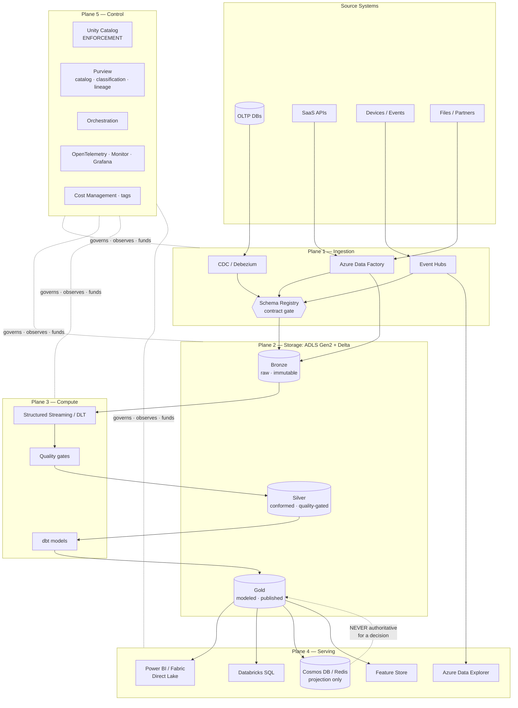
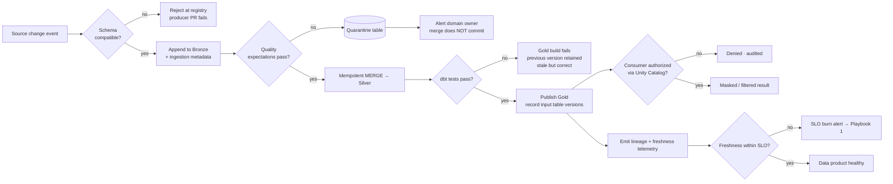
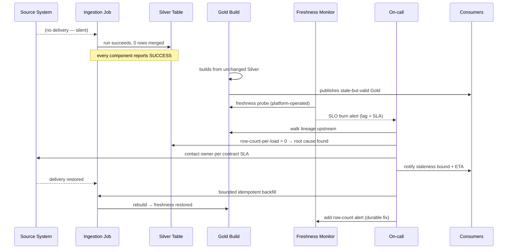

# Capstone: Enterprise Data Platform

## Executive Summary

This capstone assembles the preceding nineteen phases into one buildable, defensible enterprise data platform on Azure. It is not a survey. It is a single coherent reference architecture — ingestion through lakehouse through serving, wrapped in governance, security, networking, FinOps, and operability — presented at the level of detail a Principal Architect would be expected to defend in a design review and an accountable engineering leader would be expected to fund.

The platform's shape is deliberate. A landing zone (per [Azure Landing Zones](../Phase-03/03_Azure_Landing_Zones.md)) provides the isolated, policy-governed substrate. Batch and streaming ingestion converge on a single open-format storage layer — Delta Lake on ADLS Gen2 (per [Delta Lake](../Phase-04/04_Delta_Lake.md)) — organized in medallion tiers (per [Medallion Architecture](../Phase-05/03_Medallion_Architecture.md)). Databricks with Unity Catalog is the primary compute and governance plane. Serving is deliberately split by consumption pattern rather than unified into one engine. Governance, quality, and lineage are computational (enforced by policy and CI, per [Data Contracts](../Phase-08/07_Data_Contracts.md) and [Data Quality with Great Expectations](../Phase-08/03_Data_Quality_with_Great_Expectations.md)), not advisory. Everything is provisioned as code and promoted through environments by GitOps (per [Infrastructure as Code with Terraform](../Phase-09/04_Infrastructure_as_Code_with_Terraform.md) and [GitOps and Environment Management](../Phase-09/08_GitOps_and_Environment_Management.md)).

The central thesis of this capstone, and the thing that distinguishes a real platform from an assembled set of services, is this: **the platform's value lives in the contracts between its layers, not in the layers themselves.** Every arrow in the reference architecture is a designed, versioned, enforced interface — a schema contract at ingestion, a table format contract at storage, a semantic contract at serving, a policy contract at every access boundary. Teams that build each layer competently but leave the seams implicit produce exactly the failure mode this handbook has documented across nineteen phases: every component's own metrics stay green while the system as a whole silently degrades.

A second thesis is nearly as important and considerably less popular: **most of the platform's hard problems are not technical.** Ownership, funding, decision rights, and the discipline to say no to a request are what determine whether the platform is used or bypassed. That is why this chapter treats governance, cost accountability, and operating model as first-class architecture, and why the Phase-19 leadership material is a prerequisite for actually shipping what is drawn here, not an optional soft-skills appendix.

## Learning Objectives

By the end of this chapter you should be able to:

1. Draw and defend an end-to-end enterprise data platform reference architecture on Azure, naming concrete services, tiers, and the reason each was chosen over its alternatives.
2. Specify the contract at every layer boundary — ingestion schema, storage table format, serving semantic model, access policy — and explain why the contract, not the component, is the unit of reliability.
3. Design ingestion for both batch and streaming without duplicating business logic across the two paths.
4. Lay out a medallion lakehouse with explicit ownership, quality gates, and retention per tier.
5. Choose a serving topology by consumption pattern (BI, ad-hoc SQL, low-latency lookup, ML feature retrieval) rather than standardizing on one engine.
6. Implement network isolation, identity, and data protection to a private-endpoint-only, managed-identity-only baseline.
7. Build cost accountability into the platform structurally — allocation tags enforced at provisioning, unit-economics metrics per workload.
8. Define SLOs and error budgets for data products, and instrument the platform so that a breach is detected by the platform, not by the consumer.
9. Write the ADR set that a platform of this scope requires, and know which decisions genuinely warrant one.
10. Identify the failure modes that destroy platforms of this shape and the structural (not procedural) defenses against each.

## Business Motivation

Enterprises do not fund data platforms because they want a lakehouse. They fund them because the alternative — every team independently acquiring, storing, transforming, securing, and serving its own data — produces four compounding costs that eventually become visible at the board level.

**Duplicated infrastructure spend.** Eight teams each running their own ingestion, storage, orchestration, and catalog costs several times what one shared platform costs, as quantified in [Data Mesh Principles](../Phase-15/01_Data_Mesh_Principles.md). The duplication is invisible on any single team's budget line, which is precisely why it survives for years.

**Inconsistent numbers.** When finance, product, and operations each compute "active customers" from their own pipeline, executive meetings become reconciliation exercises. The cost is not the compute; it is the decision latency and the erosion of trust in every number the organization produces. A shared semantic layer (per [Semantic Layer and Metrics](../Phase-06/06_Semantic_Layer_and_Metrics.md)) exists to make one definition authoritative.

**Unbounded regulatory exposure.** Data copied into unmanaged locations cannot be classified, access-controlled, retained, or erased on request. Every uncatalogued copy is an open liability under the frameworks in [Compliance and Regulatory Frameworks](../Phase-10/06_Compliance_and_Regulatory_Frameworks.md) and an unfulfillable erasure obligation under [Data Privacy and PII Protection](../Phase-10/07_Data_Privacy_and_PII_Protection.md).

**Slow time-to-first-insight.** In a fragmented estate, a new analytical question requires locating data, negotiating access, building a pipeline, and validating results — routinely six to twelve weeks. On a governed platform with a catalog, contracts, and golden paths, the same question is days. That delta, multiplied across the annual question volume of a large organization, is the platform's actual return.

The honest counter-case matters too. A platform of this scope is not justified for a small organization with a handful of data sources and one analytics team; a well-run Postgres database and dbt will outperform it on every dimension including speed. The threshold is roughly: multiple independent consuming teams, multiple source systems under separate ownership, and a regulatory or scale constraint that a single database cannot absorb. Below that threshold this architecture is over-engineering, and the discipline to say so is part of the architect's job.

## History and Evolution

The shape of this platform is the accumulated result of four distinct architectural eras, each of which solved the prior era's dominant problem and introduced its own.

**Enterprise data warehouse era (roughly 1990–2010).** Inmon's corporate information factory and Kimball's dimensional modeling (per [Dimensional Modeling](../Phase-06/01_Dimensional_Modeling.md)) established the idea of a governed, conformed, single source of analytical truth. Teradata, Netezza, and later SQL Server and Oracle appliances made it real. Strengths: strong schema, strong governance, excellent BI performance. Weakness: schema-on-write meant every new data type required a modeling project, and semi-structured and high-volume machine data simply did not fit.

**Hadoop / data lake era (roughly 2006–2016).** HDFS and MapReduce, then Hive and Spark, inverted the trade-off: store anything cheaply, impose schema at read time. This solved the data-variety problem and broke the storage cost curve. It also produced the data swamp — ungoverned, uncatalogued, unqueryable object stores with no transactional guarantees, no schema enforcement, and no reliable way to update or delete a record. The lesson, which this platform encodes structurally, is that cheap storage without governance is not an asset.

**Cloud data warehouse and modern data stack era (roughly 2013–2020).** Redshift (2013), BigQuery, and Snowflake (2014 GA) separated storage from compute and made elastic SQL analytics routine. dbt (2016) made transformation a software-engineering discipline (per [dbt and Analytics Engineering](../Phase-05/08_dbt_and_Analytics_Engineering.md)). This era restored governance and performance but re-introduced a proprietary-format lock-in problem and left ML workloads awkwardly outside the warehouse.

**Lakehouse era (2017–present).** Delta Lake (Databricks, open-sourced 2019), Apache Iceberg (Netflix, 2018), and Apache Hudi (Uber, 2017) brought ACID transactions, schema enforcement, time travel, and efficient upserts to open file formats on object storage. Databricks' 2021 lakehouse paper named the pattern (per [Lakehouse Architecture](../Phase-05/02_Lakehouse_Architecture.md)). Unity Catalog (2022) and Microsoft Fabric with OneLake (GA 2023, per [Microsoft Fabric](../Phase-05/07_Microsoft_Fabric.md)) added the unified governance plane the lake era lacked. Iceberg's 2024–2025 momentum — including Databricks' Tabular acquisition and broad multi-engine support — has pushed the industry toward format interoperability rather than a single winner.

The organizational layer evolved on a parallel track: Zhamak Dehghani's data mesh articles (2019, 2020) reframed scaling as a socio-technical rather than purely technical problem (per [Data Mesh Principles](../Phase-15/01_Data_Mesh_Principles.md)), and the FinOps Foundation (2020) and FOCUS billing specification (v1.0, 2024) gave cost accountability a vocabulary (per [FinOps and Cost Optimization](../Phase-18/01_FinOps_and_Cost_Optimization.md)).

This capstone's architecture is the current synthesis: open table formats on object storage, one governance plane, decomposed serving, computational policy, and explicit domain ownership.

## Why This Technology Exists

An enterprise data platform exists to solve one structural problem: **the number of point-to-point data integrations grows quadratically with the number of systems, while the value of any single integration stays constant.**

With N source systems and M consumers, direct integration requires up to N×M pipelines, each independently built, secured, monitored, and maintained by whoever needed it. Every schema change in a source breaks an unknown number of downstream consumers whose existence the source team was never told about. This is the same N×M-to-N+M argument that motivates a message broker (per [Message Brokers and Queues](../Phase-14/07_Message_Brokers_and_Queues.md)) and the Model Context Protocol (per [Model Context Protocol (MCP)](../Phase-12/06_Model_Context_Protocol_MCP.md)), applied to analytical data.

A platform converts N×M into N+M by introducing a governed intermediary: sources publish once, against a contract; consumers subscribe once, against the same contract. But — and this is the part organizations consistently underestimate — the intermediary only delivers that reduction if it is genuinely authoritative. A platform that consumers can bypass, or that sources can publish around, adds a hop without removing any integrations. It becomes an N×M+1 architecture, which is strictly worse than what it replaced.

That is the deeper reason governance is not a layer bolted onto this platform: the platform's core economic argument depends on it being the only sanctioned path. Everything in the Governance, Security, and Enterprise Recommendations sections below exists to make the governed path the *easiest* path, because a path that is authoritative by mandate but painful in practice will be routed around.

## Problems It Solves

- **Integration explosion.** N+M publish/subscribe against contracts instead of N×M bespoke pipelines.
- **Schema drift breaking consumers silently.** Enforced contracts with backward-compatibility checks in CI (per [Data Contracts](../Phase-08/07_Data_Contracts.md)) turn a production incident into a failed pull request.
- **Inconsistent metric definitions.** One governed semantic layer makes "revenue" mean one thing organization-wide.
- **Ungoverned data copies.** A catalog plus policy-enforced access removes the incentive to copy data out, and makes remaining copies discoverable.
- **Compliance unfulfillability.** Classification, lineage, retention, and verified erasure become mechanically possible because there is one place to apply them.
- **Batch/stream logic duplication.** A shared transformation layer over a single storage substrate lets one business rule serve both latencies.
- **Unattributable cost.** Enforced allocation tagging plus unit-economics metrics make every euro traceable to an owner and a workload.
- **Reprocessing and correction.** ACID table formats with time travel make "recompute last quarter correctly" a routine operation rather than a heroic one.
- **Onboarding latency.** Golden paths and templates reduce new-data-product time from weeks to days (per [Self-Serve Data Platform](../Phase-15/05_Self_Serve_Data_Platform.md)).

## Problems It Cannot Solve

Being explicit about the limits is what makes the rest defensible.

- **Bad source data.** The platform can detect, quarantine, and report quality failures. It cannot make an upstream operational system capture correct data. Quality fixes belong at the source; everything downstream is mitigation.
- **Absent or contested ownership.** If no one owns a domain's data, the platform will surface that fact faster and more publicly. It will not resolve it. This is an organizational decision, addressed in [Federated Governance](../Phase-15/04_Federated_Governance.md).
- **Disagreement about what a metric means.** A semantic layer records an agreed definition. Reaching agreement is a stakeholder problem (per [Stakeholder Management](../Phase-19/03_Stakeholder_Management.md)), not a modeling problem.
- **Latency below the low-milliseconds floor.** An analytical lakehouse serving path is not an OLTP system. Sub-10ms point lookups belong in Cosmos DB or Redis, fed by the platform, not served from Delta tables.
- **Legal or ethical judgment.** Classification automation proposes; humans decide. The frameworks in [Responsible AI](../Phase-11/07_Responsible_AI.md) apply undiminished.
- **Organizational bypass.** If leadership does not back the platform as the sanctioned path, no technical control prevents a well-funded team from building a shadow stack.
- **Being cheaper than doing nothing, immediately.** Year one is an investment. Platforms justified on year-one savings are usually mis-sold and later resented.

## Core Concepts

### 1.1 The Contract-First Layer Boundary

Every boundary in this platform is a versioned contract, and the contract is the unit of reliability. Four boundaries matter most:

| Boundary | Contract artifact | Enforced by | Breaking-change consequence |
|---|---|---|---|
| Source → Bronze | Schema + semantics + SLA (Avro/JSON Schema/Protobuf in a registry) | Schema registry + CI compatibility check | PR fails; producer cannot ship |
| Bronze → Silver | Delta table schema + quality expectations | Delta schema enforcement + Great Expectations gate | Batch quarantined; alert to owner |
| Silver → Gold | Dimensional / semantic model contract | dbt tests + semantic-layer definitions | Model build fails; stale Gold retained |
| Gold → Consumer | Data product SLA + access policy | Unity Catalog grants + platform-operated SLA probe | Consumer notified via published deprecation window |

The critical property is that each contract is **enforced computationally at the moment of change**, not audited afterwards. This is the same principle as fail-closed policy in [Federated Governance](../Phase-15/04_Federated_Governance.md) §4.2: an advisory standard is a suggestion, and suggestions erode.

Contracts must also carry an explicit **deprecation protocol**. The most consequential data-platform failure mode after schema drift is silent deprecation — a producer stops maintaining a dataset without telling consumers, and downstream numbers quietly go stale rather than loudly break (per [Data Products](../Phase-15/02_Data_Products.md) §23).

### 1.2 Medallion Tiers as Ownership and Trust Boundaries

The bronze/silver/gold tiering (per [Medallion Architecture](../Phase-05/03_Medallion_Architecture.md)) is commonly taught as a data-quality progression. That is true but incomplete. In an enterprise platform the tiers are primarily **ownership and trust boundaries**:

- **Bronze** — raw, immutable, append-only, source-fidelity. Owned by the *ingestion* function. Schema is whatever the source sent, plus ingestion metadata (`_ingested_at`, `_source_file`, `_batch_id`). Never exposed to business consumers. Retention driven by reprocessing needs and regulation, not by analytical demand.
- **Silver** — cleansed, conformed, deduplicated, typed, quality-gated. Owned by the *domain* team. This is where business logic lives and where the data first becomes trustworthy. Most ML feature engineering reads from here.
- **Gold** — aggregated, modeled for consumption (star schemas per [Dimensional Modeling](../Phase-06/01_Dimensional_Modeling.md), or wide denormalized serving tables). Owned by the *consuming domain or analytics engineering* function. This is the published data product surface.

A common and costly mistake is treating the tiers as a mandatory three-hop pipeline for every dataset. Some datasets legitimately go bronze → gold. Some need a fourth intermediate tier. The tiers are a **classification of trust and ownership**, not a fixed pipeline topology, and enforcing them as the latter produces pointless copies and cost.

### 1.3 Serving Decomposition by Consumption Pattern

There is no single engine that serves BI dashboards, ad-hoc exploration, low-latency application lookups, and ML feature retrieval well. Attempting to unify them produces an engine tuned for none of them. The platform therefore decomposes serving deliberately:

| Consumption pattern | Latency target | Concurrency | Azure choice | Why |
|---|---|---|---|---|
| Governed BI dashboards | 1–3 s | High (100s–1000s) | Power BI Direct Lake on Fabric, or Import over Gold Delta | Semantic model + caching + row-level security |
| Ad-hoc analyst SQL | 5–60 s | Medium | Databricks SQL Warehouse (serverless) | Full SQL over the lakehouse, no copy |
| Application point lookup | < 50 ms | Very high | Cosmos DB / Azure SQL, fed from Gold | Lakehouse cannot meet this; do not try |
| Real-time operational analytics | < 1 s over recent data | High | Azure Data Explorer (ADX) | Purpose-built time-series/log engine (per [Real-Time Analytics with ClickHouse and Druid](../Phase-07/07_Real_Time_Analytics_ClickHouse_and_Druid.md)) |
| ML feature retrieval (online) | < 20 ms | Very high | Databricks Feature Store online store | Point-in-time correctness plus low latency |

The governing rule, carried directly from [Retail and E-Commerce Data](../Phase-17/05_Retail_and_Ecommerce_Data.md) §ADR-0192: **a fast denormalized serving copy is for reads, never for authoritative decisions.** Every serving store is a projection of Gold; Gold is the source of truth. If a consumer needs to make an irreversible decision (a payment, a regulatory filing, an erasure), it must read from or reconcile against the authoritative table, not the cached projection.

### 1.4 One Governance Plane, Not Several

The single most damaging structural error in large data platforms is governance fragmentation: Unity Catalog grants for Databricks, separate ADLS ACLs for direct-storage access, separate Power BI workspace permissions, a Purview catalog that reflects none of them accurately, and a spreadsheet of exceptions. Each mechanism is individually correct; together they guarantee that the effective permission set is unknowable.

The platform mandates: **all lakehouse data access flows through Unity Catalog.** Direct ADLS access by users or applications is disabled by default; storage credentials are held by the catalog's managed identity, not distributed. Purview provides the enterprise-wide catalog, classification, and lineage overlay (per [Microsoft Purview](../Phase-08/06_Microsoft_Purview.md)), and Unity Catalog is the enforcement point. Two systems with clearly separated jobs — discovery/classification versus enforcement — is coherent. Two systems that both partially enforce is not.

This is the platform-scale application of the access-control-propagation principle that recurs throughout this handbook (RAG in [Retrieval Augmented Generation](../Phase-12/03_Retrieval_Augmented_Generation.md), MCP servers, GraphRAG community summaries, healthcare de-identified projections): *an intermediary must propagate the caller's identity to the authoritative access check, never substitute a privileged service account.*

### 1.5 Platform as Product, Not Project

A platform funded as a project ends when the project ends, and then decays. The operating model must treat it as a product with a permanent owning team, a roadmap, published SLAs, and adoption metrics (per [Self-Serve Data Platform](../Phase-15/05_Self_Serve_Data_Platform.md) and [Platform Engineering](../Phase-09/02_Platform_Engineering.md)).

The single most useful health metric is **golden-path adherence rate**: the fraction of new data products created via the platform's templates versus hand-rolled. A falling adherence rate is the leading indicator that the platform is becoming a bottleneck, and it falls months before any lagging indicator (cost, incidents, shadow IT discovery) shows the problem.

## Internal Working

### 2.1 How a Record Traverses the Platform

Trace a single order record from an operational system to a dashboard, because the mechanics at each hop are where the design decisions actually bite.

1. **Change capture.** Debezium or Azure SQL CDC emits a change event (per [Change Data Capture](../Phase-07/06_Change_Data_Capture.md)) containing before/after images, an LSN, and a commit timestamp. The commit timestamp — not the ingestion timestamp — is the event time that all downstream windowing and point-in-time logic must use.
2. **Transport.** The event lands in Event Hubs, partitioned by `order_id` so that all changes to one order are strictly ordered within a partition. Ordering is scoped to the key, never channel-wide (per [Message Brokers and Queues](../Phase-14/07_Message_Brokers_and_Queues.md) §8.3).
3. **Schema validation.** The producer serialized against a registered schema; the consumer deserializes against the same registry. An incompatible producer change fails at the registry, before publication.
4. **Bronze append.** A Structured Streaming job (per [Spark Structured Streaming](../Phase-07/05_Spark_Structured_Streaming.md)) with Auto Loader appends raw payloads plus ingestion metadata to a Bronze Delta table. Exactly-once *effect* is achieved by Delta's transactional commit combined with checkpointed offsets — not by any exactly-once guarantee in the broker, which does not exist unconditionally.
5. **Silver merge.** A `MERGE INTO` deduplicates on `(order_id, commit_lsn)` and applies the change to the current-state Silver table, or writes a Type-2 history row (per [Slowly Changing Dimensions](../Phase-06/05_Slowly_Changing_Dimensions.md)). Great Expectations validates the batch; failures route to a quarantine table and raise an alert against the owning domain, and the merge does not commit.
6. **Gold model.** dbt builds the fact and dimension tables, running its tests as a build gate. A failed test leaves the previous Gold version in place — stale but correct — rather than publishing wrong numbers. This choice (fail-closed toward staleness) is deliberate and must be an explicit, documented decision per dataset, because for some datasets stale is worse than approximate.
7. **Serving.** Power BI reads Gold via Direct Lake; the semantic model applies row-level security; Unity Catalog applies column masks for restricted attributes. The analyst never touches storage directly.
8. **Lineage.** Every hop emits OpenLineage events; Purview and Unity Catalog assemble the column-level lineage graph that makes step 6's impact analysis possible.

### 2.2 The Two Consistency Regimes

The platform runs two consistency regimes simultaneously and must never let them blur.

**The streaming regime** is eventually consistent with bounded staleness. Silver tables fed by streaming are correct as of some watermark; late-arriving events are absorbed by the merge. Consumers must be told the staleness bound as part of the contract, and the platform must measure and alert on it — a freshness SLO, not an assumption.

**The batch regime** is transactionally consistent as of a snapshot. A nightly Gold build reads a consistent Delta snapshot version and produces a coherent set of outputs.

The failure occurs when a Gold model joins a streaming-fed Silver table to a batch-fed one without an explicit as-of alignment: the join silently mixes two different logical points in time. Every result is plausible, none is reproducible. The defense is that every Gold model declares the Delta table versions it read, so any output can be reproduced exactly — the platform-scale form of the bitemporal golden-source discipline from [Financial Data Platforms](../Phase-17/02_Financial_Data_Platforms.md) §ADR-0189.

### 2.3 Why Small Files Are the Platform's Default Failure Mode

Streaming ingestion writes frequently and therefore writes small. A Bronze table fed by a streaming job with a 30-second trigger accumulates 2,880 files per day per partition. Query planning cost scales with file count; at a few hundred thousand files, listing and metadata resolution dominate query time and the table becomes effectively unqueryable regardless of how much compute is applied.

This is the single most common cause of "the lakehouse got slow and nobody knows why," and it is entirely mechanical: it develops gradually, no single deployment causes it, and every individual write succeeds. The structural defense is that compaction (`OPTIMIZE`, and liquid clustering where available) is a **scheduled, monitored platform-owned operation with its own SLO on average file size** — not something a team remembers to run. Adding compute to a small-file problem is the platform-scale version of the scale-before-profile anti-pattern in [Performance Engineering](../Phase-18/05_Performance_Engineering.md).

## Architecture

The platform is organized in six planes. Each plane has an owner, an interface, and its own SLOs.

**Plane 0 — Landing zone and network.** Subscription topology, hub-and-spoke VNet, private endpoints, Azure Policy, Entra ID tenancy. Owned by cloud platform engineering. Per [Azure Landing Zones](../Phase-03/03_Azure_Landing_Zones.md) and [Azure Networking](../Phase-03/04_Azure_Networking.md).

**Plane 1 — Ingestion.** Batch (ADF/Databricks pipelines, per [Azure Data Factory and Synapse](../Phase-05/06_Azure_Data_Factory_and_Synapse.md)), streaming (Event Hubs + Structured Streaming, per [Azure Event Hubs and Stream Analytics](../Phase-07/03_Azure_Event_Hubs_and_Stream_Analytics.md)), and CDC. Interface: the registered schema contract. Owned by the platform team; individual connectors owned by source domains.

**Plane 2 — Storage.** ADLS Gen2 with hierarchical namespace, Delta Lake tables in medallion containers. Interface: Delta table + Unity Catalog registration. Per [Object Storage and Data Lakes](../Phase-04/03_Object_Storage_and_Data_Lakes.md) and [Azure Storage Services](../Phase-03/06_Azure_Storage_Services.md).

**Plane 3 — Compute and transformation.** Databricks job clusters, DLT pipelines, SQL warehouses; dbt for Gold modeling. Interface: the job/task specification and its declared inputs and outputs. Per [Apache Spark Internals](../Phase-05/04_Apache_Spark_Internals.md) and [Databricks Platform](../Phase-05/05_Databricks_Platform.md).

**Plane 4 — Serving.** Power BI / Fabric, Databricks SQL, ADX, Cosmos DB projections, feature store. Interface: the published data product and its SLA.

**Plane 5 — Control (cross-cutting).** Unity Catalog, Purview, Azure Policy, Key Vault, orchestration (Airflow or Databricks Workflows, per [Orchestration with Airflow](../Phase-09/07_Orchestration_with_Airflow.md)), observability (per [Observability with OpenTelemetry](../Phase-18/02_Observability_with_OpenTelemetry.md)), and cost management. This plane spans all others and is what makes them a platform rather than a pile.

The layering discipline: a plane may depend on the plane below it and on Plane 5, and on nothing else. A serving component reaching directly into raw storage, or an ingestion job writing Gold, is an architecture violation and is detectable in lineage.

## Components

| Component | Azure service | Tier / SKU guidance | Notes |
|---|---|---|---|
| Object storage | ADLS Gen2 | Standard GPv2, HNS enabled, ZRS (prod) | Lifecycle policy Hot→Cool→Archive per tier |
| Table format | Delta Lake | Latest supported protocol; enable deletion vectors, liquid clustering | Iceberg via UniForm where multi-engine reads are required |
| Batch orchestration | Azure Data Factory or Databricks Workflows | ADF for source-system connectivity breadth | Airflow on AKS where DAG complexity or portability dominates |
| Streaming ingest | Event Hubs | Premium or Dedicated for prod; Standard for dev | Kafka protocol endpoint keeps producer code portable |
| Stream processing | Databricks Structured Streaming | Job compute, autoscaling, Photon | Flink on AKS only where sub-second, complex-event processing is genuinely required |
| CDC | Debezium, or ADF/SQL native CDC | — | Prefer log-based over query-based polling |
| Compute | Databricks | Job clusters (spot workers, on-demand driver); Serverless SQL for warehouses | Never interactive clusters for production jobs |
| Transformation modelling | dbt Core (on Databricks) | — | Tests as build gate |
| Data quality | Great Expectations, or DLT expectations | — | Quarantine, do not silently drop |
| Governance / access | Unity Catalog | — | Single enforcement point; ABAC via tags |
| Catalog / classification / lineage | Microsoft Purview | — | Discovery + classification overlay |
| Secrets | Azure Key Vault (Premium/Managed HSM for CMK) | — | Referenced, never copied (per [Secrets and Key Management](../Phase-10/05_Secrets_and_Key_Management.md)) |
| BI | Power BI Premium / Fabric capacity | F-SKU sized to peak concurrency | Direct Lake over Gold |
| Real-time analytics | Azure Data Explorer | Optimized-for-compute; hot cache window tuned | Distinct from lakehouse, deliberately |
| Low-latency serving | Cosmos DB / Azure SQL / Redis | Chosen per access pattern | Projection of Gold, never authoritative |
| Feature store | Databricks Feature Store | — | Offline in Delta, online in Cosmos DB |
| IaC | Terraform + Bicep | — | Terraform for Databricks/multi-provider; Bicep for pure Azure |
| CI/CD | Azure DevOps or GitHub Actions | — | Workload identity federation, no secrets |
| Observability | Azure Monitor + Managed Prometheus/Grafana + OpenTelemetry | — | Per [Monitoring with Prometheus and Grafana](../Phase-18/03_Monitoring_with_Prometheus_and_Grafana.md) |

## Metadata

Metadata is the platform's control substrate; treating it as documentation is the error that produces swamps.

**Technical metadata** — schemas, table versions, partition layout, file statistics, job run history. Owned by the platform, generated automatically, never hand-maintained. Delta's transaction log is the authoritative source for table-level technical metadata; Unity Catalog surfaces it.

**Business metadata** — glossary terms, ownership, classification, purpose. Requires human input, so the platform must minimize how much: classification is auto-proposed by Purview scanners and *confirmed* by a human, not authored from scratch. Terms link to the business glossary (SKOS-equivalent, per [Ontologies and Taxonomies](../Phase-13/05_Ontologies_and_Taxonomies.md) §ADR-0168 — do not build an OWL ontology for a glossary).

**Operational metadata** — freshness, volume, run duration, cost per run, quality-check results. This is what makes SLOs measurable and is emitted by every job as structured telemetry, not scraped from logs.

**Lineage metadata** — column-level, captured via OpenLineage from Spark, dbt, and ADF. Lineage is not a diagram for humans; it is the mechanism that answers three operational questions: *what breaks if I change this column* (impact analysis), *where did this number come from* (audit), and *which downstream copies must I also erase* (privacy, per [Data Privacy and PII Protection](../Phase-10/07_Data_Privacy_and_PII_Protection.md) §ADR-0147).

The metadata contract that matters most is **classification propagation**: a column classified as PII in Bronze must carry that classification into every derived Silver, Gold, feature, and BI extract. Classification that stops at the source table is the mechanism by which restricted data reaches an unrestricted dashboard.

## Storage

**Layout.** One storage account per environment per data-classification zone, with containers per medallion tier. Directory structure `/{tier}/{domain}/{entity}/` — domain before entity, so that domain-level access grants and lifecycle policies are expressible as prefix rules.

**Partitioning.** Partition by ingestion or event date for large fact tables; do not partition small tables at all (a partitioned 5 GB table is a small-file generator). Prefer Delta liquid clustering over Hive-style partitioning for new tables where available — it avoids the irreversible-partition-key mistake, which is the most expensive schema decision to reverse in a lakehouse.

**File sizing.** Target 128 MB–1 GB per file. Enforce with scheduled `OPTIMIZE`, and monitor average file size per table as a first-class metric with an alert threshold (see Monitoring).

**Retention by tier.**

| Tier | Typical retention | Driver | VACUUM retention |
|---|---|---|---|
| Bronze | 90 days hot, then Archive to regulatory limit | Reprocessing + audit | 7 days minimum; longer if time travel is relied upon |
| Silver | 2–7 years | Business + regulatory | 30 days |
| Gold | Aligned to reporting obligations | Regulatory | 30 days |

**The erasure caveat.** `DELETE` on a Delta table does not remove data physically; the old files remain until `VACUUM` past the retention window. A GDPR Article 17 erasure is not complete until physical removal is *verified*. This is the same verification-gap pattern as CMK rotation and secret rotation, and it must be an explicit two-stage workflow with a verification step, not an assumption.

**Compression and encoding.** Parquet with ZSTD for cold/archival tiers (better ratio), Snappy for hot query paths (faster decompression). Column-level encoding matters more than most teams assume — see [Compression and Encoding](../Phase-04/08_Compression_and_Encoding.md).

## Compute

**Cluster policy is the primary cost and safety control.** Databricks cluster policies constrain node types, autoscaling bounds, auto-termination, spot ratio, and required tags. Without enforced policies, cost governance is a monthly apology.

```json
{
  "spark_version": { "type": "regex", "pattern": "1[45]\\.[0-9]+\\.x-scala2\\.12" },
  "node_type_id": { "type": "allowlist", "values": ["Standard_D8ads_v5", "Standard_D16ads_v5"] },
  "autotermination_minutes": { "type": "range", "minValue": 10, "maxValue": 60, "defaultValue": 20 },
  "autoscale.min_workers": { "type": "range", "minValue": 1, "maxValue": 4 },
  "autoscale.max_workers": { "type": "range", "minValue": 2, "maxValue": 32 },
  "azure_attributes.availability": { "type": "fixed", "value": "SPOT_WITH_FALLBACK_AZURE" },
  "azure_attributes.first_on_demand": { "type": "fixed", "value": 1 },
  "custom_tags.cost_center": { "type": "unlimited", "isOptional": false },
  "custom_tags.data_product": { "type": "unlimited", "isOptional": false }
}
```

**Workload separation.** Production ETL runs on ephemeral job clusters — created per run, terminated after. Interactive analysis runs on separate, policy-capped clusters. SQL serving runs on serverless SQL warehouses. Mixing these is how a data scientist's forgotten notebook ends up costing more than the production pipeline.

**Spot strategy.** Driver on-demand, workers spot with fallback. This survives worker preemption (Spark reschedules the task) but not driver preemption (the job dies). Batch ETL tolerates this; anything with a tight SLO or a long non-checkpointed stage should not use spot for the critical path.

**Photon and AQE.** Enable Photon for SQL-heavy and scan-heavy workloads; measure rather than assume — Photon's benefit is workload-dependent and its DBU premium is real. Adaptive Query Execution with skew-join handling should be on by default; data skew is the dominant distributed-performance failure (per [Performance Engineering](../Phase-18/05_Performance_Engineering.md) Case Study 1).

## Networking

The baseline is non-negotiable and follows [Network Security and Zero Trust](../Phase-10/04_Network_Security_and_Zero_Trust.md) §ADR-0144:

- **Private endpoints only.** ADLS, Key Vault, Event Hubs, SQL, Cosmos DB, and the Databricks workspace front-end and back-end all reachable exclusively via Private Link. Public network access explicitly disabled on each resource — adding a private endpoint without disabling public access is the single most common half-done implementation of this control.
- **VNet injection for Databricks.** Workspace deployed into customer-managed VNet with separate host and container subnets; secure cluster connectivity (no public IPs on cluster nodes).
- **Default-deny egress.** All outbound traffic through Azure Firewall with an explicit FQDN allowlist. Databricks requires a specific set of control-plane, artifact, and metastore endpoints; these are documented and must be allowlisted deliberately, not solved by opening egress.
- **Hub-and-spoke.** Shared services (firewall, DNS, bastion) in the hub; each environment a spoke. Private DNS zones centrally managed in the hub — decentralized private DNS is a reliable source of intermittent, hard-to-diagnose resolution failures.
- **No data-plane access from user devices.** Analysts reach the platform through the Databricks workspace or Power BI, both behind Entra ID Conditional Access, never by direct storage access.

## Security

Layered, following [Security Foundations](../Phase-10/01_Security_Foundations.md).

**Identity.** Managed identities and workload identity federation everywhere; no service principal secrets in pipelines (per [Identity and Access Management with Entra](../Phase-10/02_Identity_and_Access_Management_with_Entra.md) §ADR-0142). Human access via Entra groups only — never direct user grants, which become unauditable within a year. Privileged Identity Management for platform-admin roles, with just-in-time elevation and approval.

**Authorization.** Unity Catalog is the single enforcement point. Grants at catalog/schema level to Entra groups; row filters and column masks for restricted attributes; ABAC via tags for classification-driven policy ("mask any column tagged `pii.email` for anyone outside the `pii-approved` group"). Attribute-driven policy scales; per-table grants do not.

**Data protection.** Encryption at rest with customer-managed keys via Key Vault (envelope encryption, DEK/KEK) where classification requires it; TLS 1.2+ in transit everywhere. Rotation is automated *and verified* — the rotation itself succeeding is not evidence that dependent systems still work, which is the lesson of [Data Security and Encryption](../Phase-10/03_Data_Security_and_Encryption.md) §ADR-0143.

**Threat model.** The highest-value targets, in order: (1) the storage account keys or a SAS token with broad scope — hence keys disabled and SAS forbidden by policy; (2) a compromised CI/CD identity with deploy rights to production — hence federated credentials, environment approval gates, and least-privilege deployment scopes; (3) a notebook with an over-scoped attached identity — hence cluster-level identity scoping and no all-purpose admin credentials on shared compute; (4) exfiltration via unrestricted egress — hence default-deny.

**Secret handling.** Databricks secret scopes backed by Key Vault; secrets referenced at runtime, never materialized into notebooks or logs. Repository secret scanning (Gitleaks) in CI, scanning full history, not just the diff.

## Performance

Performance work on this platform follows the measurement-first discipline of [Performance Engineering](../Phase-18/05_Performance_Engineering.md) §ADR-0197: profile before optimizing, prioritize by measured contribution, tie to an SLO, verify the result.

The dominant levers, roughly in order of typical impact:

1. **File sizing / compaction.** Usually the largest single lever on a mature platform and the most neglected.
2. **Data skipping.** Z-order or liquid clustering on the columns that appear in filter predicates. Delta's min/max statistics only help if the layout correlates with the query pattern.
3. **Partition pruning.** Ensure predicates are on the partition column in a prunable form — a function applied to the partition column defeats pruning silently.
4. **Join strategy.** Broadcast small dimensions explicitly where AQE does not; verify with `EXPLAIN` rather than assuming.
5. **Data skew.** A single hot key (a default value, a null placeholder, a dominant tenant) puts 70% of a partition's rows on one task. AQE skew join plus salting. Horizontal scaling does not fix skew — this is Amdahl's law in distributed form.
6. **Spill.** Memory pressure forcing disk spill shows up in the Spark UI as a large "spill (disk)" figure; the fix is usually partition-count tuning or a broader node type, not more nodes.
7. **Caching.** Delta cache for repeated scans on the same cluster; result caching in SQL warehouses. Beware stale caches after a merge.

Set percentile targets, not averages: p95 pipeline duration and p99 query latency. An average hides exactly the tail the SLO cares about.

## Scalability

The platform scales along four independent axes, and they fail differently.

**Data volume.** Handled by object storage (effectively unbounded) plus partitioning and clustering. The binding constraint is not storage but metadata: a table with millions of files degrades regardless of data size. Scale-out here means compaction discipline, not bigger clusters.

**Concurrency.** BI concurrency scales via Fabric/Power BI capacity and caching; SQL concurrency via serverless warehouse scaling. The failure mode is queueing under peak, which is invisible in average latency and obvious in p99.

**Number of pipelines.** This is the axis that most often breaks first, and it is organizational. At 50 pipelines a central team can operate everything. At 500 it cannot, and the choices are: grow the central team linearly (does not work), or shift to domain ownership with a self-serve platform (per [Data Mesh Principles](../Phase-15/01_Data_Mesh_Principles.md)). The transition should be planned before it is forced.

**Number of consumers.** Scaling consumers is a *governance and contract* problem, not a compute problem. Each new consumer of a dataset increases the cost of changing it. Without published contracts and deprecation protocols, a widely-consumed table becomes unchangeable — the data-platform equivalent of an unversioned public API.

Note the sub-linear scaling property the platform must demonstrate to justify itself: doubling the number of domains should require substantially less than double the platform team, achieved through golden paths and templates rather than through headcount.

## Fault Tolerance

**Idempotency everywhere.** Every ingestion path must be safely re-runnable. Batch: overwrite a partition or `MERGE` on a natural key. Streaming: checkpointed offsets plus Delta's transactional commit. The unconditional rule, carried from [Event-Driven Architecture](../Phase-14/01_Event_Driven_Architecture.md): assume at-least-once delivery and make consumption idempotent; do not rely on exactly-once semantics that no component actually provides end to end.

**Quarantine, don't drop.** Records failing quality validation go to a quarantine table with the failure reason, not to `/dev/null`. Silent dropping produces a correct-looking pipeline with wrong totals.

**Time travel as the recovery mechanism.** A bad transformation that corrupted Silver is recovered by `RESTORE TABLE ... VERSION AS OF`, provided `VACUUM` has not yet reclaimed the files. This is a real, tested operational capability, not a feature bullet — and it must be tested, because the interaction between `VACUUM` retention and recovery-window expectations is where teams discover their recovery plan does not work.

**Backfill design.** Every pipeline must support a bounded backfill by date range, with its own idempotency. The Airflow `catchup=True` plus far-past `start_date` accidental mass-backfill is a documented, expensive, and entirely avoidable incident (per [Orchestration with Airflow](../Phase-09/07_Orchestration_with_Airflow.md)).

**Regional resilience.** ZRS storage within region; for genuine DR, GRS plus a documented, *rehearsed* failover runbook. An untested DR plan is a document, not a capability. Match the RTO/RPO to the quantified cost of the outage rather than defaulting to the highest tier — the "cost of an extra nine" calculation from [Reliability and SRE](../Phase-18/04_Reliability_and_SRE.md).

**Dependency isolation.** A failure in a non-critical enrichment source must not block the critical path. Bulkhead the DAG: mark optional enrichments as non-blocking and publish with a documented degradation flag rather than failing the whole pipeline.

## Cost Optimization

FinOps is structural here, per [FinOps and Cost Optimization](../Phase-18/01_FinOps_and_Cost_Optimization.md) §ADR-0193: every workload has an accountable owner, an enforced allocation tag, and at least one unit-economics metric.

**Enforced allocation.** Azure Policy denies resource creation without `cost_center`, `data_product`, and `environment` tags; Databricks cluster policies require the same as custom tags so DBU spend is attributable. Databricks `system.billing.usage` joined to Azure Cost Management gives complete attribution.

**Unit economics.** Track cost per pipeline run, cost per TB processed, and cost per data product per month. Absolute spend rising is uninformative if volume rose faster; cost-per-unit rising is a real signal.

**Standard levers.** Spot workers for batch (60–80% discount); auto-termination at 20 minutes; serverless SQL with aggressive auto-stop; reserved capacity or savings plans for the genuinely steady baseline only — long-dated narrow reservations outliving their workload is a documented failure (Phase-18/01 Case Study 2); lifecycle policies moving Bronze to Cool at 30 days and Archive at 90; `OPTIMIZE` to reduce both query cost and metadata overhead.

**Worked FinOps example.** A nightly Gold rebuild runs 3.5 hours on a 20-worker on-demand `Standard_D16ads_v5` cluster: roughly 20 × 3.5 = 70 node-hours plus driver, at roughly €0.80/node-hour compute plus €0.55/DBU-hour ≈ **€3,150/month** for that one job. Three changes: (1) spot workers with on-demand driver (≈70% off the VM component), (2) `OPTIMIZE` plus liquid clustering on the two largest source tables cutting runtime from 3.5 h to 1.4 h, (3) right-sizing from 20 to 12 workers now that scan time rather than parallelism was the bottleneck. Result ≈ **€610/month** — an ~80% reduction. Note the ordering: the runtime reduction came from measurement (the Spark UI showed scan-dominated stages), and the instance-count reduction was only safe *after* that measurement. Applying the discount lever alone would have saved 40% while leaving a job that was doing four times more I/O than necessary.

**The largest cost lever is usually deletion.** Datasets nobody consumes, pipelines nobody reads the output of, and BI extracts refreshing hourly for a dashboard viewed monthly. The adoption-metrics discipline from [Data Products](../Phase-15/02_Data_Products.md) §37 exists to make these findable and retirable.

## Monitoring

Monitoring answers known questions with thresholds; it is the alerting layer, and it must page only on symptoms consumers experience (per [Monitoring with Prometheus and Grafana](../Phase-18/03_Monitoring_with_Prometheus_and_Grafana.md) §ADR-0195).

**Pipeline health.** Job success/failure, duration versus baseline, retry counts. Critically: **alert on the absence of success, not only the presence of failure.** A job that never started emits no failure event. A freshness check (`time() - last_successful_run > threshold`) plus a dead-man's switch catches the silent-non-execution class that ordinary failure alerting misses entirely.

**Data quality.** Great Expectations / DLT expectation pass rates, quarantine volume and trend, null-rate and distribution drift on key columns.

**Freshness.** Per-table `max(event_time)` lag against the published SLA. This is the single most consumer-visible metric and belongs on the top-level dashboard.

**Volume.** Row counts per load against expected range — a load that succeeds with 3% of the usual rows is a failure that no exception surfaced.

**Storage health.** Average file size and file count per table, with an alert threshold. This is what catches small-file accumulation before it becomes an outage.

**Cost.** Daily spend by tag with anomaly detection. A sudden spike is both a FinOps and a security signal (cryptomining, exfiltration).

**Serving.** Query p95/p99, warehouse queue depth, BI dataset refresh success and duration, capacity utilization.

Paging policy: freshness SLO burn, Gold pipeline failure, and serving unavailability page a human. Everything else raises a ticket or a dashboard signal. Cause-level metrics (a single node's CPU, one cluster's memory) never page.

## Observability

Observability is the ability to ask questions you did not anticipate, and it depends on instrumentation discipline rather than on dashboards (per [Observability with OpenTelemetry](../Phase-18/02_Observability_with_OpenTelemetry.md) §ADR-0194).

Every pipeline stage emits OpenTelemetry spans with W3C Trace Context propagated across boundaries — including the asynchronous ones. Propagating trace context through an Event Hubs message header into the consuming Spark job is the step teams skip, and skipping it is exactly what makes an end-to-end latency regression invisible: every service's dashboard stays green while the trace silently breaks into disconnected fragments at the queue.

Structured logs carry `run_id`, `data_product`, `table`, and `trace_id`. Metrics carry low-cardinality labels only; the high-cardinality identifiers live in traces and exemplars, not in metric labels — the cardinality explosion that takes down a metrics backend is a self-inflicted, entirely preventable incident.

Data observability is a distinct discipline layered on top: freshness, volume, schema, distribution, and lineage as five continuously-monitored pillars. It complements — never replaces — data contracts and tests. Contracts prevent bad data from entering; observability detects what the contracts did not anticipate.

The correlation path that matters operationally: *freshness alert → pipeline trace → the stage that slowed → the specific Spark stage and its skew/spill profile → the upstream change that caused it.* If any hop in that chain is missing, root-cause analysis becomes archaeology.

## Operational Response Playbook

**Playbook 1 — Gold data is stale (freshness SLO breach).**

| Step | Action | Query / mechanism |
|---|---|---|
| Detect | Freshness SLO burn-rate alert on a Gold table | `SELECT current_timestamp() - max(event_time) FROM gold.orders` against SLA |
| Triage | Determine whether the pipeline failed, never ran, or ran slow | Workflow run history; dead-man's-switch state |
| Isolate | Walk lineage upstream to the first stale tier | Purview / Unity Catalog column-level lineage |
| Common cause A | Upstream source did not deliver | Check Bronze arrival; contact source owner per contract SLA |
| Common cause B | Job ran but merged zero rows (silent) | Row-count-per-load metric versus expected range |
| Common cause C | Job slowed past its window (skew/small files) | Spark UI: task duration distribution, spill, file count |
| Communicate | Notify consumers with the staleness bound and ETA before they ask | Data-product status channel |
| Mitigate | Re-run idempotent pipeline for the affected window; publish with a documented degradation flag if partial | Bounded backfill |
| Do NOT | Publish partial Gold silently, or scale the cluster before identifying the cause | — |
| Durable fix | Add the missed detection (freshness, row-count, or file-size alert) that would have caught it earlier | — |

**Playbook 2 — Unexpected access or an over-broad grant discovered.**

| Step | Action | Query / mechanism |
|---|---|---|
| Detect | Access review, audit-log anomaly, or a consumer reporting data they should not see | Unity Catalog audit logs; Purview classification report |
| Contain | Revoke the specific grant; do not broadly lock the catalog and cause an outage unless exposure is confirmed severe | `REVOKE ... ON ... FROM ...` |
| Scope | Determine what was actually queried, by whom, and when — exposure, not just permission | Audit log query over the grant's lifetime |
| Trace propagation | Find every derived table, feature, and BI extract carrying the same data | Column-level lineage |
| Assess | Classification of the data determines whether this is reportable | Purview classification + [Compliance and Regulatory Frameworks](../Phase-10/06_Compliance_and_Regulatory_Frameworks.md) |
| Root-cause | Direct user grant instead of group? Missing classification tag? Derived table that lost its classification? | Blameless analysis per [Reliability and SRE](../Phase-18/04_Reliability_and_SRE.md) |
| Do NOT | Treat "the grant is removed" as resolution — the propagated copies are the real exposure | — |
| Durable fix | Classification-propagation check in CI; ban direct user grants via policy; add the case as a permanent automated test | — |

## Governance

Governance on this platform is computational and federated, per [Data Governance Foundations](../Phase-08/01_Data_Governance_Foundations.md) and [Federated Governance](../Phase-15/04_Federated_Governance.md).

**Global policies** — deliberately few, enforced automatically, non-negotiable: every table registered in Unity Catalog; every table has a named owner; PII classified and masked by default; private-endpoint-only networking; enforced allocation tags; no direct storage-key access; retention and erasure per classification.

**Local policies** — owned by domains: modeling conventions within a domain, transformation approach, internal quality thresholds above the global floor, release cadence.

The test for whether a policy belongs in the global set: *does letting domains vary this create cross-domain harm?* If not, it is local. Global-policy scope creep reinstating the central bottleneck the platform exists to remove is a documented failure (Phase-15/04 Case Study 1), which is why the global policy list is reviewed semi-annually with authority both to add and to **remove**.

**Enforcement mechanisms**, in order of preference: Azure Policy at provisioning; CI gates in the data-product pipeline (schema compatibility, dbt tests, classification checks); Unity Catalog runtime policy; and only last, a human review. Human review is the most expensive and least reliable enforcement mechanism and should be reserved for genuinely novel decisions — which is exactly the right-sizing argument from [Architecture Reviews](../Phase-19/02_Architecture_Reviews.md) §ADR-0199.

**Decision rights.** A platform governance guild with domain representation, a written charter, and real authority. A guild that can only recommend produces the rubber-stamp failure mode; a guild that must approve everything produces the bottleneck failure mode. The resolution is narrow scope with genuine authority inside it.

## Trade-offs

| Decision | Option A | Option B | Trade-off |
|---|---|---|---|
| Table format | Delta Lake | Iceberg | Delta: deeper Databricks/Fabric integration, mature. Iceberg: broader engine neutrality, stronger multi-engine story. UniForm reduces the stakes; pick by which engines must read it |
| Compute platform | Databricks | Fabric / Synapse Spark | Databricks: performance, Unity Catalog maturity, ecosystem. Fabric: unified M365/Power BI experience, simpler licensing for BI-centric orgs. Running both is a real and common outcome; running both *without* a system-of-record decision is not |
| Orchestration | Databricks Workflows | Airflow | Workflows: zero ops, native. Airflow: cross-system DAGs, portability, richer scheduling. Complexity of cross-system dependencies is the deciding factor |
| Streaming engine | Structured Streaming | Flink | Structured Streaming: one codebase for batch and stream, lower ops. Flink: true low-latency and complex event processing. Do not adopt Flink for micro-batch-adequate needs |
| Serving | Direct Lake / lakehouse | Dedicated serving store | Lakehouse: no copy, no drift. Dedicated: latency and concurrency the lakehouse cannot reach. Decide by latency requirement, not preference |
| Governance | Unity Catalog only | Unity Catalog + Purview | UC alone: simpler, Databricks-scoped. Both: enterprise-wide catalog and classification. Justified once non-Databricks data assets matter |
| Ownership model | Central platform team | Federated domain ownership | Central: consistency, faster at small scale. Federated: scales, requires real platform investment. "Mesh in name only" — the vocabulary without the platform — is worse than either |
| Ingestion | ELT (land raw, transform in-platform) | ETL (transform in flight) | ELT: reprocessable, source-fidelity retained, default. ETT in flight: less storage, but the raw data is gone and a transformation bug is unrecoverable |
| Quality gate | Fail-closed (block bad data) | Fail-open (publish with flag) | Fail-closed for financial/regulatory; fail-open with explicit flags where staleness is worse than approximation. Must be decided *per dataset* and documented |

## Decision Matrix

**Do you need this platform at all?**

| Signal | Build this platform | Use something simpler |
|---|---|---|
| Independent consuming teams | 3+ | 1–2 |
| Source systems under separate ownership | 5+ | Few |
| Data volume | TB+ growing | GB, stable |
| Regulatory classification obligations | Yes | Minimal |
| Streaming requirement | Real | None |
| ML/AI workloads | Production | Ad-hoc |
| Team capable of operating it | Yes | No — this is disqualifying |

The last row is decisive and routinely ignored. A platform nobody can operate is a liability with a slide deck.

**Given that you do — which serving engine?**

| If the consumer needs… | Choose | Do not choose |
|---|---|---|
| Governed dashboards, high concurrency | Power BI / Fabric Direct Lake | ADX (wrong shape), Cosmos (wrong shape) |
| Exploratory SQL over full history | Databricks SQL warehouse | Power BI import (memory bound) |
| Point lookup under 50 ms | Cosmos DB / Redis projection | Any lakehouse query engine |
| Sub-second over recent time-series/log data | ADX | Delta table scan |
| Online ML features | Feature Store online store | Ad-hoc cache (train/serve skew) |

## Design Patterns

- **Medallion with explicit ownership per tier.** Tiers as trust and ownership boundaries, not a mandatory three-hop pipeline.
- **Contract-first ingestion.** Registered schema, CI compatibility gate, producer cannot ship a breaking change.
- **Quarantine-and-alert.** Failed records preserved with failure reason, owner notified, pipeline does not silently drop or silently pass.
- **Idempotent MERGE upsert.** Natural key plus change sequence; safely re-runnable.
- **Version-pinned reproducible build.** Every Gold model records the Delta versions of its inputs; any output reproducible exactly.
- **Projection, not duplication.** Serving stores are projections of Gold with declared staleness, never independent sources of truth.
- **Golden path templates.** New data product scaffolded from a template that ships with contract, tests, monitoring, tags, and CI already wired — making the governed path the fastest path.
- **Platform-operated SLA verification.** The platform independently probes each data product's freshness and quality; self-reported SLAs are not accepted (per [Data Products](../Phase-15/02_Data_Products.md) §ADR-0177).
- **Scheduled compaction with its own SLO.** File size is a monitored platform metric, not a team's discretionary chore.
- **Classification propagation.** Sensitivity tags flow with derived data automatically; a CI check fails a model whose output loses its inputs' classification.

## Anti-patterns

- **The re-implemented data swamp.** Delta tables that are unregistered, unowned, undocumented, and unclassified. The file format did not save you; governance would have.
- **Mandatory three-hop for everything.** Copying a small reference table through bronze, silver, and gold because "that's the architecture," tripling cost and latency for zero benefit.
- **Universal engine.** Forcing sub-second lookups out of the lakehouse or full-history exploration out of a BI import model.
- **Governance by spreadsheet.** A classification inventory maintained by hand that is wrong within a quarter.
- **Interactive clusters running production.** Cheap-looking, unreproducible, and the top source of surprise spend.
- **Direct user grants.** Grants to individuals rather than groups. Auditable on day one, unknowable by year two.
- **The "temporary" direct storage access exception.** Granted to unblock a deadline, never removed, and the mechanism by which the single-enforcement-point property is lost.
- **Fail-open quality checks.** Expectations that log a warning and pass. A quality gate that never blocks is a metrics dashboard, not a gate.
- **Untested time travel.** Depending on `RESTORE` for recovery without ever having exercised it against the actual `VACUUM` retention setting.
- **Cost review after the fact.** Discovering attribution gaps at year-end and doing a lossy retroactive tagging exercise, which is how tagging cleanups cause their own incidents.
- **Platform funded as a project.** No permanent owner, no roadmap, predictable decay.

## Common Mistakes

1. **Partitioning small tables**, generating small files and slowing every query.
2. **Choosing a partition key that cannot be changed later** — one of the few genuinely expensive-to-reverse lakehouse decisions. Prefer liquid clustering.
3. **Using ingestion time as event time**, silently corrupting every window and point-in-time join.
4. **Assuming exactly-once**, and skipping idempotency because the broker's marketing said so.
5. **Skipping trace-context propagation across the queue**, making end-to-end latency unmeasurable.
6. **Putting a high-cardinality identifier in a metric label**, and taking down the metrics backend.
7. **Treating `DELETE` as erasure** without the verified `VACUUM` stage.
8. **Deploying private endpoints without disabling public network access.**
9. **Letting classification stop at the source table**, so derived assets are unclassified and therefore unprotected.
10. **Running `OPTIMIZE` "when someone remembers."**
11. **Building Gold models on streaming and batch Silver tables without an as-of alignment**, producing plausible unreproducible numbers.
12. **Publishing a data product with no deprecation protocol**, guaranteeing that it can never be retired or changed.
13. **Sizing Fabric/Power BI capacity for average rather than peak concurrency**, producing month-end throttling.
14. **Estimating platform ROI on year-one savings**, then facing a credibility problem in month nine.

## Best Practices

- Make the governed path the fastest path. Every control that is slower than the workaround will be worked around.
- Enforce computationally at the point of change; audit after the fact only as a backstop.
- Give every table an owner, a contract, a freshness SLO, and an allocation tag — before it reaches production, never retroactively.
- Verify every irreversible operation (erasure, key rotation, credential rotation, DR failover). Success of the operation is not evidence of the outcome.
- Alert on symptoms consumers feel; alert on the *absence* of success as well as the presence of failure.
- Version-pin everything: table versions in model builds, library versions in clusters, framework versions in dependencies.
- Quarantine bad data; never drop it silently.
- Measure before optimizing, and measure again after — a "fix" without an after-measurement is a hypothesis.
- Track unit economics, not just absolute spend.
- Retire aggressively. Adoption metrics exist so that the retirement conversation is evidence-based rather than political.
- Rehearse recovery. Time travel, backfill, and regional failover are capabilities only if they have been executed under drill conditions.
- Write the ADR at the time of the decision, with its invalidation condition. Reconstructed rationale is fiction.

## Enterprise Recommendations

1. **Start with a scoped pilot: two or three domains, fully instrumented.** Do not attempt an organization-wide rollout first. The pilot must include the *full* platform investment — governance, contracts, monitoring, cost attribution — for those domains, because a pilot that skips the hard parts proves nothing (per [Data Mesh Principles](../Phase-15/01_Data_Mesh_Principles.md) §ADR-0176).
2. **Fund a permanent platform team before onboarding the second domain.** Roughly 4–6 FTE for a mid-size enterprise. Under-funding the platform team is the single most reliable predictor of failure, because the platform then becomes the bottleneck it was built to remove.
3. **Designate one system of record for lakehouse governance.** Databricks Unity Catalog *or* Fabric — decided explicitly, documented in an ADR, before both are in production. Running both without that decision produces exactly the governance fragmentation of [Azure Machine Learning](../Phase-11/05_Azure_Machine_Learning.md) §ADR-0152, one layer down.
4. **Enforce tagging and private networking from day one via Azure Policy.** Retrofitting either is materially more expensive and causes incidents during the retrofit.
5. **Publish the platform's own SLAs and hold the platform team to them.** Reflexive product discipline — the platform team applying to itself the standards it imposes on domains (per [Self-Serve Data Platform](../Phase-15/05_Self_Serve_Data_Platform.md) §ADR-0180).
6. **Instrument adoption from the first week.** Golden-path adherence rate, time-to-first-data-product, and consumption events per data product. Without these, decisions about the platform become opinion contests.
7. **Budget explicitly for retirement.** A platform that only ever adds datasets becomes unaffordable and unnavigable. Allocate capacity each quarter to decommission.
8. **Treat the leadership work as architecture.** Securing the mandate, aligning stakeholders, and defending the investment are prerequisites, not follow-ups (per [Technical Leadership](../Phase-19/01_Technical_Leadership.md), [Stakeholder Management](../Phase-19/03_Stakeholder_Management.md), and [CDO and CAIO Playbook](../Phase-19/08_CDO_and_CAIO_Playbook.md)).

## Azure Implementation

**Subscription and resource topology.** Separate subscriptions for dev, test, and prod under a management group hierarchy carrying the platform's Azure Policy assignments. Within each: one resource group per plane (`rg-dataplat-storage-prod`, `rg-dataplat-compute-prod`, `rg-dataplat-network-prod`), which makes RBAC scoping and cost attribution natural.

**Core Terraform sketch** (illustrative — module structure per [Infrastructure as Code with Terraform](../Phase-09/04_Infrastructure_as_Code_with_Terraform.md)):

```hcl
resource "azurerm_storage_account" "lake" {
  name                            = "stdataplatprod"
  resource_group_name             = azurerm_resource_group.storage.name
  location                        = var.location
  account_tier                    = "Standard"
  account_replication_type        = "ZRS"
  account_kind                    = "StorageV2"
  is_hns_enabled                  = true          # ADLS Gen2
  shared_access_key_enabled       = false         # force Entra ID auth
  public_network_access_enabled   = false         # private endpoint only
  min_tls_version                 = "TLS1_2"
  allow_nested_items_to_be_public = false

  tags = {
    cost_center  = var.cost_center
    environment  = "prod"
    data_product = "platform-core"
  }
}

resource "azurerm_private_endpoint" "lake_dfs" {
  name                = "pe-stdataplatprod-dfs"
  location            = var.location
  resource_group_name = azurerm_resource_group.network.name
  subnet_id           = azurerm_subnet.private_endpoints.id

  private_service_connection {
    name                           = "psc-lake-dfs"
    private_connection_resource_id = azurerm_storage_account.lake.id
    subresource_names              = ["dfs"]
    is_manual_connection           = false
  }

  private_dns_zone_group {
    name                 = "dns-dfs"
    private_dns_zone_ids = [var.private_dns_zone_dfs_id]
  }
}
```

**Unity Catalog setup.** One metastore per region, attached to all workspaces in that region. Catalogs per environment (`prod`, `dev`), schemas per domain, external locations backed by storage credentials held by an access connector's managed identity.

```sql
CREATE CATALOG IF NOT EXISTS prod
  MANAGED LOCATION 'abfss://gold@stdataplatprod.dfs.core.windows.net/managed';

CREATE SCHEMA IF NOT EXISTS prod.sales
  COMMENT 'Sales domain — owner: sales-data-team@contoso.com';

GRANT USE CATALOG ON CATALOG prod TO `grp-analysts`;
GRANT USE SCHEMA, SELECT ON SCHEMA prod.sales TO `grp-sales-analysts`;

-- Classification-driven masking: applied via tag, not per-table
ALTER TABLE prod.sales.customer
  ALTER COLUMN email SET MASK prod.security.mask_email;
```

```sql
CREATE OR REPLACE FUNCTION prod.security.mask_email(v STRING)
RETURN CASE
  WHEN is_account_group_member('grp-pii-approved') THEN v
  ELSE regexp_replace(v, '^[^@]+', '****')
END;
```

**Streaming ingestion (Structured Streaming + Auto Loader):**

```python
from pyspark.sql import functions as F

bronze = (
    spark.readStream.format("cloudFiles")
      .option("cloudFiles.format", "avro")
      .option("cloudFiles.schemaLocation", f"{CHECKPOINT}/schema")
      .option("cloudFiles.schemaEvolutionMode", "rescue")  # never silently drop fields
      .load(f"{LANDING}/orders/")
      .withColumn("_ingested_at", F.current_timestamp())
      .withColumn("_source_file", F.col("_metadata.file_path"))
)

(bronze.writeStream
   .format("delta")
   .option("checkpointLocation", f"{CHECKPOINT}/bronze_orders")
   .option("mergeSchema", "true")
   .trigger(availableNow=True)          # cost-efficient micro-batch, not always-on
   .toTable("prod.sales.bronze_orders"))
```

**Idempotent Silver merge:**

```sql
MERGE INTO prod.sales.silver_orders AS t
USING (
  SELECT * FROM (
    SELECT *, ROW_NUMBER() OVER (
      PARTITION BY order_id ORDER BY commit_lsn DESC
    ) AS rn
    FROM prod.sales.bronze_orders
    WHERE _ingested_at >= :window_start
  ) WHERE rn = 1
) AS s
ON t.order_id = s.order_id AND t.commit_lsn < s.commit_lsn
WHEN MATCHED AND s.op = 'd' THEN DELETE
WHEN MATCHED THEN UPDATE SET *
WHEN NOT MATCHED AND s.op <> 'd' THEN INSERT *;
```

**Scheduled maintenance:**

```sql
OPTIMIZE prod.sales.silver_orders;
VACUUM  prod.sales.bronze_orders RETAIN 168 HOURS;   -- 7 days
ANALYZE TABLE prod.sales.silver_orders COMPUTE STATISTICS FOR ALL COLUMNS;
```

**Freshness SLO check (KQL against exported operational telemetry):**

```kusto
DataProductFreshness
| where TimeGenerated > ago(1h)
| summarize LagMinutes = max(FreshnessLagMinutes) by DataProduct, SlaMinutes
| where LagMinutes > SlaMinutes
| project DataProduct, LagMinutes, SlaMinutes, BreachRatio = LagMinutes * 1.0 / SlaMinutes
| order by BreachRatio desc
```

**Cost attribution:**

```sql
SELECT
  usage_metadata.job_name,
  custom_tags['data_product']              AS data_product,
  custom_tags['cost_center']               AS cost_center,
  date_trunc('month', usage_date)          AS month,
  SUM(usage_quantity)                      AS dbus,
  COUNT(DISTINCT usage_metadata.job_run_id) AS runs,
  SUM(usage_quantity) / NULLIF(COUNT(DISTINCT usage_metadata.job_run_id), 0) AS dbus_per_run
FROM system.billing.usage
WHERE usage_date >= add_months(current_date(), -3)
GROUP BY ALL
ORDER BY dbus DESC;
```

**Governance guardrails as policy.** Azure Policy assignments denying: storage accounts with public network access; resources missing required tags; Databricks workspaces without VNet injection; Key Vaults without purge protection. Deployed with the landing zone, not added later.

## Open Source Implementation

A fully open-source build of the same architecture, useful both as a portability reference and for the components that are genuinely stronger outside the managed set.

| Plane | OSS choice | Notes |
|---|---|---|
| Object storage | MinIO (S3-compatible) | Or the cloud object store directly with open clients |
| Table format | Delta Lake OSS / Apache Iceberg / Apache Hudi | Iceberg has the strongest multi-engine story (per [Table Format Comparison](../Phase-04/07_Table_Format_Comparison.md)) |
| Catalog | Apache Polaris / Nessie / Hive Metastore | Nessie adds Git-like branching over table state |
| Compute | Apache Spark on Kubernetes (Spark Operator) | Per [Kubernetes](../Phase-09/06_Kubernetes.md) |
| Streaming | Apache Kafka + Flink or Spark Structured Streaming | Kafka Connect + Debezium for CDC |
| Query | Trino (federated, interactive), DuckDB (local/embedded), ClickHouse (real-time OLAP) | Trino is the closest OSS analogue to a SQL warehouse |
| Orchestration | Apache Airflow | Per [Orchestration with Airflow](../Phase-09/07_Orchestration_with_Airflow.md) |
| Transformation | dbt Core | Identical to the Azure build |
| Quality | Great Expectations, Soda Core | |
| Catalog / lineage | OpenMetadata or Apache Atlas + OpenLineage/Marquez | Per [Metadata Management with OpenMetadata and Atlas](../Phase-08/04_Metadata_Management_OpenMetadata_and_Atlas.md) |
| BI | Apache Superset / Metabase | |
| Feature store | Feast | Per [Feature Stores with Feast](../Phase-11/02_Feature_Stores_with_Feast.md) |
| Observability | OpenTelemetry + Prometheus + Grafana + Loki/Tempo | |
| Policy | Open Policy Agent (Rego) | Fine-grained policy where the catalog's native model is insufficient |
| IaC / delivery | Terraform + Argo CD | Per [GitOps and Environment Management](../Phase-09/08_GitOps_and_Environment_Management.md) |

The honest assessment: the OSS stack matches or exceeds the managed stack on format openness, engine neutrality, and cost at very large steady-state scale. It is materially behind on integrated fine-grained governance — replicating Unity Catalog's unified row/column policy across Spark, Trino, and Flink consistently is genuine, ongoing engineering work, not a configuration exercise. Teams choosing OSS should budget for that specific gap explicitly rather than discovering it after the first audit.

The durable portability asset in either case is the **open table format plus open metadata standards** (Delta/Iceberg, OpenLineage, FOCUS for billing). Those are what make the managed services replaceable — a discipline this handbook has justified repeatedly against the real record of retired cloud services (Google Cloud IoT Core in 2023, AWS QLDB end-of-support in 2025, Azure Orbital Ground Station, Microsoft Genomics, Azure AI Personalizer).

## AWS Equivalent (comparison only)

| Azure | AWS | Assessment |
|---|---|---|
| ADLS Gen2 | S3 | Near-equivalent. S3 has the deeper ecosystem; ADLS Gen2's hierarchical namespace gives cheaper atomic directory renames, which matters for some Spark commit patterns |
| Databricks on Azure | Databricks on AWS / EMR / Glue | Databricks is essentially identical across clouds — a genuine portability advantage. EMR and Glue are viable but less integrated |
| Unity Catalog | Lake Formation + Glue Data Catalog | Lake Formation provides fine-grained access control over the Glue catalog; the model is workable but historically less uniform across engines than Unity Catalog |
| Event Hubs | Kinesis Data Streams / MSK | MSK for Kafka compatibility; Kinesis for AWS-native simplicity |
| ADF | Glue / Step Functions / MWAA | MWAA is managed Airflow, the closest analogue for complex DAGs |
| Synapse / Fabric warehouse | Redshift | Redshift is the more mature dedicated warehouse; Fabric is the stronger integrated BI experience |
| ADX | OpenSearch / Timestream | ADX is genuinely differentiated for log and time-series analytics; no exact AWS peer |
| Purview | DataZone + Glue + Macie | Function split across more services |
| Power BI | QuickSight | Power BI is materially ahead on enterprise semantic modelling |
| Cost Management | Cost Explorer + CUR | FOCUS is the leveling layer between them |

**Migration strategy Azure → AWS**: the data layer is nearly free to move if it is Delta or Iceberg on object storage — a copy plus catalog re-registration. The expensive parts are governance re-implementation (Unity Catalog policies do not translate to Lake Formation mechanically), networking, and the BI semantic layer. Budget the migration by governance and BI surface area, not by data volume.

## GCP Equivalent (comparison only)

| Azure | GCP | Assessment |
|---|---|---|
| ADLS Gen2 | Cloud Storage | Equivalent |
| Databricks | Databricks on GCP / Dataproc | Same portability advantage |
| Synapse / Fabric warehouse | BigQuery | BigQuery is arguably the strongest serverless analytical engine in any cloud; separation of storage/compute and operational simplicity are genuine differentiators |
| Event Hubs | Pub/Sub | Pub/Sub is excellent; global by default, less partition-management burden |
| ADF | Dataflow / Cloud Composer | Composer is managed Airflow |
| Unity Catalog / Purview | Dataplex + Data Catalog | Dataplex unifies governance across lakes and BigQuery; capable, somewhat different mental model |
| ADX | BigQuery + Bigtable | No exact analogue for ADX's ingest-and-query-logs profile |
| Power BI | Looker | Looker's LookML is a genuinely strong semantic-layer model, arguably closer to code-first than Power BI's |
| Cosmos DB | Spanner / Bigtable | Spanner's globally-consistent transactional model is a distinctive strength |

**Migration strategy Azure → GCP**: BigQuery's gravitational pull is the main strategic consideration. Moving lakehouse-shaped workloads onto BigQuery native storage delivers real performance and simplicity gains at the cost of format openness; keeping Iceberg on Cloud Storage with BigQuery external/BigLake tables preserves portability at some performance cost. That is the actual decision, and it should be made deliberately rather than by drift.

## Migration Considerations

**Migrating onto this platform** from a legacy warehouse or Hadoop estate:

1. **Inventory and classify first.** You cannot migrate what you have not catalogued. Expect the inventory to reveal 30–50% of datasets with no identifiable consumer — those are retirement candidates, not migration candidates, and finding them is much of the migration's return.
2. **Strangler pattern, not big bang.** Run old and new in parallel for the highest-value domain, reconcile outputs continuously, and cut over per consumer with a published deprecation window. A big-bang cutover of an analytical estate has a poor empirical record.
3. **Reconcile, do not assume.** Automated row-count and aggregate reconciliation between legacy and new for the parallel-run period. Every discrepancy is either a legacy bug or a migration bug, and finding out which is the work.
4. **Migrate the contract, not just the table.** A migrated table with no owner, SLA, or contract has moved the swamp rather than drained it.
5. **Retire aggressively on cutover.** The legacy system must actually be turned off. Parallel running indefinitely doubles cost and halves trust.

**Migrating off this platform** (portability posture): keep table data in open formats, keep transformation logic in dbt/Spark rather than proprietary constructs, keep orchestration definitions declarative, and keep policy expressed as code. Under those conditions the platform's non-portable surface is governance configuration and BI semantic models — which should be understood as the deliberate, accepted lock-in, documented rather than pretended away.

## Mermaid Architecture Diagrams

**Reference architecture (six planes):**



**End-to-end data flow with enforcement gates:**



**Sequence — incident detection and response for a stale Gold table:**



## End-to-End Data Flow

Consolidating the mechanics, with the enforcement point named at each hop:

1. **Capture** — CDC log reader or API extract. *Enforcement*: source contract SLA (delivery window, volume range).
2. **Transport** — Event Hubs partitioned by entity key, or ADF copy activity. *Enforcement*: schema registry compatibility check.
3. **Land** — Bronze Delta append with `_ingested_at`, `_source_file`, `_batch_id`. *Enforcement*: Delta schema evolution mode set to `rescue` — unexpected fields are captured, never silently discarded.
4. **Validate** — Great Expectations / DLT expectations. *Enforcement*: fail-closed; quarantine plus alert; merge does not commit.
5. **Conform** — Idempotent MERGE into Silver, deduplicated on `(key, sequence)`, SCD handling where history is required. *Enforcement*: Delta schema enforcement and constraints.
6. **Model** — dbt builds Gold star schemas and wide serving tables; input Delta versions recorded. *Enforcement*: dbt tests as build gate; failure retains the prior Gold version.
7. **Publish** — Register in Unity Catalog with owner, classification, and SLA; announce via the catalog. *Enforcement*: registration required by policy; unregistered tables are not queryable through the sanctioned path.
8. **Serve** — Direct Lake, SQL warehouse, ADX, or a low-latency projection. *Enforcement*: Unity Catalog grants, row filters, column masks; RLS in the semantic model.
9. **Observe** — Freshness, volume, quality, cost, and lineage telemetry emitted at every hop. *Enforcement*: platform-operated SLA probes independent of the owning team's own alerting.
10. **Retire** — Adoption metrics trigger a review; deprecation announced with a window; consumers migrated; dataset removed and its erasure verified.

## Real-world Business Use Cases

- **Unified customer view.** CRM, transactions, support tickets, and web events conformed to one customer entity with identity resolution (per [Master Data Management](../Phase-08/05_Master_Data_Management.md)), serving churn models, service prioritization, and lifetime-value analysis from a single definition.
- **Regulatory reporting.** Bitemporal, lineage-complete, reproducible reporting figures — the discipline established in [Financial Data Platforms](../Phase-17/02_Financial_Data_Platforms.md), where the ability to reproduce a number as of a past date matters more than the ability to compute it quickly.
- **Supply chain visibility.** ERP batch data joined to IoT telemetry and carrier events for near-real-time inventory and ETA prediction, with the streaming and batch regimes explicitly aligned.
- **Real-time fraud and anomaly detection.** Streaming features to a low-latency scoring path, with the model's training features sourced from the same feature definitions to prevent train/serve skew (per [Feature Stores with Feast](../Phase-11/02_Feature_Stores_with_Feast.md)).
- **Self-service analytics at scale.** Governed Gold plus a semantic layer letting hundreds of analysts answer questions without a data-engineering ticket — the outcome that most often justifies the investment to the funding executive.
- **ML and GenAI feature substrate.** The same governed lakehouse feeding both classical ML features and RAG-corpus construction, with classification and access control propagating into both (per [Retrieval Augmented Generation](../Phase-12/03_Retrieval_Augmented_Generation.md) §ADR-0157).

## Industry Examples

- **Netflix** — originated Apache Iceberg to solve exactly the metadata-scale and atomicity problems that Hive tables could not, and has published extensively on its scale characteristics.
- **Uber** — originated Apache Hudi to make incremental upserts and near-real-time ingestion tractable over a data lake.
- **Airbnb** — built Minerva as a metrics/semantic layer specifically to end the multiple-conflicting-definitions problem, a well-documented example of the semantic layer being an organizational rather than technical fix.
- **Shell, and other large industrials** — publicly discussed Azure Databricks lakehouse deployments for large-scale IoT and operational analytics.
- **Databricks' own lakehouse paper (2021)** — the canonical articulation of the pattern, worth reading as a primary source rather than through secondary summaries.
- **The retired-service record** — Google Cloud IoT Core (retired 2023), AWS QLDB (end of support 2025), Azure Orbital Ground Station, Microsoft Genomics, Azure AI Personalizer. Collectively these are the empirical basis for the portability discipline this chapter recommends: managed services are replaceable, open formats and standards are the durable asset.

## Case Studies

**Case Study 1 — The lakehouse that became a swamp with ACID transactions.**

A large distributor migrated a Hadoop estate onto Azure Databricks and Delta Lake over eighteen months. The technical migration was competent: Delta tables, medallion layout, Spark jobs converted, performance materially better than the Hive-based predecessor. Governance, however, was deferred as a "phase two" item — the migration was already large, and adding catalog registration and contracts to its scope was judged too risky.

Phase two did not begin for two years. In that time roughly 900 Delta tables accumulated. About 40% had no registered owner. Classification existed on the source tables that had been classified in the legacy system and did not propagate to any derived table. Several teams, finding Unity Catalog registration a friction they had no mandate to accept, wrote directly to storage using a shared service principal that had been created for the migration and never scoped down.

The failure surfaced during a routine access review, not an incident: an analyst group had read access to a Gold aggregate that combined individually-restricted attributes from three domains into one queryable table. No individual grant was wrong. The classification had simply stopped at the source tables and never propagated, so the derived table carried no sensitivity tag and inherited the schema's permissive default. Because the shared service principal wrote directly to storage, Unity Catalog had no record of the table's provenance and lineage was incomplete — establishing the exposure scope took three weeks of manual work.

The diagnosis, conducted blamelessly, found four causes and only one of them technical: (1) governance was scoped out of the migration and never re-scoped in, so no one owned it; (2) the "temporary" direct-storage service principal was never removed, breaking the single-enforcement-point property; (3) classification propagation was assumed rather than enforced; (4) there was no platform-operated check that would have flagged unregistered or unowned tables at any point in two years.

The remediation was structural, not a cleanup: registration and ownership enforced by policy (unregistered tables became unqueryable via the sanctioned path); the shared service principal revoked and direct storage access disabled; a CI check added that fails any model whose output loses its inputs' classification; and an unowned-table monitor added to the platform dashboard. The lesson is the one this chapter opens with — the file format did not save them, and it was never going to. The ACID guarantees were real and irrelevant to the failure. What failed was the contract at the boundary.

**Case Study 2 — The platform that was successful and unaffordable.**

A financial-services firm ran a well-architected Azure lakehouse: governed, contracted, monitored, genuinely trusted by its consumers. Adoption grew for three years. Spend grew faster — roughly 8–10% per month, which nobody flagged because adoption was growing too and "cost growing with usage" sounded like success.

A CFO-initiated review found the actual picture. Tagging was enforced at the Azure resource level but not on Databricks jobs, so DBU spend — the largest line — was attributable to a workspace but not to a data product. Cost per pipeline run had been rising steadily for eighteen months, entirely masked by rising volume in the absolute figure. Investigation found: a Bronze compaction job that had silently stopped running fourteen months earlier after an unrelated refactor removed it from a workflow (no alert existed for a job that stopped being scheduled, only for jobs that failed); consequently every query over the affected tables was scanning millions of tiny files; a dozen hourly-refreshing BI datasets serving dashboards with fewer than five views per month; and a three-year reserved capacity purchase from year one running at 45% utilization after the workload profile changed.

Remediation recovered roughly 55% of monthly spend within a quarter, without reducing a single capability: compaction restored and given its own SLO and monitor; refresh cadences aligned to actual consumption from adoption metrics; unused datasets retired; the reservation allowed to lapse in favor of a more flexible savings plan.

The pattern is the handbook's most-repeated one, appearing here in its cost form: **nothing failed, no single event caused it, every component reported healthy, and the degradation compounded silently until an external party asked a question.** The durable fixes were all detection: unit-economics tracking (cost per run, not absolute spend), an alert on the *absence* of a scheduled job's success, file-size monitoring as a first-class metric, and commitment utilization as a standing KPI.

### Architecture Decision Record (ADR-0206): Single Governed Path with Enforced Layer Contracts

**Status:** Accepted

**Context.**
The platform's core economic argument — converting N×M point-to-point integrations into N+M contract-mediated ones — holds only if the platform is genuinely the sole sanctioned path for analytical data. Two failure modes destroy that property, and both are documented in this chapter's case studies. First, a bypass path (a shared service principal writing directly to storage, an unregistered table, an ungoverned copy) means the enforcement point is no longer singular, and the effective access and lineage of the estate become unknowable. Second, an *implicit* boundary — a layer transition with no versioned, enforced contract — means each layer can be individually healthy while the composed system silently produces wrong or stale results, which is the recurring failure pattern across every phase of this handbook.

Simultaneously, an over-restrictive platform is bypassed for legitimate reasons. Controls slower than the workaround will be worked around, and the resulting shadow estate is worse than a somewhat looser governed one. The decision must therefore make the governed path both mandatory *and* the fastest path.

**Decision.**

1. **Single enforcement point.** All analytical data access is mediated by Unity Catalog. Storage account keys are disabled; SAS tokens are prohibited by policy; direct storage access by users or application principals is denied by default. Exceptions require a written, time-boxed ADR with a named owner and a removal date, and are reviewed at expiry — no open-ended exceptions.
2. **Registration as a precondition.** No table is queryable via the sanctioned path unless registered in Unity Catalog with a named owner, a classification, and a declared freshness SLA. Enforced by policy and by a platform monitor that reports unregistered or unowned assets.
3. **Enforced contract at every layer boundary.** Source→Bronze via schema registry with a CI compatibility gate; Bronze→Silver via schema enforcement plus fail-closed quality expectations with quarantine; Silver→Gold via dbt tests as a build gate that retains the prior version on failure; Gold→Consumer via a published data-product SLA with a mandatory deprecation protocol. Each gate blocks at the moment of change; none is advisory.
4. **Classification propagates automatically.** A CI check fails any transformation whose output loses the sensitivity classification of its inputs. Classification is never re-asserted manually downstream.
5. **Reproducibility.** Every Gold build records the Delta table versions of its inputs, so any published output can be reproduced exactly.
6. **Platform-operated verification.** The platform independently probes freshness and quality for every published data product. Self-reported SLA compliance is not accepted as evidence.
7. **Golden paths as the counterweight.** The platform team is accountable for a templated path — contract, tests, monitoring, tags, and CI pre-wired — such that creating a compliant data product is faster than building an uncompliant one. Golden-path adherence rate is a platform-team KPI, and a decline in it is treated as a platform defect, not a compliance problem.

**Consequences.**

*Positive.* Effective access is knowable and auditable. Lineage is complete, making impact analysis, audit, and verified erasure mechanically possible. Breaking changes fail at pull-request time rather than in production. Classification cannot silently disappear across a transformation. Any number can be reproduced. Adoption is measured rather than assumed.

*Negative.* Higher up-front platform investment; clauses 3, 4, 6, and 7 are real engineering work, not configuration. Some legitimate use cases become slower until a golden path covers them — which is why clause 7 is a binding commitment on the platform team, not an aspiration. Exception handling under clause 1 adds process overhead that must itself be kept lightweight or it becomes the thing people route around.

*Risks and mitigations.* The principal risk is that clause 7 is under-funded while clauses 1–6 are enforced, producing exactly the bottleneck the platform exists to remove; mitigated by making golden-path adherence rate a platform-team KPI reviewed alongside compliance metrics, so that under-investment is visible as a platform failure rather than as domain-team non-compliance. A secondary risk is exception sprawl under clause 1, mitigated by mandatory expiry dates and expiry review.

**Alternatives considered.**

- *Advisory governance with periodic audit.* Rejected: this chapter's Case Study 1 is precisely this model's outcome. Audits find problems years after they were created, and remediation cost scales with the delay.
- *Full lockdown with no exception process.* Rejected: creates a shadow estate. An exception process with expiry is more honest and more controllable than a prohibition that is quietly violated.
- *Multiple enforcement points (Unity Catalog plus separate ADLS ACLs plus separate BI permissions).* Rejected: each is individually correct and the union is unknowable. Determining a user's effective access must not require reconciling three systems.
- *Contracts at the outer boundary only (source and consumer), trusting internal layers.* Rejected: internal boundaries are where the silent-correctness failures occur, because those are the boundaries no external party is checking.

## Hands-on Labs

**Lab 1 — Provision the foundation.** Terraform an ADLS Gen2 account with HNS, shared keys disabled, and public access disabled; add a private endpoint and private DNS zone; deploy a VNet-injected Databricks workspace; attach a Unity Catalog metastore; verify that public access genuinely fails and private access succeeds.

**Lab 2 — Contract-first ingestion.** Register an Avro schema; build an Auto Loader stream into Bronze with `schemaEvolutionMode=rescue`; deliberately publish an incompatible producer change and confirm the registry rejects it; deliberately publish an *additive* change and confirm it flows through.

**Lab 3 — Quality gate with quarantine.** Add Great Expectations validation between Bronze and Silver; inject records violating a not-null and a range expectation; confirm they land in quarantine with a failure reason, the owner is alerted, and the merge does not commit.

**Lab 4 — Idempotent merge and SCD2.** Implement the `MERGE` from the Azure Implementation section; run it twice on the same input and prove row counts are unchanged; extend to Type-2 history and verify effective-date ranges are contiguous and non-overlapping.

**Lab 5 — Governance in practice.** Create a catalog, schemas per domain, and Entra-group grants; implement a tag-driven column mask; verify that a user in the approved group sees the raw value and a user outside it sees the mask; check the audit log records both.

**Lab 6 — Small files and compaction.** Run a streaming job with a 10-second trigger for an hour; measure file count, average file size, and query latency; run `OPTIMIZE`; measure again and quantify the delta. Then build the file-size alert.

**Lab 7 — Observability across the async boundary.** Instrument producer and consumer with OpenTelemetry; propagate W3C trace context through the Event Hubs message header; verify a single unbroken end-to-end trace. Then remove the propagation and observe exactly how the trace fragments — this is the failure you are learning to recognize.

**Lab 8 — Cost attribution.** Apply cluster policies requiring `cost_center` and `data_product` tags; run three jobs; query `system.billing.usage` to produce cost per run and cost per data product; identify the most expensive job per unit of output rather than per absolute spend.

**Lab 9 — Recovery drill.** Corrupt a Silver table with a bad transformation; recover with `RESTORE TABLE ... VERSION AS OF`; then set `VACUUM` retention below your recovery window and demonstrate that recovery now fails. Document the actual recovery window your configuration provides.

**Lab 10 — Verified erasure.** Implement a data-subject erasure: locate all occurrences via lineage, `DELETE` from each, `VACUUM` past retention, and *verify* physical removal by attempting a time-travel read. Document the verification evidence.

## Exercises

1. Draw this platform's reference architecture from memory and mark every layer boundary with the contract that governs it and the mechanism that enforces it.
2. Given a 200 GB fact table queried predominantly by date range and customer, choose a partitioning/clustering strategy and justify it against two alternatives.
3. A Gold table's freshness SLO is breached and every pipeline reports success. List, in order, the six checks you would run.
4. Write the schema-registry compatibility rules for a producer that must be able to add optional fields but never remove or retype an existing one.
5. Compute the monthly cost of a 20-worker job running 3 hours nightly; then compute it with 70%-discounted spot workers and a 60% runtime reduction. Identify which lever contributed more and why the ordering of the two changes matters.
6. Design the quarantine schema: what columns must a quarantined record carry for the alert to be actionable without opening a notebook?
7. Specify the row filter and column mask policy for a customer table with three sensitivity levels and four consumer groups. Then explain why per-table grants would not scale to 900 tables.
8. A dataset has 11 registered consumers and you need to remove a column. Write the deprecation plan.
9. Explain why `DELETE` plus a claim of GDPR compliance is insufficient, and specify the verification step.
10. Your golden-path adherence rate fell from 85% to 40% over two quarters. Enumerate the possible causes and the diagnostic for each, before proposing any fix.

## Mini Projects

**Project A — Domain data product, end to end (est. 12–16 h).** Pick one domain. Build source→Bronze→Silver→Gold with a registered contract, quality gates, dbt models with tests, Unity Catalog registration with owner and classification, a freshness SLO with a platform-operated probe, cost tags, and a Power BI report over Gold. Deliverable: the working pipeline plus a one-page data-product specification.

**Project B — Streaming and batch convergence (est. 10–12 h).** Ingest the same logical entity via both a nightly batch load and a CDC stream. Converge them into one Silver table without duplicating business logic. Demonstrate correct handling of a late-arriving event and prove the result is identical to a full batch reprocess.

**Project C — Governance enforcement suite (est. 8–10 h).** Build the CI checks that make ADR-0206 real: schema compatibility, classification propagation, required tags, required owner, and dbt test gating. Deliberately submit five non-compliant pull requests and confirm each is blocked with an actionable message.

**Project D — FinOps instrumentation (est. 6–8 h).** Instrument cost per run and cost per data product; build the dashboard; identify your three most expensive workloads per unit of output; optimize one using the measurement-first method and document the before/after with the profiling evidence that motivated the specific change.

**Project E — Chaos and recovery (est. 6–8 h).** Design and execute a game day: stop a source feed, corrupt a Silver table, exhaust a cluster policy limit, and revoke a required grant. Measure detection time for each. Write the blameless postmortem, and add one permanent detection for each gap found.

## Capstone Integration

This chapter is the first of two integrative capstones and deliberately assembles rather than introduces. Its dependency structure is worth stating explicitly, because it is the map of what this handbook has been building toward.

The **substrate** comes from Phases 00–03: operating systems, networking, storage systems, distributed-systems theory, and the Azure landing zone that makes all of it operable under enterprise constraints. The consistency and partitioning decisions in this architecture are direct applications of [CAP and PACELC](../Phase-02/04_CAP_and_PACELC.md) and [Partitioning and Sharding](../Phase-02/03_Partitioning_and_Sharding.md), not independent inventions.

The **storage and processing core** comes from Phases 04–07: open table formats, columnar internals, the lakehouse and medallion patterns, Spark's execution model, dimensional and Data Vault modeling, and streaming semantics. The single most consequential inheritance here is the delivery-semantics discipline from [Streaming Patterns and Delivery Semantics](../Phase-07/08_Streaming_Patterns_and_Delivery_Semantics.md): assume at-least-once, make consumption idempotent, and never build on an exactly-once guarantee that no end-to-end path actually provides.

The **trust layer** comes from Phases 08–10: governance, catalog, lineage, quality, contracts, DataOps, platform engineering, IaC, GitOps, security, identity, and privacy. This is where the platform stops being a data-processing system and becomes an enterprise asset — and it is the layer most often deferred and most expensive to retrofit, as Case Study 1 shows in detail.

The **advanced consumers** — Phases 11–14 — are why the platform's contract discipline matters beyond BI. Feature stores depend on point-in-time correctness from Silver; RAG corpora depend on classification propagating into the vector index; event-driven services depend on the same idempotency guarantees. Each consumer inherits the platform's guarantees and, critically, its gaps.

The **organizational layer** — Phases 15–19 — determines whether any of this survives contact with the enterprise. Data mesh answers who owns what; FinOps and SRE answer how it is funded and operated; leadership answers how the mandate is secured and defended. This chapter's second thesis is that these are architecture, not adjacent concerns.

The unifying thread across all nineteen phases, visible now in one place: **acting on measurement rather than intuition, and verifying the result rather than assuming it.** Every ADR in this handbook's running sequence — CMK rotation verification, secret-rotation smoke tests, erasure verification, red-team findings converted to permanent tests, evaluation gates on retraining, platform-operated SLA probes, and now ADR-0206's enforced boundary contracts — is an instance of the same discipline applied to a different domain. The failure mode they all defend against is identical: every component reports healthy, no single event causes the problem, and the degradation compounds silently until an external party asks a question.

The companion capstone, Capstone: Enterprise AI Platform (Phase-20 Chapter 02), builds the AI/ML platform on top of exactly this foundation, and the remaining Phase-20 chapters — System Design Interview Prep (Chapter 03), Architecture Interview Prep (Chapter 04), Staff and Principal Promotion (Chapter 05), and Portfolio and Case Studies (Chapter 06) — convert what you have built into demonstrable career capital.

## Interview Questions

1. Walk me through a modern lakehouse architecture end to end. What lives at each layer?
2. What does Delta Lake's transaction log actually contain, and how does it provide ACID semantics over object storage?
3. Explain the difference between event time and ingestion time, and give a concrete bug caused by conflating them.
4. Why does a lakehouse table with a million small files perform badly, and how do you fix it?
5. How do you make a streaming ingestion pipeline idempotent?
6. What is the difference between partitioning and Z-ordering/liquid clustering? When would you use each?
7. Bronze, Silver, Gold — what actually distinguishes them, beyond "cleaner"?
8. How would you implement a slowly changing dimension Type 2 in Delta Lake?
9. What does `VACUUM` do, and what breaks if you set retention too low?
10. Your nightly pipeline succeeded but produced 3% of the expected rows. What monitoring should have caught this, and why did failure alerting not?

## Staff Engineer Questions

1. You inherit a platform with 900 Delta tables, 40% unowned. What are your first three moves, and in what order?
2. A team wants direct storage access "just for one job, temporarily." Argue both sides, then decide and justify.
3. How do you keep one business rule from being implemented twice across batch and streaming paths?
4. Design the CI gate that prevents a producer from shipping a breaking schema change. What counts as breaking?
5. A Gold model joins a streaming-fed and a batch-fed Silver table. What can go wrong and how do you make the output reproducible?
6. Your platform cost is growing 10% monthly while adoption grows 15%. Is that healthy? What would you measure to find out?
7. Quality gate fails on a Gold table at 03:00. Should the pipeline publish stale data or nothing? Defend your answer and explain why it may differ per dataset.
8. How would you detect that classification failed to propagate to a derived table — before an auditor does?
9. When would you *not* build this platform, and what would you build instead?
10. Explain the small-file problem to a team that wants to solve it by doubling cluster size.

## Architect Questions

1. Justify Delta versus Iceberg for this organization. What facts would change your answer?
2. Databricks and Fabric are both in production. How do you resolve this, and what does the transition cost?
3. Design the exception process for direct storage access such that it is usable but does not erode the single-enforcement-point property.
4. How do you decide which policies are global versus domain-local, and how do you prevent global-policy scope creep?
5. Sketch the migration from a 15-year-old enterprise data warehouse onto this platform. Where is the real risk?
6. The platform must serve BI, ad-hoc SQL, sub-50ms lookups, and online ML features. Justify your serving topology and explain why you did not unify.
7. What is your portability posture? Name specifically what is locked in and why you accepted it.
8. Design the transition from central platform ownership to federated domain ownership. What must exist before you start?
9. How would you set RTO and RPO for this platform, and how do you justify the cost of the tier you choose?
10. What single architectural decision here would be most expensive to reverse in three years, and how do you hedge it now?

## CTO Review Questions

1. What does this platform cost annually, and what is the quantified cost of not building it?
2. How will I know in twelve months whether it worked? Name the three metrics.
3. What is our regulatory exposure today, and how much of it does this remove?
4. Who owns this platform when the project funding ends?
5. What happens if the team that built it leaves?
6. Which parts of this are irreversible commitments, and what would exiting them cost?
7. What is the largest risk in this plan that is *not* technical?
8. How do we prevent this from becoming the bottleneck it was built to remove?
9. What are we choosing not to do in order to fund this?
10. If I gave you 60% of the budget, what would you cut, and what would break?

## References

- Armbrust, M. et al. *Lakehouse: A New Generation of Open Platforms that Unify Data Warehousing and Advanced Analytics.* CIDR, 2021.
- Armbrust, M. et al. *Delta Lake: High-Performance ACID Table Storage over Cloud Object Stores.* VLDB, 2020.
- Kimball, R. and Ross, M. *The Data Warehouse Toolkit*, 3rd ed. Wiley, 2013.
- Kleppmann, M. *Designing Data-Intensive Applications.* O'Reilly, 2017.
- Dehghani, Z. *Data Mesh: Delivering Data-Driven Value at Scale.* O'Reilly, 2022.
- Beyer, B. et al. *Site Reliability Engineering.* O'Reilly, 2016; and *The Site Reliability Workbook*, 2018.
- Apache Iceberg specification and documentation — iceberg.apache.org
- Apache Hudi documentation — hudi.apache.org
- Delta Lake protocol specification — github.com/delta-io/delta
- Microsoft Azure Well-Architected Framework — learn.microsoft.com/azure/well-architected
- Microsoft Cloud Adoption Framework, Azure Landing Zones — learn.microsoft.com/azure/cloud-adoption-framework
- Databricks Unity Catalog documentation — docs.databricks.com
- OpenLineage specification — openlineage.io
- FinOps Foundation Framework and FOCUS specification — finops.org
- OpenTelemetry specification — opentelemetry.io

## Further Reading

**Prerequisites and direct dependencies for this capstone:**

- [Azure Landing Zones](../Phase-03/03_Azure_Landing_Zones.md) · [Azure Networking](../Phase-03/04_Azure_Networking.md) · [Azure Storage Services](../Phase-03/06_Azure_Storage_Services.md) · [Well-Architected Framework](../Phase-03/07_Well_Architected_Framework.md)
- [Delta Lake](../Phase-04/04_Delta_Lake.md) · [Table Format Comparison](../Phase-04/07_Table_Format_Comparison.md) · [Object Storage and Data Lakes](../Phase-04/03_Object_Storage_and_Data_Lakes.md) · [Compression and Encoding](../Phase-04/08_Compression_and_Encoding.md)
- [Lakehouse Architecture](../Phase-05/02_Lakehouse_Architecture.md) · [Medallion Architecture](../Phase-05/03_Medallion_Architecture.md) · [Apache Spark Internals](../Phase-05/04_Apache_Spark_Internals.md) · [Databricks Platform](../Phase-05/05_Databricks_Platform.md) · [Microsoft Fabric](../Phase-05/07_Microsoft_Fabric.md) · [Batch Pipeline Design](../Phase-05/09_Batch_Pipeline_Design.md)
- [Dimensional Modeling](../Phase-06/01_Dimensional_Modeling.md) · [Slowly Changing Dimensions](../Phase-06/05_Slowly_Changing_Dimensions.md) · [Semantic Layer and Metrics](../Phase-06/06_Semantic_Layer_and_Metrics.md)
- [Apache Kafka](../Phase-07/02_Apache_Kafka.md) · [Azure Event Hubs and Stream Analytics](../Phase-07/03_Azure_Event_Hubs_and_Stream_Analytics.md) · [Spark Structured Streaming](../Phase-07/05_Spark_Structured_Streaming.md) · [Change Data Capture](../Phase-07/06_Change_Data_Capture.md) · [Streaming Patterns and Delivery Semantics](../Phase-07/08_Streaming_Patterns_and_Delivery_Semantics.md)
- [Data Governance Foundations](../Phase-08/01_Data_Governance_Foundations.md) · [Data Catalog and Lineage](../Phase-08/02_Data_Catalog_and_Lineage.md) · [Data Quality with Great Expectations](../Phase-08/03_Data_Quality_with_Great_Expectations.md) · [Microsoft Purview](../Phase-08/06_Microsoft_Purview.md) · [Data Contracts](../Phase-08/07_Data_Contracts.md)
- [DataOps Foundations](../Phase-09/01_DataOps_Foundations.md) · [Platform Engineering](../Phase-09/02_Platform_Engineering.md) · [Infrastructure as Code with Terraform](../Phase-09/04_Infrastructure_as_Code_with_Terraform.md) · [Orchestration with Airflow](../Phase-09/07_Orchestration_with_Airflow.md) · [GitOps and Environment Management](../Phase-09/08_GitOps_and_Environment_Management.md)

**Cross-cutting concerns applied throughout:**

- [Network Security and Zero Trust](../Phase-10/04_Network_Security_and_Zero_Trust.md) · [Data Privacy and PII Protection](../Phase-10/07_Data_Privacy_and_PII_Protection.md)
- [Data Mesh Principles](../Phase-15/01_Data_Mesh_Principles.md) · [Self-Serve Data Platform](../Phase-15/05_Self_Serve_Data_Platform.md)
- [FinOps and Cost Optimization](../Phase-18/01_FinOps_and_Cost_Optimization.md) · [Reliability and SRE](../Phase-18/04_Reliability_and_SRE.md) · [Performance Engineering](../Phase-18/05_Performance_Engineering.md)
- [Technical Leadership](../Phase-19/01_Technical_Leadership.md) · [CDO and CAIO Playbook](../Phase-19/08_CDO_and_CAIO_Playbook.md)

**Next in Phase-20:** Capstone: Enterprise AI Platform (Chapter 02) builds the AI/ML platform on this foundation. See the [Roadmap](../../ROADMAP.md) for the full Phase-20 sequence.
