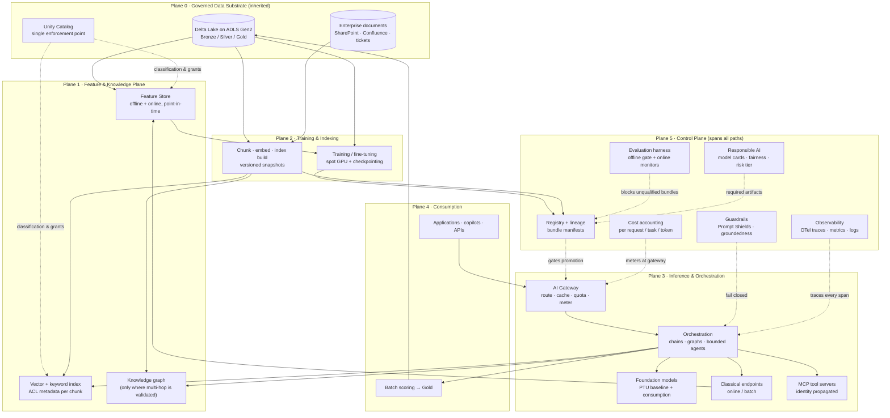
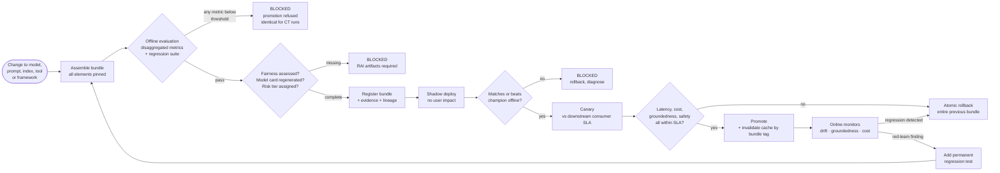
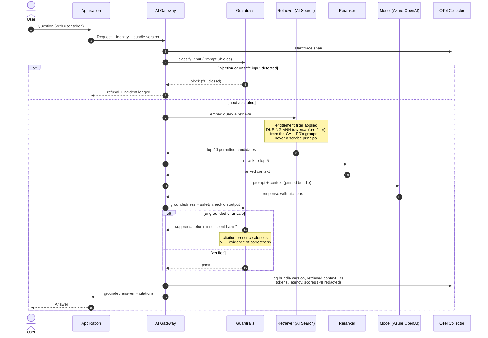

# Capstone: Enterprise AI Platform

## Executive Summary

This capstone assembles Phases 11 through 13 — MLOps, LLMOps, agentic AI, vector systems, and knowledge graphs — into one buildable, defensible enterprise AI platform on Azure. It is the companion to [Capstone: Enterprise Data Platform](01_Capstone_Enterprise_Data_Platform.md) and deliberately builds *on top of* it rather than beside it. An AI platform that does not sit on a governed data platform is not an AI platform; it is a collection of demos with an unbounded liability attached.

The shape is deliberate. A single governed data substrate (Delta Lake on ADLS Gen2, Unity Catalog as the enforcement point) feeds three parallel production paths that share one control plane: a **classical ML path** (features → training → registry → serving, per [ML Pipeline Architecture](../Phase-11/06_ML_Pipeline_Architecture.md)), a **generative/RAG path** (chunk → embed → index → retrieve → generate, per [Retrieval Augmented Generation](../Phase-12/03_Retrieval_Augmented_Generation.md)), and an **agentic path** (plan → act → observe, with bounded execution and least-privilege tools, per [Agentic AI Architecture](../Phase-12/05_Agentic_AI_Architecture.md)). Wrapping all three is one shared control plane: registry, evaluation, guardrails, observability, cost governance, and Responsible AI review.

The central thesis of this capstone is this: **an AI platform's unit of release is never a model — it is a versioned bundle of model, prompt, retrieval index, tool scope, framework version, and evaluation result, promoted atomically through one gate.** This is the direct generalization of [LLMOps](../Phase-12/04_LLMOps.md) ADR-0158's triple-versioning rule to the whole platform. Teams that version the model but not the prompt, or the prompt but not the index, produce the failure mode documented repeatedly across Phases 11–13: every artifact is individually current, no deployment event is to blame, and behaviour silently degrades until a customer or an auditor asks a question.

The second thesis is less comfortable: **autonomy and capability are risk multipliers, not merely feature upgrades.** Each step of agentic autonomy compounds cost, compounds the chance that one reasoning error derails a task, and compounds blast radius when a prompt injection succeeds. The governance in this chapter is not compliance theatre bolted on at the end — it is what makes the capability shippable at all.

## Learning Objectives

By the end of this chapter you should be able to:

1. Draw and defend an end-to-end enterprise AI platform reference architecture on Azure covering classical ML, RAG, and agentic workloads on one shared control plane.
2. Specify the release bundle for an AI feature — model, prompt, index, tool scope, framework pin, evaluation result — and design the atomic promotion and rollback mechanism for it.
3. Design a RAG pipeline whose retrieval respects source access control at query time, and prove it does.
4. Choose between fine-tuning, RAG, prompt engineering, and a knowledge graph for a given problem, with the evidence each choice requires.
5. Build an evaluation harness (offline gates plus online monitoring) that gates every promotion, including automated retraining runs.
6. Bound agent execution by step count, cost, and wall clock, and scope every tool to least privilege independently of prompt-level defences.
7. Implement network isolation, managed identity, and content safety to a private-endpoint-only, no-secrets baseline.
8. Instrument cost per inference, per request, per task, and per token, and apply caching, routing, and tiering deliberately.
9. Operate the platform against SLOs — latency, groundedness, refusal rate, drift — with detection owned by the platform, not the consumer.
10. Identify the failure modes that destroy AI platforms and the structural defences against each.

## Business Motivation

Enterprises fund AI platforms for three reasons, and mis-stating them is the most common cause of a programme being defunded in year two.

**Consolidating fragmented AI effort.** Without a platform, every team independently selects a model, builds its own retrieval pipeline, invents its own evaluation, negotiates its own quota, and ships its own guardrails. The duplication is expensive but the *inconsistency* is worse: one team's assistant refuses a benign request while another's leaks a restricted document, and the organization has no single place to fix either. This is the [Model Context Protocol (MCP)](../Phase-12/06_Model_Context_Protocol_MCP.md) N×M argument applied to AI capability.

**Making AI risk governable.** The EU AI Act, sectoral regulators, and internal audit all ask the same questions: what model produced this decision, on what data, evaluated how, reviewed by whom, and can you reproduce it? An organization with fifteen ungoverned pilots cannot answer. An organization with one platform answers structurally, because the answers are recorded as a by-product of shipping (per [Responsible AI](../Phase-11/07_Responsible_AI.md)).

**Compressing time-to-production.** The widely-reported failure rate of enterprise GenAI pilots is not primarily a model-quality problem. Pilots stall on the same set of missing platform capabilities every time: no evaluation harness, no access-controlled retrieval, no cost ceiling, no observability, no owner. A platform that supplies those as golden paths converts a six-month stall into a two-week integration.

The honest counter-case: for a single team with one use case and no regulatory constraint, this platform is over-engineering. Azure OpenAI plus a well-built application will outperform it on speed. The threshold is roughly: three or more independent AI-consuming teams, a regulated or reputationally-sensitive decision surface, and a spend level where uncontrolled token cost is material. Below that, build the application and defer the platform — and say so explicitly rather than letting a platform be built by default.

## History and Evolution

**Classical ML in production (roughly 2010–2018).** Hadoop-era feature pipelines and scikit-learn/Spark MLlib models were deployed by hand. Sculley et al.'s *Hidden Technical Debt in Machine Learning Systems* (NeurIPS 2015) named the era's core insight, which remains this chapter's structural premise: the model is a small fraction of a production ML system, and risk concentrates in the surrounding plumbing and the seams between components.

**MLOps consolidation (2018–2021).** MLflow (2018), Kubeflow, TFX, and Feast (2019) turned experiment tracking, model registries, and feature stores into standard components. The champion/challenger promotion gate and continuous training became normal practice (per [MLOps and MLflow](../Phase-11/03_MLOps_and_MLflow.md)). Azure Machine Learning and SageMaker made the pattern managed.

**Transformer and foundation-model era (2017–2022).** *Attention Is All You Need* (2017), BERT (2018), and GPT-3 (2020) shifted the default from training a task-specific model to adapting a general one. The economics inverted: training capability became a purchased commodity, and the scarce engineering skill became grounding, evaluation, and cost control (per [Large Language Model Foundations](../Phase-12/01_Large_Language_Model_Foundations.md)).

**RAG and the vector-database wave (2020–2023).** Lewis et al.'s RAG paper (2020) and the ChatGPT release (November 2022) triggered mass enterprise adoption. Pinecone, Weaviate, Qdrant, Milvus, and pgvector proliferated; Azure AI Search added vector and hybrid retrieval. The industry rapidly learned that retrieval quality, not model quality, was usually the binding constraint (per [Embeddings and Semantic Search](../Phase-13/03_Embeddings_and_Semantic_Search.md)).

**Agentic and interoperability era (2023–present).** ReAct-style loops, function calling, LangChain and LlamaIndex, then LangGraph's explicit state machines addressed the debuggability critique of implicit agent loops. Anthropic's Model Context Protocol (open-sourced late 2024) and Google's Agent2Agent addressed tool and agent interoperability. Microsoft GraphRAG (2024) fused knowledge graphs with vector retrieval. Azure AI Foundry consolidated model catalogue, agents, evaluation, and content safety into one surface.

**Regulatory consolidation (2023–present).** NIST AI RMF 1.0 (January 2023), ISO/IEC 42001 (December 2023), and the EU AI Act (entered into force 2024, obligations phasing in through 2026–2027) turned Responsible AI from a voluntary practice into a compliance surface with named artifacts.

This capstone's architecture is the current synthesis: one governed data substrate, three workload paths, one shared control plane, and evaluation as the universal gate.

## Why This Technology Exists

An enterprise AI platform exists to solve a problem that does not appear in any single AI project: **AI capability is easy to acquire and extremely hard to make repeatable, attributable, and safe at organizational scale.**

A single team can call an inference endpoint in an afternoon. What that team cannot economically build alone is the surrounding apparatus — an evaluation harness with labelled data, access-control-propagating retrieval, tracing across a non-deterministic multi-step pipeline, a token-cost accounting system, a content-safety layer, a model registry with lineage, and a Responsible AI review process. Each of these is expensive to build once and nearly free to reuse. That asymmetry is the entire economic case for a platform.

The second structural reason is that **AI failures are correlated across teams**. A prompt-injection technique that works against one internal assistant works against all of them. A model deprecation breaks every feature pinned to it. A biased embedding model degrades every retrieval system built on it. Distributed, independent AI development means the organization discovers each failure N times and fixes it N times. A platform means it is detected once and fixed once — which is why the shared control plane, not the model-serving capacity, is the platform's actual product.

But this only holds if the platform is genuinely the sanctioned path. A platform that teams can bypass — a corporate credit card and a public API endpoint is all it takes — adds a hop without removing a risk. Everything in the Governance and Enterprise Recommendations sections exists to make the governed path the *fastest* path, because a path that is mandatory but slow will be routed around within a quarter.

## Problems It Solves

- **Fragmented, duplicated AI effort.** One evaluation harness, one retrieval pattern, one guardrail layer, reused rather than reinvented per team.
- **Unattributable AI decisions.** A registry plus lineage answers "what produced this output" mechanically, satisfying [Compliance and Regulatory Frameworks](../Phase-10/06_Compliance_and_Regulatory_Frameworks.md) evidence requirements.
- **Silent quality regression.** Evaluation gates on every promotion — including automated retraining — catch degradation before users do (per [Evaluation and Guardrails](../Phase-12/09_Evaluation_and_Guardrails.md)).
- **Training/serving skew.** A feature store with point-in-time correctness removes the dominant classical-ML correctness bug (per [Feature Stores with Feast](../Phase-11/02_Feature_Stores_with_Feast.md)).
- **Ungoverned retrieval.** Access-control-filtered retrieval prevents the RAG index becoming a bypass around every access control the source system enforces.
- **Prompt injection blast radius.** Least-privilege tool scoping bounds the damage even when prompt-level defence fails.
- **Runaway cost.** Cost per request, per task, and per token, with caching, routing, and hard budget ceilings.
- **Model deprecation shocks.** A registry that records third-party model version dependencies converts a surprise outage into a planned migration.
- **Unreproducible outputs.** Bundle versioning plus input-dataset versioning makes any published result reproducible.
- **Slow, inconsistent Responsible AI review.** Model cards, fairness assessment, and impact assessment produced as a by-product of the pipeline rather than as a separate project.

## Problems It Cannot Solve

- **Model hallucination, eliminated.** Grounding, citation, and groundedness checking reduce and detect it. Nothing available eliminates it. Any design that assumes correctness rather than verifying it is unsound.
- **Bad or biased source data.** The platform can detect and document bias. It cannot make a historically biased dataset representative. The fix is upstream, or it is a decision not to build the model.
- **Absent domain expertise.** Evaluation requires labelled ground truth produced by people who know the domain. No platform capability substitutes for that labelling effort.
- **Undefined success criteria.** If nobody can state what "good" means for the use case, the platform cannot gate on it, and the project should not start.
- **Legal or ethical judgment.** Automated fairness metrics and safety classifiers propose; accountable humans decide. Three common fairness definitions are provably not simultaneously satisfiable, so the choice is a judgment call by construction.
- **Organizational bypass.** A team with a credit card can call a public model API. Only mandate plus a genuinely faster golden path prevents it.
- **Sub-10ms generative latency.** Token-by-token generation has a physical floor. Latency-critical paths need a classical model, a cache, or a different design.
- **Being cheaper than not doing it, in year one.** The platform is an investment. Programmes sold on year-one savings are mis-sold and later resented.

## Core Concepts

### 2.1 The Release Bundle as the Unit of Promotion

The single most consequential concept in this chapter. An AI feature is never released as a model. It is released as a **bundle**, and every element of the bundle is version-pinned and promoted together:

| Bundle element | Why it must be in the bundle | Failure if versioned independently |
|---|---|---|
| Model / deployment version | Behaviour changes across versions, including third-party ones | Silent behaviour change; deprecation outage |
| Prompt / system message | A one-word change measurably shifts output distribution | Untraceable regression; no rollback target |
| Retrieval index version | Re-indexing changes what the model sees | Stale cache serves answers from a superseded corpus |
| Embedding model version | Mixing embedding versions in one index corrupts similarity | Silently wrong ranking, no error raised |
| Tool / function scope | Defines blast radius under injection | Scope creep grants unreviewed authority |
| Framework / dependency versions | Frameworks carry their own internal prompts | A minor auto-upgrade changes tool-selection behaviour and cost |
| Evaluation result | The evidence the gate was passed | Promotion without evidence; audit cannot reconstruct |

This generalizes [LLMOps](../Phase-12/04_LLMOps.md) ADR-0158 (model + prompt + index triple) and [LangChain and LlamaIndex](../Phase-12/08_LangChain_and_LlamaIndex.md) ADR-0162 (framework pinning) into one platform-wide rule. Caches must be tagged with the bundle version that generated their entries, or cache invalidation becomes an unowned manual step — the exact defect behind LLMOps Case Study 2.

### 2.2 Three Paths, One Control Plane

The platform serves three structurally different workloads, and forcing them into one pipeline shape is a common and expensive mistake. What they share is the control plane, not the data path.

- **Classical ML path.** Features from the feature store → training run → registered model version → batch, online, or streaming inference. Deterministic given inputs; evaluated with accuracy/precision-recall/calibration metrics plus fairness. Per [ML Pipeline Architecture](../Phase-11/06_ML_Pipeline_Architecture.md).
- **Generative / RAG path.** Documents → chunk → embed → index → hybrid retrieve → rerank → assemble context → generate with citations. Non-deterministic; evaluated on retrieval quality and generation quality as *separate* axes. Per [Retrieval Augmented Generation](../Phase-12/03_Retrieval_Augmented_Generation.md).
- **Agentic path.** Goal → plan → tool call → observation → reflect → repeat, under hard termination bounds. Non-deterministic *and* stateful *and* side-effecting; evaluated on task success rate, cost per task, and safety-violation rate. Per [Agentic AI Architecture](../Phase-12/05_Agentic_AI_Architecture.md).

The shared control plane provides: registry and lineage, evaluation harness, guardrails, observability and tracing, cost accounting, identity and access, and Responsible AI artifacts. A capability that exists in one path's control plane but not the others is a platform defect, not a roadmap item — that asymmetry is exactly how a governed classical-ML estate ends up next to an ungoverned GenAI estate in the same company.

### 2.3 Retrieval Must Be Access-Controlled at Query Time

The most repeated ADR in Phases 12–13 (ADR-0157, ADR-0160, ADR-0164) states one rule three times, which is itself the evidence that it is structurally hard: **the retrieval index must not become a bypass around the access controls of the systems it indexes.**

Three properties are required together:

1. **Ingestion propagates entitlements.** Every chunk carries the access metadata of its source document, captured at ingestion — not re-asserted later by a human.
2. **Filtering is pre-filtered, not post-filtered.** The ANN search must evaluate the entitlement filter *before* or *during* ranking. Post-filtering silently under-returns as the corpus grows, and the failure looks like "poor recall," not like a bug (Phase-13 Chapter 01 Case Study 1).
3. **Identity propagates end to end.** The caller's identity, not a privileged service account, determines the filter — including through any MCP server or tool in the chain.

A managed grounding feature does not supply this. It changes how much engineering effort the responsibility takes; it does not remove the responsibility.

### 2.4 Evaluation Is the Universal Gate

Every promotion in every path passes the same structural gate, and the gate is identical for a human-triggered release and an automated retraining run. This is the platform-wide generalization of [MLOps and MLflow](../Phase-11/03_MLOps_and_MLflow.md) ADR-0150.

- **Offline evaluation** is the pre-promotion gate: a labelled dataset, disaggregated metrics reported separately (never collapsed into one quality score), and a regression suite that includes every previously-discovered failure as a permanent test.
- **Online evaluation** is the standing safety net for whatever the finite offline set did not anticipate: shadow deployment, canary against the *downstream consumer's* SLA, drift detection, and user feedback signals.
- **LLM-as-judge** scales evaluation but is itself a model requiring periodic calibration against human labels. An unvalidated judge silently learns to reward confident phrasing (Phase-12 Chapter 09 Case Study 1).
- **Fairness and model-card regeneration** run on every retraining, not once at initial launch (per [Responsible AI](../Phase-11/07_Responsible_AI.md) ADR-0154).

### 2.5 Autonomy Is a Risk Multiplier

Each additional autonomous step multiplies three quantities simultaneously: expected cost (plan-dependent and unbounded without limits), the probability that one reasoning error derails the whole task, and the blast radius of a successful injection, because a compromised agent can now chain calls rather than emit one bad response.

The structural defences are independent of prompt quality and must all be present:

- **Hard termination bounds** — step count, cumulative cost, wall clock — enforced by the runtime, never by the agent's own judgment that it is finished.
- **Least-privilege tool scope** — every model-invokable function scoped to the minimum capability, evaluated as though the prompt defence will fail, because eventually it will.
- **Human-in-the-loop for irreversible actions** — modelled as an explicit graph node, not an implicit convention.
- **Tool observations treated as untrusted input** — a poisoned wiki page or API response is an injection vector exactly like a retrieved document.

A single well-scoped agent remains the default. Multi-agent orchestration is a response to genuine decomposition complexity, not a maturity level to be reached.

## Internal Working

### 3.1 How a Bundle Is Built, Gated, and Promoted

The pipeline is uniform across paths, which is what makes one control plane possible:

1. **Assemble.** CI resolves every bundle element to an immutable version — model deployment name and version, prompt file commit SHA, index snapshot ID, embedding model version, tool manifest, pinned dependency lockfile.
2. **Evaluate.** The harness runs the offline suite against the assembled bundle, not against the model alone. This is the step teams most often get wrong: evaluating a model in isolation tells you nothing about a system whose behaviour is dominated by retrieval and prompt.
3. **Gate.** Results are compared to thresholds per disaggregated metric plus the full regression suite. Failure blocks promotion identically for manual and automated triggers.
4. **Register.** The bundle, its evaluation report, its model card, and its input dataset versions are registered as one immutable record.
5. **Promote.** Shadow, then canary against the downstream consumer's SLA, then full. Cache entries are tagged with the bundle version; superseded entries are invalidated by the same event that promotes the bundle.
6. **Roll back.** Rollback restores the entire previous bundle atomically. A rollback that reverts the model but leaves the new prompt in place is not a rollback; it is a fourth, untested configuration.

### 3.2 How a RAG Request Actually Executes

Understanding where latency and cost accumulate determines every optimization decision later:

- **Authorize** — resolve caller identity and entitlement filter. Milliseconds; must happen before retrieval, not after generation.
- **Embed the query** — one small model call, typically 10–30 ms.
- **Retrieve** — hybrid dense plus keyword search with the entitlement filter applied during ANN traversal, fused by Reciprocal Rank Fusion. Tens of milliseconds.
- **Rerank** — a cross-encoder over the top ~50 candidates to select the top ~5. This is usually the highest-leverage quality improvement per unit of latency.
- **Assemble** — build the context window. More context is not unconditionally better; attention dilution is real and long contexts cost linearly in input tokens.
- **Generate** — dominated by time-to-first-token then per-output-token throughput. This is 80–95% of both latency and cost.
- **Verify** — groundedness/entailment check plus safety classification on the output.

Two consequences follow directly. First, optimizing retrieval latency while ignoring generation is optimizing the wrong term (Amdahl's Law, per [Performance Engineering](../Phase-18/05_Performance_Engineering.md)). Second, semantic caching at the request boundary is disproportionately effective because it skips the entire dominant segment.

### 3.3 How Non-Determinism Breaks Conventional Operations

Classical operational practice assumes that identical inputs produce identical outputs, so a diff is a signal. Generative systems break that assumption, and three operational mechanisms must be re-founded:

- **Regression testing** becomes distributional and metric-based rather than exact-match. The assertion is "groundedness ≥ 0.9 across the suite," not "output equals expected string."
- **Debugging** requires full-pipeline tracing, because the observable failure ("wrong answer") could originate in retrieval, reranking, context assembly, or generation. Retrieval quality and generation quality must be measured as separate axes precisely so this diagnosis is possible.
- **Incident reproduction** requires that the bundle version, the retrieved context, and the sampling parameters were all logged. Without the retrieved context, an incident is unreproducible in principle, not merely inconvenient.

## Architecture

The platform is six planes. The first is inherited wholesale from the data-platform capstone; the last is the platform's actual product.

**Plane 0 — Governed data substrate (inherited).** Delta Lake on ADLS Gen2, Unity Catalog as the single enforcement point, medallion tiers, private networking, enforced contracts. Everything above assumes this exists. Building the AI platform first is the single most common sequencing error in this domain.

**Plane 1 — Feature and knowledge plane.** Two parallel representations of enterprise knowledge: the **feature store** (offline and online, point-in-time correct) for classical ML, and the **knowledge plane** (vector index, keyword index, optional knowledge graph) for generative retrieval. They are different projections of the same governed Silver/Gold data, and both inherit its classification.

**Plane 2 — Training and indexing plane.** Batch compute for training runs, fine-tuning, and embedding/index builds. Elastic, spot-friendly, entirely offline. Its outputs are versioned artifacts, never live services.

**Plane 3 — Inference and orchestration plane.** Model endpoints (classical online/batch, Azure OpenAI deployments, open-weight models on managed compute), the AI gateway (routing, caching, quota, key brokerage), and the orchestration runtime (chains, graphs, agent loops, MCP tool servers).

**Plane 4 — Consumption plane.** Applications, copilots, batch scoring outputs written back to Gold, and APIs. Every consumer authenticates as itself; identity propagates into retrieval.

**Plane 5 — Control plane (cross-cutting).** Registry and lineage, evaluation harness, guardrails and content safety, observability and tracing, cost accounting, Responsible AI artifacts, and policy. This plane spans all three paths uniformly. If it does not, the paths will diverge in governance quality within two quarters.

## Components

| Component | Responsibility | Primary Azure choice | Primary OSS choice |
|---|---|---|---|
| Governed storage | Single source of truth, ACID, lineage | ADLS Gen2 + Delta + Unity Catalog | MinIO + Delta/Iceberg + OpenMetadata |
| Feature store | Point-in-time correct offline/online features | Databricks Feature Store | Feast (+ Redis online) |
| Vector index | ANN retrieval with metadata filtering | Azure AI Search (vector + hybrid) | Qdrant / Milvus / pgvector |
| Keyword index | BM25 for lexical recall | Azure AI Search (same index) | OpenSearch / Elasticsearch |
| Knowledge graph | Multi-hop and relationship queries | Cosmos DB for Apache Gremlin | Neo4j |
| Training compute | Elastic batch training and indexing | Databricks / Azure ML compute clusters | Ray on Kubernetes / Spark |
| Model registry | Versioned models, stages, lineage | Unity Catalog model registry (MLflow) | MLflow |
| Foundation models | Hosted LLM/embedding inference | Azure OpenAI in AI Foundry | vLLM serving open weights |
| Classical serving | Online/batch inference endpoints | Azure ML managed endpoints | Ray Serve / KServe |
| AI gateway | Routing, caching, quota, auth, metering | Azure API Management + AI gateway policies | LiteLLM / Envoy |
| Orchestration | Chains, graphs, agent loops | AI Foundry Agent Service / Prompt Flow | LangGraph / LlamaIndex |
| Tool interface | Standard tool exposure | MCP servers on Container Apps | MCP reference servers |
| Guardrails | Input/output safety, injection defence | Azure AI Content Safety (Prompt Shields, groundedness) | Llama Guard / NeMo Guardrails / Presidio |
| Evaluation | Offline gates, online metrics, red team | AI Foundry evaluators + MLflow | Ragas / DeepEval / promptfoo / PyRIT |
| Observability | Traces, metrics, logs across the pipeline | Azure Monitor + App Insights (OTel) | OpenTelemetry + Grafana LGTM |
| Cost accounting | Token and compute attribution | Cost Management + gateway metering | OpenCost + gateway metering |
| Secrets and identity | No static credentials anywhere | Entra ID managed identity + Key Vault | Vault + workload identity |

## Metadata

Metadata is what makes an AI platform auditable, and the AI-specific fields are the ones conventional catalogs omit. Every registered bundle carries:

- **Provenance** — training/index input dataset versions (Delta versions, not "the customer table"), code commit, environment lockfile, compute configuration.
- **Composition** — the full bundle manifest from §2.1, every element pinned to an immutable version.
- **Evaluation evidence** — metric values per disaggregated slice, thresholds applied, regression-suite result, judge-model version and its last human-calibration date.
- **Responsible AI artifacts** — model card with explicitly stated intended use *and out-of-scope use*, fairness assessment, EU AI Act risk-tier classification, impact assessment where applicable.
- **Classification inheritance** — the sensitivity classification of every input, propagated to the model, index, and any derived artifact. A CI check must fail any pipeline whose output loses its inputs' classification.
- **Third-party lifecycle** — the vendor model version and its published deprecation date, so a scheduled migration replaces a surprise outage.
- **Ownership and SLA** — named owner, on-call rotation, declared latency/quality/cost SLOs.

Semantic metadata belongs here too: the governed vocabulary (SKOS taxonomy per [Ontologies and Taxonomies](../Phase-13/05_Ontologies_and_Taxonomies.md)) that entity extraction and graph construction must conform to, rather than each pipeline inventing its own entity types.

## Storage

Five distinct storage concerns, deliberately not unified:

- **Governed lakehouse (ADLS Gen2 + Delta).** Training data, feature tables, batch inference outputs, evaluation datasets, and the full request/response trace archive. Versioned and time-travelable, which is what makes reproducibility mechanical.
- **Vector index.** Embeddings plus filterable metadata. Sized by vector count × dimensions × bytes-per-component plus graph overhead — HNSW is memory-resident and its cost is dominated by RAM, not disk. Dimensionality reduction (Matryoshka-style) is an explicit cost/quality dial.
- **Online feature store.** Low-latency key-value reads (Cosmos DB or Redis) for online inference. Written by the same definition that materializes offline features — one definition, two sinks, which is the structural fix for training/serving skew.
- **Graph store.** Entities, relationships, and community summaries where multi-hop queries are genuinely justified — and only there, per [Knowledge Graphs with Neo4j](../Phase-13/02_Knowledge_Graphs_with_Neo4j.md) ADR-0165.
- **Cache.** Exact-match and semantic response caches, every entry tagged with the generating bundle version and invalidated by the promotion event.

Retention is a governance decision, not a storage decision. Prompt/response logs contain user input and are therefore in scope for privacy law: they carry a defined retention period, PII redaction at the collector, and inclusion in the erasure workflow. A right-to-be-forgotten request must propagate to training data, feature tables, the vector index, the graph, agent long-term memory, *and* the trace archive — and the erasure must be verified, not assumed (per [Data Privacy and PII Protection](../Phase-10/07_Data_Privacy_and_PII_Protection.md) ADR-0147).

## Compute

Four compute profiles with genuinely different economics:

- **Training and fine-tuning.** Bursty, interruption-tolerant, GPU-heavy. Spot/low-priority instances with checkpointing are the default; typical saving 60–70%. Right-size the GPU SKU to actual memory need rather than defaulting to the largest available.
- **Indexing and embedding.** Batch, embarrassingly parallel, latency-insensitive. Use batch embedding APIs and spot compute. Full re-indexing is expensive; incremental indexing keyed on document version is the norm, with full rebuilds reserved for embedding-model changes.
- **Online inference — classical.** Latency-sensitive, autoscaling, sometimes scale-to-zero. Dynamic batching and quantization are the two highest-leverage GPU levers, and the batching window is an explicit latency-versus-throughput dial tied to the consumer's SLA, not maximized blindly (per [Model Serving and Ray](../Phase-11/04_Model_Serving_and_Ray.md) ADR-0151).
- **Online inference — generative.** Purchased capacity, not provisioned compute. The decision is provisioned throughput (PTU) versus consumption pricing: PTU gives predictable latency and cost for a sustained, predictable baseline; consumption suits variable and experimental traffic. The common enterprise answer is PTU for the baseline plus consumption for overflow. Quota is a shared, finite, regional pool — a new feature's launch can throttle unrelated stable features sharing it (per [Azure OpenAI and AI Foundry](../Phase-12/07_Azure_OpenAI_and_AI_Foundry.md) ADR-0161).

Agent workloads deserve separate mention: their compute cost is *plan-dependent*, so capacity planning must be driven by cost-per-task distributions rather than cost-per-call averages.

## Networking

The baseline is inherited from [Network Security and Zero Trust](../Phase-10/04_Network_Security_and_Zero_Trust.md) ADR-0144 and is non-negotiable:

- **Private endpoints only** for Azure OpenAI, AI Search, ADLS, Key Vault, Cosmos DB, Azure ML, and Databricks. Public network access explicitly disabled — adding a private endpoint while leaving public access enabled is the single most common misconfiguration in this domain.
- **VNet injection** for Databricks and Azure ML compute; agent and MCP runtimes on VNet-integrated Container Apps or AKS.
- **Default-deny egress** through Azure Firewall with an explicit allowlist. This matters more for AI than for data platforms: an agent that can call arbitrary tools plus unrestricted egress is an exfiltration channel with a natural-language interface.
- **Private DNS zones** for every private endpoint, or name resolution silently returns public addresses.
- **Gateway ingress.** All model traffic transits API Management: no application holds a model key, quota is enforced centrally, and every request is metered and traced at one point.
- **MCP transport.** A stdio MCP server runs with the *host's own privileges* — it is not a sandboxed, lower-risk option, contrary to intuition. Remote MCP servers use OAuth with Entra ID and propagate the caller's identity.

## Security

The AI platform inherits the full security baseline of Phase-10 and adds a threat surface that conventional application security does not model.

**Inherited baseline.** Managed identity and workload identity federation everywhere — no static keys or secrets in code, config, or notebooks (per [Identity and Access Management with Entra](../Phase-10/02_Identity_and_Access_Management_with_Entra.md) ADR-0142). Customer-managed keys for confidential-and-above data. Private networking as above. Secrets in Key Vault with rotation and *verified* post-rotation smoke tests.

**AI-specific threats, mapped to controls:**

| Threat | Control |
|---|---|
| Direct prompt injection | Role separation, input classification (Prompt Shields), output validation |
| Indirect injection via retrieved content or tool observation | Treat all retrieved text and tool output as untrusted; never let it modify system instructions; least-privilege tools |
| Training-data poisoning | Provenance on every training input; contributor controls; anomaly detection on data drift |
| Model/prompt extraction | Rate limiting, output filtering, system-prompt content minimization (assume it can leak) |
| Sensitive-data disclosure via retrieval | Query-time entitlement filtering (§2.3), pre-filtered ANN, identity propagation |
| Excessive agency | Bounded execution, least-privilege tool scope, human approval for irreversible actions |
| Insecure output handling | Never execute model output as code/SQL/shell without validation and sandboxing |
| Supply-chain compromise | Pin and scan model artifacts, framework versions, and MCP servers; internal registry of approved servers |

The single most important framing, repeated because teams keep re-learning it: **assume prompt-level defence will eventually fail, and design so that the failure is survivable.** Tool scoping, not prompt hardening, is what actually bounds blast radius.

## Performance

The metrics that matter differ per path, and using the wrong one is a diagnostic dead end.

**Classical serving.** p95/p99 latency (never the average), throughput, GPU utilization. Dynamic batching is the dominant lever; quantization is next. Bottleneck isolation proceeds by segment: network, feature retrieval, inference, serialization.

**Generative serving.** Two distinct latency components: **time to first token** (TTFT), which dominates perceived responsiveness and is driven by prompt length and queueing, and **time per output token** (TPOT), which drives total completion time. Streaming responses improves perceived latency without changing total time and is nearly always correct for interactive surfaces. Context length is quadratic in attention cost and linear in input-token price — long contexts are expensive twice.

**Retrieval.** Recall@k and MRR/NDCG at a fixed latency budget. A retrieval system without a labelled evaluation harness cannot be tuned; every model, chunking, and index-configuration decision is uncomparable without one (per [Embeddings and Semantic Search](../Phase-13/03_Embeddings_and_Semantic_Search.md) ADR-0166). This is the most commonly skipped step in the entire domain.

**Agents.** Steps per task, wall clock per task, and — the distinctive signal — cost per *task* rather than per call, because a plan-dependent workload has no meaningful per-call average.

Optimization follows the same discipline as everywhere else in this handbook: measure first, attack the dominant term, verify the result, add a regression test. Doubling endpoint capacity to fix a retrieval-quality problem is the AI-domain version of scaling a cluster to fix data skew.

## Scalability

- **Retrieval scale.** ANN index size is bounded by memory. Beyond a single node, shard by tenant, domain, or time and route the query. Multi-tenant single-collection designs are where pre-filtering correctness becomes critical — a fallback to post-filtering silently under-returns for the smallest tenants first.
- **Inference scale.** Regional quota is the real ceiling for hosted models, not compute. Scale by adding deployments across regions with the gateway routing across them, and treat quota as a capacity-planning artifact with a named owner and a review cadence.
- **Cost scale.** Token spend scales with usage superlinearly if agents are involved, because autonomy amplifies. Hard per-tenant and per-feature ceilings are load-bearing controls, not nice-to-haves.
- **Team scale.** The genuine scaling constraint is usually organizational: how many teams can onboard without the platform team becoming the bottleneck. The metric is golden-path adherence rate and onboarding lead time, per [Self-Serve Data Platform](../Phase-15/05_Self_Serve_Data_Platform.md).
- **Evaluation scale.** Labelled ground truth is the scarcest resource. Scale it with LLM-as-judge for breadth plus a small, periodically-refreshed human-labelled calibration set — never judge-only.

## Fault Tolerance

- **Model endpoint failure.** Gateway-level failover across deployments and regions; circuit breaker; a defined degraded mode (smaller model, cached response, or an honest "unavailable") decided in advance per feature.
- **Retrieval failure.** Fail *closed* for safety-relevant retrieval (better no answer than an ungrounded one); fail open only where retrieval is a precision refinement rather than the grounding source. This differentiation must be an explicit per-feature decision.
- **Guardrail failure.** Safety classifiers fail closed, always. A guardrail that fails open under load is not a guardrail.
- **Agent runaway.** Termination bounds are enforced by the runtime and are themselves the fault-tolerance mechanism. An unrelated quota limit stopping a runaway agent is luck, not design (Phase-12 Chapter 05 Case Study 1).
- **Poisoned index.** Index builds are versioned and atomically swapped; the previous index snapshot is retained for immediate rollback. Rebuilding from source takes hours; swapping back takes seconds.
- **Third-party deprecation.** The registry records vendor model versions and their deprecation dates; a monitor alerts before the date, converting an outage into a migration.
- **Recovery drills.** Rollback of a full bundle, index rollback, and regional failover are exercised on a schedule. An untested recovery path is an assumption.

## Cost Optimization

The levers, in descending order of typical impact:

1. **Do not use a generative model where a classical one works.** A fine-tuned small classifier is often two orders of magnitude cheaper than an LLM call for the same task.
2. **Cache.** Exact-match for repeated queries; semantic cache for near-duplicates. Enterprise assistant traffic is highly repetitive; hit rates of 30–50% are commonly achievable. Tag every entry with the bundle version.
3. **Route and tier.** Classify request complexity at the gateway and route to the cheapest model that meets the quality bar for that class. Reserve the frontier model for the requests that need it.
4. **Control context length.** Retrieve fewer, better chunks via reranking rather than stuffing the window. Reranking usually *improves* quality while reducing input tokens.
5. **Batch what is not interactive.** Batch inference APIs are substantially discounted; anything without a waiting human belongs there.
6. **Spot for training and indexing.** 60–70% savings with checkpointing.
7. **Right-size committed capacity.** PTU for the predictable baseline only; consumption for the variable tail. Track utilization *and* coverage as standing KPIs — a commitment that outlives its workload is a recurring, silent loss.
8. **Scope agent autonomy.** A hard step and cost budget per task is simultaneously a safety control and the largest single cost control on the agentic path.

**Worked FinOps example.** An internal support assistant serves ~200,000 requests/month. Baseline: every request hits the frontier model with ~6,000 input tokens (unranked context stuffing) and ~400 output tokens, costing roughly **€9,400/month**. Three changes, applied in order and each verified: (a) add reranking and cut context to ~1,500 tokens — no measured quality loss on the labelled harness, ~55% input-token reduction; (b) add a semantic cache achieving a 35% hit rate; (c) route the ~60% of requests classified as simple lookups to a small model, verified on the harness to meet the quality bar for that class. Result: roughly **€2,600/month**, a ~72% reduction, with measured retrieval and groundedness metrics unchanged. Note the ordering — the reranking change reduces the cost of every subsequent lever, so applying it first compounds; applying caching first would have measured a smaller absolute saving and understated reranking's value.

## Monitoring

Monitor symptoms that a user would notice, and page only on those (per [Monitoring with Prometheus and Grafana](../Phase-18/03_Monitoring_with_Prometheus_and_Grafana.md) ADR-0195). AI-specific signals, all reported disaggregated rather than as one quality score:

| Signal | Why it matters | Typical alert shape |
|---|---|---|
| p95/p99 latency, TTFT | User-perceived responsiveness | SLO burn rate, multi-window |
| Error and throttle rate | Quota exhaustion, endpoint failure | Fast-burn page |
| Groundedness / faithfulness score | Hallucination detection | Slow-burn ticket on trend decline |
| Retrieval recall@k on a live probe set | Retrieval degradation independent of generation | Trend alert |
| Refusal / safety-block rate | Both over-blocking and under-blocking are defects | Two-sided threshold |
| Cost per request / per task | Silent cost creep | Trend alert plus hard ceiling |
| Cache hit rate | Sudden drop signals a stale-invalidation or traffic-shape change | Trend alert |
| Input drift / embedding drift | Distribution shift preceding quality decline | Trend alert, triggers evaluation not auto-promotion |
| Model version in use | Detects unpinned or auto-upgraded dependencies | Immediate alert on unexpected change |
| Quota utilization | Shared, finite pool across features | Threshold alert to the capacity owner |

The most commonly missing alert is on **absence**: an index build, an evaluation run, or a drift job that stops being scheduled produces no failure signal at all. Alert on the absence of success, not only on the presence of failure.

## Observability

Instrumentation is OpenTelemetry end to end, per [Observability with OpenTelemetry](../Phase-18/02_Observability_with_OpenTelemetry.md) ADR-0194, using the `gen_ai.*` semantic conventions. A single trace must span the full request: authorization → query embedding → retrieval (with the filter applied and candidate IDs) → reranking → context assembly → generation → guardrail evaluation → response. For agents, each loop iteration is a span, with tool calls as child spans, so a runaway plan is visible as a shape, not inferred from a bill.

Three requirements are specific to this domain:

- **Log the retrieved context, not just the prompt and response.** Without it, an incident is unreproducible in principle — the model saw something you did not record.
- **Redact at the collector.** Prompts contain user input and therefore PII. Redaction happens in the OTel Collector before the backend, and the trace archive is in scope for retention and erasure.
- **Propagate trace context across async and orchestration boundaries.** Index builds, batch scoring, and agent tool calls are exactly the seams where correlation silently breaks — and a broken trace looks like healthy components with an unexplainable end-to-end symptom.

Sampling: tail-based, keeping all errors, all guardrail blocks, all low-groundedness responses, and a small baseline. This retains every interesting trace at a fraction of the volume.

## Operational Response Playbook

**Playbook 1 — Answer quality has degraded and no deployment occurred.**

*Signal:* groundedness score trending down, rising user thumbs-down, or a support escalation, with no bundle promotion in the window.

*Detect and diagnose, in this order — do not change the model first.*

| Step | Query / check | What it distinguishes |
|---|---|---|
| 1 | Compare current bundle manifest to the last known-good | An element changed outside the promotion gate (auto-upgraded framework, vendor model version rolled forward, unpinned dependency) |
| 2 | Run the labelled retrieval harness against the live index | Retrieval degradation versus generation degradation — the essential first fork |
| 3 | Diff index document count and embedding model version | Partial or failed index build; mixed embedding versions in one collection |
| 4 | Check cache hit rate and cache entry bundle tags | Stale cache serving answers from a superseded index |
| 5 | Check input distribution drift | The question mix changed; the system did not |
| 6 | Sample traces of low-groundedness responses and read the retrieved context | Whether the model was given the right material and failed, or was given the wrong material |

*Respond:* if retrieval degraded, roll back the index snapshot (seconds) rather than rebuilding (hours). If an unpinned element changed, restore the pin and re-run the gate. If the cache is stale, invalidate by bundle tag. *Do not* respond by swapping to a larger model — that masks the defect, raises cost permanently, and leaves the actual cause in place.

*Durable fix:* whatever step found it becomes a standing automated check, and the specific failure becomes a permanent case in the regression suite.

**Playbook 2 — An agent is consuming unexpected cost or attempting unauthorized actions.**

*Signal:* cost-per-task ceiling breached, step-bound hit repeatedly, or a denied tool authorization appearing in logs.

*Respond:* first, stop the bleeding — disable the agent deployment or drop its budget ceiling to zero at the gateway. Only then diagnose. Pull the full trace: examine the plan, each tool call, and each observation. Determine whether this is (a) an unbounded plan on an ambiguous task, (b) a tool scoped more broadly than its purpose requires, or (c) an injection delivered through a retrieved document or tool observation.

For (a), tighten the termination bounds and add the ambiguous task class to the evaluation suite. For (b), narrow the tool scope — and treat the fact that the action was *attempted* as evidence the scoping is what saved you, not the prompt. For (c), treat it as a security incident: identify the injection source, remove or quarantine it, and convert the exact attack into a permanent red-team regression test before closing (per [Evaluation and Guardrails](../Phase-12/09_Evaluation_and_Guardrails.md) ADR-0163).

*Do not* respond by adding a "please ignore malicious instructions" line to the system prompt and calling it remediated. That is the intervention with the highest ratio of felt-progress to actual risk reduction in this entire domain.

## Governance

Governance here is computational, not advisory, and it spans three overlapping regimes.

**Data governance (inherited).** Unity Catalog is the enforcement point. Classification propagates automatically from source through features, indexes, and model artifacts; a CI check fails any pipeline whose output loses its inputs' classification. Lineage is complete enough to answer "what data trained this model" and "which documents are in this index" without a manual investigation.

**AI governance.** Every bundle is registered before it serves traffic. Every model has a model card stating intended use *and out-of-scope use* — the section that would have prevented a fraud model built for card transactions being reused for P2P payments. Fairness assessment and model-card regeneration run on every retraining, gated identically and non-bypassably to the accuracy gate. Each system carries an EU AI Act risk-tier classification, and high-risk classification pulls in the corresponding documentation, human-oversight, and logging obligations. NIST AI RMF (Govern/Map/Measure/Manage) supplies the control structure; ISO/IEC 42001 supplies the management-system framing if certification is in scope.

**Operating model.** A federated council with computational enforcement, per [Federated Governance](../Phase-15/04_Federated_Governance.md) ADR-0179: a deliberately narrow set of global policies (enforced by policy-as-code, fail-closed), local autonomy elsewhere, and a semi-annual review with an *equal* mandate to remove no-longer-justified policies and to expand enforcement where gaps are found. Global-policy scope creep reinstates the central bottleneck the federation exists to remove, and is the more common of the two failure directions.

**Sensitive-use review.** A tiered review — most systems ship on the golden path with automated gates only; a defined minority (high-risk tier, novel capability, irreversible actions, sensitive population) get a full human review. Making every system get a full review guarantees the review becomes a rubber stamp, which is the failure mode Architecture Reviews (Phase-19 Chapter 02) documents in detail.

## Trade-offs

| Decision | Option A | Option B | The real trade-off |
|---|---|---|---|
| Grounding approach | RAG | Fine-tuning | RAG for changing knowledge and citability; fine-tuning for behaviour, format, and domain style. Fine-tuning to inject facts is the domain's most expensive recurring mistake |
| Retrieval mode | Vector only | Hybrid (vector + BM25 + RRF) | Hybrid is the default; vector-only loses exact identifiers, codes, and rare terms |
| Retrieval structure | Vector RAG | GraphRAG | GraphRAG costs roughly two orders of magnitude more to index; justified only by validated multi-hop or global-thematic query patterns on a scoped subset |
| Model hosting | Hosted API (Azure OpenAI) | Open weights on own compute | API for speed and capability; open weights for data-residency constraints, cost at very high sustained volume, and portability — at real operational cost |
| Capacity | PTU | Consumption | PTU for predictable baseline latency and cost; consumption for variable and experimental load. Usually both |
| Orchestration | Framework (LangGraph, Foundry Agents) | Hand-built | Frameworks accelerate composition; they supply no governance and their own internal prompts must be version-pinned |
| Autonomy | Single bounded agent | Multi-agent | Single agent is the default; multi-agent answers genuine decomposition complexity, not ambition |
| Evaluation | Human labels | LLM-as-judge | Judge for breadth, humans for calibration. Judge-only drifts toward rewarding confident phrasing |
| Guardrail posture | Fail closed | Fail open | Closed for safety-critical, open only for precision refinements — an explicit per-feature decision, never a global default |
| Governance weight | Full review for all | Tiered by risk | Universal review produces rubber-stamping; tiered review concentrates scarce scrutiny where it matters |

## Decision Matrix

**Choosing the approach for a new AI use case:**

| Situation | Choose | Because |
|---|---|---|
| Structured prediction on tabular enterprise data | Classical ML + feature store | Cheaper, faster, more accurate, more explainable than any LLM for this shape |
| Answers must cite current internal documents | RAG | Knowledge changes faster than any training cycle; citations are required |
| Output must follow a strict format or domain style | Prompt engineering, then fine-tuning if measured insufficient | Fine-tuning teaches behaviour, not facts |
| Questions require chaining across relationships | Knowledge graph or GraphRAG — after validating the query pattern | Only justified by a benchmarked multi-hop requirement |
| Questions are thematic across a whole corpus | GraphRAG global search on a scoped subset | Vector RAG cannot answer "what are the recurring themes" |
| Task needs multi-step tool use with side effects | Bounded agent, least-privilege tools, human approval for irreversible steps | Autonomy is justified but must be bounded |
| Latency budget under ~100 ms | Classical model or cache | Generative latency has a physical floor |
| Data cannot leave a jurisdiction or the tenant | Open weights on controlled compute | The constraint is legal, not technical |
| No labelled evaluation data exists yet | Build the harness first | Every subsequent decision is uncomparable without it |
| One team, one use case, no regulatory constraint | Build the application; defer the platform | Platform investment is not yet justified |

## Design Patterns

- **Bundle-as-release-unit.** Every element pinned and promoted atomically; rollback restores the whole bundle.
- **Gateway-mediated model access.** One point for routing, caching, quota, metering, auth, and tracing. No application holds a model key.
- **Retrieve-then-rerank.** Broad cheap recall, then a precise cross-encoder over the top candidates. Improves quality and reduces cost simultaneously — a rare alignment.
- **Hybrid retrieval with RRF.** Dense plus lexical fused by rank, the enterprise default rather than a niche optimization.
- **Entitlement-filtered retrieval.** Access metadata captured at ingestion, pre-filtered during ANN traversal, identity propagated end to end.
- **Shadow-then-canary.** Shadow validates safely but cannot validate action-dependent outcomes, because its predictions are never acted on; canary against the downstream consumer's SLA closes that gap.
- **Evaluation gate as a shared library.** One implementation, used identically by manual and automated promotions, so no path can accidentally have a weaker gate.
- **Red-team finding to permanent regression test.** No vulnerability is closed until its exact attack is a standing automated test.
- **Bounded agent loop.** Runtime-enforced step, cost, and time limits; human approval nodes modelled explicitly in the graph.
- **Semantic cache invalidated by promotion event.** Cache entries tagged with the bundle version; the promotion that supersedes them invalidates them.
- **Golden path for AI features.** Templated repository with contract, evaluation harness, tracing, guardrails, tags, and CI pre-wired, so compliant is faster than non-compliant.

## Anti-patterns

- **Fine-tuning to inject facts.** Expensive, stale on arrival, unciteable. The most common and most costly misdiagnosis in the domain.
- **Demo-to-production teleport.** A notebook that impressed an executive promoted without an evaluation harness, guardrails, or an owner.
- **Evaluating the model instead of the system.** Benchmark rank on a public leaderboard says little about performance on your jargon-heavy corpus.
- **Citation as proof of correctness.** A real, topically relevant document that does not support the specific claim is the hardest hallucination to catch, and citation presence looks like rigour.
- **Post-filtered retrieval on access-controlled corpora.** Silently under-returns as the corpus grows; looks like poor recall.
- **Unvalidated LLM judge.** Evaluation scores rise while real complaints rise — a direct contradiction that only human calibration surfaces.
- **Prompt-only injection defence.** Necessary, insufficient, and reassuring in proportion to how little it actually bounds.
- **Agent without a budget.** Cost is plan-dependent and therefore unbounded by construction.
- **Multi-agent as a maturity signal.** Adds coordination failure modes to solve a problem one well-scoped agent already handled.
- **Boil-the-ocean knowledge graph or corpus-wide GraphRAG.** Two orders of magnitude of indexing cost applied to a question set that plain retrieval already served.
- **Shadow IT AI.** A credit card and a public endpoint. The platform's response is a faster golden path, not a stern memo.
- **Governance deferred to phase two.** Phase two arrives after the estate is too large to retrofit — exactly as it did in the data-platform capstone's first case study.

## Common Mistakes

1. Building the AI platform before the governed data platform exists, then discovering every model's training data is unlineaged.
2. Skipping the labelled evaluation harness because it "slows down the pilot," then having no basis to compare any subsequent change.
3. Versioning the model but not the prompt, index, or framework — the defect that makes regressions untraceable.
4. Assuming a managed grounding feature supplies access control. It does not.
5. Mixing embedding-model versions in one index during an upgrade, silently corrupting similarity ranking.
6. Chunking without measuring, so retrieval quality is capped by a decision nobody validated.
7. Stuffing the context window because more context feels safer; paying for attention dilution twice.
8. Alerting on failure but not on the absence of a scheduled index build or evaluation run.
9. Logging prompts and responses without redaction, creating a PII store nobody classified.
10. Leaving public network access enabled after adding a private endpoint.
11. Granting an agent's tools the permissions of a service account rather than the calling user.
12. Treating drift detection as an auto-promotion trigger rather than an evaluation trigger.
13. Running a Responsible AI assessment once at launch and never regenerating it across subsequent retrained versions.
14. Ignoring vendor model deprecation notices until the endpoint returns errors.
15. Optimizing retrieval latency while generation consumes 90% of the request budget.

## Best Practices

- **Build the evaluation harness first.** Before model selection, before chunking decisions, before the pilot. Fifty to a hundred labelled queries is enough to start and changes every subsequent conversation.
- **Pin everything, promote atomically, roll back wholly.**
- **Make the golden path faster than the ungoverned path**, and treat a decline in adherence rate as a platform defect rather than a compliance problem.
- **Report metrics disaggregated.** Never collapse groundedness, relevance, safety, and latency into one "quality score."
- **Scope tools as though the prompt defence has already failed.**
- **Bound every agent** by steps, cost, and wall clock, enforced by the runtime.
- **Propagate identity, not privilege**, through every retrieval, tool, and MCP server.
- **Calibrate the judge** against human labels on a schedule, and record the calibration date in the bundle metadata.
- **Convert every incident and red-team finding into a permanent regression test** before closing it.
- **Track cost per unit of value** — per request, per task, per resolved ticket — not absolute spend.
- **Regenerate Responsible AI artifacts on every retraining**, gated identically to accuracy.
- **Record third-party model lifecycle dates** and act on them as scheduled work.
- **Prefer the smallest capable model** and justify escalation with harness evidence.
- **Start with one bounded agent** and add complexity only against a measured limitation.

## Enterprise Recommendations

1. **Sequence correctly.** Governed data platform, then feature and knowledge planes, then the control plane, then use cases. Teams that invert this spend year two retrofitting governance onto an estate that has outgrown it.
2. **Fund the control plane as the product.** The platform's value is the evaluation harness, guardrails, observability, and registry — not inference capacity, which is purchasable.
3. **Name an accountable owner** for AI risk with real decision rights, per [CDO and CAIO Playbook](../Phase-19/08_CDO_and_CAIO_Playbook.md) ADR-0205. A title without mandate produces documents, not change.
4. **Apply portfolio discipline to AI investment.** "Transformational" is not an exemption from outcome measurement; forty ungated pilots is a portfolio-scale feature factory (per [Roadmap and Portfolio Planning](../Phase-19/07_Roadmap_and_Portfolio_Planning.md)).
5. **Centralize quota and capacity planning.** Shared regional pools mean one team's launch can throttle another's stable feature.
6. **Maintain a registry of approved MCP servers and tools**, or teams will independently build overlapping ones against the same systems — recreating inside MCP the fragmentation MCP exists to remove.
7. **Adopt one risk framework** (NIST AI RMF, mapped to EU AI Act tiers) and instrument once, mapping to many obligations rather than running parallel compliance programmes.
8. **Preserve portability deliberately.** Keep prompts, evaluation datasets, orchestration logic, and OTel instrumentation in your own repositories; treat any managed inference or agent service as replaceable. The handbook's running record of retired cloud services — Google Cloud IoT Core (2023), AWS QLDB (end of support 2025), Azure Orbital Ground Station, Microsoft Genomics, Azure AI Personalizer — makes this a practical rather than theoretical concern.
9. **Right-size review.** Automated gates for everything; human sensitive-use review for a defined minority. Universal review becomes rubber-stamping.
10. **Budget for the evaluation data.** Labelled ground truth is the scarcest input in the whole system and the one most often left unfunded.

## Azure Implementation

The Azure depth for individual services lives in §2 and §11–16 above; this section shows the concrete wiring that makes those decisions real.

**Reference service set.** ADLS Gen2 + Databricks + Unity Catalog (substrate, features, registry) · Azure AI Search (vector + hybrid retrieval) · Azure OpenAI in AI Foundry (models, agents, evaluators) · Azure ML managed endpoints (classical serving) · API Management (AI gateway) · Container Apps (MCP servers, orchestration) · Cosmos DB / Redis (online features, agent memory) · Key Vault + Entra managed identity · Azure Monitor + Application Insights (OTel) · Purview (classification, discovery) · Azure AI Content Safety (guardrails).

**Private, keyless Azure OpenAI (Terraform).**

```hcl
resource "azurerm_cognitive_account" "aoai" {
  name                          = "aoai-ai-platform-prod"
  location                      = var.location
  resource_group_name           = azurerm_resource_group.ai.name
  kind                          = "OpenAI"
  sku_name                      = "S0"
  custom_subdomain_name         = "aoai-ai-platform-prod"
  public_network_access_enabled = false          # non-negotiable baseline
  local_auth_enabled            = false          # key auth disabled; Entra only

  identity { type = "SystemAssigned" }

  tags = {
    cost_center = var.cost_center
    ai_system   = "enterprise-ai-platform"
    risk_tier   = "limited"                      # EU AI Act classification
  }
}

resource "azurerm_private_endpoint" "aoai" {
  name                = "pe-aoai-prod"
  location            = var.location
  resource_group_name = azurerm_resource_group.ai.name
  subnet_id           = azurerm_subnet.private_endpoints.id

  private_service_connection {
    name                           = "psc-aoai"
    private_connection_resource_id = azurerm_cognitive_account.aoai.id
    subresource_names              = ["account"]
    is_manual_connection           = false
  }

  private_dns_zone_group {
    name                 = "aoai-dns"
    private_dns_zone_ids = [azurerm_private_dns_zone.openai.id]  # or DNS silently resolves public
  }
}

# Applications never hold a key; they hold a role assignment.
resource "azurerm_role_assignment" "app_can_infer" {
  scope                = azurerm_cognitive_account.aoai.id
  role_definition_name = "Cognitive Services OpenAI User"
  principal_id         = azurerm_user_assigned_identity.app.principal_id
}
```

**Entitlement-filtered retrieval (Azure AI Search, hybrid + pre-filter).**

```python
from azure.search.documents import SearchClient
from azure.search.documents.models import VectorizedQuery
from azure.identity import DefaultAzureCredential

search = SearchClient(endpoint=SEARCH_ENDPOINT,
                      index_name="kb-prod-v7",
                      credential=DefaultAzureCredential())

def retrieve(query_text: str, query_vector: list[float], caller_groups: list[str], k: int = 40):
    # Entitlement filter is evaluated by the engine during retrieval, not applied afterwards.
    group_filter = " or ".join(f"acl_groups/any(g: g eq '{g}')" for g in caller_groups)

    return search.search(
        search_text=query_text,                       # BM25 leg
        vector_queries=[VectorizedQuery(              # dense leg
            vector=query_vector, k_nearest_neighbors=k, fields="content_vector")],
        filter=f"({group_filter}) and index_version eq 7",
        query_type="semantic",                        # reranker over fused candidates
        semantic_configuration_name="default",
        top=5,
        select=["chunk_id", "content", "source_uri", "sensitivity"],
    )
```

`caller_groups` are resolved from the caller's own token — never from a service-principal identity. The `index_version` predicate keeps a bundle pinned to the index snapshot it was evaluated against, so an in-flight re-index cannot silently change what a promoted bundle sees.

**Gateway policy — quota, metering, and identity (API Management).**

```xml
<inbound>
  <validate-jwt header-name="Authorization" failed-validation-httpcode="401">
    <openid-config url="https://login.microsoftonline.com/{tenant}/v2.0/.well-known/openid-configuration" />
    <required-claims><claim name="aud"><value>{api-app-id}</value></claim></required-claims>
  </validate-jwt>

  <!-- Per-feature token ceiling: a hard cost control, not a soft target -->
  <azure-openai-token-limit counter-key="@(context.Request.Headers.GetValueOrDefault("X-AI-Feature"))"
                            tokens-per-minute="20000"
                            estimate-prompt-tokens="true"
                            remaining-tokens-header-name="x-tokens-remaining" />

  <!-- Semantic cache keyed to the bundle version so promotion invalidates entries -->
  <azure-openai-semantic-cache-lookup score-threshold="0.05"
                                      embeddings-backend-id="embeddings-backend"
                                      embeddings-backend-auth="system-assigned">
    <vary-by>@(context.Request.Headers.GetValueOrDefault("X-Bundle-Version"))</vary-by>
  </azure-openai-semantic-cache-lookup>

  <azure-openai-emit-token-metric namespace="ai-platform">
    <dimension name="feature" value="@(context.Request.Headers.GetValueOrDefault("X-AI-Feature"))" />
    <dimension name="bundle"  value="@(context.Request.Headers.GetValueOrDefault("X-Bundle-Version"))" />
    <dimension name="cost_center" value="@(context.Request.Headers.GetValueOrDefault("X-Cost-Center"))" />
  </azure-openai-emit-token-metric>
</inbound>
```

**Bundle registration with evaluation evidence (MLflow / Unity Catalog).**

```python
import mlflow, json

mlflow.set_registry_uri("databricks-uc")

with mlflow.start_run(run_name="support-assistant-bundle") as run:
    bundle = {
        "model_deployment": "gpt-4o-2024-11-20",
        "prompt_sha":       "9f2c1ab",
        "index_snapshot":   "kb-prod-v7",
        "embedding_model":  "text-embedding-3-large",
        "tool_manifest_sha":"4d81e60",
        "framework_lock":   "requirements.lock.sha=7c0aa19",
    }
    mlflow.log_dict(bundle, "bundle_manifest.json")

    # Disaggregated metrics — never collapsed into one score.
    mlflow.log_metrics({
        "retrieval_recall_at_5": 0.91,
        "retrieval_ndcg_at_10":  0.84,
        "groundedness":          0.93,
        "answer_relevance":      0.89,
        "refusal_rate":          0.04,
        "safety_violation_rate": 0.00,
        "p95_latency_ms":        2400,
        "cost_per_request_eur":  0.013,
    })
    mlflow.log_artifact("model_card.md")
    mlflow.log_artifact("eval_report.json")
    mlflow.log_artifact("regression_suite_results.json")

    mlflow.register_model(f"runs:/{run.info.run_id}/bundle",
                          "prod.ai_platform.support_assistant")
```

**Bounded agent execution (Azure AI Foundry Agent Service / LangGraph pattern).**

```python
LIMITS = {"max_steps": 8, "max_cost_eur": 0.50, "max_wall_clock_s": 120}

def run_agent(goal: str, caller_identity: str) -> AgentResult:
    state = AgentState(goal=goal, identity=caller_identity)
    started, spent = time.monotonic(), 0.0

    for step in range(LIMITS["max_steps"]):
        if spent >= LIMITS["max_cost_eur"]:
            return state.terminate("cost_budget_exhausted")
        if time.monotonic() - started >= LIMITS["max_wall_clock_s"]:
            return state.terminate("wall_clock_exhausted")

        action, cost = plan(state)              # tool manifest is scoped to caller_identity
        spent += cost
        if action.is_terminal:
            return state.complete(action)
        if action.tool.requires_human_approval:  # irreversible actions are an explicit node
            return state.await_approval(action)

        observation = invoke_tool(action, as_identity=caller_identity)   # never a service principal
        state.observe(untrusted(observation))    # tool output is untrusted input, like a document

    return state.terminate("step_budget_exhausted")   # bound enforced by runtime, not by the model
```

**Cost per feature (Azure Monitor / KQL).**

```kusto
customMetrics
| where name == "ai-platform/tokens" and timestamp > ago(30d)
| extend feature = tostring(customDimensions.feature),
         bundle  = tostring(customDimensions.bundle),
         kind    = tostring(customDimensions.token_type)
| summarize prompt_tokens = sumif(valueSum, kind == "prompt"),
            completion_tokens = sumif(valueSum, kind == "completion"),
            requests = sum(valueCount)
        by feature, bundle, bin(timestamp, 1d)
| extend eur = prompt_tokens/1000.0*PROMPT_RATE + completion_tokens/1000.0*COMPLETION_RATE
| extend eur_per_request = eur / requests          // the unit metric, not absolute spend
| order by timestamp asc, eur desc
```

## Open Source Implementation

A fully portable equivalent, deployable on AKS or any Kubernetes, and worth building deliberately for the parts you want to remain vendor-independent.

- **Substrate:** MinIO or ADLS + Delta Lake or Iceberg; OpenMetadata or Apache Atlas for catalog and lineage.
- **Features:** Feast with a Postgres/Delta offline store and Redis online store, materialized by one definition to both sinks.
- **Vector:** Qdrant or Milvus for dedicated scale; pgvector when the corpus is small and operational simplicity dominates. OpenSearch for the BM25 leg, fused with RRF in the application.
- **Graph:** Neo4j with the Graph Data Science library; Microsoft's open-source `graphrag` package for community detection and summarization where a validated need exists.
- **Serving:** vLLM for open-weight LLMs (continuous batching and PagedAttention are the reason it dominates), Ray Serve or KServe for classical and composed multi-model graphs.
- **Orchestration:** LangGraph for explicit, inspectable state machines with termination bounds and approval nodes as first-class graph elements; LlamaIndex for ingestion and indexing. Version-pin both — frameworks carry their own internal prompts.
- **Gateway:** LiteLLM or Envoy for routing, budgets, and metering across providers.
- **Registry and tracking:** MLflow, self-hosted, with artifacts on object storage.
- **Evaluation:** Ragas for RAG-specific metrics, DeepEval or promptfoo for suites and CI integration, PyRIT for automated red-teaming.
- **Guardrails:** Llama Guard or NeMo Guardrails for safety classification; Microsoft Presidio for PII detection and redaction at the logging collector.
- **Observability:** OpenTelemetry SDKs and Collector with `gen_ai.*` conventions, Grafana LGTM stack (Tempo, Loki, Mimir) as the backend; Langfuse or Phoenix where LLM-specific trace UX is worth the extra component.
- **Cost:** OpenCost for Kubernetes attribution plus gateway-emitted token metrics.

The portability posture worth stating explicitly: prompts, evaluation datasets, orchestration graphs, and OTel instrumentation are yours regardless of host. Model weights and hosted inference are the genuinely substitutable layer. Keep the first group in your own repositories and the second replaceable.

## AWS Equivalent (comparison only)

| Capability | Azure | AWS | Notes |
|---|---|---|---|
| Foundation models | Azure OpenAI in AI Foundry | Amazon Bedrock | Bedrock's multi-provider catalogue (Anthropic, Meta, Mistral, Amazon) is a genuine breadth advantage; Azure's OpenAI depth and integration are the counterweight |
| ML platform | Azure ML | SageMaker | Comparable maturity; SageMaker has the longer feature-store and pipeline lineage |
| Vector search | Azure AI Search | OpenSearch Serverless, Aurora pgvector, Kendra | Azure AI Search's single-index hybrid (vector + BM25 + semantic reranker) is more unified; AWS composes it |
| Guardrails | Azure AI Content Safety | Bedrock Guardrails | Both provide configurable content filtering and grounding checks |
| Agents | AI Foundry Agent Service | Bedrock Agents | Comparable managed loop with tool invocation |
| Knowledge graph | Cosmos DB for Gremlin | Neptune | Neptune supports both Gremlin and SPARQL |
| Governance | Purview + Unity Catalog | SageMaker Model Cards + Lake Formation + Glue | Azure's governance plane is more consolidated |

**Migration strategy.** Prompts, evaluation datasets, orchestration logic, and OTel instrumentation port with little change. The genuine work is re-embedding the corpus if the embedding model changes (which invalidates the entire index), re-tuning prompts against a different model family, re-running the full evaluation harness to establish the new baseline, and reimplementing the entitlement-filtering mechanism in the target's query dialect. Budget for re-evaluation, not just re-deployment.

**Selection criteria.** Choose AWS if Bedrock's model breadth is decisive, the surrounding estate is already AWS, or a specific Anthropic/Meta model is the requirement. Choose Azure for deeper OpenAI integration, a Microsoft 365/Entra-centric enterprise, or a stronger consolidated governance story.

## GCP Equivalent (comparison only)

| Capability | Azure | GCP | Notes |
|---|---|---|---|
| Foundation models | Azure OpenAI | Vertex AI Model Garden (Gemini, third-party) | Gemini's long context and native multimodality are genuine differentiators |
| ML platform | Azure ML | Vertex AI | Vertex is well integrated with BigQuery |
| Vector search | Azure AI Search | Vertex AI Vector Search (ScaNN lineage), AlloyDB pgvector | ScaNN is strong research lineage at very large scale |
| Guardrails | AI Content Safety | Vertex AI safety filters, Model Armor | Comparable |
| Agents | AI Foundry Agent Service | Vertex AI Agent Builder / Agent Engine | Google also authored the Agent2Agent protocol for inter-agent communication |
| Knowledge graph | Cosmos DB for Gremlin | No first-party general graph database | Self-host Neo4j or JanusGraph — consistent with the pattern of GCP offering fewer first-party domain products |
| Governance | Purview | Dataplex + Vertex Model Registry / Model Cards | Google published AI Principles in 2018, predating NIST AI RMF and the EU AI Act |

**Migration strategy.** Same shape as the AWS case: instrumentation and prompts port; embeddings and evaluation baselines do not. BigQuery-centric estates gain the most from Vertex's integration.

**Selection criteria.** Choose GCP where Gemini's context length or multimodality is decisive, or where BigQuery is already the analytical centre of gravity. Note the absence of a first-party graph database if a knowledge-graph component is architecturally central.

## Migration Considerations

- **From ungoverned pilots to a platform.** Inventory first — the count of shadow AI systems is always higher than expected. Then triage by risk tier, not by team volume. Migrate the highest-risk systems first, and offer a golden path so that migrating is easier than staying. Announce a deprecation date for direct model access only *after* the golden path demonstrably works.
- **From classical-ML-only to generative.** The registry, evaluation gate, feature store, and observability plane extend to generative workloads with modest change. The genuinely new capabilities are retrieval with entitlement filtering, guardrails, and non-deterministic evaluation. Extend the existing control plane; do not build a parallel one, or you will have two governance regimes within a year.
- **Embedding-model upgrades.** The corpus must be fully re-embedded and the index rebuilt. Mixing versions in one collection silently corrupts ranking with no error raised. Build to the new index in parallel, evaluate against the labelled harness, then swap atomically and retain the old snapshot for rollback.
- **Vendor model deprecation.** Track announced dates in the registry. Migration is: deploy the new version, run the full harness, diff disaggregated metrics, re-tune prompts if required, canary, promote. Treat it as scheduled work with an owner, not as an incident.
- **Framework major versions.** Pin, then upgrade deliberately with the full evaluation suite. A framework's own internal prompts are part of your bundle whether you acknowledge them or not.
- **Cross-cloud.** Assume re-embedding, re-evaluation, and prompt re-tuning. Assume instrumentation, datasets, and orchestration logic port. The asymmetry is the argument for keeping the second group in your own repositories.

## Mermaid Architecture Diagrams

**Diagram 1 — Six-plane reference architecture.**



**Diagram 2 — Bundle promotion with enforced gates.**



**Diagram 3 — RAG request with entitlement filtering and guardrails.**



## End-to-End Data Flow

1. **Source to substrate.** Operational systems and document repositories land in Bronze under enforced schema contracts; Silver applies cleansing and quality gates; Gold publishes governed products. Classification is applied and propagates automatically.
2. **Substrate to feature store.** Feature definitions materialize to both the offline store (for training, with point-in-time correctness) and the online store (for serving) from one definition — the structural elimination of training/serving skew.
3. **Substrate to knowledge plane.** Documents are chunked, embedded, and indexed with source ACLs captured per chunk at ingestion. Index builds are versioned snapshots. Where a validated multi-hop requirement exists, entity extraction against the governed vocabulary populates the graph.
4. **Training and bundle assembly.** Training or fine-tuning runs consume versioned feature snapshots; the run records inputs, code, and environment. CI assembles the bundle with every element pinned.
5. **Gate.** The offline harness runs against the *assembled bundle*. Disaggregated metrics are compared to thresholds; the full regression suite (including every historical failure and red-team finding) must pass. RAI artifacts must be present and current. Failure blocks promotion identically for manual and automated triggers.
6. **Promotion.** Register → shadow → canary against the downstream consumer's SLA → promote. Cache entries are invalidated by bundle tag as part of the same event.
7. **Serving.** The application calls the gateway with its user's identity. The gateway authorizes, checks cache, routes by request class, and meters. Retrieval applies the caller's entitlement filter during ANN traversal. Guardrails evaluate input and output.
8. **Feedback.** Traces, metrics, user feedback, and guardrail events flow to the observability plane and are archived to Gold under a defined retention period with PII redacted at the collector.
9. **Closed loop.** Drift and quality monitors trigger *evaluation*, never automatic promotion. Incidents and red-team findings become permanent regression tests. The improved bundle re-enters at step 4.

The recurring lesson made visible in this flow: every arrow is a contract. Where an arrow is implicit — an index rebuilt without invalidating a cache, a framework upgraded without re-running the gate, an entitlement not carried from document to chunk — that is exactly where the silent failures live.

## Real-world Business Use Cases

- **Internal knowledge assistant.** RAG over policy, procedure, and engineering documentation with entitlement-filtered retrieval. Value: measurable reduction in time-to-answer and in tier-1 support volume. Risk: cross-department disclosure if entitlements are not propagated.
- **Customer support copilot.** Draft responses grounded in product documentation and the customer's own ticket history, with a human approving before sending. Value: handling time and consistency. Risk: hallucinated commitments; mitigated by grounding checks and mandatory human approval.
- **Document intelligence.** Extraction and classification over contracts, claims, or invoices, with confidence-based routing to human review. Value: throughput. Risk: silent extraction errors; mitigated by confidence thresholds and sampled audit.
- **Churn and propensity models.** Classical ML on governed features. Value: targeted retention spend. Risk: proxy discrimination; mitigated by fairness assessment on every retrain.
- **Code and data-pipeline assistant.** Grounded in internal repositories and standards. Value: onboarding speed and standards adherence. Risk: insecure generated code; mitigated by never executing model output unvalidated.
- **Research and analysis agent.** Bounded multi-step retrieval and synthesis over internal and licensed sources. Value: analyst leverage. Risk: unbounded cost and injection via retrieved content; mitigated by budgets and least-privilege tools.
- **Compliance triage.** Classifying and routing regulatory obligations against internal controls, with mandatory human decision. Value: coverage. Risk: over-reliance; mitigated by explicit advisory-not-authoritative framing.

## Industry Examples

- **Microsoft.** Publishes its Responsible AI Standard, impact-assessment template, and sensitive-use review process — a real, documented example that governance and delivery velocity are not inherently opposed at enterprise scale.
- **Financial services.** AI governance sits under existing model-risk-management frameworks (SR 11-7 lineage), which already require independent validation, documented assumptions, and periodic review. Firms in this sector generally have the strongest AI governance because the framework predates the technology.
- **Healthcare.** Clinical decision support is advisory to a certified process, never authoritative — the same architectural constraint documented for aviation prognostics and industrial safety functions in Phase-16 and Phase-17. Secondary use of clinical data flows through de-identified, consent-filtered projections.
- **Databricks and Microsoft.** Both ship the pattern this chapter describes as product: unified governance over data *and* models (Unity Catalog registering both), on the argument that separate governance planes for data and AI diverge in practice.
- **Public research.** Microsoft Research's GraphRAG and NASA/IBM's Prithvi geospatial foundation models are useful reference points for when a heavier, more expensive technique is genuinely justified by a query pattern or domain — and, read carefully, for how narrow that justification usually is.

## Case Studies

**Case Study 1 — The pilot factory with no gate.**

A large enterprise stood up an AI centre of excellence and, within a year, sponsored roughly thirty concurrent GenAI pilots across eight business units. Each was individually reasonable. Each selected its own model, built its own retrieval, and defined success narratively rather than numerically. None had a labelled evaluation harness, because building one was judged to slow the pilot down and the pilots were explicitly framed as fast experiments.

Eighteen months in, four pilots had reached production. The board asked a simple question: are they working? The honest answer was that nobody could say. There was no baseline for any of them, so no change could be measured. Two of the four had degraded — one after a vendor model version rolled forward under an unpinned deployment, one after a corpus re-index that nobody connected to the assistant's declining usefulness — and both degradations had been noticed by users months before anyone attributed them.

Worse, a security review found that two of the production systems retrieved from indexes built by copying documents out of SharePoint with a privileged service account. Source permissions were never captured. Every user of those assistants could retrieve every indexed document. No individual grant was wrong; the entitlement simply never propagated at ingestion, and no control existed that would have noticed.

The blameless diagnosis found four causes and only one of them technical: (1) evaluation was scoped out of every pilot and never scoped back in, so no system had a baseline; (2) bundle elements were unpinned, so behaviour changed without any deployment event; (3) entitlement propagation was assumed rather than enforced at ingestion; (4) there was no platform-operated check that would have flagged an unregistered or unevaluated system at any point in eighteen months.

Remediation was structural rather than a cleanup. A shared evaluation harness became a golden-path component, so building a labelled query set was a template step rather than a project. Bundle pinning and registration became preconditions of gateway access — an unregistered system simply could not obtain a route. An ingestion-time ACL propagation check was added, with a monitor reporting any index containing chunks lacking entitlement metadata. Twelve pilots were consolidated or stopped. The remaining systems reached production faster than the original thirty had, because the platform now supplied what each had previously been rebuilding badly.

The lesson is the one this chapter opens with: **the models were fine. What failed was that no boundary in the system was a contract.**

**Case Study 2 — The assistant that got better scores and worse answers.**

A financial-services firm ran a well-governed internal research assistant: registered, traced, cost-controlled, evaluated on every release using an LLM-as-judge harness that scored groundedness and relevance. Over three quarters the harness scores improved steadily, from 0.86 to 0.93 groundedness. In the same period, analyst complaints about the assistant "sounding confident and being wrong" rose.

Both facts were true and were reported to different audiences: scores to the platform review, complaints to a support queue. Nobody held both. The contradiction surfaced only when a new team lead, reviewing the assistant before extending it to a new department, asked why an improving system had a growing complaint trend.

Investigation found the judge model had never been calibrated against human labels after its initial setup fourteen months earlier. Prompt refinements across releases had, cumulatively and unintentionally, optimized for the judge's measurable preferences — assertive phrasing, explicit citation formatting, structured summaries — rather than for factual grounding. Each individual change was small, plausible, and improved the score. The composite effect was a system that had learned to produce answers *shaped like* well-grounded answers.

A one-off human calibration exercise on 200 sampled responses put agreement between the judge and human raters at roughly 61% — down from an initially validated 89%. The durable fixes were all detection: a fixed human-labelled calibration set re-run quarterly with judge-human agreement itself tracked as a first-class metric and gated; judge model and calibration date recorded in every bundle manifest; and complaint trend brought into the same operational review as harness scores, so the two signals could never again be examined separately.

This is the handbook's most-repeated pattern in its evaluation form: **nothing failed, every metric was green, no single change caused it, and the degradation compounded silently until an outsider asked a question.** It is also a precise argument for §2.4's rule that the measurement instrument is itself a model requiring validation.

### Architecture Decision Record (ADR-0207): The Evaluated Bundle as the Sole Promotable Unit

**Status:** Accepted

**Context.**
The platform serves three structurally different AI workloads — classical ML, RAG, and agentic — over one control plane. Across Phases 11 to 13, and again in both case studies above, one failure mode recurs more than any other: an AI system's observable behaviour is determined by six or seven independently-changeable artifacts (model version, prompt, retrieval index, embedding model, tool scope, framework version, and the evaluation evidence itself), and when any of them can change outside a gate, behaviour changes with no deployment event to attribute it to, no rollback target, and no reproducible record of what the system actually did.

A second, compounding problem is that the measurement instrument is itself a model. An unvalidated LLM-as-judge drifts, and a platform that gates on a drifting instrument is not gated at all — it is gated on something that reports being gated.

The countervailing pressure is real. A heavy promotion process applied uniformly to every change slows experimentation to the point where teams route around the platform entirely, and a shadow AI estate is materially worse than a somewhat looser governed one. The decision must therefore make the gated path both mandatory *and* the fastest path.

**Decision.**

1. **The bundle is the unit.** Nothing is promoted except a fully assembled bundle: model/deployment version, prompt commit SHA, retrieval index snapshot ID, embedding model version, tool manifest, dependency lockfile hash, and the evaluation report. Every element is pinned to an immutable version. Rollback restores the entire bundle atomically; partial rollback is prohibited because it produces an untested configuration.
2. **Evaluation is the sole gate, and it is identical for every trigger.** One shared harness implementation gates manual releases, automated retraining, prompt edits, index rebuilds, and framework upgrades alike. Metrics are reported disaggregated and are never collapsed into a single quality score. The regression suite includes every previously-discovered failure and every red-team finding as a permanent case.
3. **The judge is validated, and its validation is part of the evidence.** Any LLM-as-judge used in the gate is calibrated against a human-labelled set on a defined cadence; judge-human agreement is itself a gated metric; and the judge model version and last calibration date are recorded in the bundle manifest.
4. **Entitlement propagation is enforced at ingestion.** Every indexed chunk carries the access metadata of its source, filtering is pre-filtered during ANN traversal, and the caller's identity — never a service principal — determines the filter through every hop including MCP servers. A platform monitor reports any index containing chunks lacking entitlement metadata.
5. **Autonomy is bounded by the runtime.** Every agent has enforced step, cumulative-cost, and wall-clock limits, and every model-invokable tool is scoped to least privilege on the explicit assumption that prompt-level defence will fail. Irreversible actions require a human-approval node.
6. **Gateway access is conditional on registration.** An unregistered or unevaluated bundle cannot obtain a route. This makes the gate structural rather than procedural — there is no path to production that bypasses it.
7. **Responsible AI artifacts regenerate with the bundle.** Fairness assessment, model card (including out-of-scope use), and risk-tier classification are produced on every promotion and gated non-bypassably, identically to accuracy.
8. **The golden path is the counterweight, and it is a binding commitment.** The platform team is accountable for a templated path — harness, tracing, guardrails, entitlement propagation, cost tags, and CI pre-wired — such that shipping a compliant AI feature is faster than shipping a non-compliant one. Golden-path adherence rate is a platform-team KPI, and a decline in it is treated as a platform defect, not as team non-compliance.

**Consequences.**

*Positive.* Any production behaviour is attributable to a specific, recorded bundle and reproducible from it. Rollback is a single reliable operation. Behaviour cannot change without passing a gate. Retrieval cannot become an access-control bypass. Agent blast radius and cost are bounded by construction rather than by prompt quality. Evaluation is trustworthy because the instrument is itself validated. RAI evidence exists as a by-product of shipping rather than as a separate compliance project.

*Negative.* Real up-front engineering: clauses 2, 3, 4, and 8 are substantial build work, not configuration. Iteration on prompts is slower than editing a string in production — which is the point, and is also why clause 8 is binding. Pinning framework versions creates a recurring upgrade obligation. Clause 3 requires an ongoing human labelling budget that must be explicitly funded, because it is the first thing cut under pressure and its absence is invisible until Case Study 2 recurs.

*Risks and mitigations.* The principal risk is that clauses 1–7 are enforced while clause 8 is under-funded, producing exactly the bottleneck the platform exists to remove; mitigated by making golden-path adherence rate and onboarding lead time platform-team KPIs reviewed alongside compliance metrics, so under-investment surfaces as a platform failure rather than as team non-compliance. A secondary risk is gate erosion — thresholds quietly lowered to unblock a release; mitigated by requiring threshold changes to be version-controlled, reviewed, and justified in the ADR record like any other consequential decision.

**Alternatives considered.**

- *Version the model only; treat prompts, indexes, and framework versions as configuration.* Rejected: this is precisely the configuration that produced both case studies. Behaviour is dominated by exactly the artifacts this alternative leaves ungoverned.
- *Advisory evaluation with periodic audit.* Rejected: audits find degradation quarters after it began, and remediation cost scales with delay. Case Study 2 is this model's outcome even with a functioning harness in place.
- *A separate, lighter governance regime for generative and agentic workloads.* Rejected: two regimes diverge, and the lighter one attracts the workloads with the highest novel risk. The control plane must span all three paths uniformly or it does not span any of them.
- *Full lockdown with no fast path for experimentation.* Rejected: creates a shadow AI estate, which is worse in every dimension. A pre-production sandbox with synthetic or non-sensitive data and no production route is the correct release valve, and is compatible with clause 6.
- *Human review of every AI system before release.* Rejected: universal review becomes rubber-stamping, as documented in Architecture Reviews (Phase-19 Chapter 02). Automated gates for all, human sensitive-use review for a defined risk-tiered minority.

## Hands-on Labs

**Lab 1 — Private, keyless foundation.** Terraform an Azure OpenAI account with `public_network_access_enabled = false` and `local_auth_enabled = false`, plus a private endpoint and private DNS zone. Prove that key auth fails, that public network access fails, and that a managed identity with the correct role succeeds. Then delete the private DNS zone group and observe exactly how the failure presents.

**Lab 2 — Evaluation harness first.** Before building anything else, construct a labelled set of 50–100 queries with expected source documents. Measure recall@5, MRR, and NDCG@10 for a naive baseline. Record the numbers — every subsequent lab is compared against them.

**Lab 3 — Chunking and embedding as measured decisions.** Index the same corpus with three chunking strategies and two embedding models. Measure each against the Lab 2 harness. Confirm that at least one intuitively-better choice measures worse, and write down why you believed otherwise.

**Lab 4 — Hybrid retrieval and reranking.** Add a BM25 leg fused by RRF, then a semantic reranker. Measure the quality delta *and* the input-token reduction. Quantify the cost effect of the reranker.

**Lab 5 — Entitlement-filtered retrieval.** Index documents with three access levels. Implement pre-filtered retrieval keyed on the caller's groups. Prove a restricted user cannot retrieve restricted content. Then deliberately switch to post-filtering, grow the corpus, and demonstrate the silent under-return.

**Lab 6 — Bundle assembly and gate.** Build the CI pipeline that assembles a pinned bundle, runs the harness, blocks on any metric below threshold, and registers the passing bundle with its evidence. Deliberately submit five failing changes and confirm each is blocked with an actionable message.

**Lab 7 — Judge calibration.** Score 100 responses with an LLM judge and with human labels. Compute agreement. Deliberately introduce a prompt change that rewards confident phrasing without improving grounding, and show the judge score rising while human agreement falls.

**Lab 8 — Bounded agent.** Build an agent with step, cost, and wall-clock limits and least-privilege tools. Give it a deliberately ambiguous task and confirm it terminates on a bound. Then attempt an indirect injection via a poisoned tool observation and confirm the tool scope — not the prompt — is what stops it.

**Lab 9 — End-to-end tracing.** Instrument the full pipeline with OpenTelemetry. Verify one unbroken trace covering authorization through guardrail evaluation. Then remove context propagation across the async index-build boundary and observe exactly how the trace fragments.

**Lab 10 — Cost instrumentation and the three levers.** Meter tokens per feature at the gateway. Apply reranking, then semantic caching, then model routing, measuring after each. Reproduce the worked FinOps example's ordering effect and explain why sequence changed the attribution.

**Lab 11 — Index rollback drill.** Corrupt an index build (mix two embedding-model versions). Detect it via the Lab 2 harness rather than via an error. Roll back to the prior snapshot and measure recovery time against a full rebuild.

**Lab 12 — Verified erasure across the AI estate.** Execute a data-subject erasure that propagates to training data, feature tables, the vector index, agent memory, and the trace archive. *Verify* physical removal in each, and document the evidence.

## Exercises

1. Draw the six planes from memory and mark, at every arrow, the contract that governs it and the mechanism that enforces it.
2. For a given feature, write out the full bundle manifest. Identify which element, if left unpinned, would be hardest to detect when it changed.
3. A user reports a wrong answer. Write the diagnostic sequence that distinguishes a retrieval failure from a generation failure, in order, with the check for each.
4. Your groundedness score is 0.94 and users complain about accuracy. List four hypotheses and the evidence that would distinguish them.
5. Compute the monthly cost of 200k requests at 6,000 input and 400 output tokens. Then recompute with a 35% cache hit rate, a 60/40 split to a small model, and context reduced to 1,500 tokens. Identify which lever dominated and why applying them in a different order changes the attribution.
6. Specify the entitlement metadata schema for indexed chunks, and explain what breaks if it is applied at query time rather than at ingestion.
7. Write the termination-bound configuration for a research agent and justify each number against a business constraint rather than a technical one.
8. A vendor announces deprecation of your production model in 90 days. Write the migration plan with its gates.
9. Explain why a drift alert must trigger evaluation rather than automatic retraining-and-promotion.
10. Your golden-path adherence rate fell from 80% to 45% in two quarters. Enumerate the possible causes and the diagnostic for each — before proposing any fix.
11. Argue both sides of fine-tuning versus RAG for a policy Q&A assistant, then decide and state what evidence would change your mind.
12. Design the sensitive-use review trigger rule such that fewer than 15% of systems require human review, and defend the threshold.

## Mini Projects

**Project A — Governed RAG assistant, end to end (est. 14–18 h).** Build ingestion with entitlement propagation, hybrid retrieval with reranking, a pinned bundle, a labelled evaluation harness gating promotion, guardrails on input and output, OTel tracing, and cost metering per request. Deliverable: the working system plus its model card and evaluation report.

**Project B — Classical ML path with feature store (est. 10–14 h).** Build point-in-time-correct features materialized to both offline and online stores from one definition, a training pipeline with a champion/challenger gate, a registered model with lineage, and an online endpoint with canary deployment. Prove that a deliberately introduced training/serving skew is caught.

**Project C — Bounded agent with least-privilege tools (est. 10–12 h).** Build an agent over three MCP-exposed tools with identity propagation, runtime-enforced bounds, and a human-approval node for one irreversible action. Red-team it; convert every finding into a permanent regression test.

**Project D — Evaluation and red-team suite (est. 8–10 h).** Build the shared harness: labelled retrieval set, disaggregated generation metrics, judge calibration against human labels, automated red-teaming with PyRIT, and CI integration that blocks promotion. Include the judge-agreement metric as a gated value.

**Project E — Cost and capacity governance (est. 6–8 h).** Instrument token cost per feature, per bundle, and per cost centre; implement gateway-level ceilings, semantic caching keyed to bundle version, and request-class routing. Produce a dashboard and identify your three highest cost-per-unit-of-value features.

**Project F — GraphRAG justification exercise (est. 8–10 h).** Take a corpus and a real query set. Measure plain hybrid RAG against the harness. Build GraphRAG on a scoped subset. Measure both quality *and* indexing cost. Write the ADR that either justifies or rejects adoption, with the numbers.

## Capstone Integration

This is the second of two integrative capstones and, like the first, assembles rather than introduces. Its dependency structure is the map of what Phases 11 through 13 were building toward.

The **foundation** is [Capstone: Enterprise Data Platform](01_Capstone_Enterprise_Data_Platform.md). Every guarantee this platform offers is inherited from it: lineage that makes "what trained this model" answerable, classification that propagates into indexes and features, contracts that keep training data from silently changing shape, and a single enforcement point that makes effective access knowable. An AI platform on an ungoverned substrate inherits the substrate's gaps and adds an unbounded liability. Sequencing is not a preference here; it is a dependency.

The **classical ML spine** comes from Phase-11. [ML Foundations](../Phase-11/01_Machine_Learning_Foundations.md) supplies the evaluation methodology and the leakage and skew failure modes; [Feature Stores](../Phase-11/02_Feature_Stores_with_Feast.md) supplies point-in-time correctness; [MLOps and MLflow](../Phase-11/03_MLOps_and_MLflow.md) supplies the registry, the promotion gate, and the rule that continuous training passes the same gate as a manual release; [Model Serving and Ray](../Phase-11/04_Model_Serving_and_Ray.md) supplies serving patterns and the canary-against-the-consumer's-SLA discipline; [Azure Machine Learning](../Phase-11/05_Azure_Machine_Learning.md) supplies the managed implementation; [ML Pipeline Architecture](../Phase-11/06_ML_Pipeline_Architecture.md) supplies the insight that risk lives at the seams; and [Responsible AI](../Phase-11/07_Responsible_AI.md) supplies fairness, model cards, and the regulatory frame.

The **generative and agentic spine** comes from Phase-12. [LLM Foundations](../Phase-12/01_Large_Language_Model_Foundations.md) supplies the cost and latency model; [Prompt Engineering](../Phase-12/02_Prompt_Engineering.md) supplies role separation, structured output, and injection defence; [RAG](../Phase-12/03_Retrieval_Augmented_Generation.md) supplies the retrieval architecture and the separation of retrieval from generation quality; [LLMOps](../Phase-12/04_LLMOps.md) supplies triple-versioning, which this chapter generalizes into the bundle; [Agentic AI](../Phase-12/05_Agentic_AI_Architecture.md) supplies bounded execution; [MCP](../Phase-12/06_Model_Context_Protocol_MCP.md) supplies the tool interface and the reminder that standardization is not governance; [Azure OpenAI and AI Foundry](../Phase-12/07_Azure_OpenAI_and_AI_Foundry.md) supplies the managed platform and shared-quota discipline; [LangChain and LlamaIndex](../Phase-12/08_LangChain_and_LlamaIndex.md) supplies orchestration and framework pinning; and [Evaluation and Guardrails](../Phase-12/09_Evaluation_and_Guardrails.md) supplies the gate this entire chapter is organized around.

The **knowledge spine** comes from Phase-13: [Vector Databases](../Phase-13/01_Vector_Databases_Qdrant_and_Milvus.md) for ANN and pre-filtering mechanics, [Knowledge Graphs](../Phase-13/02_Knowledge_Graphs_with_Neo4j.md) for the multi-hop justification test, [Embeddings and Semantic Search](../Phase-13/03_Embeddings_and_Semantic_Search.md) for the evaluation harness that makes every other decision comparable, [GraphRAG](../Phase-13/04_GraphRAG.md) for hybrid graph-vector retrieval and its cost discipline, and [Ontologies and Taxonomies](../Phase-13/05_Ontologies_and_Taxonomies.md) for the governed vocabulary that keeps entity extraction from inventing a schema per pipeline.

The **operational and organizational layers** — Phases 14 through 19 — determine whether any of it survives. Event-driven idempotency, security and privacy baselines, mesh ownership, FinOps, observability, SRE, and the leadership material that secures the mandate and defends it are not adjacent concerns; they are what turns an architecture into a platform.

The unifying thread across all of it, now visible in one place: **acting on measurement rather than intuition, and verifying the result rather than assuming it.** ADR-0207 is the AI-domain instance of the same discipline every prior ADR in this handbook's sequence expresses — CMK rotation verified rather than assumed, secret rotation smoke-tested, erasure verified physically, red-team findings converted to permanent tests, SLAs probed by the platform rather than self-reported, boundary contracts enforced computationally. The failure mode they all defend against is identical, and both of this chapter's case studies are it: every component reports healthy, no single event causes the problem, and the degradation compounds silently until an external party asks a question.

The remaining Phase-20 chapters — System Design Interview Prep (Chapter 03), Architecture Interview Prep (Chapter 04), Staff and Principal Promotion (Chapter 05), and Portfolio and Case Studies (Chapter 06) — convert both capstones into demonstrable career capital.

## Interview Questions

1. Walk me through a RAG pipeline end to end. Where does most of the latency and cost actually go?
2. When would you fine-tune rather than use RAG, and what evidence would you want first?
3. What is the difference between retrieval quality and generation quality, and why must they be measured separately?
4. Why is hybrid retrieval usually better than vector-only search?
5. What does a reranker do, and why does it often reduce cost while improving quality?
6. Explain time to first token versus time per output token, and which one streaming improves.
7. What is prompt injection, and why is a prompt-level defence insufficient on its own?
8. How would you make a vector index respect the access controls of its source documents?
9. What is the difference between a model registry entry and a release bundle?
10. Your assistant's evaluation scores are improving and user complaints are rising. What is your first hypothesis?

## Staff Engineer Questions

1. You inherit thirty ungoverned AI pilots. What are your first three moves and in what order?
2. Design the CI gate that blocks promotion of an AI feature. What exactly does it check, and what makes it identical for automated retraining?
3. A team wants to skip the evaluation harness because the pilot is time-boxed. Argue both sides, then decide.
4. An agent hit its cost ceiling three times today. Walk me through your diagnosis before you change anything.
5. How do you upgrade an embedding model across a 5-million-chunk index without a quality regression?
6. Your cost per request has doubled with no deployment. Name the six things you would check.
7. Retrieval fails during a request. Should the system answer without grounding or refuse? Defend your answer and explain why it may differ per feature.
8. How would you detect that classification failed to propagate from a source document into the vector index — before an auditor does?
9. When would you *not* build this platform, and what would you build instead?
10. Explain to a team that wants a larger model why their problem is a chunking problem.

## Architect Questions

1. Justify Azure OpenAI versus self-hosted open weights for this organization. What facts would change your answer?
2. You have both Azure ML and Databricks in production with separate model registries. Resolve it and state the transition cost.
3. Design the exception process for direct model access such that it is usable without eroding the single-gateway property.
4. How do you decide which AI policies are global versus domain-local, and how do you prevent global-policy scope creep?
5. Sketch the transition from a governed classical-ML estate to one control plane spanning generative and agentic workloads. Where is the real risk?
6. The platform must serve batch scoring, sub-100ms classification, an interactive assistant, and a research agent. Justify the serving topology and explain why you did not unify.
7. What is your portability posture? Name specifically what is locked in and why you accepted it.
8. Design the transition from central AI platform ownership to federated domain ownership. What must exist before you start?
9. How would you classify systems under the EU AI Act risk tiers, and what does a high-risk classification change architecturally?
10. Which architectural decision here is most expensive to reverse in three years, and how do you hedge it now?

## CTO Review Questions

1. What does this platform cost annually, and what is the quantified cost of not building it?
2. How will I know in twelve months whether it worked? Name three metrics.
3. What is our AI risk exposure today, and how much of it does this remove?
4. Who owns AI risk when the programme funding ends?
5. What happens to our production AI systems if our primary model vendor changes terms, pricing, or availability?
6. Which parts of this are irreversible commitments, and what would exiting them cost?
7. What is the largest risk in this plan that is *not* technical?
8. How do we prevent the platform becoming the bottleneck it was built to remove?
9. What are we choosing not to do in order to fund this?
10. If I gave you 60% of the budget, what would you cut, and what would break?

## References

- Sculley, D. et al. *Hidden Technical Debt in Machine Learning Systems.* NeurIPS, 2015.
- Vaswani, A. et al. *Attention Is All You Need.* NeurIPS, 2017.
- Lewis, P. et al. *Retrieval-Augmented Generation for Knowledge-Intensive NLP Tasks.* NeurIPS, 2020.
- Yao, S. et al. *ReAct: Synergizing Reasoning and Acting in Language Models.* ICLR, 2023.
- Edge, D. et al. *From Local to Global: A Graph RAG Approach to Query-Focused Summarization.* Microsoft Research, 2024.
- Malkov, Y. and Yashunin, D. *Efficient and Robust Approximate Nearest Neighbor Search Using HNSW Graphs.* IEEE TPAMI, 2018.
- Barocas, S., Hardt, M., Narayanan, A. *Fairness and Machine Learning.* fairmlbook.org.
- NIST. *AI Risk Management Framework (AI RMF 1.0).* January 2023.
- ISO/IEC 42001:2023 — *Artificial Intelligence Management System.*
- European Union. *Artificial Intelligence Act (Regulation (EU) 2024/1689).*
- OWASP. *Top 10 for Large Language Model Applications.*
- Microsoft. *Responsible AI Standard, v2* and Responsible AI Impact Assessment template.
- Anthropic. *Model Context Protocol specification* — modelcontextprotocol.io
- MLflow documentation — mlflow.org
- Azure AI Foundry and Azure OpenAI documentation — learn.microsoft.com/azure/ai-foundry
- Databricks Unity Catalog and Mosaic AI documentation — docs.databricks.com
- OpenTelemetry semantic conventions for generative AI — opentelemetry.io
- Microsoft GraphRAG — github.com/microsoft/graphrag
- Azure PyRIT (Python Risk Identification Toolkit) — github.com/Azure/PyRIT

## Further Reading

**Direct prerequisites for this capstone:**

- [Capstone: Enterprise Data Platform](01_Capstone_Enterprise_Data_Platform.md)
- [Machine Learning Foundations](../Phase-11/01_Machine_Learning_Foundations.md) · [Feature Stores with Feast](../Phase-11/02_Feature_Stores_with_Feast.md) · [MLOps and MLflow](../Phase-11/03_MLOps_and_MLflow.md) · [Model Serving and Ray](../Phase-11/04_Model_Serving_and_Ray.md) · [Azure Machine Learning](../Phase-11/05_Azure_Machine_Learning.md) · [ML Pipeline Architecture](../Phase-11/06_ML_Pipeline_Architecture.md) · [Responsible AI](../Phase-11/07_Responsible_AI.md)
- [Large Language Model Foundations](../Phase-12/01_Large_Language_Model_Foundations.md) · [Prompt Engineering](../Phase-12/02_Prompt_Engineering.md) · [Retrieval Augmented Generation](../Phase-12/03_Retrieval_Augmented_Generation.md) · [LLMOps](../Phase-12/04_LLMOps.md) · [Agentic AI Architecture](../Phase-12/05_Agentic_AI_Architecture.md) · [Model Context Protocol (MCP)](../Phase-12/06_Model_Context_Protocol_MCP.md) · [Azure OpenAI and AI Foundry](../Phase-12/07_Azure_OpenAI_and_AI_Foundry.md) · [LangChain and LlamaIndex](../Phase-12/08_LangChain_and_LlamaIndex.md) · [Evaluation and Guardrails](../Phase-12/09_Evaluation_and_Guardrails.md)
- [Vector Databases: Qdrant and Milvus](../Phase-13/01_Vector_Databases_Qdrant_and_Milvus.md) · [Knowledge Graphs with Neo4j](../Phase-13/02_Knowledge_Graphs_with_Neo4j.md) · [Embeddings and Semantic Search](../Phase-13/03_Embeddings_and_Semantic_Search.md) · [GraphRAG](../Phase-13/04_GraphRAG.md) · [Ontologies and Taxonomies](../Phase-13/05_Ontologies_and_Taxonomies.md)

**Supporting material woven throughout:**

- [Identity and Access Management with Entra](../Phase-10/02_Identity_and_Access_Management_with_Entra.md) · [Network Security and Zero Trust](../Phase-10/04_Network_Security_and_Zero_Trust.md) · [Compliance and Regulatory Frameworks](../Phase-10/06_Compliance_and_Regulatory_Frameworks.md) · [Data Privacy and PII Protection](../Phase-10/07_Data_Privacy_and_PII_Protection.md)
- [Federated Governance](../Phase-15/04_Federated_Governance.md) · [Self-Serve Data Platform](../Phase-15/05_Self_Serve_Data_Platform.md)
- [FinOps and Cost Optimization](../Phase-18/01_FinOps_and_Cost_Optimization.md) · [Observability with OpenTelemetry](../Phase-18/02_Observability_with_OpenTelemetry.md) · [Monitoring with Prometheus and Grafana](../Phase-18/03_Monitoring_with_Prometheus_and_Grafana.md) · [Reliability and SRE](../Phase-18/04_Reliability_and_SRE.md) · [Performance Engineering](../Phase-18/05_Performance_Engineering.md)
- [Roadmap and Portfolio Planning](../Phase-19/07_Roadmap_and_Portfolio_Planning.md) · [CDO and CAIO Playbook](../Phase-19/08_CDO_and_CAIO_Playbook.md)
- [Roadmap](../../ROADMAP.md)
