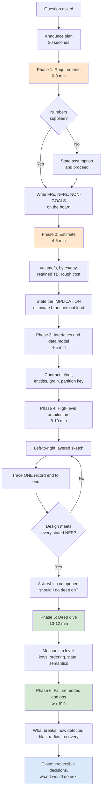
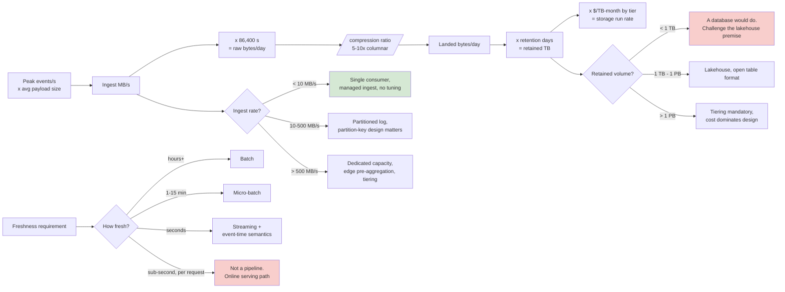

# System Design Interview Prep

## Executive Summary

A data/AI system design interview is not a knowledge test. It is a **forty-five-minute simulation of how you make consequential technical decisions under incomplete information**, observed by someone who will infer from it how you would behave in a real architecture review. Candidates with a decade of production experience fail these routinely, and almost never because they lacked knowledge. They fail because they optimized the wrong thing: they demonstrated recall instead of judgment.

This chapter supplies a repeatable framework, the estimation discipline that makes it credible, drills across the canonical data-system questions, and the communication mechanics that convert good thinking into observable signal. It draws directly on Phases 02 through 12 — [distributed systems](../Phase-02/04_CAP_and_PACELC.md), [cloud architecture](../Phase-03/07_Well_Architected_Framework.md), [storage and table formats](../Phase-04/07_Table_Format_Comparison.md), [batch and lakehouse](../Phase-05/02_Lakehouse_Architecture.md), [modeling](../Phase-06/01_Dimensional_Modeling.md), [streaming](../Phase-07/08_Streaming_Patterns_and_Delivery_Semantics.md), [governance](../Phase-08/01_Data_Governance_Foundations.md), [DataOps](../Phase-09/01_DataOps_Foundations.md), [security](../Phase-10/01_Security_Foundations.md), [MLOps](../Phase-11/06_ML_Pipeline_Architecture.md), and [LLMOps](../Phase-12/04_LLMOps.md). The handbook is the substance; this chapter is the delivery mechanism.

The central thesis is this: **the interview is scored on the quality of your requirements elicitation and your trade-off articulation, not on the correctness of your final diagram.** There is no correct diagram. There are defensible designs and indefensible ones, and the difference is almost entirely whether you established the constraints before choosing the technology and stated what each choice cost you.

The second thesis, which candidates resist: **an explicit numerical estimate, however rough, is the single highest-leverage move in the session.** It converts an unbounded discussion into a bounded engineering problem, it eliminates entire branches of the design space in ninety seconds, and it is the clearest available evidence that you have operated at production scale. Candidates who skip estimation are indistinguishable from candidates who have only read about these systems.

## Learning Objectives

By the end of this chapter you should be able to:

1. Execute a repeatable six-phase system design framework under time pressure without improvising the structure.
2. Elicit functional requirements, non-functional requirements, and explicit non-goals in the first eight minutes, and write them where the interviewer can see them.
3. Perform back-of-envelope estimation for volume, throughput, storage, and cost, and use the result to eliminate design branches out loud.
4. Produce a defensible high-level architecture for the canonical data-system questions: ingestion pipeline, real-time analytics, CDC replication, feature store, RAG platform, metrics/observability store, and multi-tenant lakehouse.
5. Articulate a trade-off in the required form — option, benefit, cost, condition under which you would reverse it — rather than asserting a preference.
6. Manage the whiteboard as a shared artifact: layered left-to-right flow, labelled boundaries, deliberate whitespace for the deep dive.
7. Recognize which phase of the interview you are in and reallocate remaining time deliberately.
8. Recover cleanly from the four standard failure modes: blanking, a wrong turn, a hostile probe, and a silent interviewer.
9. Calibrate your performance against the actual level rubrics used for senior, staff, and principal.
10. Run a structured self-review after every real and mock interview and convert findings into a targeted drill.

## Business Motivation

It is tempting to treat this as a purely personal-career topic. It is not, and framing it that way is why most organizations run these interviews badly.

**For the candidate**, the compensation delta between a "senior" and a "staff" outcome on the same loop is routinely 25–50% of total compensation, sustained over years, plus a materially different scope of work. The differentiating signal in that decision is almost always the system design round, because coding rounds saturate at senior level. A candidate who is technically staff-capable but interviews at senior level is losing a large, recurring, entirely recoverable amount.

**For the hiring organization**, this round is the highest-variance and lowest-reliability stage in the loop unless it is structured. An unstructured design round measures how closely the candidate's architectural vocabulary matches the panel's own — which is precisely the validity failure documented in [Hiring and Interviewing](../Phase-19/05_Hiring_and_Interviewing.md) Case Study 2. The same framework that helps a candidate perform is what lets an interviewer score against competency rather than familiarity.

**For the architecture practice**, the framework is not interview-specific. Requirements before technology, estimation before architecture, explicit trade-offs, recorded decisions — that is [Architecture Decision Records](../Phase-01/03_Architecture_Decision_Records.md) compressed into forty-five minutes. Candidates who internalize it design better systems afterwards, which is the honest reason to invest in it beyond the offer.

The honest counter-case: this is a *simulation*, and it rewards fluent, structured, real-time verbal reasoning. That correlates with, but is not identical to, architectural competence. Excellent architects who think slowly and write beautifully are systematically underrated by this format. Knowing that the format has a bias is part of preparing for it — you are practising a performance, and it is legitimate to say so.

## History and Evolution

**Pre-2005: the brainteaser era.** Interviews at large technology companies leaned on puzzles and algorithmic trivia. Google publicly abandoned brainteasers around 2013 after internal analysis found no predictive validity (documented by Laszlo Bock in *Work Rules!*, 2015). The residue of that era survives as candidate anxiety about "gotcha" questions, which are now rare in credible loops.

**2005–2012: scalability interviews emerge.** As web-scale architecture became a distinct discipline, "design a URL shortener / Twitter / TinyURL" appeared. The canonical reference material of the period — Amazon's Dynamo paper (2007), Google's Bigtable (2006) and MapReduce (2004), and Brewer's CAP conjecture (2000, proved by Gilbert and Lynch 2002) — became the shared vocabulary. Interviews still skewed toward recall of these papers.

**2012–2018: the framework era.** Structured approaches (requirements → estimation → API → data model → high-level design → deep dive → bottlenecks) spread through interview-prep literature and became the de facto expected shape. Simultaneously, structured-interview research — Schmidt and Hunter's 1998 meta-analysis being the standard citation — pushed serious hiring functions toward anchored rubrics, which is what made a *framework* score well: it made candidates legible against a rubric.

**2018–2022: data engineering splits from backend.** As the [modern data stack](../Phase-05/01_Modern_Data_Stack_Overview.md) matured, a distinct data-system design round emerged. The questions changed shape: less "design a chat service", more "design a pipeline ingesting 5 TB/day with sub-hour freshness and GDPR erasure". Batch/stream duality, [table formats](../Phase-04/07_Table_Format_Comparison.md), [delivery semantics](../Phase-07/08_Streaming_Patterns_and_Delivery_Semantics.md), and [data governance](../Phase-08/01_Data_Governance_Foundations.md) entered the rubric.

**2022–present: AI/ML system design becomes a separate round.** With the post-ChatGPT wave, many loops added a distinct ML/LLM system design round: design a recommendation system, a feature store, a RAG platform, an agent platform. This round tests a genuinely different axis — evaluation design, training/serving skew, grounding, cost per token — and candidates who prepare only the classical distributed-systems canon are caught out. Prompted by the same wave, some organizations began experimenting with AI-assisted interview scoring; the [NYC Local Law 144](../Phase-19/05_Hiring_and_Interviewing.md) bias-audit requirement and the EU AI Act's high-risk classification of recruitment AI now constrain that directly.

**Persistent through all eras:** the highest-scoring behaviour has never changed. Clarify, quantify, decide, justify, and say what would change your mind.

## Why This Technology Exists

The system design interview exists because organizations need to predict a behaviour they cannot observe cheaply: **how a candidate will make an irreversible, expensive, multi-team technical decision with incomplete information and no time to research.**

Every cheaper proxy fails at this specifically. A résumé records what a team shipped, not who decided what. A coding round measures a well-defined problem with a known-correct answer — the opposite of an architecture decision. A knowledge quiz measures recall, which is now nearly free to acquire and therefore nearly worthless as a differentiator. A take-home measures work quality with unbounded time, which is a different skill and heavily biased against candidates with caregiving responsibilities.

What the design round uniquely exposes is the **decision process under ambiguity**: does the candidate ask what problem they are solving, or start naming technologies? Do they quantify, or hand-wave? Do they know what their choice costs, or advocate a favourite? Do they update when handed new information, or defend? Those behaviours are hard to fake for forty-five minutes and they transfer directly to the job.

The second reason it exists is **level calibration**. The same question, asked identically, differentiates cleanly across levels because the depth and breadth of the answer scale continuously. A senior candidate designs the happy path correctly. A staff candidate designs the failure modes, the operability, and the migration. A principal candidate questions whether the stated problem is the right problem and connects the design to organizational and cost consequences. Very few interview formats have that continuous scaling property, which is why this one survives despite its known biases.

## Problems It Solves

- **Distinguishing judgment from knowledge.** Two candidates name the same technologies; only one explains under what conditions they would not use them.
- **Level differentiation above senior.** Depth of failure-mode and operability reasoning separates senior from staff more reliably than any other round.
- **Detecting production experience.** Estimation instincts, awareness of skew, small-file problems, backfill pain, and schema evolution are extremely hard to simulate without having lived them.
- **Observing collaboration under disagreement.** The interviewer's pushback is a designed probe of how you handle a challenge to your design — directly analogous to [Architecture Reviews](../Phase-19/02_Architecture_Reviews.md).
- **Testing communication at architect scope.** Can the candidate explain a system to someone who was not in their head five minutes ago?
- **Surfacing breadth across the stack.** Data systems touch storage, compute, network, security, cost, and governance; a design question naturally samples all of them.
- **Cheap, repeatable, and comparable.** Forty-five minutes, no infrastructure, and — if rubric-anchored — comparable across candidates.

## Problems It Cannot Solve

- **Predicting long-horizon delivery.** Nothing in forty-five minutes tells you whether someone finishes hard things over eighteen months.
- **Measuring collaboration over time.** A single adversarial-ish conversation is a poor proxy for how someone behaves in a team across quarters.
- **Eliminating format bias.** It systematically favours fluent, fast, confident verbal reasoners and disadvantages non-native speakers, deliberate thinkers, and the neurodivergent. Structure mitigates this; it does not remove it.
- **Testing depth in the candidate's actual specialty.** A generic question may never touch the thing they are world-class at. Good loops pair it with a deep-dive-on-your-own-work round for exactly this reason.
- **Establishing correctness.** There is no answer key. Two strong designs can be incompatible and both score well.
- **Compensating for a bad rubric.** An unanchored round measures panel-vocabulary match, not competence. That is a hiring-process defect, not a candidate defect.
- **Making you a better architect by itself.** Interview fluency and architectural judgment overlap but are not the same asset. Optimize for the second; the first follows more reliably than the reverse.

## Core Concepts

### 3.1 The Six-Phase Framework

The framework is not a script to recite; it is a **time-allocation contract** that prevents the two dominant failure modes — designing before understanding, and running out of time before the deep dive. For a 45-minute round:

| Phase | Minutes | Output the interviewer should see |
|---|---|---|
| 1. Clarify requirements | 6–8 | Written functional list, NFRs, explicit non-goals |
| 2. Estimate | 4–5 | Numbers on the board: volume/s, bytes/day, retained TB, rough cost |
| 3. Define interfaces & data model | 4–5 | Contract in/out, core entities, partition/grain decision |
| 4. High-level architecture | 8–10 | Boxes-and-arrows, left-to-right, layered |
| 5. Deep dive | 10–12 | One or two components at genuine depth, interviewer-steered |
| 6. Failure modes, ops, wrap | 5–7 | What breaks, how you detect it, what you would do next |

Two rules make this survive contact with a real interviewer. First, **announce the plan in the first thirty seconds** ("I'll clarify requirements, do some sizing, sketch the high level, then go deep wherever you want") — this alone reads as senior, and it licenses you to control the clock. Second, **the interviewer's steer always overrides the plan**. If they pull you into the deep dive at minute twelve, go, and compress phases 3 and 4.

The framework's real purpose is to free working memory. If you are not deciding *what to do next*, all of your attention is available for *the actual problem*.

### 3.2 Requirements: Functional, Non-Functional, and Non-Goals

This phase decides the outcome of the round more than any other, and candidates rush it.

**Functional requirements** — what the system must do, in the user's terms. Keep to three to five. "Ingest clickstream events; make them queryable for analysts; power a real-time dashboard; support GDPR erasure requests."

**Non-functional requirements** — the numbers that actually determine the architecture. Ask for, and pin down, at minimum:

- **Volume and throughput**: events/second at average and at peak, and the peak-to-average ratio. A 30× spike is a different system from a 2× one (see [Retail and E-Commerce Data](../Phase-17/05_Retail_and_Ecommerce_Data.md)).
- **Latency and freshness**: end-to-end freshness target, and query latency at p95/p99. Note these are two different requirements and candidates routinely conflate them.
- **Consistency**: what is acceptable staleness for a read, and is there any path that requires strong consistency (per [CAP and PACELC](../Phase-02/04_CAP_and_PACELC.md))?
- **Retention and access pattern**: how long, queried how often, at what granularity over time.
- **Availability**: the target, and — the more revealing question — what the business impact of an hour of unavailability actually is.
- **Correctness semantics**: at-least-once with idempotent consumption, or is duplicate-tolerance acceptable (per [Streaming Patterns and Delivery Semantics](../Phase-07/08_Streaming_Patterns_and_Delivery_Semantics.md))?
- **Compliance and residency**: PII present? Erasure obligations? Region constraints?
- **Scale trajectory**: what does this look like in three years? Design for roughly 10× current, not 1000×.

**Non-goals** are the highest-signal, least-used move in the entire interview. Explicitly saying "I am *not* going to design multi-region active-active, and here is why that is the right call for these requirements" demonstrates scope discipline and prevents you from being judged for omitting something you deliberately excluded. Write non-goals on the board next to the requirements.

If the interviewer refuses to supply a number — many will, deliberately — **state an assumption and move**: "I'll assume 50,000 events/second at peak, 5 KB each. Stop me if that is wildly off." That is not guessing; that is bounding the problem, and it is exactly what you would do in a real design doc.

### 3.3 Estimation and Back-of-Envelope

Estimation exists to **eliminate design branches**, not to be precise. Two significant figures is over-precision. Round aggressively, keep units visible, and say the implication out loud after every number.

The numbers worth memorizing (order-of-magnitude, the classic "latency numbers every programmer should know" lineage, updated for modern hardware):

| Operation | Order of magnitude |
|---|---|
| L1/L2 cache reference | ~1 ns |
| Main memory reference | ~100 ns |
| NVMe SSD random read | ~50–100 µs |
| Round trip within a datacenter/region | ~0.5 ms |
| Cross-region round trip (intra-continent) | ~10–30 ms |
| Cross-continent round trip | ~100–200 ms |
| Sequential read, 1 MB from SSD | ~50–100 µs |
| Sequential read, 1 MB from object storage | ~5–20 ms + request latency |

And the arithmetic shortcuts:

- **Seconds per day ≈ 86,400 ≈ 10⁵.** So 1,000 events/s ≈ 10⁸ events/day ≈ 100 M/day.
- **A day is ~86 ks; a month ~2.6 Ms; a year ~31.5 Ms (≈ π × 10⁷).**
- **1 KB × 1 M = 1 GB. 1 KB/s ≈ 86 MB/day ≈ 31 GB/year.**
- **Compression on columnar telemetry: assume 5–10× for Parquet+ZSTD** (see [Compression and Encoding](../Phase-04/08_Compression_and_Encoding.md)).
- **Peak ≈ 2–5× average** for business-hours workloads; **10–50×** for consumer/retail event spikes.

A worked example you should be able to produce in ninety seconds:

> 50,000 events/s peak, ~20,000 average, 2 KB raw JSON each.
> Ingest: 20,000 × 2 KB = 40 MB/s ≈ 3.5 TB/day raw.
> After Parquet + ZSTD at ~8×: ~440 GB/day landed ≈ 160 TB/year.
> At ~$0.02/GB-month hot ADLS: 160 TB × $20/TB ≈ $3,200/month for year-one hot storage, before tiering. Tier past 90 days to cool/archive and that drops by roughly 60–70%.
> Implication: this is comfortably a lakehouse problem, not a database problem. 40 MB/s is ~4 Event Hubs throughput units or a modest Kafka cluster — not exotic. The cost driver is retention and query, not ingest.

That last line — **the implication** — is the part that scores. Numbers without an implication are arithmetic; numbers with an implication are engineering.

### 3.4 The Canonical Data-System Questions

Seven question families cover the overwhelming majority of data/AI design rounds. Prepare a *default answer skeleton* for each — not a memorized design, but a starting shape you can adapt.

**1. Batch ingestion and pipeline design.** "Design a pipeline ingesting N sources into an analytics platform." Skeleton: source connectors → landing/bronze (immutable, schema-on-read with rescue column) → validated silver (idempotent MERGE on a business key + change sequence) → modelled gold ([dimensional](../Phase-06/01_Dimensional_Modeling.md) or wide tables) → serving. Deep-dive risks: schema evolution, late-arriving data, backfill/reprocessing, small files, idempotency. References: [Batch Pipeline Design](../Phase-05/09_Batch_Pipeline_Design.md), [Medallion Architecture](../Phase-05/03_Medallion_Architecture.md), [Delta Lake](../Phase-04/04_Delta_Lake.md).

**2. Real-time analytics / streaming.** "Design a real-time dashboard over a high-volume event stream." Skeleton: producers → partitioned log ([Kafka](../Phase-07/02_Apache_Kafka.md) / Event Hubs) → stream processor ([Flink](../Phase-07/04_Apache_Flink.md) or Structured Streaming) with windowing and watermarks → real-time OLAP store ([ClickHouse/Druid/ADX](../Phase-07/07_Real_Time_Analytics_ClickHouse_and_Druid.md)) → dashboard; parallel branch to the lake for history. Deep-dive risks: event time vs processing time, watermarks and late data, exactly-once claims, hot partitions, state size, backpressure.

**3. Change data capture and replication.** "Replicate an OLTP database into the lakehouse with sub-minute lag." Skeleton: log-based CDC (Debezium / native connector) → topic per table → merge into the lakehouse with ordering by log sequence number → [SCD](../Phase-06/05_Slowly_Changing_Dimensions.md) handling. Deep-dive risks: initial snapshot plus catch-up consistency, schema DDL propagation, delete/tombstone handling, out-of-order and idempotency, replication lag monitoring. References: [Change Data Capture](../Phase-07/06_Change_Data_Capture.md), [Replication and Consistency](../Phase-02/02_Replication_and_Consistency.md).

**4. Feature store / ML platform.** "Design a feature platform serving both training and online inference." Skeleton: one feature definition → offline store (point-in-time-correct as-of joins) and online store (low-latency KV) → registry → training and serving consume the same definition. Deep-dive risks: training/serving skew, point-in-time correctness, freshness of online features, backfill. Reference: [Feature Stores with Feast](../Phase-11/02_Feature_Stores_with_Feast.md).

**5. RAG / LLM platform.** "Design an enterprise assistant over internal documents." Skeleton: ingestion (chunk → embed → index, **propagating source ACLs into the index**) → retrieval (hybrid dense+sparse, pre-filtered by caller entitlement, then rerank) → generation with grounding and citation → evaluation harness → guardrails → cost controls. Deep-dive risks: access-control propagation, chunking strategy, retrieval-vs-generation quality as separate metrics, hallucination detection, prompt injection, cost per request. References: [Retrieval Augmented Generation](../Phase-12/03_Retrieval_Augmented_Generation.md), [Evaluation and Guardrails](../Phase-12/09_Evaluation_and_Guardrails.md).

**6. Metrics / observability store.** "Design a system to store and query metrics from 100,000 hosts." Skeleton: agents → ingest gateway → time-series store with downsampling and rollups → query layer. Deep-dive risks: **cardinality** (the dominant cost driver), retention tiers, pre-aggregation, out-of-order writes. Reference: [Monitoring with Prometheus and Grafana](../Phase-18/03_Monitoring_with_Prometheus_and_Grafana.md).

**7. Multi-tenant lakehouse / data platform.** "Design a platform serving twenty internal teams." Skeleton: landing zone and network isolation → shared storage with per-domain containers → catalog as the single enforcement point → compute isolation with cost attribution → golden paths. Deep-dive risks: noisy neighbours, cost chargeback, access control at scale, schema/contract enforcement between domains. References: [Capstone: Enterprise Data Platform](01_Capstone_Enterprise_Data_Platform.md), [Azure Landing Zones](../Phase-03/03_Azure_Landing_Zones.md).

### 3.5 Trade-off Articulation

Most candidates state preferences and believe they are stating trade-offs. The difference is observable, and interviewers are trained to hear it.

**Weak (preference):** "I'd use Kafka here because it's more scalable."
**Adequate (comparison):** "I'd use Kafka over a queue because I need replay for multiple independently-paced consumers."
**Strong (trade-off):** "I'd use a partitioned log rather than a queue. The benefit is replay and multiple independent consumer groups, which I need because the analytics consumer and the alerting consumer read at different rates. The cost is that I now own partition-key design and consumer-group operations, and I get no native dead-letter mechanism — I'll have to build a DLQ topic convention myself. If it turned out there was only ever one consumer and no replay requirement, I'd switch to Service Bus and take the operational simplicity."

The strong form has four parts, and I recommend consciously producing all four every time:

1. **The choice**, stated as a class of solution before a product name.
2. **The benefit**, tied to a stated requirement — not a generic virtue.
3. **The cost**, named honestly and specifically. This is the part candidates omit, and its absence is the single most common reason a technically-correct answer scores at senior rather than staff.
4. **The reversal condition** — what fact, if true, would make you choose differently. This is the [ADR](../Phase-01/03_Architecture_Decision_Records.md) "invalidation condition" and it is the strongest available signal of architectural maturity.

Three trade-off axes recur in nearly every data-system question and are worth having pre-loaded:

- **Latency vs cost vs complexity.** Real-time is almost always the most expensive and most operationally complex option. The staff-level move is to ask whether the freshness requirement is real, and to propose micro-batch when it is not.
- **Consistency vs availability vs latency.** [PACELC](../Phase-02/04_CAP_and_PACELC.md), not just CAP: even without a partition, you are trading latency against consistency on every read.
- **Normalization vs denormalization / read vs write optimization.** [CQRS](../Phase-14/03_CQRS.md) and the read-model projection are the general form; the eternal caution is that the fast denormalized artifact must never become authoritative for a decision.

## Internal Working

### 4.1 What the Interviewer Is Actually Scoring

Understanding the scoring mechanism changes behaviour more than any tip. A well-run round scores against an anchored rubric (per [Hiring and Interviewing](../Phase-19/05_Hiring_and_Interviewing.md)) with roughly these dimensions:

| Dimension | Weak | Strong |
|---|---|---|
| Requirements & scoping | Starts designing immediately | Elicits NFRs, states assumptions and non-goals |
| Quantitative reasoning | No numbers, or numbers with no consequence | Estimates and uses the result to eliminate options |
| Architecture soundness | Design does not meet stated requirements | Design is coherent and traceably meets each requirement |
| Depth | Breadth-only, everything at one level | Genuine mechanism-level depth on at least one component |
| Trade-offs | Asserts preferences | States cost and reversal condition for each choice |
| Failure modes & operability | Happy path only | Names failure modes, detection, and response |
| Communication | Meandering, unstructured, unreadable board | Signposted, structured, legible artifact |
| Response to new information | Defends or collapses | Updates the design and says why |

Note what is *not* on the list: naming the most fashionable technology, producing the same design the interviewer would have, or finishing. **Most strong candidates do not "finish."** Running out of time mid-deep-dive with excellent depth outscores a complete but shallow survey almost every time.

### 4.2 The Signal-Per-Minute Model

Treat the session as a channel with a fixed budget of roughly forty-five minutes and a receiver who is filling in a rubric. Your objective is to **maximize scored signal per minute**, and the corollary is that some activities are near-zero-signal and must be minimized:

- **Near-zero signal:** drawing neat boxes, listing technologies you are not going to justify, re-explaining something already accepted, generic statements ("we'd add monitoring").
- **High signal:** any explicit number and its implication; any named trade-off with a cost; any failure mode with a detection mechanism; any moment where you notice a problem in your own design and fix it out loud.

The last one deserves emphasis. **Self-correction is scored positively, not negatively.** "Wait — I said I'd partition by warehouse ID, but if one warehouse dominates volume I've built a hot partition. Let me use a compound key of warehouse ID plus a hash bucket." That is a stronger signal than never having made the error, because it demonstrates the review instinct rather than mere recall.

### 4.3 The Interviewer's Probe Pattern

Interviewer questions are not random; they follow a small number of intents, and identifying the intent tells you what answer scores.

- **"How would you handle X failing?"** — Intent: test failure-mode reasoning. Answer with detection, blast radius, degradation behaviour, and recovery — in that order.
- **"What if traffic grew 100×?"** — Intent: find the first bottleneck. Answer by naming *which component* breaks first and *why*, not by saying "we'd scale out."
- **"Why not use Y instead?"** — Intent: usually not disagreement. It is testing whether you know the alternative's actual trade-off. Steelman Y, then state the specific condition on which your choice depends.
- **"Walk me through what happens when a record arrives."** — Intent: test whether your boxes are real. Trace the record concretely, naming the format and the transformation at each hop.
- **Silence.** — Intent: test whether you self-direct. Do not fill it with narration; move to the next phase or ask which component they want depth on.
- **Steering to a component you did not expect.** — Intent: they have a rubric item to score. Go there immediately and gracefully; do not defend your plan.

The general rule: **treat every probe as information, not as an attack.** This is the same discipline as receiving review feedback in [Architecture Reviews](../Phase-19/02_Architecture_Reviews.md), and interviewers are explicitly watching for it.

## Architecture

The preparation system itself has an architecture, and treating it as one is what makes preparation efficient rather than anxious. Five layers:

**Layer 0 — Foundational knowledge.** Phases 02–12 of this handbook. Distributed systems primitives, storage and format internals, batch and streaming engines, modeling, governance, security, MLOps, LLMOps. This layer is slow to build and cannot be crammed. If it is missing, no framework rescues you.

**Layer 1 — Reference designs.** The seven canonical skeletons in §3.4, each held as a *shape* rather than a memorized diagram, plus one real system you have personally operated for each shape you claim.

**Layer 2 — The framework.** The six-phase time contract (§3.1). This is the scheduler that allocates the scarce forty-five minutes across Layer 1 retrieval and Layer 3 articulation.

**Layer 3 — Articulation.** Trade-off form, estimation fluency, signposting, whiteboard mechanics. This is a *performance* skill and improves almost entirely through rehearsal, not reading.

**Layer 4 — Calibration and feedback.** Mock interviews, recorded self-review, targeted drills against identified weaknesses.

The critical diagnostic property is the same as in [Technical Writing](../Phase-19/04_Technical_Writing.md): **failures at one layer cannot be fixed at another.** A candidate who freezes because they have never rehearsed out loud has a Layer 3 problem and will not fix it by reading more architecture material — the most common misallocation in preparation. Conversely, a candidate who is fluent but shallow has a Layer 0 problem and more mock interviews will only polish the shallowness.

## Components

- **Requirements checklist.** A memorized, ordered list of NFR questions (§3.2) that you can run in under two minutes without thinking about what comes next.
- **Estimation kit.** The latency table, the arithmetic shortcuts, and the compression/peak heuristics from §3.3.
- **Reference design skeletons.** Seven starting shapes, each with three named risks for the deep dive.
- **Trade-off templates.** The four-part form, plus pre-loaded positions on the three recurring axes.
- **Whiteboard protocol.** Fixed layout convention (§13) so you never spend attention on where to draw.
- **War stories.** Three to five real incidents from your own experience, each compressible to ninety seconds, mapped to the failure modes the canonical questions probe. These are what make your answers non-generic.
- **Question bank.** The questions *you* ask — about their actual constraints — which double as scoping moves and as genuine evaluation of the role.
- **Self-review rubric.** The scoring table from §4.1, used on yourself after every session.
- **Drill schedule.** A time-boxed practice cadence (§20) rather than open-ended study.

## Metadata

The metadata of this discipline is the set of facts about the problem that you must elicit and record visibly, because they are what every subsequent decision is justified against.

Concretely: the NFR set from §3.2, written on the board and left there. This has three functions. First, it is the **traceability record** — when you choose a technology you can point at the requirement that forced it, which is the difference between a justified and an asserted design. Second, it is a **defence against scope drift**, yours and the interviewer's. Third, it is an **assumption register**: any number you supplied yourself rather than being told should be marked as an assumption, because an unmarked assumption presented as fact is the interview-scale version of the unstated-assumption failure that [Architecture Reviews](../Phase-19/02_Architecture_Reviews.md) identifies as the highest-value thing a reviewer can surface.

The most valuable single metadata item is the **non-goal list**, for the reason given in §3.2: it converts an omission (scored as a gap) into a decision (scored as judgment).

## Storage

Your durable knowledge store, and its failure mode is the same as any corpus: it rots and becomes unfindable.

**What to store.** Not transcripts of designs — those are brittle and encourage memorization, which is detectable and scores badly. Store instead: the seven skeletons at *shape* granularity; a single page of estimation constants; a trade-off card per recurring decision (log vs queue, batch vs stream, row vs column, normalized vs denormalized, managed vs self-hosted); and a personal incident log.

**The personal incident log is the highest-value artifact in the whole store and the most commonly missing one.** For each real production incident or hard decision you were part of: the context, the decision, what went wrong, how it was detected, and what you would do differently. These are what let you answer "how would you handle X failing" with a specific mechanism rather than a textbook phrase, and interviewers can tell the difference instantly.

**How to store it.** Plain Markdown in Git, per [Technical Writing](../Phase-19/04_Technical_Writing.md)'s docs-as-code discipline. Retrieval matters more than volume: a 200-page prep document you never re-read is worse than five pages you have internalized. Use spaced repetition for the small memorizable set (latency numbers, arithmetic shortcuts) and active recall — closing the notes and reproducing the skeleton from memory — for everything else. Passive re-reading produces a strong and entirely false sense of readiness.

## Compute

The scarce resource is not knowledge; it is **attention across forty-five minutes**, and it is not scalable.

Three consumers compete for it: retrieving the right design knowledge, structuring the answer, and articulating it clearly under observation. The framework exists to reduce the second to near zero so the other two get the budget. This is why rehearsing the framework until it is automatic pays more than learning one more technology — automaticity frees working memory at exactly the moment it is most constrained.

Two practical consequences. First, **cognitive load spikes early**: the first ten minutes carry requirements elicitation, estimation, and the anxiety peak simultaneously. Rehearse that segment disproportionately. Second, **latency in this channel is acceptable, silence is not**. Thinking for eight seconds before answering a hard question is fine and reads as considered — but say "let me think about that for a moment" first, because unannounced silence is indistinguishable from being stuck.

Interviewer attention is also finite. They have been in three loops today. A meandering answer is not just low-signal, it actively consumes their patience budget. Signposting ("three things here — first...") is a compression scheme for their attention as much as a structure for yours.

## Networking

The interview is a two-way channel and candidates habitually treat it as one-way broadcast.

**Establish the protocol first.** Ask up front: "Would you prefer I talk through my reasoning continuously, or present at checkpoints?" Different interviewers genuinely want different things, and asking costs fifteen seconds.

**Bandwidth is bidirectional.** Every clarifying question you ask is both a scoping move and a data acquisition. Interviewers hold constraints they will only reveal on request — that is often the deliberate design of the question. A candidate who never asks receives none of it and then designs against the wrong problem.

**Confirm receipt.** Periodically check alignment: "Does that match the constraint you had in mind?" This catches divergence at minute fifteen instead of minute forty.

**Backchannel matters.** Read the interviewer's engagement. Leaning in and asking follow-ups means you are in the right territory — go deeper. Flat affect and a glance at the clock means you are in low-value territory — signpost a transition and move.

And per [Stakeholder Management](../Phase-19/03_Stakeholder_Management.md): the interviewer is a stakeholder with their own accountable axis. They must justify a hire/no-hire decision to a committee using written evidence. **Give them quotable evidence** — crisp, decision-shaped statements they can write down. A candidate whose reasoning is easy to summarize in a written packet is materially advantaged in the committee stage.

## Security

Two distinct concerns, both real.

**Confidentiality of your employer's information.** You are frequently asked to describe systems you have built. Describe architecture, scale in order-of-magnitude terms, decisions, and lessons. Do not disclose proprietary algorithms, unannounced products, customer names, security control details, or anything covered by an NDA. Saying "I can describe the architecture and the trade-offs but not the specific business logic" is a *positive* signal — it demonstrates exactly the discretion they will need from you about *their* systems. Candidates who over-share about a previous employer are noted, and not favourably.

**Integrity of your own claims.** Do not overstate your role, do not claim depth you lack, and do not invent numbers about your own systems. Every fabrication creates an exponentially growing surface of follow-up questions you cannot answer, and detection is near-certain at staff level and above. "I haven't operated Flink at that scale, but here is how I'd reason about it and what I'd want to validate first" is a *strong* answer. Bluffing is one of the few genuinely unrecoverable failures in an interview.

A third, quieter point: interview processes handle candidate personal data and, increasingly, AI-assisted scoring. If you are on the hiring side, the obligations in [Data Privacy and PII Protection](../Phase-10/07_Data_Privacy_and_PII_Protection.md) and the bias-audit requirements referenced in [Hiring and Interviewing](../Phase-19/05_Hiring_and_Interviewing.md) apply to your interview pipeline exactly as they apply to any other production system.

## Performance

Measured as **rubric-scored signal per minute**, not words per minute.

Leading indicators of a strong session:

- Requirements phase completed within eight minutes with written output.
- At least one quantitative estimate stated, with its implication.
- At least three trade-offs stated in full four-part form.
- At least one component explored to mechanism level (not "we'd use Kafka" but "partition key is X because of Y, here is what happens on rebalance").
- At least two failure modes named with a detection mechanism.
- At least one self-correction.
- Interviewer talking roughly 20–30% of the time. Under 10% means you are not engaging them; over 50% means they are rescuing you.

Anti-indicators: technology names appearing before requirements; the phrase "we'd just" attached to something hard; long stretches of drawing in silence; and finishing early with a complete but shallow design.

The typical performance failure is not slowness but **misallocation**: forty minutes of breadth and five of depth, when the rubric weights depth heavily above senior level. If you must choose — and you must — go deep and leave the survey incomplete, but *say* you are doing so: "I'll leave the serving layer at the sketch level and spend our remaining time on exactly-once semantics in the merge, since that's where the real risk is."

## Scalability

Two senses, both worth designing for.

**Scaling your preparation across many interviews.** Do not prepare per-company. The seven skeletons plus the framework cover the overwhelming majority of data/AI rounds; per-company preparation should be a thin adapter — their scale, their domain, their known stack — layered on a stable core. Preparing from scratch for each loop is the interview-prep equivalent of every team building its own pipeline.

**Scaling your answer across levels.** The same question is asked to senior, staff, and principal candidates, and the differentiator is the axis you extend:

| Level | What the answer adds |
|---|---|
| Senior | A correct, coherent design meeting the stated functional and non-functional requirements; sound component choices; happy path solid. |
| Staff | Failure modes and detection; operability, migration, and rollback; explicit cost model; second-order consequences; challenges an assumption in the question. |
| Principal | Questions whether this is the right problem; connects the design to organizational structure, ownership, funding, and multi-year evolution; states what they would *not* build and why; identifies the decision that is genuinely irreversible and treats it differently. |

These are cumulative, not alternative. A principal-level answer that skips the correct design is not principal-level; it is evasive. Build up the levels in order and extend as far as your target level requires.

## Fault Tolerance

Four standard failure modes, each with a rehearsed recovery. Rehearse these explicitly — the whole point is that they happen when you are least able to improvise.

**You blank on a technology or mechanism.** Recover by reasoning from first principles rather than admitting defeat: "I don't remember the exact consistency guarantee of that service. What I need here is read-your-writes for the caller's own session; I'd verify whether it provides that, and if not I'd route those reads to the primary." You have demonstrated that you know what *property* you need, which is the more valuable knowledge.

**You realize your design is wrong.** Say so, immediately and without drama, and fix it out loud. This is scored positively (§4.2). The failure is not the error; it is defending it. "I've made a mistake — this write path can't give me the ordering guarantee I claimed. Let me change the partition key."

**The interviewer pushes back hard.** Distinguish the two cases. If they have information you lack, update and thank them. If they are testing conviction, hold your position *while acknowledging the cost*: "That's a real weakness of my approach — it costs me replay. I'm accepting that because the requirement is single-consumer with no reprocessing need. If that requirement is softer than I assumed, I'd switch." Neither collapsing nor stonewalling; this is [disagree-and-commit](../Phase-19/01_Technical_Leadership.md) at conversational scale.

**You are running out of time.** Announce a re-plan rather than accelerating silently: "We have ten minutes. I'd rather go deep on the merge semantics than sketch the remaining two layers — is that the right call for you?" This hands the allocation decision to the person holding the rubric, which is both respectful and strategically correct.

The meta-principle across all four: **degrade gracefully and visibly.** Silent degradation — quietly hand-waving, quietly running out of time, quietly hoping the error goes unnoticed — is the one that reliably fails the round.

## Cost Optimization

Preparation time is a real, bounded, and frequently misallocated budget. Typical returns per hour, roughly ranked:

| Activity | Return | Notes |
|---|---|---|
| Mock interviews with feedback | Highest | Only activity that trains Layer 3 articulation |
| Recording and self-reviewing your own answers | Very high | Brutal, effective, free, almost universally skipped |
| Drilling estimation aloud | High | Small skill, disproportionate scoring weight |
| Writing the seven skeletons from memory | High | Active recall, not re-reading |
| Building the personal incident log | High | One-time cost, makes every answer specific |
| Reading new architecture material | Moderate | High only if Layer 0 is genuinely thin |
| Watching others' mock interviews | Low–moderate | Useful for format calibration, not for skill |
| Re-reading notes | Near zero | Produces false confidence |

**Worked example.** A candidate with strong Layer 0 knowledge budgets forty hours over six weeks. A common (bad) allocation: thirty-two hours reading, six watching videos, two doing a single mock — which optimizes the layer that was already strong and leaves Layer 3 untrained. The result is the recognizable "knows everything, interviews badly" profile.

A better allocation of the same forty hours: eight hours building the skeletons and incident log; six hours drilling estimation and trade-off phrasing aloud; **twenty hours across ten mock interviews with recorded self-review**; six hours of targeted reading against the specific gaps the mocks surfaced. Same budget, and the difference in outcome is typically a full level — which, per §Business Motivation, is a compensation delta of 25–50% sustained over years. The return on ten mock interviews is among the highest available on any forty-hour investment in a technical career.

The failure mode is identical to the one in [FinOps and Cost Optimization](../Phase-18/01_FinOps_and_Cost_Optimization.md): unmeasured spend flows to the comfortable activity, not the high-return one. Reading is comfortable; being recorded failing a mock is not.

## Monitoring

You need a measurement mechanism, because self-assessment immediately after an interview is unreliable in both directions.

**Mock interviews are the instrument.** Run them with someone who will score against the §4.1 rubric rather than say "that was good." Peers, a paid service, or a colleague briefed on the rubric all work; the requirement is the rubric, not the interviewer's seniority.

**Record and self-review.** Audio is sufficient; video adds pacing and filler-word signal. This is uncomfortable and it is the single most effective diagnostic available. Most candidates discover on first review that they spent nine minutes on something they remember as two, and that they said "basically" forty times.

**Track disaggregated scores, never a single aggregate.** Per [Evaluation and Guardrails](../Phase-12/09_Evaluation_and_Guardrails.md)'s disaggregated-metrics principle, a single "how did it go" score hides the pattern. Track requirements, estimation, depth, trade-offs, failure modes, and communication separately across sessions. A candidate scoring 4/5 on everything except trade-offs at 2/5 has one precise, cheap-to-fix problem — invisible in an aggregate.

**Post-interview debrief for real rounds.** Within thirty minutes, write: the question, your framework adherence, what the interviewer probed (their probes tell you the rubric), where you felt weak, and what you would change. Memory of a stressful event degrades within hours.

## Observability

Monitoring tells you *that* a session went poorly; observability tells you *why*, and the layered model in §Architecture is the diagnostic tool.

Correlate three signals per session: **your own recollection** (what you thought you did), **the recording** (what you actually did), and **the scored rubric** (what it looked like from the other side). The gaps between them are the findings.

Typical diagnoses, mapped to layer:

- Fluent but scored shallow → **Layer 0** knowledge gap. More reading is genuinely the fix here, but targeted at the specific area probed.
- Knew the answer, delivered it badly → **Layer 3** articulation. Rehearsal aloud, not reading.
- Ran out of time repeatedly → **Layer 2** framework not automatic. Drill the phase transitions with a timer.
- Design didn't meet requirements → **Requirements phase** skipped or rushed. Drill only the first eight minutes, ten times.
- Froze on pushback → **Layer 3** under adversarial conditions. Ask a mock partner to push back deliberately.

The most common misdiagnosis, worth stating explicitly: **treating a Layer 3 failure as a Layer 0 failure.** "I did badly, so I need to study more" is the reflex, and it is usually wrong for experienced engineers — they have the knowledge and have never once said it out loud under time pressure to a stranger.

## Operational Response Playbook

**Playbook 1 — The interview is going badly in real time.**

*Signal:* you have lost the thread, the interviewer has gone quiet or is visibly disengaged, or you have realized your design does not satisfy a stated requirement.

*Diagnose before acting* — the responses differ and are not interchangeable:

| Cause | Signal | Response |
|---|---|---|
| Lost structure | You cannot say which phase you are in | Stop. Verbally re-anchor: "Let me step back and restate requirements, then re-plan our remaining time." |
| Design is actually wrong | A requirement is unmet | Name it explicitly and revise out loud. This scores positively. |
| Wrong depth level | Interviewer disengaged, glancing at clock | Signpost a transition and ask: "Which component would be most useful to go deep on?" |
| Misunderstood the question | Interviewer keeps redirecting | Ask directly: "I want to check I'm solving the right problem — is the core constraint X or Y?" |
| Genuine knowledge gap | You do not know the mechanism | Say so, then reason from the property you need. Do not bluff. |

*Do not:* speed up and talk over the problem; silently redesign while narrating the old design; apologize repeatedly (it consumes time and amplifies the perception of failure); or bluff. **The recovery is almost always to slow down and re-anchor, which feels exactly wrong under stress and is why it must be rehearsed.**

**Playbook 2 — You failed a round and do not know why.**

*Signal:* rejection after a design round, with generic or no feedback.

*Diagnose, do not assume.* The reflex conclusion "I needed to know more" is the least likely cause for an experienced engineer. Work the layer model: reconstruct the session from your debrief notes; identify which rubric dimensions you have no evidence of having demonstrated (usually estimation, trade-off cost statements, or failure modes — the three most commonly omitted); and check the format basics — did you complete requirements in eight minutes, did you state any number, did you go deep anywhere.

*Respond by cause:* Layer 0 → targeted reading in the probed area only. Layer 2 → timed framework drills. Layer 3 → mock interviews with recording. Requirements-phase failure → drill the first eight minutes in isolation, which is the cheapest high-return drill available.

*Do not:* conclude the process was arbitrary and change nothing; over-index on a single data point (one round has high variance — three rounds with the same weak dimension is a signal); or respond to a Layer 3 failure by reading more, which is the misallocation named in §Observability. And do request feedback: many companies will give a dimension-level summary if asked politely, and it is worth more than any amount of speculation.

## Governance

If you are on the hiring side, this round needs the same governance any consequential decision process needs, and for the same reasons set out in [Architecture Reviews](../Phase-19/02_Architecture_Reviews.md) and [Hiring and Interviewing](../Phase-19/05_Hiring_and_Interviewing.md):

- **An anchored, written rubric** with behavioural anchors per dimension per level. Without it you are measuring vocabulary match, not competence.
- **A standard question set** with calibrated difficulty, and a documented "what good looks like at each level" for each question.
- **Independent written feedback before group discussion**, to prevent anchoring on the first or most senior voice.
- **Interviewer calibration** — shadowing, reverse-shadowing, and periodic re-calibration against real post-hire outcomes. Interviewers drift exactly as an [LLM-as-judge drifts](../Phase-12/09_Evaluation_and_Guardrails.md), and for structurally similar reasons: an unvalidated evaluator gradually optimizes for its own preferences.
- **Adverse-impact monitoring at stage level**, because a design round conducted in a second language under time pressure is a plausible source of disparate impact.
- **Rubric revalidation against outcomes.** If your design round does not predict on-the-job performance, it is a ritual. Measure it.

For candidates, the governance-relevant point is narrower but real: **be honest about scope and depth of your own contributions.** Interview claims are increasingly verified through reference checks and follow-up probing, and an inflated claim is far more damaging than the gap it was concealing.

## Trade-offs

**Framework vs authenticity.** A framework makes you legible to the rubric and frees working memory. Recited mechanically, it reads as canned and suppresses the genuine reasoning the interviewer is trying to observe. *Resolution:* internalize the framework until it is invisible — the interviewer should experience structured thinking, not a recited process.

**Breadth vs depth.** Covering everything is safe and scores at senior. Going deep risks omitting an area the interviewer wanted. *Resolution:* cover breadth quickly and shallowly, then **ask** where to go deep. The ask itself is a strong signal, and it transfers the allocation risk to the person holding the rubric.

**Conviction vs flexibility.** Defending a position reads as strong until it reads as rigid. Updating reads as collaborative until it reads as having no view. *Resolution:* hold positions on requirements-grounded reasoning and update readily on new *facts*. Say which is happening.

**Preparation vs over-preparation.** Rehearsed answers are fluent; over-rehearsed ones are detectably scripted and collapse the moment the question deviates. *Resolution:* rehearse *components* (estimation, trade-off phrasing, skeleton shapes), never whole answers.

**Familiar technology vs best-fit technology.** Proposing what you know well lets you go deep and answer follow-ups; proposing the theoretically ideal option risks exposure. *Resolution:* propose the best fit, but say what you have and have not operated. "I'd use Flink for the event-time semantics; my production experience is Structured Streaming, so I'd want to validate the state-backend operations before committing" is a stronger answer than either bluffing or defaulting to the familiar.

**Optimizing for the interview vs optimizing for the craft.** The two overlap substantially but not entirely. *Resolution:* invest in the craft as the primary asset and treat the performance layer as a thin, deliberate, time-boxed adapter — the same right-sizing principle as everywhere else in this handbook.

## Decision Matrix

**Which reference skeleton applies to the question asked?**

| If the question emphasizes… | Start from | Primary deep-dive risk |
|---|---|---|
| "sub-second dashboard", "live", "as it happens" | Streaming + real-time OLAP | Event time vs processing time; hot partitions |
| "nightly", "reports", "historical", "warehouse" | Batch medallion pipeline | Idempotency, backfill, schema evolution |
| "keep the lake in sync with the database" | CDC replication | Snapshot+catch-up consistency; deletes; ordering |
| "recommendations", "predictions", "model" | ML pipeline + feature store | Training/serving skew; point-in-time correctness |
| "assistant", "search our documents", "chatbot" | RAG platform | Access-control propagation; evaluation; cost/request |
| "metrics from N hosts", "monitoring", "telemetry" | Time-series store | Cardinality; retention tiers; rollups |
| "platform for N teams", "self-serve" | Multi-tenant lakehouse | Isolation, cost attribution, contract enforcement |

**Batch vs micro-batch vs streaming** — the most common technology decision in a data design round:

| Freshness requirement | Choose | Why |
|---|---|---|
| Hours to daily | Batch | Simplest, cheapest, easiest to reprocess |
| 1–15 minutes | Micro-batch (Structured Streaming, triggered) | Most of the freshness at a fraction of the operational cost |
| Seconds | True streaming (Flink) | Only when the requirement is genuinely sub-minute and event-time semantics matter |
| Sub-second, request-scoped | Not a pipeline — an online serving path | Different architecture entirely; do not stretch a pipeline to cover it |

The staff-level move on this table is to **challenge the freshness requirement before satisfying it**. "You said real-time — is the decision downstream actually made within seconds, or is this a dashboard someone looks at twice a day?" A very large fraction of real "real-time" requirements do not survive that question, and demonstrating that you ask it is worth more than demonstrating you can build the streaming version.

## Design Patterns

- **Announce the plan.** Thirty seconds at the start, establishing structure and licensing you to control time.
- **Requirements on the board, permanently visible.** Every later choice points back at one.
- **Assume-and-declare.** When a number is withheld, state an assumption and proceed. Never stall waiting for a number.
- **Estimate, then state the implication.** Never leave a number without its consequence.
- **Class before product.** "A partitioned log" before "Kafka". Demonstrates that you are reasoning about properties, not brands.
- **Layered left-to-right board.** Sources → ingest → store → process → serve, with cross-cutting concerns in a band underneath.
- **Ask where to go deep.** Transfers allocation risk to the rubric-holder and reads as collaborative.
- **Four-part trade-offs.** Choice, benefit, cost, reversal condition — every time.
- **Trace one record end to end.** Proves the boxes are real; catches your own gaps.
- **Self-correct out loud.** Scored positively; suppressing it is scored negatively when discovered.
- **Name the irreversible decision.** "The partition key and the table format are the two things that are expensive to change later; everything else here is reversible." This is the single most reliable principal-level signal available.
- **Close with next steps.** "If I had another hour I'd work on X; if I had a quarter I'd validate Y." Converts an unfinished design into a demonstration of prioritization.

## Anti-patterns

- **Technology-first.** Naming a stack before establishing a requirement. The most common and most damaging failure.
- **The buzzword survey.** Listing many technologies without justifying any. Reads as compensating for shallow depth, and it usually is.
- **Silent drawing.** Two minutes of neat boxes with no narration. Zero signal, and it consumes the deep-dive budget.
- **Uniform shallowness.** Everything covered, nothing explored. The classic senior-ceiling profile.
- **Unfalsifiable hand-waving.** "We'd add caching", "we'd scale horizontally", "we'd add monitoring" — with no mechanism, no metric, no threshold.
- **Preference dressed as trade-off.** Asserting a choice with a benefit and no cost.
- **Defending a broken design.** Costs more than the original error by an order of magnitude.
- **Bluffing.** Near-certain detection, effectively unrecoverable.
- **Ignoring the steer.** Continuing your plan after the interviewer asked for something else.
- **Over-engineering.** Multi-region active-active for a 200 GB internal dataset. Signals an inability to right-size, which is a genuine architectural defect, not merely an interview error.
- **Skipping estimation.** Makes you indistinguishable from someone who has only read about these systems.
- **Rushing the requirements phase to "get to the design."** The design *is* the requirements, transformed.

## Common Mistakes

- Treating a withheld number as a blocker rather than an invitation to assume.
- Conflating freshness (how old is the data) with query latency (how fast is the answer) and designing against the wrong one.
- Claiming exactly-once without qualification. The defensible claim is at-least-once delivery plus idempotent consumption (per [Streaming Patterns and Delivery Semantics](../Phase-07/08_Streaming_Patterns_and_Delivery_Semantics.md)).
- Choosing a partition key without asking about its distribution — then not noticing the hot partition you just created.
- Forgetting that the object store is not a filesystem: no atomic rename on all providers, listing is expensive, and small files are a real and recurring cost (per [Object Storage and Data Lakes](../Phase-04/03_Object_Storage_and_Data_Lakes.md)).
- Omitting reprocessing and backfill entirely. Every real pipeline needs them and interviewers probe for them.
- Ignoring PII, retention, and erasure in a design that obviously contains personal data.
- Never mentioning cost. At staff level and above this is a scored omission, not a neutral one.
- Designing only the happy path and treating failure modes as an appendix if time permits.
- Answering the question you prepared for instead of the one asked.
- Assuming the interviewer's pushback means you are wrong.
- Spending the last five minutes drawing rather than summarizing.

## Best Practices

- **Rehearse aloud, on a timer, to a real listener.** No amount of reading substitutes.
- **Drill the first eight minutes in isolation** until requirements elicitation is automatic. Highest return per hour of any single drill.
- **Memorize a small estimation kit** and practise using it under time pressure until it takes ninety seconds.
- **Maintain a personal incident log** and map each entry to the failure modes the canonical questions probe.
- **Use the four-part trade-off form deliberately** until it becomes your default way of stating any technical choice — including at work, where it is equally valuable.
- **Write requirements and non-goals on the board and leave them there.**
- **Trace one record end to end** before declaring the high-level design done.
- **Ask where to go deep** rather than guessing.
- **Name the irreversible decisions explicitly** and treat them differently from the reversible ones.
- **Record yourself and watch it**, however unpleasant.
- **Track disaggregated rubric scores** across sessions; never a single aggregate.
- **Debrief within thirty minutes** of every real round.
- **Be explicit about what you have and have not operated.** Honesty about depth is a strength signal, not a weakness.
- **Ask them real questions.** You are also evaluating a role, and a candidate who evaluates back reads as someone with options.

## Enterprise Recommendations

For an engineering organization running these interviews, and for leaders preparing their people for them:

1. **Anchor the rubric and publish the level expectations internally.** Undocumented level expectations produce inconsistent hiring and unfair promotion outcomes simultaneously.
2. **Use the same framework in real architecture reviews.** Requirements, estimation, trade-offs with costs and reversal conditions, recorded as an ADR. Then interview preparation becomes a by-product of doing the job well, which is the only sustainable arrangement.
3. **Give candidates the format in advance.** Telling them there will be a 45-minute data-system design round with a whiteboard removes variance attributable to format-familiarity rather than competence — which is variance you do not want to hire on.
4. **Train interviewers, and re-calibrate them.** Shadow, reverse-shadow, and periodically check scores against real post-hire outcomes.
5. **Pair the generic design round with a deep-dive on the candidate's own work.** The generic round may never touch their genuine strength.
6. **Run internal mock loops for staff-promotion candidates.** The same skill gates internal promotion; letting people discover it only when they leave is an avoidable retention cost.
7. **Do not let the round measure vocabulary match.** If the panel scores against its own reference architecture rather than the underlying competency, it will reject strong candidates who solved the same problem differently — the documented failure mode in [Hiring and Interviewing](../Phase-19/05_Hiring_and_Interviewing.md).
8. **Time-box candidate preparation guidance.** Forty hours allocated as in §Cost Optimization, not two hundred hours of reading.

## Azure Implementation

Since most enterprise data/AI design rounds in an Azure-centric organization expect Azure fluency, this is the service map you should be able to produce and justify without hesitation. **Name the class of component first, then the service** — that ordering is itself a scored signal.

**Landing zone and network.** Hub-spoke topology, private endpoints only, no public network access on data services, default-deny egress, Azure Firewall in the hub. Justify with [Azure Landing Zones](../Phase-03/03_Azure_Landing_Zones.md) and [Network Security and Zero Trust](../Phase-10/04_Network_Security_and_Zero_Trust.md).

**Ingestion.** Event Hubs (Kafka-protocol-compatible, capacity in throughput units or Premium/Dedicated) for streams; Azure Data Factory or Databricks Auto Loader for batch and file arrival; Debezium or native connectors for CDC. Know roughly: one Event Hubs TU ≈ 1 MB/s ingress, 2 MB/s egress — that number lets you size on the board.

**Storage.** ADLS Gen2 (hierarchical namespace on) with Delta Lake as the table format. Justify Delta over plain Parquet with ACID, time travel, and MERGE; be ready to compare with [Iceberg](../Phase-04/05_Apache_Iceberg.md) on engine-neutrality grounds per [Table Format Comparison](../Phase-04/07_Table_Format_Comparison.md). Lifecycle policies to cool/archive tiers.

**Compute.** Azure Databricks for Spark (job clusters with spot instances and on-demand driver, cluster policies enforcing cost-centre tags); Synapse or Fabric where the organization has standardized there; Azure Functions or Container Apps for lightweight event processing; AKS where you need Flink or Ray.

**Serving.** Azure Data Explorer (ADX/Kusto) for high-volume time-series and real-time analytics; Azure SQL or Synapse dedicated pools for classic BI; Cosmos DB for low-latency key-value serving; Azure AI Search for vector and hybrid retrieval; Power BI with Direct Lake or import depending on the freshness requirement.

**Governance and security.** Unity Catalog as the *enforcement* point (grants, row filters, column masks); Microsoft Purview for discovery, classification, and lineage; Microsoft Entra ID with managed identities and workload identity federation — **never storage account keys or SAS tokens**; Key Vault for the remaining secrets. Be ready to state this distinction crisply: Purview discovers, Unity Catalog enforces. Candidates who conflate them are noticed.

**AI.** Azure OpenAI or AI Foundry with private endpoints and `local_auth_enabled = false`; API Management in front for token limits, semantic caching, and per-feature cost attribution; Azure ML or MLflow on Databricks for the registry; Azure AI Content Safety for guardrails.

**Operations.** Azure Monitor and Log Analytics with KQL; managed Prometheus and managed Grafana for platform metrics; Azure Cost Management plus Databricks `system.billing.usage` for cost per pipeline run.

A sizing snippet worth being able to write, because it demonstrates you have actually operated this:

```sql
-- Cost per pipeline run, Databricks system tables (Unity Catalog)
SELECT
  u.custom_tags['pipeline']              AS pipeline,
  date_trunc('day', u.usage_start_time)  AS day,
  SUM(u.usage_quantity)                  AS dbus,
  SUM(u.usage_quantity * p.pricing.default) AS approx_usd
FROM system.billing.usage u
JOIN system.billing.list_prices p
  ON u.sku_name = p.sku_name
 AND u.usage_end_time BETWEEN p.price_start_time
                          AND COALESCE(p.price_end_time, current_timestamp())
WHERE u.usage_start_time >= current_date() - INTERVAL 30 DAYS
GROUP BY 1, 2
ORDER BY approx_usd DESC;
```

And the freshness-SLO check that turns "we'd add monitoring" into a mechanism:

```kusto
// ADX: alert when gold-layer freshness breaches its 60-minute SLO
GoldTableWatermarks
| where Timestamp > ago(6h)
| summarize LastLoad = max(LoadedAt) by TableName
| extend AgeMinutes = datetime_diff('minute', now(), LastLoad)
| where AgeMinutes > 60
| project TableName, LastLoad, AgeMinutes
```

## Open Source Implementation

Many organizations run the same round expecting an engine-neutral answer, and being able to switch registers is itself a signal of depth. The open-source equivalents:

- **Log/ingest:** Apache Kafka (partitions, consumer groups, ISR, `min.insync.replicas`, `acks=all`), Redpanda as a drop-in with different operational characteristics.
- **Stream processing:** Apache Flink (event time, watermarks, checkpointing, RocksDB state backend, exactly-once *within the pipeline* via two-phase commit sinks), Spark Structured Streaming for micro-batch.
- **Table formats:** Delta Lake, Apache Iceberg (hidden partitioning, engine neutrality, catalog choice), Apache Hudi (upsert-heavy CDC workloads). Be able to contrast them on metadata layout and engine support.
- **Query engines:** Trino for federated interactive SQL, DuckDB for single-node analytics and local testing, ClickHouse for high-ingest real-time OLAP, Apache Druid for time-series with sub-second aggregation.
- **Orchestration:** Apache Airflow (DAGs, sensors, executors, the catchup/backfill trap), Dagster for asset-oriented pipelines.
- **Transformation:** dbt for SQL modelling with tests as build gates.
- **Quality and contracts:** Great Expectations, dbt tests, Confluent Schema Registry with backward-compatibility enforcement in CI.
- **Catalog and lineage:** OpenMetadata or Apache Atlas; OpenLineage/Marquez for lineage events.
- **ML/AI:** MLflow, Feast, Ray, vLLM, LangGraph, Qdrant or Milvus, pgvector for modest scale.
- **Observability:** OpenTelemetry, Prometheus, Grafana, Tempo, Loki.
- **Infrastructure:** Terraform, Kubernetes, Argo CD.

The recurring cross-cloud point worth making explicitly in an interview: **the open formats and protocols — Parquet, Delta/Iceberg, Kafka protocol, OpenTelemetry, PromQL, SQL — are the portability layer; the managed services are the replaceable part.** That framing, backed by the retired-service history in Phases 16 and 17, is a mature and rarely-heard answer to "what about vendor lock-in".

## AWS Equivalent (comparison only)

For candidates interviewing across ecosystems, the mapping you should be able to produce fluently:

| Capability | Azure | AWS |
|---|---|---|
| Event streaming | Event Hubs | Kinesis Data Streams / MSK |
| Queue | Service Bus | SQS (+ SNS for fan-out) |
| Object storage | ADLS Gen2 | S3 |
| Spark platform | Azure Databricks | EMR / Databricks on AWS / Glue |
| Serverless SQL over the lake | Synapse Serverless / Fabric | Athena |
| MPP warehouse | Synapse dedicated / Fabric | Redshift |
| Real-time analytics | Azure Data Explorer | OpenSearch / Redshift / Timestream |
| Low-latency KV | Cosmos DB | DynamoDB |
| Catalog/governance | Purview + Unity Catalog | Glue Data Catalog + Lake Formation |
| ML platform | Azure ML | SageMaker |
| Managed LLM | Azure OpenAI / AI Foundry | Bedrock |
| Vector search | Azure AI Search | OpenSearch / Aurora pgvector / Kendra |
| Orchestration | Data Factory / Managed Airflow | Step Functions / MWAA |
| Identity | Entra ID + managed identity | IAM + roles |

**Advantages of AWS in this space:** DynamoDB is an exceptionally well-understood single-digit-millisecond store with a large body of public design literature; the S3 + Glue + Athena + Lake Formation combination is mature; Bedrock offers unusually broad multi-vendor model choice. **Disadvantages:** governance is split across more services with less unified enforcement than Unity Catalog provides; the analytics portfolio has more overlapping options, which increases the design-decision surface.

**Migration strategy** (if asked): the data layer is the portable part — Parquet plus an open table format on object storage moves with a copy and a catalog re-registration. The orchestration, IAM model, and networking are the genuine re-engineering. **Selection criterion:** existing identity estate and enterprise agreement dominate; a green-field technical comparison rarely decides this in practice, and saying so is more honest than pretending it does.

## GCP Equivalent (comparison only)

| Capability | Azure | GCP |
|---|---|---|
| Event streaming | Event Hubs | Pub/Sub |
| Object storage | ADLS Gen2 | Cloud Storage |
| Warehouse / lakehouse | Synapse / Fabric / Databricks | BigQuery |
| Stream & batch processing | Stream Analytics / Databricks | Dataflow (Apache Beam) |
| Spark | Azure Databricks | Dataproc / Databricks on GCP |
| Low-latency KV | Cosmos DB | Bigtable / Firestore |
| Globally consistent RDBMS | Cosmos DB (tunable) / Azure SQL | Spanner |
| Catalog/governance | Purview + Unity Catalog | Dataplex + Data Catalog |
| ML platform | Azure ML | Vertex AI |
| Managed LLM | Azure OpenAI | Vertex AI (Gemini) |
| Orchestration | Data Factory | Cloud Composer (Airflow) |

**Advantages of GCP:** BigQuery's separation of storage and compute with genuinely serverless query is the cleanest expression of that model and simplifies a large class of designs; Spanner is a distinctive answer to "I need global strong consistency"; Dataflow's unified batch/stream Beam model is elegant. **Disadvantages:** a smaller enterprise-integration surface for organizations already standardized on Microsoft identity and tooling; BigQuery's on-demand pricing model rewards different optimization instincts than cluster-based platforms, which trips up candidates and teams migrating in either direction.

**Selection criterion:** if a design question genuinely hinges on global strong consistency or on serverless analytics economics, Spanner and BigQuery are the strongest available answers and saying so — even in an Azure-centric interview — demonstrates that you choose on properties rather than on the house stack. That is a positive signal in any competently-run loop.

## Migration Considerations

Design questions frequently include a migration clause — "you have an existing on-premises warehouse, how do you get there?" — and it is one of the sharpest staff-level differentiators, because it forces you to design for a system that is already running and cannot stop.

The reusable shape:

1. **Inventory and classify** — sources, consumers, contracts, and criticality. You cannot migrate what you have not enumerated, and the enumeration usually finds consumers nobody knew about.
2. **Strangler-fig, not big-bang.** Route new workloads to the new platform; migrate existing ones domain by domain. Big-bang cutovers of data platforms fail at a rate that makes them indefensible without an extraordinary justification.
3. **Dual-run and reconcile.** Run old and new in parallel and reconcile outputs numerically for a defined period. Migration is only complete when reconciliation passes, not when the pipeline runs — the verification-gap lesson that recurs throughout this handbook.
4. **Migrate consumers last.** The moment a report changes, you own the difference. Keep the consumer interface stable and swap the implementation beneath it.
5. **Plan the rollback explicitly**, and keep it viable for the whole dual-run window.
6. **Decommission deliberately**, with a communicated deprecation window. Undecommissioned legacy is a permanent, invisible cost that quietly doubles the platform bill.

The line that scores: **"the migration risk here isn't technical, it's that we don't know who consumes the current outputs."** It is almost always true, it is the thing most candidates omit, and it is exactly what a real programme discovers in month three.

## Mermaid Architecture Diagrams

**Diagram 1 — The six-phase framework as an executable flow.**



**Diagram 2 — Estimation as a branch-elimination gate.**



**Diagram 3 — The 45-minute session as an interaction sequence.**

```mermaid
sequenceDiagram
    participant C as Candidate
    participant I as Interviewer
    participant B as Whiteboard (shared artifact)

    C->>I: Announce plan and time allocation
    I-->>C: Agrees / adjusts
    C->>I: NFR questions (volume, freshness, consistency, retention, PII)
    I-->>C: Supplies some numbers, withholds others
    C->>B: Write FRs, NFRs, and NON-GOALS
    Note over C,B: Assumptions marked explicitly as assumptions

    C->>B: Estimation: MB/s, TB/day, TB retained, $/month
    C->>I: "That implies a lakehouse, not a database"
    I-->>C: Probe: "what if it were 100x?"
    C->>I: Names the FIRST component to break, and why

    C->>B: High-level architecture, left to right
    C->>I: Trace one record end to end
    C->>I: "Which component would be most useful to go deep on?"
    I-->>C: Steers to the merge / exactly-once semantics

    C->>B: Deep dive at mechanism level
    Note over C: Self-correction: "my partition key creates a hot partition"
    C->>B: Revise: compound key + hash bucket
    I-->>C: Pushback: "why not use Y?"
    C->>I: Steelman Y, then state cost + reversal condition

    C->>I: Failure modes: what breaks, detection, blast radius, recovery
    C->>I: Names the irreversible decisions
    C->>I: "With more time I'd do X; in a quarter I'd validate Y"
    Note over C,I: Unfinished but deep beats complete but shallow
```

## End-to-End Data Flow

Walking a record end to end is a pattern you should execute in every interview, and it is worth rehearsing as a concrete script. For the canonical ingestion question:

1. **Emission.** A client emits a JSON event, ~2 KB, with a client-side event timestamp and an idempotency key. Note immediately that client clocks are unreliable — you will need the ingest timestamp too, and event-time processing will need watermarks (per [Time, Clocks and Ordering](../Phase-02/06_Time_Clocks_and_Ordering.md)).
2. **Ingest.** The event lands in a partitioned log, partitioned by a compound key (entity ID plus a hash bucket to avoid the hot partition), retained seven days. Producer configured for durability: acknowledge on replication to a quorum. Delivery is at-least-once.
3. **Landing / Bronze.** A streaming reader with `trigger(availableNow)` or continuous micro-batch writes the raw payload to Delta, append-only, with a rescue column capturing fields not in the current schema, plus ingest metadata (source, offset, ingest time). **Nothing is dropped here** — bronze is the replay substrate.
4. **Validation / Silver.** Schema and quality expectations run as a gate. Passing records go through an idempotent `MERGE` keyed on the business key plus a change sequence number, so replay is safe. Failing records go to a quarantine table with the failure reason — **not** to a log line — so they are re-processable and countable.
5. **Modelling / Gold.** Business-grain aggregates or [dimensional models](../Phase-06/01_Dimensional_Modeling.md), built with tests as a build gate. Late-arriving data is handled by a bounded re-computation window, and the window's bound is a stated design decision, not an accident.
6. **Serving.** Gold feeds a BI semantic layer, a real-time OLAP store for interactive slicing, and downstream feature or retrieval pipelines. Each consumer sees a published contract with an SLA.
7. **Erasure path.** A subject erasure request resolves to physical rows via a subject-locator index, applies deletes across bronze, silver, gold, and every derived copy, and completes only after retention expiry and a verified `VACUUM` — the two-stage requirement from [Data Privacy and PII Protection](../Phase-10/07_Data_Privacy_and_PII_Protection.md). Mentioning this unprompted is a strong governance signal.
8. **Observability throughout.** Freshness watermark per table, row counts in versus out per stage, quarantine rate, and cost per run, all emitted to one monitoring plane with SLO-based alerting.

The purpose of narrating this is not completeness — it is that **every one of these eight steps contains a question the interviewer might want to go deep on**, and by tracing it you have offered them seven doors without needing to guess which one they wanted.

## Real-world Business Use Cases

- **Hiring at scale.** A platform organization hiring twenty data engineers a year needs this round to be rubric-anchored, or it will hire inconsistently and defend the inconsistency badly.
- **Internal promotion to staff.** The same competency gates staff promotion. Organizations that assess it only for external candidates create a two-track system and lose people to competitors who assess it internally.
- **Architecture review readiness.** The framework is the review process compressed. Teams that adopt it produce better design docs, per [Architecture Reviews](../Phase-19/02_Architecture_Reviews.md).
- **Vendor and consultancy evaluation.** The same six phases work as an evaluation script when a vendor pitches an architecture: ask for their assumptions, their numbers, and the reversal condition on each choice. Most cannot supply all three.
- **Pre-sales and solution architecture.** A solution architect in a customer workshop is running this exact loop, with a signature rather than an offer at the end.
- **Rapid onboarding.** New joiners who can run this framework reach useful design contribution materially faster, because they ask the constraint questions instead of inheriting the incumbent design by default.

## Industry Examples

**Google.** Publicly documented the abandonment of brainteasers after internal predictive-validity analysis (Bock, *Work Rules!*, 2015), and the shift toward structured interviews and hiring committees with independent written feedback. Google's design-doc culture means the design round closely resembles the actual job artifact.

**Amazon.** The Bar Raiser programme (since 1999) places a trained interviewer outside the hiring team with veto authority, explicitly to defend the long-term bar against short-term hiring pressure. Combined with the Leadership Principles and the written-narrative culture, the design round is scored heavily on written-quality reasoning — "Dive Deep" and "Are Right, A Lot" map almost directly onto depth and trade-off dimensions.

**Netflix.** The "highly aligned, loosely coupled" model and a high talent-density philosophy mean design rounds skew toward autonomy signals — can this person make a good irreversible decision without a review board? — which raises the weight on the reversal-condition and irreversibility-identification behaviours.

**Meta.** Publicly documented level rubrics (E5/E6/E7) with system design weighted increasingly at higher levels, and an explicit expectation that E6+ candidates drive the session rather than being led through it.

**Microsoft.** Azure-ecosystem fluency is expected in data/AI roles alongside engine-neutral reasoning; the "as-appropriate" combination — reason about properties, then name the Azure service — is the register that lands.

**Databricks, Snowflake, and data-platform vendors.** Rounds skew heavily toward lakehouse internals: file layout, small files, partition and clustering strategy, query planning, and cost per query. The depth expectation on storage and execution internals is materially higher than at a generalist company, which is worth knowing before you walk in.

Across all of them the constant is the same: at senior level they test whether you can build it; above senior they test whether you can decide, defend, and operate it.

## Case Studies

**Case Study 1 — The engineer who designed before asking.**

A data engineer with nine years of experience, genuinely strong on streaming, interviewed for a staff role. The question: "Design a system to process order data from our e-commerce platform for analytics."

Within ninety seconds they were drawing Kafka, Flink, a real-time OLAP store, and a materialized-view serving layer. The design was internally coherent and technically correct. They spent thirty minutes on watermarks, state backends, and exactly-once sink semantics — genuinely deep, genuinely impressive material.

At minute thirty-five the interviewer asked: "What's the freshness requirement for these analytics?" The answer was: the consumers were three analysts and a daily executive dashboard, refreshed each morning. Order volume was roughly 200,000 per day — about 2.3 events per second.

The candidate had designed a streaming platform for a workload that a nightly batch job could serve at a fraction of the cost and a small fraction of the operational complexity. Everything they had said was correct. None of it was justified. Worse, the deep-dive material they were most proud of was thirty minutes spent on a component that should not have existed.

The debrief noted: strong streaming depth, no requirements elicitation, no estimation, no cost awareness, and — decisively — **no evidence of right-sizing judgment**. Over-engineering was read not as an interview error but as an architectural defect: someone who builds this way in production creates expensive systems nobody can operate. The outcome was a senior offer, one level below target.

The counterfactual is uncomfortable and instructive. Eight minutes of requirements elicitation would have surfaced "2.3 events per second, daily freshness" in the first three minutes. The candidate would then have said: "This is a batch problem. I'd use a scheduled pipeline into a lakehouse — here is the design, and here is the threshold at which I'd revisit and move to streaming." That answer displays *more* seniority than the streaming design, takes less time, and leaves twenty-five minutes for the deep dive where the interviewer actually wanted it.

This is the interview-scale instance of a pattern that recurs throughout this handbook — [Phase-13](../Phase-13/02_Knowledge_Graphs_with_Neo4j.md)'s justification-before-adoption arc, [Phase-14](../Phase-14/02_Microservices_Architecture.md)'s modular-monolith-first default, [Phase-15](../Phase-15/01_Data_Mesh_Principles.md)'s mesh-in-name-only failure. Capability applied without a justifying constraint is not sophistication; it is a cost with no offsetting benefit.

**Case Study 2 — The correct design that scored as junior.**

A second candidate, interviewing for the same level at a different company, produced a design that the interviewer later described as "close to what we actually built." Medallion lakehouse, Delta, correct partition strategy, sensible orchestration, the erasure path mentioned unprompted. Technically, it was excellent.

They scored 2/5 on trade-offs and did not receive the staff offer.

Reviewing the recording afterwards, the pattern was unmistakable. Every choice was stated as an assertion: "I'd use Delta here." "We'd partition by date." "I'd use Databricks." The interviewer probed four times — "why not Iceberg?", "why not partition by customer?", "what does that cost you?" — and each time the candidate produced a *benefit* and moved on. Not once did they name what a choice cost them, and not once did they state a condition under which they would choose differently.

The interviewer's written feedback was precise: *"Strong architectural instincts, appears to have made these decisions before. But I can't tell whether these are reasoned choices or defaults, because I never heard the alternative that was rejected or why. At staff level I need to trust this person to make a decision I disagree with and be right — and I don't have the evidence."*

That is the whole gap. The candidate *had* the reasoning; the interviewer had no access to it. This is the [Technical Writing](../Phase-19/04_Technical_Writing.md) Case Study 1 failure — excellent Layer 0 thinking, failing at the articulation layer — transposed into a spoken format. And it is by far the most common reason a strong engineer receives a down-level offer, because it is invisible to the candidate: they experienced themselves as designing well, and they were.

The fix is mechanical and cheap. The four-part trade-off form (§3.5), applied deliberately until it becomes the default way of stating any choice. In a follow-up loop six weeks later, the same candidate, same knowledge, produced: *"Delta over Iceberg. Benefit: tighter Databricks integration and simpler operations for a team that's already on Databricks. Cost: I'm reducing engine neutrality — if we later want Trino or Snowflake reading these tables directly, Iceberg would have been the better call. I'd reverse this if multi-engine access became a stated requirement rather than a hypothetical."* Same decision, same knowledge, four seconds longer, and a staff offer.

### Architecture Decision Record (ADR-0208): Adopt a Single Requirements-First, Estimation-Gated Design Framework as the Standing Default

**Status:** Accepted

**Context.**
Both case studies above describe strong engineers who were down-levelled for reasons unrelated to their knowledge. Case Study 1 skipped requirements and estimation, then produced a correct design for the wrong problem — an unjustified architecture read as an inability to right-size. Case Study 2 produced the right design but supplied no trade-off costs and no reversal conditions, leaving the interviewer with no evidence of reasoning to score.

These are not two problems. They are the same problem in two positions: **the reasoning that justifies a design was never made observable.** Improvising the structure of a design conversation reliably produces this, because under time pressure and observation the improvised path drops exactly the parts that feel like overhead — the requirements questions, the arithmetic, and the sentence that names what a choice costs.

The same failure occurs in real architecture reviews and design documents, which is why the resolution should not be interview-specific.

**Decision.**
Adopt, as the standing default for any consequential design conversation — interview, architecture review, design document, or vendor evaluation — a single framework with the following non-negotiable elements:

1. **Requirements before technology, without exception.** No technology or product name is spoken until functional requirements, quantified non-functional requirements, and explicit **non-goals** have been elicited and written where the other party can see them. Where a number is withheld, an assumption is stated aloud, marked as an assumption, and proceeded from — never treated as a blocker.
2. **A quantitative estimate is mandatory, and its implication must be stated.** At minimum: throughput, bytes per day, retained volume, and an order-of-magnitude cost. A number without a stated consequence does not satisfy this clause; the required output is an eliminated design branch, not arithmetic.
3. **Every consequential choice is stated in the four-part form** — choice (as a class of solution before a product), benefit tied to a stated requirement, **cost named explicitly**, and the **reversal condition** that would change the decision. The cost and the reversal condition are the clauses that satisfy this element; benefit-only statements do not.
4. **Irreversible decisions are identified and treated differently.** At least one statement per design naming which decisions are expensive to reverse (typically partition/clustering key, table format, and the ownership boundary) and what additional validation they therefore warrant. This is the [one-way-door](../Phase-19/02_Architecture_Reviews.md) discipline applied at design time.
5. **Failure modes are designed, not appended.** Each design names at least two failure modes with a **detection mechanism**, blast radius, and recovery — not "we'd add monitoring."
6. **Depth is chosen collaboratively.** After the high-level design, explicitly ask which component to explore at mechanism level rather than guessing. Unfinished-but-deep is preferred to complete-but-shallow, and the choice is announced rather than made silently.
7. **Every session is reviewed against a disaggregated rubric.** Requirements, estimation, depth, trade-offs, failure modes, and communication scored separately and tracked over time. A single aggregate score is not permitted, because it hides the one dimension that is actually failing.

**Consequences.**
*Positive.* The reasoning becomes observable, which is the entire scored quantity. Requirements-first structurally prevents the Case Study 1 failure; the mandatory cost-and-reversal clause structurally prevents the Case Study 2 failure. Working memory is freed because the structure is no longer being invented. Disaggregated review turns "that went badly" into a specific, cheap, targeted drill. And because the framework is not interview-specific, practising it improves real design work rather than competing with it.

*Negative.* Applied mechanically it reads as canned, which is its own failure mode — the framework must be internalized until it is invisible, and that takes rehearsal that many people will not do. It costs six to eight minutes before any architecture appears, which feels expensive under time pressure and requires deliberate discipline to protect. It optimizes partly for a format with known biases toward fluent verbal reasoners, and adopting it does not make that bias acceptable. And for genuinely small, reversible decisions the full ceremony is over-weight — the framework must be right-sized to the stakes, exactly as [ADR-0199](../Phase-19/02_Architecture_Reviews.md) requires of review weight.

**Alternatives considered.**
*Improvise per conversation.* Rejected: this is the status quo that produced both case studies, and it fails predictably under time pressure and observation.
*Memorize complete reference answers.* Rejected: detectably scripted, collapses on any deviation from the expected question, and trains recall rather than the judgment being assessed.
*Study more architecture material.* Rejected as a primary response: it addresses Layer 0 when both documented failures were at Layer 2 and Layer 3. It is the most common misallocation in preparation precisely because it is the most comfortable.
*Adopt a framework for interviews only.* Rejected: maintaining a separate performance mode is more expensive than one habit, and it forgoes the benefit to real design work — which is the larger prize.

## Hands-on Labs

**Lab 1 — The eight-minute requirements drill.** Take a one-line prompt ("design a pipeline for IoT telemetry"). Set a timer for eight minutes. Elicit and write functional requirements, the full NFR set from §3.2, and at least three non-goals — out loud, alone if necessary. Repeat across all seven canonical questions. Target: complete and confident within eight minutes with no hesitation about what to ask next.

**Lab 2 — Estimation sprint.** Ten prompts, ninety seconds each: "50k events/s at 2 KB — daily landed volume after compression?"; "100k hosts, 500 metrics each, 15-second interval — series count and daily samples?"; "10 TB retained hot on ADLS — monthly cost?". Say the number *and* the implication aloud. Check against a calculator afterwards; you are training the estimate, not the arithmetic.

**Lab 3 — Skeleton recall.** Close all notes. Reproduce each of the seven skeletons from memory on paper, including three named deep-dive risks per skeleton. Anything you cannot reproduce is a genuine gap; anything you can is over-studied. Re-test weekly with spaced intervals.

**Lab 4 — Trade-off reps.** Take twenty recurring decisions (log vs queue, Delta vs Iceberg, batch vs stream, row vs column, normalized vs star, managed vs self-hosted, fine-tune vs RAG, sync vs async, strong vs eventual). Produce all four parts aloud for each, in under thirty seconds each. Record yourself and verify that the **cost** and **reversal condition** are actually present — most people discover they are not.

**Lab 5 — Full mock with recording.** Forty-five minutes, real question, real partner, on a whiteboard or shared canvas. Record it. Watch it the same day. Score yourself against the §4.1 rubric, disaggregated. Then have your partner score it independently and compare — the gaps between your two scores are the most valuable output.

**Lab 6 — Adversarial mock.** Brief your partner to push back on every third statement, to go silent for thirty seconds twice, and to steer you abruptly to an unexpected component at minute twenty. This trains the §Fault Tolerance recoveries under something approximating real conditions.

**Lab 7 — Trace the record.** Take a pipeline you actually operate. Write the end-to-end journey of one record at the level of §End-to-End Data Flow, naming the format and transformation at each hop. Where you cannot, you have found a real gap in your understanding of your own system — which is the most valuable interview preparation available and also just worth knowing.

## Exercises

1. Write out the six-phase framework with time boxes from memory. Compare against §3.1.
2. For a system you currently operate, write the NFR set you *would* have elicited, then check it against reality. Which did you never actually establish?
3. Estimate the daily landed volume and annual hot-storage cost for 25,000 events/s at 1.5 KB, assuming 6× compression and 90-day hot retention. State the design implication.
4. Take the last three technology choices you made at work. Write each in the four-part form. Which reversal conditions had you never articulated?
5. For the streaming skeleton, name five failure modes and a detection mechanism for each.
6. Rewrite the Case Study 1 candidate's answer as it should have gone, in under 400 words.
7. List the decisions in a lakehouse design that are genuinely expensive to reverse. Justify each.
8. Design the same clickstream system twice: once for 2 events/s and once for 200,000 events/s. List every component that differs, and every one that does not.
9. Write the exact sentence you will use when you do not know a mechanism, and the exact sentence you will use when you realize your design is wrong. Memorize both.
10. Score your last real interview against the §4.1 rubric, disaggregated. Which single dimension, improved by one point, would have most changed the outcome?
11. Take a canonical question and write out what a senior, a staff, and a principal answer would each add, per §Scalability.
12. For a RAG design, write the access-control propagation argument in under 150 words such that a security reviewer would accept it.

## Mini Projects

**Project 1 — Build your reference kit.** A Git repository containing: the seven skeletons at shape granularity, one page of estimation constants, twenty trade-off cards, and your personal incident log with at least five entries in the context/decision/failure/detection/lesson format. Time-box to eight hours. This is the durable asset; everything else is practice against it.

**Project 2 — Run a ten-session mock programme.** Ten recorded 45-minute mocks over six weeks, covering all seven canonical questions plus three repeats of your weakest. Disaggregated scores tracked in a table across sessions. Deliverable: a chart of six rubric dimensions over ten sessions, plus a written analysis of which layer each weakness sat in and what drill you applied.

**Project 3 — Design and validate a hiring rubric.** If you interview others: write an anchored rubric for the design round with behavioural anchors per dimension per level, calibrate it with two other interviewers against the same recorded mock, and measure inter-rater agreement. Where you disagree, the rubric is under-specified — fix it. This is the [Hiring and Interviewing](../Phase-19/05_Hiring_and_Interviewing.md) calibration discipline applied concretely.

**Project 4 — Convert a real design doc into the framework.** Take an existing design document from your organization. Re-write it in the framework's shape: requirements and non-goals, estimation with implications, architecture, four-part trade-offs, irreversible decisions, failure modes with detection. Note what the original omitted. In most cases the omissions are estimation and reversal conditions — the same two things candidates drop under pressure, which is not a coincidence.

## Capstone Integration

This chapter is the delivery layer for the two preceding Phase-20 capstones and, through them, for the whole handbook.

[Capstone: Enterprise Data Platform](01_Capstone_Enterprise_Data_Platform.md) is the answer to the multi-tenant lakehouse question, and its central thesis — the value lives in the enforced contracts between layers — is exactly the kind of statement that scores at principal level when made unprompted in a design round. [Capstone: Enterprise AI Platform](02_Capstone_Enterprise_AI_Platform.md) is the answer to the RAG and ML-platform questions, and its bundle-as-the-unit-of-release thesis is the sharpest available answer to "how would you version and roll back an LLM feature".

The relationship runs both ways. Phases 02 through 12 supply the substance this chapter delivers: you cannot articulate a consistency trade-off you do not understand ([CAP and PACELC](../Phase-02/04_CAP_and_PACELC.md)), cannot defend a table-format choice you have not compared ([Table Format Comparison](../Phase-04/07_Table_Format_Comparison.md)), cannot design exactly-once semantics honestly without [delivery-semantics precision](../Phase-07/08_Streaming_Patterns_and_Delivery_Semantics.md), and cannot answer a governance probe without [Phase-08](../Phase-08/07_Data_Contracts.md) and [Phase-10](../Phase-10/07_Data_Privacy_and_PII_Protection.md). This chapter is a multiplier on that knowledge, not a substitute for it — the layer model in §Architecture exists precisely to keep that ordering straight.

The framework itself is a compression of the handbook's own recurring discipline. Requirements before technology is [Phase-13](../Phase-13/02_Knowledge_Graphs_with_Neo4j.md) through [Phase-15](../Phase-15/01_Data_Mesh_Principles.md)'s justification-before-adoption arc. Estimation before architecture is [Performance Engineering](../Phase-18/05_Performance_Engineering.md)'s measure-before-optimizing rule. The four-part trade-off with a reversal condition is an [ADR](../Phase-01/03_Architecture_Decision_Records.md) with an invalidation condition. Failure modes with detection mechanisms is [Reliability and SRE](../Phase-18/04_Reliability_and_SRE.md). Identifying irreversible decisions is [Architecture Reviews](../Phase-19/02_Architecture_Reviews.md)'s one-way-door routing rule.

Which produces the honest summary of this chapter: **the way to perform well in a system design interview is to be visibly good at the thing the rest of this handbook teaches.** The framework does not add competence; it removes the barrier between competence and the observer. Phase-20 Chapter 04 (Architecture Interview Prep) extends this to the architecture-specific loop; Chapter 05 (Staff and Principal Promotion) applies the same signals internally; Chapter 06 (Portfolio and Case Studies) turns your own work into the evidence base these conversations run on.

## Interview Questions

1. Design a pipeline ingesting clickstream events from a mobile app into an analytics platform. What do you need to know before you start?
2. What is the difference between data freshness and query latency, and how does each constrain your architecture differently?
3. Explain at-least-once, at-most-once, and effectively-exactly-once delivery. Which does Kafka actually provide, and what must the consumer do?
4. You are ingesting 50,000 events/second at 2 KB each. Estimate daily landed volume after compression and annual hot-storage cost. What does that imply?
5. Why is partition-key choice hard to reverse, and how would you detect that you had chosen badly?
6. When would you choose micro-batch over true streaming, and what does that cost you?
7. Describe the small-file problem, what causes it, and three ways to address it.
8. How does an idempotent MERGE work, and what makes it safe to replay?
9. What is the difference between a queue and a partitioned log, and when does it matter?
10. Walk me through what happens to one record from emission to being queryable.
11. How would you handle a schema change in an upstream source that you do not control?
12. What is the first component that breaks if traffic increases 100×, and why that one?

## Staff Engineer Questions

1. You have designed a streaming pipeline. Give me three ways it fails in production and how you detect each before a user does.
2. A stakeholder insists on a "real-time" requirement. How do you determine whether it is real, and what do you do if it is not?
3. Your design meets every stated requirement and costs four times the budget. Walk me through the conversation you have and the design changes you propose.
4. Explain the trade-off between Delta Lake and Apache Iceberg for a platform serving multiple query engines. Under what condition would you reverse your choice?
5. How do you migrate an existing on-premises warehouse to this design without a cutover outage, and how do you know the migration is actually complete?
6. Where in this design does GDPR erasure become expensive, and how would you make it tractable before it is a problem?
7. You inherit this system and discover the exactly-once claim is false. How do you diagnose the actual semantics, and what do you tell the consumers?
8. Which decisions in this design are one-way doors? What extra validation do they warrant, and what would you deliberately leave reversible?
9. How would you attribute cost per pipeline, per team, and per query, and what would you do with that number once you had it?
10. A downstream team is querying your bronze layer directly. What is the actual risk, and how do you resolve it without making enemies?

## Architect Questions

1. This design assumes a single organization owns the whole pipeline. How does it change under a [data mesh](../Phase-15/01_Data_Mesh_Principles.md) model with independent domain teams?
2. What is the contract between each layer of this architecture, and how is it computationally enforced rather than documented?
3. How does this design's ownership structure follow from — or fight against — the organization's team topology?
4. You are asked to standardize this platform across five business units with genuinely different constraints. What do you make global, what do you leave local, and what is your test for the boundary?
5. What is the three-year evolution of this architecture, and which decision made today most constrains it?
6. How would you evaluate whether this platform is actually delivering value, and what would cause you to recommend decommissioning it?
7. Where does this design create a single point of organizational failure — a team, not a component — and what would you do about it?
8. Argue the case for *not* building this platform. What is the threshold below which the application-only answer wins?
9. How do you enforce access-control propagation across every derived copy — features, retrieval indexes, BI extracts — and how do you prove it holds?
10. What in this architecture would you expect to be wrong in two years, and how do you make that cheap to discover?

## CTO Review Questions

1. What is the total three-year cost of this platform including people, and what is the quantified cost of not building it?
2. How does this architecture change our exposure to vendor lock-in, and what is our actual exit cost?
3. Which regulatory obligations does this design create, and who personally owns each?
4. What is the single largest technical risk in this design, and what is the leading indicator that it is materializing?
5. How many people does it take to operate this, and what happens if the two who understand it leave?
6. What are we deliberately *not* building, and what is the condition under which we would revisit that?
7. How will we know in twelve months whether this was the right decision, and what did we agree to measure?
8. Where does this design create organizational dependencies that will slow other teams down?
9. If our AI strategy changes materially in eighteen months, how much of this investment is stranded?
10. What would our best competitor do differently here, and why are we choosing not to?

## References

- Gilbert, S., and Lynch, N. — *Brewer's Conjecture and the Feasibility of Consistent, Available, Partition-Tolerant Web Services* (2002).
- Abadi, D. — *Consistency Tradeoffs in Modern Distributed Database System Design* (PACELC, 2012).
- DeCandia, G., et al. — *Dynamo: Amazon's Highly Available Key-value Store* (SOSP 2007).
- Dean, J., and Ghemawat, S. — *MapReduce: Simplified Data Processing on Large Clusters* (OSDI 2004).
- Dean, J., and Barroso, L. A. — *The Tail at Scale* (CACM, 2013).
- Kleppmann, M. — *Designing Data-Intensive Applications* (O'Reilly, 2017).
- Bock, L. — *Work Rules!* (2015) — Google's abandonment of brainteasers and move to structured interviews.
- Schmidt, F., and Hunter, J. — *The Validity and Utility of Selection Methods in Personnel Psychology* (1998).
- Bryar, C., and Carr, B. — *Working Backwards* (2021) — Amazon's Bar Raiser and narrative culture.
- Google — *Site Reliability Engineering* (2016) and *The SRE Workbook* (2018).
- Winters, T., Manshreck, T., and Wright, H. — *Software Engineering at Google* (2020).
- Nygard, M. — *Documenting Architecture Decisions* (2011).
- Reinertsen, D. — *The Principles of Product Development Flow* (2009).
- Larson, W. — *Staff Engineer* (2021); Reilly, T. — *The Staff Engineer's Path* (2022).
- Handbook prerequisites: [Distributed Systems](../Phase-02/08_Distributed_Systems_Case_Studies.md), [Well-Architected Framework](../Phase-03/07_Well_Architected_Framework.md), [Table Format Comparison](../Phase-04/07_Table_Format_Comparison.md), [Lakehouse Architecture](../Phase-05/02_Lakehouse_Architecture.md), [Dimensional Modeling](../Phase-06/01_Dimensional_Modeling.md), [Streaming Patterns and Delivery Semantics](../Phase-07/08_Streaming_Patterns_and_Delivery_Semantics.md), [Data Contracts](../Phase-08/07_Data_Contracts.md), [DataOps Foundations](../Phase-09/01_DataOps_Foundations.md), [Security Foundations](../Phase-10/01_Security_Foundations.md), [ML Pipeline Architecture](../Phase-11/06_ML_Pipeline_Architecture.md), [LLMOps](../Phase-12/04_LLMOps.md).

## Further Reading

- [Capstone: Enterprise Data Platform](01_Capstone_Enterprise_Data_Platform.md) — the reference answer to the multi-tenant lakehouse question.
- [Capstone: Enterprise AI Platform](02_Capstone_Enterprise_AI_Platform.md) — the reference answer to the RAG and ML-platform questions.
- [Architecture Decision Records](../Phase-01/03_Architecture_Decision_Records.md) — the written form of the four-part trade-off.
- [Architecture Reviews](../Phase-19/02_Architecture_Reviews.md) — the same conversation, with more time and higher stakes.
- [Technical Writing](../Phase-19/04_Technical_Writing.md) — the articulation discipline in written form; Case Study 1 there is the twin of Case Study 2 here.
- [Hiring and Interviewing](../Phase-19/05_Hiring_and_Interviewing.md) — the other side of the table, and the rubric that scores you.
- [Technical Leadership](../Phase-19/01_Technical_Leadership.md) — decision-making under ambiguity, which is what this round simulates.
- [Performance Engineering](../Phase-18/05_Performance_Engineering.md) — measurement before optimization, the source of the estimation discipline.
- Phase-20 Chapter 04 (Architecture Interview Prep), Chapter 05 (Staff and Principal Promotion), and Chapter 06 (Portfolio and Case Studies) continue this thread.
- [Roadmap](../../ROADMAP.md) — the full curriculum this chapter delivers.
