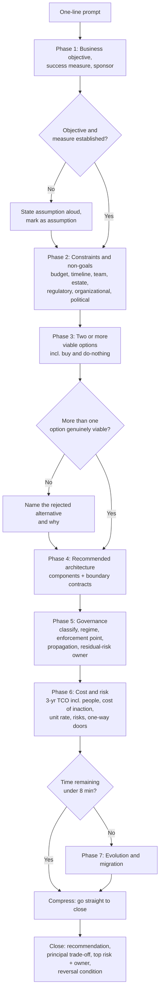

# Architecture Interview Prep

## Executive Summary

The architecture interview is not a harder system design interview. It is a **different assessment with a different unit of analysis**. [System Design Interview Prep](03_System_Design_Interview_Prep.md) trains you to design a system under quantified constraints; the architect loop asks whether you should build it at all, who has to agree, what it costs over three years, what it forecloses, and how you would defend the decision to a room that includes at least one person who does not want it.

The unit of analysis shifts from **component** to **decision-in-context**. A system design round evaluates a whiteboard. An architecture round evaluates a *judgment*: made against a business objective you had to elicit, under constraints you did not choose, with stakeholders whose interests conflict, inside a governance regime you must satisfy, at a cost someone will challenge, and with consequences that outlive your tenure.

This chapter covers the five things those loops actually test: the architecture case interview format, translating requirements into design under real constraints, governance and stakeholder scenarios, cost and risk reasoning, and presenting and defending a design under pressure. It builds directly on [Enterprise Architecture Foundations](../Phase-01/01_Enterprise_Architecture_Foundations.md), [Architecture Governance](../Phase-01/02_Architecture_Governance.md), [Architecture Decision Records](../Phase-01/03_Architecture_Decision_Records.md), [Solution Architecture Practice](../Phase-01/04_Solution_Architecture_Practice.md), [Business Capability Modeling](../Phase-01/06_Business_Capability_Modeling.md), and [Technical Strategy and Roadmaps](../Phase-01/07_Technical_Strategy_and_Roadmaps.md), and on the whole of Phase-19 — [Technical Leadership](../Phase-19/01_Technical_Leadership.md), [Architecture Reviews](../Phase-19/02_Architecture_Reviews.md), [Stakeholder Management](../Phase-19/03_Stakeholder_Management.md), [Technical Writing](../Phase-19/04_Technical_Writing.md), [Hiring and Interviewing](../Phase-19/05_Hiring_and_Interviewing.md), [Mentoring and Team Building](../Phase-19/06_Mentoring_and_Team_Building.md), [Roadmap and Portfolio Planning](../Phase-19/07_Roadmap_and_Portfolio_Planning.md), and the [CDO and CAIO Playbook](../Phase-19/08_CDO_and_CAIO_Playbook.md).

**The central thesis: an architecture interview scores the quality of your reasoning about consequences you will not personally experience.** Cost over three years, migration pain for a team you will not be on, the option you closed for your successor, the regulatory exposure that materializes after you leave. Candidates who answer as senior engineers — optimizing the design in front of them — are technically correct and consistently down-levelled.

**The second thesis, which is the one candidates most reliably fail: a design that no stakeholder has agreed to is not an architecture, it is a proposal.** The architect round almost always includes a scenario where the technically correct answer is politically unachievable, and the assessed behaviour is whether you diagnose the actual interest behind the objection or simply re-assert the technical case louder. This is [Stakeholder Management](../Phase-19/03_Stakeholder_Management.md) Case Study 1 rendered as an interview probe, and it is deliberate.

**The third thesis: cost and risk are first-class design inputs, not epilogue.** An architect who cannot produce a defensible three-year total cost of ownership, name the two largest risks with leading indicators, and state the cost of *inaction* is not being evaluated as an architect regardless of how good the diagram is.

## Learning Objectives

By the end of this chapter you should be able to:

1. Distinguish the architecture case interview from the system design interview, and recognize within the first two minutes which one you are actually in.
2. Execute a repeatable seven-phase architecture case framework covering business context, constraints, options, decision, governance, cost/risk, and evolution.
3. Elicit business objectives, success measures, and organizational constraints before eliciting technical requirements — and demonstrate why that ordering is not merely polite.
4. Convert an ambiguous business objective into a bounded architecture problem with explicitly stated assumptions, non-goals, and success criteria.
5. Present at least two genuinely viable options with an honest comparative evaluation, rather than a single advocated answer.
6. Handle a governance scenario: classify data, name the applicable regime, place the enforcement point, and state who owns the residual risk.
7. Handle a stakeholder scenario: map power and interest, diagnose the real interest behind a stated objection, and describe a coalition path rather than an escalation.
8. Produce a defensible three-year TCO including people, and quantify the cost of inaction.
9. Enumerate risks with leading indicators, blast radius, mitigation, and named owner — distinguishing risks you accept from risks you mitigate.
10. Identify one-way-door decisions in your own design and state the additional validation each warrants.
11. Defend a design under sustained challenge without either capitulating or becoming defensive, and update visibly when the challenge is correct.
12. Structure the closing summary so the decision, its cost, and its reversal condition are the last things the panel hears.

## Business Motivation

Framing this as career self-interest alone understates it, and misleads on how to prepare.

**For the candidate.** The compensation and scope difference between an offer at principal architect versus senior architect is large and compounds; but the more consequential outcome is *scope of decision rights*. The architect loop is where organizations decide whether to hand someone decisions that are expensive to reverse. Being down-levelled here does not merely cost money; it costs several years of not being in the rooms where the interesting decisions happen.

**For the hiring organization.** This is the round where a bad hire is most expensive, because a mis-levelled architect makes irreversible decisions with organizational blast radius. It is also, unfortunately, the round most likely to be run without an anchored rubric — panels default to assessing whether the candidate's architectural worldview matches their own. That is precisely the validity failure documented in [Hiring and Interviewing](../Phase-19/05_Hiring_and_Interviewing.md) Case Study 2, and it is more damaging here than anywhere else in the loop because architectural worldview is exactly the dimension on which a healthy organization wants some diversity.

**For the architecture practice.** Every behaviour this chapter trains — business context before technology, options before advocacy, explicit costs, named risks with owners, recorded decisions with invalidation conditions — is the practice of architecture itself, compressed. There is no separate "interview skill" being developed here beyond the compression. That is the honest reason to invest in it: the preparation is not overhead against your real work, it *is* your real work, rehearsed.

**The counter-case, stated honestly.** The format rewards fluent, confident, real-time verbal synthesis in a language most candidates did not grow up speaking, in front of strangers, with no time to check anything. Excellent architects who work slowly, write beautifully, and think in weeks rather than minutes are systematically underrated by it. Knowing the format is biased is part of preparing for it. It is legitimate — and at architect level often *advantageous* — to say out loud: "I would normally take a week and consult four people on this; here is the reasoning I can produce in ten minutes, and here is what I would want to validate before committing."

## History and Evolution

**Pre-2000: architecture as a documentation role.** Early enterprise architecture hiring assessed familiarity with modelling notations and frameworks. The Zachman Framework (1987) and later TOGAF (first published by The Open Group in 1995) supplied a shared vocabulary, and interviews frequently tested whether candidates could name the layers. This produced a generation of architects assessed on artifact production rather than decision quality — the origin of the "ivory tower architect" critique that still shapes how these rounds are designed.

**1996–2003: attribute-driven methods arrive.** The Software Engineering Institute's SAAM and then ATAM (Architecture Tradeoff Analysis Method, ~1998–2000, Kazman, Klein, Clements) formalized the idea that architecture is evaluated against **quality attributes** and that the interesting content is the **trade-off points** where attributes conflict. Bass, Clements, and Kazman's *Software Architecture in Practice* (1998) made "architecture is the set of decisions that are hard to change" the working definition. Modern architecture interviews are, structurally, a compressed ATAM: scenario, attribute, sensitivity point, trade-off point.

**2003–2011: agile pushback and the decision record.** The agile movement's critique of big-design-up-front pushed architecture toward incremental, evidence-driven decisions. Michael Nygard's *Documenting Architecture Decisions* (2011) supplied the ADR, which reframed architecture output from a diagram to a **sequence of recorded decisions with context and consequences**. This is the single most important shift for interview purposes: it made *why* the assessable artifact.

**2011–2018: cloud collapses the cost conversation into the design conversation.** When infrastructure became elastic and billed by consumption, cost stopped being a procurement afterthought and became a design attribute. AWS's Well-Architected Framework (2015) and later the [Azure Well-Architected Framework](../Phase-03/07_Well_Architected_Framework.md) codified cost alongside reliability, security, performance, and operational excellence as co-equal pillars. Architecture interviews began asking "what does this cost" as a design question rather than a finance question.

**2015–2022: Conway's Law becomes an explicit design input.** *Team Topologies* (Skelton and Pais, 2019), building on Conway (1967), made organizational structure an explicit architectural concern. Interviews started probing team boundaries, ownership, and the coordination cost of a proposed design — see [Mentoring and Team Building](../Phase-19/06_Mentoring_and_Team_Building.md).

**2018–present: governance and regulation move to the front.** GDPR (enforceable 2018), followed by the EU AI Act (agreed 2024, phased application) and standards including NIST AI RMF 1.0 (January 2023) and ISO/IEC 42001 (December 2023), made data and AI governance a mandatory architecture dimension. It is now routine for an architect round to include an explicit governance scenario, and increasingly routine for it to include an AI-specific one.

**Persistent across all eras:** the highest-scoring behaviour has never changed. Establish the business problem, present real options, name what each costs, say who has to agree, and state what would change your mind.

## Why This Technology Exists

The architecture interview exists because organizations must predict a behaviour that is expensive to observe any other way: **how a candidate will make a decision whose consequences arrive after they have moved on.**

Every cheaper proxy fails at exactly this. A résumé shows what an organization shipped, not who made which call or whether it aged well. A coding round measures a bounded problem with a known answer. A [system design round](03_System_Design_Interview_Prep.md) measures design competence against stated constraints — necessary, but it deliberately hands the candidate the constraints, which is the part an architect is actually responsible for producing. A reference check surfaces reputation, which correlates with visibility more than with judgment.

What the architecture round uniquely exposes:

- **Whether the candidate asks what problem is being solved before solving one.** The most reliable single discriminator, and the one most senior engineers fail because their job trained them to receive a well-formed problem.
- **Whether they can hold multiple viable options open** long enough to evaluate them, rather than converging immediately on a preferred answer and rationalizing.
- **Whether they reason about cost and risk natively**, or treat them as compliance checkboxes bolted on at the end.
- **Whether they understand that a decision requires agreement**, and can describe how they would obtain it without either steamrolling or capitulating.
- **Whether they update under challenge.** The panel will push. Both capitulating instantly and defending immovably score badly; the assessed behaviour is *discriminating between a good challenge and a bad one*.

The second reason it exists is **level calibration above staff**. The same scenario differentiates continuously: a senior candidate designs a correct system; a staff candidate designs its failure modes, operability, and migration; a principal candidate questions whether the stated problem is the right problem, connects the design to organizational and cost consequences, and names who must agree; a distinguished/CDO-track candidate reasons about the portfolio the decision sits in and the strategy it serves — see the [CDO and CAIO Playbook](../Phase-19/08_CDO_and_CAIO_Playbook.md).

## Problems It Solves

- **Separating architects from senior engineers.** Both design well. Only one reliably starts with the business objective and ends with cost, risk, and agreement.
- **Assessing decision quality under ambiguity** rather than solution quality under specification.
- **Testing breadth across the non-functional estate** — governance, compliance, cost, organizational structure, migration — which a component-level round samples only incidentally.
- **Observing behaviour under principled disagreement**, the closest available proxy for a real [architecture review](../Phase-19/02_Architecture_Reviews.md).
- **Surfacing whether the candidate has actually owned consequences**, which shows up as instinct about migration pain, deprecation, and the second-order effects of a partition key.
- **Detecting the ivory-tower failure mode** — an architect who produces elegant models that no delivery team can implement — which is invisible on a résumé and expensive in practice.
- **Level calibration that scales continuously** across senior, staff, principal, and executive-adjacent scope using one scenario.

## Problems It Cannot Solve

- **Predicting whether decisions age well.** Architecture quality is revealed over years. Nothing in an hour tests it directly; the round tests the *process* that correlates with it.
- **Measuring influence in an organization you have not joined.** Stakeholder skill is deeply context-dependent; a hypothetical scenario samples the reasoning, not the relationship-building.
- **Eliminating worldview matching.** Without an anchored rubric, panels reward candidates whose architectural instincts mirror their own. This is the dominant validity failure of the round and it is a *process* defect, not a candidate defect.
- **Testing delivery.** Architects who design beautifully and never ship are not detected here. That is what the deep-dive-on-your-own-work round exists for.
- **Establishing correctness.** There is no answer key, and two mutually incompatible designs can both score at principal level.
- **Compensating for a missing business context.** If the interviewer cannot supply objectives, constraints, or stakeholders when asked, the round degrades into a system design interview regardless of its title. Recognize this and adapt rather than fighting for context that does not exist.
- **Making you a better architect on its own.** Interview fluency and architectural judgment overlap but are distinct assets. Optimize the second; the first follows far more reliably than the reverse.

## Core Concepts

### 4.1 The Seven-Phase Architecture Case Framework

The framework is a **time-allocation contract**, not a script. It exists to prevent the two dominant failure modes: designing before understanding the business problem, and running out of time before cost, risk, and governance — which is where architect-level signal actually lives. For a 60-minute round:

| Phase | Minutes | Output the panel should see |
|---|---|---|
| 1. Business context & success measures | 7–9 | The objective in the business's terms, how success is measured, who the sponsor is |
| 2. Constraints & non-goals | 5–7 | Budget, timeline, team, regulatory, existing estate, explicit non-goals |
| 3. Options — at least two viable | 6–8 | Two or three genuinely different classes of solution, not straw men |
| 4. Recommended architecture | 10–12 | The chosen option at the level of components and boundaries, with the boundary contracts named |
| 5. Governance, security & compliance | 6–8 | Classification, applicable regime, enforcement point, residual-risk owner |
| 6. Cost, risk & the decision record | 8–10 | Three-year TCO, cost of inaction, top risks with leading indicators, one-way doors |
| 7. Evolution, migration & close | 6–8 | Sequenced migration, what changes at 10×, the reversal condition, closing summary |

Two rules make it survive contact with a real panel. **Announce the plan in the first thirty seconds** — "I'll establish the business objective and constraints, put two or three options on the table, recommend one, then cover governance, cost, risk and how it evolves" — which reads as architect-level and licenses you to hold the clock. And **the panel's steer always overrides the plan**; if they pull you into cost at minute fifteen, go there, and compress what you can.

The framework's real function is to free working memory. If you are not deciding *what to do next*, all of your attention is available for the problem.

### 4.2 Requirements to Design Under Constraints

The distinguishing move of the architect round is that you elicit **business objectives before technical requirements**, and **constraints before options**. Candidates who invert this produce technically excellent designs that fail on affordability, timeline, or team capability, and the panel reads that as the ivory-tower failure mode.

**Business objectives.** What outcome is the organization trying to achieve, in its own language? Revenue, cost, risk reduction, regulatory obligation, time-to-market, or optionality. Then the harder question: **how will success be measured, and by whom?** An objective without a measure is a wish, and a design pointed at a wish cannot be evaluated. This is [Business Capability Modeling](../Phase-01/06_Business_Capability_Modeling.md) applied conversationally — you are locating which capability the system serves and how its performance is judged.

**Constraints.** These determine the design more than the requirements do, and they are the thing candidates least reliably ask for:

- **Budget** — capital and run-rate, and who holds it.
- **Timeline** — and specifically whether it is externally fixed (a regulatory deadline, a contract) or internally negotiable. These are completely different constraints.
- **Team** — how many engineers, what skills they actually have today, and whether you can hire. A design requiring skills the team does not have and cannot acquire in the timeline is not a design.
- **Existing estate** — what must be integrated with, what cannot be replaced, what is already committed contractually.
- **Regulatory and residency** — which regimes apply, which data classes, which jurisdictions.
- **Organizational** — team boundaries, ownership, and who must agree. Conway's Law is a constraint, not a curiosity.
- **Political** — a prior failed initiative, an executive commitment already made publicly, a vendor relationship. Asking about this at all is a strong signal; most candidates never do.

**Non-goals** remain the highest-signal, least-used move available. "I am explicitly *not* going to solve real-time personalization in this phase, and here is why that is the correct sequencing given the constraints" demonstrates scope discipline and prevents being scored for omitting something you deliberately excluded.

**Designing under constraint** is then the actual test. The panel will usually apply pressure — halve the budget, halve the timeline, remove a team, add a jurisdiction. The assessed behaviour is not whether you can still deliver everything; it is whether you can **re-derive which requirements survive**. The correct shape of that answer is: *"With that constraint, requirement X is no longer achievable. I would propose delivering A and B in phase one, explicitly deferring C, and I would want the sponsor to confirm that trade is acceptable — because it is a business trade, not a technical one."*

### 4.3 Governance and Stakeholder Scenarios

Almost every architect loop contains at least one of each. They are testing different things and are commonly confused.

**Governance scenarios** test whether you reason about obligation and enforcement rather than intention. The reliable structure of a strong answer:

1. **Classify the data.** What classes exist, who are the data subjects, what is the sensitivity. You cannot govern what you have not classified.
2. **Name the applicable regime.** GDPR, HIPAA, PCI-DSS, the EU AI Act, sector-specific obligations, internal policy — and *which specific obligation* is engaged (erasure, residency, purpose limitation, auditability, explainability).
3. **Place the enforcement point.** The critical move. State *where in the architecture* the control is enforced and — decisively — whether it is **computationally enforced or merely documented**. This is the [Federated Governance](../Phase-15/04_Federated_Governance.md) fail-closed principle, and it is the sentence that separates architects from people who have read about governance.
4. **Propagate.** Does the control hold across every derived copy — features, retrieval indexes, BI extracts, backups, model training sets? Access-control propagation failures are the single most recurrent architecture defect in this handbook; the panel is very likely probing for exactly this.
5. **Name the residual-risk owner.** What remains unmitigated, who accepts it, and how it is reviewed. Architecture does not eliminate risk; it makes risk explicit and owned.

**Stakeholder scenarios** test whether you diagnose interests. The classic probe: *"The head of a business unit refuses to migrate off their existing platform. What do you do?"* The failing answers are symmetrical — escalate to force compliance, or capitulate and grant a permanent exception. Both are read as an inability to operate at architect scope.

The strong answer follows [Stakeholder Management](../Phase-19/03_Stakeholder_Management.md): **diagnose the real interest behind the stated objection before responding.** Refusal is almost never irrational. It typically resolves to one of: a genuine technical constraint the central design missed (in which case resistance is *information* and the design is wrong); a delivery commitment the migration would jeopardize (a sequencing problem, solvable); an incentive conflict where the business unit bears the cost and someone else gets the benefit (an economics problem, requiring the incentive to change); or a trust deficit from a prior failed migration (a credibility problem, requiring evidence and a small reversible first step).

Each diagnosis implies a *different* response, and saying so explicitly is the scored behaviour. Then: build the coalition before the decision meeting, secure a sponsor, offer a time-boxed documented exception where the constraint is genuine, and record the decision. Alignment forms in private and is ratified in public — never the reverse.

### 4.4 Cost and Risk Reasoning

Architects are expected to produce numbers without a spreadsheet. Not precise numbers — **defensible order-of-magnitude numbers with stated assumptions.**

**Three-year TCO, including people.** The component candidates most reliably omit is headcount, and it is usually the largest line. A workable structure to say aloud:

- Infrastructure run-rate (compute, storage, network egress, managed-service premiums), with a stated growth assumption.
- Licensing and vendor commitments, including the reserved-capacity or committed-spend position.
- Build cost — engineer-years to first production value.
- **Run cost — engineer-years per year to operate**, which for platform work commonly exceeds build cost across three years and is the line executives most want to hear you volunteer.
- Migration and decommissioning cost, including running both systems in parallel.
- A stated contingency, because every one of the above is an estimate.

**Cost of inaction.** The single most under-used move. Executives compare your proposal against doing nothing, and doing nothing looks free unless you price it: current run-rate of the system being replaced, engineering time lost to workarounds, incident cost, opportunity cost of delayed capability, and — where applicable — regulatory exposure. This is the [Stakeholder Management](../Phase-19/03_Stakeholder_Management.md) Case Study 1 lesson: the same proposal, rejected twice on technical framing, funded in fifteen minutes once the cost of inaction was quantified.

**Unit economics.** Convert the total into a rate the business already reasons about — cost per query, per pipeline run, per inference, per thousand tokens, per customer, per transaction. A total tells an executive what to pay; a unit rate tells them whether it scales. Reference: [FinOps and Cost Optimization](../Phase-18/01_FinOps_and_Cost_Optimization.md).

**Risk, stated in a fixed form.** Every risk you name should carry four things:

| Element | Why it is required |
|---|---|
| **Description** | What specifically goes wrong, not a category |
| **Leading indicator** | How you would know it is *materializing*, before it materializes |
| **Blast radius** | Who and what is affected, and whether the effect is recoverable |
| **Response and owner** | Mitigate, transfer, or **accept** — and a named person |

Explicitly distinguishing risks you **accept** from risks you **mitigate** is a strong architect signal. Accepting a risk knowingly, with an owner and a review date, is a decision. Failing to mention it is an oversight, and the panel cannot tell the two apart unless you say which it is.

**One-way doors.** Name which decisions are expensive to reverse — typically the data model and grain, partition/clustering keys, the table or storage format, the ownership boundary between teams, and any contractual commitment — and state what additional validation each therefore warrants. This is [Architecture Reviews](../Phase-19/02_Architecture_Reviews.md)' reversibility routing rule applied at design time, and volunteering it unprompted is one of the clearest principal-level markers available.

### 4.5 Presenting and Defending a Design

The reasoning is the scored quantity, but the panel can only score what reaches them. This is [Technical Writing](../Phase-19/04_Technical_Writing.md) in spoken form: **conclusion first, adapted to the audience, structured so the point is never buried.**

**Presenting.**

- **Lead with the recommendation and its one-sentence justification.** "I recommend a lakehouse on Delta with a single governed enforcement point, because the binding constraint here is the erasure obligation across derived copies, and that is the only option where I can prove it holds." Then expand. Building up to a conclusion is how you *think*; it is not how a panel *consumes*.
- **Adapt depth to who is asking.** The engineering director wants mechanism. The finance-adjacent panellist wants the unit rate and the commitment position. The security panellist wants the enforcement point and the residual-risk owner. Same reality, different axes, honestly — never a different set of facts.
- **Use the board as a shared artifact**: layered, left-to-right, boundaries labelled with their contracts, deliberate whitespace for the deep dive.
- **Say the cost out loud, unprompted.** Architects who volunteer what their choice cost them are trusted; architects who only volunteer benefits are not.

**Defending.** Challenge is a designed probe, and it comes in three kinds that require three responses:

1. **The correct challenge.** Update visibly and immediately: *"That is right, and it changes my recommendation — with that constraint, option B becomes the better call because..."* This scores *higher* than never being challenged. Panels are explicitly assessing whether you can be moved by evidence.
2. **The incorrect challenge.** Hold the position, with the reasoning, without condescension: *"I would push back on that, and here is why — but tell me what I am missing, because if the volume assumption is different from what I stated, my conclusion changes."* Note the structure: hold, justify, then name the condition that would change your mind.
3. **The probe for depth.** Not a disagreement at all — the panellist is checking whether you understand the mechanism. Answer at mechanism level, and if you do not know, say so precisely: *"I do not know that mechanism in detail. What I do know is X, and here is how I would establish the rest."*

The two symmetrical failure modes are **instant capitulation** (reads as no conviction, therefore no decision-making capacity) and **immovable defence** (reads as unable to be corrected, which at architect scope is disqualifying because your errors are expensive). The discriminating skill is telling a good challenge from a bad one in real time.

**Closing.** Reserve ninety seconds. Restate: the recommendation, the single most important trade-off you accepted, the largest risk and its owner, and the condition under which you would revisit. That is an ADR delivered verbally, and it is the last thing they hear.

## Internal Working

### 5.1 What the Panel Is Actually Doing

An architecture panel is running a **judgment sampler under deliberately incomplete specification**. The scenario is under-specified *on purpose*: the omissions are the test. Whether you notice that the budget was never mentioned, that the regulatory regime was never named, that nobody said who the sponsor is — that noticing is the measured quantity, not the recovery afterwards.

The panel maintains an internal model of your reasoning and updates it on each statement. Statements that raise the estimate: an elicited constraint, a quantified estimate with a stated implication, a named cost of a choice, a stated reversal condition, an unprompted governance enforcement point, a volunteered one-way door, a visible update under correct challenge. Statements that lower it: a product name before a requirement, a benefit-only assertion, a hand-waved cost, a governance answer that stops at "we would encrypt it", and an escalation as the answer to a stakeholder problem.

The critical property: **unstated reasoning is scored as absent.** There is no partial credit for thinking it. This is the mechanism behind the most common down-level in this round, and it is invisible to the candidate, because they experienced themselves as reasoning well — and they were.

### 5.2 Why Business Context Must Precede Technology

There is a mechanical reason the ordering matters beyond politeness. Design decisions are **conditional on constraints**, and a decision made before its conditions are known cannot be evaluated — by you or by the panel. Once you have named a technology, three things happen and all of them are bad: you have anchored the conversation, you have made every subsequent question feel like a defence of your choice, and you have forfeited the ability to demonstrate the elicitation that constitutes most of the available signal.

Conversely, eliciting constraints first **collapses the option space cheaply**. A fixed regulatory deadline eliminates the migration paths that take eighteen months. A four-engineer team eliminates the designs with five operational surfaces. A residency obligation eliminates the single-region answer. Each elicited constraint is worth several minutes of design time you no longer have to spend, which is why the seven to nine minutes at the front are the highest-return minutes in the session.

### 5.3 The Layer Model of Architect Capability, and Its Diagnostic

Architect-interview performance decomposes into five layers, and — this is the useful part — **a failure at one layer cannot be fixed at another**:

| Layer | Content | Failure looks like |
|---|---|---|
| **L0 — Domain knowledge** | Patterns, platforms, mechanisms; Phases 02–18 | Cannot answer a mechanism probe at depth |
| **L1 — Business & organizational literacy** | Objectives, capability models, funding, team topology, portfolio | Designs the technically best answer, unaffordable or unstaffable |
| **L2 — Decision framework** | Options, trade-offs, reversibility, cost, risk | Jumps to a single answer; benefit-only justifications |
| **L3 — Articulation** | Structure, conclusion-first, audience adaptation, board management | Excellent reasoning that never reaches the panel |
| **L4 — Composure & calibration** | Handling challenge, updating, time management, recovery | Capitulates or entrenches; runs out of time before cost and risk |

The diagnostic is the point. The most common misallocation in preparation is treating an L3 articulation failure as an L0 knowledge gap and responding by reading more — comfortable, and almost entirely useless. The second most common is treating an L1 failure (designs nobody could fund or staff) as an L2 framework problem. Diagnose the layer first; the drill follows from it.

## Architecture

The preparation system itself has an architecture, and it is worth treating as one because it makes the investment allocation legible.

**Layer 0 — Substrate: the handbook.** Phases 00 through 18 are the domain knowledge. This layer is necessary, largely already built if you have worked through the curriculum, and is the layer candidates over-invest in.

**Layer 1 — Business and organizational model.** Capability models, funding mechanics, team topologies, portfolio and roadmap discipline. Sourced from [Phase-01](../Phase-01/01_Enterprise_Architecture_Foundations.md) and [Phase-19](../Phase-19/07_Roadmap_and_Portfolio_Planning.md). This is the layer that distinguishes an architect from a staff engineer and the layer most technically strong candidates have never deliberately built.

**Layer 2 — Decision framework.** The seven-phase structure, the four-part trade-off form, the risk table, the TCO structure, the one-way-door check. Small, learnable, and highest immediate return.

**Layer 3 — Articulation surface.** Conclusion-first delivery, audience adaptation, board discipline, the closing summary. Trained only by recorded rehearsal.

**Layer 4 — Calibration loop.** Disaggregated self-review, mock cadence, and targeted drills derived from layer diagnosis. This layer makes the other four improve; without it, practice does not compound.

**Layer 5 — Evidence base.** Your own portfolio: decisions you actually made, with context, alternatives, consequences, and what you would do differently. Every architect round eventually asks for a real example, and an unprepared answer here is a large, entirely avoidable loss. This is what Phase-20 Chapter 06 (Portfolio and Case Studies) builds.

## Components

- **The case framework** (§4.1) — seven phases with time boxes. The control plane.
- **The constraint checklist** (§4.2) — budget, timeline, team, estate, regulatory, organizational, political. Run it explicitly.
- **The options generator** — for any problem class, at least two genuinely viable solution classes, plus the "do nothing / buy instead of build" option that panels expect to be considered and candidates omit.
- **The four-part trade-off form** — choice as a class before a product, benefit tied to a stated requirement, cost named explicitly, reversal condition.
- **The governance routine** (§4.3) — classify, name the regime, place the enforcement point, propagate, name the residual-risk owner.
- **The stakeholder routine** (§4.3) — map power and interest, diagnose the real interest, choose the response the diagnosis implies, build the coalition, record the decision.
- **The TCO structure** (§4.4) — infrastructure, licensing, build, **run**, migration, contingency, plus cost of inaction and a unit rate.
- **The risk table** (§4.4) — description, leading indicator, blast radius, response and owner; accepted risks marked as accepted.
- **The one-way-door list** — the decisions that are expensive to reverse, with the validation each warrants.
- **The closing summary** — recommendation, principal trade-off, largest risk with owner, reversal condition. Ninety seconds, reserved.
- **The evidence base** — five to eight of your own real decisions in ADR form.
- **The calibration log** — disaggregated scores per session, tracked over time.

## Metadata

The metadata of an architecture answer is everything the panel needs in order to *evaluate* it, as distinct from the design itself. Weak candidates emit design without metadata; the panel then cannot score it and defaults low.

- **Assumptions**, explicitly marked as assumptions. "I am assuming roughly 5 TB per day and a 20× peak; if that is wrong by an order of magnitude my recommendation changes." Never treat a missing number as a blocker — assume aloud and proceed.
- **Confidence**, stated per claim. "I am confident about the storage layer; I am less confident about the CDC path and would want to validate the source system's log retention before committing."
- **Non-goals**, written and visible.
- **Scope of the decision** — is this a decision for one team, one domain, or the whole enterprise? Architects who state the scope of their own decision are demonstrating awareness of blast radius.
- **Invalidation conditions** — the ADR discipline from [Architecture Decision Records](../Phase-01/03_Architecture_Decision_Records.md). A decision without a stated invalidation condition cannot be reviewed later and quietly becomes permanent.
- **Provenance** — when you cite a number ("egress at roughly this rate", "this typically runs 60–70% cheaper on spot"), say where it comes from and how confident you are. Fabricated precision is detected and is expensive.

## Storage

The durable asset of preparation is a **written, version-controlled corpus** — the same docs-as-code discipline argued in [Technical Writing](../Phase-19/04_Technical_Writing.md), applied to your own career.

It should contain: the case framework and its time boxes; the constraint checklist; six to eight reference architectures at *shape* granularity (not memorized diagrams — shapes you can re-derive); one page of estimation and cost constants; twenty trade-off cards in the four-part form; a governance regime cheat-sheet mapping obligation to enforcement point; and — the highest-value item — your **personal decision log**.

The decision log is five to eight real decisions you made, each in ADR form: context, options considered, decision, consequences observed, and *what you would do differently now*. That last field is what converts an anecdote into evidence of judgment. Most candidates improvise this under pressure and produce a vague, unfalsifiable success story; a prepared, honest, specific decision with a named regret is dramatically more credible.

**Storage failure mode:** the corpus rots. Reference architectures drift from current platform reality, cost constants go stale, and the decision log stops being updated as you make new decisions. Date every entry and re-verify cost figures before any loop.

## Compute

Two scarce resources, and confusing them is a real error.

**Your preparation capacity** is finite and should be allocated by layer diagnosis (§5.3), not by comfort. The characteristic misallocation is spending forty hours on L0 reading when the actual failure is at L2 or L3. A defensible allocation for someone already strong at L0: eight hours building the corpus, six on trade-off and estimation drills, twenty on recorded mocks with disaggregated review, six on targeted reading against diagnosed gaps.

**The panel's attention within the session** is the harder constraint, and unlike a system design round, it is *fragmented across multiple people with different interests*. An architecture panel commonly includes an engineering leader, a security or governance representative, and someone with cost accountability. Each is listening for their own axis and each will disqualify on it. Spending forty minutes of a sixty-minute session on the component the engineering leader enjoys, and thereby never reaching governance or cost, is the most common time-allocation failure in this round — and it feels *good* while it is happening, which is why it persists.

## Networking

The round is a **two-way channel**, and treating it as a broadcast forfeits most of its value.

- **Ask which component to explore before diving.** "I can go deep on the ingestion path or the governance enforcement — which is more useful to you?" This is not deference; it is efficient allocation of a shared scarce resource, and it reads as such.
- **Check your model of the problem out loud.** "So the binding constraint is the regulatory deadline, not the budget — is that right?" A correction here saves ten minutes of designing against the wrong constraint.
- **Read the panel.** Silence during a governance answer from the security panellist means something different than silence from the engineering director. When you cannot read it, ask: "Is this the level of detail you wanted?"
- **Ask about the organization.** At architect level the questions you ask *them* are part of the assessment. "Who owns architectural decision rights here today?" "How are platform investments funded?" "What was the last architectural decision that turned out to be wrong, and how did you find out?" These are genuinely useful to you and they signal that you understand where architecture actually succeeds or fails.

## Security

Two distinct concerns, and both are assessed.

**Security as a design dimension.** The panel will probe it, often through the governance scenario. Strong answers place the enforcement point, propagate the control to every derived copy, name what is *not* covered, and identify the residual-risk owner. Weak answers name encryption and stop. Note that "encrypted at rest" answers essentially nothing about the threat models that matter most in data platforms — over-broad access, access-control propagation failure into derived artifacts, and credential sprawl. See [Security Foundations](../Phase-10/01_Security_Foundations.md) and [Data Privacy and PII Protection](../Phase-10/07_Data_Privacy_and_PII_Protection.md).

**Confidentiality of your own material.** You are being asked to describe systems you built for a previous or current employer, in a room that may include their competitor. The discipline: describe **architecture, reasoning, and outcomes at the level of shape and magnitude**; do not disclose proprietary specifics, customer identities, unpublished figures, or anything under NDA. Say so explicitly — "I will describe the architecture and the reasoning; I will not give exact volumes because they are not public" — which costs nothing and demonstrates exactly the judgment they are hiring for. A candidate who over-shares a prior employer's internals has told the panel precisely what they will do with the panel's internals.

**Integrity of your own claims.** Do not claim decisions you did not make. Architecture is a small profession, reference checks are real, and the recoverable version — "I was one of three people on that decision and I owned the storage layer" — is more credible than sole authorship anyway.

## Performance

Measure the round the way the panel does, disaggregated. A single "that went well" is useless for improvement.

| Dimension | What good looks like |
|---|---|
| **Business context elicitation** | Objective, success measure, and sponsor established before any technology is named |
| **Constraint elicitation** | The full checklist run; budget, timeline, team, and regulatory all explicitly established |
| **Option generation** | At least two genuinely viable options, honestly compared, including buy/do-nothing |
| **Trade-off articulation** | Every consequential choice has a named cost and a reversal condition |
| **Governance** | Enforcement point placed, propagation addressed, residual-risk owner named |
| **Cost & risk** | Defensible three-year TCO with people, cost of inaction, unit rate, risks with leading indicators |
| **Stakeholder reasoning** | Real interest diagnosed before response; coalition path described |
| **Communication** | Conclusion first, audience-adapted, board legible, closing summary delivered |
| **Composure** | Updated under correct challenge, held under incorrect challenge, time allocated to plan |

The derived metric that matters most is **signal per minute**: how much scoreable evidence you emitted. Thirty minutes of deep mechanism on one component is low signal-per-minute at architect level, however impressive it feels.

## Scalability

The same scenario should scale continuously across levels, and knowing which level you are answering at is itself a skill.

- **Senior.** Correct design against stated requirements. Components, data flow, obvious failure modes.
- **Staff.** Adds failure modes with detection, operability, migration path, cost awareness, and explicit trade-offs with costs named.
- **Principal.** Adds questioning whether the stated problem is the right problem; organizational consequences and team boundaries; three-year TCO with people; one-way doors; the governance enforcement point volunteered unprompted; stakeholder path.
- **Distinguished / architect-executive.** Adds portfolio context — how this competes with other investments; strategic optionality and what it forecloses; the decision-rights and funding model; what would cause the organization to abandon it. See the [CDO and CAIO Playbook](../Phase-19/08_CDO_and_CAIO_Playbook.md).

**Scaling across a loop** is a distinct problem. An architect loop is typically four to six rounds — case, deep dive on your own work, governance/security, stakeholder or leadership, sometimes an executive conversation. The same underlying material is re-framed for each. Prepare the material once; rehearse the framing separately, because the framings genuinely differ.

**Do not scale by adding volume.** A common failure is answering at principal level by talking for longer. Principal-level answers are frequently *shorter*, because they eliminate options faster.

## Fault Tolerance

Four failures occur reliably. Rehearse the recovery for each until it is automatic, because all four occur under exactly the cognitive conditions where improvisation fails.

**1. You blank.** Recovery: return to structure out loud. "Let me go back to the constraints — we established a fixed regulatory deadline and a four-engineer team. Given those, the option space is..." Re-anchoring on written requirements restores working memory and buys ten seconds legitimately. Never fill with vague generality; the panel can hear it.

**2. You realize your design is wrong mid-session.** Recovery: say so, immediately and without drama. "I want to revise something — I anchored on a streaming design, but given the daily freshness requirement I established earlier, that is over-engineered. Let me correct that." This scores *higher* than never being wrong. Silently continuing with a design you know is wrong is the worst available outcome, and panels detect it.

**3. Sustained hostile challenge.** Recovery: classify before responding (§4.5). Is it correct, incorrect, or a depth probe? Then respond in the corresponding form. The failure is responding to all three identically. Under pressure the physical tells matter: slow down, lower the pitch, and answer the question actually asked rather than the one you prepared for.

**4. You run out of time before cost and risk.** Recovery: compress deliberately and say you are doing it. "We are at ten minutes — let me close with the three things I think matter most: the three-year cost, the largest risk, and the one decision here that is expensive to reverse." Never let the session end in the middle of a component diagram. Better prevention: watch the clock at phase boundaries, and treat phase 6 as non-negotiable.

**Blameless self-review afterwards.** Apply the [Reliability and SRE](../Phase-18/04_Reliability_and_SRE.md) discipline to yourself. The useful question is not "what did I do wrong" but "what about my preparation *system* permitted that failure" — which is nearly always a missing rehearsal, not a missing fact.

## Cost Optimization

Preparation has a cost, and it is routinely misallocated in a way that is diagnosable.

The dominant inefficiency is **spending L0 hours on an L2 or L3 problem**. Reading more architecture material is comfortable, feels productive, produces no measurable improvement in a round that was lost on missing cost reasoning or buried conclusions, and can be sustained indefinitely without ever discovering the real gap.

**Worked example.** Two candidates each allocate 40 hours to preparation for an architect loop, both already strong at L0 after working through this handbook.

*Candidate A:* 30 hours reading architecture books and platform documentation, 6 hours watching recorded mock interviews, 4 hours in two live mocks near the end. Marginal L0 gain on an already-strong layer. No calibration data until the last week, at which point the diagnosed gaps (cost reasoning, buried conclusions) cannot be drilled before the loop.

*Candidate B:* 8 hours building the corpus (framework, constraint checklist, six architecture shapes, twenty trade-off cards, decision log), 4 hours on TCO and estimation drills, 20 hours across ten recorded mocks with disaggregated scoring, 8 hours on drills targeted at whatever the scoring showed was weakest. Calibration data from hour twelve onward, and every subsequent hour is spent on a diagnosed gap.

Same 40 hours. In practice this is routinely a full level of outcome difference, and the mechanism is not effort — it is that Candidate B has a **feedback loop** and Candidate A does not. The parallel to [Performance Engineering](../Phase-18/05_Performance_Engineering.md) is exact: you cannot optimize what you have not measured, and optimizing the component that *feels* slow rather than the one that *is* the bottleneck is the defining error in both domains.

The secondary cost lever is **reuse**. The corpus, the decision log, and the trade-off cards are built once and amortized across every loop, every internal promotion case (Phase-20 Chapter 05), and — genuinely — your actual design work. Preparation that only pays off in interviews is preparation that was scoped wrongly.

## Monitoring

Monitoring is the **known-unknowns** layer: a small number of pre-defined indicators checked on a cadence, with a threshold that triggers action.

- **Mock cadence** — sessions completed per week against plan. If it falls to zero, everything else is theatre.
- **Disaggregated rubric scores** per session (§Performance), tracked in a table across sessions. Not an aggregate.
- **Phase completion rate** — did you reach phase 6 (cost and risk) within the time box? This one binary indicator predicts round outcomes better than any other single metric.
- **Trade-off completeness rate** — in a recorded session, what fraction of consequential choices included a named cost *and* a reversal condition? Most people are shocked by their first measurement here.
- **Corpus currency** — date of last verification of cost constants and reference architectures.
- **Outcome tracking** — real rounds, with the level offered and, where obtainable, the written feedback.

Thresholds worth pre-committing to: a phase-completion rate under 70% triggers a time-management drill; a trade-off completeness rate under 60% triggers trade-off reps; two consecutive sessions where business context took under five minutes triggers a requirements drill.

## Observability

Observability is the **unknown-unknowns** layer: enough recorded signal to answer questions you did not think to ask in advance.

- **Record every mock, and watch it the same day.** This is the single highest-value practice in the chapter and the one most people skip because it is unpleasant. You cannot observe your own filler, your own buried conclusions, or your own failure to name a cost while you are producing them.
- **Independent scoring.** Have your mock partner score you independently against the same rubric, then compare. **The disagreements between your two scores are the most valuable output of the entire session** — they are precisely the places where your self-model is wrong, which is by definition where you cannot self-correct.
- **Trace a decision end-to-end.** Take one consequential choice from a recorded session and follow it: was the constraint established before it? Was an alternative considered? Was a cost named? Was a reversal condition given? Was it revisited in the closing summary? Broken links in that chain are your actual defects, and they are usually consistent across sessions.
- **Real-round feedback.** Ask for it, specifically and by dimension, and expect it to be partial. Weight it against your own recordings rather than treating it as ground truth — panels are frequently unable to articulate why they down-levelled someone, which is a rubric problem on their side.

## Operational Response Playbook

**Playbook 1 — The round is going badly, in real time.**

*Signals:* the panel has stopped asking follow-ups; you are twenty-five minutes in with no architecture on the board and no constraints established; you have been talking uninterrupted for six minutes; a panellist has repeated a question you thought you answered.

*Diagnose before acting — the correct response differs entirely by cause:*

| Signal | Likely cause | Response |
|---|---|---|
| Repeated question | You answered a different question | Ask what specifically they want addressed; answer *that* |
| No follow-ups, flat affect | Too shallow, or wrong component | Ask directly: "Is this the right level, or would you rather I go deeper somewhere?" |
| Long uninterrupted monologue | You have stopped using the two-way channel | Stop. Ask a question. Check your model of the problem |
| No architecture at minute 25 | Over-elicitation, or analysis paralysis | State an assumption aloud and proceed. A stated assumption is never a blocker |
| Panellist visibly disengaged | Their axis (cost, security) has not been touched | Move to the untouched dimension explicitly |

*The counter-intuitive part:* the recovery is almost always to **slow down and re-anchor**, which feels exactly wrong under stress, where the instinct is to talk faster and cover more ground. Re-state the constraints, re-state what you are optimizing for, then proceed. Do **not** attempt to recover by adding technical depth to a round that is failing on structure — that deepens the failure.

**Playbook 2 — You were down-levelled and do not know why.**

*Signals:* an offer one level below target, or feedback of the form "strong engineer, not yet architect-level" with no specifics.

*Diagnose by layer (§5.3), from your recordings, not from memory:*

| Evidence in the recording | Layer | Drill |
|---|---|---|
| Could not answer mechanism probes | L0 | Targeted reading on the specific gap only |
| Design was unaffordable or unstaffable | L1 | TCO drills; team-topology and funding literacy |
| Single answer, benefit-only justifications | L2 | Trade-off reps until cost + reversal are automatic |
| Good reasoning, panel did not receive it | L3 | Conclusion-first drills; recorded delivery |
| Ran out of time; entrenched under challenge | L4 | Timed and adversarial mocks |

*Do not* default to "study more architecture." That is the L0 response, it is the most comfortable available action, and in the large majority of down-levels at this stage the failure was at L1, L2, or L3. Diagnose first. Also resist the opposite error — concluding the panel was wrong. Sometimes it was; but that hypothesis is unfalsifiable, unactionable, and therefore worthless to you even when true.

## Governance

Two senses, and both matter.

**Governance as interview content.** Covered in §4.3. The point to internalize: governance answers are scored on **enforcement**, not intention. "We would have a policy that..." scores near zero. "The enforcement point is the catalog; registration is a precondition of queryability; the check fails closed; here is what remains uncovered and who owns that residual risk" scores at architect level. This is [Architecture Governance](../Phase-01/02_Architecture_Governance.md) and [Federated Governance](../Phase-15/04_Federated_Governance.md) compressed into thirty seconds.

**Governance of the hiring process itself.** If you run these rounds, the obligations are real. Use an anchored rubric with behavioural anchors per dimension per level. Have interviewers score independently *before* discussing, or the first speaker's opinion contaminates the rest. Calibrate interviewers against recorded sessions and measure inter-rater agreement; where you disagree, the rubric is under-specified. Monitor stage-level adverse impact (the EEOC four-fifths rule as a floor). Where any AI-assisted scoring is used, note that NYC Local Law 144 (effective 2023) imposes bias-audit obligations and the EU AI Act classifies recruitment AI as high-risk — see [Hiring and Interviewing](../Phase-19/05_Hiring_and_Interviewing.md) and [Responsible AI](../Phase-11/07_Responsible_AI.md).

An unanchored architecture round measures worldview match. Given that this round gates decision rights, an unanchored one systematically reproduces the existing architectural monoculture — which is a strategic risk, not merely a fairness one.

## Trade-offs

- **Framework rigour vs. natural conversation.** A visible framework produces legible, completely-covered answers; applied mechanically it reads as canned and suppresses genuine engagement. Resolution: internalize until invisible, and announce the plan once rather than narrating each phase.
- **Breadth vs. depth.** Covering all seven phases guarantees you reach cost and risk; going deep on one component demonstrates real mastery. Resolution: cover the frame, then let the panel choose the depth — and *ask* rather than guess.
- **Conviction vs. openness.** Strong recommendations demonstrate decision-making capacity; excessive certainty reads as un-correctable. Resolution: state the recommendation firmly, then volunteer the condition that would reverse it. That combination reads as confident *and* open, which is the target.
- **Ideal architecture vs. achievable architecture.** The best design may exceed the budget, timeline, or team. Resolution: name the ideal, then present the constrained version and say explicitly what was traded and who must accept the trade. Presenting only the ideal reads as ivory-tower; presenting only the constrained version hides your ceiling.
- **Honesty about gaps vs. projected confidence.** Resolution: "I do not know that mechanism; here is how I would establish it" is strictly stronger than a confident wrong answer, which is detected and is very expensive.
- **Preparation for interviews vs. real work.** These compete for hours but not for content — nearly everything here transfers. Resolution: build artifacts (decision log, trade-off cards, TCO structures) that are useful at work regardless of the loop outcome.
- **Optimizing for a biased format vs. rejecting it.** Resolution: prepare for the format you will face, and if you run these rounds, fix the format. Both are legitimate simultaneously.

## Decision Matrix

| Situation | Do this | Not this |
|---|---|---|
| Round opens with a one-line prompt | Elicit business objective, success measure, sponsor | Start drawing |
| A number is withheld | State an assumption aloud, mark it, proceed | Block on it or ignore it |
| Only one option is obvious | Name the alternative and why you rejected it | Present a single answer as inevitable |
| Panel challenges and is right | Update visibly and say the recommendation changed | Defend to protect consistency |
| Panel challenges and is wrong | Hold, justify, name what would change your mind | Capitulate to reduce friction |
| Asked for cost | Three-year TCO **including people**, plus a unit rate | Monthly infrastructure only |
| Asked about a blocking stakeholder | Diagnose the real interest, then respond to that | Escalate, or grant a permanent exception |
| Asked about compliance | Classify → regime → **enforcement point** → propagation → residual-risk owner | "We would encrypt it" |
| You do not know a mechanism | Say so precisely, state what you do know, describe how you would establish the rest | Improvise plausible detail |
| Ten minutes remain, mid-diagram | Compress deliberately to cost, top risk, one-way door | Continue the diagram |
| Asked for a real example | A prepared decision log entry, including what you would do differently | An improvised, unfalsifiable success story |
| Interviewer supplies no business context at all | Adapt — it is a system design round in an architect's clothing | Fight for context that does not exist |

## Design Patterns

- **Announce-the-plan.** Thirty seconds at the top stating the phases. Establishes control of the clock and reads as architect-level immediately.
- **Constraint-collapse.** Elicit a constraint, then say aloud what option it eliminates. Each one is worth several minutes of design time.
- **Two-viable-options.** Never present one. The comparison is where the judgment is visible.
- **Assume-aloud-and-proceed.** A stated assumption converts a blocker into a documented condition and demonstrates exactly the behaviour real architecture requires.
- **Cost-with-every-choice.** Every consequential choice states what it cost. Habitual, not occasional.
- **Reversal-condition.** Every recommendation ends with what would change it. This is an ADR invalidation condition, spoken.
- **Enforcement-point-naming.** Every governance answer names where the control is computationally enforced.
- **Interest-diagnosis.** Every stakeholder answer diagnoses the real interest before responding.
- **One-way-door-flagging.** Volunteer which decisions are expensive to reverse, unprompted. Among the clearest principal-level markers.
- **Reserved-close.** Ninety seconds held back for recommendation, principal trade-off, largest risk with owner, reversal condition.
- **Ask-where-to-go-deep.** Convert a guess into a collaborative allocation of shared scarce time.

## Anti-patterns

- **Technology-first.** Naming a product before the objective. Anchors the conversation and forfeits most of the available signal.
- **The single advocated answer.** One option, defended. Reads as preference, not judgment.
- **Benefit-only justification.** "I'd use Delta because it has ACID transactions." True, and worth almost nothing without the cost.
- **Governance theatre.** Policies, intentions, and encryption in place of an enforcement point and a residual-risk owner.
- **Escalation as stakeholder strategy.** "I would take it to the CTO." Reads as an inability to build agreement, and is a genuine predictor of how you will behave.
- **The infrastructure-only cost answer.** Omitting people is the most common TCO failure and usually omits the largest line.
- **The ivory-tower design.** Technically excellent, unaffordable or unstaffable. Fails at L1 and is fatal at architect level.
- **The over-engineered answer.** Streaming for 2 events per second. Read as an architectural defect, not an interview error — see [System Design Interview Prep](03_System_Design_Interview_Prep.md) Case Study 1.
- **Fabricated precision.** Confident specific numbers with no basis. Detected, and it contaminates everything else you said.
- **The uninterrupted monologue.** Abandons the two-way channel and guarantees you are optimizing the wrong component.
- **Immovable defence** and its twin, **instant capitulation.** Both read as an inability to discriminate between challenges.
- **Running out of time before cost and risk.** The most common cause of a down-level from a technically strong round.

## Common Mistakes

1. **Treating it as a harder system design round.** Different unit of analysis. Costs the entire L1 dimension.
2. **Never asking about budget, timeline, or team.** These determine the design more than the requirements do.
3. **Never asking who has to agree.** Architecture is a decision requiring agreement; ignoring that is the defining senior-engineer tell.
4. **Never mentioning cost until asked.** By then it reads as an afterthought, which is exactly what it was.
5. **Omitting people from TCO.** Usually the largest component, especially run cost over three years.
6. **Naming risks with no leading indicator.** A risk you cannot detect approaching is a list entry, not a managed risk.
7. **Not distinguishing accepted risks from mitigated ones.** Silent acceptance is indistinguishable from oversight.
8. **Answering a stakeholder scenario with a technical argument.** The scenario is testing whether you diagnose interests. A better technical argument is not the answer.
9. **Governance answers that stop at encryption.** Misses the enforcement point, propagation, and ownership — which is all of it.
10. **Not identifying one-way doors.** The cheapest available principal-level signal, routinely left on the table.
11. **Improvising your own real-work example.** Prepare five to eight, in ADR form, with an honest regret each.
12. **Over-sharing a prior employer's confidential specifics.** Tells the panel what you would do with theirs.
13. **Preparing only by reading.** No calibration loop, no measurement, no compounding.
14. **Never recording yourself.** Guarantees the articulation layer stays invisible to you.
15. **Burying the recommendation.** [Technical Writing](../Phase-19/04_Technical_Writing.md) Case Study 1, transposed to speech: excellent thinking that never lands.

## Best Practices

- **Announce the plan, then hold the clock**, treating the cost/risk phase as non-negotiable.
- **Elicit business objective, success measure, and sponsor before any technology is named.** No exceptions.
- **Run the constraint checklist explicitly**, including the political constraint nobody else asks about.
- **Write requirements and non-goals where the panel can see them**, and refer back to them when you decide.
- **Present at least two viable options**, and include buy-versus-build and do-nothing among the considered set.
- **State the cost of every consequential choice**, and its reversal condition, in the same breath.
- **Volunteer the one-way doors** without being asked.
- **Give TCO with people in it**, plus the cost of inaction and a unit rate.
- **State risks in the four-element form** and mark which you are accepting.
- **Place the governance enforcement point explicitly** and follow the control into every derived copy.
- **Diagnose the interest before answering any stakeholder scenario.**
- **Assume aloud and proceed** rather than blocking on a missing number.
- **Ask where to go deep** rather than guessing.
- **Update visibly when challenged correctly** — it raises the score.
- **Reserve ninety seconds for a structured close.**
- **Record every mock, watch it the same day, score it disaggregated, and have a partner score it independently.**
- **Maintain a dated decision log of your own real decisions**, each with a genuine regret.
- **Ask the panel about decision rights, funding, and their last wrong architectural decision.**

## Enterprise Recommendations

**For individuals preparing.** Build the corpus first — it is eight hours and it is the durable asset. Then move to recorded mocks early rather than late; calibration data is worth more the sooner you have it. Diagnose by layer before choosing any drill. Prepare the decision log properly, because every architect loop reaches it and an improvised answer there is a large avoidable loss.

**For organizations running these rounds.** Anchor the rubric with behavioural descriptions per dimension per level, and publish the dimensions to candidates in advance — this reduces variance without reducing signal, because the dimensions are not the answer. Score independently before discussion. Include a governance and a stakeholder scenario deliberately rather than hoping they arise. Calibrate interviewers against recorded sessions and measure inter-rater agreement. Revalidate the rubric against real post-hire outcomes periodically, per [ADR-0202](../Phase-19/05_Hiring_and_Interviewing.md) — a rubric never checked against reality drifts into measuring panel vocabulary.

**For architecture leaders.** Treat the round as a mirror. If your panel cannot articulate the business objective, the constraints, or the governance regime of your own platforms when a candidate asks, the candidate has just diagnosed a real defect in your practice. The questions strong candidates ask you are free consulting.

**On AI assistance.** Using an LLM to generate practice scenarios, critique a recorded answer, or pressure-test a TCO is legitimate and useful. Using one to generate the *content* of your reasoning produces fluent emptiness that collapses on the first depth probe — the same failure mode documented for AI-assisted writing in [Technical Writing](../Phase-19/04_Technical_Writing.md). Use it as a sparring partner, never as an author.

## Azure Implementation

Most architect loops in this space use Azure-primary scenarios, and fluency in *architecture-shaped* Azure — services in terms of the decisions they resolve — is what is assessed, not portal navigation.

**Landing zone and platform foundation.** Be able to describe an [Azure landing zone](../Phase-03/03_Azure_Landing_Zones.md) as an architecture: management group hierarchy, subscription-per-workload boundaries, hub-and-spoke networking, Azure Policy as the computational enforcement point, and the platform-versus-application-team split. When a governance scenario arrives, Azure Policy with a deny effect is your fail-closed enforcement mechanism; saying "Azure Policy with a deny effect at the management-group scope, so it cannot be bypassed by a subscription owner" is a precise, checkable answer.

**Data platform.** [Lakehouse](../Phase-05/02_Lakehouse_Architecture.md) on ADLS Gen2 with Delta and Databricks Unity Catalog as the enforcement point for data access, [Microsoft Fabric](../Phase-05/07_Microsoft_Fabric.md) where the consumption model favours it, Purview for discovery and classification. Know the shape of the choice between Databricks-primary and Fabric-primary and what each costs you — this is a very common probe and a benefit-only answer is fatal.

**AI platform.** Azure OpenAI and AI Foundry with private endpoints and managed identity rather than keys, AI Search for retrieval with entitlement-filtered queries, Azure ML or Databricks for the classical ML path, APIM as the gateway for token limits, routing, and cost attribution. The capstone chapters [01](01_Capstone_Enterprise_Data_Platform.md) and [02](02_Capstone_Enterprise_AI_Platform.md) are the reference answers here.

**Identity and network.** Entra ID with managed identity and workload identity federation as the default; private endpoints with public network access disabled; storage account keys and SAS disabled as an explicit posture. Being able to state that posture as a one-sentence default is an architect-level answer to a whole class of security probes.

**Cost.** Azure Cost Management with tag-enforced allocation, reservations versus savings plans and when each is right, spot for interruptible batch, and the Pricing Calculator for order-of-magnitude figures. Know roughly what a managed premium costs relative to self-managed — you will be asked to justify one.

**Reliability.** Availability zones versus regions, RTO/RPO stated as business requirements rather than technical preferences, and the [Well-Architected Framework](../Phase-03/07_Well_Architected_Framework.md) as a ready-made review rubric you can invoke by name.

**Preparation note.** Verify current service names and posture before any loop. Azure's data and AI surface changes quickly, and confidently citing a retired or renamed service is a credibility cost out of proportion to the error.

## Open Source Implementation

Open-source fluency matters in these rounds for two reasons: many organizations run hybrid estates, and the ability to compare a managed service against its open-source equivalent *on cost and operational burden* is a direct test of cost reasoning.

- **Storage and table formats** — Delta, [Iceberg](../Phase-04/05_Apache_Iceberg.md), Hudi. The Delta-versus-Iceberg engine-neutrality trade-off is among the most frequently asked, and the correct answer form names the cost of each.
- **Compute and query** — Spark, Trino, DuckDB, ClickHouse. Know which decision each resolves.
- **Streaming** — Kafka and Flink, and the honest position on delivery semantics.
- **Orchestration and transformation** — Airflow, dbt.
- **Catalog and governance** — OpenMetadata, Apache Atlas, OPA for policy-as-code.
- **ML and LLM** — MLflow, Feast, Ray, LangChain/LlamaIndex, and a vector store.
- **Platform** — Kubernetes, Terraform, ArgoCD.
- **Observability** — OpenTelemetry, Prometheus, Grafana.

The architect-level point is not the list. It is being able to say: *"Self-managing this saves roughly X in licensing and costs roughly Y engineer-years per year to operate, so it is the right call above roughly this scale and the wrong call below it."* That sentence — a managed-versus-self-managed threshold with a stated crossover — is worth more than naming twenty projects.

**For preparation itself**, the open-source stack is Git plus Markdown plus ADR tooling (adr-tools, MADR) plus a static site generator. Your corpus and decision log are docs-as-code; treat them accordingly.

## AWS Equivalent (comparison only)

Comparison, not implementation. What matters in an interview is the ability to map a decision across providers and state what actually differs.

| Azure | AWS | What genuinely differs |
|---|---|---|
| Landing zone + management groups | Control Tower + Organizations/OUs | Comparable; policy inheritance model differs in detail |
| Azure Policy (deny) | Service Control Policies + Config | SCPs are a hard boundary at the org level; Config is largely detective |
| ADLS Gen2 | S3 | Comparable; ADLS hierarchical namespace and ACL model differ |
| Databricks / Fabric | EMR, Glue, Redshift, Databricks on AWS | Fabric has no single AWS analogue; the closest is an assembled stack |
| Unity Catalog | Lake Formation | Comparable intent; enforcement granularity and engine coverage differ |
| Purview | Glue Data Catalog + DataZone | Purview's classification breadth is generally wider |
| Azure OpenAI / AI Foundry | Bedrock | Comparable; model availability and regional coverage differ materially |
| Entra ID | IAM + Identity Center | Entra's SaaS-identity heritage versus IAM's resource-policy model |
| Cost Management | Cost Explorer + CUR | Comparable; FOCUS is the levelling standard across both |

**Advantages of AWS** in these conversations: breadth and maturity of primitives, the largest third-party ecosystem, and SCPs as a genuinely hard organizational boundary.

**Disadvantages:** more assembly required for an integrated analytics estate, and identity/governance spread across more services.

**Migration strategy**, if asked: the portable layer is open formats and open standards — Parquet, Delta/Iceberg, Spark, Kubernetes, Terraform, OpenTelemetry, FOCUS for billing. The expensive layer is identity, network topology, and any proprietary governance binding. Say that explicitly; it is the answer.

**Selection criteria:** existing enterprise agreement and identity estate, team skills, regulatory/regional coverage, and the specific managed services that materially reduce your run cost. Not a feature-count comparison.

## GCP Equivalent (comparison only)

| Azure | GCP | What genuinely differs |
|---|---|---|
| Landing zone | Organization + folders + Assured Workloads | Comparable hierarchy model |
| Azure Policy | Organization Policy Service | Comparable intent, narrower constraint catalogue |
| ADLS Gen2 | Cloud Storage | Comparable |
| Synapse / Fabric warehouse | BigQuery | BigQuery's serverless separation of storage and compute is a genuine architectural differentiator |
| Unity Catalog / Purview | Dataplex + Data Catalog | Dataplex unifies governance across lakes and BigQuery |
| Azure OpenAI / AI Foundry | Vertex AI + Gemini | Comparable; model families and tooling differ |
| Entra ID | Cloud Identity + IAM | GCP's IAM is resource-hierarchy-centric |
| Cost Management | Cloud Billing + BigQuery export | Billing export to BigQuery is unusually good for analysis |

**Advantages of GCP:** BigQuery remains a strong architectural argument for serverless analytics, the data/ML tooling lineage is deep, and Google's SRE and design-doc practices are genuine cultural exports independent of the platform.

**Disadvantages:** smaller enterprise footprint in many sectors, and a narrower managed-service catalogue outside the data and ML core.

**Migration strategy:** same principle — open formats and standards are portable; identity, network, and BigQuery-specific SQL/architecture patterns are the expensive layer. A BigQuery-native design is genuinely harder to move than a Delta-on-object-storage design, and saying so is an honest and well-received answer.

**Selection criteria:** if the workload is predominantly serverless analytics on structured data and the organization has no strong existing identity estate, BigQuery is a legitimate architectural argument rather than a preference. Say that rather than defending a single-cloud orthodoxy — panels notice.

## Migration Considerations

Architecture rounds ask about migration more than they ask about greenfield, because migration is where the hard decisions are and greenfield answers are cheap.

- **Strangler-fig over big-bang, by default.** Incremental replacement behind a stable interface, with the old system live until each slice is proven. State the exception explicitly: where a regulatory deadline or a contract termination forces a cutover, and what additional risk that buys.
- **Dual-run and reconciliation.** Run both, compare outputs, and define what "matching" means *numerically* before you start. The reconciliation criterion is the part candidates omit and the part that determines whether migration ever ends.
- **A decommissioning trigger, agreed in advance.** Migrations that never decommission the old system are the dominant failure mode and turn a one-time cost into a permanent double run-rate. Name the trigger and the owner.
- **Sequencing by risk and value**, not by ease. The order in which you migrate is an architectural decision with its own justification.
- **A rollback path per slice**, and honesty about where rollback stops being possible — which is usually the moment writes are cut over.
- **Organizational migration, not just technical.** Ownership, on-call, runbooks, and skills move too. A technically complete migration into a team that cannot operate the result has not migrated anything.
- **Cost during migration.** Parallel running is a real, often-omitted line in TCO, and volunteering it is a strong signal.

## Mermaid Architecture Diagrams

**Diagram 1 — The seven-phase architecture case framework, with its decision gates.**



**Diagram 2 — Constraint-collapse: how elicited constraints eliminate design branches.**

```mermaid
flowchart LR
    A[Unbounded<br/>option space] --> B{Regulatory<br/>deadline fixed?}
    B -- Yes --> B1[Eliminate: multi-year<br/>replatform paths]
    B -- No --> B2[Retain replatform<br/>as viable]
    B1 --> C{Team size and<br/>skills?}
    B2 --> C
    C -- Small, single skillset --> C1[Eliminate: designs with<br/>many operational surfaces]
    C -- Large, broad --> C2[Retain self-managed<br/>options]
    C1 --> D{Data residency<br/>obligation?}
    C2 --> D
    D -- Yes --> D1[Eliminate: single-region<br/>and cross-border designs]
    D -- No --> D2[Retain single-region]
    D1 --> E{Peak-to-average<br/>ratio?}
    D2 --> E
    E -- High --> E1[Require elastic or<br/>queue-levelled ingestion]
    E -- Low --> E2[Fixed capacity<br/>acceptable]
    E1 --> F[Bounded option set:<br/>2-3 viable architectures]
    E2 --> F
    F --> G[Recommend one,<br/>with cost and<br/>reversal condition]
```



**Diagram 3 — A sixty-minute architecture round as an interaction sequence.**

```mermaid
sequenceDiagram
    participant C as Candidate
    participant P as Panel
    participant B as Board

    C->>P: Announce the plan (30s)
    C->>P: What is the business objective and how is success measured?
    P-->>C: Objective, partial constraints
    C->>P: Budget, timeline, team, regulatory, who must agree?
    P-->>C: Some answers, some withheld
    C->>B: Write requirements, NFRs, non-goals, assumptions
    C->>P: Order-of-magnitude estimate + eliminated branch
    C->>B: Two viable options, compared honestly
    C->>P: Recommendation + one-sentence justification
    P->>C: Challenge — why not the other option?
    C->>P: Classify challenge, then hold or update visibly
    C->>B: Architecture: components + boundary contracts
    C->>P: Which component should I go deep on?
    P-->>C: Steer to the governance path
    C->>B: Classify, regime, enforcement point, propagation, residual owner
    C->>P: 3-yr TCO incl. people, cost of inaction, unit rate
    P->>C: That number seems high
    C->>P: Assumptions restated; sensitivity named; cost of inaction compared
    C->>B: Risks with leading indicators; one-way doors flagged
    C->>P: Migration sequence + decommissioning trigger
    C->>P: Close — recommendation, trade-off, top risk + owner, reversal condition
```

## End-to-End Data Flow

Trace a single unit through the preparation system, because the value is in the loop, not in any one stage.

1. **A weakness enters** as an observation — a real round outcome, a mock score, or a partner's independent score that disagrees with your own.
2. **Diagnosis by layer** (§5.3). Was it knowledge, business literacy, framework, articulation, or composure? This step is where most people fail, by skipping it.
3. **The diagnosis selects a drill.** L0 → targeted reading on the specific gap only. L1 → TCO and organizational-literacy work. L2 → trade-off and option reps. L3 → recorded conclusion-first delivery. L4 → timed and adversarial mocks.
4. **The drill produces an artifact** into the corpus — a new trade-off card, a revised TCO structure, an added decision-log entry, a re-recorded delivery.
5. **The next mock exercises the artifact** under realistic conditions.
6. **The mock is recorded and scored disaggregated**, by you and independently by your partner.
7. **The score disagreement re-enters at step 1**, which is the loop closing.
8. **Periodically, the corpus is re-verified** — cost constants, service names, architecture shapes — because it decays.

The property that matters: **stages 6 and 7 are what make the loop compound.** Without independent scoring and recorded evidence, stage 2 is guesswork and every subsequent stage inherits the error. This is exactly the argument made in [Performance Engineering](../Phase-18/05_Performance_Engineering.md) — optimizing without measurement optimizes the wrong thing, confidently.

## Real-world Business Use Cases

- **Architect hiring loops** — the direct application.
- **Internal promotion to principal or distinguished architect**, where the promotion committee runs a structurally similar assessment on your real work. See Phase-20 Chapter 05.
- **Real architecture review boards** — the framework *is* [Architecture Reviews](../Phase-19/02_Architecture_Reviews.md), compressed. Practising it improves the day job directly.
- **Vendor and platform selection**, where the two-viable-options discipline, TCO with people, and stated reversal conditions are precisely what a defensible selection requires.
- **Executive investment proposals**, where cost of inaction, unit economics, and named risk owners are the currency — see [Stakeholder Management](../Phase-19/03_Stakeholder_Management.md).
- **Consulting and pre-sales architecture**, which is this format performed for a client under commercial stakes.
- **Post-incident architectural review**, where the same structure — constraints, options, decision, one-way doors — is applied retrospectively.

## Industry Examples

**Large cloud and platform vendors.** Architect loops typically include a case round, a deep dive on your own work, a security/governance round, and a leadership or stakeholder round. The bar for cost reasoning is high because customer-facing architects must defend TCO under commercial pressure.

**Financial services.** Governance, auditability, and regulatory scenarios are weighted heavily, frequently including a specific regime (BCBS 239, MiFID II, or equivalent). Expect a probe on bitemporality, lineage, or reproducibility of a reported figure — see [Financial Data Platforms](../Phase-17/02_Financial_Data_Platforms.md).

**Healthcare and life sciences.** Expect a de-identification, consent, or secondary-use scenario, and expect the enforcement point to be probed specifically — see [Healthcare Data Platforms](../Phase-17/01_Healthcare_Data_Platforms.md).

**Consultancies and systems integrators.** Client-facing framing dominates: the ability to present options and defend a recommendation to a non-technical sponsor is weighted above depth. Expect an explicit presentation round.

**Product companies with heavy data platforms.** Depth on lakehouse internals, cost per query, and multi-tenancy is materially higher than at a generalist company. Expect the Delta-versus-Iceberg question and expect a benefit-only answer to be probed hard.

**Public sector and regulated utilities.** Sovereignty, procurement constraints, and long-horizon supportability dominate. Expect a question about what happens when the vendor retires the service — a real and recurring risk documented repeatedly across [Phase-16](../Phase-16/01_IoT_Data_Platforms.md) and [Phase-17](../Phase-17/02_Financial_Data_Platforms.md).

Across all of them the constant holds: at senior level they test whether you can design it; at architect level they test whether you can justify it, cost it, govern it, get agreement for it, and live with it.

## Case Studies

**Case Study 1 — The technically perfect design nobody could fund.**

A principal-level candidate with fourteen years of experience interviewed for a lead architect role. The prompt: *"We have twelve business units, each with their own analytics stack. Design the target state."*

They produced, over forty minutes, a genuinely excellent design: a federated lakehouse, domain-aligned data products, a central governance plane with computational policy enforcement, a self-serve platform with golden paths. It was coherent, current, and closely resembled what a well-funded organization ought to build. The panel's technical members were visibly impressed.

Then the finance-adjacent panellist asked what it would cost and how long it would take. The candidate estimated infrastructure at roughly a few hundred thousand a year and said "maybe twelve to eighteen months." No headcount. No platform-team run cost. No migration or parallel-running cost. When asked how many engineers, they said "a reasonable platform team" and, pressed, could not size it.

The organization had forty engineers in total across all twelve business units, an annual platform budget in the low seven figures inclusive of salaries, and a prior failed centralization attempt two years earlier that had left considerable political scar tissue. None of this had been elicited, because the candidate had never asked about budget, team size, or organizational history.

The debrief was blunt: *"Excellent target-state architecture. No evidence they could get an organization from here to there. The design requires roughly a dedicated platform team of eight, which is twenty percent of total engineering, and they never noticed. And they proposed a centralization pattern into an organization that failed at exactly that two years ago — which they would have known if they had asked."*

The outcome was a senior-architect offer, one level below target, with feedback naming "target-state design without a path or a cost."

The counterfactual is not a worse architecture. It is the *same* architecture, preceded by seven minutes of constraint elicitation and followed by: *"This target state requires a platform team of roughly eight, which given your total engineering capacity is a significant commitment — so I would sequence it: two domains in the first year with a two-person platform team, prove the golden path, and only then expand. And I would want to understand what happened in the previous centralization attempt, because if the resistance was about ownership rather than technology, this design has the same failure mode."* That answer is *shorter*, and it is a level higher.

This is the [Stakeholder Management](../Phase-19/03_Stakeholder_Management.md) Case Study 1 pattern — technically correct, framed wrongly for the audience accountable for it — combined with the [Data Mesh Principles](../Phase-15/01_Data_Mesh_Principles.md) "mesh in name only" failure, which is precisely what an unfunded federated design becomes.

**Case Study 2 — The governance answer that stopped at intention.**

A different candidate, strong on platform engineering, faced a deliberately-planted governance scenario in the same loop shape: *"This platform holds customer data across three European countries and feeds a churn model and a customer-service assistant. Walk me through the governance."*

The answer covered encryption at rest and in transit, role-based access control on the workspace, a data catalog for discovery, and a data-governance council that would define policies. It was fluent, it named real mechanisms, and it took four minutes.

The security panellist then asked one question: *"A customer exercises their right to erasure. Walk me through what actually happens."*

The candidate described deleting the customer's rows from the source table. Pressed on the derived copies — the silver and gold tables, the feature store, the retrieval index behind the assistant, the model training set, the BI extracts, and the time-travel history in the table format itself — they had no mechanism for any of them. Pressed further on whether the retrieval index enforced per-user entitlements at query time, they said access control was applied "at the application layer."

None of this was a knowledge gap. In a later conversation the candidate could describe Delta `VACUUM` semantics, pre-filtered vector search, and entitlement propagation accurately. The failure was that their governance *routine* stopped at the perimeter: classify was skipped, the specific obligation was never named, the enforcement point was never placed, and propagation into derived artifacts — the actual hard part — was never considered because nothing in their answer structure prompted it.

The written feedback: *"Knows the mechanisms. Does not appear to reason about governance as an enforced property of the whole system. That is the difference between someone who implements controls and someone who is accountable for them."*

This is the single most recurrent architectural defect documented in this handbook, appearing independently in [RAG](../Phase-12/03_Retrieval_Augmented_Generation.md) ADR-0157, [vector databases](../Phase-13/01_Vector_Databases_Qdrant_and_Milvus.md) ADR-0164, [GraphRAG](../Phase-13/04_GraphRAG.md) community summaries, [MCP](../Phase-12/06_Model_Context_Protocol_MCP.md) ADR-0160, [healthcare](../Phase-17/01_Healthcare_Data_Platforms.md) ADR-0188, and [Architecture Reviews](../Phase-19/02_Architecture_Reviews.md) Case Study 2. That it recurs across six independent domains is exactly why panels plant it — and why a candidate who volunteers the propagation question unprompted is immediately legible as architect-level.

### Architecture Decision Record (ADR-0209): Adopt a Context-First, Options-Then-Cost Architecture Decision Protocol as the Standing Default

**Status:** Accepted

**Context.**
Both case studies describe strong architects down-levelled for reasons unrelated to their technical knowledge. Case Study 1 produced an excellent target state with no elicited budget, team size, or organizational history — and therefore no path, no cost, and an unnoticed repetition of a prior organizational failure. Case Study 2 produced a fluent governance answer that named real mechanisms but never placed an enforcement point or followed the control into derived copies, because their governance routine had no step that forced it.

These are the same defect in two positions: **a decision was produced without the context that determines whether it is a good decision, and without the structure that would have surfaced the missing context.** Improvising the shape of an architecture conversation reliably produces this, because under time pressure and observation the improvised path drops precisely the parts that feel like overhead — the constraint questions, the arithmetic on people, the propagation check, and the sentence naming who must agree.

The identical failure occurs in real architecture practice, which is why the resolution must not be interview-specific. [ADR-0208](03_System_Design_Interview_Prep.md) established a requirements-first, estimation-gated framework for system-level design conversations. This ADR extends it to architecture-level decisions, where the binding constraints are organizational and economic rather than technical.

**Decision.**
Adopt, as the standing default for any consequential architecture decision — interview, review board, target-state proposal, or vendor selection — a protocol with the following non-negotiable elements:

1. **Business context precedes technology, without exception.** No technology or product is named until the business objective, its **success measure**, and its accountable sponsor have been established and written where the other party can see them. Where any is withheld, an assumption is stated aloud, marked as an assumption, and proceeded from — never treated as a blocker.
2. **The constraint checklist is run explicitly** and covers budget, timeline (and whether it is externally fixed), team size and actual skills, existing estate and contractual commitments, regulatory and residency obligations, organizational boundaries and who must agree, and organizational history including prior failed attempts. Omitting a category is permitted only by naming it and saying why it does not bind.
3. **At least two genuinely viable options are presented**, including buy-versus-build and do-nothing among those considered. Straw men do not satisfy this clause. Every consequential choice is stated in the four-part form — choice as a class before a product, benefit tied to a stated requirement, **cost named explicitly**, and the **reversal condition**.
4. **Governance is answered as an enforced property, never an intention.** The routine is fixed: classify the data, name the specific obligation, place the **enforcement point** and state whether it is computationally enforced or documented, **follow the control into every derived copy**, and name the residual-risk owner. An answer that does not reach propagation does not satisfy this clause.
5. **Cost is stated as three-year TCO including people**, with build and **run** headcount separated, plus migration and parallel-running cost, a stated contingency, the **cost of inaction**, and at least one unit rate the business already reasons about.
6. **Risks are stated in the four-element form** — description, leading indicator, blast radius, response and named owner — and risks being **accepted** are explicitly marked as accepted rather than omitted.
7. **One-way doors are identified unprompted**, with the additional validation each warrants, applying the [reversibility routing rule](../Phase-19/02_Architecture_Reviews.md) at design time rather than at review time.
8. **The decision is closed with a recorded summary** — recommendation, principal trade-off accepted, largest risk and its owner, and the invalidation condition — in the shape of an [ADR](../Phase-01/03_Architecture_Decision_Records.md). In a live conversation this is spoken in the final ninety seconds; in practice it is written.
9. **Every session is reviewed against a disaggregated rubric** (§Performance), scored independently where a second party is available, and tracked over time. A single aggregate score is not permitted, because it conceals the one dimension actually failing.

**Consequences.**

*Positive.* The context that determines decision quality is established before the decision, which structurally prevents the Case Study 1 failure. The fixed governance routine forces the propagation question, which structurally prevents the Case Study 2 failure. Reasoning becomes observable, which is the entire scored quantity. Working memory is freed because the structure is not being invented under pressure. Disaggregated review converts "that went badly" into a specific, cheap, targeted drill. And because the protocol is not interview-specific, practising it improves real architecture work rather than competing with it.

*Negative.* Applied mechanically it reads as canned, which is its own failure mode — it must be internalized until invisible, and that requires rehearsal many people will not do. It spends twelve to sixteen minutes of a sixty-minute conversation before any architecture appears, which feels expensive under pressure and requires deliberate protection. The full protocol is over-weight for small reversible decisions and must be right-sized to the stakes, exactly as [ADR-0199](../Phase-19/02_Architecture_Reviews.md) requires of review weight. It optimizes partly for a format with known biases toward fluent verbal reasoners, and adopting it does not make that bias acceptable — organizations running these rounds retain a separate obligation to anchor their rubrics. And a candidate who has internalized it may present *more* structure than a poorly-run, unanchored panel is equipped to score, which is a real if unfixable risk.

**Alternatives considered.**

*Improvise per conversation.* Rejected: this is the status quo that produced both case studies, and it fails predictably and specifically under time pressure and observation.

*Extend ADR-0208 unchanged.* Rejected: the system-design framework is requirements-and-estimation-gated, which is correct at component scope but omits the organizational, economic, and governance dimensions that dominate at architecture scope. Case Study 1 would have passed ADR-0208's gates and still failed.

*Memorize target-state reference architectures.* Rejected: this is precisely what Case Study 1 did well and was still down-levelled for. A reference architecture without a path, a cost, and an organizational fit is the ivory-tower failure mode in its purest form.

*Study more architecture material.* Rejected as a primary response: it addresses L0 when both documented failures were at L1 and L2. It remains the most common misallocation in preparation because it is the most comfortable available action.

*Adopt the protocol for interviews only.* Rejected: maintaining a separate performance mode costs more than one habit and forfeits the benefit to real architecture work, which is the larger prize by a wide margin.

## Hands-on Labs

**Lab 1 — The nine-minute context drill.** Take a one-line prompt ("we have twelve business units with separate analytics stacks"). Timer, nine minutes. Elicit and write the business objective, success measure, sponsor, and the full constraint checklist from §4.2, plus at least three non-goals. Out loud, alone if necessary. Repeat across six prompt shapes. Target: complete and confident with no hesitation about what to ask next.

**Lab 2 — TCO sprint.** Ten scenarios, five minutes each. Produce a three-year TCO with infrastructure, licensing, build headcount, run headcount, migration, and contingency; then the cost of inaction; then one unit rate. Say every assumption aloud. Verify the arithmetic afterwards — you are training the *structure* and the instinct for magnitude, not the arithmetic.

**Lab 3 — Two-options reps.** Twenty problem statements. For each, produce two genuinely viable options plus the do-nothing case, and compare them in the four-part form in under two minutes. Record it and verify that a **cost** and a **reversal condition** are actually present for each. Most people discover on first measurement that they are not.

**Lab 4 — Governance routine drill.** Twelve scenarios spanning GDPR erasure, residency, PCI, HIPAA secondary use, EU AI Act high-risk classification, and internal-policy-only cases. For each, run classify → regime → obligation → enforcement point → **propagation into every derived copy** → residual-risk owner, in ninety seconds. The propagation step is the one that will be weak; drill it until it is automatic.

**Lab 5 — Stakeholder diagnosis drill.** Ten refusal scenarios. For each, name the four candidate interests (genuine technical constraint, delivery-commitment conflict, incentive misalignment, trust deficit), say which questions would distinguish them, and give the response each diagnosis implies. Never answer with escalation.

**Lab 6 — Full recorded mock.** Sixty minutes, real scenario, real partner, whiteboard or shared canvas. Record. Watch the same day. Score disaggregated against §Performance. Have your partner score independently. **Analyse the disagreements first** — they are the highest-value output.

**Lab 7 — Adversarial mock.** Brief your partner to challenge every third statement (with one deliberately *incorrect* challenge, so you must classify), to remove a constraint at minute twenty-five (halve the budget), and to go silent for thirty seconds twice. This trains §Fault Tolerance recoveries under approximately real conditions.

**Lab 8 — Build the decision log.** Write five to eight real decisions you made, in ADR form, each including consequences actually observed and **what you would do differently now**. Then rehearse delivering each in two minutes. This is the highest-return single artifact in the chapter.

## Exercises

1. Write the seven-phase framework with time boxes from memory; compare against §4.1.
2. For a platform you currently work on, write the constraint set you *would* elicit — then check it against reality. Which constraints have you never actually established?
3. Produce a three-year TCO, including people, for a lakehouse platform serving four domains at 5 TB/day. State every assumption.
4. Quantify the cost of inaction for that same platform. Which component is largest, and would an executive believe it?
5. Take the last three architecture decisions you made at work. Write each in the four-part form. Which reversal conditions had you never articulated, even to yourself?
6. For a RAG platform over an access-controlled corpus, write the full governance routine including propagation into every derived copy, in under 250 words.
7. Name five risks for a multi-tenant lakehouse in the four-element form. Mark which you would accept and who owns each.
8. List the one-way doors in a lakehouse-plus-AI-platform design. Justify why each is expensive to reverse.
9. A business unit refuses to migrate. Write four different responses, one for each candidate interest, and the question that would distinguish them.
10. Rewrite Case Study 1's answer as it should have gone, in under 500 words.
11. Design the same platform twice: once with a fixed twelve-month regulatory deadline, once with no deadline. List every decision that differs.
12. Write the exact sentences you will use for: a correct challenge, an incorrect challenge, a mechanism you do not know, and realizing mid-session that your design is wrong. Memorize all four.
13. Score your last real architecture round disaggregated against §Performance. Which single dimension, improved by one point, would most have changed the outcome — and which layer does it sit in?
14. Take one decision from your decision log and write the honest regret. If you cannot name one, you have not analysed it yet.

## Mini Projects

**Project 1 — Build the architect's corpus.** A Git repository containing: the seven-phase framework, the constraint checklist, six reference architectures at shape granularity, one page of cost and estimation constants, twenty trade-off cards, a governance regime → enforcement point cheat-sheet, and your decision log with at least six entries. Time-box to ten hours. This is the durable asset; everything else is practice against it.

**Project 2 — Run a ten-session mock programme.** Ten recorded sixty-minute mocks over six weeks, spanning greenfield, migration, governance-heavy, cost-constrained, and stakeholder-conflict scenarios, plus two repeats of your weakest. Track the nine §Performance dimensions per session in a table. Deliverable: a chart of the dimensions over ten sessions plus a written analysis naming which layer each weakness sat in and what drill you applied.

**Project 3 — Produce a real target-state proposal.** Take a genuine problem in your organization. Produce the full artifact: business objective and success measure, constraints, two viable options, recommendation, governance with enforcement points, three-year TCO including people, cost of inaction, risk table with owners, one-way doors, migration sequence with a decommissioning trigger, and an ADR. Then present it to a real stakeholder and record what they challenged. Their challenges are better calibration data than any mock.

**Project 4 — Design and calibrate an architecture-round rubric.** If you interview others: write an anchored rubric with behavioural anchors per dimension per level, calibrate it with two other interviewers against the same recorded mock, and measure inter-rater agreement. Where you disagree, the rubric is under-specified — fix it, and re-measure. This is the [Hiring and Interviewing](../Phase-19/05_Hiring_and_Interviewing.md) calibration discipline applied concretely to the highest-stakes round in the loop.

**Project 5 — Convert an existing design document into the protocol.** Take a real design document from your organization and re-write it in ADR-0209's shape. Note what the original omitted. In most cases the omissions are run-cost headcount, propagation of governance controls, and reversal conditions — the same three things candidates drop under pressure. That is not a coincidence, and noticing it is the point of the exercise.

## Capstone Integration

This chapter is the architect-scope delivery layer for the entire handbook, and it sits deliberately between two others.

[System Design Interview Prep](03_System_Design_Interview_Prep.md) trains design under given constraints; this chapter trains the production of the constraints themselves, plus the cost, risk, governance, and agreement that turn a design into a decision. The two ADRs are layered on purpose: ADR-0208 gates on requirements and estimation at component scope; ADR-0209 gates on business context, options, governance enforcement, and three-year cost at architecture scope. A candidate satisfying only the first passes a system design round and is down-levelled in an architect round — which is precisely Case Study 1.

The substance comes from everywhere. [Capstone: Enterprise Data Platform](01_Capstone_Enterprise_Data_Platform.md) is your worked answer to the multi-domain platform scenario, and its thesis — the value lives in the enforced contracts between layers — is exactly the kind of unprompted statement that reads at principal level. [Capstone: Enterprise AI Platform](02_Capstone_Enterprise_AI_Platform.md) is your worked answer to the AI-platform scenario, and its bundle-as-the-unit-of-release thesis is the sharpest available response to "how do you version and roll back an LLM feature." [Phase-01](../Phase-01/01_Enterprise_Architecture_Foundations.md) supplies the enterprise-architecture and capability-modelling vocabulary; [Phase-19](../Phase-19/03_Stakeholder_Management.md) supplies the leadership, stakeholder, review, and portfolio disciplines that the architect round tests directly; Phases 02 through 18 supply the domain substance without which none of the structure has anything to carry.

The relationship is strictly one-directional in its dependency: **you cannot articulate a trade-off you do not understand.** The layer model in §5.3 exists to keep that ordering honest, and to stop the reflexive response of reading more when the actual failure is elsewhere.

The protocol itself is a compression of this handbook's own recurring disciplines. Business context before technology is the justification-before-adoption arc running from [Phase-13](../Phase-13/02_Knowledge_Graphs_with_Neo4j.md) through [Phase-15](../Phase-15/01_Data_Mesh_Principles.md). Cost with people in it is [FinOps](../Phase-18/01_FinOps_and_Cost_Optimization.md). Risks with leading indicators is [Reliability and SRE](../Phase-18/04_Reliability_and_SRE.md). Enforcement points and propagation is the access-control-propagation thread that recurs in six independent phases. One-way doors is [Architecture Reviews](../Phase-19/02_Architecture_Reviews.md). The reversal condition is an [ADR](../Phase-01/03_Architecture_Decision_Records.md) invalidation condition, spoken aloud.

Which gives the honest summary: **the way to perform well in an architecture interview is to be visibly good at the thing the rest of this handbook teaches.** The protocol adds no competence; it removes the barrier between competence and the observer, and it forces the two dimensions — organizational reality and cost — that technically strong candidates most reliably omit.

Phase-20 Chapter 05 (Staff and Principal Promotion) applies these same signals to internal advancement, where the assessment runs on your real work over years rather than a hypothetical over an hour. Chapter 06 (Portfolio and Case Studies) builds the evidence base — the decision log this chapter depends on — into a durable artifact.

## Interview Questions

1. Walk me through how you would approach designing a target-state data platform for an organization you know nothing about. What do you establish first, and why that first?
2. What is the difference between a functional requirement, a non-functional requirement, and a constraint? Give an example of each that would change a design.
3. How do you decide between buying a managed platform and building on open source? What is the threshold?
4. What makes an architectural decision expensive to reverse? Name three in a typical lakehouse design.
5. How would you estimate the three-year cost of a data platform? What is the largest component and why do people forget it?
6. What is the cost of inaction, and how would you quantify it for a platform replacement?
7. A stakeholder says your design is over-engineered. How do you determine whether they are right?
8. How do you document an architectural decision so it is useful in two years?
9. What is an invalidation condition and why does a decision need one?
10. Describe a time you were wrong about an architectural decision. How did you find out, and what changed as a result?
11. How do you decide what to standardize across teams and what to leave to local choice?
12. What does "governance is enforced, not documented" mean concretely in a data platform?

## Staff Engineer Questions

1. Your recommended design exceeds the budget by a factor of three. Walk me through the conversation and the design changes you propose.
2. How would you sequence a migration from twelve independent analytics stacks to a common platform without a big-bang cutover? What is your decommissioning trigger?
3. A team refuses to adopt the platform standard. Walk me through your diagnosis before you decide what to do.
4. Name the two largest risks in this design, their leading indicators, and who owns each. Which are you accepting rather than mitigating?
5. Where does GDPR erasure become expensive in this architecture, and what would you build before it becomes a problem?
6. Your design requires skills the team does not have and cannot hire in the timeline. What do you change?
7. How would you attribute cost per domain, per pipeline, and per query — and what decision would you make with that number?
8. What is the contract between each layer of this architecture, and how is it computationally enforced rather than documented?
9. You inherit this platform and discover a governance control was never propagated to derived copies. What do you do in the first week?
10. Which decisions here are one-way doors, what extra validation do they warrant, and what would you deliberately leave reversible?

## Architect Questions

1. This design assumes one organization owns the whole platform. How does it change under a [data mesh](../Phase-15/01_Data_Mesh_Principles.md) model with independent domain teams, and what does that cost?
2. How does this design's ownership structure follow from — or fight against — the organization's current team topology?
3. You are asked to standardize across five business units with genuinely different regulatory constraints. What is global, what is local, and what is your test for the boundary?
4. What is the three-year evolution of this architecture, and which decision made today most constrains it?
5. Argue the case for *not* building this platform. What is the threshold below which the do-nothing or buy answer wins?
6. Where does this design create a single point of organizational failure — a team, not a component — and what would you do about it?
7. How do you enforce access-control propagation across every derived copy — features, retrieval indexes, BI extracts, backups, training sets — and how do you *prove* it holds?
8. A previous centralization attempt failed at this organization. How does that change your design and your sequencing?
9. What would you expect to be wrong about this architecture in two years, and how do you make that cheap to discover?
10. How would you evaluate whether this platform is delivering value, and what evidence would cause you to recommend decommissioning it?
11. Who has to agree to this decision, in what order would you approach them, and what would you do if the last one refused?

## CTO Review Questions

1. What is the total three-year cost including people, and what is the quantified cost of not doing it?
2. How does this change our vendor lock-in exposure, and what is our actual exit cost if we needed to move in three years?
3. Which regulatory obligations does this design create, and who personally owns each?
4. What is the single largest risk, and what is the leading indicator that it is materializing?
5. How many people does it take to operate this, and what happens if the two who understand it leave?
6. What are we deliberately not building, and under what condition would we revisit that?
7. How will we know in twelve months whether this was right, and what did we agree in advance to measure?
8. Where does this create organizational dependencies that will slow other teams down?
9. If our AI strategy changes materially in eighteen months, how much of this investment is stranded?
10. What would our strongest competitor do differently here, and why are we choosing not to?
11. What decision are you asking me to make today, and what is the reversal condition?

## References

- Bass, L., Clements, P., and Kazman, R. — *Software Architecture in Practice* (1998; 4th ed. 2021).
- Kazman, R., Klein, M., and Clements, P. — *ATAM: Method for Architecture Evaluation* (SEI, 2000).
- Zachman, J. — *A Framework for Information Systems Architecture* (IBM Systems Journal, 1987).
- The Open Group — *TOGAF Standard* (1995 onward).
- Nygard, M. — *Documenting Architecture Decisions* (2011); *Release It!* (2007, 2nd ed. 2018).
- Conway, M. — *How Do Committees Invent?* (Datamation, 1968).
- Skelton, M., and Pais, M. — *Team Topologies* (2019).
- Ford, N., Parsons, R., and Kua, P. — *Building Evolutionary Architectures* (2017).
- Richards, M., and Ford, N. — *Fundamentals of Software Architecture* (2020).
- Kleppmann, M. — *Designing Data-Intensive Applications* (O'Reilly, 2017).
- Fisher, R., and Ury, W. — *Getting to Yes* (1981).
- Minto, B. — *The Pyramid Principle* (1987).
- Larson, W. — *Staff Engineer: Leadership Beyond the Management Track* (2021).
- Reilly, T. — *The Staff Engineer's Path* (2022).
- Bryar, C., and Carr, B. — *Working Backwards* (2021) — narrative memos, PR-FAQ, one-way and two-way doors.
- Schmidt, F., and Hunter, J. — *The Validity and Utility of Selection Methods in Personnel Psychology* (1998).
- Bock, L. — *Work Rules!* (2015).
- Google — *Site Reliability Engineering* (2016) and *The SRE Workbook* (2018).
- Winters, T., Manshreck, T., and Wright, H. — *Software Engineering at Google* (2020).
- NIST — *AI Risk Management Framework 1.0* (January 2023).
- ISO/IEC 42001:2023 — *Artificial Intelligence Management System*.
- Microsoft — *Azure Well-Architected Framework* and *Cloud Adoption Framework*.

## Further Reading

- [System Design Interview Prep](03_System_Design_Interview_Prep.md) — the component-scope counterpart, and ADR-0208 which this chapter's ADR extends.
- [Capstone: Enterprise Data Platform](01_Capstone_Enterprise_Data_Platform.md) — your worked answer to the multi-domain platform scenario.
- [Capstone: Enterprise AI Platform](02_Capstone_Enterprise_AI_Platform.md) — your worked answer to the AI-platform scenario.
- [Enterprise Architecture Foundations](../Phase-01/01_Enterprise_Architecture_Foundations.md) and [Solution Architecture Practice](../Phase-01/04_Solution_Architecture_Practice.md) — the vocabulary these rounds assume.
- [Architecture Governance](../Phase-01/02_Architecture_Governance.md) and [Architecture Decision Records](../Phase-01/03_Architecture_Decision_Records.md) — the governance and decision-recording substance.
- [Business Capability Modeling](../Phase-01/06_Business_Capability_Modeling.md) and [Technical Strategy and Roadmaps](../Phase-01/07_Technical_Strategy_and_Roadmaps.md) — the business-literacy layer (L1).
- [Technical Leadership](../Phase-19/01_Technical_Leadership.md), [Architecture Reviews](../Phase-19/02_Architecture_Reviews.md), [Stakeholder Management](../Phase-19/03_Stakeholder_Management.md), and [Technical Writing](../Phase-19/04_Technical_Writing.md) — the four Phase-19 chapters this round tests most directly.
- [Hiring and Interviewing](../Phase-19/05_Hiring_and_Interviewing.md) — read this if you run these rounds; the rubric obligations are real.
- [Roadmap and Portfolio Planning](../Phase-19/07_Roadmap_and_Portfolio_Planning.md) and the [CDO and CAIO Playbook](../Phase-19/08_CDO_and_CAIO_Playbook.md) — the portfolio and executive scope above principal.
- [FinOps and Cost Optimization](../Phase-18/01_FinOps_and_Cost_Optimization.md), [Reliability and SRE](../Phase-18/04_Reliability_and_SRE.md), and [Performance Engineering](../Phase-18/05_Performance_Engineering.md) — cost, risk, and measurement discipline.
- Phase-20 Chapter 05 (Staff and Principal Promotion) and Chapter 06 (Portfolio and Case Studies) — the internal-advancement counterpart and the evidence base this chapter depends on.
- [Roadmap](../../ROADMAP.md) — overall curriculum sequence.
