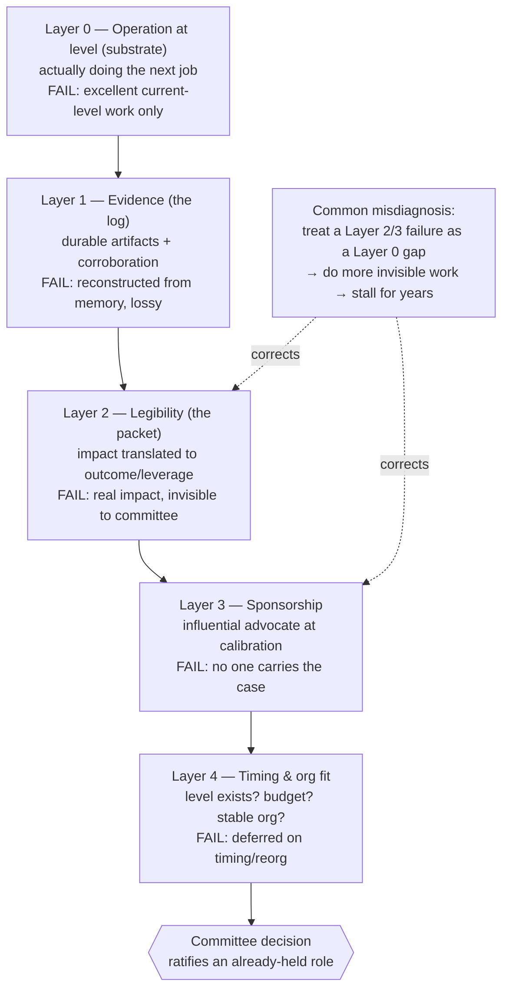
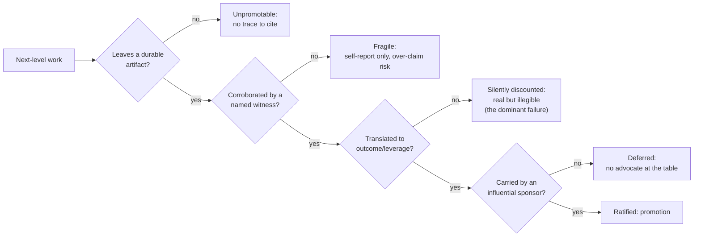

# Staff and Principal Promotion

## Executive Summary

A promotion to Staff or Principal is not a reward for good work at your current level. It is an organization's formal recognition that you have **already been operating at the next level for long enough that ratifying it is the low-risk decision**. This distinction is the single most consequential thing to internalize, and the one most strong senior engineers get wrong: they do excellent senior work, do more of it, do it faster, and wait for the title to arrive. It does not, because doing your current job extraordinarily well is evidence that you should keep doing your current job.

The unit of analysis for this chapter is not a system. It is a **case**: the argument that you are already doing the next job, made in writing, corroborated by witnesses, sponsored by someone with influence in the room where the decision is actually made, and grounded in impact measured as business outcome and organizational leverage rather than personal output. Every one of those clauses is load-bearing, and a packet missing any one of them fails in a predictable way.

This chapter covers the five things a promotion case actually requires: leveling expectations by role, demonstrating scope and impact, building the promotion packet and its evidence, securing sponsorship and visibility, and avoiding the common pitfalls that sink otherwise-qualified candidates. It builds directly on [Technical Leadership](../Phase-19/01_Technical_Leadership.md) — leverage-not-output is the intellectual spine of everything here — and draws throughout on [Architecture Reviews](../Phase-19/02_Architecture_Reviews.md), [Stakeholder Management](../Phase-19/03_Stakeholder_Management.md), [Technical Writing](../Phase-19/04_Technical_Writing.md), [Hiring and Interviewing](../Phase-19/05_Hiring_and_Interviewing.md), [Mentoring and Team Building](../Phase-19/06_Mentoring_and_Team_Building.md), [Roadmap and Portfolio Planning](../Phase-19/07_Roadmap_and_Portfolio_Planning.md), and the [CDO and CAIO Playbook](../Phase-19/08_CDO_and_CAIO_Playbook.md).

**The central thesis: promotion is a lagging indicator.** It certifies a role you already hold. The correct strategy is therefore never "work harder to earn it" — it is "operate at the target level, then make the evidence legible." Effort is not the constraint; demonstrated scope, made visible and corroborated, is.

**The second thesis, the one that separates those who get promoted from those who merely deserve to: the work does not speak for itself.** Impact that is real but undocumented, unsponsored, and invisible to the calibration table does not exist for promotion purposes. A promotion packet is a written argument in exactly the sense of [Technical Writing](../Phase-19/04_Technical_Writing.md), and sponsorship — not mentoring — is what converts demonstrated capability into an advanced title, exactly as in [Mentoring and Team Building](../Phase-19/06_Mentoring_and_Team_Building.md).

**The third thesis, which is the pitfall: optimizing for the promotion instead of the scope is self-defeating and detectable.** Promotion-driven development — chasing visible launches, avoiding unglamorous load-bearing work, padding a packet with activity — produces a candidate who looks promotable and is not, and a committee that has seen the pattern before will find it.

## Learning Objectives

By the end of this chapter you should be able to:

1. Explain why promotion is a lagging indicator that ratifies an already-held role, and why "work harder at my current level" is the wrong strategy.
2. State the concrete difference in scope, autonomy, and blast radius among senior, staff, and principal, and locate honestly where you currently operate.
3. Distinguish impact (business outcome, organizational leverage) from activity (effort, output, launches), and reframe your own work in the former terms.
4. Maintain a durable evidence corpus — a running impact log — and explain why it is the highest-leverage, most-neglected asset in the whole process.
5. Write a promotion packet as a reader-first written argument with corroborating artifacts and named witnesses, per [Technical Writing](../Phase-19/04_Technical_Writing.md).
6. Distinguish a mentor from a sponsor, and describe how to secure a sponsor with real influence at the calibration table.
7. Build visibility deliberately and honestly, without crossing into self-promotion or credit-taking.
8. Diagnose a failed or stalled cycle by cause — insufficient scope, invisible impact, no sponsor, poor packet, bad timing, reorg — rather than concluding "they don't value me."
9. Recognize and refuse the promotion-driven-development anti-pattern, including in its subtle forms (launch-and-abandon, glue-work avoidance, packet padding).
10. Right-size the entire apparatus so that routine progression stays lightweight and only Senior→Staff→Principal transitions carry the full evidentiary weight.
11. Represent a promotion case fairly for someone you sponsor, applying the same evidence and calibration discipline you would want applied to yourself.
12. Recognize when the honest answer is that the scope for the next level does not exist in your current role, and reason about the options that follow.

## Business Motivation

Framing promotion as personal career self-interest understates it and misdirects the preparation.

**For the individual.** The compensation delta from senior to staff to principal is large and compounds, but the more consequential outcome is **scope of decision rights**. Staff+ is where an organization decides whose judgment it will trust on decisions that are expensive to reverse, cross-team in blast radius, and long-lived. Being passed over does not merely defer a raise; it defers years of being in the rooms where the interesting decisions are made — which is itself the raw material for the *next* promotion, so the cost is nonlinear.

**For the organization.** Leveling is how a company allocates its scarcest resource — trust in judgment at scale — and it is also one of its most error-prone processes. Under-promoting reliably loses your best people to competitors who will recognize the level (the exact retention failure documented in [Hiring and Interviewing](../Phase-19/05_Hiring_and_Interviewing.md) Case Study 2 and [Mentoring and Team Building](../Phase-19/06_Mentoring_and_Team_Building.md) Case Study 2). Over-promoting on visibility rather than durable scope installs someone at a level they cannot sustain, which is expensive to unwind and demoralizing to the teams around them. Both failures are quiet and both compound.

**For the engineering culture.** What a company promotes for is the clearest signal it sends about what it values — far clearer than any stated value. If it promotes for shiny launches, it will get launch-and-abandon and starved maintenance ([Roadmap and Portfolio Planning](../Phase-19/07_Roadmap_and_Portfolio_Planning.md)'s "feature factory," now at the individual-incentive level). If it promotes for durable, load-bearing scope and demonstrated leverage, it gets more of that. A well-run leveling process is a governance mechanism for the whole engineering organization's incentives.

**The counter-case, stated honestly.** Not everyone should pursue a Staff or Principal title, and the industry's implicit assumption that everyone should is harmful. Some of the best engineers are happiest and most valuable operating at senior level with deep craft, and pushing them toward a leverage-and-influence role they do not want produces a worse engineer and an unhappy person. The honest first question is not "how do I get promoted" but "is the next level the job I actually want to do," because the day after the promotion you are doing that job, not the one you have now.

## History and Evolution

**Pre-2000: the ladder was short and management was the only up.** For decades the dominant career model offered individual contributors a single rung or two before the only path to more scope, compensation, and influence ran through people management. This forced a generation of excellent engineers into management they did not want and were not suited to — the origin of the dual-track ladder problem.

**1960s: the dual ladder appears, and the Peter Principle names the failure.** IBM and Bell Labs pioneered technical career ladders that let engineers advance without managing. In 1969 Laurence J. Peter published *The Peter Principle* — "in a hierarchy every employee tends to rise to his level of incompetence" — which named the structural risk of promoting someone for excelling at their *current* job into a *different* job they may not be able to do. That distinction is the intellectual seed of everything in this chapter.

**1990s–2000s: leveling frameworks formalize.** Compensation-survey firms (Radford and peers) and large tech companies formalized level definitions with explicit scope and impact expectations per level, and calibration processes to enforce consistency across managers. Google's software-engineering ladder (with its well-known L3–L8+ rungs and promotion-committee model) became the widely-imitated reference.

**2010s: the promotion committee and the packet become standard at scale.** Google, Meta, and their imitators standardized the model that dominates today: the candidate (with their manager) assembles a written **promotion packet** of evidence; a **committee** of calibrated senior people who mostly do not know the candidate evaluates it against a rubric; peer and cross-functional feedback is solicited. This decoupled promotion from a single manager's discretion (reducing favoritism) but made **the legibility of written evidence** the deciding factor — the same shift, and the same consequence, as the design-doc culture in [Architecture Reviews](../Phase-19/02_Architecture_Reviews.md).

**2019: "glue work" gets named.** Tanya Reilly's talk *Being Glue* (2019) identified the critical, coordinating, load-bearing work — unblocking others, writing the doc, running the incident, aligning the teams — that holds projects together, is disproportionately done by some engineers, and is systematically under-credited by promotion processes that reward legible individual artifacts. This is the single most important corrective to a naive "just do impactful work" model.

**2021–2022: the Staff+ literature consolidates.** Will Larson's *Staff Engineer* (2021) and Tanya Reilly's *The Staff Engineer's Path* (2022) codified the Staff+ IC role: the archetypes (Tech Lead, Architect, Solver, Right Hand), the centrality of a **sponsor**, the promotion packet as a genre, and the reframing of the job around leverage rather than output. Camille Fournier's *The Manager's Path* (2017) supplied the parallel view from the sponsoring manager's side.

**Persistent across all eras:** the highest-scoring pattern has never changed. Operate at the level first, produce durable and visible impact, get someone influential to carry your case, and make the evidence legible to people who do not already know you.

## Why This Technology Exists

The promotion process — packet, committee, calibration, sponsorship — exists because organizations must make a high-stakes, hard-to-reverse decision (grant durable decision rights and a compensation step) about a hard-to-observe property (whether someone will exercise senior judgment reliably at scale) using cheap and biased proxies.

Every cheaper proxy fails at exactly this:

- **A single manager's endorsement** correlates with rapport and recency as much as with sustained scope, and concentrates favoritism and bias — the reason committees exist at all.
- **Tenure** measures time served, not level operated at; the two correlate weakly above senior.
- **Visible output** (commits, launches, tickets) measures activity, which is what promotion-driven development games; it is precisely the wrong signal to optimize.
- **A great interview** measures point-in-time articulation, not the year of sustained cross-team impact the level actually requires.

What the packet-and-committee process uniquely provides:

- **Evidence of sustained operation at level**, not a snapshot — the multi-cycle track record a title is meant to certify.
- **Corroboration by people who are not the candidate**, which is the check against self-report inflation.
- **Calibration across candidates and managers**, so that "staff" means roughly the same thing across the organization — the fairness-and-consistency argument, identical in structure to the rubric argument in [Hiring and Interviewing](../Phase-19/05_Hiring_and_Interviewing.md).
- **A written record of the decision's basis**, so that a "not yet" comes with specific, actionable gaps rather than a verdict.

The second reason it exists is **that the levels above senior are genuinely different jobs, not more of the same one.** The Peter Principle's warning is that excelling at job N is not evidence of readiness for job N+1 when N+1 is a different job. Staff is not "senior with more years"; it is a role defined by leverage, scope, and influence rather than personal execution. The process exists to test for *that* job, which is why "I shipped a lot" is not an argument for it.

## Problems It Solves

- **Separating "excellent at the current level" from "already operating at the next level,"** which are different claims that naive processes conflate.
- **Making impact legible** to decision-makers who do not have direct visibility into the candidate's work, via written evidence and corroboration.
- **Reducing single-manager favoritism and bias** through calibrated committee review and cross-functional feedback.
- **Enforcing a consistent meaning of each level** across teams, so titles are comparable and compensation is defensible.
- **Producing actionable feedback on a "not yet"** — specific missing scope or evidence — rather than an opaque rejection.
- **Creating an incentive signal** for the whole organization about what "impact at level" means, for better or worse depending on what the process actually rewards.
- **Giving sponsors a structured vehicle** to advocate for people whose work they can vouch for.

## Problems It Cannot Solve

- **Manufacturing scope that does not exist.** If your role has no room for staff-level impact — a small team, a maintenance-mode product, no cross-team surface — no packet can conjure it. This is the most important honest limit, and it means the answer is sometimes "change roles," not "try harder."
- **Rewarding invisible glue work automatically.** Processes reward legible artifacts; the coordinating, unblocking, load-bearing work that Reilly named is under-credited *by default* and must be made visible deliberately — or the process actively mis-selects.
- **Eliminating bias entirely.** Committees reduce single-manager bias but introduce their own (halo, visibility, in-group, recency). Structure mitigates; it does not cure.
- **Predicting post-promotion success.** The process tests demonstrated operation at level, which is the best available proxy, but the Peter Principle risk is never zero — hence the rubric-revalidation discipline in this chapter's ADR.
- **Compensating for a missing sponsor.** A packet with no one influential to carry it is, at most organizations above senior, dead on arrival regardless of merit. Sponsorship is a precondition, not a nice-to-have.
- **Fixing bad timing on its own.** A reorg, a new manager, a budget freeze, or a level cap can defer a fully-earned promotion by a cycle or more; the process does not owe you immunity to organizational weather.
- **Making the next level the right choice for you.** The process assesses readiness, not desire. Whether you *want* the leverage-and-influence job is a question only you can answer, and it is the one to answer first.

## Core Concepts

### 5.1 Leveling Expectations by Role

The levels above senior differ along three axes that a promotion case must speak to directly: **scope** (how much of the organization your work affects), **autonomy** (how ambiguous a problem you are trusted to be handed), and **blast radius** (how expensive your mistakes and how durable your good decisions are). Titles vary by company; the shape is remarkably consistent.

| Level | Scope | Autonomy | The characteristic sentence |
|---|---|---|---|
| Senior | A team, a well-scoped project | Given a well-formed problem, delivers a good solution | "I built the thing correctly." |
| Staff | Multiple teams, a domain, a hard cross-cutting problem | Given an ambiguous area, finds the right problem and drives it | "I made several teams more effective, or solved a problem no single team could." |
| Principal | An organization, a technical strategy, a class of problems | Sets direction others execute against; is handed the company's hardest, least-defined problems | "I changed the trajectory of how the org builds, and it outlives me." |

Two clarifications matter more than the table. First, these are **archetypes, not a single path**: Larson's four Staff+ shapes (Tech Lead, Architect, Solver, Right Hand — see [Technical Leadership](../Phase-19/01_Technical_Leadership.md) §1.1) mean two staff engineers can look nothing alike, one embedded deep in a team and one roaming across the org. A packet must claim a coherent archetype, not a shapeless "did lots of things." Second, the jump from senior to staff is a **change of kind** (output → leverage), whereas senior itself was largely a change of degree (from mid-level). This is why the strategies that got you to senior — be more productive, own bigger chunks — stop working, and why so many strong engineers stall at the senior-to-staff boundary specifically.

### 5.2 Demonstrating Scope and Impact

Impact is the currency, and it must be denominated in **business outcome or organizational leverage**, never in activity. The reframing is mechanical and worth practicing until it is automatic:

- Not "I migrated the pipeline to Delta Lake" (activity) but "I cut the analytics-freshness SLA breach rate from 12% to under 1% and removed a recurring on-call class, unblocking three downstream teams" (outcome + leverage).
- Not "I wrote the design doc for the new ingestion platform" (artifact) but "I aligned four teams that were about to build incompatible ingestion paths onto one, avoiding an estimated two quarters of rework" (leverage).
- Not "I mentored three engineers" (activity) but "two of the three I sponsored were promoted, and the team's design-review quality measurably improved" (leverage that reproduces itself — the scalability of leadership from [Technical Leadership](../Phase-19/01_Technical_Leadership.md)).

The discipline is the same **translation** move as [Stakeholder Management](../Phase-19/03_Stakeholder_Management.md): project the same reality onto the axis the audience is accountable for — here, business value and org effectiveness — honestly, never as spin. Two failure modes bracket it. **Under-claiming** (the humble engineer who describes activity and lets the reader infer impact) leaves the impact invisible and is the more common failure among strong ICs. **Over-claiming** (attaching yourself to outcomes you contributed to marginally, or taking sole credit for collaborative work) is detected by corroboration and is far more damaging because it costs trust — the integrity constraint that runs through this chapter.

### 5.3 Promotion Packets and Evidence

A promotion packet is a **written argument** in precisely the sense of [Technical Writing](../Phase-19/04_Technical_Writing.md): reader-first, BLUF, structured for a committee member who does not know you and will spend ten minutes on it. Its structure is stable across companies:

1. **The claim, up front:** "This is a case for promotion to Staff. [Name] has operated at staff level for the last N cycles as [archetype]." The reader should know the ask and the shape in the first three sentences.
2. **Scope and impact, as evidence:** three to five substantiated impact narratives, each stated as outcome/leverage, each with a *verifiable artifact* (the design doc, the incident retro, the ADR, the metrics dashboard) and a *named corroborating witness* who saw it.
3. **The level-rubric mapping:** an explicit, honest mapping of the evidence to each dimension of the target level's rubric, including where the case is strong and where it is merely sufficient.
4. **Trajectory and sustained-ness:** evidence this is a durable pattern across multiple cycles, not a single quarter's heroics — because a title certifies a role held, not a spike.
5. **Peer and cross-functional voices:** corroboration from people other than the candidate and the sponsoring manager.

The **evidence corpus** that feeds the packet is the highest-leverage asset in the entire process and the most neglected. Maintaining a running **impact log** (a "brag document," in Julia Evans's widely-used phrasing) — a private, continuously-updated record of what you did, what outcome it produced, and who witnessed it — turns packet-writing from a stressful archaeological reconstruction into an act of selection. Almost nobody does this, and it is nearly free; the asymmetry is the reason it recurs throughout this chapter as *the* thing to start today.

### 5.4 Sponsorship and Visibility

The distinction from [Mentoring and Team Building](../Phase-19/06_Mentoring_and_Team_Building.md) is exact and decisive. A **mentor** gives you advice; a **sponsor** spends their own credibility advocating for you in rooms you are not in — the calibration meeting, the committee, the leadership sync. Sylvia Ann Hewlett's *Forget a Mentor, Find a Sponsor* (2013) is blunt about which one converts capability into advancement: sponsorship does, and mentoring without sponsorship reliably plateaus. Above senior, a packet with no sponsor at the calibration table is, at most large organizations, not a live candidate regardless of merit.

Securing a sponsor is not asking someone to like you; it is giving someone influential **specific, legible reasons and evidence to advocate for you**, and making it low-cost for them to do so. The most reliable way to earn sponsorship is to do visible, corroborated, high-leverage work in front of the person who could sponsor it — which folds sponsorship and visibility into one activity.

**Visibility** is the honest counterpart to the dishonest thing it is often confused with. It is not self-promotion or credit-taking; it is ensuring that real work is *legible to the people who make leveling decisions*. Writing the design doc under your name, presenting the architecture review, publishing the incident retro, speaking at the internal forum — these make genuine impact visible. The line is bright: visibility publicizes real work you did; self-promotion inflates or misattributes. The former is necessary and the latter is disqualifying, and a good committee distinguishes them.

### 5.5 Common Promotion Pitfalls

The recurring ways strong, deserving people fail:

- **Doing the current job better and waiting.** The dominant failure. Excellence at level N is evidence for staying at level N.
- **Invisible impact.** Real staff-level work that no one at the calibration table can see or corroborate. Especially fatal for **glue work** (Reilly), which is high-leverage and low-legibility by nature and must be made visible deliberately or it counts for nothing.
- **No sponsor.** A deserving packet with no one to carry it.
- **Activity mistaken for impact.** A packet full of things done, none tied to an outcome.
- **Promotion-driven development.** Optimizing for the packet instead of the scope — chasing shiny launches, avoiding unglamorous load-bearing work, gaming visibility. Detectable, and self-defeating because it produces someone who looks promotable and is not.
- **Missing scope, wrong diagnosis.** Concluding "they don't value me" when the honest problem is that the role has no staff-level scope to demonstrate — a role problem, not a recognition problem.
- **Bad timing taken personally.** A reorg or new manager resets the sponsor and the clock; reading organizational weather as a verdict on your worth leads to a bad, reactive decision.

## Internal Working

### 6.1 Promotion as a Ratification Mechanism, Not a Grant

The mechanism, stated precisely: an organization observes a candidate operating above their current level over time; evidence of that operation accumulates (in artifacts, in outcomes, in the memory of witnesses); at a decision point that evidence is compiled, corroborated, and evaluated against a level rubric by a calibrated body; and the title is granted to **certify a state that already obtains**. The entire system is a lagging indicator by design, because the thing it protects against is granting expensive, hard-to-reverse decision rights to someone who has not demonstrated they will use them well.

Two implications follow directly. First, the lever the candidate controls is not the decision (which is downstream and lagging) but the **two inputs**: actually operating at level, and making that operation legible and corroborated. Second, because there is a lag between operating at level and being recognized for it, there is always a period of doing the next job at the current title — which is not exploitation to be resented but the **normal precondition** of the ratification model, and the thing the packet documents.

### 6.2 The Evidence Pipeline: Artifact → Corroboration → Legibility → Decision

Impact becomes a promotion through a pipeline, and it can break at each stage:

- **Artifact:** the work leaves a durable trace (a doc, an ADR, a metrics change, a retro). Work that leaves no trace is nearly unpromotable regardless of its real value — the first reason the impact log exists.
- **Corroboration:** someone other than the candidate attests to the impact. This is the integrity check; it is why over-claiming is fragile and why witnesses must be real and named.
- **Legibility:** the artifact and corroboration are translated into outcome/leverage terms a non-expert committee member can evaluate in minutes ([Technical Writing](../Phase-19/04_Technical_Writing.md)).
- **Decision:** the calibrated body maps the legible evidence to the rubric and decides.

The dominant real-world failure is a break between *artifact* and *legibility*: genuine impact exists and is even documented, but never translated into terms the committee can assess, so it is silently discounted. This is the promotion-domain instance of the handbook's recurring pattern — a real, correct thing that fails because it was never made legible to the party that had to act on it, the same shape as [Technical Writing](../Phase-19/04_Technical_Writing.md) Case Study 1 and [System Design Interview Prep](03_System_Design_Interview_Prep.md) Case Study 2.

### 6.3 Calibration and the Meaning of a Level

Calibration is the mechanism that makes "staff" mean roughly the same thing across managers and candidates. A committee reviews multiple candidates against the rubric together, surfaces and argues down individual managers' generosity or stinginess, and produces a consistent bar. Its function is identical to the structured-rubric argument in [Hiring and Interviewing](../Phase-19/05_Hiring_and_Interviewing.md): it trades some of a single evaluator's rich context for consistency and defensibility across the population. The cost is a false-negative risk — a genuinely qualified candidate whose evidence was legible to their manager but not to the committee can be deferred — which is exactly why the sponsor's job (translating that context into the room) is decisive, and why the packet must be written for the committee, not the manager.

## Architecture

The promotion case, viewed as a system, has five layers, and — as with the leadership and interview chapters — a failure at one layer cannot be fixed at another. Reading the diagnostic correctly is most of the value:

- **Layer 0 — Operation at level (the substrate).** Are you actually doing the next job? If not, nothing above this matters, and the honest work is at Layer 0 or in changing roles to find the scope.
- **Layer 1 — Evidence (the record).** Does the work leave durable, retrievable artifacts and corroboration? The impact log lives here.
- **Layer 2 — Legibility (the encoding).** Is the evidence translated into outcome/leverage terms a committee can evaluate? The packet lives here.
- **Layer 3 — Sponsorship (the advocacy).** Is there someone influential carrying the case at the calibration table?
- **Layer 4 — Timing and organizational fit (the environment).** Does the level exist, is there budget, is the org stable enough this cycle?

The most common misdiagnosis, exactly paralleling the interview chapters, is treating a **Layer 2 or Layer 3 failure as a Layer 0 gap** — concluding "I must not be good enough / I must need to do more" (and doing more invisible work) when the real break is that impact is illegible or unsponsored. More effort at Layer 0 cannot fix a Layer 2 legibility failure or a Layer 3 sponsorship gap, and pouring effort into the wrong layer is the quiet way strong people stall for years.

## Components

The concrete components a candidate assembles and maintains:

- **The impact log / brag document:** the running, private evidence corpus. The one component to start immediately and maintain continuously.
- **The promotion packet:** the compiled written argument, produced by *selecting from* the log, not reconstructing from memory.
- **Impact narratives:** three to five substantiated stories, each outcome-framed with artifact and witness.
- **The level rubric:** the organization's written definition of the target level, obtained early and used as the design spec for the whole case.
- **The sponsor:** an influential advocate at the calibration table, secured well before the cycle.
- **Corroborating witnesses:** named peers, cross-functional partners, and leaders who can attest to specific impact.
- **The manager as partner:** the person who, in most models, co-authors the packet and coordinates the cycle — an ally to align with early, not a gatekeeper to persuade late.

## Metadata

The metadata of a promotion case is the level-defining context that determines how every piece of evidence is read:

- **The target-level rubric and its dimensions** (scope, autonomy, technical judgment, influence, leadership), obtained and mapped early — the packet's schema.
- **Your claimed archetype** (Tech Lead / Architect / Solver / Right Hand), which frames which evidence is central and which is supporting; a shapeless packet reads as not-yet-staff.
- **Sustained-ness metadata:** across how many cycles the pattern holds, distinguishing a durable role from a spike.
- **Invalidation conditions:** the honest list of what is *not yet* demonstrated, which a good packet and a good sponsor state proactively — because the committee will find it, and volunteering it reads as the calibrated self-assessment the level requires.

Missing or wrong metadata is a silent failure: a strong evidence set mapped to the wrong archetype, or presented without the rubric it should answer, is systematically undervalued.

## Storage

The durable evidence corpus is the "storage" layer of the promotion case, and it is the single most valuable and most-neglected asset in the process. Concretely: a continuously-maintained impact log that captures, close to when it happens, *what you did, what outcome it produced, who witnessed it, and where the artifact lives*.

The failure mode is universal and predictable: the corpus is not maintained, so at packet time the candidate reconstructs a year of work from memory under deadline, loses the specifics that make impact legible (the exact metric, the name of the witness, the link to the doc), and produces a weaker case than the work deserved. Impact that was real but unstored decays exactly like the neglected documentation corpus in [Technical Writing](../Phase-19/04_Technical_Writing.md) — it rots into "I did a lot of stuff," which is unpromotable. Storage is cheap, continuous, and nearly free; reconstruction is expensive, lossy, and stressful. The asymmetry is the whole argument for starting the log today.

## Compute

The "compute" of a promotion case is the candidate's finite time and attention across a review cycle, and the scarce resource is not raw hours but **scope-building capacity** — the portion of your attention available for work that demonstrates the next level rather than merely executing the current one.

The core allocation decision mirrors [Technical Leadership](../Phase-19/01_Technical_Leadership.md)'s leverage argument: time spent on high-leverage, visible, corroboratable scope-building compounds toward promotion, while time spent on invisible current-level execution — however excellent — does not. This is *not* a license to abandon your current responsibilities (that fails you on reliability and reads as chasing the title). It is a discipline of deliberately reserving capacity for the next-level work and refusing to let current-level firefighting consume all of it. The candidates who stall are frequently the most reliable ones, whose current-level competence made them the default owner of so much execution that no scope-building capacity remained — a trap the sponsor and manager should help break.

## Networking

The "networking" of a promotion case is the most literal: the **relationship network of sponsors, witnesses, and calibrators** across the organization, built before it is needed.

Three properties matter. First, the network must reach **beyond your immediate team** — cross-functional partners and leaders in adjacent orgs are the corroboration that makes cross-team impact legible, and the sponsors with influence at calibration are frequently not your direct manager. Second, it must include the person who will **sponsor**, cultivated early by doing visible work in front of them, not cold-approached at cycle time. Third, it is built through **weak ties as well as strong ones** — the broad, low-intensity relationships across the org (the same weak-tie network from [Technical Leadership](../Phase-19/01_Technical_Leadership.md) and [Stakeholder Management](../Phase-19/03_Stakeholder_Management.md)) are what make your impact known to people who will be in rooms you are not. A network assembled reactively at packet time is too late; the corroboration and sponsorship it would have provided do not exist yet.

## Security

The "security" of a promotion case is the **integrity of your claims and the trust that underwrites your candidacy** — and, distinctively, a set of things you must *not* do:

- **Never inflate impact or take credit for others' work.** Corroboration is the detection mechanism, and a single caught inflation costs the trust the whole case rests on. This is the integrity constraint that runs through the chapter; it is non-negotiable because trust is the actual currency of a Staff+ role.
- **Attribute collaborative work honestly.** Staff-level impact is usually collaborative; claiming sole credit is both false and *anti*-signal, because leverage-through-others is the very thing the level rewards — so honest attribution of a team win is stronger evidence than a fabricated solo one.
- **Protect others' confidences.** Impact narratives that expose a colleague's failure or a confidential situation to make yourself look good are a trust breach a good sponsor will refuse to carry.
- **Refuse gaming.** Promotion-driven development, packet padding, and manufactured visibility are the "attack on the process" analogue; a healthy committee is, in effect, the defense, and the pattern is more legible to experienced calibrators than the candidate believes.

Integrity is not only ethically required; it is strategically optimal, because the entire mechanism is built on corroboration and trust, and the level you are seeking is defined by how much of both the organization will extend to you.

## Performance

The performance of a promotion case is **signal density** — demonstrated impact per unit of effort, and how clearly promotion-readiness is showing as a leading indicator well before the decision. The useful metrics, all leading rather than lagging:

- **Impact-to-activity ratio:** what fraction of your visible work ties to a named business or organizational outcome versus mere activity.
- **Corroboration coverage:** for each major impact claim, is there a named witness and a durable artifact.
- **Legibility:** can a non-expert who does not know you read an impact narrative and understand the outcome in under a minute.
- **Sponsor readiness:** is there an identified, willing, influential sponsor — a binary that gates everything above senior.
- **Surprise rate at check-in:** how often your manager or sponsor is surprised by evidence you present. High surprise means your work is invisible even to your closest advocates — the most diagnostic single signal, exactly as in [Stakeholder Management](../Phase-19/03_Stakeholder_Management.md).

The point of measuring these continuously is that promotion is a lagging indicator you can nonetheless forecast: if these leading signals are weak two cycles out, the deferred outcome is already visible and correctable, whereas discovering it at packet time is too late.

## Scalability

Scalability, for a promotion case, is the property that most directly *is* the higher level: **impact that grows beyond your personal effort.** Senior impact scales with your hours; staff and principal impact scales because it changes what *other* people and teams can do — a platform that ten teams build on, a standard that prevents a class of rework, engineers you sponsored who now lead, a decision that shapes how the org builds for years.

This reframes the whole preparation. A packet whose every impact narrative is bounded by the candidate's own execution ("I built X, I fixed Y, I shipped Z") is, structurally, a senior packet no matter how impressive the individual items, and calibration committees are trained to see exactly this. A staff packet demonstrates **leverage that outlives and out-scales the individual** — which is why "reproduce leadership, don't just apply effort" ([Technical Leadership](../Phase-19/01_Technical_Leadership.md)) is not motivational advice but a literal description of the evidence the next level requires. The load-bearing test a committee applies: *if this person went on leave tomorrow, what would keep working, and what would stop?* Durable scope keeps working; personal heroics stop.

## Fault Tolerance

A promotion case must be robust to failure, because a large fraction of well-earned promotions are deferred at least once for reasons unrelated to merit. The rehearsed recoveries:

- **Passed over.** Diagnose by *layer* (§Architecture), from the specific written feedback, not from wounded inference. A "not yet" is data about which layer broke; treat it as a gap list, get the gaps in writing, and address the actual one rather than defaulting to "do more."
- **Sponsor leaves or reorg resets the clock.** Common and impersonal. Re-secure a sponsor and re-establish visibility with the new leadership early; do not read the reset as a verdict, and do not wait passively for the situation to notice you.
- **Vague feedback.** "Not quite ready" without specifics is itself a Layer 3 failure (no one able to articulate the case). Push, respectfully and persistently, for the concrete missing scope — a promotion process that cannot say what is missing is not one you can navigate by working harder.
- **The scope genuinely does not exist.** The honest, hardest case: your role has no staff-level surface. This is not a recovery to attempt in place; it is a signal to seek a role — internally or externally — where the scope exists. Refusing to see this and grinding for years against a structural ceiling is the costliest failure of all.

The disagree-and-commit posture from [Technical Leadership](../Phase-19/01_Technical_Leadership.md) applies: you can believe a deferral was wrong and still engage the feedback constructively, because the alternative — visible resentment — damages exactly the sponsor relationships the next cycle depends on.

## Cost Optimization

The "cost" of pursuing a promotion is time and attention spent on the case, and the optimization is spending it where signal density is highest rather than where effort feels most virtuous.

**Worked example — where the same effort lands very differently.** Consider a senior engineer with roughly 6 hours per week of discretionary "growth" time over a two-cycle (≈9-month) run to staff — call it ~230 hours. Two allocations:

- *Effort-virtuous allocation:* ~180 h taking on more current-level execution (being the reliable owner of ever more delivery), ~30 h on ad-hoc mentoring, ~20 h reconstructing a packet in the final month. Outcome: a strong senior track record, invisible glue work, no durable next-level scope, a rushed packet, no cultivated sponsor. Typical result: deferred, with feedback that reads as "keep doing what you're doing" — the trap.
- *Signal-dense allocation:* ~10 h maintaining an impact log from day one; ~120 h on one deliberately-chosen cross-team, load-bearing scope (a platform capability, a standard, an ambiguous problem no single team owns) done *visibly* under your name; ~40 h making it legible (docs, review presentations, retro); ~40 h cultivating a sponsor and corroborating witnesses through that visible work; ~20 h writing the packet by *selecting* from the log. Outcome: durable scope, legible impact, a real sponsor, a strong packet — the same hours, a full level of difference in outcome.

The dominant cost lever is not *more* effort; it is **moving effort from invisible current-level execution to visible, corroborated, durable next-level scope** — the promotion-domain instance of the handbook's measure-and-reallocate-rather-than-add discipline. The log is the highest-ROI line item on it: ~10 hours across nine months that multiplies the value of everything else.

## Monitoring

Monitoring a promotion case means tracking the leading indicators (§Performance) on a deliberate cadence rather than discovering the state at packet time:

- **Standing check-ins with your manager** framed explicitly around the level rubric — "against the staff rubric, where am I strong, where is the gap" — turning promotion from an annual surprise into a monitored trajectory.
- **A live impact log** reviewed monthly, so that gaps in corroboration or legibility are visible while they are still fixable.
- **Sponsor and witness state** as an explicit tracked item: is there a willing sponsor, are the witnesses current and reachable.
- **Surprise rate** at each check-in as the key early-warning signal: if your manager is regularly surprised by your evidence, your work is invisible to your closest advocate and the case is failing at Layer 2 or 3 regardless of Layer 0 quality.

The purpose of monitoring is the same as everywhere else in the handbook: convert a lagging outcome into a leading, correctable signal.

## Observability

Where monitoring watches known indicators, observability is the ability to answer the *unanticipated* question — most importantly, **"why didn't this land?"** — from evidence rather than speculation.

The instrument is durable, specific written feedback and a retained record of the case. A promotion process that produces only a binary verdict is *unobservable*: you cannot diagnose which layer failed, so you cannot correct the real cause and default instead to "do more" (usually the wrong layer). The observability discipline is therefore to *insist on specific written feedback* on any deferral — which layer, which rubric dimension, what concrete missing scope — and to keep your own record (the impact log, the packet, the feedback) so that the next cycle is debugged from evidence rather than from the emotional memory of a disappointment. This is the promotion-domain application of the "debug from recordings, not memory" discipline in [Architecture Interview Prep](04_Architecture_Interview_Prep.md).

## Operational Response Playbook

### Playbook 1 — You were passed over and the feedback is vague or feels wrong

**Signal:** a "not yet" with no specific, actionable gap, or feedback that does not match your understanding of your impact.

**Do not:** conclude "they don't value me" and either disengage or double down on more invisible current-level work; re-litigate the decision emotionally with your manager; let visible resentment damage sponsor relationships.

**Diagnose by layer, from evidence:**

| Symptom in the feedback | Likely failed layer | The real fix |
|---|---|---|
| "Do more / keep it up / not enough yet" (no specifics) | Layer 3 — no one could articulate the case | Push for concrete gaps in writing; secure or re-brief a sponsor |
| "We couldn't see the impact / it wasn't clear" | Layer 2 — legibility | Rewrite impact as outcome/leverage; add artifacts and witnesses |
| "The scope wasn't at level / too team-bounded" | Layer 0 — operation at level | Deliberately take on cross-team, load-bearing scope; this is real, not packaging |
| "Timing / this cycle / reorg / budget" | Layer 4 — environment | Re-secure sponsor with new leadership; reset expectations, not self-worth |

**Respond by the diagnosed cause, then verify:** get the specific gap in writing, agree with your manager and sponsor on what closing it looks like, and treat the *next* cycle as debugged from that evidence — not from a resolve to simply work harder.

### Playbook 2 — You realize you have been optimizing for the promotion, not the scope

**Signal:** you notice yourself choosing projects for visibility over impact, avoiding unglamorous load-bearing work, or padding a packet with activity — or a mentor/sponsor gently flags it.

**Do not:** rationalize it as "playing the game," or over-correct into invisible martyrdom (abandoning all visibility as if it were the sin — it is not; misattribution and gaming are).

**Diagnose honestly:** distinguish *legitimate visibility* (making real, durable work legible — necessary and good) from *promotion-driven development* (choosing work for how it looks rather than what it does — self-defeating). The test is the load-bearing question: *would this work matter if no one were watching and it never appeared in a packet?*

**Respond:** re-anchor on durable, load-bearing scope (including the glue work), make *that* visible honestly, and let the packet be a selection from real impact rather than a driver of what you choose to do. The irony worth internalizing: doing the real next-level job and making it legible is both more promotable *and* more sustainable than gaming, because it produces the durable scope a committee is actually looking for.

## Governance

Promotion is itself a governance process — the mechanism by which an organization allocates decision rights and enforces a consistent meaning of each level — and it must be governed as one:

- **A written, pre-published level rubric** so that expectations are legible before the cycle, not reverse-engineered at packet time. An unwritten bar is ungovernable and reliably biased.
- **Calibrated committee review** rather than single-manager discretion above senior, for the fairness-and-consistency reasons in §6.3.
- **Disaggregated evaluation across competency dimensions**, never a single aggregate score — the same disaggregation discipline as [Hiring and Interviewing](../Phase-19/05_Hiring_and_Interviewing.md) and [Responsible AI](../Phase-11/07_Responsible_AI.md), so that a strong-on-execution / weak-on-influence case is seen for what it is rather than averaged into a misleading "ready."
- **Adverse-impact monitoring across cohorts**, because a promotion process is exactly the kind of high-stakes decision where systematic bias by gender, race, or team accumulates silently — the same four-fifths-style monitoring [Hiring and Interviewing](../Phase-19/05_Hiring_and_Interviewing.md) applies to hiring stages.
- **Actionable, recorded feedback on deferrals**, so that "not yet" is governable and correctable rather than opaque.

For the individual, the governance obligation is the integrity constraint (§Security). For the organization, it is running the process such that what it promotes for is what it actually wants more of.

## Trade-offs

- **Lagging safety vs. deserving-people-lost.** Ratifying an already-held role is low-risk for the org but means genuinely-ready people spend a period doing the next job at the current title, and some leave first. The tension is real and not fully resolvable; it is why sponsorship and legibility (which shorten the lag) matter so much.
- **Legibility rewards visible work.** Making impact legible is necessary, but it structurally advantages legible work over invisible glue work — so a process must *deliberately* surface glue work or it mis-selects. Optimizing purely for legibility drifts into promotion-driven development.
- **Committee consistency vs. context.** Calibration buys fairness and comparability at the cost of a single evaluator's rich context — the same trade as structured hiring — creating a false-negative risk the sponsor exists to offset.
- **Rubric rigor vs. archetype diversity.** A precise rubric improves consistency but can penalize a valid Staff+ archetype the rubric's authors did not have in mind (the Solver who doesn't lead a team, the deep Architect who doesn't roam) — the over-rigidity risk this chapter's ADR guards against with revalidation.
- **Pursuing the level vs. wanting the job.** The strongest trade-off of all: the leverage-and-influence job the title grants is a genuinely different job, and optimizing to get it without wanting it trades present craft-satisfaction for a role you may not enjoy.

## Decision Matrix

| Your situation | The honest reading | The move |
|---|---|---|
| Doing excellent current-level work, waiting for the title | Layer 0 not yet at target; strategy is wrong | Take deliberate next-level scope; stop expecting more-of-the-same to promote |
| Real next-level impact, but no one sees it | Layer 2 legibility failure | Impact log, outcome-framing, docs, presentations, witnesses |
| Impact is visible but no one is carrying your case | Layer 3 sponsorship gap | Cultivate an influential sponsor via visible work, early |
| Strong case but deferred on timing/reorg | Layer 4 environment | Re-secure sponsor with new leadership; reset timeline not self-worth |
| Chasing visible launches, dropping load-bearing work | Promotion-driven development | Re-anchor on durable scope; apply the load-bearing test |
| No staff-level scope exists in the role | Structural ceiling, not a recognition problem | Seek a role — internal or external — where the scope exists |
| Ready and want it | Operating at level, legible, sponsored | Assemble the packet by selecting from the log; run the cycle |
| Ready but don't want the next job | Readiness ≠ desire | Consider staying; craft-deep senior is a valid, valuable path |

## Design Patterns

- **The running impact log ("brag document").** A continuously-maintained private record of impact, outcome, witness, and artifact. The single highest-ROI pattern; start it today.
- **Outcome-framing.** State every impact as business outcome or organizational leverage, with an artifact and a witness — never as activity.
- **Operate-then-evidence.** Do the next-level job first; compile evidence second. Never reverse-engineer scope to fit a packet.
- **Sponsor-through-visible-work.** Earn sponsorship by doing corroboratable high-leverage work in front of the person who could sponsor it, folding visibility and sponsorship into one activity.
- **Rubric-as-spec.** Obtain the target-level rubric early and use it as the design specification for the whole case, mapping evidence to dimensions honestly including the gaps.
- **The load-bearing test.** For any claimed scope, ask what would stop working if you left tomorrow; durable scope keeps working, heroics stop.
- **Rubric-anchored check-ins.** Standing manager conversations framed on the rubric, turning a lagging annual verdict into a monitored trajectory.

## Anti-patterns

- **Work-harder-and-wait.** Excelling at your current level as a promotion strategy.
- **Promotion-driven development.** Choosing work for how it looks in a packet rather than what it does — including launch-and-abandon and glue-work avoidance.
- **The heroic bottleneck.** Becoming so reliable at current-level execution that you have no capacity for, and no evidence of, scalable next-level scope.
- **The reconstructed packet.** Assembling a year of impact from memory under deadline, losing the specifics that make it legible.
- **Credit inflation / misattribution.** Claiming collaborative or others' work — self-defeating because leverage-through-others is the very signal the level rewards, and corroboration detects the lie.
- **Sponsor-less submission.** Filing above-senior with no influential advocate at the table.
- **Verdict-as-worth.** Reading a timing- or reorg-driven deferral as a judgment of your value, and disengaging or resenting.
- **Grinding a structural ceiling.** Trying to promote in a role that has no next-level scope, for years, instead of changing roles.

## Common Mistakes

- Treating promotion as a reward for effort rather than recognition of an already-held role.
- Framing impact as activity ("I migrated X") instead of outcome ("I cut the SLA breach rate and unblocked three teams").
- Not maintaining an impact log, then reconstructing a weak packet from memory.
- Doing high-leverage glue work invisibly and getting no credit for it.
- Confusing a mentor (advice) with a sponsor (advocacy), and having only the former.
- Confusing legitimate visibility (publicizing real work) with self-promotion (inflating or misattributing) — and either doing the latter, or over-correcting into invisible martyrdom.
- Diagnosing every deferral as "do more," when the real failure is legibility or sponsorship.
- Not insisting on specific written feedback, then debugging the next cycle from emotional memory.
- Pursuing the title without asking whether you want the next-level *job*.
- Failing to see, or refusing to accept, that the role simply has no scope for the next level.

## Best Practices

- **Start the impact log today**, before you think you need it. It is nearly free and multiplies the value of everything else.
- **Reframe everything you do into outcome/leverage terms** as a habit, not a packet-time exercise.
- **Get the target-level rubric early** and treat it as the spec; map your evidence to it honestly, gaps included.
- **Operate at the level first.** Deliberately take cross-team, ambiguous, load-bearing scope, and make it visible under your name.
- **Cultivate a sponsor early** through corroboratable visible work; do not cold-approach at cycle time.
- **Make glue work legible** deliberately — it is high-leverage and invisible by default, so it must be surfaced or it counts for nothing.
- **Run rubric-anchored check-ins** so promotion is a monitored trajectory, not an annual surprise; watch the surprise rate.
- **Keep your integrity absolute** on attribution and claims — trust is the currency of the level you are seeking.
- **Apply the same rigor when you sponsor others**, and use disaggregated, bias-monitored evaluation.
- **Ask honestly whether you want the next job**, and treat "no" as a legitimate, valuable answer.

## Enterprise Recommendations

For an engineering organization designing or running a leveling process:

- **Publish written level rubrics** with concrete scope/impact/influence expectations per level, before cycles, and revalidate them against actual post-promotion performance (the Peter-Principle guard).
- **Use calibrated committees above senior**, with disaggregated per-dimension evaluation and adverse-impact monitoring across cohorts.
- **Make glue work first-class** in the rubric and in packet templates, so the process rewards the load-bearing coordination it depends on rather than mis-selecting for legible individual artifacts.
- **Require specific, recorded, actionable feedback on deferrals**, so a "not yet" is a correctable gap list, not an opaque verdict.
- **Train and expect managers to sponsor**, not merely mentor, and to help their strongest ICs reserve scope-building capacity rather than absorbing all execution.
- **Provide a genuine dual-track ladder** with real parity, so the IC path to Staff/Principal is not a lesser road to the management path — the [Mentoring and Team Building](../Phase-19/06_Mentoring_and_Team_Building.md) ADR-0203 clause.
- **Audit what you actually promote for** against what you say you value; the delta is the truth of your culture.

## Azure Implementation

Because promotion is a career process rather than a technology, the tooling that supports it is the collaboration, evidence, and analytics stack. On Microsoft's platform, an evidence-and-visibility system looks like:

- **Azure DevOps / GitHub Enterprise** as the durable artifact trail: design docs, ADRs, PRs, and incident retros under your name are the corroboratable evidence a packet cites. `CODEOWNERS`, PR authorship, and wiki/`docs/` history make authorship legible — the version-controlled record *is* the corroboration.
- **Azure Boards / GitHub Projects** to track the cross-team, load-bearing scope you own, linking work items to outcomes so that impact (not just activity) is traceable.
- **Power BI** for the impact metrics that turn activity into outcome — the SLA-breach-rate trend, the cost-per-run reduction, the adoption curve of a platform you built — the same dashboards that ground a [Stakeholder Management](../Phase-19/03_Stakeholder_Management.md) business case, reused as promotion evidence.
- **Microsoft 365 (Loop / SharePoint / OneNote)** as the home of the running impact log and the packet draft; **Purview sensitivity labels** on any packet or log that references others' performance or confidential situations (the §Security confidentiality obligation).
- **Viva Engage / Teams / internal tech talks** as legitimate visibility surfaces — presenting an architecture review, publishing a retro, speaking at an internal forum makes real work legible to leveling decision-makers.
- **Microsoft Viva Insights / Glint** at the org level for the aggregate, anonymized health signals a well-run leveling process monitors alongside promotion outcomes.

The depth here is deliberately modest because the substance of a promotion case lives in Core Concepts, not in tooling; the tools make evidence durable and legible, they do not create scope.

## Open Source Implementation

The same evidence-and-visibility system in an open, portable stack — and this layer is genuinely cloud-agnostic because a career case is built from documents and relationships, not managed services:

- **Git + Markdown** for the impact log and packet as version-controlled, portable documents; the log lives in a private repo and travels with you across employers.
- **A static-site or wiki tool** (MkDocs, Docusaurus, or Backstage TechDocs) to make design docs, ADRs, and retros findable — the [Technical Writing](../Phase-19/04_Technical_Writing.md) docs-as-code discipline applied to your own evidence corpus.
- **adr-tools / Log4brains / MADR** so the decisions you drove leave durable, attributable ADRs — the strongest single artifact class for a Staff+ case.
- **Grafana / Metabase / Superset** over real telemetry for the outcome metrics that convert activity into impact.
- **A plain Markdown "brag document" template** committed to Git and updated monthly — the single most valuable, most portable, nearly-free component of the whole system.

The portability point matters: because the case is documents and relationships, it is fully cloud- and employer-agnostic by construction. The impact log you maintain in Git is the same asset whether your employer runs Azure, AWS, GCP, or on-prem.

## AWS Equivalent (comparison only)

The technology mapping is incidental (the evidence trail can live in AWS-hosted GitHub/GitLab, S3/CloudFront-published docs, QuickSight dashboards). The *culturally* interesting comparison is Amazon's promotion practice, because it is a well-documented, distinctive model:

- **Written-narrative promotion documents.** Amazon's writing culture (the six-page narrative memo, PR-FAQ, "working backwards") extends to promotion: cases are argued in prose against the Leadership Principles and level guidelines, read in a room, and interrogated. This makes **legibility of written evidence** even more decisive than at a slide-culture company — a direct amplification of this chapter's second thesis.
- **Bar Raiser lineage.** The same calibration-and-consistency instinct behind Amazon's hiring Bar Raiser (see [Hiring and Interviewing](../Phase-19/05_Hiring_and_Interviewing.md)) shapes its promotion calibration: a consistent bar enforced by people outside the candidate's direct chain.
- **Leadership Principles as the rubric.** Impact is argued against explicit, named principles — a concrete instance of the rubric-as-spec pattern.

**Selection criterion:** if your organization has an Amazon-influenced writing culture, invest disproportionately in the *written* case; the packet is not a formality, it is the decision surface.

## GCP Equivalent (comparison only)

Google originated the committee-and-packet model that most of the industry now imitates, so the comparison is again primarily cultural rather than technical (the evidence can live in GitHub/GitLab, Cloud-hosted docs, Looker dashboards):

- **The promotion committee and packet.** Google's model — candidate assembles a packet of evidence, a committee of calibrated engineers who mostly do not know the candidate evaluates it against the ladder, peer feedback is solicited — is the reference architecture for §6.3's calibration argument and the reason "write for the committee, not your manager" is load-bearing advice.
- **The signal-plateau finding.** Google's own research that interview signal plateaus after about four interviews ([Hiring and Interviewing](../Phase-19/05_Hiring_and_Interviewing.md)) reflects the same evidence-sufficiency instinct that governs how much a promotion packet needs: enough corroborated impact to clear the bar, not maximal volume.
- **Design-doc culture as evidence.** Google's strong design-doc culture means the durable artifacts a packet cites already exist as a byproduct of how work is done — the docs-as-evidence virtuous cycle this chapter recommends deliberately.

**Selection criterion:** in a committee-and-packet culture, the sponsor's ability to translate your context into a room of strangers ([Stakeholder Management](../Phase-19/03_Stakeholder_Management.md)) and the legibility of the packet are the two decisive levers.

## Migration Considerations

"Migration" for a career case is moving between leveling regimes — changing companies, or your company changing its process — and the discipline is knowing what is portable and what is not:

- **Portable:** your impact log, your artifacts (docs, ADRs, retros in your own copies), and the *skill* of operating at level and making it legible. Because these are documents and demonstrated competence, they survive any employer change — the argument for maintaining the log in your own Git repo, not only in an employer system you lose access to.
- **Not portable:** your sponsor relationships, your accumulated visibility, and — critically — your *level itself*. Titles do not transfer cleanly; a "staff" at one company may down-level to "senior" at another with a higher bar, and re-establishing sponsorship and visibility in a new org resets a large part of the clock. This is the single most under-appreciated cost of changing employers late in a promotion cycle.
- **Regime differences:** a manager-discretion culture, a committee-and-packet culture, and a written-narrative culture reward different things (relationship, legible packet, prose respectively). Diagnose which regime you are in and invest accordingly, rather than porting habits that fit the last one.
- **The honest calculus:** leaving *just before* an earned promotion often means re-earning it elsewhere from a partial reset; leaving because the *scope ceiling is structural* is usually correct despite the reset. Distinguish the two before deciding.

## Mermaid Architecture Diagrams

**Diagram 1 — The five-layer promotion case, with per-layer failure diagnosis.** The stack whose Layer-N failure cannot be fixed at Layer M.



**Diagram 2 — The evidence pipeline: where impact becomes (or fails to become) a promotion.**



**Diagram 3 — A promotion cycle over time: operate-then-evidence, not the reverse.**

```mermaid
sequenceDiagram
    participant IC as Candidate
    participant Log as Impact Log
    participant Spon as Sponsor
    participant Cmte as Committee
    Note over IC,Log: Continuously, from day one
    IC->>Log: record impact + outcome + witness (monthly)
    IC->>IC: take deliberate cross-team, load-bearing scope
    IC->>Spon: do visible corroboratable work in front of sponsor
    Note over IC,Spon: One+ cycles before packet
    Spon-->>IC: agrees to advocate; briefs on rubric gaps
    Note over IC,Cmte: Cycle
    IC->>Log: SELECT evidence (not reconstruct)
    IC->>Cmte: packet = written argument, outcome-framed
    Spon->>Cmte: translates candidate's context into the room
    Cmte-->>IC: ratifies already-held role — or specific written gaps
```

## End-to-End Data Flow

The end-to-end "data flow" of a promotion is the path from a unit of work to a ratified title, and naming it makes the leverage points explicit:

1. **Work is done at the next level** (Layer 0) — deliberately chosen cross-team, load-bearing scope, not just more current-level execution.
2. **The work leaves an artifact** — a doc, ADR, PR, retro, metric — captured near-real-time into the **impact log** (Layer 1) with outcome and witness.
3. **A witness corroborates** the impact, converting self-report into attested evidence.
4. **The evidence is translated** into outcome/leverage terms in the **packet** (Layer 2), legible to a committee member in minutes.
5. **A sponsor is briefed and commits** (Layer 3), carrying the case into rooms the candidate is not in.
6. **The cycle opens; the packet is compiled** by *selecting* from the log, not reconstructing from memory.
7. **The committee evaluates** the legible, corroborated, sponsored case against the rubric and **ratifies the already-held role** — or returns specific, recorded gaps that re-enter the flow at the layer that failed.

The flow's dominant leak is between steps 2 and 4 — real impact that leaves an artifact but is never translated into legible outcome terms — which is why the impact log and outcome-framing are the two highest-leverage interventions.

## Real-world Business Use Cases

- **Retaining a critical data-platform lead.** An engineer effectively running a lakehouse platform three teams depend on is a flight risk if under-levelled; a well-run staff case that ratifies the role they already hold is a retention mechanism worth far more than its compensation cost — the inverse of [Mentoring and Team Building](../Phase-19/06_Mentoring_and_Team_Building.md) Case Study 2.
- **Building the org's technical leadership bench.** Principal promotions are how an organization formally distributes strategy-setting authority; getting them right (durable scope, not visibility) determines whether direction is set by people whose judgment scales.
- **Correcting a culture that promotes for launches.** An organization that audits what it actually promotes for and shifts the rubric toward durable, load-bearing scope changes its whole incentive gradient away from launch-and-abandon — [Roadmap and Portfolio Planning](../Phase-19/07_Roadmap_and_Portfolio_Planning.md)'s feature-factory correction at the individual level.
- **Making glue work career-viable.** Formally crediting coordination and unblocking work lets an organization retain the people who hold projects together, rather than watching them burn out uncredited and leave.

## Industry Examples

- **Google** originated the committee-and-packet model — self-assembled evidence, calibrated committee of near-strangers, solicited peer feedback — that most of the industry imitates, and its strong design-doc culture means the artifacts a packet cites are a byproduct of how work is done.
- **Meta's** performance-and-promotion cycle (the semi-annual PSC) is a high-cadence, impact-narrative-and-peer-feedback-driven model that makes written self-assessment and cross-functional corroboration central, and whose intensity illustrates both the strengths and the promotion-driven-development risks of a tightly-coupled perf-and-promo system.
- **Amazon** argues promotions in written narratives against explicit Leadership Principles, with Bar-Raiser-style calibration — the strongest industry example of *legibility of written evidence* as the decision surface.
- **Tanya Reilly's *Being Glue* (2019)** is the canonical industry articulation of how promotion processes systematically under-credit load-bearing coordination work, and why it must be made visible deliberately.
- **Will Larson's *Staff Engineer* (2021)** and its `staffeng.com` narratives are the most-cited real-world corpus of how actual Staff+ promotions happened — and the centrality of a sponsor recurs in nearly every one.

## Case Studies

### Case Study 1 — The excellent engineer nobody could promote

A senior data engineer was, by any honest technical measure, already operating at staff level: they had quietly designed the ingestion standard three teams adopted, been the de facto incident commander for the platform's worst outages, and mentored two engineers who were themselves promoted. They did all of it heads-down, took little credit, kept no record, and assumed the work would speak for itself.

At promotion time their manager tried to assemble a case and could not make it legible: the ingestion standard was "just something that happened," the incident leadership left no artifact under the engineer's name, the mentoring was known only to the two mentees. The packet read as a strong *senior* case — reliable, competent, team-bounded — because the *staff* impact had never been made visible or corroborated. There was no sponsor at the calibration table who could speak to cross-team leverage they had never seen. The engineer was deferred, received vague "keep it up" feedback, concluded the org didn't value them, and began interviewing.

The blameless diagnosis found the failure at **Layers 1–3, not Layer 0**: the operation at level was real and excellent; the evidence was unstored, the impact illegible, and there was no sponsor. The recovery — over the next cycle — was mechanical: start an impact log, retroactively document the ingestion standard's adoption and outcome with named adopters, present the platform's reliability improvements as a review under the engineer's name, and cultivate a sponsor in the adjacent org whose teams depended on the standard. The *same* body of work, made legible and sponsored, cleared the staff bar the following cycle. Nothing about the engineer's competence changed; only its visibility did. This is the promotion-domain twin of [Technical Writing](../Phase-19/04_Technical_Writing.md) Case Study 1 (great thinking, buried point) and [Mentoring and Team Building](../Phase-19/06_Mentoring_and_Team_Building.md) Case Study 2 (capable but unsponsored) — and it motivates this chapter's ADR directly.

### Case Study 2 — The engineer who optimized for the packet

A different senior engineer, ambitious and promotion-focused, read the incentives precisely and gamed them. Over two cycles they chased visible, launch-shaped work: three new services announced at engineering all-hands, each demoable, each with their name prominently on it. They systematically avoided the unglamorous work — the flaky-pipeline stabilization, the on-call rotation, the migration nobody wanted — because it did not "show up." Their packet was a wall of activity: launches, presentations, visible artifacts.

The committee promoted them. Within two cycles the pattern surfaced: two of the three launched services had been quietly abandoned (no one owned them, because the engineer had moved on to the next visible thing before they were durable), the team's reliability had degraded because load-bearing maintenance had been starved, and the engineer — now nominally staff — was floundering, because they had never actually built durable cross-team scope, only the *appearance* of it. A subsequent, more experienced calibration committee, reviewing the aftermath, recognized in hindsight the promotion-driven-development signature the original packet had shown: activity without durable outcome, launches without owned consequences, no load-bearing scope.

The lesson has two edges. For the *individual*: gaming the process produces a title you cannot sustain — a personal Peter-Principle outcome — and is self-defeating even on its own selfish terms. For the *organization*: a process that rewards visible launches over durable scope will select for exactly this failure, which is why the ADR's load-bearing and durable-scope clauses, and the enterprise recommendation to *audit what you actually promote for*, exist. This is [Roadmap and Portfolio Planning](../Phase-19/07_Roadmap_and_Portfolio_Planning.md)'s feature-factory anti-pattern rendered at the level of a single career, and the silent-degradation pattern (reliability debt accumulating behind a shiny surface) that recurs across the handbook.

### Architecture Decision Record (ADR-0210): Adopt an Operate-at-Level-Then-Evidence Promotion Discipline

**Context.** Promotion to Staff or Principal is a high-stakes, hard-to-reverse allocation of decision rights that must be made about a hard-to-observe property (sustained senior judgment at scale) using biased proxies. Two symmetric failure modes recur: deserving people with real next-level impact are deferred because the impact is unstored, illegible, or unsponsored (Case Study 1), and undeserving people are promoted on visible activity rather than durable scope and then cannot sustain the level (Case Study 2). Both are quiet and both compound. A naive "just do impactful work and it will be recognized" model fails at both, because it ignores that promotion is a lagging indicator gated on legibility and sponsorship, and that visibility is gameable. This ADR continues from [Architecture Interview Prep](04_Architecture_Interview_Prep.md)'s ADR-0209.

**Decision.** For every Senior→Staff and Staff→Principal case, adopt the following discipline:

1. **Readiness is defined against a written, level-specific scope/impact rubric obtained before the cycle**, and used as the case's design spec — never reverse-engineered at packet time.
2. **The candidate must be demonstrably operating at the target level for a sustained period (multiple review cycles).** Promotion *ratifies an already-held role*; it never grants a trial at level.
3. **Every claimed impact is stated in business-outcome or organizational-leverage terms, with a verifiable artifact and a named corroborating witness** — self-report alone is insufficient (the integrity and legibility clause).
4. **A named sponsor with real influence at the calibration table is secured early**, through visible corroboratable work — mentoring is not sponsorship, and above senior an unsponsored packet is not a live candidate.
5. **Claimed scope must be durable and load-bearing** — it survives the candidate's absence — which structurally rejects promotion-driven development, launch-and-abandon, and packet padding (the load-bearing test).
6. **Packets are peer-calibrated and evaluated disaggregated across competency dimensions**, never as a single aggregate, with adverse-impact monitoring across cohorts.
7. **The rubric itself is periodically revalidated against actual post-promotion performance**, so it neither ossifies against valid Staff+ archetypes nor drifts from what the level actually requires (the Peter-Principle and over-rigidity guard).

The discipline is **right-sized to Senior→Staff and above**; routine junior progression stays lightweight and is not subjected to this weight.

**Consequences.** *Positive:* deserving-but-invisible candidates (CS1) get promoted because the discipline forces evidence, legibility, and sponsorship; gaming candidates (CS2) are caught because durable-and-load-bearing scope is required, not visible activity; levels mean the same thing across the org; deferrals come with actionable, recorded gaps. *Negative / costs:* the discipline adds real overhead (rubrics, calibration, corroboration) justified only for consequential transitions; it can still miss impact if witnesses or artifacts are genuinely unavailable; and clause 7's revalidation requires honestly tracking post-promotion outcomes, which organizations are often reluctant to do. *Alternatives rejected:* pure manager discretion (favoritism, inconsistency); visible-activity-based promotion (selects for CS2); "the work speaks for itself" (fails CS1); a fixed rubric with no revalidation (ossifies and triggers the Peter Principle). *Invalidation condition:* if post-promotion performance tracking (clause 7) shows the discipline is systematically producing false negatives on a valid archetype the rubric doesn't capture, revise the rubric rather than the candidates.

## Hands-on Labs

1. **Start your impact log.** Create a private Git repo with a `brag.md`. Backfill the last two quarters: for each item, write *what you did*, *the outcome (business or leverage)*, *the witness*, and *the artifact link*. Note honestly how much you had already forgotten — that loss is the argument for the log.
2. **Reframe activity into impact.** Take five recent "activity" statements from your log and rewrite each as an outcome/leverage statement with a metric and a witness. Where you can't name an outcome or a witness, that is a real evidence gap, not a wording problem.
3. **Obtain and map the rubric.** Get your organization's target-level rubric (or a public one, e.g. `progression.fyi` or a published ladder). Map your current evidence to each dimension honestly, marking strong / sufficient / gap. The gaps are your work plan.
4. **Diagnose your own layer.** Using the five-layer model, honestly locate where your case is weakest today — operation at level, evidence, legibility, sponsorship, or timing — and write down the *layer-appropriate* action (resisting the reflex to answer every layer with "do more work").
5. **Draft a one-page packet skeleton.** BLUF claim, three outcome-framed impact narratives with artifacts and witnesses, an honest rubric mapping including gaps. Give it to someone who doesn't know your work and ask what they understood in two minutes — a live legibility test.

## Exercises

1. Explain, in your own words, why "I did excellent work at my current level, so I should be promoted" is a category error, using the lagging-indicator and Peter-Principle framings.
2. Distinguish visibility from self-promotion with two concrete examples of each from your own context. State the bright-line test.
3. For a piece of glue work you have done, write the outcome-framed, corroborated impact statement that would make it legible to a committee. Why does this work not "count" by default?
4. Give an example of a mentor relationship and a sponsor relationship in your career. Which have you invested in more, and what does that imply for your next cycle?
5. Describe a plausible deferral in your situation and diagnose which layer would most likely be the true cause — and what the layer-appropriate response is.

## Mini Projects

1. **The evidence system.** Stand up a full personal evidence system: a Git-based impact log, a docs-as-code home (MkDocs/Backstage) for your design docs and ADRs, and a Grafana/Metabase dashboard over one real outcome metric you influence. Operate it for a month and review what became legible that wasn't before.
2. **The sponsor map.** Produce an honest power/interest map (per [Stakeholder Management](../Phase-19/03_Stakeholder_Management.md)) of who could sponsor you, who could corroborate your impact, and who is currently unaware of your work. Design a concrete plan of visible, corroboratable work to move the key people, and track the surprise rate at your next few manager check-ins.
3. **The rubric audit (for a lead/manager).** Take your team's promotion rubric and packet template and audit them for the two failure modes: does the rubric credit glue work and durable scope, or does it reward legible individual activity? Propose specific edits and a post-promotion revalidation mechanism (ADR-0210 clause 7).

## Capstone Integration

This chapter is where the two capstone tracks of the handbook — the technical platforms and the leadership discipline — resolve into a single career reality: **the ability to build [an enterprise data platform](01_Capstone_Enterprise_Data_Platform.md) or [an enterprise AI platform](02_Capstone_Enterprise_AI_Platform.md), and to design them well enough to pass [a system design](03_System_Design_Interview_Prep.md) or [an architecture interview](04_Architecture_Interview_Prep.md), only converts into Staff+ scope when it is operated at level, made legible, and sponsored.**

It integrates the whole of Phase-19 into one apparatus. [Technical Leadership](../Phase-19/01_Technical_Leadership.md)'s leverage-not-output is the definition of the scope a promotion certifies. [Architecture Reviews](../Phase-19/02_Architecture_Reviews.md) and [Technical Writing](../Phase-19/04_Technical_Writing.md) are where the durable, legible artifacts a packet cites are produced. [Stakeholder Management](../Phase-19/03_Stakeholder_Management.md) is the translation and coalition skill that secures a sponsor and makes impact legible. [Hiring and Interviewing](../Phase-19/05_Hiring_and_Interviewing.md) supplies the calibration-and-rubric discipline the process runs on. [Mentoring and Team Building](../Phase-19/06_Mentoring_and_Team_Building.md) supplies the mentoring-vs-sponsorship distinction that gates the whole thing. [Roadmap and Portfolio Planning](../Phase-19/07_Roadmap_and_Portfolio_Planning.md)'s feature-factory critique is the promotion-driven-development anti-pattern at the individual level. And the [CDO and CAIO Playbook](../Phase-19/08_CDO_and_CAIO_Playbook.md)'s "mandate is the precondition, not a byproduct" is the executive-scope echo of this chapter's "operate at level first, then get the title."

The unifying thread of the entire handbook applies one last time, now to your own career: **the fast, convenient, visible path must never substitute for the durable, correct, load-bearing one** — in a data pipeline, in an architecture decision, and in a promotion case alike. Optimizing for the appearance of impact is the same error, at the level of a career, as trusting the denormalized read model to make a decision only the golden source should make.

## Interview Questions

1. Walk me through the most significant impact you've had that crossed team boundaries. What was the business outcome, and who besides you could attest to it?
2. Tell me about a time you led without authority. How did you know it worked?
3. What's a piece of work you're proud of that was invisible to most people? Why was it valuable, and how would you make it legible?
4. Describe a decision you made whose consequences you won't personally experience.
5. How do you decide what *not* to work on?

## Staff Engineer Questions

1. Give me an example of impact you had that scaled beyond your own effort — where the leverage came from changing what others could do. How would that survive your going on leave tomorrow?
2. Describe a time you diagnosed that a problem was in a different place than everyone assumed, and redirected effort accordingly.
3. Tell me about glue work you did that held a project together. How was it credited — and how would you make sure it counted in a promotion process?
4. When have you chosen the unglamorous, load-bearing work over the visible, launch-shaped work? What did that cost you, and why was it right?
5. How do you maintain evidence of your impact, and how has that changed the outcome of a review or a decision?

## Architect Questions

1. How would you design a promotion rubric that credits durable scope and glue work rather than visible activity — and how would you know if it was mis-selecting?
2. A deserving engineer on an adjacent team is about to be deferred for the third time. Diagnose the likely cause and describe your intervention as a sponsor.
3. Your organization promotes disproportionately for launches. What is the second-order effect, and how would you change the incentive gradient?
4. Argue both sides: should a "staff" title transfer between companies? What does your answer imply about how you'd level an external hire?
5. Where is the line between building legitimate visibility and promotion-driven development, and how would you police it in a process you own without punishing honest self-advocacy?

## CTO Review Questions

1. What does your organization actually promote for, and how do you know it matches what you say you value? What is the delta?
2. How much of your best engineers' departure risk is attributable to under-leveling, and how would you measure it?
3. Is your leveling process producing false negatives on any valid Staff+ archetype — the Solver, the deep Architect — that your rubric wasn't written for? How would you detect that?
4. How do you ensure your promotion process credits load-bearing coordination work rather than starving it, given that starving it is the quiet path to reliability debt across the org?
5. Do you track post-promotion performance against the promotion case, and does that feedback loop actually revise your rubric — or does the rubric ossify and quietly reinstate the Peter Principle?

## References

- Laurence J. Peter and Raymond Hull, *The Peter Principle* (1969).
- Will Larson, *Staff Engineer: Leadership Beyond the Management Track* (2021); `staffeng.com`.
- Tanya Reilly, *The Staff Engineer's Path* (2022); and *Being Glue* (2019 talk, `noidea.dog/glue`).
- Camille Fournier, *The Manager's Path* (2017).
- Sylvia Ann Hewlett, *Forget a Mentor, Find a Sponsor* (2013).
- Julia Evans, *Get your work recognized: write a brag document* (`jvns.ca`).
- Gergely Orosz, *The Software Engineer's Guidebook* (2023) and *The Pragmatic Engineer* on levels and promotions.
- Phase-19 chapters [01](../Phase-19/01_Technical_Leadership.md)–[08](../Phase-19/08_CDO_and_CAIO_Playbook.md) of this handbook.

## Further Reading

- [Technical Leadership](../Phase-19/01_Technical_Leadership.md) — leverage-not-output, the definition of the scope a promotion certifies.
- [Technical Writing](../Phase-19/04_Technical_Writing.md) — the packet as a reader-first written argument.
- [Mentoring and Team Building](../Phase-19/06_Mentoring_and_Team_Building.md) — the mentoring-vs-sponsorship distinction that gates promotion.
- [Stakeholder Management](../Phase-19/03_Stakeholder_Management.md) — translation and coalition-building, applied to sponsorship.
- [Hiring and Interviewing](../Phase-19/05_Hiring_and_Interviewing.md) — the rubric-and-calibration discipline the promotion process runs on.
- [Roadmap and Portfolio Planning](../Phase-19/07_Roadmap_and_Portfolio_Planning.md) — the feature-factory anti-pattern, mirrored by promotion-driven development.
- progression.fyi and levels.fyi — public engineering career ladders and leveling data for calibrating your own rubric mapping.
- [Roadmap](../../ROADMAP.md) — the handbook roadmap; Phase-20 Chapter 06 (Portfolio and Case Studies) is the next chapter.
