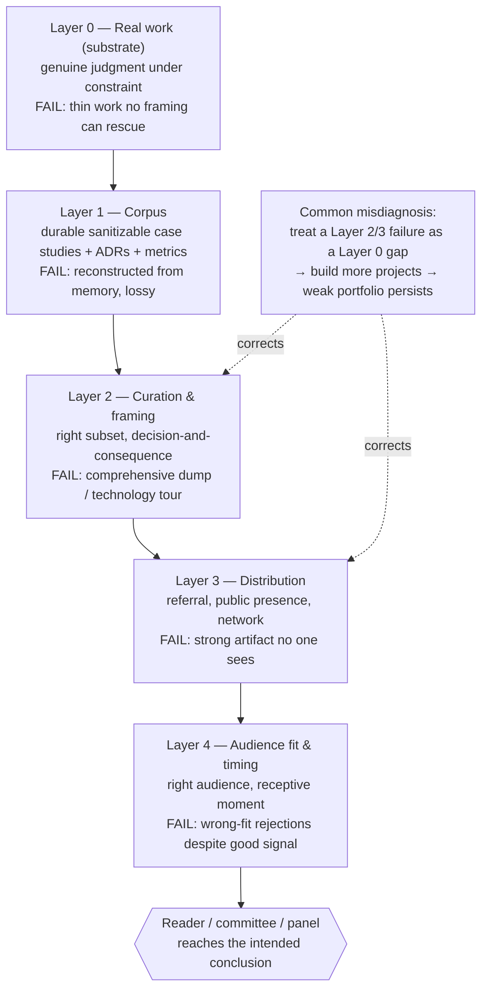
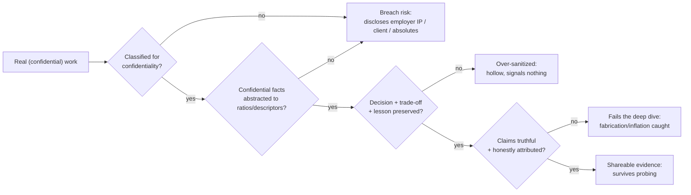
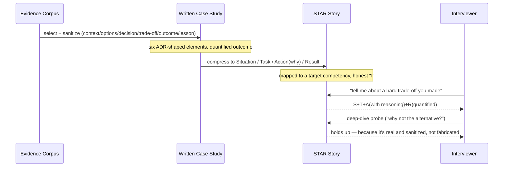

# Portfolio and Case Studies

## Executive Summary

A portfolio is not a résumé, an archive, or a gallery of everything you have built. It is a **curated, audience-targeted argument that you operate at a particular level**, assembled from evidence and organized so that a specific reader — a hiring manager skimming for four minutes, a promotion committee member who does not know you, a conference program chair deciding on a talk — reaches the intended conclusion quickly. Every word of that definition is load-bearing, and the most common failure is to build the opposite: a comprehensive, undifferentiated dump of projects and technologies that makes the reader do the work of finding the signal, which they will not do.

The unit of a portfolio is the **case study**, and a case study's value lives in a *decision and its consequences* — the context and constraints, the options, the decision made, the trade-offs accepted, the outcome measured, and the lesson learned — not in the technology stack, the tool list, or the prettiness of the diagram. A case study that reads as a feature tour ("we used Kafka, Spark, and Delta Lake") demonstrates nothing about judgment; a case study built around *why* one decision was made against real constraints and what it cost demonstrates the thing every level above senior is actually assessed on. This is [Architecture Decision Records](../Phase-01/03_Architecture_Decision_Records.md) turned into narrative, and its interview form is the STAR story.

This chapter covers the five things a compelling architect portfolio requires: portfolio structure and narrative, writing impactful case studies, choosing which architecture artifacts to showcase, building a public presence through talks and writing, and telling portfolio stories in interviews using STAR. It builds directly on the two capstone platforms — [Capstone Enterprise Data Platform](01_Capstone_Enterprise_Data_Platform.md) and [Capstone Enterprise AI Platform](02_Capstone_Enterprise_AI_Platform.md) — which are the raw material a portfolio curates, and on the leadership and career discipline of [Technical Writing](../Phase-19/04_Technical_Writing.md), [Stakeholder Management](../Phase-19/03_Stakeholder_Management.md), and [Staff and Principal Promotion](05_Staff_and_Principal_Promotion.md).

**The central thesis: a portfolio is curation, not accumulation.** Its quality is set by what you leave out and how you frame what remains, not by how much you include. Completeness is the enemy of signal.

**The second thesis: the deciding content is the decision and its consequences, not the technology.** A committee, a panel, and a reader all want evidence of judgment under constraint — the *why* and the *what it cost* — which is exactly what a technology inventory omits and an ADR-shaped case study supplies.

**The third thesis, which is the constraint that shapes everything: your best work is usually confidential, so a portfolio is an exercise in making real impact legible without disclosing what you are not permitted to disclose.** Sanitization, abstraction to ratios, and deliberately-built public artifacts are the techniques that resolve this, and getting the confidentiality-versus-specificity balance right — honestly — is the craft of the whole endeavor.

## Learning Objectives

By the end of this chapter you should be able to:

1. Explain why a portfolio is a curated argument for a specific audience, not a comprehensive archive, and why completeness reduces signal.
2. Structure a portfolio with a clear narrative that leads with the strongest evidence and is targeted to a named audience and level claim.
3. Write a case study around a decision and its consequences — context, options, decision, trade-offs, measured outcome, lesson — rather than a technology tour.
4. Choose which architecture artifacts (diagrams, ADRs, design docs, dashboards, code) genuinely demonstrate judgment, and which merely decorate.
5. Sanitize real work for confidentiality — abstracting proprietary metrics to ratios and removing employer IP — without hollowing out the evidence or misrepresenting it.
6. Distinguish legitimate public presence (talks, writing, open source that publicize real work) from content marketing and self-promotion.
7. Convert a case study into an interview STAR story mapped to a specific target-level competency, with a quantified result.
8. Tailor the same underlying evidence to different audiences — recruiter, hiring manager, committee, conference — without rebuilding it each time.
9. Diagnose a portfolio that "isn't landing" by cause — wrong audience, buried signal, technology-tour framing, confidentiality-hollowed, or poor distribution — rather than assuming it needs more projects.
10. Maintain a portfolio as living, versioned docs-as-code, revalidated per target role, and right-sized so effort matches the stakes.
11. Recognize and refuse fabrication, inflation, and un-permissioned disclosure, understanding that deep-dive interviews are designed to catch the first two and that the third is a fireable, sometimes actionable, breach.
12. Recognize when a portfolio is not the right instrument at all, and when a single well-placed referral or public artifact outperforms a polished site.

## Business Motivation

Framing a portfolio as job-hunting collateral understates it and misdirects the effort.

**For the individual.** A portfolio is the mechanism by which your work becomes *legible to people who will never see you do it* — which, above senior, is nearly everyone whose decision matters. The compensation and level difference between a candidate whose judgment is visible and one whose identical judgment is invisible is large, and the portfolio is frequently the difference. It is also the instrument that converts a decade of confidential work — the thing you cannot show — into a defensible, shareable claim, which is otherwise nearly impossible to do credibly.

**For the hiring organization.** A portfolio and its case studies are a far higher-bandwidth signal than a résumé and a far cheaper one than a full interview loop. A well-constructed case study lets an evaluator assess judgment under constraint in minutes — which is why the round most predictive of senior-and-above performance is often the deep-dive-on-your-own-work round, and a portfolio is that round's raw material. Organizations that teach their people to write case studies also get better internal design docs and [architecture reviews](../Phase-19/02_Architecture_Reviews.md) as a byproduct, because it is the same skill.

**For the professional community.** Public case studies, talks, and writing are how the field's tacit knowledge — the failure stories, the trade-offs that only show up at scale, the migration lessons — becomes shared. The engineers whose public artifacts define how a generation thinks about a problem (the canonical blogs, the conference talks that get cited for years) accrue outsized career leverage precisely because they made real, hard-won knowledge legible to everyone.

**The counter-case, stated honestly.** A portfolio is not always the right instrument, and over-investing in one is a real failure mode. For many senior roles, a strong referral plus a good interview loop outperforms any website, and time spent polishing a portfolio nobody will read is time not spent building the scope that would actually promote you ([Staff and Principal Promotion](05_Staff_and_Principal_Promotion.md)). The honest question is always "what will actually move this specific decision" — and the answer is sometimes a referral, a single well-placed public artifact, or nothing at all, not a comprehensive portfolio.

## History and Evolution

**Pre-2000: the portfolio was a creative-field artifact.** Designers, architects (of buildings), and writers carried portfolios; engineers carried résumés and references. The idea that a software or data professional would curate a body of *evidence* rather than a list of *positions* barely existed, because the work was largely invisible and proprietary.

**2008–2013: open source and GitHub make code a public artifact.** GitHub (launched 2008) turned a developer's commit history and repositories into a de facto public portfolio. For the first time, a large fraction of a technologist's actual work was visible, attributable, and shareable — and "check their GitHub" became a real hiring signal. This normalized the notion that evidence, not just credentials, was assessable.

**2011: the ADR reframes the shareable unit from artifact to decision.** Michael Nygard's *Documenting Architecture Decisions* (2011) established that the interesting, durable content of architecture is the *sequence of decisions with context and consequences* — which is exactly the shape of a good case study. The ADR is the single most important intellectual input to this chapter: it defines what a case study should contain.

**2014: "show your work" becomes a career strategy.** Austin Kleon's *Show Your Work!* (2014) popularized, for creative and technical professionals alike, the idea that documenting and sharing process — not just finished output — compounds into reputation and opportunity. In parallel, a generation of engineering blogs (the canonical personal blogs on performance, debugging, and systems) demonstrated that a single well-written public case study could be more career-defining than a title.

**2015–2020: the conference and the company engineering blog professionalize public presence.** Data and systems conferences (Strata, later Data + AI Summit, QCon, KubeCon, the cloud vendors' re:Invent/Ignite/Next) and company engineering blogs (Netflix, Uber, Airbnb, Spotify) made the public technical case study a mainstream genre. Speaking and writing became recognized components of a Staff+ career, not extracurriculars.

**2020–present: the "building in public" era and its AI-generated hazard.** "Building in public," dev-focused platforms (dev.to, Substack, personal sites via static-site generators), and OSS-as-portfolio (Nadia Eghbal's *Working in Public*, 2020) made public artifacts a standard career lever. The most recent shift is a hazard: generative AI makes it trivial to produce fluent, plausible, *empty* portfolio content and fabricated case studies — which raises the premium on real, corroboratable, deep-dive-survivable work and makes the deep-dive interview more important, not less.

**Persistent across all eras:** the highest-value artifact has never changed. A real decision, made under real constraint, with a measured outcome and an honest lesson, told clearly to a specific audience.

## Why This Technology Exists

The portfolio-and-case-study apparatus exists because organizations and communities must assess a hard-to-observe property — *judgment under constraint over time* — about people whose actual work is mostly invisible (confidential, distributed across teams, or simply unseen), using a low-bandwidth default signal (the résumé) that captures almost none of it.

Every cheaper proxy fails at exactly this:

- **The résumé** lists positions, technologies, and tenure — it captures *what you were near*, not *what you decided or whether it was good*.
- **A tech-stack inventory** ("expert in Spark, Delta, Kafka, Databricks") measures exposure, not judgment; everyone at a given company lists the same stack.
- **A raw GitHub profile** shows code but rarely the *reasoning* — the constraints, the alternatives, the trade-offs — which is where the assessable signal lives above junior level.
- **An interview alone** measures point-in-time performance, not a sustained track record of good decisions.

What a curated portfolio of decision-shaped case studies uniquely provides:

- **Evidence of judgment**, not just exposure — the *why* and *what it cost* that a résumé structurally omits.
- **Legibility of invisible work**, converting confidential or distributed impact into a shareable, defensible claim through sanitization and abstraction.
- **A high-bandwidth pre-screen** that lets an evaluator assess in minutes what a full loop assesses in hours, and that seeds the deep-dive interview.
- **Compounding public reputation** when the artifacts are public, so that opportunity comes to you rather than being sought.

The second reason it exists is **that the levels this chapter targets are assessed on decisions whose consequences arrive later and elsewhere** — the same property [Architecture Interview Prep](04_Architecture_Interview_Prep.md) identifies. A portfolio is the only artifact that can show a *pattern* of such decisions with their actual, observed consequences, because it is assembled over time from real outcomes rather than produced live under interview pressure.

## Problems It Solves

- **Making invisible work legible** — converting confidential, distributed, or unseen impact into a shareable claim.
- **Demonstrating judgment rather than exposure** — showing the reasoning, constraints, and trade-offs a résumé and a tech-stack list omit.
- **High-bandwidth pre-screening** — letting evaluators assess senior-and-above signal in minutes and seeding the deep-dive round.
- **Providing interview raw material** — a well-written case study is a rehearsed, quantified STAR story waiting to be told.
- **Compounding reputation** — public artifacts accrue reach and inbound opportunity over time.
- **Forcing your own clarity** — writing a case study, like writing anything ([Technical Writing](../Phase-19/04_Technical_Writing.md)), exposes gaps in your understanding of your own decisions.
- **Creating a durable, portable record** — a sanitized, self-owned corpus of your judgment that survives employer changes.

## Problems It Cannot Solve

- **Substituting for real work.** A portfolio makes real judgment legible; it cannot manufacture it. A polished portfolio over thin work is caught in the deep-dive round, and the polish makes the gap more jarring.
- **Overcoming confidentiality by disclosure.** You cannot solve the "my best work is secret" problem by leaking it; that is a fireable, sometimes actionable, breach. The only legitimate solutions are sanitization, abstraction, and public artifacts — which are lossy, and that loss is a genuine limit.
- **Replacing distribution.** A brilliant portfolio no one sees changes nothing. Getting it in front of the right person (referral, public presence, network) is a separate problem the artifact does not solve.
- **Fixing the wrong-audience problem automatically.** A portfolio optimized for a conference program committee can actively misfire with a hiring manager and vice versa; one artifact cannot be optimal for all audiences.
- **Surviving fabrication.** Inflated or invented case studies are precisely what the deep-dive interview exists to catch, and generative AI has made evaluators warier, not less wary. The apparatus cannot protect a dishonest claim.
- **Guaranteeing outcomes.** A strong portfolio improves odds; it does not overcome a hiring freeze, a level cap, a bad market, or a role that simply wanted something else.
- **Being worth it for every role.** For many roles a referral plus a good loop dominates any portfolio, and building one anyway is misallocated effort.

## Core Concepts

### 6.1 Portfolio Structure and Narrative

A portfolio is organized top-down, reader-first, exactly like any other piece of [technical writing](../Phase-19/04_Technical_Writing.md): the strongest, most level-appropriate evidence first, an explicit framing of who you are and what you claim, and a small number of deep case studies rather than a long shallow list. The structural rules that survive contact with a real reader:

- **Lead with a one-paragraph positioning statement** — who you are, the level and kind of work you do, and the single most impressive true thing — because a reader decides in seconds whether to continue.
- **Three to five deep case studies, not fifteen shallow ones.** Depth demonstrates judgment; breadth demonstrates only activity. Curation is the whole game.
- **Order by strength and relevance to the target audience**, not chronologically. A résumé is chronological; a portfolio is an argument, and an argument leads with its best evidence.
- **Make it navigable in minutes.** Descriptive headings, a scannable index, and a clear "if you read one thing, read this."

The narrative is the connective tissue: a coherent story of what kind of problems you solve and how your judgment has developed, not a disconnected pile. A portfolio whose case studies do not add up to a *claim* about the kind of engineer you are reads as a scrapbook.

### 6.2 Writing Impactful Case Studies

The case study is the atom, and its structure is the ADR rendered as narrative — the single most important pattern in this chapter:

1. **Context and constraints:** the business objective, the real constraints (budget, timeline, team, regulatory, existing estate), and what made the problem hard. Without this, no decision can be judged.
2. **Options considered:** the genuinely viable alternatives, including the one you rejected and *why* — the strongest single signal of architectural maturity, exactly as in [Architecture Reviews](../Phase-19/02_Architecture_Reviews.md).
3. **The decision:** what you chose, stated as a decision with a rationale tied to the constraints.
4. **Trade-offs accepted:** what the choice cost — the honest downside you knowingly took on. A case study with no stated cost reads as marketing and is discounted.
5. **Outcome, measured:** the result in business or leverage terms, with a metric (sanitized to a ratio if the absolute is confidential) — "cut freshness-SLA breaches from 12% to under 1%," not "improved reliability."
6. **Lesson learned:** what you would do differently, or what the decision taught you. The willingness to state this is a maturity signal; its absence reads as someone who has not reflected.

The dominant failure mode is the **technology tour** — a case study that describes *what was built and with which tools* but never *why, against what alternative, at what cost, with what result*. It demonstrates exposure, not judgment, and it is the reason most engineer portfolios under-signal relative to the work behind them. The corrective is mechanical: for every case study, ensure all six elements are present, and if the "options," "trade-offs," or "measured outcome" element is thin, the case study is not yet doing its job regardless of how impressive the system was.

### 6.3 Architecture Artifacts to Showcase

Not every artifact demonstrates judgment; choose the ones that do:

- **ADRs** are the highest-signal artifact class, because they *are* decisions-with-consequences in written form — showcase real (sanitized) ones.
- **Architecture diagrams** at the right level of abstraction — a [C4](../Phase-01/04_Solution_Architecture_Practice.md)-style context or container diagram that communicates a *decision* beats an exhaustive component sprawl that communicates only complexity. Clarity over completeness, per [Technical Writing](../Phase-19/04_Technical_Writing.md)'s diagram discipline.
- **Design docs** (sanitized) that show the reasoning, options, and cross-cutting analysis — the same genre [Architecture Reviews](../Phase-19/02_Architecture_Reviews.md) assesses.
- **Outcome dashboards** — a metrics view showing the measured impact (the reliability trend, the cost reduction, the adoption curve), which grounds the case study's outcome claim in evidence.
- **Code**, selectively — a focused, well-documented repository that demonstrates craft, not a dump of everything you have ever committed.

The selection principle is the same as the portfolio's: an artifact earns its place only if it demonstrates *judgment or measured impact*, not merely that work occurred. A diagram of a system is not evidence; a diagram that makes a *decision* legible is.

### 6.4 Public Presence: Talks and Writing

Public artifacts — conference talks, technical blog posts, open-source contributions — are the confidentiality-proof, compounding, portable evidence class, and they resolve the "my best work is secret" problem by being *new work you are free to share*. They are also, done honestly, the most efficient form of the legitimate visibility that gates promotion ([Staff and Principal Promotion](05_Staff_and_Principal_Promotion.md) §5.4).

The bright line is the same as in the promotion chapter: public presence **publicizes real work and real knowledge**; it is not content marketing, thought-leadership theater, or fluent-but-empty output. A talk that teaches a real trade-off you learned the hard way is evidence; a talk that restates vendor marketing is anti-evidence, and increasingly so as generative AI floods the channel with plausible emptiness. The highest-value public artifacts share a property: they convey *specific, hard-won, non-obvious* knowledge — a real failure story, a trade-off that only appears at scale, a migration lesson — which is exactly what cannot be faked and what makes a reputation.

Public presence compounds: one good post or talk leads to invitations, references, and inbound opportunity, so the return is nonlinear over time. But it is slow, and it is not free — which is why it is a long-horizon investment to start early and maintain, not a job-search sprint.

### 6.5 Interview Storytelling with STAR

The interview form of a case study is the **STAR** story — **S**ituation, **T**ask, **A**ction, **R**esult — the behavioral-interview structure (developed in behavioral interviewing in the 1970s and made ubiquitous by Amazon's Leadership-Principles loop). It is the same decision-and-consequence content as a written case study, compressed for spoken delivery and mapped to a specific competency the interviewer is probing:

- **Situation:** the context and constraints (brief — the listener needs just enough to judge the decision).
- **Task:** specifically *your* responsibility, not the team's — the interviewer is assessing you, and diffuse "we" is the most common STAR failure.
- **Action:** what *you* did and, crucially, *why* — the reasoning, the alternative you weighed, the trade-off — because the "why" is where level-signal lives.
- **Result:** the quantified outcome, and ideally a lesson. A STAR story with no measurable result is an anecdote, not evidence.

Two disciplines make STAR work under pressure. **Rehearse a small library of stories**, each mapped to a competency (leadership without authority, a hard trade-off, a failure and recovery, cross-team influence), so that whatever is asked, you have a real, quantified story ready. And **keep the "I" honest and specific** — claim your actual contribution, attribute the team's honestly, because inflating your role is both detectable and, since leverage-through-others is the very thing senior levels reward, self-defeating (the integrity constraint from [Staff and Principal Promotion](05_Staff_and_Principal_Promotion.md) §Security).

## Internal Working

### 7.1 Curation as the Core Mechanism

The mechanism that produces a good portfolio is *selection under an audience model*: from the full corpus of your work, select the few pieces that most strongly support the specific claim you are making to the specific audience you are addressing, and frame them for that audience's evaluation criteria. This is why "add more projects" is almost always the wrong instinct — the constraint is never the size of the corpus, it is the *sharpness of the selection*. A portfolio's quality is set at the moment of curation, and completeness is actively harmful because every additional weak item dilutes the reader's attention away from the strong ones.

The corollary is that **curation is audience-relative**. The same case study corpus yields different portfolios for a hiring manager (impact and fit), a promotion committee (level-rubric evidence), and a conference (novel, teachable insight). One artifact cannot be optimal for all three, which is why §7.3's write-once-tailor-many structure exists.

### 7.2 The Sanitization Pipeline: Real Work → Shareable Evidence

Real work becomes shareable evidence through a sanitization pipeline, and it can fail at each stage:

- **Identify what is confidential:** employer IP, un-permissioned client names, absolute business metrics, unreleased strategy, security-sensitive detail.
- **Abstract, don't delete:** convert confidential absolutes to shareable ratios ("reduced cost by ~65%," "cut latency roughly in half"), replace client names with sanitized descriptors ("a top-five European retailer"), and describe patterns rather than proprietary specifics.
- **Verify with the source when in doubt:** for anything close to the line, get explicit permission — this is both an integrity and a legal obligation.
- **Preserve the judgment:** the goal is to remove the confidential *facts* while keeping the *decision, trade-off, and lesson* intact, because those are what demonstrate judgment and they are rarely themselves confidential.

The characteristic failure is **over-sanitization that hollows out the evidence** — a case study so abstracted that no real decision or measured outcome survives, leaving a vague "led a large-scale data platform initiative" that signals nothing. The opposite failure — under-sanitization that discloses what you were not permitted to disclose — is worse, because it is a breach. The craft is holding both: maximally specific about *judgment*, maximally protective of *confidential fact*. This tension is the single hardest thing in building an architect portfolio from real enterprise work, and there is no way to eliminate it — only to navigate it honestly.

### 7.3 Write-Once, Tailor-Many

A maintainable portfolio separates a **durable evidence corpus** (the full, internal, un-curated set of case studies, ADRs, diagrams, and metrics, kept current over time) from **audience-tailored views** (the specific selection and framing produced for a given application, committee, or talk). The corpus is written once and maintained; each view is a fast selection-and-reframing from it, not a from-scratch rebuild. This is the same architecture as the impact log in [Staff and Principal Promotion](05_Staff_and_Principal_Promotion.md) §5.3 — the log *is* the corpus — and it is why maintaining the corpus continuously turns portfolio-building from a stressful reconstruction into an act of curation.

## Architecture

A portfolio, viewed as a system, has five layers, and — as with the interview and promotion chapters — a failure at one layer cannot be fixed at another, so reading the diagnostic correctly is most of the value:

- **Layer 0 — Real work (the substrate).** Is there genuine judgment-under-constraint to show? If not, no amount of presentation helps, and the honest work is at Layer 0.
- **Layer 1 — Corpus (the record).** Is the work captured as durable, sanitizable case studies, ADRs, diagrams, and metrics? The evidence corpus lives here.
- **Layer 2 — Curation and framing (the encoding).** Is the right subset selected and framed as decision-and-consequence for the target audience? The portfolio and case studies live here.
- **Layer 3 — Distribution (the reach).** Does it get in front of the right people — referral, public presence, network?
- **Layer 4 — Audience fit and timing (the environment).** Is it targeted to the right audience at a moment they are receptive?

The most common misdiagnosis, exactly paralleling the promotion chapter, is treating a **Layer 2 framing failure or a Layer 3 distribution failure as a Layer 0 work gap** — concluding "I must need more impressive projects" (and building more) when the real break is that existing strong work is framed as a technology tour or is never seen by the right person. More work at Layer 0 cannot fix a Layer 2 framing failure or a Layer 3 distribution gap, and pouring effort into the wrong layer is how strong engineers end up with weak portfolios.

## Components

The concrete components of a portfolio system:

- **The evidence corpus:** the durable, internal, maintained set of sanitizable case studies, ADRs, diagrams, and outcome metrics. The one component to maintain continuously.
- **Case studies:** the decision-and-consequence narratives, three to five deep ones per audience-tailored view.
- **Architecture artifacts:** the selected ADRs, C4-style diagrams, sanitized design docs, and outcome dashboards that demonstrate judgment.
- **Public artifacts:** talks, blog posts, and open-source work — the confidentiality-proof, compounding evidence class.
- **The positioning statement:** the one-paragraph claim about who you are and what you do, at the top of any view.
- **STAR story library:** the rehearsed, competency-mapped spoken versions for interviews.
- **The publishing surface:** the site, repo, or deck that hosts a given view.

## Metadata

The metadata of a portfolio is the targeting context that determines how every piece of evidence should be read and selected:

- **The audience and the claim:** who this view is for and what level/kind of role it argues for — the schema against which curation happens. A view without an explicit audience is curated against nothing and reads as generic.
- **Per-artifact confidentiality classification:** what may be shown as-is, what must be abstracted to a ratio, and what cannot be shown at all — the input to the sanitization pipeline.
- **Competency tags:** which artifact demonstrates which competency (trade-off judgment, cross-team leadership, cost reasoning, failure recovery), so a view can be assembled to cover the target rubric.
- **Currency:** when each case study was last reviewed for accuracy and relevance, because a stale portfolio referencing decommissioned systems signals neglect.

Missing or wrong metadata is a silent failure: a strong corpus curated without an audience model, or published without confidentiality classification, produces either a generic portfolio that fits no one or a breach.

## Storage

The durable evidence corpus is the "storage" layer of the portfolio, and — as with the impact log it doubles as — it is the highest-leverage, most-neglected asset in the whole apparatus. Concretely: a continuously-maintained, version-controlled collection of your case studies (in decision-and-consequence form), ADRs, sanitized diagrams, and outcome metrics, captured close to when the work happens.

The failure mode is universal: the corpus is not maintained, so at portfolio-building time (usually under job-search deadline) you reconstruct years of work from memory, lose the specifics that make impact legible (the exact metric, the alternative you rejected, the trade-off you accepted), and produce a weaker portfolio than the work deserved. Impact that was real but unstored decays exactly like the neglected documentation corpus in [Technical Writing](../Phase-19/04_Technical_Writing.md) and the unstored impact in [Staff and Principal Promotion](05_Staff_and_Principal_Promotion.md) — it rots into a vague technology tour. Storing case studies as you go, in your own version-controlled repo, is cheap and continuous; reconstruction is expensive, lossy, and stressful. The asymmetry is the argument for keeping the corpus from today.

## Compute

The "compute" of a portfolio is the scarce pairing of **your authoring effort** and **the reader's attention**, and the design must optimize the second even at some cost to the first.

The reader's attention is the true bottleneck: a hiring manager gives a portfolio minutes, a committee member gives a packet ten, a program chair skims dozens of proposals. Every additional weak case study, every technology-tour paragraph, every un-navigable page spends that finite attention against you. The authoring implication is the same trade as all good writing ([Technical Writing](../Phase-19/04_Technical_Writing.md)): spend *more* of your own effort — on curation, on cutting, on tight decision-and-consequence framing — to spend *less* of the reader's. A portfolio that is easy to write (dump everything, chronological, comprehensive) is expensive to read, which means it is not read. The effort asymmetry is favorable: your hours are singular; the reader's attention, multiplied across every evaluator, is what you are actually conserving.

## Networking

The "networking" of a portfolio is **distribution** — the mechanism by which the artifact reaches the people whose decision it is meant to influence — and it is a distinct problem from building the artifact, frequently the decisive one.

Three channels matter, roughly in order of conversion:

- **Referral:** a portfolio delivered through a warm introduction is read with attention a cold submission never receives; the network that produces referrals is the single highest-return distribution channel, and it is built through relationships over time ([Stakeholder Management](../Phase-19/03_Stakeholder_Management.md), [Staff and Principal Promotion](05_Staff_and_Principal_Promotion.md)).
- **Public presence:** talks and writing are *distribution as well as evidence* — they put the artifact in front of people who then seek you out, inverting the usual direction.
- **Direct channels:** the site link on a résumé, the repo in an application — necessary but the lowest-conversion, because they reach people who are already evaluating you rather than expanding the pool.

The failure is building a strong portfolio with no distribution plan — a Layer 3 failure that looks like a Layer 0 or 2 failure ("my portfolio isn't working, it must be weak") when the real issue is that the right people never see it. A brilliant artifact with no distribution changes nothing.

## Security

The "security" of a portfolio is two things at once: **protecting what you must not disclose** and **the integrity of what you claim** — and both are non-negotiable:

- **Confidentiality is a hard boundary.** Employer IP, un-permissioned client identities, unreleased strategy, security-sensitive architecture, and confidential absolute metrics do not go in a portfolio. Disclosure is a fireable breach and can be legally actionable; the sanitization pipeline (§7.2) exists precisely to extract shareable evidence without crossing this line. When in genuine doubt, get permission or leave it out.
- **Claims must be true and honestly attributed.** No fabricated case studies, no inflated metrics, no claiming a team's work as solely yours. This is enforced by the deep-dive interview — which is *designed* to probe a case study until fabrication or inflation shows — and the enforcement has tightened as generative AI has made plausible-but-false content cheap. Honest attribution of collaborative work is not only ethical but *stronger* evidence, because leverage-through-others is what senior levels reward.
- **Others' confidences and dignity are protected.** A case study that exposes a colleague's failure or a client's embarrassing situation to make you look good is a trust breach, regardless of whether it is technically confidential.

Integrity is strategically optimal, not just ethically required: the entire value of a portfolio rests on an evaluator *believing* it, and a single caught fabrication or disclosure destroys that belief and often the candidacy — and, for disclosure, the current job as well.

## Performance

The performance of a portfolio is **signal density and conversion**: how fast a reader extracts the intended claim, and how reliably the artifact advances you to the next step. Useful measures, all leading rather than lagging:

- **Time-to-claim:** can a reader state what you do and at what level within the first minute. If not, the positioning and ordering have failed.
- **Decision-and-consequence coverage:** what fraction of your case studies contain all six elements (context, options, decision, trade-off, measured outcome, lesson) versus reading as technology tours.
- **Quantified-outcome rate:** how many case studies and STAR stories have a real (sanitized) metric attached; anecdotes without results are low-signal.
- **Conversion:** portfolio-viewed → interview → next-round → offer, tracked across applications so a weak stage is visible.
- **Deep-dive survivability:** whether your case studies hold up under sustained interviewer probing — the ultimate test, and the one fabrication fails.

Measuring these turns "my portfolio isn't working" from a vague discouragement into a diagnosable, per-stage signal that points at the failing layer.

## Scalability

Scalability, for a portfolio, is the write-once-tailor-many property (§7.3): a maintained evidence corpus from which audience-specific views are assembled by selection and reframing rather than rebuilt from scratch. A portfolio that does not scale this way — a single monolithic site rebuilt for each new target, or a from-memory reconstruction each job search — is expensive to maintain and reliably stale.

The deeper scalability point is that **public artifacts scale reach beyond your effort**, exactly as staff-level impact scales beyond personal output ([Staff and Principal Promotion](05_Staff_and_Principal_Promotion.md) §Scalability). A private portfolio reaches the people you send it to; a published case study or a recorded talk reaches everyone who finds it, for years, without further effort — inbound opportunity that compounds. This is why the highest-leverage long-term portfolio strategy is not a better private site but a small body of genuinely useful public work: it scales distribution the way leverage scales impact.

## Fault Tolerance

A portfolio must be robust to the structural obstacles that reliably arise:

- **"My best work is confidential."** The most common obstacle, and it is navigable, not fatal: sanitize and abstract to ratios (§7.2), and deliberately build *public* artifacts (talks, writing, OSS) that are yours to share. The recovery is to stop treating the confidential work as the only evidence and to generate shareable evidence in parallel.
- **The technology-tour trap.** A case study that describes tools but not decisions. The recovery is mechanical: rewrite around the six decision-and-consequence elements, adding the missing options/trade-off/outcome.
- **The stale portfolio.** A corpus referencing decommissioned systems and old roles. The recovery is the currency-review discipline — treat the corpus as living, docs-as-code, reviewed on a cadence.
- **The over-sanitized hollow.** Evidence abstracted until no judgment survives. The recovery is to re-add the *decision and lesson* (rarely confidential) while keeping the confidential facts out — the §7.2 balance.
- **The undistributed portfolio.** Strong artifact, no reach. The recovery is a distribution plan (referrals, public presence), not more artifact polish.

The disciplined posture is to diagnose *which* obstacle you face by layer (§Architecture) rather than defaulting to "build more impressive projects," which addresses only Layer 0 and is usually the wrong layer.

## Cost Optimization

The "cost" of building a portfolio is your finite time, and the optimization is spending it where signal-per-hour is highest — which is rarely where it feels most productive.

**Worked example — where the same effort lands very differently.** Consider ~50 hours available before a senior-architect job search. Two allocations:

- *Feels-productive allocation:* ~35 h building a comprehensive personal site cataloguing every project and technology, ~10 h on visual polish, ~5 h writing shallow blurbs for a dozen projects. Outcome: a broad, chronological, technology-tour portfolio that dilutes attention across weak items, has no decision-and-consequence depth, no distribution plan, and no metrics. Typical result: low conversion; the reader can't find the signal.
- *Signal-dense allocation:* ~5 h maintaining/curating the evidence corpus; ~20 h writing three deep, sanitized, decision-and-consequence case studies with quantified outcomes; ~10 h converting them into a rehearsed STAR library mapped to competencies; ~10 h on distribution (one solid blog post drawn from a case study, plus warming referral relationships); ~5 h tailoring a tight, audience-targeted view. Outcome: three pieces of real judgment-evidence, interview-ready stories, and a reach plan — the same hours, a full tier of difference in conversion.

The dominant cost lever is not *more* artifacts; it is **moving effort from broad, shallow, undistributed accumulation to deep, decision-shaped, distributed curation** — the portfolio-domain instance of the handbook's measure-and-reallocate-rather-than-add discipline. From a FinOps-of-hosting angle, the infrastructure cost is near-zero and should stay there: a static site on free or trivial hosting (GitHub Pages, Azure Static Web Apps free tier) is correct; spending on elaborate hosting is a tell that effort has gone to the wrong layer.

## Monitoring

Monitoring a portfolio means tracking its leading indicators deliberately rather than inferring failure from a vague sense of rejection:

- **Per-stage conversion** across applications (viewed → screen → interview → offer), so a consistently weak stage points at a specific problem (a weak positioning statement fails at "viewed → screen"; weak case studies fail at the deep dive).
- **Feedback capture:** whatever specific feedback you can get from recruiters, interviewers, or reviewers, recorded rather than remembered emotionally.
- **Public-artifact reach** (views, references, inbound contacts) as the compounding-reputation signal, watched over a long horizon.
- **Currency:** a periodic review that the corpus is accurate and relevant, so staleness is caught before a reader does.

The purpose is the same as everywhere in this handbook: convert a lagging outcome (rejection) into a leading, correctable, layer-attributable signal.

## Observability

Where monitoring watches known indicators, observability is the ability to answer the *unanticipated* question — most importantly, **"why didn't this land?"** — from evidence rather than speculation.

The instruments are recorded feedback, per-stage conversion data, and the deep-dive experience itself. A portfolio process that produces only silent rejections is *unobservable*: you cannot tell whether the failure was Layer 2 (framing), Layer 3 (distribution), or Layer 4 (fit), so you default to Layer 0 ("build more") — usually the wrong layer. The observability discipline is therefore to *actively solicit specific feedback* ("was it the case studies, the framing, the fit?"), to *record deep-dive questions that exposed a weak spot* in a case study, and to *debug the next iteration from that evidence* rather than from the emotional memory of rejection — the same "debug from recordings, not memory" discipline as [Architecture Interview Prep](04_Architecture_Interview_Prep.md).

## Operational Response Playbook

### Playbook 1 — Your portfolio isn't landing and you don't know why

**Signal:** applications going nowhere, a portfolio that "should" be strong producing no traction, and no clear reason.

**Do not:** conclude "my work isn't impressive enough" and default to building more projects (Layer 0) before diagnosing; add more case studies to a portfolio already diluted by too many; keep submitting the same artifact to the same channel expecting a different result.

**Diagnose by layer, from evidence:**

| Symptom | Likely failed layer | The real fix |
|---|---|---|
| Rejected at résumé/portfolio-view stage | Layer 2 — positioning/framing, or Layer 3 — distribution | Sharpen the positioning statement and lead artifact; add a referral/public-presence distribution channel |
| Gets interviews, fails the deep dive | Layer 0/1 — thin work, or Layer 2 — case studies read as tech tours that collapse under probing | Rebuild case studies around decision-and-consequence; if the judgment genuinely isn't there, that's a real Layer 0 signal |
| Reader "can't tell what I do / what level" | Layer 2 — no audience model, generic curation | Target a specific audience and claim; re-curate against it |
| Strong artifact, no one sees it | Layer 3 — distribution | Referrals, one good public post, network — not more polish |
| Wrong-fit rejections despite good signal | Layer 4 — audience/timing | Retarget; the artifact may be fine for a different audience |

**Respond by the diagnosed cause, then verify:** solicit specific feedback, fix the identified layer, and track whether the corresponding conversion stage improves — rather than resolving to "work harder" on the whole thing.

### Playbook 2 — You're tempted to embellish, or you're unsure where the confidentiality line is

**Signal:** a case study feels weaker than the reality but the strong version requires disclosing confidential specifics or inflating your role; or you genuinely can't tell whether a detail is shareable.

**Do not:** invent or inflate ("it'll be fine, no one checks" — the deep dive is *designed* to check); disclose confidential absolutes or un-permissioned client names to make the story land; over-correct into a hollow, evidence-free abstraction out of fear.

**Diagnose honestly:** separate the two distinct problems. If the temptation is to *inflate*, the answer is absolute: don't — it's detectable and self-defeating, and honest attribution of collaborative work is stronger evidence anyway. If the issue is *confidentiality uncertainty*, the answer is the sanitization pipeline: abstract absolutes to ratios, replace names with sanitized descriptors, keep the *decision and lesson* (rarely confidential), and when still unsure, get explicit permission or leave that detail out.

**Respond:** produce the strongest *honest, sanitized* version — which is almost always stronger than you fear, because judgment (the thing that signals level) is rarely the confidential part. The case study that survives a deep dive because it is true beats the impressive one that collapses because it isn't.

## Governance

A portfolio is governed by the individual, but the governing obligations are real and enforceable:

- **Confidentiality governance:** a personal, non-negotiable rule that nothing employer-confidential or un-permissioned is published, enforced by the sanitization pipeline and, when in doubt, explicit permission. This is a legal and ethical obligation, not a preference.
- **Integrity governance:** truthful, honestly-attributed claims, understanding that the deep-dive interview is the external enforcement mechanism and that a single caught fabrication is catastrophic.
- **Currency governance:** treating the corpus as living, docs-as-code, reviewed on a cadence so it does not silently go stale.
- **Audience governance:** an explicit audience-and-claim model for each view, so curation is principled rather than a generic dump.

For an *organization*, there is a parallel governance interest: teams that encourage sanitized public case studies and talks gain recruiting and reputational leverage, but must govern the confidentiality boundary (a review process for external technical content) so that visibility does not become disclosure. The best engineering-brand programs are exactly this: a governed pipeline that turns real internal work into sanitized public evidence.

## Trade-offs

- **Specificity vs. confidentiality.** The core, irreducible tension: the most impressive specifics are often the most confidential, and abstracting them protects the boundary at the cost of signal. Navigated, never eliminated (§7.2).
- **Depth vs. breadth.** Deep case studies demonstrate judgment; broad catalogs demonstrate activity. Curation chooses depth, at the cost of appearing "narrower" — which is the correct trade for senior-and-above audiences and the wrong instinct for those who conflate volume with strength.
- **Public presence: leverage vs. cost.** Talks and writing compound reach and are confidentiality-proof, but they are slow, effortful, and a distraction from the work that produces the evidence in the first place. Over-investing in public presence relative to real work is its own failure.
- **Tailoring vs. maintenance.** Audience-tailored views convert better but multiply maintenance; the write-once-tailor-many structure (§7.3) mitigates but does not remove the cost.
- **Polish vs. substance.** Visual polish has sharply diminishing returns past "clean and navigable," and effort spent there is effort not spent on decision-and-consequence depth — the most common misallocation.
- **Portfolio vs. referral.** For many roles a warm referral plus a good loop dominates any portfolio; building a comprehensive one anyway can be misallocated effort. The honest question is what moves *this* decision.

## Decision Matrix

| Your situation | The honest reading | The move |
|---|---|---|
| Comprehensive site, low conversion | Layer 2 over-accumulation, diluted signal | Cut to 3–5 deep decision-and-consequence case studies |
| Case studies read as tool lists | Technology-tour framing | Rewrite around the six elements; add options, trade-off, measured outcome |
| Best work is all confidential | Real Layer 0/1, blocked by confidentiality | Sanitize to ratios; build public artifacts you're free to share |
| Strong portfolio, no traction | Layer 3 distribution gap | Referrals, one good public post, network — not more artifacts |
| "Reader can't tell what I do" | Layer 2 no audience model | Target a specific audience/claim; re-curate |
| Gets interviews, fails deep dive | Layer 0 thin work, or fabrication | Build/curate real judgment-evidence; never inflate |
| Role wants a referral, not a site | Portfolio is the wrong instrument | Invest in the referral and the loop, not the portfolio |
| Building for the long term | Reputation compounds via public work | Start a small body of genuinely useful public artifacts early |

## Design Patterns

- **The decision-and-consequence case study.** Every case study built on the six ADR-shaped elements: context, options, decision, trade-off, measured outcome, lesson.
- **Write-once, tailor-many.** A maintained evidence corpus from which audience-specific views are selected and reframed, never rebuilt.
- **Sanitize-to-ratio.** Confidential absolutes abstracted to shareable ratios and descriptors, preserving judgment while protecting fact.
- **Public-artifact-as-evidence.** Talks, writing, and OSS as the confidentiality-proof, compounding, portable evidence class.
- **STAR library.** A small set of rehearsed, competency-mapped, quantified spoken stories drawn from the case studies.
- **Lead-with-the-strongest.** Portfolio ordered by strength and audience-relevance, not chronology, with an explicit "read this first."
- **Corpus-as-you-go.** Capturing case studies into the corpus close to when the work happens, so portfolio-building is curation, not reconstruction.

## Anti-patterns

- **The technology tour.** Case studies that list tools and systems but never decisions, trade-offs, or measured outcomes.
- **The comprehensive dump.** Everything you've ever done, chronological, undifferentiated — signal buried under completeness.
- **The polish-over-substance site.** Visual design effort far exceeding decision-and-consequence depth.
- **The hollow abstraction.** Over-sanitized case studies with no surviving real judgment or metric.
- **Fabrication and inflation.** Invented case studies or exaggerated individual contribution — caught by the deep dive, catastrophic when caught.
- **The confidentiality breach.** Disclosing employer IP, un-permissioned client names, or confidential absolutes — a fireable, sometimes actionable, error.
- **The undistributed masterpiece.** A strong portfolio with no plan to get it in front of anyone.
- **Content-marketing "thought leadership."** Fluent, empty public output that restates marketing rather than conveying real, hard-won knowledge — increasingly penalized in the generative-AI era.
- **Over-investing when a referral would do.** Building a comprehensive portfolio for a role that a warm introduction plus a good loop would win more cheaply.

## Common Mistakes

- Building a comprehensive archive instead of a curated argument.
- Framing case studies as technology tours instead of decisions with consequences.
- Omitting the trade-off and the measured outcome — the two elements that most demonstrate maturity.
- Treating "my work is confidential" as a dead end instead of sanitizing and building public artifacts.
- Over-sanitizing until no real judgment survives.
- Confusing polish with substance and spending effort on the former.
- Building a strong portfolio with no distribution plan and blaming the artifact.
- Diffuse "we" in STAR stories, so the interviewer can't assess *your* contribution.
- STAR stories and case studies with no quantified result.
- Inflating individual contribution or fabricating case studies, then failing the deep dive.
- Disclosing confidential material to make a story more impressive.
- Building a portfolio at all when a referral would have been the higher-return move.

## Best Practices

- **Maintain the evidence corpus continuously**, capturing case studies as decisions-with-consequences close to when the work happens.
- **Curate ruthlessly** to three to five deep case studies per audience-tailored view; cut everything that dilutes.
- **Build every case study on the six elements** — context, options, decision, trade-off, measured outcome, lesson — and treat a missing trade-off or metric as an unfinished case study.
- **Sanitize to ratios and descriptors**, preserving judgment while protecting confidential fact; get permission when unsure.
- **Lead with the strongest, target a specific audience**, and make the whole thing navigable in minutes.
- **Build public artifacts early** — one genuinely useful talk or post beats a comprehensive private site for long-term leverage.
- **Rehearse a competency-mapped STAR library** with quantified results and an honest "I."
- **Plan distribution deliberately** — referrals and public presence, not just a link on a résumé.
- **Keep integrity absolute** on claims and attribution; the deep dive enforces it and a single breach is catastrophic.
- **Right-size the effort** to the role — and skip the portfolio entirely when a referral is the higher-return move.

## Enterprise Recommendations

For an engineering organization that wants the recruiting and reputational leverage of its people's public work:

- **Run a governed technical-content pipeline** — a lightweight review process that turns real internal work into sanitized public case studies, talks, and blog posts without crossing the confidentiality boundary. This is the organizational form of §7.2's sanitization pipeline.
- **Credit public artifacts in promotion** as legitimate visibility ([Staff and Principal Promotion](05_Staff_and_Principal_Promotion.md)), so that writing and speaking are career-viable rather than extracurricular.
- **Invest in an engineering blog and conference presence** as a recruiting channel — the canonical company engineering blogs are among the highest-ROI recruiting assets their owners have.
- **Teach case-study and design-doc writing** as a core skill; it improves internal [architecture reviews](../Phase-19/02_Architecture_Reviews.md) and external evidence simultaneously, because they are the same skill.
- **Govern the confidentiality boundary explicitly** — a clear, fast review path for external content — so that encouraging visibility does not produce disclosure.

## Azure Implementation

Because a portfolio is a career artifact rather than a production system, the "implementation" is the publishing, evidence, and hosting stack. On Microsoft's platform:

- **Azure Static Web Apps (Free tier)** to host a personal portfolio site built from a static-site generator, with GitHub-integrated CI/CD and a custom domain — the correct, near-zero-cost hosting choice; spending more is a signal effort has gone to the wrong layer.
- **GitHub (Enterprise or public) / Azure Repos** as the version-controlled home of the evidence corpus, the case-study Markdown, sanitized ADRs, and selectively-shared code — authorship and history double as corroboration.
- **Azure DevOps Wiki or a docs-as-code pipeline (Azure Pipelines)** to publish the corpus and run CI checks (link-checking, spell-checking, and — critically — a **secret-scan / confidential-term check** that guards the sanitization boundary before anything publishes).
- **Power BI (with export-to-image or embedded read-only views)** to produce the sanitized outcome dashboards that ground a case study's measured-outcome claim, with confidential absolutes abstracted before sharing.
- **Microsoft 365 (Loop / OneNote)** as the working home of the internal, un-sanitized corpus and drafting; **Purview sensitivity labels** on anything referencing confidential material as a governance backstop against accidental disclosure.
- **Microsoft-hosted talks and content** (internal tech talks, Ignite/community sessions) as legitimate public-presence surfaces.

The depth here is deliberately modest: the substance of a portfolio lives in the case studies and their framing (Core Concepts), and the hosting stack merely publishes them safely and cheaply.

## Open Source Implementation

The same publishing-and-evidence system in an open, portable stack — and this layer is genuinely cloud- and employer-agnostic, because a portfolio is documents and reputation, not managed infrastructure:

- **A static-site generator** — **Hugo**, **Docusaurus**, or **MkDocs (Material)** — to build the portfolio site from Markdown, hosted free on GitHub Pages (or any static host). The portfolio is portable Markdown by construction and travels with you across employers.
- **Git + Markdown** for the evidence corpus and case studies as version-controlled, portable documents in your own repository — the same corpus that serves as the [Staff and Principal Promotion](05_Staff_and_Principal_Promotion.md) impact log.
- **Mermaid** (rendered natively by GitHub and most static-site generators) for the architecture diagrams, so they are version-controlled text, not binary blobs; **C4** modeling conventions for the diagram content itself.
- **adr-tools / Log4brains / MADR** so the decisions you showcase are in real ADR form — the highest-signal artifact class.
- **A CI pipeline (GitHub Actions)** running link-checking (lychee), spell/style checks (Vale, cspell), and a **secret/confidential-term scanner (Gitleaks)** as the automated confidentiality backstop before publish.
- **dev.to / a self-hosted blog / Substack** and conference CFPs as the public-presence distribution channels; **OSS contributions** as confidentiality-proof, attributable evidence (Nadia Eghbal's *Working in Public* framing).

The portability point matters most here: because a portfolio is documents and reputation, it is fully cloud- and employer-agnostic. The corpus in your own Git repo and the public artifacts under your own name are the same assets regardless of who you work for.

## AWS Equivalent (comparison only)

The technology mapping is incidental — a portfolio site hosts equally well on **AWS Amplify** or **S3 + CloudFront**, the corpus lives in the same Git, and dashboards can come from QuickSight. The *culturally* significant comparison is Amazon's interview practice, because it makes this chapter's fifth concept concrete:

- **STAR is effectively mandatory.** Amazon's behavioral loop maps every question to a Leadership Principle and expects a STAR-structured, *individually-attributed*, quantified story. A candidate without a rehearsed, competency-mapped STAR library ([§6.5](#65-interview-storytelling-with-star)) is at a direct disadvantage — the strongest industry example of case-study-as-STAR-story.
- **The "I" discipline.** Amazon interviewers explicitly probe for *your* action versus the team's — the diffuse-"we" failure this chapter warns against is a named anti-pattern in their loop.
- **Written-narrative culture.** Amazon's six-page-memo and PR-FAQ culture ([Technical Writing](../Phase-19/04_Technical_Writing.md)) means the *written* decision-and-consequence case study is the native artifact, reinforcing this chapter's central form.

**Selection criterion:** interviewing at a STAR/LP-heavy company, invest disproportionately in the *spoken*, individually-attributed, quantified story library; the written portfolio seeds it but the loop is verbal.

## GCP Equivalent (comparison only)

Again the hosting is incidental — **Firebase Hosting** or **Cloud Storage + Cloud CDN** serve a static portfolio equally well, with Looker Studio for sanitized dashboards. The meaningful comparison is Google's design-doc-and-committee culture:

- **The design doc as native portfolio artifact.** Google's strong design-doc culture ([Architecture Reviews](../Phase-19/02_Architecture_Reviews.md)) means sanitized design docs are the natural, high-signal case-study source — the decision-and-consequence content already exists as a byproduct of how work is done.
- **Committee evaluation of written evidence.** Google's promotion and hiring committees assess *written* evidence read by people who don't know you ([Staff and Principal Promotion](05_Staff_and_Principal_Promotion.md) §6.3), so a legible, self-contained case study — not a live performance — is the deciding artifact, exactly this chapter's thesis.
- **Public engineering presence.** Google's engineering blog and open-source footprint are a reference example of institutional public-presence-as-recruiting.

**Selection criterion:** in a committee-and-written-evidence culture, optimize the *written* case study's self-contained legibility above all — it will be read cold by strangers.

## Migration Considerations

"Migration" for a portfolio is moving it between contexts and keeping it durable across a career, and the discipline is knowing what is portable and what is not:

- **Fully portable:** the evidence corpus (Markdown case studies, sanitized ADRs and diagrams in *your own* repo), the public artifacts under your own name (talks, posts, OSS), and the *skill* of writing decision-and-consequence case studies. Because these are documents and reputation, they survive any employer or cloud change — the argument for keeping them in your own Git, not only an employer system you lose access to on your last day.
- **Not portable / at risk:** anything stored only in an employer's systems (design docs, dashboards, internal wikis) — you lose access when you leave, so *sanitize and externalize the evidence while you still have access*, well before you need it. This is the single most under-appreciated, most reversible portfolio mistake: leaving all your evidence behind a door that locks on your last day.
- **Re-targeting across audiences and cultures:** a STAR/LP culture (Amazon), a committee/written-evidence culture (Google), and a referral-driven senior market reward different emphases; retarget the view rather than porting the last one unchanged.
- **The confidentiality boundary travels with the material, not with you.** Leaving an employer does *not* release you to disclose their confidential material; the sanitization discipline applies to old work forever. Migrating your corpus means migrating the *sanitized* version.

## Mermaid Architecture Diagrams

**Diagram 1 — The five-layer portfolio system, with per-layer failure diagnosis.** The stack whose Layer-N failure cannot be fixed at Layer M.

**Diagram 2 — The sanitization pipeline: real work becomes shareable evidence (or fails to).**

**Diagram 3 — A case study becomes an interview STAR story: same decision-and-consequence content, two forms.**

## End-to-End Data Flow

The end-to-end flow of a portfolio is the path from a real decision to an evaluator's conclusion, and naming it exposes the leverage points:

1. **A real decision is made under constraint** (Layer 0) — the substrate; nothing downstream can manufacture it.
2. **It is captured into the evidence corpus** (Layer 1) close to when it happened, in decision-and-consequence form with the metric and the rejected alternative recorded.
3. **It is sanitized** — confidential facts abstracted to ratios and descriptors, judgment preserved (§7.2).
4. **It is curated and framed** for a target audience into a case study (Layer 2), leading with strength, built on the six elements.
5. **It is published or delivered** through a distribution channel (Layer 3) — a site, a referral, a talk, a post.
6. **It reaches a receptive audience** (Layer 4) and, in an interview, is compressed into a STAR story and tested by deep-dive probing.
7. **The evaluator reaches the intended conclusion** — that you operate at the claimed level — *because the evidence is real, sanitized, and legible*; or, if a layer failed, the conclusion is missed and the feedback (if solicited) points at the failing layer.

The flow's dominant leaks are between steps 2 and 4 — real decisions never captured, or captured but framed as technology tours — and at step 5, strong case studies never distributed. These are the same two highest-leverage interventions the whole chapter returns to: decision-shaped capture, and deliberate distribution.

## Real-world Business Use Cases

- **The senior/staff job search.** The most direct use: a curated portfolio and a rehearsed STAR library convert a decade of largely-confidential work into a credible, deep-dive-survivable claim for a specific role.
- **The internal promotion case.** The evidence corpus *is* the [Staff and Principal Promotion](05_Staff_and_Principal_Promotion.md) impact log; the same case studies, curated for the committee and mapped to the level rubric, are the packet.
- **Building a technical reputation.** Public case studies and talks compound into inbound opportunity, speaking invitations, and referral leverage — the nonlinear return of public presence over years.
- **Organizational engineering brand.** A governed pipeline that turns real internal work into sanitized public evidence is a top recruiting asset, as the canonical company engineering blogs demonstrate.
- **Consulting and solution-architecture credibility.** For client-facing architects, sanitized case studies are the primary trust-building instrument, and the sanitization discipline is a client-confidentiality obligation, not just a personal one.

## Industry Examples

- **The canonical engineering blogs** (Netflix, Uber, Airbnb, Spotify, and the well-known individual systems-and-performance blogs) are the reference examples of decision-and-consequence case studies as public artifacts that define reputations and recruit.
- **Amazon's behavioral loop** is the industry's most explicit institutionalization of STAR: every question mapped to a Leadership Principle, individually-attributed and quantified — the fifth core concept made mandatory.
- **Google's design-doc culture** means high-signal case-study source material exists as a byproduct of how work is done, and its committee model makes *written, cold-read* legibility the deciding property.
- **Conference talk archives** (QCon, Data + AI Summit, KubeCon, the cloud vendors' flagship events) are a public corpus of architect-level case studies and a primary public-presence channel.
- **staffeng.com and *The Pragmatic Engineer*** are widely-read real-world corpora of how actual Staff+ careers and portfolios were built, repeatedly showing the same lesson: real, legible, distributed decisions over comprehensive archives.
- **Austin Kleon's *Show Your Work!* (2014)** and **Nadia Eghbal's *Working in Public* (2020)** are the canonical articulations of, respectively, sharing process as career strategy and open-source work as public evidence.

## Case Studies

### Case Study 1 — The comprehensive portfolio that signaled nothing

A strong senior data engineer, job-searching after eight years at one company, built what felt like a thorough portfolio: a polished personal site cataloguing every project they had touched, organized chronologically, each with a paragraph naming the technologies used (Spark, Delta Lake, Databricks, Airflow, Kafka). It was comprehensive, visually clean, and produced almost no interviews. The engineer concluded their experience "wasn't impressive enough" and began planning side projects to pad it — a Layer 0 response to a non-Layer-0 problem.

A blunt review from a mentor found the real failures at **Layers 2 and 3**. Every "case study" was a *technology tour*: it named what was built and with which tools but never *why, against what alternative, at what cost, with what measured result*. A reader could not tell what the engineer *decided* or whether the decisions were good — only that they had been near a modern stack, like every other candidate. And the site had no distribution: it was linked on a résumé and otherwise invisible. The work behind it was genuinely strong (Layer 0 was fine); it was framed to signal nothing and seen by no one.

The recovery was pure curation, no new projects. The engineer cut fifteen shallow entries to **three deep case studies**, each rebuilt on the six decision-and-consequence elements — including the ingestion-architecture decision where they had chosen a simpler batch design over a streaming one against real cost and team constraints (with the rejected alternative and the trade-off stated), and the measured outcome (a sanitized "~60% cost reduction versus the streaming proposal, at the cost of a 15-minute freshness SLA the business accepted"). They added a distribution channel — one blog post drawn from the strongest case study, plus reactivating a few referral relationships. The *same eight years of work*, re-curated and distributed, produced interviews within weeks. Nothing about the underlying competence changed; only its framing and reach did. This is the portfolio-domain twin of [Staff and Principal Promotion](05_Staff_and_Principal_Promotion.md) Case Study 1 (real work, illegible and unseen) and [Technical Writing](../Phase-19/04_Technical_Writing.md) Case Study 1 (great thinking, buried point) — and it motivates this chapter's ADR directly.

### Case Study 2 — The impressive case study that collapsed in the deep dive

A different candidate, interviewing for a staff role, had a genuinely polished portfolio and a headline case study describing their leadership of a large real-time fraud-detection platform, with impressive metrics. The problem: the story overstated their individual role. They had been *one* of several senior engineers on the platform, had owned a meaningful but bounded component, and had presented the whole platform's outcomes as substantially their own decisions — a diffuse-"we" inflated into a solo "I," with the confidential absolute fraud-loss numbers stated directly rather than sanitized.

The résumé and portfolio worked: they got the loop. Then the deep-dive round did exactly what it exists to do. An experienced staff interviewer probed the case study — "walk me through *your* specific decision on the streaming windowing; why that watermark strategy over the alternative; what did *you* own when the platform had a Black-Friday incident" — and the story came apart. The candidate could speak in detail about their real component but not about the platform-level decisions they had claimed, and the mismatch between the headline claim and the deep-dive answers read, correctly, as inflation. A separate flag was raised internally about the un-sanitized confidential loss figures. The candidate was down-levelled with a note about "unclear individual contribution," and the disclosure concern followed them.

The lesson has two edges. For the *individual*: inflation is precisely what the deep dive catches, the polish that got them the interview made the collapse more damaging, and an *honest* case study built on their real, bounded, genuinely-strong component — attributed truthfully — would have supported the staff case cleanly, because owning one hard component well *is* staff-level evidence. For the confidentiality breach: there was no version of stating the absolute numbers that was safe; the sanitized ratio would have carried the same signal without the exposure. This is the integrity-and-confidentiality constraint from [Staff and Principal Promotion](05_Staff_and_Principal_Promotion.md) §Security rendered as a portfolio failure, and it is why the ADR's honesty and sanitization clauses are non-negotiable.

### Architecture Decision Record (ADR-0211): Adopt a Curated, Audience-Targeted, Sanitized Portfolio Discipline

**Context.** An architect portfolio must convert a career of largely-confidential judgment into credible, shareable, deep-dive-survivable evidence for a specific audience. Two symmetric failure modes recur: strong real work is rendered invisible by comprehensive, technology-tour framing and no distribution (Case Study 1), and impressive-looking work is inflated or un-sanitized and collapses under deep-dive probing or triggers a disclosure breach (Case Study 2). A naive "build a comprehensive portfolio of everything I've done" model produces the first; a naive "make it as impressive as possible" model produces the second. Generative AI has made fluent, empty, and fabricated content cheap, raising the premium on real, sanitized, corroboratable evidence. This ADR is the final ADR of the handbook and continues from [Staff and Principal Promotion](05_Staff_and_Principal_Promotion.md)'s ADR-0210.

**Decision.** For any portfolio or case-study effort, adopt the following discipline:

1. **Curate for a specific audience and level claim** — three to five deep case studies leading with the strongest — never a comprehensive, undifferentiated archive.
2. **Structure every case study as decision-and-consequence** — context, options (including the rejected one), decision, trade-off accepted, measured outcome, lesson — never a technology tour.
3. **Run every artifact through a sanitization pipeline before sharing** — abstract confidential absolutes to ratios and descriptors, remove employer IP and un-permissioned names, preserve the judgment; get explicit permission when in doubt, and enforce with an automated confidential-term/secret scan in the publish pipeline.
4. **Keep all claims truthful and honestly attributed** — no fabrication, no inflated individual contribution — understanding the deep-dive interview is the enforcement mechanism.
5. **Prefer public artifacts (talks, writing, OSS) as the confidentiality-proof, portable evidence class**, provided they convey real, hard-won knowledge rather than content-marketing emptiness.
6. **Rehearse interview stories in STAR form**, each mapped to a target-level competency with a quantified result and an honest "I."
7. **Maintain the portfolio as living, versioned docs-as-code, revalidated per target role, and right-sized** — and skip the portfolio entirely when a referral is the higher-return instrument.

**Consequences.** *Positive:* invisible-but-strong work (CS1) becomes legible and distributed; inflated/un-sanitized work (CS2) is structurally prevented; evidence survives the deep dive because it is real and sanitized; the corpus doubles as the promotion impact log. *Negative / costs:* the discipline adds curation and sanitization overhead, is justified only when a portfolio is actually the right instrument (clause 7), and sanitization is genuinely lossy — some of the most impressive specifics cannot be shown at any level of abstraction. *Alternatives rejected:* comprehensive archive (CS1's technology tour); maximize-impressiveness (CS2's inflation and disclosure); "my work is confidential so I can't have a portfolio" (defeated by sanitization and public artifacts); AI-generated content (fluent, empty, deep-dive-fragile). *Invalidation condition:* if, for a given role, a referral plus a good interview loop reliably dominates, do not build a comprehensive portfolio — invest in the referral and the loop instead (clause 7 is self-limiting by design).

## Hands-on Labs

1. **Rewrite a technology tour into a case study.** Take one project you'd describe as "we used X, Y, Z" and rewrite it on the six elements: context and constraints, options (with the rejected one and why), decision, trade-off accepted, measured outcome (sanitized to a ratio), lesson. Notice how much of the *judgment* you had never written down.
2. **Run the sanitization pipeline.** Take a real case study with confidential specifics and produce the shareable version: abstract absolutes to ratios, replace names with descriptors, and verify the *decision and lesson* survive intact. Then have someone confirm they can't infer anything confidential from it.
3. **Build the minimal portfolio.** Stand up a static site (Hugo/Docusaurus/MkDocs on GitHub Pages or Azure Static Web Apps free tier) with a one-paragraph positioning statement and your three strongest sanitized case studies, ordered by strength. Add a CI secret-scan (Gitleaks) before publish.
4. **Diagnose your own layer.** Using the five-layer model, honestly locate where your current portfolio (or its absence) is weakest — real work, corpus, framing, distribution, or fit — and write the *layer-appropriate* action, resisting the reflex to answer with "build more projects."
5. **Convert to STAR and stress-test it.** Turn your strongest case study into a two-minute STAR story mapped to a competency, then have someone deep-dive-probe it ("why not the alternative? what did *you* specifically own?") until either it holds up or you find where it's inflated or under-specified.

## Exercises

1. Explain why "add more projects" is usually the wrong response to a portfolio that isn't landing, using the five-layer model.
2. Take a résumé bullet ("Built a real-time data platform using Kafka and Flink") and rewrite it as a decision-and-consequence statement. What information did you have to add, and where would you get it?
3. Give a concrete example of abstracting a confidential absolute metric to a shareable ratio without misrepresenting it. Where is the line between sanitization and dishonesty?
4. Describe a STAR story from your own work. Mark explicitly which parts are *your* action versus the team's, and quantify the result.
5. For a role you'd realistically target, decide honestly whether a portfolio or a referral is the higher-return investment, and justify it.

## Mini Projects

1. **The evidence corpus + portfolio.** Build a version-controlled evidence corpus (Git + Markdown) of five sanitized case studies, ADRs, and Mermaid diagrams, then produce two *audience-tailored views* from it (one for a hiring manager, one for a promotion committee) by selection and reframing — demonstrating write-once-tailor-many. Add a CI pipeline with link-, style-, and secret-checks.
2. **The public artifact.** Turn your strongest case study into a genuine public artifact — a blog post or a conference-talk proposal — conveying one specific, hard-won, non-obvious lesson. Run it through the sanitization pipeline and have a peer confirm it discloses nothing confidential and teaches something real.
3. **The STAR library.** Build a rehearsed library of six STAR stories from your corpus, each mapped to a distinct target-level competency (leadership without authority, hard trade-off, failure and recovery, cross-team influence, cost decision, ambiguity), each with a quantified, honestly-attributed result. Have someone run a mock behavioral loop against it.

## Capstone Integration

This is the final chapter of Phase-20 and of the entire handbook, and it closes the loop the whole curriculum was building toward. The [Enterprise Data Platform](01_Capstone_Enterprise_Data_Platform.md) and [Enterprise AI Platform](02_Capstone_Enterprise_AI_Platform.md) capstones are the *work*; the [System Design](03_System_Design_Interview_Prep.md) and [Architecture Interview](04_Architecture_Interview_Prep.md) chapters are how you *demonstrate the skill live*; [Staff and Principal Promotion](05_Staff_and_Principal_Promotion.md) is how the work converts to *scope and title internally*; and this chapter is how it all converts to *recognized reputation and opportunity externally* — by making real judgment legible, sanitized, and distributed.

It integrates the whole leadership phase into one artifact discipline. [Technical Writing](../Phase-19/04_Technical_Writing.md) is the case study's form. [Architecture Decision Records](../Phase-01/03_Architecture_Decision_Records.md) is its structure. [Architecture Reviews](../Phase-19/02_Architecture_Reviews.md) is the same decision-and-consequence content assessed internally. [Stakeholder Management](../Phase-19/03_Stakeholder_Management.md) is the translation-and-distribution skill that gets it in front of the right audience. And [Staff and Principal Promotion](05_Staff_and_Principal_Promotion.md)'s impact log *is* this chapter's evidence corpus — the same asset, serving the internal committee and the external market at once.

The unifying thread of the entire handbook applies one final time, now to how you represent your own work: **the fast, convenient, impressive-looking path must never substitute for the real, durable, honest one.** A comprehensive technology-tour portfolio is the same error as a denormalized read model trusted for a decision only the golden source should make — it *looks* complete and decides nothing correctly. An inflated case study is the same error as an unverified claim shipped without a check — it holds until the deep dive, and then it doesn't. Across nineteen phases of platforms, patterns, and practices, and one phase of career, the discipline has been constant: **build the real thing, make it legible, verify it, and never let the convenient surface stand in for the load-bearing substance.** A career, like a platform, is judged on that.

**The handbook is complete.** From [computer-science fundamentals](../Phase-00/02_Computer_Science_Fundamentals.md) through distributed systems, cloud and storage, the lakehouse, modeling, streaming, governance, DataOps, security, MLOps, LLMOps and agentic AI, knowledge graphs, event-driven integration, data mesh, frontier and vertical platforms, FinOps and reliability, leadership, and career — the through-line was always the same discipline applied at ever-larger scope. This last chapter is where you learn to show that you have it.

## Interview Questions

1. Walk me through a project you're proud of. (Listen to yourself: are you describing a technology tour or a decision with consequences?)
2. Tell me about a significant technical decision you made. What were the alternatives, and what did your choice cost?
3. Describe a failure and what you learned from it.
4. What's a trade-off you made that you'd defend, and one you'd make differently now?
5. How do you talk about work that's under NDA without disclosing anything you shouldn't?

## Staff Engineer Questions

1. Tell me about a decision where you chose the simpler or cheaper option against pressure to build something more sophisticated. How did you justify it, and how did it turn out — measurably?
2. Describe a piece of work where your individual contribution was bounded but the impact was large. What exactly did *you* own?
3. Walk me through a case study from your portfolio and let me probe it — why not the alternative, what did the trade-off cost, what would you change? (The deep dive, live.)
4. How do you decide what to leave *out* of a portfolio or a story?
5. Give me an example of hard-won, non-obvious knowledge you've made public. Why was it worth sharing, and what did it cost to sanitize?

## Architect Questions

1. How would you design a governed pipeline that turns real internal work into sanitized public case studies without risking disclosure?
2. A strong engineer on your team has a technology-tour portfolio and can't get interviews. Diagnose the likely layer and describe your coaching.
3. Where is the line between legitimate visibility and self-promotion, and between sanitization and dishonesty? How would you enforce both in a team you lead?
4. Argue both sides: should an organization encourage its architects to build public reputations, given the recruiting upside and the disclosure and flight-risk downside?
5. How do you evaluate a candidate's portfolio for *judgment* rather than *exposure*, and how do you probe for inflation without being adversarial?

## CTO Review Questions

1. Does your organization treat public technical writing and speaking as career-viable — credited in promotion — or as an extracurricular? What does that choice cost you in recruiting and reputation?
2. Do you have a governed path for external technical content, or is the confidentiality boundary managed by hope?
3. How do you ensure your deep-dive interview loop actually catches inflation and fabrication, especially now that plausible-but-empty AI-generated content is cheap?
4. Is your engineering brand (blog, talks, OSS) a deliberate, governed recruiting asset, or an accident? What would it take to make it the former?
5. Does your organization teach case-study and design-doc writing as a core skill, recognizing it's the same skill that improves internal architecture reviews and external evidence at once?

## References

- Michael Nygard, *Documenting Architecture Decisions* (2011) — the decision-and-consequence structure of a case study.
- Austin Kleon, *Show Your Work!* (2014).
- Nadia Eghbal, *Working in Public: The Making and Maintenance of Open Source Software* (2020).
- Simon Brown, *The C4 Model for Visualising Software Architecture* — diagram abstraction levels.
- Barbara Minto, *The Pyramid Principle* (1987) — reader-first, BLUF structure.
- Development Dimensions International — origins of behavioral (STAR) interviewing.
- Will Larson, *Staff Engineer* (2021) and `staffeng.com`; Gergely Orosz, *The Pragmatic Engineer* — real-world Staff+ portfolio and career narratives.
- The canonical company engineering blogs (Netflix, Uber, Airbnb, Spotify) and individual systems/performance blogs as public case-study exemplars.
- Prior chapters: [Capstone Enterprise Data Platform](01_Capstone_Enterprise_Data_Platform.md), [Capstone Enterprise AI Platform](02_Capstone_Enterprise_AI_Platform.md), [Staff and Principal Promotion](05_Staff_and_Principal_Promotion.md), and the whole of Phase-19.

## Further Reading

- [Technical Writing](../Phase-19/04_Technical_Writing.md) — the case study as reader-first written argument.
- [Architecture Decision Records](../Phase-01/03_Architecture_Decision_Records.md) — the structure every case study should borrow.
- [Staff and Principal Promotion](05_Staff_and_Principal_Promotion.md) — the impact log that doubles as the evidence corpus, and the internal counterpart to this chapter.
- [Architecture Interview Prep](04_Architecture_Interview_Prep.md) and [System Design Interview Prep](03_System_Design_Interview_Prep.md) — where portfolio case studies are demonstrated live.
- [Stakeholder Management](../Phase-19/03_Stakeholder_Management.md) — translation and distribution, applied to getting the portfolio seen.
- progression.fyi and levels.fyi — public ladders and leveling data for targeting a portfolio to a specific level.
- [Roadmap](../../ROADMAP.md) — the handbook roadmap. This is the final chapter of Phase-20 and of the handbook; the full Phase-00 through Phase-20 curriculum is now complete.
