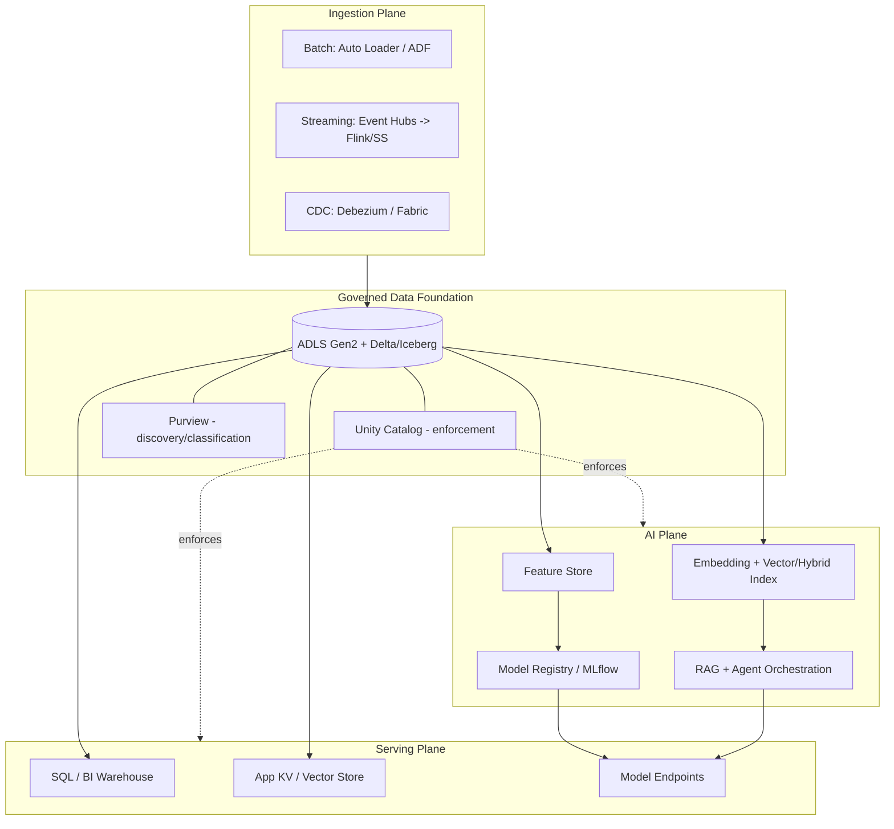
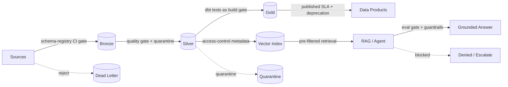
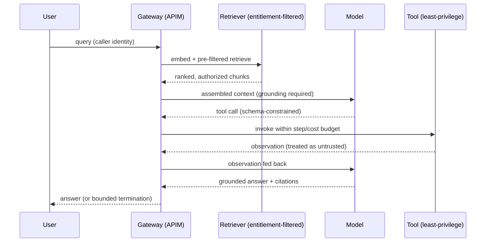

# Reference Architectures Catalog

> Part of the **Enterprise Data & AI Architecture Handbook** — Resources / Architecture, Chapter 01.
> A curated, opinionated catalog of production-grade reference architectures for enterprise data and AI platforms, with Azure-first blueprints, enterprise open-source alternatives, and honest cost/reliability profiles.

---

## Executive Summary

A reference architecture is not a diagram — it is a **named, defensible set of decisions** with an explicit context of use, a cost and reliability profile, and clear boundaries of where it stops being the right choice. This catalog collects the recurring architectures an enterprise data and AI platform is assembled from: the **batch lakehouse**, the **streaming/real-time analytics** stack, the **RAG (retrieval-augmented generation)** stack, the **agentic AI** platform, and the cross-cutting **governed data foundation** they all sit on.

The single most consequential message of this chapter is that **these are not competing choices — they are composable layers**. A mature platform runs a governed lakehouse (batch + streaming ingestion into one catalog-governed storage layer), and its AI workloads (RAG, agents) are *consumers of that same governed substrate*, not parallel stacks with their own ungoverned copies of the data. The recurring failure mode across every architecture below is the same one that recurs throughout this handbook: a *fast, convenient path* (an ungoverned copy, a denormalized read model, an unbounded agent loop) is trusted to make a decision that only the *slow, correct, governed path* is entitled to make.

Each architecture is presented with the same structure: what it is, when to use it, when **not** to use it, its Azure blueprint, an OSS-equivalent, its cost/reliability profile, and its failure modes. The Decision Matrix consolidates "which architecture for which requirement" into a single table. This chapter depends on and cross-links the deep treatments in [Phase-05 (Modern Data Platforms)](../../Phase-05/02_Lakehouse_Architecture.md) and [Phase-12 (LLMOps & Agentic AI)](../../Phase-12/03_Retrieval_Augmented_Generation.md); it is a synthesis and selection guide, not a replacement for those chapters.

---

## Learning Objectives

After working through this chapter you will be able to:

- **Select** the correct reference architecture for a given workload from its requirements (freshness, consistency, scale, autonomy, governance) rather than from familiarity or hype.
- **Compose** batch, streaming, and AI architectures on a single governed data foundation instead of building parallel ungoverned stacks.
- **Draw** the Azure-first blueprint for each architecture, name the concrete services and their OSS equivalents, and justify each substitution.
- **Quantify** the cost and reliability profile of each architecture and identify the dominant cost driver and the dominant failure mode.
- **Articulate** the "when NOT to use this" boundary for each pattern — the mark of a Staff+ architect is knowing where a pattern stops being correct.
- **Write** an Architecture Decision Record that selects a reference architecture with named alternatives and an explicit invalidation condition.

---

## Business Motivation

Enterprises do not fail at data and AI because they lack technology — they fail because they **assemble the wrong architecture for their requirements, or the right architecture without its governance and cost disciplines**. The business consequences are concrete and recurring:

- **Duplicated, ungoverned stacks.** An analytics team builds a lakehouse; an AI team builds a parallel vector store with its own copies of the source data and its own (missing) access controls. The result is doubled cost, a governance gap, and a data-leak surface — the same source document is now access-controlled in one place and wide open in another.
- **Over-engineering.** A team builds a Kafka + Flink real-time streaming platform for a workload that produces a few events per second and is consumed by one daily dashboard. The operational burden and cost are permanent; the latency benefit is imperceptible.
- **Under-engineering.** A team serves a fraud-detection or dynamic-pricing use case from a nightly batch that is hours stale, because "batch is what we know," and loses money in the freshness gap.
- **The reproducibility and audit gap.** Regulatory reporting figures are reconstructed from a mutable operational store with no lineage, and cannot be reproduced when a supervisor asks — a direct [Phase-17 financial-platform](../../Phase-17/02_Financial_Data_Platforms.md) failure.

A reference architecture catalog turns architecture selection from a per-project argument (often won by whoever has the most organizational power that quarter) into a **pre-agreed, requirements-driven decision**. It is the architectural equivalent of a golden path: it makes the right choice the easy, documented, default choice.

---

## History and Evolution

The architectures in this catalog are the current synthesis of four decades of converging pressures:

- **1980s–2000s — the data warehouse era.** Inmon (Corporate Information Factory, ~1990) and Kimball (dimensional modeling, *The Data Warehouse Toolkit*, 1996) established the ETL-into-a-relational-warehouse pattern. Strong schema and governance; expensive, rigid, and unable to handle semi-structured or unstructured data at scale. Covered in depth in [Phase-06 (Data Modeling)](../../Phase-06/01_Dimensional_Modeling.md).
- **2006–2015 — the data lake and Hadoop era.** Cheap object/HDFS storage decoupled storage from compute and handled any format — but "schema on read" without transactions or governance produced the **data swamp**: cheap to write, impossible to trust.
- **2017–2020 — the lakehouse synthesis.** ACID table formats — **Delta Lake** (Databricks, 2019), **Apache Iceberg** (Netflix, 2017), **Apache Hudi** (Uber, 2016) — brought warehouse-grade transactions, schema enforcement, and time travel to object storage, unifying the warehouse and lake. This is the foundation of the modern batch architecture; see [Phase-04 (Storage & Table Formats)](../../Phase-04/04_Delta_Lake.md).
- **2011–2020 — streaming maturity.** Kafka (LinkedIn, 2011) made the durable replayable log a first-class primitive; Flink and Spark Structured Streaming made exactly-once-effective stream processing practical. The **Kappa** architecture (Kreps, 2014) argued a single streaming path can subsume batch, displacing the earlier dual-path **Lambda** architecture (Marz, ~2011).
- **2020–present — the generative-AI and agentic era.** Transformer-based LLMs, vector search, **RAG** (Lewis et al., 2020), and autonomous **agents** added a new class of architecture — one that is a *consumer* of the governed data platform, not a replacement for it. Covered in [Phase-12](../../Phase-12/03_Retrieval_Augmented_Generation.md) and [Phase-13 (Knowledge Graphs & Vector Systems)](../../Phase-13/01_Vector_Databases_Qdrant_and_Milvus.md).

The through-line: each era **absorbed rather than replaced** its predecessor. The lakehouse absorbed the warehouse; the AI stack sits on the lakehouse. A catalog that treats them as rival choices misreads the history.

---

## Why This Technology Exists

Reference architectures exist to solve a **selection and composition** problem, not a technology problem. The underlying components (object storage, table formats, stream processors, vector indexes, model-serving endpoints) are well documented individually. What is scarce and valuable is the *codified judgment* about:

1. **Which combination** of components satisfies a given set of requirements (freshness, consistency, scale, autonomy, cost, governance).
2. **How they compose** on a shared governed foundation without duplication.
3. **Where each stops** being the right answer.

Without a catalog, every team re-derives these decisions from scratch, inconsistently, and usually optimizes for the tools they already know rather than the requirements in front of them. The catalog is the mechanism that makes architecture selection **reproducible, reviewable, and defensible** in a Staff/Principal-level architecture review.

---

## Problems It Solves

- **Requirements-to-architecture mapping.** Turns a requirement statement ("sub-second freshness, exactly-once, 100k events/s") into a named architecture with a known cost profile.
- **Composition over duplication.** Establishes that AI workloads consume the governed lakehouse rather than forking it.
- **Right-sizing.** Provides explicit "when NOT to use" boundaries that prevent both over- and under-engineering.
- **Cost and reliability predictability.** Each architecture carries a known dominant cost driver and dominant failure mode, so budgets and SLOs are set from evidence, not optimism.
- **Onboarding and consistency.** New teams adopt the golden-path architecture instead of inventing a bespoke, unsupportable variant.
- **Portability reasoning.** By pairing each Azure blueprint with an OSS equivalent, the catalog makes lock-in an explicit, priced decision rather than an accident.

---

## Problems It Cannot Solve

- **It cannot make the ownership and funding decisions.** Most platform failures are organizational (no data-product owner, no funded platform team, rubber-stamp governance), and no diagram fixes that — see [Phase-15 (Data Mesh & Data Fabric)](../../Phase-15/01_Data_Mesh_Principles.md).
- **It cannot substitute for domain modeling.** A reference architecture tells you the *shape* of the pipeline, not the correct dimensional or domain model of your business — that is [Phase-06](../../Phase-06/01_Dimensional_Modeling.md) work.
- **It cannot guarantee data quality or contracts.** The architecture provides the enforcement *points*; the contracts and quality rules are yours to define ([Phase-08](../../Phase-08/07_Data_Contracts.md)).
- **It cannot resolve genuine consistency/latency trade-offs.** CAP/PACELC constraints are physics; the catalog helps you *choose* a point on the trade-off curve, not escape it ([Phase-02](../../Phase-02/04_CAP_and_PACELC.md)).
- **It cannot keep itself current.** A catalog is a living artifact; a stale reference architecture that points at a retired service (see Cost/Migration notes below on the handbook's running retired-service list) is worse than none.

---

## Core Concepts

The catalog is organized around a small number of load-bearing concepts. In the subsections below, in-prose cross-references to *other* sections of this chapter use the section's position number (e.g. §25 Decision Matrix, §20 Cost Optimization).

### 1.1 The Governed Data Foundation (the substrate everything sits on)

Every architecture in this catalog assumes a **single governed storage-and-catalog foundation**: object storage (ADLS Gen2) holding open table formats (Delta/Iceberg), governed by a single catalog (Unity Catalog for enforcement, Purview for discovery/classification), with access control, lineage, and classification propagated automatically. The batch, streaming, and AI architectures are *plugins* into this foundation. The anti-pattern — a parallel ungoverned copy per workload — is the root cause of the most expensive failures in this chapter. See [Lakehouse Architecture](../../Phase-05/02_Lakehouse_Architecture.md) and [Data Governance Foundations](../../Phase-08/01_Data_Governance_Foundations.md).

### 1.2 The Batch Lakehouse (medallion) architecture

Ingest raw data as-is into a **Bronze** tier, cleanse/conform into **Silver**, and produce business-level aggregates/marts in **Gold**. The medallion tiers are **ownership and trust boundaries, not a mandatory three-hop pipeline** — a given data product may skip a tier. This is the default for analytics, BI, and ML training data. Deep treatment: [Medallion Architecture](../../Phase-05/03_Medallion_Architecture.md).

### 1.3 The Streaming / Real-time architecture (Kappa-first)

A durable replayable log (Kafka/Event Hubs) feeds one or more stream processors (Flink / Spark Structured Streaming) that materialize both real-time views and the historical lakehouse tables. Modern practice is **Kappa-first** (one streaming path that also backfills batch by replaying the log) rather than **Lambda** (separate batch and speed paths that must be reconciled). Use when freshness is a revenue or safety requirement, not by default. Deep treatment: [Streaming Fundamentals](../../Phase-07/01_Streaming_Fundamentals.md) and [Streaming Patterns and Delivery Semantics](../../Phase-07/08_Streaming_Patterns_and_Delivery_Semantics.md).

### 1.4 The RAG (retrieval-augmented generation) architecture

Two structurally distinct pipelines: an **offline ingestion** pipeline (chunk → embed → index into a vector/hybrid store) and an **online retrieval-and-generation** pipeline (embed query → retrieve → rerank → assemble context → generate with citations). Retrieval quality and generation quality are **independently measurable axes**. The defining governance requirement is **access-control-filtered retrieval** — the index must never surface a document the caller could not read at source. Deep treatment: [Retrieval-Augmented Generation](../../Phase-12/03_Retrieval_Augmented_Generation.md).

### 1.5 The Agentic AI architecture

An LLM in a **plan → act → observe → reflect** loop with access to tools, memory, and (optionally) other agents. **Autonomy is a risk multiplier, not a capability upgrade**: every additional step compounds cost, the chance of a reasoning error derailing the task, and the security surface. The non-negotiable controls are **explicit termination bounds** (step/cost/wall-clock, independent of the agent's own completion judgment), **least-privilege tool scoping**, and treating **tool observations as untrusted input**. Deep treatment: [Agentic AI Architecture](../../Phase-12/05_Agentic_AI_Architecture.md).

---

## Internal Working

This section describes how the catalog's architectures actually execute at the mechanism level. Subsections are numbered 2.x per the handbook convention.

### 2.1 How the batch lakehouse executes

Ingestion writes immutable files into the Bronze Delta/Iceberg table (append or auto-loader with schema rescue). A transactional **MERGE/UPSERT** conforms Bronze into Silver with an idempotency key (natural key + a monotonic version/commit marker) so re-runs are safe. Gold is produced by aggregation jobs (Spark/dbt) that are themselves pure functions of a pinned input table version — this is what makes a Gold figure **reproducible** (re-run against the same input Delta version → identical output). Table maintenance (OPTIMIZE/compaction, VACUUM with a retention floor, statistics/ANALYZE) is a first-class scheduled workload, not an afterthought — the "small-files problem" is the dominant silent performance regression. See [Apache Spark Internals](../../Phase-05/04_Apache_Spark_Internals.md) and [Columnar Storage Internals](../../Phase-04/02_Columnar_Storage_Internals.md).

### 2.2 How the streaming path executes

Producers append to partitioned topics; ordering is **scoped to a partition/session key**, never channel-wide — strict ordering and horizontal scale-out are in structural tension. The processor maintains keyed state (RocksDB-backed in Flink) and checkpoints it, giving **effectively-exactly-once** output via idempotent sinks + checkpoint alignment; no broker provides true unconditional exactly-once, so idempotent consumption on top of at-least-once is the only achievable target ([Streaming Patterns and Delivery Semantics](../../Phase-07/08_Streaming_Patterns_and_Delivery_Semantics.md)). Watermarks bound how long the processor waits for late events before closing a window — the freshness-vs-completeness dial. The same processor writes both a low-latency serving view and the lakehouse history table (the Kappa unification).

### 2.3 How the RAG and agentic paths execute

RAG offline: documents are chunked (fixed/semantic), each chunk embedded with a pinned embedding model, and written to the index **with the source's access-control metadata attached** so retrieval can pre-filter by caller identity *before* relevance ranking (pre-filtered ANN, not post-filtering — see [Vector Databases](../../Phase-13/01_Vector_Databases_Qdrant_and_Milvus.md)). RAG online: the query is embedded with the *same* model, hybrid (dense + keyword) retrieval runs with the caller's entitlement filter, a reranker orders candidates, and the assembled context is passed to the generator with a grounding/citation requirement. The agentic loop wraps generation with a tool-dispatch layer: the model emits a tool call (schema-constrained), a bounded executor invokes the least-privilege tool, the (untrusted) observation is fed back, and the loop repeats until a result or a **hard termination bound** is hit.

---

## Architecture

At the platform level, the catalog composes into a **layered reference architecture** in which every workload class shares one governed foundation:

- **Foundation plane** — ADLS Gen2 + open table formats + Unity Catalog (enforcement) + Purview (discovery/classification) + private networking + identity (Entra ID). Every other plane is a client of this one.
- **Ingestion plane** — batch (Auto Loader / ADF), streaming (Event Hubs/Kafka → Flink/Structured Streaming), and CDC (Debezium/Fabric) all landing into the same governed storage.
- **Processing plane** — Spark/dbt for batch transformation; Flink/Structured Streaming for stream processing; both writing governed Delta tables.
- **AI plane** — feature store, embedding/indexing jobs, model training/registry, and inference/orchestration (RAG + agents), all reading the governed foundation and writing back governed artifacts.
- **Serving plane** — decomposed by consumption pattern: SQL warehouse endpoints for BI, low-latency key-value/vector stores for applications, and model endpoints for AI.
- **Control plane (cross-cutting)** — governance, lineage, cost allocation, observability, and security spanning every plane.

The defining property is the **single control plane**: an asymmetry in governance coverage between the analytics path and the AI path is treated as a platform *defect*, not an acceptable difference. This is the architectural expression of Core Concept 1.1.

---

## Components

| Component | Role | Azure primary | OSS equivalent |
|---|---|---|---|
| Object storage | Durable, cheap, open storage substrate | ADLS Gen2 | MinIO / S3-compatible |
| Table format | ACID transactions, schema, time travel | Delta Lake | Delta / Iceberg / Hudi |
| Catalog (enforcement) | Access control, lineage, grants | Unity Catalog | Apache Polaris / Nessie + OPA |
| Catalog (discovery) | Classification, business glossary | Microsoft Purview | OpenMetadata / DataHub / Atlas |
| Batch compute | Transformation, ML training | Databricks / Synapse Spark | Apache Spark on Kubernetes |
| Transformation framework | SQL-centric modeling & tests | dbt (on Databricks/Fabric) | dbt Core |
| Streaming log | Durable replayable event log | Event Hubs (Kafka-compatible) | Apache Kafka |
| Stream processor | Stateful stream computation | Databricks Structured Streaming / Fabric | Apache Flink |
| Orchestration | Pipeline scheduling & dependencies | ADF / Databricks Workflows | Apache Airflow / Dagster |
| Vector / hybrid search | Semantic retrieval for RAG | Azure AI Search | Qdrant / Milvus / pgvector |
| Model serving | Inference endpoints | Azure ML / Azure OpenAI | Ray Serve / KServe / vLLM |
| Feature store | Consistent train/serve features | Databricks Feature Store | Feast |
| Model registry / tracking | Versioning, lineage, promotion gates | MLflow (Unity Catalog) | MLflow |
| Observability | Metrics, traces, logs | Azure Monitor + Managed Prometheus/Grafana | OpenTelemetry + Prometheus + Grafana |

Each substitution in the OSS column is an explicit lock-in-vs-operational-burden trade-off, discussed in §31–§32 and §35.

---

## Metadata

Metadata is the connective tissue that makes the shared foundation governable rather than a swamp. Three categories matter:

- **Technical metadata** — schemas, table/partition statistics, table versions, file layouts. Drives query planning, reproducibility (pin an input table version), and maintenance.
- **Business/operational metadata** — ownership, classification (PII/PHI/confidential), business glossary terms, SLAs, lineage. Governs access, discovery, and trust. Classification must **propagate automatically** from source through every derived table and every AI artifact (embedding index, training set, BI extract) with a CI check — an un-propagated classification is the recurring access-control-propagation defect that appears across [Phase-12/03](../../Phase-12/03_Retrieval_Augmented_Generation.md), [Phase-13](../../Phase-13/04_GraphRAG.md), and [Phase-17/01](../../Phase-17/01_Healthcare_Data_Platforms.md).
- **AI-specific metadata** — model/prompt/index/embedding-model versions bound together as a single releasable **bundle**, plus evaluation reports and calibration dates. The unit of release for an AI feature is never a bare model; it is the versioned bundle ([LLMOps](../../Phase-12/04_LLMOps.md)).

Purview supplies discovery/classification; Unity Catalog supplies enforcement; OpenMetadata/DataHub/Atlas are the OSS discovery equivalents. See [Metadata Management](../../Phase-08/04_Metadata_Management_OpenMetadata_and_Atlas.md).

---

## Storage

- **Batch lakehouse:** columnar files (Parquet) under an ACID table format on object storage; partitioned and clustered (Z-order / liquid clustering) for data skipping. Retention and time-travel windows are explicit (VACUUM retention floor governs how far back time travel — and thus erasure-recovery risk — reaches). See [File Formats](../../Phase-04/01_File_Formats.md) and [Compression and Encoding](../../Phase-04/08_Compression_and_Encoding.md).
- **Streaming:** the log itself is durable storage with a retention window (hours to infinite/compacted); processor state lives in a checkpointed embedded store (RocksDB) plus remote checkpoint storage.
- **RAG:** the vector index (HNSW/IVF-PQ) plus a document/chunk store; the index is a *derived, rebuildable* artifact keyed to a specific embedding-model version — mixing vectors from two embedding-model versions in one collection silently corrupts similarity ([Vector Databases](../../Phase-13/01_Vector_Databases_Qdrant_and_Milvus.md)).
- **Agentic memory:** long-term agent memory is a *specialized application of RAG* storage (same chunk/embed/retrieve mechanics), which means right-to-be-forgotten erasure must propagate into agent memory too ([Agentic AI](../../Phase-12/05_Agentic_AI_Architecture.md), [Data Privacy](../../Phase-10/07_Data_Privacy_and_PII_Protection.md)).

The unifying discipline: **derived storage (Gold tables, read models, vector indexes) is disposable and rebuildable; the governed source of truth is authoritative.** Never let a fast derived copy become the system of record.

---

## Compute

- **Elastic batch compute** (Spark clusters, serverless SQL) that **scales to zero** between jobs is the default cost-control lever; the classic leak is a persistent "compute instance" that is not auto-shutdown ([Azure Machine Learning](../../Phase-11/05_Azure_Machine_Learning.md)).
- **Streaming compute** is long-running and sized to peak sustained throughput plus headroom; it does not scale to zero, so it is a permanent cost — a primary reason streaming is not a default.
- **AI compute** is GPU-bound for training and (often) inference; the dominant serving lever is **dynamic batching**, and the dominant waste is an unbatched, full-precision endpoint running at <15% utilization ([Model Serving and Ray](../../Phase-11/04_Model_Serving_and_Ray.md)). Managed capacity for LLMs is a PTU-vs-consumption decision ([Azure OpenAI and AI Foundry](../../Phase-12/07_Azure_OpenAI_and_AI_Foundry.md)).
- **Separation of storage and compute** (the lakehouse's core property) means compute is sized per workload independently, and multiple engines (Spark, Trino, DuckDB) can read the same governed tables.

---

## Networking

Every architecture in this catalog runs on a **private-endpoint-only, default-deny-egress** network baseline ([Network Security and Zero Trust](../../Phase-10/04_Network_Security_and_Zero_Trust.md)):

- Storage accounts, catalogs, search, and AI endpoints are reached over **Private Link**; public network access is disabled. The recurring gotcha is adding a private endpoint but forgetting to disable public access.
- Databricks/AI compute uses VNet injection with separated control-plane and data-plane traffic.
- Streaming ingress from devices/partners terminates at a controlled gateway (Event Hubs with IP/private-endpoint restrictions); OT/industrial ingestion crosses a unidirectional DMZ ([Industrial IoT](../../Phase-16/02_Industrial_IoT_IIoT.md)).
- Egress to external LLM APIs (if any) is explicitly allow-listed; an agent with tool access and open egress is an exfiltration surface.

---

## Security

Security is woven through every plane, not bolted on:

- **Identity:** managed identities / workload identity federation, never long-lived secrets ([IAM with Entra](../../Phase-10/02_Identity_and_Access_Management_with_Entra.md)); secrets that must exist live in Key Vault with rotation ([Secrets and Key Management](../../Phase-10/05_Secrets_and_Key_Management.md)).
- **Authorization:** fine-grained grants, row filters, and column masks enforced in the catalog (Unity Catalog), not in application code; RAG retrieval and agent tool calls propagate the **caller's** identity to the backing system's native access check ([MCP](../../Phase-12/06_Model_Context_Protocol_MCP.md)).
- **Encryption:** at rest (CMK/envelope encryption where data sensitivity requires) and in transit; verify credentials work *after* key/secret rotation — the recurring "rotation succeeded but the credential doesn't actually work" verification gap ([Data Security and Encryption](../../Phase-10/03_Data_Security_and_Encryption.md)).
- **AI-specific:** prompt-injection defenses (role separation, output validation), least-privilege tool scoping so a successful injection has bounded blast radius, and treating retrieved documents and tool observations as untrusted input ([Prompt Engineering](../../Phase-12/02_Prompt_Engineering.md), [Evaluation and Guardrails](../../Phase-12/09_Evaluation_and_Guardrails.md)).

---

## Performance

Performance is a measurement discipline, not cleverness ([Performance Engineering](../../Phase-18/05_Performance_Engineering.md)):

- **Batch:** the dominant levers are predicate/partition/projection pruning, join strategy (broadcast vs shuffle), **data-skew** mitigation (salting + AQE skew join — a single hot key is the classic cause of a "double the cluster and it barely helps" incident), and the small-files/OPTIMIZE + Z-order/liquid-clustering suite. Optimize the *measured* dominant bottleneck (Spark UI / EXPLAIN), never intuition.
- **Streaming:** end-to-end latency is bounded by watermark/window settings, checkpoint interval, and keyed-state size; back-pressure and state growth are the failure signals.
- **RAG:** retrieval latency (ANN + rerank) and generation TTFT/TPOT; more context is *not* unconditionally better (attention dilution). Measure retrieval quality (recall@k/MRR/NDCG) and generation quality separately against a labeled harness ([Embeddings and Semantic Search](../../Phase-13/03_Embeddings_and_Semantic_Search.md)).
- **Agentic:** cost and latency are **per-task, not per-call**, and unbounded without explicit step limits.

The reporting metric is always the **tail (p95/p99/p999)**, never the average, and benchmarks must be coordinated-omission-free against representative production-scale data.

---

## Scalability

- **Batch lakehouse** scales horizontally with data volume; storage and compute scale independently. The limit is usually skew and small files, not raw capacity.
- **Streaming** scales by partitioning; the ceiling is per-key ordering (a hot partition cannot be split without changing the key) and stateful-operator memory.
- **RAG** scales by index sharding/replication ([Vector Databases](../../Phase-13/01_Vector_Databases_Qdrant_and_Milvus.md)); the practical limit is embedding/index cost and retrieval-quality maintenance as the corpus grows.
- **Agentic** scales poorly with autonomy: each additional step multiplies cost and failure probability, so scale is achieved by *narrowing* scope (single well-scoped agent as the default) rather than adding steps.
- **Organizationally**, scale is achieved by federating ownership onto a self-serve platform ([Data Mesh Principles](../../Phase-15/01_Data_Mesh_Principles.md), [Self-Serve Data Platform](../../Phase-15/05_Self_Serve_Data_Platform.md)), not by a central team building everything.

---

## Fault Tolerance

- **Storage** durability comes from replicated object storage (ZRS/GRS) and the append-only, versioned table format (time travel enables point-in-time recovery — bounded by VACUUM retention).
- **Batch** jobs are idempotent (MERGE on a natural + version key) so re-runs are safe; orchestration retries with backoff.
- **Streaming** recovers from checkpoints with at-least-once + idempotent sinks; A/B feed arbitration and sequence-gap detection guard against upstream loss.
- **AI** serving uses canary/shadow deployment (fault-tolerance *and* release strategy), and the atomic **bundle** rollback unit means a bad model/prompt/index change reverts as one unit ([LLMOps](../../Phase-12/04_LLMOps.md)).
- **Reliability is governed, not maximized:** each service carries an explicit SLO and error budget ([Reliability and SRE](../../Phase-18/04_Reliability_and_SRE.md)); 100% is the wrong target.

The architectural resilience mechanisms are detailed in [Fault Tolerance and Resilience](../../Phase-02/07_Fault_Tolerance_and_Resilience.md).

---

## Cost Optimization

Cost (FinOps) is a first-class design input across the catalog ([FinOps and Cost Optimization](../../Phase-18/01_FinOps_and_Cost_Optimization.md)). The dominant cost driver differs by architecture:

- **Batch lakehouse:** compute-hours. Levers — spot/low-priority for fault-tolerant jobs, scale-to-zero, right-sized clusters, storage tiering, OPTIMIZE to kill small-file overhead. Every workload carries a `cost_center`/`data_product` tag enforced at provisioning.
- **Streaming:** always-on compute + log retention. Levers — right-size to sustained (not spike) throughput, tier/compact the log, and question whether streaming is needed at all (the biggest saving is not building it).
- **RAG:** embedding/index cost + per-query LLM tokens. Levers — chunk sensibly, cache (exact + semantic), rerank-then-cache-then-route, and route cheap queries to cheaper models.
- **Agentic:** per-task token spend, unbounded without limits. Levers — hard step/cost budgets, caching, and single-agent-by-default.

**Worked FinOps example.** A nightly Spark ETL runs on 20 on-demand workers for ~3.5 hours at roughly €1,200/month for the VM portion. The team assumed it was compute-bound and doubled the cluster; cost went to ~€2,400/month for a ~15% runtime gain, because one null/default join key held ~70% of records in a single partition (data skew — horizontal scale cannot help an Amdahl-bound single task). Profiling first (Spark UI showed the one long task), then applying AQE skew join + salting + OPTIMIZE, brought the job under its SLO on the **original 20 workers** at ~€1,200/month — half the cost of the failed scale-up and a quarter of the cost-per-run of the naive path. The lesson is the handbook's recurring one: **measure and profile before scaling; do not spend hardware to mask an unprofiled inefficiency.**

---

## Monitoring

Monitoring is the known-unknowns layer — alert on symptoms tied to SLOs, not on causes ([Monitoring with Prometheus and Grafana](../../Phase-18/03_Monitoring_with_Prometheus_and_Grafana.md)):

- **Batch:** job success/failure, freshness (time since last successful load vs SLA), row-count and volume anomalies, and **absence** alerting (a job that silently didn't run — alert on absence of success, not just presence of failure).
- **Streaming:** consumer lag, back-pressure, checkpoint duration/failures, watermark progress, and dead-letter volume.
- **RAG/AI:** retrieval quality regressions, groundedness/faithfulness metrics, guardrail trip rate, token spend per request, and cost-per-request drift.
- **Cross-cutting:** cost anomalies (a sudden spend spike is also a security tripwire for runaway compute / cryptomining) and cardinality-budget alerts so the metrics backend itself doesn't become the incident.

Anything that pages a human is an SLO-based multi-window burn-rate alert; cause-level metrics go to dashboards, not the pager.

---

## Observability

Observability is the unknown-unknowns layer — the ability to ask new questions of existing telemetry ([Observability with OpenTelemetry](../../Phase-18/02_Observability_with_OpenTelemetry.md)):

- **OpenTelemetry + OTLP** is the single instrumentation standard across services *and* data-pipeline stages; W3C Trace Context propagates across every boundary including the **async/message and batch/orchestration seams**, where end-to-end correlation most commonly breaks silently (every component green, the join between them invisible).
- **Data observability** (freshness, volume, schema, distribution, lineage via OpenLineage) is a distinct discipline complementary to data contracts and tests.
- **AI observability** adds full prompt/response/tool-call tracing spans (with governed `gen_ai.*` semantic conventions), so a RAG or agent failure can be traced from the user request through retrieval, generation, and every tool call.

The recurring failure this guards against: a latency or correctness regression that lives at the *seam* between two well-instrumented components and is invisible on either component's own dashboard.

---

## Governance

Governance is the property that turns a shared foundation into a trustworthy platform rather than a swamp:

- **Federated computational governance** ([Federated Governance](../../Phase-15/04_Federated_Governance.md)): global policies (classification, access, retention, residency) enforced as **fail-closed code** (Azure Policy / OPA), local decisions left to domains. Getting the *scope* of global policy right (neither rubber-stamp nor central-bottleneck) is the hard part.
- **Enforcement at layer boundaries:** schema-registry CI gates, quality gates with quarantine, dbt tests as build gates, and published data-product SLAs with a deprecation protocol.
- **Classification propagation** with a CI check, from source through every derived table and AI artifact (the access-control-propagation discipline).
- **AI governance:** Responsible AI artifacts (model cards, fairness/error analysis) regenerated on *every* promotion, and a champion/challenger evaluation gate that all promotions — including continuous-training-triggered ones — must pass identically ([MLOps and MLflow](../../Phase-11/03_MLOps_and_MLflow.md), [Responsible AI](../../Phase-11/07_Responsible_AI.md)).

See [Data Governance Foundations](../../Phase-08/01_Data_Governance_Foundations.md) and [Data Catalog and Lineage](../../Phase-08/02_Data_Catalog_and_Lineage.md).

---

## Trade-offs

| Axis | Batch lakehouse | Streaming | RAG | Agentic |
|---|---|---|---|---|
| **Freshness** | Hours–minutes | Sub-second–seconds | Query-time (index staleness) | Query-time |
| **Cost profile** | Compute-hours (scale to zero) | Always-on compute + log | Index + per-query tokens | Per-task tokens (unbounded risk) |
| **Operational burden** | Moderate | High (stateful, always-on) | Moderate | High (non-determinism, safety) |
| **Consistency** | Strong (ACID tables) | Effectively-exactly-once | Eventual (index lag) | Eventual + non-deterministic |
| **When it wins** | Analytics, BI, ML training | Freshness = revenue/safety | Grounded Q&A over a corpus | Multi-step tasks needing tools |
| **Dominant failure** | Small files / skew | Hot partition / state growth | Access-control leak in index | Runaway loop / injection chain |
| **When NOT to use** | Sub-second freshness needs | Low-volume/daily-consumed data | Simple lookups; long-context suffices | Single-step tasks; high-stakes irreversible actions without human gate |

The meta-trade-off: **each step toward more freshness/autonomy multiplies cost and operational burden.** Choose the least powerful architecture that meets the requirement.

---

## Decision Matrix

Select from requirements, not familiarity. Read top-to-bottom; the first row whose condition is genuinely met is usually your answer.

| If the requirement is… | …then the reference architecture is | Key qualifier |
|---|---|---|
| Analytics/BI/reporting, ML training data, freshness in minutes–hours | **Batch lakehouse (medallion)** | Default; do not add streaming without a freshness requirement |
| Freshness in seconds/sub-second is a revenue or safety requirement (fraud, real-time inventory, IoT alerting) | **Streaming (Kappa-first)** | Justify with a named freshness SLA and its business value |
| Both real-time views *and* rich historical analytics from the same events | **Streaming into the lakehouse (Kappa unification)** | One path materializes both; avoid Lambda's dual-reconciliation |
| Grounded natural-language answers over an internal corpus | **RAG** | Access-control-filtered retrieval mandatory; evaluate retrieval and generation separately |
| Retrieval needs multi-hop reasoning over connected entities | **GraphRAG** | Validate on a corpus subset first; ~100× indexing cost ([GraphRAG](../../Phase-13/04_GraphRAG.md)) |
| A multi-step task requiring tool use, planning, and iteration | **Agentic** | Hard termination bounds + least-privilege tools; single agent by default |
| A regulated golden source needing bitemporal, auditable, reproducible figures | **Bitemporal governed lakehouse** | Separate hot operational path from cold accuracy path ([Financial Data Platforms](../../Phase-17/02_Financial_Data_Platforms.md)) |
| Cross-domain data sharing at organizational scale | **Data mesh on a self-serve platform** | Organizational decision first ([Data Mesh](../../Phase-15/01_Data_Mesh_Principles.md)) |
| A simple key/value or exact lookup | **None of the above — a database/index** | Do not reach for RAG or streaming for a lookup |

---

## Design Patterns

- **Medallion (Bronze/Silver/Gold)** — layered refinement as ownership/trust boundaries.
- **Kappa** — one streaming path that also backfills batch by log replay (prefer over Lambda).
- **CQRS + read models** — separate the authoritative write model from denormalized, purpose-built read projections ([CQRS](../../Phase-14/03_CQRS.md)); read models are display-only, never authoritative for a decision.
- **Event sourcing** — append-only event log as the aggregate's only durable state, scoped to aggregates with a named audit/temporal requirement ([Event Sourcing](../../Phase-14/04_Event_Sourcing.md)).
- **Dual-path (hot/cold)** — separate a fast, eventually-consistent engagement/serving path from a slow, strongly-consistent/auditable path, connected one-way by authoritative events (financial, retail).
- **Retrieve-then-rerank** — two-stage RAG retrieval; hybrid dense+keyword with Reciprocal Rank Fusion as the enterprise default.
- **Bounded agent loop** — plan/act/observe with hard step/cost/wall-clock limits and a human-approval node for irreversible actions.
- **Bundle-as-release-unit** — model + prompt + index snapshot + embedding model + dependency lock + eval report promoted and rolled back atomically.
- **Golden path** — the platform-team-maintained, paved default that makes the correct architecture the easy choice.

---

## Anti-patterns

- **The parallel ungoverned AI stack** — an AI team copies source data into its own vector store with its own (missing) access controls, forking the governed foundation. The single most expensive anti-pattern in this chapter.
- **Streaming-by-default** — building Kafka + Flink for a low-volume, daily-consumed workload; permanent operational and cost burden for imperceptible benefit.
- **Lambda when Kappa suffices** — maintaining two code paths (batch + speed) that must be reconciled, doubling logic and reconciliation risk.
- **RAG for a lookup** — reaching for embeddings and an LLM where a keyword search or a database query is correct, faster, and cheaper.
- **The unbounded agent** — an agent loop with no cost/step ceiling that burns a day's budget on one ambiguous task, or chains unauthorized tool calls after a single injection.
- **Trusting the fast copy** — serving an availability/price/regulatory-figure decision from a denormalized read model or cache instead of the authoritative service (retail oversell, unreproducible VaR).
- **The rebuilt data swamp** — cheap storage + no table format, catalog, or contracts; write-anything, trust-nothing.
- **Ratio-blind cloud lock-in** — adopting a managed service without pricing the OSS/portability alternative, so lock-in is an accident rather than a priced decision.

---

## Common Mistakes

- Choosing an architecture from team familiarity rather than from requirements (the "we know RabbitMQ / we know batch" trap).
- Skipping the labeled evaluation harness for RAG/semantic search, so every subsequent model/chunking change is un-comparable ([Embeddings and Semantic Search](../../Phase-13/03_Embeddings_and_Semantic_Search.md)).
- Forgetting table maintenance (OPTIMIZE/VACUUM/statistics), letting the small-files problem silently degrade the lakehouse.
- Not propagating source access controls into the RAG index or the derived tables — the access-control-propagation defect.
- Sizing streaming compute to average instead of sustained-peak throughput, then suffering back-pressure under load.
- Leaving a GPU inference endpoint unbatched and full-precision at <15% utilization, discovered only at a FinOps review.
- Treating the reference architecture as complete without the ownership, funding, and contract decisions it depends on.
- Adding a private endpoint but forgetting to disable public network access.

---

## Best Practices

- **Compose on one governed foundation.** Batch, streaming, and AI are plugins into a single catalog-governed storage layer; a governance asymmetry between paths is a defect.
- **Right-size ruthlessly.** Choose the least powerful architecture that meets the requirement; justify every step up in freshness/autonomy with a named business value.
- **Enforce contracts at every layer boundary** with CI/quality gates, not advisory review.
- **Make derived storage disposable** and keep one authoritative source of truth; never let a fast copy make a decision it isn't entitled to.
- **Version AI features as bundles** with atomic rollback and a shared evaluation gate.
- **Measure before scaling** — profile the dominant bottleneck; don't buy hardware to hide skew.
- **Pair every managed choice with its OSS equivalent** so lock-in is priced and deliberate.
- **Keep the catalog current** — treat a reference architecture pointing at a retired service as a bug to fix.
- **Pave the golden path** and track adherence as a platform-team KPI.

---

## Enterprise Recommendations

For a typical enterprise standing up or consolidating a data + AI platform on Azure:

1. **Lead with the governed lakehouse foundation** (ADLS Gen2 + Delta + Unity Catalog + Purview + private networking). Everything else is a client of it.
2. **Default to batch (medallion); add streaming only where a named freshness SLA justifies it.** Prefer Kappa (streaming that also feeds the lakehouse) over Lambda.
3. **Treat AI as a consumer of the governed foundation**, not a parallel stack. RAG and agents read governed data and write governed artifacts under the same control plane.
4. **Standardize the AI release unit as a versioned bundle** behind a shared evaluation gate.
5. **Enforce governance computationally** (fail-closed policy-as-code), with classification propagation checked in CI.
6. **Instrument with OpenTelemetry end-to-end**, especially across async and pipeline seams.
7. **Run FinOps as an operating model** — tags enforced at provisioning, a unit-economics metric per workload, commitments tracked as KPIs.
8. **Pave golden paths** so the correct architecture is the default, and reserve a protected capacity slice for platform/foundation work so it isn't starved by feature scoring ([Roadmap and Portfolio Planning](../../Phase-19/07_Roadmap_and_Portfolio_Planning.md)).

---

## Azure Implementation

The Azure-first blueprint (~60% of the enterprise footprint) for the composed platform:

- **Foundation:** ADLS Gen2 (hierarchical namespace, ZRS, `shared_access_key_enabled=false`, `public_network_access_enabled=false`) + Delta Lake + **Unity Catalog** (grants, row filters, column masks, lineage) + **Microsoft Purview** (classification, glossary). Private endpoints + Entra ID + managed identities throughout.
- **Batch ingestion & transformation:** Azure Data Factory or Databricks **Auto Loader** (schema rescue, `trigger=availableNow`) → Bronze; Databricks/Spark + **dbt** for Silver/Gold with idempotent `MERGE INTO`. **Databricks Workflows** for orchestration.
- **Streaming:** **Azure Event Hubs** (Kafka-compatible) → **Databricks Structured Streaming** or **Microsoft Fabric Real-Time Intelligence** / **Azure Stream Analytics**, materializing both serving views and Delta history. See [Azure Event Hubs and Stream Analytics](../../Phase-07/03_Azure_Event_Hubs_and_Stream_Analytics.md).
- **AI plane:** **Azure AI Search** (hybrid + pre-filtered entitlement retrieval, index-version pinned), **Azure OpenAI / Azure AI Foundry** for generation and agents ([Azure OpenAI and AI Foundry](../../Phase-12/07_Azure_OpenAI_and_AI_Foundry.md)), **Azure ML** + **MLflow (Unity Catalog registry)** for training/registry, **Databricks Feature Store** for features. APIM in front of model endpoints for token-limit, semantic cache, and per-request cost metrics.
- **Serving:** Databricks SQL / **Microsoft Fabric** for BI; **Cosmos DB** (tunable consistency — strong for commerce reads, eventual for engagement) and **Azure Cache for Redis** for application serving.
- **Control plane:** **Azure Monitor** + **Managed Prometheus/Grafana**, **Azure Policy** for fail-closed governance, **Microsoft Defender for Cloud** + **Sentinel** for security, **Cost Management** + tag enforcement for FinOps.

Illustrative cluster policy (enforcing cost tags and spot-with-fallback):

```json
{
  "custom_tags.cost_center": { "type": "fixed", "value": "REQUIRED" },
  "custom_tags.data_product": { "type": "regex", "pattern": ".+" },
  "azure_attributes.availability": { "type": "fixed", "value": "SPOT_WITH_FALLBACK_AZURE" },
  "azure_attributes.first_on_demand": { "type": "fixed", "value": 1 },
  "autotermination_minutes": { "type": "fixed", "value": 30 }
}
```

---

## Open Source Implementation

The enterprise OSS-equivalent stack (~30%), for portability, sovereignty, or cost reasons:

- **Foundation:** **MinIO** (or any S3-compatible store) + **Apache Iceberg**/Delta + **Apache Polaris** or **Nessie** catalog + **OPA** for policy + **OpenMetadata**/**DataHub**/**Apache Atlas** for discovery/lineage.
- **Batch:** **Apache Spark on Kubernetes** + **dbt Core**, orchestrated by **Apache Airflow** or **Dagster** ([Orchestration with Airflow](../../Phase-09/07_Orchestration_with_Airflow.md)).
- **Streaming:** **Apache Kafka** + **Apache Flink** (stateful, RocksDB, checkpointed), or Spark Structured Streaming.
- **AI:** **Qdrant**/**Milvus**/**pgvector** for vector search, **vLLM**/**Ray Serve**/**KServe** for model serving, **Feast** for features, **MLflow** for tracking/registry, **LangChain**/**LlamaIndex**/**LangGraph** for orchestration ([LangChain and LlamaIndex](../../Phase-12/08_LangChain_and_LlamaIndex.md)).
- **Analytics/serving:** **Trino**/**DuckDB**/**ClickHouse** query engines over the same governed tables.
- **Control plane:** **OpenTelemetry** + **Prometheus** + **Grafana** + **Loki**/**Tempo**; **OpenCost** for K8s cost allocation; **Gitleaks**/**Great Expectations** in CI.

The open table format (Iceberg/Delta) + open telemetry (OTel/PromQL) + open policy (OPA) are the durable, portable core; the managed services above are the swappable convenience layer.

---

## AWS Equivalent (comparison only)

Presented for selection and migration reasoning — **not** a build target.

| Capability | Azure | AWS equivalent | Notes |
|---|---|---|---|
| Object storage | ADLS Gen2 | S3 | Both mature; near-parity |
| Table format catalog | Unity Catalog | Lake Formation + Glue Catalog | AWS governance is more fragmented across services |
| Lakehouse compute | Databricks / Synapse | Databricks / EMR / Athena | Databricks available on both |
| Streaming log | Event Hubs | Kinesis / MSK (managed Kafka) | MSK for Kafka-API parity |
| Stream processing | Structured Streaming / Fabric | Kinesis Data Analytics / Flink on KDA | — |
| Vector search | Azure AI Search | OpenSearch (kNN) / Kendra | — |
| LLM platform | Azure OpenAI / AI Foundry | Amazon Bedrock (Guardrails) | Bedrock = multi-model gateway |
| ML platform | Azure ML | SageMaker | — |

**Advantages of moving to AWS:** deepest breadth of primitives; Bedrock's multi-model choice. **Disadvantages:** governance is more fragmented (Lake Formation + Glue + IAM) than Unity Catalog's single enforcement point. **Migration strategy:** keep the open table format and OTel instrumentation; re-point storage and re-map catalog/governance — the governance layer is the highest-effort part. **Selection criterion:** choose by existing enterprise footprint and governance-consolidation preference, not feature checklists.

---

## GCP Equivalent (comparison only)

| Capability | Azure | GCP equivalent | Notes |
|---|---|---|---|
| Object storage | ADLS Gen2 | Cloud Storage | — |
| Lakehouse / warehouse | Databricks / Fabric | BigQuery / BigLake | BigQuery is a distinctive serverless-warehouse strength |
| Table format governance | Unity Catalog | Dataplex + BigLake | — |
| Streaming | Event Hubs + Structured Streaming | Pub/Sub + Dataflow (Beam) | Dataflow = unified batch/stream (Beam) |
| Vector search | Azure AI Search | Vertex AI Vector Search | — |
| LLM platform | Azure OpenAI / AI Foundry | Vertex AI (Gemini) | — |
| ML platform | Azure ML | Vertex AI | — |

**Advantages of moving to GCP:** BigQuery's serverless simplicity and Dataflow's genuinely unified batch/stream model (Apache Beam) reduce the batch-vs-streaming split. **Disadvantages:** stronger gravitational pull toward BigQuery-centric (somewhat proprietary) designs; fewer first-party domain products. **Migration strategy:** BigLake + open formats preserve table portability; Beam abstracts the processing layer. **Selection criterion:** favor GCP where a serverless, unified batch/stream analytics model is the priority and BigQuery gravity is acceptable.

---

## Migration Considerations

- **Between clouds:** the **open table format** (Delta/Iceberg), **OpenTelemetry** instrumentation, **PromQL/OpenMetrics**, and **OPA** policy are the portable core; managed services are the re-mappable layer. Migration effort concentrates in the **governance/catalog** layer, not the data.
- **From warehouse to lakehouse:** dual-run and reconcile; migrate marts incrementally; keep the warehouse as the system of record until Gold parity is proven.
- **From Lambda to Kappa:** collapse the dual path once the streaming path can replay history to rebuild batch outputs — verify parity before decommissioning the batch path.
- **From custom RAG to managed grounding** (e.g. Azure "On Your Data"): faster time-to-value but *does not add its own access control* — the underlying index's entitlement design remains your responsibility ([Azure OpenAI and AI Foundry](../../Phase-12/07_Azure_OpenAI_and_AI_Foundry.md)).
- **Platform-longevity risk is real:** the handbook's running list of retired/consolidated managed services — Google Cloud IoT Core (2023), AWS QLDB (end of support 2025), Azure Orbital Ground Station, Microsoft Genomics, Azure Personalizer, standalone Azure API for FHIR (consolidated), AWS RoboMaker (2025) — is why the durable core should be **open standards**, with managed services treated as replaceable.

---

## Mermaid Architecture Diagrams

**Diagram 1 — Composed platform reference architecture (one governed foundation, three workload planes).**



**Diagram 2 — End-to-end data flow with enforcement gates (batch + streaming + AI on one substrate).**



**Diagram 3 — RAG + bounded-agent request sequence (retrieval, generation, tool use with limits).**



---

## End-to-End Data Flow

Tracing a single business fact through the composed platform:

1. **Ingest.** A source event (order, sensor reading, document) enters via batch, streaming, or CDC and lands in **Bronze** as-is, passing a schema-registry CI gate; malformed records are dead-lettered.
2. **Conform.** An idempotent MERGE conforms Bronze into **Silver** with classification and access-control metadata attached; a quality gate quarantines failing rows.
3. **Serve analytics.** Aggregation produces **Gold** marts (dbt tests as build gate), published as data products with SLAs, consumed by BI over a SQL endpoint.
4. **Serve AI.** The same governed Silver/Gold data feeds the feature store (for ML training) and the embedding/index job (for RAG), each inheriting the source's access controls.
5. **Answer.** A user query flows through the entitlement-filtered retriever, the generator (grounding + citations required), and — if agentic — a bounded tool loop, returning a governed, traceable answer.
6. **Observe & account.** Every hop emits OpenTelemetry spans (one trace end-to-end), cost is tagged per workload, and lineage is captured for audit.

The invariant: **at no hop does a fast or derived copy make a decision the governed source is responsible for**, and at every hop the caller's entitlements are enforced.

---

## Real-world Business Use Cases

- **Retail — dual-path commerce + engagement.** Batch lakehouse for merchandising analytics and ML training; streaming for real-time inventory/recommendations; a strongly-consistent commerce path (authoritative inventory/pricing/orders) kept separate from the eventually-consistent engagement path ([Retail and E-Commerce Data](../../Phase-17/05_Retail_and_Ecommerce_Data.md)).
- **Financial services — auditable golden source.** Bitemporal governed lakehouse for regulatory/risk reporting (reproducible as-of figures), with the low-latency trading path physically separated from the cold accuracy path ([Financial Data Platforms](../../Phase-17/02_Financial_Data_Platforms.md)).
- **Healthcare — governed secondary use.** Identified FHIR system-of-record for point-of-care; a de-identified, consent-filtered lakehouse projection for analytics/ML — never direct analytics on the identified store ([Healthcare Data Platforms](../../Phase-17/01_Healthcare_Data_Platforms.md)).
- **Enterprise knowledge assistant — RAG.** Grounded Q&A over internal policy/wiki/ticket corpora with access-control-filtered retrieval and citation faithfulness checking.
- **Operations copilot — agentic.** A bounded, least-privilege agent that diagnoses incidents across systems using read-mostly tools, with a human-approval gate for any remediation action.

---

## Industry Examples

- **Netflix** — pioneered Iceberg and a Kafka-centric streaming platform; runs Kafka alongside other brokers for different needs (dual-use precedent).
- **Uber** — created Hudi for incremental lakehouse upserts; large-scale Flink and feature-store usage.
- **LinkedIn** — origin of Kafka; heavy streaming + Pinot real-time OLAP.
- **Databricks / Microsoft** — Delta Lake + Unity Catalog + Fabric as the reference commercial lakehouse-plus-governance stack.
- **Microsoft Research** — GraphRAG (graph + community-summary retrieval) as the reference multi-hop RAG technique.
- **Airbnb / Spotify / Uber** — public engineering blogs documenting medallion-style refinement, streaming, and ML platforms that mirror these reference architectures.

---

## Case Studies

**Case Study 1 — The parallel ungoverned AI stack (motivates the ADR).**
A large enterprise ran a well-governed batch lakehouse (Unity Catalog grants, row filters, classification). A separate AI team, under delivery pressure, stood up its own vector store and *copied* source documents into it via a privileged service account, dropping the source folder ACLs in the process. Retrieval was not entitlement-filtered. Months later, a routine audit found that a marketing user's knowledge-assistant query surfaced a finance-restricted document — the same document was access-controlled in the lakehouse and wide open in the RAG index. Remediation (re-ingesting with propagated ACLs, adding pre-filtered retrieval, and consolidating onto the governed foundation) cost far more than building it correctly once. This is the access-control-propagation defect that recurs across [Phase-12/03](../../Phase-12/03_Retrieval_Augmented_Generation.md), [Phase-13/04](../../Phase-13/04_GraphRAG.md), and [Phase-17/01](../../Phase-17/01_Healthcare_Data_Platforms.md) — here at the level of a whole parallel stack.

**Case Study 2 — Over-engineered streaming for a daily dashboard.**
A team built Kafka + Flink with exactly-once state management to feed an internal operations dashboard. The workload produced ~2–3 events/second and was consumed once per day. The streaming platform required always-on compute, dedicated on-call, and continuous state/checkpoint tuning — permanent cost and burden for a freshness benefit no one could perceive against a daily refresh. A blameless review concluded the requirement (a daily dashboard) was served perfectly by a scheduled batch job at a fraction of the cost and zero streaming operational burden. The streaming platform was decommissioned. The lesson: **streaming is justified by a named freshness SLA with business value, never by default or novelty** — the right-sizing discipline that runs through this handbook's justification-before-adoption arc.

### Architecture Decision Record (ADR-0212): Compose Workloads on One Governed Foundation with Requirements-Driven Architecture Selection

**Context.** Teams across the enterprise were independently selecting data/AI architectures by familiarity, producing duplicated ungoverned stacks (a parallel AI vector store with dropped ACLs — Case Study 1), over-engineered streaming for low-value freshness (Case Study 2), and inconsistent, unreviewable designs. There was no standing mechanism to select an architecture from requirements or to guarantee that AI workloads consumed the governed foundation rather than forking it.

**Decision.** Adopt this catalog as the standing architecture-selection policy, with the following binding clauses:
1. **One governed foundation.** All batch, streaming, and AI workloads compose onto a single catalog-governed storage layer (Unity Catalog enforcement + Purview discovery). A parallel ungoverned copy of source data is prohibited; any exception is time-boxed and logged.
2. **Requirements-driven selection.** Architecture is chosen from the Decision Matrix (§25) against stated requirements (freshness, consistency, scale, autonomy, governance) — never from team familiarity. The least powerful architecture that meets the requirement is the default; every step up in freshness/autonomy requires a named business justification.
3. **AI as consumer.** RAG and agentic workloads read the governed foundation and write governed artifacts under the same control plane; retrieval is entitlement-filtered and classification propagates into every derived artifact with a CI check. A governance asymmetry between the analytics and AI paths is a defect.
4. **Bounded autonomy.** Agentic architectures carry hard step/cost/wall-clock termination bounds, least-privilege tools, and a human-approval gate for irreversible actions.
5. **Portability priced.** Every managed-service choice is paired with its OSS equivalent so lock-in is a deliberate, priced decision; the open table format + OTel + OPA remain the durable core.
6. **Consequential decisions produce an ADR** naming the selected architecture, its alternatives, and its invalidation condition; right-sized so reversible/local choices stay fast.

**Consequences.** Positive: architecture selection becomes reproducible and reviewable; duplicated ungoverned stacks and over-engineering are prevented structurally; AI inherits the platform's governance for free; migrations concentrate effort where it belongs (governance layer) and preserve portability. Negative/cost: requires a funded platform team to maintain the foundation and golden paths, and a governance-review step for consequential decisions (kept right-sized to avoid becoming a bottleneck). **Invalidation condition:** revisit if the enterprise consolidates onto a single vendor stack where a separate OSS-portability clause adds no value, or if a genuinely new workload class emerges that the catalog's foundation cannot serve.

**Alternatives considered.** (a) *Per-team free choice* — rejected; it is the status quo that produced both case studies. (b) *Full central lockdown / one mandated stack for everything* — rejected; it recreates the central bottleneck and drives teams to bypass. (c) *Separate governance for AI* — rejected; it is exactly Case Study 1's defect. (d) *Catalog as advisory only* — rejected; advisory guidance without an enforced foundation and CI-checked propagation does not prevent the ungoverned-copy failure.

---

## Hands-on Labs

- **Lab 1 — Governed medallion lakehouse.** Provision ADLS Gen2 (keys disabled, private endpoint) + a Delta catalog; ingest a sample dataset with Auto Loader into Bronze, MERGE into Silver with an idempotency key, aggregate into Gold, and apply a column mask + row filter in Unity Catalog. Verify reproducibility by re-running Gold against a pinned input version.
- **Lab 2 — Kappa streaming into the lakehouse.** Stream events through Event Hubs/Kafka into Structured Streaming/Flink; materialize both a real-time view and the Delta history table from one path. Induce a hot partition and observe/mitigate skew.
- **Lab 3 — Entitlement-filtered RAG.** Chunk + embed a corpus into Azure AI Search / Qdrant with source ACLs attached; implement pre-filtered retrieval; build a labeled eval harness (recall@k) and measure retrieval vs generation quality separately.
- **Lab 4 — Bounded agent.** Wrap generation in a plan/act/observe loop with a least-privilege read-only tool and a hard step/cost budget; red-team it with an injected tool observation and confirm the blast radius is bounded.

---

## Exercises

1. For three real workloads in your organization, apply the Decision Matrix (§25) and justify each selection from requirements. Identify any that are currently over- or under-engineered.
2. Audit your platform for parallel ungoverned copies of source data. Draw the actual data-flow and mark every point where access controls fail to propagate.
3. Take an existing streaming pipeline and state the named freshness SLA and its business value. If you cannot, propose the batch alternative and estimate the cost delta.
4. Design the atomic **bundle** (model + prompt + index + embedding model + eval report) for one AI feature and describe its rollback procedure.
5. For one managed Azure service you depend on, write the OSS-equivalent migration plan and price the lock-in.

---

## Mini Projects

- **Compose a reference platform slice end-to-end:** governed foundation + one batch pipeline + one streaming pipeline + one RAG feature, all sharing the catalog, with OpenTelemetry tracing across all three and a single cost dashboard.
- **Build a decision-support tool:** encode the Decision Matrix as a small interactive questionnaire (requirements in → recommended architecture + rationale + cost profile out).
- **Right-sizing audit report:** instrument two workloads, profile their dominant bottleneck and cost driver, and produce a before/after optimization with quantified savings (target the skew/small-files or unbatched-GPU patterns).

---

## Capstone Integration

This catalog is the synthesis point for the technical phases of the handbook. It composes the **storage and table formats** of [Phase-04](../../Phase-04/04_Delta_Lake.md), the **lakehouse and Spark** of [Phase-05](../../Phase-05/02_Lakehouse_Architecture.md), the **streaming** of [Phase-07](../../Phase-07/01_Streaming_Fundamentals.md), the **governance** of [Phase-08](../../Phase-08/01_Data_Governance_Foundations.md), the **MLOps and AI platform** of [Phase-11](../../Phase-11/06_ML_Pipeline_Architecture.md), the **LLMOps and agentic** patterns of [Phase-12](../../Phase-12/05_Agentic_AI_Architecture.md), the **vector/graph systems** of [Phase-13](../../Phase-13/01_Vector_Databases_Qdrant_and_Milvus.md), the **event-driven and integration** patterns of [Phase-14](../../Phase-14/01_Event_Driven_Architecture.md), the **mesh/fabric** organization of [Phase-15](../../Phase-15/05_Self_Serve_Data_Platform.md), and the **FinOps/observability/reliability** operating disciplines of [Phase-18](../../Phase-18/01_FinOps_and_Cost_Optimization.md) — under the **leadership and decision** disciplines of [Phase-19](../../Phase-19/02_Architecture_Reviews.md). The two Phase-20 capstones ([Enterprise Data Platform](../../Phase-20/01_Capstone_Enterprise_Data_Platform.md), [Enterprise AI Platform](../../Phase-20/02_Capstone_Enterprise_AI_Platform.md)) are concrete instantiations of the composed architecture defined here. The unifying thread, applied to architecture selection: **the fast, convenient, or novel path must never substitute for the governed, right-sized, correct one.**

---

## Interview Questions

1. Walk me through selecting an architecture for a workload with a stated freshness of "within 5 seconds is worth $X." How does the freshness value change your answer?
2. Why is streaming not the default even though it can subsume batch (Kappa)? What is the cost you are trading against the latency benefit?
3. A team wants a RAG system. What is the first governance question you ask, and why?
4. How do you prevent an AI workload from becoming a parallel ungoverned stack?
5. Explain the difference between Lambda and Kappa and when you would still choose Lambda.

---

## Staff Engineer Questions

1. Design the composition of a batch lakehouse, a streaming path, and a RAG system on a single governed foundation. Where are the enforcement points, and what breaks if one is missing?
2. A nightly Spark job is slow. The team doubled the cluster and it barely helped. Diagnose the likely cause and the correct fix without adding hardware.
3. How would you make an AI feature's release atomic and reversible? What exactly is in the release unit?
4. Where does access control most commonly fail to propagate in a composed data + AI platform, and how do you detect it in CI?
5. Justify, with numbers, when you would move a workload from virtualization/streaming to materialization/batch (or vice versa).

---

## Architect Questions

1. You are consolidating five teams' bespoke stacks. Sequence the migration to the composed reference architecture without a big-bang cutover. What do you dual-run and for how long?
2. How do you keep the reference architecture catalog current against the reality that managed services get retired? What is your durable core?
3. Defend your batch-vs-streaming boundary to a product org that wants "everything real-time." What framework do you use, and what do you refuse?
4. Design the governance model (global vs local policy) for the shared foundation so it is neither a rubber stamp nor a central bottleneck.
5. How do you price and present the cloud-lock-in vs OSS-portability trade-off to a CTO?

---

## CTO Review Questions

1. What is our dominant cost driver per architecture, and what is the single biggest saving available without degrading an SLO?
2. Where are we currently over-engineered (paying for freshness/autonomy we don't need) and under-engineered (losing money in a freshness or correctness gap)?
3. If a regulator asks us to reproduce a figure from six months ago, can we — and which architecture guarantees that?
4. What is our exposure to a parallel ungoverned AI stack, and what is the remediation cost if it leaks?
5. Which of our platform dependencies are on services at risk of retirement, and what is our portability posture?

---

## References

- Marz, N. & Warren, J. *Big Data* (Lambda architecture), 2015.
- Kreps, J. "Questioning the Lambda Architecture" (Kappa), 2014.
- Armbrust, M. et al. "Lakehouse: A New Generation of Open Platforms that Unify Data Warehousing and Advanced Analytics," CIDR 2021.
- Lewis, P. et al. "Retrieval-Augmented Generation for Knowledge-Intensive NLP Tasks," 2020.
- Delta Lake, Apache Iceberg, Apache Hudi project documentation.
- Apache Kafka, Apache Flink, Apache Spark documentation.
- Microsoft Azure Well-Architected Framework and Cloud Adoption Framework.
- Databricks Unity Catalog and Microsoft Purview documentation.
- Handbook prerequisites: [Lakehouse Architecture](../../Phase-05/02_Lakehouse_Architecture.md), [Medallion Architecture](../../Phase-05/03_Medallion_Architecture.md), [Apache Spark Internals](../../Phase-05/04_Apache_Spark_Internals.md), [Retrieval-Augmented Generation](../../Phase-12/03_Retrieval_Augmented_Generation.md), [Agentic AI Architecture](../../Phase-12/05_Agentic_AI_Architecture.md).

---

## Further Reading

- [Modern Data Stack Overview](../../Phase-05/01_Modern_Data_Stack_Overview.md) and [Microsoft Fabric](../../Phase-05/07_Microsoft_Fabric.md) — the platform context.
- [Streaming Patterns and Delivery Semantics](../../Phase-07/08_Streaming_Patterns_and_Delivery_Semantics.md) — deeper delivery-guarantee mechanics.
- [LLMOps](../../Phase-12/04_LLMOps.md) and [Evaluation and Guardrails](../../Phase-12/09_Evaluation_and_Guardrails.md) — operating the AI plane.
- [GraphRAG](../../Phase-13/04_GraphRAG.md) — multi-hop retrieval architecture.
- [Data Mesh Principles](../../Phase-15/01_Data_Mesh_Principles.md) and [Self-Serve Data Platform](../../Phase-15/05_Self_Serve_Data_Platform.md) — organizing ownership at scale.
- [Well-Architected Framework](../../Phase-03/07_Well_Architected_Framework.md) — the cross-cutting quality pillars.
- Companion resource: **Architecture Patterns Catalog** (Resources / Architecture, Chapter 02) — the finer-grained integration and design patterns these architectures are assembled from.
- [ROADMAP.md](../../../ROADMAP.md) — the full handbook curriculum.
